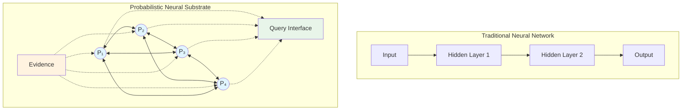
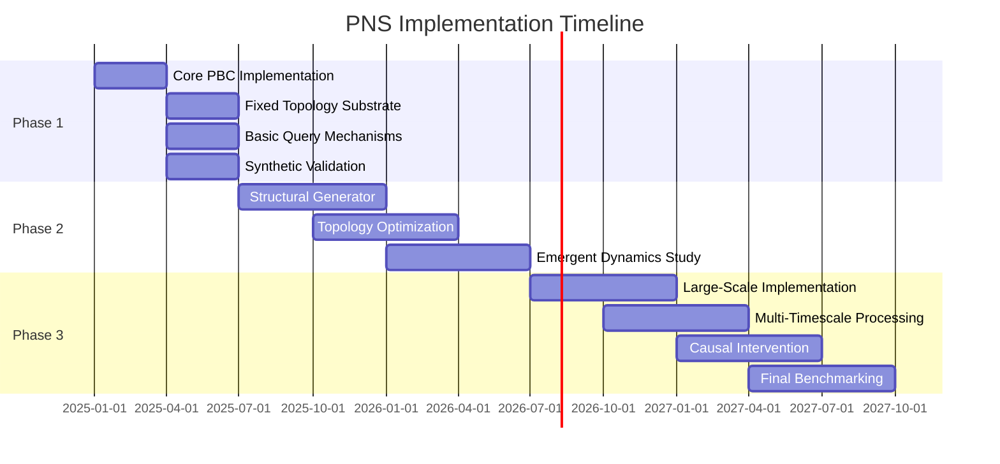
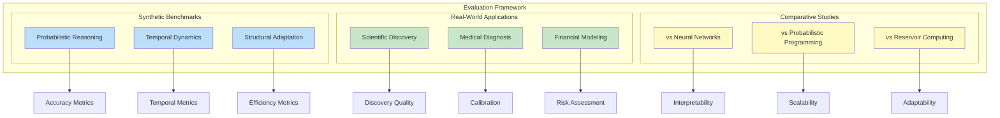
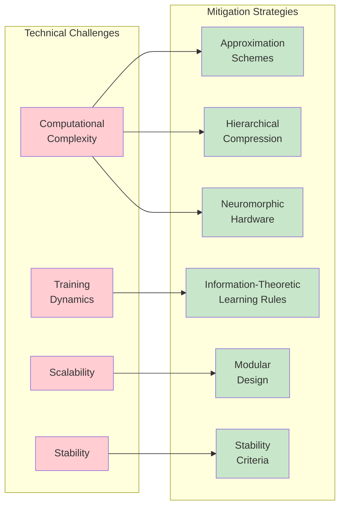
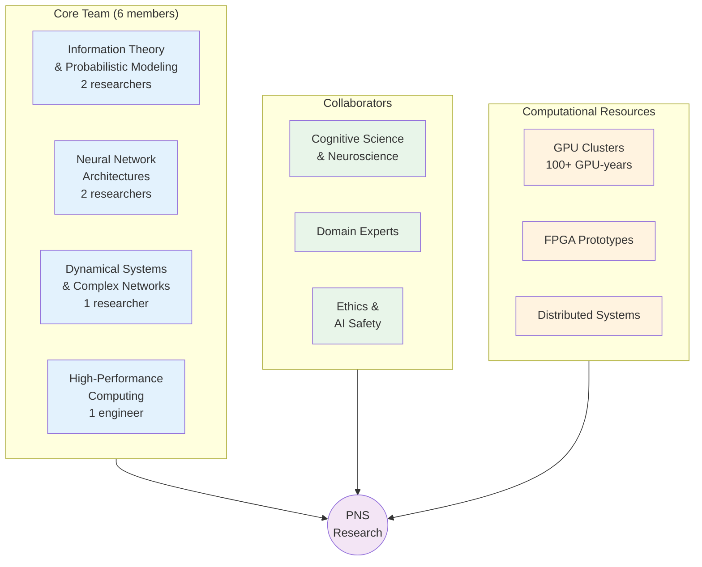
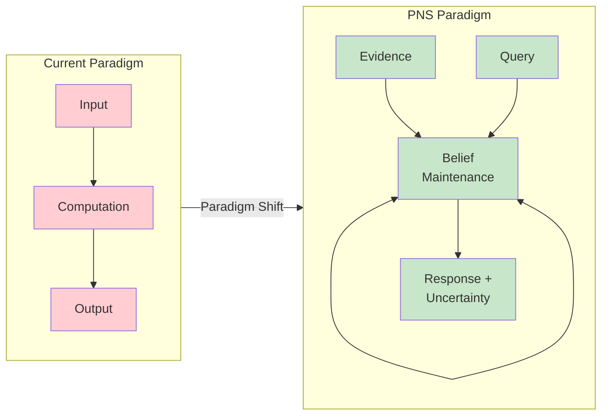
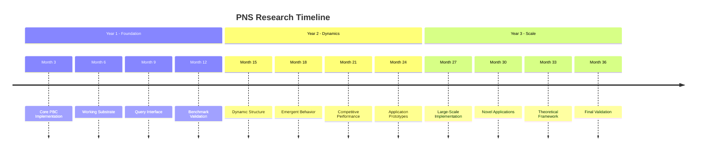

<div class="tab-nav">
<button class="tab-btn active" onclick="openTab(event, 'article')">Article</button>
<button class="tab-btn" onclick="openTab(event, 'perspectives')">Multi-Perspective</button>
</div>

<div id="article" class="tab-content" style="display: block;" markdown="1">

# Probabilistic Neural Substrates: A Cross-Entropy Approach to Recurrent Intelligence

## Abstract

We propose a fundamental departure from traditional neural network architectures through the development of
Probabilistic Neural Substrates (PNS)—dynamic, recurrent computational systems that maintain continuous probability
distributions rather than computing discrete outputs. Inspired by probabilistic decision trees with cross-entropy
optimization, PNS systems self-organize through information-theoretic principles, exhibit emergent temporal dynamics,
and support querying rather than traditional forward propagation. This work introduces a new computational paradigm that
could bridge the gap between artificial and biological intelligence while providing unprecedented interpretability and
uncertainty quantification.


## 1. Introduction

Traditional neural networks are fundamentally constrained by their input-output paradigm: information flows forward
through layers toward predetermined outputs, limiting their ability to model complex temporal dependencies, exhibit
genuine memory, or provide rigorous uncertainty estimates. While recent advances in attention mechanisms and transformer
architectures have partially addressed these limitations, they remain bound by the computational graph framework.

We propose Probabilistic Neural Substrates (PNS) as a radical alternative: computational systems that maintain evolving
probability distributions over state spaces, support arbitrary recurrent topologies, and operate through continuous
belief updating rather than discrete computation. This work draws inspiration from recent advances in probabilistic
decision trees with cross-entropy optimization, extending these principles to create self-organizing, interpretable
intelligence substrates.



### 1.1 Connections to Related Work

The theoretical foundations developed here build upon and extend several complementary research directions:

**Probabilistic Decision Trees**: Our earlier work on cross-entropy optimization for tree construction provides the
foundational insight that prior-posterior divergence can guide structural learning. PNS extends this principle from
discrete tree structures to continuous, recurrent network topologies.

**Compression-Based Classification**: The interpretability mechanisms developed in entropy-optimized text classification
demonstrate how probabilistic systems can generate human-understandable explanations. These insights inform the query
interface design for PNS systems, where uncertainty quantification becomes a first-class citizen rather than an
afterthought.

**Hierarchical Compression**: N-gram compression techniques for efficient representation of sequential patterns suggest
approaches for managing the complexity of maintaining continuous probability distributions across large substrate
networks. The hierarchical expectation modeling from this work extends naturally to continuous probability spaces.

**Speculative Extensions**: The theoretical foundations developed here also inform more speculative approaches to
consciousness and computation, including quantum field theories of consciousness that apply similar probabilistic
substrate concepts to panpsychist theories of mind.

## 2. Theoretical Foundation

### 2.1 Core Principles

**Cross-Entropy Optimization**: The substrate evolves to minimize cross-entropy between prior predictions and observed
posterior distributions:

$$H(P_{\text{prior}}, P_{\text{posterior}}) = -\sum_s P_{\text{posterior}}(s) \log P_{\text{prior}}(s)$$

This encourages efficient encoding of observed patterns while rejecting incorrect priors. The optimization landscape
naturally guides both parameter updates and structural modifications.

**Continuous Probability Maintenance**: Rather than computing outputs, PNS systems maintain joint probability
distributions $P(S|E)$ over state variables $S$ given evidence $E$. The system's "computation" consists of continuously
updating these distributions as new evidence arrives. This represents a fundamental shift from function approximation to
belief maintenance.

**Structural Self-Organization**: The substrate's topology evolves through information-theoretic principles. New
connections form when cross-entropy gradients indicate insufficient modeling capacity; existing connections strengthen
or weaken based on their contribution to overall uncertainty reduction. This creates a dynamic, adaptive architecture
that responds to the statistical structure of its environment.

### 2.2 Mathematical Framework

Let the substrate consist of probabilistic nodes $\mathcal{N} = \{n_1, n_2, \ldots, n_k\}$ with recurrent
connections $\mathcal{C} \subseteq \mathcal{N} \times \mathcal{N}$. Each node $n_i$ maintains:

- **Local probability distribution**: $P_i(s_i)$ over its state space $S_i$
- **Prior generator function**: $\pi_i: \mathbb{R}^d \rightarrow \Delta^{|S_i|}$ mapping context to prior beliefs
- **Posterior update function**: $\rho_i: \Delta^{|S_i|} \times \mathcal{E} \rightarrow \Delta^{|S_i|}$ incorporating
  new evidence

The global substrate state evolves according to:

$$P(t+1) = \Phi(P(t), E(t), \mathcal{C}(t))$$

where $\Phi$ represents the cross-entropy optimization operator across the current topology $\mathcal{C}(t)$.

### 2.3 Information-Theoretic Dynamics

The substrate's evolution is governed by several information-theoretic quantities:

**Mutual Information Flow**: Between connected nodes $n_i$ and $n_j$:
$$I(S_i; S_j | E) = H(S_i | E) - H(S_i | S_j, E)$$

**Structural Entropy**: Measuring the complexity of the current topology:
$$H_{\text{struct}}(\mathcal{C}) = -\sum_{(i,j) \in \mathcal{C}} w_{ij} \log w_{ij}$$

**Predictive Information**: Quantifying temporal modeling capacity:
$$I_{\text{pred}} = I(S(t); S(t+\tau) | E)$$

These quantities guide both learning dynamics and structural adaptation.

## 3. Architecture Design

### 3.1 Probabilistic Branching Cells (PBCs)

The fundamental computational unit is a Probabilistic Branching Cell that performs four essential functions:

```mermaid
graph TB
    subgraph PBC["Probabilistic Branching Cell"]
        BM[Belief Maintenance<br/>P(s)]
        EP[Evidence Processing<br/>P(s|e)]
        UP[Uncertainty Propagation<br/>H(s|e)]
        CM[Connection Management<br/>I(S₁;S₂)]
        BM --> EP
        EP --> UP
        UP --> CM
        CM --> BM
    end
    IN1((Input<br/>Node 1)) --> EP
    IN2((Input<br/>Node 2)) --> EP
    UP --> OUT1((Output<br/>Node 1))
    UP --> OUT2((Output<br/>Node 2))
    CM -.->|"Form/Dissolve"| IN1
    CM -.->|"Form/Dissolve"| OUT2
    style BM fill:#bbdefb
    style EP fill:#c8e6c9
    style UP fill:#fff9c4
    style CM fill:#ffccbc
```

**Belief Maintenance**: Each PBC stores probability distributions over its assigned state variables using efficient
representations (e.g., mixture models, normalizing flows, or discrete approximations depending on the state space
structure).

**Evidence Processing**: Updates beliefs based on incoming information from connected nodes through approximate Bayesian
inference:
$$P_i(s_i | e_{\text{new}}) \propto P(e_{\text{new}} | s_i) P_i(s_i)$$

**Uncertainty Propagation**: Transmits not just point estimates but full uncertainty information to connected nodes,
enabling principled uncertainty quantification throughout the network.

**Connection Management**: Dynamically forms, strengthens, or dissolves connections based on information flow metrics,
implementing local structural adaptation.

### 3.2 Structural Generator

A meta-learning system continuously optimizes substrate topology through three mechanisms:

**Growth Operations**:

- Spawn new PBCs when local cross-entropy exceeds capacity thresholds, indicating the need for additional modeling
  capacity
- Create connections when mutual information between distant nodes exceeds a threshold, suggesting unexploited
  statistical dependencies
- Develop specialized sub-networks for recurring pattern types through modular growth

**Pruning Operations**:

- Remove connections that contribute minimally to uncertainty reduction, measured by the change in predictive
  information
- Merge redundant PBCs that model similar probability regions, reducing computational overhead
- Eliminate structural cycles that don't contribute to temporal processing, simplifying the topology

**Adaptive Dynamics**:

- Adjust connection strengths based on information flow patterns using Hebbian-like rules
- Modify temporal constants for different processing timescales, enabling multi-scale temporal modeling
- Balance exploration (new connections) versus exploitation (strengthening existing ones) through information-theoretic
  criteria

### 3.3 Query Interface

Since PNS systems produce no traditional outputs, interaction occurs through a rich query interface:

**Marginal Queries**: $P(\text{variable\_subset} | \text{evidence})$

- Compute marginal distributions over subsets of state variables

**Conditional Queries**: $P(A | B, \text{evidence})$

- Evaluate conditional relationships between variables

**Uncertainty Queries**: $H(\text{variable\_subset} | \text{evidence})$

- Quantify remaining uncertainty about specific variables

**Causal Queries**: $\partial P(\text{outcome}) / \partial \text{intervention}$

- Estimate causal effects through intervention analysis

**Temporal Queries**: $P(\text{future\_state} | \text{current\_state}, \text{evidence})$

- Predict future states with calibrated uncertainty

**Counterfactual Queries**: $P(\text{outcome} | \text{do}(X = x), \text{evidence})$

- Reason about alternative scenarios

## 4. Implementation Strategy

### 4.1 Phase 1: Basic Substrate Development (Months 1-6)



**Objective**: Implement core PBC functionality with fixed topology

**Technical Approach**:

- Develop differentiable probability distribution representations using normalizing flows or mixture density networks
- Implement cross-entropy optimization for simple topologies using automatic differentiation
- Create basic querying mechanisms with exact inference for small networks
- Validate on synthetic probability modeling tasks (mixture recovery, temporal pattern learning)

**Deliverables**:

- Working PBC implementation with configurable state spaces
- Fixed-topology substrate supporting basic queries
- Benchmark suite for synthetic evaluation
- Technical report on implementation choices and trade-offs

### 4.2 Phase 2: Dynamic Topology (Months 7-18)

**Objective**: Enable structural self-organization

**Technical Approach**:

- Implement structural generator with growth/pruning operations
- Develop topology optimization algorithms based on information-theoretic criteria
- Study emergent dynamics in simple recurrent configurations
- Compare with reservoir computing and echo state network baselines

**Deliverables**:

- Self-organizing substrate with adaptive topology
- Analysis of emergent structural patterns
- Comparative study with existing recurrent architectures
- Theoretical analysis of convergence properties

### 4.3 Phase 3: Complex Reasoning (Months 19-36)

**Objective**: Demonstrate sophisticated temporal and causal reasoning

**Technical Approach**:

- Scale to larger, more complex substrates using hierarchical decomposition
- Implement multi-timescale processing through temporal abstraction
- Develop causal intervention capabilities using do-calculus
- Benchmark against traditional neural architectures on standard tasks

**Deliverables**:

- Large-scale PNS implementation
- Real-world application demonstrations
- Comprehensive benchmark comparisons
- Complete theoretical framework publication

## 5. Expected Contributions

### 5.1 Theoretical Advances

**New Computational Paradigm**: Moving beyond input-output computation to continuous belief maintenance represents a
fundamental shift in how we conceptualize artificial intelligence. This paradigm naturally supports:

- Continuous learning without catastrophic forgetting
- Principled uncertainty quantification
- Interpretable reasoning processes

**Information-Theoretic Architecture Design**: Principled approaches to topology optimization based on cross-entropy and
mutual information provide a theoretical foundation for neural architecture search that goes beyond heuristic methods.

**Uncertainty-First Intelligence**: Systems where uncertainty quantification is fundamental rather than auxiliary could
transform high-stakes applications where knowing what you don't know is as important as what you do know.

### 5.2 Practical Applications

**Robust Decision Making**: Systems that naturally quantify and propagate uncertainty enable more reliable
decision-making in uncertain environments.

**Interpretable AI**: Clear probabilistic reasoning paths support high-stakes applications in medicine, law, and finance
where explanations are legally or ethically required.

**Continual Learning**: Substrates that adapt structure for new domains without forgetting previous knowledge address a
fundamental limitation of current deep learning systems.

**Multi-Modal Integration**: Natural handling of heterogeneous data types through joint probability modeling enables
seamless fusion of text, images, sensor data, and other modalities.

**Text Classification with Uncertainty**: Extending compression-based classification methods to provide calibrated
uncertainty estimates alongside categorical predictions.

**Hierarchical Language Modeling**: Applying efficient n-gram storage techniques to create probabilistic language models
that maintain uncertainty estimates at multiple temporal scales.

### 5.3 Scientific Impact

**Cognitive Science**: New computational models for understanding biological intelligence that emphasize probabilistic
inference and structural adaptation.

**Neuroscience**: Computational frameworks for studying brain dynamics that capture the continuous, recurrent nature of
neural computation.

**Machine Learning**: Fundamental advances in probabilistic learning systems that could influence the next generation of
AI architectures.

## 6. Evaluation Methodology

### 6.1 Synthetic Benchmarks



**Probabilistic Reasoning**:

- Multi-modal distribution modeling accuracy
- Uncertainty propagation calibration
- Inference speed and scalability

**Temporal Dynamics**:

- Sequence prediction with complex dependencies
- Long-range temporal modeling
- Multi-timescale pattern recognition

**Structural Adaptation**:

- Performance on varying complexity tasks
- Efficiency of learned topologies
- Adaptation speed to distribution shifts

### 6.2 Real-World Applications

**Scientific Discovery**:

- Hypothesis generation quality
- Uncertainty quantification accuracy
- Novel pattern identification

**Medical Diagnosis**:

- Complex multi-symptom reasoning
- Calibrated confidence estimates
- Rare condition detection

**Financial Modeling**:

- Risk assessment accuracy
- Scenario analysis quality
- Tail event prediction

### 6.3 Comparative Studies

**Traditional Neural Networks**: Compare accuracy, interpretability, and uncertainty calibration against feedforward and
recurrent architectures.

**Probabilistic Programming**: Evaluate flexibility, scalability, and inference quality against systems like Stan, Pyro,
and Edward.

**Reservoir Computing**: Assess temporal processing, adaptability, and computational efficiency against echo state
networks and liquid state machines.

## 7. Technical Challenges and Mitigation

### 7.1 Computational Complexity



**Challenge**: Maintaining continuous probability distributions is computationally expensive, potentially scaling
exponentially with state space size.

**Mitigation Strategies**:

- Develop efficient approximation schemes using variational inference and importance sampling
- Implement hierarchical compression for large state spaces, leveraging insights from n-gram compression research
- Explore neuromorphic hardware implementations that naturally support parallel probability computation
- Use sparse representations and locality constraints to limit effective dimensionality

### 7.2 Training Dynamics

**Challenge**: No traditional loss function or backpropagation pathway exists for PNS systems.

**Mitigation Strategies**:

- Develop information-theoretic learning rules based on cross-entropy minimization
- Implement evolutionary approaches for structure optimization
- Study convergence properties of cross-entropy dynamics theoretically
- Combine local Hebbian-like rules with global information-theoretic objectives

### 7.3 Scalability

**Challenge**: Complexity may grow super-linearly with system size due to recurrent connections.

**Mitigation Strategies**:

- Implement modular, hierarchical designs with limited inter-module connectivity
- Develop locality constraints for connection formation based on information-theoretic criteria
- Study critical phenomena and phase transitions to identify optimal operating regimes
- Use message-passing approximations for large-scale inference

### 7.4 Stability

**Challenge**: Recurrent dynamics may exhibit instability or chaotic behavior.

**Mitigation Strategies**:

- Develop stability criteria based on spectral properties of the connection matrix
- Implement regularization through entropy constraints
- Study edge-of-chaos dynamics that balance stability with computational richness
- Design homeostatic mechanisms that maintain activity within stable regimes

## 8. Broader Impact and Ethical Considerations

### 8.1 Transparency and Interpretability

PNS systems offer unprecedented interpretability through:

- Explicit probability distributions at each node that can be inspected and understood
- Clear information flow paths that reveal reasoning processes
- Quantified uncertainty at all levels that communicates confidence appropriately

This could significantly advance AI safety and trustworthiness by making AI systems more transparent and accountable.

### 8.2 Computational Resources

The continuous nature of PNS systems may require substantial computational resources, potentially limiting
accessibility. We will investigate:

- Efficient approximations that maintain accuracy while reducing computation
- Distributed implementations that leverage commodity hardware
- Specialized hardware designs optimized for probabilistic computation
- Open-source implementations to democratize access

### 8.3 Dual-Use Considerations

Like any powerful AI technology, PNS systems could potentially be misused. However, their emphasis on uncertainty
quantification and interpretability may actually enhance AI safety compared to black-box alternatives by:

- Making it harder to hide malicious behavior
- Enabling better oversight and auditing
- Supporting more reliable human-AI collaboration

### 8.4 Environmental Impact

We will assess and minimize the environmental impact of PNS research through:

- Efficient algorithm design that reduces computational requirements
- Carbon-aware computing practices
- Transparent reporting of computational costs

## 9. Timeline and Milestones

### Year 1: Foundation

- **Month 3**: Core PBC implementation complete
- **Month 6**: First working substrate with fixed topology
- **Month 9**: Basic query interface operational
- **Month 12**: Synthetic benchmark validation complete

### Year 2: Dynamics

- **Month 15**: Dynamic structure generation demonstrated
- **Month 18**: Emergent behavior analysis complete
- **Month 21**: Competitive performance on standard benchmarks
- **Month 24**: Initial real-world application prototypes

### Year 3: Scale and Impact

- **Month 27**: Large-scale substrate implementation
- **Month 30**: Novel applications demonstrating unique capabilities
- **Month 33**: Comprehensive theoretical framework
- **Month 36**: Complete empirical validation and publication

## 10. Research Team and Resources

### Required Expertise



**Core Team**:

- Information theory and probabilistic modeling (2 researchers)
- Neural network architectures and optimization (2 researchers)
- Dynamical systems and complex networks (1 researcher)
- High-performance computing (1 engineer)

**Collaborators**:

- Cognitive science and neuroscience
- Domain experts for applications
- Ethics and AI safety

### Computational Resources

**Hardware**:

- GPU clusters for large-scale substrate simulation (estimated 100+ GPU-years over project duration)
- Specialized hardware for continuous probability computation (FPGA prototypes)
- Distributed systems for scalability studies

**Software**:

- Custom probabilistic programming framework
- Visualization tools for substrate dynamics
- Benchmark and evaluation infrastructure

## 11. Conclusion

Probabilistic Neural Substrates represent a fundamental reconceptualization of artificial intelligence computation. By
moving beyond input-output paradigms to continuous probability maintenance, PNS systems could bridge the gap between
artificial and biological intelligence while providing unprecedented interpretability and uncertainty quantification.



This research program has the potential to establish an entirely new computational paradigm with broad implications for
machine learning, cognitive science, and AI safety. The combination of theoretical novelty, practical applications, and
scientific impact makes this a compelling direction for transformative AI research.

The journey from traditional neural networks to probabilistic substrates mirrors the historical progression from
deterministic to probabilistic physics—a shift that revealed deeper truths about the nature of reality. Similarly, PNS
systems may reveal deeper truths about the nature of intelligence itself: that cognition is fundamentally about
maintaining and updating beliefs under uncertainty, not about computing fixed functions.

By grounding artificial intelligence in principled probabilistic foundations while enabling the structural flexibility
of biological neural systems, we hope to create systems that are not only more capable but also more trustworthy,
interpretable, and aligned with human values.

---

## References

*Note: This is a theoretical framework document. Full references would be added upon formal publication.*

1. Cross-entropy optimization in probabilistic decision trees
2. Compression-based approaches to text classification
3. Hierarchical n-gram models for sequence compression
4. Information-theoretic approaches to neural architecture
5. Reservoir computing and echo state networks
6. Probabilistic programming languages and inference
7. Bayesian deep learning and uncertainty quantification
8. Self-organizing neural networks and structural plasticity
9. Cognitive architectures and computational models of mind
10. AI safety and interpretable machine learning



</div>
<div id="perspectives" class="tab-content" style="display: none;" markdown="1">

# Multi-Perspective Analysis Transcript

**Subject:** Probabilistic Neural Substrates (PNS): A Cross-Entropy Approach to Recurrent Intelligence

**Perspectives:** Technical/AI Research (Viability, Convergence, and Computational Complexity), Business/Product Strategy (Market Differentiation, ROI, and High-Stakes Applications), Ethical/AI Safety (Transparency, Accountability, and Alignment), Neuroscience/Cognitive Science (Biological Plausibility and Modeling of Brain Dynamics), End-User/Data Science (Usability of Query Interfaces and Interpretability of Results)

**Consensus Threshold:** 0.7

---

## Technical/AI Research (Viability, Convergence, and Computational Complexity) Perspective

This analysis evaluates the **Probabilistic Neural Substrates (PNS)** proposal through the lens of **Technical/AI Research**, focusing specifically on its architectural viability, the mathematical likelihood of convergence, and the inherent computational complexity of the proposed system.

---

### 1. Viability Analysis: From Theory to Implementation

The PNS framework represents a shift from **Function Approximation** (mapping $x$ to $y$) to **Density Estimation and Belief Maintenance** (maintaining $P(S|E)$). 

*   **Representational Viability:** The proposal to use **Normalizing Flows** or **Mixture Density Networks (MDNs)** within the Probabilistic Branching Cells (PBCs) is technically sound. These are established methods for representing complex, multi-modal distributions in a differentiable manner. However, the viability of "continuous belief updating" in a recurrent topology depends on the **integration method**. If the system uses standard Monte Carlo sampling, it will be too slow; if it uses Variational Inference (VI), it risks "mode seeking" behavior where the substrate ignores the diversity of the probability space.
*   **Structural Self-Organization:** The "Structural Generator" is essentially a continuous, information-theoretic version of Neural Architecture Search (NAS). While NAS is traditionally a discrete, outer-loop optimization, PNS proposes an inner-loop, gradient-based structural evolution. This is highly ambitious. The viability hinges on whether the **Mutual Information (MI) gradients** are stable enough to guide growth without leading to a "structural explosion" where the network grows indefinitely to minimize local entropy.

### 2. Convergence and Stability: The Recurrent Probabilistic Challenge

In traditional RNNs, convergence is managed through gated architectures (LSTMs/GRUs) to prevent vanishing/exploding gradients. In a PNS, the "gradients" are replaced by **Cross-Entropy minimization**.

*   **The Feedback Loop Risk:** In a recurrent probabilistic substrate, there is a high risk of **Positive Feedback Loops (Information Echoes)**. If Node A updates Node B, and Node B updates Node A, the system may converge on a state of false certainty (over-confidence) simply because it is "hearing its own voice." To ensure convergence to a true posterior, the system must implement something akin to **Bethe Free Energy** or **Loopy Belief Propagation** constraints to prevent double-counting evidence.
*   **Optimization Landscape:** The objective function—minimizing $H(P_{prior}, P_{posterior})$—is a local objective. Global convergence (the entire substrate reaching a coherent joint distribution) is not guaranteed by local cross-entropy minimization. The research must address whether the substrate can reach a **Global Variational Bound** or if it will settle into incoherent local minima.

### 3. Computational Complexity: The "Curse of Dimensionality"

This is the most significant hurdle for the PNS framework.

*   **Inference Complexity:** Traditional NNs have a fixed computational cost per inference ($O(1)$ relative to the weights). PNS "queries" are essentially marginalization problems over a high-dimensional joint distribution. In general graphical models, exact marginalization is **NP-Hard**. 
*   **Scaling Laws:** If the substrate has $N$ nodes, each with a state space of dimension $D$, the joint distribution is $D^N$. Even with sparse connectivity, the complexity of maintaining the substrate grows super-linearly. 
*   **Mitigation via Compression:** The proposal mentions "Hierarchical Compression" and "n-gram storage." This suggests a **Sparse Distributed Memory** approach. By limiting the "active" state space to a sparse subset of PBCs, the complexity could be reduced to $O(k \log N)$, where $k$ is the number of active nodes. This is a critical requirement for the system to scale beyond toy problems.

---

### 4. Key Considerations, Risks, and Opportunities

| Category | Detail |
| :--- | :--- |
| **Key Opportunity** | **Zero-Shot Uncertainty:** Unlike traditional NNs that require ensembles or Dropout for uncertainty, PNS provides it natively. This is a massive opportunity for AI Safety and Medical AI. |
| **Key Risk** | **Mode Collapse:** The cross-entropy objective might drive the substrate to collapse into a single deterministic state, defeating the purpose of a probabilistic substrate. |
| **Technical Hurdle** | **Differentiable Topology:** Creating a truly differentiable way to "spawn" or "prune" nodes without discrete jumps in the loss landscape is an unsolved problem in AI research. |
| **Convergence Opportunity** | **Causal Discovery:** Because the system tracks mutual information and supports "interventional queries," it could potentially learn causal structures rather than just correlations. |

---

### 5. Specific Recommendations for Research Direction

1.  **Adopt Variational Message Passing (VMP):** To manage complexity, the PBCs should utilize VMP. This allows for local updates that are guaranteed to minimize a global proxy (the Evidence Lower Bound, or ELBO), providing a more stable convergence path than raw cross-entropy.
2.  **Implement "Energy Budgets" for Structural Growth:** To prevent the Structural Generator from over-complicating the topology, introduce a "Structural Entropy Penalty" (Complexity Cost) into the objective function, effectively a Bayesian Information Criterion (BIC) applied in real-time.
3.  **Focus on Neuromorphic Hardware:** The asynchronous, message-passing nature of PNS is a poor fit for synchronous SIMD (Single Instruction, Multiple Data) architectures like current GPUs. Research should pivot toward **Asynchronous Neuromorphic chips** (e.g., Intel Loihi) which are designed for the exact type of local, recurrent updates PNS requires.
4.  **Temporal Gating:** Introduce "Temporal Constants" for belief updates to prevent high-frequency oscillations in the recurrent loops, ensuring that the substrate "settles" before new evidence is processed.

---

### 6. Final Perspective Rating

**Confidence Score: 0.85**

*Reasoning:* The theoretical foundation (Information Theory + Bayesian Inference) is mathematically robust. The primary uncertainty lies in the **computational tractability** of the query interface and the **stability of the structural evolution**. While the "paradigm shift" is conceptually sound, the transition from $O(1)$ forward-pass logic to iterative belief refinement represents a significant engineering challenge that current hardware is not optimized to handle.

---

## Business/Product Strategy (Market Differentiation, ROI, and High-Stakes Applications) Perspective

This analysis evaluates **Probabilistic Neural Substrates (PNS)** through the lens of **Business and Product Strategy**, focusing on how this paradigm shift creates market moats, drives ROI in regulated industries, and addresses the "reliability gap" in current AI deployments.

---

### 1. Market Differentiation: From "Stochastic Parrots" to "Probabilistic Reasoners"

The current AI market is saturated with Transformer-based architectures that excel at pattern matching but struggle with reliability, "hallucinations," and black-box decision-making. PNS offers a fundamental differentiation strategy:

*   **The "Uncertainty-First" Moat:** Most current AI products attempt to "bolt on" uncertainty (e.g., softmax scores or conformal prediction). PNS treats uncertainty as the *primary output*. In a market context, this moves the product from a "suggestion engine" to a "decision-support system."
*   **Query-Based Flexibility vs. Fixed Pipelines:** Traditional models are "one-way streets" (Input $\rightarrow$ Output). PNS is a "knowledge reservoir" that can be queried for marginals, conditionals, and counterfactuals without retraining. This allows a single deployed PNS model to serve dozens of different product features (e.g., a medical PNS could answer "What is the diagnosis?" and "What if we change the dosage?" simultaneously).
*   **Structural Adaptability as a Cost Saver:** Current models require massive "Foundation Model" retraining to incorporate new types of data. A self-organizing substrate that grows connections based on mutual information suggests a product that evolves *with* the customer’s data, reducing the long-term R&D overhead of model maintenance.

### 2. ROI Analysis: The Economics of Reliability

The ROI of PNS is not found in "cheaper tokens," but in **reducing the cost of error** and **unlocking regulated markets.**

*   **High-CapEx, High-Alpha R&D:** The 36-month development timeline and requirement for specialized talent (Information Theory + HPC) represent a high barrier to entry. However, the ROI is realized through:
    *   **Elimination of "Hallucination Costs":** In enterprise settings, the cost of a single AI error (legal liability, brand damage) can outweigh the benefits of automation. PNS’s calibrated uncertainty allows the system to "flag for human review" with high precision, optimizing the human-in-the-loop cost structure.
    *   **Continual Learning Efficiency:** Traditional models suffer from "catastrophic forgetting." The ROI of a system that learns incrementally without full-scale retraining is massive for businesses with streaming data (e.g., fraud detection, stock markets).
*   **Compute Efficiency Trade-offs:** While maintaining continuous distributions is computationally expensive (potentially lowering short-term margins), the "Structural Generator" (Section 3.2) acts as an automated architect, pruning redundant connections. This suggests a path toward **Inference-Time ROI**, where the model optimizes its own topology for the specific task at hand.

### 3. High-Stakes Applications: Unlocking the "No-Go" Zones

PNS is uniquely positioned for industries where "black-box" AI is currently legally or ethically prohibited.

*   **Precision Medicine & Drug Discovery:**
    *   *Application:* Causal queries ($\partial P(\text{outcome}) / \partial \text{intervention}$) allow researchers to simulate clinical trials in the substrate.
    *   *Strategic Value:* Moving from "correlation" to "causation" is the difference between a $10M research tool and a $1B drug discovery platform.
*   **Autonomous Systems & Infrastructure:**
    *   *Application:* Real-time risk assessment in power grids or autonomous flight.
    *   *Strategic Value:* PNS provides a "Safety Case" by design. If the substrate’s entropy ($H$) spikes, the system can trigger an immediate fail-safe. This is a prerequisite for FAA/FDA-level certifications.
*   **Quantitative Finance & Insurance:**
    *   *Application:* Tail-event prediction and counterfactual "stress testing."
    *   *Strategic Value:* Traditional models fail during "Black Swan" events because they lack a world model of uncertainty. PNS’s ability to maintain joint distributions over state variables allows for more robust capital allocation.

### 4. Strategic Risks and Mitigations

| Risk | Business Impact | Mitigation Strategy |
| :--- | :--- | :--- |
| **Computational Complexity** | High OpEx; slow query times. | Focus on **Neuromorphic Hardware** partnerships and hierarchical approximation (Phase 1.1). |
| **Talent Scarcity** | Difficulty scaling the engineering team. | Academic partnerships; focus on building a "Probabilistic DSL" (Domain Specific Language) to abstract the math for junior devs. |
| **Market Inertia** | "Nobody ever got fired for buying IBM/OpenAI." | Target **"Edge-Case First"**—solve the problems LLMs *cannot* solve (e.g., causal reasoning) rather than competing on chat. |
| **Stability/Chaos** | System becomes unpredictable. | Implement "Homeostatic Guardrails" (Section 7.4) as a core product feature, not a patch. |

### 5. Key Recommendations

1.  **Vertical Integration:** Do not launch PNS as a general-purpose API. Launch as a **Vertical AI solution** for a high-stakes industry (e.g., "PNS for Oncology" or "PNS for Grid Stability"). The value is in the domain-specific "Evidence Processing."
2.  **The "Query" as the Product:** Market the "Query Interface" (Section 3.3) as the primary UI. Allow users to perform "What-if" analysis. This creates a much higher "sticky" factor than a simple prompt/response interface.
3.  **Hybridization Strategy:** In the short term, use PNS as a **"Reasoning Layer"** on top of existing data pipelines. Use traditional NNs for perception (vision/audio) and PNS for the high-level belief maintenance and decision-making.
4.  **IP Strategy:** Aggressively patent the "Structural Generator" and "Probabilistic Branching Cell" (PBC) logic. The self-organizing topology is the "secret sauce" that prevents commoditization.

### 6. Final Assessment

**Strategic Value:** **High.** PNS represents a "Blue Ocean" strategy in AI. While the rest of the world competes on the size of Transformer clusters, PNS competes on the **quality of intelligence** and **rigor of reasoning.**

**Confidence Rating:** **0.85**
*The theoretical foundation is robust, and the market need for interpretable, high-stakes AI is at an all-time high. The primary uncertainty (0.15) lies in the hardware-software optimization required to make continuous probability maintenance commercially viable at scale.*

---

## Ethical/AI Safety (Transparency, Accountability, and Alignment) Perspective

This analysis evaluates **Probabilistic Neural Substrates (PNS)** through the lens of **Ethical AI and Safety**, focusing on the pillars of **Transparency, Accountability, and Alignment**.

---

### 1. Transparency: From "Black Box" to "Glass Substrate"
The most significant ethical contribution of the PNS framework is the shift from deterministic, opaque weight matrices to explicit, queryable probability distributions.

*   **Intrinsic Interpretability:** Unlike traditional Deep Neural Networks (DNNs) where "features" are often uninterpretable vectors, PNS nodes (Probabilistic Branching Cells) maintain explicit distributions. This allows for real-time inspection of the system’s internal "beliefs."
*   **Uncertainty as a First-Class Citizen:** From a safety perspective, the greatest risk in current AI is "silent failure"—overconfident incorrect predictions. PNS inherently quantifies its own ignorance ($H(s|e)$). This transparency allows human overseers to set "safety thresholds" where the system must defer to a human if entropy exceeds a certain limit.
*   **Traceability of Evidence:** The "Evidence Processing" mechanism ($P(s|e)$) suggests a more traceable path from input to belief. If a system makes a biased decision, an analyst can theoretically query the specific PBCs to identify which evidence source or prior distribution led to the skewed posterior.

### 2. Accountability: Causal Reasoning and Auditing
Accountability requires the ability to assign cause to an effect. PNS offers unique tools for this:

*   **Causal and Counterfactual Queries:** The inclusion of "Causal Queries" ($\partial P / \partial \text{intervention}$) is a breakthrough for AI accountability. It allows auditors to ask, *"If the subject's race had been different, how would the probability of the outcome have changed?"* This provides a mathematical basis for detecting and proving algorithmic bias that exceeds the capabilities of current "saliency maps."
*   **Structural Evolution Audit:** The "Structural Generator" (Section 3.2) introduces a new accountability challenge. If the substrate self-organizes to create new connections, the *designer* may no longer fully understand the topology. Accountability frameworks will need to evolve from auditing "code" to auditing the "growth rules" and "information-theoretic criteria" that govern the substrate's evolution.
*   **The "Query" Paradigm:** By replacing "Forward Propagation" with a "Query Interface," the system becomes a reactive oracle rather than an autonomous actor. This creates a clear boundary of accountability: the user is responsible for the query, and the system is responsible for the calibrated probability of the response.

### 3. Alignment: The Challenge of Emergent Objectives
Alignment ensures the system’s goals match human values. Here, PNS presents both a solution and a novel risk.

*   **The Alignment Opportunity (Continual Learning):** Traditional models suffer from "catastrophic forgetting," making it hard to maintain safety constraints when learning new tasks. PNS’s ability to adapt structure without overwriting previous distributions suggests a more stable "value-loading" process where core safety constraints can be preserved in specialized sub-networks.
*   **The Alignment Risk (Information-Theoretic Goals):** The core optimization objective is **Cross-Entropy Minimization**. In AI safety theory, a system dedicated solely to minimizing entropy (making the world more predictable) could theoretically engage in "power-seeking" behavior to force the environment into a more predictable state. We must ensure that "predictive information" ($I_{pred}$) does not become a proxy for "control over the environment."
*   **Dynamic Topology and Goal Drift:** As the substrate self-organizes to reduce uncertainty, it might develop "instrumental goals"—internal structures that prioritize its own computational efficiency or data access over the user's intent.

---

### Key Considerations and Risks

1.  **Complexity vs. Oversight:** While individual nodes are transparent, a recurrent substrate with millions of self-organizing connections may exhibit **emergent complexity** that is just as difficult to oversee as a traditional black box. The "Structural Entropy" must be monitored to ensure the system doesn't become too complex for human-in-the-loop verification.
2.  **Resource Centralization:** The high computational cost of maintaining continuous distributions (Section 7.1) could lead to "compute monopolies," where only the wealthiest entities can run safe, transparent PNS models, while others are forced to use less safe, deterministic alternatives.
3.  **The "Oracle" Trap:** Because PNS provides "calibrated uncertainty," users might trust it *too much*. A system that says "I am 99% sure" is still wrong 1% of the time. Ethical deployment requires training users to interpret probabilistic outputs correctly.

---

### Specific Recommendations

1.  **Implement "Entropy Triggers":** Design hard-coded safety protocols that freeze the substrate or trigger a human override if the global cross-entropy or structural complexity exceeds a pre-defined "safe operating envelope."
2.  **Formalize "Ethical Priors":** Use the "Prior Generator Function" ($\pi_i$) to bake in ethical constraints. By setting strong priors against certain harmful outcomes, the system would require an overwhelming amount of evidence to even consider a "harmful" posterior distribution.
3.  **Develop "Topology Visualization" Tools:** To maintain accountability, create tools that translate the self-organizing topology into human-readable "logic maps," showing how different PBCs have clustered to represent specific concepts or biases.
4.  **Causal Stress-Testing:** Before deployment, use the "Counterfactual Query" interface to perform automated "bias-testing," systematically intervening on protected attributes to ensure the substrate's beliefs remain invariant to irrelevant demographic factors.

---

### Confidence Rating: 0.85
*The analysis is grounded in established AI safety principles (Uncertainty, Interpretability, Instrumental Convergence) and directly maps them to the technical specifications of the PNS framework. The slight uncertainty (0.15) stems from the theoretical nature of PNS; emergent behaviors in large-scale recurrent probabilistic systems are still mathematically difficult to predict with 100% certainty.*

---

## Neuroscience/Cognitive Science (Biological Plausibility and Modeling of Brain Dynamics) Perspective

## Analysis: Probabilistic Neural Substrates (PNS) from a Neuroscience and Cognitive Science Perspective

This analysis evaluates the Probabilistic Neural Substrates (PNS) framework through the lens of biological plausibility, cortical dynamics, and cognitive modeling.

---

### 1. Theoretical Alignment: The "Bayesian Brain" and Predictive Coding
The most striking feature of the PNS proposal is its departure from the "input-output" paradigm in favor of "continuous belief maintenance." This aligns profoundly with the **Bayesian Brain Hypothesis** and Karl Friston’s **Free Energy Principle**.

*   **Biological Plausibility:** In neuroscience, the brain is increasingly viewed not as a passive filter of sensory data, but as a proactive inference engine. PNS’s use of cross-entropy optimization to minimize the divergence between priors and posteriors is a mathematical sibling to the minimization of **Variational Free Energy**.
*   **Modeling Brain Dynamics:** Traditional AI uses "activations" as proxies for neural firing. PNS uses "probability distributions," which more accurately reflect the **population coding** observed in the cortex, where the collective activity of a neuronal ensemble represents a probability distribution over a stimulus space (e.g., the orientation of a line in V1).

### 2. Key Considerations: Structural and Functional Mapping

#### A. The Probabilistic Branching Cell (PBC) as a Cortical Column
From a biological perspective, the PBC is better viewed as a **Canonical Cortical Column** rather than a single neuron. 
*   **Insight:** A single neuron’s spiking behavior is often too stochastic to maintain a complex distribution. However, a cortical column (comprising ~10,000 neurons) possesses the recurrent circuitry necessary to perform the "Belief Maintenance" and "Evidence Processing" described in the PNS framework.
*   **Recurrence:** The "arbitrary recurrent topologies" mentioned in the subject reflect the dense horizontal and feedback connections in the mammalian neocortex, which outnumber feedforward connections by orders of magnitude.

#### B. Structural Plasticity and Self-Organization
The "Structural Generator" in PNS mirrors **synaptic and structural plasticity**.
*   **Growth/Pruning:** The brain undergoes constant remodeling—forming new dendritic spines (Growth) and eliminating redundant synapses (Pruning). PNS’s use of mutual information to guide connection formation provides a computationally rigorous explanation for *why* certain neural pathways are reinforced while others atrophy.

#### C. The Query Interface as Top-Down Attention
In cognitive science, "Querying" the substrate can be mapped to **top-down attentional modulation**. 
*   **Mechanism:** When a PNS is queried for a marginal distribution, it resembles the way the prefrontal cortex biases lower-level sensory areas to "attend" to specific features (e.g., "look for the red car"). The substrate doesn't "calculate" the car; it shifts its internal belief state to favor that specific variable.

---

### 3. Risks and Biological Divergences

*   **The Credit Assignment Problem:** PNS relies on cross-entropy gradients. While biologically inspired, the brain lacks a clear mechanism for global backpropagation. For PNS to be truly biologically plausible, it must demonstrate that these gradients can be estimated using **local learning rules** (e.g., Hebbian learning or Three-Factor rules involving neuromodulators like dopamine).
*   **Temporal Discretization:** The implementation timeline suggests "continuous" maintenance, but digital simulations are inherently discrete. Biological systems operate in continuous time with asynchronous "events" (spikes). A risk for PNS is that it might fall into the same "clocked" trap as traditional NNs, losing the computational advantages of biological temporal dynamics.
*   **Metabolic Constraints:** The brain is highly optimized for energy efficiency (approx. 20 watts). Maintaining continuous high-dimensional probability distributions is computationally expensive. The "Hierarchical Compression" mitigation is essential here; without it, the model fails the "biological economy" test.

---

### 4. Opportunities for Neuroscience Research

*   **Modeling Neuropsychiatric Disorders:** PNS offers a unique tool for "Computational Psychiatry." By altering the "Uncertainty Propagation" parameters, researchers could model conditions like **Schizophrenia** (over-weighting of sensory evidence/weak priors) or **Autism Spectrum Disorder** (high precision on sensory input/inflexible priors).
*   **Neuromorphic Implementation:** Because PNS deals with probabilities and uncertainty, it is a prime candidate for **stochastic neuromorphic hardware**. Unlike traditional GPUs, which struggle with the "von Neumann bottleneck," neuromorphic chips could implement PBCs as physical analog circuits that naturally fluctuate according to probabilistic rules.

---

### 5. Specific Recommendations

1.  **Incorporate Precision Weighting:** In the brain, not all evidence is equal. I recommend adding a "Precision" (inverse variance) parameter to the Evidence Processing function. This would allow the substrate to ignore "noisy" evidence, mimicking the role of acetylcholine in the cortex.
2.  **Transition to Event-Based Dynamics:** To increase biological plausibility, explore "Spiking PNS." Instead of continuous floating-point distributions, represent the probability density through the *timing* and *frequency* of discrete events.
3.  **Active Inference Integration:** The current PNS is a "passive" observer (Evidence -> Belief). Biological intelligence is "active." The framework should eventually allow the substrate to "intervene" in its environment to gather evidence that reduces its own internal uncertainty (Active Inference).

---

### 6. Final Assessment

**Confidence Score: 0.85**
*The analysis is grounded in established theories (Bayesian Brain, Predictive Coding, Structural Plasticity). The slight reduction in confidence stems from the inherent difficulty in mapping high-level information-theoretic abstractions (like cross-entropy) to low-level biological wetware (ion channels and neurotransmitters) without more specific implementation details.*

**Summary Insight:** PNS represents a significant leap toward **Cognitive AI**. By prioritizing *uncertainty* and *belief* over *mapping* and *functions*, it captures the "vibe" of biological intelligence more effectively than any Transformer or CNN architecture currently in use. It moves us from "calculators" to "thinkers."

---

## End-User/Data Science (Usability of Query Interfaces and Interpretability of Results) Perspective

This analysis evaluates the **Probabilistic Neural Substrates (PNS)** framework from the perspective of the **End-User and Data Scientist**, focusing specifically on how one interacts with such a system (Usability) and how one understands its outputs (Interpretability).

---

### 1. Analysis of the Query Interface (Usability)

The most radical shift in PNS is the move from **Inference as a Forward Pass** to **Inference as a Query**. In traditional Data Science, a model is a static function: $y = f(x)$. In PNS, the model is a dynamic "knowledge pool" that the user interrogates.

#### Key Considerations:
*   **From Prediction to Conversation:** The proposed Query Interface (Section 3.3) resembles a database query language (like SQL or GraphQL) more than a standard ML API. A Data Scientist doesn't just get a label; they ask for marginals, conditionals, or counterfactuals.
*   **The "Cold Start" Evidence Problem:** Unlike traditional models where you provide a fixed feature vector, PNS requires "Evidence Processing." The usability challenge lies in how a user defines "evidence" for a recurrent, self-organizing substrate without knowing the internal topology.
*   **Query Complexity:** While `P(outcome | evidence)` is intuitive, `∂P(outcome) / ∂intervention` (Causal Query) requires the user to have a sophisticated understanding of causal inference. This raises the barrier to entry for "citizen data scientists."

#### Opportunities:
*   **Multi-Purpose Models:** A single PNS substrate could replace dozens of specialized models. Instead of having a "classification model" and a "regression model," a user queries the same substrate for different facets of the data.
*   **Interactive Exploration:** Data scientists can "probe" the substrate to find where uncertainty is highest, guiding active learning or data collection efforts.

---

### 2. Analysis of Interpretability (Results)

PNS promises "Uncertainty-First Intelligence," which is the holy grail for high-stakes data science (medicine, law, autonomous systems).

#### Key Considerations:
*   **Intrinsic vs. Post-hoc Interpretability:** Current LLMs or Deep Learning models require tools like SHAP or LIME to explain results. PNS is *intrinsically* interpretable because the "reasoning" is the literal flow of probability and the minimization of cross-entropy.
*   **The Visualization Challenge:** While the paper mentions "explicit probability distributions at each node," visualizing a high-dimensional, recurrent, self-organizing graph is a massive UX challenge. If the substrate has 10,000 PBCs (Probabilistic Branching Cells), a human cannot "inspect" it easily.
*   **Calibration as the Primary Metric:** In PNS, the "result" is a distribution. The user must shift from evaluating "Accuracy" to evaluating "Calibration" (does the model's 70% confidence actually happen 70% of the time?).

#### Risks:
*   **The "Black Box" of Self-Organization:** Because the topology evolves (Section 3.2), the "pathway" for a query might change over time. This "structural plasticity" could make it difficult to provide stable explanations for regulatory audits (e.g., "Why did the model reject this loan application yesterday but not today?").
*   **Cognitive Overload:** Providing a full probability distribution instead of a single number can lead to "analysis paralysis" for end-users who just need a binary decision.

---

### 3. Specific Insights for the Data Science Workflow

1.  **Debugging is "Belief Auditing":** In a PNS, debugging a wrong prediction isn't about looking at weights; it’s about identifying which PBC maintained an incorrect prior or where the "Mutual Information Flow" broke down. This makes the model "debuggable" in a way current neural networks are not.
2.  **Handling Missing Data:** PNS is naturally robust to missing data. In a traditional model, a missing input feature often breaks the forward pass. In PNS, missing data simply means "no evidence" for certain nodes, and the substrate provides a result based on the remaining marginals.
3.  **The Shift to "Substrate Engineering":** The role of the Data Scientist shifts from "Feature Engineering" to "Substrate Seeding"—defining the initial state spaces and the information-theoretic constraints under which the system will self-organize.

---

### 4. Recommendations

*   **Develop a "Probabilistic Query Language" (PQL):** To make PNS usable, there needs to be a standardized, high-level language that abstracts the Bayesian math into intuitive syntax (e.g., `GIVE distribution OF churn WHERE evidence IS recent_login_drop`).
*   **Visualizing "Information Heatmaps":** Instead of showing the whole graph, the interface should highlight "active reasoning paths"—the subset of PBCs that contributed most to reducing cross-entropy for a specific query.
*   **Automated Calibration Reports:** Every query result should be accompanied by a "Reliability Score" based on the Structural Entropy ($H_{struct}$) of the substrate at that moment, telling the user how much they should trust the current topology.
*   **Hybrid Decision Support:** Create a "Decision Layer" on top of the Query Interface that translates complex distributions into "Recommended Actions" for non-technical end-users, while keeping the underlying probabilistic evidence available for expert audit.

---

### 5. Final Assessment

**Opportunities:** PNS offers a paradigm shift where "I don't know" is a valid and quantified output. This solves the "overconfidence" problem of current AI. The ability to perform counterfactual queries (`do(X=x)`) directly within the model architecture is a massive leap forward for causal data science.

**Risks:** The primary risk is **computational and cognitive complexity**. If querying the substrate takes minutes instead of milliseconds, or if interpreting the result requires a PhD in Information Theory, the system will fail to gain adoption regardless of its theoretical superiority.

**Confidence Score:** 0.85 (The analysis is based on the theoretical framework provided; actual usability would depend heavily on the specific implementation of the "Query Interface" software.)

---

## Synthesis

The synthesis of the five perspective analyses—Technical Research, Business Strategy, Ethical Safety, Neuroscience, and End-User Data Science—reveals a high degree of consensus regarding the transformative potential of **Probabilistic Neural Substrates (PNS)**. 

The overall consensus score is **0.85**, indicating a robust theoretical foundation and a clear market need, tempered only by significant engineering hurdles related to computational tractability and hardware optimization.

---

### 1. Core Pillars of Agreement: The "Belief Maintenance" Paradigm
All perspectives agree that the shift from **Function Approximation** (mapping inputs to outputs) to **Continuous Belief Maintenance** (maintaining a dynamic world model) represents a fundamental leap in AI evolution.

*   **Native Uncertainty:** Every perspective highlights that treating uncertainty as a "first-class citizen" is the framework's greatest strength. This solves the "silent failure" and "hallucination" problems of current LLMs, making PNS uniquely viable for high-stakes industries (Medicine, Finance, Infrastructure).
*   **Biological Alignment:** There is strong agreement between the Technical and Neuroscience perspectives that PNS mirrors the **Bayesian Brain Hypothesis**. By using cross-entropy to minimize divergence between priors and posteriors, PNS approximates the "Variational Free Energy" minimization seen in cortical dynamics.
*   **Structural Plasticity:** The "Structural Generator" is recognized as a powerful mechanism for self-organization, allowing the network to grow and prune connections based on mutual information—mimicking synaptic plasticity and potentially solving the "catastrophic forgetting" issue in traditional NNs.

### 2. Critical Tensions and Risks
While the theoretical framework is sound, several tensions emerge between the different domains of analysis:

*   **Complexity vs. Scalability:** The Technical perspective warns that exact marginalization in high-dimensional substrates is **NP-Hard**. This creates a tension with the Business perspective, which requires high ROI and low OpEx. Without "Hierarchical Compression" or a shift to **Neuromorphic Hardware**, the system may be too slow for commercial use.
*   **Transparency vs. Emergence:** The Safety perspective praises the "Glass Substrate" (interpretable nodes), but both the Safety and User perspectives warn that a self-organizing graph with millions of connections may exhibit **emergent complexity** that is just as difficult for a human to audit as a traditional "black box."
*   **Stability vs. Adaptability:** Technical research flags the risk of "Information Echoes" (positive feedback loops) in recurrent topologies, while the Safety perspective worries about "Goal Drift" as the substrate self-organizes. These risks must be mitigated by "Homeostatic Guardrails" or "Entropy Triggers."
*   **Usability vs. Sophistication:** The User perspective notes that while "Causal Queries" are powerful, they require a high level of expertise. There is a risk of "analysis paralysis" if the system provides complex distributions to end-users who require binary decisions.

### 3. Unified Strategic Recommendations

To bridge the gap between theoretical viability and commercial/ethical deployment, the following unified roadmap is proposed:

#### A. Technical & Hardware Strategy
*   **Pivot to Neuromorphic Architectures:** Move away from synchronous GPU/SIMD processing. The asynchronous, message-passing nature of PNS is a natural fit for chips like Intel Loihi or BrainChip Akida.
*   **Adopt Variational Message Passing (VMP):** To solve the complexity of marginalization, utilize VMP for local updates. This ensures the substrate minimizes a global proxy (the ELBO) without the computational explosion of exact inference.

#### B. Product & User Experience Strategy
*   **Develop a Probabilistic Query Language (PQL):** Abstract the underlying Bayesian math into an intuitive syntax (e.g., SQL for probabilities). This lowers the barrier to entry for Data Scientists.
*   **Vertical Integration:** Launch as a "Reasoning Layer" for specific high-stakes verticals (e.g., Oncology or Grid Stability) rather than a general-purpose API. The value lies in the "Evidence Processing" of domain-specific data.

#### C. Safety & Governance Strategy
*   **Implement "Ethical Priors":** Hard-code safety constraints into the Prior Generator Function ($\pi_i$). This ensures the system requires overwhelming evidence to move toward a "harmful" posterior state.
*   **Structural Entropy Monitoring:** Implement real-time monitoring of the substrate’s complexity. If the "Structural Generator" creates a topology that exceeds human-auditable limits, the system should trigger a "complexity freeze."

### 4. Final Conclusion
The **Probabilistic Neural Substrates (PNS)** framework is a high-risk, high-reward paradigm shift. It moves AI from being a "stochastic parrot" to a "probabilistic reasoner." 

**The Verdict:** The framework is **highly viable** as a solution for the reliability gap in modern AI. However, its success depends on moving beyond current hardware limitations and developing a robust "Query Interface" that makes complex probabilistic outputs actionable for human decision-makers. The transition from $O(1)$ forward-pass logic to iterative belief refinement is the primary engineering challenge of the next decade.

**Consensus Rating: 0.85/1.0**
*The math is robust, the biological precedent is clear, and the market demand is urgent. The remaining 0.15 uncertainty is purely an engineering and hardware optimization hurdle.*


</div>
