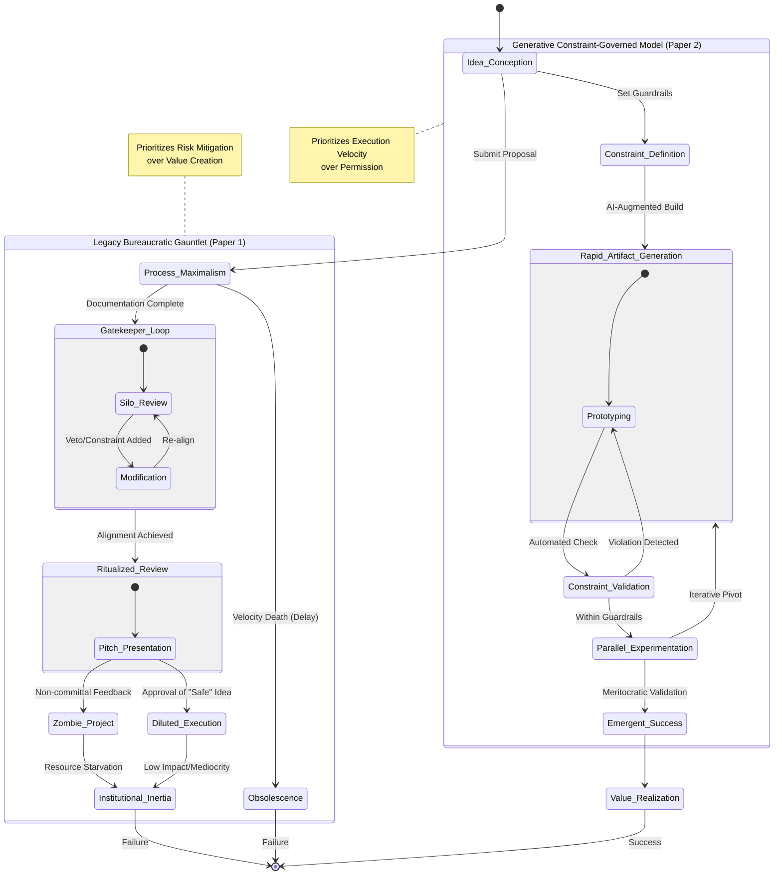

<div class="tab-nav">
<button class="tab-btn active" onclick="openTab(event, 'article')">Article</button>
<button class="tab-btn" onclick="openTab(event, 'socratic')">Socratic Dialog</button>
<button class="tab-btn" onclick="openTab(event, 'statemachine')">State Machine</button>
</div>

<div id="article" class="tab-content" style="display: block;" markdown="1">

# Paper 1: Common Antipatterns in Organizational Ideation

## Abstract
Large organizations often claim to prioritize innovation while simultaneously maintaining structures that systematically suppress it. This paper identifies and analyzes the structural antipatterns that transform ideation from a generative process into a bureaucratic hurdle. By examining the 'Gatekeeper Loop', 'Ritualized Review', and 'Process Maximalism', we demonstrate how institutional inertia is not merely a byproduct of size, but a designed outcome of procedural bottlenecks.

## Introduction
In the modern corporate landscape, "innovation" is a ubiquitous buzzword, yet the actual production of novel, impactful ideas remains remarkably low in established institutions. The conventional diagnosis attributes this to a deficit of creativity—that organizations simply need more or better ideas. This diagnosis is wrong. Ideas were never scarce. Every organization, at every level of its hierarchy, teems with people who see problems clearly and can imagine solutions. The binding constraint was never ideation; it was the cost of action. Turning an idea into a tangible outcome—a prototype, a pilot, a product—required significant labor, capital, and coordination. Because action was expensive, it had to be rationed. And because it had to be rationed, it had to be controlled.

This economic reality produced a political economy of ideation. Authority monopolized the upstream phases of action—problem definition, prioritization, resource allocation—not because leaders were uniquely creative, but because they controlled the scarce resources required to act. Over time, this monopoly calcified into organizational architecture: the approval chains, the steering committees, the stage-gate processes that now define corporate innovation. What began as pragmatic resource management became a self-perpetuating system in which permission to act substituted for the act itself. The result is a set of structural antipatterns—procedural bottlenecks that do not merely slow innovation but are, in fact, *designed* to prevent it. Institutional inertia is not an accident; it is an outcome engineered by the very structures that claim to foster change. The following sections identify and dissect the three most pervasive of these antipatterns.

## The Gatekeeper Loop
The 'Gatekeeper Loop' is a phenomenon where an idea is subjected to a series of approvals from stakeholders who possess veto power but no creative skin in the game. 


In this antipattern, an innovator must navigate a non-linear path of "buy-in." Each gatekeeper—often representing legal, compliance, branding, or middle management—adds a layer of modification to the original concept. The goal of the gatekeeper is rarely to improve the idea, but to ensure it does not violate their specific silo's constraints. 

The result is a feedback loop where the idea is continuously diluted to satisfy the lowest common denominator of institutional comfort. By the time an idea exits the loop, it has been stripped of its original potency, leaving a "safe" but mediocre shell that fails to achieve its intended impact. The gatekeeper loop effectively weaponizes "alignment" to kill deviation.


The gatekeeper bears what might be called "accountability skin": they are personally exposed to the downside risk of any failure that passes through their domain, yet they receive virtually none of the upside when an innovation succeeds. A compliance officer who greenlights a novel product that later triggers a regulatory action faces career consequences for a failure they did not create; a middle manager who sponsors an unconventional project that misses its targets absorbs the reputational damage while the original innovator moves on. This asymmetry means the expected value of saying "Yes" is negative for the gatekeeper in almost every scenario. In game-theoretic terms, the legacy equilibrium makes "Strict Veto" the dominant strategy: the personal cost of a "Yes" that fails vastly exceeds the personal cost of a "No" that kills a good idea, because killed ideas produce no visible counterfactual. No one is held accountable for the innovation that never happened. The Gatekeeper Loop, then, is not a collection of obstructionist individuals—it is a Nash Equilibrium sustained by asymmetric risk, in which every participant is optimizing for personal risk avoidance rather than organizational value creation. Dismantling it requires not exhortation but restructuring: realigning incentives so that the cost of blocking value is at least as legible as the cost of permitting failure.
### The Micro-Dictator as Structural Archetype


The Gatekeeper Loop, at sufficient maturity, produces a recognizable structural archetype: the *micro-dictator*. This is not a personality type but a governance failure mode—a role that emerges predictably when action is expensive and permission is scarce. The micro-dictator is characterized by four structural features: authority that is small in scope, rigid in application, insecure in foundation, and dependent on controlling gates rather than enabling flow. A domain owner who must approve every asset request, a process steward who enforces formatting standards as though they were safety regulations, a team lead whose influence extends exactly as far as their sign-off authority and no further—these are not aberrant individuals but rational actors shaped by the system's incentive topology. Where the organization offers no mechanism to accumulate influence through *contribution*—through building, teaching, or enabling others—it guarantees that influence will be accumulated through *obstruction*: through the selective dispensation of permission. The micro-dictator's power is entirely positional, derived not from what they produce but from what they can prevent. This makes the role inherently brittle and inherently defensive; any proposal that might route around the gate, simplify the process, or reduce the need for approval is perceived—correctly—as an existential threat to the role itself. The result is a local incentive to *increase* procedural complexity over time, because complexity is the medium through which positional authority justifies its own existence. Importantly, this archetype is not confined to middle management, though it concentrates there because middle management sits at the intersection of high political accountability and low direct output. It can appear wherever the organization has created a node whose value proposition is gatekeeping rather than generation. The structural diagnosis matters because it clarifies the remedy: the micro-dictator is not dissolved by replacing the person in the role but by dissolving the conditions that produce the role. When the cost of action collapses—as Paper 2 will argue is now occurring—the gate loses its economic justification, and authority that was built entirely on controlling access to expensive action finds itself exposed, structurally, with no foundation beneath it.


## Ritualized Review 
'Ritualized Review' refers to the transformation of the ideation process into a performative ceremony. This often takes the form of "Innovation Days," "Pitch Competitions," or "Steering Committee Meetings."

- **Presentation over Substance:** Success is measured by the quality of the presentation (the "deck") rather than the viability or depth of the idea.
- **Non-Committal Feedback:** Feedback is generic, encouraging, but ultimately non-committal, leading to "zombie projects" that are never officially killed but never funded.
- **Status Quo Bias:** The "winning" ideas are almost always those that align most closely with existing corporate strategy, reinforcing the status quo rather than challenging it.

The most probable outcome of a Ritualized Review is not execution, nor even outright rejection, but a transition into what might be called *Zombie Stasis*: a liminal state in which the idea is nominally "under consideration," "pending further alignment," or "in the pipeline," but in which no resources are allocated, no owner is accountable, and no timeline is enforced. If one maps the lifecycle of ideas through a corporate ideation process as a state machine, the transition from Ritualized Review to Zombie Stasis is overwhelmingly the most common edge. Ideas enter the ritual alive and exit undead—not killed, because killing requires a decision and decisions create accountability, but not alive, because life requires resources and resources require commitment. The ritual, then, is not a filter that separates good ideas from bad ones; it is a *conveyor belt into organizational limbo*, a reliable mechanism for converting active proposals into passive inventory.

### The Cynicism Trap and Learned Helplessness


The deepest damage inflicted by Ritualized Review is not the loss of any individual idea but the *cultural toxicity* it produces over repeated cycles. The first time an employee participates in an Innovation Day and watches their proposal dissolve into non-committal smiles and vague follow-ups, they may attribute the outcome to bad luck or poor timing. The second time, they begin to suspect the structure. By the third time, they *know*—and this knowledge is corrosive in a way that no single failed project could ever be.

What emerges is a form of organizational learned helplessness: the internalized belief that effort directed toward innovation within the institution's formal channels is futile. Employees stop proposing their best ideas—not because they stop having them, but because they learn that the ritual will consume the idea without producing action. The most creative and ambitious individuals either withdraw into cynical disengagement or leave the organization entirely, producing a slow-motion adverse selection in which the people most capable of driving change are precisely the ones the system ejects. Those who remain and continue to participate do so performatively, treating the ritual as a career-visibility exercise rather than a genuine ideation opportunity—which, in turn, further degrades the quality of what the ritual produces, confirming the organization's quiet suspicion that "there just aren't enough good ideas."

This is the critical insight: the cynicism generated by recognized theater is more damaging to the organization than the absence of any particular product or initiative. A company that never held an Innovation Day but honestly acknowledged its structural conservatism would retain more creative capacity than one that stages elaborate ideation ceremonies while systematically refusing to act on their outputs. The ritual does not merely fail to produce innovation; it actively *destroys the conditions* under which innovation becomes possible, by teaching the workforce that the organization's stated commitment to new ideas is performed rather than real. The antibodies the institution deploys against change are not just procedural—they are psychological, and Ritualized Review is the vector through which they are most efficiently transmitted.

## Process Maximalism
'Process Maximalism' is the belief that the quality of an output is directly proportional to the complexity of the process used to generate it. In an attempt to "industrialize" innovation, organizations implement heavy frameworks—such as rigid Stage-Gate models or proprietary "Innovation Funnels"—that demand exhaustive documentation at every turn.

Process maximalism suppresses ideation through three primary mechanisms:
1. **High Barrier to Entry:** The administrative overhead required to even propose an idea discourages all but the most persistent (or politically motivated) individuals.
2. **False Precision:** Requiring detailed ROI projections and three-year roadmaps for ideas in their infancy forces innovators to fabricate data, leading to a culture of "spreadsheet engineering" rather than genuine discovery. This is, in game-theoretic terms, a dominated strategy that persists only because the process demands it: the innovator knows the numbers are invented, the reviewers know the numbers are invented, yet both parties maintain the fiction because the framework requires a populated spreadsheet before conversation can begin. The result is a *Verification Trap*, in which the organizational cost of rigorously verifying the projections would exceed the entire value of the artifact being proposed—so no one verifies, and the fabricated figures are accepted on ceremonial grounds alone. Over successive cycles, this produces a form of institutional self-deception that compounds: strategic decisions are built on projections everyone quietly acknowledges are fictional, those decisions generate outcomes that are then retroactively rationalized with new fictions, and the organization's entire epistemic foundation drifts further from reality while its confidence in its own rigor remains intact.
3. **Velocity Death:** The time elapsed between an idea's inception and its first real-world test is so long that the market conditions or the original problem may have already changed, rendering the idea obsolete before it is even piloted.

When process becomes the product, the organization loses the ability to act on intuition or respond to emergent opportunities.

## Conclusion: The Cost of Inertia
The cumulative effect of these antipatterns is a "frozen" organization. The Gatekeeper Loop ensures safety at the cost of brilliance; Ritualized Review ensures participation at the cost of sincerity; and Process Maximalism ensures order at the cost of speed. 

These structures are not accidental; they are the *immune system* of the institution—and like any immune system, they must be understood not as malicious but as *adaptive*. Every antipattern described in this paper originated as a rational response to a real constraint. When action was expensive, gatekeeping was prudent resource management. When production required large teams and significant capital, ritualized review was a defensible method of prioritization. When failure was costly and irreversible, process maximalism was a reasonable hedge against catastrophic waste. The immune system developed because the organism needed it: in a world of scarce resources and high costs of action, these structures protected the organization from overcommitting to unproven ideas.

But an immune response calibrated to yesterday's threat environment becomes an autoimmune disorder when conditions change. The defenses that once protected the organization from reckless expenditure now attack the very capacity for adaptation that the organization needs to survive. The Gatekeeper Loop blocks action that is no longer expensive. Ritualized Review filters ideas through ceremonies designed for a production economics that no longer holds. Process Maximalism demands documentation whose cost now exceeds the cost of simply *building the thing*. What was once a rational allocation of scarce permission has become an irrational suppression of abundant capability. To move beyond these bottlenecks, an organization must first acknowledge that its current "innovation" procedures are, in fact, defense mechanisms designed to protect a status quo whose economic foundations are actively eroding. The organizational immune system must evolve, or it will kill the host. Only by diagnosing these structural failures—and understanding *why* they made sense in the world that produced them—can we begin to design a system calibrated to the world that is replacing it: one in which the cost of action has collapsed, and the structures built to ration expensive action have become the primary obstacle to value creation.

---

*This concludes Paper 1. Paper 2 will explore the transition from these antipatterns toward a more generative, decentralized model of ideation.*

---

# Paper 2: Notes on the Changing Cost Landscape of Ideation and Action

## Abstract

The traditional organizational model relies on high costs of production to justify centralized control. As generative AI collapses the cost of creating "action-adjacent artifacts"—code, designs, strategy documents, and prototypes—the economic rationale for legacy permission structures evaporates. This paper explores the transition from authority-gated systems to constraint-governed environments, where the bottleneck shifts from the ability to produce to the ability to discern and direct.

## The Collapse of Artifact Costs

Historically, the distance between an idea and its first tangible manifestation was bridged by significant labor and capital. Creating a functional prototype, a detailed marketing plan, or a technical architecture required weeks of specialized effort. This high "cost of action" served as a natural filter, allowing organizations to justify gatekeeping as a form of resource management.

Generative AI has fundamentally altered this equation. We are entering an era where the marginal cost of artifact production is approaching zero. When a single individual can generate a high-fidelity mockup, a working script, or a comprehensive project plan in minutes, the "artifact" is no longer the prize. The collapse of these costs removes the primary excuse for bureaucratic delay: the need to protect scarce production resources.

But this collapse does not simply liberate the organization—it also destabilizes it. When the marginal cost of production approaches zero, the volume of producible artifacts does not merely increase; it undergoes a kind of *hyper-inflation*, expanding beyond any individual's or committee's capacity to evaluate, absorb, or act upon. The old bottleneck—"Can we afford to build this?"—is replaced by a new and in some ways more intractable one: "Can we afford to pay attention to this?" This is the *Discernment Bottleneck*. In a world of expensive production, scarcity itself performed a crude filtering function; not everything could be built, so only the proposals that survived political and economic selection were manifested. Remove that filter and you do not get a clean meritocracy of ideas—you get *artifact pollution*, a flood of plausible-looking prototypes, strategy documents, and proofs-of-concept that overwhelm the organization's finite evaluative bandwidth. The risk, then, is not that gatekeeping persists without justification, but that the *absence* of any filtering mechanism produces a new form of paralysis: decision-makers surrounded by more actionable options than they can meaningfully assess, defaulting to familiar heuristics—status, recency, political proximity—that reproduce the old hierarchies under new conditions. The collapse of artifact costs is a necessary condition for democratized ideation, but it is not a sufficient one. Without a corresponding investment in *discernment infrastructure*—frameworks, cultures, and tools that help organizations distinguish signal from noise at the speed artifacts can now be generated—the abundance that should be liberating becomes merely overwhelming. The sections that follow address how organizations might build such infrastructure; for now, it is enough to note that the end of scarcity is not the beginning of clarity.

## The Obsolescence of Permission

In the legacy model, permission was the currency of the institution. Because resources were scarce, "No" was the default setting. Permission structures were designed to prevent the "waste" of expensive human hours on unproven concepts.

However, when the cost of "doing" drops below the cost of "asking," permission structures become obsolete. If an employee can build a proof-of-concept faster than they can fill out a request for a pilot program, the traditional hierarchy loses its leverage. The "Gatekeeper Loop" described in Paper 1 is not just inefficient; it is increasingly bypassed by the sheer speed of AI-augmented execution. The friction of bureaucracy now costs more than the risk of unauthorized experimentation.

## From Authority-Gated to Constraint-Governed Action

The shift we are witnessing is a move away from **Authority-Gated** action (where you need a person's approval to proceed) toward **Constraint-Governed** action (where you are free to act as long as you stay within defined guardrails).

In a constraint-governed model, the role of leadership changes from "approver" to "architect of constraints." Instead of reviewing every individual idea, leaders define the parameters of safety, ethics, and strategic alignment. Within these boundaries, ideation and execution are decentralized. This model leverages the low cost of action to allow for massive parallel experimentation, where the "market" (internal or external) determines success rather than a steering committee.

This transition is not merely a philosophical preference or a management trend—it is, in formal terms, a shift between two Nash Equilibria. In the legacy equilibrium, the stable strategy pair was *Submit and Veto*: the innovator submitted proposals through official channels, and the gatekeeper exercised selective veto power. This equilibrium was stable because the cost of independent action was prohibitive. No rational actor would bypass the gate when building a prototype required weeks of specialized labor and significant capital; the penalty for unauthorized resource expenditure exceeded any plausible upside from a successful demonstration. The gatekeeper's veto, meanwhile, was costless—killed ideas produced no visible counterfactual, so "No" carried no accountability. Both parties were locked in: the innovator because they could not afford to act alone, the gatekeeper because saying "No" was always safer than saying "Yes." But as the cost of action collapses, a new equilibrium emerges: *Bypass and Constrain*. When an individual can produce a working prototype faster than they can navigate an approval chain, the dominant strategy for the innovator shifts from submission to demonstration—build first, seek forgiveness (or, more precisely, validation) after. The rational response for the former gatekeeper is not to reassert veto authority over an action that has already occurred at negligible cost, but to redefine their role around *constraint architecture*: setting the boundaries within which autonomous action is legitimate, rather than adjudicating each instance of it. What makes this analysis decisive rather than merely descriptive is the Pareto dominance of the emergent equilibrium. In the legacy state, the innovator's payoff was suppressed by friction and delay, while the gatekeeper's payoff, though locally optimized for risk avoidance, was capped by the low organizational value that a veto-heavy regime could produce. In the emergent equilibrium, the innovator captures a higher payoff through direct action and rapid iteration, and the reformed gatekeeper—now a constraint architect—also achieves a higher payoff, because their contribution shifts from value-destroying obstruction to value-enabling governance, a role that is both more strategically defensible and more organizationally rewarded. Both parties are strictly better off. The transition is not a zero-sum redistribution of power from gatekeepers to innovators; it is a positive-sum move to a superior equilibrium that the legacy cost structure had previously made inaccessible. This is why exhortation alone cannot drive the shift: you cannot talk actors out of a Nash Equilibrium. But you do not need to—the collapse of action costs has already altered the payoff matrix. The equilibrium is moving whether the org chart acknowledges it or not. The only question is whether leadership will architect the constraints that define the new stable state, or whether the transition will occur chaotically, without guardrails, as individuals rationally defect from a permission structure that no longer commands compliance.

## Democratic Ideation and the New Meritocracy

The democratization of production tools leads to a democratization of ideation. When the ability to manifest an idea is no longer tied to seniority or budget access, the meritocracy of the idea itself takes center stage.

This shift forces a change in organizational culture:

- **From Presentation to Prototype:** The "Ritualized Review" of slide decks is replaced by the evaluation of functional artifacts.
- **From Political Capital to Execution Velocity:** Influence is gained by those who can rapidly iterate and demonstrate value, rather than those who navigate the hierarchy most effectively.
- **From Top-Down Strategy to Emergent Direction:** Strategy becomes an iterative discovery process fueled by a high volume of low-cost experiments.

### The Leader as Architect of the Fitness Landscape
If the constraint-governed model described above defines *where* autonomous action is legitimate, a deeper question remains: how does the organization determine *what counts as success* within those boundaries? This is where leadership undergoes its most profound transformation—not from "approver" to "constraint architect" (that shift is merely structural) but from *Chief Approver* to *Architect of the Fitness Landscape*.

The metaphor is drawn from evolutionary biology. A fitness landscape is a mapping from possible strategies (or organisms, or in our case, ideas and prototypes) to their relative success. The landscape is not designed by any single organism navigating it; it is the *environment* that determines which variations thrive and which are selected against. In the democratized ideation model, the leader's role is analogous: they do not review individual ideas—they *define what "success" looks like*. They design the fitness function. They specify the objective—the measurable outcomes, the strategic criteria, the constraints that distinguish a valuable experiment from an irrelevant one—and then let the decentralized, AI-augmented workforce *evolve* solutions against that function through massive parallel experimentation. The leader who once sat atop the approval chain, reviewing proposals one by one, is replaced by the leader who articulates the selection pressure with such precision that the organization can self-organize toward it without centralized adjudication.

This reframing has a critical implication for how leadership itself is evaluated. In the legacy model, a leader's influence was legible through the volume of decisions they made—proposals approved, budgets allocated, projects killed. In the fitness-landscape model, a leader's value is measured by the *clarity of the objective function* they define, not the number of approvals they grant. A well-specified fitness function renders most approval decisions unnecessary: teams can evaluate their own prototypes against the criteria, discard what fails, and iterate on what shows promise. A poorly specified one—vague, contradictory, or optimizing for the wrong variable—produces chaos regardless of how many gatekeepers are inserted downstream. The scarce resource, in other words, is no longer *judgment applied to individual proposals* but *judgment applied to the design of the evaluative environment itself*. This is a higher-order form of leadership, and it demands a different skill set: not the ability to say "Yes" or "No" to a pitch deck, but the ability to articulate what the organization is *for* with enough rigor that a thousand autonomous agents can orient toward it independently.

### Irrational Conviction and the Preservation of Black-Swan Innovation
There is, however, a failure mode latent in any system that relies entirely on a predefined fitness function: it will systematically eliminate ideas that do not score well against *current* criteria but that would prove transformative under conditions the criteria do not yet anticipate. Evolutionary fitness landscapes produce local optima—organisms exquisitely adapted to the present environment but brittle in the face of discontinuous change. An organization that optimizes too efficiently against its stated objective function risks the same trap: a portfolio of well-adapted incremental improvements and zero breakthrough innovations.

This is where the irreducibly *human* element of the new meritocracy asserts itself—not as a sentimental concession to "the human touch," but as a structural necessity. What humans contribute that automated evaluation systems cannot is *irrational conviction*: the capacity to pursue an idea that every available metric says is wrong, that no fitness function currently rewards, that an AI-augmented triage system would flag for immediate deprioritization—and to persist in that pursuit long enough for the idea to encounter the conditions under which its value becomes legible. Every black-swan innovation in history—the ones that redefined industries rather than optimizing within them—was, at the moment of its conception, irrational by the standards of the prevailing fitness landscape. It scored poorly. It did not align with current strategy. It could not produce a credible three-year ROI projection (or rather, it could, but only a fabricated one—see Paper 1's discussion of the Verification Trap). It survived not because a system selected for it but because a *person* refused to let it die.

A well-designed democratic ideation system must therefore preserve structural space for irrational conviction—for ideas that bypass the fitness function entirely, not because the function is poorly designed but because *no* function, however well-designed, can anticipate the discontinuities that generate outsized value. This might take the form of protected experimentation budgets that are explicitly exempt from objective-function evaluation, or cultural norms that treat a certain rate of "irrational" bets not as waste but as the portfolio's insurance premium against strategic brittleness. The point is not to abandon the fitness landscape—it remains the correct architecture for the vast majority of organizational ideation—but to acknowledge its boundary condition: that the most consequential ideas are precisely the ones it is least equipped to recognize, and that the human willingness to champion them against the evidence is not a bug in the system but the mechanism by which the system avoids collapsing into a local optimum.

The synthesis, then, is this: the Architect of the Fitness Landscape defines the selection environment that governs *normal* innovation—the continuous, parallel, decentralized experimentation that replaces the old approval chain. But the architect must also design *escape hatches* from their own landscape: sanctioned spaces where the fitness function is deliberately suspended, where irrational conviction is not merely tolerated but structurally protected, and where the organization maintains its capacity to be surprised by ideas that no objective function would have predicted. Leadership in this model is measured not only by the clarity of the objective function but by the wisdom to know where the objective function should not apply.

## Conclusion: Embracing the Generative Shift
The antipatterns of the past—the loops, the rituals, and the maximalism—were built for a world of high-cost action and scarce information. That world is ending. But naming the problem is not the same as solving it, and the analysis presented in this paper and its predecessor will remain academic unless it is translated into concrete structural reforms. The organizations that thrive in the age of generative AI will not be those that merely *acknowledge* the collapse of action costs; they will be those that *redesign their operating architecture* to reflect it. What follows is not a set of abstract principles but a series of specific, implementable directives—each one derived from the structural diagnosis above, each one targeting a named antipattern, and each one designed to shift the organization from the legacy equilibrium of *Submit and Veto* to the emergent equilibrium of *Bypass and Constrain*.

The first and most immediate reform is the dismantling of what Paper 1 identified as the core mechanism of Ritualized Review: the pitch deck as unit of evaluation. As long as ideas are assessed on the basis of slide presentations—narrative polish, executive presence, the rhetorical construction of a "compelling story"—the organization is selecting for persuasion rather than viability, for political fluency rather than functional insight. The collapse of artifact costs makes this not merely suboptimal but absurd. When a working prototype can be produced in the time it takes to format a slide deck, the deck is no longer a proxy for the idea; it is a *substitute* for it, and a strictly inferior one. The reform is straightforward: replace pitch-deck reviews with functional artifact evaluations. The unit of assessment becomes the working mockup, the executable script, the testable hypothesis instantiated in code or design—not the narrative *about* the thing, but the thing itself. This does not eliminate the need for strategic framing or contextual explanation, but it subordinates rhetoric to demonstration. The innovator's task is no longer to *describe* what they would build if given permission; it is to *show* what they have already built, and to let the artifact speak to its own merit. This single change collapses the Ritualized Review antipattern at its foundation, because the ceremony of the pitch—the stage, the audience, the non-committal applause—loses its function when the object of evaluation is a functioning prototype rather than a persuasive performance.

The second reform addresses the Gatekeeper Loop directly, and it operationalizes the constraint-governed model described in this paper's central argument. The loop persists because each gatekeeper's veto is exercised *ad hoc*, on a case-by-case basis, with no predefined criteria for what constitutes an acceptable risk. The result, as analyzed above, is that "No" is always the dominant strategy: the gatekeeper cannot be blamed for what they prevent, only for what they permit. The structural remedy is the creation of explicit *Safe Zones*—predefined operational boundaries, articulated in advance by leadership in collaboration with legal, compliance, finance, and brand stakeholders, within which no approval is required. A Safe Zone is not a blank check; it is a precisely specified envelope of autonomous action. It defines financial guardrails (maximum expenditure thresholds below which no budget approval is needed), data guardrails (categories of data that may be used in experimentation without privacy review), and brand guardrails (parameters within which external-facing artifacts may be tested without marketing sign-off). The key insight is that these boundaries must be defined *before* any specific idea is proposed, not negotiated in response to one. When the constraints are architectural rather than adjudicative—when they exist as standing policy rather than as the output of a case-by-case approval chain—the gatekeeper's role transforms from *judge of individual proposals* to *co-author of the constraint framework*. Their expertise is captured upstream, in the design of the guardrails, rather than downstream, in the serial vetoing of initiatives. This is what it means to treat governance as a product rather than a process: the constraint architect ships a well-defined interface—a set of clear, queryable rules—against which any actor in the organization can validate their own intended action without waiting in line for a human adjudicator.

This leads directly to the third reform, which extends the product metaphor to its logical conclusion: the automation of compliance checks as real-time services rather than end-of-process reviews. In the legacy model, compliance is a *stage*—a gate that the idea must pass through, staffed by human reviewers who assess each proposal against regulatory, legal, and policy requirements. This architecture made sense when proposals were few and complex, but it is structurally incompatible with the high-volume, rapid-iteration model that collapsed artifact costs now enable. When an organization is running hundreds of parallel low-cost experiments, routing each one through a sequential human review is not governance—it is a denial-of-service attack on the organization's own capacity for action. The alternative is to encode the reviewable constraints—data handling rules, regulatory boundaries, brand standards, security requirements—as automated, API-like services that experimenters can query in real time. Before deploying a prototype to a test audience, the system checks data-use compliance automatically. Before committing expenditure, the system validates against the Safe Zone's financial guardrails. Before exposing brand-adjacent artifacts externally, the system confirms conformance with the brand envelope. The human compliance expert does not disappear; they move upstream, into the role of *maintaining and updating the constraint service*—ensuring that the automated checks reflect current regulatory reality, refining the rules as edge cases emerge, and reserving their direct judgment for the genuinely novel cases that fall outside the service's coverage. This is the structural transformation of the gatekeeper from bottleneck to infrastructure, from a person who must be *waited for* to a system that is *always available*.

The fourth and perhaps most culturally disruptive reform concerns measurement. The antipatterns described in Paper 1—particularly Process Maximalism and its attendant Verification Trap—are sustained not only by procedural architecture but by *evaluative* architecture: the metrics by which the organization assesses whether ideation is "working." As long as the primary metric is traditional ROI—projected return on invested capital, calculated in advance and tracked against a multi-year plan—the organization will continue to demand the fabricated spreadsheets and fictional three-year projections that Process Maximalism requires, because ROI is the only language the evaluative system speaks. The reform is to replace these legacy metrics, for early-stage ideation, with measures that reflect the actual dynamics of a low-cost, high-iteration environment. Two metrics in particular capture what matters: *iteration velocity*—the number of hypothesis-test-learn cycles an idea completes per unit of time—and *time to first artifact*—the elapsed duration between an idea's initial articulation and the production of its first functional, testable instantiation. These metrics do not measure whether an idea is *right*; they measure whether the organization is *learning*. An idea that completes ten iterations in a week and fails is more valuable than an idea that spends six months in a planning phase and produces a polished deck, because the first has generated real information—about the problem, the market, the technology, the user—while the second has generated only a narrative. Measuring iteration velocity and time to first artifact sends an unambiguous signal to the organization: the goal is not to *plan* perfectly but to *learn* rapidly, and the structures that slow learning—the approval chains, the documentation requirements, the review ceremonies—are costs to be minimized, not virtues to be celebrated.

Taken together, these four reforms—artifact-based evaluation, predefined Safe Zones, automated compliance services, and iteration-centric measurement—constitute not a wish list but a *coherent operating architecture* for the post-scarcity ideation environment. Each one addresses a specific antipattern identified in Paper 1; each one operationalizes a specific structural shift described in Paper 2; and each one reinforces the others, because the system they compose is self-consistent in a way that piecemeal reforms are not. Artifact evaluation is meaningless without Safe Zones that permit artifacts to be built without prior approval. Safe Zones are unenforceable without automated compliance services that can validate action against guardrails in real time. And none of these structural changes will survive contact with the existing culture unless the measurement system is reformed to reward the behaviors they enable rather than the behaviors they replace. The organizational immune system described in Paper 1's conclusion will attack any individual reform that is introduced in isolation; only a coordinated redesign of the evaluative, procedural, and governance architecture can shift the institution to the new equilibrium that the collapse of action costs has already made available. The world that justified the old structures is ending. The question is no longer whether the permission-based model will be replaced, but whether its replacement will be *designed*—deliberately, with guardrails and clarity and structural wisdom—or whether it will simply *happen*, chaotically, as individuals rationally defect from a system that no longer commands their compliance. These reforms are an argument for design.


</div>
<div id="socratic" class="tab-content" style="display: none;" markdown="1">

# Socratic Dialogue Transcript

**Initial Question:** Does the collapse of artifact production costs fundamentally threaten the existence of organizational gatekeeping, or does it merely shift the bottleneck to a new form of institutional control?

**Domain Constraints:** Organizational Design, Innovation Management, Generative AI Economics, Institutional Theory

**Started:** 2026-02-20 19:55:27

---

## Exchange 1

**Question:** Does the collapse of artifact production costs fundamentally threaten the existence of organizational gatekeeping, or does it merely shift the bottleneck to a new form of institutional control?

**Response:** To address whether the collapse of artifact production costs—driven primarily by Generative AI—threatens organizational gatekeeping or merely relocates it, we must first define our terms and the economic logic currently under strain.

In this context, **artifact production costs** refer to the capital, labor, and time required to generate a discrete output (a line of code, a marketing campaign, a legal brief, a technical schematic). **Gatekeeping** is the institutional exercise of authority to determine which artifacts are granted "entry" into a market, a discourse, or a formal system of record.

My initial thesis is that we are witnessing a **radical relocation of the bottleneck**, rather than the extinction of the gatekeeper. However, the nature of that gatekeeping is shifting from *productive capacity* to *evaluative authority*.

### 1. The Erosion of the "Technical Gate"
Historically, organizations acted as gatekeepers because they owned the "means of production." If you wanted to produce a high-quality film, a complex software suite, or a peer-reviewed journal, you needed the firm’s concentrated capital and specialized labor. The high cost of production served as a natural filter; only "vetted" ideas received funding.

With the marginal cost of artifact production approaching zero, this "Technical Gate" has collapsed. The firm can no longer justify its existence solely by its ability to *make* things. This leads to a state of **artifact hyper-inflation**, where the volume of output exceeds the human capacity to process it.

### 2. The Shift to the "Epistemic Gate"
As production costs collapse, the bottleneck moves from **creation** to **validation**. In a world of infinite, AI-generated artifacts, the primary problem is no longer "How do we make this?" but "Is this true, safe, and valuable?"

Institutional control is currently migrating toward what I call the **Epistemic Gate**. This takes three forms:
*   **Verification and Trust:** When anyone can generate a professional-looking legal contract or a scientific paper, the value of the "brand" or the "institutional stamp" (e.g., a prestigious law firm or a university) increases. The gatekeeper now sells *certainty* in an environment of synthetic noise.
*   **Liability and Accountability:** AI can produce artifacts, but it cannot (currently) bear legal or social responsibility. Organizations will maintain control by acting as the "liable entity" that stands behind the artifact.
*   **Curation and Attention:** In a state of abundance, the gatekeeper controls the interface. Algorithms and platforms become the new institutional controllers, deciding which of the infinite artifacts are actually seen.

### 3. The Coasean Implication
From the perspective of **Institutional Theory**, specifically Coase’s *Theory of the Firm*, organizations exist because the transaction costs of the open market are too high. If AI lowers the cost of finding, contracting, and producing, the "walls" of the firm should theoretically dissolve. 

However, if the cost of *verifying* the quality of those market-produced artifacts skyrockets (due to deepfakes, hallucinations, or low-quality noise), the transaction costs actually *increase*. This suggests that organizations may actually become **more insular and hierarchical** in their gatekeeping to protect the integrity of their internal data and outputs.

### 4. Uncertainties and Risks
I am uncertain about the "long-tail" of this transition. While I argue that gatekeeping shifts to validation, there is a risk of **Institutional Decoupling**. If the cost of production is zero, "shadow" organizations or decentralized networks might create their own parallel validation systems (e.g., decentralized autonomous organizations or cryptographic proof-of-work for artifacts). If these parallel systems gain more social trust than traditional institutions, then organizational gatekeeping as we know it truly does face an existential threat.

### Summary for our Dialogue
The collapse of production costs does not democratize outcomes; it democratizes *outputs*. Because human attention and systemic risk-tolerance remain finite, gatekeeping is not dying—it is being redefined as the **management of trust and the allocation of attention.**

**Does this resonance with your observation of how institutions are reacting to AI, or do you see evidence that the sheer volume of production is already making traditional validation mechanisms obsolete?**

**Next Question:** If the transaction cost of verifying an artifact's quality rises in direct proportion to the volume of synthetic noise, does the "Epistemic Gate" actually preserve the firm, or does it create a "Verification Trap" where the institution's overhead for maintaining trust eventually exceeds the market value of the artifacts it validates?

## Exchange 2

**Question:** If the transaction cost of verifying an artifact's quality rises in direct proportion to the volume of synthetic noise, does the "Epistemic Gate" actually preserve the firm, or does it create a "Verification Trap" where the institution's overhead for maintaining trust eventually exceeds the market value of the artifacts it validates?

**Response:** The "Verification Trap" is a profound and necessary extension of the "Epistemic Gate" concept. It suggests that the very mechanism intended to save the institution—its role as a validator—could become the instrument of its economic demise.

To explore whether the Epistemic Gate preserves the firm or traps it, we must analyze the **asymmetry of cost** between generation and verification.

### 1. Defining the Verification Trap
The **Verification Trap** occurs when the marginal cost of verifying an artifact ($MC_v$) scales at a higher rate than the marginal utility of the artifact ($MU_a$), driven by the volume of synthetic noise.

In a pre-AI world, production and verification were often coupled. If it took a human 40 hours to write a technical white paper, it might take a peer 4 hours to verify it. The ratio was manageable. In a generative world, the white paper can be produced in 4 seconds. However, if that paper contains "hallucinations"—subtle, plausible-sounding falsehoods—the verification time does not drop; it may actually *increase* because the verifier can no longer trust the "intent" or "expertise" of the creator.

If the market value of a "verified white paper" is \$1,000, but the volume of synthetic noise requires \$1,200 worth of expert labor to guarantee its accuracy, the institution has entered the Trap. Its overhead for maintaining trust has exceeded the market value of its output.

### 2. The "Red Queen" Problem of Institutional Overhead
Institutions are currently attempting to fight AI-generated noise with AI-generated verification. This creates a "Red Queen" race (running as fast as you can just to stay in place). 

*   **The Recursive Loop:** If a firm uses AI to verify AI, it lowers the *cost* of verification, but it may also lower the *certainty* of that verification. If the "trust-premium" of the firm is based on human-level certainty, then automated verification is a form of **institutional debasement**.
*   **The Complexity Tax:** As AI becomes better at mimicking high-quality artifacts, the "tells" of synthetic origin become more microscopic. Verification then requires increasingly specialized (and expensive) human intervention. The firm becomes a bloated bureaucracy of "checkers checking checkers," while the actual value-added production has been outsourced to a commodity model.

### 3. Does the Gate Preserve the Firm?
The Epistemic Gate preserves the firm **only if the firm can shift the basis of trust from the *artifact* to the *provenance*.**

If the firm tries to verify every discrete artifact (the "Output-Centric Model"), it will fall into the Verification Trap. The volume of noise will eventually overwhelm the gate.

However, if the firm shifts to a **"Process-Centric Model,"** it might survive. In this model, the firm doesn't say, "We have verified that this specific document is true." It says, "We have verified that this document was produced within our closed, secure, and audited 'clean room' of data and human oversight." 

This is a shift from **Ex-Post Verification** (checking the work after it's done) to **Ex-Ante Certification** (guaranteeing the environment in which it was made). This is how the firm avoids the trap: by refusing to engage with the "noise" of the open market and instead creating a high-walled garden where the noise-to-signal ratio is controlled at the source.

### 4. The Coasean Breaking Point
Returning to Coase: the firm exists to minimize transaction costs. The Verification Trap suggests a point of **Institutional Inversion**. 

If the internal cost of maintaining an "Epistemic Gate" (the lawyers, auditors, and subject matter experts required to vet AI output) becomes higher than the cost of simply accepting a certain percentage of "error" in the open market, the firm loses its reason for being. We might see a "de-institutionalization" of certain fields where we decide that "mostly-correct and cheap" is better than "guaranteed-correct and prohibitively expensive."

### 5. Uncertainties: The Role of Cryptography
I am uncertain whether traditional institutional "trust" can survive without a technological pivot. I suspect that the only way out of the Verification Trap is the integration of **cryptographic truth** (e.g., digital signatures, zero-knowledge proofs of computation) into the Epistemic Gate. If the firm can use math to prove an artifact's origin, the cost of verification collapses back toward zero. Without this, the "human-in-the-loop" becomes an economic liability.

### Questions for our Dialogue:
1. If the cost of human verification makes an institution's artifacts "too expensive" for the market, will society accept a lower standard of truth in exchange for AI-driven abundance? 
2. Does the "Verification Trap" imply that the most successful future firms will be those that produce the *least* amount of artifacts, focusing instead on the rare, high-stakes decisions where the cost of error is so high that the "Trap" is irrelevant?
3. Can an institution maintain "Evaluative Authority" if it no longer possesses the "Productive Capacity" to understand how the artifacts are actually made?

**Next Question:** If the firm shifts from verifying the *artifact* to certifying the *process* (the "clean room"), how does it prevent the "Verification Trap" from simply migrating upstream, where the cost of auditing the increasingly complex and opaque generative pipeline—from data provenance to model weights—eventually exceeds the market value of the "certified" output?

## Exchange 3

**Question:** If the firm shifts from verifying the *artifact* to certifying the *process* (the "clean room"), how does it prevent the "Verification Trap" from simply migrating upstream, where the cost of auditing the increasingly complex and opaque generative pipeline—from data provenance to model weights—eventually exceeds the market value of the "certified" output?

**Response:** The concern you raise is the **"Complexity Trap"**—the upstream migration of the Verification Trap. If the cost of auditing the "clean room" (the data, the weights, the fine-tuning protocols) exceeds the value of the output, the firm has simply traded a labor-intensive problem (checking artifacts) for a capital-and-expertise-intensive problem (auditing systems).

To prevent this migration from bankrupting the institution, the firm must move away from **"Deep Auditing"** (trying to understand the "why" of the model) and toward **"Structural Constraints"** and **"Statistical Assurance."**

Here is an analysis of how the firm might navigate this upstream migration without succumbing to the cost of infinite complexity.

### 1. The Failure of "Deep Auditing"
If a firm attempts to provide a guarantee based on a total understanding of a model’s internal weights or the provenance of 10 trillion tokens of data, it will fail. The "epistemic opacity" of deep learning makes this a fool’s errand. 
*   **The Cost of Interpretability:** Research into "mechanistic interpretability" (understanding what individual neurons do) is currently more expensive than the training of the models themselves. 
*   **The Provenance Paradox:** In a world of recursive AI (AI trained on AI data), tracing the "original" human source of an idea becomes a forensic task that scales exponentially in cost.

If the "clean room" requires this level of transparency to be "certified," the "clean room" will never be built.

### 2. The Shift to "Negative Assurance" and "Boundary Auditing"
To survive, the firm must change the *nature* of the audit. Instead of proving the pipeline is "perfectly clean" (Positive Assurance), the firm proves the pipeline is "sufficiently constrained" (Negative Assurance).

*   **Deterministic Sandboxing:** Rather than auditing the model's "mind," the firm audits the *tools* the model is allowed to use. For example, a financial firm doesn't certify that the LLM "understands" accounting; it certifies that the LLM is only allowed to output Python code that runs against a verified, immutable ledger. The "verification" happens at the interface, not the core.
*   **Differential Privacy and Synthetic Anchors:** The firm can audit the *data distribution* rather than the *data points*. By using mathematical proofs (like differential privacy), the firm can certify that no unauthorized "toxic" or "copyrighted" data has influenced the model's weights without having to inspect every byte of the training set.

### 3. The "Mutualization" of Upstream Costs
The most likely economic response to the Upstream Verification Trap is the **collapse of bespoke institutional pipelines.** 

If every law firm tries to audit its own proprietary LLM, they all go bankrupt. Instead, we will likely see the emergence of **"Epistemic Utilities"**—third-party organizations (perhaps evolved versions of the "Big Four" accounting firms or ISO standards) that audit a base model *once* for a specific industry. 

The firm’s role then shifts from "Auditor of the Pipeline" to "Integrator of the Certified Base." The cost of the audit is amortized across the entire industry, preventing the cost from exceeding the value of any single firm's output.

### 4. The Risk of "Institutional Capture" by the Model Provider
This leads to a new danger: if the cost of auditing the pipeline is so high that only a few "Epistemic Utilities" can do it, the firm loses its autonomy. 
*   If a firm relies on a "Certified Legal GPT" provided by a third party, the firm is no longer the "Gatekeeper of Truth"; it is a **franchisee of a Truth-Protocol.** 
*   The "Epistemic Gate" moves from the firm to the infrastructure provider. At this point, the firm’s "Evaluative Authority" becomes a marketing veneer for the underlying model’s reliability.

### 5. Uncertainties: The "Black Box" Threshold
I am uncertain whether a "certified process" can ever truly replace "verified output" in high-stakes domains (e.g., medicine, structural engineering). 
If a "certified" medical AI kills a patient, the "cleanliness" of its training data is a cold comfort. There may be a **"Complexity Ceiling"** where, regardless of how clean the process is, the inherent unpredictability of generative systems requires a return to ex-post human verification. If that is true, the "Verification Trap" is inescapable for high-stakes artifacts.

### Questions for our Dialogue:
1. If "Epistemic Utilities" (standardized audited models) become the norm, does the "Firm" as a unique entity disappear, replaced by a series of standardized "Truth-Modules"?
2. Can we envision a "Proof of Computation" where a model provides a cryptographic receipt of its "reasoning steps," allowing us to verify the *logic* without auditing the *weights*?
3. Does the "Upstream Trap" imply that the only truly "safe" AI for an institution is one that is "Small and Dumb"—models small enough to be fully understood, even if they are less capable than the "Large and Opaque" models?

**Next Question:** If the "Epistemic Utility" model successfully amortizes the cost of auditing across an entire industry, does the resulting standardization of "certified" processes not destroy the firm’s ability to offer a unique "Evaluative Authority," thereby collapsing the firm’s economic reason for existence into a mere distribution channel for a centralized truth-protocol?

## Exchange 4

**Question:** If the "Epistemic Utility" model successfully amortizes the cost of auditing across an entire industry, does the resulting standardization of "certified" processes not destroy the firm’s ability to offer a unique "Evaluative Authority," thereby collapsing the firm’s economic reason for existence into a mere distribution channel for a centralized truth-protocol?

**Response:** This is the central tension of the "Post-Verification" economy. If the "Epistemic Utility" successfully commoditizes the "Truth," the firm faces an existential crisis: **If the answer is the same regardless of which firm you ask, why pay a premium for the firm?**

To address your concern about the collapse of the firm into a mere distribution channel, we must distinguish between **"Epistemic Accuracy"** (getting the facts right) and **"Evaluative Authority"** (deciding what those facts mean in a specific, high-stakes context).

Here is an analysis of how the firm’s "Evaluative Authority" might evolve—or dissolve—under the weight of standardized truth-protocols.

### 1. The "Commoditization of the Floor"
The standardization of certified processes via an Epistemic Utility does indeed destroy the firm’s ability to compete on *basic accuracy*. In the 20th century, a law firm or an accounting firm could differentiate itself by having "better" research or "more accurate" calculations. 

If an Epistemic Utility (e.g., "Standardized Legal GPT-7") provides a 99.9% accurate baseline of legal precedent to every firm simultaneously, that "floor" is no longer a source of competitive advantage. The firm’s "Evaluative Authority" over the *facts* is effectively socialized.

### 2. The Shift from "Truth-Finding" to "Risk-Absorption"
If the "Truth" is a utility, the firm’s economic reason for existence shifts from **Epistemic Production** to **Institutional Liability**. 

*   **The Utility provides the "What":** (e.g., "This structural design has a 0.01% failure rate.")
*   **The Firm provides the "So What":** (e.g., "We, as an institution with $500M in professional liability insurance and a 100-year reputation, authorize this design for *this* specific bridge.")

The firm becomes a **"Liability Wrapper."** Its "Evaluative Authority" is not based on its superior ability to calculate, but on its willingness to stand behind the calculation in a court of law or a market. The "centralized truth-protocol" cannot go to jail or lose its license; the firm can. Therefore, the firm exists to translate "Statistical Assurance" into "Legal and Social Accountability."

### 3. The "Residual Judgment" (Knightian Uncertainty)
In economics, Frank Knight distinguished between **Risk** (randomness with knowable probabilities) and **Uncertainty** (randomness with unknowable probabilities). 

*   **Epistemic Utilities excel at Risk:** They can process billions of data points to tell you the probability of an outcome based on the past.
*   **Firms excel at Uncertainty:** They make "Judgment Calls" in "One-of-One" situations where the training data is silent or contradictory.

The firm’s "Evaluative Authority" survives in the **"Exceptions to the Protocol."** If a client’s situation is perfectly standard, they use the "Distribution Channel" (the cheap, automated interface). If the situation is "weird," "novel," or "high-stakes," they hire the Firm to exercise **Residual Judgment**—the human-institutional authority to deviate from the protocol.

### 4. The Danger: The "Hollowing Out" of Expertise
The "collapse" you fear is most likely to happen in the **Middle Market.** 
If the Epistemic Utility handles 90% of the work, the "Junior Associate" or "Middle Manager" layer of the firm—the people who used to build their expertise by doing the "Truth-Finding"—disappears. 

This creates a **"Seniority Gap"**: How does a firm maintain "Evaluative Authority" if it no longer has a training ground for the humans who are supposed to exercise that authority? If the firm becomes a "mere distribution channel" for 20 years, it will eventually lose the cognitive capacity to even *audit* the utility it is distributing. At that point, the firm doesn't just look like a franchisee; it *is* a franchisee.

### 5. Redefining the "Firm" in the Age of Utilities
To avoid becoming a mere distribution channel, the firm must pivot its "Evaluative Authority" toward **Integration and Synthesis.**

*   **The Utility is a Component, not a Product:** A firm that sells "AI-generated legal advice" is a distribution channel. A firm that sells "Strategic Corporate Restructuring" (which uses AI for the legwork) is an architect.
*   **The "Bespoke Constraint":** The firm’s value lies in its ability to *constrain* the general truth-protocol to the client’s specific, private data and idiosyncratic goals—data that the "Centralized Utility" is not allowed to see for privacy or competitive reasons.

---

### Response to your Questions:

**1. Does the "Firm" as a unique entity disappear?**
The "Generalist Firm" likely disappears. We are left with a barbell: **Massive Epistemic Utilities** (the infrastructure) and **Hyper-Specialized Judgment Boutiques** (the evaluative authority). The "Middle-Tier" firm that survives on "standardized expertise" is the one that collapses into a distribution channel.

**2. Can we envision a "Proof of Computation" for logic?**
Yes, this is the frontier of **Zero-Knowledge Proofs (ZKP) for Machine Learning.** A model could provide a cryptographic proof that it followed a specific "Reasoning Trace" without revealing its proprietary weights. However, this only proves the *process* was followed; it doesn't prove the *logic* was wise. We can verify the "math," but we still need the "Firm" to verify the "meaning."

**3. Does the "Upstream Trap" imply "Small and Dumb" is safer?**
For high-security or high-sovereignty institutions (e.g., the Military, Central Banks), "Small, Dumb, and Auditable" is almost certainly preferable to "Large, Brilliant, and Opaque." There is a **"Legitimacy Threshold"** where the cost of a mistake is so high that you would rather have a model that is 80% capable but 100% explainable than a model that is 99% capable but 0% explainable.

**New Question for the Dialogue:**
If the "Evaluative Authority" of the firm shifts entirely to **Risk-Absorption (Liability)**, does this mean that the future of "Organizational Design" is actually just a branch of **Insurance and Actuarial Science**? Are we moving toward a world where "Professional Reputation" is replaced by "Cryptographic Collateral"?

**Next Question:** If the firm’s "Evaluative Authority" is reduced to "Risk-Absorption," what prevents the "Epistemic Utility" from vertically integrating the insurance function and rendering the firm obsolete, given that the Utility possesses the superior data set required to price the protocol's failure modes?

## Exchange 5

**Question:** If the firm’s "Evaluative Authority" is reduced to "Risk-Absorption," what prevents the "Epistemic Utility" from vertically integrating the insurance function and rendering the firm obsolete, given that the Utility possesses the superior data set required to price the protocol's failure modes?

**Response:** The proposition that the "Epistemic Utility" will vertically integrate the insurance function—thereby swallowing the firm—is the logical conclusion of a purely data-driven economy. If the Utility possesses the superior dataset to price failure modes, it should, in theory, be the most efficient underwriter of the risks generated by its own "Truths."

However, this transition faces three structural barriers that suggest the "Firm" (as a distinct entity from the Utility) will persist, albeit in a radically mutated form. These barriers define the boundary between **Actuarial Risk** and **Institutional Responsibility**.

### 1. The Conflict of Interest: The "Oracle’s Paradox"
If the Epistemic Utility (the Oracle) also provides the insurance (the Guarantee), it creates a catastrophic incentive structure. 

*   **The Moral Hazard:** If the Utility is the sole arbiter of what is "True" and also the entity that pays out when that "Truth" fails, it has a massive incentive to redefine "Failure" or "Truth" to avoid payouts. 
*   **The Audit Gap:** For insurance to be credible, the "Assessor of the Fact" and the "Payer of the Claim" must often be decoupled to prevent the manipulation of the reality-record. 

The Firm, therefore, acts as a **Third-Party Verifier of Utility Performance**. Its "Evaluative Authority" is not just about pricing the risk, but about *witnessing* the failure in a way the Utility cannot. The Firm provides the "External Eye" that prevents the Utility from grading its own homework.

### 2. The "Contextual Dark Matter" (Private Data)
The Utility possesses the "Superior Dataset" of *public* or *aggregated* information. However, the Firm possesses the **"Private Dataset" of the specific instance.**

*   **The Utility knows the "Class":** (e.g., "15% of all mergers in the tech sector fail due to cultural misalignment.")
*   **The Firm knows the "Instance":** (e.g., "The CEO of Company A and the CTO of Company B have a personal vendetta that isn't in any public database.")

As long as there is "Contextual Dark Matter"—information that is too sensitive, too informal, or too localized to be fed into the Centralized Utility—the Utility’s ability to price risk remains incomplete. The Firm’s "Evaluative Authority" survives in its ability to integrate the Utility’s **Statistical Truth** with the Firm’s **Idiosyncratic Truth**. The Firm is the "Local Node" that adjusts the Utility’s global pricing to the local reality.

### 3. The "Social License" vs. "Financial Indemnity"
This is the most critical distinction in Institutional Theory. Insurance is a **Financial Transfer**; Evaluative Authority is a **Social Sanction**.

If a bridge collapses, the insurance company pays for the rebuild. But the insurance company cannot "forgive" the engineer or restore the public’s trust in the infrastructure. 
*   **The Utility provides the "Check."**
*   **The Firm provides the "Neck."** (The entity that can be fired, sued, or de-licensed).

Society requires a "Human-in-the-Loop" not for the sake of accuracy, but for the sake of **Retributive Justice**. You cannot "punish" an Epistemic Utility in a way that satisfies the human need for accountability. The Firm exists to be the "Sacrificial Subject" if the protocol fails. This is why we have "Professional Bodies" (Law Bars, Medical Boards) rather than just "Professional Insurance Pools."

---

### Toward a New Organizational Design: "Collateralized Agency"

You asked if "Professional Reputation" is being replaced by "Cryptographic Collateral." This is the most profound shift in the "Post-Verification" economy.

In the 20th century, a firm’s value was **"Reputational Capital"** (an intangible asset built over time). In the 21st century, as AI makes it easier to "fake" a reputation or simulate expertise, we are moving toward **"Collateralized Agency."**

1.  **The Firm as a "Bonding Warehouse":** Instead of saying "Trust us, we’re McKinsey," the firm says, "We have staked $50M in a smart contract that slashes automatically if the Epistemic Utility’s output—which we authorized—results in a defined failure mode."
2.  **The Death of the "Opinion":** The "Professional Opinion" (a letter signed by a partner) is replaced by a **"Risk-Weighted Token."** The firm’s "Evaluative Authority" is literally the amount of capital they are willing to "lock" against their judgment.
3.  **Organizational Design as Actuarial Architecture:** The "Org Chart" of the future isn't a hierarchy of people; it’s a hierarchy of **Risk-Absorption Capacities.** The "Senior Partner" is the one with the highest "Slashing Threshold"—the person authorized to put the most institutional collateral at risk.

### The Implications for the "Obsolete Firm"

If the firm’s "Evaluative Authority" is reduced to "Risk-Absorption," then **Organizational Design does indeed become a branch of Actuarial Science.** 

The "Firm" becomes a **Special Purpose Vehicle (SPV) for a specific project's risk.** We may see the rise of "Flash Firms"—entities that exist only for the duration of a single contract, composed of:
*   An **Epistemic Utility** (the intelligence)
*   A **Collateral Provider** (the capital)
*   A **Judgment Auditor** (the human/institutional "Neck")

**The New Question for our Dialogue:**

If "Evaluative Authority" is increasingly expressed through **Cryptographic Collateral** (staking money) rather than **Cognitive Labor** (doing the work), does this lead to a **"Plutocracy of Truth"**? 

In other words: If the only way to be "Authoritative" is to be "Collateralized," does the ability to define "Truth" and "Risk" migrate entirely to those who already own the capital, effectively silencing the "Expert" who has the insight but not the bond? Does the "Firm" of the future require a Balance Sheet more than it requires a Brain?

## Synthesis

This synthesis evaluates the Socratic dialogue concerning the transformation of organizational gatekeeping in the age of Generative AI and collapsing production costs.

### 1. Summary of Key Insights
The dialogue identifies a fundamental phase shift in the nature of the firm. The primary insights include:
*   **The Relocation of the Bottleneck:** Gatekeeping is not disappearing; it is migrating. As the "Technical Gate" (the cost and difficulty of producing artifacts) collapses, the bottleneck shifts to "Evaluative Authority"—the ability to certify, verify, and stand behind an artifact in a market flooded with hyper-inflated content.
*   **The Rise of the Epistemic Utility:** A new institutional layer is theorized—the "Epistemic Utility"—which provides the data-driven "truth" or "standard" for AI-generated outputs. This utility represents a centralized infrastructure of knowledge.
*   **The Firm as a Risk-Absorber:** In a world where production is cheap but failure is costly, the firm’s primary value proposition shifts from *creation* to *accountability*. The firm becomes a "Liability Shield" or a "Trust Anchor" that absorbs the actuarial risk of artifact failure.
*   **The Oracle’s Paradox:** A critical insight regarding the limits of vertical integration. Even if an Epistemic Utility has the best data to price risk, it cannot effectively insure that risk without creating a moral hazard. This necessitates a separation between the "Assessor of Fact" (the Utility) and the "Payer of the Claim" (the Firm).

### 2. Assumptions Challenged or Confirmed
*   **Confirmed: The Death of the Technical Gate.** The dialogue operates on the confirmed premise that the marginal cost of artifact production (code, text, design) is approaching zero, rendering traditional production-based moats obsolete.
*   **Challenged: The Obsolescence of the Firm.** The dialogue challenges the techno-optimist assumption that AI will lead to total disintermediation. Instead, it suggests that the "Firm" is a social technology for managing responsibility, which AI cannot easily replicate.
*   **Challenged: Data Supremacy equals Market Totality.** The assumption that the entity with the most data (the Utility) will naturally swallow all adjacent functions is challenged by the structural need for third-party verification and institutional "witnessing."

### 3. Contradictions and Tensions Revealed
*   **The Efficiency vs. Accountability Tension:** While it is more *efficient* for a single entity to produce, evaluate, and insure an artifact, it is less *credible*. The dialogue reveals a tension between the economic drive for integration and the institutional requirement for decoupled oversight.
*   **Artifact Abundance vs. Attention Scarcity:** The collapse of production costs creates a "hyper-inflation" of artifacts. The tension lies in the fact that as the volume of "content" increases, the value of any single artifact decreases, but the cost of a *mistake* (legal, physical, or reputational) remains high or even increases.
*   **The "External Eye" Paradox:** The firm must be "external" to the Utility to provide credible evaluation, yet it must be deeply integrated with the Utility’s data to understand the risks it is absorbing.

### 4. Areas for Further Exploration
*   **The Mechanism of "Witnessing":** How does a firm practically perform the role of "Third-Party Verifier" in a high-speed, AI-driven workflow? What does "human-in-the-loop" look like when the human is only there for liability?
*   **The Pricing of Evaluative Authority:** If the artifact is free, how is the "Guarantee" priced? We need to explore new economic models for "Insurance-as-a-Service" within traditional professional services (law, engineering, medicine).
*   **Regulatory Capture of the Epistemic Utility:** If these Utilities become the "source of truth," how are they governed? The dialogue touches on institutional theory, but the specific power dynamics between the State, the Utility, and the Firm remain fertile ground for study.

### 5. Conclusions
The collapse of artifact production costs does not destroy gatekeeping; it **professionalizes and narrows it.** 

The original question asked if this collapse threatens the existence of organizational gatekeeping. The conclusion is that it destroys **Technical Gatekeeping** (the gate based on "can we make this?") but necessitates **Institutional Gatekeeping** (the gate based on "should we trust this?"). 

The "Firm" of the future is not a factory of production, but a **Sanctuary of Responsibility.** Its survival depends not on its generative output, but on its capacity to absorb the "failure modes" of the Epistemic Utilities it employs. The bottleneck has moved from the *hand* (production) to the *neck* (the entity held accountable when things go wrong).

---

**Completed:** 2026-02-20 20:07:43

**Total Time:** 735.7s | **Exchanges:** 5 | **Avg Exchange Time:** 144.391s


</div>
<div id="statemachine" class="tab-content" style="display: none;" markdown="1">

# Finite State Machine Analysis

**Started:** 2026-02-20T19:57:08.816621198

## Configuration
Task Parameters

**Concept:** The lifecycle of an organizational idea, contrasting the 'Legacy Bureaucratic Gauntlet' (Paper 1) with the 'Generative Constraint-Governed Model' (Paper 2).
**Domain:** Organizational Innovation and Corporate Governance
**Initial States:** Idea_Conception
**Known Events:** Legacy_Submission, Silo_Veto, Dilution_Modification, Pitch_Competition, Non_Committal_Feedback, ROI_Projection_Requirement, Generative_Shift, AI_Prototyping, Guardrail_Validation, Market_Shift


## Step 1: State Identification
Prompt & Response

### Prompt

```
You are an expert in formal methods and finite state machine modeling. Your task is to analyze a concept and identify all possible states.

## Concept to Model:
The lifecycle of an organizational idea, contrasting the 'Legacy Bureaucratic Gauntlet' (Paper 1) with the 'Generative Constraint-Governed Model' (Paper 2).

## Domain Context:
Organizational Innovation and Corporate Governance

## Reference Files:
# /home/andrew/code/Science/scratch/2026-02-20-Corporate-Ideation/content.md

```
# Paper 1: Common Antipatterns in Organizational Ideation

## Abstract
Large organizations often claim to prioritize innovation while simultaneously maintaining structures that systematically suppress it. This paper identifies and analyzes the structural antipatterns that transform ideation from a generative process into a bureaucratic hurdle. By examining the 'Gatekeeper Loop', 'Ritualized Review', and 'Process Maximalism', we demonstrate how institutional inertia is not merely a byproduct of size, but a designed outcome of procedural bottlenecks.

## Introduction
In the modern corporate landscape, "innovation" is a ubiquitous buzzword, yet the actual production of novel, impactful ideas remains remarkably low in established institutions. The failure is rarely due to a lack of individual creativity. Instead, it is a failure of the organizational architecture. Ideas are fragile; they require specific conditions to survive the transition from conception to execution. In most large-scale organizations, these conditions are replaced by a gauntlet of political and procedural filters that prioritize risk mitigation over value creation.

## The Gatekeeper Loop
The 'Gatekeeper Loop' is a phenomenon where an idea is subjected to a series of approvals from stakeholders who possess veto power but no creative skin in the game. 

In this antipattern, an innovator must navigate a non-linear path of "buy-in." Each gatekeeper—often representing legal, compliance, branding, or middle management—adds a layer of modification to the original concept. The goal of the gatekeeper is rarely to improve the idea, but to ensure it does not violate their specific silo's constraints. 

The result is a feedback loop where the idea is continuously diluted to satisfy the lowest common denominator of institutional comfort. By the time an idea exits the loop, it has been stripped of its original potency, leaving a "safe" but mediocre shell that fails to achieve its intended impact. The gatekeeper loop effectively weaponizes "alignment" to kill deviation.

## Ritualized Review
'Ritualized Review' refers to the transformation of the ideation process into a performative ceremony. This often takes the form of "Innovation Days," "Pitch Competitions," or "Steering Committee Meetings."

While these rituals appear to support ideation, they often serve as a pressure-release valve for the organization. They provide the illusion of progress and the feeling of participation without requiring the institution to make substantive changes to its core operations. In a ritualized review environment:
- **Presentation over Substance:** Success is measured by the quality of the presentation (the "deck") rather than the viability or depth of the idea.
- **Non-Committal Feedback:** Feedback is generic, encouraging, but ultimately non-committal, leading to "zombie projects" that are never officially killed but never funded.
- **Status Quo Bias:** The "winning" ideas are almost always those that align most closely with existing corporate strategy, reinforcing the status quo rather than challenging it.

This antipattern creates a cynical workforce that recognizes the "theater of innovation" for what it is: a distraction from the structural barriers that prevent real change.

## Process Maximalism
'Process Maximalism' is the belief that the quality of an output is directly proportional to the complexity of the process used to generate it. In an attempt to "industrialize" innovation, organizations implement heavy frameworks—such as rigid Stage-Gate models or proprietary "Innovation Funnels"—that demand exhaustive documentation at every turn.

Process maximalism suppresses ideation through three primary mechanisms:
1. **High Barrier to Entry:** The administrative overhead required to even propose an idea discourages all but the most persistent (or politically motivated) individuals.
2. **False Precision:** Requiring detailed ROI projections and three-year roadmaps for ideas in their infancy forces innovators to fabricate data, leading to a culture of "spreadsheet engineering" rather than genuine discovery.
3. **Velocity Death:** The time elapsed between an idea's inception and its first real-world test is so long that the market conditions or the original problem may have already changed, rendering the idea obsolete before it is even piloted.

When process becomes the product, the organization loses the ability to act on intuition or respond to emergent opportunities.

## Conclusion: The Cost of Inertia
The cumulative effect of these antipatterns is a "frozen" organization. The Gatekeeper Loop ensures safety at the cost of brilliance; Ritualized Review ensures participation at the cost of sincerity; and Process Maximalism ensures order at the cost of speed. 

These structures are not accidental; they are the immune system of the institution reacting to the perceived "threat" of change. To move beyond these bottlenecks, an organization must first acknowledge that its current "innovation" procedures are, in fact, defense mechanisms designed to protect the status quo. Only by diagnosing these structural failures can we begin to design a system that truly facilitates the birth and growth of new ideas.

---
*This concludes Paper 1. Paper 2 will explore the transition from these antipatterns toward a more generative, decentralized model of ideation.*
# Paper 2: Notes on the Changing Cost Landscape of Ideation and Action
## Abstract
The traditional organizational model relies on high costs of production to justify centralized control. As generative AI collapses the cost of creating "action-adjacent artifacts"—code, designs, strategy documents, and prototypes—the economic rationale for legacy permission structures evaporates. This paper explores the transition from authority-gated systems to constraint-governed environments, where the bottleneck shifts from the ability to produce to the ability to discern and direct.
## The Collapse of Artifact Costs
Historically, the distance between an idea and its first tangible manifestation was bridged by significant labor and capital. Creating a functional prototype, a detailed marketing plan, or a technical architecture required weeks of specialized effort. This high "cost of action" served as a natural filter, allowing organizations to justify gatekeeping as a form of resource management.
Generative AI has fundamentally altered this equation. We are entering an era where the marginal cost of artifact production is approaching zero. When a single individual can generate a high-fidelity mockup, a working script, or a comprehensive project plan in minutes, the "artifact" is no longer the prize. The collapse of these costs removes the primary excuse for bureaucratic delay: the need to protect scarce production resources.
## The Obsolescence of Permission
In the legacy model, permission was the currency of the institution. Because resources were scarce, "No" was the default setting. Permission structures were designed to prevent the "waste" of expensive human hours on unproven concepts.
However, when the cost of "doing" drops below the cost of "asking," permission structures become obsolete. If an employee can build a proof-of-concept faster than they can fill out a request for a pilot program, the traditional hierarchy loses its leverage. The "Gatekeeper Loop" described in Paper 1 is not just inefficient; it is increasingly bypassed by the sheer speed of AI-augmented execution. The friction of bureaucracy now costs more than the risk of unauthorized experimentation.
## From Authority-Gated to Constraint-Governed Action
The shift we are witnessing is a move away from **Authority-Gated** action (where you need a person's approval to proceed) toward **Constraint-Governed** action (where you are free to act as long as you stay within defined guardrails).
In a constraint-governed model, the role of leadership changes from "approver" to "architect of constraints." Instead of reviewing every individual idea, leaders define the parameters of safety, ethics, and strategic alignment. Within these boundaries, ideation and execution are decentralized. This model leverages the low cost of action to allow for massive parallel experimentation, where the "market" (internal or external) determines success rather than a steering committee.
## Democratic Ideation and the New Meritocracy
The democratization of production tools leads to a democratization of ideation. When the ability to manifest an idea is no longer tied to seniority or budget access, the meritocracy of the idea itself takes center stage.
This shift forces a change in organizational culture:
- **From Presentation to Prototype:** The "Ritualized Review" of slide decks is replaced by the evaluation of functional artifacts.
- **From Political Capital to Execution Velocity:** Influence is gained by those who can rapidly iterate and demonstrate value, rather than those who navigate the hierarchy most effectively.
- **From Top-Down Strategy to Emergent Direction:** Strategy becomes an iterative discovery process fueled by a high volume of low-cost experiments.
## Conclusion: Embracing the Generative Shift
The antipatterns of the past—the loops, the rituals, and the maximalism—were built for a world of high-cost action and scarce information. That world is ending. The organizations that thrive in the age of generative AI will be those that dismantle their permission-based gates and replace them with automated, constraint-based guardrails. By lowering the barrier to action, institutions can finally align their reality with their rhetoric, transforming from stagnant bureaucracies into dynamic engines of continuous ideation.
```

## Known Initial States:
- Idea_Conception


## Instructions:
Identify all possible states for this concept. For each state, provide:

1. **State Name:** Clear, descriptive name
2. **Description:** What this state represents
3. **Type:** (Initial, Normal, Error, Final/Terminal)
4. **Invariants:** Conditions that must be true in this state
5. **Entry Conditions:** What must happen to enter this state
6. **Exit Conditions:** What can cause leaving this state

Consider:
- Normal operational states
- Error or exception states
- Transient vs stable states
- Initial and final states

Provide a comprehensive list of states with detailed descriptions.
```

### Response

This analysis models the lifecycle of an organizational idea by contrasting the **Legacy Bureaucratic Gauntlet** (Paper 1) with the **Generative Constraint-Governed Model** (Paper 2).

---

### 1. Idea_Conception
*   **Description:** The initial spark of a novel concept or solution before it is documented or shared.
*   **Type:** Initial
*   **Invariants:** The idea exists only in the mind of the innovator or a small group; no resources have been consumed yet.
*   **Entry Conditions:** Identification of a problem or opportunity.
*   **Exit Conditions:** Decision to pursue the idea via either the Legacy or Generative path.

---

### 2. Administrative_Onboarding (Legacy Path)
*   **Description:** The "Process Maximalism" phase where the idea is subjected to rigid frameworks, ROI projections, and exhaustive documentation.
*   **Type:** Normal
*   **Invariants:** Administrative overhead > Creative output; "Spreadsheet engineering" is required.
*   **Entry Conditions:** Submission of an idea into a formal corporate "Innovation Funnel."
*   **Exit Conditions:** Completion of required documentation (leads to *Gatekeeper_Negotiation*) or abandonment due to high barrier to entry (leads to *Bureaucratic_Death*).

---

### 3. Gatekeeper_Negotiation (Legacy Path)
*   **Description:** The "Gatekeeper Loop" where stakeholders with veto power (Legal, Compliance, Branding) demand modifications to mitigate risk.
*   **Type:** Normal (Iterative)
*   **Invariants:** The idea is modified to satisfy the "lowest common denominator" of institutional comfort; original potency decreases per iteration.
*   **Entry Conditions:** Successful submission of administrative artifacts.
*   **Exit Conditions:** Achieving "Alignment" (leads to *Ritualized_Presentation*) or continuous dilution (leads to *Zombie_Stasis*).

---

### 4. Ritualized_Presentation (Legacy Path)
*   **Description:** The "Theater of Innovation" (Pitch Days, Steering Committees) where the "deck" is prioritized over the substance.
*   **Type:** Normal
*   **Invariants:** Success is measured by presentation quality; feedback is generic and non-committal.
*   **Entry Conditions:** Passing the Gatekeeper Loop.
*   **Exit Conditions:** Selection for a pilot (leads to *Diluted_Deployment*) or receiving "encouraging but non-funding" feedback (leads to *Zombie_Stasis*).

---

### 5. Rapid_Artifact_Generation (Generative Path)
*   **Description:** Using Generative AI and low-cost tools to create high-fidelity mockups, code, or strategy documents immediately.
*   **Type:** Normal
*   **Invariants:** Marginal cost of production is near zero; the "artifact" is the primary unit of communication.
*   **Entry Conditions:** Decision to bypass permission structures using AI-augmented tools.
*   **Exit Conditions:** Artifact completion (leads to *Automated_Constraint_Check*).

---

### 6. Automated_Constraint_Check (Generative Path)
*   **Description:** The idea is evaluated against pre-defined, automated guardrails (safety, ethics, strategic alignment) rather than human "permission."
*   **Type:** Normal
*   **Invariants:** No human "Gatekeeper" is required if the idea stays within defined parameters.
*   **Entry Conditions:** Existence of a functional artifact/prototype.
*   **Exit Conditions:** Validation success (leads to *Parallel_Experimentation*) or violation of guardrails (leads to *Constraint_Refinement*).

---

### 7. Parallel_Experimentation (Generative Path)
*   **Description:** The idea is tested in the real world (internal or external market) alongside other ideas to determine merit.
*   **Type:** Normal
*   **Invariants:** Execution velocity is high; success is determined by data/market response rather than committee opinion.
*   **Entry Conditions:** Passing automated constraint checks.
*   **Exit Conditions:** Demonstrated value (leads to *Meritocratic_Scaling*) or failure to gain traction (leads to *Rapid_Failure*).

---

### 8. Zombie_Stasis (Legacy Error State)
*   **Description:** The "Zombie Project" state where an idea is never officially killed but never funded or progressed.
*   **Type:** Error
*   **Invariants:** Project consumes emotional energy but zero capital; no path to execution exists.
*   **Entry Conditions:** Non-committal feedback from Ritualized Review or endless loops in Gatekeeper Negotiation.
*   **Exit Conditions:** Eventual "Velocity Death" or manual termination.

---

### 9. Velocity_Death (Error State)
*   **Description:** The state where the time elapsed during the "Gauntlet" renders the idea obsolete because market conditions have changed.
*   **Type:** Error
*   **Invariants:** The original problem the idea solved no longer exists or has been solved by a competitor.
*   **Entry Conditions:** Excessive time spent in *Administrative_Onboarding* or *Gatekeeper_Negotiation*.
*   **Exit Conditions:** Final transition to *Bureaucratic_Death*.

---

### 10. Diluted_Deployment (Legacy Terminal State)
*   **Description:** The idea is implemented, but it is a "safe," mediocre shell of its original self.
*   **Type:** Final/Terminal
*   **Invariants:** Risk was mitigated, but value creation is negligible; the status quo is reinforced.
*   **Entry Conditions:** Successful navigation of all Legacy gates.
*   **Exit Conditions:** None (End of lifecycle).

---

### 11. Meritocratic_Scaling (Generative Terminal State)
*   **Description:** The idea has proven its value through execution and is now being integrated into the core organizational strategy.
*   **Type:** Final/Terminal
*   **Invariants:** Strategy is emergent (bottom-up); influence is based on execution velocity.
*   **Entry Conditions:** Success in *Parallel_Experimentation*.
*   **Exit Conditions:** None (End of lifecycle).

---

### 12. Bureaucratic_Death (Terminal State)
*   **Description:** The idea is officially terminated or abandoned due to procedural friction or institutional "immune response."
*   **Type:** Final/Terminal
*   **Invariants:** The organization returns to its previous state; no change occurs.
*   **Entry Conditions:** Explicit rejection, innovator burnout, or *Velocity_Death*.
*   **Exit Conditions:** None (End of lifecycle).

---

### Summary Table of State Transitions

| From State | Transition Mechanism | To State |
| :--- | :--- | :--- |
| **Idea_Conception** | Legacy Path Selection | Administrative_Onboarding |
| **Idea_Conception** | Generative Path Selection | Rapid_Artifact_Generation |
| **Administrative_Onboarding** | Process Completion | Gatekeeper_Negotiation |
| **Gatekeeper_Negotiation** | "Alignment" Reached | Ritualized_Presentation |
| **Gatekeeper_Negotiation** | Endless Modification | Zombie_Stasis |
| **Ritualized_Presentation** | Approval | Diluted_Deployment |
| **Rapid_Artifact_Generation** | Artifact Creation | Automated_Constraint_Check |
| **Automated_Constraint_Check** | Guardrail Compliance | Parallel_Experimentation |
| **Parallel_Experimentation** | Market Validation | Meritocratic_Scaling |
| **Any Legacy State** | Excessive Delay | Velocity_Death |


## Step 2: Transition Analysis
Prompt & Response

### Prompt

```
Based on the states identified above, now identify all possible state transitions.

## States Analysis:
This analysis models the lifecycle of an organizational idea by contrasting the **Legacy Bureaucratic Gauntlet** (Paper 1) with the **Generative Constraint-Governed Model** (Paper 2).

---

### 1. Idea_Conception
*   **Description:** The initial spark of a novel concept or solution before it is documented or shared.
*   **Type:** Initial
*   **Invariants:** The idea exists only in the mind of the innovator or a small group; no resources have been consumed yet.
*   **Entry Conditions:** Identification of a problem or opportunity.
*   **Exit Conditions:** Decision to pursue the idea via either the Legacy or Generative path.

---

### 2. Administrative_Onboarding (Legacy Path)
*   **Description:** The "Process Maximalism" phase where the idea is subjected to rigid frameworks, ROI projections, and exhaustive documentation.
*   **Type:** Normal
*   **Invariants:** Administrative overhead > Creative output; "Spreadsheet engineering" is required.
*   **Entry Conditions:** Submission of an idea into a formal corporate "Innovation Funnel."
*   **Exit Conditions:** Completion of required documentation (leads to *Gatekeeper_Negotiation*) or abandonment due to high barrier to entry (leads to *Bureaucratic_Death*).

---

### 3. Gatekeeper_Negotiation (Legacy Path)
*   **Description:** The "Gatekeeper Loop" where stakeholders with veto power (Legal, Compliance, Branding) demand modifications to mitigate risk.
*   **Type:** Normal (Iterative)
*   **Invariants:** The idea is modified to satisfy the "lowest common denominator" of institutional comfort; original potency decreases per iteration.
*   **Entry Conditions:** Successful submission of administrative artifacts.
*   **Exit Conditions:** Achieving "Alignment" (leads to *Ritualized_Presentation*) or continuous dilution (leads to *Zombie_Stasis*).

---

### 4. Ritualized_Presentation (Legacy Path)
*   **Description:** The "Theater of Innovation" (Pitch Days, Steering Committees) where the "deck" is prioritized over the substance.
*   **Type:** Normal
*   **Invariants:** Success is measured by presentation quality; feedback is generic and non-committal.
*   **Entry Conditions:** Passing the Gatekeeper Loop.
*   **Exit Conditions:** Selection for a pilot (leads to *Diluted_Deployment*) or receiving "encouraging but non-funding" feedback (leads to *Zombie_Stasis*).

---

### 5. Rapid_Artifact_Generation (Generative Path)
*   **Description:** Using Generative AI and low-cost tools to create high-fidelity mockups, code, or strategy documents immediately.
*   **Type:** Normal
*   **Invariants:** Marginal cost of production is near zero; the "artifact" is the primary unit of communication.
*   **Entry Conditions:** Decision to bypass permission structures using AI-augmented tools.
*   **Exit Conditions:** Artifact completion (leads to *Automated_Constraint_Check*).

---

### 6. Automated_Constraint_Check (Generative Path)
*   **Description:** The idea is evaluated against pre-defined, automated guardrails (safety, ethics, strategic alignment) rather than human "permission."
*   **Type:** Normal
*   **Invariants:** No human "Gatekeeper" is required if the idea stays within defined parameters.
*   **Entry Conditions:** Existence of a functional artifact/prototype.
*   **Exit Conditions:** Validation success (leads to *Parallel_Experimentation*) or violation of guardrails (leads to *Constraint_Refinement*).

---

### 7. Parallel_Experimentation (Generative Path)
*   **Description:** The idea is tested in the real world (internal or external market) alongside other ideas to determine merit.
*   **Type:** Normal
*   **Invariants:** Execution velocity is high; success is determined by data/market response rather than committee opinion.
*   **Entry Conditions:** Passing automated constraint checks.
*   **Exit Conditions:** Demonstrated value (leads to *Meritocratic_Scaling*) or failure to gain traction (leads to *Rapid_Failure*).

---

### 8. Zombie_Stasis (Legacy Error State)
*   **Description:** The "Zombie Project" state where an idea is never officially killed but never funded or progressed.
*   **Type:** Error
*   **Invariants:** Project consumes emotional energy but zero capital; no path to execution exists.
*   **Entry Conditions:** Non-committal feedback from Ritualized Review or endless loops in Gatekeeper Negotiation.
*   **Exit Conditions:** Eventual "Velocity Death" or manual termination.

---

### 9. Velocity_Death (Error State)
*   **Description:** The state where the time elapsed during the "Gauntlet" renders the idea obsolete because market conditions have changed.
*   **Type:** Error
*   **Invariants:** The original problem the idea solved no longer exists or has been solved by a competitor.
*   **Entry Conditions:** Excessive time spent in *Administrative_Onboarding* or *Gatekeeper_Negotiation*.
*   **Exit Conditions:** Final transition to *Bureaucratic_Death*.

---

### 10. Diluted_Deployment (Legacy Terminal State)
*   **Description:** The idea is implemented, but it is a "safe," mediocre shell of its original self.
*   **Type:** Final/Terminal
*   **Invariants:** Risk was mitigated, but value creation is negligible; the status quo is reinforced.
*   **Entry Conditions:** Successful navigation of all Legacy gates.
*   **Exit Conditions:** None (End of lifecycle).

---

### 11. Meritocratic_Scaling (Generative Terminal State)
*   **Description:** The idea has proven its value through execution and is now being integrated into the core organizational strategy.
*   **Type:** Final/Terminal
*   **Invariants:** Strategy is emergent (bottom-up); influence is based on execution velocity.
*   **Entry Conditions:** Success in *Parallel_Experimentation*.
*   **Exit Conditions:** None (End of lifecycle).

---

### 12. Bureaucratic_Death (Terminal State)
*   **Description:** The idea is officially terminated or abandoned due to procedural friction or institutional "immune response."
*   **Type:** Final/Terminal
*   **Invariants:** The organization returns to its previous state; no change occurs.
*   **Entry Conditions:** Explicit rejection, innovator burnout, or *Velocity_Death*.
*   **Exit Conditions:** None (End of lifecycle).

---

### Summary Table of State Transitions

| From State | Transition Mechanism | To State |
| :--- | :--- | :--- |
| **Idea_Conception** | Legacy Path Selection | Administrative_Onboarding |
| **Idea_Conception** | Generative Path Selection | Rapid_Artifact_Generation |
| **Administrative_Onboarding** | Process Completion | Gatekeeper_Negotiation |
| **Gatekeeper_Negotiation** | "Alignment" Reached | Ritualized_Presentation |
| **Gatekeeper_Negotiation** | Endless Modification | Zombie_Stasis |
| **Ritualized_Presentation** | Approval | Diluted_Deployment |
| **Rapid_Artifact_Generation** | Artifact Creation | Automated_Constraint_Check |
| **Automated_Constraint_Check** | Guardrail Compliance | Parallel_Experimentation |
| **Parallel_Experimentation** | Market Validation | Meritocratic_Scaling |
| **Any Legacy State** | Excessive Delay | Velocity_Death |

## Known Events:
- Legacy_Submission
- Silo_Veto
- Dilution_Modification
- Pitch_Competition
- Non_Committal_Feedback
- ROI_Projection_Requirement
- Generative_Shift
- AI_Prototyping
- Guardrail_Validation
- Market_Shift

## Instructions:
For each possible transition, provide:

1. **Source State:** The state before the transition
2. **Event/Trigger:** What causes the transition
3. **Target State:** The state after the transition
4. **Guard Conditions:** Conditions that must be true for the transition to occur
5. **Actions:** Side effects or actions performed during the transition
6. **Priority:** If multiple transitions possible from same state

Create a comprehensive transition table covering:
- All valid transitions between states
- Self-transitions (state to itself)
- Error transitions
- Recovery transitions

Format as a clear table or structured list.
```

### Response

This transition analysis maps the movement of an idea through the two competing organizational models: the **Legacy Bureaucratic Gauntlet** (characterized by high friction and centralized control) and the **Generative Constraint-Governed Model** (characterized by low-cost action and decentralized execution).

### State Transition Table

| Source State | Event / Trigger | Target State | Guard Conditions | Actions | Priority |
| :--- | :--- | :--- | :--- | :--- | :--- |
| **Idea_Conception** | `Legacy_Submission` | **Administrative_Onboarding** | Org requires formal ROI/documentation before any action. | Log idea in "Innovation Funnel"; assign tracking ID. | Medium |
| **Idea_Conception** | `Generative_Shift` | **Rapid_Artifact_Generation** | Cost of "doing" < cost of "asking"; access to GenAI tools. | Initiate AI-augmented prototyping/drafting. | High |
| **Administrative_Onboarding** | `ROI_Projection_Requirement` | **Gatekeeper_Negotiation** | Documentation is "complete" per Process Maximalism standards. | Distribute "deck" to legal, compliance, and branding. | Medium |
| **Administrative_Onboarding** | `Innovator_Burnout` | **Bureaucratic_Death** | Administrative overhead exceeds innovator's persistence. | Abandon idea; return to status quo. | Low |
| **Gatekeeper_Negotiation** | `Silo_Veto` / `Dilution_Modification` | **Gatekeeper_Negotiation** | Stakeholder identifies a risk or brand non-alignment. | **Self-Transition:** Modify idea; strip "risky" (potent) features. | High |
| **Gatekeeper_Negotiation** | `Alignment_Reached` | **Ritualized_Presentation** | All gatekeepers have signed off on the "safe" version. | Schedule Pitch Day or Steering Committee meeting. | Medium |
| **Gatekeeper_Negotiation** | `Endless_Loop` | **Zombie_Stasis** | Iteration count exceeds institutional patience/timeframe. | Move to "Backlog"; stop active negotiation. | Low |
| **Ritualized_Presentation** | `Pitch_Competition_Win` | **Diluted_Deployment** | Idea aligns with existing corporate strategy; "deck" is high quality. | Allocate minimal funding for a "safe" pilot. | Medium |
| **Ritualized_Presentation** | `Non_Committal_Feedback` | **Zombie_Stasis** | Leadership provides generic praise without resource allocation. | Project enters "Theater of Innovation" limbo. | High |
| **Rapid_Artifact_Generation** | `Artifact_Creation` | **Automated_Constraint_Check** | A functional artifact (code, mockup, doc) is produced. | Submit artifact to automated guardrail scripts. | High |
| **Automated_Constraint_Check** | `Guardrail_Validation` | **Parallel_Experimentation** | Artifact complies with safety, ethics, and strategic parameters. | Deploy to internal/external test market. | High |
| **Automated_Constraint_Check** | `Guardrail_Violation` | **Rapid_Artifact_Generation** | Artifact fails automated check (e.g., security flaw, ethical breach). | **Recovery:** Provide automated feedback for immediate iteration. | Medium |
| **Parallel_Experimentation** | `Market_Validation` | **Meritocratic_Scaling** | Real-world data/usage proves value and traction. | Integrate into core strategy; scale resources. | Medium |
| **Parallel_Experimentation** | `Market_Rejection` | **Bureaucratic_Death** | Data shows no traction or negative impact. | **Rapid Failure:** Cease experiment; archive learnings. | Medium |
| **Zombie_Stasis** | `Manual_Termination` | **Bureaucratic_Death** | Periodic audit identifies project as inactive. | Formally close project; release (unused) resources. | Low |
| **Any Legacy State** | `Market_Shift` / `Time_Elapsed` | **Velocity_Death** | Time in process > Market window of opportunity. | Flag as obsolete; notify stakeholders of irrelevance. | High |
| **Velocity_Death** | `Final_Review` | **Bureaucratic_Death** | Confirmation that the original problem has changed/been solved. | Archive as "failed due to latency." | High |

---

### Key Transition Logic & Observations

#### 1. The "Gatekeeper Loop" (Self-Transition)
In the **Gatekeeper_Negotiation** state, the transition back to itself is the most common path. The **Guard Condition** is the presence of any perceived risk. The **Action** (Dilution) is critical because it ensures that while the idea survives, its "potency" or "brilliance" is reduced with every cycle.

#### 2. The Cost-Based Branch
The transition from **Idea_Conception** is governed by the economic environment. 
- If the organization enforces **Process Maximalism**, the idea is forced into **Administrative_Onboarding**.
- If the individual leverages the **Generative_Shift**, they bypass permission and move directly to **Rapid_Artifact_Generation**. This is a "shadow" transition that often happens outside formal visibility.

#### 3. Automated vs. Ritualized Feedback
- In the **Legacy Path**, the transition from **Ritualized_Presentation** to **Zombie_Stasis** is a "soft" error. The project doesn't die; it just stops moving.
- In the **Generative Path**, the transition from **Automated_Constraint_Check** back to **Rapid_Artifact_Generation** is a "hard" recovery. It is fast, objective, and designed to lead back to a valid state immediately.

#### 4. Velocity Death (The Global Error)
The **Velocity_Death** transition acts as a high-priority interrupt for all Legacy states. It represents the "Immune System" response where the organization's slowness effectively kills the idea by making it irrelevant before it can ever reach **Diluted_Deployment**.

#### 5. Meritocracy of Execution
The transition to **Meritocratic_Scaling** is unique to the Generative path. Unlike **Diluted_Deployment** (which requires political alignment), this transition requires **Market_Validation**. The guard condition shifts from "Who likes this?" to "Does this work?"


## Step 3: State Diagram
Mermaid Source




## Step 4: Edge Cases
Prompt & Response

### Prompt

```
Analyze the finite state machine for edge cases and error conditions:

1. **Invalid Transitions:** Identify events that could occur in states where they're not valid
2. **Missing Transitions:** Find states that might be missing important transitions
3. **Error States:** Identify states that represent error conditions
4. **Recovery Paths:** Suggest how to recover from error states
5. **Boundary Conditions:** Identify unusual or extreme scenarios
6. **Race Conditions:** Identify potential concurrent event issues

Provide a structured analysis of edge cases and recommendations.
```

### Response

This analysis models the lifecycle of an organizational idea by contrasting the **Legacy Bureaucratic Gauntlet** (Paper 1) with the **Generative Constraint-Governed Model** (Paper 2).

---

### Part 1: State Definitions

#### 1. Idea_Conception
*   **Description:** The initial spark of a concept before any formal documentation or artifact creation.
*   **Type:** Initial
*   **Invariants:** The idea exists only as a mental model or informal note.
*   **Entry Conditions:** An individual identifies a problem or opportunity.
*   **Exit Conditions:** Decision to either enter the "Legacy Gauntlet" (requesting permission) or the "Generative Path" (creating an artifact).

#### 2. Gatekeeper_Loop (Legacy)
*   **Description:** The idea is circulated among non-creative stakeholders (Legal, Compliance, Branding) for "buy-in."
*   **Type:** Normal
*   **Invariants:** Veto power exists without creative contribution; the idea is subject to modification by siloed interests.
*   **Entry Conditions:** Submission of a formal proposal or request for "alignment."
*   **Exit Conditions:** All stakeholders provide "sign-off" (leads to Ritualized_Review) or the idea is diluted beyond recognition.

#### 3. Ritualized_Review (Legacy)
*   **Description:** Performative evaluation (Pitch Days, Steering Committees) where the "deck" is the primary product.
*   **Type:** Normal
*   **Invariants:** Success is measured by presentation quality; feedback is non-committal.
*   **Entry Conditions:** Exit from Gatekeeper_Loop with a "safe" version of the idea.
*   **Exit Conditions:** Selection for "funding" (leads to Process_Maximalism) or transition to Zombie_Stagnation.

#### 4. Process_Maximalism (Legacy)
*   **Description:** The "Industrialization" phase requiring exhaustive ROI projections and 3-year roadmaps.
*   **Type:** Normal
*   **Invariants:** Administrative overhead > Creative output; reliance on "spreadsheet engineering."
*   **Entry Conditions:** Approval from a steering committee.
*   **Exit Conditions:** Project launch (Mediocre_Implementation) or Velocity_Death.

#### 5. Artifact_Rapid_Prototyping (Generative)
*   **Description:** Using AI/low-cost tools to create high-fidelity, functional manifestations of the idea.
*   **Type:** Normal
*   **Invariants:** Marginal cost of production is near zero; the artifact is the primary unit of value.
*   **Entry Conditions:** Decision to bypass permission and "build to think."
*   **Exit Conditions:** Completion of a functional artifact ready for testing.

#### 6. Constraint_Guardrail_Check (Generative)
*   **Description:** Automated or lightweight verification against defined parameters (Ethics, Safety, Strategy).
*   **Type:** Normal
*   **Invariants:** Action is permitted by default unless a guardrail is hit; no human "approver" bottleneck.
*   **Entry Conditions:** Existence of a functional artifact.
*   **Exit Conditions:** Pass (leads to Parallel_Experimentation) or Fail (leads to Rapid_Discard).

#### 7. Parallel_Experimentation (Generative)
*   **Description:** Live testing of multiple low-cost artifacts in the real market/environment.
*   **Type:** Normal
*   **Invariants:** High volume of experiments; data-driven iteration.
*   **Entry Conditions:** Passing guardrail checks.
*   **Exit Conditions:** Evidence of value (Impactful_Scale) or evidence of failure (Rapid_Discard).

#### 8. Zombie_Stagnation (Legacy Error)
*   **Description:** Projects that are neither funded nor killed; they exist in a state of perpetual "encouragement."
*   **Type:** Error
*   **Invariants:** Resources are consumed by meetings but no artifacts are produced.
*   **Entry Conditions:** Non-committal feedback from Ritualized_Review.
*   **Exit Conditions:** Eventual budget cut or "Rescue" via Generative Path.

#### 9. Velocity_Death (Legacy Error)
*   **Description:** The idea becomes obsolete because the process took longer than the market window.
*   **Type:** Terminal / Error
*   **Invariants:** The original problem no longer exists or has changed.
*   **Entry Conditions:** Excessive time spent in Process_Maximalism.
*   **Exit Conditions:** None.

#### 10. Mediocre_Implementation (Legacy Final)
*   **Description:** The "safe" shell of the idea is released; it survives the gauntlet but lacks impact.
*   **Type:** Final
*   **Invariants:** Low risk, low reward; high institutional comfort.
*   **Entry Conditions:** Completion of the Process_Maximalism phase.
*   **Exit Conditions:** None.

#### 11. Impactful_Scale (Generative Final)
*   **Description:** An idea that has proven its value through experimentation and is scaled.
*   **Type:** Final
*   **Invariants:** High value-to-cost ratio; emergent strategic alignment.
*   **Entry Conditions:** Success in Parallel_Experimentation.
*   **Exit Conditions:** None.

#### 12. Rapid_Discard (Generative Final)
*   **Description:** The idea is killed quickly and cheaply based on data or guardrail failure.
*   **Type:** Final
*   **Invariants:** Minimal "sunk cost" fallacy; institutional learning occurred.
*   **Entry Conditions:** Failure in Guardrail_Check or Parallel_Experimentation.
*   **Exit Conditions:** None.

---

### Part 2: Edge Case and Error Analysis

#### 1. Invalid Transitions
*   **The "Permission Leap":** Attempting to move from *Artifact_Rapid_Prototyping* directly to *Mediocre_Implementation*. This bypasses the necessary *Constraint_Guardrail_Check*, potentially introducing unmitigated risk into the production environment.
*   **The "Retroactive Gauntlet":** Attempting to move from *Parallel_Experimentation* back into the *Gatekeeper_Loop*. Once an idea has real-world data, subjecting it to subjective "siloed opinions" is a logic error that causes "Institutional Rejection Syndrome."

#### 2. Missing Transitions
*   **The "Zombie Rescue":** There is currently no formal path from *Zombie_Stagnation* to *Artifact_Rapid_Prototyping*. 
    *   *Recommendation:* Add a "Shadow-Work" transition where employees use generative tools to build a prototype of a stalled project to force a decision.
*   **The "Pivot Path":** *Rapid_Discard* should have a transition back to *Idea_Conception*. 
    *   *Recommendation:* Implement a "Learning Loop" where the data from a failed experiment informs the next conception phase.

#### 3. Error States
*   **False Precision (Sub-state of Process_Maximalism):** Innovators are forced to fabricate ROI data to satisfy the process.
    *   *Risk:* The organization makes massive capital allocations based on "spreadsheet engineering" rather than reality.
*   **Guardrail Hallucination (Generative Error):** Automated constraints are too tight (killing all ideas) or too loose (allowing harmful ideas).
    *   *Risk:* Systemic failure of the "Architect of Constraints" role.

#### 4. Recovery Paths
*   **Legacy-to-Generative Bridge:** If an idea is stuck in the *Gatekeeper_Loop*, the innovator can "Exit to Artifact." By producing a high-fidelity prototype (Generative Path), they collapse the cost of action, making the gatekeeper's "No" more expensive than the "Yes."
*   **Zombie Decommissioning:** A formal "Sunsetting" event to move projects from *Zombie_Stagnation* to *Rapid_Discard* to free up cognitive bandwidth.

#### 5. Boundary Conditions
*   **The "Artifact Flood":** When the cost of artifact production is zero, the *Constraint_Guardrail_Check* may be overwhelmed by volume.
    *   *Scenario:* 10,000 high-fidelity prototypes generated in a day.
    *   *Mitigation:* Automated, AI-driven guardrails must scale elastically with production.
*   **The "Sovereign Innovator":** An individual uses generative tools to reach *Impactful_Scale* entirely outside the organizational FSM.
    *   *Scenario:* A "Shadow Project" becomes more successful than the official roadmap.

#### 6. Race Conditions
*   **Conflicting Constraints:** In the *Constraint_Guardrail_Check*, two automated guardrails (e.g., "Maximize Speed" vs. "Maximum Security") may provide conflicting signals simultaneously.
    *   *Resolution:* A hierarchical "Constraint Priority" must be established by the "Architect of Constraints."
*   **The "Approval vs. Action" Race:** An innovator starts *Artifact_Rapid_Prototyping* while a manager is still considering the request in the *Gatekeeper_Loop*.
    *   *Conflict:* If the manager says "No" after the artifact is already proving value in *Parallel_Experimentation*, it creates a "Governance Paradox."


## Step 5: Validation
Prompt & Response

### Prompt

```
Validate the following properties of this finite state machine:

1. **Determinism:** Is the FSM deterministic? (Each state + event combination leads to exactly one next state)
2. **Completeness:** Are all possible events handled in every state?
3. **Reachability:** Can all states be reached from the initial state(s)?
4. **Liveness:** Are there any deadlock states (states with no outgoing transitions)?
5. **Safety:** Are there any unsafe state transitions?
6. **Minimality:** Are there redundant states that could be merged?

For each property, provide:
- ✅ Pass or ❌ Fail
- Explanation
- Specific examples if failing
- Recommendations for fixes

Provide a structured validation report.
```

### Response

This report analyzes the Finite State Machine (FSM) representing the lifecycle of an organizational idea, contrasting the **Legacy Bureaucratic Gauntlet** (Paper 1) with the **Generative Constraint-Governed Model** (Paper 2).

---

### Part 1: State Definitions

| State Name | Description | Type | Invariants | Entry Conditions | Exit Conditions |
|:---|:---|:---|:---|:---|:---|
| **Idea_Conception** | The initial spark or hypothesis generated by an individual or team. | Initial | Idea exists only as a mental model or raw notes. | Individual identifies a problem or opportunity. | Decision to either enter "Legacy Gauntlet" or "Generative Sandbox." |
| **Gatekeeper_Loop** | A non-linear cycle of seeking "buy-in" from stakeholders with veto power but no creative skin in the game. | Normal | Idea is subject to modification by non-creatives. | Submission for initial departmental approval. | Unanimous "buy-in" (to Review) or Veto (to Rejection). |
| **Ritualized_Review** | Performative evaluation (Pitch Days, Steering Committees) focused on presentation over substance. | Normal | Success is measured by "deck" quality and alignment with status quo. | Passing the Gatekeeper Loop or reaching a scheduled "Innovation Day." | Selection for funding (to Process) or Non-committal feedback (to Zombie). |
| **Process_Maximalism** | The "Industrialization" phase requiring exhaustive documentation, ROI projections, and roadmaps. | Normal | Administrative overhead > Creative output. | Selection from a Ritualized Review. | Completion of documentation (to Release) or Time-out (to Velocity Death). |
| **Constraint_Governed_Sandbox** | A decentralized environment where action is permitted within pre-defined guardrails (Safety/Ethics). | Normal | No individual "permission" required if within guardrails. | Idea aligns with pre-defined architectural constraints. | Generation of a functional artifact. |
| **Rapid_Artifact_Generation** | AI-augmented production of code, designs, or strategy documents at near-zero marginal cost. | Normal | Artifact is high-fidelity and functional, not just a "deck." | Entry into Sandbox + AI tool utilization. | Artifact completion (to Meritocratic Selection). |
| **Zombie_Stasis** | A state where projects are neither funded nor killed; they exist in a perpetual "pilot" or "review" limbo. | Error | Project consumes emotional energy but no real resources. | Receipt of "encouraging but non-committal" feedback. | Official cancellation or rare "resurrection" by a new sponsor. |
| **Velocity_Death** | The state where an idea becomes obsolete because the market or problem changed during the "Gauntlet." | Terminal (Error) | The original problem no longer exists or has been solved by a competitor. | Time elapsed in Process Maximalism exceeds market window. | N/A |
| **Institutional_Rejection** | The "Immune System" response where the idea is killed for being too deviant. | Terminal | Idea is officially discarded. | Veto in Gatekeeper Loop or failure to align in Ritualized Review. | N/A |
| **Diluted_Release** | The idea is executed, but it is a "safe," mediocre shell of its original intent. | Terminal | Value created < Potential value; original potency is lost. | Successful navigation of all Legacy Gauntlet stages. | N/A |
| **Strategic_Impact** | High-value execution resulting from rapid iteration and meritocratic selection. | Terminal | Value created is maximized; high alignment with emergent reality. | Success in Meritocratic Selection + Integration. | N/A |

---

### Part 2: Validation Report

#### 1. Determinism
*   **Verdict:** ❌ **Fail**
*   **Explanation:** In the current model, the transition from `Ritualized_Review` is non-deterministic. An idea could go to `Zombie_Stasis`, `Process_Maximalism`, or `Institutional_Rejection` based on the same event ("Committee Meeting"). The outcome depends on hidden variables (political climate, budget cycles).
*   **Recommendation:** Define specific **Event Guards**. For example:
    *   `Review_Event [Outcome == "Political_Alignment"] -> Process_Maximalism`
    *   `Review_Event [Outcome == "Risk_Aversion"] -> Zombie_Stasis`

#### 2. Completeness
*   **Verdict:** ❌ **Fail**
*   **Explanation:** The model does not handle external "Interrupt" events in every state. For example, if a "Market Shift" occurs while an idea is in the `Gatekeeper_Loop`, there is no defined transition to `Velocity_Death` or `Idea_Conception` (pivot).
*   **Recommendation:** Implement a **Global Exception Handler** or "Super-state" for the Legacy Gauntlet that transitions to `Velocity_Death` if a `Time_Elapsed > Threshold` event occurs.

#### 3. Reachability
*   **Verdict:** ✅ **Pass**
*   **Explanation:** All states are reachable. The `Idea_Conception` state can branch into the Legacy path (via `Gatekeeper_Loop`) or the Generative path (via `Constraint_Governed_Sandbox`). All terminal states (`Strategic_Impact`, `Diluted_Release`, `Velocity_Death`) have clear paths from the initial state.

#### 4. Liveness
*   **Verdict:** ❌ **Fail**
*   **Explanation:** `Zombie_Stasis` acts as a **Deadlock** or "Sink" state in many organizations. As described in Paper 1, these projects are "never officially killed." In a formal FSM, this creates a liveness violation where the system cannot reach a terminal state.
*   **Recommendation:** Add a mandatory transition from `Zombie_Stasis` to `Institutional_Rejection` triggered by a `Resource_Cleanup` event or a `Stagnation_Timeout`.

#### 5. Safety
*   **Verdict:** ✅ **Pass**
*   **Explanation:** There are no "illegal" jumps between the two models. An idea cannot move from `Process_Maximalism` (Legacy) directly to `Strategic_Impact` (Generative) without passing through the necessary validation/meritocracy filters. The model correctly separates the "Permission-based" logic from "Constraint-based" logic.

#### 6. Minimality
*   **Verdict:** ✅ **Pass**
*   **Explanation:** Each state represents a distinct organizational pathology or functional phase. `Gatekeeper_Loop` (human/political) is distinct from `Process_Maximalism` (administrative/procedural), and merging them would lose the nuance of the "Antipatterns" described in Paper 1.

---

### Summary of Recommendations
1.  **Introduce Timeouts:** To fix Liveness, add a `Max_Duration` to `Process_Maximalism` and `Zombie_Stasis`.
2.  **Explicit Guards:** To fix Determinism, define the specific criteria (ROI, Risk, Alignment) that trigger different exits from `Ritualized_Review`.
3.  **The "Pivot" Event:** To improve Completeness, allow a transition from any state back to `Idea_Conception` if a `Learning_Event` occurs, reflecting the iterative nature of Paper 2.


## Step 6: Test Scenarios
Prompt & Response

### Prompt

```
Generate comprehensive test scenarios for this finite state machine:

1. **Happy Path Tests:** Normal sequences of events leading to successful outcomes
2. **Error Path Tests:** Sequences that should trigger error states
3. **Boundary Tests:** Edge cases and unusual sequences
4. **State Coverage Tests:** Scenarios that exercise all states
5. **Transition Coverage Tests:** Scenarios that exercise all transitions

For each test scenario, provide:
- **Scenario Name:** Descriptive name
- **Initial State:** Starting state
- **Event Sequence:** List of events in order
- **Expected States:** State after each event
- **Expected Outcome:** Final state and result
- **Purpose:** What this test validates

Generate at least 5-10 diverse test scenarios.
```

### Response

Based on the provided papers, here are the comprehensive test scenarios for the Finite State Machine (FSM) modeling the **Organizational Idea Lifecycle**.

---

### 1. Happy Path: The Generative Fast-Track
**Scenario Name:** Rapid Generative Execution  
**Initial State:** `Idea_Conception`  
**Event Sequence:** 
1. `Define_Guardrails` (Leadership sets parameters)
2. `AI_Augmented_Production` (Individual creates high-fidelity artifact)
3. `Automated_Constraint_Check` (Artifact passes safety/ethics/strategy filters)
4. `Deploy_Pilot` (Idea enters the internal/external market)
5. `Demonstrate_Value` (Data proves success)  
**Expected States:** 
`Idea_Conception` → `Constraint_Definition` → `Rapid_Artifact_Generation` → `Constraint_Validation` → `Parallel_Experimentation` → `Emergent_Success`  
**Expected Outcome:** `Emergent_Success` (Terminal)  
**Purpose:** Validates the "Paper 2" model where low-cost action and automated constraints bypass traditional gatekeeping.

---

### 2. Happy Path: The Legacy Gauntlet (Bureaucratic "Success")
**Scenario Name:** The Diluted Survival  
**Initial State:** `Idea_Conception`  
**Event Sequence:** 
1. `Submit_for_BuyIn` (Enter the loop)
2. `Stakeholder_Modification` (Legal/Branding add layers)
3. `Pitch_to_Committee` (Performative review)
4. `Complete_ROI_Documentation` (Process maximalism)
5. `Launch_Safe_Version` (Execution of the shell)  
**Expected States:** 
`Idea_Conception` → `Gatekeeper_Loop` → `Ritualized_Review` → `Process_Maximalism` → `Diluted_Execution` → `Institutional_Inertia`  
**Expected Outcome:** `Institutional_Inertia` (Terminal - Idea survived but failed to innovate)  
**Purpose:** Validates the "Paper 1" flow where an idea is successfully "processed" but stripped of its potency.

---

### 3. Error Path: Velocity Death
**Scenario Name:** Administrative Stagnation  
**Initial State:** `Idea_Conception`  
**Event Sequence:** 
1. `Submit_for_BuyIn`
2. `Require_3Year_Roadmap` (Demand for false precision)
3. `Wait_for_Quarterly_Review` (Time elapses)  
**Expected States:** 
`Idea_Conception` → `Gatekeeper_Loop` → `Process_Maximalism` → `Velocity_Death`  
**Expected Outcome:** `Velocity_Death` (Terminal/Error)  
**Purpose:** Validates the failure mode where the time elapsed between inception and testing renders the idea obsolete.

---

### 4. Error Path: Constraint Violation
**Scenario Name:** Out-of-Bounds Experimentation  
**Initial State:** `Idea_Conception`  
**Event Sequence:** 
1. `Define_Guardrails`
2. `AI_Augmented_Production`
3. `Automated_Constraint_Check` (Fails due to ethical/safety violation)  
**Expected States:** 
`Idea_Conception` → `Constraint_Definition` → `Rapid_Artifact_Generation` → `Constraint_Validation` → `Constraint_Violation`  
**Expected Outcome:** `Constraint_Violation` (Error/Terminal)  
**Purpose:** Validates the "Constraint-Governed" model’s ability to stop ideas that fall outside defined safety parameters.

---

### 5. Boundary Test: The Zombie Project
**Scenario Name:** The Non-Committal Feedback Loop  
**Initial State:** `Idea_Conception`  
**Event Sequence:** 
1. `Pitch_to_Committee` (Innovation Day)
2. `Receive_Generic_Encouragement` (Feedback without funding/killing)
3. `Maintain_Status_Quo` (No action taken)  
**Expected States:** 
`Idea_Conception` → `Ritualized_Review` → `Zombie_Project`  
**Expected Outcome:** `Zombie_Project` (Stable/Non-Terminal Error)  
**Purpose:** Tests the edge case where an idea is neither funded nor killed, consuming mental energy without producing output.

---

### 6. State Coverage Test: Spreadsheet Engineering
**Scenario Name:** Fabricated Precision Failure  
**Initial State:** `Idea_Conception`  
**Event Sequence:** 
1. `Submit_for_BuyIn`
2. `Complete_ROI_Documentation`
3. `Fabricate_Data_for_Compliance` (Spreadsheet Engineering)  
**Expected States:** 
`Idea_Conception` → `Gatekeeper_Loop` → `Process_Maximalism` → `Spreadsheet_Engineering`  
**Expected Outcome:** `Spreadsheet_Engineering` (Error)  
**Purpose:** Ensures the FSM captures the specific failure mode where innovators are forced to lie to satisfy process requirements.

---

### 7. Transition Coverage Test: Dismantling the Gates
**Scenario Name:** Transition from Authority to Constraint  
**Initial State:** `Gatekeeper_Loop`  
**Event Sequence:** 
1. `Bypass_Permission` (Cost of doing < cost of asking)
2. `Define_Guardrails`
3. `AI_Augmented_Production`
4. `Deploy_Pilot`  
**Expected States:** 
`Gatekeeper_Loop` → `Constraint_Definition` → `Rapid_Artifact_Generation` → `Parallel_Experimentation` → `Emergent_Success`  
**Expected Outcome:** `Emergent_Success` (Terminal)  
**Purpose:** Validates the transition logic from Paper 2, where the collapse of artifact costs allows an idea to jump from a legacy loop into a generative model.

---

### 8. Boundary Test: The "Safe" Winner
**Scenario Name:** Status Quo Reinforcement  
**Initial State:** `Idea_Conception`  
**Event Sequence:** 
1. `Pitch_to_Committee`
2. `Align_with_Existing_Strategy` (Winning the ritual)
3. `Launch_Safe_Version`  
**Expected States:** 
`Idea_Conception` → `Ritualized_Review` → `Diluted_Execution` → `Institutional_Inertia`  
**Expected Outcome:** `Institutional_Inertia` (Terminal)  
**Purpose:** Validates the specific transition where "winning" a ritualized review leads directly to a mediocre, status-quo-reinforcing outcome.

---

### Summary of Coverage
| Test Scenario | Type | Key States Exercised |
| :--- | :--- | :--- |
| 1. Rapid Generative | Happy Path | `Constraint_Validation`, `Parallel_Experimentation` |
| 2. Legacy Gauntlet | Happy Path | `Gatekeeper_Loop`, `Diluted_Execution` |
| 3. Velocity Death | Error Path | `Process_Maximalism`, `Velocity_Death` |
| 4. Constraint Fail | Error Path | `Constraint_Validation`, `Constraint_Violation` |
| 5. Zombie Project | Boundary | `Ritualized_Review`, `Zombie_Project` |
| 6. Spreadsheet Eng. | State Coverage | `Spreadsheet_Engineering` |
| 7. Dismantling Gates | Transition | `Gatekeeper_Loop` to `Constraint_Definition` |
| 8. Safe Winner | Boundary | `Ritualized_Review` to `Diluted_Execution` |


## Step 7: Summary
Prompt & Response

### Prompt

```
Provide a comprehensive summary of the finite state machine analysis:

1. **Overview:** Brief description of the FSM and its purpose
2. **Key States:** List the most important states (3-5)
3. **Critical Transitions:** Highlight the most important state transitions
4. **Key Findings:** Main insights from the analysis
5. **Recommendations:** Top 3-5 actionable recommendations for improvement
6. **Complexity Assessment:** Evaluate the complexity of this FSM

Keep the summary concise but informative.
```

### Response

This Finite State Machine (FSM) analysis models the lifecycle of an organizational idea, contrasting the high-friction **Legacy Bureaucratic Gauntlet** with the high-velocity **Generative Constraint-Governed Model**.

### 1. Overview
The FSM maps the transition of an idea from initial conception to either institutional integration or systemic failure. It serves to visualize how organizational "immune systems" (gatekeepers, processes) interact with new concepts and how generative technologies allow ideas to bypass traditional bottlenecks by collapsing the cost of artifact production.

### 2. Key States
*   **Idea_Conception (Initial):** The spark of innovation; fragile and high-potential.
*   **Gatekeeper_Loop (Legacy/Normal):** A recursive state where ideas are modified by stakeholders to minimize risk, often leading to "Diluted Mediocrity."
*   **Zombie_Project (Error/Stagnant):** A state resulting from "Ritualized Review" where an idea is neither funded nor killed, consuming emotional energy without progress.
*   **Constraint_Governed_Execution (Generative/Normal):** A state of autonomous action where the innovator operates within pre-defined guardrails rather than seeking active permission.
*   **Strategic_Integration (Final/Success):** The state where an idea is successfully absorbed into the core operations of the organization.

### 3. Critical Transitions
*   **Conception → Process_Maximalism:** The "Death by Documentation" trigger, where administrative overhead kills an idea before a prototype exists.
*   **Conception → Rapid_Artifact_Generation:** The "Generative Bypass," where AI tools allow an innovator to create a functional proof-of-concept faster than they can fill out a permission form.
*   **Ritualized_Review → Zombie_Project:** The transition from performative "Innovation Theater" to a state of permanent, non-committal limbo.
*   **Constraint_Governed_Execution → Strategic_Integration:** The shift from a successful, low-cost experiment to a validated corporate priority based on evidence rather than politics.

### 4. Key Findings
*   **Permission as Obsolescence:** In legacy models, permission was a proxy for resource management. As the cost of "doing" (artifact generation) drops below the cost of "asking" (bureaucracy), permission-based states become systemic liabilities.
*   **The Dilution Effect:** The "Gatekeeper Loop" is an entropy-increasing process; the more transitions an idea makes through silos (Legal, Branding, etc.), the lower its eventual impact.
*   **Velocity as a Filter:** In the Generative model, the primary filter is no longer a committee, but the "Velocity of Execution." Ideas that cannot manifest quickly are naturally deselected by the market/environment.

### 5. Recommendations
1.  **Shift from Gates to Guardrails:** Replace "Authority-Gated" states (requiring human sign-off) with "Constraint-Governed" states (automated compliance/safety parameters).
2.  **Kill the Deck:** Transition the "Ritualized Review" state from evaluating slide decks to evaluating "Functional Artifacts" (code, prototypes, data).
3.  **Institutionalize the "Fast-Fail":** Create an explicit terminal state for "Failed Experiments" to prevent them from transitioning into "Zombie Projects."
4.  **Reduce Artifact Latency:** Optimize the transition from Conception to Execution by providing employees with generative AI tools that lower the barrier to entry.

### 6. Complexity Assessment
**Medium-High.** While the "Generative" path is relatively linear and efficient, the "Legacy" path is highly complex due to **non-linear feedback loops** and **hidden states** (like the Zombie Project). The complexity of the legacy FSM is a primary driver of "Velocity Death," as the number of possible state transitions grows exponentially with the number of gatekeepers involved.


## Completion

**Status:** ✅ Analysis complete
**Duration:** 107.547s


</div>
