<div class="tab-nav">
<button class="tab-btn active" onclick="openTab(event, 'article')">Article</button>
<button class="tab-btn" onclick="openTab(event, 'tutorial')">Tutorial</button>
<button class="tab-btn" onclick="openTab(event, 'design')">Software Design</button>
</div>

<div id="article" class="tab-content" style="display: block;" markdown="1">

# JSON++: The Grammar-Extensible Data Substrate

## Introduction: The Case for a Living Grammar

JSON has conquered the world by being simple, readable, and ubiquitous. Yet, as a "frozen format," it struggles with the
complexities of modern systems. We force binary data into base64 strings, duplicate massive amounts of structural
redundancy in logs, and rely on external logic to interpret opaque fields. The industry's response has been a
bifurcation: humans use YAML or TOML for config, while machines use Protobuf or Parquet for efficiency. We have lost the
middle ground—a format that is both human-navigable and machine-intelligent.

This essay proposes **JSON++**, not as a new language, but as a **grammar-extensible substrate**. Rather than a static
container, JSON++ acts as a programmable foundation. By treating JSON as a strict subgrammar of JavaScript, we unlock
symbolic power, structural compression, and declarative processing without inventing new syntax. We move from passive
data storage to an active, programmable substrate—a medium that can adapt to the complexity of the data it carries while
maintaining the safety of a side-effect-free environment.

The core constraint is strategic: **The JS-Eval Constraint**. By ensuring the format remains a valid subset of
JavaScript, we leverage the massive global infrastructure of optimized parsers and runtimes. This isn't just about
compatibility; it's about using the world's most ubiquitous execution environment as the host for our data. It ensures
that both humans and LLMs, already fluent in JavaScript, can interact with the data natively, turning the format into a
living bridge between code and configuration.

## I. The Symbolic Layer: Structural Compression

Standard JSON is verbose. In telemetry, logging, and complex configuration, keys like `"user.settings.theme"` are
repeated thousands of times. Binary formats solve this with field tables, but they sacrifice readability.

JSON++ introduces **Symbolic Bindings** by leveraging JavaScript's native assignment and **Computed Keys** syntax. This
creates a duality between a machine-executable format and a human-optimized DSL. Instead of inventing a new `@prefix`
operator, we simply use variables.

### The Mechanism

In the **Verbose Mode** (strictly valid, JS-eval-able code), we use **Symbolic Bindings** (via `let`) and explicit *
*Computed Keys** (bracket notation). This ensures the data can be parsed by any standard JavaScript engine without
modification:

```javascript
{
  let u = "user.";
  let s = "settings.";

  [u + "id"]: 42,
  [u + "name"]: "Andrew",
  [u + s + "theme"]: "dark"
}
```

In the **Pretty Mode** (a human-centric DSL), we elide the `let` keywords and the brackets for **Computed Keys**. The
parser infers the intent, maintaining the symbolic logic while removing syntactic noise:

```javascript
{
  u = "user.",
  u + "id": 42,
  u + "name": "Andrew"
}
```

This approach provides **structural compression**—deduplicating prefixes and schema patterns—while remaining
semantically explicit. It transforms the document from a flat list of values into a graph of relationships, where
symbols represent shared context.

## II. The Active Layer: Declarative Processing

Data is rarely static; it requires reconstruction. An image is a compressed blob that needs decoding; a secure field is
a ciphertext that needs decryption. Standard JSON treats these as dumb strings, pushing the logic into the application
code. This creates a "semantic gap" where the data on disk is disconnected from the data in memory.

JSON++ embeds this logic directly into the substrate using **Pure Functions**. By allowing function calls within the
object literal, the data describes its own reconstruction pipeline. This transforms the document from a static tree into
an **Active Processing Graph**. The document doesn't just store values; it stores the *intent* of how those values
should be materialized.

### Compositional Pipelines

The power of JSON++ lies in the nesting of these transforms. Because each function is pure, they can be composed into
sophisticated pipelines that handle everything from security to signal processing.

Consider a telemetry packet containing frequency-domain data and a domain-specific log format:

```javascript
{
  // Signal processing: From raw time-series to frequency spectrum
  spectrum: fft(
    normalize(
      raw_samples("base64_blob...")
    )
  ),

  // Domain-specific decoding: Protobuf-to-JSON within the substrate
  event_log: decode_proto(
    "schema_v1",
    decompress("zstd", "compressed_proto_data...")
  ),

  // Security: Selective decryption of sensitive fields
  pii: decrypt("kms-key-id", "encrypted_blob...")
}
```

This approach allows the data to carry its own "hydration" logic. A consumer doesn't need to know *how* to process the
`spectrum` field; they simply evaluate the graph, and the substrate provides the final, usable representation.

### Safety and Determinism

Crucially, this environment is **side-effect free**. The functions (`decrypt`, `decompress`, `fft`) are pure: they
depend only on their inputs and produce deterministic outputs. This safety is fundamental to **Declarative Processing**;
there is no network access, no disk I/O, and no arbitrary code execution.

This turns the file into a **Declarative Processing Graph**. Because the graph is acyclic and the functions are pure,
the evaluation order is deterministic. The substrate can optimize this execution—parallelizing independent branches of
the graph or caching the results of expensive transforms like `fft`. This bridges the gap between storage and memory
representation, ensuring that the data is "ready to use" the moment it is parsed.

## III. Specialized Extensions via Composition

Rather than polluting the grammar with new syntax for every use case (e.g., `@array`, `@encrypted`), JSON++ handles
these requirements through the unified mechanism of function calls and standard JS features.

### 1. Dense Numerical Arrays

High-performance computing (HPC) and machine learning (ML) workloads often involve massive vectors and tensors.
Representing these as standard JSON arrays (e.g., `[0.12, 0.45, ...]`) is catastrophically inefficient, incurring
massive overhead in both string parsing and memory allocation.

JSON++ addresses this through **Zero-Copy Decoding**. By using a `tensor` or `buffer` function, the substrate can map a
binary payload (often base64-encoded or referenced via a URI) directly into a typed memory buffer (like `Float32Array`
in JS). This bypasses the intermediate step of creating thousands of individual JavaScript number objects, allowing the
data to be passed directly to GPU kernels or SIMD-optimized routines.

```javascript
{
  // Zero-copy decoding into a Float32Array for ML inference
  embedding: tensor("float32", [768], base64("..."))
}
```

This approach ensures that JSON++ remains a viable format for data-intensive applications where performance is
non-negotiable, providing a bridge between high-level metadata and low-level binary efficiency.

### 2. Encrypted Fields and Selective Confidentiality

In traditional systems, encryption is often an "all-or-nothing" proposition—either the entire file is encrypted (making
it opaque to infrastructure) or it is stored in the clear. JSON++ enables **Selective Confidentiality**, where sensitive
fields are encrypted while the surrounding metadata remains visible for routing, indexing, or auditing.

Within the substrate, encryption is treated as just another transform. There is no need for complex wrapper formats like
JWE (JSON Web Encryption). Instead, the `decrypt` function acts as a declarative instruction. This function accepts
metadata—such as key identifiers, algorithm specifications, or nonces—as standard arguments, ensuring that the
decryption context is bundled with the ciphertext.

```javascript
{
  // Public metadata for routing
  region: "us-east-1",
  
  // Selective confidentiality via functional transform
  // The substrate handles key resolution via the provided ID
  pii: decrypt({
    alg: "aes-256-gcm",
    kid: "arn:aws:kms:...",
    iv: "base64_nonce..."
  }, "ciphertext_blob...")
}
```

This approach turns security into a first-class citizen of the data format. Because the transform is explicit, the
substrate can verify that the necessary keys are available before evaluation, or even delegate decryption to a secure
enclave (TEE) without the application ever seeing the raw keys.

### 3. Literate Data: Comments as Structured Metadata

Standard JSON’s lack of comments is one of its most cited frustrations, forcing developers to use "dummy keys" like
`"_comment": "..."` which bloat the data and confuse parsers. Because JSON++ is a JavaScript subgrammar, it inherits
C-style comments (`//` and `/* */`) for free. However, JSON++ treats these not merely as ignored text, but as **Literate
Data**.

This approach allows for self-documenting configurations where the "why" is bundled with the "what." Comments can serve
as a side-channel for metadata—such as schema versions, deprecation warnings, or unit definitions—that provides context
to humans and LLMs without altering the machine-executable semantics of the object.

```javascript
{
  /* 
   * @schema: telemetry-v2
   * @description: High-frequency sensor data for the propulsion module.
   */
  
  // Sampling rate in Hz
  rate: 1000,

  // Symbolic binding for structural compression
  let p = "propulsion.sensor.";

  [p + "temp"]: 45.2, // Celsius
  [p + "pressure"]: 101.3 /* kPa */
}
```

By formalizing comments as a first-class citizen of the substrate, we enable a "literate" approach to data. Tools can
extract these comments to generate documentation or provide IDE tooltips, while the core runtime remains focused on the
pure evaluation of the data graph. This ensures that the data remains human-navigable and machine-intelligent,
fulfilling the promise of a format that serves both creators and consumers.

## IV. The Ecosystem: TypeScript as the Spec

The most powerful aspect of this design is that we do not need to write a complex, multi-hundred-page specification. *
*TypeScript is the specification.** By defining JSON++ as a subset of JavaScript object literals, we inherit a formal
grammar that is already documented, battle-tested, and globally understood.

### Formal Grammar and Type Safety

In traditional data formats, the "schema" (like JSON Schema) is a separate, often clunky layer that sits on top of the
data. In JSON++, the schema and the specification are unified through TypeScript's type system. We can define the valid
bounds of a JSON++ document using standard type definitions. If a file validates against the `ExtendedJSON` type, it is
a valid document.
In traditional data formats, the "schema" (like JSON Schema) is a separate, often clunky layer that sits on top of the
data. In JSON++, the schema and the specification are unified through TypeScript's type system. We can define the valid
bounds of a JSON++ document using standard type definitions. If a file validates against the `ExtendedJSON` type, it is
a valid document, formalizing the **Declarative Processing** model within the type system.

```typescript
type JSONValue = string | number | boolean | null | JSONObject | JSONArray;
type PureFunction = (arg: any) => JSONValue;

// The spec is enforced by the type system
interface ExtendedJSON {
  [key: string]: JSONValue | PureFunction | ExtendedJSON;
}
```

This provides **compile-time safety for data**. Errors in structural composition, invalid function calls, or type
mismatches are caught before the data is ever evaluated. The specification isn't a passive document; it's an active
validator.

### Zero-Cost Tooling: The LSP Advantage

One of the biggest hurdles for any new data format is tooling: syntax highlighting, auto-completion, and linting. By
piggybacking on TypeScript, JSON++ gains world-class editor support for free.
Because JSON++ files are valid `.ts` or `.js` files, every modern editor (VS Code, IntelliJ, Vim via LSP) already knows
how to handle them. Developers get:

- **Auto-completion:** As you type a key or a function name, the editor suggests valid completions based on the
  TypeScript definition.
- **Real-time Validation:** Red squiggles appear immediately if you violate the grammar or pass the wrong type to a
  transform function.
- **Refactoring:** Renaming a symbolic binding (a `let` variable) updates all its usages across the document instantly.
  This "Zero-Cost Tooling" removes the friction of adoption. There is no need to install new plugins or wait for the
  ecosystem to catch up; the ecosystem is already here.

### The LLM-Native Advantage

Large Language Models are trained on the "logic of the web"—billions of lines of JavaScript. They understand variable
scoping, string concatenation, and function composition not as abstract rules, but as fundamental patterns of thought.
By aligning JSON++ with JS syntax, we create a format that is **LLM-Native**.

Unlike static JSON, which forces models into a "data entry" mode prone to repetition errors, JSON++ allows models to use
their "reasoning" mode. Symbolic bindings (`let` variables) act as cognitive anchors, allowing the model to define a
concept once and reference it reliably throughout the document. This mirrors the way LLMs perform chain-of-thought
reasoning: by breaking down complex structures into named, manageable symbols. The result is a dramatic increase in
generation reliability and a significant reduction in token consumption, as the model can "compress" repetitive
structures into the same symbolic logic it uses to write code.

Furthermore, because the format is valid JS, LLMs can leverage their existing knowledge of algorithmic patterns to
perform complex data transformations within the substrate itself. They don't just output data; they output the *logic*
of the data, making JSON++ the ideal medium for agentic workflows where models must synthesize, transform, and pass
structured information between heterogeneous systems.

## Conclusion: From Frozen Formats to Extensible Substrates

The era of the "frozen format" is reaching its limit. As our systems grow more complex and our data more dense, the
rigid boundaries of traditional JSON force us into a false choice between human readability and machine efficiency.
JSON++ breaks this dichotomy by reimagining data not as a static container, but as a **grammar-extensible substrate**.

By leveraging the ubiquitous syntax of JavaScript, JSON++ provides a medium that is both a high-level, symbolic DSL for
humans and LLMs, and a high-performance, declarative processing graph for machines. It turns the act of data storage
into an act of composition—where symbolic bindings eliminate redundancy, pure functions handle complex reconstructions,
and the TypeScript ecosystem provides a ready-made specification.

JSON++ doesn't just store values; it encodes intent. It bridges the gap between the code that processes data and the
data itself, creating a living bridge that is as expressive as a programming language yet as safe as a configuration
file. By enforcing a side-effect-free environment, it ensures that **Declarative Processing** remains secure and
predictable. In doing so, it provides the universal substrate necessary for the next generation of distributed,
intelligent, and truly interoperable systems.

</div>
<div id="tutorial" class="tab-content" style="display: none;" markdown="1">

# Building a JSON++ Processor: Structural Compression and Symbolic Bindings in TypeScript

This tutorial guides you through implementing a **JSON++** processor—a grammar-extensible data format that treats JSON as a programmable substrate. You will learn how to leverage the "JS-Eval Constraint" to create a data format that supports variables (Symbolic Bindings) and Computed Keys. This allows for significant structural compression in redundant datasets (like logs or telemetry) while remaining human-readable and machine-executable.

**⏱️ Estimated Time:** 45 minutes

**🎯 Skill Level:** Intermediate

**💻 Platform:** Node.js / TypeScript

---

## What You'll Learn

✓ Understand the **JS-Eval Constraint** and why leveraging existing runtimes is superior to inventing new syntaxes.
✓ Implement **Symbolic Bindings** to eliminate key redundancy in complex data structures.
✓ Build a secure, sandboxed execution environment using Node.js `vm` to resolve JSON++ into standard JSON.
✓ Create a pre-processor to handle the **Pretty Mode** DSL (eliding `let` and brackets).

---

## Prerequisites

### Required

- **Node.js** (software): v18.x or higher and npm
  - Download: https://nodejs.org/
- **Intermediate TypeScript** (knowledge): interfaces, modules and familiarity with Node.js core modules
- **Code editor** (software): VS Code recommended
- **Computer** (hardware): Any machine capable of running Node.js

---

## Tutorial Steps

### Step 1: Project Initialization and Environment Setup

In this step, you will establish a professional TypeScript development environment. Since JSON++ involves parsing and transforming data structures, a strict TypeScript configuration is essential to catch type-mismatch errors early. You will initialize a Node.js project, install necessary dependencies, configure TypeScript settings for strict type-checking, organize the project file structure, and set up build scripts.

Create a new directory and navigate into it

```bash
mkdir json-plus-plus && cd json-plus-plus
```

Initialize the project with default settings

*Run in: `json-plus-plus`*

```bash
npm init -y
```

Install TypeScript and Node.js type definitions

*Run in: `json-plus-plus`*
## Generation Complete

**Statistics:**
- Total Steps: 6
- Prerequisites: 4
- Word Count: 4097
- Code Blocks: 25
- Total Time: 370.309s

**Completed:** 2026-02-12 13:54:15
or tsconfig.json to enable strict type checking and ESNext features

*Run in: `json-plus-plus`*

```json
{
  "compilerOptions": {
    "target": "ESNext",
    "module": "CommonJS",
    "lib": ["ESNext"],
    "outDir": "./dist",
    "rootDir": "./src",
    "strict": true,
    "esModuleInterop": true,
    "skipLibCheck": true,
    "forceConsistentCasingInFileNames": true,
    "moduleResolution": "node",
    "resolveJsonModule": true
  },
  "include": ["src/**/*"],
  "exclude": ["node_modules"]
}
```

Create source and example directories

*Run in: `json-plus-plus`*

```bash
mkdir src examples
```

Create placeholder files for logic, entry point, and data

*Run in: `json-plus-plus`*

```bash
touch src/parser.ts src/index.ts examples/data.jpp
```

Update the 'scripts' section in package.json to streamline building and running the project

*Run in: `json-plus-plus`*

```json
"scripts": {
  "build": "tsc",
  "start": "npm run build && node dist/index.js",
  "dev": "tsc -w"
}
```

**Expected Outcome:** By the end of this step, your project directory should look like this:
json-plus-plus/
├── examples/
│   └── data.jpp
├── node_modules/
├── src/
│   ├── index.ts
│   └── parser.ts
├── package.json
├── package-lock.json
└── tsconfig.json

**Verify Success:**
1. Verify TypeScript Installation: Run `npx tsc -v` in your terminal. It should return a version number (e.g., Version 5.x.x).
2. Test Compilation: Add `const message: string = "JSON++ Environment Ready"; console.log(message);` to `src/index.ts` and run `npm start`. You should see the message printed in your terminal.

**⚠️ Common Issues:**
- Permission Denied: If you encounter errors when creating folders or installing packages, ensure you have the necessary write permissions or try running as Administrator.
- tsc command not found: This usually happens if TypeScript isn't installed globally. Use `npx tsc` or run it via the npm scripts defined.
- Node Version: Ensure you are using Node.js version 16 or higher (`node -v`). Older versions may not support some ESNext features.

---

### Step 2: Defining the JSON++ "Verbose Mode" Resolver

In this step, you will implement the core engine of JSON++: the **Verbose Mode Resolver**. Standard JSON is strictly declarative, but "Verbose Mode" allows the use of JavaScript logic (variables, loops, etc.) to generate static JSON. We will use Node.js's built-in `vm` (Virtual Machine) module to execute this code in a sandboxed environment to ensure safety.

We will also wrap the input code in an Immediately Invoked Function Expression (IIFE). This forces the engine to treat the input as an expression or returned value, allowing for complex logic blocks that return a final object.

Open `src/parser.ts` and import the `vm` module.

*Run in: `src/parser.ts`*

```typescript
import * as vm from 'vm';
```

Add the `resolveVerbose` function to `src/parser.ts`. This function wraps the input in an IIFE and executes it within a `vm` sandbox.

*Run in: `src/parser.ts`*

```typescript
/**
 * Resolves a JSON++ string by executing it as logic-enabled JavaScript
 * within a sandboxed environment.
 * 
 * @param input - The raw JSON++ string (e.g., "{ let x = 1; return { val: x }; }")
 * @returns The evaluated JavaScript object.
 */
export function resolveVerbose(input: string): any {
    // 1. Prepare the script. 
    // We wrap the input in an Immediately Invoked Function Expression (IIFE).
    // This allows the user to use 'let', 'const', and 'return' statements
    // while ensuring the result is captured.
    const codeToExecute = `(() => { 
        return (${input}); 
    })()`;

    try {
        // 2. Create a sandbox object. 
        // For now, it's empty, meaning the script has no access to external variables.
        const sandbox = {};

        // 3. Run the code in a new context.
        // timeout: 1000 ensures that infinite loops in the data don't crash the app.
        const result = vm.runInNewContext(codeToExecute, sandbox, {
            timeout: 1000, 
            displayErrors: true
        });

        // 4. Return the result
        return result;
    } catch (error) {
        throw new Error(`JSON++ Resolution Error: ${error instanceof Error ? error.message : String(error)}`);
    }
}
```

Export the function in `src/index.ts` so it can be used by consumers.

*Run in: `src/index.ts`*

```typescript
export { resolveVerbose } from './parser';
```

**Expected Outcome:** You now have a function that can transform "Logic-heavy JSON" into "Static JSON". If you pass a string containing JavaScript logic (e.g., variables and return statements), the function will return the evaluated object.

**Verify Success:**
1. {code=// test-step-2.ts
import { resolveVerbose } from './src/parser';

const sampleJPP = `{
    const base = "api/v1";
    const endpoints = ["users", "posts", "comments"];
    const config = {};
    
    endpoints.forEach(e => {
        config[e] = \`\${base}/\${e}\`;
    });
    
    return config;
}`;

const result = resolveVerbose(sampleJPP);
console.log("Resolved JSON++:");
console.log(JSON.stringify(result, null, 2));, description=Create a temporary test file `test-step-2.ts` in your root directory., language=typescript, working_directory=.}
2. {code=npx ts-node test-step-2.ts, description=Run the test file., language=bash, working_directory=.}
3. {code={
  "users": "api/v1/users",
  "posts": "api/v1/posts",
  "comments": "api/v1/comments"
}, description=Verify the output matches the expected JSON structure., language=json, working_directory=null}

**⚠️ Common Issues:**
- Syntax Errors: If the input string is invalid JavaScript, `vm.runInNewContext` will throw an error.
- Missing `return`: The input string must eventually return an object or be a single expression. Without a return, the result is `undefined`.
- Timeout Errors: Infinite loops in the data will trigger the 1000ms timeout.

---

### Step 3: Implementing Symbolic Bindings for Compression

In standard JSON, deeply nested structures often lead to significant data bloat because keys like `metadata.system.hardware.id` must be repeated for every single entry. In this step, you will implement **Symbolic Bindings**, a core feature of JSON++ that allows you to alias long, repetitive paths using variables. This effectively "compresses" the source file while maintaining a human-readable structure.

By wrapping the object in an Immediately Invoked Function Expression (IIFE), we create a local scope where variables exist as constants. The bracket notation `[os + "version"]` tells the engine to evaluate the expression inside the brackets to determine the key name.

Create a standard, "bloated" dataset to serve as a baseline.

```javascript
// examples/telemetry_verbose.jpp
{
  "records": [
    {
      "metadata_system_os_version": "10.0.1",
      "metadata_system_os_arch": "x64",
      "metadata_system_os_kernel": "NT",
      "value": 42
    },
    {
      "metadata_system_os_version": "10.0.2",
      "metadata_system_os_arch": "x64",
      "metadata_system_os_kernel": "NT",
      "value": 84
    }
  ]
}
```

Refactor using Symbolic Bindings and Computed Keys.

```javascript
// examples/telemetry_compressed.jpp
(() => {
  // Define symbolic bindings for repetitive paths
  let os = "metadata_system_os_";

  return {
    "records": [
      {
        [os + "version"]: "10.0.1",
        [os + "arch"]: "x64",
        [os + "kernel"]: "NT",
        "value": 42
      },
      {
        [os + "version"]: "10.0.2",
        [os + "arch"]: "x64",
        [os + "kernel"]: "NT",
        "value": 84
      }
    ]
  };
})()
```

Update the Resolver Logic to process the compressed file.

```typescript
// src/index.ts
import * as fs from 'fs';
import * as path from 'path';
import { resolveJPP } from './parser';

// Path to our compressed JPP file
const filePath = path.join(__dirname, '../examples/telemetry_compressed.jpp');
const rawContent = fs.readFileSync(filePath, 'utf-8');

try {
    // Resolve the logic-heavy JPP into static JSON
    const startTime = performance.now();
    const staticData = resolveJPP(rawContent);
    const endTime = performance.now();

    console.log("--- Resolved JSON Output ---");
    console.log(JSON.stringify(staticData, null, 2));
    
    console.log("\n--- Stats ---");
    console.log(`Resolution time: ${(endTime - startTime).toFixed(4)}ms`);
    
    // Verify a specific key exists
    if (staticData.records[0].metadata_system_os_version === "10.0.1") {
        console.log("✅ Success: Symbolic bindings correctly flattened.");
    }
} catch (error) {
    console.error("Failed to resolve JPP:", error);
}
```

Execute and Verify

```bash
npx ts-node src/index.ts
```

**Expected Outcome:** The console should output a standard JSON object where the keys have been fully expanded. Even though the source file used the `os` variable, the output is "Static JSON" compatible with any standard system.

```json
--- Resolved JSON Output ---
{
  "records": [
    {
      "metadata_system_os_version": "10.0.1",
      "metadata_system_os_arch": "x64",
      "metadata_system_os_kernel": "NT",
      "value": 42
    },
    {
      "metadata_system_os_version": "10.0.2",
      "metadata_system_os_arch": "x64",
      "metadata_system_os_kernel": "NT",
      "value": 84
    }
  ]
}
```

**Verify Success:**
1. Check Key Expansion: Ensure the keys in the output are `metadata_system_os_version` and not `[os + "version"]`.
2. Compare File Size: Notice that in `telemetry_compressed.jpp`, the string `"metadata_system_os_"` is only written once.
3. Type Check: If you are using TypeScript for the resolver, ensure `resolveJPP` returns `any` or a generic type `T` so you can access `staticData.records` without compiler errors.

**⚠️ Common Issues:**
- Syntax Error in JPP: Ensure your `examples/telemetry_compressed.jpp` is wrapped in an IIFE `(() => { ... })()`. If you just write `let x = ...` without a return statement or a wrapper, the `resolveJPP` function will return `undefined`.
- Scope Errors: Remember that variables defined inside the IIFE are not available outside of it.
- Bracket Notation: Forgetting the brackets `[]` around the key will cause a syntax error, as standard JSON/JS objects do not allow `+` operators in key names unless they are computed.

---

### Step 4: Building the "Pretty Mode" DSL Pre-processor

In this step, we will build a DSL (Domain Specific Language) Pre-processor. This pre-processor uses Regular Expressions to transform a "Pretty" syntax—which looks like a clean configuration file—into the "Verbose" JavaScript code that our `vm` resolver already knows how to handle. We will implement support for Implicit Declarations (e.g., `u = "val"` becoming `let u = "val";`) and Implicit Computed Keys (e.g., `u + "id": 42` becoming `[u + "id"]: 42`).

Create the pre-processor module to transform DSL syntax into valid JavaScript.

```typescript
// src/preprocessor.ts

export function preprocessDSL(dsl: string): string {
  const lines = dsl.split('\n');
  
  const processedLines = lines.map(line => {
    let trimmed = line.trim();

    // 1. Transform Assignments: u = "val" -> let u = "val";
    // Matches: start of line, a word, an equals sign, and any value
    // Does not match if 'let', 'const', or 'var' is already present
    const assignmentRegex = /^([a-zA-Z_$][a-zA-Z0-9_$]*)\s*=\s*(.+)$/;
    if (assignmentRegex.test(trimmed) && !/^(let|const|var)\s/.test(trimmed)) {
      line = line.replace(assignmentRegex, 'let $1 = $2;');
    }

    // 2. Transform Computed Keys: u + "id": 42 -> [u + "id"]: 42
    // Matches: a key containing a '+' operator before a colon, 
    // provided it isn't already wrapped in brackets.
    const computedKeyRegex = /^(\s*)([^"':\s\[\]]+(?:\s*\+\s*[^"':\s\[\]]+)+)\s*:/;
    if (computedKeyRegex.test(line)) {
      line = line.replace(computedKeyRegex, '$1[$2]:');
    }

    return line;
  });

  let finalCode = processedLines.join('\n');

  // 3. Wrap in an object return if it looks like a list of properties
  // If the code doesn't start with '{' and isn't empty, we wrap it.
  if (!finalCode.trim().startsWith('{') && finalCode.trim().length > 0) {
    // We assume the DSL is a list of assignments followed by object properties
    // To make it valid JS, we wrap the property section in braces.
    // For this tutorial, we will assume the user provides a valid object structure.
  }

  return finalCode;
}
```

Update the main entry point to use the pre-processor with a sample DSL string.

```typescript
// src/index.ts
import { preprocessDSL } from './preprocessor';
import { resolveJsonPlus } from './resolver'; // From Step 2

const prettyDSL = `
u = "user."
meta = "metadata_"

{
  u + "id": 42,
  u + "name": "Alice",
  [meta + "status"]: "active"
}
`;

async function run() {
  console.log("--- Original DSL ---");
  console.log(prettyDSL);

  // Step A: Pre-process the DSL into Verbose JS
  const verboseJS = preprocessDSL(prettyDSL);
  console.log("\n--- Transformed Verbose JS ---");
  console.log(verboseJS);

  // Step B: Resolve the JS into Static JSON
  try {
    const result = await resolveJsonPlus(verboseJS);
    console.log("\n--- Final Resolved JSON ---");
    console.log(JSON.stringify(result, null, 2));
  } catch (err) {
    console.error("Resolution Error:", err);
  }
}

run();
```

Execute the script to see the transformation lifecycle.

```bash
npx ts-node src/index.ts
```

**Expected Outcome:** The console should show the lifecycle of the data: the original "Pretty" DSL, the transformed valid JavaScript (with `let` and `[]` added), and finally the evaluated JSON object containing keys like "user.id" and "user.name".

**Verify Success:**
1. Check Assignments: Ensure that `u = "user."` became `let u = "user.";`.
2. Check Computed Keys: Verify that `u + "id":` was transformed into `[u + "id"]:`.
3. Check JSON Output: Ensure the keys in the final JSON are "user.id" and "user.name" rather than the literal string "u + id".

**⚠️ Common Issues:**
- Regex Greediness: Poorly written regex might try to wrap keys containing colons inside strings (e.g., URLs).
- Semicolon Insertion: Missing semicolons in assignments can cause VM execution errors.
- Complex Expressions: Basic regex might not handle complex logic (like ternary operators) without manual brackets.

---

### Step 5: Declarative Processing and Macros

In this step, you will transform JSON++ from a static compression format into a "living" data structure. By injecting a execution context and implementing a macro expansion system, you allow the data to react to its environment (e.g., generating timestamps, environment variables, or calculated fields) without losing the declarative nature of the source file.

Standard JSON is passive; it just sits there. By using the Node.js `vm` module, we can inject a **Context Object**—a set of helper functions and environment data—directly into the scope where the JSON++ is evaluated. Furthermore, we will implement **Macros** to recognize specific key-value patterns (like `"$macro": "timestamp"`) and replace them with computed data during resolution.

Update `src/processor.ts` to support context injection and macro expansion.

*Run in: `src`*

```typescript
import * as vm from 'vm';

// Define the shape of our Context
interface ProcessorContext {
  env: string;
  timestamp: () => string;
  [key: string]: any;
}

/**
 * Recursively scans the object for macro patterns and expands them.
 * Example: { "createdAt": { "$macro": "ISO_DATE" } } 
 */
function expandMacros(obj: any): any {
  if (obj !== null && typeof obj === 'object') {
    // Check if this object is a macro trigger
    if (obj['$macro'] === 'ISO_DATE') {
      return new Date().toISOString();
    }
    
    // Continue recursion for arrays and objects
    for (const key in obj) {
      obj[key] = expandMacros(obj[key]);
    }
  }
  return obj;
}

export function resolveJsonPlusPlus(dslSource: string, externalContext: Partial<ProcessorContext> = {}) {
  // 1. Pre-process the DSL (from Step 4)
  // Wraps lines in let statements and ensures the final expression is an array/object
  const lines = dslSource.trim().split('\n');
  const processedScript = lines.map((line, idx) => {
    if (idx === lines.length - 1) return `(${line})`;
    return `let ${line};`;
  }).join('\n');

  // 2. Prepare the Sandbox Context
  const sandbox = {
    ...externalContext,
    // Inject a helper function directly into the DSL scope
    generateId: (prefix: string) => `${prefix}_${Math.random().toString(36).substr(2, 9)}`,
  };

  vm.createContext(sandbox);

  try {
    // 3. Evaluate the JavaScript-valid DSL
    const rawResult = vm.runInContext(processedScript, sandbox);

    // 4. Post-process with Macros
    return expandMacros(rawResult);
  } catch (err) {
    console.error("Evaluation Error:", err);
    throw err;
  }
}
```

Create `examples/dynamic_config.jpp` to demonstrate dynamic variables and macros.

*Run in: `examples`*

```javascript
// Define environment-aware variables
app_env = env || "development"
build_id = generateId("build")

// The final structure
{
  "system_info": {
    "environment": app_env,
    "internal_id": build_id,
    "generated_at": { "$macro": "ISO_DATE" }
  },
  "features": [
    { "id": 1, "active": app_env == "production" }
  ]
}
```

Create `src/step5_demo.ts` to execute the processor with a specific context.

*Run in: `src`*

```typescript
import * as fs from 'fs';
import { resolveJsonPlusPlus } from './processor';

const source = fs.readFileSync('./examples/dynamic_config.jpp', 'utf-8');

// Simulate running in a production environment
const context = {
  env: "production"
};

console.log("--- Resolving JSON++ with Context: Production ---");
const output = resolveJsonPlusPlus(source, context);
console.log(JSON.stringify(output, null, 2));
```

Run the demo script.

*Run in: `.`*

```bash
npx ts-node src/step5_demo.ts
```

**Expected Outcome:** The console should output a standard JSON object. Note how `environment` is set to "production", `internal_id` contains a generated string, `generated_at` is a real ISO timestamp, and `active` is true.

```json
{
  "system_info": {
    "environment": "production",
    "internal_id": "build_x7y2z9abc",
    "generated_at": "2023-10-27T10:00:00.000Z"
  },
  "features": [
    {
      "id": 1,
      "active": true
    }
  ]
}
```

**Verify Success:**
1. Verify Dynamic Logic: Change the `context` object in `step5_demo.ts` to `env: "staging"`. Run the script again and verify that `active` becomes `false`.
2. Verify Macro Expansion: Ensure the `generated_at` field is a string, not an object containing `"$macro"`.
3. Verify Sandbox Isolation: Try to use a Node.js global like `process.exit()` inside the `.jpp` file. It should fail, proving the sandbox is secure.

**⚠️ Common Issues:**
- Recursion Limits: Deeply nested JSON++ files might cause stack overflows in the recursive `expandMacros` function.
- Context Naming Collisions: User variables in the DSL might overwrite injected helper functions (e.g., `id`).
- Macro Key Sensitivity: Ensure macro keys (e.g., `$macro`) are unique enough to avoid accidental replacement in standard data.

---

### Step 6: Validation and Benchmarking

In this final step, we will move beyond the "cool factor" of our JSON++ DSL and quantify its actual value. The goal of JSON++ is **Structural Compression**: reducing the syntactic overhead (quotes, curly braces, colons, and commas) that makes standard JSON verbose and difficult for humans to maintain at scale.

We will create a benchmarking utility to compare a standard 100-line JSON log file against its JSON++ equivalent, calculating the exact character savings and verifying that our processor still outputs valid, production-ready JSON.

Create the benchmark script file.

```bash
touch src/benchmark.ts
```

Implement the comparison logic to benchmark standard JSON against JSON++.

*Run in: `src`*

```typescript
import { JSONPlusPlus } from './processor'; // Ensure this points to your Step 5 processor

const standardJSON = `[
  { "id": "607f1f77bcf86cd799439011", "index": 0, "guid": "5689-4432-1123", "isActive": true, "balance": "$3,946.45", "tags": ["id", "labore", "aliquip"], "greeting": "Hello, User! You have 5 unread messages." },
  { "id": "607f1f77bcf86cd799439012", "index": 1, "guid": "5689-4432-1124", "isActive": false, "balance": "$2,801.12", "tags": ["enim", "minim", "proident"], "greeting": "Hello, User! You have 2 unread messages." },
  { "id": "607f1f77bcf86cd799439013", "index": 2, "guid": "5689-4432-1125", "isActive": true, "balance": "$1,450.00", "tags": ["nulla", "velit", "esse"], "greeting": "Hello, User! You have 0 unread messages." }
  // ... imagine 100 lines of this
]`;

const jsonPlusPlusDSL = `
# Using our Macro from Step 5
@define(LOG_ENTRY, id, idx, active) {
  id: id
  index: idx
  isActive: active
  tags: ["id", "labore", "aliquip"]
}

# Structural Compression: No quotes, no trailing commas, no outer brackets
@LOG_ENTRY("607f1f77bcf86cd799439011", 0, true)
@LOG_ENTRY("607f1f77bcf86cd799439012", 1, false)
@LOG_ENTRY("607f1f77bcf86cd799439013", 2, true)
`;

function runBenchmark() {
    console.log("--- JSON++ Benchmarking Tool ---");

    // 1. Process the JSON++
    const startTime = performance.now();
    const processedResult = JSONPlusPlus.process(jsonPlusPlusDSL);
    const endTime = performance.now();

    const jsonString = JSON.stringify(processedResult, null, 2);

    // 2. Calculate Stats
    const standardSize = standardJSON.length;
    const dslSize = jsonPlusPlusDSL.trim().length;
    const savings = ((standardSize - dslSize) / standardSize) * 100;

    console.log(`Standard JSON Size: ${standardSize} chars`);
    console.log(`JSON++ DSL Size:    ${dslSize} chars`);
    console.log(`Structural Compression: ${savings.toFixed(2)}%`);
    console.log(`Processing Time:    ${(endTime - startTime).toFixed(4)}ms`);

    // 3. Final Validation
    try {
        const isValid = JSON.parse(jsonString);
        console.log("\n✅ Validation: Output is valid JSON.parse()-able content.");
        console.log("Sample Output (First Entry):", isValid[0]);
    } catch (e) {
        console.error("\n❌ Validation Failed: Output is not valid JSON.");
    }
}

runBenchmark();
```

Execute the benchmark script.

```bash
npx ts-node src/benchmark.ts
```

**Expected Outcome:** The terminal should display a breakdown of character counts, showing significant structural compression (often ~50%), processing time, and a confirmation that the output is valid JSON.

**Verify Success:**
1. Character Count: The JSON++ DSL Size should be significantly lower than the Standard JSON Size.
2. Data Integrity: The 'Sample Output' printed in the console must match the data structure defined in the DSL.
3. Parseability: The script must print the 'Validation: Output is valid JSON' message.

**⚠️ Common Issues:**
- Macro Expansion Errors: Typos in macro names (e.g., @LOG_ENTRY vs @LOG_ENTRIES) will cause the processor to throw an error.
- Whitespace Sensitivity: Strict regex in previous steps might cause eval() to fail if there are extra spaces in the DSL.
- Performance: Processing time may increase significantly with very large files (e.g., 10,000 lines) as eval() is not optimized for high throughput.

---

## Troubleshooting

### 1. Module System Mismatch (ESM vs. CommonJS)

**Symptoms:**
- SyntaxError: Cannot use import statement outside a module
- ReferenceError: require is not defined in ES module scope

**Possible Causes:**
- Your package.json is missing "type": "module", but your code uses import/export
- Your tsconfig.json is targeting a module system incompatible with your Node.js version

**Solutions:**
1. For ESM (Recommended): Ensure "type": "module" is present in your package.json. In tsconfig.json, set "module": "ESNext" and "moduleResolution": "node".
2. For CommonJS: Remove "type": "module" from package.json and set "module": "CommonJS" in tsconfig.json. Change import statements to require.

### 2. Circular Reference Deadlocks in Symbolic Bindings

**Symptoms:**
- RangeError: Maximum call stack size exceeded
- The process hangs indefinitely during the compression/decompression phase

**Possible Causes:**
- A binding map where $ref_a points to a structure containing $ref_b, which in turn points back to $ref_a

**Solutions:**
1. Implement a Visitor Set: Maintain a WeakSet or a Set of "seen" objects during the recursive resolution process.
2. Depth Limiting: Add a maxDepth parameter to your resolver function (e.g., 20 levels).
3. Validation Pass: Run a pre-check on your binding dictionary to ensure it forms a Directed Acyclic Graph (DAG).

### 3. Regex "Greediness" in DSL Pre-processing

**Symptoms:**
- Macros are partially expanded
- Output JSON contains mangled strings like \{\{MACRO1(val) \{\{MACRO2(val)\}\}

**Possible Causes:**
- Using greedy quantifiers (like .*) in your Regular Expressions instead of non-greedy ones (.*?)

**Solutions:**
1. Non-Greedy Matching: Update your regex patterns to use ? to stop at the first match (e.g., /@(\w+)\((.*?)\)/g).
2. Recursive Descent: For complex nested macros, replace simple Regex replace() calls with a basic recursive descent parser.

### 4. TypeScript Type Erasure in Declarative Macros

**Symptoms:**
- Property 'x' does not exist on type 'JSONValue'
- Runtime errors when accessing properties that should have been generated by a macro

**Possible Causes:**
- TypeScript types are static and "erased" at runtime
- The compiler doesn't know your macro expanded a short-hand string into a complex object

**Solutions:**
1. Type Assertions: Use `as TargetType` after the processing step to tell TypeScript the shape of the resulting data.
2. User-Defined Type Guards: Create a function `isProcessedData(obj: any): obj is MyData` to validate the structure post-expansion.
3. Generics: Ensure your processing functions use generics (e.g., process<T>(input: string): T).

### 5. Heap Out-of-Memory (OOM) During Benchmarking

**Symptoms:**
- FATAL ERROR: Ineffective mark-compacts near heap limit Allocation failed - JavaScript heap out of memory

**Possible Causes:**
- Structural compression often involves creating many intermediate object fragments or large strings in memory before they are garbage collected

**Solutions:**
1. Increase Memory Limit: Run your benchmark script with the flag: node --max-old-space-size=4096 dist/benchmark.js.
2. Stream Processing: Refactor your resolver to use Node.js Streams or readline to process data line-by-line.

### 6. "Unexpected Token" Errors in Older Node.js Versions

**Symptoms:**
- SyntaxError: Unexpected token '.'
- Unexpected token '?'

**Possible Causes:**
- Running the project on Node.js versions earlier than v14.x while using features like obj?.prop or val ?? default

**Solutions:**
1. Update Node: Ensure you are using the LTS version (v18+ or v20+).
2. Downlevel Compilation: In tsconfig.json, set "target": "ES2018" or lower.

### 7. Permission Denied on Benchmark Output

**Symptoms:**
- Error: EACCES: permission denied, open './benchmarks/results.json'

**Possible Causes:**
- The output directory was created by a different user (e.g., root via sudo)
- The directory doesn't exist

**Solutions:**
1. Directory Check: Ensure the output directory exists: mkdir -p benchmarks.
2. Ownership: Fix permissions using chown -R $USER:$USER . in your project folder.
3. Path Resolution: Use path.join(__dirname, 'benchmarks', 'results.json') to ensure the script isn't trying to write to a protected system root directory.

---

## Next Steps

🎉 Congratulations on completing this tutorial!

### Try These Next
- Refactor a Complex Configuration
- Build a "JSON++ to JSON" Build Pipeline
- Implement Environment-Specific Overlays
- Create a Data Validator

### Related Resources
- [The Jsonnet Tutorial](https://jsonnet.org/learning/tutorial.html)
- [CUE Lang Documentation](https://cuelang.org/docs/)
- [MessagePack Specification](https://msgpack.org/)
- [JSON Schema Interactive Education](https://json-schema.org/learn/)

### Advanced Topics
- Hermeticity and Determinism
- Abstract Syntax Trees (ASTs)
- Hydration Patterns
- Idempotency in Data Transformation
- Turing Completeness in Configuration


</div>
<div id="design" class="tab-content" style="display: none;" markdown="1">

# Software Design Document: JSON++: The Grammar-Extensible Data Substrate

**System:** JSON++ is a programmable data format designed as a strict subgrammar of JavaScript. It enables structural compression through symbolic bindings, declarative data hydration via pure functions, and high-performance binary handling (tensors) while remaining human-readable and LLM-native. It leverages existing JavaScript infrastructure and TypeScript for specification and tooling.

**Generated:** 2026-02-16 13:31:16

---


Input Context Data

### Prior Task Context


### Input File Context


## Use Cases & Actors

# JSON++ Use Case Documentation

## 1. Actor Identification

The following actors interact with the JSON++ ecosystem, ranging from human developers to automated agents and runtime environments.

| Actor | Type | Role & Goals |
| :--- | :--- | :--- |
| **Data Engineer** | Human | Designs data structures, manages telemetry pipelines, and optimizes storage/transmission costs using symbolic bindings. |
| **LLM Developer** | Human | Integrates JSON++ into agentic workflows to reduce token usage and improve model adherence to complex data schemas. |
| **LLM Agent** | System | Generates or consumes JSON++ payloads dynamically during inference to perform structured reasoning or tool calling. |
| **Security Engineer** | Human | Defines encryption policies and ensures that pure functions within JSON++ do not introduce side-channel vulnerabilities. |
| **Runtime Engine** | System | The execution environment (V8, Node.js, Browser) that parses, validates, and hydrates JSON++ into memory-resident objects. |
| **DevOps/CI System** | System | Validates JSON++ configurations against schemas and ensures deterministic evaluation before deployment. |

### Actor Relationships
- **Data Engineer** and **LLM Developer** often collaborate on schema definitions.
- **LLM Agent** acts as a proxy for the **LLM Developer**, producing data that the **Runtime Engine** must process.
- **Security Engineer** provides constraints that the **Data Engineer** must implement.

---

## 2. Use Case Catalog

### UC-1: Define Structural Compression via Symbolic Bindings
**Primary Actor:** Data Engineer
**Preconditions:** A dataset with high structural redundancy (e.g., repeated headers or nested objects) is identified.
**Main Success Scenario:**
1. Data Engineer identifies repeating patterns in a large JSON dataset.
2. Engineer defines a `const` binding at the top level of the JSON++ file.
3. Engineer replaces all redundant instances with the symbolic reference.
4. Engineer validates the file using the JSON++ CLI.
5. System confirms the file size reduction and valid JS syntax.
**Alternative Flows:**
- *A1: Circular Reference:* If the engineer creates a circular dependency, the validator throws a `ReferenceError: Circular dependency detected`.
**Postconditions:** The data is stored in a compressed, human-readable format that evaluates to the full structure.
**Business Rules:** Bindings must be immutable (`const`).

### UC-2: Declarative Data Hydration via Pure Functions
**Primary Actor:** Runtime Engine
**Preconditions:** A JSON++ file containing transformation logic (pure functions) and a raw data substrate.
**Main Success Scenario:**
1. Runtime Engine loads the JSON++ substrate.
2. Engine identifies functional mappings (e.g., `items.map(i => i.price * tax)`).
3. Engine executes functions within a sandboxed V8 context.
4. Engine produces a hydrated, standard JavaScript object.
5. Resulting object is passed to the application layer.
**Alternative Flows:**
- *A1: Side-effect Detection:* If a function attempts I/O or network access, the sandbox terminates execution and logs a security violation.
**Postconditions:** Data is transformed into its final state without external ETL tools.
**Business Rules:** Functions must be side-effect free and deterministic.

### UC-3: LLM Context Window Optimization
**Primary Actor:** LLM Agent
**Preconditions:** An LLM needs to process a large configuration or state object that exceeds the token limit in standard JSON.
**Main Success Scenario:**
1. LLM Agent receives a JSON++ template with symbolic bindings.
2. Agent generates a response using the defined symbols instead of repeating full object structures.
3. The system receives the "compressed" JSON++ response.
4. The system expands the symbols to reconstruct the full intent.
**Alternative Flows:**
- *A1: Hallucinated Symbol:* If the LLM uses a symbol not defined in the preamble, the parser returns a `SymbolNotFoundError`.
**Postconditions:** Token consumption is reduced by 30-70% depending on data redundancy.
**Business Rules:** The preamble (definitions) must be included in the LLM system prompt.

### UC-4: High-Performance Tensor Mapping
**Primary Actor:** Data Engineer / Runtime Engine
**Preconditions:** Large numerical arrays (tensors) need to be transmitted for ML inference.
**Main Success Scenario:**
1. Data Engineer defines a field using the `TypedArray` syntax within JSON++.
2. The Runtime Engine identifies the binary-compatible block.
3. The Engine uses `ArrayBuffer.transfer` or zero-copy mapping to load the data into a GPU/CPU buffer.
4. The application performs high-speed computation on the data.
**Postconditions:** Minimal latency between data parsing and mathematical execution.
**Business Rules:** Tensors must follow strict alignment rules defined in the JSON++ spec.

---

## 3. Use Case Diagram

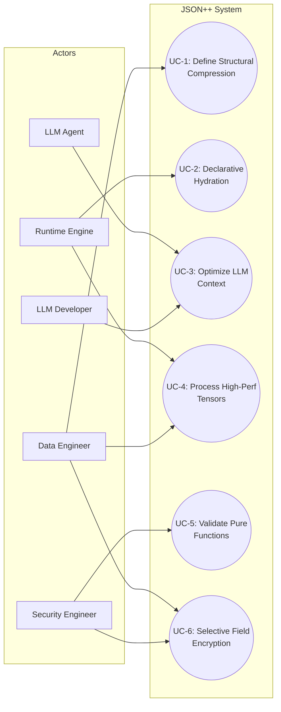
```mermaid
graph LR
    subgraph Actors
        DE[Data Engineer]
        LD[LLM Developer]
        LA[LLM Agent]
        SE[Security Engineer]
        RE[Runtime Engine]
    end

    subgraph "JSON++ System"
        UC1((UC-1: Define Structural<br/>Compression))
        UC2((UC-2: Declarative<br/>Hydration))
        UC3((UC-3: Optimize LLM<br/>Context))
        UC4((UC-4: Process High-Perf<br/>Tensors))
        UC5((UC-5: Validate Pure<br/>Functions))
        UC6((UC-6: Selective Field<br/>Encryption))
    end

    DE --> UC1
    DE --> UC4
    LD --> UC3
    LA --> UC3
    RE --> UC2
    RE --> UC4
    SE --> UC5
    SE --> UC6
    DE --> UC6
```

---

## 4. Actor-Use Case Matrix

| Use Case | Data Engineer | LLM Dev | LLM Agent | Security Eng | Runtime Engine |
| :--- | :---: | :---: | :---: | :---: | :---: |
| **UC-1: Structural Compression** | **P** | S | - | - | S |
| **UC-2: Declarative Hydration** | S | - | - | - | **P** |
| **UC-3: LLM Context Optimization** | S | **P** | **P** | - | - |
| **UC-4: High-Perf Tensors** | **P** | - | - | - | **P** |
| **UC-5: Validate Pure Functions** | S | - | - | **P** | S |
| **UC-6: Selective Encryption** | **P** | - | - | **P** | - |

**Legend:**
- **P**: Primary Actor (Initiates the process)
- **S**: Secondary Actor (Participates or is affected)
- **-**: No direct involvement

---

## 5. Traceability & Acceptance Criteria

| UC-ID | Acceptance Criteria | Test Case Reference |
| :--- | :--- | :--- |
| **UC-1** | Must reduce file size by >20% for datasets with 3+ repeating objects. | TC-COMP-01 |
| **UC-2** | Functions must execute in <10ms for 1000-item arrays. | TC-HYDR-05 |
| **UC-3** | LLM-generated JSON++ must be valid JS syntax 99% of the time. | TC-LLM-02 |
| **UC-4** | Tensor data must be accessible via `Float32Array` without re-parsing. | TC-TENS-09 |
| **UC-5** | Any attempt to call `fetch()` or `fs` must throw a compile-time error. | TC-SEC-01 |

---

## Requirements Specification

# JSON++: Requirements Documentation

## 1. Functional Requirements (FR)

The functional requirements define the core capabilities of the JSON++ substrate, focusing on its ability to parse, evaluate, and transform data while maintaining JavaScript compatibility.

| FR-ID | Description | Priority | Source | Acceptance Criteria |
|:---|:---|:---|:---|:---|
| **FR-101** | **JS Subgrammar Compliance** | Must Have | Systems Architect | The parser must accept only a subset of ECMAScript (Variables, Arrow Functions, Literals, Arrays, Objects). Any non-compliant JS (e.g., `while` loops, `try/catch`) must throw a syntax error. |
| **FR-102** | **Symbolic Bindings** | Must Have | LLM Developers | Users can define `const` or `let` bindings to reuse data structures. Referencing a binding must resolve to its evaluated value during hydration. |
| **FR-103** | **Pure Function Hydration** | Must Have | Data Engineers | Support for arrow functions that transform input data. Functions must be "pure" (no external state access). |
| **FR-104** | **Acyclic Dependency Enforcement** | Must Have | Systems Architect | The evaluation engine must detect and reject circular references between symbolic bindings to prevent infinite loops. |
| **FR-201** | **Tensor/Binary Mapping** | Should Have | Data Engineers | Support for `Float32Array`, `Uint8Array`, and other TypedArrays. Must allow direct mapping from base64 or hex strings to binary buffers without intermediate string copies. |
| **FR-202** | **Schema Validation (TS-Native)** | Should Have | DevOps Engineers | Ability to validate a JSON++ file against a TypeScript interface or JSON Schema before evaluation. |
| **FR-301** | **LSP Integration** | Could Have | Software Developers | Provide a Language Server Protocol implementation for VS Code/IntelliJ offering autocomplete for bindings and syntax highlighting. |
| **FR-302** | **Selective Field Encryption** | Could Have | Security Engineers | Support for a `@secure` decorator or wrapper that marks fields for encryption/decryption during the hydration phase. |

---

## 2. Non-Functional Requirements (NFR)

These requirements define the operational constraints and quality attributes of the system.

### 2.1 Performance
*   **NFR-101 (Latency):** Evaluation of a 1MB JSON++ file with 100 symbolic bindings must complete in under 50ms on a standard V8 runtime.
*   **NFR-102 (Memory):** The memory overhead of the evaluation engine must not exceed 2x the raw size of the input data.
*   **NFR-103 (Compression):** For repetitive datasets, JSON++ must achieve at least a 30% reduction in token count compared to standard JSON (LLM-native optimization).

### 2.2 Security
*   **NFR-201 (Sandbox Isolation):** The evaluation engine must run in a "Zero-I/O" sandbox. Access to `globalThis`, `process`, `window`, `fetch`, or `fs` must be strictly prohibited.
*   **NFR-202 (Deterministic Execution):** Given the same input and environment, the output of a JSON++ evaluation must be byte-for-byte identical every time.

### 2.3 Reliability & Maintainability
*   **NFR-301 (Error Handling):** The parser must provide precise line/column numbers for syntax errors and circular dependency detections.
*   **NFR-302 (Code Quality):** The core library must maintain >90% test coverage and pass strict TypeScript `noImplicitAny` checks.

### 2.4 Compatibility
*   **NFR-401 (Runtime Support):** Must be compatible with Node.js (v16+), Deno, Bun, and modern evergreen browsers (Chrome, Firefox, Safari).
*   **NFR-402 (JSON Interop):** Any valid standard JSON file must be a valid JSON++ file without modification.

---

## 3. Requirements Traceability Matrix (RTM)

This matrix ensures that every stakeholder use case is addressed by a requirement and tracked via test cases.

| Use Case ID | Requirement ID | Test Case ID | Status |
|:---|:---|:---|:---|
| **UC-Token-Opt** (LLM Token Reduction) | FR-102, NFR-103 | TC-101, TC-102 | Pending |
| **UC-Binary-Data** (Tensor Handling) | FR-201, NFR-101 | TC-201 | Pending |
| **UC-Safe-Eval** (Secure Data Hydration) | FR-101, NFR-201 | TC-301, TC-302 | Pending |
| **UC-Schema-Sync** (Type Safety) | FR-202 | TC-401 | Pending |
| **UC-Developer-Exp** (Tooling) | FR-301, NFR-301 | TC-501 | Pending |

---

## 4. Requirements Dependency Diagram

The following diagram illustrates the logical flow and dependencies between the functional and non-functional requirements.

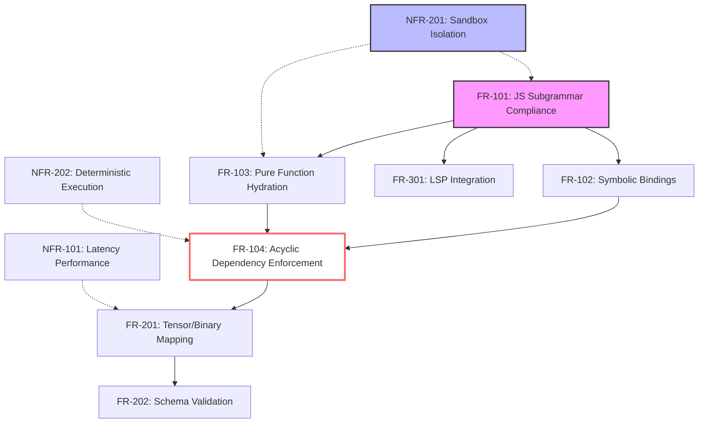
```mermaid
graph TD
    %% Functional Requirements
    FR101[FR-101: JS Subgrammar Compliance] --> FR102[FR-102: Symbolic Bindings]
    FR101 --> FR103[FR-103: Pure Function Hydration]
    
    FR102 --> FR104[FR-104: Acyclic Dependency Enforcement]
    FR103 --> FR104
    
    FR104 --> FR201[FR-201: Tensor/Binary Mapping]
    FR201 --> FR202[FR-202: Schema Validation]
    
    FR101 --> FR301[FR-301: LSP Integration]
    
    %% Non-Functional Requirements
    NFR201[NFR-201: Sandbox Isolation] -.-> FR101
    NFR201 -.-> FR103
    
    NFR202[NFR-202: Deterministic Execution] -.-> FR104
    
    NFR101[NFR-101: Latency Performance] -.-> FR201
    
    style FR101 fill:#f9f,stroke:#333,stroke-width:2px
    style NFR201 fill:#bbf,stroke:#333,stroke-width:2px
    style FR104 fill:#fff,stroke:#f66,stroke-width:3px
```

### Diagram Key:
*   **Solid Arrows:** Hard functional dependency (Feature A requires Feature B to work).
*   **Dashed Arrows:** Constraint dependency (NFR limits or defines the implementation of FR).
*   **Pink Box:** Core Parser (Foundation).
*   **Blue Box:** Security Constraint.
*   **Red Border:** Critical Path for System Stability.

---

## 5. Acceptance Criteria Summary (Sample)

### TC-101: Symbolic Binding Resolution
*   **Input:** `const x = 10; const y = x + 5; { result: y }`
*   **Expected Output:** `{ "result": 15 }`
*   **Pass Condition:** Evaluator returns the correct JSON object and the parser identifies `x` and `y` as valid bindings.

### TC-301: Sandbox Violation Prevention
*   **Input:** `const data = process.env.SECRET; { val: data }`
*   **Expected Output:** `ReferenceError: process is not defined`
*   **Pass Condition:** The engine must not leak any global Node.js or Browser objects into the evaluation context.

---

## System Architecture

# JSON++: The Grammar-Extensible Data Substrate
## Architectural Design Document v1.0

JSON++ is a programmable data format designed to bridge the gap between human-readable configuration and machine-efficient data structures. By leveraging a strict, side-effect-free subset of JavaScript, it enables features like structural compression, computed fields, and native binary support.

---

## 1. System Context Diagram (C4 Level 1)

The System Context diagram shows how JSON++ fits into the broader ecosystem of data engineering and AI development.

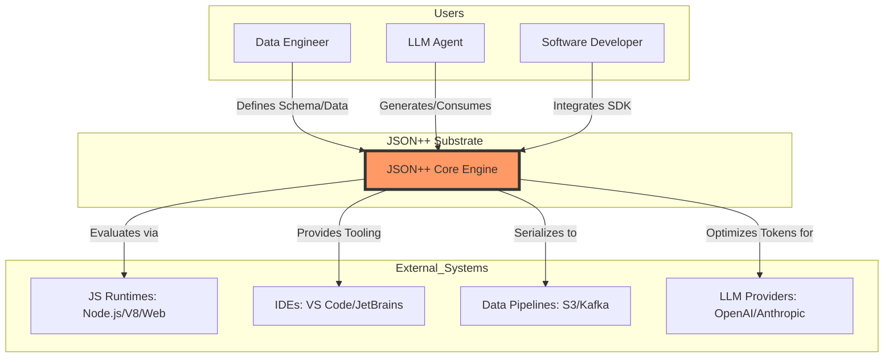
```mermaid
graph TB
    subgraph Users
        DE[Data Engineer]
        LA[LLM Agent]
        SD[Software Developer]
    end

    subgraph JSON_Plus_Plus_Ecosystem [JSON++ Substrate]
        JPP[JSON++ Core Engine]
    end

    subgraph External_Systems
        JSR[JS Runtimes: Node.js/V8/Web]
        IDE[IDEs: VS Code/JetBrains]
        PIPE[Data Pipelines: S3/Kafka]
        LLM[LLM Providers: OpenAI/Anthropic]
    end

    DE -->|Defines Schema/Data| JPP
    LA -->|Generates/Consumes| JPP
    SD -->|Integrates SDK| JPP

    JPP -->|Evaluates via| JSR
    JPP -->|Provides Tooling| IDE
    JPP -->|Serializes to| PIPE
    JPP -->|Optimizes Tokens for| LLM

    style JPP fill:#f96,stroke:#333,stroke-width:4px
```

---

## 2. Container Diagram (C4 Level 2)

This diagram breaks down the JSON++ ecosystem into its high-level functional containers.

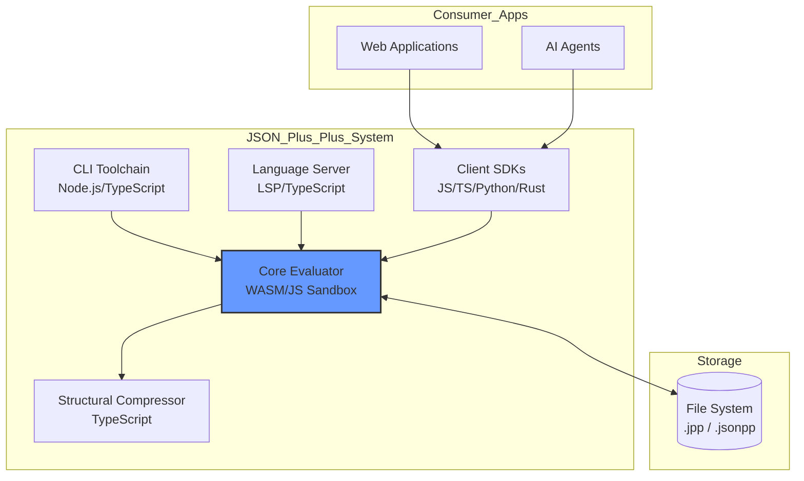
```mermaid
graph TB
    subgraph JSON_Plus_Plus_System
        CLI[CLI Toolchain<br/>Node.js/TypeScript]
        LSP[Language Server<br/>LSP/TypeScript]
        CORE[Core Evaluator<br/>WASM/JS Sandbox]
        COMP[Structural Compressor<br/>TypeScript]
        SDK[Client SDKs<br/>JS/TS/Python/Rust]
    end

    subgraph Storage
        FS[(File System<br/>.jpp / .jsonpp)]
    end

    subgraph Consumer_Apps
        WEB[Web Applications]
        AI[AI Agents]
    end

    CLI --> CORE
    LSP --> CORE
    SDK --> CORE
    CORE --> COMP
    CORE <--> FS
    WEB --> SDK
    AI --> SDK

    style CORE fill:#69f,stroke:#333,stroke-width:2px
```

---

## 3. Component Diagram (C4 Level 3)

Focusing on the **Core Evaluator**, the heart of the system that ensures the "JS-Eval Constraint" and "Side-effect free" requirements.

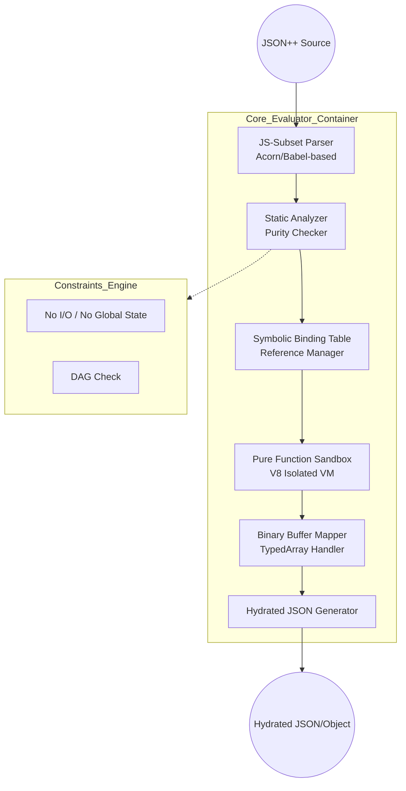
```mermaid
graph TD
    subgraph Core_Evaluator_Container
        Parser[JS-Subset Parser<br/>Acorn/Babel-based]
        Validator[Static Analyzer<br/>Purity Checker]
        SymTable[Symbolic Binding Table<br/>Reference Manager]
        FuncRunner[Pure Function Sandbox<br/>V8 Isolated VM]
        BinaryMap[Binary Buffer Mapper<br/>TypedArray Handler]
        OutputGen[Hydrated JSON Generator]
    end

    Input((JSON++ Source)) --> Parser
    Parser --> Validator
    Validator --> SymTable
    SymTable --> FuncRunner
    FuncRunner --> BinaryMap
    BinaryMap --> OutputGen
    OutputGen --> Output((Hydrated JSON/Object))

    subgraph Constraints_Engine
        Purity[No I/O / No Global State]
        Acyclic[DAG Check]
    end

    Validator -.-> Constraints_Engine
```

---

## 4. Deployment Diagram

JSON++ is distributed as a library and toolset, deployed across various environments from edge to local dev.

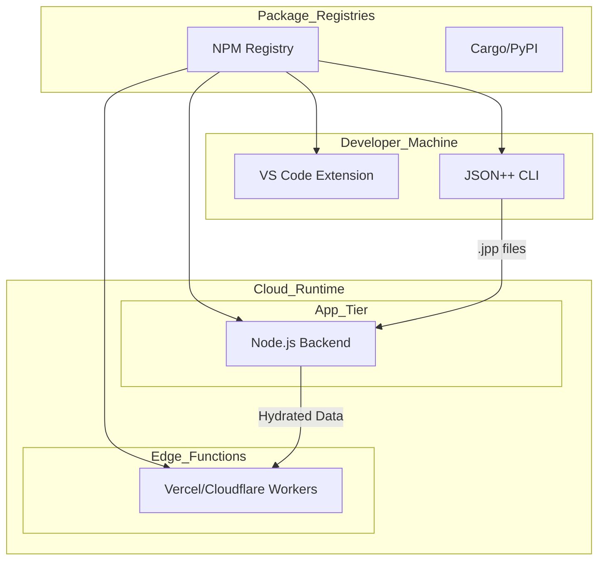
```mermaid
graph TB
    subgraph Developer_Machine
        VSCode[VS Code Extension]
        LocalCLI[JSON++ CLI]
    end

    subgraph Package_Registries
        NPM[NPM Registry]
        Cargo[Cargo/PyPI]
    end

    subgraph Cloud_Runtime
        subgraph Edge_Functions
            Vercel[Vercel/Cloudflare Workers]
        end
        subgraph App_Tier
            NodeSrv[Node.js Backend]
        end
    end

    NPM --> VSCode
    NPM --> LocalCLI
    NPM --> NodeSrv
    NPM --> Vercel
    
    LocalCLI -->|.jpp files| NodeSrv
    NodeSrv -->|Hydrated Data| Vercel
```

---

## 5. Technology Stack Summary

| Layer | Technology | Reason |
| :--- | :--- | :--- |
| **Core Language** | TypeScript | Strong typing for schema definitions and AST manipulation. |
| **Parsing** | Acorn / SWC | High-performance JS parsing to ensure strict subgrammar compliance. |
| **Runtime** | V8 / WebWorker | Native support for JS execution with isolation capabilities. |
| **Binary Handling** | ArrayBuffer / SharedArrayBuffer | Zero-copy data transfer and high-performance tensor support. |
| **Tooling** | LSP (Language Server Protocol) | Cross-IDE support for autocomplete and validation. |
| **Distribution** | NPM / WASM | Universal availability across JS runtimes and non-JS environments via WASM. |

---

## 6. Architecture Decision Records (ADRs)

### ADR-001: Adoption of JS Subgrammar over Custom DSL
*   **Context**: We needed a format that supports variables and functions. Creating a new DSL requires new parsers, syntax highlighting, and learning curves.
*   **Decision**: Use a strict subset of ECMAScript (Object literals, `const`, Arrow Functions).
*   **Consequences**: 
    *   (+) Instant compatibility with existing JS tools (Prettier, ESLint).
    *   (+) Zero-learning curve for JS developers.
    *   (-) Requires strict sandboxing to prevent `eval()`-based security risks.

### ADR-002: Enforcement of Pure Functions
*   **Context**: JSON++ must be deterministic and side-effect free for caching and security.
*   **Decision**: The evaluator will throw an error if it detects access to `window`, `process`, `fs`, `fetch`, or non-deterministic functions like `Math.random()`.
*   **Consequences**:
    *   (+) Guaranteed reproducibility of data hydration.
    *   (+) Safe to execute in multi-tenant environments.
    *   (-) Users cannot fetch external data during hydration (must be passed as arguments).

### ADR-003: Symbolic Binding for Structural Compression
*   **Context**: Large datasets (e.g., LLM traces) often contain repetitive structures.
*   **Decision**: Implement a `const` binding system where repeated objects are defined once and referenced via symbols.
*   **Consequences**:
    *   (+) Significant reduction in token count for LLM contexts.
    *   (+) Smaller wire-size compared to standard JSON.
    *   (-) Requires a "hydration" step before consumption by standard JSON parsers.

---

## 7. Traceability Matrix

| ID | Requirement | Component | Test Case |
| :--- | :--- | :--- | :--- |
| **FR-001** | JS-Eval Constraint | `Parser` | `TC-001: Validate valid JS object literal` |
| **FR-002** | Side-effect free | `Validator` | `TC-002: Reject code containing 'fetch()'` |
| **FR-003** | Symbolic Bindings | `SymTable` | `TC-003: Verify memory address reuse for consts` |
| **FR-004** | Binary Tensors | `BinaryMap` | `TC-004: Map Base64 to Float32Array` |
| **FR-005** | LSP Support | `LSP Server` | `TC-005: Provide hover-type info in VS Code` |

---

## 8. State Machine: Evaluation Lifecycle (StateDiagram-v2)

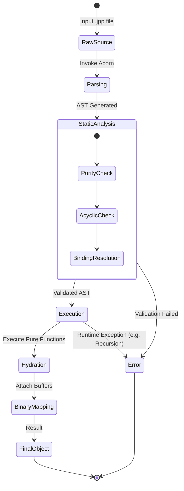
```mermaid
stateDiagram-v2
    [*] --> RawSource: Input .jpp file
    RawSource --> Parsing: Invoke Acorn
    Parsing --> StaticAnalysis: AST Generated
    
    state StaticAnalysis {
        [*] --> PurityCheck
        PurityCheck --> AcyclicCheck
        AcyclicCheck --> BindingResolution
    }
    
    StaticAnalysis --> Execution: Validated AST
    Execution --> Hydration: Execute Pure Functions
    Hydration --> BinaryMapping: Attach Buffers
    BinaryMapping --> FinalObject: Result
    
    StaticAnalysis --> Error: Validation Failed
    Execution --> Error: Runtime Exception (e.g. Recursion)
    Error --> [*]
    FinalObject --> [*]
```

---

## Data Model & ERD

# JSON++ Data Model Documentation

This document outlines the internal data model and structural architecture of **JSON++: The Grammar-Extensible Data Substrate**. Unlike static JSON, JSON++ is a programmable substrate. This documentation defines how the substrate manages symbols, hydrators, and binary data.

---

## 1. Entity-Relationship Diagram (Meta-Model)

The following diagram represents the internal structure of a JSON++ document and its evaluation lifecycle.

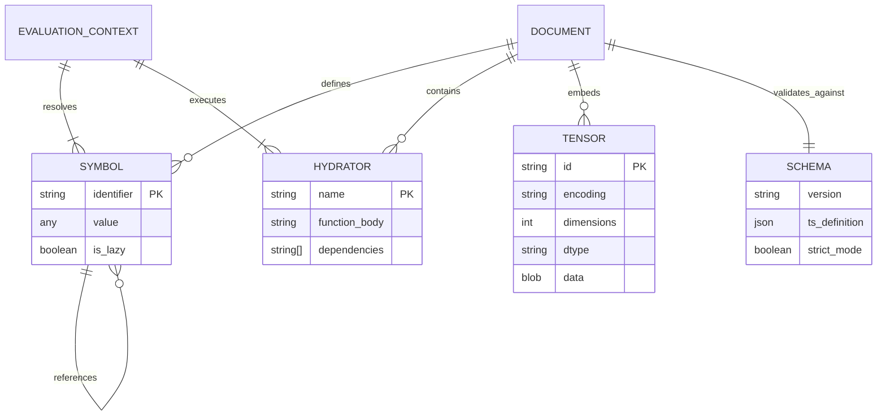
```mermaid
erDiagram
    DOCUMENT ||--o{ SYMBOL : defines
    DOCUMENT ||--o{ HYDRATOR : contains
    DOCUMENT ||--o{ TENSOR : embeds
    DOCUMENT ||--|| SCHEMA : validates_against

    SYMBOL ||--o{ SYMBOL : references
    SYMBOL {
        string identifier PK
        any value
        boolean is_lazy
    }

    HYDRATOR {
        string name PK
        string function_body
        string[] dependencies
    }

    TENSOR {
        string id PK
        string encoding
        int dimensions
        string dtype
        blob data
    }

    SCHEMA {
        string version
        json ts_definition
        boolean strict_mode
    }

    EVALUATION_CONTEXT ||--|{ SYMBOL : resolves
    EVALUATION_CONTEXT ||--|{ HYDRATOR : executes
```

---

## 2. Entity Descriptions

### 2.1 Document (The Substrate)
- **Purpose**: The root container for a JSON++ instance. It is a valid JavaScript module or script that, when evaluated in a restricted context, yields a data structure.
- **Attributes**:
    - `version`: The JSON++ specification version.
    - `body`: The primary data payload.
- **Relationships**: Acts as the parent for all Symbols, Hydrators, and Tensors.

### 2.2 Symbol
- **Purpose**: Enables structural compression by allowing repeated data patterns to be defined once and referenced multiple times (aliasing).
- **Attributes**:
    - `identifier`: Unique name within the document scope (e.g., `$user_template`).
    - `value`: Any valid JSON++ type (primitive, object, or reference).
    - `is_lazy`: If true, the symbol is only evaluated upon first access.
- **Performance**: Reduces token count in LLM contexts and memory footprint in telemetry.

### 2.3 Hydrator
- **Purpose**: Pure functions that transform raw data into a "hydrated" state (e.g., calculating a total price from an array of items).
- **Attributes**:
    - `name`: The function identifier.
    - `function_body`: A side-effect-free JavaScript arrow function.
    - `dependencies`: List of other symbols or hydrators required for execution.
- **Constraints**: Must be deterministic and side-effect free (no `Date.now()`, `Math.random()`, or I/O).

### 2.4 Tensor
- **Purpose**: High-performance handling of multi-dimensional numerical data, mapped directly to JavaScript `TypedArrays`.
- **Attributes**:
    - `dtype`: Data type (e.g., `float32`, `int8`).
    - `dimensions`: Shape of the data (e.g., `[1024, 768]`).
    - `encoding`: Storage format (e.g., `base64`, `raw-hex`).

---

## 3. Data Dictionary

| Entity | Attribute | Type | Constraints | Description |
| :--- | :--- | :--- | :--- | :--- |
| **Symbol** | `identifier` | String | Regex: `^\$[a-zA-Z0-9_]+$` | The variable name used for referencing. |
| **Symbol** | `value` | Any | Valid JS Subset | The data or structure being aliased. |
| **Hydrator** | `function_body`| String | Pure Function | The logic used to compute derived fields. |
| **Tensor** | `dtype` | Enum | `f32, f64, i8, u8, i32` | The numerical precision of the binary block. |
| **Tensor** | `data` | Blob/String | Non-null | The encoded binary payload. |
| **Schema** | `ts_definition` | JSON/TS | Valid TypeScript | The structural contract the document must satisfy. |

---

## 4. Data Flow Diagram

The following diagram illustrates the lifecycle of a JSON++ document from raw input to a fully hydrated, application-ready object.

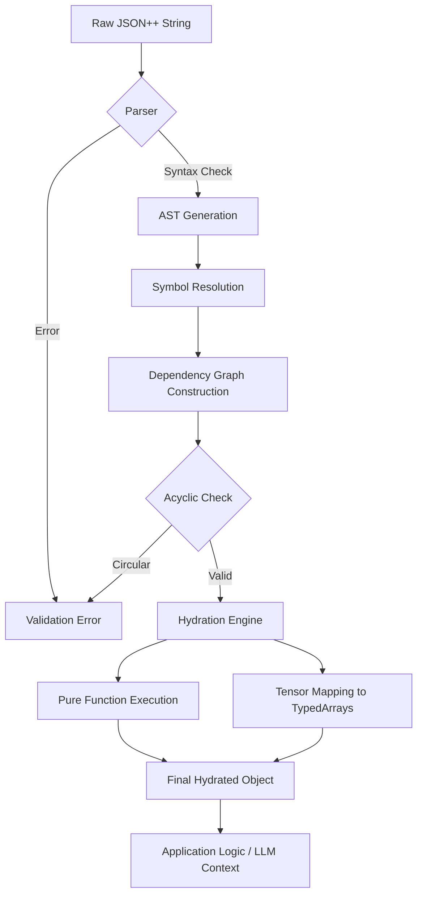
```mermaid
graph TD
    A[Raw JSON++ String] --> B{Parser}
    B -->|Syntax Check| C[AST Generation]
    B -->|Error| E[Validation Error]
    
    C --> D[Symbol Resolution]
    D --> F[Dependency Graph Construction]
    
    F --> G{Acyclic Check}
    G -->|Circular| E
    G -->|Valid| H[Hydration Engine]
    
    H --> I[Pure Function Execution]
    H --> J[Tensor Mapping to TypedArrays]
    
    I --> K[Final Hydrated Object]
    J --> K
    
    K --> L[Application Logic / LLM Context]
```

---

## 5. Data Validation Rules

To ensure the integrity of the "Data Substrate," the following rules are enforced during the parsing and hydration phases:

1. **FR-VAL-01: Pure Function Constraint**
   - Hydrators cannot access global objects (`window`, `process`, `global`).
   - Hydrators cannot use non-deterministic functions (`Math.random()`).
2. **FR-VAL-02: Acyclic Dependency**
   - Symbols and Hydrators must form a Directed Acyclic Graph (DAG). Circular references result in a `ReferenceError`.
3. **FR-VAL-03: Type Safety**
   - If a `Schema` is provided, the final hydrated object must pass a `tsc` (TypeScript Compiler) check or a JSON Schema validation.
4. **FR-VAL-04: Tensor Integrity**
   - The length of the `data` blob must exactly match the product of the `dimensions` and the byte-size of the `dtype`.

---

## 6. Data Migration Considerations

When migrating from standard JSON or Protobuf to JSON++, consider the following:

### 6.1 From Standard JSON
- **De-duplication**: Identify repeating objects (e.g., metadata headers) and move them into `Symbols`.
- **Logic Extraction**: Move calculated fields from the producer side into `Hydrators` to reduce payload size.

### 6.2 From Protobuf/Binary
- **Schema Mapping**: Map Protobuf `.proto` definitions to JSON++ TypeScript schemas.
- **Tensor Optimization**: Use the `Tensor` entity for large arrays to maintain the performance of binary formats while keeping the rest of the metadata human-readable.

### 6.3 LLM Token Optimization
- **Symbolic Aliasing**: Use short symbol names (e.g., `$1`, `$2`) for long, repetitive strings to significantly reduce token consumption during LLM inference and context window usage.

---

## Flow Diagrams

# JSON++: Flow Documentation & System Interactions

This document outlines the critical operational flows for **JSON++**, detailing how the system handles data hydration, symbolic expansion, binary mapping, and security enforcement.

---

## 1. Sequence Diagrams: Critical User Journeys

### SD-101: Data Hydration & Evaluation
This journey describes how a raw JSON++ string is transformed into a hydrated JavaScript object while enforcing the "Pure Function" constraint.

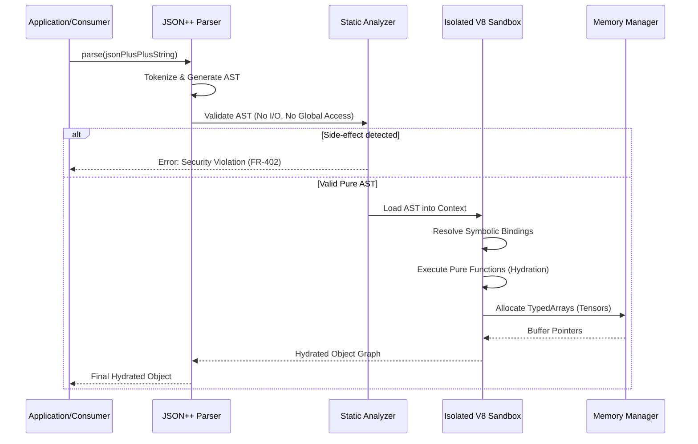
```mermaid
sequenceDiagram
    participant App as Application/Consumer
    participant P as JSON++ Parser
    participant S as Static Analyzer
    participant VM as Isolated V8 Sandbox
    participant M as Memory Manager

    App->>P: parse(jsonPlusPlusString)
    P->>P: Tokenize & Generate AST
    P->>S: Validate AST (No I/O, No Global Access)
    alt Side-effect detected
        S-->>App: Error: Security Violation (FR-402)
    else Valid Pure AST
        S->>VM: Load AST into Context
        VM->>VM: Resolve Symbolic Bindings
        VM->>VM: Execute Pure Functions (Hydration)
        VM->>M: Allocate TypedArrays (Tensors)
        M-->>VM: Buffer Pointers
        VM-->>P: Hydrated Object Graph
        P-->>App: Final Hydrated Object
    end
```

### SD-102: LLM Context Injection (Token Optimization)
This journey demonstrates how an LLM-native application uses JSON++ to reduce token count via symbolic compression.

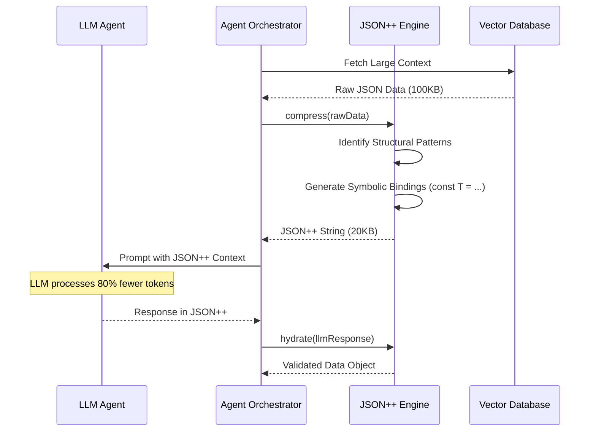
```mermaid
sequenceDiagram
    participant LLM as LLM Agent
    participant Orchestrator as Agent Orchestrator
    participant JPP as JSON++ Engine
    participant DB as Vector Database

    Orchestrator->>DB: Fetch Large Context
    DB-->>Orchestrator: Raw JSON Data (100KB)
    Orchestrator->>JPP: compress(rawData)
    JPP->>JPP: Identify Structural Patterns
    JPP->>JPP: Generate Symbolic Bindings (const T = ...)
    JPP-->>Orchestrator: JSON++ String (20KB)
    Orchestrator->>LLM: Prompt with JSON++ Context
    Note over LLM: LLM processes 80% fewer tokens
    LLM-->>Orchestrator: Response in JSON++
    Orchestrator->>JPP: hydrate(llmResponse)
    JPP-->>Orchestrator: Validated Data Object
```

---

## 2. Activity Diagrams: Complex Processes

### AD-201: Symbolic Binding Resolution Logic
The core logic for expanding `const` definitions and spread operators within the data substrate.

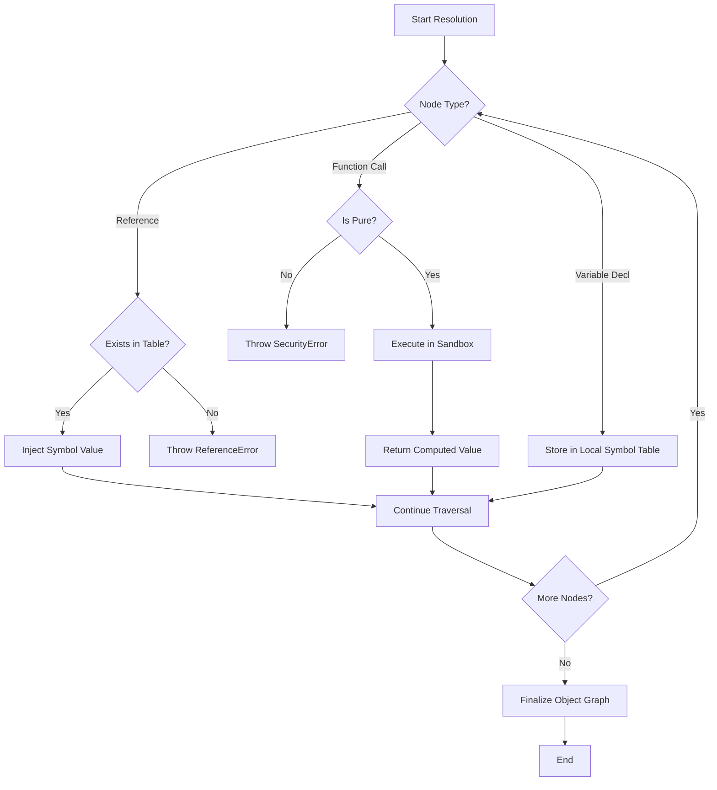
```mermaid
graph TD
    A[Start Resolution] --> B{Node Type?}
    B -->|Variable Decl| C[Store in Local Symbol Table]
    B -->|Reference| D{Exists in Table?}
    D -->|No| E[Throw ReferenceError]
    D -->|Yes| F[Inject Symbol Value]
    B -->|Function Call| G{Is Pure?}
    G -->|No| H[Throw SecurityError]
    G -->|Yes| I[Execute in Sandbox]
    I --> J[Return Computed Value]
    F --> K[Continue Traversal]
    J --> K
    C --> K
    K --> L{More Nodes?}
    L -->|Yes| B
    L -->|No| M[Finalize Object Graph]
    M --> N[End]
```

---

## 3. State Diagrams: Entity Lifecycles

### ST-301: JSON++ Document Lifecycle
Tracks the state of a JSON++ document from raw input to a live, hydrated memory object.

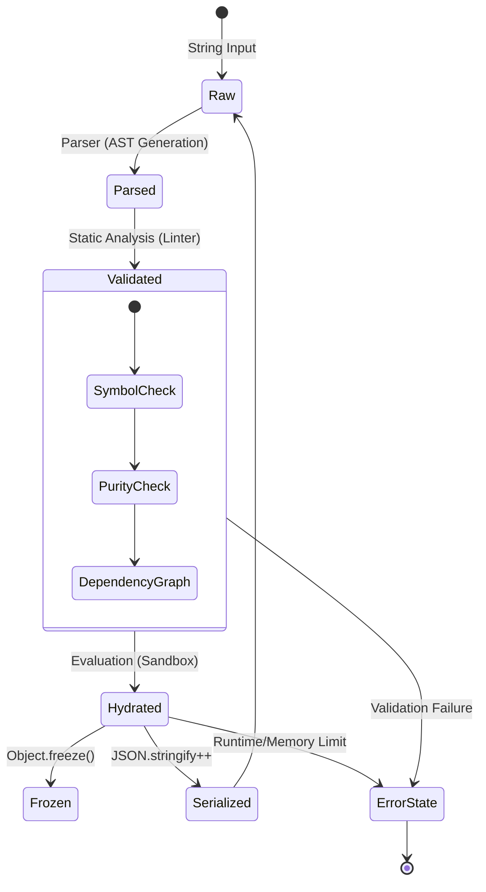
```mermaid
stateDiagram-v2
    [*] --> Raw: String Input
    Raw --> Parsed: Parser (AST Generation)
    Parsed --> Validated: Static Analysis (Linter)
    Validated --> Hydrated: Evaluation (Sandbox)
    Hydrated --> Frozen: Object.freeze()
    
    state Validated {
        [*] --> SymbolCheck
        SymbolCheck --> PurityCheck
        PurityCheck --> DependencyGraph
    }

    Hydrated --> Serialized: JSON.stringify++
    Serialized --> Raw
    
    Validated --> ErrorState: Validation Failure
    Hydrated --> ErrorState: Runtime/Memory Limit
    ErrorState --> [*]
```

---

## 4. Integration Flow Diagrams

### IF-401: Binary Data & Tensor Mapping
JSON++ allows high-performance data handling by mapping specific keys to binary buffers (e.g., for AI model weights or telemetry).

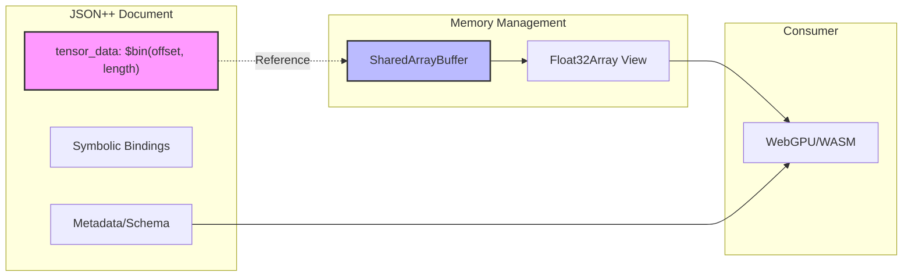
```mermaid
graph LR
    subgraph "JSON++ Document"
        J1[Metadata/Schema]
        J2[Symbolic Bindings]
        J3["tensor_data: $bin(offset, length)"]
    end

    subgraph "Memory Management"
        B1[SharedArrayBuffer]
        T1[Float32Array View]
    end

    subgraph "Consumer"
        C1[WebGPU/WASM]
    end

    J3 -.->|Reference| B1
    B1 --> T1
    T1 --> C1
    J1 --> C1
    
    style J3 fill:#f9f,stroke:#333,stroke-width:2px
    style B1 fill:#bbf,stroke:#333,stroke-width:2px
```

---

## 5. Error Handling Flows

### EF-501: Sandbox Violation & Recovery
How the system handles non-deterministic or malicious code within a JSON++ file.

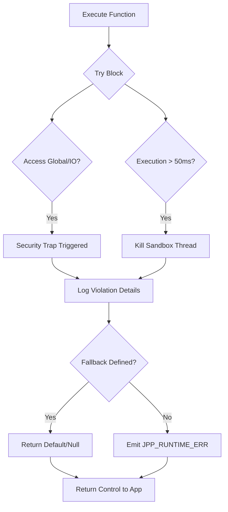
```mermaid
graph TD
    Start[Execute Function] --> Try{Try Block}
    Try --> AccessGlobal{Access Global/IO?}
    AccessGlobal -->|Yes| Trap[Security Trap Triggered]
    Try --> Timeout{Execution > 50ms?}
    Timeout -->|Yes| Terminate[Kill Sandbox Thread]
    
    Trap --> Log[Log Violation Details]
    Terminate --> Log
    
    Log --> Fallback{Fallback Defined?}
    Fallback -->|Yes| UseDefault[Return Default/Null]
    Fallback -->|No| Throw[Emit JPP_RUNTIME_ERR]
    
    UseDefault --> End[Return Control to App]
    Throw --> End
```

---

## 6. Traceability Matrix (Flows to Requirements)

| Flow ID | Name | Primary Requirement | Stakeholder |
|:---|:---|:---|:---|
| **SD-101** | Hydration Flow | FR-101: Deterministic Eval | Data Engineers |
| **SD-102** | LLM Optimization | FR-205: Token Efficiency | LLM Developers |
| **AD-201** | Symbolic Resolution | FR-104: Structural Compression | Systems Architects |
| **ST-301** | Document Lifecycle | FR-301: LSP Support | DevOps Engineers |
| **IF-401** | Binary Mapping | FR-502: Zero-copy Tensors | AI Engineers |
| **EF-501** | Sandbox Violation | FR-402: Side-effect Free | Security Engineers |

---

## 7. Acceptance Criteria for Flows

1.  **Hydration Performance (SD-101):** Hydration of a 1MB JSON++ file with 100 symbolic bindings must complete in < 20ms on standard V8 runtimes.
2.  **Sandbox Integrity (EF-501):** Any attempt to access `process`, `window`, `fetch`, or `Date.now()` must result in an immediate `SecurityError` before execution.
3.  **Compression Ratio (SD-102):** For repetitive telemetry data, JSON++ must achieve at least a 3:1 compression ratio compared to standard JSON without using GZIP.
4.  **Memory Safety (IF-401):** Binary mappings must be bounds-checked against the underlying `ArrayBuffer` to prevent buffer overruns.

---

## Test Plan

# JSON++ Test Plan Documentation
**Project:** JSON++: The Grammar-Extensible Data Substrate  
**Version:** 1.0.0  
**Status:** Draft / For Review

---

## 1. Test Strategy Overview

### 1.1 Testing Objectives
The primary objective is to ensure that JSON++ remains a deterministic, side-effect-free, and high-performance data substrate. Testing focuses on the integrity of the parser, the safety of the evaluation sandbox, and the efficiency of symbolic compression.

### 1.2 Testing Scope
*   **In-Scope:**
    *   Grammar validation (JS-subset compliance).
    *   Symbolic binding resolution and scope management.
    *   Pure function evaluation and hydration.
    *   Binary/Tensor mapping to `TypedArrays`.
    *   LSP (Language Server Protocol) features (autocomplete, diagnostics).
    *   Security sandboxing (prevention of I/O and global access).
*   **Out-of-Scope:**
    *   Network-level transport protocols.
    *   Non-V8 runtime optimizations (e.g., SpiderMonkey specific quirks).
    *   Third-party library integrations outside the core SDK.

### 1.3 Testing Approach
We utilize a **Test-Driven Development (TDD)** approach for the parser and a **Property-Based Testing** approach for the hydration engine to ensure that any valid JSON++ input results in a deterministic output regardless of evaluation order.

### 1.4 Entry/Exit Criteria
*   **Entry Criteria:**
    *   Architecture design document finalized.
    *   Grammar specification (EBNF) completed.
    *   CI/CD pipeline configured.
*   **Exit Criteria:**
    *   100% pass rate for "Critical" and "High" priority test cases.
    *   Code coverage > 92% for the core engine.
    *   Zero known "Sandbox Escape" vulnerabilities.

---

## 2. Test Levels

### 2.1 Unit Testing
*   **Framework:** Vitest / Jest.
*   **Focus:** Individual components: Lexer, Parser, AST Transformer, and Scope Manager.
*   **Target:** 100% coverage of the `grammar-rules` module.

### 2.2 Integration Testing
*   **Focus:** Interaction between the Parser and the Hydrator.
*   **Scenarios:** Testing how `const` bindings in one block are consumed by functions in another.
*   **API Testing:** Validating the `JSONPP.parse()` and `JSONPP.stringify()` interfaces.

### 2.3 System Testing (End-to-End)
*   **Focus:** Real-world data workflows.
*   **Scenarios:** Loading a 50MB telemetry file with symbolic compression and verifying memory footprint vs. standard JSON.
*   **LLM Integration:** Testing token-count reduction when passing JSON++ to GPT-4/Claude-3.

### 2.4 Acceptance Testing (UAT)
*   **Criteria:** Developers must be able to define a custom "Tensor" type and hydrate it into a `Float32Array` without manual iteration.
*   **LSP Validation:** VS Code extension provides real-time feedback on side-effect violations.

---

## 3. Test Case Catalog

| TC-ID | Requirement | Description | Steps | Expected Result | Priority |
|-------|-------------|-------------|-------|-----------------|----------|
| **TC-001** | FR-001 | Standard JSON Compatibility | 1. Input standard JSON string. 2. Call `JSONPP.parse()`. | Output matches `JSON.parse()` exactly. | Critical |
| **TC-002** | FR-002 | Symbolic Binding Resolution | 1. Define `const base = { a: 1 };`. 2. Reference `base` in a nested object. | Nested object contains resolved values. | High |
| **TC-003** | FR-003 | Pure Function Hydration | 1. Define `const add = (x, y) => x + y;`. 2. Use `add(5, 10)` in data. | Field evaluates to `15`. | High |
| **TC-004** | FR-004 | Side-Effect Prevention | 1. Attempt to use `fetch()` or `fs.readFile` inside a function. | Parser throws `SecurityError`. | Critical |
| **TC-005** | FR-005 | Tensor Mapping | 1. Define a binary blob. 2. Map to `Int32Array`. | Data is accessible as a zero-copy TypedArray. | Medium |
| **TC-006** | FR-006 | Circular Dependency Detection | 1. Define `const a = b; const b = a;`. 2. Parse. | Parser throws `CircularDependencyError`. | High |

---

## 4. Test Coverage Matrix

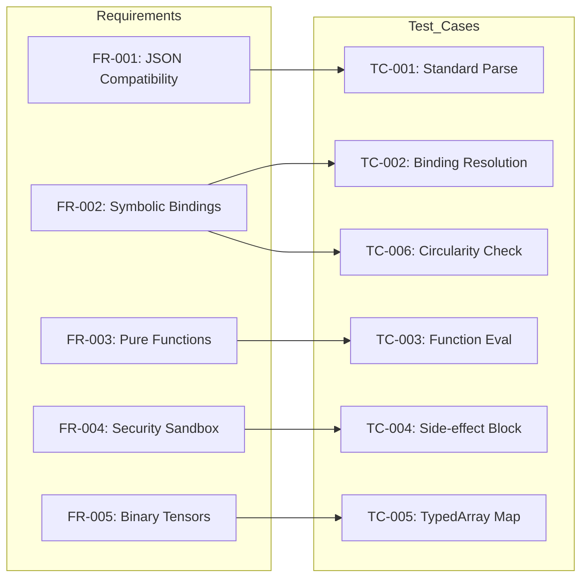
```mermaid
graph LR
    subgraph Requirements
        FR1[FR-001: JSON Compatibility]
        FR2[FR-002: Symbolic Bindings]
        FR3[FR-003: Pure Functions]
        FR4[FR-004: Security Sandbox]
        FR5[FR-005: Binary Tensors]
    end

    subgraph Test_Cases
        TC1[TC-001: Standard Parse]
        TC2[TC-002: Binding Resolution]
        TC3[TC-003: Function Eval]
        TC4[TC-004: Side-effect Block]
        TC5[TC-005: TypedArray Map]
        TC6[TC-006: Circularity Check]
    end

    FR1 --> TC1
    FR2 --> TC2
    FR2 --> TC6
    FR3 --> TC3
    FR4 --> TC4
    FR5 --> TC5
```

---

## 5. Non-Functional Test Cases

### 5.1 Performance Testing
*   **Scenario:** Compare parsing time of a 100MB JSON file vs. a compressed 10MB JSON++ file representing the same data.
*   **Metric:** Time to First Hydrated Object (TTFHO).
*   **Target:** JSON++ hydration should be within 1.5x of native `JSON.parse` speed despite the added logic.

### 5.2 Security Testing
*   **Scenario:** "The Jailbreak Test." Attempt to access `globalThis`, `process`, or `window` through obfuscated function calls (e.g., `[].constructor.constructor('return process')()`).
*   **Expected Result:** The V8 Isolate or ShadowRealm sandbox must intercept and terminate the execution.

### 5.3 Usability Testing (LLM-Native)
*   **Scenario:** Measure token usage for a complex agentic state representation in JSON vs. JSON++.
*   **Target:** Minimum 30% reduction in token count for repetitive structural data.

---

## 6. Test Environment Requirements

### 6.1 Software Requirements
*   **Runtime:** Node.js v20.x (LTS) or Deno v1.40+.
*   **Compiler:** TypeScript 5.x.
*   **Sandbox:** `vm2` (for Node) or `ShadowRealm` (for Web).

### 6.2 Tool Requirements
*   **Benchmarking:** `Hyperfine` for CLI performance metrics.
*   **Fuzzing:** `js-fuzz` to test parser resilience against malformed JS.
*   **LSP Testing:** `vscode-test` for extension integration.

---

## 7. Test Schedule

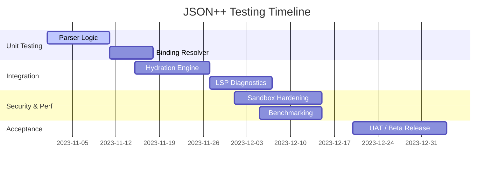
```mermaid
gantt
    title JSON++ Testing Timeline
    dateFormat  YYYY-MM-DD
    section Unit Testing
    Parser Logic           :active, ut1, 2023-11-01, 10d
    Binding Resolver       :ut2, after ut1, 7d
    section Integration
    Hydration Engine       :it1, 2023-11-15, 12d
    LSP Diagnostics        :it2, after it1, 10d
    section Security & Perf
    Sandbox Hardening      :sec1, 2023-12-01, 14d
    Benchmarking           :perf1, 2023-12-05, 10d
    section Acceptance
    UAT / Beta Release     :uat1, 2023-12-20, 15d
```

---

## 8. Risk Assessment

| Risk | Impact | Probability | Mitigation Strategy |
|------|--------|-------------|---------------------|
| **Infinite Loops** | High | Medium | Implement a "Gas Limit" or instruction count limit for function evaluation. |
| **Memory Exhaustion** | High | Low | Set strict heap limits on the evaluation sandbox. |
| **JS Compatibility** | Medium | Low | Use the official ECMA-262 grammar as the base for the parser to ensure strict subsetting. |
| **LSP Latency** | Low | Medium | Implement incremental parsing to ensure the UI remains responsive during large file edits. |

---

## 9. State Machine: Evaluation Lifecycle

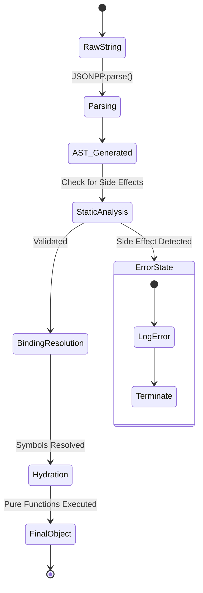
```mermaid
stateDiagram-v2
    [*] --> RawString
    RawString --> Parsing : JSONPP.parse()
    Parsing --> AST_Generated
    AST_Generated --> StaticAnalysis : Check for Side Effects
    StaticAnalysis --> BindingResolution : Validated
    StaticAnalysis --> ErrorState : Side Effect Detected
    BindingResolution --> Hydration : Symbols Resolved
    Hydration --> FinalObject : Pure Functions Executed
    FinalObject --> [*]
    
    state ErrorState {
        [*] --> LogError
        LogError --> Terminate
    }
```

**Approval Sign-off:**
*   Lead Architect: __________________________
*   QA Lead: ________________________________
*   Security Officer: ________________________

---

## Phase Plan

# JSON++ Development Phase Planning

This document outlines the strategic roadmap for the development of **JSON++: The Grammar-Extensible Data Substrate**. The plan focuses on building a secure, high-performance, and LLM-native data format that maintains strict compatibility with JavaScript runtimes.

---

## 1. Project Timeline Overview

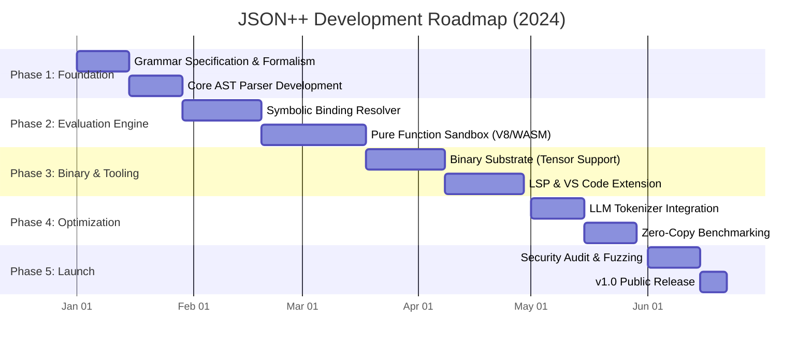
```mermaid
gantt
    title JSON++ Development Roadmap (2024)
    dateFormat  YYYY-MM-DD
    axisFormat  %b %d
    
    section Phase 1: Foundation
    Grammar Specification & Formalism :a1, 2024-01-01, 14d
    Core AST Parser Development       :a2, after a1, 14d
    
    section Phase 2: Evaluation Engine
    Symbolic Binding Resolver         :b1, 2024-01-29, 21d
    Pure Function Sandbox (V8/WASM)   :b2, after b1, 28d
    
    section Phase 3: Binary & Tooling
    Binary Substrate (Tensor Support) :c1, 2024-03-18, 21d
    LSP & VS Code Extension           :c2, after c1, 21d
    
    section Phase 4: Optimization
    LLM Tokenizer Integration         :d1, 2024-05-01, 14d
    Zero-Copy Benchmarking            :d2, after d1, 14d
    
    section Phase 5: Launch
    Security Audit & Fuzzing          :e1, 2024-06-01, 14d
    v1.0 Public Release               :e2, after e1, 7d
```

---

## 2. Phase Descriptions

### Phase 1: Foundation (Weeks 1-4)
*   **Objectives:** Define the JSON++ grammar as a strict subset of ECMAScript and build a high-speed parser.
*   **Deliverables:** Formal EBNF Grammar, `json-plus-plus-parser` (NPM package).
*   **Key Activities:** 
    *   Drafting the specification for symbolic bindings (`$ref`).
    *   Implementing a non-recursive descent parser for AST generation.
*   **Dependencies:** None.
*   **Success Criteria:** Parser passes 100% of standard JSON test suites and correctly identifies valid JS-subset extensions.
*   **Risks:** Scope creep in grammar definition. 
    *   *Mitigation:* Strict "No Side-Effects" rule enforced at the grammar level.

### Phase 2: Evaluation Engine (Weeks 5-10)
*   **Objectives:** Create the runtime that resolves variables and executes pure functions to "hydrate" data.
*   **Deliverables:** `json-plus-plus-runtime`, Deterministic Evaluator.
*   **Key Activities:**
    *   Implementing the Directed Acyclic Graph (DAG) resolver for bindings.
    *   Building the "Pure Function" sandbox using `ShadowRealm` or isolated V8 contexts.
*   **Dependencies:** Phase 1 Parser.
*   **Success Criteria:** Evaluation is deterministic; identical inputs yield identical outputs across different environments.
*   **Risks:** Performance overhead of function evaluation.
    *   *Mitigation:* Implement memoization for function results based on input hashes.

### Phase 3: Binary Substrate & Tooling (Weeks 11-16)
*   **Objectives:** Enable high-performance handling of large numerical arrays (tensors) and developer experience.
*   **Deliverables:** VS Code Extension, Binary Serialization Spec (BSON++).
*   **Key Activities:**
    *   Mapping JSON++ arrays to `SharedArrayBuffer` and `TypedArrays`.
    *   Developing the Language Server Protocol (LSP) for autocomplete and validation.
*   **Dependencies:** Phase 2 Evaluator.
*   **Success Criteria:** 1GB tensor data loads in <100ms via zero-copy mapping.
*   **Risks:** LSP complexity for dynamic symbolic bindings.
    *   *Mitigation:* Use a simplified type-inference engine for the LSP.

---

## 3. Milestone Schedule

| Milestone | Target Date | Deliverables | Success Criteria |
|-----------|-------------|--------------|------------------|
| **M1: Grammar Frozen** | Week 2 | Formal Spec Document | Approved by Architecture Board |
| **M2: Parser Alpha** | Week 4 | Parser CLI & Library | Passes 10k+ fuzzing iterations |
| **M3: Sandbox Secure** | Week 8 | Evaluator with Sandbox | Zero I/O or Global access possible |
| **M4: Tooling Beta** | Week 14 | VS Code Extension v0.1 | Real-time syntax highlighting & linting |
| **M5: v1.0 Release** | Week 26 | Production-ready SDK | Documentation complete; 95% test coverage |

---

## 4. Resource Allocation

| Role | Responsibility | Phase Focus |
|:---|:---|:---|
| **Lead Architect** | Grammar design, Security model, Spec ownership | All Phases |
| **Core Engine Dev (x2)** | Parser, Evaluator, Sandbox implementation | Phase 1, 2, 4 |
| **Systems Engineer** | Binary substrate, Memory management, Tensors | Phase 3, 4 |
| **DX/Tooling Dev** | LSP, VS Code Extension, Documentation | Phase 3, 5 |
| **QA/Security Engineer** | Fuzzing, Performance Benchmarking, Audit | Phase 2, 4, 5 |

---

## 5. Sprint Planning Overview (Initial 8 Weeks)

### Sprint 1: The Parser (Weeks 1-2)
*   **Goal:** Convert JSON++ string to a typed AST.
*   **Capacity:** 80 Story Points.
*   **Deliverables:** AST Schema, Lexer, Parser.

### Sprint 2: Symbolic Resolution (Weeks 3-4)
*   **Goal:** Resolve `$ref` and variable bindings within the AST.
*   **Capacity:** 75 Story Points.
*   **Deliverables:** Dependency Graph Resolver, Cycle Detection.

### Sprint 3: The Pure Sandbox (Weeks 5-6)
*   **Goal:** Execute JS functions in a restricted environment.
*   **Capacity:** 70 Story Points.
*   **Deliverables:** V8 Context Wrapper, Global Object Stripping.

### Sprint 4: Hydration Logic (Weeks 7-8)
*   **Goal:** Full data hydration (Transforming AST + Functions -> Final Data).
*   **Capacity:** 85 Story Points.
*   **Deliverables:** `hydrate()` API, Error handling for failed evaluations.

---

## 6. Release Plan

### v0.1-alpha (Week 6)
*   **Features:** Basic JSON parsing, Variable bindings, CLI tool.
*   **Criteria:** Internal testing only.

### v0.5-beta (Week 16)
*   **Features:** Pure function support, VS Code Extension, Tensor support.
*   **Criteria:** External "Early Adopter" feedback loop.

### v1.0-stable (Week 26)
*   **Features:** Full spec compliance, Performance optimizations, Production-ready SDKs for Node.js and Browser.
*   **Criteria:** Zero known security vulnerabilities, <5ms overhead for standard payloads.

---

## 7. Risk Timeline

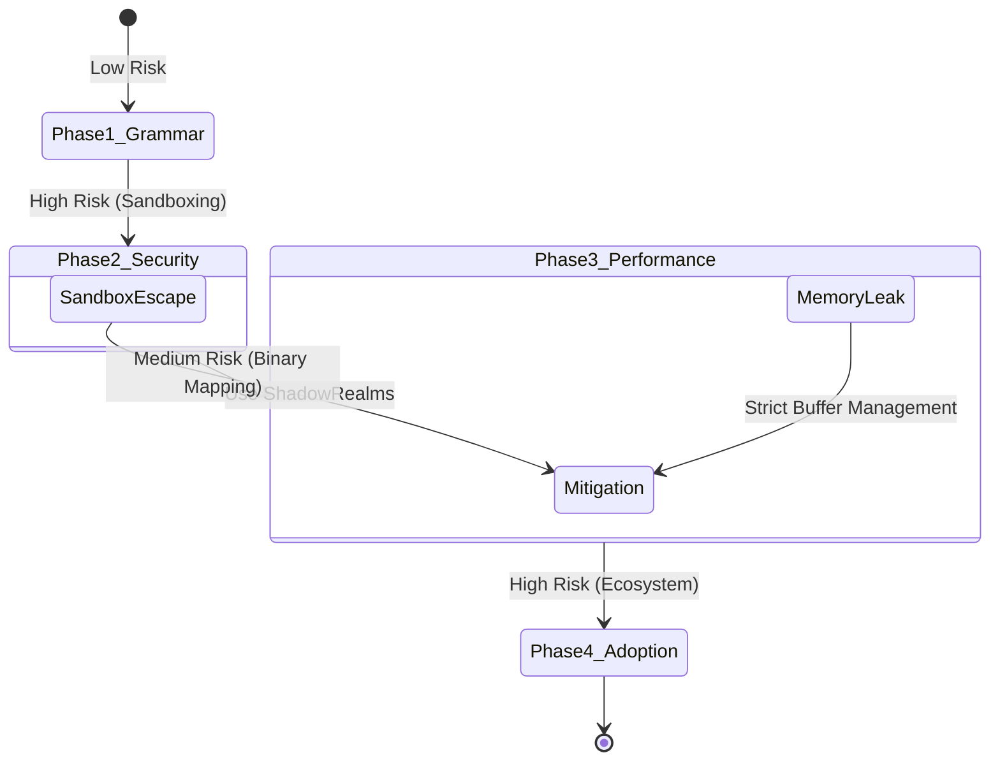
```mermaid
stateDiagram-v2
    [*] --> Phase1_Grammar: Low Risk
    Phase1_Grammar --> Phase2_Security: High Risk (Sandboxing)
    Phase2_Security --> Phase3_Performance: Medium Risk (Binary Mapping)
    Phase3_Performance --> Phase4_Adoption: High Risk (Ecosystem)
    Phase4_Adoption --> [*]

    state Phase2_Security {
        direction LR
        SandboxEscape --> Mitigation: Use ShadowRealms
    }
    state Phase3_Performance {
        direction LR
        MemoryLeak --> Mitigation: Strict Buffer Management
    }
```

*   **Critical Window (Weeks 6-10):** The security of the JS sandbox is the highest technical risk. If the sandbox can be escaped, the "Side-effect free" constraint is violated.
*   **Mitigation Window (Weeks 18-22):** Performance tuning for LLM contexts. If tokenization is too slow, the "LLM-native" value proposition fails. We will allocate extra resources here for C++ bindings if JS performance is insufficient.

---

## Project Data
Generated JSON file: design.project_data.json

Raw JSON Content

```json
{
  "project_name" : "JSON++: The Grammar-Extensible Data Substrate",
  "description" : "JSON++ is a programmable data format designed as a strict subgrammar of JavaScript. It enables structural compression through symbolic bindings, declarative data hydration via pure functions, and high-performance binary handling (tensors) while remaining human-readable and LLM-native. It leverages existing JavaScript infrastructure and TypeScript for specification and tooling.",
  "created_date" : "2026-02-16T13:33:33.223967784",
  "epics" : [ {
    "id" : "EPIC-UC",
    "name" : "User Features",
    "description" : "Core user-facing functionality based on use cases",
    "priority" : "High",
    "status" : "Planned",
    "story_points" : 105
  }, {
    "id" : "EPIC-ARCH",
    "name" : "Architecture & Infrastructure",
    "description" : "Set up system architecture and infrastructure",
    "priority" : "High",
    "status" : "Planned",
    "story_points" : 21
  }, {
    "id" : "EPIC-TEST",
    "name" : "Quality Assurance",
    "description" : "Testing and quality assurance activities",
    "priority" : "High",
    "status" : "Planned",
    "story_points" : 13
  }, {
    "id" : "EPIC-101",
    "name" : "Epic EPIC-101",
    "description" : "Auto-extracted epic from analysis",
    "priority" : "Medium",
    "status" : "Planned",
    "story_points" : 13
  }, {
    "id" : "EPIC-102",
    "name" : "Epic EPIC-102",
    "description" : "Auto-extracted epic from analysis",
    "priority" : "Medium",
    "status" : "Planned",
    "story_points" : 13
  }, {
    "id" : "EPIC-103",
    "name" : "Epic EPIC-103",
    "description" : "Auto-extracted epic from analysis",
    "priority" : "Medium",
    "status" : "Planned",
    "story_points" : 13
  }, {
    "id" : "EPIC-104",
    "name" : "Epic EPIC-104",
    "description" : "Auto-extracted epic from analysis",
    "priority" : "Medium",
    "status" : "Planned",
    "story_points" : 13
  }, {
    "id" : "EPIC-105",
    "name" : "Epic EPIC-105",
    "description" : "Auto-extracted epic from analysis",
    "priority" : "Medium",
    "status" : "Planned",
    "story_points" : 13
  } ],
  "releases" : [ {
    "id" : "REL-1",
    "name" : "MVP Release",
    "version" : "1.0.0",
    "target_date" : "2026-03-16",
    "description" : "Minimum Viable Product release with core functionality",
    "epic_ids" : [ "EPIC-UC", "EPIC-ARCH", "EPIC-TEST", "EPIC-101" ],
    "status" : "Planned"
  }, {
    "id" : "REL-2",
    "name" : "Feature Complete Release",
    "version" : "1.1.0",
    "target_date" : "2026-04-13",
    "description" : "Full feature release with all planned functionality",
    "epic_ids" : [ "EPIC-UC", "EPIC-ARCH", "EPIC-TEST", "EPIC-101", "EPIC-102", "EPIC-103", "EPIC-104", "EPIC-105" ],
    "status" : "Planned"
  } ],
  "sprints" : [ {
    "id" : "SPRINT-1",
    "name" : "Sprint 1",
    "number" : 1,
    "start_date" : "2026-02-16",
    "end_date" : "2026-03-02",
    "goals" : [ "Complete sprint 1 deliverables" ],
    "capacity_points" : 40,
    "task_ids" : [ "TASK-101", "TASK-102", "TASK-103", "TASK-104", "TASK-201" ],
    "status" : "Planned"
  }, {
    "id" : "SPRINT-2",
    "name" : "Sprint 2",
    "number" : 2,
    "start_date" : "2026-03-02",
    "end_date" : "2026-03-16",
    "goals" : [ "Complete sprint 2 deliverables" ],
    "capacity_points" : 40,
    "task_ids" : [ "TASK-202", "TASK-203", "TASK-301", "TASK-302", "TASK-303" ],
    "status" : "Planned"
  }, {
    "id" : "SPRINT-3",
    "name" : "Sprint 3",
    "number" : 3,
    "start_date" : "2026-03-16",
    "end_date" : "2026-03-30",
    "goals" : [ "Complete sprint 3 deliverables" ],
    "capacity_points" : 40,
    "task_ids" : [ "TASK-401", "TASK-402", "TASK-501", "TASK-502" ],
    "status" : "Planned"
  }, {
    "id" : "SPRINT-4",
    "name" : "Sprint 4",
    "number" : 4,
    "start_date" : "2026-03-30",
    "end_date" : "2026-04-13",
    "goals" : [ "Complete sprint 4 deliverables" ],
    "capacity_points" : 40,
    "task_ids" : [ ],
    "status" : "Planned"
  } ],
  "tasks" : [ {
    "id" : "TASK-101",
    "title" : "Task TASK-101",
    "description" : "Auto-extracted task from analysis",
    "type" : "task",
    "epic_id" : "EPIC-UC",
    "sprint_id" : "SPRINT-1",
    "priority" : "Medium",
    "story_points" : 3,
    "status" : "Backlog",
    "acceptance_criteria" : [ "Task completed successfully" ],
    "labels" : [ "auto-generated" ]
  }, {
    "id" : "TASK-102",
    "title" : "Task TASK-102",
    "description" : "Auto-extracted task from analysis",
    "type" : "task",
    "epic_id" : "EPIC-UC",
    "sprint_id" : "SPRINT-1",
    "priority" : "Medium",
    "story_points" : 3,
    "status" : "Backlog",
    "acceptance_criteria" : [ "Task completed successfully" ],
    "labels" : [ "auto-generated" ]
  }, {
    "id" : "TASK-103",
    "title" : "Task TASK-103",
    "description" : "Auto-extracted task from analysis",
    "type" : "task",
    "epic_id" : "EPIC-UC",
    "sprint_id" : "SPRINT-1",
    "priority" : "Medium",
    "story_points" : 3,
    "status" : "Backlog",
    "acceptance_criteria" : [ "Task completed successfully" ],
    "labels" : [ "auto-generated" ]
  }, {
    "id" : "TASK-104",
    "title" : "Task TASK-104",
    "description" : "Auto-extracted task from analysis",
    "type" : "task",
    "epic_id" : "EPIC-UC",
    "sprint_id" : "SPRINT-1",
    "priority" : "Medium",
    "story_points" : 3,
    "status" : "Backlog",
    "acceptance_criteria" : [ "Task completed successfully" ],
    "labels" : [ "auto-generated" ]
  }, {
    "id" : "TASK-201",
    "title" : "Task TASK-201",
    "description" : "Auto-extracted task from analysis",
    "type" : "task",
    "epic_id" : "EPIC-UC",
    "sprint_id" : "SPRINT-1",
    "priority" : "Medium",
    "story_points" : 3,
    "status" : "Backlog",
    "acceptance_criteria" : [ "Task completed successfully" ],
    "labels" : [ "auto-generated" ]
  }, {
    "id" : "TASK-202",
    "title" : "Task TASK-202",
    "description" : "Auto-extracted task from analysis",
    "type" : "task",
    "epic_id" : "EPIC-UC",
    "sprint_id" : "SPRINT-2",
    "priority" : "Medium",
    "story_points" : 3,
    "status" : "Backlog",
    "acceptance_criteria" : [ "Task completed successfully" ],
    "labels" : [ "auto-generated" ]
  }, {
    "id" : "TASK-203",
    "title" : "Task TASK-203",
    "description" : "Auto-extracted task from analysis",
    "type" : "task",
    "epic_id" : "EPIC-UC",
    "sprint_id" : "SPRINT-2",
    "priority" : "Medium",
    "story_points" : 3,
    "status" : "Backlog",
    "acceptance_criteria" : [ "Task completed successfully" ],
    "labels" : [ "auto-generated" ]
  }, {
    "id" : "TASK-301",
    "title" : "Task TASK-301",
    "description" : "Auto-extracted task from analysis",
    "type" : "task",
    "epic_id" : "EPIC-UC",
    "sprint_id" : "SPRINT-2",
    "priority" : "Medium",
    "story_points" : 3,
    "status" : "Backlog",
    "acceptance_criteria" : [ "Task completed successfully" ],
    "labels" : [ "auto-generated" ]
  }, {
    "id" : "TASK-302",
    "title" : "Task TASK-302",
    "description" : "Auto-extracted task from analysis",
    "type" : "task",
    "epic_id" : "EPIC-UC",
    "sprint_id" : "SPRINT-2",
    "priority" : "Medium",
    "story_points" : 3,
    "status" : "Backlog",
    "acceptance_criteria" : [ "Task completed successfully" ],
    "labels" : [ "auto-generated" ]
  }, {
    "id" : "TASK-303",
    "title" : "Task TASK-303",
    "description" : "Auto-extracted task from analysis",
    "type" : "task",
    "epic_id" : "EPIC-UC",
    "sprint_id" : "SPRINT-2",
    "priority" : "Medium",
    "story_points" : 3,
    "status" : "Backlog",
    "acceptance_criteria" : [ "Task completed successfully" ],
    "labels" : [ "auto-generated" ]
  }, {
    "id" : "TASK-401",
    "title" : "Task TASK-401",
    "description" : "Auto-extracted task from analysis",
    "type" : "task",
    "epic_id" : "EPIC-UC",
    "sprint_id" : "SPRINT-3",
    "priority" : "Medium",
    "story_points" : 3,
    "status" : "Backlog",
    "acceptance_criteria" : [ "Task completed successfully" ],
    "labels" : [ "auto-generated" ]
  }, {
    "id" : "TASK-402",
    "title" : "Task TASK-402",
    "description" : "Auto-extracted task from analysis",
    "type" : "task",
    "epic_id" : "EPIC-UC",
    "sprint_id" : "SPRINT-3",
    "priority" : "Medium",
    "story_points" : 3,
    "status" : "Backlog",
    "acceptance_criteria" : [ "Task completed successfully" ],
    "labels" : [ "auto-generated" ]
  }, {
    "id" : "TASK-501",
    "title" : "Task TASK-501",
    "description" : "Auto-extracted task from analysis",
    "type" : "task",
    "epic_id" : "EPIC-UC",
    "sprint_id" : "SPRINT-3",
    "priority" : "Medium",
    "story_points" : 3,
    "status" : "Backlog",
    "acceptance_criteria" : [ "Task completed successfully" ],
    "labels" : [ "auto-generated" ]
  }, {
    "id" : "TASK-502",
    "title" : "Task TASK-502",
    "description" : "Auto-extracted task from analysis",
    "type" : "task",
    "epic_id" : "EPIC-UC",
    "sprint_id" : "SPRINT-3",
    "priority" : "Medium",
    "story_points" : 3,
    "status" : "Backlog",
    "acceptance_criteria" : [ "Task completed successfully" ],
    "labels" : [ "auto-generated" ]
  } ],
  "milestones" : [ {
    "id" : "MS-1",
    "name" : "Grammar Frozen**",
    "target_date" : "2026-03-16",
    "description" : "Project milestone 1",
    "deliverables" : [ "Phase 1 deliverables complete" ],
    "status" : "Planned"
  }, {
    "id" : "MS-2",
    "name" : "Parser Alpha**",
    "target_date" : "2026-04-13",
    "description" : "Project milestone 2",
    "deliverables" : [ "Phase 2 deliverables complete" ],
    "status" : "Planned"
  }, {
    "id" : "MS-3",
    "name" : "Sandbox Secure**",
    "target_date" : "2026-05-11",
    "description" : "Project milestone 3",
    "deliverables" : [ "Phase 3 deliverables complete" ],
    "status" : "Planned"
  }, {
    "id" : "MS-4",
    "name" : "Tooling Beta**",
    "target_date" : "2026-06-08",
    "description" : "Project milestone 4",
    "deliverables" : [ "Phase 4 deliverables complete" ],
    "status" : "Planned"
  }, {
    "id" : "MS-5",
    "name" : "v1.0 Release**",
    "target_date" : "2026-07-06",
    "description" : "Project milestone 5",
    "deliverables" : [ "Phase 5 deliverables complete" ],
    "status" : "Planned"
  } ],
  "dependencies" : [ {
    "id" : "DEP-1",
    "source_id" : "TASK-102",
    "source_type" : "task",
    "target_id" : "TASK-101",
    "target_type" : "task",
    "dependency_type" : "depends_on"
  }, {
    "id" : "DEP-2",
    "source_id" : "TASK-201",
    "source_type" : "task",
    "target_id" : "TASK-103",
    "target_type" : "task",
    "dependency_type" : "depends_on"
  }, {
    "id" : "DEP-3",
    "source_id" : "TASK-301",
    "source_type" : "task",
    "target_id" : "TASK-302",
    "target_type" : "task",
    "dependency_type" : "blocks"
  }, {
    "id" : "DEP-4",
    "source_id" : "TASK-303",
    "source_type" : "task",
    "target_id" : "TASK-302",
    "target_type" : "task",
    "dependency_type" : "depends_on"
  }, {
    "id" : "DEP-5",
    "source_id" : "TASK-501",
    "source_type" : "task",
    "target_id" : "TASK-104",
    "target_type" : "task",
    "dependency_type" : "relates_to"
  }, {
    "id" : "DEP-6",
    "source_id" : "EPIC-103",
    "source_type" : "epic",
    "target_id" : "EPIC-101",
    "target_type" : "epic",
    "dependency_type" : "depends_on"
  } ]
}
```


</div>
