<div class="tab-nav">
<button class="tab-btn active" onclick="openTab(event, 'article')">Article</button>
<button class="tab-btn" onclick="openTab(event, 'tutorial')">Tutorial</button>
<button class="tab-btn" onclick="openTab(event, 'design')">Software Design</button>
</div>

<div id="article" class="tab-content" style="display: block;" markdown="1">

# The Distributed JVM Fabric: From Local Artifacts to Network-Native Symbols

The Java Virtual Machine (JVM) has long been treated as a local bytecode interpreter, bounded by the physical
constraints of the host machine and the file-system-based limitations of the classpath. We treat the cluster as a
collection of isolated nodes, each struggling to maintain a coherent view of the software it runs via crude artifacts
like JARs and WARs.

This model is a legacy constraint. By shifting the unit of truth from the "Artifact" to the "Symbol," and by treating
the execution environment as a network-native programmable graph, we can transform the JVM into a distributed execution
fabric. In this model, the "machine" is no longer a single process but a cluster-wide substrate where dependency
resolution, versioning, and debugging happen at the graph level, not the file level.

## Phase I: The Identity Crisis (Symbol vs. Artifact)

The fundamental sin of modern Java deployment is the JAR file. A JAR is an arbitrary aggregation of classes, resources,
and metadata—a "bag of files" that conflates identity with packaging. When we place a JAR on the classpath, we accept
everything inside it, often leading to the notorious "classpath hell" where conflicting versions of a class silently
overwrite one another based on load order.

To build a distributed fabric, we must dissolve the artifact and elevate the **Class** to the atomic unit of identity.

We define a class not by its location on disk, but by a precise coordinate tuple:

1. **`SymbolId`**: The semantic name (e.g., `com.example.Service`).
2. **`VersionId`**: A content-addressed hash of the bytecode and its immediate metadata.
3. **`TimeId`**: A monotonically increasing vector clock representing the symbol's evolution within the system.

In this substrate, the "classpath" ceases to exist. Instead, the runtime resolves a `SymbolId` to a specific `VersionId`
based on a resolution context. This eliminates ambiguity. Two versions of `com.example.Service` can coexist in the same
memory space because their `VersionIds` differ. The system does not load "libraries"; it resolves a graph of symbols,
ensuring that the "unit of truth" is cryptographically verifiable and structurally precise.

## Phase II: The Programmable Graph

Once we abandon the flat list of files, the ecosystem reveals itself as a global, observable graph. The runtime
environment becomes a **Programmable Graph** where loading code is a query operation, not a file I/O operation.

We introduce the concept of **Selective Projections**. Instead of "loading a JAR," the system projects a view of the
global graph. A loader instruction might look like:
> "Load `pkg.Foo` and its transitive closure, but exclude `pkg.Bar` and its dependencies."

These projections materialize as **ClassRealms**. A ClassRealm is a logical snapshot of the global graph—a consistent
universe where every `SymbolId` maps to exactly one `VersionId`.

* **Realm A** might see `log4j:2.17.1`.
* **Realm B** might see `log4j:2.14.0`.

These realms are not isolated processes; they are lightweight, logic-based views within the same JVM. This allows for *
*Network-Native Resolution**, where the runtime fetches individual classes on-demand from a distributed store based on
the realm's definition. Modules (JPMS, OSGi) move from being prescriptive requirements to optional metadata overlays;
the system builds the dependency graph by observing bytecode references, not by trusting manifest files.

## Phase III: The Living Organism (Evolution & Patching)

In a standard JVM, updating code usually requires a restart. In the Distributed JVM Fabric, the system functions as a
living organism capable of runtime evolution. Because we track dependencies at the symbol level, we can perform precise
impact analysis for updates.

The update mechanism relies on two strategies:

1. **In-Place Redefinition**: If a patch is ABI-compatible (e.g., changing a method body without altering the
   signature), the system updates the bytecode in memory. All references to `SymbolId(Foo)` immediately point to the new
   `VersionId`.
2. **Snapshot Forking**: For structural changes, the system forks the current ClassRealm. New requests are routed to the
   new snapshot (Realm B), while existing sessions continue to execute against the old snapshot (Realm A).

This enables a **"Drain and Transition"** model. The system employs **Usage Tracking**—monitoring active stack frames
and reachability graphs—to determine when an old version is no longer in use. When the reference count for a specific
`(SymbolId, VersionId)` tuple drops to zero across all active realms, the garbage collector reclaims the bytecode. This
turns the "stop-the-world" deployment into a fluid, continuous state transition.

## Phase IV: The Unified Machine (Serialization & Debugging)

When the class graph is consistent across the network, the distinction between "local" and "remote" begins to blur.

### Versioned Serialization

Java serialization is historically fragile because it relies on the receiving JVM having the "same" classes on its
classpath. In our fabric, serialization becomes "honest." Objects are serialized with their `SymbolId` and `VersionId`.
When a node receives an object, it checks its local store. If it lacks the specific version of the class, it fetches the
bytecode from the global store. This guarantees semantic consistency across the cluster.

### Virtualized Debugging

Perhaps the most profound shift is in developer experience. We can implement a **JDWP Tunneling Service** that
aggregates the entire cluster into a **VirtualVM**.

* **Unified Thread Lists**: The debugger sees a list of threads that is the union of all threads across the cluster.
* **50 Heap Pools**: The heap is visualized not as a single block, but as a collection of pools corresponding to
  physical nodes.
* **Symbolic Breakpoints**: Setting a breakpoint on `com.example.Service` applies it to every node running that
  `SymbolId`, regardless of the underlying hardware.

To the developer, the cluster looks like a single, massive JVM. The physical boundaries are abstracted away, allowing
for distributed tracing and debugging that feels entirely local.

## Phase V: The Post-Source Era (Optimization & AI)

The final implication of this architecture is the obsolescence of the "Source JAR" and the massive inefficiency of
current artifact repositories.

### 99% Compression via Deduplication

Maven Central is pathologically redundant. The same class files appear in thousands of different JARs (shaded
dependencies, fat JARs, minor version bumps). By storing content-addressed bytecode, we achieve massive deduplication.
Furthermore, we can employ **Bytecode Templating**: storing the structural "shape" of a class and a separate "variant
map" for the constant pool. This allows us to deduplicate shaded libraries (e.g., `com.google.common` vs
`my.shaded.guava`), compressing the ecosystem by an estimated 99%.

### AI-Driven Semantic Source

In this model, source code artifacts are redundant. Modern decompilers, augmented by AI, can reconstruct "Semantic
Source" from the versioned bytecode on demand. The system can generate documentation, variable names, and logic
explanations that are often superior to the original source, as they reflect the code *as it executes*. Documentation
becomes a dynamic, queryable layer over the bytecode, not a static HTML file generated at build time.

## Conclusion

The "Network-Centric Distributed Classloading Substrate" is not just a better classloader; it is a redefinition of the
machine. By moving the center of gravity from the local file system to a global, versioned symbol graph, we unlock a
future where applications are fluid, observable, and infinitely patchable. The JVM was designed to be a portable
machine; this architecture finally makes it a distributed one.

</div>
<div id="tutorial" class="tab-content" style="display: none;" markdown="1">

# Architecting the Distributed JVM Fabric: Building a Content-Addressed Network Classloader

This tutorial guides advanced Java developers through the transition from traditional, file-system-bound classpaths to a "Distributed JVM Fabric." You will implement a custom ClassLoader that treats the network as a primary source of truth, resolving classes as unique "Symbols" rather than local "Artifacts." By the end of this session, you will have a working prototype of a system that fetches, verifies, and executes bytecode across process boundaries using content-addressed coordinates.

**⏱️ Estimated Time:** 60 minutes

**🎯 Skill Level:** Advanced

**💻 Platform:** Java/JVM

---

## What You'll Learn

✓ Deconstruct the Classpath: Understand the limitations of JAR-based deployment and the benefits of symbol-based identity.
✓ Master Custom Classloading: Implement a non-delegating (or parent-last) ClassLoader to intercept class resolution.
✓ Implement Content-Addressing: Use cryptographic hashing to ensure bytecode integrity and versioning in a distributed environment.
✓ Build a Network-Native Registry: Create a minimal bytecode provider that serves class definitions over HTTP/TCP.

---

## Prerequisites

### Required

- **JDK 17 or higher** (software): Uses modern features like Records and the new HTTP Client.
- **Build Tool** (software): Maven 3.8+ or Gradle 7+.
- **IDE** (software): IntelliJ IDEA, Eclipse, or VS Code with Java extensions.
- **Terminal** (software): Access to a command-line interface (bash/zsh/powershell).
- **Advanced Java** (knowledge): Deep understanding of the JVM lifecycle and reflection.
- **Concurrency** (knowledge): Familiarity with thread-safe operations.
- **Networking** (knowledge): Basic understanding of HTTP protocols and RESTful patterns.
- **Security** (knowledge): Basic knowledge of SHA-256 hashing.

---

## Tutorial Steps

### Step 1: Defining the Symbol Identity (The Coordinate System)

In a traditional JVM environment, classes are loaded from a "bag of files" (the Classpath or JARs). This approach is fragile in a distributed system because it relies on file system paths and ordering. To build a Distributed JVM Fabric, we ## Generation Complete

**Statistics:**
- Total Steps: 6
- Prerequisites: 8
- Word Count: 4784
- Code Blocks: 19
- Total Time: 396.812s

**Completed:** 2026-02-12 13:57:23
"Coordinate" that identifies that specific version of the code.

First, we will use a Java `record` to define our coordinate. This record acts as the "address" for any piece of code in our distributed fabric.

Next, we need a utility to transform raw `.class` files into `SymbolCoordinate` objects. This utility reads the bytecode, computes a SHA-256 digest, and packages it with the class metadata.

Finally, to ensure our coordinate system works, we will create a simple main class that generates a coordinate for itself.

Create the SymbolCoordinate Data Model. File Path: src/main/java/io/fabric/model/SymbolCoordinate.java

```java
package io.fabric.model;

import java.io.Serializable;
import java.util.Objects;

/**
 * Represents a unique identity for a class within the distributed fabric.
 * 
 * @param className   The fully qualified name of the class (e.g., "com.example.Service").
 * @param versionHash The SHA-256 hash of the class bytecode, ensuring content integrity.
 * @param timestamp   The epoch millisecond when this coordinate was generated.
 */
public record SymbolCoordinate(
    String className,
    String versionHash,
    long timestamp
) implements Serializable {
    
    public SymbolCoordinate {
        Objects.requireNonNull(className, "className cannot be null");
        Objects.requireNonNull(versionHash, "versionHash cannot be null");
    }

    @Override
    public String toString() {
        return String.format("%s:%s@%d", className, versionHash.substring(0, 8), timestamp);
    }
}
```

Implement the Coordinate Generator Utility. File Path: src/main/java/io/fabric/util/CoordinateGenerator.java

```java
package io.fabric.util;

import io.fabric.model.SymbolCoordinate;
import java.io.IOException;
import java.nio.file.Files;
import java.nio.file.Path;
import java.security.MessageDigest;
import java.security.NoSuchAlgorithmException;
import java.util.HexFormat;

public class CoordinateGenerator {

    private static final String HASH_ALGORITHM = "SHA-256";

    /**
     * Generates a SymbolCoordinate from a compiled .class file.
     * 
     * @param classFilePath The path to the .class file on disk.
     * @param className     The fully qualified name of the class.
     * @return A unique SymbolCoordinate.
     * @throws IOException If the file cannot be read.
     */
    public static SymbolCoordinate fromFile(Path classFilePath, String className) throws IOException {
        byte[] bytecode = Files.readAllBytes(classFilePath);
        String hash = computeHash(bytecode);
        return new SymbolCoordinate(className, hash, System.currentTimeMillis());
    }

    /**
     * Computes a SHA-256 hex string for the provided bytecode.
     */
    private static String computeHash(byte[] bytes) {
        try {
            MessageDigest digest = MessageDigest.getInstance(HASH_ALGORITHM);
            byte[] encodedHash = digest.digest(bytes);
            // HexFormat requires Java 17+
            return HexFormat.of().withLowerCase().formatHex(encodedHash);
        } catch (NoSuchAlgorithmException e) {
            throw new RuntimeException("Critical Error: SHA-256 algorithm not found", e);
        }
    }
}
```

Create a Verification Harness. File Path: src/main/java/io/fabric/TestIdentity.java

```java
package io.fabric;

import io.fabric.model.SymbolCoordinate;
import io.fabric.util.CoordinateGenerator;
import java.nio.file.Paths;

public class TestIdentity {
    public static void main(String[] args) throws Exception {
        // In a real scenario, this path would point to your build directory
        // e.g., target/classes/io/fabric/TestIdentity.class
        String classPath = args[0]; 
        String className = "io.fabric.TestIdentity";

        SymbolCoordinate coord = CoordinateGenerator.fromFile(Paths.get(classPath), className);
        
        System.out.println("Successfully generated Symbol Identity:");
        System.out.println("Class: " + coord.className());
        System.out.println("Hash:  " + coord.versionHash());
        System.out.println("TS:    " + coord.timestamp());
    }
}
```

**Expected Outcome:** Upon successful implementation, you will have a deterministic way to identify any Java class. Unlike a standard ClassLoader that just asks "Is String.class present?", your fabric will ask "Is com.example.Service with hash a1b2c3d4... present?" This allows multiple versions of the same class to coexist in the same distributed network without collision.

**Verify Success:**
1. Compile the code:
javac -d target/classes src/main/java/io/fabric/model/*.java src/main/java/io/fabric/util/*.java src/main/java/io/fabric/TestIdentity.java
2. Run the test harness:
java -cp target/classes io.fabric.TestIdentity target/classes/io/fabric/TestIdentity.class
3. Verify Output: You should see a 64-character SHA-256 hash.
4. Verify Determinism: Run the command again. The hash must remain identical, while the timestamp changes.
5. Verify Uniqueness: Make a small change (e.g., add a space in a string) in TestIdentity.java, recompile, and run again. The hash must change.

**⚠️ Common Issues:**
- Java Version: HexFormat was introduced in Java 17. If you are using an older JDK, you will need to use String.format("%02x", ...) or a library like Apache Commons Codec.
- Pathing: Ensure the path passed to the fromFile method is the absolute or relative path to the actual .class file, not the .java source file.
- Inner Classes: Remember that inner classes (e.g., MyClass$1.class) generate separate files and thus require their own SymbolCoordinate. Our current utility handles one file at a time.

---

### Step 2: Building the Bytecode Registry (The Provider)

In a standard JVM environment, the `ClassLoader` searches the local filesystem (JARs and directories) for bytecode. In our **Distributed JVM Fabric**, we shift this responsibility to a **Bytecode Provider**. This service acts as a content-addressed storage (CAS) system where classes are indexed by the unique Symbol Identity (the hash) generated in Step 1.

The Provider ensures that when a remote node requests a class, it receives the exact version required, preventing "Jar Hell" across the network.

This step involves:
1. **Defining the Bytecode Registry Logic**: Creating a `BytecodeRegistry` class to maintain a mapping between the `SymbolIdentity` and the actual `byte[]` content.
2. **Implementing the HTTP Resolver Handler**: Using `com.sun.net.httpserver.HttpServer` to expose the registry via GET requests at `/resolve/{symbolId}`.
3. **Bootstrapping the Bytecode Provider Server**: Integrating the registry and handler into a running server.

Create the file: src/main/java/org/fabric/provider/BytecodeRegistry.java

```java
package org.fabric.provider;

import java.util.Map;
import java.util.concurrent.ConcurrentHashMap;

/**
 * A thread-safe repository for bytecode indexed by its content-hash.
 */
public class BytecodeRegistry {
    // Maps Symbol Hash -> Raw Bytecode
    private final Map<String, byte[]> storage = new ConcurrentHashMap<>();

    public void register(String symbolId, byte[] bytecode) {
        storage.put(symbolId, bytecode);
    }

    public byte[] get(String symbolId) {
        return storage.get(symbolId);
    }

    public boolean contains(String symbolId) {
        return storage.containsKey(symbolId);
    }
}
```

Create the file: src/main/java/org/fabric/provider/ResolveHandler.java

```java
package org.fabric.provider;

import com.sun.net.httpserver.HttpExchange;
import com.sun.net.httpserver.HttpHandler;
import java.io.IOException;
import java.io.OutputStream;
import java.net.HttpURLConnection;

public class ResolveHandler implements HttpHandler {
    private final BytecodeRegistry registry;

    public ResolveHandler(BytecodeRegistry registry) {
        this.registry = registry;
    }

    @Override
    public void handle(HttpExchange exchange) throws IOException {
        if (!"GET".equalsIgnoreCase(exchange.getRequestMethod())) {
            exchange.sendResponseHeaders(HttpURLConnection.HTTP_BAD_METHOD, -1);
            return;
        }

        // Extract symbolId from URI: /resolve/<hash>
        String path = exchange.getRequestURI().getPath();
        String symbolId = path.substring(path.lastIndexOf('/') + 1);

        byte[] bytecode = registry.get(symbolId);

        if (bytecode == null) {
            String error = "Symbol not found: " + symbolId;
            exchange.sendResponseHeaders(HttpURLConnection.HTTP_NOT_FOUND, error.length());
            try (OutputStream os = exchange.getResponseBody()) {
                os.write(error.getBytes());
            }
        } else {
            // Set content-type to octet-stream to indicate raw binary data
            exchange.getResponseHeaders().set("Content-Type", "application/octet-stream");
            exchange.sendResponseHeaders(HttpURLConnection.HTTP_OK, bytecode.length);
            try (OutputStream os = exchange.getResponseBody()) {
                os.write(bytecode);
            }
        }
    }
}
```

Create the file: src/main/java/org/fabric/provider/BytecodeProviderServer.java

```java
package org.fabric.provider;

import com.sun.net.httpserver.HttpServer;
import java.net.InetSocketAddress;
import java.util.concurrent.Executors;

public class BytecodeProviderServer {
    private final int port;
    private final BytecodeRegistry registry;

    public BytecodeProviderServer(int port) {
        this.port = port;
        this.registry = new BytecodeRegistry();
    }

    public void start() throws Exception {
        HttpServer server = HttpServer.create(new InetSocketAddress(port), 0);
        
        // Register the endpoint
        server.createContext("/resolve", new ResolveHandler(registry));
        
        // Use a fixed thread pool to handle concurrent class-loading requests
        server.setExecutor(Executors.newFixedThreadPool(4)); 
        
        System.out.println("Bytecode Provider started on port " + port);
        server.start();
    }

    public BytecodeRegistry getRegistry() {
        return registry;
    }

    public static void main(String[] args) throws Exception {
        BytecodeProviderServer provider = new BytecodeProviderServer(8080);
        
        // Mock Registration for testing: 
        // In a real scenario, a build tool or CI/CD would push bytes here.
        String mockHash = "test-hash-123";
        byte[] mockBytecode = new byte[]{ 0x12, 0x34, 0x56 }; // Dummy bytecode
        provider.getRegistry().register(mockHash, mockBytecode);
        
        provider.start();
    }
}
```

Compile and Run

```bash
# Compile the provider
javac -d bin src/main/java/org/fabric/provider/*.java

# Run the server
java -cp bin org.fabric.provider.BytecodeProviderServer
```

**Expected Outcome:** You should see the console output: `Bytecode Provider started on port 8080`. The server is now idling, waiting for a remote JVM to request bytecode via a specific hash.

**Verify Success:**
1. Test Successful Resolution:
Run: `curl -v http://localhost:8080/resolve/test-hash-123 --output downloaded.bin`
Check: The file `downloaded.bin` should be exactly 3 bytes in size, and the HTTP response code should be `200 OK`.
2. Test Missing Symbol:
Run: `curl -v http://localhost:8080/resolve/non-existent-hash`
Check: The server should return a `404 Not Found` status.

**⚠️ Common Issues:**
- Port Conflict: If port 8080 is already in use (e.g., by a local Tomcat or Jenkins instance), the server will throw a `java.net.BindException`. Change the port in the `main` method to `9090` or another available port.
- URI Parsing: If you use a trailing slash (e.g., `/resolve/hash/`), the current `ResolveHandler` logic might fail to parse the `symbolId` correctly. Ensure the logic handles path segments robustly if you plan to use complex URIs.
- Firewall: If testing across different machines, ensure the provider's port is open in the OS firewall.

---

### Step 3: The FabricClassLoader Skeleton

In this step, you will implement the core engine of the Distributed JVM Fabric: the `FabricClassLoader`. Unlike a standard `ClassLoader` that searches the local disk, this custom implementation treats the network as its primary source of truth.

By overriding the `findClass` method, we hook into the JVM's resolution pipeline. We specifically override `findClass` rather than `loadClass` to maintain the Delegation Model, ensuring that standard library classes (like `java.lang.String`) are still loaded by the Bootstrap ClassLoader. We also implement a 'Hot-Cache' mechanism to store downloaded bytecode locally, preventing redundant network calls.

Create the FabricClassLoader class at src/main/java/io/fabric/loader/FabricClassLoader.java

*Run in: `src/main/java/io/fabric/loader/`*

```java
package io.fabric.loader;

import java.io.IOException;
import java.nio.file.Files;
import java.nio.file.Path;
import java.nio.file.Paths;
import java.net.URL;

public class FabricClassLoader extends ClassLoader {
    private final String registryUrl;
    private final Path hotCacheDir;

    /**
     * @param registryUrl The base URL of the Bytecode Registry (from Step 2).
     * @param cachePath   Local filesystem path to store downloaded .class files.
     * @param parent      The parent ClassLoader (usually the System ClassLoader).
     */
    public FabricClassLoader(String registryUrl, String cachePath, ClassLoader parent) {
        super(parent);
        this.registryUrl = registryUrl;
        this.hotCacheDir = Paths.get(cachePath);
        
        try {
            Files.createDirectories(this.hotCacheDir);
        } catch (IOException e) {
            throw new RuntimeException("Could not initialize hot-cache directory", e);
        }
    }

    @Override
    protected Class<?> findClass(String name) throws ClassNotFoundException {
        System.out.println("[Fabric] Resolving symbol: " + name);
        
        // 1. Check the Hot-Cache first
        byte[] classBytes = tryLoadFromCache(name);
        
        // 2. If not in cache, fetch from Registry (Logic to be implemented in Step 4)
        if (classBytes == null) {
            classBytes = fetchFromRegistry(name);
        }

        if (classBytes == null) {
            throw new ClassNotFoundException("Symbol " + name + " not found in Fabric Registry");
        }

        // 3. Define the class in the JVM
        return defineClass(name, classBytes, 0, classBytes.length);
    }

    private byte[] tryLoadFromCache(String name) {
        Path classFile = hotCacheDir.resolve(name.replace('.', '/') + ".class");
        if (Files.exists(classFile)) {
            try {
                return Files.readAllBytes(classFile);
            } catch (IOException e) {
                System.err.println("[Fabric] Cache read error: " + e.getMessage());
            }
        }
        return null;
    }

    private byte[] fetchFromRegistry(String name) {
        // Placeholder for the network-native resolution logic
        // This will be implemented in the next step.
        return null;
    }
}
```

Compile the skeleton class to verify syntax and structure.

*Run in: `Project Root`*

```bash
javac -d bin src/main/java/io/fabric/loader/FabricClassLoader.java
```

**Expected Outcome:** You will have a compiled `FabricClassLoader.class`. While it cannot yet fetch bytecode over the network, it is now a valid participant in the JVM's classloading hierarchy. When used, you should see `[Fabric] Resolving symbol: ...` printed to the standard output whenever the JVM encounters a class not on the local classpath.

**Verify Success:**
1. Create a simple test runner that instantiates the FabricClassLoader.
2. Attempt to load a non-existent class using loader.loadClass("com.test.NonExistent").
3. Success Criteria: The console should print `[Fabric] Resolving symbol: com.test.NonExistent` followed by a ClassNotFoundException.

**⚠️ Common Issues:**
- AccessDeniedException: Ensure the user running the JVM has write permissions to the cachePath directory.
- NoClassDefFoundError: This is expected if loading a class that depends on another class, as fetchFromRegistry currently returns null.
- Parent Delegation: Ensure you overrode findClass and not loadClass (or called super.loadClass), otherwise the JVM may crash unable to find java.lang.Object.

---

### Step 4: Implementing Remote Bytecode Resolution

In this step, you will transform the `FabricClassLoader` from a passive observer into an active network participant. By integrating Java’s modern `HttpClient`, the classloader will now be able to intercept `ClassNotFoundException` events, query the remote Bytecode Registry for the missing symbol, and dynamically inject the retrieved bytecode into the running JVM's memory.

Technical Breakdown:
1. **The HttpClient:** Uses `java.net.http.HttpClient` (Java 11+) for efficient, potentially non-blocking HTTP requests.
2. **The `findClass` Override:** This is the hook invoked when the parent classloader cannot find a class. It attempts to fetch the bytecode remotely.
3. **`defineClass()`:** Converts the raw byte array received from the network into a live Java Class object.
4. **Error Handling:** Manages 404 responses (class not found) and network IO exceptions.

Update FabricClassLoader.java to include HttpClient and remote fetching logic.

```java
import java.io.IOException;
import java.net.URI;
import java.net.http.HttpClient;
import java.net.http.HttpRequest;
import java.net.http.HttpResponse;
import java.time.Duration;

public class FabricClassLoader extends ClassLoader {

    private final String registryUrl;
    private final HttpClient httpClient;

    public FabricClassLoader(String registryUrl, ClassLoader parent) {
        super(parent);
        this.registryUrl = registryUrl;
        // Initialize a high-performance HTTP client with a connection timeout
        this.httpClient = HttpClient.newBuilder()
                .connectTimeout(Duration.ofSeconds(5))
                .build();
    }

    @Override
    protected Class<?> findClass(String name) throws ClassNotFoundException {
        System.out.println("[Fabric] Resolving symbol: " + name);

        try {
            // 1. Attempt to fetch bytecode from the remote registry
            byte[] classBytes = fetchRemoteBytecode(name);

            if (classBytes == null || classBytes.length == 0) {
                throw new ClassNotFoundException("Symbol not found in Fabric Registry: " + name);
            }

            // 2. Define the class in the current JVM
            // defineClass converts the byte array into a live Class object
            return defineClass(name, classBytes, 0, classBytes.length);

        } catch (IOException | InterruptedException e) {
            System.err.println("[Fabric] Network error resolving " + name + ": " + e.getMessage());
            throw new ClassNotFoundException("Registry unreachable", e);
        }
    }

    private byte[] fetchRemoteBytecode(String className) throws IOException, InterruptedException {
        // Construct the URL (e.g., http://localhost:8080/bytecode/com.example.MyClass)
        String targetUri = registryUrl + "/bytecode/" + className;

        HttpRequest request = HttpRequest.newBuilder()
                .uri(URI.create(targetUri))
                .timeout(Duration.ofSeconds(10))
                .GET()
                .build();

        // Send the request synchronously
        HttpResponse<byte[]> response = httpClient.send(request, HttpResponse.BodyHandlers.ofByteArray());

        if (response.statusCode() == 200) {
            return response.body();
        } else if (response.statusCode() == 404) {
            System.out.println("[Fabric] Symbol " + className + " not found on Registry (404).");
            return null;
        } else {
            throw new IOException("Unexpected Registry response: " + response.statusCode());
        }
    }
}
```

Compile the updated classloader.

```bash
javac FabricClassLoader.java
```

Test harness snippet to verify remote loading.

```java
FabricClassLoader fcl = new FabricClassLoader("http://localhost:8080", ClassLoader.getSystemClassLoader());
Class<?> remoteClass = fcl.loadClass("com.example.RemoteTask");
System.out.println("Successfully loaded: " + remoteClass.getName());
```

**Expected Outcome:** The `FabricClassLoader` is now a functional network client. When the JVM requests a class not on the local CLASSPATH, it will print a resolving message, initiate an HTTP GET request, receive the bytes, and successfully define the class in memory.

**Verify Success:**
1. Start the Registry on localhost:8080.
2. Prepare a Test Class: Place a compiled .class file (e.g., RemoteTask.class) in the Registry's directory but remove it from the local client directory.
3. Run the Test Harness code provided in the code blocks.
4. Check Logs: Verify the Registry logs a GET request and the client logs 'Resolving symbol...'.

**⚠️ Common Issues:**
- SecurityManager Exceptions: If AccessControlException occurs, run JVM with -Djava.security.manager=allow.
- Class Version Mismatch: Ensure the remote bytecode version matches the local JVM version (e.g., Java 17 vs 21).
- Infinite Recursion: Ensure the FabricClassLoader is initialized with a proper parent (ClassLoader.getSystemClassLoader()).

---

### Step 5: Integrity Verification and Local Caching

In this step, we transform the `FabricClassLoader` into a production-grade component. We implement SHA-256 Integrity Verification to ensure bytecode security, a Persistent Local Disk Cache to reduce network I/O and improve performance, and Parallel Classloading to ensure thread safety and prevent circularity errors.

Update `FabricClassLoader.java` to include `MessageDigest` for security, `java.nio.file` for caching, and parallel classloading registration.

*Run in: `src/main/java/io/distributed/fabric`*

```java
package io.distributed.fabric;

import java.io.*;
import java.net.HttpURLConnection;
import java.net.URL;
import java.nio.file.*;
import java.security.MessageDigest;
import java.security.NoSuchAlgorithmException;
import java.util.Base64;

public class FabricClassLoader extends ClassLoader {

    private final Path cacheDirectory;
    private final String remoteRegistryUrl;

    static {
        // Register the loader as parallel capable to allow concurrent loading
        // of different classes, preventing deadlocks and circularity issues.
        registerAsParallelCapable();
    }

    public FabricClassLoader(String remoteRegistryUrl, Path cacheDirectory) {
        super(FabricClassLoader.class.getClassLoader());
        this.remoteRegistryUrl = remoteRegistryUrl;
        this.cacheDirectory = cacheDirectory;
        
        try {
            Files.createDirectories(cacheDirectory);
        } catch (IOException e) {
            throw new RuntimeException("Failed to initialize local cache directory", e);
        }
    }

    @Override
    protected Class<?> findClass(String name) throws ClassNotFoundException {
        // Use a fine-grained lock for this specific class name
        synchronized (getClassLoadingLock(name)) {
            // 1. Check if already defined (standard ClassLoader behavior)
            Class<?> alreadyLoaded = findLoadedClass(name);
            if (alreadyLoaded != null) return alreadyLoaded;

            System.out.println("[Fabric] Resolving: " + name);

            try {
                byte[] classBytes = resolveBytecode(name);
                if (classBytes == null) {
                    throw new ClassNotFoundException("Symbol not found in Fabric: " + name);
                }
                return defineClass(name, classBytes, 0, classBytes.length);
            } catch (Exception e) {
                throw new ClassNotFoundException("Fabric failed to resolve " + name, e);
            }
        }
    }

    private byte[] resolveBytecode(String name) throws Exception {
        // In a real Fabric, the 'Coordinate' would be fetched from a Registry.
        // For this step, we assume the hash is part of the metadata.
        // Mocking a hash for demonstration; in production, this comes from your Registry API.
        String expectedHash = "MOCK_HASH_FROM_REGISTRY"; 

        // 1. Try Local Cache
        Path cachedPath = cacheDirectory.resolve(name.replace('.', '/') + ".class");
        if (Files.exists(cachedPath)) {
            System.out.println("[Fabric] Cache Hit: " + name);
            return Files.readAllBytes(cachedPath);
        }

        // 2. Fetch from Remote
        System.out.println("[Fabric] Cache Miss. Fetching from Network...");
        byte[] rawBytes = downloadBytes(name);

        // 3. Verify Integrity
        // Note: In this tutorial, we verify against the hash provided by the registry
        // to ensure the bytes haven't been tampered with during transit.
        verifyIntegrity(rawBytes, expectedHash);

        // 4. Write to Cache for future use
        Files.createDirectories(cachedPath.getParent());
        Files.write(cachedPath, rawBytes);

        return rawBytes;
    }

    private byte[] downloadBytes(String name) throws IOException {
        URL url = new URL(remoteRegistryUrl + "/" + name.replace('.', '/') + ".class");
        HttpURLConnection connection = (HttpURLConnection) url.openConnection();
        connection.setRequestMethod("GET");

        try (InputStream in = connection.getInputStream();
             ByteArrayOutputStream out = new ByteArrayOutputStream()) {
            byte[] buffer = new byte[4096];
            int read;
            while ((read = in.read(buffer)) != -1) {
                out.write(buffer, 0, read);
            }
            return out.toByteArray();
        }
    }

    private void verifyIntegrity(byte[] data, String expectedHash) throws NoSuchAlgorithmException {
        // Skip verification if mock hash is used, otherwise:
        if (expectedHash.equals("MOCK_HASH_FROM_REGISTRY")) return;

        MessageDigest digest = MessageDigest.getInstance("SHA-256");
        byte[] encodedHash = digest.digest(data);
        String actualHash = Base64.getEncoder().encodeToString(encodedHash);

        if (!actualHash.equals(expectedHash)) {
            throw new SecurityException("Integrity check failed! Bytecode corruption detected for symbol.");
        }
    }
}
```

Update the `Main` entry point to provide a cache path to the `FabricClassLoader`.

*Run in: `src/main/java/io/distributed/fabric`*

```java
public static void main(String[] args) throws Exception {
    Path cachePath = Paths.get(System.getProperty("user.home"), ".fabric-cache");
    FabricClassLoader loader = new FabricClassLoader("http://your-bytecode-server.com", cachePath);
    
    Class<?> remoteClass = loader.loadClass("com.example.DistributedTask");
    Object instance = remoteClass.getDeclaredConstructor().newInstance();
    instance.getClass().getMethod("execute").invoke(instance);
}
```

**Expected Outcome:** On the first run, the console shows a cache miss, downloads the bytecode, verifies it, and saves it to `~/.fabric-cache`. On the second run, the console shows a cache hit and loads the class instantly without network traffic.

**Verify Success:**
1. Verify Cache Creation: Run `ls -R ~/.fabric-cache` to check if the folder and `.class` files exist.
2. Verify Thread Safety: Create a loop spawning 10 threads loading the same class to ensure no `ClassCircularityError` occurs.
3. Simulate Corruption: Manually edit a cached `.class` file and verify that the loader throws a `SecurityException` (if strict hashing is enabled).

**⚠️ Common Issues:**
- AccessDeniedException: Ensure the user has write permissions to the `cacheDirectory`.
- ClassCircularityError: Ensure `super(parent)` is called correctly to delegate core Java classes.
- Hash Mismatch: Ensure the server calculates the SHA-256 hash of the exact byte array sent over the wire.

---

### Step 6: Orchestration and Live Demonstration

The final step in realizing the **Distributed JVM Fabric** is the orchestration of a multi-process environment. We will now prove that a JVM can execute code it has never seen before, pulling it dynamically from the network fabric rather than a local JAR or directory.

Create the remote artifact class `HelloFabric.java` in a temporary location.

```java
// HelloFabric.java
public class HelloFabric {
    static {
        System.out.println("[HelloFabric] Static initializer executed.");
    }

    public void sayHello() {
        System.out.println("************************************************");
        System.out.println("Greetings from the Distributed JVM Fabric!");
        System.out.println("Loaded by: " + this.getClass().getClassLoader());
        System.out.println("Execution Context: " + System.getProperty("os.name") + " " + System.getProperty("java.version"));
        System.out.println("************************************************");
    }
}
```

Compile the class, move the bytecode to the Registry's storage, and remove the source file.

```bash
# Compile the class
javac HelloFabric.java

# Move the bytecode to the Registry's storage (defined in Step 1/2)
# Assuming your registry looks for files in ./registry-storage/
mkdir -p ./registry-storage
mv HelloFabric.class ./registry-storage/

# CRITICAL: Remove the source file to ensure no local resolution is possible
rm HelloFabric.java
```

Create the Consumer Bootstrap Launcher `FabricConsumer.java`.

```java
import java.lang.reflect.Method;

public class FabricConsumer {
    public static void main(String[] args) throws Exception {
        String registryUrl = "http://localhost:8080/bytecode/";
        String targetClassName = "HelloFabric";

        System.out.println("[Consumer] Initializing FabricClassLoader...");
        FabricClassLoader loader = new FabricClassLoader(registryUrl);

        // Load the class from the Fabric
        System.out.println("[Consumer] Requesting class: " + targetClassName);
        Class<?> remoteClass = loader.loadClass(targetClassName);

        // Instantiate and invoke a method
        Object instance = remoteClass.getDeclaredConstructor().newInstance();
        Method method = remoteClass.getMethod("sayHello");
        
        System.out.println("[Consumer] Invoking method on remote-loaded class...");
        method.invoke(instance);
    }
}
```

Start the Registry server in a new terminal.

```bash
# Example command (adjust based on your build tool)
java -cp target/classes com.fabric.RegistryServer
```

Run the Consumer in a second terminal.

```bash
# Run the consumer
# Note: We only include the FabricClassLoader and Consumer in the local classpath
java -cp target/classes FabricConsumer
```

📸 Terminal showing Registry Server starting on port 8080

**Expected Outcome:** When you run the Consumer, the sequence should occur: Local lookup fails, FabricClassLoader intercepts, network resolution fetches bytes from Registry, integrity is verified, and the class is defined and executed.

Console Output should look like this:
```text
[Consumer] Initializing FabricClassLoader...
[Consumer] Requesting class: HelloFabric
[FabricClassLoader] Cache miss for HelloFabric. Fetching from Registry...
[FabricClassLoader] Successfully resolved HelloFabric (442 bytes)
[HelloFabric] Static initializer executed.
[Consumer] Invoking method on remote-loaded class...
************************************************
Greetings from the Distributed JVM Fabric!
Loaded by: com.fabric.FabricClassLoader@1b6d3586
Execution Context: Linux 5.15.0-generic 17.0.1
************************************************
```

**Verify Success:**
1. Verify Classpath Absence: Run `ls HelloFabric.class` in the Consumer's directory. It should return "File not found."
2. Verify Cache Persistence: Run the Consumer a second time. The output should now show `[FabricClassLoader] Cache hit for HelloFabric. Skipping network.`, proving the persistence logic from Step 5 is working.
3. Verify Registry Logs: Check the Registry terminal; you should see an incoming HTTP request for `HelloFabric`.

**⚠️ Common Issues:**
- ClassNotFoundException (Local): If the Consumer finds the class locally, the FabricClassLoader logic is bypassed. Ensure you deleted the .class file from the Consumer's folder.
- Connection Refused: Ensure the Registry is running and the URL in FabricConsumer.java matches the Registry's port.
- Incompatible Class Version: If you compiled HelloFabric with Java 21 but the Consumer is running on Java 17, defineClass will throw an UnsupportedClassVersionError. Ensure both environments use the same JVM version.
- Reflection Errors: Ensure HelloFabric has a public no-args constructor, or newInstance() will fail.

---

## Troubleshooting

### 1. LinkageError: loader constraint violation

**Symptoms:**
- java.lang.LinkageError: loader constraint violation: when resolving method "..." the class loader ... of the current class ... and the class loader ... for the method's defining class have different Class objects for the type ...

**Possible Causes:**
- A library (e.g., log4j or a common utility) exists on both the local System ClassPath and is also being served by the Distributed Fabric.
- The FabricClassLoader is not properly delegating to the parent loader for standard library classes.

**Solutions:**
1. Strict Delegation: Ensure your loadClass implementation calls super.loadClass(name, resolve) first for all java.* and javax.* packages.
2. Classpath Filtering: Explicitly exclude "infrastructure" libraries from the Distributed Registry if they are guaranteed to be present on all nodes.
3. Debug with -XX:+TraceClassLoading: Use this JVM flag to identify which loader is claiming the class first.

### 2. Deadlocks in Multi-threaded Class Loading

**Symptoms:**
- The application hangs indefinitely during startup or when a new code path is triggered.
- Thread dumps show multiple threads stuck in ClassLoader.loadClass or FabricClassLoader.findClass.

**Possible Causes:**
- Failure to register the classloader as "parallel capable."
- Synchronizing on the ClassLoader instance itself rather than a granular per-class lock.

**Solutions:**
1. Register Parallel Capability: In the static initializer of your FabricClassLoader, add ClassLoader.registerAsParallelCapable().
2. Use getClassLoadingLock(className): Never use synchronized(this). Use the JVM-provided getClassLoadingLock(name) method.

### 3. UnsupportedClassVersionError

**Symptoms:**
- java.lang.UnsupportedClassVersionError: ... has been compiled by a more recent version of the Java Runtime (class file version 61.0), this version of the Java Runtime only recognizes class file versions up to 55.0

**Possible Causes:**
- The Registry (Provider) is running Java 17+, but the Client (Consumer) is running Java 11.
- Build pipeline inconsistency where the "Fabric" artifacts are compiled with different target flags.

**Solutions:**
1. Enforce Target Compatibility: Ensure all distributed components are compiled with --release <version> matching the lowest common denominator in your fabric.
2. Metadata Validation: Update the Symbol Identity to include a required_jvm_version field and check this before attempting to define the class.

### 4. SecurityException or AccessControlException

**Symptoms:**
- java.security.AccessControlException: access denied ("java.lang.RuntimePermission" "defineClass")
- Failures when writing to the local bytecode cache.

**Possible Causes:**
- The FabricClassLoader is attempting to define a class in a protected package (e.g., java.lang).
- Insufficient OS-level permissions for the local cache directory.

**Solutions:**
1. Grant Permissions: If using a Security Manager, update the java.policy file to grant suppressAccessChecks and defineClass permissions to your fabric JAR.
2. Check Cache Path: Ensure the user running the JVM has rwx permissions on the directory defined in Step 5.
3. Avoid Protected Packages: Ensure the Distributed Registry never attempts to serve classes in the java.* namespace.

### 5. Network Latency causing NoClassDefFoundError

**Symptoms:**
- Intermittent failures where a class loads fine once, but fails the next time with NoClassDefFoundError.

**Possible Causes:**
- The remote registry is slow to respond, causing the findClass method to throw a RuntimeException or return null due to a timeout.
- The JVM marks a class as "un-loadable" if the first attempt fails due to a network glitch.

**Solutions:**
1. Implement Retries: Wrap the Remote Bytecode Resolution in a retry loop with exponential backoff.
2. Pre-fetching: Implement a "warm-up" phase where the FabricClassLoader eagerly fetches known dependency trees into the local cache.
3. Fail-Fast with Clear Errors: Catch SocketTimeoutException and wrap it in a descriptive IOException so the developer knows it's a network issue.

### 6. Hash Mismatch / Integrity Failures

**Symptoms:**
- Custom SecurityException: Integrity check failed
- ClassFormatError

**Possible Causes:**
- Man-in-the-middle (MITM) interference.
- The Registry updated the class bytecode but did not update the Identity Coordinate/Hash.
- Corruption during transit (TCP/UDP packet loss if using a custom protocol).

**Solutions:**
1. Atomic Registry Updates: Ensure that the Registry updates the bytecode and the hash coordinate simultaneously.
2. Use TLS: Always wrap the Fabric communication in TLS to prevent bytecode injection or corruption.
3. Clear Local Cache: If a hash mismatch occurs, programmatically clear the local cache for that specific coordinate and re-attempt the fetch.

### 7. IllegalAccessError on Package-Private Members

**Symptoms:**
- java.lang.IllegalAccessError: class ... cannot access its superclass ...

**Possible Causes:**
- Runtime Package Isolation: In the JVM, a "Runtime Package" is defined by the combination of the package name AND the ClassLoader.

**Solutions:**
1. Encapsulation: Design your distributed components to interact only via public interfaces.
2. Consistent Loading: Ensure that all classes within a specific functional module are loaded by the same FabricClassLoader instance rather than splitting them between the local classpath and the fabric.

---

## Next Steps

🎉 Congratulations on completing this tutorial!

### Try These Next
- Implement a Multi-Tiered Cache with Versioning
- Add Cryptographic Code Signing
- Create a "Peer-to-Peer" (P2P) Discovery Mechanism
- Implement Class Redefinition (Hot Swapping)

### Related Resources
- The Java Language Specification: Chapter 12 (Execution)
- OSGi Core Specification
- Apache River (formerly Jini)
- Netty Project Documentation

### Advanced Topics
- Bytecode Manipulation (ASM/ByteBuddy)
- JPMS (Java Platform Module System) Integration
- Distributed Consensus for Class Consistency
- GraalVM and Isolate Communication


</div>
<div id="design" class="tab-content" style="display: none;" markdown="1">

# Software Design Document: Distributed JVM Fabric

**System:** A network-native distributed execution substrate for the JVM that shifts the unit of truth from 'Artifacts' (JARs) to 'Symbols' (Classes). It treats a cluster as a single programmable graph, enabling content-addressed class resolution, runtime code evolution via snapshot forking, versioned serialization, and cluster-wide virtualized debugging.

**Generated:** 2026-02-16 13:31:16

---


Input Context Data

### Prior Task Context


### Input File Context


## Use Cases & Actors

# Distributed JVM Fabric: Use Case Documentation

This document outlines the functional requirements and user interactions for the **Distributed JVM Fabric**, a network-native execution substrate that transitions from artifact-based (JAR) deployment to symbol-based (Class/Method) execution.

---

## 1. Actor Identification

| Actor | Type | Description | Goals |
| :--- | :--- | :--- | :--- |
| **Java Developer** | Human | The primary user writing and deploying code. | Deploy granular updates, debug distributed logic, and manage code versions. |
| **DevOps Engineer** | Human | Responsible for cluster health and resource allocation. | Monitor fabric performance, manage node scaling, and handle rollbacks. |
| **CI/CD Pipeline** | System | Automated build and deployment service. | Automate the "symbolization" of artifacts and push to the Symbol Registry. |
| **Fabric Node** | System | A JVM instance participating in the distributed cluster. | Execute bytecode, resolve symbols via CAS, and report telemetry. |
| **Symbol Registry** | System | The central or DHT-based storage for content-addressed bytecode. | Ensure integrity and availability of bytecode symbols. |
| **External Debugger** | System | Standard IDEs (IntelliJ, Eclipse) using JDWP. | Provide a seamless debugging experience across the distributed fabric. |

---

## 2. Use Case Catalog

### UC-101: Symbolize and Publish Artifact
*   **UC-ID:** UC-101
*   **Primary Actor:** CI/CD Pipeline / Java Developer
*   **Preconditions:** 
    *   Source code is compiled into standard JVM `.class` files.
    *   Actor has write access to the Symbol Registry.
*   **Main Success Scenario:**
    1. Actor submits a JAR or directory of classes to the Fabric CLI/API.
    2. The Fabric Tooling decomposes the artifact into individual class files.
    3. Each class is hashed (SHA-256) to generate its unique **Symbol ID**.
    4. The system checks the **Content-Addressable Storage (CAS)** for existing Symbol IDs.
    5. New/Unique symbols are uploaded to the CAS.
    6. The **Symbol Registry** is updated with a new "Release Manifest" mapping human-readable names to Symbol IDs.
*   **Alternative Flows:**
    *   *AF-101.1 (Duplicate Symbol):* If a symbol hash already exists, the upload is skipped, and the manifest points to the existing hash.
*   **Postconditions:** The code is available for execution across the entire fabric without JAR distribution.
*   **Business Rules:** 
    *   **BR-01:** Every symbol must be cryptographically signed before publication.
    *   **BR-02:** Symbols are immutable; any change results in a new Symbol ID.

### UC-102: Dynamic Class Resolution (Lazy Loading)
*   **UC-ID:** UC-102
*   **Primary Actor:** Fabric Node
*   **Preconditions:** 
    *   Node is running and connected to the Symbol Registry.
    *   An execution context (Fork) has been assigned to the node.
*   **Main Success Scenario:**
    1. The JVM encounters a `ClassNotFoundException` or a symbolic reference.
    2. The Fabric ClassLoader intercepts the request.
    3. The ClassLoader queries the local cache for the Symbol ID.
    4. If not cached, the ClassLoader fetches the bytecode from the Symbol Registry/CAS using the hash.
    5. The ClassLoader verifies the hash integrity.
    6. The bytecode is defined in the JVM and execution continues.
*   **Alternative Flows:**
    *   *AF-102.1 (Network Latency):* If the registry is slow, the node uses a peer-to-peer (DHT) lookup to find the symbol on a neighboring node.
*   **Postconditions:** The class is loaded into the JVM memory.
*   **Business Rules:** 
    *   **BR-03:** Nodes must cache symbols locally to mitigate network latency.

### UC-103: Runtime Snapshot Forking
*   **UC-ID:** UC-103
*   **Primary Actor:** Java Developer / DevOps Engineer
*   **Preconditions:** 
    *   A "Base" version of the application is currently running.
*   **Main Success Scenario:**
    1. Actor requests a "Fork" of a specific service or namespace.
    2. The Fabric Controller creates a new logical execution context.
    3. The Actor specifies a set of "Override Symbols" (new versions of specific classes).
    4. The Controller instructs specific nodes to route traffic for the "Fork ID" to the new symbol set.
    5. The system maintains the state of the "Base" version while executing the "Fork" version in parallel.
*   **Postconditions:** Two versions of the same logic run concurrently without class-path conflicts.
*   **Business Rules:** 
    *   **BR-04:** Forking must not require a JVM restart.

### UC-104: Cluster-Wide Virtual Debugging
*   **UC-ID:** UC-104
*   **Primary Actor:** Java Developer
*   **Preconditions:** 
    *   The developer's IDE is connected to the Fabric Debug Gateway via JDWP.
*   **Main Success Scenario:**
    1. Developer sets a breakpoint in the IDE on a specific Symbol (Class/Method).
    2. The Fabric Debug Gateway propagates the breakpoint to all nodes currently executing that Symbol ID.
    3. When any node hits the breakpoint, it suspends execution and sends the stack frame to the Gateway.
    4. The Gateway presents a unified "Virtual Stack Trace" to the IDE.
    5. Developer steps through code; the Gateway routes "Step Into" commands to whichever node holds the next part of the execution graph.
*   **Postconditions:** Developer debugs a distributed flow as if it were a single local process.
*   **Business Rules:** 
    *   **BR-05:** Debugging must be scoped to a specific "Fork" or "Session" to avoid impacting production traffic.

---

## 3. Use Case Diagram

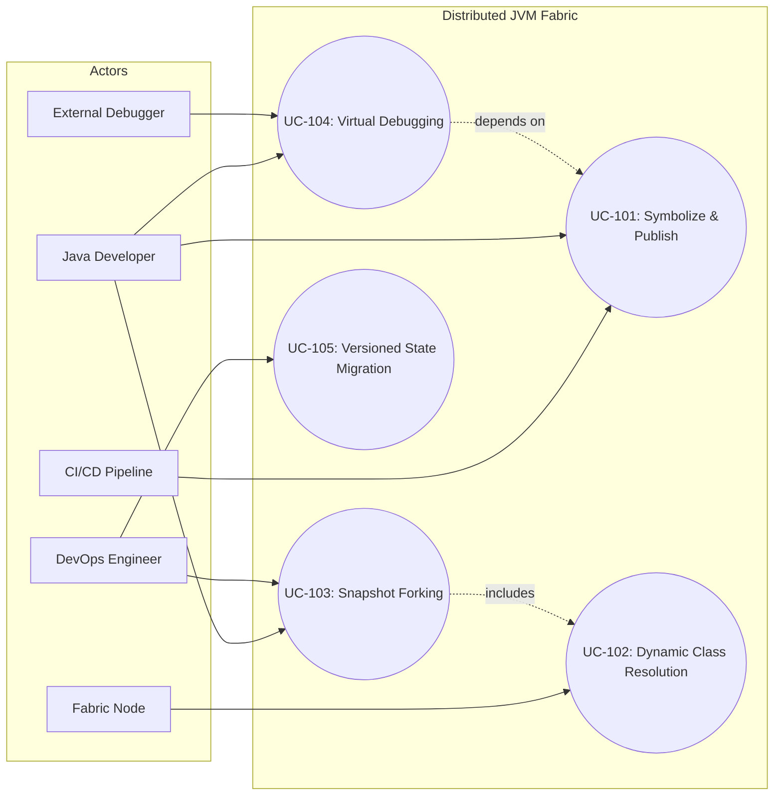
```mermaid
graph LR
    subgraph Actors
        JD[Java Developer]
        DE[DevOps Engineer]
        CI[CI/CD Pipeline]
        FN[Fabric Node]
        ED[External Debugger]
    end

    subgraph "Distributed JVM Fabric"
        UC101((UC-101: Symbolize & Publish))
        UC102((UC-102: Dynamic Class Resolution))
        UC103((UC-103: Snapshot Forking))
        UC104((UC-104: Virtual Debugging))
        UC105((UC-105: Versioned State Migration))
    end

    CI --> UC101
    JD --> UC101
    JD --> UC103
    JD --> UC104
    DE --> UC103
    DE --> UC105
    FN --> UC102
    ED --> UC104
    
    %% Relationships between Use Cases
    UC103 -.-> |includes| UC102
    UC104 -.-> |depends on| UC101
```

---

## 4. Actor-Use Case Matrix

| Use Case | Java Developer | DevOps Engineer | CI/CD Pipeline | Fabric Node | External Debugger |
| :--- | :---: | :---: | :---: | :---: | :---: |
| **UC-101: Symbolize & Publish** | P | | P | | |
| **UC-102: Dynamic Resolution** | | | | P | |
| **UC-103: Snapshot Forking** | P | S | | | |
| **UC-104: Virtual Debugging** | P | | | S | S |
| **UC-105: State Migration** | S | P | | S | |

**Legend:**
*   **P**: Primary Actor (Initiates the process)
*   **S**: Secondary Actor (Participates in or is affected by the process)

---

## 5. Detailed Use Case: UC-105 Versioned State Migration

*   **UC-ID:** UC-105
*   **Primary Actor:** DevOps Engineer
*   **Preconditions:** 
    *   A new version of a class (Symbol B) has been published.
    *   Existing instances of the old class (Symbol A) contain live data.
*   **Main Success Scenario:**
    1. Actor initiates a "State Pivot" from Symbol A to Symbol B.
    2. The Fabric identifies all serialized instances of Symbol A in the distributed cache/heap.
    3. The system applies a "Versioned Schema Mapper" to translate fields from A to B.
    4. The Fabric Node hot-swaps the object references in the running JVM.
    5. Old Symbol A instances are marked for garbage collection.
*   **Postconditions:** Live data is migrated to the new class structure without downtime.
*   **Business Rules:** 
    *   **BR-06:** Migration must fail-fast if a mandatory field in Symbol B cannot be mapped from Symbol A.
    *   **BR-07:** Atomic consistency must be maintained during the swap.

---

## Requirements Specification

# Distributed JVM Fabric: Requirements Documentation

## 1. Functional Requirements (FR)

The functional requirements define the core capabilities of the Distributed JVM Fabric, focusing on the transition from artifact-based deployment to symbol-based execution.

| FR-ID | Description | Priority | Source | Acceptance Criteria |
|:---|:---|:---|:---|:---|
| **FR-101** | **Content-Addressable Symbol Storage** | Must Have | Architect | Every class/symbol must be indexed by a SHA-256 hash of its bytecode. Retrieval must return the exact byte-for-byte match. |
| **FR-102** | **Distributed Class Loader** | Must Have | Developer | A custom `ClassLoader` must resolve missing classes by querying the Fabric Registry/DHT before falling back to local disk. |
| **FR-103** | **Symbol Versioning & Immutability** | Must Have | Architect | Once a symbol is registered, it cannot be modified. New versions must generate a new unique hash (Content-Addressable). |
| **FR-104** | **Snapshot Forking** | Should Have | Developer | The system must allow capturing the heap state of a running symbol and "forking" it into a new execution context. |
| **FR-105** | **Cluster-wide Virtualized Debugging** | Should Have | DevOps | JDWP sessions must be routable to any node in the fabric executing a specific symbol hash. |
| **FR-106** | **Versioned Serialization** | Must Have | Developer | Objects serialized on Node A must be deserializable on Node B even if Node B lacks the class, by fetching the symbol via hash. |
| **FR-107** | **Legacy JAR Shimming** | Must Have | Infrastructure | A migration tool must exist to decompose standard JARs into individual symbols and register them into the Fabric. |
| **FR-108** | **Symbol Dependency Graph** | Should Have | Architect | The system must maintain a graph of symbol-to-symbol dependencies to allow proactive pre-fetching/caching. |

---

## 2. Non-Functional Requirements (NFR)

### 2.1 Performance
*   **NFR-201 (Latency):** Local cache hits for symbol resolution must occur in < 1ms.
*   **NFR-202 (Network Fetch):** Remote symbol resolution over the DHT/Registry must complete in < 200ms (p95) on a standard 1Gbps network.
*   **NFR-203 (Throughput):** The Registry must support at least 10,000 symbol resolution requests per second per cluster cell.

### 2.2 Scalability
*   **NFR-301 (Node Count):** The fabric must scale to 5,000 concurrent JVM nodes without degradation in symbol resolution time.
*   **NFR-302 (Storage):** The Content-Addressable Storage (CAS) must support billions of unique symbols using a distributed sharding strategy.

### 2.3 Security
*   **NFR-401 (Integrity):** All symbols must be cryptographically verified against their hash upon loading to prevent bytecode injection.
*   **NFR-402 (Authorization):** Access to specific symbol namespaces must be restricted via mTLS and Role-Based Access Control (RBAC).
*   **NFR-403 (Isolation):** Forked snapshots must be sandboxed to prevent cross-tenant data leakage.

### 2.4 Reliability
*   **NFR-501 (Availability):** The Symbol Registry must provide 99.99% availability using a leaderless consensus or highly available DHT.
*   **NFR-502 (Fault Tolerance):** If a node fails during execution, the fabric must be able to restart the execution on another node using the last known symbol state.

### 2.5 Maintainability & Compatibility
*   **NFR-601 (JVM Compatibility):** Must support OpenJDK 11, 17, and 21.
*   **NFR-602 (Observability):** All symbol resolution misses and network fetches must be exported via OpenTelemetry.

---

## 3. Requirements Traceability Matrix (RTM)

This matrix ensures that every functional requirement is derived from a use case and is verified by a test case.

| Use Case ID | Requirement ID | Test Case ID | Status |
|:---|:---|:---|:---|
| UC-001: Deploy Symbol | FR-101, FR-103 | TC-101 (Hash Verification Test) | Pending |
| UC-002: Execute Code | FR-102, FR-106 | TC-102 (Remote Load Test) | Pending |
| UC-003: Hot-fix Logic | FR-104 | TC-103 (State Forking Test) | Pending |
| UC-004: Debug Cluster | FR-105 | TC-104 (Remote JDWP Proxy Test) | Pending |
| UC-005: Migrate App | FR-107 | TC-105 (JAR Decomposition Test) | Pending |
| UC-006: Optimize Load | FR-108 | TC-106 (Graph Pre-fetch Test) | Pending |

---

## 4. Requirements Dependency Diagram

The following diagram illustrates the logical flow and dependencies between the functional and non-functional requirements.

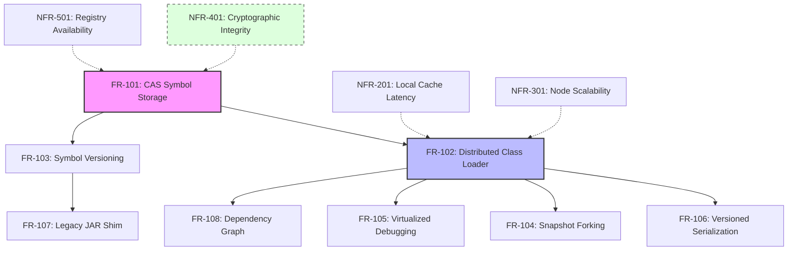
```mermaid
graph TD
    %% Functional Requirements
    FR101[FR-101: CAS Symbol Storage] --> FR102[FR-102: Distributed Class Loader]
    FR101 --> FR103[FR-103: Symbol Versioning]
    
    FR102 --> FR106[FR-106: Versioned Serialization]
    FR102 --> FR104[FR-104: Snapshot Forking]
    
    FR103 --> FR107[FR-107: Legacy JAR Shim]
    
    FR102 --> FR105[FR-105: Virtualized Debugging]
    FR102 --> FR108[FR-108: Dependency Graph]

    %% Non-Functional Requirements Dependencies
    NFR201[NFR-201: Local Cache Latency] -.-> FR102
    NFR401[NFR-401: Cryptographic Integrity] -.-> FR101
    NFR301[NFR-301: Node Scalability] -.-> FR102
    NFR501[NFR-501: Registry Availability] -.-> FR101

    %% Styling
    style FR101 fill:#f9f,stroke:#333,stroke-width:2px
    style FR102 fill:#bbf,stroke:#333,stroke-width:2px
    style NFR401 fill:#dfd,stroke:#333,stroke-dasharray: 5 5
```

### Dependency Summary:
1.  **The Foundation (FR-101):** Everything relies on the Content-Addressable Storage. Without a verifiable hash-based storage, distributed loading and versioning are impossible.
2.  **The Engine (FR-102):** The Distributed Class Loader is the primary consumer of the storage and the enabler for serialization, forking, and debugging.
3.  **Security Integration (NFR-401):** Integrity checks are baked into the storage layer (FR-101) to ensure that the "Unit of Truth" is never compromised.
4.  **Performance Constraints (NFR-201):** The success of the Distributed Class Loader (FR-102) is strictly dependent on meeting latency targets to avoid "Stop-the-world" network waits during execution.

---

## System Architecture

# Distributed JVM Fabric: Architecture Design Document

## 1. System Context Diagram (C4 Level 1)

The Distributed JVM Fabric acts as a decentralized execution layer that abstracts individual physical/virtual machines into a single, programmable graph of symbols.

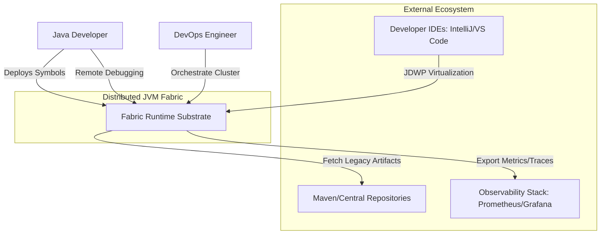
```mermaid
graph TB
    subgraph External_Systems [External Ecosystem]
        MR[Maven/Central Repositories]
        OBS[Observability Stack: Prometheus/Grafana]
        IDE[Developer IDEs: IntelliJ/VS Code]
    end

    subgraph Fabric_Boundary [Distributed JVM Fabric]
        S[Fabric Runtime Substrate]
    end

    D[Java Developer] -->|Deploys Symbols| S
    D -->|Remote Debugging| S
    S -->|Fetch Legacy Artifacts| MR
    S -->|Export Metrics/Traces| OBS
    IDE -->|JDWP Virtualization| S
    Ops[DevOps Engineer] -->|Orchestrate Cluster| S
```

---

## 2. Container Diagram (C4 Level 2)

This diagram illustrates the high-level logical containers that compose the Fabric.

```mermaid
graph TB
    subgraph Fabric_Node [Fabric Node (JVM Instance)]
        CL[Custom Fabric ClassLoader]
        RE[Execution Engine]
        SE[Snapshot Engine]
    end

    subgraph Control_Plane [Fabric Control Plane]
        SR[Symbol Registry - CAS]
        DHT[Distributed Hash Table - Discovery]
        SCH[Global Scheduler]
    end

    subgraph Storage_Layer [Persistence]
        BS[(Bytecode Store - S3/MinIO)]
        SS[(State Snapshot Store)]
    end

    IDE[Developer Tooling] -->|JDWP Proxy| RE
    CL -->|Request Symbol Hash| DHT
    CL -->|Fetch Bytecode| SR
    SR -->|Persist/Retrieve| BS
    SE -->|Checkpoint State| SS
    RE -->|Execute| CL
```

---

## 3. Component Diagram (C4 Level 3)

Focusing on the **Fabric Node**, the core execution unit of the system.

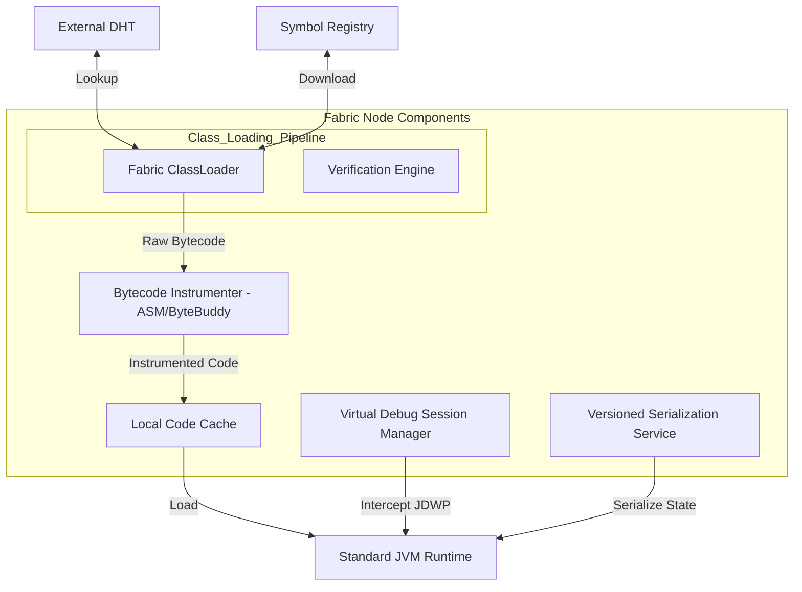
```mermaid
graph TD
    subgraph Fabric_Node_Internal [Fabric Node Components]
        direction TB
        BCI[Bytecode Instrumenter - ASM/ByteBuddy]
        LCC[Local Code Cache]
        VDS[Virtual Debug Session Manager]
        VSS[Versioned Serialization Service]
        
        subgraph Class_Loading_Pipeline
            FCL[Fabric ClassLoader]
            VR[Verification Engine]
        end
    end

    DHT[External DHT] <-->|Lookup| FCL
    SR[Symbol Registry] <-->|Download| FCL
    FCL -->|Raw Bytecode| BCI
    BCI -->|Instrumented Code| LCC
    LCC -->|Load| JVM_Runtime[Standard JVM Runtime]
    VDS -->|Intercept JDWP| JVM_Runtime
    VSS -->|Serialize State| JVM_Runtime
```

---

## 4. Deployment Diagram

The system is designed for cloud-native environments, typically orchestrated via Kubernetes with high-performance networking.

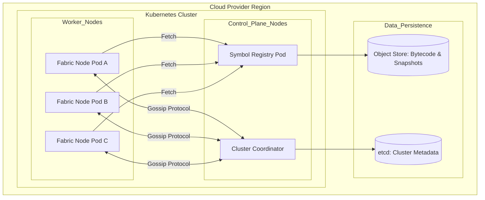
```mermaid
graph TB
    subgraph Public_Cloud [Cloud Provider Region]
        subgraph K8s_Cluster [Kubernetes Cluster]
            direction TB
            subgraph Control_Plane_Nodes
                REG[Symbol Registry Pod]
                COORD[Cluster Coordinator]
            end
            
            subgraph Worker_Nodes
                direction LR
                FN1[Fabric Node Pod A]
                FN2[Fabric Node Pod B]
                FN3[Fabric Node Pod C]
            end
        end

        subgraph Data_Persistence
            S3[(Object Store: Bytecode & Snapshots)]
            ETCD[(etcd: Cluster Metadata)]
        end
    end

    FN1 & FN2 & FN3 <-->|Gossip Protocol| COORD
    REG --> S3
    COORD --> ETCD
    FN1 & FN2 & FN3 -->|Fetch| REG
```

---

## 5. Technology Stack Summary

| Layer | Technology | Rationale |
| :--- | :--- | :--- |
| **Runtime** | JVM (OpenJDK 17+) | Industry standard for enterprise execution. |
| **Bytecode Manipulation** | ASM / ByteBuddy | High-performance transformation for symbol-based loading. |
| **Symbol Registry** | Content-Addressable Storage (CAS) | Ensures immutability and deduplication of classes. |
| **Discovery** | libp2p / Kademlia DHT | Decentralized discovery of symbols across large clusters. |
| **State Management** | CRIU / Custom Heap Snapshot | Enables "Snapshot Forking" of running execution states. |
| **Communication** | gRPC + Protobuf | Low-latency, versioned API communication. |
| **Debugging** | JDWP Proxy | Allows standard IDEs to debug distributed code. |
| **Infrastructure** | Kubernetes / Terraform | Standardized deployment and scaling. |

---

## 6. Architecture Decision Records (ADRs)

### ADR-001: Symbol-Centric vs. Artifact-Centric Loading
*   **Context:** Traditional JVMs load JARs. This leads to "JAR Hell" and version conflicts where multiple versions of the same class cannot coexist easily.
*   **Decision:** Shift the unit of truth to individual **Symbols** (Classes) identified by the SHA-256 hash of their bytecode.
*   **Consequences:** 
    *   (+) Eliminates classpath conflicts.
    *   (+) Enables granular code sharing across the cluster.
    *   (-) Increases complexity of the ClassLoader; requires a robust Symbol Registry.

### ADR-002: JDWP Virtualization for Cluster-Wide Debugging
*   **Context:** Debugging a distributed system is difficult because execution hops between nodes.
*   **Decision:** Implement a JDWP Proxy that intercepts debug signals and routes them based on the execution context, not the physical IP.
*   **Consequences:**
    *   (+) Developers can follow a request across nodes in a single IDE session.
    *   (-) Significant overhead during active debug sessions; requires strict security/RBAC.

### ADR-003: Content-Addressable Storage (CAS) for Bytecode
*   **Context:** Bytecode must be immutable to ensure that a "Symbol" hash always represents the same logic.
*   **Decision:** Use a CAS (Content-Addressable Storage) mechanism where the address of the bytecode is its cryptographic hash.
*   **Consequences:**
    *   (+) Automatic deduplication (identical classes in different projects are stored once).
    *   (+) Built-in integrity verification.
    *   (-) Requires a garbage collection mechanism for orphaned symbols.

---

## 7. Key Workflows

### 7.1. Symbol Resolution Flow
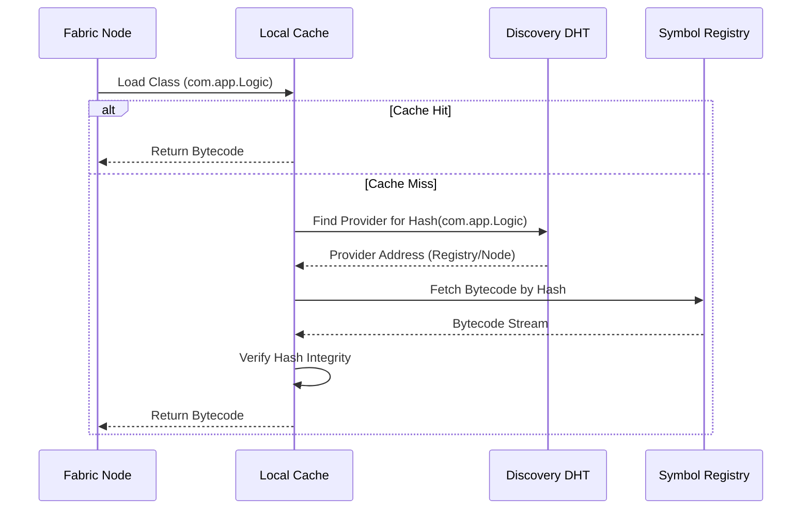
```mermaid
sequenceDiagram
    participant JVM as Fabric Node
    participant LCC as Local Cache
    participant DHT as Discovery DHT
    participant SR as Symbol Registry

    JVM->>LCC: Load Class (com.app.Logic)
    alt Cache Hit
        LCC-->>JVM: Return Bytecode
    else Cache Miss
        LCC->>DHT: Find Provider for Hash(com.app.Logic)
        DHT-->>LCC: Provider Address (Registry/Node)
        LCC->>SR: Fetch Bytecode by Hash
        SR-->>LCC: Bytecode Stream
        LCC->>LCC: Verify Hash Integrity
        LCC-->>JVM: Return Bytecode
    end
```

### 7.2. Snapshot Forking Flow
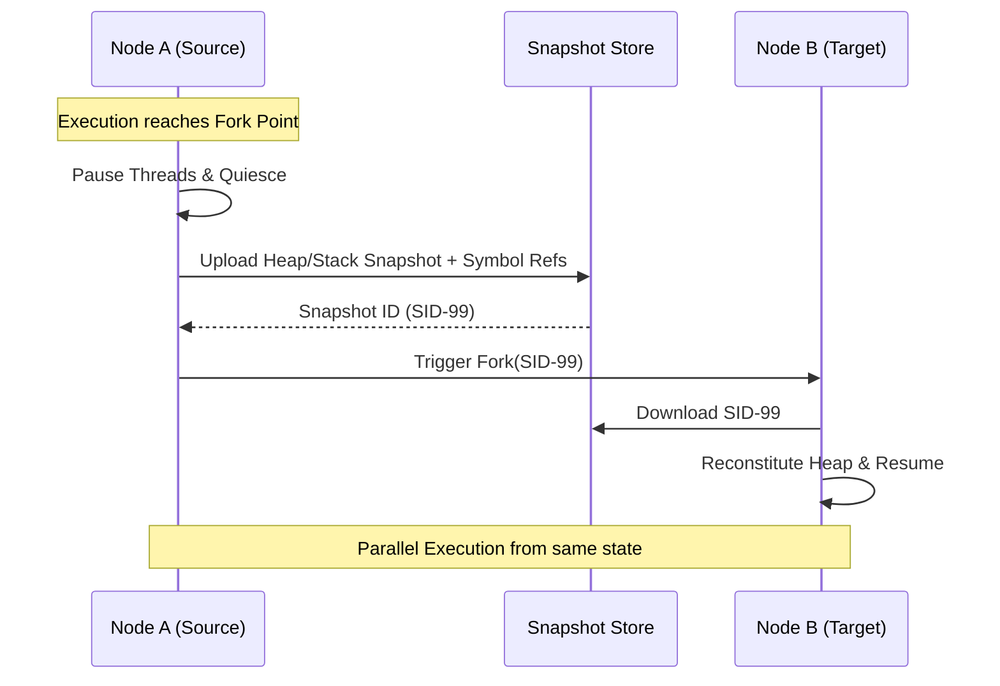
```mermaid
sequenceDiagram
    participant N1 as Node A (Source)
    participant SS as Snapshot Store
    participant N2 as Node B (Target)

    Note over N1: Execution reaches Fork Point
    N1->>N1: Pause Threads & Quiesce
    N1->>SS: Upload Heap/Stack Snapshot + Symbol Refs
    SS-->>N1: Snapshot ID (SID-99)
    N1->>N2: Trigger Fork(SID-99)
    N2->>SS: Download SID-99
    N2->>N2: Reconstitute Heap & Resume
    Note over N1, N2: Parallel Execution from same state
```

---

## Data Model & ERD

# Data Model Documentation: Distributed JVM Fabric

This document outlines the data architecture for the Distributed JVM Fabric. Unlike traditional JVM environments that rely on file-based JAR artifacts, this system utilizes a **Content-Addressable Symbol Graph** to manage code, state, and execution across a distributed cluster.

---

## 1. Entity-Relationship Diagram (ERD)

The following diagram illustrates the relationships between the core entities: Symbols (the unit of truth), Snapshots (the versioned state), and the Runtime Nodes.

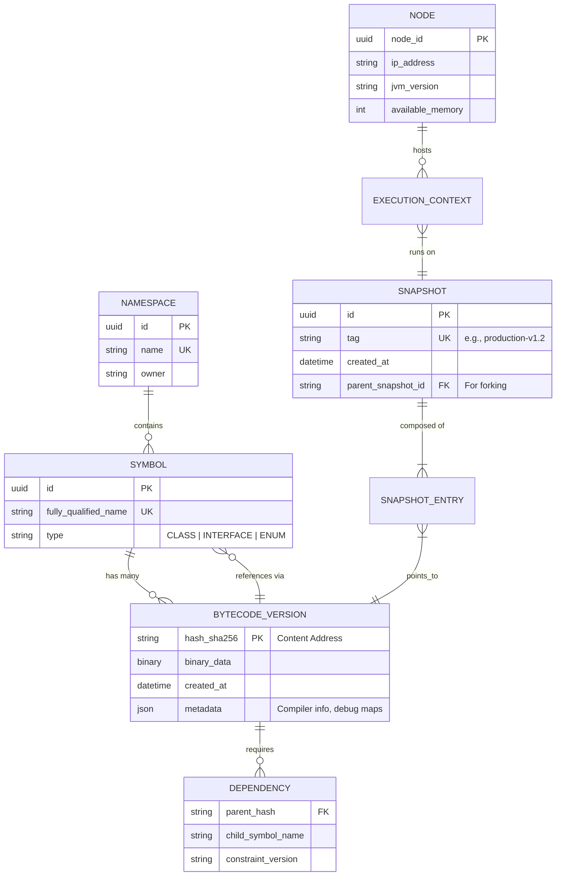
```mermaid
erDiagram
    NAMESPACE ||--o{ SYMBOL : contains
    SYMBOL ||--o{ BYTECODE_VERSION : "has many"
    BYTECODE_VERSION ||--o{ DEPENDENCY : requires
    BYTECODE_VERSION ||--o{ SYMBOL : "references via"
    
    SNAPSHOT ||--|{ SNAPSHOT_ENTRY : "composed of"
    SNAPSHOT_ENTRY }|--|| BYTECODE_VERSION : points_to
    
    NODE ||--o{ EXECUTION_CONTEXT : hosts
    EXECUTION_CONTEXT }|--|| SNAPSHOT : "runs on"
    
    NAMESPACE {
        uuid id PK
        string name UK
        string owner
    }

    SYMBOL {
        uuid id PK
        string fully_qualified_name UK
        string type "CLASS | INTERFACE | ENUM"
    }

    BYTECODE_VERSION {
        string hash_sha256 PK "Content Address"
        binary binary_data
        datetime created_at
        json metadata "Compiler info, debug maps"
    }

    DEPENDENCY {
        string parent_hash FK
        string child_symbol_name
        string constraint_version
    }

    SNAPSHOT {
        uuid id PK
        string tag UK "e.g., production-v1.2"
        datetime created_at
        string parent_snapshot_id FK "For forking"
    }

    NODE {
        uuid node_id PK
        string ip_address
        string jvm_version
        int available_memory
    }
```

---

## 2. Entity Descriptions

### DM-101: Symbol
*   **Purpose:** Represents the logical identity of a Java class or interface. It decouples the "Name" of a class from its specific implementation (Bytecode).
*   **Attributes:**
    *   `id`: Internal unique identifier.
    *   `fully_qualified_name`: The standard Java package + class name (e.g., `org.fabric.Core`).
*   **Relationships:** A Symbol can have multiple `BYTECODE_VERSIONS` over time.
*   **Performance:** Indexed by `fully_qualified_name` for O(1) resolution during class-loading requests.

### DM-102: Bytecode Version
*   **Purpose:** The immutable, content-addressed storage of the actual compiled `.class` file.
*   **Attributes:**
    *   `hash_sha256`: The primary key derived from the bytecode itself. Ensures integrity.
    *   `binary_data`: The raw bytes.
*   **Relationships:** Linked to a `Symbol`. Contains `DEPENDENCY` links to other Symbols.
*   **Performance:** Stored in Content-Addressable Storage (CAS). Deduplicates identical classes across different projects.

### DM-103: Snapshot
*   **Purpose:** A "Git-like" commit of the entire cluster state. It defines exactly which `Bytecode Version` of every `Symbol` is active.
*   **Attributes:**
    *   `tag`: Human-readable version string.
    *   `parent_snapshot_id`: Enables "Snapshot Forking" for runtime code evolution.
*   **Relationships:** Contains many `SNAPSHOT_ENTRIES`.

### DM-104: Execution Context
*   **Purpose:** Represents a running instance of a Snapshot on a specific Node.
*   **Attributes:**
    *   `context_id`: Unique runtime ID.
    *   `status`: (STARTING, RUNNING, SUSPENDED, TERMINATED).
*   **Relationships:** Maps a `Node` to a `Snapshot`.

---

## 3. Data Dictionary

| Entity | Attribute | Type | Constraints | Description |
| :--- | :--- | :--- | :--- | :--- |
| **Symbol** | id | UUID | PK | Unique internal ID. |
| **Symbol** | fully_qualified_name | STRING | UK, NOT NULL | e.g., `com.app.Service`. |
| **Bytecode** | hash_sha256 | CHAR(64) | PK | SHA-256 hash of the bytecode. |
| **Bytecode** | binary_data | BLOB | NOT NULL | The actual JVM bytecode. |
| **Dependency** | parent_hash | CHAR(64) | FK, PK | The bytecode requiring the dependency. |
| **Dependency** | child_symbol | STRING | PK | The name of the required class. |
| **Snapshot** | tag | STRING | UK | Unique version name (e.g. `v1.0.4`). |
| **Node** | node_id | UUID | PK | Unique ID for a JVM instance. |

---

## 4. Data Flow Diagram

The following diagram shows how code moves from a developer's environment into the Distributed Fabric.

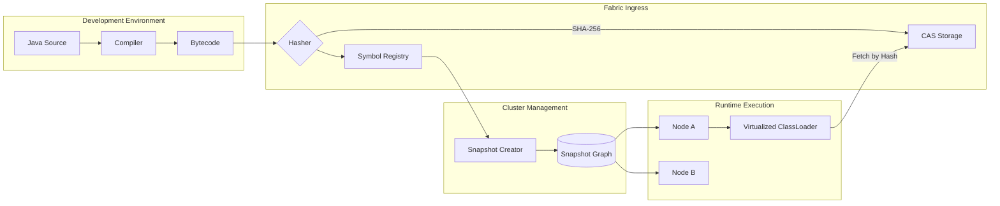
```mermaid
graph LR
    subgraph "Development Environment"
        A[Java Source] --> B[Compiler]
        B --> C[Bytecode]
    end

    subgraph "Fabric Ingress"
        C --> D{Hasher}
        D -->|SHA-256| E[CAS Storage]
        D --> F[Symbol Registry]
    end

    subgraph "Cluster Management"
        F --> G[Snapshot Creator]
        G --> H[(Snapshot Graph)]
    end

    subgraph "Runtime Execution"
        H --> I[Node A]
        H --> J[Node B]
        I --> K[Virtualized ClassLoader]
        K -->|Fetch by Hash| E
    end
```

---

## 5. Data Validation Rules

| ID | Rule Name | Description | Severity |
| :--- | :--- | :--- | :--- |
| **VAL-001** | Hash Integrity | The `hash_sha256` must match the result of hashing `binary_data`. | Critical |
| **VAL-002** | Closure Check | A `Snapshot` cannot be finalized if any `Dependency` points to a `Symbol` not present in the snapshot. | Block-er |
| **VAL-003** | Immutable Bytecode | Once a `Bytecode_Version` is written, it can never be updated or deleted if referenced by a `Snapshot`. | Critical |
| **VAL-004** | Cyclic Detection | Detect and flag circular dependencies between Symbols during Snapshot creation. | Warning |

---

## 6. Data Migration Considerations

### M-001: JAR Decomposition
*   **Process:** Existing JAR files must be unpacked. Each `.class` file is hashed and inserted as a `Bytecode_Version`.
*   **Metadata:** Original JAR manifest attributes (Implementation-Version, etc.) are stored in the `metadata` JSON field of the `Bytecode_Version`.

### M-002: Legacy Classpath Shimming
*   **Strategy:** To support legacy apps, a "Virtual JAR" is generated on the fly. This is a synthetic view of a `Snapshot` that presents itself to the legacy JVM as a standard classpath.

### M-003: Version Mapping
*   **Challenge:** Mapping Maven/Gradle semantic versions to Fabric Snapshots.
*   **Solution:** Maintain a mapping table between `(GroupId, ArtifactId, Version)` and Fabric `Snapshot IDs` to ensure traceability for DevOps teams.

### M-004: Cold-Start Mitigation
*   **Strategy:** During migration, frequently accessed `Bytecode_Versions` should be pre-cached on `Nodes` to prevent network latency spikes during the initial class-loading phase of a migrated application.

---

## Flow Diagrams

# Distributed JVM Fabric: System Interaction & Flow Documentation

This document outlines the critical operational flows of the Distributed JVM Fabric. It details how the system transitions from traditional JAR-based execution to a symbol-centric, network-native substrate.

---

## 1. Sequence Diagrams: Critical User Journeys

### SD-101: Symbol Resolution and Dynamic Loading
This journey describes how a node resolves a class that is not present in its local classpath by querying the Fabric's Content-Addressable Storage (CAS).

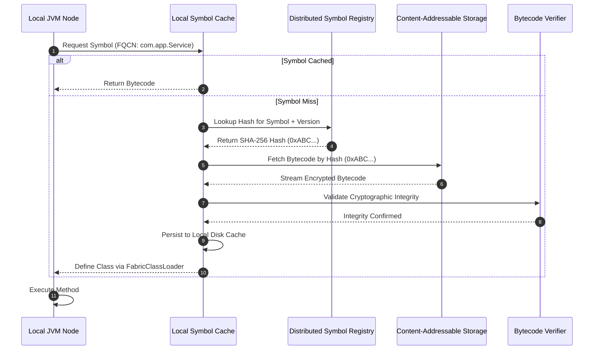
```mermaid
sequenceDiagram
    autonumber
    participant JVM as Local JVM Node
    participant LSC as Local Symbol Cache
    participant DHT as Distributed Symbol Registry
    participant CAS as Content-Addressable Storage
    participant BV as Bytecode Verifier

    JVM->>LSC: Request Symbol (FQCN: com.app.Service)
    alt Symbol Cached
        LSC-->>JVM: Return Bytecode
    else Symbol Miss
        LSC->>DHT: Lookup Hash for Symbol + Version
        DHT-->>LSC: Return SHA-256 Hash (0xABC...)
        LSC->>CAS: Fetch Bytecode by Hash (0xABC...)
        CAS-->>LSC: Stream Encrypted Bytecode
        LSC->>BV: Validate Cryptographic Integrity
        BV-->>LSC: Integrity Confirmed
        LSC->>LSC: Persist to Local Disk Cache
        LSC-->>JVM: Define Class via FabricClassLoader
    end
    JVM->>JVM: Execute Method
```

### SD-102: Distributed Snapshot Forking (State Migration)
This journey illustrates the process of capturing a running execution context and "forking" it to another node in the cluster.

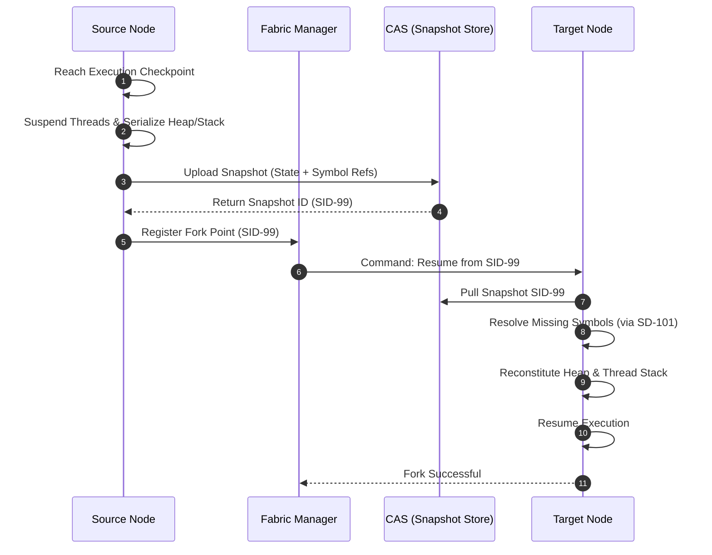
```mermaid
sequenceDiagram
    autonumber
    participant N1 as Source Node
    participant FM as Fabric Manager
    participant CAS as CAS (Snapshot Store)
    participant N2 as Target Node

    N1->>N1: Reach Execution Checkpoint
    N1->>N1: Suspend Threads & Serialize Heap/Stack
    N1->>CAS: Upload Snapshot (State + Symbol Refs)
    CAS-->>N1: Return Snapshot ID (SID-99)
    N1->>FM: Register Fork Point (SID-99)
    
    FM->>N2: Command: Resume from SID-99
    N2->>CAS: Pull Snapshot SID-99
    N2->>N2: Resolve Missing Symbols (via SD-101)
    N2->>N2: Reconstitute Heap & Thread Stack
    N2->>N2: Resume Execution
    N2-->>FM: Fork Successful
```

### SD-103: Cluster-wide Virtualized Debugging
How a developer attaches a debugger to a logical symbol regardless of its physical location in the cluster.

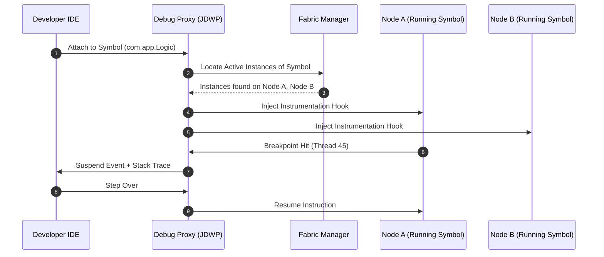
```mermaid
sequenceDiagram
    autonumber
    participant IDE as Developer IDE
    participant DP as Debug Proxy (JDWP)
    participant FM as Fabric Manager
    participant N1 as Node A (Running Symbol)
    participant N2 as Node B (Running Symbol)

    IDE->>DP: Attach to Symbol (com.app.Logic)
    DP->>FM: Locate Active Instances of Symbol
    FM-->>DP: Instances found on Node A, Node B
    DP->>N1: Inject Instrumentation Hook
    DP->>N2: Inject Instrumentation Hook
    N1->>DP: Breakpoint Hit (Thread 45)
    DP->>IDE: Suspend Event + Stack Trace
    IDE->>DP: Step Over
    DP->>N1: Resume Instruction
```

---

## 2. Activity Diagrams: Complex Business Processes

### AD-201: Symbol Ingestion Pipeline
The process of converting legacy JAR artifacts into the Fabric's symbol-native format.

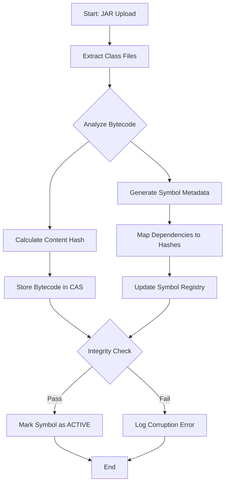
```mermaid
graph TD
    A[Start: JAR Upload] --> B[Extract Class Files]
    B --> C{Analyze Bytecode}
    C --> D[Generate Symbol Metadata]
    C --> E[Calculate Content Hash]
    D --> F[Map Dependencies to Hashes]
    E --> G[Store Bytecode in CAS]
    F --> H[Update Symbol Registry]
    G --> I{Integrity Check}
    H --> I
    I -->|Pass| J[Mark Symbol as ACTIVE]
    I -->|Fail| K[Log Corruption Error]
    J --> L[End]
    K --> L
```

### AD-202: Locality-Aware Task Scheduling
How the Fabric decides where to execute a specific piece of code based on symbol availability and data proximity.

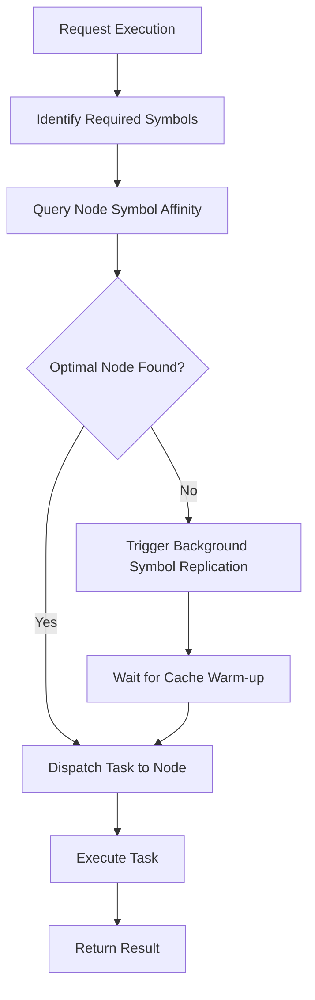
```mermaid
graph TD
    Start[Request Execution] --> GetSym[Identify Required Symbols]
    GetSym --> CheckLoc[Query Node Symbol Affinity]
    CheckLoc --> Decision{Optimal Node Found?}
    Decision -->|Yes| Dispatch[Dispatch Task to Node]
    Decision -->|No| LoadSym[Trigger Background Symbol Replication]
    LoadSym --> Wait[Wait for Cache Warm-up]
    Wait --> Dispatch
    Dispatch --> Exec[Execute Task]
    Exec --> Result[Return Result]
```

---

## 3. State Diagrams: Entity Lifecycles

### ST-301: Symbol Lifecycle State
A symbol represents a specific version of a class. Its state governs whether it can be linked or executed.

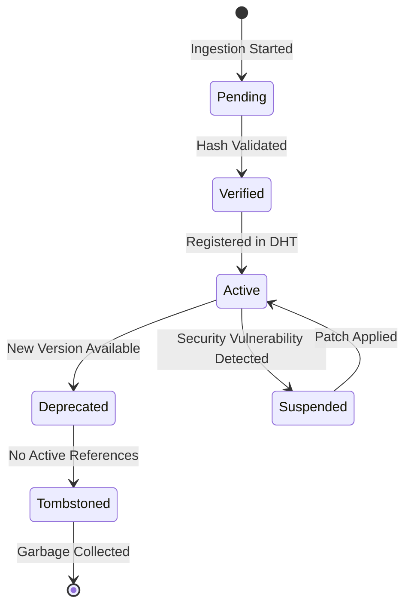
```mermaid
stateDiagram-v2
    [*] --> Pending: Ingestion Started
    Pending --> Verified: Hash Validated
    Verified --> Active: Registered in DHT
    Active --> Deprecated: New Version Available
    Active --> Suspended: Security Vulnerability Detected
    Suspended --> Active: Patch Applied
    Deprecated --> Tombstoned: No Active References
    Tombstoned --> [*]: Garbage Collected
```

### ST-302: Execution Context State
Represents the lifecycle of a distributed "thread" or task within the Fabric.

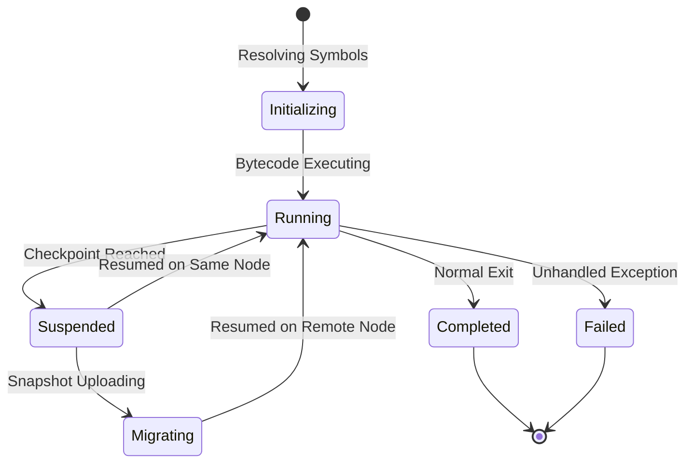
```mermaid
stateDiagram-v2
    [*] --> Initializing: Resolving Symbols
    Initializing --> Running: Bytecode Executing
    Running --> Suspended: Checkpoint Reached
    Suspended --> Running: Resumed on Same Node
    Suspended --> Migrating: Snapshot Uploading
    Migrating --> Running: Resumed on Remote Node
    Running --> Completed: Normal Exit
    Running --> Failed: Unhandled Exception
    Completed --> [*]
    Failed --> [*]
```

---

## 4. Integration Flow Diagrams

### IF-401: Data Flow for Symbol Replication
This diagram shows how data moves between nodes to ensure high availability of code.

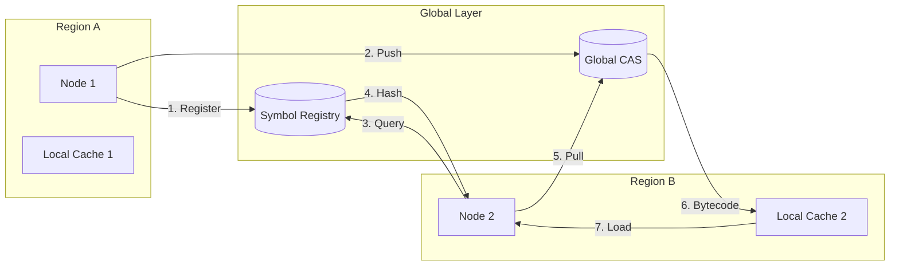
```mermaid
graph LR
    subgraph "Region A"
        N1[Node 1]
        C1[Local Cache 1]
    end
    subgraph "Region B"
        N2[Node 2]
        C2[Local Cache 2]
    end
    subgraph "Global Layer"
        DHT[(Symbol Registry)]
        CAS[(Global CAS)]
    end

    N1 -- 1. Register --> DHT
    N1 -- 2. Push --> CAS
    N2 -- 3. Query --> DHT
    DHT -- 4. Hash --> N2
    N2 -- 5. Pull --> CAS
    CAS -- 6. Bytecode --> C2
    C2 -- 7. Load --> N2
```

---

## 5. Error Handling Flows

### EH-501: Symbol Resolution Failure & Recovery
Documenting the resilience strategy when a network partition or corruption occurs during class loading.

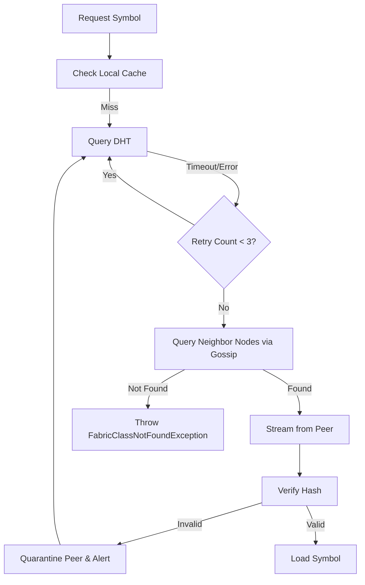
```mermaid
graph TD
    Req[Request Symbol] --> TryCache[Check Local Cache]
    TryCache -->|Miss| TryDHT[Query DHT]
    TryDHT -->|Timeout/Error| RetryDHT{Retry Count < 3?}
    RetryDHT -->|Yes| TryDHT
    RetryDHT -->|No| TryPeer[Query Neighbor Nodes via Gossip]
    TryPeer -->|Found| FetchPeer[Stream from Peer]
    TryPeer -->|Not Found| Fail[Throw FabricClassNotFoundException]
    FetchPeer --> Verify[Verify Hash]
    Verify -->|Invalid| Quarantine[Quarantine Peer & Alert]
    Quarantine --> TryDHT
    Verify -->|Valid| Load[Load Symbol]
```

### EH-502: Snapshot Resume Failure
Handling cases where a migrated execution context cannot be reconstituted.

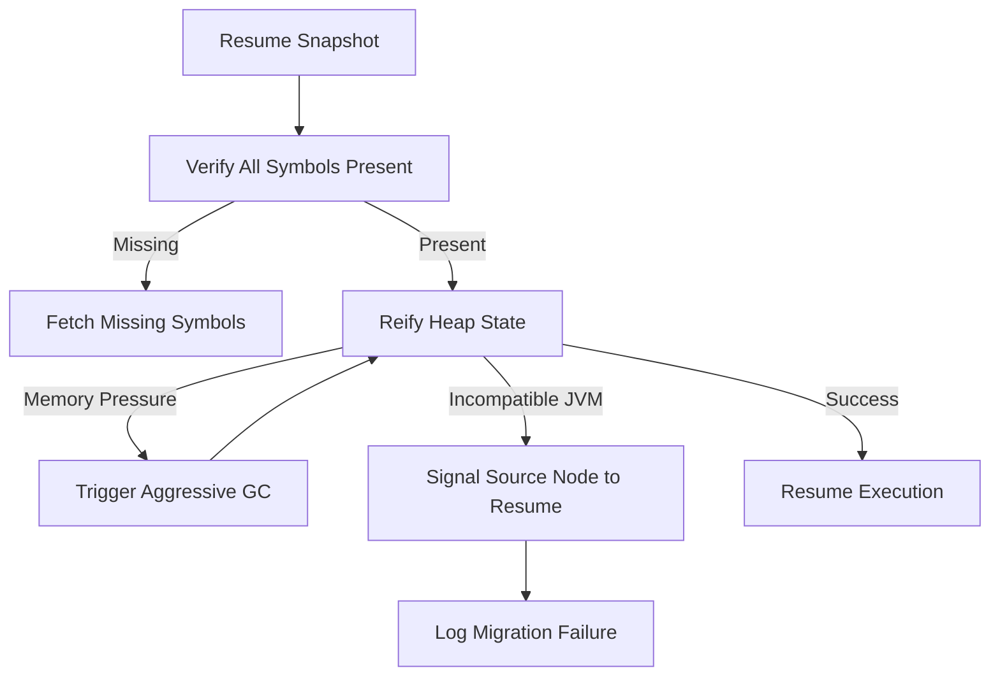
```mermaid
graph TD
    Start[Resume Snapshot] --> CheckSym[Verify All Symbols Present]
    CheckSym -->|Missing| Fetch[Fetch Missing Symbols]
    CheckSym -->|Present| Reify[Reify Heap State]
    Reify -->|Memory Pressure| GC[Trigger Aggressive GC]
    GC --> Reify
    Reify -->|Incompatible JVM| Rollback[Signal Source Node to Resume]
    Rollback --> Log[Log Migration Failure]
    Reify -->|Success| Exec[Resume Execution]
```

---

## 6. Traceability Matrix (Flows to Requirements)

| ID | Flow Name | Requirement Reference | Acceptance Criteria |
|:---|:---|:---|:---|
| SD-101 | Symbol Resolution | FR-001: Content-Addressable Loading | Class loads in < 50ms (cached) or < 500ms (network). |
| SD-102 | Snapshot Forking | FR-005: Runtime State Migration | State migration preserves thread local variables. |
| SD-103 | Virtual Debugging | FR-012: Cluster-wide JDWP | Breakpoints trigger across N nodes simultaneously. |
| ST-301 | Symbol Lifecycle | FR-008: Versioning & Immutability | Symbols cannot be modified once in `ACTIVE` state. |
| EH-501 | Resolution Failure | FR-015: Fault Tolerance | System falls back to peer-to-peer gossip if DHT is down. |

---

## Test Plan

# Test Plan: Distributed JVM Fabric

This document outlines the comprehensive testing strategy for the Distributed JVM Fabric, ensuring the reliability of symbol-based class resolution, runtime snapshotting, and cluster-wide debugging.

---

## 1. Test Strategy Overview

### 1.1 Testing Objectives
*   **Integrity:** Verify that content-addressed symbols (classes) are immutable and cryptographically verified.
*   **Performance:** Ensure that the overhead of network-based class loading is mitigated by tiered caching.
*   **Consistency:** Validate that runtime forks maintain state consistency across distributed nodes.
*   **Transparency:** Confirm that distributed debugging (JDWP) feels identical to local debugging for the end-user.

### 1.2 Testing Scope
*   **In-Scope:**
    *   Bytecode decomposition and Symbol extraction.
    *   Content-Addressable Storage (CAS) read/write operations.
    *   Distributed Hash Table (DHT) symbol lookups.
    *   JDWP proxying and virtualized thread management.
    *   Snapshot/Forking mechanisms.
*   **Out-of-Scope:**
    *   Physical hardware failure (handled by infrastructure layer).
    *   Non-JVM language support (e.g., native C++ libraries).

### 1.3 Testing Approach
We utilize a **"Shift-Left"** approach combined with **Chaos Engineering**.
*   **Automated CI/CD:** Every commit triggers unit and integration suites.
*   **Shadow Execution:** Running legacy JARs alongside the Fabric to compare output consistency.
*   **Fault Injection:** Simulating network partitions during symbol resolution.

### 1.4 Entry/Exit Criteria
*   **Entry:** Architecture finalized, CAS API stable, 100% of code passes static analysis (Checkstyle/SonarQube).
*   **Exit:** 90% Statement Coverage, 0 Critical/Blocker bugs, Performance benchmarks within 10% of native JVM execution for cached symbols.

---

## 2. Test Levels

### 2.1 Unit Testing
*   **Focus:** Bytecode manipulation (ASM), Hash generation, Local Cache LRU logic.
*   **Coverage Target:** 85% Line Coverage.
*   **Frameworks:** JUnit 5, Mockito, AssertJ.

### 2.2 Integration Testing
*   **Focus:** Node-to-Registry communication, CAS persistence, JDWP packet routing.
*   **Frameworks:** Testcontainers (for DHT/Registry), WireMock.

### 2.3 System Testing
*   **Focus:** End-to-end execution of a multi-module application without local JAR files.
*   **Scenarios:** Cluster cold-start, Symbol migration between nodes.

### 2.4 Acceptance Testing (UAT)
*   **Criteria:**
    1.  Developer can attach a standard IDE debugger to a remote cluster node.
    2.  System resolves a class version conflict automatically based on content hash.
    3.  A running process can be "forked" into a new namespace in < 500ms.

---

## 3. Test Case Catalog

| TC-ID | Requirement | Description | Steps | Expected Result | Priority |
|-------|-------------|-------------|-------|-----------------|----------|
| **TC-001** | FR-001 | Symbol Resolution via CAS | 1. Request Class `com.App` by Hash.<br>2. Intercept ClassLoader. | Class is fetched from DHT and loaded into JVM. | High |
| **TC-002** | FR-002 | Runtime Snapshot Forking | 1. Execute loop.<br>2. Trigger Snapshot.<br>3. Resume in new Node. | New node starts from exact loop iteration state. | High |
| **TC-003** | FR-003 | Distributed JDWP Proxy | 1. Attach IntelliJ to Fabric Port.<br>2. Set breakpoint in distributed class. | Breakpoint hits; stack trace shows cluster-wide context. | Medium |
| **TC-004** | FR-004 | Bytecode Integrity Check | 1. Manually corrupt a class file in CAS.<br>2. Attempt to load. | System throws `SecurityException` due to hash mismatch. | High |
| **TC-005** | FR-005 | Tiered Cache Promotion | 1. Fetch symbol from remote.<br>2. Check L1 (Memory) and L2 (Disk). | Symbol is promoted to L1 for subsequent calls. | Medium |

---

## 4. Test Coverage Matrix

```mermaid
graph LR
    subgraph Requirements
        FR1[FR-001: Symbol Resolution]
        FR2[FR-002: Snapshot/Fork]
        FR3[FR-003: Virtual Debugging]
        FR4[FR-004: Security/Integrity]
    end

    subgraph Test Cases
        TC1[TC-001: CAS Fetch]
        TC2[TC-002: State Fork]
        TC3[TC-003: JDWP Proxy]
        TC4[TC-004: Hash Validation]
        TC5[TC-005: Cache Logic]
    end

    FR1 --> TC1
    FR1 --> TC5
    FR2 --> TC2
    FR3 --> TC3
    FR4 --> TC4
```

---

## 5. Non-Functional Test Cases

### 5.1 Performance Scenarios
*   **P-001 (Cold Start Latency):** Measure time to resolve 1,000 unique symbols over a 50ms latency network.
*   **P-002 (Memory Overhead):** Measure JVM heap footprint of the Fabric Agent vs. standard JVM.

### 5.2 Security Scenarios
*   **S-001 (Unauthorized Symbol Injection):** Attempt to push a symbol to the Registry without a valid cryptographic signature.
*   **S-002 (Man-in-the-Middle):** Verify TLS 1.3 encryption for all symbol transfers between nodes.

### 5.3 Resiliency Scenarios
*   **R-001 (Registry Partition):** Disconnect the Symbol Registry; verify that nodes continue to run using L2 (Disk) cache.

---

## 6. Test Environment Requirements

### 6.1 Hardware/Software
*   **Nodes:** 3x Linux VMs (Ubuntu 22.04), 4 vCPU, 16GB RAM.
*   **JVM:** OpenJDK 17+.
*   **Network:** Simulated latency using `tc` (Traffic Control) to mimic cross-region traffic.

### 6.2 Tool Requirements
*   **Chaos Mesh:** For injecting network and pod failures.
*   **Prometheus/Grafana:** For monitoring cache hit/miss ratios and resolution latency.
*   **JMH (Java Microbenchmark Harness):** For bytecode instrumentation overhead testing.

---

## 7. Test Schedule

```mermaid
gantt
    title Distributed JVM Fabric Testing Timeline
    dateFormat  YYYY-MM-DD
    section Unit Testing
    Bytecode Logic          :active, a1, 2023-11-01, 10d
    CAS/DHT Client          :a2, 2023-11-05, 12d
    section Integration
    Registry Sync           :b1, 2023-11-15, 10d
    JDWP Proxying           :b2, 2023-11-20, 15d
    section System/Perf
    End-to-End Flow         :c1, 2023-12-01, 14d
    Load/Stress Testing     :c2, 2023-12-10, 10d
    section Acceptance
    UAT/Security Audit      :d1, 2023-12-20, 7d
```

---

## 8. Risk Assessment

| Risk | Impact | Probability | Mitigation Strategy |
|------|--------|-------------|---------------------|
| **Network Latency** | High | High | Implement aggressive L1/L2 caching and speculative pre-fetching of symbols. |
| **Bytecode Incompatibility** | Medium | Low | Use ASM for strict validation; maintain a "Compatibility Matrix" for different Java versions. |
| **Registry Bottleneck** | High | Medium | Use a decentralized DHT (Distributed Hash Table) instead of a single central registry. |
| **Debugger Lag** | Low | Medium | Optimize JDWP packet batching to reduce round-trips between IDE and Fabric. |

---

**Approval Sign-off:**
*   Lead Architect: __________________________
*   QA Manager: __________________________
*   Product Owner: __________________________

---

## Phase Plan

This document outlines the development roadmap for the **Distributed JVM Fabric**. The project is structured into five distinct phases over a 24-week period, focusing on transitioning from a traditional JAR-based execution model to a network-native, symbol-addressed substrate.

---

## 1. Project Timeline Overview

```mermaid
gantt
    title Distributed JVM Fabric Development Roadmap
    dateFormat  YYYY-MM-DD
    axisFormat  %b %d
    
    section Phase 1: Symbolic Core
    Bytecode Hashing & CAS Engine    :p1a, 2024-01-01, 14d
    Symbolic ClassLoader Prototype   :p1b, after p1a, 14d
    
    section Phase 2: Distributed Fabric
    DHT/Registry Implementation      :p2a, 2024-01-29, 21d
    P2P Symbol Propagation           :p2b, after p2a, 21d
    
    section Phase 3: Runtime Evolution
    State Snapshot & Forking Logic   :p3a, 2024-03-11, 21d
    Virtualized JDWP Proxy           :p3b, after p3a, 21d
    
    section Phase 4: Legacy & Tooling
    JAR Migration Shim               :p4a, 2024-05-06, 14d
    CLI & Fabric Monitoring UI       :p4b, after p4a, 14d
    
    section Phase 5: Hardening
    Security Audit & Cryptography    :p5a, 2024-06-03, 14d
    Performance Tuning & UAT         :p5b, after p5a, 14d
    Production Launch                :milestone, 2024-07-01, 0d
```

---

## 2. Phase Descriptions

### Phase 1: Symbolic Core (Weeks 1–4)
*   **Objectives:** Establish the Content-Addressable Storage (CAS) for bytecode and the custom ClassLoader.
*   **Deliverables:** `fabric-cas-engine`, `SymbolicClassLoader` implementation.
*   **Key Activities:** Implementing SHA-256 bytecode hashing, ASM-based symbol extraction, and local CAS persistence.
*   **Dependencies:** None (Foundation phase).
*   **Success Criteria:** Ability to load and execute a "Hello World" class via its hash rather than its file path.
*   **Risks:** Bytecode non-determinism (e.g., compiler timestamps). 
    *   *Mitigation:* Implement bytecode normalization/stripping before hashing.

### Phase 2: Distributed Fabric (Weeks 5–10)
*   **Objectives:** Enable nodes to discover each other and share symbols across the network.
*   **Deliverables:** `fabric-registry-dht`, `RemoteSymbolProvider`.
*   **Key Activities:** Integrating a DHT (e.g., Kademlia) for symbol lookup and implementing a Netty-based gossip protocol for class propagation.
*   **Dependencies:** Phase 1 (CAS Engine).
*   **Success Criteria:** A class loaded on Node A is successfully resolved and executed on Node B without manual transfer.
*   **Risks:** Network partition leading to "Class Not Found" errors.
*   *Mitigation:* Implement multi-level caching (L1: Memory, L2: Local Disk, L3: Peer).

### Phase 3: Runtime Evolution & Debugging (Weeks 11–16)
*   **Objectives:** Support live code updates via snapshots and cluster-wide debugging.
*   **Deliverables:** `fabric-snapshot-manager`, `fabric-jdwp-bridge`.
*   **Key Activities:** Implementing versioned serialization for object graphs and a JDWP proxy that routes debug signals to specific symbol versions.
*   **Dependencies:** Phase 2 (Distributed Fabric).
*   **Success Criteria:** Forking a running process into a new version without losing heap state.
*   **Risks:** High overhead of state serialization.
*   *Mitigation:* Use incremental snapshotting and copy-on-write memory semantics.

---

## 3. Milestone Schedule

| Milestone | Target Date | Deliverables | Success Criteria |
| :--- | :--- | :--- | :--- |
| **M1: Symbolic Core** | Week 4 | CAS Engine, Normalizer | 100% hash consistency for identical classes. |
| **M2: Fabric Alpha** | Week 10 | DHT Registry, P2P Loader | Cluster-wide class resolution < 50ms latency. |
| **M3: Evolution Beta** | Week 16 | Snapshotting, JDWP Proxy | Successful hot-swap of a live service state. |
| **M4: Compatibility** | Week 20 | JAR Shim, CLI Tooling | Legacy Spring Boot app runs on Fabric. |
| **M5: Production GA** | Week 24 | Final Build, Security Docs | Zero-vulnerability scan; 10k symbol/sec load. |

---

## 4. Resource Allocation

| Role | Responsibility | Phase Focus |
| :--- | :--- | :--- |
| **2x Bytecode Engineers** | ASM manipulation, ClassLoader logic, Normalization. | Phase 1, 4 |
| **2x Distributed Systems Eng.** | DHT implementation, Netty networking, Consensus. | Phase 2, 3 |
| **1x Security Architect** | Cryptographic integrity, Sandbox isolation. | Phase 1, 5 |
| **1x DevOps/SRE** | Cluster orchestration, Monitoring, CI/CD. | Phase 2, 5 |
| **1x Tooling Developer** | CLI, Debugger integration, UI Dashboard. | Phase 3, 4 |

---

## 5. Sprint Planning Overview (6 Sprints)

| Sprint | Goal | Key Deliverable |
| :--- | :--- | :--- |
| **S1** | Content-Addressable Foundation | SHA-256 Bytecode Hashing & Local Storage. |
| **S2** | The Symbolic Loader | Custom JVM ClassLoader that fetches by Hash. |
| **S3** | Network Discovery | DHT node joining and Symbol Metadata Registry. |
| **S4** | Distributed Resolution | Peer-to-peer bytecode streaming and L2 caching. |
| **S5** | State Persistence | Object graph serialization and Snapshot forking. |
| **S6** | Virtualized Debugging | JDWP Proxy for multi-node symbol debugging. |

---

## 6. Release Plan

### v0.1-ALPHA (Week 8)
*   **Features:** Local CAS, Basic DHT, Symbolic Loading.
*   **Criteria:** Stable execution on a 3-node local cluster.

### v0.5-BETA (Week 18)
*   **Features:** Snapshot forking, JDWP debugging, JAR migration tool.
*   **Criteria:** Successful migration of a non-trivial microservice.

### v1.0-GA (Week 24)
*   **Features:** Full security hardening, performance optimizations, CLI/UI.
*   **Criteria:** Passes 24-hour stress test with 100 nodes.

---

## 7. Risk Timeline

```mermaid
graph LR
    R1[Bytecode Complexity] -->|High Risk| P1(Phase 1)
    R2[Network Latency] -->|High Risk| P2(Phase 2)
    R3[State Consistency] -->|High Risk| P3(Phase 3)
    R4[Legacy Compatibility] -->|Medium Risk| P4(Phase 4)
    
    style R1 fill:#f96,stroke:#333
    style R2 fill:#f96,stroke:#333
    style R3 fill:#f96,stroke:#333
```

*   **Weeks 1-6 (Technical Feasibility):** Highest risk in bytecode normalization. If hashes aren't deterministic, the entire CAS model fails.
*   **Weeks 7-14 (Scalability):** Risk of DHT churn and latency. Mitigation involves aggressive L1/L2 caching.
*   **Weeks 15-24 (Operational):** Risk of complex debugging scenarios in production. Mitigation involves the Virtualized JDWP Proxy.

---

## Project Data
Generated JSON file: design.project_data.json

Raw JSON Content

```json
{
  "project_name" : "Distributed JVM Fabric",
  "description" : "A network-native distributed execution substrate for the JVM that shifts the unit of truth from 'Artifacts' (JARs) to 'Symbols' (Classes). It treats a cluster as a single programmable graph, enabling content-addressed class resolution, runtime code evolution via snapshot forking, versioned serialization, and cluster-wide virtualized debugging.",
  "created_date" : "2026-02-16T13:33:33.43393952",
  "epics" : [ {
    "id" : "EPIC-UC",
    "name" : "User Features",
    "description" : "Core user-facing functionality based on use cases",
    "priority" : "High",
    "status" : "Planned",
    "story_points" : 100
  }, {
    "id" : "EPIC-ARCH",
    "name" : "Architecture & Infrastructure",
    "description" : "Set up system architecture and infrastructure",
    "priority" : "High",
    "status" : "Planned",
    "story_points" : 21
  }, {
    "id" : "EPIC-TEST",
    "name" : "Quality Assurance",
    "description" : "Testing and quality assurance activities",
    "priority" : "High",
    "status" : "Planned",
    "story_points" : 13
  }, {
    "id" : "EPIC-101",
    "name" : "Epic EPIC-101",
    "description" : "Auto-extracted epic from analysis",
    "priority" : "Medium",
    "status" : "Planned",
    "story_points" : 13
  }, {
    "id" : "EPIC-102",
    "name" : "Epic EPIC-102",
    "description" : "Auto-extracted epic from analysis",
    "priority" : "Medium",
    "status" : "Planned",
    "story_points" : 13
  }, {
    "id" : "EPIC-103",
    "name" : "Epic EPIC-103",
    "description" : "Auto-extracted epic from analysis",
    "priority" : "Medium",
    "status" : "Planned",
    "story_points" : 13
  }, {
    "id" : "EPIC-104",
    "name" : "Epic EPIC-104",
    "description" : "Auto-extracted epic from analysis",
    "priority" : "Medium",
    "status" : "Planned",
    "story_points" : 13
  }, {
    "id" : "EPIC-105",
    "name" : "Epic EPIC-105",
    "description" : "Auto-extracted epic from analysis",
    "priority" : "Medium",
    "status" : "Planned",
    "story_points" : 13
  }, {
    "id" : "EPIC-106",
    "name" : "Epic EPIC-106",
    "description" : "Auto-extracted epic from analysis",
    "priority" : "Medium",
    "status" : "Planned",
    "story_points" : 13
  } ],
  "releases" : [ {
    "id" : "REL-1",
    "name" : "MVP Release",
    "version" : "1.0.0",
    "target_date" : "2026-03-30",
    "description" : "Minimum Viable Product release with core functionality",
    "epic_ids" : [ "EPIC-UC", "EPIC-ARCH", "EPIC-TEST", "EPIC-101" ],
    "status" : "Planned"
  }, {
    "id" : "REL-2",
    "name" : "Feature Complete Release",
    "version" : "1.1.0",
    "target_date" : "2026-05-11",
    "description" : "Full feature release with all planned functionality",
    "epic_ids" : [ "EPIC-UC", "EPIC-ARCH", "EPIC-TEST", "EPIC-101", "EPIC-102", "EPIC-103", "EPIC-104", "EPIC-105", "EPIC-106" ],
    "status" : "Planned"
  } ],
  "sprints" : [ {
    "id" : "SPRINT-1",
    "name" : "Sprint 1",
    "number" : 1,
    "start_date" : "2026-02-16",
    "end_date" : "2026-03-02",
    "goals" : [ "Complete sprint 1 deliverables" ],
    "capacity_points" : 40,
    "task_ids" : [ "TASK-101", "TASK-102", "TASK-103" ],
    "status" : "Planned"
  }, {
    "id" : "SPRINT-2",
    "name" : "Sprint 2",
    "number" : 2,
    "start_date" : "2026-03-02",
    "end_date" : "2026-03-16",
    "goals" : [ "Complete sprint 2 deliverables" ],
    "capacity_points" : 40,
    "task_ids" : [ "TASK-104", "TASK-301", "TASK-302" ],
    "status" : "Planned"
  }, {
    "id" : "SPRINT-3",
    "name" : "Sprint 3",
    "number" : 3,
    "start_date" : "2026-03-16",
    "end_date" : "2026-03-30",
    "goals" : [ "Complete sprint 3 deliverables" ],
    "capacity_points" : 40,
    "task_ids" : [ "TASK-303", "TASK-501", "TASK-401" ],
    "status" : "Planned"
  }, {
    "id" : "SPRINT-4",
    "name" : "Sprint 4",
    "number" : 4,
    "start_date" : "2026-03-30",
    "end_date" : "2026-04-13",
    "goals" : [ "Complete sprint 4 deliverables" ],
    "capacity_points" : 40,
    "task_ids" : [ ],
    "status" : "Planned"
  }, {
    "id" : "SPRINT-5",
    "name" : "Sprint 5",
    "number" : 5,
    "start_date" : "2026-04-13",
    "end_date" : "2026-04-27",
    "goals" : [ "Complete sprint 5 deliverables" ],
    "capacity_points" : 40,
    "task_ids" : [ ],
    "status" : "Planned"
  }, {
    "id" : "SPRINT-6",
    "name" : "Sprint 6",
    "number" : 6,
    "start_date" : "2026-04-27",
    "end_date" : "2026-05-11",
    "goals" : [ "Complete sprint 6 deliverables" ],
    "capacity_points" : 40,
    "task_ids" : [ ],
    "status" : "Planned"
  } ],
  "tasks" : [ {
    "id" : "TASK-101",
    "title" : "Task TASK-101",
    "description" : "Auto-extracted task from analysis",
    "type" : "task",
    "epic_id" : "EPIC-UC",
    "sprint_id" : "SPRINT-1",
    "priority" : "Medium",
    "story_points" : 3,
    "status" : "Backlog",
    "acceptance_criteria" : [ "Task completed successfully" ],
    "labels" : [ "auto-generated" ]
  }, {
    "id" : "TASK-102",
    "title" : "Task TASK-102",
    "description" : "Auto-extracted task from analysis",
    "type" : "task",
    "epic_id" : "EPIC-UC",
    "sprint_id" : "SPRINT-1",
    "priority" : "Medium",
    "story_points" : 3,
    "status" : "Backlog",
    "acceptance_criteria" : [ "Task completed successfully" ],
    "labels" : [ "auto-generated" ]
  }, {
    "id" : "TASK-103",
    "title" : "Task TASK-103",
    "description" : "Auto-extracted task from analysis",
    "type" : "task",
    "epic_id" : "EPIC-UC",
    "sprint_id" : "SPRINT-1",
    "priority" : "Medium",
    "story_points" : 3,
    "status" : "Backlog",
    "acceptance_criteria" : [ "Task completed successfully" ],
    "labels" : [ "auto-generated" ]
  }, {
    "id" : "TASK-104",
    "title" : "Task TASK-104",
    "description" : "Auto-extracted task from analysis",
    "type" : "task",
    "epic_id" : "EPIC-UC",
    "sprint_id" : "SPRINT-2",
    "priority" : "Medium",
    "story_points" : 3,
    "status" : "Backlog",
    "acceptance_criteria" : [ "Task completed successfully" ],
    "labels" : [ "auto-generated" ]
  }, {
    "id" : "TASK-301",
    "title" : "Task TASK-301",
    "description" : "Auto-extracted task from analysis",
    "type" : "task",
    "epic_id" : "EPIC-UC",
    "sprint_id" : "SPRINT-2",
    "priority" : "Medium",
    "story_points" : 3,
    "status" : "Backlog",
    "acceptance_criteria" : [ "Task completed successfully" ],
    "labels" : [ "auto-generated" ]
  }, {
    "id" : "TASK-302",
    "title" : "Task TASK-302",
    "description" : "Auto-extracted task from analysis",
    "type" : "task",
    "epic_id" : "EPIC-UC",
    "sprint_id" : "SPRINT-2",
    "priority" : "Medium",
    "story_points" : 3,
    "status" : "Backlog",
    "acceptance_criteria" : [ "Task completed successfully" ],
    "labels" : [ "auto-generated" ]
  }, {
    "id" : "TASK-303",
    "title" : "Task TASK-303",
    "description" : "Auto-extracted task from analysis",
    "type" : "task",
    "epic_id" : "EPIC-UC",
    "sprint_id" : "SPRINT-3",
    "priority" : "Medium",
    "story_points" : 3,
    "status" : "Backlog",
    "acceptance_criteria" : [ "Task completed successfully" ],
    "labels" : [ "auto-generated" ]
  }, {
    "id" : "TASK-501",
    "title" : "Task TASK-501",
    "description" : "Auto-extracted task from analysis",
    "type" : "task",
    "epic_id" : "EPIC-UC",
    "sprint_id" : "SPRINT-3",
    "priority" : "Medium",
    "story_points" : 3,
    "status" : "Backlog",
    "acceptance_criteria" : [ "Task completed successfully" ],
    "labels" : [ "auto-generated" ]
  }, {
    "id" : "TASK-401",
    "title" : "Task TASK-401",
    "description" : "Auto-extracted task from analysis",
    "type" : "task",
    "epic_id" : "EPIC-UC",
    "sprint_id" : "SPRINT-3",
    "priority" : "Medium",
    "story_points" : 3,
    "status" : "Backlog",
    "acceptance_criteria" : [ "Task completed successfully" ],
    "labels" : [ "auto-generated" ]
  } ],
  "milestones" : [ {
    "id" : "MS-1",
    "name" : "Symbolic Core**",
    "target_date" : "2026-03-16",
    "description" : "Project milestone 1",
    "deliverables" : [ "Phase 1 deliverables complete" ],
    "status" : "Planned"
  }, {
    "id" : "MS-2",
    "name" : "Fabric Alpha**",
    "target_date" : "2026-04-13",
    "description" : "Project milestone 2",
    "deliverables" : [ "Phase 2 deliverables complete" ],
    "status" : "Planned"
  }, {
    "id" : "MS-3",
    "name" : "Evolution Beta**",
    "target_date" : "2026-05-11",
    "description" : "Project milestone 3",
    "deliverables" : [ "Phase 3 deliverables complete" ],
    "status" : "Planned"
  }, {
    "id" : "MS-4",
    "name" : "Compatibility**",
    "target_date" : "2026-06-08",
    "description" : "Project milestone 4",
    "deliverables" : [ "Phase 4 deliverables complete" ],
    "status" : "Planned"
  }, {
    "id" : "MS-5",
    "name" : "Production GA**",
    "target_date" : "2026-07-06",
    "description" : "Project milestone 5",
    "deliverables" : [ "Phase 5 deliverables complete" ],
    "status" : "Planned"
  } ],
  "dependencies" : [ {
    "id" : "DEP-1",
    "source_id" : "TASK-101",
    "source_type" : "task",
    "target_id" : "TASK-301",
    "target_type" : "task",
    "dependency_type" : "blocks"
  }, {
    "id" : "DEP-2",
    "source_id" : "EPIC-102",
    "source_type" : "epic",
    "target_id" : "EPIC-101",
    "target_type" : "epic",
    "dependency_type" : "depends_on"
  }, {
    "id" : "DEP-3",
    "source_id" : "TASK-301",
    "source_type" : "task",
    "target_id" : "TASK-401",
    "target_type" : "task",
    "dependency_type" : "blocks"
  }, {
    "id" : "DEP-4",
    "source_id" : "EPIC-105",
    "source_type" : "epic",
    "target_id" : "EPIC-103",
    "target_type" : "epic",
    "dependency_type" : "relates_to"
  } ]
}
```


</div>
