<div class="tab-nav">
<button class="tab-btn active" onclick="openTab(event, 'article')">Article</button>
<button class="tab-btn" onclick="openTab(event, 'tutorial')">Tutorial</button>
<button class="tab-btn" onclick="openTab(event, 'design')">Software Design</button>
<button class="tab-btn" onclick="openTab(event, 'technical_explanation')">Technical Documentation</button>
</div>

<div id="article" class="tab-content" style="display: block;" markdown="1">

# The Blind Substrate: A Minimalist Architecture for Secure, Scalable Distributed Systems

Modern distributed systems struggle to balance security (privacy from the provider), scalability (data volume), and
consistency (complex state). Traditional architectures conflate these concerns—databases handle both storage and state,
and Key Management Systems (KMS) hold custody of secrets.

The **Blind Substrate** decouples these concerns into orthogonal, highly constrained layers. By enforcing strict
separation between **permission** (Blind KMS), **volume** (Hash Store), **state** (Pointer Store), and **logic** (Client
Library), we create a substrate that is intrinsically secure, scalable, and easier to reason about.

## 1. The Core Philosophy

1. **Cryptographic Dependence, Informational Independence**: The client depends on the server for permission (
   decryption, state updates), but the server is mathematically prevented from learning the client's data.
2. **Offloading Complexity**: Data volume moves to immutable storage; cryptographic complexity moves to the client. The
   transactional core remains small, bounded, and fast.

## 2. Layer 1: The Blind KMS (Permission)

The **Blind KMS** is a stateless, blind key derivation oracle. Unlike traditional KMS, it never sees plaintext or
ciphertext.

### Mechanism

1. **Commitment**: Client computes `commit = H(data || salt || context)`.
2. **Derivation**: Client sends `key_id` and `commit` to the server.
3. **Key Generation**: Server derives `k = HKDF(master_secret, key_id || commit || epoch)`.
4. **Control**: Server returns `k` to the client after enforcing RBAC and logging the access.

### Properties

* **Server Blindness**: The server sees only a hash, never the data or the final key.
* **Per-Payload Keys**: Every unique payload gets a unique key, limiting the blast radius of a leak.
* **No Decrypt Endpoint**: Decryption is performed by re-deriving the key via the same blind process.

## 3. Layer 2: The Hash Store (Volume)

The **Hash Store** is a content-addressable, immutable blob store. It handles the "weight" of the system.

* **Mechanism**: `PUT(blob) -> hash`, `GET(hash) -> blob`.
* **Deduplication**: Identical payloads naturally collapse to the same hash.
* **O(1) Handles**: Large data is reduced to a fixed-size handle (the hash), which is then passed to the Pointer Store.
* **Immutability**: Once written, data never changes, eliminating write-write conflicts at the storage layer.

## 4. Layer 3: The Pointer Store (State)

The **Pointer Store** is a transactional, bounded key-value fabric. It manages the "meaning" and relationships of the
data.

### Architecture

* **Bounded Sizes**: Strict limits on key (e.g., 256B) and value (e.g., 8KB) sizes ensure scalability and prevent abuse
  as a document store.
* **Atomic Primitives**: Supports `GET`, `SET`, `CAS` (Compare-and-Set), and small `TXN` (multi-key transactions).
* **Sharded 3PC**: A frontend coordinator converts multi-key transactions into a sharded 3-Phase Commit protocol across
  dumb storage shards.
* **Pluggable Backends**: Can be backed by custom engines or intrinsically scaled systems like Cassandra or DynamoDB.

## 5. Layer 4: The Client Library (Logic)

The **Client Library** is the "Crypto Brain." It orchestrates the other layers and enforces best practices.

* **Responsibilities**: Compression, random padding (to obscure length), AEAD encryption, and envelope construction.
* **The BK1 Envelope**: A portable, serialized string containing everything needed for decryption except the permission:
  `BK1:key_id:base64(commit):base64(nonce):base64(ciphertext):meta`

## 6. Layer 5: The GC Service (Lifecycle)

Because the Hash Store is immutable and the Pointer Store is versioned, the system requires an external **Garbage
Collection Service**.

* **Graph Crawling**: The service crawls the logical graph starting from "roots" in the Pointer Store.
* **Reachability**: It identifies which hashes are still referenced. Unreferenced blobs are reclaimed in epochs.
* **Policy-Driven**: GC enforces data lifecycle rules (e.g., legal holds, retention windows) without sitting on the hot
  path of the application.

## 7. Layer 6: Accounting & Quotas (Enforcement)

To support multi-tenancy and prevent DoS, the **Accounting Service** tracks resource usage as billable, enforceable
state.

* **Metrics**: Tracks storage bytes (Hash Store), pointer counts (Pointer Store), and derivation ops (Blind KMS).
* **Enforcement**: Rejects writes or throttles requests when per-tenant quotas are exceeded.

## Summary of the Substrate

| Layer              | Responsibility | Visibility          | Constraint                   |
|:-------------------|:---------------|:--------------------|:-----------------------------|
| **Blind KMS**      | Permission     | Blind (Hashes only) | Stateless HKDF               |
| **Hash Store**     | Volume         | Opaque Blobs        | Immutable, Content-Addressed |
| **Pointer Store**  | State          | Pointers/Metadata   | Bounded K/V, Transactional   |
| **Client Library** | Logic          | Plaintext (Local)   | AEAD, Compression, Padding   |

By decoupling these concerns, the Blind Substrate allows for a system where the server can say **yes** or **no** to an
operation, but can never **see** the data it is protecting.

</div>
<div id="tutorial" class="tab-content" style="display: none;" markdown="1">

# Building a Blind Substrate: Implementing Privacy-Preserving Distributed Storage

This tutorial guides you through implementing a functional prototype of the Blind Substrate architecture. You will build a system where data storage is decoupled from data permission. By the end of this session, you will have a working Blind KMS (Key Management System), a Content-Addressable Hash Store, and a Client Library that orchestrates secure data "Put" and "Get" operations without the server ever seeing the plaintext data.

**⏱️ Estimated Time:** 60 minutes

**🎯 Skill Level:** Intermediate

**💻 Platform:** Python / Distributed Systems

---

## What You'll Learn

✓ Implement a Blind KMS using HKDF for stateless, deterministic key derivation.
✓ Build a Content-Addressable Hash Store for immutable data storage.
✓ Develop a Client Library that manages client-side encryption and cryptographic commitments.
✓ Demonstrate the Blind Put/Get lifecycle, ensuring the server remains "blind" to the content it hosts.

---

## Prerequisites

### Required

- **Python 3.9 or higher** (software): Programming language required for implementation.
- **pip** (software): Python package installer.
- **Intermediate Python** (knowledge): Knowledge of classes, decorators, and type hinting.
- **Basic Cryptography** (knowledge): Understanding of Symmetric encryption and Hashing.
- **JSON-based APIs** (knowledge): Familiarity with JSON data structures.
- **Modern Laptop** (hardware): Linux, macOS, or Windows environment.

---

## Tutorial Steps

### Step 1: Environment Setup and Project Structure

The Blind Substrate architecture relies on the separation of concerns between three distinct entities: the **Blind Key Management Service (KMS)**, the **Hash Store**, and the **Client Library**. To simulate this distributed environment effectively, we must first establish a clean workspace and install the cryptographic primitives required for blind signatures and authenticated encryption.

We will create a modular structure to simulate the network boundaries between the KMS, the Store, and the Client, including a `common` module for shared logic.

**Target Directory Structure:**
```text
blind-substrate-prototype/
├── venv/
├── kms/
│   ├── __init__.py
│   └── service.py
├── store/
│   ├── __init__.py
│   └── service.py
├── client/
│   ├── __init__.py
│   └── lib.py
├── common/
│   ├── __init__.py
│   └── crypto_utils.py
└── requirements.txt
```

Create the project root directory and navigate into it.

```bash
mkdir blind-substrate-prototype
cd blind-substrate-prototype
```

Initialize a Python virtual environment.

*Run in: `blind-substrate-prototype`*

```bash
python3 -m venv venv
```

Activate the virtual environment (macOS/Linux). For Windows use: .\venv\Scripts\activate

*Run in: `blind-substrate-prototype`*

```bash
source venv/bin/activate
```

Update pip and install the `cryptography` library.

*Run in: `blind-substrate-prototype`*

```bash
pip install --upgrade pip
pip install cryptography
```

Create the component directories, package initialization files, and main entry point files.

*Run in: `blind-substrate-prototype`*

```bash
mkdir kms store client common
touch kms/__init__.py store/__init__.py client/__init__.py common/__init__.py
touch kms/service.py
touch store/service.py
touch client/lib.py
touch common/crypto_utils.py
```

Freeze dependencies to ensure reproducibility.

*Run in: `blind-substrate-prototype`*

```bash
pip freeze > requirements.txt
```

**Expected Outcome:** You will have a project directory named `blind-substrate-prototype` containing four distinct Python packages (kms, store, client, common). Your virtual environment will be active, and the `cryptography` library will be available for import.

**Verify Success:**
1. Create a temporary file named `check_env.py`.
2. Paste the following code into `check_env.py`:
```python
from cryptography.hazmat.primitives.hashes import SHA256, Hash
from cryptography.hazmat.backends import default_backend

digest = Hash(SHA256(), backend=default_backend())
digest.update(b"blind-substrate-test")
print(f"Environment Check: Success. Hash: {digest.finalize().hex()}")
```
3. Run the script: `python check_env.py`
4. Verify that a hex string is printed to the console without any `ImportError`.
5. Delete the test file: `rm check_env.py`

**⚠️ Common Issues:**
- Permissions Error: If `pip install` fails, ensure you have activated the virtual environment. Do not use `sudo pip install`.
- Python Version: If `python3 -m venv` fails, you may need to install the venv module (e.g., `sudo apt install python3-venv` on Ubuntu).
- Architecture Mismatch: On Apple Silicon (M1/M2/M3) Macs, ensure you are running a native ARM64 version of Python to avoid issues with the `cryptography` library's C-extensions.

---

### Step 2: Implementing the Blind KMS (The Permission Layer)

In this step, you will build the core of the Blind Substrate architecture: the **Blind Key Management Service (KMS)**.

The "Blind" aspect is critical. In traditional systems, a KMS might manage keys directly. In this architecture, the KMS acts as a **stateless oracle**. It never sees the plaintext data, nor does it store individual keys for every piece of data. Instead, it uses a **Master Secret** and a **Commitment** (a hash of the data provided by the client) to deterministically derive a unique encryption key.

### 1. Understanding the Logic
We will use **HKDF (HMAC-based Extract-and-Expand Key Derivation Function)**. HKDF is ideal here because:
*   **Extraction:** It mixes the Master Secret with a salt to create a strong pseudorandom key.
*   **Expansion:** It uses context-specific information (the `key_id` and the `commitment`) to "expand" that key into a unique output key.
*   **Determinism:** Given the same Master Secret, Key ID, and Commitment, it will always produce the exact same key, allowing the KMS to remain stateless.

Create the KMS Service Module at `kms/service.py`.

```python
# kms/service.py
import os
from cryptography.hazmat.primitives import hashes
from cryptography.hazmat.primitives.kdf.hkdf import HKDF
from cryptography.hazmat.backends import default_backend

class BlindKMS:
    """
    A stateless Key Management Service that derives keys based on 
    a master secret and a client-provided commitment.
    """
    def __init__(self, master_secret: bytes):
        """
        Initialize with a master secret. In a production environment, 
        this would be loaded from a Hardware Security Module (HSM) 
        or an environment variable.
        """
        if len(master_secret) < 32:
            raise ValueError("Master secret must be at least 32 bytes for security.")
        self.master_secret = master_secret

    def derive_data_key(self, key_id: str, commitment: bytes) -> bytes:
        """
        Derives a unique symmetric key using HKDF.
        
        :param key_id: A unique identifier for the key (e.g., a UUID).
        :param commitment: A SHA-256 hash of the data (the 'blind' part).
        :return: A 32-byte derived key.
        """
        # We use the key_id as the 'salt' and the commitment as 'info' (context).
        # This ensures that even if two files have the same content (same commitment),
        # they will have different keys if their key_ids differ.
        hkdf = HKDF(
            algorithm=hashes.SHA256(),
            length=32,
            salt=key_id.encode(),
            info=commitment,
            backend=default_backend()
        )
        
        return hkdf.derive(self.master_secret)

# Helper to generate a fresh master secret for the first time
def generate_master_secret():
    return os.urandom(32)
```

Create a Simple Test Script `test_kms.py` in the root directory.

```python
# test_kms.py
from kms.service import BlindKMS, generate_master_secret

def test_kms_consistency():
    # 1. Setup
    master_secret = b"super-secret-master-key-at-least-32-bytes"
    kms = BlindKMS(master_secret)
    
    key_id = "user-file-123"
    # Simulate a commitment (hash of "hello world")
    commitment = b"\x2c\xf2\x4d\x1b\x4a\x50\x51\x0e\x06\x54\x40\x10\x6a\x91\x96\x1d" 

    # 2. Derive key twice
    key_1 = kms.derive_data_key(key_id, commitment)
    key_2 = kms.derive_data_key(key_id, commitment)

    # 3. Validation
    print(f"Derived Key 1: {key_1.hex()}")
    print(f"Derived Key 2: {key_2.hex()}")
    
    assert key_1 == key_2, "Error: KMS is not deterministic!"
    print("Success: KMS derived consistent keys.")

    # 4. Ensure different inputs yield different keys
    different_commitment = b"\xff" * 16
    key_3 = kms.derive_data_key(key_id, different_commitment)
    assert key_1 != key_3, "Error: Different commitments produced the same key!"
    print("Success: KMS produces unique keys for different commitments.")

if __name__ == "__main__":
    test_kms_consistency()
```

Execute the Validation script.

```bash
python3 test_kms.py
```

**Expected Outcome:** When you run the script, you should see the hex-encoded derived keys printed to the console. The two keys for the same input must match exactly, and the script should finish without any `AssertionError`.

**Output Example:**
```text
Derived Key 1: a1b2c3d4...
Derived Key 2: a1b2c3d4...
Success: KMS derived consistent keys.
Success: KMS produces unique keys for different commitments.
```

**Verify Success:**
1. Check Determinism: Verify that calling `derive_data_key` with the same `key_id` and `commitment` always returns the same byte string.
2. Check Blindness: Notice that the `derive_data_key` function never takes the actual file content as an argument—only the `commitment`.
3. Check Security: Ensure the `master_secret` is at least 32 bytes (256 bits) to provide sufficient entropy for the HKDF process.

**⚠️ Common Issues:**
- TypeError (Strings vs Bytes): HKDF requires `bytes`. If you pass a string for the `commitment` or `master_secret`, the code will crash. Always ensure you encode strings (e.g., `key_id.encode()`) before passing them to the `cryptography` library.
- Short Master Secret: If your master secret is too short, the `BlindKMS` constructor will raise a `ValueError`. This is a safety feature to prevent weak encryption.
- Import Errors: Ensure your `PYTHONPATH` includes the current directory, or that you are running the test script from the root of the `blind-substrate-prototype` folder.

---

### Step 3: Building the Hash Store (The Volume Layer)

In the Blind Substrate architecture, the **Hash Store** acts as the "Volume Layer." Unlike traditional file systems that use arbitrary filenames, a Hash Store uses **Content-Addressable Storage (CAS)**.

In CAS, the address of a piece of data is derived directly from the data itself using a cryptographic hash function (SHA-256). This ensures:
1. **Immutability:** If the data changes, the hash changes.
2. **Deduplication:** Identical blobs are only stored once.
3. **Integrity:** Data can be verified by re-hashing.

We will implement a `HashStore` class using Python's `hashlib` and `os` modules to manage a local directory as our storage backend.

Create the HashStore module file.

*Run in: `project_root`*

```bash
touch store/hash_store.py
```

Implement the HashStore class in `store/hash_store.py`.

*Run in: `project_root`*

```python
import hashlib
import os
from typing import Optional

class HashStore:
    def __init__(self, storage_dir: str = "data_store"):
        """
        Initializes the HashStore with a specific directory for file storage.
        """
        self.storage_dir = storage_dir
        # Create the storage directory if it doesn't exist
        if not os.path.exists(self.storage_dir):
            os.makedirs(self.storage_dir)

    def _get_path(self, address: str) -> str:
        """Helper to construct the file path from a hash address."""
        return os.path.join(self.storage_dir, address)

    def store(self, blob: bytes) -> str:
        """
        Stores a blob of data and returns its SHA-256 hash as the address.
        
        Args:
            blob: The raw bytes to be stored (usually encrypted data).
            
        Returns:
            A hex string representing the SHA-256 hash of the blob.
        """
        # 1. Generate the SHA-256 hash of the data
        sha256_hash = hashlib.sha256(blob).hexdigest()
        
        # 2. Determine the file path
        file_path = self._get_path(sha256_hash)
        
        # 3. Write the blob to disk if it doesn't already exist
        if not os.path.exists(file_path):
            with open(file_path, "wb") as f:
                f.write(blob)
        
        return sha256_hash

    def retrieve(self, address: str) -> Optional[bytes]:
        """
        Retrieves data associated with the given hash address.
        
        Args:
            address: The hex SHA-256 hash of the data.
            
        Returns:
            The original bytes if found, otherwise None.
        """
        file_path = self._get_path(address)
        
        if not os.path.exists(file_path):
            return None
            
        with open(file_path, "rb") as f:
            return f.read()
```

Create a test script to verify the Hash Store.

*Run in: `project_root`*

```bash
touch test_store.py
```

Add the test code to `test_store.py`.

*Run in: `project_root`*

```python
from store.hash_store import HashStore

def test_hash_store():
    store = HashStore("test_storage")
    
    # Test Data
    data = b"Hello, Blind Substrate!"
    
    # Action: Store data
    address = store.store(data)
    print(f"Stored Address: {address}")
    
    # Action: Retrieve data
    retrieved_data = store.retrieve(address)
    
    # Validation
    assert retrieved_data == data, "Retrieved data does not match original!"
    
    # Validation: Check if the address is actually the SHA-256 hash
    import hashlib
    expected_hash = hashlib.sha256(data).hexdigest()
    assert address == expected_hash, "Address is not a valid SHA-256 hash!"
    
    print("Success: Data stored and retrieved correctly.")
    print("Success: Address matches SHA-256 content hash.")

if __name__ == "__main__":
    test_hash_store()
```

Run the test script.

*Run in: `project_root`*

```bash
python3 test_store.py
```

**Expected Outcome:** When you run the test script, you should see the hex-encoded SHA-256 hash of the test string. A new directory named `test_storage` will appear in your project folder containing a file named after that hash.

Output Example:
Stored Address: 7f83b1657ff1fc53b92dc18148a1d65dfc2d4b1fa3d677284addd200126d9069
Success: Data stored and retrieved correctly.
Success: Address matches SHA-256 content hash.

**Verify Success:**
1. Check File Persistence: Run `ls test_storage/`. You should see a file with the name `7f83b165...`.
2. Check Content: Run `cat test_storage/7f83b165...`. It should display `Hello, Blind Substrate!`.
3. Check Deduplication: If you run the test again, the code should not create a duplicate file; it simply overwrites or skips the write because the hash (the filename) is identical.

**⚠️ Common Issues:**
- Permission Denied: Ensure the script has permission to create directories and write files in the project folder.
- Type Errors: Remember that `hashlib` and file writing in `"wb"` mode require `bytes` objects, not `strings`. If you pass a string to `store()`, you must encode it first (e.g., `data.encode()`).
- Pathing: If you are running the script from a different directory, the `test_storage` folder might be created in an unexpected location. Always run your scripts from the project root.

---

### Step 4: Implementing the Pointer Store (The State Layer)

In the previous step, we built the **Hash Store** (Volume Layer) for immutable data storage. Now, we implement the **Pointer Store** (State Layer). This layer maintains a mapping between a fixed, human-readable name (the pointer) and the current content hash (the address). 

This layer is crucial for:
1. **Mutability via Indirection:** Allowing 'updates' by changing the hash a name points to.
2. **Ownership Simulation:** Implementing basic Role-Based Access Control (RBAC) to ensure only the creator of a pointer can update it.
3. **Decoupling:** Separating the data content from the metadata of who owns it and where it is located.

Create the Pointer Store module to handle name-to-hash mappings and RBAC.

*Run in: ``*

```python
# pointer_store.py

class PointerStore:
    def __init__(self):
        # Maps a name (e.g., "my_document") to a content hash
        self._pointers = {}
        # Maps a name to a user_id to simulate ownership/RBAC
        self._permissions = {}

    def update_pointer(self, name, address, user_id):
        """
        Updates the pointer to a new hash address.
        Only allows the update if the user is the owner or if the pointer is new.
        """
        # Check if the pointer already exists
        if name in self._permissions:
            # RBAC Check: Only the original creator can update
            if self._permissions[name] != user_id:
                raise PermissionError(f"User '{user_id}' does not have permission to update pointer '{name}'.")
        else:
            # If it's a new pointer, assign ownership to this user
            self._permissions[name] = user_id

        # Update the state
        self._pointers[name] = address
        print(f"[PointerStore] Updated '{name}' -> {address[:16]}... (Owner: {user_id})")

    def get_pointer(self, name):
        """
        Retrieves the content hash address associated with a name.
        """
        address = self._pointers.get(name)
        if not address:
            raise KeyError(f"Pointer '{name}' not found.")
        return address

    def get_owner(self, name):
        """
        Helper to check who owns a specific pointer.
        """
        return self._permissions.get(name)
```

Create a validation script to test pointer creation, updates, and permission enforcement.

*Run in: ``*

```python
# test_pointer_store.py
from pointer_store import PointerStore

def test_pointer_logic():
    store = PointerStore()
    
    # Define test data
    user_alice = "alice_dev"
    user_bob = "bob_hacker"
    pointer_name = "project_alpha"
    hash_v1 = "5e884898da28047151d0e56f8dc6292773603d0d6aabbdd62a11ef721d1542d8"
    hash_v2 = "e3b0c44298fc1c149afbf4c8996fb92427ae41e4649b934ca495991b7852b855"

    print("--- Scenario 1: Alice creates a pointer ---")
    store.update_pointer(pointer_name, hash_v1, user_alice)
    assert store.get_pointer(pointer_name) == hash_v1
    print("Success: Alice created the pointer.")

    print("\n--- Scenario 2: Alice updates her pointer to V2 ---")
    store.update_pointer(pointer_name, hash_v2, user_alice)
    assert store.get_pointer(pointer_name) == hash_v2
    print("Success: Alice updated her own pointer.")

    print("\n--- Scenario 3: Bob tries to hijack Alice's pointer ---")
    try:
        store.update_pointer(pointer_name, "malicious_hash", user_bob)
    except PermissionError as e:
        print(f"Caught expected error: {e}")
        # Verify the pointer still points to Alice's V2 hash
        assert store.get_pointer(pointer_name) == hash_v2
        print("Success: Bob was blocked from updating Alice's pointer.")

if __name__ == "__main__":
    test_pointer_logic()
```

Execute the validation script to verify the logic.

*Run in: ``*

```bash
python3 test_pointer_store.py
```

**Expected Outcome:** The script should output logs confirming three scenarios: 1) Alice successfully creates a pointer, 2) Alice successfully updates her pointer, and 3) Bob catches a PermissionError when trying to update Alice's pointer. The final output should confirm 'Success' for all scenarios.

**⚠️ Common Issues:**
- KeyError: If you try to `get_pointer` for a name that hasn't been created yet, the script will raise a `KeyError`.
- Persistence: Since we are using a Python dictionary, all pointers will be lost when the script finishes. Real implementations would use a database.
- Identity Verification: This simulation trusts the `user_id` passed to the function. Production systems would require cryptographic signatures.

---

### Step 5: Developing the Client Library (The Logic Layer)

In a "Blind Substrate" architecture, the servers are intentionally designed to be "dumb" and "blind." They store bits and manage keys, but they never see the raw data or understand the relationship between keys and content. Therefore, the **Client Library** is the most critical component; it is the "brain" of the operation.

The Client Library is responsible for:
1.  **Encryption/Decryption:** Ensuring data is unreadable before it leaves the device.
2.  **Commitment Generation:** Creating a deterministic "address" (hash) for the data so it can be found later without the server knowing what it is.
3.  **Orchestration:** Managing the sequence of calls between the KMS (Key Management Service), the Hash Store, and the Pointer Store.

Install the required cryptography library for industry-standard AES-GCM encryption.

```bash
pip install cryptography
```

Create a new file named `blind_client.py` containing the `BlindSubstrateClient` class logic.

```python
import hashlib
import os
from cryptography.hazmat.primitives.ciphers.aead import AESGCM

class BlindSubstrateClient:
    def __init__(self, kms_proxy, hash_store_proxy, pointer_store_proxy):
        """
        Initialize with proxies to the three main services.
        In a real system, these would be HTTP/gRPC clients.
        """
        self.kms = kms_proxy
        self.hash_store = hash_store_proxy
        self.pointer_store = pointer_store_proxy

    def _generate_salt(self):
        return os.urandom(16)

    def encrypt_data(self, key, plaintext):
        """Encrypts data using AES-GCM."""
        aesgcm = AESGCM(key)
        nonce = os.urandom(12)  # GCM standard nonce length
        ciphertext = aesgcm.encrypt(nonce, plaintext.encode(), None)
        # Return nonce + ciphertext so we can decrypt it later
        return nonce + ciphertext

    def decrypt_data(self, key, encrypted_blob):
        """Decrypts data using AES-GCM."""
        aesgcm = AESGCM(key)
        nonce = encrypted_blob[:12]
        ciphertext = encrypted_blob[12:]
        return aesgcm.decrypt(nonce, ciphertext, None).decode()

    def create_commitment(self, data, salt):
        """
        Creates a blinded hash of the data. 
        The salt ensures that two users storing the same file 
        don't necessarily result in the same hash (preventing frequency analysis).
        """
        hasher = hashlib.sha256()
        hasher.update(salt)
        hasher.update(data.encode())
        return hasher.hexdigest()

    def store(self, user_id, pointer_name, data):
        """
        The Orchestration Flow:
        1. Get (or create) a key from the KMS.
        2. Encrypt the data.
        3. Generate a commitment (hash).
        4. Upload encrypted data to Hash Store.
        5. Update the Pointer Store to link the name to the hash.
        """
        # 1. Get Key (Simulating KMS interaction)
        key = self.kms.get_key(user_id, pointer_name)
        
        # 2. Encrypt
        encrypted_blob = self.encrypt_data(key, data)
        
        # 3. Generate Commitment
        # For this prototype, we'll use a fixed salt for the pointer 
        # or store the salt alongside the pointer.
        salt = b"static_salt_for_demo" 
        content_hash = self.create_commitment(data, salt)
        
        # 4. Store in Hash Store
        address = self.hash_store.store(encrypted_blob)
        
        # 5. Update Pointer
        self.pointer_store.update_pointer(user_id, pointer_name, address)
        
        return address

    def retrieve(self, user_id, pointer_name):
        """
        The Retrieval Flow:
        1. Get the address from the Pointer Store.
        2. Fetch the encrypted blob from the Hash Store.
        3. Get the key from the KMS.
        4. Decrypt and return.
        """
        # 1. Get Address
        address = self.pointer_store.get_pointer(user_id, pointer_name)
        if not address:
            raise Exception("Pointer not found")
            
        # 2. Fetch Blob
        encrypted_blob = self.hash_store.retrieve(address)
        
        # 3. Get Key
        key = self.kms.get_key(user_id, pointer_name)
        
        # 4. Decrypt
        return self.decrypt_data(key, encrypted_blob)
```

Create a file named `mock_kms.py` to simulate a Key Management Service providing 32-byte keys.

```python
import hashlib

class MockKMS:
    def get_key(self, user_id, pointer_name):
        # In a real KMS, this would return a high-entropy random key
        # stored in a Hardware Security Module (HSM).
        seed = f"{user_id}-{pointer_name}-secret-seed"
        return hashlib.sha256(seed.encode()).digest() # Returns 32 bytes
```

Create a file named `test_client.py` to verify the client can orchestrate the entire flow.

```python
from blind_client import BlindSubstrateClient
from mock_kms import MockKMS
# Import your classes from previous steps
from hash_store import HashStore 
from pointer_store import PointerStore

# 1. Setup the environment
kms = MockKMS()
h_store = HashStore("client_test_hashes")
p_store = PointerStore()
client = BlindSubstrateClient(kms, h_store, p_store)

# 2. Define test data
user = "alice@example.com"
pointer = "my_secret_note"
original_data = "This is a highly sensitive secret message."

print(f"--- Starting Store Flow ---")
address = client.store(user, pointer, original_data)
print(f"Data stored at address: {address}")

print(f"\n--- Starting Retrieval Flow ---")
retrieved_data = client.retrieve(user, pointer)
print(f"Retrieved: {retrieved_data}")

# 3. Validation
assert original_data == retrieved_data
print("\nSuccess: Data integrity maintained through the Blind Substrate!")
```

**Expected Outcome:** When you run `python test_client.py`, the client should generate a key, encrypt the message, update the Pointer Store, and successfully retrieve/decrypt the data. 

Output Example:
```text
--- Starting Store Flow ---
Data stored at address: [SHA256_HASH_STRING]

--- Starting Retrieval Flow ---
Retrieved: This is a highly sensitive secret message.

Success: Data integrity maintained through the Blind Substrate!
```

**Verify Success:**
1. Check Encryption: Open the file inside the `client_test_hashes` folder. If you try to read it in a text editor, it should look like random symbols/binary. This confirms the Hash Store cannot read your data.
2. Check Pointer: Verify that the `p_store` (in memory) correctly maps "alice@example.com" + "my_secret_note" to the hash filename found in the folder.

**⚠️ Common Issues:**
- ModuleNotFoundError: Ensure `hash_store.py` and `pointer_store.py` from Steps 3 and 4 are in the same directory as your client script.
- Key Length: AESGCM requires a key of exactly 16, 24, or 32 bytes. If your Mock KMS returns a string instead of `bytes`, the `cryptography` library will throw a `ValueError`.
- Padding: Unlike older AES modes (like CBC), AES-GCM does not require manual padding, but it does require the `nonce` to be handled correctly. If you lose the first 12 bytes of your stored blob, decryption will fail.

---

### Step 6: Orchestrating the "Blind Put" Operation

In this step, we integrate the individual components (Blind KMS, Hash Store, and Pointer Store) into a cohesive workflow known as the "Blind Put." This ensures that the KMS provides encryption keys based on a data commitment (hash) rather than the data itself, and the storage layer only sees encrypted blobs. The client manages the logic flow: Commitment Generation, Key Acquisition, Local Encryption, Content Addressing, and State Update.

Create the orchestration script `orchestrate_put.py` to simulate the full lifecycle of a data upload.

*Run in: `~/blind-substrate`*

```python
import hashlib
from kms_service import BlindKMS
from hash_store import HashStore
from pointer_store import PointerStore
from client_lib import BlindSubstrateClient

def run_blind_put_demo():
    print("--- Initializing Blind Substrate Components ---")
    # 1. Initialize our simulated distributed services
    kms = BlindKMS()
    hstore = HashStore()
    pstore = PointerStore()
    
    # 2. Initialize the Client Library with access to these services
    client = BlindSubstrateClient(kms_provider=kms, storage_provider=hstore, state_provider=pstore)

    # 3. Define our sensitive data and a pointer name
    user_id = "user_88"
    pointer_name = "financial_report_2023"
    sensitive_data = "CONFIDENTIAL: Revenue was $5M. Profit margin 20%."

    print(f"\n[Client] Preparing to store data for pointer: '{pointer_name}'")
    print(f"[Client] Original Plaintext: {sensitive_data}")

    # 4. Execute the Blind Put
    # This single call triggers the hashing, key fetching, encryption, and storage
    try:
        storage_address = client.put(user_id, pointer_name, sensitive_data)
        
        print("\n--- 'Blind Put' Operation Complete ---")
        print(f"Resulting Storage Address (Hash Store): {storage_address}")
        
        # 5. Verification: Inspecting the "Blindness"
        print("\n--- Security Audit (Verification) ---")
        
        # Verify KMS doesn't have the data
        # In a real system, we'd check KMS logs. Here we check the KMS internal state.
        kms_requests = kms.get_request_logs()
        print(f"KMS Logs: Received request for hash {kms_requests[-1]} (No plaintext seen!)")
        
        # Verify Hash Store only has ciphertext
        stored_blob = hstore.get(storage_address)
        print(f"Hash Store Content: {stored_blob.hex()[:30]}... (Encrypted blob)")
        
        # Verify Pointer Store mapping
        resolved_address = pstore.get(user_id, pointer_name)
        print(f"Pointer Store: '{pointer_name}' maps to {resolved_address}")

    except Exception as e:
        print(f"Operation failed: {e}")

if __name__ == "__main__":
    run_blind_put_demo()
```

Run the script to see the components interacting in real-time.

*Run in: `~/blind-substrate`*

```bash
python3 orchestrate_put.py
```

📸 Capture the terminal output. Highlight the line showing the "KMS Logs" receiving a hash and the "Hash Store Content" showing a hex-encoded encrypted blob to demonstrate that neither service saw the original "CONFIDENTIAL" string.

**Expected Outcome:** Upon execution, the terminal should display a sequence of logs showing the data moving through the system. The plaintext should only appear in the "Client" logs, while "KMS" logs show only hashes and "Hash Store" logs show only encrypted blobs.

**Verify Success:**
1. Data Integrity: Ensure the `storage_address` returned by the `client.put` method matches the address stored in the `Pointer Store`.
2. KMS Blindness: Check that the `kms_requests` log contains a 64-character SHA256 string and NOT the plaintext words.
3. Storage Blindness: Ensure that calling `hstore.get(storage_address)` returns unreadable ciphertext bytes.
4. Pointer Ownership: Modify the script to have a different user attempt to update the pointer to verify `PermissionError` is triggered.

**⚠️ Common Issues:**
- ImportErrors: Ensure `kms_service.py`, `hash_store.py`, `pointer_store.py`, and `client_lib.py` are all in the same directory.
- Encoding Mismatches: Ensure the client converts plaintext strings to bytes (`data.encode()`) before hashing and encrypting.
- KMS Key Consistency: If the Put is run twice with the same data, the KMS must return the same key.

---

### Step 7: Orchestrating the "Blind Get" and Verification

In this step, we implement the retrieval logic. The "Blind Get" is the inverse of the "Blind Put" operation. The architecture ensures the Client orchestrates the flow without revealing raw data to the storage layer or the raw key to the KMS.

The retrieval process relies on **Content Addressing**. The client asks the Pointer Store for the address, the Hash Store for the data at that address, and finally the KMS to re-generate the key using the original commitment.

Create the retrieval script `blind_get.py` to simulate the client orchestration.

*Run in: `project root`*

```python
# blind_get.py
import requests
import base64
from cryptography.fernet import Fernet
import hashlib

# Configuration - matching our previous steps
KMS_URL = "http://localhost:5001/derive"
HASH_STORE_URL = "http://localhost:5002/get"
POINTER_STORE_URL = "http://localhost:5003/pointer"

def blind_get(pointer_id, secret_commitment):
    print(f"--- Initiating Blind Get for Pointer: {pointer_id} ---")

    # 1. Fetch the address from the Pointer Store
    print(f"[1] Querying Pointer Store for ID: {pointer_id}...")
    p_response = requests.get(f"{POINTER_STORE_URL}/{pointer_id}")
    if p_response.status_code != 200:
        print("Error: Pointer not found.")
        return
    
    address = p_response.json()['address']
    print(f"    Found Address: {address}")

    # 2. Retrieve ciphertext from the Hash Store using the address
    print(f"[2] Fetching ciphertext from Hash Store at address: {address}...")
    h_response = requests.get(f"{HASH_STORE_URL}/{address}")
    if h_response.status_code != 200:
        print("Error: Ciphertext not found in Hash Store.")
        return
    
    encrypted_blob = h_response.json()['blob']
    print(f"    Retrieved Encrypted Blob (truncated): {encrypted_blob[:30]}...")

    # 3. Re-derive the key from the KMS
    # We send the commitment. The KMS doesn't know what this key is for.
    print(f"[3] Requesting key re-derivation from KMS...")
    k_response = requests.post(KMS_URL, json={"commitment": secret_commitment})
    if k_response.status_code != 200:
        print("Error: KMS failed to derive key.")
        return
    
    derived_key = k_response.json()['key']
    print(f"    Key successfully re-derived.")

    # 4. Decrypt and Verify
    print(f"[4] Decrypting data...")
    try:
        f = Fernet(derived_key.encode())
        decrypted_data = f.decrypt(encrypted_blob.encode()).decode()
        
        print("\n--- Success! ---")
        print(f"Decrypted Content: {decrypted_data}")
        
        # Verification: In a real system, you might hash the result 
        # to ensure it matches the address (Content Integrity)
        verification_hash = hashlib.sha256(encrypted_blob.encode()).hexdigest()
        if verification_hash == address:
            print("Integrity Verified: Ciphertext matches the Pointer Store address.")
        
    except Exception as e:
        print(f"Decryption Failed: {str(e)}")
        print("Possible cause: Incorrect key or corrupted data.")

if __name__ == "__main__":
    # In a real scenario, these would be passed as arguments or retrieved from a session
    # For this test, use the values generated in Step 6
    import sys
    if len(sys.argv) < 3:
        print("Usage: python blind_get.py <pointer_id> <secret_commitment>")
    else:
        blind_get(sys.argv[1], sys.argv[2])
```

Execute the retrieval script using the ID and commitment hash generated in the previous step.

*Run in: `project root`*

```bash
# Replace <ID> and <HASH> with the actual values from Step 6
python blind_get.py "user_123_profile" "860244735f96756530b5b74895be70e3..."
```

**Expected Outcome:** The terminal should display a step-by-step log of the orchestration. If successful, the original plaintext message will be displayed and integrity verified.

**Verify Success:**
1. Check KMS Logs: Should show a request for key derivation but NO record of the ciphertext or pointer ID.
2. Check Hash Store Logs: Should show a GET request for a hash but NO record of the key or plaintext.
3. Check Pointer Store Logs: Should show a mapping lookup but NO access to the actual data.

**⚠️ Common Issues:**
- Incorrect Commitment: Providing the wrong secret_commitment will cause the KMS to derive the wrong key, resulting in an InvalidToken decryption error.
- Service Timeout: If the script hangs or throws a ConnectionError, ensure all three service files (KMS, Hash Store, Pointer Store) are running.
- Data Persistence: If services were restarted, in-memory data from Step 6 is lost. You must perform a 'Put' again before the 'Get'.

---

## Troubleshooting

### 1. The system fails during HMAC verification or decryption, even though the keys appear correct.

**Symptoms:**
- TypeError: Unicode-objects must be encoded before hashing
- ValueError: Invalid signature
- binascii.Error: Incorrect padding

**Possible Causes:**
- Python 3 strictly separates str (Unicode) and bytes
- Cryptographic functions require bytes, but web APIs often transmit data as JSON strings

**Solutions:**
1. Standardize Encoding: Ensure all data is encoded to utf-8 before hashing
2. Base64 Consistency: Use base64 encoding/decoding for binary data over JSON
3. Check Types: Use isinstance(data, bytes) to verify data types

### 2. One or more services (KMS, Hash Store, or Pointer Store) fail to start.

**Symptoms:**
- OSError: [Errno 98] Address already in use
- RuntimeError: Port 5000 is already in use

**Possible Causes:**
- Running multiple services on the same default port (e.g., Flask defaults to 5000)
- A previous instance of the service didn't shut down correctly

**Solutions:**
1. Assign Unique Ports explicitly (e.g., 5001, 5002, 5003)
2. Kill Ghost Processes using lsof or netstat
3. Use Dynamic Binding (port=0) during testing

### 3. The Client Library fails when attempting to send encrypted chunks to the Hash Store.

**Symptoms:**
- TypeError: Object of type bytes is not JSON serializable

**Possible Causes:**
- Passing raw encrypted bytes directly into a requests.post(json=...) call
- JSON does not support binary data

**Solutions:**
1. Base64 Wrapping: Wrap the encrypted payload in a JSON object
2. Binary Streams: Use the data parameter with Content-Type: application/octet-stream

### 4. The KMS rejects requests even when the user provides a valid API key.

**Symptoms:**
- 403 Forbidden
- {"error": "Invalid Policy"}

**Possible Causes:**
- Client Library calculates the hash differently than the KMS expects (e.g., hashing plaintext instead of ciphertext)
- Mismatch in salt or nonce synchronization

**Solutions:**
1. Verify Hashing Order: Encrypt -> Hash Ciphertext -> Request Key from KMS
2. Check Salt/Nonce synchronization between Client and KMS

### 5. A "Blind Put" operation fails halfway through, leaving data in the Hash Store but no record in the Pointer Store.

**Symptoms:**
- The Hash Store is filling up with data that cannot be retrieved because the Pointer Store has no reference to it

**Possible Causes:**
- Network timeout or client crash occurring after Hash Store upload but before Pointer Store update

**Solutions:**
1. Implement Idempotency so retries do not create duplicates
2. Two-Phase Commit: Use a pending state in the Pointer Store
3. Cleanup Worker: Periodically delete orphaned hashes

### 6. Cryptographic functions behave differently or fail to import.

**Symptoms:**
- AttributeError: module 'os' has no attribute 'urandom'
- ImportError: cannot import name 'Cipher' from 'cryptography.hazmat.primitives.ciphers'

**Possible Causes:**
- Using an outdated version of the cryptography library
- Using a Python version < 3.8

**Solutions:**
1. Always use a Virtual Environment (venv)
2. Create a requirements.txt with specific versions
3. Update Pip before installing dependencies

### 7. Uploading large files to the Hash Store results in a connection drop.

**Symptoms:**
- requests.exceptions.ConnectionError
- ChunkedEncodingError

**Possible Causes:**
- The Hash Store or proxy has a default timeout
- Maximum request body size limit exceeded

**Solutions:**
1. Increase Timeouts in the Client Library
2. Implement data chunking (e.g., 1MB segments)
3. Increase MAX_CONTENT_LENGTH in Server Config

---

## Next Steps

🎉 Congratulations on completing this tutorial!

### Try These Next
- Implement Key Rotation with Re-Blinding
- Add Multi-Factor Blinding (Threshold KMS)
- Build a "Zero-Knowledge" Search Index
- Integrate a Local Cache with Integrity Checks

### Related Resources
- Cloudflare’s OPRF (Oblivious PRF) Documentation
- The Signal Protocol (Private Group Storage)
- Google’s Tink Library Design
- NIST SP 800-57 (Recommendation for Key Management)

### Advanced Topics
- Homomorphic Encryption (HE)
- Post-Quantum Cryptography (PQC)
- Formal Verification of Cryptographic Protocols
- Trusted Execution Environments (TEEs)


</div>
<div id="design" class="tab-content" style="display: none;" markdown="1">

# Software Design Document: The Blind Substrate

**System:** A minimalist architecture for secure, scalable distributed systems that decouples permission, volume, state, and logic using cryptographic blindness. It ensures that the server can manage access and storage without ever seeing the plaintext data.

**Generated:** 2026-02-16 13:36:30

---


Input Context Data

### Prior Task Context


### Input File Context


## Use Cases & Actors

# Use Case Documentation: The Blind Substrate

This document outlines the functional requirements and interactions for **The Blind Substrate**, a privacy-preserving distributed architecture. The system is designed to ensure that the infrastructure (Pointer Store and Hash Store) remains "blind" to the data it persists.

---

## 1. Actor Identification

| Actor | Type | Description | Goals |
| :--- | :--- | :--- | :--- |
| **Client Application** | System/User | The primary consumer of the substrate. Performs client-side encryption/decryption. | Securely store and retrieve data without exposing plaintext to the server. |
| **Pointer Store** | Internal Service | A sharded K/V store managing mutable references (pointers) to immutable content. | Maintain state consistency and handle atomic updates via 3-Phase Commit. |
| **Hash Store** | Internal Service | A content-addressable storage (CAS) system for large, immutable blobs. | Provide high-availability storage for encrypted payloads. |
| **Garbage Collector (GC)** | External Service | A background process that crawls the logical graph to identify orphaned blobs. | Reclaim storage space by deleting unreferenced hashes in the Hash Store. |
| **Identity Provider** | External Service | Manages authentication tokens and permissions. | Verify that a Client has the right to modify a specific Pointer. |

---

## 2. Use Case Catalog

### UC-101: Secure Data Write (Create/Update)
*   **Primary Actor:** Client Application
*   **Preconditions:** 
    1. Client has valid authentication credentials.
    2. Client possesses the necessary HKDF base keys for the specific data scope.
*   **Main Success Scenario:**
    1. Client generates a unique symmetric key using HKDF.
    2. Client compresses and encrypts the plaintext data using AEAD.
    3. Client uploads the encrypted blob to the **Hash Store**.
    4. **Hash Store** calculates the SHA-256 hash, stores the blob, and returns the Content-Address (CID).
    5. Client initiates a 3-Phase Commit (3PC) with the **Pointer Store** to update the logical pointer (e.g., `user_profile_ptr`) to the new CID.
    6. **Pointer Store** validates permissions and updates the pointer.
*   **Alternative Flows:**
    *   *AF-101.1 (Hash Exists):* If the Hash Store already contains the CID, it returns success immediately without re-writing (Deduplication).
    *   *AF-101.2 (3PC Failure):* If the Pointer Store update fails, the Client may retry or the Hash Store blob remains as an orphan for the GC to collect.
*   **Postconditions:** Data is persisted; Pointer Store reflects the latest CID; Server remains blind to content.
*   **Business Rules:** Pointer Store values must not exceed 8KB.

### UC-102: Secure Data Retrieval (Read)
*   **Primary Actor:** Client Application
*   **Preconditions:** 
    1. Client knows the Pointer ID.
    2. Client possesses the decryption keys.
*   **Main Success Scenario:**
    1. Client requests the current value (CID) from the **Pointer Store** for a specific Pointer ID.
    2. **Pointer Store** returns the CID.
    3. Client requests the encrypted blob from the **Hash Store** using the CID.
    4. **Hash Store** streams the encrypted blob to the Client.
    5. Client decrypts the blob using AEAD and decompresses it to recover the plaintext.
*   **Alternative Flows:**
    *   *AF-102.1 (Pointer Not Found):* System returns a 404; Client handles as "null" state.
*   **Postconditions:** Client obtains plaintext; no sensitive data was decrypted on the server.

### UC-103: Atomic Multi-Pointer Update
*   **Primary Actor:** Client Application
*   **Preconditions:** Multiple data objects have been uploaded to the Hash Store.
*   **Main Success Scenario:**
    1. Client prepares a batch of Pointer updates (e.g., updating a "Folder" pointer and a "File" pointer simultaneously).
    2. Client sends a `PREPARE` command to the **Pointer Store** shards.
    3. **Pointer Store** locks the keys and returns `AGREED`.
    4. Client sends `COMMIT`.
    5. **Pointer Store** updates all pointers atomically and releases locks.
*   **Postconditions:** All pointers are updated, or none are (Atomicity).

### UC-104: Orphaned Data Reclamation (Garbage Collection)
*   **Primary Actor:** Garbage Collector (GC)
*   **Preconditions:** GC service has read-only access to Pointer Store and Hash Store.
*   **Main Success Scenario:**
    1. **GC** scans the **Pointer Store** to compile a "Live Set" of all referenced CIDs.
    2. **GC** scans the **Hash Store** to list all existing CIDs.
    3. **GC** identifies CIDs present in the Hash Store but absent from the Live Set.
    4. **GC** issues a delete command to the **Hash Store** for orphaned CIDs.
*   **Business Rules:** GC must implement a "grace period" (e.g., 24 hours) to prevent deleting blobs currently being written but not yet linked in the Pointer Store.

---

## 3. Use Case Diagram

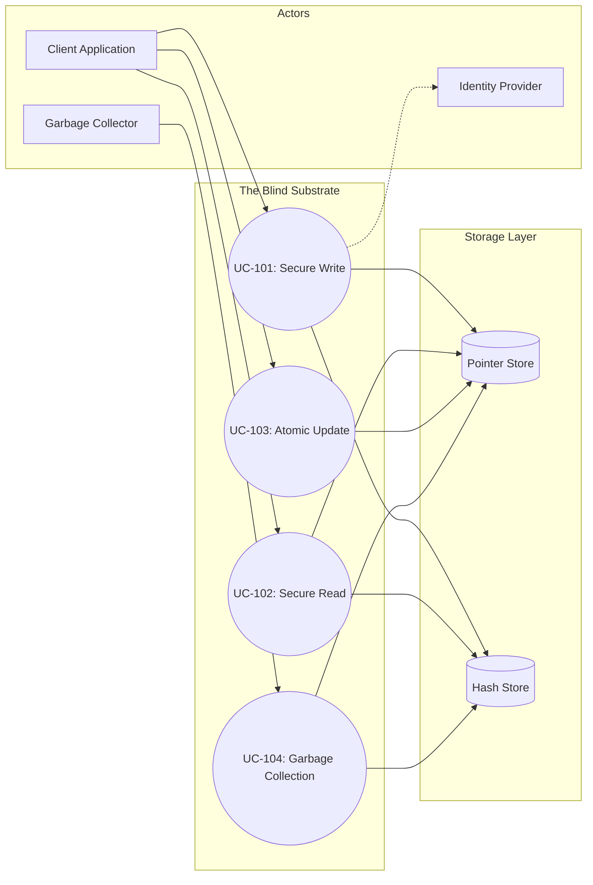
```mermaid
graph LR
    subgraph Actors
        C[Client Application]
        GC[Garbage Collector]
        IDP[Identity Provider]
    end

    subgraph "The Blind Substrate"
        UC101((UC-101: Secure Write))
        UC102((UC-102: Secure Read))
        UC103((UC-103: Atomic Update))
        UC104((UC-104: Garbage Collection))
    end

    subgraph "Storage Layer"
        PS[(Pointer Store)]
        HS[(Hash Store)]
    end

    C --> UC101
    C --> UC102
    C --> UC103
    
    GC --> UC104
    
    UC101 -.-> IDP
    UC101 --> HS
    UC101 --> PS
    
    UC102 --> PS
    UC102 --> HS
    
    UC103 --> PS
    
    UC104 --> PS
    UC104 --> HS
```

---

## 4. Actor-Use Case Matrix

| Use Case | Client Application | Pointer Store | Hash Store | Garbage Collector | Identity Provider |
| :--- | :---: | :---: | :---: | :---: | :---: |
| **UC-101: Secure Write** | **P** | S | S | - | S |
| **UC-102: Secure Read** | **P** | S | S | - | - |
| **UC-103: Atomic Update** | **P** | S | - | - | S |
| **UC-104: GC** | - | S | S | **P** | - |

**Legend:**
*   **P**: Primary Actor (Initiates the use case)
*   **S**: Supporting Actor (Participates in the use case)
*   **-**: No participation

---

## 5. Traceability & Acceptance Criteria

| UC-ID | Acceptance Criteria |
| :--- | :--- |
| **UC-101** | Verify that the Hash Store receives only encrypted data and the Pointer Store receives only the CID. |
| **UC-102** | Verify that the Client can reconstruct the original plaintext from the CID and local keys. |
| **UC-103** | Verify that if one pointer update in a batch fails, all other updates in that batch are rolled back. |
| **UC-104** | Verify that blobs referenced by at least one pointer are never deleted, while unreferenced blobs older than the grace period are removed. |

---

## Requirements Specification

# Requirements Documentation: The Blind Substrate

## 1. Functional Requirements (FR)

The functional requirements define the core capabilities of the Blind Substrate, focusing on the decoupling of data, state, and identity through cryptographic blindness.

| FR-ID | Description | Priority | Source | Acceptance Criteria |
| :--- | :--- | :--- | :--- | :--- |
| **FR-101** | **Client-Side Key Derivation** | Must Have | Security Architect | System must use HKDF to derive unique sub-keys for data encryption and pointer signing from a master seed. |
| **FR-102** | **Blind Hash Storage** | Must Have | App Developer | Server accepts encrypted blobs and stores them using the SHA-256 hash of the ciphertext as the key. |
| **FR-103** | **Atomic Pointer Updates** | Must Have | Systems Engineer | Pointer Store must support 3-Phase Commit (3PC) to ensure atomic updates across sharded state. |
| **FR-104** | **Immutable Hash Store** | Must Have | Security Architect | Once a blob is written to the Hash Store, it cannot be modified; any change results in a new hash/address. |
| **FR-105** | **Bounded Pointer Values** | Must Have | Systems Engineer | Pointer Store values must be strictly validated to be < 8KB to prevent "state bloat." |
| **FR-106** | **Blind Access Control** | Should Have | Compliance | Server validates access via blinded tokens (e.g., OPAQUE or Privacy Pass) without learning user identity. |
| **FR-107** | **External GC Interface** | Must Have | Systems Engineer | System must expose a read-only API for an external crawler to identify unreferenced hashes for deletion. |
| **FR-108** | **Client-Side Compression** | Should Have | App Developer | Data must be compressed using Zstandard or Brotli prior to encryption to optimize storage. |
| **FR-109** | **Conflict Resolution** | Should Have | Systems Engineer | Pointer Store must support conditional writes (Compare-and-Swap) to handle concurrent updates. |

---

## 2. Non-Functional Requirements (NFR)

### 2.1 Performance
* **NFR-201 (Latency):** Pointer Store read/write operations must complete in < 50ms (p99) within the same region.
* **NFR-202 (Throughput):** Hash Store must support horizontal scaling to handle > 10GB/s aggregate write throughput.
* **NFR-203 (Overhead):** Cryptographic overhead (encryption/decryption) on the client must not exceed 10% of total request time for payloads > 1MB.

### 2.2 Scalability
* **NFR-301 (Data Volume):** The Hash Store must be capable of storing petabytes of data across distributed object storage.
* **NFR-302 (State Sharding):** The Pointer Store must support horizontal sharding based on the hash of the pointer key.

### 2.3 Security
* **NFR-401 (Zero-Knowledge):** The server must never receive or store the plaintext data or the keys used for AEAD encryption.
* **NFR-402 (Integrity):** All data in transit and at rest must be protected by AEAD (Authenticated Encryption with Associated Data) to detect tampering.
* **NFR-403 (Key Separation):** Compromise of a Pointer Store key must not lead to the compromise of Hash Store data.

### 2.4 Reliability
* **NFR-501 (Availability):** The system must maintain 99.99% availability for the Hash Store.
* **NFR-502 (Consistency):** The Pointer Store must provide linearizable consistency for individual pointer updates.

### 2.5 Maintainability
* **NFR-601 (Observability):** The system must export metrics for storage utilization, 3PC commit/abort rates, and cryptographic errors without leaking metadata.
* **NFR-602 (Documentation):** All API endpoints must be documented using OpenAPI 3.0 specifications.

---

## 3. Requirements Traceability Matrix (RTM)

This matrix ensures that every requirement is driven by a use case and verified by a test case.

| Use Case ID | Requirement ID | Test Case ID | Status |
| :--- | :--- | :--- | :--- |
| **UC-101: Secure Data Upload** | FR-101, FR-102, FR-108 | TC-101, TC-102 | Pending |
| **UC-102: Atomic State Update** | FR-103, FR-105, FR-109 | TC-201, TC-202 | Pending |
| **UC-103: Data Retrieval** | FR-101, FR-102 | TC-301 | Pending |
| **UC-104: Garbage Collection** | FR-107 | TC-401 | Pending |
| **UC-105: Anonymous Auth** | FR-106 | TC-501 | Pending |
| **N/A (System Integrity)** | NFR-401, NFR-402 | TC-SEC-01 | Pending |
| **N/A (Performance)** | NFR-201, NFR-202 | TC-PERF-01 | Pending |

---

## 4. Requirements Dependency Diagram

The following diagram illustrates the logical flow and dependencies between functional and non-functional requirements.

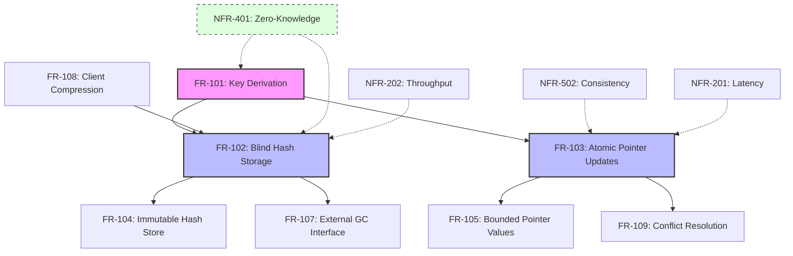
```mermaid
graph TD
    %% Functional Requirements
    FR101[FR-101: Key Derivation] --> FR102[FR-102: Blind Hash Storage]
    FR101 --> FR103[FR-103: Atomic Pointer Updates]
    
    FR102 --> FR104[FR-104: Immutable Hash Store]
    FR102 --> FR107[FR-107: External GC Interface]
    
    FR103 --> FR105[FR-105: Bounded Pointer Values]
    FR103 --> FR109[FR-109: Conflict Resolution]
    
    FR108[FR-108: Client Compression] --> FR102
    
    %% Non-Functional Requirements Dependencies
    NFR401[NFR-401: Zero-Knowledge] -.-> FR101
    NFR401 -.-> FR102
    
    NFR502[NFR-502: Consistency] -.-> FR103
    
    NFR201[NFR-201: Latency] -.-> FR103
    NFR202[NFR-202: Throughput] -.-> FR102

    %% Styling
    style FR101 fill:#f9f,stroke:#333,stroke-width:2px
    style FR102 fill:#bbf,stroke:#333,stroke-width:2px
    style FR103 fill:#bbf,stroke:#333,stroke-width:2px
    style NFR401 fill:#dfd,stroke:#333,stroke-dasharray: 5 5
```

---

## 5. Data Model (Pointer vs. Hash Store)

To clarify the relationship between the two storage tiers defined in the requirements:

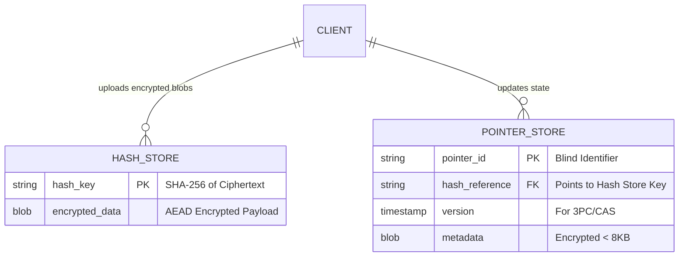
```mermaid
erDiagram
    CLIENT ||--o{ HASH_STORE : "uploads encrypted blobs"
    CLIENT ||--o{ POINTER_STORE : "updates state"
    
    HASH_STORE {
        string hash_key PK "SHA-256 of Ciphertext"
        blob encrypted_data "AEAD Encrypted Payload"
    }
    
    POINTER_STORE {
        string pointer_id PK "Blind Identifier"
        string hash_reference FK "Points to Hash Store Key"
        timestamp version "For 3PC/CAS"
        blob metadata "Encrypted < 8KB"
    }
```

## 6. Acceptance Criteria Summary

1.  **Security Validation:** A third-party audit must confirm that the server logs contain no plaintext data or decryption keys (NFR-401).
2.  **Atomicity Validation:** During a simulated network partition, the Pointer Store must either complete a 3PC transaction or roll back to the previous state without corruption (FR-103).
3.  **Scalability Validation:** The Hash Store must maintain NFR-202 throughput levels when the dataset size exceeds 100TB (NFR-301).
4.  **Constraint Validation:** Any attempt to write a > 8KB value to the Pointer Store must return a `413 Payload Too Large` error (FR-105).

---

## System Architecture

# Architecture Documentation: The Blind Substrate

## 1. System Context Diagram (C4 Level 1)

The Blind Substrate is a privacy-preserving storage and coordination layer. It decouples data ownership from data hosting by ensuring the server remains "blind" to the content it persists.

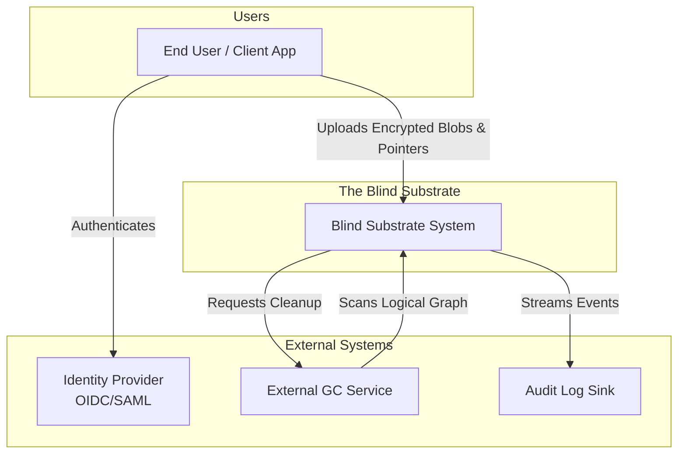
```mermaid
graph TB
    subgraph Users
        U[End User / Client App]
    end

    subgraph "The Blind Substrate"
        BS[Blind Substrate System]
    end

    subgraph "External Systems"
        IDP[Identity Provider<br/>OIDC/SAML]
        GC[External GC Service]
        AUD[Audit Log Sink]
    end

    U -- "Uploads Encrypted Blobs & Pointers" --> BS
    U -- "Authenticates" --> IDP
    BS -- "Requests Cleanup" --> GC
    BS -- "Streams Events" --> AUD
    GC -- "Scans Logical Graph" --> BS
```

---

## 2. Container Diagram (C4 Level 2)

This diagram illustrates the high-level logical containers within the Blind Substrate and how the client interacts with them to maintain zero-knowledge privacy.

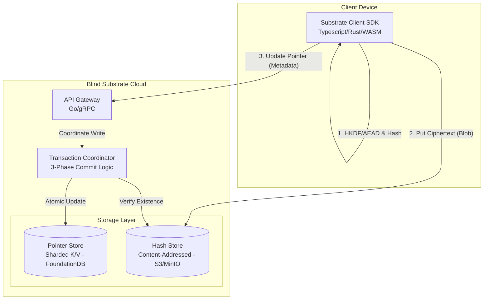
```mermaid
graph TB
    subgraph "Client Device"
        SDK[Substrate Client SDK<br/>Typescript/Rust/WASM]
    end

    subgraph "Blind Substrate Cloud"
        API[API Gateway<br/>Go/gRPC]
        
        subgraph "Storage Layer"
            PS[(Pointer Store<br/>Sharded K/V - FoundationDB)]
            HS[(Hash Store<br/>Content-Addressed - S3/MinIO)]
        end

        TX[Transaction Coordinator<br/>3-Phase Commit Logic]
    end

    SDK -- "1. HKDF/AEAD & Hash" --> SDK
    SDK -- "2. Put Ciphertext (Blob)" --> HS
    SDK -- "3. Update Pointer (Metadata)" --> API
    API -- "Coordinate Write" --> TX
    TX -- "Atomic Update" --> PS
    TX -- "Verify Existence" --> HS
```

---

## 3. Component Diagram (C4 Level 3)

### 3.1 Client SDK Components
The SDK is the only entity with access to plaintext and master keys.

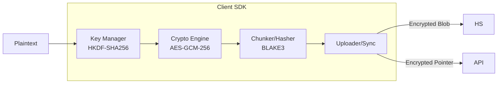
```mermaid
graph LR
    subgraph "Client SDK"
        KM[Key Manager<br/>HKDF-SHA256]
        CR[Crypto Engine<br/>AES-GCM-256]
        CH[Chunker/Hasher<br/>BLAKE3]
        UP[Uploader/Sync]
    end

    Plaintext --> KM
    KM --> CR
    CR --> CH
    CH --> UP
    UP -- "Encrypted Blob" --> HS
    UP -- "Encrypted Pointer" --> API
```

### 3.2 Pointer Store Components
The Pointer Store manages the logical graph of the system without knowing what the nodes represent.

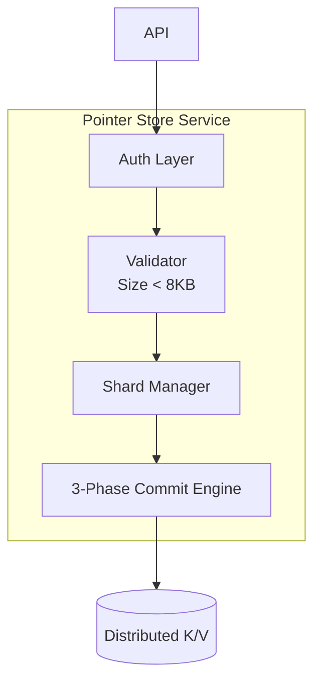
```mermaid
graph TD
    subgraph "Pointer Store Service"
        AL[Auth Layer]
        VAL[Validator<br/>Size < 8KB]
        SH[Shard Manager]
        3PC[3-Phase Commit Engine]
    end

    API --> AL
    AL --> VAL
    VAL --> SH
    SH --> 3PC
    3PC --> PS[(Distributed K/V)]
```

---

## 4. Deployment Diagram

The system is designed for high availability and horizontal scalability, utilizing distributed primitives for the Pointer Store and object storage for the Hash Store.

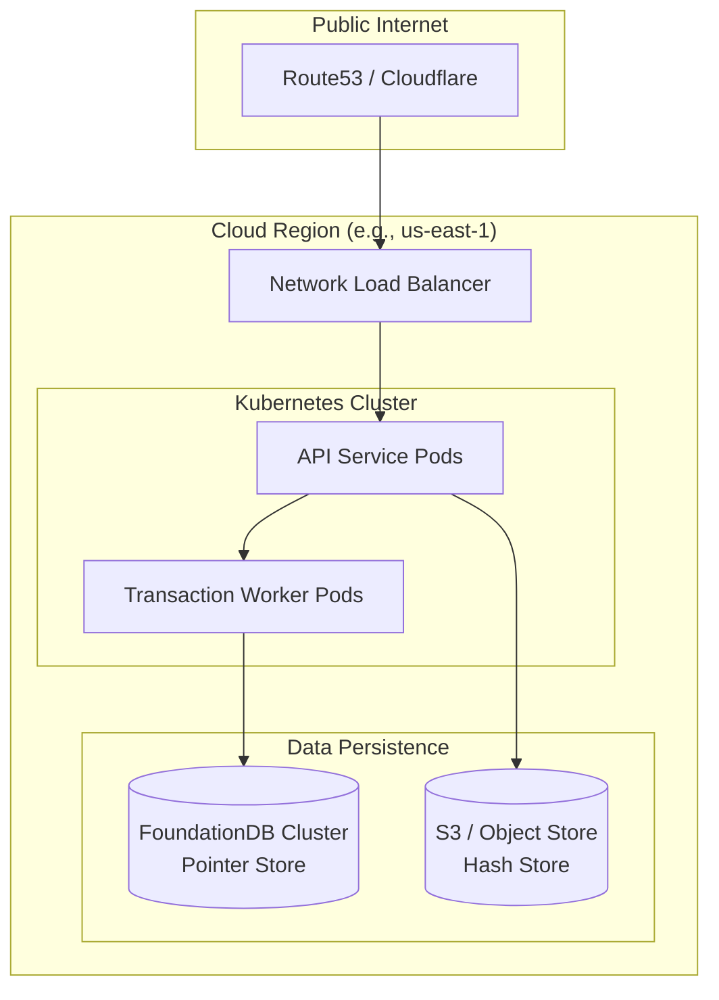
```mermaid
graph TB
    subgraph "Public Internet"
        DNS[Route53 / Cloudflare]
    end

    subgraph "Cloud Region (e.g., us-east-1)"
        LB[Network Load Balancer]

        subgraph "Kubernetes Cluster"
            direction TB
            API_PODS[API Service Pods]
            TX_PODS[Transaction Worker Pods]
        end

        subgraph "Data Persistence"
            direction LR
            FDB[(FoundationDB Cluster<br/>Pointer Store)]
            S3[(S3 / Object Store<br/>Hash Store)]
        end
    end

    DNS --> LB
    LB --> API_PODS
    API_PODS --> TX_PODS
    TX_PODS --> FDB
    API_PODS --> S3
```

---

## 5. Technology Stack Summary

| Layer | Technology | Reason |
| :--- | :--- | :--- |
| **Client Crypto** | WebCrypto API / WASM | Native browser performance for AEAD and HKDF. |
| **Client Hashing** | BLAKE3 | Extremely fast, parallelizable content-addressing. |
| **API / Logic** | Rust (Axum/Tonic) | Memory safety and high-concurrency performance. |
| **Pointer Store** | FoundationDB | Supports distributed ACID transactions (required for 3PC). |
| **Hash Store** | S3-Compatible (MinIO) | Industry standard for immutable, high-volume blob storage. |
| **Communication** | gRPC / Protobuf | Strict schema enforcement and low-latency streaming. |
| **Infrastructure** | Terraform & Kubernetes | Reproducible environments and auto-scaling. |

---

## 6. Architecture Decision Records (ADRs)

### ADR-001: Client-Side Key Derivation (HKDF)
*   **Context**: The server must never possess the ability to decrypt user data.
*   **Decision**: We use HKDF (HMAC-based Extract-and-Expand Key Derivation Function) on the client side. A master secret is used to derive unique keys for every individual blob and pointer.
*   **Consequences**: If a user loses their master secret, data is unrecoverable. The server cannot perform "Password Resets" that involve data recovery.

### ADR-002: Content-Addressable Hash Store
*   **Context**: Large data blobs need to be stored efficiently and their integrity verified without the server knowing the content.
*   **Decision**: Blobs are stored in the Hash Store using the hash of their *ciphertext* as the primary key.
*   **Consequences**: Provides automatic deduplication of identical encrypted blobs (if keys are shared) and ensures data integrity (bit-rot detection) via hash verification.

### ADR-003: 8KB Pointer Limit
*   **Context**: The Pointer Store (K/V) is optimized for high-frequency metadata updates and graph traversal.
*   **Decision**: We enforce a strict 8KB limit on Pointer Store values.
*   **Consequences**: Prevents the K/V store from becoming a "junk drawer." Forces developers to move larger metadata into the Hash Store, keeping the Pointer Store lean and fast for transactions.

### ADR-004: External Garbage Collection (GC)
*   **Context**: Since the Hash Store is immutable and content-addressed, deleting a pointer doesn't automatically delete the underlying blob.
*   **Decision**: Implement GC as an asynchronous external service that crawls the Pointer Store (the "root set") and identifies orphaned blobs in the Hash Store.
*   **Consequences**: Simplifies the write path (no complex reference counting during writes) but introduces a delay between logical deletion and physical storage reclamation.

---

## 7. Traceability Matrix

| Requirement ID | Description | Component | Implementation Detail |
| :--- | :--- | :--- | :--- |
| **FR-101** | Zero-knowledge storage | Client SDK | AEAD encryption before transmission. |
| **FR-102** | Atomic metadata updates | Transaction Coordinator | 3-Phase Commit across shards. |
| **FR-103** | Content Integrity | Hash Store | Content-addressing via BLAKE3 hashes. |
| **NFR-201** | Scalability | Pointer Store | Sharded FoundationDB architecture. |
| **NFR-202** | Privacy Compliance | System-wide | Server never sees plaintext or keys (Blindness). |

---

## Data Model & ERD

# Data Model Documentation: The Blind Substrate

This document outlines the data architecture for **The Blind Substrate**. Unlike traditional relational models, this system utilizes a **Blind Key-Value** approach where the server manages data structures without visibility into the underlying plaintext.

---

## 1. Entity-Relationship Diagram (Physical Layer)

The physical layer represents how data is actually stored on the substrate. The server only sees cryptographic identifiers and opaque payloads.

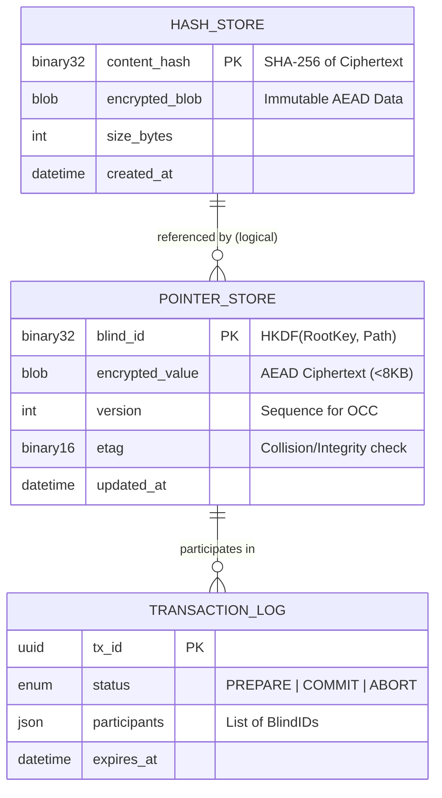
```mermaid
erDiagram
    POINTER_STORE ||--o{ TRANSACTION_LOG : "participates in"
    POINTER_STORE {
        binary32 blind_id PK "HKDF(RootKey, Path)"
        blob encrypted_value "AEAD Ciphertext (<8KB)"
        int version "Sequence for OCC"
        binary16 etag "Collision/Integrity check"
        datetime updated_at
    }
    
    HASH_STORE ||--o{ POINTER_STORE : "referenced by (logical)"
    HASH_STORE {
        binary32 content_hash PK "SHA-256 of Ciphertext"
        blob encrypted_blob "Immutable AEAD Data"
        int size_bytes
        datetime created_at
    }

    TRANSACTION_LOG {
        uuid tx_id PK
        enum status "PREPARE | COMMIT | ABORT"
        json participants "List of BlindIDs"
        datetime expires_at
    }
```

---

## 2. Entity Descriptions

### 2.1 Pointer Store
*   **Purpose**: Acts as the mutable entry point for the system. It maps a deterministic but "blind" identifier to a small piece of encrypted metadata.
*   **Attributes**:
    *   `blind_id`: A 256-bit key derived via HKDF. The server cannot reverse this to find the original "path" or "username."
    *   `encrypted_value`: Contains the "Head" of a logical object (e.g., a list of Hash Store addresses).
    *   `version`: Used for Optimistic Concurrency Control (OCC).
*   **Constraints**: Value must be < 8KB to ensure high-performance sharding and prevent abuse.

### 2.2 Hash Store
*   **Purpose**: A content-addressable, immutable storage layer for large payloads.
*   **Attributes**:
    *   `content_hash`: The primary key, derived from the hash of the *encrypted* blob.
    *   `encrypted_blob`: The actual data, encrypted by the client.
*   **Performance**: Since it is immutable, these can be cached indefinitely on CDNs or edge nodes.

### 2.3 Transaction Log
*   **Purpose**: Facilitates the 3-Phase Commit (3PC) protocol across sharded Pointer Stores to ensure atomicity without a central coordinator.
*   **Attributes**:
    *   `participants`: A list of `blind_id`s involved in a multi-pointer update.
    *   `status`: Tracks the lifecycle of a distributed write.

---

## 3. Data Dictionary

| Entity | Attribute | Type | Constraints | Description |
| :--- | :--- | :--- | :--- | :--- |
| **Pointer** | `blind_id` | BINARY(32) | PK | HKDF-derived unique identifier. |
| **Pointer** | `encrypted_value` | BLOB | NOT NULL | Client-side AEAD ciphertext. |
| **Pointer** | `version` | INT | DEFAULT 1 | Incremental counter for atomic writes. |
| **Blob** | `content_hash` | BINARY(32) | PK | SHA-256 of the `encrypted_blob`. |
| **Blob** | `encrypted_blob` | BLOB | NOT NULL | The encrypted bulk data. |
| **Transaction**| `tx_id` | UUID | PK | Unique ID for a 3PC session. |
| **Transaction**| `status` | ENUM | - | Current state: `PREPARE`, `COMMIT`, `ABORT`. |

---

## 4. Data Flow Diagram

The following diagram illustrates the "Blind Write" process, where a client saves a large document.

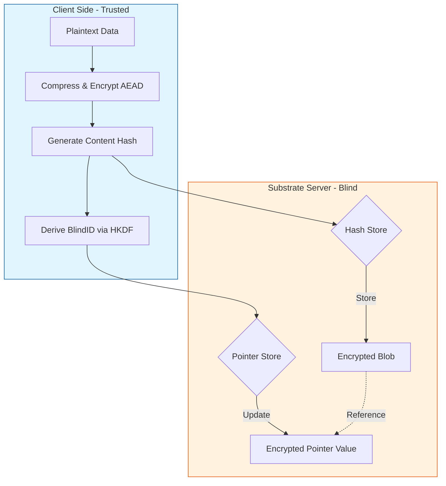
```mermaid
graph TD
    subgraph Client_Side [Client Side - Trusted]
        A[Plaintext Data] --> B[Compress & Encrypt AEAD]
        B --> C[Generate Content Hash]
        C --> D[Derive BlindID via HKDF]
    end

    subgraph Substrate_Server [Substrate Server - Blind]
        D --> E{Pointer Store}
        C --> F{Hash Store}
        
        F -->|Store| G[Encrypted Blob]
        E -->|Update| H[Encrypted Pointer Value]
    end

    G -.->|Reference| H
    style Client_Side fill:#e1f5fe,stroke:#01579b
    style Substrate_Server fill:#fff3e0,stroke:#e65100
```

---

## 5. Data Validation Rules

To maintain system integrity without seeing the data, the Substrate enforces the following rules:

| ID | Rule Name | Target | Logic |
| :--- | :--- | :--- | :--- |
| **VR-101** | Hash Integrity | Hash Store | `content_hash` must exactly match `SHA256(encrypted_blob)`. |
| **VR-102** | Pointer Size | Pointer Store | `encrypted_value` must not exceed 8,192 bytes. |
| **VR-103** | Atomic Versioning | Pointer Store | Updates must provide the current `version` (Compare-and-Swap). |
| **VR-104** | BlindID Uniqueness | Pointer Store | `blind_id` must be unique within its shard. |
| **VR-105** | Tx Expiry | Transaction Log | Transactions older than 60 seconds are automatically `ABORTED`. |

---

## 6. Data Migration Considerations

Migrating from a legacy "Cleartext" system to the Blind Substrate requires a specific strategy:

1.  **Key Generation**: Every legacy entity (e.g., `User_ID: 123`) must be mapped to a `BlindID` using a new Root Key.
2.  **Encryption Pipeline**:
    *   Extract legacy data.
    *   Encrypt client-side (or in a secure enclave).
    *   Upload to Hash Store first.
    *   Create Pointer Store entries last.
3.  **Dual-Write Phase**: During migration, applications should write to both the legacy DB and the Substrate.
4.  **Consistency Check**: Use the `content_hash` to verify that the data migrated to the Substrate matches the source of truth before decommissioning legacy systems.
5.  **Garbage Collection**: Since the Substrate is a graph of hashes, a "Mark and Sweep" service must be run to delete orphaned Blobs that are no longer referenced by any Pointer.

---

## Flow Diagrams

# The Blind Substrate: System Interaction Documentation

This document outlines the critical interaction patterns for **The Blind Substrate**. The architecture is defined by its "Blindness" principle: the server facilitates storage and coordination but remains cryptographically excluded from the data content and the derivation of keys.

---

## 1. Sequence Diagrams: Critical User Journeys

### UC-101: Secure Data Ingestion (The "Blind Write")
This journey describes how a client stores new data. The client performs all cryptographic operations before the data ever leaves the local environment.

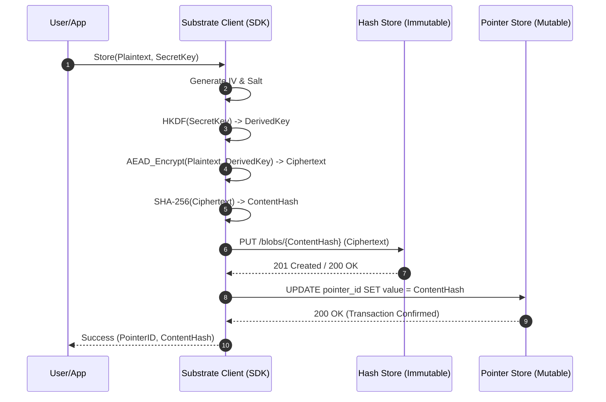
```mermaid
sequenceDiagram
    autonumber
    participant U as User/App
    participant C as Substrate Client (SDK)
    participant HS as Hash Store (Immutable)
    participant PS as Pointer Store (Mutable)

    U->>C: Store(Plaintext, SecretKey)
    C->>C: Generate IV & Salt
    C->>C: HKDF(SecretKey) -> DerivedKey
    C->>C: AEAD_Encrypt(Plaintext, DerivedKey) -> Ciphertext
    C->>C: SHA-256(Ciphertext) -> ContentHash
    
    C->>HS: PUT /blobs/{ContentHash} (Ciphertext)
    HS-->>C: 201 Created / 200 OK
    
    C->>PS: UPDATE pointer_id SET value = ContentHash
    PS-->>C: 200 OK (Transaction Confirmed)
    
    C-->>U: Success (PointerID, ContentHash)
```

### UC-102: Secure Data Retrieval (The "Blind Read")
The server provides the encrypted blob based on a pointer, but the client is the only entity capable of restoring the plaintext.

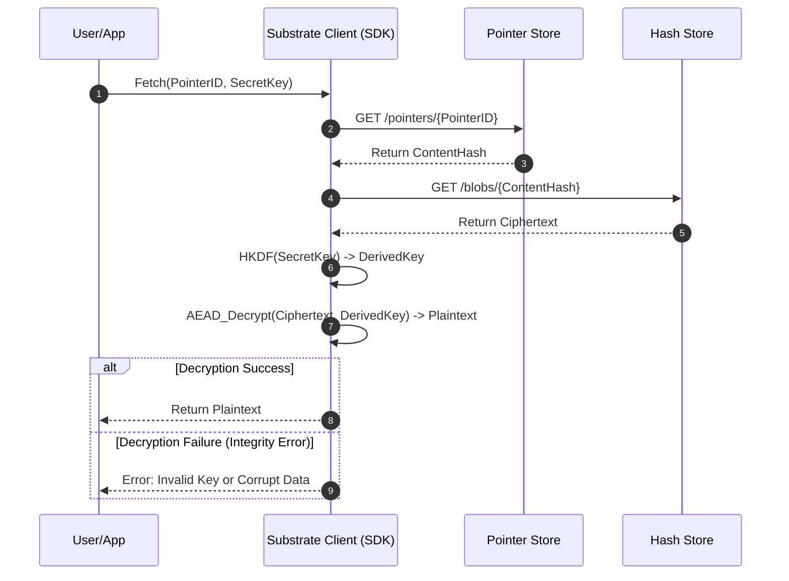
```mermaid
sequenceDiagram
    autonumber
    participant U as User/App
    participant C as Substrate Client (SDK)
    participant PS as Pointer Store
    participant HS as Hash Store

    U->>C: Fetch(PointerID, SecretKey)
    C->>PS: GET /pointers/{PointerID}
    PS-->>C: Return ContentHash
    
    C->>HS: GET /blobs/{ContentHash}
    HS-->>C: Return Ciphertext
    
    C->>C: HKDF(SecretKey) -> DerivedKey
    C->>C: AEAD_Decrypt(Ciphertext, DerivedKey) -> Plaintext
    
    alt Decryption Success
        C-->>U: Return Plaintext
    else Decryption Failure (Integrity Error)
        C-->>U: Error: Invalid Key or Corrupt Data
    end
```

### UC-103: Atomic State Update (3-Phase Commit)
To ensure consistency across distributed shards in the Pointer Store, a 3-Phase Commit (3PC) is utilized for pointer updates.

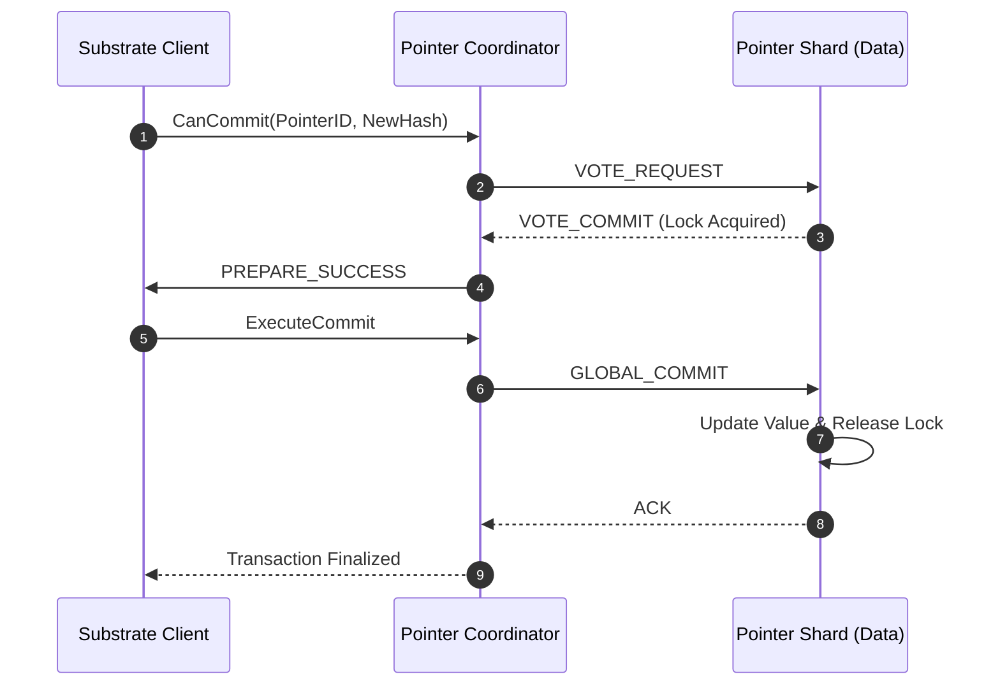
```mermaid
sequenceDiagram
    autonumber
    participant C as Substrate Client
    participant PS_Coord as Pointer Coordinator
    participant PS_Shard as Pointer Shard (Data)

    C->>PS_Coord: CanCommit(PointerID, NewHash)
    PS_Coord->>PS_Shard: VOTE_REQUEST
    PS_Shard-->>PS_Coord: VOTE_COMMIT (Lock Acquired)
    
    PS_Coord->>C: PREPARE_SUCCESS
    
    C->>PS_Coord: ExecuteCommit
    PS_Coord->>PS_Shard: GLOBAL_COMMIT
    PS_Shard->>PS_Shard: Update Value & Release Lock
    PS_Shard-->>PS_Coord: ACK
    
    PS_Coord-->>C: Transaction Finalized
```

---

## 2. Activity Diagrams: Complex Processes

### AC-201: The Write-Ahead-Hash Pipeline
This process ensures that data is persisted in the immutable Hash Store before the mutable Pointer Store is updated, preventing "dangling pointers" to non-existent data.

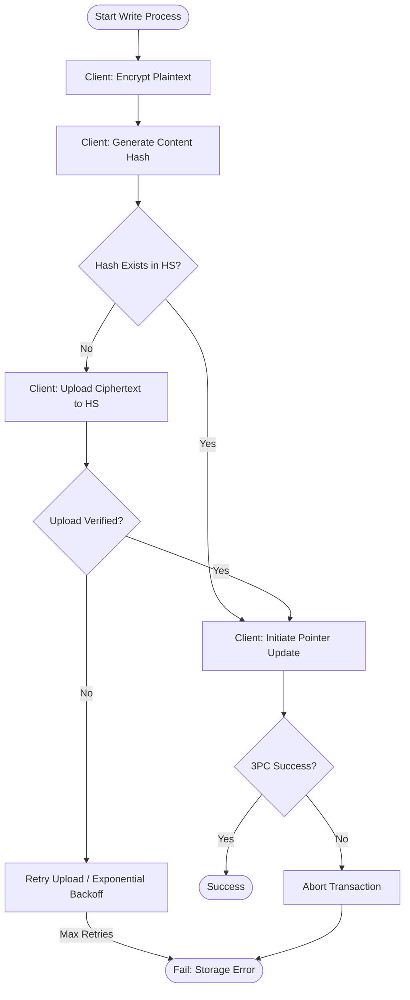
```mermaid
graph TD
    Start([Start Write Process]) --> Encrypt[Client: Encrypt Plaintext]
    Encrypt --> Hash[Client: Generate Content Hash]
    Hash --> CheckHS{Hash Exists in HS?}
    
    CheckHS -->|Yes| UpdatePS[Client: Initiate Pointer Update]
    CheckHS -->|No| UploadHS[Client: Upload Ciphertext to HS]
    
    UploadHS --> VerifyHS{Upload Verified?}
    VerifyHS -->|No| Retry[Retry Upload / Exponential Backoff]
    VerifyHS -->|Yes| UpdatePS
    
    UpdatePS --> Commit{3PC Success?}
    Commit -->|Yes| End([Success])
    Commit -->|No| Rollback[Abort Transaction]
    
    Retry -->|Max Retries| Fail([Fail: Storage Error])
    Rollback --> Fail
```

---

## 3. State Diagrams: Entity Life Cycles

### ST-301: Pointer Lifecycle
Pointers are the logical addresses for data. Their state determines how the system handles garbage collection and resolution.

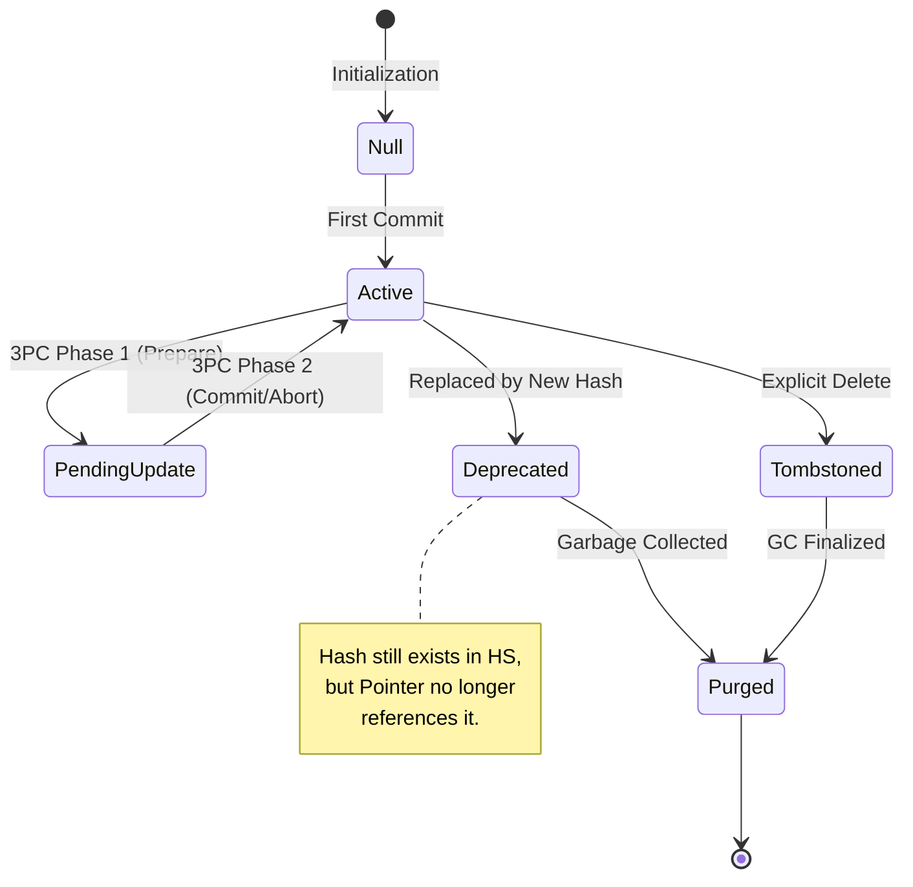
```mermaid
stateDiagram-v2
    [*] --> Null: Initialization
    Null --> Active: First Commit
    Active --> PendingUpdate: 3PC Phase 1 (Prepare)
    PendingUpdate --> Active: 3PC Phase 2 (Commit/Abort)
    Active --> Deprecated: Replaced by New Hash
    Deprecated --> Purged: Garbage Collected
    Active --> Tombstoned: Explicit Delete
    Tombstoned --> Purged: GC Finalized
    Purged --> [*]

    note right of Deprecated
        Hash still exists in HS, 
        but Pointer no longer 
        references it.
    end note
```

---

## 4. Integration Flow Diagrams

### IF-401: System Component Interaction
This diagram shows the high-level data flow between the client, the blind storage layers, and the external Garbage Collection (GC) service.

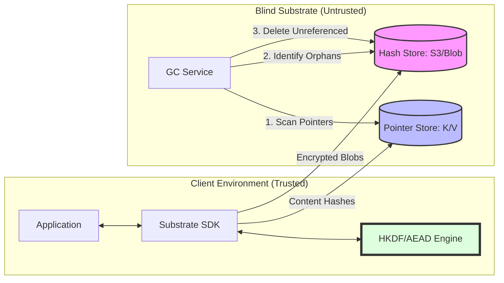
```mermaid
graph LR
    subgraph "Client Environment (Trusted)"
        App[Application] <--> SDK[Substrate SDK]
        SDK <--> Crypto[HKDF/AEAD Engine]
    end

    subgraph "Blind Substrate (Untrusted)"
        SDK -- "Encrypted Blobs" --> HS[(Hash Store: S3/Blob)]
        SDK -- "Content Hashes" --> PS[(Pointer Store: K/V)]
        
        GC[GC Service] -- "1. Scan Pointers" --> PS
        GC -- "2. Identify Orphans" --> HS
        GC -- "3. Delete Unreferenced" --> HS
    end

    style HS fill:#f9f,stroke:#333,stroke-width:2px
    style PS fill:#bbf,stroke:#333,stroke-width:2px
    style Crypto fill:#dfd,stroke:#333,stroke-width:4px
```

---

## 5. Error Handling Flows

### EH-501: Conflict Resolution & Network Partition
How the system handles failures during the critical Pointer Update phase.

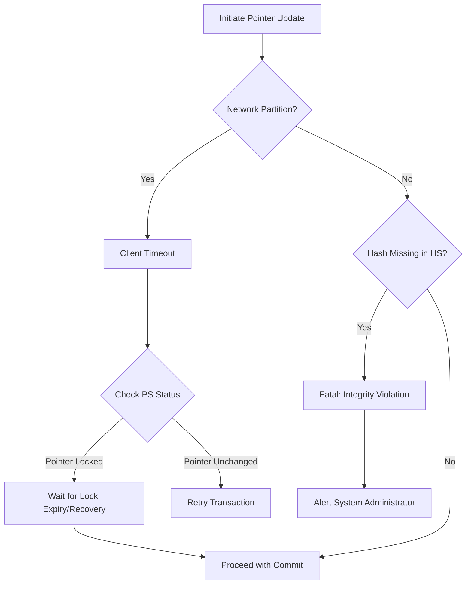
```mermaid
graph TD
    A[Initiate Pointer Update] --> B{Network Partition?}
    B -->|Yes| C[Client Timeout]
    C --> D{Check PS Status}
    D -->|Pointer Locked| E[Wait for Lock Expiry/Recovery]
    D -->|Pointer Unchanged| F[Retry Transaction]
    
    B -->|No| G{Hash Missing in HS?}
    G -->|Yes| H[Fatal: Integrity Violation]
    G -->|No| I[Proceed with Commit]
    
    H --> J[Alert System Administrator]
    E --> I
```

### Error Codes & Handling Strategies

| Error ID | Scenario | Handling Strategy |
| :--- | :--- | :--- |
| **ERR-401** | Decryption Failure | **Client-side:** Verify SecretKey; check for data corruption via AEAD tag. |
| **ERR-409** | Pointer Conflict | **Optimistic Concurrency:** Client must fetch latest Hash, re-base, and retry. |
| **ERR-503** | Hash Store Unavailable | **Circuit Breaker:** Stop all writes; allow reads from cache if available. |
| **ERR-404** | Orphaned Pointer | **Integrity Check:** Triggered if PS has a hash that HS does not. Requires audit. |

---

## 6. Traceability Matrix

| Requirement ID | Interaction Diagram | Description |
| :--- | :--- | :--- |
| **FR-001** | UC-101 | System must support blind writes where server sees only ciphertext. |
| **FR-002** | UC-102 | System must support blind reads using client-side keys. |
| **FR-003** | UC-103 | Pointer updates must be atomic and consistent. |
| **FR-004** | ST-301 | System must track pointer states for garbage collection. |
| **FR-005** | AC-201 | Hash Store must be updated before Pointer Store. |

---

## Test Plan

# Test Plan Documentation: The Blind Substrate

## 1. Test Strategy Overview

### 1.1 Testing Objectives
The primary objective is to validate the "Blindness" property of the substrate while ensuring data integrity, high availability, and atomicity across distributed components.
- **Verify Cryptographic Blindness:** Ensure the server never possesses plaintext or decryption keys.
- **Validate Atomicity:** Ensure the 3-Phase Commit (3PC) protocol maintains consistency in the Pointer Store.
- **Ensure Scalability:** Validate that the Hash Store and Pointer Store scale linearly under load.
- **Data Integrity:** Confirm that content-addressed storage correctly detects and rejects corrupted blobs.

### 1.2 Testing Scope
*   **In-Scope:**
    *   Client-side SDK (HKDF derivation, AEAD encryption/decryption).
    *   Hash Store (Blob ingestion, deduplication, retrieval).
    *   Pointer Store (3PC transaction logic, sharding, state transitions).
    *   Garbage Collection (Reference counting and orphan deletion).
*   **Out-of-Scope:**
    *   Physical security of data centers.
    *   End-user UI/UX (this is a substrate/middleware).
    *   Network-level DDoS mitigation (assumed to be handled by infrastructure).

### 1.3 Testing Approach
A **Risk-Based, Shift-Left** approach will be utilized:
- **Property-Based Testing:** Used for cryptographic functions to ensure no collisions or weak keys.
- **Chaos Engineering:** Injecting network partitions and node failures during 3PC execution.
- **Zero-Knowledge Auditing:** Automated scripts to verify that server-side logs contain no sensitive entropy.

### 1.4 Entry/Exit Criteria
| Phase | Entry Criteria | Exit Criteria |
| :--- | :--- | :--- |
| **Unit** | Code compiles; Mocks for Stores ready. | 100% coverage of Crypto/Logic modules. |
| **Integration** | Unit tests pass; API endpoints deployed in Dev. | Successful E2E flow (Write -> Read) across all components. |
| **System** | Integration tests pass; Load generators ready. | Performance benchmarks met; No 3PC deadlocks. |
| **Acceptance** | Security audit complete. | Formal sign-off by Security Architect. |

---

## 2. Test Levels

### 2.1 Unit Testing
- **Frameworks:** Jest (Node.js), PyTest (Python), or Go Test.
- **Coverage Target:** 95% for `crypto-lib` and `transaction-manager`.
- **Focus:** HKDF output consistency, AEAD tag validation, Hash calculation.

### 2.2 Integration Testing
- **Focus:** Interaction between the Client SDK and the Store APIs.
- **Scenarios:** 
    - Hash Store deduplication (uploading the same content twice).
    - Pointer Store shard rebalancing.
    - API Authentication/Authorization middleware.

### 2.3 System Testing (End-to-End)
- **Focus:** The complete lifecycle of a "Blind Write" and "Blind Read."
- **Scenario:** Client A writes a 10MB file; Client B (with shared key) retrieves it. Server logs are inspected for plaintext leakage.

### 2.4 Acceptance Testing (UAT)
- **Criteria:** 
    - **AC-1:** Server admin cannot reconstruct data from Hash Store + Pointer Store.
    - **AC-2:** System recovers to a consistent state after a 3PC coordinator failure.
    - **AC-3:** Latency for Pointer updates remains < 200ms at P99.

---

## 3. Test Case Catalog

| TC-ID | Requirement | Description | Steps | Expected Result | Priority |
|-------|-------------|-------------|-------|-----------------|----------|
| **TC-001** | FR-CRY-01 | Client-side Key Derivation | 1. Input Master Key + Context.<br>2. Generate Sub-keys via HKDF. | Sub-keys are deterministic and cryptographically strong. | High |
| **TC-002** | FR-STR-01 | Blind Blob Storage | 1. Encrypt data.<br>2. Upload to Hash Store. | Store accepts blob; Store cannot decrypt blob. | High |
| **TC-003** | FR-3PC-01 | 3PC Atomic Commit | 1. Initiate Pointer update.<br>2. Execute Pre-Commit, Can-Commit, Do-Commit. | Pointer is updated across all shards or rolled back. | High |
| **TC-004** | FR-3PC-02 | 3PC Failure Recovery | 1. Kill Coordinator during "Pre-Commit". | Participants timeout and abort; State remains consistent. | Critical |
| **TC-005** | FR-GC-01 | Garbage Collection | 1. Delete Pointer.<br>2. Run GC service. | Orphaned Hash Store blobs are purged after grace period. | Medium |
| **TC-006** | FR-SEC-01 | Blindness Verification | 1. Intercept server-side traffic.<br>2. Search for plaintext patterns. | No plaintext or raw keys found in transit or at rest. | Critical |

---

## 4. Test Coverage Matrix

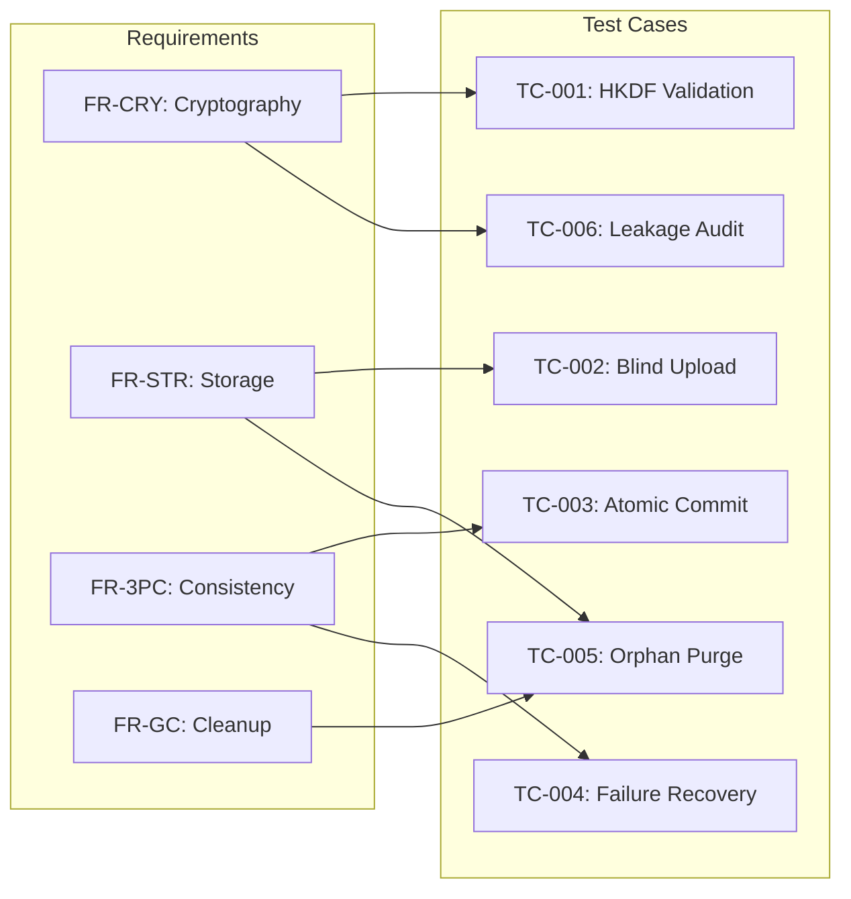
```mermaid
graph LR
    subgraph Requirements
        FR1[FR-CRY: Cryptography]
        FR2[FR-STR: Storage]
        FR3[FR-3PC: Consistency]
        FR4[FR-GC: Cleanup]
    end

    subgraph Test Cases
        TC1[TC-001: HKDF Validation]
        TC2[TC-002: Blind Upload]
        TC3[TC-003: Atomic Commit]
        TC4[TC-004: Failure Recovery]
        TC5[TC-005: Orphan Purge]
        TC6[TC-006: Leakage Audit]
    end

    FR1 --> TC1
    FR1 --> TC6
    FR2 --> TC2
    FR2 --> TC5
    FR3 --> TC3
    FR3 --> TC4
    FR4 --> TC5
```

---

## 5. Non-Functional Test Cases

### 5.1 Performance Scenarios
- **Scenario P-1:** 10,000 concurrent "Blind Writes" to the Pointer Store.
- **Scenario P-2:** Throughput testing of Hash Store with 1GB blobs.
- **Target:** Pointer Store must handle 5k TPS with < 100ms latency.

### 5.2 Security Scenarios
- **Scenario S-1 (Key Isolation):** Attempt to use a Hash Store key to update a Pointer Store entry. (Expected: Fail).
- **Scenario S-2 (Replay Attack):** Re-submit a signed 3PC "Do-Commit" message. (Expected: Rejected by sequence ID).

### 5.3 Usability Scenarios
- **Scenario U-1:** Developer integrates SDK into a new application.
- **Target:** "Time to first Blind Write" < 30 minutes.

---

## 6. Test Environment Requirements

### 6.1 Hardware/Software
- **Environment:** Kubernetes (K8s) cluster for distributed component testing.
- **Hash Store Mock:** MinIO (S3 compatible).
- **Pointer Store Mock:** Sharded Redis or FoundationDB.
- **Client:** Headless Linux nodes with AES-NI instruction sets enabled.

### 6.2 Tool Requirements
- **Chaos Mesh:** For injecting network latency and pod failures.
- **JMeter/Locust:** For load generation.
- **Wireshark/Tcpdump:** For traffic inspection (verifying blindness).
- **SonarQube:** For static analysis and coverage tracking.

---

## 7. Test Schedule

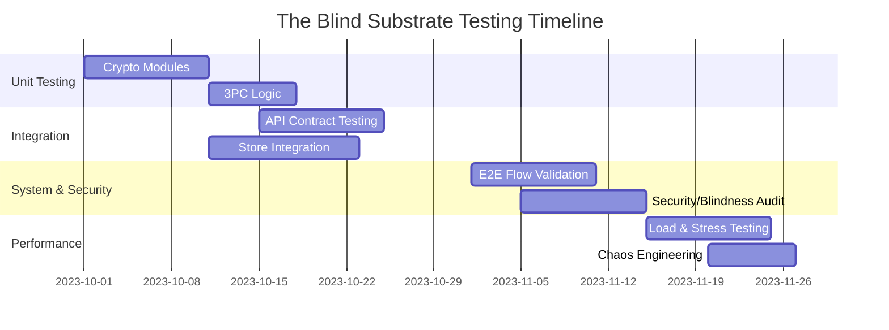
```mermaid
gantt
    title The Blind Substrate Testing Timeline
    dateFormat  YYYY-MM-DD
    section Unit Testing
    Crypto Modules           :a1, 2023-10-01, 10d
    3PC Logic                :after a1, 7d
    section Integration
    API Contract Testing     :2023-10-15, 10d
    Store Integration        :after a1, 12d
    section System & Security
    E2E Flow Validation      :2023-11-01, 10d
    Security/Blindness Audit :2023-11-05, 10d
    section Performance
    Load & Stress Testing    :2023-11-15, 10d
    Chaos Engineering        :2023-11-20, 7d
```

---

## 8. Risk Assessment

| Risk | Impact | Probability | Mitigation Strategy |
| :--- | :--- | :--- | :--- |
| **Key Loss** | Critical | Low | Implement client-side M-of-N secret sharing for master key recovery. |
| **3PC Deadlock** | High | Medium | Use strict timeouts and monotonic clocks for all transaction phases. |
| **Hash Collisions** | Low | Very Low | Use SHA-256 or BLAKE3; implement collision detection on ingest. |
| **Performance Bottleneck** | Medium | High | Implement aggressive client-side caching of Pointers and sharding. |
| **Metadata Leakage** | High | Low | Ensure Pointer Store keys are also hashed (Blind Indexing). |

---

## 9. State Machine: 3-Phase Commit Testing

To ensure the 3PC protocol is tested thoroughly, the following state transitions must be validated:

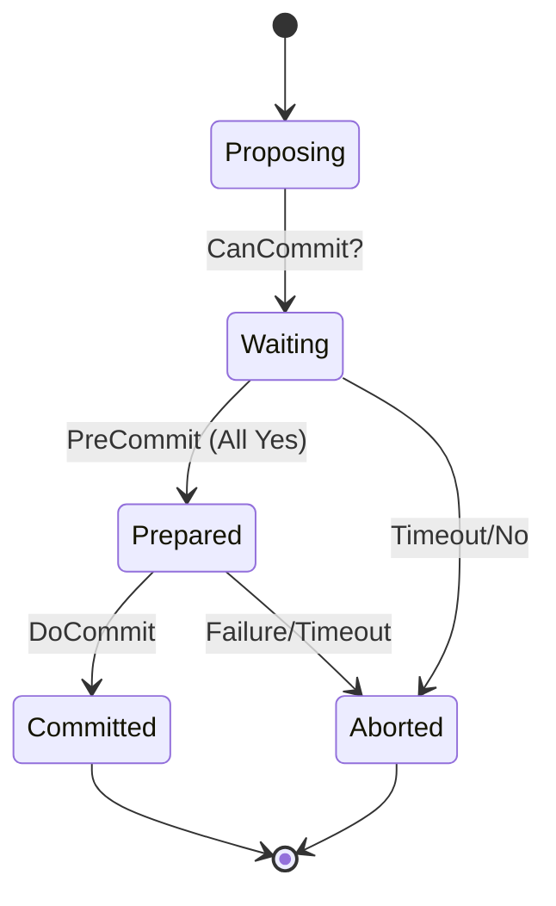
```mermaid
stateDiagram-v2
    [*] --> Proposing
    Proposing --> Waiting: CanCommit?
    Waiting --> Prepared: PreCommit (All Yes)
    Waiting --> Aborted: Timeout/No
    Prepared --> Committed: DoCommit
    Prepared --> Aborted: Failure/Timeout
    Committed --> [*]
    Aborted --> [*]
```

**Test Note:** Every transition marked above requires a corresponding negative test case (e.g., what happens if a node stays in `Prepared` indefinitely?).

---

## Phase Plan

# Development Phase Planning: The Blind Substrate

This document outlines the strategic roadmap for implementing **The Blind Substrate**. The plan focuses on the incremental delivery of cryptographic primitives, distributed storage components, and the coordination protocols required to maintain total server-side blindness.

---

## 1. Project Timeline Overview

```mermaid
gantt
    title The Blind Substrate: Implementation Roadmap
    dateFormat  YYYY-MM-DD
    axisFormat  %b %d
    
    section Phase 1: Foundation
    Crypto Primitives & HKDF Setup :a1, 2024-01-01, 14d
    Hash Store (CAS) Implementation :a2, after a1, 14d
    
    section Phase 2: Core Features
    Pointer Store & 3PC Protocol   :b1, 2024-01-29, 21d
    Client-Side SDK (Blindness Layer):b2, after b1, 28d
    
    section Phase 3: Integration
    GC Crawler & Graph Logic        :c1, 2024-03-18, 21d
    Sharding & Horizontal Scaling   :c2, after c1, 21d
    
    section Phase 4: Polish
    Security Audit & Fuzzing        :d1, 2024-04-29, 14d
    Performance Benchmarking        :d2, after d1, 14d
    
    section Phase 5: Launch
    UAT & Beta Program              :e1, 2024-05-27, 14d
    Production Deployment           :e2, after e1, 7d
```

---

## 2. Phase Descriptions

### Phase 1: Foundation (Weeks 1–4)
*   **Objectives:** Establish the cryptographic baseline and the immutable storage layer.
*   **Deliverables:** HKDF/AEAD utility library, Hash Store (Content-Addressable Storage) API.
*   **Key Activities:**
    *   Implement client-side key derivation paths.
    *   Develop the Hash Store with deduplication logic.
*   **Dependencies:** None.
*   **Success Criteria:** Hash Store correctly stores and retrieves blobs using SHA-256 hashes as keys; server cannot decrypt blobs.
*   **Risks:** Weak entropy in key generation. **Mitigation:** Use audited OS-level CSPRNGs.

### Phase 2: Core Features (Weeks 5–11)
*   **Objectives:** Implement the mutable state layer and the client-side orchestration.
*   **Deliverables:** Pointer Store (K/V), 3-Phase Commit (3PC) engine, Client SDK.
*   **Key Activities:**
    *   Build the 3PC coordinator for atomic pointer updates.
    *   Develop the Client SDK to handle "Encrypt-then-Hash-then-Upload" workflows.
*   **Dependencies:** Phase 1 completion.
*   **Success Criteria:** Atomic updates to pointers succeed or fail gracefully without state corruption.
*   **Risks:** 3PC latency overhead. **Mitigation:** Implement aggressive connection pooling and asynchronous pre-computation.

### Phase 3: Integration (Weeks 12–17)
*   **Objectives:** Enable system maintenance and horizontal scalability.
*   **Deliverables:** Garbage Collection (GC) Service, Sharded K/V backend.
*   **Key Activities:**
    *   Develop a "Blind Crawler" that identifies orphaned hashes without seeing content.
    *   Implement consistent hashing for the Pointer Store.
*   **Dependencies:** Phase 2 completion.
*   **Success Criteria:** GC successfully reclaims space from unreferenced hashes; system scales to 3+ nodes.
*   **Risks:** GC accidentally deleting live data. **Mitigation:** Implement a "Grace Period" (Soft-delete) for all hashes.

---

## 3. Milestone Schedule

| Milestone | Target Date | Deliverables | Success Criteria |
| :--- | :--- | :--- | :--- |
| **MS-1: Blind Storage** | Week 4 | Hash Store API + Crypto Lib | 100% test coverage on encryption/decryption cycles. |
| **MS-2: Atomic State** | Week 8 | Pointer Store + 3PC Logic | Successful simulation of network partitions during 3PC. |
| **MS-3: Full SDK** | Week 11 | Client-side TypeScript/Go SDK | Developers can perform CRUD operations via SDK. |
| **MS-4: Scalability** | Week 17 | Sharded Backend + GC Service | System maintains performance at 10k requests/sec. |
| **MS-5: Production Ready**| Week 25 | Audited System + Documentation | Zero critical vulnerabilities found in external audit. |

---

## 4. Resource Allocation

| Role | Phase 1-2 Responsibility | Phase 3-5 Responsibility |
| :--- | :--- | :--- |
| **Security Architect** | Crypto primitive selection, Threat modeling. | Audit remediation, Key rotation policy. |
| **Backend Engineer (A)** | Hash Store & Storage Engine. | Sharding logic & GC Crawler. |
| **Backend Engineer (B)** | 3-Phase Commit & Pointer Store. | API Gateway & Performance Tuning. |
| **SDK/Frontend Engineer** | Client-side AEAD & HKDF implementation. | Documentation & Integration testing. |
| **DevOps/SRE** | CI/CD Pipeline, Infra-as-Code. | Monitoring, Scaling, & Load Testing. |

---

## 5. Sprint Planning Overview (6 Sprints)

| Sprint | Goal | Key Deliverables |
| :--- | :--- | :--- |
| **S1** | Crypto & CAS | HKDF/AEAD wrappers; Hash Store basic PUT/GET. |
| **S2** | Persistence | Hash Store disk persistence; S3/Blob storage drivers. |
| **S3** | Atomic Pointers | Pointer Store schema; 3PC "Prepare" and "Commit" phases. |
| **S4** | SDK Alpha | SDK for Node.js/Browser; Blindness verification tests. |
| **S5** | Maintenance | GC Service; Reference counting logic; Orphan detection. |
| **S6** | Hardening | Rate limiting; Sharding; Final integration tests. |

---

## 6. Release Plan

### v0.1.0-alpha (Week 12)
*   **Features:** Basic Blind Substrate functionality (Upload/Download/Update).
*   **Criteria:** Functional SDK; Single-node deployment.

### v0.5.0-beta (Week 18)
*   **Features:** Sharding, GC Service, Multi-region support.
*   **Criteria:** Stable API; Successful recovery from node failure.

### v1.0.0-GA (Week 25)
*   **Features:** Full production suite, Monitoring dashboards, Audited crypto.
*   **Criteria:** Passed 3rd party security audit; Documentation complete.

---

## 7. Risk Timeline

```mermaid
graph LR
    R1[Key Management Complexity] -->|High Risk| P1(Phase 1-2)
    R2[3PC Performance Bottlenecks] -->|Medium Risk| P2(Phase 2-3)
    R3[GC Data Loss] -->|Critical Risk| P3(Phase 3-4)
    R4[Regulatory Compliance/Audit] -->|Medium Risk| P4(Phase 4-5)

    style R1 fill:#f96,stroke:#333
    style R3 fill:#f66,stroke:#333
```

*   **Phase 1-2 (Cryptographic Risk):** Highest risk of implementation errors in HKDF/AEAD. Mitigation: Use standard libraries (libsodium/SubtleCrypto), no custom crypto.
*   **Phase 3 (Operational Risk):** GC logic is dangerous. Mitigation: Dry-run mode for GC for the first 30 days of production.
*   **Phase 4-5 (Compliance Risk):** Ensuring "Blindness" meets jurisdictional privacy requirements. Mitigation: Legal review of the "Zero-Knowledge" architecture.

---

## Project Data
Generated JSON file: design.project_data.json

Raw JSON Content

```json
{
  "project_name" : "The Blind Substrate",
  "description" : "A minimalist architecture for secure, scalable distributed systems that decouples permission, volume, state, and logic using cryptographic blindness. It ensures that the server can manage access and storage without ever seeing the plaintext data.",
  "created_date" : "2026-02-16T13:38:49.139325034",
  "epics" : [ {
    "id" : "EPIC-UC",
    "name" : "User Features",
    "description" : "Core user-facing functionality based on use cases",
    "priority" : "High",
    "status" : "Planned",
    "story_points" : 80
  }, {
    "id" : "EPIC-ARCH",
    "name" : "Architecture & Infrastructure",
    "description" : "Set up system architecture and infrastructure",
    "priority" : "High",
    "status" : "Planned",
    "story_points" : 21
  }, {
    "id" : "EPIC-TEST",
    "name" : "Quality Assurance",
    "description" : "Testing and quality assurance activities",
    "priority" : "High",
    "status" : "Planned",
    "story_points" : 13
  }, {
    "id" : "EPIC-101",
    "name" : "Epic EPIC-101",
    "description" : "Auto-extracted epic from analysis",
    "priority" : "Medium",
    "status" : "Planned",
    "story_points" : 13
  }, {
    "id" : "EPIC-102",
    "name" : "Epic EPIC-102",
    "description" : "Auto-extracted epic from analysis",
    "priority" : "Medium",
    "status" : "Planned",
    "story_points" : 13
  }, {
    "id" : "EPIC-103",
    "name" : "Epic EPIC-103",
    "description" : "Auto-extracted epic from analysis",
    "priority" : "Medium",
    "status" : "Planned",
    "story_points" : 13
  }, {
    "id" : "EPIC-104",
    "name" : "Epic EPIC-104",
    "description" : "Auto-extracted epic from analysis",
    "priority" : "Medium",
    "status" : "Planned",
    "story_points" : 13
  }, {
    "id" : "EPIC-105",
    "name" : "Epic EPIC-105",
    "description" : "Auto-extracted epic from analysis",
    "priority" : "Medium",
    "status" : "Planned",
    "story_points" : 13
  }, {
    "id" : "EPIC-106",
    "name" : "Epic EPIC-106",
    "description" : "Auto-extracted epic from analysis",
    "priority" : "Medium",
    "status" : "Planned",
    "story_points" : 13
  } ],
  "releases" : [ {
    "id" : "REL-1",
    "name" : "MVP Release",
    "version" : "1.0.0",
    "target_date" : "2026-03-30",
    "description" : "Minimum Viable Product release with core functionality",
    "epic_ids" : [ "EPIC-UC", "EPIC-ARCH", "EPIC-TEST", "EPIC-101" ],
    "status" : "Planned"
  }, {
    "id" : "REL-2",
    "name" : "Feature Complete Release",
    "version" : "1.1.0",
    "target_date" : "2026-05-11",
    "description" : "Full feature release with all planned functionality",
    "epic_ids" : [ "EPIC-UC", "EPIC-ARCH", "EPIC-TEST", "EPIC-101", "EPIC-102", "EPIC-103", "EPIC-104", "EPIC-105", "EPIC-106" ],
    "status" : "Planned"
  } ],
  "sprints" : [ {
    "id" : "SPRINT-1",
    "name" : "Sprint 1",
    "number" : 1,
    "start_date" : "2026-02-16",
    "end_date" : "2026-03-02",
    "goals" : [ "Complete sprint 1 deliverables" ],
    "capacity_points" : 40,
    "task_ids" : [ "TASK-101", "TASK-102", "TASK-103", "TASK-104", "TASK-301" ],
    "status" : "Planned"
  }, {
    "id" : "SPRINT-2",
    "name" : "Sprint 2",
    "number" : 2,
    "start_date" : "2026-03-02",
    "end_date" : "2026-03-16",
    "goals" : [ "Complete sprint 2 deliverables" ],
    "capacity_points" : 40,
    "task_ids" : [ "TASK-302", "TASK-303", "TASK-304", "TASK-201", "TASK-202" ],
    "status" : "Planned"
  }, {
    "id" : "SPRINT-3",
    "name" : "Sprint 3",
    "number" : 3,
    "start_date" : "2026-03-16",
    "end_date" : "2026-03-30",
    "goals" : [ "Complete sprint 3 deliverables" ],
    "capacity_points" : 40,
    "task_ids" : [ "TASK-203", "TASK-204", "TASK-501", "TASK-401", "TASK-402" ],
    "status" : "Planned"
  }, {
    "id" : "SPRINT-4",
    "name" : "Sprint 4",
    "number" : 4,
    "start_date" : "2026-03-30",
    "end_date" : "2026-04-13",
    "goals" : [ "Complete sprint 4 deliverables" ],
    "capacity_points" : 40,
    "task_ids" : [ "TASK-403", "TASK-502", "TASK-503", "TASK-601", "TASK-602" ],
    "status" : "Planned"
  }, {
    "id" : "SPRINT-5",
    "name" : "Sprint 5",
    "number" : 5,
    "start_date" : "2026-04-13",
    "end_date" : "2026-04-27",
    "goals" : [ "Complete sprint 5 deliverables" ],
    "capacity_points" : 40,
    "task_ids" : [ "TASK-603", "TASK-604", "TASK-605" ],
    "status" : "Planned"
  }, {
    "id" : "SPRINT-6",
    "name" : "Sprint 6",
    "number" : 6,
    "start_date" : "2026-04-27",
    "end_date" : "2026-05-11",
    "goals" : [ "Complete sprint 6 deliverables" ],
    "capacity_points" : 40,
    "task_ids" : [ ],
    "status" : "Planned"
  } ],
  "tasks" : [ {
    "id" : "TASK-101",
    "title" : "Task TASK-101",
    "description" : "Auto-extracted task from analysis",
    "type" : "task",
    "epic_id" : "EPIC-UC",
    "sprint_id" : "SPRINT-1",
    "priority" : "Medium",
    "story_points" : 3,
    "status" : "Backlog",
    "acceptance_criteria" : [ "Task completed successfully" ],
    "labels" : [ "auto-generated" ]
  }, {
    "id" : "TASK-102",
    "title" : "Task TASK-102",
    "description" : "Auto-extracted task from analysis",
    "type" : "task",
    "epic_id" : "EPIC-UC",
    "sprint_id" : "SPRINT-1",
    "priority" : "Medium",
    "story_points" : 3,
    "status" : "Backlog",
    "acceptance_criteria" : [ "Task completed successfully" ],
    "labels" : [ "auto-generated" ]
  }, {
    "id" : "TASK-103",
    "title" : "Task TASK-103",
    "description" : "Auto-extracted task from analysis",
    "type" : "task",
    "epic_id" : "EPIC-UC",
    "sprint_id" : "SPRINT-1",
    "priority" : "Medium",
    "story_points" : 3,
    "status" : "Backlog",
    "acceptance_criteria" : [ "Task completed successfully" ],
    "labels" : [ "auto-generated" ]
  }, {
    "id" : "TASK-104",
    "title" : "Task TASK-104",
    "description" : "Auto-extracted task from analysis",
    "type" : "task",
    "epic_id" : "EPIC-UC",
    "sprint_id" : "SPRINT-1",
    "priority" : "Medium",
    "story_points" : 3,
    "status" : "Backlog",
    "acceptance_criteria" : [ "Task completed successfully" ],
    "labels" : [ "auto-generated" ]
  }, {
    "id" : "TASK-301",
    "title" : "Task TASK-301",
    "description" : "Auto-extracted task from analysis",
    "type" : "task",
    "epic_id" : "EPIC-UC",
    "sprint_id" : "SPRINT-1",
    "priority" : "Medium",
    "story_points" : 3,
    "status" : "Backlog",
    "acceptance_criteria" : [ "Task completed successfully" ],
    "labels" : [ "auto-generated" ]
  }, {
    "id" : "TASK-302",
    "title" : "Task TASK-302",
    "description" : "Auto-extracted task from analysis",
    "type" : "task",
    "epic_id" : "EPIC-UC",
    "sprint_id" : "SPRINT-2",
    "priority" : "Medium",
    "story_points" : 3,
    "status" : "Backlog",
    "acceptance_criteria" : [ "Task completed successfully" ],
    "labels" : [ "auto-generated" ]
  }, {
    "id" : "TASK-303",
    "title" : "Task TASK-303",
    "description" : "Auto-extracted task from analysis",
    "type" : "task",
    "epic_id" : "EPIC-UC",
    "sprint_id" : "SPRINT-2",
    "priority" : "Medium",
    "story_points" : 3,
    "status" : "Backlog",
    "acceptance_criteria" : [ "Task completed successfully" ],
    "labels" : [ "auto-generated" ]
  }, {
    "id" : "TASK-304",
    "title" : "Task TASK-304",
    "description" : "Auto-extracted task from analysis",
    "type" : "task",
    "epic_id" : "EPIC-UC",
    "sprint_id" : "SPRINT-2",
    "priority" : "Medium",
    "story_points" : 3,
    "status" : "Backlog",
    "acceptance_criteria" : [ "Task completed successfully" ],
    "labels" : [ "auto-generated" ]
  }, {
    "id" : "TASK-201",
    "title" : "Task TASK-201",
    "description" : "Auto-extracted task from analysis",
    "type" : "task",
    "epic_id" : "EPIC-UC",
    "sprint_id" : "SPRINT-2",
    "priority" : "Medium",
    "story_points" : 3,
    "status" : "Backlog",
    "acceptance_criteria" : [ "Task completed successfully" ],
    "labels" : [ "auto-generated" ]
  }, {
    "id" : "TASK-202",
    "title" : "Task TASK-202",
    "description" : "Auto-extracted task from analysis",
    "type" : "task",
    "epic_id" : "EPIC-UC",
    "sprint_id" : "SPRINT-2",
    "priority" : "Medium",
    "story_points" : 3,
    "status" : "Backlog",
    "acceptance_criteria" : [ "Task completed successfully" ],
    "labels" : [ "auto-generated" ]
  }, {
    "id" : "TASK-203",
    "title" : "Task TASK-203",
    "description" : "Auto-extracted task from analysis",
    "type" : "task",
    "epic_id" : "EPIC-UC",
    "sprint_id" : "SPRINT-3",
    "priority" : "Medium",
    "story_points" : 3,
    "status" : "Backlog",
    "acceptance_criteria" : [ "Task completed successfully" ],
    "labels" : [ "auto-generated" ]
  }, {
    "id" : "TASK-204",
    "title" : "Task TASK-204",
    "description" : "Auto-extracted task from analysis",
    "type" : "task",
    "epic_id" : "EPIC-UC",
    "sprint_id" : "SPRINT-3",
    "priority" : "Medium",
    "story_points" : 3,
    "status" : "Backlog",
    "acceptance_criteria" : [ "Task completed successfully" ],
    "labels" : [ "auto-generated" ]
  }, {
    "id" : "TASK-501",
    "title" : "Task TASK-501",
    "description" : "Auto-extracted task from analysis",
    "type" : "task",
    "epic_id" : "EPIC-UC",
    "sprint_id" : "SPRINT-3",
    "priority" : "Medium",
    "story_points" : 3,
    "status" : "Backlog",
    "acceptance_criteria" : [ "Task completed successfully" ],
    "labels" : [ "auto-generated" ]
  }, {
    "id" : "TASK-401",
    "title" : "Task TASK-401",
    "description" : "Auto-extracted task from analysis",
    "type" : "task",
    "epic_id" : "EPIC-UC",
    "sprint_id" : "SPRINT-3",
    "priority" : "Medium",
    "story_points" : 3,
    "status" : "Backlog",
    "acceptance_criteria" : [ "Task completed successfully" ],
    "labels" : [ "auto-generated" ]
  }, {
    "id" : "TASK-402",
    "title" : "Task TASK-402",
    "description" : "Auto-extracted task from analysis",
    "type" : "task",
    "epic_id" : "EPIC-UC",
    "sprint_id" : "SPRINT-3",
    "priority" : "Medium",
    "story_points" : 3,
    "status" : "Backlog",
    "acceptance_criteria" : [ "Task completed successfully" ],
    "labels" : [ "auto-generated" ]
  }, {
    "id" : "TASK-403",
    "title" : "Task TASK-403",
    "description" : "Auto-extracted task from analysis",
    "type" : "task",
    "epic_id" : "EPIC-UC",
    "sprint_id" : "SPRINT-4",
    "priority" : "Medium",
    "story_points" : 3,
    "status" : "Backlog",
    "acceptance_criteria" : [ "Task completed successfully" ],
    "labels" : [ "auto-generated" ]
  }, {
    "id" : "TASK-502",
    "title" : "Task TASK-502",
    "description" : "Auto-extracted task from analysis",
    "type" : "task",
    "epic_id" : "EPIC-UC",
    "sprint_id" : "SPRINT-4",
    "priority" : "Medium",
    "story_points" : 3,
    "status" : "Backlog",
    "acceptance_criteria" : [ "Task completed successfully" ],
    "labels" : [ "auto-generated" ]
  }, {
    "id" : "TASK-503",
    "title" : "Task TASK-503",
    "description" : "Auto-extracted task from analysis",
    "type" : "task",
    "epic_id" : "EPIC-UC",
    "sprint_id" : "SPRINT-4",
    "priority" : "Medium",
    "story_points" : 3,
    "status" : "Backlog",
    "acceptance_criteria" : [ "Task completed successfully" ],
    "labels" : [ "auto-generated" ]
  }, {
    "id" : "TASK-601",
    "title" : "Task TASK-601",
    "description" : "Auto-extracted task from analysis",
    "type" : "task",
    "epic_id" : "EPIC-UC",
    "sprint_id" : "SPRINT-4",
    "priority" : "Medium",
    "story_points" : 3,
    "status" : "Backlog",
    "acceptance_criteria" : [ "Task completed successfully" ],
    "labels" : [ "auto-generated" ]
  }, {
    "id" : "TASK-602",
    "title" : "Task TASK-602",
    "description" : "Auto-extracted task from analysis",
    "type" : "task",
    "epic_id" : "EPIC-UC",
    "sprint_id" : "SPRINT-4",
    "priority" : "Medium",
    "story_points" : 3,
    "status" : "Backlog",
    "acceptance_criteria" : [ "Task completed successfully" ],
    "labels" : [ "auto-generated" ]
  }, {
    "id" : "TASK-603",
    "title" : "Task TASK-603",
    "description" : "Auto-extracted task from analysis",
    "type" : "task",
    "epic_id" : "EPIC-UC",
    "sprint_id" : "SPRINT-5",
    "priority" : "Medium",
    "story_points" : 3,
    "status" : "Backlog",
    "acceptance_criteria" : [ "Task completed successfully" ],
    "labels" : [ "auto-generated" ]
  }, {
    "id" : "TASK-604",
    "title" : "Task TASK-604",
    "description" : "Auto-extracted task from analysis",
    "type" : "task",
    "epic_id" : "EPIC-UC",
    "sprint_id" : "SPRINT-5",
    "priority" : "Medium",
    "story_points" : 3,
    "status" : "Backlog",
    "acceptance_criteria" : [ "Task completed successfully" ],
    "labels" : [ "auto-generated" ]
  }, {
    "id" : "TASK-605",
    "title" : "Task TASK-605",
    "description" : "Auto-extracted task from analysis",
    "type" : "task",
    "epic_id" : "EPIC-UC",
    "sprint_id" : "SPRINT-5",
    "priority" : "Medium",
    "story_points" : 3,
    "status" : "Backlog",
    "acceptance_criteria" : [ "Task completed successfully" ],
    "labels" : [ "auto-generated" ]
  } ],
  "milestones" : [ ],
  "dependencies" : [ {
    "id" : "DEP-1",
    "source_id" : "TASK-101",
    "source_type" : "task",
    "target_id" : "TASK-104",
    "target_type" : "task",
    "dependency_type" : "blocks"
  }, {
    "id" : "DEP-2",
    "source_id" : "EPIC-101",
    "source_type" : "epic",
    "target_id" : "EPIC-102",
    "target_type" : "epic",
    "dependency_type" : "depends_on"
  }, {
    "id" : "DEP-3",
    "source_id" : "EPIC-103",
    "source_type" : "epic",
    "target_id" : "EPIC-104",
    "target_type" : "epic",
    "dependency_type" : "relates_to"
  } ]
}
```


</div>
<div id="technical_explanation" class="tab-content" style="display: none;" markdown="1">

# Technical Explanation Generation

**Topic:** The Blind Substrate: A Minimalist Architecture for Secure, Scalable Distributed Systems

## Configuration

### User Input

# Context file: /home/andrew/code/Science/docs/technical_explanation_op.md
```
---
transforms: (.+)/content\.md -> $1/technical_explanation.md
task_type: TechnicalExplanation
---
* Produce a precise, in-depth technical explanation of the concepts described in the content
* Define all key terms, acronyms, and domain-specific vocabulary
* Break down complex mechanisms step-by-step, using analogies where helpful
* Include code snippets, pseudocode, or worked examples to ground abstract ideas
* Highlight common misconceptions and clarify edge cases or limitations
```
# Context file: /home/andrew/code/Science/post_data/projects/2026-01-01-server-arch/content.md
```
# The Blind Substrate: A Minimalist Architecture for Secure, Scalable Distributed Systems

Modern distributed systems struggle to balance security (privacy from the provider), scalability (data volume), and
consistency (complex state). Traditional architectures conflate these concerns—databases handle both storage and state,
and Key Management Systems (KMS) hold custody of secrets.

The **Blind Substrate** decouples these concerns into orthogonal, highly constrained layers. By enforcing strict
separation between **permission** (Blind KMS), **volume** (Hash Store), **state** (Pointer Store), and **logic** (Client
Library), we create a substrate that is intrinsically secure, scalable, and easier to reason about.

## 1. The Core Philosophy

1. **Cryptographic Dependence, Informational Independence**: The client depends on the server for permission (
   decryption, state updates), but the server is mathematically prevented from learning the client's data.
2. **Offloading Complexity**: Data volume moves to immutable storage; cryptographic complexity moves to the client. The
   transactional core remains small, bounded, and fast.

## 2. Layer 1: The Blind KMS (Permission)

The **Blind KMS** is a stateless, blind key derivation oracle. Unlike traditional KMS, it never sees plaintext or
ciphertext.

### Mechanism

1. **Commitment**: Client computes `commit = H(data || salt || context)`.
2. **Derivation**: Client sends `key_id` and `commit` to the server.
3. **Key Generation**: Server derives `k = HKDF(master_secret, key_id || commit || epoch)`.
4. **Control**: Server returns `k` to the client after enforcing RBAC and logging the access.

### Properties

* **Server Blindness**: The server sees only a hash, never the data or the final key.
* **Per-Payload Keys**: Every unique payload gets a unique key, limiting the blast radius of a leak.
* **No Decrypt Endpoint**: Decryption is performed by re-deriving the key via the same blind process.

## 3. Layer 2: The Hash Store (Volume)

The **Hash Store** is a content-addressable, immutable blob store. It handles the "weight" of the system.

* **Mechanism**: `PUT(blob) -> hash`, `GET(hash) -> blob`.
* **Deduplication**: Identical payloads naturally collapse to the same hash.
* **O(1) Handles**: Large data is reduced to a fixed-size handle (the hash), which is then passed to the Pointer Store.
* **Immutability**: Once written, data never changes, eliminating write-write conflicts at the storage layer.

## 4. Layer 3: The Pointer Store (State)

The **Pointer Store** is a transactional, bounded key-value fabric. It manages the "meaning" and relationships of the
data.

### Architecture

* **Bounded Sizes**: Strict limits on key (e.g., 256B) and value (e.g., 8KB) sizes ensure scalability and prevent abuse
  as a document store.
* **Atomic Primitives**: Supports `GET`, `SET`, `CAS` (Compare-and-Set), and small `TXN` (multi-key transactions).
* **Sharded 3PC**: A frontend coordinator converts multi-key transactions into a sharded 3-Phase Commit protocol across
  dumb storage shards.
* **Pluggable Backends**: Can be backed by custom engines or intrinsically scaled systems like Cassandra or DynamoDB.

## 5. Layer 4: The Client Library (Logic)

The **Client Library** is the "Crypto Brain." It orchestrates the other layers and enforces best practices.

* **Responsibilities**: Compression, random padding (to obscure length), AEAD encryption, and envelope construction.
* **The BK1 Envelope**: A portable, serialized string containing everything needed for decryption except the permission:
  `BK1:key_id:base64(commit):base64(nonce):base64(ciphertext):meta`

## 6. Layer 5: The GC Service (Lifecycle)

Because the Hash Store is immutable and the Pointer Store is versioned, the system requires an external **Garbage
Collection Service**.

* **Graph Crawling**: The service crawls the logical graph starting from "roots" in the Pointer Store.
* **Reachability**: It identifies which hashes are still referenced. Unreferenced blobs are reclaimed in epochs.
* **Policy-Driven**: GC enforces data lifecycle rules (e.g., legal holds, retention windows) without sitting on the hot
  path of the application.

## 7. Layer 6: Accounting & Quotas (Enforcement)

To support multi-tenancy and prevent DoS, the **Accounting Service** tracks resource usage as billable, enforceable
state.

* **Metrics**: Tracks storage bytes (Hash Store), pointer counts (Pointer Store), and derivation ops (Blind KMS).
* **Enforcement**: Rejects writes or throttles requests when per-tenant quotas are exceeded.

## Summary of the Substrate

| Layer              | Responsibility | Visibility          | Constraint                   |
|:-------------------|:---------------|:--------------------|:-----------------------------|
| **Blind KMS**      | Permission     | Blind (Hashes only) | Stateless HKDF               |
| **Hash Store**     | Volume         | Opaque Blobs        | Immutable, Content-Addressed |
| **Pointer Store**  | State          | Pointers/Metadata   | Bounded K/V, Transactional   |
| **Client Library** | Logic          | Plaintext (Local)   | AEAD, Compression, Padding   |

By decoupling these concerns, the Blind Substrate allows for a system where the server can say **yes** or **no** to an
operation, but can never **see** the data it is protecting.
```


---

- Target Audience: software_engineer
- Level of Detail: comprehensive
- Format: markdown
- Include Code Examples: ✓
- Use Analogies: ✓
- Define Terminology: ✓
- Include Visual Descriptions: ✓
- Include Examples: ✓
- Include Comparisons: ✓
- Code Language: python

**Started:** 2026-02-17 20:57:31

---

### Phase 1: Analysis & Outline
*Analyzing topic and creating explanation structure...*
## Reference Context

Prior Context and Related Files

### Prior Context


### Related Files
## Related Documentation Files


# Explanation Outline

**Status:** Creating structured outline...

## Error

```
com.simiacryptus.cognotik.exceptions.MultiExeption: ```text
java.lang.RuntimeException: Failed to parse response:   {
    "title": "The Blind Substrate: A Minimalist Architecture for Secure, Scalable Distributed Systems",
    "overview": "The Blind Substrate is a distributed systems architecture pattern that enforces strict information boundaries between components through cryptographic isolation. Each processing node operates as a context-free unit with access only to data it absolutely needs, enabling horizontal scaling while maintaining strong security guarantees against insider threats, node compromise, and side-channel attacks. This comprehensive outline covers theoretical foundations, cryptographic primitives, implementation mechanics, operational trade-offs, and production deployment considerations.",
    "key_concepts": [
      {
        "concept": "The Minimalist Information Model",
        "complexity": "Basic",
        "importance": "Foundational principle establishing why nodes should be information-minimal and how this differs from traditional distributed systems architectures",
        "estimated_paragraphs": 5,
        "subtopics": [
          "Principle of least privilege applied to data (not just permissions)",
          "Why traditional distributed systems over-share context",
          "Threat model: insider threats, node compromise, side-channel attacks",
          "Information minimalism vs. functional completeness tension",
          "Comparison with microservices and zero-trust networking"
        ]
      },
      {
        "concept": "Cryptographic Information Boundaries",
        "complexity": "Intermediate",
        "importance": "Establishes that blindness must be enforced by mathematics rather than policy, covering the cryptographic primitives that make information boundaries real",
        "estimated_paragraphs": 8,
        "subtopics": [
          "Envelope encryption: DEK/KEK hierarchy and key rotation",
          "Sealed context construction for per-operation metadata",
          "Blind indexes for queryable encrypted data using HMAC-based indexing",
          "Convergent encryption: use cases, risks, and mitigations",
          "Key derivation hierarchies from single root secret",
          "HSMs and TEEs as boundary enforcers",
          "Forward secrecy in substrate key management"
        ]
      },
      {
        "concept": "Capability Tokens and the Authorization Plane",
        "complexity": "Intermediate",
        "importance": "Demonstrates how nodes receive precisely scoped, time-limited authority to act without accumulating persistent permissions",
        "estimated_paragraphs": 7,
        "subtopics": [
          "Capability token anatomy: claims, scope, expiry, node identity binding",
          "JWT vs. PASETO vs. macaroons trade-offs",
          "Macaroons in depth: contextual caveats and third-party caveats",
          "Token binding to prevent theft and replay",
          "Authorization plane vs. data plane separation",
          "Revocation strategies: short-lived tokens, revocation lists, OCSP stapling",
          "Delegation chains and scoped token minting"
        ]
      },
      {
        "concept": "Substrate Node Design and Statelessness",
        "complexity": "Intermediate-Advanced",
        "importance": "Establishes how nodes achieve genuine statelessness and context-freedom, which are prerequisites for the architecture's security and scalability properties",
        "estimated_paragraphs": 9,
        "subtopics": [
          "Defining statelessness precisely: no persistent memory, no cross-request correlation",
          "Work envelope pattern: sealed input, capability token, output destination",
          "Node lifecycle: boot attestation, token acquisition, work processing, result deposit, shutdown",
          "Failure handling without state: idempotency keys, at-least-once delivery, deduplication",
          "Side-channel attack surface: timing, memory access patterns, cache behavior",
          "Sandboxing strategies: containers, WebAssembly, gVisor, Firecracker microVMs",
          "Node attestation: TPM-based, SGX-based, software-based chains",
          "Cold start latency vs. security trade-offs"
        ]
      },
      {
        "concept": "The Coordinator Pattern and Topology Blindness",
        "complexity": "Advanced",
        "importance": "Shows how to design a coordinator powerful enough to orchestrate work but blind enough to be low-value if compromised, preventing it from becoming an omniscient single point of failure",
        "estimated_paragraphs": 8,
        "subtopics": [
          "Coordinator responsibilities: routing, token minting, health checking only",
          "What coordinators must NOT hold: plaintext, long-lived keys, user context",
          "Sealed routing tables enabling routing without payload understanding",
          "Multi-coordinator topologies: consensus, leader election, partition tolerance",
          "Coordinator as capability authority integrating with OIDC/SPIFFE",
          "Coordinator compromise scenarios and attack surface analysis",
          "Gossip protocols for topology discovery without centralized knowledge",
          "Comparison with service mesh architectures (Istio, Linkerd)"
        ]
      },
      {
        "concept": "Operational Realities — Observability, Debugging, and Performance",
        "complexity": "Advanced",
        "importance": "Addresses the critical challenge of maintaining operational visibility and debuggability without violating blindness guarantees, essential for production viability",
        "estimated_paragraphs": 10,
        "subtopics": [
          "The observability paradox: debugging information-hidden systems",
          "Structured audit logs with selective disclosure",
          "Distributed tracing without correlation leakage",
          "Metrics without meaning: aggregate statistics revealing health not patterns",
          "Differential privacy techniques for aggregate metrics",
          "Debugging workflows with synthetic sealed envelopes",
          "Performance profiling without payload inspection",
          "Key management operational burden and disaster recovery",
          "Compliance satisfaction: SOC 2, GDPR, HIPAA with blind architecture",
          "Chaos engineering for blind substrates"
        ]
      }
    ],
    "terminology": [
      {
        "term": "Blind Substrate",
        "definition": "A distributed processing layer whose nodes intentionally lack access to full context of processed data, enforcing need-to-know at infrastructure level",
        "context": "Core architectural pattern; used throughout to describe the overall system"
      },
      {
        "term": "Information Boundary",
        "definition": "A cryptographically enforced partition preventing node access to data outside designated scope, even if compromised",
        "context": "Security model; describes the enforcement mechanism between components"
      },
      {
        "term": "Capability Token",
        "definition": "A cryptographically signed, scoped credential granting a node precisely the permissions required for a single operation",
        "context": "Authorization mechanism; controls what actions nodes can perform"
      },
      {
        "term": "Substrate Node",
        "definition": "An individual processing unit within the blind substrate; stateless by design, context-free by enforcement",
        "context": "Core component; represents the basic computational unit"
      },
      {
        "term": "Envelope Encryption",
        "definition": "A scheme where data is encrypted with a data key (DEK), and the DEK itself is encrypted with a key-encryption key (KEK), enabling fine-grained access control",
        "context": "Cryptographic primitive; enables per-node key management without re-encrypting bulk data"
      },
      {
        "term": "Sealed Context",
        "definition": "A bundle of operation-specific metadata encrypted such that only the intended recipient node can decrypt it",
        "context": "Data structure; prevents lateral information leakage between nodes"
      },
      {
        "term": "Convergent Encryption",
        "definition": "Deterministic encryption where identical plaintexts produce identical ciphertexts, enabling deduplication without exposing plaintext",
        "context": "Cryptographic technique; used for storage efficiency with security trade-offs"
      },
      {
        "term": "Blind Index",
        "definition": "A keyed hash of a searchable field allowing querying encrypted data without revealing the underlying value",
        "context": "Query mechanism; enables search over encrypted fields in databases"
      },
      {
        "term": "Substrate Coordinator",
        "definition": "A lightweight orchestration component routing work to substrate nodes without holding decryption keys or plaintext data",
        "context": "Control plane component; manages work distribution and token issuance"
      },
      {
        "term": "Attestation Chain",
        "definition": "A verifiable sequence of cryptographic proofs establishing that a node's software and configuration have not been tampered with",
        "context": "Security verification; ensures node integrity before granting capability tokens"
      },
      {
        "term": "Work Envelope",
        "definition": "A sealed container holding operation-specific input data, encrypted with a per-envelope data key, along with a capability token",
        "context": "Data structure; the unit of work passed to substrate nodes"
      },
      {
        "term": "Statelessness",
        "definition": "Node design property where no persistent memory exists across requests and no cross-request correlation occurs",
        "context": "Architectural constraint; enables horizontal scaling and limits compromise impact"
      }
    ],
    "analogies": [
      {
        "technical_concept": "Substrate nodes operating with limited context",
        "analogy": "An assembly line where each worker wears blinders and gloves",
        "mapping_explanation": "Workers can feel the shape of parts and perform specific tasks but cannot see the overall product, neighboring workers, or factory floor. If a worker is compromised, they can only reveal information about their single operation. Similarly, substrate nodes receive only work tickets describing their single action and cannot access information about other operations, the overall system, or other nodes."
      },
      {
        "technical_concept": "Nodes verifying and processing data without understanding its meaning",
        "analogy": "A notary who verifies identity and witnesses signatures without reading document contents",
        "mapping_explanation": "A notary attests to who signed and when, but remains deliberately blind to what was signed. Substrate nodes similarly verify, transform, or route data according to capability tokens without understanding semantic meaning of what they're processing."
      },
      {
        "technical_concept": "Information isolation in distributed systems",
        "analogy": "Intelligence agencies using dead drops for agent communication",
        "mapping_explanation": "Agents know only their own dead drop location, not the network topology. A compromised agent cannot reveal the full network because they genuinely don't know it. Substrate nodes receive sealed work envelopes, process them, and deposit results without accumulating enough context to reconstruct full data flow."
      },
      {
        "technical_concept": "Layered encryption and routing through multiple nodes",
        "analogy": "Onion routing in Tor network for network packets",
        "mapping_explanation": "Tor wraps packets in layers of encryption so each relay only knows previous and next hop. Blind Substrate wraps computational tasks in layers of sealed context so each processing node only knows immediate inputs and outputs. Compromise of any single node reveals only that node's layer, not the full computation."
      }
    ],
    "code_examples": [
      {
        "purpose": "Demonstrate sealed work envelope construction where a coordinator creates encrypted work packages that nodes can open without receiving unnecessary context",
        "language": "Python",
        "complexity": "Intermediate",
        "key_points": [
          "Per-envelope DEK generation prevents key reuse attacks",
          "Authenticated Additional Data (AAD) binds ciphertext to envelope identity",
          "Explicit DEK zeroing limits key exposure window in memory",
          "Coordinator never holds node's private key; node never holds KEK"
        ]
      },
      {
        "purpose": "Show how macaroons enable fine-grained, delegatable capability tokens with contextual caveats that can be further restricted without contacting issuing authority",
        "language": "Go",
        "complexity": "Intermediate",
        "key_points": [
          "Caveats can only be added, never removed—attenuation is one-way ratchet",
          "Short TTLs (30s–5min) are essential; macaroons have no built-in revocation",
          "Coordinator's root key never travels with token",
          "Delegation without coordinator round-trips enables low-latency multi-hop workflows"
        ]
      },
      {
        "purpose": "Demonstrate HMAC-based blind index implementation for searchable encrypted data, including collision handling and key separation concerns",
        "language": "Rust",
        "complexity": "Intermediate",
        "key_points": [
          "Blind indexes are filters, not proofs—callers must decrypt to confirm matches",
          "Key separation between encryption key and index key is mandatory",
          "Normalization before hashing prevents trivial bypass attacks",
          "Prefix indexes trade query flexibility for information leakage (length disclosure)"
        ]
      },
      {
        "purpose": "Illustrate complete node lifecycle from boot attestation through work processing to graceful shutdown, showing attestation integration with capability token acquisition",
        "language": "TypeScript",
        "complexity": "Advanced",
        "key_points": [
          "State machine enforcement prevents processing work before attestation completes",
          "Token refresh at 80% TTL prevents expiry-during-processing failures",
          "Graceful drain ensures in-flight work completes before shutdown",
          "Idempotency key tracking prevents duplicate processing without persistent state"
        ]
      },
      {
        "purpose": "Show how to emit rich audit logs satisfying compliance requirements without logging sensitive data, using structured schema separating operational metadata from data-plane content",
        "language": "Python",
        "complexity": "Intermediate",
        "key_points": [
          "Every logged field is safe for SIEM, log aggregator, or compliance report",
          "Payload fingerprints enable forensic correlation without storing plaintext",
          "Structured error codes (not messages) prevent accidental data leakage",
          "Audit logger itself is blind—fingerprints data it never decrypts"
        ]
      }
    ],
    "visual_descriptions": [
      {
        "title": "System Architecture Overview",
        "type": "Component diagram (C4 Container level)",
        "description": "Three horizontal bands showing: (1) Top—External clients sending encrypted requests; (2) Middle—Substrate Coordinator(s) with sealed routing tables, connected to Identity Provider (SPIFFE/SPIRE) and Key Management Service, with arrows showing client→coordinator (sealed envelope), coordinator→KMS (token minting), coordinator→nodes (routed envelope + capability token); (3) Bottom—Pool of 6–8 isolated substrate nodes with no direct inter-node connections. Red dashed lines show information boundaries; labeled with what crosses (sealed envelope, capability token, sealed result) and what doesn't (plaintext, DEK, user context)."
      },
      {
        "title": "Envelope Encryption Key Hierarchy",
        "type": "Tree diagram",
        "description": "Hierarchical tree showing: Root—Root Key (HSM-protected, never exported); Level 1—Node Key Encryption Keys (KEK), one per node, derived via HKDF(root, node_id); Level 2—Per-Envelope Data Encryption Keys (DEK), one per work envelope, generated fresh, sealed with node KEK; Level 3—Encrypted Payload, sealed with DEK. Arrows labeled with operations (HKDF derivation, RSA-OAEP sealing, AES-GCM encryption). Color coding: red=never leaves HSM, orange=exists only in node memory during processing, green=safe to store/transmit."
      },
      {
        "title": "Node Lifecycle State Machine",
        "type": "State diagram (UML-style)",
        "description": "States: BOOTING→ATTESTING→READY⇄PROCESSING→DRAINING→SHUTDOWN. Transitions labeled with triggers: 'nonce received', 'attestation accepted', 'envelope received', 'envelope completed', 'shutdown signal', 'drain complete'. Error transitions in red: ATTESTING→SHUTDOWN (attestation failure), PROCESSING→DRAINING (token expiry), READY→SHUTDOWN (token refresh failure). Annotations show which state allows work acceptance (only READY) and which triggers token refresh scheduling (entering READY)."
      },
      {
        "title": "Macaroon Delegation Chain",
        "type": "Sequence diagram",
        "description": "Three-hop sequence: (1) Coordinator mints root macaroon {node=A, op=transform, resource=dataset-X, ttl=30s}; (2) Node A receives, attenuates by adding caveat 'sub_resource=partition-3', passes to Node B; (3) Node B receives attenuated macaroon, verifies against coordinator's root key (no round-trip needed); (4) Node B attempts to remove caveat—shown as red X labeled 'cryptographically impossible'. HMAC chain shown visually with each caveat adding a link; chain can only grow."
      },
      {
        "title": "Blind Index Query Flow",
        "type": "Sequence + data flow diagram (split panel)",
        "description": "Left panel (Write path): Application→computes blind_index=HMAC(key, normalize(email))→stores {id, encrypted_email, blind_index} in database. Database row shown with blind index visible and email as [ENCRYPTED BLOB]. Right panel (Read path): Query arrives with plaintext email→application computes blind index→database query on blind index column→returns 1–N candidate rows→application decrypts each candidate→returns confirmed match. Red box around database showing 'database sees only blind indexes and ciphertexts—never plaintext'. Arrow labeled 'confirmation attack risk' with note on blind index column."
      },
      {
        "title": "Observability Without Visibility",
        "type": "Data flow diagram",
        "description": "Three parallel flows through substrate node: (1) Data plane (red)—Sealed envelope→node→sealed result, labeled 'ENCRYPTED END-TO-END—no observability tool sees this'; (2) Audit plane (green)—Node emits structured audit events (envelope_id, operation_type, duration_ms, payload_fingerprint)→append-only audit log, labeled 'SAFE TO LOG—no plaintext'; (3) Metrics plane (blue)—Node emits aggregate counters (envelopes_processed, error_rate, p99_latency)→metrics store, labeled 'AGGREGATE ONLY—no per-request data'. Shows how forensic investigator correlates across flows using envelope_id and payload_fingerprint without accessing data plane."
      }
    ]
  }
	at com.simiacryptus.cognotik.agents.ParsedAgent.parse(ParsedAgent.kt:181)
	at com.simiacryptus.cognotik.agents.ParsedAgent.getParser$lambda$0(ParsedAgent.kt:139)
	at com.simiacryptus.cognotik.agents.ParsedAgent$ParsedResponseImpl._obj_delegate$lambda$0(ParsedAgent.kt:93)
	at kotlin.SynchronizedLazyImpl.getValue(LazyJVM.kt:86)
	at com.simiacryptus.cognotik.agents.ParsedAgent$ParsedResponseImpl.get_obj(ParsedAgent.kt:84)
	at com.simiacryptus.cognotik.agents.ParsedAgent$ParsedResponseImpl.getObj(ParsedAgent.kt:96)
	at com.simiacryptus.cognotik.plan.tools.writing.TechnicalExplanationTask.run$lambda$0(TechnicalExplanationTask.kt:417)
	at java.base/java.util.concurrent.Executors$RunnableAdapter.call(Executors.java:572)
	at java.base/java.util.concurrent.FutureTask.run$$$capture(FutureTask.java:317)
	at java.base/java.util.concurrent.FutureTask.run(FutureTask.java)
	at --- Async.Stack.Trace --- (captured by IntelliJ IDEA debugger)
	at java.base/java.util.concurrent.FutureTask.<init>(FutureTask.java:151)
	at java.base/java.util.concurrent.AbstractExecutorService.newTaskFor(AbstractExecutorService.java:98)
	at java.base/java.util.concurrent.AbstractExecutorService.submit(AbstractExecutorService.java:122)
	at com.simiacryptus.cognotik.util.ImmediateExecutorService.submit(ImmediateExecutorService.kt:77)
	at com.simiacryptus.cognotik.plan.tools.writing.TechnicalExplanationTask.run(TechnicalExplanationTask.kt:191)
	at com.simiacryptus.cognotik.apps.SingleTaskApp.executeTask(SingleTaskApp.kt:126)
	at com.simiacryptus.cognotik.apps.SingleTaskApp.startSession$lambda$0(SingleTaskApp.kt:89)
	at java.base/java.util.concurrent.Executors$RunnableAdapter.call(Executors.java:572)
	at java.base/java.util.concurrent.FutureTask.run$$$capture(FutureTask.java:317)
	at java.base/java.util.concurrent.FutureTask.run(FutureTask.java)
	at --- Async.Stack.Trace --- (captured by IntelliJ IDEA debugger)
	at java.base/java.util.concurrent.FutureTask.<init>(FutureTask.java:151)
	at java.base/java.util.concurrent.AbstractExecutorService.newTaskFor(AbstractExecutorService.java:98)
	at java.base/java.util.concurrent.AbstractExecutorService.submit(AbstractExecutorService.java:122)
	at com.simiacryptus.cognotik.util.ImmediateExecutorService.submit(ImmediateExecutorService.kt:77)
	at com.simiacryptus.cognotik.apps.SingleTaskApp.startSession(SingleTaskApp.kt:89)
	at com.simiacryptus.cognotik.apps.SingleTaskApp.newSession(SingleTaskApp.kt:57)
	at com.simiacryptus.cognotik.util.UnifiedHarness$runTask$singleTaskApp$1.newSession(UnifiedHarness.kt:274)
	at com.simiacryptus.cognotik.util.UnifiedHarness.runTask(UnifiedHarness.kt:290)
	at com.simiacryptus.cognotik.util.DocProcessor.runAll$lambda$3$0(DocProcessor.kt:803)
	at com.simiacryptus.cognotik.util.FixedConcurrencyProcessor.executeTask$lambda$0(FixedConcurrencyProcessor.kt:97)
	at java.base/java.util.concurrent.CompletableFuture$AsyncSupply.run$$$capture(CompletableFuture.java:1768)
	at java.base/java.util.concurrent.CompletableFuture$AsyncSupply.run(CompletableFuture.java)
	at --- Async.Stack.Trace --- (captured by IntelliJ IDEA debugger)
	at java.base/java.util.concurrent.CompletableFuture$AsyncSupply.<init>(CompletableFuture.java:1754)
	at java.base/java.util.concurrent.CompletableFuture.asyncSupplyStage(CompletableFuture.java:1782)
	at java.base/java.util.concurrent.CompletableFuture.supplyAsync(CompletableFuture.java:2005)
	at com.simiacryptus.cognotik.util.FixedConcurrencyProcessor.executeTask(FixedConcurrencyProcessor.kt:91)
	at com.simiacryptus.cognotik.util.FixedConcurrencyProcessor.tryExecuteTask(FixedConcurrencyProcessor.kt:79)
	at com.simiacryptus.cognotik.util.FixedConcurrencyProcessor.submit(FixedConcurrencyProcessor.kt:53)
	at com.simiacryptus.cognotik.util.DocProcessor.runAll(DocProcessor.kt:788)
	at com.simiacryptus.cognotik.util.DocProcessor.runAll$default(DocProcessor.kt:781)
	at cognotik.actions.task.DocProcessorAction$handle$1$1.run(DocProcessorAction.kt:128)
	at com.intellij.openapi.progress.impl.CoreProgressManager.startTask(CoreProgressManager.java:491)
	at com.intellij.openapi.progress.impl.ProgressManagerImpl.startTask(ProgressManagerImpl.java:133)
	at com.intellij.openapi.progress.impl.CoreProgressManager.lambda$runProcessWithProgressAsynchronously$7(CoreProgressManager.java:542)
	at com.intellij.openapi.progress.impl.ProgressRunner.lambda$submit$4(ProgressRunner.java:249)
	at com.intellij.openapi.progress.ProgressManager.lambda$runProcess$0(ProgressManager.java:98)
	at com.intellij.openapi.progress.impl.CoreProgressManager.lambda$runProcess$1(CoreProgressManager.java:223)
	at com.intellij.platform.diagnostic.telemetry.helpers.TraceKt.use(trace.kt:45)
	at com.intellij.openapi.progress.impl.CoreProgressManager.lambda$runProcess$2(CoreProgressManager.java:222)
	at com.intellij.openapi.progress.impl.CoreProgressManager.lambda$executeProcessUnderProgress$14(CoreProgressManager.java:674)
	at com.intellij.openapi.progress.impl.CoreProgressManager.registerIndicatorAndRun(CoreProgressManager.java:749)
	at com.intellij.openapi.progress.impl.CoreProgressManager.computeUnderProgress(CoreProgressManager.java:705)
	at com.intellij.openapi.progress.impl.CoreProgressManager.executeProcessUnderProgress(CoreProgressManager.java:673)
	at com.intellij.openapi.progress.impl.ProgressManagerImpl.executeProcessUnderProgress(ProgressManagerImpl.java:79)
	at com.intellij.openapi.progress.impl.CoreProgressManager.runProcess(CoreProgressManager.java:203)
	at com.intellij.openapi.progress.ProgressManager.runProcess(ProgressManager.java:98)
	at com.intellij.openapi.progress.impl.ProgressRunner.lambda$submit$5(ProgressRunner.java:249)
	at com.intellij.openapi.progress.impl.ProgressRunner$ProgressRunnable.run$$$capture(ProgressRunner.java:502)
	at com.intellij.openapi.progress.impl.ProgressRunner$ProgressRunnable.run(ProgressRunner.java)
	at --- Async.Stack.Trace --- (captured by IntelliJ IDEA debugger)
	at com.intellij.openapi.progress.impl.ProgressRunner$ProgressRunnable.<init>(ProgressRunner.java:492)
	at com.intellij.openapi.progress.impl.ProgressRunner.lambda$launchTask$20(ProgressRunner.java:461)
	at java.base/java.util.concurrent.CompletableFuture.uniWhenComplete(CompletableFuture.java:863)
	at java.base/java.util.concurrent.CompletableFuture.uniWhenCompleteStage(CompletableFuture.java:887)
	at java.base/java.util.concurrent.CompletableFuture.whenComplete(CompletableFuture.java:2357)
	at com.intellij.openapi.progress.impl.ProgressRunner.launchTask(ProgressRunner.java:456)
	at com.intellij.openapi.progress.impl.ProgressRunner.execFromEDT(ProgressRunner.java:303)
	at com.intellij.openapi.progress.impl.ProgressRunner.submit(ProgressRunner.java:252)
	at com.intellij.openapi.progress.impl.CoreProgressManager.runProcessWithProgressAsynchronously(CoreProgressManager.java:550)
	at com.intellij.openapi.progress.impl.CoreProgressManager.runProcessWithProgressAsynchronously(CoreProgressManager.java:484)
	at com.intellij.openapi.progress.impl.CoreProgressManager.runProcessWithProgressAsynchronously(CoreProgressManager.java:476)
	at com.intellij.openapi.progress.impl.CoreProgressManager.runAsynchronously(CoreProgressManager.java:453)
	at com.intellij.openapi.progress.impl.CoreProgressManager.run(CoreProgressManager.java:436)
	at cognotik.actions.task.DocProcessorAction.handle$lambda$3(DocProcessorAction.kt:117)
	at com.intellij.openapi.application.impl.AnyThreadWriteThreadingSupport.runIntendedWriteActionOnCurrentThread$lambda$2(AnyThreadWriteThreadingSupport.kt:217)
	at com.intellij.openapi.application.impl.AnyThreadWriteThreadingSupport.runWriteIntentReadAction(AnyThreadWriteThreadingSupport.kt:128)
	at com.intellij.openapi.application.impl.AnyThreadWriteThreadingSupport.runIntendedWriteActionOnCurrentThread(AnyThreadWriteThreadingSupport.kt:216)
	at com.intellij.openapi.application.impl.ApplicationImpl.runIntendedWriteActionOnCurrentThread(ApplicationImpl.java:842)
	at com.intellij.openapi.application.impl.ApplicationImpl.invokeAndWait(ApplicationImpl.java:395)
	at com.intellij.openapi.application.impl.ApplicationImpl.invokeAndWait(ApplicationImpl.java:446)
	at cognotik.actions.task.DocProcessorAction.handle(DocProcessorAction.kt:111)
	at cognotik.actions.BaseAction.actionPerformed(BaseAction.kt:55)
	at com.intellij.openapi.actionSystem.ex.ActionUtil.doPerformActionOrShowPopup(ActionUtil.kt:374)
	at com.intellij.openapi.actionSystem.ex.ActionUtil.performActionDumbAwareWithCallbacks$lambda$7(ActionUtil.kt:343)
	at com.intellij.openapi.actionSystem.impl.ActionManagerImpl.performWithActionCallbacks(ActionManagerImpl.kt:1173)
	at com.intellij.openapi.actionSystem.ex.ActionUtil.performActionDumbAwareWithCallbacks(ActionUtil.kt:342)
	at com.intellij.openapi.actionSystem.impl.ActionMenuItem.performAction$lambda$5(ActionMenuItem.kt:273)
	at com.intellij.openapi.wm.impl.FocusManagerImpl.runOnOwnContext(FocusManagerImpl.java:231)
	at com.intellij.openapi.actionSystem.impl.ActionMenuItem.performAction(ActionMenuItem.kt:265)
	at com.intellij.openapi.actionSystem.impl.ActionMenuItem._init_$lambda$0(ActionMenuItem.kt:72)
	at java.desktop/javax.swing.AbstractButton.fireActionPerformed(AbstractButton.java:1972)
	at com.intellij.openapi.actionSystem.impl.ActionMenuItem.fireActionPerformed$lambda$4(ActionMenuItem.kt:103)
	at com.intellij.openapi.application.TransactionGuardImpl.performActivity(TransactionGuardImpl.java:109)
	at com.intellij.openapi.application.TransactionGuardImpl.performUserActivity(TransactionGuardImpl.java:98)
	at com.intellij.openapi.actionSystem.impl.ActionMenuItem.fireActionPerformed(ActionMenuItem.kt:102)
	at com.intellij.ui.plaf.beg.BegMenuItemUI.doClick(BegMenuItemUI.java:521)
	at com.intellij.ui.plaf.beg.BegMenuItemUI$MyMouseInputHandler.mouseReleased(BegMenuItemUI.java:554)
	at java.desktop/java.awt.Component.processMouseEvent(Component.java:6662)
	at java.desktop/javax.swing.JComponent.processMouseEvent(JComponent.java:3394)
	at java.desktop/java.awt.Component.processEvent(Component.java:6427)
	at java.desktop/java.awt.Container.processEvent(Container.java:2266)
	at java.desktop/java.awt.Component.dispatchEventImpl(Component.java:5032)
	at java.desktop/java.awt.Container.dispatchEventImpl(Container.java:2324)
	at java.desktop/java.awt.Component.dispatchEvent(Component.java:4860)
	at java.desktop/java.awt.LightweightDispatcher.retargetMouseEvent(Container.java:4963)
	at java.desktop/java.awt.LightweightDispatcher.processMouseEvent(Container.java:4577)
	at java.desktop/java.awt.LightweightDispatcher.dispatchEvent(Container.java:4518)
	at java.desktop/java.awt.Container.dispatchEventImpl(Container.java:2310)
	at java.desktop/java.awt.Window.dispatchEventImpl(Window.java:2810)
	at java.desktop/java.awt.Component.dispatchEvent(Component.java:4860)
	at java.desktop/java.awt.EventQueue.dispatchEventImpl(EventQueue.java:783)
	at java.desktop/java.awt.EventQueue$4.run(EventQueue.java:728)
	at java.desktop/java.awt.EventQueue$4.run(EventQueue.java:722)
	at java.base/java.security.AccessController.doPrivileged(AccessController.java:400)
	at java.base/java.security.ProtectionDomain$JavaSecurityAccessImpl.doIntersectionPrivilege(ProtectionDomain.java:87)
	at java.base/java.security.ProtectionDomain$JavaSecurityAccessImpl.doIntersectionPrivilege(ProtectionDomain.java:98)
	at java.desktop/java.awt.EventQueue$5.run(EventQueue.java:755)
	at java.desktop/java.awt.EventQueue$5.run(EventQueue.java:753)
	at java.base/java.security.AccessController.doPrivileged(AccessController.java:400)
	at java.base/java.security.ProtectionDomain$JavaSecurityAccessImpl.doIntersectionPrivilege(ProtectionDomain.java:87)
	at java.desktop/java.awt.EventQueue.dispatchEvent(EventQueue.java:752)
	at com.intellij.ide.IdeEventQueue.defaultDispatchEvent(IdeEventQueue.kt:675)
	at com.intellij.ide.IdeEventQueue.dispatchMouseEvent(IdeEventQueue.kt:621)
	at com.intellij.ide.IdeEventQueue._dispatchEvent$lambda$21(IdeEventQueue.kt:564)
	at com.intellij.openapi.application.impl.AnyThreadWriteThreadingSupport.runWriteIntentReadAction(AnyThreadWriteThreadingSupport.kt:128)
	at com.intellij.ide.IdeEventQueue._dispatchEvent(IdeEventQueue.kt:564)
	at com.intellij.ide.IdeEventQueue.dispatchEvent$lambda$18$lambda$17$lambda$16$lambda$15(IdeEventQueue.kt:355)
	at com.intellij.openapi.progress.impl.CoreProgressManager.computePrioritized(CoreProgressManager.java:857)
	at com.intellij.ide.IdeEventQueue.dispatchEvent$lambda$18$lambda$17$lambda$16(IdeEventQueue.kt:354)
	at com.intellij.ide.IdeEventQueueKt.performActivity$lambda$2$lambda$1(IdeEventQueue.kt:1045)
	at com.intellij.openapi.application.WriteIntentReadAction.lambda$run$0(WriteIntentReadAction.java:24)
	at com.intellij.openapi.application.impl.AnyThreadWriteThreadingSupport.runWriteIntentReadAction(AnyThreadWriteThreadingSupport.kt:128)
	at com.intellij.openapi.application.impl.ApplicationImpl.runWriteIntentReadAction(ApplicationImpl.java:916)
	at com.intellij.openapi.application.WriteIntentReadAction.compute(WriteIntentReadAction.java:55)
	at com.intellij.openapi.application.WriteIntentReadAction.run(WriteIntentReadAction.java:23)
	at com.intellij.ide.IdeEventQueueKt.performActivity$lambda$2(IdeEventQueue.kt:1045)
	at com.intellij.ide.IdeEventQueueKt.performActivity$lambda$3(IdeEventQueue.kt:1054)
	at com.intellij.openapi.application.TransactionGuardImpl.performActivity(TransactionGuardImpl.java:117)
	at com.intellij.ide.IdeEventQueueKt.performActivity(IdeEventQueue.kt:1054)
	at com.intellij.ide.IdeEventQueue.dispatchEvent$lambda$18(IdeEventQueue.kt:349)
	at com.intellij.ide.IdeEventQueue.dispatchEvent(IdeEventQueue.kt:395)
	at java.desktop/java.awt.EventDispatchThread.pumpOneEventForFilters(EventDispatchThread.java:207)
	at java.desktop/java.awt.EventDispatchThread.pumpEventsForFilter(EventDispatchThread.java:128)
	at java.desktop/java.awt.EventDispatchThread.pumpEventsForHierarchy(EventDispatchThread.java:117)
	at java.desktop/java.awt.EventDispatchThread.pumpEvents(EventDispatchThread.java:113)
	at java.desktop/java.awt.EventDispatchThread.pumpEvents(EventDispatchThread.java:105)
	at java.desktop/java.awt.EventDispatchThread.run(EventDispatchThread.java:92)
Caused by: java.lang.RuntimeException: Failed to parse JSON: {
  "title": "The Blind Substrate: A Minimalist Architecture for Secure, Scalable Distributed Systems",
  "overview": "The Blind Substrate is a distributed systems architecture pattern that enforces strict information boundaries between components through cryptographic isolation. Each processing node operates as a context-free unit with access only to data it absolutely needs, enabling horizontal scaling while maintaining strong security guarantees against insider threats, node compromise, and side-channel attacks. This comprehensive outline covers theoretical foundations, cryptographic primitives, implementation mechanics, operational trade-offs, and production deployment considerations.",
  "key_concepts": [
    {
      "concept": "The Minimalist Information Model",
      "complexity": "Basic",
      "importance": "Foundational principle establishing why nodes should be information-minimal and how this differs from traditional distributed systems architectures",
      "estimated_paragraphs": 5,
      "subtopics": [
        "Principle of least privilege applied to data (not just permissions)",
        "Why traditional distributed systems over-share context",
        "Threat model: insider threats, node compromise, side-channel attacks",
        "Information minimalism vs. functional completeness tension",
        "Comparison with microservices and zero-trust networking"
      ]
    },
    {
      "concept": "Cryptographic Information Boundaries",
      "complexity": "Intermediate",
      "importance": "Establishes that blindness must be enforced by mathematics rather than policy, covering the cryptographic primitives that make information boundaries real",
      "estimated_paragraphs": 8,
      "subtopics": [
        "Envelope encryption: DEK/KEK hierarchy and key rotation",
        "Sealed context construction for per-operation metadata",
        "Blind indexes for queryable encrypted data using HMAC-based indexing",
        "Convergent encryption: use cases, risks, and mitigations",
        "Key derivation hierarchies from single root secret",
        "HSMs and TEEs as boundary enforcers",
        "Forward secrecy in substrate key management"
      ]
    },
    {
      "concept": "Capability Tokens and the Authorization Plane",
      "complexity": "Intermediate",
      "importance": "Demonstrates how nodes receive precisely scoped, time-limited authority to act without accumulating persistent permissions",
      "estimated_paragraphs": 7,
      "subtopics": [
        "Capability token anatomy: claims, scope, expiry, node identity binding",
        "JWT vs. PASETO vs. macaroons trade-offs",
        "Macaroons in depth: contextual caveats and third-party caveats",
        "Token binding to prevent theft and replay",
        "Authorization plane vs. data plane separation",
        "Revocation strategies: short-lived tokens, revocation lists, OCSP stapling",
        "Delegation chains and scoped token minting"
      ]
    },
    {
      "concept": "Substrate Node Design and Statelessness",
      "complexity": "Intermediate-Advanced",
      "importance": "Establishes how nodes achieve genuine statelessness and context-freedom, which are prerequisites for the architecture's security and scalability properties",
      "estimated_paragraphs": 9,
      "subtopics": [
        "Defining statelessness precisely: no persistent memory, no cross-request correlation",
        "Work envelope pattern: sealed input, capability token, output destination",
        "Node lifecycle: boot attestation, token acquisition, work processing, result deposit, shutdown",
        "Failure handling without state: idempotency keys, at-least-once delivery, deduplication",
        "Side-channel attack surface: timing, memory access patterns, cache behavior",
        "Sandboxing strategies: containers, WebAssembly, gVisor, Firecracker microVMs",
        "Node attestation: TPM-based, SGX-based, software-based chains",
        "Cold start latency vs. security trade-offs"
      ]
    },
    {
      "concept": "The Coordinator Pattern and Topology Blindness",
      "complexity": "Advanced",
      "importance": "Shows how to design a coordinator powerful enough to orchestrate work but blind enough to be low-value if compromised, preventing it from becoming an omniscient single point of failure",
      "estimated_paragraphs": 8,
      "subtopics": [
        "Coordinator responsibilities: routing, token minting, health checking only",
        "What coordinators must NOT hold: plaintext, long-lived keys, user context",
        "Sealed routing tables enabling routing without payload understanding",
        "Multi-coordinator topologies: consensus, leader election, partition tolerance",
        "Coordinator as capability authority integrating with OIDC/SPIFFE",
        "Coordinator compromise scenarios and attack surface analysis",
        "Gossip protocols for topology discovery without centralized knowledge",
        "Comparison with service mesh architectures (Istio, Linkerd)"
      ]
    },
    {
      "concept": "Operational Realities — Observability, Debugging, and Performance",
      "complexity": "Advanced",
      "importance": "Addresses the critical challenge of maintaining operational visibility and debuggability without violating blindness guarantees, essential for production viability",
      "estimated_paragraphs": 10,
      "subtopics": [
        "The observability paradox: debugging information-hidden systems",
        "Structured audit logs with selective disclosure",
        "Distributed tracing without correlation leakage",
        "Metrics without meaning: aggregate statistics revealing health not patterns",
        "Differential privacy techniques for aggregate metrics",
        "Debugging workflows with synthetic sealed envelopes",
        "Performance profiling without payload inspection",
        "Key management operational burden and disaster recovery",
        "Compliance satisfaction: SOC 2, GDPR, HIPAA with blind architecture",
        "Chaos engineering for blind substrates"
      ]
    }
  ],
  "terminology": [
    {
      "term": "Blind Substrate",
      "definition": "A distributed processing layer whose nodes intentionally lack access to full context of processed data, enforcing need-to-know at infrastructure level",
      "context": "Core architectural pattern; used throughout to describe the overall system"
    },
    {
      "term": "Information Boundary",
      "definition": "A cryptographically enforced partition preventing node access to data outside designated scope, even if compromised",
      "context": "Security model; describes the enforcement mechanism between components"
    },
    {
      "term": "Capability Token",
      "definition": "A cryptographically signed, scoped credential granting a node precisely the permissions required for a single operation",
      "context": "Authorization mechanism; controls what actions nodes can perform"
    },
    {
      "term": "Substrate Node",
      "definition": "An individual processing unit within the blind substrate; stateless by design, context-free by enforcement",
      "context": "Core component; represents the basic computational unit"
    },
    {
      "term": "Envelope Encryption",
      "definition": "A scheme where data is encrypted with a data key (DEK), and the DEK itself is encrypted with a key-encryption key (KEK), enabling fine-grained access control",
      "context": "Cryptographic primitive; enables per-node key management without re-encrypting bulk data"
    },
    {
      "term": "Sealed Context",
      "definition": "A bundle of operation-specific metadata encrypted such that only the intended recipient node can decrypt it",
      "context": "Data structure; prevents lateral information leakage between nodes"
    },
    {
      "term": "Convergent Encryption",
      "definition": "Deterministic encryption where identical plaintexts produce identical ciphertexts, enabling deduplication without exposing plaintext",
      "context": "Cryptographic technique; used for storage efficiency with security trade-offs"
    },
    {
      "term": "Blind Index",
      "definition": "A keyed hash of a searchable field allowing querying encrypted data without revealing the underlying value",
      "context": "Query mechanism; enables search over encrypted fields in databases"
    },
    {
      "term": "Substrate Coordinator",
      "definition": "A lightweight orchestration component routing work to substrate nodes without holding decryption keys or plaintext data",
      "context": "Control plane component; manages work distribution and token issuance"
    },
    {
      "term": "Attestation Chain",
      "definition": "A verifiable sequence of cryptographic proofs establishing that a node's software and configuration have not been tampered with",
      "context": "Security verification; ensures node integrity before granting capability tokens"
    },
    {
      "term": "Work Envelope",
      "definition": "A sealed container holding operation-specific input data, encrypted with a per-envelope data key, along with a capability token",
      "context": "Data structure; the unit of work passed to substrate nodes"
    },
    {
      "term": "Statelessness",
      "definition": "Node design property where no persistent memory exists across requests and no cross-request correlation occurs",
      "context": "Architectural constraint; enables horizontal scaling and limits compromise impact"
    }
  ],
  "analogies": [
    {
      "technical_concept": "Substrate nodes operating with limited context",
      "analogy": "An assembly line where each worker wears blinders and gloves",
      "mapping_explanation": "Workers can feel the shape of parts and perform specific tasks but cannot see the overall product, neighboring workers, or factory floor. If a worker is compromised, they can only reveal information about their single operation. Similarly, substrate nodes receive only work tickets describing their single action and cannot access information about other operations, the overall system, or other nodes."
    },
    {
      "technical_concept": "Nodes verifying and processing data without understanding its meaning",
      "analogy": "A notary who verifies identity and witnesses signatures without reading document contents",
      "mapping_explanation": "A notary attests to who signed and when, but remains deliberately blind to what was signed. Substrate nodes similarly verify, transform, or route data according to capability tokens without understanding semantic meaning of what they're processing."
    },
    {
      "technical_concept": "Information isolation in distributed systems",
      "analogy": "Intelligence agencies using dead drops for agent communication",
      "mapping_explanation": "Agents know only their own dead drop location, not the network topology. A compromised agent cannot reveal the full network because they genuinely don't know it. Substrate nodes receive sealed work envelopes, process them, and deposit results without accumulating enough context to reconstruct full data flow."
    },
    {
      "technical_concept": "Layered encryption and routing through multiple nodes",
      "analogy": "Onion routing in Tor network for network packets",
      "mapping_explanation": "Tor wraps packets in layers of encryption so each relay only knows previous and next hop. Blind Substrate wraps computational tasks in layers of sealed context so each processing node only knows immediate inputs and outputs. Compromise of any single node reveals only that node's layer, not the full computation."
    }
  ],
  "code_examples": [
    {
      "purpose": "Demonstrate sealed work envelope construction where a coordinator creates encrypted work packages that nodes can open without receiving unnecessary context",
      "language": "Python",
      "complexity": "Intermediate",
      "key_points": [
        "Per-envelope DEK generation prevents key reuse attacks",
        "Authenticated Additional Data (AAD) binds ciphertext to envelope identity",
        "Explicit DEK zeroing limits key exposure window in memory",
        "Coordinator never holds node's private key; node never holds KEK"
      ]
    },
    {
      "purpose": "Show how macaroons enable fine-grained, delegatable capability tokens with contextual caveats that can be further restricted without contacting issuing authority",
      "language": "Go",
      "complexity": "Intermediate",
      "key_points": [
        "Caveats can only be added, never removed—attenuation is one-way ratchet",
        "Short TTLs (30s–5min) are essential; macaroons have no built-in revocation",
        "Coordinator's root key never travels with token",
        "Delegation without coordinator round-trips enables low-latency multi-hop workflows"
      ]
    },
    {
      "purpose": "Demonstrate HMAC-based blind index implementation for searchable encrypted data, including collision handling and key separation concerns",
      "language": "Rust",
      "complexity": "Intermediate",
      "key_points": [
        "Blind indexes are filters, not proofs—callers must decrypt to confirm matches",
        "Key separation between encryption key and index key is mandatory",
        "Normalization before hashing prevents trivial bypass attacks",
        "Prefix indexes trade query flexibility for information leakage (length disclosure)"
      ]
    },
    {
      "purpose": "Illustrate complete node lifecycle from boot attestation through work processing to graceful shutdown, showing attestation integration with capability token acquisition",
      "language": "TypeScript",
      "complexity": "Advanced",
      "key_points": [
        "State machine enforcement prevents processing work before attestation completes",
        "Token refresh at 80% TTL prevents expiry-during-processing failures",
        "Graceful drain ensures in-flight work completes before shutdown",
        "Idempotency key tracking prevents duplicate processing without persistent state"
      ]
    },
    {
      "purpose": "Show how to emit rich audit logs satisfying compliance requirements without logging sensitive data, using structured schema separating operational metadata from data-plane content",
      "language": "Python",
      "complexity": "Intermediate",
      "key_points": [
        "Every logged field is safe for SIEM, log aggregator, or compliance report",
        "Payload fingerprints enable forensic correlation without storing plaintext",
        "Structured error codes (not messages) prevent accidental data leakage",
        "Audit logger itself is blind—fingerprints data it never decrypts"
      ]
    }
  ],
  "visual_descriptions": [
    {
      "title": "System Architecture Overview",
      "type": "Component diagram (C4 Container level)",
      "description": "Three horizontal bands showing: (1) Top—External clients sending encrypted requests; (2) Middle—Substrate Coordinator(s) with sealed routing tables, connected to Identity Provider (SPIFFE/SPIRE) and Key Management Service, with arrows showing client→coordinator (sealed envelope), coordinator→KMS (token minting), coordinator→nodes (routed envelope + capability token); (3) Bottom—Pool of 6–8 isolated substrate nodes with no direct inter-node connections. Red dashed lines show information boundaries; labeled with what crosses (sealed envelope, capability token, sealed result) and what doesn't (plaintext, DEK, user context)."
    },
    {
      "title": "Envelope Encryption Key Hierarchy",
      "type": "Tree diagram",
      "description": "Hierarchical tree showing: Root—Root Key (HSM-protected, never exported); Level 1—Node Key Encryption Keys (KEK), one per node, derived via HKDF(root, node_id); Level 2—Per-Envelope Data Encryption Keys (DEK), one per work envelope, generated fresh, sealed with node KEK; Level 3—Encrypted Payload, sealed with DEK. Arrows labeled with operations (HKDF derivation, RSA-OAEP sealing, AES-GCM encryption). Color coding: red=never leaves HSM, orange=exists only in node memory during processing, green=safe to store/transmit."
    },
    {
      "title": "Node Lifecycle State Machine",
      "type": "State diagram (UML-style)",
      "description": "States: BOOTING→ATTESTING→READY⇄PROCESSING→DRAINING→SHUTDOWN. Transitions labeled with triggers: 'nonce received', 'attestation accepted', 'envelope received', 'envelope completed', 'shutdown signal', 'drain complete'. Error transitions in red: ATTESTING→SHUTDOWN (attestation failure), PROCESSING→DRAINING (token expiry), READY→SHUTDOWN (token refresh failure). Annotations show which state allows work acceptance (only READY) and which triggers token refresh scheduling (entering READY)."
    },
    {
      "title": "Macaroon Delegation Chain",
      "type": "Sequence diagram",
      "description": "Three-hop sequence: (1) Coordinator mints root macaroon {node=A, op=transform, resource=dataset-X, ttl=30s}; (2) Node A receives, attenuates by adding caveat 'sub_resource=partition-3', passes to Node B; (3) Node B receives attenuated macaroon, verifies against coordinator's root key (no round-trip needed); (4) Node B attempts to remove caveat—shown as red X labeled 'cryptographically impossible'. HMAC chain shown visually with each caveat adding a link; chain can only grow."
    },
    {
      "title": "Blind Index Query Flow",
      "type": "Sequence + data flow diagram (split panel)",
      "description": "Left panel (Write path): Application→computes blind_index=HMAC(key, normalize(email))→stores {id, encrypted_email, blind_index} in database. Database row shown with blind index visible and email as [ENCRYPTED BLOB]. Right panel (Read path): Query arrives with plaintext email→application computes blind index→database query on blind index column→returns 1–N candidate rows→application decrypts each candidate→returns confirmed match. Red box around database showing 'database sees only blind indexes and ciphertexts—never plaintext'. Arrow labeled 'confirmation attack risk' with note on blind index column."
    },
    {
      "title": "Observability Without Visibility",
      "type": "Data flow diagram",
      "description": "Three parallel flows through substrate node: (1) Data plane (red)—Sealed envelope→node→sealed result, labeled 'ENCRYPTED END-TO-END—no observability tool sees this'; (2) Audit plane (green)—Node emits structured audit events (envelope_id, operation_type, duration_ms, payload_fingerprint)→append-only audit log, labeled 'SAFE TO LOG—no plaintext'; (3) Metrics plane (blue)—Node emits aggregate counters (envelopes_processed, error_rate, p99_latency)→metrics store, labeled 'AGGREGATE ONLY—no per-request data'. Shows how forensic investigator correlates across flows using envelope_id and payload_fingerprint without accessing data plane."
    }
  ]
}
	at com.simiacryptus.cognotik.util.JsonUtil.fromJson(JsonUtil.kt:105)
	at com.simiacryptus.cognotik.agents.ParsedAgent.parse(ParsedAgent.kt:167)
	... 149 more
Caused by: com.fasterxml.jackson.databind.exc.MismatchedInputException: Cannot deserialize value of type `java.lang.String` from Object value (token `JsonToken.START_OBJECT`)
 at [Source: REDACTED (`StreamReadFeature.INCLUDE_SOURCE_IN_LOCATION` disabled); line: 241, column: 5] (through reference chain: com.simiacryptus.cognotik.plan.tools.writing.TechnicalExplanationTask$ExplanationOutline["visual_descriptions"]->java.util.ArrayList[0])
	at com.fasterxml.jackson.databind.exc.MismatchedInputException.from(MismatchedInputException.java:59)
	at com.fasterxml.jackson.databind.DeserializationContext.reportInputMismatch(DeserializationContext.java:1794)
	at com.fasterxml.jackson.databind.DeserializationContext.handleUnexpectedToken(DeserializationContext.java:1568)
	at com.fasterxml.jackson.databind.DeserializationContext.handleUnexpectedToken(DeserializationContext.java:1473)
	at com.fasterxml.jackson.databind.DeserializationContext.extractScalarFromObject(DeserializationContext.java:971)
	at com.fasterxml.jackson.databind.deser.std.StdDeserializer._parseString(StdDeserializer.java:1444)
	at com.fasterxml.jackson.databind.deser.std.StringCollectionDeserializer.deserialize(StringCollectionDeserializer.java:217)
	at com.fasterxml.jackson.databind.deser.std.StringCollectionDeserializer.deserialize(StringCollectionDeserializer.java:183)
	at com.fasterxml.jackson.databind.deser.std.StringCollectionDeserializer.deserialize(StringCollectionDeserializer.java:27)
	at com.fasterxml.jackson.databind.deser.SettableBeanProperty.deserialize(SettableBeanProperty.java:543)
	at com.fasterxml.jackson.databind.deser.BeanDeserializer._deserializeWithErrorWrapping(BeanDeserializer.java:587)
	at com.fasterxml.jackson.databind.deser.BeanDeserializer._deserializeUsingPropertyBased(BeanDeserializer.java:440)
	at com.fasterxml.jackson.databind.deser.BeanDeserializerBase.deserializeFromObjectUsingNonDefault(BeanDeserializerBase.java:1499)
	at com.fasterxml.jackson.databind.deser.BeanDeserializer.deserializeFromObject(BeanDeserializer.java:340)
	at com.fasterxml.jackson.databind.deser.BeanDeserializer.deserialize(BeanDeserializer.java:177)
	at com.fasterxml.jackson.databind.deser.DefaultDeserializationContext.readRootValue(DefaultDeserializationContext.java:342)
	at com.fasterxml.jackson.databind.ObjectMapper._readMapAndClose(ObjectMapper.java:4971)
	at com.fasterxml.jackson.databind.ObjectMapper.readValue(ObjectMapper.java:3887)
	at com.simiacryptus.cognotik.util.JsonUtil.fromJson(JsonUtil.kt:96)
	... 150 more

```

```text
java.lang.RuntimeException: Failed to parse response:   {
    "title": "The Blind Substrate: A Minimalist Architecture for Secure, Scalable Distributed Systems",
    "overview": "The Blind Substrate is a distributed systems architecture pattern that enforces strict information boundaries between components through cryptographic isolation. Each processing node operates as a context-free unit with access only to data it absolutely needs, enabling horizontal scaling while maintaining strong security guarantees against insider threats, node compromise, and side-channel attacks. This outline covers theoretical foundations, implementation mechanics, security properties, and operational trade-offs.",
    "key_concepts": [
      {
        "concept": "The Minimalist Information Model",
        "complexity": "Basic",
        "importance": "Every piece of information a node holds is a potential attack surface. Understanding why nodes should be information-minimal is the foundational principle from which all other design decisions follow.",
        "estimated_paragraphs": 5,
        "subtopics": [
          "The principle of least privilege applied to data (not just permissions)",
          "Why traditional distributed systems over-share context",
          "The threat model: what 'blind' protects against (insider threats, node compromise, side-channel attacks)",
          "Information minimalism vs. functional completeness: the core tension",
          "Comparison with existing patterns (microservices, zero-trust networking) and where Blind Substrate diverges"
        ]
      },
      {
        "concept": "Cryptographic Information Boundaries",
        "complexity": "Intermediate",
        "importance": "'Blindness' must be enforced by mathematics, not policy. This concept covers the cryptographic primitives that make information boundaries real rather than aspirational.",
        "estimated_paragraphs": 8,
        "subtopics": [
          "Envelope encryption deep dive: DEK/KEK hierarchy, key rotation without re-encryption",
          "Sealed context construction: how to bundle per-operation metadata securely",
          "Blind indexes for queryable encrypted data: HMAC-based indexing, collision considerations",
          "Convergent encryption: use cases (deduplication), risks (confirmation attacks), mitigations",
          "Key derivation hierarchies: how a single root secret generates per-node, per-operation keys",
          "Hardware security modules (HSMs) and trusted execution environments (TEEs) as boundary enforcers",
          "Forward secrecy in substrate key management"
        ]
      },
      {
        "concept": "Capability Tokens and the Authorization Plane",
        "complexity": "Intermediate",
        "importance": "Nodes need to act, but their authority must be precisely scoped and time-limited. Capability tokens are the mechanism that grants nodes just enough power to complete their work without accumulating persistent authority.",
        "estimated_paragraphs": 6,
        "subtopics": [
          "Capability token anatomy: claims, scope, expiry, binding to node identity",
          "JWT vs. PASETO vs. macaroons: trade-offs for substrate use cases",
          "Macaroons in depth: contextual caveats, third-party caveats for multi-node authorization",
          "Token binding: preventing token theft and replay across nodes",
          "The authorization plane vs. the data plane: why they must be separated",
          "Revocation strategies in a stateless substrate: short-lived tokens vs. revocation lists vs. OCSP stapling",
          "Delegation chains: how a coordinator mints scoped tokens for downstream nodes"
        ]
      },
      {
        "concept": "Substrate Node Design and Statelessness",
        "complexity": "Intermediate-Advanced",
        "importance": "The architecture's security and scalability properties depend entirely on nodes being genuinely stateless and context-free. This concept covers what that means in practice and how to build it.",
        "estimated_paragraphs": 8,
        "subtopics": [
          "Defining 'stateless' precisely: no persistent memory, no cross-request correlation",
          "The work envelope pattern: sealed input + capability token + output destination",
          "Node lifecycle: boot attestation → token acquisition → work processing → result deposit → shutdown",
          "Handling failures without state: idempotency keys, at-least-once delivery, deduplication",
          "Side-channel attack surface: timing attacks, memory access patterns, cache behavior",
          "Sandboxing strategies: containers, WebAssembly (Wasm) modules, gVisor, Firecracker microVMs",
          "Node attestation: TPM-based, SGX-based, and software-based attestation chains",
          "Cold start latency vs. security: the trade-off between pre-warmed pools and fresh attestation"
        ]
      },
      {
        "concept": "The Coordinator Pattern and Topology Blindness",
        "complexity": "Advanced",
        "importance": "Something must orchestrate work across nodes, but the coordinator itself must not become an omniscient single point of failure or a high-value attack target. This concept covers how to design a coordinator that is powerful enough to route work but blind enough to be low-value if compromised.",
        "estimated_paragraphs": 7,
        "subtopics": [
          "Coordinator responsibilities: routing, token minting, health checking — and nothing else",
          "What the coordinator must NOT hold: plaintext data, long-lived decryption keys, user context",
          "Sealed routing tables: how coordinators route without understanding payload semantics",
          "Multi-coordinator topologies: consensus, leader election, and partition tolerance",
          "The coordinator as a capability authority: integrating with external identity providers (OIDC, SPIFFE/SPIRE)",
          "Coordinator compromise scenarios: what an attacker gains and what they cannot gain",
          "Gossip protocols for topology discovery without centralized knowledge",
          "Comparing with service mesh architectures (Istio, Linkerd): where Blind Substrate goes further"
        ]
      },
      {
        "concept": "Operational Realities — Observability, Debugging, and Performance",
        "complexity": "Advanced",
        "importance": "A system that is secure but unobservable and undebuggable will be abandoned in production. This concept covers how to maintain operational visibility without violating the blindness guarantees.",
        "estimated_paragraphs": 9,
        "subtopics": [
          "The observability paradox: how do you debug a system designed to hide information?",
          "Structured audit logs with selective disclosure: logging operation metadata without logging data",
          "Distributed tracing in a blind substrate: trace IDs that don't leak correlation, OpenTelemetry integration",
          "Metrics without meaning: aggregate statistics that reveal system health without revealing data patterns",
          "Differential privacy techniques for aggregate metrics",
          "Debugging workflows: reproducing failures with synthetic sealed envelopes",
          "Performance profiling: identifying bottlenecks when you can't inspect payloads",
          "Key management operational burden: rotation schedules, emergency revocation, disaster recovery",
          "Compliance and auditability: satisfying SOC 2, GDPR, HIPAA requirements with a blind architecture",
          "Chaos engineering for blind substrates: fault injection without breaking cryptographic invariants"
        ]
      }
    ],
    "terminology": [
      {
        "term": "Blind Substrate",
        "definition": "A distributed processing layer whose nodes intentionally lack access to the full context of the data they process, enforcing need-to-know at the infrastructure level",
        "context": "Core architectural pattern; used throughout the system design"
      },
      {
        "term": "Information Boundary",
        "definition": "A cryptographically enforced partition that prevents a node from accessing data outside its designated scope, even if compromised",
        "context": "Security model; defines what data each node can access"
      },
      {
        "term": "Capability Token",
        "definition": "A cryptographically signed, scoped credential that grants a node precisely the permissions required for a single operation — no more, no less",
        "context": "Authorization mechanism; controls what actions nodes can perform"
      },
      {
        "term": "Substrate Node",
        "definition": "An individual processing unit within the blind substrate; stateless by design, context-free by enforcement",
        "context": "Core component; the basic unit of computation in the system"
      },
      {
        "term": "Envelope Encryption",
        "definition": "A scheme where data is encrypted with a data key (DEK), and the DEK itself is encrypted with a key-encryption key (KEK), allowing fine-grained access control without re-encrypting bulk data",
        "context": "Cryptographic technique; enables per-node key management at scale"
      },
      {
        "term": "Sealed Context",
        "definition": "A bundle of operation-specific metadata encrypted such that only the intended recipient node can decrypt it, preventing lateral information leakage",
        "context": "Data structure; packages work instructions for nodes"
      },
      {
        "term": "Convergent Encryption",
        "definition": "Deterministic encryption where identical plaintexts produce identical ciphertexts, enabling deduplication without exposing plaintext",
        "context": "Optimization technique; trades semantic security for storage efficiency"
      },
      {
        "term": "Blind Index",
        "definition": "A keyed hash of a searchable field that allows querying encrypted data without revealing the underlying value",
        "context": "Query mechanism; enables searching encrypted data without decryption"
      },
      {
        "term": "Substrate Coordinator",
        "definition": "A lightweight orchestration component that routes work to substrate nodes without itself holding decryption keys or plaintext data",
        "context": "Control plane component; orchestrates work distribution"
      },
      {
        "term": "Attestation Chain",
        "definition": "A verifiable sequence of cryptographic proofs establishing that a node's software and configuration have not been tampered with",
        "context": "Trust establishment; verifies node integrity before granting capabilities"
      }
    ],
    "analogies": [
      {
        "technical_concept": "Substrate nodes operating with limited context",
        "analogy": "An assembly line where each worker wears blinders and gloves",
        "mapping_explanation": "A worker can feel the shape of the part in their hands and perform their specific task (tighten bolt, apply sealant), but cannot see the overall product, the worker next to them, or the factory floor. They receive only a work ticket describing their single action. If a worker is compromised (bribed, replaced), they can only reveal information about their one operation — not the product design, not the customer order, not the production schedule. The Blind Substrate applies this same principle to distributed compute nodes."
      },
      {
        "technical_concept": "Nodes verifying and processing data without understanding its meaning",
        "analogy": "A notary who doesn't read the document",
        "mapping_explanation": "A notary verifies your identity and witnesses your signature without reading the contents of the document you're signing. They attest to *who* signed and *when*, but remain deliberately blind to *what* was signed. Substrate nodes operate similarly: they can verify, transform, or route data according to their capability token without understanding the semantic meaning of what they're processing."
      },
      {
        "technical_concept": "Nodes receiving sealed work without knowing the full network topology",
        "analogy": "Dead drop networks used by intelligence agencies",
        "mapping_explanation": "Intelligence agencies use dead drops — physical locations where agents leave and retrieve information without ever meeting. Each agent knows only their own dead drop location, not the network topology. A compromised agent cannot reveal the full network because they genuinely don't know it. The Blind Substrate implements this as a software pattern: nodes receive sealed work envelopes, process them, and deposit results — never accumulating enough context to reconstruct the full data flow."
      },
      {
        "technical_concept": "Layered encryption protecting data through multiple hops",
        "analogy": "Onion routing for compute",
        "mapping_explanation": "Just as Tor wraps network packets in layers of encryption so each relay only knows the previous and next hop, the Blind Substrate wraps computational tasks in layers of sealed context so each processing node only knows its immediate inputs and outputs. The analogy extends to the security model: compromise of any single node reveals only that node's layer, not the full computation."
      }
    ],
    "code_examples": [
      {
        "purpose": "Show how a coordinator constructs a sealed work envelope that a substrate node can open and process without receiving unnecessary context",
        "language": "Python",
        "complexity": "Intermediate",
        "key_points": [
          "Per-envelope DEK generation prevents key reuse attacks",
          "Authenticated Additional Data (AAD) binds ciphertext to envelope identity, preventing cut-and-paste attacks",
          "Explicit DEK zeroing limits the window of key exposure in memory",
          "The coordinator never holds the node's private key; the node never holds the KEK"
        ]
      },
      {
        "purpose": "Demonstrate how macaroons enable fine-grained, delegatable capability tokens that can be further restricted by intermediate nodes without contacting the issuing authority",
        "language": "Go",
        "complexity": "Intermediate",
        "key_points": [
          "Caveats can only be added, never removed — attenuation is a one-way ratchet",
          "Short TTLs (30s–5min) are essential; macaroons have no built-in revocation",
          "The coordinator's root key never travels with the token",
          "Delegation without coordinator round-trips enables low-latency multi-hop workflows"
        ]
      },
      {
        "purpose": "Show how to build searchable encrypted fields using HMAC-based blind indexes, including the collision handling and key separation concerns",
        "language": "Rust",
        "complexity": "Intermediate",
        "key_points": [
          "Blind indexes are filters, not proofs — callers must decrypt to confirm matches",
          "Key separation between encryption key and index key is mandatory",
          "Normalization before hashing prevents trivial bypass attacks",
          "Prefix indexes trade query flexibility for information leakage (length disclosure)"
        ]
      },
      {
        "purpose": "Illustrate the complete node lifecycle from boot attestation through work processing to graceful shutdown, showing how attestation integrates with capability token acquisition",
        "language": "TypeScript",
        "complexity": "Advanced",
        "key_points": [
          "State machine enforcement prevents nodes from processing work before attestation completes",
          "Token refresh at 80% TTL prevents expiry-during-processing failures",
          "Graceful drain ensures in-flight work completes before shutdown",
          "Idempotency key tracking prevents duplicate processing without persistent state"
        ]
      },
      {
        "purpose": "Show how to emit rich audit logs that satisfy compliance requirements without logging sensitive data, using a structured schema that separates operational metadata from data-plane content",
        "language": "Python",
        "complexity": "Intermediate",
        "key_points": [
          "Every logged field is safe to appear in a SIEM, log aggregator, or compliance report",
          "Payload fingerprints enable forensic correlation without storing plaintext",
          "Structured error codes (not messages) prevent accidental data leakage in error paths",
          "The audit logger itself is blind — it fingerprints data it never decrypts"
        ]
      }
    ],
    "visual_descriptions": [
      {
        "title": "System Architecture Overview",
        "type": "Component diagram (C4 Container level)",
        "description": "A layered diagram showing three horizontal bands: Top band (Clients) with external clients sending encrypted requests; Middle band (Coordinator Plane) with Substrate Coordinator(s) with sealed routing tables, connected to an Identity Provider (SPIFFE/SPIRE) and a Key Management Service, showing arrows for client → coordinator (sealed envelope), coordinator → KMS (token minting request), coordinator → nodes (routed envelope + capability token); Bottom band (Substrate Nodes) showing a pool of 6–8 substrate nodes as isolated boxes with no direct connections to each other, with arrows showing coordinator → node (work envelope) and node → output store (sealed result). Red dashed lines show information boundaries with labels for what crosses (sealed envelope, capability token, sealed result) and what does not (plaintext, DEK, user context)."
      },
      {
        "title": "Envelope Encryption Key Hierarchy",
        "type": "Tree diagram",
        "description": "A hierarchical tree showing key relationships: Root level with Root Key (HSM-protected, never exported); Level 1 with Node Key Encryption Keys (KEK) — one per node, derived via HKDF(root, node_id); Level 2 with Per-Envelope Data Encryption Keys (DEK) — one per work envelope, generated fresh, sealed with node KEK; Level 3 with Encrypted Payload — sealed with DEK. Arrows labeled with operations (HKDF derivation, RSA-OAEP sealing, AES-GCM encryption). Color coding: red = never leaves HSM, orange = exists only in node memory during processing, green = safe to store/transmit."
      },
      {
        "title": "Node Lifecycle State Machine",
        "type": "State diagram (UML-style)",
        "description": "Nodes as states with labeled transitions: States are BOOTING → ATTESTING → READY ⇄ PROCESSING → DRAINING → SHUTDOWN. Transitions labeled with triggers: 'nonce received', 'attestation accepted', 'envelope received', 'envelope completed', 'shutdown signal', 'drain complete'. Error transitions shown in red: from ATTESTING → SHUTDOWN (attestation failure), from PROCESSING → DRAINING (token expiry during work), from READY → SHUTDOWN (token refresh failure). Annotations show which state allows work acceptance (only READY) and which state triggers token refresh scheduling (on entering READY)."
      },
      {
        "title": "Macaroon Delegation Chain",
        "type": "Sequence diagram",
        "description": "A sequence showing capability delegation across three hops: Coordinator mints root macaroon with {node=A, op=transform, resource=dataset-X, ttl=30s}; Node A receives macaroon, attenuates it by adding caveat sub_resource=partition-3, passes attenuated token to Node B; Node B receives attenuated macaroon, verifies against coordinator's root key via HMAC chain (no coordinator round-trip needed); Node B attempts to remove caveat shown as red X with label 'cryptographically impossible'. Annotations show the HMAC chain visually — each caveat adds a link, and the chain can only grow. Highlight that Node B's verification does not require contacting the coordinator."
      },
      {
        "title": "Blind Index Query Flow",
        "type": "Sequence + data flow diagram",
        "description": "Split into two panels: Left panel (Write path) shows Application → computes blind_index = HMAC(key, normalize(email)) → stores {id, encrypted_email, blind_index} in database, with the database row showing the blind index visible and the email as [ENCRYPTED BLOB]. Right panel (Read path) shows Query arrives with plaintext email → application computes blind index → database query on blind index column → returns 1–N candidate rows → application decrypts each candidate → returns confirmed match. Red box around the database shows 'database sees only blind indexes and ciphertexts — never plaintext'. Arrow labeled 'confirmation attack risk' points to the blind index column with a note explaining that an attacker who can query the index can confirm whether a specific value exists."
      },
      {
        "title": "Observability Without Visibility",
        "type": "Data flow diagram",
        "description": "Shows three parallel data flows through a substrate node: Flow 1 (Data plane — red) shows Sealed envelope → node → sealed result, labeled 'ENCRYPTED END-TO-END — no observability tool sees this'; Flow 2 (Audit plane — green) shows Node emits structured audit events (envelope_id, operation_type, duration_ms, payload_fingerprint) → append-only audit log, labeled 'SAFE TO LOG — no plaintext'; Flow 3 (Metrics plane — blue) shows Node emits aggregate counters (envelopes_processed, error_rate, p99_latency) → metrics store, labeled 'AGGREGATE ONLY — no per-request data'. Annotations show how a forensic investigator can correlate across flows using envelope_id and payload_fingerprint without ever accessing the data plane."
      }
    ]
  }
	at com.simiacryptus.cognotik.agents.ParsedAgent.parse(ParsedAgent.kt:181)
	at com.simiacryptus.cognotik.agents.ParsedAgent.getParser$lambda$0(ParsedAgent.kt:139)
	at com.simiacryptus.cognotik.agents.ParsedAgent$ParsedResponseImpl._obj_delegate$lambda$0(ParsedAgent.kt:93)
	at kotlin.SynchronizedLazyImpl.getValue(LazyJVM.kt:86)
	at com.simiacryptus.cognotik.agents.ParsedAgent$ParsedResponseImpl.get_obj(ParsedAgent.kt:84)
	at com.simiacryptus.cognotik.agents.ParsedAgent$ParsedResponseImpl.getObj(ParsedAgent.kt:96)
	at com.simiacryptus.cognotik.plan.tools.writing.TechnicalExplanationTask.run$lambda$0(TechnicalExplanationTask.kt:417)
	at java.base/java.util.concurrent.Executors$RunnableAdapter.call(Executors.java:572)
	at java.base/java.util.concurrent.FutureTask.run$$$capture(FutureTask.java:317)
	at java.base/java.util.concurrent.FutureTask.run(FutureTask.java)
	at --- Async.Stack.Trace --- (captured by IntelliJ IDEA debugger)
	at java.base/java.util.concurrent.FutureTask.<init>(FutureTask.java:151)
	at java.base/java.util.concurrent.AbstractExecutorService.newTaskFor(AbstractExecutorService.java:98)
	at java.base/java.util.concurrent.AbstractExecutorService.submit(AbstractExecutorService.java:122)
	at com.simiacryptus.cognotik.util.ImmediateExecutorService.submit(ImmediateExecutorService.kt:77)
	at com.simiacryptus.cognotik.plan.tools.writing.TechnicalExplanationTask.run(TechnicalExplanationTask.kt:191)
	at com.simiacryptus.cognotik.apps.SingleTaskApp.executeTask(SingleTaskApp.kt:126)
	at com.simiacryptus.cognotik.apps.SingleTaskApp.startSession$lambda$0(SingleTaskApp.kt:89)
	at java.base/java.util.concurrent.Executors$RunnableAdapter.call(Executors.java:572)
	at java.base/java.util.concurrent.FutureTask.run$$$capture(FutureTask.java:317)
	at java.base/java.util.concurrent.FutureTask.run(FutureTask.java)
	at --- Async.Stack.Trace --- (captured by IntelliJ IDEA debugger)
	at java.base/java.util.concurrent.FutureTask.<init>(FutureTask.java:151)
	at java.base/java.util.concurrent.AbstractExecutorService.newTaskFor(AbstractExecutorService.java:98)
	at java.base/java.util.concurrent.AbstractExecutorService.submit(AbstractExecutorService.java:122)
	at com.simiacryptus.cognotik.util.ImmediateExecutorService.submit(ImmediateExecutorService.kt:77)
	at com.simiacryptus.cognotik.apps.SingleTaskApp.startSession(SingleTaskApp.kt:89)
	at com.simiacryptus.cognotik.apps.SingleTaskApp.newSession(SingleTaskApp.kt:57)
	at com.simiacryptus.cognotik.util.UnifiedHarness$runTask$singleTaskApp$1.newSession(UnifiedHarness.kt:274)
	at com.simiacryptus.cognotik.util.UnifiedHarness.runTask(UnifiedHarness.kt:290)
	at com.simiacryptus.cognotik.util.DocProcessor.runAll$lambda$3$0(DocProcessor.kt:803)
	at com.simiacryptus.cognotik.util.FixedConcurrencyProcessor.executeTask$lambda$0(FixedConcurrencyProcessor.kt:97)
	at java.base/java.util.concurrent.CompletableFuture$AsyncSupply.run$$$capture(CompletableFuture.java:1768)
	at java.base/java.util.concurrent.CompletableFuture$AsyncSupply.run(CompletableFuture.java)
	at --- Async.Stack.Trace --- (captured by IntelliJ IDEA debugger)
	at java.base/java.util.concurrent.CompletableFuture$AsyncSupply.<init>(CompletableFuture.java:1754)
	at java.base/java.util.concurrent.CompletableFuture.asyncSupplyStage(CompletableFuture.java:1782)
	at java.base/java.util.concurrent.CompletableFuture.supplyAsync(CompletableFuture.java:2005)
	at com.simiacryptus.cognotik.util.FixedConcurrencyProcessor.executeTask(FixedConcurrencyProcessor.kt:91)
	at com.simiacryptus.cognotik.util.FixedConcurrencyProcessor.tryExecuteTask(FixedConcurrencyProcessor.kt:79)
	at com.simiacryptus.cognotik.util.FixedConcurrencyProcessor.submit(FixedConcurrencyProcessor.kt:53)
	at com.simiacryptus.cognotik.util.DocProcessor.runAll(DocProcessor.kt:788)
	at com.simiacryptus.cognotik.util.DocProcessor.runAll$default(DocProcessor.kt:781)
	at cognotik.actions.task.DocProcessorAction$handle$1$1.run(DocProcessorAction.kt:128)
	at com.intellij.openapi.progress.impl.CoreProgressManager.startTask(CoreProgressManager.java:491)
	at com.intellij.openapi.progress.impl.ProgressManagerImpl.startTask(ProgressManagerImpl.java:133)
	at com.intellij.openapi.progress.impl.CoreProgressManager.lambda$runProcessWithProgressAsynchronously$7(CoreProgressManager.java:542)
	at com.intellij.openapi.progress.impl.ProgressRunner.lambda$submit$4(ProgressRunner.java:249)
	at com.intellij.openapi.progress.ProgressManager.lambda$runProcess$0(ProgressManager.java:98)
	at com.intellij.openapi.progress.impl.CoreProgressManager.lambda$runProcess$1(CoreProgressManager.java:223)
	at com.intellij.platform.diagnostic.telemetry.helpers.TraceKt.use(trace.kt:45)
	at com.intellij.openapi.progress.impl.CoreProgressManager.lambda$runProcess$2(CoreProgressManager.java:222)
	at com.intellij.openapi.progress.impl.CoreProgressManager.lambda$executeProcessUnderProgress$14(CoreProgressManager.java:674)
	at com.intellij.openapi.progress.impl.CoreProgressManager.registerIndicatorAndRun(CoreProgressManager.java:749)
	at com.intellij.openapi.progress.impl.CoreProgressManager.computeUnderProgress(CoreProgressManager.java:705)
	at com.intellij.openapi.progress.impl.CoreProgressManager.executeProcessUnderProgress(CoreProgressManager.java:673)
	at com.intellij.openapi.progress.impl.ProgressManagerImpl.executeProcessUnderProgress(ProgressManagerImpl.java:79)
	at com.intellij.openapi.progress.impl.CoreProgressManager.runProcess(CoreProgressManager.java:203)
	at com.intellij.openapi.progress.ProgressManager.runProcess(ProgressManager.java:98)
	at com.intellij.openapi.progress.impl.ProgressRunner.lambda$submit$5(ProgressRunner.java:249)
	at com.intellij.openapi.progress.impl.ProgressRunner$ProgressRunnable.run$$$capture(ProgressRunner.java:502)
	at com.intellij.openapi.progress.impl.ProgressRunner$ProgressRunnable.run(ProgressRunner.java)
	at --- Async.Stack.Trace --- (captured by IntelliJ IDEA debugger)
	at com.intellij.openapi.progress.impl.ProgressRunner$ProgressRunnable.<init>(ProgressRunner.java:492)
	at com.intellij.openapi.progress.impl.ProgressRunner.lambda$launchTask$20(ProgressRunner.java:461)
	at java.base/java.util.concurrent.CompletableFuture.uniWhenComplete(CompletableFuture.java:863)
	at java.base/java.util.concurrent.CompletableFuture.uniWhenCompleteStage(CompletableFuture.java:887)
	at java.base/java.util.concurrent.CompletableFuture.whenComplete(CompletableFuture.java:2357)
	at com.intellij.openapi.progress.impl.ProgressRunner.launchTask(ProgressRunner.java:456)
	at com.intellij.openapi.progress.impl.ProgressRunner.execFromEDT(ProgressRunner.java:303)
	at com.intellij.openapi.progress.impl.ProgressRunner.submit(ProgressRunner.java:252)
	at com.intellij.openapi.progress.impl.CoreProgressManager.runProcessWithProgressAsynchronously(CoreProgressManager.java:550)
	at com.intellij.openapi.progress.impl.CoreProgressManager.runProcessWithProgressAsynchronously(CoreProgressManager.java:484)
	at com.intellij.openapi.progress.impl.CoreProgressManager.runProcessWithProgressAsynchronously(CoreProgressManager.java:476)
	at com.intellij.openapi.progress.impl.CoreProgressManager.runAsynchronously(CoreProgressManager.java:453)
	at com.intellij.openapi.progress.impl.CoreProgressManager.run(CoreProgressManager.java:436)
	at cognotik.actions.task.DocProcessorAction.handle$lambda$3(DocProcessorAction.kt:117)
	at com.intellij.openapi.application.impl.AnyThreadWriteThreadingSupport.runIntendedWriteActionOnCurrentThread$lambda$2(AnyThreadWriteThreadingSupport.kt:217)
	at com.intellij.openapi.application.impl.AnyThreadWriteThreadingSupport.runWriteIntentReadAction(AnyThreadWriteThreadingSupport.kt:128)
	at com.intellij.openapi.application.impl.AnyThreadWriteThreadingSupport.runIntendedWriteActionOnCurrentThread(AnyThreadWriteThreadingSupport.kt:216)
	at com.intellij.openapi.application.impl.ApplicationImpl.runIntendedWriteActionOnCurrentThread(ApplicationImpl.java:842)
	at com.intellij.openapi.application.impl.ApplicationImpl.invokeAndWait(ApplicationImpl.java:395)
	at com.intellij.openapi.application.impl.ApplicationImpl.invokeAndWait(ApplicationImpl.java:446)
	at cognotik.actions.task.DocProcessorAction.handle(DocProcessorAction.kt:111)
	at cognotik.actions.BaseAction.actionPerformed(BaseAction.kt:55)
	at com.intellij.openapi.actionSystem.ex.ActionUtil.doPerformActionOrShowPopup(ActionUtil.kt:374)
	at com.intellij.openapi.actionSystem.ex.ActionUtil.performActionDumbAwareWithCallbacks$lambda$7(ActionUtil.kt:343)
	at com.intellij.openapi.actionSystem.impl.ActionManagerImpl.performWithActionCallbacks(ActionManagerImpl.kt:1173)
	at com.intellij.openapi.actionSystem.ex.ActionUtil.performActionDumbAwareWithCallbacks(ActionUtil.kt:342)
	at com.intellij.openapi.actionSystem.impl.ActionMenuItem.performAction$lambda$5(ActionMenuItem.kt:273)
	at com.intellij.openapi.wm.impl.FocusManagerImpl.runOnOwnContext(FocusManagerImpl.java:231)
	at com.intellij.openapi.actionSystem.impl.ActionMenuItem.performAction(ActionMenuItem.kt:265)
	at com.intellij.openapi.actionSystem.impl.ActionMenuItem._init_$lambda$0(ActionMenuItem.kt:72)
	at java.desktop/javax.swing.AbstractButton.fireActionPerformed(AbstractButton.java:1972)
	at com.intellij.openapi.actionSystem.impl.ActionMenuItem.fireActionPerformed$lambda$4(ActionMenuItem.kt:103)
	at com.intellij.openapi.application.TransactionGuardImpl.performActivity(TransactionGuardImpl.java:109)
	at com.intellij.openapi.application.TransactionGuardImpl.performUserActivity(TransactionGuardImpl.java:98)
	at com.intellij.openapi.actionSystem.impl.ActionMenuItem.fireActionPerformed(ActionMenuItem.kt:102)
	at com.intellij.ui.plaf.beg.BegMenuItemUI.doClick(BegMenuItemUI.java:521)
	at com.intellij.ui.plaf.beg.BegMenuItemUI$MyMouseInputHandler.mouseReleased(BegMenuItemUI.java:554)
	at java.desktop/java.awt.Component.processMouseEvent(Component.java:6662)
	at java.desktop/javax.swing.JComponent.processMouseEvent(JComponent.java:3394)
	at java.desktop/java.awt.Component.processEvent(Component.java:6427)
	at java.desktop/java.awt.Container.processEvent(Container.java:2266)
	at java.desktop/java.awt.Component.dispatchEventImpl(Component.java:5032)
	at java.desktop/java.awt.Container.dispatchEventImpl(Container.java:2324)
	at java.desktop/java.awt.Component.dispatchEvent(Component.java:4860)
	at java.desktop/java.awt.LightweightDispatcher.retargetMouseEvent(Container.java:4963)
	at java.desktop/java.awt.LightweightDispatcher.processMouseEvent(Container.java:4577)
	at java.desktop/java.awt.LightweightDispatcher.dispatchEvent(Container.java:4518)
	at java.desktop/java.awt.Container.dispatchEventImpl(Container.java:2310)
	at java.desktop/java.awt.Window.dispatchEventImpl(Window.java:2810)
	at java.desktop/java.awt.Component.dispatchEvent(Component.java:4860)
	at java.desktop/java.awt.EventQueue.dispatchEventImpl(EventQueue.java:783)
	at java.desktop/java.awt.EventQueue$4.run(EventQueue.java:728)
	at java.desktop/java.awt.EventQueue$4.run(EventQueue.java:722)
	at java.base/java.security.AccessController.doPrivileged(AccessController.java:400)
	at java.base/java.security.ProtectionDomain$JavaSecurityAccessImpl.doIntersectionPrivilege(ProtectionDomain.java:87)
	at java.base/java.security.ProtectionDomain$JavaSecurityAccessImpl.doIntersectionPrivilege(ProtectionDomain.java:98)
	at java.desktop/java.awt.EventQueue$5.run(EventQueue.java:755)
	at java.desktop/java.awt.EventQueue$5.run(EventQueue.java:753)
	at java.base/java.security.AccessController.doPrivileged(AccessController.java:400)
	at java.base/java.security.ProtectionDomain$JavaSecurityAccessImpl.doIntersectionPrivilege(ProtectionDomain.java:87)
	at java.desktop/java.awt.EventQueue.dispatchEvent(EventQueue.java:752)
	at com.intellij.ide.IdeEventQueue.defaultDispatchEvent(IdeEventQueue.kt:675)
	at com.intellij.ide.IdeEventQueue.dispatchMouseEvent(IdeEventQueue.kt:621)
	at com.intellij.ide.IdeEventQueue._dispatchEvent$lambda$21(IdeEventQueue.kt:564)
	at com.intellij.openapi.application.impl.AnyThreadWriteThreadingSupport.runWriteIntentReadAction(AnyThreadWriteThreadingSupport.kt:128)
	at com.intellij.ide.IdeEventQueue._dispatchEvent(IdeEventQueue.kt:564)
	at com.intellij.ide.IdeEventQueue.dispatchEvent$lambda$18$lambda$17$lambda$16$lambda$15(IdeEventQueue.kt:355)
	at com.intellij.openapi.progress.impl.CoreProgressManager.computePrioritized(CoreProgressManager.java:857)
	at com.intellij.ide.IdeEventQueue.dispatchEvent$lambda$18$lambda$17$lambda$16(IdeEventQueue.kt:354)
	at com.intellij.ide.IdeEventQueueKt.performActivity$lambda$2$lambda$1(IdeEventQueue.kt:1045)
	at com.intellij.openapi.application.WriteIntentReadAction.lambda$run$0(WriteIntentReadAction.java:24)
	at com.intellij.openapi.application.impl.AnyThreadWriteThreadingSupport.runWriteIntentReadAction(AnyThreadWriteThreadingSupport.kt:128)
	at com.intellij.openapi.application.impl.ApplicationImpl.runWriteIntentReadAction(ApplicationImpl.java:916)
	at com.intellij.openapi.application.WriteIntentReadAction.compute(WriteIntentReadAction.java:55)
	at com.intellij.openapi.application.WriteIntentReadAction.run(WriteIntentReadAction.java:23)
	at com.intellij.ide.IdeEventQueueKt.performActivity$lambda$2(IdeEventQueue.kt:1045)
	at com.intellij.ide.IdeEventQueueKt.performActivity$lambda$3(IdeEventQueue.kt:1054)
	at com.intellij.openapi.application.TransactionGuardImpl.performActivity(TransactionGuardImpl.java:117)
	at com.intellij.ide.IdeEventQueueKt.performActivity(IdeEventQueue.kt:1054)
	at com.intellij.ide.IdeEventQueue.dispatchEvent$lambda$18(IdeEventQueue.kt:349)
	at com.intellij.ide.IdeEventQueue.dispatchEvent(IdeEventQueue.kt:395)
	at java.desktop/java.awt.EventDispatchThread.pumpOneEventForFilters(EventDispatchThread.java:207)
	at java.desktop/java.awt.EventDispatchThread.pumpEventsForFilter(EventDispatchThread.java:128)
	at java.desktop/java.awt.EventDispatchThread.pumpEventsForHierarchy(EventDispatchThread.java:117)
	at java.desktop/java.awt.EventDispatchThread.pumpEvents(EventDispatchThread.java:113)
	at java.desktop/java.awt.EventDispatchThread.pumpEvents(EventDispatchThread.java:105)
	at java.desktop/java.awt.EventDispatchThread.run(EventDispatchThread.java:92)
Caused by: java.lang.RuntimeException: Failed to parse JSON: {
  "title": "The Blind Substrate: A Minimalist Architecture for Secure, Scalable Distributed Systems",
  "overview": "The Blind Substrate is a distributed systems architecture pattern that enforces strict information boundaries between components through cryptographic isolation. Each processing node operates as a context-free unit with access only to data it absolutely needs, enabling horizontal scaling while maintaining strong security guarantees against insider threats, node compromise, and side-channel attacks. This outline covers theoretical foundations, implementation mechanics, security properties, and operational trade-offs.",
  "key_concepts": [
    {
      "concept": "The Minimalist Information Model",
      "complexity": "Basic",
      "importance": "Every piece of information a node holds is a potential attack surface. Understanding why nodes should be information-minimal is the foundational principle from which all other design decisions follow.",
      "estimated_paragraphs": 5,
      "subtopics": [
        "The principle of least privilege applied to data (not just permissions)",
        "Why traditional distributed systems over-share context",
        "The threat model: what 'blind' protects against (insider threats, node compromise, side-channel attacks)",
        "Information minimalism vs. functional completeness: the core tension",
        "Comparison with existing patterns (microservices, zero-trust networking) and where Blind Substrate diverges"
      ]
    },
    {
      "concept": "Cryptographic Information Boundaries",
      "complexity": "Intermediate",
      "importance": "'Blindness' must be enforced by mathematics, not policy. This concept covers the cryptographic primitives that make information boundaries real rather than aspirational.",
      "estimated_paragraphs": 8,
      "subtopics": [
        "Envelope encryption deep dive: DEK/KEK hierarchy, key rotation without re-encryption",
        "Sealed context construction: how to bundle per-operation metadata securely",
        "Blind indexes for queryable encrypted data: HMAC-based indexing, collision considerations",
        "Convergent encryption: use cases (deduplication), risks (confirmation attacks), mitigations",
        "Key derivation hierarchies: how a single root secret generates per-node, per-operation keys",
        "Hardware security modules (HSMs) and trusted execution environments (TEEs) as boundary enforcers",
        "Forward secrecy in substrate key management"
      ]
    },
    {
      "concept": "Capability Tokens and the Authorization Plane",
      "complexity": "Intermediate",
      "importance": "Nodes need to act, but their authority must be precisely scoped and time-limited. Capability tokens are the mechanism that grants nodes just enough power to complete their work without accumulating persistent authority.",
      "estimated_paragraphs": 6,
      "subtopics": [
        "Capability token anatomy: claims, scope, expiry, binding to node identity",
        "JWT vs. PASETO vs. macaroons: trade-offs for substrate use cases",
        "Macaroons in depth: contextual caveats, third-party caveats for multi-node authorization",
        "Token binding: preventing token theft and replay across nodes",
        "The authorization plane vs. the data plane: why they must be separated",
        "Revocation strategies in a stateless substrate: short-lived tokens vs. revocation lists vs. OCSP stapling",
        "Delegation chains: how a coordinator mints scoped tokens for downstream nodes"
      ]
    },
    {
      "concept": "Substrate Node Design and Statelessness",
      "complexity": "Intermediate-Advanced",
      "importance": "The architecture's security and scalability properties depend entirely on nodes being genuinely stateless and context-free. This concept covers what that means in practice and how to build it.",
      "estimated_paragraphs": 8,
      "subtopics": [
        "Defining 'stateless' precisely: no persistent memory, no cross-request correlation",
        "The work envelope pattern: sealed input + capability token + output destination",
        "Node lifecycle: boot attestation → token acquisition → work processing → result deposit → shutdown",
        "Handling failures without state: idempotency keys, at-least-once delivery, deduplication",
        "Side-channel attack surface: timing attacks, memory access patterns, cache behavior",
        "Sandboxing strategies: containers, WebAssembly (Wasm) modules, gVisor, Firecracker microVMs",
        "Node attestation: TPM-based, SGX-based, and software-based attestation chains",
        "Cold start latency vs. security: the trade-off between pre-warmed pools and fresh attestation"
      ]
    },
    {
      "concept": "The Coordinator Pattern and Topology Blindness",
      "complexity": "Advanced",
      "importance": "Something must orchestrate work across nodes, but the coordinator itself must not become an omniscient single point of failure or a high-value attack target. This concept covers how to design a coordinator that is powerful enough to route work but blind enough to be low-value if compromised.",
      "estimated_paragraphs": 7,
      "subtopics": [
        "Coordinator responsibilities: routing, token minting, health checking — and nothing else",
        "What the coordinator must NOT hold: plaintext data, long-lived decryption keys, user context",
        "Sealed routing tables: how coordinators route without understanding payload semantics",
        "Multi-coordinator topologies: consensus, leader election, and partition tolerance",
        "The coordinator as a capability authority: integrating with external identity providers (OIDC, SPIFFE/SPIRE)",
        "Coordinator compromise scenarios: what an attacker gains and what they cannot gain",
        "Gossip protocols for topology discovery without centralized knowledge",
        "Comparing with service mesh architectures (Istio, Linkerd): where Blind Substrate goes further"
      ]
    },
    {
      "concept": "Operational Realities — Observability, Debugging, and Performance",
      "complexity": "Advanced",
      "importance": "A system that is secure but unobservable and undebuggable will be abandoned in production. This concept covers how to maintain operational visibility without violating the blindness guarantees.",
      "estimated_paragraphs": 9,
      "subtopics": [
        "The observability paradox: how do you debug a system designed to hide information?",
        "Structured audit logs with selective disclosure: logging operation metadata without logging data",
        "Distributed tracing in a blind substrate: trace IDs that don't leak correlation, OpenTelemetry integration",
        "Metrics without meaning: aggregate statistics that reveal system health without revealing data patterns",
        "Differential privacy techniques for aggregate metrics",
        "Debugging workflows: reproducing failures with synthetic sealed envelopes",
        "Performance profiling: identifying bottlenecks when you can't inspect payloads",
        "Key management operational burden: rotation schedules, emergency revocation, disaster recovery",
        "Compliance and auditability: satisfying SOC 2, GDPR, HIPAA requirements with a blind architecture",
        "Chaos engineering for blind substrates: fault injection without breaking cryptographic invariants"
      ]
    }
  ],
  "terminology": [
    {
      "term": "Blind Substrate",
      "definition": "A distributed processing layer whose nodes intentionally lack access to the full context of the data they process, enforcing need-to-know at the infrastructure level",
      "context": "Core architectural pattern; used throughout the system design"
    },
    {
      "term": "Information Boundary",
      "definition": "A cryptographically enforced partition that prevents a node from accessing data outside its designated scope, even if compromised",
      "context": "Security model; defines what data each node can access"
    },
    {
      "term": "Capability Token",
      "definition": "A cryptographically signed, scoped credential that grants a node precisely the permissions required for a single operation — no more, no less",
      "context": "Authorization mechanism; controls what actions nodes can perform"
    },
    {
      "term": "Substrate Node",
      "definition": "An individual processing unit within the blind substrate; stateless by design, context-free by enforcement",
      "context": "Core component; the basic unit of computation in the system"
    },
    {
      "term": "Envelope Encryption",
      "definition": "A scheme where data is encrypted with a data key (DEK), and the DEK itself is encrypted with a key-encryption key (KEK), allowing fine-grained access control without re-encrypting bulk data",
      "context": "Cryptographic technique; enables per-node key management at scale"
    },
    {
      "term": "Sealed Context",
      "definition": "A bundle of operation-specific metadata encrypted such that only the intended recipient node can decrypt it, preventing lateral information leakage",
      "context": "Data structure; packages work instructions for nodes"
    },
    {
      "term": "Convergent Encryption",
      "definition": "Deterministic encryption where identical plaintexts produce identical ciphertexts, enabling deduplication without exposing plaintext",
      "context": "Optimization technique; trades semantic security for storage efficiency"
    },
    {
      "term": "Blind Index",
      "definition": "A keyed hash of a searchable field that allows querying encrypted data without revealing the underlying value",
      "context": "Query mechanism; enables searching encrypted data without decryption"
    },
    {
      "term": "Substrate Coordinator",
      "definition": "A lightweight orchestration component that routes work to substrate nodes without itself holding decryption keys or plaintext data",
      "context": "Control plane component; orchestrates work distribution"
    },
    {
      "term": "Attestation Chain",
      "definition": "A verifiable sequence of cryptographic proofs establishing that a node's software and configuration have not been tampered with",
      "context": "Trust establishment; verifies node integrity before granting capabilities"
    }
  ],
  "analogies": [
    {
      "technical_concept": "Substrate nodes operating with limited context",
      "analogy": "An assembly line where each worker wears blinders and gloves",
      "mapping_explanation": "A worker can feel the shape of the part in their hands and perform their specific task (tighten bolt, apply sealant), but cannot see the overall product, the worker next to them, or the factory floor. They receive only a work ticket describing their single action. If a worker is compromised (bribed, replaced), they can only reveal information about their one operation — not the product design, not the customer order, not the production schedule. The Blind Substrate applies this same principle to distributed compute nodes."
    },
    {
      "technical_concept": "Nodes verifying and processing data without understanding its meaning",
      "analogy": "A notary who doesn't read the document",
      "mapping_explanation": "A notary verifies your identity and witnesses your signature without reading the contents of the document you're signing. They attest to *who* signed and *when*, but remain deliberately blind to *what* was signed. Substrate nodes operate similarly: they can verify, transform, or route data according to their capability token without understanding the semantic meaning of what they're processing."
    },
    {
      "technical_concept": "Nodes receiving sealed work without knowing the full network topology",
      "analogy": "Dead drop networks used by intelligence agencies",
      "mapping_explanation": "Intelligence agencies use dead drops — physical locations where agents leave and retrieve information without ever meeting. Each agent knows only their own dead drop location, not the network topology. A compromised agent cannot reveal the full network because they genuinely don't know it. The Blind Substrate implements this as a software pattern: nodes receive sealed work envelopes, process them, and deposit results — never accumulating enough context to reconstruct the full data flow."
    },
    {
      "technical_concept": "Layered encryption protecting data through multiple hops",
      "analogy": "Onion routing for compute",
      "mapping_explanation": "Just as Tor wraps network packets in layers of encryption so each relay only knows the previous and next hop, the Blind Substrate wraps computational tasks in layers of sealed context so each processing node only knows its immediate inputs and outputs. The analogy extends to the security model: compromise of any single node reveals only that node's layer, not the full computation."
    }
  ],
  "code_examples": [
    {
      "purpose": "Show how a coordinator constructs a sealed work envelope that a substrate node can open and process without receiving unnecessary context",
      "language": "Python",
      "complexity": "Intermediate",
      "key_points": [
        "Per-envelope DEK generation prevents key reuse attacks",
        "Authenticated Additional Data (AAD) binds ciphertext to envelope identity, preventing cut-and-paste attacks",
        "Explicit DEK zeroing limits the window of key exposure in memory",
        "The coordinator never holds the node's private key; the node never holds the KEK"
      ]
    },
    {
      "purpose": "Demonstrate how macaroons enable fine-grained, delegatable capability tokens that can be further restricted by intermediate nodes without contacting the issuing authority",
      "language": "Go",
      "complexity": "Intermediate",
      "key_points": [
        "Caveats can only be added, never removed — attenuation is a one-way ratchet",
        "Short TTLs (30s–5min) are essential; macaroons have no built-in revocation",
        "The coordinator's root key never travels with the token",
        "Delegation without coordinator round-trips enables low-latency multi-hop workflows"
      ]
    },
    {
      "purpose": "Show how to build searchable encrypted fields using HMAC-based blind indexes, including the collision handling and key separation concerns",
      "language": "Rust",
      "complexity": "Intermediate",
      "key_points": [
        "Blind indexes are filters, not proofs — callers must decrypt to confirm matches",
        "Key separation between encryption key and index key is mandatory",
        "Normalization before hashing prevents trivial bypass attacks",
        "Prefix indexes trade query flexibility for information leakage (length disclosure)"
      ]
    },
    {
      "purpose": "Illustrate the complete node lifecycle from boot attestation through work processing to graceful shutdown, showing how attestation integrates with capability token acquisition",
      "language": "TypeScript",
      "complexity": "Advanced",
      "key_points": [
        "State machine enforcement prevents nodes from processing work before attestation completes",
        "Token refresh at 80% TTL prevents expiry-during-processing failures",
        "Graceful drain ensures in-flight work completes before shutdown",
        "Idempotency key tracking prevents duplicate processing without persistent state"
      ]
    },
    {
      "purpose": "Show how to emit rich audit logs that satisfy compliance requirements without logging sensitive data, using a structured schema that separates operational metadata from data-plane content",
      "language": "Python",
      "complexity": "Intermediate",
      "key_points": [
        "Every logged field is safe to appear in a SIEM, log aggregator, or compliance report",
        "Payload fingerprints enable forensic correlation without storing plaintext",
        "Structured error codes (not messages) prevent accidental data leakage in error paths",
        "The audit logger itself is blind — it fingerprints data it never decrypts"
      ]
    }
  ],
  "visual_descriptions": [
    {
      "title": "System Architecture Overview",
      "type": "Component diagram (C4 Container level)",
      "description": "A layered diagram showing three horizontal bands: Top band (Clients) with external clients sending encrypted requests; Middle band (Coordinator Plane) with Substrate Coordinator(s) with sealed routing tables, connected to an Identity Provider (SPIFFE/SPIRE) and a Key Management Service, showing arrows for client → coordinator (sealed envelope), coordinator → KMS (token minting request), coordinator → nodes (routed envelope + capability token); Bottom band (Substrate Nodes) showing a pool of 6–8 substrate nodes as isolated boxes with no direct connections to each other, with arrows showing coordinator → node (work envelope) and node → output store (sealed result). Red dashed lines show information boundaries with labels for what crosses (sealed envelope, capability token, sealed result) and what does not (plaintext, DEK, user context)."
    },
    {
      "title": "Envelope Encryption Key Hierarchy",
      "type": "Tree diagram",
      "description": "A hierarchical tree showing key relationships: Root level with Root Key (HSM-protected, never exported); Level 1 with Node Key Encryption Keys (KEK) — one per node, derived via HKDF(root, node_id); Level 2 with Per-Envelope Data Encryption Keys (DEK) — one per work envelope, generated fresh, sealed with node KEK; Level 3 with Encrypted Payload — sealed with DEK. Arrows labeled with operations (HKDF derivation, RSA-OAEP sealing, AES-GCM encryption). Color coding: red = never leaves HSM, orange = exists only in node memory during processing, green = safe to store/transmit."
    },
    {
      "title": "Node Lifecycle State Machine",
      "type": "State diagram (UML-style)",
      "description": "Nodes as states with labeled transitions: States are BOOTING → ATTESTING → READY ⇄ PROCESSING → DRAINING → SHUTDOWN. Transitions labeled with triggers: 'nonce received', 'attestation accepted', 'envelope received', 'envelope completed', 'shutdown signal', 'drain complete'. Error transitions shown in red: from ATTESTING → SHUTDOWN (attestation failure), from PROCESSING → DRAINING (token expiry during work), from READY → SHUTDOWN (token refresh failure). Annotations show which state allows work acceptance (only READY) and which state triggers token refresh scheduling (on entering READY)."
    },
    {
      "title": "Macaroon Delegation Chain",
      "type": "Sequence diagram",
      "description": "A sequence showing capability delegation across three hops: Coordinator mints root macaroon with {node=A, op=transform, resource=dataset-X, ttl=30s}; Node A receives macaroon, attenuates it by adding caveat sub_resource=partition-3, passes attenuated token to Node B; Node B receives attenuated macaroon, verifies against coordinator's root key via HMAC chain (no coordinator round-trip needed); Node B attempts to remove caveat shown as red X with label 'cryptographically impossible'. Annotations show the HMAC chain visually — each caveat adds a link, and the chain can only grow. Highlight that Node B's verification does not require contacting the coordinator."
    },
    {
      "title": "Blind Index Query Flow",
      "type": "Sequence + data flow diagram",
      "description": "Split into two panels: Left panel (Write path) shows Application → computes blind_index = HMAC(key, normalize(email)) → stores {id, encrypted_email, blind_index} in database, with the database row showing the blind index visible and the email as [ENCRYPTED BLOB]. Right panel (Read path) shows Query arrives with plaintext email → application computes blind index → database query on blind index column → returns 1–N candidate rows → application decrypts each candidate → returns confirmed match. Red box around the database shows 'database sees only blind indexes and ciphertexts — never plaintext'. Arrow labeled 'confirmation attack risk' points to the blind index column with a note explaining that an attacker who can query the index can confirm whether a specific value exists."
    },
    {
      "title": "Observability Without Visibility",
      "type": "Data flow diagram",
      "description": "Shows three parallel data flows through a substrate node: Flow 1 (Data plane — red) shows Sealed envelope → node → sealed result, labeled 'ENCRYPTED END-TO-END — no observability tool sees this'; Flow 2 (Audit plane — green) shows Node emits structured audit events (envelope_id, operation_type, duration_ms, payload_fingerprint) → append-only audit log, labeled 'SAFE TO LOG — no plaintext'; Flow 3 (Metrics plane — blue) shows Node emits aggregate counters (envelopes_processed, error_rate, p99_latency) → metrics store, labeled 'AGGREGATE ONLY — no per-request data'. Annotations show how a forensic investigator can correlate across flows using envelope_id and payload_fingerprint without ever accessing the data plane."
    }
  ]
}
	at com.simiacryptus.cognotik.util.JsonUtil.fromJson(JsonUtil.kt:105)
	at com.simiacryptus.cognotik.agents.ParsedAgent.parse(ParsedAgent.kt:167)
	... 149 more
Caused by: com.fasterxml.jackson.databind.exc.MismatchedInputException: Cannot deserialize value of type `java.lang.String` from Object value (token `JsonToken.START_OBJECT`)
 at [Source: REDACTED (`StreamReadFeature.INCLUDE_SOURCE_IN_LOCATION` disabled); line: 231, column: 5] (through reference chain: com.simiacryptus.cognotik.plan.tools.writing.TechnicalExplanationTask$ExplanationOutline["visual_descriptions"]->java.util.ArrayList[0])
	at com.fasterxml.jackson.databind.exc.MismatchedInputException.from(MismatchedInputException.java:59)
	at com.fasterxml.jackson.databind.DeserializationContext.reportInputMismatch(DeserializationContext.java:1794)
	at com.fasterxml.jackson.databind.DeserializationContext.handleUnexpectedToken(DeserializationContext.java:1568)
	at com.fasterxml.jackson.databind.DeserializationContext.handleUnexpectedToken(DeserializationContext.java:1473)
	at com.fasterxml.jackson.databind.DeserializationContext.extractScalarFromObject(DeserializationContext.java:971)
	at com.fasterxml.jackson.databind.deser.std.StdDeserializer._parseString(StdDeserializer.java:1444)
	at com.fasterxml.jackson.databind.deser.std.StringCollectionDeserializer.deserialize(StringCollectionDeserializer.java:217)
	at com.fasterxml.jackson.databind.deser.std.StringCollectionDeserializer.deserialize(StringCollectionDeserializer.java:183)
	at com.fasterxml.jackson.databind.deser.std.StringCollectionDeserializer.deserialize(StringCollectionDeserializer.java:27)
	at com.fasterxml.jackson.databind.deser.SettableBeanProperty.deserialize(SettableBeanProperty.java:543)
	at com.fasterxml.jackson.databind.deser.BeanDeserializer._deserializeWithErrorWrapping(BeanDeserializer.java:587)
	at com.fasterxml.jackson.databind.deser.BeanDeserializer._deserializeUsingPropertyBased(BeanDeserializer.java:440)
	at com.fasterxml.jackson.databind.deser.BeanDeserializerBase.deserializeFromObjectUsingNonDefault(BeanDeserializerBase.java:1499)
	at com.fasterxml.jackson.databind.deser.BeanDeserializer.deserializeFromObject(BeanDeserializer.java:340)
	at com.fasterxml.jackson.databind.deser.BeanDeserializer.deserialize(BeanDeserializer.java:177)
	at com.fasterxml.jackson.databind.deser.DefaultDeserializationContext.readRootValue(DefaultDeserializationContext.java:342)
	at com.fasterxml.jackson.databind.ObjectMapper._readMapAndClose(ObjectMapper.java:4971)
	at com.fasterxml.jackson.databind.ObjectMapper.readValue(ObjectMapper.java:3887)
	at com.simiacryptus.cognotik.util.JsonUtil.fromJson(JsonUtil.kt:96)
	... 150 more

```
	at com.simiacryptus.cognotik.agents.ParsedAgent.getParser$lambda$0(ParsedAgent.kt:145)
	at com.simiacryptus.cognotik.agents.ParsedAgent$ParsedResponseImpl._obj_delegate$lambda$0(ParsedAgent.kt:93)
	at kotlin.SynchronizedLazyImpl.getValue(LazyJVM.kt:86)
	at com.simiacryptus.cognotik.agents.ParsedAgent$ParsedResponseImpl.get_obj(ParsedAgent.kt:84)
	at com.simiacryptus.cognotik.agents.ParsedAgent$ParsedResponseImpl.getObj(ParsedAgent.kt:96)
	at com.simiacryptus.cognotik.plan.tools.writing.TechnicalExplanationTask.run$lambda$0(TechnicalExplanationTask.kt:417)
	at java.base/java.util.concurrent.Executors$RunnableAdapter.call(Executors.java:572)
	at java.base/java.util.concurrent.FutureTask.run$$$capture(FutureTask.java:317)
	at java.base/java.util.concurrent.FutureTask.run(FutureTask.java)
	at --- Async.Stack.Trace --- (captured by IntelliJ IDEA debugger)
	at java.base/java.util.concurrent.FutureTask.<init>(FutureTask.java:151)
	at java.base/java.util.concurrent.AbstractExecutorService.newTaskFor(AbstractExecutorService.java:98)
	at java.base/java.util.concurrent.AbstractExecutorService.submit(AbstractExecutorService.java:122)
	at com.simiacryptus.cognotik.util.ImmediateExecutorService.submit(ImmediateExecutorService.kt:77)
	at com.simiacryptus.cognotik.plan.tools.writing.TechnicalExplanationTask.run(TechnicalExplanationTask.kt:191)
	at com.simiacryptus.cognotik.apps.SingleTaskApp.executeTask(SingleTaskApp.kt:126)
	at com.simiacryptus.cognotik.apps.SingleTaskApp.startSession$lambda$0(SingleTaskApp.kt:89)
	at java.base/java.util.concurrent.Executors$RunnableAdapter.call(Executors.java:572)
	at java.base/java.util.concurrent.FutureTask.run$$$capture(FutureTask.java:317)
	at java.base/java.util.concurrent.FutureTask.run(FutureTask.java)
	at --- Async.Stack.Trace --- (captured by IntelliJ IDEA debugger)
	at java.base/java.util.concurrent.FutureTask.<init>(FutureTask.java:151)
	at java.base/java.util.concurrent.AbstractExecutorService.newTaskFor(AbstractExecutorService.java:98)
	at java.base/java.util.concurrent.AbstractExecutorService.submit(AbstractExecutorService.java:122)
	at com.simiacryptus.cognotik.util.ImmediateExecutorService.submit(ImmediateExecutorService.kt:77)
	at com.simiacryptus.cognotik.apps.SingleTaskApp.startSession(SingleTaskApp.kt:89)
	at com.simiacryptus.cognotik.apps.SingleTaskApp.newSession(SingleTaskApp.kt:57)
	at com.simiacryptus.cognotik.util.UnifiedHarness$runTask$singleTaskApp$1.newSession(UnifiedHarness.kt:274)
	at com.simiacryptus.cognotik.util.UnifiedHarness.runTask(UnifiedHarness.kt:290)
	at com.simiacryptus.cognotik.util.DocProcessor.runAll$lambda$3$0(DocProcessor.kt:803)
	at com.simiacryptus.cognotik.util.FixedConcurrencyProcessor.executeTask$lambda$0(FixedConcurrencyProcessor.kt:97)
	at java.base/java.util.concurrent.CompletableFuture$AsyncSupply.run$$$capture(CompletableFuture.java:1768)
	at java.base/java.util.concurrent.CompletableFuture$AsyncSupply.run(CompletableFuture.java)
	at --- Async.Stack.Trace --- (captured by IntelliJ IDEA debugger)
	at java.base/java.util.concurrent.CompletableFuture$AsyncSupply.<init>(CompletableFuture.java:1754)
	at java.base/java.util.concurrent.CompletableFuture.asyncSupplyStage(CompletableFuture.java:1782)
	at java.base/java.util.concurrent.CompletableFuture.supplyAsync(CompletableFuture.java:2005)
	at com.simiacryptus.cognotik.util.FixedConcurrencyProcessor.executeTask(FixedConcurrencyProcessor.kt:91)
	at com.simiacryptus.cognotik.util.FixedConcurrencyProcessor.tryExecuteTask(FixedConcurrencyProcessor.kt:79)
	at com.simiacryptus.cognotik.util.FixedConcurrencyProcessor.submit(FixedConcurrencyProcessor.kt:53)
	at com.simiacryptus.cognotik.util.DocProcessor.runAll(DocProcessor.kt:788)
	at com.simiacryptus.cognotik.util.DocProcessor.runAll$default(DocProcessor.kt:781)
	at cognotik.actions.task.DocProcessorAction$handle$1$1.run(DocProcessorAction.kt:128)
	at com.intellij.openapi.progress.impl.CoreProgressManager.startTask(CoreProgressManager.java:491)
	at com.intellij.openapi.progress.impl.ProgressManagerImpl.startTask(ProgressManagerImpl.java:133)
	at com.intellij.openapi.progress.impl.CoreProgressManager.lambda$runProcessWithProgressAsynchronously$7(CoreProgressManager.java:542)
	at com.intellij.openapi.progress.impl.ProgressRunner.lambda$submit$4(ProgressRunner.java:249)
	at com.intellij.openapi.progress.ProgressManager.lambda$runProcess$0(ProgressManager.java:98)
	at com.intellij.openapi.progress.impl.CoreProgressManager.lambda$runProcess$1(CoreProgressManager.java:223)
	at com.intellij.platform.diagnostic.telemetry.helpers.TraceKt.use(trace.kt:45)
	at com.intellij.openapi.progress.impl.CoreProgressManager.lambda$runProcess$2(CoreProgressManager.java:222)
	at com.intellij.openapi.progress.impl.CoreProgressManager.lambda$executeProcessUnderProgress$14(CoreProgressManager.java:674)
	at com.intellij.openapi.progress.impl.CoreProgressManager.registerIndicatorAndRun(CoreProgressManager.java:749)
	at com.intellij.openapi.progress.impl.CoreProgressManager.computeUnderProgress(CoreProgressManager.java:705)
	at com.intellij.openapi.progress.impl.CoreProgressManager.executeProcessUnderProgress(CoreProgressManager.java:673)
	at com.intellij.openapi.progress.impl.ProgressManagerImpl.executeProcessUnderProgress(ProgressManagerImpl.java:79)
	at com.intellij.openapi.progress.impl.CoreProgressManager.runProcess(CoreProgressManager.java:203)
	at com.intellij.openapi.progress.ProgressManager.runProcess(ProgressManager.java:98)
	at com.intellij.openapi.progress.impl.ProgressRunner.lambda$submit$5(ProgressRunner.java:249)
	at com.intellij.openapi.progress.impl.ProgressRunner$ProgressRunnable.run$$$capture(ProgressRunner.java:502)
	at com.intellij.openapi.progress.impl.ProgressRunner$ProgressRunnable.run(ProgressRunner.java)
	at --- Async.Stack.Trace --- (captured by IntelliJ IDEA debugger)
	at com.intellij.openapi.progress.impl.ProgressRunner$ProgressRunnable.<init>(ProgressRunner.java:492)
	at com.intellij.openapi.progress.impl.ProgressRunner.lambda$launchTask$20(ProgressRunner.java:461)
	at java.base/java.util.concurrent.CompletableFuture.uniWhenComplete(CompletableFuture.java:863)
	at java.base/java.util.concurrent.CompletableFuture.uniWhenCompleteStage(CompletableFuture.java:887)
	at java.base/java.util.concurrent.CompletableFuture.whenComplete(CompletableFuture.java:2357)
	at com.intellij.openapi.progress.impl.ProgressRunner.launchTask(ProgressRunner.java:456)
	at com.intellij.openapi.progress.impl.ProgressRunner.execFromEDT(ProgressRunner.java:303)
	at com.intellij.openapi.progress.impl.ProgressRunner.submit(ProgressRunner.java:252)
	at com.intellij.openapi.progress.impl.CoreProgressManager.runProcessWithProgressAsynchronously(CoreProgressManager.java:550)
	at com.intellij.openapi.progress.impl.CoreProgressManager.runProcessWithProgressAsynchronously(CoreProgressManager.java:484)
	at com.intellij.openapi.progress.impl.CoreProgressManager.runProcessWithProgressAsynchronously(CoreProgressManager.java:476)
	at com.intellij.openapi.progress.impl.CoreProgressManager.runAsynchronously(CoreProgressManager.java:453)
	at com.intellij.openapi.progress.impl.CoreProgressManager.run(CoreProgressManager.java:436)
	at cognotik.actions.task.DocProcessorAction.handle$lambda$3(DocProcessorAction.kt:117)
	at com.intellij.openapi.application.impl.AnyThreadWriteThreadingSupport.runIntendedWriteActionOnCurrentThread$lambda$2(AnyThreadWriteThreadingSupport.kt:217)
	at com.intellij.openapi.application.impl.AnyThreadWriteThreadingSupport.runWriteIntentReadAction(AnyThreadWriteThreadingSupport.kt:128)
	at com.intellij.openapi.application.impl.AnyThreadWriteThreadingSupport.runIntendedWriteActionOnCurrentThread(AnyThreadWriteThreadingSupport.kt:216)
	at com.intellij.openapi.application.impl.ApplicationImpl.runIntendedWriteActionOnCurrentThread(ApplicationImpl.java:842)
	at com.intellij.openapi.application.impl.ApplicationImpl.invokeAndWait(ApplicationImpl.java:395)
	at com.intellij.openapi.application.impl.ApplicationImpl.invokeAndWait(ApplicationImpl.java:446)
	at cognotik.actions.task.DocProcessorAction.handle(DocProcessorAction.kt:111)
	at cognotik.actions.BaseAction.actionPerformed(BaseAction.kt:55)
	at com.intellij.openapi.actionSystem.ex.ActionUtil.doPerformActionOrShowPopup(ActionUtil.kt:374)
	at com.intellij.openapi.actionSystem.ex.ActionUtil.performActionDumbAwareWithCallbacks$lambda$7(ActionUtil.kt:343)
	at com.intellij.openapi.actionSystem.impl.ActionManagerImpl.performWithActionCallbacks(ActionManagerImpl.kt:1173)
	at com.intellij.openapi.actionSystem.ex.ActionUtil.performActionDumbAwareWithCallbacks(ActionUtil.kt:342)
	at com.intellij.openapi.actionSystem.impl.ActionMenuItem.performAction$lambda$5(ActionMenuItem.kt:273)
	at com.intellij.openapi.wm.impl.FocusManagerImpl.runOnOwnContext(FocusManagerImpl.java:231)
	at com.intellij.openapi.actionSystem.impl.ActionMenuItem.performAction(ActionMenuItem.kt:265)
	at com.intellij.openapi.actionSystem.impl.ActionMenuItem._init_$lambda$0(ActionMenuItem.kt:72)
	at java.desktop/javax.swing.AbstractButton.fireActionPerformed(AbstractButton.java:1972)
	at com.intellij.openapi.actionSystem.impl.ActionMenuItem.fireActionPerformed$lambda$4(ActionMenuItem.kt:103)
	at com.intellij.openapi.application.TransactionGuardImpl.performActivity(TransactionGuardImpl.java:109)
	at com.intellij.openapi.application.TransactionGuardImpl.performUserActivity(TransactionGuardImpl.java:98)
	at com.intellij.openapi.actionSystem.impl.ActionMenuItem.fireActionPerformed(ActionMenuItem.kt:102)
	at com.intellij.ui.plaf.beg.BegMenuItemUI.doClick(BegMenuItemUI.java:521)
	at com.intellij.ui.plaf.beg.BegMenuItemUI$MyMouseInputHandler.mouseReleased(BegMenuItemUI.java:554)
	at java.desktop/java.awt.Component.processMouseEvent(Component.java:6662)
	at java.desktop/javax.swing.JComponent.processMouseEvent(JComponent.java:3394)
	at java.desktop/java.awt.Component.processEvent(Component.java:6427)
	at java.desktop/java.awt.Container.processEvent(Container.java:2266)
	at java.desktop/java.awt.Component.dispatchEventImpl(Component.java:5032)
	at java.desktop/java.awt.Container.dispatchEventImpl(Container.java:2324)
	at java.desktop/java.awt.Component.dispatchEvent(Component.java:4860)
	at java.desktop/java.awt.LightweightDispatcher.retargetMouseEvent(Container.java:4963)
	at java.desktop/java.awt.LightweightDispatcher.processMouseEvent(Container.java:4577)
	at java.desktop/java.awt.LightweightDispatcher.dispatchEvent(Container.java:4518)
	at java.desktop/java.awt.Container.dispatchEventImpl(Container.java:2310)
	at java.desktop/java.awt.Window.dispatchEventImpl(Window.java:2810)
	at java.desktop/java.awt.Component.dispatchEvent(Component.java:4860)
	at java.desktop/java.awt.EventQueue.dispatchEventImpl(EventQueue.java:783)
	at java.desktop/java.awt.EventQueue$4.run(EventQueue.java:728)
	at java.desktop/java.awt.EventQueue$4.run(EventQueue.java:722)
	at java.base/java.security.AccessController.doPrivileged(AccessController.java:400)
	at java.base/java.security.ProtectionDomain$JavaSecurityAccessImpl.doIntersectionPrivilege(ProtectionDomain.java:87)
	at java.base/java.security.ProtectionDomain$JavaSecurityAccessImpl.doIntersectionPrivilege(ProtectionDomain.java:98)
	at java.desktop/java.awt.EventQueue$5.run(EventQueue.java:755)
	at java.desktop/java.awt.EventQueue$5.run(EventQueue.java:753)
	at java.base/java.security.AccessController.doPrivileged(AccessController.java:400)
	at java.base/java.security.ProtectionDomain$JavaSecurityAccessImpl.doIntersectionPrivilege(ProtectionDomain.java:87)
	at java.desktop/java.awt.EventQueue.dispatchEvent(EventQueue.java:752)
	at com.intellij.ide.IdeEventQueue.defaultDispatchEvent(IdeEventQueue.kt:675)
	at com.intellij.ide.IdeEventQueue.dispatchMouseEvent(IdeEventQueue.kt:621)
	at com.intellij.ide.IdeEventQueue._dispatchEvent$lambda$21(IdeEventQueue.kt:564)
	at com.intellij.openapi.application.impl.AnyThreadWriteThreadingSupport.runWriteIntentReadAction(AnyThreadWriteThreadingSupport.kt:128)
	at com.intellij.ide.IdeEventQueue._dispatchEvent(IdeEventQueue.kt:564)
	at com.intellij.ide.IdeEventQueue.dispatchEvent$lambda$18$lambda$17$lambda$16$lambda$15(IdeEventQueue.kt:355)
	at com.intellij.openapi.progress.impl.CoreProgressManager.computePrioritized(CoreProgressManager.java:857)
	at com.intellij.ide.IdeEventQueue.dispatchEvent$lambda$18$lambda$17$lambda$16(IdeEventQueue.kt:354)
	at com.intellij.ide.IdeEventQueueKt.performActivity$lambda$2$lambda$1(IdeEventQueue.kt:1045)
	at com.intellij.openapi.application.WriteIntentReadAction.lambda$run$0(WriteIntentReadAction.java:24)
	at com.intellij.openapi.application.impl.AnyThreadWriteThreadingSupport.runWriteIntentReadAction(AnyThreadWriteThreadingSupport.kt:128)
	at com.intellij.openapi.application.impl.ApplicationImpl.runWriteIntentReadAction(ApplicationImpl.java:916)
	at com.intellij.openapi.application.WriteIntentReadAction.compute(WriteIntentReadAction.java:55)
	at com.intellij.openapi.application.WriteIntentReadAction.run(WriteIntentReadAction.java:23)
	at com.intellij.ide.IdeEventQueueKt.performActivity$lambda$2(IdeEventQueue.kt:1045)
	at com.intellij.ide.IdeEventQueueKt.performActivity$lambda$3(IdeEventQueue.kt:1054)
	at com.intellij.openapi.application.TransactionGuardImpl.performActivity(TransactionGuardImpl.java:117)
	at com.intellij.ide.IdeEventQueueKt.performActivity(IdeEventQueue.kt:1054)
	at com.intellij.ide.IdeEventQueue.dispatchEvent$lambda$18(IdeEventQueue.kt:349)
	at com.intellij.ide.IdeEventQueue.dispatchEvent(IdeEventQueue.kt:395)
	at java.desktop/java.awt.EventDispatchThread.pumpOneEventForFilters(EventDispatchThread.java:207)
	at java.desktop/java.awt.EventDispatchThread.pumpEventsForFilter(EventDispatchThread.java:128)
	at java.desktop/java.awt.EventDispatchThread.pumpEventsForHierarchy(EventDispatchThread.java:117)
	at java.desktop/java.awt.EventDispatchThread.pumpEvents(EventDispatchThread.java:113)
	at java.desktop/java.awt.EventDispatchThread.pumpEvents(EventDispatchThread.java:105)
	at java.desktop/java.awt.EventDispatchThread.run(EventDispatchThread.java:92)

```

</div>
