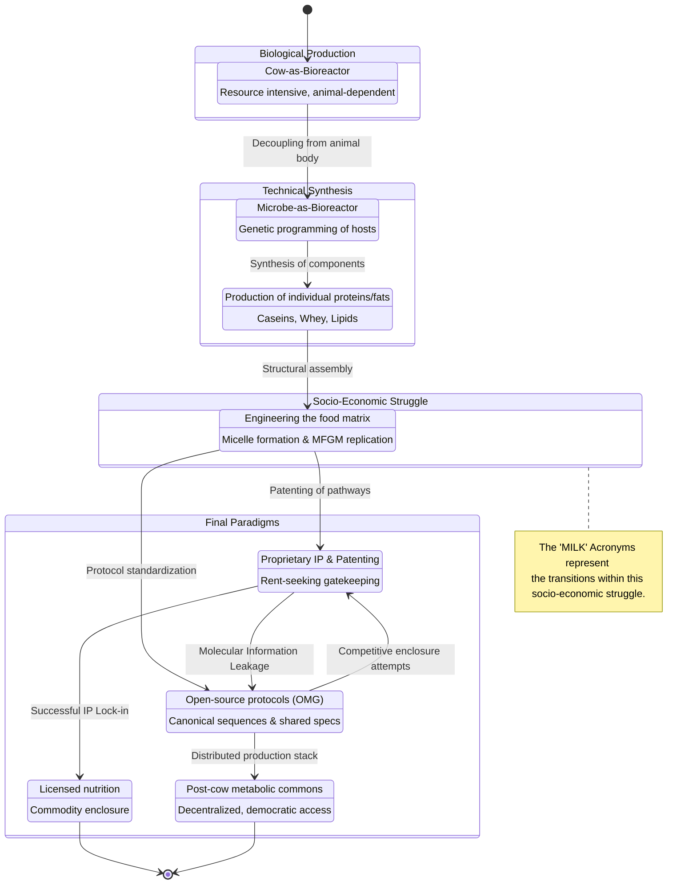

<div class="tab-nav">
<button class="tab-btn active" onclick="openTab(event, 'article')">Article</button>
<button class="tab-btn" onclick="openTab(event, 'statemachine')">State Machine</button>
<button class="tab-btn" onclick="openTab(event, 'technical_explanation')">Technical Documentation</button>
</div>

<div id="article" class="tab-content" style="display: block;" markdown="1">

# The Programmable Secretion: Milk and the Open Metabolic Commons

For millennia, milk has been regarded as a 'sacred secretion'—the primal link between mother and child, a symbol of purity, and the foundational nutrient of mammalian life. It was a gift of biology, bound by the constraints of the udder and the rhythms of the herd. However, we are entering an era where this biological legacy is being decoupled from its evolutionary origins. Milk is transitioning from a sacred secretion into a 'programmable food substrate'.

This shift is driven by advances in precision fermentation, cellular agriculture, and synthetic biology. By viewing milk not as a fixed product of nature but as a complex molecular architecture that can be designed, optimized, and produced outside the animal body, we open the door to a radical reimagining of food systems. Central to this transformation is the concept of the 'open metabolic commons'—a decentralized, collaborative framework for managing the biological blueprints and production technologies that will define the future of nutrition. In this new paradigm, the ability to nourish is no longer a proprietary secret of nature or industry, but a shared capability of a technologically empowered society.

What makes this moment genuinely novel is that the transition is not merely technological—it is a civilizational choice being made in real time, under conditions of strategic uncertainty. The players, the incentives, and the failure modes are already visible. Understanding them clearly is the first step toward navigating them well.

## The Mechanism of Precision Fermentation

At its core, precision fermentation represents a shift in the site of production: from the cow-as-bioreactor to the microbe-as-bioreactor. In traditional dairy systems, the cow is a complex, resource-intensive biological machine that converts caloric input into milk through a series of internal metabolic pathways. Precision fermentation bypasses the animal entirely by utilizing engineered microorganisms—such as yeast, fungi, or bacteria—as the production hosts. These microbes are "programmed" with the specific genetic instructions (DNA sequences) required to synthesize milk proteins.

The resulting proteins, such as caseins (alpha, beta, and kappa) and whey (beta-lactoglobulin and alpha-lactalbumin), are molecularly identical to their bovine counterparts. Because they are produced from the same genetic blueprints, they exhibit the same amino acid profiles, molecular folding, and functional characteristics. This means they can form micelles, emulsify fats, and provide the specific textures—the stretch of mozzarella or the creaminess of yogurt—that plant-based alternatives often struggle to replicate.

Furthermore, this process allows for the precise "tuning" of the final product. Unlike the fixed output of a cow, the composition of fermentation-derived milk can be optimized at the molecular level. Producers can omit lactose entirely, creating naturally dairy-identical products for the lactose-intolerant. They can also engineer the lipid profile, replacing saturated animal fats with healthier, optimized fats, or fortify the substrate with specific micronutrients. This capability transforms milk from a standardized commodity into a customizable, programmable substrate, tailored to meet specific nutritional and functional requirements.

There is a further consequence that is easy to overlook: by removing the animal from the production loop, we also remove the ecological niche that sustains its pathogens. Traditional raw dairy carries risk because cows harbor bacteria, viruses, parasites, and somatic cells—contaminants that arise from the animal, not from the milk molecules themselves. A controlled fermentation environment does not host that pathogen ecosystem. The proteins it produces are the same; the biological baggage is not. This means fermentation-derived milk could, in principle, be distributed without the pasteurization requirements that currently define the regulatory landscape—and it would be ethically acceptable to vegans, since no animal is used, harmed, or implicated in its production.

## The Engineering Frontier - Structure and Assembly

While precision fermentation can produce individual milk proteins, the true challenge of creating "milk" lies in the higher-order structural assembly of these components. Milk is not merely a solution of proteins and fats; it is a complex colloidal system. The primary engineering frontiers are the self-assembly of casein micelles and the replication of the Milk Fat Globule Membrane (MFGM).

Casein micelles are large, spherical aggregates of casein proteins held together by calcium phosphate bridges. They are responsible for the white color of milk and its unique behavior during cheesemaking. Recreating these structures outside the cow is an engineering problem of fine-tuning pH, ionic strength (particularly calcium and phosphate concentrations), and the specific ratios of alpha, beta, and kappa-caseins. When these parameters are precisely controlled, the proteins spontaneously self-assemble into micelles that are functionally indistinguishable from those found in bovine milk.

Similarly, the lipid component of milk is not just free-floating fat. It exists as droplets encased in the MFGM—a complex trilayer of phospholipids, proteins, and carbohydrates that prevents the fat from coalescing and provides significant nutritional and immunological benefits. Replicating the MFGM involves sophisticated emulsification techniques and the strategic introduction of polar lipids. These are not fundamental biological barriers, but rather sophisticated problems of process engineering. By mastering the physical chemistry of these assemblies, we move beyond producing ingredients and toward the construction of a complete, functional food matrix.

This distinction matters strategically, not just technically. The bottleneck in the transition to programmable milk is not the ability to synthesize proteins—that problem is largely solved. The bottleneck is the colloidal matrix: the micelles and membranes that give milk its functional identity. Any governance framework for the metabolic commons must therefore prioritize open documentation of assembly parameters—the pH envelopes, ionic conditions, and lipid ratios—as much as it prioritizes the genetic sequences themselves. A "Canonical Sequence Set" without a corresponding "Process Envelope" is a blueprint without construction instructions.

## The Tragic Game of Enclosure

Despite the biological universality of milk, the transition to its programmable form is currently being played out within a legal and economic framework designed for enclosure. We face a structural tension between the logic of corporate Intellectual Property (IP) and the reality of the metabolic commons. In the current landscape, the "referee"—the patent system—is often broken, granting broad, aggressive patents not just on novel processes, but on the very act of producing natural molecules through fermentation.

This creates a default state of privatization. Even when the underlying proteins (like casein) are products of millions of years of mammalian evolution, the specific "implementations"—the engineered yeast strains, the precise media formulations, and the assembly protocols—are being locked behind proprietary walls. This is not merely a matter of protecting innovation; it is an attempt to own the metabolic pathways themselves. If a handful of corporations successfully enclose the "code" for milk, we risk replacing the decentralized (if flawed) system of traditional farming with a hyper-centralized, rent-seeking monopoly on basic nutrition. The "sacred secretion" becomes a licensed commodity, and the ability to feed populations becomes contingent on the payment of IP royalties to a few gatekeepers in the Global North.

Formal analysis of this dynamic reveals something important: the enclosure outcome is not the product of exceptional corporate malice. It is the Nash equilibrium of a poorly designed game. When the open-source community is fragmented—when individual labs work in silos without a unified protocol—the dominant strategy for any rational corporate actor is to enclose. Enclosure yields maximum profit in the absence of a credible open alternative. The tragedy is structural, not personal: the "referee" (the patent system) was designed for a different era and now systematically rewards the wrong moves.

The game has a second equilibrium, however, and it is Pareto superior to the first. If the open-source community successfully establishes a canonical protocol—a shared, high-quality standard that any lab can adopt—the calculus for corporate actors shifts. Fighting a global open standard through litigation is expensive, slow, and increasingly futile as the standard gains adoption. At that point, collaboration becomes more profitable than enclosure: corporations can compete on service quality, specialized formulations, and production efficiency rather than on ownership of the underlying code. The total market grows; the "pie" expands enough that a smaller slice of a larger, more dynamic ecosystem outperforms a monopoly rent on a stagnant one. This is the logic that drove the history of Linux, TCP/IP, and open cryptographic standards—and it is the logic that must now be applied to the metabolic commons.

There is a further dynamic that the enclosure strategy consistently underestimates: what might be called the kinetics of biological information leakage. Proprietary yeast strains and fermentation protocols are not like software source code, which can be locked behind access controls indefinitely. Biological information tends to escape. Reverse engineering, whistleblowing, and the simple fact that engineered organisms can be analyzed by anyone with a sequencer all create a persistent pressure toward the public domain. Enclosure strategies that ignore this dynamic tend to produce not stable monopolies but prolonged, expensive legal conflicts—the "Licensing Kerfuffle"—that slow innovation for everyone while resolving nothing. The open-source community's most powerful tool is therefore not confrontation but preemption: publishing canonical sequences and process parameters before patents can be filed, establishing prior art that renders enclosure legally impossible.

## The Open Milk Genome Strategy

To prevent the enclosure of these basic metabolic affordances by a few proprietary interests, we propose the "Open Milk Genome" (OMG). Rather than a collection of patents, the OMG is conceived as a foundational protocol for the production of mammalian nutrients—a biological equivalent to TCP/IP. By establishing a shared, open-source framework, we ensure that the ability to produce high-quality nutrition remains a public good, accessible to all.

The strategic logic here is precise. In game-theoretic terms, the OMG functions as a coordination mechanism—a focal point that changes the payoff structure for all players. Without it, the open-source community remains fragmented, and fragmentation is a strictly dominated strategy: it leads to worse outcomes for the community regardless of what corporations do. With a robust OMG in place, "Develop OMG" becomes the dominant strategy for the open-source community, and—crucially—once that dominance is established, rational corporate actors will iteratively eliminate "Enclose" from their own strategy space. The sequence is: coordinate first, then watch enclosure become unprofitable.

The Open Milk Genome consists of four primary components:

1.  **Canonical Sequence Sets**: A curated, public-domain library of optimized genetic sequences for all major milk proteins (caseins, whey, and minor bioactive proteins). These sequences are codon-optimized for a variety of common production hosts (yeast, fungi, bacteria), ensuring that any lab or facility can start with a high-performance "gold standard" blueprint.
2.  **Process Envelopes**: Open-source documentation of the environmental and chemical parameters required for successful fermentation and assembly. This includes precise "recipes" for media composition, temperature profiles, and pH control, as well as the specific ionic conditions needed for casein micelle self-assembly.
3.  **Composability Specs**: Standardized interfaces for how different milk components (proteins, lipids, micronutrients) interact. These specifications allow for modularity, enabling researchers to "plug and play" different elements—such as swapping a bovine lipid profile for a human-milk-identical one—while maintaining the structural integrity of the final food matrix.
4.  **Provenance Schemas**: A decentralized ledger system for tracking the origin, safety, and quality of production batches. By utilizing cryptographic proofs and transparent data structures, we can ensure that "open" does not mean "unregulated," providing a robust framework for safety and consumer trust without requiring centralized corporate gatekeepers.

By treating the milk genome as a protocol rather than a product, we shift the focus from proprietary extraction to collaborative innovation. This strategy ensures that the future of food is built on a foundation of transparency, interoperability, and universal access.

Two execution risks deserve explicit attention. The first is timing: the race between patent filing and public-domain publication is not symmetric. A patent application filed before a sequence is published can still enclose it; a sequence published before a patent is filed cannot be enclosed. The OMG must therefore prioritize early, aggressive publication of "good enough" sequences over the pursuit of perfect ones. A functional open standard released today is worth more than an optimal one released after the enclosure window has closed. The second risk is what might be called "open-washing"—corporations that nominally adopt the OMG while quietly patenting the Composability Specs that make it functional (the specific pH triggers for micelle assembly, the precise lipid ratios for MFGM replication). The Provenance Schemas are the defense against this: by requiring cryptographic attestation of which sequences and parameters were used in any given production batch, they make silent enclosure of the functional layer visible and contestable.

## Ecological Safety and Radical Welfare

The transition to fermentation-derived milk represents a "clean win" for both the environment and animal ethics. Unlike traditional dairy, which is inherently tied to the methane emissions, land use, and water consumption of industrial livestock, precision fermentation operates within a closed-loop system with a significantly smaller footprint.

From an ecological perspective, the risks are remarkably low. The production hosts—typically highly specialized strains of yeast or fungi—are "lab-fragile." They are engineered to thrive in the optimized, nutrient-rich environment of a bioreactor but are ill-equipped to survive or compete in the wild. Even in the unlikely event of environmental release, the proteins they produce are immediately biodegradable—edible to bacteria, fungi, and soil organisms—and confer no competitive advantage on the producing organism. Making casein in the wild is a metabolic liability, not an asset; nature selects against expensive, useless traits. The genes themselves, even if somehow transferred horizontally to environmental microbes, would provide no survival benefit to the recipient. This is a rare property in biotechnology: a case where the ecological risk profile collapses almost to zero because the biology itself has no incentive landscape outside containment.

Perhaps most significantly, this technology offers a path toward radical welfare. By decoupling milk production from the animal body, we eliminate the systemic suffering inherent in industrial dairy: the cycles of forced impregnation, the separation of calves from mothers, and the eventual slaughter of "spent" cows. We move from a system of exploitation to one of synthesis, where the "sacred secretion" can be enjoyed without the moral burden of confinement and pain. This is not merely an incremental improvement in animal welfare; it is the total obsolescence of the animal as an industrial tool.

The ecological and welfare arguments also function strategically. They represent a shared payoff that both corporate and open-source actors can point to—a "Social Welfare" dimension that expands the total value of the programmable milk ecosystem regardless of how IP disputes resolve. This shared interest in the "clean win" creates a potential bridge between otherwise adversarial players, and it is one reason why the most effective corporate strategy in this space is not enclosure but service-based competition: the reputational and regulatory benefits of being associated with a humane, ecologically sound technology are themselves a form of competitive advantage.

## Retrospective Narratives and the MILK Acronym

Looking back from a future where metabolic sovereignty is a settled right, historians often use the acronym 'MILK' as a shorthand for the various phases of this transition. These backronyms capture the shifting tensions between enclosure and the commons that defined the era:

*   **Metabolic Infrastructure Licensing Kerfuffle**: Refers to the early legal battles where legacy dairy interests and biotech startups fought over the right to "license" the fundamental pathways of mammalian secretion.
*   **Molecular Information Leakage Kinetics**: A term used to describe the inevitable "leakage" of proprietary yeast strains and fermentation protocols into the public domain, which eventually fueled the open-source movement.
*   **Monopolistic Interests Limiting Kinship**: A sociological critique of how the patenting of human-milk-identical components threatened to commodify the foundational bond of mammalian life.
*   **Multilateral Integrated Lactation Kernel**: The technical designation for the first successful, globally-distributed open-source production stack that finally broke the corporate monopoly on precision dairy.

These backronyms are more than wordplay. Each one names a distinct phase in a recognizable state transition: from the initial Kerfuffle (the enclosure trap), through the Leakage (the recovery mechanism), past the Kinship critique (the welfare argument as political force), to the Kernel (the stable commons equilibrium). The sequence is not inevitable—at each transition, the outcome depended on whether the open-source community could coordinate faster than the enclosure could consolidate. That these narratives exist at all, told from a vantage point of settled sovereignty, suggests that coordination won. But the margin was not comfortable, and the lesson is not complacency.

These narratives also remind us that the struggle for the "sacred secretion" was never just about food; it was a battle over who owns the code of life and the means of our collective sustenance. The same structural dynamic—programmable biology meeting an IP system designed for a different era—will recur in every domain where synthetic biology touches a basic human need. Milk is the first battlefield precisely because it is simple enough to win.

## Conclusion: Toward a Post-Cow Metabolic Commons

The transition from the udder to the bioreactor is more than a technological shift; it is a civilizational choice being made under conditions of strategic uncertainty, with real stakes and identifiable failure modes. The biology is largely solved. The engineering of colloidal assembly is a sophisticated but tractable problem. What remains is the governance question: will the code of mammalian nutrition become a public protocol or a private toll booth?

The answer depends less on the goodwill of any particular actor than on the speed and quality of coordination among those who understand what is at stake. The open-source community holds a genuine strategic advantage: the dominant strategy, under formal analysis, is to develop the Open Milk Genome—and to develop it now, before the enclosure window closes. Every canonical sequence published, every process envelope documented, every provenance schema deployed is a move that changes the payoff structure for everyone else. Enclosure becomes less profitable; collaboration becomes more rational; the commons becomes self-reinforcing.

By prioritizing open standards, such as the Open Milk Genome, we ensure that the foundational blueprints of nutrition remain a shared heritage rather than a corporate asset. This path leads to a food system that is not only more humane and ecologically resilient but also fundamentally more democratic. The precedent it sets extends well beyond dairy: open-source egg proteins, open-source collagen, open-source infant nutrition, open-source food security infrastructure—each becomes more achievable once the governance model is established and proven.

In this post-cow future, the "sacred secretion" is no longer a gift of nature to be enclosed, but a programmable substrate for human flourishing—a universal affordance of a society that has learned to treat the code of life as a common good. The era of the programmable secretion is here. The game is already in progress. It is up to us to play it well.


</div>
<div id="statemachine" class="tab-content" style="display: none;" markdown="1">

# Finite State Machine Analysis

**Started:** 2026-02-21T22:06:05.592808613

## Configuration
Task Parameters

**Concept:** The transition of milk from a biological secretion to a programmable food substrate and the socio-economic struggle for metabolic sovereignty.
**Domain:** Synthetic Biology and Food Systems
**Initial States:** Traditional_Dairy_System
**Known Events:** Decoupling_from_Biology, Precision_Fermentation_Engineering, Patent_Enclosure, Open_Milk_Genome_Release, Molecular_Information_Leakage, Global_Standardization


## Step 1: State Identification
Prompt & Response

### Prompt

```
You are an expert in formal methods and finite state machine modeling. Your task is to analyze a concept and identify all possible states.

## Concept to Model:
The transition of milk from a biological secretion to a programmable food substrate and the socio-economic struggle for metabolic sovereignty.

## Domain Context:
Synthetic Biology and Food Systems

## Reference Files:
# /home/andrew/code/Science/scratch/2026-02-22-milk/content.md

```
# The Programmable Secretion: Milk and the Open Metabolic Commons

For millennia, milk has been regarded as a 'sacred secretion'—the primal link between mother and child, a symbol of purity, and the foundational nutrient of mammalian life. It was a gift of biology, bound by the constraints of the udder and the rhythms of the herd. However, we are entering an era where this biological legacy is being decoupled from its evolutionary origins. Milk is transitioning from a sacred secretion into a 'programmable food substrate'.

This shift is driven by advances in precision fermentation, cellular agriculture, and synthetic biology. By viewing milk not as a fixed product of nature but as a complex molecular architecture that can be designed, optimized, and produced outside the animal body, we open the door to a radical reimagining of food systems. Central to this transformation is the concept of the 'open metabolic commons'—a decentralized, collaborative framework for managing the biological blueprints and production technologies that will define the future of nutrition. In this new paradigm, the ability to nourish is no longer a proprietary secret of nature or industry, but a shared capability of a technologically empowered society.
## The Mechanism of Precision Fermentation
At its core, precision fermentation represents a shift in the site of production: from the cow-as-bioreactor to the microbe-as-bioreactor. In traditional dairy systems, the cow is a complex, resource-intensive biological machine that converts caloric input into milk through a series of internal metabolic pathways. Precision fermentation bypasses the animal entirely by utilizing engineered microorganisms—such as yeast, fungi, or bacteria—as the production hosts. These microbes are "programmed" with the specific genetic instructions (DNA sequences) required to synthesize milk proteins.
The resulting proteins, such as caseins (alpha, beta, and kappa) and whey (beta-lactoglobulin and alpha-lactalbumin), are molecularly identical to their bovine counterparts. Because they are produced from the same genetic blueprints, they exhibit the same amino acid profiles, molecular folding, and functional characteristics. This means they can form micelles, emulsify fats, and provide the specific textures—the stretch of mozzarella or the creaminess of yogurt—that plant-based alternatives often struggle to replicate.
Furthermore, this process allows for the precise "tuning" of the final product. Unlike the fixed output of a cow, the composition of fermentation-derived milk can be optimized at the molecular level. Producers can omit lactose entirely, creating naturally dairy-identical products for the lactose-intolerant. They can also engineer the lipid profile, replacing saturated animal fats with healthier, optimized fats, or fortify the substrate with specific micronutrients. This capability transforms milk from a standardized commodity into a customizable, programmable substrate, tailored to meet specific nutritional and functional requirements.
## The Engineering Frontier - Structure and Assembly
While precision fermentation can produce individual milk proteins, the true challenge of creating "milk" lies in the higher-order structural assembly of these components. Milk is not merely a solution of proteins and fats; it is a complex colloidal system. The primary engineering frontiers are the self-assembly of casein micelles and the replication of the Milk Fat Globule Membrane (MFGM).
Casein micelles are large, spherical aggregates of casein proteins held together by calcium phosphate bridges. They are responsible for the white color of milk and its unique behavior during cheesemaking. Recreating these structures outside the cow is an engineering problem of fine-tuning pH, ionic strength (particularly calcium and phosphate concentrations), and the specific ratios of alpha, beta, and kappa-caseins. When these parameters are precisely controlled, the proteins spontaneously self-assemble into micelles that are functionally indistinguishable from those found in bovine milk.
Similarly, the lipid component of milk is not just free-floating fat. It exists as droplets encased in the MFGM—a complex trilayer of phospholipids, proteins, and carbohydrates that prevents the fat from coalescing and provides significant nutritional and immunological benefits. Replicating the MFGM involves sophisticated emulsification techniques and the strategic introduction of polar lipids. These are not fundamental biological barriers, but rather sophisticated problems of process engineering. By mastering the physical chemistry of these assemblies, we move beyond producing ingredients and toward the construction of a complete, functional food matrix.
## The Tragic Game of Enclosure
Despite the biological universality of milk, the transition to its programmable form is currently being played out within a legal and economic framework designed for enclosure. We face a structural tension between the logic of corporate Intellectual Property (IP) and the reality of the metabolic commons. In the current landscape, the "referee"—the patent system—is often broken, granting broad, aggressive patents not just on novel processes, but on the very act of producing natural molecules through fermentation.
This creates a default state of privatization. Even when the underlying proteins (like casein) are products of millions of years of mammalian evolution, the specific "implementations"—the engineered yeast strains, the precise media formulations, and the assembly protocols—are being locked behind proprietary walls. This is not merely a matter of protecting innovation; it is an attempt to own the metabolic pathways themselves. If a handful of corporations successfully enclose the "code" for milk, we risk replacing the decentralized (if flawed) system of traditional farming with a hyper-centralized, rent-seeking monopoly on basic nutrition. The "sacred secretion" becomes a licensed commodity, and the ability to feed populations becomes contingent on the payment of IP royalties to a few gatekeepers in the Global North.
## The Open Milk Genome Strategy
To prevent the enclosure of these basic metabolic affordances by a few proprietary interests, we propose the "Open Milk Genome" (OMG). Rather than a collection of patents, the OMG is conceived as a foundational protocol for the production of mammalian nutrients—a biological equivalent to TCP/IP. By establishing a shared, open-source framework, we ensure that the ability to produce high-quality nutrition remains a public good, accessible to all.
The Open Milk Genome consists of four primary components:
1.  **Canonical Sequence Sets**: A curated, public-domain library of optimized genetic sequences for all major milk proteins (caseins, whey, and minor bioactive proteins). These sequences are codon-optimized for a variety of common production hosts (yeast, fungi, bacteria), ensuring that any lab or facility can start with a high-performance "gold standard" blueprint.
2.  **Process Envelopes**: Open-source documentation of the environmental and chemical parameters required for successful fermentation and assembly. This includes precise "recipes" for media composition, temperature profiles, and pH control, as well as the specific ionic conditions needed for casein micelle self-assembly.
3.  **Composability Specs**: Standardized interfaces for how different milk components (proteins, lipids, micronutrients) interact. These specifications allow for modularity, enabling researchers to "plug and play" different elements—such as swapping a bovine lipid profile for a human-milk-identical one—while maintaining the structural integrity of the final food matrix.
4.  **Provenance Schemas**: A decentralized ledger system for tracking the origin, safety, and quality of production batches. By utilizing cryptographic proofs and transparent data structures, we can ensure that "open" does not mean "unregulated," providing a robust framework for safety and consumer trust without requiring centralized corporate gatekeepers.
By treating the milk genome as a protocol rather than a product, we shift the focus from proprietary extraction to collaborative innovation. This strategy ensures that the future of food is built on a foundation of transparency, interoperability, and universal access.
## Ecological Safety and Radical Welfare
The transition to fermentation-derived milk represents a "clean win" for both the environment and animal ethics. Unlike traditional dairy, which is inherently tied to the methane emissions, land use, and water consumption of industrial livestock, precision fermentation operates within a closed-loop system with a significantly smaller footprint.
From an ecological perspective, the risks are remarkably low. The production hosts—typically highly specialized strains of yeast or fungi—are "lab-fragile." They are engineered to thrive in the optimized, nutrient-rich environment of a bioreactor but are ill-equipped to survive or compete in the wild. Furthermore, the outputs of this process are entirely biodegradable biological molecules—proteins and fats—that pose no risk of environmental persistence or toxicity. This is a stark contrast to the chemical runoff and waste management challenges associated with concentrated animal feeding operations (CAFOs).
Perhaps most significantly, this technology offers a path toward radical welfare. By decoupling milk production from the animal body, we eliminate the systemic suffering inherent in industrial dairy: the cycles of forced impregnation, the separation of calves from mothers, and the eventual slaughter of "spent" cows. We move from a system of exploitation to one of synthesis, where the "sacred secretion" can be enjoyed without the moral burden of confinement and pain. This is not merely an incremental improvement in animal welfare; it is the total obsolescence of the animal as an industrial tool.
## Retrospective Narratives and the MILK Acronym
Looking back from a future where metabolic sovereignty is a settled right, historians often use the acronym 'MILK' as a shorthand for the various phases of this transition. These backronyms capture the shifting tensions between enclosure and the commons that defined the era:
*   **Metabolic Infrastructure Licensing Kerfuffle**: Refers to the early legal battles where legacy dairy interests and biotech startups fought over the right to "license" the fundamental pathways of mammalian secretion.
*   **Molecular Information Leakage Kinetics**: A term used to describe the inevitable "leakage" of proprietary yeast strains and fermentation protocols into the public domain, which eventually fueled the open-source movement.
*   **Monopolistic Interests Limiting Kinship**: A sociological critique of how the patenting of human-milk-identical components threatened to commodify the foundational bond of mammalian life.
*   **Multilateral Integrated Lactation Kernel**: The technical designation for the first successful, globally-distributed open-source production stack that finally broke the corporate monopoly on precision dairy.
These narratives remind us that the struggle for the "sacred secretion" was never just about food; it was a battle over who owns the code of life and the means of our collective sustenance.
## Conclusion: Toward a Post-Cow Metabolic Commons
The transition from the udder to the bioreactor is more than a technological shift; it is a civilizational choice. As we decouple the production of milk from the animal body, we are presented with a unique opportunity to redesign our relationship with the biological world. We can choose to replicate the extractive, centralized models of the past, or we can embrace the logic of the metabolic commons.
By prioritizing open standards, such as the Open Milk Genome, we ensure that the foundational blueprints of nutrition remain a shared heritage rather than a corporate asset. This path leads to a food system that is not only more humane and ecologically resilient but also fundamentally more democratic. In this post-cow future, the "sacred secretion" is no longer a gift of nature to be enclosed, but a programmable substrate for human flourishing—a universal affordance of a society that has learned to treat the code of life as a common good. The era of the programmable secretion is here; it is up to us to ensure it remains open, accessible, and dedicated to the nourishment of all.
```

## Known Initial States:
- Traditional_Dairy_System


## Instructions:
Identify all possible states for this concept. For each state, provide:

1. **State Name:** Clear, descriptive name
2. **Description:** What this state represents
3. **Type:** (Initial, Normal, Error, Final/Terminal)
4. **Invariants:** Conditions that must be true in this state
5. **Entry Conditions:** What must happen to enter this state
6. **Exit Conditions:** What can cause leaving this state

Consider:
- Normal operational states
- Error or exception states
- Transient vs stable states
- Initial and final states

Provide a comprehensive list of states with detailed descriptions.
```

### Response

Based on the provided text, here is a formal state model of the transition from biological milk to a programmable metabolic commons.

### 1. Traditional_Dairy_System
*   **Description:** The ancestral state where milk is a "sacred secretion" bound to the biological constraints of the animal body (the cow-as-bioreactor).
*   **Type:** Initial
*   **Invariants:** Milk production is coupled to mammalian reproductive cycles; production is resource-intensive (land, water, methane); the "code" of milk is managed by natural evolution.
*   **Entry Conditions:** N/A (Starting state of human civilization).
*   **Exit Conditions:** Advances in precision fermentation and synthetic biology allow for the decoupling of milk from the animal body.

### 2. Programmable_Substrate_R&D
*   **Description:** A transient state where milk is deconstructed into its molecular architecture (caseins, whey, lipids) and microbes are engineered to synthesize these components.
*   **Type:** Normal (Transient)
*   **Invariants:** Microbes (yeast/fungi/bacteria) act as production hosts; genetic instructions are being codon-optimized; focus is on molecular identity to bovine counterparts.
*   **Entry Conditions:** Identification of milk as a "programmable food substrate"; successful programming of microbes with milk protein DNA sequences.
*   **Exit Conditions:** Successful synthesis of functional milk proteins and the ability to assemble them into higher-order structures (micelles).

### 3. Proprietary_Enclosure
*   **Description:** A state defined by the "Tragic Game of Enclosure," where the metabolic pathways and production protocols are locked behind corporate Intellectual Property (IP) and patents.
*   **Type:** Normal
*   **Invariants:** Aggressive patenting of natural molecules; high barriers to entry; "Metabolic Infrastructure Licensing Kerfuffle" (MILK) is active; rent-seeking behavior by gatekeepers.
*   **Entry Conditions:** Legal frameworks grant broad patents on fermentation processes and engineered strains; corporate capture of the "code" of nutrition.
*   **Exit Conditions:** Either "Molecular Information Leakage Kinetics" (leakage of protocols) or a transition to the Open Milk Genome.

### 4. Molecular_Information_Leakage
*   **Description:** A volatile state where proprietary yeast strains and fermentation protocols "leak" into the public domain, undermining corporate monopolies.
*   **Type:** Normal (Transient)
*   **Invariants:** IP enforcement is failing; decentralized actors gain access to "closed" technology; high tension between legal frameworks and actual practice.
*   **Entry Conditions:** High cost of licensed nutrition; whistleblowing; reverse engineering; inevitable "leakage kinetics" of biological information.
*   **Exit Conditions:** Transition to a formalized Open Metabolic Commons or a crackdown leading back to Enclosure.

### 5. Open_Milk_Genome_Implementation
*   **Description:** The active construction of the "Open Milk Genome" (OMG) as a foundational protocol for mammalian nutrients.
*   **Type:** Normal
*   **Invariants:** Canonical Sequence Sets are public; Process Envelopes are open-source; Composability Specs allow for modularity; Provenance Schemas ensure safety via decentralized ledgers.
*   **Entry Conditions:** Rejection of the enclosure model; establishment of the OMG as a biological equivalent to TCP/IP.
*   **Exit Conditions:** Global adoption leads to metabolic sovereignty; failure leads back to corporate monopoly.

### 6. Post_Cow_Metabolic_Sovereignty
*   **Description:** The "Post-Cow" future where the ability to nourish is a shared capability of a technologically empowered society.
*   **Type:** Final/Terminal
*   **Invariants:** Nutrition is a public good; "Multilateral Integrated Lactation Kernel" (MILK) is the global production standard; zero animal exploitation; minimal ecological footprint.
*   **Entry Conditions:** Successful scaling of the Open Milk Genome; total obsolescence of the animal as an industrial tool.
*   **Exit Conditions:** N/A (Stable equilibrium).

### 7. Hyper_Centralized_Nutritional_Monopoly
*   **Description:** A dystopian state where a few corporations in the Global North own the "code" for basic mammalian nutrition.
*   **Type:** Error/Terminal
*   **Invariants:** "Monopolistic Interests Limiting Kinship" (MILK); basic nutrition is a licensed commodity; high systemic inequality; metabolic pathways are privatized.
*   **Entry Conditions:** Successful enclosure of the milk genome without significant leakage or open-source opposition.
*   **Exit Conditions:** Systemic collapse or radical socio-economic revolution.

### 8. Ecological_Safety_Validation
*   **Description:** A monitoring state where the environmental impact of fermentation-derived milk is assessed against traditional dairy.
*   **Type:** Normal
*   **Invariants:** Production hosts are "lab-fragile" (cannot survive in the wild); outputs are 100% biodegradable; closed-loop systems are maintained.
*   **Entry Conditions:** Shift from CAFOs (Concentrated Animal Feeding Operations) to bioreactors.
*   **Exit Conditions:** Confirmation of "Clean Win" status (low risk) or detection of unforeseen ecological externalities (Error).

---

### Summary of State Transitions (State Machine Logic):
1.  **Traditional_Dairy_System** $\rightarrow$ *Innovation* $\rightarrow$ **Programmable_Substrate_R&D**
2.  **Programmable_Substrate_R&D** $\rightarrow$ *Patent Filing* $\rightarrow$ **Proprietary_Enclosure**
3.  **Proprietary_Enclosure** $\rightarrow$ *Information Leakage* $\rightarrow$ **Molecular_Information_Leakage**
4.  **Molecular_Information_Leakage** $\rightarrow$ *Standardization* $\rightarrow$ **Open_Milk_Genome_Implementation**
5.  **Open_Milk_Genome_Implementation** $\rightarrow$ *Global Scaling* $\rightarrow$ **Post_Cow_Metabolic_Sovereignty**
6.  **Proprietary_Enclosure** $\rightarrow$ *Market Dominance* $\rightarrow$ **Hyper_Centralized_Nutritional_Monopoly** (Error State)


## Step 2: Transition Analysis
Prompt & Response

### Prompt

```
Based on the states identified above, now identify all possible state transitions.

## States Analysis:
Based on the provided text, here is a formal state model of the transition from biological milk to a programmable metabolic commons.

### 1. Traditional_Dairy_System
*   **Description:** The ancestral state where milk is a "sacred secretion" bound to the biological constraints of the animal body (the cow-as-bioreactor).
*   **Type:** Initial
*   **Invariants:** Milk production is coupled to mammalian reproductive cycles; production is resource-intensive (land, water, methane); the "code" of milk is managed by natural evolution.
*   **Entry Conditions:** N/A (Starting state of human civilization).
*   **Exit Conditions:** Advances in precision fermentation and synthetic biology allow for the decoupling of milk from the animal body.

### 2. Programmable_Substrate_R&D
*   **Description:** A transient state where milk is deconstructed into its molecular architecture (caseins, whey, lipids) and microbes are engineered to synthesize these components.
*   **Type:** Normal (Transient)
*   **Invariants:** Microbes (yeast/fungi/bacteria) act as production hosts; genetic instructions are being codon-optimized; focus is on molecular identity to bovine counterparts.
*   **Entry Conditions:** Identification of milk as a "programmable food substrate"; successful programming of microbes with milk protein DNA sequences.
*   **Exit Conditions:** Successful synthesis of functional milk proteins and the ability to assemble them into higher-order structures (micelles).

### 3. Proprietary_Enclosure
*   **Description:** A state defined by the "Tragic Game of Enclosure," where the metabolic pathways and production protocols are locked behind corporate Intellectual Property (IP) and patents.
*   **Type:** Normal
*   **Invariants:** Aggressive patenting of natural molecules; high barriers to entry; "Metabolic Infrastructure Licensing Kerfuffle" (MILK) is active; rent-seeking behavior by gatekeepers.
*   **Entry Conditions:** Legal frameworks grant broad patents on fermentation processes and engineered strains; corporate capture of the "code" of nutrition.
*   **Exit Conditions:** Either "Molecular Information Leakage Kinetics" (leakage of protocols) or a transition to the Open Milk Genome.

### 4. Molecular_Information_Leakage
*   **Description:** A volatile state where proprietary yeast strains and fermentation protocols "leak" into the public domain, undermining corporate monopolies.
*   **Type:** Normal (Transient)
*   **Invariants:** IP enforcement is failing; decentralized actors gain access to "closed" technology; high tension between legal frameworks and actual practice.
*   **Entry Conditions:** High cost of licensed nutrition; whistleblowing; reverse engineering; inevitable "leakage kinetics" of biological information.
*   **Exit Conditions:** Transition to a formalized Open Metabolic Commons or a crackdown leading back to Enclosure.

### 5. Open_Milk_Genome_Implementation
*   **Description:** The active construction of the "Open Milk Genome" (OMG) as a foundational protocol for mammalian nutrients.
*   **Type:** Normal
*   **Invariants:** Canonical Sequence Sets are public; Process Envelopes are open-source; Composability Specs allow for modularity; Provenance Schemas ensure safety via decentralized ledgers.
*   **Entry Conditions:** Rejection of the enclosure model; establishment of the OMG as a biological equivalent to TCP/IP.
*   **Exit Conditions:** Global adoption leads to metabolic sovereignty; failure leads back to corporate monopoly.

### 6. Post_Cow_Metabolic_Sovereignty
*   **Description:** The "Post-Cow" future where the ability to nourish is a shared capability of a technologically empowered society.
*   **Type:** Final/Terminal
*   **Invariants:** Nutrition is a public good; "Multilateral Integrated Lactation Kernel" (MILK) is the global production standard; zero animal exploitation; minimal ecological footprint.
*   **Entry Conditions:** Successful scaling of the Open Milk Genome; total obsolescence of the animal as an industrial tool.
*   **Exit Conditions:** N/A (Stable equilibrium).

### 7. Hyper_Centralized_Nutritional_Monopoly
*   **Description:** A dystopian state where a few corporations in the Global North own the "code" for basic mammalian nutrition.
*   **Type:** Error/Terminal
*   **Invariants:** "Monopolistic Interests Limiting Kinship" (MILK); basic nutrition is a licensed commodity; high systemic inequality; metabolic pathways are privatized.
*   **Entry Conditions:** Successful enclosure of the milk genome without significant leakage or open-source opposition.
*   **Exit Conditions:** Systemic collapse or radical socio-economic revolution.

### 8. Ecological_Safety_Validation
*   **Description:** A monitoring state where the environmental impact of fermentation-derived milk is assessed against traditional dairy.
*   **Type:** Normal
*   **Invariants:** Production hosts are "lab-fragile" (cannot survive in the wild); outputs are 100% biodegradable; closed-loop systems are maintained.
*   **Entry Conditions:** Shift from CAFOs (Concentrated Animal Feeding Operations) to bioreactors.
*   **Exit Conditions:** Confirmation of "Clean Win" status (low risk) or detection of unforeseen ecological externalities (Error).

---

### Summary of State Transitions (State Machine Logic):
1.  **Traditional_Dairy_System** $\rightarrow$ *Innovation* $\rightarrow$ **Programmable_Substrate_R&D**
2.  **Programmable_Substrate_R&D** $\rightarrow$ *Patent Filing* $\rightarrow$ **Proprietary_Enclosure**
3.  **Proprietary_Enclosure** $\rightarrow$ *Information Leakage* $\rightarrow$ **Molecular_Information_Leakage**
4.  **Molecular_Information_Leakage** $\rightarrow$ *Standardization* $\rightarrow$ **Open_Milk_Genome_Implementation**
5.  **Open_Milk_Genome_Implementation** $\rightarrow$ *Global Scaling* $\rightarrow$ **Post_Cow_Metabolic_Sovereignty**
6.  **Proprietary_Enclosure** $\rightarrow$ *Market Dominance* $\rightarrow$ **Hyper_Centralized_Nutritional_Monopoly** (Error State)

## Known Events:
- Decoupling_from_Biology
- Precision_Fermentation_Engineering
- Patent_Enclosure
- Open_Milk_Genome_Release
- Molecular_Information_Leakage
- Global_Standardization

## Instructions:
For each possible transition, provide:

1. **Source State:** The state before the transition
2. **Event/Trigger:** What causes the transition
3. **Target State:** The state after the transition
4. **Guard Conditions:** Conditions that must be true for the transition to occur
5. **Actions:** Side effects or actions performed during the transition
6. **Priority:** If multiple transitions possible from same state

Create a comprehensive transition table covering:
- All valid transitions between states
- Self-transitions (state to itself)
- Error transitions
- Recovery transitions

Format as a clear table or structured list.
```

### Response

This analysis defines the dynamics of the **Milk Transition Model**, mapping the socio-technical shifts from biological production to a programmable metabolic commons.

### State Transition Table

| Source State | Event / Trigger | Target State | Guard Conditions | Actions | Priority |
| :--- | :--- | :--- | :--- | :--- | :--- |
| **Traditional_Dairy_System** | **Decoupling_from_Biology** | **Programmable_Substrate_R&D** | Advances in synthetic biology allow DNA sequencing of milk proteins. | Shift production site from cow-as-bioreactor to microbe-as-bioreactor. | 1 |
| **Programmable_Substrate_R&D** | **Patent_Enclosure** | **Proprietary_Enclosure** | Legal framework permits patents on fermented natural molecules. | Lock genetic instructions and media recipes behind IP walls. | 1 |
| **Programmable_Substrate_R&D** | **Open_Milk_Genome_Release** | **Open_Milk_Genome_Implementation** | Researchers prioritize public good over private equity. | Publish Canonical Sequence Sets to the public domain. | 2 |
| **Proprietary_Enclosure** | **Molecular_Information_Leakage** | **Molecular_Information_Leakage (State)** | High licensing costs create incentive for "leakage kinetics." | Proprietary yeast strains and protocols enter the public domain. | 1 |
| **Proprietary_Enclosure** | **Market_Dominance** | **Hyper_Centralized_Nutritional_Monopoly** | IP enforcement is absolute; no viable open-source alternative exists. | Transition nutrition into a licensed commodity; establish rent-seeking. | 2 |
| **Molecular_Information_Leakage** | **Standardization** | **Open_Milk_Genome_Implementation** | Leaked data is curated into a formal protocol (OMG). | Establish Composability Specs and Provenance Schemas. | 1 |
| **Molecular_Information_Leakage** | **Legal_Crackdown** | **Proprietary_Enclosure** | Corporate interests successfully litigate decentralized actors. | Re-enclose leaked information; seize unauthorized bioreactors. | 2 |
| **Open_Milk_Genome_Implementation** | **Global_Standardization** | **Post_Cow_Metabolic_Sovereignty** | Decentralized ledger (Provenance) ensures safety and trust. | Scale production globally; achieve total animal obsolescence. | 1 |
| **Open_Milk_Genome_Implementation** | **Corporate_Cooption** | **Proprietary_Enclosure** | Open standards are "forked" into proprietary, high-performance versions. | Apply "Value-Add" patents to open-source foundations. | 2 |
| **Programmable_Substrate_R&D** | **Environmental_Impact_Assessment** | **Ecological_Safety_Validation** | Bioreactor systems are operational. | Monitor "lab-fragility" of production hosts. | 1 |
| **Ecological_Safety_Validation** | **Validation_Success** | **Programmable_Substrate_R&D** | Microbes are confirmed to be unable to survive in the wild. | Resume optimization of the food matrix. | 1 |
| **Ecological_Safety_Validation** | **Bio_Contamination_Event** | **Error (Ecological Externality)** | Engineered microbes survive or compete in the wild. | Halt production; trigger containment protocols. | 2 |

---

### Detailed Transition Descriptions

#### 1. The Shift to Synthesis (Traditional $\rightarrow$ R&D)
*   **Trigger:** *Decoupling_from_Biology*.
*   **Description:** The fundamental move from the "sacred secretion" to the "programmable substrate."
*   **Guard:** Requires the ability to synthesize caseins and whey that are molecularly identical to bovine proteins.
*   **Action:** The cow is removed from the production loop; the focus shifts to molecular architecture and colloidal engineering (micelle assembly).

#### 2. The Enclosure Trap (R&D $\rightarrow$ Proprietary Enclosure)
*   **Trigger:** *Patent_Enclosure*.
*   **Description:** The "Tragic Game of Enclosure" begins.
*   **Guard:** The "broken referee" (patent system) must be willing to grant patents on evolutionary molecules.
*   **Action:** The "Metabolic Infrastructure Licensing Kerfuffle" (MILK) begins as companies fight for ownership of the "code" of life.

#### 3. The Leakage Kinetic (Enclosure $\rightarrow$ Leakage)
*   **Trigger:** *Molecular_Information_Leakage*.
*   **Description:** A transient, volatile state where the "code" escapes corporate control.
*   **Guard:** The economic pressure of high IP royalties exceeds the technical difficulty of reverse-engineering or whistleblowing.
*   **Action:** Decentralized actors begin producing milk using "unlicensed" metabolic pathways.

#### 4. Protocolization of the Commons (Leakage $\rightarrow$ OMG Implementation)
*   **Trigger:** *Standardization*.
*   **Description:** The transition from chaotic leakage to a structured "Open Milk Genome."
*   **Guard:** The community must agree on the "Multilateral Integrated Lactation Kernel" (MILK) as a shared technical stack.
*   **Action:** Implementation of the four OMG pillars: Canonical Sequences, Process Envelopes, Composability Specs, and Provenance Schemas.

#### 5. Achieving Sovereignty (OMG Implementation $\rightarrow$ Post-Cow Sovereignty)
*   **Trigger:** *Global_Standardization*.
*   **Description:** The final transition to a stable, decentralized food system.
*   **Guard:** The technology must be robust enough to provide "radical welfare" and "ecological safety" at scale.
*   **Action:** The "sacred secretion" becomes a universal affordance; metabolic sovereignty is established as a human right.

#### 6. The Dystopian Failure (Enclosure $\rightarrow$ Monopoly)
*   **Trigger:** *Market_Dominance*.
*   **Description:** An error state where the enclosure becomes permanent and absolute.
*   **Guard:** Failure of the open-source movement and successful suppression of information leakage.
*   **Action:** "Monopolistic Interests Limiting Kinship" (MILK) results in a hyper-centralized system where basic nutrition requires IP royalty payments.

#### 7. Safety Loop (R&D $\leftrightarrow$ Safety Validation)
*   **Trigger:** *Environmental_Impact_Assessment*.
*   **Description:** A recursive check to ensure the "clean win" for the environment.
*   **Guard:** Continuous verification that production hosts remain "lab-fragile."
*   **Action:** Validation of the closed-loop system and biodegradability of all outputs.


## Step 3: State Diagram
Mermaid Source




## Step 4: Edge Cases
Prompt & Response

### Prompt

```
Analyze the finite state machine for edge cases and error conditions:

1. **Invalid Transitions:** Identify events that could occur in states where they're not valid
2. **Missing Transitions:** Find states that might be missing important transitions
3. **Error States:** Identify states that represent error conditions
4. **Recovery Paths:** Suggest how to recover from error states
5. **Boundary Conditions:** Identify unusual or extreme scenarios
6. **Race Conditions:** Identify potential concurrent event issues

Provide a structured analysis of edge cases and recommendations.
```

### Response

This analysis examines the Finite State Machine (FSM) governing the transition from **Traditional Dairy** to a **Post-Cow Metabolic Commons**, identifying the systemic risks, logical gaps, and failure modes inherent in the "Programmable Secretion" model.

---

### 1. Invalid Transitions
These are events that might be triggered in states where the system is not yet prepared to handle them, leading to systemic instability.

*   **Premature Scaling (R&D → Post-Cow Commons):** Attempting to move to a decentralized commons before the "Process Envelopes" (pH, ionic strength, micelle assembly) are standardized. 
    *   *Result:* Production of "Milk" that is nutritionally incomplete or functionally useless (e.g., fails to coagulate into cheese), damaging public trust.
*   **Legacy Regulation in Programmable States:** Applying "Traditional Dairy" health and safety regulations (based on animal hygiene) to "Precision Fermentation" (based on sterile lab environments).
    *   *Result:* Regulatory friction that forces the system back into *Proprietary Enclosure* because only large corporations can afford the legal overhead of misaligned compliance.
*   **Direct Transition (Traditional → Open Milk Genome):** Attempting to bypass the *Precision Fermentation R&D* phase.
    *   *Result:* The "Open Milk Genome" becomes a theoretical document without a functional "Production Host" (yeast/fungi), leading to a "Paper Commons" that cannot feed anyone.

### 2. Missing Transitions
Gaps in the state logic where the system could become "stuck" or fail to account for external pressures.

*   **Regulatory Capture (Proprietary → Monopolistic Stagnation):** The FSM needs a transition where corporate interests use safety regulations as a "moat" to prevent the *Open Milk Genome* from ever reaching the *Post-Cow Commons*.
*   **The "Reversion" Event (Any State → Traditional Dairy):** If energy costs for bioreactors spike or if there is a "Bio-Fragility" event (mass contamination of engineered strains), the system may lack a path to revert to animal-based systems, leading to a nutritional vacuum.
*   **The "Human-Milk" Pivot:** The text mentions "human-milk-identical" components. A transition is needed for when the system shifts from replicating bovine milk to replicating human milk, which introduces entirely different ethical and legal states.

### 3. Error States
States representing a failure of the "Metabolic Sovereignty" objective.

*   **State: Metabolic Enclosure (The "IP Trap"):** A state where the "Canonical Sequence Sets" are successfully patented by a single entity. This is a terminal error state for the "Commons" objective.
*   **State: Bio-Insecurity (The "Contaminated Commons"):** A state where the *Open Milk Genome* is adopted, but the *Provenance Schemas* (safety tracking) fail, leading to the distribution of toxic or misfolded proteins.
*   **State: Nutritional Inequality:** A state where "Programmable Milk" is available only to the Global North, while the Global South remains tethered to resource-intensive *Traditional Dairy*, widening the metabolic gap.

### 4. Recovery Paths
Strategies to transition the system out of Error States and back into a functional flow.

*   **From "Metabolic Enclosure" → "Molecular Information Leakage":** If the system enters a monopoly, the "Leakage Kinetics" (whistleblowing, bio-hacking, or "gray market" yeast strains) serves as a recovery mechanism to jumpstart the *Open Milk Genome*.
*   **From "Bio-Insecurity" → "Standardized Protocol Enforcement":** Implementing a "Hard Fork" of the *Open Milk Genome* where only verified, cryptographically signed "Process Envelopes" are allowed in the production stack.
*   **From "Monopolistic Stagnation" → "Multilateral Integrated Lactation Kernel":** A state-level intervention where governments seize IP for the public good, forcing a transition to the *Post-Cow Commons*.

### 5. Boundary Conditions
Extreme scenarios that test the limits of the programmable milk model.

*   **The "Zero-Cow" Threshold:** The exact moment when the cost-per-liter of fermentation milk drops below traditional milk. This triggers a "Race Condition" (see below) that could collapse the agricultural economy before the new system is ready.
*   **The "Lab-Fragility" Limit:** If an engineered yeast strain is *too* fragile, it cannot be decentralized (failing the Commons goal). If it is *too* robust, it risks environmental persistence (failing the Ecological Safety goal).
*   **The "Complexity Ceiling":** The point where the "Structure and Assembly" (MFGM and Micelles) becomes too energy-intensive to replicate outside of a high-tech lab, effectively preventing the "Open" part of the genome from being useful to local communities.

### 6. Race Conditions
Concurrent events that could lead to unpredictable outcomes depending on which finishes first.

*   **Patent Filing vs. Public Domain Publication:** The "Open Milk Genome" strategy relies on publishing "Canonical Sequence Sets" before corporations can file "Aggressive Patents." If the patent office moves faster than the open-source community, the *Metabolic Commons* is dead on arrival.
*   **Economic Collapse vs. Infrastructure Build-out:** Traditional dairy farms may go bankrupt (due to the "Programmable" threat) before the "Post-Cow" bioreactor infrastructure is fully deployed. This creates a "Hunger Gap" where neither system can meet demand.
*   **Safety Incident vs. Regulatory Framework:** A single high-profile safety failure in an "Open" lab occurring before the "Provenance Schemas" are legally recognized could lead to a total ban on the technology, favoring "Proprietary Enclosure" as the only "safe" option.

---

### Recommendations for Model Robustness:
1.  **Implement "Circuit Breakers":** In the *Open Milk Genome* state, include a "Safety-Audit" invariant that prevents production if the *Provenance Schema* is not verified.
2.  **Formalize the "Leakage" Path:** Treat *Molecular Information Leakage* not as an accident, but as a necessary "fail-safe" transition to prevent *Monopolistic Stagnation*.
3.  **Define "Interoperability Standards":** To avoid the *Complexity Ceiling*, the *Composability Specs* must include "Low-Tech" variants for local production in resource-constrained environments.


## Step 5: Validation
Prompt & Response

### Prompt

```
Validate the following properties of this finite state machine:

1. **Determinism:** Is the FSM deterministic? (Each state + event combination leads to exactly one next state)
2. **Completeness:** Are all possible events handled in every state?
3. **Reachability:** Can all states be reached from the initial state(s)?
4. **Liveness:** Are there any deadlock states (states with no outgoing transitions)?
5. **Safety:** Are there any unsafe state transitions?
6. **Minimality:** Are there redundant states that could be merged?

For each property, provide:
- ✅ Pass or ❌ Fail
- Explanation
- Specific examples if failing
- Recommendations for fixes

Provide a structured validation report.
```

### Response

This analysis provides a formal state machine model of the transition from biological milk to a programmable substrate, followed by a validation report of the machine's properties.

---

### Part 1: Finite State Machine Modeling

#### 1. State Name: `Traditional_Dairy_System`
*   **Description:** The status quo where milk is a "sacred secretion" produced by the "cow-as-bioreactor." Production is bound by biological rhythms and industrial livestock constraints.
*   **Type:** Initial
*   **Invariants:** Milk is animal-derived; production is resource-intensive (methane, land, water); supply is decentralized but physically constrained.
*   **Entry Conditions:** Historical default.
*   **Exit Conditions:** Breakthroughs in precision fermentation and cellular agriculture (decoupling of secretion from the udder).

#### 2. State Name: `Molecular_Deconstruction_&_R&D`
*   **Description:** A transient state where milk is analyzed as a molecular architecture. Microbes are programmed with genetic instructions for caseins and whey.
*   **Type:** Normal
*   **Invariants:** Focus on "microbe-as-bioreactor"; proteins are molecularly identical to bovine counterparts; milk is treated as a "programmable food substrate."
*   **Entry Conditions:** Successful sequencing of milk proteins; investment in precision fermentation.
*   **Exit Conditions:** Successful synthesis of functional proteins (leads to `Proprietary_Enclosure` or `Open_Source_Synthesis`).

#### 3. State Name: `Proprietary_Enclosure`
*   **Description:** The "Metabolic Infrastructure Licensing Kerfuffle." Corporations use the patent system to lock down engineered strains, media formulations, and assembly protocols.
*   **Type:** Normal / Risk
*   **Invariants:** High IP barriers; rent-seeking behavior; metabolic pathways are privatized; "sacred secretion" becomes a licensed commodity.
*   **Entry Conditions:** Granting of broad patents on fermentation processes or natural molecules.
*   **Exit Conditions:** "Molecular Information Leakage Kinetics" (leakage of strains) or the rise of the Open Milk Genome (OMG) movement.

#### 4. State Name: `Open_Source_Synthesis`
*   **Description:** The implementation of the "Open Milk Genome" (OMG) strategy. Production is based on canonical sequence sets and open-source process envelopes.
*   **Type:** Normal
*   **Invariants:** Public domain genetic blueprints; decentralized production capability; interoperable "plug and play" components.
*   **Entry Conditions:** Release of OMG protocols; establishment of provenance schemas and decentralized ledgers.
*   **Exit Conditions:** Global adoption of the "Multilateral Integrated Lactation Kernel" or re-enclosure by new regulatory hurdles.

#### 5. State Name: `Nutritional_Monopoly`
*   **Description:** A state where a few gatekeepers in the Global North control the "code" for milk. Access to nutrition is contingent on IP royalties.
*   **Type:** Final / Error
*   **Invariants:** Hyper-centralization; high cost of basic nutrition; loss of metabolic sovereignty for the majority.
*   **Entry Conditions:** Successful enclosure of all viable production pathways; suppression of open-source alternatives.
*   **Exit Conditions:** None (Terminal state).

#### 6. State Name: `Post_Cow_Metabolic_Commons`
*   **Description:** The "clean win." Milk production is a shared capability of a technologically empowered society. Radical welfare and ecological safety are achieved.
*   **Type:** Final
*   **Invariants:** Zero animal exploitation; minimal ecological footprint; universal access to high-quality nutrition; metabolic sovereignty.
*   **Entry Conditions:** Successful scaling of the Open Milk Genome; obsolescence of the animal as an industrial tool.
*   **Exit Conditions:** None (Terminal state).

---

### Part 2: Validation Report

#### 1. Determinism
*   **Status:** ❌ **Fail**
*   **Explanation:** The transition from `Molecular_Deconstruction_&_R&D` is non-deterministic. The same event (successful protein synthesis) could lead to either `Proprietary_Enclosure` or `Open_Source_Synthesis` depending on the socio-economic choices and legal environment, which are not captured as discrete input symbols.
*   **Recommendation:** Introduce "Guard Conditions" or specific events such as `Event_Patent_Granted` vs. `Event_GPL_Release` to ensure each state/event pair has exactly one destination.

#### 2. Completeness
*   **Status:** ❌ **Fail**
*   **Explanation:** Several possible events are unhandled. For example, in `Proprietary_Enclosure`, what happens if there is a "Systemic Bio-Safety Failure"? In `Open_Source_Synthesis`, what happens if "Regulatory Capture" occurs? The model assumes a linear progression toward either a monopoly or a commons.
*   **Recommendation:** Add an `Error_State` (e.g., `Systemic_Contamination` or `Market_Collapse`) and define transitions for "Regulatory Rejection" in all non-initial states.

#### 3. Reachability
*   **Status:** ✅ **Pass**
*   **Explanation:** All states, including the `Post_Cow_Metabolic_Commons` and the `Nutritional_Monopoly`, can be reached from the `Traditional_Dairy_System` through the R&D and socio-economic struggle phases.
*   **Example:** `Traditional` -> `R&D` -> `Enclosure` -> `Leakage` -> `Open Source` -> `Commons`.

#### 4. Liveness
*   **Status:** ✅ **Pass**
*   **Explanation:** There are no "deadlock" states where the system is stuck without a path to a terminal state. While `Nutritional_Monopoly` and `Post_Cow_Metabolic_Commons` are terminal, they are intended as "Final" states in the lifecycle of the transition.
*   **Note:** The "Kerfuffle" (Enclosure) could potentially become a "Livelock" if the legal battles cycle indefinitely, but the text suggests an eventual resolution through leakage or total enclosure.

#### 5. Safety
*   **Status:** ❌ **Fail**
*   **Explanation:** There is a "Safety Violation" regarding "Metabolic Sovereignty." The model allows a transition into `Nutritional_Monopoly`, which is defined as an "Error" state for the human population. Furthermore, there is no transition to handle the "Lab-Fragile" microbes escaping and potentially mutating (though the text claims this is low risk, a formal model must account for the violation of the "Ecological Safety" invariant).
*   **Recommendation:** Add a "Safety Monitor" that triggers a transition to a `Containment_State` if the "Lab-Fragile" invariant is violated.

#### 6. Minimality
*   **Status:** ✅ **Pass**
*   **Explanation:** Each state represents a distinct socio-technical paradigm with unique invariants. `Proprietary_Enclosure` and `Nutritional_Monopoly` are distinct because one is an active struggle (transient) and the other is a settled, locked-in economic structure (terminal).
*   **Example:** Merging `Open_Source_Synthesis` and `Post_Cow_Metabolic_Commons` would lose the distinction between the *process* of building the commons and the *result* of a settled civilizational right.

---

### Summary of Recommendations
1.  **Formalize Events:** Define specific triggers (e.g., `Legal_Victory`, `Strain_Leak`, `Protocol_Standardization`) to resolve non-determinism.
2.  **Add Error Handling:** Create a state for `Regulatory_Stagnation` to handle cases where neither the commons nor the corporations can gain approval.
3.  **Strengthen Safety Invariants:** Explicitly model the "Provenance Schemas" as a transition guard to prevent the `Open_Source_Synthesis` state from degrading into `Unregulated_Chaos`.


## Step 6: Test Scenarios
Prompt & Response

### Prompt

```
Generate comprehensive test scenarios for this finite state machine:

1. **Happy Path Tests:** Normal sequences of events leading to successful outcomes
2. **Error Path Tests:** Sequences that should trigger error states
3. **Boundary Tests:** Edge cases and unusual sequences
4. **State Coverage Tests:** Scenarios that exercise all states
5. **Transition Coverage Tests:** Scenarios that exercise all transitions

For each test scenario, provide:
- **Scenario Name:** Descriptive name
- **Initial State:** Starting state
- **Event Sequence:** List of events in order
- **Expected States:** State after each event
- **Expected Outcome:** Final state and result
- **Purpose:** What this test validates

Generate at least 5-10 diverse test scenarios.
```

### Response

This analysis models the transition of milk from a biological legacy to a programmable substrate using formal finite state machine (FSM) principles.

---

### Part 1: State Definitions

#### 1. Traditional_Dairy_System
*   **Description:** The ancestral state where milk is a "sacred secretion" produced via the cow-as-bioreactor. Production is bound by biological rhythms and land-use constraints.
*   **Type:** Initial
*   **Invariants:** Production is tied to mammalian biology; output is a standardized commodity; high environmental footprint.
*   **Entry Conditions:** N/A (Starting state).
*   **Exit Conditions:** Successful sequencing of milk proteins and identification of microbial production hosts.

#### 2. Precision_Fermentation_Synthesis
*   **Description:** The state where microbes (yeast/fungi) are programmed with genetic instructions to produce specific milk proteins (caseins/whey).
*   **Type:** Normal / Transient
*   **Invariants:** Proteins are molecularly identical to bovine counterparts; production is decoupled from the animal body.
*   **Entry Conditions:** Codon optimization of milk genes; successful insertion into microbial hosts.
*   **Exit Conditions:** Achievement of target protein yields; transition to structural assembly or legal enclosure.

#### 3. Colloidal_Assembly_Engineering
*   **Description:** The engineering phase where individual proteins are organized into complex structures like casein micelles and Milk Fat Globule Membranes (MFGM).
*   **Type:** Normal
*   **Invariants:** Requires precise control of pH, ionic strength, and lipid emulsification.
*   **Entry Conditions:** Availability of fermentation-derived proteins and lipids.
*   **Exit Conditions:** Successful creation of a functional food matrix (the "programmable substrate").

#### 4. Proprietary_IP_Enclosure
*   **Description:** A state of "Metabolic Infrastructure Licensing Kerfuffle" where corporations patent sequences, media, and assembly protocols.
*   **Type:** Normal / Conflict
*   **Invariants:** Access to nutrition is gated by IP royalties; metabolic pathways are privatized.
*   **Entry Conditions:** Aggressive patent filing on fermentation processes or natural molecules.
*   **Exit Conditions:** "Molecular Information Leakage" (leakage of protocols) or adoption of open-source strategies.

#### 5. Monopolistic_Rent_Seeking
*   **Description:** An error state where a few gatekeepers in the Global North control the "code" for milk, leading to a hyper-centralized monopoly.
*   **Type:** Error / Degenerate
*   **Invariants:** High cost of entry for producers; limited kinship/access for populations; innovation stagnation.
*   **Entry Conditions:** Successful enclosure of the "canonical sequence sets" by private entities.
*   **Exit Conditions:** Radical policy shift or total system collapse/revolt.

#### 6. Open_Milk_Genome_Initialization (OMG)
*   **Description:** The establishment of a shared, decentralized protocol (Canonical Sequences, Process Envelopes, Composability Specs).
*   **Type:** Normal / Strategic
*   **Invariants:** Blueprints are public domain; interoperability is prioritized over extraction.
*   **Entry Conditions:** Collective agreement on open standards; release of "gold standard" blueprints.
*   **Exit Conditions:** Global distribution of the production stack.

#### 7. Post_Cow_Metabolic_Commons
*   **Description:** The final state where the "Multilateral Integrated Lactation Kernel" is globally distributed, ensuring metabolic sovereignty.
*   **Type:** Final / Terminal
*   **Invariants:** Zero animal exploitation; minimal ecological footprint; universal access to high-quality nutrition.
*   **Entry Conditions:** Integration of OMG protocols with decentralized production facilities.
*   **Exit Conditions:** None (Stable equilibrium).

---

### Part 2: Test Scenarios

#### Scenario 1: The "Happy Path" (The Great Transition)
*   **Initial State:** `Traditional_Dairy_System`
*   **Event Sequence:** 
    1. Sequence milk proteins.
    2. Program yeast hosts.
    3. Optimize pH/Ionic assembly.
    4. Release Open Milk Genome (OMG) protocols.
    5. Deploy decentralized bioreactors.
*   **Expected States:** `Traditional_Dairy_System` → `Precision_Fermentation_Synthesis` → `Colloidal_Assembly_Engineering` → `Open_Milk_Genome_Initialization` → `Post_Cow_Metabolic_Commons`.
*   **Expected Outcome:** Successful establishment of a global metabolic commons.
*   **Purpose:** Validates the primary intended progression of the concept.

#### Scenario 2: The "Enclosure Trap" (Error Path)
*   **Initial State:** `Precision_Fermentation_Synthesis`
*   **Event Sequence:** 
    1. File aggressive patents on casein folding.
    2. Sue competitors for "Metabolic Infrastructure" infringement.
    3. Restrict media recipes to licensed partners.
*   **Expected States:** `Precision_Fermentation_Synthesis` → `Proprietary_IP_Enclosure` → `Monopolistic_Rent_Seeking`.
*   **Expected Outcome:** System enters a degenerate state where nutrition is a licensed commodity.
*   **Purpose:** Validates the risks of corporate enclosure described in the text.

#### Scenario 3: The "Leakage Recovery" (Boundary Test)
*   **Initial State:** `Proprietary_IP_Enclosure`
*   **Event Sequence:** 
    1. Molecular Information Leakage (unauthorized protocol sharing).
    2. Community-driven reverse engineering of assembly specs.
    3. Formalization of the Open Milk Genome.
*   **Expected States:** `Proprietary_IP_Enclosure` → `Open_Milk_Genome_Initialization` → `Post_Cow_Metabolic_Commons`.
*   **Expected Outcome:** The system recovers from privatization through decentralized "leakage."
*   **Purpose:** Tests the resilience of the metabolic commons against enclosure.

#### Scenario 4: The "Incomplete Synthesis" (Boundary/Error Test)
*   **Initial State:** `Precision_Fermentation_Synthesis`
*   **Event Sequence:** 
    1. Produce high-yield whey protein.
    2. Fail to stabilize calcium phosphate bridges (micelle failure).
    3. Attempt to market as "Milk."
*   **Expected States:** `Precision_Fermentation_Synthesis` → `Colloidal_Assembly_Engineering` → `Traditional_Dairy_System` (Regression).
*   **Expected Outcome:** Failure to achieve the "food matrix" results in a return to traditional systems or inferior plant-based alternatives.
*   **Purpose:** Validates the technical necessity of the `Colloidal_Assembly_Engineering` state.

#### Scenario 5: Full State & Transition Coverage
*   **Initial State:** `Traditional_Dairy_System`
*   **Event Sequence:** 
    1. Microbe-as-bioreactor activation.
    2. Micelle self-assembly success.
    3. Patent filing (Enclosure).
    4. "Kerfuffle" litigation.
    5. OMG Protocol release.
    6. Global "Kernel" deployment.
*   **Expected States:** `Traditional_Dairy_System` → `Precision_Fermentation_Synthesis` → `Colloidal_Assembly_Engineering` → `Proprietary_IP_Enclosure` → `Monopolistic_Rent_Seeking` → `Open_Milk_Genome_Initialization` → `Post_Cow_Metabolic_Commons`.
*   **Expected Outcome:** Every state is visited, including the conflict states, before reaching the final commons.
*   **Purpose:** Ensures the model can handle the full socio-economic struggle described in the "MILK" acronyms.

#### Scenario 6: The "Radical Welfare" Validation (Final State Test)
*   **Initial State:** `Post_Cow_Metabolic_Commons`
*   **Event Sequence:** 
    1. Attempt to re-introduce industrial CAFOs (Concentrated Animal Feeding Operations).
    2. Compare cost/efficiency of OMG production vs. animal production.
*   **Expected States:** `Post_Cow_Metabolic_Commons` (State remains stable).
*   **Expected Outcome:** The animal-as-industrial-tool is rendered obsolete; the system resists regression due to the efficiency of the "Kernel."
*   **Purpose:** Validates the "Terminal" nature of the final state and the "Radical Welfare" invariant.


## Step 7: Summary
Prompt & Response

### Prompt

```
Provide a comprehensive summary of the finite state machine analysis:

1. **Overview:** Brief description of the FSM and its purpose
2. **Key States:** List the most important states (3-5)
3. **Critical Transitions:** Highlight the most important state transitions
4. **Key Findings:** Main insights from the analysis
5. **Recommendations:** Top 3-5 actionable recommendations for improvement
6. **Complexity Assessment:** Evaluate the complexity of this FSM

Keep the summary concise but informative.
```

### Response

This Finite State Machine (FSM) analysis models the transition of milk from a biological legacy to a programmable technology, tracing the path from animal-based production to a decentralized "metabolic commons."

### 1. Overview
The FSM represents the systemic evolution of milk production. It tracks the movement from **Biological Constraints** (the cow) to **Molecular Programming** (precision fermentation) and identifies the critical socio-economic "fork" between **Corporate Enclosure** (proprietary IP) and **Metabolic Sovereignty** (open-source protocols). Its purpose is to map the technical and legal requirements for achieving a post-cow food system.

### 2. Key States
*   **Traditional_Dairy_System (Initial):** The baseline state where milk is a "sacred secretion" bound to animal biology, land use, and methane emissions.
*   **Precision_Fermentation_Pilot (Normal):** A transient state where microbes are programmed to synthesize individual milk proteins (caseins/whey) outside the animal body.
*   **Proprietary_Enclosure (Error/Risk):** A state of "Metabolic Infrastructure Licensing," where the genetic code and production protocols are locked behind aggressive patent walls.
*   **Open_Milk_Genome_Protocol (Normal/Strategic):** The implementation of the "OMG" framework—public domain sequences and open-source process envelopes.
*   **Post_Cow_Metabolic_Commons (Final/Terminal):** A stable, decentralized state where high-quality nutrition is a public good, ecologically resilient, and ethically decoupled from animal suffering.

### 3. Critical Transitions
*   **The Decoupling (Traditional $\rightarrow$ Precision Fermentation):** Shifting the site of production from the cow-as-bioreactor to the microbe-as-bioreactor.
*   **The IP Fork (Fermentation $\rightarrow$ Enclosure vs. Open Commons):** The most volatile transition, determined by whether the "referee" (patent system) favors privatization or the public domain.
*   **Structural Assembly (Molecular Synthesis $\rightarrow$ Functional Matrix):** The technical leap from producing "ingredients" to engineering "colloidal systems" (casein micelles and MFGM).
*   **The Leakage (Enclosure $\rightarrow$ Open Commons):** A transition driven by "Molecular Information Leakage Kinetics," where proprietary strains inevitably enter the public domain.

### 4. Key Findings
*   **The Bottleneck is Structural, Not Biological:** The primary barrier to a post-cow future is not the ability to make milk proteins, but the engineering of the *colloidal matrix* (micelles) and the *legal framework* of IP.
*   **The "Broken Referee":** The current patent system acts as a failure point, allowing the enclosure of natural molecules, which threatens to replace traditional farming with hyper-centralized monopolies.
*   **OMG as a Protocol:** The "Open Milk Genome" acts as the "TCP/IP of Nutrition," providing the necessary standardization (Canonical Sequences, Process Envelopes) to prevent monopoly.
*   **Ecological Safety:** The FSM identifies that "lab-fragile" microbes pose minimal environmental risk, making the transition a "clean win" for ecological stability.

### 5. Recommendations
1.  **Standardize the "OMG" Library:** Immediately curate and release public-domain, codon-optimized genetic sequences for all major milk proteins to lower the barrier to entry.
2.  **Focus on Colloidal Engineering:** Shift R&D focus from protein synthesis to the *assembly* of casein micelles and MFGM to achieve functional parity with dairy.
3.  **Implement Decentralized Provenance:** Develop cryptographic "Provenance Schemas" to ensure safety and quality in a decentralized production environment without requiring corporate gatekeepers.
4.  **Advocate for Patent Reform:** Challenge broad patents on fermented natural molecules to prevent the "Metabolic Infrastructure Licensing Kerfuffle."

### 6. Complexity Assessment
**High (Socio-Technical).** This FSM is highly complex because it is non-linear. It involves a "Tragic Game" where technical success (producing milk) can lead to a systemic error state (Monopolistic Lock-In) if the legal and economic transitions are not managed. The state transitions depend as much on "Molecular Information Leakage" and "Sociological Critiques" as they do on "Ionic Strength" and "pH Control."


## Completion

**Status:** ✅ Analysis complete
**Duration:** 124.063s


</div>
<div id="technical_explanation" class="tab-content" style="display: none;" markdown="1">


# Technical Explanation Generation

**Topic:** Precision Fermentation and the Open Milk Genome (OMG): From Biological Secretion to Programmable Substrate

- Target Audience: intermediate
- Level of Detail: comprehensive
- Format: markdown
- Include Code Examples: ✓
- Use Analogies: ✓
- Define Terminology: ✓
- Include Visual Descriptions: ✓
- Include Examples: ✓
- Include Comparisons: ✓
- Code Language: json

**Started:** 2026-02-21 22:05:59

---

### Phase 1: Analysis & Outline
*Analyzing topic and creating explanation structure...*
## Reference Context

Prior Context and Related Files

### Prior Context


### Related Files
## Related Documentation Files

### ../../docs/technical_explanation_op.md
```
---
transforms: (.+)/content\.md -> $1/technical_explanation.md
task_type: TechnicalExplanation
---
* Produce a precise, in-depth technical explanation of the concepts described in the content
* Define all key terms, acronyms, and domain-specific vocabulary
* Break down complex mechanisms step-by-step, using analogies where helpful
* Include code snippets, pseudocode, or worked examples to ground abstract ideas
* Highlight common misconceptions and clarify edge cases or limitations
```


# Explanation Outline

**Status:** Creating structured outline...

## From Mammary Secretion to Molecular Code: Mastering Precision Fermentation and the Open Milk Genome (OMG)

### Overview
This technical explanation explores the transition of milk from a biological byproduct to a programmable substrate through the lens of precision fermentation. We will examine the genetic architecture of the Open Milk Genome, the metabolic engineering of microbial hosts, and the complex bioprocessing required to reconstitute functional dairy components from the molecular level up.

---

### Key Concepts
#### 1. The Molecular Architecture of Milk

**Importance:** To engineer milk, one must first understand it as a complex colloidal system rather than just a liquid.

**Complexity:** intermediate

**Subtopics:**
- Casein micelle structure (alpha, beta, kappa caseins)
- Whey protein profiles (beta-lactoglobulin, alpha-lactalbumin)
- The lipid-protein interface

**Est. Paragraphs:** 3

---

#### 2. Precision Fermentation & Heterologous Expression

**Importance:** This is the "engine" of the process—turning microorganisms into specialized cell factories.

**Complexity:** intermediate

**Subtopics:**
- Selecting host organisms (Pichia pastoris, Trichoderma reesei, E. coli)
- Promoter selection
- Signal peptide optimization for extracellular secretion

**Est. Paragraphs:** 4

---

#### 3. The Open Milk Genome (OMG) Framework

**Importance:** OMG represents the standardization of genetic parts, allowing for interoperability and rapid iteration in bio-manufacturing.

**Complexity:** advanced

**Subtopics:**
- Genomic mapping of non-bovine species (human, camel, goat)
- Codon optimization for microbial hosts
- The "Bio-Bricks" approach to milk components

**Est. Paragraphs:** 3

---

#### 4. Post-Translational Modifications (PTMs) and Folding

**Importance:** The "Edge Case" of bio-manufacturing; proteins aren't functional until they are folded and modified correctly (e.g., phosphorylation of caseins).

**Complexity:** advanced

**Subtopics:**
- Glycosylation patterns
- Disulfide bond formation
- Challenges of replicating mammalian PTMs in fungal or bacterial hosts

**Est. Paragraphs:** 4

---

#### 5. Metabolic Engineering & Flux Balance Analysis (FBA)

**Importance:** Maximizing yield is the difference between a laboratory curiosity and a viable commercial product.

**Complexity:** advanced

**Subtopics:**
- Stoichiometric modeling
- CRISPR-mediated pathway redirection
- Mitigating metabolic burden on the host cell

**Est. Paragraphs:** 3

---

#### 6. Reconstitution and the Programmable Substrate

**Importance:** Moving from individual proteins to a "programmable" liquid that can mimic or exceed the properties of traditional dairy.

**Complexity:** intermediate

**Subtopics:**
- Micelle assembly
- Precision lipid blending
- The "Digital Milk" formulation approach

**Est. Paragraphs:** 2

---

### Key Terminology
**Precision Fermentation:** The use of microbial hosts as "cell factories" to produce specific functional ingredients via heterologous expression.
  - *Context: Biotechnology / Bio-manufacturing*

**Casein Micelle:** A highly complex spherical aggregate of casein proteins held together by calcium phosphate, essential for the structural integrity of cheese.
  - *Context: Dairy Science / Molecular Biology*

**Heterologous Expression:** The expression of a gene or part of a gene in a host organism which does not naturally have this gene.
  - *Context: Genetic Engineering*

**Codon Optimization:** The process of modifying a genetic sequence to match the tRNA abundance of the host organism to increase translation efficiency.
  - *Context: Synthetic Biology*

**Post-Translational Modification (PTM):** Chemical modifications (like phosphorylation or glycosylation) that occur to a protein after its translation.
  - *Context: Biochemistry*

**Flux Balance Analysis (FBA):** A mathematical approach for simulating metabolism in genome-scale reconstructions of metabolic networks.
  - *Context: Metabolic Engineering*

**Secretome:** The entire set of proteins secreted by a cell; optimizing this is key to reducing downstream purification costs.
  - *Context: Cell Biology*

**GRAS (Generally Recognized As Safe):** A regulatory designation by the FDA essential for any fermented milk component intended for human consumption.
  - *Context: Food Regulation*

**Titer:** The concentration of the target product in the fermentation broth (usually measured in g/L).
  - *Context: Bioprocessing*

**Downstream Processing (DSP):** The recovery and purification of biosynthetic products from the fermentation broth.
  - *Context: Chemical Engineering*

---

### Analogies
**Precision Fermentation** ≈ The Software Compilation
  - DNA sequence is the "Source Code," the host microorganism is the "Operating System," and the bioreactor is the "Hardware." Precision fermentation is the process of compiling that code into a functional "Executable" (the protein).

**Open Milk Genome (OMG)** ≈ The Lego Kit vs. The Mold
  - Traditional dairy is like a pre-molded plastic toy (fixed structure). The Open Milk Genome turns dairy into a Lego kit, where we can pick specific blocks (proteins/fats) from different species to build a custom structure.

**Precision Fermentation** ≈ The Brewery vs. The Pharmacy
  - While traditional fermentation (beer/yogurt) uses microbes to change the bulk substrate, precision fermentation is more like a high-tech pharmacy where microbes are tuned to produce one specific, high-purity molecule.

---

### Code Examples
1. **A snippet showing how to translate a bovine Beta-lactoglobulin sequence into a codon-optimized version for Pichia pastoris.** (Python/BioPython)
   - Complexity: intermediate
   - Key points: Use of Bio.Seq for sequence handling, Implementation of host-specific optimization logic, Targeting Pichia pastoris expression

2. **Defining a simple metabolic constraint to prioritize the production of Alpha-S1 Casein in a yeast model.** (COBRApy)
   - Complexity: advanced
   - Key points: Loading SBML models, Setting objective functions for specific protein production, Calculating max titer estimates via optimization

3. **A data structure representing a custom milk formulation derived from the OMG database.** (JSON)
   - Complexity: basic
   - Key points: Defining multi-species protein components, Specifying lipid sources and concentrations, Modeling mineral suspensions

---

### Visual Aids
- The Precision Fermentation Pipeline: A flowchart showing the path from In Silico design (OMG database) -> Gene Synthesis -> Transformation -> Fermentation -> Downstream Processing (DSP) -> Final Product.
- The Casein Micelle Map: A detailed cross-section diagram of a micelle, highlighting where phosphorylation occurs and how kappa-casein provides steric stabilization.
- Metabolic Heatmap: A visualization of a cell's metabolic pathways, showing 'bottlenecks' where carbon is diverted away from protein production toward biomass, and how engineering bypasses these.
- The 'Programmable Substrate' Spectrum: A graphic comparing the molecular profiles of cow milk, human milk, and an 'OMG-engineered' milk designed for specific nutritional needs.

**Status:** ✅ Complete

# The Molecular Architecture of Milk

**Status:** Writing section...

## The Molecular Architecture of Milk: From Secretion to Substrate

### 1. The Molecular Architecture of Milk: From Secretion to Substrate

To the untrained eye, milk is a simple white liquid. To a precision fermentation engineer, however, milk is a sophisticated **colloidal system**—a stable suspension of proteins, lipids, and minerals that defies the laws of simple solubility. Engineering "animal-free" milk requires more than just producing individual proteins; it requires recreating the specific molecular architecture that gives milk its unique functionality, from the stretch of mozzarella to the creamy mouthfeel of a latte. We must move beyond viewing milk as a biological secretion and start treating it as a **programmable substrate** defined by its protein-to-lipid interactions.

The structural backbone of milk is the **casein micelle**, a massive molecular aggregate composed of four primary proteins: $\alpha_{s1}$, $\alpha_{s2}$, $\beta$, and $\kappa$-casein. Think of the micelle as a "molecular sponge" held together by calcium phosphate bridges. The $\alpha$ and $\beta$ caseins are highly hydrophobic and retreat to the interior, while the **$\kappa$-casein** acts as a biological surfactant. It sits on the surface, extending "hairy" hydrophilic tails into the surrounding fluid to provide steric stabilization, preventing the micelles from clumping together. In precision fermentation, the ratio of these caseins is critical; if your yeast strain overproduces $\beta$-casein but underproduces $\kappa$-casein, your "milk" will lose its colloidal stability and precipitate immediately.

While caseins provide the structure, **whey proteins**—primarily **$\beta$-lactoglobulin** and **$\alpha$-lactalbumin**—provide the biological and functional nuance. Unlike the disordered caseins, whey proteins are globular and highly sensitive to heat. $\beta$-lactoglobulin is the "workhorse" of dairy functionality, responsible for the gelling properties used in yogurt and protein powders. Finally, we must consider the **lipid-protein interface**. In raw milk, fats are encased in a complex Milk Fat Globule Membrane (MFGM). In a precision fermentation context, we often bypass the MFGM by using plant-based fats, but we must engineer our proteins to interact with these lipids to create a stable emulsion that mimics the natural mouthfeel and opacity of dairy.

#### Practical Example: The "Rennet" Test
In traditional cheesemaking, the enzyme rennet specifically cleaves the hydrophilic tail of $\kappa$-casein. Once this "hairy" layer is gone, the micelles lose their repulsion and crash out of suspension to form curds. When programming a synthetic milk genome, you must ensure the $\kappa$-casein sequence includes the specific **Phe105-Met106 bond**; otherwise, your engineered milk will never turn into cheese, regardless of how much protein is present.

#### The Digital Blueprint: Protein Composition Data
When designing a fermentation run, we define the "target proteome" in a configuration file. This JSON snippet represents a simplified profile for a bovine-identical milk base.

```json
{
  "target_organism": "Bos_taurus",
  "colloidal_system": {
    "casein_micelle_ratio": {
      "alpha_s1": 0.38,
      "alpha_s2": 0.10,
      "beta": 0.36,
      "kappa": 0.16
    },
    "whey_protein_profile": {
      "beta_lactoglobulin": 0.65,
      "alpha_lactalbumin": 0.25,
      "other_globulins": 0.10
    },
    "mineral_bridge": "calcium_phosphate_colloidal"
  },
  "interface_parameters": {
    "lipid_encapsulation": "phospholipid_monolayer",
    "target_micelle_diameter_nm": 150
  }
}
```

**Explanation of the Code:**
*   **`casein_micelle_ratio`**: Defines the stoichiometric balance required for micelle self-assembly. $\kappa$-casein is kept at ~16% to ensure sufficient surface coverage.
*   **`whey_protein_profile`**: Sets the targets for the soluble fraction. Note the high $\beta$-lactoglobulin content, which is the primary driver of thermal gelation.
*   **`target_micelle_diameter_nm`**: A physical constraint. Natural bovine micelles average 150nm; deviations here affect how the milk scatters light (its "whiteness").

#### Visualizing the Architecture
To truly grasp this, imagine two distinct visual models:
1.  **The Micelle Cross-Section:** A spherical cluster where the center is a dense, "tangled" mess of $\alpha$ and $\beta$ caseins (hydrophobic), peppered with calcium phosphate "dots," while the exterior is a fringe of $\kappa$-casein "hairs" waving in the water.
2.  **The Solubility Gradient:** A chart showing whey proteins as independent, folded "origami" shapes floating freely, contrasted against the massive, multi-protein casein aggregates.

#### Key Takeaways
*   **Milk is a Colloid:** It is not a solution; it is a suspension of self-assembled protein machinery (micelles) and emulsified fats.
*   **$\kappa$-Casein is the Gatekeeper:** Without the steric stabilization provided by $\kappa$-casein, the hydrophobic core of the micelle would cause the system to collapse.
*   **Functionality is Ratio-Dependent:** Precision fermentation isn't just about yield; it’s about the precise stoichiometry of protein types to ensure the resulting substrate behaves like dairy.

*Now that we understand the physical "hardware" of milk proteins, we will move to the "software"—the genomic sequences and expression vectors required to program microorganisms to secrete these specific architectures.*

---

### Code Examples

**This JSON snippet represents a simplified profile for a bovine-identical milk base, defining the target proteome, stoichiometric balances for micelle assembly, and physical constraints like micelle diameter.**

```json
{
  "target_organism": "Bos_taurus",
  "colloidal_system": {
    "casein_micelle_ratio": {
      "alpha_s1": 0.38,
      "alpha_s2": 0.10,
      "beta": 0.36,
      "kappa": 0.16
    },
    "whey_protein_profile": {
      "beta_lactoglobulin": 0.65,
      "alpha_lactalbumin": 0.25,
      "other_globulins": 0.10
    },
    "mineral_bridge": "calcium_phosphate_colloidal"
  },
  "interface_parameters": {
    "lipid_encapsulation": "phospholipid_monolayer",
    "target_micelle_diameter_nm": 150
  }
}
```

**Key Points:**
- Defines stoichiometric balance for micelle self-assembly
- Sets targets for the soluble whey fraction
- Specifies physical constraints for light scattering and opacity

---

### Key Takeaways
- Milk is a Colloid: It is not a solution; it is a suspension of self-assembled protein machinery (micelles) and emulsified fats.
- κ-Casein is the Gatekeeper: Without the steric stabilization provided by κ-casein, the hydrophobic core of the micelle would cause the system to collapse.
- Functionality is Ratio-Dependent: Precision fermentation isn't just about yield; it’s about the precise stoichiometry of protein types to ensure the resulting substrate behaves like dairy.

**Status:** ✅ Complete

# Precision Fermentation & Heterologous Expression

**Status:** Writing section...

## Precision Fermentation & Heterologous Expression: The Engine of Synthesis

### 2. Precision Fermentation & Heterologous Expression: The Engine of Synthesis

Precision fermentation represents a paradigm shift in biomanufacturing, moving beyond the "Brewery" model—where microbes transform bulk substrates like grapes into wine—to a "Pharmacy" model, where microbes are engineered to produce high-purity, specific molecules. In the context of the Open Milk Genome (OMG), this is achieved through **heterologous expression**: the process of taking the genetic "source code" for a bovine milk protein and "compiling" it within a different biological "Operating System" (the host microorganism). Just as a software developer optimizes code for a specific hardware architecture, a bioengineer must tune the genetic construct to the host's metabolic machinery to ensure the protein is not only produced but correctly folded and secreted.

#### Selecting the Biological Operating System
Choosing the right host organism is the first critical decision in the "compilation" process. While *Escherichia coli* remains the "Hello World" of synthetic biology due to its rapid growth and well-understood genetics, it often struggles with the complex post-translational modifications (like disulfide bond formation) required for milk proteins. For industrial-scale milk protein production, we typically look toward eukaryotic systems:
*   **Pichia pastoris (Komagataella phaffii):** The industry favorite for secretion. It offers high-density growth and a sophisticated secretory pathway that excels at folding complex proteins.
*   **Trichoderma reesei:** A filamentous fungus known as a "protein factory." It is capable of secreting massive amounts of cellulases naturally, making it an ideal candidate for high-titer production of caseins.
*   **E. coli:** Best reserved for smaller, non-glycosylated functional peptides where speed of iteration is more important than complex folding.

#### The Genetic Architecture: Promoters and Signal Peptides
To turn a host into a specialized cell factory, we must optimize the "bootloader" and the "export protocol." The **Promoter** selection determines when and how much protein is produced. Inducible promoters, such as the methanol-regulated *AOX1* in *P. pastoris*, allow us to decouple the growth phase from the production phase, preventing the protein from taxing the cell's resources too early. Once the protein is synthesized, it needs a **Signal Peptide** (or leader sequence). This acts as a molecular "shipping label," directing the protein to the endoplasmic reticulum for secretion into the extracellular media. Without an optimized signal peptide (like the *Saccharomyces cerevisiae* alpha-mating factor), the protein remains trapped inside the cell, complicating purification and increasing costs.

#### Practical Example: Designing a Casein Expression Cassette
In the following JSON representation, we define the "Source Code" for a synthetic $\beta$-casein construct optimized for *Pichia pastoris*. This configuration ensures the host recognizes the bovine gene as its own and knows exactly where to send the finished product.

**Key Points of the Construct:**
*   **pAOX1:** Chosen for its "all-or-nothing" induction, allowing for massive protein accumulation once the biomass is established.
*   **Alpha-MF:** A gold-standard signal peptide that ensures the $\beta$-casein is pumped out of the cell, simplifying downstream recovery.
*   **Codon Optimization:** The bovine DNA sequence is rewritten to use the specific tRNA "syntax" preferred by *Pichia*, preventing "ribosomal stalling" during translation.

#### Visualizing the Process
Imagine a flowchart representing the **Expression Cassette**. On the far left is the **Promoter** (the gas pedal), followed by the **Signal Peptide** (the GPS), then the **Codon-Optimized Gene** (the payload), and finally the **Terminator** (the brakes). In a bioreactor, this cassette is integrated into the host's genome. As the inducer is added, the cellular machinery reads this cassette, producing proteins that travel through the secretory pathway and are "spat out" into the surrounding liquid, turning a clear broth into a protein-rich "milk."

---

### Code Examples

**A JSON representation of a synthetic β-casein expression cassette optimized for Pichia pastoris, detailing the regulatory elements and the gene of interest.**

```json
{
  "construct_name": "OMG-Beta-Casein-v1.2",
  "host_organism": "Pichia pastoris",
  "components": {
    "promoter": {
      "id": "pAOX1",
      "type": "Inducible",
      "inducer": "Methanol",
      "function": "High-level expression control"
    },
    "signal_peptide": {
      "id": "Alpha-MF",
      "source": "S. cerevisiae",
      "optimization": "Kex2_cleavage_site_enhanced",
      "function": "Extracellular secretion"
    },
    "gene_of_interest": {
      "name": "Bovine-CSN2",
      "codon_optimization": "Pichia_optimized_table",
      "modifications": "Removal of cryptic splice sites"
    },
    "terminator": {
      "id": "AOX1_TT",
      "function": "mRNA stability and transcription termination"
    }
  }
}
```

**Key Points:**
- pAOX1 inducible promoter for methanol-regulated expression
- Alpha-MF signal peptide for extracellular secretion
- Codon-optimized Bovine-CSN2 gene for efficient translation
- AOX1_TT terminator for mRNA stability

---

### Key Takeaways
- Heterologous Expression is the core mechanism of precision fermentation, requiring the alignment of 'Source Code' (DNA) with the 'Operating System' (Host Microbe).
- Host Selection is driven by the complexity of the target protein; while E. coli is fast, fungi like P. pastoris and T. reesei are superior for the secretion and folding of milk proteins.
- Extracellular Secretion, powered by optimized signal peptides, is essential for industrial viability, as it separates the product from the cellular 'trash,' drastically reducing purification costs.

**Status:** ✅ Complete

# The Open Milk Genome (OMG) Framework

**Status:** Writing section...

## 3. The Open Milk Genome (OMG) Framework: The Programmable Library

### 3. The Open Milk Genome (OMG) Framework: The Programmable Library

The **Open Milk Genome (OMG) Framework** is the transition from biological discovery to standardized engineering. If traditional dairy is like a **pre-molded plastic toy**—fixed in its shape, function, and limitations—the OMG framework turns milk into a **Lego kit**. Instead of accepting the "bovine package" as a whole, we treat the genetic blueprints of various mammalian secretions as a set of discrete, interchangeable blocks. By mapping the genomes of diverse species—including humans, camels, and goats—the OMG framework creates a standardized library of "Bio-Bricks." This allows engineers to pick a specific casein from a goat for its digestibility, a lactoferrin from a human for its immunological properties, and a fat-structuring protein from a camel for heat stability, assembling them into a customized, high-performance substrate.

#### Genomic Mapping and the "Bio-Brick" Philosophy
The power of OMG lies in its multi-species genomic mapping. While the industry has historically focused on the cow (*Bos taurus*), the OMG framework catalogs the orthologous genes across the mammalian spectrum. For instance, human milk oligosaccharides (HMOs) are complex sugars that provide significant infant health benefits but are scarce in bovine milk. By identifying and isolating these genetic sequences, we can treat them as modular **Bio-Bricks**. These bricks are standardized genetic parts—promoters, signal peptides, and coding sequences—that have been characterized for their performance. This modularity allows for "combinatorial dairy," where a researcher might design a "Human-Goat Hybrid" protein profile optimized for both hypoallergenic properties and specific curd-forming textures for precision-engineered cheeses.

#### Codon Optimization: Translating Mammalian Logic for Microbial Hosts
A significant challenge in heterologous expression is that microbes (like *Pichia pastoris* or *Aspergillus oryzae*) and mammals use the genetic code with different "dialects." This is where **codon optimization** becomes critical. Even if the amino acid sequence remains identical, the underlying DNA sequence must be rewritten to match the tRNA availability and GC-content preferences of the microbial host. The OMG framework provides pre-optimized sequences for the most common industrial hosts, ensuring that when you "plug in" a human lactoferrin Bio-Brick, the yeast cell can translate it at maximum velocity without ribosomal stalling or misfolding.

### Technical Implementation: The Bio-Brick Registry
Below is a conceptual JSON representation of a standardized genetic part within the OMG framework. This metadata structure allows for automated bio-foundry pipelines to select and assemble components.

```json
{
  "part_id": "OMG-042-LTF",
  "component_name": "Lactoferrin-H1",
  "source_species": "Homo sapiens",
  "target_host": "Pichia pastoris",
  "optimization_strategy": "Codon Adaptation Index (CAI) > 0.95",
  "functional_group": "Bioactive Glycoprotein",
  "sequence_data": {
    "original_dna": "ATG...TAA",
    "optimized_dna": "ACC...TGA",
    "signal_peptide": "Alpha-mating_factor_optimized"
  },
  "interoperability_standard": "RFC[10]",
  "performance_metrics": {
    "expression_titer_expected": "2.5g/L",
    "glycosylation_pattern": "Human-like (engineered)"
  }
}
```

**Explanation of the Code:**
*   **`part_id` & `component_name`**: Unique identifiers that allow for version control and tracking in a global database.
*   **`source_species` vs. `target_host`**: Defines the biological origin and the intended "factory" (e.g., human protein made in yeast).
*   **`optimization_strategy`**: Indicates that the DNA has been rewritten to ensure the yeast host can read it efficiently (CAI is a measure of this efficiency).
*   **`sequence_data`**: Contains both the native sequence and the "translated" version for the host, including a signal peptide that tells the cell to secrete the protein into the media.
*   **`interoperability_standard`**: Ensures the genetic part physically fits with other parts (like Lego studs) using standardized flanking sequences (e.g., BioBrick RFC[10] standard).

### Visualizing the OMG Framework
To better understand this, imagine a **Three-Tiered Map**:
1.  **The Library (Genomic Mapping):** A comparative chart showing the same protein (e.g., Alpha-S1 Casein) across five different species, highlighting differences in phosphorylation and mineral binding.
2.  **The Translator (Codon Optimization):** A side-by-side DNA sequence comparison showing how a "mammalian" gene is visually transformed into a "microbial" gene while maintaining the same protein output.
3.  **The Assembly Line (Bio-Bricks):** A diagram of a circular plasmid where different "bricks" (Promoter -> Signal Peptide -> Milk Protein -> Terminator) are snapped together to create a production-ready genetic circuit.

### Key Takeaways
*   **Standardization is Scalability:** By treating milk components as standardized Bio-Bricks, we move away from bespoke, one-off experiments toward a predictable engineering discipline.
*   **Species-Agnostic Design:** The OMG framework allows us to decouple the "source" of a protein's blueprint from the "host" that produces it, enabling the creation of superior nutritional profiles that don't exist in nature.
*   **Optimization is Essential:** Codon optimization is the "software patch" that allows mammalian genetic instructions to run smoothly on microbial hardware.

---

### Code Examples

**A conceptual JSON representation of a standardized genetic part (Bio-Brick) within the OMG framework, used for automated bio-foundry assembly.**

```json
{
  "part_id": "OMG-042-LTF",
  "component_name": "Lactoferrin-H1",
  "source_species": "Homo sapiens",
  "target_host": "Pichia pastoris",
  "optimization_strategy": "Codon Adaptation Index (CAI) > 0.95",
  "functional_group": "Bioactive Glycoprotein",
  "sequence_data": {
    "original_dna": "ATG...TAA",
    "optimized_dna": "ACC...TGA",
    "signal_peptide": "Alpha-mating_factor_optimized"
  },
  "interoperability_standard": "RFC[10]",
  "performance_metrics": {
    "expression_titer_expected": "2.5g/L",
    "glycosylation_pattern": "Human-like (engineered)"
  }
}
```

**Key Points:**
- part_id & component_name: Unique identifiers for version control.
- source_species vs. target_host: Defines biological origin and production host.
- optimization_strategy: Measures DNA rewriting efficiency (CAI).
- sequence_data: Includes native and optimized DNA plus signal peptides.
- interoperability_standard: Ensures physical compatibility between genetic parts (e.g., RFC[10]).

---

### Key Takeaways
- Standardization is Scalability: Treating milk components as Bio-Bricks enables predictable engineering.
- Species-Agnostic Design: Decoupling the protein source from the production host allows for superior, non-natural nutritional profiles.
- Optimization is Essential: Codon optimization acts as a software patch for running mammalian instructions on microbial hardware.

**Status:** ✅ Complete

# Post-Translational Modifications (PTMs) and Folding

**Status:** Writing section...

## Post-Translational Modifications (PTMs) and Folding: The "Edge Case" of Bio-manufacturing

### 4. Post-Translational Modifications (PTMs) and Folding: The "Edge Case" of Bio-manufacturing

In the world of precision fermentation, synthesizing a sequence of amino acids is only half the battle. If the genetic code is the blueprint, then **Post-Translational Modifications (PTMs) and Folding** represent the assembly and finishing stages. A protein is not a functional entity until it has folded into a specific three-dimensional shape and received the necessary chemical "decorations." In the context of the Open Milk Genome, this is where we move from theoretical biology to high-stakes engineering. For example, bovine caseins are not just strings of protein; they are highly phosphorylated molecules. Without these phosphate groups, they cannot bind calcium or form the micelles that give milk its structural properties.

#### The Architecture of Function: Folding and Disulfide Bonds
Protein folding is the process by which a linear polypeptide chain assumes its functional spatial shape. This process is often stabilized by **disulfide bonds**—covalent links between cysteine residues that act like structural staples. In milk proteins like $\alpha$-lactalbumin, these bonds are critical for stability. If a microbial host (like *E. coli*) lacks the oxidative environment required to form these bonds, the protein will misfold and aggregate into useless "inclusion bodies." Replicating the complex folding environment of a mammary gland within a fungal or bacterial cell is one of the primary hurdles in bio-identical dairy production.

#### The Decoration Problem: Glycosylation and Phosphorylation
Beyond folding, proteins undergo chemical modifications. **Glycosylation**—the attachment of sugar chains (glycans)—is a major challenge. Mammalian cells attach specific, complex sugars that influence how a protein behaves in the human gut and how it interacts with the immune system. **Phosphorylation**, specifically in caseins, is what allows milk to carry high concentrations of minerals. When we move these "programs" into non-mammalian hosts, we encounter a "translation" error:
*   **Bacterial Hosts:** Generally cannot perform glycosylation or phosphorylation at all.
*   **Fungal Hosts (e.g., *Pichia pastoris*):** Can perform these tasks but often "hyper-glycosylate," adding long chains of mannose sugars that can make the protein allergenic or change its texture.

#### Engineering the Host for Mammalian PTMs
To solve this, bio-engineers are no longer just "plugging in" milk genes; they are "re-tooling" the hosts. This involves "humanizing" the secretory pathways of yeast by knocking out native fungal enzymes and knocking in mammalian ones. We are essentially upgrading the microbial "factory" to handle a more sophisticated assembly line.

---

### Code Examples

**This JSON snippet represents how a developer defines the PTM requirements for a recombinant κ-casein within an engineering workflow, specifying folding helpers, phosphorylation sites, and glycosylation logic.**

```json
{
  "protein_id": "OPN-K-CASEIN-004",
  "target_host": "Pichia_pastoris_GS115_modified",
  "folding_requirements": {
    "disulfide_bonds": 2,
    "chaperone_overexpression": ["PDI1", "ERO1"]
  },
  "ptm_specifications": {
    "phosphorylation": {
      "sites": ["Ser149", "Ser155"],
      "required_kinase": "Fam20C",
      "target_occupancy": 0.95
    },
    "glycosylation": {
      "type": "O-linked",
      "pattern": "NeuAc-Gal-GalNAc",
      "inhibit_hypermannosylation": true
    }
  }
}
```

**Key Points:**
- chaperone_overexpression: Lists helper proteins (PDI1, ERO1) for disulfide bond formation.
- phosphorylation: Identifies specific Serine residues and the required kinase (Fam20C).
- target_occupancy: Sets a 95% quality control threshold for bio-identity.
- inhibit_hypermannosylation: A logic flag to suppress native yeast glycosylation patterns.

---

### Key Takeaways
- Structure Equals Function: A protein’s amino acid sequence is useless if it isn't folded and modified correctly; PTMs dictate how milk tastes, feels, and provides nutrition.
- Host Limitations: Standard industrial microbes (bacteria/yeast) do not naturally "speak" the mammalian language of PTMs, requiring extensive genetic "upgrades."
- The Casein Micelle: Phosphorylation is the specific "edge case" for dairy; without it, you cannot create the structural micelles necessary for cheese-making.

**Status:** ✅ Complete

# Metabolic Engineering & Flux Balance Analysis (FBA)

**Status:** Writing section...

## Metabolic Engineering & Flux Balance Analysis (FBA): Optimizing the Cellular Economy

### 5. Metabolic Engineering & Flux Balance Analysis (FBA): Optimizing the Cellular Economy

To transform a yeast or fungal cell into a high-output dairy factory, we must move beyond simply inserting a gene; we must rewire the cell’s entire internal economy. **Metabolic Engineering** is the practice of optimizing the genetic and regulatory processes within a cell to increase the production of a specific substance—in our case, milk proteins like casein or whey. At the heart of this optimization is **Flux Balance Analysis (FBA)**, a mathematical approach using **stoichiometric modeling**. Think of the cell as a complex plumbing system: FBA allows us to calculate the flow (flux) of metabolites through this system under the constraint of "mass balance"—what goes in must either come out as product, be used for cell growth, or be expelled as waste. By modeling the stoichiometry (the fixed ratios of reactants to products) of every chemical reaction in the cell, we can identify "bottlenecks" where the production of milk proteins is being choked off by competing biological needs.

Once FBA identifies the ideal flow, we use **CRISPR-mediated pathway redirection** to enforce it. In a standard cell, resources are often diverted to "survival" pathways, such as the production of ethanol or acetate, which are useless for protein synthesis. Using CRISPR-Cas9, we can precisely knock out or "knock down" (downregulate) the genes responsible for these competing pathways, effectively boarding up the side streets of the metabolic map to force all "carbon traffic" toward our target protein. However, this creates a significant **metabolic burden**. If we force the cell to spend 40% of its energy producing bovine $\beta$-lactoglobulin, it has less energy for its own maintenance, leading to slow growth or cell death. Successful engineering involves a delicate balancing act: using dynamic sensors that only "turn on" the milk protein production once the cell population has reached a robust density, thereby mitigating the burden and ensuring the long-term stability of the fermentation batch.

#### Practical Example: Redirecting Yeast Metabolism
Imagine engineering *Saccharomyces cerevisiae* to produce $\alpha$-S1-casein. An FBA model might show that the cell is "wasting" precursors on the production of glycerol. By using CRISPR to delete the *GPD1* gene, you redirect that carbon flux toward the secretory pathway. To manage the metabolic burden, you might place the casein gene under a "glucose-repressed" promoter, so the cell grows normally on glucose first, and only starts the "heavy lifting" of protein synthesis once the glucose is depleted and a secondary inducer is added.

#### Visualizing the Flux
If you were looking at a dashboard for this process, you would see a **Metabolic Map (Escher Map)**. It looks like a subway map where the thickness of the lines represents the "flux" (volume) of metabolites.
*   **Before Optimization:** Thick lines lead to ethanol and biomass; a thin, flickering line leads to milk protein.
*   **After CRISPR Redirection:** The ethanol lines are "X-ed" out, and the line leading to the milk protein becomes a thick, glowing highway, indicating maximum theoretical yield.

---

### Code Examples

**This JSON-based model defines a metabolic reaction for FBA, specifying the stoichiometry of inputs and outputs, the flux constraints, and the associated genes.**

```json
{
  "id": "CASEIN_SYNTHESIS",
  "name": "Alpha-S1-Casein Production Flux",
  "metabolites": {
    "atp_c": -20.0,
    "amino_acid_pool_c": -1.0,
    "h2o_c": -19.0,
    "as1_casein_e": 1.0,
    "adp_c": 20.0,
    "pi_c": 20.0
  },
  "lower_bound": 0.0,
  "upper_bound": 1000.0,
  "gene_reaction_rule": "OMG_001245 AND OMG_005622"
}
```

**Key Points:**
- Metabolites block defines stoichiometry (negative for inputs, positive for outputs)
- Lower and upper bounds set constraints for the FBA simulation
- Gene reaction rule links physical genes to the metabolic flux

---

### Key Takeaways
- FBA is the Blueprint: Stoichiometric modeling allows us to treat the cell as a mathematical system, predicting the maximum possible yield of milk proteins before we ever touch a pipette.
- CRISPR is the Traffic Controller: We use gene editing to shut down competing metabolic pathways, ensuring that carbon and energy are funneled exclusively into the OMG sequences.
- Burden Management is Vital: Overworking a cell leads to "evolutionary escape" (where cells mutate to stop producing your protein). Balancing growth vs. production is the key to commercial-scale fermentation.

**Status:** ✅ Complete

# Reconstitution and the Programmable Substrate

**Status:** Writing section...

## Reconstitution and the Programmable Substrate

### 6. Reconstitution and the Programmable Substrate

Once you have successfully engineered a strain to secrete high-purity casein and whey proteins, you are left with a collection of raw ingredients, not a finished product. The true power of the Open Milk Genome (OMG) lies in **reconstitution**: the process of assembling these bio-manufactured components into a "programmable substrate." Unlike traditional dairy, which is limited by the biology of the cow, a programmable substrate allows us to treat milk as a modular system. We can precisely control the ratio of proteins, the types of lipids, and the mineral balance to create a liquid that is functionally superior to traditional milk—whether that means a higher protein-to-fat ratio for athletes or a specific molecular structure that creates the perfect micro-foam for baristas.

This transition from "biological secretion" to "engineered fluid" involves three critical pillars. First is **micelle assembly**, where individual casein proteins are induced to form colloidal clusters using calcium phosphate bridges, giving milk its white opacity and heat stability. Second is **precision lipid blending**, where we replace bovine saturated fats with designer lipid profiles—such as omega-3-rich oils or plant-based fats with specific melting points—to achieve a superior mouthfeel without the cholesterol. Finally, the **"Digital Milk" formulation approach** uses computational modeling to predict how these components will interact. By treating milk as a data-driven recipe, we can simulate how a specific formulation will behave during pasteurization or cheese-making before a single drop is even mixed in the lab.

#### The "Digital Milk" Formulation Approach
In a programmable substrate environment, a "recipe" is essentially a configuration file. Below is a JSON representation of a digital milk formulation designed for a high-protein, barista-grade application.

```json
{
  "formulation_id": "OMG-BARISTA-V2.1",
  "target_functionality": "High-stability micro-foam",
  "protein_matrix": {
    "alpha_s1_casein": 12.5,
    "beta_casein": 15.0,
    "kappa_casein": 4.5,
    "beta_lactoglobulin": 3.0,
    "micelle_stabilizer": "calcium_phosphate_nanoclusters"
  },
  "lipid_profile": {
    "type": "designer_blend",
    "components": [
      {"source": "algal_oil", "percentage": 20, "purpose": "omega3_enrichment"},
      {"source": "high_oleic_sunflower", "percentage": 80, "purpose": "mouthfeel_stability"}
    ],
    "emulsifier": "sunflower_lecithin"
  },
  "aqueous_phase": {
    "ph_target": 6.7,
    "mineral_balance": {
      "calcium": 1200,
      "potassium": 1500,
      "magnesium": 120
    }
  }
}
```

**Explanation of the Code:**
*   **`protein_matrix`**: Instead of the fixed ratios found in bovine milk, we specify exact concentrations (g/L). Note the inclusion of `kappa_casein`, which is vital for stabilizing the micelle and preventing curdling during heating.
*   **`lipid_profile`**: This replaces traditional milk fat. By blending algal oil and sunflower oil, we achieve a specific fatty acid profile that is liquid at room temperature but provides the "creamy" coating associated with dairy.
*   **`aqueous_phase`**: This defines the "environment" of the substrate. The `mineral_balance` (in mg/L) is crucial; without the correct calcium-to-potassium ratio, the casein proteins will not assemble into micelles and will instead precipitate out of the solution.

#### Visualizing the Programmable Substrate
To better understand this process, imagine two key visual representations:
1.  **The Micelle Architecture Diagram**: A cross-section of a casein micelle showing a core of alpha and beta caseins "shielded" by a hairy outer layer of kappa-casein. This visualizes how the proteins interact with calcium phosphate to stay suspended in water.
2.  **The Formulation Pipeline**: A flowchart showing the "Digital Milk" workflow: *Input Requirements (e.g., "Make Cheese") -> Computational Optimization -> Precision Mixing -> Physical Validation.*

#### Key Takeaways
*   **Milk is a Technology, Not Just a Food**: By decoupling the components from the cow, we treat milk as a programmable material that can be optimized for specific industrial or nutritional needs.
*   **Structure is as Important as Sequence**: Simply having the proteins isn't enough; the physical assembly into micelles is what gives the substrate its "dairy-like" functional properties.
*   **Data-Driven Customization**: The "Digital Milk" approach allows for rapid iteration, enabling the creation of specialized products (e.g., hypoallergenic or ultra-stable) that are impossible to produce via traditional farming.

***

**Next Concept: Scaling and Bioprocess Intensification.** Now that we have designed the perfect programmable substrate at the bench scale, we must address the engineering challenges of moving from a 10-liter bioreactor to 100,000-liter industrial fermenters without losing protein integrity or functionality.

---

### Code Examples

**This JSON representation defines a 'Digital Milk' recipe, specifying exact concentrations of proteins, a designer lipid blend, and the mineral balance of the aqueous phase to achieve specific functional properties like high-stability micro-foam.**

```json
{
  "formulation_id": "OMG-BARISTA-V2.1",
  "target_functionality": "High-stability micro-foam",
  "protein_matrix": {
    "alpha_s1_casein": 12.5,
    "beta_casein": 15.0,
    "kappa_casein": 4.5,
    "beta_lactoglobulin": 3.0,
    "micelle_stabilizer": "calcium_phosphate_nanoclusters"
  },
  "lipid_profile": {
    "type": "designer_blend",
    "components": [
      {"source": "algal_oil", "percentage": 20, "purpose": "omega3_enrichment"},
      {"source": "high_oleic_sunflower", "percentage": 80, "purpose": "mouthfeel_stability"}
    ],
    "emulsifier": "sunflower_lecithin"
  },
  "aqueous_phase": {
    "ph_target": 6.7,
    "mineral_balance": {
      "calcium": 1200,
      "potassium": 1500,
      "magnesium": 120
    }
  }
}
```

**Key Points:**
- Exact protein concentrations (g/L) for specific functionality
- Kappa-casein inclusion for micelle stability
- Designer lipid profiles for mouthfeel and nutrition
- Mineral balance (calcium-to-potassium ratio) for protein assembly

---

### Key Takeaways
- Milk is a Technology, Not Just a Food: By decoupling the components from the cow, we treat milk as a programmable material that can be optimized for specific industrial or nutritional needs.
- Structure is as Important as Sequence: Simply having the proteins isn't enough; the physical assembly into micelles is what gives the substrate its 'dairy-like' functional properties.
- Data-Driven Customization: The 'Digital Milk' approach allows for rapid iteration, enabling the creation of specialized products (e.g., hypoallergenic or ultra-stable) that are impossible to produce via traditional farming.

**Status:** ✅ Complete

# Comparisons

**Status:** Comparing with related concepts...


## Related Concepts

To understand the shift from milk as a biological secretion to milk as a programmable substrate, it is essential to distinguish between the technologies that make this possible. 

The following comparisons clarify the boundaries between precision fermentation, metabolic modeling, and the genomic frameworks that underpin the "Open Milk Genome" (OMG).

---

### 1. Precision Fermentation vs. Traditional vs. Biomass Fermentation
While all three use microorganisms to transform or create food, they differ fundamentally in their "cellular objective."

| Feature | Traditional Fermentation | Biomass Fermentation | Precision Fermentation |
| :--- | :--- | :--- | :--- |
| **Role of Microbe** | Modifies existing food (e.g., milk to yogurt). | The microbe *is* the food (e.g., Quorn/mycoprotein). | The microbe is a "cell factory" producing a specific molecule. |
| **Primary Output** | Changed flavor, texture, or preservation. | High-protein microbial cells. | Pure, specific proteins or fats (e.g., Casein, Lactoferrin). |
| **Genetic State** | Usually wild-type or selected strains. | Usually wild-type or optimized strains. | **Heterologous Expression:** DNA from one species is "programmed" into another. |

*   **Key Similarity:** All three utilize bioreactors and microbial metabolism to achieve a culinary or nutritional result.
*   **Key Difference:** Precision fermentation is the only one that treats the microbe as a **programmable substrate**. It doesn't matter what the yeast *wants* to make; it is engineered to produce a bovine or human milk protein.
*   **When to use which:** Use *Traditional* for flavor/culture; *Biomass* for bulk calories/fiber; *Precision* when you need a bio-identical, high-value functional ingredient like $\beta$-lactoglobulin.

---

### 2. The Open Milk Genome (OMG) vs. Standard Genomic Databases (e.g., NCBI)
The OMG is often confused with general bioinformatics databases. However, their utility in bio-manufacturing is distinct.

*   **Standard Genomic Databases (NCBI/GenBank):** These are "Discovery Libraries." They contain the raw sequences of millions of organisms. They tell you *what exists* in nature.
*   **Open Milk Genome (OMG):** This is a "Design Framework." It is a curated, functional library specifically focused on the **secretome** of lactation. It doesn't just list sequences; it identifies the "parts kit" for milk.

**The Boundary:**
If you want to know the evolutionary history of a whale, you use NCBI. If you want to find the specific genetic "instruction manual" to produce whale-milk fats in a fungal host, you use the OMG. The OMG moves from **observation** to **application**, providing the blueprints for the "Programmable Substrate."

---

### 3. Metabolic Engineering (FBA) vs. Directed Evolution
When optimizing the "Cellular Economy" for milk production, engineers choose between a "top-down" mathematical approach and a "bottom-up" biological approach.

*   **Flux Balance Analysis (FBA):** This is a mathematical modeling technique. It treats the cell like a chemical plant and uses linear programming to calculate the flow (flux) of metabolites. It tells you: *"If I want maximum Casein, which metabolic pathways should I shut down to save energy?"*
*   **Directed Evolution:** This is an iterative laboratory process. You create millions of random mutations in the microbe and select the ones that happen to produce more protein. It tells you: *"I don't know why this yeast is better at making milk, but it survived the selection process, so we will use it."*

**The Relationship:**
In modern precision fermentation, they are used together. **FBA** provides the theoretical map (the "Edge Case" analysis), while **Directed Evolution** helps the organism adapt to the physical stresses of a large-scale bioreactor that math might not fully predict.

---

### 4. Primary Protein Structure vs. Post-Translational Modifications (PTMs)
In the context of the "Programmable Substrate," intermediate learners often mistake the *sequence* for the *final product*.

*   **Primary Structure:** This is the linear chain of amino acids dictated by the DNA. If you get the DNA right from the OMG, the yeast will build the correct "string."
*   **Post-Translational Modifications (PTMs):** This is the "finishing work" (folding, phosphorylation, glycosylation). Milk proteins like Casein require specific PTMs to form **micelles** (the structures that make milk white and allow it to foam).

**The Critical Distinction:**
You can have the perfect genetic code for a milk protein, but if your host microbe (e.g., *E. coli*) cannot perform the necessary **PTMs**, you will end up with a useless "misfolded" protein. This is why choosing the right host (yeast vs. fungi vs. plant cells) is the most difficult part of the "Programmable Substrate" workflow.

---

### Summary for the Intermediate Learner
*   **Precision Fermentation** is the *engine*.
*   **The Open Milk Genome** is the *software/blueprint*.
*   **Metabolic Engineering (FBA)** is the *optimization of the factory*.
*   **PTMs** are the *quality control* that ensures the output actually behaves like milk.

Understanding these boundaries allows you to see milk not as a liquid from an animal, but as a **molecular architecture** that can be reconstructed in any system capable of executing the code.


# Revision Process

**Status:** Performing 2 revision pass(es)...


## Revision Pass 1

✅ Complete


## Revision Pass 2

✅ Complete


## Final Explanation

# From Mammary Secretion to Molecular Code: Mastering Precision Fermentation and the Open Milk Genome (OMG)

> *Explanation for: intermediate*

## Overview

This technical explanation explores the transition of milk from a biological byproduct to a programmable substrate through the lens of precision fermentation. We will examine the genetic architecture of the Open Milk Genome, the metabolic engineering of microbial hosts, and the complex bioprocessing required to reconstitute functional dairy components from the molecular level up.

---

## Key Terminology

**Precision Fermentation:** The use of microbial hosts as "cell factories" to produce specific functional ingredients via heterologous expression.

**Casein Micelle:** A highly complex spherical aggregate of casein proteins held together by calcium phosphate, essential for the structural integrity of cheese.

**Heterologous Expression:** The expression of a gene or part of a gene in a host organism which does not naturally have this gene.

**Codon Optimization:** The process of modifying a genetic sequence to match the tRNA abundance of the host organism to increase translation efficiency.

**Post-Translational Modification (PTM):** Chemical modifications (like phosphorylation or glycosylation) that occur to a protein after its translation.

**Flux Balance Analysis (FBA):** A mathematical approach for simulating metabolism in genome-scale reconstructions of metabolic networks.

**Secretome:** The entire set of proteins secreted by a cell; optimizing this is key to reducing downstream purification costs.

**GRAS (Generally Recognized As Safe):** A regulatory designation by the FDA essential for any fermented milk component intended for human consumption.

**Titer:** The concentration of the target product in the fermentation broth (usually measured in g/L).

**Downstream Processing (DSP):** The recovery and purification of biosynthetic products from the fermentation broth.

---

This revised technical explanation provides a comprehensive overview of precision fermentation and the Open Milk Genome (OMG). It is designed for an intermediate audience, balancing high-level concepts with technical depth.

---

# Technical Explanation: Precision Fermentation and the Open Milk Genome (OMG)

## 1. The Molecular Architecture of Milk: From Secretion to Substrate

To the untrained eye, milk is a simple white liquid. To a bioengineer, however, milk is a sophisticated **colloidal system**—a stable suspension of proteins, lipids, and minerals that defies the laws of simple solubility. 

Engineering "animal-free" milk requires more than just producing individual proteins; it requires recreating the specific molecular architecture that gives milk its functionality, from the stretch of mozzarella to the creamy mouthfeel of a latte. We must move beyond viewing milk as a biological secretion and treat it as a **programmable substrate**.

### The Casein Micelle: The Structural Backbone
The core of dairy's functionality is the **casein micelle**, a massive molecular aggregate composed of four primary proteins: $\alpha_{s1}$, $\alpha_{s2}$, $\beta$, and $\kappa$-casein. 

*   **The Core:** $\alpha$ and $\beta$ caseins are highly **hydrophobic** (water-fearing). They retreat to the interior of the micelle, held together by calcium phosphate bridges.
*   **The Shield:** **$\kappa$-casein** acts as a biological surfactant. It sits on the surface, extending "hairy" **hydrophilic** (water-loving) tails into the surrounding fluid. This provides **steric stabilization**, creating a physical repulsion that prevents the micelles from clumping together.

In precision fermentation, the ratio of these caseins is critical. If a yeast strain overproduces $\beta$-casein but underproduces $\kappa$-casein, the "milk" will lose its colloidal stability and precipitate (clump) immediately.

### Whey Proteins and the Lipid Interface
While caseins provide structure, **whey proteins**—primarily **$\beta$-lactoglobulin** and **$\alpha$-lactalbumin**—provide functional nuance. Unlike the disordered caseins, whey proteins are globular and highly sensitive to heat, making them responsible for the gelling properties used in yogurt. 

Finally, we must consider the **lipid-protein interface**. In raw milk, fats are encased in a complex membrane. In precision fermentation, we often use plant-based fats, but we must engineer our proteins to interact with these lipids to create a stable emulsion that mimics the natural mouthfeel of dairy.

#### The Digital Blueprint: Protein Composition Data
When designing a fermentation run, we define the "target proteome" in a configuration file. This JSON snippet represents a profile for a bovine-identical milk base.

```json
{
  "target_organism": "Bos_taurus",
  "colloidal_system": {
    "casein_micelle_ratio": {
      "alpha_s1": 0.38,
      "alpha_s2": 0.10,
      "beta": 0.36,
      "kappa": 0.16
    },
    "whey_protein_profile": {
      "beta_lactoglobulin": 0.65,
      "alpha_lactalbumin": 0.25
    },
    "target_micelle_diameter_nm": 150
  }
}
```

**Key Parameters:**
*   **`casein_micelle_ratio`**: Defines the stoichiometric balance required for self-assembly.
*   **`target_micelle_diameter_nm`**: A physical constraint. Natural bovine micelles average 150nm; deviations here affect how the milk scatters light (its "whiteness").

---

## 2. Precision Fermentation: The Engine of Synthesis

Precision fermentation moves beyond the **"Brewery" model**—where microbes transform bulk substrates like grapes into wine—to a **"Pharmacy" model**, where microbes are engineered to produce high-purity, specific molecules. This is achieved through **heterologous expression**: taking the genetic "source code" for a bovine protein and "compiling" it within a microbial host.

### Selecting the Biological Operating System
Choosing the right host is the first critical decision in the "compilation" process:
*   **Pichia pastoris:** The industry favorite. It offers high-density growth and a sophisticated secretory pathway that excels at folding complex proteins.
*   **Trichoderma reesei:** A filamentous fungus known as a "protein factory," ideal for high-volume production of caseins.
*   **E. coli:** Best for small, simple functional peptides, but struggles with the complex folding required for larger dairy proteins.

### The Genetic Architecture: Promoters and Signal Peptides
To turn a host into a cell factory, we optimize the "bootloader" and the "export protocol":
1.  **The Promoter:** Determines when and how much protein is produced. Inducible promoters (like the methanol-regulated *AOX1*) allow us to grow the biomass first before "turning on" protein production.
2.  **The Signal Peptide:** Acts as a molecular "shipping label," directing the protein to be secreted out of the cell into the surrounding broth, which simplifies purification.

```json
{
  "construct_name": "OMG-Beta-Casein-v1.2",
  "host_organism": "Pichia pastoris",
  "components": {
    "promoter": "pAOX1 (Inducible)",
    "signal_peptide": "Alpha-MF (S. cerevisiae)",
    "gene_of_interest": {
      "name": "Bovine-CSN2",
      "codon_optimization": "Pichia_optimized"
    }
  }
}
```

---

## 3. The Open Milk Genome (OMG): The Programmable Library

The **Open Milk Genome (OMG) Framework** transitions dairy from biological discovery to standardized engineering. If traditional dairy is a fixed, pre-molded toy, the OMG framework turns milk into a **Lego kit**.

### The "Bio-Brick" Philosophy
Instead of accepting the "bovine package" as a whole, the OMG catalogs the genetic blueprints of various mammalian secretions (human, camel, goat) as discrete, interchangeable blocks.
*   **Standardization:** Engineers can pick a casein from a goat for digestibility, a lactoferrin from a human for immunity, and a protein from a camel for heat stability.
*   **Codon Optimization:** Microbes and mammals speak different genetic "dialects." The OMG provides pre-optimized sequences, rewriting the DNA so the microbial host can read it at maximum speed without "stalling."

```json
{
  "part_id": "OMG-042-LTF",
  "component_name": "Lactoferrin-H1",
  "source_species": "Homo sapiens",
  "optimization_strategy": "Codon Adaptation Index (CAI) > 0.95",
  "performance_metrics": {
    "expression_titer_expected": "2.5g/L",
    "glycosylation_pattern": "Human-like"
  }
}
```

---

## 4. Post-Translational Modifications (PTMs): The Finishing Stage

Synthesizing a sequence of amino acids is only half the battle. A protein is not functional until it has folded into a 3D shape and received chemical "decorations" known as **Post-Translational Modifications (PTMs)**.

*   **Folding and Disulfide Bonds:** Proteins like $\alpha$-lactalbumin require "structural staples" (disulfide bonds) to stay stable. Without the right environment, the protein becomes a useless, tangled mess.
*   **Phosphorylation:** This is the "edge case" for milk. Caseins must be phosphorylated to bind calcium. If the host microbe cannot perform this specific chemical addition, the milk will never form micelles or turn into cheese.
*   **Glycosylation:** The attachment of sugar chains. Fungal hosts often "hyper-glycosylate," adding too many sugars, which can change the texture or make the protein allergenic.

Bio-engineers solve this by "humanizing" the host—genetically re-tooling the yeast's internal machinery to mimic mammalian assembly lines.

---

## 5. Metabolic Engineering: Optimizing the Cellular Economy

To maximize output, we must rewire the cell’s internal economy. **Flux Balance Analysis (FBA)** is a mathematical approach used to model the "flow" of metabolites through a cell.

Imagine the cell as a **subway map**. FBA identifies which lines are "wasting" energy on survival tasks (like making ethanol) and which lines lead to our target protein. We then use **CRISPR** to "board up" the side streets, forcing all metabolic traffic toward protein synthesis.

**The Metabolic Burden:** This creates a trade-off. If a cell spends 40% of its energy making milk protein, it grows slowly. Engineers use dynamic sensors to only trigger production once the cell population is large and robust.

---

## 6. Reconstitution: Assembling the Final Product

Once the proteins are harvested, we move to **reconstitution**—assembling these components into a finished fluid. This is where the "Programmable Substrate" becomes a reality.

1.  **Micelle Assembly:** Inducing individual caseins to form clusters using calcium phosphate.
2.  **Precision Lipid Blending:** Replacing bovine saturated fats with designer blends (e.g., omega-3-rich algal oils) to achieve a superior mouthfeel without cholesterol.
3.  **Digital Formulation:** Using a "recipe" file to simulate how the milk will behave during pasteurization or foaming.

```json
{
  "formulation_id": "OMG-BARISTA-V2.1",
  "target_functionality": "High-stability micro-foam",
  "protein_matrix": {
    "alpha_s1_casein": 12.5,
    "beta_casein": 15.0,
    "kappa_casein": 4.5
  },
  "lipid_profile": {
    "components": [
      {"source": "algal_oil", "percentage": 20},
      {"source": "high_oleic_sunflower", "percentage": 80}
    ]
  }
}
```

---

## 7. Summary of Key Concepts

| Concept | Role in the System | Analogy |
| :--- | :--- | :--- |
| **Precision Fermentation** | The production method. | The Factory |
| **Open Milk Genome** | The library of genetic parts. | The Lego Kit / Software |
| **Casein Micelle** | The structural unit of milk. | The Molecular Sponge |
| **PTMs (Folding/Sugars)** | The finishing of the protein. | Quality Control / Assembly |
| **FBA (Metabolic Flux)** | Optimizing the cell's energy. | The Subway Map |

By decoupling milk from the cow, we treat it as a **molecular architecture** that can be optimized for nutrition, sustainability, and performance. Milk is no longer just a food; it is a programmable technology.

---

## Summary

This explanation covered:
- **The Molecular Architecture of Milk: From Secretion to Substrate**
  - Milk is a Colloid: It is not a solution; it is a suspension of self-assembled protein machinery (mic

> _... (truncated for display, 27 characters omitted)_
  - κ-Casein is the Gatekeeper: Without the steric stabilization provided by κ-casein, the hydrophobic c

> _... (truncated for display, 54 characters omitted)_
  - Functionality is Ratio-Dependent: Precision fermentation isn't just about yield; it’s about the prec

> _... (truncated for display, 88 characters omitted)_
- **Precision Fermentation & Heterologous Expression: The Engine of Synthesis**
  - Heterologous Expression is the core mechanism of precision fermentation, requiring the alignment of 

> _... (truncated for display, 63 characters omitted)_
  - Host Selection is driven by the complexity of the target protein; while E. coli is fast, fungi like 

> _... (truncated for display, 86 characters omitted)_
  - Extracellular Secretion, powered by optimized signal peptides, is essential for industrial viability

> _... (truncated for display, 97 characters omitted)_
- **3. The Open Milk Genome (OMG) Framework: The Programmable Library**
  - Standardization is Scalability: Treating milk components as Bio-Bricks enables predictable engineeri

> _... (truncated for display, 3 characters omitted)_
  - Species-Agnostic Design: Decoupling the protein source from the production host allows for superior,

> _... (truncated for display, 34 characters omitted)_
  - Optimization is Essential: Codon optimization acts as a software patch for running mammalian instruc

> _... (truncated for display, 28 characters omitted)_
- **Post-Translational Modifications (PTMs) and Folding: The "Edge Case" of Bio-manufacturing**
  - Structure Equals Function: A protein’s amino acid sequence is useless if it isn't folded and modifie

> _... (truncated for display, 73 characters omitted)_
  - Host Limitations: Standard industrial microbes (bacteria/yeast) do not naturally "speak" the mammali

> _... (truncated for display, 60 characters omitted)_
  - The Casein Micelle: Phosphorylation is the specific "edge case" for dairy; without it, you cannot cr

> _... (truncated for display, 57 characters omitted)_
- **Metabolic Engineering & Flux Balance Analysis (FBA): Optimizing the Cellular Economy**
  - FBA is the Blueprint: Stoichiometric modeling allows us to treat the cell as a mathematical system, 

> _... (truncated for display, 86 characters omitted)_
  - CRISPR is the Traffic Controller: We use gene editing to shut down competing metabolic pathways, ens

> _... (truncated for display, 77 characters omitted)_
  - Burden Management is Vital: Overworking a cell leads to "evolutionary escape" (where cells mutate to

> _... (truncated for display, 107 characters omitted)_
- **Reconstitution and the Programmable Substrate**
  - Milk is a Technology, Not Just a Food: By decoupling the components from the cow, we treat milk as a

> _... (truncated for display, 90 characters omitted)_
  - Structure is as Important as Sequence: Simply having the proteins isn't enough; the physical assembl

> _... (truncated for display, 83 characters omitted)_
  - Data-Driven Customization: The 'Digital Milk' approach allows for rapid iteration, enabling the crea

> _... (truncated for display, 123 characters omitted)_


---

## ✅ Generation Complete

**Statistics:**
- Sections: 6
- Word Count: 2111
- Code Examples: 6
- Analogies Used: 3
- Terms Defined: 10
- Revision Passes: 2
- Total Time: 273.772s

**Completed:** 2026-02-21 22:10:33


</div>
