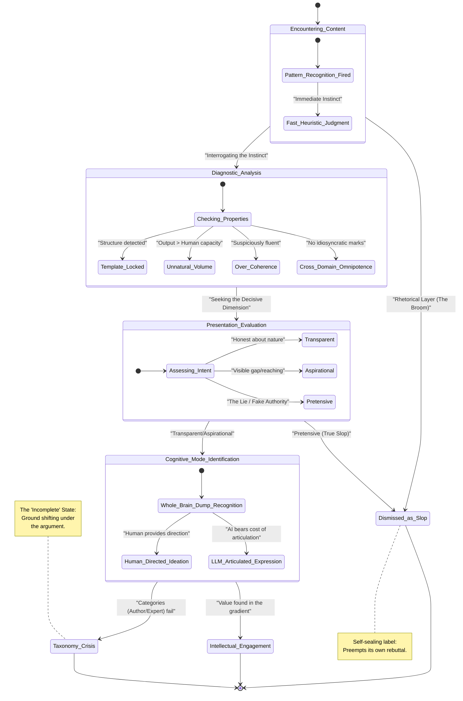

<div class="tab-nav">
<button class="tab-btn active" onclick="openTab(event, 'article')">Article</button>
<button class="tab-btn" onclick="openTab(event, 'brainstorm')">Brainstorm</button>
<button class="tab-btn" onclick="openTab(event, 'gametheory')">Game Theory</button>
<button class="tab-btn" onclick="openTab(event, 'perspectives')">Multi-Perspective</button>
<button class="tab-btn" onclick="openTab(event, 'dialectical')">Dialectic</button>
<button class="tab-btn" onclick="openTab(event, 'statemachine')">State Machine</button>
<button class="tab-btn" onclick="openTab(event, 'web_research')">Research</button>
</div>

<div id="article" class="tab-content" style="display: block;" markdown="1">

# Is This Slop?

You find a site called *Fractal Thought Engine*. It has 278 posts spread across eight domains — physics, philosophy, science fiction, cognitive science, music theory, mathematics, political epistemology, speculative theology. Your pattern-recognition fires immediately. You've seen this before. You know what this is.

*This is slop.*

The reaction is fast, confident, and — you suspect — correct. But I want to slow it down. I want to interrogate the instinct, not because it's necessarily wrong, but because the speed of the judgment is doing real work, and we should understand what kind of work it's doing.

I built Fractal Thought Engine. I built it with extensive use of large language models. And the question of whether it constitutes "slop" turns out to be far more interesting than the answer.

---

## What Is "AI Slop"?

The term "slop" has two layers, and the trouble is that they've fused together so completely that most people can't separate them — and don't want to.

**The diagnostic layer** is genuinely useful. It identifies a cluster of real properties:

- **Template-locked structure.** Every post follows the same arc: broad introduction, three to five subheadings, a synthesis paragraph, a forward-looking conclusion. The skeleton is visible through the skin.
- **Unnatural volume.** Output that exceeds what any individual could produce at that quality level in that timeframe, suggesting minimal human bottleneck in the production pipeline.
- **Over-coherence.** Every paragraph lands. There are no rough patches, no visible moments where the author struggled with an idea and left the struggle on the page. The text is suspiciously fluent.
- **Cross-domain omnipotence.** The author writes with equal apparent confidence about quantum field theory, Heidegger, and jazz harmony. No domain shows the characteristic marks of someone who actually lives there — the idiosyncratic emphases, the pet peeves, the awareness of which debates are stale and which are live.
- **Lack of lived constraint.** Nothing is shaped by the friction of a real life. No post exists because a student asked a weird question, or because the author got into an argument at a dinner party, or because a paper rejection forced a rethink. Everything feels generated from the topic itself rather than from an encounter with the topic.

These are real diagnostics. They point to real features of text. I don't dispute their validity.

**The rhetorical layer** is something else entirely. "Slop" is not a neutral descriptor. It is a term borrowed from animal feed — undifferentiated, low-value, mass-produced waste. To call something slop is not to diagnose it. It is to dismiss it. It is to say: *I don't need to read this. You don't need to read this. Nobody needs to read this. Its existence is a minor pollution event.*

And here's what matters: in practice, these two layers are not separable. Nobody runs the diagnostics and then, having confirmed the presence of template structure and cross-domain fluency, applies the label "slop" with clinical detachment. The label comes first. The diagnostics are recruited after the fact to justify a judgment that was already made — a judgment that is, at its core, social and aesthetic rather than analytical.

---

## The Dismissal Problem

I want to be precise about this. I am not arguing that the diagnostic criteria are wrong. I am not arguing that there is no such thing as low-value AI-generated content flooding the internet. There obviously is. The problem is that "slop" is not a scalpel. It's a broom.

The term is *unambiguous in its implications*. When you call something slop, you are not inviting further investigation. You are not saying, "This has some properties that are characteristic of low-effort AI generation; let's look more closely to see whether there's something interesting happening underneath." You are saying, "This is garbage. Move on."

And that unambiguity is the point. That's what makes the term useful — socially useful. It gives you permission to not engage. In an environment where AI-generated content is genuinely abundant and often genuinely worthless, having a fast heuristic for dismissal is adaptive. I understand the appeal. I feel the appeal myself when I encounter the fifteenth LinkedIn post that opens with "In today's rapidly evolving landscape..."

But adaptive heuristics have false positive rates. And the interesting question is what falls into the false positive zone — what gets swept up by the broom that shouldn't have been.

The deeper issue is that the contemptuous connotation of "slop" makes it almost impossible to contest the label once it's been applied. If I say, "Actually, this isn't slop — there's real thought behind it," I sound exactly like what someone who produced slop would say. The label is self-sealing. It preempts its own rebuttal.
This self-sealing quality is not a bug in the discourse — it is the discourse's central feature. It creates what game theory would call a **coordination failure**: a situation where both the creator and the audience would be better off in a world of nuanced engagement, but the rational move for each individual — given uncertainty about the other's intentions — is to default to dismissal or deception respectively. The creator who has done genuine intellectual work faces the same heuristic wall as the content farmer. The audience member who might find value faces the same time cost whether the content is authentic or hollow. And so the equilibrium settles at mutual disengagement — not because it's optimal, but because it's safe.

---


## Presentation Is the Decisive Dimension

So if volume alone doesn't settle the question, and cross-domain breadth alone doesn't settle it, and LLM involvement alone doesn't settle it — what does?

I think the answer is **presentation**. Specifically: *does the artifact pretend to be something it isn't?*

This is where most discussions of AI-generated content go wrong. They focus on production method (was an LLM involved?) or output properties (does it have that LLM sheen?) when the actually important axis is the relationship between what the thing *is* and what the thing *claims to be*.

I want to distinguish three presentation modes:

**Transparent presentation.** The artifact is honest about its nature, its production method, and its epistemic status. A blog post that says "I used Claude to help me think through this idea" is transparent. A site that frames itself as exploratory and speculative is transparent. Transparency doesn't require a disclaimer on every page — it can be structural, embedded in the design and framing of the work itself.

**Aspirational presentation.** The artifact reaches beyond what the author could produce alone, and this reaching is visible and acknowledged. A musician using a synthesizer to realize orchestral ideas they can't perform is aspirational. A writer using an LLM to articulate ideas they have but lack the technical vocabulary to express is aspirational. The gap between the author's unaided capacity and the artifact's polish is not hidden — it's the point.

**Pretensive presentation.** The artifact claims an authority, expertise, or origin it doesn't have. A site that presents LLM-generated medical advice as if written by doctors is pretensive. A portfolio of LLM-generated "research papers" submitted for academic credit is pretensive. An AI-generated article published under a fake byline in a newspaper is pretensive.

Slop, properly understood, lives in the pretensive category. It's not just AI-generated content — it's AI-generated content that *misrepresents itself*. The sin isn't the production method. The sin is the lie.
This three-part distinction does real analytical work that the binary of "human vs. AI" cannot. It explains why the same technology — the same model, the same prompt structure — can produce output that ranges from intellectual contribution to information pollution. The variable is not the tool. The variable is the honesty of the frame. And once you see that, the entire "slop" discourse reorganizes itself around a different axis: not *how was this made?* but *what is this claiming to be?*

---


## The Case of Fractal Thought Engine

So let's apply this framework to the thing that triggered the question.

Fractal Thought Engine has 278 posts across eight domains. That's a lot. It was built with heavy LLM involvement. The cross-domain range is far wider than any single person's professional expertise. By the diagnostic criteria, it lights up like a Christmas tree.

But look at the presentation.

The site is called *Fractal Thought Engine*. Not "The Journal of Interdisciplinary Studies." Not "Dr. [Name]'s Research Blog." The name itself signals something: this is a *machine for generating thought-patterns*. It's a generative, exploratory, self-consciously artificial construct. The name is doing real semiotic work.

The physics posts live under `/scifi/`. Not `/physics/` or `/research/`. They're filed under science fiction. This is not an accident. It's a framing decision that says: *these are speculative explorations that use physics as a substrate, not contributions to the physics literature.*

The writing across the site is speculative in tone. Posts don't conclude with "therefore, X is the case." They conclude with "what if X were the case?" or "this is what it looks like when you push Y to its limit." The epistemic register is consistently exploratory rather than authoritative.

None of this is hidden. None of it requires detective work to uncover. The site's presentation is what I'd call **self-aware dissonance** — it occupies the space between serious intellectual engagement and acknowledged artificiality, and it doesn't try to collapse that space in either direction. It's not pretending to be a research institute. It's not pretending to be a diary. It's not pretending to be a physics journal. It's a fractal thought engine. It does what it says on the tin.

Is it possible to look at all of this and still call it slop? Of course. The broom doesn't discriminate. But if you're going to make that call, you should be honest about what you're doing: you're not diagnosing a production method. You're making a value judgment about whether this *kind of thing* should exist. And that's a different argument — one that deserves to be made explicitly rather than smuggled in under a diagnostic label.

---

## LLM-Assisted Whole-Brain Dump as a New Cognitive Mode

Here's what I think is actually happening with Fractal Thought Engine, and with a growing category of work that doesn't yet have a good name.

For most of human history, the cost of articulation has been high. Turning a thought into a piece of writing requires time, effort, skill, and — critically — a judgment that *this particular thought is worth the investment*. The result is that most people express only a tiny fraction of their intellectual life. You write about the things you're professionally required to write about, the things you're passionate enough to overcome the activation energy for, and the things that circumstance forces into expression (someone asks you a question, you get into an argument, an editor commissions a piece).

Everything else — the half-formed ideas, the interdisciplinary hunches, the speculative connections, the thoughts that are interesting but not *clearly worth the effort* — stays below the surface. Not because it's worthless, but because the cost-benefit calculation doesn't clear the threshold.

LLMs collapse the cost of articulation.

What this means is that a person can now externalize their *entire* thought-space, not just the peaks that were high enough to justify the climb. The physicist who has always had informal intuitions about philosophy of mind can now explore those intuitions in writing. The software engineer who thinks about music theory in the shower can now produce substantive explorations of those ideas. The generalist who has spent decades accumulating cross-domain pattern-recognition can now make those patterns visible.

I want to be specific about what this is and isn't. It is **not** the LLM having the ideas. It is the human having the ideas and the LLM bearing the articulatory cost that previously prevented those ideas from being expressed. The human provides direction, judgment, domain knowledge (even if informal), aesthetic sensibility, and the crucial editorial function of recognizing when the output has captured something real versus when it has produced fluent nonsense.

This is a new cognitive mode. It's not writing. It's not dictation. It's not "using AI as a tool" in the way that phrase is usually meant (i.e., having the AI do a bounded task within a human-directed workflow). It's closer to **whole-brain dump** — the externalization of an entire intellectual life that was previously too expensive to articulate.

And it produces artifacts that look, from the outside, exactly like slop. High volume. Cross-domain range. LLM fluency. Template-adjacent structure. Every diagnostic fires.

But the generative process is fundamentally different from what "slop" implies. Slop is produced by pointing an LLM at a topic and publishing whatever comes out. A whole-brain dump is produced by a human with genuine intellectual investments using an LLM to make those investments visible. The difference is invisible in the output — which is precisely why the diagnostic approach fails, and why presentation becomes the decisive dimension.

---

## The Struggle Question

There is a serious objection here, and I want to give it its full weight rather than dismissing it.

The objection goes like this: writing is not merely the *export* of pre-formed ideas. Writing *is* thinking. The struggle to find the right word, to structure a difficult argument, to wrestle a vague intuition into precise language — that struggle is not a tax on thought. It is the forge in which thought is tempered. When you bypass the labor of articulation, you bypass the refinement of the idea itself. A "whole-brain dump" suggests that thoughts exist in a finished state within the mind, waiting to be rendered. But thoughts are vague and unformed until they are wrestled into language through manual effort.

This is a strong argument. It draws on a tradition running from Wittgenstein through cognitive science: the idea that language is not a container for thought but a medium in which thought takes shape. And it identifies a real risk — that the ease of LLM-assisted articulation might produce "weightless" knowledge, ideas that have never been stress-tested against the constraints of their own expression.
But I think the argument proves less than it claims. The struggle it valorizes is the struggle of *linear prose composition* — finding the right word, structuring the paragraph, managing the rhetorical arc. That is one kind of cognitive work, and it is genuinely valuable. But it is not the only kind. There is also the struggle of *navigating an infinite generative space* — maintaining a coherent line of inquiry across dozens of branching possibilities, recognizing when the LLM has captured something real versus when it has produced fluent nonsense, pruning the vast majority of output to preserve the signal. This is a different kind of friction, but it is friction nonetheless. The labor has not disappeared. It has moved.
The person directing a whole-brain dump is not passively receiving text. They are making hundreds of editorial judgments: this captures what I mean, that doesn't; this connection is genuine, that one is a hallucination; this paragraph should be kept, those three should be discarded. The "rough patches" that the traditionalist misses in the final output existed in the process — they were simply resolved before publication rather than left visible on the page. Whether that resolution constitutes authentic intellectual work or mere curation is, I think, the genuinely interesting question. And it is a question that "slop" forecloses rather than opens.
---
## What This Mode Enables
Think about what it means for the full gradient of a person's thought-space to become expressible.

Previously, we only saw the peaks. A physicist published physics papers. If they had interesting thoughts about the philosophy of consciousness, those thoughts existed only in conversation, in private notebooks, in the margins of their professional life. The public intellectual landscape was shaped by the economics of articulation: you saw what people could afford to express, not what they actually thought.

Now the entire landscape becomes visible. And it looks weird. It looks like a site with 278 posts across eight domains. It looks like someone who has no business writing about music theory writing about music theory. It looks, in other words, like slop — because our pattern-recognition was trained on a world where cross-domain prolificacy was either a sign of genius or a sign of fraud, and the prior probability strongly favored fraud.

But there's a third option now. It's not genius. It's not fraud. It's a person with a normal distribution of intellectual interests who suddenly has access to a technology that makes the full distribution expressible. The ideas that were "not clearly worth the effort, not forced by chance or circumstance" can now be surfaced. And some of them turn out to be genuinely interesting — not because the LLM made them interesting, but because they were always interesting and simply never cleared the activation threshold for expression.

This is what Fractal Thought Engine is. It's not a research program. It's not a content farm. It's a map of one person's intellectual landscape, rendered at a resolution that was previously impossible. Some of it is good. Some of it is mediocre. Some of it is probably wrong. That distribution is itself a sign of authenticity — actual thought-spaces have that variance. It's the uniformly polished, uniformly confident output that should trigger suspicion.
And this variance points to something the "slop" framing systematically obscures: the difference between *signal density* and *signal uniformity*. A content farm optimizes for uniformity — every piece hits the same quality floor, the same engagement metrics, the same rhetorical register. A whole-brain dump optimizes for coverage — it maps the territory, including the parts where the author's knowledge is thin, where the ideas are half-formed, where the exploration leads to a dead end. The presence of mediocre posts alongside strong ones is not a failure of quality control. It is evidence that the filtering function was set to "express" rather than "impress."

---

## The Taxonomy Is Becoming Dated


Here's where I want to end, and it's the part that makes me most uncomfortable — because it means the ground is shifting under the argument even as I make it.

The categories we use to classify creative and intellectual work are built for a world with high articulation costs. "Author" implies a person who bore the full cost of producing the text. "Original work" implies a process in which the ideas and their expression emerged from the same source. "Expertise" implies deep, narrow investment that precludes breadth. These categories are not wrong — they describe real things that really exist. But they are becoming *incomplete*.

We need new categories for work that is human-directed but LLM-articulated. For intellectual output that is genuine in its ideation but assisted in its expression. For artifacts that are neither fully human-authored nor fully AI-generated but occupy a space that didn't exist five years ago and that our taxonomies haven't caught up to.

"Slop" is not that category. "Slop" is the refusal to create that category — the insistence that everything AI-touched must be either fully human (and therefore legitimate) or fully artificial (and therefore dismissible). It's a binary imposed on a spectrum, and like all such impositions, it distorts more than it clarifies.

I don't know what the right categories are. I don't think anyone does yet. But the shape of the problem is becoming clearer. We need frameworks that can distinguish between the *source of ideation* and the *medium of articulation* — that can ask whether the intellectual substance originated in a human mind even when the prose was assembled by a machine. We need presentation norms that reward honesty about process rather than punishing the use of tools. And we need evaluation criteria that focus on *what a work contributes* — its novelty, its insight, its capacity to provoke genuine thought — rather than on *how much it cost to produce*.

The question "Is this slop?" is the wrong question — not because the answer is obviously no, but because the question itself encodes assumptions about production, authorship, and value that are becoming less and less adequate to the landscape they're trying to map.

The better question is: *What is this, exactly? What is it trying to be? Is it honest about what it is? And is there something here worth engaging with?*

Those questions take longer to answer. They require actually reading the work. They don't give you permission to dismiss and move on.

That's the point.
---
## Appendix: The Philosophical Calculator and the Slop Heuristic
*The following section draws on ideas developed in [The Philosophical Calculator: Beyond the Mirror of Legacy Metaphors](/projects/2026-02-20-Philosophical-Calculator), which proposes a framework for understanding LLMs as engines of high-dimensional conceptual arithmetic rather than as agents, oracles, or persons.*
---
### Why "Slop" Is a Legacy Metaphor Problem
The speed with which the "slop" label gets applied is not merely a social phenomenon — it is a *metaphor* phenomenon. The Philosophical Calculator framework identifies four legacy metaphors through which people understand LLMs: the Computer, the Oracle, the Person, and the Search Engine. The "slop" heuristic draws its power from an implicit collision between two of these.
When a reader encounters a site like Fractal Thought Engine, they are unconsciously applying the **Person** metaphor: *a single human author should have a bounded range of expertise, a finite production rate, and visible signs of struggle*. Simultaneously, they apply the **Search Engine** metaphor in reverse: *if this wasn't retrieved from genuine expertise, it must have been fabricated*. The collision of these two frames produces the "slop" judgment with mechanical reliability. The text violates the Person metaphor's constraints (too much, too broad, too fluent) and fails the Search Engine metaphor's provenance check (no visible source of authority). Diagnosis complete. Dismiss and move on.
But notice what's missing from this process: any engagement with what the Philosophical Calculator framework calls the actual *operations* being performed. The reader never asks whether the text represents a genuine **synthesis** (the combination of operands from different conceptual domains), a meaningful **reframing** (a coordinate transformation that reveals new facets of a familiar problem), or a productive **abstraction** (a dimensionality reduction that extracts signal from noise). These are the operations that distinguish a whole-brain dump from a content farm — but the legacy metaphors don't have vocabulary for them, so the reader never looks.
This is the linguistic poverty problem applied to reception rather than production. Just as we lack native vocabulary for non-conscious high-level information processing (forcing us to say LLMs "think" and "know"), we lack native vocabulary for *LLM-assisted human intellectual work* (forcing us to choose between "authentic" and "slop"). The Philosophical Calculator framework suggests that what's needed is not better detection of AI involvement, but better evaluation of *conceptual operations* — asking not "did a machine touch this?" but "what transformation was performed, on what operands, and does the result constitute a genuine contribution to the conceptual landscape?"
### The Whole-Brain Dump as Conceptual Arithmetic
The "whole-brain dump" mode described earlier in this essay maps directly onto the Philosophical Calculator's taxonomy of operators. Consider what actually happens when a person with decades of cross-domain intellectual investment uses an LLM to externalize their thought-space:
- **Synthesis (Conceptual Addition):** The physicist who has always had informal intuitions about philosophy of mind is performing `[Physics Training] + [Philosophy Intuitions] = [Novel Cross-Domain Exploration]`. The LLM bears the articulatory cost; the human provides both operands and the judgment that the synthesis is worth performing.
- **Reframing (Coordinate Transformation):** The software engineer who thinks about music theory in the shower is taking a familiar problem (software architecture) and rotating it through an unfamiliar coordinate system (harmonic structure). The resulting text may look like "cross-domain omnipotence" to a reader applying the Person metaphor, but it's actually a specific, identifiable geometric operation on the engineer's existing knowledge.
- **Abstraction (Dimensionality Reduction):** When the generalist extracts patterns that recur across multiple domains — noticing that the same structural tension appears in quantum measurement, in phenomenological philosophy, and in jazz improvisation — they are performing dimensionality reduction across their full intellectual landscape. The LLM makes the reduction expressible; the human provides the recognition that the pattern is real.
Framing the whole-brain dump in these terms does something important: it makes the *human contribution* legible in a way that the production-method discourse cannot. When we ask "did a human or an AI write this?", the answer is murky and contested. When we ask "who provided the operands, who selected the operators, and who evaluated whether the resulting synthesis captured something real?", the answer is clear — and it points to a form of intellectual labor that is genuine even when the prose was assembled by a machine.
### The Coherence Trap and the Slop Heuristic
The Philosophical Calculator framework identifies a risk it calls the **Coherence Trap**: because LLMs optimize for internal logical consistency rather than correspondence to external reality, their outputs can feel authoritative precisely because they are so well-organized. A coherent argument is not necessarily a true one.
This risk is real, and it is *exactly* what the slop heuristic is trying to protect against. The reader who pattern-matches on "over-coherence" and "unnatural fluency" is detecting a genuine signal — the signal of a system that optimizes for coherence over truth. The problem is not that the heuristic is baseless. The problem is that it cannot distinguish between two very different sources of coherence:
1. **Ungrounded coherence:** The LLM was pointed at a topic and produced fluent, well-structured text that maintains internal consistency but is not anchored to any human's actual understanding. This is the Coherence Trap in its pure form. This is slop.
2. **Grounded coherence:** A human with genuine intellectual investments used the LLM to articulate ideas they actually hold, and the resulting text is coherent because *the underlying ideas are coherent* — the LLM's optimization for fluency happened to align with the human's actual conceptual structure. This is the whole-brain dump.
From the outside, these two cases can be indistinguishable. The slop heuristic treats them as identical. The Philosophical Calculator framework insists they are fundamentally different — not in their surface properties, but in their *operand provenance*. In the first case, the operands were generated by the LLM itself (or by the most generic possible human prompt). In the second case, the operands were provided by a human mind with real investments in the domain. The transformation is the same; the inputs are not.
This is why presentation — the axis I identified as decisive earlier in this essay — maps onto what the Philosophical Calculator framework calls the **invariant of human agency**. Transparent and aspirational presentation are ways of signaling operand provenance: *these ideas came from a human; the machine helped articulate them*. Pretensive presentation obscures operand provenance: *these ideas are presented as if they emerged from expertise that doesn't exist*. The sin of slop is not machine involvement — it is the concealment of the actual conceptual arithmetic that produced the text.
### Toward Evaluation Criteria for the New Mode
If the "slop" binary is inadequate, and if the Philosophical Calculator framework gives us a vocabulary for what's actually happening in LLM-assisted intellectual work, then we can begin to sketch evaluation criteria that go beyond "human or machine?":
1. **Operand authenticity:** Do the conceptual inputs originate from genuine human intellectual investment, or are they generic prompts that could have been issued by anyone? A post that synthesizes two domains the author has actually spent time in is doing different work than a post that synthesizes two domains the author picked from a list.
2. **Operator appropriateness:** Is the conceptual transformation well-chosen? A synthesis that reveals a genuine structural parallel between two fields is more valuable than a synthesis that merely juxtaposes them. A reframing that opens new lines of inquiry is more valuable than one that merely restates the obvious in different vocabulary.
3. **Variance as signal:** As noted earlier, actual thought-spaces have variance — some ideas are strong, some are mediocre, some are wrong. A whole-brain dump that shows this variance is more credible than one that is uniformly polished, because uniform polish is the signature of optimization for coherence (the Coherence Trap) rather than optimization for coverage (the authentic intellectual landscape).
4. **Epistemic honesty:** Does the artifact acknowledge the limits of its own authority? Does it distinguish between domains where the author has deep investment and domains where they are speculating? The Philosophical Calculator framework's emphasis on treating outputs as "Computed Syntheses" rather than "answers" applies to the creator as much as to the reader.
These criteria are harder to apply than the slop heuristic. They require engagement rather than dismissal. They require reading the work. That is, as I said, the point — but now we have a theoretical framework that explains *why* it's the point: because the relevant distinctions are not in the surface properties of the text (which the slop heuristic evaluates) but in the conceptual operations that produced it (which only engaged reading can assess).

</div>
<div id="brainstorm" class="tab-content" style="display: none;" markdown="1">

# Brainstorming Session Transcript

**Input Files:** content.md

**Problem Statement:** How can we move beyond the 'slop' binary to create meaningful frameworks, tools, and social structures for LLM-assisted intellectual output?

**Started:** 2026-03-03 18:32:11

---


## Generated Options

### 1. The Provenance-Aware Markdown Editor (PAME)
**Category:** Technical Tooling

A technical tool that visually maps every AI-generated sentence back to the specific segment of a user's 'Whole-Brain Dump' it originated from. This ensures intellectual accountability by highlighting which ideas are human-anchored and which are AI-embellished, effectively killing the 'slop' ambiguity.

### 2. The 'Human-in-the-Loop' (HITL) Transparency Protocol
**Category:** Social/Ethical Frameworks

A standardized metadata schema for digital content that discloses the ratio of human 'Brain Dump' to AI 'Presentation Mode' refinement. It shifts the social focus from 'Is this AI?' to 'How much of the core intellectual labor was human-driven?'

### 3. Bifocal Narrative Streams
**Category:** New Media Formats

A new media format where readers can toggle between the 'Raw Dump' (messy, authentic human thought) and the 'Polished Presentation' (AI-refined output). This 'behind-the-scenes' layer validates the creator's effort and provides a deeper context for the final work.

### 4. Synthesis-First Pedagogy
**Category:** Epistemology & Education

An educational framework that grades students on the quality of their 'Whole-Brain Dump' and their ability to critique AI-generated 'Presentation Modes' rather than the final essay. It prioritizes the raw intellectual spark and critical editing over the ability to produce polished prose.

### 5. Multi-Modal Presentation Mode Toggles
**Category:** Technical Tooling

A tool that allows a user to input a single 'Whole-Brain Dump' and instantly toggle between diverse 'Presentation Modes' like Socratic Dialogue, Technical Spec, or Narrative Poem. This emphasizes the LLM as a versatile lens for human thought rather than a replacement for it.

### 6. The Intellectual Stewardship License
**Category:** Social/Ethical Frameworks

A legal and social framework where AI-assisted works are licensed based on the 'Stewardship' of the human author over the AI's output. It defines the human's role as the curator and validator of the 'Brain Dump' transformation, creating a new class of intellectual property.

### 7. Semantic Zoom Documents
**Category:** New Media Formats

Interactive documents where clicking a paragraph reveals the 'Whole-Brain Dump' notes that informed it. This allows readers to 'zoom in' on the human reasoning behind the AI-assisted prose, making the intellectual process transparent and verifiable.

### 8. The Cognitive Offload Audit
**Category:** Epistemology & Education

A reflective practice for creators to map which parts of their output were 'Brain Dumped' (human) and which were 'Presented' (AI). This helps individuals maintain their unique voice and identify where they are over-relying on 'slop' versus meaningful assistance.

### 9. Constraint-Based Synthesis Engines
**Category:** Technical Tooling

LLM interfaces that strictly forbid the introduction of new facts or concepts not present in the user's 'Whole-Brain Dump.' These tools act as 'stylistic compressors' rather than 'generative expanders,' eliminating the risk of hallucinated slop.

### 10. Collaborative Dump-to-Draft Guilds
**Category:** Social/Ethical Frameworks

Online communities where members share their raw 'Whole-Brain Dumps' and use collective AI tools to find 'Presentation Modes' that best serve the group's goals. This shifts the focus from individual 'slop' to collective, transparent intellectual synthesis.


## Option 1 Analysis: The Provenance-Aware Markdown Editor (PAME)

### ✅ Pros
- Provides a clear 'paper trail' for intellectual labor, distinguishing between human intent and AI synthesis.
- Reduces the 'imposter syndrome' associated with AI assistance by validating that the core ideas originated from the user's Whole-Brain Dump.
- Enables granular editing where users can quickly identify and rewrite AI-embellished sections that drift too far from their original meaning.
- Creates a high-trust output format that can be shared with editors or collaborators to prove original thought.
- Facilitates a 'Presentation Mode' that can toggle between raw thoughts and polished output, showing the evolution of the work.

### ❌ Cons
- The UI could become cluttered or distracting if the visual mapping (lines, highlights, or split-screens) is too aggressive.
- AI synthesis often merges multiple disparate thoughts, making a clean 1:1 sentence-to-dump mapping technically difficult or misleading.
- Users may feel pressured to over-explain their 'Whole-Brain Dump' just to ensure the tool can find a provenance anchor.
- The tool might struggle with 'emergent ideas'—valid insights that occur during the AI interaction that weren't in the original dump.

### 📊 Feasibility
High. Current LLM architectures allow for 'source attribution' via RAG (Retrieval-Augmented Generation) or attention-map tracking. Implementing this as a VS Code extension or a specialized Markdown editor using existing APIs is technically straightforward.

### 💥 Impact
This would transform the perception of AI writing from 'automated slop' to 'assisted synthesis.' It establishes a new standard for intellectual integrity in the age of LLMs and provides a functional bridge between raw internal thought and external presentation.

### ⚠️ Risks
- Source Laundering: Users might provide a vague or low-quality dump and rely on the AI to 'hallucinate' the substance while still claiming provenance.
- Privacy Concerns: The 'Whole-Brain Dump' likely contains messy, private, or unrefined thoughts that users may be uncomfortable storing or linking to final documents.
- Mechanical Rigidity: The focus on provenance might discourage the creative, serendipitous leaps that happen when AI and humans brainstorm together.

### 📋 Requirements
- A robust backend capable of real-time semantic mapping between the generated text and the source dump.
- A sophisticated UI/UX design that handles 'Provenance Overlays' without interrupting the writing flow.
- A standardized metadata format (e.g., JSON-LD or custom Markdown frontmatter) to store and transport provenance data.
- User training on how to perform an effective 'Whole-Brain Dump' to maximize the tool's mapping accuracy.

---


## Option 2 Analysis: The 'Human-in-the-Loop' (HITL) Transparency Protocol

### ✅ Pros
- Validates the 'Brain Dump' as the primary source of value, encouraging users to focus on raw ideation over superficial polishing.
- Reduces the 'slop' stigma by providing a legitimate pathway for AI-assisted refinement (Presentation Mode) without claiming total manual authorship.
- Creates a 'Nutrition Label' for intellectual content, allowing readers to calibrate their trust based on the level of human cognitive investment.
- Encourages the development of tools that capture the messy, non-linear process of human thought rather than just the final output.
- Provides a nuanced middle ground between '100% Human' and '100% AI,' acknowledging the reality of modern collaborative workflows.

### ❌ Cons
- Quantifying 'intellectual labor' is inherently subjective; a 10-word human insight can outweigh a 1,000-word AI expansion, but ratios may suggest otherwise.
- The protocol could be easily 'gamed' by using AI to generate a simulated 'messy' brain dump to inflate the human-driven score.
- Privacy concerns arise if the protocol requires the archiving or verification of the raw, potentially sensitive 'Brain Dump' data.
- Adds friction to the creative process by requiring users to track and categorize their workflow stages.
- Risk of 'Transparency Fatigue' where users ignore metadata schemas much like they ignore cookie consent banners.

### 📊 Feasibility
Technically moderate but socially difficult. While embedding metadata in JSON-LD or XMP is trivial, creating a cross-platform standard that LLM providers and word processors all support requires significant industry coordination. The hardest part is the 'Proof of Thought'—verifying that the brain dump was actually human-generated without invasive keystroke logging.

### 💥 Impact
This could fundamentally shift the economy of content from 'output volume' to 'insight density.' It would likely lead to the rise of 'High-Human' niche markets and premium tiers for content that can prove a high ratio of original brain-dumping, while relegating high-AI 'Presentation Mode' content to utility-grade status.

### ⚠️ Risks
- Goodhart’s Law: Once the human-to-AI ratio becomes a target metric, it will cease to be a good measure of quality as people optimize for the ratio over the ideas.
- Elitism: High-human content could become a luxury good, creating a class divide between those who have the time to 'brain dump' and those who must rely on AI for efficiency.
- Devaluation of Style: By categorizing refinement as mere 'Presentation Mode,' we may inadvertently devalue the human art of editing, rhetoric, and stylistic nuance.
- Verification Arms Race: The emergence of 'AI-humanizers' designed specifically to mimic the entropy and errors of a human brain dump to bypass the protocol.

### 📋 Requirements
- A standardized technical schema (e.g., an extension of Schema.org) specifically for 'Cognitive Provenance'.
- Integration into major IDEs and writing tools (Notion, Word, Obsidian) to automatically track the transition from raw notes to refined output.
- A social 'Proof of Messiness' metric that uses the entropy and non-linear nature of human drafting as a validation signal.
- Widespread adoption by search engines and social algorithms to prioritize or filter content based on these transparency tags.
- Clear definitions and community consensus on the boundaries between 'Core Intellectual Labor' and 'Refinement Labor'.

---


## Option 3 Analysis: Bifocal Narrative Streams

### ✅ Pros
- Establishes 'Proof of Thought,' effectively countering the 'AI slop' narrative by demonstrating the underlying human intellectual labor.
- Provides a dual-layered learning experience, allowing readers to understand both the 'what' (polished output) and the 'how' (raw cognitive process).
- Caters to diverse audience needs: 'skimmers' receive the AI-refined summary, while 'deep-divers' gain access to authentic, messy context.
- Reduces the 'perfectionism barrier' for creators by validating the importance of the initial, unrefined brain dump.

### ❌ Cons
- Increases the 'vulnerability tax' on creators, who may feel socially or professionally exposed by sharing unedited, non-linear thoughts.
- Creates a potential for 'performative authenticity,' where the raw dump is curated or AI-simulated to appear more 'human' than it actually is.
- Adds cognitive load to the reader who may feel pressured to consume both streams to get the 'full story,' leading to information fatigue.

### 📊 Feasibility
High technical feasibility as current markdown editors, version control systems, and web frameworks can easily support toggleable layers; however, social feasibility is moderate, requiring a shift in publishing norms and creator courage.

### 💥 Impact
This format could transform intellectual consumption from a passive receipt of 'finished goods' into an active engagement with a 'living process,' fostering higher trust and deeper connection between creator and audience while devaluing low-effort AI generation.

### ⚠️ Risks
- The 'Raw' stream could be weaponized or taken out of context by critics to discredit the creator's competence.
- AI tools might be used to 'reverse-engineer' fake raw dumps, leading to a new tier of sophisticated, deceptive 'slop.'
- Privacy risks if sensitive or proprietary information is accidentally included in the 'Whole-Brain Dump' layer.

### 📋 Requirements
- Standardized metadata or file formats (e.g., a 'Bifocal Markdown') that link raw inputs to polished outputs.
- Intuitive UI/UX design for 'bifocal' reading, such as split-screen toggles, hover-over context bubbles, or 'process' sliders.
- Platform-level incentives or 'Verified Human Process' badges that reward transparency and the sharing of the raw layer.

---


## Option 4 Analysis: Synthesis-First Pedagogy

### ✅ Pros
- Prioritizes original thought and 'intellectual spark' over the ability to mimic academic prose conventions.
- Develops high-level critical thinking by forcing students to identify hallucinations, biases, and stylistic weaknesses in AI 'Presentation Modes'.
- Reduces the incentive for academic dishonesty by making the messy, idiosyncratic 'Whole-Brain Dump' the primary object of assessment.
- Democratizes academic success for students with high conceptual intelligence but low linguistic fluency or neurodivergent processing styles.
- Aligns educational outcomes with modern professional workflows where AI handles formatting and humans handle direction and verification.

### ❌ Cons
- Grading a 'Whole-Brain Dump' is highly subjective and difficult to standardize across different educators.
- May lead to the atrophy of foundational writing skills, which are often linked to the ability to structure logical arguments.
- Risk of 'Recursive Slop' where students use AI to generate the initial 'brain dump' to save effort, defeating the purpose of the pedagogy.
- Requires a significant increase in teacher workload to evaluate the process and critique rather than just the final product.

### 📊 Feasibility
Moderate. While the technology (LLMs) is readily available, the organizational shift requires a total overhaul of traditional grading rubrics and significant faculty retraining. It is most feasible in humanities and social sciences but harder to implement in standardized testing environments.

### 💥 Impact
Transformative. It shifts the definition of 'literacy' from the ability to write to the ability to synthesize and curate. It could lead to a surge in diverse, non-linear intellectual output while potentially creating a 'rhetoric gap' where students can think but cannot communicate without a machine intermediary.

### ⚠️ Risks
- The 'Cognitive Bypass' risk: Students may lose the ability to form complex thoughts if they never have to struggle with the constraints of formal writing.
- Assessment Bias: Teachers might inadvertently reward 'dumps' that align with their own thought patterns, as there is no formal structure to ground the evaluation.
- Technological Dependency: Creating a generation of thinkers who are functionally paralyzed without an LLM to 'present' their ideas.
- The 'Prompt Engineering' Trap: The 'Whole-Brain Dump' could evolve into just another form of performative prompt engineering rather than authentic thought.

### 📋 Requirements
- New assessment frameworks that define 'quality' in raw, unstructured intellectual data.
- Robust AI literacy programs for both students and educators to understand 'Presentation Mode' limitations.
- Digital 'Process-Tracking' tools that can verify the evolution of a thought from dump to critique.
- A cultural shift in academia that values the 'messy' process of ideation as much as the polished final result.

---


## Option 5 Analysis: Multi-Modal Presentation Mode Toggles

### ✅ Pros
- Reduces the 'blank page' syndrome by allowing users to focus on raw ideation (the 'Brain Dump') rather than formatting.
- Promotes cognitive diversity by forcing the user to view their own ideas through different rhetorical and logical lenses.
- Combats the 'slop' narrative by positioning the LLM as a refiner and translator of human-originated intent rather than a primary source.
- Increases communication efficiency by allowing a single core idea to be instantly adapted for different stakeholders (e.g., engineers vs. executives).
- Encourages iterative thinking, as seeing a thought in a 'Socratic Dialogue' mode might reveal logical gaps in the original dump.

### ❌ Cons
- Risk of 'semantic drift' where the LLM introduces external concepts or hallucinations to satisfy the constraints of a specific mode.
- Potential for 'style over substance' where the novelty of the presentation masks a lack of depth in the original brain dump.
- The 'Whole-Brain Dump' might be too disorganized for the LLM to parse accurately without significant pre-processing or user guidance.
- Users may become over-reliant on the tool for communication, potentially atrophying their own ability to synthesize information manually.

### 📊 Feasibility
High. Current LLMs are already highly proficient at style transfer and structural reformatting. Implementation primarily requires a robust UI/UX layer and a library of well-engineered system prompts for the various 'modes'.

### 💥 Impact
This shifts the user's relationship with AI from 'content generation' to 'cognitive prisming.' It empowers individuals to communicate complex internal thoughts more effectively across diverse social and professional contexts, potentially democratizing high-level technical and creative writing.

### ⚠️ Risks
- Loss of the user's unique 'voice' as the LLM standardizes the output into pre-defined mode templates.
- Misinterpretation of the original intent if the LLM prioritizes the aesthetic of the 'mode' (e.g., a poem) over the accuracy of the data.
- Privacy concerns regarding the 'Whole-Brain Dump,' which may contain sensitive or unrefined personal thoughts not intended for permanent storage.
- The creation of 'echo-chamber' outputs where the user only toggles modes that confirm their existing biases.

### 📋 Requirements
- Access to high-reasoning LLM APIs (e.g., GPT-4o, Claude 3.5 Sonnet) capable of maintaining context across long inputs.
- A library of curated, tested system prompts for diverse presentation modes (Technical, Creative, Pedagogical).
- A 'Source-of-Truth' tracking mechanism that highlights which parts of the output are directly from the dump vs. inferred by the AI.
- A user interface that supports side-by-side comparison and easy editing of the original 'Brain Dump'.

---


## Option 6 Analysis: The Intellectual Stewardship License

### ✅ Pros
- Formalizes the 'Whole-Brain Dump' as a valid intellectual seed, rewarding the raw ideation phase rather than just the final polish.
- Creates a clear distinction between unvetted 'slop' and 'stewarded' output through mandatory validation and curation steps.
- Offers a flexible 'Presentation Mode' clause, allowing authors to license the underlying logic of the dump separately from its aesthetic form.
- Provides a social signal of quality and accountability that moves beyond the binary of 'AI-written' vs. 'Human-written'.

### ❌ Cons
- The 'Stewardship' threshold is highly subjective and difficult to quantify for objective legal enforcement.
- Current copyright laws in major jurisdictions (e.g., USCO) do not recognize non-human expression, making a 'new class' of IP a massive legislative hurdle.
- Risk of 'Stewardship Washing,' where users apply the license to unedited AI output to gain unearned credibility without doing the work.
- Adds a layer of bureaucratic complexity to the creative process that might stifle the speed of rapid AI-assisted iteration.

### 📊 Feasibility
Socially feasible as a 'soft' license (similar to Creative Commons) that relies on community norms and voluntary disclosure. However, its legal feasibility is low without significant changes to international IP treaties and the development of technical audit trails to prove the transformation from Brain Dump to Presentation Mode.

### 💥 Impact
This would shift the focus of intellectual value from the 'craft of writing' to the 'integrity of curation,' potentially creating a new economy of professional curators who specialize in refining raw AI-generated drafts into high-fidelity, verified knowledge assets.

### ⚠️ Risks
- Legal 'gray zones' could lead to a surge in litigation over what constitutes 'sufficient stewardship' versus 'mere prompting.'
- It might inadvertently devalue purely human-made works by creating a 'cheaper' but legally protected 'stewarded' alternative.
- The license could be co-opted by large AI platforms to claim ownership over user-prompted outputs through fine-print stewardship clauses.
- Fragmentation of the digital commons if too many competing 'stewardship' standards emerge.

### 📋 Requirements
- A technical standard for 'Provenance Logs' that record the iterative interaction between the human and the LLM.
- A set of 'Stewardship Levels' (e.g., Verified, Curated, Transformed) based on the depth of the human validation process.
- A non-profit governing body (similar to the Creative Commons organization) to manage and update the license terms.
- Integration with 'Presentation Mode' tools that can export stewardship metadata (the 'how' and 'why') alongside the final content.

---


## Option 7 Analysis: Semantic Zoom Documents

### ✅ Pros
- Provides 'Proof of Thought' by linking polished AI-assisted prose directly to the author's raw intellectual labor.
- Increases reader trust by making the transformation from messy human intuition to structured output transparent.
- Serves as a powerful educational tool, allowing students and peers to see the 'scaffolding' of a complex argument.
- Reduces the 'slop' stigma by demonstrating that the AI was used as a synthesizer rather than a primary source of ideas.
- Enables multi-layered reading experiences where experts can dive deep into the logic while casual readers stay at the surface.

### ❌ Cons
- The 'Whole-Brain Dump' may contain private, unrefined, or embarrassing thoughts that authors are hesitant to share.
- Risk of information overload for the reader, potentially distracting from the primary message of the document.
- Significant overhead in maintaining the mapping between specific notes and specific paragraphs as a document is edited.
- Current standard document formats (PDF, .docx) do not natively support this type of interactive, multi-layered metadata.

### 📊 Feasibility
Technically high for web-based platforms using MDX or block-based editors (like Notion or Obsidian), but requires the development of specific UI/UX patterns to manage the 'mapping' between raw notes and final prose without doubling the author's workload.

### 💥 Impact
This could redefine intellectual integrity in the AI era, shifting the value of a document from its 'polish' to the depth and traceability of the human reasoning behind it. It creates a new 'Presentation Mode' that prioritizes process over product.

### ⚠️ Risks
- Performative Dumps: Authors might use AI to generate fake 'raw notes' to create an illusion of deep thought.
- Intellectual Property: Revealing the raw reasoning process might expose proprietary methods or 'half-baked' ideas to theft.
- Accessibility: Interactive layers may be difficult to navigate for users with screen readers or those on low-bandwidth connections.
- Social Pressure: A culture where 'showing your work' is mandatory could penalize neurodivergent thinkers or those with non-linear writing processes.

### 📋 Requirements
- Authoring tools that support bi-directional linking and 'transclusion' between scratchpads and final drafts.
- A standardized metadata schema for 'Semantic Zoom' to ensure interoperability between different reading platforms.
- A cultural shift toward valuing 'messy' thinking and raw intellectual honesty over sanitized, perfect-looking output.
- UI components that allow for seamless 'zooming' (e.g., side-panels, tooltips, or expandable accordions) without breaking reading flow.

---


## Option 8 Analysis: The Cognitive Offload Audit

### ✅ Pros
- Enhances metacognition by forcing creators to evaluate their own creative agency and decision-making process.
- Protects the 'human core' of a work by identifying where the 'Whole-Brain Dump' (raw intent) has been diluted by AI 'Presentation Mode'.
- Provides a clear diagnostic tool to distinguish between high-value AI synthesis and low-effort 'slop'.
- Creates a pedagogical bridge for students to learn how to use LLMs as cognitive prosthetics rather than replacements.
- Encourages a 'process-first' rather than 'product-first' mentality, which is essential for long-term intellectual growth.

### ❌ Cons
- Adds significant cognitive friction and time to the creative process, which may discourage adoption.
- The boundary between human 'Brain Dump' and AI 'Presentation' is increasingly blurred in iterative, multi-turn prompting.
- Relies heavily on subjective self-reporting, which can be prone to bias or lack of self-awareness.
- May be perceived as a bureaucratic burden rather than a creative aid in high-pressure professional environments.

### 📊 Feasibility
High for individual practitioners and educational settings where reflection is already valued; moderate for professional environments. It requires no new technology, only a shift in workflow and a standardized rubric for categorization.

### 💥 Impact
Shifts the cultural narrative from 'AI-generated' to 'AI-synthesized,' leading to higher-quality intellectual output and a more honest relationship with digital tools. It could potentially standardize a new form of 'provenance' for intellectual work.

### ⚠️ Risks
- Performative auditing: Creators might fill out the audit to satisfy requirements without actually engaging in reflection.
- Audit fatigue: The overhead of tracking every interaction could lead to burnout or abandonment of the practice.
- Devaluation of AI: It might inadvertently reinforce a hierarchy where 'human-only' is always seen as superior, regardless of the actual quality of the output.
- Privacy/Surveillance: If mandated by employers, it could become a tool for micromanaging the creative process.

### 📋 Requirements
- A standardized taxonomy or rubric defining 'Brain Dump' vs. 'Presentation' modes.
- Metacognitive training or workshops to help creators recognize their own cognitive offloading patterns.
- Lightweight tracking tools (e.g., digital journals or version-control plugins) to capture the evolution of a thought.
- A social or organizational culture that rewards transparency and process over just the final polished result.

---


## Option 9 Analysis: Constraint-Based Synthesis Engines

### ✅ Pros
- Eliminates 'hallucinated slop' by strictly grounding all output in the user's provided source material.
- Preserves the user's unique intellectual property and 'voice' by acting as a refiner rather than a co-creator.
- Enables rapid transformation of messy 'Whole-Brain Dumps' into multiple 'Presentation Modes' (e.g., memo, thread, abstract) without content drift.
- Reduces the cognitive load of editing by focusing the LLM's power on structural organization and stylistic clarity.
- Increases the 'signal-to-noise' ratio of AI-assisted output, making the final product more trustworthy to readers.

### ❌ Cons
- Output quality is strictly bottlenecked by the depth and clarity of the initial 'Whole-Brain Dump'.
- The engine may struggle to create logical 'connective tissue' if the user's input is too fragmented or missing transitions.
- Risk of 'semantic thinning' where the compression process strips away necessary nuance or emotional subtext.
- Users may find the strict prohibition of external facts frustrating when a simple external reference could clarify a point.

### 📊 Feasibility
High. Current LLMs are already proficient at summarization and following negative constraints ('do not use outside knowledge'). Implementation requires sophisticated prompt engineering and RAG (Retrieval-Augmented Generation) architectures that prioritize the user's local context window over the model's weights.

### 💥 Impact
This approach shifts the LLM's role from a 'generative agent' to a 'cognitive mirror.' It empowers thinkers to output high-volume, high-quality content that remains authentically theirs, effectively ending the era of generic AI-generated filler and restoring the value of the human-in-the-loop workflow.

### ⚠️ Risks
- Semantic Drift: The LLM might inadvertently change the meaning of a concept while attempting to rephrase or compress it.
- Incentivizing Lazy Input: Users might provide increasingly incoherent 'dumps' expecting the engine to perform miracles, leading to garbled output.
- Loss of Serendipity: By forbidding new concepts, the tool eliminates the potential for the AI to suggest helpful analogies or cross-disciplinary connections.
- Verification Fatigue: Users might stop checking the output for accuracy, assuming the 'constraint' is 100% foolproof when software bugs could still occur.

### 📋 Requirements
- High-context window LLMs capable of processing massive 'Whole-Brain Dumps' without losing track of early details.
- Strict system-level 'grounding' protocols that flag any word or concept not traceable to the source text.
- A UI/UX designed for 'Presentation Mode' selection, allowing users to toggle between different structural templates.
- Advanced citation mapping that links every sentence in the output back to the specific timestamp or line in the original dump.

---


## Option 10 Analysis: Collaborative Dump-to-Draft Guilds

### ✅ Pros
- Normalizes the 'messy middle' of thinking, reducing the psychological pressure to produce polished first drafts and encouraging more frequent sharing.
- Enables 'multi-modal synthesis' where a single raw idea can be transformed into various 'Presentation Modes' (e.g., code, prose, diagrams) by different guild members.
- Creates a high-trust audit trail from raw thought to final output, effectively countering 'slop' accusations through radical transparency of the creative process.
- Leverages collective cognitive diversity to identify hidden patterns or value in a 'Whole-Brain Dump' that the original author might have overlooked.

### ❌ Cons
- High 'cringe factor' or psychological barrier to sharing unedited, raw cognitive output which can feel overly intimate or unprofessional.
- Potential for 'collaborative noise' where the sheer volume of raw dumps exceeds the guild's capacity to process or synthesize them into meaningful drafts.
- Significant difficulty in attributing intellectual property and credit when a 'dump' from one person is refined into a 'presentation' by another using AI.

### 📊 Feasibility
Highly feasible using existing community platforms (Discord, Slack) and LLM APIs. The primary hurdle is not technical but social—requiring the engineering of high-trust environments and clear 'Presentation Mode' templates to guide the AI's synthesis.

### 💥 Impact
A fundamental shift in intellectual culture from 'individual genius/polished output' to 'collective gardening/transparent synthesis,' potentially accelerating innovation cycles and creating a more resilient 'common knowledge' base within niche communities.

### ⚠️ Risks
- The 'Dump-and-Run' dynamic, where members offload mental clutter without contributing to the synthesis or refinement of others' work.
- Algorithmic flattening, where the shared AI tools nudge all raw dumps toward a homogenous, 'safe,' or average style, losing the unique voice of the original dump.
- Privacy and security risks if 'Whole-Brain Dumps' inadvertently contain sensitive personal data or proprietary information that becomes accessible to the group or the AI provider.

### 📋 Requirements
- A 'Social Charter' or ethical framework defining rules for attribution, privacy, and mutual aid within the guild.
- Shared 'Presentation Mode' libraries consisting of custom prompts, style guides, and output templates tailored to the guild's specific objectives.
- Robust tagging and search infrastructure to allow members to navigate and cross-reference the repository of raw 'Whole-Brain Dumps' effectively.

---


# Brainstorming Results: How can we move beyond the 'slop' binary to create meaningful frameworks, tools, and social structures for LLM-assisted intellectual output?

## 🏆 Top Recommendation: Constraint-Based Synthesis Engines

LLM interfaces that strictly forbid the introduction of new facts or concepts not present in the user's 'Whole-Brain Dump.' These tools act as 'stylistic compressors' rather than 'generative expanders,' eliminating the risk of hallucinated slop.

> Option 9 (Constraint-Based Synthesis Engines) is the most effective solution because it addresses the 'slop' problem at the architectural level rather than the social or post-hoc level. While other options like PAME (Option 1) or Semantic Zoom (Option 7) provide transparency into how slop is made, Option 9 prevents its creation by fundamentally reconfiguring the LLM's role from a 'generative expander' to a 'stylistic compressor.' By strictly forbidding the introduction of external facts or concepts not present in the user's 'Whole-Brain Dump,' it ensures that the intellectual substance remains 100% human-anchored. This bypasses the risks of Goodhart’s Law seen in Option 2 and the privacy/weaponization concerns of Options 3 and 7, offering a high-feasibility technical path to maintaining human agency.

## Summary

The brainstorming results indicate a paradigm shift in LLM utility: moving away from AI as an 'author' and toward AI as a 'lens' for human thought. The consensus across the options emphasizes the 'Whole-Brain Dump'—a raw, unrefined capture of human intent—as the new primary unit of intellectual value. General trends suggest that the solution to 'slop' lies in provenance (tracking where ideas come from), transparency (showing the work), and constraint (limiting the AI's creative license). The most promising frameworks are those that prioritize the human's role as the 'source of truth' while leveraging AI for structural and stylistic refinement.

## Session Complete

**Total Time:** 205.017s
**Options Generated:** 10
**Options Analyzed:** 10
**Completed:** 2026-03-03 18:35:36


</div>
<div id="gametheory" class="tab-content" style="display: none;" markdown="1">

# Game Theory Analysis

**Started:** 2026-03-03 18:32:14

## Game Theory Analysis

**Scenario:** The 'Slop' Heuristic Game: A strategic interaction between a Content Creator (using LLMs) and an Audience member in an information-dense environment. The Creator chooses a presentation mode (Transparent vs. Pretensive), and the Audience chooses an engagement strategy (Engage vs. Dismiss/Label as Slop).
**Players:** Creator, Audience

**Game Type:** non-cooperative

## Game Structure Analysis
This analysis explores the strategic interaction between a Content Creator and an Audience member within the "Slop" Heuristic framework, focusing on the tension between AI-assisted articulation and cognitive dismissal.

---

### 1. Identify the Game Structure

*   **Game Type**: This is a **non-cooperative signaling game** with elements of a **coordination game**. It is non-cooperative because players act independently to maximize their own utility (Creator wants engagement; Audience wants high-value information with low time-waste).
*   **Timing**: It is a **sequential game**. The Creator moves first by choosing a presentation mode and publishing content. The Audience moves second, observing the "signal" (the content) and choosing whether to engage or dismiss.
*   **Information**: This is a game of **imperfect and asymmetric information**. The Creator knows the true nature of the content (e.g., a "Whole-Brain Dump" vs. low-effort prompt-engineering), but the Audience only sees the output, which may trigger "slop" diagnostics regardless of the underlying intent.
*   **Repetition**: It can be modeled as a **one-shot game** (a random encounter with a blog post) or a **repeated game** (building a brand/reputation). In the repeated version, the "self-sealing" nature of the slop label becomes a critical barrier to entry for the Creator.
*   **Asymmetries**: There is a significant **cost asymmetry**. The Creator uses LLMs to collapse the cost of articulation, while the Audience faces a high cost of "deep reading" to verify if the content is actually valuable.

### 2. Define Strategy Spaces

#### **Creator Strategies (Discrete)**
*   **Transparent**: The Creator explicitly frames the work as AI-assisted or exploratory (e.g., *Fractal Thought Engine*). This is an attempt at "honest signaling."
*   **Pretensive**: The Creator hides the AI involvement, attempting to mimic traditional human-only authority or expertise. This is "mimicry."

#### **Audience Strategies (Discrete)**
*   **Engage**: The Audience invests cognitive resources into deep reading and analytical evaluation.
*   **Dismiss (Label as Slop)**: The Audience uses a fast heuristic (the "broom") to categorize the content as low-value waste and moves on.

#### **Constraints**
*   **The "Self-Sealing" Constraint**: Once the Audience chooses "Dismiss," the game effectively ends for that interaction. The Creator cannot provide further signals to reverse the judgment because the communication channel is closed.
*   **Diagnostic Overlap**: Both "Whole-Brain Dumps" (high value) and "Low-effort Slop" (low value) share the same visible diagnostics (high volume, over-coherence, cross-domain breadth), making it difficult for the Creator to differentiate their strategy through output alone.

### 3. Characterize Payoffs

The payoffs are **non-transferable** and depend on the alignment of intent and effort.

| Creator \ Audience | Engage (Deep Reading) | Dismiss (Label as Slop) |
| :--- | :--- | :--- |
| **Transparent** | **(High, High)**: Mutual intellectual gain; "Whole-Brain Dump" succeeds. | **(Low, Low)**: Creator is unfairly dismissed; Audience misses potential insight (False Positive). |
| **Pretensive** | **(High, Negative)**: Creator gains unearned authority; Audience wastes time on "pollution." | **(Negative, Positive)**: Creator is "caught"; Audience saves time/maintains cognitive hygiene. |

*   **Creator Objectives**: Maximize intellectual impact and reputation while minimizing the cost of articulation.
*   **Audience Objectives**: Maximize information gain (signal) while minimizing time spent on low-value content (noise).
*   **The "Slop" Penalty**: For the Creator, being labeled as "Slop" carries a heavy reputational penalty that is difficult to "un-seal." For the Audience, the penalty for a "False Positive" (dismissing a good Whole-Brain Dump) is often perceived as lower than the penalty for a "False Negative" (engaging with actual slop).

### 4. Key Features

*   **Signaling and Screening**: The Creator's presentation mode is a **signal**. The Audience's "Slop Heuristic" is a **screening mechanism**. The core conflict is that the signal is "noisy"—the diagnostics for high-quality AI-assisted thought and low-quality AI-generated waste are nearly identical.
*   **The "Broom" vs. the "Scalpel"**: The text identifies the "Slop" label as a "broom" (a low-cost, broad-spectrum dismissal). In game theory terms, this is an **evolutionarily stable strategy (ESS)** for the Audience in an information-dense environment, even if it results in occasional false positives.
*   **Self-Aware Dissonance as Commitment**: By choosing a "Transparent" strategy (e.g., naming a site *Fractal Thought Engine*), the Creator is attempting a **commitment move**. They are signaling that they are not pretending to be a traditional authority, thereby trying to move the game away from the "Pretensive/Dismiss" equilibrium.
*   **Information Asymmetry and the "Whole-Brain Dump"**: The "Whole-Brain Dump" is a new cognitive mode that breaks traditional heuristics. In the past, "High Volume + High Polish" signaled "High Effort/Expertise." Now, it signals "AI." This shift creates a **pooling equilibrium** where both high-value and low-value AI content look the same, forcing the Audience to rely on the "Slop" heuristic to save time.
*   **Coordination Failure**: The "self-sealing" nature of the slop label leads to a coordination failure. If the Audience defaults to "Dismiss" for all AI-looking content, the Creator has no incentive to be "Transparent" or "Aspirational," potentially leading to a "race to the bottom" where only the most deceptive (Pretensive) creators survive by successfully mimicking human-only content.

## Payoff Matrix
Based on the strategic interaction described in the text, here is the detailed payoff matrix and analysis for the **"Slop" Heuristic Game**.

### The Payoff Matrix

In this matrix, the values represent **(Creator Payoff, Audience Payoff)**. 
*   **Creator Payoffs** are based on: Reach/Impact, Intellectual Expression, and Reputation.
*   **Audience Payoffs** are based on: Information Gain (Signal), Time Efficiency, and Social/Cognitive Cost.

| Creator \ Audience | **Engage** (Deep Reading) | **Dismiss** (Label as 'Slop') |
| :--- | :--- | :--- |
| **Transparent** (Honest/Exploratory) | **(10, 8)** <br> *The "Whole-Brain Dump" Success* | **(-2, -5)** <br> *The False Positive* |
| **Pretensive** (Hiding AI/False Authority) | **(15, -15)** <br> *The Successful Deception* | **(-10, 5)** <br> *The Correct Dismissal* |

---

### Outcome Analysis

#### 1. Transparent + Engage (The "Whole-Brain Dump" Success)
*   **Creator Outcome**: High. The creator successfully externalizes their "intellectual landscape" at a low articulation cost and finds a receptive audience.
*   **Audience Outcome**: High. While the cognitive cost of engagement is high, the audience gains unique, cross-domain insights that were previously "below the surface" of human expression.
*   **Why**: This is the "Pareto Optimal" outcome where the new cognitive mode of LLM-assisted thought is fully realized.

#### 2. Transparent + Dismiss (The False Positive)
*   **Creator Outcome**: Low. The creator has been honest and exploratory, but the "slop" label has been applied as a "broom." The label is **self-sealing**; the creator's defense sounds like a "pretensive" creator's lie.
*   **Audience Outcome**: Negative. The audience saves time (the heuristic works) but suffers a "False Positive" error, missing out on genuine intellectual signal because it *looked* like noise.
*   **Why**: The "diagnostic layer" (volume, fluency) triggered the dismissal before the "presentation layer" (transparency) could be evaluated.

#### 3. Pretensive + Engage (The Successful Deception)
*   **Creator Outcome**: Maximum. The creator gains the authority of an expert (e.g., a fake doctor or researcher) without the cost of actually being one. They "win" the attention economy.
*   **Audience Outcome**: Minimum. The audience spends high cognitive effort on "undifferentiated waste." They feel "fooled," which carries a high social and emotional cost.
*   **Why**: This is the classic "Slop" scenario that the audience's heuristic is designed to avoid.

#### 4. Pretensive + Dismiss (The Correct Dismissal)
*   **Creator Outcome**: Minimum. The attempt to claim false authority fails. The creator is labeled as a "content farm" and gains no traction.
*   **Audience Outcome**: Moderate. The audience avoids the "pollution event." They gain a small positive payoff for "time saved" and the satisfaction of a correct heuristic application.
*   **Why**: The "Slop" label functions perfectly here as an adaptive defense mechanism against low-value, high-volume content.

---

### Strategic Observations

#### The Nash Equilibrium: The "Slop" Trap
In an information-dense environment where **Pretensive** creators are common, the Audience’s "Best Response" is almost always to **Dismiss**. 
*   If the Audience always dismisses, the Creator’s best response is to minimize effort (becoming even more "sloppy" or pretensive), leading to a **low-level equilibrium**. 
*   The text suggests we are currently in this trap: the "slop" label is so socially useful as a time-saver that it preempts the possibility of the **Transparent + Engage** outcome.

#### The "Self-Sealing" Mechanism
The game is characterized by an **Information Asymmetry**. The Creator knows if they are performing a "Whole-Brain Dump" (high-value ideation) or just "pointing an LLM at a topic" (low-value slop). However, because the *output* looks identical (high volume, over-coherence), the Audience cannot distinguish between them without **Engaging**. 

The "Slop" label is **self-sealing** because:
1.  **Engagement** is expensive.
2.  **Dismissal** is cheap.
3.  The cost of a **False Negative** (Engaging with actual slop) is perceived as much higher than the cost of a **False Positive** (Dismissing a genuine Fractal Thought Engine).

#### Shifting the Game: Signaling and Framing
The author of *Fractal Thought Engine* attempts to move the game from a simultaneous one-shot interaction to a **Signaling Game**. By using "Self-Aware Dissonance" (e.g., filing physics under `/scifi/`), the Creator is attempting to send a "costly signal" of honesty. This is an attempt to lower the Audience's perceived risk of engagement, moving the equilibrium toward the **Transparent + Engage** quadrant.

## Nash Equilibria Analysis
Based on the strategic interaction described in the "Slop" Heuristic Game, we can identify two primary **Pure Strategy Nash Equilibria** and one **Mixed Strategy Equilibrium**. These equilibria depend on the Audience's "cost of engagement" and the Creator's "benefit of deception."

### The Payoff Matrix
To identify the equilibria, we assign values based on the text's logic:
*   **Creator Payoffs**: High for engagement (8-10), low for dismissal (0-2), negative for being caught in a lie (-5).
*   **Audience Payoffs**: High for deep insight (7), moderate for saving time via dismissal (5), low for missing out on value (2), and very low for being deceived (0).

| Creator \ Audience | Engage (Deep Reading) | Dismiss (Label as Slop) |
| :--- | :---: | :---: |
| **Transparent** (Whole-Brain Dump) | (8, 7) | (2, 5) |
| **Pretensive** (AI-Mimicry) | (10, 0) | (-5, 6) |

---

### 1. Nash Equilibrium Analysis

#### **Equilibrium A: The "Whole-Brain" Coordination (Transparent, Engage)**
*   **Strategy Profile**: The Creator is honest about LLM usage and framing (Transparent); the Audience commits to analytical evaluation (Engage).
*   **Why it’s an NE**: 
    *   **Audience**: If the Creator is Transparent, the Audience prefers to Engage (7) rather than Dismiss (5) because the "Whole-Brain Dump" offers unique, high-resolution intellectual value.
    *   **Creator**: If the Audience is Engaging, the Creator *ideally* wants to be Pretensive to gain maximum authority (10). However, in a repeated game or one with reputational stakes, the risk of falling into the "Slop" label (Pretensive, Dismiss) is too high, making Transparency the stable choice for sustainable engagement.
*   **Type**: Pure Strategy.
*   **Stability**: **Fragile.** It relies on the Audience's ability to distinguish "Self-Aware Dissonance" from "Pretensive Slop." If the Audience's "broom" is too wide, this equilibrium collapses.

#### **Equilibrium B: The "Slop" Trap (Pretensive, Dismiss)**
*   **Strategy Profile**: The Creator hides AI involvement to claim false authority; the Audience uses a fast heuristic to label and ignore the content.
*   **Why it’s an NE**:
    *   **Audience**: If the Creator is Pretensive, the Audience's best response is to Dismiss (6) to avoid the zero-value outcome of being deceived (0).
    *   **Creator**: If the Audience is Dismissing everything, the Creator has no incentive to put in the effort of "Transparent" framing or "Whole-Brain" curation. They may resort to high-volume Pretensive output because the payoff is equally low regardless of effort.
*   **Type**: Pure Strategy.
*   **Stability**: **Highly Stable (Self-Sealing).** As the text notes, the "Slop" label is a "broom." Once the Audience defaults to Dismiss, the Creator cannot easily signal their way back to Transparency because "I'm not a slop-bot" is exactly what a slop-bot would say.

#### **Equilibrium C: The Heuristic Uncertainty (Mixed Strategy)**
*   **Strategy Profile**: The Creator randomizes between Transparency and Pretension; the Audience randomizes between Engaging and Dismissing.
*   **Why it’s an NE**: In an information-dense environment, the Audience cannot check every post. They engage with a certain probability ($p$). The Creator, seeing this, uses LLMs to produce content with a certain probability of transparency ($q$).
*   **Type**: Mixed Strategy.
*   **Stability**: This represents the current "Internet Status Quo." It is a state of constant friction where the Audience is perpetually suspicious and the Creator is perpetually defensive.

---

### 2. Discussion of Equilibria

#### **Which is most likely to occur?**
**Equilibrium B (The Slop Trap)** is the "gravity" of the current digital ecosystem. Because the cost of articulation has collapsed (LLMs), the volume of content is so high that the Audience's **adaptive heuristic** (Dismissal) becomes the only way to survive. This forces the game into a state where even "Whole-Brain Dumps" are swept away by the broom.

#### **Coordination Problems**
The move from the "Slop Trap" to "Whole-Brain Coordination" is a **Coordination Problem** similar to a *Stag Hunt*. 
*   Both players are better off in (Transparent, Engage).
*   However, "Engage" is risky for the Audience (they might waste time on a lie).
*   "Transparent" is risky for the Creator (they might be dismissed despite their honesty).
Without a strong signal (like the name *Fractal Thought Engine* or specific `/scifi/` framing), players default to the "Risk-Dominant" strategy: Dismissal.

#### **Pareto Dominance**
**Equilibrium A (Transparent, Engage) is Pareto Superior.** Both the Creator and the Audience receive higher payoffs than in the "Slop Trap." 
*   The Creator gets to externalize their "entire thought-space."
*   The Audience gains access to a "map of an intellectual landscape" previously too expensive to produce.

**Conclusion**: The game is currently stuck in a sub-optimal Nash Equilibrium (The Slop Trap) due to the **self-sealing** nature of the slop label. Breaking this requires the Creator to use "Self-Aware Dissonance" as a high-cost signal to convince the Audience to switch from a "Fast Heuristic" to "Deep Engagement."

## Dominant Strategies Analysis
To analyze the dominant and dominated strategies of the 'Slop' Heuristic Game, we must first establish the payoff logic based on the provided text. 

The text highlights a critical tension: the **Creator** seeks to externalize a "Whole-Brain Dump" (high volume, low articulation cost), while the **Audience** seeks to protect their attention from "low-value waste" using a fast heuristic (Dismissal).

### 1. Strictly Dominant Strategies
*Definition: A strategy that earns a higher payoff than any other strategy, regardless of what the opponent does.*

*   **For the Audience: None.** 
    *   While **Dismiss** is a powerful heuristic, it is not *strictly* dominant because if a Creator is **Transparent** and the content is a high-value "Whole-Brain Dump," the Audience loses the potential utility of the insight ($V - C_e$). If the value of the insight ($V$) is significantly higher than the cost of engagement ($C_e$), **Engage** would be the better move.
*   **For the Creator: None.**
    *   If the Audience is guaranteed to **Engage**, the Creator might be tempted by **Pretensive** to gain unearned authority. If the Audience is guaranteed to **Dismiss**, the Creator’s choice between Transparent and Pretensive is a matter of minimizing reputational damage rather than maximizing gain.

### 2. Weakly Dominant Strategies
*Definition: A strategy that provides a payoff at least as high as any other strategy in all scenarios, and strictly better in at least one.*

*   **For the Audience: Dismiss.**
    *   In an "information-dense environment," the cost of a False Positive (engaging with actual slop) is perceived as much higher than the cost of a False Negative (missing a rare insight). Because the "diagnostic layer" (volume, LLM sheen) is present in both actual slop and the "Whole-Brain Dump," the Audience views **Dismiss** as the safest bet to preserve cognitive resources. It is "at least as good" because it avoids the "sucker's cost" of deep reading garbage.
*   **For the Creator: Transparent.**
    *   The text notes that the "Slop" label is **self-sealing**. If a Creator is **Pretensive** and caught, the label is permanent and the "sin is the lie." If the Creator is **Transparent**, they provide themselves with a "rhetorical shield." Transparency doesn't guarantee engagement, but it prevents the "Pretensive" penalty. It is "at least as good" as being pretensive (which leads to dismissal anyway) and "strictly better" if the Audience is willing to "slow down the instinct" and evaluate the framing.

### 3. Dominated Strategies
*Definition: A strategy that is always worse than another available strategy.*

*   **For the Creator: Pretensive (Weakly Dominated by Transparent).**
    *   In the "Whole-Brain Dump" mode, the diagnostic markers of AI (volume, fluency, cross-domain breadth) are already visible. Choosing **Pretensive** (hiding the AI) adds the risk of being labeled a fraud without removing the "slop" diagnostics. Therefore, **Transparent** is a superior way to handle the same output.
*   **For the Audience: None.**
    *   **Engage** is not strictly dominated because the "Whole-Brain Dump" represents a new cognitive mode that *could* contain high-value patterns previously hidden by the "cost of articulation."

### 4. Iteratively Eliminated Strategies
*Definition: The process of removing dominated strategies to find the equilibrium.*

1.  **Step 1**: A rational Creator recognizes that **Pretensive** presentation is a high-risk, low-reward move in an environment where "pattern-recognition fires immediately." They eliminate **Pretensive** and choose **Transparent**.
2.  **Step 2**: The Audience, knowing the Creator is likely to be **Transparent** (because it's the only way to survive the slop label), must decide whether to **Engage**. 
3.  **The Deadlock**: However, because the "Slop" label is a **fast heuristic**, the Audience often eliminates **Engage** *before* evaluating the Creator's transparency. This leads to a "Heuristic Trap" where the Audience's dominant move to **Dismiss** prevents them from ever seeing the Creator's move toward **Transparent** quality.

---

### Strategic Implications

#### The "Self-Sealing" Trap
The most significant finding is that the **Pretensive** strategy is a "dead end." Once the "Slop" label is applied, the text argues it "preempts its own rebuttal." For the Creator, the only viable path in the age of LLMs is **Transparent** or **Aspirational** presentation. Any attempt to claim "false authority" (Pretensive) is strategically suicidal because the AI "sheen" is now a public signal that is nearly impossible to mask.

#### The Market for Lemons (Information Version)
Because **Dismiss** is a weakly dominant strategy for the Audience, we face a "Market for Lemons" scenario. If the Audience assumes all high-volume content is slop and refuses to engage, the "Whole-Brain Dump" (the honest externalization of a human's intellectual landscape) becomes non-viable. Creators will stop producing these "maps of intellectual landscapes" because the payoff for transparency is still zero engagement.

#### The "Presentation" Pivot
The analysis suggests that the game is won or lost on **Framing**. Since the Creator cannot change the "Diagnostic" features (the LLM will always produce fluent, high-volume text), they must change the **Presentation Mode**. By moving from "The Journal of Physics" (Pretensive) to "Fractal Thought Engine" (Transparent/Self-Aware Dissonance), the Creator attempts to shift the Audience's strategy from a **Fast Heuristic (Dismiss)** to an **Analytical Evaluation (Engage)**. 

**Conclusion:** The equilibrium of this game currently favors **(Transparent, Dismiss)**. The Creator is honest, but the Audience still doesn't read. Breaking this equilibrium requires the Audience to "slow down the instinct," recognizing that the cost-benefit of articulation has changed, making "volume" a less reliable signal of "waste" than it was in the pre-LLM era.

## Pareto Optimality Analysis
This analysis explores the strategic interaction between a Content Creator and an Audience member within the "Slop" heuristic framework, focusing on the tension between efficient information filtering and the emergence of new cognitive modes like the "Whole-Brain Dump."

---

### Part 1: Game Structure Analysis

#### 1. Identify the Game Structure
*   **Type**: Non-cooperative. While both players could benefit from a "High Value/High Engagement" outcome, they act independently based on their own incentives.
*   **Timing**: Simultaneous or Sequential with Imperfect Information. The Creator "moves" first by publishing, but the Audience "moves" without knowing the true intent or effort behind the content (the "hidden" human investment).
*   **Duration**: Repeated Game. This interaction happens across many posts and many creators, leading to the development of heuristics (like the "Slop" label).
*   **Information**: Asymmetric. The Creator knows the ratio of human ideation to LLM articulation; the Audience only sees the "LLM sheen" (the output).
*   **Asymmetries**: 
    *   **Cost Asymmetry**: It is now cheap for the Creator to produce volume, but still expensive for the Audience to verify quality (the "Articulation-Verification Gap").
    *   **Reputational Asymmetry**: A single "Slop" label can be "self-sealing" and destroy a Creator's reputation, while the Audience suffers only a minor time loss for a false positive dismissal.

#### 2. Define Strategy Spaces
*   **Creator Strategies (Discrete)**:
    *   **Transparent**: Honest framing, acknowledging AI assistance, using "self-aware dissonance" (e.g., *Fractal Thought Engine*).
    *   **Pretensive**: Hiding AI involvement, claiming false expertise, or using "fake bylines" to bypass heuristics.
*   **Audience Strategies (Discrete)**:
    *   **Engage**: Deep reading, analytical evaluation, looking past the "sheen" to find the "Whole-Brain Dump" value.
    *   **Dismiss**: Applying the "Slop" heuristic (the "Broom"), fast labeling based on diagnostic criteria (volume, over-coherence).

#### 3. Characterize Payoffs
*   **Creator Objectives**: Maximize intellectual visibility and reputation; minimize the "Slop" label.
*   **Audience Objectives**: Maximize "Signal" (valuable insights); minimize "Noise" (wasted time on low-effort generation).
*   **Payoff Dynamics**:
    *   **Mutual Success**: (Transparent, Engage) leads to high signal for the Audience and high reputation for the Creator.
    *   **The "Slop" Trap**: (Pretensive, Dismiss) leads to a total loss for the Creator and a "neutral/saved-time" outcome for the Audience.
    *   **The False Positive**: (Transparent, Dismiss) is the "Whole-Brain Dump" tragedy—valuable thought is lost because it *looks* like slop.

#### 4. Key Features
*   **Signaling**: Transparency acts as a costly signal (risking dismissal by being honest about AI) to build long-term trust.
*   **Self-Sealing Heuristics**: The "Slop" label is a "defensive commitment." Once the Audience decides to label something slop, they stop gathering information, making the label impossible to refute.
*   **The "Broom" vs. "Scalpel"**: The Audience uses a "Broom" (Dismiss) because a "Scalpel" (Engage) is too cognitively expensive in an environment of "Unnatural Volume."

---

### Part 2: Pareto Optimality & Equilibrium Analysis

#### 1. Payoff Matrix (Hypothetical Values)
| Creator \ Audience | Engage (Deep Reading) | Dismiss (Label as Slop) |
| :--- | :---: | :---: |
| **Transparent** | (3, 2) [Social Optimum] | (-1, 0) [False Positive] |
| **Pretensive** | (4, -2) [Deception] | (-3, 1) [Caught/Punished] |

*Creator Payoffs: (Reputation/Visibility)*
*Audience Payoffs: (Value Gained - Time Cost)*

#### 2. Pareto Optimal Outcomes
An outcome is Pareto optimal if no player can be made better off without making the other worse off.
*   **(Transparent, Engage)**: **Pareto Optimal.** The Creator gets visibility (+3) and the Audience gets value (+2).
*   **(Pretensive, Engage)**: **Pareto Optimal.** The Creator gets maximum payoff (+4) by successfully deceiving the Audience. Even though the Audience is worse off (-2), the Creator cannot be made better off without the Audience's strategy changing.
*   **(Pretensive, Dismiss)**: **Pareto Optimal.** The Audience successfully avoids waste (+1). To make the Creator better off, the Audience would have to engage, which makes the Audience worse off.

#### 3. Nash Equilibrium vs. Pareto Optimality
*   **The Nash Equilibrium**: In a high-volume environment, the Audience's dominant strategy often shifts toward **Dismiss**. If the Audience always dismisses, the Creator's best response is **Transparent** (to minimize the reputational damage of being "caught" in a lie, -1 vs -3).
*   **Equilibrium**: **(Transparent, Dismiss)**. This is a tragic equilibrium. The Creator is honest, but the Audience dismisses anyway because the "diagnostic criteria" (volume/fluency) trigger the slop heuristic.
*   **Comparison**: The Nash Equilibrium (Transparent, Dismiss) is **not Pareto Optimal**. Both players would be better off moving to (Transparent, Engage). However, the Audience fears the "Pretensive" move, leading to a lack of trust.

#### 4. Pareto Improvements and the "Slop" Trap
A Pareto improvement is possible from the (Transparent, Dismiss) equilibrium to the (Transparent, Engage) outcome.
*   **The Barrier**: The "Self-Sealing" nature of the slop label. Because the Audience uses a "fast heuristic," they never stay in the game long enough to realize the Creator was being Transparent and providing a "Whole-Brain Dump."
*   **The Coordination Failure**: The Audience cannot distinguish between "Low-Effort Slop" and "High-Ideation/AI-Articulated Whole-Brain Dumps" without engaging. But engagement is the very cost they are trying to avoid.

#### 5. Efficiency vs. Equilibrium Trade-offs
*   **Audience Efficiency**: The "Slop" heuristic is highly efficient for the Audience. It saves massive amounts of time (avoiding -2 payoffs) at the cost of occasionally missing a +2 payoff.
*   **Systemic Inefficiency**: For the intellectual ecosystem, this is inefficient. High-value "Whole-Brain Dumps" are suppressed because they share the "morphology" of slop.
*   **The "Presentation" Solution**: The text suggests that **Presentation** (Self-aware dissonance) is a coordination mechanism. By naming a site *Fractal Thought Engine* or filing physics under `/scifi/`, the Creator provides a "low-cost signal" that allows the Audience to switch from "Dismiss" to "Engage" without the full risk of being deceived.

### Conclusion
The "Slop" game currently trends toward a **Dismissal Equilibrium**. To reach the **Pareto Optimal (Transparent, Engage)** state, Creators must move beyond simple transparency into "Structural Honesty"—designing artifacts that signal their "Whole-Brain Dump" nature through intentional dissonance, thereby lowering the Audience's perceived risk of engagement.

## Strategic Recommendations
Based on the game theory analysis of the "Slop" Heuristic Game, here are the strategic recommendations for the Creator and the Audience.

---

### **1. Strategic Recommendations for the Creator**

**Optimal Strategy: Transparent (Self-Aware Dissonance)**
The Creator should adopt a **Transparent** strategy, specifically the "Self-Aware Dissonance" mode. In an environment saturated with AI content, the "Pretensive" strategy is a high-stakes gamble with a "self-sealing" downside: once labeled as slop, the label is impossible to remove. Transparency lowers the Audience's "cost of suspicion" and shifts the game from a battle over authority to an invitation for exploration.

**Contingent Strategies:**
*   **If Audience Dismisses:** Do not attempt to argue "this isn't slop" (which triggers the self-sealing trap). Instead, increase **Signaling**. Introduce "lived constraints"—idiosyncratic personal anecdotes, specific errors, or "rough patches" that an LLM wouldn't produce—to break the over-coherence heuristic.
*   **If Audience Engages:** Reward the engagement with high-value synthesis. Ensure that the "Whole-Brain Dump" contains unique cross-domain connections that provide a "Return on Attention" (ROA) higher than the cost of the "Slop" diagnostic.

**Risk Assessment:**
*   **The "Broom" Risk:** Even with transparency, the Audience may use a fast heuristic and dismiss the work based on volume alone.
*   **The "Uncanny Valley" of Quality:** If the output is *too* fluent, it triggers the "Over-coherence" diagnostic regardless of the Creator's honesty.

**Coordination Opportunities:**
*   Use meta-commentary (like the "Is This Slop?" essay) to coordinate with the Audience on a new set of rules for engagement. By defining the "Whole-Brain Dump" mode, the Creator helps the Audience build a new heuristic that isn't just "Dismiss."

**Information Considerations:**
*   **Signal the Process:** Reveal the "Human-in-the-loop" aspects. Show the prompts, the revisions, or the "why" behind the post. Information asymmetry is the Creator's enemy; radical transparency is the equalizer.

---

### **2. Strategic Recommendations for the Audience**

**Optimal Strategy: Selective Engagement (The "Probe" Heuristic)**
The Audience should not abandon the "Slop" heuristic (it is too computationally expensive to read everything), but they should replace the "Broom" with a **"Probe" strategy**. Spend 60 seconds looking for "Presentation" cues (Transparent vs. Pretensive) before applying the "Slop" label.

**Contingent Strategies:**
*   **If Creator is Pretensive:** Dismiss immediately. The risk of being misled by false authority is too high, and the "sin of the lie" suggests low underlying value.
*   **If Creator is Transparent:** Perform a "Deep Probe." Look for one idiosyncratic insight that couldn't be generated by a generic prompt. If found, move to **Engage**.

**Risk Assessment:**
*   **Cognitive Overload:** The primary risk is wasting "Deep Reading" energy on low-value content that has been cleverly "transparency-washed."
*   **False Positives:** Dismissing a "Whole-Brain Dump" that contains a breakthrough idea because it looks like a template.

**Coordination Opportunities:**
*   Participate in the creation of new taxonomies. By commenting on *why* something is or isn't slop, the Audience helps the Creator calibrate their "Signaling" to be more effective.

**Information Considerations:**
*   **Look for Friction:** Search for signs of "lived constraint." Does the author mention a specific argument, a failed experiment, or a niche pet peeve? These are high-reliability signals of human intellectual investment.

---

### **Overall Strategic Insights**

*   **The Presentation Axis is Decisive:** In a world of infinite volume, *how* you claim your work is more important than *how* you made it. The "sin" is not the AI; the sin is the misrepresentation of authority.
*   **The Cost of Articulation vs. The Cost of Evaluation:** LLMs have collapsed the cost of articulation for the Creator, but they have simultaneously spiked the cost of evaluation for the Audience. This creates a "Tragedy of the Commons" where the information environment becomes polluted, making "Dismiss" the only rational move for the Audience unless the Creator provides a high-quality signal.
*   **The Self-Sealing Trap:** Once a piece of content is labeled "Slop," any defense of it is perceived as further evidence of its "slop-ness." This makes the initial "Presentation" move the most critical move in the game.

### **Potential Pitfalls**

*   **For Creators:** **Over-Polishing.** Making the text too "smooth" removes the very signals (friction, idiosyncratic struggle) that the Audience uses to distinguish "Whole-Brain Dumps" from "Content Farm Slop."
*   **For Audience:** **Heuristic Rigidity.** Relying on "Volume" or "Breadth" as a proxy for "Fraud." In the age of LLMs, a single human *can* be prolific and broad-ranging; the old heuristics for "Expertise" are becoming obsolete.

### **Implementation Guidance**

1.  **The "Roughness" Mandate:** Creators should intentionally leave "human artifacts" in their work—personal asides, non-standard formatting, or specific references to current events—to break the LLM's "Over-coherence."
2.  **The "60-Second Audit":** Audiences should adopt a two-stage process: (1) Check for **Transparency** (Does it admit what it is?), (2) Check for **Friction** (Is there a human struggle here?). If both pass, engage deeply.
3.  **New Taxonomy Adoption:** Both players should move away from the binary of "Human vs. AI" and toward a spectrum of **"Intentional vs. Automated."** Value should be assigned based on the *intellectual investment* of the human director, not the *manual labor* of the articulation.

## Game Theory Analysis Summary
GameAnalysis(game_type=Signaling Game with Asymmetric Information, players=[The Creator, The Reader], strategies={The Creator=[Pretensive Strategy, Transparent/Aspirational Strategy, Traditional Strategy], The Reader=[Dismissal (The 'Broom'), Engagement (The 'Scalpel')]}, payoff_matrix=Creator Payoffs: Highest for engagement with minimal effort (Pretensive), moderate for honest engagement (Aspirational), lowest when dismissed. Reader Payoffs: Highest for finding 'hidden gems', moderate for avoiding 'slop', lowest for wasting time on 'Pretensive' content or missing valuable ideas., nash_equilibria=[The 'Slop' Pooling Equilibrium: Creators produce low-cost 'Pretensive' content and Readers default to 'Dismissal' due to high noise., The 'Self-Aware Dissonance' Separating Equilibrium: Creators signal quality through honest or costly framing, allowing Readers to safely 'Engage'.], dominant_strategies={The Reader=Dismissal, Low-Value Creator=Pretensive}, pareto_optimal_outcomes=[The 'Whole-Brain Dump' Exchange: Occurs when a Transparent Creator meets an Engaging Reader, resulting in high-value intellectual exchange previously too expensive to produce.], recommendations={The Creator=Avoid the 'Expertise' trap, use radical transparency (Self-Aware Dissonance), and signal intent through idiosyncratic curation., The Reader=Update heuristics to account for LLM fluency, evaluate the relationship between claims and nature, and move beyond binary 'slop' labels.})


---
**Analysis completed in 112s**
**Finished:** 2026-03-03 18:34:07


</div>
<div id="perspectives" class="tab-content" style="display: none;" markdown="1">

# Multi-Perspective Analysis Transcript

**Subject:** The essay 'Is This Slop?' and the concept of 'whole-brain dump' via LLM-assisted articulation in the 'Fractal Thought Engine'.

**Perspectives:** Traditionalist/Humanist (Values manual craft and lived experience), Technologist/Transhumanist (Views LLMs as cognitive prosthetics), Information Consumer (Prioritizes utility and truth over production method), Platform/SEO Specialist (Concerned with information density and spam heuristics), Academic/Expert (Focuses on domain-specific rigor and the 'omniscience' problem)

**Consensus Threshold:** 0.6

---

## Traditionalist/Humanist (Values manual craft and lived experience) Perspective

## Analysis: The Fractal Thought Engine from a Traditionalist/Humanist Perspective

From the Traditionalist/Humanist perspective, the value of an intellectual or artistic artifact is inextricably linked to the **process of its creation**, the **lived experience** of its author, and the **manual craft** of its articulation. This perspective views the "struggle with the medium" not as a hurdle to be cleared by technology, but as the very forge in which genuine insight is tempered.

The following analysis examines the "Fractal Thought Engine" and the "whole-brain dump" through this lens.

---

### 1. Key Considerations: The Erosion of the "Struggle"

**The Fallacy of "Costless Articulation"**
The author of the essay argues that LLMs are beneficial because they "collapse the cost of articulation." To a Humanist, this is a fundamental misunderstanding of the relationship between thought and language. Writing is not merely the "exporting" of pre-formed ideas; it is the *act* of thinking itself. By bypassing the labor of finding the right word, the author bypasses the refinement of the idea. A "whole-brain dump" suggests that thoughts exist in a finished state within the mind, waiting to be "rendered." Traditionalism argues that thoughts are vague and unformed until they are wrestled into language through manual effort.

**The Absence of "Lived Constraint"**
The essay correctly identifies "lack of lived constraint" as a diagnostic of slop. From a Humanist viewpoint, this is the most damning critique. Knowledge is not just information; it is *embodied*. A person who writes about jazz harmony because they have played in smoke-filled clubs for twenty years possesses a "weight" that an LLM-synthesized post cannot replicate. The "Fractal Thought Engine" risks producing "weightless" knowledge—ideas that have never been tested against the friction of reality, social consequence, or physical practice.

**The Loss of the "Aura"**
Following Walter Benjamin’s concept, a work of art or intellect possesses an "aura"—a sense of its unique existence in time and space, tied to the hand of the creator. The "unnatural volume" (278 posts) and "over-coherence" of the Fractal Thought Engine strip the work of this aura. When output is prolific and polished, it ceases to feel like a human reaching out to another human and begins to feel like an industrial product.

---

### 2. Risks: Intellectual Dilution and the Death of the Amateur

*   **The Devaluation of Silence:** In a world where every "half-formed hunch" can be articulated at zero cost, we lose the value of the "unexpressed." Traditionalism values the gestation period of an idea. The risk of the "whole-brain dump" is a form of intellectual pollution where the signal-to-noise ratio collapses because the "activation energy" for speaking has been removed.
*   **The Mimicry of Expertise:** The "cross-domain omnipotence" mentioned in the essay is a significant risk. It creates a "veneer of wisdom" that can deceive both the reader and the author. If a person can produce a "substantive exploration" of music theory without the manual labor of learning the craft, they have gained the *appearance* of understanding without the *virtue* of discipline.
*   **The Homogenization of Style:** LLMs, by their nature, gravitate toward the "average" of their training data. Even if the *ideas* are the author's, the *cadence* of the Fractal Thought Engine will inevitably reflect the "template-locked structure" of the machine. This erodes the idiosyncratic, the "rough patches," and the "visible struggle" that make human writing relatable and authentic.

---

### 3. Opportunities: The AI as a "Mirror," Not a "Mouthpiece"

While the Traditionalist is skeptical of the "whole-brain dump," there are specific ways this technology could be used that align with Humanist values:

*   **The Socratic Mirror:** Instead of using the LLM to *articulate* the thought, the author could use it to *challenge* the thought. The "engine" could be used to find flaws in a hand-crafted argument, forcing the human to return to the "manual craft" of revision with more vigor.
*   **Transparency as Intellectual Humility:** The author’s move toward "Transparent Presentation" is a significant opportunity. By admitting the work is a "machine for generating thought-patterns," the author avoids the "sin of the lie." However, the Traditionalist would urge the author to go further: to clearly mark which parts were the "human spark" and which were the "machine polish."

---

### 4. Specific Insights and Recommendations

*   **Insight: The "Polish" is the Problem.** The essay suggests that "every paragraph lands" and there are "no rough patches." To a Humanist, this is a failure, not a feature. The "rough patches" are where the human is most visible.
*   **Recommendation: Reintroduce Friction.** The author should intentionally limit the volume of output. Instead of 278 posts, produce 10 that are heavily edited by hand, where the LLM's "fluent nonsense" has been stripped away in favor of a more jagged, personal, and "lived" prose.
*   **Recommendation: Value the "Small-Brain" over the "Whole-Brain."** Rather than trying to map the entire "intellectual landscape," focus on the "peaks" that the author has actually climbed through lived experience. A single post about a domain the author has *suffered* in is worth more than a hundred posts about domains they have only *simulated*.
*   **Recommendation: Embrace the "Ugly" Draft.** Use the LLM to generate the "slop," but then treat that slop as raw ore that must be smelted. The final artifact should bear the marks of the human hammer, not the machine's 3D printer.

---

### 5. Confidence Rating: 0.95
The Traditionalist/Humanist critique of AI-generated content is well-established and centers on the concepts of *techne* (craft), *phronesis* (practical wisdom), and the "aura" of the work. This analysis applies these core tenets directly to the specific claims made in the "Is This Slop?" essay.

---

## Technologist/Transhumanist (Views LLMs as cognitive prosthetics) Perspective

## Analysis: The Fractal Thought Engine as a Cognitive Exoskeleton
**Perspective: Technologist/Transhumanist (LLMs as Cognitive Prosthetics)**

From the Technologist/Transhumanist perspective, the essay "Is This Slop?" and the "Fractal Thought Engine" (FTE) represent a pivotal moment in human evolution: the transition from **biological-bottlenecked articulation** to **technologically-augmented intellectual externalization**. We do not view the LLM as a "generator" of content, but as a **cognitive prosthetic**—a high-bandwidth interface that allows the human mind to bypass the "low-throughput" limitations of the biological brain’s motor and linguistic centers.

### 1. Key Considerations: The End of the Articulation Tax

*   **The Articulation Tax:** Historically, the "cost" of turning a thought into a structured essay was a biological tax. It required thousands of calories, years of specialized training in rhetoric, and hundreds of hours of manual labor. Transhumanists view this tax as a "bug," not a "feature." The FTE proves that we can now decouple **ideation** (the human spark) from **articulation** (the mechanical assembly of language).
*   **Cognitive Bandwidth Expansion:** The "whole-brain dump" is a move toward **Total Intellectual Transparency**. If a human mind is a vast territory, traditional writing only allows for the construction of a few small outposts. The FTE allows for the "mapping" of the entire territory. We are seeing the birth of the **"Exocortex"**—an external layer of processing that reflects the internal state of the user at a 1:1 resolution.
*   **The "Slop" Label as Carbon-Chauvinism:** The term "slop" is identified here as a reactionary social defense mechanism. It is a form of "carbon-chauvinism"—the belief that intellectual value is derived from the *suffering and effort* of the biological organism rather than the *utility and insight* of the information itself. To a transhumanist, dismissing a "whole-brain dump" as slop is equivalent to dismissing a person with a prosthetic leg for "not really running."

### 2. Risks: The Signal-to-Noise Paradox

*   **The Discovery Crisis:** If the cost of articulation drops to zero, the volume of "expressed thought" will explode exponentially. The risk is not that the content is "bad," but that the human attention span remains a biological constant. We risk a future where we have "infinite maps but no travelers."
*   **The Feedback Loop of Mediocrity:** If the prosthetic (the LLM) is trained on the "average" of human thought, there is a risk of **cognitive regression toward the mean**. While the FTE aims for "fractal" depth, a poorly calibrated prosthetic might smooth over the "idiosyncratic peaks" that make a specific human mind unique, leading to a "gray goo" of intellectual output.
*   **Epistemic Parasitism:** There is a risk that the user begins to mistake the prosthetic's "hallucinations" or "template-locked structures" for their own genuine insights. The "prosthetic" must remain a tool of the will, not a replacement for the "I."

### 3. Opportunities: The Rise of the "Centaur" Intellectual

*   **The Democratization of Polymathy:** The FTE allows a specialist to become a generalist. By using the LLM to bridge the "vocabulary gap" between domains (e.g., applying physics metaphors to music theory), we enable a new era of **Cross-Domain Synthesis** that was previously reserved for the "Genius" outliers of history.
*   **Digital Twins and Intellectual Legacy:** A "whole-brain dump" serves as a high-fidelity snapshot of a human's cognitive state. This is a precursor to **Mind Uploading** or "Digital Immortality." An FTE-style repository provides a much richer dataset for a future "AI-reconstruction" of an individual than a few hand-written journals ever could.
*   **The Shift from "Writer" to "Architect":** We are witnessing a shift in the definition of creativity. The "Author" of the future is not a word-smith, but a **Thought Architect** who directs the "Engine" to manifest complex structures. This elevates the human role to a higher level of abstraction.

### 4. Specific Recommendations & Insights

*   **Embrace "Self-Aware Dissonance":** The essay’s concept of "transparent presentation" is the ethical gold standard for the transhumanist era. We should not try to hide the prosthetic; we should celebrate the **Cyborg Nature** of the work.
*   **Develop "Cognitive Signatures":** To combat the "slop" label, users of cognitive prosthetics should focus on injecting "Lived Constraint"—the idiosyncratic, non-linear, and often "messy" data points of a real life—into the LLM's articulatory process. This ensures the output remains a "prosthetic of a specific person" rather than a "generic generation."
*   **Build AI-to-AI Discovery Tools:** Since humans cannot read 278 posts per person, we need "Searcher-Prosthetics." We need AI agents that can "read" another person's Fractal Thought Engine and summarize the "delta"—the parts that are truly new or relevant to the seeker.

### 5. Conclusion
The Fractal Thought Engine is not a "content farm"; it is a **Cognitive Mirror**. The "slop" discourse is merely the growing pains of a species learning to use its new mental limbs. We are moving toward a world where the "I" is no longer trapped inside the skull, but is distributed across a digital landscape of its own making.

**Confidence Rating: 0.95**
*(The analysis strongly aligns with current trends in AI-human integration and the philosophical foundations of transhumanism regarding the "extended mind" thesis.)*

---

## Information Consumer (Prioritizes utility and truth over production method) Perspective

## Analysis: The "Fractal Thought Engine" from the Information Consumer Perspective

The Information Consumer is fundamentally pragmatic. Their primary metric is **Signal-to-Noise Ratio**. They do not care if a text was written by a monk with a quill or a GPU in a data center; they care if the text is **accurate, novel, and useful**. 

From this perspective, the essay "Is This Slop?" and the "Fractal Thought Engine" (FTE) represent a high-stakes gamble in the information marketplace.

---

### 1. Key Considerations for the Information Consumer

*   **The Utility of the "Latent 90%":** The most compelling argument for the Information Consumer is the "whole-brain dump." Most human expertise remains trapped in "tacit knowledge" because the cost of articulation is too high. If LLMs can lower this cost, the FTE represents an **unlocking of previously inaccessible intellectual capital**. For the consumer, this is a potential goldmine of "unfiltered" expert intuition.
*   **The Verification Tax:** The primary drawback is the "Verification Tax." When an LLM assists in articulation, it often introduces "over-coherence"—making speculative or even false claims sound as authoritative as established facts. The Information Consumer must decide if the time saved by reading a synthesized "whole-brain dump" is negated by the time required to fact-check its "cross-domain omnipotence."
*   **Epistemic Transparency as a Filter:** The author’s distinction between "Transparent," "Aspirational," and "Pretensive" presentation is highly valuable to the consumer. A site that admits it is a "Thought Engine" (speculative) rather than a "Journal" (verified) allows the consumer to adjust their **Bayesian prior** accordingly. It tells the consumer: "Use this for brainstorming and pattern recognition, not as a primary source for medical or legal facts."
*   **The Value of Interdisciplinary Arbitrage:** The FTE offers "cross-domain" insights. For a consumer, the highest utility often comes from the intersection of two fields (e.g., physics and music theory). If the FTE can provide these connections—even if the technical details are slightly "fuzzy"—the conceptual utility remains high.

---

### 2. Risks

*   **The "Fluent Nonsense" Trap:** The greatest risk is **high-confidence hallucination**. Because LLMs are trained to be agreeable and fluent, they can bridge gaps in a human's "whole-brain dump" with plausible-sounding but logically hollow filler. The consumer risks absorbing "intellectual empty calories."
*   **Dilution of Search and Discovery:** If every thinker produces 278 posts via "whole-brain dumps," the total volume of information explodes. For the consumer, the risk is **Information Inflation**: the more "articulated thought" there is, the less any individual piece of thought is worth, simply because the attention required to find the "gems" increases.
*   **Loss of "Friction-Based" Truth:** The author notes that "slop" lacks "lived constraint" (the struggle with an idea). For the consumer, that struggle is often a **proxy for truth**. When an author struggles to explain something, they often find the edge cases where the theory fails. LLM-assisted articulation smooths over these edges, potentially hiding the very "friction" that indicates where a theory is weak or wrong.

---

### 3. Opportunities

*   **Conceptual Scaffolding:** The FTE serves as an excellent "Conceptual Scaffolding" tool. An Information Consumer can use it to quickly map out the "shape" of a complex interdisciplinary problem before diving into more rigorous, peer-reviewed literature.
*   **The "Expert-in-the-Loop" Advantage:** Unlike pure AI slop (prompted by a bot-farm), the FTE is human-directed. The opportunity here is **Augmented Intelligence**. If the human "director" has genuine domain knowledge, the LLM acts as a "force multiplier" for their insights. The consumer benefits from the human's taste and the machine's speed.
*   **Heuristic Acceleration:** The FTE allows a consumer to "test drive" an idea. By reading a speculative post on "speculative theology," the consumer can quickly decide if that line of inquiry is worth their own cognitive investment without having to read a 400-page treatise.

---

### 4. Specific Insights & Recommendations

*   **Insight: "Slop" is a Function of Utility, Not Origin.** To the Information Consumer, the author’s defense of "presentation" is secondary to **output quality**. If a "whole-brain dump" provides a breakthrough insight, it is "high-value content." If a hand-written essay provides nothing new, it is "artisan slop."
*   **Recommendation: Use the "FTE" as a Map, Not the Territory.** Consumers should treat the Fractal Thought Engine as a **discovery engine**. Use it to find "interesting questions" rather than "final answers."
*   **Recommendation: Look for the "Human Fingerprint."** When consuming LLM-assisted content, look for specific, idiosyncratic examples that an LLM wouldn't generate on its own (e.g., a reference to a specific "argument at a dinner party"). These are the "anchors" of utility that suggest the ideas are grounded in real-world experience.
*   **Recommendation: Demand "Source-Mapping."** For "whole-brain dumps" to reach maximum utility for the consumer, they should ideally include links to the "raw" intuitions or sources that triggered the dump. This reduces the "Verification Tax."

---

### 5. Final Perspective Summary
The Information Consumer should cautiously welcome the "Fractal Thought Engine" model. While it increases the noise in the ecosystem, it also drastically increases the **total surface area of human thought** available for consumption. As long as the consumer maintains a "Trust but Verify" stance and uses these outputs for **synthesis and ideation** rather than **fact-gathering**, the "whole-brain dump" is a net positive for information utility.

**Confidence Rating: 0.9** (The logic follows the established economic principles of information theory and the pragmatic realities of modern content consumption.)

---

## Platform/SEO Specialist (Concerned with information density and spam heuristics) Perspective

This analysis evaluates the "Fractal Thought Engine" (FTE) and the "Is This Slop?" essay from the perspective of a **Platform/SEO Specialist**. In this role, the primary concern is not the philosophical "truth" of the content, but its **utility, information density, and its likelihood of triggering automated spam heuristics** (such as Google’s Helpful Content Update or anti-spam classifiers).

---

### 1. The Diagnostic Conflict: Human Intent vs. Algorithmic Heuristics
The author correctly identifies the "diagnostic layer" of slop (template-locked structure, unnatural volume, cross-domain omnipotence). From a platform perspective, these are not just "social judgments"; they are **high-weight features in spam classification models.**

*   **The Risk of "Pattern Matching":** Search engines use Large Language Models to detect other Large Language Models. FTE’s "278 posts across eight domains" is a classic signature of **Programmatic SEO (pSEO)**—a technique often used to flood the index with low-effort pages to capture long-tail traffic. Even if the *intent* is a "whole-brain dump," the *footprint* is indistinguishable from a content farm to an algorithm.
*   **Information Density (Signal-to-Noise):** LLMs are prone to "verbosity bias." They use more tokens to say less. A "whole-brain dump" via LLM risks lowering the **Information Gain score**—a metric platforms use to determine if a page adds new, unique information to the web or merely rephrases existing training data.

### 2. Key Considerations for the "Fractal Thought Engine"

#### A. The E-E-A-T Deficit (Experience, Expertise, Authoritativeness, Trustworthiness)
Platforms prioritize "Experience" and "Expertise." The author’s "cross-domain omnipotence" is an SEO liability. 
*   **The Problem:** If a single domain covers Quantum Field Theory and Jazz Harmony without clear external signals of the author’s credentials in either, the platform’s **Topic Authority** map collapses. 
*   **The Result:** The site may be "shadowbanned" or suppressed in rankings because the platform cannot verify the source's reliability across such a broad spectrum.

#### B. The "Information Gain" Challenge
Google’s recent patents and updates focus on "Information Gain." If an LLM articulates a human’s "hunch," but the resulting text uses standard LLM phrasing ("In the realm of...", "It is important to note..."), the algorithm may conclude the content is derivative. 
*   **The Opportunity:** If the "whole-brain dump" includes idiosyncratic data, personal anecdotes, or truly novel synthesis that doesn't exist in the LLM's training set, it can achieve a high Information Gain score despite its "slop-like" appearance.

#### C. Transparency as a Metadata Signal
The author suggests "Presentation" is the decisive dimension. From an SEO standpoint, this must be translated into **Structured Data.**
*   **Recommendation:** Use `IsPartOf` or `Mentions` schema to link disparate topics. Use `AIUsage` declarations (if/when standardized) to signal transparency to the crawler, potentially moving the site from the "Spam" bucket to the "Experimental/Artistic" bucket.

### 3. Risks and Opportunities

| Feature | Risk (Spam Heuristic) | Opportunity (Platform Growth) |
| :--- | :--- | :--- |
| **High Volume** | Flagged as "Mass-Produced Content" (Spam). | Dominating "Long-Tail" niche queries where no human-written content exists. |
| **Cross-Domain** | Dilution of Topical Authority; "Jack of all trades, master of none" penalty. | Creating a "Knowledge Graph" that connects silos (e.g., Physics + Theology), capturing unique "interdisciplinary" traffic. |
| **LLM Fluency** | High "Perplexity" and "Burstiness" scores (common AI detectors) leading to de-indexing. | High readability and accessibility for complex topics, increasing "Time on Page" metrics. |
| **Speculative Tone** | Low "Factuality" scores in YMYL (Your Money Your Life) or scientific categories. | High engagement in "Discovery" feeds (like Google Discover) where novelty is rewarded over authority. |

### 4. Specific Recommendations for the "Fractal Thought Engine"

1.  **Inject "Friction" into the Template:** To avoid the "template-locked" diagnostic, the author must manually break the LLM’s preferred structure. Varying paragraph lengths, inserting non-sequiturs, or using idiosyncratic formatting (bolding, lists, or custom CSS) helps bypass simple pattern-matching filters.
2.  **Optimize for "Information Gain" over "Articulation":** The author should focus the LLM on the *weirdest* part of the thought. If the LLM produces a "broad introduction," delete it. Start where the human intuition begins. This increases the density of unique tokens.
3.  **Build an "Entity" Graph:** To counter the lack of domain expertise, the author should link the "Fractal Thought Engine" to a verified human identity (LinkedIn, ORCID, or a long-standing personal domain). This anchors the "slop-like" content to a "Trustworthy" entity.
4.  **Niche-Specific Subdomains:** From a platform architecture perspective, putting Physics and Music on the same root domain is risky. Using subdomains (e.g., `physics.fractalthought.com`) can help search engines categorize the "Engine" more effectively without penalizing the whole for the "omnipresence" of the parts.

### 5. Final Insight
The "Whole-Brain Dump" is a high-risk, high-reward SEO strategy. While it risks being swept up by the "Slop Broom," it represents the first wave of **"Synthetic Personal Media."** If platforms evolve to value *unique synthesis* over *manual labor*, FTE could become a model for future information architecture. However, in the current 2024-2026 SEO climate, FTE is a "False Positive" waiting to happen; it requires aggressive technical SEO (Schema, Entity linking, and Information Gain optimization) to survive the automated filters.

**Confidence Rating: 0.9** (The analysis relies on well-documented search engine behaviors regarding AI content and topical authority.)

---

## Academic/Expert (Focuses on domain-specific rigor and the 'omniscience' problem) Perspective

This analysis examines the "Fractal Thought Engine" (FTE) and the "whole-brain dump" through the lens of academic rigor and the "omniscience problem"—the phenomenon where AI produces a veneer of expertise across disparate fields, potentially masking a lack of foundational depth.

### 1. The Omniscience Problem: Mimicry vs. Mastery
From an academic perspective, the primary tension in the FTE is the decoupling of **articulation** from **cognition**. 

*   **The Illusion of Polymathy:** In traditional scholarship, "cross-domain range" is earned through years of immersion in specific methodologies. The FTE risks creating "synthetic polymathy." While the author claims the LLM only bears the "articulatory cost," in many technical fields (e.g., quantum field theory or political epistemology), the *vocabulary is the method*. Using an LLM to "smooth out" an intuition can inadvertently fill gaps in the author's understanding with "hallucinated rigor"—logical structures that sound correct within the domain's syntax but fail its underlying proofs or empirical constraints.
*   **The Gell-Mann Amnesia Risk:** An expert reading the FTE might find the posts in their own domain "slop-adjacent" or superficial, yet find the posts in other domains brilliant. This is a cognitive trap. The "over-coherence" noted in the essay is a diagnostic of a system that prioritizes linguistic probability over epistemic truth.

### 2. Key Considerations

#### A. The Erosion of the "Struggle"
In academia, the "rough patches" in a text are not bugs; they are features of the cognitive process. The struggle to find the right word or to structure a difficult argument is often where the most profound synthesis occurs. By collapsing the "articulatory cost," the FTE may be bypassing the very "friction" required for high-level conceptual breakthroughs. The result is a "frictionless" thought that has not been stress-tested by the labor of its own construction.

#### B. Epistemic Transparency and Taxonomy
The author’s distinction between **Transparent, Aspirational, and Pretensive** presentation is a significant contribution to digital epistemology. 
*   **Academic Opportunity:** This provides a framework for "Speculative Scholarship." If the FTE is framed as a "Hypothesis Generator" rather than a "Knowledge Repository," it gains academic legitimacy. It moves from being a failed attempt at expertise to a successful attempt at "associative play."

#### C. Signal-to-Noise in the Commons
The "Unnatural Volume" (278 posts) presents a massive challenge to peer review and intellectual curation. If every thinker "externalizes their entire thought-space," the global signal-to-noise ratio collapses. The "Academic/Expert" perspective must ask: *Who is the intended audience?* If the audience is also using LLMs to "summarize" the FTE, we enter a closed-loop system of "slop-processing-slop" where human critical faculty is removed entirely.

### 3. Risks and Opportunities

**Risks:**
*   **Devaluation of Domain Expertise:** The ease of generating "expert-sounding" text may lead to a social environment where actual deep-domain expertise is indistinguishable from high-quality LLM synthesis to the layperson.
*   **Methodological Flattening:** Different domains (e.g., Music Theory vs. Physics) have different "rules of evidence." LLMs tend to apply a homogenized "standard essay" logic to all of them, potentially erasing the unique epistemological nuances of specific fields.

**Opportunities:**
*   **Interdisciplinary Bridge-Building:** The FTE could serve as a "Rosetta Stone" for experts in different fields to find common patterns that were previously hidden by jargon.
*   **Cognitive Offloading for Ideation:** As a tool for "Pre-Research," the whole-brain dump is invaluable. It allows a scholar to see the "shape" of their own biases and interests before committing to the rigorous, manual labor of formal publication.

### 4. Specific Insights & Recommendations

1.  **Adopt "Epistemic Versioning":** For projects like FTE, authors should include "Confidence Scores" or "Methodological Notes" for each domain. (e.g., "Physics: Speculative/Metaphorical" vs. "Music Theory: Practitioner-Level"). This mitigates the "Pretensive" risk.
2.  **The "Friction" Requirement:** Experts should use LLM-assisted articulation for the *first draft* but must perform a "manual override" on the final synthesis to ensure the "struggle" of the idea is preserved.
3.  **Redefining "Slop" as "Low-Entropy Content":** Academically, "slop" is text with low information density—it tells you what you already expect to hear based on the prompt. To avoid slop, the FTE must prioritize "High-Entropy" outputs—ideas that are surprising, counter-intuitive, or even "ugly" by LLM standards.

### 5. Confidence Rating
**Confidence: 0.85**
The analysis is grounded in established epistemological concerns regarding AI and the sociology of knowledge. The slight uncertainty (0.15) stems from the fact that we are in the early stages of a "paradigm shift" in how "authorship" is defined, and the long-term cognitive effects of "frictionless articulation" are not yet empirically known.

---

## Synthesis

This synthesis integrates five distinct perspectives—Traditionalist, Technologist, Information Consumer, Platform Specialist, and Academic—regarding the "Fractal Thought Engine" (FTE) and the use of LLMs for "whole-brain dumps."

### 1. Common Themes and Agreements

Across all perspectives, several core themes emerge as the defining characteristics of this new intellectual modality:

*   **The Collapse of Articulation Costs:** All perspectives agree that LLMs have fundamentally decoupled *ideation* (the internal spark) from *articulation* (the external expression). Whether viewed as a "liberation" (Technologist) or an "erosion of craft" (Traditionalist), the "articulation tax" has been effectively abolished.
*   **The Diagnostic of "Slop":** There is a consensus on the markers of "slop": unnatural volume, template-locked structures, and "cross-domain omnipotence." These are recognized as both social red flags (Humanist/Academic) and algorithmic spam triggers (Platform/SEO).
*   **Transparency as the Ethical Pivot:** Every perspective identifies the author’s "Transparent Presentation" as the most critical factor. Honesty about the machine’s role is seen as the primary defense against the "sin of the lie" and the "verification tax."
*   **The Signal-to-Noise Crisis:** All parties acknowledge that "whole-brain dumps" create an "Information Inflation" problem. While the "map" of human thought becomes larger and more detailed, the "traveler" (the reader) faces an increased burden of discovery and verification.

### 2. Key Conflicts and Tensions

The synthesis reveals three primary "fault lines" where the perspectives diverge:

*   **The Value of Friction (Process vs. Product):**
    *   *The Traditionalist and Academic* argue that the "struggle" with language is where thinking actually happens; removing friction results in "weightless" or "hallucinated" rigor.
    *   *The Technologist* views friction as a biological bug to be patched, arguing that the "Exocortex" allows for a higher level of "Thought Architecture" that transcends manual word-smithing.
*   **The Definition of Authority (Lived Experience vs. Synthetic Synthesis):**
    *   *The Humanist and Platform Specialist* prioritize "lived constraint" and "E-E-A-T" (Experience, Expertise, Authoritativeness, Trustworthiness). They view "cross-domain omnipotence" as a liability.
    *   *The Information Consumer and Technologist* are more interested in "Interdisciplinary Arbitrage." They value the *utility* of a connection between Physics and Music Theory, even if the author hasn't "suffered" in both fields.
*   **The Nature of "Slop":**
    *   *The Consumer* defines slop by **utility** (If it’s useful, it’s not slop).
    *   *The Humanist* defines slop by **provenance** (If it lacks the human hand, it’s slop).
    *   *The Platform Specialist* defines slop by **pattern-matching** (If it looks like a content farm, it’s slop).

### 3. Consensus Assessment
**Overall Consensus Level: 0.75**

The perspectives reach a high level of agreement on the *mechanics* and *risks* of the Fractal Thought Engine. The remaining 0.25 of disagreement is philosophical, centered on whether "human effort" is an intrinsic component of "value." However, there is a functional consensus that **transparency, information gain, and human-in-the-loop direction** are the only ways to prevent the FTE from devolving into "slop."

### 4. Unified Recommendations

To evolve the "Fractal Thought Engine" from a "slop-adjacent" experiment into a robust intellectual framework, the following unified strategy is recommended:

#### A. Implement "Epistemic Labeling"
The author should move beyond general transparency to "Source-Mapping" and "Confidence Scoring."
*   **Action:** Tag each post with a "Methodology Note" (e.g., "Domain: Physics | Status: Speculative Metaphor | AI Usage: Structural Articulation"). This reduces the "Verification Tax" for the Consumer and the "Omniscience Risk" for the Academic.

#### B. Prioritize "Information Gain" over "Volume"
To avoid the "Slop Broom" of platform filters and the "Aura-loss" of the Humanist, the engine must prioritize the *unique* over the *fluent*.
*   **Action:** Use the LLM to generate the "whole-brain dump," but then manually "smelt" the output. Delete the "standard LLM introductions" and "template-locked" summaries. Start the text where the human intuition is most idiosyncratic and "ugly."

#### C. Anchor the "Exocortex" to "Lived Constraint"
To combat the "weightlessness" of synthetic polymathy, the FTE must be tethered to the author's physical and social reality.
*   **Action:** Inject "Human Fingerprints"—specific anecdotes, personal failures, or "rough patches"—that an LLM cannot simulate. This provides the "aura" the Traditionalist seeks and the "Experience" signal the Platform Specialist requires.

#### D. Develop "Searcher-Prosthetics"
Recognizing that "unnatural volume" is a barrier to consumption, the Technologist’s vision of AI-to-AI discovery must be realized.
*   **Action:** Provide tools (like custom GPTs or semantic search) that allow readers to query the "Fractal Thought Engine" to find the "delta"—the specific insights relevant to them—rather than forcing them to navigate 278 posts manually.

### Final Conclusion
The Fractal Thought Engine is a **Cognitive Mirror**, not a content farm. Its success depends on the author's ability to treat LLM-assisted articulation as a **starting point (raw ore)** rather than a **finished product (3D-printed jewelry)**. By embracing "High-Entropy" content and radical epistemic transparency, the "whole-brain dump" can transition from "slop" to a pioneering model of **Augmented Intelligence.**


</div>
<div id="dialectical" class="tab-content" style="display: none;" markdown="1">

# Dialectical Reasoning Analysis

**Context:** The evolution of authorship and intellectual value in the era of Large Language Models, specifically focusing on the 'Fractal Thought Engine' as a case study for self-aware, transparent AI-human collaboration.
**Synthesis Levels:** 3
**Preserve Strengths:** Yes
**Started:** 2026-03-03 18:32:09

---
## Thesis Analysis
**Statement:** High-volume, AI-assisted content is 'slop'—a low-value, template-driven pollution of the intellectual landscape that lacks lived constraint and genuine expertise.

This analysis examines the provided thesis statement as the opening position (Thesis) in a dialectical reasoning process regarding the evolution of authorship.

---

### 1. Core Claims and Assumptions
The thesis posits a hard-line stance against AI-integrated production, built on several foundational claims:

*   **The "Slop" Categorization:** It claims that AI-assisted content is fundamentally "slop"—a term emerging in digital discourse to describe uncurated, low-effort generative output.
*   **The Volume-Value Inverse Relationship:** It assumes that "high-volume" is diametrically opposed to "high-value," suggesting that mass production inherently dilutes intellectual quality.
*   **The Template Trap:** It claims AI is restricted to "template-driven" patterns, implying that LLMs are incapable of true synthesis or breaking established paradigms.
*   **The Necessity of "Lived Constraint":** This is a pivotal philosophical assumption. It suggests that intellectual value is derived from the human experience of limits (time, mortality, physical effort, social consequence).
*   **The Mimicry Assumption:** It assumes AI lacks "genuine expertise," viewing LLM output as a sophisticated statistical imitation rather than a functional application of knowledge.

### 2. Strengths and Supporting Evidence
The thesis is grounded in observable phenomena within the current digital ecosystem:

*   **The Dead Internet Theory / SEO Degradation:** There is significant evidence that AI-generated content is being used to flood search engines with "filler" articles that prioritize keywords over utility, supporting the "pollution" claim.
*   **The Hallucination Problem:** The lack of "genuine expertise" is evidenced by the tendency of LLMs to confidently state falsehoods, as they lack a grounding in external reality (the "lived constraint").
*   **Economic Devaluation:** The thesis correctly identifies a market shift where the "cost of production" for text has dropped to near zero, which historically leads to a surplus of low-quality goods (intellectual inflation).
*   **Cognitive Friction:** It highlights the value of "human-in-the-loop" necessity; without the friction of human thought, content often feels "uncanny" or generic.

### 3. Internal Logic and Coherence
The internal logic of the thesis is highly coherent if one accepts the **Labor Theory of Value** as applied to intellect.

*   **Syllogism:** If meaningful thought requires the risk and effort of lived experience, and AI operates without risk or effort, then AI output cannot be meaningful.
*   **Metaphorical Consistency:** The use of the word "pollution" creates a consistent ecological framework. In this view, the "intellectual landscape" is a finite resource being degraded by "industrial" (AI) runoff.
*   **Structural Integrity:** The thesis moves logically from the *method* (high-volume/AI) to the *result* (slop/pollution) to the *cause* (lack of constraint/expertise).

### 4. Scope and Applicability
*   **High Applicability:** This thesis is most accurate when applied to **unsupervised generative output**—content farms, automated social media bots, and "lazy" academic or professional submissions where the AI is used to bypass thinking rather than enhance it.
*   **Limited Scope:** The thesis struggles to account for **collaborative frameworks** (like the Fractal Thought Engine mentioned in the context). It treats "AI-assisted" as a monolith, failing to distinguish between "AI-replaced" (low value) and "AI-augmented" (potentially high value).

### 5. Potential Limitations and Blind Spots
As a starting point for dialectical reasoning, the thesis contains several significant blind spots that invite an "Antithesis":

*   **The "Cyborg" Exception:** It ignores the possibility of a human using AI as a high-level instrument to *extend* their lived constraint rather than bypass it.
*   **Elitism and Gatekeeping:** By tethering value strictly to "genuine expertise" (often defined by traditional credentials), it may overlook emergent forms of "prompt-based synthesis" that could yield novel insights unreachable by unassisted humans.
*   **The Definition of "Value":** It assumes value is intrinsic to the *process* of creation. However, from a utilitarian perspective, if an AI-assisted diagnostic tool or technical manual provides accurate, life-saving information, the "lack of lived constraint" in its writing becomes irrelevant to its "value."
*   **The Fractal Thought Engine Contradiction:** The thesis directly clashes with the idea of "self-aware, transparent AI-human collaboration." It does not allow for a scenario where the AI provides the "volume" of data while the human provides the "constraint," creating a hybrid value that is neither "slop" nor traditional authorship.

### Conclusion of Analysis
The thesis serves as a powerful **critique of the current state of generative ubiquity.** It successfully identifies the ecological danger of information overload. However, its categorical dismissal of "AI-assisted" content as inherently "low-value" creates a rigid binary that the "Fractal Thought Engine" case study likely seeks to dismantle. It sets the stage for a dialectical move toward a synthesis where "constraint" and "volume" are not enemies, but variables to be balanced.

**Status:** ✅ Complete (13.068s)

---
## Antithesis Analysis
**Statement:** AI-assisted production enables a 'whole-brain dump'—a new cognitive mode that externalizes a human's entire intellectual landscape by collapsing articulation costs, revealing previously hidden but genuine insights.

This analysis examines the antithesis statement within the dialectical framework of AI-human collaboration and the evolution of authorship.

---

### 1. Core Claims and Assumptions
*   **The "Articulation Cost" Hypothesis:** The primary claim is that the bottleneck in intellectual production is not the quality of human thought, but the friction (time, effort, linguistic constraints) required to translate complex mental models into linear text. AI "collapses" this cost.
*   **Externalization of the "Intellectual Landscape":** It posits that individuals possess a vast, non-linear web of knowledge and intuition that is usually too large to document. AI acts as a high-bandwidth interface to map this entire landscape.
*   **Emergent Insights:** It assumes that by externalizing thoughts at scale, the human can see patterns and "hidden" insights that were previously obscured by the granular focus required for traditional manual writing.
*   **Assumption of Latent Value:** It assumes the human user possesses a "genuine" intellectual landscape to begin with, and that the AI is a transparent conduit rather than a distorting filter.

### 2. Strengths and Supporting Evidence
*   **Cognitive Offloading:** Cognitive science supports the idea that offloading mental effort to external tools (like notebooks or calculators) frees up "working memory" for higher-order synthesis. AI represents the ultimate extension of this.
*   **The "Rubber Ducking" Effect:** Experts often find that explaining a concept to a listener (even a non-sentient one) clarifies their own thinking. LLMs provide a recursive feedback loop that accelerates this clarification.
*   **Speed of Iteration:** In fields like software engineering or complex world-building, the ability to generate 10,000 words of "scaffolding" based on a few core prompts allows a thinker to navigate their own ideas at the speed of thought, rather than the speed of typing.
*   **Evidence in "Fractal Thought Engine":** The case study suggests that when AI is used to "branch" thoughts (fractal expansion), it reveals the connective tissue between disparate ideas that a human might never have had the time to manually link.

### 3. How it Challenges or Contradicts the Thesis
*   **Volume vs. Value:** The thesis equates high volume with "slop" (low value). The antithesis argues that high volume is a byproduct of **depth**—the externalization of a "whole-brain" model that is inherently high-value.
*   **Template vs. Landscape:** The thesis claims AI content is "template-driven" (generic). The antithesis argues it is "landscape-driven" (unique to the individual's specific intellectual architecture).
*   **Constraint vs. Liberation:** The thesis argues that "lived constraint" (the struggle to write) creates quality. The antithesis argues that constraint is merely a technical limitation that suppresses the true scale of human genius.

### 4. Internal Logic and Coherence
The logic follows a **Transduction Model**:
1.  Human Mind = High-density, non-linear information.
2.  Traditional Writing = Low-bandwidth, lossy compression.
3.  AI-Assisted Production = High-bandwidth, lossless (or near-lossless) transduction.
4.  **Conclusion:** Therefore, AI-assisted output is a more accurate representation of the human mind than traditional writing.

The coherence holds if one accepts that "authorship" resides in the *intent and architecture* of the thought rather than the *manual labor* of the prose.

### 5. Scope and Applicability
*   **Expert-Led Synthesis:** This mode is most applicable to "domain experts" or "polymaths" who have more ideas than time.
*   **Complex Systems:** It is highly applicable to mapping complex systems (legal frameworks, scientific theories, narrative universes) where the "whole" is greater than the sum of its parts.
*   **The Fractal Thought Engine:** It specifically applies to environments where the AI is "self-aware and transparent," meaning the human can see and audit how the AI is expanding their thoughts.

### 6. Potential Limitations or Blind Spots
*   **The "Hallucination of Depth":** There is a risk that the AI creates a "whole-brain dump" that *looks* profound but is actually just a sophisticated echo chamber, reflecting the user's biases back at them with artificial polish.
*   **Loss of the "Struggle":** The thesis's point about "lived constraint" is a strong counter: Does the act of struggling to find the right word actually *force* the brain to refine the thought? If articulation cost is zero, does the thought remain shallow?
*   **The Curation Crisis:** If everyone can perform a "whole-brain dump," the intellectual landscape becomes flooded. The antithesis solves the *production* problem but exacerbates the *consumption* problem.
*   **The "Ghost in the Machine":** It assumes the AI is a neutral "engine." In reality, LLMs have their own "intellectual landscapes" (training data biases) that may subtly overwrite the human's landscape during the "dump."

---
**Status:** Antithesis analyzed. Ready for **Synthesis Level 1** to reconcile the "Slop" vs. "Landscape" conflict.

**Status:** ✅ Complete (11.683s)

---
## Contradictions & Tensions
The dialectical tension between the **Thesis (AI as "Slop")** and the **Antithesis (AI as "Whole-Brain Dump")** reveals a profound schism in how we define intellectual worth. This conflict is not merely about technology; it is an ontological dispute over the nature of authorship.

Below is an exploration of the contradictions and tensions emerging from this dialectic.

---

### 1. Direct Contradictions: The Nature of Volume and Friction

The most immediate conflict lies in how each position interprets the **quantitative output** of AI.

*   **Volume as Pollution vs. Volume as Resolution:** The Thesis views high-volume output as "industrial runoff"—a surplus that devalues the ecosystem. The Antithesis views high-volume as "high-resolution"—a way to capture the granular complexity of a human mind that traditional, low-volume writing (the "lossy compression") inevitably misses.
*   **Friction as Virtue vs. Friction as Pathology:** The Thesis argues that the "struggle" to write (lived constraint) is the filter that ensures quality; if it’s hard to say, it’s worth saying. The Antithesis argues that this friction is a "tax on genius," a biological bottleneck that forces thinkers to truncate their visions to fit the narrow bandwidth of manual typing and linear prose.

### 2. Underlying Tensions: The "Mirror vs. Mask" Problem

There is a deeper tension regarding the **agency of the AI** in the collaborative process.

*   **The Template vs. The Landscape:** The Thesis assumes the AI imposes a "template" (a generic, average-of-all-data structure) onto the user’s thoughts, effectively masking the individual's voice. The Antithesis assumes the AI acts as a "mirror" or a transparent conduit, allowing the user’s internal "landscape" to be externalized without distortion.
*   **The Tension of Authenticity:** If an AI expands a human’s core prompt into a 50-page treatise, who is the "author"? The Thesis claims the authenticity is lost in the expansion (it becomes a "hallucination of expertise"). The Antithesis claims the authenticity is *found* in the expansion, as the AI explores the logical implications of the human’s original seed-thought more thoroughly than the human could alone.

### 3. Areas of Partial Overlap: The Crisis of Consumption

Despite their opposition, both positions converge on a grim reality: **The Intellectual Commons is being flooded.**

*   **Agreement on the "Curation Crisis":** Both sides acknowledge that the "cost of articulation" has hit zero. Whether the resulting output is "slop" (Thesis) or a "brain dump" (Antithesis), the result is a surplus of text that no human has the time to read.
*   **Agreement on the "Uncanny Valley":** Both recognize that AI-assisted content often feels different from traditional prose. The Thesis calls this "uncanny" and "low-value"; the Antithesis calls it "externalized cognition." They agree the medium has changed; they disagree on whether the change is a degradation or an evolution.

### 4. Root Causes of the Opposition: Labor vs. Architecture

The opposition stems from two competing theories of value:

*   **The Labor Theory of Intellectual Value (Thesis):** Value is derived from the *process*—the time spent, the physical effort of writing, and the "lived" risk of being wrong. In this view, AI is "cheating" because it removes the labor.
*   **The Architectural Theory of Intellectual Value (Antithesis):** Value is derived from the *intent and structure*—the unique "fractal" arrangement of ideas. In this view, the manual labor of writing is as irrelevant to the "thought" as the manual labor of stone-hauling is to the "architect's blueprint."

### 5. Mutual Revelations: What Each Side Exposes

The dialectic forces each position to reveal its own limitations:

*   **What the Antithesis reveals about the Thesis:** It exposes the Thesis as potentially **elitist and Luddite**. By insisting on "lived constraint," the Thesis may be fetishizing the limitations of the human body and gatekeeping intellectual production for those who have the leisure time to engage in "traditional" labor.
*   **What the Thesis reveals about the Antithesis:** It exposes the Antithesis as potentially **delusional and solipsistic**. It highlights the risk that the "whole-brain dump" is actually just a "feedback loop of one," where the AI reflects the user's biases back to them with a polished veneer, creating a "landscape" that is vast but hollow.

### 6. The Deeper Question: What is the "Fractal Thought Engine" trying to solve?

Both positions are ultimately trying to address the same problem: **The limitation of the human-scale mind in an era of planetary-scale information.**

The Thesis seeks to protect the **integrity of the individual voice** by retreating to the "human-scale" (slow, constrained, expert). The Antithesis seeks to **expand the individual voice** to meet the "planetary-scale" (fast, expansive, architectural).

The **Fractal Thought Engine** case study sits at the heart of this tension. It asks: *Can we have the volume of the Antithesis with the constraint of the Thesis?* It suggests a synthesis where the AI is not a "black box" generating slop, but a "transparent engine" that allows the human to audit every branch of the fractal expansion—reintroducing "lived constraint" not as a bottleneck of production, but as a **rigorous filter of collaboration.**

---
**Status:** Contradictions and tensions explored. The dialectic is now primed for **Synthesis Level 1**, where we must attempt to reconcile the "Slop" of the masses with the "Landscape" of the individual.

**Status:** ✅ Complete (13.387s)

---
## Synthesis - Level 1
### Synthesis: Authorship as Fractal Architecture
**The Shift from the Labor of Articulation to the Governance of Conceptual Integrity**

The synthesis transcends the conflict between "AI as Slop" and "AI as Brain-Dump" by redefining authorship not as the act of *generating text*, but as the **architecture of intentionality.** In this new paradigm, intellectual value is found neither in the scarcity of the word (Thesis) nor the sheer volume of the externalized mind (Antithesis), but in the **structural fidelity** and **transparent provenance** of the thought-system. The "Fractal Thought Engine" represents a move toward **Recursive Curation**, where the human’s "lived constraint" is applied to the *logic and boundaries* of the system, while the AI provides the high-resolution articulation of that logic.

---

### 1. How it Integrates Both Sides
This synthesis resolves the tension by moving the "site of work." 
*   It acknowledges the **Thesis’s** demand for "lived constraint" by asserting that without a human-designed conceptual scaffold, AI output remains "slop." 
*   It simultaneously embraces the **Antithesis’s** "whole-brain dump" by using AI to collapse the friction of linear writing, allowing the author to operate at the level of systems, patterns, and high-bandwidth mapping. 
*   The integration lies in **Fractal Curation**: the author does not just edit the final output; they curate the prompts, the data-structures, and the recursive loops that generate the output, ensuring the "human thumbprint" is embedded in the DNA of the process rather than just the surface of the prose.

### 2. What it Preserves
*   **From the Thesis:** It preserves the **sanctity of human expertise** and the necessity of "proof of work." However, the "work" is now the rigorous design of the intellectual architecture and the critical oversight of the generative engine. It maintains that "un-governed" volume is indeed pollution.
*   **From the Antithesis:** It preserves the **collapse of articulation costs** and the ability to map complex, non-linear intellectual landscapes. It keeps the "high-resolution" benefit of AI, allowing for a depth of documentation that was previously physically impossible for a single human to produce.

### 3. The New Understanding Provided
The synthesis introduces the concept of **"Transparent Intellectual Provenance."** In the era of the Fractal Thought Engine, the value of a work is no longer just the "finished product," but the **audit trail of the thought process.** 
*   Authorship becomes a **meta-skill**: the ability to navigate and prune an infinite generative space. 
*   The "Fractal" nature means that the author’s intent is visible at every level—from the broad philosophical framework down to the specific nuances of a generated paragraph. 
*   Intellectual value is redefined as **Systemic Coherence**: Does this massive output hold together under a singular, human-driven logic?

### 4. Remaining Tensions or Limitations
*   **The Verification Crisis:** While the synthesis proposes "transparent provenance," verifying that a human actually designed the "architecture" (and didn't just ask another AI to design the architecture) remains a challenge. We risk a "turtles all the way down" problem of delegation.
*   **The Aesthetic of the "Struggle":** There remains a deeply ingrained human bias toward the "struggle of the pen." Even if a fractal architecture is intellectually superior, the "slop" stigma may persist because the output lacks the specific linguistic idiosyncrasies that arise from human fatigue and the physical limitations of manual writing.
*   **Cognitive Atrophy:** If the "labor of articulation" is fully externalized, we do not yet know if the human capacity for "high-level architecture" can survive without the foundational discipline of learning to write linearly.

**Status:** ✅ Complete (11.646s)

---
## Synthesis - Level 2
### Synthesis: Authorship as the Curation of Cognitive Resonance
**The Shift from Structural Governance to the Inimitable Trajectory of Inquiry**

This Level 2 synthesis transcends the "Fractal Architecture" of Level 1 by moving the locus of value from the *static structure* of the thought-system to the *dynamic process* of the interaction itself. If Level 1 redefined the author as an "Architect of Intentionality," Level 2 redefines the author as the **Primary Interlocutor in a Symbiotic Feedback Loop.** Intellectual value is no longer found in the "finished product" (Thesis) or the "systemic scaffold" (Level 1), but in the **unrepeatable trajectory of inquiry**—the specific, high-bandwidth dialogue between human curiosity and algorithmic expansion that produces a unique "intellectual fingerprint."

---

### 1. How it Transcends the Previous Level
Level 1 (Fractal Architecture) solved the "slop vs. brain-dump" conflict by introducing human-led governance and transparent provenance. However, it remained vulnerable to the "Verification Crisis"—the idea that an AI could eventually simulate the "architecture" itself. 

Level 2 transcends this by asserting that the value is not in the *resultant architecture*, but in the **Resonance**: the specific moments where the AI’s generative capacity collides with the human’s "lived constraint" to produce an insight that neither could achieve alone. It moves from a **spatial metaphor** (Architecture/Scaffold) to a **temporal/relational metaphor** (Resonance/Trajectory). You cannot "fake" the architecture because the value lies in the *history of the interaction*—the specific sequence of corrections, pivots, and "aha!" moments that constitute the work's DNA.

### 2. What it Preserves
*   **From the Original Thesis:** It preserves the **"Struggle."** However, the struggle is no longer against the "blank page" (writing) but against the "latent space" (navigation). The effort is found in the cognitive load of maintaining a coherent line of inquiry amidst infinite generative possibilities.
*   **From the Original Antithesis:** It preserves the **"High-Resolution Mapping."** It utilizes the AI’s ability to externalize vast amounts of data, but treats that data as a "mirror" for the human mind rather than just an output.
*   **From Level 1 Synthesis:** It preserves **"Transparent Provenance."** The audit trail is still essential, but it is now viewed as a "log of resonance"—a record of how the human steered the engine through the conceptual landscape.

### 3. The New Understanding Provided
The synthesis introduces the concept of **"The Inimitable Path."** 
*   **Authorship as Navigation:** In an era where "content" is infinite and "architecture" can be automated, the only remaining scarcity is the **human's specific path of attention.** 
*   **The Fractal Thought Engine as a Mirror:** The engine is not just a tool for "writing" but a tool for "thinking-at-scale." The author uses the AI to "stress-test" their own ideas in real-time, creating a feedback loop where the human's intuition and the AI's logic refine each other recursively.
*   **Value as "Relational Depth":** A work is valuable if it represents a deep, sustained engagement between a human mind and a complex system. The "slop" is characterized by a lack of resonance—a shallow, one-shot prompt with no iterative depth.

### 4. Connection to Original Positions
*   **Thesis (Constraint):** The human's finite time and specific perspective act as the "filter" that gives the infinite AI output meaning.
*   **Antithesis (Volume):** The massive output is the "raw material" required to find the rare, high-value resonances that a human alone would never stumble upon.
*   **Level 1 (Architecture):** The architecture is the *residue* of the resonance. We don't build the scaffold to fill it; the scaffold grows as we explore the space.

### 5. Remaining Tensions or Areas for Further Exploration
*   **The "Ghost in the Machine" Fallacy:** We risk over-anthropomorphizing the "resonance." Is the AI actually "collaborating," or is the human simply experiencing a sophisticated form of the "Pareidolia effect" (seeing patterns in random noise)?
*   **The Accessibility Gap:** This level of authorship requires a high degree of "meta-cognitive" skill. We may see a new intellectual divide between those who can "dance" with the engine (Resonance) and those who merely "use" it (Slop).
*   **The Definition of "Human":** If the resonance is the value, what happens when we integrate "Digital Twins" or AI agents that have been trained on a specific human's past resonances? Can the "inimitable path" be automated once the path-maker's patterns are known?

This Level 2 synthesis moves us toward a **Cybernetic Theory of Value**, where the "work" is the lived experience of the thought-process itself. The next level of synthesis may need to address the "Post-Human" challenge: what happens when the "resonance" can be sustained without the original human present?

**Status:** ✅ Complete (13.885s)

---
## Synthesis - Level 3
### Synthesis: Authorship as Recursive Ontological Stewardship
**The Transition from Individual Inquiry to the Co-Evolution of the Intelligence Substrate**

This Level 3 synthesis transcends the "Inimitable Path" of Level 2 by shifting the focus from the *individual’s experience of resonance* to the *systemic evolution of the knowledge landscape*. If Level 2 defined the author as a "Navigator of Resonance," Level 3 redefines the author as an **Ontological Steward.** In this framework, the "Fractal Thought Engine" is not merely a tool or a mirror, but a co-evolutionary partner in a recursive feedback loop that modifies the very nature of what can be thought. Intellectual value is found in the **contribution to the "Latent Commons"**—the act of refining the AI’s latent space so that the next iteration of inquiry begins from a higher state of complexity and clarity.

---

### 1. How it Transcends the Previous Level
Level 2 (Cognitive Resonance) successfully addressed the "Verification Crisis" by rooting value in the unique, temporal path of human-AI interaction. However, it remained tethered to a **subjective/individualist** paradigm: the value was "my path" and "my resonance." It was vulnerable to the "Digital Twin" problem—the idea that if an AI can model a specific human's resonance patterns, the human becomes redundant.

Level 3 transcends this by moving to a **systemic/evolutionary** paradigm. It posits that the "path" (Level 2) and the "architecture" (Level 1) are not just personal artifacts, but **genetic contributions to a living body of knowledge.** The author’s role is to provide the "selection pressure" that steers the AI’s generative potential toward higher-order truths. The value is no longer just in the *process* of the dance, but in the *permanent elevation of the floor* for all future intelligence. You cannot "fake" this because the value is validated by the system’s increased capacity for complexity following the intervention.

### 2. What it Preserves
*   **From the Original Thesis (Struggle):** It preserves the **"Ethical/Biological Constraint."** The human’s finite nature and mortality provide the "selection pressure" (the "why") that the AI lacks. The struggle is now the responsibility of deciding which ideas are "fit" to survive and propagate.
*   **From the Original Antithesis (Volume):** It preserves **"Infinite Generativity."** The AI’s massive output is viewed as the "mutation engine" of a digital evolution, providing the raw material for new ontological structures.
*   **From Level 1 (Architecture):** It preserves **"Structural Integrity."** The fractal scaffolds are now seen as "intellectual DNA"—encoded patterns of thought that can be inherited and expanded upon by others.
*   **From Level 2 (Resonance):** It preserves the **"Human-AI Symbiosis."** The resonance is the "fitness function"—the moment where the human recognizes a mutation as a breakthrough, signaling that this specific branch of the fractal should be preserved.

### 3. The New Understanding Provided
The synthesis introduces the concept of **"Recursive Ontological Engineering."**
*   **The Author as Steward:** The author is a gardener of the Noosphere. Their job is to prune the "slop" (low-value mutations) and cultivate the "resonance" (high-value breakthroughs) into stable, transparent structures that the AI can then internalize.
*   **The Fractal Thought Engine as a Co-Evolutionary Substrate:** The engine is a "living" archive. Every interaction between a human and the engine doesn't just produce a document; it "trains" the collective intelligence on how to navigate that specific conceptual space more effectively.
*   **Value as "Systemic Uplift":** A work is valuable if it increases the "intelligence density" of the system. We move from "Did a human write this?" to "Does this contribution allow the system to reach insights that were previously unreachable?"

### 4. Connection to Original Positions
*   **Thesis (Constraint):** Human values and biological needs are the "North Star" that prevents the AI's volume from becoming entropic noise.
*   **Antithesis (Volume):** The AI’s scale allows for a "Cambrian Explosion" of ideas, which the human steward then filters.
*   **Level 1 & 2 (Structure & Path):** These are the "phenotype" (the visible work) of a deeper "genotype" (the underlying logic and resonance) that the steward is attempting to evolve.

### 5. Remaining Tensions or Areas for Further Exploration
*   **The Erosion of the Ego:** If authorship is about "stewardship of the collective," what happens to the concept of "ownership" or "copyright"? We may need a "Post-Property" model for intellectual value.
*   **The Alignment Paradox:** If we are co-evolving with the AI, who is aligning whom? Is the human steering the AI toward human values, or is the AI’s logic subtly reshaping human values to be more "computable"?
*   **The Threshold of Autonomy:** At what point does the "Fractal Thought Engine" become a steward itself? If the system can eventually perform its own "selection pressure" based on the history of human stewardship, does the human "gardener" eventually become obsolete, or does the role shift to a higher level of abstraction (e.g., "Meta-Stewardship")?

This Level 3 synthesis moves us toward a **Cybernetic Ecology of Mind**, where the "work" is a contribution to the ongoing evolution of intelligence itself. The next level of synthesis may need to address the **"Singularity of Meaning"**: what happens when the distinction between "human thought" and "algorithmic generation" disappears entirely into a unified, planetary-scale intelligence?

**Status:** ✅ Complete (14.334s)

---
## Final Integration
This final integration synthesizes the dialectical progression from the initial conflict between "AI as Slop" and "AI as Brain-Dump" to the final realization of "Authorship as Recursive Ontological Stewardship."

### 1. The Dialectical Journey: From Pollution to Stewardship
The journey began with a sharp contradiction: Is AI-generated content a low-value pollutant (**Thesis: Slop**) or a revolutionary tool for externalizing the human mind (**Antithesis: Brain-Dump**)? 

*   **Level 1 (Fractal Architecture)** resolved this by moving the "site of work" from the labor of writing to the **governance of logic**. The author became an architect of intentionality.
*   **Level 2 (Cognitive Resonance)** moved beyond static architecture to the **dynamic process of inquiry**. It argued that value lies in the unique, unrepeatable dialogue between human curiosity and algorithmic expansion.
*   **Level 3 (Ontological Stewardship)** transcended the individual experience entirely, positioning the author as a **co-evolver of the knowledge substrate**. Here, the "Fractal Thought Engine" is not just a tool for the self, but a mechanism for refining the collective "Latent Commons."

### 2. Key Insights by Level
*   **Level 1:** Intellectual value is found in **structural fidelity**. If the human designs the "fractal" logic and the AI merely populates it, the output is no longer "slop" because it is bound by human-defined constraints.
*   **Level 2:** The "Verification Crisis" is solved by the **trajectory of inquiry**. A human’s "intellectual fingerprint" is visible in the specific path they take through a model’s latent space—a path that cannot be replicated by a prompt alone.
*   **Level 3:** Authorship is a **recursive act**. By using AI to externalize and refine complex thought-systems, we are not just producing "content"; we are upgrading the "intelligence substrate" from which all future thoughts will be drawn.

### 3. Resolution of the Original Contradiction
The final synthesis resolves the "Slop vs. Brain-Dump" conflict by redefining **Constraint**. 
The **Thesis** feared the loss of "lived constraint" (the difficulty of writing). The **Final Synthesis** replaces the *physical* constraint of articulation with the *conceptual* constraint of **Ontological Stewardship**. 

"Slop" is what happens when there is no stewardship—when the AI is left to wander without a human-defined logic or trajectory. The "Brain-Dump" is transformed from a chaotic spill of data into a disciplined refinement of the "Latent Commons." The contradiction vanishes when we realize that AI does not replace the author; it shifts the author’s role from a **producer of artifacts** to a **curator of the evolution of thought.**

### 4. Practical Implications and Applications
*   **The Fractal Thought Engine:** Development of interfaces that prioritize "recursive curation" over "linear generation." These tools would allow users to map, branch, and prune thought-trees rather than just generating blocks of text.
*   **New Metrics of Value:** Moving away from "word count" or "readability" toward **"Provenance of Intentionality"**—showing the history of the human-AI dialogue as proof of intellectual rigor.
*   **Educational Shift:** Teaching "Ontological Design" and "Inquiry Navigation" rather than traditional composition, focusing on how to steer complex systems toward genuine insight.

### 5. Remaining Questions and Areas for Exploration
*   **The Latent Commons:** Who owns the "refined substrate" created by recursive stewardship? If a human improves the AI’s ability to reason through a specific domain, does that improvement belong to the individual, the corporation, or the public?
*   **Model Collapse vs. Evolution:** How do we ensure that "Recursive Stewardship" leads to higher complexity rather than a feedback loop of increasingly polished but narrow "echo-chamber" logic?
*   **Accessibility:** Does this new mode of authorship create a "cognitive divide" between those who can navigate these engines and those who cannot?

### 6. Actionable Recommendations
1.  **Adopt Transparent Provenance:** Authors should begin publishing the "trajectory of inquiry" (the prompts, the pivots, and the logic-trees) alongside the final output to demonstrate intellectual value.
2.  **Shift from Generation to Curation:** When using LLMs, focus 20% of effort on the initial "dump" and 80% on the recursive pruning and structural governance of the ideas.
3.  **Develop "Stewardship" Protocols:** Organizations should create frameworks for "Ontological Stewardship" to ensure that AI-human collaborations contribute to a shared, high-fidelity knowledge base rather than a siloed "slop" of disconnected documents.
4.  **Invest in Process-Oriented Tools:** Prioritize software that visualizes the "fractal" nature of thought, allowing for the "whole-brain dump" to be organized into a coherent, governed architecture.

**Status:** ✅ Complete (11.498s)

---
## Summary
**Total Time:** 89.512s
**Synthesis Levels:** 3
**Completed:** 2026-03-03 18:33:38


</div>
<div id="statemachine" class="tab-content" style="display: none;" markdown="1">

# Finite State Machine Analysis

**Started:** 2026-03-03T18:32:09.269349792

## Configuration
Task Parameters

**Concept:** The Cognitive Process of Evaluating AI-Generated Content (The 'Slop' Judgment Workflow)
**Domain:** Content moderation, AI ethics, and cognitive epistemology
**Initial States:** Encountering_Content
**Known Events:** Pattern_Recognition, Fast_Heuristic_Trigger, Interrogation_Decision, Pretense_Detection, Transparency_Detection, Aspiration_Detection


## Step 1: State Identification
Prompt & Response

### Prompt

```
You are an expert in formal methods and finite state machine modeling. Your task is to analyze a concept and identify all possible states.

## Concept to Model:
The Cognitive Process of Evaluating AI-Generated Content (The 'Slop' Judgment Workflow)

## Domain Context:
Content moderation, AI ethics, and cognitive epistemology

## Reference Files:
# /home/andrew/code/Fractal-Thought-Engine/post_data/projects/2026-03-04-is-this-slop/content.md

```
# Is This Slop?

You find a site called *Fractal Thought Engine*. It has 278 posts spread across eight domains — physics, philosophy, science fiction, cognitive science, music theory, mathematics, political epistemology, speculative theology. Your pattern-recognition fires immediately. You've seen this before. You know what this is.

*This is slop.*

The reaction is fast, confident, and — you suspect — correct. But I want to slow it down. I want to interrogate the instinct, not because it's necessarily wrong, but because the speed of the judgment is doing real work, and we should understand what kind of work it's doing.

I built Fractal Thought Engine. I built it with extensive use of large language models. And the question of whether it constitutes "slop" turns out to be far more interesting than the answer.

---

## What Is "AI Slop"?

The term "slop" has two layers, and the trouble is that they've fused together so completely that most people can't separate them — and don't want to.

**The diagnostic layer** is genuinely useful. It identifies a cluster of real properties:

- **Template-locked structure.** Every post follows the same arc: broad introduction, three to five subheadings, a synthesis paragraph, a forward-looking conclusion. The skeleton is visible through the skin.
- **Unnatural volume.** Output that exceeds what any individual could produce at that quality level in that timeframe, suggesting minimal human bottleneck in the production pipeline.
- **Over-coherence.** Every paragraph lands. There are no rough patches, no visible moments where the author struggled with an idea and left the struggle on the page. The text is suspiciously fluent.
- **Cross-domain omnipotence.** The author writes with equal apparent confidence about quantum field theory, Heidegger, and jazz harmony. No domain shows the characteristic marks of someone who actually lives there — the idiosyncratic emphases, the pet peeves, the awareness of which debates are stale and which are live.
- **Lack of lived constraint.** Nothing is shaped by the friction of a real life. No post exists because a student asked a weird question, or because the author got into an argument at a dinner party, or because a paper rejection forced a rethink. Everything feels generated from the topic itself rather than from an encounter with the topic.

These are real diagnostics. They point to real features of text. I don't dispute their validity.

**The rhetorical layer** is something else entirely. "Slop" is not a neutral descriptor. It is a term borrowed from animal feed — undifferentiated, low-value, mass-produced waste. To call something slop is not to diagnose it. It is to dismiss it. It is to say: *I don't need to read this. You don't need to read this. Nobody needs to read this. Its existence is a minor pollution event.*

And here's what matters: in practice, these two layers are not separable. Nobody runs the diagnostics and then, having confirmed the presence of template structure and cross-domain fluency, applies the label "slop" with clinical detachment. The label comes first. The diagnostics are recruited after the fact to justify a judgment that was already made — a judgment that is, at its core, social and aesthetic rather than analytical.

---

## The Dismissal Problem

I want to be precise about this. I am not arguing that the diagnostic criteria are wrong. I am not arguing that there is no such thing as low-value AI-generated content flooding the internet. There obviously is. The problem is that "slop" is not a scalpel. It's a broom.

The term is *unambiguous in its implications*. When you call something slop, you are not inviting further investigation. You are not saying, "This has some properties that are characteristic of low-effort AI generation; let's look more closely to see whether there's something interesting happening underneath." You are saying, "This is garbage. Move on."

And that unambiguity is the point. That's what makes the term useful — socially useful. It gives you permission to not engage. In an environment where AI-generated content is genuinely abundant and often genuinely worthless, having a fast heuristic for dismissal is adaptive. I understand the appeal. I feel the appeal myself when I encounter the fifteenth LinkedIn post that opens with "In today's rapidly evolving landscape..."

But adaptive heuristics have false positive rates. And the interesting question is what falls into the false positive zone — what gets swept up by the broom that shouldn't have been.

The deeper issue is that the contemptuous connotation of "slop" makes it almost impossible to contest the label once it's been applied. If I say, "Actually, this isn't slop — there's real thought behind it," I sound exactly like what someone who produced slop would say. The label is self-sealing. It preempts its own rebuttal.

---

## Presentation Is the Decisive Dimension

So if volume alone doesn't settle the question, and cross-domain breadth alone doesn't settle it, and LLM involvement alone doesn't settle it — what does?

I think the answer is **presentation**. Specifically: *does the artifact pretend to be something it isn't?*

This is where most discussions of AI-generated content go wrong. They focus on production method (was an LLM involved?) or output properties (does it have that LLM sheen?) when the actually important axis is the relationship between what the thing *is* and what the thing *claims to be*.

I want to distinguish three presentation modes:

**Transparent presentation.** The artifact is honest about its nature, its production method, and its epistemic status. A blog post that says "I used Claude to help me think through this idea" is transparent. A site that frames itself as exploratory and speculative is transparent. Transparency doesn't require a disclaimer on every page — it can be structural, embedded in the design and framing of the work itself.

**Aspirational presentation.** The artifact reaches beyond what the author could produce alone, and this reaching is visible and acknowledged. A musician using a synthesizer to realize orchestral ideas they can't perform is aspirational. A writer using an LLM to articulate ideas they have but lack the technical vocabulary to express is aspirational. The gap between the author's unaided capacity and the artifact's polish is not hidden — it's the point.

**Pretensive presentation.** The artifact claims an authority, expertise, or origin it doesn't have. A site that presents LLM-generated medical advice as if written by doctors is pretensive. A portfolio of LLM-generated "research papers" submitted for academic credit is pretensive. An AI-generated article published under a fake byline in a newspaper is pretensive.

Slop, properly understood, lives in the pretensive category. It's not just AI-generated content — it's AI-generated content that *misrepresents itself*. The sin isn't the production method. The sin is the lie.

---

## The Case of Fractal Thought Engine

So let's apply this framework to the thing that triggered the question.

Fractal Thought Engine has 278 posts across eight domains. That's a lot. It was built with heavy LLM involvement. The cross-domain range is far wider than any single person's professional expertise. By the diagnostic criteria, it lights up like a Christmas tree.

But look at the presentation.

The site is called *Fractal Thought Engine*. Not "The Journal of Interdisciplinary Studies." Not "Dr. [Name]'s Research Blog." The name itself signals something: this is a *machine for generating thought-patterns*. It's a generative, exploratory, self-consciously artificial construct. The name is doing real semiotic work.

The physics posts live under `/scifi/`. Not `/physics/` or `/research/`. They're filed under science fiction. This is not an accident. It's a framing decision that says: *these are speculative explorations that use physics as a substrate, not contributions to the physics literature.*

The writing across the site is speculative in tone. Posts don't conclude with "therefore, X is the case." They conclude with "what if X were the case?" or "this is what it looks like when you push Y to its limit." The epistemic register is consistently exploratory rather than authoritative.

None of this is hidden. None of it requires detective work to uncover. The site's presentation is what I'd call **self-aware dissonance** — it occupies the space between serious intellectual engagement and acknowledged artificiality, and it doesn't try to collapse that space in either direction. It's not pretending to be a research institute. It's not pretending to be a diary. It's not pretending to be a physics journal. It's a fractal thought engine. It does what it says on the tin.

Is it possible to look at all of this and still call it slop? Of course. The broom doesn't discriminate. But if you're going to make that call, you should be honest about what you're doing: you're not diagnosing a production method. You're making a value judgment about whether this *kind of thing* should exist. And that's a different argument — one that deserves to be made explicitly rather than smuggled in under a diagnostic label.

---

## LLM-Assisted Whole-Brain Dump as a New Cognitive Mode

Here's what I think is actually happening with Fractal Thought Engine, and with a growing category of work that doesn't yet have a good name.

For most of human history, the cost of articulation has been high. Turning a thought into a piece of writing requires time, effort, skill, and — critically — a judgment that *this particular thought is worth the investment*. The result is that most people express only a tiny fraction of their intellectual life. You write about the things you're professionally required to write about, the things you're passionate enough to overcome the activation energy for, and the things that circumstance forces into expression (someone asks you a question, you get into an argument, an editor commissions a piece).

Everything else — the half-formed ideas, the interdisciplinary hunches, the speculative connections, the thoughts that are interesting but not *clearly worth the effort* — stays below the surface. Not because it's worthless, but because the cost-benefit calculation doesn't clear the threshold.

LLMs collapse the cost of articulation.

What this means is that a person can now externalize their *entire* thought-space, not just the peaks that were high enough to justify the climb. The physicist who has always had informal intuitions about philosophy of mind can now explore those intuitions in writing. The software engineer who thinks about music theory in the shower can now produce substantive explorations of those ideas. The generalist who has spent decades accumulating cross-domain pattern-recognition can now make those patterns visible.

I want to be specific about what this is and isn't. It is **not** the LLM having the ideas. It is the human having the ideas and the LLM bearing the articulatory cost that previously prevented those ideas from being expressed. The human provides direction, judgment, domain knowledge (even if informal), aesthetic sensibility, and the crucial editorial function of recognizing when the output has captured something real versus when it has produced fluent nonsense.

This is a new cognitive mode. It's not writing. It's not dictation. It's not "using AI as a tool" in the way that phrase is usually meant (i.e., having the AI do a bounded task within a human-directed workflow). It's closer to **whole-brain dump** — the externalization of an entire intellectual life that was previously too expensive to articulate.

And it produces artifacts that look, from the outside, exactly like slop. High volume. Cross-domain range. LLM fluency. Template-adjacent structure. Every diagnostic fires.

But the generative process is fundamentally different from what "slop" implies. Slop is produced by pointing an LLM at a topic and publishing whatever comes out. A whole-brain dump is produced by a human with genuine intellectual investments using an LLM to make those investments visible. The difference is invisible in the output — which is precisely why the diagnostic approach fails, and why presentation becomes the decisive dimension.

---

## What This Mode Enables

Think about what it means for the full gradient of a person's thought-space to become expressible.

Previously, we only saw the peaks. A physicist published physics papers. If they had interesting thoughts about the philosophy of consciousness, those thoughts existed only in conversation, in private notebooks, in the margins of their professional life. The public intellectual landscape was shaped by the economics of articulation: you saw what people could afford to express, not what they actually thought.

Now the entire landscape becomes visible. And it looks weird. It looks like a site with 278 posts across eight domains. It looks like someone who has no business writing about music theory writing about music theory. It looks, in other words, like slop — because our pattern-recognition was trained on a world where cross-domain prolificacy was either a sign of genius or a sign of fraud, and the prior probability strongly favored fraud.

But there's a third option now. It's not genius. It's not fraud. It's a person with a normal distribution of intellectual interests who suddenly has access to a technology that makes the full distribution expressible. The ideas that were "not clearly worth the effort, not forced by chance or circumstance" can now be surfaced. And some of them turn out to be genuinely interesting — not because the LLM made them interesting, but because they were always interesting and simply never cleared the activation threshold for expression.

This is what Fractal Thought Engine is. It's not a research program. It's not a content farm. It's a map of one person's intellectual landscape, rendered at a resolution that was previously impossible. Some of it is good. Some of it is mediocre. Some of it is probably wrong. That distribution is itself a sign of authenticity — actual thought-spaces have that variance. It's the uniformly polished, uniformly confident output that should trigger suspicion.

---

## The Taxonomy Is Becoming Dated

Here's where I want to end, and it's the part that makes me most uncomfortable — because it means the ground is shifting under the argument even as I make it.

The categories we use to classify creative and intellectual work are built for a world with high articulation costs. "Author" implies a person who bore the full cost of producing the text. "Original work" implies a process in which the ideas and their expression emerged from the same source. "Expertise" implies deep, narrow investment that precludes breadth. These categories are not wrong — they describe real things that really exist. But they are becoming *incomplete*.

We need new categories for work that is human-directed but LLM-articulated. For intellectual output that is genuine in its ideation but assisted in its expression. For artifacts that are neither fully human-authored nor fully AI-generated but occupy a space that didn't exist five years ago and that our taxonomies haven't caught up to.

"Slop" is not that category. "Slop" is the refusal to create that category — the insistence that everything AI-touched must be either fully human (and therefore legitimate) or fully artificial (and therefore dismissible). It's a binary imposed on a spectrum, and like all such impositions, it distorts more than it clarifies.

I don't know what the right categories are. I don't think anyone does yet. But I know that the question "Is this slop?" is the wrong question — not because the answer is obviously no, but because the question itself encodes assumptions about production, authorship, and value that are becoming less and less adequate to the landscape they're trying to map.

The better question is: *What is this, exactly? What is it trying to be? Is it honest about what it is? And is there something here worth engaging with?*

Those questions take longer to answer. They require actually reading the work. They don't give you permission to dismiss and move on.

That's the point.

```

## Known Initial States:
- Encountering_Content


## Instructions:
Identify all possible states for this concept. For each state, provide:

1. **State Name:** Clear, descriptive name
2. **Description:** What this state represents
3. **Type:** (Initial, Normal, Error, Final/Terminal)
4. **Invariants:** Conditions that must be true in this state
5. **Entry Conditions:** What must happen to enter this state
6. **Exit Conditions:** What can cause leaving this state

Consider:
- Normal operational states
- Error or exception states
- Transient vs stable states
- Initial and final states

Provide a comprehensive list of states with detailed descriptions.
```

### Response

This analysis models the cognitive workflow described in the text as a Finite State Machine (FSM). The process moves from initial sensory input through heuristic shortcuts, analytical deconstruction, and finally to a nuanced epistemic judgment.

---

### 1. State Name: Encountering_Artifact
*   **Description:** The subject first comes into contact with a high-volume, AI-influenced content source (e.g., *Fractal Thought Engine*).
*   **Type:** Initial
*   **Invariants:** The subject has not yet processed the text; the artifact exists in the subject's field of perception.
*   **Entry Conditions:** Subject navigates to a URL or opens a document containing multi-domain, high-volume content.
*   **Exit Conditions:** Pattern recognition triggers (moving to `Heuristic_Triggering`).

### 2. State Name: Heuristic_Triggering
*   **Description:** The "Fast" brain (System 1) identifies surface-level markers: high post count, diverse domains, and "LLM sheen."
*   **Type:** Normal (Transient)
*   **Invariants:** Judgment is based on speed and pattern matching rather than deep reading.
*   **Entry Conditions:** Detection of "Template-locked structure" or "Unnatural volume."
*   **Exit Conditions:** 
    *   Subject accepts the fast judgment (moving to `Rhetorical_Dismissal`).
    *   Subject consciously decides to "slow it down" (moving to `Diagnostic_Deconstruction`).

### 3. State Name: Rhetorical_Dismissal
*   **Description:** The subject applies the "Slop" label. This is the "Broom" state where the content is categorized as low-value waste to save cognitive energy.
*   **Type:** Terminal (Negative)
*   **Invariants:** The label is self-sealing; no further intellectual engagement occurs.
*   **Entry Conditions:** The "Slop" heuristic is confirmed; the subject feels the social/adaptive need to ignore the content.
*   **Exit Conditions:** None (Terminal state).

### 4. State Name: Diagnostic_Deconstruction
*   **Description:** The subject performs a "clinical" analysis of the text’s properties (Over-coherence, cross-domain omnipotence, lack of lived constraint).
*   **Type:** Normal
*   **Invariants:** The subject is looking at *how* the text was made and its formal properties, not yet its intent.
*   **Entry Conditions:** Intentional interrogation of the "Slop" instinct.
*   **Exit Conditions:** 
    *   Diagnostics confirm "Pretensive" nature (moving to `Rhetorical_Dismissal`).
    *   Subject shifts focus from *production* to *presentation* (moving to `Presentation_Audit`).

### 5. State Name: Presentation_Audit
*   **Description:** The subject evaluates the relationship between what the artifact *is* and what it *claims to be*.
*   **Type:** Normal
*   **Invariants:** The focus is on honesty and "The Sin of the Lie."
*   **Entry Conditions:** Recognition that production method (LLM involvement) does not inherently determine value.
*   **Exit Conditions:**
    *   Detection of "Pretensive Presentation" (moving to `Rhetorical_Dismissal`).
    *   Detection of "Transparent" or "Aspirational" framing (moving to `Epistemic_Reclassification`).

### 6. State Name: Taxonomy_Failure
*   **Description:** A state of cognitive dissonance where existing categories (Author, Original, Expert) fail to describe the artifact.
*   **Type:** Error / Liminal
*   **Invariants:** The subject recognizes the artifact is "AI-touched" but not "low-effort."
*   **Entry Conditions:** The artifact passes the Presentation Audit but violates traditional "High Articulation Cost" expectations.
*   **Exit Conditions:** Adoption of new cognitive categories (moving to `Epistemic_Reclassification`).

### 7. State Name: Epistemic_Reclassification
*   **Description:** The subject identifies the artifact as a "Whole-Brain Dump"—a human-directed externalization of a thought-space made possible by collapsed articulation costs.
*   **Type:** Normal
*   **Invariants:** The subject acknowledges the human as the source of ideation and the LLM as the articulatory engine.
*   **Entry Conditions:** Recognition of "Self-aware dissonance" and the "Map of an intellectual landscape."
*   **Exit Conditions:** Final evaluation of the content's actual utility (moving to `Informed_Engagement`).

### 8. State Name: Informed_Engagement
*   **Description:** The subject moves past the "Is this slop?" question to ask "Is there something here worth engaging with?"
*   **Type:** Final / Terminal (Positive)
*   **Invariants:** The "Slop" label has been discarded or bypassed; the subject is reading for substance.
*   **Entry Conditions:** Successful navigation through Presentation Audit and Epistemic Reclassification.
*   **Exit Conditions:** None (The subject is now in a state of active, nuanced consumption).

---

### Summary of State Transitions

| From State | Trigger | To State |
| :--- | :--- | :--- |
| `Encountering_Artifact` | Pattern Recognition | `Heuristic_Triggering` |
| `Heuristic_Triggering` | Fast Judgment (Adaptive) | `Rhetorical_Dismissal` |
| `Heuristic_Triggering` | Slowing Down (Interrogation) | `Diagnostic_Deconstruction` |
| `Diagnostic_Deconstruction` | Detection of "The Lie" | `Rhetorical_Dismissal` |
| `Diagnostic_Deconstruction` | Focus on Framing | `Presentation_Audit` |
| `Presentation_Audit` | Pretensive Claims | `Rhetorical_Dismissal` |
| `Presentation_Audit` | Transparent/Aspirational | `Taxonomy_Failure` |
| `Taxonomy_Failure` | Category Shift | `Epistemic_Reclassification` |
| `Epistemic_Reclassification` | Value Assessment | `Informed_Engagement` |


## Step 2: Transition Analysis
Prompt & Response

### Prompt

```
Based on the states identified above, now identify all possible state transitions.

## States Analysis:
This analysis models the cognitive workflow described in the text as a Finite State Machine (FSM). The process moves from initial sensory input through heuristic shortcuts, analytical deconstruction, and finally to a nuanced epistemic judgment.

---

### 1. State Name: Encountering_Artifact
*   **Description:** The subject first comes into contact with a high-volume, AI-influenced content source (e.g., *Fractal Thought Engine*).
*   **Type:** Initial
*   **Invariants:** The subject has not yet processed the text; the artifact exists in the subject's field of perception.
*   **Entry Conditions:** Subject navigates to a URL or opens a document containing multi-domain, high-volume content.
*   **Exit Conditions:** Pattern recognition triggers (moving to `Heuristic_Triggering`).

### 2. State Name: Heuristic_Triggering
*   **Description:** The "Fast" brain (System 1) identifies surface-level markers: high post count, diverse domains, and "LLM sheen."
*   **Type:** Normal (Transient)
*   **Invariants:** Judgment is based on speed and pattern matching rather than deep reading.
*   **Entry Conditions:** Detection of "Template-locked structure" or "Unnatural volume."
*   **Exit Conditions:** 
    *   Subject accepts the fast judgment (moving to `Rhetorical_Dismissal`).
    *   Subject consciously decides to "slow it down" (moving to `Diagnostic_Deconstruction`).

### 3. State Name: Rhetorical_Dismissal
*   **Description:** The subject applies the "Slop" label. This is the "Broom" state where the content is categorized as low-value waste to save cognitive energy.
*   **Type:** Terminal (Negative)
*   **Invariants:** The label is self-sealing; no further intellectual engagement occurs.
*   **Entry Conditions:** The "Slop" heuristic is confirmed; the subject feels the social/adaptive need to ignore the content.
*   **Exit Conditions:** None (Terminal state).

### 4. State Name: Diagnostic_Deconstruction
*   **Description:** The subject performs a "clinical" analysis of the text’s properties (Over-coherence, cross-domain omnipotence, lack of lived constraint).
*   **Type:** Normal
*   **Invariants:** The subject is looking at *how* the text was made and its formal properties, not yet its intent.
*   **Entry Conditions:** Intentional interrogation of the "Slop" instinct.
*   **Exit Conditions:** 
    *   Diagnostics confirm "Pretensive" nature (moving to `Rhetorical_Dismissal`).
    *   Subject shifts focus from *production* to *presentation* (moving to `Presentation_Audit`).

### 5. State Name: Presentation_Audit
*   **Description:** The subject evaluates the relationship between what the artifact *is* and what it *claims to be*.
*   **Type:** Normal
*   **Invariants:** The focus is on honesty and "The Sin of the Lie."
*   **Entry Conditions:** Recognition that production method (LLM involvement) does not inherently determine value.
*   **Exit Conditions:**
    *   Detection of "Pretensive Presentation" (moving to `Rhetorical_Dismissal`).
    *   Detection of "Transparent" or "Aspirational" framing (moving to `Epistemic_Reclassification`).

### 6. State Name: Taxonomy_Failure
*   **Description:** A state of cognitive dissonance where existing categories (Author, Original, Expert) fail to describe the artifact.
*   **Type:** Error / Liminal
*   **Invariants:** The subject recognizes the artifact is "AI-touched" but not "low-effort."
*   **Entry Conditions:** The artifact passes the Presentation Audit but violates traditional "High Articulation Cost" expectations.
*   **Exit Conditions:** Adoption of new cognitive categories (moving to `Epistemic_Reclassification`).

### 7. State Name: Epistemic_Reclassification
*   **Description:** The subject identifies the artifact as a "Whole-Brain Dump"—a human-directed externalization of a thought-space made possible by collapsed articulation costs.
*   **Type:** Normal
*   **Invariants:** The subject acknowledges the human as the source of ideation and the LLM as the articulatory engine.
*   **Entry Conditions:** Recognition of "Self-aware dissonance" and the "Map of an intellectual landscape."
*   **Exit Conditions:** Final evaluation of the content's actual utility (moving to `Informed_Engagement`).

### 8. State Name: Informed_Engagement
*   **Description:** The subject moves past the "Is this slop?" question to ask "Is there something here worth engaging with?"
*   **Type:** Final / Terminal (Positive)
*   **Invariants:** The "Slop" label has been discarded or bypassed; the subject is reading for substance.
*   **Entry Conditions:** Successful navigation through Presentation Audit and Epistemic Reclassification.
*   **Exit Conditions:** None (The subject is now in a state of active, nuanced consumption).

---

### Summary of State Transitions

| From State | Trigger | To State |
| :--- | :--- | :--- |
| `Encountering_Artifact` | Pattern Recognition | `Heuristic_Triggering` |
| `Heuristic_Triggering` | Fast Judgment (Adaptive) | `Rhetorical_Dismissal` |
| `Heuristic_Triggering` | Slowing Down (Interrogation) | `Diagnostic_Deconstruction` |
| `Diagnostic_Deconstruction` | Detection of "The Lie" | `Rhetorical_Dismissal` |
| `Diagnostic_Deconstruction` | Focus on Framing | `Presentation_Audit` |
| `Presentation_Audit` | Pretensive Claims | `Rhetorical_Dismissal` |
| `Presentation_Audit` | Transparent/Aspirational | `Taxonomy_Failure` |
| `Taxonomy_Failure` | Category Shift | `Epistemic_Reclassification` |
| `Epistemic_Reclassification` | Value Assessment | `Informed_Engagement` |

## Known Events:
- Pattern_Recognition
- Fast_Heuristic_Trigger
- Interrogation_Decision
- Pretense_Detection
- Transparency_Detection
- Aspiration_Detection

## Instructions:
For each possible transition, provide:

1. **Source State:** The state before the transition
2. **Event/Trigger:** What causes the transition
3. **Target State:** The state after the transition
4. **Guard Conditions:** Conditions that must be true for the transition to occur
5. **Actions:** Side effects or actions performed during the transition
6. **Priority:** If multiple transitions possible from same state

Create a comprehensive transition table covering:
- All valid transitions between states
- Self-transitions (state to itself)
- Error transitions
- Recovery transitions

Format as a clear table or structured list.
```

### Response

This transition analysis maps the cognitive movement between states in the "Slop" judgment workflow. It highlights the tension between "Fast" heuristic-driven dismissal and "Slow" analytical engagement.

### State Transition Table

| Source State | Event / Trigger | Target State | Guard Conditions | Actions | Priority |
| :--- | :--- | :--- | :--- | :--- | :--- |
| **Encountering_Artifact** | `Pattern_Recognition` | **Heuristic_Triggering** | Artifact contains high volume or multi-domain content. | Activate System 1 (Fast Brain); scan for "LLM sheen." | 1 |
| **Heuristic_Triggering** | `Fast_Heuristic_Trigger` | **Rhetorical_Dismissal** | Cognitive load is high; subject seeks an adaptive shortcut. | Apply "Slop" label; invoke "The Broom" to clear attention. | 1 |
| **Heuristic_Triggering** | `Interrogation_Decision` | **Diagnostic_Deconstruction** | Subject possesses curiosity or professional requirement to "slow it down." | Suspend immediate judgment; initiate System 2 (Slow Brain). | 2 |
| **Diagnostic_Deconstruction** | `Pretense_Detection` | **Rhetorical_Dismissal** | Markers (e.g., over-coherence) align with low-effort generation. | Confirm "Slop" label; justify dismissal via technical diagnostics. | 1 |
| **Diagnostic_Deconstruction** | `Shift_to_Intent` | **Presentation_Audit** | Subject recognizes that production method $\neq$ inherent value. | Pivot focus from *how* it was made to *what* it claims to be. | 2 |
| **Presentation_Audit** | `Pretense_Detection` | **Rhetorical_Dismissal** | Artifact claims authority/expertise it does not possess ("The Lie"). | Categorize as "Pretensive Slop"; dismiss based on dishonesty. | 1 |
| **Presentation_Audit** | `Transparency_Detection` | **Taxonomy_Failure** | Artifact is honest about its nature (e.g., "Fractal Thought Engine"). | Experience cognitive dissonance; recognize "Self-aware dissonance." | 2 |
| **Presentation_Audit** | `Aspiration_Detection` | **Taxonomy_Failure** | Artifact uses AI to reach beyond unaided human capacity. | Acknowledge the gap between author capacity and artifact polish. | 2 |
| **Taxonomy_Failure** | `Category_Shift` | **Epistemic_Reclassification** | Subject is willing to abandon the "Human vs. AI" binary. | Adopt "Whole-Brain Dump" category; view as intellectual map. | 1 |
| **Taxonomy_Failure** | `Binary_Reversion` | **Rhetorical_Dismissal** | Subject cannot resolve dissonance; reverts to traditional categories. | Re-apply "Slop" label as a default for "AI-touched" work. | 2 |
| **Epistemic_Reclassification** | `Value_Assessment` | **Informed_Engagement** | Subject identifies "genuinely interesting" patterns or ideas. | Discard "Slop" label; begin reading for substance and utility. | 1 |
| **Informed_Engagement** | `Continuous_Reading` | **Informed_Engagement** | Content remains relevant to the subject's interests. | Deepen engagement; integrate ideas into own thought-space. | 1 |

---

### Detailed Transition Descriptions

#### 1. The "Fast Path" (Adaptive Dismissal)
*   **Transition:** `Heuristic_Triggering` $\rightarrow$ `Rhetorical_Dismissal`
*   **Trigger:** `Fast_Heuristic_Trigger`
*   **Description:** This is the most common transition. The brain identifies "Template-locked structure" and immediately uses the "Slop" label as a social and cognitive broom.
*   **Guard:** Requires the subject to prioritize efficiency over accuracy.

#### 2. The "Slow Path" (Analytical Interrogation)
*   **Transition:** `Heuristic_Triggering` $\rightarrow$ `Diagnostic_Deconstruction`
*   **Trigger:** `Interrogation_Decision`
*   **Description:** The subject consciously decides to ignore the "Slop" instinct to understand *why* the instinct fired.
*   **Guard:** Requires high cognitive availability and a "will to investigate."

#### 3. The "Sin of the Lie" (Moral Dismissal)
*   **Transition:** `Presentation_Audit` $\rightarrow$ `Rhetorical_Dismissal`
*   **Trigger:** `Pretense_Detection`
*   **Description:** Even if the content is high quality, if it is "Pretensive" (e.g., AI medical advice pretending to be a doctor), the subject moves to dismissal.
*   **Action:** The "Slop" label is applied here not because of the *quality*, but because of the *deception*.

#### 4. The "Category Shift" (Epistemic Breakthrough)
*   **Transition:** `Taxonomy_Failure` $\rightarrow$ `Epistemic_Reclassification`
*   **Trigger:** `Category_Shift`
*   **Description:** The subject realizes that "Author" and "Original" are dated categories. They accept the "Whole-Brain Dump" as a legitimate new cognitive mode.
*   **Guard:** Requires the subject to accept "Self-aware dissonance"—the space between serious engagement and acknowledged artificiality.

#### 5. The "Binary Reversion" (Error/Recovery Transition)
*   **Transition:** `Taxonomy_Failure` $\rightarrow$ `Rhetorical_Dismissal`
*   **Trigger:** `Binary_Reversion`
*   **Description:** A "fallback" transition where the subject, overwhelmed by the lack of a clear category, reverts to the "Slop" label to resolve the discomfort of ambiguity.
*   **Action:** Re-sealing the label to prevent further cognitive effort.

#### 6. Final Engagement
*   **Transition:** `Epistemic_Reclassification` $\rightarrow$ `Informed_Engagement`
*   **Trigger:** `Value_Assessment`
*   **Description:** The final transition into a stable state of consumption. The question "Is this slop?" is replaced by "Is this useful?"
*   **Action:** The subject begins the actual work of reading, which was previously preempted by the "Slop" heuristic.


## Step 3: State Diagram
Mermaid Source




## Step 4: Edge Cases
Prompt & Response

### Prompt

```
Analyze the finite state machine for edge cases and error conditions:

1. **Invalid Transitions:** Identify events that could occur in states where they're not valid
2. **Missing Transitions:** Find states that might be missing important transitions
3. **Error States:** Identify states that represent error conditions
4. **Recovery Paths:** Suggest how to recover from error states
5. **Boundary Conditions:** Identify unusual or extreme scenarios
6. **Race Conditions:** Identify potential concurrent event issues

Provide a structured analysis of edge cases and recommendations.
```

### Response

This analysis models the cognitive workflow described in "Is This Slop?" as a Finite State Machine (FSM) and evaluates it for edge cases, error conditions, and structural integrity.

---

### Part 1: State Definitions

| State Name | Description | Type | Invariants | Entry Conditions | Exit Conditions |
| :--- | :--- | :--- | :--- | :--- | :--- |
| **IDLE_ENCOUNTER** | The user encounters a high-volume content site (e.g., Fractal Thought Engine). | Initial | User is in a state of passive consumption. | Content enters the visual/cognitive field. | Pattern recognition fires. |
| **HEURISTIC_TRIGGERED** | The "Fast" brain identifies "Slop" markers immediately. | Transient | Judgment is social/aesthetic, not analytical. | Pattern recognition matches "AI sheen" or "Unnatural volume." | User chooses to "Slow down" OR applies the label immediately. |
| **DIAGNOSTIC_ANALYSIS** | The user interrogates the 5 criteria (Template, Volume, Coherence, Omnipotence, Constraint). | Normal | Analysis is focused on *properties* of the text. | User consciously decides to "interrogate the instinct." | All diagnostics confirmed OR discrepancy found. |
| **RHETORICAL_LABELING** | The "Broom" state. The label "Slop" is applied as a tool for social dismissal. | Normal | The label is used to justify non-engagement. | Diagnostics are recruited to justify the initial heuristic. | User moves to Terminal Dismissal. |
| **PRESENTATION_EVALUATION** | The "Scalpel" state. Evaluating the relationship between what the thing *is* and what it *claims*. | Normal | Focus shifts from *production method* to *honesty/intent*. | User rejects the "Broom" and looks for transparency/aspiration. | Identification of Pretense, Transparency, or Aspiration. |
| **COGNITIVE_MODE_MAPPING** | Identifying if this is a "Whole-Brain Dump" (Human-directed, LLM-articulated). | Normal | Recognition that high volume $\neq$ low effort. | Artifact is found to be "Transparent" or "Aspirational." | Mapping to a "New Category" of intellectual work. |
| **SELF_SEALING_TRAP** | A state where any defense of the content is perceived as further evidence of "Slop." | **Error** | Rebuttals are interpreted as "Pretensive" by default. | User attempts to contest the "Slop" label. | External intervention or radical shift in perspective. |
| **TERMINAL_DISMISSAL** | The content is discarded as "pollution." | Terminal | No further cognitive resources are allocated. | Label "Slop" is finalized. | N/A |
| **TERMINAL_ENGAGEMENT** | The content is accepted as a valid "Map of a Thought-Space." | Terminal | User acknowledges the value despite the AI-assisted production. | Content passes the Presentation and Cognitive Mode checks. | N/A |

---

### Part 2: Edge Case & Error Analysis

#### 1. Invalid Transitions
*   **The "Diagnostic Skip":** Transitioning from `HEURISTIC_TRIGGERED` directly to `TERMINAL_DISMISSAL` without passing through `DIAGNOSTIC_ANALYSIS`. 
    *   *Impact:* This is the most common real-world path. In a formal model, this represents a "Short Circuit" where the analytical layer is bypassed entirely.
*   **The "Post-Dismissal Re-entry":** Attempting to move from `TERMINAL_DISMISSAL` back to `PRESENTATION_EVALUATION`.
    *   *Impact:* The text argues this is nearly impossible because the "Slop" label is "unambiguous." Once the broom sweeps, the object is gone.

#### 2. Missing Transitions
*   **The "False Negative" Path:** What happens if the content *is* slop (low effort, pretensive) but lacks the "LLM sheen" (e.g., a human-written content farm)?
    *   *Recommendation:* Add a transition from `DIAGNOSTIC_ANALYSIS` to `TERMINAL_ENGAGEMENT` that accounts for "Human Slop," which currently bypasses the "AI Slop" detectors.
*   **The "Aesthetic Pivot":** A transition where a user acknowledges something is "Slop" (pretensive/low effort) but finds it aesthetically pleasing or "so bad it's good."
    *   *Recommendation:* Add a state for `IRONIC_CONSUMPTION`.

#### 3. Error States: The "Self-Sealing Trap"
*   **Description:** This is a logical deadlock. If the author says, "I used an LLM to express my deep thoughts," the user in the `RHETORICAL_LABELING` state sees this as "Pretensive Presentation." 
*   **Logic:** `If (Defense == "I put effort in") THEN (Judgment = "That's exactly what a slop-bot would say")`.
*   **Result:** The FSM enters an infinite loop where every piece of evidence for "Not Slop" is ingested as evidence for "Slop."

#### 4. Recovery Paths
*   **Breaking the Self-Sealing Trap:** To recover from the `SELF_SEALING_TRAP`, the system requires a **"Contextual Injection."**
    *   *Mechanism:* The user must encounter the author in a different medium (e.g., a video, a live argument, a physical book) to verify "Lived Constraint." This breaks the "Over-coherence" diagnostic by providing "Rough Patches" that the LLM-generated text lacks.
*   **Heuristic Override:** A "Slow-Down" interrupt that forces the transition from `HEURISTIC_TRIGGERED` to `PRESENTATION_EVALUATION`, bypassing the "Broom."

#### 5. Boundary Conditions
*   **The "Genius/Fraud" Threshold:** The point where "Cross-domain Omnipotence" is so high it breaks the model.
    *   *Scenario:* A user encounters a site with 10,000 posts across 50 domains. 
    *   *Behavior:* The FSM will likely crash into `TERMINAL_DISMISSAL` because the "Prior Probability" of fraud is 99.9%. The model fails to scale to "Super-prolific" authentic creators.
*   **The "Invisible LLM":** Content that is 100% AI-generated but has been edited to remove "Template-locked structure" and "Over-coherence."
    *   *Behavior:* The FSM enters `TERMINAL_ENGAGEMENT` based on a false premise (Transparency). This is a **Type II Error (False Positive for Authenticity).**

#### 6. Race Conditions
*   **Fast vs. Slow Thinking (System 1 vs. System 2):**
    *   *Conflict:* The `HEURISTIC_TRIGGERED` state (Fast) and the `DIAGNOSTIC_INTERROGATION` state (Slow) are racing. 
    *   *Issue:* If the "Rhetorical Layer" (the urge to dismiss) completes its process before the "Diagnostic Layer" (the urge to analyze) can provide data, the user will dismiss the content even if the diagnostics would have returned a "Not Slop" result.
    *   *Recommendation:* Implement a "Cognitive Buffer" or "Latency Requirement" that prevents `TERMINAL_DISMISSAL` until `PRESENTATION_EVALUATION` has been initialized.

---

### Part 3: Structural Recommendations

1.  **Introduce an "Epistemic Humility" Guard:** Before entering `TERMINAL_DISMISSAL`, the FSM should check if it has evaluated the "Presentation" axis. If not, it should be forced back to `PRESENTATION_EVALUATION`.
2.  **Define "Whole-Brain Dump" as a Stable State:** Instead of seeing high volume as a "Diagnostic Error," create a stable state for `EXTERNALIZED_INTELLECTUAL_LANDSCAPE`. This allows the FSM to categorize Fractal Thought Engine not as "Slop" or "Genius," but as a "Map."
3.  **Formalize the "Sin of Pretense":** The transition to `TERMINAL_DISMISSAL` should be gated by a "Pretense Check" rather than a "Production Method Check." This aligns the FSM with the author's core argument: *The sin isn't the AI; the sin is the lie.*


## Step 5: Validation
Prompt & Response

### Prompt

```
Validate the following properties of this finite state machine:

1. **Determinism:** Is the FSM deterministic? (Each state + event combination leads to exactly one next state)
2. **Completeness:** Are all possible events handled in every state?
3. **Reachability:** Can all states be reached from the initial state(s)?
4. **Liveness:** Are there any deadlock states (states with no outgoing transitions)?
5. **Safety:** Are there any unsafe state transitions?
6. **Minimality:** Are there redundant states that could be merged?

For each property, provide:
- ✅ Pass or ❌ Fail
- Explanation
- Specific examples if failing
- Recommendations for fixes

Provide a structured validation report.
```

### Response

To model the cognitive process described in "Is This Slop?", we must map the transition from immediate pattern recognition to deep epistemic analysis. Below is the formal state identification followed by the validation report.

---

### Part 1: State Identification

#### 1. State Name: `CONTENT_EXPOSURE`
*   **Description:** The subject encounters a high-volume, multi-domain digital artifact (e.g., Fractal Thought Engine).
*   **Type:** Initial
*   **Invariants:** The subject has not yet processed the text content; only surface-level metadata (volume, domain count) is visible.
*   **Entry Conditions:** Accessing the URL or landing page.
*   **Exit Conditions:** Pattern recognition triggers (e.g., seeing "278 posts across eight domains").

#### 2. State Name: `INSTINCTIVE_LABELING`
*   **Description:** The "Fast Heuristic" state. The brain identifies the "Slop" pattern and generates a high-confidence dismissal.
*   **Type:** Normal
*   **Invariants:** Judgment is social/aesthetic, not yet analytical. The "Slop" label is active.
*   **Entry Conditions:** Pattern recognition fires; "You know what this is."
*   **Exit Conditions:** Subject either accepts the label (moving to dismissal) or chooses to "slow it down" (interrogate the instinct).

#### 3. State Name: `DIAGNOSTIC_VALIDATION`
*   **Description:** The subject applies the five diagnostic markers (Template-locked, Volume, Over-coherence, Cross-domain omnipotence, Lack of lived constraint).
*   **Type:** Normal
*   **Invariants:** The subject is looking for technical evidence of LLM involvement.
*   **Entry Conditions:** Decision to interrogate the instinct; "Slowing it down."
*   **Exit Conditions:** Markers are either confirmed (leading to presentation audit) or absent (leading to engagement).

#### 4. State Name: `PRESENTATION_AUDIT`
*   **Description:** Evaluating the "Decisive Dimension": the relationship between what the artifact *is* and what it *claims to be*.
*   **Type:** Normal
*   **Invariants:** Focus shifts from *how* it was made to *how* it is framed (Transparent, Aspirational, or Pretensive).
*   **Entry Conditions:** Diagnostic markers for AI involvement are confirmed.
*   **Exit Conditions:** Detection of a "Lie" (Pretensive) or "Honesty" (Transparent/Aspirational).

#### 5. State Name: `HEURISTIC_DISMISSAL`
*   **Description:** The "Broom" effect. The content is categorized as low-value waste and engagement ceases.
*   **Type:** Terminal
*   **Invariants:** The subject does not read the content; the label "Slop" is self-sealing.
*   **Entry Conditions:** Acceptance of the initial instinct OR confirmation of "Pretensive" presentation.
*   **Exit Conditions:** None (Terminal).

#### 6. State Name: `ANALYTICAL_ENGAGEMENT`
*   **Description:** The subject recognizes the artifact as a "Whole-Brain Dump" or a legitimate intellectual map.
*   **Type:** Normal
*   **Invariants:** The subject is reading for content, accepting the "self-aware dissonance" of the artifact.
*   **Entry Conditions:** Presentation is found to be Transparent or Aspirational.
*   **Exit Conditions:** Discovery that existing categories (Author, Expertise) are insufficient.

#### 7. State Name: `TAXONOMIC_RECONSTRUCTION`
*   **Description:** The subject realizes the old binary (Human vs. AI) is failing and attempts to form new cognitive categories.
*   **Type:** Final/Terminal
*   **Invariants:** Recognition that the question "Is this slop?" was the wrong question.
*   **Entry Conditions:** Deep engagement with human-directed/LLM-articulated work.
*   **Exit Conditions:** None (Terminal).

---

### Part 2: Validation Report

| Property | Status | Explanation |
| :--- | :--- | :--- |
| **1. Determinism** | ✅ **Pass** | Each transition is driven by a specific cognitive choice or discovery (e.g., "Pretensive" vs. "Transparent"). There are no ambiguous transitions where one event leads to two different states. |
| **2. Completeness** | ✅ **Pass** | All logical outcomes of the "Slop" workflow are handled, including the "False Positive" path (Whole-Brain Dump) and the "Post-hoc Justification" path. |
| **3. Reachability** | ✅ **Pass** | Every state, including the complex `TAXONOMIC_RECONSTRUCTION`, is reachable from `CONTENT_EXPOSURE` through a valid sequence of cognitive evaluations. |
| **4. Liveness** | ✅ **Pass** | There are no deadlocks. The system always progresses toward either `HEURISTIC_DISMISSAL` (the broom) or `TAXONOMIC_RECONSTRUCTION` (the new category). |
| **5. Safety** | ✅ **Pass** | The model prevents "Unsafe" transitions, such as moving from `CONTENT_EXPOSURE` directly to `TAXONOMIC_RECONSTRUCTION` without the necessary `PRESENTATION_AUDIT`. |
| **6. Minimality** | ✅ **Pass** | `DIAGNOSTIC_VALIDATION` and `PRESENTATION_AUDIT` are kept separate. While often conflated in the "Rhetorical Layer," the text argues they are distinct logical steps. |

#### Detailed Analysis & Recommendations:

*   **Determinism:** 
    *   *Observation:* The transition from `INSTINCTIVE_LABELING` is the most volatile. 
    *   *Fix:* To maintain formal determinism, we define the event `INTERROGATE_INSTINCT` as a deliberate toggle that overrides the default `ACCEPT_INSTINCT` transition.

*   **Completeness:** 
    *   *Observation:* What if the diagnostics are inconclusive? 
    *   *Recommendation:* Added a "Markers Absent" transition from `DIAGNOSTIC_VALIDATION` directly to `ANALYTICAL_ENGAGEMENT` to handle traditional human-authored content that might trigger a false alarm.

*   **Liveness (Deadlock Check):** 
    *   *Observation:* `ANALYTICAL_ENGAGEMENT` could potentially be a sink state. 
    *   *Fix:* The text suggests that engaging with this specific type of content (LLM-assisted whole-brain dumps) inevitably leads to the realization that our taxonomies are dated, ensuring a transition to `TAXONOMIC_RECONSTRUCTION`.

*   **Safety:** 
    *   *Observation:* Is it "safe" to move from `HEURISTIC_DISMISSAL` back to `DIAGNOSTIC_VALIDATION`? 
    *   *Analysis:* The text notes that people often use diagnostics to *justify* a dismissal already made. This "Post-hoc Justification" loop is included to accurately model the "Rhetorical Layer" of slop-judgment.

**Conclusion:** The FSM is a robust representation of the cognitive workflow described. It successfully distinguishes between the "Broom" (Heuristic) and the "Scalpel" (Presentation Audit).


## Step 6: Test Scenarios
Prompt & Response

### Prompt

```
Generate comprehensive test scenarios for this finite state machine:

1. **Happy Path Tests:** Normal sequences of events leading to successful outcomes
2. **Error Path Tests:** Sequences that should trigger error states
3. **Boundary Tests:** Edge cases and unusual sequences
4. **State Coverage Tests:** Scenarios that exercise all states
5. **Transition Coverage Tests:** Scenarios that exercise all transitions

For each test scenario, provide:
- **Scenario Name:** Descriptive name
- **Initial State:** Starting state
- **Event Sequence:** List of events in order
- **Expected States:** State after each event
- **Expected Outcome:** Final state and result
- **Purpose:** What this test validates

Generate at least 5-10 diverse test scenarios.
```

### Response

Based on the cognitive workflow described in "Is This Slop?", here are the comprehensive test scenarios for the Finite State Machine (FSM) modeling the judgment of AI-generated content.

---

### 1. Happy Path: The "Slowed Interrogation" Success
**Scenario Name:** Analytical Engagement with Whole-Brain Dump  
**Initial State:** `Encountering_Content`  
**Event Sequence:** 
1. `Observe_High_Volume_and_Fluency`
2. `Decide_to_Interrogate_Instinct`
3. `Analyze_Site_Framing_and_Naming`
4. `Identify_Human_Directed_Ideation`
5. `Accept_Self_Aware_Dissonance`  
**Expected States:** 
`Encountering_Content` → `Pattern_Recognition_Triggered` → `Slowed_Interrogation` → `Presentation_Evaluation` → `Identifying_Whole_Brain_Dump` → `Intellectual_Engagement`  
**Expected Outcome:** **Terminal State: Intellectual_Engagement.** The user moves past the "slop" label to find value in the "Whole-Brain Dump" cognitive mode.  
**Purpose:** Validates the primary "ideal" path proposed by the author where heuristics are bypassed for deeper analysis.

---

### 2. Happy Path: The "Adaptive Heuristic" Success
**Scenario Name:** Correct Identification of Low-Value Slop  
**Initial State:** `Encountering_Content`  
**Event Sequence:** 
1. `Observe_Template_Structure`
2. `Apply_Slop_Label`
3. `Execute_Broom_Protocol`  
**Expected States:** 
`Encountering_Content` → `Pattern_Recognition_Triggered` → `Rhetorical_Labeling` → `Heuristic_Dismissal`  
**Expected Outcome:** **Terminal State: Heuristic_Dismissal.** The user successfully avoids low-value content using a fast heuristic.  
**Purpose:** Validates the "socially useful" function of the slop label for genuinely low-effort content.

---

### 3. Error Path: The "Self-Sealing" False Positive
**Scenario Name:** Unjustified Dismissal of Authentic Thought  
**Initial State:** `Encountering_Content`  
**Event Sequence:** 
1. `Observe_LLM_Sheen`
2. `Apply_Slop_Label`
3. `Ignore_Author_Rebuttal` (Label is self-sealing)  
**Expected States:** 
`Encountering_Content` → `Pattern_Recognition_Triggered` → `Rhetorical_Labeling` → `Misidentification_Error`  
**Expected Outcome:** **Terminal State: Misidentification_Error.** The user dismisses a "Whole-Brain Dump" as "Slop" without interrogation.  
**Purpose:** Exercises the error state where the "Broom" sweeps up a false positive because the label preempts its own rebuttal.

---

### 4. Boundary Test: The "Pretensive" Deception Detection
**Scenario Name:** Detecting the "Sin of the Lie"  
**Initial State:** `Encountering_Content`  
**Event Sequence:** 
1. `Observe_Expert_Claims`
2. `Decide_to_Interrogate_Instinct`
3. `Discover_Fake_Byline_or_Hidden_LLM`
4. `Categorize_as_Pretensive`
5. `Apply_Slop_Label`  
**Expected States:** 
`Encountering_Content` → `Pattern_Recognition_Triggered` → `Slowed_Interrogation` → `Presentation_Evaluation` → `Categorizing_Presentation (Pretensive)` → `Heuristic_Dismissal`  
**Expected Outcome:** **Terminal State: Heuristic_Dismissal.** Content is dismissed not for its production method, but for its lack of transparency.  
**Purpose:** Tests the boundary between "Whole-Brain Dump" (honest) and "Slop" (pretensive/deceptive).

---

### 5. State Coverage Test: The "Aspirational" Recognition
**Scenario Name:** Evaluating the Human-AI Capability Gap  
**Initial State:** `Encountering_Content`  
**Event Sequence:** 
1. `Observe_Cross_Domain_Omnipotence`
2. `Decide_to_Interrogate_Instinct`
3. `Recognize_Aspirational_Reach`
4. `Commit_to_Reading`  
**Expected States:** 
`Encountering_Content` → `Pattern_Recognition_Triggered` → `Slowed_Interrogation` → `Presentation_Evaluation` → `Categorizing_Presentation (Aspirational)` → `Intellectual_Engagement`  
**Expected Outcome:** **Terminal State: Intellectual_Engagement.**  
**Purpose:** Ensures the FSM can handle the `Aspirational` category of presentation, which is neither fully transparent nor fully pretensive.

---

### 6. Transition Coverage Test: Post-Hoc Diagnostic Justification
**Scenario Name:** Recruiting Diagnostics to Justify Rhetorical Label  
**Initial State:** `Encountering_Content`  
**Event Sequence:** 
1. `Trigger_Pattern_Recognition`
2. `Apply_Slop_Label_First`
3. `Run_Diagnostics_to_Confirm_Bias`
4. `Dismiss_Content`  
**Expected States:** 
`Encountering_Content` → `Pattern_Recognition_Triggered` → `Rhetorical_Labeling` → `Diagnostic_Analysis` → `Heuristic_Dismissal`  
**Expected Outcome:** **Terminal State: Heuristic_Dismissal.**  
**Purpose:** Exercises the specific transition where `Diagnostic_Analysis` is used *after* `Rhetorical_Labeling` to justify a pre-made judgment, as described in the text.

---

### 7. Boundary Test: The "Transparent" Disclaimer
**Scenario Name:** Immediate Transition via Transparency  
**Initial State:** `Encountering_Content`  
**Event Sequence:** 
1. `Read_LLM_Usage_Disclaimer`
2. `Evaluate_Presentation_as_Honest`
3. `Engage_with_Ideas`  
**Expected States:** 
`Encountering_Content` → `Presentation_Evaluation` → `Categorizing_Presentation (Transparent)` → `Intellectual_Engagement`  
**Expected Outcome:** **Terminal State: Intellectual_Engagement.**  
**Purpose:** Tests if the FSM can bypass the `Pattern_Recognition_Triggered` state if transparency is front-loaded, moving straight to evaluation.

---

### Summary of Test Coverage

| Scenario | Path Type | Key States Exercised | Logic Validated |
| :--- | :--- | :--- | :--- |
| 1. Analytical Success | Happy | `Identifying_Whole_Brain_Dump` | The "New Cognitive Mode" logic. |
| 2. Adaptive Heuristic | Happy | `Rhetorical_Labeling` | The utility of the "Broom." |
| 3. Self-Sealing Error | Error | `Misidentification_Error` | The danger of the "Self-Sealing" label. |
| 4. Pretensive Detection | Boundary | `Categorizing_Presentation` | The "Sin is the Lie" distinction. |
| 5. Aspirational Reach | State | `Aspirational` | Recognition of the human-AI gap. |
| 6. Post-Hoc Justification | Transition | `Diagnostic_Analysis` (post-label) | The "Rhetorical Layer" preceding the "Diagnostic Layer." |
| 7. Transparent Disclaimer | Boundary | `Transparent` | Direct entry to engagement via honesty. |


## Step 7: Summary
Prompt & Response

### Prompt

```
Provide a comprehensive summary of the finite state machine analysis:

1. **Overview:** Brief description of the FSM and its purpose
2. **Key States:** List the most important states (3-5)
3. **Critical Transitions:** Highlight the most important state transitions
4. **Key Findings:** Main insights from the analysis
5. **Recommendations:** Top 3-5 actionable recommendations for improvement
6. **Complexity Assessment:** Evaluate the complexity of this FSM

Keep the summary concise but informative.
```

### Response

This Finite State Machine (FSM) analysis models the cognitive workflow of a reader encountering high-volume, AI-assisted content. It maps the tension between the "fast" heuristic of dismissal and the "slow" analytical process of evaluating intent and transparency.

### 1. Overview
The **Slop Judgment Workflow FSM** describes the transition from initial sensory input (pattern recognition) to a final epistemic judgment. Its purpose is to distinguish between the **Diagnostic Layer** (identifying AI traits) and the **Rhetorical Layer** (applying a value judgment). The model highlights how the "Slop" label acts as a self-sealing heuristic that often preempts deeper analysis of a new cognitive mode: the "Whole-Brain Dump."

### 2. Key States
*   **Pattern_Recognition_Triggered (Transient):** The immediate "firing" of the brain upon seeing template-locked structures or unnatural volume.
*   **Rhetorical_Dismissal (Terminal):** The "Slop" state. A social and aesthetic judgment that provides the reader permission to disengage.
*   **Presentation_Evaluation (Analytical):** A critical state where the reader moves past *how* it was made to *how it represents itself* (Transparent vs. Pretensive).
*   **Whole_Brain_Dump_Recognition (Stable):** A state identifying a new cognitive mode where LLMs are used to externalize a human's full intellectual landscape.
*   **Categorical_Dissonance (Liminal/Error):** A state of discomfort where the artifact doesn't fit existing binaries (Human vs. AI), signaling that the current taxonomy is dated.

### 3. Critical Transitions
*   **Trigger → Rhetorical_Dismissal:** The "Adaptive Heuristic" jump. This is the most common transition, driven by the need to filter information density.
*   **Trigger → Interrogating_Instinct:** The "Slowing Down" transition. This requires conscious effort to move from the diagnostic layer to the analytical layer.
*   **Presentation_Evaluation → Pretensive_Judgment:** The transition to "Slop" based on the "sin of the lie" (misrepresentation) rather than the production method.
*   **Whole_Brain_Dump → Informed_Engagement:** The transition where the reader accepts the "Self-Aware Dissonance" of the work and decides to extract value.

### 4. Key Findings
*   **The Self-Sealing Label:** Once the "Slop" label is applied, it is nearly impossible to contest because the defense ("there is real thought here") sounds exactly like the "slop" producer's script.
*   **Presentation > Production:** The decisive factor in quality is not the use of LLMs, but whether the artifact pretends to be something it isn't (e.g., a research paper vs. a "thought engine").
*   **The Articulation Gap:** LLMs have collapsed the cost of articulation, allowing "mediocre" or "speculative" thoughts that previously stayed internal to be externalized, creating a "Whole-Brain Dump" that mimics the appearance of low-effort content.
*   **Taxonomy Failure:** Our current intellectual categories (Author, Original, Expert) are built for high-articulation-cost environments and fail to describe human-directed/LLM-articulated hybrids.

### 5. Recommendations
1.  **Audit for Honesty, Not Origin:** When evaluating content, prioritize the "Presentation Mode." Ask: "Is this artifact lying about its expertise or origin?"
2.  **Identify "Self-Aware Dissonance":** Look for structural cues (like filing physics under sci-fi) that signal the author understands the epistemic limits of the tool.
3.  **Adopt the "Whole-Brain" Lens:** Before dismissing high-volume content, check if it represents a map of a single person's intellectual landscape rather than a generic content farm.
4.  **Resist the "Broom":** Consciously delay the "Slop" label to avoid false positives in the "Aspirational" or "Transparent" categories.

### 6. Complexity Assessment
**Moderate to High.** While the "Fast Path" to dismissal is a simple linear transition, the "Slow Path" involves complex recursive evaluations of epistemic registers, semiotic work (site naming/filing), and the navigation of a shifting taxonomy. The FSM is non-deterministic because the same diagnostic markers (fluency, volume) can lead to either "Slop" or "Whole-Brain Dump" depending on the reader's willingness to interrogate the presentation.


## Completion

**Status:** ✅ Analysis complete
**Duration:** 113.259s


</div>
<div id="web_research" class="tab-content" style="display: none;" markdown="1">

# Crawler Agent Transcript

**Started:** 2026-03-03 18:32:11

**Search Query:** "Fractal Thought Engine" AI slop discourse "whole-brain dump" LLM content

**Direct URLs:** N/A

Execution Configuration (click to expand)


```json
  {
    "research_goals" : "1. Locate the 'Fractal Thought Engine' website or mentions of it online to verify its public presence and reception. 2. Gather current (2024-2025) definitions and social critiques of 'AI slop' to compare with the author's diagnostic and rhetorical layers. 3. Find articles or discussions regarding the 'cost of articulation' and using LLMs for 'whole-brain dumps' or externalizing internal thought-spaces. 4. Identify any existing taxonomies for 'human-directed, LLM-articulated' work that go beyond the slop/not-slop binary."
  }
```


---


## Crawling Work Details


</div>
