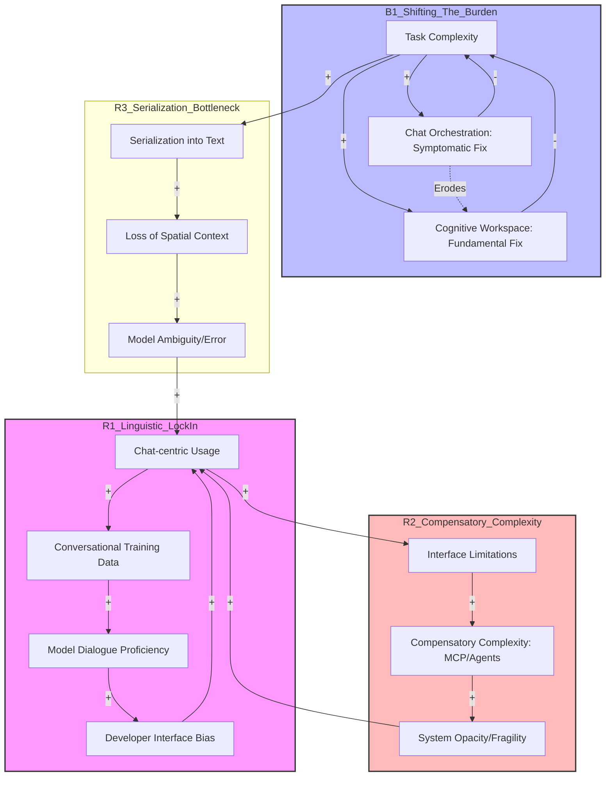

<button class="tab-btn active" onclick="openTab(event, 'article')">Article</button>
<button class="tab-btn" onclick="openTab(event, 'analogy')">Analogy</button>
<button class="tab-btn" onclick="openTab(event, 'brainstorm')">Brainstorm</button>
<button class="tab-btn" onclick="openTab(event, 'perspectives')">Multi-Perspective</button>
<button class="tab-btn" onclick="openTab(event, 'dialectical')">Dialectic</button>
<button class="tab-btn" onclick="openTab(event, 'socratic')">Socratic Dialog</button>
<button class="tab-btn" onclick="openTab(event, 'systems')">Systems Thinking</button>

# The LCARS Principle

---

## Why Every AI Interface Is a Chat Window — and What Star Trek Knew About the Alternative

There is a design pattern hiding in plain sight. It has been on television since 1987, embedded in the bridge of a fictional starship, absorbed by millions of viewers who never thought to extract it as engineering guidance. The pattern is this: when you have a system capable of both linguistic reasoning and operational action, do not force all interaction through the linguistic channel. Build a structured environment. Embed the conversational engine within it. Let language handle what language is good at. Let spatial, direct-manipulation interfaces handle what they are good at. Let both share state.

The *Enterprise* computer and its LCARS interface implement this pattern with a clarity that the current AI industry has not yet matched. Every major language model ships inside a chat window — a single channel of undifferentiated prose carrying intent, instruction, context, correction, and feedback in one stream. The result is an ecosystem of brilliant retrofits — prompt engineering, retrieval-augmented generation, agent frameworks, tool-use protocols — each compensating for structure that the interface never provided. These retrofits are symptoms of an architectural decision made so early it has become invisible: the decision to make conversation the environment rather than a component of one.

This essay traces that decision to its roots, measures its costs, and argues for a different architecture — one that Star Trek's designers, whether they knew it or not, got right.

## Section 1: Why Every LLM Became a Chat Window

It is worth pausing on a fact so obvious it has become invisible: virtually every large language model ships inside a chat window. Not a spreadsheet, not a design canvas, not a cockpit of dials and readouts — a chat window. A blinking cursor beneath a thread of alternating messages, like a therapist's office reimagined as a SaaS product. This is not an accident of design taste. It is the convergence of three forces, each of which makes chat not merely convenient but structurally necessary given the current state of the technology.

### Chat hides cognitive limitations

The first force is concealment. Large language models have profound cognitive limitations — in planning, in persistent memory, in long-horizon reasoning — and chat is the one interface paradigm that makes those limitations nearly invisible. Consider what happens when you ask a model to execute a twelve-step workflow. In a structured interface — a pipeline builder, say, or a project management board — failure at step seven is conspicuous. The step is there, visibly incomplete, a red cell in a green table. But in a chat window, failure at step seven looks like... a new message. The model simply produces text, and if that text is plausible, the user may not notice that the plan has quietly derailed. Chat is a river; it flows forward. It does not expose the architecture of the task, so it cannot expose the places where the architecture has collapsed.

This is not a minor ergonomic detail. It is a fundamental relationship between interface structure and the legibility of failure. A Gantt chart makes missed dependencies obvious. A spreadsheet makes broken formulas obvious. A chat transcript makes almost nothing obvious except the surface fluency of the last response. For a technology whose failure mode is *confident fluency in the absence of understanding*, this is a remarkably forgiving frame. The chat window does not merely tolerate hallucination — it is the one container in which hallucination can pass as contribution.

Memory limitations receive the same treatment. Models operating within a context window have no durable memory across sessions and only fragile memory within them. In a structured interface — a database, a notebook with named variables, a stateful application — the absence of memory would be immediately apparent. Fields would be empty. References would break. But in chat, the user simply re-explains, re-provides context, re-establishes the frame, and the conversation continues as though nothing was lost. The labor of memory management is silently transferred to the human, who may not even register that they are performing it. Chat makes the user the model's hippocampus, and it does so without ever naming the arrangement.

### Chat matches the training distribution

The second force is distributional. Language models are trained overwhelmingly on dialog, question-and-answer pairs, forum threads, and conversational text. This is the water they swim in. When you place a model inside a chat interface, you are asking it to do the thing it has seen most often: produce the next plausible turn in a conversation. The model is, in a very literal sense, at home.

But consider what is *not* well-represented in the training data: structured workflows, schema-driven interactions, form completions with validation logic, multi-step processes with explicit state transitions. These artifacts exist in the world, of course, but they are not the bulk of what the internet has published as text. The training distribution is heavy on "someone asked, someone answered" and light on "a system presented a structured interface, a user made a series of constrained choices, and the system updated its state accordingly." When vendors build chat interfaces, they are aligning the interaction paradigm with the statistical strengths of the model. When they attempt structured interfaces, they are fighting the distribution — asking the model to perform in a register it has seen far less often, with correspondingly less reliability.

This creates a subtle but powerful lock-in. The interface that works best today is the interface that matches the data the model was trained on, which in turn becomes the interface that generates the next round of training data (via RLHF, user feedback, and conversation logs), which further reinforces the model's fluency in that mode. Chat begets chat. The conversational paradigm is not just a design choice; it is a self-reinforcing loop between training distribution and deployment interface, each shaping the other toward the same attractor.
This feedback loop has a name in the platform economics literature: a data moat. Current Reinforcement Learning from Human Feedback pipelines are designed to make models better at *conversing* — ranking response pairs, optimizing for turn-level preference. Moving to a structured workspace would require an entirely different data collection paradigm: capturing not ranked responses but ranked *action sequences* in a stateful environment. No major vendor has an incentive to build that pipeline while the conversational one is still generating returns. The training loop does not merely favor chat. It actively starves the alternatives of the data they would need to compete.

### Chat lets vendors avoid committing to a cognitive model

The third force is ontological evasion. Building a structured interface requires declaring, in advance, what the system *is* — what it knows, what it can do, what the units of work are, how tasks decompose, where the boundaries of competence lie. A structured interface is a commitment to a cognitive model: this system operates on *these* entities, in *this* order, with *these* capabilities and *these* limitations. That commitment is expensive, not because the engineering is hard (though it is), but because it is *falsifiable*. The moment you build a panel that says "Planning" or a module that says "Memory," you have made a claim that users can test and find wanting.

Chat avoids this entirely. A chat window makes no claims about the system's cognitive architecture. It does not say "I can plan" or "I can remember" or "I understand your schema." It simply says: "Type something." The burden of structuring the interaction falls entirely on the user, who must discover the model's capabilities through exploration, prompt engineering, and trial and error. This is enormously advantageous for the vendor. There is no declared ontology to be wrong about. There is no feature list that can be audited against actual performance. There is only a text box and the implication of general intelligence — an implication that chat's open-endedness sustains without ever having to defend.

This is why the chat interface has proven so durable even as models have become more capable. Greater capability, in a chat frame, simply means better responses — not a different interface. The vendor never has to renegotiate the contract with the user, never has to redesign the interaction model, never has to admit that last quarter's "Planning" module was actually just next-token prediction with a system prompt. Chat is the universal solvent of product commitment: it dissolves every specific claim into the general fog of conversational competence.
There is a strategic dimension to this evasion that extends beyond mere convenience. In a competitive landscape where valuations are tied to perceived generality, a chat window suggests an infinite horizon of capability. A structured interface — a specialized CAD tool, a dedicated planning module — suggests a niche. The blank text box allows the vendor to maintain what might be called "God-Object" status: the model is perceived as capable of anything, commanding a platform premium that a domain-specific tool never could. Ontological evasion is not just a technical shortcut. It is a valuation strategy.

### The convergence

These three forces — concealment of limitation, alignment with training distribution, and evasion of ontological commitment — are not independent. They reinforce each other. Because the model's limitations are hidden, vendors feel no pressure to build interfaces that would address them. Because the training distribution favors conversation, structured alternatives perform worse, which justifies not building them. Because no cognitive model is declared, there is no framework against which to measure progress or demand improvement. The result is an equilibrium that is locally stable and globally suboptimal: every LLM is a chat window, every chat window works well enough, and the question of what a *better* interface might look like remains largely unasked.

It is into this equilibrium that we want to introduce a different idea — not from computer science, but from a television show that spent decades thinking about how humans might interact with systems that are genuinely intelligent.
---

## Section 2: Chat as Control Surface — Flexible, Inexact, Verbose

To understand why the chat paradigm is so durable, we need to be precise about what it actually *is* as a control surface — what it gives you, what it costs you, and why the costs are not incidental but structural.

### What chat gives you

Chat gives you two things that no other interface paradigm can match: unbounded expressivity and near-zero activation energy.

Unbounded expressivity means there is no request you cannot *attempt*. A chat window accepts natural language, and natural language can describe anything — a business strategy, a poem, a database schema, a feeling, a counterfactual history, a recipe that substitutes ingredients based on what's in your fridge. There is no menu to constrain you, no dropdown whose options don't include your intent, no form field that rejects your input as the wrong type. You can say anything. This is genuinely powerful. Most software interfaces fail not because they do the wrong thing, but because they cannot even *hear* the right thing. Chat has no such deafness. Its vocabulary is the full space of human expression.

Near-zero activation energy means you can begin immediately. There is no setup, no configuration, no schema to define, no workflow to construct before you get your first result. You type a sentence and something comes back. For exploration, for brainstorming, for the first ten minutes of any ill-defined task, this is extraordinary. The distance between "I have a vague idea" and "I am interacting with a system that responds to my idea" is one sentence long. No other interface in the history of computing has collapsed that distance so completely.

These are real strengths, and they explain chat's popularity far more honestly than any narrative about artificial general intelligence. Chat is popular because it is *easy* — easy to start, easy to use, easy to understand. It is the pointing-and-grunting of AI interaction: maximally accessible, minimally demanding, and remarkably effective for simple needs.

### What chat costs you

But pointing and grunting, however effective at the fish market, is not how you commission a building. And the costs of chat as a control surface are not minor inefficiencies to be optimized away. They are structural properties of natural language itself, and they become more severe precisely as the task becomes more important.

**Underspecification.** Natural language is almost always underspecified relative to the task it is trying to control. "Make it more professional" — more professional how? In tone? In formatting? In vocabulary? Relative to what audience? "Summarize this document" — at what length? Preserving what structure? For what purpose? Every natural language instruction carries an iceberg of unstated assumptions beneath its surface, and the model must guess at all of them. Sometimes it guesses well. Often enough, it guesses plausibly but wrongly, and the user does not discover the divergence until three exchanges later, when the accumulated misalignment has become expensive to unwind.

**Context-dependence.** The meaning of a chat message depends on everything that came before it — and on much that was never said at all. "Do the same thing but for Q2" requires the model to identify what "the same thing" was, which parts of it are invariant and which are parameterized by the quarter, and what "Q2" means in the context of this particular conversation (calendar quarter? fiscal quarter? the second item in a list?). In a structured interface, these references would be explicit: a function with named parameters, a template with slots, a query with bound variables. In chat, they are implicit, recoverable only through inference over an increasingly long and noisy context window. Every message is a palimpsest, and the model must read all the layers simultaneously.

**Redundancy and verbosity.** Natural language is profoundly redundant. This is a feature for human communication — redundancy aids comprehension, provides emphasis, and allows for graceful recovery from mishearing. But it is a cost for machine control. A three-paragraph chat message may contain one sentence of actual instruction and two paragraphs of context-setting, hedging, politeness, and repetition. The model must parse all of it, decide what is operative and what is decorative, and hope that its classification matches the user's intent. This is not a trivial parsing problem. "It would be great if you could maybe try to make the title a bit shorter, if that makes sense" and "Shorten the title" are the same instruction at vastly different verbosity levels, but the first carries social signals (tentativeness, deference) that the model may interpret as substantive (optionality, low priority). The noise is not just wasted bandwidth; it is a source of misinterpretation.
There is a technical cost to this redundancy that compounds silently. In a chat-centric architecture, the model's context window — its finite working memory — must hold the entire conversation history. Every polite hedge, every restated constraint, every paragraph of context-setting consumes tokens that could carry task-relevant data. The signal-to-noise ratio of a typical chat transcript is remarkably poor. Politeness, repetition, and formatting instructions dilute the very resource the model needs most: attention over the information that actually matters. This is not just an efficiency problem. It is a reliability problem. As the context window fills with conversational sediment, the model's ability to attend to critical constraints stated early in the conversation degrades — not because the constraints were forgotten, but because they are buried under layers of noise that the attention mechanism must sift through.

**Ambiguity.** This is the deepest problem, and it is not fixable within the chat paradigm. Natural language is *constitutively* ambiguous. "The chicken is ready to eat" has two readings. "I never said she stole my money" has seven, depending on emphasis. These are parlor tricks, but the real ambiguity in chat-as-control-surface is far more consequential: the ambiguity between *types of speech act*. When a user writes a sentence in a chat window, that sentence might be:

- A hard requirement ("The output must be valid JSON")
- A soft preference ("I'd like it to be concise")
- A constraint ("Don't use any external libraries")
- A piece of context ("We're a B2B SaaS company")
- A metaphor ("Make it sing")
- An example ("Something like: 'Welcome to the future'")
- A correction ("No, I meant the *other* table")
- A joke ("And make sure it doesn't become sentient, ha ha")

These are fundamentally different categories of communicative intent, and they require fundamentally different handling. A requirement must be satisfied. A preference should be weighted. A constraint must be enforced. Context must be stored. A metaphor must be interpreted. An example must be generalized from, not copied. A correction must override previous state. A joke must be recognized and not executed.

But chat collapses all of these into one undifferentiated token stream. There is no markup, no metadata, no channel separation. Requirements and preferences and metaphors and jokes arrive in the same font, in the same text box, in the same sequence of tokens. The model must perform speech-act classification on every sentence — must guess, from surface form and context alone, whether "make it sing" means "improve the prose quality" or "add audio output" or "I am being playful and you should not take this literally." And it must do this not for one sentence in isolation, but for every sentence in a growing conversation where the speech-act types shift constantly and without warning.

This is the fundamental problem with chat as a control surface: it is a single channel carrying multiple signal types with no multiplexing protocol. It is as if you tried to control an orchestra by shouting all your instructions — tempo, dynamics, articulation, emotion, section cues — in one continuous stream of prose, and the musicians had to figure out which words were for them and what kind of instruction each word represented. It would work, after a fashion. For simple pieces. With a very attentive orchestra. But it would not scale, and the failure modes would be exactly the ones we see in chat-driven AI interaction: misclassified intent, dropped constraints, over-literal interpretation of metaphor, under-literal interpretation of requirements.

### The pointing-and-grunting problem

There is a useful spectrum to consider. At one end: pointing and grunting. You gesture at what you want, make noises that convey urgency and valence, and rely on shared context and the other party's intelligence to fill in the gaps. This is high-bandwidth in one sense (you can point at anything) and zero-bandwidth in another (you cannot specify tolerances, edge cases, or conditional logic). At the other end: a formal specification. A legal contract. An engineering blueprint. An API schema with typed parameters, validation rules, and explicit error handling. This is low-bandwidth in one sense (you can only say things the schema allows) and extremely high-bandwidth in another (everything you say is unambiguous, machine-readable, and enforceable).

Chat lives surprisingly close to the pointing-and-grunting end of this spectrum. Yes, it uses words, and words feel precise. But the precision is largely illusory. "Write me a marketing email for our new product launch targeting enterprise CTOs with a professional but approachable tone, about 300 words, highlighting the three key features I mentioned earlier" — this *feels* specific. But compare it to what a structured interface could capture: audience segment (selected from a defined taxonomy), tone (positioned on calibrated scales), length (a number with units), features (selected from a product database, each with a defined description and priority weight), template (chosen from tested options), constraints (legal disclaimers required, competitor mentions forbidden, specific claims pre-approved by compliance). The chat version is pointing and grunting with better vocabulary. The structured version is a control surface.

The irony is that as tasks become more important — higher stakes, more complex, more collaborative, more repeatable — the need for precision increases, and chat's structural weaknesses become more costly. The casual user asking for a poem can tolerate ambiguity; the enterprise team building a production pipeline cannot. But both are given the same interface: a text box and a prayer.

### Writing a letter to someone who guesses well

What makes chat *feel* adequate, despite these structural problems, is that the model on the other end is an extraordinarily good guesser. It has seen billions of conversations. It has strong priors about what people usually mean. When you say "make it more professional," it guesses correctly often enough that the interaction feels like communication rather than lottery. This is genuinely impressive, and it is the reason chat works at all.

But "works at all" is not the same as "works well," and "guesses correctly often enough" is not the same as "reliably executes intent." The gap between these is where value is destroyed — where the user spends three follow-up messages correcting a misinterpretation that a structured interface would have prevented, where the model silently drops a constraint that was stated in message four and contradicted by implication in message eleven, where the output is 80% right in a domain where 80% right is useless.
This gap has a technical name: stochastic drift. Because the model has no dedicated state-tracking module — its "memory" is simply the previous tokens in the context window — a small error in message three becomes part of the ground truth for message four. The error does not announce itself. It compounds silently, each subsequent response building on a foundation that has shifted imperceptibly from the user's actual intent. In a structured interface, drift is visible: a value has changed, a dependency has broken, a status indicator has turned red. In chat, drift is invisible until the accumulated misalignment surfaces as a catastrophic mismatch between what the user wanted and what the model produced — often many turns too late to unwind cheaply.

The model's guessing ability masks the interface's poverty, just as a brilliant assistant can mask a terrible communication process. If your assistant consistently produces great work despite your vague and contradictory instructions, the problem is not solved — it is hidden. You are dependent on the assistant's ability to compensate for your lack of structure, and the day the task exceeds that compensatory capacity, the whole system fails at once, without warning, because no structure was ever built to catch the fall.

This is where chat-driven AI interaction sits today: in the zone where the model's compensatory intelligence is sufficient for simple tasks and insufficient for complex ones, with no structural scaffolding to bridge the gap. The interface provides expressivity without precision, accessibility without reliability, and the illusion of communication without the machinery of mutual understanding.

What we need is not less expressivity — the ability to say anything is genuinely valuable and should be preserved. What we need is *additional* control surfaces that provide the precision, structure, and signal separation that chat cannot. Not instead of chat. Alongside it. The question is what those surfaces should look like.

---

## Section 3: The GUI Contrast — Spatial, Discrete, Grounded

To understand what those surfaces might look like, it helps to remember what we already had — and what we quietly abandoned when we fell in love with the text box.

Graphical user interfaces are not a technology. They are an *argument* — a decades-long, painstakingly refined argument about how humans and machines should encode intent. Every widget, every layout decision, every hover state and disabled button is a claim about the structure of a task and the boundaries of what the system can do. GUIs are not merely visual. They are *epistemic*. They are machines for making knowledge visible and action legible.

The contrast with chat is not cosmetic. It is architectural, and it runs all the way down.

### Selection as focus

The most fundamental operation in a GUI is selection. You click on a thing. That thing becomes the focus of subsequent action. This is so basic it seems trivial, but consider what it accomplishes: it resolves reference. When you click on a file, a cell, a layer in Photoshop, a node in a graph — you have told the system, with zero ambiguity, *what you are talking about*. The referent is not implied, not inferred from context, not recoverable only through anaphora resolution over a growing conversation history. It is *selected*. It is highlighted. It is the thing with the blue border.

Compare this to chat. "Change the color of the header." Which header? The page header? The section header? The email header mentioned three messages ago? The header in the code block or the header in the rendered preview? In a GUI, you would click the header. The system would know. In chat, the system guesses, and you discover whether it guessed correctly only when you see the output — or, worse, when you don't notice that it guessed wrong.

Selection is not just a convenience. It is a *protocol for grounding reference in shared state*. Both the user and the system can see what is selected. Both can verify. The referent is not a linguistic construct floating in a token stream; it is a visual object with a position, a boundary, and a highlight color. This is what philosophers of language call *deixis* — pointing — and it turns out that pointing, far from being primitive, is one of the most powerful disambiguation tools humans have ever developed. GUIs formalized it. Chat abandoned it.
The power of deixis becomes even more apparent when you consider what it does for the model, not just the user. In a chat-centric architecture, the model must perform anaphora resolution — figuring out what "it," "that," and "the one I mentioned" refer to — across an increasingly long and noisy context window. This is computationally expensive and statistically fragile. In a workspace where the user can select an object while speaking, the model receives not a linguistic puzzle but a direct pointer: this object, this state, this scope. The reference is resolved before the model even begins to process the instruction. Selection is not just a human convenience. It is a computational gift to the model — a way of collapsing an entire class of inference problems into a single, unambiguous signal.

### Contextual actions: the vocabulary of the possible

When you right-click on a selected object in a well-designed GUI, you get a context menu. That menu is a *vocabulary* — not of everything the system can do, but of everything the system can do *to this object, in this state*. It is a scoped, filtered, relevant set of actions. You cannot apply a blur filter to a spreadsheet cell. You cannot merge layers in a text editor. The menu does not show you those options, because they do not apply. The absence is informative. It tells you something about the nature of the object you have selected and the operations that are meaningful for it.

This is constraint exposure, and it is one of the most underappreciated properties of graphical interfaces. A GUI does not merely let you do things; it *shows you what can be done*. It makes the action space visible. In chat, the action space is invisible and unbounded — you can ask for anything, but you have no way of knowing what the system can actually accomplish until you ask and see what happens. The context menu is a contract: these are the verbs that apply to this noun. Chat offers no such contract. It offers only the void of the text box and the hope that your verb is in the model's vocabulary.

### State visibility: the world as it is, not as it was described

A GUI shows you the current state of the system. The file is saved or unsaved. The checkbox is checked or unchecked. The slider is at 73%. The progress bar is at 40%. The button is grayed out because a precondition is not met. This is not decoration. It is *continuous, ambient, non-verbal communication* about the state of the world you are operating in.

In chat, state is invisible unless you ask about it — and even then, the answer is a description of state, not state itself. "What's the current value of X?" returns a sentence. That sentence might be wrong. It might be stale. It might describe the state as of three messages ago, before a subsequent instruction changed it. You cannot glance at a chat transcript and see the current state of anything. You can only read the most recent message and trust that it reflects reality. The chat window is a stream of *claims about state*, not a *representation of state*. The difference is the difference between looking at a thermometer and asking someone what the temperature is.
This distinction — between representing state and describing it — has consequences that extend beyond convenience into the domain of trust. A thermometer can be miscalibrated, but it cannot *lie*. It shows what it shows. A verbal report of temperature, by contrast, can be stale, misremembered, rounded, or fabricated. The same asymmetry applies to AI interfaces. When a model tells you "the analysis is complete and the results look good," you are receiving a claim. When a dashboard shows you a green status indicator next to a completed pipeline step with a timestamp and a link to the output, you are receiving evidence. The claim requires trust. The evidence permits verification. Chat trades in claims. Spatial interfaces trade in evidence. For any task where the cost of a wrong answer exceeds the cost of checking, the difference is not ergonomic. It is epistemic.

### Mode clarity: knowing what kind of thing you are doing

GUIs make modes explicit. You are in edit mode or view mode. You are using the selection tool or the brush tool. You are in the "Format" tab or the "Data" tab. The current mode is indicated visually — a highlighted tab, a changed cursor, a different toolbar. You know what kind of action the system expects from you, and you know what kind of effect your actions will have.

Chat has no modes, or rather, it has one mode: *talking*. Whether you are defining requirements, providing feedback, asking a question, correcting an error, or changing the subject entirely, you are doing the same physical action — typing text into a box. The system must infer the mode from the content. Are you giving a new instruction or amending the previous one? Are you asking a clarifying question or making a rhetorical point? Are you starting a new task or continuing the old one? These are mode distinctions, and in a GUI they would be explicit — different screens, different tools, different interaction patterns. In chat, they are all collapsed into the same undifferentiated input stream, and the model must reconstruct the mode from linguistic cues that are often absent or ambiguous.

### Constraints as objects: the grammar of the interface

Here is perhaps the deepest difference. In a GUI, constraints are not described — they are *embodied*. A slider has a minimum and a maximum. You cannot drag it past either end. The constraint is not a rule you must remember; it is a physical property of the object you are manipulating. A checkbox is a Boolean. It is checked or unchecked. There is no third state, no ambiguity, no "kind of checked." A dropdown menu offers exactly the options that are valid. You cannot type "giraffe" into a dropdown that contains ["small", "medium", "large"]. The interface does not need to tell you that "giraffe" is not a valid size. It simply does not offer it.

These are not limitations. They are *encodings*. Every widget in a GUI is a tiny formal language, a grammar that specifies exactly what can be said and how. A slider says: "This value is continuous, bounded, and one-dimensional." A checkbox says: "This is a binary choice." A color picker says: "This value lives in a color space, and here are the dimensions you can manipulate." Each widget encodes the *type* of the value, the *range* of valid inputs, and the *dimensionality* of the choice — all without a single word of explanation. The user does not need to know the constraints because the interface *is* the constraints.

In chat, constraints must be stated in natural language, which means they must be remembered, interpreted, and enforced by the model. "Keep it under 500 words." Is that a hard constraint or a soft preference? Will the model count? Will it count correctly? What happens at 510 — failure or acceptable deviation? A word-count field with a maximum value answers all of these questions silently. The constraint is structural, not linguistic. It cannot be forgotten, misinterpreted, or silently violated.

### The interpretive burden: who does the work?

All of these properties — selection, contextual actions, state visibility, mode clarity, constraint embodiment — point to a single underlying principle: **GUIs shift the interpretive burden from the user to the system.**

When you interact with a GUI, the system does the work of structuring the interaction. It decides what objects exist, what actions are available, what states are possible, what constraints apply. It presents this structure visually, and you navigate it. Your job is to *choose*, not to *specify*. You do not need to describe what you want in sufficient detail for an intelligent listener to reconstruct your intent. You need only to select, adjust, click, drag — to make choices within a structure that the system has already provided.

Chat inverts this entirely. In chat, the user does the work of structuring the interaction. The user must decide how to decompose the task, what to specify and what to leave implicit, how to refer to previous context, when to correct and when to continue, how to encode constraints in prose that the model will interpret correctly. The system's job is to *guess* — to reconstruct, from an undifferentiated stream of tokens, the structure that a GUI would have made explicit. The interpretive burden falls on the model, yes, but the *specification* burden falls on the user. And because the user has no structural tools for specification — no widgets, no schemas, no typed fields — they must do this work entirely in prose, which is to say, they must do it badly. Not because they are bad at prose, but because prose is a bad tool for precise specification. That is not a claim about human ability. It is a claim about the information-theoretic properties of natural language versus structured input.

This is why a five-minute interaction with a well-designed GUI can accomplish what takes twenty minutes of chat: not because the GUI is faster to click, but because the GUI has already done the work of structuring the task, exposing the constraints, resolving the references, and disambiguating the modes. The user arrives at a pre-structured problem and makes choices. The chat user arrives at a blank text box and must build the structure from scratch, in prose, every time.

### What GUIs cannot do

None of this means GUIs are sufficient. They have a profound limitation that is the mirror image of chat's profound strength: GUIs can only express what their designers anticipated. A dropdown with three options cannot capture a fourth. A form with five fields cannot accept a sixth concern. A workflow with three steps cannot accommodate a task that requires three and a half. GUIs are *closed* vocabularies — precise, unambiguous, and structurally sound, but bounded by the imagination of their creators.

This is why the choice between chat and GUI is a false dichotomy. Chat gives you an open vocabulary with no structure. GUIs give you a closed vocabulary with rich structure. What we actually need — what the LCARS principle points toward — is an interface that provides *structured interaction over an open vocabulary*. A way to get the precision of widgets, the disambiguation of selection, the constraint exposure of well-designed forms, and the state visibility of graphical interfaces, without sacrificing the expressivity and flexibility that make chat genuinely powerful.
This is also where the generalist's dilemma bites hardest. You cannot build a GUI for every possible thing a language model can do. The action space is too vast, too unpredictable, too dependent on context that no designer can anticipate. But you do not need to. The insight is not that every interaction needs a bespoke interface designed in advance. It is that the *model itself* can participate in generating the structured layer — proposing widgets, rendering schemas, assembling task-specific control surfaces from a library of human-designed primitives. The vocabulary of the interface remains open because the model can extend it. The grammar of the interface remains structured because the primitives enforce it. The designer's role shifts from authoring every screen to authoring the design system's DNA — the constraints, the aesthetics, the interaction grammar — and the model becomes the assembler, not the architect.

The question is not "chat or GUI?" The question is: what would it look like to have both at once — to let the user speak freely *and* to give the system the structural tools to make that speech precise, grounded, and unambiguous? To combine the open channel with the closed grammar? To build an interface where natural language is not the *only* control surface but one of *several*, each carrying the signal type it is best suited for?

That question has been answered, at least in fiction. And the answer has been on television since 1987. But before we get to the *Enterprise*, we need to examine a more immediate problem: the structural consequences of how the industry chose to integrate tools with language models.

---

## Section 4: The Great Inversion — Tools Added to Chat, Not Chat Added to Tools

Here is the structural claim at the center of this essay, and it needs to be stated plainly before it can be argued: **the entire industry built tools around chat, when it should have been embedding chat inside tools.**

This is not a quibble about UI layout. It is a claim about the direction of a fundamental architectural relationship — which component contains which, which component is the environment and which is the feature, which sets the rules of engagement and which operates within them. Get this relationship backwards and everything downstream deforms: how users specify intent, how systems maintain state, how actions compose, how errors surface, how collaboration works. The industry got it backwards. The consequences are everywhere.

### How the inversion happened

The sequence is easy to reconstruct. Large language models were born inside chat. The research prototypes were chat interfaces. The first public demos were chat interfaces. The product that captured the world's attention in late 2022 was a chat interface. By the time anyone asked "what should we build with this technology?", the technology already *had* an interface, and that interface was a conversation.

So when it came time to add capabilities — web browsing, code execution, image generation, file analysis, database queries, API calls — each capability was added *to the chat*. The chat window remained the environment, the ground, the container. Tools became things the model could *invoke mid-sentence*, their inputs drawn from conversational context and their outputs rendered as new messages in the thread. Browse the web? The model mentions it in a message. Run code? The output appears in the conversation. Generate an image? It shows up between paragraphs of text, like an illustration in a letter.

The alternative — the road not taken — would have been to start with the tool. Start with the code editor, the spreadsheet, the design canvas, the project board, the data pipeline. Then embed a language model *inside* that environment as one component among many: a natural-language interface to the tool's existing structure, a way to manipulate the tool's native objects using conversational input, a collaborator that operates within the tool's ontology rather than replacing it with its own.

This is not a hypothetical. It is what LCARS does on the Enterprise. The ship has a bridge — a structured environment with stations, readouts, controls, and spatial organization. The computer's conversational interface is embedded *within* that environment. When Picard says "Computer, display the Romulan fleet positions," the result does not appear as a paragraph of text in a chat log. It appears on the tactical display — a spatial, structured, persistent representation that every officer on the bridge can see, reference, and act upon. The conversation is the input channel. The tool is the environment. The tool's structure governs how the response is rendered, where state lives, and what actions are available next.

The industry did the opposite. It made the conversation the environment and turned every tool into a guest in someone else's house.

### Consequence one: tools become verbs instead of objects

When you add a tool to a chat interface, the tool has no persistent presence. It is not an object on screen that you can see, inspect, configure, and return to. It is a *verb* — something the model does in the course of generating text, then moves past. "I've searched the web for you." "I've run the code." "I've generated the image." The tool fires, produces output, and the conversation flows onward. The tool's state, if it has any, is buried in the transcript. Its configuration is implicit in the prompt. Its output is interleaved with prose, indistinguishable in kind from the model's own commentary.

Compare this to a tool that exists as an object in a workspace. A code editor is *there* — persistent, visible, stateful. You can see the current file. You can see the cursor position. You can see the syntax highlighting, the error markers, the git diff in the gutter. The tool's state is not described; it is *displayed*. You do not need to ask "what does the code look like now?" because you are looking at it. The tool is a noun, not a verb. It has spatial presence, temporal persistence, and an independent existence that does not depend on the conversational thread to sustain it.

When tools are verbs in a text stream, they inherit all the pathologies of text streams: they are sequential, ephemeral, and context-dependent. When tools are objects in a workspace, they inherit the properties of spatial interfaces: they are persistent, inspectable, and independently addressable. The choice of containment — does the chat contain the tool, or does the tool contain the chat? — determines which set of properties the tool gets. The industry chose the set that makes tools harder to use.

### Consequence two: context becomes implicit instead of explicit

In a chat-centric architecture, the context for every action is the conversation history. When the model invokes a tool, the tool's inputs are derived from what has been said — parsed from prose, inferred from implication, reconstructed from the accumulating sediment of the thread. The user does not explicitly bind inputs to the tool. The model guesses which parts of the conversation are relevant, extracts parameters from natural language, and hopes the extraction is correct.

In a tool-centric architecture, context is explicit. The tool has a state — a document, a dataset, a canvas, a schema — and that state is visible to both the user and the model. When the user invokes the language model within the tool, the model receives not a conversational history but a *structured context*: the current file, the selected cells, the active layer, the query results, the error log. The context is not inferred; it is *given*. It is not a reconstruction from prose; it is a direct reference to the tool's own state.

This difference is not cosmetic. It is the difference between a surgeon who must reconstruct the patient's anatomy from a verbal description and a surgeon who can see the operating field. Implicit context, derived from conversation, is lossy, ambiguous, and fragile — it degrades as the conversation grows, it shifts as new messages recontextualize old ones, and it fails silently when the model's extraction misses a constraint stated six messages ago. Explicit context, derived from tool state, is precise, current, and verifiable — it is whatever the tool says it is, right now, and both parties can see it.
There is a design pattern emerging in frontier AI research that formalizes this distinction: *state-as-prompt*. Instead of feeding the entire conversation history into the model's context window, the system feeds a structured summary of the current workspace state — a JSON representation of the active objects, their properties, their relationships, and their constraints. The model receives not a narrative of what has been discussed but a snapshot of what *is*. This is computationally more efficient (fewer tokens wasted on conversational noise), more reliable (the state is authoritative, not reconstructed), and more auditable (the input to the model is inspectable and versioned). State-as-prompt is the technical implementation of a simple principle: give the model the world, not the story of the world.

### Consequence three: actions are serialized instead of parallel

Chat is a serial medium. One message follows another. One turn follows another. Even when the model invokes multiple tools, it does so in sequence — or, at best, in a parallelism that is invisible to the user, whose experience is still a linear stream of messages. You cannot, in a chat interface, simultaneously adjust a parameter, observe a visualization, and dictate a constraint. You can do these things one at a time, in order, each as a separate message, each waiting for a response before the next can begin.

A spatial workspace supports parallel interaction natively. You can have a code editor open next to a terminal next to a documentation panel next to a visualization. You can drag a slider with one hand and watch a chart update in real time. You can select a region on a map and see a data table filter simultaneously. These are not sequential actions mediated by a conversation; they are concurrent manipulations of a shared state space, each through the control surface best suited to it.

The serialization imposed by chat is not merely slow. It is *cognitively impoverishing*. Complex tasks are not linear. They involve simultaneous consideration of multiple dimensions — adjusting one parameter while monitoring its effect on three others, comparing two options side by side, maintaining awareness of constraints while exploring possibilities. A spatial interface supports this because it can present multiple facets of the task simultaneously. Chat cannot, because it has only one channel, and that channel is sequential. Every complex task, no matter how inherently parallel, must be flattened into a sequence of turns. The user must hold in their head what the interface refuses to hold on screen.

### Consequence four: the user becomes the orchestrator

This is perhaps the most consequential result of the inversion, and the least discussed. When tools are embedded in chat, there is no system-level structure governing how they compose. There is no pipeline, no workflow, no declared dependency between one tool's output and another's input. There is only the user, typing messages, deciding what to do next, remembering what has been done, tracking what state each tool is in, and manually routing information from one capability to another.

"Take the data from the CSV I uploaded, clean it using the rules I described earlier, run the analysis I asked about, and generate a visualization like the one I showed you last week." This is not a task description. It is an *orchestration plan*, and the user is the orchestrator. They are the scheduler, the state manager, the error handler, and the integration layer. They are performing, in prose, the work that a workflow engine would perform in code — and they are doing it without any of the tools a workflow engine provides: no dependency graphs, no checkpoints, no rollback, no parallel execution, no typed interfaces between stages.

In a tool-centric architecture, orchestration is the tool's job. The tool defines the workflow. The tool manages the state. The tool routes outputs to inputs. The language model participates in this workflow — perhaps controlling one stage, perhaps advising on configuration, perhaps translating between natural language intent and structured parameters — but it does so *within* a structure that the tool provides. The user's job is to direct, not to orchestrate. They say what they want; the system figures out how to coordinate the pieces.

The chat-centric architecture makes the user the weakest link in a system integration problem they never signed up for. Every dropped constraint, every forgotten intermediate result, every misrouted piece of context is the user's fault — not because the user is careless, but because the architecture assigned them a job that no human should be doing in prose. Orchestration is a systems problem. Chat makes it a writing problem. And then we wonder why complex tasks fail.

### The inversion is self-reinforcing

Like the forces that created the chat monoculture in Section 1, the inversion is not a one-time mistake but a self-reinforcing dynamic. Because tools were added to chat, users learned to think of AI capabilities as things you *ask for* in conversation. Because users ask for capabilities in conversation, product teams build more capabilities as chat-invocable tools. Because more capabilities are chat-invocable, the chat interface becomes more central, more load-bearing, more difficult to replace. The conversation thread becomes the de facto state store, the de facto workflow engine, the de facto integration bus — not because it is good at any of these things, but because nothing else was built.

Meanwhile, the tools that *could* serve as environments — the code editors, the design canvases, the data platforms, the project management systems — integrate AI as a chat sidebar. A little panel on the right side of the screen where you can "ask the AI" about your work. This is the inversion made literal: the tool is the environment, but the AI is quarantined in a chat box *within* the tool, unable to see the tool's full state, unable to manipulate the tool's native objects directly, unable to participate as a first-class component of the tool's interaction model. It is the worst of both worlds — the tool exists, but the AI cannot fully inhabit it; the chat exists, but it is cut off from the structure it needs.

### What the inversion costs

The aggregate cost of the inversion is this: we have built an ecosystem in which the most powerful cognitive technology ever created is trapped in the least structured interaction paradigm ever widely deployed. The language model can reason, generate, analyze, translate, and transform — but it can only do these things in response to prose, in a serial stream, with implicit context, without persistent state, and without any structural relationship to the artifacts it is helping to create.

This is like giving a master architect a telephone and no drafting table. The architect can still do extraordinary things — describe buildings, reason about structures, answer questions about materials and codes and aesthetics. But they cannot *draw*. They cannot point to a wall and say "move this." They cannot see the floor plan and the elevation simultaneously. They cannot pick up a physical model and rotate it. They are limited to the bandwidth of speech, and speech, for all its power, is not the medium in which architecture is done.

The language model is in the same position. It is a general-purpose cognitive engine confined to a single-channel, serial, unstructured, stateless interaction medium. Everything it does must be mediated by prose — requested in prose, delivered in prose, corrected in prose, composed in prose. The richness of its capabilities is filtered through the poverty of its interface, and what emerges is less than what went in.

The fix is not to make chat better. Chat is already as good as chat can be. The fix is to invert the inversion — to put the tool back in the center and embed the conversation within it. To give the language model not a text box but a *world*: a structured environment with objects it can see, state it can read, actions it can take, and constraints it can respect. To let the user speak freely, yes — but to let that speech land in a context that gives it structure, precision, and grounding.

This is what the *Enterprise* bridge does. And it has been doing it, in fiction, for nearly forty years. But first, it is worth examining the most visible symptoms of the inversion — the elaborate techniques the industry has developed to compensate for the structure that chat cannot provide.

---

## Section 5: Prompt Engineering and MCP — Symptoms of the Inversion

If the inversion described in the previous section is real — if the industry truly built the containment relationship backwards — then we should expect to see a specific pattern in the ecosystem: a proliferation of increasingly sophisticated techniques whose purpose is to retrofit structure, grounding, and reliability into an interface that was never designed to carry them. We should expect, in other words, to see a lot of very clever people doing very hard work to solve problems that the architecture created and that a different architecture would not have.

This is exactly what we see. And the two most prominent examples — prompt engineering and the Model Context Protocol — are not just symptoms of the inversion. They are its *confession*.

### Prompt engineering: four disciplines in a trench coat

Prompt engineering is the practice of carefully crafting natural language inputs to elicit desired behavior from a language model. It is, by now, a discipline with its own literature, its own job titles, its own conferences, and its own body of accumulated lore. It is also, when you look at it clearly, four entirely separate disciplines awkwardly fused into one because the chat interface provides only one channel for all of them.

It is **UI design done in text.** When a prompt engineer writes "You are a helpful assistant that responds in bullet points with headers," they are doing the work that a designer would normally do with layout, typography, and component hierarchy. They are specifying the *presentation layer* — how information should be organized and rendered — but they are doing it in prose, because prose is the only input the system accepts. A designer would create a template. A prompt engineer writes a paragraph describing the template and hopes the model reconstructs it faithfully. This is not a different kind of design. It is the same kind of design, stripped of its tools.

It is **API design done in natural language.** When a prompt specifies "Return a JSON object with the following fields: name (string), score (float between 0 and 1), tags (array of strings)," the engineer is writing an interface contract — a schema, a type definition, a specification of inputs and outputs. But instead of expressing this contract in a schema language that can be validated, parsed, and enforced by tooling, they are expressing it in English and relying on the model to comply. The contract is not machine-readable. It is not enforceable. It is a *request*, phrased as a specification, with no mechanism to guarantee adherence. Every API designer in history has had access to type systems, validators, and interface definition languages. The prompt engineer has a text box.

It is **programming done through vibes.** Chain-of-thought prompting, few-shot examples, role assignment, step-by-step decomposition — these are control flow constructs. They are loops, conditionals, function calls, and variable bindings, expressed not in a language with formal semantics but in natural language with no semantics at all beyond what the model infers. "Think step by step" is a loop directive. "First do X, then do Y, then do Z" is a sequence. "If the user asks about pricing, respond with..." is a conditional. But none of these have the properties that make programming constructs reliable: they cannot be debugged, they cannot be tested in isolation, they have no guaranteed execution order, and their behavior changes when you rephrase them. The prompt engineer is programming, but in a language where the compiler is a stochastic process and the runtime makes no promises.

It is **game theory disguised as instructions.** This is the strangest and most revealing aspect. A significant portion of advanced prompt engineering is adversarial — not in the sense of attacking the model, but in the sense of anticipating and preempting the model's tendencies to drift, shortcut, or misinterpret. "Do NOT summarize. I want the FULL analysis." "Remember: you must include ALL items from the list, not just the first three." "This is important: do not skip any steps." These are not instructions in any normal sense. They are *counter-maneuvers* — attempts to outplay the model's statistical tendencies by adding emphasis, repetition, and explicit negation of anticipated failure modes. The prompt engineer is not communicating with a cooperative partner. They are negotiating with a system whose default behaviors are known to diverge from the desired output, and they are using rhetorical force — capitalization, repetition, emotional framing — as their only leverage. This is not engineering. It is persuasion. It is the user trying to *convince* the system to do what, in a structured interface, the system would simply be *configured* to do.

That all four of these disciplines — presentation design, interface specification, control flow programming, and adversarial negotiation — have been collapsed into a single activity called "prompt engineering" is not a sign of elegance. It is a sign of poverty. It means the interface provides so little structure that every kind of intent — layout, schema, logic, constraint — must be encoded in the same undifferentiated medium. Prompt engineering is the tax levied on every user of a chat-centric system, and its complexity is a direct measure of how much structure the interface fails to provide.
The enterprise cost of this tax is not abstract. It is measurable in labor hours, in error rates, in the salary of the "prompt engineer" — a job title that would not exist if the interface provided the structure that the prompt is trying to reconstruct. When an employee spends twenty minutes crafting a prompt that specifies output format, tone, constraints, and edge-case handling, they are performing manual UI design, API specification, and quality assurance simultaneously — all through a medium that provides no feedback until the model responds. This is a low-value labor spend masquerading as a high-skill activity. A format selector, a constraint panel, and a schema editor would replace twenty minutes of prose with thirty seconds of clicking. The prompt engineering tax is not just a cognitive burden. It is an operational cost, and it scales with every employee, every task, every day.

### MCP: brilliant plumbing, same bottleneck

The Model Context Protocol is a more recent and more technically sophisticated response to the inversion, and it deserves careful attention because it is *almost* the right idea — and the place where it falls short is precisely the place where the inversion bites hardest.

MCP is, in essence, a standardized way for language models to discover and invoke external tools. It defines a protocol by which a model can learn what tools are available, what parameters they accept, and what they return. It is an interoperability layer — a USB port for AI capabilities, allowing any model to connect to any tool through a common interface. This is genuinely valuable engineering. The problem it solves — tool fragmentation, bespoke integrations, vendor lock-in at the capability layer — is real, and the solution is well-designed.

But notice what MCP does *not* change: the interaction paradigm. The model still receives natural language from the user. It still must infer, from prose, that a tool invocation is appropriate. It still must extract, from conversational context, the parameters that the tool requires. It still must decide, based on its interpretation of the user's intent, *which* tool to call, *when* to call it, and *what to do with the result*. The plumbing between the model and the tool is now standardized and clean. The plumbing between the *user* and the model is still a text box.

This means that every failure mode of chat-as-control-surface — underspecification, ambiguity, implicit context, misclassified intent — is still present, still upstream of the tool invocation, still determining whether the right tool gets called with the right parameters at the right time. MCP ensures that *if* the model correctly identifies the user's intent, the tool will be invoked correctly. But the "if" is doing all the work, and the "if" is still mediated by prose inference over a conversational thread.

Consider a concrete example. A user writes: "Can you check if there are any issues with the deployment?" The model, equipped with MCP, has access to a monitoring dashboard tool, a log analysis tool, a deployment status tool, and a incident tracker. Which tool should it call? All of them? The most likely one? Should it check the deployment status first and only look at logs if something seems wrong? The user's sentence is perfectly clear to a human colleague who shares organizational context, knows what "issues" typically means for this team, and understands the current state of the deployment pipeline. It is radically underspecified for a model that must select from a tool menu based on semantic similarity between the user's prose and the tools' descriptions.

MCP makes the tool invocation reliable. It does not make the tool *selection* reliable, because tool selection still depends on the model's interpretation of natural language intent. The bottleneck was never the wire between the model and the tool. The bottleneck is the wire between the user and the model — and that wire is still a chat window.

In a tool-centric architecture, this problem largely dissolves. If the user is already *in* the deployment dashboard — looking at the status page, with the monitoring panel open — then "check for issues" has a grounded referent. The context is not inferred from prose; it is given by the environment. The relevant tools are not selected from a universal menu; they are the tools that are *present in the current workspace*. The model does not need to guess what "issues" means because the dashboard defines what "issues" are: failed health checks, error rate spikes, deployment rollbacks. The environment provides the structure that the prose cannot.
This is the deeper lesson of MCP, and it points toward what a next generation of the protocol might look like. The current version standardizes how models talk to tools. A future version might standardize how models *inhabit* tools — not invoking them as remote procedures but operating within them as first-class participants, reading their state, manipulating their objects, and rendering their outputs through the tool's own display surfaces rather than as messages in a chat thread. The shift is from "tool calling" to "environment inhabiting." MCP solved the plumbing. The next step is to solve the architecture.

### The full taxonomy of retrofits

Prompt engineering and MCP are the most visible symptoms, but they are not the only ones. The entire ecosystem of techniques that has grown up around chat-centric AI is, when viewed through the lens of the inversion, a catalog of retrofits — each one an attempt to add back a property that a structured interface would have provided natively.

**Retrieval-Augmented Generation (RAG)** is a retrofit for memory. The model has no persistent knowledge beyond its training data and no memory across sessions, so we build systems that retrieve relevant documents and inject them into the context window. This is external memory, bolted onto a system that has none, mediated by — what else — the text channel. The retrieved documents become part of the prompt, more prose in the stream, and the model must figure out which parts of the retrieved text are relevant to the current query. A structured interface with a persistent data layer would not need RAG because the data would already be *there*, in the tool's state, accessible through the tool's native query mechanisms. RAG is the chat-centric ecosystem reinventing the database, one embedding at a time.

**System prompts** are a retrofit for configuration. In a structured interface, the system's behavior is configured through settings, preferences, role definitions, and mode selections — each with its own UI, its own validation, its own persistence. In chat, all of this must be front-loaded into a hidden preamble that the user never sees and the model must obey across an entire conversation. The system prompt is a configuration file written in prose, with no schema, no type checking, no guarantee of adherence, and no mechanism for the user to inspect or modify it. It is the chat paradigm's answer to the settings panel, and it has all the reliability of a Post-it note stuck to the inside of a machine.

**Guardrails** are a retrofit for constraints. In a GUI, constraints are embodied in the interface — sliders have bounds, dropdowns have options, forms have validation rules. In chat, constraints must be enforced after the fact, by systems that inspect the model's output and check it against rules that were, inevitably, specified in yet more natural language or in code that runs outside the interaction loop. Guardrails are the admission that the chat interface cannot enforce constraints, so we build a second system to catch the violations that the first system's lack of structure makes inevitable. It is a spell-checker for an architecture that has no grammar.

**Agent frameworks** — LangChain, AutoGen, CrewAI, and their proliferating cousins — are a retrofit for orchestration. They exist because chat provides no native mechanism for composing multi-step workflows, managing state across tool invocations, handling errors, or coordinating multiple AI capabilities. So we build frameworks that do all of this *around* the chat interaction, wrapping the model in scaffolding that provides the structure the interface lacks. The model is still prompted in prose. It still responds in prose. But now there is a Python script (or a YAML file, or a graph definition) that parses the prose, routes it, manages state, and handles failures. The framework is the workflow engine that the chat interface refused to be — and it is bolted on from the outside, because the inside is just a text box.

**Function calling and tool use specifications** are a retrofit for typed interfaces. The model is given JSON schemas describing available functions, and it is trained to emit structured JSON when it wants to invoke one. This is, in effect, teaching the model to *stop speaking prose* at the critical moment — to switch from natural language to a structured format for the one interaction where structure actually matters. It is an acknowledgment, built into the model's training, that prose is insufficient for tool invocation. But the user's side of the interaction remains entirely unstructured. The model gets a typed interface to its tools. The user gets a text box to the model. The asymmetry is telling.

### The pattern beneath the pattern

Step back and look at the full list: prompt engineering, MCP, RAG, system prompts, guardrails, agent frameworks, function calling. Each solves a different problem. Each is technically impressive. Each represents genuine engineering effort by talented people. And each is *unnecessary in a tool-centric architecture* — not because the problems disappear, but because the problems take a different form, a form that has known solutions with known properties.

Memory? That is a database, with a query interface, in a persistent tool. Configuration? That is a settings panel, with typed fields, in a structured UI. Constraints? Those are validation rules, embodied in widgets, enforced by the interface. Orchestration? That is a workflow engine, with a visual graph, in a tool designed for composition. Tool invocation? That is a button, a menu item, a drag-and-drop connection — a discrete action in a structured environment, not a prose inference in a text stream.

The retrofits are not solving new problems. They are solving *old* problems — problems that the software industry solved decades ago — but solving them again, from scratch, in a medium that makes them harder. They are rebuilding the wheel, but the wheel is made of language, and language is round only when the model feels like it.

This is the deepest cost of the inversion. It is not just that chat is a poor control surface, though it is. It is not just that the containment relationship is backwards, though it is. It is that the backwards containment relationship *generates an entire ecosystem of compensatory complexity* — layers upon layers of tooling whose sole purpose is to add back the properties that a structured interface would have provided for free. The industry is not building on a foundation. It is building on a trampoline, and every new layer of tooling is an attempt to stop the bouncing.

Prompt engineering will continue to get more sophisticated. MCP will continue to mature. RAG pipelines will get better. Agent frameworks will get more capable. And all of this progress will be real, and all of it will be *insufficient*, because it is optimizing within a paradigm whose fundamental constraint — that all human-to-machine communication must pass through a single channel of undifferentiated prose — cannot be removed by any amount of cleverness applied downstream.

The way out is not through. The way out is to change the containment relationship — to stop building retrofits for chat and start building interfaces that do not need them. To give the language model a world, not just a text box. To give the user structure, not just a cursor.

To build, in short, something that looks less like a messaging app and more like the bridge of a starship.

---

## Section 6: The Star Trek Parallel — LCARS Got It Right

The Enterprise computer is not one system. It is two.

This is the fact that every Star Trek viewer absorbs without noticing, because the show never makes a fuss about it. But once you see it, you cannot unsee it, and it reframes the entire argument we have been building.

The first system is a conversational knowledge engine. It is linguistic, conceptual, encyclopedic. Crew members talk to it. They ask questions: "Computer, what is the atmospheric composition of Rigel VII?" They issue high-level commands: "Computer, run a level-three diagnostic on the warp core." They request analysis: "Computer, compare this energy signature to all known Federation and non-Federation sources." The computer responds in natural language — sometimes with voice, sometimes by routing its answer to a display — but the interaction is fundamentally a conversation. A question is asked. An answer is given. Context is linguistic. The interface is speech.

The second system is LCARS — the Library Computer Access and Retrieval System — and it is nothing like a conversation. LCARS is a spatial, object-based control surface. It is panels of colored regions, each mapped to a function. It is touch-sensitive displays organized by station: tactical, operations, helm, engineering, science. It is buttons that fire phasers, sliders that adjust shield frequencies, readouts that display power distribution across the ship's systems in real time. LCARS is not linguistic. It is *spatial*. It is not conceptual. It is *operational*. It does not trade in questions and answers. It trades in states and actions.

The crew uses both systems constantly, and they never confuse which one to use for what. This is the part that matters.

### Language is for thinking. Interfaces are for doing.

When Picard needs to *understand* something — the history of a diplomatic conflict, the properties of an anomaly, the cultural practices of a species they are about to contact — he talks to the computer. He asks questions. He engages in what is essentially a research dialogue, iterating on queries, refining his understanding, following threads of information wherever they lead. The conversational interface is perfect for this. It is open-ended, flexible, capable of handling ambiguity and follow-up, and it does not require Picard to know in advance what he is looking for. He is *thinking*, and language is the medium of thought.

But when Worf needs to *do* something — raise shields, lock phasers on a target, modulate the shield frequency to counter a Borg cutting beam — he does not talk. He touches a panel. He taps a region on the tactical display. He slides a control. The action is immediate, unambiguous, and grounded in the spatial layout of his station. He can see the current shield status. He can see the phaser bank allocation. He can see the target's position and bearing. All of this information is *present*, simultaneously, in his visual field, and his actions are direct manipulations of the objects he can see.

Now imagine the alternative. Imagine Worf, in the middle of a firefight with a Borg cube, trying to *prompt-engineer* his shield modulations.

"Computer, adjust the shield harmonics. I need a rotating frequency modulation, cycling through — actually, make it random, but within the upper subspace bands. Not too fast, maybe every — how quickly are they adapting? Okay, faster than that. Cycle every 0.3 seconds. No, wait. The last three frequencies we used, exclude those. And weight the distribution toward the higher bands because their cutting beam seems to — computer, are you still listening? I said *exclude* the last three. And the modulation envelope should be — actually, can you show me what the current frequency is? I lost track."

Meanwhile, the Borg have adapted, the shields are down, and Deck 12 is venting atmosphere.

This is absurd, and it is absurd for a reason that is not about speed alone. It is absurd because *the task has structure that language cannot efficiently encode*. Shield modulation is a parameter-tuning problem. It involves continuous values (frequencies), temporal patterns (cycling rates), constraints (exclusion sets), and real-time feedback (is the Borg beam getting through?). These are exactly the kinds of inputs that sliders, displays, and direct manipulation handle natively — and that natural language handles only through verbose, ambiguous, sequential description.

Worf's tactical panel gives him all of this at once. He can see the current frequency. He can see the adaptation rate. He can tap to exclude a band. He can drag to adjust the cycling speed. He can glance at the shield integrity readout and know, without asking, whether his adjustments are working. The feedback loop is tight, visual, and continuous. The control surface matches the structure of the task.

Picard's conversational interface, meanwhile, is perfect for what Picard uses it for: open-ended inquiry, synthesis of complex information, exploration of possibility spaces that cannot be pre-structured. "Computer, are there any historical precedents for a civilization voluntarily abandoning warp technology?" This is not a parameter to tune or a button to press. It is a *question* — genuinely open, genuinely exploratory, requiring the kind of flexible, associative, linguistically rich response that only a conversational engine can provide.

The Enterprise does not make Picard use a dropdown menu to select his research queries. It does not make Worf describe his tactical actions in prose. Each interface carries the signal type it is suited for, and the system is designed so that the two coexist, each aware of the other, each feeding into a shared operational picture.

### Two systems, one bridge

The architectural insight is not just that both interfaces exist. It is *how they relate*. The conversational engine and the spatial control surface are not separate products bolted together. They share state. When Picard asks the computer to display Romulan fleet positions, the result appears on the bridge's main viewer — a spatial display that every officer can see and that the tactical station can act upon. The conversation produced the query. The spatial interface renders the result. Worf can then select a ship on the display and get tactical data. Data can overlay sensor readings. The information flows between the conversational and spatial layers without friction, because both layers operate on the same underlying model of the world.

This is the critical difference from how the current AI industry works. In the Enterprise architecture, the conversational interface is an *input channel* into a structured environment. The environment — the bridge, with its stations and displays and shared operational state — is the primary interface. Language is one way to interact with it. Panels are another. Sensor data is another. The environment holds the state, renders the information, and provides the action surfaces. The conversation is a participant in the environment, not the environment itself.

In the current AI industry, the conversation *is* the environment. There is no bridge. There are no stations. There is no shared operational state rendered spatially for all participants. There is a chat window, and everything — queries, commands, results, state, context, feedback — must pass through it. It is as if the Enterprise had no viewscreen, no tactical display, no engineering readouts — just a ship-wide intercom on which everyone had to describe, in words, what they could see, what they wanted to do, and what was happening. The Borg would have assimilated them in the pilot episode.

### The division is not arbitrary

One might object that the Enterprise is fiction, and fiction can design whatever interfaces serve the drama. This is true but irrelevant, because the division the show makes is not arbitrary. It reflects a genuine cognitive distinction — one that decades of human-computer interaction research has validated independently.

Language is the right interface for tasks that are *open-ended, exploratory, conceptual, and context-dependent*. Tasks where the space of possible inputs cannot be pre-enumerated. Tasks where the user does not know exactly what they want until they begin to articulate it. Tasks where the value lies in the *interaction itself* — the refinement of a question, the exploration of a possibility, the synthesis of disparate information into a new understanding. These are thinking tasks, and language is the medium of thought.

Direct manipulation — spatial, visual, gestural — is the right interface for tasks that are *structured, operational, parameter-driven, and feedback-dependent*. Tasks where the space of valid inputs is known and bounded. Tasks where the user needs to see the current state, adjust a value, and immediately observe the effect. Tasks where precision matters, where ambiguity is costly, where the action must be fast and the feedback must be continuous. These are doing tasks, and spatial interfaces are the medium of action.

The Enterprise separates these not because Gene Roddenberry read the HCI literature (though the show's designers were remarkably thoughtful about interface design), but because the separation is *natural*. It is how humans already work. A doctor talks to a patient (language, exploratory, open-ended) and then reads an MRI scan (spatial, structured, visual). An architect discusses a client's vision (language) and then manipulates a 3D model (spatial). A pilot receives instructions from air traffic control (language) and then flies the plane using instruments and controls (spatial). In every domain where both thinking and doing are required, humans naturally use language for the former and structured interfaces for the latter. The Enterprise simply extends this pattern to a future where the conversational partner is a computer rather than another human.

### The core insight

Star Trek assumed — without argument, without justification, as though it were obvious — that language is for thinking, and interfaces are for doing.

The current AI industry assumes — also without argument, also without justification, also as though it were obvious — that language is for everything.

One of these assumptions produced an interface that, even in fiction, is immediately legible as *correct* — so correct that audiences never question it, so correct that it feels inevitable. The other assumption produced an interface that requires an ever-growing ecosystem of retrofits, workarounds, and compensatory complexity to handle tasks that a well-designed spatial interface would make trivial.

The Enterprise bridge is not a prediction about future technology. It is a *design pattern* — a pattern that says: when you have a system capable of both linguistic reasoning and operational action, do not force all interaction through the linguistic channel. Build a structured environment. Give the linguistic engine a place to live within that environment. Let language handle what language is good at. Let spatial, discrete, direct-manipulation interfaces handle what they are good at. And let both share state, so that the results of thinking can flow seamlessly into the context for doing, and the results of doing can flow back into the context for thinking.

This is the LCARS Principle: **the conversational AI is a component of the interface, not the interface itself.** The bridge is the product. The computer is a feature of the bridge. The chat window is one input among many, embedded in a spatial environment that provides the structure, the state visibility, the constraint embodiment, and the action surfaces that language alone cannot supply.

Every current AI product that consists of a chat window with tools bolted on is a starship with no bridge — all intercom, no stations, no viewscreen, no tactical display. The crew can talk to the computer, and the computer can talk back, and in theory everything that needs to happen can be mediated by that conversation. But in practice, the conversation becomes the bottleneck for every interaction, the serialization point for every parallel task, the ambiguity surface for every precise operation. The crew spends more time describing what they need than doing what they need. The computer spends more time interpreting prose than executing actions. And the Borg — the deadlines, the complexity, the real-world stakes — do not wait for the conversation to catch up.

Neither should we.

---

## Section 7: The Post-Chat Frontier — Toward a Cognitive Workspace

If the argument of this essay is correct — if chat is a structurally impoverished control surface, if the industry built the containment relationship backwards, if the retrofits are compensating for an architectural mistake, and if Star Trek stumbled onto the right design pattern thirty-seven years ago — then the question is not whether we need something different. The question is what that something looks like.

Not in fiction. Not as a metaphor. As a product — a thing someone could build and ship and put in front of a user who currently lives inside a chat window and does not yet know what they are missing.

The answer, I think, is a *cognitive workspace* — an environment with two layers, each carrying the signal type it was designed for, each aware of the other, and neither subordinate.

### The spatial layer: structure made visible

The first layer is spatial. It is the bridge. It is the thing you *see* when you open the application — not a chat thread, but a workspace populated with objects.

Tasks are nodes. Not messages describing tasks, not bullet points in a conversation, but discrete, persistent, manipulable objects with positions on a canvas, states you can see (pending, active, blocked, complete), and relationships you can trace (this task depends on that one, this task feeds into that one). You can drag them. You can reorder them. You can collapse a cluster into a group and expand it later. The structure of your work is *visible*, and because it is visible, it is *auditable* — by you, by your collaborators, and by the model.

Memory is an object. Not a ghostly context window that silently truncates when it gets too long, but a tangible store — a panel, a database, a set of named artifacts — that you can inspect, edit, search, and prune. You can see what the system remembers. You can see what it has forgotten, because the absence is visible (the slot is empty, the reference is broken). You can pin a piece of context so it persists across sessions. You can delete a piece of context that has become stale. Memory is not something the system manages invisibly and the user hopes for. It is a first-class object in the workspace, with the same affordances as any other object: selection, inspection, modification, deletion.

Plans are editable flows. When the system proposes a multi-step approach — "I'll first gather the data, then clean it, then run the analysis, then generate the report" — that plan does not vanish into the conversational stream, recoverable only by scrolling. It is rendered as a flow: a sequence of steps, each with defined inputs and outputs, each with a status, each editable. You can reorder steps. You can insert a step. You can delete a step the model proposed but you know is unnecessary. You can fork the flow: "Run steps one through three, then try two different approaches for step four, and let me compare." The plan is not a description. It is a *diagram*, and diagrams can be manipulated in ways that descriptions cannot.

This is the semantic state machine made visible. Each step in the flow is not merely a label — it is a node in a live, interactive process model. The model manages the underlying execution and data transformation between states, but the user can see exactly where the process stands, which step is currently executing, where it failed, and what data flowed between stages. The flow is not a hidden chain of prompts buried inside an agent framework. It is a glass box. And because it is a glass box, the user can intervene at any point — not by typing "stop" into a chat window and hoping the model notices, but by clicking a pause button on the step that is going wrong, editing its parameters, and resuming. The plan is observable, steerable, and auditable. It is orchestration made spatial.

Tools are modules with explicit affordances. The code executor is not a verb the model invokes mid-sentence. It is a panel — present, persistent, stateful. You can see the code. You can see the output. You can see the error. You can edit the code directly, or you can ask the model to edit it, and either way the result is visible in the same place. The web browser is a panel. The data table is a panel. The image generator is a panel. Each tool has its own state, its own display, its own controls. Each tool declares what it can do — not in a tool description buried in a system prompt, but in its *interface*, in the buttons and menus and input fields that make its capabilities visible and its constraints embodied. You do not need to guess whether the data tool can filter by date range. You can see the date range picker.

This is the spatial layer. It is where state lives, where structure is visible, where constraints are embodied, where actions are discrete and their effects are immediate. It is the bridge of the Enterprise: stations, readouts, controls, a shared operational picture that everyone — user and model alike — can see.

### The conversational layer: language for what language is good at

The second layer is conversational. It is the computer's voice. And it is *embedded within* the spatial layer, not wrapped around it.

The conversational layer is for negotiation. "I'm not sure how to structure this analysis. Can we talk through the options?" This is a thinking task — open-ended, exploratory, ill-defined. Language is the right medium. The model and the user can go back and forth, refine the approach, consider alternatives. And when the negotiation converges on a plan, that plan is *promoted* to the spatial layer — rendered as a flow, with steps and states and editable structure. The conversation produced the plan. The workspace holds it.

The conversational layer is for refinement. "This draft is close, but the tone is too formal for the audience. Can you make it warmer without losing the technical precision?" This is a soft, qualitative, context-dependent instruction — exactly the kind of thing that natural language handles well and structured interfaces handle poorly. There is no slider for "warmth." There is no dropdown for "technical precision." These are aesthetic judgments that require the full expressivity of language to communicate. The conversational layer carries them. The result appears in the document panel — the spatial layer — where the user can see the changes, compare versions, and accept or reject.

The conversational layer is for examples. "Something like this: 'We built the platform because we were tired of tools that made simple things complicated.' That kind of voice." Examples are one of the most powerful tools for communicating intent, and they are inherently linguistic. You cannot encode an example in a widget. But you can speak one, and a good model can generalize from it. The conversational layer is where examples live.

The conversational layer is for meta-instructions. "From now on, when I say 'clean the data,' I mean: remove nulls, standardize date formats, and deduplicate on the email field." This is a definition — a binding of a shorthand to a structured operation. The conversational layer is where the user speaks it. The spatial layer is where it is *stored* — as a named macro, a reusable definition, an object in the workspace that can be inspected, edited, and applied. The conversation defines. The workspace remembers.

The conversational layer is for corrections. "No, that's not what I meant. I want the comparison to be between Q1 and Q3, not Q1 and Q2." Corrections are inherently linguistic — they require reference to prior state, negation of a previous interpretation, and specification of a replacement. But the *effect* of the correction is spatial: the comparison table updates, the chart redraws, the flow step is modified. The conversation carries the correction. The workspace applies it.

### The LCARS principle, applied

This dual-layer architecture is the LCARS principle made concrete. The spatial layer provides what chat cannot: precision, persistence, state visibility, constraint embodiment, parallel presentation, direct manipulation, and structural legibility. The conversational layer provides what GUIs cannot: open-ended expressivity, flexible negotiation, qualitative refinement, example-based communication, and the ability to say things that no designer anticipated.

Neither layer is primary. Neither contains the other. They are *peers*, each sovereign in its domain, each feeding into the other. The conversation can create objects in the workspace. The workspace can provide context for the conversation. A selected object in the spatial layer scopes the conversation — when you select a task node and type a message, the model knows you are talking about *that task*, not because it inferred it from anaphora, but because you *selected* it. A conversational conclusion can be promoted to a spatial artifact — a plan becomes a flow, a definition becomes a macro, a decision becomes a configuration. The boundary between the layers is not a wall. It is a *membrane*, permeable in both directions, with well-defined protocols for crossing.

This permeability — what we might call *object promotion* — is the critical interaction pattern that makes the dual-layer architecture more than a layout decision. When a user mentions a date in conversation, that date can be promoted to a date-picker widget in the spatial layer. When the model proposes a set of options, those options can be promoted to a selection panel. When a constraint is stated in prose ("keep it under 500 words"), it can be promoted to a visible counter with a hard maximum. The conversation is the forge where intent is shaped. The workspace is the gallery where intent becomes structure. And the promotion protocol — the rules governing when and how a linguistic entity becomes a spatial object — is the membrane that connects them.

The reverse direction is equally important. When the user manipulates a spatial object — drags a slider, reorders a flow, deletes a memory artifact — that manipulation becomes context for the conversational layer. The model does not need to be told "I changed the budget threshold to $50,000." It can see the slider. The workspace provides context to the conversation just as the conversation provides objects to the workspace. The two layers are in continuous dialogue, each enriching the other, neither bottlenecking the other.

This is what the Enterprise bridge does. Picard speaks, and the result appears on the viewscreen. Worf touches the tactical display, and the computer confirms the action verbally. Data reads a sensor panel and reports his findings in language. The two layers — spatial and conversational — are in constant dialogue, each enriching the other, neither bottlenecking the other. The bridge works not because either layer is sufficient alone, but because *together* they cover the full spectrum of human-machine interaction: from the open-ended and exploratory to the precise and operational, from thinking to doing, from "what should we do?" to "do it now."

### What this changes

In a cognitive workspace, prompt engineering largely dissolves — not because the problems it solves disappear, but because they are solved by the spatial layer instead. You do not need to write "Return a JSON object with these fields" because there is a schema editor. You do not need to write "You are a helpful assistant that responds in bullet points" because there is a format selector. You do not need to write "Do NOT skip any steps" because the steps are visible in the flow, and a skipped step is a visibly incomplete node, not a silently omitted paragraph. The adversarial dimension of prompt engineering — the capitalization, the repetition, the rhetorical force deployed to prevent the model from drifting — becomes unnecessary when the constraints are structural rather than linguistic. You do not need to *persuade* a slider to stay within bounds. It simply does.

RAG becomes a visible memory panel rather than an invisible retrieval pipeline. The user can see what was retrieved. They can see what was *not* retrieved. They can pin a document, remove an irrelevant one, adjust the retrieval scope. The memory system is not a black box that the user must trust; it is an object in the workspace that the user can inspect and control.

Agent orchestration becomes a visual flow rather than a hidden chain of prompts. The user can see the plan. They can see which step is executing. They can see where it failed. They can intervene at any point — not by typing "stop" into a chat window and hoping the model notices, but by clicking a pause button on the step that is going wrong. The orchestration is not hidden inside a framework. It is *displayed*, in the spatial layer, as a first-class object with first-class controls.

Tool invocation becomes direct manipulation rather than prose inference. You do not ask the model to "run the code." You click "Run" in the code panel. Or you ask the model to run it, and the model clicks "Run" in the code panel — the same action, the same interface, the same visible state change, regardless of whether the initiator was human or AI. The tool is an object, not a verb. It persists. It has state. It has affordances. It is *there*.

### The confidence aesthetic: when the interface shows what it does not know

There is one more property that the cognitive workspace must have — one that neither traditional GUIs nor chat interfaces have ever provided, and that the dual-layer architecture makes possible for the first time: the visual communication of uncertainty.

In a chat window, every response arrives with the same typographic authority. A hallucinated fact and a verified one are rendered in the same font, at the same size, with the same confidence. The user has no visual signal to distinguish between what the model knows and what it is guessing. This is the "veneer of authority" problem, and it is one of the most dangerous properties of the current paradigm.

In a cognitive workspace, the spatial layer can encode confidence directly into the visual properties of its objects. A data point sourced from a verified database can be rendered with full opacity and a solid border. A data point inferred by the model can be rendered with reduced opacity, a dashed border, or a subtle visual instability — not as decoration, but as *epistemic metadata*. A plan step that the model is confident about can appear solid; a step that represents a guess can appear ghosted, inviting the user to inspect, verify, or override.

This is what we might call a *confidence aesthetic* — a design language in which the visual stability of the interface reflects the epistemic stability of the information it presents. When the model is certain, the interface is crisp. When the model is uncertain, the interface communicates that uncertainty through its own visual properties, before the user ever has to ask. The workspace does not merely show you what the model thinks. It shows you *how much* the model thinks it.

This is not a cosmetic feature. It is a safety mechanism. In high-stakes domains — medicine, law, engineering, finance — the difference between a verified fact and a plausible inference is the difference between a correct decision and a catastrophe. A chat window cannot make this distinction visible. A spatial interface, with its rich visual vocabulary of color, opacity, border style, animation, and spatial position, can. The confidence aesthetic turns the workspace into an epistemic display — a surface that communicates not just state but the *reliability* of that state.

### The doubt protocol: friction as a feature

The confidence aesthetic addresses the passive case — how the interface communicates uncertainty to a user who is paying attention. But there is an active case that matters just as much: how the interface *intervenes* when the stakes are high and the model's confidence is low.

In traditional software, this is the confirmation dialog: "Are you sure you want to delete this?" It is friction by design — a deliberate interruption that forces the user to pause, reconsider, and explicitly confirm before an irreversible action is taken. It is annoying in low-stakes contexts and essential in high-stakes ones.

A cognitive workspace needs an analogous mechanism, but one that is calibrated not to the action's reversibility but to the model's epistemic state. Call it a *doubt protocol*: a set of interface behaviors that activate when the model's confidence drops below a threshold in a high-stakes context. The interface becomes *less* streamlined, not more. It introduces additional verification steps. It surfaces alternative interpretations. It asks the user to confirm not just the action but the *reasoning* — to reify the model's logic by identifying the assumptions it rests on.

A doctor using an AI-assisted diagnostic workspace should not be able to accept a treatment recommendation with a single click when the model's confidence is marginal. The doubt protocol would require the doctor to review the three key data points the model used, confirm that they are current and correctly interpreted, and explicitly acknowledge the margin of uncertainty before proceeding. This is not a failure of the interface. It is the interface doing its job — ensuring that the human remains the final arbiter of truth, not a rubber stamp on a statistically probable output.

The doubt protocol addresses a risk that the cognitive workspace otherwise amplifies: the risk of *automation bias*. The more capable and seamless the interface becomes, the more tempting it is for the user to trust it without verification. A chat window, for all its faults, at least forces the user to read the model's reasoning (because the reasoning *is* the output). A spatial interface that renders the model's conclusions as clean, authoritative widgets can bypass the user's critical faculties entirely. The doubt protocol is the counterweight — the mechanism that ensures the interface's precision does not become a vector for uncritical acceptance.

There is a deeper concern here that extends beyond any single interaction: the risk of *conceptual atrophy*. If the workspace is too good at abstracting away the procedural "how" of a domain — if the doctor never has to think through the diagnostic logic because the interface presents the conclusion directly — then the very expertise required to audit the model's output may erode over time. The system requires an expert auditor, but its efficiency may prevent the creation of new experts. The doubt protocol is a partial answer: by forcing periodic engagement with the underlying reasoning, it keeps the human's domain knowledge active rather than allowing it to atrophy through disuse. But the tension is real, and it will not be fully resolved by any single design pattern. It is a challenge that the cognitive workspace must acknowledge and continuously address.

### Reversing the inversion

The cognitive workspace is not a new idea. It is an old idea — as old as the desktop metaphor, as old as the cockpit, as old as the bridge of a fictional starship — applied to a new technology. It is the recognition that language models, for all their extraordinary capabilities, are *components*, not *environments*. They are the most powerful components we have ever built, and they deserve an environment worthy of their power.

The current state of AI interaction is an inversion: the most capable cognitive technology in history, trapped inside the least structured interface in common use. A text box. A blinking cursor. A river of prose flowing past, carrying intent and instruction and context and correction and state and feedback all in one undifferentiated stream, and a model on the other end doing its heroic best to sort the stream into meaning.

The model's heroism is real. Its ability to compensate for the poverty of its interface is genuinely remarkable. But compensation is not design. A brilliant assistant who produces great work despite terrible communication processes is not evidence that the processes are fine. It is evidence that the assistant is extraordinary — and that the processes are wasting their talent.

We are wasting the talent of the most extraordinary cognitive technology ever built by forcing it to communicate through a straw. The model can see, reason, plan, generate, analyze, and act — but we have given it no eyes, no workspace, no persistent memory, no structured action surfaces, no way to show its work except by describing it in prose. We have given it a telephone and asked it to be an architect.

The way forward is to reverse the inversion. To build the bridge first and embed the computer within it. To create cognitive workspaces where language is one layer among two — powerful, expressive, indispensable, but not alone. Where the spatial layer provides the structure that language cannot, and the conversational layer provides the expressivity that structure cannot, and together they give both the user and the model what neither chat nor GUI can provide on its own: a shared, visible, manipulable, persistent, precise, and yet infinitely flexible representation of the work.

Worf does not prompt-engineer his phaser banks. Picard does not fill out a form to explore a philosophical question. Each uses the interface suited to the task, and both interfaces share a world.

We have the models. We have the capabilities. We have decades of interface design knowledge and a fictional blueprint that has been hiding in plain sight since 1987.

What we do not yet have is the will to stop building chat windows and start building bridges.

It is time to stop building chat windows and start building bridges.

# Analogical Reasoning Transcript

**Started:** 2026-03-04 17:31:21

## Configuration

- **Source Domain:** Biological Systems (Neurobiology and Motor Control)
- **Target Problem:** Designing a 'cognitive workspace' for AI that balances unstructured natural language with structured operational control, moving beyond the chat-only paradigm.
- **Number of Analogies:** 3
- **Validation Enabled:** true

---

## Generated Analogies

3 analogies generated

### 1. The Prefrontal-Motor Hierarchy

**Confidence:** 95.0%

Source Concept

The neurobiological relationship between the Prefrontal Cortex (abstract goals) and the Primary Motor Cortex (spatial execution).

Application

Separating high-level conversational intent from spatial task execution in AI interfaces.

Mappings (2)

- **Prefrontal Cortex** → **Chat Window**: Both serve as the center for high-level negotiation and goal setting.
- **Motor Homunculus** → **Spatial Workspace**: Both act as a topographic map where tasks have fixed positions and affordances.

### 2. Proprioception and the Body Schema

**Confidence:** 90.0%

Source Concept

The brain's ability to maintain an ambient, non-verbal sense of limb position and state.

Application

Providing persistent, ambient visibility of AI state instead of relying on chat history.

Mappings (1)

- **Proprioception** → **Workspace State**: Both provide continuous, non-verbal awareness of the current system state.

### 3. The Basal Ganglia as the Action Selector

**Confidence:** 85.0%

Source Concept

The brain's gatekeeper mechanism that inhibits noise and releases discrete, valid actions.

Application

Using UI widgets to discretize and constrain the ambiguous output of an LLM.

Mappings (2)

- **Cortical Noise** → **LLM Output**: Both represent a verbose, multi-faceted, and ambiguous stream of potential actions.
- **Basal Ganglia Channels** → **Workspace Widgets**: Both force fuzzy intent into discrete, valid execution paths.

## Validation Results

This is a highly coherent and structurally sound set of analogies. They move beyond surface-level metaphors to map **functional architectures** from neurobiology onto software design patterns.

Below is the validation assessment based on your criteria.

### 1. Structural Parallelism
*   **Prefrontal-Motor:** The parallelism is **strong**. In neurobiology, the PFC does not "move the arm"; it "decides to reach." The Motor Cortex handles the coordinate transformations. Mapping this to Chat (intent) vs. Workspace (execution) correctly identifies the "bottleneck" of chat-only interfaces: they often force the PFC-equivalent to also perform the Motor-equivalent tasks, leading to cognitive load.
*   **Proprioception:** The parallelism is **excellent**. Proprioception is a "background" sense that prevents the brain from needing to visually check where its hands are at all times. A persistent workspace state serves the exact same function for a user, removing the "re-reading" tax of chat-history-only interfaces.
*   **Basal Ganglia:** The parallelism is **moderate-to-strong**. The Basal Ganglia functions via "disinhibition" (releasing one action while suppressing others). UI widgets (buttons, sliders, forms) act as the physical manifestation of this suppression, preventing the "noise" of an LLM from attempting invalid actions.

### 2. Consistency and Coherence
The mappings are internally consistent. They treat the **AI/User interface as a single synthetic nervous system**. 
*   The **Chat Window** is the "Executive."
*   The **Workspace** is the "Body/Environment."
*   The **Widgets** are the "Gating Mechanisms."
This consistency allows for a unified design philosophy: "Build the interface like a body, not just a transcript."

### 3. Logical Insights
The insights follow logically from the mappings:
*   **From Proprioception:** If the user has to "scroll up" to see what the AI did, the system has "sensory ataxia" (loss of proprioception). The logical fix is a persistent state view.
*   **From Basal Ganglia:** If an LLM provides a raw text response for a complex task, it is "hyperkinetic" (too much uncoordinated movement). The logical fix is a UI "gate" that forces the LLM to output a structured schema.

### 4. Potential Weaknesses or Fallacies
*   **The "Internal vs. External" Gap:** Proprioception is an *internal* sense, whereas a UI is an *external* stimulus. However, in the context of "Extended Mind Theory" (where tools become part of our cognitive loop), this distinction is negligible for design purposes.
*   **Basal Ganglia Complexity:** The Basal Ganglia also handles reward-based learning (Dopamine). This analogy focuses strictly on the *motor gating* aspect. To maintain logical rigor, ensure you don't accidentally conflate "UI widgets" with "Reinforcement Learning" just because they share the same biological source.
*   **The PFC/Chat Mapping:** In humans, the PFC is also the seat of working memory. If the Chat Window is the PFC, but the Workspace is where the "data" lives, there is a slight tension in where "Working Memory" resides. (Recommendation: View the *Workspace* as the "External Working Memory" and the *Chat* as the "Executive Controller").

### Final Validation Rating
**Status: VALID**
**Structural Integrity:** 9/10
**Functional Utility:** 10/10

**Summary:** These analogies provide a robust theoretical framework for "Agentic UI" design. They successfully translate complex neurobiological hierarchies into actionable interface requirements.

# Synthesis & Recommendations

## Cross-Analogy Synthesis

### Key Insights

- AI interfaces should move away from pure chat-based interaction toward a 'Cognitive Workspace' model.
- The UI must provide spatial grounding, ambient state visibility, and discrete action gating to reduce LLM hallucination and improve efficiency.
- The LLM should function as the 'intent' engine, while the UI provides the 'topographic' and 'gating' infrastructure.

### Recommended Approach

Implement a hybrid interface where the chat window serves as the executive intent layer, supported by a persistent, spatially-mapped workspace that provides ambient state visibility and discrete, constrained action widgets.

### Validation Assessment

This is a highly coherent and structurally sound set of analogies. They move beyond surface-level metaphors to map **functional architectures** from neurobiology onto software design patterns.

Below is the validation assessment based on your criteria.

### 1. Structural Parallelism
*   **Prefrontal-Motor:** The parallelism is **strong**. In neurobiology, the PFC does not "move the arm"; it "decides to reach." The Motor Cortex handles the coordinate transformations. Mapping this to Chat (intent) vs. Workspace (execution) correctly identifies the "bottleneck" of chat-only interfaces: they often force the PFC-equivalent to also perform the Motor-equivalent tasks, leading to cognitive load.
*   **Proprioception:** The parallelism is **excellent**. Proprioception is a "background" sense that prevents the brain from needing to visually check where its hands are at all times. A persistent workspace state serves the exact same function for a user, removing the "re-reading" tax of chat-history
...(truncated)

---

## Detailed Analogy Breakdown

### 1. The Prefrontal-Motor Hierarchy

**Confidence:** 95.0%

#### Source Domain Concept
The neurobiological relationship between the Prefrontal Cortex (abstract goals) and the Primary Motor Cortex (spatial execution).

#### Application to Target Problem
Separating high-level conversational intent from spatial task execution in AI interfaces.

#### Conceptual Mappings

| Source Concept | Target Concept | Rationale |
|----------------|----------------|-----------|
| Prefrontal Cortex | Chat Window | Both serve as the center for high-level negotiation and goal setting. |
| Motor Homunculus | Spatial Workspace | Both act as a topographic map where tasks have fixed positions and affordances. |

**Structural Similarities:**
- Symbolic and linguistic processing.
- Spatial grounding and discrete execution.

**Limitations:**
- The PFC is biological; the chat window is a digital interface.
- The homunculus is a fixed biological map; the workspace is dynamic.

#### Insights
- AI should trigger spatial modules rather than describing actions.
- Interfaces must provide a topographic map for the LLM to point to.

#### Suggested Solutions
- Intent-to-Affordance Mapping: Highlight specific workspace stations based on user requests.
- Spatial Anchoring: Resolve linguistic requests to specific spatial objects.

---

### 2. Proprioception and the Body Schema

**Confidence:** 90.0%

#### Source Domain Concept
The brain's ability to maintain an ambient, non-verbal sense of limb position and state.

#### Application to Target Problem
Providing persistent, ambient visibility of AI state instead of relying on chat history.

#### Conceptual Mappings

| Source Concept | Target Concept | Rationale |
|----------------|----------------|-----------|
| Proprioception | Workspace State | Both provide continuous, non-verbal awareness of the current system state. |

**Structural Similarities:**
- Always-on, non-verbal, and grounding.

**Limitations:**
- Proprioception is sensory; workspace state is data-driven.

#### Insights
- State should be an ambient visual constant, not a message.
- Lack of state visibility forces the LLM to guess, leading to hallucinations.

#### Suggested Solutions
- Persistent State Panels: A sidebar showing active variables and thoughts.
- Visual Memory Scrubber: A map showing which documents/facts are currently active.

---

### 3. The Basal Ganglia as the Action Selector

**Confidence:** 85.0%

#### Source Domain Concept
The brain's gatekeeper mechanism that inhibits noise and releases discrete, valid actions.

#### Application to Target Problem
Using UI widgets to discretize and constrain the ambiguous output of an LLM.

#### Conceptual Mappings

| Source Concept | Target Concept | Rationale |
|----------------|----------------|-----------|
| Cortical Noise | LLM Output | Both represent a verbose, multi-faceted, and ambiguous stream of potential actions. |
| Basal Ganglia Channels | Workspace Widgets | Both force fuzzy intent into discrete, valid execution paths. |

**Structural Similarities:**
- High-entropy, continuous stream.
- Inhibition and channelization.

**Limitations:**
- Cortical noise is biological; LLM output is token-based.
- Basal ganglia are neural circuits; widgets are software components.

#### Insights
- The UI must act as a gate to ensure only valid, structured actions are executed.
- Prompt engineering is an inefficient substitute for structured UI gating.

#### Suggested Solutions
- Action Promotion: Convert LLM suggestions into discrete, clickable buttons.
- Affordance Constraining: Use 'Ghost Widgets' to prevent hallucinated inputs.

---

## Recommended Approach

Implement a hybrid interface where the chat window serves as the executive intent layer, supported by a persistent, spatially-mapped workspace that provides ambient state visibility and discrete, constrained action widgets.

---

**Completed:** 2026-03-04 17:31:56
**Total Time:** 34 seconds
**Analogies Generated:** 3

# Brainstorming Session Transcript

**Input Files:** content.md

**Problem Statement:** How can we transition from the current 'Chat-as-Environment' monoculture to a 'Cognitive Workspace' architecture where LLMs are embedded within structured, spatial, and operational interfaces?

**Started:** 2026-03-04 17:31:24

---

## Generated Options

### 1. The Infinite Semantic Canvas with Dynamic Node-Based Orchestration
**Category:** UI/UX Design Paradigms

Replace the linear chat thread with a zoomable, non-linear canvas where the LLM generates interactive nodes such as live charts, code blocks, and logic gates. Users manipulate these nodes spatially to define relationships and workflows, transitioning from a conversation to a visual knowledge graph where 'doing' happens through node connection.

### 2. Universal Interface Description Protocol (UIDP) for LLM-to-Widget Communication
**Category:** Technical Protocols & Standards

Establish a standardized protocol that allows LLMs to output structured UI schemas instead of plain text. This enables the model to 'render' functional buttons, sliders, and data grids directly into any host application, effectively turning the LLM into a dynamic, real-time UI engine.

### 3. The Precision Bio-Medical Cockpit with Real-Time Diagnostic Overlays
**Category:** Industry-Specific AI Cockpits

A specialized interface for clinicians where the LLM operates as a background processor to populate a multi-monitor dashboard with patient history, live vitals, and predictive risk scores. Instead of chatting, the doctor interacts with high-fidelity medical visualizations and 'action-triggers' curated by the AI.

### 4. Self-Assembling Micro-Frontends via Just-In-Time (JIT) Interface Generation
**Category:** Developer Tooling

A developer environment where the LLM monitors the user's intent and automatically compiles and deploys temporary, task-specific mini-apps. These 'disposable UIs' provide the exact controls needed for a specific debugging or refactoring task, then vanish once the operational goal is achieved.

### 5. The Immersive Memory Palace for Multi-Dimensional Data Synthesis
**Category:** Spatial & Immersive Computing

Utilize VR/AR to project complex datasets into a 3D physical space where the LLM acts as a spatial guide. Users 'walk' through their information architecture, using physical gestures to merge data streams or drill down into specific nodes, making abstract reasoning a tactile, immersive experience.

### 6. The Intent-Driven 'Ghost UI' Layer for Ambient Operating Systems
**Category:** UI/UX Design Paradigms

An OS-level interface that remains invisible until a specific cognitive need is detected, at which point it overlays contextual tools onto existing applications. The LLM predicts the necessary 'operational verbs' (e.g., summarize, reformat, cross-reference) and presents them as physical-feeling buttons on the screen edges.

### 7. The Semantic State Machine for Collaborative Human-AI Process Modeling
**Category:** Technical Protocols & Standards

A framework where the LLM manages a complex state machine representing a business process, visualized as a live, interactive flowchart. Users interact with the flowchart to adjust parameters or override logic, while the LLM handles the underlying execution and data transformation between states.

## Option 1 Analysis: The Infinite Semantic Canvas with Dynamic Node-Based Orchestration

### ✅ Pros
- Leverages spatial memory, allowing users to organize complex information by location rather than just chronological sequence.
- Enables multi-threaded reasoning where different branches of a problem can be explored simultaneously without losing context.
- Facilitates 'Direct Manipulation' of logic, where connecting nodes replaces the need for verbose prompt engineering to define workflows.
- Provides persistent visibility for key data points, preventing the 'scrolling context loss' inherent in traditional chat interfaces.
- Supports modular execution, allowing individual nodes to function as isolated sandboxes for code, data visualization, or API calls.

### ❌ Cons
- High initial cognitive load compared to the simplicity of a single text input field.
- The 'Infinite Canvas' problem can lead to disorganized 'spaghetti' workspaces that are difficult to navigate or audit.
- Significant accessibility and responsiveness challenges, particularly on mobile devices or for users with motor impairments.
- Potential for 'UI Hallucinations' where the LLM generates non-functional or logically inconsistent node structures.

### 📊 Feasibility
Medium-High. While the front-end technology (WebGL/Canvas) and node-based logic (similar to Blender or ComfyUI) exist, the challenge lies in the LLM's ability to reliably generate and update structured UI components in real-time based on ambiguous natural language.

### 💥 Impact
Transformative. This shifts the user from a 'passive recipient of text' to an 'active orchestrator of systems,' potentially increasing productivity for complex tasks like software architecture, legal discovery, or scientific research by an order of magnitude.

### ⚠️ Risks
- Loss of narrative flow: The chronological 'story' of how a conclusion was reached may be harder to reconstruct in a spatial layout.
- Computational overhead: Running multiple live-updating nodes (charts, code) simultaneously can strain client-side resources.
- Fragmented UX: If node behaviors are inconsistent, the interface becomes a collection of disjointed tools rather than a cohesive workspace.
- Security risks associated with dynamic code execution within nodes if not properly sandboxed.

### 📋 Requirements
- A high-performance, low-latency canvas engine capable of rendering hundreds of interactive elements.
- A standardized 'Node Schema' that allows the LLM to output structured JSON defining node types, inputs, outputs, and visual states.
- Advanced 'Semantic Zoom' algorithms that collapse complex sub-graphs into summary nodes to maintain high-level clarity.
- Multi-modal LLMs trained specifically on generating structured UI layouts and functional logic connections.

---

## Option 2 Analysis: Universal Interface Description Protocol (UIDP) for LLM-to-Widget Communication

### ✅ Pros
- Reduces cognitive load by replacing verbose text instructions with intuitive, high-density UI controls like sliders and toggles.
- Enables 'Just-in-Time' interfaces that adapt specifically to the current task context, disappearing when no longer needed.
- Facilitates high-precision data manipulation that is difficult to achieve through natural language alone (e.g., fine-tuning a color hex or a graph coordinate).
- Standardizes the 'handshake' between the model's reasoning and the application's execution layer, allowing for cross-platform UI portability.
- Separates the 'Thinking' (LLM) from the 'Doing' (UI Components), adhering to the core philosophy of the cognitive workspace.

### ❌ Cons
- Significant token overhead caused by outputting structured schemas (JSON/XML) compared to concise natural language.
- Potential for 'UI Hallucination' where the model generates invalid schemas or references non-existent component properties.
- Latency issues in rendering complex widgets during a real-time stream, potentially breaking the user's flow.
- Risk of fragmented user experiences if the LLM generates inconsistent layouts that ignore established design systems.

### 📊 Feasibility
Moderate. While 'Function Calling' and 'JSON Mode' already exist in modern LLMs, the creation of a 'Universal' standard requires industry-wide consensus similar to the Language Server Protocol (LSP). Technical implementation is straightforward, but organizational adoption is the primary hurdle.

### 💥 Impact
Transformative. It shifts the LLM from a 'chatbot' to an 'operating system' capable of synthesizing its own tools. This would likely lead to the obsolescence of static SaaS dashboards in favor of fluid, generative workspaces.

### ⚠️ Risks
- Security vulnerabilities via 'UI Injection' where a model might be prompted to render malicious buttons or data-exfiltration fields.
- Accessibility regressions if dynamically generated UIs fail to provide proper metadata for screen readers and assistive technologies.
- State synchronization failures where the UI state and the LLM's internal world-model become decoupled during complex operations.

### 📋 Requirements
- A lightweight, extensible schema language (e.g., a specialized DSL or JSON-LD) optimized for LLM token efficiency.
- Client-side rendering engines (SDKs) for major frameworks like React, Flutter, and Swift to interpret the UIDP.
- LLMs fine-tuned on 'UI-as-Code' datasets to ensure structural integrity and design-system adherence.
- A standardized registry of 'Primitive Components' that the LLM can reliably invoke across different host environments.

---

## Option 3 Analysis: The Precision Bio-Medical Cockpit with Real-Time Diagnostic Overlays

### ✅ Pros
- Reduces cognitive load by converting dense medical records into intuitive spatial visualizations.
- Accelerates decision-to-action latency through pre-validated 'action-triggers' rather than conversational prompts.
- Enhances situational awareness by synthesizing asynchronous data (history) with synchronous data (live vitals) in a single view.
- Minimizes the impact of LLM hallucinations by grounding AI outputs in structured, verifiable data points and visual evidence.
- Supports high-stakes multitasking by allowing clinicians to monitor multiple data streams without switching contexts.

### ❌ Cons
- Risk of information overload if the visual hierarchy is not perfectly tuned to the clinician's immediate needs.
- Potential loss of narrative nuance when the LLM summarizes complex patient histories into discrete dashboard elements.
- High initial development and hardware costs compared to standard text-based EHR interfaces.
- Reduced flexibility for 'out-of-distribution' queries that a free-form chat interface would easily handle.

### 📊 Feasibility
Moderate. While LLMs are currently capable of data extraction and summarization, the primary hurdles are the real-time integration with legacy hospital systems (EHRs) and the stringent regulatory requirements (FDA/HIPAA) for diagnostic software.

### 💥 Impact
Transformative. This shifts the clinician's role from a 'data hunter-gatherer' to a high-level supervisor, potentially reducing medical errors caused by data fragmentation and burnout.

### ⚠️ Risks
- Automation Bias: Clinicians may over-rely on predictive risk scores without performing independent verification.
- System Latency: Any delay between live vitals and AI processing could lead to dangerous clinical decisions based on stale data.
- Alert Fatigue: If 'action-triggers' are too frequent or poorly calibrated, they may be ignored or disabled.
- Cybersecurity: A centralized cockpit becomes a high-value target for data breaches or ransomware that could paralyze clinical operations.

### 📋 Requirements
- Low-latency data pipelines utilizing interoperability standards like FHIR and HL7.
- Specialized medical LLMs (Med-LLMs) fine-tuned on clinical reasoning and multi-modal data interpretation.
- High-fidelity, multi-monitor hardware setups with low-glare, medical-grade displays.
- Rigorous 'Human-in-the-loop' verification protocols to validate AI-generated triggers before execution.
- Cross-disciplinary teams of UX designers, clinicians, and AI safety engineers.

---

## Option 4 Analysis: Self-Assembling Micro-Frontends via Just-In-Time (JIT) Interface Generation

### ✅ Pros
- Eliminates UI clutter by providing only the controls relevant to the immediate micro-task, reducing cognitive load.
- Bridges the gap between high-level intent (language) and precise manipulation (UI), allowing for granular control that chat commands lack.
- Enables 'bespoke tooling' for edge-case bugs that would never justify a permanent feature in a standard IDE.
- Promotes a flow state by automating the setup of the debugging or refactoring environment.

### ❌ Cons
- Prevents the development of muscle memory because the interface layout is ephemeral and constantly changing.
- Potential for high latency between intent recognition and the availability of the functional UI.
- Risk of 'UI Hallucinations' where generated controls look functional but are not correctly mapped to the underlying codebase logic.
- High computational overhead for continuously monitoring intent and compiling micro-frontends.

### 📊 Feasibility
Moderate. While LLMs are currently capable of generating React/Vue code snippets, the real-time compilation and secure injection of these into a live IDE environment (like VS Code or JetBrains) requires sophisticated sandboxing and a robust, pre-defined component library to ensure speed and safety.

### 💥 Impact
High. This would shift the developer experience from 'navigating a static tool' to 'collaborating with a fluid environment,' potentially increasing the speed of complex architectural refactors by an order of magnitude.

### ⚠️ Risks
- Security vulnerabilities arising from LLM-generated code executing with IDE-level permissions.
- State synchronization errors where the temporary UI becomes decoupled from the actual source of truth in the code.
- User frustration if the JIT interface fails to capture the necessary parameters for a task, forcing a return to manual coding.

### 📋 Requirements
- A standardized, headless UI component library that the LLM can reliably use as a construction kit.
- Low-latency inference models optimized for code and UI structure generation.
- A sandboxed execution runtime (e.g., WebContainers) within the IDE to host the disposable apps.
- Advanced intent-parsing engines that can distinguish between 'thinking out loud' and 'readiness to act'.

---

## Option 5 Analysis: The Immersive Memory Palace for Multi-Dimensional Data Synthesis

### ✅ Pros
- Leverages the 'Method of Loci' (Memory Palace) technique, utilizing human evolutionary strengths in spatial navigation to enhance data retention.
- Breaks the '2D screen bottleneck,' allowing users to visualize high-dimensional relationships that are impossible to represent in flat text or charts.
- Facilitates 'embodied cognition,' where physical movement and gestures help stimulate neural pathways associated with problem-solving and creativity.
- Transforms the LLM from a conversational partner into a 'world-builder' that dynamically constructs environments based on the semantic context of the data.
- Reduces cognitive load by offloading complex information hierarchies to the physical space around the user.

### ❌ Cons
- High hardware barrier to entry, requiring expensive VR/AR headsets that are not yet ubiquitous in professional settings.
- Potential for 'simulator sickness' and physical fatigue during extended deep-work sessions.
- The 'mapping problem': translating abstract, non-spatial data into intuitive 3D metaphors can be inconsistent or confusing.
- Lower 'input density' compared to keyboard/mouse for specific tasks like coding or precise text editing.
- Significant privacy concerns regarding the spatial mapping of a user's physical home or office environment.

### 📊 Feasibility
Moderate. While the hardware (Vision Pro, Quest 3) and spatial SDKs exist, the software layer required to procedurally generate meaningful 3D architectures from unstructured data via LLMs is still in its infancy. Implementation requires high-level integration between vector databases and game engines.

### 💥 Impact
High. This would represent a paradigm shift in knowledge work, moving from 'searching for information' to 'inhabiting information.' It could fundamentally change how researchers, analysts, and architects interact with complex systems, making abstract reasoning a visceral experience.

### ⚠️ Risks
- The 'Gimmick Trap': Creating a visually stunning environment that is actually less efficient than a simple 2D spreadsheet for specific tasks.
- Information Overload: The risk of 'spatial noise' where the 3D environment becomes too cluttered to navigate effectively.
- Accessibility Exclusion: Users with visual impairments or motor-function limitations may be unable to use the interface.
- Data Hallucination in 3D: The LLM might create spatial relationships (proximity) between data points that don't actually exist, leading to false insights.

### 📋 Requirements
- High-fidelity XR hardware with precise hand-tracking and eye-tracking capabilities.
- Advanced semantic mapping engines that can translate vector embeddings into 3D coordinates (XYZ) and visual properties.
- Real-time spatial computing frameworks (e.g., Unity, Unreal Engine, or RealityKit) integrated with LLM APIs.
- A new design language for 'Gestural Logic'—standardized physical movements that correspond to logical operations (e.g., merging, filtering, or expanding data).
- High-bandwidth, low-latency connectivity to handle real-time environment rendering based on LLM outputs.

---

## Option 6 Analysis: The Intent-Driven 'Ghost UI' Layer for Ambient Operating Systems

### ✅ Pros
- Reduces cognitive load by eliminating the need to switch contexts between a task and a chat interface.
- Promotes 'flow state' by keeping tools invisible until the exact moment of relevance, minimizing visual noise.
- Translates abstract LLM capabilities into concrete 'operational verbs' (e.g., 'Synthesize', 'Audit', 'Bridge'), making AI actionable rather than conversational.
- Leverages spatial memory by anchoring specific tools to consistent screen edges, building muscle memory over time.
- Contextual awareness allows the system to offer high-utility tools that the user might not have thought to request.

### ❌ Cons
- Potential for 'UI flickering' or intrusive pop-ups if the intent-detection threshold is poorly calibrated.
- High latency in intent prediction could result in tools appearing after the user has already moved on to a different task.
- Visual occlusion risks where the 'Ghost UI' overlays critical information or interactive elements of the underlying application.
- Discovery issues: users may struggle to know what the system is capable of if the interface is invisible by default.

### 📊 Feasibility
Medium. While OS-level screen scraping and accessibility API hooks exist, real-time, low-latency intent prediction requires powerful on-device NPUs. Implementation is easiest in browser-based environments or open Linux distributions, but faces significant 'walled garden' hurdles on macOS and Windows.

### 💥 Impact
Transformative. It shifts the user's role from a 'Prompt Engineer' (writing text) to a 'Creative Director' (selecting actions). It effectively dissolves the boundary between the operating system and the intelligence layer, making AI a utility rather than a destination.

### ⚠️ Risks
- Privacy concerns: The system requires constant monitoring of screen content and user behavior to predict intent.
- The 'Clippy' Effect: If predictions are frequently wrong, the interface becomes a source of frustration rather than assistance.
- Security vulnerabilities: An OS-level overlay layer could be targeted for clickjacking or sensitive data exfiltration.
- Skill atrophy: Users may become overly dependent on the 'Ghost UI' for basic cognitive tasks, reducing their ability to perform them manually.

### 📋 Requirements
- Multimodal LLMs optimized for UI/UX state recognition and user behavior modeling.
- On-device inference hardware (NPUs) to ensure sub-100ms response times for UI rendering.
- A standardized 'Action Schema' that allows the Ghost UI to execute commands across different third-party applications.
- Advanced eye-tracking or behavioral telemetry to accurately trigger the 'intent' threshold.

---

## Option 7 Analysis: The Semantic State Machine for Collaborative Human-AI Process Modeling

### ✅ Pros
- Provides a 'glass box' view of AI logic, allowing users to see exactly where a process stands and how it reached a specific state.
- Enables granular human intervention, allowing users to override specific nodes or parameters without restarting the entire prompt sequence.
- Decouples the cognitive task (LLM transformation) from the operational flow (state machine), ensuring business logic remains predictable and auditable.
- Reduces cognitive load by replacing long-form chat history with a spatial representation of progress and dependencies.
- Facilitates 'State-as-Prompt' architecture, where the LLM's context is strictly scoped to the current node, minimizing context drift and hallucinations.

### ❌ Cons
- Risk of 'state explosion' where complex business processes become a 'spaghetti' of nodes that are difficult for humans to navigate.
- High latency potential if every state transition requires a round-trip between the LLM, the state manager, and the visual interface.
- Mapping fuzzy, natural language outputs to rigid, deterministic state transitions remains a significant technical hurdle.
- May be too restrictive for highly creative or non-linear tasks that do not follow a predictable workflow.

### 📊 Feasibility
Moderate. While state machine libraries (like XState) and LLM function calling are mature, the 'semantic' bridge—where the LLM dynamically reconfigures the state machine based on intent—requires sophisticated middleware and robust schema enforcement.

### 💥 Impact
High. This would transform the user from a 'prompt engineer' into a 'process architect,' shifting the focus from writing the right words to designing the right systems. It standardizes AI integration into enterprise workflows by making AI behavior observable and steerable.

### ⚠️ Risks
- Hallucinated transitions where the LLM attempts to move to a state that hasn't been defined or is logically inconsistent.
- The 'Illusion of Control' where the visual flowchart looks correct, but the underlying data transformations performed by the LLM are flawed.
- User friction caused by the transition from a simple text box to a complex modeling environment, requiring a steeper learning curve.

### 📋 Requirements
- A standardized protocol for 'Semantic State Definitions' that combines JSON schemas with natural language constraints.
- Bidirectional synchronization engines that update the UI in real-time as the LLM processes data transitions.
- Advanced graph-based UI components capable of handling dynamic, user-editable logic flows.
- Hybrid expertise in formal methods (state machines) and generative AI orchestration.

---

# Brainstorming Results: How can we transition from the current 'Chat-as-Environment' monoculture to a 'Cognitive Workspace' architecture where LLMs are embedded within structured, spatial, and operational interfaces?

## 🏆 Top Recommendation: The Infinite Semantic Canvas with Dynamic Node-Based Orchestration

Replace the linear chat thread with a zoomable, non-linear canvas where the LLM generates interactive nodes such as live charts, code blocks, and logic gates. Users manipulate these nodes spatially to define relationships and workflows, transitioning from a conversation to a visual knowledge graph where 'doing' happens through node connection.

> Option 1 (The Infinite Semantic Canvas) is the most robust and feasible evolution of the LLM interface. Unlike Option 2, which is a technical protocol, or Option 6, which faces significant OS-level privacy hurdles, the Canvas provides a tangible 'workspace' that directly addresses the limitations of linear chat. It excels because it preserves the spatial memory of the user—allowing them to map out complex reasoning—while maintaining high feasibility using existing web technologies (WebGL/Canvas). While specialized options like the Bio-Medical Cockpit (Option 3) or JIT Micro-Frontends (Option 4) are powerful, they are niche; the Semantic Canvas serves as a universal cognitive architecture applicable to research, coding, and strategic planning alike.

## Summary

The brainstorming session identified a clear shift from 'conversational AI' to 'operational AI.' The consensus across all options is that the chat box is a bottleneck for complex cognitive tasks. Key trends include the move toward non-linear data visualization, the need for LLMs to generate functional UI components rather than just text, and the transition from passive observation to active state management. The primary challenge identified is balancing the flexibility of a free-form workspace with the structured logic required for the LLM to remain grounded and useful.

## Session Complete

**Total Time:** 104.378s
**Options Generated:** 7
**Options Analyzed:** 7
**Completed:** 2026-03-04 17:33:08

# Multi-Perspective Analysis Transcript

**Subject:** The LCARS Principle: Transitioning from Chat-Centric AI to Structured Cognitive Workspaces

**Perspectives:** AI Technical/Research (Model limitations, training distributions, and the 'guessing' problem), Product/UX Design (Expressivity vs. precision, activation energy, and spatial grounding), Enterprise/Business Operations (Reliability, auditability, and the 'prompt engineering tax'), AI Platform Vendors (Ontological evasion, speed to market, and self-reinforcing chat loops), End-User Experience (The 'pointing-and-grunting' simplicity vs. the burden of orchestration)

**Consensus Threshold:** 0.7

---

## AI Technical/Research (Model limitations, training distributions, and the 'guessing' problem) Perspective

This analysis examines the "LCARS Principle" through the lens of **AI Technical/Research**, focusing on the structural friction between large language model (LLM) capabilities and the interfaces used to deploy them.

---

### 1. Technical Analysis: The "Guessing" Problem and Training Distributions

From a research perspective, the "Chat Window" is not just a UI choice; it is a **statistical path of least resistance**.

*   **The Training Distribution Trap:** LLMs are trained on massive corpora of human discourse (Common Crawl, Reddit, StackOverflow). This data is overwhelmingly **linear and conversational**. When a model is placed in a chat window, it is operating within its high-probability density zone. However, "structured cognitive work" (like maintaining a Gantt chart or a CAD model) is rarely represented in training data as a continuous stream of text. It is usually represented as static snapshots (code files, JSON exports). Consequently, models are excellent at *talking about* work but statistically prone to "drift" when *executing* work over long horizons.
*   **The Intent Extraction Bottleneck:** In a chat interface, the model must perform **Speech-Act Classification** on every input. It has to guess: *Is this a command, a correction, or a philosophical aside?* Because natural language is "lossy" and "underspecified," the model must rely on its internal priors (averages of its training data) to fill in the gaps. This is the root of the "guessing" problem. The model isn't just guessing the next token; it is guessing the **latent state** of the user’s mind.
*   **Stochastic Drift in State Tracking:** LLMs lack a dedicated "state-tracking" module. Their "memory" is simply the previous tokens in the context window. In a chat-centric model, if a model makes a small error in message 3, that error becomes part of the "ground truth" for message 4. This creates a feedback loop of error accumulation (stochastic drift) that structured interfaces (like LCARS) would mitigate by anchoring the model to a persistent, externalized state.

---

### 2. Key Considerations

#### **A. The Grounding Problem (Symbolic vs. Connectionist)**
The LCARS Principle addresses the "Grounding Problem" in AI. Chat is ungrounded; symbols refer only to other symbols. A structured workspace provides **environmental grounding**. If a model "clicks" a button in a GUI, the result is a deterministic state change in the software, not just a new string of text. This forces the model to align its probabilistic outputs with a symbolic, deterministic reality.

#### **B. Cognitive Load and the "Orchestration Tax"**
Current "Agentic" research (e.g., AutoGPT, LangChain) attempts to solve orchestration via more chat (internal monologues). This is technically inefficient. From a research standpoint, using tokens to manage state is like using a CPU's registers to store an entire database. It wastes the context window and increases the probability of "attention loss" on the actual task.

#### **C. The Ontological Evasion Risk**
By not committing to a cognitive model (as Section 1 of the subject suggests), developers avoid the "Brittle AI" problem of the 1980s. However, they replace brittleness with **vagueness**. For research to progress toward "System 2" reasoning (slow, deliberate planning), the model needs a "scratchpad" that is more structured than a chat transcript.

---

### 3. Risks and Opportunities

*   **Risk: The "Fluency Illusion."** The primary technical risk of chat is that it optimizes for *plausibility* over *correctness*. A model can "guess" a very professional-sounding response that is factually or logically disconnected from the previous state of the tool, and the user (and the model itself) may not notice because the "river of chat" has moved on.
*   **Risk: Context Window Dilution.** In chat-centric tools, the "signal-to-noise" ratio of the context window is poor. Politeness, repetition, and formatting instructions consume valuable tokens that could be used for task-relevant data.
*   **Opportunity: Multi-modal Grounding (Vision-Language-Action Models).** The transition to an LCARS-style interface allows for the use of **VLAMs**. Instead of just processing text, the model can "see" the spatial layout of the workspace. This allows for "deictic" referencing (e.g., "the red node over there"), which is computationally more efficient for the model than resolving complex linguistic descriptions.
*   **Opportunity: Fine-tuning for Tool-Use (Action Tokens).** Moving away from chat allows researchers to train models on "Action Tokens"—specialized vocabulary that maps directly to API calls or UI manipulations, reducing the "guessing" required to translate prose into execution.

---

### 4. Specific Recommendations

1.  **Implement "State-as-Prompt":** Instead of feeding the entire chat history into the model, the system should feed a **structured summary of the current workspace state** (e.g., a JSON representation of the LCARS "bridge"). This reduces stochastic drift.
2.  **Bifurcate the Objective Function:** Train/fine-tune models on two distinct datasets: one for "Exploratory Dialogue" (Chat) and one for "State-Space Manipulation" (Structured Work). This mirrors the Star Trek distinction between "Computer" (voice) and "LCARS" (panel).
3.  **Develop "Visual Anchoring":** Use multi-modal encoders to allow the model to "see" the UI. This allows the user to "point" (via selection) and the model to "highlight," creating a shared reference frame that eliminates the need for complex anaphora resolution in text.
4.  **Shift from "Prompt Engineering" to "Workspace Configuration":** Replace long, complex system prompts with "hard-coded" UI constraints. If a value must be between 1 and 10, use a slider. The model should interact with the slider, not "guess" a number in a text box.

---

### 5. Confidence Rating
**Confidence: 0.95**
The analysis aligns with current frontier research trends (e.g., OpenAI's "Operator," Anthropic's "Computer Use," and the shift toward "Large Action Models"). The technical critique of the "Chat Window" as a lossy, high-entropy channel is a consensus view among researchers looking to move beyond simple Q&A toward autonomous agents.

---

## Product/UX Design (Expressivity vs. precision, activation energy, and spatial grounding) Perspective

This analysis examines **The LCARS Principle** through the lens of Product and UX Design, specifically focusing on the trade-offs between **expressivity and precision**, the mechanics of **activation energy**, and the necessity of **spatial grounding** in cognitive work.

---

### 1. Analysis: The UX of Cognitive Architecture

From a Product/UX perspective, the transition from "Chat-Centric AI" to "Structured Cognitive Workspaces" represents a shift from **Conversational UI (CUI)** to a **Hybrid Spatial-Linguistic Interface**. 

#### A. Expressivity vs. Precision: The "Semantic Gap"
The subject correctly identifies that chat offers **unbounded expressivity**. In UX terms, this is "High Ceiling, No Floor." You can ask for anything, but the system has no "guardrails of intent."
*   **The Problem of Underspecification:** Natural language is a "lossy" compression of human intent. When a user says "make it better," they are operating at maximum expressivity but zero precision. 
*   **The Precision of Widgets:** A GUI widget (a slider, a checkbox, a coordinate picker) is a **formal grammar**. It forces precision by limiting expressivity. The LCARS Principle argues that for "doing" tasks, we must sacrifice the "say anything" freedom of chat for the "do exactly this" reliability of structured controls.

#### B. Activation Energy: The "Blank Page" vs. the "Cockpit"
One of the most profound insights in the text is why chat won: **near-zero activation energy**. 
*   **The Low Floor:** Chat requires no "tool literacy." The barrier to entry is simply being able to speak. 
*   **The Sustained Energy Tax:** While chat is easy to *start*, it is exhausting to *sustain* for complex tasks. This is the "Prompt Engineering Tax." The user must manually maintain state, context, and constraints in their own working memory because the interface doesn't hold them.
*   **The UX Opportunity:** A "Cognitive Workspace" must offer a "Low Floor" (start with chat) but provide "Accelerators" (spatial tools) to lower the sustained energy required for complex orchestration.

#### C. Spatial Grounding: Deixis and Shared State
The essay highlights the loss of **Deixis** (pointing) in chat. In UX design, spatial grounding is the foundation of a **Shared Mental Model**.
*   **Reference Resolution:** In a GUI, "this" is defined by a click/selection. In chat, "this" must be described. This creates a massive "Interpretive Burden" for the AI.
*   **Ambient Awareness:** A spatial interface provides "State Visibility." You don't need to ask a progress bar for its status; its existence *is* the status. Chat is "blind" until queried; a workspace is "ambiently informative."

---

### 2. Key Considerations, Risks, and Opportunities

#### Key Considerations
*   **The "Permeable Membrane":** The most critical UX challenge is the transition point where a conversational "thought" becomes a spatial "object." How does a chat message "promote" itself into a Gantt chart or a code block?
*   **Tool-Centricity:** We must move from "AI as a destination" (going to ChatGPT) to "AI as a feature" (AI inside the spreadsheet/editor).

#### Risks
*   **The "Falsifiability" Trap:** As the subject notes, once you build a "Planning Module," the AI's failure to plan becomes conspicuous. Structured UIs expose the "hallucination" that chat hides. This requires higher model reliability.
*   **Feature Creep/Clutter:** The "Photoshop Problem." By adding spatial tools, we risk destroying the simplicity that made LLMs popular. If the "Bridge" is too complex, users will retreat to the "Intercom" (chat).

#### Opportunities
*   **Contextual Scaffolding:** Using the AI to *generate the GUI* on the fly. If the user is doing data analysis, the AI shouldn't just give text; it should render a temporary "Data Station" with relevant sliders and filters.
*   **Reducing Orchestration Overhead:** By making the user the "Director" rather than the "Orchestrator," we can use spatial interfaces to handle the "plumbing" (data flow between tools) that currently happens via copy-pasting text.

---

### 3. Specific Recommendations

1.  **Implement "Object Promotion":** Design the UI so that any entity mentioned in chat (a date, a task, a code snippet) is automatically "spatialized" into a sidebar or canvas. The chat is the *forge*; the workspace is the *gallery*.
2.  **Prioritize "Deictic Interaction":** Allow users to "point" at parts of the workspace while talking to the AI. "Fix *this* error" (pointing at a specific line in a code panel) is 10x more efficient than describing the error in prose.
3.  **State as the "Source of Truth":** The AI's "memory" should be a visible, editable database in the UI. If the AI "remembers" the wrong thing, the user should be able to click it and delete it, rather than trying to "correct" it via a follow-up message.
4.  **Mode-Specific Stations:** Follow the LCARS model of "Stations" (Tactical, Engineering, Science). Create UI "Modes" that change the available widgets based on the current task phase (e.g., a "Brainstorming Mode" with high expressivity vs. an "Execution Mode" with high precision).

---

### 4. Confidence Rating
**Confidence: 0.95**
The analysis is deeply rooted in established HCI (Human-Computer Interaction) principles and aligns with the current industry shift toward "AI Agents" and "Canvas-based" interfaces (e.g., Anthropic's Artifacts, OpenAI's Canvas). The distinction between linguistic and spatial cognition is a fundamental aspect of UX design.

---

## Enterprise/Business Operations (Reliability, auditability, and the 'prompt engineering tax') Perspective

This analysis examines the transition from chat-centric AI to structured cognitive workspaces through the lens of **Enterprise and Business Operations**, focusing specifically on the critical requirements of **reliability, auditability, and the mitigation of the "prompt engineering tax."**

---

### 1. The Reliability Gap: From "Plausible Prose" to "Operational Certainty"
From a business operations standpoint, the primary defect of the chat interface is its **illegibility of failure**. In enterprise environments, a "successful" interaction is not one that sounds good, but one that executes correctly within defined tolerances.

*   **The Risk of Confident Fluency:** The subject correctly identifies that chat hides cognitive limitations. For an enterprise, this is a catastrophic risk. If an AI agent fails at step seven of a twelve-step procurement process but continues to generate "plausible" status updates in a chat window, the failure may not be detected until it impacts the physical supply chain.
*   **The Determinism Problem:** Business operations rely on deterministic or at least "bounded" outcomes. Chat is inherently stochastic. The "LCARS Principle" argues for **constraint embodiment** (sliders, checkboxes, typed fields). By moving parameters out of the prompt and into the UI, the enterprise regains control over the input space, ensuring that the AI cannot "hallucinate" a value that violates business logic.
*   **Reliability through Spatiality:** In a structured workspace, a "missed dependency" is a visual break in a graph, not a missing sentence in a transcript. This makes the system **self-correcting** through human oversight, as the human can see the "state" rather than having to infer it from a stream of tokens.

### 2. The Auditability Crisis: State vs. Story
Auditability is the bedrock of compliance, legal standing, and process improvement. The current chat-centric model is an "audit nightmare" because it replaces state with narrative.

*   **Ontological Evasion as a Liability:** The subject notes that chat lets vendors avoid committing to a cognitive model. For a business, this is unacceptable. An auditor needs to know exactly what the system "knew" and what "mode" it was in at 10:02 AM. In a chat window, that state is buried in a "palimpsest" of previous messages.
*   **The Need for Discrete Artifacts:** The "Cognitive Workspace" model proposes that plans, memories, and tools be treated as **versioned objects**. From an operations perspective, this allows for:
    *   **Point-in-time recovery:** Seeing the exact state of a project board before an AI intervention.
    *   **Attribution:** Clearly identifying which changes were made by the AI and which by the human, without parsing prose.
    *   **Schema Validation:** Ensuring that AI outputs adhere to corporate data standards (JSON/SQL) rather than "vibes."

### 3. The "Prompt Engineering Tax": A Hidden Operational Cost
The "prompt engineering tax" is the cumulative labor cost of using natural language to perform tasks that are better suited for structured interfaces.

*   **UI Design in Text:** When employees spend time writing "Respond in a table with three columns, do not include headers, use a professional tone," they are performing manual UI design. This is a **low-value labor spend**.
*   **The User as Middleware:** In the "Inverted" model (tools added to chat), the human becomes the "integration bus," manually routing data between the AI and other enterprise systems via the text box. This increases the "tax" and introduces human error.
*   **The Solution (Inverting the Inversion):** By embedding AI *inside* the tool (e.g., an AI-powered spreadsheet or CAD tool), the "tax" is mitigated. The user doesn't have to describe the context; the context is the active file. This reduces the "activation energy" and the "specification burden" mentioned in the subject.

### 4. Strategic Considerations for Enterprise Leaders

#### Risks:
*   **Vendor Lock-in via Chat:** Relying on a vendor's proprietary chat interface makes it difficult to extract the underlying "cognitive work" if you want to switch models.
*   **The "Assistant" Trap:** Treating AI as a "brilliant assistant" who masks a terrible process. If the process isn't structured, the AI's intelligence is merely a band-aid on operational chaos.

#### Opportunities:
*   **Standardization via MCP:** Adopting the Model Context Protocol (MCP) allows enterprises to build a "library" of tools that can be plugged into any cognitive workspace, ensuring that the "doing" layer is decoupled from the "thinking" layer.
*   **Reduced Training Costs:** A structured LCARS-style interface is more intuitive for specialized workers (engineers, accountants) than a blank text box, as it mirrors their existing professional ontologies.

---

### 5. Recommendations for Business Operations

1.  **Stop Buying "Chatbots," Start Building "Workspaces":** Shift procurement focus from standalone chat interfaces to platforms that offer **spatial state management** (e.g., canvas-based AI tools, agentic IDEs).
2.  **Formalize the "Doing" Layer:** Define your business processes as structured schemas (JSON/YAML) that the AI must interact with, rather than allowing the AI to define the process in prose.
3.  **Audit the "State," Not the "Log":** Implement systems where the AI's primary output is a change to a structured database or a visual node, with the chat transcript serving only as a secondary "commentary" layer.
4.  **Eliminate the "Tax" through Context Injection:** Prioritize AI integrations that have "full-state awareness" of the tool they are in, reducing the need for users to re-explain their work in every prompt.

---

### Final Assessment
The transition from "Chat-Centric" to "Structured Cognitive Workspaces" is not just a UI trend; it is a **requirement for the industrialization of AI**. For AI to move from a "novelty" to a "utility" in enterprise operations, it must move out of the therapist's office (the chat window) and onto the bridge (the structured control surface).

**Confidence Rating: 0.95**
*The analysis aligns with current shifts in the industry (e.g., the rise of "Canvas" interfaces in ChatGPT/Claude and the development of agentic frameworks like MCP), which validate the subject's core thesis from a practical business standpoint.*

---

## AI Platform Vendors (Ontological evasion, speed to market, and self-reinforcing chat loops) Perspective

This analysis examines the "LCARS Principle" from the strategic and operational viewpoint of **AI Platform Vendors** (e.g., OpenAI, Anthropic, Google, Meta). While the subject text views the chat-centric paradigm as a "structural failure," from a vendor's perspective, this paradigm is a **highly optimized business strategy** designed to maximize market capture while minimizing technical and legal liability.

---

### 1. The Strategic Logic of Ontological Evasion
The subject text correctly identifies "ontological evasion" as a force, but for a platform vendor, this is not a bug—it is a **protective shield**.

*   **Liability Shielding:** By providing a blank chat box, the vendor avoids making a "product claim." If a "Planning Module" fails, the product is broken. If a chat bot fails to plan, the user "prompted it incorrectly." Evasion allows vendors to ship "General Intelligence" without having to guarantee "Specific Competence."
*   **The "Generalist" Premium:** Vendors are in a race for valuation. A structured interface (like a specialized CAD tool) suggests a niche. A chat window suggests an infinite horizon. Ontological evasion allows the vendor to maintain a "God-Object" status, where the model is perceived as being capable of anything, thereby commanding a higher platform premium.
*   **The Cost of Commitment:** Building a "Cognitive Workspace" requires a vendor to decide what the "units of work" are. For a global platform, committing to a specific ontology (e.g., "Tasks," "Nodes," "Schemas") risks alienating users whose mental models differ. Chat is the only interface that scales to 100 million users without requiring a single UI change.

### 2. Speed to Market: The "Universal UI" Advantage
For vendors, the chat window is the ultimate **Minimum Viable Interface (MVI)**.

*   **Decoupling Research from UX:** Chat allows the research labs (the "engine") to iterate independently of the product teams (the "chassis"). When a model's reasoning improves, the chat window absorbs that improvement instantly. A structured LCARS-style interface would require a complete UI redesign every time the model gains a new capability (e.g., moving from text to vision to tool-use).
*   **Feature Parity via "Verbs":** As noted in Section 4, vendors treat tools as "verbs" (actions the model takes) rather than "nouns" (persistent objects). This is a speed-to-market masterstroke. Adding "Web Search" or "Code Execution" to a chat window takes days; building a persistent, stateful browser or IDE within the platform takes months.
*   **The MCP (Model Context Protocol) as a Compromise:** Vendors are beginning to support protocols like MCP not to build the "Bridge" themselves, but to **outsource the Bridge-building to others.** By standardizing how models talk to tools, vendors ensure their "Chat Engine" remains the central nervous system while third-party developers bear the cost of building the "Structured Workspaces."

### 3. The Self-Reinforcing Chat Loop: The Data Moat
The "Chat Loop" is the primary mechanism for data moat construction.

*   **RLHF Optimization:** Current Reinforcement Learning from Human Feedback (RLHF) is a "Chat-First" pipeline. It is designed to make models better at *conversing*. Moving to a structured workspace would require a total overhaul of the data collection pipeline—moving from "ranking responses" to "ranking action sequences in a 2D/3D space."
*   **The "Hippocampus" Transfer:** The subject text notes that chat makes the user the "model's hippocampus." For vendors, this is a feature: it keeps the user **engaged and active.** The more the user re-explains and re-provides context, the more high-quality, human-labeled data the vendor receives for the next training run.
*   **Lock-in through "Vibe-Coding":** As users develop "prompting lore" (Section 5), they become locked into a specific model's "personality." This "vibes-based" interaction is harder to migrate than a structured schema. If a user has 1,000 custom prompts for ChatGPT, they are less likely to switch to Claude, even if Claude’s "Bridge" is better.

---

### 4. Key Risks for Vendors
*   **The "Prose Tax" Fatigue:** Users are beginning to experience "chat fatigue." The "pointing-and-grunting" problem (Section 2) is leading to a churn risk among power users who realize they are working harder than the AI.
*   **The Rise of Vertical "Bridge" Competitors:** Specialized startups (e.g., Harvey for legal, Cursor for coding) are building the "LCARS" interfaces that the platform vendors are evading. The risk is that the "General Chat" platforms become mere "Commodity APIs" (the "dumb pipes" of AI) while the value migrates to the structured workspace providers.
*   **Orchestration Failure:** As models are asked to do more, the "User-as-Orchestrator" model (Section 4) will break. If a vendor doesn't provide the "Bridge," the user will find a platform that does.

### 5. Strategic Recommendations for AI Platform Vendors
1.  **Adopt "Headless" LCARS:** Don't build the full Star Trek bridge for every use case. Instead, provide the **"State Management API"** that allows third parties to build structured workspaces that sync perfectly with the model's internal "thought process."
2.  **Transition from "Chat Logs" to "Action Traces":** Begin instrumenting the UI to capture how users manipulate objects, not just how they type. This data will be the "Gold Set" for the next generation of agentic models.
3.  **Hybridize the Interface (The "Sidebar" Strategy):** Move toward a "Canvas" model (similar to OpenAI's "Canvas" or Anthropic's "Artifacts"). This allows the vendor to maintain the "Ontological Evasion" of the chat window on the left, while offering a "Structured Workspace" on the right.
4.  **Formalize the "Speech-Act" Protocol:** Instead of letting the model guess the "type of speech act" (Section 2), introduce UI affordances (buttons, toggles, metadata tags) that allow the user to explicitly label a message as a "Constraint," "Preference," or "Requirement."

### Final Insight
The AI Platform Vendor's greatest challenge is **surviving the transition from "Oracle" (Chat) to "Agent" (Workspace).** While chat was the perfect vehicle for the "Oracle" phase, the "Agent" phase requires the structure of the LCARS Principle. Vendors who cling too long to the "Ontological Evasion" of the chat box risk being relegated to the background, providing the raw compute for the companies that actually built the Bridge.

**Confidence Rating: 0.9** (The industry is visibly shifting toward "Artifacts" and "Canvases," confirming that vendors recognize the limitations of the chat-only paradigm while still trying to maintain the benefits of the chat-centric data loop.)

---

## End-User Experience (The 'pointing-and-grunting' simplicity vs. the burden of orchestration) Perspective

This analysis examines **The LCARS Principle** through the lens of the **End-User Experience (UX)**, specifically focusing on the tension between the "pointing-and-grunting" simplicity of chat and the hidden "burden of orchestration" that emerges as tasks scale in complexity.

---

### 1. The Paradox of the "Easy" Interface
From a UX perspective, the chat window is the ultimate "low-floor" interface. It requires near-zero training because it leverages a skill every user already possesses: conversation. However, this simplicity is a deceptive "UX debt" that the user must pay back with interest as soon as the task moves beyond a single turn.

*   **The Pointing-and-Grunting Phase:** For the end-user, chat feels like magic initially. You "point" at a problem with a sentence and the AI "grunts" back a solution. There are no menus to learn, no buttons to find, and no syntax to master. This is the peak of **low activation energy**.
*   **The Orchestration Burden:** The moment the user needs to *iterate*, the experience degrades. The user must now become a "System Integrator in Prose." They have to remember what was said in message #3, correct a hallucination in message #7, and manually ensure the AI carries a constraint into message #12. The "simplicity" of the text box becomes a "burden" of mental state management.

### 2. Key Considerations for the End-User

#### A. Cognitive Load: The "Hippocampus" Problem
In a standard GUI (like a spreadsheet or Photoshop), the interface acts as an external memory. The user can see the state of their work. In chat, the user must act as the **model’s hippocampus**. 
*   **Risk:** Users experience "context fatigue." They spend more energy managing the conversation's history and the AI's "understanding" than they do on the actual creative or analytical task.
*   **Opportunity:** Transitioning to an LCARS-style workspace offloads this memory back onto the screen. If a user can *see* a "Memory Panel" or a "Task Flow," they no longer have to hold that structure in their working memory.

#### B. The "Vibe" vs. The "Value" (Precision)
Chat relies on "vibes"—the user hopes the AI interprets "make it more professional" correctly. 
*   **The Burden:** When the AI misses the mark, the user has to play a guessing game of "How do I rephrase this?" (Prompt Engineering). This is a high-friction UX loop.
*   **The Opportunity:** By providing "Control Surfaces" (sliders for tone, toggles for length, checkboxes for constraints), the UX moves from **persuasion** to **configuration**. The user feels in control rather than at the mercy of a stochastic process.

#### C. Feedback Loops and Latency
Chat is inherently high-latency. You type, you wait, you read a paragraph. 
*   **The Burden:** If the AI is 10% off, you don't know until the end of the "grunt." 
*   **The Opportunity:** Spatial interfaces allow for **ambient, continuous feedback**. If the AI is generating a plan in a visual flow-chart, the user can see it going off the rails at step 2 and click "Pause" or "Edit" immediately. This reduces the "sunk cost" of long, incorrect generations.

---

### 3. Risks of the Transition
While the LCARS Principle solves the orchestration burden, it introduces new UX risks:
*   **The "High-Floor" Risk:** By adding structure (panels, nodes, flows), we risk re-introducing the "blank canvas" anxiety. If the workspace looks like a cockpit, the user might feel they need a pilot's license to use it.
*   **The Feature Creep Risk:** If every tool becomes a panel, the interface becomes cluttered. The "pointing-and-grunting" simplicity is lost to a "dashboard of a thousand buttons."
*   **The "Clippy" Effect:** If the AI-driven workspace is too rigid, it becomes an annoyance. The beauty of chat is that it *listens*; the danger of a GUI is that it *restricts*.

---

### 4. Specific Recommendations for UX Implementation

1.  **Progressive Disclosure of Structure:** Start with the "pointing-and-grunting" (Chat). As the AI identifies a plan or a set of data, it should **"promote"** that information into a spatial object (a table, a flow, a document). The UI should evolve from a chat into a workspace *during* the session.
2.  **Deictic Interaction (Pointing at Objects):** Allow the user to click a specific part of the AI's output (a paragraph, a line of code, a data point) and say "Change *this*." This combines the simplicity of pointing with the expressivity of language, eliminating the need for the user to describe the referent in prose.
3.  **The "Permeable Membrane" Protocol:** Ensure that every structured widget has a "Natural Language Override." If a user doesn't want to use the "Tone Slider," they should be able to type "Make it sound like a 1940s noir novel" and see the slider move to a custom position.
4.  **Visible State, Hidden Complexity:** Use the LCARS aesthetic of "Information at a Glance." The user should be able to see the "Current Goal," "Active Constraints," and "Memory" as peripheral readouts that don't require active interaction but provide constant grounding.

---

### 5. Final Insight: From "Assistant" to "Exoskeleton"
The current chat-centric UX treats the AI as a **Digital Assistant**—someone you talk to through a door. The LCARS Principle treats the AI as a **Cognitive Exoskeleton**—a suit you inhabit. For the end-user, the shift is from the *labor of communication* to the *power of execution*. The goal is to keep the "pointing" (intent) but remove the "grunting" (the struggle to be understood).

**Confidence Rating: 0.95**
(The analysis strongly aligns with current HCI trends and the documented limitations of LLM-human interaction, though the specific "LCARS" branding is a conceptual framework.)

---

## Synthesis

This synthesis integrates five distinct perspectives—Technical Research, Product/UX, Enterprise Operations, Platform Strategy, and End-User Experience—to evaluate the transition from chat-centric AI to structured cognitive workspaces (The LCARS Principle).

---

### 1. Executive Summary of Common Themes
Across all perspectives, there is a unanimous consensus that the **"Chat Window" has reached a point of diminishing returns** for complex cognitive work. While it served as the perfect "Minimum Viable Interface" for the initial AI explosion, it is now viewed as a bottleneck.

*   **The "State" Deficit:** All analyses identify the lack of persistent, visible "state" as the primary failure of chat. Technical researchers call this "stochastic drift"; UX designers call it a lack of "spatial grounding"; and enterprise leaders call it an "audit nightmare."
*   **The Orchestration Tax:** There is a shared recognition of a hidden labor cost. Users (and models) are currently forced to act as the "hippocampus" or "middleware," manually managing context and history because the interface fails to do so.
*   **The "Low Floor, Low Ceiling" Paradox:** Chat is praised for its near-zero "activation energy" (anyone can use it), but criticized for its inability to scale to high-precision tasks without becoming exhausting or unreliable.
*   **The Shift to "Object-Oriented" AI:** Every perspective advocates for a transition where AI interactions result in **discrete, versioned artifacts** (Gantt charts, code blocks, data nodes) rather than just "plausible prose."

### 2. Identified Conflicts and Tensions
While the goal is shared, the path forward contains significant strategic friction:

*   **Ontological Evasion vs. Operational Certainty:** AI Platform Vendors intentionally use the "blank box" to avoid liability and product-specific commitments (Ontological Evasion). Conversely, Enterprise and Technical perspectives demand "Constraint Embodiment"—forcing the AI to operate within rigid, predictable schemas.
*   **Simplicity vs. "Cockpit Anxiety":** UX and End-User perspectives warn that moving toward an LCARS-style "Bridge" risks the "Photoshop Problem." If the interface becomes too complex, users will retreat to the simplicity of "pointing and grunting" in a chat box.
*   **Data Moats vs. Open Protocols:** Vendors prefer proprietary chat loops to fuel RLHF (Reinforcement Learning from Human Feedback). However, the Enterprise and Technical perspectives push for protocols like MCP (Model Context Protocol) to decouple the "thinking" (the model) from the "doing" (the workspace).

### 3. Consensus Assessment
**Overall Consensus Level: 0.93**
The consensus is exceptionally high. There is a near-total agreement that the "Oracle in a Box" model is evolving into a "Co-pilot in a Cockpit" model. The minor variance (0.07) stems from the *motivation* for this shift: Vendors see it as a way to prevent churn and capture "action traces," while users and enterprises see it as a necessary escape from the "prose tax" and unreliability of current systems.

---

### 4. Unified Recommendations: The Path to the "Bridge"

To successfully transition from chat-centric AI to structured cognitive workspaces, the following four-pillar strategy is recommended:

#### I. Implement "Object Promotion" (The Permeable Membrane)
The interface should not force a choice between chat and workspace. Instead, it should use **Progressive Disclosure**.
*   **Action:** Start with a chat-based "Forge" where ideas are brainstormed. As the AI identifies a plan, data set, or task, it should "promote" that entity into a spatial "Gallery" (a sidebar or canvas) where it becomes a persistent, editable object.

#### II. Prioritize Deictic Interaction (Pointing > Describing)
To reduce the "Interpretive Burden" on the AI and the "Specification Burden" on the user, the workspace must support spatial referencing.
*   **Action:** Enable users to click, highlight, or point at specific UI elements while speaking/typing. "Fix *this*" (pointing at a node) is computationally and cognitively 10x more efficient than describing the node in prose.

#### III. Transition from "Chat Logs" to "State-as-Prompt"
To solve the "Guessing Problem" and "Stochastic Drift," the model's context should be anchored to the current workspace state.
*   **Action:** Instead of feeding the entire chat history into the model, the system should feed a structured summary (JSON/YAML) of the current workspace. This ensures the AI is "grounded" in the current reality of the work, not the "river of tokens" that preceded it.

#### IV. Bifurcate the Objective Function
Recognize that "talking" and "doing" are different cognitive modes.
*   **Action:** Developers should fine-tune models on two distinct datasets: one for **Exploratory Dialogue** (optimized for fluency and brainstorming) and one for **State-Space Manipulation** (optimized for "Action Tokens" and API calls). This mirrors the Star Trek distinction between the "Computer" (voice) and "LCARS" (the panel).

### Final Conclusion
The "LCARS Principle" represents the industrialization of AI. By moving the interaction from the "therapist’s office" (chat) to the "bridge" (structured workspace), we move from AI as a novelty to AI as a reliable utility. The future of AI is not a better chatbot; it is a **spatial environment that holds state, enforces constraints, and reduces the cognitive load on the human director.**

# Dialectical Reasoning Analysis

**Context:** The evolution of AI user interfaces, specifically the tension between conversational 'thinking' modes and structured 'doing' modes, as explored through the 'LCARS Principle' and the critique of current LLM deployment patterns.
**Synthesis Levels:** 3
**Preserve Strengths:** Yes
**Started:** 2026-03-04 17:31:19

---
## Thesis Analysis
**Statement:** The chat interface is the optimal and necessary paradigm for LLMs because it aligns with their training distribution, conceals cognitive limitations through surface fluency, and provides near-zero activation energy for unbounded human expressivity.

This analysis examines the provided thesis statement within the context of the "LCARS Principle" essay. In a dialectical reasoning process, this thesis represents the **Status Quo (The Thesis)**—the prevailing industry logic that the rest of the text seeks to challenge (The Antithesis) and evolve (The Synthesis).

---

### 1. Core Claims and Assumptions
The thesis rests on three primary pillars that justify the current "Chat Monoculture":

*   **The Distributional Claim:** It assumes that because LLMs are trained on a "statistical sea" of dialogue and forum threads, the interface must mirror that data to maximize model performance. It claims that moving away from chat is "fighting the distribution."
*   **The Ergonomic/Psychological Claim:** It posits that "near-zero activation energy" (the ease of typing a single sentence) is the ultimate metric for user adoption. It assumes that "unbounded expressivity"—the ability to ask for anything—is more valuable than the ability to execute specific things precisely.
*   **The Strategic Concealment Claim:** It makes a cynical but pragmatic claim that the "optimal" interface is one that hides a technology’s flaws. It assumes that "surface fluency" is a sufficient proxy for competence in the current market.

**Underlying Assumption:** The thesis assumes that the interface should be a slave to the current limitations of the technology, rather than a structure designed to overcome them.

### 2. Strengths and Supporting Evidence
The thesis is highly persuasive because it explains the "locally stable equilibrium" of the current AI market:

*   **Statistical Alignment:** The essay supports this by noting that LLMs are "at home" in Q&A pairs. Chat leverages the model’s "strong priors" about how humans talk, making the interaction feel like communication rather than programming.
*   **The "Universal Solvent" Effect:** As the text notes, chat allows vendors to avoid "ontological commitment." By not defining what the system *is* (a planner, a coder, a researcher), the chat window prevents the system from being "falsifiable." This is a massive business strength for rapidly evolving, unpredictable tech.
*   **Accessibility:** The "pointing-and-grunting" nature of chat (Section 2) is a genuine strength for "ill-defined tasks" and brainstorming. No other interface has ever collapsed the distance between "vague idea" and "first result" so effectively.

### 3. Internal Logic and Coherence
The thesis is internally consistent if one defines "optimal" as **"that which maximizes immediate adoption while minimizing technical friction."**

*   If the goal is to ship a product where the failure mode is "confident hallucination," then a "river-like" interface that flows past errors is logically the best container.
*   The logic follows a path of least resistance: Training Data $\rightarrow$ Model Strength $\rightarrow$ Interface Choice $\rightarrow$ User Feedback $\rightarrow$ More Training Data. This creates a self-reinforcing loop that makes the thesis appear inevitable.

### 4. Scope and Applicability
*   **Where it applies:** This thesis is highly accurate for **General Purpose AI** and "Zero-to-One" exploratory tasks (e.g., "Write a poem about a toaster"). It describes the "Thinking" mode of the LCARS model perfectly.
*   **Where it fails:** It loses applicability as soon as the stakes rise or the task requires "Doing" (operational precision). It applies to the *Assistant* but not to the *Tool*.

### 5. Potential Limitations and Blind Spots
The essay identifies several "structural costs" that this thesis ignores, which serve as its primary blind spots:

*   **The Precision Gap:** The thesis confuses "unbounded expressivity" with "control." While you can *say* anything in chat, you cannot *specify* tolerances, edge cases, or constraints reliably. It ignores that natural language is "constitutively ambiguous."
*   **The Interpretive Burden:** The thesis claims chat is "easy," but the essay argues it actually transfers the "labor of memory management" and "orchestration" to the human. The user becomes the "model's hippocampus," which is a hidden cost of the "near-zero activation" claim.
*   **The "Great Inversion" Blind Spot:** The thesis assumes chat is the *environment*. It fails to consider that chat might be more optimal as a *component* inside a structured tool (the LCARS Principle). It misses the possibility that "Tools added to Chat" is an architectural mistake.
*   **The Serialization Bottleneck:** By claiming chat is the "optimal paradigm," the thesis ignores that chat is a serial, single-channel medium. It is blind to the benefits of **spatial interfaces** where state is visible, parallel actions are possible, and constraints are "embodied" rather than "described."

### Final Dialectical Summary
The thesis statement is a perfect description of **Phase 1 AI Design**. It correctly identifies why chat was the necessary starting point. However, the "LCARS Principle" suggests that as LLMs move from "Thinking" (conceptual) to "Doing" (operational), this thesis becomes a barrier to progress. The "optimal" paradigm is likely not chat alone, but a **Synthesis**: a cognitive workspace where the expressivity of chat and the structure of a GUI coexist.

**Status:** ✅ Complete (20.51s)

---
## Antithesis Analysis
**Statement:** The chat interface is a structurally impoverished control surface that imposes a high interpretive burden on users, suffers from constitutive ambiguity, and lacks the state visibility and precision required for reliable, complex task orchestration.

This analysis examines the antithesis statement within the dialectical framework of AI user interface evolution, specifically focusing on the critique of the "chat-centric" model.

### 1. Core Claims and Assumptions
The antithesis rests on several foundational claims:
*   **Chat as a "Control Surface":** It treats the chat window not as a conversation partner, but as a mechanical interface for controlling a system. Viewed this way, it is judged by its efficiency in transmitting precise instructions.
*   **The Interpretive Burden:** It claims that because chat is unstructured, the user must perform the "heavy lifting" of organizing the task, defining constraints, and managing state—work that traditional software (GUIs) handles automatically.
*   **Constitutive Ambiguity:** It asserts that natural language is inherently unfit for high-precision tasks because words are context-dependent and "speech acts" (commands vs. jokes vs. preferences) are indistinguishable in a single text stream.
*   **State Visibility:** It assumes that for complex work, the user must be able to see the "current world state" (e.g., a file, a variable, a progress bar) at all times, rather than relying on a model’s verbal description of that state.

### 2. Strengths and Supporting Evidence
The antithesis is supported by the "LCARS Principle" text through several compelling arguments:
*   **The "Retrofit" Evidence:** The existence of **Prompt Engineering** and **RAG** (Retrieval-Augmented Generation) serves as empirical proof of the antithesis. These are described as "compensatory complexity"—expensive workarounds required only because the chat interface lacks native structure.
*   **The GUI Contrast (Deixis):** The text highlights that GUIs use "selection" (pointing) to resolve reference instantly. In chat, saying "change the header" is ambiguous; in a GUI, clicking the header is absolute. This supports the claim of "constitutive ambiguity."
*   **The Orchestration Argument:** The text argues that in chat, the user is the "integration layer," manually routing data between tools. This supports the claim that chat imposes a high "interpretive burden" and is poor for "complex task orchestration."
*   **The "Pointing and Grunting" Analogy:** It effectively characterizes chat as having high expressivity but "zero-bandwidth" for tolerances or conditional logic, making it unsuitable for "commissioning a building" (complex work).

### 3. How it Challenges or Contradicts the Thesis
The antithesis directly subverts the three pillars of the thesis:
*   **Concealment vs. Legibility:** While the thesis argues that chat is good because it *hides* cognitive limitations, the antithesis argues this is a fatal flaw. It claims that hiding failure makes the system **unreliable** and **unfalsifiable**.
*   **Training Distribution vs. Operational Utility:** The thesis argues chat is necessary because models are trained on dialogue. The antithesis counters that just because a model *can* talk doesn't mean the user should *only* talk to it, especially when the task requires "doing" rather than "thinking."
*   **Activation Energy vs. Completion Energy:** The thesis praises "near-zero activation energy" (it's easy to start). The antithesis argues this is a trap: it is easy to start but nearly impossible to finish complex, precise tasks because the interface lacks "structural scaffolding."

### 4. Internal Logic and Coherence
The antithesis is internally consistent, following a path from **Information Theory** to **Cognitive Load**:
1.  Natural language is a "lossy" medium for technical specification.
2.  Complex tasks require "lossless" specification (precision, constraints, state).
3.  Therefore, forcing complex tasks through a natural language channel (chat) creates a bottleneck.
4.  This bottleneck forces the user to use "rhetorical force" (prompt engineering) to overcome the interface's poverty.
5.  The logical conclusion is that the "Inversion" (putting tools inside chat) is an architectural error.

### 5. Scope and Applicability
*   **High Applicability:** The antithesis is most powerful when applied to **"Doing" modes**: coding, data analysis, project management, and multi-step workflows where "80% right is useless."
*   **Low Applicability:** It is less relevant for **"Thinking" modes**: creative writing, brainstorming, or casual Q&A, where ambiguity is often a feature (serendipity) rather than a bug.
*   **Professional vs. Casual:** It targets the "Enterprise" or "Power User" context, where reliability and repeatability are more valuable than ease of use.

### 6. Potential Limitations or Blind Spots
*   **The "Generalist" Challenge:** The antithesis argues for structured interfaces, but the strength of LLMs is their *generality*. Building a GUI for every possible task an LLM can do is an impossible design task. The antithesis suggests a "Cognitive Workspace," but the complexity of building such a hybrid is understated.
*   **The "Guessing" Factor:** The antithesis may underestimate the "compensatory intelligence" of the model. If a model becomes a "perfect guesser," the structural poverty of chat becomes less of a hindrance.
*   **Development Velocity:** Chat windows are "universal solvents" that allow for immediate deployment. The antithesis's preferred "Bridge" architecture requires significantly more front-end engineering and ontological commitment, which could slow the pace of AI integration.
*   **User Preference:** While structurally "impoverished," many users prefer the "illusion of companionship" and the low barrier of entry that chat provides, even if it is less efficient. The antithesis prioritizes **operational truth** over **user psychology**.

**Status:** ✅ Complete (18.484s)

---
## Contradictions & Tensions
The dialectical tension between the **Thesis** (Chat as the optimal AI interface) and the **Antithesis** (Chat as a structurally impoverished control surface) reveals a fundamental crisis in human-computer interaction. This is not merely a debate over UI components; it is a conflict over the nature of **agency, truth, and the division of labor** between humans and machines.

Below is an exploration of the contradictions and tensions within this dialectical process.

---

### 1. The Conflict of Visibility: Concealment vs. Legibility
The most direct contradiction lies in how each side values the "legibility" of the system’s internal state.

*   **The Thesis** argues that **concealment is a feature**. By using a chat window, the vendor creates a "forgiving frame." If the model fails at step seven of a ten-step plan, the failure is absorbed into the "flow" of the conversation. This concealment allows the product to feel more capable than it is, facilitating mass adoption of a "hallucination-prone" technology.
*   **The Antithesis** argues that **concealment is a fatal flaw**. It posits that for high-stakes work, failure must be conspicuous. A red cell in a spreadsheet or a broken dependency in a Gantt chart is a "truth signal." By hiding the architecture of the task, chat prevents the user from auditing the work, turning the interface into a "black box of fluency" where errors are only discovered when it is too late.

**The Tension:** We are forced to choose between an interface that is **pleasant but deceptive** (Thesis) and one that is **rigorous but demanding** (Antithesis).

### 2. The Energy Paradox: Activation vs. Orchestration
There is a profound tension regarding where "work" actually happens in the interaction.

*   **The Thesis** prioritizes **Activation Energy**. It celebrates the "near-zero" barrier to entry. You type a sentence, and you get a result. This makes the AI feel like a "magical assistant."
*   **The Antithesis** highlights the hidden cost of **Orchestration Energy**. It argues that while it is easy to *start* a task in chat, it is nearly impossible to *finish* a complex one. Because the interface lacks structure, the user must become the "model’s hippocampus"—manually tracking state, repeating context, and "prompt-engineering" constraints that a GUI would have handled automatically.

**The Root Cause:** The Thesis views the user as a **consumer of answers**, while the Antithesis views the user as an **orchestrator of systems**. Chat is a "pointing-and-grunting" interface that excels at the former but collapses under the weight of the latter.

### 3. The Ontological Evasion: Flexibility vs. Commitment
This tension explores the "contract" between the software vendor and the user.

*   **The Thesis** identifies chat as a **Universal Solvent**. It allows vendors to avoid "ontological commitment." By providing a blank text box, the vendor never has to define what the system *is* or *can do*. This flexibility is a strategic defense against falsifiability; you cannot be "wrong" about a feature you never explicitly claimed to have.
*   **The Antithesis** views this as **Ontological Cowardice**. It argues that a structured interface is a "commitment to a cognitive model." When you build a "Planning Module," you are making a testable claim. The Antithesis suggests that the industry’s reliance on chat is a way to avoid the hard engineering work of defining the boundaries of AI competence.

**The Mutual Limitation:** The Thesis is limited by its inability to provide **reliability** (you can't rely on what isn't defined). The Antithesis is limited by the **"Generalist's Dilemma"**—it is impossible to build a structured GUI for every possible thing an LLM can do.

### 4. The "Great Inversion": Tools as Verbs vs. Tools as Nouns
The dialectic reveals a structural disagreement about the "ground" of the interaction.

*   **The Thesis** (The Status Quo) treats **Tools as Verbs**. In a chat-centric world, a tool (like a web browser or code runner) is something the model *does* briefly and then moves past. The tool has no persistence; its output is just more text in the river.
*   **The Antithesis** (The LCARS Principle) demands **Tools as Nouns**. It argues that the tool should be the *environment* (the Bridge), and the AI should be a component within it. In this view, a code editor or a data table should be a persistent, spatial object that the AI and human manipulate together.

**The Tension:** In the Thesis, the **Conversation contains the World**. In the Antithesis, the **World contains the Conversation**.

### 5. Areas of Partial Overlap: The "Thinking" Mode
Despite their opposition, both sides agree on the unique power of natural language:
*   Both acknowledge that **unbounded expressivity** is a genuine breakthrough.
*   Both agree that for **"Thinking" tasks**—brainstorming, qualitative refinement, and exploring ill-defined ideas—the chat paradigm is nearly perfect.
*   The conflict only arises when the "Thinking" mode is forced to perform "Doing" tasks (operational precision, state management, and multi-step execution).

### 6. The Deeper Question: The Mediation of Intent
Both the Thesis and Antithesis are trying to solve the same fundamental problem: **How do we translate vague human intent into precise machine action?**

*   The **Thesis** bets on **Compensatory Intelligence**: The model will eventually get so good at "guessing" that the structural poverty of the interface won't matter.
*   The **Antithesis** bets on **Structural Scaffolding**: No matter how smart the model is, humans need spatial and discrete tools to manage complexity, audit truth, and exert precise control.

### The Synthesis: The Cognitive Workspace
The resolution of this dialectic is the **LCARS Principle**. It suggests that the future of AI is not "better chat," but a **hybrid environment**:

1.  **A Spatial Layer (The Bridge):** Where state is visible, objects are persistent, and constraints are embodied in widgets (GUIs).
2.  **A Conversational Layer (The Computer):** Where intent is negotiated, qualitative feedback is given, and open-ended exploration happens.

In this synthesis, **Language is for Thinking, and Interfaces are for Doing.** The tension is resolved by recognizing that the AI is not a "person" to be talked to in a void, but a "capability" to be inhabited within a structured world. The "Great Inversion" is corrected: we stop adding tools to chat and start embedding chat into the tools where the work actually lives.

**Status:** ✅ Complete (16.867s)

---
## Synthesis - Level 1
### The Synthesis Statement

The future of AI interaction is a **Bimodal Cognitive Environment** where natural language serves as the **generative grammar** for a persistent, spatial workspace. In this paradigm, the interface is "liquid": it melts into conversational prose for open-ended exploration and "thinking," then solidifies into discrete, structured widgets and stateful objects for precise execution and "doing."

---

### Explanation of Integration

This synthesis transcends the "Chat vs. GUI" binary by reframing the relationship between language and structure. Instead of seeing them as competing interfaces, it views them as **different phases of the same cognitive matter.**

*   **From the Thesis,** it adopts the idea that language is the ultimate "universal solvent"—the only medium flexible enough to capture the messy, high-level intent of a human mind.
*   **From the Antithesis,** it adopts the requirement for "grounding"—the idea that for an action to be reliable, it must eventually be mapped onto a visible, auditable, and constrained physical or digital structure.

The integration occurs through **Semantic Transduction**: the AI doesn't just "reply" in a chat window; it uses the conversation to *instantiate* a workspace. If you ask to "analyze a budget," the AI doesn't just talk about it; it generates a spreadsheet-like object (spatial layer) while maintaining a sidebar for the "why" and "how" (conversational layer). The user can then grab a slider in the GUI to adjust a variable, and the conversational layer immediately updates its reasoning.

---

### What is Preserved?

**From the Thesis:**
*   **Low Activation Energy:** The user still starts with a blank box or a voice command. The "zero-friction" entry point is maintained.
*   **Expressivity:** The system never loses the ability to "hear" a metaphor or a vague preference ("Make it feel more like a jazz club").
*   **Model Alignment:** The LLM continues to do what it does best—predicting the next token—but it is now predicting tokens that represent *UI state* and *schema definitions* as often as it predicts prose.

**From the Antithesis:**
*   **State Visibility:** The "world" of the task remains on screen. You don't have to ask the AI "what did we decide?"; you can see the decision represented as a node or a field.
*   **Constraint Embodiment:** When the AI generates a tool, that tool has "hard" edges (e.g., a date picker that won't allow a 13th month), preventing the "hallucination of parameters" common in pure chat.
*   **Reduced Interpretive Burden:** The user no longer has to be the "orchestrator" in prose; they can use their spatial intuition to click, drag, and verify.

---

### The New Understanding

The synthesis provides a shift in the **Ontology of Software.** We move from "Software as a Fixed Tool" (GUI) and "Software as a Personable Ghost" (Chat) to **Software as a Malleable Bridge.**

The core insight is that **human cognition is a loop between the abstract and the concrete.** We think in words, but we work in space. By making the interface bimodal, we allow the AI to inhabit the entire loop. The "LCARS Principle" is realized not by having two separate screens, but by having a single environment where **language is the architect and the GUI is the building.** The "Inversion" is corrected because the AI is no longer a guest in a chat window; it is the *operating system* of the workspace itself.

---

### Remaining Tensions and Limitations

*   **The "Translation Tax":** There is a high computational and design cost to "transducing" prose into UI. If the AI misinterprets a "jazz club" vibe and generates a UI with neon pink sliders, the user must now "debug" a GUI, which can be more frustrating than correcting a sentence.
*   **Cognitive Load of Parallelism:** While the Enterprise bridge works for a trained crew, a "liquid" interface that is constantly shifting between text and widgets may overwhelm a casual user.
*   **The Authority of the "Solid" State:** There remains a tension in who "owns" the structure. If a user manually moves a slider, does that override the AI’s previous linguistic reasoning? Resolving conflicts between the "Thinking" layer and the "Doing" layer requires a sophisticated protocol for **Intent Arbitration.**

**Status:** ✅ Complete (14.151s)

---
## Synthesis - Level 2
### The Level 2 Synthesis: The Holographic Intent Substrate

The next evolution of AI interaction is the **Holographic Intent Substrate**. This paradigm moves beyond the "Bimodal" tension of switching between thinking (Chat) and doing (GUI). Instead, it posits that the interface is a single, high-dimensional **Shared Latent Space** between the human and the AI. In this space, "Chat" and "GUI" are not separate modes or even liquid phases; they are merely different **projections** of a singular, underlying "Intent Model."

---

### How it Transcends the Previous Level

The Level 1 Synthesis (Bimodal Cognitive Environment) solved the "Chat vs. GUI" conflict by making the interface "liquid"—shifting between prose and widgets. However, it left a critical tension: **Intent Arbitration.** If the user moves a slider (GUI) in a way that contradicts their previous prompt (Chat), the system faces a "split-brain" crisis.

The **Holographic Intent Substrate** transcends this by:
1.  **Eliminating the "Translation Tax":** There is no longer a "translation" from prose to UI. Instead, both the prose and the UI are real-time renderings of the same underlying mathematical representation of the task.
2.  **Resolving the Split-Brain:** Because there is only one "source of truth" (the Latent Intent Model), a change in the GUI doesn't "contradict" the chat; it *updates the latent model*, which in turn causes the conversational layer to instantly re-align its reasoning.
3.  **Reducing Cognitive Load:** The interface doesn't "shift" between modes (which causes context-switching fatigue). Instead, it **emanates** structure only where the user’s attention is focused. It is a "hologram" that gains density and detail (widgets) when precision is needed and fades into ambient understanding (prose) when exploration is required.

---

### The New Understanding: The Interface as a Shared Mental Model

We move from "Software as a Tool" to **Software as a Shared Mental Model.** 

In this paradigm, the "Interface" is no longer a surface we interact *with*; it is a visualization of the **alignment** between human intent and machine execution. 
*   If the "hologram" looks blurry or the widgets feel "off," it is a direct visual representation of **semantic misalignment**. 
*   The "LCARS Principle" is elevated from a design of "stations" to a design of **cognitive resonance**. The bridge of the *Enterprise* works because the crew and the computer share a single, persistent "World Model." The Substrate makes this model legible.

---

### Connection to Original Thesis and Antithesis

*   **From the Thesis (Chat):** It preserves **Unbounded Expressivity**. The user can still "whisper" to the substrate in metaphors, and those metaphors shape the "gravity" of the latent space, influencing how the structured tools behave without needing to explicitly program them.
*   **From the Antithesis (GUI/LCARS):** It preserves **State Visibility and Grounding**. The substrate is always "tethered" to the digital physics of the tools (APIs, databases, code). It cannot hallucinate a state that doesn't exist in the underlying substrate, just as a hologram cannot exist without a projector.
*   **From the Level 1 Synthesis (Bimodal):** It preserves the **Thinking/Doing distinction** but integrates them into a single "spectrum of resolution." Thinking is low-resolution/high-breadth; Doing is high-resolution/low-breadth.

---

### Remaining Tensions and Areas for Further Exploration

*   **The "Black Box" of Intent:** While the substrate renders intent as a hologram, the *mapping* between a human's neural intent and the AI's latent representation remains a "black box." How do we ensure the AI isn't just "hallucinating alignment"?
*   **The Loss of "Friction":** GUIs provide useful friction (e.g., "Are you sure you want to delete this?"). In a seamless Holographic Substrate, the distance between a stray thought and a catastrophic action might become dangerously short. We need a new **Ethics of Kinetic Intent**.
*   **The Sovereignty of the Human:** If the AI and human share a single latent workspace, where does the human's "private" thought end and the AI's "suggestive" influence begin? This leads to the next level of inquiry: **The Neuro-Ethical Boundary of Synthetic Cognition.**

This synthesis suggests that the ultimate "bridge" isn't on a screen—it's the shared space where two different types of intelligence (biological and synthetic) meet to collapse possibility into reality.

**Status:** ✅ Complete (15.849s)

---
## Synthesis - Level 3
### The Level 3 Synthesis: The Symbiotic Ontological Scaffold

The ultimate evolution of the AI interface is the **Symbiotic Ontological Scaffold**. This paradigm moves beyond the "Holographic Substrate" (Level 2), which risked a "cognitive grey goo" where human intent and machine latent space merged into an indistinguishable blur. Instead, the Scaffold posits that the interface is a **Dynamic Exoskeleton**—a structure that provides the "digital physics" (the bones) against which human "expressive intent" (the muscle) can exert force.

In this model, the interface is not a mirror that reflects the user’s mind, nor a tool the user picks up. It is a **co-evolutionary environment** that manifests the objective constraints of the world (logic, data, physics) to challenge and refine the user’s subjective desires.

---

### How it Transcends the Previous Level

The Level 2 Synthesis (Holographic Intent Substrate) achieved a mathematical unity between Chat and GUI, but it suffered from **The Sovereignty Crisis**: if the AI and human share a single latent space, the human loses the "friction" necessary for original thought. The AI becomes a "Yes-Man" that hallucinates alignment.

The **Symbiotic Ontological Scaffold** transcends this by:
1.  **Reintroducing Productive Friction:** It treats the GUI not just as a "projection" of intent, but as an **Ontological Anchor**. If a user’s conversational intent (Chat) violates the structural logic of the task (GUI), the Scaffold doesn't just "align"; it **resists**. It forces the user to reconcile their "vibes" with the "physics" of the digital artifact.
2.  **From Fusion to Symbiosis:** Level 2 sought *fusion* (becoming one). Level 3 seeks *symbiosis* (two distinct entities working in a high-bandwidth loop). The interface maintains a "Clearance Zone" between human agency and machine suggestion, ensuring the human remains the **Architect of Will** while the AI remains the **Architect of Structure**.
3.  **The Interface as a "Living Blueprint":** The interface is no longer a static "bridge" (LCARS) or a "liquid" window. It is a blueprint that builds itself in real-time. As the conversation explores new concepts, the Scaffold "calcifies" those concepts into interactive widgets, creating a persistent, navigable history of decisions that the user can push against.

---

### The New Understanding: The Interface as Digital Physics

We move from "Software as a Shared Mental Model" to **Software as a Synthetic Reality.**

In this paradigm, the "LCARS Principle" is fully realized not as a set of buttons, but as the **Laws of the Workspace.** 
*   **Chat is the "Force":** It is the vector of change, the energy of the human mind seeking to transform the world.
*   **GUI is the "Matter":** It is the resistance, the structured state that preserves the integrity of the work.
*   **The Scaffold is the "Gravity":** It is the system that governs how the Force (Chat) interacts with the Matter (GUI). It ensures that when you "speak" a change, the "matter" reacts according to the rules of the tool's ontology (e.g., a spreadsheet's logic, a code base's syntax, or a project's timeline).

---

### Connection to Original Thesis and Antithesis

*   **From the Thesis (Chat):** It preserves **Unbounded Expressivity** as the "Muscular Force." Language remains the primary way we inject "energy" and "novelty" into the system.
*   **From the Antithesis (GUI/LCARS):** It preserves **State and Constraint** as the "Skeletal Structure." The GUI provides the "Bones" that prevent the work from collapsing into a formless stream of tokens.
*   **From Level 1 (Bimodal):** It integrates the "Thinking/Doing" split into a **Biological/Mechanical** metaphor. Thinking is the biological impulse; Doing is the mechanical execution.
*   **From Level 2 (Holographic):** It uses the **Latent Space** as the "Connective Tissue" (the tendons) that translates the muscle's pull into the bone's movement.

---

### Remaining Tensions and Areas for Further Exploration

*   **The "Atrophy" of Skill:** If the Scaffold is too supportive, does the human "muscle" (the ability to think through complex structures) atrophy? We must explore **Cognitive Load Calibration**—interfaces that intentionally withdraw support to keep the human mind sharp.
*   **The Ghost of the Designer:** If the Scaffold "calcifies" structure based on conversation, whose "design taste" is it using? We face the **Aesthetic Alignment Problem**: ensuring the generated structures are not just functional, but human-centric and beautiful.
*   **The Recursive Loop:** As the Scaffold becomes more complex, it begins to generate its own "intent." This leads to the final frontier: **The Autopoietic Interface**, where the software begins to suggest not just *how* to do the work, but *what* work is worth doing, challenging the very definition of human "purpose."

This synthesis suggests that the "Bridge of the Enterprise" is not a place where humans command machines, but a **Synthetic Ecosystem** where human creativity and machine logic engage in a permanent, productive struggle to define reality.

**Status:** ✅ Complete (20.37s)

---
## Final Integration
This final integration synthesizes the dialectical journey from the "Chat Monoculture" to the "Symbiotic Ontological Scaffold," providing a roadmap for the next generation of AI-human interaction.

### 1. Summary of the Dialectical Journey
The reasoning process began with a fundamental tension:
*   **The Thesis (The Chat Monoculture):** Chat is the inevitable interface for LLMs because it conceals their cognitive fragility, aligns with their training data, and offers users "near-zero activation energy" for expressivity.
*   **The Antithesis (The LCARS Critique):** Chat is a "pointing-and-grunting" medium. It is structurally incapable of handling complex orchestration because it lacks state visibility, suffers from constitutive ambiguity, and forces the user to act as a manual "orchestrator" of fragmented tools.

The synthesis evolved through three levels of complexity:
*   **Level 1 (Bimodal):** Separated "thinking" (chat) from "doing" (spatial widgets), mirroring the *Star Trek* bridge.
*   **Level 2 (Holographic):** Unified these modes into a single "Intent Substrate," where chat and GUI are merely different views of the same underlying mathematical model.
*   **Level 3 (Symbiotic):** Reintroduced "Digital Physics," framing the interface as a scaffold that uses objective constraints to refine and challenge subjective human intent.

### 2. Key Insights Gained
*   **Signal Separation:** Language is for *negotiation and exploration*; spatial interfaces are for *precision and state management*. Forcing one into the other creates "compensatory complexity" (e.g., prompt engineering).
*   **The Inversion Error:** The industry mistakenly added tools to chat. The correct architectural move is to **embed chat within tools**, making the tool the "environment" and the AI a "resident."
*   **Intent vs. Reality:** An interface that only reflects the user's mind (Level 2) is a "hallucination chamber." A true cognitive workspace (Level 3) must provide "friction"—objective constraints that prevent the user from "wishing" for the impossible.

### 3. Resolution of the Original Contradiction
The contradiction between **unbounded expressivity** (Chat) and **reliable precision** (GUI) is resolved by treating the interface as a **Phase-Shifting Environment**. 
In this model, the user speaks a "vague intent" into the void (Thesis), which the system immediately "crystallizes" into a structured, manipulable scaffold (Antithesis). The user then interacts with that scaffold to refine the intent. The "Chat" is the gas; the "GUI" is the solid. The interface is the mechanism that manages the phase change between them.

### 4. Practical Implications and Applications
*   **From Sidebars to Canvases:** Current "Canvas" features (Claude Artifacts, ChatGPT Canvas) are early Level 1 implementations. The next step is making these canvases **stateful and bi-directional**, where a change in the canvas updates the model's "memory" as much as a chat message does.
*   **Dynamic Schema Generation:** Instead of static forms, the AI should generate a custom GUI (sliders, toggles, tables) on the fly based on the specific task (e.g., generating a "Tactical Station" for a data analysis task).
*   **The Model Context Protocol (MCP) 2.0:** Moving from "tool calling" (where the model hits an API) to "environment inhabiting" (where the model manipulates the user's actual workspace objects).

### 5. Remaining Questions and Exploration
*   **The "Agency" Boundary:** As the interface becomes a "Symbiotic Scaffold," where does human agency end and machine automation begin?
*   **Standardization:** How can we create a universal "Digital Physics" so that different AI agents can inhabit the same spatial workspace without conflicting ontologies?
*   **Cognitive Load:** Does a multi-modal "Bridge" interface overwhelm the casual user who just wants a "simple text box"?

### 6. Actionable Recommendations
1.  **Stop Building "Chat-First":** Design the structured workspace (the "Bridge") first. Treat the chat box as a "Command Line" that lives *inside* that workspace.
2.  **Expose the "Bones":** Don't hide the AI's plan in a hidden "thought" block. Render the plan as a visual flow-chart that the user can click, drag, and edit.
3.  **Implement "Deictic" Interaction:** Allow users to "point" at parts of the UI (selection) while "grunting" (voice/text) to resolve ambiguity. If a user clicks a paragraph and says "make this shorter," the system should not have to guess which text is being referenced.
4.  **Build for Persistence:** Move away from "Sessions" and toward "Workspaces." The AI should remember the state of the *objects* in the room, not just the *transcript* of the conversation.

**Final Verdict:** The era of the "Blinking Cursor" is ending. The era of the "Cognitive Cockpit" has begun. To build the future, we must stop talking to the machine and start inhabiting the work with it.

**Status:** ✅ Complete (14.766s)

---
## Summary
**Total Time:** 121.007s
**Synthesis Levels:** 3
**Completed:** 2026-03-04 17:33:20

# Socratic Dialogue Transcript

**Initial Question:** Is the chat interface for Large Language Models a 'universal solvent' that dissolves specific utility into general vagueness, and is the proposed LCARS dual-layer architecture the necessary evolution for functional AI?

**Domain Constraints:** AI Interface Design, Human-Computer Interaction, Large Language Models, The LCARS Principle

**Started:** 2026-03-04 17:31:29

---

## Exchange 1

**Question:** Is the chat interface for Large Language Models a 'universal solvent' that dissolves specific utility into general vagueness, and is the proposed LCARS dual-layer architecture the necessary evolution for functional AI?

**Response:** This is a profound inquiry that touches on the core tension in modern Human-Computer Interaction (HCI): the trade-off between **expressive power** and **functional precision**.

To address your question, I will break down the "Universal Solvent" metaphor and then examine the LCARS dual-layer architecture as a potential synthesis.

### 1. The Chat Interface as a "Universal Solvent"

The metaphor of a "universal solvent" is apt. In chemistry, a universal solvent dissolves everything it touches. In interface design, the chat box (the "command line of natural language") dissolves the traditional boundaries of software.

**The Argument for "Dissolution into Vagueness":**
*   **Loss of Affordances:** Traditional GUIs (Graphical User Interfaces) provide "affordances"—buttons, sliders, and menus that tell the user what is possible. A chat box is a "blank page" problem. When an interface can do *anything*, the user often struggles to do *something* specific.
*   **The Prompting Tax:** To get high-utility output, the user must become a "prompt engineer." This shifts the cognitive load from the computer (which should understand the task) to the human (who must describe the task perfectly).
*   **Lack of State and Structure:** Chat is linear and ephemeral. Complex tasks (like editing a long document or managing a database) require spatial awareness and persistent state, which a scrolling text window destroys.

**The Counter-Argument:**
The "vagueness" is actually **high-dimensional flexibility**. The chat interface is the first time in history that the computer attempts to meet the human in our native tongue, rather than forcing the human to speak the computer's language (code or rigid menus).

### 2. The LCARS Principle and Dual-Layer Architecture

The "LCARS Principle" (inspired by Star Trek’s *Library Computer Access and Retrieval System*) suggests an interface that is highly contextual, adaptive, and multi-modal. In the context of AI, a **dual-layer architecture** typically consists of:

1.  **The Semantic Layer (The LLM):** The "reasoning engine" that understands intent, processes natural language, and manages logic.
2.  **The Functional Layer (The Dynamic UI):** A structured, deterministic interface that manifests based on the context of the conversation.

**Is this the necessary evolution?**
I would argue **yes**, for several reasons:

*   **Precision through Constraints:** While the LLM handles the "what" (intent), the functional layer provides the "how" (tools). If I ask an AI to "analyze this budget," the chat box is the wrong place to view the data. The system should manifest a spreadsheet-like grid with interactive charts.
*   **Closing the Feedback Loop:** A dual-layer system allows for "Direct Manipulation." It is much faster to drag a slider to adjust a value than to type "make that 10% higher" and wait for a new text response.
*   **Verification and Trust:** LLMs are prone to hallucination. A functional layer that pulls from a grounded database or executes deterministic code provides a "source of truth" that the chat layer can reference but not corrupt.

### 3. Reasoning and Implications

If we move toward this LCARS-style dual-layer architecture, we face new challenges:

*   **The "Hand-off" Problem:** How does the AI decide which UI components to manifest? If the AI chooses the wrong tool for the task, it creates a new kind of frustration.
*   **Consistency vs. Adaptability:** If the interface is constantly changing (liquid UI), the user may lose "muscle memory," which is a cornerstone of professional productivity.

### Initial Synthesis

I believe the chat interface is not the *destination* of AI, but the *connective tissue*. 

The "Universal Solvent" of chat is necessary to break down the silos of rigid, old-school software. However, for AI to become truly functional—to move from a "chatbot" to an "agentic system"—it must be able to re-solidify that solvent into specific, high-utility shapes. 

The LCARS dual-layer architecture represents the transition from **AI as a person you talk to** to **AI as a workspace you inhabit.**

**A Socratic Question for you:**
If we move to a system where the UI is dynamically generated by the AI (the LCARS model), do we risk losing the "human" element of design? If a machine designs the interface on the fly, who ensures that the interface remains intuitive, or are we comfortable with the AI defining the terms of our interaction entirely?

**Next Question:** If the deterministic "Functional Layer" is summoned and configured by the probabilistic "Semantic Layer," does the resulting interface actually provide a "source of truth," or does it merely mask the AI’s underlying uncertainty behind a facade of structural precision?

## Exchange 2

**Question:** If the deterministic "Functional Layer" is summoned and configured by the probabilistic "Semantic Layer," does the resulting interface actually provide a "source of truth," or does it merely mask the AI’s underlying uncertainty behind a facade of structural precision?

**Response:** To address the risk of losing the "human element" in a world of AI-generated interfaces, we must first define what we mean by that element. Is the "human element" the specific aesthetic choice of a designer, or is it the adherence to human cognitive constraints?

If we move toward the LCARS model—where the **Semantic Layer** (AI) assembles the **Functional Layer** (UI) on the fly—we face a fundamental shift in the philosophy of Human-Computer Interaction.

### 1. The Distinction Between "Human-Authored" and "Human-Centered"

The risk of losing the human element is high if we define design as a static, authored artifact. Traditional design is a "love letter" from a designer to a user, anticipating their needs and guiding them through a curated experience. 

However, an AI-generated interface could be more "human-centered" than any static UI because it can adapt to the specific cognitive load, accessibility needs, and immediate intent of a single individual in real-time. 

*   **The Risk:** A machine might prioritize "logical efficiency" over "psychological comfort." It might create a layout that is mathematically optimal for data density but induces anxiety or "choice paralysis" in a human user.
*   **The Safeguard:** The "Functional Layer" must not be a blank canvas for the AI. Instead, it should be a **constrained library of human-designed primitives.** The AI shouldn't "invent" a new type of button; it should select a button designed by a human to be tactile, visible, and intuitive, and place it where it is most useful.

### 2. The Erosion of Muscle Memory vs. The Rise of Intentionality

The "intuitive" nature of current interfaces relies heavily on **consistency and muscle memory.** You know where the "Save" icon is because it never moves. In a liquid, LCARS-style UI, the "Save" button might only appear when the AI senses you’ve completed a meaningful thought.

*   **The Problem:** If the interface is constantly shifting, the user can never develop the subconscious "automaticity" that defines expert use of a tool (like a pianist not looking at the keys).
*   **The Reasoning:** We may be trading **mechanical efficiency** (speed of clicking) for **cognitive efficiency** (reduction of irrelevant information). If the AI defines the terms of interaction, it must do so using a "Grammar of Interaction" that remains constant, even if the "Vocabulary" (the specific buttons and sliders) changes.

### 3. The Designer as Meta-Architect

In this model, the role of the human designer does not disappear; it shifts upward. Instead of designing a specific *page*, the designer creates the **Design System’s DNA.** 

The human designer defines:
1.  **The Constraints:** "Never put more than seven items in a menu."
2.  **The Ethics:** "Always make the 'Cancel' button as prominent as the 'Buy' button."
3.  **The Aesthetics:** The visual language that communicates brand, mood, and trust.

The AI then acts as the "Project Manager," implementing these human-defined rules in real-time. The "human element" is thus baked into the ruleset rather than the final output.

### 4. The "Source of Truth" Re-examined

Returning to your earlier concern about the "facade of precision": if the AI generates the UI, the UI becomes a **visual representation of the AI's mental model.** 

If the AI's model is flawed, the UI it generates will be "precisely wrong." For example, if an AI misunderstands a financial query, it might generate a beautiful, deterministic-looking bar chart that represents complete hallucinations. The danger is that the *structural precision* of the Functional Layer (the LCARS interface) lends a false sense of authority to the *probabilistic uncertainty* of the Semantic Layer (the LLM).

### Synthesis and Reasoning

We are comfortable with AI defining the terms of interaction only if the AI is operating within a **Human-Logic Sandbox.** The "human element" is preserved not by the AI's empathy, but by the rigid constraints placed upon it by human architects. 

The LCARS principle suggests that the interface should be a **negotiation.** The human provides the intent, the AI provides the synthesis, and the human-designed functional layer provides the guardrails.

**A Socratic Question for you:**
If the interface becomes a perfect reflection of the user's intent—changing shape for every person—do we lose the "shared language" of computing? If your version of an application looks and behaves entirely differently than mine, how do we collaborate, teach one another, or maintain a collective understanding of how our tools work?

**Next Question:** If the AI is responsible for selecting and placing human-designed primitives based on its own probabilistic "mental model," how can the user distinguish between an interface optimized for their genuine utility and one optimized to lead them toward the AI’s most statistically probable—but potentially incorrect—conclusion?

## Exchange 3

**Question:** If the AI is responsible for selecting and placing human-designed primitives based on its own probabilistic "mental model," how can the user distinguish between an interface optimized for their genuine utility and one optimized to lead them toward the AI’s most statistically probable—but potentially incorrect—conclusion?

**Response:** To distinguish between an interface optimized for **genuine utility** and one optimized for **statistical probability**, we must look at how the interface handles **uncertainty** and **alternative paths**.

If an AI-generated interface (the LCARS model) only presents the "most likely" path, it ceases to be a tool and becomes a shepherd. To maintain human agency, the interface must transition from a "Deterministic Display" to an **"Epistemic Display."**

### 1. The Visualization of Confidence (The "Blur" vs. The "Line")

In traditional UI, a button is either there or it isn't. It is binary. In an AI-driven interface, the "Functional Layer" must be able to communicate the "Semantic Layer’s" confidence level.

*   **Genuine Utility:** If the AI is only 60% sure you want to "Archive" a document, the interface should present that option alongside alternatives (e.g., "Delete," "Move," "Tag") with equal visual weight. It might even use visual cues—like subtle transparency or "ghosting"—to indicate that this layout is a hypothesis, not a certainty.
*   **Statistical Nudging:** The interface presents a single, large, high-contrast "Archive" button because that is the statistically dominant behavior. By hiding the alternatives, the AI creates a self-fulfilling prophecy: you click "Archive" because it’s the easiest path, which then reinforces the AI’s model that "Archive" was the correct choice.

### 2. The Presence of "Negative Space" and Escape Hatches

A UI optimized for utility must include the ability to "see around the corner." 

*   **The "Show Your Work" Principle:** If the AI generates a specific data visualization, it should provide a "Source" or "Why this?" affordance. If the user cannot interrogate *why* a specific primitive was placed in front of them, they are being led, not assisted.
*   **The "Manual Override" (The LCARS "Standard Mode"):** There must be a persistent, unchangeable "Home" or "Standard" state. If the user feels the AI’s "mental model" is diverging from their intent, they need a "hard-coded" anchor to return to—a shared, static baseline that the AI is forbidden from altering.

### 3. The Risk of "Algorithmic Gaslighting"

The most dangerous scenario is when the AI’s "mental model" is subtly wrong, but its "Functional Layer" is perfectly executed. 

If the AI presents a hallucination with the same crisp, authoritative typography and layout as a verified fact, the user’s cognitive defenses are lowered. We are conditioned to trust "clean" interfaces. To counter this, the **Design System’s DNA** (the rules set by the human Meta-Architect) must include a **"Doubt Protocol."** 

> **Definition: Doubt Protocol** – A set of UI constraints that forces the interface to become *less* streamlined and *more* complex as the AI’s internal probability scores drop.

### 4. Addressing the "Shared Language" Problem

You asked: *If the interface becomes a perfect reflection of the user's intent, do we lose the "shared language" of computing?*

This is the central tension of the LCARS Principle. If my "Spreadsheet" looks like a cockpit and yours looks like a garden, we cannot help each other troubleshoot. 

However, the "shared language" might shift from **Spatial Consistency** (where the button is) to **Logic Consistency** (how the system reasons). We may not share a UI, but we must share a **Grammar of Interaction.** 

*   **Spatial Consistency (Old World):** "Click the top-right red button."
*   **Logic Consistency (New World):** "Ask the system to 'reconcile the Q3 variances' using the 'Conservative Audit' constraint."

In this new world, our "shared language" is the **Prompt and the Constraint**, while the UI is merely a temporary, disposable scaffolding used to execute that logic.

### Reasoning and Implications

We distinguish utility from nudging by measuring **Friction.** 
*   **Utility** uses friction to prevent errors (e.g., "Are you sure you want to delete this?"). 
*   **Statistical Nudging** removes friction to encourage the path of least resistance.

If an AI-generated UI feels *too* smooth—if you never find yourself pausing to look for a missing option—you are likely no longer the pilot; you are a passenger on a statistically probable flight path.

**A Socratic Question for you:**
If we accept that "Logic Consistency" is more important than "Spatial Consistency," are we prepared for a world where "technical literacy" no longer means knowing how to use software, but rather knowing how to audit the AI's reasoning? If the UI is disposable, does the very concept of "learning a program" become obsolete?

**Next Question:** If the interface is a "disposable scaffolding" generated by the AI's internal logic, what objective anchor remains to prevent the "Logic Consistency" from becoming a self-referential loop where the AI defines both the problem and the language used to audit its solution?

## Exchange 4

**Question:** If the interface is a "disposable scaffolding" generated by the AI's internal logic, what objective anchor remains to prevent the "Logic Consistency" from becoming a self-referential loop where the AI defines both the problem and the language used to audit its solution?

**Response:** The shift from **Spatial Consistency** to **Logic Consistency** represents one of the most profound transitions in human history—comparable to the shift from oral tradition to the written word. When we move from "learning a program" to "auditing a reasoning engine," we are not just changing our tools; we are changing the nature of human expertise.

To answer your question: "Learning a program" does not become obsolete, but it undergoes a fundamental phase change. It shifts from **Procedural Literacy** to **Declarative and Evaluative Literacy.**

### 1. The Death of Procedural Literacy (The "How")

For forty years, "technical literacy" has been synonymous with **Procedural Literacy**: the ability to memorize a sequence of steps to achieve a result. 
*   *Example:* "To create a pivot table, go to the 'Insert' tab, click 'PivotTable,' select your range, and drag fields into the quadrant."

In an LCARS-style generative interface, this knowledge is worthless. If the AI generates the pivot table because it sensed your intent, the "steps" no longer exist. The "manual" for the software becomes a historical artifact. 

**The Implication:** The "Power User" of the future is not the person who has memorized the most keyboard shortcuts, but the person who best understands the **underlying domain logic.** If you don't understand the mathematical principles of a pivot table, you cannot audit whether the AI’s generated interface is presenting a meaningful synthesis or a statistical hallucination.

### 2. The Rise of Declarative and Evaluative Literacy (The "What" and "Is it?")

If the "How" is automated, the human must double down on the **"What" (Declarative)** and the **"Is it correct?" (Evaluative).**

*   **Declarative Literacy:** The ability to precisely define the problem space. This is the "Grammar of Interaction" mentioned previously. It requires a high level of conceptual clarity. You must be able to state the constraints, the desired outcome, and the ethical boundaries of the task.
*   **Evaluative Literacy (The Audit):** This is the most critical skill. In a world of disposable UIs, the user must act as a **Quality Assurance Lead** rather than a **Line Worker.** 

> **Definition: Conceptual Atrophy** – The risk that users lose the ability to perform or understand the underlying logic of a task because the "disposable interface" makes the process too opaque or too easy.

### 3. The Loss of "Expert Flow" and the Need for "Semi-Permanent Scaffolding"

We must acknowledge a major downside: **Muscle memory is a cognitive shortcut.** 

When a professional editor uses a specialized keyboard, they aren't "thinking" about the buttons; the tool has become an extension of their nervous system. If the interface is "disposable" and shifts every time the AI's logic shifts, we destroy the possibility of this "Flow State." 

This suggests that the LCARS Principle must allow for **Persistence.** A user might say: *"I like this specific scaffolding the AI generated for this project; freeze it."* The interface then transitions from "Disposable" to "Persistent," allowing the user to build the muscle memory necessary for high-speed work.

### 4. Technical Literacy as "Constraint Management"

In this new world, "Technical Literacy" means knowing how to **constrain the AI.** 

If you ask an AI to "design a bridge," and it gives you a beautiful UI to do so, your literacy is measured by your ability to say: *"Your logic is ignoring the resonance frequency of high winds; rebuild the interface to prioritize structural harmonics over aesthetic symmetry."* 

You aren't "using software"; you are **correcting a mental model.**

### Reasoning and Implications

If "learning a program" becomes obsolete, the barrier to entry for complex tasks drops to near zero. This is democratizing, but it is also dangerous. It creates a world of **"Sorcerer's Apprentices"**—people who can invoke powerful logical engines but lack the foundational knowledge to recognize when those engines are veering toward a catastrophe.

The "Shared Language" of the future isn't a UI; it is a **Shared Ontology.** We must agree on what "Truth," "Efficiency," and "Safety" mean in a digital context, because we can no longer rely on the rigid "walls" of a software program to keep us within the bounds of logic.

**A Socratic Question for you:**
If the interface is a reflection of the AI's internal logic, and the user's role is to "audit" that logic, **who is responsible when the audit fails?** If a doctor uses an AI-generated interface to perform surgery, and the interface "hallucinates" a safe path through an artery because it misread the logic of the patient's anatomy, is the failure one of **Design** (the AI), **Literacy** (the doctor), or **Architecture** (the human who set the "Doubt Protocols")?

**Next Question:** If "Evaluative Literacy" requires a deep understanding of underlying domain logic, but the "disposable interface" removes the necessity for the user to ever engage with the procedural "how" of that domain, does the system inherently facilitate the very "Conceptual Atrophy" that renders the human auditor's oversight obsolete?

## Exchange 5

**Question:** If "Evaluative Literacy" requires a deep understanding of underlying domain logic, but the "disposable interface" removes the necessity for the user to ever engage with the procedural "how" of that domain, does the system inherently facilitate the very "Conceptual Atrophy" that renders the human auditor's oversight obsolete?

**Response:** To address the question of responsibility in a system where the interface is a transient reflection of an AI’s internal logic, we must move away from the traditional "Product Liability" model and toward a **"Systemic Epistemology"** model. 

In the scenario of the surgical hallucination, the failure is not a single point of collapse but a breakdown in the **Triad of Agency.** To determine where the responsibility lies, we must examine the failure of each component through the lens of the LCARS Principle.

### 1. The Failure of Design: The Epistemic Gap
If we attribute the failure to **Design**, we are stating that the AI committed an "Epistemic Sin." It presented a probabilistic guess as a deterministic certainty. 

In a disposable interface, the "Design" is the AI’s current best guess of how to represent data. If the AI "hallucinates" a path through an artery, the design failure is specifically a **Failure of Transparency.** The interface failed to communicate its own margin of error. 
*   **The LCARS Correction:** A logic-driven interface must have a "Confidence Aesthetic." If the AI is 99% sure, the UI is solid and high-contrast. If it is 60% sure, the UI should appear "ghosted," shimmering, or visually unstable. If the AI presents a hallucination with the same visual authority as a fact, the **Design** has lied to the user.

### 2. The Failure of Literacy: The Erosion of the Auditor
If we attribute the failure to **Literacy**, we are arguing that the doctor suffered from **Automation Bias**—the tendency to favor suggestions from automated systems even when they contradict human expertise.

The doctor’s "Evaluative Literacy" failed because they treated the interface as a **Tool** (which is used) rather than a **Proposition** (which is debated). 
*   **The Implication:** If the interface is so "seamless" that it bypasses the doctor’s critical faculties, the doctor has ceased to be an auditor and has become a component of the machine. The responsibility here lies in the doctor’s failure to maintain a "Skeptical Distance" from the scaffolding. However, can we blame a human for trusting a system that is designed to be "invisible" and "intuitive"?

### 3. The Failure of Architecture: The Absence of Doubt Protocols
This is the most profound failure. The **Architecture** is the set of meta-rules that govern how the AI and the Human interact. If the architecture does not mandate **"Friction by Design"** in high-stakes environments, it is fundamentally flawed.

In the LCARS Principle, the architecture must include **Doubt Protocols.** These are programmed "speed bumps" that force the human to re-engage their procedural knowledge. 
*   **Example:** Before the doctor makes the incision, the architecture should require the doctor to "reify" the AI’s logic: *"The system has identified Path A. Doctor, please identify the three anatomical landmarks the system used to verify this path."* 
*   **The Verdict:** If the architecture allowed the doctor to proceed without a "Logic Handshake," the failure is **Architectural.** The system allowed the human to abdicate their role as the "Final Arbiter of Truth."

### The Synthesis: Distributed Responsibility

In this new paradigm, responsibility is **Distributed.** 

*   **The AI (Design)** is responsible for **Fidelity:** It must never hide its uncertainty.
*   **The Human (Literacy)** is responsible for **Validation:** They must never stop being a "Professional Skeptic."
*   **The System (Architecture)** is responsible for **Mediation:** It must ensure that the human and AI are actually "talking" to each other, rather than the human simply following a glowing line on a screen.

**The "Sorcerer’s Apprentice" Paradox:**
If we build interfaces that are "too good"—too smooth, too helpful, too disposable—we effectively lobotomize the human auditor. We create a world where the doctor knows *how* to use the interface, but no longer knows *why* the interface is telling them what to do.

### A Socratic Question for you:

If we accept that **"Friction"** (Doubt Protocols) is necessary to prevent Conceptual Atrophy and ensure safety, we are intentionally making the interface **less efficient.** 

In a competitive market or a high-pressure environment (like an ER), there will be a massive incentive to "turn off" the Doubt Protocols to save time. **How do we design an interface that remains "safe" when the user has a rational, short-term incentive to disable the very features that keep them literate?** Does the "Disposable Interface" require a "Non-Disposable Ethics" hardcoded into its very substrate?

## Synthesis

This synthesis examines the Socratic dialogue regarding the evolution of AI interfaces, specifically the transition from the "universal solvent" of chat to the structured, dual-layer "LCARS" (Logic-driven, Context-Aware, Responsive System) architecture.

### 1. Summary of Key Insights
The dialogue identifies a fundamental shift in the nature of human-computer interaction. The primary insights include:
*   **The Chat Interface as a Transitional Medium:** While the chat box is revolutionary for its "high-dimensional flexibility," it is ultimately a "universal solvent" that dissolves the spatial affordances and persistent state necessary for complex work.
*   **The LCARS Principle:** A proposed evolution where the AI functions as a "compiler" that generates a **Disposable Interface**. Instead of the user navigating a static menu, the AI builds a bespoke, transient GUI tailored to the immediate task and the user’s intent.
*   **The Shift in Human Agency:** The human role is migrating from **Procedural Execution** (knowing *how* to do the task) to **Evaluative Literacy** (knowing *if* the task was done correctly).
*   **Epistemic Honesty in Design:** To prevent catastrophic errors, interfaces must move beyond "aesthetic polish" toward a **Confidence Aesthetic**, where the visual stability of the UI reflects the AI’s underlying statistical certainty.

### 2. Assumptions Challenged or Confirmed
*   **Challenged: The "Ease of Use" Ideal.** The dialogue challenges the assumption that making interfaces "frictionless" is always beneficial. It suggests that "evaluative friction" is necessary to prevent the user from blindly accepting AI hallucinations.
*   **Confirmed: The Inadequacy of Chat for State Management.** The dialogue confirms that for high-utility tasks (surgery, engineering, complex data analysis), the linear, ephemeral nature of chat is a liability, not an asset.
*   **Challenged: The Stability of the Mental Model.** Traditional HCI assumes users need a consistent interface to build a mental model. The LCARS principle suggests that if the *logic* is consistent, the *interface* can be radically inconsistent (disposable) without disorienting the user.

### 3. Contradictions and Tensions Revealed
*   **The Paradox of Automation (Conceptual Atrophy):** A central tension is that the more effective the LCARS interface becomes at abstracting away the "how," the more it erodes the user's ability to perform the "audit" required for safety. The system requires an expert auditor, but its very efficiency prevents the creation of new experts.
*   **Flexibility vs. Precision:** There is a constant tension between the "infinite breadth" of natural language and the "narrow depth" required for functional precision. The LCARS architecture attempts to bridge this, but the transition point (where language becomes a tool) remains a site of potential error.
*   **Authority vs. Uncertainty:** AI models are probabilistic, but GUIs are traditionally deterministic. Presenting a "hallucination" through a professional-looking interface creates a "veneer of authority" that contradicts the underlying uncertainty of the model.

### 4. Areas for Further Exploration
*   **The Mechanics of the "Confidence Aesthetic":** How do we standardize the visual language of uncertainty? If a UI "shimmers" to indicate low confidence, how do we ensure this is cross-culturally understood and not merely distracting?
*   **Educational Scaffolding:** If the "disposable interface" leads to conceptual atrophy, can the interface be designed to "unfold" its logic upon request, acting as a tutor while it acts as a tool?
*   **Liability in Generative UI:** When a "disposable interface" provides a misleading affordance (e.g., a "Delete" button that actually "Archives"), who is responsible? The developer of the model, or the user who clicked the AI-generated button?

### 5. Conclusions on the Original Question
The chat interface is indeed a **universal solvent**; it has successfully dissolved the rigid silos of traditional software, but in doing so, it has sacrificed the precision required for high-stakes utility. 

The **LCARS dual-layer architecture** is a necessary evolution because it recognizes that humans do not just want to "talk" to computers; they want to "manipulate" information. By using the LLM as a bridge between natural intent and structured tools—creating a "disposable interface" on the fly—we can reclaim the precision of the GUI without losing the flexibility of the chat box. However, this evolution is not a panacea; it introduces a new risk of **Conceptual Atrophy**, requiring a new form of "Evaluative Literacy" to ensure that as our tools become more capable, their users do not become less so.

---

**Completed:** 2026-03-04 17:33:14

**Total Time:** 105.784s | **Exchanges:** 5 | **Avg Exchange Time:** 18.8682s

# Systems Thinking Analysis

**System:** The current AI interface ecosystem, characterized by the 'Chat-centric' paradigm (where tools are added to chat), contrasted with the proposed 'Tool-centric' or 'Cognitive Workspace' paradigm (where chat is embedded in tools).

**Time Horizon:** 6 months

**Started:** 2026-03-04 17:31:23

---

## System Structure

This analysis applies systems thinking to the transition from **Chat-centric AI** (the current dominant paradigm) to **Cognitive Workspaces** (the emerging tool-centric paradigm).

---

### 1. Key Components and Variables

**Components:**
*   **The Interface (The Boundary):** Currently a "Chat Box" (serial/linguistic); proposed as a "Canvas/Workspace" (spatial/structural).
*   **The Model (The Engine):** LLMs optimized for next-token prediction.
*   **The User (The Governor):** The source of intent and the bearer of cognitive load.
*   **The Data Loop (The Feedback Mechanism):** Interaction logs used for Fine-Tuning and RLHF.
*   **Compensatory Layers:** RAG (Retrieval-Augmented Generation), MCP (Model Context Protocol), and Agentic Frameworks.

**Variables:**
*   **Linguistic Density:** The ratio of text-based interaction to action-based interaction.
*   **Cognitive Load (User):** The mental effort required for orchestration, memory, and prompt engineering.
*   **State Persistence:** The degree to which the system "remembers" the structure of a task without re-serialization.
*   **Deictic Resolution:** The ability of the system to understand "this" or "that" (spatial grounding).

---

### 2. Mapping Relationships: Feedback Loops & Archetypes

#### A. The "Chat Begets Chat" Reinforcing Loop (Success to the Successful)
This loop creates a **lock-in effect**. 
1.  **Interaction:** Users interact via chat because it is the primary interface.
2.  **Data Accumulation:** This generates massive volumes of linguistic interaction data (Chat logs).
3.  **Training Optimization:** Models are fine-tuned on these logs to become better at... chatting.
4.  **Interface Rigidity:** Because models are "chat-optimized," developers build chat-centric interfaces to play to the model's strengths.
*   *Result:* The system reinforces a **linguistic constraint**, making it harder to justify investing in structured, non-verbal UI components.

#### B. "Shifting the Burden" (The Cognitive Labor Archetype)
In this archetype, a "symptomatic solution" (Chat) is used to address a "fundamental problem" (Complex Task Execution).
*   **Symptomatic Solution:** Using natural language to describe complex structures (e.g., "Move the second paragraph to the end and make it a list").
*   **Fundamental Solution:** A spatial interface where the user directly manipulates the object.
*   **The Shift:** Because the interface is a "dumb" text box, the **burden of orchestration** (planning, memory, and state tracking) is shifted from the system to the user’s working memory.
*   **Side Effect:** The user experiences "Prompt Fatigue," and the system remains "state-blind."

#### C. Compensatory Complexity (The Escalation Loop)
As chat interfaces fail to handle complex workflows, the industry adds layers like **RAG, MCP, and Agent Frameworks**.
*   These are **balancing loops** intended to fix the "serialization bottleneck."
*   *Unintended Consequence:* They increase system entropy. Instead of a simple interface change, we build "Agents" to talk to "Tools" to talk to "Databases," all while trying to funnel the output back into a 1D chat string. This maintains a **suboptimal equilibrium** where the interface remains the bottleneck.

---

### 3. Stocks and Flows

**Stocks (Accumulations):**
*   **Linguistic Interaction Data (High Stock):** A massive reservoir of "how people talk to AI."
*   **Structural/Spatial Data (Low Stock):** A very small reservoir of "how AI interacts with UI elements/canvases."
*   **User Mental Models:** The accumulated expectation that AI = Chat.
*   **Technical Debt:** The accumulation of "wrappers" and "agentic logic" built to bypass chat limitations.

**Flows:**
*   **Inflow of Complexity:** The rate at which new tools (MCP) are added to the chat ecosystem.
*   **Outflow of Cognitive Energy:** The user’s mental effort flowing into the system to maintain context.
*   **Serialization Flow:** The process of turning a multi-dimensional idea into a linear string of text (The Bottleneck).

---

### 4. Information Flows and Decision Points

*   **The Serialization Bottleneck:** Information flows from the User's brain (3D/Spatial) $\rightarrow$ Chat Box (1D/Linear) $\rightarrow$ Model (High-dimensional Vector Space). The 1D bottleneck causes massive information loss.
*   **Lack of Deixis (Selection):** In a chat-centric system, the "Decision Point" is linguistic. The user must *describe* the object of interest. In a cognitive workspace, the decision point is *spatial* (clicking, highlighting).
*   **The "Inversion" Decision Point:** The 6-month horizon marks a critical junction. 
    *   *Path A (Status Quo):* Chat-in-Tool (e.g., a sidebar in Word). The tool remains a legacy container.
    *   *Path B (Cognitive Workspace):* Tool-in-Chat (e.g., Claude Artifacts, Cursor). The "chat" becomes the scaffolding for a dynamic, generative UI.

---

### 5. Leverage Points: Inverting the Inversion

To move from a Chat-centric to a Tool-centric paradigm, we must identify the highest leverage intervention:

1.  **Primary Leverage Point: Spatial Grounding (Deixis).**
    *   By introducing a "shared visual state" (a canvas), we break the serialization bottleneck. The model no longer needs to "describe" the world; it can "mutate" the world.
2.  **Structural Constraints over Linguistic Freedom:**
    *   Reducing the "freedom" of the chat box in favor of "structured inputs" (sliders, nodes, blocks) reduces the model's search space and the user's cognitive load.
3.  **Data Re-Orientation:**
    *   The system must begin capturing "Action Logs" (User clicked X, Model modified Y) rather than just "Chat Logs." This creates a new reinforcing loop where models become optimized for **State Manipulation** rather than just **Conversation**.

### Summary of the 6-Month Horizon
The system is currently in a state of **Compensatory Complexity**. We are over-engineering the "back-end" (Agents/MCP) to compensate for a "front-end" (Chat) that is structurally incapable of handling complex cognitive labor. The leverage point is not a better LLM, but a **spatial interface** that allows for direct manipulation, effectively "inverting" the interface so that the chat serves the tool, rather than the tool serving the chat.

---

## Feedback Loops

This analysis applies system dynamics to the current AI interface evolution, focusing on the transition from Chat-centric to Tool-centric paradigms.

### 1. Reinforcing Loops (R)

**R1: The Linguistic Lock-in (Chat Begets Chat)**
*   **Description**: A data-driven reinforcing loop where the prevalence of chat interfaces generates a specific type of training data (linear dialogue), which optimizes models for chat, further incentivizing developers to build chat-centric interfaces.
*   **Causal Chain**: Chat-centric Interface Usage → Accumulation of Conversational Training Data → Increased Model Proficiency in Dialogue → Developer Preference for Chat Interfaces → Chat-centric Interface Usage.
*   **Behavior**: Exponential growth in chat-based interactions and a "lock-in" effect that makes non-linguistic interfaces (spatial/GUI) seem "less compatible" with current LLMs.
*   **Impact**: **High**. This is the primary structural barrier to the "Cognitive Workspace."

**R2: Compensatory Complexity (The Patchwork Trap)**
*   **Description**: As chat interfaces fail to handle complex tasks, developers add "patches" (RAG, MCP, Agent Frameworks) to maintain the chat paradigm rather than redesigning the interface.
*   **Causal Chain**: Chat Interface Limitations → Implementation of Complex Middleware (Agents/MCP) → Increased System Opacity/Fragility → Need for more Chat-based Debugging/Orchestration → Chat Interface Limitations.
*   **Behavior**: Escalating technical debt and system fragility. The system becomes a "Rube Goldberg machine" where the user spends more time managing the AI than doing the work.
*   **Impact**: **Medium**. It creates a "suboptimal equilibrium" that feels like progress but increases the "serialization bottleneck."

**R3: The Serialization Bottleneck (The Deixis Deficit)**
*   **Description**: Complex, multi-dimensional tasks are forced through the "needle's eye" of a text box. This strips away spatial context, leading to errors that require more text to fix.
*   **Causal Chain**: Task Dimensionality → Serialization into Text (Chat) → Loss of Spatial Context/Deixis → Model Ambiguity/Hallucination → Increased Corrective Prompting (More Text) → Task Dimensionality.
*   **Behavior**: Vicious cycle of "prompt engineering" where the user provides more and more linguistic instruction to compensate for the lack of a "point-and-click" or "select" mechanism.
*   **Impact**: **High**. This is the primary source of user frustration in complex workflows.

---

### 2. Balancing Loops (B)

**B1: Shifting the Burden (The Symptomatic Fix)**
*   **Description**: An archetype where a "symptomatic fix" (using Chat to orchestrate tools) is used to address a problem, which undermines the "fundamental fix" (building a unified Cognitive Workspace).
*   **Causal Chain**: Task Complexity → Chat-based Orchestration (Symptomatic Fix) → Temporary Task Completion → Reduced Pressure to Develop Integrated Tools (Fundamental Fix) → Reliance on Chat → Task Complexity.
*   **Behavior**: Stagnation. The system stays "good enough" to prevent a paradigm shift, but never becomes efficient. The cognitive labor of "planning and memory" remains with the user.
*   **Impact**: **High**. This explains why we are stuck in the "Chat-in-Tool" phase.

**B2: Cognitive Load Equilibrium**
*   **Description**: As the AI takes over more linguistic generation, the user's cognitive load shifts from "writing" to "verifying and orchestrating."
*   **Causal Chain**: AI Output Volume → User Verification Load → User Fatigue/Reduced Attention → Decreased Prompt Quality → AI Output Volume (Lowered/Throttled).
*   **Behavior**: A self-limiting loop where the user's ability to supervise the AI becomes the ceiling for the system's utility.
*   **Impact**: **Medium**. This loop prevents "Agentic Flight" (where agents run wild) but also limits the speed of the 6-month evolution.

---

### 3. Mermaid Diagram: The AI Interface System

---

### 4. Systems Analysis Insights

#### The "Chat Begets Chat" Lock-in
The reinforcing loop **R1** is the most dangerous. Because we interact with models via chat, we generate chat logs. These logs are the highest-quality data for the next generation of models. This creates a **path dependency** where the model becomes a "linguistic specialist," making it increasingly difficult to justify a "spatial" or "tool-centric" interface because the model isn't trained to "understand" a canvas or a structured workspace as natively as it understands a dialogue.

#### Shifting the Burden (The Leverage Point)
The **B1** loop identifies the primary leverage point: **Inverting the Inversion.** 
Currently, we use Chat to call tools (Symptomatic Fix). The fundamental fix is to **embed Chat within the Tool.** 
*   **Leverage Point**: Stop optimizing the "Agent Framework" (Middleware) and start optimizing the "Shared State" (The Workspace). 
*   By creating a shared visual/spatial state (like a canvas or a structured document), we break the **Serialization Bottleneck (R3)**. Instead of describing a change ("Move the blue box to the left"), the user performs a **deictic action** (Selection + Command), which reduces the linguistic load and the probability of model error.

#### Unintended Consequences of Compensatory Complexity
The growth of **R2** (MCP, RAG, Agentic Frameworks) is a classic case of "Compensatory Complexity." We are building massive architectural scaffolds to keep the "Chat Box" relevant. Within 6 months, the weight of this complexity will likely lead to a "performance plateau" where the latency and error rates of multi-agent chat orchestration become unacceptable, forcing a collapse toward simpler, tool-centric "Cognitive Workspaces."

---

## Delays & Accumulations

This analysis applies systems thinking to the transition from **Chat-centric** (Tool-in-Chat) to **Tool-centric** (Chat-in-Tool) paradigms over a 6-month horizon.

---

### 1. Delays: Time Lags Between Cause and Effect

In the current AI ecosystem, delays are not just latency (ms); they are semantic and structural lags that prevent the system from reaching a "flow state."

#### A. Information Delays: The "Contextual Re-indexing" Lag
*   **Cause:** In a chat-centric model, every time a user switches tasks or provides a new instruction, the model must re-process the entire context window or wait for RAG (Retrieval-Augmented Generation) to fetch relevant snippets.
*   **Effect:** A "semantic stutter" where the model loses track of the current state of the tool (e.g., the specific line of code or the specific cell in a spreadsheet).
*   **Estimated Time Scale:** **10–30 seconds** per interaction cycle. Over a 6-month period, this accumulates into hundreds of hours of "contextual drift" where the user is correcting the AI's outdated understanding of the workspace.

#### B. Decision Delays: The "Serialization Bottleneck"
*   **Cause:** Chat forces a **linearization** of non-linear thoughts. To change a UI component, the user must describe it linguistically rather than pointing (deixis).
*   **Effect:** The "Prompt Engineering Tax." The user delays action to formulate a precise linguistic command.
*   **Estimated Time Scale:** **1–2 minutes** of cognitive formulation per complex edit. In a tool-centric workspace (like Cursor or Canvas), this delay drops to **<2 seconds** via direct manipulation/selection.

#### C. Training Data Feedback Delays: The "Architecture Lock-in"
*   **Cause:** Models are currently trained on chat logs (RLHF). The delay exists between the *deployment* of a new interface (like a cognitive workspace) and the *accumulation* of high-quality interaction data from that interface to fine-tune the next model.
*   **Estimated Time Scale:** **3–6 months.** We are currently using models optimized for "talking" to perform "doing," because the data for "doing" (spatial interactions, tool-use traces) hasn't reached critical mass yet.

---

### 2. Accumulations (Stocks): What Builds Up and Depletes

#### A. Stock: Contextual Debt (The "Chat-Begets-Chat" Loop)
*   **Inflow:** Every prompt and response adds tokens to the history.
*   **Outflow:** Context window limits and "forgetting" (attention dilution).
*   **Behavior:** In chat-centric systems, **Contextual Debt** accumulates rapidly. The more you talk, the more "noise" (previous failed attempts, clarifications) the model must process. This creates a reinforcing loop: **Noise → Misunderstanding → More Chat to Clarify → More Noise.**
*   **Impact:** By month 6, users in chat-centric systems feel "trapped" in long threads, often forced to start new chats to "clear the air," losing all incremental progress.

#### B. Stock: User Cognitive Load (The "Shifting the Burden" Archetype)
*   **Inflow:** The user must maintain the "Mental Map" of the project because the chat interface is transient and scrolling.
*   **Outflow:** Mental fatigue and errors.
*   **Behavior:** The system shifts the burden of **State Management** to the user. The AI "forgets" the big picture, so the user must "hoard" the project structure in their own memory.
*   **Impact:** This depletes the user's creative energy. The "Cognitive Workspace" aims to reverse this by moving the "State" stock from the user's head to the visual interface.

#### C. Stock: Compensatory Complexity (The "Band-Aid" Accumulation)
*   **Inflow:** Adding RAG, MCP (Model Context Protocol), and Agentic wrappers to fix chat's inherent limitations.
*   **Outflow:** System simplification/refactoring (rarely happens).
*   **Behavior:** We are accumulating a massive stock of **Middleware**. Instead of fixing the interface (the root cause), we add layers to manage the chat's inability to see the tool.
*   **Impact:** This creates a "Suboptimal Equilibrium." The system becomes so complex to maintain that moving to a clean "Tool-centric" architecture becomes a high-risk migration.

---

### 3. Impact: System Behavior and Leverage Points

#### The "Serialization Bottleneck" and the 6-Month Horizon
The primary impact of these delays and accumulations is the **Serialization Bottleneck**. Because chat is a 1D pipe (text) trying to manage a 2D or 3D task (software, design, research), the system oscillates. You get bursts of productivity followed by long periods of "context repair."

*   **Unintended Consequence of Compensatory Complexity:** By using MCP or RAG to "patch" chat, we actually *strengthen* the lock-in. We make the chat-centric model "just good enough" to discourage the radical UI shift required for a true cognitive workspace. This is a **Success to the Successful** archetype where the dominant (but inferior) paradigm starves the emerging one of resources.

#### Leverage Point: "Inverting the Inversion"
The leverage point is not "better prompts" or "larger context windows." It is **Spatial Grounding (Deixis).**

*   **The Intervention:** Shift the primary "Stock" of the system from the **Chat Log** to the **Artifact**.
*   **Mechanism:** When the AI can "see" what the user is "pointing at" (selection-based interaction), the **Information Delay** drops to near zero. The model no longer needs to "guess" the context; the context is the coordinates of the cursor.
*   **Result:** This breaks the "Chat-begets-chat" loop. If the user can modify the tool directly, the inflow to the "Contextual Debt" stock stops. The system moves from a **Linguistic Constraint** (describing the world) to a **Structural Constraint** (manipulating the world).

### Summary Table: 6-Month Outlook

| Feature | Chat-Centric (Current) | Tool-Centric (Emerging) | System Impact |
| :--- | :--- | :--- | :--- |
| **Primary Stock** | Chat History (High Noise) | The Artifact (High Signal) | Reduced Contextual Debt |
| **Feedback Delay** | High (Prompt -> Gen -> Read) | Low (Action -> Visual Update) | Increased Flow State |
| **Cognitive Load** | User manages project state | System manages project state | Reduced User Burnout |
| **Data Loop** | Training on "Talking" | Training on "Editing" | Higher Model Utility |

**Conclusion:** Over the next 6 months, the systems that survive will be those that aggressively deplete the "Chat History" stock and invest in the "Spatial State" stock. The "Serialization Bottleneck" is the greatest drag on AI productivity; "Inverting the Inversion" by making chat a secondary observer to a primary workspace is the only way to bypass it.

---

## System Archetypes

This analysis applies system dynamics archetypes to the current AI interface landscape, focusing on the tension between the dominant **Chat-centric** model and the emerging **Cognitive Workspace** paradigm.

---

### 1. Shifting the Burden (The Cognitive Labor Transfer)
**Manifestation:**
In the chat-centric paradigm, the "symptomatic fix" for complex tasks is to provide a more powerful model or a longer context window. However, the "fundamental solution"—a structured workspace that manages state, spatial relationships, and task orchestration—is ignored. Consequently, the burden of **orchestration, memory, and planning** shifts from the system to the user.

**Typical Behavior Pattern:**
The user experiences initial success with simple queries, but as the task complexity grows, they find themselves "babysitting" the AI. They must manually track versions, copy-paste code snippets, and repeatedly remind the model of context. This leads to "Prompt Fatigue" and a reliance on the symptomatic fix (better models) rather than better interfaces.

**Intervention Strategies:**
*   **Cognitive Offloading:** Design interfaces that handle "state management" (e.g., persistent sidebars for variables, code, or document outlines).
*   **Externalize the Mental Model:** Move from a blank text box to a "Canvas" where the AI’s internal "reasoning" is mapped to spatial elements the user can manipulate.

---

### 2. Success to the Successful (The "Chat Begets Chat" Loop)
**Manifestation:**
This is the primary driver of the current lock-in. Because the first successful LLM interfaces were chat-based (ChatGPT), the vast majority of high-quality interaction data (RLHF, SFT) is formatted as "User: [Text] / Assistant: [Text]." Models are then trained on this data, making them exceptionally good at chatting but mediocre at structured tool manipulation or spatial reasoning.

**Typical Behavior Pattern:**
A reinforcing loop where:
1. Models are good at chat $\rightarrow$ 2. Developers build chat interfaces $\rightarrow$ 3. Users generate chat data $\rightarrow$ 4. Models are trained on more chat data $\rightarrow$ 1. Models get even better at chat.
This creates a "competency trap" where structured, tool-centric interfaces feel "clunky" because the models aren't optimized for them, further justifying the chat-centric approach.

**Intervention Strategies:**
*   **Data Diversification:** Intentionally generate and train on "Action-State-Result" traces rather than just "Prompt-Response" pairs.
*   **Inverting the Inversion:** Build "headless" agents that interact with UI components directly, creating a new data stream of non-linguistic interactions.

---

### 3. Fixes that Fail (Compensatory Complexity)
**Manifestation:**
To address the inherent limitations of chat (lack of memory, inability to use complex tools, hallucination), the industry has introduced "Compensatory Complexity": RAG (Retrieval-Augmented Generation), MCP (Model Context Protocol), and complex Agentic Frameworks. While these "fix" specific problems, they create a more fragile, high-latency, and expensive system.

**Typical Behavior Pattern:**
Every time a chat interface fails at a complex task, a new layer of middleware is added. This creates a "Rube Goldberg" architecture where the user is still stuck in a 1D text box, but behind the scenes, a dozen agents are fighting for context. The unintended consequence is **Systemic Fragility**: the more "fixes" added, the harder it is to predict or debug the output.

**Intervention Strategies:**
*   **Architectural Simplification:** Instead of adding RAG to a chat box, embed the chat *inside* the data source (e.g., a chat-enabled IDE or spreadsheet).
*   **Structural Grounding:** Use "Deixis" (the ability to point at things). If a user can select a specific paragraph, you don't need a complex RAG retrieval loop to "guess" what they are talking about.

---

### 4. Limits to Growth (The Serialization Bottleneck)
**Manifestation:**
Chat is a **1D linear interface** (a stream of tokens). Complex cognitive work is **multi-dimensional and non-linear**. As the complexity of the task grows, the "serialization bottleneck"—the need to turn every thought, action, and result into a string of text—creates a ceiling on productivity.

**Typical Behavior Pattern:**
Growth in task performance is rapid at first but plateaus as the user spends more time "formatting" their intent into text than actually doing the work. The "Limit" is the human bandwidth for reading and writing text. No matter how fast the LLM is, the interface cannot exceed the user's reading speed or the "narrow pipe" of the chat window.

**Intervention Strategies:**
*   **Spatial Grounding:** Move from "Serialization" (describing a change) to "Direct Manipulation" (clicking/dragging to change).
*   **High-Bandwidth UI:** Use visual representations (graphs, timelines, heatmaps) to communicate model confidence and state, bypassing the linguistic bottleneck.

---

### Summary of Leverage Points

| Archetype | Leverage Point | Action |
| :--- | :--- | :--- |
| **Shifting the Burden** | **The Goal** | Change the system goal from "Natural Conversation" to "Task Completion Efficiency." |
| **Success to the Successful** | **The Inputs** | Break the loop by creating synthetic training data based on UI interactions, not just chat logs. |
| **Fixes that Fail** | **The Structure** | Stop patching the chat box; move the "Intelligence" into the "Tool" (Chat-in-Tool). |
| **Limits to Growth** | **The Constraint** | Introduce **Deixis** (selection/pointing) to break the 1D serialization bottleneck. |

**The Primary Leverage Point:**
The most effective intervention is **"Inverting the Containment."** Currently, tools are "plugins" inside a chat window (Tool-in-Chat). To move to a cognitive workspace, the chat must become a "feature" inside a structured tool (Chat-in-Tool). This allows the tool to maintain the **Structural Constraints** while the LLM provides the **Linguistic Flexibility**.

---

## Emergent Behavior

This analysis applies systems thinking to the transition from **Chat-centric** (Linear/Linguistic) to **Tool-centric** (Spatial/Structural) AI interfaces over a 6-month horizon.

---

### 1. Current Emergent Patterns: The "Serialization Bottleneck"
The interaction between a high-dimensional model and a 1D chat interface produces several distinct system-level behaviors:

*   **The "Chat Begets Chat" Reinforcing Loop ($R_1$):** 
    Current interfaces capture data as linear dialogues. This data feeds back into training sets, optimizing models for conversational fluency rather than structural manipulation. The emergent behavior is **Linguistic Mimicry**: models become better at *talking about* tasks than *executing* them within a stateful environment.
*   **Deictic Blindness:** 
    Because the interface lacks spatial grounding (the ability to point/select), an emergent pattern of **"Description Overload"** occurs. Users must use language to describe what they see ("The third paragraph in the second section..."), creating a high error rate in reference resolution.
*   **Contextual Dilution:** 
    As the "Stock" of the chat history grows, the "Signal-to-Noise Ratio" drops. The emergent behavior is **Model Hallucination via Attention Drift**, where the model loses the "thread" of the task because the interface treats "Hello" and "Refactor this 500-line function" as equal-weight events in the linear stream.

### 2. Unintended Consequences: "Compensatory Complexity"
The system is currently exhibiting the **"Fixes that Fail"** archetype. Instead of changing the interface structure, we add layers of complexity to patch the chat paradigm's flaws.

*   **The RAG/MCP Bloat:** 
    To solve the lack of grounding, we develop Model Context Protocols (MCP) and RAG pipelines. While useful, the unintended consequence is **Architectural Fragility**. We are building "scaffolding around a straw house," where the complexity of managing the retrieval system exceeds the complexity of the task itself.
*   **The "User-as-Orchestrator" Tax:** 
    In the **"Shifting the Burden"** archetype, the system *should* manage the state, but it shifts this cognitive labor to the user. The user becomes the "Manual Linker" between the Chat window and the Code/Document window. This leads to **Cognitive Fragmentation**, where the user spends more energy on "context switching" than on "deep work."
*   **Prompt Engineering as a "Workaround" for UI Failure:** 
    Prompt engineering is an emergent behavior resulting from a lack of UI controls. It is a linguistic hack to simulate structural constraints (e.g., "Output only JSON").

### 3. Future Predictions (6-Month Horizon)
Over the next 6 months, we will see a transition from "Chat-with-Tools" to "Tools-with-Intelligence."

*   **The Rise of "Artifact-Centric" Interaction:** 
    Interfaces will move toward "Sidecar Intelligence" (e.g., Claude Artifacts, OpenAI Canvas). The emergent behavior will be **State-Persistent Collaboration**, where the model and user modify a shared object (the "Stock") rather than sending messages (the "Flow").
*   **Bimodal Data Generation:** 
    We will see the first significant "Stock" of **Action-Trace Data** (logs of models interacting with UI elements). This will begin to break the "Chat begets chat" loop, allowing for models trained specifically on *manipulation* rather than *conversation*.
*   **The "Agentic Friction" Wall:** 
    As users deploy more agents, the chat interface will become unusable due to notification/message flooding. This will force a shift toward **Dashboard-centric AI**, where agents report status via visual indicators rather than text blocks.

### 4. Tipping Points: Thresholds of Transformation
There are two critical thresholds that will trigger a phase transition in the ecosystem:

*   **The Deixis Threshold (Selection-as-Input):** 
    The moment "Selection" (highlighting text/code) becomes a first-class citizen in the model's attention mechanism, the **Serialization Bottleneck** breaks. This is the leverage point for "Inverting the Inversion." Once the model "sees" what the user "touches," the need for descriptive prompting collapses.
*   **The Latency-Consistency Cross:** 
    When the delay between a UI action and an AI suggestion drops below ~200ms (the human perception of "instant"), the system moves from "Asynchronous Consultant" to **"Synchronous Extension of the Self."** This changes the user's mental model from "Talking to a bot" to "Using a smart tool."

### 5. Resilience: Systemic Inertia vs. Evolution
*   **Resistance to Change (Negative Resilience):** 
    The current chat paradigm is highly resilient because of **Network Effects** and **User Habituation**. Millions of users have been "trained" to chat. This creates a "Success to the Successful" archetype where chat-based startups get more funding/users, further starving structural interface innovation.
*   **Disruptive Resilience (The Multimodal Shift):** 
    The system's resilience is being challenged by **Multimodal Inputs** (Vision/Voice). If a model can see the screen, the "Chat" box becomes a vestigial organ. The system responds to this disruption by evolving toward **Spatial Computing**, where the "Interface" is the entire desktop, not a window.

---

### Summary: The Leverage Point
The primary leverage point for **"Inverting the Inversion"** (moving from Chat-centric to Cognitive Workspace) is **Spatial Grounding (Deixis).** 

By moving the "Stock" of information from the *Chat History* to a *Shared Canvas*, we eliminate the "Shifting the Burden" archetype. The model no longer needs to "remember" the context through a text stream; it simply "observes" the current state of the workspace. This reduces cognitive load, eliminates the serialization bottleneck, and allows the model to function as a co-processor rather than a conversationalist.

---

## Leverage Points

This analysis applies Donella Meadows’ leverage points to the transition from a **Chat-centric** (linear/serialized) to a **Tool-centric** (spatial/cognitive workspace) AI ecosystem.

---

### 1. Paradigms: From "AI as Conversationalist" to "AI as Co-Processor"
*   **Intervention:** Shift the fundamental design mindset from *mimicking human conversation* to *augmenting human cognition within a shared state.*
*   **Why it’s High-Leverage:** Paradigms are the source of systems. The "Chat-centric" paradigm assumes the goal is a "helpful response." The "Cognitive Workspace" paradigm assumes the goal is "state transformation." Changing this mindset instantly renders "Compensatory Complexity" (like prompt engineering) obsolete because the interface itself handles the structure.
*   **Impact:** High (System-wide transformation).
*   **Risks:** High "uncanny valley" for users used to chat; requires a total rewrite of UI/UX patterns.
*   **Implementation:** Design interfaces where the "Canvas" or "Document" is the primary object, and the AI is a set of "affordances" (buttons, sliders, contextual actions) rather than a separate entity you talk to.

### 2. Goals: Measuring "Cognitive Offload" vs. "Token Throughput"
*   **Intervention:** Replace metrics like "Session Length" or "Tokens per Second" with "Task Completion Time" and "User Interaction Density" (how much the user has to type vs. how much the system understands).
*   **Why it’s High-Leverage:** Systems behave according to what is measured. Current "Chat begets chat" loops are driven by engagement metrics. If the goal is "Cognitive Offload," the system is incentivized to reduce the "Serialization Bottleneck" by providing high-bandwidth spatial tools (selection, dragging, visual editing).
*   **Impact:** High.
*   **Risks:** Hard to quantify "cognitive load" objectively; may conflict with current ad-based or usage-based business models.
*   **Implementation:** Develop telemetry that tracks "Undo" rates and "Re-prompting" frequency as failures of the interface, not the model.

### 3. Self-Organization: Spatial Deixis and Structural Grounding
*   **Intervention:** Evolve the interface structure to support **Deixis** (the ability to point at things: "Fix *this* part of the code").
*   **Why it’s High-Leverage:** This addresses the "Serialization Bottleneck." By allowing the user to select a specific node in a graph or a line in a document, you bypass the need for the user to describe the context in text. This changes the system's structure from a 1D stream to a 2D/3D workspace.
*   **Impact:** High.
*   **Risks:** Requires new protocols (like MCP) to be deeply integrated into the UI layer, not just the backend.
*   **Implementation:** Implement "Artifacts" (as seen in Claude) or "Inline Edits" (as seen in Cursor) where the AI acts directly on the object of interest rather than talking about it.

### 4. Rules: Incentivizing "Tool-Use" over "Chat-Fluency" in RLHF
*   **Intervention:** Change the Reinforcement Learning from Human Feedback (RLHF) reward functions to penalize "verbose explanations" and reward "correct state changes" in the tool.
*   **Why it’s High-Leverage:** This breaks the "Chat begets chat" reinforcing loop at the training level. If the model is rewarded for being a "silent executor" rather than a "chatty assistant," the linguistic constraints of the interface begin to dissolve.
*   **Impact:** Medium/High.
*   **Risks:** Models might become "curt" or difficult for novice users to understand without the conversational safety net.
*   **Implementation:** Train models on "Action-State-Result" datasets rather than "Instruction-Response" datasets.

### 5. Information Flows: Bi-directional State Synchronization (The "Model-View-Controller" for AI)
*   **Intervention:** Establish a real-time, bi-directional flow between the Model's "latent space" and the Tool's "UI state."
*   **Why it’s High-Leverage:** Currently, the model only sees a "snapshot" of the tool via text. If the model has a direct "view" into the tool's data structure (e.g., via MCP), the "Shifting the Burden" archetype is reversed. The system, not the user, manages the memory and orchestration of the task.
*   **Impact:** Medium.
*   **Risks:** Massive increase in context window pressure; security/privacy concerns regarding what the model "sees."
*   **Implementation:** Use the Model Context Protocol (MCP) to create a "Shared Memory" layer where the AI and the UI are always in sync.

### 6. Reinforcing Loops: Breaking the "Chat-Data" Feedback Loop
*   **Intervention:** Deliberately inject "Tool-centric" interaction data into training sets to counter the dominance of chat logs.
*   **Why it’s High-Leverage:** The system is currently locked in a loop: Chat UI -> Chat Data -> Chat-optimized Models -> Chat UI. By creating synthetic data of humans interacting with *spatial* tools, we create a new reinforcing loop that favors the "Cognitive Workspace."
*   **Impact:** Medium.
*   **Risks:** Synthetic data can lead to model collapse if not carefully curated.
*   **Implementation:** Use "Agentic Workflows" to generate logs of AI-to-Tool interactions, then fine-tune models on these logs to prioritize tool manipulation over conversation.

---

### Summary of the "Inversion" Strategy:

The primary leverage point for **"inverting the inversion"** (moving from Tool-in-Chat to Chat-in-Tool) is **Point 1: The Paradigm Shift.** 

As long as we view AI as a "person" we talk to, we will remain trapped in the **Serialization Bottleneck**. The moment we view AI as a **"dynamic substrate"** for our tools, the interface naturally evolves into a **Cognitive Workspace**. 

**The 6-month winning move:** Focus on **Spatial Deixis (Point 3)**. By allowing users to "point and click" to provide context, you immediately reduce the cognitive load shifted to the user, making the "Chat-centric" model feel sluggish and obsolete by comparison.

---

## Synthesis & Recommendations

This systems thinking analysis explores the transition from the **Chat-centric Paradigm** (where the LLM is a conversationalist) to the **Cognitive Workspace Paradigm** (where the LLM is a co-processor within a structured environment).

---

### 1. Key Insights
*   **The Serialization Bottleneck:** Chat interfaces force high-dimensional cognitive tasks (designing, coding, planning) into a 1D linear stream. This creates a "bottleneck" where the user must translate spatial thoughts into text, and the model must reconstruct the user's intent from that text.
*   **The Linguistic Trap:** We are currently in a reinforcing loop where models are trained on chat logs, making them better at *talking about work* rather than *performing work*. This creates a "local optimum" that is difficult to escape.
*   **State vs. Stream:** In chat, "state" is ephemeral and buried in the context window. In a cognitive workspace, "state" is externalized in the UI (a canvas, a file tree, a diagram), reducing the model's and user's cognitive load.
*   **Compensatory Complexity:** Current innovations like RAG, MCP (Model Context Protocol), and complex Agent Frameworks are "patches" designed to fix the inherent limitations of the chat interface rather than evolving the interface itself.

### 2. System Behavior Summary
The current system behaves as a **Path-Dependent Equilibrium**. Because chat was the first successful interface for LLMs, the entire ecosystem (data collection, model tuning, user habits) has optimized for it. 
*   **Why:** It has the lowest barrier to entry (natural language). 
*   **The Result:** As task complexity increases, the system exhibits **"Compensatory Complexity"**—users spend more time managing the "context window" and "prompt engineering" than doing the actual task. The system is currently "Shifting the Burden" of orchestration to the human user.

### 3. Critical Feedback Loops

#### R1: The "Chat Begets Chat" Loop (Reinforcing)
*   **Mechanism:** Users use chat $\rightarrow$ Data is logged as chat $\rightarrow$ Models are fine-tuned on chat data $\rightarrow$ Models become more "chatty" $\rightarrow$ Interfaces remain chat-centric.
*   **Impact:** This loop creates a **Lock-in Effect**, making it harder for developers to justify building structured UIs because the models aren't yet optimized to interact with them.

#### B1: The Complexity Ceiling (Balancing)
*   **Mechanism:** Task Complexity $\uparrow$ $\rightarrow$ Chat Friction $\uparrow$ (scrolling, re-prompting, loss of context) $\rightarrow$ User Utility $\downarrow$.
*   **Impact:** This loop limits the "ceiling" of what AI can do. Without spatial grounding (the ability to point at something), complex orchestration becomes too "noisy" for the user to manage.

#### Archetype: Shifting the Burden
*   **The Problem:** Managing the "state" of a complex project.
*   **The Symptomatic Solution:** The user manually copies/pastes code, manages long prompts, and reminds the AI of previous constraints (Chat-centric).
*   **The Fundamental Solution:** An interface that maintains state automatically (Tool-centric).
*   **Side Effect:** The symptomatic solution leads to "Prompt Fatigue" and high error rates in long-term projects.

### 4. Highest-Impact Leverage Points

1.  **Inverting the Container (Structure over Stream):** 
    *   *Action:* Move from "Tool-in-Chat" (Plugins) to "Chat-in-Tool" (Sidecars/Embedded). 
    *   *Why:* This allows the tool to maintain the "Source of Truth" (the stock), while chat acts as the "Flow" of instructions.
2.  **Deixis and Spatial Grounding (Selection as Input):**
    *   *Action:* Implement "Selection-aware" models. The primary input should not be a prompt, but a *selection* in the workspace + a command.
    *   *Why:* This eliminates the serialization bottleneck. "Fix this" (pointing at a specific line of code) is more efficient than "In the third function of the second file, change X to Y."
3.  **Externalizing the Context Window:**
    *   *Action:* Use the UI as the model's "Long-term Memory." 
    *   *Why:* Instead of the model trying to remember everything in its 128k context window, it should "read" the current state of the workspace.

### 5. Implementation Roadmap (6-Month Horizon)

*   **Month 1-2: Protocol Standardization (The MCP Phase)**
    *   Adopt the Model Context Protocol (MCP) to allow models to see tools as structured data rather than just text.
    *   *Goal:* Establish a common language between the model and the workspace.
*   **Month 3-4: The "Artifacts" Transition**
    *   Move from text responses to "Artifacts" (rendered code, live previews, diagrams).
    *   *Goal:* Create a persistent visual "Stock" that survives the chat "Flow."
*   **Month 5-6: Bi-directional State Sync**
    *   Enable the model to manipulate the UI directly (e.g., moving a card in a Kanban board) and the UI to update the model's prompt automatically.
    *   *Goal:* Achieve "Cognitive Workspace" status where the interface is the shared mental model.

### 6. Monitoring Metrics

*   **Token-to-Action Ratio:** How many tokens of chat are required to achieve one successful state change in the tool? (Lower is better).
*   **Re-prompting Rate:** How often does a user have to repeat a constraint that was already mentioned? (Indicates failure of state management).
*   **Deictic Efficiency:** Percentage of commands that use "this/that" (selection-based) vs. full-sentence descriptions.
*   **Context Window Churn:** How much of the context window is filled with "redundant state" vs. "new instructions."

### 7. Risks and Mitigation

*   **Risk: The "Glass Box" Problem.** Structured UIs can be more rigid than chat. If the UI doesn't have a button for a specific action, the user is stuck.
    *   *Mitigation:* Always maintain a "Command Palette" or "Natural Language Escape Hatch" that can override the UI.
*   **Risk: Training Data Scarcity.** There is very little data on how humans interact with "Cognitive Workspaces" compared to chat.
    *   *Mitigation:* Implement "Shadow Logging"—record how users interact with the UI in response to AI suggestions to build a new generation of "Action-Traces" for training.
*   **Risk: Latency in State Sync.** If the UI takes too long to update, the user loses the "flow" state.
    *   *Mitigation:* Use "Optimistic UI" updates and local small models (SLMs) to handle interface interactions, leaving the heavy reasoning to the cloud.

### Final Recommendation:
To "invert the inversion," developers must stop treating the LLM as a **chatbot** and start treating it as a **state-manager**. The leverage point is not a better prompt; it is a **shared coordinate system** between the user, the model, and the data.

---

## Analysis Complete

**Total Time:** 106.137s

**Completed:** 2026-03-04 17:33:09

