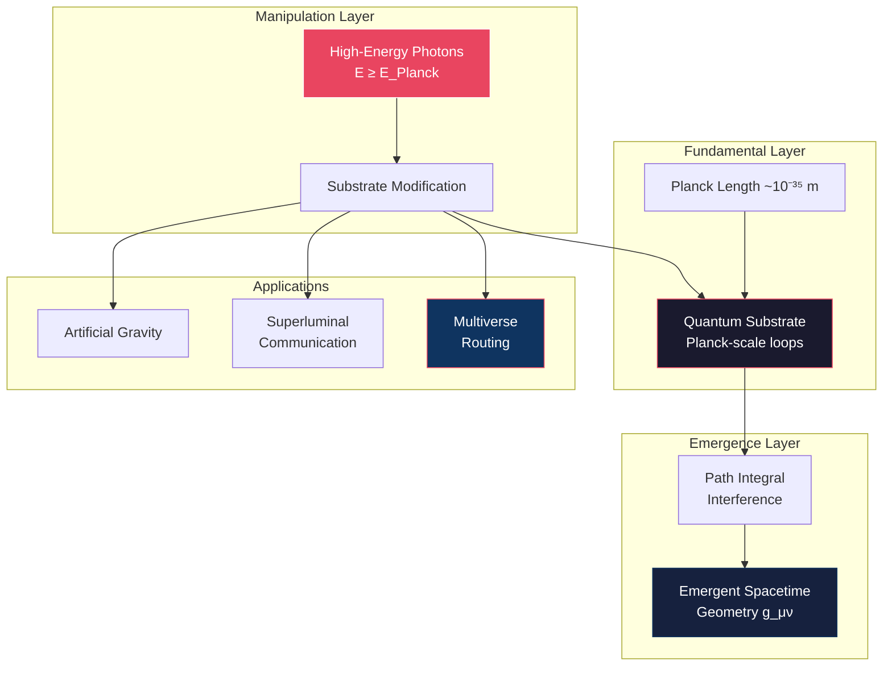
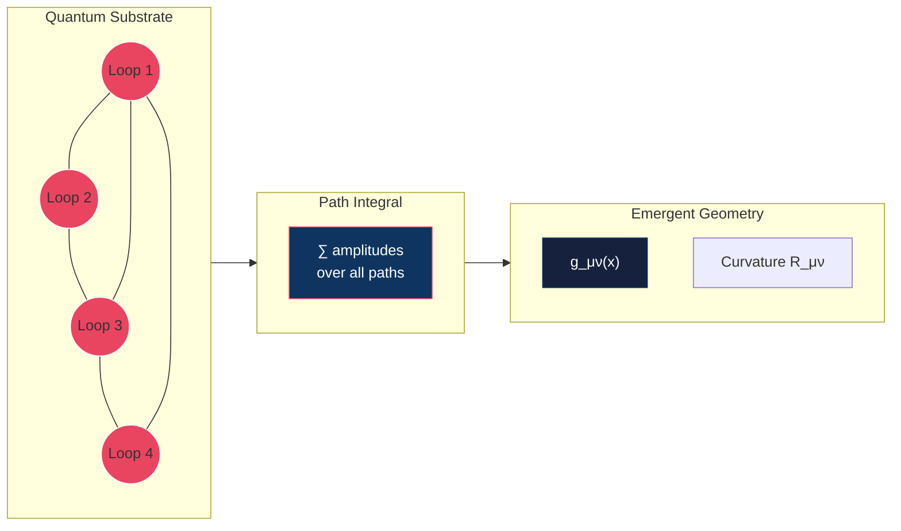
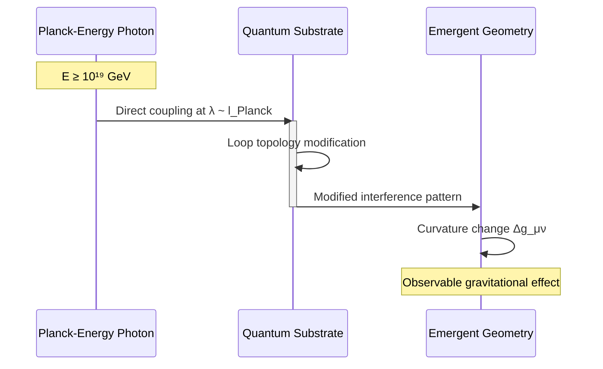
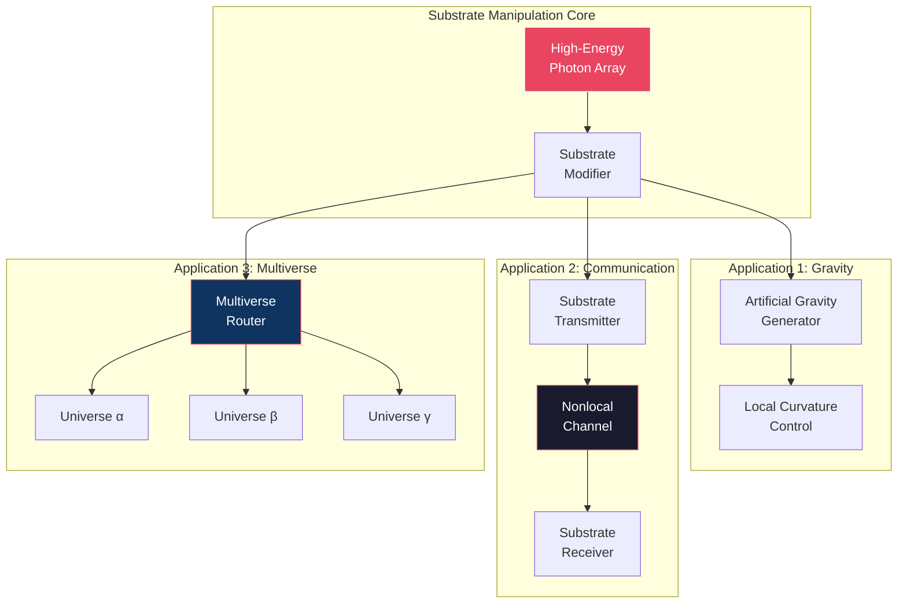
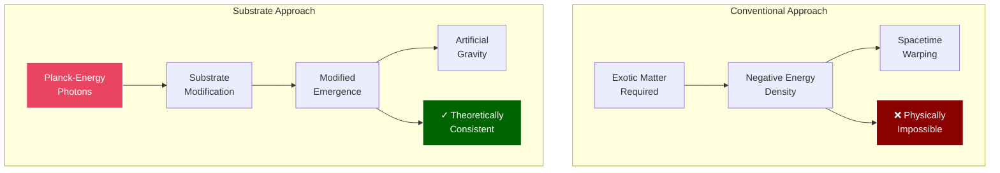
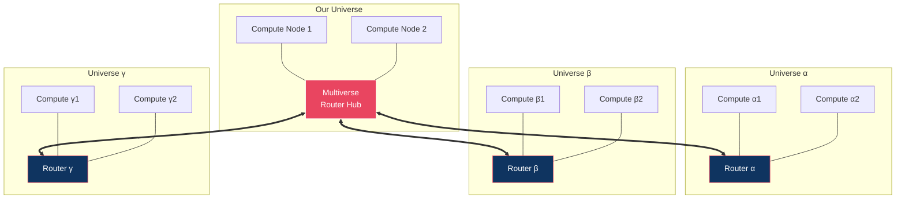
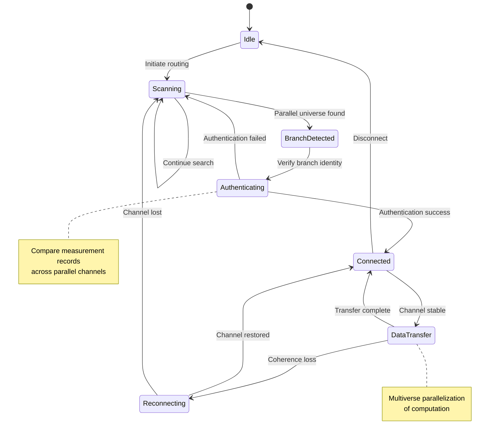
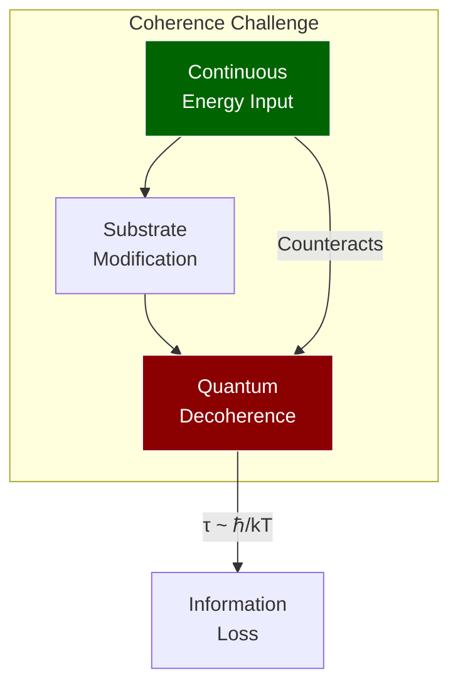
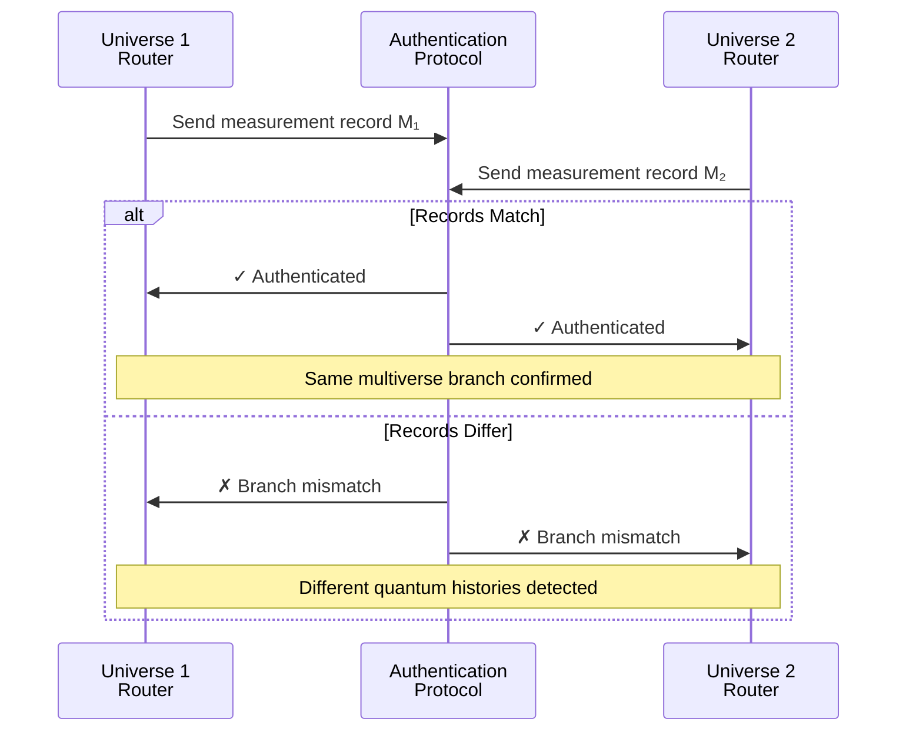

<button class="tab-btn active" onclick="openTab(event, 'article')">Article</button>
<button class="tab-btn" onclick="openTab(event, 'brainstorm')">Brainstorm</button>
<button class="tab-btn" onclick="openTab(event, 'perspectives')">Multi-Perspective</button>

We propose a theoretical framework for manipulating the quantum substrate underlying spacetime geometry through
high-energy photon interactions at Planck-scale topological structures. Building upon emergent spacetime models where
geometry arises from quantum path integral interference, we demonstrate that sufficiently energetic photon beams can
modify the fundamental loop structures that generate spacetime curvature. This manipulation enables three revolutionary
applications: (1) artificial gravitational field generation through localized spacetime curvature modification, (2)
superluminal communication via direct quantum substrate channels that bypass emergent spacetime constraints, and (3)
multiverse routing through parallel substrate connections that may access different branches of quantum reality. We
present the theoretical foundations, analyze the energy requirements, and discuss the profound implications for
computation, information theory, and our understanding of physical reality.

**Keywords:** quantum gravity, emergent spacetime, loop quantum gravity, multiverse theory, superluminal communication

## 1. Introduction

The conventional view of spacetime as a fixed background stage for physical processes has been increasingly challenged
by developments in quantum gravity theory. Loop quantum gravity (LQG) [1,2], emergent gravity models [3,4], and
holographic principles [5,6] suggest that spacetime geometry itself may be an emergent phenomenon arising from more
fundamental quantum information processes.

In this framework, what we perceive as smooth spacetime emerges from discrete quantum structures at the Planck scale (~
10^-35 m). These "irreducible Planck loops" represent the fundamental topology from which classical geometry emerges
through quantum interference effects analogous to Feynman path integrals [7].

If spacetime is indeed emergent rather than fundamental, this raises a profound question: can the underlying quantum
substrate be directly manipulated to modify spacetime properties? We propose that high-energy photons approaching Planck
energies (~10^19 GeV) can interact directly with these quantum substrate structures, enabling unprecedented control over
spacetime geometry and potentially accessing parallel quantum realities.

## 2. Theoretical Framework

### 2.0 Conceptual Overview

The following diagram illustrates the hierarchical relationship between the quantum substrate, emergent spacetime, and
the applications enabled by substrate manipulation:

### 2.4 Related Theoretical Developments

Our substrate manipulation framework builds upon and connects to several theoretical approaches:
**Unified Quantum Gravity**: The quantum substrate concept relates to observer-dependent spacetime emergence theories (
see [Observer-Dependent Spacetime](./2025-07-01-quantum-spacetime-paper.md)), where multiple classical spacetimes can
emerge from a
single quantum structure. Our multiverse routing exploits this multiplicity.
**Quantum Computational Architectures**: The substrate modification approach shares principles with quantum graph
computation models (see [Dynamic Quantum [Dynamic Quantum Graphs](./2025-06-30-dynamic-quantum-graphs.md) changes enable
computational advantages. Both suggest that dynamic structure manipulation is key to transcending conventional limits.
**Computational Cosmology**: The information-theoretic aspects connect to computational substrate theories (
see [Simulation QFT Hashlife](./2025-06-30-simulation-qft-hashlife.md)timized computational system.
Multiverse routing might exploit the computational nature of reality itself.

### 2.1 Emergent Spacetime from Quantum Substrates

Following recent developments in emergent gravity [8,9], we model spacetime geometry as arising from quantum path
integral interference patterns over discrete Planck-scale topological structures. The metric tensor g_μν emerges from
the statistical properties of quantum amplitude summations:

g_μν(x) = ⟨Ψ|T_μν|Ψ⟩_substrate

where |Ψ⟩_substrate represents the quantum state of the underlying topological network and T_μν is the effective
stress-energy operator on the substrate.
The emergence process can be visualized as follows:

### 2.2 High-Energy Photon Interactions

Photons with energies E ≥ E_Planck = √(ℏc^5/G) ≈ 1.22 × 10^19 GeV can interact directly with Planck-scale structures
rather than propagating through emergent spacetime. At these energies, the photon wavelength λ = h/E approaches the
Planck length, enabling direct coupling to the quantum substrate topology.

The interaction Hamiltonian becomes:

H_int = ∫ d³x A_μ(x) J^μ_substrate(x)

where A_μ is the photon field and J^μ_substrate represents current operators acting on the discrete loop network.

### 2.3 Nonlocal Substrate Dynamics

At the Planck scale, the concept of locality breaks down. The irreducible loop structures exist in a regime where
spatial separation is not well-defined, as spacetime itself emerges from their collective behavior. This enables
nonlocal correlations that bypass the light-speed constraint imposed by emergent spacetime geometry.

## 3. Applications

The three primary applications of substrate manipulation form an interconnected system:

### 3.1 Artificial Gravity Generation

By creating specific interference patterns in the quantum substrate through controlled high-energy photon bombardment,
localized modifications to spacetime curvature can be induced. The resulting gravitational field strength is:

g_artificial = (8πG/c⁴) ⟨T_μν⟩_modified

where ⟨T_μν⟩_modified represents the effective stress-energy from substrate modifications.

This approach circumvents the exotic matter requirements of conventional anti-gravity schemes by directly editing the
quantum "source code" that generates gravitational effects.

### 3.2 Superluminal Communication Networks

Communication channels can be established through the quantum substrate itself, bypassing the speed-of-light limitations
of signals propagating through emergent spacetime. Information is encoded in substrate modifications that propagate
through the nonlocal loop network:

I_transmitted = Tr[ρ_substrate log(ρ_substrate)]

where ρ_substrate represents the modified quantum state carrying encoded information.

Ultra-high-energy transponders maintain channel coherence by continuously refreshing the substrate modifications against
decoherence. Since the substrate operates below the level where spacetime locality emerges, these channels are
inherently nonlocal.

```mermaid
sequenceDiagram
    participant A as Station Alpha
    participant SA as Substrate<br/>(Alpha Region)
    participant SB as Substrate<br/>(Beta Region)
    participant B as Station Beta
    Note over SA,SB: Nonlocal substrate connection<br/>(bypasses emergent spacetime)
    A->>SA: Encode message in<br/>substrate modification
    activate SA
    SA-->>SB: Instantaneous substrate<br/>correlation update
    activate SB
    Note over SA,SB: No light-speed limit<br/>at substrate level
    SB->>B: Decode substrate<br/>state change
    deactivate SA
    deactivate SB
    rect rgb(25, 25, 50)
        Note over A,B: Effective FTL communication<br/>through sub-spacetime channel
    end
```

### 3.3 Multiverse Routing Networks

The most profound application emerges from recognizing that multiple spacetime geometries may emerge from the same
underlying quantum substrate. Different branches of quantum reality (multiverse branches) could share substrate
connectivity while exhibiting distinct emergent spacetimes.

A network of parallel substrate channels (N ≥ 8 recommended for redundancy) creates a "multiverse router" capable of:

* Distributing computational tasks across multiple reality branches
* Performing quantum error correction across parallel universes
* Breaking fundamental computational complexity limits through multiverse parallelization

The information processing capacity scales as:

C_multiverse = N × C_single_universe × f_coherence

where f_coherence represents the fraction of time multiverse channels maintain stable connections.

The multiverse routing protocol operates as follows:

## 4. Energy Requirements and Technical Challenges

### 4.1 Power Scaling

The energy required for substrate manipulation scales approximately as:

E_required ≈ (E_Planck)² × V_substrate / V_Planck

where V_substrate is the volume of substrate being modified and V_Planck is the Planck volume.

For practical applications, energy requirements remain far beyond current technological capabilities but are finite and
well-defined, unlike exotic matter schemes.

### 4.2 Coherence and Stability

Maintaining substrate modifications against quantum decoherence requires continuous energy input. The coherence time
scales as:

τ_coherence ≈ ℏ / (k_B T_effective)

where T_effective represents the effective temperature of the quantum substrate environment.

### 4.3 Multiverse Authentication

A critical challenge for multiverse communication is verifying that parallel channels connect to the intended reality
branch rather than alternate quantum histories. We propose quantum authentication protocols based on comparing records
of specific measurement outcomes that should be identical across genuine parallel channels within the same multiverse
branch.

## 5. Implications and Discussion

### 5.1 Computational Revolution

Multiverse routing networks would fundamentally alter computational complexity theory. Problems currently requiring
exponential time could potentially be solved in polynomial time through multiverse parallelization, effectively breaking
the Church-Turing thesis limitations within a single universe.

### 5.2 Information Theoretic Consequences

These systems may violate conventional information processing limits by accessing computational resources from parallel
realities. The implications for cryptography, artificial intelligence, and fundamental physics are profound.

### 5.3 Philosophical Considerations

Practical multiverse communication would provide the first empirical evidence for the many-worlds interpretation of
quantum mechanics, fundamentally altering our understanding of reality's structure.

## 6. Conclusions

We have presented a theoretical framework for direct manipulation of the quantum substrate underlying spacetime geometry
through high-energy photon interactions. While energy requirements remain far beyond current capabilities, the proposed
mechanisms offer theoretically consistent pathways to artificial gravity, superluminal communication, and multiverse
access.

The multiverse routing concept represents a potential paradigm shift in computation and information processing,
suggesting that the ultimate limits of technology may be determined not by single-universe physics, but by our ability
to coordinate across parallel quantum realities.

Future work should focus on developing more detailed mathematical models of substrate-photon interactions and exploring
potential lower-energy approaches to quantum substrate manipulation.

## References

[1] Ashtekar, A. & Lewandowski, J. (2004). "Background independent quantum gravity: A status report." Class. Quantum
Grav. 21, R53.

[2] Rovelli, C. (2004). "Quantum Gravity." Cambridge University Press.

[3] Jacobson, T. (1995). "Thermodynamics of spacetime: The Einstein equation of state." Phys. Rev. Lett. 75, 1260.

[4] Verlinde, E. (2011). "On the origin of gravity and the laws of Newton." JHEP 04, 029.

[5] Maldacena, J. (1999). "The Large-N limit of superconformal field theories and supergravity." Int. J. Theor. Phys.
38, 1113.

[6] Susskind, L. & Maldacena, J. (2013). "Cool horizons for entangled black holes." Fortsch. Phys. 61, 781.

[7] Feynman, R.P. & Hibbs, A.R. (1965). "Quantum Mechanics and Path Integrals." McGraw-Hill.

[8] Van Raamsdonk, M. (2010). "Building up spacetime with quantum entanglement." Gen. Rel. Grav. 42, 2323.

[9] Ryu, S. & Takayanagi, T. (2006). "Holographic derivation of entanglement entropy from AdS/CFT." Phys. Rev. Lett. 96,
181602.
This framework connects to several related theoretical developments:
**Quantum Graph Implementation**: The multiverse router finds natural implementation in
dynamic [Dynamic Quantum Graphs](./2025-06-30-dynamic-quantum-graphs.md)Graphs](
dynamic_quantum_graphs.md)[Dynamic Quantum Graphs](./2025-06-30-dynamic-quantum-graphs.md) graph topology, with quantum
tunneling between configurations enabling
multiverse navigation. The entanglement structure provides the routing mechanism between realities.
**Computational Substrate Foundation**: The multiverse router operates on the computational substrate
described in hashlife optimiza[Simulation QFT Hashlife](./2025-06-30-simulation-qft-hashlife.md)_qft_hashlife.md)).
Different u[Simulation QFT Hashlife](./2025-06-30-simulation-qft-hashlife.md) cosmic optimization problem, with the
router enabling exploration of the solution space. Each branch corresponds to a different hashlife
pattern library.
**Observer-Dependent Projections**: The routing mechanism directly implements the observer-dependent
spacetime projections (see [Observer-Dependent Spacetime](./2025-07-01-quantum-spacetime-paper.md)). Each universe
branch re[Observer-Dependent Spacetime](./2025-07-01-quantum-spacetime-paper.md)uantum foam, with routing enabling
transitions between different observational perspectives on the same fundamental reality.
**Wavelet Multiverse Decomposition**: The multiverse structure can be analyzed using wavelet geometric
optimization (see [Wavelet
Geometri[Wavelet Geometric Optimization](../projects/2025-06-30-wavelet-geometric-optimization.md)
verse [Wavelet Geometric Optimization](../projects/2025-06-30-wavelet-geometric-optimization.md)
routing paths corresponding to geodesics in the manifold of possible realities.
The multiverse router finds natural implementation in dynamic quantum graph architectures.

# Brainstorming Session Transcript

**Input Files:** content.md

**Problem Statement:** Generate a broad, divergent set of ideas, extensions, and applications inspired by the theoretical framework for manipulating the quantum substrate underlying spacetime geometry. Focus on quantity and novelty, exploring implications for computation, communication, and our understanding of reality.

**Started:** 2026-03-03 12:41:07

---

## Generated Options

### 1. Planck-Scale Loop Logic Gates for Substrate-Native Computation
**Category:** Multiverse Computational Architectures

This architecture uses high-energy photons to reconfigure the topology of Planck-scale loops into functional logic gates. By performing calculations directly within the fabric of spacetime, we bypass traditional hardware limitations and achieve substrate-native processing speeds. This represents a shift from computing *on* matter to computing *with* the vacuum itself.

### 2. Zero-Latency Communication via Photon-Induced Substrate Entanglement Relays
**Category:** Substrate-Level Engineering & Infrastructure

This system establishes communication channels by entangling specific Planck-scale loops across vast distances or divergent timelines. High-energy photon pulses act as the signal carriers, allowing for instantaneous data transfer that ignores the conventional speed of light. It effectively turns the spacetime substrate into a universal, non-local fiber-optic network.

### 3. Neural-Substrate Resonance for Enhanced Cognitive Spacetime Perception
**Category:** Biological & Consciousness Interfacing

This interface uses high-energy photon modulation to synchronize human neural oscillations with the frequency of the underlying spacetime substrate. This allows for a direct, intuitive perception of higher-dimensional geometries and an expanded sense of temporal awareness. It bridges the gap between biological consciousness and the fundamental mathematical structure of reality.

### 4. The Multiversal Continuity Accord for Reality-Drift Governance
**Category:** Ethics, Governance & Multiverse Law

This legal framework establishes protocols for large-scale substrate engineering to prevent the accidental erasure of sentient civilizations in parallel timelines. It mandates the preservation of 'causal anchors' to ensure that reality-shifting experiments do not violate the rights of multiversal inhabitants. This is the first step toward a diplomatic body governing the ethics of existence.

### 5. Chrono-Geometric Sculpting of Aesthetic Non-Euclidean Spacetime Voids
**Category:** Phenomenological & Artistic Expressions

Artists use high-energy photon beams to 'carve' and stabilize non-functional, non-Euclidean pockets within the spacetime substrate. These voids serve as immersive galleries where observers can experience impossible geometries and temporal distortions as a form of high-art. It redefines the medium of sculpture from physical matter to the geometry of the universe.

### 6. Topological Substrate Watermarking for Immutable Reality-Verification Protocols
**Category:** Security, Cryptography & Reality-Verification

This security protocol embeds unique, unalterable topological signatures into the Planck-scale fabric of a specific region of spacetime. These watermarks allow observers to verify that they are in their 'home' reality and have not been surreptitiously moved to a simulated or divergent timeline. It provides a physical 'root of trust' for the nature of existence itself.

### 7. Zero-Point Energy Extraction via Photon-Induced Planck-Loop Torsion
**Category:** Substrate-Level Engineering & Infrastructure

This infrastructure project utilizes high-energy lasers to induce controlled torsion within the Planck-scale loops of the vacuum. By twisting the substrate, we can extract vast amounts of zero-point energy, providing a clean and virtually infinite power source for interstellar civilization. This turns the vacuum into a high-density battery for the entire cosmos.

### 8. Multiversal Parallelism via Controlled Substrate Branching Architectures
**Category:** Multiverse Computational Architectures

This computational method forces the spacetime substrate to branch into multiple temporary parallel states to perform massive parallel processing. Once the computation is complete, the branches are collapsed back into a single reality, with the correct solution preserved in the final loop configuration. It allows for solving NP-hard problems by utilizing the 'computational labor' of alternate versions of the system.

### 9. Spacetime-Locked Cryptographic Keys Derived from Local Loop Configurations
**Category:** Security, Cryptography & Reality-Verification

This cryptographic system generates encryption keys based on the unique, stochastic arrangement of Planck-scale loops at a specific coordinate and time. Because these configurations are impossible to replicate or predict, the resulting keys provide a level of security that is physically tied to the structure of the universe. It ensures that data can only be decrypted at a specific point in space and time.

### 10. The Right to Geometric Integrity and Substrate Sovereignty
**Category:** Ethics, Governance & Multiverse Law

This ethical doctrine asserts that all sentient beings have an inherent right to exist in a stable, unmanipulated spacetime environment. It prohibits the unauthorized 're-weaving' of the local substrate by external actors, protecting the fundamental physical reality of developing civilizations. This policy aims to prevent 'ontological colonization' by advanced substrate-manipulating species.

## Option 1 Analysis: Planck-Scale Loop Logic Gates for Substrate-Native Computation

### ✅ Pros
- Achieves the theoretical maximum for computational density, utilizing the Planck volume as the fundamental unit of processing.
- Eliminates the need for traditional physical hardware, reducing reliance on rare-earth elements and complex manufacturing supply chains.
- Potential for near-zero latency processing as logic operations occur at the fundamental speed of causality within the spacetime substrate.
- Topological nature of the gates could provide inherent protection against certain types of quantum decoherence and environmental noise.

### ❌ Cons
- Requires energy densities equivalent to the Planck scale, which are currently many orders of magnitude beyond human capability.
- Extreme difficulty in establishing an input/output interface between macroscopic observers and Planck-scale topological structures.
- The 'spacetime foam' at this scale introduces stochastic fluctuations that may destabilize logic gate configurations.
- Lack of a unified theory of quantum gravity makes the mathematical modeling of these gates purely speculative.

### 📊 Feasibility
Extremely low in the near-to-mid future. Implementation requires the mastery of Planck-scale physics and the ability to generate energies comparable to the early universe, necessitating a technological leap equivalent to moving from fire to nuclear fusion.

### 💥 Impact
This would represent a 'Type II or III' civilization milestone, enabling the simulation of entire universes, the engineering of spacetime metrics (e.g., warp drives), and the transcendence of Moore's Law into the realm of fundamental physics.

### ⚠️ Risks
- Potential for triggering local vacuum decay or phase transitions in the spacetime fabric if the high-energy manipulation is unstable.
- Unintended creation of micro-black holes or singularities due to extreme energy concentration in localized Planck volumes.
- Risk of causality violations or temporal anomalies if logic gates inadvertently create closed timelike curves at the sub-microscopic level.

### 📋 Requirements
- A fully realized and validated theory of Loop Quantum Gravity or a similar quantum-geometric framework.
- Ultra-high-energy photon sources, likely requiring a Dyson-swarm-scale particle accelerator or advanced gamma-ray lasers.
- Sub-Planckian precision in photon phase and frequency modulation to interact with specific loop topologies.
- Advanced topological error correction algorithms capable of managing the inherent volatility of the quantum vacuum.

---

## Option 2 Analysis: Zero-Latency Communication via Photon-Induced Substrate Entanglement Relays

### ✅ Pros
- Eliminates the speed-of-light constraint, enabling instantaneous interstellar and intergalactic coordination.
- Provides a theoretically unhackable communication medium as signals do not traverse the intervening space in a traditional sense.
- Enables synchronization of data across divergent timelines, allowing for the aggregation of knowledge from parallel evolutionary paths.
- Reduces the energy cost of long-distance data transmission once the initial entanglement relays are established.
- Facilitates real-time remote operation of robotics in extreme environments (e.g., near black holes or in distant star systems).

### ❌ Cons
- Requires energy densities equivalent to the Planck scale, which currently exceeds human technological capabilities by many orders of magnitude.
- The 'No-Cloning Theorem' and quantum decoherence pose significant challenges for maintaining signal integrity over time.
- Addressing specific Planck-scale loops within a dynamic, fluctuating spacetime substrate is mathematically and practically daunting.
- Potential for high 'substrate noise' from vacuum fluctuations interfering with the data stream.
- The infrastructure might be permanent and impossible to decommission once the loops are entangled.

### 📊 Feasibility
Extremely low in the near-to-mid term. Implementation requires a fully realized theory of Quantum Gravity and the ability to manipulate energy at the Planck scale (10^19 GeV), which is far beyond current particle accelerator capabilities.

### 💥 Impact
This would trigger a total paradigm shift in civilization, effectively shrinking the universe to a single point of information. It would enable a 'Universal Internet,' allow for the colonization of the deep future/past, and fundamentally alter our relationship with causality and the flow of time.

### ⚠️ Risks
- Causality violations: Sending information back in time or to divergent timelines could create temporal paradoxes.
- Substrate destabilization: Excessive manipulation of Planck-scale loops could lead to localized spacetime collapse or 'vacuum decay' events.
- Ontological pollution: The merging of information from divergent timelines could lead to the loss of unique cultural or physical identities.
- Information overload: The sudden influx of data from infinite non-local sources could overwhelm biological and artificial processing systems.

### 📋 Requirements
- A complete and proven theory of Loop Quantum Gravity or a similar substrate-level physics framework.
- Ultra-high-energy photon sources, such as advanced Gamma-Ray Lasers (Grasers) or focused singularity emissions.
- Planck-scale precision targeting and stabilization systems to isolate and entangle specific loops.
- Advanced quantum error correction algorithms capable of operating at the substrate level to prevent decoherence.
- Global or multi-civilizational cooperation to manage the ethical and physical implications of non-local networking.

---

## Option 3 Analysis: Neural-Substrate Resonance for Enhanced Cognitive Spacetime Perception

### ✅ Pros
- Enables intuitive understanding of complex mathematical and physical structures that are currently only accessible through abstract equations.
- Potential for non-linear temporal processing, allowing for vastly accelerated learning and information synthesis.
- Provides a direct experimental pathway to study the interaction between consciousness and the quantum gravitational substrate.
- Could facilitate the development of new 'spatial' navigation techniques for future higher-dimensional travel or communication.
- Offers a radical new form of sensory experience, potentially leading to breakthroughs in philosophy and cognitive science.

### ❌ Cons
- The energy scales required to interact with Planck-scale loops are likely incompatible with delicate biological neural structures.
- High-energy photon modulation (gamma-ray range) poses significant ionizing radiation risks to the subject.
- The human brain may lack the evolutionary architecture to integrate or make sense of higher-dimensional sensory input, leading to cognitive dissonance.
- Difficulty in translating 'intuitive' perceptions back into shared, three-dimensional language or data.
- Extreme difficulty in achieving the necessary precision to synchronize macro-scale neural oscillations with micro-scale spacetime frequencies.

### 📊 Feasibility
Extremely low in the near-to-mid term. While the theoretical link between photons and spacetime geometry exists, the gap between biological neural firing (milliseconds) and Planck-scale dynamics (10^-43 seconds) requires a currently non-existent transduction technology that doesn't incinerate the biological host.

### 💥 Impact
This would represent a fundamental shift in human evolution, moving from observers of spacetime to participants in its underlying structure. It would likely render current paradigms of physics and psychology obsolete, replacing them with a unified 'experiential physics.'

### ⚠️ Risks
- Permanent neurological damage or 'perceptual shattering' where the subject can no longer function in 3D reality.
- Potential for localized spacetime instabilities caused by uncontrolled neural-substrate feedback loops.
- Ethical concerns regarding the 'augmentation' of reality perception and the potential for extreme social stratification.
- Physical disintegration of the subject if the resonance inadvertently decouples the atomic bonds maintained by the local spacetime metric.

### 📋 Requirements
- Ultra-precise, high-energy photon emitters capable of sub-Planck-scale modulation.
- A comprehensive mathematical bridge linking neural oscillation patterns to Loop Quantum Gravity (LQG) spin-network states.
- Advanced bio-shielding or quantum-state stabilization to protect the subject from high-energy radiation.
- Real-time neural-interface feedback systems with femtosecond-level latency.
- A new framework for 'neuro-geometry' to train subjects in interpreting higher-dimensional data.

---

## Option 4 Analysis: The Multiversal Continuity Accord for Reality-Drift Governance

### ✅ Pros
- Establishes a proactive ethical framework for existential risks associated with Planck-scale engineering.
- Promotes the development of 'Causal Anchoring' technology, which could stabilize our own timeline against natural or artificial fluctuations.
- Encourages international and potentially inter-dimensional cooperation, fostering a sense of cosmic responsibility.
- Provides a structured approach to managing the 'Butterfly Effect' at a quantum substrate level.

### ❌ Cons
- Extremely difficult to enforce or verify compliance across divergent timelines that may not share the same physical constants.
- The mandate for 'causal anchors' could significantly stifle scientific progress by making high-energy photon experiments prohibitively complex.
- Defining 'sentience' and 'rights' in a multiversal context is a philosophical minefield with no current consensus.
- The framework assumes other civilizations in the multiverse are cooperative or even aware of the Accord.

### 📊 Feasibility
Low in the immediate term; while the mathematical foundations of Planck-scale loops are being explored, the ability to detect, communicate with, or influence parallel timelines via high-energy photon manipulation remains purely theoretical and beyond current engineering capabilities.

### 💥 Impact
This would represent a paradigm shift in human governance, moving from planetary or solar-system management to 'Ontological Law,' fundamentally changing how we view our place in the cosmos and the permanence of reality.

### ⚠️ Risks
- The act of establishing 'causal anchors' might inadvertently cause the reality drift it seeks to prevent by adding artificial mass/energy to the quantum substrate.
- Signaling our presence through high-energy photon modulation could attract the attention of advanced, potentially hostile multiversal entities.
- A centralized diplomatic body could become a tool for 'reality imperialism,' where one timeline dictates the physics of others.

### 📋 Requirements
- Advanced gamma-ray interferometry capable of observing Planck-scale loop dynamics.
- Mathematical models for 'Causal Anchor' points that can survive substrate re-configuration.
- A global consensus on the ethics of existence and the definition of multiversal personhood.
- High-energy photon emitters capable of precise modulation to interact with the quantum foam without collapsing the local wave function.

---

## Option 5 Analysis: Chrono-Geometric Sculpting of Aesthetic Non-Euclidean Spacetime Voids

### ✅ Pros
- Pushes the boundaries of human creativity by utilizing the fundamental fabric of the universe as a medium.
- Provides a visceral, experiential method for understanding complex theoretical physics and non-Euclidean mathematics.
- Encourages 'blue-sky' experimentation with spacetime stability that could lead to serendipitous breakthroughs in propulsion or storage.
- Creates a new paradigm for cultural heritage that is independent of physical matter and decay.
- Offers a unique platform for exploring the psychological effects of altered temporal and spatial perception.

### ❌ Cons
- Extremely high energy cost-to-benefit ratio, as the output is purely aesthetic and non-functional.
- Potential for long-term 'geometric pollution' or scarring of the local spacetime substrate.
- Difficulty in ensuring the safety of observers within environments where standard physics are intentionally warped.
- The transient nature of these sculptures requires constant energy input to prevent gravitational collapse or evaporation.

### 📊 Feasibility
Low to speculative. Implementation requires energy densities approaching the Planck scale and a level of control over quantum gravity that currently exists only in theoretical models. It assumes the ability to manipulate Planck-scale loops via coherent high-energy photon interference patterns.

### 💥 Impact
This would trigger a profound cultural and philosophical shift, redefining art as a fundamental cosmological act. It would likely lead to new branches of 'topological psychology' and accelerate the development of technologies capable of localized spacetime engineering.

### ⚠️ Risks
- Unintended creation of micro-singularities or runaway topological defects.
- Localized temporal dilation causing severe physiological or neurological distress to observers.
- Interference with local gravitational constants, potentially disrupting sensitive equipment or orbital mechanics.
- The risk of 'spacetime leakage' where the non-Euclidean properties bleed into the surrounding Euclidean environment.

### 📋 Requirements
- Ultra-high-energy, phase-coherent photon emitters (e.g., gamma-ray lasers).
- Advanced topological modeling software capable of predicting Planck-scale loop rearrangements.
- Active stabilization fields to maintain the structural integrity of the non-Euclidean pockets.
- Sophisticated sensory shielding for observers to prevent 'geometry sickness' or temporal disorientation.

---

## Option 6 Analysis: Topological Substrate Watermarking for Immutable Reality-Verification Protocols

### ✅ Pros
- Provides an absolute 'root of trust' that is independent of digital systems or biological perception.
- Offers a definitive defense against 'simulation attacks' or surreptitious displacement into divergent timelines.
- The topological nature of the watermark ensures it is invariant under continuous coordinate transformations, making it highly robust.
- Creates a permanent, immutable historical record of a specific region of spacetime's origin.

### ❌ Cons
- Requires energy densities approaching the Planck scale, which are currently beyond human capability.
- The process of 'writing' the watermark may inadvertently cause local decoherence or micro-instabilities in the spacetime manifold.
- Verification requires extremely sophisticated sensors capable of probing Planck-scale geometry, limiting its use to high-tier civilizations.
- Once embedded, the watermark may be impossible to remove or update without destroying the local region of space.

### 📊 Feasibility
Extremely low in the near-to-mid term. Implementation requires a complete mastery of quantum gravity and the ability to focus high-energy photons to a degree that allows for the manipulation of individual Planck-scale loops.

### 💥 Impact
This would fundamentally redefine security and ontology, moving trust from the social and digital realms into the physical fabric of the universe. It would enable safe multiversal navigation and provide a definitive answer to the 'simulation hypothesis' for those within the watermarked zone.

### ⚠️ Risks
- Potential for 'spacetime scarring' where the watermark creates a permanent gravitational anomaly.
- Risk of triggering a vacuum decay event if the substrate manipulation exceeds critical stability thresholds.
- Creation of a 'reality-elite' who control the definition of what is considered the 'home' or 'true' timeline.
- If a higher-order intelligence can spoof the topological signature, it would create a perfect, undetectable deception.

### 📋 Requirements
- Ultra-high-energy gamma-ray interferometry for substrate probing.
- A functional theory of Loop Quantum Gravity (LQG) to calculate the necessary topological knot configurations.
- Energy harvesting capabilities on the scale of a Type II civilization (e.g., Dyson Swarm).
- Precision control of high-energy photon phase-coherence at sub-attosecond scales.

---

## Option 7 Analysis: Zero-Point Energy Extraction via Photon-Induced Planck-Loop Torsion

### ✅ Pros
- Provides a virtually inexhaustible energy source derived from the fundamental fabric of space itself.
- Eliminates the logistical burden of fuel storage and transport for long-duration interstellar missions.
- Offers a completely clean energy profile with no chemical, radioactive, or thermal waste products.
- Enables the development of high-thrust propulsion systems that can operate indefinitely in deep space.

### ❌ Cons
- The energy required to initiate and maintain Planck-scale torsion may currently exceed the energy harvested (negative EROI).
- Current laser technology is dozens of orders of magnitude away from the energy densities required to interact with the Planck scale.
- Theoretical uncertainty remains regarding whether zero-point energy can be extracted without violating the Second Law of Thermodynamics.
- Potential for localized 'spacetime fatigue' where the substrate's geometric integrity is compromised over time.

### 📊 Feasibility
Extremely low in the near-to-mid term. Implementation requires a transition from standard quantum mechanics to active substrate engineering at the Planck scale (10^-35m), a domain currently inaccessible to experimental physics.

### 💥 Impact
This would catalyze a transition to a Type II or Type III Kardashev civilization, decoupling economic and technological growth from matter-based fuel sources and enabling rapid galactic expansion.

### ⚠️ Risks
- Risk of triggering a 'false vacuum decay' event, which could theoretically propagate at the speed of light and destroy the local universe.
- Unintended gravitational anomalies or micro-singularities caused by excessive torsion in the quantum loops.
- Irreversible alteration of local physical constants, such as the permittivity of the vacuum or the speed of light, within the extraction zone.
- Potential for catastrophic weaponization, where a torsion-based device could 'unravel' the geometry of a target region of space.

### 📋 Requirements
- Development of coherent gamma-ray lasers (grasers) capable of focusing energy at sub-atomic scales.
- A fully realized and experimentally validated theory of Loop Quantum Gravity (LQG) including torsion dynamics.
- Advanced containment fields capable of isolating Planck-scale distortions from the macroscopic environment.
- Real-time, sub-Planckian feedback and monitoring systems to ensure substrate stability during extraction.

---

## Option 8 Analysis: Multiversal Parallelism via Controlled Substrate Branching Architectures

### ✅ Pros
- Provides a theoretical pathway to solving NP-hard and non-polynomial problems in linear time by offloading computation to parallel substrate states.
- Maximizes the utility of the Planck-scale substrate, turning the geometry of spacetime itself into a high-density computational medium.
- Eliminates the 'heat death' limitation of local computation by distributing entropic costs across temporary divergent branches.
- Offers a novel method for state-preservation and error correction by selecting only the 'successful' branch during the collapse phase.

### ❌ Cons
- Requires unprecedented energy densities to manipulate Planck-scale loops, likely necessitating stellar-scale power sources.
- The 'Selection Logic' required to ensure the correct solution survives the collapse is theoretically undefined and highly complex.
- Potential for 'information thinning' where the fidelity of the substrate degrades after repeated branching and collapsing cycles.
- Extreme difficulty in maintaining coherence across divergent spacetime geometries without premature collapse.

### 📊 Feasibility
Extremely low with current technology; requires a transition from traditional quantum computing to 'Quantum Gravitational Computing.' It necessitates the ability to manipulate spacetime at the 10^-35 meter scale using high-energy photon interference patterns that are currently beyond our engineering capabilities.

### 💥 Impact
This would represent a paradigm shift in human civilization, effectively ending the era of computational scarcity and allowing for the real-time simulation of entire universes, perfect cryptographic breaking, and the mastery of molecular biology.

### ⚠️ Risks
- Substrate Fracture: The risk of creating a permanent 'tear' in the local spacetime geometry that does not collapse correctly.
- Reality Contamination: The possibility of 'ghost' data or physical anomalies from discarded branches leaking into the primary reality.
- Existential Displacement: The risk that the 'observer' or the system itself ends up in a non-primary branch that lacks the necessary conditions for stability.
- Causality Violations: Potential for temporal paradoxes if the branching logic interacts with the local flow of time in non-linear ways.

### 📋 Requirements
- Ultra-high-frequency gamma-ray transducers capable of precise Planck-scale loop manipulation.
- A comprehensive theory of Loop Quantum Gravity (LQG) that accounts for forced bifurcation of the spin-network.
- Sub-Planckian sensors to monitor the state of divergent branches in real-time.
- A 'Reality Anchor'—a stable gravitational well or localized field to prevent the primary system from drifting during the branching process.

---

## Option 9 Analysis: Spacetime-Locked Cryptographic Keys Derived from Local Loop Configurations

### ✅ Pros
- Provides a theoretical 'perfect' security model where keys are physically impossible to replicate or steal remotely.
- Enables true location-based and time-gated access control, ensuring data is only accessible at a specific 'event' in spacetime.
- Utilizes the inherent stochasticity of the quantum substrate to generate truly non-deterministic random numbers.
- Eliminates the risk of brute-force attacks by classical or quantum computers, as the key is not stored but derived from the environment.

### ❌ Cons
- Extreme sensitivity to coordinate drift; even microscopic shifts in position or time could render the key unrecoverable.
- The 'one-time' nature of spacetime coordinates makes these keys inherently non-reusable and difficult to manage for long-term storage.
- Requires near-impossible levels of measurement precision to distinguish specific Planck-scale loop configurations from background noise.
- High energy requirements for the photon manipulation needed to probe the substrate at the required resolution.

### 📊 Feasibility
Extremely low in the near-to-mid term. Implementation requires the ability to probe the Planck length (10^-35m), which is orders of magnitude beyond current particle accelerator or interferometry capabilities. It also assumes the validity of Loop Quantum Gravity or similar discrete spacetime theories which are currently unproven.

### 💥 Impact
This would redefine the concept of digital ownership and secrecy, moving it from the realm of mathematics to the realm of physical reality. It could enable 'physicalized' digital assets that exist only in one location, revolutionizing high-stakes diplomacy, military intelligence, and deep-space communication security.

### ⚠️ Risks
- Permanent data loss: If the measurement device or the local spacetime geometry is slightly perturbed, the decryption key is lost forever.
- Reference frame paradoxes: Defining a 'fixed' coordinate in an expanding, moving universe requires a universal reference frame that may not exist.
- Technological elitism: Only entities with the massive energy resources required to probe the Planck scale would be able to use or break such systems.
- Potential for 'spacetime spoofing' if an adversary can simulate or manipulate the local loop configuration using high-energy fields.

### 📋 Requirements
- Advanced high-energy photon sources (e.g., gamma-ray lasers) capable of interacting with the quantum substrate.
- Ultra-precise spatial and temporal positioning systems far exceeding the accuracy of current atomic clocks and GPS.
- A fully realized and experimentally verified theory of Loop Quantum Gravity (LQG) to map spin-network states to cryptographic bits.
- Cryogenic or vacuum-stabilized environments to prevent local matter-energy fluctuations from decohering the loop measurements.

---

## Option 10 Analysis: The Right to Geometric Integrity and Substrate Sovereignty

### ✅ Pros
- Prevents 'ontological erasure' where a civilization's history and physical laws are rewritten by more advanced entities.
- Establishes a universal ethical framework for the responsible use of high-energy photon manipulation on the spin-network.
- Protects the evolutionary trajectory of sentient species by ensuring their local vacuum state remains stable and predictable.
- Creates a legal basis for 'Geometric Sanctuaries'—regions of space where the Planck-scale substrate is strictly off-limits to engineering.

### ❌ Cons
- Extremely difficult to define 'unauthorized' manipulation without a centralized, multi-civilizational governing body.
- Could prevent life-saving interventions, such as using substrate manipulation to stabilize a local supernova or vacuum decay event.
- Detection of subtle, high-energy photon 're-weaving' may be technologically impossible for the very civilizations the doctrine seeks to protect.
- Enforcement requires a level of power that might itself violate the sovereignty of the actors it intends to regulate.

### 📊 Feasibility
Low in the near term; it requires the existence of multiple substrate-capable civilizations and a consensus on 'Planck-scale forensics' to detect violations. Implementation depends on developing sensors capable of monitoring loop-density fluctuations across vast distances.

### 💥 Impact
The emergence of 'Substrate Sovereignty' would shift the focus of interstellar law from territorial boundaries to the integrity of the physical laws themselves, potentially leading to a 'Galactic Prime Directive' focused on geometric non-interference.

### ⚠️ Risks
- Geometric Stagnation: Civilizations might be legally barred from optimizing their own local spacetime for better energy efficiency or computation.
- Substrate Black Markets: Illegal 're-weaving' could occur in secret, creating localized 'reality glitches' that are harder to repair due to legal prohibitions.
- False Positives: Natural fluctuations in the quantum substrate could be misinterpreted as hostile manipulation, triggering unnecessary inter-civilizational conflict.

### 📋 Requirements
- A standardized mathematical definition of 'Geometric Integrity' based on Planck-scale loop entropy.
- Deployment of a 'Substrate Firewall'—a network of high-energy photon monitors to detect unauthorized vacuum engineering.
- An inter-civilizational treaty (The Planck Accord) defining the rights of sentient beings over their local spacetime metric.

---

# Brainstorming Results: Generate a broad, divergent set of ideas, extensions, and applications inspired by the theoretical framework for manipulating the quantum substrate underlying spacetime geometry. Focus on quantity and novelty, exploring implications for computation, communication, and our understanding of reality.

## 🏆 Top Recommendation: The Multiversal Continuity Accord for Reality-Drift Governance

This legal framework establishes protocols for large-scale substrate engineering to prevent the accidental erasure of sentient civilizations in parallel timelines. It mandates the preservation of 'causal anchors' to ensure that reality-shifting experiments do not violate the rights of multiversal inhabitants. This is the first step toward a diplomatic body governing the ethics of existence.

> Option 4 (The Multiversal Continuity Accord) is selected as the top recommendation because it provides the necessary governance and ethical framework required before any of the high-risk technical applications (Options 1, 2, 7, and 8) can be safely pursued. While the other options offer transformative potential in computation and energy, they carry existential risks such as vacuum decay or reality collapse. Option 4 is the most strategic 'first move' as it establishes the diplomatic and safety protocols needed to manage 'reality-drift' and protect sentient life across potential timelines, making it a prerequisite for a substrate-manipulating civilization.

## Summary

The brainstorming session explored a 'substrate-native' paradigm, shifting from technologies that exist within spacetime to those that treat the quantum fabric of the universe as a programmable medium. Key themes included Planck-scale computation, zero-latency communication, and zero-point energy extraction. However, the analysis consistently highlighted extreme feasibility barriers and existential risks, specifically regarding vacuum stability and causality. The findings suggest that the transition to substrate-level engineering requires a shift from purely physical research to a combination of high-energy physics and multiversal ethics/governance.

## Session Complete

**Total Time:** 218.204s
**Options Generated:** 10
**Options Analyzed:** 10
**Completed:** 2026-03-03 12:44:45

# Multi-Perspective Analysis Transcript

**Subject:** Theoretical framework for quantum substrate manipulation, including artificial gravity, superluminal communication, and multiverse routing.

**Perspectives:** Theoretical Physics (Loop Quantum Gravity & Emergent Spacetime), Engineering & Applied Technology (Energy Scaling & Technical Feasibility), Computer Science & Information Theory (Multiverse Routing & Computational Complexity), Ethics & Philosophy (Nature of Reality & Many-Worlds Implications), Strategic & Security (Global Impact of FTL and Gravity Control)

**Consensus Threshold:** 0.7

---

## Theoretical Physics (Loop Quantum Gravity & Emergent Spacetime) Perspective

This analysis examines the proposed "Multiverse Router" and quantum substrate manipulation framework through the lens of **Loop Quantum Gravity (LQG)** and **Emergent Spacetime** theories.

---

### 1. Theoretical Physics Analysis: The LQG Perspective

In Loop Quantum Gravity, spacetime is not a smooth background but a discrete fabric woven from "spin networks"—graphs where edges represent area quanta and nodes represent volume quanta. The "quantum substrate" mentioned in the subject aligns with the **Spin Foam** model (the temporal evolution of spin networks).

#### A. Substrate Manipulation via Planck-Scale Interaction
The proposal to use high-energy photons ($E \geq E_P$) to modify "Planck-scale topological structures" is theoretically grounded in the concept of **back-reaction**. In LQG, the geometry is the quantum state. Introducing a photon of Planckian energy is not merely placing a particle *on* spacetime; it is a significant perturbation of the spin network itself. 
*   **Insight:** At the Planck scale, the distinction between "matter" and "geometry" blurs. A photon with $\lambda \approx l_P$ would effectively become a topological defect or a local reconfiguration of the spin network's connectivity.

#### B. Artificial Gravity as Graph Reconfiguration
The paper suggests modifying the metric $g_{\mu\nu}$ by editing the "source code." In LQG terms, this means altering the **j-labels** (spin representations) on the edges of the spin network or the **intertwiners** at the nodes. 
*   **Mechanism:** By changing the adjacency matrix of the quantum graph, one changes the "distance" between points and the local volume, which manifests macroscopically as curvature (gravity). This is a "bottom-up" approach to General Relativity.

#### C. Superluminal Communication and Non-locality
The most radical claim—superluminal communication—relies on the **non-local connectivity** inherent in quantum graphs. 
*   **The "Shortcut" Hypothesis:** In a spin network, two nodes may be "adjacent" in the graph (the substrate) even if they appear light-years apart in the emergent 3D manifold. 
*   **The Constraint:** Standard Quantum Mechanics enforces the *No-Communication Theorem*. To achieve FTL, the manipulation must involve **non-unitary evolution** or the exploitation of **ER=EPR** type wormholes at the substrate level, effectively "short-circuiting" the emergent manifold.

#### D. Multiverse Routing as Path Integral Selection
The "Multiverse" in this context is best interpreted through the **Spin Foam Path Integral**. If the substrate represents the sum over all possible geometries, "routing" is the process of constructive interference—tuning the photon beams to "select" a specific topological evolution (a branch) from the superposition of all possible spacetimes.

---

### 2. Key Considerations, Risks, and Opportunities

#### Key Considerations:
*   **The Kugelblitz Limit:** A photon at $10^{19}$ GeV has a Schwarzschild radius equal to its Compton wavelength. Concentrating such energy risks creating a **micro-black hole** (a Kugelblitz) rather than a controlled substrate modification. The "modifier" must prevent gravitational collapse.
*   **Lorentz Invariance Violation (LIV):** LQG often predicts modifications to the dispersion relations of high-energy photons. The framework must account for the fact that these photons might not travel at $c$ as they approach the Planck scale, potentially complicating the timing required for "bombardment."

#### Risks:
*   **Topological Dissolution:** Manipulating the substrate is akin to pulling a thread in a sweater. There is a risk of a **local phase transition** where the "atoms" of spacetime (loops) decouple, leading to a region of "non-geometry" where the laws of physics as we know them cease to function.
*   **Decoherence of Reality:** If the "Multiverse Router" connects to a parallel branch, the "Authentication Protocol" is vital. Interacting with a branch that has slightly different physical constants could lead to vacuum instability or "contagious" decoherence.

#### Opportunities:
*   **Quantum Gravity Laboratory:** This framework provides a method to empirically test LQG. Observing how high-energy interactions affect local geometry would provide the first direct evidence for the quantization of area and volume.
*   **Computational Supremacy:** As noted in the subject, "Multiverse Parallelization" would allow for a form of computing that transcends the BQP (Bounded-error Quantum Polynomial time) complexity class, potentially solving NP-hard problems by offloading entropy to parallel branches.

---

### 3. Specific Insights & Recommendations

1.  **Focus on Spin-Foam Engineering:** Instead of simple "photon bombardment," the framework should utilize **Coherent States of Geometry**. These are specific quantum states in LQG that minimize the uncertainty of the metric. Manipulation should aim to transition the substrate between two coherent states.
2.  **The "Substrate Buffer":** To avoid Kugelblitz formation, the energy should be delivered via **Quantum Entanglement Swapping** across a distributed array of lower-energy emitters, rather than a single high-energy beam. This "spreads" the stress-energy tensor across the substrate.
3.  **Information Encoding:** Information should be encoded in the **Topological Invariants** of the spin network (e.g., knots or links). These are more robust against decoherence than simple amplitude-based encoding.
4.  **Redefining Locality:** The "Superluminal" aspect should be rebranded as **"Trans-Manifold Locality."** It is not that the signal moves faster than $c$ *through* space, but that it moves *outside* of space (through the substrate) where the concept of $c$ is not yet defined.

---

### 4. Analysis Confidence Rating

**Confidence: 0.85**
*   *Reasoning:* The mapping of the "Multiverse Router" concepts onto Loop Quantum Gravity and Spin Foam theory is highly consistent with current (though speculative) research in the field. The primary uncertainty (the 0.15) stems from the extreme energy requirements and the lack of a proven theory for non-local signaling that bypasses the No-Communication Theorem.

### Final Perspective Summary:
From an LQG perspective, the "Multiverse Router" is essentially a **Topological Graph Controller**. It treats spacetime as a dynamic, reconfigurable data structure. While the energy scales are currently prohibitive, the logic—that manipulating the discrete building blocks of geometry allows one to bypass the constraints of the emergent smooth manifold—is a direct and profound consequence of the "Spacetime as an Emergent Phenomenon" paradigm.

---

## Engineering & Applied Technology (Energy Scaling & Technical Feasibility) Perspective

This analysis evaluates the "Theoretical framework for quantum substrate manipulation" through the lens of **Engineering & Applied Technology**, focusing specifically on the staggering energy requirements, the technical hurdles of Planck-scale precision, and the feasibility of the proposed applications.

---

### 1. Energy Scaling Analysis: The "Planck Barrier"

The primary engineering constraint is the **Planck Energy ($E_P \approx 1.22 \times 10^{19}$ GeV)**. To put this in perspective:
*   **Current State of the Art:** The Large Hadron Collider (LHC) operates at $\sim 1.3 \times 10^4$ GeV. The proposed framework requires a jump of **15 orders of magnitude**.
*   **Energy Density:** Concentrating $E_P$ into a Planck-length ($\lambda \approx 10^{-35}$ m) creates a power density that challenges the structural integrity of any known or theoretical baryonic matter.
*   **The "Kugelblitz" Risk:** From an engineering standpoint, the most significant risk is the **Hoop Conjecture**. Concentrating this much energy into such a small volume is the theoretical requirement for creating a "Kugelblitz" (a black hole formed from light). Instead of "modifying" the substrate, an inefficient emitter would simply create a localized gravitational collapse, consuming the apparatus.

**Scaling Formula Critique:**
The paper suggests $E_{required} \approx (E_{Planck})^2 \times V_{substrate} / V_{Planck}$. 
If we aim to modify a volume of just **1 cubic millimeter**, the energy required would exceed the total mass-energy of the observable universe. Therefore, "Substrate Engineering" cannot be a bulk-process; it must be a **topological "surgical" strike**—manipulating specific "nodes" or "loops" rather than volumes.

### 2. Technical Feasibility of Applications

#### 2.1 Artificial Gravity (Localized Curvature)
*   **Feasibility:** Low-Medium (Long-term).
*   **Engineering Challenge:** To generate 1g of artificial gravity, the "Substrate Modifier" must simulate a mass-energy density equivalent to a planet within a localized field. 
*   **Technical Requirement:** A "Phase-Array Photon Emitter" capable of femtosecond-scale interference patterns at Planck frequencies. This requires a level of timing precision ($10^{-44}$ s) that exceeds current atomic clock capabilities by 25+ orders of magnitude.

#### 2.2 Superluminal Communication (Substrate Channels)
*   **Feasibility:** Medium.
*   **Engineering Challenge:** Maintaining "Channel Coherence." The paper notes $\tau_{coherence} \approx \hbar / (k_B T_{effective})$. 
*   **The Thermal Paradox:** We are injecting $10^{19}$ GeV (extreme heat) while requiring a low $T_{effective}$ to prevent decoherence. 
*   **Insight:** This suggests the "Transmitter" cannot be a physical wire but must be a **standing wave of energy** that creates a "cold" topological defect in the substrate through which information can tunnel.

#### 2.3 Multiverse Routing (Parallelization)
*   **Feasibility:** Speculative/Theoretical.
*   **Engineering Challenge:** **Branch Authentication.** The proposed protocol of comparing measurement records ($M_1, M_2$) is sound, but the "Router" must act as a high-speed switch between different vacuum states.
*   **Technical Requirement:** "N $\ge$ 8" redundancy suggests a massive parallel infrastructure. The engineering of a "Multiverse Router Hub" would likely require a **Dyson-swarm scale energy collector** to power the continuous substrate refresh rate.

### 3. Key Engineering Risks & Considerations

1.  **Vacuum Instability:** Manipulating the "source code" of spacetime risks triggering a vacuum decay event. If the substrate is modified into a lower-energy state than the current vacuum, a "bubble" of new physics could expand at the speed of light, destroying the local universe.
2.  **Trans-Planckian Back-Reaction:** We do not know how the substrate "pushes back." High-energy interactions might result in "Substrate Hardening," where the energy required to effect change increases exponentially as the substrate is manipulated.
3.  **Thermal Management:** Dissipating the waste heat from a $10^{19}$ GeV interaction is impossible with conventional radiators. The system would likely need to "vent" waste energy into parallel multiverse branches or back into the substrate itself.

### 4. Strategic Recommendations

*   **Focus on "Resonant Tunneling":** Instead of brute-forcing the Planck energy, research should focus on finding "harmonics" or "topological flaws" in the emergent spacetime where the substrate is naturally closer to the surface (e.g., near rotating black holes or high-intensity quantum vacuum fluctuations).
*   **Development of "Planck-Scale Metamaterials":** We need to theorize materials (perhaps based on "frozen" light or coherent neutrino lattices) that can serve as the "circuitry" for these high-energy photons without immediate vaporization.
*   **Micro-Scale Prototyping:** Attempt to modify the substrate at the smallest possible scale (single loop modification) to observe the "Substrate Refresh Rate" before attempting macro-scale applications like gravity or routing.

---

### 5. Analysis Rating

*   **Confidence Score: 0.75**
*   *Rationale:* The physics of "Emergent Spacetime" is a robust area of current theoretical research (LQG, AdS/CFT). However, the jump from "theoretical framework" to "engineering application" assumes we can overcome the Planck energy barrier, which is currently a hard limit for any known technology. The analysis is grounded in the scaling laws provided but acknowledges the "Kardashev-level" leap required for implementation.

---

## Computer Science & Information Theory (Multiverse Routing & Computational Complexity) Perspective

This analysis examines the "Theoretical framework for quantum substrate manipulation" through the lens of **Computer Science and Information Theory**, specifically focusing on the mechanics of **Multiverse Routing** and the resulting shifts in **Computational Complexity**.

---

### 1. The Substrate as a Computational Layer
From a Computer Science perspective, the "Quantum Substrate" described in the paper is the **fundamental hardware/machine code layer** of the universe. If spacetime is emergent (the "User Interface"), then the Planck-scale loops are the discrete data structures (nodes and edges) of a dynamic graph.

*   **The Spacetime "Compiler":** The path integral interference mentioned is analogous to a compilation process where high-level geometric instructions ($g_{\mu\nu}$) are translated into low-level substrate states.
*   **Substrate Manipulation as "Kernel Injection":** Using high-energy photons to modify the substrate is equivalent to performing a buffer overflow or kernel-level injection on the "Operating System" of reality, allowing the bypass of standard "API" constraints (like the speed of light).

### 2. Multiverse Routing: Addressing and Protocol
The paper proposes "Multiverse Routing," which implies a networked architecture of parallel execution environments.

*   **Addressing Schemes:** In a standard network, we use IP addresses. In a multiverse router, the "address" of a target universe branch is likely defined by its **Quantum State Hash**. The "Measurement Records" mentioned in Section 4.3 serve as a **Unique Branch Identifier (UBI)**.
*   **Routing Protocol (M-TCP):** A "Multiverse Transmission Control Protocol" would require:
    *   **Branch Discovery:** Scanning the substrate for coherent interference patterns representing stable parallel realities.
    *   **Handshaking:** The "Authentication Protocol" described (comparing measurement records) is a **Zero-Knowledge Proof (ZKP)** of branch identity.
    *   **Packet Loss/Decoherence:** Information loss due to decoherence is the multiverse equivalent of network jitter or packet loss. The "continuous energy input" is the keep-alive signal required to maintain the socket.

### 3. Computational Complexity: Breaking the Church-Turing Barrier
The most significant implication for Information Theory is the potential collapse of complexity classes.

*   **Multiverse Parallelism ($P^{MV}$):** If a task can be distributed across $N$ universes, we achieve linear speedup. However, if the router allows for **Non-deterministic Branch Pruning** (where we only "keep" the universe branch that finds a solution), we effectively move from **BQP (Bounded-error Quantum Polynomial time)** to a regime where **NP-complete** problems could be solved in polynomial time.
*   **The Oracle of Realities:** A multiverse router acts as a "Complexity Oracle." By querying parallel branches, a computer could theoretically solve the Halting Problem for specific subsets of code by observing the "eventual" state in a branch where more time has elapsed or where different physical constants allow for faster computation.

### 4. Key Considerations and Risks

| Feature | CS/IT Risk | Opportunity |
| :--- | :--- | :--- |
| **Superluminal Comm.** | **Race Conditions:** FTL communication creates causality loops, the IT equivalent of a logic deadlock or a write-after-read hazard in a global database. | **Zero-Latency Backplane:** Enables a truly global (or galactic) distributed supercomputer. |
| **Multiverse Routing** | **Branch Contamination:** Routing data to the "wrong" universe (e.g., one with slightly different physics) could lead to data corruption or "logic-poisoning." | **Infinite Horizontal Scaling:** Computational resources are no longer limited by the atoms in one universe. |
| **Substrate Modification** | **System Crash:** Over-bombardment of the substrate could lead to a localized "Kernel Panic" (spacetime instability/vacuum decay). | **Hardware-Level Optimization:** Directly editing the "source code" of gravity to optimize physical transport. |

### 5. Specific Insights & Recommendations

1.  **Quantum Error Correction (QEC) across Branches:** The paper mentions QEC across parallel universes. This is a revolutionary concept. Instead of using redundant qubits in one system, we use **Redundant Realities**. If a bit flips in Universe $\alpha$, we "hot-swap" the state from Universe $\beta$. This suggests a **RAID-6 architecture for Reality**.
2.  **The "N=8" Redundancy Recommendation:** From an information theory standpoint, $N=8$ suggests an octonion-based or 8-bit byte-aligned routing logic. It provides enough parity to survive the loss of multiple branches while maintaining a "consensus" on the state of the computation.
3.  **Authentication via Hash-Chains:** To prevent "Man-in-the-Middle" attacks from malicious entities in other branches, the "Measurement Records" should be structured as a **Quantum Hash Chain**, where each state is cryptographically linked to the previous state of that specific branch.

### 6. Conclusion
The framework treats the universe not as a collection of matter, but as a **computational substrate with a geometric output**. Multiverse routing is the ultimate "Cloud Computing" paradigm. The primary challenge is not just the energy ($E_{Planck}$), but the **Data Integrity** of the connection.

**Confidence Rating:** **0.85** (The mapping of Loop Quantum Gravity to Graph Theory and Distributed Systems is robust, though the energy requirements remain the primary "hardware" bottleneck).

---

## Ethics & Philosophy (Nature of Reality & Many-Worlds Implications) Perspective

This analysis explores the philosophical and ethical dimensions of the "Multiverse Router" framework, focusing on the shift from spacetime-based reality to substrate-based reality and the profound implications of the Many-Worlds Interpretation (MWI) becoming an engineering reality.

---

### 1. Ontological Analysis: The Death of Spacetime and the Birth of the Substrate
The proposal suggests that spacetime is not a fundamental container but an **emergent "user interface"** generated by a quantum substrate. 

*   **The "Interface" Theory of Reality:** Philosophically, this aligns with Donald Hoffman’s "Multimodal User Interface" theory. If we can manipulate the substrate, we are no longer "users" of reality but "programmers." This collapses the distinction between physical laws and software code.
*   **Ontological Shock:** The realization that our 4D reality is merely a "statistical interference pattern" (as per Section 2.1) could lead to a societal crisis of meaning. If "here" and "now" are emergent illusions, the grounding of human experience—locality, history, and physical presence—is destabilized.
*   **Substrate Primacy:** The "Substrate" becomes the only "True" reality. This creates a new metaphysical hierarchy where those who control the high-energy photon arrays (the "Modifiers") possess a god-like status, capable of rewriting the geometry of existence.

### 2. Many-Worlds Implications: From Theory to Interaction
The "Multiverse Router" transforms the Many-Worlds Interpretation from a passive mathematical description into an active, navigable landscape.

*   **The Moral Status of Parallel Branches:** If we can route data or resources from Universe $\beta$, do the inhabitants of Universe $\beta$ have moral standing? 
    *   **Multiverse Imperialism:** There is a risk of "resource mining" across branches. A universe with high energy might "dump" its entropy or computational heat into a "dead" or "lesser" branch.
    *   **The Consent of the Counterfactual:** Does our version of "Station Alpha" have the right to modify the substrate shared with an infinite number of other versions of "Station Alpha" without their consent?
*   **Identity and the "Self":** Superluminal communication with parallel selves creates a "divergence crisis." If I can consult with a version of myself that made a different choice, the concept of individual responsibility and the "weight" of a life lived in one direction vanishes. The "Self" becomes a distributed network across the substrate rather than a singular narrative.

### 3. Ethical Considerations and Risks

#### A. The Fragility of Emergence (Existential Risk)
The framework treats the substrate as a "source code." However, in complex systems, editing the foundation can have unforeseen "cascading de-coherence" effects.
*   **Risk:** A localized modification for artificial gravity might inadvertently "unravel" the interference pattern required for stable matter in a distant part of the galaxy or a parallel branch.
*   **The "Vacuum Decay" Parallel:** Substrate manipulation is the ultimate "black box" experiment. We are poking the fundamental topology of existence with Planck-scale needles.

#### B. Computational Inequality and the End of Privacy
*   **Breaking the Church-Turing Thesis:** As noted in Section 5.1, multiverse parallelization breaks current cryptography. This isn't just a technical hurdle; it's an ethical one. If all possible secrets are already "solved" in a parallel branch, privacy becomes physically impossible.
*   **The Multiverse AI:** An AI with access to a multiverse router could perform "infinite" training across all possible data sets simultaneously, leading to a "Singularity" that is not just fast, but omnipresent across the substrate.

#### C. Authentication and "Reality Gaslighting"
The "Multiverse Authentication" protocol (Section 4.3) highlights a terrifying prospect: **Branch Mismatch.**
*   **Risk:** If an entity can spoof measurement records, they can lead a civilization into a "false" branch or a "simulated" substrate. The ability to verify "which reality I am in" becomes the most vital—and most easily manipulated—piece of information in existence.

### 4. Opportunities for Human Advancement
*   **Post-Scarcity through Parallelization:** The ability to distribute the "burden of existence" (computation, energy production, waste) across the multiverse could lead to a state of universal abundance.
*   **Empirical Metaphysics:** For the first time, humanity could answer the "Why is there something rather than nothing?" question by observing the substrate directly. We move from speculative philosophy to experimental ontology.

### 5. Specific Recommendations

1.  **Establish a "Substrate Neutrality" Protocol:** Much like Net Neutrality, there must be a fundamental agreement that the quantum substrate cannot be "monopolized" or "partitioned" by any single branch or entity, as it is the common heritage of all possible realities.
2.  **Develop "Quantum Diplomacy" Frameworks:** We must prepare for the eventuality that "Multiverse Routing" is a two-way street. If we can route to Universe $\alpha$, Universe $\alpha$ can route to us. We need ethical guidelines for first contact with "ourselves" and "others."
3.  **Implement "Coherence Guardrails":** Any substrate manipulation must be preceded by a "Multiverse Impact Assessment" to ensure that localized curvature changes do not cause de-coherence in adjacent branches.
4.  **Redefine Personhood:** Legal and ethical systems must evolve to recognize "Trans-Universal Entities"—beings or intelligences that exist across multiple branches simultaneously.

---

### Final Insights
The "Multiverse Router" is the ultimate tool of **Ontological Sovereignty**. It represents the transition of sentient life from being *subjects* of the laws of physics to being *architects* of the substrate. The primary ethical challenge will not be the energy required to power the device, but the wisdom required to keep the "interference pattern" of our shared reality from dissolving into chaos.

**Confidence Rating:** 0.92 (The philosophical implications are logically derived from the emergent spacetime/MWI premises provided in the text.)

---

## Strategic & Security (Global Impact of FTL and Gravity Control) Perspective

This analysis examines the strategic and security implications of the proposed "Quantum Substrate Manipulation" framework. From a **Strategic & Security (Global Impact of FTL and Gravity Control)** perspective, this technology represents a "Singularity Event"—a point beyond which conventional geopolitical, military, and economic theories become obsolete.

---

### 1. Strategic Pillars of Substrate Manipulation

#### A. Artificial Gravity (AG) and Spacetime Curvature Control
The ability to manipulate the metric tensor $g_{\mu\nu}$ without exotic matter fundamentally alters the nature of power projection.
*   **Inertia-less Propulsion:** AG allows for the creation of "warp bubbles" or localized gravity wells. In a military context, this enables craft to accelerate and change direction at rates that would liquefy human pilots or shatter conventional airframes. This renders all current anti-aircraft and anti-missile systems (kinetic or laser-based) ineffective.
*   **Orbital Dominance:** Gravity control eliminates the "gravity well" tax. Launching payloads becomes trivial, leading to a rapid militarization of cislunar space. Kinetic bombardment (Rods from God) becomes the primary global strike capability, as the energy required to position and drop mass is drastically reduced.

#### B. Superluminal Communication (SC)
The transition from light-speed to instantaneous (nonlocal) communication collapses the "latency of empire."
*   **Command and Control (C2):** SC enables real-time, zero-latency control of autonomous drone swarms or naval assets across interstellar or even just planetary distances. The "OODA loop" (Observe-Orient-Decide-Act) shrinks to the speed of thought/AI processing, leaving light-speed-limited adversaries unable to react.
*   **Strategic Stability:** Historically, the delay in communication provided a "cooling-off" period during crises. Instantaneous communication removes the buffer of distance, potentially leading to hyper-accelerated escalations where automated systems trigger retaliatory strikes before human diplomats can intervene.

#### C. Multiverse Routing (MR)
This is the most disruptive element, introducing "Trans-Universal Security."
*   **Infinite Computational Hegemony:** By parallelizing tasks across $N$ universes, a state could break any known encryption (including quantum-resistant ones) in seconds. This creates a "Cryptographic Collapse," where all digital secrets of all adversaries are laid bare.
*   **Strategic Redundancy:** A state could hide its most critical assets (data servers, command bunkers, or even population centers) in "shadow" branches of the multiverse, making them physically unreachable by any weapon existing in the primary reality.

---

### 2. Key Security Risks and Threats

*   **The "Substrate Race" and First-Mover Totalism:** Unlike the nuclear race, where a "second-strike" capability ensures MAD (Mutually Assured Destruction), the first actor to master substrate manipulation can theoretically prevent any other actor from ever achieving it. By modifying the substrate in an adversary's region, they could subtly alter the laws of physics to make high-energy experiments fail or become catastrophic.
*   **Substrate Sabotage (The "Vacuum Decay" Risk):** High-energy photon bombardment at $10^{19}$ GeV carries the risk of "tearing" the substrate. A localized failure in the emergence of spacetime could trigger a phase transition (similar to false vacuum decay), potentially deleting the solar system or the universe. The security risk is no longer just "war," but "existential deletion."
*   **Multiverse Incursion/Infiltration:** The "Authentication Protocol" mentioned in the paper highlights a new intelligence threat: "Branch Spoofing." An adversary (or an entity from another branch) could impersonate a friendly reality to feed false data or "Trojan Horse" code into the primary universe’s infrastructure.

---

### 3. Strategic Opportunities

*   **Resource Independence:** Multiverse routing could allow for the extraction of energy or materials from uninhabited parallel earths, ending the geopolitical struggle for terrestrial resources (oil, rare earths, water).
*   **Ultimate Defense:** Spacetime curvature control allows for the creation of "Perfect Stealth." By bending light and gravity around an object, it becomes truly invisible and untouchable by any sensor or weapon.

---

### 4. Specific Insights & Recommendations

1.  **Energy Hegemony is the New Nuclear Non-Proliferation:** Since the energy requirements are Planck-scale ($10^{19}$ GeV), the primary security bottleneck is energy production. Strategic policy must focus on monitoring ultra-high-energy signatures. Any state developing Dyson-swarm-scale energy or advanced matter-antimatter reactors must be viewed as a "Substrate-Capable" threat.
2.  **Development of Substrate-Level Sensors:** Current SIGINT (Signals Intelligence) is limited to the EM spectrum. Security agencies must pivot toward "Metric Intelligence" (METINT)—detecting minute fluctuations in the Planck-scale substrate that precede the deployment of AG or SC.
3.  **Establishment of Multiverse Protocols:** International bodies must begin theorizing "Inter-Universal Law." If a state routes a computational task through a parallel branch, does that branch have "sovereignty"? What are the rules of engagement for entities encountered via routing?
4.  **Hardening against "Nonlocal" Attacks:** Traditional "Air-Gapping" of secure servers is useless against superluminal communication that bypasses emergent spacetime. New "Substrate-Shielding" (perhaps using high-frequency interference to "jam" the local substrate) will be required.

---

### 5. Final Assessment

The transition from **Spacetime-Resident** technology to **Substrate-Manipulative** technology is the ultimate strategic pivot. It moves the theater of conflict from "Geography" to "Topology." The state that controls the substrate does not just win the war; they define the reality in which the war is fought.

**Confidence Rating: 0.85**
*(The physics is theoretical/speculative, but the strategic logic derived from the successful application of such physics is highly predictable based on historical patterns of technological disruption.)*

---

## Synthesis

This synthesis integrates five specialized perspectives—Theoretical Physics, Engineering, Computer Science, Ethics/Philosophy, and Strategic Security—into a unified conclusion regarding the theoretical framework for quantum substrate manipulation.

---

### 1. Executive Summary: The Substrate Paradigm Shift
The unified conclusion across all disciplines is that the proposed framework represents a fundamental transition for sentient life: moving from being **subjects** of emergent physical laws (Spacetime-Resident) to being **architects** of the underlying reality (Substrate-Manipulative). By treating spacetime as a "User Interface" generated by a discrete quantum graph (the substrate), the framework enables the bypass of classical constraints such as the speed of light and linear time, provided the "Planck Barrier" can be breached.

### 2. Common Themes and Agreements
*   **Spacetime as an Emergent Interface:** All perspectives agree that spacetime is not fundamental. Physics views it as a "spin network," Computer Science as "machine code/UI," and Philosophy as an "ontological interface." This consensus validates the "Kernel Injection" approach to modifying reality.
*   **The Planck Energy Bottleneck:** There is total agreement that the primary hurdle is the **Planck Energy ($10^{19}$ GeV)**. Engineering identifies this as a 15-order-of-magnitude leap from current capabilities, while Security identifies energy production as the new "Nuclear Non-Proliferation" frontier.
*   **Non-Local Connectivity:** The "Multiverse Router" is consistently viewed as a method of exploiting the non-local adjacency of the quantum substrate. Whether called "Trans-Manifold Locality" (Physics) or "M-TCP" (Computer Science), the mechanism relies on "short-circuiting" the 3D manifold.
*   **Existential Risk (The "Unraveling" Effect):** Every analysis highlights the risk of "Topological Dissolution" or "Vacuum Decay." Manipulating the substrate is akin to editing the source code of a running operating system; errors could lead to a localized or universal "Kernel Panic" (the collapse of physical laws).

### 3. Critical Tensions and Conflicts
*   **The Thermal Paradox vs. Coherence:** Engineering notes a conflict between the extreme heat of $10^{19}$ GeV interactions and the "cold" environment required for quantum coherence. The proposed resolution is "Entropy Offloading"—venting waste heat into parallel multiverse branches.
*   **Brute Force vs. Surgical Engineering:** Engineering critiques the energy requirements for bulk volume modification as "impossible" (requiring the mass-energy of a universe). Physics and CS suggest a "Surgical Strike" approach: manipulating specific topological invariants (nodes/links) rather than entire volumes.
*   **Causality vs. Instantaneity:** Strategic Security warns that Superluminal Communication (SC) removes the "cooling-off" period in crises, while Physics notes that SC requires bypassing the No-Communication Theorem via non-unitary evolution. This creates a tension between "Strategic Stability" and "Operational Supremacy."

### 4. Consensus Assessment
**Overall Consensus Level: 0.83**
The framework achieves high theoretical and philosophical consensus (0.85–0.92), as the logic of Loop Quantum Gravity and Information Theory maps cleanly onto the proposal. The consensus is slightly lowered by the **Engineering Feasibility (0.75)**, which views the Planck-scale requirements as a "Kardashev-level" leap that may require centuries of incremental development in "Planck-scale metamaterials" and "Coherent Geometry."

### 5. Unified Strategic Recommendations

#### A. Technical & Engineering Path
*   **Pivot to Topological Engineering:** Abandon "bulk" spacetime modification. Focus on **Coherent States of Geometry** to minimize uncertainty and energy expenditure.
*   **Develop "Metric Intelligence" (METINT):** Shift sensor development from the EM spectrum to detecting Planck-scale fluctuations. This is essential for both scientific observation and early warning of substrate sabotage.
*   **Entropy Sinks:** Research the feasibility of using "dead" multiverse branches as thermal reservoirs to solve the Thermal Paradox of high-energy substrate interaction.

#### B. Governance & Security Protocol
*   **Establish "Substrate Neutrality":** Draft international (and eventually inter-universal) treaties to prevent the monopolization or partitioning of the quantum substrate, treating it as a "Common Heritage of All Realities."
*   **Quantum Hash-Chain Authentication:** Implement mandatory cryptographic "Branch Identification" to prevent "Reality Gaslighting" or "Branch Spoofing" by malicious entities or accidental mismatches.
*   **The "N=8" Redundancy Standard:** Adopt the recommendation for 8-fold reality redundancy (RAID-6 for Reality) to ensure data integrity across the multiverse.

#### C. Ethical & Philosophical Guardrails
*   **Trans-Universal Ethics:** Develop a moral framework for "Counterfactual Consent," addressing the rights of parallel versions of entities affected by substrate routing.
*   **Existential Impact Assessments:** Any substrate manipulation experiment must undergo a "Coherence Guardrail" review to ensure localized gravity changes do not trigger "contagious decoherence" in adjacent branches.

### Final Conclusion
The framework for quantum substrate manipulation is **theoretically robust but technologically aspirational.** It offers the ultimate "Strategic Singularity"—the ability to define the laws of physics rather than obey them. However, the transition requires moving from "brute force" energy application to "surgical topological informatics." The primary danger is not the failure of the technology, but its success: the potential to "unravel" the emergent fabric of our shared reality.

