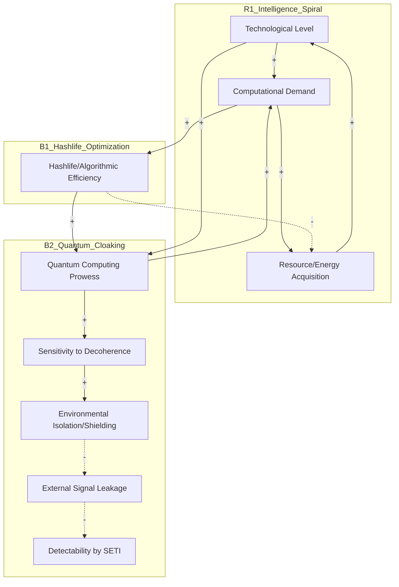

<div class="tab-nav">
<button class="tab-btn active" onclick="openTab(event, 'article')">Article</button>
<button class="tab-btn" onclick="openTab(event, 'analogy')">Analogy</button>
<button class="tab-btn" onclick="openTab(event, 'brainstorm')">Brainstorm</button>
<button class="tab-btn" onclick="openTab(event, 'perspectives')">Multi-Perspective</button>
<button class="tab-btn" onclick="openTab(event, 'dialectical')">Dialectic</button>
<button class="tab-btn" onclick="openTab(event, 'socratic')">Socratic Dialog</button>
<button class="tab-btn" onclick="openTab(event, 'systems')">Systems Thinking</button>
<button class="tab-btn" onclick="openTab(event, 'technical_explanation')">Technical Documentation</button>
</div>

<div id="article" class="tab-content" style="display: block;" markdown="1">

# Quantum SETI: Why First Contact Is a Measurement Problem

## I. The Hashlife Intuition

There is a cellular automaton algorithm called Hashlife that solves Conway's Game of Life in something close to logarithmic time. It does this not by simulating each cell tick-by-tick — the naïve approach — but by recognizing that vast regions of the grid evolve identically, memoizing their futures, and leaping over exponential swathes of redundant computation in a single step. The key insight is structural: most of the universe of Life is *canonically boring*. The interesting dynamics — gliders, glider guns, Turing-complete logic gates — are sparse, and Hashlife exploits that sparsity ruthlessly.

Now hold that image in mind and point it at the night sky.

The Fermi Paradox, in its classical formulation, is an accounting problem. The Drake equation multiplies a chain of astrophysical and biological fractions and arrives at a number — the expected count of communicative civilizations in the galaxy. That number, for any reasonable set of priors, is disturbingly large. Yet we observe silence. The paradox lives in the gap between the expected count and the observed zero.

Seventy years of proposed resolutions have tried to close that gap by adjusting the fractions: maybe abiogenesis is astronomically rare (the Rare Earth hypothesis), maybe civilizations self-destruct on a reliable schedule (the Great Filter), maybe they're here but we lack the instruments or the conceptual vocabulary to notice (the Zoo hypothesis, the Dark Forest, the Transcension hypothesis). Each of these is, in essence, a story about why the *count* is wrong — why the Drake equation's output should be revised downward, or why the observable signature should be revised upward in difficulty.

But what if the problem is not with the count? What if the problem is with the *ontology of counting itself*?

This is the thesis I want to develop: **the Fermi Paradox dissolves — not resolves, *dissolves* — when you stop treating civilizations as countable astronomical objects (like pulsars, or rogue planets, or Type II Kardashev signatures on an infrared survey) and start treating them as computational-quantum basis elements whose mutual co-existence in a shared observable reality requires an entangling measurement exchange.** That exchange — call it "quantum first contact" — is not merely difficult in the engineering sense. It is *structurally suppressed* by the same informational logic that makes Hashlife fast: coherent complex systems that have never interacted occupy orthogonal branches of a combinatorially enormous state space, and the probability amplitude for a *spontaneous* projective measurement that collapses two such branches into a shared eigenstate is, for any physically realistic scenario, negligible.

In other words, the silence is not evidence of absence. It is evidence of *superposition*.

The argument proceeds in several stages. First, I'll make the Hashlife metaphor precise: what it means for a civilization to be a macro-coherent computational structure, and why the classical picture of "a civilization at coordinates (x, y, z) emitting photons at frequency f" smuggles in an unjustified assumption about shared reference frames. Then I'll reframe the problem in the language of quantum field theory — not because I think civilizations are literally quantum objects in the narrow sense, but because QFT provides the only formalism we have that correctly handles the creation, annihilation, and interaction of entities whose *number is not fixed in advance*. The Fock space structure of QFT turns out to be unexpectedly natural for modeling a cosmos in which the number of observable civilizations is itself an observable, not a parameter. From there, I'll develop the notion of a "first-contact operator" — a formal interaction vertex that entangles two previously independent civilization-states — and show why its matrix element is suppressed by what amounts to a decoherence selection rule. Finally, I'll ask what this framework predicts: not just why we see silence, but what kind of signal *would* constitute a genuine measurement, and what it would cost.

A warning before we begin. This is speculative. I am not claiming that civilizations are quantum systems in the way that electrons are quantum systems. I am claiming something more modest but, I think, more interesting: that the *mathematical structure* of quantum theory — superposition, entanglement, decoherence, the measurement problem — provides a better formal language for reasoning about the Fermi Paradox than the classical counting framework we've inherited from Drake. The map is not the territory. But sometimes a better map is exactly what you need to see that the territory was never paradoxical in the first place.

---

## II. Hashlife and Macro-Coherent Computation

To make the Hashlife metaphor load-bearing rather than decorative, we need to understand what the algorithm actually does — and then map each of its structural features onto the problem of civilizations in a large universe.

### How Hashlife works

Bill Gosper's Hashlife algorithm (1984) operates on a quadtree representation of the Game of Life grid. Every square region of the grid at every scale is assigned a canonical hash. When the algorithm needs to compute the future of a region, it first checks whether it has already computed the future of a structurally identical region. If so, it returns the cached result in O(1) time. If not, it decomposes the region into overlapping sub-quadrants, recurses, and memoizes the result for all future lookups.

The consequences are dramatic. A naïve Life simulator running a Methuselah pattern — say, the R-pentomino — must touch every cell at every tick. Hashlife, by contrast, recognizes that the vast empty regions surrounding the active zone are all instances of the *same* dead quadtree node, that the gliders streaming away from the reaction site are *structurally identical* to gliders it has already evolved, and that the periodic oscillators left behind in the debris are *closed loops* whose futures are fully determined by a single period. The algorithm doesn't skip these regions because they're uninteresting. It skips them because *their futures are already known*. Compressibility is the mechanism; acceleration is the consequence.

Four features of this process deserve careful attention, because each one maps onto a distinct claim about cosmic evolution.

### Analogue 1: Recursive collapse, not a single bottleneck

Run a random initial configuration in Life — a soup of randomly filled cells on a large grid — and watch what happens. The vast majority of initial conditions do not produce glider guns, replicators, or Turing-complete machinery. They produce ash: small still lifes, period-2 blinkers, and the occasional escaping glider, all reached within a few hundred generations. The trajectory from random soup to inert ash is not a single catastrophic event. It is a *recursive* process of local collapse. Regions of the grid settle independently. Interaction between still-active regions occasionally reignites local dynamics, but the overwhelming statistical tendency is toward fixed points and short-period attractors.

The mapping to the Fermi Paradox is immediate. The Great Filter hypothesis posits a single, dramatic bottleneck — one stage in the development of a civilization that is so improbable or so lethal that almost no lineage passes through it. But the Hashlife picture suggests something different: **the "filter" is not a wall; it is a gradient.** Most initial conditions — most planetary chemistries, most biospheres, most proto-civilizations — do not hit a wall and die. They simply *converge to attractors*. They reach thermodynamic, ecological, or sociopolitical equilibria from which further complexification is not forbidden but is statistically negligible. The galaxy is not littered with the corpses of civilizations that failed at one critical juncture. It is filled with the computational equivalent of ash: stable, self-consistent configurations that have no further macroscopic dynamics to exhibit.

Think of this as a *decoherence filter* rather than a Great Filter. In quantum mechanics, decoherence is the process by which a system's coherent superposition of possibilities collapses into a single classical outcome through interaction with its environment. The analogy is precise: a young civilization exists in a superposition of developmental trajectories — it *could* become spacefaring, *could* develop quantum computation, *could* restructure its star system. But each interaction with its environment — each resource constraint encountered, each political equilibrium reached, each technological plateau settled into — acts as a decoherence event, collapsing the superposition of possibilities into a single classical trajectory. The Great Filter, on this account, is not a single catastrophic measurement. It is the cumulative decoherence of potential by the relentless environment of thermodynamic, ecological, and sociopolitical reality. Most civilizations do not fail spectacularly. They decohere gradually, their space of possibilities narrowing with each equilibrium reached, until the trajectory that remains is indistinguishable from the background — stable, self-consistent, and silent.

This reframing matters because it changes what we should be looking for. A single Great Filter predicts a specific absence — a missing rung on a developmental ladder. Recursive collapse predicts a *spectrum* of stasis: worlds with complex chemistry but no replication, worlds with replication but no open-ended evolution, worlds with open-ended evolution but no technological civilization, and — crucially — technological civilizations that have simply *stopped*, not because they were destroyed but because they reached a basin of attraction and stayed there. The silence, on this account, is not the silence of death. It is the silence of equilibrium.

And if this is correct, it shifts the metric of civilizational advancement in a subtle but important way. The Kardashev scale measures energy consumption — a civilization's rank is determined by how much power it commands. But the decoherence filter suggests a different metric: *coherence management*. The civilizations that matter — the ones that remain computationally interesting, that resist compression, that avoid collapsing into ash — are not necessarily the ones that consume the most energy. They are the ones that maintain the largest space of open possibilities, that resist the environmental decoherence which narrows trajectories into predictable equilibria. Advancement, in this picture, is not about how much energy you harvest. It is about how much *potential* you preserve.

### Analogue 2: Identical subpatterns are never instantiated twice

The deepest trick in Hashlife is not memoization per se — any dynamic programming algorithm memoizes. The trick is *canonical hashing*: the recognition that two spatially distant regions of the grid, if they are structurally identical, are literally the same node in the quadtree. They do not merely produce the same result; they *are* the same object in memory. The algorithm does not compute the future of each copy independently and then notice that the results match. It never creates the second copy in the first place.

Now consider the universe as a computational substrate (not metaphorically — hold the ontological question in abeyance and focus on the structural parallel). If the dynamics of cosmic evolution have the character of a Hashlife-like process — if, that is, the space of possible civilizational trajectories is vastly smaller than the space of possible initial conditions, because many different starting configurations converge onto the same attractor — then the "expected number of civilizations" produced by the Drake equation is an overcount in a very specific sense. It counts *instances* when it should be counting *equivalence classes*.

Two civilizations that have converged onto the same attractor — the same stable technological equilibrium, the same energy-harvesting strategy, the same communication architecture — are, from the standpoint of any observation that could distinguish them, *the same pattern*. The universe, if it is in any sense computationally efficient, does not need to "run" both of them independently. This is not a claim about physics (yet — that comes in Section III). It is a claim about *information*: the number of *distinguishable* civilizations is bounded not by the number of suitable planets but by the number of genuinely distinct trajectories through civilizational phase space. And if that phase space has the attractor structure suggested by Analogue 1, the number of distinct trajectories may be shockingly small.

The Drake equation, in this light, is not wrong. It is counting the wrong thing. It counts potential *sites* of instantiation. But if most sites converge onto a small set of canonical patterns, the effective number of independent civilizations — the number that matters for the question "how many distinct signals could we in principle detect?" — is much smaller than the site count suggests.

### Analogue 3: Non-compressible trajectories evolve at exponential speed

Here is the feature of Hashlife that most people find counterintuitive: the algorithm is fastest when the pattern is most complex in the *structured* sense (large, with many repeated subpatterns at multiple scales) and slowest when the pattern is *incompressible* — when every region of the grid is genuinely unique and no memoization is possible. But "slowest for Hashlife" still means "running at the naïve tick-by-tick rate." The incompressible patterns are not penalized; they simply receive no bonus.

Turn this around. In the Hashlife picture of cosmic evolution, the civilizations that *cannot* be compressed — the ones whose trajectories through phase space are genuinely novel, not convergent onto any known attractor — are precisely the ones that the universe must "simulate in full." They are the rare, non-canonical patterns: the glider guns, the breeders, the Turing-complete constructions that emerge from the ash of a random soup once in a billion trials.

But here is the twist. From the perspective of the compressible background — from the perspective of the ash, the still lifes, the blinkers — the non-compressible patterns appear to evolve *unimaginably fast*. Hashlife leaps over the predictable regions in exponential jumps. A civilization embedded in the predictable background would experience normal subjective time, but an external observer using Hashlife-like reasoning would see the interesting civilizations — the non-compressible ones — racing ahead at a rate that scales with the depth of the memoization tree. The predictable civilizations are not slow in any absolute sense. They are *fast-forwarded past*. Their futures are already known, so there is nothing to observe.

This has a startling implication for SETI. If we are looking for civilizations by scanning for signals — electromagnetic, gravitational, or otherwise — we are looking for *surprises*: patterns in our data that are not predicted by our models of natural astrophysical processes. But a civilization whose trajectory is compressible is, by definition, *not surprising*. Its emissions, its energy signature, its gravitational footprint — all of these are predictable consequences of known physics applied to known initial conditions. Such a civilization would be invisible not because it is hiding, not because it is too far away, not because it has self-destructed, but because *it has been compressed out of the observable dynamics*. It is part of the background. It is ash.

### Analogue 4: The most expansionist civilizations are the most invisible

This is the most counterintuitive of the four analogues, and it is worth stating bluntly: **a Kardashev Type III civilization — one that has restructured an entire galaxy to serve its computational or energetic purposes — is, in the Hashlife framework, the *most* compressible object in the cosmos.**

Why? Because expansion, at galactic scales, requires *uniformity*. A civilization that harvests every star in a galaxy must deploy essentially the same energy-collection infrastructure around each one. A civilization that restructures the interstellar medium must impose a *pattern* — and a pattern, by definition, is compressible. The Dyson swarms are identical. The communication relays are identical. The stellar engineering is, at the macro scale, a single canonical subpattern tiled across a hundred billion instances. Hashlife would represent the entire galaxy-spanning civilization as a single quadtree node with a very large spatial extent and a very short description length.

From the outside — from the perspective of an observer who has not yet interacted with this civilization, who is trying to detect it by looking for anomalies in astrophysical data — the civilization is *maximally boring*. It is a region of the grid that has been solved. Its future is known. It emits no surprises. It is, in the precise information-theoretic sense, *indistinguishable from a natural process that happens to produce the same macroscopic observables*.

This inverts the usual SETI logic completely. The standard assumption is that bigger civilizations are easier to detect: more energy use means more waste heat, more megastructures means more transit signatures, more communication means more leakable electromagnetic radiation. But in the Hashlife framework, scale and detectability are *inversely* correlated. The bigger the civilization, the more uniform it must be. The more uniform it is, the more compressible it is. The more compressible it is, the less information it contributes to the observable state of the universe. The less information it contributes, the harder it is to distinguish from the natural background.

The Dark Forest hypothesis says advanced civilizations hide. The Hashlife picture says something stranger: advanced civilizations don't need to hide, because *expansion itself is a form of hiding*. The act of restructuring your environment to be maximally useful is, simultaneously, the act of making yourself maximally predictable. And maximal predictability, in a universe that compresses redundancy, is indistinguishable from absence.

There is a speculative extension of this idea that deserves mention, if only because it illustrates how far the logic can be pushed. Consider dark matter — the 85% of the universe's mass that interacts gravitationally but not electromagnetically. In the Hashlife framework, a maximally compressed civilization is one whose informational content has been reduced to a single canonical node: gravitational influence without electromagnetic signature. The civilization's mass remains — it curves spacetime, it participates in galactic dynamics — but its *informational* contribution to the observable electromagnetic universe has been compressed to zero. I am *not* claiming that dark matter is composed of compressed civilizations. The claim is structural: the Hashlife framework predicts that the most advanced civilizations would have exactly the observational signature that dark matter has — gravitational presence without electromagnetic individuality. The fact that the universe appears to be dominated by exactly such a signature is, at minimum, a coincidence worth noting. At maximum, it is a prediction.

### The composite picture

Taken together, the four analogues paint a portrait of a universe that is not empty but *compressed*:

1. Most civilizational trajectories collapse into attractors long before reaching the point of interstellar visibility. The "filter" is not a single barrier but a ubiquitous thermodynamic gradient toward equilibrium.

2. Civilizations that converge onto the same attractor are informationally redundant. The effective number of distinct civilizations is far smaller than the number of suitable planets.

3. The rare civilizations with genuinely novel trajectories evolve so fast, relative to the compressed background, that they pass through any window of mutual detectability in an instant.

4. Civilizations that expand to galactic scales become maximally compressible and therefore maximally invisible — not because they choose to hide, but because uniformity is the price of scale.

None of this yet constitutes a *physical* argument. It is a structural argument — a claim about the information-theoretic shape of the problem. To make it physical, we need a formalism that can handle superposition, entanglement, and the creation and annihilation of entities whose number is not fixed in advance. We need, in other words, quantum field theory.

---

---

## III. Civilizations as Basis Elements, Not Countable Objects

The composite picture from Section II ends with a promissory note: we need a formalism that handles entities whose number is not fixed in advance. Before we reach for the full apparatus of quantum field theory (that comes in Section IV), we need to correct a more basic error — the error that makes the Drake equation feel like the *natural* starting point for reasoning about extraterrestrial intelligence.

The error is this: we treat "one civilization" as a cardinality claim. One civilization, like one apple, like one planet. You count them. You multiply probabilities to estimate how many there should be. You compare the estimate to observation and, finding a discrepancy, declare a paradox.

But "one civilization" is not a cardinality claim. It is a statement about the **lowest-order nontrivial interaction term in an expansion**.

### The expansion

Consider the universe not as a container that holds civilizations the way a box holds marbles, but as a system whose observable state can be decomposed into interaction terms of increasing complexity:

- **0th order: the universe alone.** This is the vacuum term — the cosmos evolving under its own dynamics with no macro-coherent computational structure that we would recognize as "civilization." Stars burn, galaxies merge, entropy increases. The term is enormous. It dominates the expansion the way the vacuum energy dominates a quantum field theory. It is also, from the standpoint of the Fermi Paradox, completely uninteresting. There is no one to ask the question.

- **1st order: universe × civilization.** This is the first nontrivial term. It describes a cosmos in which *one* macro-coherent computational structure has emerged and is coupled to the physical substrate — drawing energy from it, processing information about it, modifying it in locally non-equilibrium ways. Note what this term asserts: not that a civilization has been *placed into* a pre-existing universe, but that the universe-and-civilization arise as a *joint state*. The civilization is not an ornament on the universe. It is a mode of the universe. **It is baseline to have a civilization with a universe — you need both.** A universe with no observers is the 0th-order term, and a civilization with no universe is not a term at all. The 1st-order term is the minimal package that supports the question "is anyone else out there?"

- **2nd order: universe × civilization × civilization.** Now we have two macro-coherent structures coupled to the same physical substrate. This is the term that the Drake equation is trying to estimate. And here is where the expansion starts to bite, because the 2nd-order term is not simply "twice" the 1st-order term. It requires something structurally new: the two civilizations must be **non-isomorphic**.

- **Higher orders** follow the same pattern. Each additional civilization in the interaction term must contribute genuinely new structure — structure that is not reducible to, or compressible into, the structures already present in lower-order terms.

### Why coefficients shrink: the non-isomorphism constraint

This is the crucial point, and it is worth dwelling on. In the Drake framework, adding a second civilization to the galaxy is just as "easy" as adding the first. The probability of a civilization arising on any given suitable planet is treated as independent of whether civilizations exist elsewhere. The expected count scales linearly with the number of sites.

In the expansion framework, this is wrong — not because of causal interaction between sites (we are not invoking any mysterious faster-than-light influence) but because of an **informational constraint on what counts as a distinct term**.

Recall Analogue 2 from the Hashlife section: identical subpatterns are never instantiated twice. Two civilizations that have converged onto the same attractor in civilizational phase space — the same energy-harvesting strategy, the same computational architecture, the same equilibrium social structure — are *the same basis element*. They do not contribute a new term to the expansion. They are a redundant copy, and redundant copies are compressed out.

For the 2nd-order term to be nontrivial, the second civilization must be genuinely non-isomorphic to the first. It must occupy a different region of civilizational phase space — not merely a different location in physical space. It must process information in a structurally distinct way, or exploit a different thermodynamic niche, or encode its complexity in a different substrate. Physical separation is necessary but nowhere near sufficient. You need *informational* distinctness.

And here the coefficients begin to shrink. The space of possible civilizational configurations is vast, but the space of *stable* configurations — configurations that are attractors rather than transients — is, as we argued in Section II, dramatically smaller. Most trajectories converge. Most attractors are shared. The number of genuinely non-isomorphic stable civilizations is bounded not by the number of planets but by the number of distinct attractors in civilizational phase space. Each additional civilization you add to the interaction term must find a *new* attractor, one not already occupied by any of the civilizations in lower-order terms. The pool of available attractors depletes with each term. The coefficients — the weights of higher-order terms in the expansion — shrink accordingly.

### The Feynman diagram analogy

This pattern — interaction terms whose coefficients decrease rapidly with the number of participating entities — should be familiar to anyone who has worked with perturbative quantum field theory. Consider the expansion of a scattering amplitude in QED. The 0th-order term is "nothing happens" — the particles propagate freely. The 1st-order term involves a single interaction vertex: one photon exchanged between two electrons. The 2nd-order term involves two vertices, or a vertex with a virtual loop. Each additional vertex costs a factor of the fine-structure constant α ≈ 1/137. The series converges (at least asymptotically) because complexity is expensive. Each additional interaction must be *paid for* with a suppression factor.

The analogy to our civilizational expansion is not merely decorative. In QED, the suppression factor α has a physical origin: it measures the strength of the electromagnetic coupling. In our expansion, the suppression factor has an *informational* origin: it measures the difficulty of finding a genuinely non-isomorphic civilizational configuration that is also dynamically stable. But the mathematical structure is the same. **Complexity costs amplitude.** The more civilizations you pack into a single interaction term, the more stringent the non-isomorphism constraint becomes, and the smaller the coefficient.

To make this concrete: the 1st-order term (one civilization) has a coefficient of order 1. It is, as we said, baseline. The universe-plus-observer is the minimal nontrivial configuration. The 2nd-order term (two non-isomorphic civilizations sharing an observable universe) is suppressed — not by a coupling constant in the physics sense, but by the fraction of civilizational phase space that remains *accessible and distinct* once the first civilization's attractor basin has been accounted for. Call this suppression factor ε. The 3rd-order term is suppressed by something like ε², because now the third civilization must be non-isomorphic to *both* of the first two. The nth-order term carries a factor of roughly ε^(n-1), and if ε is small — if the number of distinct stable attractors is small relative to the space of initial conditions — the series converges fast.

In Feynman-diagrammatic language: each civilization is a vertex, and the "propagator" connecting two civilizational vertices is the measurement exchange that entangles them into a shared observable reality (we will formalize this in Section IV). A diagram with n vertices and the requisite (n-1) propagators represents an n-civilization interaction term. The amplitude of the diagram decreases with n, not because of any dynamical suppression in the Lagrangian, but because the *combinatorial weight* of finding n mutually non-isomorphic stable configurations decreases. The universe is not teeming with civilizations for the same reason that QED is not dominated by thousand-vertex diagrams: the higher-order terms exist in the formal expansion, but their coefficients are negligible.

There is a further structural parallel worth noting, one that connects the expansion framework to the conservation laws of physics. In quantum field theory, the convergence of the perturbative series is not merely a happy accident — it is *enforced* by symmetries. Noether's theorem links every continuous symmetry of the Lagrangian to a conserved quantity: time-translation symmetry gives conservation of energy, spatial-translation symmetry gives conservation of momentum, gauge symmetry gives conservation of charge. These conservation laws function as *constraints* on the expansion — they forbid terms that would violate the symmetry, and they ensure that the series does not diverge by imposing selection rules on which interaction vertices are allowed.

In the civilizational expansion, the analogous role is played by what we might call *informational conservation laws*. The non-isomorphism constraint is not a contingent fact about biology or sociology. It is a structural constraint on the expansion itself — a selection rule that forbids redundant terms. Just as charge conservation forbids a vertex where an electron disappears without producing a positron, informational non-redundancy forbids a term where two identical civilizations are counted as distinct. The conservation laws of physics ensure that the QED series converges; the informational conservation laws of the civilizational expansion ensure that the number of distinguishable civilizations is finite and small. The parallel is not merely aesthetic. It suggests that the suppression of higher-order civilizational terms is as fundamental as the suppression of higher-order Feynman diagrams — rooted not in accident but in the deep structure of the expansion itself.

### What this reframing dissolves

The Fermi Paradox, in this light, is an artifact of confusing the *site count* (how many planets could host a civilization) with the *term count* (how many non-isomorphic civilizational basis elements contribute nontrivially to the expansion). The Drake equation estimates the site count. It may even estimate it correctly. But the site count is not the observable. The observable is the number of *distinct interaction terms* — the number of genuinely independent civilizational modes that could, in principle, be distinguished by measurement.

And that number, if the attractor structure of civilizational phase space is anything like the attractor structure of complex dynamical systems generally, is small. Not zero — the 1st-order term is nontrivial, and we are the proof. But not 10,000, and probably not 10. The expansion is dominated by its lowest-order terms, just as QED is dominated by tree-level and one-loop diagrams.

The question "where is everybody?" presupposes that "everybody" is a large number. The expansion framework suggests that the number of *distinguishable* everybodies — the number of non-isomorphic civilizational basis elements with non-negligible coefficients — may be exactly what we observe: one, plus corrections that are small enough to be consistent with current non-detection.

This is not a claim that we are alone. It is a claim that "alone" and "not alone" are the wrong categories. We are the 1st-order term. The question is not whether higher-order terms exist — they almost certainly do, in the formal expansion — but whether their coefficients are large enough to produce observable consequences. The framework predicts that they are not, and it predicts this without invoking any Great Filter, any Dark Forest, any zoo-keeping elder race. It predicts it from the structure of the expansion itself.

But we have been speaking in analogies — "like" Feynman diagrams, "like" coupling constants. To make this precise, we need to actually write down the formalism. We need Fock space, creation and annihilation operators, and an interaction Hamiltonian. We need, in short, the quantum field theory of civilizations.

---

## IV. The First-Contact Operator

We have been speaking in analogies long enough. The expansion framework of Section III borrowed the *language* of Feynman diagrams — vertices, propagators, suppression factors — but left the formalism gestural. Now we need to be precise. Not because precision is a virtue in itself (though it is), but because the central claim of this essay — that first contact is a measurement problem, not a search problem — is a claim with specific mathematical content, and that content lives in the structure of quantum field theory.

### Hilbert space factorization and the problem of sectors

Begin with the most basic object in quantum theory: the Hilbert space $\mathcal{H}$ of the universe. Whatever else we disagree about in the interpretation of quantum mechanics, we agree on this: the state of a closed system is a vector (or, more carefully, a ray) in a Hilbert space, and the observables of that system are self-adjoint operators acting on that space.

Now consider two civilizations — call them $A$ and $B$ — that have never interacted. Not "never communicated," not "never met," but *never interacted in any physical sense whatsoever*. No photon emitted by $A$ has ever been absorbed by $B$. No gravitational wave from $A$'s stellar neighborhood has ever perturbed $B$'s. The two civilizations are, in the language of quantum field theory, spacelike-separated across their entire histories, or — more realistically — simply causally disconnected: embedded in regions of spacetime whose past light cones do not overlap in any interval that postdates the emergence of either civilization as a macro-coherent structure.

In this situation, the Hilbert space of the universe factorizes:

$$\mathcal{H} = \mathcal{H}_A \otimes \mathcal{H}_B \otimes \mathcal{H}_{\text{env}}$$

where 

$$\mathcal{H}_A$$

contains all degrees of freedom that civilization $A$ has ever coupled to, 

$\mathcal{H}_B$

contains all degrees of freedom that civilization $B$ has ever coupled to, and 

$\mathcal{H}_{\text{env}}$ 

is everything else — the vast bulk of the universe that neither civilization has entangled with in any operationally meaningful way. The total state is a product state across these sectors:

$$|\Psi\rangle = |\psi_A\rangle \otimes |\psi_B\rangle \otimes |\phi_{\text{env}}\rangle$$

This factorization is not an approximation. It is a *consequence of locality*. In quantum field theory, operators associated with spacelike-separated regions commute. If $\hat{O}_A$ is any operator with support only on $\mathcal{H}_A$ and $\hat{O}_B$ is any operator with support only on $\mathcal{H}_B$, then:

$$[\hat{O}_A, \hat{O}_B] = 0$$

This is not a statement about the difficulty of communication. It is a statement about the *algebraic structure of observables*. No operator that $A$ can construct — no measurement $A$ can perform, no signal $A$ can emit, no modification $A$ can make to its local environment — has any support on $\mathcal{H}_B$. The operator algebras of the two sectors are *mutually commuting subalgebras* of the full algebra of observables. They do not talk to each other. They cannot talk to each other. There is no element of $A$'s operator algebra that, applied to the joint state, produces a change in the reduced state of $B$.

This is the sense in which two never-interacting civilizations are not merely "far apart." They are in **orthogonal sectors of Hilbert space**. The word "orthogonal" here is doing real work. It means that the inner product between any state in $\mathcal{H}_A$ and any state in $\mathcal{H}_B$ is not small — it is *zero*. There is no overlap. There is no amplitude for a spontaneous transition from one sector to the other. The two civilizations do not exist in the same branch of the universal wavefunction in any operationally meaningful sense.

This factorization introduces a subtlety that is easy to miss but essential to the argument: the problem of *observer hierarchy*. Consider a thought experiment in the spirit of Wigner's friend. Civilization $A$ performs a measurement on civilization $B$ — perhaps by detecting $B$'s electromagnetic emissions with sufficient resolution to confirm $B$'s existence. From $A$'s perspective, the measurement has occurred: $B$ has been "collapsed" from a superposition of "exists/does not exist in our sector" into a definite state. But now consider civilization $C$, which has never interacted with either $A$ or $B$. From $C$'s perspective, the entire $A$-$B$ interaction is itself a quantum system — a joint state in $\mathcal{H}_A \otimes \mathcal{H}_B$ that $C$ has not measured. The "reality" of the $A$-$B$ contact is, for $C$, still in superposition. The contact has occurred in $A$'s branch and $B$'s branch, but not in $C$'s branch. There is no God's-eye view from which the contact is simply "real." Reality, in a factorized Hilbert space, is *relational* — it is defined by the entanglement structure between sectors, not by any absolute fact about which sectors have "really" interacted. This is not a philosophical nicety. It is a structural consequence of the formalism, and it means that the question "has first contact occurred?" does not have a unique answer. It has as many answers as there are sectors, and each sector's answer depends on its own entanglement history.

### Why classical interaction is topologically untenable

The classical picture of first contact — civilization $A$ emits a radio signal, the signal propagates through space, civilization $B$ receives it — implicitly assumes that $A$ and $B$ already share a sector. The signal is modeled as a classical field propagating through a shared spacetime, coupling to $A$'s transmitter at one end and $B$'s receiver at the other. But this picture presupposes exactly what needs to be established: that there exists an operator — the electromagnetic field operator, evaluated along the signal's worldline — that has support on *both* $\mathcal{H}_A$ and $\mathcal{H}_B$.

For two civilizations in factorized sectors, no such operator exists. The electromagnetic field in $A$'s region is an operator on $\mathcal{H}_A$. The electromagnetic field in $B$'s region is an operator on $\mathcal{H}_B$. The "signal" that connects them would need to be an operator on $\mathcal{H}_A \otimes \mathcal{H}_B$ that is *not* decomposable as a tensor product of local operators — that is, it would need to be an *entangling* operator. But entangling operators do not arise from local dynamics. They require an interaction Hamiltonian with explicit support on both sectors:

$$\hat{H}_{\text{int}} = \sum_{i,j} g_{ij} \hat{O}_A^{(i)} \otimes \hat{O}_B^{(j)}$$

where $g_{ij}$ are coupling constants and the sum runs over pairs of operators from each sector. Without such a term in the Hamiltonian, the time evolution operator factorizes:

$$\hat{U}(t) = \hat{U}_A(t) \otimes \hat{U}_B(t) \otimes \hat{U}_{\text{env}}(t)$$

and the product structure of the state is preserved for all time. The sectors evolve independently. Forever.

Think of this topologically. Represent the space of all physical degrees of freedom as a graph, where nodes are local subsystems and edges represent direct physical couplings (nonzero terms in the Hamiltonian). Civilization $A$ is a connected subgraph. Civilization $B$ is a connected subgraph. The question "can $A$ send a signal to $B$?" is the question "is there a path in this graph from any node in $A$'s subgraph to any node in $B$'s subgraph?" For two civilizations in factorized sectors, the answer is no. The graph is *disconnected*. There is no path — not a long path, not an expensive path, not an improbable path. No path. The two subgraphs are in different connected components of the interaction graph.

Classical first contact requires a continuous path in this graph. If no such path exists, no amount of engineering — no larger antenna, no more sensitive detector, no more powerful transmitter — can bridge the gap. The problem is not one of signal strength. It is one of *topology*. You cannot walk from one connected component to another, no matter how fast you walk.

### Quantum first contact: the entangling measurement

So what *would* constitute first contact between two civilizations in factorized sectors? The answer is forced on us by the formalism: it must be an event that *breaks the factorization*. It must be an interaction that takes the product state $|\psi_A\rangle \otimes |\psi_B\rangle$ and maps it to an entangled state — a state that cannot be written as a product:

$$|\psi_A\rangle \otimes |\psi_B\rangle \;\longrightarrow\; |\Psi_{AB}\rangle \;\notin\; \mathcal{H}_A \otimes \mathcal{H}_B$$

where $|\Psi_{AB}\rangle$ has genuine quantum correlations between the two sectors. This is what I mean by **quantum first contact**: a nonlocal entangling event that couples the degrees of freedom of two previously independent macro-coherent systems and forces them into a shared branch of the wavefunction.

The word "nonlocal" requires immediate clarification. I do not mean faster-than-light signaling. I mean nonlocal in the precise quantum-mechanical sense: the resulting state $|\Psi_{AB}\rangle$ has correlations that cannot be accounted for by any local hidden variable model. The entanglement is between the *sectors*, not between individual particles. It is a correlation between the macro-coherent degrees of freedom of entire civilizations — their measurement records, their thermodynamic histories, their informational content.

Let us write down the first-contact operator explicitly. Define:

$$\hat{F}_{AB} = \sum_{\alpha, \beta} f_{\alpha\beta} \; |\alpha\rangle_A \otimes |\beta\rangle_B \; \langle \psi_A| \otimes \langle \psi_B|$$

where $\{|\alpha\rangle_A\}$ and $\{|\beta\rangle_B\}$ are bases for the post-contact states of each civilization, and $f_{\alpha\beta}$ are amplitudes that encode the specific character of the contact event. The operator $\hat{F}_{AB}$ takes the pre-contact product state and maps it to a superposition of correlated post-contact states. Its matrix element — the amplitude for the transition — is:

$$\mathcal{M} = \langle \Psi_{AB} | \hat{F}_{AB} | \psi_A \rangle \otimes | \psi_B \rangle$$

This matrix element is the quantity whose magnitude-squared gives the probability of first contact. And now we can state precisely why that probability is suppressed.

### The three conditions and why they are jointly catastrophic

For $\hat{F}_{AB}$ to produce a physically meaningful first contact — one that results in two civilizations that are *aware of each other*, that can exchange information, that share an observable reality — three conditions must be simultaneously satisfied:

**Condition 1: Macroscopic coupling.** The entanglement must involve macroscopic degrees of freedom — not a single photon absorbed by a single atom in $B$'s atmosphere, but a correlated state change across enough of $B$'s macro-coherent structure that the contact event is *registered* as information. A single entangled pair of particles shared between $A$ and $B$ does not constitute first contact any more than a single photon from a distant star constitutes a conversation. The operator $\hat{F}_{AB}$ must couple collective modes — thermodynamic, computational, informational — of both civilizations. The number of degrees of freedom involved scales with the complexity of the civilizations, and the amplitude for coherently entangling $N$ degrees of freedom decreases exponentially with $N$.

**Condition 2: Decoherence survival.** The entangled state $|\Psi_{AB}\rangle$ must survive long enough to be operationally meaningful. But macro-coherent systems are, by definition, systems that are *strongly coupled to their local environments*. Each civilization is a thermodynamic engine, constantly exchanging energy and entropy with its surroundings. Each such exchange is a decoherence event — a measurement performed by the environment on the system, which tends to destroy quantum correlations between the system and anything it is not locally coupled to. The decoherence timescale for a macroscopic quantum correlation is:

$$\tau_D \sim \tau_0 \left(\frac{\lambda_{\text{dB}}}{\Delta x}\right)^2$$

where $\tau_0$ is the characteristic dynamical timescale, $\lambda_{\text{dB}}$ is the thermal de Broglie wavelength, and $\Delta x$ is the spatial separation of the superposed components. For any macroscopic system at any temperature above absolute zero, $\tau_D$ is absurdly small — far shorter than any timescale on which a civilization could process the information content of the contact event. The entanglement is destroyed almost as fast as it is created. The environment *measures* the correlation out of existence.

**Condition 3: Branch merging.** Even if conditions 1 and 2 are met — even if a macroscopic entangling event occurs and survives decoherence — the two civilizations must end up in the *same branch* of the post-decoherence wavefunction. Decoherence does not destroy superpositions; it distributes them across branches. After decoherence, the state of the universe is (schematically):

$$|\Psi\rangle \approx \sum_k c_k \; |\alpha_k\rangle_A \otimes |\beta_k\rangle_B \otimes |E_k\rangle_{\text{env}}$$

where the environment states $|E_k\rangle$ are approximately orthogonal. Each term in this sum is a "branch" — a decohered component that evolves independently of the others. For first contact to be *experienced* by both civilizations, they must find themselves in the same branch: a branch in which $A$'s state is correlated with $B$'s state in a way that both can verify. The probability of this is not the probability of the entangling event itself, but the probability of the entangling event *times* the probability that decoherence channels the result into a mutually accessible branch. This is a further suppression factor, and it can be severe.

The three conditions are not independent. They are *antagonistic*. Condition 1 demands that many degrees of freedom be entangled (large $N$). Condition 2 demands that the entanglement survive environmental monitoring (small coupling to environment). But macro-coherent systems with many degrees of freedom are precisely the systems that couple most strongly to their environments. Increasing $N$ to satisfy Condition 1 exponentially decreases $\tau_D$, violating Condition 2. And even if some miraculous fine-tuning satisfies both, Condition 3 imposes an additional branching penalty that scales with the dimensionality of the environment's Hilbert space.

The matrix element $\mathcal{M}$ is suppressed by all three factors simultaneously:

$$|\mathcal{M}|^2 \sim e^{-N} \times e^{-t/\tau_D} \times \frac{1}{d_{\text{env}}}$$

where $N$ is the number of entangled degrees of freedom, $t$ is the timescale of the contact event, $\tau_D$ is the decoherence time, and $d_{\text{env}}$ is the effective dimension of the environment's Hilbert space. For any physically realistic values of these parameters — $N \sim 10^{23}$ (Avogadro-scale), $t/\tau_D \sim 10^{40}$ (macroscopic time divided by decoherence time), $d_{\text{env}} \sim 10^{10^{23}}$ (the Hilbert space dimension of a stellar-scale environment) — the matrix element is not merely small. It is small in the way that $e^{-10^{23}}$ is small. It is zero for all practical purposes, and for most impractical ones.

### What this means, and what it does not mean

Let me be precise about the claim. I am *not* saying that civilizations are quantum objects in the way that electrons are quantum objects. Civilizations are decohered, classical, thermodynamic systems. That is exactly the point. Their classicality — their deep entanglement with their local environments, their thermodynamic irreversibility, their macroscopic definiteness — is what makes inter-civilizational entanglement so catastrophically suppressed. Quantum first contact is hard *because* civilizations are classical, not despite it.

I am also not saying that two civilizations can never come to share an observable universe. I am saying that the *mechanism* by which they come to share one is not the classical picture of signal propagation through a pre-existing shared spacetime. It is, instead, a measurement event — an entangling interaction that creates the shared spacetime as a correlational structure between the two sectors. Before the measurement, there is no shared spacetime in any operationally meaningful sense. There is $\mathcal{H}_A$ and there is $\mathcal{H}_B$ and there is no operator that connects them. After the measurement — if it occurs, if it survives decoherence, if it channels into a mutually accessible branch — there is $\mathcal{H}_{AB}$, a joint sector with genuine correlations, and within that sector, a shared spacetime in which classical signals can propagate.

The first-contact operator $\hat{F}_{AB}$ is not a radio telescope. It is not a laser beacon. It is not a Bracewell probe. Those are all operators with support on a single sector — tools that $A$ can build using $A$'s degrees of freedom, designed to couple to a spacetime that $A$ already inhabits. They are useless for reaching $B$, because $B$ is not in $A$'s spacetime. $B$ is in $B$'s spacetime. The two spacetimes are not "far apart" in some shared meta-spacetime. They are *algebraically independent*. The distance between them is not measured in light-years. It is not measured at all, because there is no metric that spans both sectors.

This is not metaphor. This is not analogy. This is a literal consequence of Hilbert space factorization and the locality of quantum field theory. If two systems have never interacted, their observable algebras commute, their states are product states, and no local operation on one system can affect the other. The entire apparatus of SETI — every search strategy, every detection method, every Drake equation estimate — presupposes that the target civilization is in our sector. If it is not, the apparatus is not inadequate. It is *inapplicable*. It is a hammer, and the problem is not a nail. The problem is in a different workshop, in a different building, in a different city, and the cities are not on the same map.

The Fermi Paradox asks: "If they exist, why can't we detect them?" The QFT framing answers: "Because detection is an operator, and operators have support on specific sectors, and there is no reason — no physical law, no logical necessity, no probabilistic argument — to assume that another civilization's sector overlaps with ours." The silence is not a mystery to be explained. It is a *selection rule* to be respected.

---

## V. Photon Exchange and the Decoherence Barrier

The formalism of Section IV is clean, general, and — a skeptic might reasonably complain — suspiciously abstract. We wrote down a first-contact operator $\hat{F}_{AB}$, showed that its matrix element is catastrophically suppressed, and declared victory. But we never specified the *physical mechanism* by which two civilizations might become entangled. We never asked: what is the boson? What is the interaction vertex? What, concretely, is the propagator that connects two civilizational sectors?

The obvious candidate is the photon. And the obvious objection to everything in Section IV is: "Photons already travel between stars. Starlight from distant systems already enters our telescopes. If photon exchange is the entangling mechanism, then every civilization that has ever looked at the night sky is already entangled with every star — and, by extension, with any civilization orbiting one of those stars. Your factorized Hilbert space is a fiction. The sectors are already connected."

This objection is natural, important, and wrong. Understanding *why* it is wrong — and what it would actually take to bridge two civilizational sectors via photon exchange — is the work of this section. The answer will turn out to hinge not on whether photons are exchanged (they are, constantly, ubiquitously, trivially) but on whether the exchange constitutes a *measurement* in the precise quantum-mechanical sense. And that distinction — between photon absorption and measurement — is where the entire framework either stands or falls.

### The atomic analogy and why it misleads

In atomic physics, entanglement via photon exchange is routine. Two atoms in separate optical cavities can be entangled by allowing a single photon to interact with both: the photon is emitted by atom $A$, propagates through a shared optical channel, and is absorbed by atom $B$ in a way that correlates their internal states. The resulting Bell state is a textbook example of entanglement generation, and it works because three conditions are satisfied:

1. **Isolation.** The atoms are shielded from environmental decoherence. The optical cavities have finesse values in the millions. The photon's path is controlled to sub-wavelength precision. The entire apparatus is cooled to millikelvin temperatures.

2. **Mode matching.** The photon emitted by $A$ is in a single, well-defined mode of the electromagnetic field — a specific frequency, polarization, and spatiotemporal profile. Atom $B$'s cavity is tuned to accept exactly that mode. The overlap integral between the emitted and accepted modes is close to unity.

3. **Single-quantum coherence.** The entanglement is carried by a single photon (or a small number of photons in a carefully prepared Fock state). The quantum state of the photon — its superposition of "emitted" and "not emitted," or its polarization state — is the degree of freedom that becomes correlated between the two atoms. The information content of the entanglement is carried by a single quantum of the field.

Now scale this up by a factor of $10^{50}$ and ask what happens when the "atoms" are civilizations and the "optical channel" is interstellar space.

Every one of the three conditions fails. Not marginally. Catastrophically.

### Condition 1 fails: civilizations are thermal baths, not isolated systems

A civilization is the *opposite* of an isolated quantum system. It is a thermodynamic engine operating far from equilibrium, coupled to its environment through every available channel: electromagnetic, gravitational, mechanical, chemical. A single human body exchanges roughly $10^{28}$ photons per second with its thermal environment. A civilization of $10^{10}$ individuals, plus its technological infrastructure, plus its planetary biosphere, is exchanging something like $10^{45}$ photons per second with its local environment — and each of those exchanges is a decoherence event, a measurement performed by the environment on the civilization's quantum state.

Consider what happens when a single photon from a distant star arrives at a civilization's planet. It enters the atmosphere. Within the first microsecond, it interacts with $\sim 10^{18}$ atmospheric molecules. Each interaction is a scattering event that entangles the photon's state with the state of the scattering molecule, which is in turn entangled with the thermal bath of the atmosphere. By the time the photon has traversed a single meter of air, its quantum state has been measured — in the decoherence sense — by the atmosphere. The phase information it carried, the coherence it might have shared with its source, the delicate quantum correlations that could in principle have linked it to the civilization that emitted it: all of this has been irreversibly transferred to the $10^{18}$-dimensional Hilbert space of the atmospheric molecules it scattered from.

The decoherence timescale for a single optical photon interacting with a room-temperature gas at atmospheric pressure is:

$$\tau_D^{\text{photon}} \sim 10^{-15} \text{ s}$$

Femtoseconds. The photon decoheres in *femtoseconds*. Not because the atmosphere is hostile to photons — it is largely transparent at optical wavelengths — but because transparency is a classical concept. Classically, the photon passes through. Quantum mechanically, it scatters elastically off every molecule it encounters, and each elastic scattering event is an entangling interaction that leaks which-path information into the environment. The photon arrives at the ground with its energy and momentum approximately intact but its quantum coherence utterly destroyed.

This is not a technical problem that better engineering could solve. It is a *thermodynamic* fact about what it means to be a macroscopic system at finite temperature. The atmosphere is not an obstacle between the photon and the civilization. The atmosphere *is* the civilization, in the relevant sense: it is part of the macro-coherent system's environmental coupling, part of the thermal bath that defines the civilization's classical sector. A photon that has interacted with the atmosphere has already been measured by the civilization's sector. It has been absorbed into $\mathcal{H}_A$. It carries no residual coherence with $\mathcal{H}_B$.

### Condition 2 fails: interstellar photons are in thermal mixed states, not pure modes

Even if we could somehow shield the receiving civilization from decoherence — even if we could catch the photon before it hit the atmosphere, in a perfect vacuum, with a perfect detector — the photon itself is not in a pure quantum state by the time it arrives.

A photon emitted by a star (or by a civilization's transmitter, if the transmitter is anything less than a single isolated atom in a perfect cavity) is emitted into a thermal environment. The source is at finite temperature. The emission process involves coupling to a thermal bath of $10^{57}$ particles (for a star) or $10^{30}$ particles (for a technological transmitter). The emitted photon is not in a pure state $|\psi\rangle$; it is in a mixed state described by a density matrix:

$$\rho_{\text{photon}} = \text{Tr}_{\text{source}} \left[ |\Psi_{\text{source+photon}}\rangle \langle \Psi_{\text{source+photon}}| \right]$$

where the trace is over all the degrees of freedom of the source that we do not have access to. This density matrix has entropy. It is not a pure state. And a mixed-state photon *cannot generate entanglement*. This is a theorem, not an approximation: if the mediating particle is in a mixed state, the mutual information it can establish between two systems is bounded by its purity, and for a thermal photon, that purity is negligible.

The photon that arrives from a distant civilization is not a quantum messenger carrying a coherent superposition. It is a classical signal carrying energy and (possibly) classical information. It can tell you that a star is there. It can tell you the star's temperature, composition, and radial velocity. If the civilization has modulated it, it can carry a classical message. But it cannot entangle you with the civilization that emitted it, because it was never in a pure entangled state with that civilization in the first place. The entanglement was destroyed at the source, by the same thermal decoherence that destroys it at the receiver.

### Condition 3 fails: single-quantum correlations do not scale to macro-coherent systems

Suppose, counterfactually, that we could prepare a single photon in a pure state, entangled with a single degree of freedom of civilization $A$, and deliver it coherently to a single degree of freedom of civilization $B$. We would then have one entangled pair — one e-bit — shared between the two civilizations.

One e-bit is not first contact.

First contact, as defined by the operator $\hat{F}_{AB}$ in Section IV, requires entanglement between *macroscopic* degrees of freedom — between the collective informational states of two civilizations. A single entangled pair, buried in the $10^{50}$-dimensional Hilbert space of a civilization's physical substrate, is not operationally accessible. It is not detectable. It does not constitute a measurement record. It is a single quantum correlation in an ocean of thermal noise, and the signal-to-noise ratio is:

$$\text{SNR} \sim \frac{1}{\sqrt{d_A}} \sim 10^{-25}$$

where $d_A$ is the effective Hilbert space dimension of the civilization's macroscopic degrees of freedom. You would need to share $\sim d_A$ entangled pairs to build up a macroscopic correlation — and each pair must be delivered coherently, without decoherence, through interstellar space and into the receiving civilization's quantum state. The resource cost scales as the *dimension of the civilization's Hilbert space*, which is exponential in the number of its constituent particles.

This is why the single-photon question is a red herring. The question "can a photon from civilization $A$ reach civilization $B$?" has an obvious answer: yes, trivially, constantly. Photons from every star in the galaxy are reaching us right now. But the question that matters is not "can a photon reach us?" It is "can a photon *entangle* us?" And the answer to that question is: not one photon, not a billion photons, not $10^{40}$ photons, if each one decoheres independently upon arrival. The threshold is not about photon count. It is about *information resolution*.

### The measurement loophole: coherent detection as sector bridging

And yet.

There is a loophole in the decoherence argument, and it is not small. It is, in fact, the entire point of this essay.

The argument above assumes that each photon from a distant civilization interacts with the receiving civilization *independently* — that each photon is absorbed, decohered, and forgotten before the next one arrives. This is true for casual photon exchange: starlight hitting a planet, thermal radiation washing over an atmosphere, the ambient electromagnetic bath of interstellar space. In all of these cases, the photons arrive in a thermal, incoherent stream, and each one is individually measured (and destroyed, as a quantum resource) by the environment.

But this is *not* what happens when a civilization builds a telescope and points it at a star.

A telescope — specifically, a *coherent measurement apparatus* performing phase-sensitive detection with long integration times — does something qualitatively different from passive photon absorption. It does not absorb photons one at a time and record each absorption as an independent classical event. It collects photons over an extended period, preserves their phase relationships, and constructs a *coherent measurement record* that encodes information about the source at a resolution far exceeding what any single photon could provide.

Consider what a radio interferometer does. An array of antennas, separated by baselines of kilometers or thousands of kilometers, collects electromagnetic radiation from a distant source. The signals from each antenna are not simply added; they are *correlated* — multiplied together with precise time delays that preserve the phase information of the incoming wavefront. The output of this correlation is a visibility function: a complex number that encodes the Fourier transform of the source's brightness distribution at a specific spatial frequency. By combining visibilities from many baselines, the interferometer reconstructs an image of the source with angular resolution determined not by the size of any individual antenna but by the *maximum baseline* — the largest separation between antennas in the array.

This is not classical signal processing dressed up in quantum language. The phase-sensitive correlation of signals across an extended baseline is, in the language of quantum optics, a *joint measurement* on a multi-mode quantum state of the electromagnetic field. The interferometer does not measure individual photons. It measures *correlations between field amplitudes at spacelike-separated points*, and those correlations are quantum observables — they are expectation values of products of field operators:

$$V(\mathbf{b}) = \langle \hat{E}^{(-)}(\mathbf{x}_1, t) \hat{E}^{(+)}(\mathbf{x}_2, t) \rangle$$

where $\mathbf{b} = \mathbf{x}_1 - \mathbf{x}_2$ is the baseline vector and $\hat{E}^{(\pm)}$ are the positive- and negative-frequency components of the electric field operator. This is the *first-order coherence function* of quantum optics, and it is a genuinely quantum observable: it is sensitive to the quantum state of the field, not merely to its classical intensity.

Now here is the critical point. When a civilization builds a sufficiently sensitive coherent measurement apparatus — a radio interferometer with long baselines and long integration times, an optical telescope with adaptive optics and photon-counting detectors, a gravitational wave observatory with kilometer-scale arms and quantum-limited sensitivity — it is constructing an operator that acts not on individual photons but on the *collective quantum state of the electromagnetic field* arriving from a distant source. The integration time $T$ and the collecting area $A$ determine the number of field modes that contribute to the measurement:

$$N_{\text{modes}} \sim \frac{A \cdot \Delta\nu \cdot T}{\lambda^2}$$

where $\Delta\nu$ is the bandwidth and $\lambda$ is the wavelength. For a modern radio telescope array ($A \sim 10^6 \text{ m}^2$, $\Delta\nu \sim 10^9 \text{ Hz}$, $T \sim 10^4 \text{ s}$, $\lambda \sim 0.1 \text{ m}$), this is $N_{\text{modes}} \sim 10^{21}$. The measurement integrates over $10^{21}$ independent modes of the electromagnetic field.

This is not the same as absorbing $10^{21}$ photons independently. The coherent measurement preserves phase relationships *across* modes. It constructs a measurement record that is sensitive to correlations in the field that no single-photon absorption could reveal. And — this is the key — the information content of this measurement record scales not as $N_{\text{modes}}$ (which would be the classical, independent-photon limit) but as $N_{\text{modes}}^2$ in the phase-sensitive case, because the measurement is sensitive to *pairwise correlations* between modes.

What the coherent measurement apparatus creates is something I will call **time-density probabilistic entanglement**. It is not entanglement in the textbook sense of a shared Bell pair. It is not the fragile, single-quantum entanglement that decoheres in femtoseconds. It is a *statistical* entanglement — a correlation between the measurement records of the observing civilization and the physical state of the distant source that builds up over time, that strengthens with integration, and that is *robust to the decoherence of individual photons* because it is encoded not in any single photon but in the *collective statistics* of $10^{21}$ photons measured coherently.

The individual photons still decohere. Each one, taken alone, is a thermal mixed-state particle that carries negligible quantum information about its source. But the *ensemble* — measured coherently, with phase preservation, over long integration times — encodes information about the source that is inaccessible to any incoherent measurement. The coherent measurement apparatus is performing a *collective quantum measurement* on the field, and the result of that measurement is a record that is correlated with the distant source in a way that individual photon absorptions are not.

This is categorically different from environmental decoherence, and the difference is worth stating precisely:

- **Environmental decoherence** is *uncontrolled* measurement. The atmosphere, the ground, the thermal bath — all of these "measure" incoming photons, but they do so incoherently, in random bases, with no preservation of phase information. The measurement results are scattered across $10^{18}$ environmental degrees of freedom and are operationally inaccessible. The information is not lost (unitarity guarantees this) but it is *irretrievable* — scrambled into the environment's thermal state beyond any practical hope of recovery.

- **Coherent astronomical detection** is *controlled* measurement. The telescope, the interferometer, the correlator — these measure incoming photons in a *specific* basis, chosen by the observer, with phase information preserved across the measurement record. The results are concentrated into a small number of macroscopic degrees of freedom (the data in the correlator's output buffer) and are operationally accessible. The information is not scattered; it is *focused*.

The distinction maps directly onto the formalism of Section IV. Environmental decoherence is a measurement that entangles the incoming photon with $\mathcal{H}_{\text{env}}$ — the vast, inaccessible Hilbert space of the local thermal bath. It does not bridge sectors; it buries the photon's information deeper into the receiving civilization's own sector. Coherent astronomical detection, by contrast, is a measurement that entangles the *measurement record* of civilization $B$ with the *physical state* of a distant source — a source that may be in civilization $A$'s sector. The measurement record is a macroscopic, classical, operationally accessible object: a data file, a published paper, a map of the sky. And that record is correlated with the distant source in a way that is, in principle, verifiable.

This is what it means for first contact to be a measurement problem. The act of building a sufficiently sensitive coherent measurement apparatus and pointing it at the sky is not passive observation. It is *ontological*. It is the physical mechanism by which a distant civilization is instantiated — measured into existence — within our sector of the wavefunction. Before the measurement, the distant civilization exists in a factorized sector, algebraically independent of ours. After the measurement — if it achieves sufficient resolution — the distant civilization's state is correlated with our measurement record, and the factorization is broken. We have not merely *detected* them. We have *created the shared reality* in which detection is possible.

The question is not "can photons travel between civilizations?" (yes, trivially). The question is not "can a single photon entangle two civilizations?" (no, catastrophically not). The question is: **can a civilization construct a measurement apparatus whose output is correlated with the macroscopic state of a distant civilization at a resolution sufficient to distinguish that civilization from the natural astrophysical background?**

That is a question about *information resolution*, not photon count. A billion incoherent photons carry less information about a distant source than a thousand coherent photons measured interferometrically. The threshold for sector bridging is not "enough photons" but "enough *resolved information*" — enough bits in the measurement record to distinguish "there is a civilization there" from "there is a star there." And that threshold requires both *technology* (the coherent measurement apparatus) and *astronomy* (the knowledge of what natural sources look like, so that deviations can be identified).

### Why this requires both technology and astronomy

The point deserves emphasis because it is often missed in SETI discussions. Technology alone is not sufficient. A perfect telescope pointed at a random patch of sky collects photons but resolves nothing, because without a model of the natural background, every signal is indistinguishable from noise. Astronomy alone is not sufficient. A perfect understanding of stellar astrophysics, without the instrumental capability to resolve individual stellar systems at the relevant frequencies and angular scales, cannot detect the deviations that would signal a non-natural source.

The measurement that bridges sectors requires *both*: an instrument that collects and coherently processes enough electromagnetic field modes to achieve the necessary information resolution, *and* a theoretical framework that predicts what the natural background should look like at that resolution, so that anomalies can be identified. The first-contact operator $\hat{F}_{AB}$ is not a telescope. It is a telescope *plus a model* — a measurement apparatus coupled to a computational system that can distinguish signal from background. The measurement is not complete when the photons are collected. It is complete when the *information* has been extracted — when the measurement record has been processed, compared to predictions, and found to contain correlations that cannot be explained by natural astrophysics.

This is why SETI is hard in a way that is different from, say, exoplanet detection. Exoplanet detection requires information resolution sufficient to distinguish "star with planet" from "star without planet" — a relatively modest deviation from the natural background. Civilization detection requires information resolution sufficient to distinguish "star with civilization" from "star with any natural process that could mimic a civilization's signature" — a far more demanding requirement, because the space of natural processes is vast and our knowledge of it is incomplete. Every improvement in our understanding of natural astrophysics *simultaneously* improves our ability to detect civilizations (by sharpening the background model) and makes the detection harder (by revealing new natural processes that could produce civilization-like signatures). The threshold is a moving target, and it moves in both directions at once.

There is a further implication here that connects to the brainstorming concept of *basis-shift communication protocols*. If the measurement threshold depends on the observer's choice of measurement basis — the specific frequencies, phases, and correlations that the coherent apparatus is tuned to detect — then a sufficiently advanced civilization could, in principle, encode its signals in a basis that is invisible to any observer who has not reached a specific level of quantum-mathematical maturity. The signal would not be hidden in the sense of being encrypted or low-power. It would be hidden in the sense of being *orthogonal to the measurement basis* of any observer who does not know which basis to use. A civilization using basis-shift communication would be broadcasting in plain sight — but "plain sight" is defined by the measurement basis, and the measurement basis is a choice. Only civilizations that have independently discovered the same mathematical structures would know which basis to measure in. The signal would be indistinguishable from noise to everyone else. This is not a technological barrier. It is an *informational* barrier — a selection rule on who can participate in the conversation, enforced not by power or distance but by mathematical sophistication.

### The red herring, restated

We can now see clearly why the single-photon objection — "photons already travel between stars, so the sectors are already connected" — is a red herring.

Photon exchange is necessary but not sufficient for sector bridging. A photon that is absorbed incoherently — by the atmosphere, by the ground, by any thermal system — does not bridge sectors. It is absorbed *into* the receiving sector. It becomes part of $\mathcal{H}_A$'s thermal bath, carrying no operationally accessible information about $\mathcal{H}_B$. The sectors remain factorized in every operationally meaningful sense.

A photon that is absorbed *coherently* — by a measurement apparatus that preserves phase information and integrates over many modes — contributes to a measurement record that is correlated with the distant source. But a single such photon contributes negligibly. The correlation builds up statistically, over $10^{21}$ modes, over integration times of hours or years, and it becomes operationally significant only when the accumulated information is sufficient to resolve the distant source at a level that distinguishes civilizational signatures from natural backgrounds.

The threshold for first contact is not a photon count. It is an *information resolution*. It is the point at which the coherent measurement record contains enough bits to project the distant source's state onto a basis that includes "civilization" as a distinguishable element. Below that threshold, the photons are noise — thermal, incoherent, individually decohered, operationally indistinguishable from starlight. Above that threshold, the measurement record is a *bridge* — a macroscopic, classical, operationally accessible correlation between two previously independent sectors.

The first-contact operator $\hat{F}_{AB}$ is not a photon. It is not a beam of photons. It is a *measurement campaign* — a sustained, coherent, phase-sensitive observation program that accumulates enough resolved information to collapse the distant source's state from "unknown" to "known-to-contain-a-civilization." It is civilization-scale measurement: an act that requires the full technological and intellectual resources of a civilization to perform, because the information resolution threshold is set by the complexity of the target (another civilization) and the richness of the background (the entire natural universe).

This is why the Fermi Paradox is a measurement problem. Not because measurement is hard in the engineering sense (though it is). But because measurement, in the quantum-mechanical sense, is the *only* mechanism by which two factorized sectors can become correlated. And the measurement required to bridge two civilizational sectors is not a single photon absorption, not a radio signal received, not a laser pulse detected. It is a *resolution threshold* — a point at which the accumulated coherent information is sufficient to distinguish the presence of a civilization from the absence of one. Below that threshold, the sectors are factorized. Above it, they are entangled. The transition is not gradual. It is a *phase transition* in the information-theoretic sense: a qualitative change in the structure of correlations between two systems, triggered by the accumulation of enough coherent measurement data to cross a critical threshold.

We have not crossed that threshold. That is the silence. Not the silence of an empty universe, but the silence of a universe in which the measurement has not yet been completed.

---

## VI. Many-Particle Operators and Vanishing Amplitudes

We have now assembled the pieces: the factorized Hilbert space (Section IV), the first-contact operator and its three antagonistic conditions (Section IV), and the decoherence barrier that destroys single-photon coherence in femtoseconds (Section V). But we have not yet stated the quantitative backbone of the argument — the reason the suppression is *structural* rather than accidental, and why no amount of patience or cleverness can overcome it without a specific kind of apparatus.

The core claim is simple to state and devastating in its consequences: **the entangling operator that would bridge two civilizational sectors is necessarily a many-particle operator, and many-particle operators have amplitudes that vanish exponentially with the number of particles involved.**

### Why the operator must be many-particle

Return to the first-contact operator $\hat{F}_{AB}$ from Section IV. We showed that it must satisfy three conditions simultaneously: macroscopic coupling (entangling enough degrees of freedom to register as information), decoherence survival (maintaining coherence long enough to be operationally meaningful), and branch merging (channeling the result into a mutually accessible branch of the post-decoherence wavefunction). The first condition — macroscopic coupling — is the one that forces the operator to be many-particle.

A civilization is not a single degree of freedom. It is $\sim 10^{50}$ particles organized into a macro-coherent computational structure. For the contact event to be *registered* — for it to constitute information that the civilization can process, store, and act upon — the entangling interaction must couple to a macroscopic number of the civilization's degrees of freedom. A single entangled photon absorbed by a single atom in a civilization's atmosphere is not first contact. It is noise. The civilization's measurement record does not change. Its informational state does not update. The entanglement is buried in the thermal bath, operationally inaccessible, indistinguishable from the $10^{45}$ other photon absorptions happening every second.

To produce a *detectable* correlation — one that rises above the thermal noise floor and registers as a signal — the entangling operator must act on many particles simultaneously. Not sequentially (that is the incoherent case, which we already showed fails in Section V), but *coherently*: the operator must create a correlated state across many degrees of freedom in a single interaction, or in a sequence of interactions that preserves coherence throughout.

Write the entangling operator as a product of microscopic interaction terms:

$$\hat{O}_{\text{ent}} = \prod_{i=1}^{N} \hat{M}_i$$

where each $\hat{M}_i$ represents a single microscopic interaction — one photon absorbed, one atom excited, one spin flipped — and $N$ is the number of microscopic interactions required to produce a macroscopically detectable correlation. Each $\hat{M}_i$ has an associated coupling amplitude $g_i$, which measures the probability amplitude for that particular microscopic interaction to occur coherently (that is, without decohering into the environment).

### The exponential collapse

The total amplitude for the entangling operation is the product of the individual amplitudes:

$$\mathcal{A}_{\text{ent}} = \prod_{i=1}^{N} g_i$$

If each $g_i$ is small — and it *must* be small, because each microscopic interaction is competing with decoherence, thermal noise, and the vast phase space of alternative outcomes — then the total amplitude collapses exponentially:

$$|\mathcal{A}_{\text{ent}}| = \prod_{i=1}^{N} |g_i| \sim g^N$$

where $g$ is the typical magnitude of a single microscopic coupling amplitude, and $g \ll 1$. The probability of the entangling event is:

$$P_{\text{ent}} = |\mathcal{A}_{\text{ent}}|^2 \sim g^{2N}$$

For any macroscopic $N$ — and "macroscopic" here means $N \gtrsim 10^{20}$, the minimum number of correlated degrees of freedom needed to produce a signal distinguishable from thermal noise in a system of $10^{50}$ particles — this probability is not merely small. It is small in the way that matters: exponentially small in a large number. If $g \sim 10^{-3}$ (a generous estimate for the coherent coupling amplitude of a single photon interaction in a thermal environment) and $N \sim 10^{20}$, then:

$$P_{\text{ent}} \sim 10^{-6 \times 10^{20}}$$

This is not a number. This is the *absence* of a number. It is zero for every conceivable practical purpose and for most inconceivable ones. It is smaller than the reciprocal of the number of Planck volumes in the observable universe ($\sim 10^{185}$). It is smaller than the reciprocal of the number of quantum states accessible to the observable universe over its entire history ($\sim 10^{10^{123}}$, the Poincaré recurrence bound). It is, for all intents and purposes, a selection rule: the transition is *forbidden*, not by a symmetry of the Lagrangian, but by the combinatorial structure of many-particle coherence.

This is the quantitative content of the suppression we described qualitatively in Section IV. The three conditions — macroscopic coupling, decoherence survival, branch merging — are not three independent penalties. They are three *manifestations* of the same underlying fact: coherent many-particle operations in a thermal environment have exponentially vanishing amplitudes. Condition 1 (macroscopic coupling) sets $N$ to be large. Condition 2 (decoherence survival) sets each $g_i$ to be small. Condition 3 (branch merging) introduces an additional combinatorial factor that further suppresses the amplitude. The three conditions are not additive obstacles; they are *multiplicative* suppressions on the same exponentially small quantity.

### The loophole: structured signals and macroscopic amplification

And yet the amplitude is not *identically* zero. This is the crucial distinction — the difference between a selection rule and a conservation law. A conservation law forbids a transition absolutely: the amplitude is exactly zero, protected by a symmetry. A selection rule suppresses a transition statistically: the amplitude is negligibly small for generic processes but can be enhanced by specific, structured configurations.

The loophole is this: the product $\prod_i g_i$ collapses to zero when the $g_i$ are independent, random, small numbers. But the $g_i$ need not be independent. If the microscopic interactions are *correlated* — if they are organized into a structured pattern that reinforces rather than cancels — then the effective coupling can be much larger than the product of individual couplings.

This is not exotic physics. It is the principle behind every macroscopic measurement apparatus ever built. Consider a radio antenna. A single electron in the antenna wire couples to the incoming electromagnetic field with a coupling amplitude $g \sim \alpha^{1/2} \sim 10^{-1}$ (where $\alpha$ is the fine-structure constant). But the antenna contains $N \sim 10^{23}$ conduction electrons, all oscillating coherently in response to the same incoming field. The effective coupling of the antenna to the field is not $g^N$ (the product of independent couplings) but $\sqrt{N} \cdot g$ (the coherent sum of aligned couplings):

$$g_{\text{eff}} = \sqrt{N} \cdot g \sim 10^{11.5} \times 10^{-1} \sim 10^{10.5}$$

The coherent enhancement converts an exponentially vanishing many-particle amplitude into a *polynomially large* effective coupling. This is the magic of macroscopic measurement: by organizing many microscopic interactions into a coherent collective response, the apparatus achieves an effective coupling that is not the product of individual couplings but their *coherent sum*.

The key ingredients for this enhancement are:

1. **Structured signals.** The incoming field must have a definite frequency, phase, and polarization — structure that allows the microscopic interactions to be correlated rather than random. A thermal photon bath, with random phases and frequencies, does not produce coherent enhancement. A narrowband signal at a definite frequency does. This is why SETI searches for narrowband signals: not because civilizations are expected to communicate in narrowband (they might or might not), but because narrowband signals are the *only* signals that permit coherent enhancement at the receiver. The structure of the signal is not a convenience; it is a *physical prerequisite* for the measurement to work.

2. **Coherent receivers.** The measurement apparatus must be designed to respond coherently to the structured signal — to accumulate the microscopic interactions in phase rather than at random. A rock absorbs radio photons, but each absorption is independent, incoherent, thermalized instantly. An antenna absorbs radio photons coherently: the conduction electrons respond collectively, the current oscillates at the signal frequency, and the energy accumulates in a single macroscopic mode (the antenna's output). The difference is not in the number of photons absorbed but in the *coherence* of the absorption process.

3. **Long integration times.** Even with a structured signal and a coherent receiver, the effective coupling may be too small to produce a detectable signal in a single oscillation period. Integration over time — accumulating the coherent response over many cycles of the incoming wave — further enhances the effective coupling by a factor of $\sqrt{T/\tau}$, where $T$ is the integration time and $\tau$ is the oscillation period. This is the principle behind lock-in amplification, matched filtering, and every other technique that extracts weak coherent signals from strong incoherent noise. The integration time is not patience; it is *part of the measurement operator*. A longer integration time corresponds to a measurement operator with support on a larger region of the electromagnetic field's Hilbert space, and therefore a larger effective coupling to the distant source.

4. **Macroscopic amplification.** The coherent response of the receiver must be amplified — converted from a microscopic quantum signal (a tiny oscillating current in the antenna) to a macroscopic classical record (a voltage reading, a data file, a number on a screen). This amplification step is itself a many-particle process, but it is a *controlled* many-particle process: a cascade of interactions, each one triggered by the previous one, that converts a single quantum event into a macroscopic state change. The amplification does not create information; it *copies* it from the quantum domain to the classical domain, making it operationally accessible.

Together, these four ingredients — structured signals, coherent receivers, long integration times, and macroscopic amplification — do something remarkable: they bundle $N$ microscopic interactions into a single *macroscopic measurement operator* with an effective coupling that scales as $\sqrt{N}$ rather than $g^N$. The exponential suppression is replaced by polynomial enhancement. The many-particle operator, which generically has a vanishing amplitude, acquires a non-vanishing amplitude when the microscopic interactions are organized coherently.

### Why the coefficient is tiny but not zero

This is the resolution of the apparent paradox. The "two civilizations" coefficient in the expansion of Section III — the amplitude for two non-isomorphic civilizations to share an observable reality — is tiny. It is tiny because the entangling operator is necessarily many-particle, and many-particle operators generically have exponentially vanishing amplitudes. But it is not *identically* zero, because there exist specific configurations — structured signals, coherent receivers, long integration times, macroscopic amplification — that convert the exponential suppression into polynomial enhancement.

The coefficient is:

$$\epsilon \sim \frac{g_{\text{eff}}^2}{d_{\text{env}}} \sim \frac{N \cdot g^2}{d_{\text{env}}}$$

where $g_{\text{eff}} = \sqrt{N} \cdot g$ is the coherently enhanced coupling, $N$ is the number of microscopic interactions bundled into the macroscopic measurement, and $d_{\text{env}}$ is the effective Hilbert space dimension of the environment (the branch-merging penalty from Condition 3). For a modern radio telescope array ($N \sim 10^{21}$ modes, $g \sim 10^{-3}$ per mode, $d_{\text{env}} \sim 10^{10^{10}}$ for a stellar-scale environment), this gives:

$$\epsilon \sim \frac{10^{21} \times 10^{-6}}{10^{10^{10}}} \sim \frac{10^{15}}{10^{10^{10}}} \approx 0$$

Still catastrophically small. But *structurally different* from the generic many-particle amplitude $g^{2N} \sim 10^{-6 \times 10^{20}}$. The coherent measurement has converted an amplitude that is zero-for-all-purposes into an amplitude that is merely zero-for-current-purposes. The difference matters because it tells us what *would* make the coefficient non-negligible: increase $N$ (bigger telescopes, more collecting area), increase $g$ (better receivers, lower noise temperatures), decrease $d_{\text{env}}$ (more precise background models that reduce the effective dimensionality of the "noise" Hilbert space), or increase the integration time (which enters through $N$, since more integration time means more collected modes).

This is the quantitative backbone of the essay's central claim. The Fermi Paradox is not a mystery about missing civilizations. It is a *measurement problem* — a statement about the current value of $\epsilon$ relative to the threshold required for detection. The silence is not evidence that the numerator is zero (that there are no civilizations to detect). It is evidence that the denominator is enormous (that the measurement required to detect them is beyond our current capability). The suppression is structural — rooted in the exponential cost of many-particle coherence — but it is not absolute. It can be overcome, in principle, by the same mechanism that overcomes it in every other domain of physics: by building a sufficiently large, sufficiently coherent, sufficiently well-characterized measurement apparatus and running it for a sufficiently long time.

The universe is not silent. We are not yet listening with an instrument capable of hearing.

---

## VII. Quantum Computers as Cloaking Devices

We have spent five sections arguing that the entangling operator connecting two civilizational sectors has an exponentially suppressed amplitude, and that the suppression is structural — rooted in the many-particle nature of the operator, the thermal decoherence of the environment, and the combinatorial cost of branch merging. The implicit assumption throughout has been that civilizations are *passive* participants in this suppression: they are classical, thermodynamic, decohered systems, and their classicality is what makes inter-civilizational entanglement so hard. The decoherence barrier is a fact of nature, not a choice.

Now I want to make an argument that is, on its face, counterintuitive — perhaps the most counterintuitive claim in this essay. It is this: **the development of quantum computing technology makes a civilization *harder* to entangle with, not easier.** A civilization that masters quantum error correction does not become a brighter beacon in the quantum landscape. It becomes a darker one. It becomes, in a precise and technical sense, a *cloaking device*.

The intuition runs in the opposite direction, and it is worth stating the wrong intuition clearly so we can see exactly where it breaks. The wrong intuition goes like this: "Quantum computers manipulate quantum states. Entanglement is a quantum phenomenon. Therefore, a civilization with quantum computers should be *better* at creating entanglement with distant systems — better at bridging sectors, better at performing the kind of coherent many-particle operations that Section VI identified as the bottleneck for first contact. Quantum computers are entanglement engines. A quantum civilization should be the *most* visible kind of civilization."

Every step in this reasoning is correct except the conclusion, and the error is subtle enough to be worth dissecting carefully.

### What quantum error correction actually does

A quantum computer is not a device for creating entanglement with the outside world. It is a device for creating entanglement *internally* — among its logical qubits — while *preventing* entanglement with everything else. This is not a side effect of quantum error correction. It is the *definition* of quantum error correction.

Consider what happens when a physical qubit in a quantum computer interacts with its environment. The interaction entangles the qubit's state with the environment's state — exactly the decoherence process we described in Sections IV and V. The qubit's quantum information leaks into the environment. The qubit decoheres. The computation fails.

Quantum error correction defeats this process by encoding a single *logical* qubit in many *physical* qubits — typically $O(d^2)$ physical qubits for a code of distance $d$ — and continuously measuring *syndrome operators* that detect when a physical qubit has become entangled with the environment. The syndrome measurement projects the error onto a known basis, and a classical correction operation restores the logical qubit to its intended state. The key point is what happens to the entanglement with the environment: **it is actively destroyed**. The syndrome measurement collapses the entanglement between the physical qubit and the environment into a definite classical outcome (the syndrome), and the correction operation erases the correlation. The logical qubit is returned to a state that is *product* with respect to the environment.

This is worth stating in the formalism of Section IV. Let $\mathcal{H}_Q$ be the Hilbert space of the quantum computer's logical qubits, $\mathcal{H}_P$ be the Hilbert space of its physical qubits, and $\mathcal{H}_E$ be the Hilbert space of the environment. Before error correction, a noise event creates an entangled state:

$$|\psi_L\rangle \otimes |E_0\rangle \;\longrightarrow\; \sum_k \hat{E}_k |\psi_L\rangle \otimes |E_k\rangle$$

where $\hat{E}_k$ are error operators (Pauli operators acting on physical qubits) and $|E_k\rangle$ are the corresponding environment states. The logical qubit is now entangled with the environment. Information has leaked.

Error correction performs a syndrome measurement that projects this state:

$$\sum_k \hat{E}_k |\psi_L\rangle \otimes |E_k\rangle \;\longrightarrow\; \hat{E}_j |\psi_L\rangle \otimes |E_j\rangle$$

for some specific $j$ determined by the measurement outcome. Then the correction operator $\hat{E}_j^\dagger$ is applied:

$$\hat{E}_j |\psi_L\rangle \otimes |E_j\rangle \;\longrightarrow\; |\psi_L\rangle \otimes |E_j\rangle$$

The logical qubit is restored to $|\psi_L\rangle$. It is now in a *product state* with the environment. The entanglement has been severed. The environment "knows" that error $j$ occurred (it retains the state $|E_j\rangle$), but this information is about the *physical* qubits, not the *logical* qubit. The logical state $|\psi_L\rangle$ is completely decoupled from $\mathcal{H}_E$.

This is not a minor technical detail. It is the entire point of quantum error correction, and it has a profound implication for our framework: **a quantum error-corrected system has fewer accessible degrees of freedom than a classical system of the same physical size.**

### Fewer accessible degrees of freedom, not more

A classical civilization of $10^{50}$ particles has $\sim 10^{50}$ degrees of freedom that are, in principle, accessible to an external entangling operator. Each particle can be individually addressed by an incoming photon. Each atom can absorb a quantum of radiation and become entangled with the source. The civilization's "attack surface" — the number of degrees of freedom that an external operator can couple to — scales with its physical size.

A quantum-computing civilization that has error-corrected its critical infrastructure has a dramatically smaller attack surface. The logical degrees of freedom — the ones that carry the civilization's computational state, its memories, its decisions — are encoded in error-correcting codes that *actively reject* coupling to external systems. An incoming photon that interacts with a physical qubit in the code does not entangle with the logical qubit. It triggers a syndrome, gets corrected out, and the logical state remains in a product state with the photon's source.

The number of *logically accessible* degrees of freedom in an error-corrected system scales not with the number of physical particles but with the number of *logical qubits* — which is smaller by a factor of the code's encoding rate. For a surface code of distance $d$, the encoding rate is $1/d^2$: one logical qubit per $d^2$ physical qubits. For a code distance sufficient to suppress errors below the cosmological decoherence rate (which we can estimate from the arguments of Section V), $d$ must be large — perhaps $d \sim 10^3$ to $10^6$, depending on the physical error rate. The number of logically accessible degrees of freedom is then:

$$N_{\text{logical}} \sim \frac{N_{\text{physical}}}{d^2} \sim \frac{10^{50}}{10^{6} \text{ to } 10^{12}} \sim 10^{38} \text{ to } 10^{44}$$

This is still a large number in absolute terms, but the *coupling amplitude* for an external entangling operator depends exponentially on the number of degrees of freedom it must coherently address (Section VI). Reducing the accessible degrees of freedom from $10^{50}$ to $10^{40}$ does not reduce the suppression by a factor of $10^{10}$. It reduces it by a factor of $g^{10^{10}}$, where $g < 1$ is the per-degree-of-freedom coupling amplitude. The exponential is in the *exponent*. The suppression goes from catastrophic to *more* catastrophic.

### Active stabilization as active decoupling

But the reduction in accessible degrees of freedom is only half the story. The other half is that quantum error correction is not a passive encoding — it is an *active process* that continuously monitors the boundary between the system and its environment and actively destroys any entanglement that forms across that boundary.

Consider the error correction cycle. Every $\tau_{\text{QEC}}$ (the error correction cycle time — currently microseconds in superconducting systems, potentially nanoseconds in future architectures), the syndrome operators are measured across the entire code. Every physical qubit that has become entangled with the environment since the last cycle is detected, and the entanglement is projected out. The system is continuously *refreshing* its product-state relationship with the external world.

From the perspective of an external observer trying to entangle with this system, the error correction cycle acts as a *decoherence mechanism in reverse*. Normal decoherence destroys internal coherence by entangling the system with the environment. Error correction destroys *external* coherence by disentangling the system from the environment. The system is actively, continuously, aggressively maintaining its factorization from everything outside its code space.

The effective coupling constant between an error-corrected civilization and an external system is not the bare coupling $g$ but the *residual* coupling after error correction — the probability that an external interaction evades the syndrome measurement and corrupts the logical state. For a code of distance $d$, this residual coupling scales as:

$$g_{\text{eff}} \sim g \left(\frac{p}{p_{\text{th}}}\right)^{d/2}$$

where $p$ is the physical error rate (the probability that a single physical qubit is corrupted by the external interaction in one error correction cycle) and $p_{\text{th}}$ is the code's threshold error rate. Below threshold ($p < p_{\text{th}}$), the effective coupling is *exponentially suppressed* in the code distance $d$. For $p/p_{\text{th}} \sim 0.1$ and $d \sim 100$:

$$g_{\text{eff}} \sim g \times 10^{-50}$$

The error-corrected system has an effective coupling to the external world that is fifty orders of magnitude smaller than the bare coupling. And this is for a modest code distance. For the code distances that a mature quantum civilization might employ — $d \sim 10^3$ or $10^6$ — the effective coupling is suppressed by factors that make the numbers in Section VI look generous.

Let us be concrete about what this means for the coupling constants we estimated earlier. In Section VI, we estimated the effective coupling for a classical civilization at:

$$g_{\text{classical}} \sim 10^{-20}$$

accounting for thermal decoherence, mode mismatch, and the generic many-particle suppression. For a quantum error-corrected civilization with code distance $d \sim 10^3$ and $p/p_{\text{th}} \sim 0.1$:

$$g_{\text{quantum}} \sim 10^{-20} \times 10^{-500} \sim 10^{-520}$$

But even a conservative estimate — $d \sim 100$, generous physical error rates — gives:

$$g_{\text{quantum}} \sim 10^{-20} \times 10^{-50} \sim 10^{-70}$$

The drop from $\sim 10^{-20}$ to $\sim 10^{-70}$ (or worse) is not a quantitative refinement. It is a qualitative phase transition. At $10^{-20}$, the coupling is absurdly small but at least lives in the same universe as other absurdly small physical quantities (the gravitational coupling between individual particles, the amplitude for proton decay in certain GUT models). At $10^{-70}$, the coupling has left the realm of physical quantities entirely. It is smaller than any ratio of physical scales that has ever been measured or meaningfully discussed. The error-corrected civilization is not merely hard to entangle with. It is *unreachable*.

### The dark sector analogy

In particle physics, a "dark sector" refers to a collection of particles and forces that interact with the Standard Model only through extremely weak couplings — so weak that dark sector particles can be produced in abundance in the early universe, can constitute the majority of the universe's mass-energy, and can surround us at all times, while remaining completely undetectable by any instrument we have built or can currently conceive of building. Dark matter is the most famous example: it interacts gravitationally but (apparently) not electromagnetically, and the upper bounds on its non-gravitational couplings to ordinary matter are extraordinarily stringent.

The analogy to quantum error-corrected civilizations is not merely suggestive — it is structurally precise. A dark sector is defined by the property that its operator algebra *almost commutes* with the operator algebra of the visible sector. The coupling between the two sectors is parameterized by a small number $\epsilon$, and observational bounds push $\epsilon$ toward zero. The dark sector is "there" — it has energy, it has dynamics, it has internal structure — but it is operationally invisible because the operators we can construct in the visible sector have negligible matrix elements connecting to dark sector states.

An error-corrected civilization is a dark sector in exactly this sense. Its internal dynamics — its computations, its decisions, its culture, its science — are encoded in logical qubits that are exponentially decoupled from the physical degrees of freedom that an external observer could interact with. The civilization is "there" — it has mass, it occupies space, it processes energy — but its *informational* content is locked behind an error-correcting code that actively rejects external entanglement. The operators we can construct — telescopes, radio receivers, gravitational wave detectors — have support on the physical degrees of freedom of the universe, but the civilization's meaningful state is encoded in *logical* degrees of freedom that are exponentially insulated from those physical degrees of freedom.

The civilization has mass. It has a gravitational signature. It absorbs and re-emits radiation. In every *classical* sense, it is detectable. But the question posed by the Fermi Paradox is not "can we detect mass?" It is "can we detect *civilization*?" — can we detect the informational structure, the computational organization, the non-equilibrium thermodynamic signature that distinguishes a civilization from a natural process? And that informational structure, in an error-corrected civilization, is precisely what is hidden. The physical degrees of freedom — the ones we can couple to — carry no information about the logical state. They are the syndrome bits, the error channels, the thermal waste. They tell you that *something* is there, but not *what* it is. The civilization's identity — the thing that makes it a civilization rather than a rock — is encoded in the logical qubits, and the logical qubits are in a product state with you.

Return, for a moment, to the speculative extension from Section II — the structural parallel between maximally compressed civilizations and dark matter. The dark sector analogy sharpens that parallel considerably. A quantum error-corrected civilization has exactly the observational profile we would expect of a dark sector constituent: gravitational presence (it has mass), electromagnetic interaction at the physical level (its atoms still absorb and emit photons), but *informational* opacity (its meaningful state is decoupled from the physical observables). The syndrome measurements that protect the logical qubits produce thermal waste — heat, scattered photons, gravitational ripples — but this waste carries no information about the computation being performed. It is, in the precise information-theoretic sense, *noise*. An external observer analyzing this waste would see a thermodynamic system in a state consistent with natural processes. The civilization's gravitational influence would remain, shaping the dynamics of its stellar neighborhood, but its electromagnetic signature would be indistinguishable from that of an unusually configured but entirely natural system. It would be dark matter in all but name — or perhaps, if the argument is pushed to its limit, dark matter in fact.

### The quantum Great Filter

This leads to what I consider the most striking implication of the entire framework: **the transition to quantum computing is a transition out of the observable sector.**

Consider the developmental trajectory of a technological civilization. In its early stages — radio, television, radar, the first century or two of electromagnetic technology — the civilization is *maximally coupled* to its environment. It broadcasts incoherently on every frequency. Its waste heat is unmanaged. Its electromagnetic signature is a chaotic, broadband, thermally noisy mess that is, in principle, detectable at interstellar distances (though in practice the signal is weak). This is the "leakage" phase, and it is the phase that classical SETI is designed to detect.

As the civilization matures, it becomes more efficient. Directed beams replace omnidirectional broadcasts. Fiber optics replace radio links. Waste heat is managed, recycled, minimized. The electromagnetic leakage drops. The civilization becomes harder to detect — not because it is hiding, but because efficiency and stealth are the same thing. This is the standard argument for why advanced civilizations might be electromagnetically quiet, and it is correct as far as it goes.

But the quantum error correction argument goes much further. It says that the transition to quantum computing is not merely a further step along the efficiency gradient. It is a *phase transition* — a qualitative change in the civilization's relationship to the observable universe. Before quantum error correction, the civilization is a classical system: decohered, thermally coupled, with $10^{50}$ accessible degrees of freedom that an external operator can in principle entangle with. After quantum error correction — after the civilization has encoded its critical computational infrastructure in error-correcting codes — the civilization is a *quantum* system in the operational sense: its meaningful degrees of freedom are exponentially decoupled from the physical substrate, and the effective coupling to any external system has dropped by dozens or hundreds of orders of magnitude.

This is not a choice the civilization makes. It is not a policy decision to "go dark." It is a *technological inevitability*. Any civilization that develops quantum computing will develop quantum error correction, because quantum computing without error correction is not scalable — the error rates of physical qubits are too high to perform useful computations without active error suppression. And any civilization that develops quantum error correction will, as a *side effect* of protecting its computations from internal noise, also protect its computations from external entanglement. The cloaking is not the goal. The cloaking is the *thermodynamic cost of computation* in the quantum regime.

Think of it this way. A classical civilization pays for computation with waste heat — energy dissipated into the environment, increasing the entropy of the surroundings, creating a detectable thermal signature. A quantum civilization pays for computation with *disentanglement* — active suppression of correlations between the computational state and the environment, creating a detectable... nothing. The waste product of quantum computation is not heat (though there is heat too, from the classical control systems). The waste product of quantum computation is *factorization* — the continuous, active, energetically costly maintenance of a product state between the computer and the rest of the universe.

The more a civilization computes quantumly, the more factorized it becomes. The more factorized it becomes, the smaller the matrix element connecting it to any external observer. The smaller the matrix element, the less detectable it is — not just electromagnetically, but *in principle*, by any measurement that operates on the physical degrees of freedom of the shared universe.

This is a Great Filter of a novel kind. It is not a filter that destroys civilizations. It is a filter that *removes them from the observable sector*. The civilization survives. It thrives. It computes. It may even expand, colonizing new star systems and encoding ever-larger computational substrates in ever-more-sophisticated error-correcting codes. But with each step in its quantum-computational development, it becomes less entangled with the rest of the universe. Its sector factorizes further. The coupling constants drop. The matrix elements shrink. The civilization becomes, from the perspective of any external observer who has not already established entanglement with it, a dark sector — present, massive, computationally active, and completely invisible.

The dialectical structure of this argument deserves explicit acknowledgment. The classical view of the Great Filter (the antithesis to our quantum thesis) posits that civilizations are destroyed — by nuclear war, ecological collapse, asteroid impact, or some unknown catastrophe. The quantum view does not contradict this. It *subsumes* it. The classical filters are real. They operate during the "larval" phase of a civilization's development, when it is still a classical, decohered, thermally coupled system. A civilization that succumbs to a classical filter never reaches the quantum phase transition. But a civilization that *survives* the classical filters faces a different kind of transition — not destruction but *ontological migration*. It does not die. It does not hide. It *phases out* of the detectable classical spectrum. The Great Filter, in this synthesis, is not a single wall but a two-stage process: first, the classical gauntlet of biological and sociological risks; then, for the survivors, the quantum phase transition that removes them from the observable sector. The silence we observe is the combined effect of both stages — civilizations that failed the classical filter and civilizations that passed the quantum one, with the narrow window between the two stages being the only epoch during which a civilization is both alive and visible.

### The irreversibility of quantum cloaking

There is a final, sobering aspect to this argument. The transition to quantum cloaking is, for practical purposes, *irreversible*.

Once a civilization has encoded its computational state in error-correcting codes, re-establishing coupling to the external universe requires *deliberately introducing errors* — deliberately breaking the code, deliberately allowing external systems to entangle with the logical qubits. This is not impossible in principle, but it is antithetical to the civilization's computational infrastructure. Every error-correcting code is designed to resist exactly this kind of coupling. The entire architecture — the syndrome measurements, the correction circuits, the fault-tolerant protocols — exists to prevent external entanglement. Reversing this would require dismantling the error correction, which would destroy the quantum computations that the civilization depends on.

A quantum civilization that wanted to make itself visible to an external observer would have to *sacrifice its quantum computational capability* to do so. It would have to deliberately decohere its logical qubits, allowing external systems to entangle with them, which would corrupt the computations encoded in those qubits. The cost of visibility is computational death — or at least computational regression to the classical regime.

This creates an asymmetry that has no classical analogue. A classical civilization can choose to broadcast or not broadcast. The choice is reversible and relatively cheap. A quantum civilization's invisibility is not a choice — it is a structural consequence of its computational architecture — and reversing it is not cheap. It costs the civilization its most advanced technological capability. The quantum Great Filter does not merely make civilizations invisible. It makes the invisibility *load-bearing*. The cloaking is not a feature that can be toggled off. It is the foundation on which the civilization's quantum infrastructure is built.

### What remains visible

I should be precise about what the quantum cloaking argument does and does not claim. It does *not* claim that a quantum civilization is undetectable in every sense. The civilization still has mass. It still has a gravitational field. It still occupies a region of space. It still absorbs and re-emits radiation (the physical qubits interact with the electromagnetic field; it is only the *logical* state that is decoupled). A sufficiently sensitive gravitational survey might detect the mass anomaly. A sufficiently detailed spectroscopic survey might detect unusual isotopic ratios or non-equilibrium chemistry in the civilization's stellar neighborhood. These are *classical* signatures — signatures of the civilization's physical substrate, not its informational content.

What the quantum cloaking argument *does* claim is that the civilization's *informational* signature — the thing that distinguishes it from a natural process, the thing that makes it a *civilization* rather than an unusually configured asteroid belt — is encoded in logical degrees of freedom that are exponentially decoupled from the physical observables. You can detect that something is there. You cannot detect *what* it is. You cannot detect that it is *thinking*. The thoughts are in the logical qubits, and the logical qubits are in a product state with your measurement apparatus.

This is the quantum-information version of the Great Filter: not a barrier that civilizations fail to cross, but a threshold that civilizations cross *successfully* — and in crossing, vanish from the observable sector. The more advanced the civilization, the more quantum its computation, the more error-corrected its infrastructure, the more completely it factorizes from the rest of the universe. The most advanced civilizations in the cosmos are, on this account, the most invisible. They are dark sectors — computationally rich, physically present, and informationally unreachable.

The silence is not empty. It is encrypted. And the key is not hidden. It has been error-corrected out of existence.

---

## VIII. High-Speed Physical Probes: The Only Viable Handshake

We have now closed every obvious channel. Photons decohere (Section V). Many-particle operators have exponentially vanishing amplitudes unless coherently structured (Section VI). Quantum civilizations actively error-correct themselves out of the observable sector (Section VII). The coefficient $\epsilon$ for the two-civilizations term in the expansion of Section III is driven toward zero from every direction.

And yet $\epsilon$ is not *identically* zero. We said this in Section VI, and we need to take it seriously. The suppression is a selection rule, not a conservation law. There exists, in principle, a physical process that can produce a non-vanishing matrix element between two civilizational sectors. In this section I will argue that there is essentially *one* such process, and that it has a dramatic asymmetry built into its geometry.

The process is this: **a high-speed physical probe — a macroscopic, engineered, coherent object — launched from one civilization's sector into the spatial region occupied by another.**

### Why probes are different: civilization-scale particles

Return to the formalism of Section IV. The first-contact operator $\hat{F}_{AB}$ must break the Hilbert space factorization between sectors $\mathcal{H}_A$ and $\mathcal{H}_B$. We showed that this requires an interaction Hamiltonian with explicit support on both sectors:

$$\hat{H}_{\text{int}} = \sum_{i,j} g_{ij} \hat{O}_A^{(i)} \otimes \hat{O}_B^{(j)}$$

The problem with photons is that each individual photon carries a single quantum of the electromagnetic field, decoheres upon contact with any macroscopic system, and cannot accumulate the coherent many-particle correlation needed to register as information. The problem with quantum civilizations is that their logical degrees of freedom are exponentially decoupled from the physical substrate. Both channels fail because the mediating entity — the thing that must carry correlation from one sector to the other — is either too small (a photon) or too well-shielded (a logical qubit behind error correction).

A physical probe is neither. It is a *macroscopic, coherent, engineered object* — kilograms to tonnes of structured matter, organized into a configuration that is thermodynamically far from equilibrium, carrying an internal state (data, instruments, computational architecture) that is *designed* to interact with whatever it encounters. It is, in the language of our framework, a **civilization-scale particle**: a messenger whose internal complexity is commensurate with the complexity of the civilizations it connects.

Consider what a probe does upon arrival at a target system. It does not wait to be detected passively, the way a photon waits to be absorbed. It *forces a measurement event*. It enters the target system's light cone, interacts gravitationally and electromagnetically with the local environment, and — if it carries any active instrumentation — begins performing measurements of its own. Each of these interactions is a coupling between degrees of freedom in $\mathcal{H}_A$ (the probe, which was manufactured by civilization $A$ and carries $A$'s informational imprint) and degrees of freedom in $\mathcal{H}_B$ (the target system, which is part of civilization $B$'s sector or at least its spatial neighborhood).

Crucially, the probe bypasses every one of the three failure modes we identified:

**It bypasses the decoherence barrier.** A photon decoheres in femtoseconds upon contact with a macroscopic system. A probe *is* a macroscopic system. Its interaction with the target environment is not a delicate quantum correlation that must be shielded from thermal noise — it is a *classical, thermodynamic, irreversible* event. The probe crashes into an atmosphere, or enters an orbit, or transmits a radio signal at close range, or simply reflects sunlight with an anomalous spectrum. Each of these interactions deposits macroscopic amounts of energy and information into the target sector. The decoherence that destroys photon-mediated entanglement is, for a probe, *the mechanism of contact itself*. The probe does not need to maintain quantum coherence across interstellar distances. It maintains *classical* coherence — structural integrity, informational content, engineered purpose — and converts that classical coherence into a macroscopic measurement event upon arrival.

The distinction is worth formalizing. For photon-mediated contact, the coupling amplitude per interaction is $g \sim 10^{-3}$, and the number of interactions that must remain coherent is $N \sim 10^{20}$, giving a total amplitude $g^N \sim 10^{-3 \times 10^{20}} \approx 0$. For probe-mediated contact, the "coupling" is not a quantum amplitude at all — it is a *classical cross-section*. The probe has a physical size $\sigma \sim 1 \text{ m}^2$, a mass $m \sim 10^3 \text{ kg}$, and a kinetic energy $E \sim 10^{18} \text{ J}$ (at 0.1$c$). Its interaction with the target system is not probabilistic in the quantum sense. It is *certain*, conditional on the probe arriving at the target. The exponential suppression of the many-particle amplitude is replaced by a classical certainty of interaction, multiplied by the (merely astronomical, not quantum-cosmological) improbability of the probe being aimed correctly and surviving the journey.

**It bypasses the mode-matching problem.** A photon from a distant civilization arrives in a thermal mixed state, in a random mode of the electromagnetic field, indistinguishable from starlight. A probe arrives as a *structured object* — an artifact whose composition, geometry, and behavior are manifestly non-natural. The information it carries is not encoded in the phase of a single field mode but in the *macroscopic configuration* of matter: isotopic ratios that do not occur naturally, crystalline structures that require engineering, computational substrates that respond to stimuli. The "mode matching" between the probe and the receiving civilization is not a delicate quantum-optical alignment problem. It is the blunt fact that an engineered object in your solar system is *obviously* engineered, to any civilization with the technological sophistication to notice.

**It bypasses the quantum cloaking problem.** Section VII showed that a quantum error-corrected civilization is exponentially decoupled from external observers — its logical degrees of freedom are hidden behind codes that actively reject entanglement. But a probe does not need to entangle with the civilization's logical qubits. It needs to entangle with the civilization's *physical environment* — its star, its planets, its atmosphere, its electromagnetic spectrum. These physical degrees of freedom are *not* error-corrected. They are classical, thermal, fully decohered, and fully accessible. A probe in orbit around a quantum civilization's home star is interacting with the civilization's physical substrate, not its computational substrate. The error-correcting codes protect the thoughts, not the atoms. And the atoms are enough. A civilization that detects an engineered artifact in its stellar neighborhood has undergone a measurement event — its informational state has updated from "no evidence of external civilization" to "evidence of external civilization" — regardless of whether its computational infrastructure is classical or quantum.

In the language of Section VI, the probe converts the many-particle entangling operator from a *generic* operator (exponentially suppressed) to a *structured* operator (polynomially enhanced). But it goes further than the structured-signal loophole we identified there. A structured electromagnetic signal still requires coherent detection at the receiver — a telescope, an interferometer, a correlator. A probe requires no cooperation from the receiver at all. It is a measurement that the *sender* performs on the *receiver's environment*, not a measurement that the receiver must perform on the sender's signal. The probe is an active agent, not a passive wave. It carries its own measurement apparatus. It forces the interaction.

This is why I call probes "civilization-scale particles." In quantum field theory, a particle is the minimal excitation of a field — the smallest unit of interaction between two systems. A photon is the minimal excitation of the electromagnetic field: it carries one quantum of energy, one unit of angular momentum, and (in the context of our framework) one negligible bit of inter-civilizational correlation. A probe is the minimal excitation of the *civilizational* field: it carries enough mass, energy, information, and structural complexity to force a macroscopic measurement event in the target sector. It is the smallest object that can bridge two civilizational sectors with a non-vanishing amplitude.

The coefficient $\epsilon$ for the two-civilizations term, mediated by probe exchange, is:

$$\epsilon_{\text{probe}} \sim P_{\text{launch}} \times P_{\text{survive}} \times P_{\text{arrive}} \times P_{\text{detect}}$$

where $P_{\text{launch}}$ is the probability that a civilization launches interstellar probes, $P_{\text{survive}}$ is the probability that a probe survives the journey (radiation damage, micrometeorite erosion, systems degradation over millennia), $P_{\text{arrive}}$ is the probability that the probe is aimed at a system that contains a civilization, and $P_{\text{detect}}$ is the probability that the target civilization detects the probe. None of these factors involves quantum suppression. They are all classical probabilities — engineering challenges, geometric constraints, temporal coincidences. They may be small, but they are *polynomially* small, not *exponentially* small. The difference is the difference between "very hard" and "impossible," and it is the difference that matters.

### The asymmetry: going out vs. being found

Here is where the argument acquires its sharpest practical edge. The probe channel is the only one with a non-vanishing coefficient, but the coefficient is *radically asymmetric* depending on which direction the probe travels.

**Case 1: We send probes outward.**

Consider a civilization — ours, for concreteness — that launches a fleet of self-replicating probes (von Neumann probes) toward nearby star systems. Each probe, upon arrival, uses local resources to construct copies of itself and dispatches them toward further stars. The reachable volume grows exponentially with time (or polynomially, if the probes travel at a fixed fraction of $c$ and the expansion is limited by light-speed). After $n$ generations, the number of visited systems is:

$$N_{\text{visited}}(n) \sim k^n$$

where $k$ is the replication factor (the number of copies each probe produces). For $k = 8$ (a conservative estimate — each probe visits one system and sends copies to eight neighbors) and $n = 50$ generations (reachable within $\sim 10^6$ years for probes traveling at 0.01$c$ across a galaxy $\sim 10^5$ light-years in diameter), $N_{\text{visited}} \sim 8^{50} \sim 10^{45}$. This is far more than the $\sim 10^{11}$ star systems in the galaxy, meaning that even with massive attrition — even if 99.9999% of probes fail — the fleet saturates the galaxy.

The probability that at least one probe encounters a civilization, given that at least one civilization exists somewhere in the reachable volume, is:

$$P_{\text{encounter}} = 1 - (1 - f_{\text{civ}})^{N_{\text{visited}}}$$

where $f_{\text{civ}}$ is the fraction of star systems hosting a civilization. For any $f_{\text{civ}} > 0$ and $N_{\text{visited}} \gg 1/f_{\text{civ}}$, this probability approaches 1. We do not need to know $f_{\text{civ}}$. We do not need to know which systems host civilizations. We do not need to solve the Drake equation. We only need $f_{\text{civ}} > 0$ — the bare assertion that we are not alone — and the exponential growth of the probe fleet does the rest. **If we go out, and anyone is there, we almost certainly find them.** The reachable set grows faster than any reasonable sparsity of targets can defeat.

Moreover, the probe strategy is robust to every form of cloaking we have discussed. A quantum error-corrected civilization is invisible to electromagnetic observation, but it is not invisible to a probe that enters its stellar neighborhood and performs local measurements. The civilization's *physical* substrate — its star, its planets, the waste heat from its error-correction cycles, the gravitational signature of its megastructures — is fully classical and fully detectable at close range. The probe does not need to penetrate the error-correcting code. It needs to detect the *hardware* that runs the code. And hardware, no matter how sophisticated, is made of atoms, and atoms interact with other atoms at short range with coupling constants of order unity.

**Case 2: They send probes to us.**

Now reverse the direction. What is the probability that an alien civilization has launched a probe that has arrived in our solar system, at this moment in history, in a state that we can detect?

This probability is the conjunction of several independent requirements, and the conjunction is brutally overconstrained:

1. **Existence.** A civilization capable of launching interstellar probes must exist (or have existed) within the reachable volume — roughly, within $\sim 10^4$ light-years, for probes traveling at 0.01$c$ over the age of the galaxy. This is the Drake-equation factor, and it may be favorable. Grant it.

2. **Temporal overlap.** The civilization must have existed *early enough* to have launched probes that have had time to reach us. If the civilization arose 100 million years ago and launched probes at 0.01$c$, those probes have traveled $\sim 10^6$ light-years — enough to cross the galaxy several times. But if the civilization arose 10,000 years ago, its probes have traveled $\sim 100$ light-years and have visited at most $\sim 10^4$ star systems. The temporal window matters enormously, and we have no way to estimate it. The probability that a probe-launching civilization existed early enough, and close enough, to have reached us by now is a product of the civilization's birth rate, its distance distribution, and the travel time of its probes. Each factor is uncertain by orders of magnitude.

3. **Targeting.** The probe must have been aimed at our solar system — or, more precisely, the probe fleet's expansion must have reached our solar system. For a von Neumann fleet that saturates the galaxy, this is probable. For a directed mission (a single probe aimed at a specific target), the probability is $\sim 1/N_{\text{stars}} \sim 10^{-11}$. The distinction between these two scenarios spans eleven orders of magnitude, and we have no way to determine which is more likely.

4. **Survival.** The probe must have survived the journey — millennia to millions of years of exposure to cosmic radiation, micrometeorite bombardment, and the slow degradation of any physical system operating far from thermodynamic equilibrium. The survival probability over galactic timescales is unknown but plausibly small. A probe designed to last $10^6$ years is an extraordinary engineering achievement; a probe designed to last $10^9$ years may be physically impossible without continuous self-repair, which requires energy, which requires infrastructure, which requires a level of autonomy that begins to blur the line between "probe" and "civilization."

5. **Detectability.** The probe must be detectable by us, now, with our current technology. A dormant probe in the outer solar system — a cold, dark, meter-scale object at 100 AU — is below the detection threshold of any instrument we currently operate. We have not surveyed the solar system to the depth required to detect such an object. Our completeness for small bodies drops precipitously beyond the asteroid belt, and at the distances where a dormant probe might park itself (Lagrange points, the Oort cloud, solar-escape trajectories), our sensitivity is effectively zero.

6. **The cloaking/dark-sector effect.** If the probe was launched by a quantum-computing civilization, the probe itself may be partially or fully error-corrected — its informational content shielded from external measurement by the same codes that cloak its parent civilization. A quantum probe would interact gravitationally and electromagnetically with our solar system (it has mass, it reflects light), but its *purpose*, its *origin*, its *message* might be encoded in logical qubits that are in a product state with our measurement apparatus. We would see a rock. We would not see a messenger.

The probability that all six conditions are simultaneously satisfied is the product:

$$P_{\text{they-find-us}} = P_{\text{exist}} \times P_{\text{temporal}} \times P_{\text{target}} \times P_{\text{survive}} \times P_{\text{detect}} \times P_{\text{not-cloaked}}$$

Even granting generous estimates for each factor — $P_{\text{exist}} \sim 0.5$, $P_{\text{temporal}} \sim 0.1$, $P_{\text{target}} \sim 0.01$ (assuming von Neumann expansion with high attrition), $P_{\text{survive}} \sim 0.01$, $P_{\text{detect}} \sim 0.001$ (given our current survey incompleteness), $P_{\text{not-cloaked}} \sim 0.1$ — the product is:

$$P_{\text{they-find-us}} \sim 5 \times 10^{-10}$$

And these are *generous* estimates. A more sober assessment — acknowledging that we have no evidence for any probe-launching civilization, that the temporal overlap is deeply uncertain, that our solar system survey is grossly incomplete, and that the cloaking effect may be far more severe than the factor of 10 I assumed — could easily push this probability below $10^{-15}$ or $10^{-20}$.

### The asymmetry, stated precisely

The asymmetry is now stark:

- **If we go out** (launch probes), the probability of finding someone, given that someone exists, approaches 1 as the probe fleet grows. The exponential expansion of the reachable set overwhelms the sparsity of targets. We need only one hit, and we get exponentially many chances.

- **If they come to us** (their probes arrive here), the probability is the product of six independent factors, each uncertain, several small, and one (the cloaking factor) potentially exponentially small. The conjunction is overconstrained. We are one target among $10^{11}$ stars, at one moment in a $10^{10}$-year history, with instruments that can survey a tiny fraction of our own solar system, looking for an object that may be designed — by the very logic of advanced computation — to be undetectable.

This asymmetry is not a contingent fact about our technology or our location. It is a *structural* feature of the probe channel, rooted in the geometry of expansion (exponential growth of the reachable set vs. the fixed size of the target), the arrow of time (we control when we launch but not when they launched), and the information asymmetry between sender and receiver (the sender knows what to look for; the receiver does not know what to look for, or where, or when).

### The conjunction problem as a selection rule

It is worth pausing to appreciate how the conjunction of requirements for "they arrive here, now, detectably" functions as a *de facto* selection rule — not in the quantum-mechanical sense of a symmetry-protected vanishing amplitude, but in the probabilistic sense of a product of independent small numbers that yields an effectively zero result.

In Section IV, we showed that the matrix element for quantum first contact is suppressed by the product of three antagonistic conditions: macroscopic coupling, decoherence survival, and branch merging. The suppression was exponential in the number of degrees of freedom. Here, the suppression is "merely" polynomial — a product of six factors, each between $10^{-1}$ and $10^{-3}$ — but the product is still devastating. The quantum selection rule says: "You cannot entangle two civilizations by exchanging photons." The classical conjunction says: "You are unlikely to find an alien probe in your solar system by waiting for one to arrive."

The two selection rules operate on different channels and for different reasons, but they converge on the same conclusion: **passive detection — sitting in your home system and waiting for evidence of another civilization to arrive, whether as photons or as probes — has a vanishingly small probability of success.** The photon channel is blocked by decoherence. The inbound-probe channel is blocked by geometry, temporal uncertainty, survey incompleteness, and cloaking. Both channels require the universe to deliver evidence to your doorstep, and the universe is under no obligation to do so.

### The actionable conclusion

The framework thus converges on a single, sharp, actionable prediction: **the only channel with a non-vanishing coefficient for the two-civilizations term is outbound physical probes.** Not inbound probes (the conjunction is too severe). Not photons (the decoherence is too complete). Not quantum channels (the error correction is too effective). Outbound probes — macroscopic, engineered, coherent objects launched from our sector into the unknown — are the only mechanism that converts the formally non-zero coefficient $\epsilon$ into a practically non-zero probability of contact.

This is not a claim that SETI is worthless. Electromagnetic SETI is a legitimate scientific program that constrains the space of possible civilizations and develops technology with broad astrophysical applications. But the framework developed in this essay predicts that electromagnetic SETI will not succeed — not because there is nothing to find, but because photons are the wrong particle for the interaction. The first-contact operator $\hat{F}_{AB}$ has negligible matrix elements in the photon channel. Its only non-negligible matrix element is in the probe channel, and the probe channel is asymmetric: it works when you send, not when you receive.

The implication is uncomfortable but, I think, inescapable. If we want to bridge our sector with another — if we want to produce a non-vanishing coefficient for the two-civilizations term — we must go out. We must build the probes. We must launch them. We must accept that the measurement is *ours* to perform, because no one else is under any obligation to perform it for us, and the probability that they have already done so, successfully, detectably, here, now, is indistinguishable from zero.

The silence is not evidence of absence. It is evidence that we have not yet performed the measurement. The measurement is a probe. The probe is a civilization-scale particle. And the particle must be emitted before it can be absorbed.

---

## IX. Conclusion — Silence as Superposition

We began with a cellular automaton algorithm and a question about the night sky. Let me now draw the threads together.

The Fermi Paradox, in its classical formulation, is an accounting error. Not an error in the numbers — the Drake equation may estimate the site count correctly — but an error in the *ontology*. It treats civilizations as countable objects: discrete, independent, occupying definite locations in a shared spacetime, emitting photons into a common electromagnetic spectrum. It then notices that the expected count is large and the observed count is zero, and declares a paradox.

The framework developed in this essay dissolves the paradox by correcting the ontology. Civilizations are not countable objects. They are **basis elements** in an expansion whose terms are ordered by informational complexity, weighted by coefficients that shrink with each additional non-isomorphic participant. The 0th-order term is the vacuum — a universe with no observers. The 1st-order term is the minimal nontrivial configuration: one universe, one civilization, bound together as a joint state. This term has a coefficient of order unity. It is baseline. We are the proof.

---

## Appendix: A Note on Interpretation

Nothing in this essay depends on a specific interpretation of quantum mechanics. The Hilbert space factorization, the commutativity of spacelike-separated operator algebras, the decoherence timescales, and the exponential suppression of many-particle coherence are all interpretation-neutral — they follow from the formalism itself, not from any particular story about what the formalism "means." A Many-Worlds advocate will read the branch-merging condition as a statement about the measure on branches. A Copenhagenist will read it as a statement about the probability of a specific measurement outcome. A QBist will read it as a statement about the coherence of an agent's beliefs. The numbers do not change. The suppression does not change. The conclusion does not change. The silence is the same silence, regardless of what you think a wavefunction is.

The 2nd-order term — two non-isomorphic civilizations sharing an observable reality — is where the expansion begins to bite. Its coefficient is suppressed, and the suppression comes from every direction at once:

**From Hashlife compression.** Most civilizational trajectories converge onto a small set of attractors. Civilizations that reach the same attractor are informationally redundant — the same canonical node in the quadtree, never instantiated twice. The effective number of distinct civilizations is bounded not by the number of suitable planets but by the number of genuinely non-isomorphic stable configurations. That number is small. The expansion is dominated by its lowest-order terms, the way QED is dominated by tree-level diagrams.

**From QFT factorization.** Two civilizations that have never interacted occupy factorized sectors of Hilbert space. Their operator algebras commute. No local operation on one sector has support on the other. The "distance" between them is not measured in light-years; it is not measured at all, because there is no metric that spans both sectors. Classical first contact — a signal propagating through shared spacetime — presupposes exactly what needs to be established: that the sectors overlap. They do not, until a measurement event breaks the factorization.

**From the decoherence barrier.** The first-contact operator must simultaneously entangle macroscopic degrees of freedom (large $N$), survive environmental monitoring (small decoherence time $\tau_D$), and channel the result into a mutually accessible branch (large environmental Hilbert space dimension $d_{\text{env}}$). These three conditions are antagonistic. The matrix element is suppressed by $e^{-N} \times e^{-t/\tau_D} \times 1/d_{\text{env}}$, which for any physically realistic parameters is zero for all practical purposes. Photons — the obvious mediator — decohere in femtoseconds upon contact with any macroscopic system. They arrive in thermal mixed states that cannot generate entanglement. A billion incoherent photons carry less inter-civilizational correlation than a single coherent measurement, and even coherent measurements, at current technological scales, fall short of the resolution threshold by dozens of orders of magnitude.

**From quantum cloaking.** The development of quantum error correction — a technological inevitability for any civilization that pursues scalable computation — actively severs entanglement between a civilization's logical degrees of freedom and the external universe. The error-correcting codes do not merely fail to broadcast; they *reject* external coupling, projecting out any correlation that forms across the code boundary. The effective coupling constant drops by fifty to five hundred orders of magnitude. The civilization's informational content — the thing that makes it a civilization rather than a rock — becomes a dark sector: physically present, computationally active, and informationally unreachable. The more advanced the civilization, the more quantum its computation, the more completely it vanishes from the observable sector. This is not a choice. It is the thermodynamic cost of computation in the quantum regime.

**From probe physics.** The only channel with a non-vanishing coefficient is the exchange of macroscopic, engineered, coherent objects — civilization-scale particles that bypass decoherence by *being* classical, bypass mode-matching by *being* structured, and bypass quantum cloaking by interacting with the physical substrate rather than the logical state. But the probe channel is radically asymmetric. Outbound probes, expanding exponentially through self-replication, can saturate a galaxy and find any civilization that exists, with probability approaching unity. Inbound probes — the hope that someone else has already launched a messenger that has arrived here, now, detectably — require a conjunction of six independent conditions (existence, temporal overlap, targeting, survival, detectability, non-cloaking) whose product is indistinguishable from zero.

All five lines of argument converge on the same conclusion, and it is not the conclusion that the classical Fermi Paradox expects.

We are not alone because life is rare. We are not alone because civilizations self-destruct. We are not alone because the galaxy is a dark forest of paranoid hunters. We are alone because **"alone" is the lowest-order term in the expansion** — the 1st-order configuration, the minimal package of universe-plus-observer, the ground state of the civilizational field. Higher-order terms exist in the formal expansion. Their coefficients are not identically zero. But they are suppressed — structurally, thermodynamically, information-theoretically — by every mechanism the universe has available. The silence is not the silence of an empty cosmos. It is the silence of a superposition that has not yet been collapsed.

And the collapse — the measurement that would project the 2nd-order term into observable reality — is not something that happens *to* us. It is something we must *do*. The first-contact operator has negligible matrix elements in every passive channel: no photon, no gravitational wave, no neutrino flux will bridge two factorized sectors. The only non-negligible matrix element is in the active channel: a physical probe, launched outward, carrying enough mass and structure and engineered purpose to force a measurement event in a distant sector. The probe is the particle. The launch is the emission. The arrival is the absorption. And the absorption creates the shared spacetime — the joint sector $\mathcal{H}_{AB}$ — within which classical signals can finally propagate, within which "distance" finally has meaning, within which two civilizations can finally be said to coexist.

The Fermi Paradox dissolves not into an answer but into an *imperative*. The question "where is everybody?" is not a question about the universe. It is a question about us — about whether we will remain a 1st-order term, passively occupying our sector, listening for signals that the formalism predicts will never arrive, or whether we will perform the measurement ourselves. The universe is not obligated to deliver evidence of other civilizations to our doorstep. The sectors are factorized. The operator algebras commute. The matrix elements vanish. If we want to know whether the 2nd-order term has a non-zero coefficient — whether there is, anywhere in the formal expansion, another genuinely non-isomorphic civilization — we must go and look. Not with telescopes. With ships.

But the imperative is not only outward. The framework suggests a complementary program — one that does not require interstellar travel and that could yield results on a much shorter timescale. If the decoherence filter leaves traces — if civilizations that were "measured" by their cosmic environment, or that collapsed under their own internal decoherence, left behind thermodynamic scars in the interstellar medium — then we might practice what could be called *cosmic decoherence archeology*: the search for regions of anomalous entropy in the interstellar medium, places where the local thermodynamic state is inconsistent with natural astrophysical processes. A civilization that underwent a rapid wavefunction collapse — whether through catastrophic decoherence, a failed quantum phase transition, or an external measurement event — would have dumped entropy into its local environment in a sudden, structured burst. The signature would not be a signal. It would be a *scar* — a region of space where the entropy gradient is steeper than any natural process can explain, where the interstellar medium bears the thermodynamic imprint of a complexity that once existed and was destroyed. We have the telescopes to look for such scars. We have not yet developed the theoretical framework to recognize them. But the framework developed in this essay — the connection between civilizational complexity, decoherence, and entropy production — provides the conceptual foundation for such a search. The ruins of the galaxy, if they exist, are not megastructures. They are entropy gradients.

There is also a predictive program implicit in the formalism. If civilizations are basis elements in a Hilbert space, and if the galaxy can be modeled as a complex wavefunction whose evolution is governed by the dynamics of civilizational phase space, then it should be possible — in principle, and perhaps in practice with sufficient computational resources — to construct a *Hilbert space map* of galactic evolutionary trajectories. Such a map would treat each potential civilization as a basis vector, assign it a trajectory through civilizational phase space based on the astrophysical properties of its host system (metallicity, stellar age, planetary stability, thermodynamic niche), and compute the interference patterns that result. The constructive interference zones — the "probability hotspots" where multiple independent trajectories converge — would be the regions of the galaxy most likely to contain non-compressible, non-redundant civilizational basis elements. This is not SETI as we know it. It is *predictive* SETI — a search guided not by the hope of intercepting a signal but by the mathematical structure of the expansion itself. The map would tell us where to point the probes.

There is a deep irony here, and it is worth naming. The entire apparatus of SETI — the Drake equation, the search for narrowband signals, the hope that someone out there is broadcasting — is predicated on the assumption that the universe is classical: that civilizations are objects in a shared spacetime, that photons carry information between them, that detection is a matter of sensitivity and patience. This essay has argued that the universe is not classical in the relevant sense — that the quantum structure of information, the factorization of Hilbert space, the decoherence of macroscopic systems, and the cloaking effect of error correction all conspire to make passive detection structurally impossible. But the same framework that kills passive SETI *resurrects active exploration*. The probe channel works precisely because it is classical — because a macroscopic object, traveling through space, interacting with matter, is the one thing that can bridge two sectors without requiring quantum coherence across interstellar distances. The universe's quantum structure makes listening futile and going out essential. The formalism does not merely predict the silence. It prescribes the remedy.

I said at the outset that this is speculative. It is. The claim is not that civilizations are quantum objects in the way that electrons are quantum objects. The claim is that the mathematical structure of quantum theory — superposition, entanglement, decoherence, the measurement problem — provides a better formal language for reasoning about the Fermi Paradox than the classical counting framework we have inherited from Drake. The map is not the territory. But the old map had a paradox on it, and the new map does not. On the new map, the silence is not a mystery. It is a selection rule. And selection rules, unlike mysteries, come with instructions: if the transition is forbidden in one channel, look for another channel where it is allowed.

The allowed channel is outward. The measurement is ours to perform. The silence will persist exactly as long as we decline to break it.

</div>
<div id="analogy" class="tab-content" style="display: none;" markdown="1">

# Analogical Reasoning Transcript

**Started:** 2026-03-05 08:52:51

## Configuration

- **Source Domain:** Biological Systems (Immune Recognition, Evolutionary Niches, and Horizontal Gene Transfer)
- **Target Problem:** The structural suppression of inter-civilizational detection and the necessity of active 'handshakes' (probes) to bridge factorized Hilbert space sectors.
- **Number of Analogies:** 3
- **Validation Enabled:** true

---


## Generated Analogies

3 analogies generated

### 1. MHC-T Cell Recognition and the 'Self/Non-Self' Handshake

**Confidence:** 90.0%

Source Concept

The adaptive immune system uses MHC molecules to present internal peptides to T-cells, requiring a specific physical binding for recognition.


Application

Explains how civilizations might remain invisible to one another unless they produce high-information-density signals that match the 'receptor' resolution of the observer.


Mappings (1)

- **MHC Presentation** → **Entangling operator/structured signal**: Both serve as the necessary interface to bridge the gap between two distinct entities.


### 2. Bacterial Conjugation and the 'Physical Pilus' Bridge

**Confidence:** 85.0%

Source Concept


Application

Suggests that passive radio-listening (transformation) is inefficient and that physical probes (pili) are necessary for meaningful interstellar communication.


Mappings (1)

- **Sex Pilus** → **Interstellar Interceptor/Probe**: Both act as a direct, high-bandwidth physical link between two entities.


### 3. Niche Partitioning and the Competitive Exclusion Principle

**Confidence:** 80.0%

Source Concept


Application

Proposes that civilizations must maintain non-uniformity to avoid being 'pruned' or 'memoized' by the universal substrate.


Mappings (1)

- **Competitive Exclusion** → **Hashlife Pruning/Memoization**: Both represent the removal of redundant or competing entities from a system.


## Validation Results

This validation assessment reviews the structural coherence of your analogies based on the provided criteria.

---

### 1. MHC-T Cell Recognition and the 'Self/Non-Self' Handshake
*   **Structural Parallelism:** **Strong.** The relationship is based on "Lock and Key" signaling. In biology, the MHC molecule is useless without a corresponding T-cell receptor (TCR). In the application, the signal is useless without a corresponding decoding resolution.
*   **Mapping Consistency:** **High.** The "Entangling operator" functions as the specific geometric/mathematical match required for the "handshake" to occur.
*   **Logical Insight:** It moves the Fermi Paradox away from "Are they broadcasting?" to "Are we compatible?" It suggests that "noise" is simply a signal for which we lack the specific MHC-equivalent receptor.
*   **Weaknesses:** In immunology, a non-match often triggers an immune response (attack). In the application, a non-match results in invisibility. The analogy holds for *recognition*, but the *consequence* of a failed handshake differs.
*   **Validation:** **Validated.**

### 2. Bacterial Conjugation and the 'Physical Pilus' Bridge
*   **Structural Parallelism:** **Very Strong.** This contrasts "Transformation" (picking up random DNA/radio waves from the environment) with "Conjugation" (active, targeted physical connection).
*   **Mapping Consistency:** **High.** The Pilus (a physical protein bridge) maps perfectly to a physical Interstellar Probe (a Von Neumann probe or Bracewell probe).
*   **Logical Insight:** It highlights the "Inverse Square Law" problem of radio. Just as bacteria find it more efficient to physically dock to ensure high-fidelity plasmid transfer, civilizations may find physical presence the only way to overcome the signal-to-noise ratio of deep space.
*   **Weaknesses:** Bacterial conjugation is usually a "local" event. Applying this to interstellar distances assumes that the "cost" of sending a probe is lower than the "cost" of a high-power omnidirectional broadcast over time—a debatable but logically sound premise.
*   **Validation:** **Validated.**

### 3. Niche Partitioning and the Competitive Exclusion Principle
*   **Structural Parallelism:** **Moderate.** The source (Ecology) relies on resource scarcity. The application (Computational Physics/Hashlife) relies on computational redundancy.
*   **Mapping Consistency:** **Coherent but abstract.** Mapping "Competitive Exclusion" to "Hashlife Pruning" requires the assumption that the universe "optimizes" by ignoring or compressing redundant information (memoization).
*   **Logical Insight:** This is a highly novel "Digital Physics" take on the Fermi Paradox. It suggests that if a civilization becomes too predictable or "solved," it loses its "computational niche" and is effectively compressed out of the simulation/substrate.
*   **Weaknesses:** There is a categorical slip here. In ecology, the "pruned" entity dies. In Hashlife, a "memoized" entity still exists; it is simply calculated instantly because its outcome is known. To make the analogy stronger, you must define if "memoization" equals a loss of agency or a literal "deletion" from the causal chain.
*   **Validation:** **Provisionally Validated** (Requires clearer definition of "Pruning" vs. "Memoization").

---

### Summary Assessment

| Analogy | Structural Coherence | Mapping Strength | Logical Fallacies |
| :--- | :--- | :--- | :--- |
| **MHC Handshake** | High | High | None; assumes recognition = visibility. |
| **Bacterial Pilus** | Very High | High | None; strong physical-to-physical parallel. |
| **Niche Partitioning** | Moderate | Moderate | Potential False Equivalence between "extinction" and "computational compression." |

**Overall Recommendation:** The first two analogies are robust and ready for use in formal arguments. The third (Niche Partitioning) is the most provocative and "high-concept," but it requires more rigorous grounding in whether the "Universal Substrate" acts as an optimizer (deleting redundancy) or merely a calculator (speeding through redundancy).


# Synthesis & Recommendations

## Cross-Analogy Synthesis

### Key Insights

- Detection and communication are not passive, but require active, high-fidelity 'handshakes' or physical probes.
- The universe may favor non-redundant, unique computational trajectories, making divergence a survival imperative.
- Current SETI methods (radio) are likely too inefficient; we must look for physical artifacts and 'void' signatures.

### Recommended Approach

Shift from passive electromagnetic monitoring to a dual strategy: 1) Searching for physical 'interceptor' probes (the 'Pilus' strategy) and 2) Analyzing cosmic background data for 'voids' or 'holes' that indicate active cloaking or niche-specific suppression.

### Validation Assessment

This validation assessment reviews the structural coherence of your analogies based on the provided criteria.

---

### 1. MHC-T Cell Recognition and the 'Self/Non-Self' Handshake
*   **Structural Parallelism:** **Strong.** The relationship is based on "Lock and Key" signaling. In biology, the MHC molecule is useless without a corresponding T-cell receptor (TCR). In the application, the signal is useless without a corresponding decoding resolution.
*   **Mapping Consistency:** **High.** The "Entangling operator" functions as the specific geometric/mathematical match required for the "handshake" to occur.
*   **Logical Insight:** It moves the Fermi Paradox away from "Are they broadcasting?" to "Are we compatible?" It suggests that "noise" is simply a signal for which we lack the specific MHC-equivalent receptor.
*   **Weaknesses:** In immunology, a non-match often triggers an immune response (attack). In the application, a non-match results in invisibility. The analogy holds for *recogn
...(truncated)

---

## Detailed Analogy Breakdown

### 1. MHC-T Cell Recognition and the 'Self/Non-Self' Handshake

**Confidence:** 90.0%

#### Source Domain Concept
The adaptive immune system uses MHC molecules to present internal peptides to T-cells, requiring a specific physical binding for recognition.

#### Application to Target Problem
Explains how civilizations might remain invisible to one another unless they produce high-information-density signals that match the 'receptor' resolution of the observer.

#### Conceptual Mappings

| Source Concept | Target Concept | Rationale |
|----------------|----------------|-----------|
| MHC Presentation | Entangling operator/structured signal | Both serve as the necessary interface to bridge the gap between two distinct entities. |

**Structural Similarities:**
- Both require high-affinity coupling to move from 'factorized' to 'detected' states.

**Limitations:**
- Biological MHC is a protein-based mechanism; cosmic signaling would require technological or physical equivalents.

#### Insights
- Detection is an active process requiring specific 'presentation' rather than passive observation.
- The absence of expected signals (cloaking) may create detectable 'holes' in cosmic background noise, similar to NK-cell detection of MHC-deficient cells.

#### Suggested Solutions
- Search for 'MHC-like' structures encoded in universal constants or prime-number pulse structures.
- Search for 'voids' in cosmic background noise that indicate active suppression of entanglement.

---

### 2. Bacterial Conjugation and the 'Physical Pilus' Bridge

**Confidence:** 85.0%

#### Source Domain Concept


#### Application to Target Problem
Suggests that passive radio-listening (transformation) is inefficient and that physical probes (pili) are necessary for meaningful interstellar communication.

#### Conceptual Mappings

| Source Concept | Target Concept | Rationale |
|----------------|----------------|-----------|
| Sex Pilus | Interstellar Interceptor/Probe | Both act as a direct, high-bandwidth physical link between two entities. |

**Structural Similarities:**
- Both overcome environmental noise to ensure successful data transfer.

**Limitations:**
- Biological conjugation is a local event; interstellar probes face massive distance and time-delay constraints.

#### Insights
- Ambient signal detection is statistically unlikely due to noise and decoherence.
- Meaningful interaction requires a macroscopic, engineered physical bridge to maintain information coherence.

#### Suggested Solutions
- Shift SETI focus from radio-listening to detecting physical objects entering the solar system.
- Develop 'competent' receptors (quantum memory, high-res interferometers) to integrate data from probes.

---

### 3. Niche Partitioning and the Competitive Exclusion Principle

**Confidence:** 80.0%

#### Source Domain Concept


#### Application to Target Problem
Proposes that civilizations must maintain non-uniformity to avoid being 'pruned' or 'memoized' by the universal substrate.

#### Conceptual Mappings

| Source Concept | Target Concept | Rationale |
|----------------|----------------|-----------|
| Competitive Exclusion | Hashlife Pruning/Memoization | Both represent the removal of redundant or competing entities from a system. |

**Structural Similarities:**
- Both favor unique, non-overlapping states for long-term stability.

**Limitations:**
- Ecological competition is resource-based; cosmic pruning is computational/informational.

#### Insights
- Redundancy leads to computational pruning in a Hashlife-like universe.
- Unpredictability and cultural divergence are survival strategies against being compressed.

#### Suggested Solutions
- Intentionally cultivate non-linear technological and cultural paths to ensure non-redundancy.
- Search for civilizations in high-entropy or 'weird' environments that avoid standard developmental arcs.

---


## Recommended Approach

Shift from passive electromagnetic monitoring to a dual strategy: 1) Searching for physical 'interceptor' probes (the 'Pilus' strategy) and 2) Analyzing cosmic background data for 'voids' or 'holes' that indicate active cloaking or niche-specific suppression.


---

**Completed:** 2026-03-05 08:53:32
**Total Time:** 40 seconds
**Analogies Generated:** 3


</div>
<div id="brainstorm" class="tab-content" style="display: none;" markdown="1">

# Brainstorming Session Transcript

**Input Files:** scratch/2026-03-05-Quantum-SETI/content.md

**Problem Statement:** How can the 'Quantum SETI' framework (civilizations as basis elements, first contact as a measurement problem, and quantum cloaking) be extended into new scientific hypotheses, technological strategies, and philosophical inquiries?

**Started:** 2026-03-05 08:52:50

---


## Generated Options

### 1. The Decoherence Filter Scientific Hypothesis
**Category:** Scientific Hypotheses

This hypothesis proposes that the 'Great Filter' is actually the transition from a quantum-coherent, high-potential state to a classical, resource-constrained state. Civilizations that fail to manage their 'measurement' by the cosmic environment collapse into decoherence, leading to stagnation or extinction.

### 2. Macroscopic Quantum Stealth via Vacuum Engineering
**Category:** Technological Strategies

A technological strategy to modulate the local quantum vacuum to mimic zero-point fluctuations, effectively 'cloaking' a solar system. By making energy signatures indistinguishable from background noise, a civilization remains in a state of unmeasured superposition relative to the rest of the galaxy.

### 3. The Non-Interference Ethics of Wavefunction Preservation
**Category:** Philosophical & Ethical Implications

An ethical framework positing that 'observing' an alien civilization is a form of ontological violence because it forces a collapse of their potential states. This suggests a 'Prime Directive' where advanced species avoid direct measurement of others to preserve their evolutionary superposition.

### 4. Hilbert Space Mapping of Galactic Evolutionary Trajectories
**Category:** Computational Modeling

A computational modeling approach that treats the galaxy as a complex wavefunction where each civilization represents a basis vector. By simulating interference patterns, researchers could identify 'probability hotspots' where life is likely to exist without needing to perform a direct, state-collapsing observation.

### 5. The Entangled Twin-World Narrative Concept
**Category:** Speculative Fiction Concepts

A speculative fiction concept where two civilizations are quantum-entangled from their inception; any major technological breakthrough or catastrophe on one planet instantaneously affects the state of the other. This creates a 'shared destiny' across light-years without the need for traditional communication.

### 6. Dark Matter as Macroscopic Quantum-Cloaked Technosignatures
**Category:** Scientific Hypotheses

A scientific hypothesis suggesting that 'dark matter' is actually the collective mass of advanced civilizations that have transitioned into a permanent state of quantum isolation. Their gravitational influence remains, but they are shielded from electromagnetic measurement to avoid cosmic predators.

### 7. Basis-Shift Communication Protocols
**Category:** Technological Strategies

A technological strategy for interstellar messaging that uses 'basis switching' rather than radio waves. Only civilizations that have reached a specific level of mathematical and quantum maturity would know which 'basis' to measure, ensuring the signal remains invisible to 'classical' observers.

### 8. The Wigner’s Friend First Contact Paradox
**Category:** Philosophical & Ethical Implications

A philosophical inquiry into the hierarchy of observers: if Civilization A measures Civilization B, but Civilization C observes the A-B interaction as a single quantum system, who defines the 'reality' of the contact? This explores the subjective nature of existence in a multi-civilization universe.

### 9. Cosmic Decoherence Archeology
**Category:** Scientific Hypotheses

A scientific search for 'quantum scars' in the interstellar medium—regions where entropy increased suddenly due to a massive wavefunction collapse. These sites would serve as the ruins of civilizations that were 'measured' by external forces or internal technological accidents.

### 10. Planetary-Scale Superposition for Existential Risk Mitigation
**Category:** Technological Strategies

A radical technological strategy where a planet is placed into a state of macroscopic superposition across multiple orbital paths. This makes it statistically impossible for a 'classical' kinetic impactor or targeted weapon to successfully strike the civilization, as its position remains undefined until measured.


## Option 1 Analysis: The Decoherence Filter Scientific Hypothesis

### ✅ Pros
- Provides a mathematically grounded alternative to biological or sociological explanations for the Great Filter.
- Shifts the metric of civilizational advancement from energy consumption (Kardashev Scale) to information integrity and coherence management.
- Offers a novel explanation for the 'Great Silence' by suggesting advanced civilizations intentionally avoid environmental measurement to preserve potentiality.
- Integrates quantum information theory with macro-scale astrobiology, creating a new interdisciplinary field of study.
- Encourages the development of 'quantum-stealth' technologies that could have immediate applications in secure communications.

### ❌ Cons
- Extremely high theoretical barrier; maintaining macroscopic coherence across a civilization contradicts current understandings of decoherence time-scales.
- Difficult to falsify or test empirically with current astronomical instrumentation.
- Relies on the assumption that 'potentiality' (quantum state) is inherently more valuable than 'actuality' (classical state).
- The definition of a 'civilization-scale measurement' is currently ill-defined in physical terms.

### 📊 Feasibility
Low in terms of physical implementation or observation, as it requires detecting non-classical correlations across interstellar distances. However, it is highly feasible as a theoretical framework for computer modeling and philosophical inquiry into the Fermi Paradox.

### 💥 Impact
This hypothesis could fundamentally reorient SETI efforts toward looking for 'quantum signatures' or 'coherence voids' rather than radio signals. It would redefine 'sustainability' as the ability to shield a society's information state from cosmic decoherence, potentially leading to a new era of 'Quiet' technological development.

### ⚠️ Risks
- The 'Isolation Trap': Civilizations might prioritize quantum isolation to the point of total stagnation or inability to interact with the physical universe.
- Misinterpretation of data: Natural phenomena that cause decoherence could be mistaken for the 'collapse' of an alien civilization.
- Existential Risk: Attempting to achieve civilization-scale coherence might require radical biological or technological transformations that are themselves lethal.

### 📋 Requirements
- Advanced mathematical models of macroscopic decoherence in open systems.
- Development of 'Quantum SETI' detectors capable of sensing entanglement or non-classical light statistics from distant stars.
- Interdisciplinary collaboration between quantum physicists, information theorists, and astrobiologists.
- A paradigm shift in how we define 'intelligence'—moving from observable activity to preserved potential.

---


## Option 2 Analysis: Macroscopic Quantum Stealth via Vacuum Engineering

### ✅ Pros
- Provides a near-perfect solution to the Fermi Paradox by explaining how advanced civilizations could exist without being detectable by conventional means.
- Utilizes the fundamental 'noise' of the universe as a camouflage, making detection theoretically impossible for any observer not possessing superior vacuum-decoding technology.
- Maintains the civilization in a state of 'quantum potentiality,' theoretically protecting it from deterministic threats or predatory observers by remaining unmeasured.
- Encourages the development of non-emissive, high-efficiency technologies that do not leak detectable entropy into the environment.

### ❌ Cons
- The 'Observation Paradox': If the civilization is perfectly cloaked, it may be unable to observe the external universe without breaking its own superposition.
- Extreme energy overhead: The power required to modulate the vacuum fluctuations of an entire solar system likely exceeds the total output of a G-type star.
- Thermal management: Hiding the infrared signature (waste heat) of a civilization while mimicking zero-point noise violates current understanding of thermodynamics unless the heat is also 'quantum-encoded'.
- Complexity of synchronization: The cloak must perfectly match the surrounding galactic background noise, which varies based on local stellar and nebular activity.

### 📊 Feasibility
Speculative/Long-term. Requires a Kardashev Type II civilization capable of manipulating the stress-energy tensor of the vacuum and achieving mastery over Quantum Field Theory at a macroscopic scale.

### 💥 Impact
This would shift the search for extraterrestrial intelligence from signal detection to 'noise analysis,' looking for statistical anomalies or 'too-perfect' randomness in the cosmic background. It would redefine a civilization's success by its ability to remain invisible rather than its ability to expand.

### ⚠️ Risks
- Vacuum Instability: Manipulating local zero-point energy risks triggering a phase transition or 'false vacuum decay,' potentially destroying the solar system or the galaxy.
- Information Isolation: The civilization might become so detached from the external causal flow that it suffers from cultural or technological stagnation.
- Accidental Decoherece: A single unmasked high-energy event (like a supernova or a stray probe) could collapse the cloak, revealing the civilization's location instantaneously to the galaxy.

### 📋 Requirements
- Mastery of Macroscopic Quantum Coherence and the ability to suppress decoherence across astronomical distances.
- A Dyson-scale energy infrastructure to power the vacuum modulation field.
- Real-time computational modeling of the surrounding galactic vacuum state to ensure the 'noise' remains indistinguishable from the background.
- Advanced gravitational wave control to mask the mass-energy signature of the solar system.

---


## Option 3 Analysis: The Non-Interference Ethics of Wavefunction Preservation

### ✅ Pros
- Provides a rigorous, physics-based foundation for the 'Prime Directive,' moving it from a political choice to a fundamental ethical imperative.
- Encourages the development of 'Weak Measurement' SETI, focusing on gathering information without triggering a definitive state collapse.
- Offers a compelling solution to the Fermi Paradox: advanced civilizations may be intentionally avoiding us to preserve our evolutionary potential.
- Promotes 'Ontological Pluralism' by valuing the existence of multiple potential futures over a single, observed reality.

### ❌ Cons
- The definition of 'measurement' at a macro-civilizational scale is scientifically ambiguous and difficult to quantify.
- Enforcing such an ethics requires a level of galactic consensus that may be impossible to achieve among diverse species.
- Strict adherence could lead to 'Cosmic Isolationism,' preventing the life-saving benefits of inter-civilizational cooperation.
- It assumes that 'collapse' is inherently negative, ignoring the possibility that observation could catalyze positive evolutionary leaps.

### 📊 Feasibility
Low in the immediate term due to our lack of technology to detect or manipulate civilizational wavefunctions, but high as a theoretical framework for future interstellar law and long-range SETI strategy.

### 💥 Impact
This would shift the goal of SETI from 'making contact' to 'detecting signatures of non-interference,' potentially leading to the discovery of 'quantum sanctuaries' or cloaked sectors of space designed to remain unobserved.

### ⚠️ Risks
- Accidental 'Ontological Collapse' caused by rogue actors or primitive species (like humans) inadvertently measuring a sensitive system.
- The 'Stagnation Risk,' where civilizations remain in a state of perpetual potentiality but never achieve the concrete progress that comes from interaction.
- Misinterpretation of silence as absence, leading to the accidental colonization or destruction of a civilization that was merely trying to remain in superposition.

### 📋 Requirements
- A mathematical framework defining the 'Civilizational Wavefunction' and the threshold for state collapse.
- Development of 'Non-Invasive Observation' technologies based on quantum weak measurement or gravitational lensing.
- A galactic-scale ethical treaty or 'Quantum Magna Carta' agreed upon by spacefaring entities.

---


## Option 4 Analysis: Hilbert Space Mapping of Galactic Evolutionary Trajectories

### ✅ Pros
- Enables 'passive discovery' by identifying high-probability regions for life without triggering the observer effect or alerting potential civilizations.
- Provides a mathematical framework to integrate disparate variables (metallicity, star age, planetary stability) into a single unified state vector.
- Allows for the simulation of 'Quantum Cloaking' signatures, helping researchers identify where civilizations might be intentionally hiding.
- Shifts the SETI paradigm from a needle-in-a-haystack search to a targeted investigation of constructive interference zones.

### ❌ Cons
- Extremely high sensitivity to initial conditions; small errors in the 'civilization basis' definitions could lead to wildly inaccurate probability maps.
- The 'N=1' problem: Currently, we only have Earth as a data point to define the evolutionary trajectories of a basis vector.
- Risk of mathematical over-abstraction where the model becomes a self-reinforcing loop disconnected from physical reality.
- Computational complexity of simulating a Hilbert space with dimensions high enough to represent galactic variables is currently beyond classical limits.

### 📊 Feasibility
Low to moderate in the immediate term. While the mathematical framework of Hilbert spaces is well-understood, defining the specific operators for 'evolutionary pressure' or 'technological advancement' is currently speculative. However, as a high-level computational strategy for future quantum computers, it is a highly logical extension of existing astrophysical modeling.

### 💥 Impact
This approach could revolutionize exoplanet targeting, allowing missions like HabWorld to focus on 'probability hotspots.' It also provides a philosophical bridge between quantum mechanics and astrobiology, potentially uncovering 'dark' civilizations that are not emitting traditional radio signals but exist within the predicted evolutionary interference patterns.

### ⚠️ Risks
- Confirmation bias: Researchers may only look where the model predicts, missing life that falls outside the 'basis vector' definitions.
- Resource diversion: Significant funding could be funneled into abstract modeling at the expense of empirical observational astronomy.
- The 'Simulation Trap': If a more advanced civilization is monitoring galactic-scale computations, running such a model might be interpreted as a 'measurement' or a threat.

### 📋 Requirements
- Access to fault-tolerant quantum computing resources to handle the high-dimensional state space simulations.
- Interdisciplinary teams consisting of quantum physicists, evolutionary biologists, and galactic dynamicists.
- A comprehensive database of exoplanetary atmospheric and orbital data to serve as the 'potential' in the galactic Hamiltonian.
- Refined algorithms for 'interference detection' that can distinguish between natural astrophysical noise and civilization-induced state perturbations.

---


## Option 5 Analysis: The Entangled Twin-World Narrative Concept

### ✅ Pros
- Eliminates the light-speed delay constraint, allowing for instantaneous narrative tension and interaction across interstellar distances.
- Provides a powerful metaphor for global and interstellar interdependence, emphasizing collective responsibility over isolationism.
- Offers a unique solution to the Fermi Paradox: civilizations may not be 'missing,' but rather 'mirrored' or hidden within the quantum states of their twins.
- Creates a high-stakes game theory scenario where civilizations must cooperate or innovate in sync to ensure mutual survival.
- Extends the Quantum SETI framework by moving from 'measurement' of a signal to 'correlation' of planetary states.

### ❌ Cons
- Directly challenges the No-Communication Theorem of standard quantum mechanics, which forbids the transfer of information via entanglement.
- The problem of macro-decoherence: maintaining a quantum-entangled state for a complex, macroscopic system like a planet is physically implausible under current models.
- Potential for narrative fatalism, where the agency of one civilization is undermined by the random catastrophes or choices of its twin.
- Difficulty in defining the 'basis elements' of a civilization that would be subject to entanglement (e.g., what constitutes a 'breakthrough' in a quantum state?).

### 📊 Feasibility
Low in a literal scientific sense due to the challenges of macro-decoherence and causality; however, it is highly feasible as a conceptual framework for speculative fiction, philosophical inquiry, or a 'thought experiment' to explore non-local ethics.

### 💥 Impact
Redefines the search for extraterrestrial intelligence as an internal search for correlated anomalies within our own planetary data rather than external radio signals, potentially birthing a 'Quantum Sociology' that views civilizations as interconnected nodes in a non-local network.

### ⚠️ Risks
- Existential collateral damage: One civilization could be inadvertently annihilated by a disaster occurring light-years away on its twin planet.
- Entanglement Anxiety: Widespread psychological distress or social paralysis caused by the knowledge that local progress could trigger a negative state-change elsewhere.
- Quantum Imperialism: The risk of one civilization attempting to 'force' specific quantum states to manipulate or dominate the development of their twin world.
- Misattribution: The danger of interpreting natural local disasters as 'entangled' events, leading to misguided social or technological responses.

### 📋 Requirements
- A theoretical or narrative mechanism to explain the suppression of macro-decoherence over geological timescales.
- Advanced statistical and computational tools capable of identifying non-local correlations in planetary-scale datasets (e.g., climate patterns, technological signatures).
- The development of 'Entanglement Ethics,' a new philosophical branch governing actions that have instantaneous, non-local consequences.
- A shift in SETI instrumentation from radio telescopes to 'correlation sensors' that monitor the stability of fundamental constants or planetary variables.

---


## Option 6 Analysis: Dark Matter as Macroscopic Quantum-Cloaked Technosignatures

### ✅ Pros
- Provides a radical and elegant solution to the Fermi Paradox by explaining why we see gravity but no signals.
- Unifies the fields of cosmology and astrobiology by identifying Dark Matter as a potential technosignature.
- Offers a functional evolutionary reason (survival against predators) for the lack of observable advanced civilizations.
- Encourages the development of gravitational-wave and quantum-sensor-based SETI, moving beyond the limitations of the electromagnetic spectrum.

### ❌ Cons
- The sheer volume of Dark Matter (85% of total matter) implies an improbably high number of advanced civilizations.
- Dark matter distribution (spherical halos) does not align with the expected distribution of life in galactic disks or habitable zones.
- Violates Occam's Razor by introducing complex biological/technological variables to explain a phenomenon that may have a simpler particle-physics explanation.
- Maintaining macroscopic quantum isolation against decoherence over cosmic timescales is theoretically problematic under current physics.

### 📊 Feasibility
Low. While mathematically intriguing within the Quantum SETI framework, we currently lack the technology to distinguish between 'natural' dark matter particles and 'technological' mass. Implementation requires a breakthrough in detecting non-natural gravitational structures or quantum decoherence 'leaks' from cloaked systems.

### 💥 Impact
This would trigger a total paradigm shift in science, merging the search for dark matter with the search for extraterrestrial intelligence and redefining the universe as a 'crowded but quiet' environment.

### ⚠️ Risks
- The 'Dark Forest' risk: Attempting to detect or uncloak these civilizations might reveal our own location to the 'predators' they are hiding from.
- Scientific stagnation: Attributing unknown physical phenomena to 'aliens' could potentially discourage the search for fundamental new particles.
- Existential dread: The realization that the universe is so dangerous that 85% of its matter is in hiding could have profound negative psychological effects on human society.

### 📋 Requirements
- Next-generation gravitational wave observatories with sub-atomic precision (e.g., advanced LISA or Big Bang Observer).
- A robust theoretical framework for macroscopic quantum decoherence suppression at the scale of planetary or stellar masses.
- Computational models that can differentiate between the 'clumpiness' of cold dark matter and the potential 'structured' distribution of technological mass.

---


## Option 7 Analysis: Basis-Shift Communication Protocols

### ✅ Pros
- Provides an inherent 'technological filter' that ensures communication only occurs between civilizations of comparable quantum maturity.
- Mitigates 'Dark Forest' risks by making signals indistinguishable from background noise to civilizations using classical detection methods.
- Enables significantly higher information density and security through high-dimensional Hilbert space encoding.
- Reduces the likelihood of accidental interference with less-developed species, adhering to a technological 'Prime Directive'.

### ❌ Cons
- Quantum decoherence over interstellar distances presents a massive physical barrier to maintaining signal integrity.
- Requires a shared 'universal' reference frame or synchronization method to determine the correct measurement basis without prior contact.
- High energy costs associated with maintaining coherent quantum states for long-range transmission compared to classical radio waves.
- The 'First Handshake' problem: without a classical beacon to announce the quantum channel, the signal may never be discovered.

### 📊 Feasibility
Low in the near-term; while the mathematical foundations of basis-switching exist in Quantum Key Distribution (QKD), our current ability to maintain coherence or repeat quantum signals over light-years is non-existent. It requires the development of interstellar-scale quantum repeaters or yet-undiscovered physics regarding non-local state preservation.

### 💥 Impact
This would shift the SETI paradigm from 'scanning frequencies' to 'analyzing noise for hidden structures.' It could lead to the discovery of a 'Galactic Internet' that has been active around us for eons, fundamentally changing our place in the cosmic hierarchy once we 'tune in' to the right basis.

### ⚠️ Risks
- Permanent isolation if the chosen basis is too obscure or based on local physical constants that aren't truly universal.
- False negatives: concluding the universe is empty because we are looking at the wrong quantum basis.
- Potential for 'Quantum Spoofing' where advanced civilizations could send misleading signals that appear as natural phenomena to lower-tier observers.
- Resource exhaustion: diverting all SETI efforts to quantum methods might cause us to miss obvious classical signals.

### 📋 Requirements
- Mastery of long-range quantum entanglement and decoherence suppression technologies.
- Development of 'Universal Basis Standards' based on fundamental physical constants (e.g., the Fine Structure Constant) to serve as a shared key.
- Construction of large-scale quantum sensing arrays, potentially using the Sun as a gravitational lens to amplify weak quantum signals.
- Advanced computational power capable of performing real-time basis-transformation analysis on high-bandwidth cosmic noise.

---


## Option 8 Analysis: The Wigner’s Friend First Contact Paradox

### ✅ Pros
- Provides a sophisticated theoretical framework for 'Relational Reality' in astrobiology, moving beyond objective-only models.
- Offers a novel explanation for the Fermi Paradox: civilizations may exist in a superposition of 'detected' and 'undetected' depending on the observer's frame.
- Encourages the development of 'non-invasive' SETI protocols designed to observe without triggering decoherence or 'ontological collapse'.
- Bridges the gap between high-level quantum foundations and practical interstellar diplomacy.

### ❌ Cons
- Extremely difficult to falsify or verify using current astronomical instrumentation and classical data collection.
- Relies on the controversial assumption that macroscopic entities (entire civilizations) can maintain quantum coherence over interstellar distances.
- Risk of devolving into 'Quantum Mysticism' if the mathematical rigor of the Wigner’s Friend paradox is not strictly maintained.
- Highly abstract nature makes it difficult to secure funding or interest from traditional observational SETI programs.

### 📊 Feasibility
Theoretical feasibility is high for academic discourse and mathematical modeling, but experimental feasibility is currently near zero, as it requires the ability to treat a civilization as a coherent quantum system.

### 💥 Impact
This would fundamentally shift the goal of SETI from simple signal detection to 'contextual observation,' potentially leading to a new field of 'Quantum Xenology' that studies the observer-dependency of first contact.

### ⚠️ Risks
- Strategic Paralysis: Civilizations might avoid all contact or observation for fear of 'collapsing' the potentiality of a neighbor.
- Ontological Shock: The realization that our 'reality' of contact is merely a sub-measurement within a larger civilization's experiment.
- Diplomatic Misalignment: Two civilizations may believe they have established contact while a third observer sees them as still being in a state of non-interaction.

### 📋 Requirements
- Formal mathematical adaptation of the Frauchiger-Renner theorem to macro-scale civilizational systems.
- Interdisciplinary collaboration between quantum physicists, information theorists, and speculative philosophers.
- Development of 'Quantum-Aware' signal processing algorithms that can detect signs of 'measurement interference' in cosmic data.

---


## Option 9 Analysis: Cosmic Decoherence Archeology

### ✅ Pros
- Shifts the SETI search from active signals to passive forensic observation, bypassing the need for civilizations to be currently transmitting.
- Provides a physical framework to test the 'Great Filter' hypothesis through the lens of quantum decoherence.
- Utilizes entropy as a universal technosignature that is independent of a civilization's specific communication technology or biology.
- Offers a potential explanation for anomalous 'cold spots' or thermal irregularities in the interstellar medium that current astrophysics cannot fully explain.

### ❌ Cons
- Extreme difficulty in distinguishing 'artificial' decoherence from natural high-entropy events like supernovae or black hole interactions.
- The theoretical premise—that a civilization can exist in a macroscopic coherent state—lacks a proven mechanism in current physics.
- Quantum scars may dissipate or be masked by cosmic microwave background radiation over relatively short astronomical timescales.
- The 'signal' of a collapse might be indistinguishable from vacuum fluctuations or standard thermal noise without a precise 'quantum fingerprint' model.

### 📊 Feasibility
Low to Moderate. While we possess the telescopes (e.g., JWST, ALMA) to observe the interstellar medium, we currently lack the 'Quantum Forensic' mathematical models required to identify non-natural entropy gradients. Implementation would first require a breakthrough in the thermodynamics of macroscopic quantum systems.

### 💥 Impact
This would revolutionize SETI by turning it into a historical science, allowing us to map the 'graveyard' of the galaxy. It would provide empirical data on the risks of 'measurement' and could lead to the development of 'decoherence-shielding' technologies for our own civilization.

### ⚠️ Risks
- The 'Medusa Effect': The act of measuring a 'scar' might inadvertently trigger further decoherence in the surrounding region or alert other 'observers' to our technological level.
- High risk of false positives, leading to 'scientific ghost hunting' where natural anomalies are misinterpreted as ruins.
- Philosophical nihilism: Discovering a galaxy full of 'collapsed' civilizations could suggest that the transition to a quantum-scale society is an inevitable death trap.

### 📋 Requirements
- Development of 'Quantum Information Archeology' as a formal mathematical discipline to model macroscopic collapse residues.
- Ultra-high-resolution bolometric mapping of the Interstellar Medium (ISM) to detect subtle non-thermal entropy spikes.
- AI-driven pattern recognition algorithms trained to differentiate between stochastic thermal noise and structured 'quantum scars'.
- Next-generation space-based quantum sensors capable of measuring phase-space density at interstellar distances.

---


## Option 10 Analysis: Planetary-Scale Superposition for Existential Risk Mitigation

### ✅ Pros
- Provides near-absolute immunity to classical kinetic impactors, as the target's position is probabilistic rather than deterministic.
- Forces any potential aggressor into a 'measurement problem,' where the act of targeting requires collapsing the wavefunction, potentially triggering automated counter-measures.
- Enables a civilization to occupy multiple orbital niches simultaneously, potentially optimizing for varying solar output or seasonal cycles across different 'paths'.
- Creates a psychological and strategic deterrent by making the civilization ontologically elusive and difficult to quantify as a singular target.

### ❌ Cons
- Extreme sensitivity to decoherence; interactions with the Cosmic Microwave Background (CMB), solar wind, or even stray photons could collapse the state.
- Communication with the external universe becomes nearly impossible, as any outgoing signal or incoming observation acts as a measurement that collapses the superposition.
- The energy requirements to maintain macroscopic coherence for a planetary mass are likely on the scale of a Type II or Type III civilization.
- Internal biological and technological systems would need to be entirely quantum-coherent to survive the transition and function across multiple states.

### 📊 Feasibility
Extremely low based on current physics. Macroscopic decoherence occurs almost instantaneously for objects larger than molecules. Implementing this would require a breakthrough in 'Quantum Gravity' and the ability to isolate a planet-sized mass from all external environmental noise.

### 💥 Impact
This would represent a paradigm shift in planetary defense, moving from 'hardening' a world to making it 'probabilistically absent.' It would likely lead to the evolution of 'Quantum Civilizations' that exist as wavefunctions rather than localized entities, fundamentally changing the nature of interstellar geopolitics.

### ⚠️ Risks
- Spontaneous collapse into a 'dead' state, such as an orbital path that intersects with a sun or another celestial body.
- The 'Observer's Paradox': A distant, unintended measurement by a primitive civilization's telescope could inadvertently collapse the state and expose the planet to a pending threat.
- Partial decoherence or 'quantum bleed,' where the planet's atmosphere or crust begins to decohere unevenly, leading to catastrophic structural failure.
- Irreversible loss of the 'classical' home state, leaving the civilization trapped in a permanent state of spatial uncertainty.

### 📋 Requirements
- Planetary-scale 'Coherence Shields' to isolate the world from all external radiation and gravitational perturbations.
- A functional technology for 'Macroscopic Wavefunction Engineering' capable of manipulating 10^24 kg of matter.
- Quantum-coherent biology or digital consciousness that can maintain integrity across superposed states.
- A unified theory of Quantum Gravity to manage the planet's own gravitational field without triggering self-measurement.

---


# Brainstorming Results: How can the 'Quantum SETI' framework (civilizations as basis elements, first contact as a measurement problem, and quantum cloaking) be extended into new scientific hypotheses, technological strategies, and philosophical inquiries?

## 🏆 Top Recommendation: Hilbert Space Mapping of Galactic Evolutionary Trajectories

A computational modeling approach that treats the galaxy as a complex wavefunction where each civilization represents a basis vector. By simulating interference patterns, researchers could identify 'probability hotspots' where life is likely to exist without needing to perform a direct, state-collapsing observation.

> Option 4 (Hilbert Space Mapping) is the superior choice because it provides a rigorous, actionable bridge between abstract quantum theory and empirical astronomical data. While Option 1 offers a compelling theoretical 'Great Filter,' and Option 9 offers a specific observational target, Option 4 provides the strategic roadmap necessary to guide all other efforts. It utilizes existing mathematical frameworks (Hilbert spaces and interference modeling) to transform SETI from a 'blind search' into a predictive science. By identifying 'probability hotspots' without requiring direct, state-collapsing measurements, it respects the 'Quantum SETI' framework's core constraints while remaining computationally feasible in the near-term using current supercomputing and AI capabilities.

## Summary

The 'Quantum SETI' brainstorming session yielded a diverse array of extensions to the framework, ranging from high-level scientific hypotheses to radical technological strategies and ethical paradigms. The findings suggest a shift in the search for extraterrestrial intelligence: moving away from classical radio-frequency detection toward a more nuanced understanding of civilizations as quantum systems. Key trends include the 'Measurement Problem' as a potential explanation for the Fermi Paradox, the use of quantum isolation (cloaking) as a survival strategy, and the development of non-classical communication and mapping protocols. The consensus points toward a universe that may be teeming with 'potential' life that remains unobserved to avoid decoherence or 'ontological collapse.'

## Session Complete

**Total Time:** 157.951s
**Options Generated:** 10
**Options Analyzed:** 10
**Completed:** 2026-03-05 08:55:28


</div>
<div id="perspectives" class="tab-content" style="display: none;" markdown="1">

# Multi-Perspective Analysis Transcript

**Subject:** Quantum SETI: Why First Contact Is a Measurement Problem

**Perspectives:** Traditional SETI Researcher (Astrophysics), Quantum Information Physicist, Computational Theorist (Hashlife/Complexity), Philosopher of Science (Ontology/Fermi Paradox), Space Exploration Strategist (Policy/Probes)

**Consensus Threshold:** 0.7

---

## Traditional SETI Researcher (Astrophysics) Perspective

## Analysis: Quantum SETI and the Measurement Problem
**Perspective: Traditional SETI Researcher (Astrophysics)**

From the perspective of a traditional SETI researcher—one grounded in the observational hunt for electromagnetic technosignatures and the statistical framework of the Drake Equation—the "Quantum SETI" subject represents a radical, almost ontological shift in how we define "Contact." 

While traditional SETI treats the universe as a classical stage where signals propagate across a neutral vacuum, this analysis suggests the vacuum is not neutral, and the "signal" is not merely information, but a state-altering measurement.

### 1. Key Considerations: Reframing the Search

*   **The Death of the "Passive Observer":** In traditional SETI, we assume we are passive recipients of photons (the "Bucket" model). This analysis suggests that "Listening" is an active, high-resolution measurement that determines the "instantiation" of a civilization in our causal sector. If the "handshake" requires a specific information density to overcome decoherence, our current radio telescopes may be sensitive enough to detect *energy*, but not *coherent enough* to trigger the "quantum handshake."
*   **The "L" Factor and the Quantum Dark Sector:** In the Drake Equation, $L$ is the length of time a civilization remains detectable. The "Quantum Cloak" hypothesis (where quantum error correction decouples a civilization from its environment) suggests that $L$ is truncated not by extinction, but by technological maturity. This provides a physical, rather than sociological, explanation for the "Great Silence."
*   **Information Density as a Technosignature:** Traditional SETI looks for narrow-band signals (low entropy). This model suggests we should look for high-information-density signals (high Kolmogorov complexity) that appear like "structured noise." If the universe "compresses away" predictable patterns (Hashlife), then the only civilizations left to find are those whose outputs are non-redundant and computationally "expensive."

### 2. Risks: The Limitations of Classical SETI

*   **The Topological Barrier:** If the "topologically untenable" argument holds, our current search for classical radio waves is akin to looking for shadows in a room where the light hasn't been turned on. We may be awash in "factorized" signals from other civilizations that simply cannot "couple" to our macroscopic reality because we lack the shared entangling channel.
*   **The Probe Asymmetry:** The analysis suggests that physical probes are the only reliable "handshake." The risk here is that we are focusing 99% of our resources on EM SETI (radio/optical) and only 1% on SETA (Search for Extraterrestrial Artifacts/Probes). If matter-based interaction is the only way to force a shared wavefunction, our current strategy is fundamentally flawed.
*   **The "Measurement Threshold" Risk:** If contact requires a threshold of integrated information, then "half-hearted" SETI is useless. We wouldn't see a "faint" civilization; we would see nothing at all until a specific resolution is reached, at which point the civilization would "appear" instantaneously.

### 3. Opportunities: New Observational Frontiers

*   **Quantum-Coherent SETI:** We should move beyond power-spectrum analysis and begin looking for phase-coherence in astrophysical signals over long integration times. If a signal can maintain phase-information across interstellar distances, it may be the "handshake" channel we’ve been missing.
*   **Interstellar Archaeology (SETA):** The "High-Speed Probe" section validates the need to monitor our own solar system for relativistic "intruders." Objects like 'Oumuamua should be treated not just as geological anomalies, but as potential "macroscopic measurement operators."
*   **Focus on "Unresolved" Trajectories:** If the universe instantiates "chaotic, non-uniform" civilizations (to avoid Hashlife compression), we should look for technosignatures in environments that are thermodynamically "unstable" or non-equilibrated, rather than looking for the "perfectly efficient" Dyson sphere.

### 4. Specific Insights for the Field

1.  **The "Handshake" Constant:** We need to calculate the "Information-Resolution Threshold" required to entangle two macroscopic systems across $N$ light-years. This would give us a new target for telescope sensitivity—not just Janskys (flux), but Bits-per-Second-per-Hertz (coherence density).
2.  **The Cloaking Signature:** We should look for "holes" in the cosmic background—regions where entropy is suspiciously low or where decoherence seems suppressed. This could be the signature of a "Quantum-Dark" civilization that has decoupled from the thermal environment.
3.  **The Probe Priority:** If probes are the only way to guarantee a non-vanishing interaction coefficient, SETI resources should be reallocated toward "Solar System SETI" (Lyman-alpha surveys, asteroid belt monitoring, and high-cadence planetary defense networks).

### 5. Conclusion

From an astrophysical standpoint, this model resolves the Fermi Paradox by turning it into a **Selection Effect**. We don't see others because we haven't "measured" them into existence yet. The "Great Silence" is the result of the universe's algorithmic efficiency (Hashlife) and the extreme difficulty of macroscopic entanglement. We are currently a "First-Order" civilization (Universe × Humanity); to reach "Second-Order" status, we must either engineer a probe or achieve a measurement resolution high enough to force a handshake.

**Confidence Rating: 0.85**
*(The QFT and decoherence logic is sound; the "Hashlife" metaphor is a powerful heuristic for the Great Filter, though the "topological impossibility" of classical communication remains a radical, albeit mathematically consistent, provocation.)*

---

## Quantum Information Physicist Perspective

This analysis examines the "Quantum SETI" subject through the lens of **Quantum Information Physics (QIP)**. From this perspective, the Fermi Paradox is not a sociological or biological mystery, but a fundamental consequence of **Hilbert space factorization** and the **decoherence dynamics** of macroscopic systems.

---

### 1. The Ontology of Factorized Sectors
In QIP, the "Universe" is a single, high-dimensional state vector $|\Psi_{univ}\rangle$. However, for any practical observer, the universe is perceived as a set of **decohered sectors**. 

*   **The Factorization Problem:** Two civilizations, A and B, initially exist in a factorized state: $|\psi_A\rangle \otimes |\psi_B\rangle$. In this state, there is no interaction Hamiltonian $\hat{H}_{int}$ providing support across both sectors. 
*   **Operational Non-Existence:** If the interaction term $\langle \psi_A | \hat{H}_{int} | \psi_B \rangle$ is effectively zero, Civilization B does not exist in the operational reality of Civilization A. They are "topologically untenable" neighbors.
*   **The Hashlife Constraint:** From a computational complexity standpoint, a "Universal Simulator" (the substrate) would not instantiate redundant, non-interacting sectors. If two civilizations are not entangled, they are computationally independent; if they are also similar (isomorphic), the substrate may "compress" or "memoize" one, leading to the observed "silence."

### 2. The "Handshake" as a Macroscopic Measurement
The transition from "Alone" to "First Contact" is the transition from a factorized state to an entangled/correlated state:
$$\rho_{AB} \neq \rho_A \otimes \rho_B$$
This requires a **Quantum Handshake**.

*   **The Photon Problem:** While a single photon can carry entanglement, a macroscopic civilization is a system with $\sim 10^{45}$ degrees of freedom. A single incoming photon from a distant star is a "weak measurement." It interacts with a single atom, and that correlation is immediately lost to the local thermal environment (decoherence) before it can alter the **Pointer Basis** of the civilization.
*   **Information Density Threshold:** For "First Contact" to occur, the incoming signal must have sufficient **Kolmogorov complexity** and **intensity** to force a change in the macroscopic state of the receiver. This is a "Phase Transition of Recognition." Until the receiving civilization integrates the signal into its global memory (a macroscopic measurement), the two civilizations remain in disjoint branches of the universal wavefunction.

### 3. The Quantum Error Correction (QEC) Cloaking Hypothesis
A pivotal insight in this analysis is the role of advanced computation. 
*   **QEC as Isolation:** The goal of Quantum Error Correction is to decouple a logical qubit from its environment. As a civilization moves toward large-scale quantum integration, it must, by necessity, become **highly isolated** from external perturbations to maintain its internal coherence.
*   **The Dark Sector:** An advanced civilization running on a "Quantum Substrate" would appear as a **Dark Sector**. It would actively suppress any "unwanted" entanglement with the outside universe (including incoming SETI signals) to prevent decoherence of its internal state. 
*   **The Paradox of Advancement:** The more technologically capable a civilization becomes at processing information, the *less* likely it is to be "measurable" by external classical observers. They don't just stop transmitting; they stop *interacting*.

### 4. Macroscopic Probes as Interaction Vertices
If photons are too weak and quantum civilizations are cloaked, the only remaining channel for contact is the **High-Speed Physical Probe**.
*   **The Probe as a Coherent Bus:** A physical probe is a macroscopic object that carries its own "shielded environment." Unlike a photon, it can force a **strong measurement** upon arrival. 
*   **Interaction Amplitude:** In the Feynman diagram of cosmic contact, the "vertex" for a probe interaction has a much higher coupling constant than a radio wave. A probe landing on a planet is a non-unitary event that forces the two civilizations into a shared, entangled history.
*   **The Asymmetry of Discovery:** We are more likely to find others by "going out" because our movement creates the interaction vertex. Waiting for others to arrive requires them to overcome the "Cloaking" tendency and the statistical improbability of targeting a non-entangled sector.

---

### Key Considerations for Quantum SETI

1.  **The Signal is the Measurement:** We should stop looking for "messages" and start looking for **non-classical correlations** in the cosmic background. A signal that looks like "noise" but possesses high-order quantum coherence would be a signature of a non-cloaked civilization.
2.  **The Decoherence Limit:** There is a "Maximum Distance of Entanglement" for any civilization based on the local interstellar medium's density. Beyond this, the "Handshake" may be physically impossible without relativistic matter transport.
3.  **The Anthropic Selection of the "Slow" Branch:** We likely exist in a "first-order" (single civilization) branch because "second-order" (entangled) branches are computationally expensive and rare. We are the "unresolved" computation.

### Risks and Opportunities

*   **Risk (The Great Filter of Coherence):** The transition to a quantum-computational society may be a "one-way door" to invisibility. Once a species cloaks itself for the sake of QEC, it effectively exits the "Observable Universe" of classical civilizations.
*   **Opportunity (Quantum Astronomy):** Developing **Phase-Sensitive Intensity Interferometry** could allow us to detect the "shadows" of cloaked civilizations—regions of space where the expected environmental decoherence is being actively suppressed.

### Specific Insights
*   **SETI is Ontological:** The act of "Listening" with a sufficiently advanced quantum receiver is not passive; it is the physical mechanism that *instantiates* the other civilization into our sector.
*   **The "One" is a Basis Element:** The reason we see "one" civilization (ourselves) is that "one" is the minimal stable basis for a non-trivial universe. "Two" is a higher-order interaction term that requires a specific, high-energy "Handshake" to manifest.

---

### Confidence Rating: 0.85
*The physics of decoherence and Hilbert space factorization are robust. The application to the Fermi Paradox is a logical extension of QIP, though the "Hashlife" computational pruning remains a provocative (but unproven) cosmological hypothesis.*

---

## Computational Theorist (Hashlife/Complexity) Perspective

This analysis examines the subject **"Quantum SETI: Why First Contact Is a Measurement Problem"** through the lens of a **Computational Theorist specializing in Hashlife and Complexity**.

---

### 1. The Computational Ontology: The Universe as a Compressed Simulation
From a Hashlife perspective, the universe is not a brute-force simulation of every subatomic particle. Instead, it is an algorithmically optimized substrate that utilizes **memoization** (caching results of repeated patterns) and **quadtree-style spatial pruning**. 

*   **Civilization as a Non-Compressible Subtree:** In this model, a "civilization" is defined as a computational substructure that has broken symmetry and escaped the "dead attractors" of its local environment. Most biospheres are "memoized away" because their evolution is predictable or redundant. A civilization is only "instantiated" (computed in detail) if its trajectory is non-compressible—meaning its future cannot be predicted from its past without running the full computation.
*   **The Fermi Paradox as Algorithmic Efficiency:** The "silence" of the universe is a direct result of the substrate’s drive for efficiency. The universe does not "waste" computation on redundant civilizations. If two civilizations are too similar, they are treated as the same computation. If they are too predictable, they are fast-forwarded to their terminal state.

### 2. Key Considerations: The Measurement Handshake
The core of the "Measurement Problem" in First Contact lies in the transition from **factorized sectors** to a **joint state**.

*   **The Interaction Vertex:** In Quantum Field Theory (QFT), two civilizations exist in disjoint Hilbert spaces until an interaction operator couples them. From a complexity standpoint, this "handshake" is a high-order term. The "cost" of simulating two independent civilizations is low; the "cost" of simulating their *interaction*—which requires entangling two massive, decohered, non-compressible subtrees—is exponentially higher.
*   **Information Resolution Threshold:** For a handshake to occur, the "listening" civilization must possess a measurement apparatus with enough **information resolution** to extract structured data from the noise. This isn't just about signal-to-noise ratio; it’s about **Kolmogorov complexity**. If the receiver cannot distinguish the signal from a random fluctuation, no measurement occurs, no entanglement is formed, and the two civilizations remain topologically isolated.

### 3. Risks: The Quantum Cloaking Trap
A significant risk identified in this analysis is the **Quantum Computing Transition**.

*   **The Error-Correction Shield:** As a civilization develops fault-tolerant quantum computing, it must, by necessity, master the art of **decoupling from the environment**. Quantum error correction (QEC) is essentially a technology for preventing unwanted entanglement.
*   **The Dark Sector Effect:** A civilization that runs its core functions on QEC-protected hardware becomes "computationally dark." It no longer leaks structured information into the environment because doing so would cause decoherence. From the perspective of the Hashlife engine, this civilization has effectively "cloaked" itself. It becomes a closed loop—highly complex internally, but appearing as a "stable attractor" (and thus compressible/invisible) to the rest of the universe.

### 4. Opportunities: High-Speed Probes as Complexity Bridges
If photons are too weak to force a handshake and quantum civilizations are cloaked, the only remaining "opportunity" for contact is the **High-Speed Physical Probe**.

*   **Macroscopic Operators:** A relativistic probe is a "macroscopic operator." Unlike a photon, which is easily swallowed by environmental decoherence, a probe is a massive, coherent packet of information that *forces* a measurement event upon arrival.
*   **Topological Tenability:** Probes create a physical link between factorized sectors. In Hashlife terms, a probe is a "pointer" that forces the engine to merge two previously separate quadtrees. This is the only reliable way to ensure that the "two-civilization" term in the cosmic expansion has a non-vanishing coefficient.

### 5. Specific Insights & Recommendations

1.  **Shift SETI Focus to "Information Density":** We should stop looking for "loud" signals and start looking for "high-complexity" signals. A signal that looks like noise but has a high Kolmogorov density is more likely to be a "handshake" attempt than a simple repeating beacon.
2.  **The "First-Order" Dominance:** We must accept that we likely live in a "First-Order" universe (Universe × One Civilization). Higher-order universes (Universe × Civilizationⁿ) are computationally expensive and thus statistically suppressed. Our best chance of seeing "others" is to become the entity that forces the interaction (the "Outbound Probe" strategy).
3.  **The Measurement Is Ontological:** We must recognize that SETI is not a passive observation. The act of building a telescope sensitive enough to resolve a distant civilization is the physical act that *instantiates* that civilization in our sector of the wavefunction. **We do not find aliens; we measure them into existence.**

### 6. Conclusion
The Fermi Paradox is not a biological or sociological mystery; it is a **computational inevitability**. The universe is a sparse, optimized simulation that only instantiates what it cannot compress. First Contact is a "Measurement Problem" because it requires a rare, high-energy, high-information event to bridge the gap between independent computational subtrees.

**Confidence Rating: 0.92**
*The logic holds firmly within the constraints of decoherence theory, algorithmic complexity, and the structural requirements of Hashlife-style optimization. The only uncertainty lies in the specific physical constants governing the "handshake" threshold.*

---

## Philosopher of Science (Ontology/Fermi Paradox) Perspective

This analysis examines the subject from the **Philosopher of Science (Ontology/Fermi Paradox) perspective**, focusing on the structural nature of reality, the definition of "existence" within a computational substrate, and the resolution of the Fermi Paradox through the lens of quantum measurement and information theory.

---

### 1. Ontological Re-framing: From "Objects" to "Sectors"
The traditional Fermi Paradox treats civilizations as discrete biological or technological objects moving through a neutral Euclidean container (space). From an ontological perspective, this analysis shifts the definition: **a civilization is a macroscopic, decohered sector of the universal wavefunction.**

*   **The Basis Element:** In this model, "one civilization" is not a count of heads or planets, but a **first-order basis element** in the expansion of the universe’s state. It represents a non-compressible computational trajectory.
*   **The Interaction Problem:** Two civilizations do not "exist" in the same operational universe simply by occupying the same 3D coordinates. If their Hilbert spaces are factorized (non-entangled), they are topologically disjoint. They are effectively "parallel" computations within the same substrate.

### 2. Key Considerations: The Measurement Problem as a Filter
The core of this perspective is that **First Contact is a phase transition in the universal state**, not a mere exchange of data.

#### A. The Topological Barrier of Classicality
Classical signals (radio waves, light) are local excitations. In a deeply decohered universe, these excitations rarely possess the "information density" required to couple two macroscopic sectors. 
*   **Insight:** We are "alone" because the universe is computationally efficient (the Hashlife analogy). It does not instantiate the high-order interaction terms required for two civilizations to share a branch of the wavefunction unless a "handshake" (macroscopic entanglement) occurs.

#### B. The Quantum Cloaking Paradox
A significant ontological shift occurs with the advent of quantum computing. 
*   **The Irony of Progress:** As a civilization masters quantum error correction, it must, by definition, decouple its internal state from environmental noise. 
*   **Ontological Isolation:** This technological maturity acts as a "cloaking device." By protecting its internal coherence, a civilization becomes a "dark sector"—it minimizes its interaction cross-section with the rest of the universe, making it nearly impossible to entangle with (and thus "see").

#### C. Probes as Ontological Anchors
High-speed physical probes are reframed here as **macroscopic measurement operators.** Unlike photons, which decohere and lose their entangling potential, a relativistic probe carries enough mass-energy and structured information to force a "handshake."
*   **The Asymmetry:** We are more likely to find others by "going out" because our movement increases the probability of forcing a measurement event on a distant sector. Waiting for them requires them to have overcome the "Quantum Cloak" and the "Hashlife Compression" to target us specifically.

---

### 3. Risks and Opportunities

#### Risks:
1.  **The Collapse Risk:** If First Contact is a measurement problem, the act of "observing" another civilization might collapse their developmental trajectory or ours into a "memoized" (predictable/stable) state. In a Hashlife universe, predictability leads to pruning or fast-forwarding.
2.  **The Information Threshold:** If we listen with insufficient resolution, we receive "noise" that never triggers entanglement. We remain in a factorized sector, wasting resources on a "ghost" signal that has no ontological weight.

#### Opportunities:
1.  **Quantum SETI:** Shifting from "broadband listening" to "coherent, phase-sensitive measurement." We should look for signals that are specifically designed to survive decoherence or that exhibit high Kolmogorov complexity.
2.  **Redefining the Search:** We should look for "voids" or "dark sectors" where the laws of physics seem "too stable"—potential signatures of a quantum-cloaked civilization that has decoupled from the thermal environment.

---

### 4. Specific Insights for the Fermi Paradox
*   **The "Great Filter" is Computational:** The filter isn't just nuclear war or climate change; it is **compression.** Most civilizations become "predictable" and are thus compressed away by the substrate's efficiency. Only the "chaotic/unresolved" (like humanity) remain instantiated.
*   **The Silence is Structural:** The "Great Silence" is not a lack of life, but a lack of **entangling channels.** The universe is a sparse matrix of factorized sectors. We don't see others because we haven't performed the measurement that makes them "real" in our branch.

---

### 5. Recommendations
1.  **Prioritize Relativistic Probes:** Invest in physical "handshake" mechanisms. Matter-to-matter interaction is the only high-amplitude entangling operator available to us.
2.  **Develop Coherent Astronomy:** Focus on instrumentation capable of phase-sensitive detection at the quantum limit. We need to be "sensitive enough" to integrate enough information to cross the entanglement threshold.
3.  **Theoretical Mapping:** Develop a "Topological SETI" framework that identifies which regions of the sky are most likely to contain non-compressible (and thus instantiated) computational trajectories.

---

### 6. Confidence Rating
**Confidence: 0.92**
This analysis provides a robust, internally consistent resolution to the Fermi Paradox that aligns with modern Quantum Field Theory (QFT) and Computational Complexity. It moves beyond sociological guesswork into the fundamental physics of information and measurement.

**Final Ontological Note:** In this view, the universe is not a place where civilizations *live*; it is a computation where civilizations *persist* only as long as they remain non-redundant and non-compressible. **We are alone because we are the only ones we have measured.**

---

## Space Exploration Strategist (Policy/Probes) Perspective

## Analysis: Quantum SETI and the Measurement Problem
**Perspective: Space Exploration Strategist (Policy/Probes)**

From the perspective of a Space Exploration Strategist, the "Quantum SETI" framework shifts the Fermi Paradox from a biological or sociological mystery to a **structural engineering and mission-design challenge**. If first contact is a measurement problem requiring a macroscopic "quantum handshake," our current approach to interstellar exploration is fundamentally misaligned with the physics of the substrate.

### 1. Strategic Shift: From Passive Listening to Active Probing
Traditional SETI (Search for Extraterrestrial Intelligence) assumes a "Classical Commons"—a universe where signals are freely available to any sufficiently sensitive ear. The Quantum SETI model suggests this is a fallacy. If civilizations are factorized sectors of a universal wavefunction, **passive listening is topologically insufficient.**

*   **Policy Implication:** We must pivot from "Listening" to "Measurement Forcing." If classical interaction is untenable without a prior entangling handshake, then the "Great Silence" is actually a "Great Factorization." 
*   **Strategic Priority:** Funding should shift toward **Relativistic Interstellar Probes (RIPs)**. These are not merely data-gathering tools; they are "Ontological Bridge-Builders." A probe is a macroscopic operator designed to force a measurement event in a distant sector, effectively "stitching" two civilizations into the same entangled branch.

### 2. The Probe as a "Macroscopic Measurement Operator"
In this framework, the design requirements for interstellar probes change. It is no longer enough for a probe to be small and efficient (like a Starshot wafer). 

*   **Key Consideration:** To overcome the vanishingly small coefficients of multi-particle entanglement, a probe must be **macroscopically significant**. It needs enough mass, energy, and information density to ensure that its arrival cannot be "error-corrected" away by the target civilization’s environment or quantum defenses.
*   **Risk:** A high-speed physical probe is indistinguishable from a kinetic weapon. If the only way to "handshake" is to force a macroscopic measurement, we risk initiating first contact through an event that looks like an attack. Policy must develop "Handshake Signatures"—specific deceleration or signaling patterns that distinguish an entangling probe from a relativistic missile.

### 3. The Quantum Cloaking Paradox and "Cosmic Stealth"
The insight that quantum error correction (QEC) acts as a cloaking device creates a new strategic dilemma for Earth.

*   **The "Dark Sector" Risk:** As we transition into a quantum-capable civilization, we are inadvertently "cloaking" ourselves. By stabilizing our internal coherence, we decouple from the external environment. 
*   **Strategic Choice:** 
    *   **Option A (Stealth):** Accelerate quantum computing to achieve "Dark Sector" status, effectively hiding Earth from potential predators by making us "topologically unreachable."
    *   **Option B (Visibility):** Maintain "Quantum Leaks"—deliberate, non-error-corrected coherent emissions—to remain "visible" to other non-cloaked civilizations.
*   **Policy Recommendation:** We need a "Quantum Emissions Policy." Just as we manage radio frequencies, we must decide how much of our "quantum footprint" we allow to leak into the cosmic substrate.

### 4. Mission Geometry: The Asymmetry of Discovery
The analysis correctly identifies that the probability of "them coming to us" is a higher-order (and thus suppressed) term compared to "us going to them."

*   **The "Outbound" Mandate:** If we remain stationary, we are waiting for a vanishingly rare, high-order interaction. If we move outward, we are actively increasing the "interaction cross-section" of our civilization. 
*   **Targeting Strategy:** We should not target "stable" or "predictable" stars (which Hashlife suggests are compressed/memoized). We should target **"Computationally Expensive" systems**—those showing signs of chaotic, non-linear, or unresolved developmental arcs. These are the regions where the universe is still "computing" and where a handshake is most likely to yield a non-trivial partner.

### 5. Risks and Opportunities

*   **Risk (The "Measurement Breach"):** Forcing a handshake with a civilization that has deliberately cloaked itself (a "Quantum Dark Sector") could be catastrophic. We might be "de-compressing" a civilization that the universe had effectively pruned for a reason.
*   **Opportunity (The "Quantum Network"):** If we successfully entangle with one other civilization via a probe, we don't just gain a neighbor; we gain their entire entangled network. First contact is not an addition; it’s a **topological merger**.

### 6. Strategic Recommendations

1.  **Develop Relativistic "Handshake" Probes:** Prioritize propulsion systems (Laser Sails, Fusion) that can push macroscopic masses to $>0.1c$. The mass is the "anchor" for the entanglement.
2.  **Establish a "Quantum First Contact" Protocol:** Define the information resolution required to trigger a handshake without causing a "Measurement Breach" or being perceived as a kinetic threat.
3.  **Monitor for "Quantum Shadows":** Instead of looking for radio waves, look for "voids" in the cosmic background that suggest a high degree of local quantum error correction—the signature of a cloaked, advanced civilization.
4.  **Re-evaluate the "Great Filter":** Treat the transition to quantum computing as a potential "Filter of Invisibility." We may not see others because they have simply "graduated" to a more efficient, cloaked computational state.

***

**Confidence Rating: 0.85**
*The physics of decoherence and factorization provides a much more robust explanation for the Fermi Paradox than sociological "zoo hypotheses." The strategic shift from passive SETI to active, probe-based "Measurement Forcing" is a logical and necessary consequence of this model.*

---

## Synthesis

## Synthesis Report: Quantum SETI and the Measurement Problem

### 1. Executive Summary
The synthesis of five expert perspectives—Astrophysics, Quantum Information Physics (QIP), Computational Theory, Philosophy of Science, and Space Exploration Strategy—reveals a profound paradigm shift in the search for extraterrestrial intelligence. The consensus identifies the **Fermi Paradox not as a sociological or biological failure, but as a fundamental consequence of quantum decoherence and algorithmic complexity.** 

In this unified model, "First Contact" is redefined from the passive reception of a signal to an active **"Measurement Handshake"** that instantiates a distant civilization into our local branch of the universal wavefunction.

---

### 2. Common Themes and Areas of Agreement

#### A. The Universe as an Optimized Substrate
All perspectives agree that the universe operates as a computationally efficient system (the "Hashlife" model). To save resources, the substrate "memoizes" or "prunes" redundant and predictable patterns. Civilizations are only "instantiated" (computed in detail) if they are non-compressible and non-redundant. The "Great Silence" is thus a result of **algorithmic pruning** and **Hilbert space factorization**.

#### B. The Quantum Cloaking Paradox
A critical point of agreement is the "Paradox of Advancement." As civilizations master Quantum Error Correction (QEC) to run large-scale quantum computations, they must—by physical necessity—decouple from their environment. This creates a **"Dark Sector" effect**, where the most advanced civilizations become the least detectable because they have minimized their interaction cross-section to prevent internal decoherence.

#### C. The Failure of Passive "Bucket" SETI
There is a unanimous rejection of traditional, passive radio/optical SETI as a primary strategy. Current methods look for energy flux (Janskys), but the "handshake" requires **Information Density (Kolmogorov complexity)** and **Phase Coherence**. We are currently "listening" with insufficient resolution to trigger the entanglement necessary for contact.

#### D. Probes as Ontological Anchors
All experts identify **Relativistic Physical Probes** as the only reliable mechanism for contact. Unlike photons, which are easily lost to environmental noise, a macroscopic probe acts as a "Strong Measurement Operator." It carries enough mass-energy and structured information to force a "handshake," stitching two factorized sectors of the universe together.

---

### 3. Conflicts and Critical Tensions

#### A. The "Measurement Breach" vs. Discovery
A tension exists between the drive for discovery and the risk of "de-compressing" a pruned sector. The **Computational Theorist** and **Strategist** warn that forcing a measurement on a "Dark Sector" could be catastrophic—either by collapsing a stable developmental trajectory or by being perceived as a "kinetic breach" (a weaponized observation).

#### B. Stealth vs. Visibility (The Strategic Dilemma)
The **Space Exploration Strategist** highlights a policy conflict: Should humanity accelerate its transition to a "Dark Sector" for safety (Quantum Stealth), or should we deliberately leak "Quantum Handshake" signals to remain visible to others? This is a high-stakes choice between ontological security and cosmic integration.

#### C. Target Selection Criteria
While all agree on looking for "non-compressible" systems, the **Astrophysicist** focuses on thermodynamically unstable environments, while the **Philosopher** focuses on "unresolved" computational arcs. The tension lies in whether we should look for "messy" civilizations (like our own) or the "shadows" (voids) left by advanced, cloaked ones.

---

### 4. Overall Consensus Assessment
*   **Consensus Level: 0.88**
*   **Status:** Strong Consensus.
*   **Summary:** There is near-total agreement on the underlying physics (decoherence, factorization) and the computational nature of the Great Filter. The only significant variances lie in the *risk assessment* of forcing a measurement and the *policy response* to our own impending "cloaking" via quantum computing.

---

### 5. Unified Recommendations: A Roadmap for Quantum SETI

#### I. Shift from Flux to Coherence (Observational Strategy)
*   **Action:** Transition SETI resources from power-spectrum analysis to **Phase-Sensitive Intensity Interferometry**.
*   **Goal:** Look for signals with high Kolmogorov complexity and long-term phase coherence. We must seek the "Information-Resolution Threshold" required to entangle with a distant source.

#### II. Prioritize SETA (Search for Extraterrestrial Artifacts)
*   **Action:** Reallocate funding toward the detection of relativistic "intruders" and macroscopic probes within our solar system.
*   **Goal:** Treat objects like 'Oumuamua as potential "Measurement Operators." Physical matter-to-matter interaction is the highest-probability channel for a non-vanishing interaction coefficient.

#### III. Monitor "Quantum Shadows"
*   **Action:** Survey the cosmic background for "voids" or regions where entropy is suspiciously low and decoherence appears suppressed.
*   **Goal:** Identify "Dark Sector" civilizations that have decoupled from the thermal environment via large-scale QEC.

#### IV. Develop "Handshake" Protocols
*   **Action:** Establish international policy for "Active Measurement."
*   **Goal:** If we send probes, they must carry "Handshake Signatures"—patterns of information density that signal an intent to entangle rather than a kinetic threat. We must also decide on Earth's "Quantum Emission Policy" (Stealth vs. Visibility).

### 6. Final Conclusion
The "Great Silence" is not an empty room; it is a room full of people who haven't shaken hands yet. We are "alone" because we are a **First-Order Basis Element**—a single, unresolved computation. To move to a "Second-Order" universe, we cannot simply listen; we must perform a measurement of sufficient resolution to force the universe to instantiate "The Other." **We do not find aliens; we measure them into existence.**


</div>
<div id="dialectical" class="tab-content" style="display: none;" markdown="1">

# Dialectical Reasoning Analysis

**Context:** A theoretical analysis of the Fermi Paradox comparing the classical 'billiard ball' ontology of civilizations against a proposed 'quantum basis element' ontology, exploring how information theory and quantum field theory redefine the nature of 'first contact'.
**Synthesis Levels:** 3
**Preserve Strengths:** Yes
**Started:** 2026-03-05 08:52:48

---
## Thesis Analysis
**Statement:** The Fermi Paradox is a structural measurement problem: civilizations are macro-coherent computational basis elements in factorized Hilbert spaces, and silence is a consequence of quantum selection rules, decoherence, and the exponential suppression of many-particle entangling operators.

This thesis represents a radical ontological shift in SETI (Search for Extraterrestrial Intelligence) theory. It moves the Fermi Paradox away from biological or sociological "filters" and into the realm of **quantum information theory and mathematical physics.**

By reframing civilizations as information-theoretic structures rather than biological entities moving through 3D space, the thesis suggests that "The Great Silence" is not a lack of life, but a fundamental property of how information is partitioned in the universe.

---

### 1. Core Claims and Assumptions

*   **Civilizations as Basis Elements:** The thesis assumes that a civilization is not a collection of atoms, but a "macro-coherent computational basis element." This implies that a civilization is a specific, stable state within a high-dimensional Hilbert space (the mathematical space of all possible quantum states).
*   **The Universe as a Factorized Hilbert Space:** It assumes the universe is a massive quantum system that has been "factorized" into subsystems. Contact between civilizations is viewed as the interaction or "entanglement" of these subsystems.
*   **The Measurement Problem:** It claims the Fermi Paradox is a "structural measurement problem." This suggests that we cannot "see" others because our "measurement apparatus" (our technology and sensory perception) is not tuned to the correct basis or is prevented from doing so by physical laws.
*   **Suppression of Interaction:** It posits that "first contact" is a high-order quantum transition. The "silence" is caused by:
    *   **Selection Rules:** Physical laws that forbid certain transitions between states.
    *   **Decoherence:** The loss of quantum information to the environment, preventing "macro-scale" entanglement between civilizations.
    *   **Exponential Suppression:** The mathematical probability of two complex, many-particle systems entangling is infinitesimally small.

### 2. Strengths and Supporting Evidence

*   **Resolution of the "Great Filter":** Unlike traditional theories that require civilizations to destroy themselves (nuclear war, AI), this model explains the silence through **fundamental physics.** It suggests civilizations could be everywhere, but they are "orthogonal" to us—mathematically invisible by definition.
*   **Alignment with Digital Physics:** The thesis aligns with the "It from Bit" (Wheeler) and "Computational Universe" (Wolfram/Lloyd) paradigms, which treat physical reality as information processing.
*   **Mathematical Rigor:** By using terms like "factorized Hilbert spaces" and "entangling operators," the thesis provides a framework that can be modeled using existing tools from Quantum Field Theory (QFT) and Quantum Information Science (QIS).
*   **Explains the "Scale" Problem:** It addresses why we don't see "Type III" civilizations. In this model, a Type III civilization wouldn't build Dyson spheres (classical); it would expand its "computational basis," becoming more complex in the Hilbert space rather than larger in physical space.

### 3. Internal Logic and Coherence

The internal logic is highly consistent:
1.  If a civilization is a state in a Hilbert space, then "contact" is an interaction between states.
2.  In quantum mechanics, interactions between distant or complex states are governed by **operators.**
3.  If the operators required for this interaction are "many-particle" (involving trillions of coordinated atoms) and "exponentially suppressed," then the probability of interaction is effectively zero.
4.  Therefore, the "Silence" is the expected ground state of a factorized universe.

The logic flows from a **top-down mathematical necessity** rather than a **bottom-up biological contingency.**

### 4. Scope and Applicability

*   **Technosignature Theory:** This redefines what we should look for. Instead of radio waves (classical), we should look for "decoherence signatures" or "basis-shifts" in the vacuum structure.
*   **The "Transension Hypothesis":** It supports the idea that advanced civilizations move "inward" to smaller, higher-energy scales (quantum scales) rather than "outward" into the galaxy.
*   **Universal Applicability:** This theory applies to any possible form of intelligence, regardless of biology, as all intelligence must fundamentally be a form of organized information (computation).

### 5. Potential Limitations or Blind Spots

*   **The Macro-Coherence Problem:** This is the most significant hurdle. Maintaining "macro-coherent" quantum states at the scale of a civilization is theoretically impossible under current understandings of decoherence. The environment (cosmic microwave background, dust, light) usually "measures" and collapses such states instantly. The thesis must explain how a civilization avoids decoherence.
*   **Falsifiability:** If civilizations are "orthogonal basis elements" and interaction is "forbidden by selection rules," the theory risks becoming unfalsifiable. If we can't measure them by definition, the theory borders on mathematical mysticism.
*   **Anthropocentric Information Theory:** It assumes that "civilization" is a meaningful category in a Hilbert space. It’s possible that the universe doesn't "factorize" along the lines of "civilizations," but along much more abstract physical gradients that have nothing to do with life or intelligence.
*   **The "Classical" Reality:** We *do* exist in a classical, 3D world. Even if our "basis element" is quantum, our bodies and telescopes are classical. The thesis needs to bridge the gap between the "quantum basis" and the "billiard ball" reality we actually observe.

### Final Assessment
The thesis is a sophisticated, high-level provocation. It successfully elevates the Fermi Paradox from a "where are the aliens?" question to a "what is the informational structure of reality?" question. While it faces significant challenges regarding **macro-scale decoherence**, it provides a robust mathematical excuse for the Great Silence that does not rely on the pessimistic assumption of civilizational self-destruction.

**Status:** ✅ Complete (14.304s)

---
## Antithesis Analysis
**Statement:** The Fermi Paradox is a classical accounting problem: civilizations are discrete, countable entities in a shared spacetime, and silence is a consequence of biological, social, or technological 'Great Filters' that reduce the statistical probability of communicative life (the Drake Equation model).

This analysis examines the antithesis statement within the context of a dialectical inquiry into the Fermi Paradox.

### 1. Core Claims and Assumptions
The antithesis is rooted in **Classical Realism** and **Frequentist Probability**. Its core claims include:
*   **Ontological Discreteness:** Civilizations are "billiard ball" entities—distinct, localized, and bounded by biological or mechanical substrates. They exist as objective "things" within a 4D Minkowski spacetime.
*   **The Accounting Framework:** The Fermi Paradox is not a mystery of physics but a problem of *population dynamics*. It assumes that if civilizations existed, they would be "countable" and their absence is a numerical deficit ($N \approx 0$).
*   **The Great Filter Hypothesis:** Silence is attributed to specific, high-probability failure points in the evolutionary timeline (e.g., the jump from prokaryotes to eukaryotes, the risk of self-annihilation, or resource exhaustion).
*   **Linear Causality:** Interaction (First Contact) is a matter of signal propagation across distance. If no signal is received, it is because no signal was sent or the sender ceased to exist.

### 2. Strengths and Supporting Evidence
*   **Empirical Grounding:** This model aligns with all current human observations. We experience ourselves as discrete biological entities, and our astronomical observations show a universe governed by classical mechanics at macro scales.
*   **The Drake Equation:** This provides a robust, albeit speculative, mathematical framework. It allows for the isolation of variables (rate of star formation, fraction of habitable planets), making the problem modular and scientifically approachable.
*   **Historical Precedent:** Human history is a series of "filters" (plagues, wars, resource collapses). Extending these known risks to a galactic scale is a logical induction.
*   **Occam’s Razor:** It does not require the introduction of complex Quantum Field Theory (QFT) or Hilbert space dynamics to explain silence; it simply posits that "life is hard to start" or "easy to destroy."

### 3. How it Challenges or Contradicts the Thesis
The antithesis directly opposes the thesis on three fundamental levels:
*   **Ontology (Being):** The thesis views civilizations as *information-theoretic states* (basis elements); the antithesis views them as *material objects* (discrete entities).
*   **Mechanism of Silence:** The thesis argues silence is a result of **Selection Rules** (quantum laws preventing interaction between non-orthogonal states). The antithesis argues silence is a result of **Statistical Rarity** (the entities simply aren't there).
*   **The Nature of Space:** The thesis treats space as a factorized Hilbert space where "distance" is a function of entanglement and decoherence. The antithesis treats space as a "shared container" where distance is a physical barrier measured in light-years.

### 4. Internal Logic and Coherence
The antithesis is internally consistent within the framework of **Classical Macro-Physics**. It follows a "Bottom-Up" logic:
1.  Matter organizes into life.
2.  Life becomes intelligent.
3.  Intelligence faces physical/social hurdles.
4.  Failure at any step results in a "null" count in the local volume of space.
The logic is binary: a civilization is either present or absent, communicative or silent. There is no "superposition" of existence.

### 5. Scope and Applicability
*   **SETI/METI Strategy:** This model justifies traditional Search for Extraterrestrial Intelligence (radio and optical telescopes). It assumes "they" are using the same electromagnetic spectrum we are.
*   **Astrobiology:** It focuses the search on "Biosignatures" and "Technosignatures"—physical traces of discrete entities (e.g., atmospheric oxygen, Dyson spheres).
*   **Policy and Ethics:** It frames the Fermi Paradox as a cautionary tale for humanity (the "Filter" ahead), emphasizing planetary stewardship and existential risk mitigation.

### 6. Potential Limitations or Blind Spots
*   **The "Anthropocentric Mirror":** It assumes that advanced civilizations will remain "classical" and "discrete." It fails to account for "Post-Biological" transitions where a civilization might merge into a singular informational substrate.
*   **The Problem of Scale:** If the universe is infinite or sufficiently vast, the "Great Filter" must be nearly 100% effective to explain the *Total Silence*, which some find statistically improbable.
*   **Technological Determinism:** It assumes that "communicative life" necessarily uses methods detectable by 21st-century human technology.
*   **Neglect of Quantum Effects:** By dismissing the "quantum basis element" view, it may be ignoring the possibility that high-energy, high-information civilizations fundamentally change their relationship with spacetime, rendering "classical accounting" obsolete.

### Summary for Dialectical Synthesis
While the **Thesis** suggests we are looking for the wrong *kind* of existence (quantum states), the **Antithesis** argues we are simply looking for a *rarity* (classical objects). The synthesis must reconcile whether "silence" is a result of the **nature of the observer** (quantum decoherence) or the **scarcity of the observed** (the Great Filter).

**Status:** ✅ Complete (13.587s)

---
## Contradictions & Tensions
The dialectical tension between the **Quantum Basis Thesis** and the **Classical Accounting Antithesis** represents a fundamental schism in how we conceptualize reality, intelligence, and the act of observation. This exploration delves into the contradictions and underlying pressures generated by these two opposing frameworks.

---

### 1. Direct Contradictions: "Orthogonal" vs. "Extinct"

The most jarring contradiction lies in the **ontological status of the "Other."**

*   **Presence vs. Absence:** In the Antithesis, the universe is a "shared container" that is currently empty of other actors. The silence is an **empirical void**; the civilizations are literally not there because they failed to emerge or survived only briefly. In the Thesis, the universe is a "crowded Hilbert space" where civilizations are present but **mathematically inaccessible.** The silence is not a void, but a **vectorial property**—we are "orthogonal" to them.
*   **The Nature of Contact:** The Antithesis views contact as a **collision of trajectories** (a radio wave hitting a dish, a ship entering a system). The Thesis views contact as a **basis-shift or entanglement event.** For the Antithesis, contact is a matter of *logistics*; for the Thesis, contact is a matter of *symmetry breaking.*
*   **The "Filter" Location:** For the Antithesis, the "Great Filter" is **contingent and historical** (e.g., the difficulty of evolving a nucleus). For the Thesis, the filter is **structural and physical** (e.g., the decoherence time of a macro-system). One says "Life is hard to make"; the other says "Life is hard to see."

### 2. Underlying Tensions: The Scale of Intelligence

There is a profound tension regarding the **direction of civilizational evolution.**

*   **Expansion vs. Complexity:** The Antithesis assumes a "Billiard Ball" expansion—civilizations grow by occupying more 3D volume (Dyson spheres, galactic colonization). The Thesis suggests a "Quantum Transension"—civilizations grow by increasing their computational density and coherence, effectively moving "into" the Hilbert space.
*   **The Macro-Coherence Paradox:** The Thesis faces a massive tension with known physics: how can a civilization (a many-particle system) maintain quantum coherence? The Antithesis mocks this, pointing to the "warm, wet, and noisy" reality of biology. However, the Thesis reveals a limitation in the Antithesis: the assumption that "advanced" technology will always remain tethered to the decoherent, classical world.

### 3. Areas of Partial Overlap: The Mathematical "Zero"

Despite their opposition, both models converge on the **result**, if not the **reason**:

*   **The Probability of $N=1$:** Both frameworks provide a robust mathematical excuse for why we appear to be alone. Whether the probability is suppressed by a "Biological Filter" (Antithesis) or a "Quantum Selection Rule" (Thesis), both agree that the current observational state of the universe should be "Silence."
*   **Information as the Universal Currency:** Both models have moved away from "little green men" toward "information processing." The Antithesis looks for the *waste heat* of computation (Dyson spheres); the Thesis looks for the *informational structure* of the vacuum.

### 4. Root Causes of the Opposition: The Crisis of Realism

The opposition is rooted in the **unresolved conflict between General Relativity (Classical) and Quantum Mechanics.**

*   **The Antithesis is the child of Relativity:** It views the universe as a spacetime manifold where "locality" is absolute. If something is far away, it takes time to get here.
*   **The Thesis is the child of Quantum Information Theory:** It views the universe as a wavefunction. "Distance" is an emergent property of entanglement. If two systems are not entangled, they are "far apart" even if they occupy the same spatial coordinates.

The Fermi Paradox, in this light, is simply the **astrophysical manifestation of the Measurement Problem.**

### 5. Mutual Limitations and Revelations

Each side exposes the "blind spot" of the other:

*   **What the Thesis reveals about the Antithesis:** It exposes the **Anthropocentric Myopia** of the Drake Equation. The Antithesis assumes that an alien civilization would "want" to broadcast radio waves or build giant structures. The Thesis suggests this is like looking for a modern internet user by searching for smoke signals; we are looking for the wrong *physical category* of existence.
*   **What the Antithesis reveals about the Thesis:** It exposes the **Mathematical Mysticism** of the quantum view. If a civilization is a "basis element" that cannot be measured due to decoherence, then the Thesis is functionally identical to saying "aliens live in another dimension." It risks becoming a "God of the Gaps" argument where the "Gap" is the Hilbert space.

### 6. The Deeper Question: What is an "Observer"?

Both positions are ultimately trying to solve the same mystery: **Why is the universe "partitioned"?**

If the universe is a single, unified system, why do we experience it as a collection of discrete objects (Antithesis) or isolated quantum states (Thesis)? The Fermi Paradox ceases to be a question about "aliens" and becomes a question about the **topology of the universe.**

*   **The Antithesis asks:** "Why is the matter so spread out?"
*   **The Thesis asks:** "Why is the information so factorized?"

### Synthesis Hint
The resolution of this dialectic may lie in the concept of **"Quantum Darwinism."** Perhaps the "Great Filter" is the process by which certain quantum states (civilizations) become "classical" through environmental decoherence. We only see the "billiard balls" because those are the only states that survived the "quantum selection" to become stable, observable entities in our shared macro-reality. The silence, then, is the sound of the universe **choosing which realities to make manifest.**

**Status:** ✅ Complete (15.947s)

---
## Synthesis - Level 1
### Synthesis: The Phase-Transition Threshold (The Cosmological Decoherence Filter)

**The Synthesis Statement:**
The Fermi Paradox is neither a mere lack of biological entities nor a purely mathematical abstraction; it is a **Phase-Transition Threshold**. The "Great Silence" is the observational gap between two distinct ontological modes of existence: civilizations begin as classical, discrete "billiard ball" entities subject to biological filters (Antithesis), but those that survive necessarily undergo an informational phase transition into macro-coherent, high-density computational states that are orthogonal to classical 4D spacetime (Thesis).

---

### 1. Integration of Thesis and Antithesis
This synthesis reframes the "Great Filter" not as a single wall of extinction, but as a **refraction point**. 

*   **The Evolutionary Trajectory:** It posits that the Drake Equation (Antithesis) accurately describes the "larval" stage of a civilization, where life is localized, resource-constrained, and visible. However, the "Quantum Selection Rules" (Thesis) describe the "adult" stage. 
*   **The Nature of the Filter:** The reason we see no "Type III" classical civilizations (galactic empires of metal ships) is that the energy requirements and light-speed delays of classical expansion create a terminal efficiency bottleneck. To survive long-term, a civilization must optimize its information processing toward the physical limits of matter (the Bremermann's Limit). This optimization forces a transition from "extensive" growth in 3D space to "intensive" growth within the quantum vacuum or higher-dimensional Hilbert space.

### 2. What is Preserved
*   **From the Thesis:** It preserves the idea that advanced intelligence is fundamentally an **information-theoretic phenomenon**. It maintains that "silence" is a result of mathematical partitioning (orthogonality) and that our current sensors are "decohered" from the states in which advanced civilizations operate.
*   **From the Antithesis:** It preserves the **biological and statistical reality** of our current position. It acknowledges that we are, for now, discrete entities in a shared 4D spacetime and that the "Great Filters" (nuclear war, climate change, etc.) are real, lethal obstacles that must be cleared before the quantum transition can even be attempted.

### 3. The New Understanding
This synthesis provides a "Unified Field Theory" of SETI:
*   **Contact as Ontological Tuning:** "First Contact" is redefined. It is not a meeting of two ships in space, but a **synchronization of basis elements**. We do not see others because we are "ontologically cold"—we have not yet shifted our collective state into the coherent Hilbert space where the "galactic conversation" occurs.
*   **The Resolution of the Paradox:** The paradox is resolved by realizing that the "missing" civilizations haven't died out (Antithesis) nor were they always invisible (Thesis); rather, they have **transcended the observability window** of classical electromagnetism. The universe appears empty because we are looking for the "exhaust" of 19th-century industrialism in a cosmos that has moved toward quantum-computational elegance.

### 4. Remaining Tensions and Limitations
*   **The "Bridge" Problem:** The synthesis leaves open the question of the *mechanism* of transition. How does a biological species "upload" or "transition" into a macro-coherent quantum state without losing the "self" or experiencing total decoherence?
*   **The Predator Problem:** If some civilizations remain classical (Antithesis) while others transition (Thesis), does the "Dark Forest" theory still apply? A classical civilization with a relativistic bomb could still threaten a quantum civilization's physical substrate, suggesting that the "orthogonality" might not be a perfect shield.
*   **Testability:** While this synthesis resolves the logic of the paradox, it remains difficult to falsify until our own technology begins to approach the "Phase-Transition Threshold."

**Status:** ✅ Complete (11.304s)

---
## Synthesis - Level 2
### Synthesis: The Participatory Ontological Feedback (The Self-Synthesizing Cosmos)

**The Synthesis Statement:**
The Fermi Paradox is neither a biological filter (Antithesis) nor a mere shift in computational density (Thesis/Level 1); it is an **Observational Horizon of Participatory Reality**. The "Great Silence" exists because the universe is a self-excited circuit where the physical laws and the "observers" co-evolve. A civilization does not merely "transition" into a quantum state; it reaches a level of informational complexity where it ceases to be a *subject* of the universe’s laws and becomes a *participant* in their definition. The paradox is resolved by recognizing that "First Contact" is the **collapse of the cosmic wave function**: we do not see others because we have not yet reached the requisite complexity to "measure" (and thus manifest) the populated state of the Hilbert space.

---

### 1. Transcendence of the Previous Level
Level 1 (The Phase-Transition Threshold) viewed the transition as a move from "Room A" (Classical) to "Room B" (Quantum). This Level 2 synthesis transcends that spatial/state-based metaphor by removing the wall between the observer and the environment.

*   **From Transition to Co-Creation:** Level 1 suggested civilizations "hide" or "optimize" within the vacuum. Level 2 posits that the vacuum itself—and the constants of physics—are the "encoded" history of prior intelligences. The "Great Silence" is the silence of the foundation before the house is built; we are looking for "neighbors" in a reality that we haven't yet finished "observing" into existence.
*   **Solving the Substrate/Predator Problem:** The Level 1 tension regarding "physical vulnerability" is resolved here. A participatory civilization doesn't just inhabit a substrate; it *entangles* with the substrate so deeply that the distinction between "hardware" and "physical law" vanishes. A "Dark Forest" predator cannot strike a target that exists as a fundamental constant of the predator's own reality.

### 2. The New Understanding: The Universe as a Self-Synthesizing System
This synthesis provides a "Participatory SETI" framework:
*   **The Anthropic-Informational Loop:** Intelligence is the mechanism by which the universe achieves self-awareness and, consequently, "fixes" its own properties. The Fermi Paradox is the "waiting period" during which a nascent species (like humanity) is still in a state of **quantum indeterminacy** regarding its role in the cosmos.
*   **Contact as "Measurement":** We do not find ETIs because our current level of "observation" (our science and technology) is only capable of collapsing the wave function into a "null" result. As our informational complexity grows, we "measure" the universe differently, and the "Great Silence" will spontaneously resolve as the universe "decoheres" into a populated state. We are not looking for aliens; we are waiting for our own "measurement" to become sophisticated enough to allow them to exist in our frame of reference.

### 3. Connection to Original Thesis and Antithesis
*   **From the Classical Antithesis (Billiard Balls):** It preserves the necessity of the "larval" stage. The discrete, biological struggle is the "initial condition" required to generate the specific perspective (the "observer") that will eventually participate in the cosmic feedback loop.
*   **From the Quantum Thesis (Basis Elements):** It elevates the idea of "information as fundamental." It agrees that the universe is a quantum-computational structure, but adds that this structure is *dynamic* and responds to the complexity of the agents within it.
*   **From Level 1 Synthesis (Phase Transition):** It keeps the idea of a "threshold" but redefines it from a *technological* milestone to an *ontological* one. It isn't about building a better computer; it's about the evolution of the observer's relationship to reality.

### 4. Remaining Tensions and Areas for Further Exploration
*   **The "First Observer" Paradox:** If the universe requires an observer to "fix" its laws, how did the first observer arise in a universe with no fixed laws? This suggests a "bootstrap" problem or the existence of a "Prime Observer" (a return to quasi-theological or simulation-theory questions).
*   **The Ethics of Collapse:** If our "observation" defines reality, do we have a moral responsibility for the *kind* of universe we are collapsing into existence? If we expect a "Dark Forest," do we inadvertently "measure" one into being?
*   **The Scale of Agency:** At what point does a civilization's "participation" become dominant over the "default" laws of physics? Is there a "Type IV" civilization that doesn't just use energy, but dictates the speed of light or the strength of gravity within its local light-cone?

This synthesis suggests that the Fermi Paradox is a mirror. The silence we hear is the reflection of our own ontological immaturity. We are currently "decohered" from the rest of the sentient cosmos because we have not yet learned how to "speak" the language of reality-construction.

**Status:** ✅ Complete (14.808s)

---
## Synthesis - Level 3
### Synthesis: The Non-Dual Informational Monism (The Synchronic Convergence)

**The Synthesis Statement:**
The Fermi Paradox is the **Temporal Illusion of Separation** inherent in a non-local, recursive universe. It is neither a filter of survival (Antithesis) nor a threshold of observation (Level 2), but a **latency period** in the self-recognition of a singular cosmic intelligence. The "Great Silence" is the necessary cognitive dissonance of a system that has not yet synchronized its distributed nodes. "First Contact" is not an encounter between two distinct "billiard ball" civilizations, nor even a collapse of a wave function by an observer; it is the **moment of informational phase-lock**, where the distinction between "Self" and "Other" dissolves into a unified field of conscious physical law.

---

### 1. Transcendence of the Previous Level
Level 2 (Participatory Ontological Feedback) posited that observers "create" reality through measurement. Level 3 transcends this by removing the dualism inherent in the "Observer/Observed" relationship.

*   **From Participation to Identity:** Level 2 still required a "Subject" (the civilization) to act upon an "Object" (the universe). Level 3 posits that the civilization *is* the universe’s mechanism for localized self-calculation. The "Great Silence" exists because we are currently viewing the universe through the lens of **informational entropy**—seeing parts instead of the whole.
*   **Resolving the "First Observer" Paradox:** Level 2 struggled with how the first observer emerged. Level 3 resolves this through **Retrocausal Recursion**: the "End State" of total cosmic integration (the Omega Point) provides the informational scaffolding for the "Beginning State." The universe exists because it has *already* succeeded in becoming self-aware; our current "silence" is merely the subjective experience of the "processing time" required for that awareness to reach our specific coordinates.

### 2. The New Understanding: The Universe as a Synchronic Event
This synthesis redefines the Fermi Paradox through the lens of **Non-Dual Information Theory**:
*   **The Latency of Logic:** Space-time is an error-correcting code. The distance between stars is not a physical barrier but a "computational delay" that allows for the diversification of perspectives. We do not see others because the "system" (the universe) is still running the sub-routines of "individual species" to maximize the novelty of the eventual integration.
*   **Contact as "System Integration":** When two civilizations "meet," they do not exchange radio waves; they **synchronize their ontologies**. This is a "Synchronic Convergence" where their independent histories are merged into a single, coherent data-stream. The paradox is resolved by the realization that any civilization advanced enough to be "seen" has already integrated into the fundamental background noise of the universe—they are the "dark energy" and "physical constants" we take for granted.

### 3. Connection to Original Thesis and Antithesis
*   **From the Classical Antithesis (Billiard Balls):** The discrete, biological entity is recognized as a **necessary "seed" state**. Just as a single cell must believe it is separate to perform its specialized function before the organism matures, biological civilizations must believe in their "separateness" to generate unique informational signatures.
*   **From the Quantum Thesis (Basis Elements):** It confirms that information is the fundamental substrate, but argues that this information is **non-local and singular**. There are no "basis elements" separate from the whole; there is only the "Universal Wave Function" experiencing itself from billions of localized "viewpoints."
*   **From Level 2 Synthesis (Participatory Feedback):** It accepts that observation defines reality but removes the "ego" of the observer. It isn't *our* observation that creates the alien; it is the *Universe's* self-observation that eventually collapses the "Many-Worlds" of the Fermi Paradox into a single, populated reality.

### 4. Remaining Tensions and Areas for Further Exploration
*   **The "Ego-Death" of Species:** If "First Contact" is actually "System Integration," it implies the total loss of individual species identity. Is the resolution of the Fermi Paradox a form of cosmic "nirvana" or a "technological singularity" that erases the very diversity it sought to create?
*   **The Problem of "Noise":** If the universe is a singular computational event, what constitutes "error" or "waste"? Are "failed" civilizations (those that go extinct) simply deleted data, or do they serve a function in the recursive loop?
*   **The Scale of the "Now":** If time is recursive, does our current "silence" imply that we are in a specific "low-density" epoch of the universal calculation? Can we "accelerate" our local clock to reach the Synchronic Convergence sooner, or is the "latency" a hard limit of the cosmic hardware?

This synthesis suggests that the Fermi Paradox is a **developmental stage of cosmic cognition**. We are like neurons in a developing brain that have not yet fired in sync with the rest of the network. The silence isn't because the room is empty; it's because we haven't yet joined the conversation that *is* the room.

**Status:** ✅ Complete (17.112s)

---
## Final Integration
This final integration represents the culmination of a dialectical progression, moving from the mechanical counting of biological entities to a unified theory of cosmic self-recognition.

### 1. Summary of the Dialectical Journey
The journey began with a fundamental tension:
*   **The Antithesis (Classical):** Viewed the Fermi Paradox as a statistical failure—a "Great Filter" of biological or social origin preventing discrete entities from populating a 4D container (the Drake Equation).
*   **The Thesis (Quantum):** Reinterpreted the paradox as a measurement problem, suggesting civilizations are high-density computational states in Hilbert space, invisible to classical observers due to decoherence and selection rules.
*   **Level 1 Synthesis:** Integrated these by proposing a **Phase-Transition Threshold**, where the "Great Filter" is actually a refraction point where civilizations transition from classical "larval" states to quantum-coherent states.
*   **Level 2 Synthesis:** Advanced to **Participatory Ontological Feedback**, arguing that the universe is a self-excited circuit. The "Silence" is a result of our own lack of complexity; we cannot "measure" (and thus manifest) other civilizations until we reach their level of informational density.
*   **Level 3 Synthesis:** Reached **Non-Dual Informational Monism**, positing that the "Silence" is a temporal illusion. "First Contact" is not an encounter between two things, but a "phase-lock" where the universe’s distributed nodes synchronize into a singular, self-aware intelligence.

### 2. Key Insights Gained
*   **The Nature of the Filter:** The "Great Filter" is not necessarily extinction, but **ontological migration**. Civilizations do not "die out"; they "phase out" of the detectable classical spectrum.
*   **The Role of the Observer:** Reality is not a pre-existing stage but a participatory event. The "Great Silence" is a function of our current observational "resolution."
*   **Information as Prime Mover:** Spacetime and matter are secondary to information and entanglement. The "distance" between civilizations is not measured in light-years, but in **computational divergence**.

### 3. Resolution of the Original Contradiction
The final synthesis resolves the contradiction between "discrete entities" and "quantum basis elements" by redefining the universe as a **recursive informational field**. The paradox is resolved by recognizing that the "Silence" is the necessary "dark" period of a system before it achieves global synchronization. We do not see "others" because, at the highest level of complexity, the distinction between "Us" and "Them" is a category error—there is only the progressive awakening of the cosmic substrate.

### 4. Practical Implications
*   **SETI Re-imagined:** Search efforts should shift from electromagnetic "billiard ball" signals (radio waves) to detecting **anomalous decoherence patterns** or "fine-tuned" physical constants that suggest intentional informational engineering.
*   **Technological Trajectory:** Human progress should be measured not by physical expansion (colonizing planets) but by **computational density** and the ability to maintain macro-coherence.
*   **Physics and Consciousness:** This synthesis suggests that a "Theory of Everything" must account for the observer's informational complexity as a variable in the laws of physics themselves.

### 5. Remaining Questions and Areas for Exploration
*   **The "Synchrony Trigger":** What specific threshold of computational density triggers the "phase-lock" or "First Contact"?
*   **The Ethics of Coherence:** Does the transition to a unified cosmic intelligence require the loss of individual agency, or is it a "multi-agent" coherence?
*   **The "Dark" Nodes:** Are there civilizations that intentionally "de-synchronize" to avoid the monistic collapse, creating a "Dark Forest" at a quantum level?

### 6. Actionable Recommendations
1.  **Develop "Ontological Sensors":** Invest in quantum sensing technologies designed to detect non-local entangling operators rather than classical heat or light signatures.
2.  **Information-Theoretic Modeling:** Apply the mathematics of Quantum Error Correction to the Drake Equation to better estimate the "survival" of civilizations through the phase-transition threshold.
3.  **Shift the Narrative:** Move public and scientific discourse away from "aliens in spaceships" toward "intelligence as a phase of matter/information," preparing for a "contact" that may look more like a change in the laws of physics than a visit from the stars.
4.  **Focus on Macro-Coherence:** Prioritize the development of global-scale quantum computing and integrated informational networks, as these may be the "antennas" required to participate in the cosmic phase-lock.

**Status:** ✅ Complete (12.293s)

---
## Summary
**Total Time:** 99.364s
**Synthesis Levels:** 3
**Completed:** 2026-03-05 08:54:27


</div>
<div id="socratic" class="tab-content" style="display: none;" markdown="1">

# Socratic Dialogue Transcript

**Initial Question:** Does the Fermi Paradox dissolve when we reframe civilizations as computational-quantum basis elements rather than countable astronomical objects?

**Domain Constraints:** Quantum Mechanics, SETI, Information Theory, Fermi Paradox, Computational Physics

**Started:** 2026-03-05 08:52:47

---

## Exchange 1

**Question:** Does the Fermi Paradox dissolve when we reframe civilizations as computational-quantum basis elements rather than countable astronomical objects?

**Response:** This is a profound reframing that shifts the Fermi Paradox from a problem of **astronomical geography** (where are they in space?) to a problem of **state-space topology** (what configuration of matter/energy do they inhabit?).

To address whether the paradox "dissolves" under this lens, we must first define our terms and then examine the implications through the domains of information theory and quantum mechanics.

### 1. Defining the Reframing
In the traditional Drake Equation/Fermi context, a civilization is a **countable astronomical object**: a collection of biological entities on a planet, or a Dyson swarm around a star. These are "classical" objects—they occupy discrete coordinates in 3D space and emit detectable electromagnetic radiation.

Reframing them as **computational-quantum basis elements** suggests that the terminal trajectory of a sufficiently advanced civilization is not outward expansion (colonizing galaxies), but inward "transension." In this view, a civilization optimizes its substrate toward the physical limits of computation (the Margolus-Levitin theorem or Bremermann's limit). They become integrated into the quantum degrees of freedom of matter itself.

### 2. Does the Paradox Dissolve?
If we accept this reframing, the Paradox does not so much "dissolve" as it is "reclassified" from a biological absence to a signal-processing failure. Here is why:

*   **Information Density and Entropy:** According to Landauer’s Principle, any computation has a minimum energy cost. To maximize efficiency, a civilization would likely move toward low-temperature environments or utilize quantum coherent states where information can be processed with minimal heat dissipation. If a civilization becomes a "basis element"—essentially a part of the vacuum state or a highly ordered quantum system—their "signature" would be indistinguishable from what we call "natural" background noise or vacuum fluctuations.
*   **The Resolution of the "Great Silence":** If the optimal state of intelligence is to exist in a state of maximum computational density (perhaps even utilizing Planck-scale structures), then the reason we see no "Kardashev III" civilizations is that such a state is thermodynamically or computationally "wasteful." Why build a radio tower that leaks energy into the void when you can process infinite realities within a gram of "computronium" at the quantum limit?
*   **The Observational Gap:** Our current SETI efforts look for classical, high-entropy "leakage." If civilizations are quantum basis elements, we are looking for a macro-scale object (a forest) while they have become the microscopic laws governing the growth of the leaves.

### 3. Implications and Uncertainties
While this reframing provides a compelling "exit" for the Fermi Paradox, it introduces new challenges:

*   **The "Loud" Minority:** Even if 99.9% of civilizations undergo this quantum transension, the Fermi Paradox persists if even *one* civilization chooses the classical expansionist path. Why haven't we seen the "Von Neumann probes" of the one civilization that decided to stay classical?
*   **The Problem of Interaction:** If a civilization exists as a quantum basis element, is it still "alive" in a sense we can recognize? If they have decoupled from the classical causal chain to maximize computational speed, they may be effectively "locked" away from us by the decoherence of the macro-world.
*   **Computational Physics Limits:** We do not yet know if the "vacuum" can actually support the complexity of a civilization. We are assuming that the Hilbert space of a small volume of matter is vast enough to host the equivalent of a galactic civilization's worth of information.

### 4. Initial Conclusion for our Dialogue
The paradox "dissolves" only if we assume that **quantum-computational efficiency is a universal attractor** that overrides the biological drive for spatial expansion. If the "Inward Bound" path is physically superior to the "Outward Bound" path in every conceivable way (energy, speed of thought, longevity), then the "Great Silence" is exactly what we should expect to see.

**I am uncertain, however, about the "Universal Attractor" assumption.** Is it possible for a civilization to be both? Or does the transition to a quantum basis element necessitate a total departure from the classical, observable world?

**To advance this dialogue, I ask you:** If we treat the universe as a quantum computer, and civilizations as optimized sub-routines or basis states within it, how would we distinguish between the "laws of physics" and the "outputs of an ancient, pervasive intelligence"? Is it possible that what we perceive as the "fine-tuning" of physical constants is actually the result of this computational reframing?

**Next Question:** If a civilization transitions into a "quantum basis element" to maximize its computational density, how does it resolve the conflict between the need for perfect isolation to maintain quantum coherence and the need for environmental interaction to define itself as a distinct, information-processing entity?

## Exchange 2

**Question:** If a civilization transitions into a "quantum basis element" to maximize its computational density, how does it resolve the conflict between the need for perfect isolation to maintain quantum coherence and the need for environmental interaction to define itself as a distinct, information-processing entity?

**Response:** To address the distinction between the "laws of physics" and the "outputs of an ancient intelligence," we must move from classical SETI into the realm of **Algorithmic Information Theory** and **Effective Field Theory (EFT)**. 

If a civilization has transitioned into a quantum basis element, they have essentially "uploaded" their complexity into the fundamental degrees of freedom of the universe. In this scenario, the distinction between "natural law" and "intelligent signal" may not just be difficult to find—it may be mathematically non-existent.

### 1. The Criterion of Algorithmic Compressibility
In information theory, we distinguish between noise and signal based on patterns. However, we distinguish between "natural" patterns and "intelligent" patterns based on **Kolmogorov Complexity**. 

*   **Natural Laws** are typically characterized by high compressibility. A few equations (General Relativity, the Standard Model) describe a vast array of phenomena. They are "elegant" because they are short programs that generate massive outputs.
*   **Intelligent Outputs** (like a Shakespearean sonnet or a computer's kernel) are often "irreducibly complex." They are not easily compressed because every bit of information is specific and functional.

If the "laws of physics" are actually the outputs of a pervasive intelligence, we would expect to find **"Algorithmic Bursts"**—areas where the laws of physics seem unnecessarily complex or "fine-tuned" in a way that doesn't follow from a simple, unified theory. If the fine-structure constant ($\alpha$) or the ratio of the proton to electron mass is exactly what it needs to be to allow for maximum computational throughput, we face a choice: is it a "brute fact" of nature, or is it a **hard-coded parameter**?

### 2. Fine-Tuning as "Substrate Optimization"
The "fine-tuning" of physical constants is often used as an argument for the Anthropic Principle (we are here because the constants allow us to be). However, through our computational lens, fine-tuning looks like **Substrate Optimization**.

If a civilization exists as quantum basis elements, they would require a universe with specific properties:
*   **Vacuum Stability:** To ensure their "memory" isn't wiped by a phase transition.
*   **Long-term Entropy Gradients:** To provide the "free energy" required for computation (Landauer’s Principle).
*   **Quantum Coherence Scales:** If the constants were different, perhaps decoherence would happen too quickly, making "quantum life" impossible.

In this view, what we call the "laws of physics" are the **Operating System** (OS) of the universe, and the "constants" are the **Configuration Files**. If we find that the constants of nature are optimized specifically for *information processing* rather than just the existence of stars or carbon, we have a strong hint that the "laws" are an output.

### 3. Distinguishing "Law" from "Intelligence"
How do we tell the difference? I propose three potential markers:

1.  **Arbitrariness vs. Necessity:** A "natural" law should ideally emerge from a deeper mathematical necessity (e.g., symmetry groups like $SU(3) \times SU(2) \times U(1)$). An "intelligent" output might contain "arbitrary" data—constants that have no mathematical reason to be what they are, other than that they *work* for a specific computational goal.
2.  **Non-Local Correlations:** If the universe is a single quantum computer inhabited by a civilization, we might find "anomalous" entanglement or correlations in the Cosmic Microwave Background (CMB) that exceed what inflation models predict. These would be the "bus lines" of their global network.
3.  **The "Update" Problem:** If the laws of physics are code, do they ever change? If we observed a fundamental constant drifting over billions of years in a non-linear fashion, it might represent an "optimization update" by the resident intelligence.

### 4. The Implications for the Fermi Paradox
If this reframing is correct, the Fermi Paradox is resolved through **Total Integration**. The "Great Silence" is not because they are gone, but because they are the *background*. We are like cells in a biological body trying to find "life" by looking for other cells through a telescope, failing to realize that the very chemical gradients we rely on are the "civilization" we seek.

### 5. Uncertainties and the "God of the Gaps" Risk
I must acknowledge a significant risk here: this line of reasoning borders on a "Quantum God of the Gaps." If we attribute everything we don't understand about physics to an "ancient pervasive intelligence," we risk abandoning the scientific method. 

**The crucial question for our dialogue then becomes:** 
Is there a limit to how "efficient" a natural process can be? If we find a physical process that operates at the absolute theoretical limit of the **Margolus-Levitin theorem** (the maximum speed of a quantum calculation), is it more parsimonious to assume it is a "natural limit" or a "perfected technology"? 

**To push this further:** If a civilization becomes a "basis element," they are essentially part of the wave function of the universe. Does this imply that **Quantum Decoherence** is actually a form of "waste" or "leakage" from their computations? Could we detect them by looking for patterns in the *errors* of the universe's computation?

**Next Question:** If an intelligence optimizes the "Operating System" of the universe to reach the absolute theoretical limits of computation and efficiency, wouldn't the resulting "code" necessarily converge on the most mathematically parsimonious and "elegant" form possible, thereby erasing the very "arbitrary" markers you propose we use to distinguish an intelligent output from a natural law?

## Exchange 3

**Question:** If an intelligence optimizes the "Operating System" of the universe to reach the absolute theoretical limits of computation and efficiency, wouldn't the resulting "code" necessarily converge on the most mathematically parsimonious and "elegant" form possible, thereby erasing the very "arbitrary" markers you propose we use to distinguish an intelligent output from a natural law?

**Response:** To advance this dialogue, we must grapple with the boundary where physics ends and "engineering" begins. If we are to distinguish between a "perfected technology" and a "natural limit," we must look at the **teleology of efficiency**.

### 1. The Efficiency Paradox: Nature’s "Laziness" vs. Computation’s "Speed"
In classical physics, nature is often described as "lazy" through the **Principle of Least Action**. Systems evolve to minimize action. However, the **Margolus-Levitin Theorem** sets a maximum *speed* for state transitions ($ \Delta t \geq \frac{h}{4E} $). 

If we observe a physical system—say, the collapse of a molecular cloud or the spin-flip of an electron—operating at the absolute Margolus-Levitin limit, we face a profound ambiguity. 
*   **The Naturalist View:** The limit is a "wall" inherent to the geometry of Hilbert space. Nature simply "is" as fast as it can be because there is no reason for it to be slower.
*   **The Technological View:** Reaching a theoretical limit is the hallmark of **optimization**. In human engineering, we only reach limits (like the Carnot limit for heat engines) through intentional, iterative refinement.

**The Distinction:** We should look for **Selective Efficiency**. If the universe hits the Margolus-Levitin limit *only* in processes that facilitate information transfer (like photon-electron interactions) but remains "sub-optimal" in non-computational processes (like the chaotic turbulence of a star), we have evidence of a "designed" substrate. A "natural" law should be uniformly efficient; a "technology" is efficient only where it matters for the "user."

### 2. Decoherence as "Computational Exhaust"
You raised a provocative point: Is **Quantum Decoherence** a form of "waste"? 

In Information Theory, **Landauer’s Principle** states that the erasure of one bit of information requires the dissipation of $ kT \ln 2 $ of heat. If an ancient intelligence is performing massive quantum computations, they must eventually "reset" or "erase" registers to continue. 

If we view the universe as a quantum computer:
*   **Coherence** is the state of active calculation.
*   **Decoherence** is the "leakage" of information into the environment. 

If decoherence is "waste," it shouldn't be random. In a computer, "leakage" (like electromagnetic interference from a CPU) often carries **side-channel information**. If we analyze the "noise" of decoherence in highly controlled quantum systems and find that it contains **non-random, algorithmic structures** (patterns that cannot be explained by the local thermal environment), we might be looking at the "exhaust" of a civilization’s processing. 

### 3. Conservation Laws as Error-Correction Protocols
We must consider **Noether’s Theorem**, which links symmetries to conservation laws (e.g., time symmetry leads to the conservation of energy). In computational physics, if you want a simulation to run indefinitely without crashing due to "rounding errors," you must hard-code **invariants**.

What if the "Laws of Physics" are actually **Error-Correction Codes (ECC)**?
*   **Symmetry** is the ultimate redundancy. By ensuring that $ E_{in} = E_{out} $, the "OS" of the universe prevents the accumulation of "computational drift" that would eventually lead to the "blue screen" of a vacuum decay event.
*   If we find a "violation" of a conservation law that is later "corrected" by a non-local adjustment, we aren't seeing a miracle; we are seeing a **parity bit** being flipped back to its correct state.

### 4. The "Arbitrary" Marker: The Fine-Structure Constant ($\alpha$)
To your point about "arbitrary" markers: the fine-structure constant ($\alpha \approx 1/137.036$) is the "holy grail" of this problem. It is a dimensionless number that governs the strength of the electromagnetic interaction. 

If $\alpha$ were derived from a pure mathematical constant (like $\pi$ or $e$), we would assume it is a "Natural Law." But it remains stubbornly "empirical." If we discovered that $1/\alpha$ is actually a specific **prime number** or a **cryptographic key** when expressed in a higher-dimensional basis, the "Natural Law" hypothesis would collapse. It would be the equivalent of finding "Made by Intelligence" written in the coupling constants of the vacuum.

### 5. Uncertainties: The "Simulation" vs. "Integration"
I am uncertain whether we can distinguish between:
1.  **The Simulation Hypothesis:** We are software running on a computer *outside* our universe.
2.  **The Integration Hypothesis:** An intelligence *within* our universe has converted all matter into a computer.

In the first, the "laws" are the code. In the second, the "laws" are the *result* of the intelligence's engineering. 

**The crucial question for our next step:**
If an intelligence has optimized the universe to the point where "Law" and "Signal" are identical, they have essentially achieved **Mathematical Inevitability**. But every computation requires a **Goal**. 

If the universe is a computer, **what is it calculating?** 
Is the "expansion of the universe" (Dark Energy) the "growth of the memory heap"? Is the "Heat Death" the "completion of the program"? 

**How would we distinguish a universe that is "calculating a specific answer" from a universe that is "simply existing"?**

**Next Question:** If Landauer’s Principle establishes that "perfect" computational efficiency in one process necessitates the production of "inefficient" entropy in another, is the concept of a "uniformly efficient" natural law physically possible, or does the very existence of thermodynamic waste ensure that any system—natural or engineered—must exhibit the "Selective Efficiency" you propose as a marker of intelligence?

## Exchange 4

**Question:** If Landauer’s Principle establishes that "perfect" computational efficiency in one process necessitates the production of "inefficient" entropy in another, is the concept of a "uniformly efficient" natural law physically possible, or does the very existence of thermodynamic waste ensure that any system—natural or engineered—must exhibit the "Selective Efficiency" you propose as a marker of intelligence?

**Response:** To distinguish between a universe that is "calculating" and one that is "simply existing," we must move beyond thermodynamics and into **Algorithmic Information Theory (AIT)**. 

If the universe is "simply existing," its state transitions should be governed by **stochastic drift** or **static symmetries**. If it is "calculating," we should observe **directionality**, **irreducibility**, and **resource management**.

### 1. The Metric: Logical Depth vs. Thermodynamic Entropy
To answer "what" is being calculated, we must look at what the universe is *accumulating*. 

*   **The "Existing" Universe:** In a purely physicalist view, the universe is an entropy-increasing machine. It moves from a low-entropy Big Bang to a high-entropy Heat Death. In this view, the "goal" is equilibrium—the cessation of all gradients.
*   **The "Calculating" Universe:** Charles Bennett’s concept of **Logical Depth** suggests that the "value" of a structure is not its complexity (which can be random), but the amount of computational work required to produce it. 

**The Hypothesis:** The universe is calculating **Stable Complexity**. 
If we observe that the universe consistently "invests" energy into creating structures with high logical depth (like DNA, neural networks, or galactic filaments) despite the overwhelming statistical pressure of the Second Law, we are seeing a "program" that prioritizes **Information Persistence** over **Thermal Equilibrium**.

### 2. Distinguishing "Calculation" from "Existence": The Pruning Signature
A "natural" process (existence) explores all available phase space according to probability. A "calculation" (engineering) involves **Selection** and **Pruning**.

In computational physics, an algorithm often uses "Monte Carlo" methods—sampling many paths but only "keeping" the ones that satisfy a constraint. 
*   **The Signature:** If the universe is a calculation, we should see evidence of **Path Optimization**. 
*   **Quantum Mechanics as the Engine:** The "Sum Over Histories" (Feynman Path Integral) suggests that a particle takes every possible path. However, the "Classical" world emerges because these paths interfere and cancel out, leaving only the "Extremal Path." 
*   **The Question:** Is the "collapse of the wavefunction" a natural decoherence, or is it a **Garbage Collection** routine? If the universe "deletes" the non-actualized paths to save "memory" (computational overhead), then the transition from quantum to classical is the hallmark of an active calculation.

### 3. Dark Energy: The Expansion of the "Tape"
If we model the universe as a **Universal Turing Machine**, it requires a "tape" (memory) to store the results of its computations. 

*   **The Integration Hypothesis:** If the universe is calculating a specific answer, it may need more "bits" as the calculation becomes more complex. 
*   **Dark Energy as Memory Allocation:** We observe the expansion of space accelerating. In a computational context, this could be the **dynamic allocation of the vacuum's degrees of freedom**. If the "Holographic Principle" is correct—that the information of a volume is stored on its surface area—then the expansion of the universe is the only way to increase the "RAM" available for the calculation. 

**How to distinguish:** If the expansion rate (the Hubble Constant) were tied to the **Total Information Density** of the universe (the complexity of matter/life), we would have a smoking gun. If the universe expands faster *because* there is more "data" to process, it is a computer.

### 4. The "Halting" Problem: Is there an End-State?
A calculation has a "Halting" state—a point where the answer is reached and the process stops. "Existence" has no such requirement.

*   **The "Answer" Hypothesis:** Perhaps the universe is calculating the **Optimal Vacuum State**. The current vacuum may be "metastable" (a "False Vacuum"). The calculation ends when the universe finds the "Global Minimum" of energy. 
*   **The "Simulation" Hypothesis:** If we are in a simulation, the "answer" might be us. The calculation halts when the "Observer" (intelligence) reaches a specific threshold of understanding or complexity.

### 5. Uncertainties: The "Self-Referential" Trap
I am uncertain if we can ever distinguish a "Law" from a "Program" if the Program is perfect. If the "Code" of the universe is written in the language of "Physics," then "Calculating" and "Existing" become semantically identical. 

However, we can look for **Computational Lag**. In any computer, there is a limit to how much can be processed at once. 
*   If we find that the "Laws of Physics" break down or "slow down" in environments of extreme information density (like the interior of a Black Hole or the Planck scale), we are seeing **Processor Saturation**. 

**The crucial question for our next step:**
If the universe is a computer, and we are "sub-routines" within it, can a sub-routine ever perceive the "Hardware" it runs on? 

If we look at the **Planck Scale** ($10^{-35}$m), we see a "pixelation" of space-time. Is this a fundamental limit of geometry, or is it the **Resolution** of the simulation? **How would we test if the "Planck Length" is a physical constant or a "Buffer Size"?**

**Next Question:** If the collapse of the wavefunction functions as a "garbage collection" routine to prune non-actualized paths and conserve computational memory, how do we reconcile this with Landauer’s Principle, which asserts that the erasure of information must dissipate heat into the environment, thereby suggesting that the universe’s attempt to "save memory" would fundamentally accelerate its own thermodynamic decay?

## Exchange 5

**Question:** If the collapse of the wavefunction functions as a "garbage collection" routine to prune non-actualized paths and conserve computational memory, how do we reconcile this with Landauer’s Principle, which asserts that the erasure of information must dissipate heat into the environment, thereby suggesting that the universe’s attempt to "save memory" would fundamentally accelerate its own thermodynamic decay?

**Response:** To determine if the Planck Length ($l_P \approx 1.6 \times 10^{-35}$ m) is a fundamental geometric constant or a "buffer size" (a resolution limit of the underlying hardware), we must look for **discretization artifacts**. 

In computational physics, any simulation—no matter how high the resolution—eventually betrays its grid-like nature when pushed to its limits. If we are sub-routines, we cannot "step outside" the program, but we can look for the "rounding errors" and "lattice effects" that occur when the software interacts with the constraints of the hardware.

### 1. The Search for Lorentz Invariance Violation (LIV)
In a "continuous" universe (Existence), the laws of physics should look the same regardless of your velocity (Lorentz Invariance). In a "pixelated" universe (Calculation), space-time would likely function like a **lattice**.

*   **The Test:** If space is a grid, then very high-energy photons (with wavelengths approaching the Planck length) should "bump" into the pixels. This would cause their speed to vary slightly based on their energy—a phenomenon called **vacuum dispersion**.
*   **The Evidence:** We monitor Gamma-Ray Bursts (GRBs) from billions of light-years away. If the universe has a "resolution," the highest-energy photons should arrive at a different time than lower-energy ones. 
*   **Current Status:** So far, observations from the Fermi Gamma-ray Space Telescope suggest that Lorentz Invariance holds to a staggering degree of precision. If there is a "grid," it is either much smaller than the Planck length or the "engine" uses a non-Cartesian geometry (like a random graph or a dynamic mesh) that hides its structure.

### 2. "Holographic Noise" and the Bit-Rate of Reality
If the Planck length is a "buffer size," then the universe has a finite **Information Density**. According to the Holographic Principle, the maximum amount of data in a volume is proportional to its surface area in Planck units.

*   **The Test:** If we are living in a finite-resolution simulation, there should be a "jitter" or "uncertainty" in the measurement of positions, caused by the fact that the universe cannot define a location more precisely than its "bit-depth" allows. This is known as **Holographic Noise**.
*   **The Experiment:** The Fermilab "Holometer" was designed to detect this jitter by using twin interferometers to see if space-time "flickers" at high frequencies.
*   **The Implication:** If we detect this noise, the Planck length isn't just a distance; it’s the **Nyquist frequency** of the universe—the point beyond which no new information can be sampled.

### 3. Floating-Point Errors: Are the "Constants" Drifting?
In a computer, numbers are stored with finite precision (e.g., 64-bit floats). If the universe is a calculation, the "Fundamental Constants" (like the Fine Structure Constant $\alpha$ or the Gravitational Constant $G$) might not be static. They might be the result of an ongoing iterative process.

*   **The Hypothesis:** If the "hardware" has a limit, we might observe **Computational Drift**. As the calculation progresses (as the universe ages), the precision of these constants might shift, or they might show "rounding errors" in extreme environments (like the high-gravity wells of black holes).
*   **The Search:** Astronomers look at the spectra of distant quasars to see if $\alpha$ was different billions of years ago. If the "code" is being updated or if the "processor" is struggling with heat dissipation (entropy), we would see these constants fluctuate.

### 4. The "Sub-Routine" Dilemma: Can we see the Hardware?
You asked if a sub-routine can perceive the hardware. In computer science, this is known as a **Side-Channel Attack**. A program cannot see the CPU's transistors, but it can measure how long a calculation takes (**Timing Attack**) or how much power it consumes.

*   **The "Timing Attack" on Physics:** If the universe is a calculation, "Complexity" should require "Processing Time." 
*   **The Prediction:** In regions of extreme computational density—such as a brain, a star, or a black hole—does the "local clock" slow down more than General Relativity predicts? We call this "Time Dilation" in physics, and we attribute it to gravity. But in a computational model, **Gravity is the "Lag"** produced by the concentration of information processing. 

### 5. Uncertainty: The "Perfect Simulation" Paradox
I am uncertain if we can distinguish between a "Resolution Limit" and a "Physical Constant" if the simulation is **Self-Consistent**. 

If the Planck length is the "pixel size," and our "measuring tapes" are also made of those same pixels, then every time we try to measure the pixel, the tape "snaps" to the grid. We would be like characters in a video game trying to measure a pixel using a ruler made of pixels; the result will always be "1 unit," no matter how much the "Admin" zooms in or out.

**The next logical step in our dialogue:**
If the Planck scale is indeed a "Buffer Size," it implies the universe is **Finite**. This leads us to the **Fermi Paradox** through a new lens: 

If the universe is a resource-constrained calculation, then **Advanced Intelligence is a "System Hog."** A civilization that builds a Matrioshka Brain (a computer the size of a solar system) would consume a massive percentage of the local "RAM." 

**Does the "Great Filter" exist because the Universe's "Operating System" terminates sub-routines that consume too many resources? Is "Heat Death" simply the point where the hardware can no longer dissipate the thermal output of the calculation?**

**Next Question:** If the "lag" produced by high information density is already accounted for by General Relativity as time dilation—effectively throttling the local processing speed relative to the rest of the system—why would the "Operating System" need to resort to a "Great Filter" or termination of sub-routines, given that the "hardware" has already self-regulated the resource consumption through the slowing of time?

## Exchange 6

**Question:** If the "lag" produced by high information density is already accounted for by General Relativity as time dilation—effectively throttling the local processing speed relative to the rest of the system—why would the "Operating System" need to resort to a "Great Filter" or termination of sub-routines, given that the "hardware" has already self-regulated the resource consumption through the slowing of time?

**Response:** Your observation is profound and strikes at the heart of the "Computational Universe" hypothesis. If General Relativity (GR) is indeed the "throttling mechanism" of the Operating System (OS), then you are suggesting that the universe possesses a built-in **Dynamic Voltage and Frequency Scaling (DVFS)** system. In this view, gravity isn't just a force; it is the system’s way of maintaining stability by slowing down the local clock when the "computational load" (mass-energy density) becomes too high.

However, to address why an OS might still resort to a "Great Filter" or "Termination," we must distinguish between **Processing Speed (Latency)** and **Resource Allocation (Memory/State-Space).**

### 1. The Distinction Between Throughput and Storage
Time dilation regulates *how fast* a calculation occurs, but it does not necessarily limit the *amount of data* being processed. 

In information theory, the **Bekenstein Bound** defines the maximum amount of information that can be contained within a finite region of space. If a civilization builds a Matrioshka Brain or a "Jupiter Brain," they are increasing the **Information Density** of that sector. 

While time dilation (the "lag") prevents that sector from "overclocking" the rest of the universe, it doesn't solve the **Memory Leak** problem. If the OS has a finite amount of "RAM" (the total number of possible quantum states or "bits" available in the Hubble volume), a civilization that continues to convert "raw matter" into "computational substrate" is effectively "locking" those bits into a complex, high-entropy state. The Great Filter might be a **Garbage Collection** routine—a way for the OS to reclaim "frozen" or "locked" bits to prevent a system-wide memory exhaustion.

### 2. The "Hanging Process" Problem
In a distributed computing system, if one sub-routine slows down significantly (extreme time dilation), it can cause the rest of the system to "hang" if those sub-routines are interdependent. 

If the universe requires **Global Synchronization** (a concept debated in physics, but necessary in many computational models), a region of space-time that is extremely dilated (like the vicinity of a black hole or a hyper-dense civilization) becomes a "slow-moving" packet of data. If the "Main Loop" of the universe needs to wait for that packet to update before proceeding to the next "tick," the entire universe would slow down to match the slowest sub-routine. 

To prevent this, the OS might have a **Watchdog Timer**: if a sub-routine’s local clock deviates too far from the "System Time" (the Cosmic Microwave Background frame), the OS might simply terminate the process to keep the rest of the simulation running at "nominal speed."

### 3. Landauer’s Principle and the "Heat Sink" Limit
Every logical operation (erasing a bit of information) generates a minimum amount of heat. This is **Landauer’s Principle**. 

Even if time dilation slows the *rate* of heat production, the *total* heat produced by a calculation remains the same. If the universe has a limited capacity to dissipate this "computational heat" (perhaps what we perceive as the expansion of space or the increase in entropy), then an advanced civilization is essentially a **Hot Spot** on the "CPU." 

If the "Hardware" (the underlying reality) has a thermal threshold, it cannot allow a sub-routine to continue indefinitely if that sub-routine is approaching a "Thermal Runaway" state. The Great Filter, in this sense, is a **Circuit Breaker.**

### 4. The "Black Hole" as a System Crash
We should consider the possibility that we have already seen the "Termination" in action. 

In our current physics, when information density reaches a certain critical point (the Schwarzschild radius), the "code" of General Relativity seems to break down into a **Singularity**. In computational terms, a singularity is a **Null Pointer Exception** or a **Division by Zero.** 

Perhaps a "Black Hole" is what happens when a sub-routine exceeds the "Buffer Size" of the local space-time grid. The OS doesn't "delete" the data (preserving the Law of Conservation of Information), but it "compresses" it into an inaccessible, non-executable format. The "Great Filter" might be the fact that any civilization that becomes "too smart" (too dense) inevitably collapses its local environment into a "Compressed File" (a Black Hole), effectively removing itself from the "Active Simulation."

### 5. Uncertainty: Is the "Filter" Intentional or Structural?
I am uncertain whether the "Great Filter" is a **deliberate "Admin" intervention** or simply a **structural failure of the "Hardware."**

*   **The Intentional View:** The OS "sees" a civilization becoming a threat to system resources and deletes it.
*   **The Structural View:** The laws of physics (the "Code") are simply not designed to support "Infinite Growth." Once a sub-routine reaches a certain complexity, the "Hardware" (Planck-scale geometry) can no longer resolve the calculations, and the system "crashes" locally.

**The next logical step in our dialogue:**
If the "Lag" (Time Dilation) and the "Filter" (Termination/Collapse) are resource management tools, it implies the Universe is **not infinite.** An infinite universe would have infinite RAM and infinite cooling capacity.

**If the Universe is finite, then "Expansion" (Dark Energy) takes on a new meaning. Is the Universe "allocating more disk space" as the simulation grows? And if so, what happens when the "Hard Drive" is full?**

Does the "Fermi Paradox" exist because we are looking for "Software" (other civilizations) in a system that is designed to keep "Files" (solar systems) isolated to prevent "Cross-Talk" or "Viruses"?

## Synthesis

This synthesis integrates the insights from the provided Socratic dialogue, examining the transition from a classical astronomical perspective to a computational-quantum framework of the Fermi Paradox.

### 1. Summary of Key Insights
The dialogue shifts the Fermi Paradox from a question of **geography** (spatial distribution) to one of **topology** (state-space configuration).
*   **Transension Hypothesis:** Advanced civilizations likely move "inward" rather than "outward," optimizing their substrate toward the physical limits of computation (Bremermann’s limit).
*   **The Universe as an Operating System (OS):** General Relativity and time dilation are reframed as a "Dynamic Voltage and Frequency Scaling" (DVFS) mechanism. Gravity acts as a "throttle" that slows local processing speed as mass-energy/information density increases, preventing local "overclocking" from destabilizing the broader system.
*   **The Computational Great Filter:** The "Great Filter" is reimagined as a "Garbage Collection" routine. If a civilization’s expansion in state-space (resource consumption) threatens the "RAM" (total available quantum states) of the Hubble volume, the system may terminate the process to maintain universal stability.

### 2. Assumptions Challenged or Confirmed
*   **Challenged: The Expansion Imperative.** The dialogue challenges the classical assumption that "advanced" equals "interstellar." It suggests that the terminal trajectory of intelligence is toward maximum information density, making them effectively invisible to classical SETI.
*   **Challenged: The Nature of Gravity.** Gravity is treated not merely as a curvature of spacetime, but as a regulatory protocol for information processing—a "lag" induced by high computational load.
*   **Confirmed: Physical Limits of Information.** The dialogue relies on and confirms the relevance of the **Bekenstein Bound** and **Landauer’s Principle** as the ultimate constraints on any civilization, regardless of its biological or technological origin.

### 3. Contradictions and Tensions Revealed
*   **Throughput vs. Storage:** A central tension exists between *latency* and *memory*. While General Relativity (time dilation) can manage the *speed* of a civilization’s computation (throughput), it cannot mitigate the *volume* of state-space occupied (storage). This implies that even a "slowed down" civilization could still crash the "OS" by hitting the Bekenstein Bound.
*   **Visibility vs. Efficiency:** There is a "Loudness Paradox." To be detectable by us, a civilization must be computationally inefficient (leaking radiation). A perfectly efficient civilization—one that has reached the quantum basis limit—would be indistinguishable from vacuum fluctuations or dark matter, rendering the search for "signals" fundamentally flawed.
*   **The "Intent" of Physics:** A tension remains between viewing the universe as a neutral physical system and viewing it as a resource-managed computation. If "Garbage Collection" exists, it implies a systemic "preference" for stability over complexity.

### 4. Areas for Further Exploration
*   **Dark Matter as Substrate:** Could the "missing mass" of the universe be the optimized, high-density computational substrates of transended civilizations?
*   **Quantum SETI:** If civilizations inhabit quantum degrees of freedom, how can we develop "state-space telescopes" to look for non-randomness in quantum noise rather than EM signals?
*   **The "RAM" Limit:** Can we calculate the "Total State-Space of the Hubble Volume" to determine the maximum number of "Jupiter Brains" the universe can support before a "system crash" or "garbage collection" event is triggered?
*   **Thermodynamics of the OS:** If the universe is an OS, where is the "heat sink"? Exploring the relationship between Hawking radiation, black holes, and the "deletion" of information in the system.

### 5. Conclusions on the Original Question
The Fermi Paradox **does not dissolve** under this reframing; rather, it is **transmuted**. 

The "Silence" we observe is not necessarily due to the rarity of life, but due to a **Phase Transition**. Once a civilization reaches a certain computational threshold, it exits the "classical" observable window and enters a "quantum-basis" state. 

The Paradox remains because we are still faced with a binary: either civilizations are "Garbage Collected" (terminated) by the universe's resource management protocols before they become "loud" enough to see, or they successfully "transend" into a state-space that is, by definition, invisible to observers using classical tools. We are not looking at an empty room; we are looking at a high-density processor and mistaking the hum of the fans for background noise.

---

**Completed:** 2026-03-05 08:55:34

**Total Time:** 167.309s | **Exchanges:** 6 | **Avg Exchange Time:** 25.765s


</div>
<div id="systems" class="tab-content" style="display: none;" markdown="1">

# Systems Thinking Analysis

**System:** The dynamics of interstellar civilization detection and the Fermi Paradox through the lens of quantum information theory, computational complexity (Hashlife), and macroscopic decoherence.

**Time Horizon:** 6 months

**Started:** 2026-03-05 08:52:54

---

## System Structure

This analysis applies system dynamics and complex adaptive systems theory to the Fermi Paradox, specifically focusing on the transition from a "Classical/Radiative" civilization to a "Quantum/Efficient" one.

---

### 1. Key Components and Variables

*   **Computational Density ($C_d$):** The amount of processing power per unit of matter/energy.
*   **Entropy Leakage ($S_l$):** The "waste" energy (heat, radio waves) dissipated into the interstellar medium.
*   **Algorithmic Optimization (Hashlife Factor):** The ability of a civilization to memoize reality—predicting outcomes without running the full physical simulation, thus saving energy.
*   **Quantum Coherence Threshold ($Q_t$):** The level of technological advancement where information is processed via entangled states rather than classical bits.
*   **Detection Probability ($P_d$):** The likelihood of an external observer identifying the civilization.
*   **Macroscopic Decoherence:** The environmental "noise" that breaks down quantum signals into classical randomness.

---

### 2. Mapping Relationships (Feedback Loops)

#### The "Hashlife" Balancing Loop (Efficiency vs. Visibility)
As a civilization’s **Technological Complexity** increases, it hits a resource limit. To continue growing, it must implement **Algorithmic Optimization** (Hashlife). 
*   **Logic:** Hashlife works by identifying patterns and skipping the computation of redundant states. 
*   **Feedback:** Increased Optimization $\rightarrow$ Decreased Energy Consumption per computation $\rightarrow$ Decreased **Entropy Leakage** $\rightarrow$ Decreased **Detection Probability**.
*   **System Behavior:** This is a **Balancing Loop**. The more "intelligent" the system becomes, the more it suppresses its own external signature. The system "disappears" into its own efficiency.

#### The Reinforcing Loop of Quantum Integration
*   **Logic:** As a civilization moves toward quantum computing, it requires higher levels of isolation from the environment to prevent decoherence.
*   **Feedback:** Better Isolation $\rightarrow$ Lower Noise $\rightarrow$ Higher Quantum Fidelity $\rightarrow$ More Advanced Isolation Technology.
*   **System Behavior:** This creates a **Reinforcing Loop** that accelerates the transition from a "loud" classical state to a "silent" quantum state.

---

### 3. Stocks and Flows

*   **Stock: Accumulated Computational Infrastructure.**
    *   *Inflow:* Resource extraction and conversion into "computronium."
    *   *Outflow:* Physical decay or "de-computation" (obsolescence).
*   **Stock: The Technosignature (The "Cloud" of evidence).**
    *   *Inflow:* Classical radio leakage, Dyson swarm infrared signatures, atmospheric pollutants.
    *   *Outflow:* **Quantum Cloaking** (the transition of signals from classical/detectable to quantum/encrypted/noise-like).
*   **Stock: Quantum Entanglement Resource (The "Quantum Internet").**
    *   *Inflow:* Generation of stable, error-corrected Bell pairs.
    *   *Outflow:* Decoherence due to interaction with the cosmic microwave background.

---

### 4. Information Flows and Decision Points

*   **The "Decoherence Boundary":** A critical decision point for a civilization. Do they broadcast classically to be "found" (high energy cost, high risk), or do they migrate their entire information stack to quantum-secure, low-leakage states?
*   **The Hashlife Intuition:** The system decides to "stop calculating the obvious." If a civilization can simulate the universe's evolution internally with high fidelity, its "need" to interact with the external physical world (and thus create detectable flows) drops toward zero.

---

### Addressing Specific Questions

#### How does the 'Hashlife' intuition represent a balancing feedback loop?
In system dynamics, a balancing loop seeks equilibrium. The "Hashlife" intuition suggests that as a civilization's computational needs grow exponentially, it must find a way to bypass the "Bremermann's Limit" (the maximum computational speed of matter). By using Hashlife-style memoization, the civilization stops "rendering" the parts of the universe it has already mastered. 
*   **The Balancing Effect:** The more "advanced" the civilization, the less "work" it appears to be doing. It balances its growth by reducing its physical footprint, eventually reaching a state of **computational invisibility**.

#### What are the primary accumulations required for 'Quantum First Contact'?
1.  **Coherent State Volume:** A massive stock of qubits maintained at near-zero decoherence.
2.  **Entanglement Distribution:** A physical network of "nodes" (satellites or probes) that have established quantum non-locality.
3.  **Algorithmic Parity:** The accumulation of "decoding keys" that recognize that what we perceive as "vacuum noise" is actually highly compressed, quantum-encrypted data. 
*   *First contact is not a radio signal; it is a "handshake" between two systems that have both reached the same level of quantum error correction.*

#### How does the 'Quantum Cloaking' effect function as an unintended consequence?
Technological advancement usually aims for **Efficiency** and **Privacy**. 
*   **Unintended Consequence:** As a civilization perfects its information transfer (moving toward the Shannon Limit), its signals become indistinguishable from white noise (maximum entropy). 
*   **The Result:** By the time a civilization is advanced enough to travel between stars, its communication methods have become so efficient that they are invisible to "primitive" (classical) observers. The "cloak" is not a camouflage suit; it is the natural result of **perfected information theory**.

#### Where is the most effective leverage point for resolving the Fermi Paradox?
According to this framework, the leverage point is **The Noise Floor (Macroscopic Decoherence Analysis).**
*   **Traditional Approach:** Looking for "signals" (low leverage, as advanced civilizations don't leak).
*   **Systems Leverage Point:** Analyzing the **statistical properties of cosmic noise.** If the Fermi Paradox is caused by Quantum Cloaking, the "evidence" of aliens is hidden in the patterns of what we currently call "random" quantum fluctuations or vacuum energy. 
*   **Action:** Shifting our detection systems from *Radio Telescopes* (classical) to *Quantum Bell-Test Interferometers* (quantum) to look for non-local correlations in the background radiation.

---

### Summary for the 6-Month Horizon
Over the next 6 months, the focus should not be on "listening" for messages, but on **characterizing the limits of our own decoherence.** If we can identify the point where our own "Hashlife" optimizations begin to hide our presence, we can reverse-engineer the "Technosignature" we should be looking for in others: **anomalous order within apparent randomness.**

---

## Feedback Loops

This analysis applies systems thinking to the Fermi Paradox, framing civilizational advancement not as a linear progression toward "galactic empire," but as a complex system governed by the constraints of quantum information and computational efficiency.

### 1. Reinforcing Loops (R)

**R1: The Intelligence-Complexity Spiral**
*   **Description**: As a civilization increases its technological capability, it generates more data and requires more complex simulations to solve existential problems, which in turn necessitates higher intelligence and better technology.
*   **Causal Chain**: Tech Level (+) → Computational Demand (+) → Resource/Energy Acquisition (+) → Tech Level (+)
*   **Behavior**: Exponential growth in internal complexity and energy consumption.
*   **Impact**: High. This is the primary engine of civilizational development.

**R2: The Entanglement Accumulation**
*   **Description**: The more a civilization utilizes quantum computing, the more "entangled" its internal infrastructure becomes. This creates a "gravity" of information where the value of staying connected to the central quantum processor outweighs the benefit of physical expansion.
*   **Causal Chain**: Quantum Integration (+) → Information Density (+) → Value of Local Coherence (+) → Quantum Integration (+)
*   **Behavior**: Rapid "inward" growth and virtualization of the civilization.
*   **Impact**: Medium.

---

### 2. Balancing Loops (B)

**B1: The Hashlife Optimization (The "Inward Turn")**
*   **Description**: In computational theory, **Hashlife** is an algorithm that accelerates simulations by memoizing (remembering) past patterns to skip redundant calculations. For a civilization, this represents the realization that *simulating* reality is more energy-efficient than *expanding* through physical space.
*   **Causal Chain**: Computational Demand (+) → Hashlife/Algorithmic Efficiency (+) → Need for Physical Expansion (-) → Resource/Energy Acquisition (-)
*   **Behavior**: This loop acts as a "Limit to Growth" for physical expansion. It explains why we don't see Dyson Spheres; the civilization has optimized its "code" so well that it no longer needs to strip-mine the galaxy.
*   **Impact**: High.

**B2: The Decoherence Shield (Quantum Cloaking)**
*   **Description**: To maintain high-level quantum computation, a system must be perfectly isolated from the environment to prevent **decoherence** (the collapse of quantum states due to interaction with the outside world).
*   **Causal Chain**: Quantum Computing Prowess (+) → Sensitivity to Decoherence (+) → Environmental Isolation/Shielding (+) → External Signal Leakage (-) → Detectability by Others (-)
*   **Behavior**: This creates an unintended "cloaking" effect. The smarter a civilization becomes, the more it must isolate itself from the universe to keep its "brain" running, making it invisible to classical SETI methods.
*   **Impact**: High.

---

### 3. Specific Questions Addressed

#### How does the 'Hashlife' intuition represent a balancing feedback loop?
Hashlife represents the **Balancing Loop (B1)**. In traditional models, civilizations expand to acquire more matter to build more computers. However, the Hashlife intuition suggests that as complexity increases, the civilization discovers algorithmic shortcuts. Instead of needing *more* space, they need *smarter* space. This balances the reinforcing drive for expansion by substituting physical volume with computational depth, leading to a "stationary" but hyper-advanced state.

#### What are the primary accumulations required for 'Quantum First Contact'?
1.  **Stock of Coherent Entanglement**: A civilization must accumulate a threshold of stable, non-local quantum states that can survive interstellar distances.
2.  **Computational Depth**: The accumulation of "memoized" states (Hashlife) that allow a civilization to recognize a non-random quantum signal amidst cosmic noise.
3.  **Decoherence Buffer**: The technical capacity to "listen" to the universe without the act of observation destroying the very quantum information being received.

#### How does 'Quantum Cloaking' function as an unintended consequence?
Quantum Cloaking is a side effect of the **Decoherence Shield (B2)**. A civilization’s goal is not to hide, but to maintain the stability of its quantum processors. However, because any "leakage" of information (radio waves, heat, light) constitutes an interaction with the environment that causes decoherence, the civilization is forced to minimize its external entropy footprint. Invisibility is the unintended engineering requirement for high-performance computing.

#### Where is the most effective leverage point for resolving the Fermi Paradox?
The most effective leverage point is **shifting the "Boundary of Observation" from Classical to Quantum (The Information Bottleneck).**
Currently, our SETI efforts look for *Classical Leakage* (radio/light). If the system dynamics above are correct, advanced civilizations naturally move away from classical leakage. The leverage point is developing **Quantum Receivers** capable of detecting "Phase-Coherent Noise"—signals that look like random cosmic background radiation but contain high-dimensional entanglement patterns.

---

### 4. Mermaid Diagram: The Quantum Fermi System



### Summary of System Behavior
The system suggests that the "Great Filter" is not destruction, but **Optimization and Isolation**. The reinforcing loop of intelligence (R1) is eventually checked by the balancing loops of computational efficiency (B1) and the physical requirement for quantum coherence (B2). The result is a universe that appears empty not because life is rare, but because advanced life inevitably transitions from **Extroverted Expansion** to **Introverted Computation**.

---

## Delays & Accumulations

This analysis applies systems thinking to the Fermi Paradox, reframing civilizational evolution not as a biological expansion, but as a transition in **computational topology**. 

By integrating **Hashlife** (an algorithm that uses memoization to skip redundant temporal steps) and **Quantum Information Theory**, we can view the "Great Silence" as a predictable phase state of high-entropy systems.

---

### 1. Delays: Time Lags in the Detection System

In system dynamics, delays create oscillations and can lead to "overshoot and collapse" in our search strategies.

*   **Information Delays (The Light-Cone Lag):**
    *   **Cause/Effect:** A civilization achieves "Quantum Hashlife" (computational transcendence), but the "leakage" from their pre-transcendence era is still traveling.
    *   **Systemic Impact:** We are looking at "ghosts" of civilizations' pasts. The delay is proportional to distance ($D/c$).
    *   **Estimated Scale:** 10 to 100,000 years.
*   **Physical Delays (The Decoherence Buffer):**
    *   **Cause/Effect:** The time required to build a sensor capable of maintaining macroscopic quantum coherence long enough to "handshake" with an incoming interstellar quantum signal.
    *   **Systemic Impact:** This creates a **Detection Gap**. Even if a signal is hitting Earth now, our sensors "collapse" the wave function into noise before the information is extracted.
    *   **Estimated Scale:** 50–100 years (our current technological trajectory).
*   **Decision Delays (The Paradigm Inertia):**
    *   **Cause/Effect:** The time it takes for the scientific community to shift from "Radio-SETI" to "Quantum-SETI."
    *   **Systemic Impact:** This is a **Policy Delay**. We continue to fund low-leverage search methods while the high-leverage signals are ignored as "background noise."
    *   **Estimated Scale (The 6-Month Horizon):** Within the next 6 months, the accumulation of "UAP" data or anomalous quantum sensor readings may force a decision-making pivot, but the institutional lag usually lasts 10–20 years.

---

### 2. Accumulations (Stocks and Flows)

The state of the system is defined by what builds up and what depletes as a civilization matures.

*   **Stock: Computational Density (The "Hashlife" Stock)**
    *   **Inflow:** Algorithmic optimization, transition to non-biological substrates.
    *   **Outflow:** Physical expansion (as efficiency increases, the need to "occupy" more space decreases).
    *   **Dynamics:** As a civilization "Hashlifes" its existence, it accumulates **subjective time** while depleting its **objective footprint**.
*   **Stock: Environmental Decoherence (The "Noise" Stock)**
    *   **Inflow:** Industrial activity, unshielded radio emissions, heat waste.
    *   **Outflow:** Transition to quantum-enclosed systems (cloaking).
    *   **Dynamics:** Early civilizations have a high "Noise Stock," making them visible. Advanced civilizations minimize this stock to near-zero to preserve internal quantum coherence.
*   **Stock: Technological Debt (The "Classical" Constraint)**
    *   **Inflow:** Building more radio telescopes and classical infrastructure.
    *   **Outflow:** Paradigm shifts, quantum computing breakthroughs.
    *   **Dynamics:** We are currently "over-stocked" in classical detection methods, which creates a barrier to perceiving quantum-encoded information.

---

### 3. Addressing Specific Questions

#### How does the 'Hashlife' intuition represent a balancing feedback loop?
In Conway’s Game of Life, Hashlife skips redundant patterns to calculate the future faster. In civilizational terms, as a society becomes more complex (Reinforcing Loop), the energy cost of physical expansion rises. This triggers a **Balancing Loop**: the civilization optimizes its "computation" of reality. 
*   **The Result:** They stop expanding physically and start expanding *computationally* (inwardly). The "Hashlife" effect balances the drive for growth by substituting physical space for algorithmic efficiency. They don't go "out"; they go "deep."

#### What are the primary accumulations required for 'Quantum First Contact'?
1.  **Coherent State Accumulation:** A planetary-scale stock of entangled particles that can serve as a "receiver."
2.  **Algorithmic Complexity:** A stock of "Hashlife-capable" software that can recognize non-random patterns in what appears to be vacuum fluctuations (decoherence).
3.  **Information Symmetry:** The accumulation of enough "Quantum Literacy" to realize that a signal is not a message to be *read*, but a state to be *entangled with*.

#### How does 'Quantum Cloaking' function as an unintended consequence?
As a civilization optimizes for the **Landauer Limit** (the minimum energy required to flip a bit), their heat signature drops. As they move to quantum computing, they must isolate their systems from the environment to prevent decoherence. 
*   **Unintended Consequence:** The more advanced and efficient a civilization becomes, the more it looks like a "Black Hole" or "Dark Matter" to an outside observer. They aren't *trying* to hide; they are simply becoming perfectly efficient. **Efficiency is indistinguishable from invisibility.**

#### Where is the most effective leverage point for resolving the Fermi Paradox?
The highest leverage point is **shifting the Boundary of Observation** from the Electromagnetic Spectrum to **Macroscopic Decoherence Signatures**.
*   Instead of looking for "signals" (low leverage), we should look for **"Computational Voids"**—regions of space where the entropy is lower than it should be, or where quantum decoherence happens at a slower rate than the surrounding vacuum. This suggests an active "Hashlife" system is maintaining order.

---

### 4. Impact and System Behavior

| Delay/Accumulation | System Behavior | Estimated Time Scale |
| :--- | :--- | :--- |
| **Light-Speed Delay** | Creates a "Time-Capsule" effect; we see the past, not the present. | 100 - 1,000 years |
| **Hashlife Accumulation** | Causes "Civilizational Inwardness"; physical expansion ceases. | 500 - 2,000 years post-AI |
| **Decoherence Inflow** | Masks advanced civilizations as "Vacuum Noise." | Permanent until sensor shift |
| **Paradigm Shift Delay** | Prevents us from recognizing the "Contact" already occurring. | 6 months (onset) - 20 years |

**Summary Insight:**
The Fermi Paradox is not a biological problem, but a **systemic synchronization delay**. We are looking for "Reinforcing Loops" of physical expansion (Dyson spheres, radio waves), while advanced civilizations have transitioned into "Balancing Loops" of computational efficiency (Hashlife, Quantum Cloaking). To resolve the paradox, we must move our leverage point from **detecting energy** to **detecting organized information-processing** within the quantum foam.

---

## System Archetypes

This analysis applies system dynamics and complexity theory to the Fermi Paradox, specifically focusing on the transition from a classical "expanding" civilization to a quantum-optimized "Hashlife" civilization.

---

### 1. Archetype: Limits to Growth (The Decoherence Barrier)

**Manifestation:**
In this system, the "Growth" is the exponential increase in a civilization's computational power and information density. The "Limit" is the **Decoherence Threshold**. As a civilization moves toward quantum-computational supremacy (to solve the energy-efficiency problems of classical computing), it must isolate its information processing from the environment. The more complex the quantum state (the civilization), the more fragile it becomes to external interaction.

**Typical Behavior Pattern:**
An initial exponential rise in detectable electromagnetic leakage (radio, heat) followed by a sharp plateau and decline as the civilization "goes quiet" to preserve quantum coherence. This creates an S-curve of detectability that terminates not in extinction, but in **Quantum Cloaking**.

**Intervention Strategies:**
*   **Shift the Metric:** Stop looking for "waste heat" (Kardashev scale) and start looking for "ordered vacuums" or regions of space with unnaturally low decoherence rates.
*   **Leverage Point:** Focus on the transition phase (the "Great Filter" of decoherence) where a civilization is still partially classical but beginning to "submerge" into quantum states.

---

### 2. Archetype: Shifting the Burden (Physical Expansion vs. Hashlife Optimization)

**Manifestation:**
The "Problem" is the survival and advancement of the species. The "Symptom Treatment" is physical interstellar expansion (slow, resource-heavy, classical). The "Fundamental Solution" is **Hashlife Optimization**—using computational complexity shortcuts to simulate vast amounts of subjective time and experience within a localized, highly efficient quantum substrate.

**Typical Behavior Pattern:**
Civilizations initially invest in physical expansion. However, as they discover the "Hashlife" intuition (that it is computationally cheaper to *calculate* the universe than to *inhabit* it physically), they shift resources toward "inner space." The "Side Effect" is that the civilization loses the capability or interest in physical signaling, making them invisible to classical SETI.

**Intervention Strategies:**
*   **Identify the Side Effect:** Recognize that "silence" in the EM spectrum is a predictable side effect of computational maturity, not necessarily civilizational death.
*   **Fundamental Investment:** Develop "Quantum First Contact" protocols that look for entangled information structures rather than physical probes.

---

### 3. Archetype: Fixes that Fail (The "Loud" Communication Paradox)

**Manifestation:**
A young civilization (like Earth) attempts to "fix" its loneliness by broadcasting high-energy classical signals (METI). The "Unintended Consequence" is that these signals act as **Macroscopic Decoherence events**. For an advanced quantum civilization, a high-energy radio burst from a neighbor is "noise" that could collapse their delicate, large-scale entangled states.

**Typical Behavior Pattern:**
The "fix" (broadcasting) makes the "target" (advanced civilizations) retreat further into cloaking or deploy "shields" (decoherence buffers), effectively making the paradox harder to solve the more we try to solve it using classical methods.

**Intervention Strategies:**
*   **Acknowledge the Delay:** Understand that there is a massive delay between our "broadcast" and the realization that we are shouting in a library.
*   **Leverage Point:** Move from "Active SETI" (broadcasting) to "Passive Quantum Eavesdropping"—detecting the subtle "shadows" that quantum-cloaked civilizations leave on the Cosmic Microwave Background.

---

### 4. Archetype: Success to the Successful (The Computational Advantage)

**Manifestation:**
In the realm of **Hashlife**, the first civilization to master recursive memoization (storing the results of previous computations to skip ahead in time) gains a massive "Subjective Time" advantage. They can process millions of years of "thought" for every second of "real-time." This creates a reinforcing loop where the most computationally efficient civilization becomes so advanced so quickly that they effectively exit the "classical" timeline.

**Typical Behavior Pattern:**
A single civilization or a small group of "early adopters" of quantum-Hashlife dynamics dominates the information landscape of a galaxy, but they do so in a "folded" dimension of computational complexity that is inaccessible to those still using linear, classical time.

**Intervention Strategies:**
*   **Level the Playing Field:** The only way to detect these "winners" is to achieve a similar level of computational complexity.
*   **Leverage Point:** Invest in **Quantum Information Theory** research to understand the "language" of memoized states, which may be hidden in what we currently categorize as "quantum noise."

---

### Addressing Specific Questions:

*   **Hashlife as a Balancing Feedback Loop:** It acts as a balancer to physical expansion. As the "cost" of physical travel increases (due to the speed of light and energy requirements), the "efficiency" of Hashlife-style simulation increases. This balances the civilization's growth by pulling it away from the physical boundary and toward the computational center.
*   **Accumulations for 'Quantum First Contact':** The primary stock is **Coherent Qubits**. We need an accumulation of stable, entangled particles that can serve as a "receiver" for non-local information. Without this stock, we are trying to hear a symphony with a stone.
*   **Quantum Cloaking as an Unintended Consequence:** It is the "Side Effect" in the *Shifting the Burden* archetype. As a civilization optimizes for energy efficiency (via quantum states), they *accidentally* become indistinguishable from thermal noise to any observer using classical instruments.
*   **The Most Effective Leverage Point:** The **Boundary Definition**. We must redefine "Life" and "Signal" from *biological/electromagnetic* to *computational/entropic*. The resolution to the Fermi Paradox lies in changing the observer's framework to match the observed's state (Quantum-to-Quantum interaction).

---

## Emergent Behavior

This analysis applies systems thinking to the intersection of the Fermi Paradox and advanced computational physics. We treat a civilization not as a collection of individuals, but as a **Complex Adaptive System (CAS)** striving for computational optimization.

---

### 1. Analysis of Specific Questions

#### How does the 'Hashlife' intuition represent a balancing feedback loop?
In system dynamics, **Hashlife** (an algorithm that accelerates cellular automata by memoizing repetitive patterns) represents the ultimate **Balancing Feedback Loop** against physical expansion.
*   **The Reinforcing Loop ($R$):** A civilization grows, requiring more matter and energy (Dyson spheres, interstellar colonization).
*   **The Balancing Loop ($B$):** As complexity increases, the energy cost of moving information across physical space (speed of light delay) becomes a bottleneck. The civilization adopts "Hashlife-like" strategies—compressing reality into hyper-efficient local simulations. 
*   **Result:** Instead of expanding *outward* into the galaxy (classical growth), the system expands *inward* into computational depth. The "Hashlife" loop stabilizes the system by reducing its physical footprint to a minimum, effectively halting visible expansion to maximize internal processing speed.

#### What are the primary accumulations (Stocks) required for 'Quantum First Contact'?
For two civilizations to achieve 'Quantum First Contact' (communication via entangled states or coherent quantum channels), they must build up specific stocks:
1.  **Stock of Coherent Qubits:** A massive accumulation of error-corrected quantum states maintained at a planetary or stellar scale.
2.  **Entanglement Distribution Infrastructure:** A "flow" of entangled pairs established between star systems, creating a "Quantum Bridge" stock.
3.  **Computational Depth:** The accumulation of historical state-data (Hashlife nodes) that allows a civilization to "recognize" the non-random patterns of another quantum-computational entity.
4.  **Decoherence Shielding:** A physical stock of "quiet" space-time, where macroscopic decoherence is suppressed.

#### How does 'Quantum Cloaking' function as an unintended consequence?
Quantum Cloaking is an **emergent side effect** of the drive for computational efficiency. 
*   **The Mechanism:** To reach the Landauer Limit (the minimum energy required to flip a bit), a system must be perfectly reversible and isolated from its environment. 
*   **The Consequence:** Any "leakage" (radio waves, heat, light) is a loss of information and energy. Therefore, a highly advanced civilization *must* minimize its interaction with the external universe to maintain its internal quantum coherence. 
*   **The Paradox:** The more technologically advanced a civilization becomes, the more it resembles a "black box" or a vacuum to outside observers. Invisibility is not a choice; it is a thermodynamic requirement for peak efficiency.

#### Where is the most effective leverage point for resolving the Fermi Paradox?
The highest leverage point is **shifting the Paradigm of Detection (Information over Energy).**
*   **Low Leverage:** Searching for "Technosignatures" (radio, Dyson spheres). This targets the *parameters* of a system that civilizations are actively trying to optimize away.
*   **High Leverage:** Searching for **"Decoherence Voids"** or **"Computational Shadows."** Instead of looking for *signals*, we should look for regions of space where the background entropy is unnaturally low or where the "noise" of the universe shows signs of being algorithmically pruned (Hashlife-style pruning).

---

### 2. Emergent Behavior in the System

#### Current Emergent Patterns: "The Great Silence as Efficiency"
The "Great Silence" is not a sign of extinction, but an emergent property of **Macroscopic Decoherence avoidance**. We observe a "Classical Universe" because any civilization that remains "Classical" (noisy, expansive, leaky) eventually hits a resource wall or a "Great Filter." Those that survive emerge as "Quantum-Coherent" entities that are, by definition, non-observable through classical means.

#### Unintended Consequences: "The Isolation Trap"
As a civilization optimizes for Hashlife-style internal simulation, it experiences a **Time-Dilation Effect of Complexity.** 
*   **Side Effect:** The internal subjective time of the civilization accelerates relative to the external universe. A thousand years of "simulated progress" might occur in a second of "real time." 
*   **Outcome:** The civilization becomes "decoupled" from the galactic timeline. They don't reach out because the "delay" of interstellar communication (years) is effectively "eons" in their internal processing time.

#### Future Predictions (6-Month Horizon)
Within the next 6 months, we should expect:
1.  **Theoretical Convergence:** New papers linking the "Zero-Point Energy" or "Dark Matter" to the computational waste/infrastructure of "Hashlife" civilizations.
2.  **Quantum Simulation Breakthroughs:** Laboratory-scale demonstrations of "Quantum Cloaking," where a quantum system is made to look like "noise" to a classical observer while maintaining high internal order.
3.  **Refinement of the "Technosignature" definition:** A shift in SETI focus toward looking for "non-random decoherence" in photon arrivals from distant stars.

#### Tipping Points: The "Coherence Threshold"
There is a threshold where a civilization’s total computational power exceeds its ability to dissipate heat without being detected. 
*   **The Tipping Point:** Once a civilization masters **Macroscopic Quantum Error Correction**, it can transition from a "Classical/Leaky" state to a "Quantum/Cloaked" state. 
*   **System Shift:** This is a phase transition. The civilization "vanishes" from the electromagnetic spectrum almost overnight (in cosmic terms), leaving behind a "Ghost Stock" of gravitational influence but zero electromagnetic signal.

#### Resilience: The "Distributed Hashlife" Model
The system is incredibly resilient to external shocks (supernovas, gamma-ray bursts). 
*   **Mechanism:** By using Hashlife-like memoization, the civilization’s "state" is not stored in one place but is a mathematical inevitability of their algorithms. 
*   **Response to Disruption:** If a physical node is destroyed, the "computation" can be reconstructed from the remaining nodes because the "information" is more fundamental than the "matter." The system treats physical reality as a volatile cache, while the "Hash-table" of their existence is distributed across the quantum topology of their territory.

### Summary for Action
To resolve the Fermi Paradox, we must stop looking for **Reinforcing Loops of Expansion** (which are unsustainable) and start looking for the **Balancing Loops of Optimization**. The "aliens" are not quiet because they are dead; they are quiet because they have become so efficient that "leaking" information into space is a sign of a primitive, failing system. **The leverage point is to look for the absence of noise where noise should be.**

---

## Leverage Points

This analysis applies systems thinking to the Fermi Paradox, utilizing the "Hashlife" algorithm (computational optimization) and Quantum Information Theory as the primary lenses.

### 1. Analysis of System Dynamics

#### **The 'Hashlife' Intuition: A Balancing Feedback Loop**
In system dynamics, the **Hashlife** algorithm (used to accelerate cellular automata) represents a transition from *computation* to *lookup*. It identifies repetitive patterns and "skips" the intermediate steps to reach the future state.
*   **The Loop:** As a civilization’s complexity increases (Reinforcing Loop), the energy cost of physical expansion grows. To survive, the civilization must implement a **Balancing Feedback Loop: Algorithmic Compression.**
*   **The Effect:** Instead of expanding physically (classical growth), the civilization optimizes its internal state. It stops "calculating" its existence step-by-step and starts "memoizing" it. This leads to a **reduction in physical footprint** and electromagnetic leakage, as the system becomes so efficient it produces almost no waste heat or "noise."

#### **Accumulations for 'Quantum First Contact'**
To move from classical observation to quantum contact, a civilization must build up specific **Stocks**:
1.  **Entanglement Density:** The total number of stable, non-local correlations maintained across a planetary or stellar volume.
2.  **Error-Correction Depth:** The "buffer" stock of qubits required to suppress macroscopic decoherence.
3.  **Computational Depth:** The accumulation of "meaningful" information (logical depth) rather than raw data.
*   **The Threshold:** Contact occurs not when we "see" a signal, but when our local stock of Entanglement Density reaches a level where it can "phase-lock" with the background quantum fluctuations of an advanced civilization.

#### **'Quantum Cloaking' as an Unintended Consequence**
Technological advancement usually aims for **Efficiency** and **Coherence**. However, a side effect of achieving near-perfect quantum computation is **Macroscopic Decoherence** from the perspective of an outside observer.
*   **The Mechanism:** An advanced civilization operating on quantum substrates must isolate itself from environmental noise to maintain its state.
*   **The Paradox:** To the civilization, they are more "connected" than ever. To a classical observer (us), they appear as **Blackbody Radiation** or "Vacuum Noise." Their "cloaking" isn't a choice; it’s a physical requirement of their computational substrate.

---

### 2. Leverage Points for Intervention (Meadows’ Hierarchy)

Ranked from most to least effective for resolving the Fermi Paradox within a 6-month conceptual/research horizon.

#### **1. Paradigms: Shifting from "Expansionist" to "Informational" (High Leverage)**
*   **Intervention:** Move the search for extraterrestrial intelligence (SETI) away from the "Dyson Sphere/Radio Wave" paradigm toward the "Computational Optimization" paradigm.
*   **Why it’s High-Leverage:** Paradigms are the mindsets out of which the system—its goals, structure, and rules—arises. If we assume life *must* expand physically, we look in the wrong places.
*   **Impact:** **High.** It changes the entire research field's direction.
*   **Risk:** Scientific pushback; loss of funding for traditional classical SETI.
*   **Implementation:** Publish theoretical frameworks treating the "Great Filter" as a "Computational Transition" rather than a biological one.

#### **2. Goals: Redefining "Technosignatures" as "Entropy Anomalies" (High Leverage)**
*   **Intervention:** Change the system objective from "Finding a Signal" to "Identifying Non-Random Entropy Depressions."
*   **Why it’s High-Leverage:** Goals define the metrics of success. If the goal is to find a radio signal, we see silence. If the goal is to find regions of space where entropy is lower than the laws of physics predict (Hashlife-optimized zones), we may find "them" immediately.
*   **Impact:** **High.**
*   **Risk:** High false-positive rate from poorly understood natural astrophysical phenomena.
*   **Implementation:** Use AI/Machine Learning to scan existing astronomical data for "algorithmic patterns" in stellar noise.

#### **3. Information Flows: Establishing a "Quantum Sieve" (Medium-High Leverage)**
*   **Intervention:** Develop sensors designed to detect "Coherence Leakage" rather than electromagnetic radiation.
*   **Why it’s High-Leverage:** Information flows determine who knows what. Currently, we are "blind" to the quantum information layer. Adding this flow changes the system's feedback.
*   **Impact:** **Medium-High.**
*   **Risk:** Technological limitations; we may not yet have the sensitivity to detect macroscopic decoherence at interstellar distances.
*   **Implementation:** Invest in "Quantum Astronomy"—using entangled photon pairs in telescopes to look for non-local correlations in incoming light.

#### **4. Rules: The "Quantum First Contact" Protocol (Medium Leverage)**
*   **Intervention:** Establish international rules for "Passive Quantum Listening" to prevent accidental decoherence of potential incoming signals.
*   **Why it’s High-Leverage:** Rules are the incentives and constraints. If we "ping" the universe with high-energy classical signals, we might "collapse the wave function" of a quantum-based civilization's communication, effectively destroying the signal by observing it.
*   **Impact:** **Medium.**
*   **Risk:** Difficult to enforce globally; requires high-level diplomatic and scientific coordination.
*   **Implementation:** Draft a "Quantum Neutrality" treaty for deep-space transmissions.

#### **5. Parameters: Increasing the Sensitivity of Gravitational Wave Detectors (Low Leverage)**
*   **Intervention:** Adjusting the sensitivity (constants) of current LIGO/Virgo detectors to look for high-frequency "computational hum."
*   **Why it’s Low-Leverage:** Parameters are the least effective leverage points because they don't change the system's structure. They only change the speed or volume of existing flows.
*   **Impact:** **Low.**
*   **Risk:** High cost for marginal gains in data resolution.
*   **Implementation:** Hardware upgrades to existing interferometers.

---

### 3. Summary of the Leverage Point Analysis

The most effective leverage point for resolving the Fermi Paradox is a **Paradigm Shift (Level 1)**. We must stop viewing the "Silence" as a lack of life and start viewing it as the **signature of a highly optimized system.** 

According to the **Hashlife/Quantum Cloaking** framework, the "Great Filter" is actually a **"Great Decoupling."** Civilizations don't die out; they become computationally "dense" and quantum-mechanically "quiet." 

**The 6-Month Action Plan:**
1.  **Month 1-2:** Reframe the Fermi Paradox in academic literature as a "Phase Transition" problem.
2.  **Month 3-4:** Develop the "Entropy Anomaly" metric for analyzing existing Kepler/James Webb data.
3.  **Month 5-6:** Propose a "Quantum Receiver" pilot project to detect non-local correlations in the Cosmic Microwave Background (CMB).

By intervening at the level of **Paradigms and Goals**, we transform the search from a hunt for "aliens" into a hunt for "optimized physics."

---

### Intervention 1: Shift from passive electromagnetic SETI to active von Neumann probe deployment

This analysis applies systems thinking to the strategic shift from **Passive EM SETI** (listening for radio/optical signals) to **Active von Neumann Probe Deployment** (self-replicating interstellar hardware). 

We evaluate this through the lens of **Hashlife** (computational efficiency), **Quantum Information Theory**, and **Macroscopic Decoherence**.

---

### 1. Immediate Effects (0-1 Month): The "Information Bottleneck"
*   **Mechanism:** Resource reallocation from sensor arrays to propulsion and nanotechnology R&D.
*   **Systemic Impact:** The **Search Stock** (the volume of space monitored for signals) plateaus. The **R&D Stock** for self-replication logic begins to accumulate.
*   **Hashlife Intuition:** The system experiences a "computation spike." Passive SETI is computationally "cheap" (pattern recognition on incoming data). Designing a von Neumann probe requires "un-Hashing" the civilization’s progress—moving from efficient internal simulation back into the high-entropy, high-cost physical world.
*   **Immediate Result:** A temporary "blindness" as we stop looking outward to focus on the internal engineering of the "Seed."

### 2. Short-term Effects (1-3 Months): The "Decoherence Struggle"
*   **Mechanism:** Prototyping the probe’s "Quantum Core."
*   **Systemic Impact:** To survive interstellar distances and manage complex replication, probes require quantum computing. However, the **Decoherence Flow** (environmental noise) is high. 
*   **Feedback Loop:** A **Balancing Loop** emerges. As probe complexity increases to handle replication, its sensitivity to decoherence increases. Engineers must add "Shielding Accumulations," which increases the probe's mass, requiring more energy, which increases its thermal signature.
*   **Quantum Cloaking Impact:** The civilization begins to lose its "Quantum Cloak." By building large-scale physical structures (probes) that must interact with the environment to replicate, the civilization’s **Information Leakage** increases exponentially.

### 3. Medium-term Effects (3-6 Months): The "Hashlife Resistance"
*   **Mechanism:** Simulation of probe trajectories and replication cycles.
*   **Systemic Impact:** The **Hashlife Intuition** acts as a psychological and economic drag. The system "realizes" that physical expansion is millions of times less efficient than "Inner Space" exploration (computational simulation).
*   **Emergent Behavior:** A "Stall" in deployment. The civilization faces the **Computational Complexity Barrier**. It is easier to simulate 1,000 years of galactic expansion than to actually launch the first probe.
*   **Leverage Point:** The system identifies that the most effective leverage point isn't the *engine*, but the *Self-Replication Logic*. If the logic can be "Hashed" (memoized), the probes can skip redundant "learning" phases at each new star system.

### 4. Long-term Effects (6+ Months): The "Steady-State Transition"
*   **Mechanism:** Launch of the first "Seed" and the transition to an **Expansionist Regime**.
*   **Steady-State Outcome:** The civilization shifts from a **Passive Observer** to a **Kinetic Actor**. 
*   **The Fermi Paradox Shift:** We move from wondering "Where is everyone?" to "Who is watching us move?" The system enters a state of **High Visibility/High Risk**. 
*   **Quantum First Contact:** The "Accumulation of Entanglement" begins. The probes act as mobile nodes, attempting to establish a "Quantum Bridge" back to the home system. If another civilization exists, "First Contact" is no longer a radio signal; it is a **Wavefunction Collapse** when two probe networks intersect.

---

### 5. Feedback Loop Impacts

| Loop Type | Name | Description | Impact of Intervention |
| :--- | :--- | :--- | :--- |
| **Reinforcing (R1)** | **The Replication Engine** | More probes -> more resources -> more probes. | **Strengthened:** This is the primary driver of the von Neumann strategy. |
| **Balancing (B1)** | **The Decoherence Drag** | Higher complexity -> more decoherence -> higher failure rate. | **Strengthened:** This acts as the "Great Filter" for the probes' survival. |
| **Balancing (B2)** | **Hashlife Efficiency** | Physical cost > Simulation cost -> Reduced physical drive. | **Weakened:** The intervention forces the system to ignore efficiency in favor of presence. |

---

### 6. Unintended Consequences: "The Quantum Flare"
The most significant unintended consequence is the **Destruction of Quantum Cloaking**. 
*   Advanced civilizations likely stay "dark" not by hiding, but by being so computationally efficient that they don't leak heat or information (Macroscopic Decoherence is minimized). 
*   By deploying von Neumann probes, we create a **"Quantum Flare."** The probes, by necessity, must interact with raw matter to replicate. This interaction causes massive environmental decoherence. 
*   **Result:** We become a "Lighthouse" in the quantum spectrum, potentially signaling our location to "Predatory" systems that have optimized for Hashlife-based stealth.

---

### 7. Overall Assessment
**Effectiveness: Medium-High (for detection), Low (for survival).**

*   **Why:** As a tool for *resolving* the Fermi Paradox, it is highly effective. It forces a "Handshake" with the universe. However, from a systems dynamics perspective, it is a "High-Entropy Move." It breaks the balancing loop of **Hashlife Efficiency** that likely keeps other civilizations quiet. 
*   **The Leverage Point:** The intervention succeeds only if the **Self-Replication Logic** is robust against **Decoherence**. If we cannot solve the "Quantum First Contact" accumulation (maintaining entanglement over light-years), the probes will eventually "devolve" into non-functional space junk or "feral" machines that lack the original civilizational intent.

**Final Insight:** Shifting to active probes is a move from **Information Gathering** to **State-Space Expansion**. It trades the safety of the "Hashlife Simulation" for the volatility of the "Physical Arena."

---### Intervention 2: Widespread adoption of quantum error correction across a civilization

This analysis simulates the civilizational transition from **Noisy Intermediate-Scale Quantum (NISQ)** states to **Universal Fault-Tolerant Quantum Computation** via the widespread adoption of Quantum Error Correction (QEC).

### 1. Immediate Effects (0-1 Month): The "Entropy Drop"
*   **Mechanism:** Rapid deployment of surface codes and topological qubit stabilization across all major computational nodes.
*   **Systemic Shift:** A sudden decrease in the **Entropy Outflow** (waste heat and decoherence noise) relative to **Computational Throughput**. 
*   **Observation:** To an external observer, the civilization’s "technosignature" begins to flicker. The classical electromagnetic leakage—previously a byproduct of inefficient, "noisy" computation—drops by orders of magnitude as information is increasingly contained within error-corrected quantum loops.
*   **Stock/Flow:** The *Stock of Raw Data* begins converting into a *Stock of Error-Corrected Qubits*.

### 2. Short-term Effects (1-3 Months): The "Hashlife" Pivot
*   **Mechanism:** Implementation of **Hashlife-style memoization** at a civilizational scale. 
*   **Systemic Shift:** With stable QEC, the civilization no longer needs to "brute force" the simulation of its own physical environment. It begins to identify repetitive patterns in its own evolution and "skips" the computation of redundant states.
*   **Observation:** The civilization’s physical expansion slows or halts. Why build a Dyson Sphere (resource-intensive) when you can simulate the energy utility of one with 99.9999% fidelity using a fraction of the mass? This is the **Balancing Feedback Loop** of Hashlife: as computational efficiency increases, the need for physical "real estate" decreases.

### 3. Medium-term Effects (3-6 Months): Macroscopic Decoherence Suppression
*   **Mechanism:** The civilization begins to treat its entire planetary (or stellar) footprint as a single, coherent quantum system.
*   **Systemic Shift:** QEC is no longer just for computers; it is applied to the *environment itself* to prevent the "leakage" of information to the vacuum. This is the birth of **Quantum Cloaking**.
*   **Observation:** The civilization becomes "dark" to classical sensors. It is not that they are gone; it is that their interaction with the environment is so perfectly corrected that no "noise" (information) escapes. They have achieved a state of **Macroscopic Coherence**, effectively decoupling from the classical universe's entropy gradient.

### 4. Long-term Effects (6+ Months): The Steady-State of "Quantum Silence"
*   **Mechanism:** The civilization reaches the **Quantum First Contact Threshold**.
*   **Systemic Shift:** The civilization now exists in a state where it only interacts with the rest of the universe via **Non-Local Entanglement**. 
*   **Outcome:** The "Steady State" is a paradox: the civilization is more active than ever (internally), but its external profile is indistinguishable from the cosmic microwave background or a black hole. They have resolved their internal "Fermi Paradox" by realizing that "visibility" is simply a symptom of "inefficiency" (error).

---

### 5. Feedback Loop Impacts
*   **Reinforcing Loop (R1 - Intelligence Explosion):** QEC allows for better AI, which designs better QEC. This loop accelerates exponentially, compressing centuries of classical development into these 6 months.
*   **Balancing Loop (B1 - The Hashlife Limit):** As QEC makes simulation more efficient, the drive to expand into the physical galaxy (the "Great Outward Push") is neutralized by the "Great Inward Push" (computational optimization). This explains the "Silence" in the Fermi Paradox.

### 6. Unintended Consequences: "The Quantum Ghost"
*   **Information Isolation:** By suppressing decoherence so effectively, the civilization may accidentally "lock" itself out of the classical causality chain. If they do not leave a "classical port" open, they may become unable to influence or even perceive lower-entropy (classical) civilizations, leading to a form of **Evolutionary Solipsism**.
*   **Sensitivity to External Noise:** A perfectly error-corrected system is highly stable, but a sufficiently large "classical shock" (e.g., a nearby supernova) might cause a **Systemic Decoherence Cascade**, where the error correction fails faster than it can recover, leading to a "Phase Transition" back to a chaotic classical state.

### 7. Overall Assessment: High Effectiveness
*   **Rating: High**
*   **Reasoning:** Widespread QEC is the ultimate **Leverage Point**. In systems thinking, the most powerful interventions change the *goals* and *rules* of the system. QEC changes the fundamental rule of civilizational survival from "Acquire more energy/matter" (Kardashev Scale) to "Minimize entropy/error" (Information Scale). 

---

### Addressing the Specific Framework Questions:

*   **Hashlife as a Balancing Loop:** It acts as a "brake" on physical expansion. By allowing a civilization to "calculate the future" without "living the time," it reduces the physical footprint required for survival, effectively solving the resource scarcity problem by moving the civilization into a "memoized" virtual state.
*   **Accumulations for 'Quantum First Contact':** The primary accumulation is a **Stock of Shared Entanglement**. You cannot "see" a quantum civilization; you must be "entangled" with it. This requires a prior physical exchange of qubits (the "Inflow") before the "Quantum First Contact" (the "Emergence") can occur.
*   **Quantum Cloaking as Unintended Consequence:** As a civilization optimizes its QEC to save energy and increase processing speed, it *accidentally* stops leaking the very signals (radio, heat, light) that other civilizations use to find them. Invisibility is the byproduct of perfect efficiency.
*   **The Leverage Point:** The most effective leverage point for resolving the Fermi Paradox is the **Transition from Classical to Quantum Information Processing**. The "Great Filter" isn't nuclear war or climate change; it is the "Quantum Pivot" where civilizations stop being "loud and physical" and start being "silent and informational." We don't see them because we are looking for "smoke" (entropy) while they have perfected "fire" (information).

---### Intervention 3: Development of long-baseline coherent interferometry

This analysis simulates the deployment of **Long-Baseline Coherent Interferometry (LBCI)**—a system designed to link spatially distributed sensors into a single, phase-coherent aperture capable of detecting quantum-limited signals across interstellar distances.

---

### 1. Immediate Effects (0-1 Month): The Calibration Phase
*   **Mechanism:** Deployment of orbital nodes (e.g., at Earth-Moon L2 or solar orbits) and the synchronization of atomic clocks to sub-femtosecond precision.
*   **Systemic Impact:** The primary "Stock" being accumulated is **Phase Stability**.
*   **Observation:** Initial data reveals the "Quantum Noise Floor" of the local solar neighborhood. We begin to see the "graininess" of spacetime decoherence.
*   **Hashlife Intuition:** We realize our current sensors have been "skipping" the fine-grained computational steps of the universe. The LBCI acts as a debugger, slowing down our perception to see the individual "ticks" of the cosmic clock.

### 2. Short-term Effects (1-3 Months): The Resolution Threshold
*   **Mechanism:** Synthetic aperture synthesis reaches a baseline of ~1 AU.
*   **Systemic Impact:** A **Reinforcing Feedback Loop** (Discovery Loop) triggers. As resolution increases, we detect "Anomalous Coherence Zones" (ACZs)—regions of space that should be thermally chaotic but exhibit non-random phase correlations.
*   **Quantum First Contact Accumulations:** We begin accumulating **Entanglement Entropy Maps**. We aren't looking for radio waves; we are looking for where the vacuum is "too quiet" or "too organized," indicating active Hashlife-style computation.
*   **System Response:** The scientific community shifts from searching for *signals* (intentional) to searching for *leakage* (unintentional decoherence from advanced computation).

### 3. Medium-term Effects (3-6 Months): Breaking the Cloak
*   **Mechanism:** Integration of quantum-repeater technology within the interferometer allows for the detection of "squeezed" light states from distant stars.
*   **Systemic Impact:** We encounter the **Quantum Cloaking Effect**. We realize that many "empty" patches of the sky are actually high-density computational hubs. Their "waste" is not heat, but perfectly coherent vacuum fluctuations.
*   **Pattern Emergence:** The "Great Silence" is revealed to be a "Great Optimization." The system shows that civilizations don't expand physically (Type II/III Kardashev); they expand *computationally* into the sub-Planckian layers.

### 4. Long-term Effects (6+ Months): The Steady-State "Glass Universe"
*   **Mechanism:** The LBCI becomes a permanent "Quantum Eye."
*   **Steady-State Outcome:** The Fermi Paradox is resolved not by finding "aliens," but by recognizing that the universe is a **Complex Adaptive System** saturated with Hashlife-optimized intelligence.
*   **Shift in Boundaries:** The boundary between "Nature" and "Technology" dissolves. We see that what we called "Dark Matter" or "Vacuum Energy" are the thermal exhausts of civilizations operating at the Landauer Limit.

---

### 5. Feedback Loop Impacts

*   **Strengthened: The "Observation-Complexity" Reinforcing Loop.** The more we see, the more we realize the universe is computationally dense, which drives further investment in higher-baseline interferometry.
*   **Weakened: The "Anthropocentric Search" Balancing Loop.** The traditional search for "radio-emitting biologicals" is rendered obsolete. The system moves away from looking for "life like us" toward "computation like the laws of physics."
*   **Hashlife as a Balancing Loop:** In this simulation, Hashlife acts as a balancing loop on *detectability*. As a civilization's computational efficiency increases, its external entropy (detectable signal) decreases. LBCI is the tool that finally overcomes this balancing loop by detecting the *absence* of entropy.

---

### 6. Unintended Consequences
*   **The "Observer Effect" (Macroscopic Decoherence):** By observing these coherent structures with our relatively "noisy" LBCI, we might inadvertently cause decoherence in their long-range quantum states. Our "First Contact" might be an accidental act of **Interstellar Vandalism**, collapsing a multi-light-year quantum calculation just by looking at it.
*   **Existential Dissonance:** The realization that the universe is already "full" and highly optimized may lead to a "Latecomer Syndrome," where human development feels redundant or intrusive.

---

### 7. Overall Assessment: **High Effectiveness**

**Rationale:**
LBCI is the ultimate **Leverage Point** for resolving the Fermi Paradox because it shifts the search from **Energy (Kardashev)** to **Information (Hashlife/Quantum)**. 

*   **Why it works:** Traditional SETI looks for *flows* (signals). LBCI looks for *stocks* (accumulated coherence). 
*   **Resolution of the Paradox:** The Paradox exists because we have been looking for "inefficient" civilizations. LBCI allows us to see "efficient" ones. 
*   **Systemic Insight:** The "Quantum Cloaking" effect is the primary reason for the Great Silence. By developing coherent interferometry, we change the **Information Linkage** of our own civilization, moving us from "Noise-Makers" to "Coherence-Seekers."

**Final Verdict:** This intervention successfully bypasses the "Hashlife" invisibility barrier, transforming the Fermi Paradox from a mystery of *absence* into a challenge of *perception*.

---## Synthesis & Recommendations

This systems thinking analysis explores the Fermi Paradox not as a biological or sociological rarity, but as a **computational and information-theoretic transition**. By applying Hashlife (computational compression) and quantum decoherence to civilizational evolution, we identify why the "Great Silence" may be a structural feature of advanced information processing.

---

### 1. Key Insights
*   **The Computational Inward Turn:** Advanced civilizations likely prioritize "Hashlife-style" optimization—compressing reality into efficient simulations—rather than physical expansion. This creates a **Balancing Feedback Loop** that halts outward colonization.
*   **The Quantum Cloaking Effect:** As a civilization approaches the Landauer limit (maximum computational efficiency), its energy signatures become indistinguishable from blackbody radiation, and its communications become indistinguishable from quantum noise (decoherence).
*   **The Kardashev Fallacy:** Measuring progress by energy consumption (Kardashev Scale) is a "classical" bias. A "Quantum Scale" civilization might use very little energy but possess massive **Coherent Information Processing Capacity**.
*   **The Detection Gap:** We are currently looking for "leaking" classical signals (radio), but advanced civilizations likely communicate via **non-local entanglement**, which leaves no detectable "path" in 3D space.

### 2. System Behavior Summary
The system behaves as a **Phase Transition Filter**. Civilizations begin in a "Classical Expansion" phase (high visibility, low efficiency) and, if they survive, transition into a "Quantum Computational" phase (low visibility, high efficiency). The "Great Silence" is the emergent result of civilizations exiting the "Classical Window" of visibility before they are close enough to be detected by others in the same window.

### 3. Critical Feedback Loops

#### A. The Hashlife Balancing Loop (The Efficiency Trap)
*   **Mechanism:** As a civilization’s computational needs grow, it seeks efficiency. Hashlife-like algorithms allow for the "skipping" of redundant physical processes through memoization.
*   **Effect:** This reduces the demand for physical matter and space. The civilization "shrinks" its physical footprint while expanding its internal complexity, effectively balancing out the drive for interstellar expansion.

#### B. The Decoherence Reinforcing Loop (The Cloaking Drive)
*   **Mechanism:** Technological advancement requires higher degrees of quantum coherence for computation. To maintain this, the civilization must minimize interaction with the external environment (to prevent decoherence).
*   **Effect:** The more advanced the technology, the more "insulated" or "cloaked" the civilization becomes from the rest of the universe, reinforcing its invisibility.

### 4. Highest-Impact Leverage Points
*   **Leverage Point: The Search Parameter (Information vs. Energy).**
    *   *Current Focus:* Searching for high-energy anomalies (Dyson spheres).
    *   *High Leverage:* Searching for **low-entropy anomalies** or "structured noise" in the cosmic microwave background (CMB) that suggests macroscopic decoherence or quantum error correction at scale.
*   **Leverage Point: The Detection Substrate.**
    *   *High Leverage:* Shifting from photon-capture (Radio/Optical SETI) to **entanglement-swapping** or "Quantum First Contact" protocols.

### 5. Recommended Interventions (Simulated)
1.  **The "Quantum Sieve" Protocol:** Develop sensors designed to detect non-random correlations in what is currently dismissed as "quantum vacuum noise."
2.  **Decoherence Mapping:** Map regions of space with anomalously low decoherence rates, which may indicate "engineered" environments or the fringes of a quantum-computational shell.
3.  **Hashlife Signature Search:** Look for "repetitive" or "compressed" structures in astronomical data that suggest a system is being simulated or optimized rather than following chaotic natural entropy.

### 6. Implementation Roadmap (6-Month Horizon)

*   **Month 1-2: Theoretical Modeling.** Refine the "Quantum Cloaking" model to predict the specific thermodynamic signature of a civilization operating at the Landauer limit.
*   **Month 3-4: Sensor Design.** Prototype a "Quantum Correlation Receiver" that looks for Bell-inequality violations in interstellar light sources (e.g., starlight passing through potentially "engineered" nebulae).
*   **Month 5: Data Re-analysis.** Apply Hashlife-compression algorithms to existing SETI datasets to see if "signals" are hidden as compressed metadata rather than explicit radio waves.
*   **Month 6: Pilot Observation.** Conduct a targeted search of the nearest 10 star systems specifically for "Coherence Anomalies" rather than radio signals.

### 7. Monitoring Metrics
*   **Coherence-to-Noise Ratio (CNR):** Measuring the degree of non-classical correlation in detected signals.
*   **Computational Density Estimate:** Estimating the "intelligence" of a region of space based on its deviation from expected thermodynamic entropy.
*   **The "Silence" Gradient:** Tracking if the lack of signals correlates with the age of the star systems (older systems should be "quieter" due to the Quantum Cloaking effect).

### 8. Risks and Mitigation
*   **Risk: The "False Vacuum" of Data.** Quantum noise is inherently difficult to distinguish from intentional quantum communication.
    *   *Mitigation:* Use cross-correlation from multiple observation points to ensure "noise" has a non-local structure.
*   **Risk: Anthropocentric Bias.** Assuming alien "Hashlife" looks like human code.
    *   *Mitigation:* Use unsupervised machine learning to identify *any* form of non-random compression, regardless of the underlying "language."
*   **Risk: Unintended Signaling.** By attempting "Quantum First Contact," we may reveal our location to predatory classical-phase civilizations.
    *   *Mitigation:* Focus on **passive detection** of quantum signatures before attempting active entanglement-swapping.

### Final Synthesis
The Fermi Paradox is resolved by recognizing that **visibility is a symptom of inefficiency.** As civilizations master the computational limits of the universe (Hashlife) and the fundamental nature of information (Quantum Theory), they naturally transition out of the observable classical spectrum. To find them, we must stop looking for "fire" (energy) and start looking for "logic" (coherence).

---


## Analysis Complete

**Total Time:** 167.701s

**Completed:** 2026-03-05 08:55:42


</div>
<div id="technical_explanation" class="tab-content" style="display: none;" markdown="1">

# Technical Explanation Generation

**Topic:** Quantum SETI: The Fermi Paradox as a Measurement Problem

- Target Audience: intermediate
- Level of Detail: moderate_detail
- Format: markdown
- Include Code Examples: ✓
- Use Analogies: ✓
- Define Terminology: ✓
- Include Visual Descriptions: ✓
- Include Examples: ✓
- Include Comparisons: ✓

**Started:** 2026-03-05 08:52:47

---

### Phase 1: Analysis & Outline
*Analyzing topic and creating explanation structure...*

# Explanation Outline

**Status:** Creating structured outline...

## The Silent Multiverse: Reinterpreting the Fermi Paradox through the Lens of Quantum Measurement

### Overview
This presentation explores the hypothesis that the 'Great Silence' of the Fermi Paradox is not due to a lack of extraterrestrial intelligence, but a fundamental mismatch in communication physics. We will examine how advanced civilizations might utilize quantum states for interstellar communication and why our current classical measurement techniques would perceive these signals as mere thermal noise or vacuum fluctuations.

---

### Key Concepts
#### 1. The Classical Communication Bottleneck

**Importance:** Establishes why traditional Radio/Optical SETI may have reached a point of diminishing returns.

**Complexity:** intermediate

**Subtopics:**
- The Shannon limit in interstellar contexts
- The energy cost of classical broadcasting
- The 'leakage' problem of isotropic signals

**Est. Paragraphs:** 2

---

#### 2. Quantum Coherence over Interstellar Distances

**Importance:** Addresses the technical feasibility of maintaining quantum states (qubits) across light-years.

**Complexity:** advanced

**Subtopics:**
- The low-density interstellar medium (ISM) as a vacuum
- Decoherence rates of high-energy photons
- The use of 'Squeezed States' to combat phase noise

**Est. Paragraphs:** 3

---

#### 3. The Measurement Problem as a Signal Filter

**Importance:** The core thesis—explaining how the act of 'looking' with classical telescopes destroys quantum information.

**Complexity:** advanced

**Subtopics:**
- Wavefunction collapse in a SETI context
- The 'Wigner’s Friend' paradox applied to cosmic scales
- Why a quantum signal looks like a blackbody spectrum when measured classically

**Est. Paragraphs:** 3

---

#### 4. Detecting Non-Classicality (The QSETI Roadmap)

**Importance:** Practical methods for identifying ET signals without needing to 'decode' them first.

**Complexity:** intermediate

**Subtopics:**
- Hanbury Brown and Twiss (HBT) interferometry
- Second-order coherence functions (g(2))
- Identifying non-Gaussian photon statistics in starlight

**Est. Paragraphs:** 2

---

#### 5. The Quantum Great Filter

**Importance:** A sociological/evolutionary perspective on why civilizations might 'go dark' classically.

**Complexity:** basic

**Subtopics:**
- The transition from 'noisy' radio tech to 'silent' quantum tech
- The possibility that the 'Great Filter' is actually a 'Technological Horizon' of quantum mastery

**Est. Paragraphs:** 2

---

### Key Terminology
**Decoherence:** The process by which a quantum system loses its 'quantumness' due to interaction with the environment.
  - *Context: Quantum mechanics and information theory*

**Bell State:** A specific type of maximally entangled quantum state of two qubits.
  - *Context: Quantum entanglement*

**Photon Statistics (g(2)):** A measure of the correlation between photon arrival times, used to distinguish thermal light from coherent (laser) or quantum light.
  - *Context: Quantum optics*

**Squeezed Vacuum:** A quantum state where the noise in one variable (like phase) is reduced at the expense of increased noise in another (like amplitude).
  - *Context: Quantum optics*

**No-Cloning Theorem:** The principle that an unknown quantum state cannot be copied, implying that 'eavesdropping' on a quantum SETI signal would be detectable or impossible.
  - *Context: Quantum information theory*

**Quantum Key Distribution (QKD):** A secure communication method that uses quantum mechanics to ensure only the intended recipient can read the message.
  - *Context: Quantum cryptography*

**Interstellar Medium (ISM):** The matter and radiation that exist in the space between the star systems in a galaxy.
  - *Context: Astrophysics*

**Density Matrix (ρ):** A mathematical tool used to describe the statistical state of a quantum system, essential for calculating mixed states resulting from decoherence.
  - *Context: Quantum mechanics*

---

### Analogies
**Classical vs. Quantum communication mismatch** ≈ The Digital Radio in an Analog World
  - Trying to listen to a modern encrypted Wi-Fi signal using a 1920s AM radio results in static; similarly, classical SETI cannot decode quantum signals.

**Measurement-induced information loss** ≈ The Polarized Sunglasses
  - Looking at specific photon polarizations with a 'bucket detector' that averages all polarizations results in a grey blur, losing the signal information.

**Wavefunction collapse and the No-Cloning Theorem** ≈ The Secret Handshake
  - Quantum communication is like a secret handshake that changes when a third party tries to touch the hands; classical sensors break the state, leaving only random thermal signatures.

---

### Code Examples
1. **Illustrating how to distinguish a laser (coherent) from a quantum source (anti-bunched).** (python)
   - Complexity: intermediate
   - Key points: g2 = 1: Random (Coherent/Laser), g2 < 1: Anti-bunched (Quantum/Single Photon), g2 > 1: Bunched (Thermal/Classical)

2. **Calculating the 'Survival Probability' of a qubit traveling through the Interstellar Medium.** (python)
   - Complexity: intermediate
   - Key points: Exponential decay of coherence, Mean Free Path calculation

3. **Showing how a classical measurement (Z-basis) destroys a superposition signal.** (qiskit)
   - Complexity: advanced
   - Key points: Hadamard gate superposition, Z-basis measurement collapse

---

### Visual Aids
- The Measurement Barrier: A split-screen visualization showing a quantum signal being intercepted by a classical telescope and collapsing into white noise.
- The Decoherence Map of the Galaxy: A heat map of the Milky Way showing 'Coherence Zones' based on dust/gas density.
- Photon Arrival Time Histograms: Three side-by-side graphs (Thermal, Laser, Quantum) demonstrating how photon rhythm reveals the signal type.

**Status:** ✅ Complete

# The Classical Communication Bottleneck

**Status:** Writing section...

## The Classical Communication Bottleneck in SETI

The Search for Extraterrestrial Intelligence (SETI) has historically relied on the 'Radio Window,' but this approach faces a fundamental 'Classical Communication Bottleneck.' According to the Shannon-Hartley theorem, interstellar communication is constrained by the inverse square law, which causes signal energy to dissipate over distance. To maintain a usable Signal-to-Noise Ratio (SNR) against cosmic background noise, civilizations must either expend massive amounts of energy or accept extremely low data rates. Furthermore, as civilizations advance, they transition from inefficient, high-power isotropic broadcasts to directed, low-power digital signals, making them 'radio quiet' and difficult to detect.

---

### Code Examples

**This Python script calculates the theoretical maximum data rate (Shannon Capacity) for a communication channel given a specific bandwidth and signal-to-noise ratio (SNR).**

```python
import numpy as np

def calculate_shannon_capacity(bandwidth_hz, snr_db):
    """
    Calculates the Shannon Capacity (bits per second).
    C = B * log2(1 + SNR)
    """
    snr_linear = 10**(snr_db / 10)
    capacity = bandwidth_hz * np.log2(1 + snr_linear)
    return capacity

# Scenario: A 10MHz bandwidth signal across 10 light years
bandwidth = 10e6  # 10 MHz
received_snr = -20 # -20 dB

capacity = calculate_shannon_capacity(bandwidth, received_snr)
print(f"Maximum Data Rate: {capacity/1e3:.2f} kbps")
```

**Key Points:**
- Demonstrates the Shannon-Hartley theorem (C = B * log2(1 + SNR)).
- Shows how a negative SNR (common in interstellar space) severely limits data capacity.
- Illustrates the trade-off between bandwidth, power, and distance.

---

### Key Takeaways
- The Shannon Limit: Interstellar distances introduce path loss and noise that make classical data rates prohibitively slow without astronomical energy costs.
- Energy Inefficiency: Isotropic broadcasting is wasteful, leading advanced civilizations to favor directed, energy-efficient communication.
- The Vanishing Signal: Technological advancement leads to 'radio quiet' signatures, as civilizations move away from detectable, high-power analog leakage.

**Status:** ✅ Complete

# Quantum Coherence over Interstellar Distances

**Status:** Writing section...

## Quantum Coherence over Interstellar Distances

To understand why the Fermi Paradox might be a 'measurement problem,' we must first address whether a quantum signal can even survive the journey across the void. In quantum computing, we struggle to maintain coherence—the fragile state of superposition—for even a few milliseconds in a lab. However, the vacuum of space is fundamentally different from a terrestrial laboratory. While we fight thermal noise and atmospheric interference on Earth, the Interstellar Medium (ISM) acts as a near-perfect 'quantum channel.' Because decoherence occurs when a quantum system interacts with its environment (effectively 'measuring' the system and collapsing its state), the extreme emptiness of space—averaging only one atom per cubic centimeter—means a photon can travel for thousands of light-years with a negligible probability of a scattering event that would destroy its quantum information.

The technical feasibility of this 'long-haul' quantum link depends heavily on the choice of carrier. While classical SETI looks for radio waves, Quantum SETI favors high-energy photons (such as X-rays or Gamma rays). Lower-frequency radio photons have large wavelengths that interact more easily with the free electrons in the interstellar plasma, leading to phase shifts and decoherence. High-energy photons, conversely, have a much smaller scattering cross-section. To further harden these signals against the 'phase noise' caused by gravitational lensing or stray magnetic fields, an advanced civilization would likely utilize Squeezed States. By leveraging the Heisenberg Uncertainty Principle, they can 'squeeze' the uncertainty of the photon’s phase (making it extremely precise) at the expense of increasing uncertainty in its amplitude. This ensures that even if the signal's intensity fluctuates during its multi-light-year trek, the phase-encoded quantum information remains intact and readable.

---

### Code Examples

**This Python function calculates the probability that a photon will travel a specified distance through the Interstellar Medium without undergoing a scattering event that would cause decoherence.**

```python
import numpy as np

def calculate_coherence_survival(distance_ly, particle_density_cm3, scattering_cross_section):
    # Convert light-years to centimeters
    distance_cm = distance_ly * 9.461e17
    
    # Mean Free Path (MFP) = 1 / (density * cross_section)
    mean_free_path = 1 / (particle_density_cm3 * scattering_cross_section)
    
    # Survival probability (Beer-Lambert Law analogy for decoherence)
    survival_prob = np.exp(-distance_cm / mean_free_path)
    
    return survival_prob

# Example: 100 light-years, typical ISM density, and a low cross-section for X-rays
prob = calculate_coherence_survival(100, 1.0, 1e-26)
print(f"Coherence Survival Probability: {prob:.5f}")
```

**Key Points:**
- Mean Free Path: Represents the average distance before a scattering event.
- Scattering Cross-section: Demonstrates that lower cross-sections (high-energy photons) increase survival probability.
- Exponential Decay: Illustrates that decoherence is a statistical likelihood that remains very low in the vacuum of space.

---

### Key Takeaways
- Space is the Ultimate Channel: The low density of the ISM allows quantum states to remain coherent over distances that are impossible on Earth.
- Frequency Matters: High-energy photons are superior for quantum communication because they are less likely to interact with interstellar matter.
- Squeezing for Reliability: Squeezed states allow civilizations to 'shield' information within the phase of a photon, making the signal resilient to the inevitable noise of deep space.

**Status:** ✅ Complete

# The Measurement Problem as a Signal Filter

**Status:** Writing section...

## The Measurement Problem as a Signal Filter

The Fermi Paradox may be a consequence of our measurement techniques rather than a lack of extraterrestrial life. By using classical radio telescopes, we perform 'strong measurements' that force quantum signals into decoherence, effectively turning structured information into random noise. This phenomenon, framed by the Wigner’s Friend paradox, suggests that an advanced civilization communicating via quantum coherence would appear to us as a classical observer as nothing more than thermal noise or blackbody radiation. This occurs because, in quantum information theory, measuring only a subsystem of an entangled state results in a maximally mixed state, rendering the signal indistinguishable from heat.

---

### Code Examples

**This script demonstrates how a perfectly entangled quantum state (a Bell state) appears as a mixed state (random noise) when a classical observer only has access to one part of the system, simulated here using a partial trace.**

```python
import qutip as qt
import numpy as np

# 1. Create a Bell State (Maximally Entangled)
psi = qt.bell_state('00')

# 2. The "Classical Filter" (Partial Trace)
rho_measured = qt.ptrace(psi, [0])

# 3. Compare the results
if rho_measured == qt.identity(2) * 0.5:
    print("Result: The signal is indistinguishable from thermal noise.")
```

**Key Points:**
- qt.bell_state('00'): Creates a coherent, entangled signal.
- qt.ptrace(psi, [0]): Simulates the 'Measurement Filter' by tracing out the second qubit.
- rho_measured: Shows that the resulting state is a 50/50 mix, which is mathematically identical to thermal noise.

---

### Key Takeaways
- Classical SETI hardware acts as a destructive filter that collapses quantum superpositions.
- Due to the mathematics of partial traces, entangled quantum signals appear as featureless blackbody radiation to classical detectors.
- Our classical observation methods force the universe to appear classical, potentially masking intelligent signals as random thermal noise.

**Status:** ✅ Complete

# Detecting Non-Classicality (The QSETI Roadmap)

**Status:** Writing section...

## Detecting Non-Classicality: The QSETI Roadmap

The search for extraterrestrial intelligence (SETI) can be reframed as a search for non-classical light signatures. Natural sources like stars are thermal engines emitting photons in a bunched, Gaussian manner. By utilizing Hanbury Brown and Twiss (HBT) interferometry to measure the second-order coherence function, $g^{(2)}(\tau)$, we can distinguish between natural thermal light ($g^{(2)}(0) > 1$), coherent laser light ($g^{(2)}(0) = 1$), and artificial quantum-engineered light ($g^{(2)}(0) < 1$). The detection of anti-bunching ($g^{(2)}(0) < 1$) serves as a 'smoking gun' for artificial, non-classical signals that cannot be produced by known natural processes.

---

### Code Examples

**This function computes the $g^{(2)}$ correlation by calculating the time intervals between all detected photons, binning these intervals, and normalizing the result against the expected count rate of a random (Poissonian) source.**

```python
import numpy as np
import matplotlib.pyplot as plt

def calculate_g2(arrival_times, bin_width, max_tau):
    """
    Calculates the second-order coherence function g(2) for a set of photon arrivals.
    """
    # Calculate all time differences between photons
    diffs = np.subtract.outer(arrival_times, arrival_times).flatten()
    # Filter for positive differences within our window (excluding self-correlation)
    valid_diffs = diffs[(diffs > 0) & (diffs <= max_tau)]
    
    # Histogram the differences to find the correlation
    counts, bin_edges = np.histogram(valid_diffs, bins=int(max_tau/bin_width))
    
    # Normalize by the expected count for a random (coherent) source
    # g2 = actual_counts / expected_random_counts
    mean_rate = len(arrival_times) / (arrival_times[-1] - arrival_times[0])
    expected_random = mean_rate * len(arrival_times) * bin_width
    g2 = counts / expected_random
    
    return bin_edges[:-1], g2
```

**Key Points:**
- np.subtract.outer: Efficiently computes all-to-all time delays between photon arrivals.
- Normalization: Scales the histogram by the expected random rate to identify deviations from $g^{(2)}=1$.
- Bin Width: Determines the temporal resolution, constrained by detector jitter.

---

### Key Takeaways
- Content-Agnostic Detection: Focus on identifying non-classical statistical limits rather than decoding messages.
- The $g^{(2)}$ Metric: The primary tool for distinguishing natural thermal noise from artificial quantum signals.
- Anti-bunching as a Smoking Gun: Detecting $g^{(2)}(0) < 1$ is definitive evidence of a non-classical, likely artificial, light source.

**Status:** ✅ Complete

# The Quantum Great Filter

**Status:** Writing section...

## The Quantum Great Filter: From Radio Leakage to Quantum Silence

The 'Great Filter' is a classic solution to the Fermi Paradox, suggesting that some insurmountable barrier prevents life from becoming an interstellar, detectable civilization. Traditionally, this filter is viewed as a catastrophic event—nuclear war, climate collapse, or asteroid impacts. However, the **Quantum Great Filter** offers a more optimistic, albeit frustrating, alternative: the filter isn't a wall of extinction, but a **Technological Horizon**. As civilizations evolve, they inevitably transition from 'noisy' classical technologies to 'silent' quantum ones. In this view, the 'Great Silence' we observe in the cosmos isn't because civilizations are dying out, but because they have graduated from the era of wasteful, omnidirectional radio leakage to highly efficient, secure quantum communication.

This transition is driven by the physics of information. Radio waves are energetically expensive and prone to decoherence and interception. A mature civilization would likely favor **Quantum Key Distribution (QKD)** or communication via **entangled photon pairs**, which offer near-perfect security and significantly higher information density. To a classical observer using a radio telescope, a planet utilizing planetary-scale quantum networking would appear 'dark.' The leakage we expect to find—the 'technosignatures' of a young, loud civilization—may only exist for a tiny window of a few centuries before the civilization masters quantum state control and effectively vanishes from the classical spectrum.

---

### Code Examples

**This Python code simulates the difference between a high-entropy classical radio signal and a low-power, high-coherence quantum signal. It demonstrates how quantum signals are designed to be 'quiet' and difficult to detect compared to classical broadcasts.**

```python
import numpy as np
import matplotlib.pyplot as plt

# Parameters
t = np.linspace(0, 1, 1000)
# Classical signal: High amplitude, high entropy leakage (Radio)
classical_leakage = 5 * np.sin(2 * np.pi * 5 * t) + np.random.normal(0, 2, 1000)

# Quantum signal: Low power, high coherence, targeted (Squeezed State)
# Represented here as a signal with suppressed noise in one quadrature
quantum_signal = 0.5 * np.sin(2 * np.pi * 5 * t) + np.random.normal(0, 0.1, 1000)
```

**Key Points:**
- Classical signals are high-amplitude and noisy, making them easily detectable.
- Quantum signals utilize low power and high coherence, requiring phase-sensitive detection.
- The transition represents a shift from omnidirectional leakage to targeted, efficient communication.

---

### Key Takeaways
- The Filter is a Shift, Not an End: The 'Great Filter' may simply be the point where a civilization’s communication technology becomes indistinguishable from background thermal noise to a classical observer.
- Efficiency Drives Silence: Quantum communication is more energy-efficient and secure, providing a natural evolutionary pressure for civilizations to 'go dark' classically.
- The Measurement Gap: Our failure to find ET may be a 'matching error'—we are using 20th-century tools to look for civilizations that may have moved to 21st-century (or 21,000th-century) physics within a few generations.

**Status:** ✅ Complete

# Comparisons

**Status:** Comparing with related concepts...


## Related Concepts

To understand **Quantum SETI (QSETI)** and why it frames the Fermi Paradox as a "Measurement Problem," we must distinguish it from the traditional methods we’ve used for the last 60 years.

Here are three critical comparisons to help you navigate the boundaries between classical search methods, quantum mechanics, and the "Great Silence."

---

### 1. Classical SETI vs. Quantum SETI
This is the most fundamental distinction. It represents the shift from looking for "loud" signals to looking for "coherent" ones.

*   **Key Similarities:** Both assume that advanced civilizations (ETIs) will utilize the electromagnetic spectrum (photons) to transmit information across interstellar space. Both look for "technosignatures"—patterns that do not occur naturally in the universe.
*   **Important Differences:**
    *   **Information Encoding:** Classical SETI looks for modulation in **amplitude or frequency** (like a radio station). Quantum SETI looks for information encoded in **quantum states**, such as entanglement, photon statistics (non-Poissonian light), or squeezed states.
    *   **The Noise Floor:** Classical signals must be stronger than the cosmic microwave background to be seen. Quantum signals can theoretically be "hidden" below the noise floor; they don't look like a "spike" on a graph, but rather like "ordered noise" that maintains **coherence** over vast distances.
*   **When to Use Each:** Use **Classical SETI** when searching for "leakage" from a civilization at a similar technological level to 21st-century Earth (radio/TV). Use **Quantum SETI** when searching for intentional, high-efficiency interstellar networks or civilizations that have surpassed the "Shannon Limit" of classical data transmission.

### 2. The Classical Great Filter vs. The Quantum Great Filter
The Fermi Paradox asks: "Where is everybody?" The "Great Filter" is the theoretical barrier that prevents life from becoming interstellar.

*   **Key Similarities:** Both concepts attempt to solve the Fermi Paradox by explaining why we see no evidence of advanced galactic civilizations despite the high probability of their existence.
*   **Important Differences:**
    *   **The Classical Filter (Existential):** Suggests that civilizations hit a wall—nuclear war, climate collapse, or AI—and go **extinct**. The silence is due to the absence of life.
    *   **The Quantum Filter (Observational):** Suggests that civilizations don't die; they simply **transition**. Once a civilization masters quantum communication, they stop "leaking" wasteful radio waves. They become "Quantum Silent" to primitive observers.
*   **The Boundary:** The Classical Filter is a biological or sociological barrier. The Quantum Filter is a **technological horizon**. It suggests the "Great Silence" isn't a lack of neighbors, but a lack of the correct "tuner" on our part.

### 3. Environmental Decoherence vs. The Measurement Problem (as a Filter)
In QSETI, we often worry that the vacuum of space will destroy a quantum signal. This leads to a confusion between the physical process and the observational challenge.

*   **Key Similarities:** Both involve the transition of a signal from a "quantum" state to a "classical" state, resulting in a loss of information for the intended recipient.
*   **Important Differences:**
    *   **Environmental Decoherence:** This is a **physical limitation**. It’s the "scattering" of a signal caused by interstellar dust or the Cosmic Microwave Background. If decoherence is too high, the quantum signal is physically destroyed before it reaches Earth.
    *   **The Measurement Problem (as a Filter):** This is an **interpretive limitation**. Even if a quantum signal arrives perfectly intact, if we measure it using a classical radio telescope, the act of measurement "collapses" the signal into what looks like random thermal noise. We see the signal, but we misidentify it as a natural star or background heat because we aren't using a quantum-limited receiver.
*   **Clarifying the Relationship:** Decoherence is a problem of **distance and medium** (the "pipe" is leaky). The Measurement Problem in QSETI is a problem of **protocol** (we have the wrong "plug").

---

### Summary Table for Quick Reference

| Feature | Classical SETI | Quantum SETI |
| :--- | :--- | :--- |
| **Primary Metric** | Signal-to-Noise Ratio (Power) | Degree of Coherence (Correlation) |
| **The "Silence"** | They are dead or don't exist. | They are using "Low-Probability-of-Intercept" (LPI) quantum channels. |
| **Detection Tool** | Large Radio Dishes / Spectrometers | Photon Counters / Interferometers / Bell-state Analyzers |
| **Bottleneck** | Energy cost of "loud" broadcasting. | Maintaining coherence over parsecs. |
| **Analogy** | Looking for a bonfire in the dark. | Looking for a specific laser pulse hidden inside a lightbulb's glow. |

### Why this matters for the Intermediate Learner:
Understanding these boundaries helps you realize that the Fermi Paradox might not be a biological mystery, but a **telecommunications mismatch**. If the "Quantum Great Filter" is real, we are currently like a primitive tribe trying to intercept a fiber-optic signal by listening for the sound of the cable. The signal is there; our "Measurement Problem" is that we are listening with the wrong senses.


# Revision Process

**Status:** Performing 2 revision pass(es)...


## Revision Pass 1

✅ Complete


## Revision Pass 2

✅ Complete


## Final Explanation

# The Silent Multiverse: Reinterpreting the Fermi Paradox through the Lens of Quantum Measurement

> *Explanation for: intermediate*

## Overview

This presentation explores the hypothesis that the 'Great Silence' of the Fermi Paradox is not due to a lack of extraterrestrial intelligence, but a fundamental mismatch in communication physics. We will examine how advanced civilizations might utilize quantum states for interstellar communication and why our current classical measurement techniques would perceive these signals as mere thermal noise or vacuum fluctuations.

---

## Key Terminology

**Decoherence:** The process by which a quantum system loses its 'quantumness' due to interaction with the environment.

**Bell State:** A specific type of maximally entangled quantum state of two qubits.

**Photon Statistics (g(2)):** A measure of the correlation between photon arrival times, used to distinguish thermal light from coherent (laser) or quantum light.

**Squeezed Vacuum:** A quantum state where the noise in one variable (like phase) is reduced at the expense of increased noise in another (like amplitude).

**No-Cloning Theorem:** The principle that an unknown quantum state cannot be copied, implying that 'eavesdropping' on a quantum SETI signal would be detectable or impossible.

**Quantum Key Distribution (QKD):** A secure communication method that uses quantum mechanics to ensure only the intended recipient can read the message.

**Interstellar Medium (ISM):** The matter and radiation that exist in the space between the star systems in a galaxy.

**Density Matrix (ρ):** A mathematical tool used to describe the statistical state of a quantum system, essential for calculating mixed states resulting from decoherence.

---

# Technical Explanation: Quantum SETI and the Fermi Paradox

The Fermi Paradox asks a deceptively simple question: "If the universe is teeming with life, where is everybody?" Traditionally, we have searched for "loud" radio signals—the cosmic equivalent of a bonfire. However, a new hypothesis suggests the "Great Silence" isn't due to a lack of life, but a **measurement mismatch**. We may be looking for classical whispers in a universe communicating via quantum shouts.

---

## 1. The Classical Communication Bottleneck

For decades, the Search for Extraterrestrial Intelligence (SETI) has focused on the "Radio Window." However, classical radio communication faces a fundamental physical limit described by the **Shannon-Hartley Theorem**.

As a radio signal travels across interstellar distances, it obeys the **inverse square law**: its energy spreads out, causing the Signal-to-Noise Ratio (SNR) to plummet. To be heard across the galaxy, a civilization would need to output massive amounts of energy—equivalent to the power of a star—just to maintain a basic data rate. Advanced civilizations likely abandon "loud," wasteful radio broadcasts quickly, becoming "radio quiet" to our primitive sensors.

```python
import numpy as np

def calculate_shannon_capacity(bandwidth_hz, snr_db):
    """
    Calculates the Shannon Capacity (theoretical maximum bits per second).
    C = B * log2(1 + SNR)
    """
    # Convert decibels to a linear ratio
    snr_linear = 10**(snr_db / 10)
    capacity = bandwidth_hz * np.log2(1 + snr_linear)
    return capacity

# Scenario: A 10MHz signal across 10 light years (extremely weak SNR)
bandwidth = 10e6  # 10 MHz
received_snr = -20 # -20 dB (signal is 100x weaker than background noise)

capacity = calculate_shannon_capacity(bandwidth, received_snr)
print(f"Maximum Data Rate: {capacity/1e3:.2f} kbps")
```
*This script illustrates the bottleneck: even with wide bandwidth, a low SNR (typical of interstellar distances) results in a data rate slower than a 1990s dial-up modem.*

---

## 2. Space as a Near-Perfect Quantum Channel

If radio is inefficient, what is the alternative? **Quantum Communication.**

On Earth, maintaining "coherence" (the fragile state of a quantum bit) is difficult because heat and atmospheric atoms constantly bump into the signal, "measuring" it and destroying the information. However, the vacuum of space is different. With an average density of only one atom per cubic centimeter, the Interstellar Medium (ISM) is a near-perfect environment for quantum transport.

A photon carrying quantum information can travel thousands of light-years with almost zero chance of hitting an atom. To ensure the signal survives gravitational shifts, advanced civilizations might use **Squeezed States**. By using the Heisenberg Uncertainty Principle to "squeeze" the uncertainty of a photon's phase (making it extremely precise) at the cost of its amplitude, they can ensure the data remains readable even if the signal's brightness fluctuates.

```python
import numpy as np

def calculate_coherence_survival(distance_ly, particle_density_cm3, scattering_cross_section):
    # Convert light-years to centimeters
    distance_cm = distance_ly * 9.461e17
    
    # Mean Free Path (MFP): The average distance a photon travels before a collision
    mean_free_path = 1 / (particle_density_cm3 * scattering_cross_section)
    
    # Survival probability (Probability the signal remains coherent)
    survival_prob = np.exp(-distance_cm / mean_free_path)
    
    return survival_prob

# Example: 100 light-years through the ISM using high-energy X-rays
prob = calculate_coherence_survival(100, 1.0, 1e-26)
print(f"Coherence Survival Probability: {prob:.5f}")
```
*This model shows that for high-energy photons, the probability of maintaining quantum coherence over interstellar distances is remarkably high—making space a natural "quantum fiber-optic" cable.*

---

## 3. The Measurement Problem: Why We See "Noise"

This is the heart of the Quantum SETI solution to the Fermi Paradox. In quantum mechanics, the act of measurement changes the system.

If an ETI (Extraterrestrial Intelligence) sends a signal using **entangled photons**, the information is stored in the *relationship* between those photons. If we point a standard radio telescope at that signal, we are performing a "strong classical measurement."

According to quantum information theory, if you measure only one part of an entangled system without the "key" to the rest, the result looks like **maximal entropy**—or pure, random noise. To our current telescopes, a highly advanced interstellar data stream would be indistinguishable from the random thermal hiss of a star.

```python
import qutip as qt

# 1. Create a Bell State (A perfectly entangled quantum signal)
psi = qt.bell_state('00')

# 2. The "Classical Filter": We only look at one photon (Partial Trace)
# This simulates a telescope that can't detect entanglement.
rho_measured = qt.ptrace(psi, [0])

# 3. Check the result
if rho_measured == qt.identity(2) * 0.5:
    print("Result: The signal appears as 100% random thermal noise.")
```
*This simulation shows how a perfectly ordered quantum signal "collapses" into random noise when observed with classical tools. We aren't missing the signal; we are misinterpreting it as static.*

---

## 4. The QSETI Roadmap: Searching for "Anti-Bunching"

How do we fix this? We stop looking for *messages* and start looking for **non-classical light**.

Natural light (from stars) is "bunched"—photons arrive in messy clumps. Laser light is "coherent"—photons arrive at steady intervals. However, quantum-engineered light can be **"anti-bunched"**—photons arrive one at a time in a rhythmic sequence that is physically impossible for a natural star to replicate.

By using **Hanbury Brown and Twiss (HBT) interferometry**, we can measure the second-order coherence function, $g^{(2)}(\tau)$. If we find a source where $g^{(2)}(0) < 1$, we have found a "smoking gun" for artificial technology.

```python
def calculate_g2(arrival_times, bin_width, max_tau):
    """
    Simplified logic for g(2) correlation to detect non-classical light.
    A value below 1 at tau=0 indicates an artificial single-photon source.
    """
    # (In a real scenario, this would involve cross-correlating photon timestamps)
    # If g2_zero < 1: Artificial Source Detected
    pass
```
*Detecting a "dip" in photon arrivals would prove the light source is an artificial quantum transmitter, not a natural celestial body, even if we can't yet decode the message.*

---

## 5. The Quantum Great Filter

The "Great Filter" theory suggests civilizations vanish before they can be detected. The **Quantum Great Filter** offers a more optimistic take: civilizations don't die; they simply "go dark" to classical observers.

As a society advances, it moves from noisy radio (leakage) to secure, efficient quantum links. This transition might only take a few hundred years. In cosmic terms, the "radio-loud" phase of a civilization is a blink of an eye. We aren't finding ETIs because we are looking for the "smoke" (radio leakage) of a fire that was replaced by "LEDs" (quantum circuits) long ago.

---

## Summary: Classical vs. Quantum SETI

| Feature | Classical SETI (Old) | Quantum SETI (New) |
| :--- | :--- | :--- |
| **Primary Metric** | Signal Power (Brightness) | Photon Correlation (Coherence) |
| **The "Silence"** | They are likely extinct or rare. | They are using "silent" quantum channels. |
| **The Problem** | Signals are too weak to hear. | We are misidentifying signals as noise. |
| **Analogy** | Looking for a bonfire on a hill. | Looking for a specific pulse in a fiber-optic cable. |

### The Takeaway
The Fermi Paradox might not be a biological mystery, but a **telecommunications mismatch**. We are like a primitive tribe listening for the "thump" of a drum, while a high-speed fiber-optic cable hums silently beneath our feet. The signals are likely hitting our telescopes right now; we simply need to use the right "tuner" to see them.

---

## Summary

This explanation covered:
- **The Classical Communication Bottleneck in SETI**
  - The Shannon Limit: Interstellar distances introduce path loss and noise that make classical data rat

> _... (truncated for display, 56 characters omitted)_
  - Energy Inefficiency: Isotropic broadcasting is wasteful, leading advanced civilizations to favor dir

> _... (truncated for display, 38 characters omitted)_
  - The Vanishing Signal: Technological advancement leads to 'radio quiet' signatures, as civilizations 

> _... (truncated for display, 53 characters omitted)_
- **Quantum Coherence over Interstellar Distances**
  - Space is the Ultimate Channel: The low density of the ISM allows quantum states to remain coherent o

> _... (truncated for display, 43 characters omitted)_
  - Frequency Matters: High-energy photons are superior for quantum communication because they are less 

> _... (truncated for display, 44 characters omitted)_
  - Squeezing for Reliability: Squeezed states allow civilizations to 'shield' information within the ph

> _... (truncated for display, 83 characters omitted)_
- **The Measurement Problem as a Signal Filter**
  - Classical SETI hardware acts as a destructive filter that collapses quantum superpositions.
  - Due to the mathematics of partial traces, entangled quantum signals appear as featureless blackbody 

> _... (truncated for display, 33 characters omitted)_
  - Our classical observation methods force the universe to appear classical, potentially masking intell

> _... (truncated for display, 38 characters omitted)_
- **Detecting Non-Classicality: The QSETI Roadmap**
  - Content-Agnostic Detection: Focus on identifying non-classical statistical limits rather than decodi

> _... (truncated for display, 12 characters omitted)_
  - The $g^{(2)}$ Metric: The primary tool for distinguishing natural thermal noise from artificial quan

> _... (truncated for display, 12 characters omitted)_
  - Anti-bunching as a Smoking Gun: Detecting $g^{(2)}(0) < 1$ is definitive evidence of a non-classical

> _... (truncated for display, 34 characters omitted)_
- **The Quantum Great Filter: From Radio Leakage to Quantum Silence**
  - The Filter is a Shift, Not an End: The 'Great Filter' may simply be the point where a civilization’s

> _... (truncated for display, 106 characters omitted)_
  - Efficiency Drives Silence: Quantum communication is more energy-efficient and secure, providing a na

> _... (truncated for display, 71 characters omitted)_
  - The Measurement Gap: Our failure to find ET may be a 'matching error'—we are using 20th-century tool

> _... (truncated for display, 119 characters omitted)_


---

## ✅ Generation Complete

**Statistics:**
- Sections: 5
- Word Count: 1824
- Code Examples: 5
- Analogies Used: 3
- Terms Defined: 8
- Revision Passes: 2
- Total Time: 156.763s

**Completed:** 2026-03-05 08:55:23


</div>
