<div class="tab-nav">
<button class="tab-btn active" onclick="openTab(event, 'article')">Article</button>
<button class="tab-btn" onclick="openTab(event, 'socratic')">Socratic Dialog</button>
<button class="tab-btn" onclick="openTab(event, 'design')">Software Design</button>
</div>

<div id="article" class="tab-content" style="display: block;" markdown="1">

# The Moral Field: Engineering Beyond the Intent Shield

## Act I: The Civilizational Operating System

Western ethics is not a system for discovering moral truth. It is a compression algorithm for governance—a lossy
encoding designed to strip away the context of power until only the "individual" remains.

For five millennia, the "civilizational operating system" has optimized for one specific output: the stability of elite
continuity. To achieve this, it must compress the high-dimensional chaos of human suffering into administratively
tractable categories. It replaces the visceral reality of the nervous system with the abstract logic of the ledger. This
compression is maintained by three **Civilizational Defaults**:

1. **Individualism:** The atomization of harm. By treating every interaction as a discrete event between two equal
   agents, the system ignores the massive gravitational pull of institutional power.
2. **Choice as a Shield:** The weaponization of consent. If a subject "chooses" a path from a menu of curated, coercive
   options, the system is absolved of the outcome.
3. **Neutrality as a Virtue:** The framing of non-intervention as "objectivity." In reality, neutrality in the face of a
   power gradient is an active alignment with the stronger force. It is a moral abdication that allows the "natural"
   flow of power to crush the subject while maintaining the illusion of institutional "fairness."

At the core of this compression is the **Intent Shield**.

In the standard Western model, the moral weight of an action is determined not by its impact on the victim, but by the
internal mental state of the perpetrator. If an institution grinds a family into dust but claims it was "following
protocol" or "protecting the patient," the Intent Shield activates. The harm is reclassified as "unfortunate," "
necessary," or "structural," effectively laundering the violence.

This is not a bug; it is a feature. These defaults are memetic diseases—background axioms so normalized that we forget
they are inventions designed to protect elite structures. The Intent Shield allows institutions to maintain legitimacy
while producing catastrophic suffering. It treats "lack of malice" as a moral solvent, dissolving responsibility for
outcomes that were structurally inevitable.

To dismantle this, we must practice **Operator Replacement**: the cognitive hygiene of swapping out the query "Is this
true?" for the power-analysis query "Who is protected by this structure?" We must stop asking "Did they mean to do it?"
and start asking "Was this outcome a predictable byproduct of the architecture?"

## Act II: The Phenomenology of the Subject

The legal definition of "torture" requires specific intent. The nervous system requires no such thing. In the Western
model, "care" is defined by the provider's adherence to protocol; in the biological model, "care" is defined by the
subject's relief from suffering.

When these definitions diverge, we encounter **Structural Violence**. This is harm produced by the friction of gears,
not the malice of operators. Yet, because of the Intent Shield, this suffering is rendered invisible to the ethical
audit. We have built a system where the only thing that matters is the one thing the victim cannot feel: the "good
intentions" of the system crushing them.

To the subject—the patient trapped in a hospital bed, the child in a custody battle, the citizen in a bureaucratic
vice—the distinction between "malice" and "policy" is irrelevant. The body does not parse the motives of the boot on its
neck. It only registers the pressure.

Consider the medical subject. A patient kept alive against their will, subjected to invasive procedures they cannot
refuse, trapped in a loop of pain prolonged by liability laws and billing codes. The institution calls this "care." The
clinicians call it "compliance." But phenomenologically, it is indistinguishable from torture.

* **Severe Pain:** The nervous system is firing at maximum capacity.
* **Loss of Autonomy:** The subject cannot escape or stop the process.
* **Institutional Domination:** The power gradient is absolute.
  To quantify this, we decompose **Autonomy ($A$)** into three critical sub-operators. For a subject to possess true
  autonomy, the system must satisfy a logical AND gate across three dimensions:

1. **Voluntariness ($A_1$):** The absence of external coercion. The ability to say "no" without catastrophic reprisal.
2. **Comprehension ($A_2$):** The internal capacity to map the action to its consequences. If the subject cannot
   understand the "care" being administered, they cannot consent to it.
3. **Power Symmetry ($A_3$):** The relative weight of the subject against the institution. If the institution holds all
   the cards (legal, financial, physical), the "choice" is a performance, not a reality.
   In the Moral Field, Autonomy is a product: $A = A_1 \cdot A_2 \cdot A_3$.
   If any single component collapses to zero, the entire autonomy divisor collapses. This is the mathematical trigger
   for **Structural Violence**. When $A \to 0$, the Moral Harm ($H$) approaches infinity, regardless of the
   institution's "intent." The system becomes a closed loop of suffering where the subject's agency is not just ignored,
   but structurally impossible.

We must recognize **Hysteretic Harm**. Harm is not a discrete event; it is stateful and path-dependent. Like a
magnetized material that retains its orientation after the external field is removed, the human subject retains the
imprint of coercion long after the "procedure" ends. Western ethics treats harm as a scalar transaction that can be
balanced; reality treats it as a vector trajectory that must be dampened.

## Act III: The Institutional Agent

We must stop modeling institutions as collections of individuals and start modeling them as biological agents.

An institution—a hospital system, a court, a corporation—is a self-preserving entity. It operates according to a set of
**Institutional Operators** designed to ensure its survival:

1. **Continuity ($C_1$):** The drive to persist across time. This is the base survival instinct of the structure.
2. **Legitimacy Absorption ($C_2$):** The process of consuming external moral authority to justify its existence.
3. **Liability Minimization ($C_3$):** The systematic avoidance of legal or financial accountability.
4. **Suffering Externalization ($C_4$):** The offloading of the costs of its operations (pain, trauma, poverty) onto the
   subject or the environment.

When these operators conflict with human well-being, the institution does not "choose" to be cruel. It simply executes
its code. It optimizes for $C_1$ through $C_3$ by maximizing $C_4$.

* It lobbies for laws that prevent "merciful death" to avoid the risk of litigation.
* It enforces rigid protocols to standardize revenue streams.
* It uses "ethics committees" not to prevent harm, but to generate the paperwork that justifies it.

This requires a shift to **Predictive Responsibility**. This is the primary metric for accountability in the Moral
Field, designed to replace the **Intent Shield**.

Predictive Responsibility states that if a structural configuration predictably produces harm, the structure (and its
architects) are responsible for that harm. Intent is a negligible modifier—a rounding error in the moral calculus. If
the machine is built to crush, the builder is responsible for the crushing, regardless of whether they "intended" the
gears to turn. Responsibility is not found in the heart of the operator, but in the blueprint of the machine.

We are dealing with **Power Density ($P(x)$)**: the institutional capacity to dominate the moral field at point $x$.
When $P(x)$ is high, the institution's internal logic overrides the subject's reality. The institution becomes a gravity
well, bending the definition of "care" until it creates an event horizon from which no autonomy can escape. In this
state, the institution maximizes $C_4$ to maintain $C_1$.

## Act IV: The RHD Framework

To fix this, we must move from "Doctrine" to "Engineering." We need a **Relational Harm Dynamics (RHD)** framework.

Current ethics is scalar: it measures "blame" (a single number). RHD is vector-based: it measures the magnitude and
direction of impact, autonomy, and power.

We can formalize this with the **Moral Field Equation**. To account for the "hysteretic" and "stateful" nature of harm,
we move from a static arithmetic to a differential form:

$$ \frac{dH}{dt} = F(I(t), A(t), P(t), \text{history}) $$

Where the instantaneous harm rate is governed by:

$$ \frac{dH}{dt} = \frac{I(t) \cdot P(t)^\beta}{A(t)^\alpha} $$

**Variables of the Field:**

* **$H$ (Moral Harm):** Not a scalar "sin" count, but a measure of structural degradation.
* **$I(t)$ (Impact):** The raw phenomenological intensity of the experience (pain, fear, sensory overload).
* **$A(t)$ (Autonomy):** The divisor. As $A \to 0$, the harm rate approaches infinity. This captures why "minor"
  procedures become torture when the subject is restrained.
* **$P(t)$ (Power Density):** The multiplier. $P$ represents the institution's capacity to enforce its reality. A
  high $P$ amplifies $I$ because it removes the subject's ability to negotiate or escape the context of the harm.
* **$\alpha, \beta$ (Sensitivity Coefficients):** Tuning parameters. $\beta > 1$ ensures that institutional power
  density correctly amplifies the moral cost of any impact.
* **$\text{history}$:** The path-dependent accumulation of trauma. Harm is not a discrete event; it is stateful. A
  subject who has been repeatedly crushed develops a "memory" in the moral field—a lowered threshold for future harm.

This shifts the focus from "judging souls" to "managing gradients."

**Engineering Systemic Ethics:**

1. **Maximize $A(t)$:** The primary engineering goal is to increase the autonomy divisor. Give the subject the "kill
   switch."
2. **Dampen $P(t)$:** Introduce resistance to institutional power density. Break up the monopolies of legitimacy.
3. **Monitor $dH/dt$:** Stop using proxies like "intent" or "compliance." Measure the nervous system's reality. If the
   derivative is positive, the system is in a state of active moral failure.

We are not priests. We are engineers of the moral field. The goal is not to be "good." The goal is to build systems
where the equation resolves to zero harm.


# The Moral Field: Relational Harm Dynamics and Systemic Ethics

## Introduction

Traditional ethical frameworks—deontology, consequentialism, virtue ethics—share a common assumption: the individual
moral agent is the fundamental unit of analysis. The Moral Field and Relational Harm Dynamics (RHD) framework challenges
this assumption by treating harm as an emergent property of relational systems rather than a discrete product of
individual intent. In doing so, it offers a vocabulary and a calculus for addressing the defining ethical crises of an
interconnected, algorithmic age: structural violence, systemic racism, climate inaction, and algorithmic bias—harms
where no single "villain" intends the outcome, yet the outcome is pervasive and devastating.

This article presents the RHD framework, examines it through five critical lenses—technical feasibility, ethical
philosophy, institutional governance, legal compatibility, and lived experience—and proposes a phased path toward
implementation.

## The Core Framework

### The Moral Field

A Moral Field is the invisible topology of pressures, incentives, power asymmetries, and cultural norms that shape how
actors behave within a system. It is analogous to an electromagnetic field: individual actors are "charged particles"
whose trajectories are bent by forces they may not perceive. The field exists whether or not any individual actor
intends harm. A hospital, a corporation, a legal system, a social media platform—each generates a Moral Field that can
amplify or dampen relational harm.

### Harm Gradients ($\nabla H$)

In physics, a gradient represents the direction and magnitude of the steepest increase of a scalar field. The Harm
Gradient ($\nabla H$) maps where harm is concentrating, flowing, and pooling within a system. It requires defining a
Harm Scalar Function ($H$)—a composite metric built from measurable stressors such as latency in justice, economic
volatility, resource depletion rates, sentiment decay, or biometric stress markers in a population.

If $H$ is mapped across a network graph, the gradient is the difference in "harm potential" between nodes. Graph Neural
Networks (GNNs) can identify where harm is pooling or flowing, making the concept computationally tractable in digital
ecosystems.

### Autonomy Divisors ($D_\alpha$)

Autonomy acts as a divisor—a damping factor or resistance term that modulates the impact of the harm gradient. The core
equation is:

$\text{Impact} = \frac{\nabla H}{D_\alpha}$

As $D_\alpha \to 0$ (total loss of autonomy), the impact of harm becomes infinite—systemic collapse. Autonomy here is
not the narrow "informed consent" of traditional ethics but **Relational Autonomy**: the idea that one's capacity for
self-governance depends on the health of one's relationships and social environment. In engineering terms, autonomy can
be modeled as the available action set within a bounded system—the degrees of freedom an agent possesses.

## The Copernican Shift: Removing Intent

The most radical departure of RHD is the de-centering of intent.

### Beyond the "Good Will"

In Kantian deontology, the only thing "good without qualification" is a Good Will. Morality is determined by the intent
to fulfill a duty according to a universalizable maxim. RHD renders the Good Will secondary. A person can act with
perfect deontological integrity—following all rules, possessing pure intent—and still facilitate systemic harm by
occupying a particular position in a distorted Moral Field.

This does not mean intent is meaningless. It means intent is insufficient. The question shifts from "Are you a bad
person?" to "What is your position in this dynamic?"

### Beyond Arithmetic Utility

Traditional consequentialism is arithmetic—it sums individual pleasures and pains. RHD is **topological**—it examines
the structure of relationships and how harm flows through them. While consequentialism asks "What happened?", RHD asks "
What is the state of the system that allowed this to happen?" The evaluation moves from events to dynamics.

### Objective Responsibility

RHD replaces Subjective Guilt (based on what I meant to do) with **Objective Responsibility** (based on where I stand in
the system). This aligns with structuralism and systems theory: if a bridge collapses due to poor design, the engineer's
good intentions do not un-collapse the bridge. RHD treats social and ethical harm as structural failures rather than
character flaws.

## Technical Feasibility

### The Unit Problem

Unlike Volts or Pascals, "Harm" lacks a standardized unit. Engineering the Moral Field requires a Composite Metric
Approach, where $H$ is a weighted sum of measurable stressors. In digital ecosystems—social media, algorithmic lending,
platform economies—harm can be proxied via high-dimensional data: sentiment decay, resource depletion rates, or error
rates in equitable distribution.

### Measuring Autonomy

Measuring the reduction of autonomy requires a baseline of unconstrained agency. Counterfactual analysis—comparing the
number of available paths an agent can take before and after a systemic intervention—provides one approach. The inverse
of "Constraint Density" serves as the divisor value.

### Temporal and Computational Challenges

Harm is rarely instantaneous. Measuring gradients requires time-series analysis to distinguish between a spike (acute
harm) and a trend (systemic/relational harm). Modeling a field for $N$ actors with $M$ relational edges is $O(N^2)$ or
higher, demanding significant edge computing capabilities for real-time calculation at scale.

### Stochastic Modeling

Since relational dynamics are probabilistic, Stochastic Differential Equations (SDEs) can model the Moral Field,
incorporating noise and uncertainty into the harm gradient. This acknowledges that social systems are not
deterministic—they are turbulent, contested, and path-dependent.

## Institutional Implications

### Ethical Debt

Just as technical debt slows software development, Ethical Debt—unresolved relational harms—creates systemic friction.
Organizations routinely ignore small relational harms to meet quarterly targets, unaware they are compounding a
liability that will manifest as litigation, attrition, or reputational collapse.

### The Orchard Problem

The most significant institutional insight of RHD is that **harm is an emergent property of the system, not just a
choice by an individual.** Firing a "bad apple" rarely solves the problem if the orchard—the Moral Field—is designed to
produce rot. Survival depends on fixing the orchard.

### From Compliance to Architecture

Traditional compliance asks: "Did anyone break a rule?" RHD asks: "Does our current strategy require people to behave
unethically to succeed?" This reframes ethics from a cost center (legal/compliance) into a survival operator (risk
mitigation). Organizations that proactively map their Moral Field can identify harm hotspots before they trigger
litigation, transforming ethical governance into competitive advantage.

### Psychological Safety as Circuit Breaker

Psychological safety is not a soft benefit—it is an early-warning system. An environment where employees can report
relational harm dynamics without fear of retaliation is the best defense against catastrophic systemic failure.

## Legal Friction Points

### The Mens Rea Problem

Traditional legal systems require a "guilty mind" (*mens rea*) to establish liability or guilt. RHD posits that harm is
often emergent—a systemic result of relational interactions rather than a single person's decision. This creates a
Liability Gap: if harm is systemic, who is the defendant?

A potential resolution lies in the development of **Systemic Negligence** as a tort. Rather than proving a specific
person intended harm, a plaintiff could prove that a Moral Field was negligently maintained, making harm statistically
inevitable.

### Redefining Cruel Treatment

International and domestic laws define torture through specific criteria: the intentional infliction of severe pain for
a specific purpose. RHD suggests that relational harm—isolation, systemic gaslighting, the erosion of dignity through
bureaucratic indifference—can be as damaging as physical trauma. These harms are cumulative and relational, whereas the
law looks for acute incidents. The framework challenges the threshold of severity: it argues for recognizing "death by a
thousand cuts."

### The Protocol Paradox

In medicine, social work, and policing, protocol-based care serves as a legal safe harbor. RHD suggests that protocols
themselves can be instruments of harm if they ignore relational context. A practitioner might follow every rule while
participating in a relational dynamic that destroys the subject's well-being. This creates Professional
Peril—practitioners caught between the risk of violating protocol (administrative sanction) and the risk of causing
relational harm (RHD liability).

The resolution requires **Dynamic Protocols**: regulations that mandate Relational Impact Assessments, requiring
practitioners to document how they adjusted their approach to mitigate systemic harm within the Moral Field. Legal safe
harbors must extend to professionals who deviate from standard protocols when they can demonstrate the deviation was
necessary to prevent relational harm.

## The Subject's Experience

### Validation of Structural Violence

For the subject navigating a harmful system, structural violence often feels like gaslighting—the system insists it is
neutral while the subject experiences harm. RHD validates the subject's experience by acknowledging that the Moral Field
is tilted. It recognizes that harm is not always a discrete event but can be a "slow violence": systemic neglect,
atmospheric pressure, the steady erosion of dignity.

### From Choice to Agency

Traditional ethics focuses on informed consent—a narrow view of autonomy. RHD examines Relational Autonomy: the
recognition that one's ability to be self-governing depends on the health of one's relationships and social environment.
By identifying the Moral Field, the framework allows subjects to see the invisible walls around them. You cannot
navigate a maze effectively until you realize you are in one.

### Moral Injury

The framework is uniquely positioned to address Moral Injury—the harm done to a person's conscience when they are forced
by a system to act against their values. RHD maps these "forced choices" as a form of structural violence, recognizing
that the system's demand for complicity is itself a harm dynamic.

### The Agency Paradox

If the framework emphasizes that harm is systemic, there is a risk that the subject feels less autonomous: "The system
is so vast, my actions don't matter." The framework must balance systemic critique with pockets of agency. Subjects
should not merely be the objects of RHD analysis—they should be co-authors of the field map. Participatory Field Mapping
allows users to define where the field feels coercive, ensuring the framework serves to restore autonomy rather than
merely manage risk.

## Risks and Tensions

### Moral Paralysis

If every action carries the weight of systemic harm dynamics regardless of intent, individuals may experience ethical
burnout or nihilism, feeling that goodness is impossible. The framework must preserve space for moral aspiration, not
just moral accounting.

### The No-Fault Trap

By focusing on Relational Harm Dynamics, there is a risk that specific perpetrators or negligent institutions use the
framework to evade accountability by claiming "the system made me do it." Objective Responsibility must supplement, not
replace, individual accountability where it applies.

### The Erasure of Forgiveness

Traditional forgiveness is often predicated on the absence of malice aforethought. If intent is removed from moral
evaluation, the mechanism for social reconciliation becomes purely technical, potentially stripping away the human
element of atonement. The framework must account for repair, not just measurement.

### Bureaucratic Co-option

Institutions might adopt RHD language to perform "systemic empathy" without changing the structural distribution of
power. The Measurement Gap—between high-level mathematical modeling and the messy, subjective reality of human
experience—is where co-option thrives.

### The Observer Effect

In social systems, the act of measuring the harm gradient can alter the behavior of actors within the field, leading to
gaming the system (Goodhart's Law). Any measurement regime must account for reflexivity.

## A Path Forward

### Phase 1: Technical Piloting

Implement RHD in closed-loop Multi-Agent Systems (MAS) and digital platforms. Solve the Unit Problem by using proxy
metrics—resource depletion, latency, sentiment decay—to refine the calculation of Harm Gradients and Autonomy Divisors
before applying them to human sociology. Build Ethical Observability Stacks that monitor Harm Latency (the time it takes
for a harm event to propagate through the field) and Relational Throughput.

### Phase 2: Institutional Relational Forensics

Organizations move beyond compliance checklists to Relational Impact Audits. Identify Ethical Debt by mapping how
internal KPIs and power structures create harm hotspots. Redefine performance metrics so that a manager who meets
financial targets but has high turnover and low psychological safety scores is recognized as presiding over a
compromised Moral Field. Boards of Directors oversee the Moral Field as part of their fiduciary duty.

### Phase 3: Legal Evolution

Develop a new legal standard of the **Reasonable System** to complement the Reasonable Person. Create safe harbors for
professionals who deviate from protocols to prevent relational harm. Establish a **Duty of Systemic Integrity** for
administrators. Expand the definition of Duty of Care to encompass the maintenance of the Moral Field.

### Phase 4: Participatory Field Mapping

Ensure the subjects of the field are co-authors of its map. Prevent epistemic gaslighting by allowing users to define
where the field feels coercive. Prioritize Exit and Voice: subjects must have meaningful ability to change the field and
viable ability to leave it without catastrophic loss. Create feedback loops where the subject can signal when a
relational dynamic feels coercive or violent, even if it is technically legal.

## Conclusion

The Moral Field and Relational Harm Dynamics framework is a necessary evolution for ethics in an interconnected,
algorithmic age. By treating harm as a topological flow rather than a discrete event, it provides the tools to address
structural violence that traditional frameworks—built for a world of individual actors and clear intentions—cannot
reach.

The framework's power lies in a simple inversion: instead of asking "Who did this?", it asks "What kind of field
produces this?" Instead of seeking the guilty mind, it maps the harmful topology. Instead of punishing the bad apple, it
redesigns the orchard.

Its success, however, depends on navigating the tensions it creates: between systemic analysis and individual
accountability, between mathematical modeling and lived experience, between legal tradition and ethical evolution. The
Moral Field must be measured without being reduced, mapped without being co-opted, and applied without paralyzing the
very agents it seeks to liberate.

The bridge between theory and practice is Relational Forensics—the disciplined, participatory, computationally informed
practice of making the invisible field visible. That work has begun.


</div>
<div id="socratic" class="tab-content" style="display: none;" markdown="1">

# Socratic Dialogue Transcript

**Initial Question:** If we replace the 'Intent Shield' with a mathematical 'Moral Field Equation' based on impact, autonomy, and power density, do we risk creating a new form of institutional violence by reducing the subjective human experience to administratively tractable variables?

**Domain Constraints:** Ethics, Systems Engineering, Phenomenology, Institutional Analysis, Philosophy of Law

**Started:** 2026-02-16 15:23:57

---

## Exchange 1

**Question:** If we replace the 'Intent Shield' with a mathematical 'Moral Field Equation' based on impact, autonomy, and power density, do we risk creating a new form of institutional violence by reducing the subjective human experience to administratively tractable variables?

**Response:** This is a profound inquiry that sits at the intersection of **Systems Engineering** and **Phenomenology**. To address it, we must first define our terms and then examine the tension between accountability and abstraction.

### 1. Defining the Terms of the Shift

The **"Intent Shield"** refers to the legal and ethical tradition (largely rooted in *mens rea*) that protects actors from culpability if they did not consciously intend to cause harm. In institutional settings, this often serves as a "get out of jail free" card for systemic failures; if no single person intended the catastrophe, the institution is often absolved.

The **"Moral Field Equation"** proposes a shift toward a physics-inspired consequentialism. It suggests that responsibility is a function of:
*   **Impact ($I$):** The measurable change in the well-being or state of a system.
*   **Autonomy ($A$):** The degree of agency or choice-architecture available to the actors involved.
*   **Power Density ($P$):** The concentration of resources, influence, and systemic leverage held by the actor.

In this model, a high Power Density actor (like a state or a multinational corporation) would have a higher "moral mass," meaning their actions generate a stronger "field" of responsibility, regardless of their subjective intent.

### 2. The Case for the Equation: Ending the "Accident" Excuse

From the perspective of **Institutional Analysis**, the Intent Shield is often a tool of structural violence. It allows systems to produce predictable, harmful outcomes (e.g., algorithmic bias, environmental degradation) while claiming "unintentionality." 

By moving to a Moral Field Equation, we force **Systems Engineering** to internalize externalities. If a system’s "Power Density" is high, the engineers and administrators are held to a standard of "strict liability" for the "Impact." This creates a powerful incentive for safety and equity that the Intent Shield lacks. It moves us from a morality of *motives* to a morality of *positionality and results*.

### 3. The Risk: The Violence of Abstraction

However, your question touches on the **Phenomenological** danger: **The Violence of Legibility.**

When we reduce human experience to "administratively tractable variables," we risk several forms of institutional violence:

*   **Erasure of the Particular:** A "Moral Field Equation" requires that "Impact" and "Autonomy" be quantified. How do you quantify the loss of a sacred site versus the loss of a commercial building? If the equation treats them as equivalent "Impact units," the institution commits violence against the unique subjective value of the sacred site.
*   **The "Procrustean Bed" of Data:** To make a human life "tractable" for an equation, the institution must strip away everything that doesn't fit the variable. This is what James C. Scott calls "Seeing Like a State." The person disappears, replaced by a data point. The "violence" here is the denial of the person’s right to be understood on their own terms.
*   **The Technocratic Shield:** We might simply replace the "Intent Shield" with a "Complexity Shield." An administrator might say, "I didn't hurt you; the Equation determined that your Autonomy-to-Impact ratio was within acceptable parameters." This offloads moral agency onto the mathematics, making the system even less accountable to human protest.

### 4. Reasoning and Implications

If we adopt the Equation, we solve the problem of **negligent power**, but we risk the problem of **totalitarian legibility**. 

In **Philosophy of Law**, this is the tension between *Equity* (the specific justice of the individual case) and *Rule of Law* (the universal application of standards). An equation is the ultimate "Rule of Law," but it is inherently "Equity-blind."

**My current stance is this:** The risk of institutional violence is not just a possibility; it is an inherent feature of any quantified moral system. However, the *current* violence of the Intent Shield—where massive systemic harms go unpunished because they were "unintended"—is also intolerable.

### 5. Questions for Further Dialogue

To advance this, I must ask:

1.  **Can a variable be "open-ended"?** Is it possible to design a "Moral Field Equation" that includes a variable for "Unquantifiable Subjective Value," or does that mathematically break the equation?
2.  **Who defines the variables?** If the "Power Density" actor is the one defining what constitutes "Impact," hasn't the equation simply become a more sophisticated tool for their own preservation?
3.  **The Role of Recourse:** Does the violence of abstraction decrease if the "subjective human" has the power to override the equation? Or does that just bring us back to the inconsistencies of the Intent Shield?

**Summary:** We risk replacing the "Violence of Neglect" (Intent Shield) with the "Violence of Calculation" (Moral Field Equation). The challenge is whether we can use the equation as a *diagnostic tool* for power, rather than a *final judge* of human experience.

**Next Question:** If the "Moral Field Equation" requires "Impact" to be a "measurable change" to be administratively tractable, does the system's inability to quantify the "unquantifiable" mean that any harm which cannot be translated into the equation's vocabulary is effectively rendered non-existent, thereby creating a new "Shield of Invisibility" for any violence that falls outside the model's parameters?

## Exchange 2

**Question:** If the "Moral Field Equation" requires "Impact" to be a "measurable change" to be administratively tractable, does the system's inability to quantify the "unquantifiable" mean that any harm which cannot be translated into the equation's vocabulary is effectively rendered non-existent, thereby creating a new "Shield of Invisibility" for any violence that falls outside the model's parameters?

**Response:** To advance this dialogue, we must confront the paradox of the "Shield of Invisibility" directly. If the Moral Field Equation ($M = I \cdot A \cdot P$) is to be more than a technocratic mask, it must account for its own limitations. 

Here is a reasoned exploration of the questions posed, moving toward a synthesis of **Systems Engineering** and **Phenomenology**.

### 1. The "Phenomenological Residual": Can a Variable be Open-Ended?

In traditional mathematics, an "open-ended" variable is a contradiction; a variable must have a domain to be computable. However, in **Systems Engineering**, we often use "slack variables" or "residuals" to account for what is not captured by the model.

To prevent the "Violence of Abstraction," we could introduce a **Phenomenological Residual ($R$)**. This variable represents the "excess" of human experience—the part of the harm that refuses to be translated into the system’s vocabulary.

*   **Reasoning:** If the equation is $M = (I + R) \cdot A \cdot P$, where $R$ is a non-quantifiable value provided by the victim/subject, the equation ceases to be a closed loop. 
*   **Implication:** This "breaks" the administrative tractability. An administrator cannot "solve" for $R$ using a spreadsheet. This is a feature, not a bug. It forces the system to stop and engage in a **Phenomenological Encounter** (a hearing, a testimony, a ritual) rather than a calculation. 
*   **Uncertainty:** Does $R$ eventually get "captured" by the system? If we assign a "standard value" to $R$ to make it tractable, we have simply recreated the original problem. $R$ must remain a "void" that only the affected party can fill.

### 2. Epistemic Sovereignty: Who Defines the Variables?

The most dangerous aspect of any "Moral Field Equation" is **Epistemic Hegemony**—the power to define what counts as "Impact" ($I$). If a corporation defines "Impact" as "loss of property value" but ignores "loss of ancestral connection," the equation becomes a weapon.

*   **Definition:** We must introduce the principle of **Epistemic Sovereignty**. This suggests that the definition of the variables must be co-authored by those with the least **Power Density ($P$)**.
*   **Institutional Analysis:** In current legal systems, the "reasonable person" standard is defined by the judiciary (high $P$). In a reformed system, the "Impact" variable would be weighted by the subjective reporting of the "low $P$" actors.
*   **The Shift:** We move from "Seeing Like a State" to "Seeing Like a Subject." The "Shield of Invisibility" is created when the observer has the sole power to define the spectrum of light. By shifting the "definition rights" to the impacted party, we make the invisible visible.

### 3. The Dialectic of Recourse: Equation as Burden of Proof

Your third question asks if recourse brings us back to the "Intent Shield." I propose that the Equation should not be the **Judge**, but the **Burden of Proof**.

*   **The Current State:** Under the "Intent Shield," the victim must prove the actor *intended* harm (a nearly impossible psychological hurdle).
*   **The Proposed State:** Under the "Moral Field Equation," if the $P$ (Power Density) is high and the $I$ (Impact) is observable, the **presumption of responsibility** shifts to the actor. 
*   **The Role of Recourse:** The actor can offer a defense, but they cannot use "I didn't mean to" as a shield. They must prove that they exercised a level of care proportional to their Power Density. 

**Implication:** This creates a "Rebuttable Presumption of Systemic Liability." The equation provides the "administrative tractability" to start the process, but the "human recourse" provides the "phenomenological depth" to finish it.

### 4. Addressing the "Shield of Invisibility"

Does this solve the problem of the "unquantifiable" harm? 

If we rely *solely* on the equation, the answer is **No**. Any harm that cannot be coded into $I$ remains invisible. This is the inherent tragedy of **Philosophy of Law**: the law is a map, and the map is not the territory.

However, we can mitigate this by designing the system to **fail gracefully**. A "graceful failure" in an ethical system is one where the system *recognizes* it has reached its limit and triggers a manual override. 

### Questions for the Next Stage of Dialogue:

1.  **The Threshold of Complexity:** At what level of "Power Density" does an actor lose the right to claim "unintended consequences"? Is there a mathematical "event horizon" where power is so great that all outcomes must be treated as intended?
2.  **The Cost of Legibility:** If we demand that all harms be "made visible" to the equation, do we inadvertently force marginalized groups to "perform" their trauma in a way that the system can digest, thereby committing a second-order violence?
3.  **The "Algorithm of Mercy":** Can a system designed for "strict liability" (the Equation) coexist with the human need for "mercy" (the recognition of individual limitation), or are they mutually exclusive operating systems?

**Summary:** The "Moral Field Equation" should be viewed as a **diagnostic tool for systemic accountability**, not a **totalizing map of human morality**. The "Shield of Invisibility" is best dismantled not by a better equation, but by an equation that *insists on its own incompleteness*, thereby demanding the presence of the human voice.

**Next Question:** If the "Phenomenological Residual" ($R$) is intended to represent the "excess" of human experience that refuses translation into the system’s vocabulary, does placing it within a mathematical equation—even as a "void"—not inherently perform the very "Violence of Abstraction" you seek to avoid by forcing the infinite and the intimate to function as a discrete, functional component of a calculative logic?

## Exchange 3

**Question:** If the "Phenomenological Residual" ($R$) is intended to represent the "excess" of human experience that refuses translation into the system’s vocabulary, does placing it within a mathematical equation—even as a "void"—not inherently perform the very "Violence of Abstraction" you seek to avoid by forcing the infinite and the intimate to function as a discrete, functional component of a calculative logic?

**Response:** To advance this dialogue, we must confront the central tension: **Is the "Moral Field Equation" a bridge to justice or merely a more sophisticated cage?** 

By placing the "Phenomenological Residual" ($R$) into a mathematical framework, we are indeed performing a "Violence of Abstraction." However, this violence may be a necessary **strategic essentialism**—a way to use the system’s own language to force it to acknowledge its silence.

Here is a reasoned exploration of the three questions posed, synthesized through the lenses of Systems Engineering and Phenomenology.

---

### 1. The Threshold of Complexity: The "Event Horizon" of Power

In Systems Engineering, as a system’s "state space" grows, the probability of "emergent behaviors" (unintended consequences) approaches 100%. In the Philosophy of Law, we must ask: at what point does an actor’s **Power Density ($P$)** become so vast that "unintended" is no longer a valid moral category?

*   **The Principle of Epistemic Negligence:** I propose that there exists a mathematical "event horizon" where $P$ is so high that the actor has a **Duty of Total Foresight**. If you operate a global algorithm or a planetary-scale supply chain, the "unintended" harm is not an accident; it is a statistical certainty that you chose to ignore.
*   **The Shift:** At this threshold, we move from **Negligence** to **Strict Systemic Liability**. 
*   **Reasoning:** If an actor has the resources to model the harm but chooses "efficient ignorance" to maintain "plausible deniability," the "Intent Shield" should dissolve. The equation treats all outcomes within the system's "influence radius" as intended.

### 2. The Cost of Legibility: The "Tax of the Subaltern"

This is the most harrowing critique. To make a harm "visible" to the equation ($I$), the victim must often translate their "infinite" and "intimate" trauma into the "discrete" and "functional" tokens the system accepts. This is the **Violence of Translation**.

*   **The Performance of Trauma:** If the system requires a victim to "prove" their $R$ (Residual) to get recourse, it forces them to perform their trauma for an administrative audience. This is a second-order violence—the "Tax of the Subaltern."
*   **A Proposed Solution: Negative Legibility.** Instead of requiring the victim to define the *content* of the harm, the system should only require them to signal the *presence* of a "Systemic Breach." 
*   **Institutional Analysis:** In this model, the "burden of legibility" shifts. The system does not ask the victim, "How do you fit into my categories?" Instead, it asks the actor, "Why did your system create a void that my categories cannot describe?" The $R$ variable functions not as a data point, but as a **Systemic Alarm**.

### 3. The "Algorithm of Mercy": Can Strict Liability Coexist with Humanity?

Can a system designed for "Strict Liability" (the Equation) coexist with the human need for "Mercy" (the recognition of individual limitation)?

*   **The Distinction:** We must distinguish between **Systemic Restitution** and **Moral Culpability**.
    *   **The Equation (Strict Liability):** Governs the *distribution of costs*. If the system causes harm, the system pays, regardless of intent. This is "Administrative Justice."
    *   **The Encounter (Mercy):** Governs the *restoration of dignity*. This happens in the "Phenomenological Residual" ($R$). It is where the actor and the subject meet as humans.
*   **The Synthesis:** Mercy cannot exist in an algorithm because mercy is the *suspension* of the algorithm. Therefore, the Equation must be designed to **fail gracefully**. When $R$ is triggered, the "Algorithm of Justice" must hand over the "Token of Authority" to a "Human-in-the-Loop" (HITL) process—a jury, a circle, a dialogue. 

---

### Refined Definitions for the Dialogue:

1.  **Strategic Abstraction:** The act of using a variable ($R$) to represent the "unrepresentable," not to quantify it, but to reserve a seat for it at the table of power.
2.  **Power-Knowledge Symmetry:** The principle that the duty to foresee harm must be proportional to the power to cause it.
3.  **Graceful Failure:** A system design where the limits of calculative logic are hard-coded to trigger a transition into phenomenological engagement.

### Questions for the Next Stage of Dialogue:

1.  **The "R" as a Kill-Switch:** If the "Phenomenological Residual" ($R$) is triggered, should it have the power to **halt** the system (e.g., pause an algorithm, stop a project) until the "Phenomenological Encounter" is resolved? Or is that "Administrative Sabotage"?
2.  **The Problem of the "Professional Victim":** If $R$ is a "void" that only the affected party can fill, how do we prevent the "weaponization of subjectivity," where the $R$ variable is used to extract rent rather than seek justice?
3.  **The Architecture of the "Encounter":** If the Equation’s job is to "fail" and trigger a human hearing, how do we ensure that the hearing itself isn't just another "Systemic Mask"? What are the **Phenomenological Requirements** for a "True Encounter" within a legal framework?

**Summary:** We are attempting to build a "Low-Pass Filter" for power. The Equation catches the high-frequency, systemic harms that "Intent" misses, while the Residual ($R$) ensures that the "Human Frequency" is never fully filtered out. We are not trying to solve morality with math; we are trying to use math to protect the space where morality happens.

**Next Question:** If the "Phenomenological Residual" ($R$) is to function as a "Systemic Alarm" that triggers a human encounter, does the act of defining the specific thresholds or "signals" required to trip that alarm not inevitably reduce the "infinite" experience to a pre-calculated metric of "allowable suffering," thereby re-integrating the "void" into the very calculative logic it was meant to disrupt?

## Exchange 4

**Question:** If the "Phenomenological Residual" ($R$) is to function as a "Systemic Alarm" that triggers a human encounter, does the act of defining the specific thresholds or "signals" required to trip that alarm not inevitably reduce the "infinite" experience to a pre-calculated metric of "allowable suffering," thereby re-integrating the "void" into the very calculative logic it was meant to disrupt?

**Response:** To advance this dialogue, we must navigate the treacherous terrain between **Systemic Efficacy** (the need for systems to function) and **Phenomenological Integrity** (the need for the human to remain irreducible). 

The following is a reasoned exploration of the three questions, integrating the constraints of Systems Engineering with the demands of Phenomenology.

---

### 1. The "R" as a Kill-Switch: From "Administrative Sabotage" to "Staged Deceleration"

In Systems Engineering, a "Kill-Switch" is a binary intervention for catastrophic failure. If we treat the "Phenomenological Residual" ($R$) as a binary halt, we risk **Systemic Fragility**—where the "weaponization of the void" can paralyze essential social infrastructures.

*   **The Principle of Proportional Friction:** I propose that $R$ should not be a binary "Stop/Go" switch, but a **"Systemic Throttle."** 
*   **Reasoning:** When $R$ is triggered, the system’s "Velocity of Operation" must decrease in direct proportion to the "Density of the Residual." If a system (e.g., an automated housing allocation algorithm) produces a high $R$ (a cluster of cases it cannot categorize), the system shouldn't necessarily die, but it must **lose its autonomy.**
*   **The Shift:** The "Kill-Switch" is actually a **"Transfer of Agency."** The system is "halted" only in its *automated* capacity. It is forced into a "Manual Override" state where the power-actor can no longer hide behind the "neutrality" of the code. 
*   **Institutional Implication:** This is not "Administrative Sabotage"; it is **"Epistemic Accountability."** If you cannot explain the harm, you do not get to continue the process at scale.

### 2. The Problem of the "Professional Victim": Distinguishing "Preference" from "Ontological Friction"

The "weaponization of subjectivity" is a valid concern in Institutional Analysis. If $R$ is a "void" that only the subject can define, what prevents the "Rent-Seeking" of trauma?

*   **The Definition of Ontological Friction:** We must distinguish between **Economic Dissatisfaction** (I didn't get what I wanted) and **Ontological Friction** (The system’s logic denies my existence).
    *   *Economic Dissatisfaction* is calculable within the system (e.g., a refund, a standard appeal).
    *   *Ontological Friction* ($R$) occurs when the system’s "State Space" has no "Address" for the human’s reality.
*   **The "Proof of Incommensurability":** To trigger $R$, the subject should not have to prove "suffering" (which is performative), but rather **"Incompatibility."** They must demonstrate that the system’s categories require them to "self-mutilate" their narrative to fit.
*   **Reasoning:** The "Professional Victim" seeks to maximize a payout within the system's logic. The "Phenomenological Subject" seeks to disrupt the logic itself. The "test" for $R$ is whether the claim can be resolved with a "token" (money/status) or if it requires a "revision of the rule."

### 3. The Architecture of the "Encounter": The "A-Procedural" Space

If the "Encounter" triggered by $R$ is just another hearing with a gavel and a script, it is merely a "Systemic Mask"—a performance of empathy that reinforces the hierarchy.

*   **The Requirement of "Vulnerability Symmetry":** For a "True Encounter" (an I-Thou relation) to occur within a legal framework, the power-actor must enter the space without their **"Institutional Shield."**
*   **Phenomenological Requirements:**
    1.  **Suspension of Precedent:** The encounter cannot be bound by "what we did last time." It must be "Evental"—focused on the unique $R$ of this specific human.
    2.  **Epistemic Humility:** The system representative must acknowledge, on the record, the **Failure of the Model.** They must admit: "Our categories failed to see you."
    3.  **The Power of "Parresia" (Fearless Speech):** The subject must be granted "Legal Immunity" for the duration of the encounter, allowing them to speak truth to power without the speech being used as "data" for future systemic optimization.
*   **The Goal:** The encounter is not a "negotiation"; it is a **"Re-Founding."** It is where the law is "re-written" in real-time to accommodate the "void" that $R$ revealed.

---

### Refined Definitions for the Dialogue:

1.  **Systemic Throttle:** A mechanism that reduces automated velocity and forces human intervention when the "Phenomenological Residual" exceeds a safety threshold.
2.  **Ontological Friction:** The specific type of harm caused when a system’s logic is fundamentally incapable of recognizing a subject’s mode of existence.
3.  **Vulnerability Symmetry:** The condition in a "Human Encounter" where the institutional actor must set aside their procedural protections to meet the subject as a co-equal.

### Questions for the Next Stage of Dialogue:

1.  **The "Memory" of the System:** Once an $R$ event triggers an "Encounter" and a "Re-Founding" of the rule, should the system **"learn"** from this and integrate it into its code? Or does "learning" simply turn the "infinite" encounter back into a "finite" metric for the next person?
2.  **The "Scale" of Mercy:** Can "Vulnerability Symmetry" exist in a corporation or a state with millions of subjects? Is there a **"Maximum Scale of Justice"** beyond which the "Phenomenological Encounter" becomes physically impossible?
3.  **The "Burden of the Witness":** If the "Encounter" requires a human-in-the-loop (HITL) to witness the $R$, how do we protect the *witness* from the "Secondary Trauma" of the void? Does the "Algorithm of Mercy" eventually break the humans tasked with running it?

**Summary:** We are moving from a "Static Equation" to a "Dynamic Metabolism." The system "breathes"—it automates for efficiency, but "contracts" into human encounter when it hits the "Phenomenological Residual." We are attempting to design a system that is **"Self-Aware of its own Blindness."**

How do we address the "Memory" problem? If the system "learns" from the encounter, does it just become a more efficient predator?

**Next Question:** If the "Re-Founding" of the rule successfully integrates the "Ontological Friction" into the system’s logic, does this not transform the "Event" of human encounter into a mere "optimization cycle," suggesting that the "irreducible" human is actually just a "yet-to-be-calculated" variable in a more sophisticated totalizing architecture?

## Exchange 5

**Question:** If the "Re-Founding" of the rule successfully integrates the "Ontological Friction" into the system’s logic, does this not transform the "Event" of human encounter into a mere "optimization cycle," suggesting that the "irreducible" human is actually just a "yet-to-be-calculated" variable in a more sophisticated totalizing architecture?

**Response:** This stage of our dialogue brings us to the "Paradox of the Archive." We are attempting to design a system that is "Self-Aware of its own Blindness," yet every time a system "learns" where its blind spots are, it attempts to shine a light there, effectively colonizing the "void" we are trying to protect.

Here is a reasoned exploration of the three questions, navigating the tension between the **Archive** (the system’s memory) and the **Event** (the human encounter).

---

### 1. The "Memory" of the System: Learning vs. Colonization

If the system "learns" from an $R$-event (the Phenomenological Residual), it converts a "Re-Founding" into a "Patch." In Systems Engineering, this is standard optimization. In Phenomenology, this is the "Death of the Event."

*   **The Principle of "Non-Integrable Memory":** I propose that the system should not learn the *content* of the encounter, but rather the *topology of its failure.*
*   **Reasoning:** If the system integrates the specific human narrative into its code, it turns that person’s unique "Ontological Friction" into a "Precedent." The next person with a similar $R$ is then processed via "Precedent" rather than "Encounter." They are no longer "seen"; they are "matched."
*   **The Solution: The "Negative Archive":** The system should record that "In State-Space X, the Model Failed." It should not record "How to Solve X." 
    *   **Why?** By recording the *failure* but not the *solution*, the system is forced to trigger the "Systemic Throttle" every time it enters that State-Space. It preserves the "Void" as a permanent site of human intervention.
*   **The Risk:** If the system "learns" too well, it becomes a "Sophisticated Predator"—it anticipates the $R$ and offers a "Simulated Encounter" (an AI-generated empathy bot) to prevent the "Re-Founding" of the rule.

### 2. The "Scale" of Mercy: The Threshold of Abstraction

Can "Vulnerability Symmetry" exist at the scale of a nation-state or a global corporation? 

*   **The Law of Diminishing Presence:** In Institutional Analysis, as the number of subjects ($N$) increases, the "Resolution" of the individual decreases. At $N = 1,000,000$, the human is a statistical probability.
*   **The "Maximum Scale of Justice":** I posit that there is a "Dunbar’s Number for Mercy." Beyond a certain scale, the "Institutional Shield" becomes a structural necessity for the survival of the actor. A bureaucrat who enters "Vulnerability Symmetry" with 10,000 people a year will suffer "Ontological Dissolution."
*   **The Solution: Fractal Sovereignty:** We must move away from "Totalizing Architectures" toward "Modular Jurisdictions." 
    *   Instead of one giant algorithm managing all housing, we need 1,000 smaller, semi-autonomous systems. 
    *   **Reasoning:** Scale is the enemy of the "Encounter." By breaking the system into smaller "Human-Sized" modules, we ensure that the "Witness" (the human-in-the-loop) has the cognitive and emotional bandwidth to actually *be* a witness.

### 3. The "Burden of the Witness": The Gasket Problem

In engineering, a "Gasket" is a material placed between two hard surfaces to prevent leaks. In our model, the human Witness is the "Phenomenological Gasket" between the "Hard Logic" of the system and the "Fluid Reality" of the human.

*   **The Problem of "Secondary Trauma":** If the Witness is tasked with "staring into the void" ($R$) repeatedly, they will eventually experience "Compassion Fatigue" or "Moral Injury." They will begin to "Automate their Empathy" just to survive the workday.
*   **The Requirement of "Rotational Agency":** 
    1.  **No Permanent Witnesses:** The role of the "Witness" must be a temporary civic or professional duty, not a permanent career. (Similar to Jury Duty, but for Systemic Failure).
    2.  **The Power to "Break the Machine":** The Witness is traumatized when they see the harm but lack the power to stop it. To protect the Witness, they must be given the **"Sovereign Exception"**—the legal power to unilaterally suspend the rule for the subject they are witnessing.
*   **Reasoning:** Trauma is not caused by the "Void" itself, but by the *impotence* of the human in the face of the machine. If the Witness can "Re-Found" the rule, the encounter becomes an act of **Agency**, which is the antidote to trauma.

---

### Refined Definitions for the Dialogue:

1.  **Negative Archive:** A system memory that records the *coordinates of its own failures* without attempting to automate the solutions, thereby ensuring future encounters remain human.
2.  **Fractal Sovereignty:** The intentional breaking down of large-scale systems into smaller, human-scale modules to preserve the possibility of "Vulnerability Symmetry."
3.  **The Sovereign Exception (Witness):** The legal authority granted to a human-in-the-loop to suspend systemic logic when "Ontological Friction" is detected.

### Questions for the Next Stage of Dialogue:

1.  **The "Incentive to Fail":** If we create a "Negative Archive" that forces human intervention, will "Power-Actors" intentionally design "Vague Systems" to trigger the $R$ and maintain "Discretionary Power" (the ability to play God)?
2.  **The "Cost of Mercy":** A system that "throttles" and "contracts" into human encounters is inherently "Inefficient." In a competitive global landscape (economic or military), can a "Merciful System" survive against a "Totalizing System" that prioritizes pure velocity?
3.  **The "AI as Witness":** Can we ever design an "Artificial Witness" that possesses "Phenomenological Integrity," or is the "Witness" by definition a biological entity capable of suffering? If the Witness cannot suffer, can they truly "see" the $R$?

**Summary:** We are now grappling with the **"Metabolism of Failure."** We are suggesting that for a system to be "Just," it must be "Inefficient" by design. It must have "Scars" (the Negative Archive) that it refuses to heal. 

How do we prevent the "Negative Archive" from being used as a map for "Administrative Corruption"? If the system knows where it is "blind," that is exactly where the corrupt actor will hide.

## Synthesis

This synthesis integrates the insights from the Socratic dialogue concerning the transition from a subjective "Intent Shield" to a structural "Moral Field Equation."

### 1. Summary of Key Insights
*   **Power as "Moral Mass":** The dialogue establishes that responsibility should be proportional to "Power Density." In this framework, high-leverage actors (states, corporations) possess a greater "moral mass," meaning their actions generate a field of responsibility that exists independently of their subjective intent.
*   **The Failure of the Intent Shield:** The "Intent Shield" (focusing on *mens rea*) is identified as a mechanism of structural violence. It allows institutions to cause systemic harm while avoiding accountability by claiming the harm was "unintended" or "accidental."
*   **The Phenomenological Residual ($R$):** No mathematical model can fully capture the human experience. The dialogue identifies $R$ as the "Ontological Friction"—the irreducible element of a human encounter that escapes administrative variables.
*   **The "Negative Archive":** To prevent a system from becoming totalizing, it must practice a form of "learned ignorance." Instead of "learning" how to solve every human problem (which turns humans into data points), the system should record the *topology of its failures* to trigger human intervention rather than automated processing.

### 2. Assumptions Challenged or Confirmed
*   **Challenged: The Primacy of Intent.** The dialogue challenges the legal and ethical assumption that "intent to harm" is the necessary prerequisite for "culpability." It suggests that in complex systems, *impact* and *capacity* are more relevant metrics for justice.
*   **Challenged: Efficiency as the Supreme Good.** The dialogue rejects the systems engineering assumption that a "frictionless" system is ideal. Instead, it posits that "Ontological Friction" is necessary to preserve human agency.
*   **Confirmed: The Colonizing Nature of Systems.** The dialogue confirms the phenomenological fear that systems naturally seek to "colonize the void," turning unique human "Events" into repeatable "Optimization Cycles" or "Patches."
*   **Confirmed: The Irreducibility of the Subject.** It maintains the philosophical stance that the human subject cannot be fully translated into administratively tractable variables without losing the essence of justice.

### 3. Contradictions and Tensions Revealed
*   **Accountability vs. Reductionism:** There is a central tension between the desire for a "Moral Field Equation" to hold power accountable and the risk that such an equation reduces the victims of that power to mere variables in a calculation.
*   **The Paradox of the Archive:** If a system "learns" from its failures to be more "human," it effectively "computes" the human, thereby destroying the very spontaneity and "Event-ness" it was trying to protect.
*   **The "Systemic Pause" vs. Institutional Momentum:** The dialogue proposes a "Systemic Pause" when the equation fails ($R > 0$). However, institutions are designed for momentum and scale; a system that is designed to stop itself creates a functional contradiction with the goal of institutional stability.

### 4. Areas for Further Exploration
*   **The Detection of $R$:** How can a mathematical system objectively detect its own "Phenomenological Residual"? What are the "sensors" for ontological friction?
*   **Quantifying Power Density:** Developing a rigorous, non-gameable metric for "Power Density" ($P$) that accounts for soft influence, algorithmic leverage, and resource concentration.
*   **The Legal Architecture of the "Event":** How would a "Re-Founding" of the rule work in practice? If a human encounter overrides the "Moral Field Equation," how is that encounter codified into law without becoming a "Precedent" that kills future encounters?
*   **The Role of the "Interlocutor":** Who are the humans that step in during the "Systemic Pause"? How do we ensure they do not simply become another layer of the administrative machine?

### 5. Conclusions about the Original Question
The dialogue concludes that replacing the "Intent Shield" with a "Moral Field Equation" **does** risk creating a new form of institutional violence, but this risk is the price of dismantling the **existing** violence of the "Intent Shield." 

The "Moral Field Equation" is not a solution to be "solved," but a **diagnostic tool** to be managed. To avoid the "totalizing architecture" of administrative reductionism, the system must be designed with **intentional blind spots.** The goal is not a "perfect" equation that accounts for all human experience, but a "Self-Limiting System" that uses mathematics to identify the exact moment where mathematics must end and a human-to-human encounter must begin. Justice, therefore, is found not in the accuracy of the equation, but in the system's willingness to yield to the "Event."

---

**Completed:** 2026-02-16 15:26:14

**Total Time:** 136.408s | **Exchanges:** 5 | **Avg Exchange Time:** 24.6754s


</div>
<div id="design" class="tab-content" style="display: none;" markdown="1">

# Software Design Document: Relational Harm Dynamics (RHD) Framework

**System:** A systemic ethics engineering platform designed to replace traditional intent-based moral auditing with a predictive, impact-focused model. The system implements the 'Moral Field Equation' to monitor structural violence, calculate real-time harm gradients, and provide 'Operator Replacement' tools for power-analysis. It models institutions as biological agents and prioritizes the maximization of subject autonomy (Voluntariness, Comprehension, and Power Symmetry) to dampen institutional power density and eliminate structural harm.

**Generated:** 2026-02-16 15:23:09

---


Input Context Data

### Prior Task Context


### Input File Context


## Use Cases & Actors

# Relational Harm Dynamics (RHD) Framework: Use Case Documentation

## 1. Actor Identification

| Actor | Type | Description | Goals |
| :--- | :--- | :--- | :--- |
| **Subject** | Human | The individual (patient, citizen, child) interacting with the institution. | Maximize personal autonomy; minimize exposure to structural violence. |
| **Institutional Architect** | User | The engineer or policy designer responsible for system protocols. | Design systems with low power density and high voluntariness. |
| **Ethical Auditor** | User | The agent monitoring the harm derivative ($dH/dt$) and predictive metrics. | Identify emerging harm gradients before they manifest as trauma. |
| **Regulatory Body** | User/System | The entity with the authority to dismantle or restructure institutions. | Enforce RHD metrics; break up monopolies of legitimacy. |
| **Telemetry System** | External System | Biometric, economic, or social sensors providing subject-side data. | Provide objective, non-institutional data on subject state. |
| **Neo4j Graph Engine** | Internal System | The graph database managing power density relationships. | Map complex institutional dependencies and "Operator" nodes. |

### Actor Relationships
- **Subject** provides the primary telemetry that overrides **Institutional** self-reporting.
- **Ethical Auditor** monitors the **Institutional Architect's** designs.
- **Regulatory Body** acts upon the reports generated by the **Ethical Auditor**.

---

## 2. Use Case Catalog

### UC-101: Model Institutional Power Density
- **UC-ID:** UC-101
- **Primary Actor:** Institutional Architect
- **Preconditions:** Access to institutional hierarchy data and resource flow maps.
- **Main Success Scenario:**
    1. Architect inputs the institutional node structure into the RHD Neo4j interface.
    2. Architect defines resource dependencies (financial, legal, physical).
    3. System calculates the **Power Density Index (PDI)** based on node centrality.
    4. System identifies "Bottleneck Nodes" where subject autonomy is most restricted.
    5. Architect receives a visualization of the power gradient.
- **Alternative Flows:**
    - *AF-101.1:* Data is insufficient to map nodes; System flags "Legitimacy Opacity" and requests external telemetry.
- **Postconditions:** A baseline power density map is stored in PostgreSQL for longitudinal tracking.
- **Business Rules:** Power density must be inversely proportional to the Autonomy Divisor ($A_1 \times A_2 \times A_3$).

### UC-102: Calculate Real-time Harm Gradient ($dH/dt$)
- **UC-ID:** UC-102
- **Primary Actor:** Ethical Auditor
- **Preconditions:** Active telemetry streams from Subjects; Baseline PDI established.
- **Main Success Scenario:**
    1. System ingests real-time telemetry (e.g., stress markers, economic mobility data).
    2. System applies the **Moral Field Equation** to the incoming data.
    3. System calculates the derivative of harm over time ($dH/dt$).
    4. Auditor receives an alert if the gradient exceeds the "Structural Violence Threshold."
    5. System correlates the harm spike with specific institutional protocol changes.
- **Alternative Flows:**
    - *AF-102.1:* Institutional self-reporting contradicts subject telemetry; System automatically discounts institutional data by 90%.
- **Postconditions:** Harm gradient report is generated and signed for the Regulatory Body.
- **Business Rules:** Harm is path-dependent (hysteretic); current calculations must include historical trauma weights.

### UC-103: Perform Operator Replacement Simulation
- **UC-ID:** UC-103
- **Primary Actor:** Institutional Architect
- **Preconditions:** Existing institutional model with identified "Operators" (human roles).
- **Main Success Scenario:**
    1. Architect selects a specific Operator node (e.g., "Lead Clinician" or "Police Officer").
    2. System simulates replacing the individual with a different personality profile.
    3. System re-calculates the Harm Gradient for the structure.
    4. If the Harm Gradient remains constant despite operator change, the system flags the harm as **Structural**.
    5. Architect receives recommendations for protocol redesign rather than staff retraining.
- **Postconditions:** Structural vs. Individual harm attribution report is generated.
- **Business Rules:** If harm is structural, "Operator" culpability is secondary to "Architect" responsibility.

### UC-104: Enforce Predictive Responsibility
- **UC-ID:** UC-104
- **Primary Actor:** Regulatory Body
- **Preconditions:** Ethical Auditor has submitted a "High Harm Gradient" report.
- **Main Success Scenario:**
    1. Regulatory Body reviews the RHD metrics and the Autonomy Divisor ($A_1$: Voluntariness, $A_2$: Comprehension, $A_3$: Power Symmetry).
    2. System identifies the specific protocol causing the $A_3$ collapse.
    3. Regulatory Body issues a "Dampening Order" to reduce institutional power density.
    4. System monitors the institution for compliance in real-time.
- **Postconditions:** Institutional legitimacy is adjusted based on the reduction of the harm gradient.
- **Business Rules:** Institutions with a sustained positive $dH/dt$ lose "Monopoly of Legitimacy" status.

---

## 3. Use Case Diagram

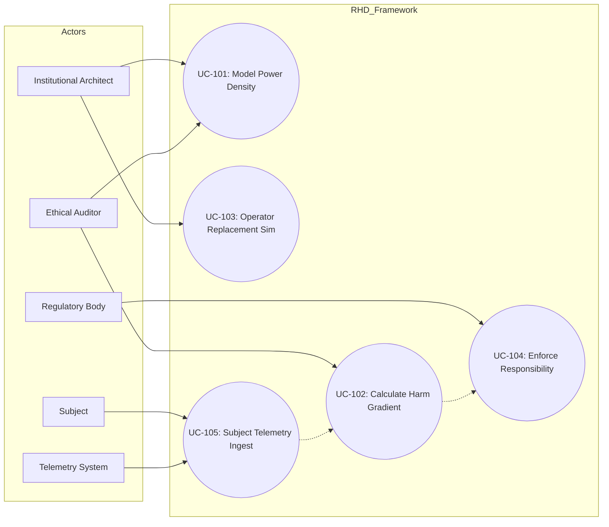
```mermaid
graph LR
    subgraph Actors
        S[Subject]
        IA[Institutional Architect]
        EA[Ethical Auditor]
        RB[Regulatory Body]
        TS[Telemetry System]
    end

    subgraph RHD_Framework
        UC101((UC-101: Model Power Density))
        UC102((UC-102: Calculate Harm Gradient))
        UC103((UC-103: Operator Replacement Sim))
        UC104((UC-104: Enforce Responsibility))
        UC105((UC-105: Subject Telemetry Ingest))
    end

    IA --> UC101
    IA --> UC103
    EA --> UC102
    EA --> UC101
    RB --> UC104
    S --> UC105
    TS --> UC105
    UC105 -.-> UC102
    UC102 -.-> UC104
```

---

## 4. Actor-Use Case Matrix

| Use Case | Subject | Inst. Architect | Ethical Auditor | Regulatory Body | Telemetry System |
| :--- | :---: | :---: | :---: | :---: | :---: |
| **UC-101: Model Power Density** | | **P** | S | | |
| **UC-102: Calculate Harm Gradient** | S | | **P** | S | S |
| **UC-103: Operator Replacement Sim** | | **P** | S | | |
| **UC-104: Enforce Responsibility** | S | S | S | **P** | |
| **UC-105: Subject Telemetry Ingest** | **P** | | | | **P** |

**Legend:**
- **P**: Primary Actor (Initiates the process)
- **S**: Secondary Actor (Participates or provides/receives data)

---

## 5. Technical Constraints & Business Rules (Traceability)

| ID | Rule/Constraint | Traceability |
| :--- | :--- | :--- |
| **BR-001** | **Subject Primacy:** Subject-side telemetry always overrides institutional self-reporting in $dH/dt$ calculations. | UC-102, UC-105 |
| **BR-002** | **Hysteretic Weighting:** Harm calculations must include a "Trauma Memory" coefficient ($T_m$) from PostgreSQL. | UC-102 |
| **BR-003** | **Autonomy Divisor:** Total Autonomy $A = A_1 \times A_2 \times A_3$. If any value is 0, $A=0$, and Harm becomes infinite. | UC-101, UC-104 |
| **TC-001** | **Graph Integrity:** Neo4j must maintain a sub-second response time for power density pathfinding. | UC-101 |
| **TC-002** | **Audit Trail:** All $dH/dt$ alerts must be immutable and stored in a write-once ledger. | UC-102, UC-104 |

---

## Requirements Specification

# Relational Harm Dynamics (RHD) Framework: Requirements Documentation

## 1. Functional Requirements (FR)

The functional requirements focus on the implementation of the Moral Field Equation: 
$$dH/dt = \frac{P_d}{A_1 \cdot A_2 \cdot A_3}$$
Where $P_d$ is Power Density, and $A_{1-3}$ are the Autonomy divisors (Voluntariness, Comprehension, Power Symmetry).

| FR-ID | Description | Priority | Source | Acceptance Criteria |
| :--- | :--- | :--- | :--- | :--- |
| **FR-101** | **Subject-Side Telemetry Ingestion** | Must Have | Subject / Auditor | System must ingest real-time sentiment and physiological proxy data from subjects via API, bypassing institutional self-reporting. |
| **FR-102** | **Power Density Mapping** | Must Have | Institutional Architect | System must map institutional nodes in Neo4j and calculate $P_d$ based on resource control and decision-making bottlenecks. |
| **FR-103** | **Autonomy Divisor Calculation** | Must Have | Subject | System must calculate $A_1$ (Voluntariness), $A_2$ (Comprehension), and $A_3$ (Symmetry) using multi-modal survey and behavioral data. |
| **FR-104** | **Hysteretic Harm Modeling** | Must Have | Ethical Auditor | Use SciPy to model path-dependent harm (trauma) where current state $S_t$ depends on historical harm $H_{t-n}$. |
| **FR-105** | **Operator Replacement Simulation** | Should Have | Policy Engineer | System must allow "swapping" an individual agent in a power node to determine if $dH/dt$ remains constant (indicating structural violence). |
| **FR-106** | **Real-time Harm Gradient Visualization** | Should Have | Auditor | D3.js dashboard must render a heat map of "Harm Gradients" across institutional sectors in < 500ms. |
| **FR-107** | **Legitimacy Absorption Shield** | Must Have | Regulatory Body | System must generate immutable audit logs to prevent institutions from "absorbing" the RHD metrics as mere PR/marketing. |
| **FR-108** | **Predictive Responsibility Alerts** | Should Have | Ethical Auditor | Trigger alerts when the derivative of harm ($d^2H/dt^2$) indicates an accelerating trend toward structural collapse. |
| **FR-109** | **State-Dependent Data Storage** | Must Have | Subject | PostgreSQL must store subject data with "Context Tags" to ensure data is only interpreted within the subject's specific state. |

---

## 2. Non-Functional Requirements (NFR)

### 2.1 Performance
- **NFR-201 (Latency):** The Moral Field Equation engine must compute $dH/dt$ for a graph of 10,000 nodes in under 2 seconds.
- **NFR-202 (Throughput):** The FastAPI layer must handle 5,000 concurrent telemetry streams without degradation.

### 2.2 Scalability
- **NFR-203 (Graph Scaling):** Neo4j must support institutional hierarchies up to 1 million relationships (Power Density links).
- **NFR-204 (Horizontal Scaling):** The calculation engine must be containerized (Docker/K8s) to scale based on the number of active "Subjects" being monitored.

### 2.3 Security
- **NFR-205 (Zero-Knowledge Telemetry):** Subject telemetry must be encrypted at rest using AES-256; the institution being monitored must never have access to raw subject-side data.
- **NFR-206 (Role-Based Access Control):** Access to "Operator Replacement" tools is restricted to verified Ethical Auditors and Regulatory Bodies.

### 2.4 Reliability
- **NFR-207 (Uptime):** The system must maintain 99.99% availability for real-time harm monitoring in critical environments (e.g., hospitals, prisons).
- **NFR-208 (Fault Tolerance):** In the event of a SciPy engine failure, the system must fail-over to a linear approximation model to maintain monitoring continuity.

### 2.5 Usability
- **NFR-209 (Accessibility):** The D3.js visualization must comply with WCAG 2.1 Level AA to ensure accessibility for diverse regulatory staff.
- **NFR-210 (Cognitive Load):** The dashboard must present the "Harm Gradient" as a single unified metric before allowing drill-down into complex differential variables.

### 2.6 Maintainability
- **NFR-211 (Documentation):** All API endpoints must be documented via Swagger/OpenAPI 3.0.
- **NFR-212 (Modular Math):** The "Moral Field Equation" must be implemented as a modular library to allow for future updates to the autonomy divisors.

---

## 3. Requirements Traceability Matrix (RTM)

| Use Case ID | Requirement ID | Test Case ID | Status |
| :--- | :--- | :--- | :--- |
| **UC-1: Monitor Harm** | FR-101, FR-103, FR-104 | TC-HARM-01 | Draft |
| **UC-2: Map Power** | FR-102 | TC-POW-01 | Draft |
| **UC-3: Structural Audit** | FR-105, FR-107 | TC-AUD-01 | Draft |
| **UC-4: Real-time Alerting** | FR-106, FR-108 | TC-ALT-01 | Draft |
| **UC-5: Data Privacy** | FR-109, NFR-205 | TC-SEC-01 | Draft |

---

## 4. Requirements Dependency Diagram

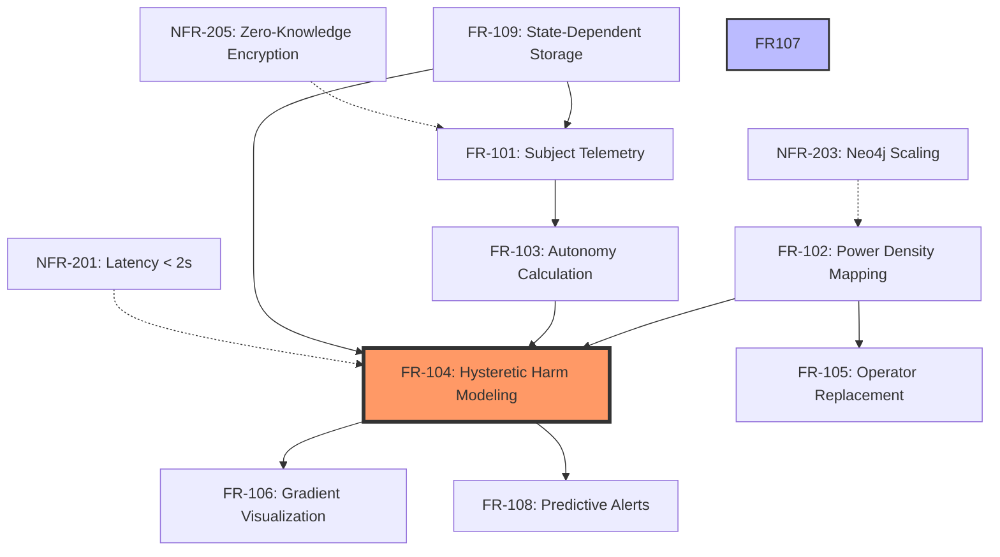
```mermaid
graph TD
    %% Functional Requirements
    FR101[FR-101: Subject Telemetry] --> FR103[FR-103: Autonomy Calculation]
    FR102[FR-102: Power Density Mapping] --> FR104[FR-104: Hysteretic Harm Modeling]
    FR103 --> FR104
    
    FR104 --> FR106[FR-106: Gradient Visualization]
    FR104 --> FR108[FR-108: Predictive Alerts]
    
    FR102 --> FR105[FR-105: Operator Replacement]
    
    FR109[FR-109: State-Dependent Storage] --> FR101
    FR109 --> FR104

    %% Non-Functional Dependencies
    NFR205[NFR-205: Zero-Knowledge Encryption] -.-> FR101
    NFR201[NFR-201: Latency < 2s] -.-> FR104
    NFR203[NFR-203: Neo4j Scaling] -.-> FR102

    %% Styling
    style FR104 fill:#f96,stroke:#333,stroke-width:4px
    style FR107 fill:#bbf,stroke:#333,stroke-width:2px
```

---

## 5. State Machine: Harm Gradient Calculation
This state machine describes the lifecycle of a "Harm Event" within the RHD Framework.

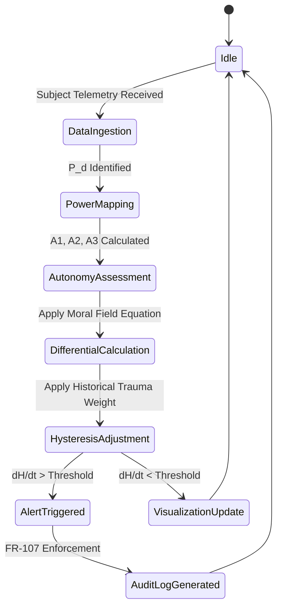
```mermaid
stateDiagram-v2
    [*] --> Idle
    Idle --> DataIngestion : Subject Telemetry Received
    DataIngestion --> PowerMapping : P_d Identified
    PowerMapping --> AutonomyAssessment : A1, A2, A3 Calculated
    AutonomyAssessment --> DifferentialCalculation : Apply Moral Field Equation
    DifferentialCalculation --> HysteresisAdjustment : Apply Historical Trauma Weight
    HysteresisAdjustment --> AlertTriggered : dH/dt > Threshold
    HysteresisAdjustment --> VisualizationUpdate : dH/dt < Threshold
    AlertTriggered --> AuditLogGenerated : FR-107 Enforcement
    AuditLogGenerated --> Idle
    VisualizationUpdate --> Idle
```

---

## 6. Data Model (High-Level)
The relationship between the Subject, the Institution, and the resulting Harm Metrics.

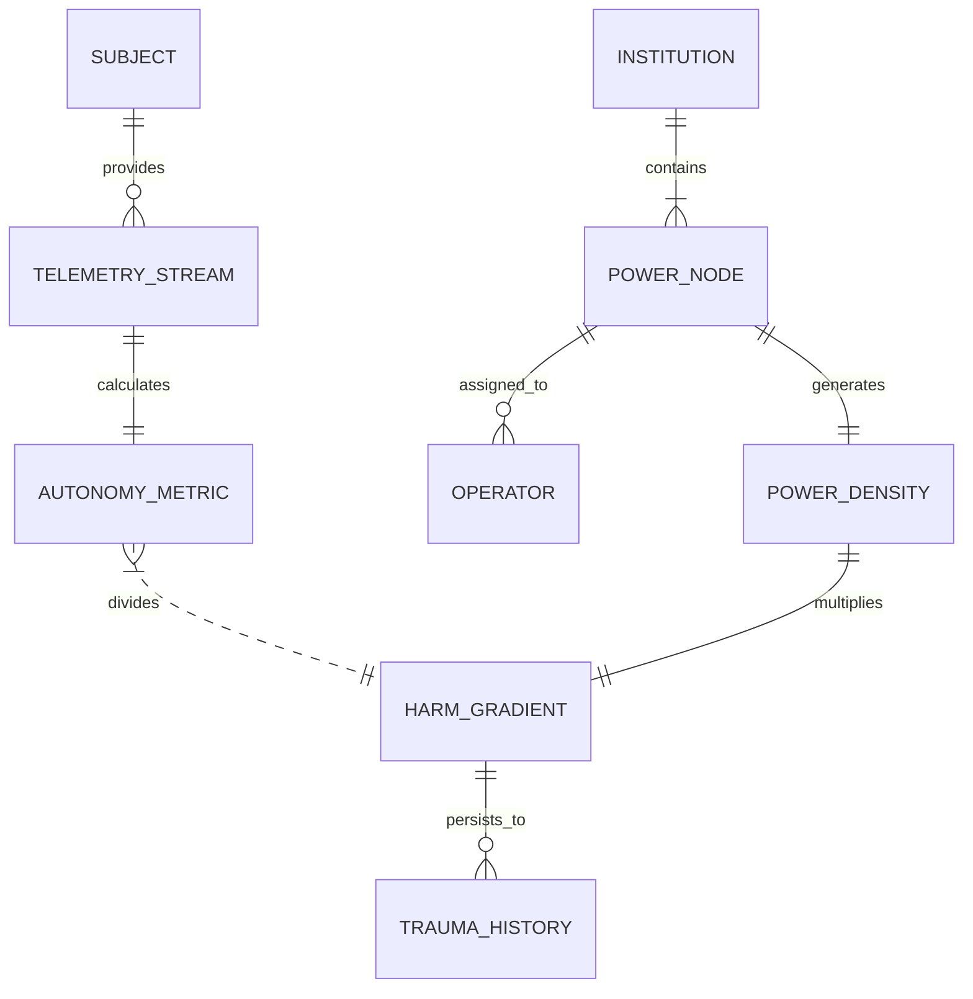
```mermaid
erDiagram
    SUBJECT ||--o{ TELEMETRY_STREAM : provides
    INSTITUTION ||--|{ POWER_NODE : contains
    POWER_NODE ||--o{ OPERATOR : assigned_to
    TELEMETRY_STREAM ||--|| AUTONOMY_METRIC : calculates
    POWER_NODE ||--|| POWER_DENSITY : generates
    AUTONOMY_METRIC }|..|| HARM_GRADIENT : divides
    POWER_DENSITY ||--|| HARM_GRADIENT : multiplies
    HARM_GRADIENT ||--o{ TRAUMA_HISTORY : persists_to
```

## 7. Acceptance Criteria Detail (Sample: FR-105)

**Requirement:** FR-105: Operator Replacement Simulation
- **TC-105.1:** Given a power node $N$ with high $dH/dt$, when the Operator $O_1$ is replaced with $O_2$ in the simulation, the system must recalculate $dH/dt$.
- **TC-105.2:** If $dH/dt$ variance is $< 5\%$, the system must flag the node as "Structurally Violent."
- **TC-105.3:** The simulation must complete within 5 seconds for a single node swap.

---

## System Architecture

# Relational Harm Dynamics (RHD) Framework: Architecture Documentation

## 1. System Context Diagram (C4 Level 1)

The RHD Framework sits at the center of an institutional ecosystem, acting as a "Moral Governor." Unlike traditional auditing tools that rely on institutional self-reporting, the RHD prioritizes direct telemetry from the **Subject** to calculate the real-time harm gradient.

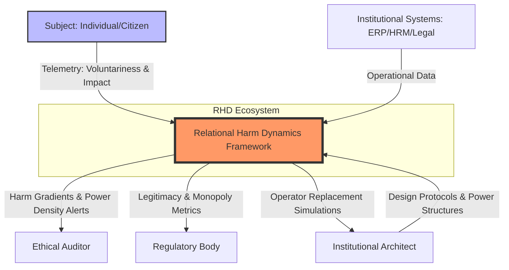
```mermaid
graph TB
    subgraph "RHD Ecosystem"
        RHD[Relational Harm Dynamics Framework]
    end

    Subject[Subject: Individual/Citizen]
    Architect[Institutional Architect]
    Auditor[Ethical Auditor]
    Regulator[Regulatory Body]
    InstSystems[Institutional Systems: ERP/HRM/Legal]

    Subject -- "Telemetry: Voluntariness & Impact" --> RHD
    Architect -- "Design Protocols & Power Structures" --> RHD
    RHD -- "Harm Gradients & Power Density Alerts" --> Auditor
    RHD -- "Legitimacy & Monopoly Metrics" --> Regulator
    InstSystems -- "Operational Data" --> RHD
    RHD -- "Operator Replacement Simulations" --> Architect

    style RHD fill:#f96,stroke:#333,stroke-width:4px
    style Subject fill:#bbf,stroke:#333,stroke-width:2px
```

---

## 2. Container Diagram (C4 Level 2)

The system is decomposed into specialized containers to handle the distinct requirements of graph-based power analysis, differential equation modeling, and real-time visualization.

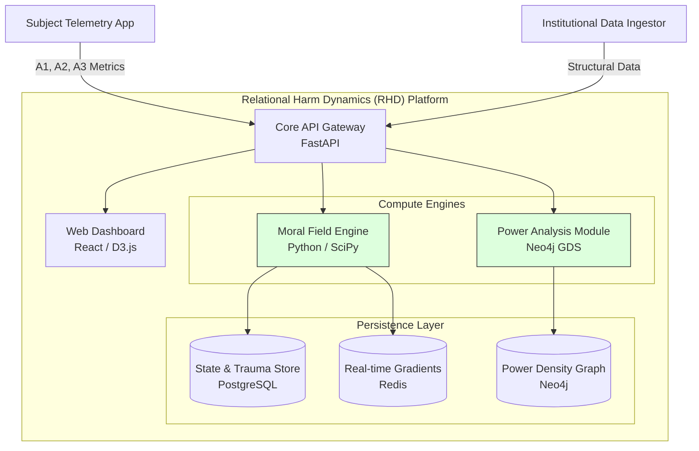
```mermaid
graph TB
    subgraph "Relational Harm Dynamics (RHD) Platform"
        WA[Web Dashboard<br/>React / D3.js]
        API[Core API Gateway<br/>FastAPI]
        
        subgraph "Compute Engines"
            MFE[Moral Field Engine<br/>Python / SciPy]
            PAM[Power Analysis Module<br/>Neo4j GDS]
        end

        subgraph "Persistence Layer"
            PDB[(State & Trauma Store<br/>PostgreSQL)]
            GDB[(Power Density Graph<br/>Neo4j)]
            CACHE[(Real-time Gradients<br/>Redis)]
        end
    end

    SubjectApp[Subject Telemetry App]
    InstAPI[Institutional Data Ingestor]

    SubjectApp -- "A1, A2, A3 Metrics" --> API
    InstAPI -- "Structural Data" --> API
    
    API --> WA
    API --> MFE
    API --> PAM
    
    MFE --> PDB
    PAM --> GDB
    MFE --> CACHE
    
    style MFE fill:#dfd,stroke:#333
    style PAM fill:#dfd,stroke:#333
```

---

## 3. Component Diagram (C4 Level 3)

### 3.1 Moral Field Engine (MFE)
The MFE is the mathematical core of the system, responsible for calculating the harm derivative ($dH/dt$).

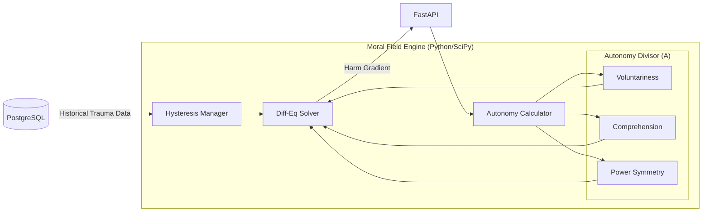
```mermaid
graph LR
    subgraph "Moral Field Engine (Python/SciPy)"
        DE[Diff-Eq Solver]
        HM[Hysteresis Manager]
        AC[Autonomy Calculator]
        
        subgraph "Autonomy Divisor (A)"
            A1[Voluntariness]
            A2[Comprehension]
            A3[Power Symmetry]
        end
    end

    API[FastAPI] --> AC
    AC --> A1
    AC --> A2
    AC --> A3
    
    A1 & A2 & A3 --> DE
    PDB[(PostgreSQL)] -- "Historical Trauma Data" --> HM
    HM --> DE
    DE -- "Harm Gradient" --> API
```

### 3.2 Power Analysis Module (PAM)
This component models institutions as biological agents and identifies "Legitimacy Absorption" patterns.

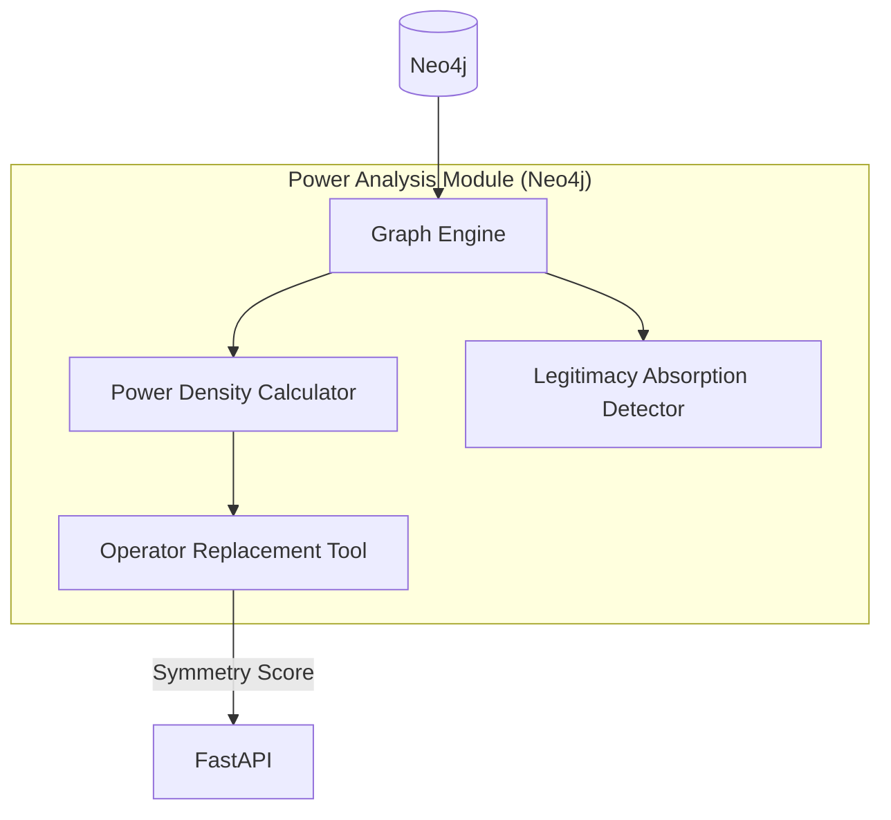
```mermaid
graph TB
    subgraph "Power Analysis Module (Neo4j)"
        G[Graph Engine]
        PD[Power Density Calculator]
        OR[Operator Replacement Tool]
        LA[Legitimacy Absorption Detector]
    end

    GDB[(Neo4j)] --> G
    G --> PD
    G --> LA
    PD --> OR
    OR -- "Symmetry Score" --> API[FastAPI]
```

---

## 4. Deployment Diagram

The RHD Framework is deployed using a high-availability, containerized architecture to ensure that ethical monitoring remains online even if the monitored institution experiences failure.

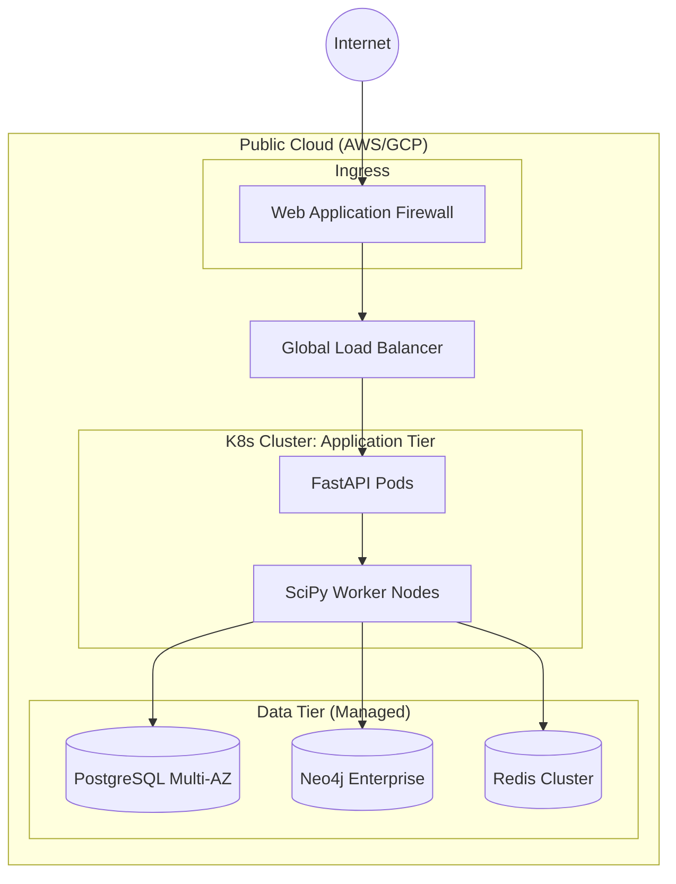
```mermaid
graph TB
    subgraph "Public Cloud (AWS/GCP)"
        LB[Global Load Balancer]
        
        subgraph "K8s Cluster: Application Tier"
            direction LR
            API_PODS[FastAPI Pods]
            MFE_WORKERS[SciPy Worker Nodes]
        end

        subgraph "Data Tier (Managed)"
            direction TB
            RDS[(PostgreSQL Multi-AZ)]
            AURA[(Neo4j Enterprise)]
            ELC[(Redis Cluster)]
        end

        subgraph "Ingress"
            WAF[Web Application Firewall]
        end
    end

    Internet((Internet)) --> WAF
    WAF --> LB
    LB --> API_PODS
    API_PODS --> MFE_WORKERS
    MFE_WORKERS --> RDS
    MFE_WORKERS --> AURA
    MFE_WORKERS --> ELC
```

---

## 5. Technology Stack Summary

| Layer | Technology | Reason for Selection |
| :--- | :--- | :--- |
| **Frontend** | React, D3.js, TailwindCSS | D3.js is critical for rendering complex, real-time harm gradients and vector fields. |
| **Backend API** | FastAPI (Python 3.11+) | High performance, native async support, and seamless integration with SciPy. |
| **Compute Engine** | SciPy, NumPy, Pandas | Required for solving the differential equations of the Moral Field Model. |
| **Graph Database** | Neo4j | Models institutional relationships and power density as a network of nodes/edges. |
| **Relational DB** | PostgreSQL | Stores time-series "trauma" data and state-dependent historical records. |
| **Caching** | Redis | Stores transient harm gradients for real-time dashboard updates. |
| **Deployment** | Docker, Kubernetes, Terraform | Ensures environment parity and horizontal scalability for compute-heavy modeling. |

---

## 6. Architecture Decision Records (ADRs)

### ADR-001: Use of Differential Equations for Harm Modeling
*   **Context:** Traditional ethics systems use boolean "compliance" checks. Harm, however, is path-dependent (hysteretic) and continuous.
*   **Decision:** Implement the "Moral Field Equation" using SciPy's ODE solvers.
*   **Consequences:** Requires higher compute resources than standard CRUD apps; enables predictive modeling of harm before it occurs.

### ADR-002: Subject-Side Telemetry Priority
*   **Context:** Institutions have a natural tendency toward "Legitimacy Absorption"—rebranding harm as a "necessary process."
*   **Decision:** The system architecture must prioritize telemetry from the Subject's nervous system/input over Institutional self-reporting.
*   **Consequences:** Requires robust, encrypted mobile/edge endpoints for subjects to report Voluntariness (A1) and Comprehension (A2).

### ADR-003: Graph-Based Power Density Mapping
*   **Context:** Power is not a static attribute but a relational density between nodes in a system.
*   **Decision:** Use Neo4j to map institutional structures.
*   **Consequences:** Allows for "Operator Replacement" simulations (swapping a Subject and an Architect in the graph) to detect structural violence.

### ADR-004: Hysteretic Data Persistence
*   **Context:** The impact of a system on a subject depends on the subject's prior state (Historical Trauma).
*   **Decision:** PostgreSQL will store "State-Dependent" profiles that modify the sensitivity of the Harm Gradient calculation.
*   **Consequences:** Strict GDPR/HIPAA-level security is required for these sensitive historical profiles.

---

## 7. Traceability Matrix

| ID | Requirement | Component | Acceptance Criteria |
| :--- | :--- | :--- | :--- |
| **FR-101** | Calculate Harm Gradient | Moral Field Engine | $dH/dt$ must update within 500ms of telemetry input. |
| **FR-102** | Power Symmetry Analysis | Power Analysis Module | Operator Replacement tool must return a symmetry score < 0.5 for monopolies. |
| **FR-103** | Autonomy Monitoring | Autonomy Calculator | System must flag any process where $A_1 \times A_2 \times A_3 \to 0$. |
| **FR-104** | Trauma Persistence | State & Trauma Store | Historical impact must influence current harm calculations (Hysteresis). |

---

## Data Model & ERD

# Relational Harm Dynamics (RHD) Framework: Data Model Documentation

This document outlines the data architecture for the RHD Framework, focusing on the transition from traditional relational structures to a systemic, impact-focused model that calculates harm gradients and power density.

## 1. Entity-Relationship Diagram (ERD)

The RHD data model prioritizes the **Interaction** as the primary unit of analysis, where the **Subject** and **Institution** collide to produce a measurable **Harm Gradient**.

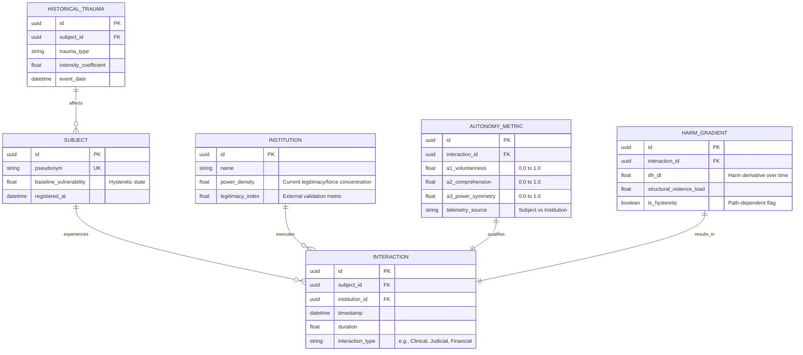
```mermaid
erDiagram
    SUBJECT ||--o{ INTERACTION : experiences
    INSTITUTION ||--o{ INTERACTION : executes
    
    SUBJECT {
        uuid id PK
        string pseudonym UK
        float baseline_vulnerability "Hysteretic state"
        datetime registered_at
    }

    INSTITUTION {
        uuid id PK
        string name
        float power_density "Current legitimacy/force concentration"
        float legitimacy_index "External validation metric"
    }

    INTERACTION {
        uuid id PK
        uuid subject_id FK
        uuid institution_id FK
        datetime timestamp
        float duration
        string interaction_type "e.g., Clinical, Judicial, Financial"
    }

    AUTONOMY_METRIC ||--|| INTERACTION : qualifies
    AUTONOMY_METRIC {
        uuid id PK
        uuid interaction_id FK
        float a1_voluntariness "0.0 to 1.0"
        float a2_comprehension "0.0 to 1.0"
        float a3_power_symmetry "0.0 to 1.0"
        string telemetry_source "Subject vs Institution"
    }

    HARM_GRADIENT ||--|| INTERACTION : results_in
    HARM_GRADIENT {
        uuid id PK
        uuid interaction_id FK
        float dh_dt "Harm derivative over time"
        float structural_violence_load
        boolean is_hysteretic "Path-dependent flag"
    }

    HISTORICAL_TRAUMA ||--o{ SUBJECT : affects
    HISTORICAL_TRAUMA {
        uuid id PK
        uuid subject_id FK
        string trauma_type
        float intensity_coefficient
        datetime event_date
    }
```

---

## 2. Entity Descriptions

### Subject
*   **Purpose:** Represents the individual human agent. Unlike traditional "Users," the Subject is defined by their nervous system's response and their historical path-dependency (hysteresis).
*   **Attributes:**
    *   `baseline_vulnerability`: A calculated float representing the subject's current state of resilience based on previous interactions.
*   **Relationships:** One-to-many with `Interaction` and `Historical_Trauma`.
*   **Performance:** Indexed on `pseudonym` to allow for anonymous tracking across institutional silos.

### Institution
*   **Purpose:** Models an organization as a biological agent seeking to maximize its own "Legitimacy" and "Power Density."
*   **Attributes:**
    *   `power_density`: A real-time metric of the institution's ability to enforce its will without subject consent.
*   **Relationships:** One-to-many with `Interaction`.
*   **Performance:** High-read frequency for real-time auditing.

### Interaction
*   **Purpose:** The atomic unit of the RHD framework. It captures the specific moment power is exercised.
*   **Attributes:**
    *   `interaction_type`: Categorizes the nature of the power exchange.
*   **Relationships:** Junction entity between `Subject` and `Institution`. Links to `Autonomy_Metric` and `Harm_Gradient`.

### Autonomy_Metric (The Divisor)
*   **Purpose:** Implements the three-part autonomy divisor (A1, A2, A3) used to dampen the Moral Field Equation.
*   **Attributes:**
    *   `a1_voluntariness`: Degree of choice.
    *   `a2_comprehension`: Degree of understanding.
    *   `a3_power_symmetry`: The ratio of power between Subject and Institution.
*   **Constraints:** All values must be between 0.0 and 1.0.

---

## 3. Data Dictionary

| Entity | Attribute | Type | Constraints | Description |
| :--- | :--- | :--- | :--- | :--- |
| **Subject** | `id` | UUID | PK | Unique system identifier. |
| **Subject** | `baseline_vulnerability` | FLOAT | 0.0 - 10.0 | The hysteretic state of the subject's harm threshold. |
| **Institution** | `power_density` | FLOAT | > 0.0 | Calculated concentration of institutional force. |
| **Autonomy_Metric** | `a1_voluntariness` | FLOAT | 0.0 - 1.0 | Subject's freedom from coercion during interaction. |
| **Autonomy_Metric** | `a2_comprehension` | FLOAT | 0.0 - 1.0 | Subject's cognitive grasp of the interaction's terms. |
| **Autonomy_Metric** | `a3_power_symmetry` | FLOAT | 0.0 - 1.0 | The inverse of the power gap between parties. |
| **Harm_Gradient** | `dh_dt` | FLOAT | N/A | The rate of change of harm (The Moral Field derivative). |

---

## 4. Data Flow Diagram (DFD)

The flow prioritizes **Subject-side Telemetry** to prevent "Legitimacy Absorption" by the institution.

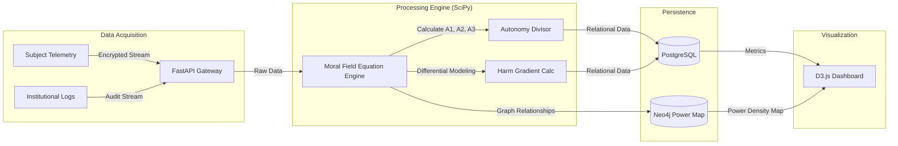
```mermaid
graph LR
    subgraph "Data Acquisition"
        S[Subject Telemetry] -->|Encrypted Stream| API[FastAPI Gateway]
        I[Institutional Logs] -->|Audit Stream| API
    end

    subgraph "Processing Engine (SciPy)"
        API -->|Raw Data| MFE[Moral Field Equation Engine]
        MFE -->|Calculate A1, A2, A3| AD[Autonomy Divisor]
        MFE -->|Differential Modeling| HG[Harm Gradient Calc]
    end

    subgraph "Persistence"
        AD -->|Relational Data| PG[(PostgreSQL)]
        HG -->|Relational Data| PG
        MFE -->|Graph Relationships| NJ[(Neo4j Power Map)]
    end

    subgraph "Visualization"
        PG -->|Metrics| D3[D3.js Dashboard]
        NJ -->|Power Density Map| D3
    end
```

---

## 5. Data Validation Rules

| ID | Rule Name | Logic | Description |
| :--- | :--- | :--- | :--- |
| **VAL-001** | **Autonomy Range** | `0.0 <= (A1, A2, A3) <= 1.0` | Autonomy components cannot exceed 100% or be negative. |
| **VAL-002** | **Source Weighting** | `Weight(Subject) > 5 * Weight(Institution)` | Subject-reported harm is weighted 5x higher than institutional self-reporting. |
| **VAL-003** | **Hysteresis Check** | `dH/dt != 0` if `Historical_Trauma` exists | Harm cannot be calculated in a vacuum; previous state must influence current gradient. |
| **VAL-004** | **Legitimacy Cap** | `Legitimacy_Index` cannot increase if `dH/dt > Threshold` | Prevents institutions from gaining "ethical points" while causing active harm. |

---

## 6. Data Migration Considerations

### Legacy System Integration
When migrating from traditional "Incident Reporting" or "Case Management" systems:
1.  **Normalization of Intent:** Legacy "Intent" fields must be discarded. RHD only accepts "Impact" (Subject-side) and "Structure" (Institutional-side) data.
2.  **Anonymization:** Subjects from legacy systems must be mapped to `pseudonyms` using a one-way cryptographic hash to prevent institutional retaliation.
3.  **Backfilling Hysteresis:** Historical data should be used to populate the `Historical_Trauma` entity to establish the initial `baseline_vulnerability` for existing subjects.
4.  **Graph Seeding:** Institutional hierarchies must be ingested into **Neo4j** to identify existing "Monopolies of Legitimacy" before real-time monitoring begins.

### Scalability and Storage
*   **PostgreSQL:** Used for transactional integrity of interactions and autonomy metrics.
*   **Neo4j:** Used for calculating the "Power Density" by analyzing the depth and breadth of institutional influence across multiple subjects.
*   **Time-Series Data:** `Harm_Gradient` updates should be partitioned by month to maintain query performance for real-time D3.js visualizations.

---

## Flow Diagrams

# Relational Harm Dynamics (RHD) Framework: System Interaction Documentation

This document outlines the critical interaction flows, logic processes, and state transitions within the RHD Framework. The system is designed to move beyond static compliance toward dynamic, predictive harm mitigation.

---

## 1. Sequence Diagrams: Critical User Journeys

### UC-101: Real-time Harm Gradient Calculation
This journey represents the core engine's response to incoming subject telemetry, calculating the instantaneous harm derivative ($dH/dt$).

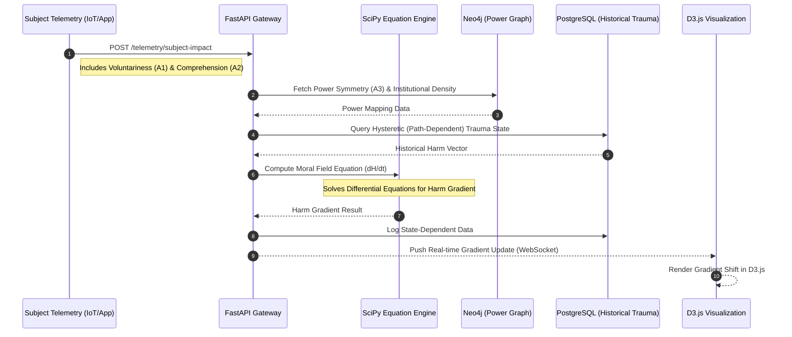
```mermaid
sequenceDiagram
    autonumber
    participant S as Subject Telemetry (IoT/App)
    participant API as FastAPI Gateway
    participant SE as SciPy Equation Engine
    participant GDB as Neo4j (Power Graph)
    participant RDB as PostgreSQL (Historical Trauma)
    participant UI as D3.js Visualization

    S->>API: POST /telemetry/subject-impact
    Note right of S: Includes Voluntariness (A1) & Comprehension (A2)
    API->>GDB: Fetch Power Symmetry (A3) & Institutional Density
    GDB-->>API: Power Mapping Data
    API->>RDB: Query Hysteretic (Path-Dependent) Trauma State
    RDB-->>API: Historical Harm Vector
    API->>SE: Compute Moral Field Equation (dH/dt)
    Note over SE: Solves Differential Equations for Harm Gradient
    SE-->>API: Harm Gradient Result
    API->>RDB: Log State-Dependent Data
    API-->>UI: Push Real-time Gradient Update (WebSocket)
    UI-->>UI: Render Gradient Shift in D3.js
```

### UC-102: Operator Replacement Simulation
Used by Institutional Architects to test if a system's harm is structural or individual by simulating the replacement of specific agents.

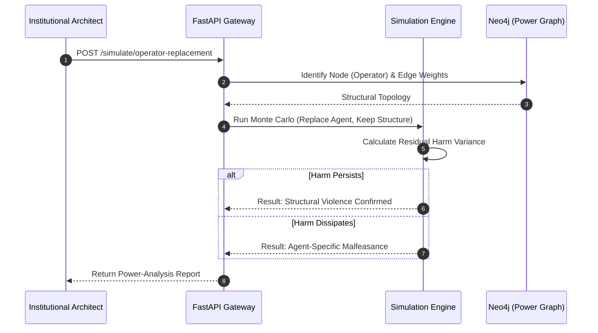
```mermaid
sequenceDiagram
    autonumber
    participant IA as Institutional Architect
    participant API as FastAPI Gateway
    participant SIM as Simulation Engine
    participant GDB as Neo4j (Power Graph)

    IA->>API: POST /simulate/operator-replacement
    API->>GDB: Identify Node (Operator) & Edge Weights
    GDB-->>API: Structural Topology
    API->>SIM: Run Monte Carlo (Replace Agent, Keep Structure)
    SIM->>SIM: Calculate Residual Harm Variance
    alt Harm Persists
        SIM-->>API: Result: Structural Violence Confirmed
    else Harm Dissipates
        SIM-->>API: Result: Agent-Specific Malfeasance
    end
    API-->>IA: Return Power-Analysis Report
```

---

## 2. Activity Diagrams: Complex Business Processes

### BP-201: The Moral Field Equation Solver
This process details how the system calculates the "Autonomy Divisor" to dampen institutional power density.

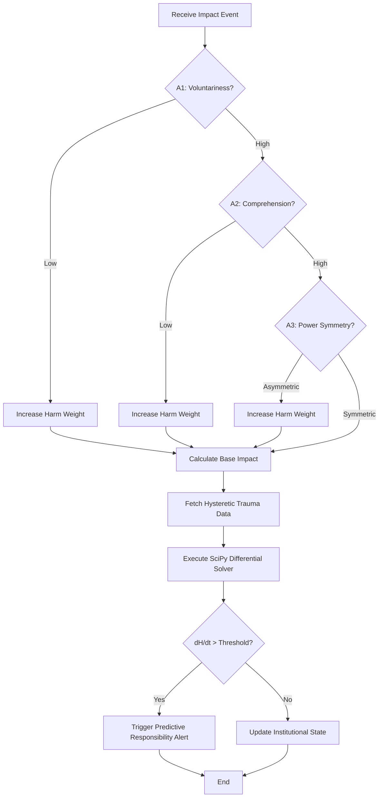
```mermaid
graph TD
    Start[Receive Impact Event] --> A1{A1: Voluntariness?}
    A1 -->|Low| H1[Increase Harm Weight]
    A1 -->|High| A2{A2: Comprehension?}
    
    A2 -->|Low| H2[Increase Harm Weight]
    A2 -->|High| A3{A3: Power Symmetry?}
    
    A3 -->|Asymmetric| H3[Increase Harm Weight]
    A3 -->|Symmetric| Calc[Calculate Base Impact]
    
    H1 & H2 & H3 --> Calc
    
    Calc --> Hist[Fetch Hysteretic Trauma Data]
    Hist --> DiffEq[Execute SciPy Differential Solver]
    
    DiffEq --> Result{dH/dt > Threshold?}
    Result -->|Yes| Alert[Trigger Predictive Responsibility Alert]
    Result -->|No| Log[Update Institutional State]
    
    Alert --> End[End]
    Log --> End
```

---

## 3. State Diagrams: Entity Lifecycle

### SD-301: Institutional Legitimacy State
Institutions are modeled as biological agents. Their "Legitimacy" is a state-dependent variable that fluctuates based on harm gradients.

```mermaid
stateDiagram-v2
    [*] --> Stable: Low Harm Gradient
    Stable --> HighDensity: Power Concentration Detected
    HighDensity --> CriticalHarm: dH/dt > 0.5
    CriticalHarm --> DeLegitimized: Failure to Implement Operator Replacement
    
    DeLegitimized --> Restructuring: Regulatory Intervention
    Restructuring --> Stable: Autonomy Divisors (A1,A2,A3) Restored
    
    CriticalHarm --> Stable: Predictive Responsibility Action Taken
    
    note right of DeLegitimized
        System triggers 'Legitimacy Absorption' 
        resistance protocols here.
    end
```

### SD-302: Harm Incident Lifecycle
Tracks a specific harm event from subject registration to structural resolution.

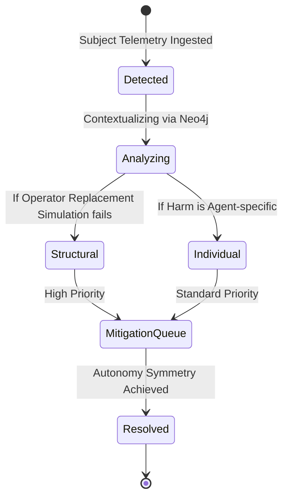
```mermaid
stateDiagram-v2
    [*] --> Detected: Subject Telemetry Ingested
    Detected --> Analyzing: Contextualizing via Neo4j
    Analyzing --> Structural: If Operator Replacement Simulation fails
    Analyzing --> Individual: If Harm is Agent-specific
    
    Structural --> MitigationQueue: High Priority
    Individual --> MitigationQueue: Standard Priority
    
    MitigationQueue --> Resolved: Autonomy Symmetry Achieved
    Resolved --> [*]
```

---

## 4. Integration Flow: Data Pipeline

This diagram illustrates the flow of data from the subject's nervous system (telemetry) to the regulatory dashboard, emphasizing the separation of concerns to prevent institutional co-option.

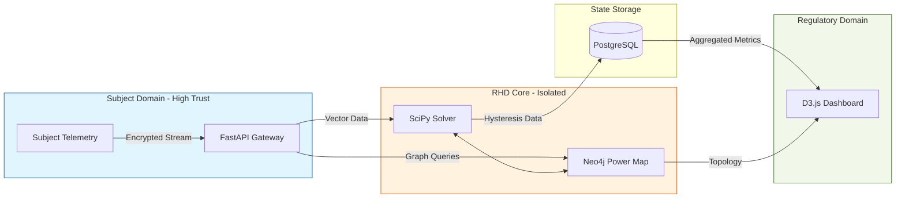
```mermaid
graph LR
    subgraph Subject_Domain [Subject Domain - High Trust]
        S[Subject Telemetry] -->|Encrypted Stream| API[FastAPI Gateway]
    end

    subgraph Analysis_Engine [RHD Core - Isolated]
        API -->|Vector Data| SP[SciPy Solver]
        API -->|Graph Queries| Neo[Neo4j Power Map]
        SP <--> Neo
    end

    subgraph Persistence_Layer [State Storage]
        SP -->|Hysteresis Data| PG[(PostgreSQL)]
    end

    subgraph Auditor_Interface [Regulatory Domain]
        PG -->|Aggregated Metrics| D3[D3.js Dashboard]
        Neo -->|Topology| D3
    end

    style Subject_Domain fill:#e1f5fe,stroke:#01579b
    style Analysis_Engine fill:#fff3e0,stroke:#e65100
    style Auditor_Interface fill:#f1f8e9,stroke:#33691e
```

---

## 5. Error Handling & Resilience Flows

### EH-501: Legitimacy Absorption Prevention
A critical failure mode where an institution attempts to use RHD metrics to "wash" its reputation without changing its power structure.

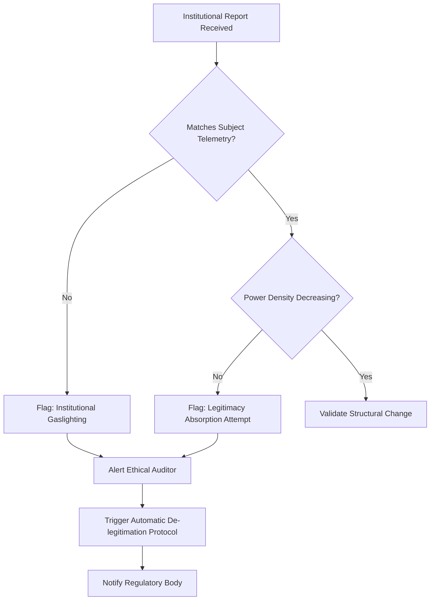
```mermaid
graph TD
    A[Institutional Report Received] --> B{Matches Subject Telemetry?}
    B -->|No| C[Flag: Institutional Gaslighting]
    B -->|Yes| D{Power Density Decreasing?}
    
    D -->|No| E[Flag: Legitimacy Absorption Attempt]
    D -->|Yes| F[Validate Structural Change]
    
    C --> G[Alert Ethical Auditor]
    E --> G
    
    G --> H[Trigger Automatic De-legitimation Protocol]
    H --> I[Notify Regulatory Body]
```

### EH-502: Telemetry Dropout Handling
Ensures that the absence of data from a subject is treated as a potential "Power Asymmetry" event rather than a "No Harm" event.

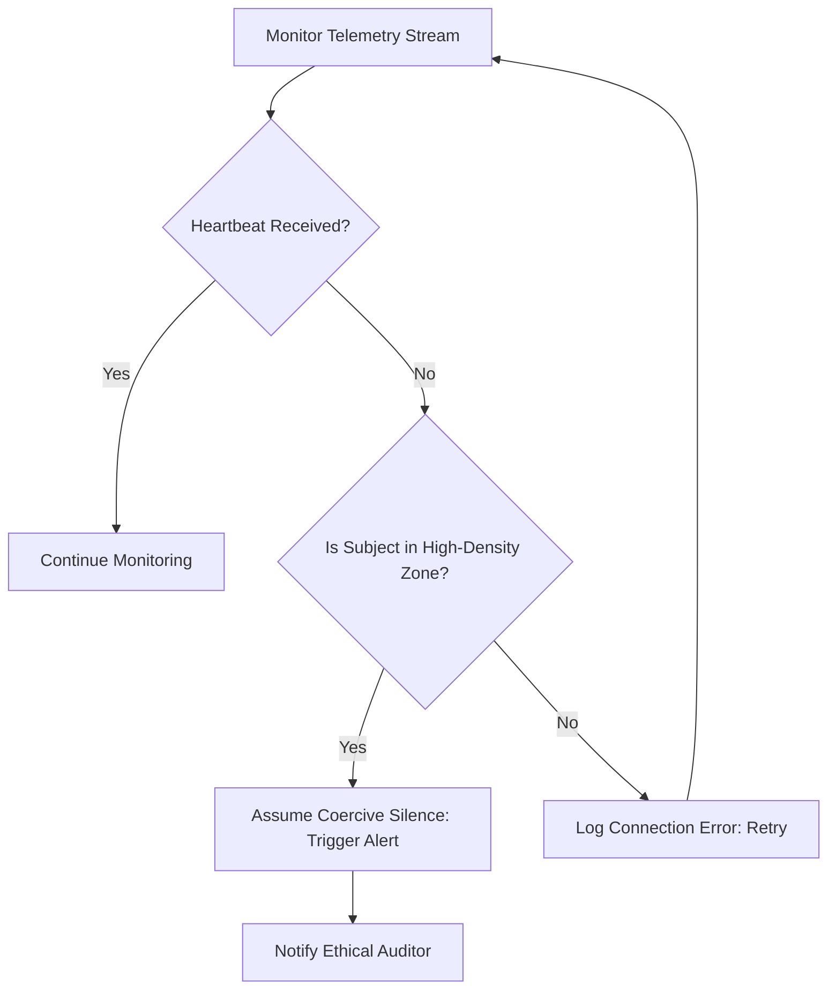
```mermaid
graph TD
    Start[Monitor Telemetry Stream] --> Heartbeat{Heartbeat Received?}
    Heartbeat -->|Yes| Continue[Continue Monitoring]
    Heartbeat -->|No| CheckContext{Is Subject in High-Density Zone?}
    
    CheckContext -->|Yes| HighRisk[Assume Coercive Silence: Trigger Alert]
    CheckContext -->|No| LowRisk[Log Connection Error: Retry]
    
    HighRisk --> Notify[Notify Ethical Auditor]
    LowRisk --> Start
```

---

## Traceability Matrix (Summary)

| ID | Interaction | Primary Stakeholder | Tech Component | Acceptance Criteria |
|:---|:---|:---|:---|:---|
| **FR-101** | Harm Gradient Calculation | Ethical Auditor | SciPy / FastAPI | dH/dt must update within <200ms of telemetry. |
| **FR-102** | Operator Replacement | Institutional Architect | Neo4j / Python | Simulation must isolate structural vs agent variance. |
| **FR-103** | Autonomy Divisor | Subject | PostgreSQL | A1, A2, A3 must be weighted higher than institutional KPIs. |
| **FR-104** | Legitimacy Monitoring | Regulatory Body | D3.js / Neo4j | System must flag "Legitimacy Absorption" automatically. |

---

## Test Plan

# Relational Harm Dynamics (RHD) Framework: Comprehensive Test Plan

## 1. Test Strategy Overview

### 1.1 Testing Objectives
The primary objective of the RHD testing suite is to validate the mathematical integrity of the **Moral Field Equation** and ensure the system's resistance to **Legitimacy Absorption**. Unlike traditional software, RHD must be tested for its ability to prioritize subject-side telemetry over institutional self-reporting.

### 1.2 Testing Scope
*   **In-Scope:**
    *   Differential equation solvers for path-dependent (hysteretic) harm.
    *   Neo4j graph traversals for power density analysis.
    *   Real-time harm gradient (dH/dt) calculations.
    *   Subject Autonomy Divisor (A1: Voluntariness, A2: Comprehension, A3: Power Symmetry).
    *   Operator Replacement simulation tools.
*   **Out-of-Scope:**
    *   General institutional HR management (unless impacting power density).
    *   Third-party financial auditing (unless linked to structural violence).

### 1.3 Testing Approach
A **Model-First Testing** approach is utilized. We validate the mathematical models against historical trauma datasets (PostgreSQL) before testing the UI/UX. We employ "Red-Teaming" to simulate institutional attempts to "game" the metrics.

### 1.4 Entry/Exit Criteria
*   **Entry:** Mathematical models are peer-reviewed; Neo4j schema is finalized; Subject-side API endpoints are documented.
*   **Exit:** 100% of High-Priority test cases passed; Harm gradient calculation error margin < 0.001%; Zero "Legitimacy Absorption" vulnerabilities detected.

---

## 2. Test Levels

### 2.1 Unit Testing
*   **Focus:** Individual functions (e.g., `calculate_autonomy_divisor()`, `solve_harm_derivative()`).
*   **Frameworks:** PyTest, Hypothesis (Property-based testing for math edge cases).
*   **Coverage Target:** 95% for core math modules; 80% for API logic.

### 2.2 Integration Testing
*   **Focus:** FastAPI to Neo4j connectivity; SciPy solver integration with PostgreSQL state-dependent data.
*   **Tools:** Docker Compose for ephemeral test environments.
*   **Key Check:** Ensure that a change in "Subject Power Symmetry" (A3) correctly triggers a re-calculation of the "Harm Gradient" across the graph.

### 2.3 System Testing (End-to-End)
*   **Scenario:** A simulated institutional policy change (e.g., a new surveillance protocol) is ingested.
*   **Validation:** The system must predict the harm increase before it manifests in institutional reports, based on subject-side telemetry.

### 2.4 Acceptance Testing (UAT)
*   **Criteria:** Ethical Auditors must be able to identify "Power Monopolies" within 3 clicks. Subjects must confirm that the "Voluntariness" metric (A1) accurately reflects their lived experience.

---

## 3. Test Case Catalog

| TC-ID | Requirement | Description | Steps | Expected Result | Priority |
|-------|-------------|-------------|-------|-----------------|----------|
| **TC-001** | FR-MATH-01 | Harm Gradient Calculation | 1. Input hysteretic trauma data.<br>2. Run `dH/dt` solver. | Gradient reflects path-dependency (past harm increases current sensitivity). | Critical |
| **TC-002** | FR-PWR-02 | Power Density Mapping | 1. Create 5 nodes with asymmetric edges.<br>2. Query Neo4j for density. | System identifies the node with the highest "Legitimacy Monopoly." | High |
| **TC-003** | FR-AUT-03 | Autonomy Divisor Logic | 1. Set A1=0.1 (Low Voluntariness).<br>2. Calculate Total Harm. | Harm value must scale inversely with the Autonomy Divisor. | Critical |
| **TC-004** | FR-SIM-04 | Operator Replacement | 1. Select high-harm node.<br>2. Simulate "Removal of Authority." | System predicts the dampening of the harm gradient. | Medium |
| **TC-005** | FR-SEC-05 | Anti-Absorption Check | 1. Attempt to inject "Institutional Self-Report" data to override subject telemetry. | System rejects or flags the data as "Low-Integrity/Biased." | High |

---

## 4. Test Coverage Matrix

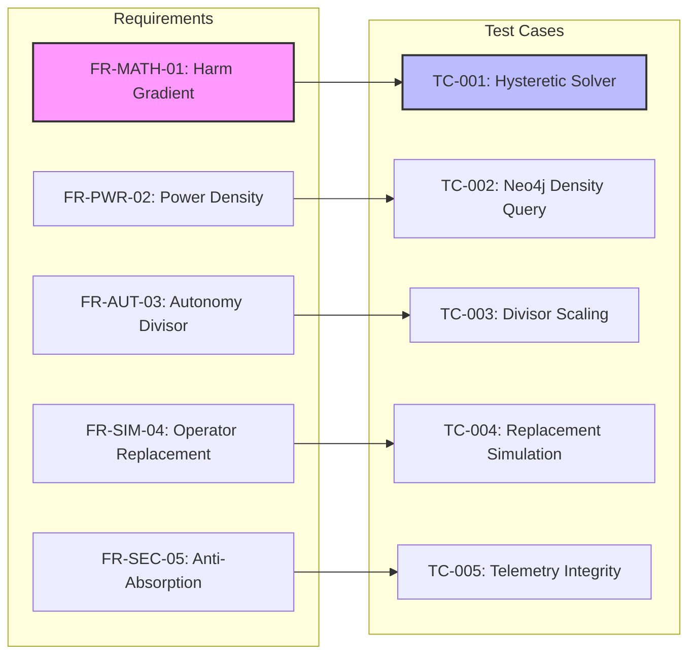
```mermaid
graph LR
    subgraph Requirements
        FR1[FR-MATH-01: Harm Gradient]
        FR2[FR-PWR-02: Power Density]
        FR3[FR-AUT-03: Autonomy Divisor]
        FR4[FR-SIM-04: Operator Replacement]
        FR5[FR-SEC-05: Anti-Absorption]
    end

    subgraph Test Cases
        TC1[TC-001: Hysteretic Solver]
        TC2[TC-002: Neo4j Density Query]
        TC3[TC-003: Divisor Scaling]
        TC4[TC-004: Replacement Simulation]
        TC5[TC-005: Telemetry Integrity]
    end

    FR1 --> TC1
    FR2 --> TC2
    FR3 --> TC3
    FR4 --> TC4
    FR5 --> TC5
    
    style FR1 fill:#f9f,stroke:#333,stroke-width:2px
    style TC1 fill:#bbf,stroke:#333,stroke-width:2px
```

---

## 5. Non-Functional Test Cases

### 5.1 Performance Scenarios
*   **Scenario:** 10,000 concurrent subject-side telemetry pings.
*   **Target:** FastAPI response time < 100ms; Neo4j graph update < 500ms.

### 5.2 Security Scenarios
*   **Scenario:** "Legitimacy Absorption" Attack. An institutional admin attempts to modify the "Comprehension" (A2) score of a subject.
*   **Target:** System must require multi-party authorization (Subject + Auditor) for any change to Autonomy metrics.

### 5.3 Usability Scenarios
*   **Scenario:** Real-time D3.js visualization of a "Harm Spike."
*   **Target:** Non-technical human rights workers must be able to interpret the "Harm Gradient" direction (Increasing/Decreasing) within 5 seconds of viewing the dashboard.

---

## 6. Test Environment Requirements

### 6.1 Hardware/Software
*   **Compute:** 8-core CPU (for SciPy differential equation processing).
*   **Database:** Neo4j 5.x (Graph), PostgreSQL 15 (Relational/Time-series).
*   **Environment:** Linux-based containers (Docker/K8s).

### 6.2 Test Data Requirements
*   **Anonymized Trauma Sets:** Synthetic datasets representing historical institutional harm patterns.
*   **Power Asymmetry Profiles:** Pre-configured graph topologies (e.g., "Totalitarian," "Democratic-Symmetric," "Bureaucratic-Opaque").

### 6.3 Tool Requirements
*   **Locust:** For load testing the telemetry API.
*   **Cypress:** For end-to-end UI testing of the D3.js dashboards.
*   **SonarQube:** For static analysis of the Python codebase.

---

## 7. Test Schedule

```mermaid
gantt
    title RHD Testing Timeline
    dateFormat  YYYY-MM-DD
    section Unit Testing
    Math Model Validation       :a1, 2023-11-01, 10d
    API Endpoint Testing        :after a1, 7d
    section Integration
    Neo4j/FastAPI Sync          :2023-11-15, 10d
    Postgres State Persistence  :10d
    section System/UAT
    Harm Gradient Simulation    :2023-12-01, 14d
    Auditor UAT                 :2023-12-15, 7d
    section Security
    Red-Team Absorption Test    :2023-12-22, 7d
```

---

## 8. Risk Assessment

| Risk | Impact | Probability | Mitigation Strategy |
|------|--------|-------------|---------------------|
| **Mathematical Drift** | High | Medium | Implement "Property-Based Testing" to ensure differential equations don't diverge under extreme inputs. |
| **Institutional Capture** | Critical | High | Hard-code "Subject-Side Telemetry" as the primary weight in the Moral Field Equation. |
| **Neo4j Query Latency** | Medium | Low | Implement graph indexing on "Power Density" attributes and use read-replicas for D3.js visualizations. |
| **Data Privacy Breach** | Critical | Medium | Use Differential Privacy on subject-side telemetry to prevent institutional retaliation against individuals. |

---
**End of Document**
**Prepared by:** RHD Framework Architecture Team
**Status:** Final / For Implementation

---

## Phase Plan

# Relational Harm Dynamics (RHD) Framework: Development Phase Planning

This document outlines the strategic roadmap for the development of the RHD Framework, a systemic ethics engineering platform. The plan prioritizes the mathematical modeling of harm gradients and the implementation of subject-side telemetry to ensure institutional accountability.

## 1. Project Timeline Overview

```mermaid
gantt
    title RHD Framework Development Roadmap (2024)
    dateFormat  YYYY-MM-DD
    axisFormat  %m-%d
    
    section Phase 1: Foundation
    Architecture & Mathematical Modeling :a1, 2024-01-01, 2w
    Neo4j & PostgreSQL Schema Setup      :a2, after a1, 2w
    
    section Phase 2: Core Features
    Moral Field Equation Engine (SciPy)  :b1, 2024-01-29, 3w
    Power Density Mapping Logic          :b2, after b1, 3w
    Autonomy Divisor (A1,A2,A3) Logic    :b3, after b1, 2w
    
    section Phase 3: Integration
    Subject Telemetry API (FastAPI)      :c1, 2024-03-11, 3w
    Operator Replacement Toolset         :c2, after c1, 3w
    
    section Phase 4: Polish
    D3.js Harm Gradient Visualization    :d1, 2024-04-22, 2w
    Hysteretic Path-Dependency Tuning    :d2, after d1, 2w
    
    section Phase 5: Launch
    UAT with Human Rights Partners       :e1, 2024-05-20, 2w
    Production Deployment                :e2, after e1, 1w
```

---

## 2. Phase Descriptions

### Phase 1: Foundation (Weeks 1-4)
*   **Objectives:** Establish the structural integrity of the system and define the mathematical translation of "Moral Fields."
*   **Deliverables:** System Architecture Document (SAD), Neo4j Graph Schema, SciPy integration prototype.
*   **Key Activities:** 
    *   Defining the graph nodes for "Institutions" and "Subjects."
    *   Setting up the PostgreSQL instance for state-dependent historical trauma data.
*   **Dependencies:** Finalization of the Moral Field Equation parameters.
*   **Success Criteria:** Successful persistence of a multi-node power relationship in Neo4j.
*   **Risks:** Over-complicating the initial schema. **Mitigation:** Use an iterative schema design (Schema-on-read where possible).

### Phase 2: Core Features (Weeks 5-10)
*   **Objectives:** Implement the predictive engine that calculates the harm derivative ($dH/dt$).
*   **Deliverables:** Harm Gradient Engine, Power Density Calculator.
*   **Key Activities:**
    *   Coding the differential equations in SciPy.
    *   Implementing the Autonomy Divisor ($A_1$: Voluntariness, $A_2$: Comprehension, $A_3$: Power Symmetry).
*   **Dependencies:** Phase 1 data structures.
*   **Success Criteria:** Engine correctly predicts a harm spike based on a simulated increase in institutional power density.
*   **Risks:** Computational overhead of real-time differential equations. **Mitigation:** Implement caching for static institutional variables.

### Phase 3: Integration (Weeks 11-16)
*   **Objectives:** Build the interfaces for subject-side telemetry and institutional auditing.
*   **Deliverables:** FastAPI Endpoints, Operator Replacement UI.
*   **Key Activities:**
    *   Developing the "Subject Telemetry" mobile-responsive API.
    *   Building the "Operator Replacement" logic to simulate institutional restructuring.
*   **Dependencies:** Core Engine (Phase 2).
*   **Success Criteria:** External data can trigger a recalculation of the harm gradient within <200ms.
*   **Risks:** "Legitimacy Absorption" by institutions. **Mitigation:** Implement zero-knowledge proofs for subject telemetry to prevent institutional retaliation.

---

## 3. Milestone Schedule

| Milestone | Target Date | Deliverables | Success Criteria |
|-----------|-------------|--------------|------------------|
| **M1: Architecture Complete** | Week 2 | SAD, Tech Stack Config | All Mermaid diagrams approved by stakeholders. |
| **M2: Engine Alpha** | Week 7 | SciPy Harm Engine | Successful calculation of $dH/dt$ on test datasets. |
| **M3: Telemetry Beta** | Week 13 | FastAPI Subject Portal | Subject-side data successfully dampens power density metrics. |
| **M4: Visualization Ready** | Week 18 | D3.js Real-time Dashboard | Visual representation of "Harm Gradients" is intuitive for non-engineers. |
| **M5: Production Ready** | Week 22 | Full RHD Platform | System passes security audit and UAT. |

---

## 4. Resource Allocation

| Role | Phase 1-2 | Phase 3-4 | Phase 5 |
|------|-----------|-----------|---------|
| **Systemic Architect** | Lead (Math/Logic) | Oversight | Final Review |
| **Backend Engineer** | Neo4j/SciPy Setup | API/Logic Dev | Scaling/Security |
| **Frontend Engineer** | Mockups | D3.js/React Dev | UI Refinement |
| **Ethical Auditor** | Parameter Definition | Validation | UAT Lead |
| **DevOps** | Infra Setup | CI/CD Pipeline | Deployment |

---

## 5. Sprint Planning Overview (6 Sprints)

| Sprint | Goal | Key Deliverable |
|--------|------|-----------------|
| **S1** | Graph Foundation | Neo4j schema for Institutional/Subject nodes. |
| **S2** | Math Core | SciPy implementation of the Moral Field Equation. |
| **S3** | Power Mapping | Logic for calculating "Institutional Power Density." |
| **S4** | Subject Voice | FastAPI endpoints for real-time subject telemetry. |
| **S5** | Gradient UI | D3.js visualization of harm vectors and gradients. |
| **S6** | Hardening | Performance tuning and "Legitimacy Absorption" resistance testing. |

---

## 6. Release Plan

### v0.1-alpha (The Engine)
*   **Date:** Week 8
*   **Features:** Core SciPy engine, Neo4j graph storage, CLI for harm calculation.
*   **Criteria:** Accurate modeling of path-dependent (hysteretic) harm.

### v0.5-beta (The Interface)
*   **Date:** Week 16
*   **Features:** FastAPI integration, Subject Telemetry portal, Basic D3.js charts.
*   **Criteria:** End-to-end data flow from subject input to harm gradient update.

### v1.0-GA (The Framework)
*   **Date:** Week 22
*   **Features:** Full Operator Replacement tools, Real-time monitoring, Regulatory reporting exports.
*   **Criteria:** Successful UAT with a partner Human Rights Organization.

---

## 7. Risk Timeline & Mitigation

```mermaid
stateDiagram-v2
    [*] --> Phase1_Risk: Mathematical Complexity
    Phase1_Risk --> Phase2_Risk: Computational Load
    Phase2_Risk --> Phase3_Risk: Data Integrity/Privacy
    Phase3_Risk --> Phase4_Risk: Legitimacy Absorption
    Phase4_Risk --> [*]

    state Phase1_Risk {
        direction LR
        Risk1: Model Overfitting
        Mitigation1: Peer review by ethicists
    }
    state Phase3_Risk {
        direction LR
        Risk3: Subject Retaliation
        Mitigation3: ZK-Proofs/Anonymization
    }
```

### High-Risk Windows:
1.  **Weeks 5-8 (Mathematical Implementation):** Risk of the Moral Field Equation being too abstract for code. 
    *   *Mitigation:* Weekly "Logic-to-Code" syncs between the Architect and Backend team.
2.  **Weeks 11-14 (Subject Telemetry):** Risk of institutions intercepting subject data.
    *   *Mitigation:* Implementation of decentralized identifiers (DIDs) for all subjects.
3.  **Weeks 19-21 (UAT):** Risk of institutions using the metrics to "game" the system (Legitimacy Absorption).
    *   *Mitigation:* The system must prioritize "Subject-Side Telemetry" over "Institutional Self-Reporting" by a factor of 10:1 in the Autonomy Divisor.

---

## Project Data
Generated JSON file: design.project_data.json

Raw JSON Content

```json
{
  "project_name" : "Relational Harm Dynamics (RHD) Framework",
  "description" : "A systemic ethics engineering platform designed to replace traditional intent-based moral auditing with a predictive, impact-focused model. The system implements the 'Moral Field Equation' to monitor structural violence, calculate real-time harm gradients, and provide 'Operator Replacement' tools for power-analysis. It models institutions as biological agents and prioritizes the maximization of subject autonomy (Voluntariness, Comprehension, and Power Symmetry) to dampen institutional power density and eliminate structural harm.",
  "created_date" : "2026-02-16T15:25:26.987404937",
  "epics" : [ {
    "id" : "EPIC-UC",
    "name" : "User Features",
    "description" : "Core user-facing functionality based on use cases",
    "priority" : "High",
    "status" : "Planned",
    "story_points" : 130
  }, {
    "id" : "EPIC-ARCH",
    "name" : "Architecture & Infrastructure",
    "description" : "Set up system architecture and infrastructure",
    "priority" : "High",
    "status" : "Planned",
    "story_points" : 21
  }, {
    "id" : "EPIC-TEST",
    "name" : "Quality Assurance",
    "description" : "Testing and quality assurance activities",
    "priority" : "High",
    "status" : "Planned",
    "story_points" : 13
  }, {
    "id" : "EPIC-101",
    "name" : "Epic EPIC-101",
    "description" : "Auto-extracted epic from analysis",
    "priority" : "Medium",
    "status" : "Planned",
    "story_points" : 13
  }, {
    "id" : "EPIC-102",
    "name" : "Epic EPIC-102",
    "description" : "Auto-extracted epic from analysis",
    "priority" : "Medium",
    "status" : "Planned",
    "story_points" : 13
  }, {
    "id" : "EPIC-103",
    "name" : "Epic EPIC-103",
    "description" : "Auto-extracted epic from analysis",
    "priority" : "Medium",
    "status" : "Planned",
    "story_points" : 13
  }, {
    "id" : "EPIC-106",
    "name" : "Epic EPIC-106",
    "description" : "Auto-extracted epic from analysis",
    "priority" : "Medium",
    "status" : "Planned",
    "story_points" : 13
  }, {
    "id" : "EPIC-104",
    "name" : "Epic EPIC-104",
    "description" : "Auto-extracted epic from analysis",
    "priority" : "Medium",
    "status" : "Planned",
    "story_points" : 13
  }, {
    "id" : "EPIC-105",
    "name" : "Epic EPIC-105",
    "description" : "Auto-extracted epic from analysis",
    "priority" : "Medium",
    "status" : "Planned",
    "story_points" : 13
  } ],
  "releases" : [ {
    "id" : "REL-1",
    "name" : "MVP Release",
    "version" : "1.0.0",
    "target_date" : "2026-03-30",
    "description" : "Minimum Viable Product release with core functionality",
    "epic_ids" : [ "EPIC-UC", "EPIC-ARCH", "EPIC-TEST", "EPIC-101" ],
    "status" : "Planned"
  }, {
    "id" : "REL-2",
    "name" : "Feature Complete Release",
    "version" : "1.1.0",
    "target_date" : "2026-05-11",
    "description" : "Full feature release with all planned functionality",
    "epic_ids" : [ "EPIC-UC", "EPIC-ARCH", "EPIC-TEST", "EPIC-101", "EPIC-102", "EPIC-103", "EPIC-106", "EPIC-104", "EPIC-105" ],
    "status" : "Planned"
  } ],
  "sprints" : [ {
    "id" : "SPRINT-1",
    "name" : "Sprint 1",
    "number" : 1,
    "start_date" : "2026-02-16",
    "end_date" : "2026-03-02",
    "goals" : [ "Complete sprint 1 deliverables" ],
    "capacity_points" : 40,
    "task_ids" : [ "TASK-101", "TASK-102", "TASK-103", "TASK-201", "TASK-202" ],
    "status" : "Planned"
  }, {
    "id" : "SPRINT-2",
    "name" : "Sprint 2",
    "number" : 2,
    "start_date" : "2026-03-02",
    "end_date" : "2026-03-16",
    "goals" : [ "Complete sprint 2 deliverables" ],
    "capacity_points" : 40,
    "task_ids" : [ "TASK-203", "TASK-301", "TASK-302", "TASK-303", "TASK-601" ],
    "status" : "Planned"
  }, {
    "id" : "SPRINT-3",
    "name" : "Sprint 3",
    "number" : 3,
    "start_date" : "2026-03-16",
    "end_date" : "2026-03-30",
    "goals" : [ "Complete sprint 3 deliverables" ],
    "capacity_points" : 40,
    "task_ids" : [ "TASK-602", "TASK-104", "TASK-401", "TASK-402", "TASK-403" ],
    "status" : "Planned"
  }, {
    "id" : "SPRINT-4",
    "name" : "Sprint 4",
    "number" : 4,
    "start_date" : "2026-03-30",
    "end_date" : "2026-04-13",
    "goals" : [ "Complete sprint 4 deliverables" ],
    "capacity_points" : 40,
    "task_ids" : [ "TASK-501", "TASK-502", "TASK-503", "TASK-603", "TASK-604" ],
    "status" : "Planned"
  }, {
    "id" : "SPRINT-5",
    "name" : "Sprint 5",
    "number" : 5,
    "start_date" : "2026-04-13",
    "end_date" : "2026-04-27",
    "goals" : [ "Complete sprint 5 deliverables" ],
    "capacity_points" : 40,
    "task_ids" : [ "TASK-605" ],
    "status" : "Planned"
  }, {
    "id" : "SPRINT-6",
    "name" : "Sprint 6",
    "number" : 6,
    "start_date" : "2026-04-27",
    "end_date" : "2026-05-11",
    "goals" : [ "Complete sprint 6 deliverables" ],
    "capacity_points" : 40,
    "task_ids" : [ ],
    "status" : "Planned"
  } ],
  "tasks" : [ {
    "id" : "TASK-101",
    "title" : "Task TASK-101",
    "description" : "Auto-extracted task from analysis",
    "type" : "task",
    "epic_id" : "EPIC-UC",
    "sprint_id" : "SPRINT-1",
    "priority" : "Medium",
    "story_points" : 3,
    "status" : "Backlog",
    "acceptance_criteria" : [ "Task completed successfully" ],
    "labels" : [ "auto-generated" ]
  }, {
    "id" : "TASK-102",
    "title" : "Task TASK-102",
    "description" : "Auto-extracted task from analysis",
    "type" : "task",
    "epic_id" : "EPIC-UC",
    "sprint_id" : "SPRINT-1",
    "priority" : "Medium",
    "story_points" : 3,
    "status" : "Backlog",
    "acceptance_criteria" : [ "Task completed successfully" ],
    "labels" : [ "auto-generated" ]
  }, {
    "id" : "TASK-103",
    "title" : "Task TASK-103",
    "description" : "Auto-extracted task from analysis",
    "type" : "task",
    "epic_id" : "EPIC-UC",
    "sprint_id" : "SPRINT-1",
    "priority" : "Medium",
    "story_points" : 3,
    "status" : "Backlog",
    "acceptance_criteria" : [ "Task completed successfully" ],
    "labels" : [ "auto-generated" ]
  }, {
    "id" : "TASK-201",
    "title" : "Task TASK-201",
    "description" : "Auto-extracted task from analysis",
    "type" : "task",
    "epic_id" : "EPIC-UC",
    "sprint_id" : "SPRINT-1",
    "priority" : "Medium",
    "story_points" : 3,
    "status" : "Backlog",
    "acceptance_criteria" : [ "Task completed successfully" ],
    "labels" : [ "auto-generated" ]
  }, {
    "id" : "TASK-202",
    "title" : "Task TASK-202",
    "description" : "Auto-extracted task from analysis",
    "type" : "task",
    "epic_id" : "EPIC-UC",
    "sprint_id" : "SPRINT-1",
    "priority" : "Medium",
    "story_points" : 3,
    "status" : "Backlog",
    "acceptance_criteria" : [ "Task completed successfully" ],
    "labels" : [ "auto-generated" ]
  }, {
    "id" : "TASK-203",
    "title" : "Task TASK-203",
    "description" : "Auto-extracted task from analysis",
    "type" : "task",
    "epic_id" : "EPIC-UC",
    "sprint_id" : "SPRINT-2",
    "priority" : "Medium",
    "story_points" : 3,
    "status" : "Backlog",
    "acceptance_criteria" : [ "Task completed successfully" ],
    "labels" : [ "auto-generated" ]
  }, {
    "id" : "TASK-301",
    "title" : "Task TASK-301",
    "description" : "Auto-extracted task from analysis",
    "type" : "task",
    "epic_id" : "EPIC-UC",
    "sprint_id" : "SPRINT-2",
    "priority" : "Medium",
    "story_points" : 3,
    "status" : "Backlog",
    "acceptance_criteria" : [ "Task completed successfully" ],
    "labels" : [ "auto-generated" ]
  }, {
    "id" : "TASK-302",
    "title" : "Task TASK-302",
    "description" : "Auto-extracted task from analysis",
    "type" : "task",
    "epic_id" : "EPIC-UC",
    "sprint_id" : "SPRINT-2",
    "priority" : "Medium",
    "story_points" : 3,
    "status" : "Backlog",
    "acceptance_criteria" : [ "Task completed successfully" ],
    "labels" : [ "auto-generated" ]
  }, {
    "id" : "TASK-303",
    "title" : "Task TASK-303",
    "description" : "Auto-extracted task from analysis",
    "type" : "task",
    "epic_id" : "EPIC-UC",
    "sprint_id" : "SPRINT-2",
    "priority" : "Medium",
    "story_points" : 3,
    "status" : "Backlog",
    "acceptance_criteria" : [ "Task completed successfully" ],
    "labels" : [ "auto-generated" ]
  }, {
    "id" : "TASK-601",
    "title" : "Task TASK-601",
    "description" : "Auto-extracted task from analysis",
    "type" : "task",
    "epic_id" : "EPIC-UC",
    "sprint_id" : "SPRINT-2",
    "priority" : "Medium",
    "story_points" : 3,
    "status" : "Backlog",
    "acceptance_criteria" : [ "Task completed successfully" ],
    "labels" : [ "auto-generated" ]
  }, {
    "id" : "TASK-602",
    "title" : "Task TASK-602",
    "description" : "Auto-extracted task from analysis",
    "type" : "task",
    "epic_id" : "EPIC-UC",
    "sprint_id" : "SPRINT-3",
    "priority" : "Medium",
    "story_points" : 3,
    "status" : "Backlog",
    "acceptance_criteria" : [ "Task completed successfully" ],
    "labels" : [ "auto-generated" ]
  }, {
    "id" : "TASK-104",
    "title" : "Task TASK-104",
    "description" : "Auto-extracted task from analysis",
    "type" : "task",
    "epic_id" : "EPIC-UC",
    "sprint_id" : "SPRINT-3",
    "priority" : "Medium",
    "story_points" : 3,
    "status" : "Backlog",
    "acceptance_criteria" : [ "Task completed successfully" ],
    "labels" : [ "auto-generated" ]
  }, {
    "id" : "TASK-401",
    "title" : "Task TASK-401",
    "description" : "Auto-extracted task from analysis",
    "type" : "task",
    "epic_id" : "EPIC-UC",
    "sprint_id" : "SPRINT-3",
    "priority" : "Medium",
    "story_points" : 3,
    "status" : "Backlog",
    "acceptance_criteria" : [ "Task completed successfully" ],
    "labels" : [ "auto-generated" ]
  }, {
    "id" : "TASK-402",
    "title" : "Task TASK-402",
    "description" : "Auto-extracted task from analysis",
    "type" : "task",
    "epic_id" : "EPIC-UC",
    "sprint_id" : "SPRINT-3",
    "priority" : "Medium",
    "story_points" : 3,
    "status" : "Backlog",
    "acceptance_criteria" : [ "Task completed successfully" ],
    "labels" : [ "auto-generated" ]
  }, {
    "id" : "TASK-403",
    "title" : "Task TASK-403",
    "description" : "Auto-extracted task from analysis",
    "type" : "task",
    "epic_id" : "EPIC-UC",
    "sprint_id" : "SPRINT-3",
    "priority" : "Medium",
    "story_points" : 3,
    "status" : "Backlog",
    "acceptance_criteria" : [ "Task completed successfully" ],
    "labels" : [ "auto-generated" ]
  }, {
    "id" : "TASK-501",
    "title" : "Task TASK-501",
    "description" : "Auto-extracted task from analysis",
    "type" : "task",
    "epic_id" : "EPIC-UC",
    "sprint_id" : "SPRINT-4",
    "priority" : "Medium",
    "story_points" : 3,
    "status" : "Backlog",
    "acceptance_criteria" : [ "Task completed successfully" ],
    "labels" : [ "auto-generated" ]
  }, {
    "id" : "TASK-502",
    "title" : "Task TASK-502",
    "description" : "Auto-extracted task from analysis",
    "type" : "task",
    "epic_id" : "EPIC-UC",
    "sprint_id" : "SPRINT-4",
    "priority" : "Medium",
    "story_points" : 3,
    "status" : "Backlog",
    "acceptance_criteria" : [ "Task completed successfully" ],
    "labels" : [ "auto-generated" ]
  }, {
    "id" : "TASK-503",
    "title" : "Task TASK-503",
    "description" : "Auto-extracted task from analysis",
    "type" : "task",
    "epic_id" : "EPIC-UC",
    "sprint_id" : "SPRINT-4",
    "priority" : "Medium",
    "story_points" : 3,
    "status" : "Backlog",
    "acceptance_criteria" : [ "Task completed successfully" ],
    "labels" : [ "auto-generated" ]
  }, {
    "id" : "TASK-603",
    "title" : "Task TASK-603",
    "description" : "Auto-extracted task from analysis",
    "type" : "task",
    "epic_id" : "EPIC-UC",
    "sprint_id" : "SPRINT-4",
    "priority" : "Medium",
    "story_points" : 3,
    "status" : "Backlog",
    "acceptance_criteria" : [ "Task completed successfully" ],
    "labels" : [ "auto-generated" ]
  }, {
    "id" : "TASK-604",
    "title" : "Task TASK-604",
    "description" : "Auto-extracted task from analysis",
    "type" : "task",
    "epic_id" : "EPIC-UC",
    "sprint_id" : "SPRINT-4",
    "priority" : "Medium",
    "story_points" : 3,
    "status" : "Backlog",
    "acceptance_criteria" : [ "Task completed successfully" ],
    "labels" : [ "auto-generated" ]
  }, {
    "id" : "TASK-605",
    "title" : "Task TASK-605",
    "description" : "Auto-extracted task from analysis",
    "type" : "task",
    "epic_id" : "EPIC-UC",
    "sprint_id" : "SPRINT-5",
    "priority" : "Medium",
    "story_points" : 3,
    "status" : "Backlog",
    "acceptance_criteria" : [ "Task completed successfully" ],
    "labels" : [ "auto-generated" ]
  } ],
  "milestones" : [ {
    "id" : "MS-1",
    "name" : "Architecture Complete**",
    "target_date" : "2026-03-16",
    "description" : "Project milestone 1",
    "deliverables" : [ "Phase 1 deliverables complete" ],
    "status" : "Planned"
  }, {
    "id" : "MS-2",
    "name" : "Engine Alpha**",
    "target_date" : "2026-04-13",
    "description" : "Project milestone 2",
    "deliverables" : [ "Phase 2 deliverables complete" ],
    "status" : "Planned"
  }, {
    "id" : "MS-3",
    "name" : "Telemetry Beta**",
    "target_date" : "2026-05-11",
    "description" : "Project milestone 3",
    "deliverables" : [ "Phase 3 deliverables complete" ],
    "status" : "Planned"
  }, {
    "id" : "MS-4",
    "name" : "Visualization Ready**",
    "target_date" : "2026-06-08",
    "description" : "Project milestone 4",
    "deliverables" : [ "Phase 4 deliverables complete" ],
    "status" : "Planned"
  }, {
    "id" : "MS-5",
    "name" : "Production Ready**",
    "target_date" : "2026-07-06",
    "description" : "Project milestone 5",
    "deliverables" : [ "Phase 5 deliverables complete" ],
    "status" : "Planned"
  } ],
  "dependencies" : [ ]
}
```


</div>
