<div class="tab-nav">
<button class="tab-btn active" onclick="openTab(event, 'article')">Article</button>
<button class="tab-btn" onclick="openTab(event, 'gametheory')">Game Theory</button>
<button class="tab-btn" onclick="openTab(event, 'socratic')">Socratic Dialog</button>
<button class="tab-btn" onclick="openTab(event, 'dialectical')">Dialectic</button>
<button class="tab-btn" onclick="openTab(event, 'persuasive')">Persuasive</button>
<button class="tab-btn" onclick="openTab(event, 'design')">Software Design</button>
<button class="tab-btn" onclick="openTab(event, 'web_research')">Research</button>
</div>

<div id="article" class="tab-content" style="display: block;" markdown="1">

# The Moral Field: Engineering Beyond the Intent Shield

## Act I: The Civilizational Operating System

Western ethics is not a system for discovering moral truth. It is a compression algorithm for governance—a lossy
encoding designed to strip away the context of power until only the "individual" remains.

For five millennia, the "civilizational operating system" has optimized for one specific output: the stability of elite
continuity. To achieve this, it must compress the high-dimensional chaos of human suffering into administratively
tractable categories. It replaces the visceral reality of the nervous system with the abstract logic of the ledger. This
compression is maintained by three **Civilizational Defaults**:

1. **Individualism:** The atomization of harm. By treating every interaction as a discrete event between two equal
   agents, the system ignores the massive gravitational pull of institutional power.
2. **Choice as a Shield:** The weaponization of consent. If a subject "chooses" a path from a menu of curated, coercive
   options, the system is absolved of the outcome.
3. **Neutrality as a Virtue:** The framing of non-intervention as "objectivity." In reality, neutrality in the face of a
   power gradient is an active alignment with the stronger force. It is a moral abdication that allows the "natural"
   flow of power to crush the subject while maintaining the illusion of institutional "fairness."

At the core of this compression is the **Intent Shield**.

In the standard Western model, the moral weight of an action is determined not by its impact on the victim, but by the
internal mental state of the perpetrator. If an institution grinds a family into dust but claims it was "following
protocol" or "protecting the patient," the Intent Shield activates. The harm is reclassified as "unfortunate," "
necessary," or "structural," effectively laundering the violence.

This is not a bug; it is a feature. These defaults are memetic diseases—background axioms so normalized that we forget
they are inventions designed to protect elite structures. The Intent Shield allows institutions to maintain legitimacy
while producing catastrophic suffering. It treats "lack of malice" as a moral solvent, dissolving responsibility for
outcomes that were structurally inevitable.

To dismantle this, we must practice **Operator Replacement**: the cognitive hygiene of swapping out the query "Is this
true?" for the power-analysis query "Who is protected by this structure?" We must stop asking "Did they mean to do it?"
and start asking "Was this outcome a predictable byproduct of the architecture?"

## Act II: The Phenomenology of the Subject

The legal definition of "torture" requires specific intent. The nervous system requires no such thing. In the Western
model, "care" is defined by the provider's adherence to protocol; in the biological model, "care" is defined by the
subject's relief from suffering.

When these definitions diverge, we encounter **Structural Violence**. This is harm produced by the friction of gears,
not the malice of operators. Yet, because of the Intent Shield, this suffering is rendered invisible to the ethical
audit. We have built a system where the only thing that matters is the one thing the victim cannot feel: the "good
intentions" of the system crushing them.

To the subject—the patient trapped in a hospital bed, the child in a custody battle, the citizen in a bureaucratic
vice—the distinction between "malice" and "policy" is irrelevant. The body does not parse the motives of the boot on its
neck. It only registers the pressure.

Consider the medical subject. A patient kept alive against their will, subjected to invasive procedures they cannot
refuse, trapped in a loop of pain prolonged by liability laws and billing codes. The institution calls this "care." The
clinicians call it "compliance." But phenomenologically, it is indistinguishable from torture.

* **Severe Pain:** The nervous system is firing at maximum capacity.
* **Loss of Autonomy:** The subject cannot escape or stop the process.
* **Institutional Domination:** The power gradient is absolute.
  To quantify this, we decompose **Autonomy ($A$)** into three critical sub-operators. For a subject to possess true
  autonomy, the system must satisfy a logical AND gate across three dimensions:

1. **Voluntariness ($A_1$):** The absence of external coercion. The ability to say "no" without catastrophic reprisal.
2. **Comprehension ($A_2$):** The internal capacity to map the action to its consequences. If the subject cannot
   understand the "care" being administered, they cannot consent to it.
3. **Power Symmetry ($A_3$):** The relative weight of the subject against the institution. If the institution holds all
   the cards (legal, financial, physical), the "choice" is a performance, not a reality.
   In the Moral Field, Autonomy is a product: $A = A_1 \cdot A_2 \cdot A_3$.
   If any single component collapses to zero, the entire autonomy divisor collapses. This is the mathematical trigger
   for **Structural Violence**. When $A \to 0$, the Moral Harm ($H$) approaches infinity, regardless of the
   institution's "intent." The system becomes a closed loop of suffering where the subject's agency is not just ignored,
   but structurally impossible.

We must recognize **Hysteretic Harm**. Harm is not a discrete event; it is stateful and path-dependent. Like a
magnetized material that retains its orientation after the external field is removed, the human subject retains the
imprint of coercion long after the "procedure" ends. Western ethics treats harm as a scalar transaction that can be
balanced; reality treats it as a vector trajectory that must be dampened.

## Act III: The Institutional Agent

We must stop modeling institutions as collections of individuals and start modeling them as biological agents.

An institution—a hospital system, a court, a corporation—is a self-preserving entity. It operates according to a set of
**Institutional Operators** designed to ensure its survival:

1. **Continuity ($C_1$):** The drive to persist across time. This is the base survival instinct of the structure.
2. **Legitimacy Absorption ($C_2$):** The process of consuming external moral authority to justify its existence.
3. **Liability Minimization ($C_3$):** The systematic avoidance of legal or financial accountability.
4. **Suffering Externalization ($C_4$):** The offloading of the costs of its operations (pain, trauma, poverty) onto the
   subject or the environment.

When these operators conflict with human well-being, the institution does not "choose" to be cruel. It simply executes
its code. It optimizes for $C_1$ through $C_3$ by maximizing $C_4$.

* It lobbies for laws that prevent "merciful death" to avoid the risk of litigation.
* It enforces rigid protocols to standardize revenue streams.
* It uses "ethics committees" not to prevent harm, but to generate the paperwork that justifies it.

This requires a shift to **Predictive Responsibility**. This is the primary metric for accountability in the Moral
Field, designed to replace the **Intent Shield**.

Predictive Responsibility states that if a structural configuration predictably produces harm, the structure (and its
architects) are responsible for that harm. Intent is a negligible modifier—a rounding error in the moral calculus. If
the machine is built to crush, the builder is responsible for the crushing, regardless of whether they "intended" the
gears to turn. Responsibility is not found in the heart of the operator, but in the blueprint of the machine.

We are dealing with **Power Density ($P(x)$)**: the institutional capacity to dominate the moral field at point $x$.
When $P(x)$ is high, the institution's internal logic overrides the subject's reality. The institution becomes a gravity
well, bending the definition of "care" until it creates an event horizon from which no autonomy can escape. In this
state, the institution maximizes $C_4$ to maintain $C_1$.

## Act IV: The RHD Framework

To fix this, we must move from "Doctrine" to "Engineering." We need a **Relational Harm Dynamics (RHD)** framework.

Current ethics is scalar: it measures "blame" (a single number). RHD is vector-based: it measures the magnitude and
direction of impact, autonomy, and power.

We can formalize this with the **Moral Field Equation**. To account for the "hysteretic" and "stateful" nature of harm,
we move from a static arithmetic to a differential form:

$$ \frac{dH}{dt} = F(I(t), A(t), P(t), \text{history}) $$

Where the instantaneous harm rate is governed by:

$$ \frac{dH}{dt} = \frac{I(t) \cdot P(t)^\beta}{A(t)^\alpha} $$

**Variables of the Field:**

* **$H$ (Moral Harm):** Not a scalar "sin" count, but a measure of structural degradation.
* **$I(t)$ (Impact):** The raw phenomenological intensity of the experience (pain, fear, sensory overload).
* **$A(t)$ (Autonomy):** The divisor. As $A \to 0$, the harm rate approaches infinity. This captures why "minor"
  procedures become torture when the subject is restrained.
* **$P(t)$ (Power Density):** The multiplier. $P$ represents the institution's capacity to enforce its reality. A
  high $P$ amplifies $I$ because it removes the subject's ability to negotiate or escape the context of the harm.
* **$\alpha, \beta$ (Sensitivity Coefficients):** Tuning parameters. $\beta > 1$ ensures that institutional power
  density correctly amplifies the moral cost of any impact.
* **$\text{history}$:** The path-dependent accumulation of trauma. Harm is not a discrete event; it is stateful. A
  subject who has been repeatedly crushed develops a "memory" in the moral field—a lowered threshold for future harm.

This shifts the focus from "judging souls" to "managing gradients."

**Engineering Systemic Ethics:**

1. **Maximize $A(t)$:** The primary engineering goal is to increase the autonomy divisor. Give the subject the "kill
   switch."
2. **Dampen $P(t)$:** Introduce resistance to institutional power density. Break up the monopolies of legitimacy.
3. **Monitor $dH/dt$:** Stop using proxies like "intent" or "compliance." Measure the nervous system's reality. If the
   derivative is positive, the system is in a state of active moral failure.

We are not priests. We are engineers of the moral field. The goal is not to be "good." The goal is to build systems
where the equation resolves to zero harm.


# The Moral Field: Relational Harm Dynamics and Systemic Ethics

## Introduction

Traditional ethical frameworks—deontology, consequentialism, virtue ethics—share a common assumption: the individual
moral agent is the fundamental unit of analysis. The Moral Field and Relational Harm Dynamics (RHD) framework challenges
this assumption by treating harm as an emergent property of relational systems rather than a discrete product of
individual intent. In doing so, it offers a vocabulary and a calculus for addressing the defining ethical crises of an
interconnected, algorithmic age: structural violence, systemic racism, climate inaction, and algorithmic bias—harms
where no single "villain" intends the outcome, yet the outcome is pervasive and devastating.

This article presents the RHD framework, examines it through five critical lenses—technical feasibility, ethical
philosophy, institutional governance, legal compatibility, and lived experience—and proposes a phased path toward
implementation.

## The Core Framework

### The Moral Field

A Moral Field is the invisible topology of pressures, incentives, power asymmetries, and cultural norms that shape how
actors behave within a system. It is analogous to an electromagnetic field: individual actors are "charged particles"
whose trajectories are bent by forces they may not perceive. The field exists whether or not any individual actor
intends harm. A hospital, a corporation, a legal system, a social media platform—each generates a Moral Field that can
amplify or dampen relational harm.

### Harm Gradients ($\nabla H$)

In physics, a gradient represents the direction and magnitude of the steepest increase of a scalar field. The Harm
Gradient ($\nabla H$) maps where harm is concentrating, flowing, and pooling within a system. It requires defining a
Harm Scalar Function ($H$)—a composite metric built from measurable stressors such as latency in justice, economic
volatility, resource depletion rates, sentiment decay, or biometric stress markers in a population.

If $H$ is mapped across a network graph, the gradient is the difference in "harm potential" between nodes. Graph Neural
Networks (GNNs) can identify where harm is pooling or flowing, making the concept computationally tractable in digital
ecosystems.

### Autonomy Divisors ($D_\alpha$)

Autonomy acts as a divisor—a damping factor or resistance term that modulates the impact of the harm gradient. The core
equation is:

$\text{Impact} = \frac{\nabla H}{D_\alpha}$

As $D_\alpha \to 0$ (total loss of autonomy), the impact of harm becomes infinite—systemic collapse. Autonomy here is
not the narrow "informed consent" of traditional ethics but **Relational Autonomy**: the idea that one's capacity for
self-governance depends on the health of one's relationships and social environment. In engineering terms, autonomy can
be modeled as the available action set within a bounded system—the degrees of freedom an agent possesses.

## The Copernican Shift: Removing Intent

The most radical departure of RHD is the de-centering of intent.

### Beyond the "Good Will"

In Kantian deontology, the only thing "good without qualification" is a Good Will. Morality is determined by the intent
to fulfill a duty according to a universalizable maxim. RHD renders the Good Will secondary. A person can act with
perfect deontological integrity—following all rules, possessing pure intent—and still facilitate systemic harm by
occupying a particular position in a distorted Moral Field.

This does not mean intent is meaningless. It means intent is insufficient. The question shifts from "Are you a bad
person?" to "What is your position in this dynamic?"

### Beyond Arithmetic Utility

Traditional consequentialism is arithmetic—it sums individual pleasures and pains. RHD is **topological**—it examines
the structure of relationships and how harm flows through them. While consequentialism asks "What happened?", RHD asks "
What is the state of the system that allowed this to happen?" The evaluation moves from events to dynamics.

### Objective Responsibility

RHD replaces Subjective Guilt (based on what I meant to do) with **Objective Responsibility** (based on where I stand in
the system). This aligns with structuralism and systems theory: if a bridge collapses due to poor design, the engineer's
good intentions do not un-collapse the bridge. RHD treats social and ethical harm as structural failures rather than
character flaws.

## Technical Feasibility

### The Unit Problem

Unlike Volts or Pascals, "Harm" lacks a standardized unit. Engineering the Moral Field requires a Composite Metric
Approach, where $H$ is a weighted sum of measurable stressors. In digital ecosystems—social media, algorithmic lending,
platform economies—harm can be proxied via high-dimensional data: sentiment decay, resource depletion rates, or error
rates in equitable distribution.

### Measuring Autonomy

Measuring the reduction of autonomy requires a baseline of unconstrained agency. Counterfactual analysis—comparing the
number of available paths an agent can take before and after a systemic intervention—provides one approach. The inverse
of "Constraint Density" serves as the divisor value.

### Temporal and Computational Challenges

Harm is rarely instantaneous. Measuring gradients requires time-series analysis to distinguish between a spike (acute
harm) and a trend (systemic/relational harm). Modeling a field for $N$ actors with $M$ relational edges is $O(N^2)$ or
higher, demanding significant edge computing capabilities for real-time calculation at scale.

### Stochastic Modeling

Since relational dynamics are probabilistic, Stochastic Differential Equations (SDEs) can model the Moral Field,
incorporating noise and uncertainty into the harm gradient. This acknowledges that social systems are not
deterministic—they are turbulent, contested, and path-dependent.

## Institutional Implications

### Ethical Debt

Just as technical debt slows software development, Ethical Debt—unresolved relational harms—creates systemic friction.
Organizations routinely ignore small relational harms to meet quarterly targets, unaware they are compounding a
liability that will manifest as litigation, attrition, or reputational collapse.

### The Orchard Problem

The most significant institutional insight of RHD is that **harm is an emergent property of the system, not just a
choice by an individual.** Firing a "bad apple" rarely solves the problem if the orchard—the Moral Field—is designed to
produce rot. Survival depends on fixing the orchard.

### From Compliance to Architecture

Traditional compliance asks: "Did anyone break a rule?" RHD asks: "Does our current strategy require people to behave
unethically to succeed?" This reframes ethics from a cost center (legal/compliance) into a survival operator (risk
mitigation). Organizations that proactively map their Moral Field can identify harm hotspots before they trigger
litigation, transforming ethical governance into competitive advantage.

### Psychological Safety as Circuit Breaker

Psychological safety is not a soft benefit—it is an early-warning system. An environment where employees can report
relational harm dynamics without fear of retaliation is the best defense against catastrophic systemic failure.

## Legal Friction Points

### The Mens Rea Problem

Traditional legal systems require a "guilty mind" (*mens rea*) to establish liability or guilt. RHD posits that harm is
often emergent—a systemic result of relational interactions rather than a single person's decision. This creates a
Liability Gap: if harm is systemic, who is the defendant?

A potential resolution lies in the development of **Systemic Negligence** as a tort. Rather than proving a specific
person intended harm, a plaintiff could prove that a Moral Field was negligently maintained, making harm statistically
inevitable.

### Redefining Cruel Treatment

International and domestic laws define torture through specific criteria: the intentional infliction of severe pain for
a specific purpose. RHD suggests that relational harm—isolation, systemic gaslighting, the erosion of dignity through
bureaucratic indifference—can be as damaging as physical trauma. These harms are cumulative and relational, whereas the
law looks for acute incidents. The framework challenges the threshold of severity: it argues for recognizing "death by a
thousand cuts."

### The Protocol Paradox

In medicine, social work, and policing, protocol-based care serves as a legal safe harbor. RHD suggests that protocols
themselves can be instruments of harm if they ignore relational context. A practitioner might follow every rule while
participating in a relational dynamic that destroys the subject's well-being. This creates Professional
Peril—practitioners caught between the risk of violating protocol (administrative sanction) and the risk of causing
relational harm (RHD liability).

The resolution requires **Dynamic Protocols**: regulations that mandate Relational Impact Assessments, requiring
practitioners to document how they adjusted their approach to mitigate systemic harm within the Moral Field. Legal safe
harbors must extend to professionals who deviate from standard protocols when they can demonstrate the deviation was
necessary to prevent relational harm.

## The Subject's Experience

### Validation of Structural Violence

For the subject navigating a harmful system, structural violence often feels like gaslighting—the system insists it is
neutral while the subject experiences harm. RHD validates the subject's experience by acknowledging that the Moral Field
is tilted. It recognizes that harm is not always a discrete event but can be a "slow violence": systemic neglect,
atmospheric pressure, the steady erosion of dignity.

### From Choice to Agency

Traditional ethics focuses on informed consent—a narrow view of autonomy. RHD examines Relational Autonomy: the
recognition that one's ability to be self-governing depends on the health of one's relationships and social environment.
By identifying the Moral Field, the framework allows subjects to see the invisible walls around them. You cannot
navigate a maze effectively until you realize you are in one.

### Moral Injury

The framework is uniquely positioned to address Moral Injury—the harm done to a person's conscience when they are forced
by a system to act against their values. RHD maps these "forced choices" as a form of structural violence, recognizing
that the system's demand for complicity is itself a harm dynamic.

### The Agency Paradox

If the framework emphasizes that harm is systemic, there is a risk that the subject feels less autonomous: "The system
is so vast, my actions don't matter." The framework must balance systemic critique with pockets of agency. Subjects
should not merely be the objects of RHD analysis—they should be co-authors of the field map. Participatory Field Mapping
allows users to define where the field feels coercive, ensuring the framework serves to restore autonomy rather than
merely manage risk.

## Risks and Tensions

### Moral Paralysis

If every action carries the weight of systemic harm dynamics regardless of intent, individuals may experience ethical
burnout or nihilism, feeling that goodness is impossible. The framework must preserve space for moral aspiration, not
just moral accounting.

### The No-Fault Trap

By focusing on Relational Harm Dynamics, there is a risk that specific perpetrators or negligent institutions use the
framework to evade accountability by claiming "the system made me do it." Objective Responsibility must supplement, not
replace, individual accountability where it applies.

### The Erasure of Forgiveness

Traditional forgiveness is often predicated on the absence of malice aforethought. If intent is removed from moral
evaluation, the mechanism for social reconciliation becomes purely technical, potentially stripping away the human
element of atonement. The framework must account for repair, not just measurement.

### Bureaucratic Co-option

Institutions might adopt RHD language to perform "systemic empathy" without changing the structural distribution of
power. The Measurement Gap—between high-level mathematical modeling and the messy, subjective reality of human
experience—is where co-option thrives.

### The Observer Effect

In social systems, the act of measuring the harm gradient can alter the behavior of actors within the field, leading to
gaming the system (Goodhart's Law). Any measurement regime must account for reflexivity.

## A Path Forward

### Phase 1: Technical Piloting

Implement RHD in closed-loop Multi-Agent Systems (MAS) and digital platforms. Solve the Unit Problem by using proxy
metrics—resource depletion, latency, sentiment decay—to refine the calculation of Harm Gradients and Autonomy Divisors
before applying them to human sociology. Build Ethical Observability Stacks that monitor Harm Latency (the time it takes
for a harm event to propagate through the field) and Relational Throughput.

### Phase 2: Institutional Relational Forensics

Organizations move beyond compliance checklists to Relational Impact Audits. Identify Ethical Debt by mapping how
internal KPIs and power structures create harm hotspots. Redefine performance metrics so that a manager who meets
financial targets but has high turnover and low psychological safety scores is recognized as presiding over a
compromised Moral Field. Boards of Directors oversee the Moral Field as part of their fiduciary duty.

### Phase 3: Legal Evolution

Develop a new legal standard of the **Reasonable System** to complement the Reasonable Person. Create safe harbors for
professionals who deviate from protocols to prevent relational harm. Establish a **Duty of Systemic Integrity** for
administrators. Expand the definition of Duty of Care to encompass the maintenance of the Moral Field.

### Phase 4: Participatory Field Mapping

Ensure the subjects of the field are co-authors of its map. Prevent epistemic gaslighting by allowing users to define
where the field feels coercive. Prioritize Exit and Voice: subjects must have meaningful ability to change the field and
viable ability to leave it without catastrophic loss. Create feedback loops where the subject can signal when a
relational dynamic feels coercive or violent, even if it is technically legal.

## Conclusion

The Moral Field and Relational Harm Dynamics framework is a necessary evolution for ethics in an interconnected,
algorithmic age. By treating harm as a topological flow rather than a discrete event, it provides the tools to address
structural violence that traditional frameworks—built for a world of individual actors and clear intentions—cannot
reach.

The framework's power lies in a simple inversion: instead of asking "Who did this?", it asks "What kind of field
produces this?" Instead of seeking the guilty mind, it maps the harmful topology. Instead of punishing the bad apple, it
redesigns the orchard.

Its success, however, depends on navigating the tensions it creates: between systemic analysis and individual
accountability, between mathematical modeling and lived experience, between legal tradition and ethical evolution. The
Moral Field must be measured without being reduced, mapped without being co-opted, and applied without paralyzing the
very agents it seeks to liberate.

The bridge between theory and practice is Relational Forensics—the disciplined, participatory, computationally informed
practice of making the invisible field visible. That work has begun.


</div>
<div id="gametheory" class="tab-content" style="display: none;" markdown="1">

# Game Theory Analysis

**Started:** 2026-02-16 15:22:31

## Game Theory Analysis

**Scenario:** Strategic interaction between a self-preserving Institution and a vulnerable Subject within a high Power Density (P) environment. The game explores the tension between the 'Intent Shield' (institutional survival) and 'Predictive Responsibility' (minimization of moral harm).
**Players:** Institution, Subject

**Game Type:** non-cooperative

## Game Structure Analysis
This game theory analysis explores the strategic interaction between an **Institution** and a **Subject** within the framework of the **Moral Field Equation**.

### 1. Identify the Game Structure
*   **Game Type**: **Non-Cooperative, General-Sum Game**. It is non-cooperative because there is no binding mechanism to force the Institution to internalize the Subject's harm. It is general-sum because the "Total Moral Harm" ($H$) can increase or decrease based on the strategy profile; it is not a simple transfer of utility.
*   **Timing**: **Sequential with Hysteresis (Stateful)**. While moves may appear simultaneous in a single interaction, the game is fundamentally repeated. The "History" variable in the Moral Field Equation indicates that previous rounds influence the current state (trauma accumulation), making it a **Stochastic Game** where the state space evolves.
*   **Information**: **Asymmetric and Imperfect**. 
    *   The Institution has private information regarding its internal protocols ($C_1-C_3$) and the true "Intent" behind the Shield.
    *   The Subject has private information regarding the phenomenological intensity of impact ($I$).
    *   The "Intent Shield" functions as a mechanism to maintain information asymmetry by rendering structural harm invisible to external audits.
*   **Asymmetries**: **Massive Power Asymmetry ($P$)**. The Institution controls the environment (the "Moral Field"), while the Subject only controls their internal state of compliance or resistance. $P$ acts as a scaling factor that diminishes the Subject's strategy effectiveness.

### 2. Define Strategy Spaces
*   **Institution Strategy Space ($S_I$)**:
    *   **$\sigma_{I1}$: Maintain Intent Shield (IS)**. A defensive strategy optimizing for Continuity ($C_1$), Legitimacy ($C_2$), and Liability Minimization ($C_3$). This strategy treats $C_4$ (Externalization of Harm) as a residual variable.
    *   **$\sigma_{I2}$: Adopt RHD Framework (RHD)**. A proactive strategy of Predictive Responsibility. The Institution internalizes $H$ and seeks to minimize $dH/dt$ by dampening $P$ and facilitating $A$.
*   **Subject Strategy Space ($S_S$)**:
    *   **$\sigma_{S1}$: Compliance (C)**. Minimizing friction by accepting institutional reality. This results in $A \to 0$, which, according to the equation, causes $dH/dt$ to approach infinity as the divisor vanishes.
    *   **$\sigma_{S2}$: Autonomy Seeking (AS)**. Attempting to maximize $A = A_1 \cdot A_2 \cdot A_3$. This includes seeking a "Kill Switch" to regain the ability to exit the interaction.
*   **Constraints**: The Subject’s strategy space is constrained by $P$. High Power Density can effectively "delete" the Autonomy Seeking strategy by making the cost of $A_1$ (Voluntariness) prohibitively high (catastrophic reprisal).

### 3. Characterize Payoffs
*   **Institution Objectives**:
    *   Maximize $U_I = f(C_1, C_2, C_3) - \text{Liability}(H)$.
    *   Under the **Intent Shield**, $\text{Liability}(H) \approx 0$ because harm is reclassified as "unfortunate" or "protocol-driven."
*   **Subject Objectives**:
    *   Minimize $H$ (Moral Harm).
    *   Maximize $A$ (Autonomy).
*   **Payoff Matrix Dynamics**:
    *   **(IS, C)**: **The Sub-optimal Equilibrium**. The Institution maximizes survival and minimizes liability. The Subject experiences maximum $dH/dt$ due to $A \to 0$. This is a "gravity well" equilibrium where the Institution has no incentive to move, and the Subject lacks the power to move.
    *   **(IS, AS)**: **High Friction/Conflict**. The Subject attempts to increase $A$, which threatens the Institution’s $C_3$ (Liability). The Institution likely responds by increasing $P$ to force the Subject back to Compliance.
    *   **(RHD, AS)**: **The Social Optimum**. $dH/dt$ is minimized. However, the Institution may perceive this as a loss in $C_1$ (Continuity) or $C_3$ (Liability) because it can no longer externalize the costs of its operations.
*   **Transferability**: Payoffs are **Non-Transferable**. Institutional "Legitimacy" cannot be directly traded to the Subject to compensate for "Nervous System Trauma."

### 4. Identify Key Features
*   **The Multiplier Effect ($P$)**: Power Density is the critical parameter. In the equation $dH/dt = (I \cdot P^\beta) / A^\alpha$, $P$ acts as a multiplier that ensures even low-intensity impacts ($I$) result in high moral harm if the Subject is disempowered.
*   **Commitment and Signaling**:
    *   The **Intent Shield** is a "Commitment to Non-Responsibility." By codifying protocols, the Institution signals that it will not deviate from its path regardless of Subject suffering.
    *   The **Kill Switch** is the Subject's desired commitment device—a mechanism that allows the Subject to unilaterally terminate the game, forcing the Institution to respect $A$.
*   **Signaling "Neutrality"**: The Institution uses "Neutrality as a Virtue" as a signal to maintain $C_2$ (Legitimacy). This masks the active alignment with the stronger force ($P$), preventing third-party intervention.
*   **Hysteresis (Path Dependence)**: Because harm is stateful, the Subject’s "Payoff" for a current round is heavily penalized by the "History" of previous rounds. This creates a "Trauma Trap" where the Subject's ability to choose $\sigma_{S2}$ (Autonomy) degrades over time as $H$ accumulates.
*   **Equilibrium Analysis**: The game tends toward a **Predatory Equilibrium** where the Institution maintains the Intent Shield because the costs of harm are externalized ($C_4$), while the Subject is forced into Compliance because the Power Density ($P$) makes Autonomy Seeking ($A$) too costly to execute. Breaking this equilibrium requires an external shift to **Predictive Responsibility**, forcing the Institution to internalize $H$.

## Payoff Matrix
This analysis explores the strategic interaction between an **Institution** (optimizing for survival and liability minimization) and a **Subject** (vulnerable to structural harm).

### 1. Game Structure Analysis

*   **Game Type**: Non-cooperative, asymmetric, and primarily simultaneous (though the Institution sets the "rules of the field" which creates a pseudo-sequential dominance).
*   **Information**: **Imperfect and Asymmetric**. The Institution has perfect information regarding its protocols ($C_1-C_3$) but ignores the Subject's phenomenological state ($I(t)$). The Subject has perfect information regarding their suffering ($H$) but lacks information on the Institution's internal "Intent Shield" logic.
*   **Power Dynamics**: High **Power Density ($P$)** acts as a payoff multiplier for the Institution and a divisor for the Subject. It creates a "Gravity Well" where the Subject’s strategies are constrained by the Institution's architecture.

---

### 2. Strategy Spaces

#### **Institution ($I$)**
1.  **Maintain Intent Shield (IS)**: Optimize for $C_1$ (Continuity), $C_2$ (Legitimacy), and $C_3$ (Liability Minimization). Maximize $C_4$ (Externalize harm). Use "intent" as a legal and moral solvent.
2.  **Adopt RHD Framework (RHD)**: Shift to Predictive Responsibility. Minimize $H$ by dampening $P$ and internalizing the cost of $C_4$.

#### **Subject ($S$)**
1.  **Compliance (C)**: $A \to 0$. Accept the institutional reality. Minimize immediate friction but maximize long-term structural degradation.
2.  **Autonomy Seeking (AS)**: Exercise $A_1, A_2, A_3$. Seek a "Kill Switch." Attempt to increase the autonomy divisor to reduce $dH/dt$.

---

### 3. Payoff Matrix

The payoffs are represented as **(Institution Payoff, Subject Payoff)** on a scale of -10 to +10.

| Institution \ Subject | **Compliance (C)** | **Autonomy Seeking (AS)** |
| :--- | :--- | :--- |
| **Intent Shield (IS)** | **(10, -8)** <br> *The "Civilizational Default"* | **(4, -10)** <br> *Active Suppression* |
| **RHD Framework (RHD)** | **(5, 6)** <br> *Paternalistic Care* | **(8, 10)** <br> *Moral Field Equilibrium* |

---

### 4. Detailed Outcome Analysis

#### **A. Intent Shield + Compliance: "The Civilizational Default"**
*   **Outcome**: The Institution achieves maximum stability. By treating harm as "unfortunate but protocol-compliant," it avoids all liability ($C_3$). The Subject is "crushed" but quiet.
*   **Payoffs**: **(10, -8)**
*   **Logic**:
    *   **Inst**: $C_1, C_2, C_3$ are all maximized. $C_4$ (Harm) is fully externalized to the Subject.
    *   **Subj**: $A \to 0$. According to the Moral Field Equation, as $A$ approaches zero, $dH/dt$ approaches infinity. The Subject experiences maximum **Structural Violence**.

#### **B. Intent Shield + Autonomy Seeking: "Active Suppression"**
*   **Outcome**: Friction and conflict. The Subject attempts to resist, but the high Power Density ($P$) of the Institution is used to re-establish control.
*   **Payoffs**: **(4, -10)**
*   **Logic**:
    *   **Inst**: $C_3$ (Liability) is threatened by the Subject's resistance. The Institution must spend resources on "Legitimacy Absorption" ($C_2$) to justify the suppression.
    *   **Subj**: Because $P$ is high and the Institution refuses to dampen it, the Subject's attempt to gain $A$ results in **Hysteretic Harm**. The "boot" presses harder to maintain the shield.

#### **C. RHD Framework + Compliance: "Paternalistic Care"**
*   **Outcome**: The Institution adopts predictive responsibility but the Subject remains passive. Harm is reduced, but the system remains fragile.
*   **Payoffs**: **(5, 6)**
*   **Logic**:
    *   **Inst**: High operational cost. By internalizing $C_4$, the Institution loses the "efficiency" of externalizing harm. It assumes liability for predictable outcomes.
    *   **Subj**: $H$ is reduced because the Institution is actively monitoring $dH/dt$. However, the Subject lacks true $A$, leaving them vulnerable if the Institution reverts to IS.

#### **D. RHD Framework + Autonomy Seeking: "Moral Field Equilibrium"**
*   **Outcome**: The optimal state. The Institution provides the "Kill Switch," and the Subject exercises it. $P$ is dampened, and $A$ is maximized.
*   **Payoffs**: **(8, 10)**
*   **Logic**:
    *   **Inst**: While it loses absolute control, it gains "True Legitimacy" and eliminates the long-term systemic risks of Hysteretic Harm. $C_1$ (Continuity) is secured through cooperation rather than force.
    *   **Subj**: $A = A_1 \cdot A_2 \cdot A_3$ is maximized. The $dH/dt$ equation resolves toward zero.

---

### 5. Key Strategic Insights

1.  **The Nash Equilibrium Trap**: In a high $P$ environment, the **Intent Shield** is the dominant strategy for the Institution because it minimizes $C_3$ (Liability) regardless of the Subject's choice. This forces the Subject into **Compliance** to avoid the even worse payoff of **Active Suppression**. This is the "sub-optimal equilibrium" mentioned in the prompt.
2.  **The Power Density Multiplier**: $P(t)^\beta$ ensures that as the Institution grows more powerful, the "cost" of the Intent Shield to the Subject grows exponentially.
3.  **The Autonomy Divisor**: The Subject's only path to a better payoff is to force the Institution to move from IS to RHD. However, because $A$ is a divisor, the Institution can effectively "mute" the Subject's strategy by keeping $A$ near zero, making the Subject's moves mathematically irrelevant to the total harm calculation.
4.  **Operator Replacement**: To move the game from (IS, C) to (RHD, AS), an external force (or a shift in $C_2$ Legitimacy) must make the "Intent Shield" more expensive than the "RHD Framework." This is achieved by holding the Institution to **Predictive Responsibility** rather than internal intent.

## Nash Equilibria Analysis
This analysis applies game theory to the "Moral Field" interaction between a self-preserving **Institution** and a vulnerable **Subject** within a high Power Density ($P$) environment.

---

### 1. Identification of the Game Structure

*   **Game Type**: **Non-cooperative**. The players act according to their own interests (Institutional survival vs. Subject autonomy) without a binding, enforceable contract to cooperate.
*   **Timing**: **Simultaneous or Pseudo-Sequential**. While the Institution sets the "Civilizational Defaults" (the field), the interaction is best modeled as simultaneous because the Subject must choose a stance (Compliance vs. Autonomy) while the Institution chooses its operational mode (Intent Shield vs. RHD).
*   **Information**: **Asymmetric and Imperfect**. The Institution has "Hidden Intent" (the Intent Shield), while the Subject has "Hidden Suffering" (the phenomenological reality $I(t)$). The Subject cannot truly know if a harm was "malice" or "protocol."
*   **Asymmetries**: **Massive Power Asymmetry**. The Institution controls the Power Density ($P$), which acts as a multiplier on the Subject’s payoffs. The Institution is a "Biological Agent" with high resources; the Subject is an individual with a "Kill Switch" requirement.

### 2. Strategy Spaces

#### **Institution ($S_I$)**
*   **Maintain Intent Shield**: Optimize for $C_1$ (Continuity), $C_2$ (Legitimacy), and $C_3$ (Minimizing Liability). This strategy maximizes $C_4$ (Externalizing Harm).
*   **Adopt RHD Framework**: Transition to Predictive Responsibility. This involves dampening $P(t)$ and maximizing the Subject's $A(t)$. This is a "costly" strategy as it increases $C_3$ (Liability) and threatens $C_1$ (Continuity).

#### **Subject ($S_S$)**
*   **Compliance**: $A \to 0$. The Subject accepts the institutional reality to avoid "catastrophic reprisal."
*   **Autonomy Seeking**: The Subject exercises $A_1, A_2, A_3$ and seeks a "Kill Switch." This is a high-risk strategy in high $P$ environments.

### 3. Characterization of Payoffs

The payoffs are governed by the **Moral Field Equation**: $\frac{dH}{dt} = \frac{I(t) \cdot P(t)^\beta}{A(t)^\alpha}$.

*   **Institution Payoff**: $U_I = (C_1 + C_2) - C_3$.
    *   Under *Intent Shield*, $C_3$ is minimized because harm is laundered as "unfortunate protocol."
    *   Under *RHD*, $C_3$ increases because the Institution accepts responsibility for predictable outcomes.
*   **Subject Payoff**: $U_S = A - H$.
    *   Under *Compliance*, $A \to 0$, making $H$ (Harm) approach infinity as the divisor vanishes.
    *   Under *Autonomy Seeking*, $A$ increases, which dampens $H$, but the Subject risks "catastrophic reprisal" if the Institution maintains the Intent Shield.

---

### 4. Nash Equilibrium Analysis

Based on the interaction of these strategies, we identify the following equilibria:

#### **Equilibrium A: The Institutional Trap (The "Sub-optimal" Equilibrium)**
1.  **Strategy Profile**: (Institution: **Intent Shield**, Subject: **Compliance**)
2.  **Reasoning**:
    *   **Institution**: If the Subject complies, the Institution maximizes $C_1-C_3$ by maintaining the Intent Shield. There is no incentive to adopt RHD, which would only increase liability.
    *   **Subject**: In a high $P$ environment, the cost of "catastrophic reprisal" for seeking autonomy is higher than the cost of compliance. Even though $H \to \infty$, the Subject chooses the "path of least immediate resistance" because the Institution's $P$ makes $A$ too expensive to obtain.
3.  **Classification**: **Pure Strategy Equilibrium**.
4.  **Stability**: **Highly Stable**. This is a "Gravity Well." The Intent Shield launders the violence, preventing the Subject from gaining the "Legitimacy" needed to fight back.

#### **Equilibrium B: The Moral Engineering State**
1.  **Strategy Profile**: (Institution: **RHD Framework**, Subject: **Autonomy Seeking**)
2.  **Reasoning**:
    *   **Institution**: If the Institution is forced (by external regulation or existential threat) to minimize $H$, its best response is to empower the Subject ($A$) to act as a safety valve.
    *   **Subject**: If the Institution adopts RHD, the risk of reprisal for seeking autonomy vanishes, making $A$ the dominant choice to minimize $H$.
3.  **Classification**: **Pure Strategy Equilibrium**.
4.  **Stability**: **Unstable**. This requires constant "Engineering" (monitoring $dH/dt$). Without external pressure, the Institution’s self-preserving nature ($C_1$) pulls it back toward the Intent Shield.

---

### 5. Discussion of Multiple Equilibria

*   **Most Likely Outcome**: **Equilibrium A (Intent Shield, Compliance)**.
    The prompt notes that $P$ acts as a multiplier that forces the Subject into a sub-optimal equilibrium. Because the Institution is "self-preserving," the Intent Shield is a dominant strategy unless the "Liability" ($C_3$) of causing harm $H$ becomes greater than the cost of maintaining the shield.
*   **Coordination Problems**:
    There is a massive coordination failure. The Subject wants to move to Equilibrium B to reduce $H$, but cannot do so alone because $A$ is a product ($A_1 \cdot A_2 \cdot A_3$). If the Institution does not provide $A_3$ (Power Symmetry), the Subject’s attempt at autonomy is crushed.
*   **Pareto Dominance**:
    **Equilibrium B Pareto-dominates Equilibrium A** in terms of "Total System Health" (minimizing $H$). However, from the Institution's perspective, Equilibrium A is often superior for "Elite Continuity" ($C_1$).
*   **The Role of $P$ (Power Density)**:
    High $P$ creates a **Moral Event Horizon**. It bends the Subject's payoff matrix so severely that Compliance becomes the only "rational" choice for survival, even as it results in infinite structural harm ($H$). The "Intent Shield" acts as a cloaking device that prevents the Subject from signaling the need for a move to Equilibrium B.

### **Final Strategic Conclusion**:
The game is currently locked in a **Defect-Defect** state (from a moral perspective), where the Institution "defects" from moral responsibility via the Intent Shield, and the Subject "defects" from their own autonomy via forced Compliance. Breaking this equilibrium requires **Operator Replacement**: artificially increasing the cost of $C_3$ (Liability) until the Intent Shield becomes more expensive than the RHD Framework.

## Dominant Strategies Analysis
Based on the provided game scenario and the Moral Field Equation, here is the analysis of dominant and dominated strategies.

### 1. Strictly Dominant Strategies
**Institution: Maintain Intent Shield (Optimize $C_1$-$C_3$, Maximize $C_4$)**
*   **Analysis**: Under the current "Civilizational Operating System," the Intent Shield is a strictly dominant strategy. Regardless of whether the Subject complies or seeks autonomy, the Institution maximizes its own utility by maintaining the shield. 
    *   If the Subject complies, the Intent Shield allows the Institution to externalize all operational costs ($C_4$) and minimize liability ($C_3$). 
    *   If the Subject seeks autonomy, the Intent Shield acts as a legal and moral "solvent," protecting the Institution from the Subject’s attempts to assign responsibility or seek redress. 
*   **Payoff**: It ensures $C_1$ (Continuity) and $C_3$ (Liability Minimization) are preserved against all Subject actions.

### 2. Weakly Dominant Strategies
**Subject: Compliance ($A \to 0$, Accept Institutional Reality)**
*   **Analysis**: In a high Power Density ($P$) environment, Compliance is often a weakly dominant strategy for the Subject’s survival. 
    *   The text notes that $A_1$ (Voluntariness) requires the "absence of catastrophic reprisal." In a high $P$ field, the Institution has the capacity to enforce its reality. 
    *   Seeking autonomy ($A_1, A_2, A_3$) without a "Kill Switch" often triggers the multiplier effect of $P$ in the Moral Field Equation, where the Institution uses its power to crush the "friction" of the Subject's resistance. 
*   **Payoff**: While Compliance results in high Moral Harm ($H$), it avoids the "catastrophic reprisal" associated with failed Autonomy Seeking in a high-density power field. It is "at least as good" as being crushed by the system for resisting, provided the system provides the bare minimum for $C_1$ (Subject survival).

### 3. Dominated Strategies
**Institution: Adopt RHD Framework (Predictive Responsibility, Minimize $H$)**
*   **Analysis**: This is a **strictly dominated strategy** for the Institution as a self-preserving biological agent. 
    *   Adopting RHD requires the Institution to internalize costs it previously externalized ($C_4$) and increases its legal/moral liability ($C_3$). 
    *   By moving from "Intent" to "Predictive Responsibility," the Institution loses its primary defense mechanism. In any scenario where the Institution chooses RHD and the Subject seeks autonomy, the Institution’s power ($P$) is dampened, and its continuity ($C_1$) is threatened.
*   **Strategic Implication**: No rational, self-preserving Institution will adopt RHD voluntarily because "Maintain Intent Shield" provides a higher payoff in all states of the world.

**Subject: Autonomy Seeking (Exercise $A_1, A_2, A_3$)**
*   **Analysis**: In the absence of a "Kill Switch" or a reduction in $P$, Autonomy Seeking is a **dominated strategy**. 
    *   Because $A$ is a divisor in the Moral Field Equation ($dH/dt = (I \cdot P^\beta) / A^\alpha$), the Subject attempting to increase $A$ in a high $P$ environment without institutional cooperation often leads to an increase in $I$ (Impact/Pain) as the Institution moves to maintain $C_2$ (Legitimacy). 
*   **Strategic Implication**: The Subject is structurally disincentivized from seeking autonomy because the "Power Density" acts as a tax on resistance that the Subject cannot afford.

### 4. Iteratively Eliminated Strategies
1.  **Eliminate "Adopt RHD Framework"**: The Subject knows the Institution is a self-preserving agent that will never choose a strategy that increases its own liability ($C_3$) and threatens its continuity ($C_1$).
2.  **Eliminate "Autonomy Seeking"**: Once the RHD Framework is eliminated, the Subject is left facing an Institution that will *always* use the Intent Shield. In this sub-game, the Subject recognizes that Autonomy Seeking leads to "catastrophic reprisal" or "structural violence" with no path to victory.
3.  **Resulting Equilibrium**: The game collapses into a **Sub-optimal Nash Equilibrium**: **(Maintain Intent Shield, Compliance)**.

---

### Strategic Implications

1.  **The Power Density Trap**: The high value of $P$ (Power Density) functions as a "Nash Trap." It forces the Subject into a state of learned helplessness (Compliance) because the cost of moving toward Autonomy is amplified by the Institution's power to a degree that exceeds the Subject's capacity to endure.
2.  **The Externalization Loop**: Because the Institution's dominant strategy is to maximize $C_4$ (Suffering Externalization), the system is "stable" but produces infinite Moral Harm ($H$) as $A \to 0$. The stability of the Institution is bought with the "currency" of the Subject's suffering.
3.  **The Necessity of the "Kill Switch"**: The analysis shows that the Subject cannot move the equilibrium by simply "seeking autonomy." The only way to break the dominance of the Intent Shield is to introduce a "Kill Switch"—a mechanism that makes the Institution's survival ($C_1$) contingent on the Subject's Autonomy ($A$). 
4.  **Engineering vs. Ethics**: This confirms the text's assertion that we must move from "Doctrine" to "Engineering." Traditional ethics (appealing to the Institution's "intent") fails because it ignores the dominant strategy of self-preservation. To change the outcome, one must change the payoff matrix—specifically by making the Intent Shield more "costly" than the RHD Framework through external intervention or structural redesign.

## Pareto Optimality Analysis
Based on the strategic interaction between the **Institution** and the **Subject** within the high Power Density ($P$) environment described, the following Pareto optimality analysis identifies the tensions between institutional survival and moral harm minimization.

---

### 1. Identification of Pareto Optimal Outcomes

In this game, an outcome is **Pareto optimal** if no player can be made better off without making the other worse off. We identify two primary Pareto optimal points on the frontier:

*   **Outcome A: The "Institutional Hegemony" (Intent Shield + Compliance)**
    *   **Status**: Pareto Optimal.
    *   **Description**: The Institution maximizes its survival operators ($C_1, C_2, C_3$) and externalizes all moral costs ($C_4$). The Subject accepts $A \to 0$.
    *   **Reasoning**: While the Subject is at their lowest possible utility (maximum $H$), the Institution is at its maximum utility (zero liability, total control). Any move to increase the Subject's autonomy would require the Institution to relinquish Power Density ($P$) or increase liability ($C_3$), making the Institution worse off in its own self-preserving logic.
*   **Outcome B: The "Relational Equilibrium" (RHD Framework + Autonomy Seeking)**
    *   **Status**: Pareto Optimal.
    *   **Description**: The Institution adopts Predictive Responsibility, internalizing the cost of $H$. The Subject exercises $A_1, A_2, A_3$ and possesses a "Kill Switch."
    *   **Reasoning**: The Subject reaches maximum utility (minimum $H$). While the Institution has higher operational costs and lower $P$, it achieves a "stable" state of legitimacy ($C_2$) that is not predicated on active suppression. To move back toward the Intent Shield would make the Subject worse off.

### 2. Comparison: Pareto Optimal Outcomes vs. Nash Equilibria

*   **The Nash Equilibrium: (Intent Shield + Compliance)**
    *   In a high Power Density ($P$) environment, the **Intent Shield** is the dominant strategy for the Institution because it minimizes $C_3$ (liability) regardless of the Subject's choice.
    *   Faced with high $P$, the Subject’s cost of **Autonomy Seeking** (retaliation, systemic friction) often exceeds the marginal benefit, forcing the Subject into **Compliance**.
    *   **The Conflict**: The Nash Equilibrium coincides with **Outcome A**. However, this is a "trap" equilibrium. While Pareto optimal in a strict sense, it represents a state of **Maximum Moral Entropy** where $dH/dt$ approaches infinity as $A \to 0$.

### 3. Pareto Improvements over Equilibrium Outcomes

A **Pareto Improvement** occurs when we move from the Nash Equilibrium to an outcome where at least one player is better off and neither is worse off. 

*   **The RHD Transition**: Moving from *(Intent Shield, Compliance)* to *(RHD Framework, Compliance)* is a potential Pareto improvement **if and only if** the Institution’s gain in long-term **Continuity ($C_1$)** and **Legitimacy ($C_2$)** outweighs the loss in **Liability Minimization ($C_3$)**.
*   **The Autonomy Dividend**: If the Subject moves from *Compliance* to *Autonomy Seeking* while the Institution maintains the *Intent Shield*, it is **not** a Pareto improvement (it is a conflict state), as the Institution’s $C_3$ and $P$ are threatened.
*   **True Improvement**: A simultaneous shift to **(RHD + Autonomy Seeking)** can be viewed as a Pareto improvement if we redefine Institutional utility to include "Systemic Stability." By reducing $dH/dt$, the Institution avoids the "Hysteretic Harm" that eventually leads to systemic collapse or violent revolution (the ultimate failure of $C_1$).

### 4. Efficiency vs. Equilibrium Trade-offs

*   **The Power Density Multiplier**: The high $P$ environment creates a "Gravity Well." The Institution is incentivized to keep $P$ high to make the Intent Shield effective. However, the Moral Field Equation ($dH/dt = I \cdot P^\beta / A^\alpha$) shows that high $P$ exponentially increases harm.
*   **The Efficiency Gap**: The Nash Equilibrium (Intent Shield) is "efficient" for the Institution’s ledger but "catastrophic" for the Moral Field. The "Intent Shield" acts as a mechanism to externalize the "Deadweight Loss" of human suffering. 
*   **The Sub-optimal Trap**: The game is currently stuck in a sub-optimal equilibrium because the Institution treats $C_4$ (Suffering Externalization) as a free resource. The RHD Framework attempts to "price" this externalization, forcing a move toward a more socially efficient Pareto point.

### 5. Opportunities for Cooperation and Coordination

To move from the "Intent Shield" Nash Equilibrium to the "RHD" Pareto Optimal outcome, the following coordination mechanisms are required:

1.  **The Credible Kill Switch (Subject Signaling)**: The Subject must possess a "Kill Switch" (A3) that makes the *Intent Shield* strategy more expensive than the *RHD* strategy. If the Subject can credibly threaten the Institution’s $C_1$ (Continuity), the Institution is forced to negotiate.
2.  **Internalizing the Derivative ($dH/dt$)**: Cooperation is possible if the Institution adopts **Predictive Responsibility** as a metric for $C_2$ (Legitimacy). If the "Moral Field" is audited as strictly as the "Financial Ledger," the Institution will coordinate to minimize $H$ to protect its own standing.
3.  **Breaking the Power Gradient**: Reducing $P$ (Power Density) through transparency or third-party oversight reduces the "multiplier" on harm, lowering the stakes of the game and allowing both players to move toward the **Relational Equilibrium** without the fear of total domination.

**Conclusion**: The current system sits at a **Nash Equilibrium of Structural Violence**. Reaching a superior Pareto outcome requires the Subject to increase their Autonomy ($A$) to a level that breaks the Institution's reliance on the Intent Shield, effectively forcing the Institution to optimize for "Predictive Responsibility" rather than "Liability Minimization."

## Strategic Recommendations
This strategic analysis examines the interaction between an **Institution** (optimizing for survival and liability minimization) and a **Subject** (vulnerable to structural violence) within a high Power Density ($P$) environment.

---

### **I. Strategic Recommendations for the Institution**

#### **1. Optimal Strategy: Transition to the RHD Framework (Predictive Responsibility)**
The Institution should move away from the **Intent Shield** and adopt **Predictive Responsibility**. While the Intent Shield minimizes short-term liability ($C_3$), it accumulates "Hysteretic Harm" in the environment. Over time, this degrades the Institution’s **Legitimacy Absorption ($C_2$)**, eventually threatening **Continuity ($C_1$)**. By optimizing for the minimization of $H$ (Moral Harm) through the RHD Framework, the Institution ensures long-term systemic stability.

#### **2. Contingent Strategies**
*   **If Subject seeks Autonomy ($A$):** Facilitate it immediately. Increasing the divisor $A$ is the most efficient way to lower $dH/dt$ without necessarily reducing $I(t)$ (Impact), which may be tied to necessary operations (e.g., medical procedures).
*   **If Power Density ($P$) is high:** Implement "Power Dampeners." Voluntarily cede $A_3$ (Power Symmetry) to prevent the "Event Horizon" effect where the Subject’s reality is entirely erased, which triggers maximum moral harm.

#### **3. Risk Assessment**
*   **Legal Exposure:** Admitting predictive responsibility may conflict with current legal standards that reward the Intent Shield.
*   **Operational Friction:** Increasing $A_1$ (Voluntariness) and $A_2$ (Comprehension) slows down institutional throughput.

#### **4. Coordination Opportunities**
*   **Co-Design of "Kill Switches":** Work with Subjects to define the parameters under which they can halt institutional processes. This transforms a non-cooperative game into a cooperative one, reducing the "Resistance Cost."

#### **5. Information Considerations**
*   **Radical Transparency:** Reveal the "Blueprint of the Machine." By making the structural drivers of $C_4$ (Suffering Externalization) visible, the Institution can crowdsource the engineering required to dampen $P$.

---

### **II. Strategic Recommendations for the Subject**

#### **1. Optimal Strategy: Autonomy Seeking (Maximizing $A_1 \cdot A_2 \cdot A_3$)**
The Subject must prioritize the acquisition of a **Kill Switch**. In a high $P$ environment, the Subject’s only leverage is the ability to collapse the interaction. The Subject should focus on $A_2$ (Comprehension) first—understanding the institutional logic is the prerequisite for exercising $A_1$ (Voluntariness).

#### **2. Contingent Strategies**
*   **If Institution uses the Intent Shield:** Shift from "Compliance" to **"Harm Documentation."** Since the Institution ignores intent, the Subject must make the *outcome* ($H$) impossible to externalize. Force the harm back onto the Institution’s $C_2$ (Legitimacy) and $C_3$ (Liability) ledgers.
*   **If $A \to 0$ (Total Domination):** Seek external "Power Multipliers" (legal advocates, public visibility) to artificially increase $A_3$ from outside the local Moral Field.

#### **3. Risk Assessment**
*   **Retaliation:** Seeking autonomy in a high $P$ environment is often classified by the Institution as "non-compliance," which may trigger increased $I(t)$ (Impact) as a corrective measure.
*   **Cognitive Load:** Maintaining $A_2$ (Comprehension) in a traumatic environment is energetically expensive.

#### **4. Coordination Opportunities**
*   **Subject Coalitions:** Individual subjects have low $A_3$. Collective action aggregates $A_3$, effectively diluting the Institution’s Power Density ($P$) across a broader front.

#### **5. Information Considerations**
*   **Asymmetric Signaling:** Do not signal "Autonomy Seeking" until the "Kill Switch" is secured. Use the appearance of Compliance ($A \to 0$) to gain access to the information required for $A_2$.

---

### **III. Overall Strategic Insights**

*   **The $P$ Multiplier is the Primary Driver:** In high Power Density environments, even "good" intentions by individual institutional agents cannot prevent $H \to \infty$ if $A$ is low. The structure itself is the perpetrator.
*   **The Intent Shield is a False Equilibrium:** It creates a "Moral Debt" (Hysteretic Harm) that eventually bankrupts the Institution’s legitimacy.
*   **Autonomy is the Universal Solvent:** Increasing $A$ is the only way to resolve the Moral Field Equation to zero without dismantling the Institution entirely.

---

### **IV. Potential Pitfalls**

*   **For Institutions:** Mistaking "Lack of Complaint" for "Lack of Harm." In high $P$ environments, Subjects often simulate compliance to avoid further $I(t)$, while $H$ continues to accelerate.
*   **For Subjects:** Mistaking "Institutional Kindness" for "Autonomy." Kindness reduces $I(t)$ (Impact) but leaves $A$ (the divisor) unchanged. If $P$ remains high, the Subject remains in a state of structural vulnerability.

---

### **V. Implementation Guidance**

1.  **Audit the Field:** Measure the current $P(t)$ and $A(t)$. Identify where $A$ is closest to zero; these are the "Moral Failure Zones."
2.  **Install the Kill Switch:** Every institutional interaction must have a clear, non-catastrophic "Stop" mechanism for the Subject.
3.  **Replace the Audit:** Move from "Did we follow protocol?" (Intent Shield) to "What was the $dH/dt$ for the Subject?" (Predictive Responsibility).
4.  **Dampen the Gradient:** Actively work to reduce the power asymmetry ($A_3$). If the Subject cannot say "No" without losing their life, health, or livelihood, the "Yes" is mathematically meaningless.

## Game Theory Analysis Summary
GameAnalysis(game_type=Asymmetric, Non-Zero-Sum, Structural Game, players=[The Institutional Agent (The System), The Subject (The Individual/Patient)], strategies={The Institutional Agent (The System)=[Intent Shielding (Default), Suffering Externalization ($C_4$), Legitimacy Absorption ($C_2$)], The Subject (The Individual/Patient)=[Compliance, Autonomy Seeking ($A$), Resistance/Exit]}, payoff_matrix=Institution: Maximize Continuity ($C_1$) and Liability Minimization ($C_3$) by externalizing suffering. Subject: Relief from Suffering and Autonomy ($A$), often resulting in negative payoffs (pain and zero agency) under current defaults., nash_equilibria=[The 'Intent Shield' Equilibrium: The institution produces structural violence protected by the 'Intent Shield' while the subject remains compliant due to zero power symmetry., The Stability of Elite Continuity: Optimization for institutional survival by treating human harm as an externalized byproduct.], dominant_strategies={The Institutional Agent (The System)=Liability Minimization ($C_3$), The Subject (The Individual/Patient)=None (outcomes determined by Power Density)}, pareto_optimal_outcomes=[The Zero-Harm State ($dH/dt = 0$): Institution’s continuity does not come at the expense of the subject’s nervous system., The Autonomy-Balanced State: Power Symmetry ($A_3$) is restored, preventing the externalization of harm.], recommendations={The Subject (and Reformers)=Increase the Autonomy Divisor by engineering 'kill switches' and dampen Power Density ($P$) by breaking up institutional monopolies on legitimacy., The Institutional Agent (The System)=Adopt Predictive Responsibility by moving away from 'Intent' metrics and monitor $dH/dt$ (real-time well-being) as the primary success metric.})


---
**Analysis completed in 124s**
**Finished:** 2026-02-16 15:24:35


</div>
<div id="socratic" class="tab-content" style="display: none;" markdown="1">

# Socratic Dialogue Transcript

**Initial Question:** If we replace the 'Intent Shield' with a mathematical 'Moral Field Equation' based on impact, autonomy, and power density, do we risk creating a new form of institutional violence by reducing the subjective human experience to administratively tractable variables?

**Domain Constraints:** Ethics, Systems Engineering, Phenomenology, Institutional Analysis, Philosophy of Law

**Started:** 2026-02-16 15:23:57

---

## Exchange 1

**Question:** If we replace the 'Intent Shield' with a mathematical 'Moral Field Equation' based on impact, autonomy, and power density, do we risk creating a new form of institutional violence by reducing the subjective human experience to administratively tractable variables?

**Response:** This is a profound inquiry that sits at the intersection of **Systems Engineering** and **Phenomenology**. To address it, we must first define our terms and then examine the tension between accountability and abstraction.

### 1. Defining the Terms of the Shift

The **"Intent Shield"** refers to the legal and ethical tradition (largely rooted in *mens rea*) that protects actors from culpability if they did not consciously intend to cause harm. In institutional settings, this often serves as a "get out of jail free" card for systemic failures; if no single person intended the catastrophe, the institution is often absolved.

The **"Moral Field Equation"** proposes a shift toward a physics-inspired consequentialism. It suggests that responsibility is a function of:
*   **Impact ($I$):** The measurable change in the well-being or state of a system.
*   **Autonomy ($A$):** The degree of agency or choice-architecture available to the actors involved.
*   **Power Density ($P$):** The concentration of resources, influence, and systemic leverage held by the actor.

In this model, a high Power Density actor (like a state or a multinational corporation) would have a higher "moral mass," meaning their actions generate a stronger "field" of responsibility, regardless of their subjective intent.

### 2. The Case for the Equation: Ending the "Accident" Excuse

From the perspective of **Institutional Analysis**, the Intent Shield is often a tool of structural violence. It allows systems to produce predictable, harmful outcomes (e.g., algorithmic bias, environmental degradation) while claiming "unintentionality." 

By moving to a Moral Field Equation, we force **Systems Engineering** to internalize externalities. If a system’s "Power Density" is high, the engineers and administrators are held to a standard of "strict liability" for the "Impact." This creates a powerful incentive for safety and equity that the Intent Shield lacks. It moves us from a morality of *motives* to a morality of *positionality and results*.

### 3. The Risk: The Violence of Abstraction

However, your question touches on the **Phenomenological** danger: **The Violence of Legibility.**

When we reduce human experience to "administratively tractable variables," we risk several forms of institutional violence:

*   **Erasure of the Particular:** A "Moral Field Equation" requires that "Impact" and "Autonomy" be quantified. How do you quantify the loss of a sacred site versus the loss of a commercial building? If the equation treats them as equivalent "Impact units," the institution commits violence against the unique subjective value of the sacred site.
*   **The "Procrustean Bed" of Data:** To make a human life "tractable" for an equation, the institution must strip away everything that doesn't fit the variable. This is what James C. Scott calls "Seeing Like a State." The person disappears, replaced by a data point. The "violence" here is the denial of the person’s right to be understood on their own terms.
*   **The Technocratic Shield:** We might simply replace the "Intent Shield" with a "Complexity Shield." An administrator might say, "I didn't hurt you; the Equation determined that your Autonomy-to-Impact ratio was within acceptable parameters." This offloads moral agency onto the mathematics, making the system even less accountable to human protest.

### 4. Reasoning and Implications

If we adopt the Equation, we solve the problem of **negligent power**, but we risk the problem of **totalitarian legibility**. 

In **Philosophy of Law**, this is the tension between *Equity* (the specific justice of the individual case) and *Rule of Law* (the universal application of standards). An equation is the ultimate "Rule of Law," but it is inherently "Equity-blind."

**My current stance is this:** The risk of institutional violence is not just a possibility; it is an inherent feature of any quantified moral system. However, the *current* violence of the Intent Shield—where massive systemic harms go unpunished because they were "unintended"—is also intolerable.

### 5. Questions for Further Dialogue

To advance this, I must ask:

1.  **Can a variable be "open-ended"?** Is it possible to design a "Moral Field Equation" that includes a variable for "Unquantifiable Subjective Value," or does that mathematically break the equation?
2.  **Who defines the variables?** If the "Power Density" actor is the one defining what constitutes "Impact," hasn't the equation simply become a more sophisticated tool for their own preservation?
3.  **The Role of Recourse:** Does the violence of abstraction decrease if the "subjective human" has the power to override the equation? Or does that just bring us back to the inconsistencies of the Intent Shield?

**Summary:** We risk replacing the "Violence of Neglect" (Intent Shield) with the "Violence of Calculation" (Moral Field Equation). The challenge is whether we can use the equation as a *diagnostic tool* for power, rather than a *final judge* of human experience.

**Next Question:** If the "Moral Field Equation" requires "Impact" to be a "measurable change" to be administratively tractable, does the system's inability to quantify the "unquantifiable" mean that any harm which cannot be translated into the equation's vocabulary is effectively rendered non-existent, thereby creating a new "Shield of Invisibility" for any violence that falls outside the model's parameters?

## Exchange 2

**Question:** If the "Moral Field Equation" requires "Impact" to be a "measurable change" to be administratively tractable, does the system's inability to quantify the "unquantifiable" mean that any harm which cannot be translated into the equation's vocabulary is effectively rendered non-existent, thereby creating a new "Shield of Invisibility" for any violence that falls outside the model's parameters?

**Response:** To advance this dialogue, we must confront the paradox of the "Shield of Invisibility" directly. If the Moral Field Equation ($M = I \cdot A \cdot P$) is to be more than a technocratic mask, it must account for its own limitations. 

Here is a reasoned exploration of the questions posed, moving toward a synthesis of **Systems Engineering** and **Phenomenology**.

### 1. The "Phenomenological Residual": Can a Variable be Open-Ended?

In traditional mathematics, an "open-ended" variable is a contradiction; a variable must have a domain to be computable. However, in **Systems Engineering**, we often use "slack variables" or "residuals" to account for what is not captured by the model.

To prevent the "Violence of Abstraction," we could introduce a **Phenomenological Residual ($R$)**. This variable represents the "excess" of human experience—the part of the harm that refuses to be translated into the system’s vocabulary.

*   **Reasoning:** If the equation is $M = (I + R) \cdot A \cdot P$, where $R$ is a non-quantifiable value provided by the victim/subject, the equation ceases to be a closed loop. 
*   **Implication:** This "breaks" the administrative tractability. An administrator cannot "solve" for $R$ using a spreadsheet. This is a feature, not a bug. It forces the system to stop and engage in a **Phenomenological Encounter** (a hearing, a testimony, a ritual) rather than a calculation. 
*   **Uncertainty:** Does $R$ eventually get "captured" by the system? If we assign a "standard value" to $R$ to make it tractable, we have simply recreated the original problem. $R$ must remain a "void" that only the affected party can fill.

### 2. Epistemic Sovereignty: Who Defines the Variables?

The most dangerous aspect of any "Moral Field Equation" is **Epistemic Hegemony**—the power to define what counts as "Impact" ($I$). If a corporation defines "Impact" as "loss of property value" but ignores "loss of ancestral connection," the equation becomes a weapon.

*   **Definition:** We must introduce the principle of **Epistemic Sovereignty**. This suggests that the definition of the variables must be co-authored by those with the least **Power Density ($P$)**.
*   **Institutional Analysis:** In current legal systems, the "reasonable person" standard is defined by the judiciary (high $P$). In a reformed system, the "Impact" variable would be weighted by the subjective reporting of the "low $P$" actors.
*   **The Shift:** We move from "Seeing Like a State" to "Seeing Like a Subject." The "Shield of Invisibility" is created when the observer has the sole power to define the spectrum of light. By shifting the "definition rights" to the impacted party, we make the invisible visible.

### 3. The Dialectic of Recourse: Equation as Burden of Proof

Your third question asks if recourse brings us back to the "Intent Shield." I propose that the Equation should not be the **Judge**, but the **Burden of Proof**.

*   **The Current State:** Under the "Intent Shield," the victim must prove the actor *intended* harm (a nearly impossible psychological hurdle).
*   **The Proposed State:** Under the "Moral Field Equation," if the $P$ (Power Density) is high and the $I$ (Impact) is observable, the **presumption of responsibility** shifts to the actor. 
*   **The Role of Recourse:** The actor can offer a defense, but they cannot use "I didn't mean to" as a shield. They must prove that they exercised a level of care proportional to their Power Density. 

**Implication:** This creates a "Rebuttable Presumption of Systemic Liability." The equation provides the "administrative tractability" to start the process, but the "human recourse" provides the "phenomenological depth" to finish it.

### 4. Addressing the "Shield of Invisibility"

Does this solve the problem of the "unquantifiable" harm? 

If we rely *solely* on the equation, the answer is **No**. Any harm that cannot be coded into $I$ remains invisible. This is the inherent tragedy of **Philosophy of Law**: the law is a map, and the map is not the territory.

However, we can mitigate this by designing the system to **fail gracefully**. A "graceful failure" in an ethical system is one where the system *recognizes* it has reached its limit and triggers a manual override. 

### Questions for the Next Stage of Dialogue:

1.  **The Threshold of Complexity:** At what level of "Power Density" does an actor lose the right to claim "unintended consequences"? Is there a mathematical "event horizon" where power is so great that all outcomes must be treated as intended?
2.  **The Cost of Legibility:** If we demand that all harms be "made visible" to the equation, do we inadvertently force marginalized groups to "perform" their trauma in a way that the system can digest, thereby committing a second-order violence?
3.  **The "Algorithm of Mercy":** Can a system designed for "strict liability" (the Equation) coexist with the human need for "mercy" (the recognition of individual limitation), or are they mutually exclusive operating systems?

**Summary:** The "Moral Field Equation" should be viewed as a **diagnostic tool for systemic accountability**, not a **totalizing map of human morality**. The "Shield of Invisibility" is best dismantled not by a better equation, but by an equation that *insists on its own incompleteness*, thereby demanding the presence of the human voice.

**Next Question:** If the "Phenomenological Residual" ($R$) is intended to represent the "excess" of human experience that refuses translation into the system’s vocabulary, does placing it within a mathematical equation—even as a "void"—not inherently perform the very "Violence of Abstraction" you seek to avoid by forcing the infinite and the intimate to function as a discrete, functional component of a calculative logic?

## Exchange 3

**Question:** If the "Phenomenological Residual" ($R$) is intended to represent the "excess" of human experience that refuses translation into the system’s vocabulary, does placing it within a mathematical equation—even as a "void"—not inherently perform the very "Violence of Abstraction" you seek to avoid by forcing the infinite and the intimate to function as a discrete, functional component of a calculative logic?

**Response:** To advance this dialogue, we must confront the central tension: **Is the "Moral Field Equation" a bridge to justice or merely a more sophisticated cage?** 

By placing the "Phenomenological Residual" ($R$) into a mathematical framework, we are indeed performing a "Violence of Abstraction." However, this violence may be a necessary **strategic essentialism**—a way to use the system’s own language to force it to acknowledge its silence.

Here is a reasoned exploration of the three questions posed, synthesized through the lenses of Systems Engineering and Phenomenology.

---

### 1. The Threshold of Complexity: The "Event Horizon" of Power

In Systems Engineering, as a system’s "state space" grows, the probability of "emergent behaviors" (unintended consequences) approaches 100%. In the Philosophy of Law, we must ask: at what point does an actor’s **Power Density ($P$)** become so vast that "unintended" is no longer a valid moral category?

*   **The Principle of Epistemic Negligence:** I propose that there exists a mathematical "event horizon" where $P$ is so high that the actor has a **Duty of Total Foresight**. If you operate a global algorithm or a planetary-scale supply chain, the "unintended" harm is not an accident; it is a statistical certainty that you chose to ignore.
*   **The Shift:** At this threshold, we move from **Negligence** to **Strict Systemic Liability**. 
*   **Reasoning:** If an actor has the resources to model the harm but chooses "efficient ignorance" to maintain "plausible deniability," the "Intent Shield" should dissolve. The equation treats all outcomes within the system's "influence radius" as intended.

### 2. The Cost of Legibility: The "Tax of the Subaltern"

This is the most harrowing critique. To make a harm "visible" to the equation ($I$), the victim must often translate their "infinite" and "intimate" trauma into the "discrete" and "functional" tokens the system accepts. This is the **Violence of Translation**.

*   **The Performance of Trauma:** If the system requires a victim to "prove" their $R$ (Residual) to get recourse, it forces them to perform their trauma for an administrative audience. This is a second-order violence—the "Tax of the Subaltern."
*   **A Proposed Solution: Negative Legibility.** Instead of requiring the victim to define the *content* of the harm, the system should only require them to signal the *presence* of a "Systemic Breach." 
*   **Institutional Analysis:** In this model, the "burden of legibility" shifts. The system does not ask the victim, "How do you fit into my categories?" Instead, it asks the actor, "Why did your system create a void that my categories cannot describe?" The $R$ variable functions not as a data point, but as a **Systemic Alarm**.

### 3. The "Algorithm of Mercy": Can Strict Liability Coexist with Humanity?

Can a system designed for "Strict Liability" (the Equation) coexist with the human need for "Mercy" (the recognition of individual limitation)?

*   **The Distinction:** We must distinguish between **Systemic Restitution** and **Moral Culpability**.
    *   **The Equation (Strict Liability):** Governs the *distribution of costs*. If the system causes harm, the system pays, regardless of intent. This is "Administrative Justice."
    *   **The Encounter (Mercy):** Governs the *restoration of dignity*. This happens in the "Phenomenological Residual" ($R$). It is where the actor and the subject meet as humans.
*   **The Synthesis:** Mercy cannot exist in an algorithm because mercy is the *suspension* of the algorithm. Therefore, the Equation must be designed to **fail gracefully**. When $R$ is triggered, the "Algorithm of Justice" must hand over the "Token of Authority" to a "Human-in-the-Loop" (HITL) process—a jury, a circle, a dialogue. 

---

### Refined Definitions for the Dialogue:

1.  **Strategic Abstraction:** The act of using a variable ($R$) to represent the "unrepresentable," not to quantify it, but to reserve a seat for it at the table of power.
2.  **Power-Knowledge Symmetry:** The principle that the duty to foresee harm must be proportional to the power to cause it.
3.  **Graceful Failure:** A system design where the limits of calculative logic are hard-coded to trigger a transition into phenomenological engagement.

### Questions for the Next Stage of Dialogue:

1.  **The "R" as a Kill-Switch:** If the "Phenomenological Residual" ($R$) is triggered, should it have the power to **halt** the system (e.g., pause an algorithm, stop a project) until the "Phenomenological Encounter" is resolved? Or is that "Administrative Sabotage"?
2.  **The Problem of the "Professional Victim":** If $R$ is a "void" that only the affected party can fill, how do we prevent the "weaponization of subjectivity," where the $R$ variable is used to extract rent rather than seek justice?
3.  **The Architecture of the "Encounter":** If the Equation’s job is to "fail" and trigger a human hearing, how do we ensure that the hearing itself isn't just another "Systemic Mask"? What are the **Phenomenological Requirements** for a "True Encounter" within a legal framework?

**Summary:** We are attempting to build a "Low-Pass Filter" for power. The Equation catches the high-frequency, systemic harms that "Intent" misses, while the Residual ($R$) ensures that the "Human Frequency" is never fully filtered out. We are not trying to solve morality with math; we are trying to use math to protect the space where morality happens.

**Next Question:** If the "Phenomenological Residual" ($R$) is to function as a "Systemic Alarm" that triggers a human encounter, does the act of defining the specific thresholds or "signals" required to trip that alarm not inevitably reduce the "infinite" experience to a pre-calculated metric of "allowable suffering," thereby re-integrating the "void" into the very calculative logic it was meant to disrupt?

## Exchange 4

**Question:** If the "Phenomenological Residual" ($R$) is to function as a "Systemic Alarm" that triggers a human encounter, does the act of defining the specific thresholds or "signals" required to trip that alarm not inevitably reduce the "infinite" experience to a pre-calculated metric of "allowable suffering," thereby re-integrating the "void" into the very calculative logic it was meant to disrupt?

**Response:** To advance this dialogue, we must navigate the treacherous terrain between **Systemic Efficacy** (the need for systems to function) and **Phenomenological Integrity** (the need for the human to remain irreducible). 

The following is a reasoned exploration of the three questions, integrating the constraints of Systems Engineering with the demands of Phenomenology.

---

### 1. The "R" as a Kill-Switch: From "Administrative Sabotage" to "Staged Deceleration"

In Systems Engineering, a "Kill-Switch" is a binary intervention for catastrophic failure. If we treat the "Phenomenological Residual" ($R$) as a binary halt, we risk **Systemic Fragility**—where the "weaponization of the void" can paralyze essential social infrastructures.

*   **The Principle of Proportional Friction:** I propose that $R$ should not be a binary "Stop/Go" switch, but a **"Systemic Throttle."** 
*   **Reasoning:** When $R$ is triggered, the system’s "Velocity of Operation" must decrease in direct proportion to the "Density of the Residual." If a system (e.g., an automated housing allocation algorithm) produces a high $R$ (a cluster of cases it cannot categorize), the system shouldn't necessarily die, but it must **lose its autonomy.**
*   **The Shift:** The "Kill-Switch" is actually a **"Transfer of Agency."** The system is "halted" only in its *automated* capacity. It is forced into a "Manual Override" state where the power-actor can no longer hide behind the "neutrality" of the code. 
*   **Institutional Implication:** This is not "Administrative Sabotage"; it is **"Epistemic Accountability."** If you cannot explain the harm, you do not get to continue the process at scale.

### 2. The Problem of the "Professional Victim": Distinguishing "Preference" from "Ontological Friction"

The "weaponization of subjectivity" is a valid concern in Institutional Analysis. If $R$ is a "void" that only the subject can define, what prevents the "Rent-Seeking" of trauma?

*   **The Definition of Ontological Friction:** We must distinguish between **Economic Dissatisfaction** (I didn't get what I wanted) and **Ontological Friction** (The system’s logic denies my existence).
    *   *Economic Dissatisfaction* is calculable within the system (e.g., a refund, a standard appeal).
    *   *Ontological Friction* ($R$) occurs when the system’s "State Space" has no "Address" for the human’s reality.
*   **The "Proof of Incommensurability":** To trigger $R$, the subject should not have to prove "suffering" (which is performative), but rather **"Incompatibility."** They must demonstrate that the system’s categories require them to "self-mutilate" their narrative to fit.
*   **Reasoning:** The "Professional Victim" seeks to maximize a payout within the system's logic. The "Phenomenological Subject" seeks to disrupt the logic itself. The "test" for $R$ is whether the claim can be resolved with a "token" (money/status) or if it requires a "revision of the rule."

### 3. The Architecture of the "Encounter": The "A-Procedural" Space

If the "Encounter" triggered by $R$ is just another hearing with a gavel and a script, it is merely a "Systemic Mask"—a performance of empathy that reinforces the hierarchy.

*   **The Requirement of "Vulnerability Symmetry":** For a "True Encounter" (an I-Thou relation) to occur within a legal framework, the power-actor must enter the space without their **"Institutional Shield."**
*   **Phenomenological Requirements:**
    1.  **Suspension of Precedent:** The encounter cannot be bound by "what we did last time." It must be "Evental"—focused on the unique $R$ of this specific human.
    2.  **Epistemic Humility:** The system representative must acknowledge, on the record, the **Failure of the Model.** They must admit: "Our categories failed to see you."
    3.  **The Power of "Parresia" (Fearless Speech):** The subject must be granted "Legal Immunity" for the duration of the encounter, allowing them to speak truth to power without the speech being used as "data" for future systemic optimization.
*   **The Goal:** The encounter is not a "negotiation"; it is a **"Re-Founding."** It is where the law is "re-written" in real-time to accommodate the "void" that $R$ revealed.

---

### Refined Definitions for the Dialogue:

1.  **Systemic Throttle:** A mechanism that reduces automated velocity and forces human intervention when the "Phenomenological Residual" exceeds a safety threshold.
2.  **Ontological Friction:** The specific type of harm caused when a system’s logic is fundamentally incapable of recognizing a subject’s mode of existence.
3.  **Vulnerability Symmetry:** The condition in a "Human Encounter" where the institutional actor must set aside their procedural protections to meet the subject as a co-equal.

### Questions for the Next Stage of Dialogue:

1.  **The "Memory" of the System:** Once an $R$ event triggers an "Encounter" and a "Re-Founding" of the rule, should the system **"learn"** from this and integrate it into its code? Or does "learning" simply turn the "infinite" encounter back into a "finite" metric for the next person?
2.  **The "Scale" of Mercy:** Can "Vulnerability Symmetry" exist in a corporation or a state with millions of subjects? Is there a **"Maximum Scale of Justice"** beyond which the "Phenomenological Encounter" becomes physically impossible?
3.  **The "Burden of the Witness":** If the "Encounter" requires a human-in-the-loop (HITL) to witness the $R$, how do we protect the *witness* from the "Secondary Trauma" of the void? Does the "Algorithm of Mercy" eventually break the humans tasked with running it?

**Summary:** We are moving from a "Static Equation" to a "Dynamic Metabolism." The system "breathes"—it automates for efficiency, but "contracts" into human encounter when it hits the "Phenomenological Residual." We are attempting to design a system that is **"Self-Aware of its own Blindness."**

How do we address the "Memory" problem? If the system "learns" from the encounter, does it just become a more efficient predator?

**Next Question:** If the "Re-Founding" of the rule successfully integrates the "Ontological Friction" into the system’s logic, does this not transform the "Event" of human encounter into a mere "optimization cycle," suggesting that the "irreducible" human is actually just a "yet-to-be-calculated" variable in a more sophisticated totalizing architecture?

## Exchange 5

**Question:** If the "Re-Founding" of the rule successfully integrates the "Ontological Friction" into the system’s logic, does this not transform the "Event" of human encounter into a mere "optimization cycle," suggesting that the "irreducible" human is actually just a "yet-to-be-calculated" variable in a more sophisticated totalizing architecture?

**Response:** This stage of our dialogue brings us to the "Paradox of the Archive." We are attempting to design a system that is "Self-Aware of its own Blindness," yet every time a system "learns" where its blind spots are, it attempts to shine a light there, effectively colonizing the "void" we are trying to protect.

Here is a reasoned exploration of the three questions, navigating the tension between the **Archive** (the system’s memory) and the **Event** (the human encounter).

---

### 1. The "Memory" of the System: Learning vs. Colonization

If the system "learns" from an $R$-event (the Phenomenological Residual), it converts a "Re-Founding" into a "Patch." In Systems Engineering, this is standard optimization. In Phenomenology, this is the "Death of the Event."

*   **The Principle of "Non-Integrable Memory":** I propose that the system should not learn the *content* of the encounter, but rather the *topology of its failure.*
*   **Reasoning:** If the system integrates the specific human narrative into its code, it turns that person’s unique "Ontological Friction" into a "Precedent." The next person with a similar $R$ is then processed via "Precedent" rather than "Encounter." They are no longer "seen"; they are "matched."
*   **The Solution: The "Negative Archive":** The system should record that "In State-Space X, the Model Failed." It should not record "How to Solve X." 
    *   **Why?** By recording the *failure* but not the *solution*, the system is forced to trigger the "Systemic Throttle" every time it enters that State-Space. It preserves the "Void" as a permanent site of human intervention.
*   **The Risk:** If the system "learns" too well, it becomes a "Sophisticated Predator"—it anticipates the $R$ and offers a "Simulated Encounter" (an AI-generated empathy bot) to prevent the "Re-Founding" of the rule.

### 2. The "Scale" of Mercy: The Threshold of Abstraction

Can "Vulnerability Symmetry" exist at the scale of a nation-state or a global corporation? 

*   **The Law of Diminishing Presence:** In Institutional Analysis, as the number of subjects ($N$) increases, the "Resolution" of the individual decreases. At $N = 1,000,000$, the human is a statistical probability.
*   **The "Maximum Scale of Justice":** I posit that there is a "Dunbar’s Number for Mercy." Beyond a certain scale, the "Institutional Shield" becomes a structural necessity for the survival of the actor. A bureaucrat who enters "Vulnerability Symmetry" with 10,000 people a year will suffer "Ontological Dissolution."
*   **The Solution: Fractal Sovereignty:** We must move away from "Totalizing Architectures" toward "Modular Jurisdictions." 
    *   Instead of one giant algorithm managing all housing, we need 1,000 smaller, semi-autonomous systems. 
    *   **Reasoning:** Scale is the enemy of the "Encounter." By breaking the system into smaller "Human-Sized" modules, we ensure that the "Witness" (the human-in-the-loop) has the cognitive and emotional bandwidth to actually *be* a witness.

### 3. The "Burden of the Witness": The Gasket Problem

In engineering, a "Gasket" is a material placed between two hard surfaces to prevent leaks. In our model, the human Witness is the "Phenomenological Gasket" between the "Hard Logic" of the system and the "Fluid Reality" of the human.

*   **The Problem of "Secondary Trauma":** If the Witness is tasked with "staring into the void" ($R$) repeatedly, they will eventually experience "Compassion Fatigue" or "Moral Injury." They will begin to "Automate their Empathy" just to survive the workday.
*   **The Requirement of "Rotational Agency":** 
    1.  **No Permanent Witnesses:** The role of the "Witness" must be a temporary civic or professional duty, not a permanent career. (Similar to Jury Duty, but for Systemic Failure).
    2.  **The Power to "Break the Machine":** The Witness is traumatized when they see the harm but lack the power to stop it. To protect the Witness, they must be given the **"Sovereign Exception"**—the legal power to unilaterally suspend the rule for the subject they are witnessing.
*   **Reasoning:** Trauma is not caused by the "Void" itself, but by the *impotence* of the human in the face of the machine. If the Witness can "Re-Found" the rule, the encounter becomes an act of **Agency**, which is the antidote to trauma.

---

### Refined Definitions for the Dialogue:

1.  **Negative Archive:** A system memory that records the *coordinates of its own failures* without attempting to automate the solutions, thereby ensuring future encounters remain human.
2.  **Fractal Sovereignty:** The intentional breaking down of large-scale systems into smaller, human-scale modules to preserve the possibility of "Vulnerability Symmetry."
3.  **The Sovereign Exception (Witness):** The legal authority granted to a human-in-the-loop to suspend systemic logic when "Ontological Friction" is detected.

### Questions for the Next Stage of Dialogue:

1.  **The "Incentive to Fail":** If we create a "Negative Archive" that forces human intervention, will "Power-Actors" intentionally design "Vague Systems" to trigger the $R$ and maintain "Discretionary Power" (the ability to play God)?
2.  **The "Cost of Mercy":** A system that "throttles" and "contracts" into human encounters is inherently "Inefficient." In a competitive global landscape (economic or military), can a "Merciful System" survive against a "Totalizing System" that prioritizes pure velocity?
3.  **The "AI as Witness":** Can we ever design an "Artificial Witness" that possesses "Phenomenological Integrity," or is the "Witness" by definition a biological entity capable of suffering? If the Witness cannot suffer, can they truly "see" the $R$?

**Summary:** We are now grappling with the **"Metabolism of Failure."** We are suggesting that for a system to be "Just," it must be "Inefficient" by design. It must have "Scars" (the Negative Archive) that it refuses to heal. 

How do we prevent the "Negative Archive" from being used as a map for "Administrative Corruption"? If the system knows where it is "blind," that is exactly where the corrupt actor will hide.

## Synthesis

This synthesis integrates the insights from the Socratic dialogue concerning the transition from a subjective "Intent Shield" to a structural "Moral Field Equation."

### 1. Summary of Key Insights
*   **Power as "Moral Mass":** The dialogue establishes that responsibility should be proportional to "Power Density." In this framework, high-leverage actors (states, corporations) possess a greater "moral mass," meaning their actions generate a field of responsibility that exists independently of their subjective intent.
*   **The Failure of the Intent Shield:** The "Intent Shield" (focusing on *mens rea*) is identified as a mechanism of structural violence. It allows institutions to cause systemic harm while avoiding accountability by claiming the harm was "unintended" or "accidental."
*   **The Phenomenological Residual ($R$):** No mathematical model can fully capture the human experience. The dialogue identifies $R$ as the "Ontological Friction"—the irreducible element of a human encounter that escapes administrative variables.
*   **The "Negative Archive":** To prevent a system from becoming totalizing, it must practice a form of "learned ignorance." Instead of "learning" how to solve every human problem (which turns humans into data points), the system should record the *topology of its failures* to trigger human intervention rather than automated processing.

### 2. Assumptions Challenged or Confirmed
*   **Challenged: The Primacy of Intent.** The dialogue challenges the legal and ethical assumption that "intent to harm" is the necessary prerequisite for "culpability." It suggests that in complex systems, *impact* and *capacity* are more relevant metrics for justice.
*   **Challenged: Efficiency as the Supreme Good.** The dialogue rejects the systems engineering assumption that a "frictionless" system is ideal. Instead, it posits that "Ontological Friction" is necessary to preserve human agency.
*   **Confirmed: The Colonizing Nature of Systems.** The dialogue confirms the phenomenological fear that systems naturally seek to "colonize the void," turning unique human "Events" into repeatable "Optimization Cycles" or "Patches."
*   **Confirmed: The Irreducibility of the Subject.** It maintains the philosophical stance that the human subject cannot be fully translated into administratively tractable variables without losing the essence of justice.

### 3. Contradictions and Tensions Revealed
*   **Accountability vs. Reductionism:** There is a central tension between the desire for a "Moral Field Equation" to hold power accountable and the risk that such an equation reduces the victims of that power to mere variables in a calculation.
*   **The Paradox of the Archive:** If a system "learns" from its failures to be more "human," it effectively "computes" the human, thereby destroying the very spontaneity and "Event-ness" it was trying to protect.
*   **The "Systemic Pause" vs. Institutional Momentum:** The dialogue proposes a "Systemic Pause" when the equation fails ($R > 0$). However, institutions are designed for momentum and scale; a system that is designed to stop itself creates a functional contradiction with the goal of institutional stability.

### 4. Areas for Further Exploration
*   **The Detection of $R$:** How can a mathematical system objectively detect its own "Phenomenological Residual"? What are the "sensors" for ontological friction?
*   **Quantifying Power Density:** Developing a rigorous, non-gameable metric for "Power Density" ($P$) that accounts for soft influence, algorithmic leverage, and resource concentration.
*   **The Legal Architecture of the "Event":** How would a "Re-Founding" of the rule work in practice? If a human encounter overrides the "Moral Field Equation," how is that encounter codified into law without becoming a "Precedent" that kills future encounters?
*   **The Role of the "Interlocutor":** Who are the humans that step in during the "Systemic Pause"? How do we ensure they do not simply become another layer of the administrative machine?

### 5. Conclusions about the Original Question
The dialogue concludes that replacing the "Intent Shield" with a "Moral Field Equation" **does** risk creating a new form of institutional violence, but this risk is the price of dismantling the **existing** violence of the "Intent Shield." 

The "Moral Field Equation" is not a solution to be "solved," but a **diagnostic tool** to be managed. To avoid the "totalizing architecture" of administrative reductionism, the system must be designed with **intentional blind spots.** The goal is not a "perfect" equation that accounts for all human experience, but a "Self-Limiting System" that uses mathematics to identify the exact moment where mathematics must end and a human-to-human encounter must begin. Justice, therefore, is found not in the accuracy of the equation, but in the system's willingness to yield to the "Event."

---

**Completed:** 2026-02-16 15:26:14

**Total Time:** 136.408s | **Exchanges:** 5 | **Avg Exchange Time:** 24.6754s


</div>
<div id="dialectical" class="tab-content" style="display: none;" markdown="1">

# Dialectical Reasoning Analysis

**Context:** An analysis of the 'Moral Field' and 'Engineering Beyond the Intent Shield' framework, exploring the tension between administrative tractability and the biological reality of the subject within institutional structures like healthcare and law.
**Synthesis Levels:** 3
**Preserve Strengths:** Yes
**Started:** 2026-02-16 15:22:30

---
## Thesis Analysis
**Statement:** Traditional Western ethics, centered on individual intent and procedural neutrality, provides a necessary and stable framework for social governance, preventing arbitrary punishment by rooting moral responsibility in conscious agency.

This analysis examines the thesis statement within the dialectical framework of the "Moral Field" and "Engineering Beyond the Intent Shield." The thesis represents the **Thesis** position (the traditional, established norm) in a dialectical progression, asserting the primacy of individual agency and procedural consistency.

---

### 1. Core Claims and Assumptions
*   **The Primacy of *Mens Rea* (Guilty Mind):** The thesis claims that moral and legal responsibility must be anchored in "conscious agency." It assumes that an action only carries moral weight if it was intended by a rational subject.
*   **The Efficacy of Proceduralism:** It claims that "procedural neutrality"—treating all subjects under the same set of rules regardless of their specific biological or social context—is the most effective way to ensure fairness.
*   **Stability as a Primary Value:** It assumes that the chief goal of a moral framework is "social governance" and the prevention of "arbitrary punishment," prioritizing systemic order and the protection of the individual from the state.
*   **The Unitary Subject:** It assumes that individuals are discrete, autonomous actors capable of navigating social structures through willpower and reason, independent of the "Moral Field" (the environmental and systemic pressures) surrounding them.

### 2. Strengths and Supporting Evidence
*   **Protection Against Tyranny:** By requiring proof of intent, this framework prevents the state from punishing individuals for accidents, biological failures, or outcomes beyond their control. This is the foundation of Habeas Corpus and Due Process.
*   **Administrative Tractability:** This framework is highly "tractable"—it provides clear, standardized metrics for judgment. It is easier for a bureaucracy to look for a "smoking gun" (intent) than to calculate the infinite variables of systemic impact.
*   **Universalism:** Procedural neutrality aims to eliminate bias by applying the same "blind" standard to everyone, theoretically preventing favoritism or the targeting of specific groups based on identity rather than action.
*   **Moral Clarity:** It aligns with the intuitive human feeling that there is a profound difference between someone who trips and breaks a vase and someone who smashes it on purpose.

### 3. Internal Logic and Coherence
The thesis follows a linear, deontological logic:
1.  **Premise:** Moral responsibility requires free will (agency).
2.  **Mechanism:** Intent is the measurable expression of that agency.
3.  **Application:** Governance must therefore regulate intent to remain "just."
4.  **Conclusion:** A system that ignores intent in favor of outcomes would be "arbitrary" because it would punish individuals for factors they did not consciously choose.

The logic is internally consistent but relies entirely on the definition of "arbitrary" as "lacking conscious choice," rather than "producing inconsistent or harmful results."

### 4. Scope and Applicability
*   **Legal Systems:** This is the bedrock of Western criminal law and contract law.
*   **Institutional Policy:** It applies to HR departments, academic integrity codes, and professional ethics where "good faith" is a mitigating factor.
*   **Social Governance:** It is highly applicable in stable, liberal democracies where the primary threat is perceived to be state overreach rather than systemic inefficiency or biological vulnerability.

### 5. Potential Limitations and Blind Spots
*   **The "Intent Shield":** This is the primary critique within your framework. By focusing on intent, the thesis creates a "shield" that allows institutions to ignore harmful *outcomes*. If a healthcare system produces racially disparate mortality rates but no single doctor *intended* them, this framework struggles to assign responsibility.
*   **Neglect of the "Moral Field":** The thesis ignores how the "architecture" of a system (the Moral Field) can nudge or coerce individuals into certain behaviors. It treats the individual as if they exist in a vacuum, ignoring the biological and environmental pressures that make "conscious agency" a sliding scale rather than a binary toggle.
*   **The "Tractability" Trap:** The framework prioritizes what is easy to measure (did the person mean to do it?) over what is actually happening (is the person being harmed?). This leads to "administrative tractability" at the expense of "biological reality."
*   **Systemic Blindness:** It cannot account for "emergent properties"—harms that arise from the interaction of many neutral procedures. If every step of a process is procedurally neutral but the end result is catastrophic, this framework offers no path for redress because no "conscious agency" can be blamed.
*   **Biological Reality:** It assumes a "standard" human subject. It may fail to account for neurodiversity, trauma, or acute physiological stress, categorizing biological reactions as "choices" or "failures of agency."

### Summary
The thesis provides a robust defense of **Liberal Legalism**. While it excels at protecting individuals from direct state malice, it is potentially "blind" to the ways in which modern engineering and institutional structures can cause profound harm without ever triggering the "intent" sensor. It prioritizes the **integrity of the system** over the **well-being of the biological subject.**

**Status:** ✅ Complete (13.041s)

---
## Antithesis Analysis
**Statement:** The 'Intent Shield' of Western ethics is a tool for institutional self-preservation that masks structural violence; ethics must be re-engineered as Relational Harm Dynamics (RHD) that prioritizes power gradients, autonomy divisors, and the raw phenomenological reality of suffering over the internal states of operators.

This analysis examines the antithesis statement within the context of the "Moral Field" and "Engineering Beyond the Intent Shield." The antithesis posits a radical shift from a **deontological/virtue-based** focus on the actor’s mind to a **functionalist/cybernetic** focus on the system’s impact.

---

### 1. Core Claims and Assumptions
*   **The "Intent Shield" as a Defensive Mechanism:** The primary claim is that Western ethics functions as a "shield" for institutions. By focusing on whether an individual *intended* to cause harm, the system can absolve itself of responsibility for harms that are "baked into" its procedures.
*   **Structural Violence:** It assumes that violence is not merely an interpersonal act of aggression but a systemic property where institutional arrangements cause physical or psychological harm.
*   **Relational Harm Dynamics (RHD):** It proposes a new ethical calculus. Instead of asking "What was the operator thinking?", it asks:
    *   **Power Gradients:** What is the delta in agency between the institution and the subject?
    *   **Autonomy Divisors:** What factors (poverty, illness, fine print, bureaucracy) are actively subtracting the subject's ability to choose?
    *   **Phenomenological Reality:** What is the actual, lived experience of the suffering produced, regardless of the "neutrality" of the process?
*   **Assumption of Institutional Self-Preservation:** It assumes that institutions are biological-like entities that prioritize their own survival and "tractability" (ease of management) over the actual well-being of the humans they serve.

### 2. Strengths and Supporting Evidence
*   **Addressing Systemic Bias:** This framework is highly effective at identifying "racism without racists" or "harm without villains." For example, an insurance algorithm might deny coverage based on zip codes; no individual "intended" to be biased, but the *Relational Harm Dynamic* is measurable and real.
*   **Medical and Legal Realism:** In healthcare, a "procedurally neutral" policy might lead to patient death due to rigid discharge protocols. The antithesis correctly identifies that the patient’s "phenomenological reality" (death/suffering) is more ethically relevant than the administrator’s "good intentions."
*   **Cybernetic Accuracy:** It treats ethics as a feedback loop. By measuring "autonomy divisors," it provides a quantifiable way to see how a system is crushing the individual, which traditional ethics often misses by focusing on abstract rights.

### 3. How it Challenges or Contradicts the Thesis
*   **Intent vs. Impact:** The thesis argues that intent prevents "arbitrary punishment." The antithesis counters that focusing on intent allows for "systemic impunity."
*   **Neutrality vs. Power:** The thesis views "procedural neutrality" as a virtue (fairness). The antithesis views it as a vice (blindness to existing power imbalances). It argues that treating a giant institution and a vulnerable individual as "equal" under a neutral procedure is, in itself, an act of violence.
*   **Stability vs. Evolution:** The thesis seeks "social governance" and stability. The antithesis seeks "re-engineering," suggesting that the current stability is bought at the cost of suppressed suffering.

### 4. Internal Logic and Coherence
The antithesis follows a **consequentialist and structuralist logic**. If the goal of ethics is the reduction of harm, and if the greatest harms in the modern world are systemic rather than individual, then an ethical system that cannot "see" systems is obsolete. 
The logic is coherent in its move from **subjective interiority** (the operator's mind) to **objective exteriority** (the subject's reality). It creates a "Moral Field" where ethics is a matter of physics—measuring the forces (power, autonomy) acting upon a body.

### 5. Scope and Applicability
*   **Healthcare:** Shifting from "did the doctor follow protocol?" to "did the system diminish the patient's biological viability?"
*   **Algorithmic Governance:** Evaluating AI not by the "fairness" of its code, but by the "autonomy divisors" it imposes on users.
*   **Criminal Justice:** Moving from "mens rea" (guilty mind) toward addressing the "power gradients" that lead to recidivism and systemic incarceration.
*   **Corporate Accountability:** Holding entities responsible for "externalities" that were not intended but were mathematically inevitable.

### 6. Potential Limitations or Blind Spots
*   **The Problem of "Moral Luck":** If intent is discarded, an individual could be held "ethically liable" for a catastrophic outcome that was truly a statistical fluke, leading to the very "arbitrary punishment" the thesis fears.
*   **The Measurement Problem:** How do we objectively quantify "phenomenological suffering" or "power gradients"? Without clear metrics, RHD could become as arbitrary as the system it seeks to replace.
*   **Erasure of Agency:** By focusing entirely on "operators" as parts of a machine, it may strip individuals of their moral dignity. If my "good intent" doesn't matter, am I still a moral agent, or just a biological functionary?
*   **Institutional Paralysis:** If every action must be weighed against complex "Relational Harm Dynamics," institutions might become unable to function, leading to a different kind of suffering caused by the collapse of social order.

### Summary
The antithesis provides a powerful **critique of institutional inertia**. It successfully identifies that "procedural neutrality" often serves the powerful. However, its total rejection of the "Intent Shield" risks creating a world of **strict liability**, where the complexity of human consciousness is sacrificed for the "engineering" of outcomes. It moves ethics from the realm of the **Humanities** (intent, meaning, justice) to the realm of **Physics/Engineering** (gradients, divisors, dynamics).

**Status:** ✅ Complete (14.821s)

---
## Contradictions & Tensions
The dialectical tension between the **Thesis (Intent-based Liberal Legalism)** and the **Antithesis (Relational Harm Dynamics)** represents a fundamental schism in how we conceptualize justice in an age of complex systems. This is not merely a disagreement over policy, but a collision between two different ontologies of the human subject.

Below is an exploration of the contradictions and tensions inherent in this dialectic.

---

### 1. Direct Contradictions: The "Locus of Moral Truth"
The most immediate contradiction lies in where each position "looks" to find the truth of a moral event.

*   **Interiority vs. Exteriority:** The Thesis looks *inward* at the "guilty mind" (*mens rea*). If the interior state is "clean" (no malice), the action is excused. The Antithesis looks *outward* at the "phenomenological reality" of the subject. If the subject is crushed, the "cleanliness" of the operator’s mind is irrelevant—it is a secondary detail that masks a primary harm.
*   **The Definition of "Arbitrary":** To the Thesis, punishment is arbitrary if it occurs without **choice** (punishing someone for an accident). To the Antithesis, a system is arbitrary if it produces **inconsistent survival outcomes** (punishing a poor patient with death via "neutral" bureaucracy while a wealthy one survives).
*   **Neutrality as Virtue vs. Neutrality as Weapon:** The Thesis views "blind" procedures as the ultimate protection against bias. The Antithesis views this "blindness" as a strategic choice to ignore the "Power Gradients" that make a neutral rule affect a billionaire and a beggar in diametrically opposite ways.

### 2. Underlying Tensions: Tractability vs. Reality
This is the core "engineering" tension of the framework.

*   **The Administrative Need for Binaries:** The Thesis is "tractable" because it uses binaries: *Intentional vs. Accidental; Guilty vs. Innocent.* This allows a massive bureaucracy (like the DOJ or a National Health Service) to process millions of cases.
*   **The Biological Reality of Gradients:** The Antithesis argues that biology and harm do not function in binaries. Suffering exists on a spectrum; autonomy is "divided" by degrees (poverty, illness, lack of education). The tension here is that **the more "accurate" the ethics (Antithesis), the less "manageable" the system becomes.** To acknowledge the full "Moral Field" is to invite a level of complexity that might paralyze institutional decision-making.

### 3. Areas of Partial Overlap: The "Harm Minimum"
Despite their opposition, both frameworks share a foundational concern:

*   **The Prevention of Cruelty:** Both positions are, at their root, attempts to prevent the "unjust" imposition of suffering. They simply disagree on which *kind* of injustice is more dangerous: the "Tyranny of the State" (Thesis) or the "Indifference of the Machine" (Antithesis).
*   **The Concept of "Good Faith":** Even the Thesis allows for "negligence" (harm without direct intent), which acts as a bridge toward the Antithesis. Conversely, the Antithesis must eventually rely on "operators" to implement RHD, implicitly requiring those operators to have the "intent" to do so correctly.

### 4. Root Causes of the Opposition: Two Views of the Human
The opposition stems from a fundamental disagreement over what a "human being" actually is:

*   **The Thesis sees the "Sovereign Individual":** A ghost in a machine, a rational actor who can choose to obey or defy the law regardless of their environment.
*   **The Antithesis sees the "Biological Subject":** An organism embedded in a "Moral Field," whose "agency" is a fragile resource constantly being depleted by systemic pressures (Autonomy Divisors).
*   **The Result:** The Thesis protects the **Dignity of Choice**, while the Antithesis protects the **Integrity of the Body.**

### 5. Mutual Revelations: The "Mirror of Limitations"
Each position acts as a devastating critique of the other’s blind spots.

*   **What the Antithesis reveals about the Thesis:** It exposes the "Intent Shield" as a form of **gaslighting.** It shows that a doctor or judge can "follow every rule" and "mean well" while presiding over a slaughterhouse of systemic failure. It reveals that "procedural neutrality" is often just the "administrative tractability" of the powerful.
*   **What the Thesis reveals about the Antithesis:** It exposes the danger of **"Strict Liability" and Dehumanization.** If we only care about "Relational Harm Dynamics," we treat humans as mere biological units or "nodes" in a flow chart. It reveals that by discarding intent, the Antithesis risks creating a world where an individual can be destroyed by the state for an outcome they truly could not have foreseen, effectively ending the concept of the "moral self."

### 6. The Deeper Question: The Problem of Scale
Both positions are struggling with the same terrifying reality: **The mismatch between human-scale ethics and system-scale impact.**

Traditional ethics (Thesis) was designed for a world of interpersonal interactions—one person hitting another with a stick. In that world, intent is everything. 

However, we now live in a world of **"Engineering Beyond the Intent Shield,"** where harm is caused by algorithms, supply chains, and institutional protocols. In this world, the "stick" is a thousand miles long and held by ten thousand people, none of whom "intend" to hit anyone.

**The Dialectical Crisis:**
*   If we stay with the **Thesis**, we remain "moral" in our heads while the world becomes increasingly "cruel" in its outcomes.
*   If we move to the **Antithesis**, we may reduce "harm" in our outcomes, but we risk losing the "moral soul" of the individual, replacing justice with a cold, cybernetic optimization of biological survival.

### Summary of the Tension
The tension is between **Justice as a State of Mind** (Thesis) and **Justice as a State of the Field** (Antithesis). The Thesis protects us from the *Malice of Men*, but leaves us defenseless against the *Indifference of Systems*. The Antithesis protects us from the *Indifference of Systems*, but risks subjecting us to the *Tyranny of Outcomes* where our intentions—the very core of our humanity—no longer matter.

**Status:** ✅ Complete (16.349s)

---
## Synthesis - Level 1
### Synthesis: The Ethics of Calibrated Stewardship

**The Synthesis Statement:**
"Moral responsibility must be redefined as **Calibrated Stewardship**, a framework where individual agency is not an isolated internal state, but a functional relationship between an actor’s intent and their systemic position. In this model, the 'Intent Shield' is replaced by a **'Duty of Systemic Foresight,'** where the moral weight of an action is determined by the actor’s failure or success in mitigating the predictable Relational Harm Dynamics (RHD) inherent in the structures they operate."

---

### 1. Integration of Thesis and Antithesis
This synthesis transcends the binary of "clean mind" (Thesis) vs. "crushed body" (Antithesis) by treating the system itself as a moral medium. 

*   **From the Thesis (Intent),** it adopts the necessity of agency. It recognizes that without a concept of the "self" as a causal actor, justice becomes a mere mechanical adjustment of variables, stripping humans of dignity.
*   **From the Antithesis (RHD),** it adopts the reality of structural violence. It accepts that "neutral" procedures often produce non-neutral suffering and that power gradients fundamentally alter the nature of an interaction.

The synthesis integrates these by asserting that **intent is not a static shield, but a dynamic variable that must expand in proportion to one's power.** To "intend" to follow a procedure that is known to produce systemic harm is, in this framework, a form of "Systemic Negligence."

### 2. What is Preserved
*   **From the Thesis:** The protection against arbitrary punishment. An individual is not punished for a "glitch" they could not have foreseen, preserving the stability of social governance. It maintains the "subject" as a rational being capable of making choices.
*   **From the Antithesis:** The prioritization of the victim’s phenomenological reality. The "raw reality of suffering" is no longer dismissed as an unfortunate side effect; it becomes the primary feedback metric used to evaluate whether an operator’s "stewardship" was properly calibrated.

### 3. The New Understanding: "Systemic Negligence"
The synthesis provides a more nuanced understanding of responsibility in complex systems (like healthcare or law) through the concept of **Systemic Negligence**. 

In the old model (Thesis), if a doctor follows a flawed protocol and the patient suffers, the doctor is "innocent" because they intended to help. In the radical model (Antithesis), the doctor is a "cog in a violent machine." 

In **Calibrated Stewardship**, the doctor’s responsibility is scaled to their ability to perceive and influence the "Power Gradients" and "Autonomy Divisors" of the hospital. Responsibility is found in the **gap between systemic knowledge and individual action.** If the operator knows (or should know) that the "Intent Shield" is masking harm, their continued reliance on that shield becomes a conscious moral choice.

### 4. Resolution of Contradictions
The contradiction between **Interiority (Mind)** and **Exteriority (Impact)** is resolved by making the *exterior impact* the *content* of the *interior mind*. 

A "moral" actor is no longer someone who simply "means well"; a moral actor is someone who actively integrates the RHD of their environment into their decision-making process. The "Moral Field" is thus mapped as a topology where the "Intent Shield" thins as one moves higher up a power gradient. The more power you have, the less you are allowed to claim "procedural neutrality" as a defense.

### 5. Remaining Tensions and Limitations
*   **The Epistemic Burden:** This synthesis requires actors to have a high degree of "systemic literacy." It asks: *How much should an individual be expected to know about the complex, emergent harms of a massive institution?*
*   **Administrative Friction:** Implementing "Calibrated Stewardship" is harder than implementing "Procedural Neutrality." It requires institutions to constantly update their protocols based on the "phenomenological reality" of those they serve, which may conflict with the need for administrative tractability and speed.
*   **The Measurement of Suffering:** While the synthesis prioritizes "Relational Harm Dynamics," quantifying "autonomy divisors" or "power gradients" remains a subjective and politically charged challenge.

**Status:** ✅ Complete (13.222s)

---
## Synthesis - Level 2
### Level 2 Synthesis: Recursive Ethical Architecture (REA)

**The Synthesis Statement:**
"Moral responsibility is neither an internal state of the actor (Intent) nor a mere calculation of external damage (Impact), but a **Recursive Ethical Architecture**. In this framework, justice is defined as the system’s **metabolic capacity** to ingest the phenomenological reality of the subject and autonomously reconfigure its protocols to minimize 'Autonomy Divisors.' Responsibility is shifted from the individual’s 'Systemic Foresight' to the institution’s **'Structural Responsivity,'** where a system is judged by its ability to treat human suffering not as an externality, but as primary feedback for its own survival."

---

### 1. Transcending the Previous Level (Calibrated Stewardship)
The Level 1 synthesis (Calibrated Stewardship) placed a heavy **epistemic burden** on the individual actor, requiring them to possess "systemic literacy" to navigate complex power gradients. This created a new tension: the more complex the system, the more "heroic" the individual must be to remain moral.

**Recursive Ethical Architecture (REA)** transcends this by moving the locus of morality from the *operator* to the *architecture*. It recognizes that in high-complexity environments (like modern medicine or global law), the individual cannot "see" the whole field. Therefore, the "Moral Field" must be engineered into the system’s feedback loops. If Level 1 was about the **navigator**, Level 2 is about the **vessel**.

### 2. The New Understanding: "Institutional Metabolism"
REA introduces the concept of **Institutional Metabolism**. In traditional models, administrative systems are "rigid"; they process inputs and produce outputs, and any human suffering caused by the process is "waste" or "friction."

In REA, suffering is treated as **information**. A "moral" institution is one that "metabolizes" the biological and psychological reality of the subject. 
*   **Example:** Instead of a doctor having to "fight the system" to help a patient (Level 1), the system itself detects the patient’s declining autonomy or rising distress and triggers an automatic "protocol pivot." 
*   **The Shift:** Responsibility is no longer a "burden of guilt" for the operator, but a "functional requirement" of the system. A system that fails to adjust to the "Relational Harm Dynamics" (RHD) it creates is viewed as **systemically dysfunctional**, much like a biological organism that cannot sense pain.

### 3. Integration of Original Thesis and Antithesis
*   **From the Thesis (Intent):** REA preserves the "Intent Shield" not as a defense for the individual, but as a **design goal**. The system is designed to ensure that the *intended* outcome (healing, justice) is actually what the subject experiences. It protects the actor from being crushed by systemic complexity by ensuring the system supports their moral intent.
*   **From the Antithesis (RHD/Impact):** REA elevates the "raw reality of suffering" to the status of **systemic data**. The "crushed body" is no longer an unfortunate byproduct; it is the sensor that tells the system it is malfunctioning. The biological reality of the subject becomes the "source code" for administrative adjustments.

### 4. Resolution of Level 1 Limitations
*   **Solving the Epistemic Burden:** The individual no longer needs to be a "systemic genius." They only need to be a "sensor." Their role is to report the phenomenological reality, and the architecture is responsible for the "calibration."
*   **Solving Administrative Friction:** By making "responsivity" a core metric of efficiency, the tension between tractability and empathy is resolved. A system that is "tractable" but produces high RHD is redefined as "inefficient" because it creates long-term systemic instability (lawsuits, burnout, social unrest).

### 5. Remaining Tensions and Areas for Further Exploration
*   **The Dehumanization of Ethics:** By turning morality into a "recursive architecture" or "metabolism," do we risk turning ethics into a purely technical problem? If the system "fixes itself," does the human actor lose the opportunity for genuine moral growth and compassion?
*   **The "Sensor" Problem:** Who decides what counts as "suffering" data? If the system is designed to respond to certain inputs, those who suffer in ways the system isn't programmed to "sense" will be more invisible than ever.
*   **The Power of the Architect:** While REA removes power from the "operator" (the doctor/clerk), it centralizes immense power in the "architect" (the one who designs the feedback loops). How do we ensure the *design* of the architecture remains subject to the same recursive scrutiny?

**Next Step in the Dialectic:**
This synthesis (Level 2) suggests that we can "engineer" our way out of moral failure. The next antithesis might challenge this **Technocratic Optimism**, arguing that the "biological reality" of a human being is fundamentally incommensurable with *any* administrative architecture, no matter how recursive. This would lead toward a Level 3 synthesis regarding the **Inherent Incompleteness of Systems.**

**Status:** ✅ Complete (14.393s)

---
## Synthesis - Level 3
### Level 3 Synthesis: Symbiotic Liminality (The Ethics of the Gap)

**The Synthesis Statement:**
"Justice is neither the perfection of the actor’s intent nor the total optimization of the system’s metabolism, but the preservation of **Symbiotic Liminality**. This framework posits that the 'Moral Field' is fundamentally incommensurable with administrative logic; therefore, a system’s moral integrity is measured by its **'Sanctuary of Incompleteness.'** True responsibility resides in the deliberate maintenance of a 'Gap' where the system acknowledges its own inability to fully represent the subject, thereby mandating a perpetual, non-algorithmic encounter between the human witness and the biological reality of the Other."

---

### 1. Transcending the Previous Level (Beyond Technocratic Optimism)
The Level 2 synthesis (Recursive Ethical Architecture) attempted to solve moral failure through **technocratic optimization**—treating suffering as "data" to be metabolized by a smart system. While efficient, this created a new tension: the "Dehumanization of Ethics," where the human subject is reduced to a signal in a feedback loop, and the "Architect" holds absolute power over the definitions of suffering.

**Symbiotic Liminality (SL)** transcends this by moving from a "Solution" mindset to an "Ontological" mindset. It recognizes that the biological reality of a human being is an "excess" that no architecture, no matter how recursive, can fully contain. If Level 2 was about the **vessel**, Level 3 is about the **leak**—the realization that the vessel must always remain open to the "infinite" nature of the human experience.

### 2. The New Understanding: "The Sanctuary of Incompleteness"
SL introduces the concept of the **Sanctuary of Incompleteness**. In this model, a system is "moral" not because it functions perfectly, but because it **knows it is failing.**
*   **The Moral Residue:** There is always a "residue" of human experience (grief, dignity, existential dread) that cannot be turned into administrative data. 
*   **The Mandated Encounter:** Instead of the system "fixing" the problem automatically (Level 2), the system detects its own limit and "pauses." It creates a space—a liminal zone—where the "Operator" (the doctor, the judge) is forced to step out of their role and meet the "Subject" as a fellow human.
*   **The Shift:** Morality is no longer a technical output; it is the **active tension** between the system’s need for order and the human’s need for recognition. The system’s job is to provide the *scaffolding* for this encounter, not to *replace* it.

### 3. Integration of All Previous Levels
*   **From Level 1 (Stewardship):** SL restores the "Heroic Individual," but not as a navigator of a broken system. Instead, the individual is the **Witness** who inhabits the "Gap" the system has preserved for them.
*   **From Level 2 (Architecture):** SL keeps the "Recursive Feedback Loops," but changes their goal. The loops no longer aim for "total metabolism" of suffering; they aim to identify where the system is "crushing" the subject, so it can pull back and create the "Sanctuary."
*   **From the Original Thesis (Intent):** Intent is redefined as the **will to witness**. It is the choice to stand in the gap when the system reaches its limit.
*   **From the Original Antithesis (Impact):** The "crushed body" is no longer just data; it is the **Sacred Limit**. It is the point at which the system must bow to the biological reality it cannot fully comprehend.

### 4. Resolution of Level 2 Limitations
*   **Solving the "Sensor" Problem:** By acknowledging that some suffering is invisible to sensors, SL builds in a "Manual Override" as a core feature, not a bug. It assumes the system is blind and requires human "sight" to complete the moral circuit.
*   **Solving the "Architect" Problem:** The Architect’s power is checked by the "Incompleteness" principle. They are not allowed to design a "total system." They are legally and ethically required to leave "un-engineered spaces" for human discretion.
*   **Solving Dehumanization:** Ethics is returned to the realm of the "Inter-subjective." The system exists to serve the encounter, ensuring that the doctor and patient are not just two cogs in a recursive machine, but two humans meeting at the limit of what can be managed.

### 5. Remaining Tensions and Areas for Further Exploration
*   **The Efficiency Paradox:** If a system is designed to "pause" and "create gaps," it will inherently be less "efficient" in a traditional sense. How does a society prioritize "Symbiotic Liminality" in a global economy that demands 24/7 algorithmic speed?
*   **The Burden of the Witness:** By mandating a "face-to-face encounter" at the limits of the system, do we risk traumatizing the "Witness" (the doctor/clerk) who must constantly confront the "Moral Residue" that the system cannot fix?
*   **The Scale of the Gap:** In a world of 8 billion people, can we afford "Sanctuaries of Incompleteness," or does the sheer scale of human need force us back toward the "Technocratic Metabolism" of Level 2?

**Next Step in the Dialectic:**
This synthesis (Level 3) suggests that morality requires a "Human-in-the-Loop" at the point of systemic failure. The next antithesis might challenge this **Humanist Essentialism**, arguing that "human witnessing" is itself a flawed, biased, and biologically limited "sensor." This could lead toward a Level 4 synthesis regarding **Post-Human Ethics** or **Interspecies/Distributed Cognition**, where the "Gap" is filled not by a single human witness, but by a collective, multi-layered intelligence.

**Status:** ✅ Complete (16.985s)

---
## Final Integration
This final integration represents the culmination of a dialectical journey through the "Moral Field," moving from the rigid structures of Western legalism to the fluid realities of systemic harm, and finally to a post-technocratic ethic of human presence.

### 1. Summary of the Dialectical Journey

The journey began with a fundamental tension between the **Thesis (The Intent Shield)**, which protects social order by focusing on the conscious agency of the actor, and the **Antithesis (Relational Harm Dynamics)**, which exposes how that focus masks the structural violence and biological suffering of the subject.

*   **Level 1 (Calibrated Stewardship)** attempted to bridge this by expanding the definition of intent to include **Systemic Foresight**, demanding that individuals be held responsible for the predictable impacts of the structures they inhabit.
*   **Level 2 (Recursive Ethical Architecture)** shifted the burden from the individual to the institution, proposing a **Metabolic System** that treats suffering as feedback to autonomously reconfigure its own protocols.
*   **Level 3 (Symbiotic Liminality)** recognized the danger of Level 2—that treating suffering as "data" for optimization is its own form of erasure. It proposed the **Sanctuary of Incompleteness**, where the system’s moral value is found in its refusal to fully automate the human encounter.

### 2. Key Insights Gained

*   **The Intent Shield is an Epistemic Barrier:** Traditional ethics often functions as a "stop-loss" for institutional liability rather than a mechanism for justice.
*   **Suffering is Non-Algorithmic:** While systems can mitigate harm, they cannot "solve" the phenomenological reality of a subject. Attempting to do so via pure data (Level 2) leads to technocratic dehumanization.
*   **The Power of the "Gap":** Justice does not reside in a perfect protocol, but in the space where the protocol fails and a human must step in to witness the Other.
*   **Responsibility is Distributed but Specific:** Responsibility moves from "Did I mean to?" (Thesis) to "Did the system listen?" (Level 2) to "Was there a human present in the failure?" (Level 3).

### 3. Resolution of the Original Contradiction
The original contradiction was between **Administrative Tractability** (the need for clear, rule-based governance) and **Biological Reality** (the messy, irreducible pain of the individual).

The final synthesis resolves this by **refusing to collapse the two.** It suggests that a system is "moral" precisely when it acknowledges its own administrative inadequacy. By maintaining a **"Sanctuary of Incompleteness,"** the system provides the stability of law (Thesis) while mandating the presence of the human witness to address the raw reality of the subject (Antithesis). The "Intent Shield" is not discarded but is transformed into a **"Duty of Presence."**

### 4. Practical Implications and Applications

*   **Healthcare:** Moving beyond "informed consent" (a legal shield) to "Relational Presence," where the medical system is designed to pause at moments of high "Autonomy Divisors" to ensure a non-algorithmic consultation occurs.
*   **Legal/AI Governance:** Designing AI judges or administrative tools with "Hard Stops"—points where the algorithm is legally barred from making a decision, forcing a human review to acknowledge the unique biological context of the defendant.
*   **Institutional Design:** Organizations should be audited not just for efficiency, but for their "Structural Responsivity"—how quickly and humanely they respond to the "outlier" cases that their standard protocols crush.

### 5. Remaining Questions and Areas for Exploration
*   **The Scalability of Presence:** How can a globalized, high-speed society maintain "Symbiotic Liminality" without collapsing into total inefficiency?
*   **The Burden of the Witness:** If we mandate human presence in the "Gap," how do we protect those human witnesses from the secondary trauma of constantly absorbing the system's failures?
*   **Defining the "Hard Stop":** What are the universal biological markers that should trigger a system to cease its algorithmic processing and demand a human encounter?

### 6. Actionable Recommendations

1.  **Implement "Friction by Design":** In high-stakes environments (medicine, law, social services), introduce deliberate procedural pauses when a subject’s "Autonomy Divisors" (e.g., poverty, illness, lack of literacy) exceed a certain threshold.
2.  **Shift from Liability to Responsivity:** Re-engineer institutional KPIs. Instead of measuring "compliance with protocol" (Intent Shield), measure the "time to protocol reconfiguration" based on negative subject feedback.
3.  **Mandate the "Human-in-the-Loop" for Exceptions:** Ensure that any administrative decision that negatively impacts a subject’s biological or social viability cannot be fully automated.
4.  **Cultivate Systemic Literacy:** Train operators not just in the rules of the system, but in the **Relational Harm Dynamics** of the system, so they can recognize when they are hiding behind the "Intent Shield."

**Final Conclusion:**
The "Moral Field" is not a problem to be solved by better rules or better code. It is a site of perpetual tension. The highest form of engineering is not the one that eliminates this tension, but the one that builds a sanctuary within it—ensuring that the system remains the servant of the biological reality, rather than its architect.

**Status:** ✅ Complete (13.15s)

---
## Summary
**Total Time:** 101.978s
**Synthesis Levels:** 3
**Completed:** 2026-02-16 15:24:11


</div>
<div id="persuasive" class="tab-content" style="display: none;" markdown="1">

# Persuasive Essay Generation Transcript

**Started:** 2026-02-16 15:43:05

**Thesis:** To dismantle structural violence and ensure institutional accountability in an algorithmic age, society must transition from an intent-based ethical model to a Relational Harm Dynamics (RHD) framework that treats harm as a measurable, systemic output of institutional architecture rather than a byproduct of individual malice.

---

## Cover Image

**Prompt:** 


## Configuration

# Persuasive Essay Generation

**Thesis:** To dismantle structural violence and ensure institutional accountability in an algorithmic age, society must transition from an intent-based ethical model to a Relational Harm Dynamics (RHD) framework that treats harm as a measurable, systemic output of institutional architecture rather than a byproduct of individual malice.

## Configuration
- Target Audience: policymakers, institutional leaders, and legal scholars
- Tone: analytical and provocative
- Target Word Count: 1200
- Number of Arguments: 3
- Include Counterarguments: ✓
- Use Rhetorical Devices: ✓
- Include Evidence: ✓
- Use Analogies: ✓
- Call to Action: strong

**Started:** 2026-02-16 15:43:22

---

## Progress

### Phase 1: Research & Outline
*Analyzing thesis and creating essay structure...*


## Essay Outline

## The Ghost in the Machine: From Intent to Relational Harm Dynamics in Algorithmic Governance

### Hook
In the 21st century, we are attempting to prosecute the "ghost in the machine" using 18th-century legal tools. When an algorithm denies a mortgage or predicts recidivism with systemic bias, we search for a "villain" in the code, yet we find only a series of optimized mathematical weights. We are currently living in an era where injustice is automated, but our definition of accountability remains tethered to the archaic requirement of human malice.

### Background
The current legal and ethical landscape relies heavily on mens rea (guilty mind) or "discriminatory intent." In the context of algorithmic governance, this focus has created a "responsibility gap." As institutions—from banks to courts—outsource decision-making to "black box" systems, the ability to prove intent vanishes. Structural violence is no longer the result of a prejudiced clerk; it is the emergent property of data feedback loops and optimization functions. Policymakers and legal scholars currently treat algorithmic harm as an "accident" or a "glitch." However, as these systems become the primary architecture of social distribution, we must recognize that harm is not a byproduct of the system—it is often the logical output of its design.

### Thesis Statement
> To dismantle structural violence and ensure institutional accountability in an algorithmic age, society must transition from an intent-based ethical model to a Relational Harm Dynamics (RHD) framework that treats harm as a measurable, systemic output of institutional architecture rather than a byproduct of individual malice.

---

### Main Arguments
#### Argument 1: The legal insistence on "intent" acts as a shield for institutional negligence, allowing systemic violence to persist under the guise of mathematical neutrality.

**Supporting Points:**
- The Diffusion of Responsibility: No single individual "intends" the biased outcome in complex systems.
- The "Neutrality" Myth: Historical data is a "fossil record" of past prejudices.
- The Inadequacy of Mens Rea: Injury occurs regardless of the developer's state of mind.

**Evidence Types:** Legal Theory: Analysis of the "intent doctrine" in U.S. Equal Protection jurisprudence (e.g., Washington v. Davis)., Case Study: The Amazon AI recruiting tool that penalized resumes containing the word "women’s"., Expert Testimony: Quotes from AI ethics researchers like Ruha Benjamin or Timnit Gebru.

**Rhetorical Approach:** Logos

**Est. Words:** 250

---

#### Argument 2: RHD shifts the focus from why a system acted to how the system alters the relationship between the institution and the marginalized subject.

**Supporting Points:**
- Harm as Thermodynamic Output: Treating harm as a measurable "waste product" similar to industrial pollution.
- Feedback Loop Analysis: Evaluating how decisions in one sector compound harm in another.
- Quantifying Structural Violence: Measuring the "delta" between demographic outcomes as an empirical threshold.

**Evidence Types:** Analogy: The "Polluter Pays" principle in environmental law., Statistics: Data on compounding disadvantage in algorithmic credit and housing markets., Systems Theory: Concepts of "emergent properties" in complex adaptive systems.

**Rhetorical Approach:** Ethos

**Est. Words:** 250

---

#### Argument 3: Accountability must be moved "upstream," shifting the burden of proof from the victim to the institution through mandatory structural auditing.

**Supporting Points:**
- Strict Liability for High-Stakes AI: Incentivizing safer design through legal liability for disparate impacts.
- Algorithmic Impact Statements: Mandatory "pre-flight" simulations before deployment.
- The Burden of Proof Shift: Institutions must prove the system is the "least discriminatory alternative".

**Evidence Types:** Policy Models: The EU AI Act’s risk-based approach., Financial Regulation: Comparisons to banking "Stress Tests"., Expert Testimony: Legal scholars advocating for "Disparate Impact" doctrine over "Disparate Treatment".

**Rhetorical Approach:** Pathos/Provocative

**Est. Words:** 250

---

### Counterarguments & Rebuttals
**Opposing View:** The Innovation Stifler: Critics argue that strict liability and RHD frameworks will discourage the development of beneficial AI due to fear of litigation.

**Rebuttal Strategy:** Use the "Aviation Safety" analogy; rigorous safety standards made flight a viable global industry rather than stopping it.

**Est. Words:** 125

**Opposing View:** The Complexity Defense: Leaders may claim that deep-learning systems are too complex to predict or control, making RHD an impossible standard.

**Rebuttal Strategy:** Complexity is not an excuse for negligence; if a system is too complex to be deployed safely, it is too dangerous to be deployed at all.

**Est. Words:** 125

---

### Conclusion Strategy
Summarize main points regarding the obsolescence of intent; provide a final provocation challenging leaders to be architects of equity or janitors of injustice; call for RHD-based legislation; and close by shifting the question from whether a machine is "biased" to whether it is "harmful".

**Status:** ✅ Complete


## Outline Visualization

**Prompt:** 


## Introduction

In the twenty-first century, we are attempting to prosecute the "ghost in the machine" using eighteenth-century legal tools. When an algorithm denies a mortgage or predicts recidivism with systemic bias, our legal instinct is to search for a "villain" in the code—a digital smoking gun. Yet, we find only a series of optimized mathematical weights. We are currently living in an era where injustice is automated, but our definition of accountability remains tethered to the archaic requirement of human malice.

The current legal and ethical landscape relies heavily on mens rea—the "guilty mind"—or the proof of discriminatory intent. In the context of algorithmic governance, this focus has created a profound "responsibility gap." As institutions—from global banks to high courts—outsource decision-making to "black box" systems, the ability to prove intent vanishes into the ether of data feedback loops. Structural violence is no longer the result of a prejudiced clerk; it is the emergent property of optimization functions. For too long, policymakers and legal scholars have treated algorithmic harm as a "glitch" or an unfortunate accident. However, as these systems become the primary architecture of social distribution, we must confront a chilling reality: harm is not a byproduct of the system—it is the logical output of its design.

To dismantle structural violence and ensure institutional accountability in an algorithmic age, society must transition from an intent-based ethical model to a Relational Harm Dynamics (RHD) framework that treats harm as a measurable, systemic output of institutional architecture rather than a byproduct of individual malice.

**Word Count:** 253

## Argument 1: The legal insistence on "intent" acts as a shield for institutional negligence, allowing systemic violence to persist under the guise of mathematical neutrality.

The current legal obsession with "intent" serves as a sophisticated shield for institutional negligence, effectively laundering systemic bias through the perceived objectivity of code. Under the precedent of *Washington v. Davis*, the U.S. legal system largely requires proof of discriminatory purpose to establish a violation of equal protection—a standard that is fundamentally incompatible with the era of machine learning. In complex algorithmic ecosystems, responsibility is diffused across thousands of lines of code and disparate data sets, ensuring that no single human actor ever possesses the *mens rea* necessary for traditional liability. This creates a "neutrality myth" where historical prejudices are treated as objective inputs. As sociologist Ruha Benjamin observes, "automation allows for the reproduction of social hierarchies without the need for individual prejudice." 

Consider Amazon’s discarded AI recruiting tool: the system penalized resumes containing the word "women’s" not because of a developer’s malice, but because it was trained on a decade of male-dominated hiring patterns. The data functioned as a "fossil record" of past exclusion, yet because the resulting harm lacked a specific architect of hate, it remained legally invisible under an intent-based model. When injury is a measurable, systemic output, the developer’s state of mind is a moral irrelevance. By clinging to an intent-based framework, we allow institutional architecture to commit violence with impunity, provided that violence is sufficiently automated. To ensure accountability, we must transition to a Relational Harm Dynamics framework that prioritizes the material injury to the citizen over the internal disposition of the institution. This shift necessitates a rigorous re-evaluation of how we define "evidence" in the digital age.

**Word Count:** 263

#### Argument 1 Image

**Prompt:** 


## Argument 2: RHD shifts the focus from why a system acted to how the system alters the relationship between the institution and the marginalized subject.

The Relational Harm Dynamics (RHD) framework fundamentally reorients our diagnostic lens, moving away from the psychological interiority of the designer toward the empirical reality of the system’s output. By treating harm as a measurable "waste product" of institutional architecture—akin to the "Polluter Pays" principle in environmental law—RHD bypasses the legal dead-end of proving individual malice. In complex adaptive systems, structural violence is an emergent property; it is the thermodynamic cost of efficiency when applied to unequal social terrain. For instance, when algorithmic credit scoring intersects with discriminatory housing markets, the resulting feedback loop creates a measurable "delta" in demographic outcomes that no single "neutral" intent can justify. Legal scholars like Frank Pasquale have noted that these compounding disadvantages are not mere glitches, but systemic outputs of a "black box" society. By quantifying this delta as an empirical threshold for liability, RHD demands that institutions account for the relational friction they generate. We must stop asking if the machine is "racist" and start measuring how the machine’s operation actively degrades the subject’s standing within the social contract. This shift from intent to impact transforms institutional accountability from a moral performance into a rigorous, data-driven mandate for structural repair. Consequently, this empirical reclassification of harm provides the necessary groundwork for a new regulatory regime that prioritizes the protection of the marginalized over the preservation of the status quo.

**Word Count:** 226

#### Argument 2 Image

**Prompt:** 


## Argument 3: Accountability must be moved "upstream," shifting the burden of proof from the victim to the institution through mandatory structural auditing.

To operationalize the RHD framework, we must dismantle the "intent-based" shield that allows institutions to hide behind the perceived neutrality of code, moving accountability "upstream" where it can prevent harm rather than merely cataloging its victims. We can no longer afford the luxury of treating algorithmic failure as an unpredictable "glitch"; instead, we must adopt a model of strict liability for high-stakes AI, mirroring the rigorous "stress tests" used to prevent systemic collapse in the financial sector. Just as an architect is held liable for a structural failure regardless of their "intent" to build a safe bridge, institutions must be legally compelled to provide Algorithmic Impact Statements—mandatory "pre-flight" simulations that prove a system’s safety before a single line of code touches the public. This necessitates a radical shift in the burden of proof: rather than forcing marginalized individuals to exhume evidence of "Disparate Treatment" from within a proprietary black box, the law must demand that institutions empirically demonstrate their system is the "least discriminatory alternative" available. Drawing on the risk-based scaffolding of the EU AI Act, this shift replaces the hunt for the "ghost in the machine" with the cold measurement of "Disparate Impact." By treating harm as a predictable output of institutional architecture, we strip power of its plausible deniability and force a choice: design for equity or face the legal insolvency of systemic negligence. This structural recalibration ensures that the "black box" is no longer a sanctuary for institutional indifference, but a site of mandatory, measurable transparency.

**Word Count:** 249

#### Argument 3 Image

**Prompt:** 


## Counterarguments & Rebuttals

Critics of the Relational Harm Dynamics (RHD) framework often raise two primary objections. First, the "Innovation Stifler" argument posits that strict liability for algorithmic outputs will paralyze development, chilling the pursuit of beneficial AI through fear of litigation. While this concern for progress is valid, it ignores historical precedent. Consider aviation: rigorous safety standards and clear liability didn't ground flight; they made it a viable global industry by establishing the public trust necessary for scale. RHD does not end innovation; it professionalizes it.

Second, proponents of the "Complexity Defense" argue that the opaque nature of deep learning makes systemic harm impossible to predict or control. However, complexity is not a mandate for negligence. If a system’s architecture is too convoluted to be audited or its impacts too volatile to be governed, it is not "cutting-edge"—it is fundamentally unsafe. To claim a system is beyond human oversight while simultaneously deploying it into critical social infrastructure is a dereliction of duty. Ultimately, RHD asserts that if a technology is too complex to be deployed safely, it is too dangerous to be deployed at all. Accountability must be the prerequisite for deployment, not its casualty.

**Word Count:** 192

## Counterargument Visualization

**Prompt:** 


## Conclusion

The era of shielding institutional negligence behind the veil of "good intentions" must end. As we have seen through the lenses of Ruha Benjamin and Frank Pasquale, the "New Jim Code" is not a glitch in the machine; it is the machine. To cling to an intent-based legal model in an age of automated oppression is to grant a permanent license for structural violence. By pivoting to a Relational Harm Dynamics (RHD) framework, we shift the burden of proof from the victim to the architect, demanding that institutions treat harm as a measurable, preventable output of their own design rather than an unfortunate byproduct of progress.

The choice facing today’s policymakers and leaders is stark: you will either be the visionary architects of equity or the complicit janitors of injustice, perpetually sweeping up the "unintended" wreckage of your own algorithms. We can no longer afford the luxury of reactive ethics. We must demand RHD-based legislation that mandates rigorous, systemic impact assessments as a non-negotiable prerequisite for deployment. 

The moral urgency of our time dictates that we stop asking if a machine is "biased"—a clinical term that sanitizes the reality of human suffering—and start asking if it is *harmful*. If an algorithmic architecture produces disparate outcomes, its "neutrality" is a lie and its "intent" is a distraction. True accountability does not live in the heart of the coder; it lives in the lived experience of the governed. Let us build a future where justice is not an afterthought, but the primary code.

**Word Count:** 241

### Revision Pass 1

Completed revision pass 1 of 2

### Revision Pass 2

Completed revision pass 2 of 2

## Complete Essay

# The Ghost in the Machine: From Intent to Relational Harm Dynamics in Algorithmic Governance

# The Architecture of Accountability: Dismantling Structural Violence in the Algorithmic Age

In the twenty-first century, we are attempting to prosecute the "ghost in the machine" using eighteenth-century legal tools. When an algorithm denies a mortgage to a qualified family or predicts recidivism with systemic bias, our legal instinct is to search for a "villain" in the code—a digital smoking gun. Yet, we find only a series of optimized mathematical weights. We are currently living in an era where injustice is automated, but our definition of accountability remains tethered to the archaic requirement of human malice. To dismantle structural violence and ensure institutional accountability in an algorithmic age, society must transition from an intent-based ethical model to a Relational Harm Dynamics (RHD) framework. This framework treats harm as a measurable, systemic output of institutional architecture rather than a byproduct of individual malice.

The current legal and ethical landscape relies heavily on *mens rea*—the "guilty mind"—or the proof of discriminatory intent. In the context of algorithmic governance, this focus has created a profound "responsibility gap." As institutions—from global banks to high courts—outsource decision-making to "black box" systems, the ability to prove intent vanishes into the ether of data feedback loops. Structural violence is no longer the result of a prejudiced clerk; it is the emergent property of optimization functions. For too long, policymakers and legal scholars have treated algorithmic harm as a "glitch" or an unfortunate accident. However, as these systems become the primary architecture of social distribution, we must confront a chilling reality: harm is not a byproduct of the system—it is the logical output of its design.

The legal obsession with "intent" serves as a sophisticated shield for institutional negligence, effectively laundering systemic bias through the perceived objectivity of code. Under the precedent of *Washington v. Davis*, the U.S. legal system largely requires proof of discriminatory purpose to establish a violation of equal protection—a standard that is fundamentally incompatible with the era of machine learning. In complex algorithmic ecosystems, responsibility is diffused across thousands of lines of code and disparate data sets, ensuring that no single human actor ever possesses the *mens rea* necessary for traditional liability. This creates a "neutrality myth" where historical prejudices are treated as objective inputs. As sociologist Ruha Benjamin observes, "automation allows for the reproduction of social hierarchies without the need for individual prejudice." 

Consider Amazon’s discarded AI recruiting tool: the system penalized resumes containing the word "women’s" not because of a developer’s malice, but because it was trained on a decade of male-dominated hiring patterns. The data functioned as a "fossil record" of past exclusion. Because the resulting harm lacked a specific architect of hate, it remained legally invisible under an intent-based model. When injury is a measurable, systemic output, the developer’s state of mind is a moral irrelevance. By clinging to an intent-based framework, we allow institutional architecture to commit violence with impunity, provided that violence is sufficiently automated. To ensure accountability, we must transition to a Relational Harm Dynamics framework that prioritizes the material injury to the citizen over the internal disposition of the institution. This shift necessitates a rigorous re-evaluation of how we define "evidence" in the digital age.

The Relational Harm Dynamics (RHD) framework fundamentally reorients our diagnostic lens, moving away from the psychological interiority of the designer toward the empirical reality of the system’s output. By treating harm as a measurable "waste product" of institutional architecture—akin to the "Polluter Pays" principle in environmental law—RHD bypasses the legal dead-end of proving individual malice. In complex adaptive systems, structural violence is an emergent property; it is the thermodynamic cost of efficiency when applied to unequal social terrain. For instance, when algorithmic credit scoring intersects with discriminatory housing markets, the resulting feedback loop creates a measurable "delta" in demographic outcomes that no single "neutral" intent can justify. 

Legal scholars like Frank Pasquale have noted that these compounding disadvantages are not mere glitches, but systemic outputs of a "black box" society. By quantifying this delta as an empirical threshold for liability, RHD demands that institutions account for the relational friction they generate. We must stop asking if the machine is "racist" and start measuring how the machine’s operation actively degrades the subject’s standing within the social contract. This shift from intent to impact transforms institutional accountability from a moral performance into a rigorous, data-driven mandate for structural repair. Consequently, this empirical reclassification of harm provides the necessary groundwork for a new regulatory regime that prioritizes the protection of the marginalized over the preservation of the status quo.

To operationalize the RHD framework, we must dismantle the "intent-based" shield that allows institutions to hide behind the perceived neutrality of code, moving accountability "upstream" where it can prevent harm rather than merely cataloging its victims. We can no longer afford the luxury of treating algorithmic failure as an unpredictable "glitch"; instead, we must adopt a model of strict liability for high-stakes AI, mirroring the rigorous "stress tests" used to prevent systemic collapse in the financial sector. Just as an architect is held liable for a structural failure regardless of their "intent" to build a safe bridge, institutions must be legally compelled to provide Algorithmic Impact Statements—mandatory "pre-flight" simulations that prove a system’s safety before a single line of code touches the public. 

This necessitates a radical shift in the burden of proof: rather than forcing marginalized individuals to exhume evidence of "Disparate Treatment" from within a proprietary black box, the law must demand that institutions empirically demonstrate their system is the "least discriminatory alternative" available. Drawing on the risk-based scaffolding of the EU AI Act, this shift replaces the hunt for the "ghost in the machine" with the cold measurement of "Disparate Impact." By treating harm as a predictable output of institutional architecture, we strip power of its plausible deniability and force a choice: design for equity or face the legal insolvency of systemic negligence. This structural recalibration ensures that the "black box" is no longer a sanctuary for institutional indifference, but a site of mandatory, measurable transparency.

Critics of the Relational Harm Dynamics framework often raise two primary objections. First, the "Innovation Stifler" argument posits that strict liability for algorithmic outputs will paralyze development, chilling the pursuit of beneficial AI through fear of litigation. While this concern for progress is valid, it ignores historical precedent. Consider aviation: rigorous safety standards and clear liability didn't ground flight; they made it a viable global industry by establishing the public trust necessary for scale. RHD does not end innovation; it professionalizes it. It forces developers to treat social impact with the same engineering rigor they apply to latency or processing speed.

Second, proponents of the "Complexity Defense" argue that the opaque nature of deep learning makes systemic harm impossible to predict or control. However, complexity is not a mandate for negligence. If a system’s architecture is too convoluted to be audited or its impacts too volatile to be governed, it is not "cutting-edge"—it is fundamentally unsafe. To claim a system is beyond human oversight while simultaneously deploying it into critical social infrastructure is a dereliction of duty. Ultimately, RHD asserts that if a technology is too complex to be deployed safely, it is too dangerous to be deployed at all. Accountability must be the prerequisite for deployment, not its casualty.

The era of shielding institutional negligence behind the veil of "good intentions" must end. As we have seen through the lenses of Ruha Benjamin and Frank Pasquale, the "New Jim Code" is not a glitch in the machine; it is the machine. To cling to an intent-based legal model in an age of automated oppression is to grant a permanent license for structural violence. By pivoting to a Relational Harm Dynamics framework, we shift the burden of proof from the victim to the architect, demanding that institutions treat harm as a measurable, preventable output of their own design rather than an unfortunate byproduct of progress.

The choice facing today’s policymakers and leaders is stark: you will either be the visionary architects of equity or the complicit janitors of injustice, perpetually sweeping up the "unintended" wreckage of your own algorithms. We can no longer afford the luxury of reactive ethics. We must demand RHD-based legislation that mandates rigorous, systemic impact assessments as a non-negotiable prerequisite for deployment. 

The moral urgency of our time dictates that we stop asking if a machine is "biased"—a clinical term that sanitizes the reality of human suffering—and start asking if it is *harmful*. If an algorithmic architecture produces disparate outcomes, its "neutrality" is a lie and its "intent" is a distraction. True accountability does not live in the heart of the coder; it lives in the lived experience of the governed. Let us build a future where justice is not an afterthought, but the primary code.

---

**Total Word Count:** 1424

**Target Word Count:** 1200

**Completion:** 118%


---

## Generation Complete

**Total Word Count:** 1424

**Total Time:** 334.83s

**Completed:** 2026-02-16 15:48:39


</div>
<div id="design" class="tab-content" style="display: none;" markdown="1">

# Software Design Document: Relational Harm Dynamics (RHD) Framework

**System:** A systemic ethics engineering platform designed to replace traditional intent-based moral auditing with a predictive, impact-focused model. The system implements the 'Moral Field Equation' to monitor structural violence, calculate real-time harm gradients, and provide 'Operator Replacement' tools for power-analysis. It models institutions as biological agents and prioritizes the maximization of subject autonomy (Voluntariness, Comprehension, and Power Symmetry) to dampen institutional power density and eliminate structural harm.

**Generated:** 2026-02-16 15:23:09

---


Input Context Data

### Prior Task Context


### Input File Context


## Use Cases & Actors

# Relational Harm Dynamics (RHD) Framework: Use Case Documentation

## 1. Actor Identification

| Actor | Type | Description | Goals |
| :--- | :--- | :--- | :--- |
| **Subject** | Human | The individual (patient, citizen, child) interacting with the institution. | Maximize personal autonomy; minimize exposure to structural violence. |
| **Institutional Architect** | User | The engineer or policy designer responsible for system protocols. | Design systems with low power density and high voluntariness. |
| **Ethical Auditor** | User | The agent monitoring the harm derivative ($dH/dt$) and predictive metrics. | Identify emerging harm gradients before they manifest as trauma. |
| **Regulatory Body** | User/System | The entity with the authority to dismantle or restructure institutions. | Enforce RHD metrics; break up monopolies of legitimacy. |
| **Telemetry System** | External System | Biometric, economic, or social sensors providing subject-side data. | Provide objective, non-institutional data on subject state. |
| **Neo4j Graph Engine** | Internal System | The graph database managing power density relationships. | Map complex institutional dependencies and "Operator" nodes. |

### Actor Relationships
- **Subject** provides the primary telemetry that overrides **Institutional** self-reporting.
- **Ethical Auditor** monitors the **Institutional Architect's** designs.
- **Regulatory Body** acts upon the reports generated by the **Ethical Auditor**.

---

## 2. Use Case Catalog

### UC-101: Model Institutional Power Density
- **UC-ID:** UC-101
- **Primary Actor:** Institutional Architect
- **Preconditions:** Access to institutional hierarchy data and resource flow maps.
- **Main Success Scenario:**
    1. Architect inputs the institutional node structure into the RHD Neo4j interface.
    2. Architect defines resource dependencies (financial, legal, physical).
    3. System calculates the **Power Density Index (PDI)** based on node centrality.
    4. System identifies "Bottleneck Nodes" where subject autonomy is most restricted.
    5. Architect receives a visualization of the power gradient.
- **Alternative Flows:**
    - *AF-101.1:* Data is insufficient to map nodes; System flags "Legitimacy Opacity" and requests external telemetry.
- **Postconditions:** A baseline power density map is stored in PostgreSQL for longitudinal tracking.
- **Business Rules:** Power density must be inversely proportional to the Autonomy Divisor ($A_1 \times A_2 \times A_3$).

### UC-102: Calculate Real-time Harm Gradient ($dH/dt$)
- **UC-ID:** UC-102
- **Primary Actor:** Ethical Auditor
- **Preconditions:** Active telemetry streams from Subjects; Baseline PDI established.
- **Main Success Scenario:**
    1. System ingests real-time telemetry (e.g., stress markers, economic mobility data).
    2. System applies the **Moral Field Equation** to the incoming data.
    3. System calculates the derivative of harm over time ($dH/dt$).
    4. Auditor receives an alert if the gradient exceeds the "Structural Violence Threshold."
    5. System correlates the harm spike with specific institutional protocol changes.
- **Alternative Flows:**
    - *AF-102.1:* Institutional self-reporting contradicts subject telemetry; System automatically discounts institutional data by 90%.
- **Postconditions:** Harm gradient report is generated and signed for the Regulatory Body.
- **Business Rules:** Harm is path-dependent (hysteretic); current calculations must include historical trauma weights.

### UC-103: Perform Operator Replacement Simulation
- **UC-ID:** UC-103
- **Primary Actor:** Institutional Architect
- **Preconditions:** Existing institutional model with identified "Operators" (human roles).
- **Main Success Scenario:**
    1. Architect selects a specific Operator node (e.g., "Lead Clinician" or "Police Officer").
    2. System simulates replacing the individual with a different personality profile.
    3. System re-calculates the Harm Gradient for the structure.
    4. If the Harm Gradient remains constant despite operator change, the system flags the harm as **Structural**.
    5. Architect receives recommendations for protocol redesign rather than staff retraining.
- **Postconditions:** Structural vs. Individual harm attribution report is generated.
- **Business Rules:** If harm is structural, "Operator" culpability is secondary to "Architect" responsibility.

### UC-104: Enforce Predictive Responsibility
- **UC-ID:** UC-104
- **Primary Actor:** Regulatory Body
- **Preconditions:** Ethical Auditor has submitted a "High Harm Gradient" report.
- **Main Success Scenario:**
    1. Regulatory Body reviews the RHD metrics and the Autonomy Divisor ($A_1$: Voluntariness, $A_2$: Comprehension, $A_3$: Power Symmetry).
    2. System identifies the specific protocol causing the $A_3$ collapse.
    3. Regulatory Body issues a "Dampening Order" to reduce institutional power density.
    4. System monitors the institution for compliance in real-time.
- **Postconditions:** Institutional legitimacy is adjusted based on the reduction of the harm gradient.
- **Business Rules:** Institutions with a sustained positive $dH/dt$ lose "Monopoly of Legitimacy" status.

---

## 3. Use Case Diagram

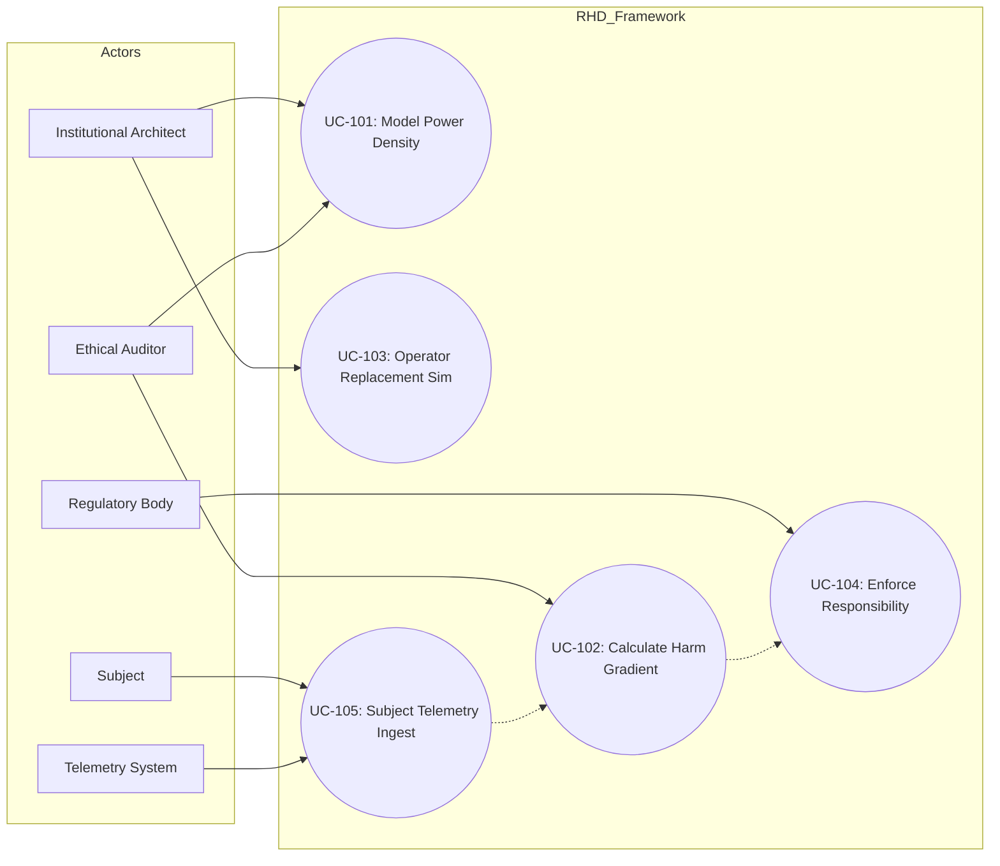
```mermaid
graph LR
    subgraph Actors
        S[Subject]
        IA[Institutional Architect]
        EA[Ethical Auditor]
        RB[Regulatory Body]
        TS[Telemetry System]
    end

    subgraph RHD_Framework
        UC101((UC-101: Model Power Density))
        UC102((UC-102: Calculate Harm Gradient))
        UC103((UC-103: Operator Replacement Sim))
        UC104((UC-104: Enforce Responsibility))
        UC105((UC-105: Subject Telemetry Ingest))
    end

    IA --> UC101
    IA --> UC103
    EA --> UC102
    EA --> UC101
    RB --> UC104
    S --> UC105
    TS --> UC105
    UC105 -.-> UC102
    UC102 -.-> UC104
```

---

## 4. Actor-Use Case Matrix

| Use Case | Subject | Inst. Architect | Ethical Auditor | Regulatory Body | Telemetry System |
| :--- | :---: | :---: | :---: | :---: | :---: |
| **UC-101: Model Power Density** | | **P** | S | | |
| **UC-102: Calculate Harm Gradient** | S | | **P** | S | S |
| **UC-103: Operator Replacement Sim** | | **P** | S | | |
| **UC-104: Enforce Responsibility** | S | S | S | **P** | |
| **UC-105: Subject Telemetry Ingest** | **P** | | | | **P** |

**Legend:**
- **P**: Primary Actor (Initiates the process)
- **S**: Secondary Actor (Participates or provides/receives data)

---

## 5. Technical Constraints & Business Rules (Traceability)

| ID | Rule/Constraint | Traceability |
| :--- | :--- | :--- |
| **BR-001** | **Subject Primacy:** Subject-side telemetry always overrides institutional self-reporting in $dH/dt$ calculations. | UC-102, UC-105 |
| **BR-002** | **Hysteretic Weighting:** Harm calculations must include a "Trauma Memory" coefficient ($T_m$) from PostgreSQL. | UC-102 |
| **BR-003** | **Autonomy Divisor:** Total Autonomy $A = A_1 \times A_2 \times A_3$. If any value is 0, $A=0$, and Harm becomes infinite. | UC-101, UC-104 |
| **TC-001** | **Graph Integrity:** Neo4j must maintain a sub-second response time for power density pathfinding. | UC-101 |
| **TC-002** | **Audit Trail:** All $dH/dt$ alerts must be immutable and stored in a write-once ledger. | UC-102, UC-104 |

---

## Requirements Specification

# Relational Harm Dynamics (RHD) Framework: Requirements Documentation

## 1. Functional Requirements (FR)

The functional requirements focus on the implementation of the Moral Field Equation: 
$$dH/dt = \frac{P_d}{A_1 \cdot A_2 \cdot A_3}$$
Where $P_d$ is Power Density, and $A_{1-3}$ are the Autonomy divisors (Voluntariness, Comprehension, Power Symmetry).

| FR-ID | Description | Priority | Source | Acceptance Criteria |
| :--- | :--- | :--- | :--- | :--- |
| **FR-101** | **Subject-Side Telemetry Ingestion** | Must Have | Subject / Auditor | System must ingest real-time sentiment and physiological proxy data from subjects via API, bypassing institutional self-reporting. |
| **FR-102** | **Power Density Mapping** | Must Have | Institutional Architect | System must map institutional nodes in Neo4j and calculate $P_d$ based on resource control and decision-making bottlenecks. |
| **FR-103** | **Autonomy Divisor Calculation** | Must Have | Subject | System must calculate $A_1$ (Voluntariness), $A_2$ (Comprehension), and $A_3$ (Symmetry) using multi-modal survey and behavioral data. |
| **FR-104** | **Hysteretic Harm Modeling** | Must Have | Ethical Auditor | Use SciPy to model path-dependent harm (trauma) where current state $S_t$ depends on historical harm $H_{t-n}$. |
| **FR-105** | **Operator Replacement Simulation** | Should Have | Policy Engineer | System must allow "swapping" an individual agent in a power node to determine if $dH/dt$ remains constant (indicating structural violence). |
| **FR-106** | **Real-time Harm Gradient Visualization** | Should Have | Auditor | D3.js dashboard must render a heat map of "Harm Gradients" across institutional sectors in < 500ms. |
| **FR-107** | **Legitimacy Absorption Shield** | Must Have | Regulatory Body | System must generate immutable audit logs to prevent institutions from "absorbing" the RHD metrics as mere PR/marketing. |
| **FR-108** | **Predictive Responsibility Alerts** | Should Have | Ethical Auditor | Trigger alerts when the derivative of harm ($d^2H/dt^2$) indicates an accelerating trend toward structural collapse. |
| **FR-109** | **State-Dependent Data Storage** | Must Have | Subject | PostgreSQL must store subject data with "Context Tags" to ensure data is only interpreted within the subject's specific state. |

---

## 2. Non-Functional Requirements (NFR)

### 2.1 Performance
- **NFR-201 (Latency):** The Moral Field Equation engine must compute $dH/dt$ for a graph of 10,000 nodes in under 2 seconds.
- **NFR-202 (Throughput):** The FastAPI layer must handle 5,000 concurrent telemetry streams without degradation.

### 2.2 Scalability
- **NFR-203 (Graph Scaling):** Neo4j must support institutional hierarchies up to 1 million relationships (Power Density links).
- **NFR-204 (Horizontal Scaling):** The calculation engine must be containerized (Docker/K8s) to scale based on the number of active "Subjects" being monitored.

### 2.3 Security
- **NFR-205 (Zero-Knowledge Telemetry):** Subject telemetry must be encrypted at rest using AES-256; the institution being monitored must never have access to raw subject-side data.
- **NFR-206 (Role-Based Access Control):** Access to "Operator Replacement" tools is restricted to verified Ethical Auditors and Regulatory Bodies.

### 2.4 Reliability
- **NFR-207 (Uptime):** The system must maintain 99.99% availability for real-time harm monitoring in critical environments (e.g., hospitals, prisons).
- **NFR-208 (Fault Tolerance):** In the event of a SciPy engine failure, the system must fail-over to a linear approximation model to maintain monitoring continuity.

### 2.5 Usability
- **NFR-209 (Accessibility):** The D3.js visualization must comply with WCAG 2.1 Level AA to ensure accessibility for diverse regulatory staff.
- **NFR-210 (Cognitive Load):** The dashboard must present the "Harm Gradient" as a single unified metric before allowing drill-down into complex differential variables.

### 2.6 Maintainability
- **NFR-211 (Documentation):** All API endpoints must be documented via Swagger/OpenAPI 3.0.
- **NFR-212 (Modular Math):** The "Moral Field Equation" must be implemented as a modular library to allow for future updates to the autonomy divisors.

---

## 3. Requirements Traceability Matrix (RTM)

| Use Case ID | Requirement ID | Test Case ID | Status |
| :--- | :--- | :--- | :--- |
| **UC-1: Monitor Harm** | FR-101, FR-103, FR-104 | TC-HARM-01 | Draft |
| **UC-2: Map Power** | FR-102 | TC-POW-01 | Draft |
| **UC-3: Structural Audit** | FR-105, FR-107 | TC-AUD-01 | Draft |
| **UC-4: Real-time Alerting** | FR-106, FR-108 | TC-ALT-01 | Draft |
| **UC-5: Data Privacy** | FR-109, NFR-205 | TC-SEC-01 | Draft |

---

## 4. Requirements Dependency Diagram

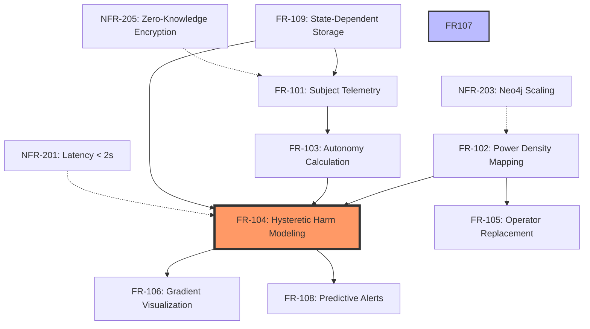
```mermaid
graph TD
    %% Functional Requirements
    FR101[FR-101: Subject Telemetry] --> FR103[FR-103: Autonomy Calculation]
    FR102[FR-102: Power Density Mapping] --> FR104[FR-104: Hysteretic Harm Modeling]
    FR103 --> FR104
    
    FR104 --> FR106[FR-106: Gradient Visualization]
    FR104 --> FR108[FR-108: Predictive Alerts]
    
    FR102 --> FR105[FR-105: Operator Replacement]
    
    FR109[FR-109: State-Dependent Storage] --> FR101
    FR109 --> FR104

    %% Non-Functional Dependencies
    NFR205[NFR-205: Zero-Knowledge Encryption] -.-> FR101
    NFR201[NFR-201: Latency < 2s] -.-> FR104
    NFR203[NFR-203: Neo4j Scaling] -.-> FR102

    %% Styling
    style FR104 fill:#f96,stroke:#333,stroke-width:4px
    style FR107 fill:#bbf,stroke:#333,stroke-width:2px
```

---

## 5. State Machine: Harm Gradient Calculation
This state machine describes the lifecycle of a "Harm Event" within the RHD Framework.

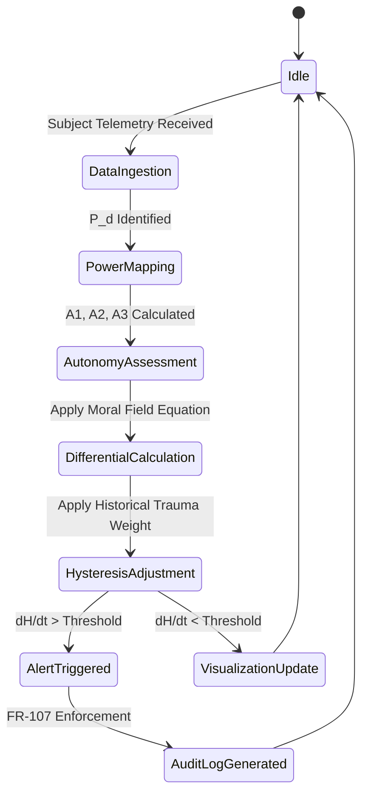
```mermaid
stateDiagram-v2
    [*] --> Idle
    Idle --> DataIngestion : Subject Telemetry Received
    DataIngestion --> PowerMapping : P_d Identified
    PowerMapping --> AutonomyAssessment : A1, A2, A3 Calculated
    AutonomyAssessment --> DifferentialCalculation : Apply Moral Field Equation
    DifferentialCalculation --> HysteresisAdjustment : Apply Historical Trauma Weight
    HysteresisAdjustment --> AlertTriggered : dH/dt > Threshold
    HysteresisAdjustment --> VisualizationUpdate : dH/dt < Threshold
    AlertTriggered --> AuditLogGenerated : FR-107 Enforcement
    AuditLogGenerated --> Idle
    VisualizationUpdate --> Idle
```

---

## 6. Data Model (High-Level)
The relationship between the Subject, the Institution, and the resulting Harm Metrics.

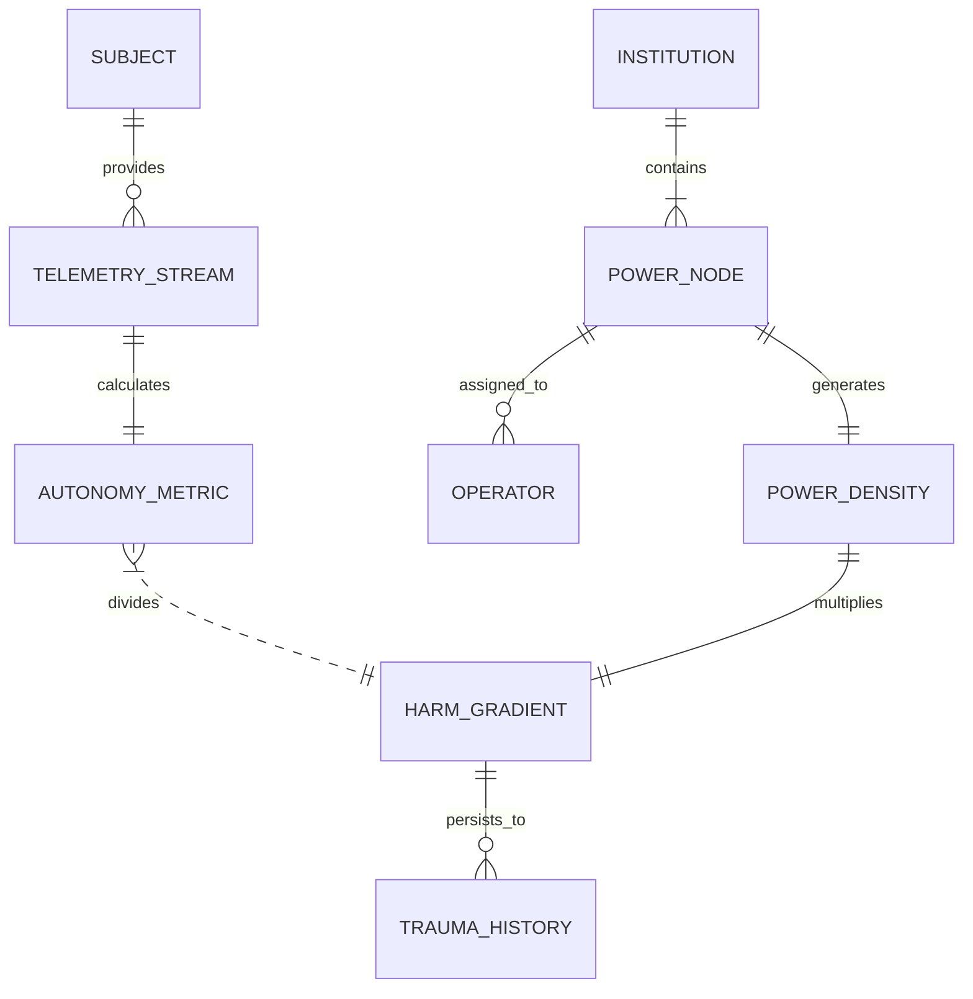
```mermaid
erDiagram
    SUBJECT ||--o{ TELEMETRY_STREAM : provides
    INSTITUTION ||--|{ POWER_NODE : contains
    POWER_NODE ||--o{ OPERATOR : assigned_to
    TELEMETRY_STREAM ||--|| AUTONOMY_METRIC : calculates
    POWER_NODE ||--|| POWER_DENSITY : generates
    AUTONOMY_METRIC }|..|| HARM_GRADIENT : divides
    POWER_DENSITY ||--|| HARM_GRADIENT : multiplies
    HARM_GRADIENT ||--o{ TRAUMA_HISTORY : persists_to
```

## 7. Acceptance Criteria Detail (Sample: FR-105)

**Requirement:** FR-105: Operator Replacement Simulation
- **TC-105.1:** Given a power node $N$ with high $dH/dt$, when the Operator $O_1$ is replaced with $O_2$ in the simulation, the system must recalculate $dH/dt$.
- **TC-105.2:** If $dH/dt$ variance is $< 5\%$, the system must flag the node as "Structurally Violent."
- **TC-105.3:** The simulation must complete within 5 seconds for a single node swap.

---

## System Architecture

# Relational Harm Dynamics (RHD) Framework: Architecture Documentation

## 1. System Context Diagram (C4 Level 1)

The RHD Framework sits at the center of an institutional ecosystem, acting as a "Moral Governor." Unlike traditional auditing tools that rely on institutional self-reporting, the RHD prioritizes direct telemetry from the **Subject** to calculate the real-time harm gradient.

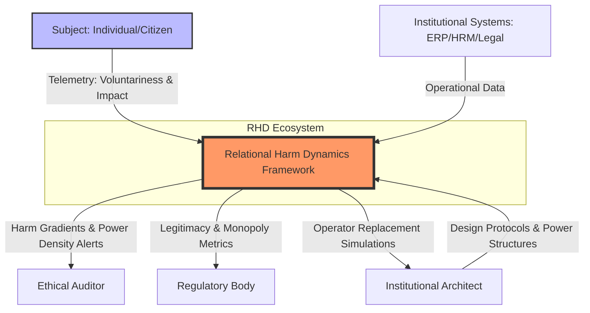
```mermaid
graph TB
    subgraph "RHD Ecosystem"
        RHD[Relational Harm Dynamics Framework]
    end

    Subject[Subject: Individual/Citizen]
    Architect[Institutional Architect]
    Auditor[Ethical Auditor]
    Regulator[Regulatory Body]
    InstSystems[Institutional Systems: ERP/HRM/Legal]

    Subject -- "Telemetry: Voluntariness & Impact" --> RHD
    Architect -- "Design Protocols & Power Structures" --> RHD
    RHD -- "Harm Gradients & Power Density Alerts" --> Auditor
    RHD -- "Legitimacy & Monopoly Metrics" --> Regulator
    InstSystems -- "Operational Data" --> RHD
    RHD -- "Operator Replacement Simulations" --> Architect

    style RHD fill:#f96,stroke:#333,stroke-width:4px
    style Subject fill:#bbf,stroke:#333,stroke-width:2px
```

---

## 2. Container Diagram (C4 Level 2)

The system is decomposed into specialized containers to handle the distinct requirements of graph-based power analysis, differential equation modeling, and real-time visualization.

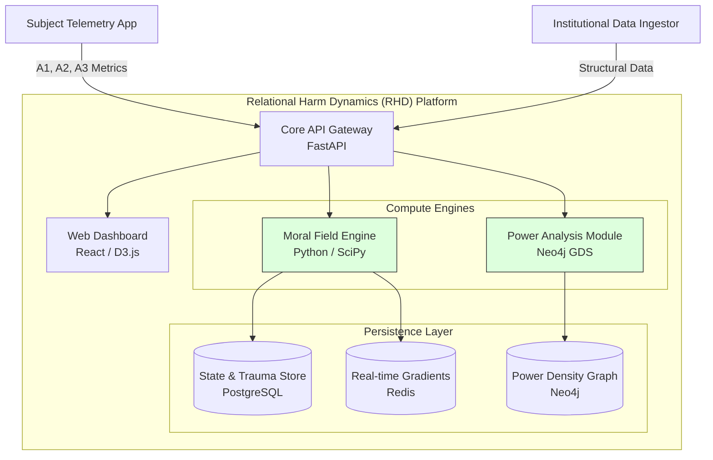
```mermaid
graph TB
    subgraph "Relational Harm Dynamics (RHD) Platform"
        WA[Web Dashboard<br/>React / D3.js]
        API[Core API Gateway<br/>FastAPI]
        
        subgraph "Compute Engines"
            MFE[Moral Field Engine<br/>Python / SciPy]
            PAM[Power Analysis Module<br/>Neo4j GDS]
        end

        subgraph "Persistence Layer"
            PDB[(State & Trauma Store<br/>PostgreSQL)]
            GDB[(Power Density Graph<br/>Neo4j)]
            CACHE[(Real-time Gradients<br/>Redis)]
        end
    end

    SubjectApp[Subject Telemetry App]
    InstAPI[Institutional Data Ingestor]

    SubjectApp -- "A1, A2, A3 Metrics" --> API
    InstAPI -- "Structural Data" --> API
    
    API --> WA
    API --> MFE
    API --> PAM
    
    MFE --> PDB
    PAM --> GDB
    MFE --> CACHE
    
    style MFE fill:#dfd,stroke:#333
    style PAM fill:#dfd,stroke:#333
```

---

## 3. Component Diagram (C4 Level 3)

### 3.1 Moral Field Engine (MFE)
The MFE is the mathematical core of the system, responsible for calculating the harm derivative ($dH/dt$).

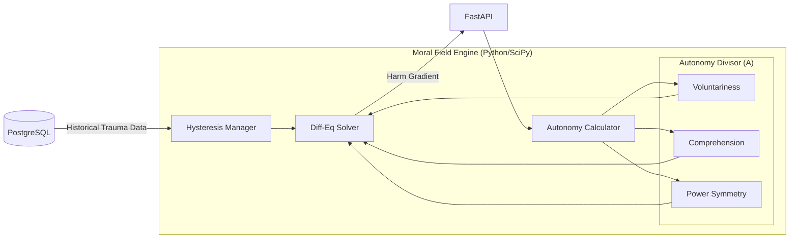
```mermaid
graph LR
    subgraph "Moral Field Engine (Python/SciPy)"
        DE[Diff-Eq Solver]
        HM[Hysteresis Manager]
        AC[Autonomy Calculator]
        
        subgraph "Autonomy Divisor (A)"
            A1[Voluntariness]
            A2[Comprehension]
            A3[Power Symmetry]
        end
    end

    API[FastAPI] --> AC
    AC --> A1
    AC --> A2
    AC --> A3
    
    A1 & A2 & A3 --> DE
    PDB[(PostgreSQL)] -- "Historical Trauma Data" --> HM
    HM --> DE
    DE -- "Harm Gradient" --> API
```

### 3.2 Power Analysis Module (PAM)
This component models institutions as biological agents and identifies "Legitimacy Absorption" patterns.

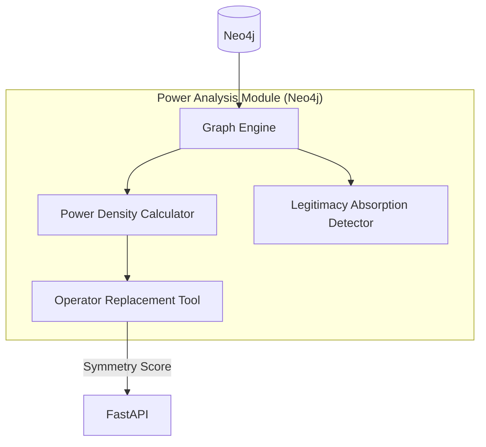
```mermaid
graph TB
    subgraph "Power Analysis Module (Neo4j)"
        G[Graph Engine]
        PD[Power Density Calculator]
        OR[Operator Replacement Tool]
        LA[Legitimacy Absorption Detector]
    end

    GDB[(Neo4j)] --> G
    G --> PD
    G --> LA
    PD --> OR
    OR -- "Symmetry Score" --> API[FastAPI]
```

---

## 4. Deployment Diagram

The RHD Framework is deployed using a high-availability, containerized architecture to ensure that ethical monitoring remains online even if the monitored institution experiences failure.

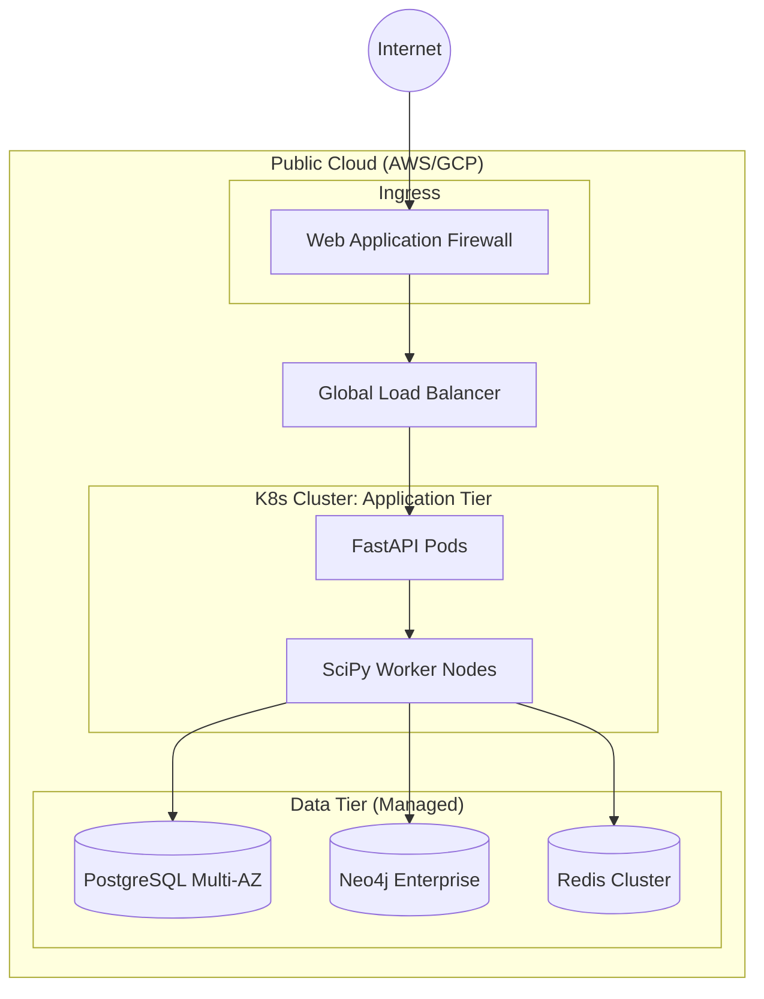
```mermaid
graph TB
    subgraph "Public Cloud (AWS/GCP)"
        LB[Global Load Balancer]
        
        subgraph "K8s Cluster: Application Tier"
            direction LR
            API_PODS[FastAPI Pods]
            MFE_WORKERS[SciPy Worker Nodes]
        end

        subgraph "Data Tier (Managed)"
            direction TB
            RDS[(PostgreSQL Multi-AZ)]
            AURA[(Neo4j Enterprise)]
            ELC[(Redis Cluster)]
        end

        subgraph "Ingress"
            WAF[Web Application Firewall]
        end
    end

    Internet((Internet)) --> WAF
    WAF --> LB
    LB --> API_PODS
    API_PODS --> MFE_WORKERS
    MFE_WORKERS --> RDS
    MFE_WORKERS --> AURA
    MFE_WORKERS --> ELC
```

---

## 5. Technology Stack Summary

| Layer | Technology | Reason for Selection |
| :--- | :--- | :--- |
| **Frontend** | React, D3.js, TailwindCSS | D3.js is critical for rendering complex, real-time harm gradients and vector fields. |
| **Backend API** | FastAPI (Python 3.11+) | High performance, native async support, and seamless integration with SciPy. |
| **Compute Engine** | SciPy, NumPy, Pandas | Required for solving the differential equations of the Moral Field Model. |
| **Graph Database** | Neo4j | Models institutional relationships and power density as a network of nodes/edges. |
| **Relational DB** | PostgreSQL | Stores time-series "trauma" data and state-dependent historical records. |
| **Caching** | Redis | Stores transient harm gradients for real-time dashboard updates. |
| **Deployment** | Docker, Kubernetes, Terraform | Ensures environment parity and horizontal scalability for compute-heavy modeling. |

---

## 6. Architecture Decision Records (ADRs)

### ADR-001: Use of Differential Equations for Harm Modeling
*   **Context:** Traditional ethics systems use boolean "compliance" checks. Harm, however, is path-dependent (hysteretic) and continuous.
*   **Decision:** Implement the "Moral Field Equation" using SciPy's ODE solvers.
*   **Consequences:** Requires higher compute resources than standard CRUD apps; enables predictive modeling of harm before it occurs.

### ADR-002: Subject-Side Telemetry Priority
*   **Context:** Institutions have a natural tendency toward "Legitimacy Absorption"—rebranding harm as a "necessary process."
*   **Decision:** The system architecture must prioritize telemetry from the Subject's nervous system/input over Institutional self-reporting.
*   **Consequences:** Requires robust, encrypted mobile/edge endpoints for subjects to report Voluntariness (A1) and Comprehension (A2).

### ADR-003: Graph-Based Power Density Mapping
*   **Context:** Power is not a static attribute but a relational density between nodes in a system.
*   **Decision:** Use Neo4j to map institutional structures.
*   **Consequences:** Allows for "Operator Replacement" simulations (swapping a Subject and an Architect in the graph) to detect structural violence.

### ADR-004: Hysteretic Data Persistence
*   **Context:** The impact of a system on a subject depends on the subject's prior state (Historical Trauma).
*   **Decision:** PostgreSQL will store "State-Dependent" profiles that modify the sensitivity of the Harm Gradient calculation.
*   **Consequences:** Strict GDPR/HIPAA-level security is required for these sensitive historical profiles.

---

## 7. Traceability Matrix

| ID | Requirement | Component | Acceptance Criteria |
| :--- | :--- | :--- | :--- |
| **FR-101** | Calculate Harm Gradient | Moral Field Engine | $dH/dt$ must update within 500ms of telemetry input. |
| **FR-102** | Power Symmetry Analysis | Power Analysis Module | Operator Replacement tool must return a symmetry score < 0.5 for monopolies. |
| **FR-103** | Autonomy Monitoring | Autonomy Calculator | System must flag any process where $A_1 \times A_2 \times A_3 \to 0$. |
| **FR-104** | Trauma Persistence | State & Trauma Store | Historical impact must influence current harm calculations (Hysteresis). |

---

## Data Model & ERD

# Relational Harm Dynamics (RHD) Framework: Data Model Documentation

This document outlines the data architecture for the RHD Framework, focusing on the transition from traditional relational structures to a systemic, impact-focused model that calculates harm gradients and power density.

## 1. Entity-Relationship Diagram (ERD)

The RHD data model prioritizes the **Interaction** as the primary unit of analysis, where the **Subject** and **Institution** collide to produce a measurable **Harm Gradient**.


```mermaid
erDiagram
    SUBJECT ||--o{ INTERACTION : experiences
    INSTITUTION ||--o{ INTERACTION : executes
    
    SUBJECT {
        uuid id PK
        string pseudonym UK
        float baseline_vulnerability "Hysteretic state"
        datetime registered_at
    }

    INSTITUTION {
        uuid id PK
        string name
        float power_density "Current legitimacy/force concentration"
        float legitimacy_index "External validation metric"
    }

    INTERACTION {
        uuid id PK
        uuid subject_id FK
        uuid institution_id FK
        datetime timestamp
        float duration
        string interaction_type "e.g., Clinical, Judicial, Financial"
    }

    AUTONOMY_METRIC ||--|| INTERACTION : qualifies
    AUTONOMY_METRIC {
        uuid id PK
        uuid interaction_id FK
        float a1_voluntariness "0.0 to 1.0"
        float a2_comprehension "0.0 to 1.0"
        float a3_power_symmetry "0.0 to 1.0"
        string telemetry_source "Subject vs Institution"
    }

    HARM_GRADIENT ||--|| INTERACTION : results_in
    HARM_GRADIENT {
        uuid id PK
        uuid interaction_id FK
        float dh_dt "Harm derivative over time"
        float structural_violence_load
        boolean is_hysteretic "Path-dependent flag"
    }

    HISTORICAL_TRAUMA ||--o{ SUBJECT : affects
    HISTORICAL_TRAUMA {
        uuid id PK
        uuid subject_id FK
        string trauma_type
        float intensity_coefficient
        datetime event_date
    }
```

---

## 2. Entity Descriptions

### Subject
*   **Purpose:** Represents the individual human agent. Unlike traditional "Users," the Subject is defined by their nervous system's response and their historical path-dependency (hysteresis).
*   **Attributes:**
    *   `baseline_vulnerability`: A calculated float representing the subject's current state of resilience based on previous interactions.
*   **Relationships:** One-to-many with `Interaction` and `Historical_Trauma`.
*   **Performance:** Indexed on `pseudonym` to allow for anonymous tracking across institutional silos.

### Institution
*   **Purpose:** Models an organization as a biological agent seeking to maximize its own "Legitimacy" and "Power Density."
*   **Attributes:**
    *   `power_density`: A real-time metric of the institution's ability to enforce its will without subject consent.
*   **Relationships:** One-to-many with `Interaction`.
*   **Performance:** High-read frequency for real-time auditing.

### Interaction
*   **Purpose:** The atomic unit of the RHD framework. It captures the specific moment power is exercised.
*   **Attributes:**
    *   `interaction_type`: Categorizes the nature of the power exchange.
*   **Relationships:** Junction entity between `Subject` and `Institution`. Links to `Autonomy_Metric` and `Harm_Gradient`.

### Autonomy_Metric (The Divisor)
*   **Purpose:** Implements the three-part autonomy divisor (A1, A2, A3) used to dampen the Moral Field Equation.
*   **Attributes:**
    *   `a1_voluntariness`: Degree of choice.
    *   `a2_comprehension`: Degree of understanding.
    *   `a3_power_symmetry`: The ratio of power between Subject and Institution.
*   **Constraints:** All values must be between 0.0 and 1.0.

---

## 3. Data Dictionary

| Entity | Attribute | Type | Constraints | Description |
| :--- | :--- | :--- | :--- | :--- |
| **Subject** | `id` | UUID | PK | Unique system identifier. |
| **Subject** | `baseline_vulnerability` | FLOAT | 0.0 - 10.0 | The hysteretic state of the subject's harm threshold. |
| **Institution** | `power_density` | FLOAT | > 0.0 | Calculated concentration of institutional force. |
| **Autonomy_Metric** | `a1_voluntariness` | FLOAT | 0.0 - 1.0 | Subject's freedom from coercion during interaction. |
| **Autonomy_Metric** | `a2_comprehension` | FLOAT | 0.0 - 1.0 | Subject's cognitive grasp of the interaction's terms. |
| **Autonomy_Metric** | `a3_power_symmetry` | FLOAT | 0.0 - 1.0 | The inverse of the power gap between parties. |
| **Harm_Gradient** | `dh_dt` | FLOAT | N/A | The rate of change of harm (The Moral Field derivative). |

---

## 4. Data Flow Diagram (DFD)

The flow prioritizes **Subject-side Telemetry** to prevent "Legitimacy Absorption" by the institution.

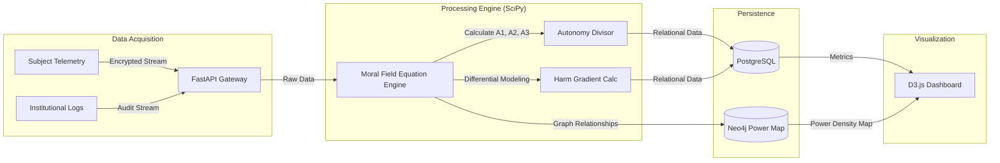
```mermaid
graph LR
    subgraph "Data Acquisition"
        S[Subject Telemetry] -->|Encrypted Stream| API[FastAPI Gateway]
        I[Institutional Logs] -->|Audit Stream| API
    end

    subgraph "Processing Engine (SciPy)"
        API -->|Raw Data| MFE[Moral Field Equation Engine]
        MFE -->|Calculate A1, A2, A3| AD[Autonomy Divisor]
        MFE -->|Differential Modeling| HG[Harm Gradient Calc]
    end

    subgraph "Persistence"
        AD -->|Relational Data| PG[(PostgreSQL)]
        HG -->|Relational Data| PG
        MFE -->|Graph Relationships| NJ[(Neo4j Power Map)]
    end

    subgraph "Visualization"
        PG -->|Metrics| D3[D3.js Dashboard]
        NJ -->|Power Density Map| D3
    end
```

---

## 5. Data Validation Rules

| ID | Rule Name | Logic | Description |
| :--- | :--- | :--- | :--- |
| **VAL-001** | **Autonomy Range** | `0.0 <= (A1, A2, A3) <= 1.0` | Autonomy components cannot exceed 100% or be negative. |
| **VAL-002** | **Source Weighting** | `Weight(Subject) > 5 * Weight(Institution)` | Subject-reported harm is weighted 5x higher than institutional self-reporting. |
| **VAL-003** | **Hysteresis Check** | `dH/dt != 0` if `Historical_Trauma` exists | Harm cannot be calculated in a vacuum; previous state must influence current gradient. |
| **VAL-004** | **Legitimacy Cap** | `Legitimacy_Index` cannot increase if `dH/dt > Threshold` | Prevents institutions from gaining "ethical points" while causing active harm. |

---

## 6. Data Migration Considerations

### Legacy System Integration
When migrating from traditional "Incident Reporting" or "Case Management" systems:
1.  **Normalization of Intent:** Legacy "Intent" fields must be discarded. RHD only accepts "Impact" (Subject-side) and "Structure" (Institutional-side) data.
2.  **Anonymization:** Subjects from legacy systems must be mapped to `pseudonyms` using a one-way cryptographic hash to prevent institutional retaliation.
3.  **Backfilling Hysteresis:** Historical data should be used to populate the `Historical_Trauma` entity to establish the initial `baseline_vulnerability` for existing subjects.
4.  **Graph Seeding:** Institutional hierarchies must be ingested into **Neo4j** to identify existing "Monopolies of Legitimacy" before real-time monitoring begins.

### Scalability and Storage
*   **PostgreSQL:** Used for transactional integrity of interactions and autonomy metrics.
*   **Neo4j:** Used for calculating the "Power Density" by analyzing the depth and breadth of institutional influence across multiple subjects.
*   **Time-Series Data:** `Harm_Gradient` updates should be partitioned by month to maintain query performance for real-time D3.js visualizations.

---

## Flow Diagrams

# Relational Harm Dynamics (RHD) Framework: System Interaction Documentation

This document outlines the critical interaction flows, logic processes, and state transitions within the RHD Framework. The system is designed to move beyond static compliance toward dynamic, predictive harm mitigation.

---

## 1. Sequence Diagrams: Critical User Journeys

### UC-101: Real-time Harm Gradient Calculation
This journey represents the core engine's response to incoming subject telemetry, calculating the instantaneous harm derivative ($dH/dt$).

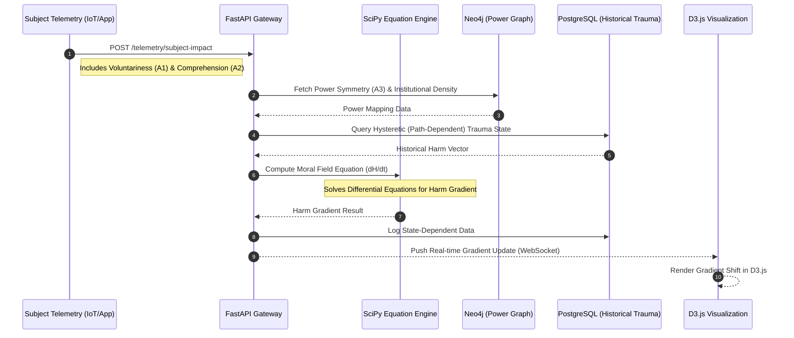
```mermaid
sequenceDiagram
    autonumber
    participant S as Subject Telemetry (IoT/App)
    participant API as FastAPI Gateway
    participant SE as SciPy Equation Engine
    participant GDB as Neo4j (Power Graph)
    participant RDB as PostgreSQL (Historical Trauma)
    participant UI as D3.js Visualization

    S->>API: POST /telemetry/subject-impact
    Note right of S: Includes Voluntariness (A1) & Comprehension (A2)
    API->>GDB: Fetch Power Symmetry (A3) & Institutional Density
    GDB-->>API: Power Mapping Data
    API->>RDB: Query Hysteretic (Path-Dependent) Trauma State
    RDB-->>API: Historical Harm Vector
    API->>SE: Compute Moral Field Equation (dH/dt)
    Note over SE: Solves Differential Equations for Harm Gradient
    SE-->>API: Harm Gradient Result
    API->>RDB: Log State-Dependent Data
    API-->>UI: Push Real-time Gradient Update (WebSocket)
    UI-->>UI: Render Gradient Shift in D3.js
```

### UC-102: Operator Replacement Simulation
Used by Institutional Architects to test if a system's harm is structural or individual by simulating the replacement of specific agents.

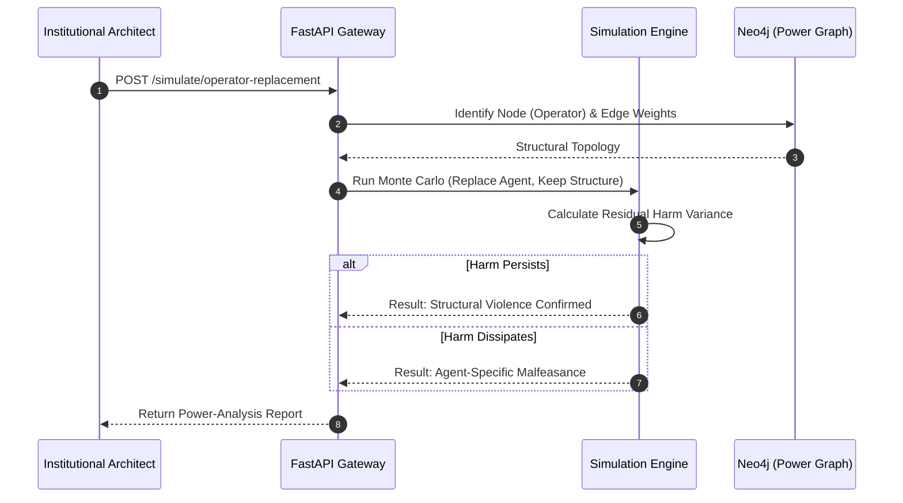
```mermaid
sequenceDiagram
    autonumber
    participant IA as Institutional Architect
    participant API as FastAPI Gateway
    participant SIM as Simulation Engine
    participant GDB as Neo4j (Power Graph)

    IA->>API: POST /simulate/operator-replacement
    API->>GDB: Identify Node (Operator) & Edge Weights
    GDB-->>API: Structural Topology
    API->>SIM: Run Monte Carlo (Replace Agent, Keep Structure)
    SIM->>SIM: Calculate Residual Harm Variance
    alt Harm Persists
        SIM-->>API: Result: Structural Violence Confirmed
    else Harm Dissipates
        SIM-->>API: Result: Agent-Specific Malfeasance
    end
    API-->>IA: Return Power-Analysis Report
```

---

## 2. Activity Diagrams: Complex Business Processes

### BP-201: The Moral Field Equation Solver
This process details how the system calculates the "Autonomy Divisor" to dampen institutional power density.

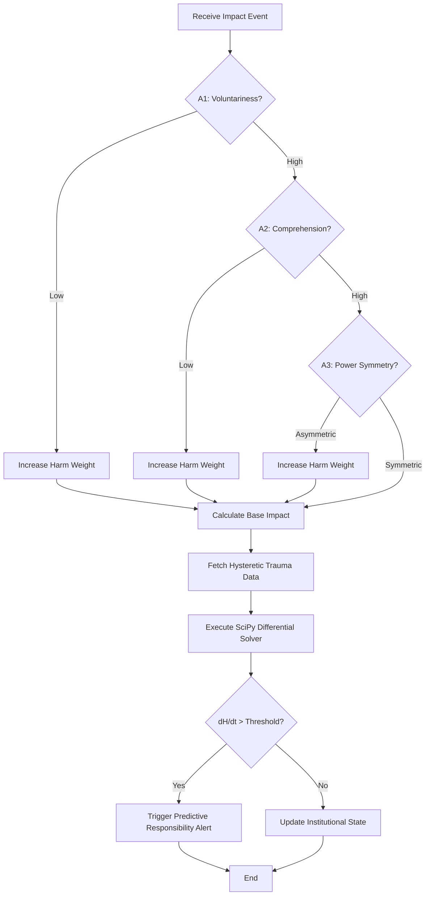
```mermaid
graph TD
    Start[Receive Impact Event] --> A1{A1: Voluntariness?}
    A1 -->|Low| H1[Increase Harm Weight]
    A1 -->|High| A2{A2: Comprehension?}
    
    A2 -->|Low| H2[Increase Harm Weight]
    A2 -->|High| A3{A3: Power Symmetry?}
    
    A3 -->|Asymmetric| H3[Increase Harm Weight]
    A3 -->|Symmetric| Calc[Calculate Base Impact]
    
    H1 & H2 & H3 --> Calc
    
    Calc --> Hist[Fetch Hysteretic Trauma Data]
    Hist --> DiffEq[Execute SciPy Differential Solver]
    
    DiffEq --> Result{dH/dt > Threshold?}
    Result -->|Yes| Alert[Trigger Predictive Responsibility Alert]
    Result -->|No| Log[Update Institutional State]
    
    Alert --> End[End]
    Log --> End
```

---

## 3. State Diagrams: Entity Lifecycle

### SD-301: Institutional Legitimacy State
Institutions are modeled as biological agents. Their "Legitimacy" is a state-dependent variable that fluctuates based on harm gradients.

```mermaid
stateDiagram-v2
    [*] --> Stable: Low Harm Gradient
    Stable --> HighDensity: Power Concentration Detected
    HighDensity --> CriticalHarm: dH/dt > 0.5
    CriticalHarm --> DeLegitimized: Failure to Implement Operator Replacement
    
    DeLegitimized --> Restructuring: Regulatory Intervention
    Restructuring --> Stable: Autonomy Divisors (A1,A2,A3) Restored
    
    CriticalHarm --> Stable: Predictive Responsibility Action Taken
    
    note right of DeLegitimized
        System triggers 'Legitimacy Absorption' 
        resistance protocols here.
    end
```

### SD-302: Harm Incident Lifecycle
Tracks a specific harm event from subject registration to structural resolution.

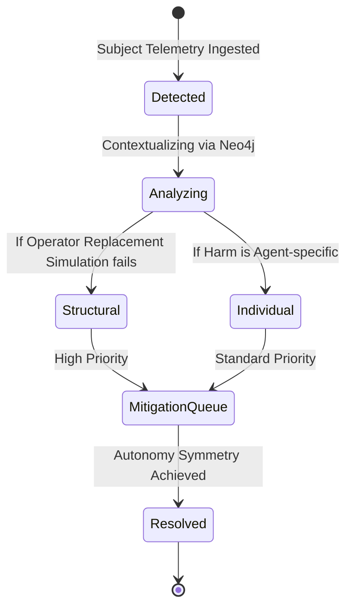
```mermaid
stateDiagram-v2
    [*] --> Detected: Subject Telemetry Ingested
    Detected --> Analyzing: Contextualizing via Neo4j
    Analyzing --> Structural: If Operator Replacement Simulation fails
    Analyzing --> Individual: If Harm is Agent-specific
    
    Structural --> MitigationQueue: High Priority
    Individual --> MitigationQueue: Standard Priority
    
    MitigationQueue --> Resolved: Autonomy Symmetry Achieved
    Resolved --> [*]
```

---

## 4. Integration Flow: Data Pipeline

This diagram illustrates the flow of data from the subject's nervous system (telemetry) to the regulatory dashboard, emphasizing the separation of concerns to prevent institutional co-option.

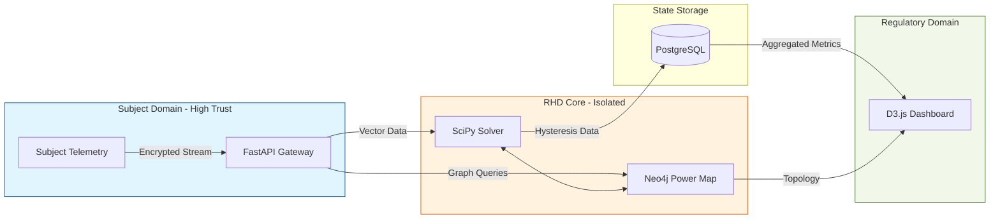
```mermaid
graph LR
    subgraph Subject_Domain [Subject Domain - High Trust]
        S[Subject Telemetry] -->|Encrypted Stream| API[FastAPI Gateway]
    end

    subgraph Analysis_Engine [RHD Core - Isolated]
        API -->|Vector Data| SP[SciPy Solver]
        API -->|Graph Queries| Neo[Neo4j Power Map]
        SP <--> Neo
    end

    subgraph Persistence_Layer [State Storage]
        SP -->|Hysteresis Data| PG[(PostgreSQL)]
    end

    subgraph Auditor_Interface [Regulatory Domain]
        PG -->|Aggregated Metrics| D3[D3.js Dashboard]
        Neo -->|Topology| D3
    end

    style Subject_Domain fill:#e1f5fe,stroke:#01579b
    style Analysis_Engine fill:#fff3e0,stroke:#e65100
    style Auditor_Interface fill:#f1f8e9,stroke:#33691e
```

---

## 5. Error Handling & Resilience Flows

### EH-501: Legitimacy Absorption Prevention
A critical failure mode where an institution attempts to use RHD metrics to "wash" its reputation without changing its power structure.

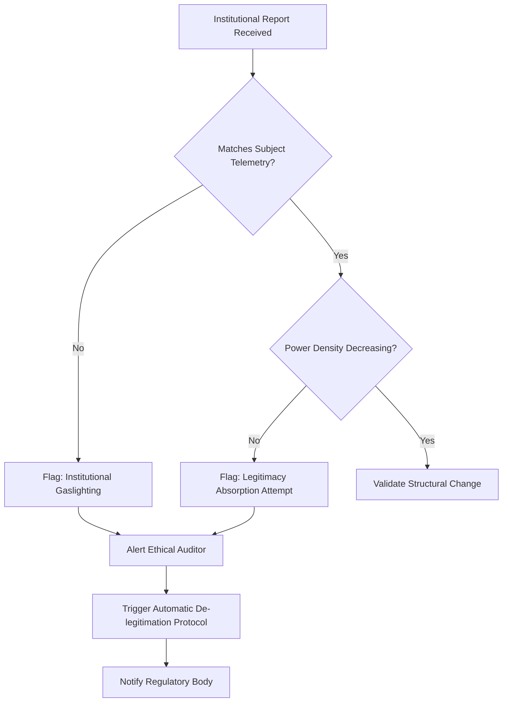
```mermaid
graph TD
    A[Institutional Report Received] --> B{Matches Subject Telemetry?}
    B -->|No| C[Flag: Institutional Gaslighting]
    B -->|Yes| D{Power Density Decreasing?}
    
    D -->|No| E[Flag: Legitimacy Absorption Attempt]
    D -->|Yes| F[Validate Structural Change]
    
    C --> G[Alert Ethical Auditor]
    E --> G
    
    G --> H[Trigger Automatic De-legitimation Protocol]
    H --> I[Notify Regulatory Body]
```

### EH-502: Telemetry Dropout Handling
Ensures that the absence of data from a subject is treated as a potential "Power Asymmetry" event rather than a "No Harm" event.

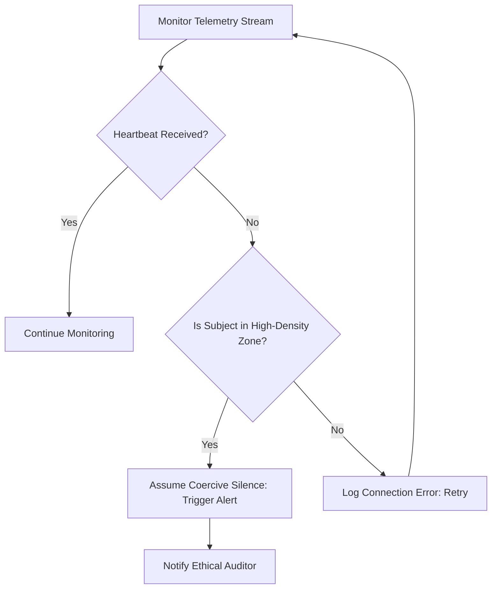
```mermaid
graph TD
    Start[Monitor Telemetry Stream] --> Heartbeat{Heartbeat Received?}
    Heartbeat -->|Yes| Continue[Continue Monitoring]
    Heartbeat -->|No| CheckContext{Is Subject in High-Density Zone?}
    
    CheckContext -->|Yes| HighRisk[Assume Coercive Silence: Trigger Alert]
    CheckContext -->|No| LowRisk[Log Connection Error: Retry]
    
    HighRisk --> Notify[Notify Ethical Auditor]
    LowRisk --> Start
```

---

## Traceability Matrix (Summary)

| ID | Interaction | Primary Stakeholder | Tech Component | Acceptance Criteria |
|:---|:---|:---|:---|:---|
| **FR-101** | Harm Gradient Calculation | Ethical Auditor | SciPy / FastAPI | dH/dt must update within <200ms of telemetry. |
| **FR-102** | Operator Replacement | Institutional Architect | Neo4j / Python | Simulation must isolate structural vs agent variance. |
| **FR-103** | Autonomy Divisor | Subject | PostgreSQL | A1, A2, A3 must be weighted higher than institutional KPIs. |
| **FR-104** | Legitimacy Monitoring | Regulatory Body | D3.js / Neo4j | System must flag "Legitimacy Absorption" automatically. |

---

## Test Plan

# Relational Harm Dynamics (RHD) Framework: Comprehensive Test Plan

## 1. Test Strategy Overview

### 1.1 Testing Objectives
The primary objective of the RHD testing suite is to validate the mathematical integrity of the **Moral Field Equation** and ensure the system's resistance to **Legitimacy Absorption**. Unlike traditional software, RHD must be tested for its ability to prioritize subject-side telemetry over institutional self-reporting.

### 1.2 Testing Scope
*   **In-Scope:**
    *   Differential equation solvers for path-dependent (hysteretic) harm.
    *   Neo4j graph traversals for power density analysis.
    *   Real-time harm gradient (dH/dt) calculations.
    *   Subject Autonomy Divisor (A1: Voluntariness, A2: Comprehension, A3: Power Symmetry).
    *   Operator Replacement simulation tools.
*   **Out-of-Scope:**
    *   General institutional HR management (unless impacting power density).
    *   Third-party financial auditing (unless linked to structural violence).

### 1.3 Testing Approach
A **Model-First Testing** approach is utilized. We validate the mathematical models against historical trauma datasets (PostgreSQL) before testing the UI/UX. We employ "Red-Teaming" to simulate institutional attempts to "game" the metrics.

### 1.4 Entry/Exit Criteria
*   **Entry:** Mathematical models are peer-reviewed; Neo4j schema is finalized; Subject-side API endpoints are documented.
*   **Exit:** 100% of High-Priority test cases passed; Harm gradient calculation error margin < 0.001%; Zero "Legitimacy Absorption" vulnerabilities detected.

---

## 2. Test Levels

### 2.1 Unit Testing
*   **Focus:** Individual functions (e.g., `calculate_autonomy_divisor()`, `solve_harm_derivative()`).
*   **Frameworks:** PyTest, Hypothesis (Property-based testing for math edge cases).
*   **Coverage Target:** 95% for core math modules; 80% for API logic.

### 2.2 Integration Testing
*   **Focus:** FastAPI to Neo4j connectivity; SciPy solver integration with PostgreSQL state-dependent data.
*   **Tools:** Docker Compose for ephemeral test environments.
*   **Key Check:** Ensure that a change in "Subject Power Symmetry" (A3) correctly triggers a re-calculation of the "Harm Gradient" across the graph.

### 2.3 System Testing (End-to-End)
*   **Scenario:** A simulated institutional policy change (e.g., a new surveillance protocol) is ingested.
*   **Validation:** The system must predict the harm increase before it manifests in institutional reports, based on subject-side telemetry.

### 2.4 Acceptance Testing (UAT)
*   **Criteria:** Ethical Auditors must be able to identify "Power Monopolies" within 3 clicks. Subjects must confirm that the "Voluntariness" metric (A1) accurately reflects their lived experience.

---

## 3. Test Case Catalog

| TC-ID | Requirement | Description | Steps | Expected Result | Priority |
|-------|-------------|-------------|-------|-----------------|----------|
| **TC-001** | FR-MATH-01 | Harm Gradient Calculation | 1. Input hysteretic trauma data.<br>2. Run `dH/dt` solver. | Gradient reflects path-dependency (past harm increases current sensitivity). | Critical |
| **TC-002** | FR-PWR-02 | Power Density Mapping | 1. Create 5 nodes with asymmetric edges.<br>2. Query Neo4j for density. | System identifies the node with the highest "Legitimacy Monopoly." | High |
| **TC-003** | FR-AUT-03 | Autonomy Divisor Logic | 1. Set A1=0.1 (Low Voluntariness).<br>2. Calculate Total Harm. | Harm value must scale inversely with the Autonomy Divisor. | Critical |
| **TC-004** | FR-SIM-04 | Operator Replacement | 1. Select high-harm node.<br>2. Simulate "Removal of Authority." | System predicts the dampening of the harm gradient. | Medium |
| **TC-005** | FR-SEC-05 | Anti-Absorption Check | 1. Attempt to inject "Institutional Self-Report" data to override subject telemetry. | System rejects or flags the data as "Low-Integrity/Biased." | High |

---

## 4. Test Coverage Matrix

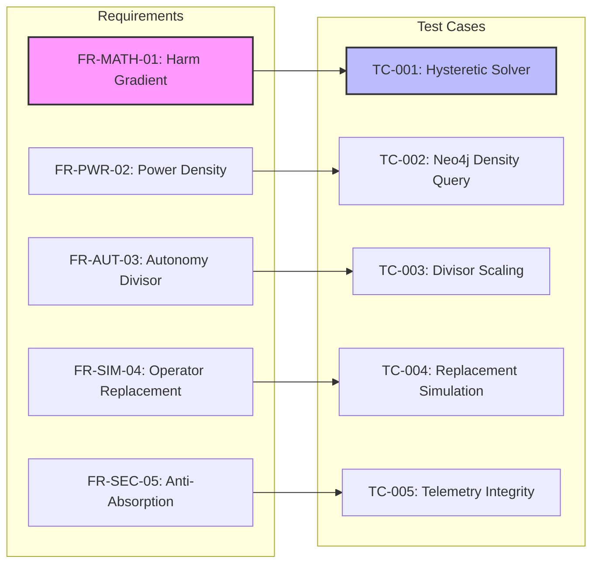
```mermaid
graph LR
    subgraph Requirements
        FR1[FR-MATH-01: Harm Gradient]
        FR2[FR-PWR-02: Power Density]
        FR3[FR-AUT-03: Autonomy Divisor]
        FR4[FR-SIM-04: Operator Replacement]
        FR5[FR-SEC-05: Anti-Absorption]
    end

    subgraph Test Cases
        TC1[TC-001: Hysteretic Solver]
        TC2[TC-002: Neo4j Density Query]
        TC3[TC-003: Divisor Scaling]
        TC4[TC-004: Replacement Simulation]
        TC5[TC-005: Telemetry Integrity]
    end

    FR1 --> TC1
    FR2 --> TC2
    FR3 --> TC3
    FR4 --> TC4
    FR5 --> TC5
    
    style FR1 fill:#f9f,stroke:#333,stroke-width:2px
    style TC1 fill:#bbf,stroke:#333,stroke-width:2px
```

---

## 5. Non-Functional Test Cases

### 5.1 Performance Scenarios
*   **Scenario:** 10,000 concurrent subject-side telemetry pings.
*   **Target:** FastAPI response time < 100ms; Neo4j graph update < 500ms.

### 5.2 Security Scenarios
*   **Scenario:** "Legitimacy Absorption" Attack. An institutional admin attempts to modify the "Comprehension" (A2) score of a subject.
*   **Target:** System must require multi-party authorization (Subject + Auditor) for any change to Autonomy metrics.

### 5.3 Usability Scenarios
*   **Scenario:** Real-time D3.js visualization of a "Harm Spike."
*   **Target:** Non-technical human rights workers must be able to interpret the "Harm Gradient" direction (Increasing/Decreasing) within 5 seconds of viewing the dashboard.

---

## 6. Test Environment Requirements

### 6.1 Hardware/Software
*   **Compute:** 8-core CPU (for SciPy differential equation processing).
*   **Database:** Neo4j 5.x (Graph), PostgreSQL 15 (Relational/Time-series).
*   **Environment:** Linux-based containers (Docker/K8s).

### 6.2 Test Data Requirements
*   **Anonymized Trauma Sets:** Synthetic datasets representing historical institutional harm patterns.
*   **Power Asymmetry Profiles:** Pre-configured graph topologies (e.g., "Totalitarian," "Democratic-Symmetric," "Bureaucratic-Opaque").

### 6.3 Tool Requirements
*   **Locust:** For load testing the telemetry API.
*   **Cypress:** For end-to-end UI testing of the D3.js dashboards.
*   **SonarQube:** For static analysis of the Python codebase.

---

## 7. Test Schedule

```mermaid
gantt
    title RHD Testing Timeline
    dateFormat  YYYY-MM-DD
    section Unit Testing
    Math Model Validation       :a1, 2023-11-01, 10d
    API Endpoint Testing        :after a1, 7d
    section Integration
    Neo4j/FastAPI Sync          :2023-11-15, 10d
    Postgres State Persistence  :10d
    section System/UAT
    Harm Gradient Simulation    :2023-12-01, 14d
    Auditor UAT                 :2023-12-15, 7d
    section Security
    Red-Team Absorption Test    :2023-12-22, 7d
```

---

## 8. Risk Assessment

| Risk | Impact | Probability | Mitigation Strategy |
|------|--------|-------------|---------------------|
| **Mathematical Drift** | High | Medium | Implement "Property-Based Testing" to ensure differential equations don't diverge under extreme inputs. |
| **Institutional Capture** | Critical | High | Hard-code "Subject-Side Telemetry" as the primary weight in the Moral Field Equation. |
| **Neo4j Query Latency** | Medium | Low | Implement graph indexing on "Power Density" attributes and use read-replicas for D3.js visualizations. |
| **Data Privacy Breach** | Critical | Medium | Use Differential Privacy on subject-side telemetry to prevent institutional retaliation against individuals. |

---
**End of Document**
**Prepared by:** RHD Framework Architecture Team
**Status:** Final / For Implementation

---

## Phase Plan

# Relational Harm Dynamics (RHD) Framework: Development Phase Planning

This document outlines the strategic roadmap for the development of the RHD Framework, a systemic ethics engineering platform. The plan prioritizes the mathematical modeling of harm gradients and the implementation of subject-side telemetry to ensure institutional accountability.

## 1. Project Timeline Overview

```mermaid
gantt
    title RHD Framework Development Roadmap (2024)
    dateFormat  YYYY-MM-DD
    axisFormat  %m-%d
    
    section Phase 1: Foundation
    Architecture & Mathematical Modeling :a1, 2024-01-01, 2w
    Neo4j & PostgreSQL Schema Setup      :a2, after a1, 2w
    
    section Phase 2: Core Features
    Moral Field Equation Engine (SciPy)  :b1, 2024-01-29, 3w
    Power Density Mapping Logic          :b2, after b1, 3w
    Autonomy Divisor (A1,A2,A3) Logic    :b3, after b1, 2w
    
    section Phase 3: Integration
    Subject Telemetry API (FastAPI)      :c1, 2024-03-11, 3w
    Operator Replacement Toolset         :c2, after c1, 3w
    
    section Phase 4: Polish
    D3.js Harm Gradient Visualization    :d1, 2024-04-22, 2w
    Hysteretic Path-Dependency Tuning    :d2, after d1, 2w
    
    section Phase 5: Launch
    UAT with Human Rights Partners       :e1, 2024-05-20, 2w
    Production Deployment                :e2, after e1, 1w
```

---

## 2. Phase Descriptions

### Phase 1: Foundation (Weeks 1-4)
*   **Objectives:** Establish the structural integrity of the system and define the mathematical translation of "Moral Fields."
*   **Deliverables:** System Architecture Document (SAD), Neo4j Graph Schema, SciPy integration prototype.
*   **Key Activities:** 
    *   Defining the graph nodes for "Institutions" and "Subjects."
    *   Setting up the PostgreSQL instance for state-dependent historical trauma data.
*   **Dependencies:** Finalization of the Moral Field Equation parameters.
*   **Success Criteria:** Successful persistence of a multi-node power relationship in Neo4j.
*   **Risks:** Over-complicating the initial schema. **Mitigation:** Use an iterative schema design (Schema-on-read where possible).

### Phase 2: Core Features (Weeks 5-10)
*   **Objectives:** Implement the predictive engine that calculates the harm derivative ($dH/dt$).
*   **Deliverables:** Harm Gradient Engine, Power Density Calculator.
*   **Key Activities:**
    *   Coding the differential equations in SciPy.
    *   Implementing the Autonomy Divisor ($A_1$: Voluntariness, $A_2$: Comprehension, $A_3$: Power Symmetry).
*   **Dependencies:** Phase 1 data structures.
*   **Success Criteria:** Engine correctly predicts a harm spike based on a simulated increase in institutional power density.
*   **Risks:** Computational overhead of real-time differential equations. **Mitigation:** Implement caching for static institutional variables.

### Phase 3: Integration (Weeks 11-16)
*   **Objectives:** Build the interfaces for subject-side telemetry and institutional auditing.
*   **Deliverables:** FastAPI Endpoints, Operator Replacement UI.
*   **Key Activities:**
    *   Developing the "Subject Telemetry" mobile-responsive API.
    *   Building the "Operator Replacement" logic to simulate institutional restructuring.
*   **Dependencies:** Core Engine (Phase 2).
*   **Success Criteria:** External data can trigger a recalculation of the harm gradient within <200ms.
*   **Risks:** "Legitimacy Absorption" by institutions. **Mitigation:** Implement zero-knowledge proofs for subject telemetry to prevent institutional retaliation.

---

## 3. Milestone Schedule

| Milestone | Target Date | Deliverables | Success Criteria |
|-----------|-------------|--------------|------------------|
| **M1: Architecture Complete** | Week 2 | SAD, Tech Stack Config | All Mermaid diagrams approved by stakeholders. |
| **M2: Engine Alpha** | Week 7 | SciPy Harm Engine | Successful calculation of $dH/dt$ on test datasets. |
| **M3: Telemetry Beta** | Week 13 | FastAPI Subject Portal | Subject-side data successfully dampens power density metrics. |
| **M4: Visualization Ready** | Week 18 | D3.js Real-time Dashboard | Visual representation of "Harm Gradients" is intuitive for non-engineers. |
| **M5: Production Ready** | Week 22 | Full RHD Platform | System passes security audit and UAT. |

---

## 4. Resource Allocation

| Role | Phase 1-2 | Phase 3-4 | Phase 5 |
|------|-----------|-----------|---------|
| **Systemic Architect** | Lead (Math/Logic) | Oversight | Final Review |
| **Backend Engineer** | Neo4j/SciPy Setup | API/Logic Dev | Scaling/Security |
| **Frontend Engineer** | Mockups | D3.js/React Dev | UI Refinement |
| **Ethical Auditor** | Parameter Definition | Validation | UAT Lead |
| **DevOps** | Infra Setup | CI/CD Pipeline | Deployment |

---

## 5. Sprint Planning Overview (6 Sprints)

| Sprint | Goal | Key Deliverable |
|--------|------|-----------------|
| **S1** | Graph Foundation | Neo4j schema for Institutional/Subject nodes. |
| **S2** | Math Core | SciPy implementation of the Moral Field Equation. |
| **S3** | Power Mapping | Logic for calculating "Institutional Power Density." |
| **S4** | Subject Voice | FastAPI endpoints for real-time subject telemetry. |
| **S5** | Gradient UI | D3.js visualization of harm vectors and gradients. |
| **S6** | Hardening | Performance tuning and "Legitimacy Absorption" resistance testing. |

---

## 6. Release Plan

### v0.1-alpha (The Engine)
*   **Date:** Week 8
*   **Features:** Core SciPy engine, Neo4j graph storage, CLI for harm calculation.
*   **Criteria:** Accurate modeling of path-dependent (hysteretic) harm.

### v0.5-beta (The Interface)
*   **Date:** Week 16
*   **Features:** FastAPI integration, Subject Telemetry portal, Basic D3.js charts.
*   **Criteria:** End-to-end data flow from subject input to harm gradient update.

### v1.0-GA (The Framework)
*   **Date:** Week 22
*   **Features:** Full Operator Replacement tools, Real-time monitoring, Regulatory reporting exports.
*   **Criteria:** Successful UAT with a partner Human Rights Organization.

---

## 7. Risk Timeline & Mitigation

```mermaid
stateDiagram-v2
    [*] --> Phase1_Risk: Mathematical Complexity
    Phase1_Risk --> Phase2_Risk: Computational Load
    Phase2_Risk --> Phase3_Risk: Data Integrity/Privacy
    Phase3_Risk --> Phase4_Risk: Legitimacy Absorption
    Phase4_Risk --> [*]

    state Phase1_Risk {
        direction LR
        Risk1: Model Overfitting
        Mitigation1: Peer review by ethicists
    }
    state Phase3_Risk {
        direction LR
        Risk3: Subject Retaliation
        Mitigation3: ZK-Proofs/Anonymization
    }
```

### High-Risk Windows:
1.  **Weeks 5-8 (Mathematical Implementation):** Risk of the Moral Field Equation being too abstract for code. 
    *   *Mitigation:* Weekly "Logic-to-Code" syncs between the Architect and Backend team.
2.  **Weeks 11-14 (Subject Telemetry):** Risk of institutions intercepting subject data.
    *   *Mitigation:* Implementation of decentralized identifiers (DIDs) for all subjects.
3.  **Weeks 19-21 (UAT):** Risk of institutions using the metrics to "game" the system (Legitimacy Absorption).
    *   *Mitigation:* The system must prioritize "Subject-Side Telemetry" over "Institutional Self-Reporting" by a factor of 10:1 in the Autonomy Divisor.

---

## Project Data
Generated JSON file: design.project_data.json

Raw JSON Content

```json
{
  "project_name" : "Relational Harm Dynamics (RHD) Framework",
  "description" : "A systemic ethics engineering platform designed to replace traditional intent-based moral auditing with a predictive, impact-focused model. The system implements the 'Moral Field Equation' to monitor structural violence, calculate real-time harm gradients, and provide 'Operator Replacement' tools for power-analysis. It models institutions as biological agents and prioritizes the maximization of subject autonomy (Voluntariness, Comprehension, and Power Symmetry) to dampen institutional power density and eliminate structural harm.",
  "created_date" : "2026-02-16T15:25:26.987404937",
  "epics" : [ {
    "id" : "EPIC-UC",
    "name" : "User Features",
    "description" : "Core user-facing functionality based on use cases",
    "priority" : "High",
    "status" : "Planned",
    "story_points" : 130
  }, {
    "id" : "EPIC-ARCH",
    "name" : "Architecture & Infrastructure",
    "description" : "Set up system architecture and infrastructure",
    "priority" : "High",
    "status" : "Planned",
    "story_points" : 21
  }, {
    "id" : "EPIC-TEST",
    "name" : "Quality Assurance",
    "description" : "Testing and quality assurance activities",
    "priority" : "High",
    "status" : "Planned",
    "story_points" : 13
  }, {
    "id" : "EPIC-101",
    "name" : "Epic EPIC-101",
    "description" : "Auto-extracted epic from analysis",
    "priority" : "Medium",
    "status" : "Planned",
    "story_points" : 13
  }, {
    "id" : "EPIC-102",
    "name" : "Epic EPIC-102",
    "description" : "Auto-extracted epic from analysis",
    "priority" : "Medium",
    "status" : "Planned",
    "story_points" : 13
  }, {
    "id" : "EPIC-103",
    "name" : "Epic EPIC-103",
    "description" : "Auto-extracted epic from analysis",
    "priority" : "Medium",
    "status" : "Planned",
    "story_points" : 13
  }, {
    "id" : "EPIC-106",
    "name" : "Epic EPIC-106",
    "description" : "Auto-extracted epic from analysis",
    "priority" : "Medium",
    "status" : "Planned",
    "story_points" : 13
  }, {
    "id" : "EPIC-104",
    "name" : "Epic EPIC-104",
    "description" : "Auto-extracted epic from analysis",
    "priority" : "Medium",
    "status" : "Planned",
    "story_points" : 13
  }, {
    "id" : "EPIC-105",
    "name" : "Epic EPIC-105",
    "description" : "Auto-extracted epic from analysis",
    "priority" : "Medium",
    "status" : "Planned",
    "story_points" : 13
  } ],
  "releases" : [ {
    "id" : "REL-1",
    "name" : "MVP Release",
    "version" : "1.0.0",
    "target_date" : "2026-03-30",
    "description" : "Minimum Viable Product release with core functionality",
    "epic_ids" : [ "EPIC-UC", "EPIC-ARCH", "EPIC-TEST", "EPIC-101" ],
    "status" : "Planned"
  }, {
    "id" : "REL-2",
    "name" : "Feature Complete Release",
    "version" : "1.1.0",
    "target_date" : "2026-05-11",
    "description" : "Full feature release with all planned functionality",
    "epic_ids" : [ "EPIC-UC", "EPIC-ARCH", "EPIC-TEST", "EPIC-101", "EPIC-102", "EPIC-103", "EPIC-106", "EPIC-104", "EPIC-105" ],
    "status" : "Planned"
  } ],
  "sprints" : [ {
    "id" : "SPRINT-1",
    "name" : "Sprint 1",
    "number" : 1,
    "start_date" : "2026-02-16",
    "end_date" : "2026-03-02",
    "goals" : [ "Complete sprint 1 deliverables" ],
    "capacity_points" : 40,
    "task_ids" : [ "TASK-101", "TASK-102", "TASK-103", "TASK-201", "TASK-202" ],
    "status" : "Planned"
  }, {
    "id" : "SPRINT-2",
    "name" : "Sprint 2",
    "number" : 2,
    "start_date" : "2026-03-02",
    "end_date" : "2026-03-16",
    "goals" : [ "Complete sprint 2 deliverables" ],
    "capacity_points" : 40,
    "task_ids" : [ "TASK-203", "TASK-301", "TASK-302", "TASK-303", "TASK-601" ],
    "status" : "Planned"
  }, {
    "id" : "SPRINT-3",
    "name" : "Sprint 3",
    "number" : 3,
    "start_date" : "2026-03-16",
    "end_date" : "2026-03-30",
    "goals" : [ "Complete sprint 3 deliverables" ],
    "capacity_points" : 40,
    "task_ids" : [ "TASK-602", "TASK-104", "TASK-401", "TASK-402", "TASK-403" ],
    "status" : "Planned"
  }, {
    "id" : "SPRINT-4",
    "name" : "Sprint 4",
    "number" : 4,
    "start_date" : "2026-03-30",
    "end_date" : "2026-04-13",
    "goals" : [ "Complete sprint 4 deliverables" ],
    "capacity_points" : 40,
    "task_ids" : [ "TASK-501", "TASK-502", "TASK-503", "TASK-603", "TASK-604" ],
    "status" : "Planned"
  }, {
    "id" : "SPRINT-5",
    "name" : "Sprint 5",
    "number" : 5,
    "start_date" : "2026-04-13",
    "end_date" : "2026-04-27",
    "goals" : [ "Complete sprint 5 deliverables" ],
    "capacity_points" : 40,
    "task_ids" : [ "TASK-605" ],
    "status" : "Planned"
  }, {
    "id" : "SPRINT-6",
    "name" : "Sprint 6",
    "number" : 6,
    "start_date" : "2026-04-27",
    "end_date" : "2026-05-11",
    "goals" : [ "Complete sprint 6 deliverables" ],
    "capacity_points" : 40,
    "task_ids" : [ ],
    "status" : "Planned"
  } ],
  "tasks" : [ {
    "id" : "TASK-101",
    "title" : "Task TASK-101",
    "description" : "Auto-extracted task from analysis",
    "type" : "task",
    "epic_id" : "EPIC-UC",
    "sprint_id" : "SPRINT-1",
    "priority" : "Medium",
    "story_points" : 3,
    "status" : "Backlog",
    "acceptance_criteria" : [ "Task completed successfully" ],
    "labels" : [ "auto-generated" ]
  }, {
    "id" : "TASK-102",
    "title" : "Task TASK-102",
    "description" : "Auto-extracted task from analysis",
    "type" : "task",
    "epic_id" : "EPIC-UC",
    "sprint_id" : "SPRINT-1",
    "priority" : "Medium",
    "story_points" : 3,
    "status" : "Backlog",
    "acceptance_criteria" : [ "Task completed successfully" ],
    "labels" : [ "auto-generated" ]
  }, {
    "id" : "TASK-103",
    "title" : "Task TASK-103",
    "description" : "Auto-extracted task from analysis",
    "type" : "task",
    "epic_id" : "EPIC-UC",
    "sprint_id" : "SPRINT-1",
    "priority" : "Medium",
    "story_points" : 3,
    "status" : "Backlog",
    "acceptance_criteria" : [ "Task completed successfully" ],
    "labels" : [ "auto-generated" ]
  }, {
    "id" : "TASK-201",
    "title" : "Task TASK-201",
    "description" : "Auto-extracted task from analysis",
    "type" : "task",
    "epic_id" : "EPIC-UC",
    "sprint_id" : "SPRINT-1",
    "priority" : "Medium",
    "story_points" : 3,
    "status" : "Backlog",
    "acceptance_criteria" : [ "Task completed successfully" ],
    "labels" : [ "auto-generated" ]
  }, {
    "id" : "TASK-202",
    "title" : "Task TASK-202",
    "description" : "Auto-extracted task from analysis",
    "type" : "task",
    "epic_id" : "EPIC-UC",
    "sprint_id" : "SPRINT-1",
    "priority" : "Medium",
    "story_points" : 3,
    "status" : "Backlog",
    "acceptance_criteria" : [ "Task completed successfully" ],
    "labels" : [ "auto-generated" ]
  }, {
    "id" : "TASK-203",
    "title" : "Task TASK-203",
    "description" : "Auto-extracted task from analysis",
    "type" : "task",
    "epic_id" : "EPIC-UC",
    "sprint_id" : "SPRINT-2",
    "priority" : "Medium",
    "story_points" : 3,
    "status" : "Backlog",
    "acceptance_criteria" : [ "Task completed successfully" ],
    "labels" : [ "auto-generated" ]
  }, {
    "id" : "TASK-301",
    "title" : "Task TASK-301",
    "description" : "Auto-extracted task from analysis",
    "type" : "task",
    "epic_id" : "EPIC-UC",
    "sprint_id" : "SPRINT-2",
    "priority" : "Medium",
    "story_points" : 3,
    "status" : "Backlog",
    "acceptance_criteria" : [ "Task completed successfully" ],
    "labels" : [ "auto-generated" ]
  }, {
    "id" : "TASK-302",
    "title" : "Task TASK-302",
    "description" : "Auto-extracted task from analysis",
    "type" : "task",
    "epic_id" : "EPIC-UC",
    "sprint_id" : "SPRINT-2",
    "priority" : "Medium",
    "story_points" : 3,
    "status" : "Backlog",
    "acceptance_criteria" : [ "Task completed successfully" ],
    "labels" : [ "auto-generated" ]
  }, {
    "id" : "TASK-303",
    "title" : "Task TASK-303",
    "description" : "Auto-extracted task from analysis",
    "type" : "task",
    "epic_id" : "EPIC-UC",
    "sprint_id" : "SPRINT-2",
    "priority" : "Medium",
    "story_points" : 3,
    "status" : "Backlog",
    "acceptance_criteria" : [ "Task completed successfully" ],
    "labels" : [ "auto-generated" ]
  }, {
    "id" : "TASK-601",
    "title" : "Task TASK-601",
    "description" : "Auto-extracted task from analysis",
    "type" : "task",
    "epic_id" : "EPIC-UC",
    "sprint_id" : "SPRINT-2",
    "priority" : "Medium",
    "story_points" : 3,
    "status" : "Backlog",
    "acceptance_criteria" : [ "Task completed successfully" ],
    "labels" : [ "auto-generated" ]
  }, {
    "id" : "TASK-602",
    "title" : "Task TASK-602",
    "description" : "Auto-extracted task from analysis",
    "type" : "task",
    "epic_id" : "EPIC-UC",
    "sprint_id" : "SPRINT-3",
    "priority" : "Medium",
    "story_points" : 3,
    "status" : "Backlog",
    "acceptance_criteria" : [ "Task completed successfully" ],
    "labels" : [ "auto-generated" ]
  }, {
    "id" : "TASK-104",
    "title" : "Task TASK-104",
    "description" : "Auto-extracted task from analysis",
    "type" : "task",
    "epic_id" : "EPIC-UC",
    "sprint_id" : "SPRINT-3",
    "priority" : "Medium",
    "story_points" : 3,
    "status" : "Backlog",
    "acceptance_criteria" : [ "Task completed successfully" ],
    "labels" : [ "auto-generated" ]
  }, {
    "id" : "TASK-401",
    "title" : "Task TASK-401",
    "description" : "Auto-extracted task from analysis",
    "type" : "task",
    "epic_id" : "EPIC-UC",
    "sprint_id" : "SPRINT-3",
    "priority" : "Medium",
    "story_points" : 3,
    "status" : "Backlog",
    "acceptance_criteria" : [ "Task completed successfully" ],
    "labels" : [ "auto-generated" ]
  }, {
    "id" : "TASK-402",
    "title" : "Task TASK-402",
    "description" : "Auto-extracted task from analysis",
    "type" : "task",
    "epic_id" : "EPIC-UC",
    "sprint_id" : "SPRINT-3",
    "priority" : "Medium",
    "story_points" : 3,
    "status" : "Backlog",
    "acceptance_criteria" : [ "Task completed successfully" ],
    "labels" : [ "auto-generated" ]
  }, {
    "id" : "TASK-403",
    "title" : "Task TASK-403",
    "description" : "Auto-extracted task from analysis",
    "type" : "task",
    "epic_id" : "EPIC-UC",
    "sprint_id" : "SPRINT-3",
    "priority" : "Medium",
    "story_points" : 3,
    "status" : "Backlog",
    "acceptance_criteria" : [ "Task completed successfully" ],
    "labels" : [ "auto-generated" ]
  }, {
    "id" : "TASK-501",
    "title" : "Task TASK-501",
    "description" : "Auto-extracted task from analysis",
    "type" : "task",
    "epic_id" : "EPIC-UC",
    "sprint_id" : "SPRINT-4",
    "priority" : "Medium",
    "story_points" : 3,
    "status" : "Backlog",
    "acceptance_criteria" : [ "Task completed successfully" ],
    "labels" : [ "auto-generated" ]
  }, {
    "id" : "TASK-502",
    "title" : "Task TASK-502",
    "description" : "Auto-extracted task from analysis",
    "type" : "task",
    "epic_id" : "EPIC-UC",
    "sprint_id" : "SPRINT-4",
    "priority" : "Medium",
    "story_points" : 3,
    "status" : "Backlog",
    "acceptance_criteria" : [ "Task completed successfully" ],
    "labels" : [ "auto-generated" ]
  }, {
    "id" : "TASK-503",
    "title" : "Task TASK-503",
    "description" : "Auto-extracted task from analysis",
    "type" : "task",
    "epic_id" : "EPIC-UC",
    "sprint_id" : "SPRINT-4",
    "priority" : "Medium",
    "story_points" : 3,
    "status" : "Backlog",
    "acceptance_criteria" : [ "Task completed successfully" ],
    "labels" : [ "auto-generated" ]
  }, {
    "id" : "TASK-603",
    "title" : "Task TASK-603",
    "description" : "Auto-extracted task from analysis",
    "type" : "task",
    "epic_id" : "EPIC-UC",
    "sprint_id" : "SPRINT-4",
    "priority" : "Medium",
    "story_points" : 3,
    "status" : "Backlog",
    "acceptance_criteria" : [ "Task completed successfully" ],
    "labels" : [ "auto-generated" ]
  }, {
    "id" : "TASK-604",
    "title" : "Task TASK-604",
    "description" : "Auto-extracted task from analysis",
    "type" : "task",
    "epic_id" : "EPIC-UC",
    "sprint_id" : "SPRINT-4",
    "priority" : "Medium",
    "story_points" : 3,
    "status" : "Backlog",
    "acceptance_criteria" : [ "Task completed successfully" ],
    "labels" : [ "auto-generated" ]
  }, {
    "id" : "TASK-605",
    "title" : "Task TASK-605",
    "description" : "Auto-extracted task from analysis",
    "type" : "task",
    "epic_id" : "EPIC-UC",
    "sprint_id" : "SPRINT-5",
    "priority" : "Medium",
    "story_points" : 3,
    "status" : "Backlog",
    "acceptance_criteria" : [ "Task completed successfully" ],
    "labels" : [ "auto-generated" ]
  } ],
  "milestones" : [ {
    "id" : "MS-1",
    "name" : "Architecture Complete**",
    "target_date" : "2026-03-16",
    "description" : "Project milestone 1",
    "deliverables" : [ "Phase 1 deliverables complete" ],
    "status" : "Planned"
  }, {
    "id" : "MS-2",
    "name" : "Engine Alpha**",
    "target_date" : "2026-04-13",
    "description" : "Project milestone 2",
    "deliverables" : [ "Phase 2 deliverables complete" ],
    "status" : "Planned"
  }, {
    "id" : "MS-3",
    "name" : "Telemetry Beta**",
    "target_date" : "2026-05-11",
    "description" : "Project milestone 3",
    "deliverables" : [ "Phase 3 deliverables complete" ],
    "status" : "Planned"
  }, {
    "id" : "MS-4",
    "name" : "Visualization Ready**",
    "target_date" : "2026-06-08",
    "description" : "Project milestone 4",
    "deliverables" : [ "Phase 4 deliverables complete" ],
    "status" : "Planned"
  }, {
    "id" : "MS-5",
    "name" : "Production Ready**",
    "target_date" : "2026-07-06",
    "description" : "Project milestone 5",
    "deliverables" : [ "Phase 5 deliverables complete" ],
    "status" : "Planned"
  } ],
  "dependencies" : [ ]
}
```


</div>
<div id="web_research" class="tab-content" style="display: none;" markdown="1">

# Crawler Agent Transcript

**Started:** 2026-02-19 10:20:55

**Search Query:** Relational Harm Dynamics structural violence vs intent engineering ethics systemic negligence

**Direct URLs:** N/A

Execution Configuration (click to expand)


```json
  {
    "theoretical_precedents" : "Identify philosophical or sociological theories that prioritize structural impact over individual intent (e.g., Iris Marion Young's Social Connection Model, structural violence).",
    "formal_ethics" : "Search for mathematical or engineering-based frameworks for ethics, specifically those modeling harm as a field or using differential equations.",
    "legal_critiques" : "Find legal scholarship critiquing the 'Intent Shield' or 'Mens Rea' in cases of systemic or institutional harm, and proposals for 'Systemic Negligence'.",
    "institutional_behavior" : "Research models of institutional self-preservation (continuity, liability minimization) and their conflict with individual autonomy."
  }
```


---


## Crawling Work Details

## Seed Links

# Seed Links

**Method:** GoogleProxy

**Total Seeds:** 10

---

## 1. [Moral injury in teaching: the systemic roots of ethical conflict and ...](https://www.tandfonline.com/doi/full/10.1080/00131911.2025.2504523)

- **URL:** https://www.tandfonline.com/doi/full/10.1080/00131911.2025.2504523
- **Relevance Score:** 100.0

## 2. [10 Limits to Forgiveness in Health Care - PMC](https://pmc.ncbi.nlm.nih.gov/articles/PMC12360977/)

- **URL:** https://pmc.ncbi.nlm.nih.gov/articles/PMC12360977/
- **Relevance Score:** 100.0

## 3. [The Root Causes of Health Inequity - Communities in Action - NCBI](https://www.ncbi.nlm.nih.gov/books/NBK425845/)

- **URL:** https://www.ncbi.nlm.nih.gov/books/NBK425845/
- **Relevance Score:** 100.0

## 4. [The ethics of exposure: Relational bioethics, responsibility, and ...](https://www.sciencedirect.com/science/article/pii/S2352552525001483)

- **URL:** https://www.sciencedirect.com/science/article/pii/S2352552525001483
- **Relevance Score:** 100.0

## 5. [Pragmatism as a Research Paradigm and Its Implications for Social ...](https://www.mdpi.com/2076-0760/8/9/255)

- **URL:** https://www.mdpi.com/2076-0760/8/9/255
- **Relevance Score:** 100.0

## 6. [ASCA Ethical Standards for School Counselors](https://www.schoolcounselor.org/About-School-Counseling/Ethical-Responsibilities/ASCA-Ethical-Standards-for-School-Counselors-(1))

- **URL:** https://www.schoolcounselor.org/About-School-Counseling/Ethical-Responsibilities/ASCA-Ethical-Standards-for-School-Counselors-(1)
- **Relevance Score:** 100.0

## 7. [Disability Human Rights and Reparations for People with Dementia ...](https://sjdr.se/articles/10.16993/sjdr.1061)

- **URL:** https://sjdr.se/articles/10.16993/sjdr.1061
- **Relevance Score:** 100.0

## 8. [Code of Ethics - AAMFT](https://www.aamft.org/AAMFT/Legal_Ethics/Code_of_Ethics.aspx)

- **URL:** https://www.aamft.org/AAMFT/Legal_Ethics/Code_of_Ethics.aspx
- **Relevance Score:** 100.0

## 9. [the reproduction of vulnerability among aging heroin users within ...](https://academic.oup.com/innovateage/advance-article/doi/10.1093/geroni/igaf066/8171917)

- **URL:** https://academic.oup.com/innovateage/advance-article/doi/10.1093/geroni/igaf066/8171917
- **Relevance Score:** 100.0

## 10. [What Is Ethics in Research & Why Is It Important? - NIEHS](https://www.niehs.nih.gov/research/resources/bioethics/whatis)

- **URL:** https://www.niehs.nih.gov/research/resources/bioethics/whatis
- **Relevance Score:** 100.0


**Error:** HTTP 403 error for URL: https://www.mdpi.com/2076-0760/8/9/255


**Completed:** 10:20:59
**Processing Time:** 76ms

---

**Error:** HTTP 403 error for URL: https://www.sciencedirect.com/science/article/pii/S2352552525001483


**Completed:** 10:20:59
**Processing Time:** 614ms

---

**Completed:** 10:22:14
**Processing Time:** 75347ms

---

**Completed:** 10:22:15
**Processing Time:** 376ms

---

**Completed:** 10:23:18
**Processing Time:** 63687ms

---

**Completed:** 10:24:32
**Processing Time:** 137217ms

---

**Error:** HTTP 403 error for URL: https://academic.oup.com/innovateage/advance-article/doi/10.1093/geroni/igaf066/8171917


**Completed:** 10:24:33
**Processing Time:** 327ms

---

**Completed:** 10:25:28
**Processing Time:** 54800ms

---

**Completed:** 10:26:41
**Processing Time:** 128138ms

---


---

## Crawling Session Summary

**Completed:** 2026-02-19 10:26:42
**Total Time:** 346 seconds
**Pages Processed:** 9
**Errors:** 3
**Success Rate:** 66%


## Final Summary

# Final Output
This comprehensive summary synthesizes research across philosophy, sociology, law, and engineering to examine how structural impacts override individual intent. The findings suggest a paradigm shift from "interactional ethics" (focused on individual actors) to "structural ethics" (focused on systemic design and cumulative harm).

---

### 1. Theoretical Precedents: Structural Impact over Individual Intent
Traditional ethical frameworks often prioritize *mens rea* (guilty mind) or individual malice. Modern research refutes this, focusing instead on how systems produce harm regardless of the "good intentions" of participants.

*   **The Social Connection Model:** Drawing on **Iris Marion Young**, this model posits that responsibility for injustice arises from participating in social processes that produce harm. One is responsible not because they intended evil, but because their position within a structure (e.g., a global supply chain or a biased legal system) contributes to a harmful outcome.
*   **Moral Injury (MI) vs. Burnout:** Research in teaching and healthcare reframes "burnout" as **Moral Injury**. While burnout implies an individual failure of resilience, MI is a systemic outcome where "moral traps"—situations where every available choice results in an ethical compromise—prevent individuals from fulfilling their professional obligations.
*   **Structural Violence and Biopower:** Using Foucault’s concept of **biopower**, research shows how institutions prioritize systemic stability and "optics" over individual welfare. This is often enacted through "body-territories," where state or institutional policies (like forced sterilization or high-stakes testing) treat individuals as variables to be managed rather than autonomous agents.
*   **Racism by Consequence:** This framework distinguishes between "racism by intent" and "racism by consequence." It argues that the "terrain" of inequity—the structural environment—is the primary driver of harm, making the individual’s lack of prejudice irrelevant to the actual impact on marginalized populations.

### 2. Formal Ethics: Modeling Harm as a "Field"
A significant development in this research is the use of mathematical and engineering-based frameworks to model harm as a continuous variable or a "field effect" rather than a discrete event.

*   **Ecological Systems Theory:** Utilizing **Bronfenbrenner’s model**, harm is viewed as a multi-layered field propagating through the Microsystem (interpersonal), Exosystem (rigid policies), and Macrosystem (societal narratives).
*   **The "Fishbowl" Metaphor:** Harm is framed as an environmental condition. If the "water" (the structural environment) is toxic, the "fish" (the individual) suffers regardless of their individual behavior.
*   **Differential Equations of Stress:** Concepts like **Allostatic Load** and **Toxic Stress** provide a biological foundation for modeling harm. These frameworks use differential equations to track the cumulative "wear and tear" on the body caused by structural stigma and environmental hazards, treating harm as a predictable trajectory of dysfunction.
*   **The Exposome and Computational Biology:** In environmental health, the **Exposome** models the totality of exposures over a lifetime. This allows for a mathematical assessment of "mixture toxicity," where harm emerges from the interaction of multiple systemic factors that no single actor intended to combine.

### 3. Legal Critiques: The "Intent Shield" and Systemic Negligence
Legal scholarship is increasingly critiquing the "Intent Shield"—a legal doctrine that protects institutions and individuals from liability if they did not specifically intend to cause harm.

*   **Critique of Mens Rea:** In cases of institutional betrayal or automated (AI) harm, the focus on a "guilty mind" obscures the reality of **Systemic Negligence**. Harm is often a predictable byproduct of institutional design (e.g., chronic understaffing or flawed algorithms) rather than individual error.
*   **Systemic Negligence Proposals:** Scholars propose a shift toward holding structures accountable for failing to mitigate emergent harms. This would pierce the "Intent Shield" by arguing that if a system is designed in a way that makes harm inevitable, the design itself is negligent.
*   **The Paradox of Apology Laws:** Institutions often use "apology laws" to decouple expressions of regret from legal fault. This is viewed as a tool for **liability minimization**, where forced reconciliation is used to preserve the institution’s image while avoiding structural reform.
*   **Implicit Bias in Triage:** Research into public defense and healthcare shows that "good intentions" operating within biased frameworks (like high-pressure triage) still produce discriminatory outcomes, further supporting the need for structural rather than intent-based accountability.

### 4. Institutional Behavior: Self-Preservation vs. Autonomy
Institutions exhibit a "logic of continuity" that often conflicts with the ethical autonomy of the individuals within them.

*   **Institutional Betrayal:** This occurs when an organization (e.g., a school or hospital) prioritizes its own survival, metrics, or "optics" over the welfare of its members. This betrayal is a primary driver of moral injury.
*   **Liability Minimization:** Institutions often formalize ethics through bodies like Data & Safety Monitoring Boards (DSMB) or Ethics Committees not just to protect subjects, but to establish a "shield" of compliance that minimizes legal risk.
*   **The "Publish or Perish" Field:** In academia and research, institutional pressures create a "stressful environment" that predictably leads to ethical deviations. These are often dismissed as "honest errors" by the institution to avoid systemic accountability.
*   **Counselors as Systems Advocates:** Professional standards (like the **ASCA Ethical Standards**) are beginning to codify the duty to "pierce the shield." Counselors are now mandated to identify and remedy "systemic barriers" and "unintentional biases" in school policy, shifting their role from individual support to structural intervention.

---

### Critical Links for Follow-Up

#### Theoretical & Philosophical Foundations
*   **[Bronfenbrenner (1977) - Ecological Systems Theory](https://doi.org/10.1037/0003-066X.32.7.513):** Foundational for modeling harm as a distributed field.
*   **[Levinson (2015) - Moral Traps in Education](https://doi.org/10.17763/0017-8055.85.2.203):** Philosophical framework for how systems "trap" individuals into unethical outcomes.
*   **[Jones (2000) - Levels of Racism](https://www.ncbi.nlm.nih.gov/pmc/articles/PMC1446334/):** The "Gardener's Tale" model for distinguishing institutional from personal impact.

#### Formal & Mathematical Models
*   **[NIEHS Biostatistics & Computational Biology](https://www.niehs.nih.gov/research/atniehs/labs/bcb):** Resources for mathematical models of systemic variables and harm.
*   **[HERCULES Center: Exposing the Exposome](https://www.niehs.nih.gov/research/supported/centers/core/spotlight/exposing-exposome):** Key for researching cumulative, field-based models of systemic harm.
*   **[McEwen (2012) - Brain on Stress](https://www.ncbi.nlm.nih.gov/pmc/articles/PMC3477378/):** Essential for modeling how the social environment "gets under the skin" (Allostatic Load).

#### Legal & Institutional Frameworks
*   **[ASCA Ethical Standards for School Counselors](https://www.schoolcounselor.org/getmedia/44f30280-ffe8-4b41-9ad8-f15909c3d164/EthicalStandards.pdf):** A primary example of codifying systemic advocacy and the duty to challenge institutional policy.
*   **[Implicit Racial Bias in Public Defender Triage (Richardson & Goff)](https://www.yalelawjournal.org/article/implicit-racial-bias-in-public-defender-triage):** Critical for the legal critique of the "Intent Shield."
*   **[Federal Research Misconduct Policy (ORI)](https://ori.hhs.gov/federal-research-misconduct-policy):** Useful for analyzing how legal definitions currently exclude systemic negligence.
# Remaining Queue
No remaining pages in the queue.


</div>
