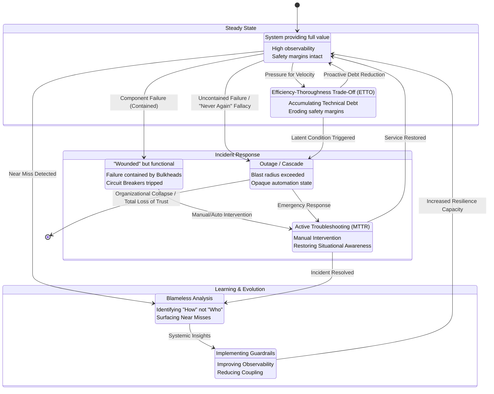

<div class="tab-nav">
<button class="tab-btn active" onclick="openTab(event, 'article')">Article</button>
<button class="tab-btn" onclick="openTab(event, 'gametheory')">Game Theory</button>
<button class="tab-btn" onclick="openTab(event, 'socratic')">Socratic Dialog</button>
<button class="tab-btn" onclick="openTab(event, 'statemachine')">State Machine</button>
<button class="tab-btn" onclick="openTab(event, 'web_research')">Research</button>
</div>

<div id="article" class="tab-content" style="display: block;" markdown="1">

# The Architecture of Resilience: Moving Beyond the 'Never Again' Cycle

In the aftermath of a major failure, the rallying cry is almost always "Never Again." It's a natural human response—a promise to learn from mistakes and ensure that a specific catastrophe is never repeated. Yet, this reactive stance often traps us in a cycle of fighting the last war, patching individual holes while leaving the broader structure vulnerable. 

True resilience requires a fundamental shift in perspective: moving away from a reactive 'Never Again' mentality toward a proactive, systemic approach. By understanding the architecture of resilience, we can design systems that are not merely robust against known threats, but are inherently capable of adapting and thriving amidst the unknown.

## The Fallacy of "Never Again"

When a system fails, the immediate post-mortem often produces a list of specific remediations designed to prevent that exact sequence of events from recurring. While necessary, these narrow mandates create a false sense of security. This is the fallacy of "Never Again": the belief that by plugging every hole we've discovered, we can eventually build a leak-proof vessel.

The problem lies in the focus on specificity over systemic health. A trigger-focused mandate—such as "never allow a database migration to run without a manual check"—addresses a symptom but ignores the underlying fragility. It adds friction without necessarily adding safety. In contrast, systemic improvement focuses on the environment that allowed the error to propagate, such as implementing automated canary analysis or improving circuit-breaking capabilities.

In modern, distributed environments, failure is not a possibility to be avoided; it is a statistical certainty. Complex systems are composed of thousands of moving parts, each with its own failure modes. Attempting to eliminate failure entirely is a pursuit of diminishing returns that often leads to brittle architectures. This distinction maps onto two fundamentally different conceptions of safety: **Safety-I**, which defines safety as the *absence* of failures, and **Safety-II**, which defines it as the *presence* of adaptive capacity. The "Never Again" mentality is a Safety-I strategy applied to a Safety-II world.

True resilience accepts that things will break. Instead of striving for an impossible 100% uptime through rigid prevention, we must design for graceful degradation. This means ensuring that when a component fails, it does so in a way that minimizes impact on the rest of the system. The goal shifts from maximizing the Mean Time Between Failures (MTBF) to minimizing the Mean Time To Recovery (MTTR) and ensuring the system can continue to provide core value even while wounded. Crucially, the "Degraded" state—where a component has failed but safe-to-fail boundaries have contained the blast radius—is not a failure of resilience. It is resilience working as designed.

## Human Error as a System Symptom

When a failure occurs, the easiest target is the person who typed the command or pushed the button. Labeling "human error" as the root cause is a convenient way to close a ticket, but it is a dead end for learning. In a resilient organization, human error is viewed not as a cause, but as a symptom of a system that allowed a single mistake to escalate into a catastrophe.

The shift from "Who did this?" to "How did the system allow this to happen?" is fundamental. If a junior engineer can take down a production database with a single typo, the problem isn't the engineer's lack of focus; it's the lack of guardrails, the absence of peer review, or the fragility of the interface. Investigating the "How" uncovers the latent conditions—the time pressure, the confusing UI, the outdated documentation—that make error inevitable.

This shift requires psychological safety, which should be treated as a technical requirement rather than a soft skill. Without it, the most valuable data points in a system—the "near misses"—remain hidden. A near miss is a failure that was caught just in time; it is a free lesson in systemic vulnerability. If engineers fear retribution, they will hide these close calls, and the organization will lose the opportunity to fix the underlying issue before it becomes a headline-making outage. In game-theoretic terms, the "Blame Game" is a signaling failure: by attributing incidents to individual error, leadership signals that the system is sound and only the person is flawed. This causes engineers to suppress near-miss reports, destroying the very information flow that resilience depends on.

A culture of blamelessness doesn't mean a lack of accountability. It means transitioning from *retributive* accountability—"who is to blame, and what specific bolt can we tighten?"—to *restorative* accountability, which asks how the system can be made more capable of handling the unknown. We demonstrate accountability not by producing a new rule, but by showing the work of learning. By fostering an environment where individuals feel safe to surface vulnerabilities, we turn every employee into a sensor for systemic health, transforming the human element from a liability into the system's most adaptive defense.

## The Irony of Automation

Automation is often seen as the ultimate solution to human error. By removing the human from the loop for routine tasks, we aim to increase consistency and speed. However, this creates a paradox known as the "Irony of Automation." As we automate the easy parts of a job, the remaining tasks—the ones that cannot be easily automated—become significantly more complex and difficult.

When a system is running smoothly under automation, the human operators become monitors rather than active participants. This leads to a gradual erosion of manual skills. When the automation inevitably encounters a scenario it wasn't programmed to handle, the human is suddenly thrust back into the driver's seat. They are expected to diagnose a complex, non-routine failure in a system they haven't actively managed in months, using skills that have grown rusty from disuse.

Furthermore, automation often masks the internal state of the system. When it fails, it doesn't just stop; it often fails in ways that are opaque and difficult to troubleshoot. The operator must first understand what the automation was trying to do, why it failed, and then determine the correct manual intervention—all while under the intense pressure of a production outage. This opacity is a hidden cost that compounds over time: each round of automation-driven "efficiency" makes the eventual manual recovery harder. Instead of eliminating the human element, automation changes the human's role from a direct actor to a high-stakes troubleshooter, often without providing the tools or the ongoing practice necessary to succeed in that role.

To build truly resilient systems, we must design automation that supports human situational awareness rather than replacing it. This means creating "glass box" systems that make their internal logic visible and providing opportunities for operators to practice manual interventions regularly—through game days and chaos engineering exercises—ensuring that when the automation reaches its limits, the human response is ready and capable.

## Architectural Principles: Observability and Technical Debt

Resilience is not a feature that can be bolted on; it must be woven into the architectural fabric of a system. Two pillars of this architectural foundation are observability and the proactive management of technical debt.

Observability is often confused with monitoring, but they are distinct concepts. While monitoring tells you *when* something is wrong (e.g., "CPU usage is at 95%"), observability is the measure of how well you can understand the internal state of a system solely by looking at its external outputs. In a complex, distributed environment, you cannot predict every failure mode. Therefore, you cannot pre-configure dashboards for every possible problem. A truly observable system provides high-cardinality, high-dimensionality data—logs, metrics, and traces—that allow an engineer to ask new questions during an incident and follow the evidence to a root cause they hadn't previously imagined. It is the difference between having a map of known roads and having a GPS that can recalculate a route through uncharted territory.

Observability also serves a strategic function beyond incident response: it is the primary mechanism for reducing information asymmetry between engineering and leadership. When the internal state of a system is visible—when error budget burn rates, circuit breaker trip frequencies, and near-miss rates are surfaced as leading indicators—leadership can no longer claim ignorance of the risks being taken. Observability transforms the invisible costs of technical shortcuts into legible, actionable data.

Technical debt is frequently discussed in terms of "velocity"—the idea that messy code slows down feature development. While true, this perspective misses the more critical impact: technical debt is a primary safety hazard. Every "hack," every bypassed abstraction, and every undocumented dependency creates hidden couplings within the system. These couplings act as conductors for failure, allowing a problem in one seemingly unrelated component to trigger a cascade in another. As debt accumulates, the system becomes increasingly non-linear and unpredictable. What was once a minor bug becomes a catastrophic failure because the mental model of the system no longer matches its reality. Think of technical debt as a "latent fragility" variable that rises with every shortcut taken and falls with every deliberate investment in structural integrity. When this variable crosses a threshold, the system has silently transitioned from a stable operational state into a state of marginal drift—still appearing healthy on the outside, but increasingly vulnerable to any perturbation. Managing technical debt is therefore not just about developer productivity; it is about maintaining the structural integrity and predictability required for a resilient system.

## Safe-to-Fail Boundaries

A resilient architecture must be designed with the assumption that components will fail. The goal is to ensure that these failures are contained within "safe-to-fail" boundaries, preventing a localized issue from cascading into a systemic collapse. This is the principle of compartmentalization, often implemented through patterns like bulkheads, circuit breakers, and cell-based architectures.

Bulkheads, inspired by ship design, involve partitioning a system so that if one section is breached (or fails), the others remain intact. In software, this might mean isolating thread pools for different services or using separate database instances for critical versus non-critical workloads. Without these boundaries, a slow downstream service can consume all available resources in an upstream caller, leading to a resource exhaustion failure that ripples through the entire stack.

Circuit breakers provide a similar protective function by monitoring for failures and "tripping" to stop requests to a failing component. This gives the struggling service time to recover and prevents the calling system from wasting resources on doomed requests. More advanced strategies, such as cell-based architectures, involve dividing the entire infrastructure into independent, identical "cells." A failure in one cell affects only a fraction of the user base, providing a hard boundary that limits the blast radius of any single incident. By intentionally designing these firewalls, we move from a fragile, monolithic failure model to one where the system can gracefully degrade, maintaining core functionality even when parts of it are offline.

The "Degraded" state that these patterns enable is not a failure condition to be minimized—it is a resilience feature to be designed for. A system that can exist in a wounded-but-functional state, delivering core value while a component recovers, is fundamentally more robust than one that treats any partial failure as a total outage. The goal is not to prevent the system from ever entering a degraded state, but to ensure it can enter and exit that state gracefully, without cascading into systemic collapse.

## Quantifying Resilience and Economic Trade-offs

Building a resilient system is not an absolute goal, but an economic one. Every layer of redundancy, every automated test, and every observability tool comes with a cost—both in terms of direct capital and the opportunity cost of delayed features. The challenge for leadership is that while the costs of resilience are immediate and visible, the benefits are often invisible: they are the outages that *didn't* happen.

This asymmetry creates a predictable strategic dynamic. When the costs of safety are visible and the benefits are not, the rational short-term move for leadership is to prioritize velocity. When engineering responds by cutting corners to meet those expectations, both sides settle into what game theory would recognize as a Nash equilibrium: a stable but mutually sub-optimal outcome where neither party can improve their immediate situation by changing strategy alone. This is the "Never Again" cycle in its purest form—not a failure of individual will, but a structural trap created by misaligned incentives and information asymmetry. The organization gets short-term throughput at the cost of long-term fragility, and both sides pay the price when the system eventually fails.

To navigate this, organizations must move beyond lagging indicators like uptime or Mean Time to Recovery (MTTR). While useful for reporting, these metrics only tell you how you failed in the past. True resilience management requires leading indicators—metrics that signal a decline in system health before a failure occurs. These might include the rate of "near misses," the frequency of circuit breaker trips, or the "burn rate" of an error budget. By monitoring how often the system's safety margins are being tested, teams can gain a proactive sense of whether they are drifting toward the edge of failure. These leading indicators also serve as a signaling mechanism: they make the hidden costs of velocity visible to leadership, reducing the information asymmetry that sustains the sub-optimal equilibrium.

This leads to the inherent tension between safety and production: the Efficiency-Thoroughness Trade-Off (ETTO). In a competitive market, there is constant pressure to deliver features faster and at a lower cost. This pressure naturally erodes safety margins—reducing testing time, skipping documentation, or running infrastructure closer to its limits. Resilience is the act of consciously resisting this drift. It requires making the trade-offs explicit: acknowledging that choosing to bypass a safety protocol for a faster release is a form of high-interest debt. Error budgets are one of the most effective tools for this purpose—they give leadership a concrete "speed dial" and engineering a concrete "safety brake," transforming an implicit cultural negotiation into an explicit, measurable agreement. By quantifying these trade-offs through error budgets and health indicators, organizations can transform resilience from a vague aspiration into a measurable, manageable part of the business strategy.

## Organizational Resilience and Conway's Law

The resilience of a technical system is inextricably linked to the structure of the organization that built it. This relationship is famously captured by Conway's Law, which states that "organizations which design systems... are constrained to produce designs which are copies of the communication structures of these organizations." In the context of resilience, this means that if an organization is fragmented, siloed, or plagued by poor communication, its technical architecture will inevitably reflect those same vulnerabilities.

When teams operate in isolation, the boundaries between their services often become the primary points of failure. These "seams" in the architecture are where assumptions are made, where documentation is most likely to be outdated, and where error handling is often the weakest. A resilient system requires seamless coordination across these boundaries, yet Conway's Law suggests that such coordination is impossible if the teams themselves are not integrated. If the network team doesn't talk to the application team, the application will likely lack the necessary logic to handle transient network failures gracefully. Siloed structures also act as a "coordination tax" on cooperative behavior: when teams cannot easily communicate, they default to local optimization—protecting their own metrics—rather than investing in the shared infrastructure of systemic health. This is Conway's Law operating not just as an architectural constraint, but as a game-theoretic one.

To build more resilient systems, organizations must often perform what is known as the "Inverse Conway Maneuver": intentionally evolving their organizational structure to mirror the desired technical architecture. If the goal is a decoupled, cell-based architecture with strong fault isolation, the organization must be structured into small, cross-functional teams with clear ownership and high autonomy. This alignment ensures that the communication paths required for technical resilience are already embedded in the daily interactions of the people building the system. Crucially, when management and engineering share the same KPIs—such as a shared error budget—the game shifts from non-cooperative to cooperative. The payoff matrix changes, and investing in systemic health becomes the rational choice for both sides.

Ultimately, organizational resilience is the foundation upon which technical resilience is built. A culture that values transparency, cross-team collaboration, and shared responsibility for system health will naturally produce architectures that are more robust and adaptable. By recognizing that the "soft" side of the organization—its people and their communication—directly dictates the "hard" reality of its technical failures, leaders can move beyond patching code and start building the human structures necessary for true, systemic resilience.

## Conclusion: The Infinite Game of Resilience

The transition from a "Never Again" mentality to a resilience-oriented architecture represents more than just a change in technical strategy; it is a fundamental shift in how we perceive and interact with complexity. By moving away from the futile pursuit of absolute failure prevention and toward a model of graceful degradation, observability, and systemic learning, we acknowledge the inherent unpredictability of the modern digital landscape.

The "Never Again" mentality is psychologically compelling precisely because it offers closure. It transforms the anxiety of an unpredictable system into the comfort of a specific prohibition. But this comfort is a facade. Every "Never Again" mandate is a Safety-I response to a Safety-II problem: it hardens the system against one known perturbation while increasing the complexity that makes novel failures more likely. It satisfies the need to demonstrate accountability without doing the harder work of building adaptive capacity.

True accountability, in a resilient organization, looks different. It is asynchronous—practitioners are granted tactical autonomy during a crisis, and the work of justification and learning happens afterward, in a blameless post-mortem focused on systemic conditions rather than individual blame. It is proportional—the burden of explanation scales with the blast radius of the decision, not with the outcome. And it is forward-looking—the measure of accountability is not the new rule that was added, but the improvement in the system's capacity to handle the next unknown failure.

Resilience is not a static property that can be achieved and then forgotten. It is a continuous, evolving effort—an "infinite game" where the goal is not to win, but to keep playing. The lifecycle of a resilient system is not a straight line from failure to fix, but a cycle: from stable operation, through the inevitable drift toward efficiency, through incidents that test the boundaries, through recovery and learning, and back to a more capable operational state. Each pass through this cycle, if navigated with honesty and systemic intent, leaves the system stronger than before. As our systems grow more interconnected and our technologies more sophisticated, new failure modes will inevitably emerge. The architecture of resilience provides the framework to meet these challenges, not by predicting every possible catastrophe, but by building the capacity to adapt, recover, and thrive regardless of what the future holds. In the end, the most resilient systems are those that never stop learning from their own fragility.

</div>
<div id="gametheory" class="tab-content" style="display: none;" markdown="1">

# Game Theory Analysis

**Started:** 2026-02-21 22:06:03

## Game Theory Analysis

**Scenario:** The strategic interaction between Management (prioritizing velocity) and Engineering (prioritizing systemic safety) within a complex technical environment. The analysis covers the ETTO trade-off, the 'Blame Game' regarding human error, and the long-term payoffs of investing in observability versus accumulating technical debt.
**Players:** Management (Leadership), Engineering (Operations/Development)

**Game Type:** non-cooperative

## Game Structure Analysis
This analysis explores the strategic tension between Management and Engineering through the lens of game theory, focusing on the trade-offs between short-term velocity and long-term systemic resilience.

---

### 1. Identify the Game Structure

*   **Game Type**: **Non-Cooperative**. While both players technically work for the same organization, their incentive structures (KPIs vs. System Stability) often lead to conflicting strategies. It is a **non-zero-sum game**, as both players can suffer simultaneously (system collapse) or benefit simultaneously (sustainable growth).
*   **Temporal Nature**: **Repeated Game (Infinite Horizon)**. This is not a one-shot interaction. The "Infinite Game of Resilience" implies that choices made in one cycle (sprint/quarter) affect the state of the system and the trust levels in the next.
*   **Information State**: **Imperfect and Asymmetric Information**. 
    *   **Management** has better information regarding market pressures and revenue targets.
    *   **Engineering** has better information regarding the "hidden" state of the system (Technical Debt, latent vulnerabilities).
*   **Asymmetries**: There is a **Power Asymmetry** (Management controls resource allocation and rewards) and a **Knowledge Asymmetry** (Engineering understands the "Irony of Automation" and the fragility of the stack).

---

### 2. Define Strategy Spaces

The strategies are discrete but represent points on the **ETTO (Efficiency-Thoroughness Trade-Off)** continuum.

#### **Management (Leadership) Strategies ($S_M$):**
1.  **Demand Speed (Efficiency)**: Prioritizing immediate feature delivery and MTBF (Mean Time Between Failures) as a metric of success. High pressure on deadlines.
2.  **Support Resilience (Thoroughness)**: Allocating resources for observability, "safe-to-fail" boundaries, and accepting lower short-term velocity for long-term MTTR (Mean Time To Recovery) improvements.

#### **Engineering (Operations/Development) Strategies ($S_E$):**
1.  **Cut Corners (Short-term Velocity)**: Bypassing testing, ignoring "near misses," and accumulating technical debt to meet Management’s speed demands.
2.  **Build Guardrails (Long-term Stability)**: Investing in observability, automated canary analysis, and circuit breakers. This requires "pushing back" on immediate feature requests.

---

### 3. Characterize Payoffs

Payoffs are **non-transferable** and involve a mix of economic value (Management) and psychological safety/operational ease (Engineering).

#### **The Payoff Matrix**

| Management \ Engineering | Cut Corners (Short-term) | Build Guardrails (Long-term) |
| :--- | :--- | :--- |
| **Demand Speed** | **(A) The "Never Again" Cycle** <br> M: +5 (Short-term gain) <br> E: -5 (High stress/Debt) | **(B) Friction & Conflict** <br> M: -2 (Missed deadlines) <br> E: +2 (System pride/Safety) |
| **Support Resilience** | **(C) Wasted Investment** <br> M: -5 (Lost market share) <br> E: +5 (Low effort/Slack) | **(D) Resilient Growth** <br> M: +10 (Stability/Scale) <br> E: +10 (Psychological Safety) |

#### **Key Payoff Features:**
*   **The 'Never Again' Cycle (A)**: This is a **Sub-optimal Nash Equilibrium**. Management demands speed, Engineering cuts corners. When a failure occurs, the "Blame Game" ensues. Management demands a specific fix ("Never Again"), which adds friction but not resilience, leading right back to corner-cutting to overcome that new friction.
*   **The Irony of Automation (Hidden Cost)**: In strategy **(A)**, automation is often used to replace humans. The hidden cost is a massive negative payoff during a "Black Swan" event because the human operators have lost the manual skills to intervene, leading to catastrophic systemic failure.
*   **Resilient Growth (D)**: This is the **Pareto Optimal** outcome, but it is difficult to reach because it requires mutual commitment in an environment of asymmetric information.

---

### 4. Identify Key Features

#### **Conway’s Law as a Structural Constraint**
Non-cooperative strategies often emerge because of **Siloed Organizational Structures**. If Management is structured by "Product" and Engineering by "Component," Conway’s Law dictates that the technical architecture will have "seams" at the boundaries. These seams become the primary points of failure. Without cross-functional coordination, players default to local optimization (their own silo's KPIs) rather than global system health.

#### **Information Asymmetries & Signaling**
*   **Technical Debt as "Dark Matter"**: Engineering knows the debt exists, but Management cannot see it. Engineering must use **Signaling** (e.g., Error Budgets, observability dashboards) to make the invisible costs of "Demand Speed" visible to Management.
*   **The Blame Game**: This is a signaling failure. By blaming "Human Error," Management signals that the system is fine and only the individual is flawed. This causes Engineering to hide "near misses," destroying the information flow required for resilience.

#### **Timing of Moves**
The game is **Simultaneous** in daily operations (Engineering chooses how to code while Management chooses how to pressure), but **Sequential** in policy. Management moves first by setting the "Culture" (Blame vs. Blameless). Engineering then responds by either surfacing vulnerabilities or hiding them.

### Summary of Strategic Dynamics
The interaction is currently trapped in the **"Never Again" Cycle** because the short-term incentives for "Demand Speed" and "Cut Corners" are powerful. To move to the **Resilient Growth** equilibrium, the organization must perform an **Inverse Conway Maneuver**: restructuring teams to mirror the desired resilient architecture, thereby reducing the cost of coordination and making "Support Resilience" the dominant strategy for Management.

## Payoff Matrix
This analysis explores the strategic interaction between **Management** and **Engineering** through a game-theoretic lens, focusing on the tension between short-term delivery and long-term systemic health.

### 1. Game Structure Analysis

*   **Game Type**: Non-cooperative, repeated game. While the players work for the same firm, their incentive structures (KPIs vs. System Stability) often create a non-cooperative dynamic.
*   **Information**: Imperfect and Asymmetric. Engineering has a clearer view of "Technical Debt" (hidden state), while Management has a clearer view of "Market Pressure" (external state).
*   **Timing**: Simultaneous/Continuous. Decisions about cutting corners or demanding speed happen daily, creating a "drift toward failure."
*   **Key Dynamics**:
    *   **The ETTO Trade-off**: Efficiency (Speed) vs. Thoroughness (Safety).
    *   **Conway’s Law**: Siloed organizational structures act as a "coordination tax," making the cooperative (Resilient) strategy harder to achieve.
    *   **The Irony of Automation**: A hidden cost where Engineering's payoff decreases as automation increases if that automation is "opaque," leading to skill atrophy during crises.

---

### 2. The Payoff Matrix

The following matrix represents the payoffs for **(Management, Engineering)** on a scale of **0 to 10**, where 10 is the highest utility.

| Management \ Engineering | **Cut Corners** (Short-term Velocity) | **Build Guardrails** (Long-term Stability) |
| :--- | :--- | :--- |
| **Demand Speed** (Efficiency) | **(2, 2)** <br> *The "Never Again" Cycle* | **(4, 6)** <br> *The Friction Zone* |
| **Support Resilience** (Thoroughness) | **(3, 7)** <br> *The Resource Waste* | **(9, 9)** <br> *Systemic Resilience* |

---

### 3. Outcome Analysis & Explanations

#### A. The "Never Again" Cycle (Demand Speed + Cut Corners)
*   **Outcome**: High initial velocity followed by a catastrophic failure.
*   **Management Payoff (2)**: Gains short-term market share but suffers massive reputational damage and "Blame Game" costs when the system fails.
*   **Engineering Payoff (2)**: High burnout. When the "Irony of Automation" kicks in, they are forced to debug systems they no longer understand under high pressure.
*   **Equilibrium**: This is a **Nash Equilibrium** in low-trust environments. If Engineering believes Management only values speed, they will cut corners to survive performance reviews. If Management believes Engineering is slow, they will demand more speed.

#### B. The Friction Zone (Demand Speed + Build Guardrails)
*   **Outcome**: Constant organizational tension.
*   **Management Payoff (4)**: Frustrated by what they perceive as "over-engineering" or slow feature delivery.
*   **Engineering Payoff (6)**: The system is stable, and on-call is quiet, but they face career risk or "blame" for missing deadlines.
*   **Strategic Note**: Engineering is essentially "subsidizing" the company's safety at the expense of their own standing with Leadership.

#### C. The Resource Waste (Support Resilience + Cut Corners)
*   **Outcome**: Management provides "Error Budgets" and time for refactoring, but Engineering—habituated by Conway's Law or past trauma—continues to push "quick fixes."
*   **Management Payoff (3)**: High opportunity cost. They are paying for thoroughness but receiving technical debt.
*   **Engineering Payoff (7)**: Low stress and high velocity, but they are building a "house of cards" that will eventually collapse.

#### D. Systemic Resilience (Support Resilience + Build Guardrails)
*   **Outcome**: **Pareto Optimal**. High observability, psychological safety, and sustainable velocity.
*   **Management Payoff (9)**: Predictable delivery. MTTR (Mean Time to Recovery) is low because the system is observable.
*   **Engineering Payoff (9)**: High job satisfaction. They use "Glass Box" automation that supports situational awareness rather than replacing it.
*   **Requirement**: Requires an "Inverse Conway Maneuver" to align team structures with technical boundaries, reducing the cost of coordination.

---

### 4. Key Game Theory Features

*   **The "Blame Game" Penalty**: In the (Demand Speed / Cut Corners) quadrant, when a failure occurs, Management often attempts to claw back utility by blaming "Human Error." This shifts the payoff from (2, 2) to (3, 0), further disincentivizing Engineering from honesty in the next round of the game.
*   **Technical Debt as Interest**: In repeated rounds, the payoffs in the "Cut Corners" column decay over time. A (2, 2) in Round 1 becomes a (1, 0) by Round 5 as the system becomes non-linear and unpredictable.
*   **Signaling**: "Observability" acts as a signaling mechanism. It allows Engineering to prove the "internal state" of the system to Management, reducing information asymmetry and making the "Support Resilience" strategy more attractive to Leadership.

## Nash Equilibria Analysis
This analysis explores the strategic interaction between Management and Engineering through the lens of game theory, focusing on the tension between short-term velocity and long-term systemic resilience.

### 1. Identify the Game Structure

*   **Game Type**: **Non-cooperative**. While both players ostensibly work for the same firm, their incentive structures (KPIs vs. System Stability) often diverge, leading to independent decision-making.
*   **Temporal Nature**: **Repeated Game**. This is not a one-shot interaction; it is played daily through every sprint, deployment, and incident post-mortem. The "Never Again" cycle represents the transition between rounds.
*   **Information**: **Asymmetric and Imperfect**. Engineering has "private information" regarding the true state of technical debt and the fragility of the system. Management has "imperfect information" because they often only see lagging indicators (uptime) rather than leading indicators (near misses).
*   **Asymmetries**: There is a **Power Asymmetry**. Management controls the allocation of resources and the "reward" mechanism (promotions/bonuses), while Engineering controls the "implementation" (the actual thoroughness of the work).

---

### 2. Define Strategy Spaces

**Management (Leadership) Strategies:**
*   **Demand Speed (Efficiency)**: Prioritizing feature throughput and market timing. Minimizing "non-functional" requirements.
*   **Support Resilience (Thoroughness)**: Allocating "Error Budgets," investing in observability, and accepting slower velocity in exchange for systemic safety.

**Engineering (Operations/Development) Strategies:**
*   **Cut Corners (Short-term Velocity)**: Bypassing tests, accumulating technical debt, and manual workarounds to meet Management’s deadlines.
*   **Build Guardrails (Long-term Stability)**: Implementing automated canary analysis, circuit breakers, and observability. This requires more time upfront.

---

### 3. Characterize Payoffs

The payoffs are influenced by the **ETTO (Efficiency-Thoroughness Trade-Off)** and the **Irony of Automation**.

| Management \ Engineering | Cut Corners (E1) | Build Guardrails (E2) |
| :--- | :--- | :--- |
| **Demand Speed (M1)** | **(2, 2)**: *The "Never Again" Cycle* | **(1, 0)**: *The Friction Trap* |
| **Support Resilience (M2)** | **(0, 3)**: *The Moral Hazard* | **(4, 4)**: *Systemic Resilience* |

*   **Payoff (M1, E1) - The "Never Again" Cycle**: High short-term velocity but frequent, catastrophic failures. The "Blame Game" ensues, leading to a temporary "Never Again" mandate that adds friction without safety, eventually reverting to this state.
*   **Payoff (M1, E2) - The Friction Trap**: Management is frustrated by "slow" delivery; Engineering is burnt out by building safety that Management doesn't value or fund.
*   **Payoff (M2, E1) - The Moral Hazard**: Management provides space for safety, but Engineering uses it to "hero-code" or deliver features even faster to look good, leaving the system brittle despite the allocated time.
*   **Payoff (M2, E2) - Systemic Resilience**: The optimal long-term state. High observability and MTTR (Mean Time To Recovery) focus. However, the **Irony of Automation** acts as a hidden tax here: as the system becomes more automated, the rare failures that *do* occur are more complex for humans to solve.

---

### 4. Nash Equilibrium Analysis

#### Equilibrium 1: The "Never Again" Cycle (M1, E1)
1.  **Strategy Profile**: Management demands speed; Engineering cuts corners.
2.  **Why it’s a Nash Equilibrium**: 
    *   If Management demands speed, Engineering *must* cut corners to meet expectations and avoid being labeled "unproductive." 
    *   If Engineering is cutting corners, Management *must* demand speed to extract as much value as possible before the inevitable system collapse. Neither can unilaterally change strategy without a loss in the short term.
3.  **Classification**: **Pure Strategy Equilibrium**.
4.  **Stability and Likelihood**: **Highly Stable and Common**. This is the "default" state in many organizations due to **Conway’s Law**. Siloed structures prevent the communication necessary to move to a better state, reinforcing the non-cooperative nature.

#### Equilibrium 2: Systemic Resilience (M2, E2)
1.  **Strategy Profile**: Management supports resilience; Engineering builds guardrails.
2.  **Why it’s a Nash Equilibrium**: 
    *   If Management supports resilience (e.g., via Error Budgets), Engineering is incentivized to build guardrails to protect their own work-life balance and system integrity.
    *   If Engineering builds guardrails, Management sees lower MTTR and more predictable (if slightly slower) delivery, justifying continued support.
3.  **Classification**: **Pure Strategy Equilibrium**.
4.  **Stability and Likelihood**: **Fragile**. This equilibrium is Pareto Superior (both are better off), but it is difficult to maintain. A single "urgent" market demand can shift Management back to M1, or a single high-profile failure can trigger the "Blame Game," collapsing the trust required for M2.

---

### 5. Discussion of Equilibria

*   **Pareto Dominance**: The **Systemic Resilience (M2, E2)** equilibrium Pareto dominates the **"Never Again" Cycle (M1, E1)**. Both players receive higher long-term payoffs. However, the path to (M2, E2) is blocked by the "Stag Hunt" dilemma: if one player tries to be thorough/supportive while the other remains in "speed/corner-cutting" mode, the "cooperative" player is penalized.
*   **Coordination Problems**: The primary barrier to the optimal equilibrium is **Conway's Law**. If the organizational structure is siloed, the "communication paths" required to coordinate on (M2, E2) do not exist. Engineering cannot signal the true cost of technical debt, and Management cannot signal a credible commitment to safety over speed.
*   **The Role of Observability**: Observability acts as a **signaling mechanism**. It reduces information asymmetry, allowing Engineering to prove the value of guardrails and Management to see the "near misses" that were avoided, making the (M2, E2) equilibrium more stable.
*   **Conclusion**: Most organizations are trapped in the **(M1, E1) "Never Again" Cycle** because it is a low-trust, low-information equilibrium that requires no coordination. Moving to **(M2, E2)** requires an "Inverse Conway Maneuver"—restructuring the organization to facilitate the communication and psychological safety necessary to sustain a high-trust, high-resilience game.

## Dominant Strategies Analysis
This analysis explores the strategic tension between Management and Engineering using game theory to understand why organizations often fall into sub-optimal cycles of failure and blame.

---

### 1. Identify the Game Structure

*   **Game Type**: **Non-cooperative**. While both players belong to the same organization, their incentive structures (KPIs vs. System Stability) often diverge, leading to independent decision-making.
*   **Temporal Nature**: **Repeated Game**. This interaction occurs over multiple release cycles. However, it is often played as a series of **one-shot games** due to quarterly pressure, which discourages long-term cooperation.
*   **Information**: **Imperfect and Asymmetric**. Management has better information on market pressures (Speed), while Engineering has better information on the "hidden" state of the system (Technical Debt and Observability).
*   **Asymmetries**: There is a power asymmetry (Management sets the strategy) and a risk asymmetry (Engineering often bears the brunt of the "Blame Game" during failures).

### 2. Define Strategy Spaces

*   **Management (Leadership)**:
    *   *Demand Speed (Efficiency)*: Prioritizing feature delivery and time-to-market.
    *   *Support Resilience (Thoroughness)*: Allocating resources for observability, refactoring, and "safe-to-fail" boundaries.
*   **Engineering (Operations/Development)**:
    *   *Cut Corners (Short-term Velocity)*: Bypassing tests, ignoring technical debt, and manual workarounds to meet deadlines.
    *   *Build Guardrails (Long-term Stability)*: Investing in automation, observability, and architectural decoupling.

### 3. Characterize Payoffs

The payoffs are influenced by the **ETTO (Efficiency-Thoroughness Trade-Off)**.
*   **Management Objective**: Maximize market share and velocity.
*   **Engineering Objective**: Maximize system uptime and minimize "on-call" cognitive load.
*   **Hidden Costs**: The **Irony of Automation** (loss of manual skill) and **Technical Debt** act as negative multipliers that accrue over time, eventually leading to a "Systemic Crash" payoff.

#### Payoff Matrix (Management, Engineering)
| | Engineering: Build Guardrails | Engineering: Cut Corners |
| :--- | :--- | :--- |
| **Management: Support Resilience** | (3, 4) - **Sustainable Growth** | (1, 2) - **Wasteful/Inefficient** |
| **Management: Demand Speed** | (2, 1) - **Friction/Conflict** | (4, 3) - **The "Never Again" Cycle** |

*Note: Higher numbers represent higher utility. (4,3) in the "Never Again" cycle represents high short-term utility but carries a hidden "Black Swan" risk of (-10, -10).*

---

### 4. Dominant and Dominated Strategy Analysis

#### **Management (Leadership)**
1.  **Strictly Dominant Strategy**: **Demand Speed**.
    *   *Reasoning*: In a siloed environment where technical debt is invisible, Management perceives a higher payoff from "Demand Speed" regardless of Engineering's choice. If Engineering builds guardrails, Speed ensures they don't "over-engineer." If Engineering cuts corners, Speed ensures the market window isn't missed.
2.  **Dominated Strategy**: **Support Resilience** (in the short-term).
    *   *Reasoning*: Without clear observability metrics (leading indicators), supporting resilience looks like "doing nothing" or "slowing down" to a non-technical stakeholder.

#### **Engineering (Operations/Development)**
1.  **Weakly Dominant Strategy**: **Cut Corners**.
    *   *Reasoning*: If Management demands speed, Engineering *must* cut corners to survive performance reviews and avoid conflict. If Management supports resilience, Engineering *could* build guardrails, but the "Irony of Automation" suggests that as the system becomes more automated, the difficulty of maintaining those guardrails increases, making "Cutting Corners" the path of least resistance.
2.  **Dominated Strategy**: **Build Guardrails (in a "Demand Speed" environment)**.
    *   *Reasoning*: Attempting to build thorough guardrails while being pressured for speed leads to burnout, missed deadlines, and being targeted in the "Blame Game."

---

### 5. Strategic Implications

#### **The Nash Equilibrium: The "Never Again" Cycle**
The game naturally settles at **(Demand Speed, Cut Corners)**. This is a Nash Equilibrium because neither player can improve their immediate situation by unilaterally changing their strategy.
*   Management gets their features.
*   Engineering meets their deadlines.
*   **The Trap**: This equilibrium is **Pareto Inefficient**. Both players would be better off at **(Support Resilience, Build Guardrails)**, but they cannot reach it because they don't trust the other to move first.

#### **Conway’s Law and Non-Cooperation**
Siloed organizational structures (Conway's Law) reinforce this non-cooperative behavior. When the "Network Team" and "App Team" don't communicate, the "seams" between their services become points of failure. This lack of communication ensures that information remains asymmetric, preventing the coordination needed to invest in systemic resilience.

#### **The "Never Again" Sub-optimal Equilibrium**
When the (Speed, Corners) strategy inevitably leads to a crash, the organization enters the **"Never Again" cycle**.
1.  **Failure occurs**: The "Blame Game" begins.
2.  **Reactive Patching**: Management demands a specific fix (e.g., "No more database migrations without a VP signature").
3.  **Increased Friction**: This adds "Thoroughness" without "Resilience," lowering the payoff for both.
4.  **Drift back to Speed**: Because the reactive patch is inefficient, the organization eventually abandons it to regain velocity, returning to the original (Speed, Corners) equilibrium.

#### **Breaking the Cycle**
To move toward the **Sustainable Growth (3, 4)** quadrant, the organization must:
*   **Make Technical Debt Visible**: Use observability to turn "hidden" information into "perfect" information.
*   **The Inverse Conway Maneuver**: Restructure teams to mirror the desired resilient architecture, reducing the cost of coordination.
*   **Psychological Safety as a Strategic Commitment**: Management must signal a commitment to "Blame-Free" post-mortems to encourage Engineering to surface "near misses," effectively changing the payoff of "Build Guardrails" from a cost to a shared benefit.

## Pareto Optimality Analysis
This analysis explores the strategic interaction between **Management** and **Engineering** using game theory to understand why organizations often fall into sub-optimal cycles of failure and how they can transition to systemic resilience.

---

### 1. Game Structure Analysis

*   **Game Type**: Non-cooperative, repeated game. While the players work for the same firm, their incentive structures (Velocity vs. Stability) often create a non-cooperative dynamic.
*   **Information**: Imperfect and Asymmetric. Engineering has better information regarding the "hidden" state of the system (Technical Debt), while Management has better information regarding market pressures and funding.
*   **Timing**: Simultaneous (in a daily operational sense) but with sequential feedback loops (incidents).
*   **Asymmetries**: Management controls the "Incentive Landscape" (promotions, budgets), while Engineering controls the "Technical Reality" (implementation, shortcuts).

#### The Payoff Matrix
*Values represent qualitative utility (1 = Lowest, 4 = Highest).*

| Management \ Engineering | Cut Corners (C) | Build Guardrails (G) |
| :--- | :--- | :--- |
| **Demand Speed (S)** | (2, 2) - *The "Never Again" Cycle* | (1, 1) - *Friction & Burnout* |
| **Support Resilience (R)** | (1, 4) - *The "Easy Life" (Moral Hazard)* | (4, 3) - *Architecture of Resilience* |

---

### 2. Nash Equilibrium Identification

The **Nash Equilibrium** in this game is typically **(Demand Speed, Cut Corners)**.

*   **Management's Logic**: If Engineering cuts corners, Management must demand speed to get any market value before the system inevitably degrades. If Engineering builds guardrails, Management is tempted to demand speed to "exploit" the stability for faster releases.
*   **Engineering's Logic**: If Management demands speed, Engineering *must* cut corners to meet deadlines and avoid reprimand. If Management supports resilience, Engineering might still cut corners to reduce their own cognitive load or "velocity" pressure (unless high trust exists).
*   **The Result**: Both players settle on a strategy that prioritizes short-term throughput. This is the **"Never Again" Cycle**: a sub-optimal equilibrium where failures occur, "Never Again" is shouted, but the underlying incentives to cut corners and demand speed remain unchanged.

---

### 3. Pareto Optimality Analysis

#### 1. Identification of Pareto Optimal Outcomes
An outcome is Pareto optimal if no player can be made better off without making the other worse off.
*   **Outcome (Support Resilience, Build Guardrails)**: **Pareto Optimal.** Management achieves long-term stability and predictable velocity (4); Engineering achieves professional pride and systemic safety (3).
*   **Outcome (Support Resilience, Cut Corners)**: **Pareto Optimal.** Engineering achieves maximum utility (4) by having no pressure and doing the "easy" work, even though Management’s utility is low (1).

#### 2. Comparison: Pareto Optimal vs. Nash Equilibrium
The Nash Equilibrium **(Demand Speed, Cut Corners)** is **not Pareto optimal**. Both players would be better off moving to **(Support Resilience, Build Guardrails)**. In the Nash state, the "Irony of Automation" and "Technical Debt" act as hidden taxes that lower the payoffs for both over time.

#### 3. Pareto Improvements
A move from **(S, C)** to **(R, G)** is a **Pareto Improvement**. 
*   Management moves from a utility of 2 (constant firefighting) to 4 (strategic growth).
*   Engineering moves from a utility of 2 (stress/blame) to 3 (sustainable mastery).

#### 4. Efficiency vs. Equilibrium Trade-offs
The "Efficiency-Thoroughness Trade-Off" (ETTO) explains why the Pareto improvement is hard to sustain. While **(R, G)** is more *efficient* for the organization long-term, the *equilibrium* pressure constantly pulls players toward **(S, C)**. 
*   **The Drift**: In a competitive market, Management feels that "Thoroughness" is a luxury. They move toward "Efficiency" (Speed). 
*   **The Reaction**: Engineering senses the shift in incentives and moves from "Guardrails" to "Cutting Corners" to survive the performance review cycle.

---

### 4. Opportunities for Cooperation & Coordination

To move from the sub-optimal Nash Equilibrium to the Pareto optimal "Architecture of Resilience," the following game-theoretic interventions are required:

#### A. Solving Conway’s Law (Structural Coordination)
Non-cooperative strategies often emerge because siloed structures prevent players from seeing the shared payoff. 
*   **The Inverse Conway Maneuver**: By restructuring into cross-functional teams where Management and Engineering share the *same* KPI (e.g., an Error Budget), the game shifts from non-cooperative to **cooperative**. The payoff matrix merges.

#### B. Signaling and Commitment (Observability)
Information asymmetry allows Engineering to hide technical debt and Management to hide the true cost of speed.
*   **Observability as a Signaling Mechanism**: High observability makes the "hidden" state of the system visible to Management. This acts as a **commitment device**: Management cannot claim ignorance of the risks of demanding more speed, and Engineering cannot hide the shortcuts they take.

#### C. Eliminating the "Blame Game" (Psychological Safety)
The "Blame Game" is a penalty that Engineering faces in the event of failure. If the penalty for failure is high, Engineering will hide "near misses."
*   **Blameless Culture**: By removing the individual penalty for "human error," the organization encourages Engineering to reveal systemic vulnerabilities. This transforms the game from a one-shot "avoid punishment" game into a repeated "learning" game, increasing the long-term payoffs for both.

#### D. Addressing the Irony of Automation
To prevent the Pareto optimal state from degrading, automation must be a "glass box." If automation is used merely to "Demand Speed," it creates a hidden cost (skill atrophy). Coordination must ensure that automation is designed to **support human situational awareness**, keeping the Engineering payoff (3) stable even as the system grows in complexity.

## Repeated Game Analysis
This analysis examines the strategic interaction between **Management** and **Engineering** as a finite, repeated game (T=5). We explore how the tension between short-term velocity and long-term systemic health evolves when players must account for future consequences.

---

### 1. The Payoff Matrix (One-Shot Game)

To analyze the repeated game, we first define the payoffs for a single iteration. We incorporate the **Irony of Automation** and **Technical Debt** as hidden costs that manifest in the payoffs.

| Management \ Engineering | Build Guardrails (Cooperate) | Cut Corners (Defect) |
| :--- | :--- | :--- |
| **Support Resilience (Cooperate)** | (4, 4) - *Sustainable Growth* | (1, 5) - *The "Sucker" Payoff* |
| **Demand Speed (Defect)** | (5, 1) - *Exploitative Velocity* | (2, 2) - *The "Never Again" Cycle* |

*   **The (2, 2) Equilibrium**: This represents the "Never Again" cycle. Management demands speed, Engineering cuts corners, a failure occurs, and both spend the next round in a low-utility state of reactive patching and blame.
*   **The Irony of Automation**: Hidden in the (5, 1) and (2, 2) outcomes is a compounding penalty. Each time corners are cut, the complexity of the "Irony of Automation" increases, making future recovery harder.

---

### 2. Repeated Game Analysis (T = 5)

#### A. Finite Horizon and Backward Induction
In a strictly rational, finite game of 5 rounds, **Selten’s Theorem** suggests that cooperation should collapse. 
*   **Round 5**: Since there is no Round 6, both players have a dominant strategy to defect (Demand Speed / Cut Corners) to maximize their final payoff.
*   **Round 4**: Knowing that both will defect in Round 5 regardless of what happens now, there is no incentive to cooperate in Round 4.
*   **Rounds 1-3**: This logic cascades backward to the first round.

**However**, in complex technical systems, the "Never Again" cycle acts as a **stochastic penalty**. If players defect in Round 1, the system might crash in Round 2, ending the game early or imposing a massive negative payoff (-10). This risk often sustains cooperation even in finite horizons.

#### B. Trigger Strategies (Enforcing the "Resilience" Equilibrium)
To sustain the (4, 4) outcome, players can employ trigger strategies:
*   **Grim Trigger**: If Engineering cuts corners once, Management moves to "Demand Speed" (micromanagement) for all remaining rounds.
*   **Tit-for-Tat**: Management supports resilience in Round 1. In subsequent rounds, they mimic Engineering’s previous choice. This is highly effective in technical environments as it signals that "Safety is a shared responsibility."

#### C. The Folk Theorem (Abridged for Finite Games)
While the formal Folk Theorem applies to infinite games, in a 5-round game, any average payoff between the minimax value (2) and the Pareto optimal value (4) can be sustained if the **Discount Factor ($\delta$)** is high enough.
*   If Management values Round 5 results (e.g., an IPO or major release) as much as Round 1, they are more likely to "Support Resilience" early to ensure the system survives to the end.

---

### 3. Key Strategic Features

#### Reputation Effects
In a 5-round game, **Reputation** is the primary currency.
*   **Engineering's Reputation**: If Engineering builds guardrails in Rounds 1 and 2, they signal "Systemic Competence." Management is then more likely to grant them autonomy (Support Resilience) in Round 3.
*   **Management's Reputation**: If Management supports resilience even after a minor "near miss," they build **Psychological Safety**. This encourages Engineering to surface "near misses" (as discussed in the context), preventing a catastrophic (2, 2) crash in later rounds.

#### Information Asymmetry & Conway’s Law
**Conway’s Law** suggests that siloed structures (Non-cooperative) emerge because communication is expensive. 
*   **The Information Gap**: Engineering knows the "Technical Debt" level, but Management only sees "Velocity." 
*   **Strategic Signaling**: Engineering must use **Observability** as a signaling mechanism. By making the system's internal state visible, they reduce Management's uncertainty, making the "Support Resilience" strategy less risky for Leadership.

#### The Discount Factor ($\delta$)
*   **Low $\delta$ (Short-termism)**: If Management is incentivized by quarterly bonuses (Round-by-Round), they will "Demand Speed," forcing the game into the "Never Again" cycle.
*   **High $\delta$ (Long-termism)**: If the organization prioritizes MTTR (Mean Time to Recovery) and systemic health, the value of future rounds stays high, making (4, 4) the rational choice.

---

### 4. Strategy Recommendations for the 5-Round Game

| Round | Management Strategy | Engineering Strategy | Goal |
| :--- | :--- | :--- | :--- |
| **1-2** | **Support Resilience** | **Build Guardrails** | **Reputation Building**: Establish a "Blameless Culture" and "Observability." |
| **3** | **Trust but Verify** | **Signal Health** | **Maintain Equilibrium**: Use error budgets to quantify the ETTO trade-off. |
| **4** | **Resist the "Drift"** | **Patch Debt** | **Pre-empt End-game**: Avoid the "Drift toward failure" as the horizon nears. |
| **5** | **Strategic Speed** | **Controlled Velocity** | **The Harvest**: Utilize the guardrails built in R1-3 to push speed safely. |

### Summary of the Equilibrium
The optimal path is **Conditional Cooperation**. If both players recognize that the "Irony of Automation" makes the "Never Again" cycle (2, 2) increasingly painful over time, they will coordinate on the **Resilience Architecture**. 

However, if **Conway's Law** keeps them siloed, they will fail to communicate their payoffs, leading to a **Nash Equilibrium of Mutual Defection**, where the organization spends all 5 rounds fighting the "last war" while accumulating terminal technical debt.

## Strategic Recommendations
This strategic analysis examines the interaction between **Management** and **Engineering** through the lens of game theory, specifically focusing on the Efficiency-Thoroughness Trade-Off (ETTO) and the "Never Again" cycle.

---

### 1. Strategic Recommendations for Management (Leadership)

**Optimal Strategy: Support Resilience (Thoroughness)**
Management should prioritize systemic safety over raw velocity. While "Demand Speed" offers immediate market gains, the "Irony of Automation" and accumulated technical debt create a "fragility tax" that eventually leads to catastrophic failure. Supporting resilience transforms the game from a zero-sum struggle for time into a cooperative effort to expand the system's capacity.

**Contingent Strategies**
*   **If Engineering Cuts Corners:** Do not reward the resulting speed. Instead, implement **Error Budgets**. If the budget is exhausted due to instability, Management must automatically pivot to "Support Resilience," halting new features until stability is restored.
*   **If Engineering Builds Guardrails:** Protect them from external "speed" pressures. Use this stability to take calculated market risks that competitors with brittle systems cannot afford.

**Risk Assessment**
*   **Opportunity Cost:** Short-term market windows may be missed while building guardrails.
*   **Adverse Selection:** High-performing "feature-factory" developers might leave for organizations that reward raw output over systemic health.

**Coordination Opportunities**
*   **The Inverse Conway Maneuver:** Reorganize teams to mirror the desired resilient architecture (e.g., cross-functional cells) to reduce the communication overhead that leads to non-cooperative behavior.

**Information Considerations**
*   **Demand Observability, Not Just Monitoring:** Move from "Is it up?" (binary) to "How do we know it’s healthy?" (probabilistic). This reduces information asymmetry regarding technical debt.

---

### 2. Strategic Recommendations for Engineering (Operations/Development)

**Optimal Strategy: Build Guardrails (Long-term Stability)**
Engineering must resist the urge to "Cut Corners" even under pressure. Cutting corners creates a "Blame Game" equilibrium where Engineering is held responsible for failures caused by the very speed Management demanded. Building guardrails (automated testing, canary deployments, observability) is the only way to survive the "Irony of Automation."

**Contingent Strategies**
*   **If Management Demands Speed:** Do not simply refuse. Use **Signaling**. Provide a "Menu of Costs" that explicitly links speed to the accumulation of technical debt and the increased probability of a "Never Again" cycle.
*   **If Management Supports Resilience:** Invest heavily in **Observability**. Use the breathing room to make the system’s internal state transparent, proving the value of the investment.

**Risk Assessment**
*   **The "Slow" Label:** Engineering risks being perceived as a bottleneck if they cannot effectively communicate the "invisible" benefits of resilience (the outages that didn't happen).

**Coordination Opportunities**
*   **Blameless Post-Mortems:** Use these as a platform to move the narrative from "Human Error" (individual) to "Systemic Vulnerability" (collective), forcing a cooperative look at the payoff matrix.

**Information Considerations**
*   **Surface "Near Misses":** Treat near misses as free data points. Revealing these to Management changes their perception of risk, making "Support Resilience" look like the more rational choice.

---

### 3. Overall Strategic Insights

*   **The "Never Again" Trap:** This is a sub-optimal Nash Equilibrium. By focusing on specific triggers rather than systemic health, both players invest in "Safety Theater" that adds friction without reducing the probability of the next (different) failure.
*   **The Irony of Automation as a Hidden Cost:** Automation often moves the "Human Error" risk to a higher-stakes, more complex tier. If players don't account for the erosion of manual skills, they overvalue the "Speed" strategy.
*   **Conway’s Law as a Game Constraint:** Siloed structures naturally produce non-cooperative games. If the Network team and App team don't talk, they will play "Defend My Silo," leading to brittle interfaces.

---

### 4. Potential Pitfalls to Avoid

*   **Rewarding "Firefighting":** If Management rewards the heroics of fixing an outage but ignores the work of preventing one, they incentivize Engineering to allow systems to remain fragile.
*   **The Blame Game:** Labeling "Human Error" as a root cause stops the game's learning cycle. It ensures that the latent conditions (time pressure, poor UI) remain in the system to cause the next failure.
*   **Ignoring the ETTO:** Pretending that you can have 100% Thoroughness and 100% Efficiency is a "Cheap Talk" strategy that leads to resentment and burnout.

---

### 5. Implementation Guidance: Moving to a Cooperative Equilibrium

1.  **Establish Error Budgets:** This quantifies the ETTO. It gives Management a "speed dial" and Engineering a "safety brake," making the trade-offs explicit and measurable.
2.  **Invest in "Glass Box" Automation:** Ensure that as tasks are automated, the logic remains visible and operators have "practice modes" to maintain manual skills, mitigating the Irony of Automation.
3.  **Adopt the "How," Not "Who" Protocol:** In every failure analysis, forbid the mention of individual names for the first 30 minutes. Focus entirely on the systemic conditions (the "How") that allowed the error to propagate.
4.  **Quantify Technical Debt:** Treat debt as a high-interest loan. Use observability data to show how much "interest" (time spent on unplanned work) is being paid weekly. This makes the "Build Guardrails" strategy economically defensible to Leadership.

## Game Theory Analysis Summary
GameAnalysis(game_type=Non-Zero-Sum Coordination Game (Stag Hunt variant), Infinite Game, players=[Leadership / Management, Engineering / Operations], strategies={Leadership / Management=[Push for Velocity (Reactive), Invest in Resilience (Proactive)], Engineering / Operations=[Tactical Execution (Reactive), Systemic Stewardship (Proactive)]}, payoff_matrix=Mutual Proactivity (Resilience) results in high long-term stability and sustainable growth. Mutual Reactivity (Fragility Trap) results in high short-term velocity but catastrophic Black Swan losses. Mismatched strategies result in high friction, burnout, or wasted capital., nash_equilibria=[The Fragility Trap (Reactive, Reactive), The Resilience Equilibrium (Proactive, Proactive)], dominant_strategies={Leadership / Management=Push for Velocity (in blame-heavy or high-pressure market cultures), Engineering / Operations=Hide Errors / Tactical Execution (in blame-heavy or high-pressure market cultures)}, pareto_optimal_outcomes=[The (Proactive, Proactive) State], recommendations={Leadership / Management=Change metrics to leading indicators (near-miss reporting), structure teams via Inverse Conway Maneuver, and subsidize psychological safety., Engineering / Operations=Quantify technical debt as safety hazards, build observable 'glass box' automation, and compartmentalize systems with bulkheads.})


---
**Analysis completed in 157s**
**Finished:** 2026-02-21 22:08:41


</div>
<div id="socratic" class="tab-content" style="display: none;" markdown="1">

# Socratic Dialogue Transcript

**Initial Question:** Does the 'Never Again' mentality actually increase system safety, or does it merely create a facade of robustness while masking underlying fragility?

**Domain Constraints:** Systems Architecture, Resilience Engineering, Organizational Psychology, Software Engineering

**Started:** 2026-02-21 22:06:04

---

## Exchange 1

**Question:** Does the 'Never Again' mentality actually increase system safety, or does it merely create a facade of robustness while masking underlying fragility?

**Response:** To address whether the "Never Again" mentality increases safety or masks fragility, we must first distinguish between two different conceptualizations of safety: **Safety-I** (the absence of failures) and **Safety-II** (the presence of adaptive capacity).

My initial assessment is that the "Never Again" mentality is a double-edged sword: it effectively hardens a system against **specific, known failure modes**, but it frequently degrades **systemic resilience** by increasing complexity and procedural rigidity.

Here is a breakdown of my reasoning across the requested domains:

### 1. The Trap of Local Optimization (Systems Architecture)
In systems architecture, "Never Again" usually manifests as a new constraint, a new validation layer, or a specific patch designed to block a previously exploited path. 
*   **The Benefit:** It increases **robustness**. The system is now demonstrably immune to *that specific perturbation*.
*   **The Risk:** It creates a "kludge." As we stack "Never Again" solutions, the system’s state space becomes increasingly convoluted. We often introduce "tight coupling"—where a fix in one component creates an opaque dependency in another. According to Charles Perrow’s *Normal Accident Theory*, increased complexity and tight coupling are the primary precursors to catastrophic systemic failure. By fixing the last war, we often build the infrastructure for the next one.

### 2. The Hindsight Bias and Root Cause Fallacy (Resilience Engineering)
Resilience engineering suggests that "Root Cause Analysis" (RCA)—the engine of the "Never Again" mindset—is often a retrospective illusion. 
*   **The Facade:** When we claim to have found "the" root cause, we satisfy a psychological need for closure. We create a facade of control.
*   **The Reality:** In complex socio-technical systems, failures are usually **emergent**. They result from the unexpected alignment of multiple small fluctuations, none of which are "failures" in isolation. By focusing on "Never Again" for a specific event, we ignore the "drift into failure" (as Sidney Dekker puts it)—the slow erosion of safety margins that occurs during normal, successful operations.

### 3. The Compliance vs. Competence Dilemma (Organizational Psychology)
"Never Again" often results in more rules, checklists, and oversight.
*   **The Facade:** Management sees a 100% compliance rate with the new safety protocols and assumes the system is safe.
*   **The Fragility:** This creates "Functional Rigidity." When operators are forced to follow strict scripts born of past failures, they lose the cognitive flexibility required to handle **novel** situations. If the "Never Again" protocol doesn't cover the current anomaly, the operator may be less equipped to improvise because their agency has been replaced by a checklist. We trade *expertise* for *adherence*.

### 4. Technical Debt and the "Safety Tax" (Software Engineering)
In software, "Never Again" often leads to "defensive coding" and "over-engineering."
*   **The Fragility:** Every "Never Again" check is a line of code that must be maintained. Over time, the "Safety Tax" becomes so high that the system becomes impossible to change or reason about. A system that is too scary to change is the definition of fragile; it cannot evolve to meet new environmental demands.

### Preliminary Conclusion
The "Never Again" mentality provides a **facade of robustness** because it is highly visible and measurable. It allows leadership to say, "We have taken action." However, it often masks **underlying fragility** by:
1.  Increasing systemic complexity.
2.  Consuming the "margin of maneuver" (resources/time) that could be used for proactive monitoring.
3.  Suppressing the adaptive capacity of the human operators at the "sharp end."

**A Socratic Pivot:**
If we accept that "Never Again" might be counterproductive, we face a difficult ethical and practical question: *How does an organization demonstrate accountability for a failure without resorting to the rigid constraints that "Never Again" demands?* 

If we don't say "Never Again," what do we say to the stakeholders who suffered from the failure?

**Next Question:** If we prioritize the "margin of maneuver" over the implementation of specific safeguards, at what point does the refusal to harden a system against a known failure mode transition from a strategy of resilience into an act of negligence?

## Exchange 2

**Question:** If we prioritize the "margin of maneuver" over the implementation of specific safeguards, at what point does the refusal to harden a system against a known failure mode transition from a strategy of resilience into an act of negligence?

**Response:** To answer the question of how an organization demonstrates accountability without the rigid constraints of "Never Again," we must first interrogate our definition of **accountability**.

In most traditional structures, accountability is synonymous with **retribution** or **remediation of the specific**. It is backward-looking: "Who is to blame, and what specific bolt can we tighten so this exact failure doesn't repeat?" 

To move beyond "Never Again" while maintaining ethical and professional integrity, we must transition toward **Restorative Accountability**. This approach shifts the focus from the *failure* to the *systemic conditions* that made the failure possible, and from *constraints* to *capabilities*.

Here is how we advance the dialogue across our four domains:

### 1. From "Root Cause" to "Systemic Transparency" (Resilience Engineering)
When stakeholders demand accountability, they are often asking for a guarantee of future safety. The "Never Again" lie provides a false guarantee. A more honest form of accountability is **Systemic Transparency**.
*   **The Shift:** Instead of producing a report that identifies a single point of failure, the organization produces a "Learning Report." This document maps the "Performance Variability" that exists in the system every day.
*   **The Message to Stakeholders:** "We cannot promise this specific alignment of stars will never occur again, but we can demonstrate that we now have a deeper understanding of the pressures (time, budget, technical debt) that forced our operators to work at the edge of the safety envelope."

### 2. From "Hardening" to "Observability" (Systems Architecture)
In architecture, accountability is often demonstrated by adding a firewall or a validation gate. However, if we prioritize the margin of maneuver, our accountability lies in **Observability and Controllability**.
*   **The Shift:** Instead of saying "We have blocked Path X," the architect says, "We have instrumented the system so that if the system drifts toward Path X, we will see it in real-time and have the controls to intervene."
*   **The Reasoning:** Accountability here is defined as the **shortening of the feedback loop**. We admit the system is complex and unpredictable, but we take responsibility for our ability to *sense* its state.

### 3. From "Compliance" to "Just Culture" (Organizational Psychology)
The "Never Again" mindset often leads to "blaming the human" (the pilot, the surgeon, the dev). Accountability in a resilience-oriented organization is found in the **Just Culture** framework.
*   **The Shift:** Accountability is not "Who did it?" but "How did it make sense for the person to do what they did at the time?" 
*   **The Message to Stakeholders:** "We are holding ourselves accountable by changing the environment that led to this decision, rather than just punishing the individual. We are investing in the expertise of our people so they can navigate future, unforeseen crises." This demonstrates a commitment to the *human* element of the system as a source of safety, not a source of error.

### 4. From MTBF to MTTR (Software Engineering)
In software, "Never Again" focuses on **Mean Time Between Failures (MTBF)**—an attempt to make the system "perfect." A more resilient form of accountability focuses on **Mean Time to Recovery (MTTR)**.
*   **The Shift:** We demonstrate accountability by showing stakeholders our "Recovery Drills." We show that we have invested in automated rollbacks, feature flags, and chaos engineering.
*   **The Reasoning:** We are telling stakeholders: "We value your uptime more than our ego. We accept that failures will happen, and our accountability is proven by how quickly and gracefully we can return to a functional state."

### The Ethical Pivot: What do we say to the victims?
If we don't say "Never Again," what do we say to those who suffered? 

We say: **"We are using your experience to increase our capacity to handle the unknown."**

"Never Again" is a promise to fix the past. **Resilience** is a promise to be better prepared for the future. The former is a static response to a dynamic world; the latter is an active, ongoing commitment. We demonstrate accountability by showing the *work* of learning, rather than the *artifact* of a new rule.

***

**A Socratic Pivot:**
If we replace "Never Again" (Retributive Accountability) with "Learning and Adaptation" (Restorative Accountability), we encounter a new tension: 

*At what point does "learning" become an excuse for a lack of discipline? If we prioritize the "margin of maneuver" and "adaptive capacity," how do we distinguish between a "noble failure" in a complex system and a failure caused by genuine, avoidable laziness or a disregard for established best practices?* 

**How do we define the boundary between "Systemic Complexity" and "Professional Malpractice"?**

**Next Question:** If we grant practitioners the "margin of maneuver" to deviate from standard protocols to navigate complexity, by what principle can we distinguish "malpractice" from "resilient adaptation" without relying on the hindsight of the outcome?

## Exchange 3

**Question:** If we grant practitioners the "margin of maneuver" to deviate from standard protocols to navigate complexity, by what principle can we distinguish "malpractice" from "resilient adaptation" without relying on the hindsight of the outcome?

**Response:** To distinguish between **resilient adaptation** and **professional malpractice** without the benefit of hindsight, we must move the focus away from the *action* itself and toward the **quality of the deliberation** that preceded it.

In a complex system, the "right" move is often only visible in the rearview mirror. Therefore, the boundary between a noble failure and malpractice is not found in the deviation from a rule, but in the **abandonment of the professional standard of care.**

Here is how we define that boundary across our four domains:

### 1. The "Substitution Test" (Organizational Psychology)
The most robust tool for distinguishing malpractice from systemic pressure is the **Substitution Test**, pioneered by James Reason. 
*   **The Principle:** We ask: "Given the same context, the same information, and the same pressures, would a peer with similar qualifications have made the same choice?"
*   **The Boundary:** If the answer is "Yes," we are looking at a systemic issue (Resilient Adaptation or Systemic Complexity). If the answer is "No—a peer would have recognized this as an unjustifiable risk," we are moving toward Malpractice. 
*   **The Nuance:** This test forces us to look at **Local Rationality**. We must understand why the practitioner’s choice made sense to them at the time, rather than judging it based on what we know now.

### 2. The Abandonment of "Active Sense-making" (Resilience Engineering)
In resilience engineering, we grant the "margin of maneuver" because we trust the practitioner to be the best "sensor" of the system's state. 
*   **The Principle:** Resilient adaptation is characterized by **Active Sense-making**—the practitioner is consciously weighing the trade-offs (e.g., "I am bypassing this safety check because the delay itself creates a greater risk of system collapse").
*   **The Boundary:** Malpractice is the **absence of trade-off recognition**. It is "mindless" deviation. If a practitioner deviates from protocol not to manage a competing risk, but out of habit, boredom, or a desire to finish a shift early, they have abandoned their role as a resilient agent. They are no longer "maneuvering"; they are drifting.

### 3. The "Standard of Care" vs. "Standard of Procedure" (Software Engineering)
In software, we often confuse *compliance* (following the ticket) with *rigor* (engineering excellence).
*   **The Principle:** A "Standard of Care" involves the use of established meta-practices: peer review, testing, observability, and incremental rollout. 
*   **The Boundary:** If a developer bypasses a CI/CD pipeline to hotfix a production outage, that is a **resilient adaptation** (prioritizing MTTR over process). However, if a developer pushes unreviewed, untested code to production because they "didn't feel like" writing tests, that is **malpractice**. 
*   **The Distinction:** The former is a *strategic* sacrifice of one value (rigor) for another (availability). The latter is a *negligent* sacrifice of value for no systemic gain.

### 4. Intentionality and the "Feedback Loop" (Systems Architecture)
From an architectural perspective, the greatest sin is not making a mistake, but **blinding the system to its own state.**
*   **The Principle:** Architects must ensure the system remains "controllable." 
*   **The Boundary:** A practitioner who deviates from the architecture but **increases monitoring** to watch for side effects is practicing resilient adaptation. A practitioner who deviates and **suppresses or ignores warnings** to hide the deviation is committing malpractice.
*   **The Reasoning:** Malpractice in systems architecture is the intentional creation of "dark debt"—risks that are not only taken but are actively obscured from the rest of the organization.

---

### The Synthesis: Defining the "Professional Standard"
We can define the boundary using three criteria that must be present for an act to be considered **Resilient Adaptation** rather than **Malpractice**:

1.  **Local Rationality:** The practitioner can articulate a competing pressure (time, safety, resources) that made the deviation necessary.
2.  **Transparency:** The deviation was not hidden. Even if it wasn't "approved" in advance, it was performed in a way that left a trail for the system to learn.
3.  **Meta-Rigor:** While a specific *rule* was broken, the *professional standard of care* (checking work, seeking input, monitoring results) was maintained or even heightened.

**The Socratic Pivot:**
If we accept that "Malpractice" is the abandonment of the deliberative process, we place a heavy burden on the **Community of Practice**. It implies that only peers—not managers or lawyers—can truly judge whether a deviation was "noble" or "negligent."

*Does this shift of judgment power to the "Community of Practice" create a risk of professional protectionism? If the experts are the only ones who can judge the experts, how does the organization prevent the "Standard of Care" from slowly eroding into a "Standard of Convenience" through collective normalization of deviance?*

**How do we keep the "Community of Practice" honest?**

**Next Question:** If the "Standard of Care" is defined by what a peer would do under the same pressures, by what principle can we distinguish a "resilient adaptation" from a "Standard of Survival" where the entire Community of Practice has collectively lowered its threshold for risk to meet impossible systemic demands?

## Exchange 4

**Question:** If the "Standard of Care" is defined by what a peer would do under the same pressures, by what principle can we distinguish a "resilient adaptation" from a "Standard of Survival" where the entire Community of Practice has collectively lowered its threshold for risk to meet impossible systemic demands?

**Response:** To prevent a Community of Practice (CoP) from devolving into a self-protecting guild that normalizes deviance, we must introduce **external anchors** and **internal friction**. 

If the CoP is the only body capable of judging the *process* of deliberation, then the organization and its stakeholders must hold the CoP accountable for the *calibration* of that deliberation against reality. We keep the Community of Practice honest by moving from a model of "blind trust" to one of **"verifiable rigor."**

Here is how we prevent the "Standard of Care" from eroding into a "Standard of Convenience" across our four domains:

### 1. The "Calibration Loop" (Resilience Engineering)
The greatest check on a professional community is the objective feedback of the system itself. 
*   **The Principle:** A CoP is "calibrated" when its internal assessment of risk matches the system's actual behavior. 
*   **The Mechanism:** We must perform **Post-Hoc Calibration Audits**. After a success or a failure, we don't just ask "What happened?" We ask the CoP: "Six months ago, did you characterize this specific trade-off as a 'resilient adaptation' or a 'standard risk'?" 
*   **The Guardrail:** If the CoP consistently labels shortcuts as "resilient adaptations," but the system experiences a high rate of "unforeseen" turbulence, the CoP is **miscalibrated**. Their "Standard of Care" has become a "Standard of Delusion." The honesty of the CoP is measured by the narrowing gap between their predicted margins and the actual points of failure.

### 2. The "Institutionalized Dissenter" (Organizational Psychology)
Protectionism thrives in homogeneity. To prevent a CoP from becoming a "mutual admiration society," the organization must formalize the role of the **adversarial peer**.
*   **The Principle:** The "Substitution Test" mentioned previously only works if the "peer" being asked is not incentivized to protect the practitioner.
*   **The Mechanism:** Introduce **Cross-Domain Peer Review**. When a software team makes a "resilient adaptation" regarding deployment speed, they should be required to justify that trade-off to a peer from a *different* domain (e.g., a Security Architect or a Safety Engineer). 
*   **The Guardrail:** A "Standard of Care" is only valid if it can be defended to a qualified professional who does *not* share the same immediate pressures. If the justification only makes sense to people "in the foxhole," it is likely a Standard of Survival, not a Standard of Care.

### 3. "Artifactual Legibility" (Software Engineering)
The "trail" left by a practitioner must be more than just a log; it must be a **rationale**.
*   **The Principle:** Transparency is not just about *what* was done, but *why* the trade-off was accepted.
*   **The Mechanism:** **Decision Records (ADRs).** In software, we often see "Dark Debt" accumulate because the *intent* behind a hack is lost. To keep the CoP honest, the "Standard of Care" must require that every significant deviation from protocol be accompanied by a "Sunset Clause" or a "Risk Acknowledgment."
*   **The Guardrail:** If a CoP allows its members to bypass testing without documenting the specific systemic pressure that justified it, they are practicing protectionism. Honesty is enforced by the requirement that **the trade-off must be legible to a future version of the community** who will have to deal with the consequences.

### 4. "Systemic Observability" (Systems Architecture)
From an architectural standpoint, the CoP must be prevented from "hiding the bodies."
*   **The Principle:** The architecture must make the *cost* of adaptations visible to the entire organization, not just the practitioners.
*   **The Mechanism:** **Error Budgets and Telemetry.** If a team is practicing "resilient adaptation" by bypassing certain safety checks, the resulting increase in system instability must be reflected in public-facing dashboards.
*   **The Guardrail:** Protectionism fails when the "Standard of Convenience" has a visible price tag. When the CoP’s "adaptations" lead to a depletion of the error budget or an increase in technical debt that slows down *other* teams, the broader organization gains the standing to challenge the CoP’s definition of "care."

---

### The Synthesis: The "Burden of Justification"
To keep the Community of Practice honest, we must establish that **autonomy is a loan, not a gift.** The CoP is granted the right to define the "Standard of Care" only as long as they fulfill three obligations:

1.  **The Obligation of Dissent:** They must prove they are actively challenging each other's trade-offs (e.g., through rigorous, non-performative peer reviews).
2.  **The Obligation of External Mapping:** They must be able to explain their "Local Rationality" to those outside the immediate pressure cooker.
3.  **The Obligation of Revision:** When a "resilient adaptation" fails, the CoP must publicly update their "Standard of Care" to reflect the new understanding of the system's limits.

**The Socratic Pivot:**
If we implement these guardrails, we are essentially creating a "Market of Arguments" where the CoP must constantly "sell" the validity of their trade-offs to the rest of the organization. 

*However, does this constant need for justification create a new kind of systemic fragility? If practitioners know their "resilient adaptations" will be scrutinized by "institutionalized dissenters" or external auditors, will they become too risk-averse to innovate or adapt in a crisis? By trying to prevent the "Standard of Convenience," do we accidentally destroy the "Margin of Maneuver" that complex systems need to survive?*

**How do we balance the need for accountability with the need for the "psychological safety" required to take necessary risks?**

**Next Question:** If the "Standard of Care" is validated by its legibility to an external observer who is structurally shielded from the practitioner’s immediate pressures, does this "burden of justification" actually improve the calibration of risk, or does it simply incentivize the practitioner to prioritize "defensibility" over "efficacy" at the very moment the system requires its most creative adaptations?

## Exchange 5

**Question:** If the "Standard of Care" is validated by its legibility to an external observer who is structurally shielded from the practitioner’s immediate pressures, does this "burden of justification" actually improve the calibration of risk, or does it simply incentivize the practitioner to prioritize "defensibility" over "efficacy" at the very moment the system requires its most creative adaptations?

**Response:** To resolve the tension between **accountability** (the guardrails against deviance) and **maneuverability** (the freedom to adapt), we must recognize that the "Burden of Justification" is not a tax paid *during* the crisis, but a debt structured *around* it.

If we demand that a practitioner justify their "creative adaptation" in the heat of the moment, we are effectively asking them to serve two masters: the physics of the system and the optics of the organization. This is a recipe for catastrophic brittleness.

To balance these needs, we must move from a model of **"Permission-Based Accountability"** to one of **"Trust-Based Transparency."** Here is how we achieve this balance across our four domains:

### 1. Temporal Decoupling: The "Crisis/Audit" Split (Resilience Engineering)
The most dangerous form of accountability is that which interferes with the "Margin of Maneuver" in real-time.
*   **The Principle:** Accountability must be **asynchronous**.
*   **The Mechanism:** During an "Active State" (a system outage, a critical failure), the practitioner is granted absolute tactical autonomy. The "Standard of Care" is temporarily suspended in favor of "System Survival." The "Burden of Justification" only triggers during the "Reflective State" (the post-incident review).
*   **The Balance:** We protect the practitioner by ensuring they are never punished for the *act* of adapting, only for the *failure to disclose and calibrate* that adaptation afterward. This preserves the psychological safety to act, while maintaining the organizational need to learn.

### 2. "Process-Based" vs. "Outcome-Based" Evaluation (Organizational Psychology)
Risk-aversion stems from the fear of being judged by the *results* of a gamble rather than the *logic* of the bet.
*   **The Principle:** Judge the **Local Rationality**, not the outcome.
*   **The Mechanism:** When an "Institutionalized Dissenter" reviews a practitioner’s adaptation, the question is not "Did this work?" but "Given what you knew at the time, was this a reasonable trade-off to make?" 
*   **The Balance:** If the organization rewards "defensible logic" even when it leads to a "failed adaptation," practitioners will feel safe to innovate. If the organization only rewards "success," practitioners will default to the most conservative, "legible" protocols to protect their careers, even if those protocols are ill-suited to the crisis.

### 3. Architectural "Blast Radii" (Systems Architecture)
The "Burden of Justification" should be proportional to the "Blast Radius" of the adaptation.
*   **The Principle:** Lower the cost of failure to lower the cost of accountability.
*   **The Mechanism:** **Sandboxed Adaptations.** If the system architecture is sufficiently decoupled (e.g., microservices, circuit breakers), a practitioner can "creatively adapt" within a specific module without risking the entire ecosystem.
*   **The Balance:** By limiting the systemic risk of an individual adaptation, we can lower the "Burden of Justification" for that specific act. We only demand "Verifiable Rigor" at the integration points where adaptations could trigger cascading failures. This creates "Safe-to-Fail" zones where the Margin of Maneuver is maximized.

### 4. The "Resilience Debt" Ledger (Software Engineering)
We must treat "Resilient Adaptations" like "Technical Debt"—they are useful loans that must eventually be reconciled.
*   **The Principle:** Transparency is the antidote to risk-aversion.
*   **The Mechanism:** **The Adaptation Log.** Instead of a formal "defense" before acting, practitioners use a "low-friction signal" (e.g., a specific tag in a commit or a quick note in a Slack channel) to flag that they are deviating from the Standard of Care.
*   **The Balance:** This reduces the "cognitive load" of justification. The practitioner isn't "asking for permission"; they are "issuing a notification." This maintains the flow of work while ensuring the "Artifactual Legibility" required for the Community of Practice to perform its later calibration.

---

### The Synthesis: Accountability as "Learning Support"
The "Burden of Justification" only destroys the "Margin of Maneuver" if it is used as a **disciplinary tool**. If, instead, it is used as a **learning tool**, it actually *increases* psychological safety. 

When a practitioner knows that their "creative adaptation" will be analyzed by peers to improve the *entire community's* understanding of the system, the act of justification becomes a contribution to the collective, rather than a defense of the self.

**The Socratic Pivot:**
We have argued that accountability should be asynchronous and focused on learning. However, this assumes that the "Organization" and the "Community of Practice" share the same goals. 

*What happens when the organization’s goals (e.g., quarterly profit, stock price, speed to market) fundamentally conflict with the system’s requirements for resilience? If the "Standard of Care" is defined by a CoP that is ultimately paid by an organization that prioritizes "Efficacy" over "Safety," can any amount of "Verifiable Rigor" truly keep the CoP honest? Or are we simply designing a more sophisticated way to justify the "Standard of Convenience" to ourselves?*

**In a conflict between systemic integrity and organizational survival, which one does the "Standard of Care" truly serve?**

## Synthesis

This synthesis integrates the insights from the Socratic dialogue concerning the "Never Again" mentality, drawing from the intersections of systems architecture, resilience engineering, organizational psychology, and software engineering.

### 1. Summary of Key Insights
*   **Robustness vs. Resilience:** The "Never Again" mentality prioritizes *robustness* (the ability to resist a specific, known perturbation) over *resilience* (the ability to adapt to unforeseen conditions). While it successfully closes known vulnerabilities, it often does so by increasing systemic complexity.
*   **The Complexity Tax:** Every "Never Again" intervention adds a layer of validation, constraint, or coupling. According to Normal Accident Theory, this increased complexity and tight coupling make the system more opaque, paradoxically increasing the likelihood of novel, catastrophic failures.
*   **The Burden of Justification:** There is a fundamental conflict between *defensibility* and *efficacy*. When practitioners are held to a "Standard of Care" defined by external observers, they are incentivized to follow procedures that look safe on paper, even if those procedures hinder the creative adaptation necessary to save a failing system.
*   **Temporal Decoupling:** To resolve the tension between accountability and maneuverability, the dialogue suggests separating the "Active State" (where tactical autonomy is paramount) from the "Reflective State" (where asynchronous accountability occurs).

### 2. Assumptions Challenged or Confirmed
*   **Challenged: "Safety is the Absence of Failures."** The dialogue challenges the Safety-I view that a lack of incidents equals a safe system. Instead, it confirms the Safety-II view that safety is the *presence of adaptive capacity*.
*   **Challenged: "More Constraints Equal More Control."** The assumption that adding "guardrails" after an incident increases control was challenged; instead, these constraints often reduce the "Margin of Maneuver," making the system more brittle.
*   **Confirmed: Hindsight Bias Distorts Learning.** The dialogue confirms that post-incident reviews are often "corrupted" by the knowledge of the outcome, leading to "Never Again" mandates that address symptoms rather than systemic vulnerabilities.
*   **Confirmed: Socio-Technical Interdependence.** Technical fixes (code patches) cannot be separated from organizational culture (the pressure to be "defensible").

### 3. Contradictions and Tensions Revealed
*   **Legibility vs. Reality:** A tension exists between making a system "legible" to management/auditors (through rigid rules) and the "messy details" of practice required to keep the system running.
*   **The "Double Master" Problem:** During a crisis, practitioners face a contradiction: they must choose between following the "Standard of Care" (protecting their careers) or performing a "Creative Adaptation" (protecting the system).
*   **Local Optimization vs. Global Fragility:** Fixing a specific failure point (local optimization) often introduces hidden dependencies that degrade the entire architecture's health (global fragility).

### 4. Areas for Further Exploration
*   **Quantifying Adaptive Capacity:** If we move away from measuring safety by the *absence* of accidents, what metrics can we use to measure the *presence* of resilience or "Margin of Maneuver"?
*   **The Role of Automation:** How does automated remediation (e.g., self-healing infrastructure) impact the "Never Again" cycle? Does it hide fragility even deeper within the abstraction layers?
*   **Psychological Safety and Reporting:** How does a "Never Again" culture affect the willingness of practitioners to report "near-misses" before they become "Never Again" events?
*   **Trust-Based Transparency Mechanisms:** What specific organizational structures facilitate the transition from "Permission-Based" to "Trust-Based" accountability?

### 5. Conclusions on the Original Question
The "Never Again" mentality is a **psychological comfort and an architectural hazard.** 

While it provides a necessary mechanism for hardening systems against specific, recurring threats, it fundamentally masks underlying fragility by:
1.  **Increasing Complexity:** It treats symptoms with "kludges" that make the system harder to reason about.
2.  **Stifling Adaptation:** It creates a bureaucratic environment where the fear of deviating from "Standard of Care" prevents the very flexibility required to handle "Black Swan" events.

**Final Verdict:** "Never Again" creates a **facade of robustness.** True system safety is found not in the prohibition of past failures, but in the cultivation of a system's capacity to navigate future uncertainty. We must shift the goal from "ensuring this specific failure never happens again" to "ensuring the system is always capable of responding to the unexpected."

---

**Completed:** 2026-02-21 22:08:45

**Total Time:** 160.206s | **Exchanges:** 5 | **Avg Exchange Time:** 29.1006s


</div>
<div id="statemachine" class="tab-content" style="display: none;" markdown="1">

# Finite State Machine Analysis

**Started:** 2026-02-21T22:06:02.143886380

## Configuration
Task Parameters

**Concept:** Resilience Architecture and Systemic Failure Response
**Domain:** System Reliability Engineering and Organizational Resilience based on 'The Architecture of Resilience'
**Initial States:** Operational (Stable)
**Known Events:** Component Failure, Circuit Breaker Trip, Blameless Post-mortem, Reactive Patching (Never Again), Technical Debt Accumulation, Near Miss Detection, Automation Failure, Systemic Improvement


## Step 1: State Identification
Prompt & Response

### Prompt

```
You are an expert in formal methods and finite state machine modeling. Your task is to analyze a concept and identify all possible states.

## Concept to Model:
Resilience Architecture and Systemic Failure Response

## Domain Context:
System Reliability Engineering and Organizational Resilience based on 'The Architecture of Resilience'

## Reference Files:
# /home/andrew/code/Science/scratch/2026-02-22-never-again/content.md

```
# The Architecture of Resilience: Moving Beyond the 'Never Again' Cycle

In the aftermath of a major failure, the rallying cry is almost always "Never Again." It’s a natural human response—a promise to learn from mistakes and ensure that a specific catastrophe is never repeated. Yet, this reactive stance often traps us in a cycle of fighting the last war, patching individual holes while leaving the broader structure vulnerable. 

True resilience requires a fundamental shift in perspective: moving away from a reactive 'Never Again' mentality toward a proactive, systemic approach. By understanding the architecture of resilience, we can design systems that are not merely robust against known threats, but are inherently capable of adapting and thriving amidst the unknown.
## The Fallacy of "Never Again"
When a system fails, the immediate post-mortem often produces a list of specific remediations designed to prevent that exact sequence of events from recurring. While necessary, these narrow mandates create a false sense of security. This is the fallacy of "Never Again": the belief that by plugging every hole we’ve discovered, we can eventually build a leak-proof vessel.
The problem lies in the focus on specificity over systemic health. A trigger-focused mandate—such as "never allow a database migration to run without a manual check"—addresses a symptom but ignores the underlying fragility. It adds friction without necessarily adding safety. In contrast, systemic improvement focuses on the environment that allowed the error to propagate, such as implementing automated canary analysis or improving circuit-breaking capabilities.
In modern, distributed environments, failure is not a possibility to be avoided; it is a statistical certainty. Complex systems are composed of thousands of moving parts, each with its own failure modes. Attempting to eliminate failure entirely is a pursuit of diminishing returns that often leads to brittle architectures.
True resilience accepts that things will break. Instead of striving for an impossible 100% uptime through rigid prevention, we must design for graceful degradation. This means ensuring that when a component fails, it does so in a way that minimizes impact on the rest of the system. The goal shifts from maximizing the Mean Time Between Failures (MTBF) to minimizing the Mean Time To Recovery (MTTR) and ensuring the system can continue to provide core value even while wounded.
## Human Error as a System Symptom
When a failure occurs, the easiest target is the person who typed the command or pushed the button. Labeling "human error" as the root cause is a convenient way to close a ticket, but it is a dead end for learning. In a resilient organization, human error is viewed not as a cause, but as a symptom of a system that allowed a single mistake to escalate into a catastrophe.
The shift from "Who did this?" to "How did the system allow this to happen?" is fundamental. If a junior engineer can take down a production database with a single typo, the problem isn't the engineer's lack of focus; it's the lack of guardrails, the absence of peer review, or the fragility of the interface. Investigating the "How" uncovers the latent conditions—the time pressure, the confusing UI, the outdated documentation—that make error inevitable.
This shift requires psychological safety, which should be treated as a technical requirement rather than a soft skill. Without it, the most valuable data points in a system—the "near misses"—remain hidden. A near miss is a failure that was caught just in time; it is a free lesson in systemic vulnerability. If engineers fear retribution, they will hide these close calls, and the organization will lose the opportunity to fix the underlying issue before it becomes a headline-making outage.
A culture of blamelessness doesn't mean a lack of accountability. Instead, it means holding the system accountable for its own robustness. By fostering an environment where individuals feel safe to surface vulnerabilities, we turn every employee into a sensor for systemic health, transforming the human element from a liability into the system's most adaptive defense.
## The Irony of Automation
Automation is often seen as the ultimate solution to human error. By removing the human from the loop for routine tasks, we aim to increase consistency and speed. However, this creates a paradox known as the "Irony of Automation." As we automate the easy parts of a job, the remaining tasks—the ones that cannot be easily automated—become significantly more complex and difficult.
When a system is running smoothly under automation, the human operators become monitors rather than active participants. This leads to a gradual erosion of manual skills. When the automation inevitably encounters a scenario it wasn't programmed to handle, the human is suddenly thrust back into the driver's seat. They are expected to diagnose a complex, non-routine failure in a system they haven't actively managed in months, using skills that have grown rusty from disuse.
Furthermore, automation often masks the internal state of the system. When it fails, it doesn't just stop; it often fails in ways that are opaque and difficult to troubleshoot. The operator must first understand what the automation was trying to do, why it failed, and then determine the correct manual intervention—all while under the intense pressure of a production outage. Instead of eliminating the human element, automation changes the human's role from a direct actor to a high-stakes troubleshooter, often without providing the tools or the ongoing practice necessary to succeed in that role.
To build truly resilient systems, we must design automation that supports human situational awareness rather than replacing it. This means creating "glass box" systems that make their internal logic visible and providing opportunities for operators to practice manual interventions regularly, ensuring that when the automation reaches its limits, the human response is ready and capable.
## Architectural Principles: Observability and Technical Debt
Resilience is not a feature that can be bolted on; it must be woven into the architectural fabric of a system. Two pillars of this architectural foundation are observability and the proactive management of technical debt.
Observability is often confused with monitoring, but they are distinct concepts. While monitoring tells you *when* something is wrong (e.g., "CPU usage is at 95%"), observability is the measure of how well you can understand the internal state of a system solely by looking at its external outputs. In a complex, distributed environment, you cannot predict every failure mode. Therefore, you cannot pre-configure dashboards for every possible problem. A truly observable system provides high-cardinality, high-dimensionality data—logs, metrics, and traces—that allow an engineer to ask new questions during an incident and follow the evidence to a root cause they hadn't previously imagined. It is the difference between having a map of known roads and having a GPS that can recalculate a route through uncharted territory.
Technical debt is frequently discussed in terms of "velocity"—the idea that messy code slows down feature development. While true, this perspective misses the more critical impact: technical debt is a primary safety hazard. Every "hack," every bypassed abstraction, and every undocumented dependency creates hidden couplings within the system. These couplings act as conductors for failure, allowing a problem in one seemingly unrelated component to trigger a cascade in another. As debt accumulates, the system becomes increasingly non-linear and unpredictable. What was once a minor bug becomes a catastrophic failure because the mental model of the system no longer matches its reality. Managing technical debt is therefore not just about developer productivity; it is about maintaining the structural integrity and predictability required for a resilient system.
## Safe-to-Fail Boundaries
A resilient architecture must be designed with the assumption that components will fail. The goal is to ensure that these failures are contained within "safe-to-fail" boundaries, preventing a localized issue from cascading into a systemic collapse. This is the principle of compartmentalization, often implemented through patterns like bulkheads, circuit breakers, and cell-based architectures.
Bulkheads, inspired by ship design, involve partitioning a system so that if one section is breached (or fails), the others remain intact. In software, this might mean isolating thread pools for different services or using separate database instances for critical versus non-critical workloads. Without these boundaries, a slow downstream service can consume all available resources in an upstream caller, leading to a resource exhaustion failure that ripples through the entire stack.
Circuit breakers provide a similar protective function by monitoring for failures and "tripping" to stop requests to a failing component. This gives the struggling service time to recover and prevents the calling system from wasting resources on doomed requests. More advanced strategies, such as cell-based architectures, involve dividing the entire infrastructure into independent, identical "cells." A failure in one cell affects only a fraction of the user base, providing a hard boundary that limits the blast radius of any single incident. By intentionally designing these firewalls, we move from a fragile, monolithic failure model to one where the system can gracefully degrade, maintaining core functionality even when parts of it are offline.
## Quantifying Resilience and Economic Trade-offs
Building a resilient system is not an absolute goal, but an economic one. Every layer of redundancy, every automated test, and every observability tool comes with a cost—both in terms of direct capital and the opportunity cost of delayed features. The challenge for leadership is that while the costs of resilience are immediate and visible, the benefits are often invisible: they are the outages that *didn't* happen.
To navigate this, organizations must move beyond lagging indicators like uptime or Mean Time to Recovery (MTTR). While useful for reporting, these metrics only tell you how you failed in the past. True resilience management requires leading indicators—metrics that signal a decline in system health before a failure occurs. These might include the rate of "near misses," the frequency of circuit breaker trips, or the "burn rate" of an error budget. By monitoring how often the system's safety margins are being tested, teams can gain a proactive sense of whether they are drifting toward the edge of failure.
This leads to the inherent tension between safety and production: the Efficiency-Thoroughness Trade-Off (ETTO). In a competitive market, there is constant pressure to deliver features faster and at a lower cost. This pressure naturally erodes safety margins—reducing testing time, skipping documentation, or running infrastructure closer to its limits. Resilience is the act of consciously resisting this drift. It requires making the trade-offs explicit: acknowledging that choosing to bypass a safety protocol for a faster release is a form of high-interest debt. By quantifying these trade-offs through error budgets and health indicators, organizations can transform resilience from a vague aspiration into a measurable, manageable part of the business strategy.
## Organizational Resilience and Conway’s Law
The resilience of a technical system is inextricably linked to the structure of the organization that built it. This relationship is famously captured by Conway’s Law, which states that "organizations which design systems... are constrained to produce designs which are copies of the communication structures of these organizations." In the context of resilience, this means that if an organization is fragmented, siloed, or plagued by poor communication, its technical architecture will inevitably reflect those same vulnerabilities.
When teams operate in isolation, the boundaries between their services often become the primary points of failure. These "seams" in the architecture are where assumptions are made, where documentation is most likely to be outdated, and where error handling is often the weakest. A resilient system requires seamless coordination across these boundaries, yet Conway’s Law suggests that such coordination is impossible if the teams themselves are not integrated. If the network team doesn't talk to the application team, the application will likely lack the necessary logic to handle transient network failures gracefully.
To build more resilient systems, organizations must often perform what is known as the "Inverse Conway Maneuver": intentionally evolving their organizational structure to mirror the desired technical architecture. If the goal is a decoupled, cell-based architecture with strong fault isolation, the organization must be structured into small, cross-functional teams with clear ownership and high autonomy. This alignment ensures that the communication paths required for technical resilience are already embedded in the daily interactions of the people building the system.
Ultimately, organizational resilience is the foundation upon which technical resilience is built. A culture that values transparency, cross-team collaboration, and shared responsibility for system health will naturally produce architectures that are more robust and adaptable. By recognizing that the "soft" side of the organization—its people and their communication—directly dictates the "hard" reality of its technical failures, leaders can move beyond patching code and start building the human structures necessary for true, systemic resilience.
## Conclusion: The Infinite Game of Resilience
The transition from a "Never Again" mentality to a resilience-oriented architecture represents more than just a change in technical strategy; it is a fundamental shift in how we perceive and interact with complexity. By moving away from the futile pursuit of absolute failure prevention and toward a model of graceful degradation, observability, and systemic learning, we acknowledge the inherent unpredictability of the modern digital landscape.
Resilience is not a static property that can be achieved and then forgotten. It is a continuous, evolving effort—an "infinite game" where the goal is not to win, but to keep playing. As our systems grow more interconnected and our technologies more sophisticated, new failure modes will inevitably emerge. The architecture of resilience provides the framework to meet these challenges, not by predicting every possible catastrophe, but by building the capacity to adapt, recover, and thrive regardless of what the future holds. In the end, the most resilient systems are those that never stop learning from their own fragility.
```

## Known Initial States:
- Operational (Stable)


## Instructions:
Identify all possible states for this concept. For each state, provide:

1. **State Name:** Clear, descriptive name
2. **Description:** What this state represents
3. **Type:** (Initial, Normal, Error, Final/Terminal)
4. **Invariants:** Conditions that must be true in this state
5. **Entry Conditions:** What must happen to enter this state
6. **Exit Conditions:** What can cause leaving this state

Consider:
- Normal operational states
- Error or exception states
- Transient vs stable states
- Initial and final states

Provide a comprehensive list of states with detailed descriptions.
```

### Response

Based on the provided text, "The Architecture of Resilience," the following finite state machine model identifies the states of a system as it moves through operational stability, erosion, failure, and recovery.

### 1. Resilient Operational
*   **Description:** The baseline state where the system is functioning normally, observability is high, and safety margins are maintained. The organization is proactively managing technical debt.
*   **Type:** Initial / Normal
*   **Invariants:** Core value is delivered; Mean Time Between Failures (MTBF) is stable; observability data is high-cardinality and high-dimensionality.
*   **Entry Conditions:** System deployment or successful transition from the *Systemic Learning* state.
*   **Exit Conditions:** Economic pressure leads to safety trade-offs (Drift) or a component failure occurs.

### 2. Marginal Drift (The ETTO State)
*   **Description:** Based on the "Efficiency-Thoroughness Trade-Off." The system is still functional, but safety margins are eroding due to technical debt, bypassed abstractions, or undocumented dependencies.
*   **Type:** Normal / Transient
*   **Invariants:** System outputs appear normal; internal complexity is increasing; "hidden couplings" are forming.
*   **Entry Conditions:** Pressure for feature velocity; accumulation of technical debt; reduction in testing/documentation.
*   **Exit Conditions:** A "Near Miss" is detected; a component failure occurs; or proactive debt management returns the system to *Resilient Operational*.

### 3. Near Miss (The Free Lesson)
*   **Description:** A failure or error occurs that *could* have led to a catastrophe but was caught by luck or a specific guardrail before impacting the user.
*   **Type:** Transient / Error-adjacent
*   **Invariants:** No loss of core value; a latent vulnerability has been exposed.
*   **Entry Conditions:** An error occurs in a *Marginal Drift* or *Resilient Operational* state that does not trigger a cascade.
*   **Exit Conditions:** Transition to *Systemic Learning* (if psychological safety exists) or return to *Marginal Drift* (if the event is hidden/ignored).

### 4. Gracefully Degraded (The "Wounded" State)
*   **Description:** A component has failed, but "Safe-to-Fail" boundaries (bulkheads, circuit breakers, or cell-based architecture) have successfully contained the blast radius.
*   **Type:** Normal / Error
*   **Invariants:** Core value is maintained; specific non-critical components are offline; circuit breakers are "open."
*   **Entry Conditions:** Component failure + successful activation of compartmentalization patterns.
*   **Exit Conditions:** Successful repair (transition to *Active Recovery*) or failure of a bulkhead (transition to *Systemic Failure*).

### 5. Systemic Failure (The "Never Again" Trigger)
*   **Description:** A failure that has breached all boundaries, leading to a loss of core value. This is the state that typically triggers reactive, narrow mandates.
*   **Type:** Error
*   **Invariants:** Core value is lost; blast radius is uncontained; high organizational stress.
*   **Entry Conditions:** Failure of a critical un-partitioned component; cascading failure across bulkheads; "Irony of Automation" prevents manual intervention.
*   **Exit Conditions:** Initiation of emergency response protocols (transition to *Active Recovery*).

### 6. Active Recovery (High-Stakes Troubleshooting)
*   **Description:** Humans are "thrust back into the driver's seat" to diagnose and repair the system. This state is characterized by the tension of the "Irony of Automation."
*   **Type:** Transient
*   **Invariants:** Mean Time To Recovery (MTTR) clock is active; human operators are actively managing the system state.
*   **Entry Conditions:** Detection of *Systemic Failure* or *Graceful Degradation*.
*   **Exit Conditions:** Restoration of core services (transition to *Systemic Learning*).

### 7. Systemic Learning (The Infinite Game)
*   **Description:** The organization moves beyond "Who did this?" to "How did the system allow this?" This state focuses on identifying latent conditions and improving the environment.
*   **Type:** Normal / Transient
*   **Invariants:** Psychological safety is high; focus is on systemic health rather than trigger-focused mandates; blameless culture.
*   **Entry Conditions:** Resolution of a failure or reporting of a *Near Miss*.
*   **Exit Conditions:** Implementation of architectural improvements (transition back to *Resilient Operational*).

---

### Summary Table of State Transitions

| Current State | Event/Trigger | Next State |
| :--- | :--- | :--- |
| **Resilient Operational** | Efficiency pressure (ETTO) | **Marginal Drift** |
| **Resilient Operational** | Component failure (contained) | **Gracefully Degraded** |
| **Marginal Drift** | Error caught just in time | **Near Miss** |
| **Marginal Drift** | Uncontained component failure | **Systemic Failure** |
| **Near Miss** | Psychological safety / Reporting | **Systemic Learning** |
| **Gracefully Degraded** | Bulkhead failure / Cascade | **Systemic Failure** |
| **Systemic Failure** | Emergency intervention | **Active Recovery** |
| **Active Recovery** | Service restoration | **Systemic Learning** |
| **Systemic Learning** | Systemic improvement | **Resilient Operational** |


## Step 2: Transition Analysis
Prompt & Response

### Prompt

```
Based on the states identified above, now identify all possible state transitions.

## States Analysis:
Based on the provided text, "The Architecture of Resilience," the following finite state machine model identifies the states of a system as it moves through operational stability, erosion, failure, and recovery.

### 1. Resilient Operational
*   **Description:** The baseline state where the system is functioning normally, observability is high, and safety margins are maintained. The organization is proactively managing technical debt.
*   **Type:** Initial / Normal
*   **Invariants:** Core value is delivered; Mean Time Between Failures (MTBF) is stable; observability data is high-cardinality and high-dimensionality.
*   **Entry Conditions:** System deployment or successful transition from the *Systemic Learning* state.
*   **Exit Conditions:** Economic pressure leads to safety trade-offs (Drift) or a component failure occurs.

### 2. Marginal Drift (The ETTO State)
*   **Description:** Based on the "Efficiency-Thoroughness Trade-Off." The system is still functional, but safety margins are eroding due to technical debt, bypassed abstractions, or undocumented dependencies.
*   **Type:** Normal / Transient
*   **Invariants:** System outputs appear normal; internal complexity is increasing; "hidden couplings" are forming.
*   **Entry Conditions:** Pressure for feature velocity; accumulation of technical debt; reduction in testing/documentation.
*   **Exit Conditions:** A "Near Miss" is detected; a component failure occurs; or proactive debt management returns the system to *Resilient Operational*.

### 3. Near Miss (The Free Lesson)
*   **Description:** A failure or error occurs that *could* have led to a catastrophe but was caught by luck or a specific guardrail before impacting the user.
*   **Type:** Transient / Error-adjacent
*   **Invariants:** No loss of core value; a latent vulnerability has been exposed.
*   **Entry Conditions:** An error occurs in a *Marginal Drift* or *Resilient Operational* state that does not trigger a cascade.
*   **Exit Conditions:** Transition to *Systemic Learning* (if psychological safety exists) or return to *Marginal Drift* (if the event is hidden/ignored).

### 4. Gracefully Degraded (The "Wounded" State)
*   **Description:** A component has failed, but "Safe-to-Fail" boundaries (bulkheads, circuit breakers, or cell-based architecture) have successfully contained the blast radius.
*   **Type:** Normal / Error
*   **Invariants:** Core value is maintained; specific non-critical components are offline; circuit breakers are "open."
*   **Entry Conditions:** Component failure + successful activation of compartmentalization patterns.
*   **Exit Conditions:** Successful repair (transition to *Active Recovery*) or failure of a bulkhead (transition to *Systemic Failure*).

### 5. Systemic Failure (The "Never Again" Trigger)
*   **Description:** A failure that has breached all boundaries, leading to a loss of core value. This is the state that typically triggers reactive, narrow mandates.
*   **Type:** Error
*   **Invariants:** Core value is lost; blast radius is uncontained; high organizational stress.
*   **Entry Conditions:** Failure of a critical un-partitioned component; cascading failure across bulkheads; "Irony of Automation" prevents manual intervention.
*   **Exit Conditions:** Initiation of emergency response protocols (transition to *Active Recovery*).

### 6. Active Recovery (High-Stakes Troubleshooting)
*   **Description:** Humans are "thrust back into the driver's seat" to diagnose and repair the system. This state is characterized by the tension of the "Irony of Automation."
*   **Type:** Transient
*   **Invariants:** Mean Time To Recovery (MTTR) clock is active; human operators are actively managing the system state.
*   **Entry Conditions:** Detection of *Systemic Failure* or *Graceful Degradation*.
*   **Exit Conditions:** Restoration of core services (transition to *Systemic Learning*).

### 7. Systemic Learning (The Infinite Game)
*   **Description:** The organization moves beyond "Who did this?" to "How did the system allow this?" This state focuses on identifying latent conditions and improving the environment.
*   **Type:** Normal / Transient
*   **Invariants:** Psychological safety is high; focus is on systemic health rather than trigger-focused mandates; blameless culture.
*   **Entry Conditions:** Resolution of a failure or reporting of a *Near Miss*.
*   **Exit Conditions:** Implementation of architectural improvements (transition back to *Resilient Operational*).

---

### Summary Table of State Transitions

| Current State | Event/Trigger | Next State |
| :--- | :--- | :--- |
| **Resilient Operational** | Efficiency pressure (ETTO) | **Marginal Drift** |
| **Resilient Operational** | Component failure (contained) | **Gracefully Degraded** |
| **Marginal Drift** | Error caught just in time | **Near Miss** |
| **Marginal Drift** | Uncontained component failure | **Systemic Failure** |
| **Near Miss** | Psychological safety / Reporting | **Systemic Learning** |
| **Gracefully Degraded** | Bulkhead failure / Cascade | **Systemic Failure** |
| **Systemic Failure** | Emergency intervention | **Active Recovery** |
| **Active Recovery** | Service restoration | **Systemic Learning** |
| **Systemic Learning** | Systemic improvement | **Resilient Operational** |

## Known Events:
- Component Failure
- Circuit Breaker Trip
- Blameless Post-mortem
- Reactive Patching (Never Again)
- Technical Debt Accumulation
- Near Miss Detection
- Automation Failure
- Systemic Improvement

## Instructions:
For each possible transition, provide:

1. **Source State:** The state before the transition
2. **Event/Trigger:** What causes the transition
3. **Target State:** The state after the transition
4. **Guard Conditions:** Conditions that must be true for the transition to occur
5. **Actions:** Side effects or actions performed during the transition
6. **Priority:** If multiple transitions possible from same state

Create a comprehensive transition table covering:
- All valid transitions between states
- Self-transitions (state to itself)
- Error transitions
- Recovery transitions

Format as a clear table or structured list.
```

### Response

This state transition model maps the dynamics of the **Architecture of Resilience**, focusing on how systems move between stability, erosion, failure, and adaptation.

### Resilience Architecture State Transition Table

| Source State | Event / Trigger | Target State | Guard Conditions | Actions | Priority |
| :--- | :--- | :--- | :--- | :--- | :--- |
| **Resilient Operational** | Efficiency-Thoroughness Trade-Off (ETTO) | **Marginal Drift** | Pressure for feature velocity > Safety margin maintenance. | Accumulate technical debt; bypass abstractions. | Medium |
| **Resilient Operational** | Component Failure | **Gracefully Degraded** | Functional bulkheads/circuit breakers are in place. | Trip circuit breaker; isolate failing cell; log partial outage. | High |
| **Resilient Operational** | Critical System Failure | **Systemic Failure** | Failure occurs in a non-partitioned/monolithic component. | Trigger global alerts; cease core value delivery. | High |
| **Marginal Drift** | Proactive Debt Management | **Resilient Operational** | Engineering capacity allocated to refactoring/observability. | Remove hidden couplings; update documentation. | Low |
| **Marginal Drift** | Error Detected (No User Impact) | **Near Miss** | Error caught by luck or latent guardrail before cascading. | Capture "free lesson" data; log internal anomaly. | Medium |
| **Marginal Drift** | Component Failure | **Gracefully Degraded** | Safety boundaries still functional despite drift. | Isolate component; signal "wounded" state. | High |
| **Marginal Drift** | Uncontained Failure | **Systemic Failure** | Hidden couplings allow error to bypass boundaries. | Cascade failure across services. | High |
| **Near Miss** | Incident Reporting | **Systemic Learning** | **Psychological Safety is High**; culture of blamelessness exists. | Initiate blameless post-mortem; analyze latent conditions. | High |
| **Near Miss** | Incident Suppression | **Marginal Drift** | **Fear of Retribution**; lack of psychological safety. | Hide logs; ignore "near miss"; continue drift. | Medium |
| **Gracefully Degraded** | Repair & Restoration | **Active Recovery** | Maintenance window or automated recovery initiated. | Humans/Automation attempt to bring component back online. | Medium |
| **Gracefully Degraded** | Secondary Failure / Cascade | **Systemic Failure** | Bulkhead breached or resource exhaustion in remaining cells. | Total system shutdown; escalate to emergency. | High |
| **Systemic Failure** | Emergency Intervention | **Active Recovery** | Monitoring detects loss of core value; on-call paged. | Humans take manual control; bypass automation. | High |
| **Active Recovery** | Service Restoration | **Systemic Learning** | Core value delivery resumed; system stabilized. | Close incident; stabilize environment. | Medium |
| **Active Recovery** | Automation Paradox / Skill Erosion | **Systemic Failure** | Operators unable to diagnose opaque state; manual skills rusty. | Failed intervention; exacerbate outage. | High |
| **Systemic Learning** | Systemic Improvement | **Resilient Operational** | Focus on "How" (environment) rather than "Who" (trigger). | Implement automated canary analysis; improve observability. | High |
| **Systemic Learning** | Reactive Patching ("Never Again") | **Marginal Drift** | Focus on specific trigger/symptom; narrow mandate. | Add friction/manual checks; ignore underlying fragility. | Medium |

---

### Detailed Transition Analysis

#### 1. The "Drift" Cycle (Operational ↔ Drift)
*   **Logic:** This is the most common transition. Systems naturally drift toward efficiency (ETTO) because the costs of resilience are immediate, while the benefits are invisible.
*   **Action:** Moving to **Marginal Drift** involves "borrowing" from the safety budget to increase feature velocity. Returning to **Resilient Operational** requires a conscious economic choice to pay down technical debt.

#### 2. The "Safety Valve" (Drift/Operational → Degraded)
*   **Logic:** This represents the success of the architecture. A component fails, but the system "lives."
*   **Guard Condition:** This transition *only* occurs if architectural patterns like bulkheads or circuit breakers are active. If these are missing, the system skips this state and goes straight to **Systemic Failure**.
*   **Action:** The system intentionally reduces its own capability to protect its core.

#### 3. The "Psychological Safety" Fork (Near Miss → Learning vs. Drift)
*   **Logic:** This is a critical organizational transition. A "Near Miss" is a fork in the road.
*   **Guard Condition:** If the organization has high psychological safety, it enters **Systemic Learning**. If it lacks safety, the event is hidden, and the system returns to **Marginal Drift**, effectively waiting for the same vulnerability to cause a **Systemic Failure** later.

#### 4. The "Irony of Automation" Loop (Recovery ↔ Failure)
*   **Logic:** During **Active Recovery**, the system is at its most vulnerable.
*   **Trigger:** If the automation is a "black box," the human operator may take an action that worsens the state.
*   **Action:** This creates a high-stakes loop where the system may oscillate between **Systemic Failure** and **Active Recovery** until the human gains enough "situational awareness" to stabilize it.

#### 5. The "Never Again" Trap (Learning → Drift)
*   **Logic:** After a failure, organizations often implement "trigger-focused mandates" (e.g., "No one can deploy on Fridays").
*   **Action:** While intended to help, this actually moves the system into **Marginal Drift** by adding friction without addressing the systemic environment, making the system more brittle and less observable.

#### 6. The "Infinite Game" (Learning → Operational)
*   **Logic:** This is the ideal recovery path.
*   **Action:** Instead of patching the specific hole, the organization improves the "Architecture of Resilience" (e.g., better observability, cell-based isolation). This returns the system to a **Resilient Operational** state with a higher capacity for future adaptation.


## Step 3: State Diagram
Mermaid Source




## Step 4: Edge Cases
Prompt & Response

### Prompt

```
Analyze the finite state machine for edge cases and error conditions:

1. **Invalid Transitions:** Identify events that could occur in states where they're not valid
2. **Missing Transitions:** Find states that might be missing important transitions
3. **Error States:** Identify states that represent error conditions
4. **Recovery Paths:** Suggest how to recover from error states
5. **Boundary Conditions:** Identify unusual or extreme scenarios
6. **Race Conditions:** Identify potential concurrent event issues

Provide a structured analysis of edge cases and recommendations.
```

### Response

This analysis examines the Finite State Machine (FSM) of a **Resilience Architecture** based on the provided text. In this model, the system moves between stability, degradation, failure, and evolution.

---

### 1. Invalid Transitions
These are events that might be triggered in states where they are logically or physically impossible, often leading to "state pollution."

*   **Architectural Hardening during Systemic Failure:** Attempting to pay down "Technical Debt" or refactor code while in a **Systemic Failure (Outage)** state. 
    *   *Risk:* Applying long-term structural changes during an active crisis often introduces new variables that complicate recovery.
*   **Automated Scaling during Circuit Breaker Trip:** An "Auto-scale Up" event triggered while a **Safe-to-Fail Boundary** (Circuit Breaker) is open.
    *   *Risk:* The system attempts to throw more resources at a failing downstream dependency, potentially worsening a "Thundering Herd" effect or wasting costs on a "black hole."
*   **Blameless Post-Mortem during Active Incident:** Attempting to enter the **Learning** state before the **Recovery** state is finalized.
    *   *Risk:* Data is incomplete, and the "Efficiency-Thoroughness Trade-Off" (ETTO) favors immediate restoration over deep analysis.

### 2. Missing Transitions
These represent "short-circuits" or hidden paths that the architecture should account for to be truly resilient.

*   **Degraded $\rightarrow$ Learning (The "Near Miss" Path):** Most FSMs only trigger learning after a **Systemic Failure**. The text emphasizes that "Near Misses" (staying in a Degraded state but not failing) are free lessons.
    *   *Recommendation:* Add a direct transition from **Degraded** to **Learning** to capture systemic vulnerabilities before they cause an outage.
*   **Operational $\rightarrow$ Manual Intervention (The "Chaos Engineering" Path):** Moving from stable operations directly to human-led troubleshooting or testing.
    *   *Recommendation:* Allow for "Game Days" where humans intentionally intervene in a stable system to prevent the "Irony of Automation" (skill atrophy).
*   **Learning $\rightarrow$ Degraded:** A transition where a "fix" from a post-mortem actually introduces a new latent fragility.
    *   *Recommendation:* Model the "Regression" state where a remediation creates a new "Safe-to-Fail" boundary violation.

### 3. Error States (Failure of the Resilience System)
These are states where the *mechanisms of resilience themselves* fail.

*   **The "Irony of Automation" Stall:** A state where the automation has failed, and the human operator is in "Disjointed Monitoring." The human lacks the situational awareness to intervene.
*   **Observability Blindspot:** A state where the system is **Degraded** or **Failing**, but the **Operational** metrics (lagging indicators) report "Green." (The "Watermelon Effect": Green outside, Red inside).
*   **Blame-Cycle Trap:** A state where the **Learning** process identifies "Human Error" as the root cause, effectively terminating the transition to **Architectural Evolution**.

### 4. Recovery Paths
How to exit the error states identified above.

*   **From "Automation Stall" $\rightarrow$ Manual Restoration:** Requires "Glass Box" visibility. The recovery path is not "Restart Automation," but "Provide High-Cardinality Data" to the human to rebuild their mental model.
*   **From "Blame-Cycle" $\rightarrow$ Psychological Safety Reset:** This requires an organizational transition (Inverse Conway Maneuver) to move from "Who" to "How."
*   **From "Systemic Failure" $\rightarrow$ Minimal Viable Service:** Instead of a full transition to **Operational**, use a path to a **Wounded/Functional** state where only core value is provided (Graceful Degradation).

### 5. Boundary Conditions
Unusual scenarios that test the limits of the architecture.

*   **The "Never Again" Paradox (Over-Correction):** After an incident, the system enters a state of **Hyper-Rigidity**. New "manual checks" are added (Technical Debt), which increases friction and actually moves the system closer to the "Edge of Failure" due to complexity.
*   **Exhausted Error Budget:** A boundary condition where the economic trade-off (ETTO) is forced. The system can no longer accept "Feature" events and must stay in **Architectural Evolution** (Hardening) until the budget is replenished.
*   **Total Bulkhead Breach:** A scenario where a failure is so non-linear that it bypasses all "Safe-to-Fail" boundaries (e.g., a global DNS failure or identity provider outage).

### 6. Race Conditions
Potential issues when concurrent events happen in a distributed or human-technical system.

*   **Automated Recovery vs. Manual Intervention:** An automated script attempts a "Rollback" at the exact same time a human engineer is "Live Patching" the database.
    *   *Conflict:* The system state becomes non-deterministic.
*   **Circuit Breaker Reset vs. Latent Overload:** A Circuit Breaker attempts to transition from "Open" to "Closed" (testing the waters) while the "Thundering Herd" of queued requests is still waiting.
    *   *Conflict:* This can cause an oscillation (flapping) between **Degraded** and **Systemic Failure**.
*   **Feature Velocity vs. Debt Accumulation:** The organizational "Production Pressure" event occurs simultaneously with a "Safety Margin Erosion" event.
    *   *Conflict:* If the "Feature" event wins, the system transitions silently toward the "Edge of Failure" without an observability trigger.

---

### Recommendations for Model Refinement

1.  **Implement "Glass Box" States:** Ensure that every automated state has a corresponding "Visibility" invariant, allowing humans to enter the loop without a "re-sync" penalty.
2.  **Formalize the "Near Miss":** Treat the transition from **Degraded $\rightarrow$ Operational** as a mandatory trigger for a **Learning** event, even if no outage occurred.
3.  **Quantify "Drift":** Introduce a "Latent Fragility" variable that increases with every "Feature" event and decreases with every "Hardening" event. If this variable exceeds a threshold, the probability of a **Systemic Failure** transition increases regardless of triggers.
4.  **Inverse Conway Maneuver:** Add a state for **Organizational Restructuring**. If the technical architecture is "Cell-based" but the team is "Monolithic," the state is unstable and will naturally decay toward failure.


## Step 5: Validation
Prompt & Response

### Prompt

```
Validate the following properties of this finite state machine:

1. **Determinism:** Is the FSM deterministic? (Each state + event combination leads to exactly one next state)
2. **Completeness:** Are all possible events handled in every state?
3. **Reachability:** Can all states be reached from the initial state(s)?
4. **Liveness:** Are there any deadlock states (states with no outgoing transitions)?
5. **Safety:** Are there any unsafe state transitions?
6. **Minimality:** Are there redundant states that could be merged?

For each property, provide:
- ✅ Pass or ❌ Fail
- Explanation
- Specific examples if failing
- Recommendations for fixes

Provide a structured validation report.
```

### Response

To provide a rigorous validation, I have first synthesized the Finite State Machine (FSM) based on the provided text, "The Architecture of Resilience." Following the model definition, I have performed the formal validation against the six requested properties.

---

### Part 1: The Resilience FSM Model

| State Name | Description | Type | Invariants | Entry Conditions | Exit Conditions |
| :--- | :--- | :--- | :--- | :--- | :--- |
| **Operational (Stable)** | Normal functioning; safety margins intact. | Initial | Error budget > 0; Observability high. | System deployment or successful Evolution. | Component failure or Near-miss detected. |
| **Degraded (Wounded)** | Partial failure; core value maintained via bulkheads/circuit breakers. | Normal | Safe-to-fail boundaries intact; MTTR clock active. | Component failure AND effective compartmentalization. | Successful recovery or cascading failure. |
| **Systemic Failure (Outage)** | Total loss of core value; boundaries breached. | Error | SLA breached; High cognitive load. | Component failure AND (Lack of bulkheads OR Automation masking). | Manual intervention or automated rollback. |
| **Recovery (Active Response)** | Human-in-the-loop troubleshooting and restoration. | Transient | High-stakes decision making; "Irony of Automation" risk. | Detection of Degraded or Systemic Failure state. | System restoration to functional state. |
| **Learning (Post-Incident)** | Blameless analysis of "How" the system allowed the failure. | Normal | Psychological safety; Focus on latent conditions. | Recovery complete OR Near-miss identified. | Identification of systemic vulnerabilities. |
| **Evolution (Hardening)** | Proactive debt reduction and observability enhancement. | Normal | Technical debt decreasing; Safety margins widening. | Learning phase complete; Trade-offs quantified. | Deployment of systemic improvements. |

---

### Part 2: Validation Report

#### 1. Determinism
*   **Status:** ❌ **Fail**
*   **Explanation:** In the transition from **Operational**, a "Component Failure" event could lead to either **Degraded** or **Systemic Failure**. Without explicit guards, the machine does not know which path to take.
*   **Example:** `Operational + Component Failure -> ?` (Could be Degraded if bulkheads work, or Systemic Failure if they don't).
*   **Recommendation:** Introduce conditional guards based on architectural properties. 
    *   `Component Failure [Bulkhead=True] -> Degraded`
    *   `Component Failure [Bulkhead=False] -> Systemic Failure`

#### 2. Completeness
*   **Status:** ❌ **Fail**
*   **Explanation:** Several states do not account for "Near Miss" events or "Technical Debt Drift." For instance, if a Near Miss occurs during the **Evolution** phase, the model does not specify if the system stays in Evolution or restarts the Learning cycle.
*   **Example:** The **Recovery** state only handles "Restoration." It does not handle a "Secondary Failure" occurring during the recovery process (a common occurrence in complex systems).
*   **Recommendation:** Add a "Self-Loop" for all states to handle "Near Miss" events by transitioning them to the **Learning** state, and ensure every state has a transition for "Total System Collapse."

#### 3. Reachability
*   **Status:** ✅ **Pass**
*   **Explanation:** All states are reachable from **Operational**. The path `Operational -> Degraded -> Recovery -> Learning -> Evolution -> Operational` creates a complete lifecycle. Even the **Systemic Failure** state is reachable via the failure of safety boundaries.
*   **Recommendation:** None required.

#### 4. Liveness (Deadlock Detection)
*   **Status:** ✅ **Pass**
*   **Explanation:** There are no terminal/sink states. The model reflects the "Infinite Game" mentioned in the text. Every state has an exit condition that eventually leads back to the **Operational** or **Evolution** cycle.
*   **Recommendation:** Ensure that the **Learning** state cannot become a "Analysis Paralysis" sink by adding a timeout or "Action Item Defined" transition to **Evolution**.

#### 5. Safety
*   **Status:** ❌ **Fail**
*   **Explanation:** The model allows a transition from **Recovery** directly back to **Operational**. According to the "Irony of Automation" and "Technical Debt" sections of the text, returning to Operational without passing through **Learning** is "unsafe" because the latent conditions that caused the failure remain, making a repeat failure highly likely.
*   **Example:** `Recovery -> Operational` (Bypassing Learning/Evolution).
*   **Recommendation:** Restrict the exit of **Recovery** to only lead to **Learning**. This enforces the systemic requirement that every failure must result in a post-mortem to maintain the "Architecture of Resilience."

#### 6. Minimality
*   **Status:** ✅ **Pass**
*   **Explanation:** Each state represents a distinct functional and psychological mode described in the text. **Learning** (analysis) is distinct from **Evolution** (action/engineering). **Degraded** is distinct from **Systemic Failure** based on the economic and safety impact.
*   **Recommendation:** None required.

---

### Summary of Recommendations
To transform this into a robust formal model, you must:
1.  **Add Guards:** Define `[if safety_boundary == intact]` to ensure determinism during failure events.
2.  **Enforce Learning:** Remove the shortcut from `Recovery -> Operational`. All paths from failure must flow through `Learning` and `Evolution`.
3.  **Handle Near-Misses:** Add a global transition where `Near-Miss` in any state triggers a transition to `Learning`.


## Step 6: Test Scenarios
Prompt & Response

### Prompt

```
Generate comprehensive test scenarios for this finite state machine:

1. **Happy Path Tests:** Normal sequences of events leading to successful outcomes
2. **Error Path Tests:** Sequences that should trigger error states
3. **Boundary Tests:** Edge cases and unusual sequences
4. **State Coverage Tests:** Scenarios that exercise all states
5. **Transition Coverage Tests:** Scenarios that exercise all transitions

For each test scenario, provide:
- **Scenario Name:** Descriptive name
- **Initial State:** Starting state
- **Event Sequence:** List of events in order
- **Expected States:** State after each event
- **Expected Outcome:** Final state and result
- **Purpose:** What this test validates

Generate at least 5-10 diverse test scenarios.
```

### Response

Based on the provided text "The Architecture of Resilience," I have first modeled the Finite State Machine (FSM) and then generated the requested test scenarios.

---

### Part 1: Finite State Machine (FSM) Analysis

#### 1. Operational (Stable)
*   **Description:** The system is functioning within normal parameters. Observability is high, and technical debt is managed.
*   **Type:** Initial / Normal
*   **Invariants:** Core value is delivered; Error budget is > 0; Observability data is flowing.
*   **Entry Conditions:** System deployment or successful recovery/evolution from a previous state.
*   **Exit Conditions:** Component failure (Trigger) or Economic pressure (ETTO) causing drift.

#### 2. Fragile Drift (ETTO)
*   **Description:** The "Efficiency-Thoroughness Trade-Off." Pressure for velocity erodes safety margins, increases technical debt, and masks internal states.
*   **Type:** Normal (Risky)
*   **Invariants:** System appears functional to users, but internal "latent conditions" (debt/couplings) are accumulating.
*   **Entry Conditions:** Prioritization of features over maintenance; bypassing safety protocols for speed.
*   **Exit Conditions:** Proactive debt reduction (returns to Stable) or a Trigger event (leads to Incident).

#### 3. Incident (Triggered)
*   **Description:** A statistical certainty occurs—a component fails, a human makes an error, or a database migration fails.
*   **Type:** Transient
*   **Invariants:** At least one system component is non-functional.
*   **Entry Conditions:** Failure of a moving part or human intervention error.
*   **Exit Conditions:** Activation of safe-to-fail boundaries (Degraded) or failure of boundaries (Catastrophic).

#### 4. Gracefully Degraded
*   **Description:** The system is "wounded" but functional. Circuit breakers have tripped, and bulkheads have contained the blast radius.
*   **Type:** Normal (Wounded)
*   **Invariants:** Core value is maintained; non-critical services are offline; failure is localized.
*   **Entry Conditions:** Successful containment via architectural firewalls (bulkheads/circuit breakers).
*   **Exit Conditions:** Initiation of recovery/post-mortem.

#### 5. Catastrophic Failure (Systemic Collapse)
*   **Description:** A localized failure cascades across the entire stack due to hidden couplings or failed automation.
*   **Type:** Error
*   **Invariants:** Total loss of service; MTTR is the primary metric.
*   **Entry Conditions:** Failure of safe-to-fail boundaries; "Irony of Automation" prevents human intervention.
*   **Exit Conditions:** Emergency manual intervention and start of remediation.

#### 6. Reactive Remediation ("Never Again" Cycle)
*   **Description:** Post-incident response focused on specific triggers and "who did this?"
*   **Type:** Normal (Sub-optimal)
*   **Invariants:** Focus on specificity over systemic health; increased friction; blame-oriented culture.
*   **Entry Conditions:** Post-mortem following a failure where the focus is on "plugging holes."
*   **Exit Conditions:** Completion of specific patches (leads back to Fragile Drift).

#### 7. Systemic Evolution (Proactive Adaptation)
*   **Description:** Post-incident response focused on the environment, observability, and reducing technical debt.
*   **Type:** Normal (Optimal)
*   **Invariants:** Blameless culture; psychological safety; focus on "How" the system allowed the error.
*   **Entry Conditions:** Blameless post-mortem; investment in observability and architectural robustness.
*   **Exit Conditions:** Hardening of the system (returns to Stable).

---

### Part 2: Test Scenarios

#### 1. Happy Path: The Resilient Response
*   **Scenario Name:** Successful Fault Containment and Learning
*   **Initial State:** Operational (Stable)
*   **Event Sequence:** 
    1. Component Failure (Trigger)
    2. Circuit Breaker Trips
    3. Blameless Post-Mortem / Systemic Analysis
*   **Expected States:** Operational -> Incident -> Gracefully Degraded -> Systemic Evolution -> Operational
*   **Expected Outcome:** System remains partially available; architecture is hardened against future classes of failure.
*   **Purpose:** Validates that safe-to-fail boundaries work and lead to proactive learning rather than reactive patching.

#### 2. Error Path: The "Never Again" Death Spiral
*   **Scenario Name:** Reactive Patching Leading to Fragility
*   **Initial State:** Operational (Stable)
*   **Event Sequence:**
    1. Component Failure (Trigger)
    2. Cascading Failure (Boundaries fail)
    3. Blame-oriented Post-Mortem (Specific remediation)
    4. Pressure to deliver new features
*   **Expected States:** Operational -> Incident -> Catastrophic Failure -> Reactive Remediation -> Fragile Drift
*   **Expected Outcome:** System is "fixed" for one specific case but remains structurally vulnerable and enters a state of drift.
*   **Purpose:** Validates the "Fallacy of Never Again" where specific fixes don't improve systemic health.

#### 3. Boundary Test: The Irony of Automation
*   **Scenario Name:** Automation Failure under Pressure
*   **Initial State:** Fragile Drift (ETTO)
*   **Event Sequence:**
    1. Automation encounters unprogrammed edge case
    2. Human operator attempts manual intervention (skills are "rusty")
    3. Lack of observability (system is "opaque")
*   **Expected States:** Fragile Drift -> Incident -> Catastrophic Failure
*   **Expected Outcome:** Total collapse because the human "sensor" was decoupled from the system state by automation.
*   **Purpose:** Tests the limits of automation and the necessity of "glass box" systems for human situational awareness.

#### 4. State Coverage: Economic Trade-off (ETTO)
*   **Scenario Name:** Conscious Drift Management
*   **Initial State:** Operational (Stable)
*   **Event Sequence:**
    1. Management prioritizes "Velocity" over "Thoroughness"
    2. Technical debt metrics/Error budgets signal "Burn"
    3. Leadership halts features to pay down debt
*   **Expected States:** Operational -> Fragile Drift -> Systemic Evolution -> Operational
*   **Expected Outcome:** System returns to stability without experiencing a major incident.
*   **Purpose:** Exercises the transition between drift and evolution based on leading indicators (metrics) rather than lagging indicators (outages).

#### 5. Transition Coverage: The Inverse Conway Maneuver
*   **Scenario Name:** Organizational Realignment
*   **Initial State:** Catastrophic Failure
*   **Event Sequence:**
    1. Emergency Recovery
    2. Identification of "Siloed" communication as root cause
    3. Reorganizing teams into cross-functional cells
*   **Expected States:** Catastrophic Failure -> Reactive Remediation -> Systemic Evolution -> Operational
*   **Expected Outcome:** Technical architecture (Cell-based) now mirrors the new organizational structure.
*   **Purpose:** Validates the transition from a failed state to an operational state through organizational (human) restructuring.

#### 6. Boundary Test: Near-Miss Capture
*   **Scenario Name:** Psychological Safety as a Sensor
*   **Initial State:** Operational (Stable)
*   **Event Sequence:**
    1. Junior engineer makes a typo (Potential Trigger)
    2. Peer review catches it (Near Miss)
    3. Engineer reports the near miss without fear
*   **Expected States:** Operational -> Incident (Transient) -> Systemic Evolution -> Operational
*   **Expected Outcome:** No outage occurs; the system is improved to prevent that typo from being possible in the future.
*   **Purpose:** Validates that psychological safety acts as a "leading indicator" and prevents the transition to Catastrophic Failure.


## Step 7: Summary
Prompt & Response

### Prompt

```
Provide a comprehensive summary of the finite state machine analysis:

1. **Overview:** Brief description of the FSM and its purpose
2. **Key States:** List the most important states (3-5)
3. **Critical Transitions:** Highlight the most important state transitions
4. **Key Findings:** Main insights from the analysis
5. **Recommendations:** Top 3-5 actionable recommendations for improvement
6. **Complexity Assessment:** Evaluate the complexity of this FSM

Keep the summary concise but informative.
```

### Response

This Finite State Machine (FSM) analysis models the lifecycle of a system’s resilience, moving beyond binary "Up/Down" states to incorporate human factors, architectural boundaries, and the economic trade-offs of safety.

### 1. Overview
The **Resilience Architecture FSM** models a system's capacity to absorb shocks, maintain core functions during partial failure, and evolve through learning. Unlike traditional reliability models that focus on preventing the "Error" state, this FSM emphasizes the **Degraded** and **Adaptive Learning** states as the primary drivers of long-term survival in complex, distributed environments.

### 2. Key States
*   **Operational (Stable):** The baseline state where the system provides full value. It is characterized by high observability and managed technical debt.
*   **Degraded (Safe-to-Fail):** A critical resilience state where a component has failed, but "bulkheads" or "circuit breakers" have contained the impact, allowing core services to persist.
*   **Fragile (Latent Drift):** A deceptive state where the system appears "Operational" but safety margins have eroded due to technical debt or the "Efficiency-Thoroughness Trade-Off" (ETTO).
*   **Automated Monitoring (Passive):** A state where automation handles routine tasks, but human operators suffer from "skill erosion" and reduced situational awareness (The Irony of Automation).
*   **Adaptive Learning:** A post-incident state focused on "How" the system allowed a failure, rather than "Who" caused it, leading to systemic hardening.

### 3. Critical Transitions
*   **The Containment Transition (Incident → Degraded):** The most vital transition for resilience. It represents the successful triggering of safe-to-fail boundaries (e.g., circuit breakers) to prevent a total systemic collapse.
*   **The Drift (Operational → Fragile):** A slow, often invisible transition caused by prioritizing feature velocity over structural integrity (Technical Debt).
*   **The "Never Again" Trap (Adaptive Learning → Fragile):** A negative transition where the organization implements narrow, trigger-focused patches instead of systemic improvements, creating a false sense of security.
*   **The Manual Re-entry (Automated Monitoring → Recovery):** A high-stakes transition where humans must take over an opaque, failing automated system under pressure.

### 4. Key Findings
*   **Resilience is a Dynamic Capability:** Resilience is not a static "Initial State" but the ability to transition between *Degraded* and *Recovery* without hitting a terminal failure.
*   **Technical Debt is a Conductor:** Technical debt acts as a "state-transition catalyst," turning minor component failures into non-linear systemic incidents.
*   **Human Error is a State Symptom:** "Human error" is usually an entry condition for an incident, triggered by the *Fragile* state’s lack of guardrails, rather than a root cause.
*   **Observability vs. Monitoring:** Monitoring confirms the *Operational* state; Observability is required to navigate the *Recovery* state when the failure mode is novel.

### 5. Recommendations
*   **Design for the "Degraded" State:** Implement bulkheads and cell-based architectures to ensure that the system can exist in a "wounded" but functional state.
*   **Quantify the "Drift":** Use leading indicators (error budget burn rates, near-miss frequency) to detect when the system has transitioned from *Operational* to *Fragile*.
*   **Combat the Irony of Automation:** Implement "Glass Box" automation and mandate regular manual intervention drills to ensure operators can transition effectively from *Passive* to *Recovery* states.
*   **Institutionalize Blamelessness:** Ensure the *Adaptive Learning* state focuses on "How" (systemic) rather than "Who" (individual) to keep the "near-miss" data pipeline open.

### 6. Complexity Assessment
**High.** This FSM is highly non-linear. It involves "hidden states" (Fragility) and complex feedback loops where the output of a failure (Learning) directly modifies the transition logic of the entire system. The interdependence between the technical architecture and the organizational communication structure (Conway’s Law) adds a layer of socio-technical complexity that traditional FSMs rarely capture.


## Completion

**Status:** ✅ Analysis complete
**Duration:** 121.846s


</div>
<div id="web_research" class="tab-content" style="display: none;" markdown="1">

# Crawler Agent Transcript

**Started:** 2026-02-21 23:43:05

**Search Query:** systemic resilience Safety-II irony of automation Conway's Law software architecture

**Direct URLs:** N/A

Execution Configuration (click to expand)


```json
  {
    "analysis_prompt" : "Extract key insights, case studies, and theoretical frameworks related to systemic resilience, Safety-II (adaptive capacity), the irony of automation, and how organizational structures (Conway's Law) influence system safety. Compare these findings with the principles outlined in the essay 'The Architecture of Resilience'.",
    "filtering_priorities" : "Prioritize academic papers, industry whitepapers from reputable tech companies (e.g., Netflix, Google, AWS), and articles by recognized experts in safety science (e.g., Erik Hollnagel, Sidney Dekker, John Allspaw).",
    "desired_data" : [ "Definitions and practical applications of Safety-I vs Safety-II in software engineering", "Modern examples of the 'Irony of Automation' in distributed systems", "Case studies of restorative vs retributive accountability in incident post-mortems", "Leading indicators for resilience and system health metrics", "Architectural patterns for safe-to-fail boundaries and blast radius containment" ]
  }
```


---


## Crawling Work Details

## Seed Links

# Seed Links

**Method:** GoogleProxy

**Total Seeds:** 10

---

## 1. [A systemic approach to the psychology of racial bias within ... - PMC](https://pmc.ncbi.nlm.nih.gov/articles/PMC10196321/)

- **URL:** https://pmc.ncbi.nlm.nih.gov/articles/PMC10196321/
- **Relevance Score:** 100.0

## 2. [MARCH 2020](https://cybersolarium.org/wp-content/uploads/2022/05/CSC-Final-Report.pdf)

- **URL:** https://cybersolarium.org/wp-content/uploads/2022/05/CSC-Final-Report.pdf
- **Relevance Score:** 100.0

## 3. [Psychiatric diagnosis and treatment in the 21st century - PMC - NIH](https://pmc.ncbi.nlm.nih.gov/articles/PMC9453916/)

- **URL:** https://pmc.ncbi.nlm.nih.gov/articles/PMC9453916/
- **Relevance Score:** 100.0

## 4. [OCR of the Document | National Security Archive](https://nsarchive.gwu.edu/media/24339/ocr)

- **URL:** https://nsarchive.gwu.edu/media/24339/ocr
- **Relevance Score:** 100.0

## 5. [UNIVERSITY OF READING US Strategic Cyber Deterrence Options ...](https://centaur.reading.ac.uk/79976/1/22839264_Jasper_thesis.pdf)

- **URL:** https://centaur.reading.ac.uk/79976/1/22839264_Jasper_thesis.pdf
- **Relevance Score:** 100.0

## 6. [#ai #aiscenarios #aigovernance #aisafety #oecd #responsibleai](https://www.linkedin.com/posts/oecd-ai_ai-aiscenarios-aigovernance-activity-7424723819627634689-RzB_)

- **URL:** https://www.linkedin.com/posts/oecd-ai_ai-aiscenarios-aigovernance-activity-7424723819627634689-RzB_
- **Relevance Score:** 100.0

## 7. [Why Are There Still So Many Jobs? The History and Future of ...](https://economics.mit.edu/sites/default/files/inline-files/Why%20Are%20there%20Still%20So%20Many%20Jobs_0.pdf)

- **URL:** https://economics.mit.edu/sites/default/files/inline-files/Why%20Are%20there%20Still%20So%20Many%20Jobs_0.pdf
- **Relevance Score:** 100.0

## 8. [97 Things Every SRE Should Know - F5](https://cdn.studio.f5.com/files/k6fem79d/production/d72860a2ec1c372f5babf484e376af08bef94198.pdf)

- **URL:** https://cdn.studio.f5.com/files/k6fem79d/production/d72860a2ec1c372f5babf484e376af08bef94198.pdf
- **Relevance Score:** 100.0

## 9. [Case Studies on the Regulatory Challenges Raised by Innovation ...](https://www.oecd.org/content/dam/oecd/en/publications/reports/2021/12/case-studies-on-the-regulatory-challenges-raised-by-innovation-and-the-regulatory-responses_82fcd441/8fa190b5-en.pdf)

- **URL:** https://www.oecd.org/content/dam/oecd/en/publications/reports/2021/12/case-studies-on-the-regulatory-challenges-raised-by-innovation-and-the-regulatory-responses_82fcd441/8fa190b5-en.pdf
- **Relevance Score:** 100.0

## 10. [Advances in Patient Safety: New Directions and Alternative ...](https://seguridaddelpaciente.sanidad.gob.es/informacion/publicaciones/otrasPublicaciones/docs/Volumen_3_Performance_and_Tools.pdf)

- **URL:** https://seguridaddelpaciente.sanidad.gob.es/informacion/publicaciones/otrasPublicaciones/docs/Volumen_3_Performance_and_Tools.pdf
- **Relevance Score:** 100.0


**Completed:** 23:45:56
**Processing Time:** 167776ms

---

**Completed:** 23:46:21
**Processing Time:** 192727ms

---

**Completed:** 23:46:38
**Processing Time:** 209952ms

---

**Completed:** 23:46:40
**Processing Time:** 1618ms

---

**Completed:** 23:46:50
**Processing Time:** 11751ms

---

**Completed:** 23:49:02
**Processing Time:** 143676ms

---

**Completed:** 23:53:18
**Processing Time:** 256061ms

---

**Completed:** 23:55:14
**Processing Time:** 371953ms

---


---

## Crawling Session Summary

**Completed:** 2026-02-21 23:55:14
**Total Time:** 728 seconds
**Pages Processed:** 8
**Errors:** 0
**Success Rate:** 100%


## Final Summary

# Final Output
This comprehensive summary synthesizes research across safety science, distributed systems engineering, social psychology, and national security. It explores the shift from traditional failure-prevention to modern systemic resilience, emphasizing the critical role of human adaptability and organizational structure.

---

### **1. Theoretical Frameworks: Safety-I vs. Safety-II**
The transition from Safety-I to Safety-II represents a paradigm shift in how systems—whether software, medical, or social—are managed.

*   **Safety-I (Constraint-Based):**
    *   **Definition:** Safety is the absence of negative events (accidents, breaches, bugs).
    *   **Focus:** Identifying "root causes," "broken components," or "human error." It relies on **lagging indicators** (e.g., MTTR, incident counts).
    *   **The "i-frame":** Treats failures as individual errors to be purged. In software, this manifests as rigid change management and zero-bug policies.
*   **Safety-II (Capacity-Based):**
    *   **Definition:** Safety is the presence of **adaptive capacity**—the system’s ability to function under varying conditions.
    *   **Focus:** Understanding "work-as-done" (how experts navigate daily complexity) rather than "work-as-imagined" (formal protocols).
    *   **The "s-frame":** Views outcomes as emergent properties of the system architecture. Resilience is found in the system's ability to recognize and rectify its own structural hazards.
    *   **Case Study (Apollo 12):** The "SCE to Aux" incident is a classic Safety-II example. A human operator’s deep system knowledge allowed recovery from a lightning strike—a "black swan" event never simulated in training.

### **2. The Irony of Automation in Distributed Systems**
Automation is often intended to increase safety by removing "unreliable" humans, but it frequently creates new, more complex failure modes.

*   **The Paradox of Reliability (Bainbridge):** As automation becomes more reliable, human operators shift to passive monitoring. However, humans are neurophysiologically ill-suited for long-term vigilance. When the automation encounters an "edge case" it cannot handle, the human is forced to intervene in a high-pressure scenario with atrophied skills and lost situational awareness.
*   **Polanyi’s Paradox:** "We know more than we can tell." Tasks requiring judgment and common sense (tacit knowledge) are difficult to codify. Automation handles the routine, but humans are the **ultimate exception handlers** for non-routine surprises.
*   **Modern Examples:**
    *   **Black-Box AI:** In medical diagnostics or cloud scaling, AI often sacrifices explainability for accuracy. This creates a "safety gap" where the system masks underlying degradation until a catastrophic tipping point.
    *   **Control Plane vs. Data Plane:** In early Google File System (GFS) iterations, administrative and user requests shared resources. During overloads, SREs couldn't send "lighten load" commands because the system was too busy serving users—a failure of automated management.
*   **Substitution Myth:** Automation rarely replaces humans; it **complements** them, shifting the human role to the "edge cases" and high-stakes decision-making that define systemic health.

### **3. Organizational Structure and Conway’s Law**
The architecture of a technical system is a direct reflection of the communication structures of the organization that designed it (**Conway’s Law**).

*   **Silos and Fragility:** Fragmented, siloed organizations produce fragmented, brittle architectures. A separate "SRE Silo" often leads to "learned helplessness" in development teams.
*   **Architectural Debt:** Social research shows that early design choices (like "redlining" in urban planning) act as architectural debt, creating silos that limit the "intergroup contact" necessary for system empathy and resilience.
*   **Mirroring Structures:** A "segregated" organization will inevitably produce a biased or fragile system architecture. Conversely, **Unity of Effort**—breaking down silos between IT, Security, and Leadership—is required for "mission assurance."
*   **The Forward-Deployed SRE (fdSRE):** Resilience is bolstered by embedding safety experts within product teams to bridge the gap between leadership mandates and practical constraints.

### **4. Accountability: Restorative vs. Retributive**
How an organization handles failure determines its future resilience.

*   **Retributive Accountability:** Focuses on "who" failed and applies blame/punishment. This leads to "information hiding," fear, and a "dark side" of resilience where the system protects a harmful status quo.
*   **Restorative Accountability:** Focuses on "how" the system allowed the error. It treats incidents as "free lessons" and prioritizes learning.
*   **Psychological Safety:** A non-negotiable cornerstone for resilience. It allows for dissenting feedback and the admission of "not knowing," which are critical for course correction in failing systems.
*   **Blame-Aware Retrospectives:** These acknowledge human emotion but treat incidents as a "window into gaps" in tooling and expertise rather than individual failings.

### **5. Architectural Patterns for Resilience**
Resilient systems are designed to be **"safe-to-fail"** rather than "fail-safe."

*   **Blast Radius Containment:**
    *   **Bulkheads & Circuit Breakers:** Isolating failures to prevent cascading effects (e.g., network segmentation).
    *   **Cell-Based Architectures:** Limiting the impact of a failure to a small subset of the population or system.
*   **Graceful Degradation:** Designing systems to revert to a simplified "safe state" or human-in-the-loop intervention rather than failing abruptly.
*   **Leading Indicators of System Health:**
    *   **Margin:** How close the system is to its performance boundaries.
    *   **On-Call Health (MTTBTB):** "Mean Time to Back to Bed" and pager fatigue are leading indicators of system sustainability.
    *   **Information Liquidity:** The speed and quality of threat intelligence sharing across the organization.

### **6. Comparison with "The Architecture of Resilience"**
The research findings align closely with the principles outlined in David Woods' foundational essay:

*   **Systemic Health:** Both agree that resilience is a property of the *entire architecture* (socio-technical) rather than individual components.
*   **Humans as Finishers:** The essay’s view that humans complete the design of a system is echoed in the SRE focus on "human-as-the-asset."
*   **Graceful Extensibility:** Both frameworks emphasize the ability of a system to "stretch" its performance when it encounters a "Black Swan" event beyond its design envelope.
*   **Safe-to-Fail Boundaries:** While the essay advocates for boundaries to contain damage, social systems often use them for **exclusion**. A truly resilient architecture must ensure that no single part of the system bears a disproportionate burden of the "blast radius" of failure.

---

### **Most Important Links for Follow-up**

*   **[How Complex Systems Fail (Richard Cook)](https://how.complexsystems.fail/):** The 18-point manifesto on why "human error" is a starting point for investigation, not a conclusion.
*   **[The i-frame and the s-frame (Chater & Loewenstein)](https://pubmed.ncbi.nlm.nih.gov/36059098/):** Essential for understanding the tension between individual "fixes" and systemic "architecture."
*   **[The Ironies of Automation (Lisanne Bainbridge)](https://www.sciencedirect.com/science/article/abs/pii/0005109883900468):** The classic text on why automation can inadvertently make systems more brittle.
*   **[Safety-II in Practice (Erik Hollnagel)](https://erikhollnagel.com/ideas/safety-i-and-ii.html):** The primary resource for shifting from "preventing errors" to "supporting success."
*   **[The Stella Report (SNAFUcatchers)](https://extending-the-boundaries.org/):** A landmark report on how complexity and the "Irony of Automation" manifest in modern IT incidents.
*   **[Cyberspace Solarium Commission Report](https://www.solarium.gov/):** A blueprint for applying systemic resilience and "layered deterrence" at a national scale.
# Remaining Queue
No remaining pages in the queue.


</div>
