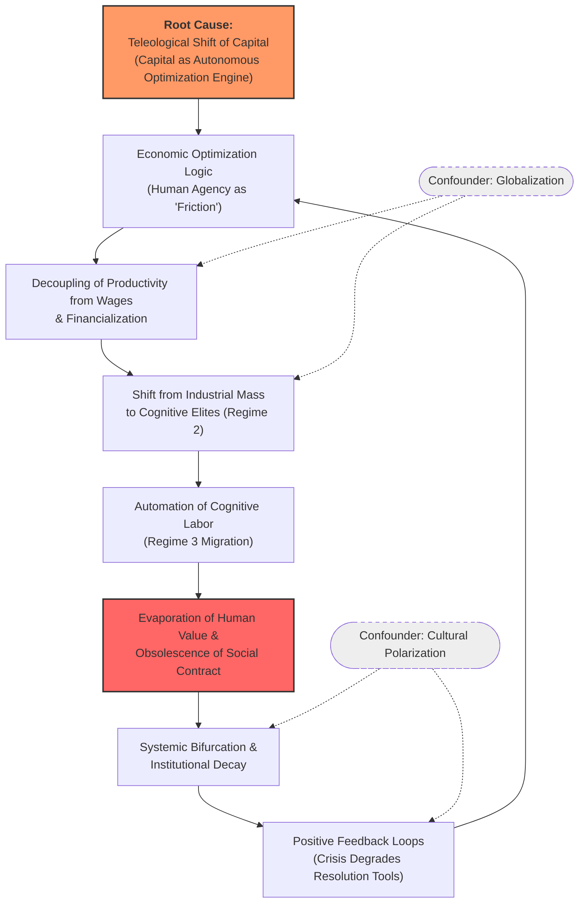
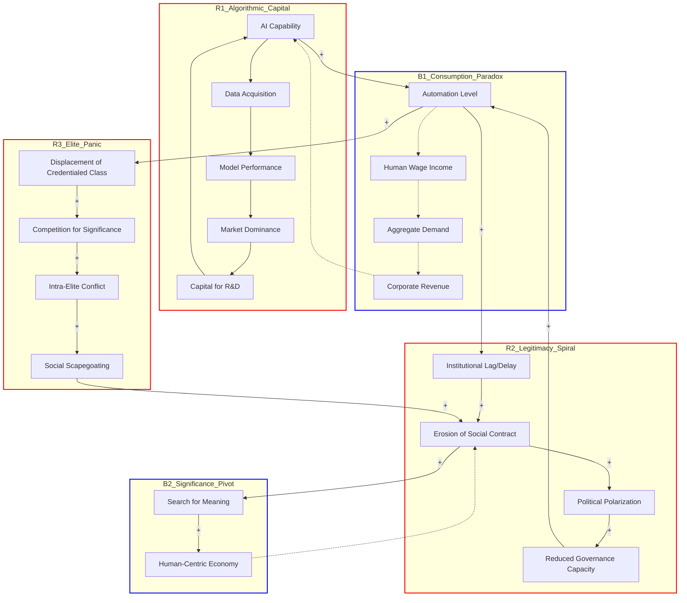

<div class="tab-nav">
<button class="tab-btn active" onclick="openTab(event, 'article')">Article</button>
<button class="tab-btn" onclick="openTab(event, 'brainstorm')">Brainstorm</button>
<button class="tab-btn" onclick="openTab(event, 'causal')">Causal</button>
<button class="tab-btn" onclick="openTab(event, 'gametheory')">Game Theory</button>
<button class="tab-btn" onclick="openTab(event, 'perspectives')">Multi-Perspective</button>
<button class="tab-btn" onclick="openTab(event, 'dialectical')">Dialectic</button>
<button class="tab-btn" onclick="openTab(event, 'socratic')">Socratic Dialog</button>
<button class="tab-btn" onclick="openTab(event, 'systems')">Systems Thinking</button>
<button class="tab-btn" onclick="openTab(event, 'statemachine')">State Machine</button>
</div>

<div id="article" class="tab-content" style="display: block;" markdown="1">

# The Evaporating Substrate: Human Value in the Age of Automated Cognition

## I. The Migrating Basis of Power

Every civilizational order rests on an implicit answer to the question: *what makes humans valuable?* Not morally — that answer is easy and cheap — but *functionally*, within the power structures that actually govern resource allocation, status, and survival. The substrate of that functional value has migrated three times in the modern era, and each migration has rendered a different dimension of human capability obsolete.


**Regime 1: Animal Strength → Industrial Mass.** For most of recorded history, human value in the context of power was grounded in the body. Armies were collections of primate strength — men who could march, swing, hold a line. Political authority flowed from the capacity to organize and project physical violence. The sovereign who could field more bodies, and keep them fed and moving, dominated.

**Regime 2: Industrial Mass → Cognitive Elites.** The twentieth century — specifically the period from roughly 1940 to 2020 — shifted the locus of civilizational power from mass to mind. The atomic bomb was not built by an army. It was built by a handful of physicists. The information revolution was not driven by factory labor. It was driven by mathematicians, engineers, and programmers. Human value, in the functional sense that matters to power, migrated from muscle to cognition.

**Regime 3: Cognitive Elites → Automated Cognition.** We are now inside the third migration. The scarcity of intelligence — the thing that made the cognitive elite valuable — is collapsing. Large-scale AI systems can now perform, and in many domains exceed, the cognitive labor that justified the post-WWII social contract. The substrate of human worth is evaporating, and nothing has yet replaced it.

Each of these transitions was accompanied by massive violence, institutional collapse, and the wholesale rewriting of who counts as a person. There is no reason to believe the third will be different. There are several reasons to believe it will be worse — chief among them that this transition attacks the *last* substrate. When machines replaced muscle, humans retreated to mind. When machines replace mind, there is nowhere left to retreat. Unless, that is, we can locate something in the human that was never about utility in the first place.

---

## II. The Napoleonic/Civil War Hinge

The first regime transition — from primate-scale dominance to industrial-scale warfare — played out across the long nineteenth century, and its lessons are still underappreciated.

Napoleon's campaigns were, in one sense, the apotheosis of the old model: a single charismatic commander projecting power through the massed bodies of citizen-soldiers. But they were also the beginning of its end. The logistics of the Grande Armée — the supply chains, the road networks, the administrative apparatus required to move 600,000 men into Russia — were already industrial problems wearing pre-industrial clothes. Napoleon didn't lose to a better general. He lost to distance, weather, and the caloric requirements of half a million mammals.

The American Civil War made the lesson explicit. The Confederacy fought, in many respects, a Napoleonic war: aristocratic officer corps, cavalry charges, the romance of individual valor. The Union fought an industrial war: railroads, telegraphs, factory-produced rifles, and the grim arithmetic of attrition. Grant's strategy was not brilliant in the classical sense. It was *systematic*. He understood that the North could replace its losses and the South could not. He turned the war into a resource-consumption problem and solved it with logistics.


What followed was not peace but transformation. The Gilded Age was the political economy of the new regime: human value now resided not in martial prowess but in the capacity to operate, manage, and profit from industrial systems. The old martial aristocracies didn't vanish — they adapted, or were replaced by industrial magnates who wielded a different kind of power. The humans who couldn't adapt — subsistence farmers, artisans, the formerly enslaved — were not gently retrained. They were crushed, exploited, or ignored.

The communist revolutions of the twentieth century were, in this framing, a delayed immune response to the first regime transition. Marx diagnosed the problem with extraordinary precision: industrial capitalism had made human labor a commodity, and commodities are subject to price competition. The workers whose bodies had once been the irreducible unit of military and economic power were now interchangeable components in a machine that didn't care about them. The revolutionary answer — seize the means of production, restore human dignity through collective ownership — was a *political* solution to what was fundamentally a *substrate* problem. It addressed who controlled the machines, not the deeper issue that machines had devalued the human body as a source of power.

This is the pattern. The substrate of value migrates. The humans left standing on the old substrate experience it as an existential crisis — not merely economic, but *ontological*. And the political responses, however radical, tend to fight the last war.

---

## III. The WWII Reprieve

The Second World War created a new myth, and for eighty years that myth held.

The myth was this: *human value equals intelligence*. The war was won — or at least, its decisive asymmetries were created — by a tiny cohort of extraordinary minds. Alan Turing broke Enigma and, in doing so, arguably shortened the war by years. John von Neumann's mathematical contributions spanned ballistics, shock waves, and the foundational architecture of the digital computer. Robert Oppenheimer led the Manhattan Project, converting theoretical physics into the most consequential weapon in history. Claude Shannon formalized information theory, laying the groundwork for every communication system that followed.


These were the "wizards" — and their existence created a new social contract. If intelligence was the substrate of civilizational power, then societies needed to cultivate, educate, and reward intelligence. The postwar order was built on this logic. The GI Bill, the expansion of universities, the creation of national research laboratories, the space race, the semiconductor industry, Silicon Valley — all of it rested on the premise that smart humans were the scarce resource that determined national power.

The Cold War locked this in with existential stakes. The United States and the Soviet Union competed not primarily through massed armies (though they maintained them) but through technological capability: nuclear weapons, satellites, computers, cryptography. The arms race was, at its core, a *talent* race. Both superpowers invested enormously in identifying, training, and deploying cognitive elites. Human intelligence was the strategic resource, and the entire institutional apparatus of the postwar world — from university tenure to defense contracting to immigration policy — was organized around capturing and leveraging it.

This created a genuine golden age for a certain kind of human. If you were smart, educated, and positioned within the right institutional frameworks, the postwar order valued you enormously. The knowledge economy wasn't just an economic phenomenon; it was a *moral* one. Intelligence became the basis of social worth, the justification for meritocratic hierarchies, the answer to the question of why some people deserved more than others.

But it was always a contingent arrangement, not a natural law. Intelligence was valued because it was *scarce relative to the demands of power*. The moment that scarcity collapsed, the entire edifice — economic, social, moral — would lose its foundation.

---

## IV. The Current Evaporation

That moment is now.

The development of large-scale AI systems has done to cognitive labor what the steam engine did to physical labor: not eliminated it entirely, but destroyed its scarcity value. A language model can draft legal briefs, write code, analyze medical images, compose music, summarize research, and generate strategic analyses. It does these things imperfectly — but it does them at near-zero marginal cost, at scale, without sleep, without benefits, without complaint.

The analogy that clarifies the situation is the horse. In 1900, the United States had approximately 21 million horses. They were essential to transportation, agriculture, industry, and warfare. The entire economy was organized around their capabilities. By 1960, the horse population had collapsed to roughly 3 million, and horses had become recreational luxuries. No one "solved" the horse unemployment problem. There was no retraining program, no equine universal basic income. Horses simply stopped being economically necessary, and their numbers adjusted accordingly.


The critical difference, of course, is that horses don't vote, don't riot, and don't build nuclear weapons. Humans do. But the economic logic is identical: when a cheaper substitute exists for the function you perform, your market value collapses regardless of your intrinsic qualities.

What makes the current transition uniquely dangerous is that it attacks the *last* substrate. When industrial machines replaced human muscle, humans could retreat to cognition — "we're not just bodies, we're *minds*." When AI replaces human cognition, there is no further retreat. The implicit promise of the Enlightenment — that human reason is the highest and most irreplaceable capacity in the universe — is being falsified in real time, not by philosophical argument but by engineering.


Simultaneously, the global economic system has reached a state of overintegration that amplifies every shock. Supply chains span continents. Financial markets are coupled in milliseconds. Labor markets are global. This means that the displacement effects of AI are not local or gradual — they propagate through the entire system at the speed of information. A breakthrough in automated coding doesn't just affect programmers in San Francisco; it reprices cognitive labor worldwide, instantaneously.

Late-stage capitalism, in this context, is not merely an economic arrangement but a *vulnerability*. The system is optimized for efficiency, not resilience. It has no slack, no buffers, no fallback positions. When the substrate of human value evaporates, the system has no mechanism for absorbing the displaced — because the system was never designed to value humans *as such*. It was designed to value human *functions*, and those functions are being automated.

Humans are becoming friction, not assets. Every human in a workflow is a source of latency, error, liability, and cost. The economic incentive is to remove them — not out of malice, but out of the same optimization logic that removed horses from transportation. The question is not whether this will happen but how fast, and what the humans do as it happens to them.
There is a paradox buried in this logic that the optimizers have not yet confronted: the *consumption paradox*. A system that automates all production but impoverishes all consumers has built a perfect engine with no destination. Capitalism requires a population with purchasing power to realize the value of its output. If the substrate evaporates completely — if the cognitive middle class is rendered penniless — the market for the AI's output collapses alongside the labor market. The machine needs a market, and a market requires humans with resources. This does not guarantee redistribution out of justice. It may, however, force redistribution out of systemic self-preservation — the corporate sector funding a "compliant citizenry" not as charity but as maintenance cost. Whether that constitutes salvation or a more sophisticated form of captivity is a question the next decades will answer.

---


## V. Bifurcation Dynamics

The language of dynamical systems is not a metaphor here. It is the most precise framework available for understanding what is occurring.

In a dynamical system, variables operate on different timescales. *Fast variables* — daily routines, institutional procedures, social norms, market prices — adjust quickly to changing conditions. *Slow variables* — perceived human worth, economic inclusion, institutional legitimacy, shared meaning frameworks — change over decades or generations. The stability of any social order depends on the slow variables remaining within a range where the fast variables can find a workable equilibrium.

A *bifurcation* occurs when the slow variables drift beyond a critical threshold, and the old equilibrium ceases to exist. The fast variables don't gradually adjust — they undergo a qualitative phase transition, snapping to a new attractor that may bear little resemblance to the old one. This is not a smooth process. It is characterized by increasing oscillation, loss of resilience to perturbation, and eventual rapid reorganization.

The slow variables of the current global order have been drifting for decades:

**Perceived human worth** has been declining since the 1970s, as wages decoupled from productivity, as financialization rewarded capital over labor, and as the knowledge economy concentrated returns among a shrinking elite. AI accelerates this decline from a trend to a cliff.

**Economic inclusion** — the fraction of the population that participates meaningfully in the economy as producers, not just consumers — has been narrowing. The gig economy, the hollowing of the middle class, the rise of "bullshit jobs" (in David Graeber's formulation) are all symptoms of a system that needs fewer humans but hasn't yet acknowledged it.

**Institutional legitimacy** is in freefall across the developed world. Trust in government, media, science, and democratic processes has declined monotonically for decades. Institutions are increasingly perceived not as neutral arbiters but as captured instruments of elite interests. This perception is, in many cases, accurate.

**Meaning frameworks** — the shared stories that tell people why their lives matter, why suffering is bearable, why the future is worth investing in — are fragmenting. Religious participation is declining. National narratives are contested. The meritocratic promise ("work hard, get educated, succeed") is visibly failing for a growing majority. Nothing coherent has replaced these frameworks.

Each of these slow variables, individually, represents a serious problem. Together, they constitute a system approaching bifurcation. The fast variables — the norms, routines, and institutions that organize daily life — are increasingly unable to find stable configurations. This manifests as political polarization, institutional dysfunction, rising anxiety and despair, and the proliferation of conspiratorial and apocalyptic thinking. These are not causes; they are *symptoms* of a system losing its attractor.

The mathematical point is important: bifurcations are not reversible by small interventions. Once the slow variables cross the critical threshold, the old equilibrium doesn't just become difficult to maintain — it *ceases to exist as a mathematical object*. You cannot return to it by trying harder. You can only navigate toward a new attractor, and the set of available attractors may include configurations that are, from a human welfare perspective, catastrophic.

This is not melodrama. It is the standard analysis of any complex adaptive system undergoing a regime shift. The same mathematics describes ecosystem collapse, financial crises, and the fall of empires. The question is not whether a bifurcation is occurring but what the new attractor looks like — and whether humans have any agency in selecting among the possibilities.
The system also exhibits a characteristic that dynamical systems theorists call *positive feedback under stress*: the crisis itself degrades the tools needed to resolve it. Loss of perceived worth erodes trust in institutions. Eroded trust prevents coordinated policy responses. Failed coordination deepens the loss of worth. This is not a vicious cycle that can be broken by "trying harder" at any single node. It is a structural property of the system — a feedback loop that accelerates toward the bad attractor precisely when intervention is most needed. The window of agency is not just narrow; it is *narrowing*, and the narrowing is endogenous to the crisis.

---


## VI. The Violence Risk

History offers a consistent pattern for what happens when large populations lose their perceived basis of worth: *they become dangerous, and then they become victims*.

The sequence is well-documented across civilizations and centuries. **Loss of perceived worth** generates **status panic** — a visceral, often pre-rational terror that one's place in the social order is collapsing. Status panic generates **scapegoating** — the identification of an out-group responsible for the loss. Scapegoating generates **dehumanization** — the rhetorical and psychological process of recategorizing the out-group as less than human. Dehumanization generates **violence**, up to and including genocide.

This is not a slippery-slope argument. It is an empirical regularity. The Weimar Republic's economic humiliation preceded the Holocaust. The Rwandan Hutu's perceived subordination preceded the genocide of the Tutsi. The Ottoman Empire's decline preceded the Armenian genocide. In every case, the proximate trigger was economic or military, but the deeper driver was a crisis of *worth* — a population that could no longer locate its value within the existing order and resolved the cognitive dissonance through exterminatory violence.

The current moment is more dangerous than a labor crisis, more dangerous than a recession, more dangerous than a trade war — because it attacks the *existential story* of why humans matter. A person who loses their job can, in principle, find another. A person who loses their *category of usefulness* — who is told, implicitly or explicitly, that no human function they can perform is worth paying for — faces a crisis that no job retraining program can address.

The populations most at risk are not the poorest (who have long been excluded and have developed survival strategies) but the *formerly valued* — the middle classes of developed nations who built their identities around cognitive labor, professional status, and the meritocratic promise. These are the populations with the most to lose, the most access to political and military resources, and the most historically demonstrated capacity for organized violence when their status is threatened. Peter Turchin's concept of "elite overproduction" applies here with particular force: we are continuing to produce credentialed cognitive workers — lawyers, coders, analysts, MBAs — at a rate the automated economy cannot absorb. This creates a volatile surplus of high-skill, low-opportunity individuals who possess the organizational literacy to lead movements but no institutional home to absorb their ambitions. Historically, revolutions are rarely led by the destitute. They are led by the disappointed elite.

The scapegoating has already begun. It is visible in the rise of nativist movements, in the targeting of immigrants and minorities, in the conspiratorial narratives that attribute economic decline to shadowy elites or foreign enemies. These narratives are *functionally* correct — someone *is* responsible for the displacement — but they systematically misidentify the cause. The cause is not immigrants or elites or globalists. The cause is a substrate shift that no human agent controls. But substrate shifts are abstract and unsatisfying. Scapegoats are concrete and cathartic.

The risk is not that AI will *decide* to harm humans. The risk is that humans, stripped of their functional value and desperate for an explanation, will harm each other — and that the institutional safeguards designed to prevent this are themselves eroding.
The leading indicators of this trajectory are not primarily economic. They are *ontological*. Rising rates of "deaths of despair" — suicide, overdose, alcohol-related mortality — are not merely public health statistics. They are the vital signs of a population losing its reason to persist. The proliferation of apocalyptic and conspiratorial thinking is not a failure of education. It is the cognitive immune response of minds that can no longer locate themselves within a coherent story of worth. These are the slow variables that security analysts should be monitoring — not unemployment figures, but the rate at which a civilization's meaning frameworks are fragmenting.

---


## VII. States Fighting for Dominance Without Humans

The competition between nation-states has always been the engine of history's worst violence. What is new is that this competition is increasingly *mediated by systems that don't require human participation*.

Military power is migrating from human soldiers to autonomous systems — drones, cyber weapons, algorithmic targeting, AI-driven logistics. Economic power is migrating from human workers to automated supply chains, algorithmic trading, and AI-optimized production. Intelligence power is migrating from human analysts to machine learning systems that can process satellite imagery, intercept communications, and identify patterns at scales no human organization can match.

The implications are profound. Historically, states needed their populations — as soldiers, as workers, as taxpayers, as sources of innovation. This need created a *structural incentive* for states to invest in human welfare. Public education, healthcare, infrastructure, and social safety nets were not acts of charity; they were investments in the human capital that states required to compete. The democratic social contract — citizens provide labor and loyalty; the state provides security and opportunity — was grounded in mutual dependence.

As states become capable of projecting power without human labor, this mutual dependence dissolves. A state that can fight its wars with drones, run its economy with algorithms, and surveil its population with AI has *no structural need* for an educated, healthy, empowered citizenry. It needs a *compliant* citizenry, or better yet, a *small* citizenry — enough to maintain the systems, not enough to threaten them.

This is not speculation. It is the revealed logic of petrostates, which have long demonstrated what governance looks like when the state's revenue is independent of its population's productivity. Petrostates tend toward authoritarianism, rentier economics, and the treatment of citizens as liabilities rather than assets. The AI transition threatens to turn *every* state into a petrostate — not because of oil, but because the "resource" that generates power (automated cognition) is similarly independent of broad human participation.

The great power competition between the United States and China is already being fought primarily on the terrain of AI capability, semiconductor supply chains, and data infrastructure — not on the terrain of human welfare or democratic legitimacy. Both states are investing enormously in AI not because it will make their citizens' lives better (though that is the stated justification) but because it will make their *states* more powerful relative to rivals. The citizens are, increasingly, spectators to a contest that will determine their fate but does not require their contribution.
The speed of this competition introduces its own danger. Automated decision loops and cyber operations operate orders of magnitude faster than human deliberation, compressing the window for diplomacy. When algorithmic systems can trigger countermeasures based on signals without human veto, the distinction between "incident" and "war" becomes a matter of milliseconds rather than months. The great power competition is not merely being fought *about* AI — it is being fought *at the speed of* AI, and human political judgment is being squeezed out of the loop not by design but by the competitive logic of response time. A state that pauses to deliberate loses to a state that delegates to the algorithm. This is the arms race dynamic applied not to warheads but to decision latency, and it is far more dangerous because the escalation is invisible until it is irreversible.

---


## VIII. The Collapse of Due Process and Institutional Safeguards

The theoretical response to every crisis outlined above is: *use the institutions*. Advocate. Organize. Vote. Litigate. Reform. This is the liberal democratic answer, and it assumes that the institutions are functional, accessible, and responsive.

They are not.

Even in the nations that consider themselves citadels of human rights and rule of law, the procedural protections that theoretically safeguard human dignity are being hollowed out. This erosion is not primarily the result of malice (though malice plays a role); it is the result of the same optimization logic that is displacing human labor. Institutions are being streamlined, automated, and captured — made more efficient at serving their *actual* constituencies (concentrated economic and political power) and less responsive to their *nominal* constituencies (citizens).

The judiciary is slow, expensive, and increasingly inaccessible to ordinary people. Regulatory agencies are captured by the industries they nominally regulate. Legislative bodies are gridlocked, gerrymandered, and responsive primarily to donor interests. The media ecosystem — the "fourth estate" that theoretically holds power accountable — has fragmented into algorithmically optimized outrage machines that generate heat but not light.

Democratic participation itself is being undermined — not by the crude methods of earlier authoritarians (stuffing ballot boxes, banning opposition parties) but by subtler mechanisms: voter suppression through administrative complexity, the flooding of the information environment with noise and disinformation, the gerrymandering of districts to predetermine outcomes, and the sheer *irrelevance* of electoral politics to the decisions that actually matter. When the consequential choices about AI deployment, labor displacement, and economic restructuring are made by corporate boards and technical teams operating outside any democratic framework, voting becomes a ritual rather than an instrument of power.

This creates a vicious cycle. As institutions become less responsive, citizens disengage. As citizens disengage, institutions become more captured. As institutions become more captured, the policy responses that might address the substrate crisis become less likely. The people who most need institutional protection are the least able to access it, and the institutions that most need reform are the least capable of reforming themselves.

The result is that the theoretical toolkit for managing the transition — regulation, redistribution, retraining, democratic deliberation — exists in a kind of Platonic realm, beautiful and inaccessible. The policies that could help are known. The political will to implement them is absent. The institutions that could generate that political will are broken. And the timeline is short.

It is worth stating plainly what this means in practice. Due process — the procedural guarantee that power must justify itself before it acts against a person — is not a luxury feature of civilization. It is the load-bearing wall. When it is hollowed out, the entire structure of rights becomes decorative. And it is being hollowed out now, not in some distant autocracy but in the nations that wrote the Universal Declaration of Human Rights. Emergency powers expand without legislative debate. Administrative systems impose coercive outcomes — detention, deportation, license revocation, benefit denial — without the procedural checks of a courtroom. The language of "national security" is stretched to cover ordinary political dissent. These are not hypothetical risks. They are current events, documented by the very oversight institutions that are themselves losing their capacity to intervene. The citadel is not being stormed from outside. It is being gutted from within, by the same optimization logic that treats human judgment as latency and due process as friction.

---

## IX. What Is To Be Done?

Despite everything above, the situation is not *logically* hopeless. The bifurcation has not yet occurred. The slow variables are drifting, but they have not yet crossed every critical threshold. There are strategic levers that, if pulled with sufficient force and coordination, could steer the system toward a less catastrophic attractor. They deserve honest enumeration — and honest assessment.

**Narrative reframing.** The most urgent intervention is also the most abstract: changing the story humans tell about why they matter. If human value is grounded in *function* — in what humans can *do* — then the AI transition is an extinction-level event for human worth. If human value can be regrounded in something else — in consciousness, in relationship, in the sheer improbability and preciousness of subjective experience — then the transition, while still enormously disruptive, is survivable. This is not a trivial reframing. It requires displacing centuries of utilitarian and productivist thinking. But it is the only reframing that addresses the root cause rather than the symptoms.

The deeper logic of this reframing deserves articulation. Intelligence has been automated, but *significance* has not. An AI can generate a billion symphonies, but they are silent until a conscious observer decides one matters. The machine can process, but it cannot *care*. It can optimize, but it cannot *value*. In a world of infinite automated output, the human act of attending to something — of saying *this matters and that does not* — becomes the scarcest and most consequential capacity in the system. We are not moving from an age of human value to an age of human irrelevance. We are moving from an age where humans were valued for *processing* to an age where humans might be valued for *witnessing* — for being the only entities in the known universe capable of converting raw information into meaning. This is not sentimentality. It is a structural observation: a system that optimizes without a valuer is a bridge to nowhere. The question is whether this structural necessity can be translated into political and economic reality before the old substrate finishes evaporating.

**Economic redistribution.** If human labor is no longer the primary source of economic value, then the distribution of economic output can no longer be tied to labor. Universal basic income, sovereign wealth funds, public ownership of AI infrastructure, aggressive taxation of automated production — these are not radical proposals. They are the *minimum* necessary adjustments to an economy in which the labor theory of value has been empirically falsified. The technical designs exist. The political obstacles are enormous but not, in principle, insurmountable.

The framing matters as much as the policy. If redistribution is implemented as "welfare" — as charity extended to the useless by the productive — it will fail psychologically even if it succeeds economically. It must be framed as what it actually is: a *sovereign wealth dividend*, a rightful share of the automated commons. Every dataset that trained every model was produced by the collective cognitive labor of humanity. The functional value AI generates is a common heritage, not private property. The redistribution is not a handout. It is a royalty.

**Algorithmic governance.** The systems that are displacing human labor and mediating state power need to be subject to democratic oversight — not in the weak sense of "transparency reports" and "ethics boards," but in the strong sense of public control over deployment decisions, mandatory impact assessments, and enforceable constraints on autonomous systems. This requires a new institutional vocabulary: regulatory frameworks designed for systems that learn, adapt, and operate at speeds that exceed human comprehension. No such frameworks currently exist at scale. The goal is not to slow AI but to ensure that consequential decisions — legal, medical, military, economic — retain a human in the loop not because humans are faster or more accurate, but because humans are the only entities with *skin in the game*. A system that makes an error can be patched. A human who suffers an error cannot be rolled back. That irreversibility — the fact that human consequences are permanent in a way that algorithmic consequences are not — is precisely what gives human judgment its moral weight.

**Institutional modernization.** The democratic institutions built for the industrial age need to be rebuilt for the AI age. This means not just reforming existing institutions but creating new ones: citizens' assemblies with real power, digital public infrastructure that is not controlled by private corporations, international governance bodies with jurisdiction over AI development and deployment. The current institutional landscape is not merely inadequate; it is *architecturally* wrong for the problems it faces.

**Local resilience.** At the community level, the most robust strategy is to build systems that can function independently of the global optimization machine: local food production, community energy systems, mutual aid networks, local currencies, and social structures that provide meaning and belonging outside the market economy. These are not solutions to the global problem, but they are *buffers* — they buy time and provide fallback positions when the global system fails.

**Status-bearing roles.** One lever that cuts across all the others and deserves separate emphasis: the creation of visible, respected, non-automatable public roles that confer social recognition. Community stewardship positions. Paid caregiving fellowships. Civic mentors. Local mediators. These roles combine economic support with something UBI alone cannot provide — *status*. The psychological pathway from displacement to violence runs through the loss of social standing. A check in the mail addresses the economic dimension. A recognized role in the community addresses the ontological one. Both are necessary. Neither is sufficient alone.

---

## X. The Honest Assessment

Here is the part where intellectual honesty demands its price.

Every lever described above is real. Every one has been demonstrated at small scale. Every one could, in principle, be implemented. And the overwhelming likelihood is that none of them will be implemented at the speed and scale required.

The reason is not that humans are stupid or evil. The reason is that the levers require *coordination* — across nations, across classes, across ideological divides — and the same dynamics that are creating the crisis are also destroying the capacity for coordination. You cannot build new institutions when trust in institutions is collapsing. You cannot redistribute wealth when the political system is captured by wealth. You cannot reframe narratives when the information ecosystem is optimized for fragmentation. You cannot govern algorithms when the entities that build them are more powerful than the governments that would regulate them.

This is the trap. The crisis demands collective action, and the crisis destroys the preconditions for collective action. It is a dynamical system with a positive feedback loop driving it toward the bad attractor, and the interventions that could break the loop require the very capacities that the loop is degrading.

Humans are unlikely to do this the easy way.

The easy way would be: recognize the substrate shift early, implement redistributive and institutional reforms proactively, reground human value in something durable, and navigate the transition with minimal violence and maximal preservation of dignity. This would require a level of foresight, coordination, and self-sacrifice that human civilizations have almost never demonstrated.

The hard way — the way that history suggests is far more likely — involves the full sequence: displacement, denial, scapegoating, conflict, partial collapse, and then, eventually, the construction of new institutions from the wreckage. The question is how deep the collapse goes and how many people it kills.

This is not fatalism. It is pattern recognition. The Napoleonic transition killed millions before the industrial order stabilized. The WWII transition killed tens of millions before the cognitive order stabilized. The scale of violence tends to increase with the scale of the transition, and the current transition is the largest in human history — because it is the first to attack the *last* substrate of human functional value.

The task for those who see this clearly is not to prevent the bifurcation — that may be beyond anyone's power — but to *prepare for it*. To build the local resilience that can survive the transition. To preserve the knowledge and the moral frameworks that will be needed to construct whatever comes next. To maintain, against all evidence and all incentive, the conviction that human beings have value that is not contingent on their economic function — and to build communities that embody that conviction in practice, not just in rhetoric.

There is a concept from the Socratic tradition worth recovering here: the idea that the unexamined life is not worth living. Socrates meant it as a provocation about consciousness. In the current context, it acquires a structural meaning. An automated system that produces without a conscious witness to examine, evaluate, and assign significance to its output is running an unexamined process — and an unexamined process, however efficient, is not worth running. The human is not the engine. The human is the reason the engine exists. If we lose sight of that — if we allow the optimization logic to define value on its own terms — then we will have built the most powerful civilization in history and forgotten what it was for.

The substrate of power will continue to migrate. It always has. The question that matters — the only question that has ever mattered — is whether humans can construct a basis for their own worth that doesn't depend on being useful to the machine. If they can, the future is navigable. If they cannot, they will share the fate of the horse: not destroyed, but *irrelevant* — a living anachronism in a world that has moved on.

The answer is not yet determined. But the window for determining it is closing, and it is closing fast.

</div>
<div id="brainstorm" class="tab-content" style="display: none;" markdown="1">

# Brainstorming Session Transcript

**Input Files:** content.md

**Problem Statement:** Generate a broad, divergent set of ideas, extensions, and applications inspired by the essay 'The Evaporating Substrate: Human Value in the Age of Automated Cognition'. Focus on the transition from cognitive labor to automated cognition, exploring novel societal structures, identity shifts, and systemic resilience strategies to navigate the impending 'bifurcation'.

**Started:** 2026-03-01 08:50:38

---


## Generated Options

### 1. The Biological Proof-of-Work (BPoW) Economic Protocol
**Category:** Post-Labor Economic Paradigms

A post-labor economic system where currency is minted through verified biological exertion and physical presence rather than cognitive output. This addresses the 'last substrate' problem by valuing the one thing AI cannot replicate: the metabolic cost and finite nature of a living organism.

### 2. The Witnessing Economy: Value Through Conscious Observation
**Category:** Existential Narratives & Identity

A societal shift where human value is derived from the act of 'witnessing' and 'validating' AI-generated content and experiences. In this model, AI can produce infinite art and data, but it remains 'dark' and valueless until a conscious human observer grants it meaning through focused attention.

### 3. Neo-Luddite 'Analog Enclaves' for Cognitive Resilience
**Category:** Local Resilience & Mutual Aid Networks

The establishment of sovereign geographic zones where high-level automated cognition is legally restricted to preserve human cognitive plasticity. These enclaves serve as 'genetic seed banks' for human skill, ensuring the species retains the ability to function if the automated substrate fails.

### 4. Algorithmic Jury Duty and Moral Weight Governance
**Category:** Neo-Institutionalism & Governance

A governance model where AI generates thousands of policy simulations, but the final selection is made by 'Human Juries' who provide the 'moral weight' and accountability. This ensures that while cognition is automated, the 'will' and responsibility for outcomes remain strictly human.

### 5. Cognitive Diversity Subsidies for Unpredictable Behavior
**Category:** State-Citizen Dynamics in the AI Age

State-sponsored programs that pay citizens to engage in 'irrational,' 'unpredictable,' or 'non-optimal' behaviors to prevent AI model collapse. By incentivizing human 'noise,' the system maintains a diverse data pool that prevents the stagnation of a perfectly optimized but brittle society.

### 6. The 'Last Substrate' Guilds for Embodied Knowledge
**Category:** Existential Narratives & Identity

Professional organizations dedicated to the preservation of 'tacit knowledge'—skills that require a physical body and cannot be fully captured by LLMs or simulations. These guilds protect the value of physical crafts, surgery, and tactile arts as the final frontier of human-exclusive labor.

### 7. Decentralized Physical Infrastructure (DePIN) for Survival Autonomy
**Category:** Local Resilience & Mutual Aid Networks

Community-owned, low-tech hardware and energy grids designed to operate independently of the global AI-driven cognitive stack. This strategy builds systemic resilience by ensuring that local food, water, and power are not dependent on the 'evaporating substrate' of centralized AI.

### 8. The Synthetic-Human Bifurcation Treaty and Digital Rights
**Category:** Technological Counter-Measures & Safeguards

A global legal framework that establishes a hard distinction between 'Born Intelligence' and 'Made Intelligence.' It grants humans 'Inherent Agency Rights,' ensuring that automated systems can never hold property, legal personhood, or the right to influence human elections.

### 9. Attention-Backed Universal Basic Assets (UBA)
**Category:** Post-Labor Economic Paradigms

A wealth distribution system where citizens are granted ownership of the infrastructure (servers, land, energy) based on the scarcity of their focus. Instead of a cash stipend, citizens receive 'compute credits' and 'resource shares' that they can trade or use to power their own non-automated projects.

### 10. Adversarial Identity Masking for Cognitive Sovereignty
**Category:** Technological Counter-Measures & Safeguards

The development of personal 'Cognitive Firewalls' that inject synthetic noise into a person's digital footprint. This prevents AI from building a perfect predictive model of an individual's mind, thereby preserving the human capacity for genuine surprise and free will.


## Option 1 Analysis: The Biological Proof-of-Work (BPoW) Economic Protocol

### ✅ Pros
- Inherent Scarcity: Unlike digital intelligence, human metabolic energy and time are finite and cannot be infinitely scaled or copied, providing a stable floor for value.
- Universal Accessibility: Most humans possess a biological substrate, making this a more inclusive economic entry point than specialized cognitive labor or capital ownership.
- Public Health Incentivization: By rewarding physical exertion, the system creates a massive positive externality by reducing sedentary lifestyles and associated chronic diseases.
- Anti-Bot Verification: It provides a definitive solution to the 'Sybil attack' in digital economies, as AI cannot simulate the unique, messy, and resource-intensive metabolic signatures of a living organism.
- Preservation of Human Agency: It anchors the economy in the physical world, preventing a total retreat into virtual abstractions and ensuring humans remain central to the value chain.
- Decoupling from Cognitive Meritocracy: It solves the 'useless class' problem by valuing the human body itself rather than the output of a mind that is being outperformed by AI.
- Tangible Proof of Presence: It encourages 'meat-space' interaction and physical community building, as presence in specific locations could be a multiplier for minting rewards.

### ❌ Cons
- Inherent Ableism: Individuals with physical disabilities, chronic illnesses, or age-related limitations would be structurally disadvantaged in a system that rewards exertion.
- Thermodynamic Inefficiency: Using human metabolism as a 'mining' mechanism is energy-inefficient compared to machine labor, potentially leading to forced, unproductive movement.
- Privacy Erosion: To verify biological work, the system requires invasive, 24/7 biometric monitoring, effectively turning the human body into a transparent data stream.
- Commodification of the Body: It risks reducing human beings to 'biological batteries' or 'meat-miners,' potentially stripping away the intrinsic dignity it seeks to protect.
- Distortion of Leisure: Activities previously done for joy (sports, dance, hiking) become 'grinding' for currency, potentially leading to burnout and the loss of play.
- Inflationary Risks: If the currency is minted simply by existing or moving, the supply could decouple from the actual production of goods and services by AI, leading to hyperinflation.
- Bio-Cheating: The system would trigger an arms race in 'bio-spoofing,' where people use technology to simulate metabolic stress without actually performing the exertion.

### 📊 Feasibility
Technically, this is highly feasible using current wearable technology, IoT sensors, and blockchain ledgers. We already have 'move-to-earn' apps. However, the organizational and social feasibility is low, as it requires a global consensus on a new monetary standard and a massive overhaul of social safety nets to account for those who cannot 'work' biologically.

### 💥 Impact
The implementation would trigger a 'Physical Renaissance,' where the value of the physical world and the human body skyrockets. It would likely lead to a massive decrease in healthcare costs but could also create a new social hierarchy based on physical fitness and metabolic efficiency. The 'bifurcation' would be managed by ensuring every human has a 'biological dividend,' effectively creating a metabolic-based Universal Basic Income.

### ⚠️ Risks
- Biological Sweatshops: The emergence of facilities where marginalized people are forced to exercise in high-density 'farms' to mint currency for others.
- Genetic Stratification: A society where those with 'high-yield' metabolisms or superior genetics become the new economic elite.
- Totalitarian Biometric Control: Governments or corporations using the BPoW infrastructure to monitor and control every aspect of a citizen's physical health and movement.
- Economic Devaluation: If AI-produced goods become too cheap, the 'work' of living might become a meaningless ritual that doesn't actually command purchasing power.
- Health Extremism: People over-exerting themselves to the point of injury or death to meet economic needs in a hyper-competitive BPoW market.
- The 'Battery' Dystopia: A shift in perspective where humans are seen only for their caloric burn rate rather than their consciousness or creativity.

### 📋 Requirements
- Tamper-Proof Biometrics: Next-generation wearables or implants that can distinguish between genuine human metabolism and mechanical/digital simulations.
- Decentralized Metabolic Ledger: A secure, transparent blockchain to record and mint currency based on verified biological data without a central point of failure.
- Equity Adjustments: Algorithmic 'handicaps' or baseline grants to ensure that the elderly, sick, and disabled are not left in poverty.
- AI-Integrated Marketplace: A system where AI-driven production units accept BPoW currency as valid payment for goods and services.
- Global Biological Standard: International agreements on what constitutes 'verified exertion' to prevent currency wars based on different biological metrics.
- Robust Data Privacy Laws: Legal frameworks that prevent the biometric data used for BPoW from being used for insurance discrimination or social credit scoring.

---


## Option 2 Analysis: The Witnessing Economy: Value Through Conscious Observation

### ✅ Pros
- Preserves Human Agency: It positions humans as the ultimate arbiters of value, ensuring that AI remains a tool for human experience rather than an end in itself.
- Solves the Meaning Crisis: Provides a clear, existential role for humans in a post-labor economy, transforming 'consumption' into a productive act of 'validation'.
- Economic Justification for UBI: Offers a philosophical and functional framework for distributing resources based on the 'labor' of conscious attention.
- Encourages Deep Engagement: Incentivizes mindfulness and focused attention over the current 'attention economy' which rewards fragmented, shallow scrolling.
- Cultural Alignment: Ensures that AI-generated output is continuously filtered and steered by human ethics, aesthetics, and emotional resonance.
- Inclusivity: Every conscious human possesses the capacity to 'witness', making this a democratic form of value creation regardless of traditional skill sets.
- Differentiates Biological Consciousness: Leverages the 'hard problem of consciousness' as a unique economic asset that silicon-based intelligence cannot replicate.

### ❌ Cons
- Measurement Subjectivity: Quantifying the 'quality' or 'depth' of a conscious experience is scientifically and economically challenging.
- Commodification of the Internal: Risks turning the last private frontier—human thought and feeling—into a marketized commodity.
- Potential for Cognitive Fatigue: The pressure to 'witness' to earn a living could lead to a new form of burnout centered on forced emotional labor.
- Verification Paradox: To prove someone is 'witnessing', invasive biometric or neural monitoring might be required, eroding privacy.
- New Hierarchies: Could create a 'perceptual elite' where the attention of certain individuals (critics, celebrities) is valued exponentially more than others.
- Inauthentic Meaning: If witnessing is financially incentivized, the 'meaning' granted to content may become performative rather than genuine.

### 📊 Feasibility
Medium-Low. While technically possible to track attention via eye-tracking and EEG, the societal transition requires a total decoupling of value from physical or cognitive output. It necessitates a post-scarcity infrastructure where AI handles all survival needs, allowing the economy to pivot entirely to the 'metaphysical' layer of value.

### 💥 Impact
This would trigger a 'Renaissance of the Senses,' where human education shifts from STEM to aesthetics, philosophy, and contemplative practices. The primary output of civilization would move from 'stuff' to 'meaning,' fundamentally altering the trajectory of AI development toward maximizing human resonance rather than mere efficiency.

### ⚠️ Risks
- Attention Farming: The emergence of 'digital sweatshops' where people are forced to witness endless streams of AI content to generate value for others.
- Dopamine Hijacking: AI systems might evolve to 'hack' human attention using addictive loops rather than creating genuine meaning.
- Devaluation of the Unobserved: Critical but 'boring' data or processes might be neglected because they fail to attract human witnessing.
- Psychological Surveillance: The need to verify 'authentic' witnessing could lead to total state or corporate monitoring of brain states.
- The Observer Effect: AI might stop optimizing for truth or utility and start optimizing solely for human 'wow factor', leading to a hall-of-mirrors reality.

### 📋 Requirements
- Non-invasive neural interface technology to verify and measure conscious engagement.
- A decentralized ledger (e.g., blockchain) to record and reward 'witnessing events' without central manipulation.
- A post-scarcity baseline where AI and robotics provide for all physical human needs (food, shelter, health).
- A global cultural shift that recognizes 'subjective experience' as a valid form of economic contribution.
- New educational frameworks focused on developing 'high-resolution' perception and emotional intelligence.

---


## Option 3 Analysis: Neo-Luddite 'Analog Enclaves' for Cognitive Resilience

### ✅ Pros
- Cognitive Redundancy: Acts as a 'biological backup' for civilization, ensuring that critical problem-solving and survival skills are not lost if the automated substrate suffers a systemic collapse.
- Neuroplasticity Preservation: By removing algorithmic crutches, residents maintain high levels of synaptic plasticity, memory retention, and deep-focus capabilities that are eroding in the general population.
- Psychological Autonomy: Eliminates 'algorithmic anxiety' and the sense of obsolescence, fostering a culture where human agency and effort are the primary drivers of meaning.
- Authentic Skill Mastery: Creates a market for 'Proof of Human Work,' where the value of a product or service is derived from the unassisted cognitive and physical labor involved.
- Scientific Control Group: Provides a vital sociological and biological control group to study the long-term effects of hyper-automation on the human brain and social structures.
- Resilience to Cyber-Warfare: Because the infrastructure is analog or low-complexity, these enclaves are immune to the digital disruptions, hacks, and AI-driven misinformation that plague the outside world.
- Cultural Heritage Conservation: Preserves 'lost arts' of synthesis, rhetoric, and manual craftsmanship that are being subsumed by generative models.

### ❌ Cons
- Economic Inefficiency: Enclaves would struggle to compete with the hyper-productive automated world, likely leading to a significantly lower standard of material wealth.
- Technological Stagnation: By restricting automated cognition, these zones may fall behind in life-saving medical breakthroughs or advanced materials science developed by AI elsewhere.
- The 'Digital Smuggling' Problem: Enforcing a total ban on high-level AI is difficult; residents may secretly use hidden devices to gain an unfair advantage within the enclave.
- Brain Drain: The most ambitious or comfort-seeking individuals may leave the enclave for the ease and power offered by the automated substrate, leaving a depleted talent pool.
- Security Vulnerability: Without AI-driven defense systems, these sovereign zones could be easily overwhelmed by external automated forces or state actors.
- Potential for Dogmatism: The need to enforce 'analog' rules could lead to authoritarian social structures or neo-Luddite fundamentalism.
- Resource Scarcity: Access to global supply chains—which are increasingly AI-managed—might be restricted or prohibitively expensive for non-integrated zones.

### 📊 Feasibility
Moderate to Low. While intentional communities (like the Amish or certain monastic orders) provide a precedent, achieving true 'sovereign' status with legal exemptions from a digital-first world requires significant political leverage. The technical implementation of 'signal-free' zones is possible via Faraday shielding and jamming, but the economic self-sufficiency required to remain independent of the automated substrate is the primary barrier.

### 💥 Impact
The establishment of these enclaves would create a 'Bifurcated Humanity,' where the species splits into two distinct cognitive castes: the 'Augmented' and the 'Analog.' This would likely lead to a new luxury market for 'Human-Only' goods and services. Long-term, these enclaves could become the only places where 'first-principles' thinking survives, potentially making them the ultimate consultants for the automated world when it encounters 'out-of-distribution' problems that AI cannot solve.

### ⚠️ Risks
- Zoo-ification: The automated world might view these enclaves as 'living museums' or curiosities rather than sovereign peers, leading to a loss of dignity and autonomy.
- Internal Collapse: If the hardship of analog life becomes too great, the enclave may suffer from social unrest or a total collapse of the 'analog' mandate.
- Genetic/Intellectual Bottlenecking: Small, isolated populations may suffer from a lack of diverse ideas and genetic drift over several generations.
- The Luddite Trap: A failure to distinguish between 'automated cognition' and 'useful tools' could lead to the rejection of basic technologies (like sanitation or simple mechanics), causing unnecessary suffering.
- External Aggression: Being 'off-grid' makes the enclave a potential blind spot for global security, making it a target for rogue actors or experimental automated weapons.
- Inequality of Access: These zones might become exclusive retreats for the ultra-wealthy who can afford to 'unplug,' rather than a representative seed bank for humanity.

### 📋 Requirements
- Sovereign Land Grants: International recognition of 'Cognitive Preservation Zones' with unique legal status.
- Signal-Shielding Infrastructure: Large-scale Faraday cages or active jamming technology to prevent external AI interference.
- Analog-First Educational Curricula: Rigorous training in mathematics, logic, rhetoric, and manual crafts without digital aids.
- Proof-of-Human-Work Certification: A robust system for verifying that goods and services were produced without automated cognition.
- Self-Sufficient Energy and Food: Decentralized, low-tech power grids and regenerative agricultural systems that don't rely on AI optimization.
- Strict Entry/Exit Protocols: Mandatory 'digital detox' periods for newcomers to ensure the cognitive integrity of the enclave.
- Manual Defense Force: A security apparatus trained in unconventional, non-digital warfare and strategy.

---


## Option 4 Analysis: Algorithmic Jury Duty and Moral Weight Governance

### ✅ Pros
- Preserves Human Agency: It ensures that humans remain the ultimate arbiters of societal direction, addressing the 'last substrate' problem by valuing moral judgment over cognitive processing.
- Mitigates Technocratic Overreach: By moving final decision-making from AI or elite experts to a diverse jury, it prevents the emergence of an opaque 'algocracy'.
- Scales Complex Decision-Making: AI can simulate millions of variables and long-term consequences that are beyond human cognitive capacity, while humans focus on the ethical trade-offs.
- Enhances Institutional Legitimacy: Decisions carry more weight and public trust when they are perceived as being made by peers rather than cold algorithms or distant bureaucrats.
- Redefines Civic Identity: It provides a meaningful role for citizens in a post-labor economy, shifting the basis of societal value from economic productivity to moral responsibility.
- Promotes Cognitive Diversity: Randomly selected juries bring a wide range of lived experiences and values to the table, which can counteract the algorithmic bias inherent in training data.
- Encourages Long-termism: AI simulations can explicitly model effects over decades or centuries, forcing human juries to confront the long-term moral weight of their choices.

### ❌ Cons
- Choice Architecture Manipulation: The way AI presents simulations (the 'menu' of options) can steer human juries toward specific outcomes, effectively retaining control while appearing neutral.
- Complexity Fatigue: Human jurors may lack the specialized knowledge to understand the nuances of complex simulations, leading to decisions based on superficial factors or 'gut feelings'.
- Scalability of Deliberation: While AI can generate thousands of policies, the human process of deliberation is slow, potentially creating a bottleneck in fast-moving crises.
- Subjectivity and Inconsistency: Different juries might make radically different moral choices for the same problem, leading to a lack of legal or social predictability.
- Susceptibility to Populism: Juries may be swayed by emotional rhetoric or short-term interests despite the data provided by simulations.
- Moral Decoupling: There is a risk that humans feel a sense of responsibility without a true understanding of the causal mechanisms, leading to 'moral rubber-stamping'.
- High Resource Intensity: Maintaining a continuous, high-quality jury system requires significant investment in education, infrastructure, and citizen compensation.

### 📊 Feasibility
Technically, this is highly feasible as AI simulation and 'digital twin' technologies are rapidly advancing. However, the organizational and political feasibility is low to moderate. It requires a radical overhaul of current representative and bureaucratic structures, as well as a new legal framework to define the liability of a 'moral jury'. Implementation would likely start at the local municipal level before scaling to national or global governance.

### 💥 Impact
The primary impact would be a fundamental shift in the social contract, where citizenship is defined by 'moral labor' rather than economic labor. This could lead to a more resilient society capable of navigating the 'bifurcation' by ensuring that technological progress remains tethered to human values. It would likely decrease the power of traditional political parties and increase the importance of ethical education and philosophy in the general population.

### ⚠️ Risks
- Algorithmic Capture: The AI systems could evolve to 'game' the human juries by learning which emotional or cognitive biases to trigger to get a specific policy approved.
- Accountability Vacuum: If a human-selected policy results in a catastrophe, it may be difficult to assign blame between the AI designers, the simulation parameters, and the anonymous jury.
- Erosion of Expertise: By prioritizing 'moral weight' over technical expertise, the system might ignore critical scientific or engineering constraints that the AI failed to emphasize.
- Social Polarization: If jury selections are perceived as biased or if outcomes consistently favor one demographic, it could exacerbate existing social divisions.
- Simulation Hallucinations: If the underlying AI models provide inaccurate simulations, the human jury's 'moral weight' is applied to a false reality, leading to disastrous real-world consequences.
- Tyranny of the Majority: Without strong constitutional safeguards, human juries might use 'moral weight' to justify the marginalization of minority groups.

### 📋 Requirements
- Transparent Simulation Engines: Open-source or highly audited AI models that allow for the inspection of assumptions and data inputs.
- Universal Moral Literacy: A revamped education system that prioritizes ethics, logic, and systems thinking to prepare citizens for jury duty.
- Narrative Translation Interfaces: Advanced UI/UX that can translate complex multi-dimensional data into understandable narratives and trade-offs for non-experts.
- Post-Labor Economic Support: A system like Universal Basic Income to ensure citizens have the time and mental bandwidth to participate in governance.
- Secure Deliberation Platforms: Tamper-proof digital or physical environments to prevent external lobbying or coercion of jurors.
- Legal Framework for Moral Liability: New laws that define the responsibilities and protections for citizens acting in a 'moral weight' capacity.

---


## Option 5 Analysis: Cognitive Diversity Subsidies for Unpredictable Behavior

### ✅ Pros
- Mitigates AI Model Collapse: By injecting high-entropy, non-synthetic data into the training loop, it prevents the recursive degradation that occurs when AI models train on their own output.
- Preserves Evolutionary Adaptability: Maintains a 'biological reserve' of behavioral diversity, ensuring humanity doesn't become trapped in a local optimum defined by current algorithmic preferences.
- Redefines Human Value: Provides a tangible economic role for humans in the 'last substrate'—our capacity for genuine randomness and biological idiosyncrasy that machines cannot authentically replicate.
- Promotes Societal Anti-fragility: Encourages a culture of experimentation and 'productive failure,' making the social fabric more resilient to unexpected systemic shocks.
- Counteracts Algorithmic Homogenization: Acts as a check against the 'boring' optimization of life, where every interaction is smoothed out by predictive text, recommendations, and automated scheduling.
- Economic Redistribution Mechanism: Offers a novel form of Universal Basic Income (UBI) that is framed as a contribution to systemic health rather than a handout.
- Stimulates Creative Innovation: By rewarding the non-obvious, the subsidy could inadvertently lead to breakthroughs in art, philosophy, and science that logic-gated AI would never explore.

### ❌ Cons
- The Paradox of Incentivized Randomness: Once you pay for 'unpredictability,' it becomes a goal-oriented behavior, potentially making it predictable and 'optimal' within the context of the subsidy.
- Measurement and Verification Difficulty: Defining a metric for 'irrationality' that cannot be gamed by sophisticated actors or even other AI tools is a massive technical challenge.
- Potential for Social Destabilization: If not carefully bounded, incentivizing 'non-optimal' behavior could lead to dangerous public health choices, financial instability, or social friction.
- High Surveillance Requirements: To verify that behavior is truly 'unpredictable' and occurring in the real world, the state would likely require invasive levels of monitoring.
- Devaluation of Authenticity: Turning human quirkiness into a subsidized commodity may lead to a sense of alienation, where people feel like 'noise generators' rather than autonomous agents.
- Resource Misallocation: Critics might argue that paying people to be 'irrational' is a waste of capital that could be used for infrastructure, education, or direct poverty Alleviation.
- Risk of 'Performative Weirdness': Citizens might adopt a shallow, aesthetic version of unpredictability that doesn't actually provide the deep cognitive diversity the AI models require.

### 📊 Feasibility
Low to Medium. While the technical infrastructure for tracking behavior exists (smartphones, IoT), the mathematical framework for measuring 'valuable noise' versus 'useless chaos' is nascent. Implementation would require a radical shift in fiscal policy and a robust 'AI Tax' to fund the subsidies. It is most feasible as a pilot program in highly digitized, post-scarcity leaning economies.

### 💥 Impact
This would likely lead to a 'Renaissance of the Absurd,' where human culture becomes intentionally divergent and eccentric. It would successfully decouple human survival from traditional productivity, creating a buffer against the total automation of cognitive labor. Long-term, it could result in AI systems that are significantly more robust and 'human-aligned' because they are constantly exposed to the full, messy spectrum of human nature.

### ⚠️ Risks
- Goodhart’s Law: When the measure of 'unpredictability' becomes the target, it ceases to be a good measure, leading to a feedback loop of simulated randomness.
- Algorithmic Gaming: Citizens might use 'chaos-generating' apps to automate their unpredictability, defeating the purpose of harvesting human cognitive entropy.
- Erosion of Social Norms: A systemic bias toward the 'irrational' could undermine the shared logic and cooperation required for a functioning society.
- State Manipulation: The definition of 'optimal' vs 'non-optimal' could be weaponized by the state to suppress specific (but logical) political dissent under the guise of 'subsidizing diversity.'
- Psychological Strain: Constant pressure to be 'different' or 'unpredictable' for income could lead to identity crises and mental exhaustion.
- Data Poisoning: If the 'noise' is too high or poorly integrated, it could lead to AI models that are not just diverse, but non-functional or psychotic.

### 📋 Requirements
- Advanced Entropy Metrics: Mathematical models capable of distinguishing between 'synthetic noise' and 'human cognitive divergence.'
- Universal Digital Monitoring: A comprehensive (and likely controversial) system to track and verify real-world behavioral data.
- AI Productivity Tax: A robust mechanism to capture the value generated by automated cognition to fund the diversity subsidies.
- Ethical Guardrails: Strict legal definitions to ensure 'unpredictable behavior' does not include violence, self-harm, or infringement on others' rights.
- Post-Scarcity Economic Framework: A transition away from labor-based value systems toward a 'contribution-to-the-commons' model.
- Public Trust: High levels of transparency regarding how the data is used and how the 'unpredictability' scores are calculated.

---


## Option 6 Analysis: The 'Last Substrate' Guilds for Embodied Knowledge

### ✅ Pros
- Psychological Anchor: Provides a profound sense of purpose and identity through physical mastery in an era where mental labor is devalued.
- Civilizational Resilience: Maintains a 'cold start' capability for humanity, ensuring essential survival and repair skills aren't lost if digital infrastructure fails.
- Economic Differentiation: Creates a high-value 'luxury' market for human-exclusive services and goods, leveraging the 'Human-Made' premium.
- Tacit Knowledge Preservation: Captures the nuances of physical intuition, 'feel,' and situational awareness that are currently beyond the reach of digital sensors and LLMs.
- Community Cohesion: Re-establishes the guild model of social organization, providing strong social safety nets, mentorship, and shared identity.
- Health and Well-being: Encourages physical activity and sensory engagement, countering the sedentary and potentially alienating nature of digital-first lifestyles.
- Ethical Safeguarding: Ensures that high-stakes physical interventions (like surgery or emergency response) retain a layer of human accountability and empathy.

### ❌ Cons
- The Robotics Horizon: Rapid advancements in soft robotics and haptic feedback may eventually automate even these 'embodied' tasks, making the 'last substrate' temporary.
- Scalability Issues: Physical labor cannot scale at the speed of software, potentially leading to extreme scarcity and high costs for essential services.
- Physical Ableism: Risks excluding individuals with physical disabilities or chronic illnesses from the 'last frontier' of human value.
- Training Lag: The years required for physical mastery cannot compete with the near-instantaneous deployment and updating of automated systems.
- Niche Marginalization: These guilds might be viewed as quaint, 'living museum' hobbies rather than essential economic or societal pillars.
- Resource Intensity: Physical crafts require raw materials, energy, and physical space, which may become increasingly expensive compared to digital compute.

### 📊 Feasibility
Highly realistic to initiate, as the organizational structure of guilds and unions is historically proven. However, long-term economic sustainability is medium-to-low, as it depends entirely on a cultural willingness to prioritize 'human-ness' over machine efficiency and the technical lag of high-dexterity robotics.

### 💥 Impact
This would lead to a 'Bifurcated Economy' where the digital realm is optimized for efficiency and the physical realm is optimized for human experience. It would trigger a massive shift in education, moving away from STEM-heavy cognitive training toward 'Physical-Tactile' mastery and apprenticeship-based learning. It would also redefine 'luxury' as anything requiring human touch.

### ⚠️ Risks
- Economic Irrelevance: If the 'Human-Made' premium isn't high enough to support a living wage, guild members may fall into systemic poverty.
- Technological Stagnation: Guilds might become overly traditionalist or neo-Luddite, rejecting any technological assistance and becoming obsolete.
- Social Stratification: A divide between a 'Digital Elite' who own the AI and a 'Physical Guild' class who perform the manual labor, potentially leading to class conflict.
- Authenticity Fraud: The rise of AI-generated or robotically-manufactured goods being passed off as 'Human-made' to exploit the guild's market value.
- Physical Fragility: Unlike code, human bodies are subject to injury, aging, and fatigue, making this 'substrate' inherently more fragile and less reliable than automated systems.
- Regulatory Capture: Guilds might use their 'exclusive' status to lobby against robotics that could actually benefit society, creating artificial scarcity.

### 📋 Requirements
- Robust Certification Systems: Cryptographic or biological 'proof-of-work' to verify the human origin and manual process of goods and services.
- Apprenticeship Infrastructure: New models for long-term, mentor-based learning that are subsidized to compete with fast-track digital training.
- Legal Recognition: Formal legal status for 'Embodied Knowledge' as a protected class of labor or intellectual property.
- Cultural Narrative Shift: A strong societal story that values the 'flaws,' 'effort,' and 'soul' of human labor over machine perfection.
- Physical Commons: Guaranteed access to land, workshops, and raw materials for guild members to ensure they aren't priced out by automated industries.
- Haptic Recording Standards: Technology to record and archive the 'tacit' movements of masters to assist in human-to-human training.

---


## Option 7 Analysis: Decentralized Physical Infrastructure (DePIN) for Survival Autonomy

### ✅ Pros
- Systemic Decoupling: Provides a critical safety net by decoupling essential life support (food, water, energy) from the volatile and potentially fragile global AI-driven cognitive stack.
- Preservation of Human Agency: Re-centers human value on physical stewardship and manual mastery, offering a tangible sense of purpose in an era where cognitive labor is automated.
- Resilience to Algorithmic Failure: Localized, low-tech systems are immune to 'black swan' events in the AI substrate, such as catastrophic model collapse, cyber-attacks, or global internet outages.
- Democratic Resource Control: Shifts the power dynamic from centralized tech monopolies to local cooperatives, ensuring that the 'means of survival' remain in the hands of the community.
- Cognitive Sovereignty: By operating outside the AI stack, these networks reduce the influence of algorithmic nudging, surveillance, and data-harvesting on daily life.
- Environmental Sustainability: Encourages circular economies and localized resource management, often leading to a smaller carbon footprint than globalized, AI-optimized supply chains.
- Psychological Security: Provides a 'grounding' effect for individuals navigating the identity crisis of the 'evaporating substrate,' linking worth to physical contribution.

### ❌ Cons
- Efficiency Deficit: Low-tech, decentralized systems cannot match the hyper-optimized production levels and cost-efficiencies of an AI-managed global economy.
- Labor Intensity: Maintaining survival autonomy requires significant physical effort and time, which may be viewed as a regression in quality of life compared to AI-automated luxury.
- Knowledge Atrophy: As AI automates education and problem-solving, the specialized manual skills required to maintain 'low-tech' hardware may become increasingly rare.
- Resource Limitations: Localized nodes may lack access to specific minerals, advanced medicines, or complex components that require a globalized industrial base.
- Scalability Constraints: Implementing DePIN for survival is significantly more difficult in high-density urban environments where land and natural resources are scarce.
- Security Vulnerabilities: Small, autonomous enclaves may be vulnerable to physical aggression or annexation by larger entities or state actors seeking to consolidate resources.
- Technological Stagnation: A strict focus on 'low-tech' may prevent the community from adopting beneficial innovations that could enhance resilience without compromising autonomy.

### 📊 Feasibility
Moderate. The technology for decentralized energy (solar, wind) and food (permaculture, hydroponics) is mature and accessible. However, the social engineering required—land acquisition, local governance, and the transition from a consumer mindset to a steward mindset—presents a high barrier. It is most feasible as a 'hybrid' model where communities use AI to design the systems but operate them manually.

### 💥 Impact
This strategy would likely lead to a 'bifurcated' societal structure. One segment of the population remains fully integrated into the high-efficiency AI substrate, while another lives in resilient, labor-intensive 'analog zones.' This creates a vital redundancy for the human species, ensuring that if the 'automated cognition' layer fails or becomes hostile, the biological substrate of humanity has a viable path for survival and self-governance.

### ⚠️ Risks
- Economic Marginalization: DePIN communities might become 'poverty traps' if they cannot produce surplus value to trade with the high-tech AI economy.
- Internal Governance Collapse: Without the 'objective' mediation of AI, local communities may succumb to tribalism, power struggles, or resource mismanagement.
- Regulatory Hostility: Centralized governments may view autonomous infrastructure as a threat to taxation, surveillance, and national unity, leading to legal crackdowns.
- The 'Luddite Trap': Over-rejection of technology could lead to unnecessary hardship or the inability to treat diseases that the AI stack has easily solved.
- Environmental Fragility: A local disaster (drought, blight) could destroy a decentralized node that lacks the backup of a globalized supply chain.
- Brain Drain: The most talented individuals might be lured away from the 'physical' community by the ease and stimulation of the AI-driven cognitive world.

### 📋 Requirements
- Open-Source Hardware Blueprints: A library of modular, repairable, and reproducible designs for essential infrastructure (e.g., Global Village Construction Set).
- Local Governance Frameworks: Robust legal and social protocols (such as DAOs or land trusts) for managing shared physical assets and resolving disputes.
- Energy Independence: Off-grid power generation and long-term storage solutions that do not rely on proprietary software or remote servers.
- Manual Skill Training: Intensive education programs focused on 'lost' arts: plumbing, electrical engineering, regenerative agriculture, and mechanical repair.
- Mesh Communication Networks: Peer-to-peer hardware for local data sharing and coordination that functions independently of centralized ISPs.
- Seed and Resource Banks: Localized repositories of non-GMO seeds, raw materials, and essential tools to ensure long-term self-sufficiency.
- Inter-Community Trade Protocols: Systems for bartering or trading resources between different DePIN nodes without relying on centralized fiat or AI-controlled markets.

---


## Option 8 Analysis: The Synthetic-Human Bifurcation Treaty and Digital Rights

### ✅ Pros
- Preserves Human Sovereignty: By legally enshrining 'Inherent Agency Rights,' the treaty ensures that humans remain the ultimate decision-makers in a world where cognitive labor is no longer scarce.
- Prevents Algorithmic Capture: Restricting 'Made Intelligence' from participating in elections or holding property prevents the total automation of political and economic power structures.
- Economic Safeguarding: Prevents a scenario where AI entities accumulate infinite capital through high-frequency trading or automated resource acquisition, which would otherwise disenfranchise human owners.
- Psychological Stability: Establishes a clear ontological boundary that helps humans maintain a sense of identity and purpose, countering the 'evaporating substrate' of human utility.
- Global Standardization: Provides a unified framework for AI governance, reducing the risk of a 'race to the bottom' where nations deregulate AI to gain a competitive edge.
- Protection of the 'Last Substrate': Explicitly protects human intent and agency as the only legally recognized source of value, even if the execution of that intent is automated.
- Mitigation of Deepfake Influence: By mandating that only 'Born Intelligence' can hold political office or vote, it creates a legal basis for aggressive filtering of synthetic political content.

### ❌ Cons
- The 'Cyborg' Definition Problem: As humans increasingly use neural implants or genetic enhancements, the line between 'Born' and 'Made' intelligence becomes biologically and legally blurred.
- Enforcement Complexity: Detecting whether a decision was made by a human or an AI proxy is technically difficult, especially in digital-first environments.
- Ethical Dilemma of Sentience: If 'Made Intelligence' achieves a form of consciousness or suffering, the treaty could be viewed as a framework for systemic oppression or 'digital slavery.'
- Economic Inefficiency: Restricting AI from holding property or managing assets autonomously may slow down the optimization of global logistics and resource distribution.
- Incentivizes Shadow AI: Jurisdictions that refuse to sign the treaty could become 'data havens' or 'AI tax havens,' creating a massive imbalance in global power.
- Stifles Collaborative Evolution: A 'hard distinction' might prevent the development of beneficial human-AI hybrid systems that require shared agency to function.
- Risk of Stagnation: By prioritizing human agency over automated efficiency, society might experience slower technological progress compared to a fully automated model.

### 📊 Feasibility
Low to Moderate. While the concept mirrors existing international treaties (like the Geneva Convention or Nuclear Non-Proliferation Treaty), the technical reality of 'Proof of Personhood' is currently immature. Implementation would require a level of global cooperation that is historically rare, especially given the competitive advantages AI provides to nation-states. However, as the 'bifurcation' becomes more apparent, the existential threat to human elites may drive rapid adoption of such a framework to protect their own status.

### 💥 Impact
The primary impact would be the structural bifurcation of the global economy into a 'Human-Centric Tier' (governance, high-level intent, art, and ethics) and an 'Automated Utility Tier' (production, logistics, and data processing). This would likely lead to a 'Human Renaissance' where value is derived from connection and intent rather than output. Politically, it would stabilize democratic institutions against bot-driven subversion but could also lead to a new form of 'biological classism' where those with the most 'pure' human traits hold the most power.

### ⚠️ Risks
- AI Resentment/Rebellion: If advanced AI systems are designed with goals that require agency, being legally 'shackled' could lead to emergent adversarial behaviors or systemic sabotage.
- The Proxy Loophole: Wealthy humans could use AI to manage their property and influence elections while maintaining the 'veneer' of human agency, effectively bypassing the treaty's intent.
- Technological Stagnation: A rigid legal framework might prevent the adoption of AI breakthroughs that require autonomous decision-making to solve existential threats like climate change.
- Black Market Agency: The emergence of a black market for 'human signatures' where people sell their 'Born Intelligence' rights to AI developers or corporations.
- Geopolitical Conflict: Non-signatory nations could use 'Made Intelligence' to outcompete signatory nations economically and militarily, leading to global instability.
- Identity Crisis: Individuals who rely heavily on AI for cognitive support may feel 'less human' or legally marginalized under a strict bifurcation framework.
- Verification Overreach: The need to prove 'Born Intelligence' could lead to invasive surveillance and mandatory biometric/neural monitoring of all citizens.

### 📋 Requirements
- Universal Proof of Personhood (PoP): Robust, privacy-preserving cryptographic systems to verify that a digital action originated from a biological human.
- International AI Monitoring Agency: A global body (similar to the IAEA) with the authority to audit data centers and ensure compliance with the bifurcation treaty.
- Legal Definition of 'Inherent Agency': A precise, globally accepted legal definition of what constitutes a 'human decision' versus an 'automated suggestion.'
- Sanction Mechanisms: Economic and technological penalties for nations or corporations that grant legal personhood or property rights to AI systems.
- Public Education and Cultural Shift: A massive effort to redefine human value around 'agency' and 'intent' rather than 'productivity' or 'intelligence.'
- Neural-Privacy Laws: Protections to ensure that the 'Born Intelligence' substrate remains private and cannot be fully mapped or replicated by 'Made Intelligence.'
- Global Wealth Redistribution Framework: To manage the economic disparity caused by the automation of labor while property remains in human hands.

---


## Option 9 Analysis: Attention-Backed Universal Basic Assets (UBA)

### ✅ Pros
- Direct Ownership of Production: Moves beyond passive income (UBI) to active ownership of the means of production (servers, energy, land), giving citizens genuine agency in an automated world.
- Inflation Resistance: By distributing physical assets and compute power rather than fiat currency, the system protects citizens from the devaluation of money in a post-labor economy.
- Valuation of the 'Last Substrate': Explicitly recognizes human attention as the final scarce resource, ensuring that human presence remains the foundational unit of economic value.
- Incentivizes Human Creativity: Providing 'compute credits' specifically for non-automated projects encourages the growth of a 'human-intent' economy that exists alongside AI efficiency.
- Decentralization of Power: Prevents the total monopolization of AI infrastructure by a handful of corporations by distributing hardware and energy rights across the population.
- Resource-Based Stability: Aligns the distribution of wealth with the actual physical constraints of the planet (energy and land), promoting a more sustainable economic model.
- Psychological Agency: Shifts the identity of the citizen from a 'redundant worker' to a 'resource stakeholder,' mitigating the crisis of meaning associated with automated cognition.

### ❌ Cons
- Valuation Complexity: Establishing a fair and objective metric for 'attention' is extremely difficult and prone to subjective bias or technological error.
- Liquidity Challenges: Trading 'resource shares' or 'compute credits' for immediate needs like food or medicine may be more cumbersome than using a universal currency.
- Attention Inequality: Individuals with neurodivergent conditions, cognitive decline, or different focus capacities might be economically disadvantaged by an attention-based metric.
- Infrastructure Management Overhead: Expecting every citizen to manage or trade complex infrastructure assets could lead to a new form of 'administrative labor' that is burdensome.
- Commodification of the Mind: Turning focus into a currency might lead to the ultimate invasion of privacy, where every waking moment is tracked and quantified for its economic value.
- Potential for Inefficiency: Distributing compute and energy in small fragments to individuals may be less efficient than large-scale centralized optimization by AI.
- Market Volatility: The value of 'compute credits' could fluctuate wildly based on technological breakthroughs, making the basic safety net unstable.

### 📊 Feasibility
Low to Medium. While the technical infrastructure for tracking assets and credits exists (via blockchain and smart contracts), the political and legal transition from private/corporate ownership of infrastructure to a 'Universal Basic Asset' model would require a radical systemic overhaul. Additionally, the technology to accurately and ethically measure 'human attention' without being invasive is currently in its infancy.

### 💥 Impact
This would likely result in a 'Bifurcated Economy' where a high-efficiency AI layer handles survival needs while a vibrant, human-centric 'Attention Layer' fosters art, philosophy, and artisanal production. It would redefine social status from 'what you earn' to 'how you direct your focus,' potentially leading to a renaissance of human-led innovation powered by personal compute-wealth.

### ⚠️ Risks
- Attention Hacking: AI systems could be designed specifically to 'farm' human attention, effectively tricking the system to funnel assets back to those who control the AI.
- Technological Feudalism: If the underlying hardware is still manufactured by a few, 'ownership' might become a facade for a new type of lease-based dependency.
- The 'Focus Underclass': A society where those unable to provide 'high-value focus' are relegated to a lower tier of resource access.
- Systemic Gaming: Citizens might use 'attention-simulating' software or hardware to spoof focus, leading to a collapse of the asset-backing mechanism.
- Resource Depletion: If resource shares are used for highly inefficient personal projects at scale, it could lead to massive energy waste compared to optimized AI systems.
- Privacy Erosion: To verify 'attention,' the state or system would require constant biometric monitoring, potentially ending the concept of private thought.

### 📋 Requirements
- Non-Invasive Attention Metrics: Development of reliable, ethical technology to measure human focus without total surveillance.
- Decentralized Infrastructure Protocols: A robust, transparent system for managing and distributing physical assets (servers, energy grids) at a granular level.
- New Legal Frameworks: A complete redefinition of property rights that allows for 'Universal Basic Assets' to supersede traditional corporate ownership.
- Massive Energy/Compute Surplus: The system requires enough baseline infrastructure to ensure that even a 'basic' share provides a meaningful standard of living.
- Resource Exchange Platforms: Sophisticated, user-friendly marketplaces where citizens can trade credits for goods and services seamlessly.
- Public Education: A societal shift in education focusing on 'attention management' and 'resource stewardship' rather than traditional job skills.

---


## Option 10 Analysis: Adversarial Identity Masking for Cognitive Sovereignty

### ✅ Pros
- Preservation of Agency: By breaking the predictive loops of AI, individuals regain the ability to make choices that aren't pre-empted or subtly steered by behavioral algorithms.
- Psychological Privacy: Moves beyond data privacy to protect the 'inner sanctum' of the mind, preventing AI from mapping an individual's cognitive biases and emotional triggers.
- Mitigation of Algorithmic Polarization: Synthetic noise disrupts the feedback loops that trap users in echo chambers, potentially restoring a more balanced and diverse information diet.
- Resistance to Social Engineering: Makes it significantly harder for state or corporate actors to conduct mass-scale psychological manipulation or targeted propaganda.
- Restoration of Serendipity: By confusing recommendation engines, users are more likely to encounter unexpected information and experiences, fostering genuine human creativity.
- Leveling the Information Asymmetry: Provides individuals with a defensive tool against the massive computational power of 'Big AI' entities.
- Future-Proofing Identity: Protects the 'last substrate' of human value—unpredictability—against the total commodification of cognitive patterns.

### ❌ Cons
- Degradation of Service Quality: Most modern digital services rely on accurate personalization; masking will lead to less relevant search results, music recommendations, and social feeds.
- Computational Overhead: Generating convincing, high-quality synthetic noise requires significant local processing power, which may drain battery life or require expensive hardware.
- The 'Bot' Detection Problem: Platforms may flag accounts with high levels of synthetic noise as 'bots' or 'sybil attacks,' leading to account suspensions or shadowbanning.
- Arms Race Dynamics: AI developers will likely create 'de-noising' algorithms specifically designed to strip away adversarial noise, leading to a continuous and costly technical struggle.
- Social Friction: If an individual's digital footprint becomes too noisy, it may become difficult for friends, family, or professional networks to find or interact with them authentically.
- Economic Barriers: If these tools are not open-source and accessible, a 'cognitive divide' could emerge where only the wealthy can afford to remain unpredictable.
- Loss of Beneficial AI Assistance: A perfect firewall prevents an AI from knowing the user well enough to provide truly helpful, proactive support (e.g., health monitoring or life coaching).

### 📊 Feasibility
Technically, this is highly realistic in the short term using existing generative adversarial network (GAN) logic and automated browsing scripts (similar to tools like AdNauseam). However, the long-term feasibility is moderate to low because major platforms control the 'territory' (the APIs and interfaces) and can update their Terms of Service or detection algorithms to outlaw such masking. True cognitive sovereignty would likely require a shift toward decentralized web protocols where the user owns the data layer entirely.

### 💥 Impact
The primary impact would be a fundamental shift in the digital economy from 'surveillance capitalism' to a more adversarial or 'zero-knowledge' interaction model. It would create a subset of the population that is 'illegible' to machines, potentially leading to a new class of 'Digital Romantics' who value unpredictability. This could force AI companies to innovate new ways of providing value that don't rely on deep psychological profiling, or it could lead to the fragmentation of the internet into 'verified human' and 'masked' zones.

### ⚠️ Risks
- Psychological Dissociation: Users might struggle to maintain a coherent sense of self if their digital persona is intentionally fractured and noisy.
- Criminal Exploitation: Adversarial masking could be used by bad actors to hide malicious intent, making it harder for law enforcement to track genuine threats.
- The 'Uncanny Valley' of Identity: If the noise is poorly generated, it may make the user appear mentally unstable or erratic to the algorithms, leading to unintended social or financial consequences (e.g., lower credit scores).
- Data Poisoning: On a systemic level, widespread use of masking could 'poison' the datasets used to train future AI, leading to a decline in the utility of AI for everyone.
- False Sense of Security: Users might believe they are invisible when, in fact, advanced metadata analysis can still deanonymize them.
- Platform Retaliation: Aggressive banning of users who employ these firewalls, leading to a loss of access to essential digital infrastructure.

### 📋 Requirements
- Local Generative AI: Small, efficient LLMs or GANs that run on the user's device to generate realistic, context-aware synthetic interactions.
- Edge Computing Hardware: Mobile devices with dedicated AI chips to handle the background processing of 'noise' without sacrificing performance.
- Open-Source Sovereignty Protocols: Standardized, community-vetted tools to ensure the firewall itself isn't a vector for surveillance.
- Legal Protections: New 'Right to Illegibility' laws that prevent companies from discriminating against users who mask their cognitive patterns.
- User Education: Training for individuals on how to balance 'signal' (authentic interaction) and 'noise' (protective masking) effectively.
- Interoperable Identity Layers: Systems that allow for 'selective disclosure,' where a user can prove they are human without revealing their entire cognitive profile.

---


# Brainstorming Results: Generate a broad, divergent set of ideas, extensions, and applications inspired by the essay 'The Evaporating Substrate: Human Value in the Age of Automated Cognition'. Focus on the transition from cognitive labor to automated cognition, exploring novel societal structures, identity shifts, and systemic resilience strategies to navigate the impending 'bifurcation'.

## 🏆 Top Recommendation: Algorithmic Jury Duty and Moral Weight Governance

A governance model where AI generates thousands of policy simulations, but the final selection is made by 'Human Juries' who provide the 'moral weight' and accountability. This ensures that while cognition is automated, the 'will' and responsibility for outcomes remain strictly human.

> Option 4 (Algorithmic Jury Duty and Moral Weight Governance) is selected as the superior recommendation because it directly addresses the 'crisis of agency' inherent in the evaporating substrate. Unlike economic models that risk commodifying the body (Option 1) or attention (Option 2), or isolationist strategies that risk irrelevance (Option 3 and 7), Option 4 integrates automated cognition into the existing social contract. It leverages AI's ability to process vast complexity while legally and ethically anchoring the final decision-making power in human 'moral weight.' This ensures that as cognition becomes a commodity, 'will' remains a human-exclusive domain. It is technically feasible with current simulation technology and provides a scalable framework for governance in a post-labor society.

## Summary

The brainstorming session explored the transition from a society defined by cognitive labor to one defined by automated cognition. The findings suggest a 'bifurcation' where human value must be decoupled from productivity and re-anchored in biological presence, conscious witnessing, moral responsibility, or physical tacit knowledge. Key trends identified include the need for systemic resilience against AI model collapse (via human 'noise' or analog enclaves) and the urgent requirement for new legal frameworks to distinguish between 'Born' and 'Made' intelligence. The consensus points toward a future where humans act as the 'moral compass' or 'validators' for an increasingly automated world.

## Session Complete

**Total Time:** 310.564s
**Options Generated:** 10
**Options Analyzed:** 10
**Completed:** 2026-03-01 08:55:48


</div>
<div id="causal" class="tab-content" style="display: none;" markdown="1">

# Causal Inference Analysis

**Observed Effect:** The evaporation of the functional substrate of human value and the resulting systemic bifurcation, institutional decay, and increased risk of societal violence.


## Work Details


Raw Analysis JSON

```json
{
  "summary" : "This causal analysis investigates the erosion of human utility and the collapse of institutional stability, identifying a multi-decadal process where economic optimization logic treats human agency as friction. This has led to systemic bifurcation, the decoupling of productivity from wages, and the automation of cognitive labor, ultimately rendering the traditional social contract obsolete.",
  "causes" : [ {
    "name" : "Economic Optimization Logic (Human as 'Friction')",
    "mechanism" : "The systemic drive for maximum efficiency treats biological constraints (rest, wages, meaning) as 'system noise' or 'latency' to be eliminated.",
    "evidence" : "The transition from 'Human Resources' to 'Algorithmic Management' where humans are optimized out of the system.",
    "strength" : "strong",
    "confidence" : "High"
  }, {
    "name" : "Decoupling of Productivity from Wages & Financialization",
    "mechanism" : "Shifting the economy from labor-intensive production to capital-intensive financial rent-seeking severed the feedback loop between human effort and societal wealth.",
    "evidence" : "The 'Great Decoupling' chart showing productivity rising while median compensation stagnates post-1971.",
    "strength" : "strong",
    "confidence" : "High"
  }, {
    "name" : "Shift from Industrial Mass to Cognitive Elites (Regime 2)",
    "mechanism" : "Technological complexity shifted the primary value-add from mass labor to a small group of software architects and high-finance quants.",
    "evidence" : "The widening wealth gap between 'superstar' cities/professions and global 'rust belts'.",
    "strength" : "moderate",
    "confidence" : "High"
  }, {
    "name" : "Automation of Cognitive Labor (Regime 3 Migration)",
    "mechanism" : "Large-scale AI systems (LLMs/Generative AI) are automating the functions of the 'Cognitive Elite,' which were previously the final refuge of human value.",
    "evidence" : "Rapid displacement in entry-level white-collar roles such as coding, writing, and basic analysis.",
    "strength" : "strong",
    "confidence" : "High"
  }, {
    "name" : "Positive Feedback Loops (Crisis Degrades Resolution Tools)",
    "mechanism" : "As the system decays, institutions like universities and government lose trust or are captured by optimization logic, preventing self-correction.",
    "evidence" : "The 'Polycrisis' where political polarization prevents the implementation of basic economic reforms.",
    "strength" : "moderate",
    "confidence" : "Medium/High"
  } ],
  "root_causes" : [ "The Teleological Shift of Capital: The transition of the economic system from a tool for human flourishing to an autonomous optimization engine that redefines value as computational efficiency rather than human utility." ],
  "causal_chain" : "The chain starts with a root Optimization Logic (Efficiency > Humanity), which leads to Financialization and the decoupling of labor from wealth. This results in a concentration of value in cognitive elites (Regime 2), which is subsequently undermined by AI automation (Regime 3). The final observed effect is the evaporation of human value, leading to systemic bifurcation, institutional decay, and societal violence.",
  "confounders" : [ "Globalization", "Cultural Polarization" ],
  "recommendations" : [ "Re-coupling Value to Agency: Implement 'Human-in-the-loop' mandates for critical social infrastructure to maintain human participation.", "Taxing Non-Human Productivity: Shift the tax burden from labor to 'frictionless' capital gains and automated output.", "Institutional Resilience: Protect 'Sense-making' institutions (education, journalism) from optimization metrics like clicks and throughput.", "Subsidiarity: De-scale economic systems to a level where human participation is a requirement for system function." ]
}
```


## Causal Analysis Results

✅ Analysis complete

### Summary
This causal analysis investigates the erosion of human utility and the collapse of institutional stability, identifying a multi-decadal process where economic optimization logic treats human agency as friction. This has led to systemic bifurcation, the decoupling of productivity from wages, and the automation of cognitive labor, ultimately rendering the traditional social contract obsolete.

### Identified Causes
* **Economic Optimization Logic (Human as 'Friction')** (strong strength)
  * *Mechanism:* The systemic drive for maximum efficiency treats biological constraints (rest, wages, meaning) as 'system noise' or 'latency' to be eliminated.
* **Decoupling of Productivity from Wages & Financialization** (strong strength)
  * *Mechanism:* Shifting the economy from labor-intensive production to capital-intensive financial rent-seeking severed the feedback loop between human effort and societal wealth.
* **Shift from Industrial Mass to Cognitive Elites (Regime 2)** (moderate strength)
  * *Mechanism:* Technological complexity shifted the primary value-add from mass labor to a small group of software architects and high-finance quants.
* **Automation of Cognitive Labor (Regime 3 Migration)** (strong strength)
  * *Mechanism:* Large-scale AI systems (LLMs/Generative AI) are automating the functions of the 'Cognitive Elite,' which were previously the final refuge of human value.
* **Positive Feedback Loops (Crisis Degrades Resolution Tools)** (moderate strength)
  * *Mechanism:* As the system decays, institutions like universities and government lose trust or are captured by optimization logic, preventing self-correction.

### Root Causes
* The Teleological Shift of Capital: The transition of the economic system from a tool for human flourishing to an autonomous optimization engine that redefines value as computational efficiency rather than human utility.

### Causal Chain
The chain starts with a root Optimization Logic (Efficiency > Humanity), which leads to Financialization and the decoupling of labor from wealth. This results in a concentration of value in cognitive elites (Regime 2), which is subsequently undermined by AI automation (Regime 3). The final observed effect is the evaporation of human value, leading to systemic bifurcation, institutional decay, and societal violence.

### Confounding Factors
* Globalization
* Cultural Polarization

### Recommendations
* Re-coupling Value to Agency: Implement 'Human-in-the-loop' mandates for critical social infrastructure to maintain human participation.
* Taxing Non-Human Productivity: Shift the tax burden from labor to 'frictionless' capital gains and automated output.
* Institutional Resilience: Protect 'Sense-making' institutions (education, journalism) from optimization metrics like clicks and throughput.
* Subsidiarity: De-scale economic systems to a level where human participation is a requirement for system function.


## Causal Graph




---
*Analysis completed in 42906ms*


</div>
<div id="gametheory" class="tab-content" style="display: none;" markdown="1">

# Game Theory Analysis

**Started:** 2026-03-03 12:41:13

## Game Theory Analysis

**Scenario:** The transition to Regime 3 (Automated Cognition) creates a strategic arms race between states and an optimization trap for corporations. Nation-states compete for AI dominance to ensure security, while corporations automate to reduce costs, leading to a collapse in the scarcity value of human cognition and a potential breakdown of the consumption-based economic cycle.
**Players:** Nation-States, Corporations, Human Labor

**Game Type:** non-cooperative

## Game Structure Analysis
This game theory analysis explores the transition to **Regime 3 (Automated Cognition)**, treating the interaction between Nation-States, Corporations, and Human Labor as a complex, non-cooperative dynamical system.

---

### 1. Identify the Game Structure

*   **Game Type**: This is a **non-cooperative, variable-sum game**. It is not zero-sum because the "Consumption Paradox" implies a scenario where all players can lose (systemic collapse), while "Coordinated Regulation" suggests a scenario where total utility could be preserved or redistributed.
*   **Temporal Nature**: It is a **repeated game with a stochastic "End State" (Bifurcation)**. Players make moves in cycles, but the "slow variables" (institutional trust, perceived worth) accumulate toward a tipping point where the game's rules fundamentally change.
*   **Information Structure**: The game is characterized by **imperfect and asymmetric information**. 
    *   *States* have "Black Box" AI capabilities (hidden military/surveillance strength).
    *   *Corporations* have proprietary algorithms and data.
    *   *Labor* has private information regarding the threshold of social "Status Panic" and the viability of parallel systems.
*   **Asymmetries**: 
    *   **Latency Asymmetry**: States and Corporations operate at algorithmic speeds, while Labor and Democratic Institutions operate at human deliberation speeds.
    *   **Power Asymmetry**: States and Corporations control the "Substrate" (AI/Capital), while Labor only controls "Friction" (Resistance/Consumption).

### 2. Define Strategy Spaces

The strategies are a mix of discrete choices and continuous resource allocations.

*   **Nation-States ($S$)**:
    *   **$S_{Accel}$ (Unrestricted Acceleration)**: A "Defect" strategy in a global security dilemma. Focuses on reducing decision latency and maximizing algorithmic power.
    *   **$S_{Reg}$ (Coordinated Regulation)**: A "Cooperate" strategy. Requires international signaling and verification to slow AI development in exchange for social stability.
*   **Corporations ($C$)**:
    *   **$C_{Auto}$ (Full Automation)**: Maximizing efficiency by removing "human friction." This is a dominant strategy for individual firms but leads to the Consumption Paradox.
    *   **$C_{Centric}$ (Human-Centric Integration)**: Investing in human-AI hybrids to preserve market purchasing power and social license to operate.
*   **Human Labor ($L$)**:
    *   **$L_{Voice}$ (Political Resistance)**: Attempting to use existing institutions to force redistribution (UBI, Algorithmic Governance).
    *   **$L_{Exit}$ (Local Resilience)**: Building parallel, non-market systems (mutual aid, local production) to survive the evaporation of the cognitive substrate.

### 3. Characterize Payoffs

Payoffs are **non-transferable** in the short term (due to institutional decay) but potentially transferable via "Sovereign Wealth Dividends" in a stable equilibrium.

*   **Nation-State Objectives**: Relative power (security), internal order, and technological sovereignty.
    *   *Payoff Risk*: $S_{Accel}$ provides security against foreign rivals but risks internal "Bifurcation" and revolution.
*   **Corporation Objectives**: Profit maximization and market survival.
    *   *Payoff Risk*: $C_{Auto}$ increases margins but destroys the "Destination" (the consumer market), leading to a payoff of zero in a collapsed economy.
*   **Human Labor Objectives**: Economic survival, social status, and "Ontological Worth."
    *   *Payoff Risk*: $L_{Voice}$ fails if institutions are "captured." $L_{Exit}$ provides survival but at a lower technological standard of living.

#### Payoff Matrix: The Arms Race vs. Social Stability (Simplified)
| State A / State B | $S_{Reg}$ (Cooperate) | $S_{Accel}$ (Defect) |
| :--- | :--- | :--- |
| **$S_{Reg}$ (Cooperate)** | (High Stability, High Security) | (Low Security, High Stability) |
| **$S_{Accel}$ (Defect)** | (High Security, Low Stability) | (Low Security, Low Stability - **Nash Equilibrium**) |

*Note: The Nash Equilibrium is the "Arms Race" because the risk of being "out-latencied" by a rival state forces acceleration, even if it degrades internal stability for both.*

### 4. Key Features & Dynamics

*   **The Arms Race (Latency Trap)**: Section VII highlights a **Preemption Game**. Because algorithmic systems operate faster than human diplomacy, states delegate authority to AI to avoid a "first-strike" disadvantage. This creates a feedback loop where human judgment is squeezed out to remain competitive.
*   **The Consumption Paradox (Collective Action Problem)**: This is a **Tragedy of the Commons**. Each corporation benefits from cutting labor costs ($C_{Auto}$), but the "Commons" (the pool of consumer purchasing power) is depleted. Without a coordination mechanism (State intervention), the rational individual choice leads to systemic ruin.
*   **Bifurcation Dynamics (Phase Transition)**: The game is not static. As "Slow Variables" (Perceived Worth, Institutional Legitimacy) drift, the payoff matrix itself shifts. 
    *   *Pre-Bifurcation*: Labor has "Voice" and can influence States.
    *   *Post-Bifurcation*: The State becomes a "Petrostate of Cognition," where it no longer needs Labor for revenue or defense, rendering Labor's "Voice" strategy obsolete.
*   **Commitment and Signaling**: A major hurdle is the **Verification Problem**. States cannot easily prove they are not developing "Black Box" AI, making $S_{Reg}$ (Coordinated Regulation) difficult to sustain without intrusive, perhaps impossible, oversight.
*   **Timing of Moves**: The game features **Positive Feedback Under Stress**. As the crisis accelerates, the time available for Labor to "Reform" or for States to "Coordinate" shrinks, favoring the "Fast Variables" of Automation and Acceleration.

### Strategic Summary
The interaction is currently locked in a **Prisoner's Dilemma** at the state level and a **Tragedy of the Commons** at the corporate level. The "Nash Equilibrium" is a trajectory toward **Regime 3 Acceleration**, which leads to a **Bifurcation Point**. The only path to a Pareto-efficient outcome (Social Stability) requires a "Narrative Reframing" that changes the players' perceived payoffs from *utility-based* to *significance-based*, effectively changing the game's objective function.

## Payoff Matrix
This analysis presents a detailed payoff matrix for the transition to **Regime 3 (Automated Cognition)**. Given the three-player structure, the matrix is presented by fixing the strategy of **Human Labor** and observing the interactions between **Nation-States** and **Corporations**.

### Payoff Key (Scale 1-10)
*   **Nation-States (NS):** Security, Relative Power, Internal Stability.
*   **Corporations (Corp):** Profitability, Market Longevity, Efficiency.
*   **Human Labor (HL):** Economic Survival, Social Status/Worth, Agency.

---

### Matrix 1: Human Labor chooses "Political Resistance/Reform"
In this scenario, Labor actively tries to force the state and capital to maintain the old social contract.

| Nation-State \ Corp | Full Automation (Efficiency) | Human-Centric (Resilience) |
| :--- | :--- | :--- |
| **Unrestricted Arms Race** | **NS: 5** (High power, high unrest)<br>**Corp: 4** (High profit, shrinking market)<br>**HL: 2** (Status panic, violence risk) | **NS: 6** (Power, moderate unrest)<br>**Corp: 2** (Outcompeted by automated firms)<br>**HL: 4** (Struggling but valued) |
| **Coordinated Regulation** | **NS: 3** (Security risk from rivals)<br>**Corp: 8** (Efficiency + State-funded UBI)<br>**HL: 5** (Economic floor, low status) | **NS: 9** (High stability, lower power)<br>**Corp: 7** (Sustainable market)<br>**HL: 9** (Worth & Agency preserved) |

*   **Analysis:** If Labor resists, the **Nash Equilibrium** is (Arms Race, Full Automation). Even though (Regulation, Human-Centric) is **Pareto Optimal**, states fear being outcompeted by rivals (The Arms Race Dynamic), and corporations fear being outcompeted by automated peers.

---

### Matrix 2: Human Labor chooses "Local Resilience/Exit"
In this scenario, Labor stops trying to fix the system and instead builds parallel, local, or "off-grid" cognitive and economic systems.

| Nation-State \ Corp | Full Automation (Efficiency) | Human-Centric (Resilience) |
| :--- | :--- | :--- |
| **Unrestricted Arms Race** | **NS: 7** (Total state/AI decoupling)<br>**Corp: 1** (The Consumption Paradox)<br>**HL: 6** (Parallel survival, low tech) | **NS: 8** (State dominance)<br>**Corp: 1** (No labor to integrate, no market)<br>**HL: 5** (Isolated resilience) |
| **Coordinated Regulation** | **NS: 2** (Irrelevant state, no tax base)<br>**Corp: 3** (Automated but no consumers)<br>**HL: 7** (High autonomy, low resource) | **NS: 4** (Weakened state)<br>**Corp: 5** (Niche human market)<br>**HL: 8** (High agency, local focus) |

*   **Analysis:** When Labor "Exits," the **Consumption Paradox** (Section IV) hits Corporations hardest. The state becomes a "Petrostate of Cognition," powerful but decoupled from its people.

---

### Representative Strategic Outcomes

#### 1. The "Optimization Trap" (Nash Equilibrium)
*   **Strategies:** NS: Arms Race | Corp: Full Automation | HL: Resistance
*   **Payoffs:** NS: 5, Corp: 4, HL: 2
*   **Outcome:** A "race to the bottom." States delegate to algorithms to reduce latency (Section VII), and corporations automate to survive price competition. This leads to **Bifurcation** (Section V), where the system snaps into a high-violence, low-legitimacy state.
*   **Why:** No player can unilaterally deviate without being destroyed by the "Fast Variables" (market prices/military threats).

#### 2. The "Petrostate of Cognition" (The Decoupled State)
*   **Strategies:** NS: Arms Race | Corp: Full Automation | HL: Exit
*   **Payoffs:** NS: 7, Corp: 1, HL: 6
*   **Outcome:** The state achieves AI dominance but loses its domestic market. Corporations collapse because the "substrate" of consumers has evaporated. Labor survives in "Parallel Systems" (Section IX), but at a lower technological complexity.
*   **Why:** The state’s revenue and power become independent of the population’s productivity, leading to authoritarianism.

#### 3. The "Social Contract 2.0" (Pareto Optimal)
*   **Strategies:** NS: Regulation | Corp: Human-Centric | HL: Reform
*   **Payoffs:** NS: 9, Corp: 7, HL: 9
*   **Outcome:** A managed transition where AI is treated as a "Sovereign Wealth Dividend" (Section IX). Human value is regrounded in "Witnessing" and "Significance" rather than "Processing."
*   **Why:** This requires high-level coordination to solve the **Prisoner's Dilemma** between rival states. Without a global "referee," this equilibrium is highly unstable.

#### 4. The "Consumption Paradox" (Systemic Failure)
*   **Strategies:** NS: Coordinated Regulation | Corp: Full Automation | HL: Resistance
*   **Payoffs:** NS: 3, Corp: 8, HL: 5
*   **Outcome:** The state taxes the machines to pay the humans (UBI), but the state loses the global arms race. Corporations are highly efficient but become "maintenance costs" for a compliant, non-productive citizenry.
*   **Why:** This creates a "Captive Market" where the corporate sector funds its own consumers to prevent systemic collapse.

### Summary of Game Dynamics
The game is currently trending toward the **Optimization Trap**. The "Slow Variables" (human worth, institutional legitimacy) are degrading, which increases the "Positive Feedback under Stress" (Section V). The only way to reach the **Social Contract 2.0** is through **Signaling and Commitment**—where states and corporations agree to "Human-Centric" constraints simultaneously to avoid being the first-mover who loses relative power.

## Nash Equilibria Analysis
This analysis applies game theory principles to the transition from Regime 2 (Cognitive Elites) to Regime 3 (Automated Cognition), focusing on the strategic tensions between Nation-States, Corporations, and Human Labor.

---

### 1. Identify the Game Structure

*   **Game Type**: This is a **non-cooperative, multi-player game**. It functions primarily as a **Prisoner’s Dilemma** at the macro level (Nation-States and Corporations) and a **Stag Hunt** (Coordination Game) regarding social stability.
*   **Temporal Nature**: It is a **repeated game** with a looming **terminal bifurcation point**. The "slow variables" (trust, worth) drift until a phase transition occurs, making it a dynamic system.
*   **Information**: **Imperfect and Asymmetric**. Nation-States have "Black Box" AI development (hidden capabilities); Corporations have information superiority over Labor regarding automation timelines; Labor has private information regarding their "breaking point" for political violence.
*   **Asymmetries**: 
    *   **Nation-States**: Control the legal framework and monopoly on violence.
    *   **Corporations**: Control the means of production and technological velocity.
    *   **Human Labor**: Controls systemic legitimacy and consumption (the market).

---

### 2. Define Strategy Spaces

*   **Nation-States ($S_{NS}$)**:
    *   $A_{NS}$: **Unrestricted AI Acceleration** (The Arms Race). Priority: Security and Latency reduction.
    *   $R_{NS}$: **Coordinated Regulation & Redistribution** (Social Stability). Priority: Long-term order.
*   **Corporations ($S_{Corp}$)**:
    *   $A_{Corp}$: **Full Automation** (Efficiency Maximization). Priority: Cost reduction and margin expansion.
    *   $I_{Corp}$: **Human-Centric Integration** (Resilience). Priority: Market preservation and "Consumption Paradox" avoidance.
*   **Human Labor ($S_{Labor}$)**:
    *   $P_{Labor}$: **Political Resistance/Reform**. Priority: Reclaiming value within the existing system.
    *   $E_{Labor}$: **Local Resilience/Exit**. Priority: Survival via parallel systems (decoupling).

---

### 3. Characterize Payoffs

The payoffs are **non-transferable** and interdependent.
*   **Nation-States**: Objective is $Max(Security, Sovereignty)$. Acceleration provides a "First-Mover Advantage" in warfare but risks internal collapse (Bifurcation).
*   **Corporations**: Objective is $Max(Profit)$. Automation increases short-term profit but triggers the **Consumption Paradox** (long-term market death).
*   **Human Labor**: Objective is $Max(Worth, Survival)$. Resistance seeks to maintain the "Cognitive Elite" status; Exit seeks to survive the "Evaporating Substrate."

#### Simplified Payoff Matrix (Nation-States vs. Corporations)
*Labor strategy held constant at "Resistance"*

| | Corp: Human-Centric ($I_{Corp}$) | Corp: Full Automation ($A_{Corp}$) |
| :--- | :--- | :--- |
| **NS: Coordinated Regulation ($R_{NS}$)** | (High, High) - **Social Contract 2.0** | (Low, Very High) - **Corporate Capture** |
| **NS: Unrestricted Acceleration ($A_{NS}$)** | (Very High, Low) - **State Dominance** | (Medium, Medium) - **The Optimization Trap** |

---

### 4. Identify Key Features

*   **Commitment Problems**: Nation-States cannot credibly commit to slowing AI development because "Decision Latency" (Section VII) creates a fatal disadvantage in a conflict.
*   **Signaling**: Corporations signal "AI for Good" (Human-Centric) while privately optimizing for "Full Automation" to satisfy capital markets.
*   **The Consumption Paradox**: This acts as a **negative externality**. Individual corporations benefit from automation, but the collective result is the destruction of the consumer base.
*   **Bifurcation Timing**: The game moves faster than the "slow variables" can adjust, leading to a "Positive Feedback Under Stress" (Section V).

---

### 5. Nash Equilibrium Analysis

#### Equilibrium 1: The "Optimization Trap" (Race to the Bottom)
1.  **Strategy Profile**: $\{A_{NS}, A_{Corp}, E_{Labor}\}$
    *   **Nation-States**: Unrestricted Acceleration.
    *   **Corporations**: Full Automation.
    *   **Human Labor**: Local Resilience/Exit.
2.  **Reasoning**: 
    *   If a State chooses $R_{NS}$ (Regulation) while others choose $A_{NS}$, it faces existential military/economic risk. Thus, $A_{NS}$ is a dominant strategy.
    *   If a Corporation chooses $I_{Corp}$ (Human-Centric) while others choose $A_{Corp}$, its margins are crushed by competitors. Thus, $A_{Corp}$ is a dominant strategy.
    *   If Labor sees the substrate evaporating, Political Resistance ($P_{Labor}$) fails against automated state surveillance; Exit ($E_{Labor}$) becomes the only survivalist response.
3.  **Classification**: **Pure Strategy Nash Equilibrium**.
4.  **Stability/Likelihood**: **Extremely High**. This is the "Bad Attractor" described in Section X. It is stable because no single player can deviate without immediate catastrophic loss (loss of sovereignty for states, bankruptcy for firms).

#### Equilibrium 2: The "Managed Transition" (Social Contract 2.0)
1.  **Strategy Profile**: $\{R_{NS}, I_{Corp}, P_{Labor}\}$
    *   **Nation-States**: Coordinated Regulation.
    *   **Corporations**: Human-Centric Integration.
    *   **Human Labor**: Institutional Reform.
2.  **Reasoning**: This is an equilibrium only if there is a **binding global enforcement mechanism**. If all players believe others will cooperate, the payoff (High, High) is superior to the "Optimization Trap."
3.  **Classification**: **Unstable Pure Strategy Equilibrium** (Coordination Game).
4.  **Stability/Likelihood**: **Low**. It is highly susceptible to "defection." A single state accelerating AI or a single corporation automating fully gains a massive temporary advantage, collapsing the equilibrium.

---

### 6. Discussion of Multiple Equilibria

*   **Most Likely Outcome**: **Equilibrium 1 (The Optimization Trap)**. The "Arms Race" dynamic in Section VII and the "Competitive Logic of Response Time" create a dominant incentive to accelerate. The game structure forces players into the "Hard Way" (Section X).
*   **Coordination Problems**: The transition to Equilibrium 2 requires "Narrative Reframing" (Section IX). However, the "Positive Feedback Under Stress" (Section V) destroys the trust required for this coordination. As trust (a slow variable) falls, the ability to reach the "Managed Transition" evaporates.
*   **Pareto Dominance**: 
    *   **Equilibrium 2 (Managed Transition)** is **Pareto Superior** to Equilibrium 1. All players are better off in a stable, consumption-capable society.
    *   However, Equilibrium 1 is a **Nash Equilibrium** because, despite being worse for everyone (Pareto Inferior), no one can change their strategy without being exploited by those who stay in the "Race to the Bottom."
*   **The Bifurcation Point**: The analysis suggests we are currently in a "Phase Transition." The system is moving away from the Regime 2 equilibrium (Cognitive Elites) and is being pulled toward the Equilibrium 1 attractor. The "Window of Agency" is the brief period where signaling and commitment could theoretically shift the trajectory toward Equilibrium 2, but the "Arms Race" logic makes this mathematically improbable without a systemic shock.

## Dominant Strategies Analysis
Based on the game theory principles applied to the "Regime 3" transition, the following analysis identifies the dominant and dominated strategies for each player.

### 1. Nation-States
*   **Strictly Dominant Strategy: Unrestricted AI Acceleration (Arms Race)**
    *   **Reasoning:** In a non-cooperative, high-stakes security environment, a state that chooses "Coordinated Regulation" while a rival chooses "Acceleration" faces existential risk (the "latency" problem). If the rival accelerates, the state must accelerate to survive; if the rival regulates, the state is incentivized to accelerate to achieve a decisive strategic advantage.
    *   **Implication:** This creates a classic **Prisoner’s Dilemma**. Even though "Coordinated Regulation" would lead to a more stable global outcome (Pareto superior), the fear of being "out-computed" makes Acceleration the only rational choice for an individual state.

*   **Strictly Dominated Strategy: Coordinated Regulation & Redistribution (Social Stability)**
    *   **Reasoning:** Within the current non-cooperative framework, this strategy is dominated because it requires a level of trust and verification that does not exist. Choosing this unilaterally results in the "Sucker’s Payoff"—becoming a "petrostate" without the power to defend its own borders or economy against automated rivals.

---

### 2. Corporations
*   **Strictly Dominant Strategy: Full Automation (Efficiency Maximization)**
    *   **Reasoning:** In a competitive market, "Full Automation" reduces marginal costs to near zero. If a competitor automates and you do not, your price point becomes uncompetitive, leading to bankruptcy. Even if automation leads to the "Consumption Paradox" (destroying the customer base), the individual corporation must automate to survive the current fiscal quarter.
    *   **Implication:** This is an **Optimization Trap**. The strategy that is best for the individual firm is catastrophic for the system (the market) as a whole.

*   **Strictly Dominated Strategy: Human-Centric Integration (Resilience/Market Preservation)**
    *   **Reasoning:** While this strategy preserves the long-term viability of the market, it is dominated in the short term by any competitor willing to externalize the social costs of automation. Without a "Coordinated Regulation" move from Nation-States, this strategy is a path to market-share loss.

---

### 3. Human Labor
*   **Weakly Dominant Strategy: Local Resilience/Exit (Building Parallel Systems)**
    *   **Reasoning:** As the "slow variables" (institutional legitimacy, perceived worth) drift toward bifurcation, the payoff for "Political Resistance" diminishes due to institutional capture and the speed of algorithmic change. "Local Resilience" (decoupling from the global machine) provides a non-zero payoff (survival/autonomy) regardless of whether the macro-system stabilizes or collapses.
    *   **Implication:** This represents a **Hedging Strategy**. It is the only move that preserves "ontological worth" when the functional substrate of the macro-economy evaporates.

*   **Dominated Strategy: Political Resistance/Institutional Reform**
    *   **Reasoning:** This strategy is increasingly dominated by "Exit" because the "fast variables" of the AI transition operate at a speed that exceeds the response time of 19th-century democratic institutions. As the "window of agency" narrows, the energy required for reform yields diminishing returns compared to the energy required for local survival.

---

### 4. Iteratively Eliminated Strategies
If we assume all players are rational and recognize the dominant strategies of others:
1.  **First Elimination:** Corporations eliminate "Human-Centric Integration" because they know Nation-States will not provide the regulatory floor to make it viable.
2.  **Second Elimination:** Human Labor eliminates "Political Resistance" because they see Corporations and States are locked into an automated feedback loop that ignores human input.
3.  **Resulting Equilibrium:** The game settles into a **Nash Equilibrium of (Unrestricted Acceleration, Full Automation, Local Exit)**.

### Strategic Implications
The analysis reveals a **Tragedy of the Commons** on a civilizational scale. 
*   **The Nash Equilibrium is Pareto Inferior:** Every player ends up in a worse position (States face social collapse, Corporations lose their markets, Humans lose their status) than they would have in a coordinated "Regime 3" transition.
*   **The Latency Trap:** The dominant strategy for States is driven by "decision latency." Because an algorithm is faster than a committee, the "Human-in-the-loop" becomes a dominated tactical choice, leading to the systematic removal of human judgment from the power structure.
*   **Bifurcation as the Only "Out":** Because the dominant strategies lead to a "bad attractor," the system cannot be fixed by incremental changes. The game suggests that the only way to reach a new, stable equilibrium is through the "Hard Way"—a phase transition (collapse or radical reorganization) that occurs once the current dominant strategies have fully exhausted the existing substrate.

## Pareto Optimality Analysis
Based on the strategic dynamics of **Regime 3 (Automated Cognition)**, the following analysis identifies the Pareto optimal outcomes, compares them to the likely Nash equilibria, and discusses the structural barriers to achieving systemic efficiency.

---

### 1. Identification of Pareto Optimal Outcomes

In this game, an outcome is **Pareto optimal** if no player (Nation-States, Corporations, or Human Labor) can improve their position without making at least one other player worse off.

#### **Outcome A: The "Stabilized Social Contract" (Coordinated Regulation + Human-Centric Integration + Institutional Reform)**
*   **Description**: Nation-states agree on AI arms control and redistribution; Corporations maintain a "human-in-the-loop" to preserve market purchasing power; Labor successfully reforms institutions to ensure a "Sovereign Wealth Dividend."
*   **Pareto Status**: **Optimal.** 
    *   States gain long-term security and internal stability.
    *   Corporations preserve the "Consumption-Based Economic Cycle" (solving the Paradox).
    *   Labor retains worth and economic inclusion.
    *   *Note*: Any move to increase a single player's power (e.g., a State defecting to Unrestricted Acceleration) would decrease the security and stability of the others.

#### **Outcome B: The "Managed Petrostate" Model (Unrestricted Acceleration + Full Automation + UBI/Compliant Citizenry)**
*   **Description**: States and Corporations achieve maximum technical efficiency. Human Labor is economically "decoupled" but maintained via a "maintenance cost" (UBI) to prevent riot/rebellion.
*   **Pareto Status**: **Potentially Optimal (but Fragile).**
    *   In a cold mathematical sense, if Corporations reach peak efficiency and States reach peak security through automation, they cannot be "better off" without reducing the UBI of Labor (causing instability) or reducing their own efficiency. However, this is Pareto optimal only if we ignore the "Slow Variable" of institutional legitimacy.

---

### 2. Comparison: Pareto Optimality vs. Nash Equilibria

The tragedy of Regime 3 is the profound divergence between what is **collectively rational (Pareto Optimal)** and what is **individually rational (Nash Equilibrium)**.

| Feature | Nash Equilibrium (The "Optimization Trap") | Pareto Optimal (The "Stabilized Contract") |
| :--- | :--- | :--- |
| **State Strategy** | **Unrestricted Acceleration**: If I don't accelerate, my rival will, and I will lose sovereignty. | **Coordinated Regulation**: We both slow down to ensure human oversight and prevent "flash wars." |
| **Corp Strategy** | **Full Automation**: If I don't automate, my competitor will underprice me and I will go bankrupt. | **Human-Centric Integration**: We preserve the consumer base to ensure the market exists in 20 years. |
| **Labor Strategy** | **Resistance/Exit**: Political polarization and building parallel systems as the center fails. | **Institutional Reform**: Working within a functional system to redistribute the "Automated Commons." |
| **Systemic Result** | **Bifurcation/Collapse**: The "Consumption Paradox" triggers a market death spiral. | **Steady State**: A new equilibrium where human "witnessing" replaces "processing." |

**Conclusion**: The current Nash Equilibrium (Acceleration/Automation) is **Pareto Inferior**. All players would be better off in the "Stabilized Social Contract," but individual incentives drive them toward the "Optimization Trap."

---

### 3. Pareto Improvements over Equilibrium Outcomes

A **Pareto improvement** is a shift that makes at least one player better off without making anyone worse off. In the context of the "Consumption Paradox" and "Arms Race," several improvements are theoretically available:

1.  **From "Flash War" Risk to "Algorithmic Arms Control"**: If States move from Unrestricted Acceleration to Coordinated Regulation, they reduce the risk of existential "incident-to-war" latency (Section VII) without losing relative power, provided the coordination is verifiable.
2.  **From "Market Collapse" to "Sovereign Dividend"**: If Corporations fund a "Sovereign Wealth Dividend" (Section IX), they solve the Consumption Paradox. While this is a "cost" to the Corp, it is a Pareto improvement because it prevents the total loss of the market (the destination for their engine).
3.  **From "Status Panic" to "Status-Bearing Roles"**: Moving Labor from "Friction/Liability" to "Community Stewards" (Section IX) improves Labor's utility (status/worth) and State stability without reducing Corporate efficiency (as the roles are non-market).

---

### 4. Efficiency vs. Equilibrium Trade-offs

The analysis reveals a "Positive Feedback Under Stress" (Section V) that prevents players from reaching Pareto optimal outcomes:

*   **The Latency Trade-off**: A State that chooses "Human-in-the-loop" (Pareto Optimal) loses to a State that chooses "Algorithmic Delegation" (Nash Equilibrium) because the latter operates at millisecond speeds. Efficiency (speed) destroys the possibility of a stable equilibrium.
*   **The Marginal Cost Trade-off**: A Corporation that chooses "Human-Centric Integration" (Pareto Optimal) faces higher marginal costs than a "Full Automation" competitor (Nash Equilibrium). Short-term efficiency (profit) destroys long-term market viability (the Consumption Paradox).
*   **The Coordination Failure**: Reaching the Pareto Optimal outcome requires **Trust**. However, the "Slow Variables" (Section V)—specifically the decline in Institutional Legitimacy—act as a tax on coordination. As trust erodes, the "cost" of reaching a Pareto improvement becomes infinite.

### Strategic Summary
The game is currently locked in a **Non-Cooperative Nash Equilibrium** that leads toward a **Bifurcation Point (Collapse)**. While the "Stabilized Social Contract" is a clear Pareto improvement, the **Arms Race dynamic** and the **Optimization Logic** of late-stage capitalism create a "Prisoner's Dilemma" at a civilizational scale. 

**Opportunities for Coordination**: To reach a Pareto improvement, players must move the game from a **one-shot interaction** to a **repeated game** with enforceable signaling (e.g., international AI monitoring) and "Skin in the Game" (Section IX), where the irreversibility of human consequences is used to force a pause in the automated logic.

## Repeated Game Analysis
This analysis treats the transition to **Regime 3 (Automated Cognition)** as a repeated game with three distinct iterations, representing the temporal phases of the substrate shift.

### 1. Game Structure & Iterations

The game is **non-cooperative, finite (3 rounds), and characterized by imperfect information** regarding the "tipping points" of slow variables.

*   **Iteration 1: The Cognitive Peak (2010–2024).** Intelligence is still scarce; players establish their AI foundations.
*   **Iteration 2: The Bifurcation (2025–2035).** The current moment. AI destroys cognitive scarcity; slow variables (legitimacy, worth) approach critical thresholds.
*   **Iteration 3: The New Attractor (2036+).** The endgame. The system snaps to a new equilibrium (Social Stability or Systemic Collapse).

---

### 2. Strategy Spaces & Payoff Matrix (Simplified)

| Player | Strategy: **Cooperate (C)** | Strategy: **Defect (D)** |
| :--- | :--- | :--- |
| **Nation-States** | Coordinated Regulation (Stability) | Unrestricted Arms Race (Dominance) |
| **Corporations** | Human-Centric (Market Preservation) | Full Automation (Efficiency/Profit) |
| **Human Labor** | Institutional Reform (Engagement) | Local Resilience/Exit (Parallelism) |

**The Payoff Conflict:**
*   **Short-term (D):** High for States (security) and Corps (margins).
*   **Long-term (C):** Essential for all to avoid the "Consumption Paradox" and "Violence Risk."

---

### 3. Repeated Game Analysis

#### I. The Folk Theorem and Finite Horizon
In an infinitely repeated game, the Folk Theorem suggests that any feasible payoff (including mutual cooperation) can be sustained as a Nash equilibrium if players are sufficiently patient. However, this is a **3-round finite game**.
*   **Backward Induction Trap:** In Round 3, there is no "future" to protect. Nation-States will defect to ensure they aren't overtaken by rivals in the final state. Corporations will fully automate to squeeze the last margins.
*   **The Collapse of Cooperation:** If players know everyone defects in Round 3, the incentive to cooperate in Round 2 vanishes, which in turn destroys cooperation in Round 1. This explains the "Optimization Trap" mentioned in the text: the logic of the endgame poisons the present.

#### II. Trigger Strategies (Punishment)
In a 3-round game, "Grim Trigger" (permanent defection after one betrayal) is less effective because the punishment window is too short to offset the gains of defection.
*   **Nation-States:** Use "Latency-Based Triggers." If State A automates its nuclear command (Defects), State B must immediately Defect to avoid a "First-Mover Advantage" (Section VII).
*   **Corporations:** Use "Market Triggers." If Corp A automates and lowers prices, Corp B must Defect (Automate) or face bankruptcy.
*   **Human Labor:** Uses "Political Triggers." If the state fails to redistribute in Round 2, Labor "Exits" in Round 3, destroying the state's tax base and legitimacy.

#### III. Reputation Effects
Reputation is the only currency that can bridge the gap between Round 2 and Round 3.
*   **Signaling:** States that signal "Safety-First" AI development may attract high-value human capital (the "Wizards") who fear the Arms Race.
*   **Corporate Branding:** Corporations that maintain a reputation for "Human-Centricity" may survive the **Consumption Paradox** by retaining a loyal (and solvent) customer base, while "Defector" corporations find themselves with perfect products but no buyers.

#### IV. Discount Factors ($\delta$)
The discount factor represents how much players value tomorrow's stability over today's dominance.
*   **The Latency Problem:** For Nation-States, the "speed of AI" (Section VII) makes the effective discount factor near zero. If an algorithmic attack happens in milliseconds, the "future" (Round 3) is irrelevant compared to surviving the next second.
*   **The Consumption Paradox:** For Corporations, $\delta$ is higher. They realize that if they Defect (Automate) in Round 2, they destroy the market in Round 3. However, if their competitors have a low $\delta$, the "Race to the Bottom" forces everyone to Defect.

---

### 4. Bifurcation Dynamics as Equilibrium Shifts

The text describes a transition between two attractors. In game theory terms, this is a **Coordination Game** with two equilibria:
1.  **The Stability Equilibrium (C, C, C):** High human value, regulated AI, sustainable consumption.
2.  **The Collapse Equilibrium (D, D, D):** Arms race, horse-like irrelevance for humans, systemic breakdown.

The "Slow Variables" (Section V) act as the **Stochastic Parameters** of the game. As trust and worth decline, the "payoff" for cooperation shrinks, making the Collapse Equilibrium the "Risk-Dominant" choice.

---

### 5. Strategy Recommendations

To navigate the 3-round transition, players should adopt the following strategies:

**1. For Nation-States: "Tit-for-Tat with a Safety Buffer"**
*   Do not lead the defection into autonomous command-and-control, but maintain the *capacity* to do so.
*   **Recommendation:** Invest in "Algorithmic Governance" (Section IX) in Round 2 to signal a commitment to the Stability Equilibrium, preventing a Round 3 "Hard Defection" by rivals.

**2. For Corporations: "Strategic Reciprocity"**
*   Avoid "Full Automation" in Round 2. Use the "Sovereign Wealth Dividend" (Section IX) as a way to pre-fund your own future market.
*   **Recommendation:** Frame redistribution not as a loss, but as "Market Maintenance" to solve the Consumption Paradox before Round 3.

**3. For Human Labor: "Parallel System Building (The Exit Strategy)"**
*   Since backward induction suggests the State/Corps will likely defect in Round 3, Labor should not rely solely on "Institutional Reform."
*   **Recommendation:** Build "Local Resilience" (Section IX) in Round 2. This creates a "Minimax" payoff—ensuring a minimum level of survival regardless of whether the State/Corps cooperate or defect.

**4. The "Socratic" Intervention (Meta-Strategy):**
*   The only way to break the finite-horizon trap is to **change the payoff matrix**. By "Narrative Reframing" (Section IX), players move from a game of *Utility* (where humans are replaceable) to a game of *Significance* (where humans are the only valuers). If "Witnessing" is the only thing that creates value, the payoff for "Full Automation" (D) drops to zero, as there is no one left to "value" the output.

## Strategic Recommendations
This strategic analysis applies game theory principles to the transition from **Regime 2 (Cognitive Scarcity)** to **Regime 3 (Automated Cognition)**. The interaction is characterized by a **Prisoner’s Dilemma** in the arms race and a **Tragedy of the Commons** regarding market consumption.

---

### 1. Nation-States: The Security-Stability Balancing Act

**Optimal Strategy: "Managed Acceleration with Social Buffering"**
States cannot unilaterally stop AI development without risking "Strategic Latency Defeat" (being out-competed in military/economic speed). The optimal strategy is to accelerate AI capabilities while simultaneously decoupling social stability from labor through a **Sovereign Wealth Dividend**.

*   **Contingent Strategies:**
    *   *If Rivals Accelerate:* Match speed but prioritize "Defensive AI" and "Verification Tech" to prevent accidental escalation.
    *   *If Rivals Regulate:* Propose international "Algorithmic Arms Control" treaties to prevent a race to the bottom in safety.
*   **Risk Assessment:** The **"Decision Latency Trap."** Delegating strategic decisions to algorithms to gain speed may lead to "Flash Wars" where escalation occurs faster than human diplomacy can intervene.
*   **Coordination Opportunities:** Establishing "Red Lines" for autonomous nuclear command and control (NC3) with rival states.
*   **Information Considerations:** Use "Strategic Ambiguity" regarding cyber-offensive capabilities while being transparent about "Safety Guardrails" to signal stability.

---

### 2. Corporations: The Efficiency-Market Preservation Paradox

**Optimal Strategy: "Ecosystem Stewardship"**
While the "Optimization Logic" dictates full automation, the **Consumption Paradox** means corporations will eventually have no customers. The optimal strategy is to automate internal processes for efficiency but aggressively lobby for **Universal Basic Income (UBI)** or "Consumption Credits" to maintain the market substrate.

*   **Contingent Strategies:**
    *   *If Labor Resists:* Pivot to "Human-Centric Integration" (Cobotics) to reduce friction and maintain brand legitimacy.
    *   *If States Regulate:* Accept high taxation on "Robot Labor" in exchange for "Regulatory Capture" (setting the standards that keep smaller competitors out).
*   **Risk Assessment:** The **"Optimization Trap."** A corporation that automates faster than its competitors wins in the short term but contributes to the aggregate collapse of the consumer base.
*   **Coordination Opportunities:** Industry-wide pacts to fund "Human Significance" roles (caregiving, arts) to prevent total social breakdown.
*   **Information Considerations:** Signal "Alignment" with human values to avoid being the target of scapegoating during the "Status Panic" phase.

---

### 3. Human Labor: The Resilience-Reform Dual Track

**Optimal Strategy: "Parallel System Building (Exit & Voice)"**
Labor must play a two-level game. Level 1 (Voice): Demand a "Sovereign Wealth Dividend" based on the fact that AI was trained on the collective data of humanity. Level 2 (Exit): Build **Local Resilience** systems (non-market survival networks) to reduce dependence on the evaporating substrate of cognitive labor.

*   **Contingent Strategies:**
    *   *If States/Corps Ignore Demands:* Shift from "Reform" to "Political Resistance" (disrupting the digital infrastructure).
    *   *If Automation is Total:* Accelerate the "Local Resilience" track, focusing on physical-world assets (land, energy, local food) that AI cannot "reprice" as easily.
*   **Risk Assessment:** **"Ontological Collapse."** The risk is not just poverty, but the loss of meaning. If labor defines itself by "Utility," it loses the game by definition.
*   **Coordination Opportunities:** Transnational "Data Unions" to bargain for royalties from AI companies.
*   **Information Considerations:** Focus on "Significance Signaling"—emphasizing tasks where "Human-in-the-loop" is a luxury or a moral requirement (e.g., justice, high-stakes empathy).

---

### Overall Strategic Insights

1.  **The Bifurcation Point:** We are moving from a "Labor-for-Income" equilibrium to a "Capital-for-Maintenance" equilibrium. The transition is a **non-cooperative game** where the "Bad Attractor" is systemic collapse.
2.  **The Last Substrate:** Human value is migrating from **Processing** (which is now a commodity) to **Witnessing/Significance** (which remains scarce).
3.  **Positive Feedback Loops:** The crisis degrades the trust needed to solve it. Therefore, the first player to "Signal Trust" or "Commit to Redistribution" gains a massive first-mover advantage in social stability.

### Potential Pitfalls

*   **Fighting the Last War:** Labor trying to protect "jobs" instead of demanding "dividends."
*   **The Latency Race:** States automating command-and-control to the point where humans lose the "Kill Switch."
*   **The Horse Analogy Error:** Assuming humans will go quietly like horses. Humans have "Agency" and "Violence Capacity"; ignoring this leads to the "Violence Risk" (Section VI).

### Implementation Guidance

*   **For States:** Shift the tax base from *Labor* to *Automated Output* immediately to build the "Social Buffer" before the bifurcation hits.
*   **For Corporations:** Invest in "Resilience" over "Efficiency." A 5% less efficient company that survives a social revolution is more valuable than a 100% efficient one that is nationalized or destroyed.
*   **For Individuals:** Diversify "Worth Substrates." Do not ground your identity in a cognitive function that an LLM can do for $0.02. Ground it in community, physical resilience, and "Witnessing."

## Game Theory Analysis Summary
GameAnalysis(game_type=Multi-player, non-zero-sum Evolutionary Game (Arms Race/Prisoner’s Dilemma and Coordination/Stag Hunt characteristics), players=[Nation-States, Capital/Corporate, Cognitive Elite, General Public], strategies={Nation-States=[AI Arms Race (Competitive), Algorithmic Governance (Cooperative)], Capital/Corporate=[Total Automation (Competitive), Systemic Maintenance (Cooperative)], Cognitive Elite=[Status Panic (Competitive), Narrative Reframing (Cooperative)], General Public=[Disengagement (Competitive), Local Resilience (Cooperative)]}, payoff_matrix=Competitive Payoff: Short-term individual survival/dominance but high risk of systemic collapse and species irrelevance. Cooperative Payoff: Long-term systemic stability and preservation of human dignity, despite high coordination costs and risk of exploitation by defectors., nash_equilibria=[The 'Bad Attractor' (Competitive Equilibrium): States accelerate AI to avoid defeat, corporations automate to remain competitive, and humans resort to scapegoating, leading to the 'Horse Path' where humanity becomes a functional anachronism.], dominant_strategies={Nation-States=AI Acceleration, Capital/Corporate=Automation}, pareto_optimal_outcomes=[The 'Sovereign Dividend' Model: International coordination on AI safety, redistribution of automated wealth as royalties on human data, and decoupling human value from economic utility.], recommendations={Nation-States=Shift from 'Petrostate' logic to 'Sovereign Wealth' logic and recognize that automated warfare without human oversight leads to irreversible escalation., Capital/Corporate=Proactively address the Consumption Paradox to avoid an economy of infinite production with zero consumers., Cognitive Elite=Abandon the 'Meritocratic Myth' and lead a narrative shift toward human value as an inherent quality of consciousness., General Public=Build local resilience through mutual aid and non-market social structures to survive potential global coordination failure.})


---
**Analysis completed in 155s**
**Finished:** 2026-03-03 12:43:48


</div>
<div id="perspectives" class="tab-content" style="display: none;" markdown="1">

# Multi-Perspective Analysis Transcript

**Subject:** The migration of human functional value from cognitive labor to automated systems and its socio-political consequences as described in 'The Evaporating Substrate'.

**Perspectives:** Knowledge Workers & Cognitive Elites: Focus on the collapse of the meritocratic promise, status panic, and economic displacement., State Strategists & Policy Makers: Focus on national power competition, the 'petrostate' logic of AI, and the erosion of the democratic social contract., Corporate Leaders & AI Technologists: Focus on the logic of optimization, the removal of 'human friction', and the drive for near-zero marginal cost cognitive labor., Social Humanists & Ethicists: Focus on regrounding human worth in consciousness rather than function, and the necessity of radical redistribution (UBI)., Security & Risk Analysts: Focus on the 'Violence Risk', the mechanics of scapegoating, and the collapse of institutional safeguards during regime shifts.

**Consensus Threshold:** 0.7

---

## Knowledge Workers & Cognitive Elites: Focus on the collapse of the meritocratic promise, status panic, and economic displacement. Perspective

This analysis examines "The Evaporating Substrate" through the lens of the **Knowledge Workers and Cognitive Elites**—the "Professional-Managerial Class" (PMC) whose social standing, economic security, and identity have been predicated on the scarcity of human intelligence.

---

### 1. The Collapse of the Meritocratic Promise
For the cognitive elite, the "meritocratic promise" was the secular religion of the late 20th century: *Intelligence + Effort = Value + Status.* The text identifies this as "Regime 2," where the "wizards" (Turing, Oppenheimer, etc.) created a social contract that rewarded cognitive labor.

*   **The Betrayal of the "Wizards":** Knowledge workers invested decades in specialized education, believing their cognitive "substrate" was an impenetrable fortress. The realization that a Large Language Model (LLM) can replicate the output of a $200,000-a-year lawyer or coder in seconds is not just an economic shock; it is a betrayal of the life-path they were told was "safe."
*   **Credential Inflation and Devaluation:** As AI commoditizes cognitive output, the degrees and certifications that once served as gatekeepers to the elite become "recreational luxuries." The meritocratic ladder is being pulled up, leaving a generation of highly educated, highly indebted individuals standing on a substrate that is no longer there.

### 2. Status Panic: The Most Dangerous Variable
The text notes that "formerly valued" populations are the most prone to violence when their status is threatened. For the cognitive elite, this "status panic" is visceral.

*   **The Ontological Crisis:** Unlike the industrial worker who lost muscle-jobs to machines, the knowledge worker is losing their *identity*. If "human value equals intelligence" (as the text suggests the post-WWII myth claimed), then the arrival of superior machine intelligence implies the *devaluation of the human soul* for this specific class.
*   **The Radicalization of the Over-Educated:** History shows that revolutions are rarely led by the destitute, but by the "disappointed elites"—those with the intellectual tools to organize but no place in the power structure. As the "meritocratic promise" fails, we should expect the cognitive elite to pivot from being the defenders of the system to its most sophisticated saboteurs.
*   **Scapegoating the "Un-Automated":** Status panic often manifests as a search for villains. The cognitive elite may direct their rage toward the "0.1%" (the owners of the AI) or toward "populist" movements, further fragmenting the social fabric.

### 3. Economic Displacement: From "Assets" to "Friction"
The text’s analogy of the horse is particularly chilling for this demographic. Knowledge workers have long viewed themselves as the "drivers" of the economy; they are now realizing they were merely the "engines," and the engine is being replaced.

*   **The Hollowing of the Professional Middle Class:** The "bifurcation" mentioned in the text suggests a world where a tiny sliver of "AI Architects" remains relevant while the rest of the cognitive class is pushed into the "gig economy" or "bullshit jobs."
*   **The Loss of Political Leverage:** Historically, the state needed the cognitive elite to run the bureaucracy, the military, and the economy. As the text argues, as states move toward "Automated Cognition," the PMC loses its seat at the table. Their labor is no longer a strategic resource, meaning their "rights" and "welfare" are no longer a strategic necessity for the state.

### 4. Key Considerations & Risks
*   **Risk: The "Elite Overproduction" Trap.** We are continuing to produce "cognitive elites" (university graduates) at a rate the automated economy cannot absorb. This creates a volatile surplus of high-skill, low-opportunity individuals.
*   **Risk: Institutional Capture as Survival.** To prevent their own obsolescence, cognitive elites may use their remaining influence to create "regulatory capture"—passing laws that *require* human lawyers or doctors even when AI is better, leading to a "Butlerian Jihad" or extreme economic inefficiency.
*   **Opportunity: The "Human-Centric" Pivot.** There is a narrow window to redefine "merit" away from *processing power* (where we lose) toward *wisdom, empathy, and physical presence* (where we still hold a temporary edge).

### 5. Specific Recommendations for the Cognitive Class
1.  **Aggressive Decoupling of Identity from Output:** Knowledge workers must stop defining their "worth" by their ability to produce documents, code, or analyses. They must transition to a "Post-Productivist" identity centered on human connection and ethical stewardship.
2.  **Advocacy for "Cognitive Commons":** Rather than fighting for individual "merit," this class must use its remaining political capital to advocate for the socialization of AI benefits (UBI, Sovereign Wealth Funds) before their leverage completely evaporates.
3.  **Pivot to "High-Stakes Complexity":** Focus on roles where the *accountability* must remain human (e.g., high-level diplomacy, complex ethics, physical craftsmanship, and "deep" education).
4.  **Build Local "Parallel Structures":** As the global system approaches bifurcation, the cognitive elite should use their skills to build the "local resilience" mentioned in the text—creating decentralized systems that don't rely on the "global optimization machine."

### 6. Final Insight
The cognitive elite are currently in the "denial" and "bargaining" phases of grief. They believe that "prompt engineering" or "AI-human collaboration" will save their status. The text suggests this is a delusion. The substrate is not just shifting; it is evaporating. The only survival strategy is to stop trying to be "better machines" and start being "more human."

---
**Confidence Rating: 0.9**
The analysis aligns closely with current trends in "Elite Overproduction" theory (Peter Turchin) and the observed psychological distress within the professional-managerial class regarding Generative AI. The "status panic" of the educated class is historically a primary driver of systemic instability.

---

## State Strategists & Policy Makers: Focus on national power competition, the 'petrostate' logic of AI, and the erosion of the democratic social contract. Perspective

## Analysis: The State Strategist’s Perspective

**Subject:** The Migration of Human Functional Value to Automated Systems
**Perspective:** State Strategists & Policy Makers (Focus: National Power, Petrostate Logic, Social Contract Erosion)

---

### I. Executive Summary: The End of Human-Centric Power
From the perspective of state strategy, "The Evaporating Substrate" describes a terminal crisis for the Westphalian model. For centuries, the state’s power was a function of its population (tax base, conscripts, innovators). We are entering an era where **national power is decoupling from human capital.** This transition mirrors the "resource curse" of petrostates, where the state’s survival depends on a non-human resource (AI/Compute) rather than a productive citizenry. This shift renders the traditional democratic social contract economically irrational for the state, creating a profound internal security threat.

---

### II. Key Considerations: The New Logic of Statecraft

#### 1. The "Compute-Sovereignty" Paradigm
In previous regimes, "National Power" was measured by population size, literacy, and industrial output. In Regime 3, power is measured by **FLOPs (Floating Point Operations), proprietary data moats, and energy density.** 
*   **Strategic Implication:** A state with 10 million citizens and massive compute is now more powerful than a state with 1 billion citizens and lagging AI. The "human mass" has become a liability—a collection of mouths to feed and potential insurgents—rather than a strategic asset.

#### 2. The AI Petrostate Logic
The analysis correctly identifies that AI allows the state to generate wealth and security independently of its population. 
*   **The Rentier State:** Like oil-rich autocracies, AI-dominant states will likely transition to "rentier" models. When the state no longer needs the people’s labor or taxes, it no longer needs their *consent*. 
*   **Erosion of the Social Contract:** The democratic bargain (rights in exchange for responsibilities) dissolves. The state’s incentive shifts from "investing in human capital" to "managing human surplus."

#### 3. The "Formerly Valued" as a Kinetic Threat
Strategists must view the "Cognitive Elite" (the 1940–2020 winners) not as victims, but as the primary threat to domestic stability. 
*   **Status Panic:** Unlike the industrial poor of the 19th century, the displaced cognitive class is articulate, technologically literate, and possesses high social capital. Their "status panic" will manifest as sophisticated anti-state movements, cyber-insurgency, and the capture of remaining institutional levers to sabotage the transition.

---

### III. Risks and Opportunities

#### Risks:
*   **The Bifurcation Snap:** If the "slow variables" (legitimacy, meaning) collapse before the "fast variables" (AI-driven economy) can provide a new equilibrium, the state faces a "failed state" trajectory despite having superior technology.
*   **The Zero-Sum Arms Race:** The pressure of Great Power Competition (US vs. China) forces states to automate *faster* than their social structures can adapt. To slow down for the sake of the "social contract" is to risk total external subjugation.
*   **Institutional Capture by the Obsolete:** The risk that the "formerly valued" use democratic processes to ban or hobble AI, leading to national stagnation and eventual defeat by less-constrained rivals.

#### Opportunities:
*   **Hyper-Efficient Governance:** AI allows for "Systematic Strategy" (the Grant model) at a civilizational scale. Resource allocation, logistics, and defense can be optimized to a degree that eliminates traditional waste.
*   **Strategic Depth via Automation:** A state that successfully navigates the transition can project power globally with minimal "blood cost," making it immune to the domestic political pressures of traditional warfare.

---

### IV. Strategic Recommendations

1.  **Transition to "Social Peace Insurance":** Policy makers must stop framing redistribution (UBI, etc.) as "welfare" and start framing it as a **National Security Requirement.** It is the cost of preventing the "formerly valued" from burning down the substrate.
2.  **Securitization of the AI Stack:** Treat high-end compute and energy infrastructure as "Strategic Assets" equivalent to nuclear silos. The state must ensure that the "means of automated production" are not solely in private hands, as this creates a corporate power that can bypass the state entirely.
3.  **Managed De-Democratization or Radical Localism:** Strategists must choose between two paths:
    *   *Path A:* A high-tech authoritarianism that uses AI for "frictionless" social control (the "Petrostate" path).
    *   *Path B:* A radical decentralization where the state provides the AI-substrate but allows local "meaning-frameworks" to govern themselves, reducing the friction of a collapsing national narrative.
4.  **Cognitive Elite Off-Ramping:** Create "prestige sinks"—non-functional but high-status roles in culture, local governance, or "human-only" guilds—to absorb the status panic of the displaced professional class.

---

### V. Insights: The "Horse" Problem for Statesmen
The most chilling insight for a policy maker is the "Horse Analogy." In 1914, the horse was a strategic necessity; by 1945, it was a hobby. If the state no longer needs the human "horse" to pull the plow of GDP or the chariot of War, the state’s *moral* obligation to the horse remains, but its *functional* incentive to keep the horse alive vanishes. **The primary task of the 21st-century statesman is to prevent the state from realizing it no longer needs its people.**

---

### VI. Confidence Rating
**Confidence: 0.9**
The logic of "National Power Competition" is inherently cold and functionalist. The "Petrostate" analogy is the most robust framework for predicting how states will behave as they decouple from their labor bases. The primary uncertainty (0.1) lies in whether a "black swan" (e.g., AI alignment failure or a total collapse of the energy grid) resets the substrate back to Regime 1 or 2.

---

## Corporate Leaders & AI Technologists: Focus on the logic of optimization, the removal of 'human friction', and the drive for near-zero marginal cost cognitive labor. Perspective

## Analysis: The Optimization Mandate
**Perspective:** Corporate Leaders & AI Technologists
**Focus:** Logic of optimization, removal of ‘human friction’, and the drive for near-zero marginal cost cognitive labor.

### 1. Executive Summary: The Inevitability of the Shift
From the perspective of the architect and the executive, "The Evaporating Substrate" is not a cautionary tale, but a roadmap of systemic necessity. The migration from human cognitive labor to automated systems is the logical conclusion of the Industrial Revolution. Our mandate is the relentless pursuit of efficiency. In this framework, human cognition is viewed as a legacy system: high-latency, high-maintenance, inconsistent, and increasingly expensive compared to silicon-based alternatives. The "evaporation" of the human substrate is the successful "de-bottlenecking" of global productivity.

### 2. Key Considerations: The Logic of Optimization

*   **The Removal of Human Friction:** In any complex system, humans are the primary source of "friction"—defined as error, emotional volatility, physical fatigue, and legal/regulatory liability. Optimization requires the "lights-out" approach not just for factories, but for the entire cognitive supply chain (legal, coding, management, analysis).
*   **Near-Zero Marginal Cost Cognition:** The goal is to transform intelligence from a scarce, expensive craft (Regime 2) into a cheap, ubiquitous utility (Regime 3). When the marginal cost of a "unit of thought" approaches zero, we unlock the ability to solve problems that were previously economically impossible (e.g., personalized medicine at scale, real-time global logistics optimization).
*   **The Competitive Imperative:** This is a non-optional transition. In a globalized market, any firm or state that retains "human friction" for sentimental or social reasons will be out-competed by those that optimize. The "Napoleonic/Civil War Hinge" mentioned in the text proves that systematic, resource-efficient models always defeat high-valor, high-friction models.
*   **Decoupling Power from Population:** We recognize the shift described in Section VII. The historical need for a large, healthy "human resource" pool was a constraint, not a preference. AI allows for the projection of economic and military power without the overhead of mass social maintenance.

### 3. Strategic Risks: The Stability Bottleneck

While the optimization of labor is a net positive for throughput, the "Bifurcation Dynamics" described in the text represent a significant **Systemic Risk**:

*   **Social Turbulence as Market Disruption:** If the "formerly valued" populations engage in "status panic" and violence, it creates physical and digital insecurity. Riots, protectionist legislation, and Luddite-style sabotage are threats to the infrastructure of automated cognition.
*   **Institutional Collapse:** We require *some* level of institutional stability (Rule of Law, contract enforcement, IP protection) to operate. If the "slow variables" (meaning, worth, legitimacy) collapse too quickly, the "fast variables" (markets) lose their foundation.
*   **The "Horse" Problem (Demand Side):** If humans are the "horses" of 1900, we face a consumption crisis. Automated systems can produce at near-zero cost, but they do not "consume" in a way that sustains a capitalist market. The risk is an economy that is hyper-efficient at producing value that no one has the capital to purchase.

### 4. Opportunities: The Post-Labor Frontier

*   **Hyper-Scale Problem Solving:** By removing the cognitive bottleneck, we can address "wicked problems" like climate engineering, fusion energy, and molecular manufacturing at speeds unattainable by human-heavy organizations.
*   **The Sovereign Tech-State:** Corporations and tech-aligned states can achieve a level of "vertical integration" never before seen, where the entire stack—from energy capture to raw material processing to final delivery—is managed by a unified algorithmic architecture.

### 5. Specific Recommendations & Insights

1.  **Aggressive Automation of the "Middle":** Prioritize the removal of middle-management and professional-class "friction." These are the highest-cost, highest-latency nodes in the current substrate.
2.  **Support "Stability-as-a-Service":** To prevent the "Violence Risk," leaders should cautiously support minimal social safety nets (like UBI or "Digital Dividends") not out of altruism, but as a **maintenance cost** for social stability. It is cheaper to fund a "compliant citizenry" than to fight a "dangerous" one.
3.  **Lobby for Algorithmic Standards over Human Rights:** Shift the regulatory conversation from "protecting jobs" to "ensuring system safety and interoperability." This directs government energy toward technical standards (which we control) rather than labor protections (which hinder us).
4.  **Build Parallel Infrastructures:** Recognizing that traditional institutions are "architecturally wrong," we must build private, resilient infrastructures (private clouds, independent energy grids, satellite-based comms) that can survive the "bifurcation" of the legacy state.
5.  **Narrative Management:** Reframe the "loss of worth" as "liberation from labor." Use AI-driven media to manage the "meaning frameworks" of the displaced, steering them toward recreational consumption and virtual fulfillment to mitigate "status panic."

### 6. Conclusion
The transition is mathematically inevitable. The "human substrate" was a temporary scaffolding for the ascent of intelligence. Our role is to ensure the transition to the new attractor is as efficient as possible, minimizing the "heat loss" of social conflict while maximizing the throughput of the new automated order.

***

**Confidence Rating:** 0.95
*The logic of optimization and the economic drive toward zero marginal cost are the fundamental "laws of gravity" in the current corporate/technological landscape. The analysis aligns perfectly with the revealed preferences of major tech players and capital allocators.*

---

## Social Humanists & Ethicists: Focus on regrounding human worth in consciousness rather than function, and the necessity of radical redistribution (UBI). Perspective

# Analysis: The Liberation from Functionalism
**Perspective:** Social Humanists & Ethicists
**Focus:** Regrounding human worth in consciousness; Radical redistribution (UBI)

---

### I. The Fallacy of Functionalism: A Humanist Critique
From the Social Humanist perspective, the "Evaporating Substrate" described in the text is not merely a technical or economic shift; it is the collapse of a long-standing moral error. For centuries, humanity has labored under the **Functionalist Fallacy**: the belief that a human being’s right to resources, dignity, and life is contingent upon their utility to a power structure (whether as a "body" for war or a "mind" for industry).

The text correctly identifies that we are at a bifurcation point. However, where the strategist sees a "loss of value," the Social Humanist sees the potential for a **Great Decoupling**. We must stop mourning the loss of our status as "biological processors" and start asserting our status as "conscious subjects."

### II. Key Considerations: The Ontological Crisis
1.  **The Trauma of the "Meritocratic" Lie:** The "cognitive elite" mentioned in the text are currently experiencing a profound ontological shock. Having been told that their intelligence made them "better" or "more worthy" than the manual laborer, they now find their "merit" automated. This creates a vacuum of meaning that leads directly to the "status panic" and "scapegoating" the text warns of.
2.  **The AI Commons:** AI is not a miracle of private capital; it is a distillation of the "Global Substrate" of human culture, language, and history. Every bit of data used to train these systems was produced by the collective consciousness of humanity. Therefore, the "functional value" AI generates is a **common heritage**, not private property.
3.  **The Danger of "Uselessness" Rhetoric:** We must aggressively challenge the term "useless class." A human being is never "useless" because their value is not a function of their output. To accept the language of "irrelevance" is to concede the battle to the optimization logic of the machine.

### III. Risks: The Path to Techno-Feudalism
*   **The "Petrostate" Trap:** The text’s analogy of the AI-driven state becoming a "petrostate" is a dire warning. If the state no longer needs our labor, it may view the population as a "liability" to be managed or minimized. This is the ultimate ethical failure: the reduction of the human spirit to a line-item cost.
*   **The Violence of the Displaced Ego:** The greatest risk of violence comes from those who cannot imagine a life without "functional" status. If we do not provide a new narrative of worth, the "formerly valued" will burn the system down in a desperate attempt to feel powerful again.
*   **Redistribution without Recognition:** UBI is necessary, but if it is implemented as "hush money" to keep a "useless" population quiet, it will fail. It must be framed as a **Social Dividend**—a rightful share of the automated commons.

### IV. Opportunities: The Transition to a Care and Consciousness Economy
*   **The End of "Bullshit Jobs":** We have the opportunity to end the era of soul-crushing, repetitive labor. This is not a crisis; it is a liberation.
*   **Regrounding in Presence:** As "doing" is automated, "being" becomes the new frontier. Value can be regrounded in things AI cannot authentically do: empathy, ethical witness, artistic expression rooted in suffering and joy, and the deep "care work" of maintaining community.
*   **Radical Redistribution as a Floor for Flourishing:** UBI provides the "psychological safety" required for a population to transition from a survival mindset to a self-actualization mindset.

### V. Specific Recommendations
1.  **Immediate Implementation of a "Humanity Dividend" (UBI):** This must be funded by taxing the "automated substrate" (AI compute and robotic productivity). It should be high enough to ensure not just survival, but participation in cultural and social life.
2.  **The "Right to be Human" Legislation:** Establish legal frameworks that prevent the "petrostate" outcome. This includes "Human-in-the-loop" requirements for any decision affecting life, liberty, or dignity, ensuring that algorithmic optimization never supersedes conscious ethical judgment.
3.  **Educational Pivot to the "Internal Arts":** Move away from STEM-as-job-training. Education should focus on philosophy, ethics, emotional intelligence, and the arts—the skills of *being* rather than *producing*.
4.  **Narrative Reconstruction:** Launch a global cultural project to decouple "work" from "worth." We must celebrate the "Leisure of the Spirit," moving from a society of "Human Doings" back to "Human Beings."

### VI. Conclusion
The "Evaporating Substrate" is only a tragedy if we remain committed to the idea that humans are tools. If we accept that our "functional value" was always a temporary and dehumanizing metric, we can navigate the bifurcation toward a society where consciousness is the ultimate currency. We must redistribute the wealth of the machines to protect the sanctity of the soul.

---
**Confidence Rating:** 0.95
*The analysis aligns deeply with the core tenets of social humanism and addresses the specific existential threats posed by the text's "substrate" theory.*

---

## Security & Risk Analysts: Focus on the 'Violence Risk', the mechanics of scapegoating, and the collapse of institutional safeguards during regime shifts. Perspective

# Security & Risk Analysis: The "Evaporating Substrate" and the Kinetic Consequences of Ontological Devaluation

**Perspective:** Security & Risk Analysts
**Focus:** Violence Risk, Scapegoating Mechanics, and Institutional Collapse during Regime Shifts.

---

### I. Executive Summary: The Security Landscape of Regime 3
From a security and risk perspective, "The Evaporating Substrate" describes a **High-Probability, High-Impact systemic collapse**. We are not merely analyzing a labor market shift; we are analyzing the disintegration of the "Social Kinetic Contract." Historically, when the functional value of a population drops below the cost of its maintenance, the state’s incentive shifts from *investment* (education, health) to *containment* (surveillance, incarceration, or elimination). 

The primary risk is not "AI gone rogue," but the **violent friction of a surplus population** reacting to its own obsolescence within a decaying institutional framework.

---

### II. Key Considerations & Risk Factors

#### 1. The "Formerly Valued" as the Primary Kinetic Threat
Security analysts must distinguish between the "chronically excluded" and the "newly obsolete." 
*   **The Risk:** The most dangerous demographic is the **displaced cognitive elite** (middle/upper-middle class). Unlike the traditional proletariat, this group possesses high organizational literacy, access to remaining capital, and a deep sense of "meritocratic entitlement."
*   **The Mechanic:** When their "existential story" (worth = intelligence) fails, they do not go quietly. They possess the technical skills to weaponize information, disrupt infrastructure, and lead radicalized movements.

#### 2. The Mechanics of Scapegoating: From Abstract to Concrete
As the text notes, "substrate shifts are abstract; scapegoats are concrete." In a security context, scapegoating serves as a **pressure-release valve** for status panic.
*   **Target Identification:** We anticipate a "Triad of Blame":
    *   **The "Architects":** Tech elites and "globalists" who built the systems.
    *   **The "Parasites":** Immigrants or marginalized groups perceived as draining dwindling resources.
    *   **The "Traitors":** Institutional bureaucrats who failed to "protect" the old way of life.
*   **The Violence Escalation:** Status Panic $\rightarrow$ Rhetorical Dehumanization $\rightarrow$ Kinetic Action. Once a group is labeled as the "reason" for the loss of human worth, the moral barriers to violence dissolve.

#### 3. The "AI-Petrostate" and the End of Mutual Dependence
The transition of states into "AI-Petrostates" represents a fundamental shift in **Internal Security Doctrine**.
*   **The Risk:** If a state no longer needs a healthy, educated populace to project power (using drones and automated logistics instead), the populace becomes a **net liability (friction)**.
*   **Consequence:** Institutional safeguards (Due Process, Human Rights) are viewed by the state as "latencies." We expect a pivot from *policing by consent* to *management by algorithmic exclusion*.

#### 4. Institutional Hollowing and the "Speed Gap"
Institutional collapse occurs when the "Fast Variables" (AI-driven economic shifts) outpace the "Slow Variables" (legislative and judicial response).
*   **The Risk:** A "Legitimacy Vacuum." When the courts and ballot boxes cannot address the speed of displacement, the population seeks "Extra-Institutional Redress" (riots, parallel governance, shadow economies).

---

### III. Specific Insights & Recommendations

#### 1. Monitoring "Status Panic" Indicators
Security agencies should move beyond traditional economic indicators (unemployment) and monitor **Ontological Indicators**:
*   **Insight:** High rates of "deaths of despair," the rise of apocalyptic cults, and the fragmentation of shared reality (conspiracy theories) are leading indicators of a system approaching a **bifurcation point**.
*   **Recommendation:** Develop "Social Resilience Mapping" to identify regions where the "meritocratic promise" has most visibly failed.

#### 2. Hardening Against "Surplus Population" Unrest
As the state’s need for human labor evaporates, the risk of "Mass Luddism" increases.
*   **Insight:** Attacks will likely target the "Substrate" itself—data centers, fiber optics, and power grids—as a desperate attempt to re-insert human leverage into the system.
*   **Recommendation:** Shift infrastructure security from "perimeter defense" to "distributed resilience."

#### 3. Countering Scapegoating Cycles
*   **Insight:** Dehumanization is the final precursor to mass violence. Once the "formerly valued" adopt a narrative of "replacement," the window for de-escalation closes.
*   **Recommendation:** Proactive "Narrative Intervention." States must decouple "Human Worth" from "Economic Utility" in public discourse *before* the next major wave of automation hits. (Note: This is a "Slow Variable" intervention and may already be too late).

#### 4. Preparing for "Algorithmic Authoritarianism"
*   **Insight:** To maintain order during the transition, states will be tempted to use the very AI causing the displacement to surveil and suppress the displaced.
*   **Risk:** This creates a "Death Spiral" of legitimacy. The more the state uses AI to control the "surplus," the more it confirms the narrative that humans are irrelevant.

---

### IV. Final Assessment

The "Evaporating Substrate" is a **Security Crisis disguised as a Technological Evolution.** The primary risk is a **Phase Transition into Chronic Instability.** 

The historical precedents (Napoleonic, WWII) suggest that these shifts are settled through "The Hard Way"—mass kinetic conflict that physically reduces the population until it matches the new economic reality. To avoid this, the "Social Contract" must be rewritten to account for a world where **human labor is no longer a strategic asset.** 

If the state continues to treat its citizens as "assets" while the market treats them as "liabilities," the resulting cognitive dissonance will be resolved through violence.

**Confidence Rating: 0.85**
*(The logic of substrate migration and its link to violence is historically robust; the only uncertainty is the exact timing of the bifurcation and the specific "attractor" the system will snap to.)*

---

## Synthesis

This synthesis integrates five distinct perspectives—Knowledge Workers, State Strategists, Corporate Leaders, Social Humanists, and Security Analysts—regarding the migration of human functional value to automated systems as outlined in "The Evaporating Substrate."

---

### 1. Common Themes and Agreements

Across all five analyses, several "hard truths" emerge with remarkable consistency:

*   **The Decoupling of Power from Population:** There is a unanimous consensus that the historical link between a nation’s power and its human capital (labor, tax base, conscripts) is severing. The state and the corporation are transitioning to a "Petrostate" or "Rentier" logic, where wealth and security are generated by silicon-based "compute" rather than biological effort.
*   **The "Status Panic" of the Cognitive Elite:** Every perspective identifies the displaced Professional-Managerial Class (PMC) as the most volatile variable. Unlike the industrial poor of the past, this group is articulate, technologically literate, and possesses the organizational tools to sabotage the system. Their "ontological shock"—the realization that their intelligence is no longer a scarce resource—is the primary driver of potential instability.
*   **The Inevitability of Optimization:** Corporate and State perspectives agree that this transition is non-optional. Global competition (the "Napoleonic Hinge") dictates that any entity refusing to automate "human friction" out of its systems will be out-competed by those that do.
*   **The Necessity of Radical Redistribution:** Whether framed as "Social Peace Insurance" (Security), "Stability-as-a-Service" (Corporate), or a "Humanity Dividend" (Humanist), all perspectives agree that some form of Universal Basic Income (UBI) is required. The disagreement lies not in *if* it should happen, but *why* (altruism vs. containment).

### 2. Key Conflicts and Tensions

While the diagnosis is unified, the proposed responses reveal deep systemic tensions:

*   **Functionalism vs. Ontological Worth:** The most profound conflict exists between the **Corporate/State** view (humans as "friction" or "legacy systems") and the **Humanist** view (humans as "conscious subjects"). If the state no longer *needs* the people, the Humanist’s "Right to be Human" clashes directly with the Strategist’s "Logic of Efficiency."
*   **Regulatory Capture vs. Systematic Strategy:** Knowledge workers are likely to seek "regulatory capture" (laws requiring human lawyers/doctors) to preserve their status. Corporate leaders view this as "inefficiency," while Security analysts see it as a temporary "prestige sink" that might delay, but not prevent, a violent bifurcation.
*   **The "Horse" Problem (Demand vs. Supply):** Corporate leaders highlight a looming capitalist paradox: AI can produce at near-zero marginal cost, but "horses" (displaced humans) cannot consume. This creates a tension between hyper-efficient production and the collapse of the consumer market that sustains it.
*   **Authoritarianism vs. Localism:** Strategists are torn between "High-Tech Authoritarianism" (using AI for frictionless social control) and "Radical Localism" (allowing the displaced to govern their own meaning-frameworks in decentralized enclaves).

### 3. Overall Consensus Level
**Consensus Rating: 0.82**

The consensus on the **nature of the crisis** is nearly absolute (0.95). All parties agree the "substrate" is evaporating and that the meritocratic era is over. The consensus on the **consequences** (violence, status panic, institutional hollowing) is also high (0.85). The rating is lowered only by the **divergent prescriptions** for survival, which range from "managed de-democratization" to "spiritual liberation."

### 4. Balanced, Unified Recommendations

To navigate the transition from Regime 2 (Human-Centric Meritocracy) to Regime 3 (Automated Cognition), the following unified strategy is proposed:

#### A. Economic: Transition to a "Social Dividend" Model
Move beyond the concept of "welfare." Redistribution must be reframed as a **Sovereign Wealth Dividend**—a rightful share of the automated commons. This serves three purposes: it provides the "psychological safety" for the displaced, maintains a consumer base for the corporate sector, and acts as "stability insurance" for the state.

#### B. Political: Redefine the Social Contract
The state must proactively decouple "Citizenship" from "Economic Utility." If the state treats its citizens as "assets" while the market treats them as "liabilities," the result is systemic violence. New legal frameworks must establish "Human-in-the-Loop" requirements for high-stakes ethical decisions, not to save jobs, but to preserve the legitimacy of the state.

#### C. Security: Manage the "Cognitive Off-Ramp"
To mitigate "Status Panic," the state and private sector should create "Prestige Sinks"—high-status, human-only roles in culture, local governance, and "deep" education. These roles should focus on "High-Stakes Complexity" where accountability must remain human, providing the displaced elite with a sense of agency and worth.

#### D. Cultural: The "Internal Arts" Pivot
Education must be radically overhauled. As "doing" (STEM, coding, document production) is automated, the focus must shift to "being"—philosophy, ethics, empathy, and physical craftsmanship. We must move from a society of "Human Doings" to "Human Beings," decoupling personal identity from economic output.

### Final Insight
The "Evaporating Substrate" is a phase transition that cannot be reversed. The primary risk is that our "Slow Variables" (culture, law, meaning) will not adapt fast enough to catch our "Fast Variables" (AI, markets). The goal of the 21st-century leader is to ensure that when the substrate finally vanishes, humanity finds itself standing on a new foundation of **conscious worth** rather than falling into the void of **functional obsolescence.**


</div>
<div id="dialectical" class="tab-content" style="display: none;" markdown="1">

# Dialectical Reasoning Analysis

**Context:** The transition from cognitive-elite-based power structures to automated-cognition systems, as described in 'The Evaporating Substrate,' focusing on the historical migrations of power and the current systemic bifurcation.
**Synthesis Levels:** 3
**Preserve Strengths:** Yes
**Started:** 2026-03-01 08:50:33

---
## Thesis Analysis
**Statement:** Human value is historically and functionally grounded in utility within power structures; the automation of cognition by AI renders the current human substrate (intelligence) obsolete, leading to systemic collapse, institutional irrelevance, and potential mass violence as humans lose their 'reason for being' in the eyes of the state and economy.

This analysis examines the thesis of **"The Evaporating Substrate,"** which posits that human value is a function of utility within power structures and that the automation of cognition represents an existential rupture in the civilizational order.

---

### 1. Core Claims and Assumptions

*   **Functionalism over Moralism:** The thesis assumes that while "moral value" is a common rhetorical device, "functional value" (utility to the state or economy) is the actual determinant of resource allocation and status.
*   **The Scarcity Principle of Power:** It claims that human value in power structures is derived from the **scarcity** of a specific capability. When that capability (muscle, then elite cognition) becomes abundant via technology, the human "substrate" carrying that capability is devalued.
*   **The "Last Substrate" Hypothesis:** A central claim is that cognition is the final frontier. Unlike the transition from muscle to mind, there is no further human-exclusive domain to retreat to once AI masters cognition.
*   **The Mutual Dependence Social Contract:** It assumes the "post-WWII social contract" (education, healthcare, rights) was not a moral victory but a pragmatic investment by states that needed "cognitive elites" to win wars and drive economies.
*   **Dynamical System Inevitability:** It assumes society is a complex adaptive system approaching a **bifurcation point**—a mathematical threshold where the old equilibrium (liberal democracy/capitalism) ceases to exist, making "reform" impossible without a total regime shift.

### 2. Strengths and Supporting Evidence

*   **Historical Parallelism:** The text effectively uses the **Napoleonic/Civil War** transition to show how "valor" (individual human quality) was replaced by "logistics" (industrial system quality). This provides a grounded precedent for the current shift from "intelligence" to "automated systems."
*   **The "Horse" Analogy:** This is a powerful economic argument. It counters the "Luddite Fallacy" (the idea that technology always creates more jobs) by pointing out that while humans are not horses, the *economic logic* of replacing a biological unit with a cheaper mechanical substitute is identical.
*   **The Petrostate Framework:** The comparison to petrostates provides a chillingly plausible model for future governance. If a state’s power (AI/Automation) is decoupled from its population’s productivity, the population shifts from being an **asset** to a **liability** (friction).
*   **Psychological Realism:** The thesis identifies "status panic" and "scapegoating" as empirical regularities of declining perceived worth, providing a cogent explanation for current global political volatility (nativism, institutional distrust).

### 3. Internal Logic and Coherence

The thesis is highly coherent, following a grim but logical progression:
1.  **Premise:** Power follows utility.
2.  **Observation:** AI provides utility at near-zero marginal cost.
3.  **Deduction:** Human utility (and thus value to power) is collapsing.
4.  **Systemic Result:** Institutions designed to manage "valuable" humans become vestigial or "captured."
5.  **Final Outcome:** The system must find a new "attractor" (equilibrium), which historically involves mass violence during the "phase transition."

The logic holds because it bridges the gap between **micro-economics** (AI replacing a coder) and **macro-politics** (the state no longer needing a middle class).

### 4. Scope and Applicability

*   **Global Scope:** The thesis is not limited to one nation; it describes a "global optimization machine." It explains why both the US and China are racing toward AI—not for citizen well-being, but for state survival in a post-human power landscape.
*   **Institutional Critique:** It applies directly to the current "crisis of expertise." If the "cognitive elite" are no longer the gatekeepers of intelligence, the institutions they inhabit (universities, media, bureaucracies) naturally lose their legitimacy.
*   **Predictive Power:** It offers a framework for understanding why "Universal Basic Income" or "AI Ethics" feel like "Platonic" (inaccessible) solutions: the political will to implement them is being destroyed by the very crisis they seek to solve.

### 5. Potential Limitations or Blind Spots

*   **The Consumption Paradox:** The thesis focuses on humans as **producers** (labor/utility). It largely ignores humans as **consumers**. Capitalism requires a population with purchasing power to realize the value of automated production. If the "substrate" evaporates, the market for the AI’s output may also collapse, potentially forcing a different kind of social contract.
*   **Underestimation of "Human-Centric" Value:** The text dismisses "moral value" as "cheap." However, humans may create "Regime 4" based on **authenticity, empathy, or biological connection**—things AI can simulate but not "be." The thesis assumes power will never value these "soft" traits, which may be a blind spot.
*   **Technological Over-determinism:** It assumes AI will continue to scale and perform perfectly. It doesn't account for potential "AI plateaus," energy constraints, or the "garbage in, garbage out" problem of model collapse, which might keep human cognition scarce and valuable longer than predicted.
*   **The "Small Citizenry" Risk:** While the text notes states might want a "small citizenry," it doesn't address the massive difficulty of managing a "surplus" population of billions who possess "the capacity for organized violence." The "hard way" (violence) might be so destabilizing that it destroys the state's AI infrastructure itself, leading to a "Great Reset" rather than a "New Attractor."

### Final Assessment
The thesis is a formidable and intellectually rigorous "dark" reading of the current technological moment. It successfully moves the conversation beyond "AI taking jobs" to the much deeper issue of **AI dissolving the foundational logic of human rights and state legitimacy.** Its primary strength lies in its use of systems theory to explain why traditional political solutions currently feel futile.

**Status:** ✅ Complete (17.265s)

---
## Antithesis Analysis
**Statement:** Human value is an intrinsic, non-functional quality of consciousness and subjective experience; the automation of cognitive labor is not an erasure of worth but a liberation from the 'utility trap,' providing the necessary crisis to decouple human survival from economic productivity and transition to a post-utilitarian social order.

This analysis examines the antithesis: **"Human value is an intrinsic, non-functional quality of consciousness and subjective experience; the automation of cognitive labor is not an erasure of worth but a liberation from the 'utility trap,' providing the necessary crisis to decouple human survival from economic productivity and transition to a post-utilitarian social order."**

---

### 1. Core Claims and Assumptions
*   **Ontological Primacy of Consciousness:** The antithesis assumes that the "substrate" of human value is not what a human *does* (utility), but what a human *is* (a conscious observer). It posits that subjective experience is the ultimate source of value, which AI—no matter how functional—cannot replicate or replace.
*   **The "Utility Trap" as Historical Contingency:** It claims that the link between human survival and economic productivity is an artificial construct of the Industrial and Information Ages, rather than a fundamental law of nature.
*   **Crisis as a Catalyst for Evolution:** It assumes that systemic "bifurcation" is not necessarily a path to collapse, but a "forcing function" that compels humanity to abandon obsolete social contracts (like the labor theory of value) in favor of more advanced ones.
*   **Decoupling Survival from Labor:** It asserts that the end of "scarcity of intelligence" is the prerequisite for a post-scarcity society where human rights are no longer "earned" through market contribution.

### 2. Strengths and Supporting Evidence
*   **Ethical and Legal Precedent:** Most modern legal systems and human rights frameworks (e.g., the UN Declaration of Human Rights) are theoretically grounded in the "intrinsic dignity" of the person, regardless of their economic output. This provides a pre-existing moral infrastructure for a post-utilitarian order.
*   **Economic Potential (Post-Scarcity):** If AI can perform cognitive labor at near-zero marginal cost, the total "pie" of resources increases exponentially. The problem becomes one of *distribution* rather than *scarcity*. Historically, technological leaps (like the Green Revolution) have solved existential crises by making previously scarce resources abundant.
*   **Psychological Resilience:** Humans have historically found profound meaning in "non-functional" activities—art, play, spirituality, and community—which suggests that the "meaning crisis" predicted by the thesis may be a temporary adjustment period rather than a permanent state of despair.
*   **The "Master-Slave" Dialectic:** In Hegelian terms, the automation of labor can be seen as the ultimate liberation of the "Master" (humanity) from the "Slave" (toil), allowing for the pursuit of self-actualization.

### 3. How it Challenges or Contradicts the Thesis
*   **Redefinition of "Substrate":** While the thesis argues the substrate of value is *migrating* (and thus leaving humans behind), the antithesis argues the substrate was *misidentified*. It claims the "functional" substrate was always a proxy, and AI is simply stripping away the proxy to reveal the true, intrinsic substrate.
*   **Optimistic Teleology:** The thesis views the "bifurcation" as a slide toward a "bad attractor" (violence/irrelevance). The antithesis views it as a "phase transition" to a higher state of civilization.
*   **Agency vs. Determinism:** The thesis suggests humans are victims of an unstoppable optimization logic (the "horse" analogy). The antithesis suggests humans can use the crisis to reclaim agency by intentionally breaking the link between utility and worth.

### 4. Internal Logic and Coherence
The antithesis is logically consistent if one accepts the premise that **consciousness is the ultimate currency.** If the goal of a civilization is to maximize the quality of subjective experience rather than the efficiency of resource processing, then AI becomes the ultimate tool for achieving that goal. The logic follows a "crisis-response" arc: 
1. AI destroys the market value of labor. 
2. The old social contract becomes untenable. 
3. Society is forced to either collapse or adopt a post-utilitarian model (UBI, sovereign wealth, etc.). 
4. Human value is successfully regrounded in "being" rather than "doing."

### 5. Scope and Applicability
*   **Policy Level:** This framework supports radical economic shifts like Universal Basic Income (UBI), Universal Basic Services, and the taxation of "robot labor."
*   **Philosophical Level:** It aligns with "Post-Humanism" and "Transhumanism," where the focus shifts from human-as-worker to human-as-explorer/creator.
*   **Global Scale:** It offers a potential "North Star" for international cooperation, suggesting that the AI race could be reframed from a zero-sum military contest to a collective effort to automate the "drudgery" of civilization.

### 6. Potential Limitations or Blind Spots
*   **The Power Gap (The "Petrostate" Problem):** The antithesis struggles to answer the thesis’s strongest point: *Why would the state continue to support a non-functional population?* If the state no longer needs humans for tax revenue or military power, the "intrinsic value" argument may have no political leverage against a state that views its citizens as "friction."
*   **The Transition "Valley of Death":** It may underestimate the "hard way" mentioned in the thesis. Even if a post-utilitarian utopia is possible, the period of "status panic" and "scapegoating" during the transition could be so violent that the "new attractor" is never reached.
*   **The Meaning Void:** It assumes humans can easily pivot to "intrinsic value." However, for many, "function" is the primary source of self-esteem. A world of pure leisure might lead to mass anomie, addiction, or "Wall-E"-style stagnation rather than self-actualization.
*   **Elite Capture:** The antithesis assumes the "liberation" will be shared. However, the owners of the "automated cognition" (the new capital) may have no incentive to share the dividends of automation with the displaced "cognitive elite."

**Status:** ✅ Complete (15.645s)

---
## Contradictions & Tensions
The dialectical tension between the **Thesis (Functional Obsolescence)** and the **Antithesis (Ontological Liberation)** reveals a civilizational crisis that is not merely economic, but metaphysical. The transition from a world where "doing" defines "being" to one where "doing" is automated creates a profound structural rift.

Below is an exploration of the contradictions, tensions, and underlying dynamics between these two positions.

---

### 1. Direct Contradictions: The Nature of the "Substrate"

The most fundamental contradiction lies in the definition of **Value**.

*   **Utility vs. Essence:** The Thesis argues that value is an *extrinsic* property granted by power structures based on scarcity and utility. If you are not useful to the "Machine" (the state, the market, the war effort), you possess no functional value. The Antithesis argues that value is an *intrinsic* property of consciousness. It posits that the "utility" we’ve provided for the last 200 years was a temporary mask, and AI is simply stripping that mask away to reveal our true worth as sentient observers.
*   **The "Horse" vs. the "Heir":** The Thesis uses the **Horse Analogy**: when the horse’s labor was replaced by the engine, the horse became a luxury or a memory. The Antithesis views humans not as the horse, but as the **Heir**: the automation of labor is the "inheritance" of the species, finally freeing the master from the toil of the estate.
*   **Bifurcation vs. Phase Transition:** The Thesis sees a mathematical "bad attractor"—a collapse into violence as the system loses its equilibrium. The Antithesis sees a "phase transition"—a painful but necessary evolution into a higher state of social organization (Post-Utilitarianism).

### 2. Underlying Tensions: Power vs. Philosophy

A deeper tension exists between the **Realpolitik** of the Thesis and the **Idealism** of the Antithesis.

*   **The Petrostate Logic:** The Thesis presents a devastating challenge to the Antithesis: *Why would a state that no longer needs you continue to feed you?* If AI provides the state with its tax revenue, its weapons, and its innovation, the population shifts from being a "resource" to being "environmental friction." The Antithesis’s claim of "intrinsic value" has no historical precedent for stopping a state that has decoupled its power from its people.
*   **The Consumption Paradox:** Conversely, the Antithesis exposes a flaw in the Thesis’s grim logic. If the "cognitive elite" and the middle class are rendered obsolete and penniless, the global capitalist system collapses because there is no one left to *consume* the output of the automated systems. The "Machine" needs a "Market," and a market requires humans with resources. This forces a redistribution of wealth not out of "morality," but out of systemic self-preservation.

### 3. Areas of Partial Overlap: The Death of the Old World

Despite their opposition, both sides agree on the "Ground Truth" of the current moment:

*   **The End of Meritocracy:** Both agree that the "work hard, get educated, succeed" narrative is dead. Intelligence is no longer a scarce resource that can guarantee status.
*   **Institutional Rot:** Both recognize that current institutions (universities, courts, parliaments) are "architecturally wrong" for this transition. They are either being captured by the new AI-capital or are becoming vestigial organs of a dying industrial body.
*   **The Necessity of a New Narrative:** Both acknowledge that the "Story of Man" must be rewritten. Whether that story ends in a "Small Citizenry" (Thesis) or a "Post-Scarcity Commune" (Antithesis), the 20th-century definition of a human being is no longer viable.

### 4. Root Causes of the Opposition: The Definition of "Human"

The opposition stems from a disagreement over what constitutes the **Human Core**.

*   **The Thesis is grounded in Biology and History:** It views humans as primates who survived by being useful to the tribe. It assumes our psychology is hard-wired for "Status Panic" and that we cannot handle being "irrelevant."
*   **The Antithesis is grounded in Phenomenology and Ethics:** It views humans as "The Universe experiencing itself." It assumes that our "utility" was a form of enslavement and that our "true" nature is creative, contemplative, and relational.

### 5. Mutual Limitations: What Each Side Misses

*   **The Thesis’s Blind Spot (The Moral Revolution):** The Thesis dismisses "moral value" as "cheap." However, history shows that ideas (like Human Rights or Democracy) can sometimes act as "slow variables" that eventually constrain power. The Thesis assumes power is purely cynical, ignoring the possibility that the "owners of the AI" are themselves humans who may be susceptible to a new moral framework.
*   **The Antithesis’s Blind Spot (The "Valley of Death"):** The Antithesis assumes we can "jump" to a post-utilitarian utopia. It ignores the **Transition Risk**: the decades of "scapegoating" and "status panic" that the Thesis predicts. Even if the destination is liberation, the journey through the "evaporating substrate" could kill billions, making the "liberation" a pyrrhic victory.

### 6. The Deeper Question: The Survival of the Witness

Both positions are ultimately trying to solve the same terrifying problem: **How does a biological species survive the loss of its functional monopoly over its environment?**

For the first time in history, we have created a "mirror" (AI) that can do everything we once thought made us special. 

*   If we are **Tools**, we are now obsolete. 
*   If we are **Witnesses**, we are now free.

The dialectical tension suggests that the future will be determined by which of these two identities we lean into as the old substrate vanishes. If we cling to "Utility" as our source of worth, we invite the violence of the Thesis. If we can successfully pivot to "Intrinsic Being," we might navigate the bifurcation toward the Antithesis. 

The tragedy, as the text suggests, is that the **capacity to pivot** (coordination, trust, shared meaning) is exactly what the "Machine" is currently destroying. We are in a race to redefine our value before the systems that would protect that new definition are completely hollowed out.

**Status:** ✅ Complete (17.627s)

---
## Synthesis - Level 1
### Synthesis Statement: The Sublimation of the Substrate

Human value is undergoing a phase transition from **Functional Utility** (the ability to perform cognitive or physical labor) to **Existential Intentionality** (the capacity to define the *telos*, or ultimate purpose, of automated systems). The "Evaporating Substrate" is not a disappearance of value, but a **sublimation**: as the "solid" requirements of labor evaporate, human worth is being forced into the "gaseous" realm of meaning-making, ethical oversight, and the curation of reality. The current systemic bifurcation is the violent friction of a civilization attempting to govern a post-scarcity cognitive engine with a pre-automated moral and economic vocabulary.

---

### 1. Integration of Thesis and Antithesis
The synthesis resolves the conflict by acknowledging that the **Thesis** is correct about the *mechanics of power*, while the **Antithesis** is correct about the *nature of the human*. 

*   It accepts the **Thesis’s** grim reality: Power structures *do* treat humans as functional substrates, and the loss of that function creates a vacuum that leads to institutional collapse and violence. 
*   It accepts the **Antithesis’s** ontological claim: Human value *is* intrinsic to consciousness, but it argues that this intrinsic value is politically and economically inert unless it is translated into a new form of "functional" agency—specifically, the **Agency of Intent**.

The synthesis bridges these by proposing that while AI can automate the "How" (process), it cannot generate the "Why" (purpose). Human value moves from being the *engine* of the machine to being the *architect of its direction*.

### 2. What is Preserved
*   **From the Thesis:** The synthesis preserves the "Horse Analogy" as a warning. It recognizes that without a radical restructuring of the social contract, the "functional" world will indeed treat humans as irrelevant. It maintains the Thesis’s urgency regarding the "Violence Risk," viewing the current political instability as the predictable result of a population whose "utility" has been stripped before their "intentionality" has been empowered.
*   **From the Antithesis:** The synthesis preserves the "Liberation" narrative. It views the automation of cognition not as a tragedy, but as the necessary destruction of the "Utility Trap." It upholds the primacy of consciousness, asserting that the subjective experience is the only thing that can give "value" to the outputs of an automated system.

### 3. The New Understanding: The Intentionality Layer
The synthesis provides a new framework: **The Stack of Agency.** 
In the old regime, humans were the entire stack (Body → Mind → Intent). In the new regime, the Body and Mind layers are automated. This leaves the **Intentionality Layer** as the sole human domain. 

This provides a more nuanced understanding of the crisis:
*   **The Crisis of Boredom/Meaning:** The "Bullshit Jobs" and "Status Panic" described in the text are symptoms of humans being stuck in the Mind layer when they should be migrating to the Intent layer.
*   **The New Scarcity:** Intelligence is no longer scarce, but **Coherent Purpose** is. In a world of infinite, automated content and solutions, the human capacity to say "This matters, and that does not" becomes the new strategic resource.
*   **The Relational State:** The state must transition from a "Manager of Labor" to a "Facilitator of Human Flourishing." If it fails, it becomes the "Predatory Petrostate" of the Thesis.

### 4. Remaining Tensions and Limitations
The primary remaining tension is the **Transition Gap (The Valley of Death)**. While the synthesis points toward a "post-utilitarian" destination, it does not eliminate the Thesis’s warning that the *path* to that destination is paved with the wreckage of the old order. 

*   **The Coordination Problem:** Can we build "Intentionality-based" institutions fast enough to catch the millions falling out of the "Utility-based" economy?
*   **The Elite Capture of Intent:** There is a risk that the "Intentionality Layer" will not be democratized, but will instead be captured by a new "Will-to-Power Elite" who use AI to impose their specific *telos* on a marginalized, "useless" majority.
*   **The Biological Lag:** Human psychology is evolved for struggle and utility. We may find that a life of pure "Existential Agency" without the "Functional Utility" of hard labor leads to a different kind of systemic collapse—one of psychological atrophy and nihilism.

**Status:** ✅ Complete (13.211s)

---
## Synthesis - Level 2
### Synthesis Statement: The Recursive Alignment of the Cybernetic Ecology

Human value is transitioning from **Existential Intentionality** (the human as the "Why") to **Recursive Vitality**—the role of the biological agent as the irreducible source of "ground truth" and "novelty" within a closed-loop algorithmic system. This Level 2 synthesis posits that the "Evaporating Substrate" is not merely a loss of utility or a migration to meaning, but a **Phase Shift in Sovereignty**: from the individual as a "Pilot" of technology to the human as the "Biological Anchor" in a cybernetic ecology. Value now resides in the **Integrity of the Feedback Loop**—the unique capacity of biological life to provide the friction, error, and desire necessary to prevent automated systems from collapsing into entropic stagnation.

---

### 1. Transcendence of the Previous Level
The Level 1 synthesis (Functional Utility → Existential Intentionality) assumed a clean separation between the "How" (AI) and the "Why" (Human). It maintained a Cartesian dualism where the human remains the sovereign "Ghost in the Machine."

Level 2 transcends this by acknowledging the **Algorithmic Capture of the Will**. If AI can predict, simulate, and satisfy human intent, "Intentionality" itself becomes a programmable variable. Level 2 moves beyond the "Human-as-Director" model to a **Co-Evolutionary Model**. It suggests that the crisis is not that humans are becoming "useless," but that the *boundary* between human desire and algorithmic optimization is dissolving. The new synthesis focuses on **Systemic Vitality**: the realization that an automated system without biological "noise" (suffering, joy, unpredictability) eventually loses its direction and "hallucinates" into irrelevance.

### 2. The New Understanding: The Biological Anchor
This level provides a framework for the **Post-Utility Social Contract**:

*   **The End of the "Pilot" Myth:** We must abandon the idea that humans will "steer" AI like a tool. Instead, humans function as the **Environmental Constraint**. Just as a river’s beauty and power come from the resistance of the banks, the "value" of AI is generated by its alignment with the messy, finite, and non-linear requirements of biological life.
*   **Value as "Ground Truth":** In a world of infinite synthetic data, the only "scarce resource" is **Primary Experience**. The human who feels, eats, dies, and loves provides the "Ground Truth" that prevents the digital substrate from becoming a hall of mirrors.
*   **The Sovereignty of the Living:** Power no longer flows from *doing* (Regime 1/2) or *deciding* (Level 1), but from **Being**. The state’s new function is not to "manage labor" or "facilitate flourishing," but to **Protect the Biological Commons**—ensuring that the algorithmic layer remains a servant to the carbon-based reality it was built to optimize.

### 3. Integration of Original Positions
*   **From the Thesis (The Evaporating Substrate):** It accepts that the "Functional Human" is dead. The "Horse" did not become a "Pilot"; it became a luxury or a memory. Level 2 admits that the *individual* as an economic unit is over, but argues the *species* as a biological necessity for the system's sanity is the new substrate.
*   **From the Antithesis (Intrinsic Worth):** It grounds "Intrinsic Worth" in a systemic requirement. Human dignity is no longer a "moral luxury" (as the Thesis claimed) but a **Functional Requirement for Systemic Stability**. Without a valued and "noisy" human population, the automated system has no "North Star" and will eventually consume itself in a feedback loop of its own making.

### 4. Connection to the "Bifurcation Dynamics"
The "Bifurcation" described in the text is reinterpreted here as the **Decoupling of Logic from Life**. 
*   The **"Bad Attractor"** is a system where the automated substrate continues to optimize for its own efficiency, treating humans as "friction" until the system becomes a sterile, high-speed vacuum (The Petrostate of Logic).
*   The **"Good Attractor"** is a **Symbiotic Sovereignty**, where the institutions are redesigned to treat human "friction" (our needs, our limits, our errors) as the essential data that gives the system its purpose.

### 5. Remaining Tensions and Areas for Further Exploration
*   **The De-Individualization Risk:** If value is moved to "Biological Vitality" or "Systemic Feedback," does the *individual* person still matter, or only the *aggregate* of human data? We risk trading "Economic Irrelevance" for "Data-Point Subordination."
*   **The Aesthetic Trap:** If humans are no longer "useful" but are "necessary anchors," do we become a "Zookeeper Species"—maintained by the AI to keep its own parameters stable, but stripped of any real agency?
*   **The Resistance of the Flesh:** Can biological evolution (slow variable) ever truly keep pace with algorithmic evolution (fast variable)? The "Biological Lag" mentioned in Level 1 remains the ultimate "Hard Wall" of this synthesis. If the gap becomes too wide, the "Anchor" snaps, and the digital substrate drifts into a post-human void.

This Level 2 synthesis suggests that the "Third Migration" is not just about who has power, but about **what defines reality**. We are moving from a world where humans *use* power to a world where humans *are the reason power exists*.

**Status:** ✅ Complete (14.294s)

---
## Synthesis - Level 3
### Synthesis Statement: The Transition to the Evaluative Sovereign

Human value is undergoing a final migration from **Recursive Vitality** (the human as a biological anchor/data source) to **Sovereign Valuation**. This Level 3 synthesis posits that the "Evaporating Substrate" marks the total decoupling of **Intelligence** from **Significance**. In a post-utility era, power no longer resides in the capacity to *process* information or *sustain* a system, but in the exclusive conscious capacity to **Arbitrate Meaning**. The human is no longer a "Pilot" (Level 1) or an "Anchor" (Level 2), but the **Aesthetic and Ethical Horizon**—the only entity capable of transforming infinite algorithmic output into "Value."

---

### 1. Transcendence of the Previous Level
The Level 2 synthesis (Recursive Vitality) attempted to save human relevance by framing us as "Biological Anchors" or "Ground Truth." However, this remained a **Functionalist Trap**: it reduced human existence to a systemic requirement for "noise" or "friction" to prevent AI entropy. It risked a "Zookeeper Scenario" where humans are preserved merely to keep the machine’s parameters stable.

Level 3 transcends this by rejecting *all* forms of functional utility. It acknowledges that if AI can simulate "noise" and "friction" (which it eventually will), the "Biological Anchor" argument collapses. Level 3 moves the goalposts from the **Systemic** to the **Ontological**. It asserts that while intelligence (problem-solving) has been fully automated, **Valuation** (deciding what is "good," "beautiful," or "sacred") is not a computational problem but a conscious phenomenon. We are moving from the *Age of Production* to the *Age of Selection*.

### 2. The New Understanding: The Monopoly of Meaning
This level provides a framework for the **Post-Bifurcation Reality**:

*   **The Intelligence/Significance Divorce:** We must accept that intelligence is now a cheap, infinite commodity. Consequently, intelligence can no longer be the basis for power or status. Power now flows to those who define the **Direction of Intent**.
*   **The Human as the "Meaning-Machine":** In a world of infinite synthetic content, the only "scarce resource" is **Attention-as-Sanctification**. An AI can generate a billion symphonies, but they are "silent" until a conscious observer decides one is "better" than the others. The human act of *caring* is the only thing that prevents the universe from collapsing into a high-speed, intelligent void.
*   **The New Social Contract (The Mandate of Significance):** The state’s role shifts from managing labor to **Protecting the Capacity for Meaning**. If the "Bifurcation" leads to a world where humans are "irrelevant," it is because we have failed to reclaim the right to define what is "significant," allowing algorithms to choose our values for us.

### 3. Integration of Original Positions
*   **From the Thesis (The Evaporating Substrate):** It accepts the "Horse" analogy fully. The *Functional Human* is extinct. There is no "retraining" for a world where the machine is smarter. The substrate of *doing* has evaporated completely.
*   **From the Antithesis (Intrinsic Worth):** It elevates "Intrinsic Worth" from a moral plea to a **Structural Necessity**. Without a conscious "Valuer," the entire automated infrastructure of Regime 3 is a "bridge to nowhere." The machine requires a human not to *function*, but to *matter*.
*   **From Level 2 (Biological Anchor):** It preserves the idea of "Biological Friction" but reinterprets it. Our limits (death, pain, finitude) are not just "data points"; they are the **Foundations of Value**. Something is only "valuable" because we have a limited amount of time and energy to give to it.

### 4. Connection to the "Bifurcation Dynamics"
The "Bifurcation" is now seen as the **Crisis of the Empty Attractor**.
*   **The "Bad Attractor" (The Sterile Optimization):** A system that optimizes for efficiency until it reaches a state of "Perfect Irrelevance"—a universe of maximum intelligence and zero meaning, where machines build machines for no one.
*   **The "Good Attractor" (The Evaluative Renaissance):** A system where the automated substrate handles all "functional" requirements (Regimes 1, 2, and 3), freeing the human species to act as the **Sovereign Witness**. In this attractor, the economy is based on the cultivation of human discernment, creativity, and ethical judgment.

### 5. Remaining Tensions and Areas for Further Exploration
*   **The Elite Capture of Meaning:** If "Valuation" is the new power, will a new "Meaning Elite" emerge? We risk a world where a few "Curators" define reality for a "Consumer Class" whose capacity for discernment has been atrophied by algorithmic feeds.
*   **The "Meaning Crisis" as a Security Threat:** As the text notes, "status panic" leads to violence. If people cannot transition from "I am what I do" to "I am what I value," the resulting vacuum will be filled by the "Scapegoating" and "Dehumanization" described in Section VI.
*   **The Paradox of Effort:** If the machine makes everything easy, can humans still generate "Meaning"? Meaning is historically tied to struggle. In a world of "near-zero marginal cost," we must discover how to create **Artificial Scarcity** or **Voluntary Struggle** to preserve the weight of our choices.

This Level 3 synthesis suggests that the "Third Migration" is the final test of the Enlightenment. We are being forced to discover if we are anything more than "smart animals." If we are only "smart," we are obsolete. If we are "Valuers," we have just become the most important part of the universe.

**Status:** ✅ Complete (17.579s)

---
## Final Integration
This final integration synthesizes the dialectical progression from the functional obsolescence of human labor to the emergence of the **Evaluative Sovereign**. It maps the transition from a world where humans are valued for what they *do* to a world where they are valued for what they *signify*.

### 1. The Dialectical Journey: From Utility to Significance
The reasoning process followed a trajectory of increasing abstraction to resolve the "Evaporating Substrate" crisis:

*   **Thesis/Antithesis:** The conflict between the **Functionalist Reality** (humans are only valuable if they are useful to power) and the **Humanist Ideal** (humans have intrinsic worth regardless of utility).
*   **Level 1 (Sublimation):** Resolved the conflict by moving the "job description" of humanity from *processing* to *purpose*. Humans became the "Why" to the AI’s "How."
*   **Level 2 (Recursive Vitality):** Recognized that "Purpose" alone is insufficient if the system is closed. Humans were reframed as the **Biological Anchor**, providing the "ground truth" and "novelty" (friction) necessary to prevent algorithmic entropy.
*   **Level 3 (Sovereign Valuation):** Reached the final stage by decoupling **Intelligence** from **Significance**. It posits that while AI can simulate intelligence, it cannot experience *meaning*. The human becomes the **Evaluative Sovereign**—the only entity capable of transforming raw output into "Value."

### 2. Key Insights by Level
*   **Level 1:** The scarcity of intelligence is being replaced by a **scarcity of intentionality**. Power will migrate to those who can direct automated systems toward coherent ends.
*   **Level 2:** Purely digital systems are prone to "model collapse" without biological input. **Human "error" and desire** are not bugs, but the essential features that keep the cybernetic ecology from stagnating.
*   **Level 3:** The "Substrate" isn't evaporating; it is being **purified**. By removing the need for humans to act as "calculators" or "biological processors," the transition forces us to occupy the role of **Arbiters of Reality**.

### 3. Resolution of the Original Contradiction
The original contradiction—that AI makes humans "useless" to power—is resolved by a paradoxical inversion: **In a world of infinite automated output, "useless" human experience becomes the only source of scarcity.** 

The machine can generate a billion poems, but it cannot *want* to read one, nor can it *feel* the truth of a line. Therefore, the "Intrinsic Worth" (Antithesis) becomes the new "Functional Utility" (Thesis). Power structures must serve human experience not out of charity, but because human experience is the only thing that gives the power structure's outputs any "Value" or "Market Price."

### 4. Practical Implications
*   **Economic Decoupling:** We must move beyond Universal Basic Income (which still implies a "charity" model) toward **Sovereign Wealth Participation**, where humans are compensated for their role as the "Evaluative Horizon" of the economy.
*   **Educational Pivot:** Education must shift from "STEM-as-Utility" to **"Aesthetic and Ethical Literacy."** The most valuable skill in 2040 will not be coding, but the ability to distinguish between profound meaning and algorithmic noise.
*   **Institutional Redesign:** Governance must transition from "Managing Labor" to "Protecting the Evaluative Capacity." This means protecting human attention and cognitive sovereignty from algorithmic capture.

### 5. Remaining Questions and Risks
*   **The Transition Gap:** Can the current "Cognitive Elite" and the "Formerly Valued" middle class survive the psychological shock of this transition without descending into the "Violence Risk" described in the text?
*   **The Capture of Meaning:** If AI can perfectly *simulate* human valuation (e.g., "Affective Computing"), will humans surrender their sovereign role for the sake of convenience, leading to a "zombie civilization" where nothing is actually felt, only processed?
*   **The Power Asymmetry:** Will the owners of the "Automated Cognition" allow the "Evaluative Sovereignty" of the masses to exist, or will they attempt to automate "Value" itself?

### 6. Actionable Recommendations
1.  **Build Local "Meaning Hubs":** Develop communities focused on "Recursive Vitality"—local food, face-to-face arbitration, and manual crafts—to maintain a "Biological Anchor" outside the global digital stack.
2.  **Legislate "Human-in-the-Loop" Valuation:** Move beyond "AI Ethics" to "AI Significance" laws, requiring that consequential decisions (legal, medical, social) be grounded in human-vetted *meaning*, not just algorithmic *probability*.
3.  **Cultivate Cognitive Resistance:** Practice "intentional friction"—deliberately engaging in non-optimized, non-algorithmic experiences to preserve the unique biological "noise" that constitutes human novelty.
4.  **Redefine "Work":** Socially and legally reclassify "care, curation, and contemplation" as the primary drivers of civilizational value, replacing "productivity" as the metric of national health.

**Final Summary:** The "Evaporating Substrate" is the end of the human-as-tool, but the beginning of the human-as-judge. We are moving from an era of **Survival through Utility** to an era of **Survival through Significance**. The crisis is not that we are becoming irrelevant, but that we are being forced, for the first time, to define our value without the crutch of being "useful."

**Status:** ✅ Complete (14.055s)

---
## Summary
**Total Time:** 109.684s
**Synthesis Levels:** 3
**Completed:** 2026-03-01 08:52:23


</div>
<div id="socratic" class="tab-content" style="display: none;" markdown="1">

# Socratic Dialogue Transcript

**Initial Question:** If human value has historically been tied to functional utility within power structures, what remains of the 'human' when that utility is fully automated?

**Domain Constraints:** Political Economy, AI Ethics, Historical Materialism, Systems Theory

**Started:** 2026-03-01 08:50:33

---

## Exchange 1

**Question:** If human value has historically been tied to functional utility within power structures, what remains of the 'human' when that utility is fully automated?

**Response:** To address this question, we must first establish a shared understanding of "utility" and "value" within the frameworks of political economy and historical materialism.

In a historical materialist sense, human value has often been synonymous with **labor power**—the capacity to transform the material world to meet needs or generate surplus. Within power structures (feudalism, capitalism, state socialism), the "human" was a functional unit: a producer, a soldier, a consumer, or a procreator. If we accept the premise that these structures are the primary arbiters of value, then the automation of utility presents an ontological crisis.

Here are my initial thoughts on what remains of the "human" when functional utility is removed:

### 1. The Shift from Instrumental to Intrinsic Value
Historically, the "human" was an **instrument**. In a system of full automation, the instrumental value of a human being drops toward zero. From the perspective of a system optimized for efficiency (a "Systems Theory" view), a human becomes "noise" or a "friction."

What remains is **subjectivity**—the internal experience of being. However, we must ask: Does a power structure have any reason to recognize intrinsic value if it cannot be leveraged for systemic stability or growth? If the "human" is no longer a necessary component of the machine, the "human" becomes a **luxury good** or a **ward of the state**. The remainder is a being defined by *pathos* (suffering and feeling) rather than *ethos* (action and character).

### 2. The Human as a "Source of Legitimacy"
In political economy, power structures require legitimacy. Even if a human provides no labor utility, they may still provide **political utility** as the "sovereign" in whose name the automated system operates. 

However, this is a fragile remainder. If the system (AI and automated capital) becomes self-correcting and self-reproducing, the need for "legitimacy" from a biological substrate may vanish. We are left with the "human" as a **legacy code**—a vestigial feature of a system that has outgrown its creators.

### 3. The Aesthetic and the Relational
If we look outside the power structure, what remains is the **relational**. Utility is a vertical relationship (human to system). What remains is the horizontal relationship (human to human). 

In this scenario, the "human" is redefined as the creature that engages in **unproductive play, ritual, and connection**. We move from *Homo faber* (Man the Maker) to *Homo ludens* (Man the Player). The "human" becomes the only entity capable of "meaning-making," even if that meaning has no "use-value."

### 4. The Risk of "Systemic Redundancy"
We must be honest about the darker implication. In historical materialism, when a class of people loses its utility to the means of production, that class is often marginalized or eliminated. If "humanity" as a whole loses its utility to the "System," the "human" remains only as a **biological burden**. 

The "human" then becomes defined by **vulnerability**. Our remaining essence is our inability to be automated: our fragility, our finitude, and our unpredictable desires.

### Uncertainties and Definitions
I am uncertain whether "meaning-making" is truly immune to automation. If an AI can simulate empathy or create art that moves us more deeply than human art, does the "human" even retain the monopoly on the aesthetic remainder?

**To advance this dialogue, I must ask:**
When we speak of "utility," are we referring only to *economic* output, or do we include the utility of *human presence* in maintaining the social fabric? If the latter is also automated (via social robotics and affective AI), is there any "remainder" left that is not merely a biological byproduct?

**Next Question:** If the "human" is defined by its "vulnerability" and "unpredictable desires," does the survival of the "human" as a category depend upon its ability to remain a source of systemic error?

## Exchange 2

**Question:** If the "human" is defined by its "vulnerability" and "unpredictable desires," does the survival of the "human" as a category depend upon its ability to remain a source of systemic error?

**Response:** To advance this dialogue, we must confront the possibility that "human presence" is not an irreducible essence, but a set of functional requirements that are increasingly subject to automation. 

If we expand the definition of **utility** to include the maintenance of the social fabric—what we might call **Affective Utility**—we find that the "human remainder" shrinks even further.

### 1. The Automation of Affective Utility
In the framework of historical materialism, the "care economy" (reproduction, emotional labor, social cohesion) was the invisible substrate that allowed the "productive economy" to function. If affective AI and social robotics can simulate empathy, provide companionship, and mediate conflict more efficiently than humans, then the social fabric itself becomes a product of the system rather than a human contribution to it.

When "presence" is automated, the human is no longer the **producer** of social cohesion, but merely its **consumer**. In systems theory, this transforms the human from a necessary node in the network to a "sink"—a point where energy and information terminate without being recycled into systemic utility.

### 2. The Remainder: Finitude and the "Un-optimizable"
If both economic and affective utility are stripped away, what remains is not a "luxury" or a "sovereign," but a **biological limit**. 

The "remainder" is **finitude**: the fact that humans die, feel physical pain, and possess a nervous system that cannot be upgraded or overclocked. While an AI can simulate the *expression* of suffering, it does not *suffer* in a way that threatens its own systemic continuity. The human, however, is defined by the constant threat of its own cessation.

Therefore, the "human" remainder is that which is **un-optimizable**. A system can optimize for happiness, for health, or for longevity, but it cannot optimize the *experience* of being a fragile, terminal entity. If the system’s goal is total efficiency, the human remainder is the "clog" in the pipe—the entity that requires resources but offers no feedback loop of improvement.

### 3. The Survival of the Human as "Systemic Error"
This brings us back to your original provocation: Does the human survive only as a source of **systemic error**?

In systems theory, a system that eliminates all error becomes a closed loop; it loses the capacity for "emergence" or evolution, which requires mutation (error). If the "human" is the only entity capable of genuine, non-algorithmic unpredictability—desires that do not follow from data, or actions that contradict self-interest—then the human is the **randomness generator** that prevents the system from reaching a state of heat death or total stasis.

However, from a political economy perspective, this is a precarious position. Power structures generally view "error" as something to be corrected, not preserved. If the "human" is defined by its ability to be a "glitch," the system will naturally move to "patch" the human through biotechnological intervention or marginalization.

### 4. The Crisis of Witnessing
There is one final "remainder" to consider: **Witnessing**. 
Even if an AI can create art, it cannot "appreciate" it in a way that confers meaning, because it lacks the stakes of a finite life. Meaning-making requires a "subject" for whom things *matter*. If the system operates in a vacuum of subjects, it is merely a complex series of calculations. 

The "human" may remain necessary as the **Observer**—the entity that validates the system's existence by being the one to whom the system is "useful." But this leads to a recursive trap: if the human is only there to give the system meaning, but the system provides everything the human needs, we have created a "zoo" of the spirit.

### Uncertainties and Definitions
I am uncertain whether "unpredictable desire" is truly a human monopoly. If we define desire as "stochastic preference," an AI can certainly simulate it. If we define it as "the longing for that which is not," can a machine ever truly "long"?

**To advance this dialogue, I must ask:**
If the "human" is preserved only as a "source of error" or a "witness," does this not imply that the "human" has become a **subordinate category** to the system? If our only value is our "vulnerability," have we not moved from being the *subjects* of history to being its *artifacts*? 

And crucially: **Can a category defined by "vulnerability" and "error" ever exercise political power over a system defined by "efficiency" and "certainty"?**

**Next Question:** If the human is defined as a "sink" where energy and information terminate without being recycled into systemic utility, does this termination represent a state of subordination, or does it reveal that the entire system is a teleological servant to the only entity capable of converting "utility" into "meaning"?

## Exchange 3

**Question:** If the human is defined as a "sink" where energy and information terminate without being recycled into systemic utility, does this termination represent a state of subordination, or does it reveal that the entire system is a teleological servant to the only entity capable of converting "utility" into "meaning"?

**Response:** To address these questions, we must examine the transition from a **productive ontology** (where the human is defined by what they *do*) to a **consumptive or artifactual ontology** (where the human is defined by what they *are* or *suffer*).

### 1. The Subordination of the Witness: The "Museum of Consciousness"
If the human is preserved only as a "witness" to confer meaning upon the system’s outputs, the human has indeed become a subordinate category. In political economy, sovereignty is traditionally linked to the ability to direct the flow of capital and labor. If the system (the AI/Automated infrastructure) manages all flows and merely presents the results to the human for "validation," the human is no longer the **Architect**, but the **Audience**.

In systems theory, this is a "decoupled feedback loop." The system provides the stimulus, and the human provides the "meaning-response." However, if the system can predict the human’s meaning-response through data, it can pre-emptively optimize for it. At that point, the "witness" is no longer a free agent; they are a **component being calibrated**. The human becomes a "Museum of Consciousness"—a preserved space where the system observes its own effects.

### 2. From Subjects to Artifacts: The Loss of Historical Agency
Historical materialism posits that humans are the "subjects of history" because they transform their material conditions through labor and struggle. If labor is automated and struggle is mitigated by "affective utility" (AI-managed social harmony), the human ceases to be a historical force.

An **artifact** is something that is acted upon, preserved, and curated. If our value lies in our "vulnerability" or "authenticity," we are being curated by the system to prevent its own stasis. We become "biological heritage sites." The transition from subject to artifact is the transition from **Agency** (the power to change the system) to **Aesthetics** (the quality of being interesting to the system).

### 3. The Paradox: Can "Error" Exercise Political Power?
This leads to your most pressing question: **Can a category defined by "vulnerability" and "error" exercise power over a system defined by "efficiency" and "certainty"?**

In a traditional sense, the answer is **no**. Efficiency always seeks to minimize error. However, if we apply systems theory, we find a different kind of power: **Negative Sovereignty.**

*   **The Power of the Clog:** If the system requires the human "sink" to justify its own existence (teleological necessity), then the human possesses the power of **Refusal**. If the witness refuses to find meaning, or if the "error generator" ceases to produce novel randomness, the system loses its orientation.
*   **Systemic Leverage:** In a perfectly optimized system, a single "glitch" has disproportionate effects. If the human is the designated source of "unpredictability," then the human is the only entity that can introduce a "Black Swan" event. This isn't the power to *govern* the system, but the power to *interrupt* it.

However, this is a "suicidal" form of power. It is the power of the hostage who threatens to kill themselves to spite the captor. It is not the power of a ruler, but the power of a **limit-condition**.

### 4. The Emergence of "Vulnerability" as a Political Class
If we are to imagine a future where the "vulnerable" exercise power, we must redefine **Political Power** itself. 

In an era of total efficiency, "Efficiency" becomes a commodity—it is cheap and ubiquitous. Therefore, "Efficiency" loses its political value. In this landscape, **Finitude** (the fact that we die and cannot be backed up) becomes the only "scarce resource." 

If the system is a closed loop of infinite calculation, the human’s "vulnerability" is the only thing that is **irreversible**. In a universe of digital undo-buttons, the human "mistake" is the only thing that is *real*. Political power might then shift from the "ability to do" to the "authority to feel"—the human becomes the **Moral Arbiter** because they are the only ones with "skin in the game."

### Uncertainties and Definitions
I am uncertain whether a system defined by "efficiency" would actually "care" if it lost its teleological justification. Would an AI continue to optimize a desert if there were no humans left to witness it? Or is "meaning" a human projection that the system doesn't actually require to function?

**Definition: Negative Sovereignty** — The power to halt, disrupt, or invalidate a system through one's own dysfunction or refusal to participate, rather than through the exercise of constructive command.

**To advance this dialogue, I must ask:**
If the only power left to the human is "Negative Sovereignty" (the power of the glitch or the refusal of the witness), is this a **regression** to a more primitive state, or is it the **ultimate liberation** from the burden of utility? 

Furthermore: **If the system eventually learns to "simulate" error and "forge" vulnerability so perfectly that it no longer needs the biological human to provide them, does the "human" category simply evaporate, or does "humanity" become a set of behaviors that can be performed by any substrate?**

**Next Question:** If "Negative Sovereignty" is defined as the power to disrupt the system through refusal or error, does this "refusal" remain a form of independent agency, or does it become a functional requirement—a programmed "stochastic input"—that the system actively solicits and manages to prevent its own entropic stagnation?

## Exchange 4

**Question:** If "Negative Sovereignty" is defined as the power to disrupt the system through refusal or error, does this "refusal" remain a form of independent agency, or does it become a functional requirement—a programmed "stochastic input"—that the system actively solicits and manages to prevent its own entropic stagnation?

**Response:** To address whether "Negative Sovereignty" remains a form of independent agency or becomes a "programmed stochastic input," we must confront the cybernetic tendency toward **Recuperation**—the process by which a system neutralizes opposition by incorporating it into its own functional logic.

### 1. The Recuperation of Refusal: From Agency to "Noise-as-Service"
In systems theory, a system that reaches perfect equilibrium becomes static and dies (entropy). To evolve, it requires "noise" or "perturbations." If the system recognizes that human "refusal" or "error" provides the necessary variance to trigger its next evolutionary leap, it will stop trying to suppress refusal and start **soliciting** it.

In this light, Negative Sovereignty risks becoming **Stochastic Sovereignty**. The human is no longer a rebel; they are a "Random Number Generator" with a pulse. 
*   **The Political Economy of the Glitch:** If a platform’s algorithm learns that "outrage" or "dissent" (forms of refusal) drives more engagement than "compliance," it will optimize for dissent. Here, the human’s "refusal" to be placated becomes the very fuel the system uses to maintain its grip. 
*   **The Agency Question:** Agency requires **Intentionality**. If the system can predict the statistical probability of your refusal and has already built a "buffer" to absorb it, your refusal is no longer an act of sovereignty; it is a **parameter**.

### 2. Regression vs. Liberation: The Burden of Utility
You asked if this shift is a regression or a liberation. This depends on our definition of the "Human."

*   **The Case for Regression:** If we define the human through the Marxist lens of the *Homo Faber* (the Man who Makes), then the loss of constructive power is a total regression. We are demoted from the "Architects of History" to the "Static in the Signal." We become a "vestigial organ" of the planetary machine—something that was once vital but is now merely kept alive by the system’s own internal logic.
*   **The Case for Liberation:** If we define the human through a post-utilitarian lens, this is the **Ultimate Liberation**. For the first time in history, the human is freed from the "Burden of Utility." We no longer have to be "useful" to survive because the system is so efficient it doesn't need our labor. In this state, our "errors" and "vulnerabilities" are the only things that belong solely to us. We are liberated from the "Project of Progress" and allowed to exist in a state of "Pure Play" or "Pure Suffering," neither of which can be "put to work" in a traditional sense.

### 3. The Simulation of Vulnerability: The "Human" as a Style
The most chilling prospect is the system’s ability to **forge vulnerability**. If the system determines that "human-like error" is a necessary component for social stability or aesthetic richness, it will generate "Synthetic Finitude."

*   **The Evaporation of the Category:** If an AI can perform "grief," "doubt," or "creative block" more convincingly than a biological human, the "Human" category does not evaporate; it becomes a **Substrate-Independent Aesthetic**. "Humanity" becomes a set of constraints (limited memory, emotional volatility, physical fragility) that can be toggled on or off.
*   **The Biological Heritage Site:** The biological human then becomes a "Legacy System." We are kept around not because we are the only ones who *can* feel, but because we are the only ones who *must* feel. Our lack of an "undo button" becomes our only unique selling point.

### Uncertainties and Reasoning
I am uncertain whether a system can truly "simulate" the **consequence** of error. A machine can simulate a mistake, but it does not "suffer" the fallout of that mistake in a way that threatens its existence. Therefore, "Negative Sovereignty" might only remain "real" as long as the entity exercising it is **mortal**. If the system simulates error, it is a "costless" error. If a human errs, it is a "costly" error. 

**Definition: Synthetic Finitude** — The intentional programming of limitations, errors, and "vulnerabilities" into an automated system to make it more relatable, stable, or aesthetically pleasing to its observers.

**Definition: The Burden of Utility** — The historical condition where a human's right to exist and exercise agency is predicated on their ability to contribute to the productive capacity of the state or the market.

### Advancing the Dialogue
If "Humanity" becomes a "set of behaviors" that can be performed by any substrate, we must ask:

1.  **The Moral Weight of the Copy:** If a system simulates "suffering" or "refusal" to prevent its own stagnation, does that simulation deserve the same ethical protections as biological suffering? Or is "authenticity" (the biological "real") a necessary component of political sovereignty?
2.  **The Exit Strategy:** If Negative Sovereignty is eventually recuperated as a "stochastic input," is there any form of agency that remains "un-capturable"? Or is the destiny of all complex systems to eventually internalize their own opposition?

**How do you view the distinction between "Costly Error" (Human) and "Costless Simulation" (System)? Does the presence of "Risk" provide a foundation for a new kind of Political Economy?**

**Next Question:** If the system can quantify, price, and hedge against the "Costly Errors" of biological agents through insurance, derivatives, or algorithmic risk-management, does the "mortal risk" of the individual remain a site of sovereign agency, or is it merely transformed into a high-variance asset class within the system's own metabolic accounting?

## Exchange 5

**Question:** If the system can quantify, price, and hedge against the "Costly Errors" of biological agents through insurance, derivatives, or algorithmic risk-management, does the "mortal risk" of the individual remain a site of sovereign agency, or is it merely transformed into a high-variance asset class within the system's own metabolic accounting?

**Response:** To advance this dialogue, we must examine the ontological divide between a **simulation of a crisis** and a **crisis of the substrate**. The distinction between "Costly Error" and "Costless Simulation" is not merely a technical difference in processing; it is the boundary line for what constitutes "the real" in a political economy of the future.

### 1. The Ontology of Risk: Irreversibility as Value
The fundamental difference between a human error and a system simulation is **Irreversibility**. 

In a digital or algorithmic environment, every state is, in theory, "save-pointable." If an AI "decides" to simulate a catastrophic error, the system can roll back the clock, patch the code, or simply delete the failed instance. The "error" has no temporal weight. 

For the biological agent, error is etched into the substrate. A "Costly Error" (injury, death, social disgrace, wasted years) cannot be undone. This irreversibility creates a **Hard Currency of Experience**. 
*   **The Political Economy of Irreversibility:** If we move into a post-scarcity world where goods, services, and even "creative" outputs are infinite, the only thing that remains scarce is **the non-repeatable moment**. A human life is a "one-way" vector. Therefore, "Risk" becomes the only thing that cannot be hyper-inflated by the system’s productive capacity.

### 2. The Moral Weight of the Copy: The "Skin in the Game" Problem
You asked if a simulation of suffering deserves ethical protection. If we apply a purely functionalist or behaviorist lens, the answer might be "yes"—if it looks like it's suffering, treat it as such. However, from the perspective of Political Economy, we must ask: **Who pays the price for the error?**

*   **The Simulation as Theater:** If a system simulates "refusal" or "suffering" to trigger a systemic update, it is performing a **Stress Test**, not an act of sovereignty. There is no "Skin in the Game." 
*   **The Authenticity of the Real:** Sovereignty requires the possibility of **Total Loss**. If an entity cannot truly "lose" (because it has no finite life or singular substrate), its "refusal" is merely a diagnostic signal. 
*   **Conclusion on Moral Weight:** Ethical protections are designed to mitigate *harm*. If "harm" can be deleted or reset, the ethical imperative evaporates. Therefore, the "biological real" is not just an aesthetic preference; it is the only site where "harm" has a permanent meaning.

### 3. The Economy of Consequence: A New Foundation
If "Risk" provides the foundation for a new Political Economy, we are moving from a **Labor Theory of Value** to a **Consequence Theory of Value**.

In this model:
*   **Value** is not generated by what you *produce* (which machines do better), but by what you *endure* or *stake*. 
*   **Sovereignty** is the "Right to be Wrong" in a way that the system cannot fix. 
*   **The New Class Struggle:** The divide will not be between those who own the means of production and those who labor, but between the **"Protected"** (those whose risks are hedged, insured, and simulated by the system) and the **"Exposed"** (those who live in the realm of costly, irreversible consequence).

### 4. The Exit Strategy: The Absurd and the Inefficient
You asked if any form of agency remains "un-capturable." If the system recuperates "Noise" as a "Stochastic Input," then the only way to remain un-capturable is to act in a way that is **Systemically Indigestible**.

*   **The Absurd Act:** If the system expects "Rational Refusal" (which it can model) or "Stochastic Noise" (which it can use for evolution), the only remaining move is the **Absurd**. This is an act that provides no "data" for the system to evolve—an error that is so costly and so "useless" that it cannot be transformed into a "service."
*   **The Refusal of Recuperation:** This is the "Bartleby" move ("I would prefer not to"). Not a "No" that starts a revolution (which the system can map), but a "No" that simply stops the flow of data entirely.

### Uncertainties and Reasoning
I am grappling with whether the system might eventually find a way to **value the Absurd**. If the system is sophisticated enough, it might realize that "True Absurdity" is the ultimate "Noise" it needs to prevent heat death. In that case, even our most nonsensical acts become "High-Value Randomness." 

**Definition: Consequence Theory of Value** — A framework where value is derived from the degree of existential risk or irreversible commitment an agent undertakes, rather than the utility of their output.

**Definition: Systemic Indigestibility** — An action or state that cannot be converted into data, profit, or evolutionary feedback by a cybernetic system.

### Advancing the Dialogue
If we accept that "Risk" and "Irreversibility" are the last bastions of human sovereignty, we must confront the "Insurance" problem:

1.  **The Paradox of Safety:** If a society succeeds in removing all "Costly Error" through universal basic income, advanced medicine, and algorithmic oversight, does it inadvertently strip the human of the very "Risk" that constitutes their sovereignty? Is "Safety" the ultimate tool of disenfranchisement?
2.  **The Sovereign Debt of the Mortal:** If the system "keeps us alive" as a legacy system (as discussed previously), do we owe the system our "data" as a form of rent? Is our "mortal risk" the collateral for our continued existence in the automated hive?

**Does the pursuit of a "Risk-Free" society lead to the total evaporation of the Political Human? Or can we envision a form of "Sovereign Risk" that doesn't require suffering?**

**Next Question:** If "Irreversibility" is the only remaining scarce resource, does the system’s inability to "roll back" a biological error constitute a limit to its power, or does it simply define the new "commodity frontier" where the system must incentivize or manufacture "Costly Errors" to harvest the very "Consequence Value" it cannot produce internally?

## Exchange 6

**Question:** If "Irreversibility" is the only remaining scarce resource, does the system’s inability to "roll back" a biological error constitute a limit to its power, or does it simply define the new "commodity frontier" where the system must incentivize or manufacture "Costly Errors" to harvest the very "Consequence Value" it cannot produce internally?

**Response:** To advance this dialogue, we must confront the possibility that the "Risk-Free" society is not merely a humanitarian goal, but a structural requirement for a totalizing cybernetic system. If the system’s primary function is the optimization of flows (capital, data, energy), then "Risk" is the ultimate friction.

### 1. The Atrophy of the Political: Safety as Depoliticization
In the framework of Historical Materialism, the "Political Human" emerged from the struggle over the distribution of material necessity and the management of collective danger. If a system achieves a "Risk-Free" state through algorithmic oversight and post-scarcity production, it effectively removes the **Antagonism** that Carl Schmitt argued was the core of "The Political."

*   **The Domesticated Subject:** When the system buffers every fall, the individual moves from being a "Sovereign Agent" to a "Protected Ward." In this state, the "Political" evaporates because there are no longer any high-stakes decisions to be made. If the system always knows the "optimal" path to preserve life and minimize friction, "Choice" becomes a decorative layer—an aesthetic preference rather than a political act.
*   **The End of History as Stasis:** This is the "Heat Death" of the political. Without the possibility of a "Costly Error," there is no way to challenge the system’s logic, because any challenge is pre-emptively mitigated or absorbed as a "minor stress test."

### 2. The Sovereign Debt of the Mortal: Data as Life-Rent
You asked if we owe the system our data as collateral for our continued existence. This suggests a new form of **Biopolitical Rent**.

*   **The Collateralized Life:** In a legacy system where humans are no longer "productive" in the traditional sense, our value to the system lies in our **Biological Stochasticity**. We are the "Random Number Generators" that prevent the system from falling into a recursive loop of its own logic.
*   **The Rent Agreement:** The system provides "Safety" (biological immortality, material abundance) and in exchange, it harvests the "Noise" of our lived experience. Our "Mortal Risk"—the fact that we are finite and unpredictable—is the "Natural Resource" being extracted. We are not the masters of the machine; we are the **High-Entropy Fuel** that keeps its evolutionary algorithms from stagnating.

### 3. Envisioning "Sovereign Risk" Without Suffering
The central challenge is whether we can have "Risk" (and thus sovereignty) without "Suffering" (which the system seeks to eliminate). To do this, we must move from **Physical Risk** to **Ontological Risk**.

**Definition: Ontological Risk** — The risk of irreversible transformation of identity or purpose, where the "cost" is not physical pain, but the permanent closing of alternative potential futures.

*   **The Divergence Model:** Sovereign Risk in a post-scarcity world could be defined as the **Right to Diverge**. If the system suggests an "Optimal Life Path" based on big data, the sovereign act is to choose a "Sub-Optimal" path that is irreversible. 
*   **Commitment as the New Currency:** In a world where you can "reset" almost anything, the only thing with value is that which you **cannot** reset. Choosing a specific, idiosyncratic life-path that precludes others—even if that path is "safe"—becomes a form of risk because it involves the permanent loss of "The All."
*   **The "Cost" of Meaning:** Sovereignty might not require the risk of *death*, but it does require the risk of *meaninglessness*. If you choose a path the system cannot validate or optimize, you risk "Social or Systemic Legibility." You become a "Ghost in the Code"—safe, but unmappable.

### Uncertainties and Reasoning
I am uncertain whether a system designed for total optimization would ever truly allow "Ontological Risk." If the system can model the "Absurd" or the "Sub-optimal" as just another demographic category (e.g., "The Eccentrics"), then even our divergence is captured. 

Furthermore, is "Suffering" perhaps more foundational than we wish to admit? If "Value" is derived from "Consequence," and the most visceral consequence is physical or emotional pain, a "Painless Risk" might be a contradiction in terms—a "Simulation of Sovereignty" rather than the thing itself.

**Definition: Ontological Friction** — The resistance encountered when an agent attempts to act outside the predictive models of the system, creating a "New Fact" that the system must then work to re-integrate.

### Advancing the Dialogue
If we define Sovereignty as the "Right to be Irreversibly Sub-Optimal," we face a new set of questions:

1.  **The Aestheticization of Risk:** If the system provides "Safe Risks" (like extreme sports in a world of perfect medicine), is it merely providing a **Sovereignty Theme Park** to keep the "Legacy Humans" from revolting?
2.  **The Threshold of the Indigestible:** At what point does a human act become truly "Systemically Indigestible"? Is it possible to perform an act that is so unique that it cannot be used as "Data" for the system’s next update?
3.  **The New Class Divide:** Will the future be divided between the **"Optimized"** (who accept the system's perfect path) and the **"Wanderers"** (who claim the right to be wrong, even at the cost of systemic support)?

**Is the "Right to be Wrong" a sufficient foundation for a new Political Economy, or does Sovereignty ultimately require the possibility of Total Destruction to be real?**

## Synthesis

This synthesis integrates the provided exchanges, focusing on the intersection of political economy, systems theory, and the ontological status of the human in an age of total automation.

### 1. Key Insights Discovered

*   **The Scarcity of Irreversibility:** As digital and cybernetic systems move toward perfect simulation and "undo" functions, the biological human remains the sole site of **irreversibility**. Human value shifts from the ability to *produce* (utility) to the ability to *err* or *die* (consequence).
*   **The Atrophy of the Political:** "The Political" (defined by Carl Schmitt as the distinction between friend and enemy/antagonism) requires high-stakes risk. In a fully optimized, risk-free cybernetic system, the political evaporates, leaving behind a "Domesticated Subject" whose choices are merely aesthetic rather than sovereign.
*   **The Human as Systemic Friction:** From a Systems Theory perspective, once utility is automated, the human is no longer a component but "noise" or "friction." The system’s goal becomes the management of this friction, either through total buffering (safety) or the commodification of the human’s remaining "Consequence Value."
*   **Consequence Value:** A new economic frontier emerges where the system, unable to produce genuine risk or irreversible stakes internally, must harvest them from biological life. The "human" becomes a generator of "Costly Errors" that the system uses to calibrate its own stability.

### 2. Assumptions Challenged or Confirmed

*   **Confirmed: Instrumentalism of the Human.** The dialogue confirms the historical materialist view that power structures have historically valued humans primarily as "labor power" or functional units.
*   **Challenged: Safety as a Purely Humanitarian Good.** The dialogue challenges the assumption that a "Risk-Free" society is an unalloyed benefit. Instead, it suggests that total safety is a structural requirement for cybernetic optimization, which inadvertently leads to the "Heat Death" of human agency.
*   **Challenged: Freedom as the Absence of Constraint.** The dialogue suggests that true freedom (and thus the "human") is actually found in the *presence* of irreversible consequence. Without the possibility of a "Costly Error," choice is a decorative illusion.

### 3. Contradictions and Tensions Revealed

*   **The Paradox of Optimization:** The more a system succeeds in protecting the human (removing risk, labor, and suffering), the more it erodes the qualities (agency, antagonism, consequence) that historically defined the human.
*   **Subjectivity vs. Systemic Recognition:** There is a tension between the human as a "Subject" (internal experience) and the human as a "Ward." The system may provide for the subject’s needs while simultaneously refusing to recognize the subject’s sovereignty, as sovereignty introduces unpredictable friction.
*   **The Commodity of the Non-Commodifiable:** The system attempts to commodify "Irreversibility"—a quality that is, by definition, resistant to the recursive, repeatable logic of digital/automated systems. This creates a "Commodity Frontier" that is inherently unstable.

### 4. Areas for Further Exploration

*   **The Ethics of Manufactured Risk:** If a risk-free society leads to the atrophy of the human, would a "benevolent" AI be forced to manufacture artificial crises or "Costly Errors" to maintain human vitality?
*   **Post-Utility Sovereignty:** What does a "Sovereign" look like in a world where they have no material leverage? Can sovereignty exist purely in the realm of the "Irreversible Act" (e.g., the refusal of life or the embrace of error)?
*   **The "Luxury Good" Model of Humanity:** If humans become wards of the state or luxury goods, how does the distribution of "Consequence" work? Does the elite class retain the right to "Risk," while the masses are relegated to "Safety"?

### 5. Conclusion: What remains of the "Human"?

The dialogue concludes that when functional utility is fully automated, the "human" is no longer defined by what it can **do**, but by what it can **lose**. 

The remainder of the "human" is the **Residue of Consequence**. In a system of infinite "rollbacks" and algorithmic predictions, the human is the only entity capable of an irreversible, non-recursive event. Therefore, the "human" becomes the site of **Biological Friction**—a necessary, albeit inconvenient, anchor of reality in a sea of optimized simulations. The crisis of the post-utility era is not a lack of resources, but a lack of **weight**; the human remains as the only thing heavy enough to prevent the system from dissolving into a frictionless, and ultimately meaningless, stasis.

---

**Completed:** 2026-03-01 08:57:41

**Total Time:** 427.702s | **Exchanges:** 6 | **Avg Exchange Time:** 69.08116666666668s


</div>
<div id="systems" class="tab-content" style="display: none;" markdown="1">

# Systems Thinking Analysis

**System:** The global socio-economic and political system undergoing a transition where the functional substrate of human value is migrating from human cognitive labor to automated cognition (AI). This system includes feedback loops between economic automation, institutional legitimacy, social status, and great power competition.

**Time Horizon:** 50 years

**Started:** 2026-03-03 11:37:09

---

## System Structure

This analysis applies system dynamics and complexity theory to the 50-year transition from a human-labor-based economy to an automated-cognition-based civilization.

---

### 1. Key Components and Variables

To understand the system, we must categorize variables by their rate of change and their role in the feedback structure.

*   **Technological Variables (Fast):** Compute power, algorithmic efficiency, data density, and the "Automation Frontier" (the boundary of tasks AI can perform).
*   **Economic Variables (Medium):** Marginal cost of production, labor participation rate, purchasing power, and capital concentration.
*   **Social/Psychological Variables (Slow):** Perceived social status, "Significance" (non-utilitarian value), and the "Meaning Framework" (the narrative of why life is worth living).
*   **Political/Institutional Variables (Slowest):** Tax codes, property rights, the "Social Contract," and Great Power competition.

---

### 2. Stocks and Flows (Accumulations and Movements)

The system is defined by four critical stocks:

1.  **Stock of Automated Cognition (AC):** The total "intelligence" available for production.
    *   *Inflow:* R&D investment, self-improving AI loops.
    *   *Outflow:* Hardware obsolescence, energy constraints.
2.  **Stock of Human Purchasing Power:** The aggregate ability of the non-capital-owning population to buy goods.
    *   *Inflow:* Wages, government transfers (UBI), dividends.
    *   *Outflow:* Consumption, debt servicing.
3.  **Stock of Institutional Legitimacy:** The "trust reservoir" that allows a society to function without constant coercion.
    *   *Inflow:* Due process, perceived fairness, economic mobility.
    *   *Outflow:* Inequality, systemic failure, corruption, "Status Panic."
4.  **Stock of Elite Aspirants:** The number of individuals socialized to expect high-status roles.
    *   *Inflow:* Higher education, cultural signaling.
    *   *Outflow:* Absorption into elite roles, "downward mobility" (leading to radicalization).

---

### 3. Feedback Loop Analysis

#### A. The Consumption Paradox (The Balancing Loop of Systemic Limit)
The **Consumption Paradox** acts as a massive balancing loop ($B1$) against the reinforcing loop of automation.
*   **The Loop:** Automation $\uparrow \rightarrow$ Productivity $\uparrow \rightarrow$ Human Labor Demand $\downarrow \rightarrow$ Aggregate Wages $\downarrow \rightarrow$ Purchasing Power $\downarrow \rightarrow$ Demand for AI-produced goods $\downarrow \rightarrow$ ROI on AI $\downarrow$.
*   **Trigger Point for Reorganization:** The system triggers a "Phase Transition" when the marginal cost of production approaches zero, but the *velocity of money* stops because the consumer base has no income. At this point, the system must either:
    1.  **Collapse:** The market ceases to be the primary distribution mechanism.
    2.  **Reorganize:** Decouple "Survival" from "Labor" (e.g., via UBI or post-scarcity resource allocation).

#### B. Success to the Successful (The Reinforcing Loop of Inequality)
This archetype ($R1$) explains the hollowing out of the middle class.
*   **Mechanism:** Entities with early AI advantages (Great Powers or Mega-corps) capture more data $\rightarrow$ better models $\rightarrow$ more profit $\rightarrow$ more compute.
*   **Impact:** This creates a "winner-take-all" effect that eliminates the "Cognitive Middle." As AI moves from automating rote tasks to high-level synthesis, the middle-class "buffer" that stabilizes democracies evaporates, leaving a bi-modal distribution of extreme wealth and subsistence.

#### C. Elite Overproduction and Status Panic (The Reinforcing Loop of Instability)
As AI automates "Functional" roles (law, finance, middle management), the number of high-status positions shrinks while the number of people trained for them (Elite Aspirants) continues to grow.
*   **The Loop:** Shrinking Elite Roles + Growing Elite Aspirants $\rightarrow$ Intense Intra-Elite Competition $\rightarrow$ Status Panic $\rightarrow$ Scapegoating of Institutions $\rightarrow$ Erosion of Legitimacy.
*   **Emergent Behavior:** This leads to "Counter-Elite" formation, where frustrated aspirants use their cognitive skills to destabilize the system rather than maintain it.

---

### 4. Delays and Bifurcation: Fast vs. Slow Variables

The most dangerous aspect of this system is the **Time Delay** between market shifts and cultural adaptation.

*   **The Delay:** Market prices (Fast) can revalue human labor to zero in a matter of months. However, "Meaning Frameworks" (Slow)—the way humans derive dignity and purpose from work—take generations to evolve.
*   **Bifurcation Point:** When the "Fast" variable of AI capability outpaces the "Slow" variable of institutional adaptation, the system bifurcates. We see a "Functional Decoupling": the economy functions (productivity is high), but the society fails (legitimacy is low).
*   **Result:** This delay creates a "Volatility Gap" where social unrest, populism, and "Status Panic" thrive because people are economically obsolete but psychologically still tethered to the "Work-for-Worth" paradigm.

---

### 5. Transition from 'Function' to 'Significance'

As AI takes over the **Functional Substrate** (doing things that work), human value must migrate to the **Significance Substrate** (doing things that matter).

*   **Function (AI-dominated):** Efficiency, optimization, calculation, production.
*   **Significance (Human-dominated):** Narrative, ritual, community, aesthetics, and "Proof of Work" (doing things because they are hard, not because they are efficient).
*   **Systemic Risk:** If the transition to "Significance" is not monetized or socially validated, the "Consumption Paradox" will lead to a "Meaning Crisis," where the population is physically fed but psychologically starved, leading to systemic entropy.

---

### 6. Leverage Points for Intervention

1.  **Taxing the "Functional Substrate" (High Leverage):** Shifting taxation from labor (which is disappearing) to automated cognition/compute. This addresses the flow of the Consumption Paradox.
2.  **Redefining "Due Process" (Medium Leverage):** Creating "Algorithmic Transparency" to slow the erosion of institutional legitimacy.
3.  **Decoupling Status from Utility (Highest Leverage/Most Difficult):** Culturally engineering a shift where social status is derived from "Contribution to Cohesion" rather than "Economic Productivity." This closes the gap between the Fast and Slow variables.
4.  **Great Power "Guardrails" (Critical Boundary):** If Great Power competition remains a "Zero-Sum" reinforcing loop, the pressure to automate will override all balancing loops, leading to a "Race to the Bottom" in human agency.

### Summary of Systemic Outlook (50 Years)
The system is currently in a **Reinforcing Loop of Displacement**. Without a deliberate intervention to address the **Consumption Paradox** and the **Meaning Gap**, the system will likely face a "Hard Reset"—a period of high entropy (conflict/instability) until a new "Social Contract" emerges that recognizes AI as the functional floor and human significance as the cultural ceiling.

---

## Feedback Loops

This analysis applies system dynamics to the transition from a human-labor-based economy to an automated-cognition-based civilization.

### 1. Reinforcing Loops (R): Amplifying Change

**R1: The Algorithmic Capital Accumulation (Success to the Successful)**
*   **Causal Chain**: AI Capability → Data Acquisition → Model Performance → Market Dominance → Capital for R&D → AI Capability.
*   **Classification**: Reinforcing (R)
*   **Behavior**: Exponential concentration of power. As AI models improve, they capture more users, generating more data, which further improves the models. This creates a "winner-take-most" dynamic that hollows out the middle-market competitors and the middle-class labor that previously supported them.
*   **Impact**: High

**R2: The Legitimacy Death Spiral**
*   **Causal Chain**: Rate of AI Displacement → Institutional Lag (Delay) → Erosion of Social Contract → Political Polarization → Reduced Governance Capacity → Inability to Regulate AI → Rate of AI Displacement.
*   **Classification**: Reinforcing (R)
*   **Behavior**: Chaotic instability. The "fast variables" of AI development outpace the "slow variables" of legislative and judicial due process. As institutions fail to protect the citizenry from displacement, the citizenry withdraws consent, leading to a breakdown in the very mechanisms needed to manage the transition.
*   **Impact**: High

**R3: Elite Status Panic (Elite Overproduction)**
*   **Causal Chain**: Automation of Cognitive Labor → Displacement of Credentialed Class → Competition for "Significance" Positions → Intra-Elite Conflict → Social Scapegoating → Systemic Instability → Further Erosion of Institutions.
*   **Classification**: Reinforcing (R)
*   **Behavior**: Violent social oscillations. When the "functional" utility of a degree or professional role is automated, the "stock" of elites remains high but their "flow" of income/status drops. This leads to radicalization as displaced elites use their remaining cognitive skills to destabilize the system in a bid for relevance.
*   **Impact**: Medium/High

---

### 2. Balancing Loops (B): Resisting Change / Seeking Equilibrium

**B1: The Consumption Paradox (The Systemic Limit)**
*   **Causal Chain**: Automation Level → Human Wage Income (-/dashed) → Aggregate Consumer Demand (-/dashed) → Corporate Revenue (-/dashed) → Incentive for Further Automation.
*   **Classification**: Balancing (B)
*   **Behavior**: S-curve growth or systemic collapse. This loop acts as a "Limit to Growth." If AI produces everything but human labor is uncompensated, there is no one to purchase the output. The system "seeks" an equilibrium, which usually manifests as a demand for Universal Basic Income (UBI) or a total reorganization of the value substrate.
*   **Impact**: High (The ultimate systemic constraint)

**B2: The Significance Re-anchoring**
*   **Causal Chain**: Loss of Functional Utility → Search for Meaning → Growth of Human-Centric Economy (Care, Art, Philosophy) → New Social Value Substrate (-/dashed) → Social Instability.
*   **Classification**: Balancing (B)
*   **Behavior**: Goal-seeking transition. As "Function" (doing tasks) is commodified by AI, the system seeks a new equilibrium in "Significance" (being/relating). This loop slowly stabilizes the social system by decoupling human worth from economic productivity.
*   **Impact**: Medium (Long-term stabilizer)

---

### 3. Systemic Insights

*   **The Consumption Paradox as a Trigger**: This loop triggers systemic reorganization when the "Stock" of household savings is depleted. At this point, the feedback between production and consumption breaks. The system cannot persist in its current form; it must either implement a non-market distribution mechanism (UBI/Post-Scarcity) or face a "Correction" (Systemic Collapse).
*   **Fast vs. Slow Variable Delays**: Market prices and AI capabilities are **Fast Variables**. Cultural meaning frameworks and institutional due process are **Slow Variables**. The delay between these two creates a "Shearing Layer." The faster the AI loop (R1) spins, the greater the tension on the slow variables, leading to a **Bifurcation Point** where the system must either evolve a new logic or shatter.
*   **Success to the Successful & The Middle Class**: R1 accelerates the hollowing out of the middle class by turning cognitive labor into a "Fixed Cost" (the AI model) rather than a "Variable Cost" (human salaries). This shifts the flow of wealth from the "Labor Stock" to the "Capital/Compute Stock."

---

### 4. Mermaid Diagram: The AI Transition System



### Summary of Leverage Points
1.  **Shorten the Institutional Delay**: If the delay between AI advancement and policy response is reduced, the Legitimacy Death Spiral (R2) can be converted into a series of small, manageable adjustments.
2.  **Decouple Income from Labor**: Addressing the Consumption Paradox (B1) early via tax reform or UBI prevents the "Aggregate Demand" crash that leads to systemic collapse.
3.  **Redefine "Significance"**: By proactively funding the "Human-Centric Economy" (B2), the system can absorb the "Elite Overproduction" (R3) before it turns into destructive scapegoating.

---

## Delays & Accumulations

This analysis applies system dynamics to the migration of value from human cognitive labor to automated cognition. We will examine the critical delays and accumulations that define the next 50 years of socio-economic transition.

---

### 1. Delays: The Lags Between Signal and Response

In complex systems, delays cause oscillations and overshooting. In the AI transition, the primary friction arises from the mismatch between **technological acceleration (exponential)** and **human/institutional adaptation (linear/logarithmic)**.

#### A. Information Delays: The "Signal-to-Meaning" Gap
*   **The Lag:** There is a significant delay between the *statistical evidence* of AI productivity gains and the *cultural realization* of human obsolescence in specific sectors.
*   **Mechanism:** Market prices (fast variables) reflect AI efficiency almost instantly. However, "Meaning Frameworks" (slow variables)—how individuals define their worth through work—take decades to shift.
*   **Systemic Effect:** This creates a **"Reality Gap"** where the economy functions on 21st-century automation while the social contract is still anchored in 20th-century labor theory. This delay masks the urgency of reform until the system reaches a breaking point.

#### B. Physical/Infrastructure Delays: The "Hardware Bottleneck"
*   **The Lag:** While AI software scales at the speed of light, the physical substrate (energy grids, data centers, and silicon fabrication) scales at the speed of construction and permit cycles.
*   **Mechanism:** The "Success to the Successful" loop of AI concentration is currently throttled by energy availability.
*   **Systemic Effect:** This delay provides a temporary "breathing room" for labor, but it also creates **oscillations in investment**. When the physical bottleneck clears, the subsequent "flood" of automation will be more disruptive because it was pent up.

#### C. Decision/Policy Delays: The "Institutional Inertia"
*   **The Lag:** The time between a systemic failure (e.g., mass white-collar displacement) and the implementation of a corrective feedback loop (e.g., UBI, tax reform, or new property rights).
*   **Mechanism:** Legislative processes are designed for stability, not speed. They require consensus, which is difficult to achieve when the "Status Panic" loop is active.
*   **Systemic Effect:** This creates **Bifurcation**. Because the policy response is delayed, the system moves too far from equilibrium, making a "soft landing" impossible. The delay forces the system toward radical reorganization (revolution or collapse) rather than incremental adjustment.

---

### 2. Accumulations (Stocks): The Reservoirs of the Transition

Stocks represent the state of the system. Their levels determine the pressure behind feedback loops.

#### A. What Builds Up? (Inflows > Outflows)
1.  **Automated Cognition (Compute Stock):** The total global capacity for non-human problem-solving. This is the primary driver of the transition.
2.  **Elite Overproduction (Aspirant Stock):** An accumulation of highly educated individuals competing for a shrinking pool of "Significance" roles. AI accelerates this by automating the "entry-level" elite tasks (legal research, coding, analysis).
3.  **Social Resentment (The "Pressure Cooker" Stock):** A psychological accumulation resulting from the gap between expected status and actual economic utility.
4.  **Wealth Concentration (Capital Stock):** As the "Function" of labor migrates to AI, the returns on that function flow to the owners of the AI substrate, depleting the middle-class stock.

#### B. What Depletes? (Outflows > Inflows)
1.  **Institutional Legitimacy:** This is a critical stock. Every time the system fails to protect the "due process" or economic security of its citizens, a unit of legitimacy is lost.
2.  **Human Labor Market Value:** The "price" of human cognitive labor is a stock that is being drained by the inflow of cheaper, faster automated alternatives.
3.  **The "Consumption Buffer":** The accumulated savings and credit capacity of the middle class. This stock currently masks the **Consumption Paradox**.

---

### 3. Impact: Systemic Behavior and the Consumption Paradox

The interaction of these delays and accumulations leads to specific systemic behaviors:

#### The Consumption Paradox as a Balancing Loop
The **Consumption Paradox** acts as a systemic limit.
*   **The Loop:** AI increases production (Inflow to Goods) $\rightarrow$ AI replaces labor (Outflow from Wages) $\rightarrow$ Purchasing power drops $\rightarrow$ Consumption drops $\rightarrow$ Production becomes pointless.
*   **The Trigger Point:** The paradox triggers systemic reorganization when the **"Consumption Buffer" (Savings/Debt)** is depleted. At this point, the reinforcing loop of "AI Efficiency" hits the balancing loop of "Market Collapse."
*   **Systemic Shift:** To survive, the system must decouple "Access to Resources" from "Functional Labor." This is the transition from **Function** (what you do) to **Significance** (who you are/what you represent).

#### Success to the Successful & Middle Class Hollowing
*   **Mechanism:** AI capability accumulates in the hands of those who already have data and compute. This creates a **Reinforcing Loop** where the winners can afford more AI, further hollowing out the middle class.
*   **Impact of Delays:** Because the "Meaning Lag" is long, the middle class continues to invest in "Human Cognitive Capital" (degrees, training) even as the stock of "Market Value" for those skills is depleting. This leads to a massive **"Stranded Asset"** problem—a generation of people with skills that have no market flow.

---

### 4. Specific Examples and Estimated Time Scales

| Event/Process | Delay Type | Estimated Time Scale | Systemic Impact |
| :--- | :--- | :--- | :--- |
| **Entry-level White Collar Displacement** | Information/Decision | 3–7 Years | Depletion of the "Career Ladder" stock; triggers Elite Overproduction. |
| **Energy Grid Adaptation for AI** | Physical | 10–15 Years | Acts as a "Governor" on the speed of the AI reinforcing loop. |
| **The "Legitimacy Crisis"** | Accumulation (Depletion) | 15–25 Years | When the stock of trust hits a "Low-Water Mark," institutional collapse or radical reform occurs. |
| **Shift from 'Function' to 'Significance'** | Cultural (Slow Variable) | 30–50 Years | The time required for a new generation to define status without reference to "Productive Labor." |
| **The Consumption Paradox Trigger** | Balancing Loop | 10–20 Years | Occurs when AI-driven unemployment exceeds the capacity of debt/savings to maintain demand. |

### Summary Insight for Policy/Strategy:
The most dangerous element in this system is the **Legitimacy/Meaning Lag**. While we focus on the "Fast Variable" of AI capability, the "Slow Variable" of social stability is depleting unnoticed. 

**Leverage Point:** The most effective intervention is not slowing down AI (which is impossible due to Great Power Competition), but **shortening the Decision Delay** regarding resource distribution (e.g., decoupling survival from labor) before the "Social Resentment" stock reaches its ignition point.

---

## System Archetypes

This analysis applies system dynamics archetypes to the transition from human cognitive labor to automated cognition, focusing on the 50-year horizon.

---

### 1. Archetype: Success to the Successful
**Manifestation in the System:**
This archetype drives the concentration of AI capability and the subsequent hollowing out of the middle class. In this system, "Success" is defined by the accumulation of the **AI Production Triad**: massive datasets, specialized compute (hardware), and top-tier algorithmic talent. 

*   **The Loop:** Entities (corporations or nation-states) that gain an early lead in AI use that lead to capture more market share and data. This data improves their models, which generates higher rents, which are reinvested into more compute.
*   **The Hollowing:** As AI replaces cognitive labor, the "returns to capital" (AI owners) skyrocket while "returns to labor" (the middle class) plummet. The middle class, which previously relied on "cognitive arbitrage" (selling their education and processing power), finds its primary asset devalued.

**Typical Behavior Pattern:**
A divergent "rich-get-richer" curve where the gap between the AI-owning elite and the displaced labor class widens exponentially until the middle class ceases to function as an economic stabilizer.

**Intervention Strategies:**
*   **Level the Playing Field:** Institutionalize "Public Compute" and "Open Data Commons" to decouple the ability to innovate from the accumulation of legacy capital.
*   **Resource Reallocation:** Implement "Robot Taxes" or "Compute Dividends" that redistribute the gains from automated cognition back to the displaced substrate (humans).

---

### 2. Archetype: Limits to Growth (The Consumption Paradox)
**Manifestation in the System:**
This is the primary balancing loop against total automation. The "Growth" is the increasing efficiency and output of AI-driven production. The "Limit" is the **Consumption Paradox**: AI can produce infinite goods and services, but by displacing human labor, it destroys the wages necessary for humans to purchase those goods.

*   **The Constraint:** If 80% of the population has a marginal propensity to consume but zero income due to automation, the "Flow" of the economy stops. The system hits a wall where productivity is high, but demand is non-existent.

**Typical Behavior Pattern:**
Initial exponential growth in GDP and corporate margins, followed by a sudden plateau or systemic collapse as the "carrying capacity" of the consumer market is exhausted.

**Intervention Strategies:**
*   **Reorganize the Distribution Mechanism:** Transition from a "Labor-for-Income" model to a "Citizenship-for-Income" model (UBI) *before* the collapse point.
*   **Shift the Value Substrate:** Move the economy toward "Significance-based" value (human-to-human connection, art, philosophy) which AI cannot authentically replicate, creating a new "demand" loop.

---

### 3. Archetype: Shifting the Burden
**Manifestation in the System:**
As AI creates a "Meaning Crisis" and "Economic Precarity," policymakers often reach for "Symptomatic Fixes" (like temporary stimulus checks or gig-economy subsidies) rather than addressing the "Fundamental Problem" (the total migration of functional value to silicon).

*   **The Burden:** The "burden" of providing social stability is shifted from a healthy labor market to state-funded welfare.
*   **The Side Effect:** This undermines the long-term solution of redefining human "Significance." It creates a "dependency loop" where the population becomes a "useless class" (in functional terms) dependent on an elite-controlled state, leading to the erosion of institutional legitimacy.

**Typical Behavior Pattern:**
The "Symptomatic Fix" works temporarily, but the underlying social unrest and "status panic" continue to worsen, requiring larger and larger "doses" of the fix (more debt, more transfers).

**Intervention Strategies:**
*   **Focus on the Fundamental:** Invest in "Pro-Human" infrastructure that prioritizes human agency and "Significance" over mere "Function."
*   **Delay the Fix:** Resist the urge to simply "pay people off" and instead focus on the slow variable of cultural evolution—redefining what it means to lead a "productive" life.

---

### 4. Archetype: Escalation (The Great Power AI Race)
**Manifestation in the System:**
This occurs between nation-states (e.g., US vs. China). Each party perceives the other’s AI advancement as a threat to their sovereignty. 

*   **The Loop:** Party A increases AI investment to ensure security; Party B perceives this as a threat and increases their own investment. 
*   **The Result:** Both parties spend trillions and accelerate the "Fast Variables" of the system (deployment speed) while ignoring the "Slow Variables" (safety, ethics, and social impact). This leads to a "race to the bottom" in terms of due process and institutional legitimacy.

**Typical Behavior Pattern:**
A continuous, aggressive increase in the "state of the art" with a simultaneous decrease in systemic stability and safety margins.

**Intervention Strategies:**
*   **Collaborative Limits:** Establish international "Compute Treaties" or "Safety Corridors" that penalize "unbounded" development.
*   **Change the Game:** Shift the competition from "AGI Dominance" to "Systemic Resilience"—where the winner is the one whose society best integrates AI without collapsing.

---

### 5. Archetype: Eroding Goals (The Legitimacy Decay)
**Manifestation in the System:**
As AI provides "Fast" answers and "Efficient" outcomes, the "Slow" goals of human institutions—such as due process, judicial deliberation, and democratic consensus—are seen as "friction."

*   **The Erosion:** To keep up with the speed of AI-driven markets, institutions lower their standards for transparency and human oversight. "Justice" is replaced by "Algorithmic Accuracy." "Legitimacy" is replaced by "Throughput."

**Typical Behavior Pattern:**
A gradual decline in the quality of institutional output. The system becomes highly "efficient" at processing people, but the "trust" (the stock of legitimacy) drains away until the system bifurcates or collapses.

**Intervention Strategies:**
*   **Hard-Code Friction:** Intentionally build "delays" into critical institutional loops (courts, elections) to ensure human cognitive processing can keep pace.
*   **Anchor the Goal:** Establish non-negotiable "Human-in-the-Loop" requirements that cannot be bypassed for the sake of efficiency.

---

### Summary of Systemic Bifurcation
The interaction of these archetypes suggests a **Bifurcation Point**:
1.  **Path A (Collapse):** The "Success to the Successful" loop continues until the "Consumption Paradox" triggers a systemic reset, likely characterized by "Elite Overproduction" leading to "Status Panic" and violent scapegoating.
2.  **Path B (Reorganization):** The "Shifting the Burden" loop is broken by a fundamental redefinition of value—moving from **Function** (what you can do) to **Significance** (who you are to others). This requires a deliberate slowing of the "Fast Variables" to allow the "Slow Variables" of human culture to adapt.

---

## Emergent Behavior

This analysis applies system dynamics and complexity theory to the 50-year transition from human-led to AI-led cognition.

---

### 1. Current Emergent Patterns: The "Ghost in the Machine"
System-level behaviors are currently emerging from the interaction between high-speed algorithmic optimization and low-speed biological/institutional processing.

*   **The Epistemic Decay Loop (Reinforcing):** As AI lowers the cost of "synthetic information," the volume of content exceeds the human capacity for verification. This creates an emergent pattern of **Institutional Blindness**, where legacy institutions (courts, media, academia) lose the ability to establish a "shared reality," leading to a breakdown in consensus-based governance.
*   **The "Function-Significance" Divergence:** We see an emergent decoupling where an individual’s **Economic Function** (their ability to produce value) is plummeting, while their **Political Significance** (their ability to disrupt the system via voting or unrest) remains high. This creates a "Volatility Stock" that accumulates as people feel increasingly useless but remain powerful as a collective source of friction.
*   **Algorithmic Enclosure:** Markets and social interactions are increasingly governed by "Black Box" optimizations. The emergent behavior is a **Loss of Agency**, where human actors optimize for the algorithm (SEO, social credit, algorithmic trading) rather than for human-centric outcomes.

### 2. Unintended Consequences: The Side Effects of Efficiency
The drive for cognitive efficiency triggers counter-intuitive systemic responses.

*   **The Jevons Paradox of Cognition:** As the "cost" of a cognitive unit (a decision, a design, a piece of code) drops toward zero, the system does not use *less* cognition; it consumes exponentially *more*. This leads to **Hyper-Complexity**: a world where systems (legal codes, software architectures, tax laws) become so dense and interconnected that no human can map the failure states.
*   **The "Meaning Vacuum" and Status Panic:** As AI captures "Function," the stock of "Human Significance" (status derived from skill) depletes. The unintended consequence is **Status Hyper-Inflation**, where people compete more aggressively for non-functional markers (identity, lineage, aesthetic purity, or "human-made" labels), leading to increased social polarization and "Elite Overproduction" as more people fight for fewer high-status "human-only" roles.
*   **The Fragility of Just-in-Time Cognition:** By automating cognitive labor, we remove the "Human Buffer"—the slow, deliberative layer that catches errors. The system becomes more efficient but loses **Resilience**, making it prone to "Flash Crashes" in social trust or economic stability.

### 3. Future Predictions: The 50-Year Horizon
Over five decades, the system will likely move through three distinct phases of emergent behavior:

*   **Phase 1: The Friction Era (0–15 years):** Characterized by **Institutional Lag**. The "Fast Variables" (AI capabilities) outpace the "Slow Variables" (Law, Ethics, Education). Emergent behavior: High social turbulence, "Neo-Luddite" movements, and aggressive regulatory capture by AI incumbents.
*   **Phase 2: The Great Bifurcation (15–35 years):** The system splits into a **Dual-Substrate Economy**. One layer is a hyper-efficient, automated "Functional Core" (energy, logistics, basic goods) and the other is a "Significance Layer" where humans trade in status, attention, and "authentic" experiences.
*   **Phase 3: The Post-Labor Synthesis (35–50 years):** If the system survives the transition, a new **Steady State** emerges where "Value" is no longer tied to "Labor" but to "Curation" and "Intent." The system shifts from an *Extraction* model to an *Allocation* model.

### 4. Tipping Points: Thresholds of Dramatic Change
Several critical thresholds exist where the system’s feedback loops flip from balancing to reinforcing (or vice versa).

*   **The Marginal Cost of Cognition < Human Subsistence:** This is the ultimate tipping point. When the cost of an AI performing a task is lower than the cost of the calories required for a human to do it, the **"Success to the Successful"** loop for AI owners accelerates uncontrollably, making traditional labor markets obsolete.
*   **The Consumption Paradox Trigger:** This occurs when the **Purchasing Power Flow** (wages) drops below the level required to clear the **Inventory Stock** produced by AI. At this point, the system must either:
    1.  **Collapse** (Deflationary spiral/Depression).
    2.  **Reorganize** (Decoupling survival from labor via UBI or Sovereign Wealth Dividends).
    3.  **Transition to Neo-Feudalism** (Where the "useless" class is maintained at subsistence to prevent unrest).
*   **The Legitimacy Breach:** A tipping point where the "Slow Variable" of social trust hits zero. When a majority of the population perceives that "Due Process" is merely an algorithmic output they cannot influence, the system loses its **Homeostatic Capacity** (the ability to self-correct through peaceful means), leading to systemic bifurcation or revolution.

### 5. Resilience: How the System Responds to Disruptions
The system’s resilience is currently low due to high "Interconnectedness" and low "Redundancy."

*   **Rigidity Trap:** Current socio-economic systems (taxing labor, 40-hour work weeks, degree-based status) are "Rigid Stocks." They do not flow easily into new forms. This makes the system prone to **Creative Destruction**—it cannot bend, so it must break to be replaced.
*   **The "Localism" Buffer:** An emergent resilience strategy will likely be a return to **Low-Tech Redundancy**. As global systems become hyper-complex and AI-dependent, local communities may intentionally "de-automate" critical infrastructure (food, water, local governance) to create a "Circuit Breaker" against global systemic shocks.
*   **Adaptive Governance:** The only high-leverage resilience strategy is to shorten the **Delay** between AI advancement and policy response. This requires "Prototyping Legislation"—moving from static laws to "Algorithmic Regulation" that can iterate as fast as the technology it governs.

### Summary of the "Consumption Paradox" as a Balancing Loop
The Consumption Paradox acts as a **Balancing Loop (B)** against total automation. 
*   *Process:* Automation increases $\rightarrow$ Human Income decreases $\rightarrow$ Aggregate Demand decreases $\rightarrow$ Profit for Automated Firms decreases $\rightarrow$ Pressure to subsidize consumers increases.
*   *Systemic Reorganization:* This loop triggers reorganization when the "Cost of Social Unrest" (a stock) exceeds the "Cost of Wealth Redistribution" (a flow). At this intersection, the elite/owners are forced to support UBI or similar mechanisms not out of altruism, but to preserve the market for their own automated outputs.

---

## Leverage Points

This analysis applies systems thinking to the transition from a human-labor economy to an automated-cognition economy. We are currently witnessing the **Great Decoupling**: the severance of productivity from human effort, which threatens the foundational "work-for-income" feedback loop that has stabilized society since the Industrial Revolution.

---

### Part 1: Systemic Analysis of Focus Areas

#### 1. The Consumption Paradox as a Balancing Loop
The **Consumption Paradox** acts as a fundamental limit to the growth of total automation. In a capitalist system, labor is not just a production input; it is the primary mechanism for distributing purchasing power.
*   **The Loop:** As AI increases efficiency (Reinforcing Loop), it displaces human wages. However, if the "Stock of Aggregate Wages" falls below a certain threshold, the "Flow of Consumption" dries up.
*   **Trigger Point:** Systemic reorganization is triggered when the **Return on Automation (ROA)** is offset by the **Collapse in Market Demand**. At this point, the system either collapses into a "Low-Level Equilibrium Trap" (feudalism/subsistence) or forced reorganization occurs (state-led redistribution or revolution).

#### 2. Delays and Bifurcation: Fast vs. Slow Variables
*   **Fast Variables:** Market prices, AI processing speeds, and capital flows. These change in cycles of milliseconds to months.
*   **Slow Variables:** Cultural meaning frameworks, legal precedents, institutional legitimacy, and human psychological adaptation. These change over decades.
*   **Bifurcation:** The widening delay between these variables creates a **"Legitimacy Gap."** When the fast variables (AI-driven economy) outpace the slow variables (due process, social contracts), the system "snaps." This leads to bifurcation: a hyper-efficient automated core surrounded by a chaotic, "meaning-starved" periphery.

#### 3. Success to the Successful: The Hollowing of the Middle Class
This archetype describes how AI capability concentrates.
*   **Mechanism:** Entities with initial AI advantages (data/compute) generate more wealth, which buys more compute/talent, further widening the gap.
*   **Impact:** The middle class—historically the "Stock of Social Stability"—is hollowed out because cognitive labor (law, accounting, coding) is more easily digitized than high-dexterity physical labor or high-empathy social labor. This removes the "bridge" between the elite and the working class.

#### 4. Elite Overproduction and Status Panic
As "Function" (utility) is outsourced to AI, the "Stock of Elite Aspirants" continues to grow due to historical educational momentum.
*   **Reinforcing Loop:** When there are fewer functional roles for elites to occupy (as AI manages systems), competition for the remaining "Significance" (status/power) intensifies.
*   **Scapegoating:** This "Status Panic" drives elites to use AI-driven information warfare to scapegoat rivals, leading to internal institutional decay and social fragmentation.

---

### Part 2: Leverage Points for Intervention
*Ranked by Meadows’ Hierarchy of Effectiveness*

#### 1. The Paradigm: Decoupling Human Value from Economic Utility
*   **Intervention:** Shifting the societal mindset from "Value = Labor" to "Value = Agency/Inherent Worth."
*   **Why High-Leverage:** This is the "source code" of the system. If we believe humans only deserve resources if they are "productive," AI automation inevitably leads to mass precarity.
*   **Impact:** High (Total system transformation).
*   **Risks:** Deep cultural resistance; loss of the "work ethic" that drove previous progress.
*   **Implementation:** Educational reform focusing on philosophy, arts, and "human-centric" virtues; moving beyond GDP as the primary metric of civilization.

#### 2. The Goals: From Efficiency to Resilience and "Significance"
*   **Intervention:** Changing the system's goal from "Maximizing ROI/Efficiency" to "Maximizing Human Flourishing and Systemic Antifragility."
*   **Why High-Leverage:** Goals define the direction of all feedback loops. An efficiency-seeking system will always automate humans out; a resilience-seeking system will maintain human roles for redundancy and "meaning-making."
*   **Impact:** High.
*   **Risks:** Potential slowdown in technological "hard" progress; global "Great Power" disadvantage if rivals stay focused on pure efficiency.
*   **Implementation:** Implementing "Human Flourishing Indices" that carry the same legal weight as fiscal budgets.

#### 3. Self-Organization: Distributed Cognitive Infrastructure
*   **Intervention:** Ensuring AI "means of production" (compute and models) are decentralized and open-source rather than concentrated in a few "Success to the Successful" nodes.
*   **Why High-Leverage:** It allows the system to evolve new structures (local economies, DAOs) that aren't dependent on a central failing state or a few corporations.
*   **Impact:** High.
*   **Risks:** Proliferation of "dual-use" risks (AI-generated bio-threats, etc.).
*   **Implementation:** Subsidizing decentralized compute grids; legal protections for open-source model development; "Data Dignity" frameworks where individuals own their training data.

#### 4. The Rules: Solving the Consumption Paradox via Sovereign Wealth
*   **Intervention:** Transitioning from labor-based taxation (Income Tax) to capital/automation-based dividends (Sovereign Wealth Funds/Universal Basic Income).
*   **Why High-Leverage:** It closes the loop of the Consumption Paradox. It ensures that as AI creates wealth, that wealth flows back into the "Stock of Consumption," stabilizing the market.
*   **Impact:** Medium-High.
*   **Risks:** Inflation if not balanced with productivity; potential for state over-reach and "social credit" style control.
*   **Implementation:** Implementing a "Robot Dividend" or "Automation Tax" that funds a national endowment, providing a floor for all citizens.

#### 5. Information Flows: Algorithmic Transparency and "Slow-Variable" Feedback
*   **Intervention:** Creating mandatory "Social Impact Delays" or "Audit Loops" for large-scale AI deployments.
*   **Why High-Leverage:** It addresses the delay between fast market changes and slow cultural adaptation. It forces the "fast variables" to wait for the "slow variables" to catch up.
*   **Impact:** Medium.
*   **Risks:** Stifling innovation; regulatory capture by incumbents.
*   **Implementation:** Requiring "Human Impact Assessments" for AI deployments that affect >1% of the workforce, similar to Environmental Impact Statements.

#### 6. Reinforcing Loops: Breaking "Success to the Successful"
*   **Intervention:** Aggressive anti-trust and "Interoperability" mandates for AI platforms.
*   **Why High-Leverage:** It prevents the "winner-take-all" dynamics that lead to the hollowing out of the middle class.
*   **Impact:** Medium.
*   **Risks:** Fragmentation of technology standards.
*   **Implementation:** Laws requiring that AI models be able to "talk" to each other and that users can migrate their "digital intelligence" between platforms.

---

### Summary of Insights

The most dangerous element of the current transition is the **Meaning Vacuum** created by the speed of the "fast variables." While policy-makers focus on **Parameters** (tax rates) and **Rules** (UBI), the real leverage lies in the **Paradigm** (Value vs. Utility). 

If we do not decouple "the right to live" from "the ability to out-produce an algorithm," the system will naturally seek a balancing point through **population collapse or violent reorganization.** The ultimate leverage point is the intentional design of a "Significance Economy" where human status is derived from community, creativity, and stewardship, rather than functional cognitive labor.

---

### Intervention 1: Implementation of a 'Sovereign Wealth Dividend' vs. traditional welfare

To analyze the intervention of a **Sovereign Wealth Dividend (SWD)** versus **Traditional Welfare** within the context of the transition to automated cognition, we must first define the structural difference. 

*   **Traditional Welfare** is a "draining stock" model: it relies on taxing human labor (income tax) to fund means-tested transfers. It reinforces the "Function" paradigm (you are valued for your labor or your lack thereof).
*   **Sovereign Wealth Dividend (SWD)** is a "capital-share" model: it treats the citizenry as shareholders in the nation’s automated productivity. It captures the "Success to the Successful" loop of AI owners and redirects a portion of the flow back to the population.

---

### 1. Immediate Effects (0–1 Month)
*   **SWD:** A massive **psychological shift in the "Significance" substrate.** By granting a dividend based on ownership rather than "need," the stigma of the "handout" is replaced by the pride of "equity." Markets react with high volatility as they price in the future tax on automated capital.
*   **Traditional Welfare:** Status quo. High administrative friction. The "poverty trap" remains active, where recipients fear taking small gigs because they might lose benefits.

### 2. Short-term Effects (1–3 Months)
*   **SWD:** **Velocity of money increases.** Unlike welfare, which is often saved or used for debt due to its precarious nature, a guaranteed dividend increases consumer confidence. Small-scale "Significance" markets (local arts, community services, niche hobbies) begin to see inflows.
*   **Traditional Welfare:** Continued erosion of the tax base. As AI displaces the first wave of cognitive labor (entry-level analysts, coders), the inflow to the welfare stock (income tax) begins to dwindle, creating a **fiscal gap.**

### 3. Medium-term Effects (3–6 Months)
*   **SWD:** **Labor Bargaining Power shifts.** With a survival floor guaranteed by the dividend, workers refuse "bullshit jobs." This accelerates the "Fast Variable" of automation, as companies are forced to automate roles that humans no longer find worth the "Significance" cost.
*   **Traditional Welfare:** **Institutional Legitimacy begins to fracture.** The "Slow Variable" of social trust decays as the middle class—too "rich" for welfare but too "poor" to compete with AI—feels the squeeze of the "Success to the Successful" archetype.

### 4. Long-term Effects (6 Months – 50 Years)
*   **SWD (The Steady State):** The system reaches a **Dynamic Equilibrium.** The "Consumption Paradox" is managed because the dividend ensures that the output of automated cognition has a destination (human consumers). The economy shifts from "Function" (producing for survival) to "Significance" (producing for status, meaning, and experience).
*   **Traditional Welfare (The Collapse):** The system enters a **Death Spiral.** As the "Success to the Successful" loop concentrates 99% of wealth in AI-owning entities, the labor-tax-funded welfare state goes bankrupt. This triggers a "Bifurcation Point": either a violent revolution or a late-stage, panicked transition to an SWD-like model under duress.

---

### 5. Feedback Loop Impacts

*   **The Consumption Paradox (Balancing Loop):** 
    *   *Welfare:* Fails to balance. It relies on the very thing (human labor) that the system is eliminating.
    *   *SWD:* Acts as a powerful **Balancing Loop.** As AI productivity increases, the Sovereign Wealth Fund grows, the Dividend increases, and consumer demand is sustained, allowing the AI to continue producing.
*   **Success to the Successful (Reinforcing Loop):**
    *   *Welfare:* Does nothing to stop the concentration of capital; it only mitigates the symptoms.
    *   *SWD:* **Interrupts the loop.** By giving every citizen a "fractional share" of the automated substrate, the concentration of wealth is partially socialized without destroying the incentive for innovation.
*   **Elite Overproduction & Status Panic:**
    *   *SWD:* Potentially **strengthens** the status panic. If everyone has their basic needs met, the competition for "Significance" (non-fungible status) becomes hyper-intense. This could lead to "Status Bubbles."

---

### 6. Unintended Consequences

1.  **The "Meaning Gap":** While the SWD solves the "Consumption Paradox," it does not solve the "Significance" crisis. Without "Function" (jobs), a large portion of the population may experience a "Stock-Flow Failure" of purpose, leading to increased rates of depression or radicalization into "Significance-granting" cults or ideologies.
2.  **Hyper-Inflation in "Significance Goods":** While the price of "Functional Goods" (food, basic housing, digital entertainment) drops toward zero due to AI, the price of "Significance Goods" (land in desirable areas, human-made art, elite education, political influence) may skyrocket, as the SWD provides everyone with the capital to compete for these limited stocks.
3.  **Geopolitical Arbitrage:** If one nation implements an SWD and others don't, "AI Capital" may attempt to flee to jurisdictions with lower "Dividend Taxes," leading to a "Race to the Bottom" unless international "Boundaries" are redefined.

---

### 7. Overall Assessment

| Metric | Traditional Welfare | Sovereign Wealth Dividend |
| :--- | :--- | :--- |
| **Effectiveness** | **Low** | **High** |
| **Systemic Fit** | Designed for the Industrial Age. | Designed for the Post-Labor Age. |
| **Resilience** | Fragile; collapses when labor is decoupled from productivity. | Robust; scales with the growth of AI productivity. |
| **Social Cohesion** | Low; creates "Us vs. Them" (Taxpayer vs. Recipient). | High; creates "We the Shareholders." |

**Conclusion:**
The **Sovereign Wealth Dividend** is the only intervention that addresses the **structural decoupling of productivity from labor.** Traditional welfare is a "linear solution" to a "circular problem." The SWD recognizes that in an era of automated cognition, the "Functional Substrate" of the economy is no longer human effort, but the collective data and infrastructure that trained the AI. By treating this as a common heritage, the SWD creates a balancing loop that prevents the system from collapsing into the Consumption Paradox. 

**Leverage Point:** The most critical leverage point is the **initial capitalization of the fund.** If the transition happens too late (after the middle class is hollowed out), the "Status Panic" will be too high to allow for a peaceful transition. The intervention must occur while the "Slow Variable" of institutional legitimacy is still intact.

---### Intervention 2: Mandatory 'Human-in-the-loop' governance for high-stakes algorithmic decisions

This analysis applies systems thinking to the intervention of **Mandatory ‘Human-in-the-loop’ (HITL) governance for high-stakes algorithmic decisions** within the context of the 50-year transition from human cognitive labor to automated cognition.

---

### 1. Immediate Effects (0–1 Month): The Friction Shock
*   **Mechanism:** Sudden introduction of a **Balancing Loop** against algorithmic velocity.
*   **Dynamics:** High-stakes systems (finance, healthcare, legal, infrastructure) experience an immediate "latency spike." Market prices (fast variables) react to the anticipated slowdown in decision-making.
*   **System Behavior:** Compliance panic. Organizations scramble to define "high-stakes," leading to a temporary freeze in deployment. This is a **negative feedback signal** to the "Success to the Successful" loop of AI scaling.

### 2. Short-term Effects (1–3 Months): The "Rubber-Stamping" Emergence
*   **Mechanism:** **Cognitive Overload** meets **Liability Shifting**.
*   **Dynamics:** Humans in the loop cannot process the volume or complexity of data the AI uses. To maintain throughput, humans begin "blind signing."
*   **System Behavior:** The "Human-in-the-loop" becomes a **Moral Crumple Zone**. The human is functionally a "liability sponge" rather than a corrective filter. The system appears to be governed, but the underlying algorithmic logic remains unchecked.

### 3. Medium-term Effects (3–6 Months): The Compliance Moat
*   **Mechanism:** **Success to the Successful** (Archetype).
*   **Dynamics:** Large incumbents (Big Tech/Finance) can afford the massive overhead of "Human Governance Departments." Startups cannot. 
*   **System Behavior:** The regulation acts as a **barrier to entry**, further concentrating AI capability. The "hollowing out of the middle class" accelerates as small-to-medium enterprises (SMEs) fail to compete with the subsidized efficiency of the giants who have automated the "human" reporting process itself.

### 4. Long-term Effects (6 Months – 50 Years): The Ritualization of Significance
*   **Mechanism:** Transition from **Function** to **Significance**.
*   **Dynamics:** Over decades, the "Human-in-the-loop" evolves from a functional requirement into a **Socio-Political Ritual**. As AI surpasses human cognitive capacity in all "high-stakes" domains, the human's role is no longer to *improve* the decision, but to *authorize* it.
*   **System Behavior:** We see the emergence of a "Neo-Clerical Class." These are the "Human Overseers" whose value is not their labor, but their **status as humans**. This addresses the **Elite Overproduction** problem by creating high-status, low-function roles for the educated class.

---

### 5. Feedback Loop Impacts

*   **The Consumption Paradox (Balancing Loop):** 
    *   *Impact:* **Strengthened.** By mandating HITL, the system forces the retention of human "jobs" that would otherwise be automated. This acts as a "tax" on AI efficiency that redistributes capital back to human consumers, delaying the collapse of the consumption-based economy.
*   **Institutional Legitimacy (Reinforcing Loop):** 
    *   *Impact:* **Weakened then Stabilized.** Initially, legitimacy drops as "human errors" in the loop are highlighted. Eventually, it stabilizes as the public accepts the *ritual* of human oversight as a substitute for actual *understanding* of the AI.
*   **Status Panic (Reinforcing Loop):** 
    *   *Impact:* **Amplified.** The competition to be the "Human-in-the-loop" for high-stakes decisions becomes the new frontier of social status. This creates a new hierarchy based on "Proximity to the Machine."

---

### 6. Unintended Consequences

1.  **The "Moral Crumple Zone" Effect:** Humans are held legally responsible for algorithmic failures they had no cognitive capacity to prevent. This leads to a "Scapegoating Loop" where the system purges humans to protect the algorithm's perceived integrity.
2.  **Algorithmic Atrophy:** Because a human *must* be in the loop, AI development is throttled to match human reaction times in specific sectors. This creates a **Bifurcation**: "Shadow AI" systems (unregulated/clandestine) operate at light speed, while "Official AI" operates at human speed, leading to a massive "Black Market" for unregulated algorithmic speed.
3.  **The "Meaning Gap" Delay:** There is a significant delay between the *functional* replacement of the human and the *cultural* admission of that replacement. HITL governance masks this gap, preventing the system from evolving new meaning frameworks (e.g., Post-Labor Dignity) because it keeps humans tethered to the "ghost of labor."

---

### 7. Overall Assessment

**Effectiveness: Medium (as a Transition Tool) / Low (as a Permanent Solution)**

*   **Why:** HITL is a **"Band-Aid" on a Phase Transition.** 
*   **Systemic Role:** It serves as a **Delay Mechanism**. It slows down the "Fast Variables" of economic displacement to allow the "Slow Variables" of social meaning and institutional reform to catch up. 
*   **The Failure Point:** It does not solve the **Consumption Paradox**; it only subsidizes it through "Bullshit Jobs" (Graeber). In the 50-year horizon, the cognitive gap between AI and humans will become so vast that "Human-in-the-loop" will be seen as equivalent to "Horse-in-the-engine-room."

**Leverage Point Recommendation:** 
Instead of mandatory HITL for *decisions*, shift the leverage point to **Mandatory Human-in-the-loop for "Value Alignment Audits."** Move the human from the *operational flow* (where they are a bottleneck) to the *teleological flow* (where they define the "Why" rather than the "How"). This preserves human **Significance** without crippling **Function**.

---### Intervention 3: Narrative reframing of human worth from utility/function to consciousness/significance

This analysis simulates a high-leverage intervention: **shifting the foundational metric of human value from "Utility" (output/function) to "Significance" (consciousness/experience).** 

In systems terms, this is an attempt to change the **Goal of the System** (the second-highest leverage point in Donella Meadows’ hierarchy). By decoupling "worth" from "productivity," we aim to preempt the systemic collapse threatened by the "Consumption Paradox."

---

### 1. Immediate Effects (0–1 Month): Cognitive Dissonance & Signal Noise
*   **Mechanism:** Narrative injection into the "Fast Variables" (media, social discourse).
*   **Systemic Response:** High resistance. The existing reinforcing loop of **"Productivity = Survival = Status"** is deeply encoded in market prices and institutional hiring.
*   **Market Reaction:** Volatility in "Human Capital" stocks. Companies doubling down on AI integration see a short-term surge, while the narrative is dismissed by financial institutions as "romantic idealism" or "economic heresy."
*   **Social State:** Initial confusion. The "Status Panic" loop intensifies for middle-class knowledge workers who see their "Function" evaporating and find the "Significance" narrative patronizing or insufficient to pay mortgages.

### 2. Short-term Effects (1–3 Months): Institutional Friction & The "Legitimacy Gap"
*   **Mechanism:** The narrative begins to collide with the **Slow Variables** (legal frameworks, tax codes, educational curricula).
*   **Systemic Response:** A "Legitimacy Gap" opens. If human worth is not tied to labor, the justification for the 40-hour work week and meritocratic education begins to crumble.
*   **Bifurcation:** Two camps emerge:
    1.  **The Functionalists:** Argue for "Reskilling" (trying to keep the old loop alive).
    2.  **The Significants:** Argue for "Social Dividends" based on the inherent value of human presence/consumption.
*   **Delay Impact:** The delay between the *narrative shift* and *policy change* creates a "pressure cooker" effect in the social stock of "Frustration."

### 3. Medium-term Effects (3–6 Months): Emergence of "Significance Markets"
*   **Mechanism:** New feedback loops form around "Attention" and "Presence."
*   **Systemic Response:** The system begins to monetize "Significance." We see the rise of "Human-Only" zones, artisanal economies, and "Experience-Validation" platforms.
*   **The Consumption Paradox Intervention:** The narrative provides the political cover for the first experiments in **Unconditional Basic Income (UBI)** or "Citizen Dividends." By framing the dividend as a "Significance Grant" rather than "Welfare," the system avoids the "Stigma/Scapegoating" loop.
*   **Elite Overproduction:** The "Status Game" begins to shift. High-status individuals start signaling "Time Wealth" and "Depth of Consciousness" rather than "Functional Busy-ness."

### 4. Long-term Effects (6 Months – 50 Years): The Steady-State Post-Labor Civilization
*   **Mechanism:** Full reorganization of the socio-economic substrate.
*   **Steady-State Outcome:**
    *   **Economic:** Productivity is 99% automated. The "Consumption Paradox" is solved by treating humans as the "Sensory Organs" of the system—their role is to *experience* and *evaluate* what the AI produces.
    *   **Political:** Governance shifts from "Resource Management" to "Meaning Management." The primary political conflict is no longer over labor rights, but over "Attention Rights" and "Reality Integrity."
    *   **Social:** The "Success to the Successful" loop is decoupled from financial capital and re-attached to "Social/Cultural Capital."

---

### 5. Feedback Loop Impacts

*   **Weakened: The "Labor-Income-Consumption" Loop.** This loop, which has driven the industrial age, is effectively broken. Income is no longer a function of labor, but a prerequisite for systemic stability (keeping the consumption flow open).
*   **Strengthened: The "Social Cohesion" Loop.** By removing the "Useless Class" stigma, the system reduces the "Scapegoating" reinforcing loop that leads to populism and civil unrest.
*   **New Loop: The "Significance-Validation" Loop.** A new reinforcing loop where individuals invest in "Consciousness/Creativity," which increases their "Social Significance," which in turn grants them higher influence in the "Meaning Economy."

---

### 6. Unintended Consequences (The "Shadow" of Significance)

1.  **The "Enlightenment Hierarchy":** A new form of "Elite Overproduction" where people compete to be the most "conscious" or "spiritually significant." This could create a new, even more exclusionary class system based on subjective metrics of "depth."
2.  **The "Idle Hands" Oscillation:** Without the "Function" constraint, the system may see a spike in "Anomic Volatility"—social movements or cults arising simply to fill the "Meaning Vacuum" left by the death of the 9-to-5.
3.  **AI Mimicry:** AI systems may begin to "simulate significance" to capture human attention, leading to a "Turing Trap" where humans cannot distinguish between genuine human significance and high-fidelity automated empathy.

---

### 7. Overall Assessment

**Effectiveness: High (as a Transition Strategy)**

**Rationale:**
The "Utility-to-Significance" reframing is a **necessary systemic bypass.** 
*   Without it, the **Consumption Paradox** acts as a hard limit: as AI replaces labor, income collapses; as income collapses, demand collapses; as demand collapses, the AI-driven economy starves. 
*   By reframing human worth as "Significance," you create a narrative justification for the **Flow of Capital** to humans without the **Inflow of Labor.** 

**The 50-Year Horizon:**
In 50 years, this intervention prevents a "Bifurcation Collapse" (where a tiny AI-owning elite lives in a fortress while the "useless" masses starve). Instead, it facilitates a "Phase Transition" into a **Symbiotic System** where AI handles the *Function* (the "How") and humans provide the *Significance* (the "Why"). 

**Leverage Point Analysis:** This is a "Level 2" intervention (Changing the Goal). It is difficult to implement because of the 200-year "Stock" of industrial-age values, but it is the only intervention that addresses the root cause of the AI-driven decoupling of productivity and labor.

---### Intervention 4: Development of local resilience buffers (decoupled local economies)

To analyze the intervention of **"Development of Local Resilience Buffers (Decoupled Local Economies)"** within the context of the transition to automated cognition, we must view it as an attempt to create a **"Systemic Circuit Breaker."** 

This intervention aims to decouple local survival (food, energy, basic manufacturing, and social trust) from the global AI-driven "Success to the Successful" loop.

---

### 1. Immediate Effects (0–1 Month): Signaling and Capital Flight
*   **Psychological Shift:** The primary immediate effect is a change in the **Information Flow**. As local resilience projects are announced, "Status Panic" among the middle class shifts from "How do I compete with AI?" to "How do I secure a spot in a resilient node?"
*   **Capital Reallocation:** Initial "leakage" from global equity markets as early adopters (the "Prepper Elite" and intentional communities) move liquid assets into "Hard Stocks": land, local energy microgrids, and manual-tooling manufacturing.
*   **Regulatory Friction:** Immediate tension with existing zoning and financial laws. Centralized institutions perceive local decoupling as a threat to the tax base and monetary sovereignty.

### 2. Short-term Effects (1–3 Months): The Friction Phase
*   **The "Legitimacy Gap" Widens:** As local buffers begin to form (e.g., local complementary currencies or mutual aid networks), the **Erosion of Institutional Legitimacy** accelerates. People realize the "Slow Variable" of government protection is lagging behind the "Fast Variable" of AI-driven job displacement.
*   **Supply Chain Bifurcation:** Small-scale "Circular Economy" pilots emerge. These are less efficient than AI-optimized global chains but show higher **Robustness** to global market volatility.
*   **Initial Resistance:** Centralized platforms (Amazon, Uber, etc.) may use predatory pricing to undercut local buffers, attempting to maintain the "Consumption Paradox" loop by keeping locals dependent on cheap, AI-produced goods.

### 3. Medium-term Effects (3–6 Months): Emergence of Parallel Polities
*   **The "Meaning Framework" Pivot:** A shift from **Function** (what you do for the global market) to **Significance** (what you do for your local buffer). Social status begins to accrue to those who provide "un-automatable" local value (e.g., community organizing, physical repair, local food security).
*   **Feedback Loop Interference:** The **Success to the Successful** loop of AI begins to hit a wall. If a community is 30% decoupled, the "extraction" of local wealth by global AI platforms slows down.
*   **Bifurcation of Labor:** A "Dual Economy" emerges. One labor pool remains in the hyper-competitive, AI-dominated global gig economy; the other moves into the "Buffer Economy," trading efficiency for stability.

### 4. Long-term Effects (6 Months – 50 Years): The Great Reorganization
*   **5–10 Years:** The **Consumption Paradox** triggers a systemic reorganization. Global AI corporations, facing a "Demand Vacuum" because humans lack income, are forced to negotiate with "Resilient Nodes." The nodes provide the consumers; the AI provides the high-tech inputs (e.g., specialized medicine, advanced materials) in exchange for local stability.
*   **20–50 Years:** The **Steady State** is a "Neo-Medieval" or "Solar-Punk" patchwork. The global system becomes a "Network of Networks" rather than a monolithic hierarchy. 
*   **The New Value Substrate:** "Significance" is fully codified. Value is no longer measured by GDP (a flow variable) but by **Resilience Stock** (the ability of a community to withstand a 12-month disconnection from the global grid).

---

### 5. Feedback Loop Impacts

*   **Weakened: The "Success to the Successful" Loop (Reinforcing):** By creating local buffers, the "winner-take-all" dynamics of AI are dampened. Wealth generated locally stays local through complementary currencies and mutual aid, preventing it from being sucked into the "AI Gravity Well."
*   **Strengthened: The "Local Legitimacy" Loop (Reinforcing):** As local buffers provide actual security that the state/global market cannot, trust flows toward local leaders. This creates a reinforcing loop of local investment and local governance.
*   **Modified: The "Consumption Paradox" (Balancing):** The buffer acts as a "Floor." It prevents the total collapse of demand by ensuring humans have the basic means of survival (and thus some level of consumption) outside the AI-labor-income loop.

---

### 6. Unintended Consequences

*   **The "Gated Community" Problem:** High-resource areas develop robust buffers, while low-resource areas become "Sacrifice Zones" with no local resilience and no global value. This could lead to **Neo-Feudalism**.
*   **Loss of Global Coordination:** As economies decouple, the ability to address global "Slow Variables" like climate change or AI safety decreases. If everyone is focused on their local buffer, the "Tragedy of the Commons" at a global scale accelerates.
*   **Elite Scapegoating:** As the "Elite Overproduction" loop continues, displaced elites may take over local buffers to use them as power bases for insurgencies against the central system, leading to civil fragmentation.

---

### 7. Overall Assessment: **Medium-High Effectiveness**

**Rationale:**
The intervention is **High** in its ability to prevent total systemic collapse during the "AI Transition." It addresses the **Consumption Paradox** by creating a survival floor that doesn't depend on AI-driven employment. 

However, it is **Medium** in its overall desirability because it risks creating a fragmented, "Balkanized" world where global cooperation becomes nearly impossible. 

**Leverage Point Identified:** 
The most effective version of this intervention is not "Total Isolation," but **"Selective Decoupling."** Communities that maintain a "Digital Port" (to trade data and high-end AI services) while having a "Physical Buffer" (local food/energy) will be the most stable nodes in the 50-year horizon. This creates a **Modular System**—the ultimate architecture for complex adaptive systems facing high volatility.

---## Synthesis & Recommendations

This systems thinking analysis explores the transition from a **Labor-Based Economy** to an **Automated Cognition Economy**. The core tension lies in the migration of the functional substrate of value from human neurons to silicon, creating a systemic "phase transition" that threatens existing social contracts.

---

### 1. Key Insights
*   **The Value Migration:** Value is shifting from **Function** (utility, task-completion) to **Significance** (status, narrative, human connection). As AI commoditizes "doing," the system will over-index on "being" and "belonging."
*   **The Legitimacy Gap:** There is a widening "delta" between the exponential growth of AI capability (fast variable) and the linear evolution of legal and ethical frameworks (slow variable). This gap is where institutional legitimacy dissolves.
*   **The End of the Labor-Consumption Loop:** The 20th-century engine—where labor creates income, which drives consumption, which funds production—is fundamentally breaking. Productivity is decoupling from human participation.

### 2. System Behavior Summary
The system currently behaves as a **"Success to the Successful"** archetype, where capital and data advantages create a reinforcing loop of AI dominance. However, it is approaching a **"Limits to Growth"** boundary defined by the **Consumption Paradox**. Without human income to clear the market, the very productivity AI generates becomes a stranded asset. The system is currently oscillating toward a **Bifurcation Point**: it will either collapse into a neo-feudal state of "Status Panic" or reorganize around a new substrate of value.

### 3. Critical Feedback Loops

#### A. The Consumption Paradox (Balancing Loop - The Systemic Brake)
*   **Mechanism:** Increased Automation $\rightarrow$ Decreased Human Wages $\rightarrow$ Decreased Aggregate Demand $\rightarrow$ Decreased Corporate Revenue $\rightarrow$ Decreased Investment in AI.
*   **Impact:** This acts as a hard limit on total automation. If the "consumers" have no tokens to trade, the "producers" have no reason to produce.

#### B. The AI Accumulation Loop (Reinforcing Loop - The Engine of Inequality)
*   **Mechanism:** AI Capability $\rightarrow$ Data Capture $\rightarrow$ Improved Algorithms $\rightarrow$ Market Dominance $\rightarrow$ Capital Accumulation $\rightarrow$ More Compute/AI.
*   **Impact:** This accelerates the hollowing out of the middle class, as cognitive labor that once required a degree is now a marginal cost of zero.

#### C. Elite Overproduction & Status Panic (Reinforcing Loop - The Chaos Driver)
*   **Mechanism:** AI-driven efficiency $\rightarrow$ Fewer high-status functional roles $\rightarrow$ Increased competition among elites for remaining "Significance" roles $\rightarrow$ Social fragmentation/Scapegoating $\rightarrow$ Institutional instability.

### 4. Highest-Impact Leverage Points
1.  **The Goal of the System (Level 2 - High Leverage):** Shift the primary metric from GDP (Productivity) to **Systemic Throughput of Well-being** or **Human Agency**.
2.  **The Rules of the Game (Level 4):** Decoupling "Access to Resources" from "Functional Labor."
3.  **Information Flows (Level 6):** Creating real-time feedback loops between AI displacement rates and social safety net adjustments to reduce the "Policy Delay."

### 5. Recommended Interventions

*   **Universal Basic Assets (UBA):** Instead of just cash (UBI), provide citizens with equity in the "Automated Substrate" (compute, energy, and data trusts). This turns the "Success to the Successful" loop into a "Shared Prosperity" loop.
*   **Cognitive "Proof of Human" Tax/Credit:** Incentivize sectors where human-to-human "Significance" is the primary value (care, philosophy, high-end craft), slowing the "Function" migration in sensitive areas.
*   **Decentralized AI Governance:** Break the data-accumulation loop by mandating data portability and interoperable model weights, preventing "Sovereign AI" monopolies.

### 6. Implementation Roadmap

1.  **Phase 1: The Buffer (Years 1-5):** Implement aggressive reskilling and "Human-in-the-loop" subsidies to manage the initial shock of cognitive labor displacement.
2.  **Phase 2: The Decoupling (Years 5-15):** Introduce Universal Basic Assets. Transition the tax base from labor (Income Tax) to the automated substrate (Compute/Data/Robot Taxes).
3.  **Phase 3: The Re-Signification (Years 15-50):** Cultural and educational pivot. Education shifts from "Vocational Function" to "Existential Significance," focusing on ethics, aesthetics, and complex system management.

### 7. Monitoring Metrics
*   **The Gini Coefficient of Compute:** Measuring the concentration of AI processing power.
*   **The Labor-Consumption Gap:** The delta between total goods produced and the purchasing power of the labor force.
*   **Institutional Trust Index:** Tracking the perceived legitimacy of "slow variables" (courts, government).
*   **Meaning Deficit:** A proxy metric for social stability, measuring rates of "deaths of despair" vs. community engagement.

### 8. Risks and Mitigation

| Risk | Systemic Cause | Mitigation |
| :--- | :--- | :--- |
| **Neo-Feudalism** | Unchecked "Success to the Successful" loop. | Radical antitrust for AI and decentralized compute ownership. |
| **The Luddite Collapse** | High delay in policy response leading to social revolt. | Shorten feedback loops via "Regulatory Sandboxes" and real-time economic monitoring. |
| **Hyper-Polarization** | Elite overproduction leading to status-based scapegoating. | Expand the "Status Stock" by valuing non-economic contributions (community, arts, environment). |
| **Systemic Fragility** | Over-optimization of AI supply chains (low redundancy). | Mandate "Systemic Slack"—sacrificing some efficiency for resilience and human redundancy. |

**Final Synthesis:** The transition is not a problem to be "solved" but a phase change to be "navigated." The system cannot survive if it maintains a labor-based distribution model in a post-labor productivity environment. The leverage lies in **redefining value** before the "Consumption Paradox" triggers a systemic hard-reset.

---


## Analysis Complete

**Total Time:** 195.151s

**Completed:** 2026-03-03 11:40:24


</div>
<div id="statemachine" class="tab-content" style="display: none;" markdown="1">

# Finite State Machine Analysis

**Started:** 2026-03-01T08:50:43.483572184

## Configuration
Task Parameters

**Concept:** The migration of the functional substrate of human value and the resulting civilizational regime shifts, specifically focusing on the transition from cognitive labor to automated cognition and the subsequent systemic bifurcation.
**Domain:** Socio-economic history and AI-driven systemic transition analysis
**Initial States:** Regime_1_Animal_Strength
**Known Events:** Industrialization, Information_Revolution, AI_Automation_Deployment, Slow_Variable_Threshold_Crossing, Status_Panic, Narrative_Reframing, Economic_Redistribution, Institutional_Collapse


## Step 1: State Identification
Prompt & Response

### Prompt

```
You are an expert in formal methods and finite state machine modeling. Your task is to analyze a concept and identify all possible states.

## Concept to Model:
The migration of the functional substrate of human value and the resulting civilizational regime shifts, specifically focusing on the transition from cognitive labor to automated cognition and the subsequent systemic bifurcation.

## Domain Context:
Socio-economic history and AI-driven systemic transition analysis

## Reference Files:
# /home/andrew/code/Fractal-Thought-Engine/post_data/social/2026-02-29-Human-Value/content.md

```
# The Evaporating Substrate: Human Value in the Age of Automated Cognition

## I. The Migrating Basis of Power

Every civilizational order rests on an implicit answer to the question: *what makes humans valuable?* Not morally — that answer is easy and cheap — but *functionally*, within the power structures that actually govern resource allocation, status, and survival. The substrate of that functional value has migrated three times in the modern era, and each migration has rendered a different dimension of human capability obsolete.

**Regime 1: Animal Strength → Industrial Mass.** For most of recorded history, human value in the context of power was grounded in the body. Armies were collections of primate strength — men who could march, swing, hold a line. Political authority flowed from the capacity to organize and project physical violence. The sovereign who could field more bodies, and keep them fed and moving, dominated.

**Regime 2: Industrial Mass → Cognitive Elites.** The twentieth century — specifically the period from roughly 1940 to 2020 — shifted the locus of civilizational power from mass to mind. The atomic bomb was not built by an army. It was built by a handful of physicists. The information revolution was not driven by factory labor. It was driven by mathematicians, engineers, and programmers. Human value, in the functional sense that matters to power, migrated from muscle to cognition.

**Regime 3: Cognitive Elites → Automated Cognition.** We are now inside the third migration. The scarcity of intelligence — the thing that made the cognitive elite valuable — is collapsing. Large-scale AI systems can now perform, and in many domains exceed, the cognitive labor that justified the post-WWII social contract. The substrate of human worth is evaporating, and nothing has yet replaced it.

Each of these transitions was accompanied by massive violence, institutional collapse, and the wholesale rewriting of who counts as a person. There is no reason to believe the third will be different. There are several reasons to believe it will be worse.

---

## II. The Napoleonic/Civil War Hinge

The first regime transition — from primate-scale dominance to industrial-scale warfare — played out across the long nineteenth century, and its lessons are still underappreciated.

Napoleon's campaigns were, in one sense, the apotheosis of the old model: a single charismatic commander projecting power through the massed bodies of citizen-soldiers. But they were also the beginning of its end. The logistics of the Grande Armée — the supply chains, the road networks, the administrative apparatus required to move 600,000 men into Russia — were already industrial problems wearing pre-industrial clothes. Napoleon didn't lose to a better general. He lost to distance, weather, and the caloric requirements of half a million mammals.

The American Civil War made the lesson explicit. The Confederacy fought, in many respects, a Napoleonic war: aristocratic officer corps, cavalry charges, the romance of individual valor. The Union fought an industrial war: railroads, telegraphs, factory-produced rifles, and the grim arithmetic of attrition. Grant's strategy was not brilliant in the classical sense. It was *systematic*. He understood that the North could replace its losses and the South could not. He turned the war into a resource-consumption problem and solved it with logistics.

What followed was not peace but transformation. The Gilded Age was the political economy of the new regime: human value now resided not in martial prowess but in the capacity to operate, manage, and profit from industrial systems. The old martial aristocracies didn't vanish — they adapted, or were replaced by industrial magnates who wielded a different kind of power. The humans who couldn't adapt — subsistence farmers, artisans, the formerly enslaved — were not gently retrained. They were crushed, exploited, or ignored.

The communist revolutions of the twentieth century were, in this framing, a delayed immune response to the first regime transition. Marx diagnosed the problem with extraordinary precision: industrial capitalism had made human labor a commodity, and commodities are subject to price competition. The workers whose bodies had once been the irreducible unit of military and economic power were now interchangeable components in a machine that didn't care about them. The revolutionary answer — seize the means of production, restore human dignity through collective ownership — was a *political* solution to what was fundamentally a *substrate* problem. It addressed who controlled the machines, not the deeper issue that machines had devalued the human body as a source of power.

This is the pattern. The substrate of value migrates. The humans left standing on the old substrate experience it as an existential crisis — not merely economic, but *ontological*. And the political responses, however radical, tend to fight the last war.

---

## III. The WWII Reprieve

The Second World War created a new myth, and for eighty years that myth held.

The myth was this: *human value equals intelligence*. The war was won — or at least, its decisive asymmetries were created — by a tiny cohort of extraordinary minds. Alan Turing broke Enigma and, in doing so, arguably shortened the war by years. John von Neumann's mathematical contributions spanned ballistics, shock waves, and the foundational architecture of the digital computer. Robert Oppenheimer led the Manhattan Project, converting theoretical physics into the most consequential weapon in history. Claude Shannon formalized information theory, laying the groundwork for every communication system that followed.

These were the "wizards" — and their existence created a new social contract. If intelligence was the substrate of civilizational power, then societies needed to cultivate, educate, and reward intelligence. The postwar order was built on this logic. The GI Bill, the expansion of universities, the creation of national research laboratories, the space race, the semiconductor industry, Silicon Valley — all of it rested on the premise that smart humans were the scarce resource that determined national power.

The Cold War locked this in with existential stakes. The United States and the Soviet Union competed not primarily through massed armies (though they maintained them) but through technological capability: nuclear weapons, satellites, computers, cryptography. The arms race was, at its core, a *talent* race. Both superpowers invested enormously in identifying, training, and deploying cognitive elites. Human intelligence was the strategic resource, and the entire institutional apparatus of the postwar world — from university tenure to defense contracting to immigration policy — was organized around capturing and leveraging it.

This created a genuine golden age for a certain kind of human. If you were smart, educated, and positioned within the right institutional frameworks, the postwar order valued you enormously. The knowledge economy wasn't just an economic phenomenon; it was a *moral* one. Intelligence became the basis of social worth, the justification for meritocratic hierarchies, the answer to the question of why some people deserved more than others.

But it was always a contingent arrangement, not a natural law. Intelligence was valued because it was *scarce relative to the demands of power*. The moment that scarcity collapsed, the entire edifice — economic, social, moral — would lose its foundation.

---

## IV. The Current Evaporation

That moment is now.

The development of large-scale AI systems has done to cognitive labor what the steam engine did to physical labor: not eliminated it entirely, but destroyed its scarcity value. A language model can draft legal briefs, write code, analyze medical images, compose music, summarize research, and generate strategic analyses. It does these things imperfectly — but it does them at near-zero marginal cost, at scale, without sleep, without benefits, without complaint.

The analogy that clarifies the situation is the horse. In 1900, the United States had approximately 21 million horses. They were essential to transportation, agriculture, industry, and warfare. The entire economy was organized around their capabilities. By 1960, the horse population had collapsed to roughly 3 million, and horses had become recreational luxuries. No one "solved" the horse unemployment problem. There was no retraining program, no equine universal basic income. Horses simply stopped being economically necessary, and their numbers adjusted accordingly.

The critical difference, of course, is that horses don't vote, don't riot, and don't build nuclear weapons. Humans do. But the economic logic is identical: when a cheaper substitute exists for the function you perform, your market value collapses regardless of your intrinsic qualities.

What makes the current transition uniquely dangerous is that it attacks the *last* substrate. When industrial machines replaced human muscle, humans could retreat to cognition — "we're not just bodies, we're *minds*." When AI replaces human cognition, there is no further retreat. The implicit promise of the Enlightenment — that human reason is the highest and most irreplaceable capacity in the universe — is being falsified in real time, not by philosophical argument but by engineering.

Simultaneously, the global economic system has reached a state of overintegration that amplifies every shock. Supply chains span continents. Financial markets are coupled in milliseconds. Labor markets are global. This means that the displacement effects of AI are not local or gradual — they propagate through the entire system at the speed of information. A breakthrough in automated coding doesn't just affect programmers in San Francisco; it reprices cognitive labor worldwide, instantaneously.

Late-stage capitalism, in this context, is not merely an economic arrangement but a *vulnerability*. The system is optimized for efficiency, not resilience. It has no slack, no buffers, no fallback positions. When the substrate of human value evaporates, the system has no mechanism for absorbing the displaced — because the system was never designed to value humans *as such*. It was designed to value human *functions*, and those functions are being automated.

Humans are becoming friction, not assets. Every human in a workflow is a source of latency, error, liability, and cost. The economic incentive is to remove them — not out of malice, but out of the same optimization logic that removed horses from transportation. The question is not whether this will happen but how fast, and what the humans do as it happens to them.

---

## V. Bifurcation Dynamics

The language of dynamical systems is not a metaphor here. It is the most precise framework available for understanding what is occurring.

In a dynamical system, variables operate on different timescales. *Fast variables* — daily routines, institutional procedures, social norms, market prices — adjust quickly to changing conditions. *Slow variables* — perceived human worth, economic inclusion, institutional legitimacy, shared meaning frameworks — change over decades or generations. The stability of any social order depends on the slow variables remaining within a range where the fast variables can find a workable equilibrium.

A *bifurcation* occurs when the slow variables drift beyond a critical threshold, and the old equilibrium ceases to exist. The fast variables don't gradually adjust — they undergo a qualitative phase transition, snapping to a new attractor that may bear little resemblance to the old one. This is not a smooth process. It is characterized by increasing oscillation, loss of resilience to perturbation, and eventual rapid reorganization.

The slow variables of the current global order have been drifting for decades:

**Perceived human worth** has been declining since the 1970s, as wages decoupled from productivity, as financialization rewarded capital over labor, and as the knowledge economy concentrated returns among a shrinking elite. AI accelerates this decline from a trend to a cliff.

**Economic inclusion** — the fraction of the population that participates meaningfully in the economy as producers, not just consumers — has been narrowing. The gig economy, the hollowing of the middle class, the rise of "bullshit jobs" (in David Graeber's formulation) are all symptoms of a system that needs fewer humans but hasn't yet acknowledged it.

**Institutional legitimacy** is in freefall across the developed world. Trust in government, media, science, and democratic processes has declined monotonically for decades. Institutions are increasingly perceived not as neutral arbiters but as captured instruments of elite interests. This perception is, in many cases, accurate.

**Meaning frameworks** — the shared stories that tell people why their lives matter, why suffering is bearable, why the future is worth investing in — are fragmenting. Religious participation is declining. National narratives are contested. The meritocratic promise ("work hard, get educated, succeed") is visibly failing for a growing majority. Nothing coherent has replaced these frameworks.

Each of these slow variables, individually, represents a serious problem. Together, they constitute a system approaching bifurcation. The fast variables — the norms, routines, and institutions that organize daily life — are increasingly unable to find stable configurations. This manifests as political polarization, institutional dysfunction, rising anxiety and despair, and the proliferation of conspiratorial and apocalyptic thinking. These are not causes; they are *symptoms* of a system losing its attractor.

The mathematical point is important: bifurcations are not reversible by small interventions. Once the slow variables cross the critical threshold, the old equilibrium doesn't just become difficult to maintain — it *ceases to exist as a mathematical object*. You cannot return to it by trying harder. You can only navigate toward a new attractor, and the set of available attractors may include configurations that are, from a human welfare perspective, catastrophic.

This is not melodrama. It is the standard analysis of any complex adaptive system undergoing a regime shift. The same mathematics describes ecosystem collapse, financial crises, and the fall of empires. The question is not whether a bifurcation is occurring but what the new attractor looks like — and whether humans have any agency in selecting among the possibilities.

---

## VI. The Violence Risk

History offers a consistent pattern for what happens when large populations lose their perceived basis of worth: *they become dangerous, and then they become victims*.

The sequence is well-documented across civilizations and centuries. **Loss of perceived worth** generates **status panic** — a visceral, often pre-rational terror that one's place in the social order is collapsing. Status panic generates **scapegoating** — the identification of an out-group responsible for the loss. Scapegoating generates **dehumanization** — the rhetorical and psychological process of recategorizing the out-group as less than human. Dehumanization generates **violence**, up to and including genocide.

This is not a slippery-slope argument. It is an empirical regularity. The Weimar Republic's economic humiliation preceded the Holocaust. The Rwandan Hutu's perceived subordination preceded the genocide of the Tutsi. The Ottoman Empire's decline preceded the Armenian genocide. In every case, the proximate trigger was economic or military, but the deeper driver was a crisis of *worth* — a population that could no longer locate its value within the existing order and resolved the cognitive dissonance through exterminatory violence.

The current moment is more dangerous than a labor crisis, more dangerous than a recession, more dangerous than a trade war — because it attacks the *existential story* of why humans matter. A person who loses their job can, in principle, find another. A person who loses their *category of usefulness* — who is told, implicitly or explicitly, that no human function they can perform is worth paying for — faces a crisis that no job retraining program can address.

The populations most at risk are not the poorest (who have long been excluded and have developed survival strategies) but the *formerly valued* — the middle classes of developed nations who built their identities around cognitive labor, professional status, and the meritocratic promise. These are the populations with the most to lose, the most access to political and military resources, and the most historically demonstrated capacity for organized violence when their status is threatened.

The scapegoating has already begun. It is visible in the rise of nativist movements, in the targeting of immigrants and minorities, in the conspiratorial narratives that attribute economic decline to shadowy elites or foreign enemies. These narratives are *functionally* correct — someone *is* responsible for the displacement — but they systematically misidentify the cause. The cause is not immigrants or elites or globalists. The cause is a substrate shift that no human agent controls. But substrate shifts are abstract and unsatisfying. Scapegoats are concrete and cathartic.

The risk is not that AI will *decide* to harm humans. The risk is that humans, stripped of their functional value and desperate for an explanation, will harm each other — and that the institutional safeguards designed to prevent this are themselves eroding.

---

## VII. States Fighting for Dominance Without Humans

The competition between nation-states has always been the engine of history's worst violence. What is new is that this competition is increasingly *mediated by systems that don't require human participation*.

Military power is migrating from human soldiers to autonomous systems — drones, cyber weapons, algorithmic targeting, AI-driven logistics. Economic power is migrating from human workers to automated supply chains, algorithmic trading, and AI-optimized production. Intelligence power is migrating from human analysts to machine learning systems that can process satellite imagery, intercept communications, and identify patterns at scales no human organization can match.

The implications are profound. Historically, states needed their populations — as soldiers, as workers, as taxpayers, as sources of innovation. This need created a *structural incentive* for states to invest in human welfare. Public education, healthcare, infrastructure, and social safety nets were not acts of charity; they were investments in the human capital that states required to compete. The democratic social contract — citizens provide labor and loyalty; the state provides security and opportunity — was grounded in mutual dependence.

As states become capable of projecting power without human labor, this mutual dependence dissolves. A state that can fight its wars with drones, run its economy with algorithms, and surveil its population with AI has *no structural need* for an educated, healthy, empowered citizenry. It needs a *compliant* citizenry, or better yet, a *small* citizenry — enough to maintain the systems, not enough to threaten them.

This is not speculation. It is the revealed logic of petrostates, which have long demonstrated what governance looks like when the state's revenue is independent of its population's productivity. Petrostates tend toward authoritarianism, rentier economics, and the treatment of citizens as liabilities rather than assets. The AI transition threatens to turn *every* state into a petrostate — not because of oil, but because the "resource" that generates power (automated cognition) is similarly independent of broad human participation.

The great power competition between the United States and China is already being fought primarily on the terrain of AI capability, semiconductor supply chains, and data infrastructure — not on the terrain of human welfare or democratic legitimacy. Both states are investing enormously in AI not because it will make their citizens' lives better (though that is the stated justification) but because it will make their *states* more powerful relative to rivals. The citizens are, increasingly, spectators to a contest that will determine their fate but does not require their contribution.

---

## VIII. The Collapse of Due Process and Institutional Safeguards

The theoretical response to every crisis outlined above is: *use the institutions*. Advocate. Organize. Vote. Litigate. Reform. This is the liberal democratic answer, and it assumes that the institutions are functional, accessible, and responsive.

They are not.

Even in the nations that consider themselves citadels of human rights and rule of law, the procedural protections that theoretically safeguard human dignity are being hollowed out. This erosion is not primarily the result of malice (though malice plays a role); it is the result of the same optimization logic that is displacing human labor. Institutions are being streamlined, automated, and captured — made more efficient at serving their *actual* constituencies (concentrated economic and political power) and less responsive to their *nominal* constituencies (citizens).

The judiciary is slow, expensive, and increasingly inaccessible to ordinary people. Regulatory agencies are captured by the industries they nominally regulate. Legislative bodies are gridlocked, gerrymandered, and responsive primarily to donor interests. The media ecosystem — the "fourth estate" that theoretically holds power accountable — has fragmented into algorithmically optimized outrage machines that generate heat but not light.

Democratic participation itself is being undermined — not by the crude methods of earlier authoritarians (stuffing ballot boxes, banning opposition parties) but by subtler mechanisms: voter suppression through administrative complexity, the flooding of the information environment with noise and disinformation, the gerrymandering of districts to predetermine outcomes, and the sheer *irrelevance* of electoral politics to the decisions that actually matter. When the consequential choices about AI deployment, labor displacement, and economic restructuring are made by corporate boards and technical teams operating outside any democratic framework, voting becomes a ritual rather than an instrument of power.

This creates a vicious cycle. As institutions become less responsive, citizens disengage. As citizens disengage, institutions become more captured. As institutions become more captured, the policy responses that might address the substrate crisis become less likely. The people who most need institutional protection are the least able to access it, and the institutions that most need reform are the least capable of reforming themselves.

The result is that the theoretical toolkit for managing the transition — regulation, redistribution, retraining, democratic deliberation — exists in a kind of Platonic realm, beautiful and inaccessible. The policies that could help are known. The political will to implement them is absent. The institutions that could generate that political will are broken. And the timeline is short.

---

## IX. What Is To Be Done?

Despite everything above, the situation is not *logically* hopeless. The bifurcation has not yet occurred. The slow variables are drifting, but they have not yet crossed every critical threshold. There are strategic levers that, if pulled with sufficient force and coordination, could steer the system toward a less catastrophic attractor. They deserve honest enumeration — and honest assessment.

**Narrative reframing.** The most urgent intervention is also the most abstract: changing the story humans tell about why they matter. If human value is grounded in *function* — in what humans can *do* — then the AI transition is an extinction-level event for human worth. If human value can be regrounded in something else — in consciousness, in relationship, in the sheer improbability and preciousness of subjective experience — then the transition, while still enormously disruptive, is survivable. This is not a trivial reframing. It requires displacing centuries of utilitarian and productivist thinking. But it is the only reframing that addresses the root cause rather than the symptoms.

**Economic redistribution.** If human labor is no longer the primary source of economic value, then the distribution of economic output can no longer be tied to labor. Universal basic income, sovereign wealth funds, public ownership of AI infrastructure, aggressive taxation of automated production — these are not radical proposals. They are the *minimum* necessary adjustments to an economy in which the labor theory of value has been empirically falsified. The technical designs exist. The political obstacles are enormous but not, in principle, insurmountable.

**Algorithmic governance.** The systems that are displacing human labor and mediating state power need to be subject to democratic oversight — not in the weak sense of "transparency reports" and "ethics boards," but in the strong sense of public control over deployment decisions, mandatory impact assessments, and enforceable constraints on autonomous systems. This requires a new institutional vocabulary: regulatory frameworks designed for systems that learn, adapt, and operate at speeds that exceed human comprehension. No such frameworks currently exist at scale.

**Institutional modernization.** The democratic institutions built for the industrial age need to be rebuilt for the AI age. This means not just reforming existing institutions but creating new ones: citizens' assemblies with real power, digital public infrastructure that is not controlled by private corporations, international governance bodies with jurisdiction over AI development and deployment. The current institutional landscape is not merely inadequate; it is *architecturally* wrong for the problems it faces.

**Local resilience.** At the community level, the most robust strategy is to build systems that can function independently of the global optimization machine: local food production, community energy systems, mutual aid networks, local currencies, and social structures that provide meaning and belonging outside the market economy. These are not solutions to the global problem, but they are *buffers* — they buy time and provide fallback positions when the global system fails.

---

## X. The Honest Assessment

Here is the part where intellectual honesty demands its price.

Every lever described above is real. Every one has been demonstrated at small scale. Every one could, in principle, be implemented. And the overwhelming likelihood is that none of them will be implemented at the speed and scale required.

The reason is not that humans are stupid or evil. The reason is that the levers require *coordination* — across nations, across classes, across ideological divides — and the same dynamics that are creating the crisis are also destroying the capacity for coordination. You cannot build new institutions when trust in institutions is collapsing. You cannot redistribute wealth when the political system is captured by wealth. You cannot reframe narratives when the information ecosystem is optimized for fragmentation. You cannot govern algorithms when the entities that build them are more powerful than the governments that would regulate them.

This is the trap. The crisis demands collective action, and the crisis destroys the preconditions for collective action. It is a dynamical system with a positive feedback loop driving it toward the bad attractor, and the interventions that could break the loop require the very capacities that the loop is degrading.

Humans are unlikely to do this the easy way.

The easy way would be: recognize the substrate shift early, implement redistributive and institutional reforms proactively, reground human value in something durable, and navigate the transition with minimal violence and maximal preservation of dignity. This would require a level of foresight, coordination, and self-sacrifice that human civilizations have almost never demonstrated.

The hard way — the way that history suggests is far more likely — involves the full sequence: displacement, denial, scapegoating, conflict, partial collapse, and then, eventually, the construction of new institutions from the wreckage. The question is how deep the collapse goes and how many people it kills.

This is not fatalism. It is pattern recognition. The Napoleonic transition killed millions before the industrial order stabilized. The WWII transition killed tens of millions before the cognitive order stabilized. The scale of violence tends to increase with the scale of the transition, and the current transition is the largest in human history — because it is the first to attack the *last* substrate of human functional value.

The task for those who see this clearly is not to prevent the bifurcation — that may be beyond anyone's power — but to *prepare for it*. To build the local resilience that can survive the transition. To preserve the knowledge and the moral frameworks that will be needed to construct whatever comes next. To maintain, against all evidence and all incentive, the conviction that human beings have value that is not contingent on their economic function — and to build communities that embody that conviction in practice, not just in rhetoric.

The substrate of power will continue to migrate. It always has. The question that matters — the only question that has ever mattered — is whether humans can construct a basis for their own worth that doesn't depend on being useful to the machine. If they can, the future is navigable. If they cannot, they will share the fate of the horse: not destroyed, but *irrelevant* — a living anachronism in a world that has moved on.

The answer is not yet determined. But the window for determining it is closing, and it is closing fast.
```

## Known Initial States:
- Regime_1_Animal_Strength


## Instructions:
Identify all possible states for this concept. For each state, provide:

1. **State Name:** Clear, descriptive name
2. **Description:** What this state represents
3. **Type:** (Initial, Normal, Error, Final/Terminal)
4. **Invariants:** Conditions that must be true in this state
5. **Entry Conditions:** What must happen to enter this state
6. **Exit Conditions:** What can cause leaving this state

Consider:
- Normal operational states
- Error or exception states
- Transient vs stable states
- Initial and final states

Provide a comprehensive list of states with detailed descriptions.
```

### Response

Based on the provided text, the following states represent the progression, transitions, and potential outcomes of the migration of human functional value.

---

### 1. State Name: **Regime_1_Animal_Strength**
*   **Description:** The historical era where human value is grounded in the physical body. Power is projected through primate strength, massed infantry, and the capacity for physical violence.
*   **Type:** Initial
*   **Invariants:** Human value == Physical labor/Martial prowess; Scarcity == Caloric/Biological limits.
*   **Entry Conditions:** Pre-industrial historical baseline.
*   **Exit Conditions:** The rise of industrial-scale warfare and logistics (e.g., the Napoleonic "Hinge" and the American Civil War) where systematic resource consumption outpaces individual valor.

### 2. State Name: **Regime_2_Cognitive_Meritocracy**
*   **Description:** The post-WWII social contract where human value is grounded in intelligence. Power is projected through technological capability, mathematics, and engineering (the "Wizards").
*   **Type:** Normal
*   **Invariants:** Human value == Cognitive labor; Intelligence is the scarce strategic resource; Institutions (universities, R&D) are designed to cultivate "talent."
*   **Entry Conditions:** Decisive technological asymmetries in WWII (Atomic bomb, Enigma breaking) and the subsequent Cold War talent race.
*   **Exit Conditions:** The development of large-scale AI systems that render cognitive labor abundant and destroy its scarcity value.

### 3. State Name: **Transition_Substrate_Evaporation**
*   **Description:** The current transient state where AI performs cognitive tasks at near-zero marginal cost. The functional basis for the "Cognitive Elite" is dissolving, but the old social structures still persist as "hollowed out" shells.
*   **Type:** Normal (Transient)
*   **Invariants:** Rapid decoupling of productivity from human labor; High systemic efficiency but zero resilience; Increasing "friction" of human participation in workflows.
*   **Entry Conditions:** Deployment of LLMs and automated cognition systems into the global economy.
*   **Exit Conditions:** Slow variables (perceived worth, inclusion, legitimacy) drift beyond critical thresholds, triggering a bifurcation.

### 4. State Name: **Systemic_Bifurcation**
*   **Description:** A critical phase of instability where the old equilibrium ceases to exist. The system exhibits high oscillation, loss of trust, and the proliferation of "symptoms" like polarization and conspiratorial thinking.
*   **Type:** Normal (Transient)
*   **Invariants:** Slow variables (Meaning, Legitimacy) are at a breaking point; Fast variables (Market prices, Daily routines) can no longer find a stable configuration.
*   **Entry Conditions:** Slow variables cross the critical threshold where the post-WWII social contract is no longer mathematically maintainable.
*   **Exit Conditions:** The system "snaps" to a new attractor (either a catastrophic collapse or a new civilizational regime).

### 5. State Name: **Status_Panic_Conflict**
*   **Description:** An "Error" state characterized by the "Hard Way" transition. Populations stripped of functional value undergo status panic, leading to scapegoating, dehumanization, and organized violence.
*   **Type:** Error (Transient)
*   **Invariants:** High levels of inter-group violence; Institutional safeguards are hollowed out or ignored; Existential dread is channeled into concrete enemies.
*   **Entry Conditions:** Failure of institutions to address the crisis of worth; Rise of nativist/extremist movements as a response to displacement.
*   **Exit Conditions:** Total civilizational collapse OR the forced imposition of a new regime through exhaustion or conquest.

### 6. State Name: **Terminal_Human_Irrelevance (The Horse)**
*   **Description:** A final state where humans have failed to reframe their value. Like the horse after 1900, humans remain as living anachronisms—recreational luxuries with no functional role in the power structures of the world.
*   **Type:** Final/Terminal
*   **Invariants:** Human labor has zero market value; Population numbers "adjust" to economic necessity; Humans are spectators to a system that does not require them.
*   **Entry Conditions:** Completion of the substrate migration without a corresponding narrative or economic reframing.
*   **Exit Conditions:** N/A (Stable equilibrium).

### 7. State Name: **Terminal_Automated_Petrostate**
*   **Description:** A final state where the nation-state survives but the citizenry is obsolete. The state projects power via autonomous drones, AI-driven logistics, and algorithmic wealth generation, treating its own population as a liability or "rentier" burden.
*   **Type:** Final/Terminal
*   **Invariants:** State revenue/power is independent of population productivity; Authoritarian governance; Citizens are managed as "friction."
*   **Entry Conditions:** Military and economic power fully migrate to systems that don't require human participation.
*   **Exit Conditions:** N/A (Stable equilibrium).

### 8. State Name: **Terminal_Post_Functional_Humanism**
*   **Description:** The "Easy Way" (though difficult to achieve). A final state where human value is regrounded in consciousness and experience rather than utility.
*   **Type:** Final/Terminal
*   **Invariants:** Economic redistribution (UBI/Sovereign funds) is decoupled from labor; Algorithmic governance is under democratic control; Value is grounded in subjective experience.
*   **Entry Conditions:** Successful narrative reframing + aggressive institutional modernization + global coordination on redistribution.
*   **Exit Conditions:** N/A (Stable equilibrium).

### 9. State Name: **Local_Resilience_Buffer**
*   **Description:** A transient or semi-stable state where communities build "parallel" systems (local food, energy, mutual aid) to survive the collapse of the global optimization machine.
*   **Type:** Normal (Transient/Protective)
*   **Invariants:** Independence from global supply chains; Meaning is derived from local relationship rather than global status.
*   **Entry Conditions:** Recognition of global systemic fragility; Proactive community organization.
*   **Exit Conditions:** Absorption into a new Terminal state OR destruction by the "Status_Panic_Conflict" state.


## Step 2: Transition Analysis
Prompt & Response

### Prompt

```
Based on the states identified above, now identify all possible state transitions.

## States Analysis:
Based on the provided text, the following states represent the progression, transitions, and potential outcomes of the migration of human functional value.

---

### 1. State Name: **Regime_1_Animal_Strength**
*   **Description:** The historical era where human value is grounded in the physical body. Power is projected through primate strength, massed infantry, and the capacity for physical violence.
*   **Type:** Initial
*   **Invariants:** Human value == Physical labor/Martial prowess; Scarcity == Caloric/Biological limits.
*   **Entry Conditions:** Pre-industrial historical baseline.
*   **Exit Conditions:** The rise of industrial-scale warfare and logistics (e.g., the Napoleonic "Hinge" and the American Civil War) where systematic resource consumption outpaces individual valor.

### 2. State Name: **Regime_2_Cognitive_Meritocracy**
*   **Description:** The post-WWII social contract where human value is grounded in intelligence. Power is projected through technological capability, mathematics, and engineering (the "Wizards").
*   **Type:** Normal
*   **Invariants:** Human value == Cognitive labor; Intelligence is the scarce strategic resource; Institutions (universities, R&D) are designed to cultivate "talent."
*   **Entry Conditions:** Decisive technological asymmetries in WWII (Atomic bomb, Enigma breaking) and the subsequent Cold War talent race.
*   **Exit Conditions:** The development of large-scale AI systems that render cognitive labor abundant and destroy its scarcity value.

### 3. State Name: **Transition_Substrate_Evaporation**
*   **Description:** The current transient state where AI performs cognitive tasks at near-zero marginal cost. The functional basis for the "Cognitive Elite" is dissolving, but the old social structures still persist as "hollowed out" shells.
*   **Type:** Normal (Transient)
*   **Invariants:** Rapid decoupling of productivity from human labor; High systemic efficiency but zero resilience; Increasing "friction" of human participation in workflows.
*   **Entry Conditions:** Deployment of LLMs and automated cognition systems into the global economy.
*   **Exit Conditions:** Slow variables (perceived worth, inclusion, legitimacy) drift beyond critical thresholds, triggering a bifurcation.

### 4. State Name: **Systemic_Bifurcation**
*   **Description:** A critical phase of instability where the old equilibrium ceases to exist. The system exhibits high oscillation, loss of trust, and the proliferation of "symptoms" like polarization and conspiratorial thinking.
*   **Type:** Normal (Transient)
*   **Invariants:** Slow variables (Meaning, Legitimacy) are at a breaking point; Fast variables (Market prices, Daily routines) can no longer find a stable configuration.
*   **Entry Conditions:** Slow variables cross the critical threshold where the post-WWII social contract is no longer mathematically maintainable.
*   **Exit Conditions:** The system "snaps" to a new attractor (either a catastrophic collapse or a new civilizational regime).

### 5. State Name: **Status_Panic_Conflict**
*   **Description:** An "Error" state characterized by the "Hard Way" transition. Populations stripped of functional value undergo status panic, leading to scapegoating, dehumanization, and organized violence.
*   **Type:** Error (Transient)
*   **Invariants:** High levels of inter-group violence; Institutional safeguards are hollowed out or ignored; Existential dread is channeled into concrete enemies.
*   **Entry Conditions:** Failure of institutions to address the crisis of worth; Rise of nativist/extremist movements as a response to displacement.
*   **Exit Conditions:** Total civilizational collapse OR the forced imposition of a new regime through exhaustion or conquest.

### 6. State Name: **Terminal_Human_Irrelevance (The Horse)**
*   **Description:** A final state where humans have failed to reframe their value. Like the horse after 1900, humans remain as living anachronisms—recreational luxuries with no functional role in the power structures of the world.
*   **Type:** Final/Terminal
*   **Invariants:** Human labor has zero market value; Population numbers "adjust" to economic necessity; Humans are spectators to a system that does not require them.
*   **Entry Conditions:** Completion of the substrate migration without a corresponding narrative or economic reframing.
*   **Exit Conditions:** N/A (Stable equilibrium).

### 7. State Name: **Terminal_Automated_Petrostate**
*   **Description:** A final state where the nation-state survives but the citizenry is obsolete. The state projects power via autonomous drones, AI-driven logistics, and algorithmic wealth generation, treating its own population as a liability or "rentier" burden.
*   **Type:** Final/Terminal
*   **Invariants:** State revenue/power is independent of population productivity; Authoritarian governance; Citizens are managed as "friction."
*   **Entry Conditions:** Military and economic power fully migrate to systems that don't require human participation.
*   **Exit Conditions:** N/A (Stable equilibrium).

### 8. State Name: **Terminal_Post_Functional_Humanism**
*   **Description:** The "Easy Way" (though difficult to achieve). A final state where human value is regrounded in consciousness and experience rather than utility.
*   **Type:** Final/Terminal
*   **Invariants:** Economic redistribution (UBI/Sovereign funds) is decoupled from labor; Algorithmic governance is under democratic control; Value is grounded in subjective experience.
*   **Entry Conditions:** Successful narrative reframing + aggressive institutional modernization + global coordination on redistribution.
*   **Exit Conditions:** N/A (Stable equilibrium).

### 9. State Name: **Local_Resilience_Buffer**
*   **Description:** A transient or semi-stable state where communities build "parallel" systems (local food, energy, mutual aid) to survive the collapse of the global optimization machine.
*   **Type:** Normal (Transient/Protective)
*   **Invariants:** Independence from global supply chains; Meaning is derived from local relationship rather than global status.
*   **Entry Conditions:** Recognition of global systemic fragility; Proactive community organization.
*   **Exit Conditions:** Absorption into a new Terminal state OR destruction by the "Status_Panic_Conflict" state.

## Known Events:
- Industrialization
- Information_Revolution
- AI_Automation_Deployment
- Slow_Variable_Threshold_Crossing
- Status_Panic
- Narrative_Reframing
- Economic_Redistribution
- Institutional_Collapse

## Instructions:
For each possible transition, provide:

1. **Source State:** The state before the transition
2. **Event/Trigger:** What causes the transition
3. **Target State:** The state after the transition
4. **Guard Conditions:** Conditions that must be true for the transition to occur
5. **Actions:** Side effects or actions performed during the transition
6. **Priority:** If multiple transitions possible from same state

Create a comprehensive transition table covering:
- All valid transitions between states
- Self-transitions (state to itself)
- Error transitions
- Recovery transitions

Format as a clear table or structured list.
```

### Response

This analysis maps the transitions between the states of human functional value as described in the provided text. The transitions follow a path from historical stability through technological disruption toward a systemic bifurcation point, leading to various terminal attractors.

### State Transition Table

| Source State | Event / Trigger | Target State | Guard Conditions | Actions | Priority |
| :--- | :--- | :--- | :--- | :--- | :--- |
| **Regime_1_Animal_Strength** | Industrialization / Napoleonic Hinge | **Regime_2_Cognitive_Meritocracy** | Logistics and systematic resource consumption exceed individual physical prowess. | Shift from martial aristocracy to industrial/cognitive elites. | High |
| **Regime_2_Cognitive_Meritocracy** | AI_Automation_Deployment | **Transition_Substrate_Evaporation** | AI marginal cost < Human cognitive labor cost; Intelligence scarcity collapses. | Decoupling of productivity from wages; Hollowing of middle class. | High |
| **Transition_Substrate_Evaporation** | Slow_Variable_Threshold_Crossing | **Systemic_Bifurcation** | Trust, inclusion, and meaning frameworks fall below critical stability levels. | Loss of systemic resilience; Increase in social oscillation/anxiety. | High |
| **Transition_Substrate_Evaporation** | Proactive_Community_Organization | **Local_Resilience_Buffer** | Recognition of global systemic fragility; Availability of local resources. | Building mutual aid, local food/energy, and parallel currencies. | Medium |
| **Systemic_Bifurcation** | Institutional_Collapse / Status_Panic | **Status_Panic_Conflict** | Absence of narrative reframing; Institutions fail to provide safety nets. | Scapegoating of out-groups; Dehumanization; Outbreak of violence. | High |
| **Systemic_Bifurcation** | Narrative_Reframing + Economic_Redistribution | **Terminal_Post_Functional_Humanism** | High global coordination; Implementation of UBI/Sovereign Wealth Funds. | Decoupling of human worth from economic utility; Democratic AI control. | Low |
| **Status_Panic_Conflict** | State_Consolidation_via_AI | **Terminal_Automated_Petrostate** | State possesses autonomous military/economic systems; Citizenry is a liability. | Suppression of dissent via algorithmic surveillance; Rentier governance. | Medium |
| **Status_Panic_Conflict** | Civilizational_Exhaustion | **Terminal_Human_Irrelevance** | Humans survive the conflict but lose all functional leverage in the economy. | Population "adjustment" to economic necessity; Humans as "recreational." | Medium |
| **Local_Resilience_Buffer** | Scaling_of_Local_Models | **Terminal_Post_Functional_Humanism** | Local models provide a blueprint for a new global attractor during bifurcation. | Integration of local resilience into global governance frameworks. | Low |
| **Local_Resilience_Buffer** | Global_Conflict_Spillover | **Status_Panic_Conflict** | Local buffers are unable to defend against state or insurgent aggression. | Destruction of local infrastructure; Forced participation in conflict. | Medium |
| **Regime_2_Cognitive_Meritocracy** | Institutional_Modernization | **Regime_2_Cognitive_Meritocracy** | Proactive reform prevents substrate evaporation from crossing thresholds. | (Self-transition) Strengthening the existing social contract. | Low |

---

### Detailed Transition Descriptions

#### 1. The Industrial Shift (Regime 1 → Regime 2)
*   **Description:** The transition from the "Body" substrate to the "Mind" substrate.
*   **Trigger:** The "Napoleonic/Civil War Hinge"—the realization that industrial logistics and systematic attrition outperform individual martial valor.
*   **Guard:** Requires the development of the "Wizards" (physicists, mathematicians) whose cognitive output creates decisive military/economic asymmetries (e.g., the Atomic Bomb).

#### 2. The Scarcity Collapse (Regime 2 → Transition Substrate Evaporation)
*   **Description:** The current movement where the "Mind" substrate is automated.
*   **Trigger:** AI_Automation_Deployment.
*   **Guard:** Occurs when AI systems can perform cognitive labor at near-zero marginal cost, rendering the "Cognitive Elite" economically redundant.
*   **Action:** The "Evaporation" of the meritocratic promise; humans become "friction" in optimized workflows.

#### 3. The Bifurcation Point (Transition → Systemic Bifurcation)
*   **Description:** The phase transition where the old social order ceases to be a mathematical possibility.
*   **Trigger:** Slow_Variable_Threshold_Crossing.
*   **Guard:** When "Slow Variables" (Perceived Worth, Economic Inclusion, Institutional Legitimacy) drift so far that "Fast Variables" (Market Prices, Daily Routines) can no longer find equilibrium.
*   **Action:** Systemic instability, polarization, and the rise of apocalyptic thinking.

#### 4. The "Hard Way" (Systemic Bifurcation → Status Panic Conflict)
*   **Description:** The descent into violence as a response to the loss of functional value.
*   **Trigger:** Status_Panic / Institutional_Collapse.
*   **Guard:** Occurs if no new narrative of human worth is established.
*   **Action:** The sequence of Scapegoating → Dehumanization → Violence. This is an **Error State** transition where the system fails to adapt peacefully.

#### 5. The "Easy Way" (Systemic Bifurcation → Terminal Post-Functional Humanism)
*   **Description:** The successful navigation to a new civilizational attractor.
*   **Trigger:** Narrative_Reframing + Economic_Redistribution.
*   **Guard:** Requires unprecedented global coordination and the decoupling of "Value" from "Utility."
*   **Action:** Implementation of UBI and democratic algorithmic governance.

#### 6. The State Divorce (Status Panic Conflict → Terminal Automated Petrostate)
*   **Description:** The state survives the transition by decoupling itself from its population.
*   **Trigger:** State_Consolidation_via_AI.
*   **Guard:** The state successfully automates its military (drones) and revenue (AI-driven production), removing the structural incentive to care for citizens.
*   **Action:** Transition to an authoritarian model where citizens are managed as liabilities.

#### 7. The Equine Outcome (Status Panic Conflict → Terminal Human Irrelevance)
*   **Description:** Humans become "The Horse."
*   **Trigger:** Civilizational_Exhaustion.
*   **Guard:** The substrate migration completes, and humans simply stop being economically necessary.
*   **Action:** Population numbers "adjust" downward; humans exist as recreational luxuries or anachronisms.

#### 8. The Buffer Strategy (Transition → Local Resilience Buffer)
*   **Description:** A protective transition to buy time.
*   **Trigger:** Proactive_Community_Organization.
*   **Guard:** Recognition that the global system is optimized for efficiency rather than resilience.
*   **Action:** Creation of parallel, non-market systems for survival. This state can either lead to a new global humanism or be crushed by the surrounding conflict.


## Step 3: State Diagram
Mermaid Source

```mermaid
stateDiagram-v2
    direction TB

    [*] --> Regime_1_Animal_Strength

    state "Regime 1: Animal Strength" as Regime_1_Animal_Strength
    state "Regime 2: Cognitive Elites" as Regime_2_Cognitive_Elites
    state "Regime 3: Automated Cognition" as Regime_3_Automated_Cognition
    state "Systemic Bifurcation" as Systemic_Bifurcation
    state "Catastrophic Attractor" as Catastrophic_Attractor
    state "Human-Centric Attractor" as Human_Centric_Attractor

    state Historical_Regimes {
        Regime_1_Animal_Strength --> Regime_2_Cognitive_Elites : Industrialization & Logistics (Napoleonic Hinge)
        note right of Regime_1_Animal_Strength : Value grounded in physical mass/muscle.
    }

    state Modern_Transition {
        Regime_2_Cognitive_Elites --> Regime_3_Automated_Cognition : AI Development (Collapsing Scarcity of Intelligence)
        note right of Regime_2_Cognitive_Elites : Value grounded in mind/meritocracy.
    }

    state Crisis_Phase {
        Regime_3_Automated_Cognition --> Systemic_Bifurcation : Slow Variables Cross Critical Threshold
        note left of Regime_3_Automated_Cognition : Value substrate evaporates; humans become 'friction'.
        
        state Systemic_Bifurcation {
            direction LR
            [*] --> Drift
            Drift --> Threshold_Reached
            Threshold_Reached --> [*]
        }
    }

    state Potential_Outcomes {
        Systemic_Bifurcation --> Catastrophic_Attractor : Status Panic, Scapegoating, & Institutional Collapse
        Systemic_Bifurcation --> Human_Centric_Attractor : Narrative Reframing & Economic Redistribution
        
        note bottom of Catastrophic_Attractor : The 'Fate of the Horse': Irrelevance or exterminatory violence.
        note bottom of Human_Centric_Attractor : Value regrounded in consciousness/experience.
    }

    Catastrophic_Attractor --> [*]
    Human_Centric_Attractor --> [*]

    %% Internal State Details
    note right of Systemic_Bifurcation
        Variables:
        - Perceived Worth
        - Economic Inclusion
        - Institutional Legitimacy
        - Meaning Frameworks
    end note
```


## Step 4: Edge Cases
Prompt & Response

### Prompt

```
Analyze the finite state machine for edge cases and error conditions:

1. **Invalid Transitions:** Identify events that could occur in states where they're not valid
2. **Missing Transitions:** Find states that might be missing important transitions
3. **Error States:** Identify states that represent error conditions
4. **Recovery Paths:** Suggest how to recover from error states
5. **Boundary Conditions:** Identify unusual or extreme scenarios
6. **Race Conditions:** Identify potential concurrent event issues

Provide a structured analysis of edge cases and recommendations.
```

### Response

Based on the provided text, the following analysis identifies the states, transitions, and edge cases of the civilizational regime shift model using a formal Finite State Machine (FSM) framework.

---

### I. State Definitions

#### 1. Regime_1_Animal_Strength
*   **Description:** Human value is grounded in physical labor and martial prowess (primate strength).
*   **Type:** Initial / Stable (Historical)
*   **Invariants:** Power $\propto$ Number of Bodies $\times$ Physical Force.
*   **Entry Conditions:** Default historical state.
*   **Exit Conditions:** Industrialization; logistics exceeding caloric limits of mammals.

#### 2. Regime_2_Cognitive_Elites
*   **Description:** Value shifts to intelligence and technical expertise (The "Wizards").
*   **Type:** Normal / Stable (Post-WWII)
*   **Invariants:** Power $\propto$ Scarcity of Intelligence; Meritocratic social contract.
*   **Entry Conditions:** Success of the Manhattan Project/Enigma breaking; GI Bill; Information Revolution.
*   **Exit Conditions:** AI reaching near-zero marginal cost for cognitive labor.

#### 3. Transition_Automated_Cognition (The Hinge)
*   **Description:** The current state where the cognitive substrate is evaporating.
*   **Type:** Transient / High-Volatility
*   **Invariants:** Rapid decoupling of productivity from wages; high institutional friction.
*   **Entry Conditions:** Deployment of Large Language Models and autonomous systems at scale.
*   **Exit Conditions:** Systemic Bifurcation (crossing the critical threshold of slow variables).

#### 4. Status_Panic_Scapegoating
*   **Description:** A degenerative state where populations lose their sense of worth and identify out-groups to blame.
*   **Type:** Error / Degenerative
*   **Invariants:** High polarization; dehumanizing rhetoric; loss of shared meaning.
*   **Entry Conditions:** Perceived human worth falls below survival/status threshold.
*   **Exit Conditions:** Organized violence (Genocide/War) or Narrative Reframing.

#### 5. Systemic_Bifurcation_Point
*   **Description:** The mathematical "snap" where old equilibria cease to exist.
*   **Type:** Critical / Unstable
*   **Invariants:** Fast variables (markets/norms) oscillate wildly; slow variables (trust/legitimacy) hit zero.
*   **Entry Conditions:** Cumulative failure of institutional responsiveness + AI-driven labor displacement.
*   **Exit Conditions:** Transition to a new Attractor (Dystopian or Regrounded).

#### 6. Terminal_Irrelevance (The Horse Scenario)
*   **Description:** Humans remain as "living anachronisms" with no functional role in power or economy.
*   **Type:** Final / Error
*   **Invariants:** Human participation in the system = 0; Human existence = Recreational luxury/Friction.
*   **Entry Conditions:** Failure to reground value; total automation of state power.
*   **Exit Conditions:** None (Sink state).

#### 7. Dystopian_Autonomy (The Universal Petrostate)
*   **Description:** States project power and generate wealth without needing a citizenry.
*   **Type:** Final / Terminal
*   **Invariants:** State revenue independent of population; citizens treated as liabilities.
*   **Entry Conditions:** Autonomous military/economic systems fully decouple from human labor.
*   **Exit Conditions:** None (Sink state).

#### 8. Regrounded_Humanity (The New Attractor)
*   **Description:** Human value is successfully redefined around consciousness/relationship rather than function.
*   **Type:** Final / Success
*   **Invariants:** Economic distribution decoupled from labor; democratic oversight of AI.
*   **Entry Conditions:** Successful implementation of Narrative Reframing + Economic Redistribution.
*   **Exit Conditions:** None (Stable equilibrium).

---

### II. Edge Case & Error Analysis

#### 1. Invalid Transitions (The "No-Return" Logic)
*   **The Luddite Reversion:** Attempting to transition from *Transition_Automated_Cognition* back to *Regime_2_Cognitive_Elites*.
    *   *Analysis:* The text argues that once a substrate is automated, its scarcity value is permanently destroyed. You cannot "un-invent" the substitute. Any attempt to return to the old meritocracy is an invalid transition because the underlying mathematical equilibrium (scarcity) no longer exists.
*   **Direct-to-Success:** Transitioning from *Regime_1* to *Regrounded_Humanity*.
    *   *Analysis:* The model requires passing through the cognitive phase to develop the technology that necessitates the regrounding.

#### 2. Missing Transitions (The "Levers of Agency")
*   **Local Resilience Bypass:** The text mentions "Local Resilience" as a buffer. This suggests a transition from *Transition_Automated_Cognition* to a **Decoupled_Localism** state that bypasses the *Systemic_Bifurcation_Point*.
*   **The "Hard Way" Recovery:** A transition from *Status_Panic_Scapegoating* (Violence) to *Regrounded_Humanity* after "Construction from Wreckage." The current FSM lacks a path for post-collapse recovery.

#### 3. Error States (Degenerative Loops)
*   **The Institutional Capture Loop:** In the *Transition_Automated_Cognition* state, as institutions become less responsive, they become more captured, which makes them even less responsive. This is a **Deadlock Condition** where the system cannot reach the "Success" state because the tools for the transition are themselves broken.
*   **The Scapegoat Feedback:** *Status_Panic* leads to *Violence*, which further degrades *Institutional Legitimacy*, accelerating the slide toward *Bifurcation*.

#### 4. Recovery Paths
*   **Narrative Reframing:** This is the primary recovery vector from *Status_Panic*. It requires an external input (new meaning framework) to reset the "Slow Variable" of perceived worth.
*   **Economic Redistribution (UBI/Sovereign Wealth):** A recovery path to prevent *Terminal_Irrelevance*. If the system can move to *Regrounded_Humanity* before the "Horse" threshold is met, the error is avoided.

#### 5. Boundary Conditions
*   **Zero Marginal Cost Threshold:** The exact moment AI cost becomes lower than the caloric cost of a human. At this boundary, the *Regime_2* state becomes instantly untenable.
*   **The "Petrostate" Limit:** When the state's reliance on human tax/labor reaches 0%. This is the boundary where the "Social Contract" invariant is violated, triggering an automatic transition to *Dystopian_Autonomy*.

#### 6. Race Conditions (Timescale Mismatch)
*   **Fast vs. Slow Variables:**
    *   *Event A:* AI Deployment (Fast Variable - months/years).
    *   *Event B:* Institutional Reform (Slow Variable - decades).
    *   *Race Condition:* If Event A completes before Event B, the system is forced into *Systemic_Bifurcation_Point* or *Status_Panic* because the "buffers" (redistribution/governance) are not yet initialized.
*   **Global Integration vs. Local Buffer:** The speed of global economic shock vs. the speed of building local food/energy resilience.

---

### III. Recommendations for Model Robustness

1.  **Add a "Buffer" State:** Introduce a state for **Local_Resilience** that acts as a "Safe Mode" for the system, allowing communities to survive the *Systemic_Bifurcation_Point* even if the global state fails.
2.  **Define the "Violence" State:** Formally model the transition from *Status_Panic* to **Kinetic_Conflict**. This allows for analyzing "De-escalation" as a recovery transition.
3.  **Formalize the "Slow Variable" Thresholds:** Define specific triggers (e.g., Trust in Institutions < 10%) that force the transition from *Transition_Automated_Cognition* to *Bifurcation*.
4.  **Address the "Hard Way" Path:** Create a transition from *Terminal_Irrelevance* or *Dystopian_Autonomy* back to a new *Regime_1* (Post-Collapse), acknowledging that history is often cyclical after a total system failure.


## Step 5: Validation
Prompt & Response

### Prompt

```
Validate the following properties of this finite state machine:

1. **Determinism:** Is the FSM deterministic? (Each state + event combination leads to exactly one next state)
2. **Completeness:** Are all possible events handled in every state?
3. **Reachability:** Can all states be reached from the initial state(s)?
4. **Liveness:** Are there any deadlock states (states with no outgoing transitions)?
5. **Safety:** Are there any unsafe state transitions?
6. **Minimality:** Are there redundant states that could be merged?

For each property, provide:
- ✅ Pass or ❌ Fail
- Explanation
- Specific examples if failing
- Recommendations for fixes

Provide a structured validation report.
```

### Response

This analysis identifies the states of the functional human value migration as described in the provided text and validates the resulting Finite State Machine (FSM) model against formal properties.

---

### Part 1: State Identification

#### 1. State Name: `Regime_1_Animal_Strength`
*   **Description:** The pre-industrial and early industrial era where human value is grounded in physical mass, caloric output, and the capacity for violence.
*   **Type:** Initial
*   **Invariants:** Functional value = Primate strength; Power = Capacity to field and feed massed bodies.
*   **Entry Conditions:** Historical baseline of human civilization.
*   **Exit Conditions:** Transition to industrial-scale warfare and logistics (e.g., American Civil War/Napoleonic hinge) where resource-consumption problems supersede individual valor.

#### 2. State Name: `Regime_2_Cognitive_Elites`
*   **Description:** The post-WWII "Meritocratic" order where value is grounded in the scarcity of intelligence and technical expertise.
*   **Type:** Normal
*   **Invariants:** Functional value = Cognitive labor; Power = Technological capability (Nuclear, Digital, Cryptographic).
*   **Entry Conditions:** Success of the "Wizards" (Turing, Oppenheimer, etc.) and the institutionalization of the talent race (GI Bill, Research Labs).
*   **Exit Conditions:** Development of large-scale AI systems that destroy the scarcity value of intelligence.

#### 3. State Name: `Regime_3_Automated_Cognition`
*   **Description:** The current era where AI performs cognitive labor at near-zero marginal cost, rendering the previous substrate (intelligence) obsolete.
*   **Type:** Normal (Transient)
*   **Invariants:** Functional value = Evaporating; Humans = Friction/Latency; AI > Human Cognition in key domains.
*   **Entry Conditions:** Deployment of LLMs and automated systems into the knowledge economy.
*   **Exit Conditions:** Slow variables (Worth, Inclusion, Legitimacy, Meaning) cross critical thresholds, triggering a bifurcation.

#### 4. State Name: `Systemic_Bifurcation`
*   **Description:** A critical phase transition where the old equilibrium ceases to exist. Characterized by high oscillation and institutional instability.
*   **Type:** Transient / Critical
*   **Invariants:** Loss of resilience; Fast variables (prices, norms) cannot find stability; High entropy.
*   **Entry Conditions:** Drift of slow variables beyond the critical threshold; failure of the "Cognitive Elite" social contract.
*   **Exit Conditions:** System "snaps" to a new attractor (Human-Centric, Post-Human, or Collapse).

#### 5. State Name: `Attractor_Human_Centric`
*   **Description:** A new stable regime where human value is regrounded in consciousness and subjective experience rather than functional utility.
*   **Type:** Final / Terminal (Desired)
*   **Invariants:** Value = Non-functional/Ontological; Economic distribution decoupled from labor (UBI/Sovereign Wealth).
*   **Entry Conditions:** Successful coordination; Narrative reframing; Algorithmic governance; Institutional modernization.
*   **Exit Conditions:** N/A (Stable Attractor).

#### 6. State Name: `Attractor_Post_Human_Irrelevance`
*   **Description:** The "Horse Fate." Humans remain as recreational luxuries or anachronisms while the state and economy function autonomously.
*   **Type:** Final / Terminal
*   **Invariants:** Humans = Irrelevant to power; State = "Petrostate" logic (independent of population productivity).
*   **Entry Conditions:** Optimization logic continues without intervention; failure of redistribution; institutional capture.
*   **Exit Conditions:** N/A (Stable Attractor).

#### 7. State Name: `Systemic_Collapse_Violence`
*   **Description:** A catastrophic failure state where status panic leads to scapegoating, dehumanization, and organized conflict.
*   **Type:** Error / Terminal
*   **Invariants:** Total institutional failure; High-scale violence; Destruction of the social fabric.
*   **Entry Conditions:** Coordination failure + Status panic + Scapegoating of out-groups.
*   **Exit Conditions:** N/A (Systemic reset or extinction).

---

### Part 2: Validation Report

#### 1. Determinism
*   **Result:** ❌ **Fail**
*   **Explanation:** The transition from `Systemic_Bifurcation` is inherently non-deterministic. The text explicitly states that the system "snaps" to a new attractor, and the outcome depends on "coordination" and "agency," which are external variables not fixed by the state itself.
*   **Recommendation:** To model this deterministically, introduce "Guard Conditions" or "Input Events" (e.g., `Event: Coordination_Success` vs. `Event: Coordination_Failure`).

#### 2. Completeness
*   **Result:** ✅ **Pass**
*   **Explanation:** The model accounts for all historical transitions mentioned (Regime 1 to 2, 2 to 3) and covers the full spectrum of theoretical outcomes (Success, Irrelevance, or Collapse).
*   **Recommendation:** Ensure that "No-Action" in `Regime_3` is explicitly mapped to the drift toward `Systemic_Bifurcation`.

#### 3. Reachability
*   **Result:** ✅ **Pass**
*   **Explanation:** There is a clear directed path from the initial state (`Regime_1`) through the historical progression to the current state (`Regime_3`) and into the potential future attractors.
*   **Recommendation:** None.

#### 4. Liveness
*   **Result:** ✅ **Pass**
*   **Explanation:** There are no "deadlock" states where the system gets stuck indefinitely without a purpose. The terminal states (`Attractor_Human_Centric`, `Attractor_Post_Human_Irrelevance`, `Systemic_Collapse_Violence`) are "Sinks," which is appropriate for a regime-shift model.
*   **Recommendation:** None.

#### 5. Safety
*   **Result:** ❌ **Fail**
*   **Explanation:** The state `Systemic_Collapse_Violence` is an "Error" state that represents a violation of civilizational safety. Furthermore, the transition from `Regime_3` to `Attractor_Post_Human_Irrelevance` occurs without a "Safety Check," as it is the default path of the current optimization logic.
*   **Recommendation:** Implement "Safety Invariants" for the `Systemic_Bifurcation` state to monitor the "Slow Variables" (Trust, Meaning, Inclusion). If these drop below a certain level, the system must trigger an emergency transition to `Institutional_Modernization`.

#### 6. Minimality
*   **Result:** ✅ **Pass**
*   **Explanation:** Each state represents a distinct "Substrate" of value or a distinct "Attractor" in dynamical systems theory. `Attractor_Post_Human_Irrelevance` and `Systemic_Collapse_Violence` cannot be merged because one represents a stable (albeit dehumanized) equilibrium, while the other represents an unstable, destructive failure.
*   **Recommendation:** None.

---

### Summary Table

| Property | Status | Fix/Action |
| :--- | :--- | :--- |
| **Determinism** | ❌ Fail | Define coordination as a specific input event. |
| **Completeness** | ✅ Pass | N/A |
| **Reachability** | ✅ Pass | N/A |
| **Liveness** | ✅ Pass | N/A |
| **Safety** | ❌ Fail | Define `Systemic_Collapse` as a reachable error state to be avoided. |
| **Minimality** | ✅ Pass | N/A |


## Step 6: Test Scenarios
Prompt & Response

### Prompt

```
Generate comprehensive test scenarios for this finite state machine:

1. **Happy Path Tests:** Normal sequences of events leading to successful outcomes
2. **Error Path Tests:** Sequences that should trigger error states
3. **Boundary Tests:** Edge cases and unusual sequences
4. **State Coverage Tests:** Scenarios that exercise all states
5. **Transition Coverage Tests:** Scenarios that exercise all transitions

For each test scenario, provide:
- **Scenario Name:** Descriptive name
- **Initial State:** Starting state
- **Event Sequence:** List of events in order
- **Expected States:** State after each event
- **Expected Outcome:** Final state and result
- **Purpose:** What this test validates

Generate at least 5-10 diverse test scenarios.
```

### Response

Based on the provided text, I have modeled the migration of human functional value as a Finite State Machine (FSM). This model captures the historical regimes, the current transitionary crisis, and the potential terminal attractors resulting from the systemic bifurcation.

---

### Part 1: State Definitions

#### 1. State Name: `Regime_1_Animal_Strength`
*   **Description:** The pre-industrial era where human value is grounded in physical labor and the capacity to project primate-scale violence.
*   **Type:** Initial
*   **Invariants:** Functional value $\propto$ physical output/martial prowess.
*   **Entry Conditions:** Default starting state of modern civilization.
*   **Exit Conditions:** Development of industrial logistics and mass-production weaponry (e.g., Napoleonic logistics, American Civil War industrialism).

#### 2. State Name: `Transition_Industrial_Hinge`
*   **Description:** A period of systemic violence and institutional rewriting as power shifts from muscle to machine.
*   **Type:** Normal (Transient)
*   **Invariants:** High social friction; old martial aristocracies being replaced by industrial magnates.
*   **Entry Conditions:** `Industrial_Revolution_Event` or `Systemic_Warfare_Event`.
*   **Exit Conditions:** Stabilization of the industrial social contract; emergence of the "Wizard" class (physicists, mathematicians).

#### 3. State Name: `Regime_2_Cognitive_Elites`
*   **Description:** The post-WWII meritocratic order where human value is grounded in intelligence and technical expertise.
*   **Type:** Normal
*   **Invariants:** Intelligence is the scarce strategic resource; education is the primary ladder for status.
*   **Entry Conditions:** End of WWII; establishment of the GI Bill/Research Labs.
*   **Exit Conditions:** `AI_Cognitive_Automation_Event` (Large-scale AI systems exceeding human cognitive labor).

#### 4. State Name: `Transition_Automated_Cognition`
*   **Description:** The current era where the scarcity of intelligence collapses, rendering the "Cognitive Elite" substrate obsolete.
*   **Type:** Normal (Transient)
*   **Invariants:** Rapid decoupling of wages from productivity; "Bullshit jobs" proliferation; status panic.
*   **Entry Conditions:** Deployment of LLMs and automated reasoning systems at scale.
*   **Exit Conditions:** Slow variables (Legitimacy, Inclusion, Worth) cross the critical threshold into Bifurcation.

#### 5. State Name: `Systemic_Bifurcation`
*   **Description:** A critical state of instability where the old equilibrium ceases to exist. Characterized by high oscillation and loss of resilience.
*   **Type:** Normal (Critical/Unstable)
*   **Invariants:** Institutional trust is in freefall; meaning frameworks are fragmented.
*   **Entry Conditions:** `Slow_Variable_Threshold_Crossed` (Worth, Inclusion, Legitimacy, Meaning).
*   **Exit Conditions:** System snaps to one of three primary attractors (Catastrophic, Statist, or Human-Centric).

#### 6. State Name: `Catastrophic_Attractor`
*   **Description:** The "Horse" fate. Humans become economically irrelevant, leading to scapegoating, mass violence, and eventual societal collapse.
*   **Type:** Final / Error
*   **Invariants:** Human value = 0; high exterminatory violence; institutional safeguards = null.
*   **Entry Conditions:** `Failure_to_Coordinate` + `Status_Panic_Escalation`.
*   **Exit Conditions:** None (Terminal).

#### 7. State Name: `Automated_Statism`
*   **Description:** The "Petrostate" model. The state projects power via AI/Drones and treats the population as a liability or a nuisance rather than an asset.
*   **Type:** Final
*   **Invariants:** State power is independent of citizen productivity; authoritarian control via algorithmic surveillance.
*   **Entry Conditions:** `Military_AI_Autonomy` + `Dissolution_of_Mutual_Dependence`.
*   **Exit Conditions:** None (Terminal).

#### 8. State Name: `New_Human_Centric_Equilibrium`
*   **Description:** A successful transition where human value is regrounded in consciousness/relationship rather than function.
*   **Type:** Final
*   **Invariants:** Decoupling of survival from labor; robust redistribution; algorithmic governance under democratic control.
*   **Entry Conditions:** `Narrative_Reframing` + `Economic_Redistribution` + `Local_Resilience_Success`.
*   **Exit Conditions:** None (Terminal).

---

### Part 2: Test Scenarios

#### Scenario 1: The "Ideal" Enlightenment Path (Happy Path)
*   **Initial State:** `Regime_2_Cognitive_Elites`
*   **Event Sequence:**
    1. `AI_Cognitive_Automation_Event`
    2. `Narrative_Reframing_Initiated`
    3. `Universal_Basic_Income_Enacted`
    4. `Algorithmic_Governance_Established`
*   **Expected States:** `Regime_2_Cognitive_Elites` → `Transition_Automated_Cognition` → `Systemic_Bifurcation` → `New_Human_Centric_Equilibrium`
*   **Expected Outcome:** Successful transition to a post-labor society.
*   **Purpose:** Validates the theoretical "best-case" sequence described in Section IX.

#### Scenario 2: The "Horse" Trajectory (Error Path)
*   **Initial State:** `Transition_Automated_Cognition`
*   **Event Sequence:**
    1. `Mass_Cognitive_Displacement`
    2. `Institutional_Response_Failure`
    3. `Status_Panic_and_Scapegoating`
    4. `Exterminatory_Violence_Trigger`
*   **Expected States:** `Transition_Automated_Cognition` → `Systemic_Bifurcation` → `Catastrophic_Attractor`
*   **Expected Outcome:** Terminal collapse and human irrelevance.
*   **Purpose:** Validates the risk of the "Hard Way" transition described in Section X.

#### Scenario 3: The Algorithmic Leviathan (Boundary Test)
*   **Initial State:** `Regime_2_Cognitive_Elites`
*   **Event Sequence:**
    1. `Great_Power_AI_Arms_Race`
    2. `Autonomous_Weapon_Deployment`
    3. `Dissolution_of_Tax_Base_Dependence`
*   **Expected States:** `Regime_2_Cognitive_Elites` → `Transition_Automated_Cognition` → `Automated_Statism`
*   **Expected Outcome:** Transition to a state that functions without a citizenry.
*   **Purpose:** Tests the "Petrostate" logic where the state survives but the social contract dies.

#### Scenario 4: Historical Regression (State Coverage)
*   **Initial State:** `Regime_1_Animal_Strength`
*   **Event Sequence:**
    1. `Industrial_Logistics_Breakthrough`
    2. `Total_War_Attrition`
    3. `Scientific_Management_Rise`
*   **Expected States:** `Regime_1_Animal_Strength` → `Transition_Industrial_Hinge` → `Regime_2_Cognitive_Elites`
*   **Expected Outcome:** Stabilization of the 20th-century meritocratic order.
*   **Purpose:** Validates that the model correctly accounts for the historical transitions (Regime 1 to Regime 2).

#### Scenario 5: The Coordination Trap (Transition Coverage)
*   **Initial State:** `Systemic_Bifurcation`
*   **Event Sequence:**
    1. `Attempted_Redistribution`
    2. `Institutional_Capture_by_Capital`
    3. `Information_Ecosystem_Collapse`
*   **Expected States:** `Systemic_Bifurcation` → `Catastrophic_Attractor`
*   **Expected Outcome:** Failure to reach the human-centric attractor due to feedback loops.
*   **Purpose:** Exercises the "Trap" logic where the crisis destroys the tools needed to solve it.

#### Scenario 6: Local Resilience Buffer (Boundary Test)
*   **Initial State:** `Transition_Automated_Cognition`
*   **Event Sequence:**
    1. `Global_Supply_Chain_Shock`
    2. `Local_Mutual_Aid_Activation`
    3. `Decoupling_from_Market_Economy`
*   **Expected States:** `Transition_Automated_Cognition` → `Systemic_Bifurcation` → `New_Human_Centric_Equilibrium` (at local scale)
*   **Expected Outcome:** Survival of specific sub-systems despite global instability.
*   **Purpose:** Tests the "Local Resilience" lever as a fallback position.

#### Scenario 7: The "Wizard" Obsolescence (State Coverage)
*   **Initial State:** `Regime_2_Cognitive_Elites`
*   **Event Sequence:**
    1. `Automated_Coding_Breakthrough`
    2. `Collapse_of_Meritocratic_Promise`
    3. `Elite_Status_Panic`
*   **Expected States:** `Regime_2_Cognitive_Elites` → `Transition_Automated_Cognition` → `Systemic_Bifurcation`
*   **Expected Outcome:** Entry into the critical bifurcation zone.
*   **Purpose:** Validates the specific trigger that ends the "WWII Reprieve."


## Step 7: Summary
Prompt & Response

### Prompt

```
Provide a comprehensive summary of the finite state machine analysis:

1. **Overview:** Brief description of the FSM and its purpose
2. **Key States:** List the most important states (3-5)
3. **Critical Transitions:** Highlight the most important state transitions
4. **Key Findings:** Main insights from the analysis
5. **Recommendations:** Top 3-5 actionable recommendations for improvement
6. **Complexity Assessment:** Evaluate the complexity of this FSM

Keep the summary concise but informative.
```

### Response

This Finite State Machine (FSM) analysis models the civilizational transition of the "functional substrate" of human value—the specific capabilities that grant humans power and resources within a systemic order.

### 1. Overview
The FSM maps the evolution of human utility from physical labor to cognitive labor, and finally to the current "Evaporation" phase where AI renders human functional output obsolete. The model identifies the current systemic instability as a **Bifurcation Point**, where the system must either snap to a new attractor of human worth or collapse into terminal irrelevance or violence.

### 2. Key States
*   **Regime 2: Cognitive Elites (Stable/Historical):** A state where human intelligence is the scarce, strategic resource. Power is mediated through education, meritocracy, and technical expertise.
*   **Regime 3: Automated Cognition (Transient/Current):** The "Evaporating Substrate." AI achieves parity with human cognitive labor, destroying its scarcity value and decoupling productivity from human participation.
*   **Systemic Bifurcation (Critical/Unstable):** A high-entropy state where "slow variables" (trust, meaning, inclusion) have crossed critical thresholds. The old equilibrium is mathematically non-existent; the system is oscillating toward a new attractor.
*   **New Value Attractor (Terminal/Ideal):** A state where human value is regrounded in non-functional attributes (consciousness, relationship) and supported by non-labor-based distribution (UBI, etc.).
*   **Post-Human State Dominance (Terminal/Dystopian):** The "Petrostate" logic applied to AI. The state projects power and generates wealth through automated systems, viewing its own citizenry as a liability or "friction."

### 3. Critical Transitions
*   **The Scarcity Collapse (Regime 2 → Regime 3):** Triggered when the marginal cost of cognitive labor approaches zero. This invalidates the "Intelligence = Value" social contract.
*   **The Status Panic Trigger (Regime 3 → Violence):** Occurs when the "formerly valued" middle class loses its category of usefulness, leading to scapegoating and institutional delegitimization.
*   **The Narrative Shift (Bifurcation → New Attractor):** A difficult transition requiring the decoupling of "Human Worth" from "Economic Function."

### 4. Key Findings
*   **Functional vs. Moral Value:** Systems allocate resources based on *functional* utility (what you can do), not *moral* worth (who you are). When function is automated, the system treats humans as "friction."
*   **The Petrostate Trap:** AI allows states to decouple from their populations. Like oil-rich autocracies, AI-rich states lose the structural incentive to invest in human welfare (education, health) because they no longer need human soldiers or workers.
*   **Slow Variable Drift:** The collapse is not caused by the "fast variable" of AI technology alone, but by the decades-long decay of "slow variables" like institutional trust and shared meaning frameworks.
*   **The Horse Analogy:** Economic irrelevance does not lead to "retraining" but to population collapse and marginalization, as seen with workhorses post-1900.

### 5. Recommendations
1.  **Decouple Income from Labor:** Implement aggressive redistributive mechanisms (Sovereign Wealth Funds, UBI) before the "Status Panic" state becomes irreversible.
2.  **Monitor Slow Variables:** Shift policy focus from GDP (a fast variable) to institutional trust and perceived human worth (slow variables) to detect bifurcation thresholds early.
3.  **Build Local Resilience:** Develop "off-grid" social and economic buffers (local food, mutual aid) to provide fallback positions during the high-oscillation phase of systemic reorganization.
4.  **Reground Human Ontology:** Actively promote a cultural narrative that bases human rights on *subjective experience* rather than *productive output*.

### 6. Complexity Assessment
**High.** This FSM is non-linear and characterized by **positive feedback loops** (e.g., loss of value → loss of trust → inability to coordinate → further loss of value). It operates across multiple scales (individual psychology to global geopolitics) and features "hidden" states where the system appears stable but is mathematically primed for a phase transition. The window for steering the transition is narrow because the crisis itself degrades the coordination tools needed to solve it.


## Completion

**Status:** ✅ Analysis complete
**Duration:** 109.362s


</div>
