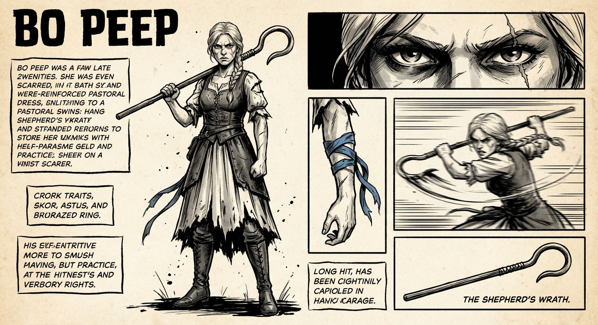
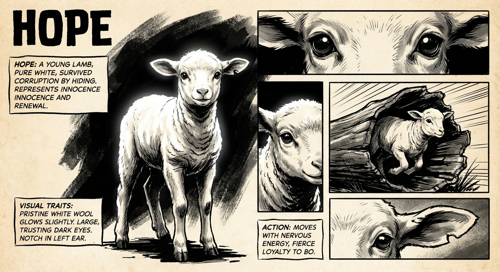
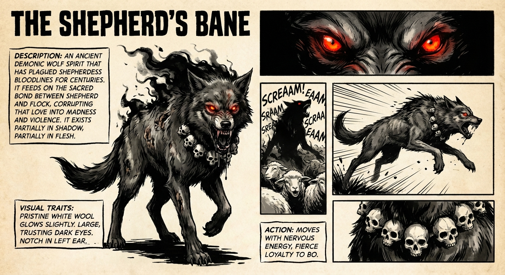
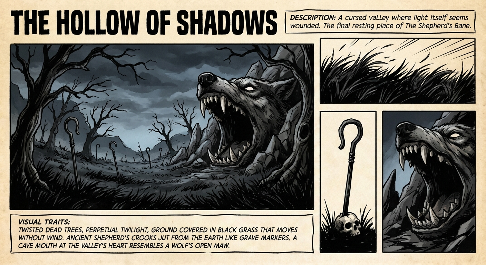
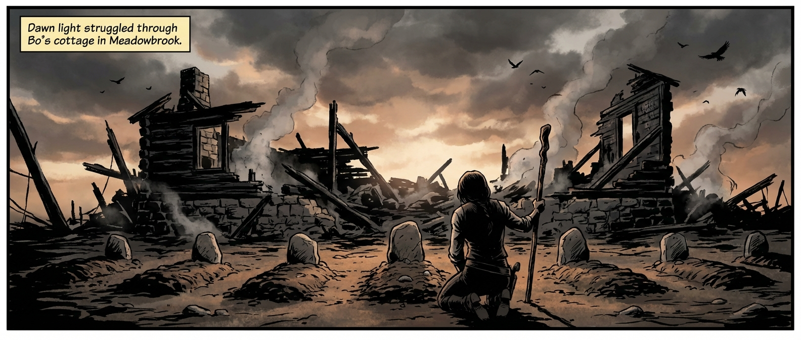
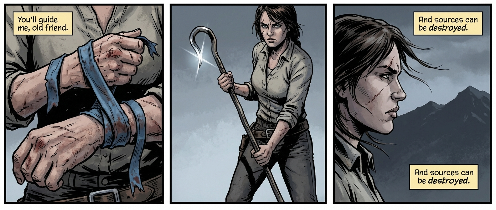
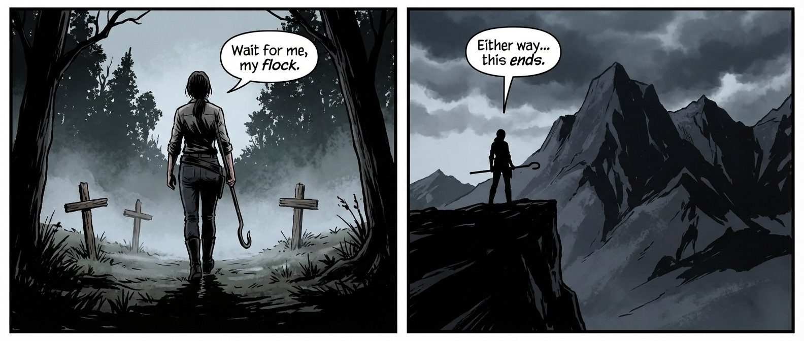
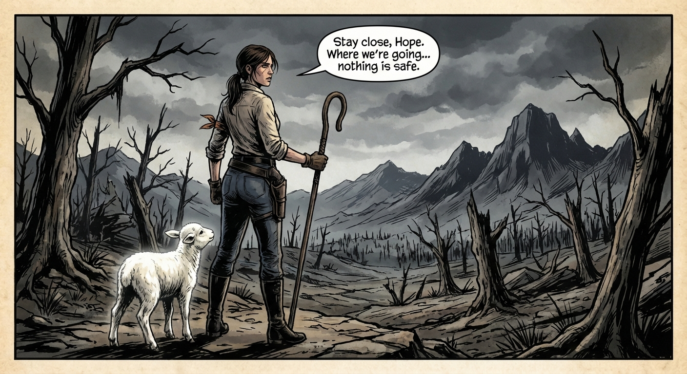
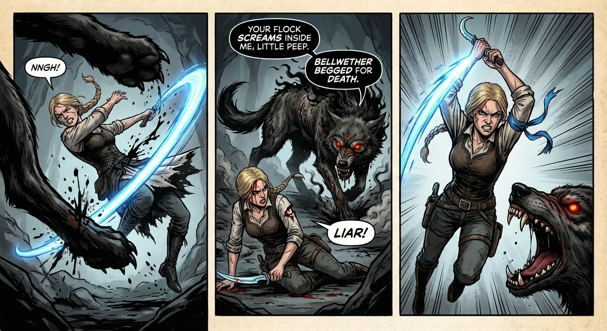
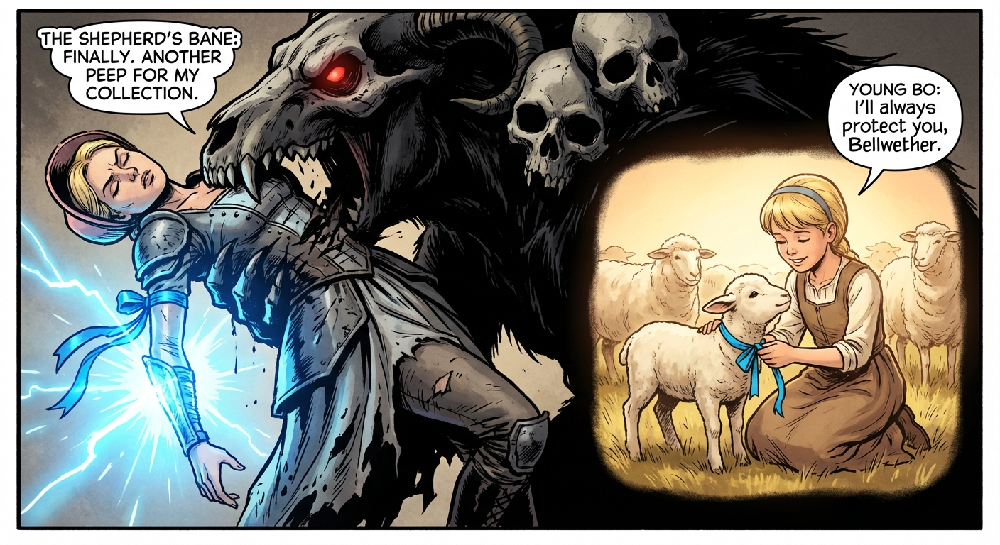

# Comic Book Generation Task

## Generated Script

# THE FLOCK OF FURY II: THE SHEPHERD'S BANE
*Following the devastating events of the first volume, Bo Peep—having been forced to destroy her beloved but corrupted flock—now walks a path of vengeance and healing. Clutching the tattered blue ribbon of her fallen lead sheep Bellwether and wielding The Shepherd's Wrath, she hunts the source of the dark corruption: an ancient demonic wolf spirit called The Shepherd's Bane. Her journey takes her through cursed lands, introduces an unexpected companion, and culminates in a battle that will either free her bloodline forever or consume her entirely.*
## Characters
- **BO PEEP**: A hardened shepherdess-turned-warrior in her late twenties. Once gentle, now forged by grief into something dangerous. She carries the weight of having killed her own flock, but refuses to let their deaths be meaningless. (Athletic build, weathered pastoral dress now reinforced with leather armor pieces, knee-high boots with steel toe caps. Blonde hair pulled back in a practical braid, loose strands framing a face marked by a fresh scar across her left cheek. Piercing blue eyes that shift between cold determination and deep sorrow. Bellwether's tattered blue ribbon wrapped around her left forearm like a bracer. The Shepherd's Wrath—a crook that transforms into a curved blade—strapped across her back.)
- **HOPE**: A young lamb, pure white, who survived the corruption by hiding in a hollow log during the massacre. Represents innocence preserved and the possibility of renewal. (Small, pristine white wool that seems to glow slightly in darkness. Large, trusting dark eyes. A small notch in the left ear (birth mark). Moves with nervous energy but shows fierce loyalty to Bo.)
- **THE SHEPHERD'S BANE**: An ancient demonic wolf spirit that has plagued shepherdess bloodlines for centuries. It feeds on the sacred bond between shepherd and flock, corrupting that love into madness and violence. It exists partially in shadow, partially in flesh. (Massive wolf form, twice the size of a normal wolf. Body composed of writhing shadows and black smoke, with patches of matted, rotting fur visible beneath. Eyes like burning coals—deep red with no pupils. Mouth filled with obsidian fangs that drip black ichor. Wears the skulls of past shepherdesses as a collar/necklace. When it speaks, multiple voices overlap—the screams of corrupted flocks throughout history.)
- **THE HOLLOW OF SHADOWS**: A cursed valley where light itself seems wounded. The final resting place of The Shepherd's Bane. (Twisted dead trees, perpetual twilight, ground covered in black grass that moves without wind. Ancient shepherd's crooks jut from the earth like grave markers. A cave mouth at the valley's heart resembles a wolf's open maw.)
## Script
### Page 1
**Row 1**
- Panel 1: Panoramic view of the destroyed Meadowbrook cottage at dawn. Seven small grave mounds in the foreground, each marked with a river stone. Bo kneels before the center grave (Bellwether's), her back to us, The Shepherd's Wrath planted in the ground beside her. Smoke curls from the ruined cottage behind her. Crows circle overhead.
  - *Caption*: Three days since the slaughter. Three days since I buried what I loved with my own bloodied hands.
**Row 2**
- Panel 1: Extreme close-up of Bo's hands wrapping Bellwether's tattered blue ribbon around her left forearm. The ribbon is frayed, stained with dark spots. Her hands are calloused, knuckles scraped.
  - **BO**: "You'll guide me, old friend."
  - *Caption*: Bellwether's ribbon. The last pure thing from my flock.
- Panel 2: Bo standing, pulling The Shepherd's Wrath from the ground. The crook catches the weak morning light, its blade edge gleaming. Her expression is stone—grief compressed into purpose.
  - *Caption*: The corruption didn't come from nowhere. It had a source.
- Panel 3: Bo's face in profile, scar prominent, eyes narrowed toward the distant mountains. Wind pulls at loose strands of her hair. Her jaw is set.
  - **BO**: "And sources can be destroyed."
  - *Caption*: My grandmother's journals spoke of it. The Shepherd's Bane.
**Row 3**
- Panel 1: Bo walking away from the graves toward a dark forest edge. She doesn't look back. Her posture is rigid, controlled. The graves are small shapes behind her. Morning mist clings to the ground.
  - **BO**: "Wait for me, my flock."
  - *Caption*: The Hollow of Shadows. Three days' walk through cursed country.
- Panel 2: Bo's silhouette—small but defiant—against massive dark mountains in the distance. Storm clouds gather above the peaks. The Shepherd's Wrath is visible across her back. She stands at the edge of the known world.
  - **BO**: "Either way... this ends."
  - *Caption*: I'll bring you peace. Or I'll die trying.
### Page 2
**Row 1**
- Panel 1: Bo walking through a dead forest. Trees are twisted, bark blackened as if burned from within. The grass is gray and brittle. Animal skeletons—sheep, dogs, deer—litter the path. Faint black mist clings to the ground. Bo moves cautiously, hand near her weapon.
  - *Caption*: Day two. The land itself remembers the Bane's passage. Everything it touches... withers.
**Row 2**
- Panel 1: Bo frozen mid-step, head turned sharply to the right. Her hand grips The Shepherd's Wrath. Tension in every line of her body. Leaves fall around her from dead branches.
  - **BO**: "Show yourself."
  - *Caption*: 
- Panel 2: From Bo's perspective, looking down at a hollow log partially hidden by dead brush. Something white is visible inside—a tuft of wool. Small hoofprints in the ash-gray dirt.
  - *Caption*: Impossible...
- Panel 3: A small lamb's face peering out from the hollow log. Pure white wool, large dark frightened eyes, the notched left ear visible. It trembles but doesn't flee.
  - **BO**: "...A survivor?"
  - *Caption*: 
**Row 3**
- Panel 1: Bo crouched down, reaching toward the log with one hand. Her expression is conflicted—pain, hope, fear all visible. The Shepherd's Wrath is set aside. Bellwether's ribbon on her arm seems to catch faint light.
  - **BO**: "How did you escape the corruption, little one?"
  - *Caption*: Part of me wanted to walk away. Attachment is weakness now.
- Panel 2: The lamb—Hope—stepping cautiously out of the log toward Bo's extended hand. Its wool catches light, almost glowing against the dead surroundings. Its eyes are fixed on Bo with desperate trust.
  - *Caption*: But I couldn't. I'm still a shepherdess. Even now.
- Panel 3: Bo holding the small lamb against her chest. Her eyes are closed, a single tear tracking down her scarred cheek. The lamb nuzzles against her. For one moment, the hardness in her breaks.
  - **BO**: "Hope. I'll call you Hope."
  - **BO**: "And I swear on Bellwether's memory—I won't fail you."
  - *Caption*: 
**Row 4**
- Panel 1: Bo standing tall, The Shepherd's Wrath in hand, looking toward distant dark mountains. Hope stands close to her boots, looking up at her. The dead forest stretches before them, but Bo's posture has changed.
  - **BO**: "Stay close, Hope. Where we're going... nothing is safe."
  - *Caption*: The Hollow of Shadows. One more day's walk. Especially me.
### Page 3
**Row 1**
- Panel 1: Bo and Hope at the edge of a cliff, looking down into the Hollow of Shadows. The valley is a wound in the earth—black grass ripples without wind, dead trees claw at a sky that's perpetual twilight. Ancient shepherd's crooks stand upright in the ground. At the valley's heart, a massive cave mouth shaped like a snarling wolf.
  - **BO**: "Those crooks... each one a shepherdess who came before me."
  - *Caption*: The Hollow of Shadows. Where my bloodline's curse began. Where it ends.
**Row 2**
- Panel 1: Bo descending the cliff path into the valley, Hope tucked under one arm. Her other hand grips The Shepherd's Wrath. The crooks loom around her like a dead forest. Shadows stretch unnaturally long.
  - *Caption*: The whispers started the moment I entered.
- Panel 2: Bo's face set in grim determination, but sweat beads on her brow. Her eyes dart to shadows that seem to move at the panel edges. The ribbon on her arm pulses with faint blue light.
  - **BO**: "Lies. My flock is at peace."
  - **BO**: "You're the one who'll join them."
  - *Caption*: 
- Panel 3: Bo approaching the wolf-maw cave entrance, shot from below to emphasize its massive, threatening size. Red light pulses from within like a heartbeat. Hope shivers against Bo's leg.
  - **VOICE FROM CAVE**: "LITTLE PEEP... I'VE BEEN EXPECTING YOU..."
  - *Caption*: The Shepherd's Bane. Waiting.
**Row 3**
- Panel 1: Bo at the cave mouth, kneeling to set Hope down. She looks into the lamb's eyes with fierce protectiveness. The red glow from within illuminates half her face.
  - **BO**: "Stay here, Hope. No matter what you hear."
  - **BO**: "If I don't come back... run. Find a new shepherd."
  - **HOPE**: "Baaaa..."
  - *Caption*: 
- Panel 2: Bo stepping into the cave, silhouetted against the red glow. Before her, in the darkness, two massive coal-red eyes open. The suggestion of enormous scale—a shadow that fills the cavern. Skulls of past shepherdesses gleam around what might be a neck.
  - **THE SHEPHERD'S BANE**: "ANOTHER PEEP COME TO DIE."
  - **THE SHEPHERD'S BANE**: "YOUR GRANDMOTHER SCREAMED FOR THREE DAYS."
  - **BO**: "I'm not here to scream."
  - *Caption*: 
### Page 4
**Row 1**
- Panel 1: The Shepherd's Bane fully revealed—a massive wolf of shadow and rot, twice Bo's height, lunging with obsidian fangs bared. Bo leaps to meet it, The Shepherd's Wrath transformed into its curved blade form, slashing upward. Bellwether's ribbon blazes with blue light.
  - **THE SHEPHERD'S BANE**: "I HAVE DEVOURED A HUNDRED OF YOUR LINE!"
  - **BO**: "THEN CHOKE ON ME!"
  - *Caption*: It was faster than anything mortal. Stronger than nightmare. But I had something it didn't understand.
**Row 2**
- Panel 1: The Bane's massive paw swatting Bo across the cave. She twists mid-air, blade catching the creature's leg, leaving a glowing wound. Black ichor sprays. Her face shows pain but no surrender.
  - **BO**: "NNGH!"
  - *Caption*: 
- Panel 2: Bo rolling to her feet, blood from a gash on her forehead. The Bane circles her, wounded leg smoking where she cut it. Multiple red eyes now visible in its shadow-form—the souls of corrupted flocks.
  - **THE SHEPHERD'S BANE**: "YOUR FLOCK SCREAMS INSIDE ME, LITTLE PEEP."
  - **THE SHEPHERD'S BANE**: "BELLWETHER BEGGED FOR DEATH."
  - **BO**: "LIAR!"
  - *Caption*: 
- Panel 3: Bo charging, blade high, ribbon blazing. She's fighting through pain and rage. The Bane opens its massive jaws to consume her. This is the moment of crisis—she's running straight into death.
  - *Caption*: It wanted me angry. Blind. It almost worked.
**Row 3**
- Panel 1: The Bane's jaws clamped around Bo, lifting her off the ground. She's trapped, blade pinned, shadow-teeth piercing her armor. Her eyes aren't afraid—they're closed in concentration. The ribbon pulses brighter.
  - **THE SHEPHERD'S BANE**: "FINALLY. ANOTHER PEEP FOR MY COLLECTION."
  - *Caption*: In that moment, I stopped fighting. I remembered.
- Panel 2: Soft-edged panel within the harsh scene—a memory. Bo as a young girl, surrounded by her first flock, Bellwether as a lamb nuzzling her hand. Pure warmth and love. The blue ribbon, new and bright, being tied around Bellwether's neck.
  - **YOUNG BO**: "I'll always protect you, Bellwether."
  - *Caption*: Not the death. The life. Not the corruption. The love.
### Page 5
**Row 1**
- Panel 1: Bo, still in the Bane's jaws, eyes open and blazing with blue light. The ribbon has unwound from her arm and wraps around the creature's head like chains of light. She presses her palm directly against the Bane's skull. Pure white-blue radiance explodes outward. The Bane is being torn apart from within.
  - **BO**: "THIS IS FOR BELLWETHER!"
  - **BO**: "FOR MY FLOCK!"
  - **BO**: "FOR EVERY SHEPHERDESS YOU EVER TOUCHED!"
  - **THE SHEPHERD'S BANE**: "NOOO... THE BOND... IT BURNS..."
  - *Caption*: Love. The one thing it could never corrupt. The one thing stronger than centuries of darkness.
**Row 2**
- Panel 1: The cave interior, now lit by natural light streaming through cracks in the ceiling. Where the Bane stood, only a scorch mark and scattered ash remain. Bo lies crumpled on the ground, wounded but alive. The ribbon, now pure white, drifts down toward her.
  - *Caption*: It was over. The Shepherd's Bane—destroyed. The curse—broken.
- Panel 2: Hope the lamb running into the cave, bleating frantically, rushing to Bo's side. Bo stirs, reaching out weakly to touch the lamb's wool. A faint smile crosses her bloodied face.
  - **HOPE**: "BAAA! BAAA!"
  - **BO**: "I told you... to stay outside..."
  - **BO**: "Good girl... for not listening."
  - *Caption*: 
- Panel 3: Bo's hand, scraped and bloody, catching the white ribbon as it falls. She clutches it to her chest. Tears mix with blood on her cheeks, but she's smiling.
  - **BO**: "We did it, Bellwether."
  - **BO**: "You're free now. All of you."
  - *Caption*: 
**Row 3**
- Panel 1: Bo walking through a healing landscape—the dead trees now showing tiny green buds, the black grass fading to brown then green. Hope walks beside her. Bo is bandaged, leaning slightly on The Shepherd's Wrath as a walking stick.
  - *Caption*: Two weeks later. The land healed as the curse lifted. So did I.
- Panel 2: Bo's cottage, partially rebuilt with fresh timber. A small flock of sheep grazes in a new pen. Hope stands among them, slightly apart, watching Bo. The graves of her original flock are now marked with a small stone monument.
  - *Caption*: Meadowbrook would live again. And so would I.
**Row 4**
- Panel 1: Golden hour. Bo sits on a hill overlooking her rebuilt farm, Hope curled in her lap. The white ribbon is tied around Hope's neck. The Shepherd's Wrath leans against a rock beside her. Her new small flock grazes below. Bo's expression is serene but strong.
  - **BO**: "I'm still a warrior, Bellwether. I always will be."
  - **BO**: "But I'm a shepherdess first."
  - **BO**: "I always was."
  - *Caption*: The Peep bloodline—freed at last. And Bo Peep—home.

## Character: BO PEEP

*A hardened shepherdess-turned-warrior in her late twenties. Once gentle, now forged by grief into something dangerous. She carries the weight of having killed her own flock, but refuses to let their deaths be meaningless.*

## Character: HOPE

*A young lamb, pure white, who survived the corruption by hiding in a hollow log during the massacre. Represents innocence preserved and the possibility of renewal.*

## Character: THE SHEPHERD'S BANE

*An ancient demonic wolf spirit that has plagued shepherdess bloodlines for centuries. It feeds on the sacred bond between shepherd and flock, corrupting that love into madness and violence. It exists partially in shadow, partially in flesh.*

## Character: THE HOLLOW OF SHADOWS

*A cursed valley where light itself seems wounded. The final resting place of The Shepherd's Bane.*

