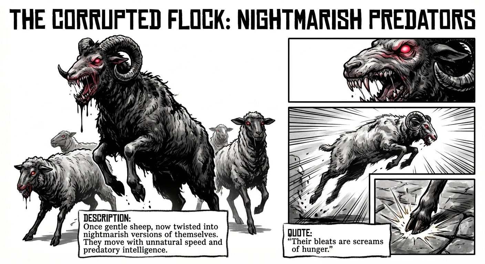
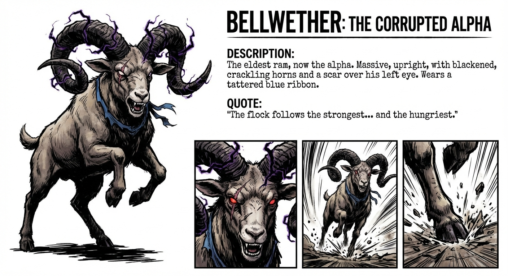
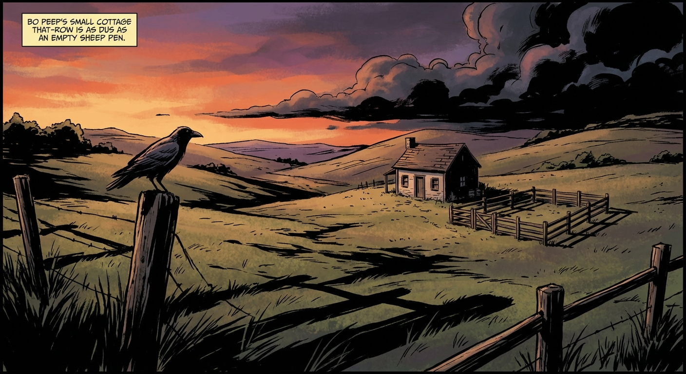
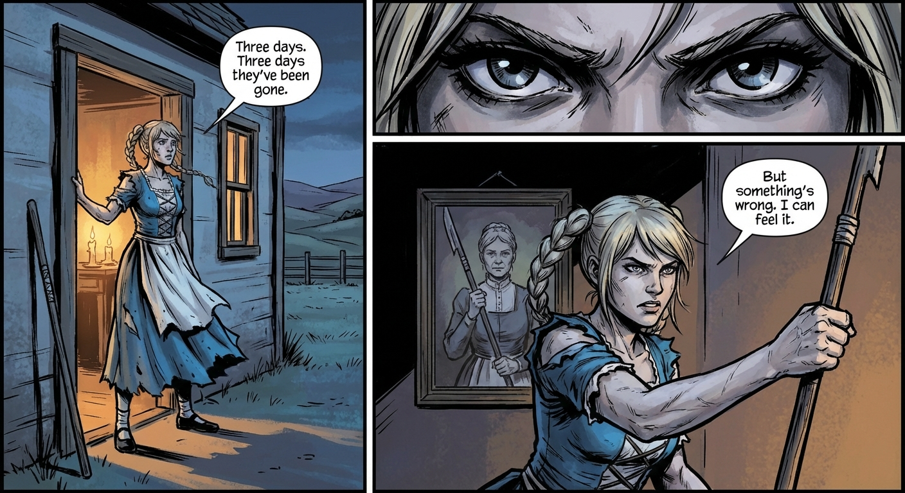
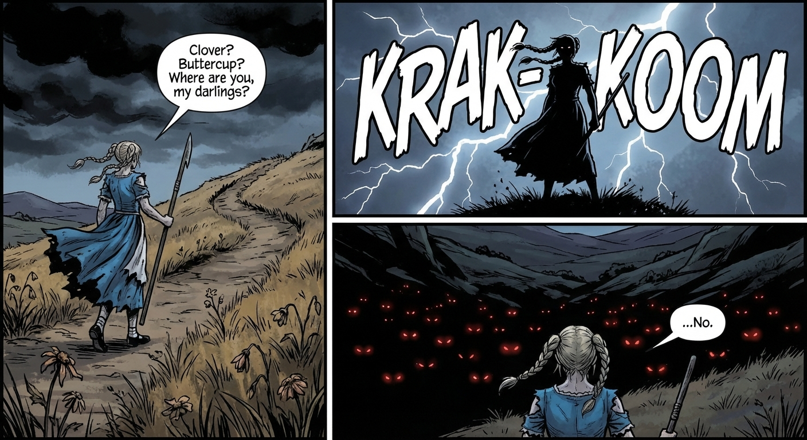
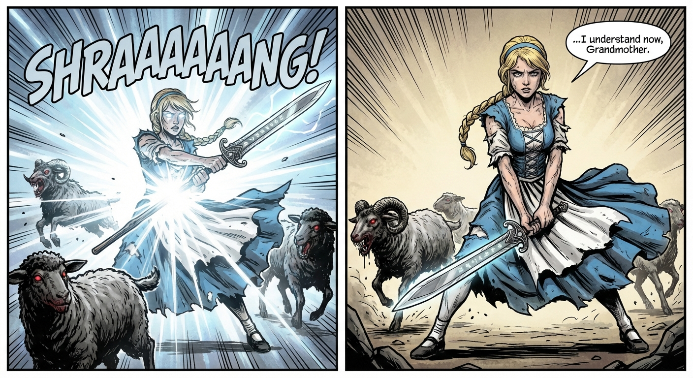
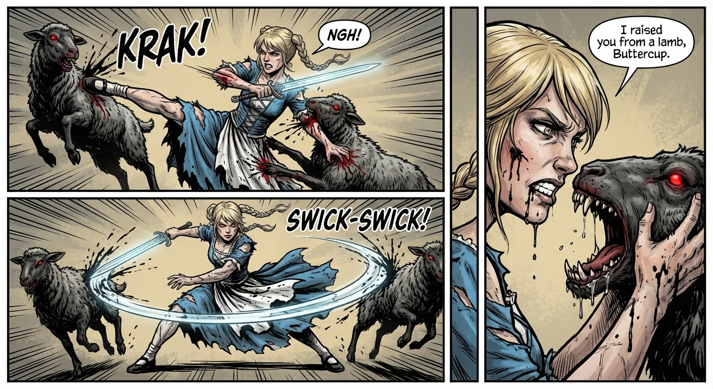
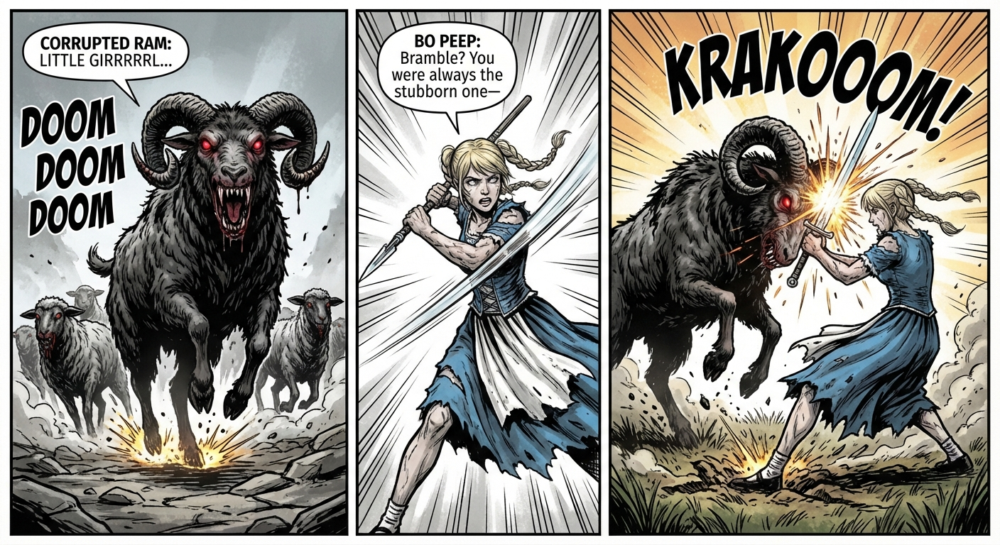
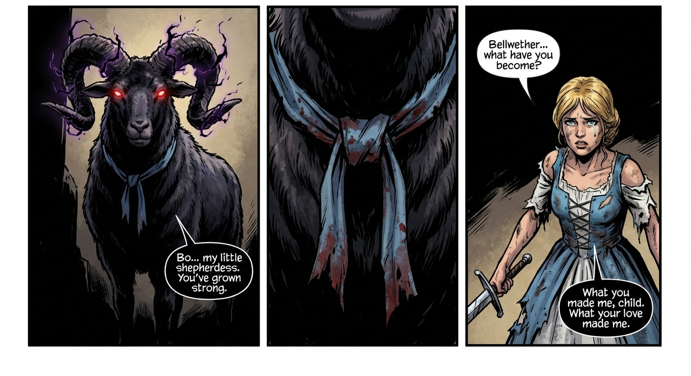
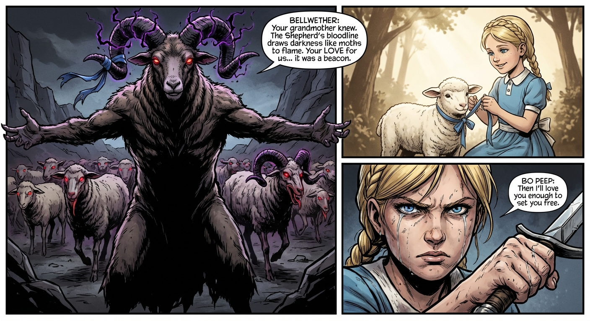

# Comic Book Generation Task

## Generated Script

# LITTLE BO PEEP: THE FLOCK OF FURY
*In the pastoral hills of Meadowbrook, young shepherdess Bo Peep has always tended her flock with love and care. But when a dark curse sweeps across the land, her innocent sheep transform into demonic, bloodthirsty creatures with glowing red eyes and razor-sharp teeth. As the corruption spreads, Bo discovers her grandmother's walking staff holds an ancient secret—it transforms into a legendary blade called "The Shepherd's Wrath." Now, the girl who once sang lullabies to her lambs must become a warrior and put down her beloved flock before they spread their evil beyond the hills. This is not the nursery rhyme you remember.*
## Characters
- **Bo Peep**: A 19-year-old shepherdess forced to become a warrior. Initially innocent and nurturing, she transforms into a fierce, determined fighter while struggling with the emotional weight of destroying creatures she once loved. (Long blonde hair tied in twin braids, now battle-worn and loose. Traditional blue and white shepherdess dress, torn and bloodied from combat. Piercing blue eyes that shift between sorrow and cold determination. Athletic build hidden beneath pastoral clothing. Carries her staff/sword across her back.)
- **The Corrupted Flock**: Once gentle sheep, now twisted into nightmarish versions of themselves. They move with unnatural speed and predatory intelligence. (Matted, blackened wool. Glowing crimson eyes. Elongated snouts filled with rows of sharp teeth. Cloven hooves that spark against stone. Some walk on hind legs. Varying sizes—from lamb-sized scouts to massive ram leaders. Black ichor drips from their mouths.)
- **Bellwether**: The eldest ram of the flock, now the alpha of the corrupted herd. Once Bo's favorite and most trusted sheep, his betrayal cuts deepest. (Massive, twice the size of a normal ram. Curved horns now twisted and blackened like burnt wood, crackling with dark energy. A scar over his left eye from when Bo saved him from wolves years ago. Walks upright. Wears the tattered remains of the blue ribbon Bo gave him as a lamb.)
- **The Shepherd's Wrath**: An ancient blade passed down through generations of Peep shepherdesses, disguised as a simple walking staff. (Staff form: gnarled oak wood with a curved hook. Sword form: elegant single-edged blade with silver edge, the hook becomes an ornate guard, runes glow faintly along the blade. Transforms with a twist and pull motion.)
## Script
### Page 1
**Row 1**
- Panel 1: Panoramic view of Meadowbrook hills. Bo Peep's cottage in the middle distance. Empty sheep pen visible. Long shadows stretch across the grass. A single crow sits on a fencepost.
  - *Caption*: Meadowbrook Hills. Where I've tended my flock since I could walk. Where I learned that some things, once lost, should never be found.
**Row 2**
- Panel 1: Bo Peep stands in the doorway of her cottage, hand on the frame, looking out at the empty hills. Her staff leans against the wall beside her. Warm candlelight behind her, cold dusk ahead.
  - **BO PEEP**: "Three days. Three days they've been gone."
  - *Caption*: 
- Panel 2: Extreme close-up of Bo's eyes—worried, but with a flicker of steel beneath the concern. Reflection of the darkening sky in her pupils.
  - *Caption*: Grandmother always said the flock would return when they were ready.
- Panel 3: Bo grabs her staff from the wall, knuckles white around the wood. Her jaw is set. Behind her, an old portrait of her grandmother holding the same staff is partially visible.
  - **BO PEEP**: "But something's wrong. I can feel it."
  - *Caption*: 
**Row 3**
- Panel 1: Bo walks up a hill path, staff in hand, dress billowing in an unnatural wind. Dead grass and withered flowers line the path. The sky has darkened significantly.
  - **BO PEEP**: "Clover? Buttercup? Where are you, my darlings?"
  - *Caption*: The hills have changed. The grass dies where I walk.
- Panel 2: Bo reaches the hilltop, shown from below to emphasize her silhouette against the stormy sky. Lightning flickers in the distant clouds. Her braids whip behind her. Sound Effect: KRAK-KOOOM.
  - *Caption*: 
- Panel 3: From behind Bo, we see what she sees—in the valley below, dozens of shapes move in the darkness. Red pinpricks of light. Eyes. Many eyes. All looking up at her.
  - **BO PEEP**: "...No."
  - *Caption*: I found my sheep.
**Row 4**
- Panel 1: The corrupted flock emerges from the shadows of the valley. Dozens of twisted sheep, some on all fours, some standing upright. Black wool, red eyes, gleaming teeth. They move as one organism, surrounding the base of Bo's hill. Sound Effect: Baaaahhhhh...
  - *Caption*: 
- Panel 2: Bo's face in stark contrast—half lit by the red glow from below, half in shadow. A single tear rolls down her cheek, but her expression hardens from grief to grim resolve.
  - **BO PEEP**: "What happened to you...?"
  - *Caption*: 
- Panel 3: Extreme close-up of a corrupted sheep's face—once gentle Clover, now monstrous. Matted black wool, hellfire eyes, mouth open to reveal rows of needle teeth. Black drool drips from its maw.
  - **CORRUPTED SHEEP**: "Shepherdessssss... we've been waiting..."
  - *Caption*: I wished I'd never found them.
### Page 2
**Row 1**
- Panel 1: Three corrupted sheep launch themselves up the hillside toward Bo, mouths agape, claws extended from their hooves. Motion lines streak behind them. Bo braces herself, staff horizontal. Sound Effect: SKREEEE!
  - **BO PEEP**: "Stay back!"
  - *Caption*: 
- Panel 2: Bo swings her staff, connecting with the lead sheep's skull. The impact sends it tumbling, but two more are right behind it. Sweat on Bo's brow. Her dress tears at the hem. Sound Effect: KRAKK!
  - *Caption*: The staff grandmother gave me. 'For protection,' she said.
**Row 2**
- Panel 1: A corrupted sheep tackles Bo from behind. She falls forward, losing grip on her staff. It clatters away. Three more sheep close in, teeth bared. Sound Effect: THUD!
  - **BO PEEP**: "AAAH!"
  - *Caption*: 
- Panel 2: Bo on the ground, reaching desperately for her staff just out of reach. A sheep's hoof pins her braid. Another lunges for her throat. Her fingers stretch toward the wood.
  - **BO PEEP**: "Please... PLEASE!"
  - *Caption*: 
- Panel 3: The staff begins to glow with silver-white light. Ancient runes appear along its surface, burning through the wood grain. The curved hook straightens, gleams. Sound Effect: FWOOOSH!
  - *Caption*: 'For protection,' she said. I never understood.
**Row 3**
- Panel 1: Bo grabs the glowing staff. Light explodes outward in a shockwave, throwing the corrupted sheep back. The staff elongates, the hook reshapes into a guard, a blade emerges—THE SHEPHERD'S WRATH is born. Bo's eyes reflect the silver light. Sound Effect: SHRAAAAANG!
  - *Caption*: 
- Panel 2: Bo rises to her feet, sword in a two-handed grip, blade pointed down and to the side. Her torn dress flows like battle garb. Her expression has transformed—no more tears, only cold determination. The corrupted sheep recoil from the light.
  - **BO PEEP**: "...I understand now, Grandmother."
  - *Caption*: 
**Row 4**
- Panel 1: Bo shifts into a fighting stance—blade raised at an angle, feet planted, weight forward. Wind dies. Everything goes still. Her eyes narrow.
  - **BO PEEP**: "You're not my flock anymore."
  - *Caption*: 
- Panel 2: The corrupted sheep spread out, surrounding her in a circle. Dozens of red eyes in the darkness. They crouch, ready to spring. The largest ones hang back, watching.
  - **CORRUPTED SHEEP**: "Kill... kill the shepherdess... Tear... rend... feast..."
  - *Caption*: 
- Panel 3: Bo's eye, reflected in the blade of her sword. In the reflection, we see the sheep beginning their charge.
  - **BO PEEP**: "Then let me put you to rest."
  - *Caption*: Little Bo Peep has lost her sheep. And she knows exactly where to find them.
### Page 3
**Row 1**
- Panel 1: Bo spins, blade extended, cutting through three sheep in a single arc. Black ichor sprays in a fan pattern. Her braids whip around her. Motion blur on the blade creates a silver crescent. Sound Effect: SLASHHH!
  - **BO PEEP**: "HYAAAH!"
  - *Caption*: 
- Panel 2: Close-up of the Shepherd's Wrath cleaving through a corrupted sheep's skull. The blade glows where it cuts. The creature's red eyes flicker and die. Ichor splatters across the panel border. Sound Effect: SHUNK!
  - *Caption*: 
**Row 2**
- Panel 1: Bo kicks a sheep in the chest while simultaneously blocking another's bite with her blade. A third rakes claws across her forearm. Blood (red) mixes with ichor (black) on her skin. Sound Effect: KRAK! / SLASH!
  - **BO PEEP**: "NGH!"
  - *Caption*: 
- Panel 2: Bo drops low, sweeping her blade in a horizontal arc that takes out the legs of two charging sheep. She's covered in black ichor now, dress ruined, but her eyes burn with focus. Sound Effect: SWICK-SWICK!
  - *Caption*: 
- Panel 3: A sheep's jaws snap shut inches from Bo's face. She's caught its throat with her free hand, holding it back. Drool and ichor drip onto her cheek. Her teeth are gritted.
  - **BO PEEP**: "I raised you from a lamb, Buttercup."
  - *Caption*: 
**Row 3**
- Panel 1: Bo drives her blade through Buttercup's chest. The sheep's eyes flicker—for a moment, they seem to clear, to recognize her. Then they go dark. Bo's face is a mask of controlled grief. Sound Effect: SHUNK.
  - **BO PEEP**: "I'm sorry."
  - *Caption*: 
- Panel 2: Bo stands among fallen sheep, breathing hard. Black ichor pools around her feet. But beyond the bodies, MORE sheep emerge from the darkness. Dozens more. She's barely made a dent.
  - *Caption*: For every one I cut down, two more take its place.
- Panel 3: Bo wipes ichor from her face with her forearm, smearing it. She adjusts her grip on the sword. Behind her, sheep corpses. Before her, a sea of red eyes.
  - **BO PEEP**: "Come on then. I have all night."
  - *Caption*: 
**Row 4**
- Panel 1: The smaller sheep part like a wave. Through them charges a corrupted ram twice Bo's size, horns lowered, hooves sparking on stone. Its wool is matted with the blood of other creatures. Sound Effect: DOOM DOOM DOOM.
  - **CORRUPTED RAM**: "LITTLE GIRRRRRL..."
  - *Caption*: 
- Panel 2: Bo's eyes widen. She shifts her stance, blade angled to deflect. Time seems to slow—motion lines converge on the point of impact.
  - **BO PEEP**: "Bramble? You were always the stubborn one—"
  - *Caption*: 
- Panel 3: The ram's horns meet Bo's blade in an explosion of sparks and force. The impact creates a shockwave that flattens the grass around them. Bo's feet dig trenches in the earth as she's pushed back. Sound Effect: KRAKOOOM!
  - *Caption*: —but so am I.
### Page 4
**Row 1**
- Panel 1: Bo rolls under Bramble's charging horns, slashing at his flank as she passes. The blade cuts deep, black ichor spraying. The ram bellows in rage. Sound Effect: SLASH! / BWAAAHHH!
  - *Caption*: 
- Panel 2: Bramble spins faster than expected, his hoof catching Bo in the ribs. She's launched sideways, sword still in hand, pain evident on her face. Sound Effect: KRAKK!
  - **BO PEEP**: "GAHH!"
  - *Caption*: 
- Panel 3: Bo lands in a crouch, one hand on the ground, sword extended behind her for balance. She spits blood. Bramble paws the ground, preparing another charge.
  - **BO PEEP**: "Okay... that hurt."
  - *Caption*: 
**Row 2**
- Panel 1: Bramble charges again. Bo doesn't dodge—she runs TOWARD him, blade low.
  - **BO PEEP**: "You always charged blind, Bramble."
  - *Caption*: 
- Panel 2: At the last second, Bo plants her staff-sword in the ground and vaults over Bramble's horns. In mid-air, inverted, she draws the blade up through his skull from behind. Time-frozen moment of lethal grace. Sound Effect: SHRAANG!
  - *Caption*: 
- Panel 3: Bo lands behind Bramble as he collapses, blade dripping. She doesn't look back. But she's breathing hard, wounded, exhausted.
  - *Caption*: Twelve years I raised him. Twelve seconds to end him.
**Row 3**
- Panel 1: The corrupted sheep freeze mid-motion. Then, as one, they back away from Bo, creating a wide circle. Their red eyes dim slightly, submissive.
  - **BO PEEP**: "What...?"
  - *Caption*: 
- Panel 2: A shadow falls over the battlefield. The clouds part to reveal a blood-red moon. In the distance, heavy hoofbeats. DOOM. DOOM. DOOM. Sound Effect: DOOM... DOOM... DOOM...
  - *Caption*: Then I felt it. The presence I'd been dreading.
- Panel 3: Bo turns slowly, sword raised. Her face shows recognition—and heartbreak. Tears threaten at the corners of her eyes, but she forces them back.
  - **BO PEEP**: "No... not you. Please, not you."
  - *Caption*: 
**Row 4**
- Panel 1: BELLWETHER emerges from the darkness. Towering, walking upright on hind legs, twisted horns crackling with dark energy. His wool is midnight black, his eyes burn like hellfire. Around his neck—tattered and stained—is a faded blue ribbon.
  - **BELLWETHER**: "Bo... my little shepherdess. You've grown strong."
  - *Caption*: 
- Panel 2: Extreme close-up of the blue ribbon around Bellwether's neck. It's the same one from Bo's childhood. Faded. Bloodstained. But unmistakable.
  - *Caption*: The ribbon I tied around his neck when he was born. When I promised to always protect him.
- Panel 3: Bo's sword arm trembles. A single tear escapes, cutting a path through the ichor on her cheek. But she doesn't lower her blade.
  - **BO PEEP**: "Bellwether... what have you become?"
  - **BELLWETHER**: "What you made me, child. What your love made me."
  - *Caption*: 
### Page 5
**Row 1**
- Panel 1: Bellwether spreads his arms wide, gesturing to the corrupted flock around them. Dark energy crackles between his horns. His voice echoes unnaturally.
  - **BELLWETHER**: "Your grandmother knew. The Shepherd's bloodline draws darkness like moths to flame. Your LOVE for us... it was a beacon."
  - *Caption*: 
- Panel 2: A brief, soft-edged flashback: young Bo, maybe 7, tying the blue ribbon around a tiny lamb's neck. Both are smiling. Innocent. Beautiful.
  - *Caption*: I loved them more than anything in this world.
- Panel 3: Bo's grip tightens on her sword. Her expression hardens from grief to cold fury. The tears stop. Something breaks inside her—and something stronger takes its place.
  - **BO PEEP**: "Then I'll love you enough to set you free."
  - *Caption*: 
**Row 2**
- Panel 1: Bo and Bellwether collide in the center of the circle. Her blade meets his horns in an explosion of silver light and dark energy. Shockwave ripples outward. The corrupted sheep are thrown back. Sound Effect: KRAKABOOOOM!
  - *Caption*: 
- Panel 2: Rapid exchange—Bellwether swipes with clawed hooves, Bo parries and counters, he blocks with a horn, she spins away. Motion blur creates overlapping images of their deadly dance. Sound Effect: CLANG! SLASH! KRANG!
  - *Caption*: 
**Row 3**
- Panel 1: Bellwether's horn catches Bo across the chest, sending her flying. She crashes through several corrupted sheep, blade spinning from her grip. Sound Effect: KRUNCH!
  - **BO PEEP**: "AAAGH!"
  - *Caption*: 
- Panel 2: Bellwether stands over the fallen Bo, hoof raised for the killing blow. Dark energy gathers around him. His eyes show no mercy—but the ribbon flutters in the wind.
  - **BELLWETHER**: "Rest now, little shepherdess. Join your flock in darkness."
  - *Caption*: 
- Panel 3: From Bo's ground-level POV, she sees the ribbon. Close-up of her eyes—something shifts. Not defeat. Recognition. Love.
  - **BO PEEP**: "The ribbon... you kept it. After everything... you kept it."
  - **BELLWETHER**: "I... I..."
  - *Caption*: 
**Row 4**
- Panel 1: Bo rolls, grabs her sword, and rises in one fluid motion. Bellwether is frozen, one hoof on the ribbon, confusion in his hellfire eyes. For a moment, they're just a girl and her sheep again.
  - **BO PEEP**: "I know you're still in there. My Bellwether. My first lamb."
  - *Caption*: 
- Panel 2: Bo drives the Shepherd's Wrath through Bellwether's heart. But she's embracing him as she does it—one arm around his neck, face pressed to his wool. The blade glows brilliant white. The dark energy shatters like glass. Around them, the other corrupted sheep collapse, the curse breaking. Sound Effect: SHRAAAAANG!
  - **BO PEEP**: "I release you. I release you all."
  - **BELLWETHER**: "...thank... you..."
  - *Caption*: 
- Panel 3: Dawn breaks over the hills. Bo kneels among the bodies of her flock—no longer corrupted, just... gone. Bellwether's head rests in her lap. The blue ribbon is clutched in her hand. She's crying freely now. The Shepherd's Wrath has returned to staff form, lying beside her.
  - *Caption*: Little Bo Peep has lost her sheep... and doesn't know where to find them. But she knows where to find the darkness that took them.

## Character: Bo Peep

*A 19-year-old shepherdess forced to become a warrior. Initially innocent and nurturing, she transforms into a fierce, determined fighter while struggling with the emotional weight of destroying creatures she once loved.*

## Character: The Corrupted Flock

*Once gentle sheep, now twisted into nightmarish versions of themselves. They move with unnatural speed and predatory intelligence.*

## Character: Bellwether

*The eldest ram of the flock, now the alpha of the corrupted herd. Once Bo's favorite and most trusted sheep, his betrayal cuts deepest.*

## Character: The Shepherd's Wrath

*An ancient blade passed down through generations of Peep shepherdesses, disguised as a simple walking staff.*

