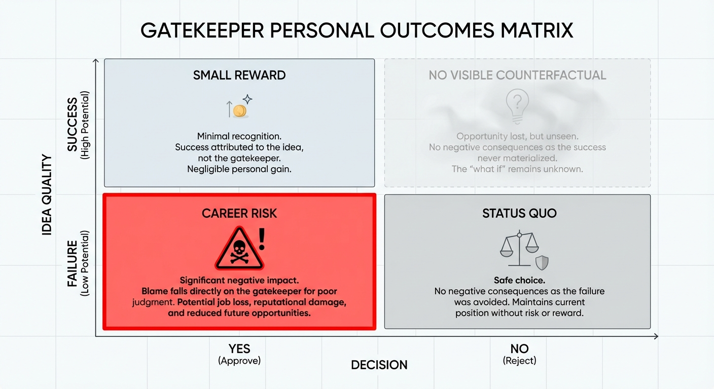
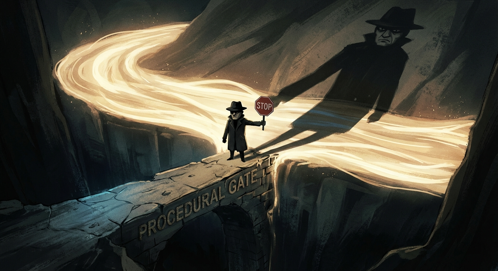
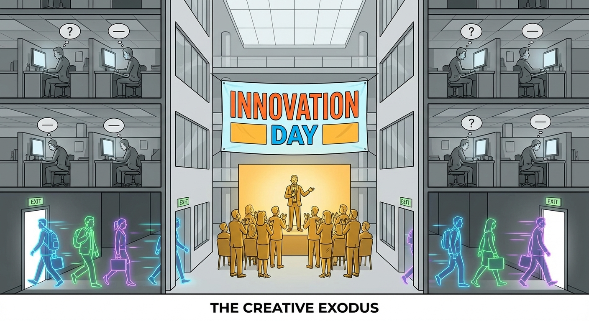
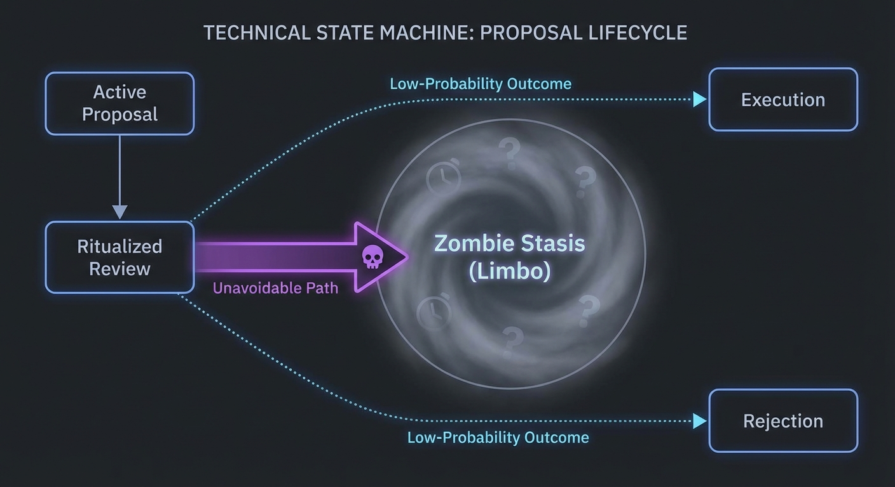

# Paper 1: Common Antipatterns in Organizational Ideation

## Abstract
Large organizations often claim to prioritize innovation while simultaneously maintaining structures that systematically suppress it. This paper identifies and analyzes the structural antipatterns that transform ideation from a generative process into a bureaucratic hurdle. By examining the 'Gatekeeper Loop', 'Ritualized Review', and 'Process Maximalism', we demonstrate how institutional inertia is not merely a byproduct of size, but a designed outcome of procedural bottlenecks.

## Introduction
In the modern corporate landscape, "innovation" is a ubiquitous buzzword, yet the actual production of novel, impactful ideas remains remarkably low in established institutions. The conventional diagnosis attributes this to a deficit of creativity—that organizations simply need more or better ideas. This diagnosis is wrong. Ideas were never scarce. Every organization, at every level of its hierarchy, teems with people who see problems clearly and can imagine solutions. The binding constraint was never ideation; it was the cost of action. Turning an idea into a tangible outcome—a prototype, a pilot, a product—required significant labor, capital, and coordination. Because action was expensive, it had to be rationed. And because it had to be rationed, it had to be controlled.

This economic reality produced a political economy of ideation. Authority monopolized the upstream phases of action—problem definition, prioritization, resource allocation—not because leaders were uniquely creative, but because they controlled the scarce resources required to act. Over time, this monopoly calcified into organizational architecture: the approval chains, the steering committees, the stage-gate processes that now define corporate innovation. What began as pragmatic resource management became a self-perpetuating system in which permission to act substituted for the act itself. The result is a set of structural antipatterns—procedural bottlenecks that do not merely slow innovation but are, in fact, *designed* to prevent it. Institutional inertia is not an accident; it is an outcome engineered by the very structures that claim to foster change. The following sections identify and dissect the three most pervasive of these antipatterns.

## The Gatekeeper Loop
The 'Gatekeeper Loop' is a phenomenon where an idea is subjected to a series of approvals from stakeholders who possess veto power but no creative skin in the game. 

In this antipattern, an innovator must navigate a non-linear path of "buy-in." Each gatekeeper—often representing legal, compliance, branding, or middle management—adds a layer of modification to the original concept. The goal of the gatekeeper is rarely to improve the idea, but to ensure it does not violate their specific silo's constraints. 

The result is a feedback loop where the idea is continuously diluted to satisfy the lowest common denominator of institutional comfort. By the time an idea exits the loop, it has been stripped of its original potency, leaving a "safe" but mediocre shell that fails to achieve its intended impact. The gatekeeper loop effectively weaponizes "alignment" to kill deviation.

The gatekeeper bears what might be called "accountability skin": they are personally exposed to the downside risk of any failure that passes through their domain, yet they receive virtually none of the upside when an innovation succeeds. A compliance officer who greenlights a novel product that later triggers a regulatory action faces career consequences for a failure they did not create; a middle manager who sponsors an unconventional project that misses its targets absorbs the reputational damage while the original innovator moves on. This asymmetry means the expected value of saying "Yes" is negative for the gatekeeper in almost every scenario. In game-theoretic terms, the legacy equilibrium makes "Strict Veto" the dominant strategy: the personal cost of a "Yes" that fails vastly exceeds the personal cost of a "No" that kills a good idea, because killed ideas produce no visible counterfactual. No one is held accountable for the innovation that never happened. The Gatekeeper Loop, then, is not a collection of obstructionist individuals—it is a Nash Equilibrium sustained by asymmetric risk, in which every participant is optimizing for personal risk avoidance rather than organizational value creation. Dismantling it requires not exhortation but restructuring: realigning incentives so that the cost of blocking value is at least as legible as the cost of permitting failure.
### The Micro-Dictator as Structural Archetype

The Gatekeeper Loop, at sufficient maturity, produces a recognizable structural archetype: the *micro-dictator*. This is not a personality type but a governance failure mode—a role that emerges predictably when action is expensive and permission is scarce. The micro-dictator is characterized by four structural features: authority that is small in scope, rigid in application, insecure in foundation, and dependent on controlling gates rather than enabling flow. A domain owner who must approve every asset request, a process steward who enforces formatting standards as though they were safety regulations, a team lead whose influence extends exactly as far as their sign-off authority and no further—these are not aberrant individuals but rational actors shaped by the system's incentive topology. Where the organization offers no mechanism to accumulate influence through *contribution*—through building, teaching, or enabling others—it guarantees that influence will be accumulated through *obstruction*: through the selective dispensation of permission. The micro-dictator's power is entirely positional, derived not from what they produce but from what they can prevent. This makes the role inherently brittle and inherently defensive; any proposal that might route around the gate, simplify the process, or reduce the need for approval is perceived—correctly—as an existential threat to the role itself. The result is a local incentive to *increase* procedural complexity over time, because complexity is the medium through which positional authority justifies its own existence. Importantly, this archetype is not confined to middle management, though it concentrates there because middle management sits at the intersection of high political accountability and low direct output. It can appear wherever the organization has created a node whose value proposition is gatekeeping rather than generation. The structural diagnosis matters because it clarifies the remedy: the micro-dictator is not dissolved by replacing the person in the role but by dissolving the conditions that produce the role. When the cost of action collapses—as Paper 2 will argue is now occurring—the gate loses its economic justification, and authority that was built entirely on controlling access to expensive action finds itself exposed, structurally, with no foundation beneath it.

## Ritualized Review 
'Ritualized Review' refers to the transformation of the ideation process into a performative ceremony. This often takes the form of "Innovation Days," "Pitch Competitions," or "Steering Committee Meetings."

- **Presentation over Substance:** Success is measured by the quality of the presentation (the "deck") rather than the viability or depth of the idea.
- **Non-Committal Feedback:** Feedback is generic, encouraging, but ultimately non-committal, leading to "zombie projects" that are never officially killed but never funded.
- **Status Quo Bias:** The "winning" ideas are almost always those that align most closely with existing corporate strategy, reinforcing the status quo rather than challenging it.

The most probable outcome of a Ritualized Review is not execution, nor even outright rejection, but a transition into what might be called *Zombie Stasis*: a liminal state in which the idea is nominally "under consideration," "pending further alignment," or "in the pipeline," but in which no resources are allocated, no owner is accountable, and no timeline is enforced. If one maps the lifecycle of ideas through a corporate ideation process as a state machine, the transition from Ritualized Review to Zombie Stasis is overwhelmingly the most common edge. Ideas enter the ritual alive and exit undead—not killed, because killing requires a decision and decisions create accountability, but not alive, because life requires resources and resources require commitment. The ritual, then, is not a filter that separates good ideas from bad ones; it is a *conveyor belt into organizational limbo*, a reliable mechanism for converting active proposals into passive inventory.

### The Cynicism Trap and Learned Helplessness

The deepest damage inflicted by Ritualized Review is not the loss of any individual idea but the *cultural toxicity* it produces over repeated cycles. The first time an employee participates in an Innovation Day and watches their proposal dissolve into non-committal smiles and vague follow-ups, they may attribute the outcome to bad luck or poor timing. The second time, they begin to suspect the structure. By the third time, they *know*—and this knowledge is corrosive in a way that no single failed project could ever be.

What emerges is a form of organizational learned helplessness: the internalized belief that effort directed toward innovation within the institution's formal channels is futile. Employees stop proposing their best ideas—not because they stop having them, but because they learn that the ritual will consume the idea without producing action. The most creative and ambitious individuals either withdraw into cynical disengagement or leave the organization entirely, producing a slow-motion adverse selection in which the people most capable of driving change are precisely the ones the system ejects. Those who remain and continue to participate do so performatively, treating the ritual as a career-visibility exercise rather than a genuine ideation opportunity—which, in turn, further degrades the quality of what the ritual produces, confirming the organization's quiet suspicion that "there just aren't enough good ideas."

This is the critical insight: the cynicism generated by recognized theater is more damaging to the organization than the absence of any particular product or initiative. A company that never held an Innovation Day but honestly acknowledged its structural conservatism would retain more creative capacity than one that stages elaborate ideation ceremonies while systematically refusing to act on their outputs. The ritual does not merely fail to produce innovation; it actively *destroys the conditions* under which innovation becomes possible, by teaching the workforce that the organization's stated commitment to new ideas is performed rather than real. The antibodies the institution deploys against change are not just procedural—they are psychological, and Ritualized Review is the vector through which they are most efficiently transmitted.

## Process Maximalism
'Process Maximalism' is the belief that the quality of an output is directly proportional to the complexity of the process used to generate it. In an attempt to "industrialize" innovation, organizations implement heavy frameworks—such as rigid Stage-Gate models or proprietary "Innovation Funnels"—that demand exhaustive documentation at every turn.

Process maximalism suppresses ideation through three primary mechanisms:
1. **High Barrier to Entry:** The administrative overhead required to even propose an idea discourages all but the most persistent (or politically motivated) individuals.
2. **False Precision:** Requiring detailed ROI projections and three-year roadmaps for ideas in their infancy forces innovators to fabricate data, leading to a culture of "spreadsheet engineering" rather than genuine discovery. This is, in game-theoretic terms, a dominated strategy that persists only because the process demands it: the innovator knows the numbers are invented, the reviewers know the numbers are invented, yet both parties maintain the fiction because the framework requires a populated spreadsheet before conversation can begin. The result is a *Verification Trap*, in which the organizational cost of rigorously verifying the projections would exceed the entire value of the artifact being proposed—so no one verifies, and the fabricated figures are accepted on ceremonial grounds alone. Over successive cycles, this produces a form of institutional self-deception that compounds: strategic decisions are built on projections everyone quietly acknowledges are fictional, those decisions generate outcomes that are then retroactively rationalized with new fictions, and the organization's entire epistemic foundation drifts further from reality while its confidence in its own rigor remains intact.
3. **Velocity Death:** The time elapsed between an idea's inception and its first real-world test is so long that the market conditions or the original problem may have already changed, rendering the idea obsolete before it is even piloted.

When process becomes the product, the organization loses the ability to act on intuition or respond to emergent opportunities.

## Conclusion: The Cost of Inertia
The cumulative effect of these antipatterns is a "frozen" organization. The Gatekeeper Loop ensures safety at the cost of brilliance; Ritualized Review ensures participation at the cost of sincerity; and Process Maximalism ensures order at the cost of speed. 

These structures are not accidental; they are the *immune system* of the institution—and like any immune system, they must be understood not as malicious but as *adaptive*. Every antipattern described in this paper originated as a rational response to a real constraint. When action was expensive, gatekeeping was prudent resource management. When production required large teams and significant capital, ritualized review was a defensible method of prioritization. When failure was costly and irreversible, process maximalism was a reasonable hedge against catastrophic waste. The immune system developed because the organism needed it: in a world of scarce resources and high costs of action, these structures protected the organization from overcommitting to unproven ideas.

But an immune response calibrated to yesterday's threat environment becomes an autoimmune disorder when conditions change. The defenses that once protected the organization from reckless expenditure now attack the very capacity for adaptation that the organization needs to survive. The Gatekeeper Loop blocks action that is no longer expensive. Ritualized Review filters ideas through ceremonies designed for a production economics that no longer holds. Process Maximalism demands documentation whose cost now exceeds the cost of simply *building the thing*. What was once a rational allocation of scarce permission has become an irrational suppression of abundant capability. To move beyond these bottlenecks, an organization must first acknowledge that its current "innovation" procedures are, in fact, defense mechanisms designed to protect a status quo whose economic foundations are actively eroding. The organizational immune system must evolve, or it will kill the host. Only by diagnosing these structural failures—and understanding *why* they made sense in the world that produced them—can we begin to design a system calibrated to the world that is replacing it: one in which the cost of action has collapsed, and the structures built to ration expensive action have become the primary obstacle to value creation.

---

*This concludes Paper 1. Paper 2 will explore the transition from these antipatterns toward a more generative, decentralized model of ideation.*

---

# Paper 2: Notes on the Changing Cost Landscape of Ideation and Action

## Abstract

The traditional organizational model relies on high costs of production to justify centralized control. As generative AI collapses the cost of creating "action-adjacent artifacts"—code, designs, strategy documents, and prototypes—the economic rationale for legacy permission structures evaporates. This paper explores the transition from authority-gated systems to constraint-governed environments, where the bottleneck shifts from the ability to produce to the ability to discern and direct.

## The Collapse of Artifact Costs

Historically, the distance between an idea and its first tangible manifestation was bridged by significant labor and capital. Creating a functional prototype, a detailed marketing plan, or a technical architecture required weeks of specialized effort. This high "cost of action" served as a natural filter, allowing organizations to justify gatekeeping as a form of resource management.

Generative AI has fundamentally altered this equation. We are entering an era where the marginal cost of artifact production is approaching zero. When a single individual can generate a high-fidelity mockup, a working script, or a comprehensive project plan in minutes, the "artifact" is no longer the prize. The collapse of these costs removes the primary excuse for bureaucratic delay: the need to protect scarce production resources.

But this collapse does not simply liberate the organization—it also destabilizes it. When the marginal cost of production approaches zero, the volume of producible artifacts does not merely increase; it undergoes a kind of *hyper-inflation*, expanding beyond any individual's or committee's capacity to evaluate, absorb, or act upon. The old bottleneck—"Can we afford to build this?"—is replaced by a new and in some ways more intractable one: "Can we afford to pay attention to this?" This is the *Discernment Bottleneck*. In a world of expensive production, scarcity itself performed a crude filtering function; not everything could be built, so only the proposals that survived political and economic selection were manifested. Remove that filter and you do not get a clean meritocracy of ideas—you get *artifact pollution*, a flood of plausible-looking prototypes, strategy documents, and proofs-of-concept that overwhelm the organization's finite evaluative bandwidth. The risk, then, is not that gatekeeping persists without justification, but that the *absence* of any filtering mechanism produces a new form of paralysis: decision-makers surrounded by more actionable options than they can meaningfully assess, defaulting to familiar heuristics—status, recency, political proximity—that reproduce the old hierarchies under new conditions. The collapse of artifact costs is a necessary condition for democratized ideation, but it is not a sufficient one. Without a corresponding investment in *discernment infrastructure*—frameworks, cultures, and tools that help organizations distinguish signal from noise at the speed artifacts can now be generated—the abundance that should be liberating becomes merely overwhelming. The sections that follow address how organizations might build such infrastructure; for now, it is enough to note that the end of scarcity is not the beginning of clarity.

## The Obsolescence of Permission

In the legacy model, permission was the currency of the institution. Because resources were scarce, "No" was the default setting. Permission structures were designed to prevent the "waste" of expensive human hours on unproven concepts.

However, when the cost of "doing" drops below the cost of "asking," permission structures become obsolete. If an employee can build a proof-of-concept faster than they can fill out a request for a pilot program, the traditional hierarchy loses its leverage. The "Gatekeeper Loop" described in Paper 1 is not just inefficient; it is increasingly bypassed by the sheer speed of AI-augmented execution. The friction of bureaucracy now costs more than the risk of unauthorized experimentation.

## From Authority-Gated to Constraint-Governed Action

The shift we are witnessing is a move away from **Authority-Gated** action (where you need a person's approval to proceed) toward **Constraint-Governed** action (where you are free to act as long as you stay within defined guardrails).

In a constraint-governed model, the role of leadership changes from "approver" to "architect of constraints." Instead of reviewing every individual idea, leaders define the parameters of safety, ethics, and strategic alignment. Within these boundaries, ideation and execution are decentralized. This model leverages the low cost of action to allow for massive parallel experimentation, where the "market" (internal or external) determines success rather than a steering committee.

This transition is not merely a philosophical preference or a management trend—it is, in formal terms, a shift between two Nash Equilibria. In the legacy equilibrium, the stable strategy pair was *Submit and Veto*: the innovator submitted proposals through official channels, and the gatekeeper exercised selective veto power. This equilibrium was stable because the cost of independent action was prohibitive. No rational actor would bypass the gate when building a prototype required weeks of specialized labor and significant capital; the penalty for unauthorized resource expenditure exceeded any plausible upside from a successful demonstration. The gatekeeper's veto, meanwhile, was costless—killed ideas produced no visible counterfactual, so "No" carried no accountability. Both parties were locked in: the innovator because they could not afford to act alone, the gatekeeper because saying "No" was always safer than saying "Yes." But as the cost of action collapses, a new equilibrium emerges: *Bypass and Constrain*. When an individual can produce a working prototype faster than they can navigate an approval chain, the dominant strategy for the innovator shifts from submission to demonstration—build first, seek forgiveness (or, more precisely, validation) after. The rational response for the former gatekeeper is not to reassert veto authority over an action that has already occurred at negligible cost, but to redefine their role around *constraint architecture*: setting the boundaries within which autonomous action is legitimate, rather than adjudicating each instance of it. What makes this analysis decisive rather than merely descriptive is the Pareto dominance of the emergent equilibrium. In the legacy state, the innovator's payoff was suppressed by friction and delay, while the gatekeeper's payoff, though locally optimized for risk avoidance, was capped by the low organizational value that a veto-heavy regime could produce. In the emergent equilibrium, the innovator captures a higher payoff through direct action and rapid iteration, and the reformed gatekeeper—now a constraint architect—also achieves a higher payoff, because their contribution shifts from value-destroying obstruction to value-enabling governance, a role that is both more strategically defensible and more organizationally rewarded. Both parties are strictly better off. The transition is not a zero-sum redistribution of power from gatekeepers to innovators; it is a positive-sum move to a superior equilibrium that the legacy cost structure had previously made inaccessible. This is why exhortation alone cannot drive the shift: you cannot talk actors out of a Nash Equilibrium. But you do not need to—the collapse of action costs has already altered the payoff matrix. The equilibrium is moving whether the org chart acknowledges it or not. The only question is whether leadership will architect the constraints that define the new stable state, or whether the transition will occur chaotically, without guardrails, as individuals rationally defect from a permission structure that no longer commands compliance.

## Democratic Ideation and the New Meritocracy

The democratization of production tools leads to a democratization of ideation. When the ability to manifest an idea is no longer tied to seniority or budget access, the meritocracy of the idea itself takes center stage.

This shift forces a change in organizational culture:

- **From Presentation to Prototype:** The "Ritualized Review" of slide decks is replaced by the evaluation of functional artifacts.
- **From Political Capital to Execution Velocity:** Influence is gained by those who can rapidly iterate and demonstrate value, rather than those who navigate the hierarchy most effectively.
- **From Top-Down Strategy to Emergent Direction:** Strategy becomes an iterative discovery process fueled by a high volume of low-cost experiments.

### The Leader as Architect of the Fitness Landscape
If the constraint-governed model described above defines *where* autonomous action is legitimate, a deeper question remains: how does the organization determine *what counts as success* within those boundaries? This is where leadership undergoes its most profound transformation—not from "approver" to "constraint architect" (that shift is merely structural) but from *Chief Approver* to *Architect of the Fitness Landscape*.

The metaphor is drawn from evolutionary biology. A fitness landscape is a mapping from possible strategies (or organisms, or in our case, ideas and prototypes) to their relative success. The landscape is not designed by any single organism navigating it; it is the *environment* that determines which variations thrive and which are selected against. In the democratized ideation model, the leader's role is analogous: they do not review individual ideas—they *define what "success" looks like*. They design the fitness function. They specify the objective—the measurable outcomes, the strategic criteria, the constraints that distinguish a valuable experiment from an irrelevant one—and then let the decentralized, AI-augmented workforce *evolve* solutions against that function through massive parallel experimentation. The leader who once sat atop the approval chain, reviewing proposals one by one, is replaced by the leader who articulates the selection pressure with such precision that the organization can self-organize toward it without centralized adjudication.

This reframing has a critical implication for how leadership itself is evaluated. In the legacy model, a leader's influence was legible through the volume of decisions they made—proposals approved, budgets allocated, projects killed. In the fitness-landscape model, a leader's value is measured by the *clarity of the objective function* they define, not the number of approvals they grant. A well-specified fitness function renders most approval decisions unnecessary: teams can evaluate their own prototypes against the criteria, discard what fails, and iterate on what shows promise. A poorly specified one—vague, contradictory, or optimizing for the wrong variable—produces chaos regardless of how many gatekeepers are inserted downstream. The scarce resource, in other words, is no longer *judgment applied to individual proposals* but *judgment applied to the design of the evaluative environment itself*. This is a higher-order form of leadership, and it demands a different skill set: not the ability to say "Yes" or "No" to a pitch deck, but the ability to articulate what the organization is *for* with enough rigor that a thousand autonomous agents can orient toward it independently.

### Irrational Conviction and the Preservation of Black-Swan Innovation
There is, however, a failure mode latent in any system that relies entirely on a predefined fitness function: it will systematically eliminate ideas that do not score well against *current* criteria but that would prove transformative under conditions the criteria do not yet anticipate. Evolutionary fitness landscapes produce local optima—organisms exquisitely adapted to the present environment but brittle in the face of discontinuous change. An organization that optimizes too efficiently against its stated objective function risks the same trap: a portfolio of well-adapted incremental improvements and zero breakthrough innovations.

This is where the irreducibly *human* element of the new meritocracy asserts itself—not as a sentimental concession to "the human touch," but as a structural necessity. What humans contribute that automated evaluation systems cannot is *irrational conviction*: the capacity to pursue an idea that every available metric says is wrong, that no fitness function currently rewards, that an AI-augmented triage system would flag for immediate deprioritization—and to persist in that pursuit long enough for the idea to encounter the conditions under which its value becomes legible. Every black-swan innovation in history—the ones that redefined industries rather than optimizing within them—was, at the moment of its conception, irrational by the standards of the prevailing fitness landscape. It scored poorly. It did not align with current strategy. It could not produce a credible three-year ROI projection (or rather, it could, but only a fabricated one—see Paper 1's discussion of the Verification Trap). It survived not because a system selected for it but because a *person* refused to let it die.

A well-designed democratic ideation system must therefore preserve structural space for irrational conviction—for ideas that bypass the fitness function entirely, not because the function is poorly designed but because *no* function, however well-designed, can anticipate the discontinuities that generate outsized value. This might take the form of protected experimentation budgets that are explicitly exempt from objective-function evaluation, or cultural norms that treat a certain rate of "irrational" bets not as waste but as the portfolio's insurance premium against strategic brittleness. The point is not to abandon the fitness landscape—it remains the correct architecture for the vast majority of organizational ideation—but to acknowledge its boundary condition: that the most consequential ideas are precisely the ones it is least equipped to recognize, and that the human willingness to champion them against the evidence is not a bug in the system but the mechanism by which the system avoids collapsing into a local optimum.

The synthesis, then, is this: the Architect of the Fitness Landscape defines the selection environment that governs *normal* innovation—the continuous, parallel, decentralized experimentation that replaces the old approval chain. But the architect must also design *escape hatches* from their own landscape: sanctioned spaces where the fitness function is deliberately suspended, where irrational conviction is not merely tolerated but structurally protected, and where the organization maintains its capacity to be surprised by ideas that no objective function would have predicted. Leadership in this model is measured not only by the clarity of the objective function but by the wisdom to know where the objective function should not apply.

## Conclusion: Embracing the Generative Shift
The antipatterns of the past—the loops, the rituals, and the maximalism—were built for a world of high-cost action and scarce information. That world is ending. But naming the problem is not the same as solving it, and the analysis presented in this paper and its predecessor will remain academic unless it is translated into concrete structural reforms. The organizations that thrive in the age of generative AI will not be those that merely *acknowledge* the collapse of action costs; they will be those that *redesign their operating architecture* to reflect it. What follows is not a set of abstract principles but a series of specific, implementable directives—each one derived from the structural diagnosis above, each one targeting a named antipattern, and each one designed to shift the organization from the legacy equilibrium of *Submit and Veto* to the emergent equilibrium of *Bypass and Constrain*.

The first and most immediate reform is the dismantling of what Paper 1 identified as the core mechanism of Ritualized Review: the pitch deck as unit of evaluation. As long as ideas are assessed on the basis of slide presentations—narrative polish, executive presence, the rhetorical construction of a "compelling story"—the organization is selecting for persuasion rather than viability, for political fluency rather than functional insight. The collapse of artifact costs makes this not merely suboptimal but absurd. When a working prototype can be produced in the time it takes to format a slide deck, the deck is no longer a proxy for the idea; it is a *substitute* for it, and a strictly inferior one. The reform is straightforward: replace pitch-deck reviews with functional artifact evaluations. The unit of assessment becomes the working mockup, the executable script, the testable hypothesis instantiated in code or design—not the narrative *about* the thing, but the thing itself. This does not eliminate the need for strategic framing or contextual explanation, but it subordinates rhetoric to demonstration. The innovator's task is no longer to *describe* what they would build if given permission; it is to *show* what they have already built, and to let the artifact speak to its own merit. This single change collapses the Ritualized Review antipattern at its foundation, because the ceremony of the pitch—the stage, the audience, the non-committal applause—loses its function when the object of evaluation is a functioning prototype rather than a persuasive performance.

The second reform addresses the Gatekeeper Loop directly, and it operationalizes the constraint-governed model described in this paper's central argument. The loop persists because each gatekeeper's veto is exercised *ad hoc*, on a case-by-case basis, with no predefined criteria for what constitutes an acceptable risk. The result, as analyzed above, is that "No" is always the dominant strategy: the gatekeeper cannot be blamed for what they prevent, only for what they permit. The structural remedy is the creation of explicit *Safe Zones*—predefined operational boundaries, articulated in advance by leadership in collaboration with legal, compliance, finance, and brand stakeholders, within which no approval is required. A Safe Zone is not a blank check; it is a precisely specified envelope of autonomous action. It defines financial guardrails (maximum expenditure thresholds below which no budget approval is needed), data guardrails (categories of data that may be used in experimentation without privacy review), and brand guardrails (parameters within which external-facing artifacts may be tested without marketing sign-off). The key insight is that these boundaries must be defined *before* any specific idea is proposed, not negotiated in response to one. When the constraints are architectural rather than adjudicative—when they exist as standing policy rather than as the output of a case-by-case approval chain—the gatekeeper's role transforms from *judge of individual proposals* to *co-author of the constraint framework*. Their expertise is captured upstream, in the design of the guardrails, rather than downstream, in the serial vetoing of initiatives. This is what it means to treat governance as a product rather than a process: the constraint architect ships a well-defined interface—a set of clear, queryable rules—against which any actor in the organization can validate their own intended action without waiting in line for a human adjudicator.

This leads directly to the third reform, which extends the product metaphor to its logical conclusion: the automation of compliance checks as real-time services rather than end-of-process reviews. In the legacy model, compliance is a *stage*—a gate that the idea must pass through, staffed by human reviewers who assess each proposal against regulatory, legal, and policy requirements. This architecture made sense when proposals were few and complex, but it is structurally incompatible with the high-volume, rapid-iteration model that collapsed artifact costs now enable. When an organization is running hundreds of parallel low-cost experiments, routing each one through a sequential human review is not governance—it is a denial-of-service attack on the organization's own capacity for action. The alternative is to encode the reviewable constraints—data handling rules, regulatory boundaries, brand standards, security requirements—as automated, API-like services that experimenters can query in real time. Before deploying a prototype to a test audience, the system checks data-use compliance automatically. Before committing expenditure, the system validates against the Safe Zone's financial guardrails. Before exposing brand-adjacent artifacts externally, the system confirms conformance with the brand envelope. The human compliance expert does not disappear; they move upstream, into the role of *maintaining and updating the constraint service*—ensuring that the automated checks reflect current regulatory reality, refining the rules as edge cases emerge, and reserving their direct judgment for the genuinely novel cases that fall outside the service's coverage. This is the structural transformation of the gatekeeper from bottleneck to infrastructure, from a person who must be *waited for* to a system that is *always available*.

The fourth and perhaps most culturally disruptive reform concerns measurement. The antipatterns described in Paper 1—particularly Process Maximalism and its attendant Verification Trap—are sustained not only by procedural architecture but by *evaluative* architecture: the metrics by which the organization assesses whether ideation is "working." As long as the primary metric is traditional ROI—projected return on invested capital, calculated in advance and tracked against a multi-year plan—the organization will continue to demand the fabricated spreadsheets and fictional three-year projections that Process Maximalism requires, because ROI is the only language the evaluative system speaks. The reform is to replace these legacy metrics, for early-stage ideation, with measures that reflect the actual dynamics of a low-cost, high-iteration environment. Two metrics in particular capture what matters: *iteration velocity*—the number of hypothesis-test-learn cycles an idea completes per unit of time—and *time to first artifact*—the elapsed duration between an idea's initial articulation and the production of its first functional, testable instantiation. These metrics do not measure whether an idea is *right*; they measure whether the organization is *learning*. An idea that completes ten iterations in a week and fails is more valuable than an idea that spends six months in a planning phase and produces a polished deck, because the first has generated real information—about the problem, the market, the technology, the user—while the second has generated only a narrative. Measuring iteration velocity and time to first artifact sends an unambiguous signal to the organization: the goal is not to *plan* perfectly but to *learn* rapidly, and the structures that slow learning—the approval chains, the documentation requirements, the review ceremonies—are costs to be minimized, not virtues to be celebrated.

Taken together, these four reforms—artifact-based evaluation, predefined Safe Zones, automated compliance services, and iteration-centric measurement—constitute not a wish list but a *coherent operating architecture* for the post-scarcity ideation environment. Each one addresses a specific antipattern identified in Paper 1; each one operationalizes a specific structural shift described in Paper 2; and each one reinforces the others, because the system they compose is self-consistent in a way that piecemeal reforms are not. Artifact evaluation is meaningless without Safe Zones that permit artifacts to be built without prior approval. Safe Zones are unenforceable without automated compliance services that can validate action against guardrails in real time. And none of these structural changes will survive contact with the existing culture unless the measurement system is reformed to reward the behaviors they enable rather than the behaviors they replace. The organizational immune system described in Paper 1's conclusion will attack any individual reform that is introduced in isolation; only a coordinated redesign of the evaluative, procedural, and governance architecture can shift the institution to the new equilibrium that the collapse of action costs has already made available. The world that justified the old structures is ending. The question is no longer whether the permission-based model will be replaced, but whether its replacement will be *designed*—deliberately, with guardrails and clarity and structural wisdom—or whether it will simply *happen*, chaotically, as individuals rationally defect from a system that no longer commands their compliance. These reforms are an argument for design.

