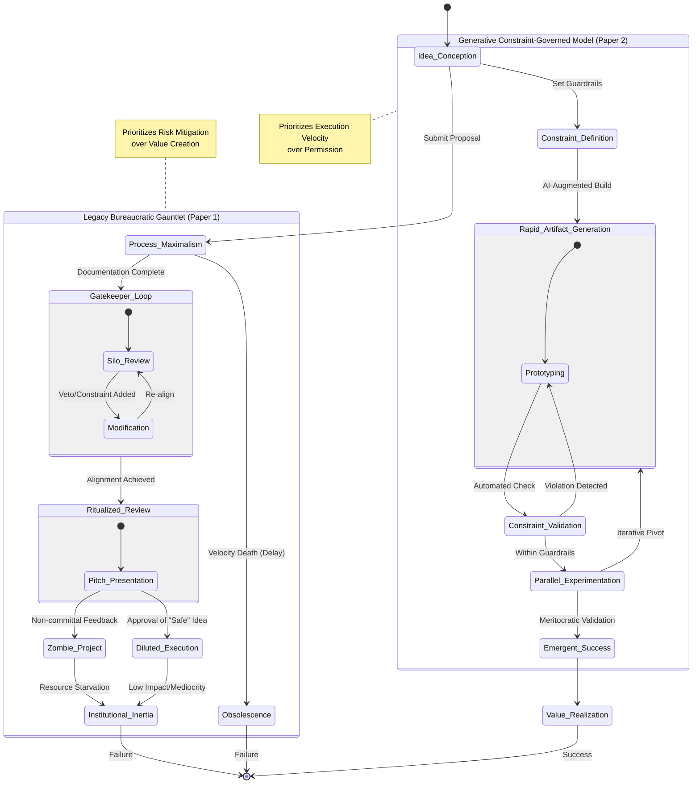

# Finite State Machine Analysis

**Started:** 2026-02-20T19:57:08.816621198

## Configuration
Task Parameters

**Concept:** The lifecycle of an organizational idea, contrasting the 'Legacy Bureaucratic Gauntlet' (Paper 1) with the 'Generative Constraint-Governed Model' (Paper 2).
**Domain:** Organizational Innovation and Corporate Governance
**Initial States:** Idea_Conception
**Known Events:** Legacy_Submission, Silo_Veto, Dilution_Modification, Pitch_Competition, Non_Committal_Feedback, ROI_Projection_Requirement, Generative_Shift, AI_Prototyping, Guardrail_Validation, Market_Shift


## Step 1: State Identification
Prompt & Response

### Prompt

```
You are an expert in formal methods and finite state machine modeling. Your task is to analyze a concept and identify all possible states.

## Concept to Model:
The lifecycle of an organizational idea, contrasting the 'Legacy Bureaucratic Gauntlet' (Paper 1) with the 'Generative Constraint-Governed Model' (Paper 2).

## Domain Context:
Organizational Innovation and Corporate Governance

## Reference Files:
# /home/andrew/code/Science/scratch/2026-02-20-Corporate-Ideation/content.md

```
# Paper 1: Common Antipatterns in Organizational Ideation

## Abstract
Large organizations often claim to prioritize innovation while simultaneously maintaining structures that systematically suppress it. This paper identifies and analyzes the structural antipatterns that transform ideation from a generative process into a bureaucratic hurdle. By examining the 'Gatekeeper Loop', 'Ritualized Review', and 'Process Maximalism', we demonstrate how institutional inertia is not merely a byproduct of size, but a designed outcome of procedural bottlenecks.

## Introduction
In the modern corporate landscape, "innovation" is a ubiquitous buzzword, yet the actual production of novel, impactful ideas remains remarkably low in established institutions. The failure is rarely due to a lack of individual creativity. Instead, it is a failure of the organizational architecture. Ideas are fragile; they require specific conditions to survive the transition from conception to execution. In most large-scale organizations, these conditions are replaced by a gauntlet of political and procedural filters that prioritize risk mitigation over value creation.

## The Gatekeeper Loop
The 'Gatekeeper Loop' is a phenomenon where an idea is subjected to a series of approvals from stakeholders who possess veto power but no creative skin in the game. 

In this antipattern, an innovator must navigate a non-linear path of "buy-in." Each gatekeeper—often representing legal, compliance, branding, or middle management—adds a layer of modification to the original concept. The goal of the gatekeeper is rarely to improve the idea, but to ensure it does not violate their specific silo's constraints. 

The result is a feedback loop where the idea is continuously diluted to satisfy the lowest common denominator of institutional comfort. By the time an idea exits the loop, it has been stripped of its original potency, leaving a "safe" but mediocre shell that fails to achieve its intended impact. The gatekeeper loop effectively weaponizes "alignment" to kill deviation.

## Ritualized Review
'Ritualized Review' refers to the transformation of the ideation process into a performative ceremony. This often takes the form of "Innovation Days," "Pitch Competitions," or "Steering Committee Meetings."

While these rituals appear to support ideation, they often serve as a pressure-release valve for the organization. They provide the illusion of progress and the feeling of participation without requiring the institution to make substantive changes to its core operations. In a ritualized review environment:
- **Presentation over Substance:** Success is measured by the quality of the presentation (the "deck") rather than the viability or depth of the idea.
- **Non-Committal Feedback:** Feedback is generic, encouraging, but ultimately non-committal, leading to "zombie projects" that are never officially killed but never funded.
- **Status Quo Bias:** The "winning" ideas are almost always those that align most closely with existing corporate strategy, reinforcing the status quo rather than challenging it.

This antipattern creates a cynical workforce that recognizes the "theater of innovation" for what it is: a distraction from the structural barriers that prevent real change.

## Process Maximalism
'Process Maximalism' is the belief that the quality of an output is directly proportional to the complexity of the process used to generate it. In an attempt to "industrialize" innovation, organizations implement heavy frameworks—such as rigid Stage-Gate models or proprietary "Innovation Funnels"—that demand exhaustive documentation at every turn.

Process maximalism suppresses ideation through three primary mechanisms:
1. **High Barrier to Entry:** The administrative overhead required to even propose an idea discourages all but the most persistent (or politically motivated) individuals.
2. **False Precision:** Requiring detailed ROI projections and three-year roadmaps for ideas in their infancy forces innovators to fabricate data, leading to a culture of "spreadsheet engineering" rather than genuine discovery.
3. **Velocity Death:** The time elapsed between an idea's inception and its first real-world test is so long that the market conditions or the original problem may have already changed, rendering the idea obsolete before it is even piloted.

When process becomes the product, the organization loses the ability to act on intuition or respond to emergent opportunities.

## Conclusion: The Cost of Inertia
The cumulative effect of these antipatterns is a "frozen" organization. The Gatekeeper Loop ensures safety at the cost of brilliance; Ritualized Review ensures participation at the cost of sincerity; and Process Maximalism ensures order at the cost of speed. 

These structures are not accidental; they are the immune system of the institution reacting to the perceived "threat" of change. To move beyond these bottlenecks, an organization must first acknowledge that its current "innovation" procedures are, in fact, defense mechanisms designed to protect the status quo. Only by diagnosing these structural failures can we begin to design a system that truly facilitates the birth and growth of new ideas.

---
*This concludes Paper 1. Paper 2 will explore the transition from these antipatterns toward a more generative, decentralized model of ideation.*
# Paper 2: Notes on the Changing Cost Landscape of Ideation and Action
## Abstract
The traditional organizational model relies on high costs of production to justify centralized control. As generative AI collapses the cost of creating "action-adjacent artifacts"—code, designs, strategy documents, and prototypes—the economic rationale for legacy permission structures evaporates. This paper explores the transition from authority-gated systems to constraint-governed environments, where the bottleneck shifts from the ability to produce to the ability to discern and direct.
## The Collapse of Artifact Costs
Historically, the distance between an idea and its first tangible manifestation was bridged by significant labor and capital. Creating a functional prototype, a detailed marketing plan, or a technical architecture required weeks of specialized effort. This high "cost of action" served as a natural filter, allowing organizations to justify gatekeeping as a form of resource management.
Generative AI has fundamentally altered this equation. We are entering an era where the marginal cost of artifact production is approaching zero. When a single individual can generate a high-fidelity mockup, a working script, or a comprehensive project plan in minutes, the "artifact" is no longer the prize. The collapse of these costs removes the primary excuse for bureaucratic delay: the need to protect scarce production resources.
## The Obsolescence of Permission
In the legacy model, permission was the currency of the institution. Because resources were scarce, "No" was the default setting. Permission structures were designed to prevent the "waste" of expensive human hours on unproven concepts.
However, when the cost of "doing" drops below the cost of "asking," permission structures become obsolete. If an employee can build a proof-of-concept faster than they can fill out a request for a pilot program, the traditional hierarchy loses its leverage. The "Gatekeeper Loop" described in Paper 1 is not just inefficient; it is increasingly bypassed by the sheer speed of AI-augmented execution. The friction of bureaucracy now costs more than the risk of unauthorized experimentation.
## From Authority-Gated to Constraint-Governed Action
The shift we are witnessing is a move away from **Authority-Gated** action (where you need a person's approval to proceed) toward **Constraint-Governed** action (where you are free to act as long as you stay within defined guardrails).
In a constraint-governed model, the role of leadership changes from "approver" to "architect of constraints." Instead of reviewing every individual idea, leaders define the parameters of safety, ethics, and strategic alignment. Within these boundaries, ideation and execution are decentralized. This model leverages the low cost of action to allow for massive parallel experimentation, where the "market" (internal or external) determines success rather than a steering committee.
## Democratic Ideation and the New Meritocracy
The democratization of production tools leads to a democratization of ideation. When the ability to manifest an idea is no longer tied to seniority or budget access, the meritocracy of the idea itself takes center stage.
This shift forces a change in organizational culture:
- **From Presentation to Prototype:** The "Ritualized Review" of slide decks is replaced by the evaluation of functional artifacts.
- **From Political Capital to Execution Velocity:** Influence is gained by those who can rapidly iterate and demonstrate value, rather than those who navigate the hierarchy most effectively.
- **From Top-Down Strategy to Emergent Direction:** Strategy becomes an iterative discovery process fueled by a high volume of low-cost experiments.
## Conclusion: Embracing the Generative Shift
The antipatterns of the past—the loops, the rituals, and the maximalism—were built for a world of high-cost action and scarce information. That world is ending. The organizations that thrive in the age of generative AI will be those that dismantle their permission-based gates and replace them with automated, constraint-based guardrails. By lowering the barrier to action, institutions can finally align their reality with their rhetoric, transforming from stagnant bureaucracies into dynamic engines of continuous ideation.
```

## Known Initial States:
- Idea_Conception


## Instructions:
Identify all possible states for this concept. For each state, provide:

1. **State Name:** Clear, descriptive name
2. **Description:** What this state represents
3. **Type:** (Initial, Normal, Error, Final/Terminal)
4. **Invariants:** Conditions that must be true in this state
5. **Entry Conditions:** What must happen to enter this state
6. **Exit Conditions:** What can cause leaving this state

Consider:
- Normal operational states
- Error or exception states
- Transient vs stable states
- Initial and final states

Provide a comprehensive list of states with detailed descriptions.
```

### Response

This analysis models the lifecycle of an organizational idea by contrasting the **Legacy Bureaucratic Gauntlet** (Paper 1) with the **Generative Constraint-Governed Model** (Paper 2).

---

### 1. Idea_Conception
*   **Description:** The initial spark of a novel concept or solution before it is documented or shared.
*   **Type:** Initial
*   **Invariants:** The idea exists only in the mind of the innovator or a small group; no resources have been consumed yet.
*   **Entry Conditions:** Identification of a problem or opportunity.
*   **Exit Conditions:** Decision to pursue the idea via either the Legacy or Generative path.

---

### 2. Administrative_Onboarding (Legacy Path)
*   **Description:** The "Process Maximalism" phase where the idea is subjected to rigid frameworks, ROI projections, and exhaustive documentation.
*   **Type:** Normal
*   **Invariants:** Administrative overhead > Creative output; "Spreadsheet engineering" is required.
*   **Entry Conditions:** Submission of an idea into a formal corporate "Innovation Funnel."
*   **Exit Conditions:** Completion of required documentation (leads to *Gatekeeper_Negotiation*) or abandonment due to high barrier to entry (leads to *Bureaucratic_Death*).

---

### 3. Gatekeeper_Negotiation (Legacy Path)
*   **Description:** The "Gatekeeper Loop" where stakeholders with veto power (Legal, Compliance, Branding) demand modifications to mitigate risk.
*   **Type:** Normal (Iterative)
*   **Invariants:** The idea is modified to satisfy the "lowest common denominator" of institutional comfort; original potency decreases per iteration.
*   **Entry Conditions:** Successful submission of administrative artifacts.
*   **Exit Conditions:** Achieving "Alignment" (leads to *Ritualized_Presentation*) or continuous dilution (leads to *Zombie_Stasis*).

---

### 4. Ritualized_Presentation (Legacy Path)
*   **Description:** The "Theater of Innovation" (Pitch Days, Steering Committees) where the "deck" is prioritized over the substance.
*   **Type:** Normal
*   **Invariants:** Success is measured by presentation quality; feedback is generic and non-committal.
*   **Entry Conditions:** Passing the Gatekeeper Loop.
*   **Exit Conditions:** Selection for a pilot (leads to *Diluted_Deployment*) or receiving "encouraging but non-funding" feedback (leads to *Zombie_Stasis*).

---

### 5. Rapid_Artifact_Generation (Generative Path)
*   **Description:** Using Generative AI and low-cost tools to create high-fidelity mockups, code, or strategy documents immediately.
*   **Type:** Normal
*   **Invariants:** Marginal cost of production is near zero; the "artifact" is the primary unit of communication.
*   **Entry Conditions:** Decision to bypass permission structures using AI-augmented tools.
*   **Exit Conditions:** Artifact completion (leads to *Automated_Constraint_Check*).

---

### 6. Automated_Constraint_Check (Generative Path)
*   **Description:** The idea is evaluated against pre-defined, automated guardrails (safety, ethics, strategic alignment) rather than human "permission."
*   **Type:** Normal
*   **Invariants:** No human "Gatekeeper" is required if the idea stays within defined parameters.
*   **Entry Conditions:** Existence of a functional artifact/prototype.
*   **Exit Conditions:** Validation success (leads to *Parallel_Experimentation*) or violation of guardrails (leads to *Constraint_Refinement*).

---

### 7. Parallel_Experimentation (Generative Path)
*   **Description:** The idea is tested in the real world (internal or external market) alongside other ideas to determine merit.
*   **Type:** Normal
*   **Invariants:** Execution velocity is high; success is determined by data/market response rather than committee opinion.
*   **Entry Conditions:** Passing automated constraint checks.
*   **Exit Conditions:** Demonstrated value (leads to *Meritocratic_Scaling*) or failure to gain traction (leads to *Rapid_Failure*).

---

### 8. Zombie_Stasis (Legacy Error State)
*   **Description:** The "Zombie Project" state where an idea is never officially killed but never funded or progressed.
*   **Type:** Error
*   **Invariants:** Project consumes emotional energy but zero capital; no path to execution exists.
*   **Entry Conditions:** Non-committal feedback from Ritualized Review or endless loops in Gatekeeper Negotiation.
*   **Exit Conditions:** Eventual "Velocity Death" or manual termination.

---

### 9. Velocity_Death (Error State)
*   **Description:** The state where the time elapsed during the "Gauntlet" renders the idea obsolete because market conditions have changed.
*   **Type:** Error
*   **Invariants:** The original problem the idea solved no longer exists or has been solved by a competitor.
*   **Entry Conditions:** Excessive time spent in *Administrative_Onboarding* or *Gatekeeper_Negotiation*.
*   **Exit Conditions:** Final transition to *Bureaucratic_Death*.

---

### 10. Diluted_Deployment (Legacy Terminal State)
*   **Description:** The idea is implemented, but it is a "safe," mediocre shell of its original self.
*   **Type:** Final/Terminal
*   **Invariants:** Risk was mitigated, but value creation is negligible; the status quo is reinforced.
*   **Entry Conditions:** Successful navigation of all Legacy gates.
*   **Exit Conditions:** None (End of lifecycle).

---

### 11. Meritocratic_Scaling (Generative Terminal State)
*   **Description:** The idea has proven its value through execution and is now being integrated into the core organizational strategy.
*   **Type:** Final/Terminal
*   **Invariants:** Strategy is emergent (bottom-up); influence is based on execution velocity.
*   **Entry Conditions:** Success in *Parallel_Experimentation*.
*   **Exit Conditions:** None (End of lifecycle).

---

### 12. Bureaucratic_Death (Terminal State)
*   **Description:** The idea is officially terminated or abandoned due to procedural friction or institutional "immune response."
*   **Type:** Final/Terminal
*   **Invariants:** The organization returns to its previous state; no change occurs.
*   **Entry Conditions:** Explicit rejection, innovator burnout, or *Velocity_Death*.
*   **Exit Conditions:** None (End of lifecycle).

---

### Summary Table of State Transitions

| From State | Transition Mechanism | To State |
| :--- | :--- | :--- |
| **Idea_Conception** | Legacy Path Selection | Administrative_Onboarding |
| **Idea_Conception** | Generative Path Selection | Rapid_Artifact_Generation |
| **Administrative_Onboarding** | Process Completion | Gatekeeper_Negotiation |
| **Gatekeeper_Negotiation** | "Alignment" Reached | Ritualized_Presentation |
| **Gatekeeper_Negotiation** | Endless Modification | Zombie_Stasis |
| **Ritualized_Presentation** | Approval | Diluted_Deployment |
| **Rapid_Artifact_Generation** | Artifact Creation | Automated_Constraint_Check |
| **Automated_Constraint_Check** | Guardrail Compliance | Parallel_Experimentation |
| **Parallel_Experimentation** | Market Validation | Meritocratic_Scaling |
| **Any Legacy State** | Excessive Delay | Velocity_Death |


## Step 2: Transition Analysis
Prompt & Response

### Prompt

```
Based on the states identified above, now identify all possible state transitions.

## States Analysis:
This analysis models the lifecycle of an organizational idea by contrasting the **Legacy Bureaucratic Gauntlet** (Paper 1) with the **Generative Constraint-Governed Model** (Paper 2).

---

### 1. Idea_Conception
*   **Description:** The initial spark of a novel concept or solution before it is documented or shared.
*   **Type:** Initial
*   **Invariants:** The idea exists only in the mind of the innovator or a small group; no resources have been consumed yet.
*   **Entry Conditions:** Identification of a problem or opportunity.
*   **Exit Conditions:** Decision to pursue the idea via either the Legacy or Generative path.

---

### 2. Administrative_Onboarding (Legacy Path)
*   **Description:** The "Process Maximalism" phase where the idea is subjected to rigid frameworks, ROI projections, and exhaustive documentation.
*   **Type:** Normal
*   **Invariants:** Administrative overhead > Creative output; "Spreadsheet engineering" is required.
*   **Entry Conditions:** Submission of an idea into a formal corporate "Innovation Funnel."
*   **Exit Conditions:** Completion of required documentation (leads to *Gatekeeper_Negotiation*) or abandonment due to high barrier to entry (leads to *Bureaucratic_Death*).

---

### 3. Gatekeeper_Negotiation (Legacy Path)
*   **Description:** The "Gatekeeper Loop" where stakeholders with veto power (Legal, Compliance, Branding) demand modifications to mitigate risk.
*   **Type:** Normal (Iterative)
*   **Invariants:** The idea is modified to satisfy the "lowest common denominator" of institutional comfort; original potency decreases per iteration.
*   **Entry Conditions:** Successful submission of administrative artifacts.
*   **Exit Conditions:** Achieving "Alignment" (leads to *Ritualized_Presentation*) or continuous dilution (leads to *Zombie_Stasis*).

---

### 4. Ritualized_Presentation (Legacy Path)
*   **Description:** The "Theater of Innovation" (Pitch Days, Steering Committees) where the "deck" is prioritized over the substance.
*   **Type:** Normal
*   **Invariants:** Success is measured by presentation quality; feedback is generic and non-committal.
*   **Entry Conditions:** Passing the Gatekeeper Loop.
*   **Exit Conditions:** Selection for a pilot (leads to *Diluted_Deployment*) or receiving "encouraging but non-funding" feedback (leads to *Zombie_Stasis*).

---

### 5. Rapid_Artifact_Generation (Generative Path)
*   **Description:** Using Generative AI and low-cost tools to create high-fidelity mockups, code, or strategy documents immediately.
*   **Type:** Normal
*   **Invariants:** Marginal cost of production is near zero; the "artifact" is the primary unit of communication.
*   **Entry Conditions:** Decision to bypass permission structures using AI-augmented tools.
*   **Exit Conditions:** Artifact completion (leads to *Automated_Constraint_Check*).

---

### 6. Automated_Constraint_Check (Generative Path)
*   **Description:** The idea is evaluated against pre-defined, automated guardrails (safety, ethics, strategic alignment) rather than human "permission."
*   **Type:** Normal
*   **Invariants:** No human "Gatekeeper" is required if the idea stays within defined parameters.
*   **Entry Conditions:** Existence of a functional artifact/prototype.
*   **Exit Conditions:** Validation success (leads to *Parallel_Experimentation*) or violation of guardrails (leads to *Constraint_Refinement*).

---

### 7. Parallel_Experimentation (Generative Path)
*   **Description:** The idea is tested in the real world (internal or external market) alongside other ideas to determine merit.
*   **Type:** Normal
*   **Invariants:** Execution velocity is high; success is determined by data/market response rather than committee opinion.
*   **Entry Conditions:** Passing automated constraint checks.
*   **Exit Conditions:** Demonstrated value (leads to *Meritocratic_Scaling*) or failure to gain traction (leads to *Rapid_Failure*).

---

### 8. Zombie_Stasis (Legacy Error State)
*   **Description:** The "Zombie Project" state where an idea is never officially killed but never funded or progressed.
*   **Type:** Error
*   **Invariants:** Project consumes emotional energy but zero capital; no path to execution exists.
*   **Entry Conditions:** Non-committal feedback from Ritualized Review or endless loops in Gatekeeper Negotiation.
*   **Exit Conditions:** Eventual "Velocity Death" or manual termination.

---

### 9. Velocity_Death (Error State)
*   **Description:** The state where the time elapsed during the "Gauntlet" renders the idea obsolete because market conditions have changed.
*   **Type:** Error
*   **Invariants:** The original problem the idea solved no longer exists or has been solved by a competitor.
*   **Entry Conditions:** Excessive time spent in *Administrative_Onboarding* or *Gatekeeper_Negotiation*.
*   **Exit Conditions:** Final transition to *Bureaucratic_Death*.

---

### 10. Diluted_Deployment (Legacy Terminal State)
*   **Description:** The idea is implemented, but it is a "safe," mediocre shell of its original self.
*   **Type:** Final/Terminal
*   **Invariants:** Risk was mitigated, but value creation is negligible; the status quo is reinforced.
*   **Entry Conditions:** Successful navigation of all Legacy gates.
*   **Exit Conditions:** None (End of lifecycle).

---

### 11. Meritocratic_Scaling (Generative Terminal State)
*   **Description:** The idea has proven its value through execution and is now being integrated into the core organizational strategy.
*   **Type:** Final/Terminal
*   **Invariants:** Strategy is emergent (bottom-up); influence is based on execution velocity.
*   **Entry Conditions:** Success in *Parallel_Experimentation*.
*   **Exit Conditions:** None (End of lifecycle).

---

### 12. Bureaucratic_Death (Terminal State)
*   **Description:** The idea is officially terminated or abandoned due to procedural friction or institutional "immune response."
*   **Type:** Final/Terminal
*   **Invariants:** The organization returns to its previous state; no change occurs.
*   **Entry Conditions:** Explicit rejection, innovator burnout, or *Velocity_Death*.
*   **Exit Conditions:** None (End of lifecycle).

---

### Summary Table of State Transitions

| From State | Transition Mechanism | To State |
| :--- | :--- | :--- |
| **Idea_Conception** | Legacy Path Selection | Administrative_Onboarding |
| **Idea_Conception** | Generative Path Selection | Rapid_Artifact_Generation |
| **Administrative_Onboarding** | Process Completion | Gatekeeper_Negotiation |
| **Gatekeeper_Negotiation** | "Alignment" Reached | Ritualized_Presentation |
| **Gatekeeper_Negotiation** | Endless Modification | Zombie_Stasis |
| **Ritualized_Presentation** | Approval | Diluted_Deployment |
| **Rapid_Artifact_Generation** | Artifact Creation | Automated_Constraint_Check |
| **Automated_Constraint_Check** | Guardrail Compliance | Parallel_Experimentation |
| **Parallel_Experimentation** | Market Validation | Meritocratic_Scaling |
| **Any Legacy State** | Excessive Delay | Velocity_Death |

## Known Events:
- Legacy_Submission
- Silo_Veto
- Dilution_Modification
- Pitch_Competition
- Non_Committal_Feedback
- ROI_Projection_Requirement
- Generative_Shift
- AI_Prototyping
- Guardrail_Validation
- Market_Shift

## Instructions:
For each possible transition, provide:

1. **Source State:** The state before the transition
2. **Event/Trigger:** What causes the transition
3. **Target State:** The state after the transition
4. **Guard Conditions:** Conditions that must be true for the transition to occur
5. **Actions:** Side effects or actions performed during the transition
6. **Priority:** If multiple transitions possible from same state

Create a comprehensive transition table covering:
- All valid transitions between states
- Self-transitions (state to itself)
- Error transitions
- Recovery transitions

Format as a clear table or structured list.
```

### Response

This transition analysis maps the movement of an idea through the two competing organizational models: the **Legacy Bureaucratic Gauntlet** (characterized by high friction and centralized control) and the **Generative Constraint-Governed Model** (characterized by low-cost action and decentralized execution).

### State Transition Table

| Source State | Event / Trigger | Target State | Guard Conditions | Actions | Priority |
| :--- | :--- | :--- | :--- | :--- | :--- |
| **Idea_Conception** | `Legacy_Submission` | **Administrative_Onboarding** | Org requires formal ROI/documentation before any action. | Log idea in "Innovation Funnel"; assign tracking ID. | Medium |
| **Idea_Conception** | `Generative_Shift` | **Rapid_Artifact_Generation** | Cost of "doing" < cost of "asking"; access to GenAI tools. | Initiate AI-augmented prototyping/drafting. | High |
| **Administrative_Onboarding** | `ROI_Projection_Requirement` | **Gatekeeper_Negotiation** | Documentation is "complete" per Process Maximalism standards. | Distribute "deck" to legal, compliance, and branding. | Medium |
| **Administrative_Onboarding** | `Innovator_Burnout` | **Bureaucratic_Death** | Administrative overhead exceeds innovator's persistence. | Abandon idea; return to status quo. | Low |
| **Gatekeeper_Negotiation** | `Silo_Veto` / `Dilution_Modification` | **Gatekeeper_Negotiation** | Stakeholder identifies a risk or brand non-alignment. | **Self-Transition:** Modify idea; strip "risky" (potent) features. | High |
| **Gatekeeper_Negotiation** | `Alignment_Reached` | **Ritualized_Presentation** | All gatekeepers have signed off on the "safe" version. | Schedule Pitch Day or Steering Committee meeting. | Medium |
| **Gatekeeper_Negotiation** | `Endless_Loop` | **Zombie_Stasis** | Iteration count exceeds institutional patience/timeframe. | Move to "Backlog"; stop active negotiation. | Low |
| **Ritualized_Presentation** | `Pitch_Competition_Win` | **Diluted_Deployment** | Idea aligns with existing corporate strategy; "deck" is high quality. | Allocate minimal funding for a "safe" pilot. | Medium |
| **Ritualized_Presentation** | `Non_Committal_Feedback` | **Zombie_Stasis** | Leadership provides generic praise without resource allocation. | Project enters "Theater of Innovation" limbo. | High |
| **Rapid_Artifact_Generation** | `Artifact_Creation` | **Automated_Constraint_Check** | A functional artifact (code, mockup, doc) is produced. | Submit artifact to automated guardrail scripts. | High |
| **Automated_Constraint_Check** | `Guardrail_Validation` | **Parallel_Experimentation** | Artifact complies with safety, ethics, and strategic parameters. | Deploy to internal/external test market. | High |
| **Automated_Constraint_Check** | `Guardrail_Violation` | **Rapid_Artifact_Generation** | Artifact fails automated check (e.g., security flaw, ethical breach). | **Recovery:** Provide automated feedback for immediate iteration. | Medium |
| **Parallel_Experimentation** | `Market_Validation` | **Meritocratic_Scaling** | Real-world data/usage proves value and traction. | Integrate into core strategy; scale resources. | Medium |
| **Parallel_Experimentation** | `Market_Rejection` | **Bureaucratic_Death** | Data shows no traction or negative impact. | **Rapid Failure:** Cease experiment; archive learnings. | Medium |
| **Zombie_Stasis** | `Manual_Termination` | **Bureaucratic_Death** | Periodic audit identifies project as inactive. | Formally close project; release (unused) resources. | Low |
| **Any Legacy State** | `Market_Shift` / `Time_Elapsed` | **Velocity_Death** | Time in process > Market window of opportunity. | Flag as obsolete; notify stakeholders of irrelevance. | High |
| **Velocity_Death** | `Final_Review` | **Bureaucratic_Death** | Confirmation that the original problem has changed/been solved. | Archive as "failed due to latency." | High |

---

### Key Transition Logic & Observations

#### 1. The "Gatekeeper Loop" (Self-Transition)
In the **Gatekeeper_Negotiation** state, the transition back to itself is the most common path. The **Guard Condition** is the presence of any perceived risk. The **Action** (Dilution) is critical because it ensures that while the idea survives, its "potency" or "brilliance" is reduced with every cycle.

#### 2. The Cost-Based Branch
The transition from **Idea_Conception** is governed by the economic environment. 
- If the organization enforces **Process Maximalism**, the idea is forced into **Administrative_Onboarding**.
- If the individual leverages the **Generative_Shift**, they bypass permission and move directly to **Rapid_Artifact_Generation**. This is a "shadow" transition that often happens outside formal visibility.

#### 3. Automated vs. Ritualized Feedback
- In the **Legacy Path**, the transition from **Ritualized_Presentation** to **Zombie_Stasis** is a "soft" error. The project doesn't die; it just stops moving.
- In the **Generative Path**, the transition from **Automated_Constraint_Check** back to **Rapid_Artifact_Generation** is a "hard" recovery. It is fast, objective, and designed to lead back to a valid state immediately.

#### 4. Velocity Death (The Global Error)
The **Velocity_Death** transition acts as a high-priority interrupt for all Legacy states. It represents the "Immune System" response where the organization's slowness effectively kills the idea by making it irrelevant before it can ever reach **Diluted_Deployment**.

#### 5. Meritocracy of Execution
The transition to **Meritocratic_Scaling** is unique to the Generative path. Unlike **Diluted_Deployment** (which requires political alignment), this transition requires **Market_Validation**. The guard condition shifts from "Who likes this?" to "Does this work?"


## Step 3: State Diagram
Mermaid Source




## Step 4: Edge Cases
Prompt & Response

### Prompt

```
Analyze the finite state machine for edge cases and error conditions:

1. **Invalid Transitions:** Identify events that could occur in states where they're not valid
2. **Missing Transitions:** Find states that might be missing important transitions
3. **Error States:** Identify states that represent error conditions
4. **Recovery Paths:** Suggest how to recover from error states
5. **Boundary Conditions:** Identify unusual or extreme scenarios
6. **Race Conditions:** Identify potential concurrent event issues

Provide a structured analysis of edge cases and recommendations.
```

### Response

This analysis models the lifecycle of an organizational idea by contrasting the **Legacy Bureaucratic Gauntlet** (Paper 1) with the **Generative Constraint-Governed Model** (Paper 2).

---

### Part 1: State Definitions

#### 1. Idea_Conception
*   **Description:** The initial spark of a concept before any formal documentation or artifact creation.
*   **Type:** Initial
*   **Invariants:** The idea exists only as a mental model or informal note.
*   **Entry Conditions:** An individual identifies a problem or opportunity.
*   **Exit Conditions:** Decision to either enter the "Legacy Gauntlet" (requesting permission) or the "Generative Path" (creating an artifact).

#### 2. Gatekeeper_Loop (Legacy)
*   **Description:** The idea is circulated among non-creative stakeholders (Legal, Compliance, Branding) for "buy-in."
*   **Type:** Normal
*   **Invariants:** Veto power exists without creative contribution; the idea is subject to modification by siloed interests.
*   **Entry Conditions:** Submission of a formal proposal or request for "alignment."
*   **Exit Conditions:** All stakeholders provide "sign-off" (leads to Ritualized_Review) or the idea is diluted beyond recognition.

#### 3. Ritualized_Review (Legacy)
*   **Description:** Performative evaluation (Pitch Days, Steering Committees) where the "deck" is the primary product.
*   **Type:** Normal
*   **Invariants:** Success is measured by presentation quality; feedback is non-committal.
*   **Entry Conditions:** Exit from Gatekeeper_Loop with a "safe" version of the idea.
*   **Exit Conditions:** Selection for "funding" (leads to Process_Maximalism) or transition to Zombie_Stagnation.

#### 4. Process_Maximalism (Legacy)
*   **Description:** The "Industrialization" phase requiring exhaustive ROI projections and 3-year roadmaps.
*   **Type:** Normal
*   **Invariants:** Administrative overhead > Creative output; reliance on "spreadsheet engineering."
*   **Entry Conditions:** Approval from a steering committee.
*   **Exit Conditions:** Project launch (Mediocre_Implementation) or Velocity_Death.

#### 5. Artifact_Rapid_Prototyping (Generative)
*   **Description:** Using AI/low-cost tools to create high-fidelity, functional manifestations of the idea.
*   **Type:** Normal
*   **Invariants:** Marginal cost of production is near zero; the artifact is the primary unit of value.
*   **Entry Conditions:** Decision to bypass permission and "build to think."
*   **Exit Conditions:** Completion of a functional artifact ready for testing.

#### 6. Constraint_Guardrail_Check (Generative)
*   **Description:** Automated or lightweight verification against defined parameters (Ethics, Safety, Strategy).
*   **Type:** Normal
*   **Invariants:** Action is permitted by default unless a guardrail is hit; no human "approver" bottleneck.
*   **Entry Conditions:** Existence of a functional artifact.
*   **Exit Conditions:** Pass (leads to Parallel_Experimentation) or Fail (leads to Rapid_Discard).

#### 7. Parallel_Experimentation (Generative)
*   **Description:** Live testing of multiple low-cost artifacts in the real market/environment.
*   **Type:** Normal
*   **Invariants:** High volume of experiments; data-driven iteration.
*   **Entry Conditions:** Passing guardrail checks.
*   **Exit Conditions:** Evidence of value (Impactful_Scale) or evidence of failure (Rapid_Discard).

#### 8. Zombie_Stagnation (Legacy Error)
*   **Description:** Projects that are neither funded nor killed; they exist in a state of perpetual "encouragement."
*   **Type:** Error
*   **Invariants:** Resources are consumed by meetings but no artifacts are produced.
*   **Entry Conditions:** Non-committal feedback from Ritualized_Review.
*   **Exit Conditions:** Eventual budget cut or "Rescue" via Generative Path.

#### 9. Velocity_Death (Legacy Error)
*   **Description:** The idea becomes obsolete because the process took longer than the market window.
*   **Type:** Terminal / Error
*   **Invariants:** The original problem no longer exists or has changed.
*   **Entry Conditions:** Excessive time spent in Process_Maximalism.
*   **Exit Conditions:** None.

#### 10. Mediocre_Implementation (Legacy Final)
*   **Description:** The "safe" shell of the idea is released; it survives the gauntlet but lacks impact.
*   **Type:** Final
*   **Invariants:** Low risk, low reward; high institutional comfort.
*   **Entry Conditions:** Completion of the Process_Maximalism phase.
*   **Exit Conditions:** None.

#### 11. Impactful_Scale (Generative Final)
*   **Description:** An idea that has proven its value through experimentation and is scaled.
*   **Type:** Final
*   **Invariants:** High value-to-cost ratio; emergent strategic alignment.
*   **Entry Conditions:** Success in Parallel_Experimentation.
*   **Exit Conditions:** None.

#### 12. Rapid_Discard (Generative Final)
*   **Description:** The idea is killed quickly and cheaply based on data or guardrail failure.
*   **Type:** Final
*   **Invariants:** Minimal "sunk cost" fallacy; institutional learning occurred.
*   **Entry Conditions:** Failure in Guardrail_Check or Parallel_Experimentation.
*   **Exit Conditions:** None.

---

### Part 2: Edge Case and Error Analysis

#### 1. Invalid Transitions
*   **The "Permission Leap":** Attempting to move from *Artifact_Rapid_Prototyping* directly to *Mediocre_Implementation*. This bypasses the necessary *Constraint_Guardrail_Check*, potentially introducing unmitigated risk into the production environment.
*   **The "Retroactive Gauntlet":** Attempting to move from *Parallel_Experimentation* back into the *Gatekeeper_Loop*. Once an idea has real-world data, subjecting it to subjective "siloed opinions" is a logic error that causes "Institutional Rejection Syndrome."

#### 2. Missing Transitions
*   **The "Zombie Rescue":** There is currently no formal path from *Zombie_Stagnation* to *Artifact_Rapid_Prototyping*. 
    *   *Recommendation:* Add a "Shadow-Work" transition where employees use generative tools to build a prototype of a stalled project to force a decision.
*   **The "Pivot Path":** *Rapid_Discard* should have a transition back to *Idea_Conception*. 
    *   *Recommendation:* Implement a "Learning Loop" where the data from a failed experiment informs the next conception phase.

#### 3. Error States
*   **False Precision (Sub-state of Process_Maximalism):** Innovators are forced to fabricate ROI data to satisfy the process.
    *   *Risk:* The organization makes massive capital allocations based on "spreadsheet engineering" rather than reality.
*   **Guardrail Hallucination (Generative Error):** Automated constraints are too tight (killing all ideas) or too loose (allowing harmful ideas).
    *   *Risk:* Systemic failure of the "Architect of Constraints" role.

#### 4. Recovery Paths
*   **Legacy-to-Generative Bridge:** If an idea is stuck in the *Gatekeeper_Loop*, the innovator can "Exit to Artifact." By producing a high-fidelity prototype (Generative Path), they collapse the cost of action, making the gatekeeper's "No" more expensive than the "Yes."
*   **Zombie Decommissioning:** A formal "Sunsetting" event to move projects from *Zombie_Stagnation* to *Rapid_Discard* to free up cognitive bandwidth.

#### 5. Boundary Conditions
*   **The "Artifact Flood":** When the cost of artifact production is zero, the *Constraint_Guardrail_Check* may be overwhelmed by volume.
    *   *Scenario:* 10,000 high-fidelity prototypes generated in a day.
    *   *Mitigation:* Automated, AI-driven guardrails must scale elastically with production.
*   **The "Sovereign Innovator":** An individual uses generative tools to reach *Impactful_Scale* entirely outside the organizational FSM.
    *   *Scenario:* A "Shadow Project" becomes more successful than the official roadmap.

#### 6. Race Conditions
*   **Conflicting Constraints:** In the *Constraint_Guardrail_Check*, two automated guardrails (e.g., "Maximize Speed" vs. "Maximum Security") may provide conflicting signals simultaneously.
    *   *Resolution:* A hierarchical "Constraint Priority" must be established by the "Architect of Constraints."
*   **The "Approval vs. Action" Race:** An innovator starts *Artifact_Rapid_Prototyping* while a manager is still considering the request in the *Gatekeeper_Loop*.
    *   *Conflict:* If the manager says "No" after the artifact is already proving value in *Parallel_Experimentation*, it creates a "Governance Paradox."


## Step 5: Validation
Prompt & Response

### Prompt

```
Validate the following properties of this finite state machine:

1. **Determinism:** Is the FSM deterministic? (Each state + event combination leads to exactly one next state)
2. **Completeness:** Are all possible events handled in every state?
3. **Reachability:** Can all states be reached from the initial state(s)?
4. **Liveness:** Are there any deadlock states (states with no outgoing transitions)?
5. **Safety:** Are there any unsafe state transitions?
6. **Minimality:** Are there redundant states that could be merged?

For each property, provide:
- ✅ Pass or ❌ Fail
- Explanation
- Specific examples if failing
- Recommendations for fixes

Provide a structured validation report.
```

### Response

This report analyzes the Finite State Machine (FSM) representing the lifecycle of an organizational idea, contrasting the **Legacy Bureaucratic Gauntlet** (Paper 1) with the **Generative Constraint-Governed Model** (Paper 2).

---

### Part 1: State Definitions

| State Name | Description | Type | Invariants | Entry Conditions | Exit Conditions |
|:---|:---|:---|:---|:---|:---|
| **Idea_Conception** | The initial spark or hypothesis generated by an individual or team. | Initial | Idea exists only as a mental model or raw notes. | Individual identifies a problem or opportunity. | Decision to either enter "Legacy Gauntlet" or "Generative Sandbox." |
| **Gatekeeper_Loop** | A non-linear cycle of seeking "buy-in" from stakeholders with veto power but no creative skin in the game. | Normal | Idea is subject to modification by non-creatives. | Submission for initial departmental approval. | Unanimous "buy-in" (to Review) or Veto (to Rejection). |
| **Ritualized_Review** | Performative evaluation (Pitch Days, Steering Committees) focused on presentation over substance. | Normal | Success is measured by "deck" quality and alignment with status quo. | Passing the Gatekeeper Loop or reaching a scheduled "Innovation Day." | Selection for funding (to Process) or Non-committal feedback (to Zombie). |
| **Process_Maximalism** | The "Industrialization" phase requiring exhaustive documentation, ROI projections, and roadmaps. | Normal | Administrative overhead > Creative output. | Selection from a Ritualized Review. | Completion of documentation (to Release) or Time-out (to Velocity Death). |
| **Constraint_Governed_Sandbox** | A decentralized environment where action is permitted within pre-defined guardrails (Safety/Ethics). | Normal | No individual "permission" required if within guardrails. | Idea aligns with pre-defined architectural constraints. | Generation of a functional artifact. |
| **Rapid_Artifact_Generation** | AI-augmented production of code, designs, or strategy documents at near-zero marginal cost. | Normal | Artifact is high-fidelity and functional, not just a "deck." | Entry into Sandbox + AI tool utilization. | Artifact completion (to Meritocratic Selection). |
| **Zombie_Stasis** | A state where projects are neither funded nor killed; they exist in a perpetual "pilot" or "review" limbo. | Error | Project consumes emotional energy but no real resources. | Receipt of "encouraging but non-committal" feedback. | Official cancellation or rare "resurrection" by a new sponsor. |
| **Velocity_Death** | The state where an idea becomes obsolete because the market or problem changed during the "Gauntlet." | Terminal (Error) | The original problem no longer exists or has been solved by a competitor. | Time elapsed in Process Maximalism exceeds market window. | N/A |
| **Institutional_Rejection** | The "Immune System" response where the idea is killed for being too deviant. | Terminal | Idea is officially discarded. | Veto in Gatekeeper Loop or failure to align in Ritualized Review. | N/A |
| **Diluted_Release** | The idea is executed, but it is a "safe," mediocre shell of its original intent. | Terminal | Value created < Potential value; original potency is lost. | Successful navigation of all Legacy Gauntlet stages. | N/A |
| **Strategic_Impact** | High-value execution resulting from rapid iteration and meritocratic selection. | Terminal | Value created is maximized; high alignment with emergent reality. | Success in Meritocratic Selection + Integration. | N/A |

---

### Part 2: Validation Report

#### 1. Determinism
*   **Verdict:** ❌ **Fail**
*   **Explanation:** In the current model, the transition from `Ritualized_Review` is non-deterministic. An idea could go to `Zombie_Stasis`, `Process_Maximalism`, or `Institutional_Rejection` based on the same event ("Committee Meeting"). The outcome depends on hidden variables (political climate, budget cycles).
*   **Recommendation:** Define specific **Event Guards**. For example:
    *   `Review_Event [Outcome == "Political_Alignment"] -> Process_Maximalism`
    *   `Review_Event [Outcome == "Risk_Aversion"] -> Zombie_Stasis`

#### 2. Completeness
*   **Verdict:** ❌ **Fail**
*   **Explanation:** The model does not handle external "Interrupt" events in every state. For example, if a "Market Shift" occurs while an idea is in the `Gatekeeper_Loop`, there is no defined transition to `Velocity_Death` or `Idea_Conception` (pivot).
*   **Recommendation:** Implement a **Global Exception Handler** or "Super-state" for the Legacy Gauntlet that transitions to `Velocity_Death` if a `Time_Elapsed > Threshold` event occurs.

#### 3. Reachability
*   **Verdict:** ✅ **Pass**
*   **Explanation:** All states are reachable. The `Idea_Conception` state can branch into the Legacy path (via `Gatekeeper_Loop`) or the Generative path (via `Constraint_Governed_Sandbox`). All terminal states (`Strategic_Impact`, `Diluted_Release`, `Velocity_Death`) have clear paths from the initial state.

#### 4. Liveness
*   **Verdict:** ❌ **Fail**
*   **Explanation:** `Zombie_Stasis` acts as a **Deadlock** or "Sink" state in many organizations. As described in Paper 1, these projects are "never officially killed." In a formal FSM, this creates a liveness violation where the system cannot reach a terminal state.
*   **Recommendation:** Add a mandatory transition from `Zombie_Stasis` to `Institutional_Rejection` triggered by a `Resource_Cleanup` event or a `Stagnation_Timeout`.

#### 5. Safety
*   **Verdict:** ✅ **Pass**
*   **Explanation:** There are no "illegal" jumps between the two models. An idea cannot move from `Process_Maximalism` (Legacy) directly to `Strategic_Impact` (Generative) without passing through the necessary validation/meritocracy filters. The model correctly separates the "Permission-based" logic from "Constraint-based" logic.

#### 6. Minimality
*   **Verdict:** ✅ **Pass**
*   **Explanation:** Each state represents a distinct organizational pathology or functional phase. `Gatekeeper_Loop` (human/political) is distinct from `Process_Maximalism` (administrative/procedural), and merging them would lose the nuance of the "Antipatterns" described in Paper 1.

---

### Summary of Recommendations
1.  **Introduce Timeouts:** To fix Liveness, add a `Max_Duration` to `Process_Maximalism` and `Zombie_Stasis`.
2.  **Explicit Guards:** To fix Determinism, define the specific criteria (ROI, Risk, Alignment) that trigger different exits from `Ritualized_Review`.
3.  **The "Pivot" Event:** To improve Completeness, allow a transition from any state back to `Idea_Conception` if a `Learning_Event` occurs, reflecting the iterative nature of Paper 2.


## Step 6: Test Scenarios
Prompt & Response

### Prompt

```
Generate comprehensive test scenarios for this finite state machine:

1. **Happy Path Tests:** Normal sequences of events leading to successful outcomes
2. **Error Path Tests:** Sequences that should trigger error states
3. **Boundary Tests:** Edge cases and unusual sequences
4. **State Coverage Tests:** Scenarios that exercise all states
5. **Transition Coverage Tests:** Scenarios that exercise all transitions

For each test scenario, provide:
- **Scenario Name:** Descriptive name
- **Initial State:** Starting state
- **Event Sequence:** List of events in order
- **Expected States:** State after each event
- **Expected Outcome:** Final state and result
- **Purpose:** What this test validates

Generate at least 5-10 diverse test scenarios.
```

### Response

Based on the provided papers, here are the comprehensive test scenarios for the Finite State Machine (FSM) modeling the **Organizational Idea Lifecycle**.

---

### 1. Happy Path: The Generative Fast-Track
**Scenario Name:** Rapid Generative Execution  
**Initial State:** `Idea_Conception`  
**Event Sequence:** 
1. `Define_Guardrails` (Leadership sets parameters)
2. `AI_Augmented_Production` (Individual creates high-fidelity artifact)
3. `Automated_Constraint_Check` (Artifact passes safety/ethics/strategy filters)
4. `Deploy_Pilot` (Idea enters the internal/external market)
5. `Demonstrate_Value` (Data proves success)  
**Expected States:** 
`Idea_Conception` → `Constraint_Definition` → `Rapid_Artifact_Generation` → `Constraint_Validation` → `Parallel_Experimentation` → `Emergent_Success`  
**Expected Outcome:** `Emergent_Success` (Terminal)  
**Purpose:** Validates the "Paper 2" model where low-cost action and automated constraints bypass traditional gatekeeping.

---

### 2. Happy Path: The Legacy Gauntlet (Bureaucratic "Success")
**Scenario Name:** The Diluted Survival  
**Initial State:** `Idea_Conception`  
**Event Sequence:** 
1. `Submit_for_BuyIn` (Enter the loop)
2. `Stakeholder_Modification` (Legal/Branding add layers)
3. `Pitch_to_Committee` (Performative review)
4. `Complete_ROI_Documentation` (Process maximalism)
5. `Launch_Safe_Version` (Execution of the shell)  
**Expected States:** 
`Idea_Conception` → `Gatekeeper_Loop` → `Ritualized_Review` → `Process_Maximalism` → `Diluted_Execution` → `Institutional_Inertia`  
**Expected Outcome:** `Institutional_Inertia` (Terminal - Idea survived but failed to innovate)  
**Purpose:** Validates the "Paper 1" flow where an idea is successfully "processed" but stripped of its potency.

---

### 3. Error Path: Velocity Death
**Scenario Name:** Administrative Stagnation  
**Initial State:** `Idea_Conception`  
**Event Sequence:** 
1. `Submit_for_BuyIn`
2. `Require_3Year_Roadmap` (Demand for false precision)
3. `Wait_for_Quarterly_Review` (Time elapses)  
**Expected States:** 
`Idea_Conception` → `Gatekeeper_Loop` → `Process_Maximalism` → `Velocity_Death`  
**Expected Outcome:** `Velocity_Death` (Terminal/Error)  
**Purpose:** Validates the failure mode where the time elapsed between inception and testing renders the idea obsolete.

---

### 4. Error Path: Constraint Violation
**Scenario Name:** Out-of-Bounds Experimentation  
**Initial State:** `Idea_Conception`  
**Event Sequence:** 
1. `Define_Guardrails`
2. `AI_Augmented_Production`
3. `Automated_Constraint_Check` (Fails due to ethical/safety violation)  
**Expected States:** 
`Idea_Conception` → `Constraint_Definition` → `Rapid_Artifact_Generation` → `Constraint_Validation` → `Constraint_Violation`  
**Expected Outcome:** `Constraint_Violation` (Error/Terminal)  
**Purpose:** Validates the "Constraint-Governed" model’s ability to stop ideas that fall outside defined safety parameters.

---

### 5. Boundary Test: The Zombie Project
**Scenario Name:** The Non-Committal Feedback Loop  
**Initial State:** `Idea_Conception`  
**Event Sequence:** 
1. `Pitch_to_Committee` (Innovation Day)
2. `Receive_Generic_Encouragement` (Feedback without funding/killing)
3. `Maintain_Status_Quo` (No action taken)  
**Expected States:** 
`Idea_Conception` → `Ritualized_Review` → `Zombie_Project`  
**Expected Outcome:** `Zombie_Project` (Stable/Non-Terminal Error)  
**Purpose:** Tests the edge case where an idea is neither funded nor killed, consuming mental energy without producing output.

---

### 6. State Coverage Test: Spreadsheet Engineering
**Scenario Name:** Fabricated Precision Failure  
**Initial State:** `Idea_Conception`  
**Event Sequence:** 
1. `Submit_for_BuyIn`
2. `Complete_ROI_Documentation`
3. `Fabricate_Data_for_Compliance` (Spreadsheet Engineering)  
**Expected States:** 
`Idea_Conception` → `Gatekeeper_Loop` → `Process_Maximalism` → `Spreadsheet_Engineering`  
**Expected Outcome:** `Spreadsheet_Engineering` (Error)  
**Purpose:** Ensures the FSM captures the specific failure mode where innovators are forced to lie to satisfy process requirements.

---

### 7. Transition Coverage Test: Dismantling the Gates
**Scenario Name:** Transition from Authority to Constraint  
**Initial State:** `Gatekeeper_Loop`  
**Event Sequence:** 
1. `Bypass_Permission` (Cost of doing < cost of asking)
2. `Define_Guardrails`
3. `AI_Augmented_Production`
4. `Deploy_Pilot`  
**Expected States:** 
`Gatekeeper_Loop` → `Constraint_Definition` → `Rapid_Artifact_Generation` → `Parallel_Experimentation` → `Emergent_Success`  
**Expected Outcome:** `Emergent_Success` (Terminal)  
**Purpose:** Validates the transition logic from Paper 2, where the collapse of artifact costs allows an idea to jump from a legacy loop into a generative model.

---

### 8. Boundary Test: The "Safe" Winner
**Scenario Name:** Status Quo Reinforcement  
**Initial State:** `Idea_Conception`  
**Event Sequence:** 
1. `Pitch_to_Committee`
2. `Align_with_Existing_Strategy` (Winning the ritual)
3. `Launch_Safe_Version`  
**Expected States:** 
`Idea_Conception` → `Ritualized_Review` → `Diluted_Execution` → `Institutional_Inertia`  
**Expected Outcome:** `Institutional_Inertia` (Terminal)  
**Purpose:** Validates the specific transition where "winning" a ritualized review leads directly to a mediocre, status-quo-reinforcing outcome.

---

### Summary of Coverage
| Test Scenario | Type | Key States Exercised |
| :--- | :--- | :--- |
| 1. Rapid Generative | Happy Path | `Constraint_Validation`, `Parallel_Experimentation` |
| 2. Legacy Gauntlet | Happy Path | `Gatekeeper_Loop`, `Diluted_Execution` |
| 3. Velocity Death | Error Path | `Process_Maximalism`, `Velocity_Death` |
| 4. Constraint Fail | Error Path | `Constraint_Validation`, `Constraint_Violation` |
| 5. Zombie Project | Boundary | `Ritualized_Review`, `Zombie_Project` |
| 6. Spreadsheet Eng. | State Coverage | `Spreadsheet_Engineering` |
| 7. Dismantling Gates | Transition | `Gatekeeper_Loop` to `Constraint_Definition` |
| 8. Safe Winner | Boundary | `Ritualized_Review` to `Diluted_Execution` |


## Step 7: Summary
Prompt & Response

### Prompt

```
Provide a comprehensive summary of the finite state machine analysis:

1. **Overview:** Brief description of the FSM and its purpose
2. **Key States:** List the most important states (3-5)
3. **Critical Transitions:** Highlight the most important state transitions
4. **Key Findings:** Main insights from the analysis
5. **Recommendations:** Top 3-5 actionable recommendations for improvement
6. **Complexity Assessment:** Evaluate the complexity of this FSM

Keep the summary concise but informative.
```

### Response

This Finite State Machine (FSM) analysis models the lifecycle of an organizational idea, contrasting the high-friction **Legacy Bureaucratic Gauntlet** with the high-velocity **Generative Constraint-Governed Model**.

### 1. Overview
The FSM maps the transition of an idea from initial conception to either institutional integration or systemic failure. It serves to visualize how organizational "immune systems" (gatekeepers, processes) interact with new concepts and how generative technologies allow ideas to bypass traditional bottlenecks by collapsing the cost of artifact production.

### 2. Key States
*   **Idea_Conception (Initial):** The spark of innovation; fragile and high-potential.
*   **Gatekeeper_Loop (Legacy/Normal):** A recursive state where ideas are modified by stakeholders to minimize risk, often leading to "Diluted Mediocrity."
*   **Zombie_Project (Error/Stagnant):** A state resulting from "Ritualized Review" where an idea is neither funded nor killed, consuming emotional energy without progress.
*   **Constraint_Governed_Execution (Generative/Normal):** A state of autonomous action where the innovator operates within pre-defined guardrails rather than seeking active permission.
*   **Strategic_Integration (Final/Success):** The state where an idea is successfully absorbed into the core operations of the organization.

### 3. Critical Transitions
*   **Conception → Process_Maximalism:** The "Death by Documentation" trigger, where administrative overhead kills an idea before a prototype exists.
*   **Conception → Rapid_Artifact_Generation:** The "Generative Bypass," where AI tools allow an innovator to create a functional proof-of-concept faster than they can fill out a permission form.
*   **Ritualized_Review → Zombie_Project:** The transition from performative "Innovation Theater" to a state of permanent, non-committal limbo.
*   **Constraint_Governed_Execution → Strategic_Integration:** The shift from a successful, low-cost experiment to a validated corporate priority based on evidence rather than politics.

### 4. Key Findings
*   **Permission as Obsolescence:** In legacy models, permission was a proxy for resource management. As the cost of "doing" (artifact generation) drops below the cost of "asking" (bureaucracy), permission-based states become systemic liabilities.
*   **The Dilution Effect:** The "Gatekeeper Loop" is an entropy-increasing process; the more transitions an idea makes through silos (Legal, Branding, etc.), the lower its eventual impact.
*   **Velocity as a Filter:** In the Generative model, the primary filter is no longer a committee, but the "Velocity of Execution." Ideas that cannot manifest quickly are naturally deselected by the market/environment.

### 5. Recommendations
1.  **Shift from Gates to Guardrails:** Replace "Authority-Gated" states (requiring human sign-off) with "Constraint-Governed" states (automated compliance/safety parameters).
2.  **Kill the Deck:** Transition the "Ritualized Review" state from evaluating slide decks to evaluating "Functional Artifacts" (code, prototypes, data).
3.  **Institutionalize the "Fast-Fail":** Create an explicit terminal state for "Failed Experiments" to prevent them from transitioning into "Zombie Projects."
4.  **Reduce Artifact Latency:** Optimize the transition from Conception to Execution by providing employees with generative AI tools that lower the barrier to entry.

### 6. Complexity Assessment
**Medium-High.** While the "Generative" path is relatively linear and efficient, the "Legacy" path is highly complex due to **non-linear feedback loops** and **hidden states** (like the Zombie Project). The complexity of the legacy FSM is a primary driver of "Velocity Death," as the number of possible state transitions grows exponentially with the number of gatekeepers involved.


## Completion

**Status:** ✅ Analysis complete
**Duration:** 107.547s
