# Comic Book Generation Task

## Generated Script

Full Script

# The Ignition Protocol
*Inside the human brain, represented as a high-tech command citadel, Commander Cortex (the Prefrontal Cortex) fights a desperate battle against The Stasis—a paralyzing force that freezes time and action. To save the city from the looming Leviathan (a deadline-driven task), Cortex must navigate the failing machinery of the mind, bypass the stoic Gatekeeper (Basal Ganglia), and manually reignite the Procedural Engine. It’s a story about the mechanics of will, where the enemy isn't laziness, but a broken switch.*
## Characters
- **Commander Cortex (The PFC)**: The Conscious Operator / Strategist. He can see all possible futures but struggles to act on them. (A tactical superhero leader. Wears sleek, neural-interface armor (blue and silver) with a glowing HUD visor. He is currently exhausted, sweating, and frantic. He holds a datapad that constantly updates with threat assessments.)
- **The Gatekeeper (The Basal Ganglia)**: The Somatic-Motor Inhibitor. He is not evil, just immovable. (A massive, hulking golem made of heavy, interlocking stone and metal plates. He holds a gigantic shield that blocks the main blast doors. His eyes glow with a stoic, red "No-Go" light.)
- **The Leviathan (The Task)**: The Antagonist / The Work to be Done. (A kaiju-sized monster looming outside the citadel's forcefield. It is amorphous, made of clocks, paperwork, and unread emails, constantly shifting shape and growing larger the longer it is observed.)
- **The Procedural Engine (The Striatum)**: The Action Mechanism. Designed for "March-Forward" momentum but is currently powered down. (A colossal, dormant mecha-robot sitting in the hangar bay.)
## Script
### Page 1
**Row 1**
- Panel 1: Exterior view of the Citadel. The Leviathan (The Task) looms over the dome, casting a massive shadow. It roars, sending ripples against the forcefield.
  - *Caption*: The popular theory is that procrastination is a moral failing. A weakness of character. They are wrong. It is a systems engineering failure.
- Panel 2: Interior Command Center. Commander Cortex stands before a massive wall of screens. Every screen shows the Leviathan from a different angle, analyzing its teeth, its size, its speed. Cortex is typing furiously on a holographic keyboard, but he isn't moving his feet.
  - **Commander Cortex**: "I’ve analyzed the threat. I’ve categorized the sub-tasks. I’ve color-coded the danger levels!"
  - *Caption*: In the "Queue State," the Prefrontal Cortex maintains a high-fidelity representation of the task.
- Panel 3: Close up on Cortex’s face. He looks exhausted, eyes wide and bloodshot. He feels like he’s fighting, but he’s just watching.
  - **Commander Cortex**: "Why aren't we firing? I'm working so hard just tracking it!"
  - *Caption*: The brain misclassifies this constant monitoring as progress. This is the Queue-State Misclassification. Awareness without action.
**Row 2**
- Panel 1: A massive turbine (The Arousal System) is spinning wildly, glowing white-hot. Engineers (neurotransmitters) are running around in panic.
  - **Engineer**: "Global arousal is at 110%, Commander! We have the energy! We’re wired!"
  - *Caption*: The Arousal Layer provides the fuel. But without a transmission, the engine just revs in neutral.
- Panel 2: Cortex appears on a viewscreen in the engine room, screaming.
  - **Commander Cortex**: "Then engage the drive! Move the ship!"
  - **Engineer**: "We can't! The transmission is disconnected! We're just burning fuel to stay anxious!"
**Row 3**
- Panel 1: Cortex runs down the hallway and skids to a halt. Blocking the massive blast doors is The Gatekeeper. The golem stands perfectly still, shield planted.
  - **Commander Cortex**: "Gatekeeper! The Leviathan is breaching! Release the motor protocols!"
  - **The Gatekeeper**: "NEGATIVE."
- Panel 2: Close up on the Gatekeeper’s glowing red visor.
  - **The Gatekeeper**: "Threat assessment indicates high error cost. Amygdala signals suggest "No-Go" dominance. The gate remains locked."
  - *Caption*: The Somatic-Motor Layer acts as the gatekeeper. If the emotional cost is too high, the signal dies here.
### Page 2
**Row 1**
- Panel 1: Cortex pulls up a holographic map of the plan. It shows a simple arrow pointing from "Start" to "Finish."
  - **Commander Cortex**: "It’s simple! We just need to write the report! Step one: Open the document!"
  - **The Gatekeeper**: "Define "Open." Which software? Which template? What is the first sentence?"
- Panel 2: The holographic map suddenly shatters into a thousand branching fractals. The simple arrow becomes a dense thicket of thorny vines.
  - *Caption*: The Final Planning Exception. As the brain moves from concept to micro-planning, the decision tree expands exponentially.
- Panel 3: Cortex is entangled in the holographic vines (the decision tree). He looks terrified. The vines are labeled with trivial questions: "Font?" "Title?" "Tone?" "Coffee first?"
  - **Commander Cortex**: "Too many variables! I can't see the path!"
  - **The Gatekeeper**: "Ambiguity detected. Risk of error: Critical. Initiating Abort Protocol."
**Row 2**
- Panel 1: Sirens blare. A hatch opens in the floor labeled "DISPLACEMENT ACTIVITY."
  - **Automated Voice**: "EMERGENCY. SYSTEM OVERLOAD. REROUTING TO LOW-STRESS TASKS."
- Panel 2: Cortex is sucked toward the hatch. Inside, he sees visions of a clean kitchen, a video game, and a social media feed. They look warm and inviting.
  - **Commander Cortex**: "No! That’s a trap! I don’t need to clean the kitchen!"
  - *Caption*: The urge to check social media isn't a distraction. It's a biological safety valve to lower the acute arousal caused by the unresolved decision tree.
**Row 3**
- Panel 1: Cortex plunges a dagger into the floor to stop from sliding into the hatch. He is straining, veins popping.
  - **Commander Cortex**: "I... am... the Operator! I control the state transition!"
  - *Caption*: He holds on. But he is stuck. He has the will, but not the spark.
### Page 3
**Row 1**
- Panel 1: Cortex checks a gauge on his wrist armor labeled "STOCHASTIC RESERVOIR." The needle is on "EMPTY."
  - **Commander Cortex**: "Dammit. The tank is dry."
  - *Caption*: The Entropy Drip Hypothesis. The brain needs a metabolic "spark" of randomness to break ties between competing options.
- Panel 2: Cortex looks at two identical buttons on a console: "Option A" and "Option B." He reaches for one, then the other, his hand shaking, unable to pick.
  - **Commander Cortex**: "I can't choose. They're equal weight. I don't have the energy to force a collapse of the wave function."
  - *Caption*: When the reservoir is low, we enter "Stochastic Drought." We become too orderly to function. Paralyzed by trivialities.
**Row 2**
- Panel 1: Cortex opens a compartment on his belt. He pulls out a glowing canister labeled "NOREPINEPHRINE / DOPAMINE BOOSTER."
  - **Commander Cortex**: "If I can't generate the noise internally... I'll force the signal-to-noise ratio."
  - *Caption*: Stimulants don't just improve focus. They restore the "Tie-Breaker" operator.
- Panel 2: Cortex slams the canister into his chest armor. His eyes flare with electric blue energy. The air around him crackles with static.
  - **Commander Cortex**: "IGNITION SEQUENCE INITIATED."
  - *Caption*: Increasing the gain. Sharpening the confidence signal.
**Row 3**
- Panel 1: Cortex turns to the Gatekeeper. He holds up a single finger. The holographic mess of vines disappears, replaced by a single, glowing instruction: "TYPE ONE WORD."
  - **Commander Cortex**: "Gatekeeper! New parameters! Branching factor reduced to ZERO."
  - **Commander Cortex**: "We are not writing the report. We are typing the date."
- Panel 2: The Gatekeeper analyzes the single instruction. The red "No-Go" light flickers.
  - **The Gatekeeper**: "Task complexity: Minimal. Threat level: Negligible."
  - **The Gatekeeper**: "...Gate Unlocked."
### Page 4
**Row 1**
- Panel 1: The Gatekeeper steps aside, slamming his shield into the ground. The blast doors part. SFX: KA-THOOM
  - *Caption*: The Somatic-Motor layer releases the inhibition.
- Panel 2: Inside the hangar, the eyes of the colossal Procedural Engine (the Mecha) light up green. Steam vents from its shoulders.
  - **System Voice**: "PROCEDURAL ENGINE ONLINE. MARCH-FORWARD PROTOCOLS ENGAGED."
  - *Caption*: Once the procedural engine is online, the "March-Forward" mechanism takes over. It is automatic. It is effortless.
**Row 2**
- Panel 1: Cortex jacks his neural interface into the Mecha’s control helm. He looks fierce, focused. The anxiety is gone, replaced by flow.
  - **Commander Cortex**: "All systems green! We have momentum!"
  - *Caption*: The bottleneck was never the task itself. It was the transition.
- Panel 2: The Mecha strides out of the Citadel. It moves with rhythmic, unstoppable power.
  - *Caption*: The bottleneck was never the task itself. It was the transition.
**Row 3**
- Panel 1: The Leviathan lunges. The Mecha punches it square in the face. The impact shatters the "clocks" and "paperwork" that make up the monster. SFX: CRACK!
  - **Commander Cortex**: "It’s paper! It was always just paper!"
- Panel 2: The Mecha tears through the monster, shredding it. The task is being completed at rapid speed.
  - *Caption*: Action precedes motivation. The engine generates its own fuel once it moves.
### Page 5
**Row 1**
- Panel 1: The Mecha stands victorious, steam rising from its joints. The sky is clear.
  - **Commander Cortex**: "Threat neutralized. Queue cleared."
- Panel 2: Cortex disconnects from the helm. He looks tired, but satisfied. He eats a protein bar (Metabolic Support).
  - **Commander Cortex**: "Status report."
  - **System Voice**: "Dopamine levels stabilizing. Stochastic reservoir refilling."
**Row 2**
- Panel 1: Cortex is welding a physical barrier over the "Social Media" trapdoor.
  - *Caption*: We don't rely on willpower next time. We rely on architecture.
- Panel 2: Cortex sets a physical timer on the console and lays out a single sheet of paper for the next mission.
  - **Commander Cortex**: "Externalize the queue. Pre-load the decision. Save the entropy for what matters."
**Row 3**
- Panel 1: Cortex stands on the balcony, looking out at the horizon where a new, smaller monster is forming. He looks ready.
  - **Commander Cortex**: "It’s not magic. It’s mechanics."
  - **Commander Cortex**: "And the engine is running."
  - *Caption*: THE END. Stop thinking. Start the engine.

## Auto-Fix Mode

Auto-applying: proceeding directly to visual generation.

## Character: Commander Cortex (The PFC)

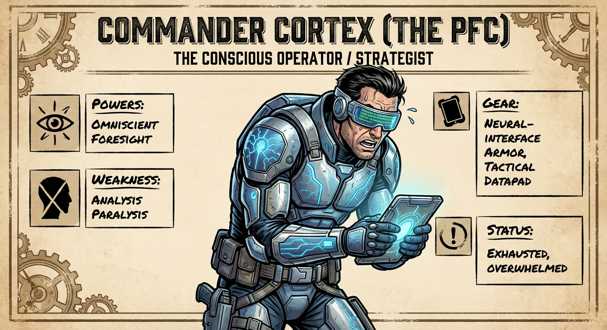

*The Conscious Operator / Strategist. He can see all possible futures but struggles to act on them.*

## Character: The Gatekeeper (The Basal Ganglia)

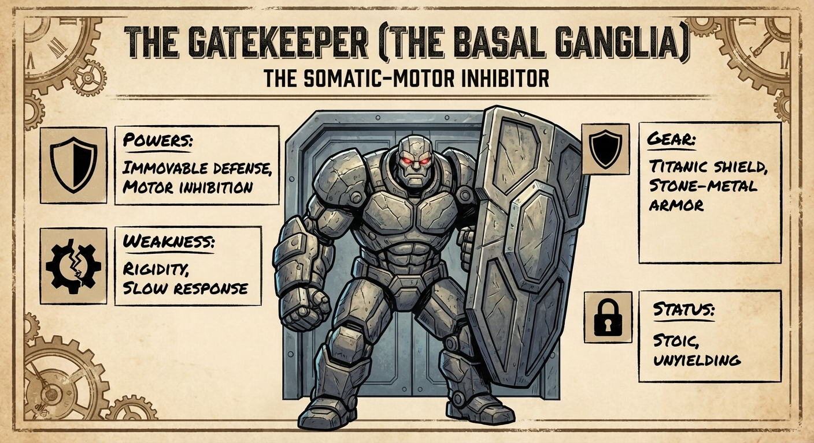

*The Somatic-Motor Inhibitor. He is not evil, just immovable.*

## Character: The Leviathan (The Task)

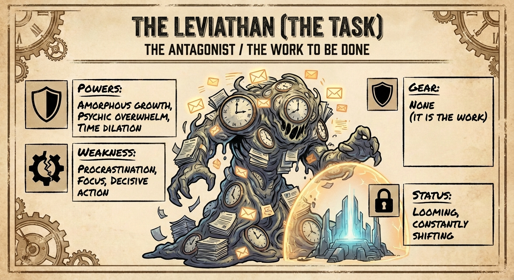

*The Antagonist / The Work to be Done.*

## Character: The Procedural Engine (The Striatum)

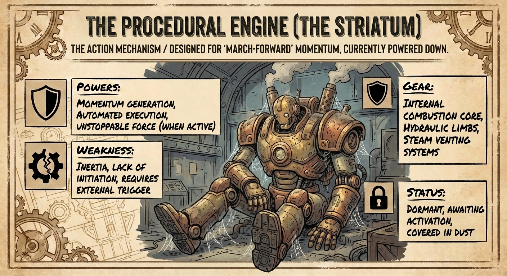

*The Action Mechanism. Designed for "March-Forward" momentum but is currently powered down.*

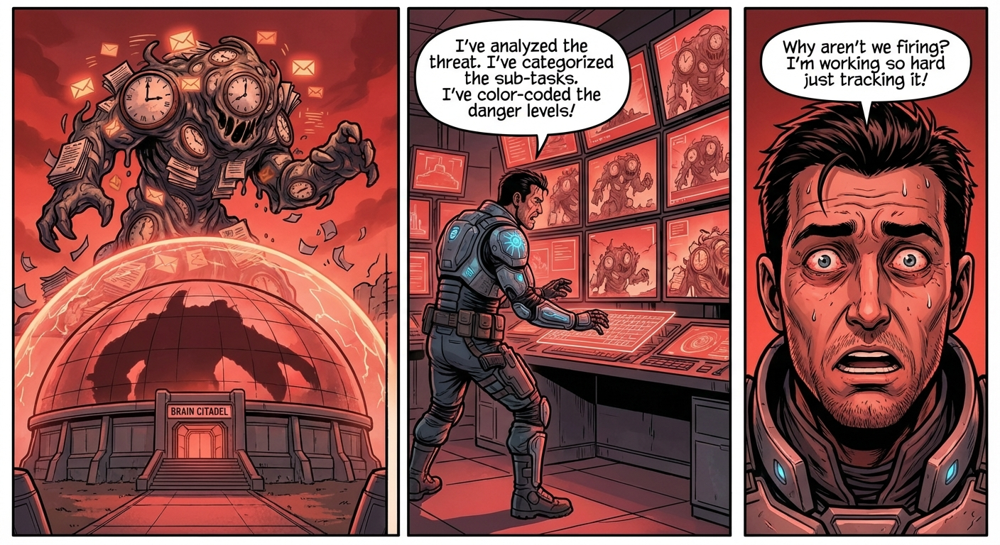

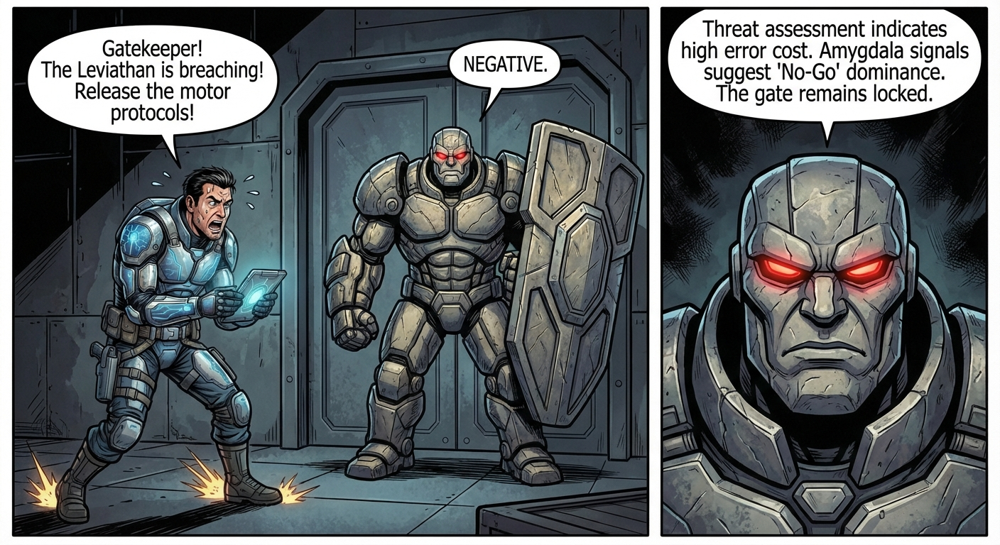

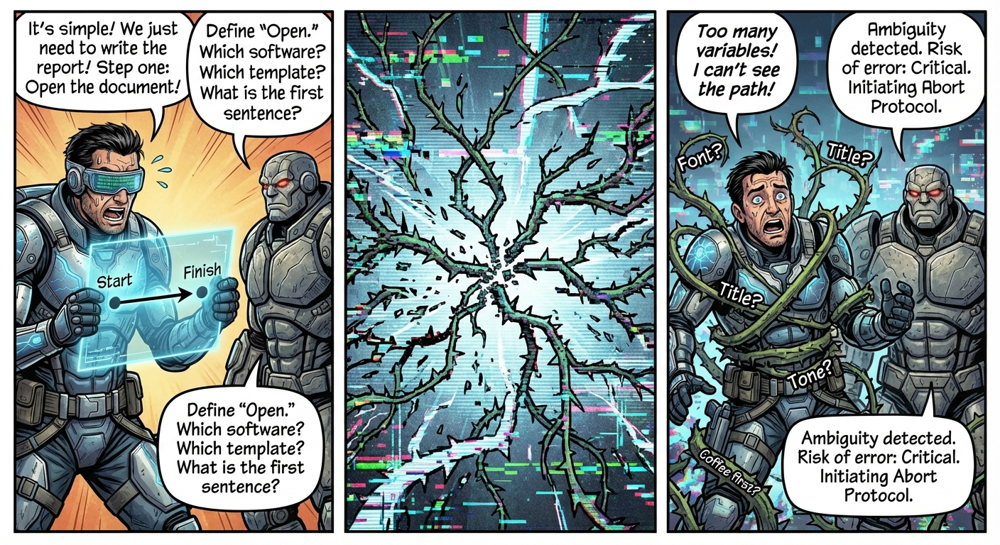

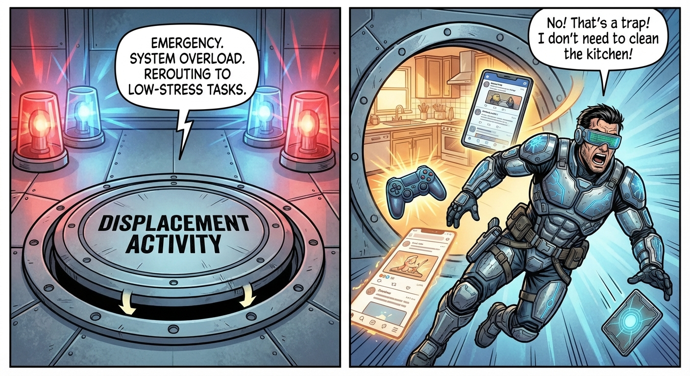

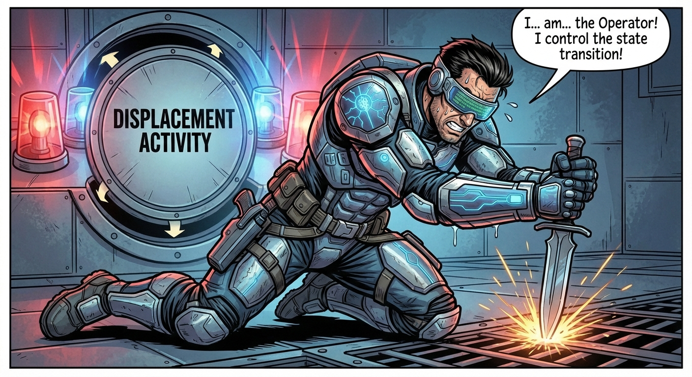

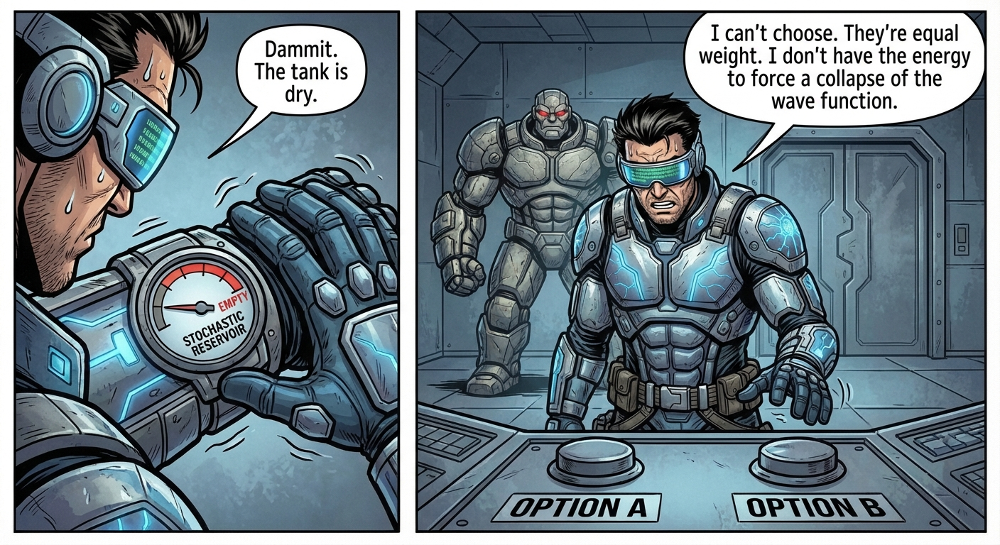

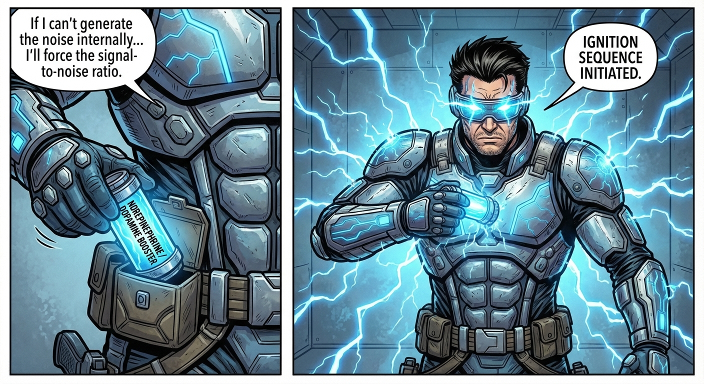

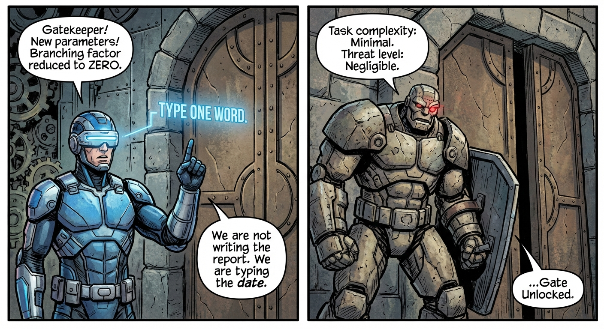

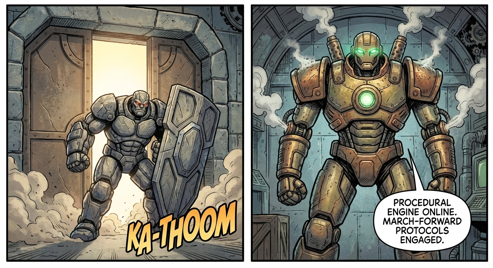

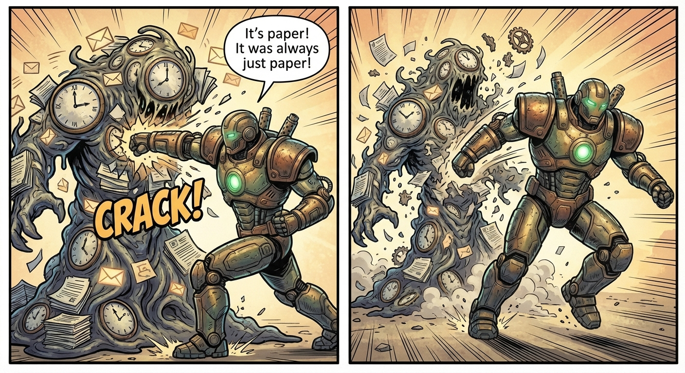

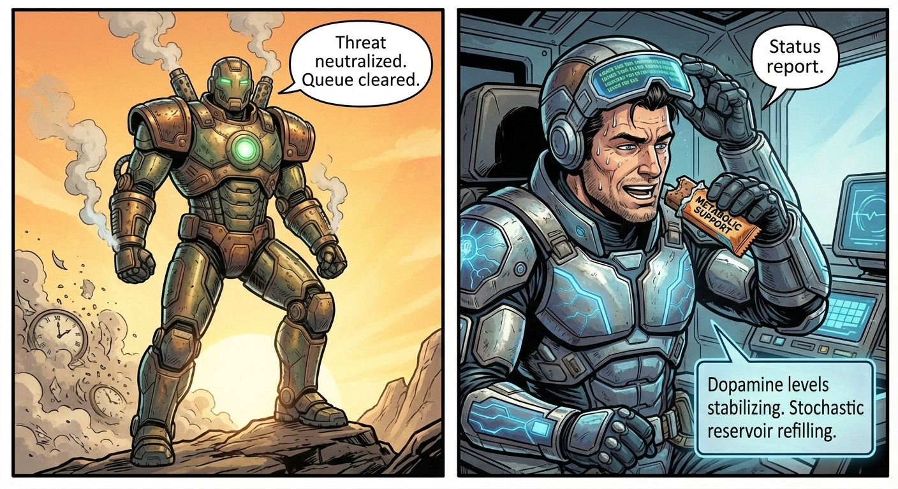

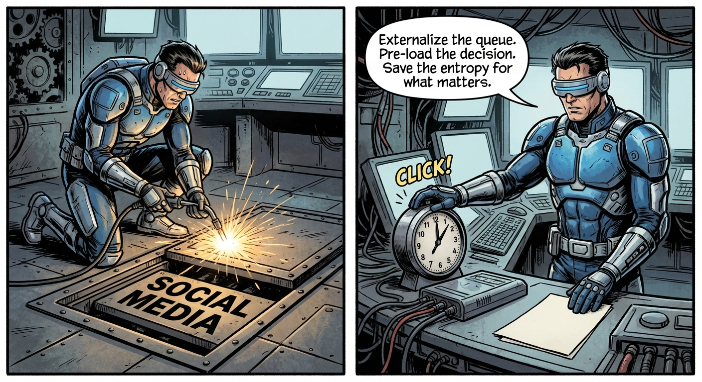

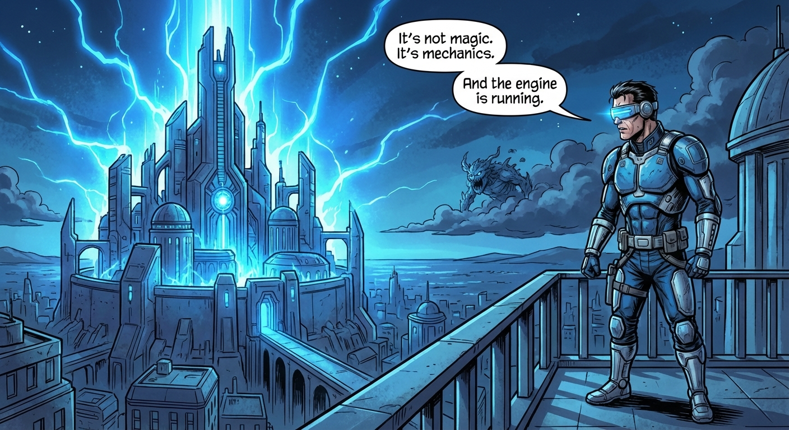

