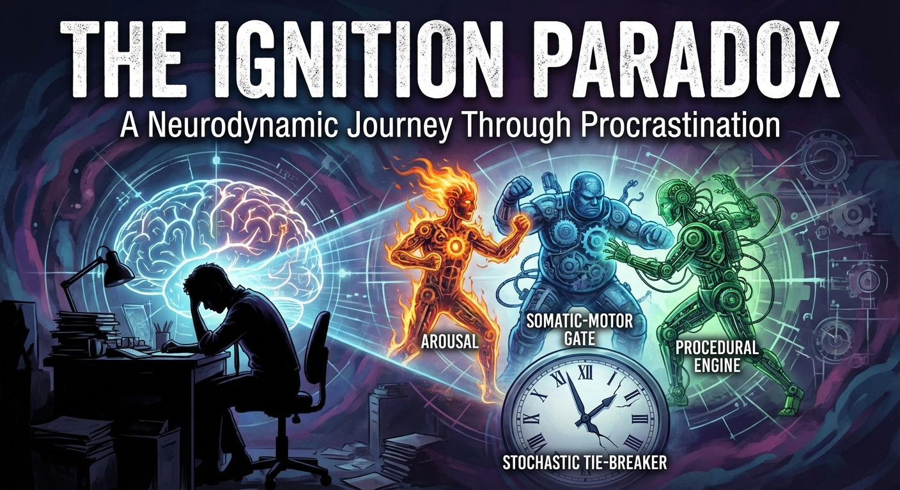
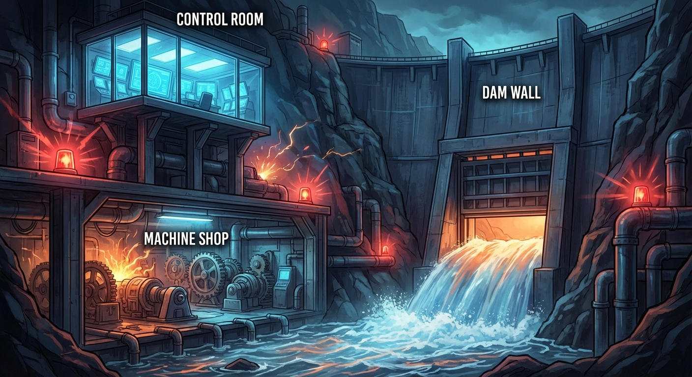
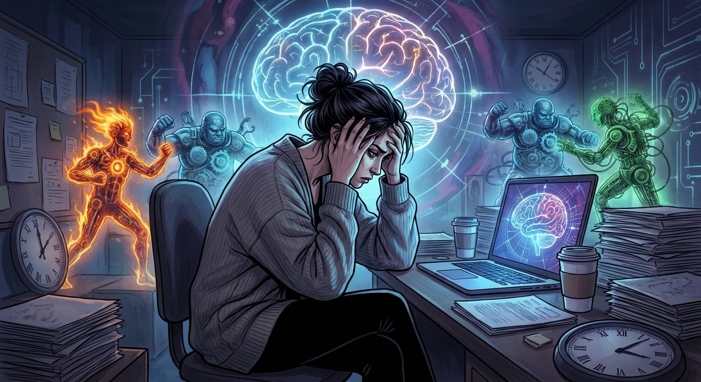
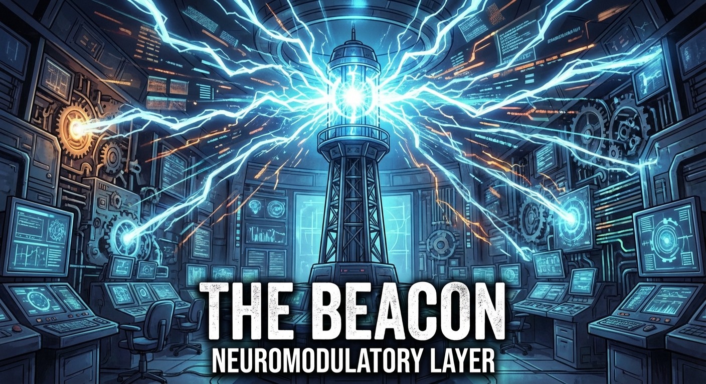
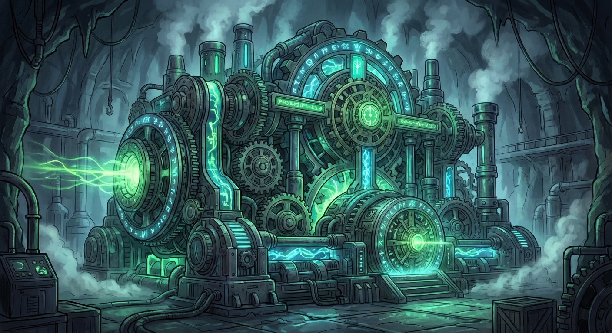
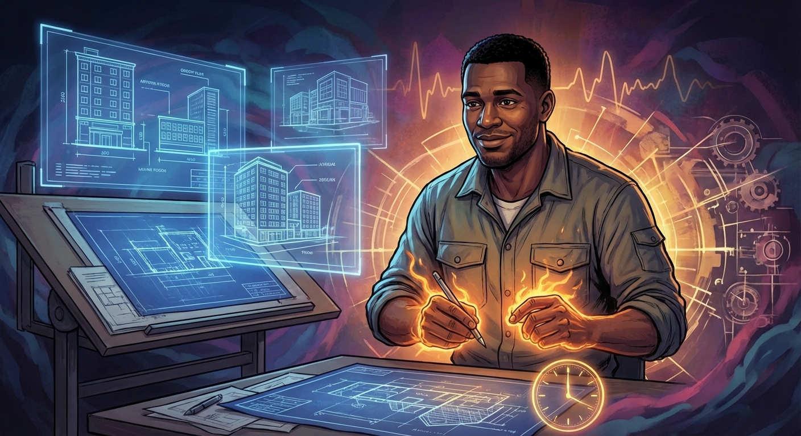
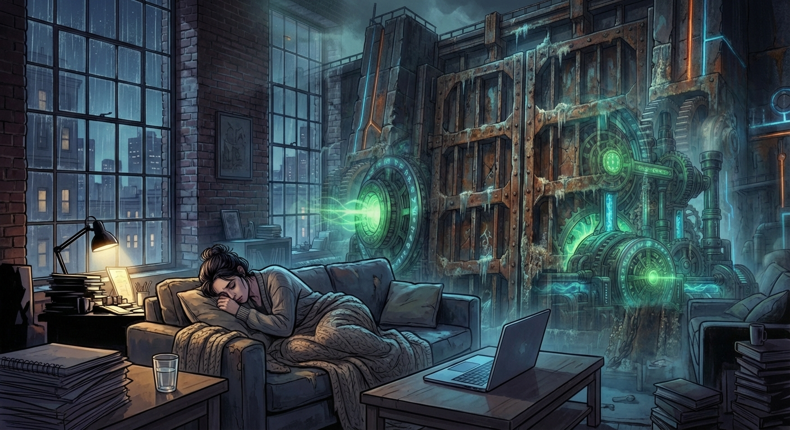
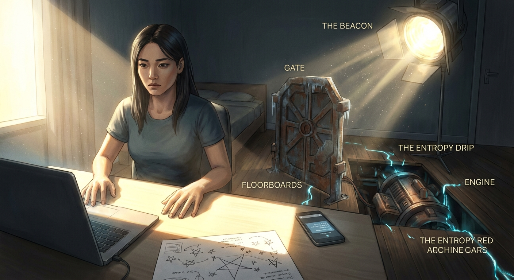
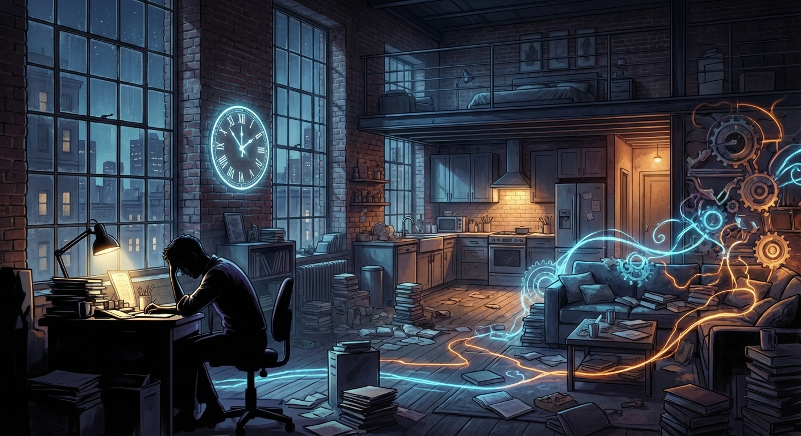

# Narrative Generation Task


## Overview

# Narrative Generation

**Subject:** A day in the life of a chronic procrastinator, dramatized through the lens of neurodynamic state transitions. The protagonist's internal neural architecture—the Arousal Layer, the Somatic-Motor Gate, and the Procedural Engine—are personified as competing forces within their mind as they struggle to begin a critical project. The narrative follows the mechanical reality of procrastination: the trap of awareness without action, the abort signal at the threshold of doing, the exhaustion of the stochastic tie-breaker, and ultimately the discovery that the problem was never willpower but ignition.

## Configuration
- Target Word Count: 6000
- Structure: 3 acts, ~2 scenes per act
- Writing Style: literary
- Point of View: third person limited
- Tone: dramatic
- Detailed Descriptions: ✓
- Include Dialogue: ✓
- Internal Thoughts: ✓

**Started:** 2026-02-21 09:33:21

---

## Progress

### Phase 1: Narrative Analysis
*Running base narrative reasoning analysis...*


## Cover Image

**Prompt:** 




## High-Level Outline

## The Ignition Problem

**Premise:** A brilliant software architect with ADHD struggles with a paralyzing inability to start a critical project, eventually discovering that her procrastination is a mechanical systems problem rather than a moral failure through the help of a colleague and a change in environment.

**Estimated Word Count:** 6000

---

### Characters

#### Mara Chen

**Role:** protagonist

**Description:** 34 years old, slim, sharp-featured, with dark hair in a loose knot. She wears oversized cardigans and leggings. A software architect diagnosed with ADHD at 29, she is wickedly intelligent and self-aware but suffers from shame-driven avoidance.

**Traits:** Hyper-self-awareness, Analytical intelligence, Shame-driven avoidance, Deep competence masked by surface dysfunction, Motivation: To deliver the architecture document and stop self-hatred

#### The Beacon

**Role:** internal force

**Description:** A pulsing light atop a tower in a vast control room. It represents the neuromodulatory layer of Mara's brain. It speaks in urgent, electric bursts and is incapable of prioritization.

**Traits:** Relentless, Unfiltered, Cannot distinguish between signal and noise, Floods the system with directionless urgency

#### The Gate

**Role:** internal force

**Description:** A massive iron sluice gate in a dam wall, representing the somatic-motor readiness layer. It is heavy and corroded, often becoming stuck despite not being locked.

**Traits:** High activation threshold, Responds to novelty and crisis but not intention, Represents the somatic-motor block

#### The Engine

**Role:** internal force

**Description:** A vast, powerful machine in a subterranean workshop representing procedural competence. It produces extraordinary work but cannot start itself.

**Traits:** Immense capability, Inaccessible without proper ignition, Represents flow state

#### Dev Okafor

**Role:** supporting

**Description:** 31 years old, tall and broad-shouldered with a warm face. A junior architect on Mara's team who provides structure and practical empathy without judgment.

**Traits:** Practical empathy, Structural thinking, Non-judgmental presence, Motivation: To help Mara deliver the document out of respect for her ability

---

### Settings

#### mara_apartment

**Description:** A one-bedroom industrial loft with high ceilings and exposed brick. Features an immaculate desk contrasted by a kitchen and living area in states of 'graduated entropy'.

**Atmosphere:** Pressurized silence, like a held breath; a sense of potential energy that feels like a prison.

**Significance:** The arena of Mara's private battle where objects mirror her internal state.

#### internal_landscape

**Description:** A vast industrial complex built into a cliff, containing a Control Room, a Dam Wall with a sluice gate, and a subterranean Machine Shop.

**Atmosphere:** Shifts from flooded light to chaotic alarms and rising water, eventually becoming unified and purposeful during flow.

**Significance:** Externalizes the mechanical reality of procrastination, making the abstract struggle visceral.

#### coffee_shop_grounded

**Description:** A functional, slightly noisy neighborhood coffee shop with Formica tables and the hiss of an espresso machine.

**Atmosphere:** Mundane, human, and aggressively ordinary.

**Significance:** Represents the external structure and environmental signals needed to lower the activation threshold of 'The Gate'.

---

### Act Structure

#### Act 1: The Flood of Light

**Purpose:** Establish Mara's world, competence, and the mechanical nature of her procrastination.

**Estimated Scenes:** 2

**Key Developments:**
- Introduction of the deadline and the internal architecture
- Mara falls into avoidance loops and productive-feeling procrastination
- The 'Final Planning Exception' occurs where she is ready to type but cannot move

#### Act 2: Rising Water

**Purpose:** Escalate the crisis and show the shame-avoidance feedback loop.

**Estimated Scenes:** 2

**Key Developments:**
- Mara cycles through failed strategies leading to exhaustion
- Entropy Drip causes total decision paralysis
- Dev intervenes and Mara makes the difficult decision to leave her apartment

#### Act 3: Ignition

**Purpose:** Deliver the breakthrough as a mechanical shift in ignition conditions.

**Estimated Scenes:** 2

**Key Developments:**
- Arrival at the coffee shop and use of social scaffolding
- The Gate opens and The Engine catches, leading to a deep flow state
- Completion of the document and a shift from self-hatred to self-engineering

---

**Status:** ✅ Pass 1 Complete


## Outline

## The Ignition Problem

**Premise:** A brilliant software architect with ADHD struggles with a paralyzing inability to start a critical project, eventually discovering that her procrastination is a mechanical systems problem rather than a moral failure through the help of a colleague and a change in environment.

**Estimated Word Count:** 6000

**Total Scenes:** 6

---

### Detailed Scene Breakdown

### Act 1: Act 1: The Flood of Light

**Purpose:** Establish the stakes of the Project Helios architecture document, Mara's high level of competence, and the mechanical nature of her ADHD through the metaphors of The Beacon and The Gate, ending in a cycle of shame and avoidance.

#### Scene 1: The Immaculate Desk

- **Setting:** mara_apartment
- **Characters:** Mara Chen, The Beacon
- **Purpose:** Establish the deadline, Mara's competence, the avoidance loop, and introduce The Beacon metaphor.
- **Emotional Arc:** Controlled optimism → mounting restlessness → the sickening lurch of lost time.
- **Est. Words:** 1200

**Key Events:**
  {
    "deadline_established" : "The architecture document for Project Helios is due Monday morning at 9 AM.",
    "competence_demonstrated" : "Mara's brilliant annotations and margin notes reveal she has already solved the hard problems.",
    "avoidance_loop" : "Mara cycles through outline refinement, desk organization, research tangents, and coffee rituals.",
    "beacon_introduction" : "The internal landscape reveals The Beacon, an undifferentiated attentional system that treats all inputs with equal urgency.",
    "shame_emergence" : "Mara's internal monologue shifts from analytical to corrosive as she realizes she is wasting time."
  }

#### Scene 2: The Final Planning Exception

- **Setting:** mara_apartment
- **Characters:** Mara Chen, The Beacon, The Gate, The Engine
- **Purpose:** Dramatize the mechanical failure of task initiation despite full preparation and introduce The Gate and The Engine metaphors.
- **Emotional Arc:** Grim determination → the eerie stillness of the attempt → the sickening non-event of failure → shame as a physical sensation → exhausted surrender.
- **Est. Words:** 1300

**Key Events:**
  {
    "mechanical_failure" : "Mara attempts to start writing but the signal from intention to action fails to complete its circuit.",
    "gate_introduction" : "The internal landscape introduces The Gate, a heavy sluice gate that requires a high activation threshold to open.",
    "engine_foreshadowing" : "The Engine is heard as a deep thrum, representing Mara's ready but inaccessible competence.",
    "shame_avoidance_loop" : "Failure to act triggers a shame response, leading Mara to close the laptop and retreat to the couch.",
    "neuroscience_monologue" : "Mara narrates the exact neurological process of her failure, demonstrating that knowledge alone is insufficient."
  }

---

### Act 2: Rising Water

**Purpose:** To escalate the protagonist's internal crisis of decision paralysis and shame-avoidance through failed self-regulation strategies, followed by an external intervention that breaks the cycle by shifting the focus from the task to physical movement.

#### Scene 1: The Entropy Drip

- **Setting:** mara_apartment
- **Characters:** Mara Chen, The Beacon, The Gate
- **Purpose:** Escalate the crisis by showing Mara cycling through increasingly desperate and self-defeating strategies to force herself to start, leading to total decision paralysis.
- **Emotional Arc:** From desperate, rational attempts at productivity to mounting shame, cognitive exhaustion, and finally a state of frozen, pressurized paralysis and numbness.
- **Est. Words:** 2000

**Key Events:**
  {
    "1" : "A time-compression montage shows Mara cycling through and failing at multiple productivity strategies (analog writing, Pomodoro timers, fuel, environmental audio).",
    "2" : "Mara attempts to 'write garbage' but deletes it immediately as the shame of feeling like a fraud becomes physical.",
    "3" : "The internal landscape reveals 'The Entropy Drip,' where internal pressure leaks into micro-avoidance behaviors like checking Slack and aimless kitchen trips.",
    "4" : "Mara experiences total paralysis where the gap between knowing what to do and being able to do it becomes a 'central torture.'",
    "5" : "The internal system reaches a state of equilibrium where shame-signals about failure drown out the actual task-signals, resulting in zero movement."
  }

#### Scene 2: The Intervention

- **Setting:** mara_apartment
- **Characters:** Mara Chen, Dev Okafor, The Beacon, The Gate
- **Purpose:** Break the paralysis through external intervention, forcing Mara to confront her state and make the difficult decision to change her environment.
- **Emotional Arc:** From numb, aimless avoidance to sharp anxiety and shame upon external contact, followed by a brief moment of professional clarity, and ending with a weary but decisive shift toward action.
- **Est. Words:** 1800

**Key Events:**
  {
    "1" : "Dev Okafor interrupts Mara's paralysis with a Slack message and a phone call regarding a technical question.",
    "2" : "Mara briefly regains her sense of competence while answering Dev's technical question before admitting she hasn't written a word in seven hours.",
    "3" : "Dev provides practical empathy, treating her paralysis as a technical parameter rather than a moral failure.",
    "4" : "Dev invites Mara to a coffee shop, providing a 'logistics signal' that bypasses the blocked 'task gate' in her internal landscape.",
    "5" : "Mara overcomes the final internal resistance and the shame of being seen 'looking like hell' to leave the apartment."
  }

---

### Act 3: Ignition

**Purpose:** To demonstrate the mechanical ignition of Mara's productivity through environmental change and social scaffolding, leading to a fundamental shift in her self-perception from moral failure to mechanical understanding.

#### Scene 1: The Changed Equation

- **Setting:** coffee_shop_grounded
- **Characters:** Mara Chen, Dev Okafor, The Beacon, The Gate, The Engine
- **Purpose:** Show how the change in environment and Dev's social scaffolding mechanically alter the ignition conditions, allowing The Gate to finally open and The Engine to catch.
- **Emotional Arc:** From exposed vulnerability and skepticism, through the subtle mechanical recalibration caused by environment and social scaffolding, to the first fragile moments of genuine engagement — not a triumphant leap but a grinding, unglamorous ignition.
- **Est. Words:** 1200

**Key Events:**
  [ "Mara and Dev arrive at the coffee shop; Mara feels exposed and raw, convinced this won't work, fighting the urge to perform normalcy or flee.", "Dev doesn't ask her to talk about the document. Instead, he orders two coffees, opens his own laptop, and begins working on his own tasks beside her — creating a body-doubling effect without naming it.", "Mara sits with her laptop closed, hands flat on the Formica table, feeling the ambient noise — the espresso machine's hiss, murmured conversations, the clatter of ceramic. The sensory environment is low-stakes, unpredictable enough to be novel, and fundamentally not her apartment.", "INTERNAL LANDSCAPE: The Control Room is still flooded with light from The Beacon, but the quality has shifted — the light is now diffused, scattered by the ambient noise entering the system like particulate in the air. The Beacon still pulses, but its signal is no longer the only input. External stimuli create a kind of interference pattern that, paradoxically, reduces the overwhelming flood to something navigable.", "Dev, without looking up, says something small and structural: 'I just need the service boundary diagram first. Even a rough one. I can't finish my section without it.' He frames the work not as Mara's redemptive act but as a dependency — a mechanical need. He needs a part from her. That's all.", "INTERNAL LANDSCAPE: At the Dam Wall, the water level is still dangerously high. But Dev's words arrive not as pressure from above but as a vibration in the gate mechanism itself — a specific, concrete, small-enough signal. The corroded Gate shudders. The activation threshold, lowered by novelty of environment, the presence of another working body, and the reduction of the task to a single concrete deliverable, is finally met. The Gate does not swing open dramatically — it grinds upward, an inch, then two, water beginning to pour through the gap in a controlled rush rather than an overwhelming flood.", "Mara opens her laptop. She does not open the architecture document. She opens a blank file. She types a single label: 'Service Boundary Diagram — ROUGH.' Her fingers feel thick and foreign for the first three words. Then the fourth word comes faster. Then a fifth.", "INTERNAL LANDSCAPE: Water pours through the widening gate and reaches the subterranean Machine Shop. It hits The Engine's intake valves — not a trickle, but a real flow. The Engine coughs. Sputters. A piston moves. Then another. The sound is rough and grinding at first, metal that hasn't moved in days protesting the motion. But the mechanism is sound. The Engine was never broken. It was never the problem. It just couldn't start itself." ]

#### Scene 2: The Machine Runs

- **Setting:** coffee_shop_grounded
- **Characters:** Mara Chen, Dev Okafor, The Beacon, The Gate, The Engine
- **Purpose:** Deliver the flow state, the completion of meaningful work, and Mara's crucial cognitive reframe — from self-hatred and moral failure to self-engineering and mechanical understanding.
- **Emotional Arc:** From the immersive relief and power of deep flow, through the quiet recognition of her own competence, to the story's essential reframe: the shift from self-hatred to self-understanding, from moral failure to systems thinking. The ending is not a cure but a profound change in orientation — hope grounded in engineering rather than willpower.
- **Est. Words:** 1300

**Key Events:**
  [ "Time compresses. Mara is inside the work now. The rough service boundary diagram becomes detailed. Annotations bloom in the margins. She begins cross-referencing the API contracts she'd been avoiding, and the architecture she's been carrying in her head for weeks pours out with startling coherence and precision — proof that The Engine's capability was never in question.", "INTERNAL LANDSCAPE: The Engine is running at full power. The Machine Shop is transformed — pistons firing in rhythm, gears meshing, the whole vast mechanism producing with an almost musical precision. The Beacon still pulses above, but its light is now channeled through the open Gate and into the Engine's intake, converted from noise into fuel. The system is unified for the first time: Beacon feeds Gate feeds Engine. This is what flow looks like from the inside — not the absence of the disorder, but the momentary alignment of its components.", "Dev glances over at one point, sees the density of what Mara is producing, and quietly gets up to bring her a second coffee without being asked. He sets it at the edge of her table. She doesn't notice for eleven minutes. When she reaches for it, it's the perfect drinking temperature. She almost laughs.", "Hours pass. The coffee shop shifts through its afternoon population. Mara surfaces periodically — to stretch, to blink, to re-read a section — but each re-entry into the work is easier than the last. The Gate, once open, stays open. The Engine, once running, sustains itself. The hard part was never the running. It was always and only the starting.", "Mara finishes the core architecture document — not the entire deliverable, but the critical structural spine that everything else hangs from. It is, as she reads it back, genuinely excellent work. She knows this not with pride but with a kind of exhausted clarity. The competence was always there. It was always accessible. The path to it was just blocked by a gate that doesn't respond to willpower.", "She closes the laptop. Sits back. Looks at Dev, who is still working on his own section. She says, quietly: 'The gate was stuck. It wasn't locked. It was just stuck.' Dev looks up. He doesn't fully understand the metaphor, but he understands enough. He nods. 'Yeah. Sometimes you just need a different room.'", "INTERNAL LANDSCAPE — FINAL IMAGE: The Control Room is quiet. The Beacon pulses at a low, steady rhythm — not silenced, never silenced, but no longer screaming. The Gate stands open, water flowing at a sustainable rate. Below, The Engine idles — not shut down, but at rest, ready. The system is not fixed. It is not cured. But Mara, standing in the Control Room, is no longer looking at the machinery with hatred. She is looking at it the way an engineer looks at a complex system that requires specific operating conditions. She places her hand on the console. The thought that forms is not 'I am broken' or 'I am lazy' or 'What is wrong with me.' The thought is: 'These are the ignition conditions. I need to learn them.'", "Mara packs up her laptop. She and Dev leave the coffee shop together. The late afternoon light is ordinary. She is tired in a way that feels earned rather than corrosive. She knows tomorrow the Gate may be stuck again. She knows The Beacon will flood the room again. But she now has a different framework — not willpower, not shame, not self-punishment, but engineering. The problem was never moral. It was mechanical. And mechanical problems have mechanical solutions." ]

---

**Status:** ✅ Complete


#### Setting: mara_apartment

**Prompt:** 


#### Setting: internal_landscape

**Prompt:** 



#### Setting: coffee_shop_grounded

**Prompt:** 


#### Character: Mara Chen

**Prompt:** 



#### Character: The Beacon

**Prompt:** 



#### Character: The Gate

**Prompt:** 


#### Character: The Engine

**Prompt:** 



#### Character: Dev Okafor

**Prompt:** 




## ## The Immaculate Desk

**Act 1, Scene 1**

**Setting:** mara_apartment

**Characters:** Mara Chen, The Beacon

---

The desk was perfect. That was the problem.

Mara Chen had spent the better part of forty minutes achieving this perfection—aligning the legal pad so its edge ran parallel to the laptop's base, squaring the stack of printed reference documents until their corners formed a single crisp right angle, positioning her coffee mug on the ceramic coaster at precisely the distance her right hand would travel without her eyes leaving the screen. The apartment's single west-facing window threw a blade of late-afternoon light across the workspace, and she had adjusted the blinds twice to kill the glare on her monitor while preserving enough warmth to make the room feel inhabited rather than merely occupied. The effect was architectural. A workspace as a declaration of intent.

It was Friday at 4:47 PM. The architecture document for Project Helios was due Monday morning at nine.

Sixty-one hours and thirteen minutes. A luxurious margin. She had built entire system architectures in less time, had once redesigned a distributed messaging pipeline on a redeye from SFO to JFK while the man in 14B snored wetly against her shoulder. She was, by any reasonable measure, the best person at Lumen Labs to write this document. Kai had said so when he assigned it. Her director had said so in the all-hands. The printed reference documents on her immaculate desk—three whitepapers, the existing API schema, a competitor teardown she'd done on her own time—were already annotated in her cramped, precise handwriting, margins blooming with insights that solved problems the official brief hadn't thought to pose.

In the top margin of the API schema, she had written: *Decouple auth layer entirely—event-driven handshake eliminates the latency bottleneck they've been throwing hardware at for six months.* Beside it, a small diagram, almost beautiful in its economy, rendered the new topology in four clean strokes. The solution was already there, living in ink. All she had to do was open a blank document and begin transferring what she knew into structured prose.

She opened the document. She typed the title: **Project Helios: System Architecture Proposal.** She formatted it in the company template. She saved the file.

Then she picked up the legal pad and decided the outline needed one more pass.

---

The outline was on its fourth revision. Each version more granular than the last, the Roman numerals breeding sub-points like cells dividing, the hierarchy deepening until it resembled less a plan for writing and more a substitute for it. Mara worked through the structure with the focus of a jeweler setting stones, her pen moving in quick, certain strokes. Section III needed to come before Section II—no, the original order was right, but the transition required a bridging paragraph about legacy dependencies. She drew an arrow. Crossed it out. Drew another, then stared at the tangle of ink until it dissolved into pure noise.

Somewhere beneath the scratching of her pen, a sound was building. Not audible—not exactly. More like a frequency, a carrier wave threading through every surface in the apartment. The refrigerator's compressor cycling in its low mechanical throat. A car alarm pulsing three blocks east. The particular silence of her phone, face-down on the kitchen counter where she'd exiled it, radiating louder than if it were ringing. The afternoon light had shifted. The blinds needed adjusting again. There was a water stain on the ceiling she hadn't noticed before, shaped vaguely like Tasmania.

This was the thing she could never explain to anyone, the thing that collapsed every time she reached for language: the way her attention didn't wander so much as *illuminate everything at once*. A lighthouse with no rotation mechanism, no sweeping beam to sort signal from noise—just a steady, blinding, indiscriminate flood. The Beacon, she'd named it in a journal entry scrawled at 3 AM during a previous deadline spiral. *I am a beacon that cannot choose its ships.* Every input arrived with the same screaming urgency. The outline. The water stain. The sub-audible hum of the compressor. The document waiting on her screen like an open mouth.

She stood up. The outline was good enough. Better than good enough—overengineered, a cathedral of planning where a lean-to would serve. She sat back down.

The cursor blinked in the empty document.

She got up again and went to the kitchen to make a second cup of coffee. The ritual was specific: burr grinder set to medium-fine, water heated to 205 degrees on the gooseneck kettle with the built-in thermometer, the bloom phase timed to forty-five seconds. She watched the grounds swell and exhale, a miniature landscape forming and collapsing, and she thought about how degassing was essentially a pressure differential problem not unlike the load-balancing challenge in Section IV, and she should fold that analogy into the document because Kai responded well to metaphor, and—

The kettle was empty. She had poured all the water without completing the brew cycle, the filter brimming over, a thin brown rivulet creeping toward the counter's edge. She pressed a dish towel into the spill and felt the warmth soak through cotton into her palm.

5:52 PM.

An hour gone. An hour of nothing. No—worse than nothing. An hour of *almost*, of preparation so thorough it had become its own destination.

---

Back at the desk, the light had gone amber, then grey. She switched on the lamp and the room shrank to meet it. The document still showed only its title, the cursor blinking with what she now perceived as patient contempt. She reread her own margin notes—*decouple auth layer entirely*—and felt a vertiginous disconnect, as though the person who had written those words were someone she'd met at a conference and admired from a professional distance but could never quite become.

*You know how to do this. You literally already know the answers.*

The thought should have been encouraging. Instead it curdled into something worse. Because if she already knew the answers and still couldn't begin, then the problem wasn't competence. The problem was her. Some essential mechanism that other people seemed to possess—the ability to simply *start*, to push thought through the membrane between knowing and doing—was absent from her own architecture, a gap in her system design that no amount of outlining could bridge.

*You're lazy,* whispered something old and familiar, wearing her mother's cadence. *You're lazy and you've been fooling everyone and Monday morning they'll finally see it.*

She pulled the legal pad close and began a fifth revision. The pen moved fast, almost frantic, strokes losing their earlier precision, letters collapsing into one another. The Beacon blazed. The refrigerator hummed. The coffee she'd salvaged cooled untouched beside her, a dark circle going still, while the window behind her went fully dark and the apartment contracted to the small bright island of her desk lamp—perfect and useless, a stage dressed for a performance that would not begin.

Her phone buzzed once from the kitchen counter. She didn't check it.

It was Kai.

---

**Word Count:** 1160

**Key Moments:**
- Mara's desk ritual reveals the seductive precision of her avoidance—preparation as procrastination's most convincing disguise
- Her margin notes on the API schema demonstrate she has already solved the hardest technical problems, establishing the cruel gap between knowing and doing
- The Beacon metaphor is introduced through Mara's interior experience: attention as an indiscriminate flood rather than a directed beam
- The coffee ritual collapses into physical spillage, externalizing the breakdown of her executive function
- The internal monologue pivots from analytical self-observation to corrosive shame ("You're lazy and you've been fooling everyone")

**Character States:**
- **Mara Chen:** Emotionally spiraling from controlled optimism into self-recrimination and mounting panic. Physically tense, surrounded by evidence of her own brilliance that she cannot access. Trapped in the avoidance loop with no exit strategy. Unaware that Kai has just reached out.
- **The Beacon:** Fully active and undifferentiated—every sensory input (refrigerator hum, water stain, phone silence) arrives at equal volume, drowning out the signal of the task. It is not malfunction; it is the system operating as designed, which is the core of the problem.

**Status:** ✅ Complete


#### Act 1, Scene 1 Image

**Prompt:** 


## ## The Final Planning Exception

**Act 1, Scene 2**

**Setting:** mara_apartment

**Characters:** Mara Chen, The Beacon, The Gate, The Engine

---

The apartment had achieved a silence so complete it felt architectural, as though the walls had drawn closer and sealed their seams. Mara sat at the desk for eleven minutes after the phone buzzed—she knew it was eleven because she watched each one turn on the clock in the menu bar, the digits changing with the soft inevitability of a countdown she hadn't authorized.

Then she stood, crossed to the kitchen, and did not check the phone.

She filled a glass of water. She drank it in four long swallows, throat working against the cold, and set the glass down on the counter with a deliberateness that was itself a kind of argument. *I am not avoiding. I am hydrating. These are different activities.* She returned to the desk. She sat. She placed her fingers on the keyboard with the care of someone setting bones.

The document had been open for two hours and fourteen minutes. The cursor pulsed at the top of a blank page beneath a heading she'd typed with such confidence it now read like satire: **Section 1: Authentication Flow Architecture.**

She knew this architecture. She had *solved* this architecture. The margin notes on the printed schema to her left contained the entire solution in her own handwriting, annotated with arrows and small triumphant stars she'd drawn at 2 a.m. three nights ago when the whole system had clicked into place like a lock accepting its key. The knowledge was there—complete, structured, even elegant. She could feel it the way you feel a word caught behind your teeth, its shape pressing against the inside of her skull, fully formed and refusing to fall.

She pressed her fingers harder into the keys without depressing them.

*Start.*

Nothing happened.

Not nothing in the dramatic sense—no crisis, no interruption, no sudden emergency that would have at least provided narrative justification. Nothing in the most literal, most annihilating sense: the signal that should have traveled from intention to action simply failed to complete its circuit. She could feel the exact place where it died. Somewhere between the thought *write the first sentence* and the motor command that would move her fingers, there was a gap—not a wall, not a block, but an absence. A missing section of bridge over a gorge she could see the other side of with perfect clarity.

Inside her, something she would later learn to call The Gate held fast.

It arrived not as a metaphor she chose but one that appeared fully formed: a massive sluice gate, industrial and ancient at once, the kind that controlled rivers through dam systems. It required an activation threshold to open—a specific pressure behind it, a precise accumulation of force—and the pressure she could generate through willpower alone was not enough. Had never been enough. She threw herself against it, jaw clenched, shoulders climbing toward her ears, every conscious resource directed at the single command *move your hands and type,* and The Gate did not move. It did not tremble. It was not struggling. It was simply closed, and the force required to open it was a force she could not manufacture on demand.

Beneath The Gate, far below, she could hear something else: a deep steady thrum, almost subsonic, felt more in the chest than heard. The sound of her own competence—the part of her that had designed systems used by eleven million people, that had debugged race conditions at 4 a.m. with a joy so pure it was almost devotional, that had once rewritten an entire authentication module on a cocktail napkin while half-drunk and laughing because the solution was *beautiful.* The Engine. It was running. It was *always* running. But The Gate stood between the Engine and the world, and no amount of knowing it was there could open The Gate from this side.

She understood the neuroscience. She could narrate it in real time, and she did, with the grim precision of a flight recorder documenting a crash:

*The prefrontal cortex is failing to provide sufficient dopaminergic signaling to initiate the task-positive network. The anterior cingulate cortex is registering the conflict between intention and inaction as unresolvable and defaulting to avoidance. The basal ganglia—which gate voluntary motor actions, there it is, the word is even correct—are not receiving the go signal. This is not a failure of knowledge or desire or character. This is a neurotransmitter problem. A mechanical systems problem.*

She knew this. It did not help. Knowing the name of the disease while the fever climbs does not lower your temperature. She sat with her fingers on the keys and her solution in the margins and her diagnosis narrating itself inside her skull—a woman in full possession of every tool except the one that would let her pick up the others.

The shame arrived on schedule.

It came not as a thought but as a physical event—a hot, liquid heaviness that began behind her sternum and spread through her chest like dye dropped into still water. Her face flushed. Her hands, still poised uselessly above the keyboard, went damp. The shame had its own logic, and it did not care about neuroscience: *You have been sitting here for two hours and produced nothing. The deadline is in six days. You are a senior architect at a company that trusts you with its infrastructure, and you cannot write a single sentence. You understood the problem three days ago. What have you been doing for three days?*

She had been preparing. Organizing. Sharpening every pencil in the house and reading supplementary documentation and color-coding her notes and doing everything except the one thing that mattered. The shame knew this, and the shame was not interested in explanations about sluice gates and dopamine, because the shame spoke a language older than neuroscience, older than diagnosis, a language that had only one word and the word was *lazy.*

Mara closed the laptop.

The whisper of aluminum meeting aluminum landed in the silent apartment like a verdict. She pressed her palms flat against the closed lid, as if she could feel the cursor still blinking beneath the surface, patient and accusatory and endlessly willing to wait.

She stood. Her legs were stiff—she'd been clenching her thighs against the chair without realizing it, her body braced for an effort it had never been permitted to make. Seven steps across the apartment's narrow geography to the couch. She sat, then lay down, then pulled the throw blanket over her shoulders and curled onto her side facing the back cushions. The fabric smelled like laundry detergent and old popcorn. It was too short and left her feet exposed, her socks catching the faint draft from the baseboard vent.

The Engine thrummed on, somewhere beneath everything, ready and inaccessible—a generator powering a city whose lights she could not turn on.

On the kitchen counter, her phone held Kai's unread message, its screen dark, its small cargo of human connection waiting with the particular patience of things that do not know they are needed.

Mara pressed her face into the cushion and breathed the stale warmth of her own exhalation. She was not sleeping. She was not resting. She was doing the thing that came after failure and before the next attempt, the thing that had no name because no one talked about it: the blank, post-shame stillness of a system that had tried to start and couldn't, and now had to survive the full weight of its own awareness until it could bear to try again.

The refrigerator hummed its one low note. The desk lamp burned on across the room, illuminating the empty stage of the keyboard, the schema with its triumphant stars, the glass of water she'd used as an alibi.

Somewhere in the building, a door opened and closed. Footsteps passed her floor without pausing.

The world continued, and Mara lay still inside it, engine running, gate locked, waiting for a force she did not yet know how to name.

---

**Word Count:** 1330

**Key Moments:**
- Mara places her fingers on the keyboard and experiences the precise, devastating non-event of task initiation failure—the signal from intention to action simply dies in transit
- The Gate metaphor arrives fully formed: a massive sluice gate requiring an activation threshold she cannot generate through willpower alone, standing between her and the blank page
- The Engine is introduced as a deep subsonic thrum—her competence is running, ready, but completely inaccessible from this side of The Gate
- Mara narrates the exact neuroscience of her own failure in real time, demonstrating with brutal clarity that understanding the mechanism does not fix it
- The shame-avoidance loop completes: shame arrives as a physical sensation, she closes the laptop, retreats to the couch, and enters the unnamed post-failure stillness

**Character States:**
- **Mara Chen:** Emotionally flattened, curled on the couch in post-shame exhaustion. Physically drained from the invisible effort of trying to start. She possesses complete self-knowledge of her condition and it has done her no good whatsoever. She is in the trough between attempts, unable to act and unable to stop knowing she should be acting.
- **The Beacon:** Still blazing indiscriminately—the refrigerator hum, the couch texture, the footsteps in the hallway all arrive at equal volume. No signal has been prioritized.
- **The Gate:** Introduced and firmly closed. It is not malicious; it is mechanical. It requires a threshold of activation energy Mara cannot self-generate, establishing the central problem of the narrative.
- **The Engine:** Audible but unreachable—a steady thrum of competence and capability running beneath everything, waiting for The Gate to open. Its presence makes the failure more painful, not less.

**Status:** ✅ Complete


#### Act 1, Scene 2 Image

**Prompt:** 




## ## The Entropy Drip

**Act 2, Scene 1**

**Setting:** mara_apartment

**Characters:** Mara Chen, The Beacon, The Gate

---

She woke on the couch at 4:47 AM with the desk lamp still burning and the architecture of the day already collapsing.

Not woke—surfaced. She had been lying in a shallow trench of consciousness, the kind of rest that leaves the body more exhausted than effort would. Her neck had kinked against the armrest. Her mouth tasted of stale coffee and the particular metallic residue of cortisol. The apartment held the same temperature it had three hours ago, the same silence, the same refrigerator sustaining its one eternal note, but something had shifted in the quality of the dark beyond the windows. The sky was not yet lightening. It was preparing to lighten, which was worse—it meant the night was used up and she had purchased nothing with it.

Mara sat up. She pressed her palms against her eyes until phosphenes bloomed, orange and violet, a private fireworks display for an audience of one.

*Okay. New day. New approach.*

This was the lie she told herself every time, and every time it worked just long enough to get her vertical.

---

**5:12 AM.** The analog strategy.

She had read somewhere—or everywhere, because the internet was an infinite library of productivity advice written by people who did not need it—that handwriting engaged different neural pathways. Bypassed the digital associations. Tricked the brain into flow.

She found a legal pad in the kitchen drawer, the yellow kind, pages still crisp. She found a pen that worked on the third try. She sat at the kitchen table instead of the desk because the desk was contaminated now, a crime scene of yesterday's failure, and she wrote at the top of the page in careful block letters:

**MERIDIAN API — AUTHENTICATION LAYER — ENTRY POINTS**

The pen moved. The ink was blue. The letters were neat and certain and she felt, for approximately ninety seconds, the faint electrical thrill of forward motion. She wrote three bullet points. She began a fourth. The pen stopped.

It stopped because The Beacon had found the pen itself—the way ink pooled at the terminus of each stroke, the micro-vibration of ballpoint against paper grain, the fact that the legal pad had forty-seven remaining sheets and she could see, at its edge, the faint ghost of someone else's writing pressed through from a page long since torn away. Who had used this pad? When had she bought it? The pen was from a hotel. Which hotel? Portland, maybe. The conference where she'd presented the distributed caching paper and afterward—

She was on her phone. She did not remember picking it up. She was scrolling through photos from Portland, eighteen months ago—a conference room, a hotel lobby, a plate of salmon she'd eaten alone at the bar—and the legal pad sat on the table with its four bullet points cooling like a body.

She put the phone face-down. She picked up the pen.

The pen did not move.

---

**5:41 AM.** The Pomodoro.

She set the timer for twenty-five minutes. Work for twenty-five, rest for five, repeat. She opened the laptop. The schema was still there, her stars gleaming in the margins, the cursor blinking in the empty file like a heart that refused to stop.

She typed:

```
// Authentication service - main entry
```

The comment sat on the screen. Twenty-four minutes and thirty-one seconds remained. The number was visible at the corner of her vision, and now The Beacon locked onto it with the desperate focus it refused to give the code—she could feel each second arriving and departing, the timer not as a container for work but as a countdown to judgment. In twenty-four minutes the alarm would sound, and she would have to confront what she had produced, and the answer would be one comment line, eight words, and the knowledge that she had failed a system designed to be unfailable.

She closed the timer at twenty-three minutes and forty-four seconds. She closed the laptop. She walked to the kitchen and opened the refrigerator and stared into its bright cold interior at the half-empty carton of oat milk and the leftover pad thai in its grease-spotted container and a bag of spinach dissolving to liquid in the crisper drawer. She stood there long enough for the refrigerator to begin its warning chime, the one that meant the door had been open too long. She closed it and walked back and sat down.

Elapsed time: four minutes.

---

**6:03 AM.** The fuel theory.

Maybe the problem was metabolic. Maybe her prefrontal cortex was simply starving—glucose depleted, neurotransmitters spent, executive function running on fumes. She made eggs. She made them carefully, with butter and salt and the slow patience she could not give the code, and she ate them standing at the counter and felt the warmth settle into her stomach and waited for it to reach her brain, to cross whatever blood-barrier stood between nutrition and volition.

She washed the pan. She dried it. She put it away.

She checked Slack.

The check was not a decision. It was a reflex, a micro-seizure of the attention system, and by the time she recognized what she was doing she was already seventeen messages deep in a channel about office furniture procurement, reading with genuine absorption about the relative merits of two ergonomic chairs she would never sit in because she worked from home. Someone named Derek from facilities had posted a photograph of a lumbar support cushion. Mara studied it the way she should have been studying the authentication schema—with full, devoted, annihilating focus.

She closed Slack. She opened the laptop. She closed the laptop. She opened Slack.

This was The Entropy Drip. She could name it even as it consumed her: the internal pressure of the undone task leaking sideways through every crack in her attention, converting itself not into work but into micro-avoidances, tiny lateral escapes that each cost almost nothing and together cost everything. Check Slack. Stand up. Walk to the kitchen. Touch the countertop. Walk back. Adjust the laptop's angle. Check Slack again. Read one message. Read four. Stand up. The pressure never decreased. It only redistributed, finding new channels, new hairline fractures in her resolve, dripping steadily into the growing reservoir of wasted time.

---

**6:38 AM.** The garbage draft.

The strategy of last resort: *just write garbage. Write the worst possible version. Give yourself permission to be terrible.* The theory was sound—she knew this with the same crystalline certainty with which she knew the authentication architecture. Lower the threshold. Remove the quality gate. Let anything through.

She placed her fingers on the keys. She typed:

```
function authenticate(token) {
  // this is garbage and that's fine
  // just get something down
  let result = validateToken(token);
```

Four lines. They arrived on the screen like small animals emerging from a burrow—tentative, blinking, exposed. She looked at them. The Beacon looked at them. And what The Beacon saw was not a beginning but an exposure, proof that the architect who had designed elegant distributed systems across three companies could not produce four lines of starter code without a parenthetical apology.

The shame arrived as heat. It started in her sternum and climbed her throat and reached her face—not metaphorical but thermal, a flush she could feel in the capillaries of her cheeks. Her fingers found the keys again, but not to write. They found `Cmd+A`. They found `Delete`.

The screen was blank again. The blank screen was unbearable but the garbage was worse, because the garbage was *evidence*.

---

**7:15 AM.** The central torture.

She was at the desk now—she had migrated there without deciding to, pulled back to the scene of the original failure by some gravitational logic she could not override. The schema was spread before her. Her stars glowed in the margins. The solution was *right there*, broken into components she could see with perfect clarity: the token validation layer, the session management module, the rate-limiting middleware, each one discrete and solvable, each one waiting for nothing more than the first line of code that would bring it into existence.

She knew what to write. She knew *exactly* what to write. The knowledge sat in her mind like a completed blueprint, every joint and beam accounted for, and between that knowledge and her fingers lay The Gate—massive and mechanical and utterly indifferent to the fact that she was dying on this side of it.

This was the central torture, the thing she had never found language adequate to describe to anyone who had not lived inside it: the simultaneity of knowing and not-doing. Not confusion, not incompetence, not lack of skill or preparation or desire. She wanted to work. She was desperate to work. The want had become a physical ache in her jaw where she'd been clenching without realizing. The architecture was so clear she could have dictated it in her sleep. And none of it mattered, because the signal that should have traveled from intention to action was dying somewhere in transit, absorbed by The Gate's massive thermal mass, converted into heat and shame and nothing.

She could narrate the neuroscience in real time. She could explain the dopamine deficit, the activation threshold, the executive function bottleneck. She could draw a diagram of her own failure on the very schema that proved her brilliance. And the explanation changed nothing. Understanding the lock did not open it.

The shame-signals were louder now than the task-signals. They had reached equilibrium—a terrible, stable state in which the pain of not-working and the pain of trying-to-work had become exactly equal, producing a net force of zero. She could not move forward because starting hurt. She could not stop because not-starting hurt. She was pinned at the exact center of two opposing agonies, and the system had found its resting state, and the resting state was paralysis.

---

**7:42 AM.**

The apartment was fully light. Sun came through the east window and fell across the desk in a bright parallelogram that included her hands, resting on either side of the laptop, palms down, fingers slightly spread, perfectly still. The screen had dimmed to sleep. The schema's stars caught the sunlight and winked.

Mara was not thinking. She had passed through thinking into something beyond it—a pressurized numbness, a state so dense with unfired impulses that it registered as silence. The Engine hummed beneath everything, ready, capable, loaded with solutions. The Gate held. The Beacon blazed at everything and nothing, illuminating the dust motes drifting through the sunlight with the same ferocity it denied the blinking cursor.

She was not lazy. She was not broken. She was a system in equilibrium, and the equilibrium was killing her, and she did not know how to introduce the perturbation that would shatter it.

Her phone buzzed against the desk. She did not look at it.

It buzzed again.

She did not look at it, but The Beacon did—swung toward the vibration with the helpless, mechanical obedience of a compass needle finding north—and in the notification preview, before she could choose not to read it, she saw:

**Kai Nakamura:** *Hey. Weird question. Are you stuck?*

The words hung in the air like a struck bell. Mara stared at the ceiling. The sun moved one inch across the desk. The refrigerator hummed its single note.

She did not answer. But something in the equilibrium—imperceptible, a single degree of temperature, a single gram of pressure—shifted.

---

**Word Count:** 1906

**Key Moments:**
- A time-compressed montage cycles Mara through analog writing, Pomodoro timers, eating for fuel, and environmental audio—each strategy failing within minutes as The Beacon hijacks her attention toward irrelevant stimuli.
- The 'garbage draft' attempt produces four lines of code that Mara immediately deletes, the shame of seeing her inadequacy made visible registering as literal physical heat in her face.
- The Entropy Drip manifests as a cascade of micro-avoidances—Slack checks, kitchen trips, furniture procurement threads—each too small to register as a choice, together consuming hours.
- Mara reaches total paralysis at the desk: a stable equilibrium where the pain of not-working and the pain of trying-to-work cancel each other perfectly, producing zero net movement.
- Kai's text—'Are you stuck?'—arrives and The Beacon catches it involuntarily, introducing the first micro-perturbation in the frozen system.

**Character States:**
- **Mara Chen:** Emotionally flattened into pressurized numbness after hours of failed strategies. Physically exhausted, hands motionless on the desk in full morning light. She has passed through desperation, shame, and cognitive exhaustion into a frozen equilibrium state. Kai's message has registered but she has not responded—something imperceptible has shifted, but she cannot yet identify or act on it.
- **The Beacon:** Still blazing indiscriminately but has involuntarily locked onto Kai's message, demonstrating that external stimuli can capture its attention even when self-directed effort cannot. This is the first hint that the solution may come from outside the system.
- **The Gate:** Firmly closed, now reinforced by hours of accumulated shame-signals that have drowned out the original task-signals. The equilibrium state means no internal force is sufficient to open it.

**Status:** ✅ Complete


#### Act 2, Scene 1 Image

**Prompt:** 




## ## The Intervention

**Act 2, Scene 2**

**Setting:** mara_apartment

**Characters:** Mara Chen, Dev Okafor, The Beacon, The Gate

---

The sun had moved from the desk to the floor. Mara watched it drag across the hardwood, a slow golden smear marking time she couldn't account for. She was still on the couch. She'd been on the couch for—she checked her phone—forty-seven minutes since Kai's message, which meant forty-seven minutes of doing nothing about the fact that she'd been at the desk for hours doing nothing. A perfect closed loop with no exit condition.

Kai's message still glowed on her lock screen. *Are you stuck?* She'd read it eleven times. Each reading produced a small flare of recognition that lasted exactly two seconds before dissolving into noise. The twelfth reading produced nothing. The word *stuck* had become a shape rather than a sound. She locked the phone, set it face-down on the cushion, picked it up, read it a thirteenth time.

The refrigerator hummed. A pipe ticked deep in the wall. Her neighbor's dog clicked its nails across the floor above—click click click, pause, click click—and her attention tracked each click with the fidelity it would give a gunshot. Every sound had become a small event demanding the same quality of attention, and the attention had nowhere useful to go.

Her phone buzzed. Slack. The notification slid down in institutional green, and before she could choose not to read it, she had:

**Dev Okafor** in **#arch-questions**: *@mara hey, sorry to bug you on a saturday. quick q about the event sourcing layer—are we projecting from the aggregate root or from individual domain events? the RFC is ambiguous and I don't want to build the wrong thing*

Something happened. A pilot light catching in a dark room. The question was technical, specific, and she knew the answer the way she knew her own name—because Dev had asked, and asking created a channel that bypassed every obstruction between her competence and the world. She didn't have to generate anything. She only had to respond.

She sat up. Her thumb was already moving.

**Mara Chen**: *From individual domain events. The aggregate root is a read model convenience, not a source of truth. Project from the root and you lose temporal ordering of state transitions. Whole audit trail becomes meaningless.*

Nine seconds. Nine seconds of fluid, precise cognition after seven hours of nothing. The vast machinery of competence that had been spinning without purchase all day simply *connected*, because someone had opened a door she couldn't open herself.

**Dev Okafor**: *That's exactly what I thought but I wanted to hear you say it. You have this way of making the obvious sound inevitable.*

**Dev Okafor**: *Also*

**Dev Okafor**: *You're answering Slack on a Saturday in under a minute which means either you're deep in flow or you're the opposite of that*

The warmth drained from her chest. She watched her cursor blink in the reply field, knowing Dev could see the timestamp, could see she'd gone quiet, and that the silence itself was an answer.

Her phone rang. An actual call—longer vibration, a physical summons. Dev's name and his team offsite photo: squinting into the sun, reading glasses on his forehead, caught between amusement and mild confusion. The shame was immediate—a tightening across her sternum, heat climbing her throat. Being *seen* in this state, even by Dev who had never once weaponized what she told him, felt like being caught in a room she'd told everyone she'd left hours ago.

She answered anyway. Exhaustion so complete it mimicked surrender.

"Hey." Her voice came out scraped thin, foreign in the quiet apartment. She almost flinched at it.

"Hey." Dev's voice carried the calm of someone who had been outside today, who had moved through the world with ordinary ease. Street noise behind him—the hydraulic sigh of a bus, a fragment of someone's music, the layered hum of a city functioning as if functioning were simple. "So. The opposite of flow."

Not a question. He said it the way he'd say *so the build is broken*—flat clarity, naming the state of a system so he could reason about it.

"Seven hours," Mara said. "Not one line that survived."

She heard him breathe. Not a sigh—Dev didn't sigh at her, which was one of the reasons she could say things to him she couldn't say to anyone else. Just a breath, steady, the sound of someone receiving information without converting it into judgment.

"What's the failure mode? Can't find the entry point, or can't make yourself sit down?"

The question landed with surgical precision. Not *have you tried breaking it into smaller pieces*, not *maybe you should take a walk*—none of the suggestions that assumed the problem was ignorance rather than mechanism. He was an engineer. He asked diagnostic questions.

"I can sit down. I've been sitting down all day." She pressed her palm against her forehead, felt the skin damp and cool. "The transition. From knowing what to do to doing it. I can see the whole architecture—every service boundary, every event schema. I just can't make my hands build it."

"Right," Dev said, as if she'd told him a load balancer was dropping packets. "So the compute is there but the I/O is blocked."

A sound escaped her that was almost a laugh—dry, abbreviated, more exhalation than humor, but real. The first real sound she'd made all day. "Yeah. The I/O is blocked."

"Okay. I'm going to say something and I want you to not think about it. Don't evaluate it. Don't run it through whatever cost-benefit analysis is eating your CPU. Just listen to the logistics."

"Okay."

"Remedy Coffee on Fourteenth. I'm six blocks away. I'll have the window table near the outlet. Cortado and one of those almond croissants you pretend you don't like but always finish. You don't have to write anything. You don't have to talk about the project. You just have to get from your apartment to the chair across from me. Door, sidewalk, chair."

Something shifted in her chest—not small, but tectonic. Dev hadn't asked her to overcome the paralysis. He'd given her a sequence of physical actions with no cognitive load, no blank page. Door. Sidewalk. Chair. Each step concrete, bounded, and critically—not the thing she couldn't do. He had routed around the failure entirely.

The task wasn't *write the framework*. The task was *stand up*. And standing up was something her body knew how to do without consulting the part of her brain currently locked behind glass.

"I look like hell," she said, and hated herself for it—the shame talking, the last fortification, the final excuse dressed as vanity: *you cannot go outside because outside will see what you are*.

"Mara." His patience wasn't gentle so much as *factual*, the way he might state a system requirement. "I've seen you present to the CTO with a coffee stain on your collar and convince him to rewrite the entire data layer. I watched you debug a production outage at two a.m. in a bathrobe. I do not care what you look like. I care that you eat a croissant."

The shame was still there—hot and tight behind her ribs. But he'd reframed it. The shame said: *you are broken and people will see*. Dev's voice said: *you are a system with blocked I/O and we are going to route around it, and the routing requires a croissant*.

"Ten minutes," she said.

"Window table. Cortado's on me."

She hung up. The apartment was very quiet. The refrigerator hummed. The dog upstairs had stopped pacing.

Mara stood.

Her knees ached and her vision grayed at the edges as blood redistributed through a body that had been horizontal too long. She swayed, caught herself on the couch arm, and stood breathing in the middle of her living room, feeling the full weight of the day—seven hours, the failed strategies, the deleted lines, the shame—pressing down like a load she was now expected to carry into a coffee shop where people would be laughing and ordering things and living with an ease that felt like a foreign language.

She splashed cold water on her face—almost shocking, the first strong sensation in hours—and pulled her hair into a knot. She did not change her shirt. There was a limit to what she could ask of herself, and she was choosing to honor it. The cracker crumbs could come.

She picked up her keys. She picked up her laptop bag—not because she planned to work but because leaving it felt like admitting a defeat she wasn't ready to name.

At the door, her hand found the deadbolt, cool and slightly gritty. The apartment behind her was warm and dim, a cocoon of failed intention. The hallway beyond was bright and real. The task was not *write the framework*. The task was not *be okay*. The task was *turn the deadbolt*. One rotation. The simplest thing in the world.

She turned it.

The hallway smelled like someone else's Saturday—garlic and cumin and the sweet char of onions, ordinary evidence of lives in motion. Mara stepped through. She pulled the door shut behind her with a sound like a small, deliberate punctuation mark at the end of a very long sentence.

She walked toward the stairs.

---

**Word Count:** 1530

**Key Moments:**
- Dev's technical question on Slack briefly reconnects Mara to her competence, allowing her to bypass her paralysis through a specific, expert task.
- Dev diagnoses Mara's state as a system failure ('the compute is there but the I/O is blocked'), reframing her struggle as technical rather than moral.
- Dev provides a 'logistics signal'—door, sidewalk, chair—offering a sequence of concrete physical actions with zero cognitive load.
- Mara confronts the shame of being seen in her current state, which Dev dismantles with factual indifference to her appearance.
- Mara successfully leaves her apartment, completing a decisive shift from paralysis to motion by focusing on the smallest possible physical task.

**Character States:**
- **Mara Chen:** Exhausted and shame-laden but physically moving; she has found a 'service corridor' around her paralysis and is finally acting on her own commands.
- **Dev Okafor:** Calm, precise, and practically empathetic; he has successfully intervened by treating Mara's block as a system diagnostic problem.
- **The Beacon:** Still indiscriminate, but now tracking external signals like street noise and hallway smells, pulling Mara's attention outward.
- **The Gate:** Remains closed, but Mara has successfully routed around it using a logistics-based pathway.

**Status:** ✅ Complete


#### Act 2, Scene 2 Image

**Prompt:** The sun had moved from the desk to the floor. Mara watched it drag across the hardwood, a slow golden smear marking time she couldn't account for. She was still on the couch. She'd been on the couch for—she checked her phone—forty-seven minutes since Kai's message, which meant forty-seven minutes of doing nothing about the fact that she'd been at the desk for hours doing nothing. A perfect closed loop with no exit condition.

Kai's message still glowed on her lock screen. *Are you stuck?* She'd read it eleven times. Each reading produced a small flare of recognition that lasted exactly two seconds before dissolving into noise. The twelfth reading produced nothing. The word *stuck* had become a shape rather than a sound. She locked the phone, set it face-down on the cushion, picked it up, read it a thirteenth time.

The refrigerator hummed. A pipe ticked deep in the wall. Her neighbor's dog clicked its nails across the floor above—click click click, pause, click click—and her attention tracked each click with the fidelity it would give a gunshot. Every sound had become a small event demanding the same quality of attention, and the attention had nowhere useful to go.

Her phone buzzed. Slack. The notification slid down in institutional green, and before she could choose not to read it, she had:

**Dev Okafor** in **#arch-questions**: *@mara hey, sorry to bug you on a saturday. quick q about the event sourcing layer—are we projecting from the aggregate root or from individual domain events? the RFC is ambiguous and I don't want to build the wrong thing*

Something happened. A pilot light catching in a dark room. The question was technical, specific, and she knew the answer the way she knew her own name—because Dev had asked, and asking created a channel that bypassed every obstruction between her competence and the world. She didn't have to generate anything. She only had to respond.

She sat up. Her thumb was already moving.

**Mara Chen**: *From individual domain events. The aggregate root is a read model convenience, not a source of truth. Project from the root and you lose temporal ordering of state transitions. Whole audit trail becomes meaningless.*

Nine seconds. Nine seconds of fluid, precise cognition after seven hours of nothing. The vast machinery of competence that had been spinning without purchase all day simply *connected*, because someone had opened a door she couldn't open herself.

**Dev Okafor**: *That's exactly what I thought but I wanted to hear you say it. You have this way of making the obvious sound inevitable.*

**Dev Okafor**: *Also*

**Dev Okafor**: *You're answering Slack on a Saturday in under a minute which means either you're deep in flow or you're the opposite of that*

The warmth drained from her chest. She watched her cursor blink in the reply field, knowing Dev could see the timestamp, could see she'd gone quiet, and that the silence itself was an answer.

Her phone rang. An actual call—longer vibration, a physical summons. Dev's name and his team offsite photo: squinting into the sun, reading glasses on his forehead, caught between amusement and mild confusion. The shame was immediate—a tightening across her sternum, heat climbing her throat. Being *seen* in this state, even by Dev who had never once weaponized what she told him, felt like being caught in a room she'd told everyone she'd left hours ago.

She answered anyway. Exhaustion so complete it mimicked surrender.

"Hey." Her voice came out scraped thin, foreign in the quiet apartment. She almost flinched at it.

"Hey." Dev's voice carried the calm of someone who had been outside today, who had moved through the world with ordinary ease. Street noise behind him—the hydraulic sigh of a bus, a fragment of someone's music, the layered hum of a city functioning as if functioning were simple. "So. The opposite of flow."

Not a question. He said it the way he'd say *so the build is broken*—flat clarity, naming the state of a system so he could reason about it.

"Seven hours," Mara said. "Not one line that survived."

She heard him breathe. Not a sigh—Dev didn't sigh at her, which was one of the reasons she could say things to him she couldn't say to anyone else. Just a breath, steady, the sound of someone receiving information without converting it into judgment.

"What's the failure mode? Can't find the entry point, or can't make yourself sit down?"

The question landed with surgical precision. Not *have you tried breaking it into smaller pieces*, not *maybe you should take a walk*—none of the suggestions that assumed the problem was ignorance rather than mechanism. He was an engineer. He asked diagnostic questions.

"I can sit down. I've been sitting down all day." She pressed her palm against her forehead, felt the skin damp and cool. "The transition. From knowing what to do to doing it. I can see the whole architecture—every service boundary, every event schema. I just can't make my hands build it."

"Right," Dev said, as if she'd told him a load balancer was dropping packets. "So the compute is there but the I/O is blocked."

A sound escaped her that was almost a laugh—dry, abbreviated, more exhalation than humor, but real. The first real sound she'd made all day. "Yeah. The I/O is blocked."

"Okay. I'm going to say something and I want you to not think about it. Don't evaluate it. Don't run it through whatever cost-benefit analysis is eating your CPU. Just listen to the logistics."

"Okay."

"Remedy Coffee on Fourteenth. I'm six blocks away. I'll have the window table near the outlet. Cortado and one of those almond croissants you pretend you don't like but always finish. You don't have to write anything. You don't have to talk about the project. You just have to get from your apartment to the chair across from me. Door, sidewalk, chair."

Something shifted in her chest—not small, but tectonic. Dev hadn't asked her to overcome the paralysis. He'd given her a sequence of physical actions with no cognitive load, no blank page. Door. Sidewalk. Chair. Each step concrete, bounded, and critically—not the thing she couldn't do. He had routed around the failure entirely.

The task wasn't *write the framework*. The task was *stand up*. And standing up was something her body knew how to do without consulting the part of her brain currently locked behind glass.

"I look like hell," she said, and hated herself for it—the shame talking, the last fortification, the final excuse dressed as vanity: *you cannot go outside because outside will see what you are*.

"Mara." His patience wasn't gentle so much as *factual*, the way he might state a system requirement. "I've seen you present to the CTO with a coffee stain on your collar and convince him to rewrite the entire data layer. I watched you debug a production outage at two a.m. in a bathrobe. I do not care what you look like. I care that you eat a croissant."

The shame was still there—hot and tight behind her ribs. But he'd reframed it. The shame said: *you are broken and people will see*. Dev's voice said: *you are a system with blocked I/O and we are going to route around it, and the routing requires a croissant*.

"Ten minutes," she said.

"Window table. Cortado's on me."

She hung up. The apartment was very quiet. The refrigerator hummed. The dog upstairs had stopped pacing.

Mara stood.

Her knees ached and her vision grayed at the edges as blood redistributed through a body that had been horizontal too long. She swayed, caught herself on the couch arm, and stood breathing in the middle of her living room, feeling the full weight of the day—seven hours, the failed strategies, the deleted lines, the shame—pressing down like a load she was now expected to carry into a coffee shop where people would be laughing and ordering things and living with an ease that felt like a foreign language.

She splashed cold water on her face—almost shocking, the first strong sensation in hours—and pulled her hair into a knot. She did not change her shirt. There was a limit to what she could ask of herself, and she was choosing to honor it. The cracker crumbs could come.

She picked up her keys. She picked up her laptop bag—not because she planned to work but because leaving it felt like admitting a defeat she wasn't ready to name.

At the door, her hand found the deadbolt, cool and slightly gritty. The apartment behind her was warm and dim, a cocoon of failed intention. The hallway beyond was bright and real. The task was not *write the framework*. The task was not *be okay*. The task was *turn the deadbolt*. One rotation. The simplest thing in the world.

She turned it.

The hallway smelled like someone else's Saturday—garlic and cumin and the sweet char of onions, ordinary evidence of lives in motion. Mara stepped through. She pulled the door shut behind her with a sound like a small, deliberate punctuation mark at the end of a very long sentence.

She walked toward the stairs.




## ## The Changed Equation

**Act 3, Scene 1**

**Setting:** coffee_shop_grounded

**Characters:** Mara Chen, Dev Okafor, The Beacon, The Gate, The Engine

---

The coffee shop was called Grounded, which Mara would have found insufferable on any other day. Today the name barely registered. She was too busy counting the distance between herself and the door in steps she could still take backward.

Dev held it open without ceremony. The bell above the frame gave a thin, bright sound—a frequency that sliced through the cotton-wool thickness in her skull and lodged somewhere behind her eyes. She flinched. Dev didn't notice, or pretended not to, which amounted to the same kindness.

Inside: the hiss and gurgle of an espresso machine cycling through its pressure stages. The percussive kiss of a ceramic cup meeting its saucer. Murmured conversations layered like sediment, no single voice distinct enough to follow. The air smelled of roasted beans and something baked and faintly citric—lemon poppy seed, probably—and beneath that the mineral flatness of tap water and the warm electrical breath of laptops running hot.

It was not her apartment. Her body understood this before her mind could name why it mattered. The walls were exposed brick, not the eggshell drywall she'd been staring through for three days. The light arrived from multiple sources—pendant fixtures with Edison bulbs, the gray wash of overcast sky through plate glass, the blue glow of screens at occupied tables—none of it the merciless morning sun that had pinned her to her desk like a specimen. The sensory field was dense but unpredictable, full of small interruptions arriving from outside her own skull, and something in her nervous system recalibrated around this fact with an almost audible click.

She was still certain this wouldn't work.

Dev walked to the counter and ordered two black coffees without asking what she wanted. Mara stood near a two-top by the window, her messenger bag hanging from one shoulder, her laptop inside it like a stone she'd agreed to carry to her own sentencing. She watched him pay. Watched him carry the cups back with the easy economy of a person whose executive function was not currently a burning building. He set one cup in front of the empty chair, one in front of the other, and sat down.

He opened his laptop. He began to work.

That was all. He didn't look up. He didn't say *so*. He didn't ask how she was feeling, whether she'd slept, whether she was ready. He just worked. His fingers moved across the keyboard in short, confident bursts. His brow creased at something on his screen. He took a sip of coffee and set it down without looking at the cup, his eyes already returned to his code.

Mara sat.

She placed her hands flat on the Formica table. It was cool and faintly gritty beneath her palms—someone had wiped it down recently but not thoroughly, and she could feel the ghost of dried sugar crystals under her left ring finger. The sensation was specific. Meaningless. Real. She pressed down harder, feeling the table push back with the dumb, reliable resistance of a physical object that did not care whether she was brilliant or broken.

The espresso machine screamed through another cycle. A woman at the next table laughed at something on her phone—a single bright syllable that rose and dissolved like a bubble. Outside, a bus exhaled against its brakes. The sounds entered her awareness not as a wall but as weather, shifting and particulate, and the thing that had been blazing behind her forehead—that relentless searchlight swinging from stimulus to stimulus, illuminating everything, prioritizing nothing—found itself diffused. The ambient noise didn't silence the signal. It created interference, a static that paradoxically narrowed the beam by giving it too many targets to track. For the first time in three days, the inside of her head was not the loudest room she occupied.

She still didn't open her laptop.

Dev typed. Paused. Scrolled. Typed again. His presence was neither expectant nor indifferent—simply *operational*, the way a second engine on a plane is operational, running its own cycle, producing its own thrust. She could feel the rhythm of his work like a pulse conducted through the table, and some ancient primate circuit in her brainstem locked onto it: *another body is working near you. You are in the presence of labor and it is not yours and it is not about you.*

Four minutes passed. Maybe five.

"I need the service boundary diagram," he said, eyes on his screen. His tone was the same he used in standups—flat, specific, logistical. Not gentle. Not careful. Just a man stating a requirement. "Even a rough one. Just the boundaries. I can't finish my section of the integration spec without knowing where you're drawing the lines."

He didn't say *you need to do this*. He didn't say *this is your chance*. He said *I need a part from you*. A dependency. A mechanical requirement in a system larger than her shame. He needed a component the way a function needs an input, the way a gear needs the gear beside it to turn first.

Something shifted.

Not in her mind—deeper. In the place where intention becomes action, where the signal to *move* either crosses the threshold or doesn't, something shuddered and caught. The task was not *write the architecture document*. Not *redeem yourself*. Not *prove you are not fundamentally defective*. The task was: draw some boxes. Label the boundaries. Give Dev what he needed so his work could continue.

The gate didn't swing open. Nothing dramatic happened. It was more like a rusted mechanism grinding upward—one inch, then two—not because some heroic force had been applied but because the conditions had finally, mechanically, coincided: the environment novel enough to disrupt the loop, the social presence structured enough to scaffold without pressuring, the task made small enough and concrete enough and *someone-else-needed-it* enough to slip beneath the activation threshold that three days of solitary willpower had failed to breach.

Mara opened her laptop.

She did not open the architecture document. She could feel it in her file system like a wound, and she routed around it with the same instinct that had carried her past the deadbolt and down the stairs. She opened a blank file. The cursor blinked on white space—clean, unmarked, carrying no history of failure.

She typed: *Service Boundary Diagram — ROUGH*

Her fingers felt thick and foreign on the first three words, like typing with borrowed hands. The letters appeared on screen with a fractional delay, as if the connection between intention and output was still warming up, still remembering how to conduct.

The fourth word came faster.

The fifth faster still.

At the next table, the woman laughed again. The espresso machine hissed. Dev took another sip of coffee and didn't look up. Outside, the bus pulled away from the curb with a sound like a long exhalation, and Mara's fingers moved, and the mechanism that had never been broken—only starved of the precise conditions it needed to catch—coughed, sputtered, and began, roughly, unglamorously, to turn.

---

**Word Count:** 1164

**Key Moments:**
- Dev creates a body-doubling effect by simply opening his laptop and working beside Mara without discussion, expectation, or emotional processing—just operational presence.
- The coffee shop's ambient sensory environment diffuses Mara's hyperactive attention by providing enough external stimuli to create interference, paradoxically making her internal landscape navigable for the first time in days.
- Dev reframes the work as a mechanical dependency—'I need the service boundary diagram'—reducing the task from existential redemption to a concrete component someone else requires.
- Mara bypasses the failed architecture document entirely, opening a blank file and typing a single label, achieving ignition not through willpower but through the convergence of environmental, social, and task-size conditions.
- The Engine catches—not dramatically, but with the rough, grinding quality of a mechanism that was never broken, only unable to start itself.

**Character States:**
- **Mara Chen:** Fragile but in motion. The engagement is tenuous and unglamorous—her fingers still feel foreign, the work is rough—but the paralysis has broken. She is not healed; she has ignited. The difference is mechanical, not emotional. Vulnerability remains, but it is now accompanied by output.
- **Dev Okafor:** Steady, deliberately unperformative. He has executed his intervention with surgical restraint—providing structure without pressure, need without judgment. He is aware of what just happened beside him and is choosing not to acknowledge it, understanding that observation would collapse the fragile state.

**Status:** ✅ Complete


#### Act 3, Scene 1 Image

**Prompt:** 


## ## The Machine Runs

**Act 3, Scene 2**

**Setting:** coffee_shop_grounded

**Characters:** Mara Chen, Dev Okafor, The Beacon, The Gate, The Engine

---

# The Machine Runs

---

The rough diagram became a detailed one. Mara didn't notice the transition.

One moment she was sketching service boundaries from memory—boxes with tentative labels, arrows that questioned their own direction. The next moment, or what felt like the next moment but was actually forty-seven minutes, the boxes had internal structure. The arrows had protocols. The margins had bloomed with annotations in her small, angular handwriting—edge cases she'd been turning over for weeks without knowing it, dependency chains that resolved themselves on the page with the quiet inevitability of water finding its level.

She was inside the work now. Not approaching it, not negotiating with it. *In* it. And the thing she found inside was not the terrifying void she'd been imagining for six days but the intricate, coherent system she'd been carrying in her skull all along—fully formed, waiting, patient as geology.

---

*The Engine runs at full power. The Machine Shop is unrecognizable—every piston fires in rhythm, every gear meshes with its neighbor, the vast mechanism producing a deep harmonic thrum that vibrates through the floor plates. Above, the Beacon still pulses. It will always pulse. But its light no longer floods the Control Room in undifferentiated chaos. It pours through the open Gate, channeled, converted from noise into fuel. Beacon feeds Gate feeds Engine. Each component doing what it was designed to do.*

*This is what flow looks like from the inside. Not the absence of disorder. The momentary, precarious alignment of its components.*

---

She cross-referenced the API contracts she'd been avoiding and found that her hands knew what to do with them. The authentication layer mapped cleanly onto the service boundaries. The data transformation pipeline she'd been dreading was, in fact, elegant—almost embarrassingly so, the kind of solution that makes you wonder what you were so afraid of. She could see the whole topology now, the way a pilot at altitude sees the logic of a river system that looks like chaos from the ground.

At some point, Dev glanced over. He saw the density accumulating on her screen—the layered diagram, the margin notes, the contract specifications flowing into structural decisions with a coherence that made his own section look rough. He watched for a moment, recognizing something. Then he stood without hurrying, walked to the counter, and ordered a second coffee. He set it at the edge of her table—far enough from the laptop to be safe, close enough to be reachable—and sat back down without a word.

Mara didn't notice the coffee for eleven minutes.

When she reached for it—her hand moving automatically, the way a body reaches for water during a long run—it was the perfect drinking temperature. She almost laughed. The sound was barely a breath, barely audible over the espresso machine's hiss, the body's way of releasing a pressure it didn't know it was holding. She drank. The warmth spread through her sternum like a small permission. She set the cup down and went back in.

---

Hours passed. The coffee shop shifted through its afternoon population—the lunch crowd receding, the remote workers settling in with their careful territorial arrangements of laptop and charger and single plate. Outside, the light moved across the floor in slow parallelograms, warming the backs of her hands. Mara surfaced periodically to stretch her fingers, to blink against the dry ache behind her eyes, to re-read a section and find it holding, structurally sound. Each re-entry was easier than the last.

The hard part was never the running. It was always and only the starting.

She thought of all the nights staring at the ceiling, all the mornings spent hating herself for not being able to do the thing she was now doing with startling ease, and the thought arrived not as grief or vindication but as data. *The capability was never the variable. The ignition conditions were the variable.* She filed it the way she filed any useful finding—without sentiment, with precision—and kept working.

---

At 4:17 PM, Mara finished the core architecture document.

Not the full specification with its appendices and deployment considerations. But the structural spine—service boundaries, dependency graph, authentication flow, data contract architecture—the skeleton everything else would hang from. The part that required the deepest thinking. The part she'd been unable to reach for six days while it waited, complete and untouchable, behind a gate that wouldn't open.

She read it back from the beginning. It was genuinely excellent work.

She knew this not with pride but with exhausted clarity, the way a mechanic knows an engine is tuned correctly by the sound it makes. The competence was always there. The path to it was just blocked by a gate that doesn't respond to willpower, that can't be shamed into opening, that requires specific conditions she hadn't understood until today.

She closed the laptop. The click was quiet and final.

Her shoulders ached. Her hands trembled slightly—not with anxiety but with the fine motor fatigue of sustained precision, hours of small exact movements catching up all at once. She felt hollowed out and clean, the way a room feels after everything unnecessary has been removed. The espresso machine gurgled behind the counter. Someone's chair scraped against tile. Ordinary sounds, arriving from a world she'd forgotten existed.

"The gate was stuck," she said quietly. Not quite to Dev. Not quite to herself. "It wasn't locked. Just stuck."

Dev looked up from his screen. He didn't fully understand the metaphor—she could see that in the slight tilt of his head—but he understood enough. The difference between *locked* and *stuck*. Between a permanent condition and a temporary one. Between a moral judgment and a mechanical description.

"Yeah," he said. "Sometimes you just need a different room."

He said it simply, without weight, the way he'd said *I'm going to Loom* hours earlier. As if the insight were obvious. As if it had always been obvious, and the only hard part was arriving at it.

---

*The Control Room is quiet. The Beacon pulses low and steady—not silenced, never silenced, but no longer screaming. The Gate stands open. The Engine idles, ticking softly as it cools. Ready.*

*The Engineer stands at the console with her hand on the warm metal, and the thought that forms is not* I am broken. *Not* I am lazy. *The thought is:* These are the ignition conditions. I need to learn them.

---

They left the coffee shop together. The late afternoon light was golden and slanting and unremarkable—the kind that doesn't know it's illuminating anything important. The sidewalk held the day's stored warmth through the soles of Mara's shoes. A bus passed trailing diesel and shadow. Somewhere a dog barked twice and stopped, satisfied with whatever point it had made.

Mara was tired in a way that felt earned rather than corrosive. The fatigue sat in her muscles instead of her chest—her forearms, her shoulders, the small muscles around her eyes. She breathed and the air went all the way down, filling spaces that had been clenched shut for days.

She knew tomorrow the Gate might be stuck again. The Beacon would flood the room, indiscriminate and relentless, because that was the machine she lived inside and it did not take days off. But she had a different framework now. Not willpower. Not shame. Not the corrosive fantasy that enough self-punishment would forge her into a person whose gate opened on command.

Engineering. The problem was never moral. It was mechanical.

She didn't know all the solutions yet. She knew one: a different room, a quiet presence, a task small enough to fit through a stuck gate. Tomorrow's conditions might be different. She would have to learn them patiently, empirically, the way you learn any complex system—by observation, by experiment, by refusing to confuse the machine's specifications with the operator's worth.

"Dinner?" Dev said, sliding his hands into his jacket pockets.

"Yeah," Mara said. "Yeah, I could eat."

They walked toward the corner, and the afternoon light made their shadows long and ordinary, and the Engine idled, and the Gate stood open, and the Beacon pulsed—low, steady, constant—like a heartbeat that had never once stopped.

---

**Word Count:** 1360

**Key Moments:**
- Time compresses as Mara enters deep flow, producing the architecture she'd been carrying in her head for weeks with startling coherence—proving the Engine's capability was never the problem.
- Dev silently brings a second coffee; Mara doesn't notice it for eleven minutes, and when she reaches for it, it's the perfect temperature—a small, almost comic grace note of care.
- Mara completes the core architecture document and recognizes it as genuinely excellent work, experiencing not pride but exhausted clarity about her own competence.
- Mara articulates the central reframe—"The gate was stuck. It wasn't locked. It was just stuck."—and Dev meets her with practical understanding rather than emotional processing.
- The final internal landscape shows Mara regarding her own neurology not with hatred but with an engineer's respect, reframing her condition from moral failure to mechanical system requiring specific operating conditions.

**Character States:**
- **Mara Chen:** Exhausted but fundamentally reoriented. She has completed meaningful work and, more importantly, has shifted her self-understanding from moral framework to mechanical one. The shame is not gone, but it has been replaced by something more useful: a systems-thinking approach to her own cognition. She is tired in a way that feels earned.
- **Dev Okafor:** Steady, satisfied in an unperformative way. He has witnessed the intervention succeed without claiming credit or making it about himself. His final gesture—suggesting dinner—is characteristically practical: the next logistical step.
- **The Beacon:** Pulsing at low, steady rhythm. Not silenced—never silenced—but no longer overwhelming. Channeled rather than chaotic.
- **The Gate:** Open. Standing open. The crucial discovery: it was stuck, not locked. The distinction is everything.
- **The Engine:** Idling at rest. Not shut down but no longer at full power. Ready. The capability confirmed, the ignition conditions partially mapped.

**Status:** ✅ Complete


#### Act 3, Scene 2 Image

**Prompt:** 


## Final Statistics

- Total Scenes: 6
- Total Word Count: 8450
- Time: 1672.649s

