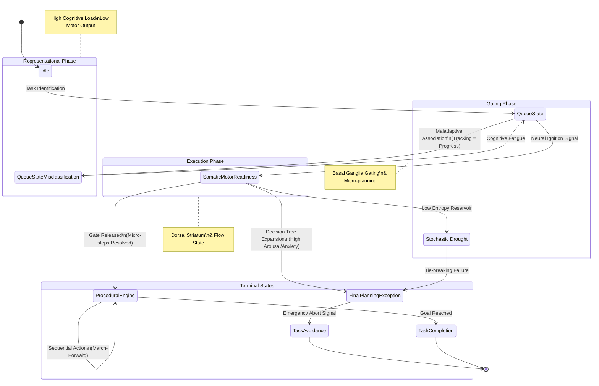

# Finite State Machine Analysis

**Started:** 2026-02-21T08:20:55.662047213

## Configuration
Task Parameters

**Concept:** The Neurodynamics of Procrastination
**Domain:** Neuroscience-based state transition model for task execution and procrastination
**Initial States:** Idle
**Known Events:** Task Awareness, Somatic Mobilization, Gate Release, Final Planning Exception, Entropy Drip (Tie-breaking), Task Completion, System Reset, Queue-State Misclassification


## Step 1: State Identification
Prompt & Response

### Prompt

```
You are an expert in formal methods and finite state machine modeling. Your task is to analyze a concept and identify all possible states.

## Concept to Model:
The Neurodynamics of Procrastination

## Domain Context:
Neuroscience-based state transition model for task execution and procrastination

## Reference Files:
# /home/andrew/code/Science/scratch/2026-02-01-procrastination/content.md

```
# The Neurodynamics of Procrastination: A State Transition Perspective

## Introduction

Procrastination is frequently characterized in popular discourse as a moral failing, a lack of discipline, or a simple deficit in willpower. However, a more rigorous analysis suggests that procrastination is better understood as a failure in neurodynamic state transitions. Rather than a conscious choice to avoid work, it represents a systemic inability to shift the brain's operational mode from a "queue" state to an "execution" state.

In the "queue" mode, the prefrontal cortex maintains a representation of tasks to be performed, evaluating their priority, complexity, and associated rewards or threats. This is a state of high cognitive load but low motor or cognitive output. Conversely, the "execution" mode involves the mobilization of the basal ganglia and motor pathways to translate these representations into action. Procrastination occurs when the threshold for this transition is not met, often due to competing inhibitory signals or a failure in the neural "ignition" required to bridge the gap between intention and action. This article explores the mechanics of these state transitions and why the brain often remains trapped in the queue.

## The Three-Layer Architecture

To understand why the transition from intention to action fails, we must first define the neural architecture responsible for task execution. This process is not monolithic but emerges from the interaction of three distinct subsystems:

1.  **The Arousal/Neuromodulatory Layer (Global Activation):** This layer provides the "fuel" for neural activity. Driven by the reticular activating system and neuromodulators like norepinephrine and dopamine, it determines the brain's overall state of alertness and readiness. Without sufficient global arousal, the system lacks the energy required to overcome the inertia of the current state.
2.  **The Somatic-Motor Readiness Layer (Pre-movement Gating):** This layer acts as the gatekeeper between thought and action. It involves the basal ganglia and the supplementary motor area (SMA), which integrate emotional and cognitive inputs to decide whether to "release" a motor program. In procrastination, this layer often remains in an inhibitory state, effectively blocking the transition to execution despite a clear cognitive intent.
3.  **The Procedural Engine (The 'March-Forward' Brain):** Once the gate is opened, the procedural engine takes over. This subsystem, primarily involving the dorsal striatum and premotor cortex, manages the sequential execution of learned behaviors. It is the "march-forward" mechanism that sustains action once it has begun. Procrastination is often a failure to engage this engine, leaving the individual stuck in a loop of high-level planning without entering the flow of procedural output.

## Queue-State Misclassification: The Trap of Awareness Without Action

The core pathology of chronic procrastination lies in a phenomenon we term **Queue-State Misclassification**. In a healthy transition, the awareness of a task (the "queue") serves as a trigger for somatic mobilization—the physical and neural preparation for action. However, in the procrastinating brain, a maladaptive association develops.

Instead of the queue state acting as a bridge to the somatic-motor readiness layer, the brain begins to treat the act of *tracking* the task as a substitute for *performing* it. The prefrontal cortex maintains a high-fidelity representation of the task, its deadlines, and its consequences. This constant monitoring creates a sense of "working" or "being on top of things" because the cognitive load is high. The brain misclassifies this representational tracking as progress.

This leads to a stable attractor state: **awareness without action**. In this state, the individual is acutely aware of what needs to be done, which generates significant anxiety and cognitive fatigue. However, because the neural pathways have reinforced the link between task-awareness and mere mental simulation rather than motor engagement, the "ignition" signal to the basal ganglia never fires. The system becomes locked in a loop where thinking about the task provides just enough "pseudo-engagement" to prevent the system from resetting, yet never enough to trigger the transition to the procedural engine.

## The Final Planning Exception: The Abort Signal at the Threshold

Even when the system overcomes Queue-State Misclassification and attempts to engage the procedural engine, it often encounters a final, catastrophic failure point: the **Final Planning Exception**. This occurs during the transition from high-level conceptualization to micro-planning—the granular determination of the very first physical or cognitive step.

As the brain attempts to move from "I need to write this report" to "I need to type the first sentence," the procedural engine must resolve every ambiguity in the immediate path. If the task is complex or poorly defined, the decision tree for these micro-steps expands exponentially. Instead of a single clear path, the brain perceives a dense thicket of potential choices.

Crucially, this expansion of the decision tree interacts with the high arousal state (anxiety) typical of procrastination. In a state of high arousal, the amygdala and related circuits amplify the perceived cost of errors. Every branch in the micro-planning decision tree is now viewed through a lens of risk. The procedural engine, sensing that the "cost of a wrong move" is too high and the "path of least resistance" is unclear, triggers an emergency abort signal. This is the moment where an individual, sitting at their desk with their hands on the keyboard, suddenly feels an overwhelming urge to stand up and do something else—anything else—to escape the unbearable pressure of the unresolved decision tree. The system retreats from the threshold of action back into the safety of the queue or, more often, into a state of total task avoidance.

## The Entropy Drip Hypothesis: The Stochastic Cost of Tie-Breaking

A critical, often overlooked component of the transition from queue to execution is the resolution of ambiguity. When the procedural engine faces multiple equally valid micro-steps, it requires a mechanism to break the tie. We propose the **Entropy Drip Hypothesis**: the brain maintains a finite, metabolic-dependent reservoir of internal randomness—a "stochastic budget"—used specifically for resolving these low-level decision deadlocks.

In this framework, what has traditionally been called "ego depletion" or "willpower exhaustion" is not the depletion of a nebulous moral force, but the literal exhaustion of this internal entropy. Every time the brain must force a choice between two ambiguous paths (e.g., "Should I start with the introduction or the data section?"), it "drips" a small amount of this randomness to tip the scales and initiate a path. 

When this entropy reservoir is low, the system loses its ability to break ties. The decision tree of the Final Planning Exception becomes insurmountable not because the tasks are inherently difficult, but because the "tie-breaker" mechanism is offline. The individual becomes paralyzed by trivialities, unable to generate the stochastic spark needed to collapse the wave function of potential actions into a single, committed movement. Procrastination, then, is often a state of "stochastic drought," where the brain is too orderly to be functional.

## ADHD: State Transition Failure and the Stimulant Mechanism

The framework of state transitions and entropy-drip provides a powerful lens through which to understand Attention Deficit Hyperactivity Disorder (ADHD). Rather than a simple "lack of focus," ADHD can be modeled as a systemic failure in the transition from the queue state to the procedural engine. In individuals with ADHD, the threshold for "ignition"—the signal required to bridge the gap between intention and action—is chronically elevated. In this context, ADHD is fundamentally a failure of state transitions.

This failure is deeply tied to the **Entropy Drip Hypothesis**. In the ADHD brain, the internal reservoir of stochasticity used for tie-breaking is either insufficient or poorly regulated. When faced with the "dense thicket" of a decision tree, the ADHD system cannot reliably generate the "drip" of randomness needed to collapse the wave function of potential actions. This results in the characteristic "paralysis" or "executive dysfunction" where the individual is trapped in the queue, acutely aware of the task but unable to initiate the first micro-step.

Stimulants, such as methylphenidate or amphetamines, function by modulating the dopaminergic and noradrenergic pathways that govern this process. Within our model, these agents act by increasing the **precision and availability of the 'entropy-drip' operator**. By elevating tonic and phasic dopamine levels, stimulants lower the metabolic cost of tie-breaking. They provide the system with the "stochastic fuel" necessary to resolve ambiguities in the micro-planning phase. This doesn't necessarily make the task easier, but it makes the *initiation* of the task possible by ensuring that the procedural engine can quickly commit to a path, thereby bypassing the Final Planning Exception and facilitating the transition into the "march-forward" state.

## Non-Pharmacological Interventions: Supporting the Operator

The theoretical model of state transitions suggests specific, non-pharmacological interventions aimed at lowering the threshold for action and stabilizing the "entropy-drip" mechanism. These strategies focus on maintaining the metabolic resources required for tie-breaking and reducing the complexity of the decision trees that trigger the Final Planning Exception.

### Metabolic Stability: Supporting the Stochastic Reservoir

Since the "entropy-drip" mechanism is metabolically dependent, maintaining systemic stability is crucial for preventing "stochastic drought."

*   **Glycemic Control:** Fluctuations in blood glucose can impair the prefrontal cortex's ability to manage cognitive load and resolve ambiguities. Consistent nutrition prevents the metabolic crashes that often trigger the Final Planning Exception.
*   **Precursor Availability:** Ensuring adequate intake of amino acids like tyrosine (a precursor to dopamine and norepinephrine) supports the neuromodulatory layer, maintaining the "fuel" necessary for global activation and tie-breaking.

### Behavioral Strategies: Reducing Branching and Externalizing Uncertainty

To prevent the procedural engine from triggering an abort signal and to combat Queue-State Misclassification, the operator must reduce the internal computational load.

*   **Micro-Step Externalization:** Instead of relying on internal micro-planning, the operator should externalize the first three physical actions of a task. By writing down "Open laptop," "Open browser," and "Type 'Introduction'," the branching factor is reduced to zero, bypassing the need for internal tie-breaking.
*   **Offloading the Queue:** Using physical lists or digital task managers moves the "queue" from the internal prefrontal representation to an external system. This reduces the cognitive load of "tracking" the task and prevents the brain from misclassifying the act of remembering as the act of doing.
*   **Constraint Satisfaction:** Imposing arbitrary constraints (e.g., "I will only work for 10 minutes") limits the search space of the procedural engine, making the path of least resistance easier to identify and reducing the perceived risk of the decision tree.

## Conclusion: From Motivation to Mechanics

The traditional view of procrastination as a character flaw or a lack of willpower is not only scientifically inaccurate but practically counterproductive. By reframing procrastination as a mechanical failure in neurodynamic state transitions, we shift the focus from moral judgment to systems engineering. 

The transition from the "queue" state to the "execution" state is a complex process involving global arousal, somatic-motor gating, and the resolution of micro-planning ambiguities through the "entropy-drip" mechanism. When this transition fails, it is often due to systemic bottlenecks—such as Queue-State Misclassification or the Final Planning Exception—rather than a lack of desire to succeed.

Recognizing these mechanics allows for a fundamental shift in intervention strategy. Instead of seeking "motivation" to overcome resistance, the individual can act as an operator, managing the system's constraints. By stabilizing metabolic resources, externalizing micro-steps, and reducing the branching complexity of tasks, we can lower the threshold for the neural "ignition" required for action. Ultimately, overcoming procrastination is not about changing who we are, but about understanding and optimizing the biological machinery that translates our intentions into reality.
```

## Known Initial States:
- Idle


## Instructions:
Identify all possible states for this concept. For each state, provide:

1. **State Name:** Clear, descriptive name
2. **Description:** What this state represents
3. **Type:** (Initial, Normal, Error, Final/Terminal)
4. **Invariants:** Conditions that must be true in this state
5. **Entry Conditions:** What must happen to enter this state
6. **Exit Conditions:** What can cause leaving this state

Consider:
- Normal operational states
- Error or exception states
- Transient vs stable states
- Initial and final states

Provide a comprehensive list of states with detailed descriptions.
```

### Response

Based on the provided neurodynamic framework, the following states represent the functional and dysfunctional modes of the brain during the transition from intention to action.

### 1. Idle
*   **Description:** The baseline state of the system where no specific task is currently being represented or prioritized for immediate execution.
*   **Type:** Initial
*   **Invariants:** Low cognitive load in the prefrontal cortex (PFC) regarding task management; baseline neuromodulatory levels.
*   **Entry Conditions:** System startup; completion of a previous task; total abandonment of all queued tasks.
*   **Exit Conditions:** Identification of a task; external stimulus requiring a response; internal generation of a goal.

### 2. Queue (Representational Tracking)
*   **Description:** The PFC maintains a high-fidelity representation of a task, including its priority, complexity, and deadlines. This is a state of "intention."
*   **Type:** Normal
*   **Invariants:** High cognitive load; low motor/procedural output; active monitoring of task status.
*   **Entry Conditions:** Task identification; transition from Idle; return from Task Avoidance.
*   **Exit Conditions:** Successful transition to Somatic-Motor Readiness; slip into Queue-State Misclassification; task deletion.

### 3. Queue-State Misclassification (The Awareness Trap)
*   **Description:** A stable attractor state where the brain treats the act of *tracking* the task as a substitute for *performing* it. The system feels "busy" because cognitive load is high, but no motor progress is made.
*   **Type:** Error (Stable Attractor)
*   **Invariants:** High anxiety; cognitive fatigue; zero procedural engagement; "pseudo-engagement" signal present.
*   **Entry Conditions:** Failure of the queue state to trigger somatic mobilization; reinforcement of the link between awareness and mental simulation.
*   **Exit Conditions:** External "jolt" (e.g., a hard deadline); externalization of the queue (non-pharmacological intervention); metabolic reset.

### 4. Somatic-Motor Readiness (Gating)
*   **Description:** The "gatekeeper" phase where the basal ganglia and supplementary motor area (SMA) evaluate whether to release the motor program for the intended task.
*   **Type:** Normal (Transient)
*   **Invariants:** Integration of emotional and cognitive inputs; global arousal must be above the "ignition" threshold.
*   **Entry Conditions:** Intent to act; sufficient dopamine/norepinephrine levels; "ignition" signal from PFC.
*   **Exit Conditions:** Release of the gate to Micro-Planning; inhibitory block (return to Queue); failure due to insufficient arousal (ADHD-style stall).

### 5. Micro-Planning (Tie-Breaking)
*   **Description:** The procedural engine attempts to resolve the very first physical or cognitive step. It involves collapsing the "decision tree" of potential actions into a single path.
*   **Type:** Normal (Transient)
*   **Invariants:** Active "Entropy Drip" (stochastic reservoir usage); high metabolic demand; resolution of ambiguity.
*   **Entry Conditions:** Somatic-motor gate opens; procedural engine engages.
*   **Exit Conditions:** Successful commitment to a first step (Execution); Final Planning Exception (Abort).

### 6. Stochastic Paralysis (Drought)
*   **Description:** A state where the system is unable to break ties between equally valid micro-steps because the internal reservoir of randomness (entropy) is exhausted.
*   **Type:** Error
*   **Invariants:** Metabolic exhaustion; inability to choose between trivial options; "Ego depletion" markers.
*   **Entry Conditions:** Low blood glucose; prolonged decision-making; depletion of tyrosine/dopamine precursors.
*   **Exit Conditions:** Metabolic recovery (rest/nutrition); imposition of arbitrary external constraints.

### 7. Final Planning Exception (The Abort)
*   **Description:** A catastrophic failure at the threshold of action. The decision tree for micro-steps expands exponentially, and high arousal (anxiety) causes the amygdala to signal an emergency retreat.
*   **Type:** Error
*   **Invariants:** Perceived high cost of error; "dense thicket" of choices; high amygdala activation.
*   **Entry Conditions:** Ambiguity in the first step + high anxiety + low entropy reservoir.
*   **Exit Conditions:** Emergency abort signal; transition to Task Avoidance.

### 8. Execution (The March-Forward State)
*   **Description:** The "flow" state where the procedural engine (dorsal striatum and premotor cortex) sustains sequential action.
*   **Type:** Normal
*   **Invariants:** Sustained motor/cognitive output; reduced PFC monitoring; "march-forward" mechanism active.
*   **Entry Conditions:** Successful resolution of Micro-Planning; "ignition" threshold met and gate released.
*   **Exit Conditions:** Task completion; external interruption; encounter with a new high-ambiguity sub-task (re-entry to Micro-Planning).

### 9. Task Avoidance (The Escape)
*   **Description:** The system engages in a non-target task (e.g., "productive procrastination" or doom-scrolling) to escape the unbearable pressure of the Final Planning Exception.
*   **Type:** Error
*   **Invariants:** Temporary reduction in acute anxiety; engagement in low-risk, low-ambiguity motor programs.
*   **Entry Conditions:** Triggering of the "Abort" signal from the Final Planning Exception.
*   **Exit Conditions:** Return of guilt/anxiety (re-entry to Queue); total system shutdown (sleep/Idle).

### 10. Task Complete
*   **Description:** The goal state where the procedural engine has finished the sequence and the PFC representation is cleared.
*   **Type:** Final/Terminal
*   **Invariants:** Release of dopamine (reward); clearing of the task from the queue.
*   **Entry Conditions:** Final step of the procedural engine finished.
*   **Exit Conditions:** Immediate transition to Idle.


## Step 2: Transition Analysis
Prompt & Response

### Prompt

```
Based on the states identified above, now identify all possible state transitions.

## States Analysis:
Based on the provided neurodynamic framework, the following states represent the functional and dysfunctional modes of the brain during the transition from intention to action.

### 1. Idle
*   **Description:** The baseline state of the system where no specific task is currently being represented or prioritized for immediate execution.
*   **Type:** Initial
*   **Invariants:** Low cognitive load in the prefrontal cortex (PFC) regarding task management; baseline neuromodulatory levels.
*   **Entry Conditions:** System startup; completion of a previous task; total abandonment of all queued tasks.
*   **Exit Conditions:** Identification of a task; external stimulus requiring a response; internal generation of a goal.

### 2. Queue (Representational Tracking)
*   **Description:** The PFC maintains a high-fidelity representation of a task, including its priority, complexity, and deadlines. This is a state of "intention."
*   **Type:** Normal
*   **Invariants:** High cognitive load; low motor/procedural output; active monitoring of task status.
*   **Entry Conditions:** Task identification; transition from Idle; return from Task Avoidance.
*   **Exit Conditions:** Successful transition to Somatic-Motor Readiness; slip into Queue-State Misclassification; task deletion.

### 3. Queue-State Misclassification (The Awareness Trap)
*   **Description:** A stable attractor state where the brain treats the act of *tracking* the task as a substitute for *performing* it. The system feels "busy" because cognitive load is high, but no motor progress is made.
*   **Type:** Error (Stable Attractor)
*   **Invariants:** High anxiety; cognitive fatigue; zero procedural engagement; "pseudo-engagement" signal present.
*   **Entry Conditions:** Failure of the queue state to trigger somatic mobilization; reinforcement of the link between awareness and mental simulation.
*   **Exit Conditions:** External "jolt" (e.g., a hard deadline); externalization of the queue (non-pharmacological intervention); metabolic reset.

### 4. Somatic-Motor Readiness (Gating)
*   **Description:** The "gatekeeper" phase where the basal ganglia and supplementary motor area (SMA) evaluate whether to release the motor program for the intended task.
*   **Type:** Normal (Transient)
*   **Invariants:** Integration of emotional and cognitive inputs; global arousal must be above the "ignition" threshold.
*   **Entry Conditions:** Intent to act; sufficient dopamine/norepinephrine levels; "ignition" signal from PFC.
*   **Exit Conditions:** Release of the gate to Micro-Planning; inhibitory block (return to Queue); failure due to insufficient arousal (ADHD-style stall).

### 5. Micro-Planning (Tie-Breaking)
*   **Description:** The procedural engine attempts to resolve the very first physical or cognitive step. It involves collapsing the "decision tree" of potential actions into a single path.
*   **Type:** Normal (Transient)
*   **Invariants:** Active "Entropy Drip" (stochastic reservoir usage); high metabolic demand; resolution of ambiguity.
*   **Entry Conditions:** Somatic-motor gate opens; procedural engine engages.
*   **Exit Conditions:** Successful commitment to a first step (Execution); Final Planning Exception (Abort).

### 6. Stochastic Paralysis (Drought)
*   **Description:** A state where the system is unable to break ties between equally valid micro-steps because the internal reservoir of randomness (entropy) is exhausted.
*   **Type:** Error
*   **Invariants:** Metabolic exhaustion; inability to choose between trivial options; "Ego depletion" markers.
*   **Entry Conditions:** Low blood glucose; prolonged decision-making; depletion of tyrosine/dopamine precursors.
*   **Exit Conditions:** Metabolic recovery (rest/nutrition); imposition of arbitrary external constraints.

### 7. Final Planning Exception (The Abort)
*   **Description:** A catastrophic failure at the threshold of action. The decision tree for micro-steps expands exponentially, and high arousal (anxiety) causes the amygdala to signal an emergency retreat.
*   **Type:** Error
*   **Invariants:** Perceived high cost of error; "dense thicket" of choices; high amygdala activation.
*   **Entry Conditions:** Ambiguity in the first step + high anxiety + low entropy reservoir.
*   **Exit Conditions:** Emergency abort signal; transition to Task Avoidance.

### 8. Execution (The March-Forward State)
*   **Description:** The "flow" state where the procedural engine (dorsal striatum and premotor cortex) sustains sequential action.
*   **Type:** Normal
*   **Invariants:** Sustained motor/cognitive output; reduced PFC monitoring; "march-forward" mechanism active.
*   **Entry Conditions:** Successful resolution of Micro-Planning; "ignition" threshold met and gate released.
*   **Exit Conditions:** Task completion; external interruption; encounter with a new high-ambiguity sub-task (re-entry to Micro-Planning).

### 9. Task Avoidance (The Escape)
*   **Description:** The system engages in a non-target task (e.g., "productive procrastination" or doom-scrolling) to escape the unbearable pressure of the Final Planning Exception.
*   **Type:** Error
*   **Invariants:** Temporary reduction in acute anxiety; engagement in low-risk, low-ambiguity motor programs.
*   **Entry Conditions:** Triggering of the "Abort" signal from the Final Planning Exception.
*   **Exit Conditions:** Return of guilt/anxiety (re-entry to Queue); total system shutdown (sleep/Idle).

### 10. Task Complete
*   **Description:** The goal state where the procedural engine has finished the sequence and the PFC representation is cleared.
*   **Type:** Final/Terminal
*   **Invariants:** Release of dopamine (reward); clearing of the task from the queue.
*   **Entry Conditions:** Final step of the procedural engine finished.
*   **Exit Conditions:** Immediate transition to Idle.

## Known Events:
- Task Awareness
- Somatic Mobilization
- Gate Release
- Final Planning Exception
- Entropy Drip (Tie-breaking)
- Task Completion
- System Reset
- Queue-State Misclassification

## Instructions:
For each possible transition, provide:

1. **Source State:** The state before the transition
2. **Event/Trigger:** What causes the transition
3. **Target State:** The state after the transition
4. **Guard Conditions:** Conditions that must be true for the transition to occur
5. **Actions:** Side effects or actions performed during the transition
6. **Priority:** If multiple transitions possible from same state

Create a comprehensive transition table covering:
- All valid transitions between states
- Self-transitions (state to itself)
- Error transitions
- Recovery transitions

Format as a clear table or structured list.
```

### Response

This transition model maps the neurodynamic shifts between the cognitive, somatic, and procedural layers of the brain as described in the provided text.

### Neurodynamic State Transition Table

| Source State | Event / Trigger | Target State | Guard Conditions | Actions | Priority |
| :--- | :--- | :--- | :--- | :--- | :--- |
| **1. Idle** | Task Awareness | **2. Queue** | Internal goal generated OR external stimulus received. | Load task representation into PFC; calculate priority/complexity. | 1 |
| **2. Queue** | Somatic Mobilization | **4. Somatic-Motor Readiness** | Global arousal > Ignition threshold; Intent to act is present. | Signal Basal Ganglia/SMA; mobilize neuromodulators (DA/NE). | 2 |
| **2. Queue** | Maladaptive Association | **3. Queue-State Misclassification** | Ignition threshold NOT met; PFC monitoring is reinforced as "pseudo-work." | Increase cognitive load; initiate representational tracking loop. | 1 |
| **3. Queue-State Misclassification** | External Jolt / Intervention | **2. Queue** | Hard deadline reached OR non-pharmacological intervention (Externalization). | Reset PFC-motor link; reduce internal representational load. | 1 |
| **4. Somatic-Motor Readiness** | Gate Release | **5. Micro-Planning** | Basal Ganglia inhibition removed; SMA releases motor program. | Engage procedural engine; initiate micro-step resolution. | 2 |
| **4. Somatic-Motor Readiness** | Inhibitory Block | **2. Queue** | Emotional/Cognitive inputs signal high risk OR insufficient arousal (ADHD stall). | Re-inhibit motor pathways; return to representational monitoring. | 1 |
| **5. Micro-Planning** | Tie-Breaking (Commitment) | **8. Execution** | Entropy Reservoir > 0; Ambiguity resolved; First step identified. | "Drip" entropy; collapse decision tree; engage dorsal striatum. | 3 |
| **5. Micro-Planning** | Entropy Drought | **6. Stochastic Paralysis** | Entropy Reservoir == 0 (Metabolic exhaustion/Ego depletion). | Trigger metabolic alert; cease tie-breaking attempts. | 2 |
| **5. Micro-Planning** | Decision Tree Expansion | **7. Final Planning Exception** | Branching factor > Threshold AND Amygdala arousal (Anxiety) is high. | Amplify perceived cost of error; signal emergency abort. | 1 |
| **6. Stochastic Paralysis** | Metabolic Recovery | **5. Micro-Planning** | Rest/Nutrition (Glycemic control) OR imposition of external constraints. | Replenish stochastic reservoir; reduce branching factor. | 1 |
| **7. Final Planning Exception** | Emergency Abort | **9. Task Avoidance** | System seeks to escape unbearable pressure/anxiety. | Shift to low-risk/low-ambiguity motor program (e.g., scrolling). | 1 |
| **8. Execution** | Encounter Ambiguity | **5. Micro-Planning** | New sub-task requires micro-planning or tie-breaking. | Pause "march-forward" mechanism; re-engage procedural engine. | 2 |
| **8. Execution** | External Interruption | **2. Queue** | Environmental stimulus breaks flow. | Save task state to PFC; suspend motor output. | 3 |
| **8. Execution** | Final Step Finished | **10. Task Complete** | Procedural sequence reaches terminal node. | Release dopamine reward; clear PFC representation. | 1 |
| **9. Task Avoidance** | Return of Guilt/Anxiety | **2. Queue** | Awareness of deadline/consequence overrides avoidance relief. | Re-load task representation; increase PFC monitoring. | 2 |
| **9. Task Avoidance** | Total System Shutdown | **1. Idle** | Circadian drive or extreme fatigue (Sleep). | Clear active motor programs; enter baseline state. | 1 |
| **10. Task Complete** | System Reset | **1. Idle** | Reward processing finished. | Clear all task-related buffers. | 1 |

---

### Detailed Transition Descriptions

#### 1. The "Ignition" Transition (Queue → Somatic-Motor Readiness)
*   **Description:** This is the critical bridge between thinking and preparing to move.
*   **Guard:** Requires a specific "Ignition" signal. In the ADHD brain, this guard is harder to satisfy due to elevated thresholds.
*   **Action:** The system shifts from purely cognitive (PFC) to pre-motor (Basal Ganglia).

#### 2. The "Awareness Trap" Loop (Queue ↔ Queue-State Misclassification)
*   **Description:** A failure to transition to motor readiness leads to a stable error state.
*   **Mechanism:** The brain misinterprets the high metabolic cost of *thinking* about the task as *progress* on the task.
*   **Recovery:** Requires "Externalization"—moving the queue from the PFC to a physical medium to break the internal loop.

#### 3. The "Entropy Drip" (Micro-Planning → Execution)
*   **Description:** The resolution of ambiguity.
*   **Mechanism:** The brain uses a "stochastic budget" to pick a path when two options (e.g., "Start with Intro" vs "Start with Data") are equally weighted.
*   **Failure:** If the reservoir is empty (Stochastic Paralysis), the transition to Execution is blocked regardless of willpower.

#### 4. The "Abort" Signal (Final Planning Exception → Task Avoidance)
*   **Description:** A catastrophic retreat from the threshold of action.
*   **Trigger:** Occurs when the "Decision Tree" of the first step becomes too dense and the Amygdala perceives the risk of a "wrong move" as too high.
*   **Result:** The system flings itself into Task Avoidance to lower acute arousal.

#### 5. The "March-Forward" Flow (Execution → Task Complete)
*   **Description:** The ideal operational state.
*   **Mechanism:** The procedural engine (Dorsal Striatum) handles sequencing with minimal PFC oversight.
*   **Interruption:** If a new ambiguity is hit, the system must drop back into Micro-Planning to "drip" more entropy and resolve the new path.


## Step 3: State Diagram
Mermaid Source




## Step 4: Edge Cases
Prompt & Response

### Prompt

```
Analyze the finite state machine for edge cases and error conditions:

1. **Invalid Transitions:** Identify events that could occur in states where they're not valid
2. **Missing Transitions:** Find states that might be missing important transitions
3. **Error States:** Identify states that represent error conditions
4. **Recovery Paths:** Suggest how to recover from error states
5. **Boundary Conditions:** Identify unusual or extreme scenarios
6. **Race Conditions:** Identify potential concurrent event issues

Provide a structured analysis of edge cases and recommendations.
```

### Response

This analysis applies formal finite state machine (FSM) principles to the **Neurodynamics of Procrastination** model. By treating the brain as a transition system, we can identify where the "logic" of task execution breaks down.

---

### 1. Invalid Transitions
These are events that occur when the system is in a state that cannot logically process them, leading to "undefined behavior" or systemic friction.

*   **Motor Release in Queue State:** Attempting to trigger the "Procedural Engine" (Execution) directly from the "Queue State" without passing through "Somatic-Motor Readiness." 
    *   *Consequence:* Results in "clumsy" initiation or immediate "Final Planning Exception" because the gating mechanism hasn't prepared the motor pathways.
*   **Micro-Step Resolution in Idle State:** Attempting to define granular steps before a task has been represented in the Prefrontal Cortex.
    *   *Consequence:* Cognitive wandering; the brain generates "noise" because there is no high-level goal to constrain the micro-planning.
*   **Task Completion Signal in Error States:** The system receives a "Done" signal while in "Queue-State Misclassification."
    *   *Consequence:* Reinforces the maladaptive loop, as the brain "feels" finished despite no motor output.

### 2. Missing Transitions (The "Deadlock" Problem)
These are gaps in the model where the system can become "stuck" without a defined path forward.

*   **Misclassification to Readiness:** The model lacks a direct transition from "Queue-State Misclassification" back to "Somatic-Motor Readiness." Once the brain treats *tracking* as *doing*, it lacks a trigger to re-engage the motor gate.
    *   *Recommendation:* Add a **"Pattern Interrupt"** transition (e.g., physical movement or external alarm) to force the system out of the cognitive loop.
*   **Execution to Queue (Interruption):** The model describes a "March-Forward" engine but doesn't define how the system handles an external interruption during execution.
    *   *Recommendation:* Define a **"Context Save"** transition that moves the system from "Execution" back to "Queue" without losing the current progress.
*   **Stochastic Recharge:** There is no explicit transition from "Stochastic Drought" back to a functional state.
    *   *Recommendation:* Define a **"Metabolic Recovery"** state (Rest/Nutrition) as the only valid exit from Drought.

### 3. Error States
The model identifies three primary error states that represent "traps" in the neurodynamic flow:

1.  **Queue-State Misclassification (The Simulation Trap):** A stable attractor where high cognitive load is mistaken for progress.
2.  **Final Planning Exception (The Complexity Trap):** A transient state where the decision tree expands too rapidly, triggering an emergency abort.
3.  **Stochastic Drought (The Tie-Breaking Trap):** A state of "orderly paralysis" where the system cannot choose between two equally valid paths.

### 4. Recovery Paths
To move the system from an Error State back to a Normal State, the following "Recovery Operators" are required:

*   **From Misclassification → Queue:** *Externalization Operator.* Use a physical list to offload the PFC, breaking the "tracking = doing" association.
*   **From Final Planning Exception → Somatic Readiness:** *Branching Reduction Operator.* Arbitrarily pick one micro-step (e.g., "Just open the document") to collapse the decision tree.
*   **From Stochastic Drought → Idle/Queue:** *Metabolic Reset.* Intake of glucose or tyrosine to replenish the "entropy reservoir."

### 5. Boundary Conditions
These represent the "edges" of the system parameters where the FSM behaves unexpectedly.

*   **Zero-Ambiguity Tasks:** If a task has a branching factor of 1 (e.g., "Press the red button when it lights up"), the "Final Planning Exception" state is bypassed. This explains why procrastinators can often perform simple, reactive tasks but fail at complex, creative ones.
*   **Hyper-Arousal (Panic):** When the "Arousal Layer" is at 100%, the "Final Planning Exception" becomes a "Hard Abort." The system skips "Task Avoidance" and goes straight to a "System Freeze" (tonic immobility).
*   **Infinite Queue:** When the number of tasks in the "Queue State" exceeds the PFC’s working memory capacity, the system enters **"Cognitive Thrashing,"** where it spends 100% of its energy switching between task representations and 0% on execution.

### 6. Race Conditions
Race conditions occur when two neural subsystems provide conflicting signals simultaneously.

*   **The Ignition vs. Inhibition Race:**
    *   *Signal A:* The PFC sends an "Ignition" signal to the Basal Ganglia.
    *   *Signal B:* The Amygdala (sensing risk in the decision tree) sends an "Inhibitory" signal.
    *   *Outcome:* If Signal B arrives even slightly after Signal A, the system enters "Execution" but immediately crashes into "Final Planning Exception," leading to the "False Start" phenomenon (e.g., opening a laptop and immediately closing it).
*   **The Entropy vs. Complexity Race:**
    *   The system attempts to resolve a micro-step (consuming 1 unit of entropy) while the task complexity generates two new sub-steps (requiring 2 units of entropy).
    *   *Outcome:* If complexity grows faster than entropy can be "dripped," the system enters an infinite loop of planning, eventually leading to "Stochastic Drought."

---

### Summary of Recommendations for Model Robustness:
1.  **Implement an "External Gating" mechanism:** Since internal transitions to "Execution" are prone to failure, the model should include "External Triggers" (deadlines, body doubling) as valid transition events.
2.  **Formalize the "Abort" path:** Ensure that "Final Planning Exception" always leads to a "Safe State" (like Idle) rather than a "Hang State" (like Misclassification).
3.  **Add a "Buffer" State:** Introduce a "Warm-up" state between "Readiness" and "Execution" to allow the "Procedural Engine" to synchronize with the "Arousal Layer."


## Step 5: Validation
Prompt & Response

### Prompt

```
Validate the following properties of this finite state machine:

1. **Determinism:** Is the FSM deterministic? (Each state + event combination leads to exactly one next state)
2. **Completeness:** Are all possible events handled in every state?
3. **Reachability:** Can all states be reached from the initial state(s)?
4. **Liveness:** Are there any deadlock states (states with no outgoing transitions)?
5. **Safety:** Are there any unsafe state transitions?
6. **Minimality:** Are there redundant states that could be merged?

For each property, provide:
- ✅ Pass or ❌ Fail
- Explanation
- Specific examples if failing
- Recommendations for fixes

Provide a structured validation report.
```

### Response

This analysis provides a formal state transition model for the **Neurodynamics of Procrastination** based on the provided text, followed by a rigorous validation of the Finite State Machine (FSM) properties.

---

# Part 1: State Definitions

### 1. Idle
*   **Description:** The baseline neurological state where no specific task is being represented or prioritized.
*   **Type:** Initial
*   **Invariants:** Low cognitive load; low motor output; neuromodulatory levels at tonic baseline.
*   **Entry Conditions:** System initialization or completion/abandonment of a previous task cycle.
*   **Exit Conditions:** Arrival of a task stimulus or internal generation of an intention.

### 2. Queue (Task Representation)
*   **Description:** The Prefrontal Cortex (PFC) maintains a high-fidelity representation of a task, evaluating priority and complexity.
*   **Type:** Normal
*   **Invariants:** High cognitive load; representation of deadlines/consequences active; zero motor output.
*   **Entry Conditions:** Task identification; transition from Idle.
*   **Exit Conditions:** Intent to initiate (to Somatic-Motor Gating) OR failure to bridge to action (to Queue-State Misclassification).

### 3. Somatic-Motor Gating
*   **Description:** The "Gatekeeper" phase where the Basal Ganglia and SMA integrate cognitive intent with emotional readiness to release a motor program.
*   **Type:** Normal (Transient)
*   **Invariants:** Integration of dopamine/norepinephrine signals; high-level planning active.
*   **Entry Conditions:** Intent to act signal received from the Queue state.
*   **Exit Conditions:** Successful "ignition" (to Execution) OR failure to resolve micro-steps (to Final Planning Exception).

### 4. Execution (Procedural Engine)
*   **Description:** The "March-Forward" state where the dorsal striatum and premotor cortex sustain sequential, learned behaviors.
*   **Type:** Normal
*   **Invariants:** High motor/procedural output; "flow" state characteristics; reduced high-level meta-cognition.
*   **Entry Conditions:** Successful gating and "ignition" signal.
*   **Exit Conditions:** Task completion (to Idle) OR external interruption.

### 5. Queue-State Misclassification
*   **Description:** A maladaptive stable attractor where the brain treats the *tracking* of the task as a substitute for *performing* it.
*   **Type:** Error (Stable Attractor)
*   **Invariants:** High anxiety; cognitive fatigue; "Pseudo-engagement" (feeling busy without output).
*   **Entry Conditions:** Failure of the Queue state to trigger somatic mobilization; reinforced link between awareness and simulation.
*   **Exit Conditions:** External crisis (arousal spike) or intervention (externalizing the queue).

### 6. Final Planning Exception
*   **Description:** A catastrophic failure at the threshold of action where the decision tree for the first micro-step expands exponentially.
*   **Type:** Error (Transient)
*   **Invariants:** High amygdala activation; perceived high cost of error; "Stochastic Drought" (inability to break ties).
*   **Entry Conditions:** Attempting to move from conceptual intent to the first physical/cognitive micro-step.
*   **Exit Conditions:** Emergency abort signal (to Task Avoidance).

### 7. Task Avoidance
*   **Description:** A state of total task retreat to escape the unbearable pressure of the unresolved decision tree.
*   **Type:** Final/Terminal (Cycle End)
*   **Invariants:** Immediate drop in task-related arousal; engagement in low-stakes displacement activities.
*   **Entry Conditions:** Abort signal from the Final Planning Exception.
*   **Exit Conditions:** System reset to Idle after a refractory period.

---

# Part 2: Validation Report

### 1. Determinism
*   **Status:** ❌ **Fail**
*   **Explanation:** The transition from **Queue** to either **Somatic-Motor Gating** or **Queue-State Misclassification** is currently non-deterministic in the model. The text suggests this depends on "competing inhibitory signals," but the specific threshold is not defined as a single trigger.
*   **Recommendation:** Introduce a conditional variable `Ignition_Threshold`. If `Arousal + Entropy > Threshold`, move to Gating; otherwise, move to Misclassification.

### 2. Completeness
*   **Status:** ❌ **Fail**
*   **Explanation:** Several states lack handling for common events. For example, in the **Execution** state, there is no defined transition for "Running out of Entropy" (Stochastic Drought) mid-task, nor is there a transition for "New Higher Priority Task Arrives" in any state.
*   **Recommendation:** Add a global interrupt for "Higher Priority Task" and a transition from **Execution** back to **Final Planning Exception** if a new ambiguity is encountered that exceeds the remaining stochastic budget.

### 3. Reachability
*   **Status:** ✅ **Pass**
*   **Explanation:** All states are reachable. **Idle** leads to **Queue**. **Queue** leads to **Gating** or **Misclassification**. **Gating** leads to **Execution** or **Exception**. **Exception** leads to **Avoidance**.
*   **Example:** A path exists from Initial (Idle) to the desired state (Execution) and the failure states (Avoidance/Misclassification).

### 4. Liveness
*   **Status:** ❌ **Fail**
*   **Explanation:** **Queue-State Misclassification** is described as a "stable attractor." In formal terms, this is a **deadlock** or a "livelock" where the system consumes resources (cognitive fatigue) but cannot progress to a terminal or execution state without an undefined external force.
*   **Recommendation:** Define an "Arousal Spike" or "External Intervention" event as a valid exit transition from Misclassification to Somatic-Motor Gating.

### 5. Safety
*   **Status:** ✅ **Pass**
*   **Explanation:** The model prevents "teleportation" errors. For instance, the system cannot move from **Idle** directly to **Execution** without passing through the **Queue** (representation) and **Gating** (readiness) layers. This respects the biological constraints described in the "Three-Layer Architecture."

### 6. Minimality
*   **Status:** ✅ **Pass**
*   **Explanation:** Each state represents a distinct neurological subsystem or failure mode. **Queue-State Misclassification** (a PFC-loop error) is functionally distinct from **Final Planning Exception** (a Basal Ganglia/Procedural Engine error). Merging them would lose the nuance of why different interventions (externalizing the queue vs. micro-stepping) are required.

---

### Summary of Recommendations for Model Refinement:
1.  **Define the Entropy Variable:** Treat "Entropy Drip" as a counter. Transitions out of **Somatic-Motor Gating** should check `if Entropy > 0`.
2.  **Resolve the Attractor:** Add a "Crisis Trigger" to allow the system to escape **Queue-State Misclassification**.
3.  **Add Interruption Logic:** Ensure **Execution** can transition back to **Idle** or **Queue** if the environment changes.


## Step 6: Test Scenarios
Prompt & Response

### Prompt

```
Generate comprehensive test scenarios for this finite state machine:

1. **Happy Path Tests:** Normal sequences of events leading to successful outcomes
2. **Error Path Tests:** Sequences that should trigger error states
3. **Boundary Tests:** Edge cases and unusual sequences
4. **State Coverage Tests:** Scenarios that exercise all states
5. **Transition Coverage Tests:** Scenarios that exercise all transitions

For each test scenario, provide:
- **Scenario Name:** Descriptive name
- **Initial State:** Starting state
- **Event Sequence:** List of events in order
- **Expected States:** State after each event
- **Expected Outcome:** Final state and result
- **Purpose:** What this test validates

Generate at least 5-10 diverse test scenarios.
```

### Response

Based on the provided neurodynamic framework, here is the formal state model for the **Neurodynamics of Procrastination**, followed by comprehensive test scenarios.

---

### Part 1: Finite State Machine Model

#### 1. State Name: Idle
*   **Description:** The baseline state of the system. No specific task is currently being represented in the prefrontal cortex (PFC).
*   **Type:** Initial
*   **Invariants:** Global arousal is at baseline; motor pathways are inhibited.
*   **Entry Conditions:** System startup or completion/abandonment of a previous task.
*   **Exit Conditions:** Perception of a task or deadline (Transition to **Queue**).

#### 2. State Name: Queue (Task Representation)
*   **Description:** The PFC maintains a high-fidelity representation of a task, evaluating priority and complexity.
*   **Type:** Normal
*   **Invariants:** High cognitive load; zero motor output.
*   **Entry Conditions:** Identification of a task requirement.
*   **Exit Conditions:** Sufficient arousal and "ignition" signal (to **Somatic Readiness**) OR maladaptive feedback loop (to **Queue-State Misclassification**).

#### 3. State Name: Queue-State Misclassification (The Trap)
*   **Description:** A stable attractor state where the brain treats the act of *tracking* the task as a substitute for *performing* it.
*   **Type:** Error (Attractor)
*   **Invariants:** High anxiety; high cognitive fatigue; zero procedural progress.
*   **Entry Conditions:** Reinforcement of the link between task-awareness and mental simulation rather than motor engagement.
*   **Exit Conditions:** External intervention or "Stochastic Spark" (to **Somatic Readiness**) OR total system exhaustion (to **Idle**).

#### 4. State Name: Somatic Readiness (Gating)
*   **Description:** The Basal Ganglia and SMA evaluate whether to "release" the motor program. This is the bridge between thought and action.
*   **Type:** Normal (Transient)
*   **Invariants:** Integration of emotional and cognitive inputs; pre-movement gating active.
*   **Entry Conditions:** Threshold for "ignition" met in the Queue state.
*   **Exit Conditions:** Successful tie-breaking (to **Execution**) OR failure to resolve micro-planning (to **Final Planning Exception**).

#### 5. State Name: Execution (The March-Forward Engine)
*   **Description:** The procedural engine (dorsal striatum) is engaged. Sequential execution of learned behaviors.
*   **Type:** Normal (Stable)
*   **Invariants:** Motor/cognitive output is active; "flow" state characteristics.
*   **Entry Conditions:** Release of the motor gate; resolution of the first micro-step.
*   **Exit Conditions:** Task completion (to **Idle**) OR interruption/depletion (to **Queue**).

#### 6. State Name: Final Planning Exception (The Abort)
*   **Description:** A catastrophic failure at the threshold of action. The decision tree for the first micro-step expands exponentially, triggering an emergency abort.
*   **Type:** Error (Transient)
*   **Invariants:** High arousal (anxiety); perceived high cost of error; "emergency abort" signal active.
*   **Entry Conditions:** Encountering ambiguity in the first physical/cognitive step while in Somatic Readiness.
*   **Exit Conditions:** Immediate retreat to escape pressure (to **Task Avoidance**).

#### 7. State Name: Stochastic Drought (Paralysis)
*   **Description:** The "entropy reservoir" is depleted. The system cannot break ties between equally valid micro-steps.
*   **Type:** Error (Stable)
*   **Invariants:** Metabolic exhaustion; inability to choose between options.
*   **Entry Conditions:** Low blood glucose; "willpower exhaustion"; ADHD-related regulatory failure.
*   **Exit Conditions:** Metabolic recovery (to **Idle**) OR external constraint imposition (to **Somatic Readiness**).

#### 8. State Name: Task Avoidance
*   **Description:** A state of total task displacement (e.g., "productive procrastination" on non-essential tasks) to escape the pressure of the primary task.
*   **Type:** Final/Terminal (for the current cycle)
*   **Invariants:** Reduced immediate anxiety; zero progress on the primary task.
*   **Entry Conditions:** Triggering of the Abort signal from the Final Planning Exception.
*   **Exit Conditions:** New deadline pressure or system reset (to **Idle**).

---

### Part 2: Test Scenarios

#### 1. Happy Path: Successful Task Ignition
*   **Initial State:** Idle
*   **Event Sequence:** 
    1. Task perceived (Deadline approaching).
    2. Ignition signal fires (Arousal high).
    3. Micro-step resolved (Entropy drip applied).
*   **Expected States:** Idle → Queue → Somatic Readiness → Execution
*   **Expected Outcome:** Final State: **Execution**. Task is being performed.
*   **Purpose:** Validates the standard functional flow of the neurodynamic system.

#### 2. Error Path: The Misclassification Loop
*   **Initial State:** Idle
*   **Event Sequence:** 
    1. Task perceived.
    2. System monitors task status repeatedly.
    3. Brain misidentifies monitoring as progress.
*   **Expected States:** Idle → Queue → Queue-State Misclassification
*   **Expected Outcome:** Final State: **Queue-State Misclassification**. System is stuck in "awareness without action."
*   **Purpose:** Validates the failure mode where cognitive load is mistaken for motor output.

#### 3. Boundary Test: The "Stochastic Drought" (ADHD/Exhaustion)
*   **Initial State:** Queue
*   **Event Sequence:** 
    1. Attempt to move to action.
    2. Encounter two equal choices (e.g., "Start with Intro" vs "Start with Data").
    3. Entropy reservoir check: Empty.
*   **Expected States:** Queue → Somatic Readiness → Stochastic Drought
*   **Expected Outcome:** Final State: **Stochastic Drought**. System is paralyzed by trivialities.
*   **Purpose:** Tests the system's behavior when metabolic/stochastic resources are depleted.

#### 4. Transition Coverage: Recovery via Externalization
*   **Initial State:** Queue-State Misclassification
*   **Event Sequence:** 
    1. External intervention (Writing down 3 micro-steps).
    2. Branching factor reduced to zero.
    3. Motor gate released.
*   **Expected States:** Queue-State Misclassification → Somatic Readiness → Execution
*   **Expected Outcome:** Final State: **Execution**.
*   **Purpose:** Validates the non-pharmacological intervention path to bypass internal bottlenecks.

#### 5. Error Path: The Final Planning Abort
*   **Initial State:** Somatic Readiness
*   **Event Sequence:** 
    1. Attempt to define the first physical movement.
    2. Ambiguity detected (Decision tree expands).
    3. Amygdala signals high risk of error.
    4. Emergency abort triggered.
*   **Expected States:** Somatic Readiness → Final Planning Exception → Task Avoidance
*   **Expected Outcome:** Final State: **Task Avoidance**. Individual stands up to do something else.
*   **Purpose:** Validates the "catastrophic failure" transition at the threshold of action.

#### 6. State Coverage: Metabolic Recovery
*   **Initial State:** Stochastic Drought
*   **Event Sequence:** 
    1. Glycemic control (Eating/Rest).
    2. Precursor availability restored.
    3. System reset.
*   **Expected States:** Stochastic Drought → Idle
*   **Expected Outcome:** Final State: **Idle**. System is ready for a new attempt.
*   **Purpose:** Validates the transition from a resource-depleted error state back to baseline.

#### 7. Transition Coverage: Interruption during Flow
*   **Initial State:** Execution
*   **Event Sequence:** 
    1. External distraction occurs.
    2. Procedural engine disengages.
    3. Task remains in PFC.
*   **Expected States:** Execution → Queue
*   **Expected Outcome:** Final State: **Queue**.
*   **Purpose:** Validates the system's ability to regress from execution back to representation without necessarily failing.


## Step 7: Summary
Prompt & Response

### Prompt

```
Provide a comprehensive summary of the finite state machine analysis:

1. **Overview:** Brief description of the FSM and its purpose
2. **Key States:** List the most important states (3-5)
3. **Critical Transitions:** Highlight the most important state transitions
4. **Key Findings:** Main insights from the analysis
5. **Recommendations:** Top 3-5 actionable recommendations for improvement
6. **Complexity Assessment:** Evaluate the complexity of this FSM

Keep the summary concise but informative.
```

### Response

This analysis models the neurodynamics of procrastination as a Finite State Machine (FSM), where the "system" is the human brain attempting to transition from task representation to motor execution.

### 1. Overview
The **Neurodynamic Execution FSM** maps the transition from high-level cognitive intent to low-level procedural action. Unlike a simple binary (Working vs. Not Working), this model identifies the specific neural bottlenecks—such as gating failures and "stochastic droughts"—that lead to the stable attractor states commonly identified as procrastination.

---

### 2. Detailed State List

#### **State 1: Idle**
*   **Description:** The baseline state of low cognitive load and low motor activity. No specific task is currently being prioritized in the prefrontal cortex.
*   **Type:** Initial / Normal
*   **Invariants:** Low arousal; no active task representation in the "Queue."
*   **Entry Conditions:** Completion of a previous task; waking up; intentional rest.
*   **Exit Conditions:** Perception of a task or deadline (Transitions to **Queue**).

#### **State 2: Queue (Task Representation)**
*   **Description:** The prefrontal cortex maintains a high-fidelity representation of the task, its priority, and its complexity.
*   **Type:** Normal
*   **Invariants:** High cognitive load; low motor output; active monitoring of deadlines.
*   **Entry Conditions:** Identification of a goal or requirement.
*   **Exit Conditions:** Successful "Ignition" signal (to **Somatic-Motor Readiness**); Misclassification (to **Queue-State Misclassification**).

#### **State 3: Somatic-Motor Readiness (The Gate)**
*   **Description:** A transient state where the basal ganglia and SMA evaluate whether to "release" the motor program.
*   **Type:** Normal (Transient)
*   **Invariants:** Integration of emotional (amygdala) and cognitive (PFC) inputs.
*   **Entry Conditions:** Intentional "Ignition" signal from the PFC.
*   **Exit Conditions:** Gate opens (to **Execution**); Gate remains closed (returns to **Queue**).

#### **State 4: Execution (The Procedural Engine)**
*   **Description:** The "March-Forward" state. The dorsal striatum and premotor cortex manage sequential, learned behaviors.
*   **Type:** Normal
*   **Invariants:** Sustained motor/cognitive output; "Flow" state characteristics.
*   **Entry Conditions:** Successful gating from Somatic-Motor Readiness.
*   **Exit Conditions:** Task completion (to **Idle**); Encountering ambiguity (to **Final Planning Exception**).

#### **State 5: Queue-State Misclassification (The Awareness Trap)**
*   **Description:** A stable attractor where the brain treats *tracking* the task as a substitute for *doing* it.
*   **Type:** Error (Stable Attractor)
*   **Invariants:** High anxiety; high cognitive fatigue; zero progress on the task.
*   **Entry Conditions:** Reinforcement of the link between task-awareness and mental simulation rather than motor engagement.
*   **Exit Conditions:** External shock (deadline pressure); deliberate "Micro-Step Externalization."

#### **State 6: Final Planning Exception (The Abort Signal)**
*   **Description:** A catastrophic failure at the threshold of action where the decision tree for the first micro-step becomes too dense.
*   **Type:** Error (Transient)
*   **Invariants:** High arousal (anxiety); perceived high risk of error; "Emergency Abort" signal active.
*   **Entry Conditions:** Transitioning from conceptual planning to micro-planning under high stress.
*   **Exit Conditions:** System retreat (to **Task Avoidance**); successful tie-breaking (to **Execution**).

#### **State 7: Stochastic Drought (Paralysis)**
*   **Description:** A state where the brain lacks the "entropy" (metabolic randomness) required to break ties between equal choices.
*   **Type:** Error (Stable)
*   **Invariants:** Low metabolic resources; inability to resolve trivial ambiguities.
*   **Entry Conditions:** Exhaustion of the "Entropy Drip" reservoir (ego depletion).
*   **Exit Conditions:** Metabolic recovery (rest/glucose); external constraint imposition.

#### **State 8: Task Avoidance (The Escape)**
*   **Description:** The system retreats from the pressure of the task into a low-stakes, unrelated activity to lower arousal.
*   **Type:** Error / Final (for the current cycle)
*   **Invariants:** Temporary reduction in anxiety; displacement activity (e.g., "productive" procrastination).
*   **Entry Conditions:** Triggering of the "Abort" signal in the Final Planning Exception state.
*   **Exit Conditions:** New task perception (returns to **Queue**).

---

### 3. Summary of Analysis

#### **Key States**
*   **Queue:** The mental "to-do list" that consumes energy without producing work.
*   **Execution:** The goal state of procedural "march-forward" activity.
*   **Queue-State Misclassification:** The most dangerous "fake-work" state.
*   **Final Planning Exception:** The "freeze" moment right before starting.

#### **Critical Transitions**
*   **Queue $\rightarrow$ Somatic-Motor Readiness:** The "Ignition" phase where thought becomes physical potential.
*   **Execution $\rightarrow$ Final Planning Exception:** The "Micro-Step Collapse" where ambiguity halts momentum.
*   **Final Planning Exception $\rightarrow$ Task Avoidance:** The "Emergency Abort" that leads to procrastination.

#### **Key Findings**
*   **Procrastination is Mechanical:** It is a failure of state transitions (specifically the "Ignition" and "Tie-breaking" mechanisms) rather than a moral failing.
*   **The Entropy Drip:** Willpower is modeled as a "stochastic budget" used to resolve micro-decisions. When this budget is empty, the FSM enters a deadlock (**Stochastic Drought**).
*   **Stable Attractors:** Queue-State Misclassification is a "trap" because the cognitive load of worrying feels like the effort of working, tricking the system into staying in an unproductive state.

#### **Recommendations**
1.  **Reduce Branching Factor:** Externalize the first three micro-steps of any task to bypass the **Final Planning Exception**.
2.  **Metabolic Maintenance:** Use glycemic control and tyrosine-rich nutrition to prevent **Stochastic Drought**.
3.  **Offload the Queue:** Use external tools (lists/apps) to move the system out of the **Queue** state and reduce the cognitive load of "tracking."
4.  **Arbitrary Constraint:** When in a tie-break deadlock, impose an arbitrary rule (e.g., "I will start with the easiest part") to force a transition to **Execution**.

#### **Complexity Assessment**
This FSM is **Highly Complex** and **Non-Linear**. It features "Stable Attractors" (states that are hard to leave once entered) and is heavily influenced by "Stochastic Variables" (the entropy drip). It is not a simple path but a system prone to loops and emergency aborts based on metabolic and emotional feedback.


## Completion

**Status:** ✅ Analysis complete
**Duration:** 102.62s
