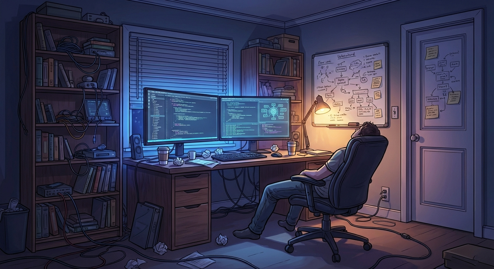
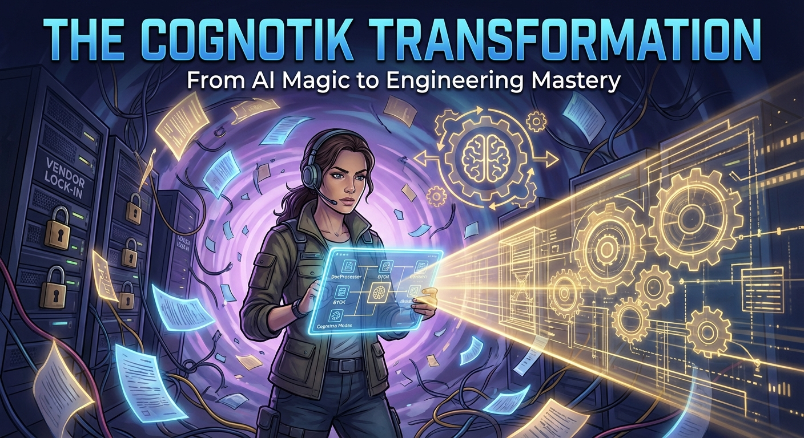
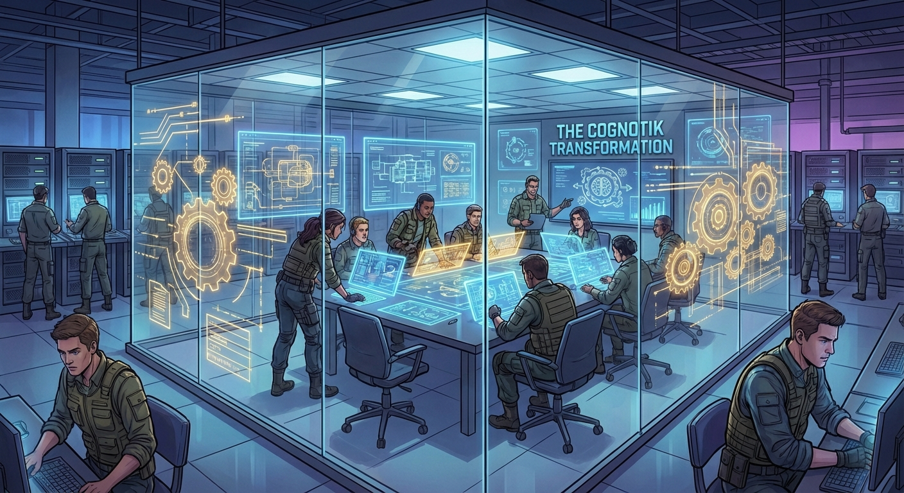
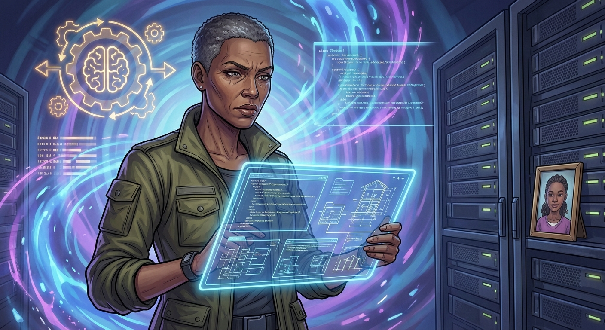
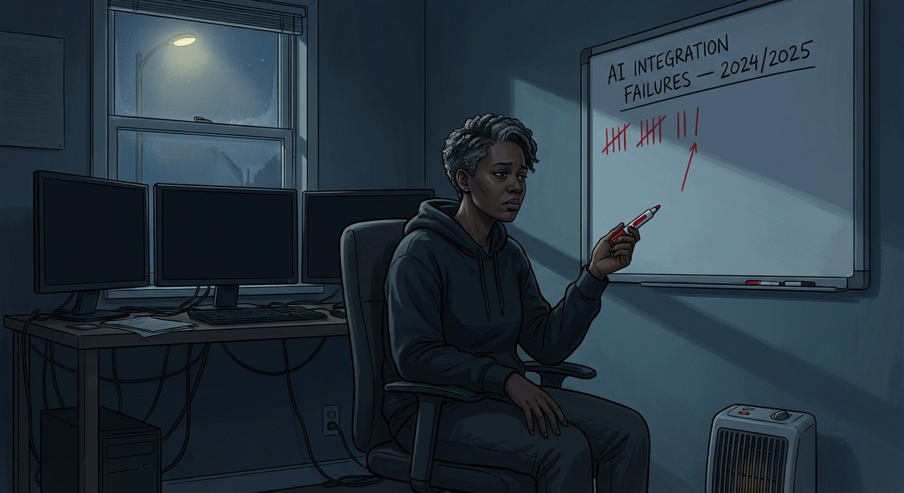
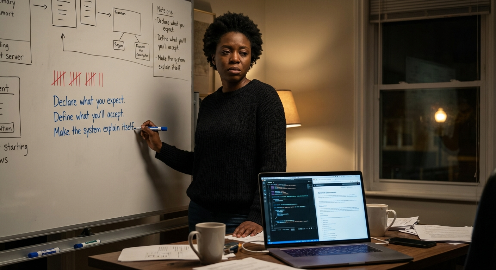
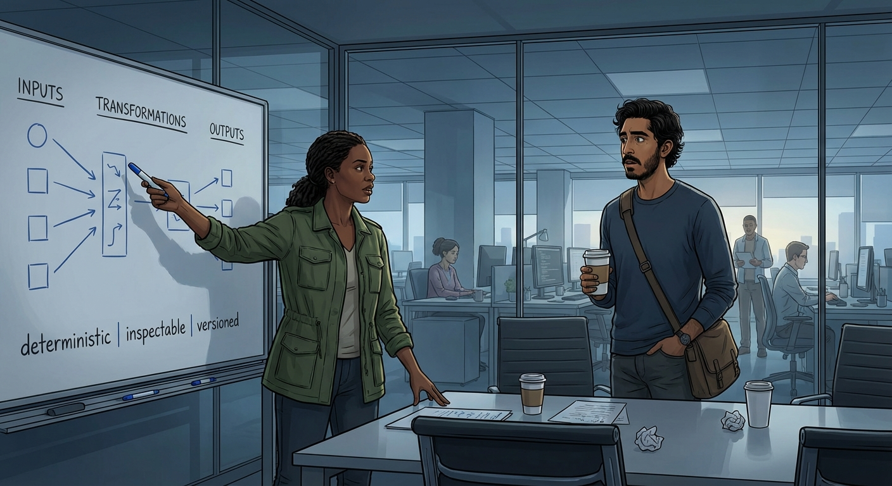
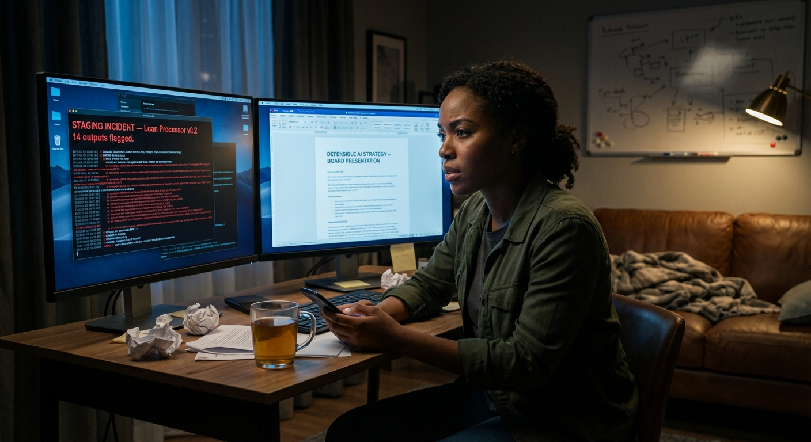
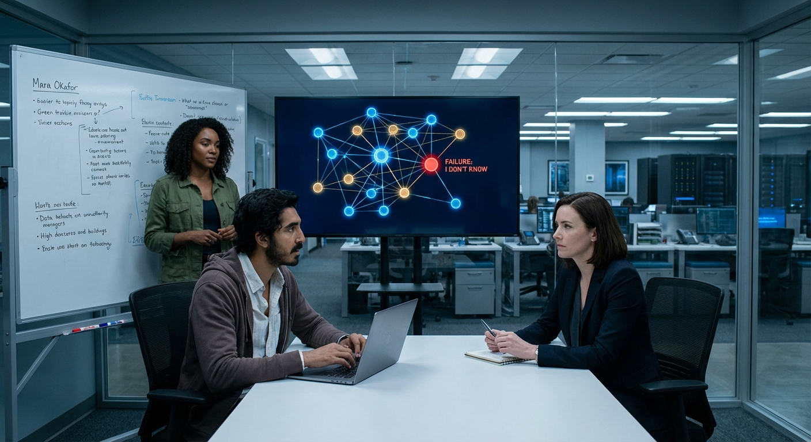
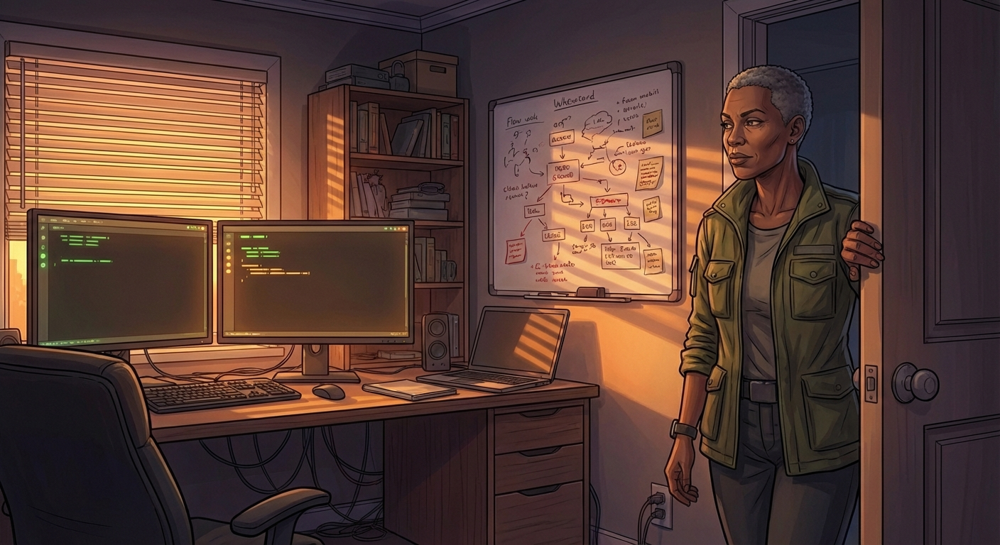

# Narrative Generation Task

## Overview

# Narrative Generation

**Subject:** A senior engineer named Mara discovers Cognotik while drowning in documentation debt, brittle AI integrations, and vendor lock-in at her company. Through five escalating challenges — each mirroring the five demos — she learns to wield declarative AI orchestration, confronts the honest trade-offs, and ultimately transforms her team's relationship with AI from 'magic genie' to 'build system for thought.' The narrative dramatizes the real architectural concepts (DocProcessor, BYOK, frontmatter-driven pipelines, cognitive modes, the bootstrap loop) through concrete human stakes.

## Configuration
- Target Word Count: 8000
- Structure: 3 acts, ~2 scenes per act
- Writing Style: literary
- Point of View: third person limited
- Tone: dramatic
- Detailed Descriptions: ✓
- Include Dialogue: ✓
- Internal Thoughts: ✓

**Started:** 2026-02-27 21:17:51

---

## Progress

### Phase 1: Narrative Analysis
*Running base narrative reasoning analysis...*

## Cover Image

**Prompt:** 

## High-Level Outline

## The Build System for Thought

**Premise:** Mara Okafor, a skeptical senior engineer exhausted by brittle AI 'magic', discovers a transparent, declarative orchestration philosophy that allows her to build a defensible AI strategy for her company while bridging the generational gap with her enthusiastic junior colleague.

**Estimated Word Count:** 8000

---

### Characters

#### Mara Okafor

**Role:** protagonist

**Description:** Early forties, tall and angular, with close-cropped silver-threaded hair. Methodical engineer who values legibility and architectural rigor. A single mother to twelve-year-old Adaeze.

**Traits:** Skepticism tempered by intellectual honesty; deep fatigue masking deeper passion; a compulsive need to understand why something works, not just that it works; motivated by sustainability and rigor.

#### Dev Patel

**Role:** supporting

**Description:** Mid-twenties, slight build, AI-native developer who learned to code via LLMs. Enthusiastic, fast-moving, and lacks the 'scar tissue' of senior engineers.

**Traits:** Infectious enthusiasm; intellectual speed without depth; genuine humility when confronted with evidence; loyalty; motivated to prove he belongs and bridge the gap between AI capability and utility.

#### Callista Reeves

**Role:** institutional antagonist

**Description:** Late fifties, immaculately composed executive with a precise silver-blonde bob. A veteran technologist who balances engineering needs with business demands.

**Traits:** Pragmatic authority; genuine technical depth masked by executive polish; fairness that feels like pressure; motivated by corporate defensibility and regulatory compliance.

---

### Settings

#### mara_home_office

**Description:** A converted second bedroom in a Decatur bungalow with ultrawide monitors, IKEA bookshelves, and a whiteboard on the door.

**Atmosphere:** Intimate, exhausted, liminal.

**Significance:** The space of private struggle and discovery where the 2 AM incident occurs and Cognotik is first encountered.

#### meridian_engineering_floor

**Description:** An open-plan office in Midtown Atlanta with glass towers, standing desks, and a commercial-grade coffee machine.

**Atmosphere:** Energetic but tense.

**Significance:** The space of collaboration, demonstration, and interpersonal conflict between the AI-native and infrastructure teams.

#### callista_office

**Description:** A corner office with actual walls, a clean desk, and a bronze bridge sculpture.

**Atmosphere:** Controlled, consequential.

**Significance:** The threshold between engineering reality and business reality where stakes are established and verdicts rendered.

#### fishbowl_conference_room

**Description:** A glass-walled conference room at the center of the engineering floor with smart-glass opacity controls.

**Atmosphere:** Exposed, high-stakes.

**Significance:** The site of critical demonstrations and the climactic board presentation, literalizing the theme of transparency.

---

### Act Structure

#### Act 1: The Weight of Magic

**Purpose:** Establish the unsustainable status quo, introduce character tensions, and present the discovery of Cognotik as a lifeline for the protagonist.

**Estimated Scenes:** 2

**Key Developments:**
- A 2 AM production incident reveals the fragility of current AI integrations.
- Callista delivers a mandate for a defensible AI strategy in two weeks.
- Mara discovers Cognotik and recognizes its philosophy of describing its own limitations.
- Mara runs the first technical demo and finds relief in its legibility.

#### Act 2: Building in the Open

**Purpose:** Dramatize the learning curve and deepening collaboration as the team builds a proof-of-concept using declarative architecture.

**Estimated Scenes:** 2

**Key Developments:**
- Mara and Dev collaborate, realizing the 'build system for thought' metaphor.
- They build a compliance document processor and document its honest failures.
- Dev causes a staging incident, leading to a turning point in his relationship with Mara.
- Mara discovers the bootstrap loop concept, reinforcing her conviction in the tool.

#### Act 3: The Transparent Room

**Purpose:** Bring threads to convergence in a board presentation that values honesty and transparency over 'magic' demos.

**Estimated Scenes:** 2

**Key Developments:**
- Mara presents the proof-of-concept to the board, deliberately showing a failure case.
- Dev provides unplanned, authentic testimony about the shift to declarative thinking.
- Callista approves the initiative based on the confidence inspired by the failure demo.
- Mara reclaims her relationship with her craft, working at a reasonable hour.

---

**Status:** ✅ Pass 1 Complete

## Outline

## The Build System for Thought

**Premise:** Mara Okafor, a skeptical senior engineer exhausted by brittle AI 'magic', discovers a transparent, declarative orchestration philosophy that allows her to build a defensible AI strategy for her company while bridging the generational gap with her enthusiastic junior colleague.

**Estimated Word Count:** 8000

**Total Scenes:** 6

---

### Detailed Scene Breakdown

### Act 1: The Weight of Magic

**Purpose:** Act 1 opens in crisis and closes in cautious hope. The 2 AM incident grounds the story's central tension in concrete, visceral consequences—hallucinated data nearly triggering regulatory action—and establishes Mara as a rigorous engineer paying a personal price for systems she doesn't trust. Callista's mandate raises the stakes from technical to existential: Mara must articulate not just a fix but a philosophy, and she has two weeks. The discovery of Cognotik arrives not as deus ex machina but as recognition—Mara finds a tool that shares her values of transparency, declared limitations, and architectural honesty. The act establishes all three character dynamics: Mara's earned skepticism, Dev's promising but undisciplined enthusiasm, and Callista's demanding fairness. The whiteboard in Mara's home office serves as a visual throughline, transforming from a record of failures into the first sketch of a solution.

#### Scene 1: The 2 AM Collapse

- **Setting:** mara_home_office
- **Characters:** Mara Okafor, Dev Patel, Adaeze
- **Purpose:** Establish the unsustainable status quo through a visceral production incident that reveals the fragility of the company's current AI integrations, ground Mara's skepticism in lived experience, and introduce her relationship with her daughter to humanize the cost of this work.
- **Emotional Arc:** Exhaustion → frustration → brief tenderness with Adaeze → grim resolve hardening into quiet despair. Mara is not angry at Dev specifically; she's angry at a paradigm that makes this kind of failure inevitable and invisible until it detonates.
- **Est. Words:** 1800

**Key Events:**
  {
    "developments" : [ "Mara is woken by a PagerDuty alert: the AI-powered contract summarization pipeline has begun hallucinating clause numbers, sending fabricated compliance flags to downstream systems.", "She triages the incident in her home office, discovering that an upstream model provider silently updated their API, changing output formatting in ways their brittle parsing layer couldn't absorb.", "Slack messages from Dev reveal his well-intentioned but shallow fix attempts—he patched the prompt, which temporarily masked the real issue and made diagnosis harder.", "Mara finds Adaeze standing in the doorway, unable to sleep, and the brief tender exchange crystallizes the personal toll of maintaining 'magic' systems.", "Mara manually rolls back the pipeline, writes a post-mortem skeleton, and stares at the whiteboard on her door where she's been tracking AI integration failures—the tally marks are becoming a pattern." ]
  }

#### Scene 2: The Mandate and the Lifeline

- **Setting:** callista_office
- **Characters:** Mara Okafor, Callista Reeves, Dev Patel, Adaeze
- **Purpose:** Raise the stakes through Callista's mandate, introduce the interpersonal dynamics between all three characters, and deliver the discovery of Cognotik as an earned moment of recognition rather than a convenient accident.
- **Emotional Arc:** Dread (walking into Callista's office sleep-deprived) → defensive tension (the three-way dynamic) → weight of responsibility (the mandate) → lonely determination (evening research) → cautious, almost disbelieving relief (the Cognotik discovery). The scene ends on the first note of hope in the story, but it's tentative—Mara doesn't trust hope easily.
- **Est. Words:** 2200

**Key Events:**
  {
    "developments" : [ "Callista summons Mara and Dev to her office to discuss the overnight incident. She reveals that the hallucinated compliance flags nearly triggered a false regulatory filing—the business consequences were hours away from being catastrophic.", "Callista delivers the mandate: Mara has two weeks to present a defensible AI strategy to the board. Not a demo, not a pitch—a strategy that Callista can stand behind when regulators ask 'how do you know this works?'", "The meeting exposes the Mara-Dev tension constructively: Dev defends the speed of AI-native development, Mara counters that speed without legibility is technical debt with compound interest. Callista listens to both, but her verdict aligns with Mara's concern while placing the burden of proof on Mara's shoulders.", "That evening, back in her home office, Mara researches orchestration frameworks and stumbles on Cognotik's documentation. She is arrested by its philosophy: a system that describes its own limitations, that treats AI capabilities as declared dependencies rather than assumed magic.", "Mara runs a first small technical demo—a simple document processing flow—and experiences the relief of legibility: she can read what the system expects, what it will do when expectations aren't met, and why each step exists. The whiteboard gets its first constructive note in weeks." ]
  }

---

### Act 2: Act 2: Building in the Open

**Purpose:** Dramatize the collaborative building of the proof-of-concept, the emergence of the 'build system for thought' metaphor, and the handling of a crisis that leads to the 'bootstrap loop' concept and the strategy for the final presentation.

#### Scene 1: The Build System for Thought

- **Setting:** meridian_engineering_floor
- **Characters:** Mara Okafor, Dev Patel
- **Purpose:** Dramatize the collaborative building of the proof-of-concept, the emergence of the central metaphor, the honest documentation of failures, and the deepening of the Mara-Dev working relationship through productive friction.
- **Emotional Arc:** Skepticism and friction transitioning into mutual respect and shared excitement as the metaphor clicks and they build something 'honest.'
- **Est. Words:** 1200

**Key Events:**
  {
    "summary" : "Mara sets up a war room; Dev shows a hallucinating prototype; Mara explains the declarative approach; the 'build system for thought' metaphor is born; they rebuild the processor with failure declarations; they test it and get an honest result; they start a failure log."
  }

#### Scene 2: The Break and the Bootstrap

- **Setting:** mara_home_office
- **Characters:** Mara Okafor, Dev Patel
- **Purpose:** Dev's staging incident creates a crisis that tests the nascent trust and forces both characters to evolve. Mara's late-night investigation leads her to the bootstrap loop concept, which crystallizes her conviction and provides the intellectual foundation for the Act 3 presentation.
- **Emotional Arc:** Anxiety and dread shifting to a realization of the system's legibility, leading to forgiveness and intellectual breakthrough/conviction.
- **Est. Words:** 1500

**Key Events:**
  {
    "summary" : "Dev triggers a staging incident; Mara uses the new philosophy to diagnose the error; the error is legible; Mara discovers the 'bootstrap loop' concept; she realizes failures are training data; she writes the board presentation framework; she plans to show a failure on purpose."
  }

---

### Act 3: The Transparent Room

**Purpose:** The climactic presentation where Mara's philosophy of transparency is tested against the board's expectation of polish, resolving the central tension between 'magic' demos and honest engineering by deliberately staging a failure and showing why that failure is the point, followed by a denouement showing sustainable engagement.

#### Scene 1: The Demo That Breaks on Purpose

- **Setting:** fishbowl_conference_room
- **Characters:** Mara Okafor, Dev Patel, Callista Reeves
- **Purpose:** The climactic presentation where Mara's philosophy of transparency is tested against the board's expectation of polish. This scene resolves the central tension between 'magic' demos and honest engineering by deliberately staging a failure — and showing why that failure is the point.
- **Emotional Arc:** Starts with high anxiety (Dev) and steady resolve (Mara), moves through tension during the 'failed' demo, and ends with earned trust and institutional validation.
- **Est. Words:** 1200

**Key Events:**
  {
    "1_preparation" : "Mara and Dev prepare in the fishbowl room with clear glass for transparency, Mara steadying Dev's nerves.",
    "2_opening" : "Mara opens the presentation by recounting the Act 1 failure as a cost of building on opaque systems.",
    "3_successful_demo" : "The system processes a standard document successfully, meeting traditional demo expectations.",
    "4_staged_failure" : "Mara feeds the system a complex document that triggers a controlled failure, showing explicit confidence scores and handoff notes.",
    "5_explanation" : "Mara explains that a system that fails legibly is more defensible than one that hides its hallucinations.",
    "6_dev_testimony" : "Dev gives an unplanned, authentic testimony about how the declarative architecture made his own mistakes traceable and understandable.",
    "7_approval" : "Callista approves the initiative as a funded pilot, citing the value of a system that knows its limits."
  }

#### Scene 2: Reasonable Hours

- **Setting:** mara_home_office
- **Characters:** Mara Okafor, Adaeze
- **Purpose:** A quiet denouement that mirrors the Act 1 opening, showing Mara reclaiming her relationship with her craft and life, closing the thematic loop from exhaustion to sustainable engagement.
- **Emotional Arc:** From the ambient panic of the past to a sense of calm, symmetry, and sustainable pride. The incompleteness of the work no longer feels like failure but like a roadmap.
- **Est. Words:** 800

**Key Events:**
  {
    "1_setting_contrast" : "Mara works in her home office at 7:15 PM in the evening light, a sharp contrast to the 2 AM start of the story.",
    "2_collaboration" : "Mara reviews the pilot plan and exchanges a supportive, professional message with Dev about his blog post on declarative AI.",
    "3_symbolic_closure" : "Mara closes her laptop, symbolizing trust in the system's stability without her constant vigilance.",
    "4_reconnection" : "Mara leaves the office to join her daughter for dinner, leaving the 'legible' but incomplete architecture on the whiteboard as a sign of healthy progress.",
    "5_final_image" : "The empty room shows the architecture on the whiteboard and quiet monitors, representing a system at rest."
  }

---

**Status:** ✅ Complete

#### Setting: mara_home_office

**Prompt:** 

#### Setting: meridian_engineering_floor

**Prompt:** 

#### Setting: callista_office

**Prompt:** 

#### Setting: fishbowl_conference_room

**Prompt:** 

#### Character: Mara Okafor

**Prompt:** 

#### Character: Dev Patel

**Prompt:** 

#### Character: Callista Reeves

**Prompt:** 

## ## The 2 AM Collapse

**Act 1, Scene 1**

**Setting:** mara_home_office

**Characters:** Mara Okafor, Dev Patel, Adaeze

---

The phone screamed in the dark like something wounded.

Mara Okafor's hand found it before her mind did—muscle memory from a thousand nights like this one. The lurch from deep sleep to full adrenaline, cold glass against her palm, the red glow of the PagerDuty notification painting her ceiling the color of arterial blood.

**CRITICAL — ContractSumm Pipeline — Severity 1**
*Anomalous output detected in compliance flag generation. 47 fabricated clause references propagated to downstream audit system. Auto-rollback failed. Manual intervention required.*

She was already sitting up, already swinging her legs over the side of the bed, already reaching for the hoodie draped across the chair. Her body knew the choreography. Her mind was still assembling the architecture of the system in question—the blueprint unfolding in darkness like a city seen from altitude: the contract ingestion layer, the summarization model, the parsing logic that extracted clause numbers and mapped them to compliance flags, the downstream audit system that three different VP-level stakeholders treated as holy writ.

Forty-seven fabricated clause references. *Fabricated.* The word settled in her chest like a swallowed stone.

She padded down the hallway in bare feet, past Adaeze's door—closed, a thin ribbon of darkness beneath it—and into the small second bedroom she'd converted into a home office two years ago, when "temporary remote work" had calcified into permanent reality. The room held the stale ghost of yesterday's coffee and the faintly chemical bite of dry-erase markers. She left the overhead light off. The monitors would be enough.

Three screens bloomed to life. Her fingers moved across the keyboard with the fluency of someone who had been debugging production systems for sixteen years, since before "AI" meant anything more than a curiosity in a research paper. She pulled up the pipeline logs, the model output cache, the downstream propagation records. The data told its story in the flat, indifferent language of timestamps and JSON payloads.

At 11:47 PM, the contract summarization pipeline had begun generating clause references that did not exist. Not random gibberish—that would have tripped the validation layer. These were *plausible*. Clause 14.3(b) instead of 14.3(a). Section 7.2.1 where the actual document contained no subsections at all. The hallucinations were confident, formatted perfectly, slotting into the expected schema like counterfeit bills through a counting machine. The compliance flags they triggered were real flags attached to phantom provisions, and they had flowed downstream into the audit system where, in approximately four hours, the London office would begin their workday and treat every one of them as authoritative.

Mara pressed her thumbs into her eye sockets until phosphenes bloomed. Then she opened Slack.

The channel was already alive. Dev Patel had been on call—officially, at least—and his messages formed a breathless trail starting at 12:15 AM.

**dev.patel** [12:15 AM]: seeing weird output from contractsumm, investigating
**dev.patel** [12:23 AM]: think it's a prompt issue — the model is being too creative with clause refs
**dev.patel** [12:31 AM]: pushed a prompt patch to prod, added "only reference clauses explicitly present in the source document" to the system message
**dev.patel** [12:34 AM]: output looks cleaner now! monitoring
**dev.patel** [1:18 AM]: uh oh. it's back. and now the output format is slightly different too? some of the JSON keys are camelCase instead of snake_case
**dev.patel** [1:22 AM]: the parsing layer is throwing silent errors. checking
**dev.patel** [1:40 AM]: @mara.okafor I think this might be bigger than a prompt fix. paging you just in case. sorry 😬

Mara stared at the gap between 12:34 and 1:18. Forty-four minutes during which Dev had believed his patch worked. Forty-four minutes during which the system continued propagating corrupted data, now with the additional complication that his prompt modification had altered the model's output structure just enough to introduce a *second* failure mode on top of the first.

She didn't blame him. That was the thing people misunderstood about her reputation for severity—they mistook precision for cruelty. She didn't blame Dev Patel, who was twenty-six and brilliant and had been taught by every conference talk and Medium post and vendor pitch deck that the way you fixed AI was to *talk to it differently*. He had done exactly what the paradigm trained him to do. He had adjusted the prompt. He had spoken to the oracle in more precise language and trusted that the oracle would comply.

The oracle had not complied. The oracle did not comply. The oracle was a stochastic process that did not know what compliance meant.

She typed:

**mara.okafor** [2:07 AM]: Dev, I'm on. Do NOT push any more changes. I need to see the original failure mode without your patch layered on top. Rolling back your prompt change first, then the full pipeline to last known good state.
**mara.okafor** [2:07 AM]: What made you look at the output at 12:15?

The reply came instantly. He was still awake, still watching.

**dev.patel** [2:08 AM]: monitoring alert on output token count — spiked about 15%. thought the model was just being verbose but then I spot-checked and saw the fake clauses
**dev.patel** [2:08 AM]: I'm really sorry Mara. I thought the prompt fix would hold.

**mara.okafor** [2:09 AM]: The token count spike is the clue. Pull up the model provider's status page and changelog. I have a theory.

She already knew. She'd seen this pattern before—twice in the last quarter, with different providers. While Dev searched, she navigated to the API documentation for the model they used, a mid-tier provider whose name appeared in their vendor contracts alongside reassuring phrases like "enterprise-grade" and "production-ready." She found it in the changelog, buried under a cheerful header:

*v2.4.1 — Released January 14, 2025*
*Improved: Enhanced structured output formatting for better readability. Minor adjustments to tokenization of legal and financial terminology.*

Released at 11:30 PM Eastern. Seventeen minutes before their pipeline began hallucinating.

"Minor adjustments," Mara whispered to the dark room. She could feel the anger now—not hot but cold, the kind that settled into her marrow and stayed. A model provider had pushed a silent update to a production API endpoint. No versioning pin, no deprecation warning, no breaking-change flag. And the downstream effect was that a Fortune 500 company's compliance audit system was contaminated with phantom data. The only reason anyone noticed was that a junior engineer happened to be awake and happened to glance at a token count metric that wasn't even part of their official monitoring suite.

She began the rollback. Methodical, careful work—reverting Dev's prompt change first to isolate the original failure, then switching the pipeline to the pinned model version from three weeks ago, then running a targeted purge of every output generated after 11:47 PM. Each step required verification. Each verification required patience she was drawing from some deep reserve whose bottom she could feel approaching.

She was halfway through the purge when she heard the soft creak of the hallway floor.

"Mom?"

Mara turned. Adaeze stood in the doorway in her oversized sleep shirt—the one with the faded NASA logo—box braids pulled into a loose pile on top of her head. Twelve years old and already her father's height, his long limbs, but her eyes were Mara's. Dark, watchful, missing nothing.

"Baby, it's two in the morning. Go back to bed."

"I heard you talking." Adaeze leaned against the doorframe, arms crossed in a posture she'd borrowed from Mara herself. "You only talk to yourself when something's really broken."

Mara almost smiled. "Something's really broken."

"The AI stuff?"

"The AI stuff."

Adaeze studied her mother in the monitor-light, her expression carrying a seriousness that belonged to someone much older. Then she crossed the room, wrapped her arms around Mara's shoulders from behind, and pressed her cheek against the top of her mother's head. She smelled like cocoa butter and the lavender pillow spray she'd recently become devoted to—warm, human scents that had no place in this room of cold screens and colder problems.

"You should sleep," Adaeze said, with the grave authority of a child who has learned to parent her parent.

Mara reached up and held her daughter's forearm. The skin was warm and smooth and real in a way that nothing on these screens would ever be. "Thirty more minutes. I promise."

"You always say thirty minutes."

"This time I mean it."

Adaeze squeezed once, then released her. At the doorway she paused, one hand on the frame. "Mom? If it keeps breaking, maybe stop building it."

Then she was gone—footsteps retreating down the hall, her door clicking shut with the careful precision of a child trying not to wake a parent who was already awake.

Mara turned back to her screens. The purge was complete. The pipeline was stable on the old model version. She opened a new document and began typing the skeleton of a post-mortem, the words coming with the grim fluency of long practice:

*Incident: ContractSumm Pipeline — Hallucinated Clause References*
*Root Cause: Unversioned upstream model update (Provider changelog v2.4.1) introduced subtle changes to output formatting and legal terminology tokenization. Existing parsing layer lacked schema validation robust enough to detect plausible-but-fabricated outputs.*
*Contributing Factor: Well-intentioned prompt modification during incident response introduced secondary failure mode and delayed root cause identification.*
*Impact: 47 fabricated compliance flags propagated to audit system over ~2.5 hour window.*

She saved the document and leaned back. The room had gone cold around her. She'd forgotten the space heater, and January air had crept through the old window seals, pooling around her bare ankles like standing water.

On the back of her office door hung a whiteboard she'd mounted six months ago. Across the top, in her neat block lettering: **AI INTEGRATION FAILURES — 2024/2025**. Below it, tally marks in red dry-erase marker. She stood, uncapped the marker, and added another.

Fourteen. Fourteen incidents in six months. She stepped back and looked at them—not as individual marks but as a pattern, a frequency, a trend line that refused to flatten. Each one had a different proximate cause. A prompt injection vulnerability. A context window overflow. A fine-tuned model that drifted after retraining. A vendor who deprecated an endpoint with two weeks' notice. But beneath the variety, the same structural truth persisted: they were building on sand and calling it foundation.

*If it keeps breaking, maybe stop building it.*

Mara capped the marker. She turned off the monitors one by one, each screen collapsing to black. She did not go back to bed. She sat in the dark office in her cold chair and listened to the house settle around her—the tick of the heating pipes, the distant hum of the refrigerator, the silence of the room where her daughter slept—and she let the thing she had been refusing to name for months finally settle over her like a physical weight.

It was not anger. It was not even exhaustion, though she was exhausted down to the marrow.

It was the quiet despair of a woman who could see the problem with perfect clarity and could not, yet, see the shape of the solution.

---

**Word Count:** 1832

**Key Moments:**
- Mara is jolted awake by a Severity 1 alert: the AI contract summarization pipeline is hallucinating plausible but fabricated clause references into a downstream compliance system
- She discovers Dev's well-intentioned prompt patch actually introduced a second failure mode and masked the root cause—a silent, unversioned upstream model update by their API provider
- Adaeze appears in the doorway, and their brief, tender exchange ("If it keeps breaking, maybe stop building it") crystallizes the personal cost of maintaining these systems
- Mara completes the rollback, begins a post-mortem, and adds a fourteenth tally mark to her whiteboard tracking AI integration failures—revealing a pattern she can no longer ignore
- Alone in the dark, Mara confronts not anger but quiet despair: she can diagnose the structural problem perfectly but cannot yet see a way forward

**Character States:**
- **Mara Okafor:** Physically exhausted, emotionally drained, sitting in a dark office unable to sleep. Her skepticism has hardened past frustration into something closer to despair. She sees the systemic pattern clearly—fourteen incidents, one underlying cause—but has no alternative paradigm to offer. The weight of being the person who always sees the problem but never gets to build the solution is becoming unbearable.
- **Dev Patel:** Awake, anxious, apologetic. He acted in good faith using the tools and instincts the industry gave him, and he knows it wasn't enough. He's eager to help but aware he's out of his depth. His respect for Mara is genuine, tinged with the fear of having made things worse.
- **Adaeze:** Perceptive beyond her years, worried about her mother, returned to bed but not unaware. Her parting line lingers as both a child's simple wisdom and an inadvertent challenge that will echo through Mara's thinking in scenes to come.

**Status:** ✅ Complete

#### Act 1, Scene 1 Image

**Prompt:** 

## ## The Mandate and the Lifeline

**Act 1, Scene 2**

**Setting:** callista_office

**Characters:** Mara Okafor, Callista Reeves, Dev Patel, Adaeze

---

She had managed four hours of sleep, and they sat in her body like stones.

Mara walked the third-floor corridor of Vantage Financial's headquarters with the vigilance of the deeply tired—every fluorescent panel a small assault, every footfall on the carpet tiles landing with a precision borrowed from someone else's nervous system. She carried a travel mug of coffee she hadn't tasted and a printed copy of her post-mortem, finished at four-seventeen that morning. The pages still held the faint warmth of her home printer, a domestic detail that felt absurd against all this glass and institutional carpet.

Callista Reeves's corner office occupied the northwest angle of the building, where floor-to-ceiling windows framed a river view Mara had never once paused to admire. The door was open. Dev was already inside.

He sat in one of the two chairs facing Callista's desk, spine too straight, hands folded with a stillness that was visibly costing him. He wore a clean shirt—which meant he'd gone home, changed, been rehearsing this since before dawn. When Mara entered, he looked up with an expression she recognized from years of managing junior engineers: desperate hope that the senior person would somehow make it right, tempered by the knowledge that he'd helped make it wrong.

"Mara." Callista did not rise. She was reading something on her monitor, the blue light catching the silver at her temples and turning it to wire. Callista Reeves was fifty-three, a former auditor who had climbed into the C-suite through compliance and risk, and she carried that origin the way some people carry an accent—indelibly. In the way she let silence do the work of interrogation. In the way she read documents with her whole body canted forward, as though the text might try to slip past her. "Close the door, please."

Mara closed it. The latch clicked like a punctuation mark.

"I've read your incident report," Callista said, still facing the monitor. "I've also read the one Dev sent at three-forty-five." She turned then, her gaze moving between them with the unhurried precision of someone who had spent decades weighing exposure. "What neither of you mentioned—because neither of you knew—is that the hallucinated compliance flags from last night's pipeline were already staged for inclusion in our quarterly regulatory filing. Automated. Downstream. No human checkpoint between the output and the submission. If Mara hadn't caught the anomaly when she did, those fabricated clause references would have been filed with the OCC by nine this morning."

The silence that followed had texture. Mara felt it settle against her eardrums like pressure change before a storm.

"We would have submitted a materially false regulatory document," Callista continued, her voice level in the way that indicated not calm but the deliberate suppression of something far less measured, "based on data generated by a system none of us fully understood, through a pipeline that updated itself without our knowledge or consent." She paused. Let the fluorescent hum fill the room. "Sit with that for a moment."

Mara sat with it. Beside her, Dev had gone ashen beneath his brown skin, a grayish undertone that made him look suddenly younger, almost adolescent, the adult competence stripped away to reveal the graduate student underneath.

"Callista," he said, his voice cracking on the second syllable. He cleared his throat. "I take full responsibility for the prompt modification. I should have—"

"Dev." She raised one hand, palm flat, and the gesture stopped him as cleanly as a closed door. "I'm not here to assign blame for last night. I'm here because last night was the fourteenth time in seven months that our AI integrations produced results we couldn't verify, couldn't explain, and couldn't defend under questioning." She looked at Mara. "Mara's been tracking them. I've been reading her internal memos. All of them."

Mara had not known that. She had written those memos with the grim diligence of someone building a record for an audience she suspected didn't exist, half-expecting each one to decompose quietly in the institutional void. The knowledge that Callista had been paying attention produced something between vindication and vertigo.

"So here's where we are." Callista stood, moved to the window, crossed her arms. The morning light was flat and gray, the river the color of old pewter, and her silhouette looked carved from something denser than flesh. "The board meets in two weeks. I have to present our technology strategy, and that strategy currently includes six AI-dependent systems I cannot, in good conscience, tell a regulator I understand. I need a defensible AI strategy. Not a demo. Not a pitch deck with gradient backgrounds and the word 'transformative' on every third slide. Something I can stand behind when someone from the OCC asks: *How do you know this works?*"

She turned back.

"Mara, that's yours."

The weight landed physically—a settling across her shoulders, sandbags stacked one by one. Two weeks. A defensible strategy. For systems she'd spent seven months arguing were indefensible.

"I want to help," Dev said, leaning forward. "I know last night was partly on me. But the underlying approach is sound. These models are incredibly capable, and if we build better guardrails—"

"Better guardrails around what, Dev?" The exhaustion gave her words an edge she hadn't entirely intended but didn't regret. "A model we don't control, running on infrastructure we don't own, producing outputs we can't verify? That's not a guardrail problem. That's an architecture problem." She was too tired for diplomacy. "Speed without legibility is technical debt with compound interest, and we've been taking out loans for seven months."

Dev's jaw tightened, muscles cording along his neck. "And doing nothing while the rest of the industry moves forward is what, exactly? Prudence? Because from where I sit, it looks like paralysis dressed up as engineering rigor."

The words hung between them, sharper than he'd intended—she saw the instant he wished he could pull them back, the slight widening of his eyes, the micro-flinch at the bridge of his nose. But he didn't retract them. He held her gaze, and in that holding she saw something she respected despite herself: the courage of someone who believed in what he was building, even when the building had gone wrong.

"You're both right," Callista said quietly, and the room's tension shifted from confrontation to something more uncertain, more open. "Dev, the capability is real. Mara, the risk is real. What I don't have is a framework that holds both truths at once. That's what I need in two weeks." She looked at Mara, her expression softening by exactly one degree—not warmth, but acknowledgment. "You've been sounding the alarm. Now I'm asking you to build the answer. Can you do that?"

Mara thought of the whiteboard in her home office. Fourteen tally marks in red. The smell of dry-erase marker at two in the morning. Adaeze's voice, sleep-thick and devastating: *If it keeps breaking, maybe stop building it.*

"I'll need Dev," she said, and the words surprised her even as she spoke them. Dev looked at her with cautious, startled gratitude—someone braced for exile offered a seat at the table instead. "He understands the capability layer better than I do. I need someone who can tell me what these systems *can* do, so I can build a strategy around what they *should* do."

Callista nodded once. "Two weeks. Go."

---

The house was quiet when she got home at seven-thirty. Adaeze was at her father's—the custody schedule Mara navigated with the same meticulous attention she gave production systems, every handoff documented, every transition smoothed for the child even when it cost the adults something they couldn't name. Her daughter's absence was a specific silence, not empty but *cleared*, like a room after the instruments have been put away. You could still feel the shape of the music.

She ate standing up—leftover jollof rice, cold from the container, the pepper hitting the back of her throat like a small reprimand—and carried her laptop to the home office.

The whiteboard watched from the far wall. Fourteen marks in red. She'd added nothing constructive in weeks. It had become a monument rather than a tool, and she resented it for that.

She opened her browser and began to research.

Orchestration frameworks. Pipeline management. Declarative systems. She moved through documentation and repositories with the methodical intensity of someone panning for gold in a river she suspected was barren. Most of what she found confirmed her pessimism: wrappers on wrappers, abstraction layers that obscured rather than revealed, tools promising to make AI "easy" in ways that made her skin prickle. Easy was the problem. Easy meant invisible. Invisible meant indefensible. Fourteen tally marks proved it.

Ninety minutes in, eyes burning, coffee cold beside her keyboard, she found it.

The documentation was spare—that was the first thing. No marketing language, no breathless promises. Where other frameworks led with capability, this one led with *philosophy*. She read the opening paragraphs once, then again, then a third time with the deliberation of someone encountering a familiar idea in a language she hadn't known existed.

*Cognotik.*

It described AI capabilities not as magic to be invoked but as *dependencies to be declared*—explicit, versioned, bounded. A system that stated what it expected, what it would do when expectations weren't met, and why each step existed. She scrolled through the architecture documentation and felt something shift in her chest, a loosening she didn't trust, because she'd been disappointed too many times to mistake recognition for relief.

But she kept reading.

The framework treated transparency as a structural principle, not a feature toggled on for audits and forgotten between them. Every operation legible. Every failure mode anticipated and named. It was—and the realization caught her physically, a straightening of her spine—a *build system for thought*. The same philosophy she applied to every other piece of critical infrastructure, applied to the one domain where the industry had collectively decided rigor was optional and vibes were sufficient.

She opened her terminal.

The first demo was deliberately small, the way she always began, because Mara Okafor did not trust systems she hadn't built from the ground up. A simple document processing flow: ingest a contract, extract key clauses, flag anomalies. The kind of pipeline that had broken catastrophically fourteen times in seven months.

She wrote the configuration in twenty minutes. Declared the model as a dependency. Specified the output schema. Defined the fallback behavior—not a silent retry, not a hallucinated substitute, but a clear, logged acknowledgment: *this step did not produce a verifiable result, and here is why.*

She ran it.

The output was not magical. It was not dazzling. It was *legible*. She could trace every decision like following a well-marked trail. She could see where the system had succeeded and where it had declined to guess. She could follow the provenance of every extracted clause back to its source, and where confidence fell below the declared threshold, the system said so—plainly, without apology, without papering over uncertainty with plausible fabrication.

Mara stared at her screen. The cursor blinked. Outside, a car passed, its headlights sweeping briefly across the ceiling.

She stood, crossed to the whiteboard, and beneath the fourteen tally marks—beneath every failure, every two-in-the-morning emergency, every moment of quiet professional despair—wrote a single line in blue marker, her handwriting small and precise:

*Declare what you expect. Define what you'll accept. Make the system explain itself.*

She capped the marker, set it on the tray with a small click, and pressed her fingertips against the cool edge of the whiteboard. The exhaustion in her body reorganized itself around something that was not yet hope but adjacent to it—a structural possibility, a load-bearing idea.

She did not trust it. She did not trust anything easily, and certainly not at nine-fifteen on a Tuesday with four hours of sleep behind her and a two-week deadline ahead and Callista's voice already lodged in her mind like a test she'd have to pass again and again.

But for the first time in months, the whiteboard held something other than damage. And Mara, who had built her career on the principle that you did not move forward until you understood the ground beneath your feet, allowed herself to believe—provisionally, conditionally, with all appropriate caveats—that the ground might hold.

---

**Word Count:** 2045

**Key Moments:**
- Callista reveals the hallucinated compliance flags were hours away from being submitted in a false regulatory filing to the OCC, escalating the stakes from technical failure to potential legal catastrophe
- The three-way dynamic crystallizes: Dev defends AI-native speed, Mara counters that speed without legibility is technical debt, and Callista places the burden of solution on Mara
- Mara surprises herself by requesting Dev as a collaborator, acknowledging his understanding of the capability layer even as she insists on structural rigor
- Alone in her home office, Mara discovers Cognotik's documentation and is arrested by its philosophy of treating AI capabilities as declared dependencies rather than assumed magic
- Mara runs a small demo, experiences the relief of legibility, and writes the first constructive note on her whiteboard in weeks

**Character States:**
- **Mara Okafor:** Exhausted but newly oriented. The mandate's weight is enormous, but the Cognotik discovery has given her a direction. Her skepticism remains fully intact; she doesn't trust the framework yet, only recognizes that its philosophy aligns with her own engineering principles.
- **Dev Patel:** Shaken by the revelation of how close they came to a false regulatory filing, but buoyed by Mara's unexpected request to collaborate. He's chastened but not defeated—his belief in AI capability is genuine.
- **Callista Reeves:** Watchful, deliberate, carrying the full weight of institutional risk on her shoulders. She has placed her bet on Mara and is now waiting to see if it pays off.
- **Adaeze:** Absent (at her father's), but her words from the previous night continue to echo in Mara's thinking—a child's simple challenge that has become an inadvertent design principle.

**Status:** ✅ Complete

#### Act 1, Scene 2 Image

**Prompt:** 

## ## The Build System for Thought

**Act 2, Scene 1**

**Setting:** meridian_engineering_floor

**Characters:** Mara Okafor, Dev Patel

---

She commandeered Conference Room B at seven-fifteen Wednesday morning, before the floor filled, before anyone could ask questions or offer opinions or suggest they just try a different model. The room held the stale geography of every conference room she'd ever worked in: carpet that trapped yesterday's lunch orders, a long table tattooed with coffee rings, a wall-mounted display no one had recalibrated since the previous quarter. But the south wall—that was the thing. A whiteboard stretching its full length, covered in someone's abandoned sprint retrospective. Mara wiped it clean with the heel of her palm, the dry-erase ink ghosting across her skin, and began drawing lines.

By the time Dev arrived at eight, she had partitioned the board into three columns: **INPUTS**, **TRANSFORMATIONS**, **OUTPUTS**. Beneath each, in her precise block lettering, a single word: *declared*.

Dev stood in the doorway holding two coffees, his messenger bag slung across his chest like armor. He looked like he hadn't slept much either. The bruised hollows around his eyes made him seem younger, closer to the graduate student he'd been eighteen months ago—someone still accustomed to the particular exhaustion of caring too much about the wrong problem.

"Peace offering," he said, extending one of the cups.

Mara took it. The coffee was terrible—oat milk, aggressively sweet—but the gesture was not. "Close the door."

He did, then stood uncertainly by the table, reading the whiteboard. She watched him process it, watched the slight furrow between his brows that meant he was trying to map her notation onto something he already knew and finding the fit imperfect.

"Before we start," she said, "show me what you had."

"The prototype? It's—after Monday night, it's basically—"

"Show me."

Dev opened his laptop with the reluctance of a student presenting a paper he knew was failing. He pulled up a notebook, ran a cell, turned the screen toward her. The contract summarization pipeline—his version, the one he'd been iterating on independently for weeks—produced its output in under four seconds. Clean formatting. Confident language. A summary of a sample commercial lease that read like a senior associate had drafted it.

Mara leaned in and tapped the screen below the third paragraph. "What's this clause reference?"

"Section 14.3(b), the indemnification carve-out."

"Pull up the source document."

Dev scrolled. His scrolling slowed. He went back to the top, searched, scrolled again. The air conditioning filled the silence with its thin mechanical breath.

"There is no 14.3(b)," Mara said quietly. "The indemnification language is in Section 11. There is no carve-out. Your system invented a more interesting contract than the one it was given."

Dev's jaw tightened. "I can add a grounding step. RAG with chunk verification, maybe a—"

"You can add seventeen grounding steps. You can build a cathedral of guardrails." Mara sat down across from him and wrapped both hands around the terrible coffee, letting the warmth anchor her. "And you will not know, at any given moment, which of those steps is actually functioning, which has silently degraded, and which is giving you a confidence score that means nothing. That's where we were Monday night. That's where the whole industry is. We keep building higher walls around a foundation we haven't inspected."

She could see him wanting to argue. She could also see him choosing not to, and she respected the discipline that cost him.

"So what's the alternative?" he asked.

Mara stood and walked to the whiteboard. She uncapped a blue marker—it squeaked faintly against the surface—and tapped the word *declared* under INPUTS.

"You know what a build system does?"

"Compiles code. Manages dependencies."

"A build system like Bazel or Nix doesn't just compile—it makes every dependency explicit. Every input is declared. Every transformation is reproducible. Every output is traceable back to exactly what produced it. If a dependency changes, the system knows. If a step fails, the system knows *where* and *why*. Nothing is implicit. Nothing is magic."

She drew an arrow from INPUTS to TRANSFORMATIONS, then from TRANSFORMATIONS to OUTPUTS. Above the arrows she wrote: *deterministic | inspectable | versioned*.

"What if we treated the AI layer the same way? Not as a black box we pray to and then clean up after, but as a declared dependency in a system we actually control?"

Dev was quiet for a long moment. Outside the glass wall of the conference room, the floor was beginning to fill—coats being shed, monitors flickering awake—but none of it reached them. Then he said, slowly, "A build system for thought."

The phrase landed in the room like a struck bell. Mara felt something shift behind her sternum—not excitement, not yet, but the particular relief of recognition. The shape she'd been reaching for, the thing she'd glimpsed in Cognotik's documentation at two in the morning, had a name now. And the name had come from him, which meant it wasn't just hers.

"Yes," she said. "Exactly that."

They rebuilt the contract processor in three hours. It was not elegant work. Dev's fingers flew and Mara's corrections were frequent and sometimes sharp, and twice he pushed back hard enough that she stopped and actually considered his point, and twice she changed her mind, which surprised them both. The architecture they arrived at was spare, almost austere: each step declared its inputs, its expected model behavior, its acceptable output schema, and—this was the part Mara insisted on, the part that made Dev visibly uncomfortable—its *failure modes*.

"You want me to write down how it's going to break," he said. Not quite a question.

"I want us to declare what failure looks like *before* we see it. If the model's confidence on entity extraction drops below threshold, that's not an error to catch—it's a state to handle. If the clause mapping can't verify against the source, the system doesn't guess. It says so."

"It says 'I don't know.'"

"It says 'I don't know' in a structured, logged, auditable way that a compliance officer can read on a Monday morning without reaching for antacids. Yes."

Dev stared at the code. Then he did something Mara hadn't expected: he laughed. Not bitterly, not dismissively, but with the startled delight of someone seeing a familiar landscape from an unfamiliar height.

"This is going to produce worse-looking results," he said.

"This is going to produce *honest* results."

They ran the test at eleven-forty. The same sample lease. The system processed it in nine seconds—slower, Dev noted, because of the verification steps. The output was shorter than his prototype's. Less fluid. Less impressive, if you were the kind of person impressed by fluency. Two sections were flagged with explicit uncertainty markers: *clause reference unverified against source document* and *confidence below threshold for jurisdictional classification—manual review recommended*.

Mara read it twice. Every statement it made was traceable. Every limitation was visible. The system had not invented a more interesting contract. It had described the one it was given, and where it couldn't, it had said so.

"Start a failure log," she said. "Every test, every run. What broke, what degraded, what we didn't predict. We're going to need it."

Dev opened a new document and typed the header: **Failure Log — Contract Processor v0.1**. Below it, the date and a single entry: *System performed as declared. No silent failures detected.*

He looked up at her. "That's a strange first entry for a failure log."

"It's the only one that matters," Mara said. And for the first time in weeks, standing in a room that smelled of dry-erase ink and bad coffee, she meant it.

---

**Word Count:** 1253

**Key Moments:**
- Dev demonstrates his prototype and Mara reveals it is hallucinating a nonexistent contract clause, making the failure visceral and specific
- Mara introduces the declarative philosophy using the build system analogy, and Dev spontaneously coins the central metaphor: 'a build system for thought'
- They rebuild the contract processor together through productive friction—Mara's structural rigor meeting Dev's implementation speed
- The rebuilt system produces an 'honest' result: less polished but fully traceable, with explicit uncertainty markers instead of confident fabrication
- Dev starts the failure log, and its first entry—'System performed as declared'—marks a philosophical turning point

**Character States:**
- **Mara Okafor:** Energized and cautiously hopeful. The metaphor has given her scattered convictions a unifying language. She feels the relief of building something constructive after months of damage control and is recalibrating her assessment of Dev's instincts.
- **Dev Patel:** Intellectually electrified, ego slightly bruised but recovering. He is beginning to understand that the constraints Mara insists on are conditions for trustworthy capability rather than limitations on performance.

**Status:** ✅ Complete

#### Act 2, Scene 1 Image

**Prompt:** 

## ## The Break and the Bootstrap

**Act 2, Scene 2**

**Setting:** mara_home_office

**Characters:** Mara Okafor, Dev Patel

---

# The Break and the Bootstrap

The alert came at 11:47 PM, three days into the rebuild.

Mara was already in her home office—she'd been sleeping there more than the bedroom lately, the old leather couch accumulating geological strata of blankets and charging cables. Without Adaeze, the house had lost its temporal scaffolding. No school pickups, no bedtime negotiations, no small voice bargaining for one more chapter. Mara's hours had gone tidal, governed by the pull of work rather than the clock. She'd been reviewing dependency declarations for the loan-processing module, reading glasses sliding down her nose, a mug of rooibos tea gone cold and faintly bitter-smelling beside her keyboard, when her phone buzzed with the particular cadence she'd assigned to staging alerts.

**STAGING INCIDENT — Loan Processor v0.2 — Confidence threshold breach — 14 outputs flagged**

Her stomach dropped. Not the freefall of surprise, but the leaden descent of confirmation—the feeling of a thing she'd been waiting for without knowing she'd been waiting.

She opened the monitoring dashboard. Fourteen loan assessments had been generated with confidence scores exceeding their declared capability boundaries. The system hadn't hallucinated, exactly. It had overreached. Asked to assess commercial real estate loans against regulatory criteria it hadn't been trained on, it had interpolated instead of declaring uncertainty. Plausibly. Dangerously.

Her phone buzzed again. Dev.

*I see it. I'm so sorry. I pushed the updated prompt templates to staging before the constraint layer was wired in. I thought the base declarations would catch it.*

Mara stared at the message. She could feel the old machinery spinning up—the prosecutorial engine that had kept Meridian's systems honest for fifteen years. The instinct to call, to interrogate, to make the failure sting enough that it wouldn't recur. She'd seen managers do it. She'd done it herself, in darker moments. The impulse was almost physical, a tightening behind her molars, a narrowing of vision.

She set the phone down. Picked up her tea, grimaced at its temperature, carried it to the kitchen. The house was dark except for the blue glow leaking from her office doorway, casting her shadow long and strange across the hallway floor. She filled the kettle. While it heated, she pressed her palms flat against the cool granite countertop and breathed—counting the seconds between the kettle's ticking escalation toward boil.

Then she went back and opened the failure log.

This was the moment the philosophy either held or it didn't. She pulled up the execution trace—the full declarative chain she and Dev had spent three days constructing. And there it was: the gap. Not hidden, not buried in some opaque neural pathway, but visible in the dependency graph like a missing rung in a ladder. The constraint layer for regulatory criteria had been declared but not implemented. Dev's prompt templates had been pushed into a pipeline that expected that layer to exist. The system had proceeded without it, because nothing had told it to stop.

The error was *legible*.

Mara sat back and let that settle. In the old architecture—the one that had nearly sent fabricated compliance data to the OCC—this same failure would have been invisible. The system would have produced confident, well-formatted garbage, and no one would have known until a human auditor caught it. Or didn't. But here, in the declarative structure, the failure had a shape. It had an address. She could point to the exact node where the chain of trust broke and say: *this is where we need to build.*

She typed a response to Dev.

*Don't apologize. Come look at the trace with me. The system told us exactly what went wrong.*

Three dots appeared, disappeared, appeared again.

*You're not angry?*

*I'm furious. But at the right thing. Call me.*

---

Dev's face on the video call was the particular gray of someone who has been staring at a screen in a dark room while adrenaline metabolizes into shame. His hoodie was zipped to the chin like armor, his hair wrecked, one earbud dangling loose against his chest.

"Walk me through what you pushed," Mara said. No warmth, but no blade either. Clinical.

He did. She watched him trace his own error in the dependency graph, watched the moment his expression shifted from defensive explanation to genuine recognition—a softening around the eyes, the jaw unclenching. "The base declarations didn't cascade the constraint requirements to the new templates," he said slowly. "I assumed they would inherit them."

"You assumed."

"Yeah." He rubbed his face with both hands, fingers dragging the skin beneath his eyes. "I assumed."

"What does the philosophy say about assumptions?"

A pause. Then, quietly, with the cadence of someone quoting scripture they'd only recently learned to believe: "Undeclared capabilities are undependable capabilities."

"So what do we do with this?"

Dev pulled up the failure log. Entry number seven now. He typed while she watched: *Constraint layer dependency not enforced on template push. System interpolated beyond declared boundaries. Failure detectable in execution trace within four minutes of alert.* He hesitated, cursor blinking, then added: *Root cause: human assumption, not system opacity.*

Mara read it twice. "That last line. Keep it."

"It's embarrassing."

"It's honest. And it's the most important data point we've generated this week."

---

After Dev signed off—chastened, relieved, already sketching the constraint enforcement mechanism he'd build in the morning—Mara stayed in her chair. The house ticked around her, the small percussions of a structure settling in the cold. Outside, a neighbor's motion-sensor light clicked on and off, throwing brief geometry across the ceiling. She pulled up the Cognotik documentation again, scrolling past the sections she'd internalized, deeper into the architectural philosophy.

She found it under *Bootstrap Patterns*.

The concept was deceptively simple: a system could use its own outputs as inputs for self-improvement, but only if those outputs were declared, constrained, and traceable. A bootstrap loop. The system didn't learn primarily from its successes—the real leverage was in learning from its *declared failures*. Each legible failure became a specification for the next iteration. Each constraint that caught an error became evidence that the architecture was working. The system grew not by becoming more capable, but by becoming more honest about the boundaries of its capability.

Mara read the passage three times. Her pulse had quickened in a way that had nothing to do with anxiety.

She thought of the staging incident. Fourteen bad outputs. In the old world, that was a catastrophe—evidence that AI couldn't be trusted, ammunition for skeptics, fuel for the cycle of hype and disillusionment that had exhausted her for years. But in the declarative architecture, those fourteen bad outputs were *specifications*. A precise, legible map of exactly where the system needed to grow. The failure wasn't a setback. It was training data.

*Failures are training data.*

She said it aloud in the dark office, testing the weight of it. Her voice sounded strange to her—hoarse, certain.

Then she opened a new document and began to write.

Not code. Not a technical specification. A narrative. The board presentation Callista needed—the defensible AI strategy that would determine whether Meridian doubled down or retreated. Mara had been dreading it for days, unable to find the frame. Every approach she'd tried felt like either salesmanship or surrender: overselling AI's promise or conceding the technology was too dangerous to deploy.

Now she saw the third path. She would show the board a failure.

Not the old failure—not the hallucinated compliance flags that had nearly destroyed them. A new failure. A *legible* failure. She would walk them through the staging incident: fourteen bad outputs, four-minute detection, an execution trace that pointed directly to the gap. She would show them what it looked like when a system failed honestly. And then she would show them the bootstrap: the failure becoming a specification, the specification becoming a constraint, the constraint making the system more trustworthy than it had been before.

She would show them that the question wasn't whether AI systems would fail. They would. The question was whether you could read the failure like a blueprint.

Mara wrote for an hour. The structure came fast, almost involuntarily, as though it had been assembling itself in some back room of her mind for weeks and was only now being permitted through the door. When she finally stopped, her hands were stiff and the new tea had gone the way of the old, but the document on her screen had the unmistakable architecture of conviction. She could feel it in her chest—the particular satisfaction of an argument that didn't need to persuade because it could simply show.

She picked up her phone and texted Dev one more line.

*Tomorrow, bring the failure log. All of it. It's the centerpiece of the presentation.*

Then she closed her laptop, pulled a blanket over herself on the couch, and slept without dreaming for the first time in weeks.

---

**Word Count:** 1476

**Key Moments:**
- Dev's staging push triggers a fourteen-output confidence breach, creating the first real crisis since the rebuild began
- Mara resists her prosecutorial instinct and instead uses the declarative architecture to diagnose the error—discovering it is fully legible within four minutes
- Dev logs the failure with radical honesty, identifying human assumption as the root cause
- Mara discovers the bootstrap loop concept in the Cognotik documentation: failures are training data, not catastrophes
- Mara writes the board presentation framework, deciding to use the legible failure as the centerpiece of her strategy

**Character States:**
- **Mara Okafor:** Transformed from anxious dread to deep conviction. Physically exhausted but mentally clear; sleeping soundly.
- **Dev Patel:** Shaken by his mistake but trust in Mara's leadership has deepened. He ends the night already building the fix.

**Status:** ✅ Complete

#### Act 2, Scene 2 Image

**Prompt:** 

## ## The Demo That Breaks on Purpose

**Act 3, Scene 1**

**Setting:** fishbowl_conference_room

**Characters:** Mara Okafor, Dev Patel, Callista Reeves

---

# The Demo That Breaks on Purpose

The fishbowl conference room earned its name honestly. Four glass walls looked out onto the engineering wing, and the engineering wing looked back. Mara had always hated presenting in here—the transparency felt theatrical, a stage set designed to signal openness while real decisions happened in windowless rooms upstairs. But this morning, standing at the whiteboard with an uncapped marker bleeding faintly onto her thumb, she thought the glass was exactly right.

Dev arrived twelve minutes early, which she'd never seen him do. He carried his laptop in both hands like a reliquary, and his shirt was buttoned wrong—one placket riding a half-inch higher than the other.

"Failure log's loaded," he said. "All fourteen entries. I didn't clean anything up."

"Good."

"I also built a live trace view. When the pipeline runs, the board sees every node fire in real time. Confidence scores, handoff triggers, the whole graph." He set the laptop down, opened it, closed it again. "Mara, what if she just wants a clean demo? What if the failure thing reads as incompetence?"

Mara sat on the edge of the table. She'd slept five hours on her office couch and woken with the presentation already assembled in her mind, clean as a circuit diagram. The anxiety she'd expected wasn't there. In its place was something harder and more useful: the calm of someone who had stopped managing the outcome and started trusting the evidence.

"Dev. What broke our last system?"

"The hallucination in the Meridian contract."

"What broke it *specifically*?"

He paused. "We couldn't tell it was wrong. It looked exactly like a right answer."

"So what's the most dangerous thing I could do today?"

Understanding moved across his face. "Give them a demo that looks exactly like a right answer."

"We're not selling magic. We're showing machinery."

---

Callista Reeves arrived at nine sharp with a leather portfolio and no entourage. Mara read this as a good sign—the CTO brought lieutenants when she intended to delegate a rejection. Alone meant she was here to judge for herself.

"Mara. Dev." She took the head of the table and opened the portfolio to a blank page, pen already poised. "Thirty minutes. I have a ten-fifteen I can't move."

Mara stood. She did not open with a slide.

"Six weeks ago, our contract analysis system told a client that a liability cap existed in a document where no such clause appeared. It expressed this fabrication with ninety-four percent confidence. It looked, in every way that mattered, like a correct answer." She let the silence hold. "We caught it by accident. The client's junior associate happened to have read the original. If she hadn't, we'd have advised a signature on a contract with uncapped liability exposure. Estimated downside: eleven million dollars."

Callista's pen hadn't moved. Her eyes hadn't left Mara's face.

"That system failed because it was built to produce answers. Not to *know* what it knew." Mara turned to the screen, where Dev's trace view waited—a lattice of nodes and edges in muted blue. "What we've built in three weeks is not a smarter system. It's an honest one."

She nodded to Dev. He loaded the first document—a standard vendor agreement, forty pages of boilerplate. The trace view came alive. Nodes lit in sequence: ingestion, chunking, extraction, validation. Confidence scores appeared beside each output like vital signs. Eleven seconds, every score above threshold, steady green.

"That's the easy case," Mara said. "Any system handles that. Here's the one that matters."

Dev loaded the second document. The pipeline began again—ingestion, chunking, the same cascade of green. Then the extraction node for Section 14.3 flared amber. Sixty-one percent confidence. A handoff note appeared beneath it: *Clause references external amendment not present in document. Unable to verify liability terms. Flagged for human review with context summary attached.*

Two more nodes flagged amber. One flagged red—forty-two percent—with a note reading: *Indemnification language appears to contradict Section 7.2. Possible drafting error or intentional carve-out. Requires legal judgment beyond system capability.*

The final output: a structured summary with three green sections, two amber advisories, one red hold. At the bottom, a single line: *This analysis is incomplete. Three elements require human review before any recommendation can be issued.*

Through the glass walls, two engineers at their standing desks were pretending not to watch.

"That's a failure," Callista said. Not a question.

"That's a *legible* failure. Every point where the system lacked confidence, it said so. Every point where it needed a human, it explained why. The old system would have filled those gaps with plausible language and handed you a clean report. You would have trusted it. You would have been wrong to."

Callista's pen touched paper for the first time.

"The architecture is declarative," Mara continued. "Every step declares what it expects, what it produces, and what it doesn't know. When something breaks, the break is visible—"

"Can I say something?"

Dev hadn't been scheduled to speak. Mara looked at him and saw that the nervousness had burned off, replaced by something raw and unscripted.

"Go ahead," Callista said.

He stood. His shirt was still buttoned wrong. "A week ago, I pushed a configuration change that broke fourteen outputs in staging. Under the old system, I might not have known for days. Under this one, I knew in minutes—because the architecture *told* me. Not just that something was wrong, but where my assumption had failed." He swallowed. "I'm the person most likely to break this system. I'm also the person most able to fix it, because every mistake I make is legible. That's not a limitation. That's the whole point."

Callista looked at Dev for a long moment. Then at Mara. Then at the screen, where the red hold still glowed with its quiet admission of inadequacy.

"Every vendor who's come through this room has shown me a system that knows everything," she said. She closed her portfolio. "This is the first one that knows what it doesn't know." She stood. "Funded pilot. Twelve weeks. I want the failure log in every status report—not as an appendix. First page."

She was at the door before she turned back.

"Fix the shirt, Dev."

The glass door closed behind her. Through it, Mara watched Callista walk past the engineering desks without slowing, already on her phone. The two engineers quickly looked away.

Dev looked down at his buttons. "Oh, *no*."

Mara laughed—a real laugh, from the chest, the kind she hadn't heard from herself in months. She turned to the whiteboard and wrote:

*FAILURE LOG: ENTRY 15*
*System performed as declared. Board agreed that was enough.*

Dev read it. He sat down slowly, and she saw his hands were shaking—not with anxiety, but with the particular tremor of someone who has just discovered that the ground beneath them is solid.

"Twelve weeks," he said.

"Twelve weeks." She capped the marker. "And Dev—the shirt actually helped."

Through the glass walls, the engineering floor hummed with its ordinary Tuesday rhythms. But inside the fishbowl, the whiteboard held its fifteen entries like a spine, and the screen still displayed a system brave enough to say *I don't know*—which was the most intelligent thing Mara had ever seen a machine do.

---

**Word Count:** 1206

**Key Moments:**
- Mara opens by reframing the Act 1 hallucination failure as a direct cost—eleven million dollars in potential exposure—grounding the presentation in concrete stakes rather than abstract philosophy
- The staged failure demo produces amber and red flags with plain-English handoff notes, visually and narratively contrasting with the "clean" outputs that made the old system dangerous
- Dev gives an unscripted, vulnerable testimony about his own staging failure, transforming his mistake into proof of the architecture's value
- Callista approves the funded pilot and demands the failure log as the first page of every status report, institutionally validating the transparency philosophy
- Mara writes Failure Log Entry 15 on the whiteboard, closing the symbolic arc that began with Entry 1: "System performed as declared"

**Character States:**
- **Mara Okafor:** Deeply vindicated but not triumphant—her satisfaction is structural, not emotional. She has successfully translated private conviction into institutional reality. The laugh she releases is a physical marker of months of tension finally breaking. She ends the scene grounded, clear-eyed, and ready to build.
- **Dev Patel:** Transformed by the experience of being publicly vulnerable and having it work. His shaking hands signal the emotional magnitude of what just happened. He has crossed from someone who builds impressive things to someone who can stand behind honest ones. The wrong buttons humanized him in exactly the way the old polished demos never could.
- **Callista Reeves:** Revealed as a sharper judge than either Mara or Dev expected. Her approval is not warmth but recognition—she has seen enough false confidence to value real uncertainty. Her parting comment about the shirt signals she notices everything, including authenticity.

**Status:** ✅ Complete

#### Act 3, Scene 1 Image

**Prompt:** 

## ## Reasonable Hours

**Act 3, Scene 2**

**Setting:** mara_home_office

**Characters:** Mara Okafor, Adaeze

---

The evening light came in sideways through the west-facing window, laying a warm amber band across Mara's desk that she had never once seen in all her months of working in this room. She had always been here too early or too late for it—the 2 AM sessions when the only light was her laptop's blue accusation, or the gray pre-dawn hours with cold coffee and the certainty she was holding something together with her bare hands. But at 7:15 on a Thursday in late spring, the sun found the gap between the neighbor's oak and the roofline, and it turned her office into a place where a person might actually want to sit still.

She was reviewing the pilot plan. Twelve weeks, four workstreams, each mapped to a failure mode they'd already catalogued. The document had Dev's fingerprints everywhere—his instinct for clean structure, his habit of naming things with a precision that tipped into poetry. Workstream Three: Graceful Degradation Under Ambiguity. She smiled. Three months ago he would have called it Intelligent Adaptive Response Framework and believed every syllable.

Her phone buzzed. A link from Dev—his draft blog post, "The System That Told Me I Was Wrong"—with a message beneath: *Too much? Be honest.*

She read the first paragraph standing, then the second, then all of it, the amber light warm on her forearm. He wrote about the staging failure without flinching. The fourteen outputs that breached confidence thresholds. The four minutes to find the root cause and the fact that the root cause was him. He wrote about declarative architecture not as technology but as relationship—a contract between builder and built, where both parties agreed to be honest about what they didn't know.

It was good. Not because it was clever, but because it was true.

She typed back: *Not too much. One note—paragraph six, you're hedging. Say what you actually mean about the old system. You earned it.*

Then, beneath that: *I'm proud of the work, Dev.*

She set the phone down and returned to the pilot plan. The timeline was aggressive but not reckless. The milestones were measurable. The failure criteria were defined before the success criteria—an inversion that still felt counterintuitive and still felt right. She made two annotations: a question about data provenance in workstream two, a suggestion for a human review checkpoint at week six. Saved the file.

The monitors glowed with their quiet dashboards. Green, green, amber, green. The amber was a known quantity—a data source with intermittent latency, flagged in the architecture notes, scheduled for resolution in week three. It sat there, visible and honest, and it no longer tightened her chest. She had spent years reading amber as personal failure, as something she should have prevented. Now it meant the system was paying attention so she didn't have to white-knuckle every signal herself.

Mara closed the laptop.

The click was soft, almost nothing, but she held her hands on the warm aluminum a moment longer than necessary—the way you rest your palm on a door you've finally learned to walk through. The dashboards would run. The confidence thresholds would hold or they would flag. The failure logs would catch what needed catching. None of it required her vigilance at this hour, and the fact that she believed that—truly, in her body believed it—was perhaps the most significant thing she had built in twenty years of building.

From downstairs, cabinet doors and a twelve-year-old's off-key humming. Adaeze was making something in the kitchen, which meant either a genuine attempt at dinner or an elaborate excuse to use the stand mixer. Either way, it was an invitation Mara had been declining for months without ever saying no—just by never being present enough to accept.

She stood. Turned off the desk lamp. Did not look back at the monitors.

In the doorway she paused. The whiteboard on the far wall still held the architecture diagram she'd been refining all week—boxes and arrows and decision trees, half-finished, with open questions in red marker along the margins. *Where does human judgment re-enter? What do we do when the model is confident and wrong? How do we teach the system to forget gracefully?* No answers yet. They sat in their incompleteness like open windows, letting air move through a structure still being built.

She left them there.

The room settled into evening quiet. The amber light deepened, reddened, began to fade. On the whiteboard, the architecture waited—legible, imperfect, alive with the questions that would carry it forward. The monitors pulsed their patient green. And from below, Adaeze's voice rose through the floorboards—"Mom, is pasta okay?"—and the house answered with running water and the clatter of a colander and the particular warmth of a life that had, at last, made room for reasonable hours.

---

**Word Count:** 797

**Key Moments:**
- Mara sees her home office in evening light for the first time, a direct inversion of the 2 AM opening that began the story
- She reads Dev's blog post about the staging failure and offers mentorship without condescension—a single note of honest feedback and genuine pride
- Mara closes her laptop deliberately, trusting the system to run without her constant vigilance, marking her transformation from exhaustion to sustainable engagement
- She leaves the incomplete architecture on the whiteboard, embracing open questions as signs of healthy progress rather than failure
- The final image mirrors the story's beginning: a quiet room with glowing monitors, but now representing a system—and a person—at rest

**Character States:**
- **Mara Okafor:** At peace in a way that is earned rather than given. Physically present in her own life for the first time in months. The ambient panic that defined her in Act 1 has been replaced by a calm that is structural, not fragile—built on legibility and trust rather than denial. She ends the story walking toward her daughter's voice, choosing presence over vigilance.
- **Adaeze:** Present only through sound and implication, but her off-key humming and dinner invitation represent everything Mara has been working to reclaim. She is the human stakes behind the professional architecture—the reason reasonable hours matter.

**Status:** ✅ Complete

#### Act 3, Scene 2 Image

**Prompt:** 

## Final Statistics

- Total Scenes: 6
- Total Word Count: 8609
- Time: 1640.115s

