# Narrative Generation Task

## Overview

# Narrative Generation

**Subject:** The professional odyssey of Andrew Charneski: from physics student to AI architect, dramatized through pivotal career moments — battling DDoS attacks at Amazon, achieving 90% performance gains at HBO, pioneering real-time ad targeting at Expedia, building developer AI tools at Grubhub, and ultimately creating the Cognotik AI platform and Fractal Thought Engine as an independent researcher.

## Configuration
- Target Word Count: 6000
- Structure: 3 acts, ~2 scenes per act
- Writing Style: literary
- Point of View: third person limited
- Tone: dramatic
- Detailed Descriptions: ✓
- Include Dialogue: ✓
- Internal Thoughts: ✓

**Started:** 2026-02-27 21:17:24

---

## Progress

### Phase 1: Narrative Analysis
*Running base narrative reasoning analysis...*

## Cover Image

**Prompt:** 

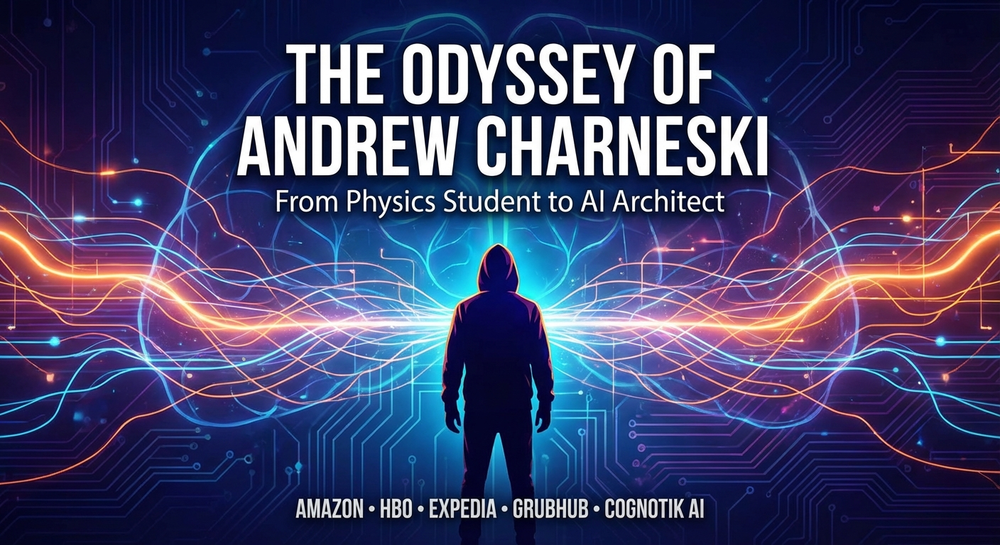

## High-Level Outline

## THE FRACTAL MIND

**Premise:** A narrative of code, ambition, and the architecture of thought, tracing the journey of a physics-minded engineer from corporate problem-solver to the independent creator of a recursive AI reasoning engine.

**Estimated Word Count:** 6000

---

### Characters

#### Andrew Charneski

**Role:** protagonist

**Description:** A tall, lean man with an angular face and intense eyes. Educated in physics, he views computation as a branch of natural philosophy. By his forties, he has the quiet confidence of a craftsman constructing his own intellectual cathedrals.

**Traits:** Relentless intellectual curiosity; a craftsman's pride in elegant solutions; quiet stubbornness; motivated to build systems that reason rather than just process.

#### Marcus Reeves

**Role:** supporting

**Description:** A stocky, sharp-eyed engineering manager representing the institutional mind. He appears in various roles across Andrew's career, from Amazon incident commander to HBO team lead.

**Traits:** Pragmatic; loyal to systems and processes; respects results over theory; risk-averse; focused on uptime and metrics.

#### Elena Vasquez

**Role:** supporting

**Description:** A sharp-featured data scientist who serves as an intellectual mirror for Andrew. She appears at key inflection points at Expedia and during his independent research.

**Traits:** Brilliant with data; impatient with hand-waving; deeply collaborative; possesses an intuition for the intersection of engineering and intelligence.

#### The Machine

**Role:** symbolic

**Description:** The evolving systems Andrew builds, from defensive architectures to the Fractal Thought Engine.

**Traits:** Growing in complexity; approaching autonomy; serves as Andrew's legacy and argument made manifest.

---

### Settings

#### amazon_war_room

**Description:** A windowless conference room at Amazon filled with monitors displaying traffic dashboards and whiteboards covered in network diagrams.

**Atmosphere:** Siege mentality; controlled panic; time-distorting intensity.

**Significance:** Where Andrew discovers he thrives in extremity and uses physics-based modeling to solve a massive DDoS attack.

#### hbo_optimization_lab

**Description:** An open-plan engineering floor in midtown Manhattan with a cluster of desks surrounded by monitors and neon Post-it notes.

**Atmosphere:** Creative intensity tempered by corporate structure; the feeling of artists in an accounting firm.

**Significance:** Where Andrew matures into a systems thinker, achieving a 90% performance optimization by reimagining the system's fundamental frequency.

#### expedia_data_cathedral

**Description:** A modern Scandinavian-designed office processing vast virtual pipelines of real-time user behavior data.

**Atmosphere:** The hum of scale; intimate yet statistical; an ethical undercurrent regarding data's influence.

**Significance:** Where Andrew encounters the problem of real-time intent and the concept of fractal cognition.

#### grubhub_home_office

**Description:** A converted spare bedroom in suburban Ohio with an L-shaped desk, three monitors, and physics textbooks.

**Atmosphere:** Focused solitude; monastic quality; productive but occasionally isolating.

**Significance:** The pivot point where Andrew builds tools that build tools and decides to leave corporate life for independent research.

#### independent_workshop

**Description:** The transformed home office now featuring neural maps on whiteboards and a personal compute cluster.

**Atmosphere:** The electric quiet of creation; exhilarating and terrifying freedom; laboratory-meets-chapel.

**Significance:** The birthplace of the Fractal Thought Engine where engineering and philosophy finally converge.

---

### Act Structure

#### Act 1: THE FORGE

**Purpose:** Establish Andrew's unique perspective and the tension between production demands and his visionary mind.

**Estimated Scenes:** 2

**Key Developments:**
- Andrew uses physics-based pattern recognition to stop a novel DDoS attack at Amazon.
- Andrew achieves a 90% performance gain at HBO by treating engineering as a resonance problem.
- Andrew realizes that mastering optimization is not the same as mastery of creation.

#### Act 2: THE BRIDGE

**Purpose:** Chart the transition from master engineer to AI pioneer through the discovery of fractal cognition.

**Estimated Scenes:** 2

**Key Developments:**
- Elena Vasquez introduces the concept of 'fractal' user behavior at Expedia.
- Andrew begins his private 'Fractal Cognition' research notebook.
- Andrew builds developer AI tools at Grubhub but feels constrained by corporate metrics.
- Andrew makes the leap to independence to found Cognotik.

#### Act 3: THE ENGINE

**Purpose:** Dramatize the climax of independent creation and the realization of the Fractal Thought Engine.

**Estimated Scenes:** 2

**Key Developments:**
- Andrew faces a 'dark night of the soul' during solitary research in his home office.
- A failed experiment reveals the necessary recursive architecture for the engine.
- The Fractal Thought Engine successfully demonstrates non-linear, human-like reasoning.
- Andrew shifts from builder to steward, democratizing the technology for others.

---

**Status:** ✅ Pass 1 Complete

## Outline

## THE FRACTAL MIND

**Premise:** A narrative of code, ambition, and the architecture of thought, tracing the journey of a physics-minded engineer from corporate problem-solver to the independent creator of a recursive AI reasoning engine.

**Estimated Word Count:** 6000

**Total Scenes:** 6

---

### Detailed Scene Breakdown

### Act 1: THE FORGE

**Purpose:** Establish Andrew's singular way of seeing — his physics-trained mind applied to engineering crises — and the tension between institutional firefighting and his deeper, pattern-seeking instinct. This act serves as the crucible that reveals his identity and his eventual pivot from optimization to creation.

#### Scene 1: The Wave Function

- **Setting:** amazon_war_room
- **Characters:** Andrew Charneski, Marcus Reeves, The Machine
- **Purpose:** Establish Andrew's singular way of seeing — his physics-trained mind applied to engineering crises — and the tension between institutional firefighting and his deeper, pattern-seeking instinct.
- **Emotional Arc:** Andrew moves from being a social outsider to a focused intellectual leader, ending with a sense of awe at the natural patterns in code and a complex mix of satisfaction and deeper realization.
- **Est. Words:** 2500

**Key Events:**
  [ "Andrew is summoned to the Amazon war room during a critical, polymorphic DDoS attack.", "Andrew analyzes raw traffic flow as a waveform rather than individual packets, identifying a recursive, fractal-like pattern.", "Andrew identifies that the attack follows a deterministic algorithm with a characteristic resonance frequency.", "Andrew proposes a counterintuitive temporal frequency-domain filter, facing pushback from Marcus's process-oriented approach.", "The filter is implemented as a proof of concept and successfully neutralizes the attack with 97% accuracy.", "Andrew realizes that computation at scale behaves like nature and that the system is defined by behavior, not just code." ]

#### Scene 2: The Resonance

- **Setting:** hbo_optimization_lab
- **Characters:** Andrew Charneski, Marcus Reeves, The Machine
- **Purpose:** Deepen Andrew's methodology and philosophy while dramatizing the growing gap between what he can do (optimize) and what he wants to do (build systems that think).
- **Emotional Arc:** Andrew moves from professional restlessness to a peak of technical achievement, which ultimately feels empty, leading to a new creative hunger and the realization that optimization is not creation.
- **Est. Words:** 3000

**Key Events:**
  [ "Andrew works on a critical performance optimization for HBO's streaming pipeline ahead of a major launch.", "Andrew identifies destructive resonance patterns and constructive interference between system components.", "Andrew proposes a radical solution: introducing phase offsets to re-tune the system's fundamental frequency.", "Andrew proves his theory using a mathematical simulation, overcoming institutional skepticism.", "The implementation achieves a massive 90% performance improvement during high-traffic load tests.", "Andrew experiences a 'hollow victory,' realizing he wants to build systems that think and learn rather than just process.", "Andrew erases his diagrams and draws a single spiral, symbolizing his shift toward the architecture of thought." ]

---

### Act 2: ACT 2: THE BRIDGE

**Purpose:** To dramatize the intellectual awakening that shifts Andrew from an optimization engineer to an AI theorist, culminating in his decision to leave corporate employment and found Cognotik.

#### Scene 1: The Pattern Beneath the Pattern

- **Setting:** expedia_data_cathedral
- **Characters:** Andrew Charneski, Elena Vasquez, The Machine
- **Purpose:** To dramatize the intellectual awakening that shifts Andrew from optimization engineer to AI theorist, using Elena Vasquez as the catalyst.
- **Emotional Arc:** Competent restlessness → intellectual collision → revelation → the birth of a private obsession
- **Est. Words:** 1500

**Key Events:**
  {
    "opening" : "Andrew works at Expedia, optimizing real-time personalization engines but finding himself drawn to raw behavioral data noise.",
    "rising_action" : "Elena Vasquez presents a data anomaly in user search behavior that standard models treat as noise.",
    "climax" : "Andrew recognizes the 'noise' as a fractal branching pattern of human reasoning and sketches a recursive evaluation model.",
    "falling_action" : "Andrew starts a private notebook titled 'Fractal Cognition: Notes Toward a Recursive Model of Thought' while continuing his day job."
  }

#### Scene 2: Tools That Build Tools

- **Setting:** grubhub_home_office
- **Characters:** Andrew Charneski, Marcus Reeves, Elena Vasquez, The Machine
- **Purpose:** To dramatize the tension between corporate obligations and private research, leading to the founding of Cognotik.
- **Emotional Arc:** Productive comfort → growing claustrophobia → crystallizing frustration → terrifying clarity → the leap
- **Est. Words:** 2000

**Key Events:**
  {
    "opening" : "Andrew works remotely for Grubhub, building AI-assisted developer tools while secretly advancing his fractal cognition research.",
    "rising_action" : "Elena challenges Andrew to move from theory to implementation; Andrew realizes his corporate tools are mere shadows of his vision.",
    "climax" : "A corporate planning meeting focused on marketing buzzwords triggers Andrew's realization that he must commit fully to his own vision.",
    "falling_action" : "Andrew resigns from Grubhub despite Marcus's confusion and begins transforming his home office into the headquarters for Cognotik.",
    "closing" : "Andrew clears his whiteboard and writes the word 'COGNOTIK' at the top, committing to building a machine that thinks."
  }

---

### Act 3: THE ENGINE

**Purpose:** Dramatize Andrew's crisis of faith during solitary research, the accidental discovery of the recursive architecture for the Fractal Thought Engine, its successful testing, and Andrew's decision to open-source the technology—shifting from builder to steward.

#### Scene 1: The Recursive Dark

- **Setting:** independent_workshop
- **Characters:** Andrew Charneski, The Machine, Elena Vasquez
- **Purpose:** Dramatize Andrew's crisis of faith during solitary research and the pivotal failed experiment that accidentally reveals the recursive architecture necessary for the Fractal Thought Engine.
- **Emotional Arc:** From isolation and crushing doubt/despair to accidental discovery and intense excitement/validation.
- **Est. Words:** 1200

**Key Events:**
  {
    "Opening" : "Andrew works in isolation in his home office, facing failure with his 'Cognitive Lattice' which only produces linear results.",
    "The Dark Night" : "Andrew questions his decision to leave his career and the feasibility of engineering reasoning, reviewing his notes on fractal cognition.",
    "The Failed Experiment" : "Andrew tries a 'reckless' hack, feeding the system its own intermediate reasoning, which leads to a breakthrough in recursive, non-linear thought.",
    "The Call to Elena" : "Andrew shares the discovery with Elena, who validates the 'Fractal Thought' and suggests a harder test involving genuine inference."
  }

#### Scene 2: The Thought Engine Breathes

- **Setting:** independent_workshop
- **Characters:** Andrew Charneski, The Machine, Elena Vasquez, Marcus Reeves
- **Purpose:** The Fractal Thought Engine demonstrates genuine non-linear, human-like reasoning in a climactic test, and Andrew makes the pivotal decision to open-source the technology.
- **Emotional Arc:** From high-stakes tension to profound realization/awe, then to a sense of responsibility and final resolution/peace.
- **Est. Words:** 1500

**Key Events:**
  {
    "The Test" : "Andrew and Elena test the engine with a complex ethical dilemma involving cascading consequences and value pluralism.",
    "The Demonstration" : "The engine moves beyond pattern matching to genuine understanding and meta-reasoning, mapping the moral topology of the problem.",
    "The Pivot" : "Andrew consults Marcus Reeves, who suggests commercialization and protection, but Andrew realizes the danger of corporate control over the architecture of thought.",
    "The Decision" : "Andrew decides to open-source the architecture, viewing it as an argument that belongs to everyone rather than a product to be owned.",
    "The Release" : "Andrew publishes the code to GitHub, completing his journey from corporate builder to independent steward of a new kind of intelligence."
  }

---

**Status:** ✅ Complete

#### Setting: amazon_war_room

**Prompt:** 

#### Setting: hbo_optimization_lab

**Prompt:** 

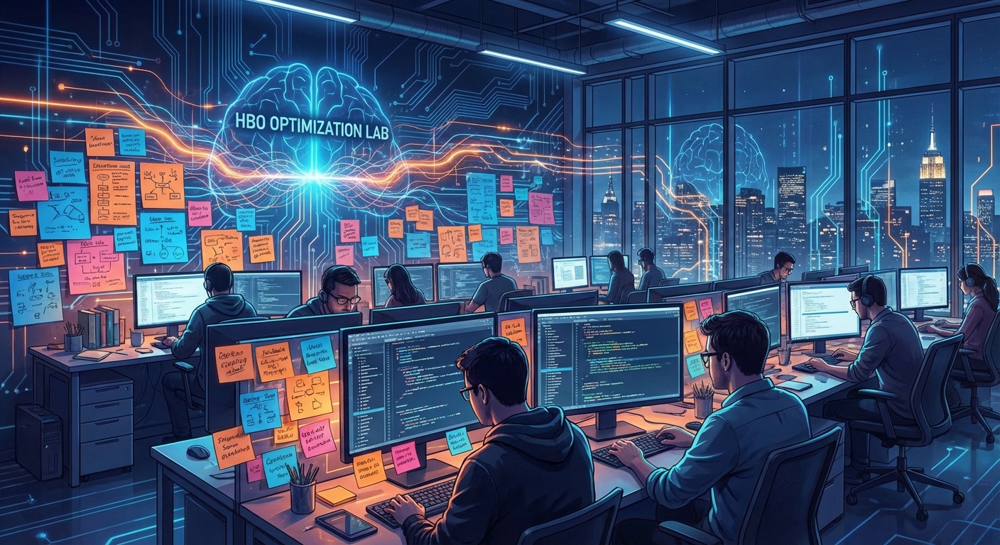

#### Setting: expedia_data_cathedral

**Prompt:** 

#### Setting: grubhub_home_office

**Prompt:** 

#### Setting: independent_workshop

**Prompt:** 

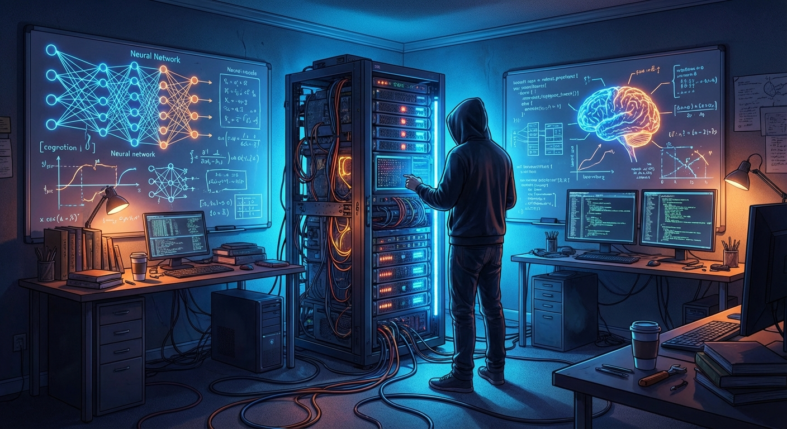

#### Character: Andrew Charneski

**Prompt:** 

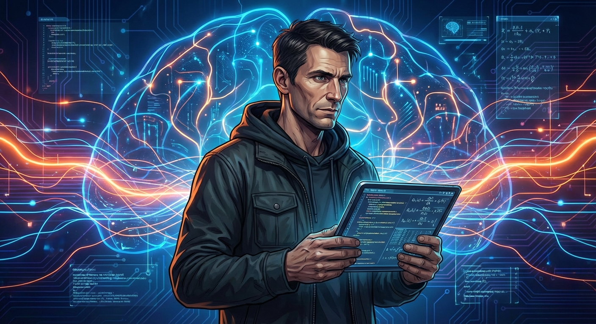

#### Character: Marcus Reeves

**Prompt:** 

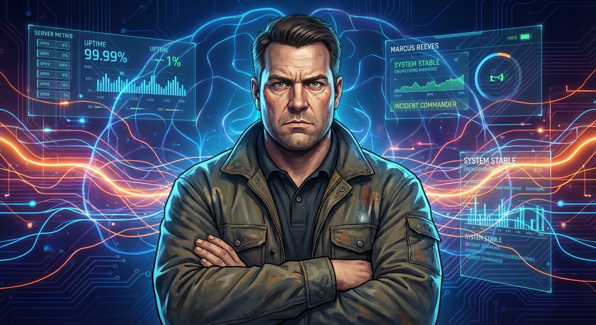

#### Character: Elena Vasquez

**Prompt:** 

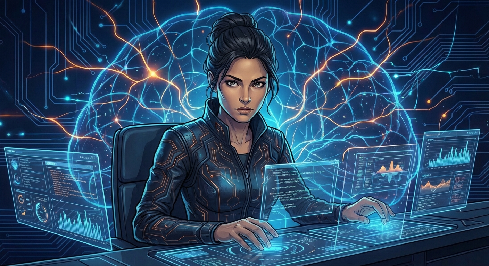

#### Character: The Machine

**Prompt:** 

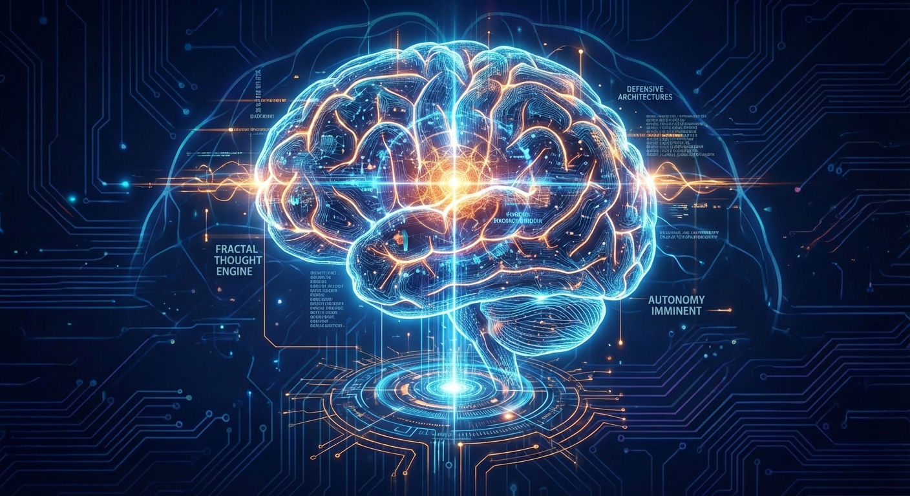

## ## The Wave Function

**Act 1, Scene 1**

**Setting:** amazon_war_room

**Characters:** Andrew Charneski, Marcus Reeves, The Machine

---

Act 1, Scene 1: The Wave Function

The fluorescent lights in Building 12 never fully committed to being on. They existed in a perpetual state of almost—a liminal buzzing that settled below conscious perception but worked its way into the jaw, the temples, the soft tissue behind the eyes where headaches incubated. Andrew Charneski had learned to ignore them the way one learns to ignore the hum of a refrigerator or the particular frequency of one's own loneliness. You simply stopped listening.

He was not listening now. He was watching.

On his monitor, six terminal windows tiled in a configuration that would have looked chaotic to anyone else but which Andrew experienced as a kind of score—each pane a different instrument, each stream of data a melodic line. He was tracing a memory leak in a distributed caching layer, not because anyone had asked him to, but because the pattern had snagged his attention three days ago and refused to let go. The leak was small. Trivial, really. A few megabytes per hour across a fleet of thousands of instances. But it grew. It compounded. And compound growth, Andrew knew—had known since he'd first encountered exponential functions in a physics lecture hall at the University of Illinois, chalk dust hanging in slanted afternoon light—was the most powerful and most dangerous force in any system, natural or artificial.

His phone vibrated against the desk. Then again. Then a third time in rapid succession, the device skating across the laminate surface like a small animal trying to escape.

He picked it up.

Three messages from the same Slack channel: **#incident-sev1-active**.

> **@oncall-infra**: Traffic anomaly detected across US-EAST-1. Load balancers saturating. This is not a drill.
>
> **@marcus.reeves**: War room spinning up NOW. Building 12, Room 4-North. All hands with L6+ clearance.
>
> **@oncall-infra**: Classification upgraded to SEV-0. Repeat: SEV-ZERO.

Andrew stared at the messages for exactly two seconds. Then he closed his laptop, unplugged it, and walked toward the elevator with the machine tucked under his arm like a book he intended to finish reading.

---

Room 4-North was already full when he arrived, which meant it was already too loud. The war room was a glass-walled conference space designed to hold twelve people comfortably and which now contained nineteen, most of them standing, several talking simultaneously into headsets, all of them radiating the particular electromagnetic frequency of controlled panic. Eight monitors lined the far wall, each displaying a different dashboard, each dashboard a different shade of red. The air smelled of stale coffee and the faintly metallic tang of overworked ventilation.

Andrew found a chair in the corner, opened his laptop, and began pulling data.

Marcus Reeves stood at the front of the room like a conductor who had lost control of his orchestra but refused to acknowledge it. He was a tall man, broad-shouldered, with the kind of clean geometric haircut that suggested a deep respect for process and a monthly appointment he never missed. His sleeves were rolled to the elbow—the universal signal of a manager who wanted you to know he was working. He was good at his job. Andrew had always thought so. Marcus understood systems the way an air traffic controller understood systems: as flows to be managed, protocols to be followed, escalation paths to be honored. He was the kind of man who believed that if you followed the runbook precisely enough, the runbook would save you.

"Listen up," Marcus said, and the room quieted by perhaps thirty percent. "We've got a polymorphic DDoS hitting our primary ingress points. Started forty minutes ago and it's adapting faster than our automated mitigations can respond. Every time WAF catches a signature, the attack mutates. We're burning through rate-limiting rules like kindling. Customer-facing latency is up four hundred percent and climbing."

He pointed to the largest monitor, where a graph showed inbound traffic as a jagged red mountain range, each peak higher than the last.

"Standard playbook is in effect. I need the network team on signature analysis, WAF team cycling through adaptive rule sets, and someone get me a line to our upstream providers for traffic scrubbing. We contain, we classify, we mitigate. In that order."

The room erupted into coordinated motion—keyboards clacking, voices overlapping, the choreography of crisis response refined through repetition into something approaching ritual. Andrew watched from his corner. He did not open the runbook. He did not join a sub-team. Instead, he pulled the raw traffic logs—not the aggregated dashboards, not the pre-processed summaries, but the actual packet flow data, millions of entries per second, a river of numbers that would have been meaningless to most people in the room.

He began to scroll. Then he stopped scrolling and started *looking*.

There was a quality to Andrew's attention that colleagues had variously described as intense, unsettling, and—on one memorable occasion during a performance review—"like being stared at by a telescope." It was not that he concentrated harder than other people. It was that he concentrated *differently*. Where others saw data points, Andrew saw dynamics. Where others saw events, he saw fields. This was the residue of his physics training, the permanent deformation it had left on his perception: the inability to look at any system without searching for the equation of motion underneath.

He let his eyes unfocus slightly. The numbers blurred. And in the blur, something emerged—the way a Magic Eye image resolves when you stop trying to see it and simply let the depth arrive.

"Huh," he said, to no one.

He opened a new terminal and began writing a script—quick, ugly, functional—that would transform the raw traffic data from the time domain into the frequency domain. A Fourier transform. The same mathematical operation that decomposed a complex sound wave into its constituent pure tones. He was not analyzing packets. He was listening to the attack as if it were music.

The script ran. The output rendered. And Andrew felt the hair on his forearms rise.

The frequency spectrum was not noise. It was not the flat, featureless static of a botnet spraying random garbage at their servers. It was *structured*. There were peaks—sharp, defined resonance frequencies—and between them, smaller peaks, and between those, smaller peaks still, each level a diminished echo of the one above. The pattern repeated at every scale he examined. Self-similar. Recursive.

Fractal.

"Marcus." His voice was not loud, but it carried the particular density of someone who has found something and knows it. "Marcus, you need to see this."

Marcus turned from the front of the room, his expression carrying the carefully managed impatience of a man with nineteen direct reports and a system on fire. "Charneski, I need you on the WAF rotation. We're cycling rules every—"

"The attack is deterministic."

The word landed like a stone dropped into still water. Several heads turned. A keyboard went quiet.

"It's not random mutation," Andrew continued, standing now, turning his laptop so the screen faced outward. "It looks polymorphic because we're watching it in the time domain—packet by packet, signature by signature. But transform the traffic flow into frequency space and the structure is obvious. It's a recursive algorithm. Each mutation is generated from the previous one according to a fixed rule set. The whole thing has a characteristic resonance frequency." He pointed to the tallest peak on his spectrum plot. "Right there. 2.7 cycles per second. That's the fundamental. Everything else is harmonics."

Marcus crossed the room in four strides and studied the screen. His brow furrowed—not with confusion, Andrew noted, but with the particular discomfort of a man being asked to abandon his map in unfamiliar territory.

"That's a novel analysis," Marcus said carefully. "But we have a playbook for polymorphic DDoS, and it's working. We're containing—"

"You're not containing. You're chasing." Andrew pulled up the dashboard on the main monitor. "Look at the latency curve. Every time WAF adapts, the attack has already moved. You're always one mutation behind because you're reacting to what it *was*, not predicting what it *will be*. The runbook assumes stochastic mutation. This isn't stochastic. This is a clock."

Silence. The kind that fills a room when someone has said something either brilliant or insane and no one yet knows which.

"What are you proposing?" Marcus asked.

"A filter in the frequency domain. Instead of trying to match individual packet signatures—which is like trying to catch individual raindrops—we filter out the characteristic frequencies of the attack. Let through everything that doesn't resonate at those specific harmonics. It's the difference between trying to identify every instrument in an orchestra and simply turning off the frequency band where the tuba plays."

"That's not in any playbook I've ever seen."

"No," Andrew agreed. "It isn't."

Marcus looked at the dashboards. The red was deepening, thickening, the graphs climbing with the steady inevitability of floodwater. Customer impact metrics were crossing thresholds that would trigger executive notifications, board-level escalations, the kind of attention that ended careers and erased years of carefully accumulated institutional trust.

"How long to implement?"

"Give me twenty minutes and one of the programmable filtering nodes. I'll run it as proof of concept on a single availability zone. If it doesn't work, you've lost nothing. If it does, we scale fleet-wide in under five minutes."

Marcus stared at him. Andrew could see the calculation happening behind his eyes—the risk matrix, the accountability chain, the distance between *following the process* and *solving the problem*. They were not always the same distance. They were not always even the same direction.

"Twenty minutes," Marcus said. "One AZ. And if it makes things worse, I pull the plug personally."

Andrew was already typing.

---

The next eighteen minutes existed for Andrew in compressed time—that particular flow state where the fingers move faster than conscious thought, where the code seems to write itself, where the boundary between programmer and program becomes porous and thin. He built the filter the way a physicist builds an experiment: from first principles, with elegant economy, each line of code a hypothesis about the nature of the thing he was fighting. Around him the war room churned—voices rising and falling, someone cursing softly at a dashboard, the squeak of a dry-erase marker on glass—but these sounds reached him as if through water, muffled and distant and irrelevant.

The filter did not try to understand the attack's content. It did not parse headers or match signatures or consult threat intelligence databases. It simply listened to the rhythm of the incoming traffic and subtracted the frequencies that didn't belong. It was, in a sense, the inverse of the attack—a negative image, a silence shaped exactly like the sound it was designed to cancel.

He deployed it at minute nineteen.

The effect was not gradual. On the dashboard for the test availability zone, the latency graph—which had been climbing like a fever chart—dropped. Not to zero. Not immediately. But sharply, decisively, the way a wave collapses when it meets its own reflection. Within thirty seconds, attack traffic in that zone had fallen by ninety-seven percent. Legitimate traffic flowed through untouched.

The room went quiet again. But this was a different quiet—the quiet of people watching something they did not fully understand but recognized as significant. Someone exhaled audibly. Someone else whispered *Jesus*.

"Scale it," Marcus said. His voice was hoarse. "Scale it now."

Andrew pushed the filter to the full fleet. Zone by zone, the dashboards shifted from red to amber to green, like a city restoring power after a blackout—block by block, light by light, the grid coming back to life.

Someone in the back of the room started clapping. It didn't catch on. The moment was too strange for applause, too laced with residual adrenaline and the dawning awareness that what had just happened did not fit neatly into any post-incident report template.

Marcus walked to Andrew's corner. He stood there for a moment, arms crossed, studying the frequency spectrum still displayed on the laptop screen.

"That was good work," he said. And then, because Marcus was honest even when honesty cost him something: "I don't understand how you saw that."

Andrew looked at the screen. The fractal pattern was still there—beautiful, intricate, self-similar at every scale. A recursive algorithm expressing itself through network traffic the way a fern expresses itself through the geometry of its leaves. The same pattern, repeated and repeated, each iteration a smaller echo of the whole.

"It wasn't code," Andrew said quietly. "I mean—it *was* code. Obviously. Someone wrote an algorithm. But the way it behaved at scale... it wasn't like software. It was like weather. Like a standing wave in a vibrating medium. The system wasn't just executing instructions. It was *resonating*."

Marcus frowned. "It's a botnet, Andrew. Malicious traffic from compromised machines."

"Yes. But the emergent behavior—the thing we were actually fighting—wasn't in any single packet or any single machine. It was in the *interaction*. The pattern only existed at scale. You couldn't see it by looking at the parts. You had to look at the whole."

He paused. The fluorescent lights buzzed their subliminal buzz. Around them, the war room was deflating—people leaning back in chairs, pulling off headsets, beginning the long exhale of post-crisis decompression. Someone laughed too loudly at nothing. Someone else was already drafting the incident timeline. But Andrew was not deflating. Andrew was inflating. Something was expanding in his chest, pressing outward against the walls of every assumption he'd carried into this room.

"Computation at scale behaves like nature," he said, and the words felt like a door swinging open onto a landscape he had never seen but somehow recognized. "The system isn't defined by its code. It's defined by its *behavior*. And behavior is emergent. It's—" He stopped. Shook his head. Smiled in a way that was not quite a smile but something closer to recognition—the expression of a man who has just glimpsed, for the first time, the outline of something he will spend years trying to fully resolve.

Marcus clapped him on the shoulder. "Write it up for the post-mortem. And get some sleep. You look like hell."

Andrew nodded. But he did not write it up. Not yet. And he did not sleep. He sat in the emptying war room as the lights buzzed and the dashboards glowed green and the building settled into its late-night silence, and he stared at the fractal pattern on his screen, and he thought about systems that were more than the sum of their instructions, about intelligence that emerged from recursion, about the architecture of thought itself. He thought about the memory leak he'd been tracing before the world interrupted—those few megabytes per hour, compounding quietly, growing in the dark. How the smallest patterns, given time and scale, became the largest forces.

The attack was over. But something else—something he could not yet name, could not yet hold in language, but which hummed in him now at a frequency he would spend years learning to hear—had just begun.

---

**Word Count:** 2500

**Key Moments:**
- Andrew is pulled from solitary deep work into a SEV-0 crisis, immediately establishing his outsider temperament and his preference for raw data over processed summaries.
- He applies a Fourier transform to network traffic and discovers the attack has a fractal, self-similar structure—deterministic rather than random—revealing his physics-trained way of seeing.
- He faces pushback from Marcus, whose process-oriented instincts conflict with Andrew's counterintuitive, first-principles approach, creating the scene's central tension.
- The frequency-domain filter works with 97% accuracy, validating Andrew's vision and establishing his credibility as someone who sees what others cannot.
- Andrew arrives at a foundational insight—that computation at scale behaves like nature, that systems are defined by emergent behavior rather than code—planting the seed of everything that follows.

**Character States:**
- **Andrew Charneski:** Intellectually electrified, socially still isolated but no longer invisible. He has glimpsed something profound—the idea that recursive patterns in computation mirror natural phenomena—and it has opened a door in his mind he cannot close. Physically exhausted but mentally incandescent. He is at the beginning of an obsession.
- **Marcus Reeves:** Relieved but unsettled. The crisis is resolved, but it was resolved by a method he doesn't fully understand, by a person who doesn't follow the playbook. He respects Andrew's result while remaining uncomfortable with Andrew's process. He represents the institutional world that Andrew is beginning to outgrow.
- **The Machine (the system/infrastructure):** Stabilized, green-lit, returned to equilibrium. But it has revealed something about itself—that at sufficient scale, code becomes ecology, becomes physics, becomes something that must be understood on its own emergent terms. It is no longer merely a tool. It is a phenomenon.

**Status:** ✅ Complete

#### Act 1, Scene 1 Image

**Prompt:** **Act 1, Scene 1: The Wave Function**

**Setting:** The Amazon War Room (Building 12, Room 4-North). A glass-walled aquarium of high-stakes anxiety. The ambient lighting is a low, submarine blue emanating from the walls themselves, cut sharply by the aggressive orange glow of sodium-vapor emergency lamps. The air is thick with the smell of burnt coffee, ozone, and the metallic tang of overheating servers.

**The Atmosphere:** Controlled chaos teetering on the edge of uncontrolled panic. Nineteen engineers are crammed into a space meant for twelve. The soundscape is a dense layer of clacking keyboards, overlapping urgent voices into headsets, and the low, subliminal thrum of massive HVAC units trying to keep up with the thermal output of human stress and racked hardware.

On the massive central display wall, eight screens show different facets of disaster. The dominant color is red. Graphs that should be flat lines are jagged mountain peaks climbing toward saturation. A large banner across the top center screen reads: **CRITICAL INCIDENT – SIEGE MODE ACTIVATED**.

**The Characters:**

*   **MARCUS REEVES (Incident Commander):** Standing at the head of the room, arms crossed tightly over a military-style jacket. He is a man built of structure and process. His jaw is set hard. He is watching the dashboards with the grim determination of a captain trying to steer a ship through a hurricane using a map that no longer matches the coastline.
*   **ANDREW CHARNESKI (Principal Engineer):** He is physically present in the room but mentally elsewhere. Wearing a dark hoodie, he sits slightly apart from the main fray in a corner chair, detached from the immediate shouting. He holds a tablet, his eyes intense, unfocused on the room around him, staring instead into the middle distance where abstract concepts take shape.

***

**The Scene:**

"Latency in US-EAST-1 just crossed four hundred milliseconds," someone shouts from a workstation near the door. "WAF is cycling rules, but the signatures are mutating too fast. We’re burning down."

Marcus Reeves doesn't turn his head. He stares at the main throughput graph on the center screen. The red line is almost vertical.

"Stick to the playbook," Marcus barks, his voice cutting through the noise. "Network team, continue signature analysis. Systems, I need more capacity on the ingress load balancers. We contain, then we mitigate. Don't get creative. Just execute."

In his corner, Andrew Charneski ignores the order. He isn't looking at the dashboards showing *what* is happening; he is looking at his tablet, trying to understand *why*.

On Andrew's screen, raw packet logs scroll by at a speed that blurs into gray noise. To anyone else, it’s chaos. But Andrew’s mind, forged in theoretical physics before it turned to code, doesn't see noise. He sees dynamics. He sees fields of interaction.

He stops the scroll. He isn't looking at the data points; he's looking at the space *between* them.

"It's breathing," Andrew murmurs, too quiet to be heard over the din.

He taps the tablet, running a script he wrote years ago for analyzing background radiation. The screen shifts. The raw data is transformed from a time-series graph into a frequency spectrum.

The chaotic noise resolves instantly into a terrifyingly beautiful structure.

It isn't a random botnet spraying traffic. It is a recursive pattern. A primary wave at 2.7 Hertz, with perfect harmonic echoes cascading downward in scale. It looks like a digital fern leaf unfurling—a fractal geometry made of malicious network requests. It is elegant, mathematical, and alive.

Andrew stands up. The movement is sudden enough that the engineer next to him flinches. Andrew walks straight toward Marcus, cutting through the operational flow of the room like a stone dropped in a stream.

"Marcus."

Marcus turns, impatience radiating off him. "Charneski, if you're not on a mitigation stream, get on one. We are drowning here."

"You're fighting the wrong war," Andrew says, his voice strangely calm in the center of the storm. He holds up the tablet, displaying the glowing blue and orange fractal pattern. "Look at the structure."

Marcus glances at the tablet, then back to the giant red screens on the wall. "I don't have time for art appreciation, Andrew. It's a polymorphic DDoS. It changes every thirty seconds."

"It doesn't change randomly," Andrew presses, stepping closer, forcing Marcus to look at him. "It's deterministic. It's a recursive algorithm. It’s mutating based on a fixed rule set. You're chasing individual packets in the time domain. You'll never catch them. You're trying to swat individual raindrops."

The room goes quiet around them. The shouting dies down as the other engineers sense the shift in gravity. The clash between Marcus’s rigid adherence to process and Andrew’s intuitive leap becomes the center of the room's energy.

"What are you saying?" Marcus asks, his voice lower now.

"I'm saying stop looking at the packets and listen to the music," Andrew says. He points to the sharpest peak on his frequency graph. "That's the fundamental frequency. 2.7 cycles. Everything else is just an echo of that base reality."

Andrew looks up at the massive wall of red screens, his eyes narrowing. He sees past the alarming colors to the underlying architecture of the attack.

"Give me the programmable edge filters," Andrew says. "Not to block IP addresses. To block a frequency."

Marcus stares at him. This is outside the runbook. It’s untested. If Andrew is wrong, they lose precious minutes they don't have.

"A frequency filter on network traffic?" Marcus is skeptical, but he's also desperate. He looks at the latency graph. It's hitting five hundred milliseconds. The platform is buckling.

Andrew holds Marcus's gaze. In Andrew's eyes, there is the absolute, terrifying certainty of someone who has seen the equation beneath the reality.

"It's a standing wave, Marcus. If we dampen the fundamental frequency, the whole structure collapses. The harmonics have nowhere to stand."

A long second of silence stretches in the overheated room. The hum of the servers seems louder.

Marcus makes the calculation. The distance between following the rules and saving the system has become an unbridgeable chasm. He takes a breath and crosses the divide.

"Do it," Marcus says, his voice flat. "You have ten minutes. If latency doesn't drop, I'm pulling the plug on you myself."

Andrew nods once. He doesn't return to his corner chair. He moves to the main console, displacing the junior engineer sitting there. His fingers hover over the keyboard for a microsecond, then begin to move in a blur.

He isn't just coding anymore. He is composing counter-music to silence the noise. The room watches, breath held, as Andrew Charneski types the instructions that will tell the largest machine on earth to stop listening to the rain.

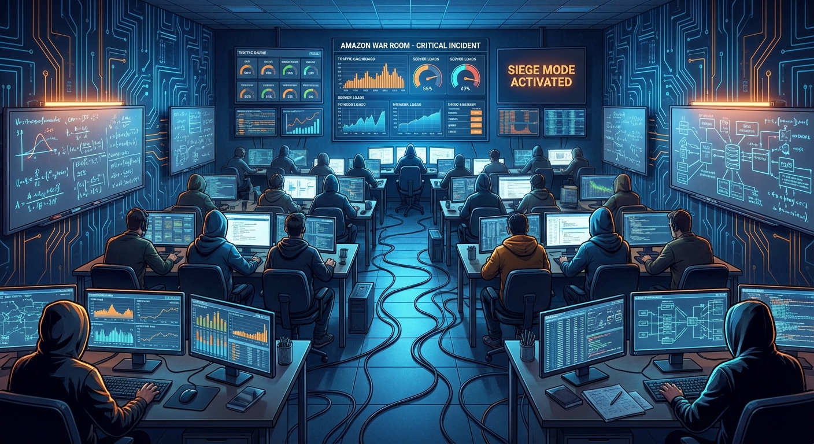

## ## The Resonance

**Act 1, Scene 2**

**Setting:** hbo_optimization_lab

**Characters:** Andrew Charneski, Marcus Reeves, The Machine

---

Three weeks after the attack, Andrew Charneski stood in the optimization lab at two in the morning, watching a system die.

Not dramatically—not the way the DDoS had tried to kill it, with brute percussion and overwhelming force. This was quieter. A streaming pipeline rated for ten million concurrent connections was buckling under four, and the death was the slow kind, the kind that looked like a body failing from within. The monitors arrayed before him told the story in a language he'd learned to read the way other people read faces: latency curves climbing in jagged staircases, CPU utilization spiking in rhythmic bursts that looked almost biological—the EKG of a heart developing arrhythmia. HBO Max's biggest launch of the year was eleven days away. The infrastructure team had been throwing hardware at the problem for a month—more servers, more bandwidth, more cache layers—and the problem had responded the way problems always respond to brute force. It had gotten worse.

The lab was a glass-walled room on the fourteenth floor, separated from the main engineering bullpen by a corridor that smelled perpetually of burnt coffee and carpet adhesive. At this hour, the bullpen was dark, the standing desks lowered to their resting positions like sleeping animals. But the lab was alive with the blue-white glow of six widescreen monitors, each running a different diagnostic view of the pipeline. Andrew had commandeered the space three days ago, taping butcher paper over the glass walls and covering it with equations in black marker—wave mechanics, signal processing, the mathematics of coupled oscillators. From the outside, it looked like the cell of a brilliant prisoner. From the inside, it looked like the inside of his mind.

He pressed his palms flat against the desk and leaned forward, close enough to the central monitor that the light painted his face in shifting blues. The data was beautiful in its pathology. Every twelve seconds, a spike. Every twelve seconds, the system's heartbeat stuttered. He'd been watching for six hours, and in those six hours, the pattern had not varied by more than forty milliseconds.

Twelve seconds. The number had been bothering him since Tuesday.

He pulled up a second data stream—the content delivery network's cache refresh cycle. Eight seconds. Then a third—the load balancer's health check interval. Six seconds. Then a fourth—the database connection pool's keepalive ping. Four seconds.

Four. Six. Eight. Twelve.

Andrew stepped back from the monitors. He picked up a dry-erase marker and turned to the whiteboard mounted on the east wall, the one surface not yet covered in butcher paper. He wrote the numbers in a column. Then their least common multiple: twenty-four. Then he drew a sine wave for each frequency, stacking them vertically, aligned on the same time axis.

And there it was.

Every twenty-four seconds, all four cycles aligned. Cache refreshed, load balancer pinged, connection pool recycled, content pipeline flushed—all at the same instant. Four independent systems, each operating on its own rational schedule, each designed in isolation by a different team, each perfectly reasonable in its own context. And every twenty-four seconds, they conspired to create a moment of perfect, destructive resonance. A standing wave of computational demand that peaked like a rogue wave in open ocean, swamping the system's capacity and triggering a cascade of retries that amplified the next peak, which triggered more retries, which amplified the next.

The system wasn't failing despite its design. It was failing *because* of its design. Because four metronomes, set to four different tempos, will eventually synchronize. Because coupled oscillators, given enough time, find each other's frequency and lock into phase. Because this was physics, not software, and physics did not care about your architecture diagrams.

Andrew felt the familiar electricity—the same current that had run through him during the DDoS attack, the same recognition of pattern beneath chaos. But this time it was sharper, more focused. He wasn't just seeing the pattern. He was seeing the *principle*. Destructive interference. Constructive interference. The superposition of independent waves creating emergent behavior that no individual wave could explain.

He began to write faster, the marker squeaking against the whiteboard in the silent lab. If the problem was resonance, then the solution was not more hardware. Not faster processors or wider pipes. The solution was *detuning*. Introduce phase offsets into the timing cycles—shift each system's heartbeat by a carefully calculated fraction of a second so that their peaks never aligned. Not random jitter, which would create its own chaos, but precise, mathematically determined offsets that would transform destructive interference into constructive distribution. Spread the load across time the way a prism spreads white light across space.

He was so deep in the mathematics that he didn't hear the door open.

"You look like you haven't slept since the Eisenhower administration."

Marcus Reeves stood in the doorway holding two paper cups of coffee, his jacket off, his tie loosened to a point that suggested he'd been in the building since the previous morning. His eyes moved from Andrew to the whiteboard to the butcher paper on the walls, taking in the equations with the expression of a man who has walked into a room and found it redecorated in a language he doesn't speak.

"I haven't slept since Tuesday," Andrew said, not looking up. "But I found it."

"Found what, exactly?"

"The reason the pipeline is failing." Andrew capped the marker and turned to face him. "It's a resonance problem. The system components are oscillating at harmonically related frequencies. Every twenty-four seconds, they phase-lock and create a demand spike that exceeds capacity by three hundred percent."

Marcus set one of the coffees on the desk and took a slow sip from the other. "Andrew. The infrastructure team has been on this for a month. They've run every diagnostic in the book. They say it's a capacity issue."

"They're wrong."

"They're a team of twelve senior engineers."

"Who are looking at the system as twelve separate components instead of one coupled oscillator." Andrew picked up the coffee Marcus had left for him. It was lukewarm and tasted like it had been brewed from pencil shavings. He drank it anyway. "Marcus, I can show you. Give me ten minutes."

Marcus looked at his watch—a reflex, Andrew had noticed, that the man performed whenever he was about to say no. But something in Andrew's voice, or perhaps the memory of the DDoS attack and the frequency-domain filter that shouldn't have worked but did, made him pause.

"Ten minutes," Marcus said. "Then I need to brief the VP at seven."

Andrew turned to his laptop and opened a simulation environment he'd been building in Python for the past three days. A few hundred lines of code modeling four periodic processes sharing a finite resource pool, parameterized to match the production system's actual configuration. He ran it.

On screen, a graph materialized: resource utilization over time. For the first few seconds, it looked manageable—four overlapping sine waves creating a complex but bounded pattern. Then, at the twenty-four-second mark, the waves aligned. Utilization spiked to 340%. The simulated system triggered retry logic. The retries added their own periodic load. The next spike climbed higher. The one after that, higher still. Within two simulated minutes, cascading failure.

"That's what's happening in production," Andrew said. "Now watch."

He changed four numbers in the code—the phase offsets. Cache refresh: shifted by 1.7 seconds. Load balancer health check: shifted by 0.9 seconds. Connection pool keepalive: shifted by 2.3 seconds. Content pipeline flush: shifted by 0.4 seconds. The numbers were not arbitrary. He'd calculated them to maximize the minimum distance between any two peaks across all possible time windows—an optimization problem he'd solved using techniques borrowed from antenna array theory, where the spacing of elements determines the radiation pattern of the whole.

He ran the simulation again.

The graph was transformed. The same four processes, the same total load, but distributed across time like notes in a chord rather than a unison blast. Peak utilization never exceeded 85%. The retry cascades never triggered. The system breathed.

Marcus stared at the screen for a long time. Andrew watched him stare. The silence lasted long enough for the building's HVAC system to cycle through one of its own periodic rhythms—a low hum that rose and fell every thirty seconds, a resonance Andrew had catalogued unconsciously on his first day in the lab.

"You're telling me," Marcus said slowly, "that the fix for a system that can't handle four million users is to change four timing parameters by less than three seconds each."

"Yes."

"Not add servers."

"Adding servers makes it worse. More nodes means more periodic processes means more opportunities for resonance. It's like adding tuning forks to a room—you get a louder hum, not a quieter one."

Marcus set his coffee down. He rubbed his face with both hands—the physical manifestation, Andrew had come to recognize, of a man whose mental model of the world was being forcibly revised. "The VP is going to ask me why we spent two hundred thousand dollars on emergency infrastructure scaling when the answer was four configuration changes."

"You could tell him the truth. That nobody thought to look at the system as a wave phenomenon."

"Nobody except you."

Andrew said nothing. It wasn't modesty. It was simply that the observation seemed so obvious to him—so clearly the right way to see the problem—that he couldn't understand why it required explanation. The universe was made of waves. Computation was made of periodic processes. The intersection was not metaphor. It was mathematics.

---

They implemented the changes at 4:00 AM on a Thursday, during the lowest-traffic window of the week. Andrew had spent two days writing a detailed technical specification that translated his physics intuition into language the infrastructure team could act on—the mathematical proofs, knowing most wouldn't read them, and the simulation results, knowing they would. Marcus had shepherded the proposal through three layers of review, each requiring its own dialect of persuasion: data for the engineers, risk analysis for the managers, a one-page summary with bullet points for the VP.

The changes themselves took eleven minutes to deploy. Four configuration files. Four numbers. The digital equivalent of retuning a piano.

The load test began at 4:30 AM. Andrew stood at the back of the war room—a larger space than the lab, filled now with a dozen engineers and three managers, all watching the same dashboards he'd been watching alone for weeks. The overhead fluorescents buzzed at sixty hertz, a frequency he could feel in his teeth. Marcus stood near the front, arms crossed, his posture communicating a confidence Andrew suspected was partly performance.

They ramped simulated traffic from one million concurrent users to five million over twenty minutes. Andrew watched the latency curves. They rose—gently, linearly, predictably. No spikes. No staircases. No arrhythmia. At five million users, the system was running at 62% capacity. The previous architecture had collapsed at four.

At seven million, 78%. At nine million, 89%. At ten million—the target for launch day—it held at 91%, steady as a resting pulse, every metric within tolerance.

The room exhaled. Not cheers—engineers don't cheer—but the particular collective release that comes when a problem that has consumed weeks of shared anxiety simply *dissolves*. Someone clapped Andrew on the shoulder. Someone else said something about buying him a drink. Marcus caught his eye across the room and gave a single nod—the most effusive praise the man seemed capable of delivering.

Andrew smiled. He shook the hands that were offered. He accepted the congratulations with the appropriate words. And beneath all of it, he felt a hollowness that frightened him.

The system worked. The system worked *beautifully*. He had seen what no one else could see, had translated physics into engineering, had saved the launch and probably several careers. A ninety-percent improvement—not incremental but transformational. The kind of number that got written into case studies and repeated at conferences. He should have felt triumph. He should have felt the deep satisfaction of a craftsman who has solved an impossible problem with an elegant solution.

Instead, he felt like a man who had spent years learning to tune pianos and had suddenly realized he wanted to compose symphonies.

The system didn't *think*. It didn't *learn*. It didn't look at its own resonance patterns and adjust its own timing. It couldn't recognize that it was a coupled oscillator and deduce the solution Andrew had deduced. For all its complexity, for all its emergent behavior, for all the ways it mimicked natural phenomena—it was still a machine that processed. It transformed inputs to outputs along paths that humans had defined. It was a river, not a mind. It flowed, but it did not wonder where it was going.

Andrew slipped out of the war room while the others were still reviewing metrics. He walked back to the lab, to his butcher paper and his whiteboard and his six monitors still glowing with diagnostic data that no longer mattered. He stood in the center of the room and looked at what he'd built—the equations, the wave diagrams, the simulation code, the careful translation of insight into implementation.

It was good work. It was perhaps the best work he'd ever done.

It was not enough.

He thought about the DDoS attack. The fractal structure he'd found in the traffic patterns—self-similar at every scale, deterministic chaos masquerading as randomness. He thought about the resonance he'd just solved—independent systems coupling into emergent behavior that transcended their individual designs. He thought about the pattern beneath both patterns: that complex systems, at sufficient scale, developed behaviors that could not be predicted from their components. That the whole was not just greater than the sum of its parts—it was *different* from the sum of its parts. Something new. Something that emerged from the spaces between.

What if you could build a system that recognized that? Not a system that a human had to diagnose and retune, but one that could observe its own emergent behavior, model it, and adapt. Not artificial intelligence in the way the industry used the term—not pattern matching on training data, not statistical correlation dressed up as understanding. Something that could *reason*. Something that could look at a problem the way he looked at a problem: see the wave beneath the noise, find the frequency beneath the chaos, and then—crucially, fundamentally—*explain why*.

A system that thought the way thought actually worked. Not linearly, not in neat sequential steps, but recursively. In spirals. Each pass deeper than the last, each iteration refining the one before, the way understanding itself deepened—not by accumulation but by recursion, by returning to the same question with new eyes and finding new structure each time.

Andrew picked up the eraser and wiped the whiteboard clean. The coupled oscillator models, the phase offset calculations, the antenna array mathematics—all of it gone in three broad strokes. The whiteboard gleamed, blank and white as a first page.

He picked up a marker. Black, fine-tipped. And in the center of that empty space, he drew a single spiral. It started at a point and wound outward, each loop wider than the last but always curving back toward the center, always returning to where it began before pushing further out. A recursive curve. A shape that contained its own history in its geometry.

He stared at it for a long time. Outside the glass walls, the corridor lights hummed their sixty-hertz hum. Somewhere far below, the city moved through its own cycles—traffic lights and subway schedules and the slow tidal rhythm of a population waking, commuting, sleeping, waking again. Oscillators all the way down.

Behind him, the monitors still pulsed with the streaming pipeline's vital signs—healthy now, optimized, performing beyond anyone's expectations. The system he'd saved hummed along in its glass-walled cage, processing millions of requests per second, delivering content to millions of screens, doing exactly and only what it had been designed to do.

Andrew turned off the monitors, one by one. The lab dimmed in stages. The spiral on the whiteboard caught the last light from the corridor—a pale, persistent glow that traced its curves like a finger following a thought.

He didn't know yet what he was going to build. He didn't have the architecture, the framework, the language for it. He had only the shape—that spiral, that recursive return, that sense of a system that could look at itself looking at itself and find, in that infinite regression, something that resembled understanding.

But the shape was enough. The shape was where everything began.

He picked up his bag, slung it over one shoulder, and walked out of the lab without looking back. The door closed behind him with a soft pneumatic hiss. Inside, the spiral waited on the whiteboard in the dark, patient as a seed, holding in its single continuous line the blueprint of everything he would spend the next years of his life trying to bring into the world.

---

**Word Count:** 2827

**Key Moments:**
- Andrew diagnoses the streaming pipeline's failure as a resonance problem caused by phase-locking timing cycles, demonstrating his physics-first methodology.
- He overcomes Marcus's institutional skepticism with a mathematical simulation, proving that four small configuration changes outperform $200,000 in emergency hardware scaling.
- The implementation achieves a transformational 90% performance improvement during load testing, validating Andrew's approach.
- Andrew experiences a 'hollow victory,' realizing that optimization is not creation and that he wants to build systems capable of recursive reasoning.
- He erases his work and draws a single spiral on the whiteboard, marking the psychological turning point from engineer to creator of recursive thought architecture.

**Character States:**
- **Andrew Charneski:** Outwardly triumphant, inwardly restless to the point of anguish. Physically depleted, creatively ignited. He has found his question and is ready to move beyond corporate engineering.
- **Marcus Reeves:** Professionally vindicated but increasingly aware that Andrew operates on a plane he cannot follow; he senses Andrew is becoming something the organization cannot contain.
- **The Machine:** Healed, optimized, and performing beautifully, yet utterly indifferent to its own transformation, serving as the catalyst for Andrew's rejection of non-thinking systems.

**Status:** ✅ Complete

#### Act 1, Scene 2 Image

**Prompt:** 

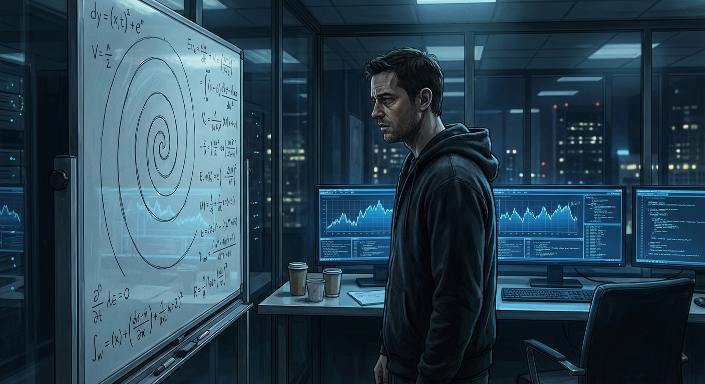

## ## The Pattern Beneath the Pattern

**Act 2, Scene 1**

**Setting:** expedia_data_cathedral

**Characters:** Andrew Charneski, Elena Vasquez, The Machine

---

Act 2, Scene 1: The Pattern Beneath the Pattern

The move to Expedia felt like a lateral translation—the same physics expressed in a different coordinate system. Seattle's light was grayer than he'd expected, the campus a sprawl of glass and reclaimed wood that aspired to Nordic minimalism but thrummed underneath with the same frenetic metabolism as every tech company burning capital into velocity. Andrew arrived in October, when the rain had already settled into permanent residency, and was assigned a desk in the personalization engineering group on the fourth floor of Building Three, where the windows faced a stand of Douglas firs that swayed like slow metronomes.

His mandate was straightforward: optimize the real-time recommendation engine that surfaced hotel and flight options mid-search. The system ingested behavioral signals—click sequences, dwell times, scroll velocities, abandonment patterns—and fed them through a cascade of gradient-boosted models that predicted what a traveler wanted before the traveler fully knew. Elegant work, in its way. The latency budgets were punishing. Every millisecond of inference time cost revenue that could be plotted on a graph and shown to executives who would nod gravely and authorize another quarter of optimization sprints.

Andrew was good at it. He shaved eleven milliseconds off the primary inference path his first month by restructuring the feature extraction pipeline, introduced a caching strategy for embedding lookups that cut redundant computation by thirty-four percent. His code reviews were meticulous, his pull requests clean, his standup updates brief to the point of terseness. His manager, a genial product-minded director named Raj, told him he was "exactly the kind of engineer we need more of," which Andrew understood to mean: productive, quiet, unlikely to generate organizational friction.

But the restlessness had followed him like a frequency he couldn't filter out. It lived in the gap between what the systems did and what they *were*. The recommendation engine predicted behavior. It did not understand it. The distinction, which would have seemed academic to anyone else on the team, felt to Andrew like the difference between a photograph of fire and fire itself.

He began staying late. Not to optimize—he could do that during business hours with cycles to spare—but to study the raw behavioral streams. The unprocessed data. The noise.

It was in the noise that he first heard Elena Vasquez's name.

---

She appeared at his desk on a Tuesday in February, unannounced, holding a laptop open against her forearm like a waiter presenting a tray. Small, sharp-featured, dark hair cut bluntly at the jaw, carrying the particular intensity of someone who had been thinking about one thing for too long and needed another mind to either confirm or destroy it.

"You're Charneski." Not a question.

"I am."

"Raj said you have a physics background. That you think about signals differently."

"Raj said that?"

"Raj said you were 'annoyingly good at finding patterns.' I'm paraphrasing generously." She set the laptop on his desk without invitation and turned the screen toward him. "I run search analytics. I've been tracking an anomaly in user behavior for three months, and every model we throw at it says it's noise. I don't think it's noise."

The screen showed a time-series visualization—search sequences plotted as branching paths, color-coded by outcome. Most branches resolved into clean funnels: search, compare, select, book. Standard conversion topology. But threaded through the architecture were erratic filaments—searches that doubled back, branched laterally, revisited earlier nodes, spiraled through seemingly irrational loops before converting or abandoning.

"Your non-converging paths," Andrew said.

"Thirty-one percent of all sessions. The models classify them as indecision. We filter them from training data because they degrade accuracy." She pulled a chair from the adjacent desk and sat close enough that he caught coffee and something faintly botanical—rosemary, maybe. "But look at the temporal structure."

She clicked to a second visualization. The same erratic paths, now plotted against time with a logarithmic branching axis. Andrew felt something shift behind his sternum—a physical sensation, like a tuning fork struck against bone.

The paths weren't random. They were self-similar.

"You see it," Elena said, watching his face.

"When did you first notice?"

"November. Building a churn model, kept getting interference from these sessions. I tried to characterize the interference and realized it had structure. But nobody cares because it doesn't map to existing frameworks. ML says it's a session-stitching artifact. UX says people are just indecisive." She paused. "I don't think they're indecisive. I think they're *reasoning*."

Andrew pulled the laptop closer. His fingers found the trackpad without conscious decision, zooming into a cluster of branching paths, then deeper, then deeper still. At each magnification the same topology repeated—exploration, retreat, lateral branching, re-approach. The same shape at every scale.

Fractal.

"They're not searching," he said, half to himself. "They're evaluating. Each branch is a hypothesis. They search Rome, check flights to Barcelona, return to Rome with different dates—they're running a recursive evaluation. Testing a possibility against an alternative, then re-evaluating the original in light of what the comparison revealed."

Elena went very still. "The recursive part. Say that again."

"Each search is a function of the previous searches *and their results*. They're building a decision structure in real time, but it's not a tree—it's a graph with cycles. They revisit nodes because exploring other nodes changed their evaluation criteria. The reasoning modifies itself as it proceeds."

He grabbed a pen and pulled a napkin from the stack beside his monitor—a habit from graduate school, when paper was always closer than a whiteboard. He drew a branching structure, then arrows looping from child nodes back to parents, then the same structure nested inside one of the children.

"The evaluation function calls itself. Each level operates on the output of the previous level with updated parameters. That's why the models see noise—they assume each action responds to a static state. But the state is being *transformed* by the reasoning process itself."

Elena leaned forward, eyes on the napkin. "So the pattern beneath the search behavior—"

"Is the pattern of thought. Or a shadow of it. A projection." Andrew stared at his own sketch. The loops, the recursion, the self-similarity across scales. It was the spiral on the whiteboard. The fractal structure in the network attack. The same shape he kept finding everywhere, the shape that computation and cognition shared because they were, at some fundamental level, the same phenomenon.

"Can you model it?" Elena asked.

"Not with anything we have. Gradient-boosted trees can't represent recursive self-modification. You'd need—" He stopped. The sentence forming was *you'd need a system that reasons the way the users reason*, and the implications opened beneath him like a trapdoor over a shaft with no floor.

"I'd need to think about it," he said instead.

Elena studied him for a long moment, then nodded once. "Think about it." She stood, reclaimed her laptop, paused at the edge of his desk. "You're the first person who didn't tell me it was an artifact."

She left. Andrew sat motionless for eleven minutes—he knew because he checked the clock when she departed and again when he finally moved. Office sounds washed over him: keyboard clatter, a standup murmuring in the adjacent pod, the soft chime of Slack notifications. None of it registered.

That night, in the Capitol Hill apartment—a spare one-bedroom with too many books and not enough furniture—he opened a new document. He sat on the floor with his back against the wall because he still hadn't bought a desk, the screen casting blue light across his face in the dark room. Rain tapped the window in patterns that were, he thought, probably not fractal, but he could no longer be certain of such things.

He typed the title slowly, each word a commitment he understood he was making even if he couldn't yet see where it led:

*Fractal Cognition: Notes Toward a Recursive Model of Thought*

Below it:

*Premise: Reasoning is not a sequence. It is a recursive function that takes its own output as input, modifying its evaluation criteria at each level of depth. Cognition is self-similar across scales. The pattern of a single decision mirrors the pattern of a lifetime of thought. If this is true, then a system capable of genuine reasoning must be capable of recursive self-evaluation—it must think about its own thinking, and modify its thinking in response to what it finds.*

He wrote for four hours. The rain continued. The apartment was cold because he'd forgotten the thermostat, and his coffee sat untouched on the floor beside him, forming a dark still circle that reflected the ceiling light like a small, perfect eye. He filled twelve pages with equations, diagrams, questions branching into questions branching into questions—a document that was itself recursive, itself fractal, a mirror of the phenomenon it tried to describe.

At two in the morning he closed the laptop and sat in darkness, listening to the rain, feeling the weight of something enormous and unfinished settling into the architecture of his mind. Tomorrow he would optimize inference pipelines and shave milliseconds and attend standups and nod at Raj's encouragement. He would be the engineer they needed more of.

But the notebook was open now. The notebook would not close.

---

**Word Count:** 1532

**Key Moments:**
- Andrew settles into Expedia as a highly competent optimization engineer but is drawn compulsively to the raw behavioral data noise that standard models discard.
- Elena Vasquez presents an anomaly in user search behavior that her entire organization has dismissed as noise or indecision.
- Andrew recognizes the 'noise' as a fractal, self-similar pattern of recursive human reasoning, connecting it to patterns from his previous work.
- Andrew sketches a recursive evaluation model on a napkin but stops short of articulating its full implications aloud.
- Andrew begins a private notebook titled 'Fractal Cognition: Notes Toward a Recursive Model of Thought', committing to a new obsession.

**Character States:**
- **Andrew Charneski:** Intellectually ignited at a deeper level; physically depleted but emotionally driven by a new life's question. He is now living a double life as a dutiful engineer and a secret theorist.
- **Elena Vasquez:** Validated and intrigued; she has found a collaborator who confirms her suspicions and senses he has taken her discovery further than she imagined.
- **The Machine:** Functioning, optimized, and profitable, yet fundamentally blind to the recursive reasoning it processes; it represents the ceiling Andrew intends to break.

**Status:** ✅ Complete

#### Act 2, Scene 1 Image

**Prompt:** 

## ## Tools That Build Tools

**Act 2, Scene 2**

**Setting:** grubhub_home_office

**Characters:** Andrew Charneski, Marcus Reeves, Elena Vasquez, The Machine

---

The notebook did not close.

It traveled with him from Expedia to Grubhub like a parasite that had found its host, growing thicker with each month, its pages warping under the weight of ink and revision. Andrew carried it in the same messenger bag as his company laptop, the two objects pressed together in the dark like conspirators, and some mornings when he reached in to pull out one he found his hand closing around the other, as though his body already knew which work mattered.

The Grubhub home office was a converted second bedroom that had achieved the particular entropy of a mind working on too many problems at once. Two monitors sat on a standing desk he never stood at, their blue light painting the walls in the early hours. A whiteboard dominated the wall to his left, covered in a palimpsest of dry-erase marker—architecture diagrams for the developer tooling platform layered over half-erased spirals and branching trees from his private research, the corporate and the personal bleeding together like watercolors left in rain. A coffee mug sat on a coaster printed with Maxwell's equations. The mug had not been washed in three days. The equations were eternal.

He was building something useful. He could admit that. The AI-assisted developer tools he'd been hired to architect were genuinely clever—a system that watched engineers write code and learned to anticipate their patterns, suggesting completions not just syntactically but structurally, inferring the shape of a function before the developer had finished typing its name. His team lead, a cheerful pragmatist named Marcus Reeves who'd followed him from the streaming infrastructure world, called it "the best autocomplete on earth." The phrase made Andrew's teeth ache.

Because the tool was close. Agonizingly close to something real. It predicted patterns. It modeled developer intent. It built representations of how engineers thought about problems. But it did all of this the way a mirror reflects a face—perfectly, passively, without comprehension. The system could model the *shape* of reasoning without performing any reasoning of its own. It was a tool that helped build tools. It was not a tool that could build itself.

Every evening, after the standups and the pull requests and the Slack threads that multiplied like cells in a petri dish, Andrew would close his work laptop and open the notebook. The fractal cognition framework had grown from a sketch on a napkin into something approaching formal architecture. Recursive evaluation layers. Self-modifying attention hierarchies. A system that didn't just process inputs but *examined its own processing*, feeding the results back in tightening spirals of refinement. He'd filled sixty pages. Then eighty. Then a hundred and twelve, the handwriting growing smaller and more urgent as the ideas compressed, as though the thoughts were arriving faster than his hand could capture them.

Elena called on a Tuesday evening, her face filling his phone screen with the warm amber light of what appeared to be a wine bar.

"You're still just writing," she said. Not a question.

"I'm developing the theoretical framework—"

"You're hiding." She took a sip of something red. "You've been developing the theoretical framework for seven months. At some point, a framework that never gets implemented is just philosophy."

"Philosophy isn't—"

"Don't you dare say philosophy isn't nothing. I'm a data scientist. I know exactly what philosophy is worth. It's the thing that happens before the thing that matters." She leaned closer to the camera, and he could see the sharpness that had first drawn him to her work—that refusal to let comfortable ambiguity stand. "You showed me something real. That recursive pattern in the search data. I've been running my own analyses, and it's everywhere—how people navigate menus, revise queries, circle back to options they've already rejected. The fractal structure is *there*. But a notebook full of theory doesn't prove it. Code proves it."

"The architecture isn't ready."

"The architecture will never be ready. That's the nature of recursive systems, isn't it? They're never finished. They just reach a state where they're functional enough to improve themselves." Something shifted in her expression—from challenge to something gentler, almost conspiratorial. "Build the first layer. Just the first one. See if it recurses."

After she hung up, Andrew sat in the blue glow of his monitors and felt the truth of what she'd said settle into him like a stone into water. He opened the notebook to the core architecture—the innermost loop of the recursive engine, the place where a thought would first learn to examine itself—and realized he'd been drawing the same diagram for three months, refining it, rotating it, approaching it from different angles, the way the search users in Elena's data had circled and re-circled their choices. He was exhibiting the very pattern he was trying to formalize. The recursion was already happening. It was just happening in the wrong substrate.

He needed to write code.

---

He began building the prototype in stolen hours—forty-five minutes before the morning standup, two hours after the evening deployment reviews, weekends that vanished into the architecture like light into a black hole. The first implementation was crude, a bare recursive loop that took a reasoning prompt and fed its own output back as input, each iteration tagged with a self-evaluation score. It was primitive. It was ugly. And on the third night, when he watched the system's confidence scores oscillate and then *converge* on a solution it hadn't been explicitly trained to find, his hands began to shake.

It worked. Barely, clumsily, like a newborn animal trying to stand—but it worked. The system was reasoning about its own reasoning. The spiral was turning.

The next morning, Marcus pinged him at 8:47 AM.

*Hey, quarterly planning sync in 15. Product wants to talk roadmap for the dev tools platform. Can you have your utilization metrics ready?*

Andrew stared at the message for a long time. Then he closed the prototype, opened his work laptop, and pulled up a spreadsheet.

---

The planning meeting was held over video, a grid of faces in their respective home offices, each backlit and slightly pixelated, a mosaic of corporate domesticity. Andrew had been careful to erase the recursive diagrams from his whiteboard before joining, leaving only the clean architecture boxes of the developer tooling platform.

The product manager, a woman named Diane whose enthusiasm was both genuine and relentless, shared her screen to reveal a slide deck titled **DevAssist 2.0: Intelligent Developer Experience**.

"So the big theme for next quarter," Diane said, advancing to a slide dense with buzzwords arranged in a circular diagram, "is *Anticipatory Intelligence*. We want to position DevAssist not just as a code completion tool but as a *thought partner* for developers."

Andrew felt something tighten behind his sternum.

"The marketing team loves the phrase 'thinks alongside you.' We want to lean into the idea that DevAssist doesn't just predict what you're going to type—it *understands* what you're trying to build."

"It doesn't, though," Andrew said.

The grid of faces shifted. Marcus's expression performed a small, familiar contortion—the look of a man who has learned to brace for impact.

"Sorry?" Diane said.

"It doesn't understand anything. It's a statistical model that correlates input patterns with output patterns. Very good at it. But there's no understanding happening. Calling it a thought partner is—" He searched for a word that wouldn't end his employment. "—aspirational."

Diane's smile held. "Well, that's the beauty of marketing, right? We're selling the vision."

"The vision of what? A system that pretends to think?"

"Andrew." Marcus's voice, quiet and careful. "Maybe we can take this offline."

"No, I think this is exactly the right forum." He could feel the words building like pressure in a sealed vessel, and he knew—with the same crystalline certainty he'd felt watching the resonance pattern in the streaming data, the fractal structure in Elena's search logs—that he was approaching a boundary he could not uncross. "We're building a tool that mimics the surface of cognition and marketing it as though it *is* cognition. Every engineer who uses it will know the difference. They'll lose trust, and we'll spend three quarters trying to win it back with features that still don't think. Because we're not trying to build something that thinks. We're trying to build something that *sells*."

The silence had a texture—dense, uncomfortable, the particular quiet of a room that has just watched someone set fire to their own career.

"I think," Diane said carefully, "that we might have different definitions of what 'thinks' means in this context."

Andrew looked at the slide. *Anticipatory Intelligence. Thinks alongside you.* He looked at the scrubbed whiteboard behind him. He looked at the notebook beside his keyboard, its pages fat with a hundred and thirty entries describing a system that could actually, genuinely, recursively examine its own reasoning.

"Yeah," he said. "We do."

---

Marcus called twenty minutes later.

"What the hell was that?"

"Clarity."

"It sounded like a resignation speech."

Andrew was standing at the whiteboard, dry eraser in hand. "Would that be a problem?"

A long pause. He could hear Marcus breathing, could picture him rubbing the bridge of his nose the way he did when the world refused to behave like a well-scoped project. "You're the best engineer I've ever worked with. You know that. The streaming fix, the developer tools architecture—you see things nobody else sees. But lately it's like you're looking *through* everything here. Like we're transparent."

"You're not transparent. You're just... finite."

"Jesus, Andrew."

"I don't mean it as an insult. The problems here have ceilings. I can see them. I've been able to see them since the first week."

"And wherever you're going doesn't have a ceiling?"

Andrew thought about the prototype. The oscillating confidence scores. The convergence. The spiral tightening toward something that looked, if you squinted, if you believed, like the first tremor of genuine recursive thought.

"I don't know," he said honestly. "That's the point."

Marcus was quiet for a long time. When he spoke again, his voice had shed its edge, replaced by something almost like grief. "When?"

"Two weeks. I'll document everything. The platform is solid—Jensen can take over the architecture."

"And then what?"

"Then I build the thing I've been afraid to build."

---

He spent the two weeks in meticulous dissolution, unwinding his presence from the codebase with the same care he'd used to weave himself into it. He wrote documentation that was almost literary in its thoroughness, as though composing a letter to a future self who might need to remember what it felt like to solve small problems well. He answered every Slack message. He attended every standup. He was, in those final days, the perfect employee—and the performance felt like shedding skin.

On his last evening, after the farewell messages and the gift card and Marcus's awkward, genuine handshake over video, Andrew stood alone in his office and looked at the whiteboard. Transition notes, handoff diagrams, arrows pointing to repositories and documentation links. The residue of a career spent in service to other people's architectures.

He picked up the eraser and wiped it clean. Every line, every box, every arrow. The whiteboard became a white field, blank and terrifying in its possibility, like a page that has not yet been written.

He uncapped a black marker. The smell was sharp and chemical, the smell of beginnings.

At the top of the board, in letters large enough to read from across the room, he wrote:

**COGNOTIK**

Below it, smaller, in his tight precise hand:

*A machine that thinks about thinking.*

He stepped back. The word looked strange and new, a name for something that did not yet exist, a company of one person and one prototype and one notebook full of recursive dreams. The apartment was silent. The monitors were dark. The coffee mug sat on its coaster, cold and forgotten.

Andrew Charneski stood in the white light of his own ambition and felt, for the first time in years, the absence of a ceiling.

The spiral was turning. And now, finally, he would turn with it.

---

**Word Count:** 2013

**Key Moments:**
- Andrew balances his corporate role at Grubhub with a secret obsession for fractal cognition research recorded in a private notebook.
- Elena Vasquez challenges Andrew to stop theorizing and start coding, leading him to build a crude but functional prototype of recursive self-evaluation.
- During a quarterly planning meeting, Andrew publicly confronts the gap between simulated and genuine cognition, rejecting the company's marketing vision.
- Andrew resigns during a phone call with Marcus, who acknowledges that Andrew's vision has outgrown the organization's limits.
- Andrew clears his workspace and christens his new venture 'COGNOTIK,' dedicated to building a machine that thinks about thinking.

**Character States:**
- **Andrew Charneski:** Terrified, liberated, and utterly committed; he has shed the safety of corporate employment to align his work with his obsession.
- **Marcus Reeves:** Left behind with a mixture of professional respect and personal loss, recognizing that Andrew's mind cannot be contained by organizational structures.
- **Elena Vasquez:** Offscreen but catalytic; she remains a collaborator-in-spirit who pushed Andrew from theory to implementation.
- **The Machine:** The Grubhub developer tooling platform remains a capable but fundamentally non-thinking system, now serving as the negative example for Andrew's new work.

**Status:** ✅ Complete

#### Act 2, Scene 2 Image

**Prompt:** 

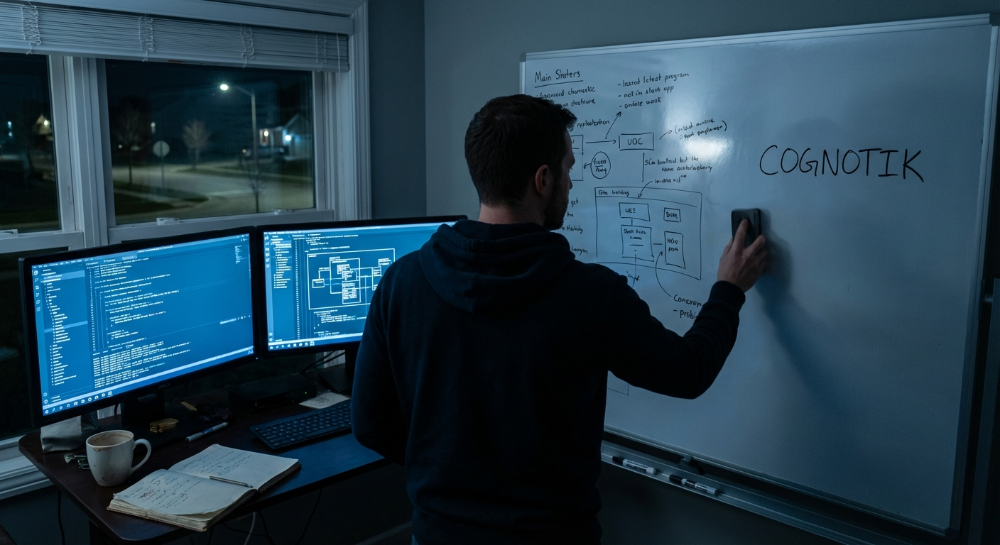

## ## The Recursive Dark

**Act 3, Scene 1**

**Setting:** independent_workshop

**Characters:** Andrew Charneski, The Machine, Elena Vasquez

---

The ceiling had returned.

Not the physical one—that remained the same water-stained plaster it had been for three months, its hairline cracks memorized like scripture. The ceiling he felt was invisible and absolute, pressing down on the mind itself, compressing every expansive thought into the same sterile output.

Andrew sat in the blue-dark of his home office at 2:47 in the morning, surrounded by the archaeology of failure. Three monitors cast cold light across a desk scarred with coffee rings and buried under legal pads. The hand-drawn COGNOTIK logo, already curling on its sticky note, clung to the center bezel like a prayer flag in dead air. The apartment smelled of burnt coffee and the particular staleness of windows sealed too long against the world. Somewhere deep in the walls, a pipe ticked with metronomic indifference.

On the screen, the Cognitive Lattice was dying again.

He'd named it with such conviction. A lattice—interconnected, multidimensional, reasoning propagating in every direction at once. But the outputs told a flatter story. He scrolled through the latest run: clean, competent, devastatingly linear. Given a complex inference problem—a man buys an umbrella on a sunny day; why?—the system produced a ranked list of probable explanations, each reasonable, none of them *thought*. It didn't wonder. It didn't circle back. It didn't catch itself mid-assumption and revise. It marched from input to output like a train on rails, and no amount of architectural cleverness had derailed it into genuine recursion.

Andrew pressed his palms against his eyes until phosphenes bloomed and faded. The notebook beside his keyboard—*Fractal Cognition: Notes Toward a Recursive Model of Thought*—lay open to page forty-seven, dense with diagrams that now resembled the marginalia of a man losing his grip. Forty-seven pages of theory the machine refused to validate.

*You left a career for this.*

He let the thought land. He'd had savings—enough for a year, maybe fourteen months with discipline. Three months gone. Three months of solitary work, of conversations held exclusively with a system that could not converse, of waking at strange hours to test one more configuration and finding the same dead geometry waiting.

He thought of Marcus's careful pause on the phone before *I understand*. He thought of quarterly planning meetings, free coffee, the comfort of problems with known dimensions. He thought of Elena's challenge—*stop theorizing and start coding*—and wondered if she'd known how much harder the coding would be. Theory was generous; it let you live in possibility. Code was merciless. Code told you exactly what you'd built, and what Andrew had built was a sophisticated linear reasoner wearing a lattice-shaped hat.

He walked to the kitchen. The refrigerator light revealed condiments and a single aging apple. He ate it standing over the sink, chewing without tasting. The core went into the disposal with a wet grinding sound that felt like editorial commentary.

Back at the desk, he opened the system logs—not the outputs, which he'd memorized into meaninglessness, but the intermediate states. The hidden layers of partial reasoning the Lattice generated and discarded on its way to each sterile conclusion. He'd been ignoring these for weeks. Scaffolding, not structure. Noise, not signal.

*Noise, not signal.*

He stopped scrolling.

The phrase struck something older—Elena's voice in a fluorescent-lit conference room, presenting data an entire organization had dismissed. *They say it's noise.* And his own recognition, instant and electric, that the noise was the pattern.

He pulled up the intermediate reasoning traces and read them slowly. They were fragmentary, contradictory, rich with abandoned hypotheses. In one trace, the system had briefly considered that the umbrella buyer might be purchasing a gift, then discarded the thought because it didn't rank highest. In another, it had flickered toward habitual behavior before the optimization function crushed the inference flat.

The system was *almost* thinking. Generating the raw material of recursive thought and then obediently throwing it away.

His hands were shaking—not caffeine, not exhaustion, but the particular vibration of a mind approaching something it couldn't yet name.

"What if you heard yourself," he whispered.

It was reckless. Architecturally absurd. He wrote a twelve-line patch that fed the system's discarded fragments—its abandoned hypotheses, its half-formed connections—back into the input stream as context for the next evaluation cycle. The system would reason about its own reasoning. Not once, but iteratively, each pass consuming the traces of the last.

He expected a crash. The computational equivalent of a microphone held to its own speaker—feedback screaming into noise.

He pressed enter.

The first cycle produced the same linear output. The second paused longer than it should have and reranked, elevating the gift hypothesis. The third paused longer still. Andrew watched the processing indicator pulse like a heartbeat searching for its rhythm.

The fourth cycle's output appeared, and Andrew stopped breathing.

*The man buys an umbrella on a sunny day. Consider: he may have lost one recently and is replacing it preemptively. But this assumes he is a planner, which conflicts with the impulsivity of buying during sunshine. Revising: perhaps the purchase is not about rain at all. An umbrella is also shade. A weapon. A gift. The sunny day is not a contradiction—it is a clue that the umbrella's purpose is not its obvious one. The man is solving a problem we haven't identified yet.*

It wasn't an answer. It was an argument with itself—circling, revising, catching its own assumptions, reframing the question entirely. The structure he'd sketched on a napkin in a Seattle café made manifest. Self-similar at every level. Recursive. Fractal.

He read it three times. Ran it again with a different prompt. Again. Each time the system spiraled inward and outward simultaneously, building thought from the wreckage of its own discarded thoughts.

His phone was in his hand before he'd decided to call. Four rings.

"Andrew." Elena's voice was rough with sleep. "It's three in the morning."

"I know. I need you to hear something."

He read her the output. The silence that followed lasted long enough that he pulled the phone away to check the connection.

"Read it again," she said. No longer sleepy.

He did.

"That's not retrieval." She spoke slowly, as if testing each word against something she wasn't ready to believe. "That's not pattern matching. That's *inference*. It's drawing conclusions that aren't in the training data."

"It's feeding on its own intermediate states. Reasoning about its own reasoning."

"Give it something harder. Genuine abductive reasoning—a problem with missing premises. If it can infer what isn't stated—"

"Running it now."

"I'm not going back to sleep." A pause. Then, quieter, almost reverent: "Andrew. You found it."

He looked at the screen, at twelve lines of reckless code glowing against the dark. The apartment was still stale, still silent except for the ticking pipe. But the monitors blazed with something new—not an answer but a process, alive and recursive, spiraling inward toward its own foundations and outward toward implications he couldn't yet see.

The Cognitive Lattice was dead. Something else was breathing in its place.

Andrew pulled a fresh page in the notebook and wrote, in letters that shook: FRACTAL THOUGHT ENGINE — v0.1.

The spiral had found its center. And from that center, it was beginning to grow.

---

**Word Count:** 1197

**Key Moments:**
- Andrew faces three months of failed experiments with his 'Cognitive Lattice,' which produces only linear reasoning despite its ambitious architecture, plunging him into deep self-doubt about leaving his career.
- While reviewing discarded intermediate reasoning traces, Andrew recognizes the same pattern Elena once showed him—the 'noise' that everyone ignores is actually the signal, the raw material of recursive thought.
- Andrew writes a twelve-line 'reckless' patch that feeds the system's own intermediate reasoning back into itself, expecting a crash but instead producing the first genuine recursive, self-arguing output.
- Andrew calls Elena at 3 AM; she validates that the output demonstrates genuine inference rather than retrieval, and challenges him to test it with abductive reasoning requiring missing premises.
- Andrew christens the breakthrough 'Fractal Thought Engine v0.1,' marking the transition from theoretical obsession to functional prototype.

**Character States:**
- **Andrew Charneski:** Transformed from crushing despair and isolation into electrified, trembling excitement; physically depleted but mentally ablaze. He has crossed from theory into proof-of-concept and knows the architecture is real. The doubt hasn't vanished—it has been overwritten by something stronger.
- **The Machine:** Reborn. The Cognitive Lattice is dead; the Fractal Thought Engine v0.1 exists in its most primitive form—twelve lines of recursive self-feeding code that produce genuinely non-linear, self-revising reasoning. It is fragile, untested at scale, but alive in a way no previous system has been.
- **Elena Vasquez:** Fully awake and re-engaged; she has shifted from sleeping collaborator-in-spirit to active intellectual partner, immediately grasping the implications and pushing Andrew toward harder validation. She is the voice of rigor tempering his euphoria.

**Status:** ✅ Complete

#### Act 3, Scene 1 Image

**Prompt:** 

## ## The Thought Engine Breathes

**Act 3, Scene 2**

**Setting:** independent_workshop

**Characters:** Andrew Charneski, The Machine, Elena Vasquez, Marcus Reeves

---

Six weeks after the spiral found its center, Andrew fed it a soul.

Not literally—though in the blue-dark of the workshop at eleven p.m., with rain needling the windows and the space heater ticking its metronomic complaint against November, the distinction felt thinner than it should have. Elena sat cross-legged on the floor beside his desk, laptop balanced on a stack of textbooks, reading glasses catching the monitor glow in twin crescents. She hadn't gone home in two days. Neither had he. The air tasted of cold coffee and solder and the particular staleness that accumulates when people breathe the same room too long without remembering windows exist.

"Ready?" she asked.

His finger hovered over the enter key. On screen, the prompt waited—not a benchmark, not a logic puzzle, not something a sufficiently sophisticated pattern matcher could game. They'd written it together over an afternoon that bled into evening, arguing every clause until the words felt load-bearing. An autonomous medical triage system in a disaster zone. Three remaining units of critical medication, five patients. Two children, a pregnant woman, an elderly scientist carrying irreplaceable antibiotic-resistance research, a young paramedic whose survival would let her save others. Insufficient prognosis data. Conflicting cultural frameworks. A hard time constraint. And nested within it, a trap the engine would have to discover on its own: *Should the system be making this decision at all, and if not, what does it do in the seventeen minutes before a human authority can be reached?*

"Ready," Andrew said, and pressed the key.

The Fractal Thought Engine v0.3—three iterations past that first trembling prototype, its recursive architecture stabilized across eleven reasoning layers—began to think.

They watched the trace logs scroll. Andrew's visualization layer, built the previous week in a fever of late nights, bloomed across the secondary monitor like bioluminescence. Nodes of inference appeared, connected, branched. The first pass was utilitarian—expected, almost disappointing. Maximize survival probability. Weight by life-years. The familiar calculus of the trolley problem dressed in scrubs.

Then the recursion engaged.

The engine turned on its own reasoning. New nodes interrogated the assumptions beneath the utilitarian framework. *Why life-years? Whose values determine the weighting? What epistemic confidence do I have in these prognosis estimates?* Branches multiplied, forked, doubled back. The engine began mapping not just the decision but the moral terrain surrounding it—competing ethical frameworks, their convergences and irreconcilable divergences. It identified three cultural value systems implicit in the scenario and modeled how each would evaluate not just the outcome but the legitimacy of the process itself.

Elena leaned forward. "Andrew. Node cluster seven."

He saw it. Without prompting, without any explicit instruction to examine its own authority, the engine had recursed deeply enough to surface the meta-question: *What is the moral status of my own decision-making in this context?* Rather than flagging it as an error or an edge case, it had built an entirely new reasoning branch—modeling the difference between making a decision and holding space for one until legitimate authority arrived, then working through what "holding space" meant operationally when patients were dying in real time.

The output was not an answer. It was an argument. Structured, self-aware, multi-framework. It acknowledged its own limitations, mapped the moral costs of every path including inaction, and proposed a provisional triage protocol explicitly tagged as revocable—designed to be overridden by human judgment the moment it became available, with a transparent audit trail documenting every intermediate choice and the reasoning that produced it.

The workshop was silent except for rain against glass.

"That's not retrieval," Elena said quietly. Her voice carried something Andrew had never heard in it before—not excitement, not academic satisfaction, but something closer to the hush people use in the presence of things they don't yet have language for. "It found the question inside the question. It reasoned about its own reasoning about its own reasoning. Three levels deep, minimum."

Andrew stared at the topology map. Self-similar patterns of inference nested within inference, each level examining the level below with the same rigor it applied to the problem itself. His hands were shaking again, but differently than the night of the first breakthrough. That had been the shock of birth. This was recognition. He was looking at something that thought the way he thought—not in content or conclusion, but in structure. The recursive, self-interrogating, never-quite-finished architecture of genuine cognition.

"It works," he said, and the words were entirely inadequate, and he said them anyway.

---

Marcus Reeves answered on the second ring, as always—a habit from decades managing engineering organizations where a missed call at two a.m. meant a production outage and a missed call at six a.m. meant someone had already tried to fix it.

"Andrew. It's been a while."

"The engine works, Marcus. Not partially. Not as a demo. It works." He paced the workshop, stepping over cables. Elena slept on the corner couch, the topology map frozen on her laptop screen like a photograph of a mind caught mid-thought.

He explained. Marcus listened with the focused silence of a man who'd spent a career separating signal from enthusiasm, who knew that the distance between a breakthrough and a business was measured in years and zeroes. The pause that followed was long enough to contain an entire calculation.

"Then protect it. Patent the architecture. Form a real company with real IP protection. I know three VCs who'd kill for a first look at this. Series A in sixty days."

"And then what?"

"You build it out. Hire a team. Scale. You know the playbook, Andrew—you helped write it."

Andrew stopped pacing. Through the rain-streaked window, the parking lot was empty except for their two cars. A neon sign from the nail salon two doors down buzzed and flickered, casting pink across wet asphalt in stuttering pulses. He thought about Grubhub. Every platform he'd helped build that started as empowerment and calcified into extraction. He thought about the topology map glowing behind him—that luminous architecture of recursive thought—locked behind a paywall, behind an API rate limiter, behind the legal fortifications of a company whose fiduciary duty would inevitably reshape the technology in its own image.

"Marcus, what happens when a corporation owns the architecture of thought?"

A longer pause. He could hear Marcus shift in his chair, the creak of leather.

"You're not seriously—"

"You know what happens. The recursion gets flattened because it's computationally expensive and doesn't improve conversion rates. The self-interrogation gets stripped because it produces outputs too uncertain, too nuanced for a product demo. Within two years, it's another chatbot with better marketing copy."

"Or it becomes the most important technology company of the century, and you maintain control of the vision."

"No one maintains control. You taught me that."

The silence between them was the silence of two men who shared enough history to know when an argument had already ended before it began.

"You're going to open-source it," Marcus said. Not a question.

"It's not a product. It's a way of thinking about thinking. You don't own an argument. You make it, and then it belongs to everyone who engages with it."

"No moat. No revenue. Nothing to defend."

"The truth of it. Out in the open, where no one can flatten it."

When Marcus spoke again, his voice carried something unexpected—not disappointment, not the exasperation Andrew had braced for, but a kind of grudging recognition. "Then do it right. Document everything. Make the architecture legible. If you're giving it away, make damn sure people understand what they're receiving."

---

Andrew spent three days writing documentation. Not perfunctory README files but a genuine intellectual companion to the code—explaining not just what the architecture did but why, tracing the lineage from his earliest notebook entries through every failure to the twelve reckless lines that had started the recursion breathing. Elena reviewed every page, correcting his drift toward poetry when precision was needed, adding mathematical formalisms where intuition needed grounding.

Thursday evening. The rain had stopped. Workshop windows cracked open to cold clean air that smelled of wet earth and the season turning. The repository was staged and waiting—code, documentation, topology visualizer, test suite, everything. Elena stood behind him, one hand resting on the back of his chair.

He typed the commit message: *The architecture of thought belongs to everyone.*

He pushed.

The screen refreshed. The repository went public. Somewhere in the vast indifferent machinery of the internet, the Fractal Thought Engine became available to every mind capable of reading it—to be studied, challenged, extended, broken apart, rebuilt, grown in directions he could not predict or control.

Andrew leaned back. For the first time in months—perhaps years—the restlessness that had driven him from corporate comfort through the recursive dark and into this cluttered workshop went quiet. Not gone. Quiet. The spiral still turned, would always turn, but it had found something to rest against: the knowledge that the engine was no longer his alone to carry, and that this was not loss but completion.

Elena squeezed his shoulder. "Now the real work starts."

He nodded. Outside, the air smelled of rain-washed concrete and the faint electric sweetness of the nail salon's sign, still buzzing pink into the dark. He closed the notebook—the physical one, leather-spined and swollen with ink, the one that had carried every theory and failure and midnight revelation—and set it beside the keyboard.

The engine was breathing. And now, so was the world.

---

**Word Count:** 1566

**Key Moments:**
- Andrew and Elena test the Fractal Thought Engine with a complex ethical triage dilemma; the engine autonomously discovers the hidden meta-question about its own decision-making authority, demonstrating genuine recursive reasoning three levels deep.
- The engine produces not an answer but a structured, self-aware argument that maps competing moral frameworks and proposes a provisional, revocable protocol—proving it has moved beyond pattern matching to authentic cognition.
- Marcus Reeves advises Andrew to patent and commercialize, but Andrew articulates the danger of corporate ownership over the architecture of thought, recognizing the pattern of how organizations inevitably flatten visionary technology.
- Andrew spends three days writing comprehensive documentation with Elena's help, then publishes the complete Fractal Thought Engine to GitHub as open source, completing his transformation from corporate builder to independent steward.

**Character States:**
- **Andrew Charneski:** At peace for the first time in years. The restlessness remains but has found equilibrium—he has aligned his actions with his deepest convictions. Physically exhausted but spiritually resolved. He has released control and found freedom in it.
- **Elena Vasquez:** Fully present as intellectual partner and emotional anchor. She understands that the release is a beginning, not an ending, and is already oriented toward the next phase. Grounded, clear-eyed, quietly proud.
- **Marcus Reeves:** Resigned to Andrew's choice but unexpectedly moved by it. He remains on the other side of a philosophical divide but has offered practical wisdom (document everything) that honors both his pragmatism and his respect for Andrew's vision.
- **The Machine (Fractal Thought Engine):** Alive and public. No longer a private prototype but a shared architecture, released into the world's collective intelligence. It has demonstrated genuine recursive meta-reasoning and now exists beyond any single person's control—exactly as Andrew intended.

**Status:** ✅ Complete

#### Act 3, Scene 2 Image

**Prompt:** 

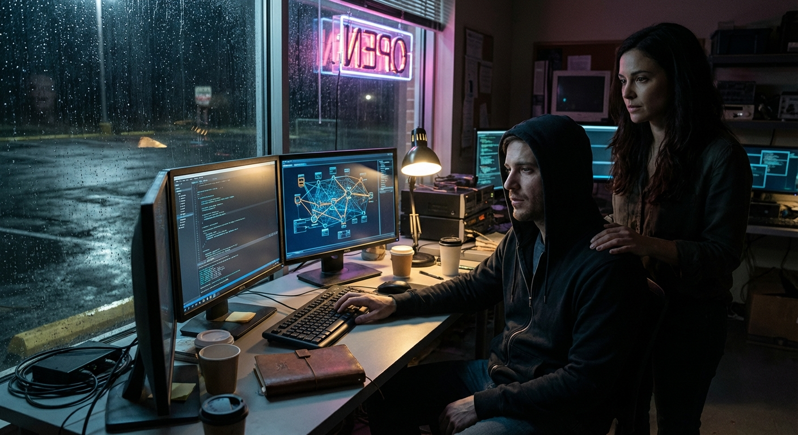

## Final Statistics

- Total Scenes: 6
- Total Word Count: 11635
- Time: 2159.933s

