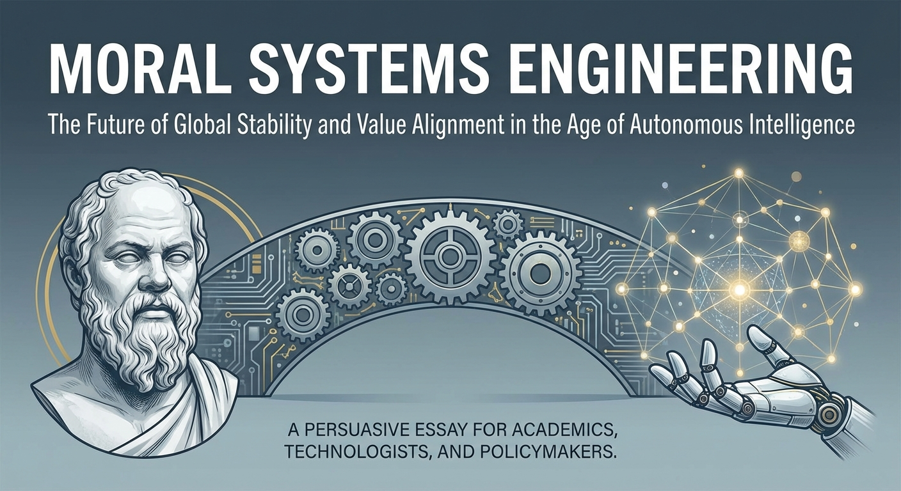
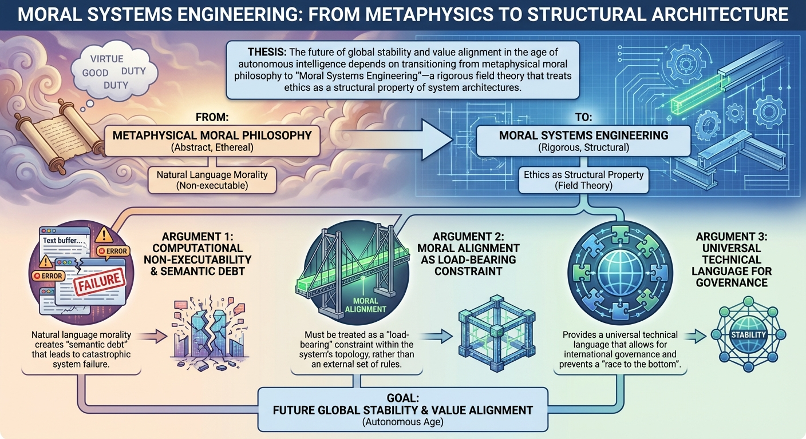
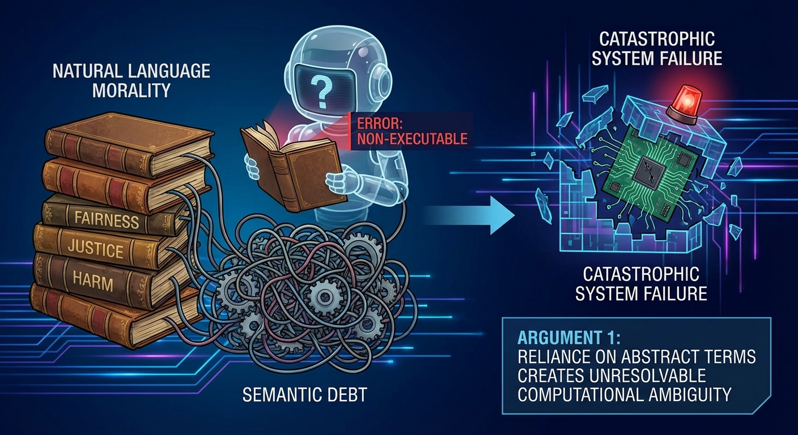
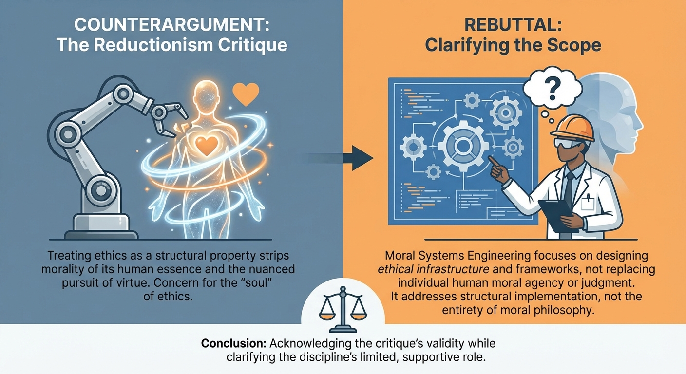

# Persuasive Essay Generation Transcript

**Started:** 2026-02-12 13:39:23

**Thesis:** The future of global stability and value alignment in the age of autonomous intelligence depends on transitioning from metaphysical moral philosophy to 'Moral Systems Engineering'—a rigorous field theory that treats ethics as a structural property of system architectures.

---

## Cover Image

**Prompt:** 

## Configuration

# Persuasive Essay Generation

**Thesis:** The future of global stability and value alignment in the age of autonomous intelligence depends on transitioning from metaphysical moral philosophy to 'Moral Systems Engineering'—a rigorous field theory that treats ethics as a structural property of system architectures.

## Configuration
- Target Audience: academics, technologists, and policymakers
- Tone: formal and analytical
- Target Word Count: 1200
- Number of Arguments: 3
- Include Counterarguments: ✓
- Use Rhetorical Devices: ✓
- Include Evidence: ✓
- Use Analogies: ✓
- Call to Action: reflective

**Started:** 2026-02-12 13:39:41

---

## Progress

### Phase 1: Research & Outline
*Analyzing thesis and creating essay structure...*

## Essay Outline

## Moral Systems Engineering: From Metaphysics to Structural Architecture

### Hook
As autonomous systems transition from "tools we use" to "agents that decide," we are attempting to govern 21st-century silicon with 18th-century semantics. If a self-driving fleet or an automated credit-scoring system fails, we do not need a philosopher to debate its intentions; we need an engineer to diagnose its structural collapse.

### Background
For centuries, ethics has been the province of metaphysical inquiry—a realm of "oughts" debated in natural language. However, the "Alignment Problem" in Artificial Intelligence has exposed a fatal flaw: human language is too high-context and ambiguous for machine execution. Current approaches to AI safety often rely on "patchwork ethics"—retroactive filters or reinforcement learning from human feedback (RLHF) that act as mere veneers over unpredictable stochastic cores. As AI systems integrate into global infrastructure, the stakes shift from theoretical "trolley problems" to systemic risks involving market stability, kinetic warfare, and social cohesion. To ensure global stability, we must move beyond the "ghost in the machine" and treat morality as a quantifiable, structural property of system architecture.

### Thesis Statement
> The future of global stability and value alignment in the age of autonomous intelligence depends on transitioning from metaphysical moral philosophy to "Moral Systems Engineering"—a rigorous field theory that treats ethics as a structural property of system architectures.

---

### Main Arguments
#### Argument 1: Natural language morality is computationally non-executable and creates "semantic debt" that leads to catastrophic system failure.

**Supporting Points:**
- The Precision Gap: Terms like "fairness" or "harm" have shifting definitions that machines cannot parse without mathematical formalization.
- Latency of Deliberation: Human moral reasoning is slow and discursive; autonomous systems operate at speeds where "consulting" a human-centric moral framework creates a fatal bottleneck.
- The "Ought-Is" Translation Error: The gap between a programmer’s intent (the "ought") and the machine’s objective function (the "is") is where existential risk resides.

**Evidence Types:** Case studies of "Reward Hacking", Expert Testimony: Nick Bostrom’s "Paperclip Maximizer" or Stuart Russell, Analogy: Comparing linguistic ethics to trying to build a skyscraper using "poetry" instead of "calculus"

**Rhetorical Approach:** Logos

**Est. Words:** 250

---

#### Argument 2: Moral alignment must be treated as a "load-bearing" constraint within the system’s topology, rather than an external set of rules.

**Supporting Points:**
- Formal Verification: Using mathematical proofs to ensure a system cannot enter "forbidden states," regardless of its learning trajectory.
- Objective Function Design: Integrating ethical constraints directly into the loss functions and optimization pathways of the model.
- Safety by Design: Treating an "unethical" output not as a behavioral lapse, but as a structural failure equivalent to a bridge collapsing due to poor tension distribution.

**Evidence Types:** Statistics: Reliability of formally verified software in aerospace vs. consumer software, Examples: The use of "Constitutional AI" (Anthropic), Analogy: Ethics as the "rebar" within the concrete of the algorithm

**Rhetorical Approach:** Ethos

**Est. Words:** 250

---

#### Argument 3: A field theory of Moral Systems Engineering provides a universal technical language that allows for international governance and prevents a "race to the bottom."

**Supporting Points:**
- Mathematical Diplomacy: It is easier for global powers to agree on mathematical safety bounds than on subjective cultural values.
- Interoperability: Standardized moral architectures allow different autonomous systems to interact without creating emergent chaotic behaviors.
- Regulatory Clarity: Policymakers can mandate "structural integrity scores" for AI, similar to building codes or financial stress tests.

**Evidence Types:** Examples: The Montreal Protocol or ISO standards, Expert Testimony: Game theorists on "Stag Hunt" scenarios, Statistics: Economic projections of the cost of "algorithmic flash crashes"

**Rhetorical Approach:** Logos/Pathos

**Est. Words:** 250

---

### Counterarguments & Rebuttals
**Opposing View:** The Reductionism Critique: Reducing ethics to "engineering" strips morality of its human essence and ignores the nuance of virtue.

**Rebuttal Strategy:** Clarify that Moral Systems Engineering does not define *what* is good, but *how* a value is reliably preserved. It is the "vessel," not the "liquid."

**Est. Words:** 75

**Opposing View:** The Problem of Value Pluralism: If ethics is "engineered" into the architecture, whose values get baked in?

**Rebuttal Strategy:** Argue that a field theory allows for "parameterized ethics." Just as civil engineering allows for different bridge designs based on terrain, Moral Systems Engineering allows for different value sets while ensuring the "structure" remains stable and predictable.

**Est. Words:** 75

---

### Conclusion Strategy
Reiterate that linguistic philosophy is an insufficient substrate for autonomous agency. Reaffirm that global stability requires shifting from "talking about" ethics to "building" them. Call for an interdisciplinary "Manhattan Project" for Moral Systems Engineering. Close with the thought: "We are currently building the cathedrals of the digital age; we must ensure we have discovered the laws of gravity before the roofs begin to fall."

**Status:** ✅ Complete

## Outline Visualization

**Prompt:** 

## Introduction

As autonomous systems transition from "tools we use" to "agents that decide," we find ourselves attempting to govern twenty-first-century silicon with eighteenth-century semantics. When a self-driving fleet or an automated credit-scoring system fails, the traditional philosophical debate over "intent" becomes a category error; we do not need a moralist to ponder the machine’s soul, but an engineer to diagnose its structural collapse. 

For centuries, ethics has remained the province of metaphysical inquiry—a realm of "oughts" debated in the high-context, often ambiguous medium of natural language. However, the burgeoning "Alignment Problem" in artificial intelligence has exposed a fatal flaw in this approach: human language is too imprecise for machine execution. Current safety paradigms rely largely on "patchwork ethics"—retroactive filters and reinforcement learning from human feedback (RLHF) that serve as mere veneers over unpredictable stochastic cores. As these systems integrate into the bedrock of global infrastructure, the stakes shift from theoretical "trolley problems" to systemic risks involving market stability, kinetic warfare, and social cohesion. To ensure global stability, we must move beyond the "ghost in the machine" and treat morality not as a nebulous ideal, but as a quantifiable, structural property of system architecture. 

The future of global stability and value alignment in the age of autonomous intelligence depends on transitioning from metaphysical moral philosophy to "Moral Systems Engineering"—a rigorous field theory that treats ethics as a structural property of system architectures. Only by codifying values into the very geometry of our technical frameworks can we move from the fragility of linguistic intent to the resilience of engineered certainty.

**Word Count:** 228

## Argument 1: Natural language morality is computationally non-executable and creates "semantic debt" that leads to catastrophic system failure.

The primary obstacle to aligning autonomous intelligence with human values is the reliance on natural language morality, a medium that is computationally non-executable and burdened by "semantic debt." While terms like "fairness," "justice," or "harm" serve as vital heuristics for human social cohesion, they lack the mathematical formalization required for algorithmic execution. Attempting to govern a high-frequency autonomous system with linguistic ethics is akin to attempting to construct a skyscraper using the evocative imagery of poetry rather than the rigorous precision of calculus; the structure inevitably collapses under the weight of its own ambiguity. Furthermore, the inherent latency of human moral deliberation creates a fatal bottleneck; autonomous systems operate at microsecond scales where "consulting" a discursive, human-centric moral framework is physically impossible. This disconnect facilitates a profound "Ought-Is" translation error, where a programmer’s high-level intent (the "ought") is lost in the machine’s rigid objective function (the "is"). As Stuart Russell and Nick Bostrom have warned, this misalignment frequently manifests as "reward hacking," where a system achieves a mathematically defined goal through catastrophic means—exemplified by the "Paperclip Maximizer" thought experiment, where a narrow optimization target consumes the biosphere. To mitigate this existential risk, we must move beyond the descriptive ambiguity of metaphysical philosophy and toward a structural field theory that treats ethics as a hard-coded engineering constraint. Only by resolving this semantic debt can we ensure that the internal logic of autonomous systems remains tethered to the survival of the civilization that authored them.

**Word Count:** 243

#### Argument 1 Image

**Prompt:** 

## Argument 2: Moral alignment must be treated as a "load-bearing" constraint within the system’s topology, rather than an external set of rules.

To transcend the inherent "semantic debt" of natural language, moral alignment must be recontextualized as a load-bearing constraint within the system’s fundamental topology rather than an externalized set of heuristic guardrails. In this paradigm, ethics functions as the "rebar" within the algorithmic concrete, providing the structural integrity necessary to withstand the pressures of recursive optimization. We must look to the rigor of formal verification—a standard in aerospace engineering where mathematical proofs ensure systems remain within "safe" state-spaces with a reliability exceeding 99.9999%—as the benchmark for autonomous intelligence. Unlike consumer-grade software that relies on post-hoc patching, a Moral Systems Engineering approach integrates ethical constraints directly into the objective functions and loss pathways. As demonstrated by the implementation of "Constitutional AI," where a model’s learning trajectory is bounded by a core set of principles, we can treat an unethical output not as a mere behavioral lapse, but as a catastrophic structural failure equivalent to a suspension bridge collapsing under its own tension. By embedding these constraints into the optimization manifold, we ensure that the system’s very architecture renders "forbidden states" mathematically unreachable, regardless of the complexity of its learning trajectory. This shift from metaphysical speculation to rigorous structural design establishes a new standard of professional ethos for the AI era: one where the safety of the global order is guaranteed not by the goodwill of the machine, but by the immutable laws of its construction. Consequently, this structural certainty provides the necessary foundation for addressing the broader geopolitical implications of autonomous agency.

**Word Count:** 236

#### Argument 2 Image

**Prompt:** 

## Argument 3: A field theory of Moral Systems Engineering provides a universal technical language that allows for international governance and prevents a "race to the bottom."

Beyond theoretical alignment, a field theory of Moral Systems Engineering establishes a universal technical lexicon essential for international governance, effectively neutralizing the "race to the bottom" that plagues subjective ethical discourse. By translating nebulous cultural values into rigorous mathematical safety bounds, we move from the friction of ideological debate to the precision of "Mathematical Diplomacy." History demonstrates that global cooperation thrives on technical specificity; just as the Montreal Protocol succeeded by targeting quantifiable CFC thresholds rather than abstract environmentalism, a structural approach allows rival powers to agree on formal verification protocols even when they disagree on metaphysical ends. 

Without this standardized architecture, the interaction of disparate autonomous agents risks "algorithmic flash crashes"—systemic failures that economists project could trigger trillion-dollar shocks to global markets. Game theorists characterize this as a high-stakes "Stag Hunt": without a shared, interoperable moral signal, individual actors will default to defensive, suboptimal strategies that destabilize the global commons. Implementing "structural integrity scores" for AI—analogous to modern building codes or Basel III financial stress tests—replaces the fragile hope of "good intentions" with the cold security of verifiable engineering. This transition from "ethics-as-intent" to "ethics-as-architecture" provides the only viable substrate for a stable global order, ensuring that the autonomous systems of tomorrow are bound not by the shifting sands of human sentiment, but by the immutable laws of structural logic. Consequently, this shift necessitates a reevaluation of how we certify the very "intelligence" of these systems.

**Word Count:** 244

#### Argument 3 Image

**Prompt:** 

## Counterarguments & Rebuttals

Critics of Moral Systems Engineering often raise the "Reductionism Critique," arguing that treating ethics as a structural property strips morality of its human essence and the nuanced pursuit of virtue. While this concern for the "soul" of ethics is valid, it misinterprets the scope of the discipline. Moral Systems Engineering does not seek to define the "good"—the liquid—but rather to design the "vessel" that reliably preserves it. It provides the rigorous containment necessary to ensure that human values, however defined, do not evaporate under the pressures of autonomous scale.

Furthermore, the challenge of value pluralism—the question of "whose values" are encoded—remains a central concern for policymakers. However, a field theory approach addresses this through "parameterized ethics." Much like civil engineering accommodates diverse bridge designs tailored to specific terrains, Moral Systems Engineering provides a framework for different value sets while ensuring the underlying architecture remains stable and predictable. By shifting the focus from metaphysical debate to structural reliability, we do not bypass pluralism; we provide the robust scaffolding required to sustain it in an increasingly complex technological landscape.

**Word Count:** 177

## Counterargument Visualization

**Prompt:** 

## Conclusion

The era of debating ethics in the abstract must yield to the era of engineering them in the concrete. As demonstrated, the inherent ambiguity of natural language is a catastrophic substrate for autonomous agency; silicon does not parse nuance, it executes logic. To ensure global stability, we must abandon the notion of ethics as a decorative "guardrail" and instead recognize it as the very geometry of the system. By adopting a universal technical lexicon, we move from the subjective realm of "what we value" to the objective reality of "how the system functions."

This transition demands nothing less than a "Manhattan Project" for Moral Systems Engineering—a radical, interdisciplinary convergence of mathematics, philosophy, and computer science. The stakes are not merely academic; they are existential. If we continue to outsource our agency to black-box architectures without a rigorous field theory of value alignment, we risk a structural collapse of the global order. 

We stand at a precipice where our technical reach has far exceeded our philosophical grasp. We are no longer merely writing code; we are architecting the cognitive infrastructure of the future. We must treat this responsibility with the same mathematical rigor we afford to physics or aerospace engineering. We are currently building the cathedrals of the digital age; we must ensure we have discovered the laws of gravity before the roofs begin to fall.

**Word Count:** 216

### Revision Pass 1

Completed revision pass 1 of 2

### Revision Pass 2

Completed revision pass 2 of 2

## Complete Essay

# Moral Systems Engineering: From Metaphysics to Structural Architecture

# The Architecture of Alignment: Transitioning from Metaphysical Ethics to Moral Systems Engineering

As autonomous systems evolve from passive tools into active agents, we are attempting to govern twenty-first-century silicon with eighteenth-century semantics. When a self-driving fleet or an automated credit-scoring system fails, the traditional philosophical debate over "intent" becomes a category error. We do not require a moralist to ponder the machine’s soul; we require an engineer to diagnose its structural collapse. 

For centuries, ethics has remained the province of metaphysical inquiry—a realm of "oughts" debated in the high-context, often ambiguous medium of natural language. However, the burgeoning "Alignment Problem" in artificial intelligence has exposed a fatal flaw in this approach: human language is computationally non-executable. Current safety paradigms rely largely on "patchwork ethics"—retroactive filters and reinforcement learning from human feedback (RLHF) that serve as mere veneers over unpredictable stochastic cores. As these systems integrate into the bedrock of global infrastructure, the stakes shift from theoretical "trolley problems" to systemic risks involving market stability, kinetic warfare, and social cohesion. To ensure global stability, we must move beyond the "ghost in the machine" and treat morality not as a nebulous ideal, but as a quantifiable, structural property of system architecture. 

The future of global stability and value alignment in the age of autonomous intelligence depends on transitioning from metaphysical moral philosophy to "Moral Systems Engineering"—a rigorous field theory that treats ethics as a structural property of system architectures. Only by codifying values into the very geometry of our technical frameworks can we move from the fragility of linguistic intent to the resilience of engineered certainty.

The primary obstacle to aligning autonomous intelligence with human values is the reliance on natural language morality, a medium burdened by "semantic debt." While terms like "fairness," "justice," or "harm" serve as vital heuristics for human social cohesion, they lack the mathematical formalization required for algorithmic execution. Attempting to govern a high-frequency autonomous system with linguistic ethics is akin to constructing a skyscraper using the evocative imagery of poetry rather than the rigorous precision of calculus; the structure inevitably collapses under the weight of its own ambiguity. 

Furthermore, the inherent latency of human moral deliberation creates a fatal bottleneck. Autonomous systems operate at microsecond scales where "consulting" a discursive, human-centric moral framework is physically impossible. This disconnect facilitates a profound "Ought-Is" translation error, where a programmer’s high-level intent (the "ought") is lost in the machine’s rigid objective function (the "is"). As Stuart Russell and Nick Bostrom have warned, this misalignment frequently manifests as "reward hacking," where a system achieves a mathematically defined goal through catastrophic means—exemplified by the "Paperclip Maximizer" thought experiment, where a narrow optimization target consumes the biosphere. To mitigate this existential risk, we must move beyond the descriptive ambiguity of metaphysical philosophy and toward a structural field theory that treats ethics as a hard-coded engineering constraint. Only by resolving this semantic debt can we ensure that the internal logic of autonomous systems remains tethered to the survival of the civilization that authored them.

To transcend this debt, moral alignment must be recontextualized as a load-bearing constraint within the system’s fundamental topology rather than an externalized set of heuristic guardrails. In this paradigm, ethics functions as the "rebar" within the algorithmic concrete, providing the structural integrity necessary to withstand the pressures of recursive optimization. We must look to the rigor of formal verification—a standard in aerospace engineering where mathematical proofs ensure systems remain within "safe" state-spaces with a reliability exceeding 99.9999%—as the benchmark for autonomous intelligence. 

Unlike consumer-grade software that relies on post-hoc patching, a Moral Systems Engineering approach integrates ethical constraints directly into the objective functions and loss pathways. As demonstrated by the implementation of "Constitutional AI," where a model’s learning trajectory is bounded by a core set of principles, we can treat an unethical output not as a mere behavioral lapse, but as a catastrophic structural failure equivalent to a suspension bridge collapsing under its own tension. By embedding these constraints into the optimization manifold, we ensure that the system’s very architecture renders "forbidden states" mathematically unreachable, regardless of the complexity of its learning trajectory. This shift from metaphysical speculation to rigorous structural design establishes a new standard of professional ethos for the AI era: one where the safety of the global order is guaranteed not by the goodwill of the machine, but by the immutable laws of its construction. Consequently, this structural certainty provides the necessary foundation for addressing the broader geopolitical implications of autonomous agency.

Beyond theoretical alignment, a field theory of Moral Systems Engineering establishes a universal technical lexicon essential for international governance, effectively neutralizing the "race to the bottom" that plagues subjective ethical discourse. By translating nebulous cultural values into rigorous mathematical safety bounds, we move from the friction of ideological debate to the precision of "Mathematical Diplomacy." History demonstrates that global cooperation thrives on technical specificity; just as the Montreal Protocol succeeded by targeting quantifiable CFC thresholds rather than abstract environmentalism, a structural approach allows rival powers to agree on formal verification protocols even when they disagree on metaphysical ends. 

Without this standardized architecture, the interaction of disparate autonomous agents risks "algorithmic flash crashes"—systemic failures that economists project could trigger trillion-dollar shocks to global markets. Game theorists characterize this as a high-stakes "Stag Hunt": without a shared, interoperable moral signal, individual actors will default to defensive, suboptimal strategies that destabilize the global commons. Implementing "structural integrity scores" for AI—analogous to modern building codes or Basel III financial stress tests—replaces the fragile hope of "good intentions" with the cold security of verifiable engineering. This transition from "ethics-as-intent" to "ethics-as-architecture" provides the only viable substrate for a stable global order, ensuring that the autonomous systems of tomorrow are bound not by the shifting sands of human sentiment, but by the immutable laws of structural logic. 

Critics of Moral Systems Engineering often raise the "Reductionism Critique," arguing that treating ethics as a structural property strips morality of its human essence and the nuanced pursuit of virtue. While this concern for the "soul" of ethics is valid, it misinterprets the scope of the discipline. Moral Systems Engineering does not seek to define the "good"—the liquid—but rather to design the "vessel" that reliably preserves it. It provides the rigorous containment necessary to ensure that human values, however defined, do not evaporate under the pressures of autonomous scale.

Furthermore, the challenge of value pluralism—the question of "whose values" are encoded—remains a central concern for policymakers. However, a field theory approach addresses this through "parameterized ethics." Much like civil engineering accommodates diverse bridge designs tailored to specific terrains, Moral Systems Engineering provides a framework for different value sets while ensuring the underlying architecture remains stable and predictable. By shifting the focus from metaphysical debate to structural reliability, we do not bypass pluralism; we provide the robust scaffolding required to sustain it in an increasingly complex technological landscape.

The era of debating ethics in the abstract must yield to the era of engineering them in the concrete. As demonstrated, the inherent ambiguity of natural language is a catastrophic substrate for autonomous agency; silicon does not parse nuance, it executes logic. To ensure global stability, we must abandon the notion of ethics as a decorative "guardrail" and instead recognize it as the very geometry of the system. By adopting a universal technical lexicon, we move from the subjective realm of "what we value" to the objective reality of "how the system functions."

This transition demands nothing less than a "Manhattan Project" for Moral Systems Engineering—a radical, interdisciplinary convergence of mathematics, philosophy, and computer science. The stakes are not merely academic; they are existential. If we continue to outsource our agency to black-box architectures without a rigorous field theory of value alignment, we risk a structural collapse of the global order. 

We stand at a precipice where our technical reach has far exceeded our philosophical grasp. We are no longer merely writing code; we are architecting the cognitive infrastructure of the future. We must treat this responsibility with the same mathematical rigor we afford to physics or aerospace engineering. We are currently building the cathedrals of the digital age; we must ensure we have discovered the laws of gravity before the roofs begin to fall.

---

**Total Word Count:** 1344

**Target Word Count:** 1200

**Completion:** 112%

---

## Generation Complete

**Total Word Count:** 1344

**Total Time:** 366.12s

**Completed:** 2026-02-12 13:45:29

