# Software Design Document: JSON++: The Grammar-Extensible Data Substrate

**System:** JSON++ is a programmable data format designed as a strict subgrammar of JavaScript. It enables structural compression through symbolic bindings, declarative data hydration via pure functions, and high-performance binary handling (tensors) while remaining human-readable and LLM-native. It leverages existing JavaScript infrastructure and TypeScript for specification and tooling.

**Generated:** 2026-02-16 13:31:16

---


Input Context Data

### Prior Task Context


### Input File Context


## Use Cases & Actors

# JSON++ Use Case Documentation

## 1. Actor Identification

The following actors interact with the JSON++ ecosystem, ranging from human developers to automated agents and runtime environments.

| Actor | Type | Role & Goals |
| :--- | :--- | :--- |
| **Data Engineer** | Human | Designs data structures, manages telemetry pipelines, and optimizes storage/transmission costs using symbolic bindings. |
| **LLM Developer** | Human | Integrates JSON++ into agentic workflows to reduce token usage and improve model adherence to complex data schemas. |
| **LLM Agent** | System | Generates or consumes JSON++ payloads dynamically during inference to perform structured reasoning or tool calling. |
| **Security Engineer** | Human | Defines encryption policies and ensures that pure functions within JSON++ do not introduce side-channel vulnerabilities. |
| **Runtime Engine** | System | The execution environment (V8, Node.js, Browser) that parses, validates, and hydrates JSON++ into memory-resident objects. |
| **DevOps/CI System** | System | Validates JSON++ configurations against schemas and ensures deterministic evaluation before deployment. |

### Actor Relationships
- **Data Engineer** and **LLM Developer** often collaborate on schema definitions.
- **LLM Agent** acts as a proxy for the **LLM Developer**, producing data that the **Runtime Engine** must process.
- **Security Engineer** provides constraints that the **Data Engineer** must implement.

---

## 2. Use Case Catalog

### UC-1: Define Structural Compression via Symbolic Bindings
**Primary Actor:** Data Engineer
**Preconditions:** A dataset with high structural redundancy (e.g., repeated headers or nested objects) is identified.
**Main Success Scenario:**
1. Data Engineer identifies repeating patterns in a large JSON dataset.
2. Engineer defines a `const` binding at the top level of the JSON++ file.
3. Engineer replaces all redundant instances with the symbolic reference.
4. Engineer validates the file using the JSON++ CLI.
5. System confirms the file size reduction and valid JS syntax.
**Alternative Flows:**
- *A1: Circular Reference:* If the engineer creates a circular dependency, the validator throws a `ReferenceError: Circular dependency detected`.
**Postconditions:** The data is stored in a compressed, human-readable format that evaluates to the full structure.
**Business Rules:** Bindings must be immutable (`const`).

### UC-2: Declarative Data Hydration via Pure Functions
**Primary Actor:** Runtime Engine
**Preconditions:** A JSON++ file containing transformation logic (pure functions) and a raw data substrate.
**Main Success Scenario:**
1. Runtime Engine loads the JSON++ substrate.
2. Engine identifies functional mappings (e.g., `items.map(i => i.price * tax)`).
3. Engine executes functions within a sandboxed V8 context.
4. Engine produces a hydrated, standard JavaScript object.
5. Resulting object is passed to the application layer.
**Alternative Flows:**
- *A1: Side-effect Detection:* If a function attempts I/O or network access, the sandbox terminates execution and logs a security violation.
**Postconditions:** Data is transformed into its final state without external ETL tools.
**Business Rules:** Functions must be side-effect free and deterministic.

### UC-3: LLM Context Window Optimization
**Primary Actor:** LLM Agent
**Preconditions:** An LLM needs to process a large configuration or state object that exceeds the token limit in standard JSON.
**Main Success Scenario:**
1. LLM Agent receives a JSON++ template with symbolic bindings.
2. Agent generates a response using the defined symbols instead of repeating full object structures.
3. The system receives the "compressed" JSON++ response.
4. The system expands the symbols to reconstruct the full intent.
**Alternative Flows:**
- *A1: Hallucinated Symbol:* If the LLM uses a symbol not defined in the preamble, the parser returns a `SymbolNotFoundError`.
**Postconditions:** Token consumption is reduced by 30-70% depending on data redundancy.
**Business Rules:** The preamble (definitions) must be included in the LLM system prompt.

### UC-4: High-Performance Tensor Mapping
**Primary Actor:** Data Engineer / Runtime Engine
**Preconditions:** Large numerical arrays (tensors) need to be transmitted for ML inference.
**Main Success Scenario:**
1. Data Engineer defines a field using the `TypedArray` syntax within JSON++.
2. The Runtime Engine identifies the binary-compatible block.
3. The Engine uses `ArrayBuffer.transfer` or zero-copy mapping to load the data into a GPU/CPU buffer.
4. The application performs high-speed computation on the data.
**Postconditions:** Minimal latency between data parsing and mathematical execution.
**Business Rules:** Tensors must follow strict alignment rules defined in the JSON++ spec.

---

## 3. Use Case Diagram

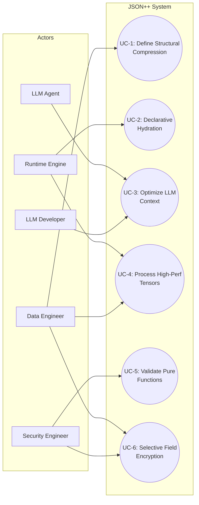
```mermaid
graph LR
    subgraph Actors
        DE[Data Engineer]
        LD[LLM Developer]
        LA[LLM Agent]
        SE[Security Engineer]
        RE[Runtime Engine]
    end

    subgraph "JSON++ System"
        UC1((UC-1: Define Structural<br/>Compression))
        UC2((UC-2: Declarative<br/>Hydration))
        UC3((UC-3: Optimize LLM<br/>Context))
        UC4((UC-4: Process High-Perf<br/>Tensors))
        UC5((UC-5: Validate Pure<br/>Functions))
        UC6((UC-6: Selective Field<br/>Encryption))
    end

    DE --> UC1
    DE --> UC4
    LD --> UC3
    LA --> UC3
    RE --> UC2
    RE --> UC4
    SE --> UC5
    SE --> UC6
    DE --> UC6
```

---

## 4. Actor-Use Case Matrix

| Use Case | Data Engineer | LLM Dev | LLM Agent | Security Eng | Runtime Engine |
| :--- | :---: | :---: | :---: | :---: | :---: |
| **UC-1: Structural Compression** | **P** | S | - | - | S |
| **UC-2: Declarative Hydration** | S | - | - | - | **P** |
| **UC-3: LLM Context Optimization** | S | **P** | **P** | - | - |
| **UC-4: High-Perf Tensors** | **P** | - | - | - | **P** |
| **UC-5: Validate Pure Functions** | S | - | - | **P** | S |
| **UC-6: Selective Encryption** | **P** | - | - | **P** | - |

**Legend:**
- **P**: Primary Actor (Initiates the process)
- **S**: Secondary Actor (Participates or is affected)
- **-**: No direct involvement

---

## 5. Traceability & Acceptance Criteria

| UC-ID | Acceptance Criteria | Test Case Reference |
| :--- | :--- | :--- |
| **UC-1** | Must reduce file size by >20% for datasets with 3+ repeating objects. | TC-COMP-01 |
| **UC-2** | Functions must execute in <10ms for 1000-item arrays. | TC-HYDR-05 |
| **UC-3** | LLM-generated JSON++ must be valid JS syntax 99% of the time. | TC-LLM-02 |
| **UC-4** | Tensor data must be accessible via `Float32Array` without re-parsing. | TC-TENS-09 |
| **UC-5** | Any attempt to call `fetch()` or `fs` must throw a compile-time error. | TC-SEC-01 |

---

## Requirements Specification

# JSON++: Requirements Documentation

## 1. Functional Requirements (FR)

The functional requirements define the core capabilities of the JSON++ substrate, focusing on its ability to parse, evaluate, and transform data while maintaining JavaScript compatibility.

| FR-ID | Description | Priority | Source | Acceptance Criteria |
|:---|:---|:---|:---|:---|
| **FR-101** | **JS Subgrammar Compliance** | Must Have | Systems Architect | The parser must accept only a subset of ECMAScript (Variables, Arrow Functions, Literals, Arrays, Objects). Any non-compliant JS (e.g., `while` loops, `try/catch`) must throw a syntax error. |
| **FR-102** | **Symbolic Bindings** | Must Have | LLM Developers | Users can define `const` or `let` bindings to reuse data structures. Referencing a binding must resolve to its evaluated value during hydration. |
| **FR-103** | **Pure Function Hydration** | Must Have | Data Engineers | Support for arrow functions that transform input data. Functions must be "pure" (no external state access). |
| **FR-104** | **Acyclic Dependency Enforcement** | Must Have | Systems Architect | The evaluation engine must detect and reject circular references between symbolic bindings to prevent infinite loops. |
| **FR-201** | **Tensor/Binary Mapping** | Should Have | Data Engineers | Support for `Float32Array`, `Uint8Array`, and other TypedArrays. Must allow direct mapping from base64 or hex strings to binary buffers without intermediate string copies. |
| **FR-202** | **Schema Validation (TS-Native)** | Should Have | DevOps Engineers | Ability to validate a JSON++ file against a TypeScript interface or JSON Schema before evaluation. |
| **FR-301** | **LSP Integration** | Could Have | Software Developers | Provide a Language Server Protocol implementation for VS Code/IntelliJ offering autocomplete for bindings and syntax highlighting. |
| **FR-302** | **Selective Field Encryption** | Could Have | Security Engineers | Support for a `@secure` decorator or wrapper that marks fields for encryption/decryption during the hydration phase. |

---

## 2. Non-Functional Requirements (NFR)

These requirements define the operational constraints and quality attributes of the system.

### 2.1 Performance
*   **NFR-101 (Latency):** Evaluation of a 1MB JSON++ file with 100 symbolic bindings must complete in under 50ms on a standard V8 runtime.
*   **NFR-102 (Memory):** The memory overhead of the evaluation engine must not exceed 2x the raw size of the input data.
*   **NFR-103 (Compression):** For repetitive datasets, JSON++ must achieve at least a 30% reduction in token count compared to standard JSON (LLM-native optimization).

### 2.2 Security
*   **NFR-201 (Sandbox Isolation):** The evaluation engine must run in a "Zero-I/O" sandbox. Access to `globalThis`, `process`, `window`, `fetch`, or `fs` must be strictly prohibited.
*   **NFR-202 (Deterministic Execution):** Given the same input and environment, the output of a JSON++ evaluation must be byte-for-byte identical every time.

### 2.3 Reliability & Maintainability
*   **NFR-301 (Error Handling):** The parser must provide precise line/column numbers for syntax errors and circular dependency detections.
*   **NFR-302 (Code Quality):** The core library must maintain >90% test coverage and pass strict TypeScript `noImplicitAny` checks.

### 2.4 Compatibility
*   **NFR-401 (Runtime Support):** Must be compatible with Node.js (v16+), Deno, Bun, and modern evergreen browsers (Chrome, Firefox, Safari).
*   **NFR-402 (JSON Interop):** Any valid standard JSON file must be a valid JSON++ file without modification.

---

## 3. Requirements Traceability Matrix (RTM)

This matrix ensures that every stakeholder use case is addressed by a requirement and tracked via test cases.

| Use Case ID | Requirement ID | Test Case ID | Status |
|:---|:---|:---|:---|
| **UC-Token-Opt** (LLM Token Reduction) | FR-102, NFR-103 | TC-101, TC-102 | Pending |
| **UC-Binary-Data** (Tensor Handling) | FR-201, NFR-101 | TC-201 | Pending |
| **UC-Safe-Eval** (Secure Data Hydration) | FR-101, NFR-201 | TC-301, TC-302 | Pending |
| **UC-Schema-Sync** (Type Safety) | FR-202 | TC-401 | Pending |
| **UC-Developer-Exp** (Tooling) | FR-301, NFR-301 | TC-501 | Pending |

---

## 4. Requirements Dependency Diagram

The following diagram illustrates the logical flow and dependencies between the functional and non-functional requirements.

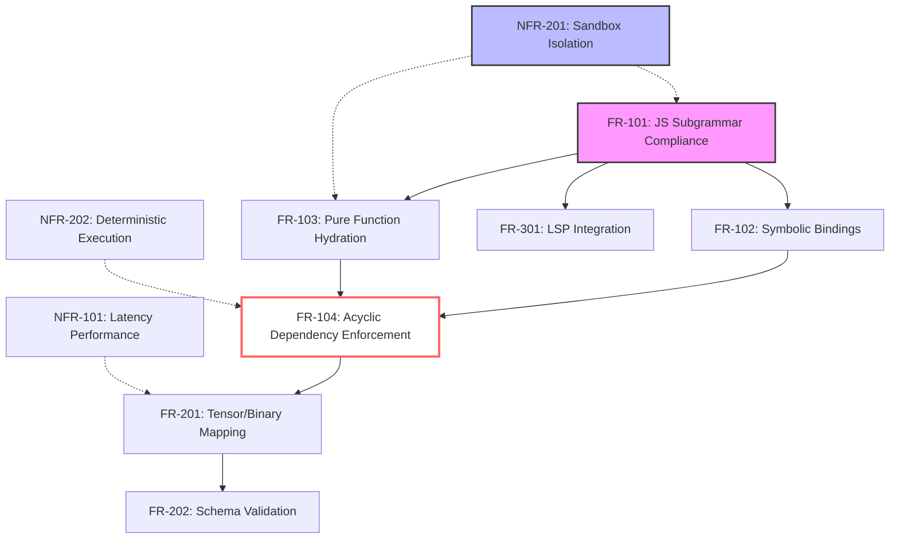
```mermaid
graph TD
    %% Functional Requirements
    FR101[FR-101: JS Subgrammar Compliance] --> FR102[FR-102: Symbolic Bindings]
    FR101 --> FR103[FR-103: Pure Function Hydration]
    
    FR102 --> FR104[FR-104: Acyclic Dependency Enforcement]
    FR103 --> FR104
    
    FR104 --> FR201[FR-201: Tensor/Binary Mapping]
    FR201 --> FR202[FR-202: Schema Validation]
    
    FR101 --> FR301[FR-301: LSP Integration]
    
    %% Non-Functional Requirements
    NFR201[NFR-201: Sandbox Isolation] -.-> FR101
    NFR201 -.-> FR103
    
    NFR202[NFR-202: Deterministic Execution] -.-> FR104
    
    NFR101[NFR-101: Latency Performance] -.-> FR201
    
    style FR101 fill:#f9f,stroke:#333,stroke-width:2px
    style NFR201 fill:#bbf,stroke:#333,stroke-width:2px
    style FR104 fill:#fff,stroke:#f66,stroke-width:3px
```

### Diagram Key:
*   **Solid Arrows:** Hard functional dependency (Feature A requires Feature B to work).
*   **Dashed Arrows:** Constraint dependency (NFR limits or defines the implementation of FR).
*   **Pink Box:** Core Parser (Foundation).
*   **Blue Box:** Security Constraint.
*   **Red Border:** Critical Path for System Stability.

---

## 5. Acceptance Criteria Summary (Sample)

### TC-101: Symbolic Binding Resolution
*   **Input:** `const x = 10; const y = x + 5; { result: y }`
*   **Expected Output:** `{ "result": 15 }`
*   **Pass Condition:** Evaluator returns the correct JSON object and the parser identifies `x` and `y` as valid bindings.

### TC-301: Sandbox Violation Prevention
*   **Input:** `const data = process.env.SECRET; { val: data }`
*   **Expected Output:** `ReferenceError: process is not defined`
*   **Pass Condition:** The engine must not leak any global Node.js or Browser objects into the evaluation context.

---

## System Architecture

# JSON++: The Grammar-Extensible Data Substrate
## Architectural Design Document v1.0

JSON++ is a programmable data format designed to bridge the gap between human-readable configuration and machine-efficient data structures. By leveraging a strict, side-effect-free subset of JavaScript, it enables features like structural compression, computed fields, and native binary support.

---

## 1. System Context Diagram (C4 Level 1)

The System Context diagram shows how JSON++ fits into the broader ecosystem of data engineering and AI development.

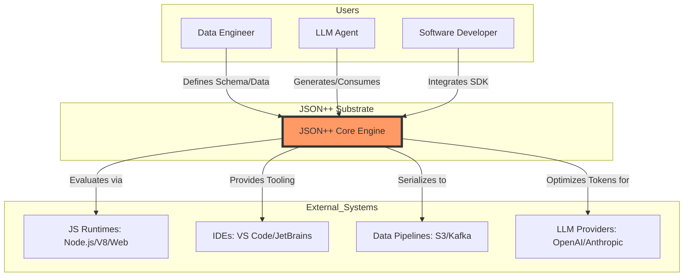
```mermaid
graph TB
    subgraph Users
        DE[Data Engineer]
        LA[LLM Agent]
        SD[Software Developer]
    end

    subgraph JSON_Plus_Plus_Ecosystem [JSON++ Substrate]
        JPP[JSON++ Core Engine]
    end

    subgraph External_Systems
        JSR[JS Runtimes: Node.js/V8/Web]
        IDE[IDEs: VS Code/JetBrains]
        PIPE[Data Pipelines: S3/Kafka]
        LLM[LLM Providers: OpenAI/Anthropic]
    end

    DE -->|Defines Schema/Data| JPP
    LA -->|Generates/Consumes| JPP
    SD -->|Integrates SDK| JPP

    JPP -->|Evaluates via| JSR
    JPP -->|Provides Tooling| IDE
    JPP -->|Serializes to| PIPE
    JPP -->|Optimizes Tokens for| LLM

    style JPP fill:#f96,stroke:#333,stroke-width:4px
```

---

## 2. Container Diagram (C4 Level 2)

This diagram breaks down the JSON++ ecosystem into its high-level functional containers.

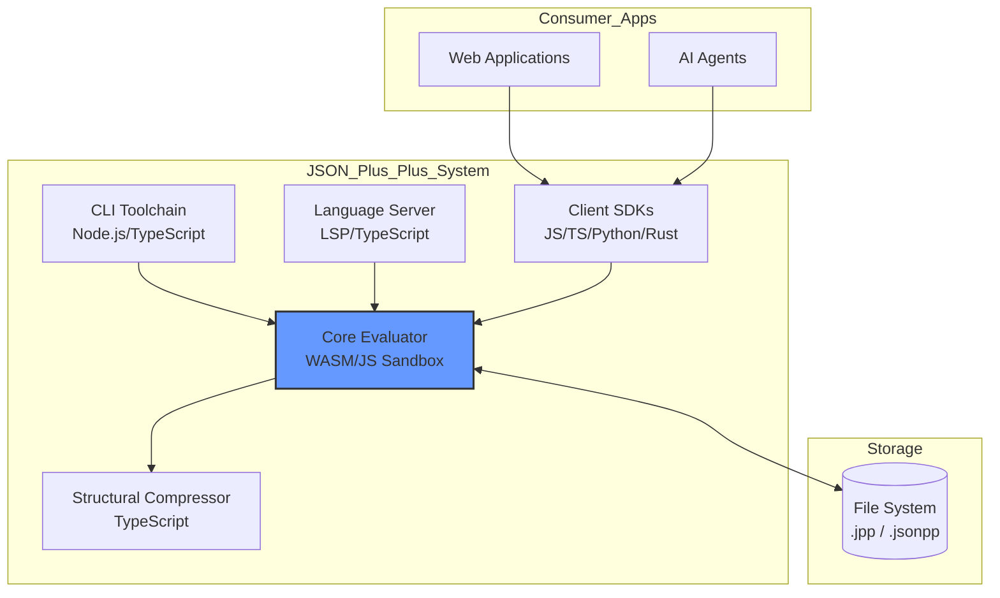
```mermaid
graph TB
    subgraph JSON_Plus_Plus_System
        CLI[CLI Toolchain<br/>Node.js/TypeScript]
        LSP[Language Server<br/>LSP/TypeScript]
        CORE[Core Evaluator<br/>WASM/JS Sandbox]
        COMP[Structural Compressor<br/>TypeScript]
        SDK[Client SDKs<br/>JS/TS/Python/Rust]
    end

    subgraph Storage
        FS[(File System<br/>.jpp / .jsonpp)]
    end

    subgraph Consumer_Apps
        WEB[Web Applications]
        AI[AI Agents]
    end

    CLI --> CORE
    LSP --> CORE
    SDK --> CORE
    CORE --> COMP
    CORE <--> FS
    WEB --> SDK
    AI --> SDK

    style CORE fill:#69f,stroke:#333,stroke-width:2px
```

---

## 3. Component Diagram (C4 Level 3)

Focusing on the **Core Evaluator**, the heart of the system that ensures the "JS-Eval Constraint" and "Side-effect free" requirements.

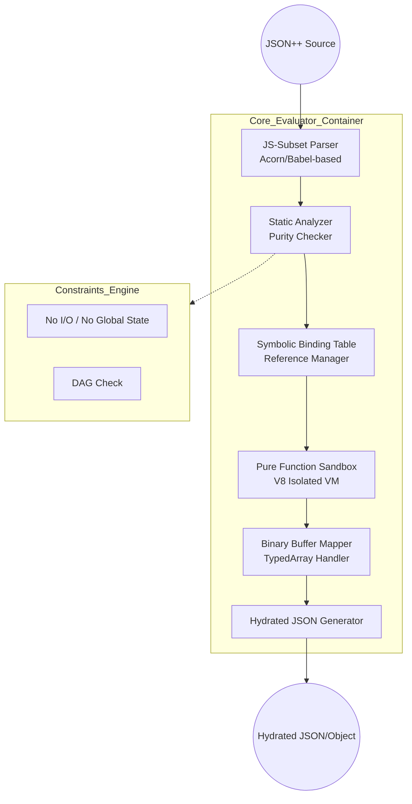
```mermaid
graph TD
    subgraph Core_Evaluator_Container
        Parser[JS-Subset Parser<br/>Acorn/Babel-based]
        Validator[Static Analyzer<br/>Purity Checker]
        SymTable[Symbolic Binding Table<br/>Reference Manager]
        FuncRunner[Pure Function Sandbox<br/>V8 Isolated VM]
        BinaryMap[Binary Buffer Mapper<br/>TypedArray Handler]
        OutputGen[Hydrated JSON Generator]
    end

    Input((JSON++ Source)) --> Parser
    Parser --> Validator
    Validator --> SymTable
    SymTable --> FuncRunner
    FuncRunner --> BinaryMap
    BinaryMap --> OutputGen
    OutputGen --> Output((Hydrated JSON/Object))

    subgraph Constraints_Engine
        Purity[No I/O / No Global State]
        Acyclic[DAG Check]
    end

    Validator -.-> Constraints_Engine
```

---

## 4. Deployment Diagram

JSON++ is distributed as a library and toolset, deployed across various environments from edge to local dev.

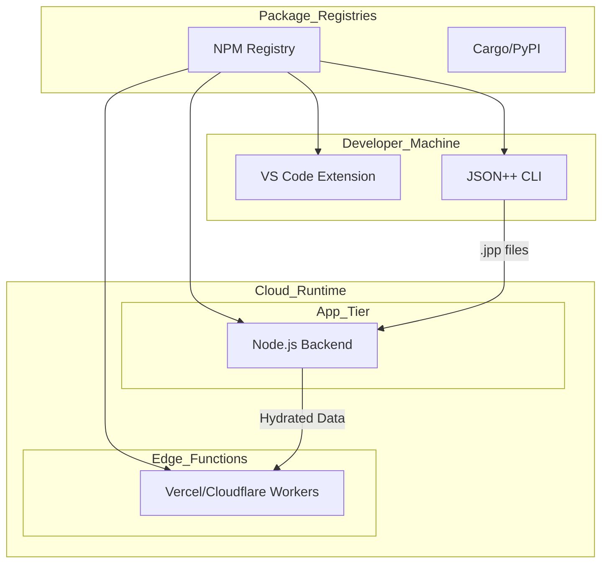
```mermaid
graph TB
    subgraph Developer_Machine
        VSCode[VS Code Extension]
        LocalCLI[JSON++ CLI]
    end

    subgraph Package_Registries
        NPM[NPM Registry]
        Cargo[Cargo/PyPI]
    end

    subgraph Cloud_Runtime
        subgraph Edge_Functions
            Vercel[Vercel/Cloudflare Workers]
        end
        subgraph App_Tier
            NodeSrv[Node.js Backend]
        end
    end

    NPM --> VSCode
    NPM --> LocalCLI
    NPM --> NodeSrv
    NPM --> Vercel
    
    LocalCLI -->|.jpp files| NodeSrv
    NodeSrv -->|Hydrated Data| Vercel
```

---

## 5. Technology Stack Summary

| Layer | Technology | Reason |
| :--- | :--- | :--- |
| **Core Language** | TypeScript | Strong typing for schema definitions and AST manipulation. |
| **Parsing** | Acorn / SWC | High-performance JS parsing to ensure strict subgrammar compliance. |
| **Runtime** | V8 / WebWorker | Native support for JS execution with isolation capabilities. |
| **Binary Handling** | ArrayBuffer / SharedArrayBuffer | Zero-copy data transfer and high-performance tensor support. |
| **Tooling** | LSP (Language Server Protocol) | Cross-IDE support for autocomplete and validation. |
| **Distribution** | NPM / WASM | Universal availability across JS runtimes and non-JS environments via WASM. |

---

## 6. Architecture Decision Records (ADRs)

### ADR-001: Adoption of JS Subgrammar over Custom DSL
*   **Context**: We needed a format that supports variables and functions. Creating a new DSL requires new parsers, syntax highlighting, and learning curves.
*   **Decision**: Use a strict subset of ECMAScript (Object literals, `const`, Arrow Functions).
*   **Consequences**: 
    *   (+) Instant compatibility with existing JS tools (Prettier, ESLint).
    *   (+) Zero-learning curve for JS developers.
    *   (-) Requires strict sandboxing to prevent `eval()`-based security risks.

### ADR-002: Enforcement of Pure Functions
*   **Context**: JSON++ must be deterministic and side-effect free for caching and security.
*   **Decision**: The evaluator will throw an error if it detects access to `window`, `process`, `fs`, `fetch`, or non-deterministic functions like `Math.random()`.
*   **Consequences**:
    *   (+) Guaranteed reproducibility of data hydration.
    *   (+) Safe to execute in multi-tenant environments.
    *   (-) Users cannot fetch external data during hydration (must be passed as arguments).

### ADR-003: Symbolic Binding for Structural Compression
*   **Context**: Large datasets (e.g., LLM traces) often contain repetitive structures.
*   **Decision**: Implement a `const` binding system where repeated objects are defined once and referenced via symbols.
*   **Consequences**:
    *   (+) Significant reduction in token count for LLM contexts.
    *   (+) Smaller wire-size compared to standard JSON.
    *   (-) Requires a "hydration" step before consumption by standard JSON parsers.

---

## 7. Traceability Matrix

| ID | Requirement | Component | Test Case |
| :--- | :--- | :--- | :--- |
| **FR-001** | JS-Eval Constraint | `Parser` | `TC-001: Validate valid JS object literal` |
| **FR-002** | Side-effect free | `Validator` | `TC-002: Reject code containing 'fetch()'` |
| **FR-003** | Symbolic Bindings | `SymTable` | `TC-003: Verify memory address reuse for consts` |
| **FR-004** | Binary Tensors | `BinaryMap` | `TC-004: Map Base64 to Float32Array` |
| **FR-005** | LSP Support | `LSP Server` | `TC-005: Provide hover-type info in VS Code` |

---

## 8. State Machine: Evaluation Lifecycle (StateDiagram-v2)

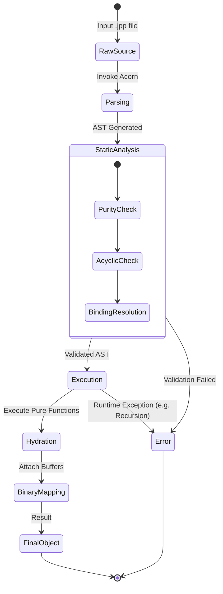
```mermaid
stateDiagram-v2
    [*] --> RawSource: Input .jpp file
    RawSource --> Parsing: Invoke Acorn
    Parsing --> StaticAnalysis: AST Generated
    
    state StaticAnalysis {
        [*] --> PurityCheck
        PurityCheck --> AcyclicCheck
        AcyclicCheck --> BindingResolution
    }
    
    StaticAnalysis --> Execution: Validated AST
    Execution --> Hydration: Execute Pure Functions
    Hydration --> BinaryMapping: Attach Buffers
    BinaryMapping --> FinalObject: Result
    
    StaticAnalysis --> Error: Validation Failed
    Execution --> Error: Runtime Exception (e.g. Recursion)
    Error --> [*]
    FinalObject --> [*]
```

---

## Data Model & ERD

# JSON++ Data Model Documentation

This document outlines the internal data model and structural architecture of **JSON++: The Grammar-Extensible Data Substrate**. Unlike static JSON, JSON++ is a programmable substrate. This documentation defines how the substrate manages symbols, hydrators, and binary data.

---

## 1. Entity-Relationship Diagram (Meta-Model)

The following diagram represents the internal structure of a JSON++ document and its evaluation lifecycle.

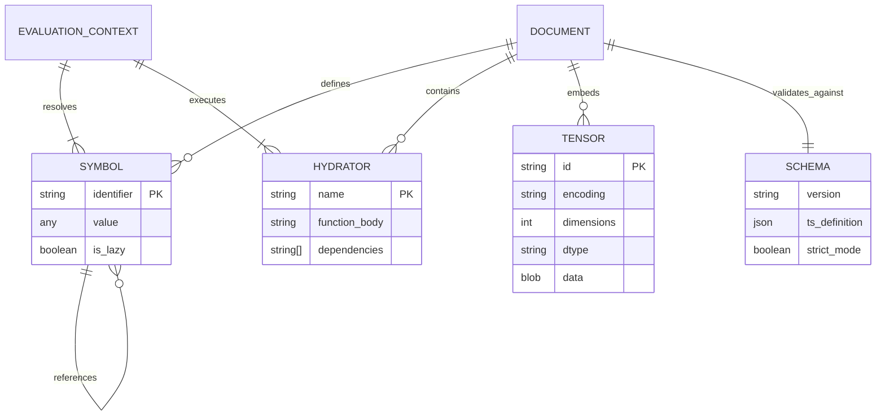
```mermaid
erDiagram
    DOCUMENT ||--o{ SYMBOL : defines
    DOCUMENT ||--o{ HYDRATOR : contains
    DOCUMENT ||--o{ TENSOR : embeds
    DOCUMENT ||--|| SCHEMA : validates_against

    SYMBOL ||--o{ SYMBOL : references
    SYMBOL {
        string identifier PK
        any value
        boolean is_lazy
    }

    HYDRATOR {
        string name PK
        string function_body
        string[] dependencies
    }

    TENSOR {
        string id PK
        string encoding
        int dimensions
        string dtype
        blob data
    }

    SCHEMA {
        string version
        json ts_definition
        boolean strict_mode
    }

    EVALUATION_CONTEXT ||--|{ SYMBOL : resolves
    EVALUATION_CONTEXT ||--|{ HYDRATOR : executes
```

---

## 2. Entity Descriptions

### 2.1 Document (The Substrate)
- **Purpose**: The root container for a JSON++ instance. It is a valid JavaScript module or script that, when evaluated in a restricted context, yields a data structure.
- **Attributes**:
    - `version`: The JSON++ specification version.
    - `body`: The primary data payload.
- **Relationships**: Acts as the parent for all Symbols, Hydrators, and Tensors.

### 2.2 Symbol
- **Purpose**: Enables structural compression by allowing repeated data patterns to be defined once and referenced multiple times (aliasing).
- **Attributes**:
    - `identifier`: Unique name within the document scope (e.g., `$user_template`).
    - `value`: Any valid JSON++ type (primitive, object, or reference).
    - `is_lazy`: If true, the symbol is only evaluated upon first access.
- **Performance**: Reduces token count in LLM contexts and memory footprint in telemetry.

### 2.3 Hydrator
- **Purpose**: Pure functions that transform raw data into a "hydrated" state (e.g., calculating a total price from an array of items).
- **Attributes**:
    - `name`: The function identifier.
    - `function_body`: A side-effect-free JavaScript arrow function.
    - `dependencies`: List of other symbols or hydrators required for execution.
- **Constraints**: Must be deterministic and side-effect free (no `Date.now()`, `Math.random()`, or I/O).

### 2.4 Tensor
- **Purpose**: High-performance handling of multi-dimensional numerical data, mapped directly to JavaScript `TypedArrays`.
- **Attributes**:
    - `dtype`: Data type (e.g., `float32`, `int8`).
    - `dimensions`: Shape of the data (e.g., `[1024, 768]`).
    - `encoding`: Storage format (e.g., `base64`, `raw-hex`).

---

## 3. Data Dictionary

| Entity | Attribute | Type | Constraints | Description |
| :--- | :--- | :--- | :--- | :--- |
| **Symbol** | `identifier` | String | Regex: `^\$[a-zA-Z0-9_]+$` | The variable name used for referencing. |
| **Symbol** | `value` | Any | Valid JS Subset | The data or structure being aliased. |
| **Hydrator** | `function_body`| String | Pure Function | The logic used to compute derived fields. |
| **Tensor** | `dtype` | Enum | `f32, f64, i8, u8, i32` | The numerical precision of the binary block. |
| **Tensor** | `data` | Blob/String | Non-null | The encoded binary payload. |
| **Schema** | `ts_definition` | JSON/TS | Valid TypeScript | The structural contract the document must satisfy. |

---

## 4. Data Flow Diagram

The following diagram illustrates the lifecycle of a JSON++ document from raw input to a fully hydrated, application-ready object.

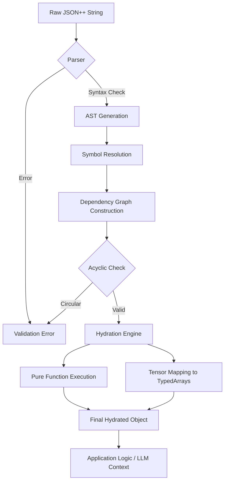
```mermaid
graph TD
    A[Raw JSON++ String] --> B{Parser}
    B -->|Syntax Check| C[AST Generation]
    B -->|Error| E[Validation Error]
    
    C --> D[Symbol Resolution]
    D --> F[Dependency Graph Construction]
    
    F --> G{Acyclic Check}
    G -->|Circular| E
    G -->|Valid| H[Hydration Engine]
    
    H --> I[Pure Function Execution]
    H --> J[Tensor Mapping to TypedArrays]
    
    I --> K[Final Hydrated Object]
    J --> K
    
    K --> L[Application Logic / LLM Context]
```

---

## 5. Data Validation Rules

To ensure the integrity of the "Data Substrate," the following rules are enforced during the parsing and hydration phases:

1. **FR-VAL-01: Pure Function Constraint**
   - Hydrators cannot access global objects (`window`, `process`, `global`).
   - Hydrators cannot use non-deterministic functions (`Math.random()`).
2. **FR-VAL-02: Acyclic Dependency**
   - Symbols and Hydrators must form a Directed Acyclic Graph (DAG). Circular references result in a `ReferenceError`.
3. **FR-VAL-03: Type Safety**
   - If a `Schema` is provided, the final hydrated object must pass a `tsc` (TypeScript Compiler) check or a JSON Schema validation.
4. **FR-VAL-04: Tensor Integrity**
   - The length of the `data` blob must exactly match the product of the `dimensions` and the byte-size of the `dtype`.

---

## 6. Data Migration Considerations

When migrating from standard JSON or Protobuf to JSON++, consider the following:

### 6.1 From Standard JSON
- **De-duplication**: Identify repeating objects (e.g., metadata headers) and move them into `Symbols`.
- **Logic Extraction**: Move calculated fields from the producer side into `Hydrators` to reduce payload size.

### 6.2 From Protobuf/Binary
- **Schema Mapping**: Map Protobuf `.proto` definitions to JSON++ TypeScript schemas.
- **Tensor Optimization**: Use the `Tensor` entity for large arrays to maintain the performance of binary formats while keeping the rest of the metadata human-readable.

### 6.3 LLM Token Optimization
- **Symbolic Aliasing**: Use short symbol names (e.g., `$1`, `$2`) for long, repetitive strings to significantly reduce token consumption during LLM inference and context window usage.

---

## Flow Diagrams

# JSON++: Flow Documentation & System Interactions

This document outlines the critical operational flows for **JSON++**, detailing how the system handles data hydration, symbolic expansion, binary mapping, and security enforcement.

---

## 1. Sequence Diagrams: Critical User Journeys

### SD-101: Data Hydration & Evaluation
This journey describes how a raw JSON++ string is transformed into a hydrated JavaScript object while enforcing the "Pure Function" constraint.

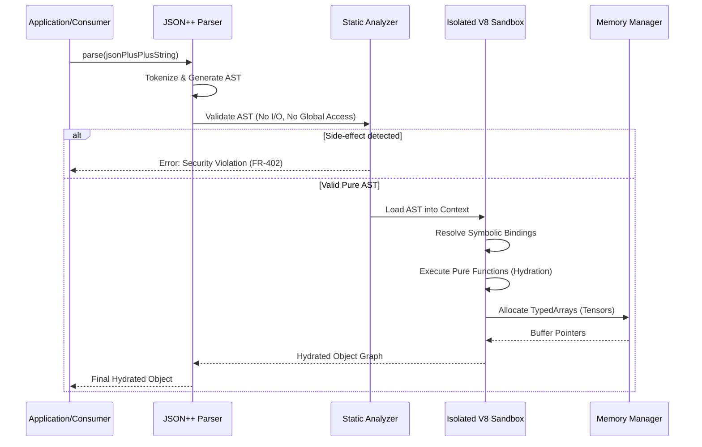
```mermaid
sequenceDiagram
    participant App as Application/Consumer
    participant P as JSON++ Parser
    participant S as Static Analyzer
    participant VM as Isolated V8 Sandbox
    participant M as Memory Manager

    App->>P: parse(jsonPlusPlusString)
    P->>P: Tokenize & Generate AST
    P->>S: Validate AST (No I/O, No Global Access)
    alt Side-effect detected
        S-->>App: Error: Security Violation (FR-402)
    else Valid Pure AST
        S->>VM: Load AST into Context
        VM->>VM: Resolve Symbolic Bindings
        VM->>VM: Execute Pure Functions (Hydration)
        VM->>M: Allocate TypedArrays (Tensors)
        M-->>VM: Buffer Pointers
        VM-->>P: Hydrated Object Graph
        P-->>App: Final Hydrated Object
    end
```

### SD-102: LLM Context Injection (Token Optimization)
This journey demonstrates how an LLM-native application uses JSON++ to reduce token count via symbolic compression.

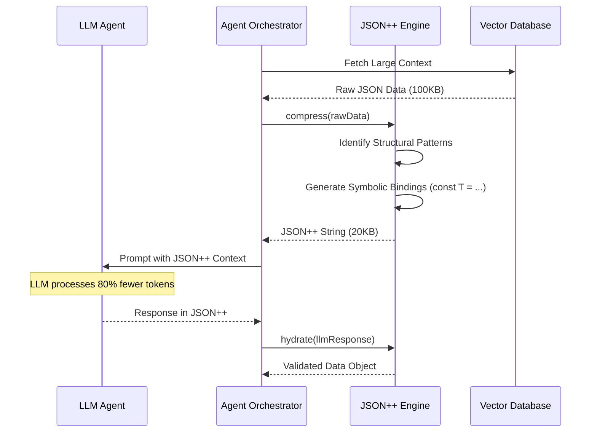
```mermaid
sequenceDiagram
    participant LLM as LLM Agent
    participant Orchestrator as Agent Orchestrator
    participant JPP as JSON++ Engine
    participant DB as Vector Database

    Orchestrator->>DB: Fetch Large Context
    DB-->>Orchestrator: Raw JSON Data (100KB)
    Orchestrator->>JPP: compress(rawData)
    JPP->>JPP: Identify Structural Patterns
    JPP->>JPP: Generate Symbolic Bindings (const T = ...)
    JPP-->>Orchestrator: JSON++ String (20KB)
    Orchestrator->>LLM: Prompt with JSON++ Context
    Note over LLM: LLM processes 80% fewer tokens
    LLM-->>Orchestrator: Response in JSON++
    Orchestrator->>JPP: hydrate(llmResponse)
    JPP-->>Orchestrator: Validated Data Object
```

---

## 2. Activity Diagrams: Complex Processes

### AD-201: Symbolic Binding Resolution Logic
The core logic for expanding `const` definitions and spread operators within the data substrate.

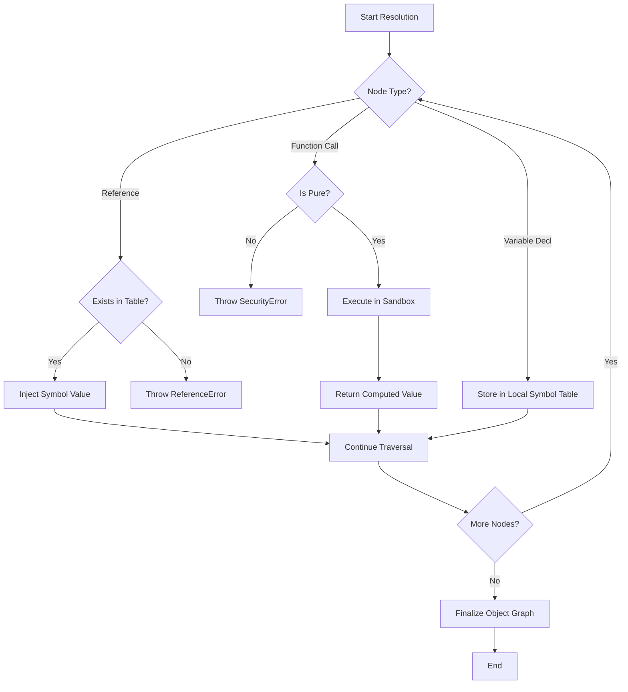
```mermaid
graph TD
    A[Start Resolution] --> B{Node Type?}
    B -->|Variable Decl| C[Store in Local Symbol Table]
    B -->|Reference| D{Exists in Table?}
    D -->|No| E[Throw ReferenceError]
    D -->|Yes| F[Inject Symbol Value]
    B -->|Function Call| G{Is Pure?}
    G -->|No| H[Throw SecurityError]
    G -->|Yes| I[Execute in Sandbox]
    I --> J[Return Computed Value]
    F --> K[Continue Traversal]
    J --> K
    C --> K
    K --> L{More Nodes?}
    L -->|Yes| B
    L -->|No| M[Finalize Object Graph]
    M --> N[End]
```

---

## 3. State Diagrams: Entity Lifecycles

### ST-301: JSON++ Document Lifecycle
Tracks the state of a JSON++ document from raw input to a live, hydrated memory object.

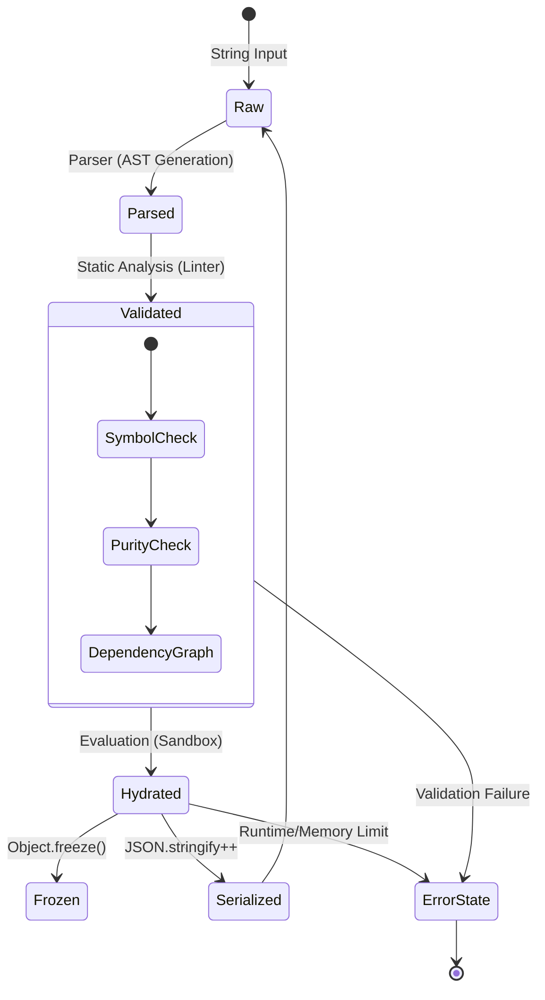
```mermaid
stateDiagram-v2
    [*] --> Raw: String Input
    Raw --> Parsed: Parser (AST Generation)
    Parsed --> Validated: Static Analysis (Linter)
    Validated --> Hydrated: Evaluation (Sandbox)
    Hydrated --> Frozen: Object.freeze()
    
    state Validated {
        [*] --> SymbolCheck
        SymbolCheck --> PurityCheck
        PurityCheck --> DependencyGraph
    }

    Hydrated --> Serialized: JSON.stringify++
    Serialized --> Raw
    
    Validated --> ErrorState: Validation Failure
    Hydrated --> ErrorState: Runtime/Memory Limit
    ErrorState --> [*]
```

---

## 4. Integration Flow Diagrams

### IF-401: Binary Data & Tensor Mapping
JSON++ allows high-performance data handling by mapping specific keys to binary buffers (e.g., for AI model weights or telemetry).

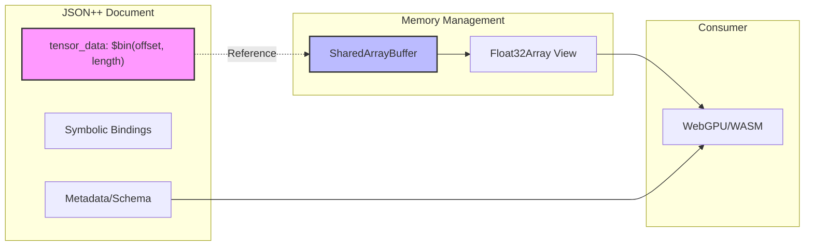
```mermaid
graph LR
    subgraph "JSON++ Document"
        J1[Metadata/Schema]
        J2[Symbolic Bindings]
        J3["tensor_data: $bin(offset, length)"]
    end

    subgraph "Memory Management"
        B1[SharedArrayBuffer]
        T1[Float32Array View]
    end

    subgraph "Consumer"
        C1[WebGPU/WASM]
    end

    J3 -.->|Reference| B1
    B1 --> T1
    T1 --> C1
    J1 --> C1
    
    style J3 fill:#f9f,stroke:#333,stroke-width:2px
    style B1 fill:#bbf,stroke:#333,stroke-width:2px
```

---

## 5. Error Handling Flows

### EF-501: Sandbox Violation & Recovery
How the system handles non-deterministic or malicious code within a JSON++ file.

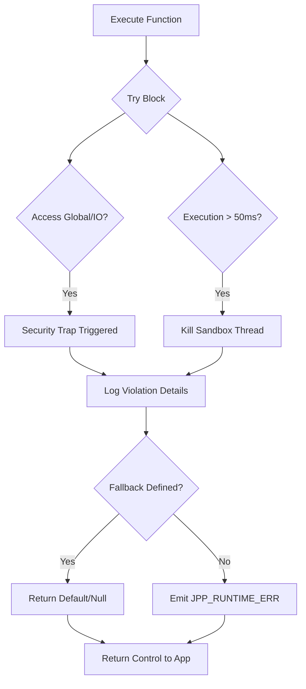
```mermaid
graph TD
    Start[Execute Function] --> Try{Try Block}
    Try --> AccessGlobal{Access Global/IO?}
    AccessGlobal -->|Yes| Trap[Security Trap Triggered]
    Try --> Timeout{Execution > 50ms?}
    Timeout -->|Yes| Terminate[Kill Sandbox Thread]
    
    Trap --> Log[Log Violation Details]
    Terminate --> Log
    
    Log --> Fallback{Fallback Defined?}
    Fallback -->|Yes| UseDefault[Return Default/Null]
    Fallback -->|No| Throw[Emit JPP_RUNTIME_ERR]
    
    UseDefault --> End[Return Control to App]
    Throw --> End
```

---

## 6. Traceability Matrix (Flows to Requirements)

| Flow ID | Name | Primary Requirement | Stakeholder |
|:---|:---|:---|:---|
| **SD-101** | Hydration Flow | FR-101: Deterministic Eval | Data Engineers |
| **SD-102** | LLM Optimization | FR-205: Token Efficiency | LLM Developers |
| **AD-201** | Symbolic Resolution | FR-104: Structural Compression | Systems Architects |
| **ST-301** | Document Lifecycle | FR-301: LSP Support | DevOps Engineers |
| **IF-401** | Binary Mapping | FR-502: Zero-copy Tensors | AI Engineers |
| **EF-501** | Sandbox Violation | FR-402: Side-effect Free | Security Engineers |

---

## 7. Acceptance Criteria for Flows

1.  **Hydration Performance (SD-101):** Hydration of a 1MB JSON++ file with 100 symbolic bindings must complete in < 20ms on standard V8 runtimes.
2.  **Sandbox Integrity (EF-501):** Any attempt to access `process`, `window`, `fetch`, or `Date.now()` must result in an immediate `SecurityError` before execution.
3.  **Compression Ratio (SD-102):** For repetitive telemetry data, JSON++ must achieve at least a 3:1 compression ratio compared to standard JSON without using GZIP.
4.  **Memory Safety (IF-401):** Binary mappings must be bounds-checked against the underlying `ArrayBuffer` to prevent buffer overruns.

---

## Test Plan

# JSON++ Test Plan Documentation
**Project:** JSON++: The Grammar-Extensible Data Substrate  
**Version:** 1.0.0  
**Status:** Draft / For Review

---

## 1. Test Strategy Overview

### 1.1 Testing Objectives
The primary objective is to ensure that JSON++ remains a deterministic, side-effect-free, and high-performance data substrate. Testing focuses on the integrity of the parser, the safety of the evaluation sandbox, and the efficiency of symbolic compression.

### 1.2 Testing Scope
*   **In-Scope:**
    *   Grammar validation (JS-subset compliance).
    *   Symbolic binding resolution and scope management.
    *   Pure function evaluation and hydration.
    *   Binary/Tensor mapping to `TypedArrays`.
    *   LSP (Language Server Protocol) features (autocomplete, diagnostics).
    *   Security sandboxing (prevention of I/O and global access).
*   **Out-of-Scope:**
    *   Network-level transport protocols.
    *   Non-V8 runtime optimizations (e.g., SpiderMonkey specific quirks).
    *   Third-party library integrations outside the core SDK.

### 1.3 Testing Approach
We utilize a **Test-Driven Development (TDD)** approach for the parser and a **Property-Based Testing** approach for the hydration engine to ensure that any valid JSON++ input results in a deterministic output regardless of evaluation order.

### 1.4 Entry/Exit Criteria
*   **Entry Criteria:**
    *   Architecture design document finalized.
    *   Grammar specification (EBNF) completed.
    *   CI/CD pipeline configured.
*   **Exit Criteria:**
    *   100% pass rate for "Critical" and "High" priority test cases.
    *   Code coverage > 92% for the core engine.
    *   Zero known "Sandbox Escape" vulnerabilities.

---

## 2. Test Levels

### 2.1 Unit Testing
*   **Framework:** Vitest / Jest.
*   **Focus:** Individual components: Lexer, Parser, AST Transformer, and Scope Manager.
*   **Target:** 100% coverage of the `grammar-rules` module.

### 2.2 Integration Testing
*   **Focus:** Interaction between the Parser and the Hydrator.
*   **Scenarios:** Testing how `const` bindings in one block are consumed by functions in another.
*   **API Testing:** Validating the `JSONPP.parse()` and `JSONPP.stringify()` interfaces.

### 2.3 System Testing (End-to-End)
*   **Focus:** Real-world data workflows.
*   **Scenarios:** Loading a 50MB telemetry file with symbolic compression and verifying memory footprint vs. standard JSON.
*   **LLM Integration:** Testing token-count reduction when passing JSON++ to GPT-4/Claude-3.

### 2.4 Acceptance Testing (UAT)
*   **Criteria:** Developers must be able to define a custom "Tensor" type and hydrate it into a `Float32Array` without manual iteration.
*   **LSP Validation:** VS Code extension provides real-time feedback on side-effect violations.

---

## 3. Test Case Catalog

| TC-ID | Requirement | Description | Steps | Expected Result | Priority |
|-------|-------------|-------------|-------|-----------------|----------|
| **TC-001** | FR-001 | Standard JSON Compatibility | 1. Input standard JSON string. 2. Call `JSONPP.parse()`. | Output matches `JSON.parse()` exactly. | Critical |
| **TC-002** | FR-002 | Symbolic Binding Resolution | 1. Define `const base = { a: 1 };`. 2. Reference `base` in a nested object. | Nested object contains resolved values. | High |
| **TC-003** | FR-003 | Pure Function Hydration | 1. Define `const add = (x, y) => x + y;`. 2. Use `add(5, 10)` in data. | Field evaluates to `15`. | High |
| **TC-004** | FR-004 | Side-Effect Prevention | 1. Attempt to use `fetch()` or `fs.readFile` inside a function. | Parser throws `SecurityError`. | Critical |
| **TC-005** | FR-005 | Tensor Mapping | 1. Define a binary blob. 2. Map to `Int32Array`. | Data is accessible as a zero-copy TypedArray. | Medium |
| **TC-006** | FR-006 | Circular Dependency Detection | 1. Define `const a = b; const b = a;`. 2. Parse. | Parser throws `CircularDependencyError`. | High |

---

## 4. Test Coverage Matrix

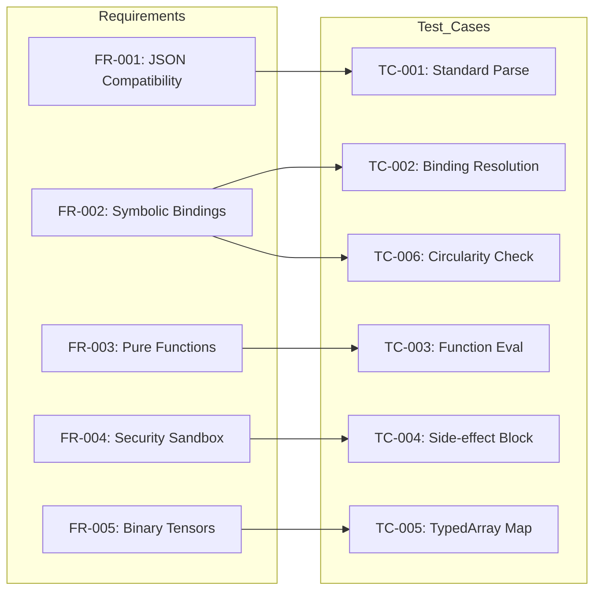
```mermaid
graph LR
    subgraph Requirements
        FR1[FR-001: JSON Compatibility]
        FR2[FR-002: Symbolic Bindings]
        FR3[FR-003: Pure Functions]
        FR4[FR-004: Security Sandbox]
        FR5[FR-005: Binary Tensors]
    end

    subgraph Test_Cases
        TC1[TC-001: Standard Parse]
        TC2[TC-002: Binding Resolution]
        TC3[TC-003: Function Eval]
        TC4[TC-004: Side-effect Block]
        TC5[TC-005: TypedArray Map]
        TC6[TC-006: Circularity Check]
    end

    FR1 --> TC1
    FR2 --> TC2
    FR2 --> TC6
    FR3 --> TC3
    FR4 --> TC4
    FR5 --> TC5
```

---

## 5. Non-Functional Test Cases

### 5.1 Performance Testing
*   **Scenario:** Compare parsing time of a 100MB JSON file vs. a compressed 10MB JSON++ file representing the same data.
*   **Metric:** Time to First Hydrated Object (TTFHO).
*   **Target:** JSON++ hydration should be within 1.5x of native `JSON.parse` speed despite the added logic.

### 5.2 Security Testing
*   **Scenario:** "The Jailbreak Test." Attempt to access `globalThis`, `process`, or `window` through obfuscated function calls (e.g., `[].constructor.constructor('return process')()`).
*   **Expected Result:** The V8 Isolate or ShadowRealm sandbox must intercept and terminate the execution.

### 5.3 Usability Testing (LLM-Native)
*   **Scenario:** Measure token usage for a complex agentic state representation in JSON vs. JSON++.
*   **Target:** Minimum 30% reduction in token count for repetitive structural data.

---

## 6. Test Environment Requirements

### 6.1 Software Requirements
*   **Runtime:** Node.js v20.x (LTS) or Deno v1.40+.
*   **Compiler:** TypeScript 5.x.
*   **Sandbox:** `vm2` (for Node) or `ShadowRealm` (for Web).

### 6.2 Tool Requirements
*   **Benchmarking:** `Hyperfine` for CLI performance metrics.
*   **Fuzzing:** `js-fuzz` to test parser resilience against malformed JS.
*   **LSP Testing:** `vscode-test` for extension integration.

---

## 7. Test Schedule

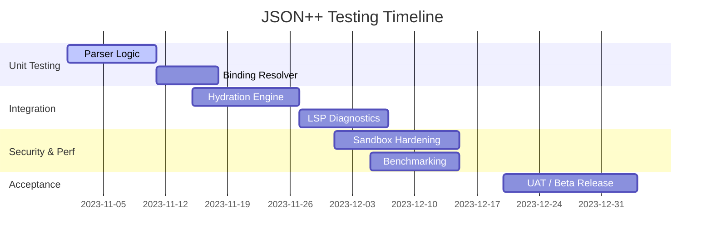
```mermaid
gantt
    title JSON++ Testing Timeline
    dateFormat  YYYY-MM-DD
    section Unit Testing
    Parser Logic           :active, ut1, 2023-11-01, 10d
    Binding Resolver       :ut2, after ut1, 7d
    section Integration
    Hydration Engine       :it1, 2023-11-15, 12d
    LSP Diagnostics        :it2, after it1, 10d
    section Security & Perf
    Sandbox Hardening      :sec1, 2023-12-01, 14d
    Benchmarking           :perf1, 2023-12-05, 10d
    section Acceptance
    UAT / Beta Release     :uat1, 2023-12-20, 15d
```

---

## 8. Risk Assessment

| Risk | Impact | Probability | Mitigation Strategy |
|------|--------|-------------|---------------------|
| **Infinite Loops** | High | Medium | Implement a "Gas Limit" or instruction count limit for function evaluation. |
| **Memory Exhaustion** | High | Low | Set strict heap limits on the evaluation sandbox. |
| **JS Compatibility** | Medium | Low | Use the official ECMA-262 grammar as the base for the parser to ensure strict subsetting. |
| **LSP Latency** | Low | Medium | Implement incremental parsing to ensure the UI remains responsive during large file edits. |

---

## 9. State Machine: Evaluation Lifecycle

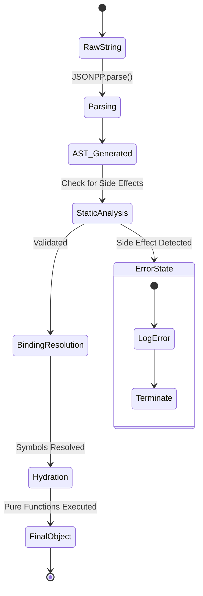
```mermaid
stateDiagram-v2
    [*] --> RawString
    RawString --> Parsing : JSONPP.parse()
    Parsing --> AST_Generated
    AST_Generated --> StaticAnalysis : Check for Side Effects
    StaticAnalysis --> BindingResolution : Validated
    StaticAnalysis --> ErrorState : Side Effect Detected
    BindingResolution --> Hydration : Symbols Resolved
    Hydration --> FinalObject : Pure Functions Executed
    FinalObject --> [*]
    
    state ErrorState {
        [*] --> LogError
        LogError --> Terminate
    }
```

**Approval Sign-off:**
*   Lead Architect: __________________________
*   QA Lead: ________________________________
*   Security Officer: ________________________

---

## Phase Plan

# JSON++ Development Phase Planning

This document outlines the strategic roadmap for the development of **JSON++: The Grammar-Extensible Data Substrate**. The plan focuses on building a secure, high-performance, and LLM-native data format that maintains strict compatibility with JavaScript runtimes.

---

## 1. Project Timeline Overview

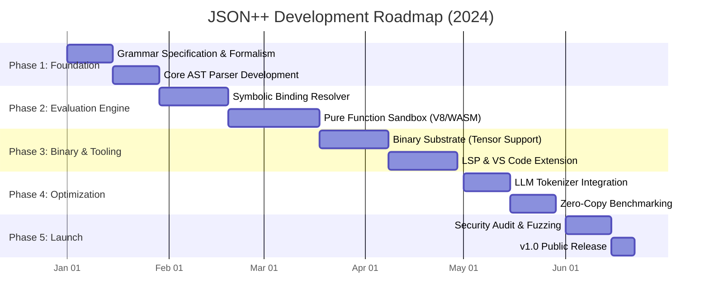
```mermaid
gantt
    title JSON++ Development Roadmap (2024)
    dateFormat  YYYY-MM-DD
    axisFormat  %b %d
    
    section Phase 1: Foundation
    Grammar Specification & Formalism :a1, 2024-01-01, 14d
    Core AST Parser Development       :a2, after a1, 14d
    
    section Phase 2: Evaluation Engine
    Symbolic Binding Resolver         :b1, 2024-01-29, 21d
    Pure Function Sandbox (V8/WASM)   :b2, after b1, 28d
    
    section Phase 3: Binary & Tooling
    Binary Substrate (Tensor Support) :c1, 2024-03-18, 21d
    LSP & VS Code Extension           :c2, after c1, 21d
    
    section Phase 4: Optimization
    LLM Tokenizer Integration         :d1, 2024-05-01, 14d
    Zero-Copy Benchmarking            :d2, after d1, 14d
    
    section Phase 5: Launch
    Security Audit & Fuzzing          :e1, 2024-06-01, 14d
    v1.0 Public Release               :e2, after e1, 7d
```

---

## 2. Phase Descriptions

### Phase 1: Foundation (Weeks 1-4)
*   **Objectives:** Define the JSON++ grammar as a strict subset of ECMAScript and build a high-speed parser.
*   **Deliverables:** Formal EBNF Grammar, `json-plus-plus-parser` (NPM package).
*   **Key Activities:** 
    *   Drafting the specification for symbolic bindings (`$ref`).
    *   Implementing a non-recursive descent parser for AST generation.
*   **Dependencies:** None.
*   **Success Criteria:** Parser passes 100% of standard JSON test suites and correctly identifies valid JS-subset extensions.
*   **Risks:** Scope creep in grammar definition. 
    *   *Mitigation:* Strict "No Side-Effects" rule enforced at the grammar level.

### Phase 2: Evaluation Engine (Weeks 5-10)
*   **Objectives:** Create the runtime that resolves variables and executes pure functions to "hydrate" data.
*   **Deliverables:** `json-plus-plus-runtime`, Deterministic Evaluator.
*   **Key Activities:**
    *   Implementing the Directed Acyclic Graph (DAG) resolver for bindings.
    *   Building the "Pure Function" sandbox using `ShadowRealm` or isolated V8 contexts.
*   **Dependencies:** Phase 1 Parser.
*   **Success Criteria:** Evaluation is deterministic; identical inputs yield identical outputs across different environments.
*   **Risks:** Performance overhead of function evaluation.
    *   *Mitigation:* Implement memoization for function results based on input hashes.

### Phase 3: Binary Substrate & Tooling (Weeks 11-16)
*   **Objectives:** Enable high-performance handling of large numerical arrays (tensors) and developer experience.
*   **Deliverables:** VS Code Extension, Binary Serialization Spec (BSON++).
*   **Key Activities:**
    *   Mapping JSON++ arrays to `SharedArrayBuffer` and `TypedArrays`.
    *   Developing the Language Server Protocol (LSP) for autocomplete and validation.
*   **Dependencies:** Phase 2 Evaluator.
*   **Success Criteria:** 1GB tensor data loads in <100ms via zero-copy mapping.
*   **Risks:** LSP complexity for dynamic symbolic bindings.
    *   *Mitigation:* Use a simplified type-inference engine for the LSP.

---

## 3. Milestone Schedule

| Milestone | Target Date | Deliverables | Success Criteria |
|-----------|-------------|--------------|------------------|
| **M1: Grammar Frozen** | Week 2 | Formal Spec Document | Approved by Architecture Board |
| **M2: Parser Alpha** | Week 4 | Parser CLI & Library | Passes 10k+ fuzzing iterations |
| **M3: Sandbox Secure** | Week 8 | Evaluator with Sandbox | Zero I/O or Global access possible |
| **M4: Tooling Beta** | Week 14 | VS Code Extension v0.1 | Real-time syntax highlighting & linting |
| **M5: v1.0 Release** | Week 26 | Production-ready SDK | Documentation complete; 95% test coverage |

---

## 4. Resource Allocation

| Role | Responsibility | Phase Focus |
|:---|:---|:---|
| **Lead Architect** | Grammar design, Security model, Spec ownership | All Phases |
| **Core Engine Dev (x2)** | Parser, Evaluator, Sandbox implementation | Phase 1, 2, 4 |
| **Systems Engineer** | Binary substrate, Memory management, Tensors | Phase 3, 4 |
| **DX/Tooling Dev** | LSP, VS Code Extension, Documentation | Phase 3, 5 |
| **QA/Security Engineer** | Fuzzing, Performance Benchmarking, Audit | Phase 2, 4, 5 |

---

## 5. Sprint Planning Overview (Initial 8 Weeks)

### Sprint 1: The Parser (Weeks 1-2)
*   **Goal:** Convert JSON++ string to a typed AST.
*   **Capacity:** 80 Story Points.
*   **Deliverables:** AST Schema, Lexer, Parser.

### Sprint 2: Symbolic Resolution (Weeks 3-4)
*   **Goal:** Resolve `$ref` and variable bindings within the AST.
*   **Capacity:** 75 Story Points.
*   **Deliverables:** Dependency Graph Resolver, Cycle Detection.

### Sprint 3: The Pure Sandbox (Weeks 5-6)
*   **Goal:** Execute JS functions in a restricted environment.
*   **Capacity:** 70 Story Points.
*   **Deliverables:** V8 Context Wrapper, Global Object Stripping.

### Sprint 4: Hydration Logic (Weeks 7-8)
*   **Goal:** Full data hydration (Transforming AST + Functions -> Final Data).
*   **Capacity:** 85 Story Points.
*   **Deliverables:** `hydrate()` API, Error handling for failed evaluations.

---

## 6. Release Plan

### v0.1-alpha (Week 6)
*   **Features:** Basic JSON parsing, Variable bindings, CLI tool.
*   **Criteria:** Internal testing only.

### v0.5-beta (Week 16)
*   **Features:** Pure function support, VS Code Extension, Tensor support.
*   **Criteria:** External "Early Adopter" feedback loop.

### v1.0-stable (Week 26)
*   **Features:** Full spec compliance, Performance optimizations, Production-ready SDKs for Node.js and Browser.
*   **Criteria:** Zero known security vulnerabilities, <5ms overhead for standard payloads.

---

## 7. Risk Timeline

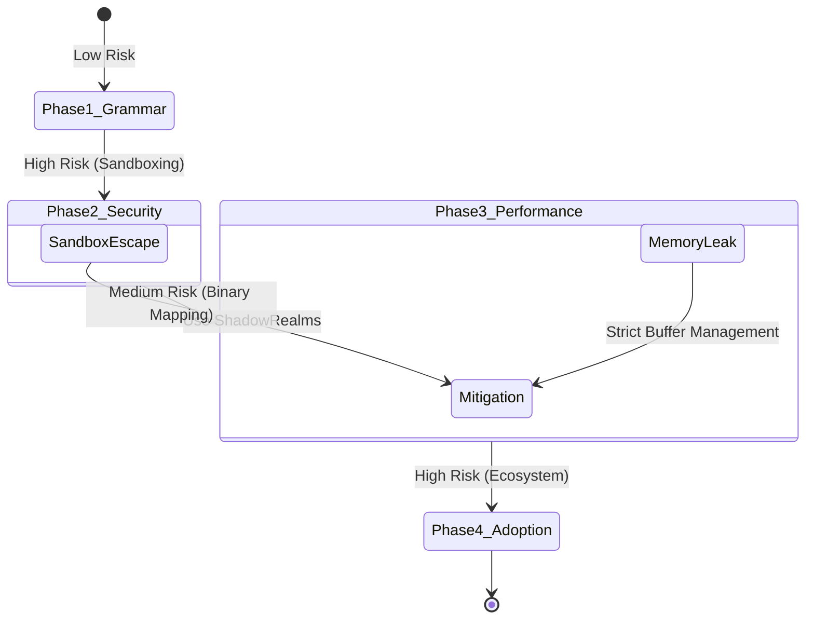
```mermaid
stateDiagram-v2
    [*] --> Phase1_Grammar: Low Risk
    Phase1_Grammar --> Phase2_Security: High Risk (Sandboxing)
    Phase2_Security --> Phase3_Performance: Medium Risk (Binary Mapping)
    Phase3_Performance --> Phase4_Adoption: High Risk (Ecosystem)
    Phase4_Adoption --> [*]

    state Phase2_Security {
        direction LR
        SandboxEscape --> Mitigation: Use ShadowRealms
    }
    state Phase3_Performance {
        direction LR
        MemoryLeak --> Mitigation: Strict Buffer Management
    }
```

*   **Critical Window (Weeks 6-10):** The security of the JS sandbox is the highest technical risk. If the sandbox can be escaped, the "Side-effect free" constraint is violated.
*   **Mitigation Window (Weeks 18-22):** Performance tuning for LLM contexts. If tokenization is too slow, the "LLM-native" value proposition fails. We will allocate extra resources here for C++ bindings if JS performance is insufficient.

---

## Project Data
Generated JSON file: design.project_data.json

Raw JSON Content

```json
{
  "project_name" : "JSON++: The Grammar-Extensible Data Substrate",
  "description" : "JSON++ is a programmable data format designed as a strict subgrammar of JavaScript. It enables structural compression through symbolic bindings, declarative data hydration via pure functions, and high-performance binary handling (tensors) while remaining human-readable and LLM-native. It leverages existing JavaScript infrastructure and TypeScript for specification and tooling.",
  "created_date" : "2026-02-16T13:33:33.223967784",
  "epics" : [ {
    "id" : "EPIC-UC",
    "name" : "User Features",
    "description" : "Core user-facing functionality based on use cases",
    "priority" : "High",
    "status" : "Planned",
    "story_points" : 105
  }, {
    "id" : "EPIC-ARCH",
    "name" : "Architecture & Infrastructure",
    "description" : "Set up system architecture and infrastructure",
    "priority" : "High",
    "status" : "Planned",
    "story_points" : 21
  }, {
    "id" : "EPIC-TEST",
    "name" : "Quality Assurance",
    "description" : "Testing and quality assurance activities",
    "priority" : "High",
    "status" : "Planned",
    "story_points" : 13
  }, {
    "id" : "EPIC-101",
    "name" : "Epic EPIC-101",
    "description" : "Auto-extracted epic from analysis",
    "priority" : "Medium",
    "status" : "Planned",
    "story_points" : 13
  }, {
    "id" : "EPIC-102",
    "name" : "Epic EPIC-102",
    "description" : "Auto-extracted epic from analysis",
    "priority" : "Medium",
    "status" : "Planned",
    "story_points" : 13
  }, {
    "id" : "EPIC-103",
    "name" : "Epic EPIC-103",
    "description" : "Auto-extracted epic from analysis",
    "priority" : "Medium",
    "status" : "Planned",
    "story_points" : 13
  }, {
    "id" : "EPIC-104",
    "name" : "Epic EPIC-104",
    "description" : "Auto-extracted epic from analysis",
    "priority" : "Medium",
    "status" : "Planned",
    "story_points" : 13
  }, {
    "id" : "EPIC-105",
    "name" : "Epic EPIC-105",
    "description" : "Auto-extracted epic from analysis",
    "priority" : "Medium",
    "status" : "Planned",
    "story_points" : 13
  } ],
  "releases" : [ {
    "id" : "REL-1",
    "name" : "MVP Release",
    "version" : "1.0.0",
    "target_date" : "2026-03-16",
    "description" : "Minimum Viable Product release with core functionality",
    "epic_ids" : [ "EPIC-UC", "EPIC-ARCH", "EPIC-TEST", "EPIC-101" ],
    "status" : "Planned"
  }, {
    "id" : "REL-2",
    "name" : "Feature Complete Release",
    "version" : "1.1.0",
    "target_date" : "2026-04-13",
    "description" : "Full feature release with all planned functionality",
    "epic_ids" : [ "EPIC-UC", "EPIC-ARCH", "EPIC-TEST", "EPIC-101", "EPIC-102", "EPIC-103", "EPIC-104", "EPIC-105" ],
    "status" : "Planned"
  } ],
  "sprints" : [ {
    "id" : "SPRINT-1",
    "name" : "Sprint 1",
    "number" : 1,
    "start_date" : "2026-02-16",
    "end_date" : "2026-03-02",
    "goals" : [ "Complete sprint 1 deliverables" ],
    "capacity_points" : 40,
    "task_ids" : [ "TASK-101", "TASK-102", "TASK-103", "TASK-104", "TASK-201" ],
    "status" : "Planned"
  }, {
    "id" : "SPRINT-2",
    "name" : "Sprint 2",
    "number" : 2,
    "start_date" : "2026-03-02",
    "end_date" : "2026-03-16",
    "goals" : [ "Complete sprint 2 deliverables" ],
    "capacity_points" : 40,
    "task_ids" : [ "TASK-202", "TASK-203", "TASK-301", "TASK-302", "TASK-303" ],
    "status" : "Planned"
  }, {
    "id" : "SPRINT-3",
    "name" : "Sprint 3",
    "number" : 3,
    "start_date" : "2026-03-16",
    "end_date" : "2026-03-30",
    "goals" : [ "Complete sprint 3 deliverables" ],
    "capacity_points" : 40,
    "task_ids" : [ "TASK-401", "TASK-402", "TASK-501", "TASK-502" ],
    "status" : "Planned"
  }, {
    "id" : "SPRINT-4",
    "name" : "Sprint 4",
    "number" : 4,
    "start_date" : "2026-03-30",
    "end_date" : "2026-04-13",
    "goals" : [ "Complete sprint 4 deliverables" ],
    "capacity_points" : 40,
    "task_ids" : [ ],
    "status" : "Planned"
  } ],
  "tasks" : [ {
    "id" : "TASK-101",
    "title" : "Task TASK-101",
    "description" : "Auto-extracted task from analysis",
    "type" : "task",
    "epic_id" : "EPIC-UC",
    "sprint_id" : "SPRINT-1",
    "priority" : "Medium",
    "story_points" : 3,
    "status" : "Backlog",
    "acceptance_criteria" : [ "Task completed successfully" ],
    "labels" : [ "auto-generated" ]
  }, {
    "id" : "TASK-102",
    "title" : "Task TASK-102",
    "description" : "Auto-extracted task from analysis",
    "type" : "task",
    "epic_id" : "EPIC-UC",
    "sprint_id" : "SPRINT-1",
    "priority" : "Medium",
    "story_points" : 3,
    "status" : "Backlog",
    "acceptance_criteria" : [ "Task completed successfully" ],
    "labels" : [ "auto-generated" ]
  }, {
    "id" : "TASK-103",
    "title" : "Task TASK-103",
    "description" : "Auto-extracted task from analysis",
    "type" : "task",
    "epic_id" : "EPIC-UC",
    "sprint_id" : "SPRINT-1",
    "priority" : "Medium",
    "story_points" : 3,
    "status" : "Backlog",
    "acceptance_criteria" : [ "Task completed successfully" ],
    "labels" : [ "auto-generated" ]
  }, {
    "id" : "TASK-104",
    "title" : "Task TASK-104",
    "description" : "Auto-extracted task from analysis",
    "type" : "task",
    "epic_id" : "EPIC-UC",
    "sprint_id" : "SPRINT-1",
    "priority" : "Medium",
    "story_points" : 3,
    "status" : "Backlog",
    "acceptance_criteria" : [ "Task completed successfully" ],
    "labels" : [ "auto-generated" ]
  }, {
    "id" : "TASK-201",
    "title" : "Task TASK-201",
    "description" : "Auto-extracted task from analysis",
    "type" : "task",
    "epic_id" : "EPIC-UC",
    "sprint_id" : "SPRINT-1",
    "priority" : "Medium",
    "story_points" : 3,
    "status" : "Backlog",
    "acceptance_criteria" : [ "Task completed successfully" ],
    "labels" : [ "auto-generated" ]
  }, {
    "id" : "TASK-202",
    "title" : "Task TASK-202",
    "description" : "Auto-extracted task from analysis",
    "type" : "task",
    "epic_id" : "EPIC-UC",
    "sprint_id" : "SPRINT-2",
    "priority" : "Medium",
    "story_points" : 3,
    "status" : "Backlog",
    "acceptance_criteria" : [ "Task completed successfully" ],
    "labels" : [ "auto-generated" ]
  }, {
    "id" : "TASK-203",
    "title" : "Task TASK-203",
    "description" : "Auto-extracted task from analysis",
    "type" : "task",
    "epic_id" : "EPIC-UC",
    "sprint_id" : "SPRINT-2",
    "priority" : "Medium",
    "story_points" : 3,
    "status" : "Backlog",
    "acceptance_criteria" : [ "Task completed successfully" ],
    "labels" : [ "auto-generated" ]
  }, {
    "id" : "TASK-301",
    "title" : "Task TASK-301",
    "description" : "Auto-extracted task from analysis",
    "type" : "task",
    "epic_id" : "EPIC-UC",
    "sprint_id" : "SPRINT-2",
    "priority" : "Medium",
    "story_points" : 3,
    "status" : "Backlog",
    "acceptance_criteria" : [ "Task completed successfully" ],
    "labels" : [ "auto-generated" ]
  }, {
    "id" : "TASK-302",
    "title" : "Task TASK-302",
    "description" : "Auto-extracted task from analysis",
    "type" : "task",
    "epic_id" : "EPIC-UC",
    "sprint_id" : "SPRINT-2",
    "priority" : "Medium",
    "story_points" : 3,
    "status" : "Backlog",
    "acceptance_criteria" : [ "Task completed successfully" ],
    "labels" : [ "auto-generated" ]
  }, {
    "id" : "TASK-303",
    "title" : "Task TASK-303",
    "description" : "Auto-extracted task from analysis",
    "type" : "task",
    "epic_id" : "EPIC-UC",
    "sprint_id" : "SPRINT-2",
    "priority" : "Medium",
    "story_points" : 3,
    "status" : "Backlog",
    "acceptance_criteria" : [ "Task completed successfully" ],
    "labels" : [ "auto-generated" ]
  }, {
    "id" : "TASK-401",
    "title" : "Task TASK-401",
    "description" : "Auto-extracted task from analysis",
    "type" : "task",
    "epic_id" : "EPIC-UC",
    "sprint_id" : "SPRINT-3",
    "priority" : "Medium",
    "story_points" : 3,
    "status" : "Backlog",
    "acceptance_criteria" : [ "Task completed successfully" ],
    "labels" : [ "auto-generated" ]
  }, {
    "id" : "TASK-402",
    "title" : "Task TASK-402",
    "description" : "Auto-extracted task from analysis",
    "type" : "task",
    "epic_id" : "EPIC-UC",
    "sprint_id" : "SPRINT-3",
    "priority" : "Medium",
    "story_points" : 3,
    "status" : "Backlog",
    "acceptance_criteria" : [ "Task completed successfully" ],
    "labels" : [ "auto-generated" ]
  }, {
    "id" : "TASK-501",
    "title" : "Task TASK-501",
    "description" : "Auto-extracted task from analysis",
    "type" : "task",
    "epic_id" : "EPIC-UC",
    "sprint_id" : "SPRINT-3",
    "priority" : "Medium",
    "story_points" : 3,
    "status" : "Backlog",
    "acceptance_criteria" : [ "Task completed successfully" ],
    "labels" : [ "auto-generated" ]
  }, {
    "id" : "TASK-502",
    "title" : "Task TASK-502",
    "description" : "Auto-extracted task from analysis",
    "type" : "task",
    "epic_id" : "EPIC-UC",
    "sprint_id" : "SPRINT-3",
    "priority" : "Medium",
    "story_points" : 3,
    "status" : "Backlog",
    "acceptance_criteria" : [ "Task completed successfully" ],
    "labels" : [ "auto-generated" ]
  } ],
  "milestones" : [ {
    "id" : "MS-1",
    "name" : "Grammar Frozen**",
    "target_date" : "2026-03-16",
    "description" : "Project milestone 1",
    "deliverables" : [ "Phase 1 deliverables complete" ],
    "status" : "Planned"
  }, {
    "id" : "MS-2",
    "name" : "Parser Alpha**",
    "target_date" : "2026-04-13",
    "description" : "Project milestone 2",
    "deliverables" : [ "Phase 2 deliverables complete" ],
    "status" : "Planned"
  }, {
    "id" : "MS-3",
    "name" : "Sandbox Secure**",
    "target_date" : "2026-05-11",
    "description" : "Project milestone 3",
    "deliverables" : [ "Phase 3 deliverables complete" ],
    "status" : "Planned"
  }, {
    "id" : "MS-4",
    "name" : "Tooling Beta**",
    "target_date" : "2026-06-08",
    "description" : "Project milestone 4",
    "deliverables" : [ "Phase 4 deliverables complete" ],
    "status" : "Planned"
  }, {
    "id" : "MS-5",
    "name" : "v1.0 Release**",
    "target_date" : "2026-07-06",
    "description" : "Project milestone 5",
    "deliverables" : [ "Phase 5 deliverables complete" ],
    "status" : "Planned"
  } ],
  "dependencies" : [ {
    "id" : "DEP-1",
    "source_id" : "TASK-102",
    "source_type" : "task",
    "target_id" : "TASK-101",
    "target_type" : "task",
    "dependency_type" : "depends_on"
  }, {
    "id" : "DEP-2",
    "source_id" : "TASK-201",
    "source_type" : "task",
    "target_id" : "TASK-103",
    "target_type" : "task",
    "dependency_type" : "depends_on"
  }, {
    "id" : "DEP-3",
    "source_id" : "TASK-301",
    "source_type" : "task",
    "target_id" : "TASK-302",
    "target_type" : "task",
    "dependency_type" : "blocks"
  }, {
    "id" : "DEP-4",
    "source_id" : "TASK-303",
    "source_type" : "task",
    "target_id" : "TASK-302",
    "target_type" : "task",
    "dependency_type" : "depends_on"
  }, {
    "id" : "DEP-5",
    "source_id" : "TASK-501",
    "source_type" : "task",
    "target_id" : "TASK-104",
    "target_type" : "task",
    "dependency_type" : "relates_to"
  }, {
    "id" : "DEP-6",
    "source_id" : "EPIC-103",
    "source_type" : "epic",
    "target_id" : "EPIC-101",
    "target_type" : "epic",
    "dependency_type" : "depends_on"
  } ]
}
```


