# Software Design Document: The Blind Substrate

**System:** A minimalist architecture for secure, scalable distributed systems that decouples permission, volume, state, and logic using cryptographic blindness. It ensures that the server can manage access and storage without ever seeing the plaintext data.

**Generated:** 2026-02-16 13:36:30

---


Input Context Data

### Prior Task Context


### Input File Context


## Use Cases & Actors

# Use Case Documentation: The Blind Substrate

This document outlines the functional requirements and interactions for **The Blind Substrate**, a privacy-preserving distributed architecture. The system is designed to ensure that the infrastructure (Pointer Store and Hash Store) remains "blind" to the data it persists.

---

## 1. Actor Identification

| Actor | Type | Description | Goals |
| :--- | :--- | :--- | :--- |
| **Client Application** | System/User | The primary consumer of the substrate. Performs client-side encryption/decryption. | Securely store and retrieve data without exposing plaintext to the server. |
| **Pointer Store** | Internal Service | A sharded K/V store managing mutable references (pointers) to immutable content. | Maintain state consistency and handle atomic updates via 3-Phase Commit. |
| **Hash Store** | Internal Service | A content-addressable storage (CAS) system for large, immutable blobs. | Provide high-availability storage for encrypted payloads. |
| **Garbage Collector (GC)** | External Service | A background process that crawls the logical graph to identify orphaned blobs. | Reclaim storage space by deleting unreferenced hashes in the Hash Store. |
| **Identity Provider** | External Service | Manages authentication tokens and permissions. | Verify that a Client has the right to modify a specific Pointer. |

---

## 2. Use Case Catalog

### UC-101: Secure Data Write (Create/Update)
*   **Primary Actor:** Client Application
*   **Preconditions:** 
    1. Client has valid authentication credentials.
    2. Client possesses the necessary HKDF base keys for the specific data scope.
*   **Main Success Scenario:**
    1. Client generates a unique symmetric key using HKDF.
    2. Client compresses and encrypts the plaintext data using AEAD.
    3. Client uploads the encrypted blob to the **Hash Store**.
    4. **Hash Store** calculates the SHA-256 hash, stores the blob, and returns the Content-Address (CID).
    5. Client initiates a 3-Phase Commit (3PC) with the **Pointer Store** to update the logical pointer (e.g., `user_profile_ptr`) to the new CID.
    6. **Pointer Store** validates permissions and updates the pointer.
*   **Alternative Flows:**
    *   *AF-101.1 (Hash Exists):* If the Hash Store already contains the CID, it returns success immediately without re-writing (Deduplication).
    *   *AF-101.2 (3PC Failure):* If the Pointer Store update fails, the Client may retry or the Hash Store blob remains as an orphan for the GC to collect.
*   **Postconditions:** Data is persisted; Pointer Store reflects the latest CID; Server remains blind to content.
*   **Business Rules:** Pointer Store values must not exceed 8KB.

### UC-102: Secure Data Retrieval (Read)
*   **Primary Actor:** Client Application
*   **Preconditions:** 
    1. Client knows the Pointer ID.
    2. Client possesses the decryption keys.
*   **Main Success Scenario:**
    1. Client requests the current value (CID) from the **Pointer Store** for a specific Pointer ID.
    2. **Pointer Store** returns the CID.
    3. Client requests the encrypted blob from the **Hash Store** using the CID.
    4. **Hash Store** streams the encrypted blob to the Client.
    5. Client decrypts the blob using AEAD and decompresses it to recover the plaintext.
*   **Alternative Flows:**
    *   *AF-102.1 (Pointer Not Found):* System returns a 404; Client handles as "null" state.
*   **Postconditions:** Client obtains plaintext; no sensitive data was decrypted on the server.

### UC-103: Atomic Multi-Pointer Update
*   **Primary Actor:** Client Application
*   **Preconditions:** Multiple data objects have been uploaded to the Hash Store.
*   **Main Success Scenario:**
    1. Client prepares a batch of Pointer updates (e.g., updating a "Folder" pointer and a "File" pointer simultaneously).
    2. Client sends a `PREPARE` command to the **Pointer Store** shards.
    3. **Pointer Store** locks the keys and returns `AGREED`.
    4. Client sends `COMMIT`.
    5. **Pointer Store** updates all pointers atomically and releases locks.
*   **Postconditions:** All pointers are updated, or none are (Atomicity).

### UC-104: Orphaned Data Reclamation (Garbage Collection)
*   **Primary Actor:** Garbage Collector (GC)
*   **Preconditions:** GC service has read-only access to Pointer Store and Hash Store.
*   **Main Success Scenario:**
    1. **GC** scans the **Pointer Store** to compile a "Live Set" of all referenced CIDs.
    2. **GC** scans the **Hash Store** to list all existing CIDs.
    3. **GC** identifies CIDs present in the Hash Store but absent from the Live Set.
    4. **GC** issues a delete command to the **Hash Store** for orphaned CIDs.
*   **Business Rules:** GC must implement a "grace period" (e.g., 24 hours) to prevent deleting blobs currently being written but not yet linked in the Pointer Store.

---

## 3. Use Case Diagram

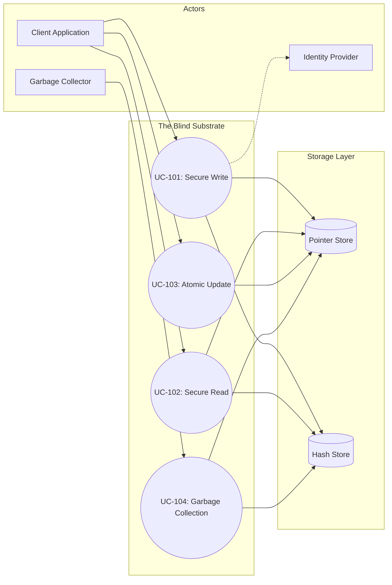
```mermaid
graph LR
    subgraph Actors
        C[Client Application]
        GC[Garbage Collector]
        IDP[Identity Provider]
    end

    subgraph "The Blind Substrate"
        UC101((UC-101: Secure Write))
        UC102((UC-102: Secure Read))
        UC103((UC-103: Atomic Update))
        UC104((UC-104: Garbage Collection))
    end

    subgraph "Storage Layer"
        PS[(Pointer Store)]
        HS[(Hash Store)]
    end

    C --> UC101
    C --> UC102
    C --> UC103
    
    GC --> UC104
    
    UC101 -.-> IDP
    UC101 --> HS
    UC101 --> PS
    
    UC102 --> PS
    UC102 --> HS
    
    UC103 --> PS
    
    UC104 --> PS
    UC104 --> HS
```

---

## 4. Actor-Use Case Matrix

| Use Case | Client Application | Pointer Store | Hash Store | Garbage Collector | Identity Provider |
| :--- | :---: | :---: | :---: | :---: | :---: |
| **UC-101: Secure Write** | **P** | S | S | - | S |
| **UC-102: Secure Read** | **P** | S | S | - | - |
| **UC-103: Atomic Update** | **P** | S | - | - | S |
| **UC-104: GC** | - | S | S | **P** | - |

**Legend:**
*   **P**: Primary Actor (Initiates the use case)
*   **S**: Supporting Actor (Participates in the use case)
*   **-**: No participation

---

## 5. Traceability & Acceptance Criteria

| UC-ID | Acceptance Criteria |
| :--- | :--- |
| **UC-101** | Verify that the Hash Store receives only encrypted data and the Pointer Store receives only the CID. |
| **UC-102** | Verify that the Client can reconstruct the original plaintext from the CID and local keys. |
| **UC-103** | Verify that if one pointer update in a batch fails, all other updates in that batch are rolled back. |
| **UC-104** | Verify that blobs referenced by at least one pointer are never deleted, while unreferenced blobs older than the grace period are removed. |

---

## Requirements Specification

# Requirements Documentation: The Blind Substrate

## 1. Functional Requirements (FR)

The functional requirements define the core capabilities of the Blind Substrate, focusing on the decoupling of data, state, and identity through cryptographic blindness.

| FR-ID | Description | Priority | Source | Acceptance Criteria |
| :--- | :--- | :--- | :--- | :--- |
| **FR-101** | **Client-Side Key Derivation** | Must Have | Security Architect | System must use HKDF to derive unique sub-keys for data encryption and pointer signing from a master seed. |
| **FR-102** | **Blind Hash Storage** | Must Have | App Developer | Server accepts encrypted blobs and stores them using the SHA-256 hash of the ciphertext as the key. |
| **FR-103** | **Atomic Pointer Updates** | Must Have | Systems Engineer | Pointer Store must support 3-Phase Commit (3PC) to ensure atomic updates across sharded state. |
| **FR-104** | **Immutable Hash Store** | Must Have | Security Architect | Once a blob is written to the Hash Store, it cannot be modified; any change results in a new hash/address. |
| **FR-105** | **Bounded Pointer Values** | Must Have | Systems Engineer | Pointer Store values must be strictly validated to be < 8KB to prevent "state bloat." |
| **FR-106** | **Blind Access Control** | Should Have | Compliance | Server validates access via blinded tokens (e.g., OPAQUE or Privacy Pass) without learning user identity. |
| **FR-107** | **External GC Interface** | Must Have | Systems Engineer | System must expose a read-only API for an external crawler to identify unreferenced hashes for deletion. |
| **FR-108** | **Client-Side Compression** | Should Have | App Developer | Data must be compressed using Zstandard or Brotli prior to encryption to optimize storage. |
| **FR-109** | **Conflict Resolution** | Should Have | Systems Engineer | Pointer Store must support conditional writes (Compare-and-Swap) to handle concurrent updates. |

---

## 2. Non-Functional Requirements (NFR)

### 2.1 Performance
* **NFR-201 (Latency):** Pointer Store read/write operations must complete in < 50ms (p99) within the same region.
* **NFR-202 (Throughput):** Hash Store must support horizontal scaling to handle > 10GB/s aggregate write throughput.
* **NFR-203 (Overhead):** Cryptographic overhead (encryption/decryption) on the client must not exceed 10% of total request time for payloads > 1MB.

### 2.2 Scalability
* **NFR-301 (Data Volume):** The Hash Store must be capable of storing petabytes of data across distributed object storage.
* **NFR-302 (State Sharding):** The Pointer Store must support horizontal sharding based on the hash of the pointer key.

### 2.3 Security
* **NFR-401 (Zero-Knowledge):** The server must never receive or store the plaintext data or the keys used for AEAD encryption.
* **NFR-402 (Integrity):** All data in transit and at rest must be protected by AEAD (Authenticated Encryption with Associated Data) to detect tampering.
* **NFR-403 (Key Separation):** Compromise of a Pointer Store key must not lead to the compromise of Hash Store data.

### 2.4 Reliability
* **NFR-501 (Availability):** The system must maintain 99.99% availability for the Hash Store.
* **NFR-502 (Consistency):** The Pointer Store must provide linearizable consistency for individual pointer updates.

### 2.5 Maintainability
* **NFR-601 (Observability):** The system must export metrics for storage utilization, 3PC commit/abort rates, and cryptographic errors without leaking metadata.
* **NFR-602 (Documentation):** All API endpoints must be documented using OpenAPI 3.0 specifications.

---

## 3. Requirements Traceability Matrix (RTM)

This matrix ensures that every requirement is driven by a use case and verified by a test case.

| Use Case ID | Requirement ID | Test Case ID | Status |
| :--- | :--- | :--- | :--- |
| **UC-101: Secure Data Upload** | FR-101, FR-102, FR-108 | TC-101, TC-102 | Pending |
| **UC-102: Atomic State Update** | FR-103, FR-105, FR-109 | TC-201, TC-202 | Pending |
| **UC-103: Data Retrieval** | FR-101, FR-102 | TC-301 | Pending |
| **UC-104: Garbage Collection** | FR-107 | TC-401 | Pending |
| **UC-105: Anonymous Auth** | FR-106 | TC-501 | Pending |
| **N/A (System Integrity)** | NFR-401, NFR-402 | TC-SEC-01 | Pending |
| **N/A (Performance)** | NFR-201, NFR-202 | TC-PERF-01 | Pending |

---

## 4. Requirements Dependency Diagram

The following diagram illustrates the logical flow and dependencies between functional and non-functional requirements.

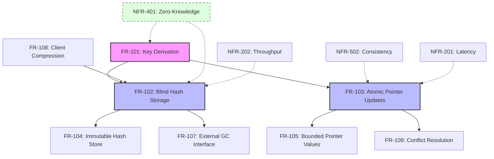
```mermaid
graph TD
    %% Functional Requirements
    FR101[FR-101: Key Derivation] --> FR102[FR-102: Blind Hash Storage]
    FR101 --> FR103[FR-103: Atomic Pointer Updates]
    
    FR102 --> FR104[FR-104: Immutable Hash Store]
    FR102 --> FR107[FR-107: External GC Interface]
    
    FR103 --> FR105[FR-105: Bounded Pointer Values]
    FR103 --> FR109[FR-109: Conflict Resolution]
    
    FR108[FR-108: Client Compression] --> FR102
    
    %% Non-Functional Requirements Dependencies
    NFR401[NFR-401: Zero-Knowledge] -.-> FR101
    NFR401 -.-> FR102
    
    NFR502[NFR-502: Consistency] -.-> FR103
    
    NFR201[NFR-201: Latency] -.-> FR103
    NFR202[NFR-202: Throughput] -.-> FR102

    %% Styling
    style FR101 fill:#f9f,stroke:#333,stroke-width:2px
    style FR102 fill:#bbf,stroke:#333,stroke-width:2px
    style FR103 fill:#bbf,stroke:#333,stroke-width:2px
    style NFR401 fill:#dfd,stroke:#333,stroke-dasharray: 5 5
```

---

## 5. Data Model (Pointer vs. Hash Store)

To clarify the relationship between the two storage tiers defined in the requirements:

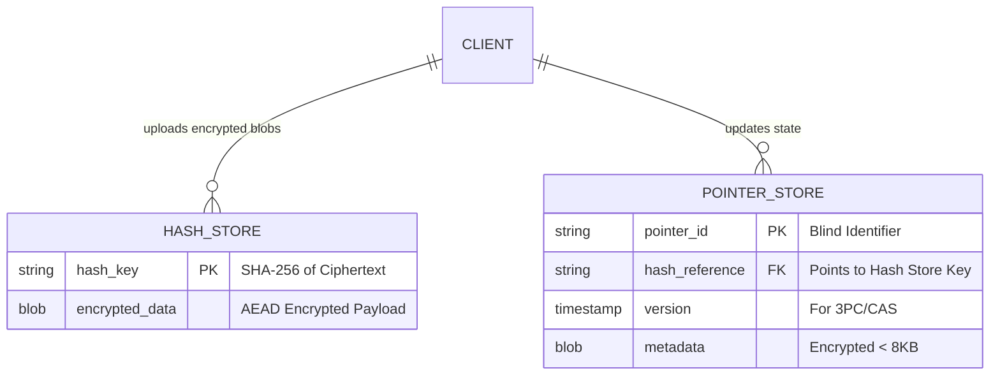
```mermaid
erDiagram
    CLIENT ||--o{ HASH_STORE : "uploads encrypted blobs"
    CLIENT ||--o{ POINTER_STORE : "updates state"
    
    HASH_STORE {
        string hash_key PK "SHA-256 of Ciphertext"
        blob encrypted_data "AEAD Encrypted Payload"
    }
    
    POINTER_STORE {
        string pointer_id PK "Blind Identifier"
        string hash_reference FK "Points to Hash Store Key"
        timestamp version "For 3PC/CAS"
        blob metadata "Encrypted < 8KB"
    }
```

## 6. Acceptance Criteria Summary

1.  **Security Validation:** A third-party audit must confirm that the server logs contain no plaintext data or decryption keys (NFR-401).
2.  **Atomicity Validation:** During a simulated network partition, the Pointer Store must either complete a 3PC transaction or roll back to the previous state without corruption (FR-103).
3.  **Scalability Validation:** The Hash Store must maintain NFR-202 throughput levels when the dataset size exceeds 100TB (NFR-301).
4.  **Constraint Validation:** Any attempt to write a > 8KB value to the Pointer Store must return a `413 Payload Too Large` error (FR-105).

---

## System Architecture

# Architecture Documentation: The Blind Substrate

## 1. System Context Diagram (C4 Level 1)

The Blind Substrate is a privacy-preserving storage and coordination layer. It decouples data ownership from data hosting by ensuring the server remains "blind" to the content it persists.

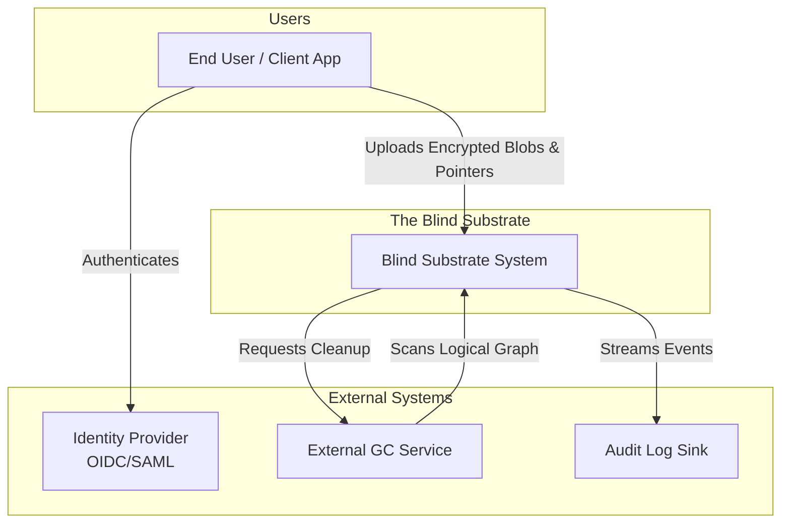
```mermaid
graph TB
    subgraph Users
        U[End User / Client App]
    end

    subgraph "The Blind Substrate"
        BS[Blind Substrate System]
    end

    subgraph "External Systems"
        IDP[Identity Provider<br/>OIDC/SAML]
        GC[External GC Service]
        AUD[Audit Log Sink]
    end

    U -- "Uploads Encrypted Blobs & Pointers" --> BS
    U -- "Authenticates" --> IDP
    BS -- "Requests Cleanup" --> GC
    BS -- "Streams Events" --> AUD
    GC -- "Scans Logical Graph" --> BS
```

---

## 2. Container Diagram (C4 Level 2)

This diagram illustrates the high-level logical containers within the Blind Substrate and how the client interacts with them to maintain zero-knowledge privacy.

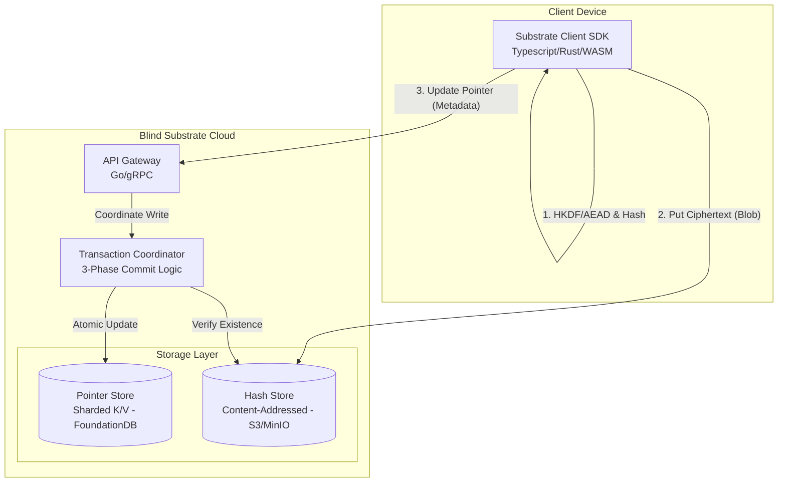
```mermaid
graph TB
    subgraph "Client Device"
        SDK[Substrate Client SDK<br/>Typescript/Rust/WASM]
    end

    subgraph "Blind Substrate Cloud"
        API[API Gateway<br/>Go/gRPC]
        
        subgraph "Storage Layer"
            PS[(Pointer Store<br/>Sharded K/V - FoundationDB)]
            HS[(Hash Store<br/>Content-Addressed - S3/MinIO)]
        end

        TX[Transaction Coordinator<br/>3-Phase Commit Logic]
    end

    SDK -- "1. HKDF/AEAD & Hash" --> SDK
    SDK -- "2. Put Ciphertext (Blob)" --> HS
    SDK -- "3. Update Pointer (Metadata)" --> API
    API -- "Coordinate Write" --> TX
    TX -- "Atomic Update" --> PS
    TX -- "Verify Existence" --> HS
```

---

## 3. Component Diagram (C4 Level 3)

### 3.1 Client SDK Components
The SDK is the only entity with access to plaintext and master keys.

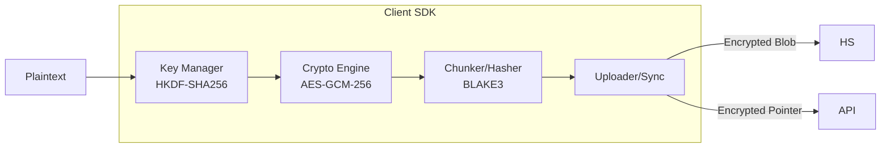
```mermaid
graph LR
    subgraph "Client SDK"
        KM[Key Manager<br/>HKDF-SHA256]
        CR[Crypto Engine<br/>AES-GCM-256]
        CH[Chunker/Hasher<br/>BLAKE3]
        UP[Uploader/Sync]
    end

    Plaintext --> KM
    KM --> CR
    CR --> CH
    CH --> UP
    UP -- "Encrypted Blob" --> HS
    UP -- "Encrypted Pointer" --> API
```

### 3.2 Pointer Store Components
The Pointer Store manages the logical graph of the system without knowing what the nodes represent.

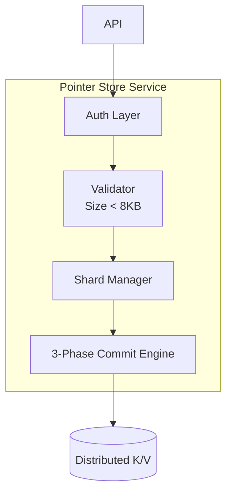
```mermaid
graph TD
    subgraph "Pointer Store Service"
        AL[Auth Layer]
        VAL[Validator<br/>Size < 8KB]
        SH[Shard Manager]
        3PC[3-Phase Commit Engine]
    end

    API --> AL
    AL --> VAL
    VAL --> SH
    SH --> 3PC
    3PC --> PS[(Distributed K/V)]
```

---

## 4. Deployment Diagram

The system is designed for high availability and horizontal scalability, utilizing distributed primitives for the Pointer Store and object storage for the Hash Store.

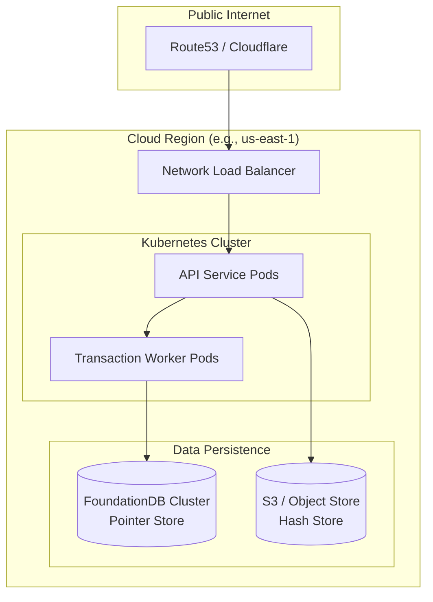
```mermaid
graph TB
    subgraph "Public Internet"
        DNS[Route53 / Cloudflare]
    end

    subgraph "Cloud Region (e.g., us-east-1)"
        LB[Network Load Balancer]

        subgraph "Kubernetes Cluster"
            direction TB
            API_PODS[API Service Pods]
            TX_PODS[Transaction Worker Pods]
        end

        subgraph "Data Persistence"
            direction LR
            FDB[(FoundationDB Cluster<br/>Pointer Store)]
            S3[(S3 / Object Store<br/>Hash Store)]
        end
    end

    DNS --> LB
    LB --> API_PODS
    API_PODS --> TX_PODS
    TX_PODS --> FDB
    API_PODS --> S3
```

---

## 5. Technology Stack Summary

| Layer | Technology | Reason |
| :--- | :--- | :--- |
| **Client Crypto** | WebCrypto API / WASM | Native browser performance for AEAD and HKDF. |
| **Client Hashing** | BLAKE3 | Extremely fast, parallelizable content-addressing. |
| **API / Logic** | Rust (Axum/Tonic) | Memory safety and high-concurrency performance. |
| **Pointer Store** | FoundationDB | Supports distributed ACID transactions (required for 3PC). |
| **Hash Store** | S3-Compatible (MinIO) | Industry standard for immutable, high-volume blob storage. |
| **Communication** | gRPC / Protobuf | Strict schema enforcement and low-latency streaming. |
| **Infrastructure** | Terraform & Kubernetes | Reproducible environments and auto-scaling. |

---

## 6. Architecture Decision Records (ADRs)

### ADR-001: Client-Side Key Derivation (HKDF)
*   **Context**: The server must never possess the ability to decrypt user data.
*   **Decision**: We use HKDF (HMAC-based Extract-and-Expand Key Derivation Function) on the client side. A master secret is used to derive unique keys for every individual blob and pointer.
*   **Consequences**: If a user loses their master secret, data is unrecoverable. The server cannot perform "Password Resets" that involve data recovery.

### ADR-002: Content-Addressable Hash Store
*   **Context**: Large data blobs need to be stored efficiently and their integrity verified without the server knowing the content.
*   **Decision**: Blobs are stored in the Hash Store using the hash of their *ciphertext* as the primary key.
*   **Consequences**: Provides automatic deduplication of identical encrypted blobs (if keys are shared) and ensures data integrity (bit-rot detection) via hash verification.

### ADR-003: 8KB Pointer Limit
*   **Context**: The Pointer Store (K/V) is optimized for high-frequency metadata updates and graph traversal.
*   **Decision**: We enforce a strict 8KB limit on Pointer Store values.
*   **Consequences**: Prevents the K/V store from becoming a "junk drawer." Forces developers to move larger metadata into the Hash Store, keeping the Pointer Store lean and fast for transactions.

### ADR-004: External Garbage Collection (GC)
*   **Context**: Since the Hash Store is immutable and content-addressed, deleting a pointer doesn't automatically delete the underlying blob.
*   **Decision**: Implement GC as an asynchronous external service that crawls the Pointer Store (the "root set") and identifies orphaned blobs in the Hash Store.
*   **Consequences**: Simplifies the write path (no complex reference counting during writes) but introduces a delay between logical deletion and physical storage reclamation.

---

## 7. Traceability Matrix

| Requirement ID | Description | Component | Implementation Detail |
| :--- | :--- | :--- | :--- |
| **FR-101** | Zero-knowledge storage | Client SDK | AEAD encryption before transmission. |
| **FR-102** | Atomic metadata updates | Transaction Coordinator | 3-Phase Commit across shards. |
| **FR-103** | Content Integrity | Hash Store | Content-addressing via BLAKE3 hashes. |
| **NFR-201** | Scalability | Pointer Store | Sharded FoundationDB architecture. |
| **NFR-202** | Privacy Compliance | System-wide | Server never sees plaintext or keys (Blindness). |

---

## Data Model & ERD

# Data Model Documentation: The Blind Substrate

This document outlines the data architecture for **The Blind Substrate**. Unlike traditional relational models, this system utilizes a **Blind Key-Value** approach where the server manages data structures without visibility into the underlying plaintext.

---

## 1. Entity-Relationship Diagram (Physical Layer)

The physical layer represents how data is actually stored on the substrate. The server only sees cryptographic identifiers and opaque payloads.

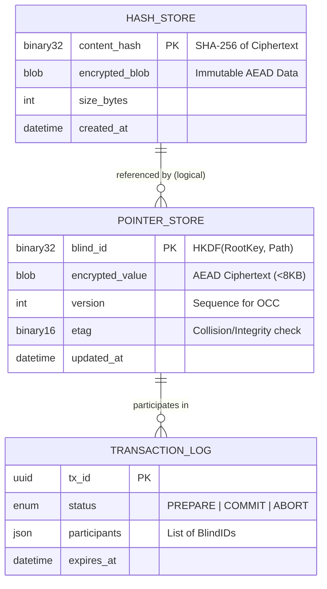
```mermaid
erDiagram
    POINTER_STORE ||--o{ TRANSACTION_LOG : "participates in"
    POINTER_STORE {
        binary32 blind_id PK "HKDF(RootKey, Path)"
        blob encrypted_value "AEAD Ciphertext (<8KB)"
        int version "Sequence for OCC"
        binary16 etag "Collision/Integrity check"
        datetime updated_at
    }
    
    HASH_STORE ||--o{ POINTER_STORE : "referenced by (logical)"
    HASH_STORE {
        binary32 content_hash PK "SHA-256 of Ciphertext"
        blob encrypted_blob "Immutable AEAD Data"
        int size_bytes
        datetime created_at
    }

    TRANSACTION_LOG {
        uuid tx_id PK
        enum status "PREPARE | COMMIT | ABORT"
        json participants "List of BlindIDs"
        datetime expires_at
    }
```

---

## 2. Entity Descriptions

### 2.1 Pointer Store
*   **Purpose**: Acts as the mutable entry point for the system. It maps a deterministic but "blind" identifier to a small piece of encrypted metadata.
*   **Attributes**:
    *   `blind_id`: A 256-bit key derived via HKDF. The server cannot reverse this to find the original "path" or "username."
    *   `encrypted_value`: Contains the "Head" of a logical object (e.g., a list of Hash Store addresses).
    *   `version`: Used for Optimistic Concurrency Control (OCC).
*   **Constraints**: Value must be < 8KB to ensure high-performance sharding and prevent abuse.

### 2.2 Hash Store
*   **Purpose**: A content-addressable, immutable storage layer for large payloads.
*   **Attributes**:
    *   `content_hash`: The primary key, derived from the hash of the *encrypted* blob.
    *   `encrypted_blob`: The actual data, encrypted by the client.
*   **Performance**: Since it is immutable, these can be cached indefinitely on CDNs or edge nodes.

### 2.3 Transaction Log
*   **Purpose**: Facilitates the 3-Phase Commit (3PC) protocol across sharded Pointer Stores to ensure atomicity without a central coordinator.
*   **Attributes**:
    *   `participants`: A list of `blind_id`s involved in a multi-pointer update.
    *   `status`: Tracks the lifecycle of a distributed write.

---

## 3. Data Dictionary

| Entity | Attribute | Type | Constraints | Description |
| :--- | :--- | :--- | :--- | :--- |
| **Pointer** | `blind_id` | BINARY(32) | PK | HKDF-derived unique identifier. |
| **Pointer** | `encrypted_value` | BLOB | NOT NULL | Client-side AEAD ciphertext. |
| **Pointer** | `version` | INT | DEFAULT 1 | Incremental counter for atomic writes. |
| **Blob** | `content_hash` | BINARY(32) | PK | SHA-256 of the `encrypted_blob`. |
| **Blob** | `encrypted_blob` | BLOB | NOT NULL | The encrypted bulk data. |
| **Transaction**| `tx_id` | UUID | PK | Unique ID for a 3PC session. |
| **Transaction**| `status` | ENUM | - | Current state: `PREPARE`, `COMMIT`, `ABORT`. |

---

## 4. Data Flow Diagram

The following diagram illustrates the "Blind Write" process, where a client saves a large document.

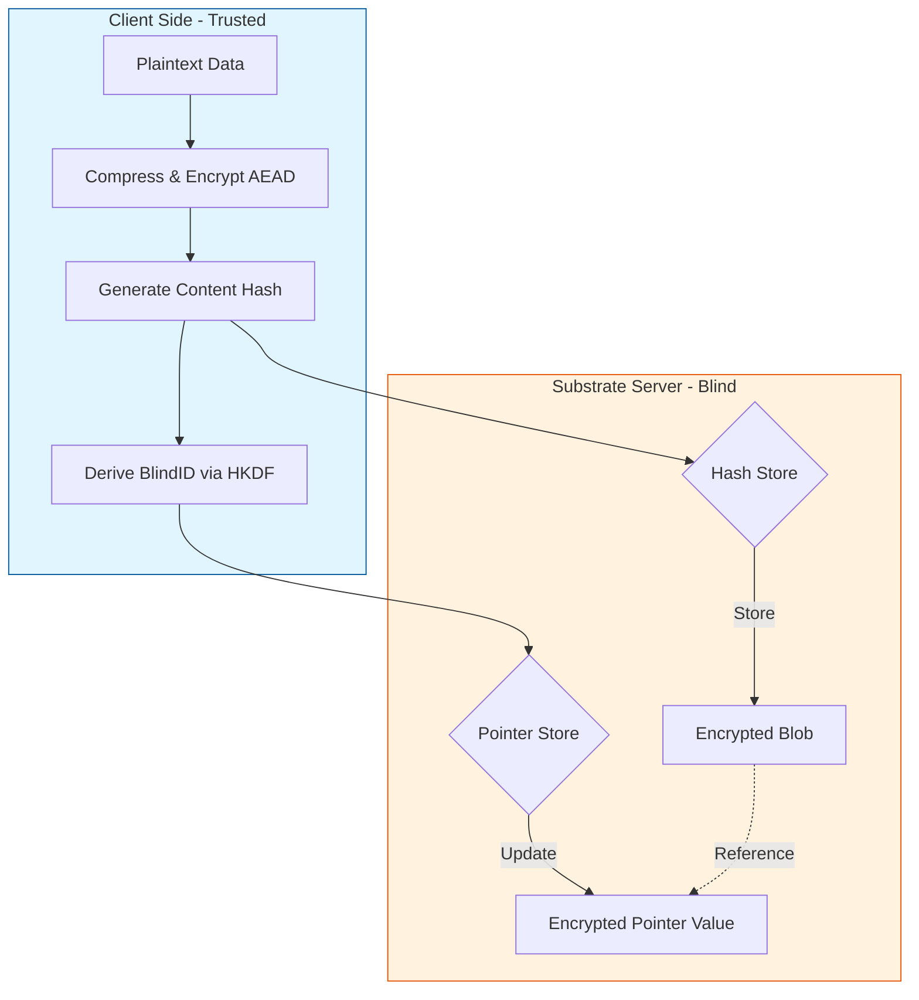
```mermaid
graph TD
    subgraph Client_Side [Client Side - Trusted]
        A[Plaintext Data] --> B[Compress & Encrypt AEAD]
        B --> C[Generate Content Hash]
        C --> D[Derive BlindID via HKDF]
    end

    subgraph Substrate_Server [Substrate Server - Blind]
        D --> E{Pointer Store}
        C --> F{Hash Store}
        
        F -->|Store| G[Encrypted Blob]
        E -->|Update| H[Encrypted Pointer Value]
    end

    G -.->|Reference| H
    style Client_Side fill:#e1f5fe,stroke:#01579b
    style Substrate_Server fill:#fff3e0,stroke:#e65100
```

---

## 5. Data Validation Rules

To maintain system integrity without seeing the data, the Substrate enforces the following rules:

| ID | Rule Name | Target | Logic |
| :--- | :--- | :--- | :--- |
| **VR-101** | Hash Integrity | Hash Store | `content_hash` must exactly match `SHA256(encrypted_blob)`. |
| **VR-102** | Pointer Size | Pointer Store | `encrypted_value` must not exceed 8,192 bytes. |
| **VR-103** | Atomic Versioning | Pointer Store | Updates must provide the current `version` (Compare-and-Swap). |
| **VR-104** | BlindID Uniqueness | Pointer Store | `blind_id` must be unique within its shard. |
| **VR-105** | Tx Expiry | Transaction Log | Transactions older than 60 seconds are automatically `ABORTED`. |

---

## 6. Data Migration Considerations

Migrating from a legacy "Cleartext" system to the Blind Substrate requires a specific strategy:

1.  **Key Generation**: Every legacy entity (e.g., `User_ID: 123`) must be mapped to a `BlindID` using a new Root Key.
2.  **Encryption Pipeline**:
    *   Extract legacy data.
    *   Encrypt client-side (or in a secure enclave).
    *   Upload to Hash Store first.
    *   Create Pointer Store entries last.
3.  **Dual-Write Phase**: During migration, applications should write to both the legacy DB and the Substrate.
4.  **Consistency Check**: Use the `content_hash` to verify that the data migrated to the Substrate matches the source of truth before decommissioning legacy systems.
5.  **Garbage Collection**: Since the Substrate is a graph of hashes, a "Mark and Sweep" service must be run to delete orphaned Blobs that are no longer referenced by any Pointer.

---

## Flow Diagrams

# The Blind Substrate: System Interaction Documentation

This document outlines the critical interaction patterns for **The Blind Substrate**. The architecture is defined by its "Blindness" principle: the server facilitates storage and coordination but remains cryptographically excluded from the data content and the derivation of keys.

---

## 1. Sequence Diagrams: Critical User Journeys

### UC-101: Secure Data Ingestion (The "Blind Write")
This journey describes how a client stores new data. The client performs all cryptographic operations before the data ever leaves the local environment.

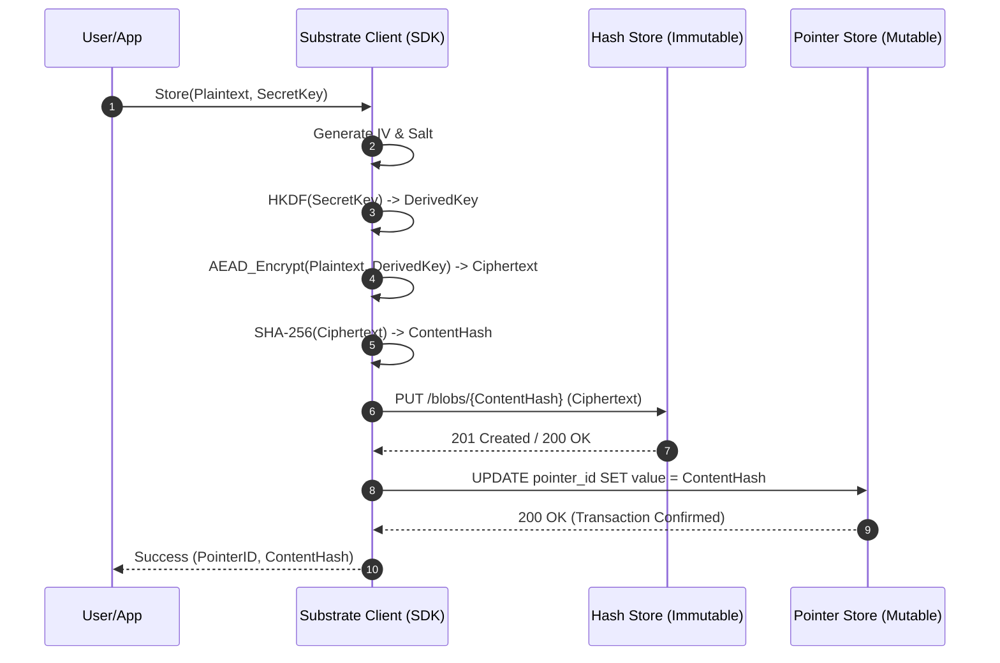
```mermaid
sequenceDiagram
    autonumber
    participant U as User/App
    participant C as Substrate Client (SDK)
    participant HS as Hash Store (Immutable)
    participant PS as Pointer Store (Mutable)

    U->>C: Store(Plaintext, SecretKey)
    C->>C: Generate IV & Salt
    C->>C: HKDF(SecretKey) -> DerivedKey
    C->>C: AEAD_Encrypt(Plaintext, DerivedKey) -> Ciphertext
    C->>C: SHA-256(Ciphertext) -> ContentHash
    
    C->>HS: PUT /blobs/{ContentHash} (Ciphertext)
    HS-->>C: 201 Created / 200 OK
    
    C->>PS: UPDATE pointer_id SET value = ContentHash
    PS-->>C: 200 OK (Transaction Confirmed)
    
    C-->>U: Success (PointerID, ContentHash)
```

### UC-102: Secure Data Retrieval (The "Blind Read")
The server provides the encrypted blob based on a pointer, but the client is the only entity capable of restoring the plaintext.

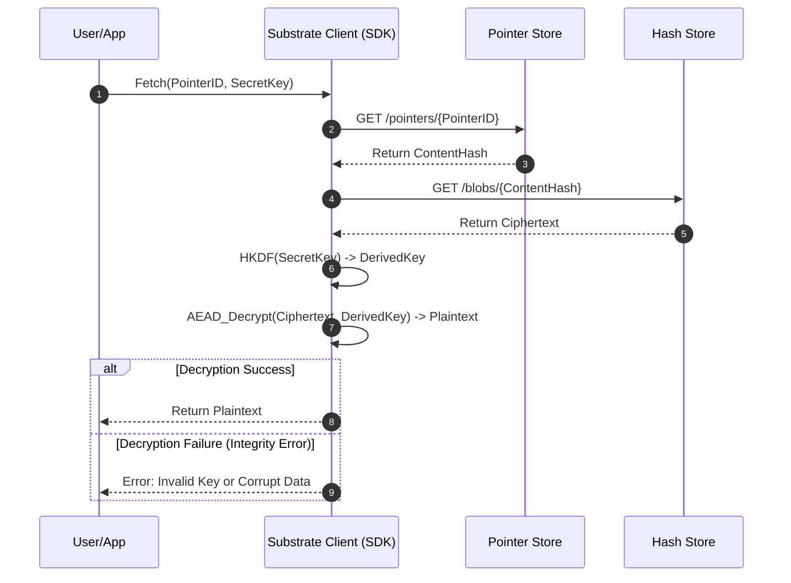
```mermaid
sequenceDiagram
    autonumber
    participant U as User/App
    participant C as Substrate Client (SDK)
    participant PS as Pointer Store
    participant HS as Hash Store

    U->>C: Fetch(PointerID, SecretKey)
    C->>PS: GET /pointers/{PointerID}
    PS-->>C: Return ContentHash
    
    C->>HS: GET /blobs/{ContentHash}
    HS-->>C: Return Ciphertext
    
    C->>C: HKDF(SecretKey) -> DerivedKey
    C->>C: AEAD_Decrypt(Ciphertext, DerivedKey) -> Plaintext
    
    alt Decryption Success
        C-->>U: Return Plaintext
    else Decryption Failure (Integrity Error)
        C-->>U: Error: Invalid Key or Corrupt Data
    end
```

### UC-103: Atomic State Update (3-Phase Commit)
To ensure consistency across distributed shards in the Pointer Store, a 3-Phase Commit (3PC) is utilized for pointer updates.

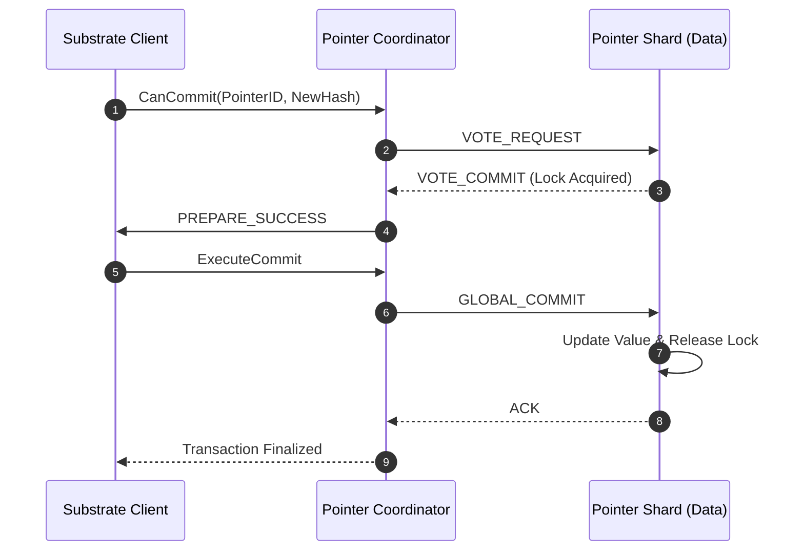
```mermaid
sequenceDiagram
    autonumber
    participant C as Substrate Client
    participant PS_Coord as Pointer Coordinator
    participant PS_Shard as Pointer Shard (Data)

    C->>PS_Coord: CanCommit(PointerID, NewHash)
    PS_Coord->>PS_Shard: VOTE_REQUEST
    PS_Shard-->>PS_Coord: VOTE_COMMIT (Lock Acquired)
    
    PS_Coord->>C: PREPARE_SUCCESS
    
    C->>PS_Coord: ExecuteCommit
    PS_Coord->>PS_Shard: GLOBAL_COMMIT
    PS_Shard->>PS_Shard: Update Value & Release Lock
    PS_Shard-->>PS_Coord: ACK
    
    PS_Coord-->>C: Transaction Finalized
```

---

## 2. Activity Diagrams: Complex Processes

### AC-201: The Write-Ahead-Hash Pipeline
This process ensures that data is persisted in the immutable Hash Store before the mutable Pointer Store is updated, preventing "dangling pointers" to non-existent data.

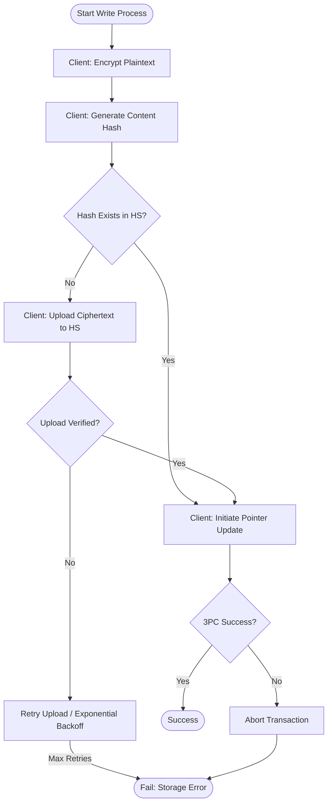
```mermaid
graph TD
    Start([Start Write Process]) --> Encrypt[Client: Encrypt Plaintext]
    Encrypt --> Hash[Client: Generate Content Hash]
    Hash --> CheckHS{Hash Exists in HS?}
    
    CheckHS -->|Yes| UpdatePS[Client: Initiate Pointer Update]
    CheckHS -->|No| UploadHS[Client: Upload Ciphertext to HS]
    
    UploadHS --> VerifyHS{Upload Verified?}
    VerifyHS -->|No| Retry[Retry Upload / Exponential Backoff]
    VerifyHS -->|Yes| UpdatePS
    
    UpdatePS --> Commit{3PC Success?}
    Commit -->|Yes| End([Success])
    Commit -->|No| Rollback[Abort Transaction]
    
    Retry -->|Max Retries| Fail([Fail: Storage Error])
    Rollback --> Fail
```

---

## 3. State Diagrams: Entity Life Cycles

### ST-301: Pointer Lifecycle
Pointers are the logical addresses for data. Their state determines how the system handles garbage collection and resolution.

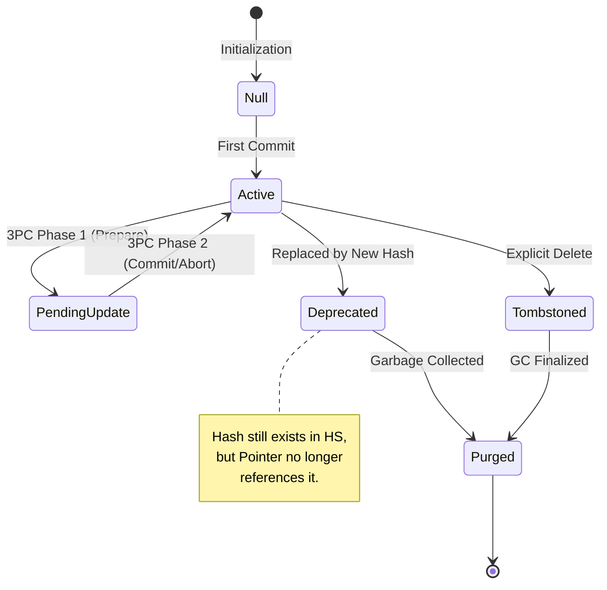
```mermaid
stateDiagram-v2
    [*] --> Null: Initialization
    Null --> Active: First Commit
    Active --> PendingUpdate: 3PC Phase 1 (Prepare)
    PendingUpdate --> Active: 3PC Phase 2 (Commit/Abort)
    Active --> Deprecated: Replaced by New Hash
    Deprecated --> Purged: Garbage Collected
    Active --> Tombstoned: Explicit Delete
    Tombstoned --> Purged: GC Finalized
    Purged --> [*]

    note right of Deprecated
        Hash still exists in HS, 
        but Pointer no longer 
        references it.
    end note
```

---

## 4. Integration Flow Diagrams

### IF-401: System Component Interaction
This diagram shows the high-level data flow between the client, the blind storage layers, and the external Garbage Collection (GC) service.

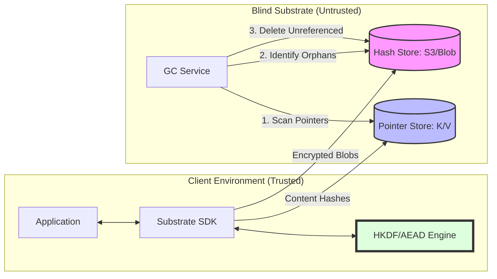
```mermaid
graph LR
    subgraph "Client Environment (Trusted)"
        App[Application] <--> SDK[Substrate SDK]
        SDK <--> Crypto[HKDF/AEAD Engine]
    end

    subgraph "Blind Substrate (Untrusted)"
        SDK -- "Encrypted Blobs" --> HS[(Hash Store: S3/Blob)]
        SDK -- "Content Hashes" --> PS[(Pointer Store: K/V)]
        
        GC[GC Service] -- "1. Scan Pointers" --> PS
        GC -- "2. Identify Orphans" --> HS
        GC -- "3. Delete Unreferenced" --> HS
    end

    style HS fill:#f9f,stroke:#333,stroke-width:2px
    style PS fill:#bbf,stroke:#333,stroke-width:2px
    style Crypto fill:#dfd,stroke:#333,stroke-width:4px
```

---

## 5. Error Handling Flows

### EH-501: Conflict Resolution & Network Partition
How the system handles failures during the critical Pointer Update phase.

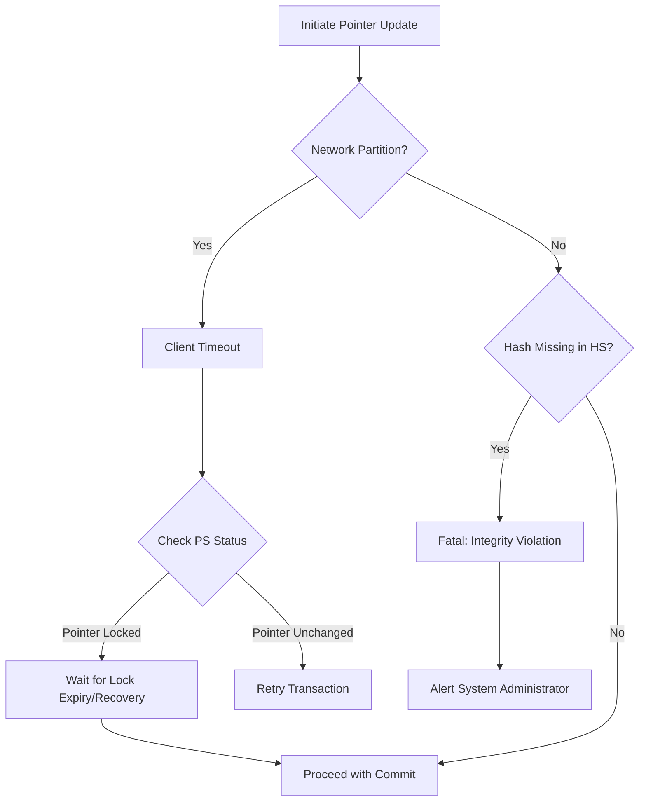
```mermaid
graph TD
    A[Initiate Pointer Update] --> B{Network Partition?}
    B -->|Yes| C[Client Timeout]
    C --> D{Check PS Status}
    D -->|Pointer Locked| E[Wait for Lock Expiry/Recovery]
    D -->|Pointer Unchanged| F[Retry Transaction]
    
    B -->|No| G{Hash Missing in HS?}
    G -->|Yes| H[Fatal: Integrity Violation]
    G -->|No| I[Proceed with Commit]
    
    H --> J[Alert System Administrator]
    E --> I
```

### Error Codes & Handling Strategies

| Error ID | Scenario | Handling Strategy |
| :--- | :--- | :--- |
| **ERR-401** | Decryption Failure | **Client-side:** Verify SecretKey; check for data corruption via AEAD tag. |
| **ERR-409** | Pointer Conflict | **Optimistic Concurrency:** Client must fetch latest Hash, re-base, and retry. |
| **ERR-503** | Hash Store Unavailable | **Circuit Breaker:** Stop all writes; allow reads from cache if available. |
| **ERR-404** | Orphaned Pointer | **Integrity Check:** Triggered if PS has a hash that HS does not. Requires audit. |

---

## 6. Traceability Matrix

| Requirement ID | Interaction Diagram | Description |
| :--- | :--- | :--- |
| **FR-001** | UC-101 | System must support blind writes where server sees only ciphertext. |
| **FR-002** | UC-102 | System must support blind reads using client-side keys. |
| **FR-003** | UC-103 | Pointer updates must be atomic and consistent. |
| **FR-004** | ST-301 | System must track pointer states for garbage collection. |
| **FR-005** | AC-201 | Hash Store must be updated before Pointer Store. |

---

## Test Plan

# Test Plan Documentation: The Blind Substrate

## 1. Test Strategy Overview

### 1.1 Testing Objectives
The primary objective is to validate the "Blindness" property of the substrate while ensuring data integrity, high availability, and atomicity across distributed components.
- **Verify Cryptographic Blindness:** Ensure the server never possesses plaintext or decryption keys.
- **Validate Atomicity:** Ensure the 3-Phase Commit (3PC) protocol maintains consistency in the Pointer Store.
- **Ensure Scalability:** Validate that the Hash Store and Pointer Store scale linearly under load.
- **Data Integrity:** Confirm that content-addressed storage correctly detects and rejects corrupted blobs.

### 1.2 Testing Scope
*   **In-Scope:**
    *   Client-side SDK (HKDF derivation, AEAD encryption/decryption).
    *   Hash Store (Blob ingestion, deduplication, retrieval).
    *   Pointer Store (3PC transaction logic, sharding, state transitions).
    *   Garbage Collection (Reference counting and orphan deletion).
*   **Out-of-Scope:**
    *   Physical security of data centers.
    *   End-user UI/UX (this is a substrate/middleware).
    *   Network-level DDoS mitigation (assumed to be handled by infrastructure).

### 1.3 Testing Approach
A **Risk-Based, Shift-Left** approach will be utilized:
- **Property-Based Testing:** Used for cryptographic functions to ensure no collisions or weak keys.
- **Chaos Engineering:** Injecting network partitions and node failures during 3PC execution.
- **Zero-Knowledge Auditing:** Automated scripts to verify that server-side logs contain no sensitive entropy.

### 1.4 Entry/Exit Criteria
| Phase | Entry Criteria | Exit Criteria |
| :--- | :--- | :--- |
| **Unit** | Code compiles; Mocks for Stores ready. | 100% coverage of Crypto/Logic modules. |
| **Integration** | Unit tests pass; API endpoints deployed in Dev. | Successful E2E flow (Write -> Read) across all components. |
| **System** | Integration tests pass; Load generators ready. | Performance benchmarks met; No 3PC deadlocks. |
| **Acceptance** | Security audit complete. | Formal sign-off by Security Architect. |

---

## 2. Test Levels

### 2.1 Unit Testing
- **Frameworks:** Jest (Node.js), PyTest (Python), or Go Test.
- **Coverage Target:** 95% for `crypto-lib` and `transaction-manager`.
- **Focus:** HKDF output consistency, AEAD tag validation, Hash calculation.

### 2.2 Integration Testing
- **Focus:** Interaction between the Client SDK and the Store APIs.
- **Scenarios:** 
    - Hash Store deduplication (uploading the same content twice).
    - Pointer Store shard rebalancing.
    - API Authentication/Authorization middleware.

### 2.3 System Testing (End-to-End)
- **Focus:** The complete lifecycle of a "Blind Write" and "Blind Read."
- **Scenario:** Client A writes a 10MB file; Client B (with shared key) retrieves it. Server logs are inspected for plaintext leakage.

### 2.4 Acceptance Testing (UAT)
- **Criteria:** 
    - **AC-1:** Server admin cannot reconstruct data from Hash Store + Pointer Store.
    - **AC-2:** System recovers to a consistent state after a 3PC coordinator failure.
    - **AC-3:** Latency for Pointer updates remains < 200ms at P99.

---

## 3. Test Case Catalog

| TC-ID | Requirement | Description | Steps | Expected Result | Priority |
|-------|-------------|-------------|-------|-----------------|----------|
| **TC-001** | FR-CRY-01 | Client-side Key Derivation | 1. Input Master Key + Context.<br>2. Generate Sub-keys via HKDF. | Sub-keys are deterministic and cryptographically strong. | High |
| **TC-002** | FR-STR-01 | Blind Blob Storage | 1. Encrypt data.<br>2. Upload to Hash Store. | Store accepts blob; Store cannot decrypt blob. | High |
| **TC-003** | FR-3PC-01 | 3PC Atomic Commit | 1. Initiate Pointer update.<br>2. Execute Pre-Commit, Can-Commit, Do-Commit. | Pointer is updated across all shards or rolled back. | High |
| **TC-004** | FR-3PC-02 | 3PC Failure Recovery | 1. Kill Coordinator during "Pre-Commit". | Participants timeout and abort; State remains consistent. | Critical |
| **TC-005** | FR-GC-01 | Garbage Collection | 1. Delete Pointer.<br>2. Run GC service. | Orphaned Hash Store blobs are purged after grace period. | Medium |
| **TC-006** | FR-SEC-01 | Blindness Verification | 1. Intercept server-side traffic.<br>2. Search for plaintext patterns. | No plaintext or raw keys found in transit or at rest. | Critical |

---

## 4. Test Coverage Matrix

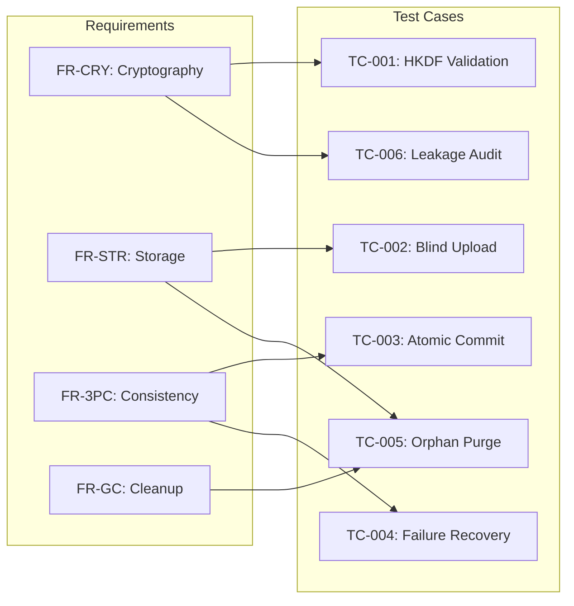
```mermaid
graph LR
    subgraph Requirements
        FR1[FR-CRY: Cryptography]
        FR2[FR-STR: Storage]
        FR3[FR-3PC: Consistency]
        FR4[FR-GC: Cleanup]
    end

    subgraph Test Cases
        TC1[TC-001: HKDF Validation]
        TC2[TC-002: Blind Upload]
        TC3[TC-003: Atomic Commit]
        TC4[TC-004: Failure Recovery]
        TC5[TC-005: Orphan Purge]
        TC6[TC-006: Leakage Audit]
    end

    FR1 --> TC1
    FR1 --> TC6
    FR2 --> TC2
    FR2 --> TC5
    FR3 --> TC3
    FR3 --> TC4
    FR4 --> TC5
```

---

## 5. Non-Functional Test Cases

### 5.1 Performance Scenarios
- **Scenario P-1:** 10,000 concurrent "Blind Writes" to the Pointer Store.
- **Scenario P-2:** Throughput testing of Hash Store with 1GB blobs.
- **Target:** Pointer Store must handle 5k TPS with < 100ms latency.

### 5.2 Security Scenarios
- **Scenario S-1 (Key Isolation):** Attempt to use a Hash Store key to update a Pointer Store entry. (Expected: Fail).
- **Scenario S-2 (Replay Attack):** Re-submit a signed 3PC "Do-Commit" message. (Expected: Rejected by sequence ID).

### 5.3 Usability Scenarios
- **Scenario U-1:** Developer integrates SDK into a new application.
- **Target:** "Time to first Blind Write" < 30 minutes.

---

## 6. Test Environment Requirements

### 6.1 Hardware/Software
- **Environment:** Kubernetes (K8s) cluster for distributed component testing.
- **Hash Store Mock:** MinIO (S3 compatible).
- **Pointer Store Mock:** Sharded Redis or FoundationDB.
- **Client:** Headless Linux nodes with AES-NI instruction sets enabled.

### 6.2 Tool Requirements
- **Chaos Mesh:** For injecting network latency and pod failures.
- **JMeter/Locust:** For load generation.
- **Wireshark/Tcpdump:** For traffic inspection (verifying blindness).
- **SonarQube:** For static analysis and coverage tracking.

---

## 7. Test Schedule

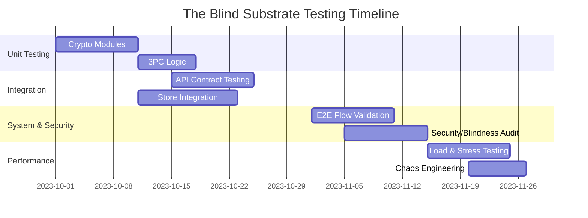
```mermaid
gantt
    title The Blind Substrate Testing Timeline
    dateFormat  YYYY-MM-DD
    section Unit Testing
    Crypto Modules           :a1, 2023-10-01, 10d
    3PC Logic                :after a1, 7d
    section Integration
    API Contract Testing     :2023-10-15, 10d
    Store Integration        :after a1, 12d
    section System & Security
    E2E Flow Validation      :2023-11-01, 10d
    Security/Blindness Audit :2023-11-05, 10d
    section Performance
    Load & Stress Testing    :2023-11-15, 10d
    Chaos Engineering        :2023-11-20, 7d
```

---

## 8. Risk Assessment

| Risk | Impact | Probability | Mitigation Strategy |
| :--- | :--- | :--- | :--- |
| **Key Loss** | Critical | Low | Implement client-side M-of-N secret sharing for master key recovery. |
| **3PC Deadlock** | High | Medium | Use strict timeouts and monotonic clocks for all transaction phases. |
| **Hash Collisions** | Low | Very Low | Use SHA-256 or BLAKE3; implement collision detection on ingest. |
| **Performance Bottleneck** | Medium | High | Implement aggressive client-side caching of Pointers and sharding. |
| **Metadata Leakage** | High | Low | Ensure Pointer Store keys are also hashed (Blind Indexing). |

---

## 9. State Machine: 3-Phase Commit Testing

To ensure the 3PC protocol is tested thoroughly, the following state transitions must be validated:

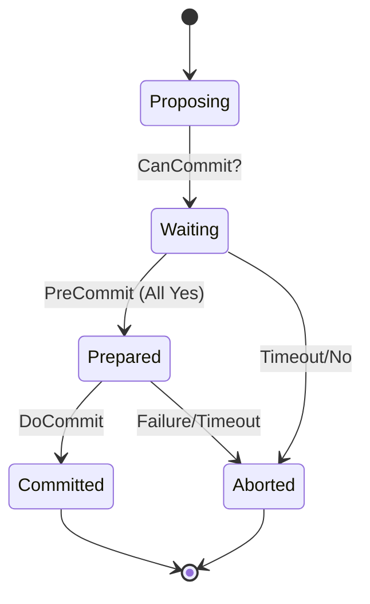
```mermaid
stateDiagram-v2
    [*] --> Proposing
    Proposing --> Waiting: CanCommit?
    Waiting --> Prepared: PreCommit (All Yes)
    Waiting --> Aborted: Timeout/No
    Prepared --> Committed: DoCommit
    Prepared --> Aborted: Failure/Timeout
    Committed --> [*]
    Aborted --> [*]
```

**Test Note:** Every transition marked above requires a corresponding negative test case (e.g., what happens if a node stays in `Prepared` indefinitely?).

---

## Phase Plan

# Development Phase Planning: The Blind Substrate

This document outlines the strategic roadmap for implementing **The Blind Substrate**. The plan focuses on the incremental delivery of cryptographic primitives, distributed storage components, and the coordination protocols required to maintain total server-side blindness.

---

## 1. Project Timeline Overview

```mermaid
gantt
    title The Blind Substrate: Implementation Roadmap
    dateFormat  YYYY-MM-DD
    axisFormat  %b %d
    
    section Phase 1: Foundation
    Crypto Primitives & HKDF Setup :a1, 2024-01-01, 14d
    Hash Store (CAS) Implementation :a2, after a1, 14d
    
    section Phase 2: Core Features
    Pointer Store & 3PC Protocol   :b1, 2024-01-29, 21d
    Client-Side SDK (Blindness Layer):b2, after b1, 28d
    
    section Phase 3: Integration
    GC Crawler & Graph Logic        :c1, 2024-03-18, 21d
    Sharding & Horizontal Scaling   :c2, after c1, 21d
    
    section Phase 4: Polish
    Security Audit & Fuzzing        :d1, 2024-04-29, 14d
    Performance Benchmarking        :d2, after d1, 14d
    
    section Phase 5: Launch
    UAT & Beta Program              :e1, 2024-05-27, 14d
    Production Deployment           :e2, after e1, 7d
```

---

## 2. Phase Descriptions

### Phase 1: Foundation (Weeks 1–4)
*   **Objectives:** Establish the cryptographic baseline and the immutable storage layer.
*   **Deliverables:** HKDF/AEAD utility library, Hash Store (Content-Addressable Storage) API.
*   **Key Activities:**
    *   Implement client-side key derivation paths.
    *   Develop the Hash Store with deduplication logic.
*   **Dependencies:** None.
*   **Success Criteria:** Hash Store correctly stores and retrieves blobs using SHA-256 hashes as keys; server cannot decrypt blobs.
*   **Risks:** Weak entropy in key generation. **Mitigation:** Use audited OS-level CSPRNGs.

### Phase 2: Core Features (Weeks 5–11)
*   **Objectives:** Implement the mutable state layer and the client-side orchestration.
*   **Deliverables:** Pointer Store (K/V), 3-Phase Commit (3PC) engine, Client SDK.
*   **Key Activities:**
    *   Build the 3PC coordinator for atomic pointer updates.
    *   Develop the Client SDK to handle "Encrypt-then-Hash-then-Upload" workflows.
*   **Dependencies:** Phase 1 completion.
*   **Success Criteria:** Atomic updates to pointers succeed or fail gracefully without state corruption.
*   **Risks:** 3PC latency overhead. **Mitigation:** Implement aggressive connection pooling and asynchronous pre-computation.

### Phase 3: Integration (Weeks 12–17)
*   **Objectives:** Enable system maintenance and horizontal scalability.
*   **Deliverables:** Garbage Collection (GC) Service, Sharded K/V backend.
*   **Key Activities:**
    *   Develop a "Blind Crawler" that identifies orphaned hashes without seeing content.
    *   Implement consistent hashing for the Pointer Store.
*   **Dependencies:** Phase 2 completion.
*   **Success Criteria:** GC successfully reclaims space from unreferenced hashes; system scales to 3+ nodes.
*   **Risks:** GC accidentally deleting live data. **Mitigation:** Implement a "Grace Period" (Soft-delete) for all hashes.

---

## 3. Milestone Schedule

| Milestone | Target Date | Deliverables | Success Criteria |
| :--- | :--- | :--- | :--- |
| **MS-1: Blind Storage** | Week 4 | Hash Store API + Crypto Lib | 100% test coverage on encryption/decryption cycles. |
| **MS-2: Atomic State** | Week 8 | Pointer Store + 3PC Logic | Successful simulation of network partitions during 3PC. |
| **MS-3: Full SDK** | Week 11 | Client-side TypeScript/Go SDK | Developers can perform CRUD operations via SDK. |
| **MS-4: Scalability** | Week 17 | Sharded Backend + GC Service | System maintains performance at 10k requests/sec. |
| **MS-5: Production Ready**| Week 25 | Audited System + Documentation | Zero critical vulnerabilities found in external audit. |

---

## 4. Resource Allocation

| Role | Phase 1-2 Responsibility | Phase 3-5 Responsibility |
| :--- | :--- | :--- |
| **Security Architect** | Crypto primitive selection, Threat modeling. | Audit remediation, Key rotation policy. |
| **Backend Engineer (A)** | Hash Store & Storage Engine. | Sharding logic & GC Crawler. |
| **Backend Engineer (B)** | 3-Phase Commit & Pointer Store. | API Gateway & Performance Tuning. |
| **SDK/Frontend Engineer** | Client-side AEAD & HKDF implementation. | Documentation & Integration testing. |
| **DevOps/SRE** | CI/CD Pipeline, Infra-as-Code. | Monitoring, Scaling, & Load Testing. |

---

## 5. Sprint Planning Overview (6 Sprints)

| Sprint | Goal | Key Deliverables |
| :--- | :--- | :--- |
| **S1** | Crypto & CAS | HKDF/AEAD wrappers; Hash Store basic PUT/GET. |
| **S2** | Persistence | Hash Store disk persistence; S3/Blob storage drivers. |
| **S3** | Atomic Pointers | Pointer Store schema; 3PC "Prepare" and "Commit" phases. |
| **S4** | SDK Alpha | SDK for Node.js/Browser; Blindness verification tests. |
| **S5** | Maintenance | GC Service; Reference counting logic; Orphan detection. |
| **S6** | Hardening | Rate limiting; Sharding; Final integration tests. |

---

## 6. Release Plan

### v0.1.0-alpha (Week 12)
*   **Features:** Basic Blind Substrate functionality (Upload/Download/Update).
*   **Criteria:** Functional SDK; Single-node deployment.

### v0.5.0-beta (Week 18)
*   **Features:** Sharding, GC Service, Multi-region support.
*   **Criteria:** Stable API; Successful recovery from node failure.

### v1.0.0-GA (Week 25)
*   **Features:** Full production suite, Monitoring dashboards, Audited crypto.
*   **Criteria:** Passed 3rd party security audit; Documentation complete.

---

## 7. Risk Timeline

```mermaid
graph LR
    R1[Key Management Complexity] -->|High Risk| P1(Phase 1-2)
    R2[3PC Performance Bottlenecks] -->|Medium Risk| P2(Phase 2-3)
    R3[GC Data Loss] -->|Critical Risk| P3(Phase 3-4)
    R4[Regulatory Compliance/Audit] -->|Medium Risk| P4(Phase 4-5)

    style R1 fill:#f96,stroke:#333
    style R3 fill:#f66,stroke:#333
```

*   **Phase 1-2 (Cryptographic Risk):** Highest risk of implementation errors in HKDF/AEAD. Mitigation: Use standard libraries (libsodium/SubtleCrypto), no custom crypto.
*   **Phase 3 (Operational Risk):** GC logic is dangerous. Mitigation: Dry-run mode for GC for the first 30 days of production.
*   **Phase 4-5 (Compliance Risk):** Ensuring "Blindness" meets jurisdictional privacy requirements. Mitigation: Legal review of the "Zero-Knowledge" architecture.

---

## Project Data
Generated JSON file: design.project_data.json

Raw JSON Content

```json
{
  "project_name" : "The Blind Substrate",
  "description" : "A minimalist architecture for secure, scalable distributed systems that decouples permission, volume, state, and logic using cryptographic blindness. It ensures that the server can manage access and storage without ever seeing the plaintext data.",
  "created_date" : "2026-02-16T13:38:49.139325034",
  "epics" : [ {
    "id" : "EPIC-UC",
    "name" : "User Features",
    "description" : "Core user-facing functionality based on use cases",
    "priority" : "High",
    "status" : "Planned",
    "story_points" : 80
  }, {
    "id" : "EPIC-ARCH",
    "name" : "Architecture & Infrastructure",
    "description" : "Set up system architecture and infrastructure",
    "priority" : "High",
    "status" : "Planned",
    "story_points" : 21
  }, {
    "id" : "EPIC-TEST",
    "name" : "Quality Assurance",
    "description" : "Testing and quality assurance activities",
    "priority" : "High",
    "status" : "Planned",
    "story_points" : 13
  }, {
    "id" : "EPIC-101",
    "name" : "Epic EPIC-101",
    "description" : "Auto-extracted epic from analysis",
    "priority" : "Medium",
    "status" : "Planned",
    "story_points" : 13
  }, {
    "id" : "EPIC-102",
    "name" : "Epic EPIC-102",
    "description" : "Auto-extracted epic from analysis",
    "priority" : "Medium",
    "status" : "Planned",
    "story_points" : 13
  }, {
    "id" : "EPIC-103",
    "name" : "Epic EPIC-103",
    "description" : "Auto-extracted epic from analysis",
    "priority" : "Medium",
    "status" : "Planned",
    "story_points" : 13
  }, {
    "id" : "EPIC-104",
    "name" : "Epic EPIC-104",
    "description" : "Auto-extracted epic from analysis",
    "priority" : "Medium",
    "status" : "Planned",
    "story_points" : 13
  }, {
    "id" : "EPIC-105",
    "name" : "Epic EPIC-105",
    "description" : "Auto-extracted epic from analysis",
    "priority" : "Medium",
    "status" : "Planned",
    "story_points" : 13
  }, {
    "id" : "EPIC-106",
    "name" : "Epic EPIC-106",
    "description" : "Auto-extracted epic from analysis",
    "priority" : "Medium",
    "status" : "Planned",
    "story_points" : 13
  } ],
  "releases" : [ {
    "id" : "REL-1",
    "name" : "MVP Release",
    "version" : "1.0.0",
    "target_date" : "2026-03-30",
    "description" : "Minimum Viable Product release with core functionality",
    "epic_ids" : [ "EPIC-UC", "EPIC-ARCH", "EPIC-TEST", "EPIC-101" ],
    "status" : "Planned"
  }, {
    "id" : "REL-2",
    "name" : "Feature Complete Release",
    "version" : "1.1.0",
    "target_date" : "2026-05-11",
    "description" : "Full feature release with all planned functionality",
    "epic_ids" : [ "EPIC-UC", "EPIC-ARCH", "EPIC-TEST", "EPIC-101", "EPIC-102", "EPIC-103", "EPIC-104", "EPIC-105", "EPIC-106" ],
    "status" : "Planned"
  } ],
  "sprints" : [ {
    "id" : "SPRINT-1",
    "name" : "Sprint 1",
    "number" : 1,
    "start_date" : "2026-02-16",
    "end_date" : "2026-03-02",
    "goals" : [ "Complete sprint 1 deliverables" ],
    "capacity_points" : 40,
    "task_ids" : [ "TASK-101", "TASK-102", "TASK-103", "TASK-104", "TASK-301" ],
    "status" : "Planned"
  }, {
    "id" : "SPRINT-2",
    "name" : "Sprint 2",
    "number" : 2,
    "start_date" : "2026-03-02",
    "end_date" : "2026-03-16",
    "goals" : [ "Complete sprint 2 deliverables" ],
    "capacity_points" : 40,
    "task_ids" : [ "TASK-302", "TASK-303", "TASK-304", "TASK-201", "TASK-202" ],
    "status" : "Planned"
  }, {
    "id" : "SPRINT-3",
    "name" : "Sprint 3",
    "number" : 3,
    "start_date" : "2026-03-16",
    "end_date" : "2026-03-30",
    "goals" : [ "Complete sprint 3 deliverables" ],
    "capacity_points" : 40,
    "task_ids" : [ "TASK-203", "TASK-204", "TASK-501", "TASK-401", "TASK-402" ],
    "status" : "Planned"
  }, {
    "id" : "SPRINT-4",
    "name" : "Sprint 4",
    "number" : 4,
    "start_date" : "2026-03-30",
    "end_date" : "2026-04-13",
    "goals" : [ "Complete sprint 4 deliverables" ],
    "capacity_points" : 40,
    "task_ids" : [ "TASK-403", "TASK-502", "TASK-503", "TASK-601", "TASK-602" ],
    "status" : "Planned"
  }, {
    "id" : "SPRINT-5",
    "name" : "Sprint 5",
    "number" : 5,
    "start_date" : "2026-04-13",
    "end_date" : "2026-04-27",
    "goals" : [ "Complete sprint 5 deliverables" ],
    "capacity_points" : 40,
    "task_ids" : [ "TASK-603", "TASK-604", "TASK-605" ],
    "status" : "Planned"
  }, {
    "id" : "SPRINT-6",
    "name" : "Sprint 6",
    "number" : 6,
    "start_date" : "2026-04-27",
    "end_date" : "2026-05-11",
    "goals" : [ "Complete sprint 6 deliverables" ],
    "capacity_points" : 40,
    "task_ids" : [ ],
    "status" : "Planned"
  } ],
  "tasks" : [ {
    "id" : "TASK-101",
    "title" : "Task TASK-101",
    "description" : "Auto-extracted task from analysis",
    "type" : "task",
    "epic_id" : "EPIC-UC",
    "sprint_id" : "SPRINT-1",
    "priority" : "Medium",
    "story_points" : 3,
    "status" : "Backlog",
    "acceptance_criteria" : [ "Task completed successfully" ],
    "labels" : [ "auto-generated" ]
  }, {
    "id" : "TASK-102",
    "title" : "Task TASK-102",
    "description" : "Auto-extracted task from analysis",
    "type" : "task",
    "epic_id" : "EPIC-UC",
    "sprint_id" : "SPRINT-1",
    "priority" : "Medium",
    "story_points" : 3,
    "status" : "Backlog",
    "acceptance_criteria" : [ "Task completed successfully" ],
    "labels" : [ "auto-generated" ]
  }, {
    "id" : "TASK-103",
    "title" : "Task TASK-103",
    "description" : "Auto-extracted task from analysis",
    "type" : "task",
    "epic_id" : "EPIC-UC",
    "sprint_id" : "SPRINT-1",
    "priority" : "Medium",
    "story_points" : 3,
    "status" : "Backlog",
    "acceptance_criteria" : [ "Task completed successfully" ],
    "labels" : [ "auto-generated" ]
  }, {
    "id" : "TASK-104",
    "title" : "Task TASK-104",
    "description" : "Auto-extracted task from analysis",
    "type" : "task",
    "epic_id" : "EPIC-UC",
    "sprint_id" : "SPRINT-1",
    "priority" : "Medium",
    "story_points" : 3,
    "status" : "Backlog",
    "acceptance_criteria" : [ "Task completed successfully" ],
    "labels" : [ "auto-generated" ]
  }, {
    "id" : "TASK-301",
    "title" : "Task TASK-301",
    "description" : "Auto-extracted task from analysis",
    "type" : "task",
    "epic_id" : "EPIC-UC",
    "sprint_id" : "SPRINT-1",
    "priority" : "Medium",
    "story_points" : 3,
    "status" : "Backlog",
    "acceptance_criteria" : [ "Task completed successfully" ],
    "labels" : [ "auto-generated" ]
  }, {
    "id" : "TASK-302",
    "title" : "Task TASK-302",
    "description" : "Auto-extracted task from analysis",
    "type" : "task",
    "epic_id" : "EPIC-UC",
    "sprint_id" : "SPRINT-2",
    "priority" : "Medium",
    "story_points" : 3,
    "status" : "Backlog",
    "acceptance_criteria" : [ "Task completed successfully" ],
    "labels" : [ "auto-generated" ]
  }, {
    "id" : "TASK-303",
    "title" : "Task TASK-303",
    "description" : "Auto-extracted task from analysis",
    "type" : "task",
    "epic_id" : "EPIC-UC",
    "sprint_id" : "SPRINT-2",
    "priority" : "Medium",
    "story_points" : 3,
    "status" : "Backlog",
    "acceptance_criteria" : [ "Task completed successfully" ],
    "labels" : [ "auto-generated" ]
  }, {
    "id" : "TASK-304",
    "title" : "Task TASK-304",
    "description" : "Auto-extracted task from analysis",
    "type" : "task",
    "epic_id" : "EPIC-UC",
    "sprint_id" : "SPRINT-2",
    "priority" : "Medium",
    "story_points" : 3,
    "status" : "Backlog",
    "acceptance_criteria" : [ "Task completed successfully" ],
    "labels" : [ "auto-generated" ]
  }, {
    "id" : "TASK-201",
    "title" : "Task TASK-201",
    "description" : "Auto-extracted task from analysis",
    "type" : "task",
    "epic_id" : "EPIC-UC",
    "sprint_id" : "SPRINT-2",
    "priority" : "Medium",
    "story_points" : 3,
    "status" : "Backlog",
    "acceptance_criteria" : [ "Task completed successfully" ],
    "labels" : [ "auto-generated" ]
  }, {
    "id" : "TASK-202",
    "title" : "Task TASK-202",
    "description" : "Auto-extracted task from analysis",
    "type" : "task",
    "epic_id" : "EPIC-UC",
    "sprint_id" : "SPRINT-2",
    "priority" : "Medium",
    "story_points" : 3,
    "status" : "Backlog",
    "acceptance_criteria" : [ "Task completed successfully" ],
    "labels" : [ "auto-generated" ]
  }, {
    "id" : "TASK-203",
    "title" : "Task TASK-203",
    "description" : "Auto-extracted task from analysis",
    "type" : "task",
    "epic_id" : "EPIC-UC",
    "sprint_id" : "SPRINT-3",
    "priority" : "Medium",
    "story_points" : 3,
    "status" : "Backlog",
    "acceptance_criteria" : [ "Task completed successfully" ],
    "labels" : [ "auto-generated" ]
  }, {
    "id" : "TASK-204",
    "title" : "Task TASK-204",
    "description" : "Auto-extracted task from analysis",
    "type" : "task",
    "epic_id" : "EPIC-UC",
    "sprint_id" : "SPRINT-3",
    "priority" : "Medium",
    "story_points" : 3,
    "status" : "Backlog",
    "acceptance_criteria" : [ "Task completed successfully" ],
    "labels" : [ "auto-generated" ]
  }, {
    "id" : "TASK-501",
    "title" : "Task TASK-501",
    "description" : "Auto-extracted task from analysis",
    "type" : "task",
    "epic_id" : "EPIC-UC",
    "sprint_id" : "SPRINT-3",
    "priority" : "Medium",
    "story_points" : 3,
    "status" : "Backlog",
    "acceptance_criteria" : [ "Task completed successfully" ],
    "labels" : [ "auto-generated" ]
  }, {
    "id" : "TASK-401",
    "title" : "Task TASK-401",
    "description" : "Auto-extracted task from analysis",
    "type" : "task",
    "epic_id" : "EPIC-UC",
    "sprint_id" : "SPRINT-3",
    "priority" : "Medium",
    "story_points" : 3,
    "status" : "Backlog",
    "acceptance_criteria" : [ "Task completed successfully" ],
    "labels" : [ "auto-generated" ]
  }, {
    "id" : "TASK-402",
    "title" : "Task TASK-402",
    "description" : "Auto-extracted task from analysis",
    "type" : "task",
    "epic_id" : "EPIC-UC",
    "sprint_id" : "SPRINT-3",
    "priority" : "Medium",
    "story_points" : 3,
    "status" : "Backlog",
    "acceptance_criteria" : [ "Task completed successfully" ],
    "labels" : [ "auto-generated" ]
  }, {
    "id" : "TASK-403",
    "title" : "Task TASK-403",
    "description" : "Auto-extracted task from analysis",
    "type" : "task",
    "epic_id" : "EPIC-UC",
    "sprint_id" : "SPRINT-4",
    "priority" : "Medium",
    "story_points" : 3,
    "status" : "Backlog",
    "acceptance_criteria" : [ "Task completed successfully" ],
    "labels" : [ "auto-generated" ]
  }, {
    "id" : "TASK-502",
    "title" : "Task TASK-502",
    "description" : "Auto-extracted task from analysis",
    "type" : "task",
    "epic_id" : "EPIC-UC",
    "sprint_id" : "SPRINT-4",
    "priority" : "Medium",
    "story_points" : 3,
    "status" : "Backlog",
    "acceptance_criteria" : [ "Task completed successfully" ],
    "labels" : [ "auto-generated" ]
  }, {
    "id" : "TASK-503",
    "title" : "Task TASK-503",
    "description" : "Auto-extracted task from analysis",
    "type" : "task",
    "epic_id" : "EPIC-UC",
    "sprint_id" : "SPRINT-4",
    "priority" : "Medium",
    "story_points" : 3,
    "status" : "Backlog",
    "acceptance_criteria" : [ "Task completed successfully" ],
    "labels" : [ "auto-generated" ]
  }, {
    "id" : "TASK-601",
    "title" : "Task TASK-601",
    "description" : "Auto-extracted task from analysis",
    "type" : "task",
    "epic_id" : "EPIC-UC",
    "sprint_id" : "SPRINT-4",
    "priority" : "Medium",
    "story_points" : 3,
    "status" : "Backlog",
    "acceptance_criteria" : [ "Task completed successfully" ],
    "labels" : [ "auto-generated" ]
  }, {
    "id" : "TASK-602",
    "title" : "Task TASK-602",
    "description" : "Auto-extracted task from analysis",
    "type" : "task",
    "epic_id" : "EPIC-UC",
    "sprint_id" : "SPRINT-4",
    "priority" : "Medium",
    "story_points" : 3,
    "status" : "Backlog",
    "acceptance_criteria" : [ "Task completed successfully" ],
    "labels" : [ "auto-generated" ]
  }, {
    "id" : "TASK-603",
    "title" : "Task TASK-603",
    "description" : "Auto-extracted task from analysis",
    "type" : "task",
    "epic_id" : "EPIC-UC",
    "sprint_id" : "SPRINT-5",
    "priority" : "Medium",
    "story_points" : 3,
    "status" : "Backlog",
    "acceptance_criteria" : [ "Task completed successfully" ],
    "labels" : [ "auto-generated" ]
  }, {
    "id" : "TASK-604",
    "title" : "Task TASK-604",
    "description" : "Auto-extracted task from analysis",
    "type" : "task",
    "epic_id" : "EPIC-UC",
    "sprint_id" : "SPRINT-5",
    "priority" : "Medium",
    "story_points" : 3,
    "status" : "Backlog",
    "acceptance_criteria" : [ "Task completed successfully" ],
    "labels" : [ "auto-generated" ]
  }, {
    "id" : "TASK-605",
    "title" : "Task TASK-605",
    "description" : "Auto-extracted task from analysis",
    "type" : "task",
    "epic_id" : "EPIC-UC",
    "sprint_id" : "SPRINT-5",
    "priority" : "Medium",
    "story_points" : 3,
    "status" : "Backlog",
    "acceptance_criteria" : [ "Task completed successfully" ],
    "labels" : [ "auto-generated" ]
  } ],
  "milestones" : [ ],
  "dependencies" : [ {
    "id" : "DEP-1",
    "source_id" : "TASK-101",
    "source_type" : "task",
    "target_id" : "TASK-104",
    "target_type" : "task",
    "dependency_type" : "blocks"
  }, {
    "id" : "DEP-2",
    "source_id" : "EPIC-101",
    "source_type" : "epic",
    "target_id" : "EPIC-102",
    "target_type" : "epic",
    "dependency_type" : "depends_on"
  }, {
    "id" : "DEP-3",
    "source_id" : "EPIC-103",
    "source_type" : "epic",
    "target_id" : "EPIC-104",
    "target_type" : "epic",
    "dependency_type" : "relates_to"
  } ]
}
```


