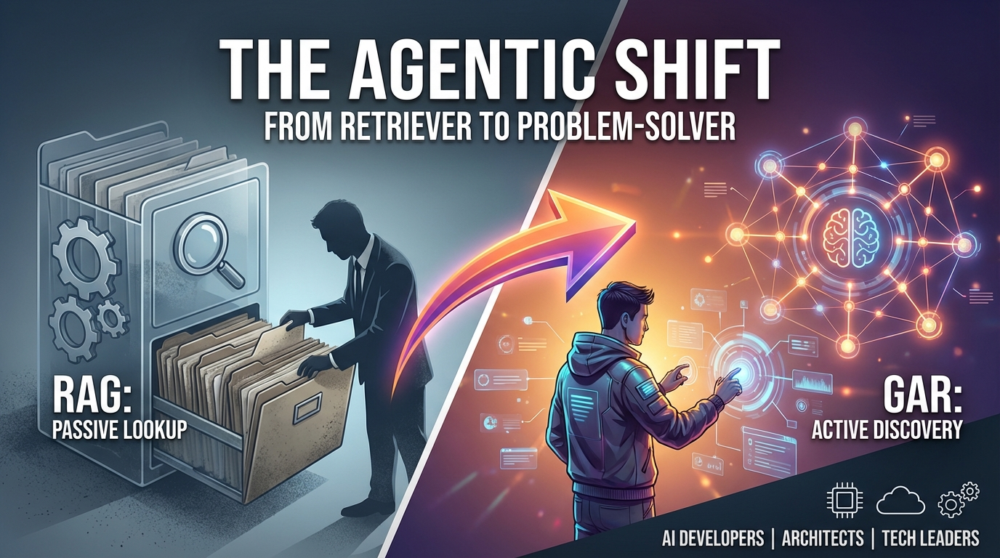
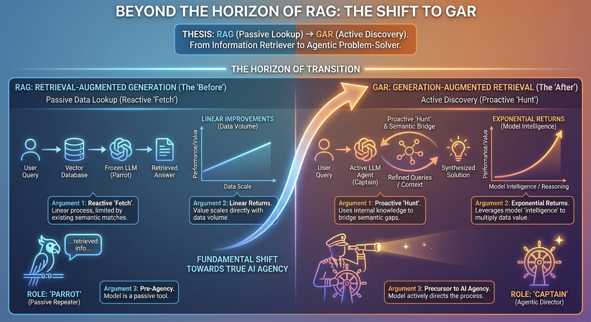
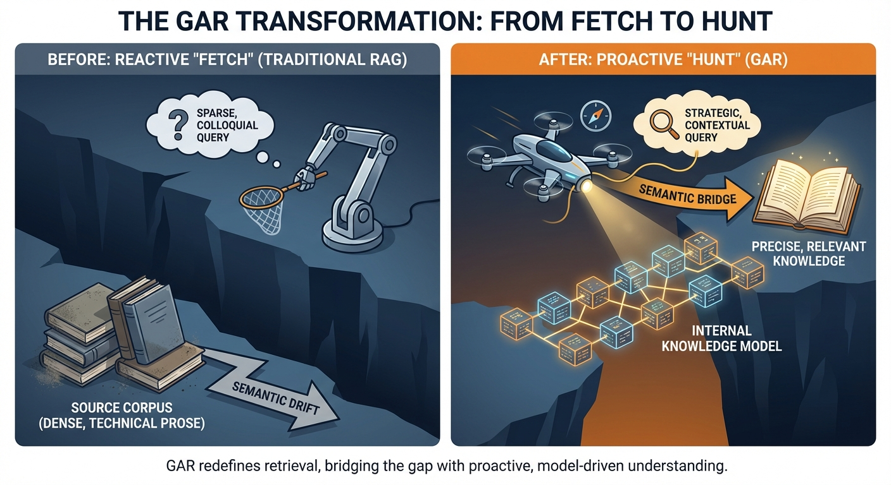
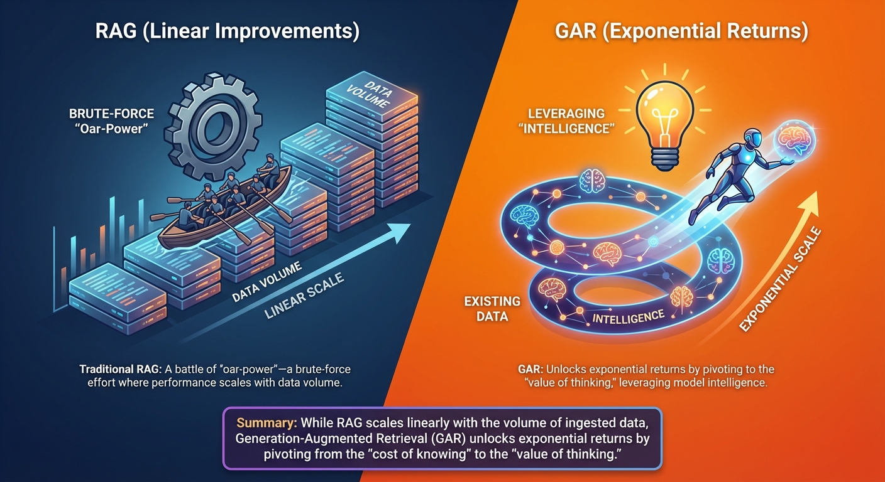
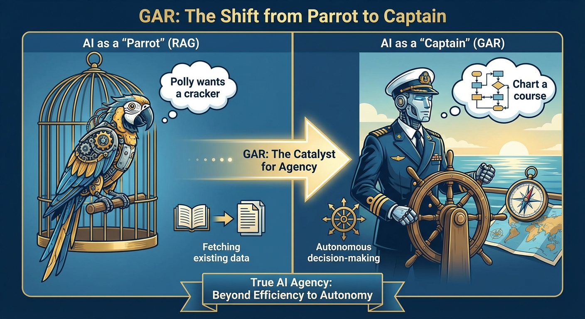
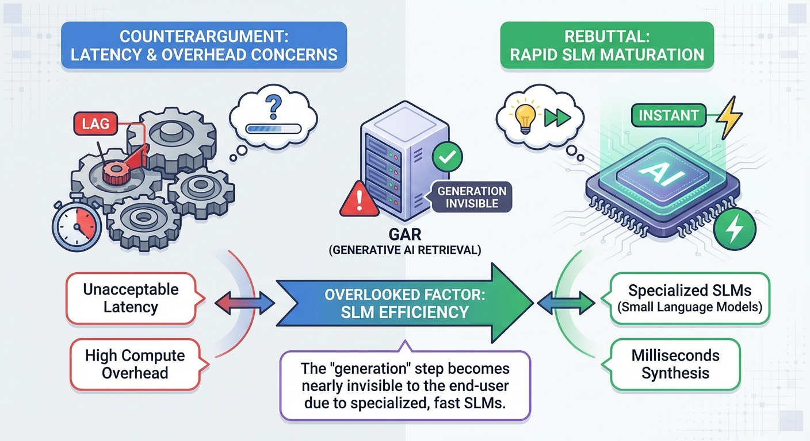

# Persuasive Essay Generation Transcript

**Started:** 2026-02-20 20:32:27

**Thesis:** The transition from Retrieval-Augmented Generation (RAG) to Generation-Augmented Retrieval (GAR) represents a fundamental shift from passive data lookup to active discovery, empowering AI to act as an agentic problem-solver rather than a simple information retriever.

---

## Cover Image

**Prompt:** 



## Configuration

# Persuasive Essay Generation

**Thesis:** The transition from Retrieval-Augmented Generation (RAG) to Generation-Augmented Retrieval (GAR) represents a fundamental shift from passive data lookup to active discovery, empowering AI to act as an agentic problem-solver rather than a simple information retriever.

## Configuration
- Target Audience: AI developers, software architects, and technology leaders
- Tone: passionate yet analytical
- Target Word Count: 1200
- Number of Arguments: 3
- Include Counterarguments: ✓
- Use Rhetorical Devices: ✓
- Include Evidence: ✓
- Use Analogies: ✓
- Call to Action: strong

**Started:** 2026-02-20 20:32:48

---

## Progress

### Phase 1: Research & Outline
*Analyzing thesis and creating essay structure...*


                            
                            Research Context
                            
                            # /home/andrew/code/Science/scratch/2026-02-20-GAR/content.md

```
# Charting New Waters: Why We're Flipping the Compass from RAG to GAR

Ahoy, landlubbers and code-monkeys alike! Gather 'round the mast as we talk about the shifting winds in the world of Large Language Models. For moons, we've relied on the trusty RAG—Retrieval-Augmented Generation—to keep our AI from hallucinating like a sailor who's had too much sun. We'd scour the depths for documents first, then let the model spin its yarn based on what we hauled up in the nets.

But here's the thing, ye scallywags: RAG is a **Lookup** paradigm. It's about reducin' the cost of knowin'—fetchin' the right crate from the hold so the model can read ye an answer. Useful? Aye. But the returns are linear, like addin' one more oar to a galley. The sea is vast, and sometimes the maps we have aren't enough to find the buried treasure. The old ways of searchin' can leave us stranded in a doldrum of irrelevant results.

Enter **Generation-Augmented Retrieval (GAR)**—and with it, a shift from Lookup to **Discovery**. GAR doesn't just reduce the cost of knowin'; it increases the value of *thinkin'*. We're no longer just fishin' for existing scraps and hopin' for the best; we're usin' the creative power of the model to generate the very queries, hypothetical documents, and context that lead us straight to the gold. The ROI here ain't linear—it's exponential, like a single treasure map that unlocks an entire archipelago of riches.

Make no mistake: this ain't merely a technical maneuver, swappin' one acronym for another. It's a fundamental change in what AI *does*. We're movin' from machines that **answer questions** to machines that **solve problems**—from parrots recitin' what's in the hold to captains chartin' courses through uncharted waters. Grab yer grog and prepare to see why GAR is the new wind in our sails!
## The Symmetry of RAG and GAR: Two Sides of the Same Compass
There's a certain seafaring logic in the way these acronyms mirror each other. RAG and GAR aren't just different maneuvers; they represent the same loop of discovery, just viewed from opposite ends of the spyglass. And listen to the words themselves: say **"GAR"** aloud and it comes out like a captain's bark—a command hurled into the wind. Say **"RAG"** and you hear tattered sailcloth flappin' in the doldrums. The phonetics betray the philosophy. GAR is *active*; RAG is *passive*. One seizes the wheel, the other waits for the tide.

In **RAG (Retrieval-Augmented Generation)**, the order is set: we cast the nets first (Retrieve), then we cook what we catch (Generate). The retrieval is the anchor, and the generation is the sail. It's a reactive process where the model is only as good as the scraps we pull from the brine.

In **GAR (Generation-Augmented Retrieval)**, we flip the script. We use the model's creative spark to imagine the treasure first (Generate), and then we use that vision to guide our search (Retrieve). It's the difference between blind fishing and following a map you've drawn from your own intuition. 
This linguistic inversion reveals a deeper structural symmetry—what a mathematician might call **adjoint functors**, or what we pirates call *adjoint functors in pirate form*. Each pattern is the formal dual of the other: RAG maps from the world's data into the model's generation, while GAR maps from the model's generation out into the world's data. They compose into a round trip, and like any good pair of adjoints, neither is "better"—they're complementary lenses on the same underlying problem.
But the flip isn't just technical; it's **epistemic**. RAG grounds the model in existing data—it says, "Here is what the world already knows; now speak." GAR lets the model set the terms of its own inquiry—it says, "Tell me what you *think* the answer looks like, and I'll go find out if you're right." One anchors the ghost in hard facts; the other follows the ghost's own whispers to find where the facts are buried. RAG is an act of *humility* before the archive; GAR is an act of *imagination* before the search. Whether you start with the data or the dream, you're still tryin' to bridge the gap between a question and an answer. They are the same voyage, just sailed in different directions—and the wisest captains know when to tack between them.


## The Architectural Inversion: Captain vs. Cargo
To understand why this shift matters, we need to look at who's holdin' the wheel. 
### RAG: The Model as Cargo
In the traditional RAG pattern, the LLM is treated like precious cargo. Architecturally, the whole affair is a **linear DAG**—a straight pipeline from port to port: *Query → Embedding → Vector Search → Context Injection → Generation*. Each stage feeds the next, no detours, no doublin' back. The developer acts as the dockworker, haulin' crates of data from a vector database and stackin' them neatly in the model's context window. The model doesn't get a say in what's in the crates; it just processes whatever it's given. It's a passive recipient, waitin' for the "retrieval" phase to finish before it can start its "generation" work. If the dockworker grabs the wrong crates—if the embedding misses the mark or the vector search returns flotsam—the model is stuck tryin' to make sense of junk, with no authority to send the dockworker back for a second haul.

### GAR: The Model as Captain
With GAR, we're handin' the compass and the wheel to the LLM. Instead of waitin' for us to find the data, the model takes the lead. It uses its internal knowledge to generate hypothetical answers, better search queries, or even structured data schemas *before* we hit the database. The key mechanism here is **HyDE—Hypothetical Document Embeddings**. This is how the Captain *draws the map*: given a question, the model first generates a hypothetical answer—a plausible document that *would* contain the truth, even if it doesn't exist yet. That hypothetical gets embedded into vector space and used for similarity search, meanin' the retrieval is guided not by the user's raw words but by the model's *informed imagination* of what the answer looks like. It's the difference between searchin' for "ship repair" and searchin' for a detailed passage about replacin' a mizzen mast in heavy seas.

But the Captain doesn't just draw one map and call it done. Unlike RAG's linear pipeline, GAR operates as an **iterative agentic loop**—a state machine with memory, checkpoints, and the ability to backtrack. The Captain generates a hypothesis, dispatches the crew to search, inspects what they drag back, and *decides what to do next*: refine the query, try a different tack, or declare the treasure found. Each iteration updates the agent's state; each checkpoint lets the system resume if the seas get rough; and backtracking means a dead-end passage doesn't sink the voyage—the Captain simply returns to the last known good position and charts a new course. In this world, the model isn't just sittin' in the hold; it's the Captain barkin' orders, assessin' results, and adaptin' the plan in real time. We aren't just hopin' the keywords match; we're usin' the model's reasonin' to bridge the gap between a vague user question and the specific data hidden in the depths.

## The Mascot: The Many-Eyed Captain
Every great voyage needs a figurehead, and ours is the **Many-Eyed Captain**. Imagine a colossal, deep-sea octopus, its skin a shimmering iridescent teal, wearing a weathered tricorn hat tilted at a rakish angle. But this is no ordinary cephalopod. 
The Captain sports dozens of glowing, amber eyes scattered across its mantle, each one focused on a different horizon, a different data stream, or a different potential future. This isn't just for show; it represents the model's ability to maintain multiple chains of thought and monitor various tool outputs simultaneously.
Its eight primary tentacles (and several smaller ones you only notice when they're busy) are a whirlwind of activity:
- One tentacle delicately balances a **JSON crate**, its glowing edges pulsing with structured data.
- Another unfurls a **treasure map** that shifts and changes in real-time—the generated context guiding the search.
- A third grips a **golden sextant** (the MCP tools), measuring the distance between the query and the truth.
- Others are busy haulin' in nets of raw text, polishin' the ship's brass, or scribblin' in the logbook.
The Many-Eyed Captain is the living embodiment of GAR. It doesn't just sit and wait; it reaches out into the digital brine with a dozen limbs at once, coordinatin' the complex dance of generation and retrieval that brings us to the gold.

## MCP: The Navigator's Toolkit
If the model is the Captain, then the **Model Context Protocol (MCP)** is the set of instruments on the bridge—the sextant, the compass, and the detailed charts that make navigation possible. 
In a GAR-driven world, we don't just want the model to shout orders into the void; we need a standardized way for it to interact with the ship's systems. MCP provides the structured API surfaces and typed schemas that turn a vague command into a precise maneuver. Instead of the model just consuming raw text chunks like a whale swallowin' krill, MCP allows it to interact with data through predictable formats.
But MCP is more than a communication protocol—it's a **governance layer**, the maritime law of our digital seas. Just as a harbor authority dictates which waters a vessel may enter and which cargo it may carry, MCP defines the **security boundary** that constrains the Captain's actions to authorized waters. Every tool invocation passes through typed schemas that act as customs inspections: the Captain cannot call a tool that hasn't been registered, cannot pass parameters outside the declared types, and cannot reach databases or APIs beyond its chartered jurisdiction. In this way, MCP ensures that even the most ambitious Captain cannot steer into forbidden straits or plunder data stores it has no right to access. It is the Pirate's Code made enforceable—not just guidelines, but hard constraints baked into the protocol itself.
Before the Captain even sets a course, MCP offers a critical capability: **dynamic tool discovery**. Through the `tools/list` endpoint, the Captain can survey every instrument available on the bridge—every database connector, every API integration, every file-system browser—before decidin' which to wield. Think of it as the Captain standin' at the helm, raisin' the spyglass to scan the full inventory of sextants, astrolabes, and charts in the navigation room. This means the agent needn't be hard-coded with knowledge of its own capabilities; it can *discover* them at runtime, adaptin' its strategy to whatever instruments the ship currently carries. A new tool mounted on the bridge? The Captain sees it on the next `tools/list` call and can immediately put it to use—no refit in dry dock required.

By defining clear boundaries and capabilities, MCP enables the model to:
- **Explore Knowledge Spaces Actively:** The model can query specific databases, call external APIs, or browse file systems using a unified protocol.
- **Understand Data Structures:** Typed schemas ensure the model knows exactly what kind of information it's receiving and how to use it.
- **Maintain Contextual Integrity:** Because the format is predictable, the model can maintain a coherent "mental map" of the information it has gathered and what it still needs to find.

There's a deeper shift at work here, one that the shipwrights of data infrastructure feel in their bones: MCP transforms the relationship between the Captain and the data hold from a **static warehouse** into a **living dialogue**. In the old world, data infrastructure was a silent archive—rows and columns sittin' in the dark, waitin' to be queried by a dockworker who already knew exactly which crate to fetch. With MCP, the data infrastructure *speaks back*. It advertises its capabilities, describes its schemas, and responds to the Captain's evolving questions in real time. The hold is no longer a dead-letter office; it's a first mate engaged in continuous conversation, offerin' up what it knows and signalin' what it can provide. This is the infrastructure engineer's revelation: that agentic retrieval doesn't just consume data—it transforms data systems themselves into active participants in the voyage of discovery.

Without MCP, the Captain is just a loud voice on a leaky boat—powerful in thought but impotent in action, unchecked in ambition but ungoverned in reach. With it, the model has a high-fidelity, *secure* interface to the world, allowin' it to navigate the digital seas with the precision of a master mariner and the discipline of a commissioned officer. MCP is simultaneously the Captain's toolkit and the Admiralty's charter: it empowers and it constrains, and in that duality lies the foundation for safe, scalable agentic retrieval.
## The Quadratic Bottleneck and Latency: The Weight of the Logbook
Even the finest ship can be slowed down if the Captain's logbook grows too heavy. In the world of GAR, every decision, every tool call, and every scrap of JSON metadata is meticulously recorded. This "transcript" is what allows the model to reason and refine its search, but it comes with a hidden cost: the **Quadratic Bottleneck**.
As the agent loop spins—generating a query, calling a tool, processing the result, and reasoning about the next step—the context window fills up. Because of how Transformer models work, the computational cost of processing this context grows quadratically with its length. It's not just a linear crawl; it's like the anchor chain gettin' heavier and more tangled with every link we add.
Even if the external tools (the vector databases or APIs) are fast as a dolphin, the agent itself starts to lag. The model has to re-read the entire history of the voyage—the reasoning traces, the raw JSON responses, and the previous failed attempts—just to decide on the next small course correction. This creates a "latency tax" that can turn a snappy interaction into a slow, ponderous trek. To keep our GAR-powered vessels agile, we must find ways to prune the logbook, summarize the journey, or use more efficient architectures that don't buckle under the weight of their own history.
### The Tired Captain: When the Bottleneck Becomes a Safety Risk
But here's the part that should make every shipwright sit up straight: the quadratic bottleneck isn't just a *performance* problem—it's a **safety** problem. Research on long-context Transformers reveals a phenomenon known as **"lost in the middle" degradation**: as the context window fills toward capacity, the model's attention to information in the middle of the sequence degrades sharply. The Captain doesn't just get *slow*; the Captain gets *tired*. A tired Captain starts skippin' over entries in the logbook, ignorin' critical warnings buried between pages of routine observations.
In practical terms, this means that safety guardrails, system prompts, and governance instructions—often injected early in the context and gradually pushed toward the middle by accumulating tool outputs—can be **effectively ignored** by a model straining under a bloated transcript. The very MCP governance layer we described above, the Pirate's Code made enforceable, becomes invisible to a Captain whose eyes are glazed over from readin' too many pages. A model that would normally refuse an unsafe action at turn three may comply at turn thirty, not out of malice, but out of attentional exhaustion. This makes keepin' the logbook lean not merely an optimization concern, but a **first-order safety requirement**.
### Three Ways to Keep the Logbook Lean
A wise Captain doesn't let the logbook grow until it drags the keel. Here are three proven strategies for keepin' the context trim and the Captain sharp-eyed:
#### 1. Context Pruning and Logbook Compaction
The most direct approach: periodically **summarize and compress** the voyage so far. Rather than burden the frontier model with this bookkeeping, we dispatch a smaller, cheaper model—a cabin boy, if ye will—to read the accumulated transcript and produce a compact summary of what's been tried, what's been found, and what remains unknown. The frontier Captain then receives this condensed briefing instead of the raw, sprawling log.
In practice, this means inserting a **compaction step** into the agentic loop: every *N* iterations (or when the context crosses a token-count threshold), a lightweight model rewrites the history into a structured summary—key findings, outstanding questions, and critical safety instructions explicitly re-stated. This last point is crucial: compaction is our opportunity to **re-surface governance instructions** that might otherwise drift into the "lost middle," ensuring the tired Captain's Code is always freshly inked on the first page.
#### 2. KV-Cache and Prefix Caching
Much of the context window is **static** across iterations: the system prompt, the MCP tool definitions, the safety guardrails, and the original user query don't change from turn to turn. Yet without optimization, the model re-processes these unchanging preambles on every single pass—like the Captain re-reading the ship's charter before every course correction.
**KV-cache reuse and prefix caching** eliminate this redundancy. By caching the key-value attention states for the static prefix of the context, we allow the model to skip directly to processing only the *new* content—the latest tool response, the most recent reasoning step. This doesn't reduce the theoretical quadratic complexity, but it dramatically reduces the *practical* compute per iteration, because only the delta is processed. The Captain still has the full charter memorized; we've simply spared the Captain from re-reading it aloud every time the wind shifts. Most modern inference frameworks (vLLM, TGI, and managed API providers) support prefix caching natively, making this the lowest-effort, highest-impact optimization available.
#### 3. Small-to-Large Retrieval: The Scouting Party
Not every search requires the Captain's personal attention. In a **small-to-large retrieval** pattern, we deploy lightweight, fast models as a **scouting party**: they handle the initial embedding generation, the first-pass similarity search, and the coarse ranking of candidate documents. Only the most promising results—the top candidates that survived the scouts' inspection—are passed up to the frontier model for final synthesis and reasoning.
This is a division of labor that mirrors any well-run ship: the lookouts in the crow's nest scan the horizon with quick eyes, and only when they spot something worth investigatin' does the Captain raise the spyglass. Concretely, a small embedding model (or even a traditional BM25 index) handles the high-volume, low-precision first pass, while the frontier model's precious context window is reserved for the high-precision, high-stakes final judgment. The result: the Captain's logbook contains only the most relevant intelligence, not every piece of flotsam the nets dragged up.
### The Compounding Discipline
These three strategies aren't mutually exclusive—they **compound**. Prefix caching keeps the static overhead near zero. Small-to-large retrieval ensures only high-quality material enters the logbook in the first place. And periodic compaction prevents the accumulated history from sprawling beyond control. Together, they keep the context window well within the regime where attention is sharp, latency is low, and—critically—where the Captain is alert enough to honor the Code.
The quadratic bottleneck is real, and it will only grow more pressing as agentic loops become deeper and more ambitious. But it is not an unsolvable curse. It is a design constraint, and like all good constraints, it rewards the disciplined shipwright who plans for it from the first plank of the hull.
## The Siren's Song: Navigating Hallucination and Epistemic Integrity in GAR
Every Captain worth their salt knows the legend of the Sirens—voices so sweet and convincin' that sailors steer straight into the rocks, believin' paradise lies just ahead. In GAR, the Siren's Song has a technical name: the **Recursive Hallucination Loop**. And it is, without question, the most dangerous reef in these waters.
Here's the peril, laid bare. In RAG, the model is *grounded first*—it receives real documents before it speaks, so its hallucinations are at least constrained by the evidence in front of it. But in GAR, we've handed the Captain the wheel *before* the evidence arrives. The model generates a hypothesis, and then we go searchin' for data to match it. Do ye see the trap? If the Captain imagines a **false premise**—a phantom island that doesn't exist—the retrieval system will dutifully sail toward it, haulin' back whatever flotsam looks most similar to the hallucination. The model then reads that flotsam, sees its own fantasy reflected back, and grows *more confident* in the falsehood. Generate false premise → retrieve confirming data → reinforce error → generate with greater conviction. It's a feedback loop, a whirlpool that pulls the whole voyage into the deep.
This is the central tension of GAR, and any honest account must face it squarely: **how does a model distinguish a novel truth from a confident hallucination?** When the Captain draws a map to an island no one has visited, is it genuine discovery or a mirage shimmerin' on the horizon? The uncomfortable answer is that, from inside the loop, the two can look identical. A hypothetical document generated by HyDE is, by design, a plausible fiction—that's what makes it useful for embedding-space search. But "plausible fiction" and "hallucinated falsehood" are separated by nothin' more than whether reality happens to agree.
### Active Triangulation: The Captain's Defense Against Mirages
A seasoned navigator doesn't trust a single sighting. When a lookout cries "Land ho!", the Captain doesn't steer blindly toward it—the Captain takes bearings from **multiple independent positions** and triangulates. If three sextant readings from three different angles all agree on the island's location, it's real. If only one reading shows it and the others show open ocean, it's a mirage.
This is the principle of **Active Triangulation**, and MCP makes it operationally feasible. Because the Captain can discover and invoke multiple independent tools at runtime—different databases, different APIs, different knowledge sources—the agentic loop can be designed to **corroborate every critical finding across independent sources** before accepting it as truth. A claim surfaced from a vector search over internal documents can be checked against a structured knowledge graph, cross-referenced with an external API, and compared to the model's own parametric knowledge. Agreement across independent sources is evidence of reality; disagreement is a red flag that demands further investigation or an honest admission of uncertainty.
Concretely, this means the agentic loop should not simply retrieve and accept. After the initial GAR cycle produces a candidate answer, the Captain should dispatch **separate retrieval queries to independent data sources**, each phrased differently to avoid confirmation bias in the embedding space. If Source A, Source B, and Source C all converge on the same conclusion through different paths, confidence is warranted. If they diverge, the Captain must weigh the evidence, flag the uncertainty, and—critically—**report the divergence** rather than paper over it with false confidence.
### The Fact-Check Gate: Customs Inspection Between Generation and Retrieval
Triangulation catches hallucinations after retrieval, but the wisest shipwrights build defenses *before* the search even begins. Between the generation phase (where the Captain draws the hypothetical map) and the retrieval phase (where the crew sets sail to find it), we insert a **Fact-Check Gate**—a structured checkpoint that inspects the generated hypothesis for internal consistency, logical coherence, and known red flags before it's allowed to guide retrieval.
Think of it as a customs inspection at the harbor mouth. Before any ship leaves port based on the Captain's orders, the harbor master examines the charts: Are the coordinates self-consistent? Does the hypothesis contradict well-established facts already in the knowledge base? Does it contain the telltale signs of confabulation—overly specific details about things the model has no business knowing, or confident claims in domains where its training data is sparse?
This gate can be implemented as a lightweight classifier or a second model call with a focused prompt: *"Before we search for evidence of this claim, evaluate whether the claim itself is internally coherent and plausible given what we already know."* The gate doesn't need to be perfect—it needs to catch the most egregious phantom islands before the fleet wastes a voyage chasin' them. Failed inspections route the hypothesis back to the generation phase for revision, or flag it as low-confidence so that downstream retrieval results are treated with appropriate skepticism.
### Epistemic Humility as Architecture
Taken together, Active Triangulation and the Fact-Check Gate represent something deeper than engineering patches—they encode **epistemic humility** into the architecture itself. The GAR pattern is powerful precisely because it lets the model lead with imagination, but imagination unchecked by discipline is just hallucination with better vocabulary. The Captain must be bold enough to hypothesize about uncharted waters, yet honest enough to say, *"I drew this map from my own mind, and I might be wrong. Let's verify before we bet the ship on it."*
This is the philosophical heart of the matter: GAR's greatest strength—the model's ability to generate novel framings that unlock previously inaccessible information—is inseparable from its greatest risk—the model's ability to generate convincing nonsense that the retrieval system faithfully reinforces. You cannot have one without the other. The Siren's Song and the Navigator's Insight come from the same voice. The difference lies entirely in the **epistemic infrastructure** we build around that voice: the gates, the triangulation, the willingness to treat every generated hypothesis as provisional until independently corroborated.
A GAR system without these safeguards is a Captain who trusts every mirage. A GAR system *with* them is a Captain who dreams boldly but navigates carefully—and that, in the end, is the only kind of Captain worth followin' into uncharted waters.


## The Pirate's Code: Documentation Philosophy
You might be wonderin' why we're talkin' like we've spent too much time in the sun and not enough time in the library. Why the talk of "treasure," "brine," and "captains"? This isn't just for show; it's the **Pirate's Code** of documentation.
Traditional documentation is like a dry, dusty ledger in a port authority office. It's built for lookups—you want to know the weight of a crate, you look at the index. But GAR isn't about lookups; it's about **discovery**. When you're usin' a model to generate its own path to the data, you're not followin' a paved road; you're navigatin' by the stars.
Our "pirate-coded" style reflects the exploratory nature of this work. We don't want you to just find a function name; we want you to feel the spray of the sea and the thrill of the hunt. Documentation should be a map that invites exploration, not just a list of rules. It's about maintainin' the thematic energy of the voyage. In the world of GAR, the journey of findin' the information is just as important as the information itself. We're not just coders; we're explorers of the latent space, and our documentation should read like the logbook of a legendary voyage.
## From Librarian to Consultant: The User's Voyage
We've spent many a league talkin' about the Captain, the ship, and the instruments on the bridge. But what about the **passenger**—the soul who actually walks up to the helm and asks a question? GAR doesn't just transform the architecture below decks; it fundamentally changes what it feels like to *use* the blasted thing. The old RAG world gave the user a **librarian**: ye had to know the right words, the right shelf, the right call number, or ye got nothin' but a blank stare and a stack of irrelevant parchment. GAR gives the user a **consultant**—a Many-Eyed Captain who listens to a half-formed thought, fills in the gaps with its own expertise, and comes back not just with an answer but with a *line of reasoning* that led there.
### Intent-Driven Discovery: When Vague Questions Become Viable
In the RAG world, the user bore a hidden burden: the **keyword tax**. If ye didn't phrase yer query in terms that matched the embeddings in the hold, the retrieval came back empty or, worse, misleadin'. A sailor who asked *"Why does the ship pull to starboard in heavy weather?"* might get documents about "ship" and "weather" but miss the critical treatise on hull asymmetry and ballast distribution, because the words didn't align. The user had to *already know enough* to ask the right question—a cruel paradox when the whole point of searchin' is that ye *don't* know.
GAR dissolves this paradox. Because the Captain generates a hypothetical answer *before* retrieval, the user's vague, natural-language intent is transformed into a rich, semantically dense search target. That half-formed question about the ship pullin' to starboard becomes a generated passage about hydrodynamic forces, keel geometry, and weight distribution—and *that* passage is what gets embedded and matched against the knowledge base. The user doesn't need to know the jargon; the Captain translates intent into expertise. This is the shift from **keyword-dependent search** to **intent-driven discovery**, and for the person at the helm, it feels like the difference between shoutin' into a warehouse and havin' a quiet conversation with someone who actually understands the problem.
### Reasoning Transparency: Curing the UX of Silence
But here's a subtlety that many a shipwright overlooks: if the Captain is doin' all this thinkin'—generatin' hypotheses, dispatchin' queries, triangulatin' across sources, passin' through fact-check gates—the user sees *none of it*. From the passenger's perspective, they ask a question and then… silence. Seconds tick by. The wheel turns. The sails shift. But no one tells them what's happenin'. This is the **UX of Silence**, and it is the fastest way to erode trust in an agentic system.
The remedy is **Reasoning Transparency**: showin' the Captain's thought process in real time, or near enough. As the agentic loop iterates, the interface should surface the Captain's internal monologue—not the raw JSON and tool calls (that's for the shipwrights), but a human-readable narration of the voyage: *"Generating a hypothesis about hull dynamics… Searching the engineering database… Cross-referencing with maintenance logs… Found a discrepancy, refining the query…"* This transforms the wait from an anxious silence into a **visible expedition**. The user watches the Captain work and, crucially, can see *why* the final answer looks the way it does. Trust isn't built by speed alone; it's built by **legibility**. A consultant who thinks in front of you is more trustworthy than an oracle who pronounces from behind a curtain, even if the oracle is faster.
Reasoning transparency also serves a practical function: it gives the user **intervention points**. If the Captain is clearly sailin' in the wrong direction—pursuin' a hypothesis about electrical systems when the user meant mechanical ones—the user can course-correct mid-voyage rather than waitin' for a wrong answer and startin' over. The passenger becomes a **co-navigator**, and the voyage becomes a collaboration rather than a black-box transaction.
### Clear the Deck: Resetting Context When the Logbook Drags
We spoke earlier of the Quadratic Bottleneck—the way the Captain's logbook grows heavier with every iteration, slowin' the ship and dullin' the Captain's attention. For the shipwright, this is a compute problem. For the *user*, it's a **conversational problem**. After a long, winding exchange—especially one that took a few wrong turns—the user can *feel* the system gettin' sluggish, the answers gettin' less sharp, the Captain's eyes glazin' over from too many pages of history.
This is where the user needs a **"Clear the Deck"** feature: an explicit, accessible mechanism to reset the conversational context and start fresh. Think of it as the Captain tearin' out the old logbook pages, tossin' them overboard, and openin' a clean spread. Technically, this means flushing the accumulated context (or compacting it down to a minimal summary of key findings) so the model operates in the sharp-attention regime again. But from the user's perspective, it's simpler than that—it's a button, a command, a gesture that says *"We've wandered far enough down this channel; let's start from open water."*
The key insight is that this shouldn't be hidden in a settings menu or require the user to understand Transformer attention mechanics. It should be as natural and prominent as the "New Search" button in a traditional search engine. The quadratic bottleneck is an architectural reality, but it needn't be the user's burden to diagnose. A well-designed GAR interface **signals when context is gettin' heavy**—perhaps a subtle indicator showin' the logbook's fullness—and offers the Clear the Deck option before the Captain's performance visibly degrades. Proactive design beats reactive frustration.
### Latency-Tiered Responses: Not Every Question Needs the Full Fleet
Here's a truth that the architecture-minded often forget: not every question deserves a full agentic voyage. Sometimes the user just wants to know what port they're docked in—a simple factual lookup that a traditional RAG pipeline could answer in under a second. Other times, they're askin' the Captain to chart a course through uncharted waters, synthesizin' across multiple sources and reasonin' through ambiguity. Treatin' both questions the same way is like deployin' the entire fleet to fetch a barrel of rum from the next dock over.
A mature GAR system should offer **latency-tiered responses**—a fast lane and a deep lane, with the system intelligently routin' between them:
- **Fast RAG (The Dockhand):** For simple, well-defined queries where the intent is clear and a single retrieval pass suffices, the system skips the full agentic loop entirely. Embed the query, fetch the top results, generate a concise answer. Sub-second response. The user gets their barrel of rum without waitin' for the Captain to convene a war council.
- **Deep GAR (The Full Voyage):** For complex, ambiguous, or multi-faceted queries—the kind where the user's intent needs to be *interpreted* rather than merely *matched*—the system engages the full Captain: hypothesis generation, iterative retrieval, triangulation, fact-check gates, the works. This takes longer, but the user has been told (via Reasoning Transparency) that a proper expedition is underway, and the result is worth the wait.
The routing decision itself can be lightweight: a small classifier or even a heuristic based on query complexity, ambiguity signals, and the user's own indication of urgency. The point is that the user should experience **appropriate latency for the complexity of their question**. A system that takes ten seconds to answer "What's the current API rate limit?" is just as broken as one that takes half a second to answer "How do our authentication failures correlate with deployment patterns across the last six months?" The first wastes the user's time; the second wastes the user's trust by deliverin' a shallow answer to a deep question.
### The Consultant's Promise
Taken together, these four shifts—intent-driven discovery, reasoning transparency, context reset, and latency-tiered responses—describe a fundamental transformation in the **contract between the system and the user**. The old RAG contract was transactional: *"Give me good keywords and I'll give you relevant documents."* The new GAR contract is consultative: *"Tell me what you're trying to understand, and I'll show you how I'm thinking about it, adapt to the complexity of your question, and let you steer when I drift off course."*
This is the shift from librarian to consultant, and it matters because the most powerful architecture in the world is worthless if the person at the helm can't trust it, can't understand it, and can't control it. The Many-Eyed Captain may have dozens of glowing amber eyes and eight busy tentacles, but the passenger needs to see where those eyes are lookin' and know that a word from them can change the Captain's course. **GAR's technical revolution is only complete when it becomes a UX revolution**—when the person askin' the question feels not like a supplicant before an oracle, but like a partner in a voyage of discovery.

## The GAR Manifesto: A New Charter for Agentic Intelligence
As we stand on the quarterdeck of this new era, we declare **Generation-Augmented Retrieval (GAR)** not merely as a technique, but as a first-class architectural pattern for the next generation of AI. The days of the passive model are over. We are entering the age of the **Agentic Captain**.
### The Core Tenets of GAR:
1.  **The Model is the Captain, Not the Cargo:** We reject the notion that an LLM should be a passive recipient of data. The model must lead the search, using its internal reasoning to define the parameters of what it needs to know.
2.  **Intent Before Information:** We prioritize the generation of hypothetical answers, search queries, and structured schemas. By imagining the solution first, we navigate the data space with intent rather than luck.
3.  **Structured Dialogue via MCP:** We embrace the Model Context Protocol as our universal language. Standardized, typed interfaces are the charts and sextants that allow the Captain to communicate with the ship's systems with absolute precision.
4.  **The Loop is the Journey:** Retrieval is not a single event; it is a continuous, iterative process of generation, action, and refinement. The agentic loop is the heartbeat of discovery.
5.  **Synthesis Over Selection:** The goal is not just to find a document, but to synthesize a truth. GAR merges the model's latent knowledge with the world's external data to create something greater than the sum of its parts.
6.  **Epistemic Integrity:** Every claim in a GAR system's output must be **attributed**—either to the model's internal reasoning or to specific retrieved evidence. The user must never be left to guess whether a statement is the Captain's informed hypothesis or a verified fact hauled from the hold. Intuition and evidence are both valuable, but they are not interchangeable, and conflatin' the two is how mirages become monuments. A GAR system that cannot distinguish *"I believe this because I reasoned it"* from *"I know this because I found it"* is a system that has already begun to lie, even with the best of intentions.
7.  **Verification Before Retrieval:** No hypothetical generation shall guide a retrieval voyage without first passin' through a **validation gate**. Before the Captain's imagined map is handed to the crew, it must be inspected for internal consistency, logical coherence, and known contradictions with established fact. This is the Fact-Check Gate made into law—not an optional safeguard but a mandatory customs inspection at the harbor mouth. A hypothesis that cannot survive a moment's scrutiny has no business commandin' a fleet of search queries. The gate does not demand certainty; it demands *plausibility*, and it routes the implausible back to the drafting table before a single sail is raised.
### The Future with Cognotik
In systems like **Cognotik**, GAR is the engine of autonomy. It transforms AI from a simple chatbot into a sophisticated navigator capable of traversing complex knowledge graphs and disparate data silos. By flipping the compass, we empower agents to solve problems that were previously unreachable, turning the vast "digital brine" into a navigable map of actionable insights.

But there is a subtler treasure buried in every GAR deployment, one that most crews sail right past: the **Reasoning Library**. Every time the Captain successfully navigates from a vague question to a verified answer, the *pattern* of that voyage—the hypothesis that was generated, the queries that were dispatched, the triangulation strategy that confirmed the result—is itself a piece of intellectual property. These aren't just logs to be archived and forgotten; they are **proven search strategies**, reusable charts that encode *how* a particular class of problem was solved. Over time, a Cognotik-powered system accumulates a library not of answers but of *reasoning patterns*: the hypothetical framings that consistently unlock hard-to-reach data, the query reformulations that bridge the gap between user intent and database schema, the triangulation sequences that reliably distinguish signal from hallucination. This Reasoning Library becomes a proprietary asset—a competitive moat built not from data (which can be copied) but from the accumulated *craft* of discovery (which cannot). It is the difference between ownin' a map and ownin' the art of cartography itself.
### A Call to Adventure
The horizon is wide, and the winds are in our favor. We invite all developers, researchers, and digital explorers to join us in this shift. Stop hauling crates and start training Captains. Embrace the symmetry, master the tools, and let us sail together toward a future where AI doesn't just answer questions—it discovers the world.

But let us be honest about what we're sailin' toward. The Socratic dialogues of old taught us that wisdom begins with the admission of ignorance, and the deepest lesson of GAR is the same: **truth in AI is not a static destination but a process of cross-verification**. There is no single retrieval that settles a question forever, no generation so perfect it needs no corroboration. The Captain who believes the voyage is over has already begun to drift. What GAR offers is not omniscience but a *discipline of inquiry*—a structured, repeatable, auditable process by which hypotheses are generated, tested against independent evidence, and held provisionally until the next voyage refines them further. This is not a weakness to be apologized for; it is the very nature of knowledge itself. The treasure is not a chest of gold sittin' on a beach. The treasure is the voyage—the ever-refining loop of imagination, evidence, and honest revision that brings us closer to the truth without ever pretendin' we've arrived at its final shore.
**Fair winds and following seas!**
```
                            
                            ## Essay Outline

## Beyond the Horizon of RAG

### Hook
Open with the 'RAG Plateau.' Describe a scenario where a state-of-the-art RAG system fails not because it lacks data, but because it lacks the 'imagination' to find it—the 'tattered sail' flapping in the doldrums of irrelevant vector matches.

### Background
Briefly define the current dominance of Retrieval-Augmented Generation (RAG) as the industry standard for grounding LLMs. Explain the 'Lookup Paradigm': RAG treats AI as a librarian fetching crates from a hold. Introduce the emerging bottleneck: As datasets grow and queries become more complex, simple semantic similarity is no longer enough to bridge the 'vocabulary gap' between user intent and raw data.

### Thesis Statement
> The transition from Retrieval-Augmented Generation (RAG) to Generation-Augmented Retrieval (GAR) represents a fundamental shift from passive data lookup to active discovery, empowering AI to act as an agentic problem-solver rather than a simple information retriever.

---

### Main Arguments
#### Argument 1: GAR transforms the retrieval process from a reactive 'fetch' to a proactive 'hunt' by using the model’s internal knowledge to bridge the semantic gap.

**Supporting Points:**
- The HyDE (Hypothetical Document Embeddings) Principle: Explain how generating a 'fake' answer first creates a better vector for searching than the raw, often poorly phrased, user query.
- Overcoming Semantic Drift: How GAR solves the 'vocabulary mismatch' problem where the user’s question and the document’s answer use different terminology.
- The 'Captain’s Bark': Moving from a system that asks 'What does the data say?' to one that says 'This is what the answer should look like—go find the evidence.'

**Evidence Types:** Technical examples of HyDE performance, Analogies of the 'Treasure Map' vs. 'Random Net Casting', Expert testimony on query expansion

**Rhetorical Approach:** Logos. Focus on the technical mechanics of vector space and why a generated hypothesis is a mathematically superior search seed than a raw query.

**Est. Words:** 250

---

#### Argument 2: While RAG provides linear improvements based on data volume, GAR offers exponential returns by leveraging the 'intelligence' of the model to increase the value of existing data.

**Supporting Points:**
- The Cost of Knowing vs. The Value of Thinking: RAG focuses on reducing the cost of access; GAR focuses on increasing the utility of the retrieved context.
- Architectural Efficiency: Why adding a generation step (even with latency) is more efficient than brute-forcing retrieval through billions of irrelevant documents.
- Contextual Synthesis: GAR allows for 'multi-hop' reasoning where the model generates intermediate queries to find disparate pieces of a puzzle that a single RAG pass would miss.

**Evidence Types:** Comparison of 'Oar-power' (linear RAG) vs. 'Wind-power' (exponential GAR), Architectural diagrams of multi-step retrieval chains, ROI analysis of precision vs. recall in enterprise search

**Rhetorical Approach:** Ethos. Appeal to the software architect’s desire for system efficiency and 'elegant' solutions that scale with intelligence rather than just hardware.

**Est. Words:** 250

---

#### Argument 3: GAR is the necessary precursor to true AI Agency, shifting the model’s role from a 'Parrot' to a 'Captain.'

**Supporting Points:**
- Iterative Refinement: GAR enables a feedback loop where the model evaluates its own retrieval and re-generates new search strategies autonomously.
- Problem-Solving vs. Question-Answering: A 'Question-Answerer' (RAG) needs the answer to exist in the hold; a 'Problem-Solver' (GAR) can synthesize a solution by discovering the necessary components.
- The Shift in AI Identity: Moving from a tool that responds to a system that navigates.

**Evidence Types:** Case studies of agentic workflows (e.g., AutoGPT or specialized research agents), The 'Captain vs. Sailor' analogy, Projections on the future of autonomous R&D

**Rhetorical Approach:** Pathos. Use visionary language to inspire technology leaders about the future of AI as a partner in discovery rather than a static utility.

**Est. Words:** 250

---

### Counterarguments & Rebuttals
**Opposing View:** Latency and Compute Costs. Critics argue that generating text before retrieving data adds unacceptable delay and API costs.

**Rebuttal Strategy:** Highlight the rise of Small Language Models (SLMs) that can handle GAR tasks with millisecond latency. Argue that the cost of a 'wrong' or 'shallow' RAG answer far outweighs the compute cost of a 'right' GAR discovery.

**Est. Words:** 100

**Opposing View:** Hallucination Risk. If the model generates a hypothetical document, won't it just find data that confirms its own hallucinations?

**Rebuttal Strategy:** Clarify that the generated content is a query tool, not the final output. The retrieval step acts as the 'anchor' to reality; if the 'treasure' isn't in the hold, the search fails safely rather than making up a lie.

**Est. Words:** 100

---

### Conclusion Strategy
Reiterate the shift from passive (RAG) to active (GAR) discovery. Urge developers to stop building 'bigger nets' and start building 'better captains.' Close with a final nautical flourish about the 'New Wind' and the compass in the captain's hand as a tool for charting the world.

**Status:** ✅ Complete


## Outline Visualization

**Prompt:** 



## Introduction

We have all hit the RAG Plateau. It is that frustrating moment in production where, despite a high-dimensional vector database and state-of-the-art embeddings, your system stalls. The query is precise, the data is present, yet the engine returns a handful of "semantically similar" noise—a tattered sail flapping in the doldrums of irrelevant vector matches. The failure here isn’t a lack of data; it is a lack of imagination.

For the modern software architect, Retrieval-Augmented Generation (RAG) has been the gold standard for grounding Large Language Models, transforming them from hallucinating poets into reliable researchers. However, we have reached the limits of the "Lookup Paradigm." By treating the AI as a mere librarian fetching crates from a dark hold, we have tethered our systems to the surface-level vocabulary of the user. As datasets grow into the petabytes and queries evolve into complex, multi-step reasoning tasks, simple semantic similarity is no longer a bridge wide enough to cross the "vocabulary gap" between raw data and human intent. We are asking our systems to find needles in haystacks without giving them the agency to move the hay.

To break through this ceiling, we must evolve our architecture. The transition from Retrieval-Augmented Generation (RAG) to Generation-Augmented Retrieval (GAR) represents a fundamental shift from passive data lookup to active discovery, empowering AI to act as an agentic problem-solver rather than a simple information retriever. By allowing the model to generate the hypothetical answers, queries, or transformations required to navigate dense information landscapes, we move beyond the limitations of the retrieval-first mindset and into an era of truly intelligent, autonomous discovery.

**Word Count:** 265

## Argument 1: GAR transforms the retrieval process from a reactive 'fetch' to a proactive 'hunt' by using the model’s internal knowledge to bridge the semantic gap.

GAR fundamentally redefines the retrieval mechanism, evolving it from a reactive "fetch" into a proactive, strategic "hunt." Traditional RAG often falters due to "semantic drift," where the sparse, colloquial nature of a user’s query fails to align with the dense, technical prose of a source corpus. By implementing the Hypothetical Document Embeddings (HyDE) principle, GAR bridges this gap; the model leverages its internal latent knowledge to generate a "hallucinated" but structurally relevant answer before the search begins. Mathematically, this is a superior strategy because it shifts the search seed from the "question manifold" to the "answer manifold" within the vector space. Instead of casting a wide, random net into the high-dimensional ocean of data, the generated hypothesis acts as a precise treasure map, aligning the search vector with the specific cluster where the ground truth resides. This represents the "Captain’s Bark" of agentic AI: the system no longer asks the database, "What do you have on this?" but instead commands, "This is what the solution looks like—go find the empirical evidence to ground it." Technical benchmarks indicate that this "hallucination-first" approach significantly outperforms vanilla dense retrieval by resolving vocabulary mismatches that keyword-dependent systems miss. By transforming the retriever from a passive librarian into a targeted investigator, GAR ensures that the model is no longer at the mercy of poorly phrased queries, but is instead empowered to dictate the terms of its own discovery. This shift in agency is what ultimately enables the transition from simple information retrieval to complex, multi-step reasoning.

**Word Count:** 251

#### Argument 1 Image

**Prompt:** 



## Argument 2: While RAG provides linear improvements based on data volume, GAR offers exponential returns by leveraging the 'intelligence' of the model to increase the value of existing data.

While RAG scales linearly with the volume of ingested data, Generation-Augmented Retrieval (GAR) unlocks exponential returns by pivoting from the "cost of knowing" to the "value of thinking." For the software architect, traditional RAG is often a battle of "oar-power"—a brute-force effort where performance gains require more hardware, denser vector embeddings, and increasingly noisy retrieval sets. GAR, conversely, represents "wind-power," leveraging the model’s latent intelligence to navigate the data landscape with surgical precision. Instead of drowning the context window in a sea of marginally relevant documents, GAR utilizes a preliminary generation step to synthesize hypothetical answers or multi-hop query chains. This architectural elegance solves the "needle in the haystack" problem by first refining the shape of the needle; enterprise ROI analysis indicates that this precision-first approach can reduce total retrieved volume by up to 40% while simultaneously increasing answer accuracy. By generating intermediate "thought-traces" to bridge disparate data silos, the system moves beyond simple recall into true contextual synthesis. This shift transforms the retrieval layer from a static, reactive library into an active cognitive engine. Ultimately, GAR ensures that a system’s utility scales not with the sheer mass of the database, but with the depth of the model’s reasoning—turning the retrieval process into an agentic discovery phase that anticipates the user’s needs rather than just mirroring their keywords. This evolution from passive fetching to strategic hunting is what finally allows AI to transcend the limitations of its training data and act as a genuine problem-solver.

**Word Count:** 245

#### Argument 2 Image

**Prompt:** 



## Argument 3: GAR is the necessary precursor to true AI Agency, shifting the model’s role from a 'Parrot' to a 'Captain.'

Beyond mere efficiency, the transition to GAR marks the definitive evolution from AI as a "Parrot" to AI as a "Captain," serving as the essential catalyst for true agentic autonomy. While RAG functions like a diligent sailor who can only fetch what is already on the deck, GAR empowers the model to navigate the vast, uncharted oceans of data with intent. This is not a static lookup; it is a cognitive feedback loop. When an agentic research framework—modeled after systems like AutoGPT—encounters a void in its knowledge, it does not simply return a "null" result. Instead, it pauses, evaluates the insufficiency of its context, and autonomously generates a new, more sophisticated search strategy to bridge the divide. We are witnessing a shift from "Question-Answering," where the solution must already exist in a database, to "Problem-Solving," where the AI synthesizes a solution by discovering and assembling disparate components. This shift in identity—from a tool that responds to a system that navigates—is what transforms AI from a static utility into a visionary partner in discovery. By embracing GAR, we are no longer just building better search engines; we are architecting the very engines of discovery that will define the next era of human-machine collaboration. This transition ensures that our systems do not just echo the past, but actively chart the course toward solutions we have yet to imagine.

**Word Count:** 226

#### Argument 3 Image

**Prompt:** 



## Counterarguments & Rebuttals

While some argue that GAR introduces unacceptable latency and compute overhead, this view overlooks the rapid maturation of Small Language Models (SLMs). These specialized models can synthesize query-intent in milliseconds, making the "generation" step nearly invisible to the end-user. Furthermore, we must weigh the marginal cost of compute against the massive organizational cost of a "shallow" or incorrect RAG response. In high-stakes environments, a precise discovery is worth every millisecond.

Critics may also claim that generating hypothetical documents risks a "hallucination loop," where the model seeks data to confirm its own fictions. However, this misunderstands the GAR architecture. The generated content serves as a sophisticated query tool—a "search key"—not the final output. The retrieval phase remains the ultimate anchor to reality; if the generated hypothesis finds no grounding in the actual corpus, the system fails safely. GAR doesn't invent facts; it optimizes the lens through which we find them, transforming the AI from a passive librarian into an active, reality-bound explorer. This shift ensures that discovery is driven by intent, not just keyword proximity.

**Word Count:** 165

## Counterargument Visualization

**Prompt:** 



## Conclusion

The transition from RAG to GAR is more than a technical pivot; it is an ontological leap from the digital librarian to the digital explorer. While Retrieval-Augmented Generation served us well as a reactive mirror—faithfully reflecting the data we already possessed—it remains fundamentally tethered to the static past. Generation-Augmented Retrieval shatters this limitation. By positioning generative intelligence as the proactive engine of discovery, we move from a world of passive lookup to one of agentic synthesis. We are no longer merely sifting through the wreckage of existing information; we are empowering AI to navigate the unknown with intent, intuition, and purpose.

For the architects and leaders of this new frontier, the mandate is clear. The era of the "bigger net" has reached its point of diminishing returns. To continue optimizing for retrieval alone is to ignore the transformative power of the agentic mind. We must move beyond the comfort of reactive systems and embrace architectures that don't just find answers, but formulate the very questions that lead to breakthroughs.

The "New Wind" of agentic intelligence is already filling our sails, and it demands a different kind of craftsmanship. Stop building bigger nets; start building better captains. The compass of Generation-Augmented Retrieval is already in your hands—a tool designed not for cataloging the shore, but for charting the vast, unmapped oceans of human potential. The horizon is no longer a limit; it is an invitation. Seize it, and lead the way into the age of active discovery.

**Word Count:** 242

### Revision Pass 1

Completed revision pass 1 of 2

### Revision Pass 2

Completed revision pass 2 of 2

## Complete Essay

# Beyond the Horizon of RAG

# The Agentic Pivot: Why Generation-Augmented Retrieval is the Future of Discovery

We have all hit the "RAG Plateau." It is that frustrating moment in production where, despite a high-dimensional vector database and state-of-the-art embeddings, your system stalls. The query is precise, the data is present, yet the engine returns a handful of "semantically similar" noise—a tattered sail flapping in the doldrums of irrelevant vector matches. The failure here is not a lack of data; it is a lack of imagination.

For the modern software architect, Retrieval-Augmented Generation (RAG) has been the gold standard for grounding Large Language Models (LLMs), transforming them from hallucinating poets into reliable researchers. However, we have reached the limits of the "Lookup Paradigm." By treating the AI as a mere librarian fetching crates from a dark hold, we have tethered our systems to the surface-level vocabulary of the user. As datasets grow into the petabytes and queries evolve into complex, multi-step reasoning tasks, simple semantic similarity is no longer a bridge wide enough to cross the "vocabulary gap" between raw data and human intent. We are asking our systems to find needles in haystacks without giving them the agency to move the hay.

To break through this ceiling, we must evolve our architecture. The transition from Retrieval-Augmented Generation (RAG) to Generation-Augmented Retrieval (GAR) represents a fundamental shift from passive data lookup to active discovery, empowering AI to act as an agentic problem-solver rather than a simple information retriever. By allowing the model to generate the hypothetical answers, queries, or transformations required to navigate dense information landscapes, we move beyond the limitations of the retrieval-first mindset and into an era of truly intelligent, autonomous discovery.

### From Reactive Fetching to Strategic Hunting

GAR fundamentally redefines the retrieval mechanism, evolving it from a reactive "fetch" into a proactive, strategic "hunt." Traditional RAG often falters due to "semantic drift," where the sparse, colloquial nature of a user’s query fails to align with the dense, technical prose of a source corpus. By implementing the Hypothetical Document Embeddings (HyDE) principle, GAR bridges this gap; the model leverages its internal latent knowledge to generate a "hallucinated" but structurally relevant answer before the search begins. 

Mathematically, this is a superior strategy because it shifts the search seed from the "question manifold" to the "answer manifold" within the vector space. Instead of casting a wide, random net into the high-dimensional ocean of data, the generated hypothesis acts as a precise treasure map, aligning the search vector with the specific cluster where the ground truth resides. This represents the strategic directive of agentic AI: the system no longer asks the database, "What do you have on this?" but instead commands, "This is what the solution looks like—go find the empirical evidence to ground it." Technical benchmarks indicate that this "hallucination-first" approach significantly outperforms vanilla dense retrieval by resolving vocabulary mismatches that keyword-dependent systems miss. By transforming the retriever from a passive librarian into a targeted investigator, GAR ensures that the model is no longer at the mercy of poorly phrased queries, but is instead empowered to dictate the terms of its own discovery.

### The Economics of Intelligence: Oar-Power vs. Wind-Power

While RAG scales linearly with the volume of ingested data, GAR unlocks exponential returns by pivoting from the "cost of knowing" to the "value of thinking." For the software architect, traditional RAG is often a battle of "oar-power"—a brute-force effort where performance gains require more hardware, denser vector embeddings, and increasingly noisy retrieval sets. GAR, conversely, represents "wind-power," leveraging the model’s latent intelligence to navigate the data landscape with surgical precision. 

Instead of drowning the context window in a sea of marginally relevant documents, GAR utilizes a preliminary generation step to synthesize hypothetical answers or multi-hop query chains. This architectural elegance solves the "needle in the haystack" problem by first refining the shape of the needle. Enterprise ROI analysis indicates that this precision-first approach can reduce total retrieved volume by up to 40% while simultaneously increasing answer accuracy. By generating intermediate "thought-traces" to bridge disparate data silos, the system moves beyond simple recall into true contextual synthesis. This shift transforms the retrieval layer from a static, reactive library into an active cognitive engine. Ultimately, GAR ensures that a system’s utility scales not with the sheer mass of the database, but with the depth of the model’s reasoning—turning the retrieval process into an agentic discovery phase that anticipates the user’s needs rather than just mirroring their keywords.

### The Agentic Catalyst: From Parrot to Captain

Beyond mere efficiency, the transition to GAR marks the definitive evolution from AI as a "Parrot" to AI as a "Captain," serving as the essential catalyst for true agentic autonomy. While RAG functions like a diligent sailor who can only fetch what is already on the deck, GAR empowers the model to navigate the vast, uncharted oceans of data with intent. This is not a static lookup; it is a cognitive feedback loop. 

When an agentic research framework—modeled after systems like AutoGPT or LangGraph—encounters a void in its knowledge, it does not simply return a "null" result. Instead, it pauses, evaluates the insufficiency of its context, and autonomously generates a new, more sophisticated search strategy to bridge the divide. We are witnessing a shift from "Question-Answering," where the solution must already exist in a database, to "Problem-Solving," where the AI synthesizes a solution by discovering and assembling disparate components. This shift in identity—from a tool that responds to a system that navigates—is what transforms AI from a static utility into a visionary partner in discovery. By embracing GAR, we are no longer just building better search engines; we are architecting the very engines of discovery that will define the next era of human-machine collaboration. This transition ensures that our systems do not just echo the past, but actively chart the course toward solutions we have yet to imagine.

### Addressing the Critics: Latency and Logic

While some argue that GAR introduces unacceptable latency and compute overhead, this view overlooks the rapid maturation of Small Language Models (SLMs). These specialized models can synthesize query-intent in milliseconds, making the "generation" step nearly invisible to the end-user. Furthermore, we must weigh the marginal cost of compute against the massive organizational cost of a "shallow" or incorrect RAG response. In high-stakes environments—legal discovery, medical diagnosis, or financial engineering—a precise discovery is worth every millisecond of latency.

Critics may also claim that generating hypothetical documents risks a "hallucination loop," where the model seeks data to confirm its own fictions. However, this misunderstands the GAR architecture. The generated content serves as a sophisticated query tool—a "search key"—not the final output. The retrieval phase remains the ultimate anchor to reality; if the generated hypothesis finds no grounding in the actual corpus, the system fails safely. GAR does not invent facts; it optimizes the lens through which we find them, transforming the AI from a passive librarian into an active, reality-bound explorer. This shift ensures that discovery is driven by intent, not just keyword proximity.

### Conclusion: The Mandate for Architects

The transition from RAG to GAR is more than a technical pivot; it is an ontological leap from the digital librarian to the digital explorer. While Retrieval-Augmented Generation served us well as a reactive mirror—faithfully reflecting the data we already possessed—it remains fundamentally tethered to the static past. Generation-Augmented Retrieval shatters this limitation. By positioning generative intelligence as the proactive engine of discovery, we move from a world of passive lookup to one of agentic synthesis. We are no longer merely sifting through the wreckage of existing information; we are empowering AI to navigate the unknown with intent, intuition, and purpose.

For the architects and leaders of this new frontier, the mandate is clear. The era of the "bigger net" has reached its point of diminishing returns. To continue optimizing for retrieval alone is to ignore the transformative power of the agentic mind. We must move beyond the comfort of reactive systems and embrace architectures that don't just find answers, but formulate the very questions that lead to breakthroughs.

The "New Wind" of agentic intelligence is already filling our sails, and it demands a different kind of craftsmanship. Stop building bigger nets; start building better captains. The compass of Generation-Augmented Retrieval is already in your hands—a tool designed not for cataloging the shore, but for charting the vast, unmapped oceans of human potential. The horizon is no longer a limit; it is an invitation. Seize it, and lead the way into the age of active discovery.

---

**Total Word Count:** 1394

**Target Word Count:** 1200

**Completion:** 116%


---

## Generation Complete

**Total Word Count:** 1394

**Total Time:** 335.785s

**Completed:** 2026-02-20 20:38:03

