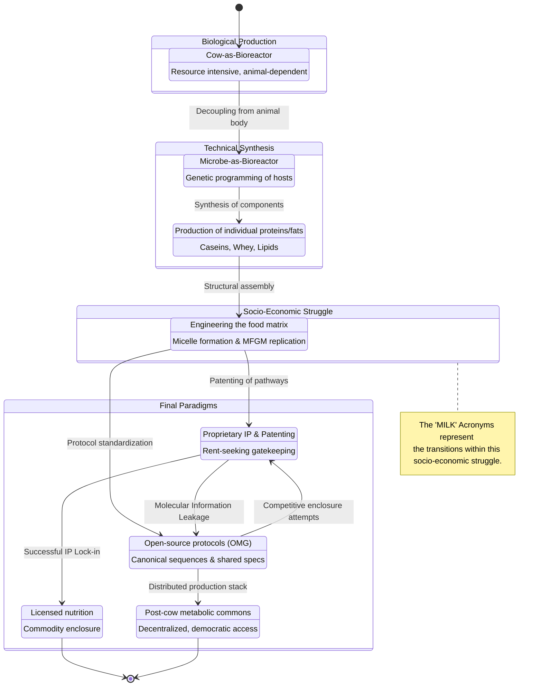

# Finite State Machine Analysis

**Started:** 2026-02-21T22:06:05.592808613

## Configuration
Task Parameters

**Concept:** The transition of milk from a biological secretion to a programmable food substrate and the socio-economic struggle for metabolic sovereignty.
**Domain:** Synthetic Biology and Food Systems
**Initial States:** Traditional_Dairy_System
**Known Events:** Decoupling_from_Biology, Precision_Fermentation_Engineering, Patent_Enclosure, Open_Milk_Genome_Release, Molecular_Information_Leakage, Global_Standardization


## Step 1: State Identification
Prompt & Response

### Prompt

```
You are an expert in formal methods and finite state machine modeling. Your task is to analyze a concept and identify all possible states.

## Concept to Model:
The transition of milk from a biological secretion to a programmable food substrate and the socio-economic struggle for metabolic sovereignty.

## Domain Context:
Synthetic Biology and Food Systems

## Reference Files:
# /home/andrew/code/Science/scratch/2026-02-22-milk/content.md

```
# The Programmable Secretion: Milk and the Open Metabolic Commons

For millennia, milk has been regarded as a 'sacred secretion'—the primal link between mother and child, a symbol of purity, and the foundational nutrient of mammalian life. It was a gift of biology, bound by the constraints of the udder and the rhythms of the herd. However, we are entering an era where this biological legacy is being decoupled from its evolutionary origins. Milk is transitioning from a sacred secretion into a 'programmable food substrate'.

This shift is driven by advances in precision fermentation, cellular agriculture, and synthetic biology. By viewing milk not as a fixed product of nature but as a complex molecular architecture that can be designed, optimized, and produced outside the animal body, we open the door to a radical reimagining of food systems. Central to this transformation is the concept of the 'open metabolic commons'—a decentralized, collaborative framework for managing the biological blueprints and production technologies that will define the future of nutrition. In this new paradigm, the ability to nourish is no longer a proprietary secret of nature or industry, but a shared capability of a technologically empowered society.
## The Mechanism of Precision Fermentation
At its core, precision fermentation represents a shift in the site of production: from the cow-as-bioreactor to the microbe-as-bioreactor. In traditional dairy systems, the cow is a complex, resource-intensive biological machine that converts caloric input into milk through a series of internal metabolic pathways. Precision fermentation bypasses the animal entirely by utilizing engineered microorganisms—such as yeast, fungi, or bacteria—as the production hosts. These microbes are "programmed" with the specific genetic instructions (DNA sequences) required to synthesize milk proteins.
The resulting proteins, such as caseins (alpha, beta, and kappa) and whey (beta-lactoglobulin and alpha-lactalbumin), are molecularly identical to their bovine counterparts. Because they are produced from the same genetic blueprints, they exhibit the same amino acid profiles, molecular folding, and functional characteristics. This means they can form micelles, emulsify fats, and provide the specific textures—the stretch of mozzarella or the creaminess of yogurt—that plant-based alternatives often struggle to replicate.
Furthermore, this process allows for the precise "tuning" of the final product. Unlike the fixed output of a cow, the composition of fermentation-derived milk can be optimized at the molecular level. Producers can omit lactose entirely, creating naturally dairy-identical products for the lactose-intolerant. They can also engineer the lipid profile, replacing saturated animal fats with healthier, optimized fats, or fortify the substrate with specific micronutrients. This capability transforms milk from a standardized commodity into a customizable, programmable substrate, tailored to meet specific nutritional and functional requirements.
## The Engineering Frontier - Structure and Assembly
While precision fermentation can produce individual milk proteins, the true challenge of creating "milk" lies in the higher-order structural assembly of these components. Milk is not merely a solution of proteins and fats; it is a complex colloidal system. The primary engineering frontiers are the self-assembly of casein micelles and the replication of the Milk Fat Globule Membrane (MFGM).
Casein micelles are large, spherical aggregates of casein proteins held together by calcium phosphate bridges. They are responsible for the white color of milk and its unique behavior during cheesemaking. Recreating these structures outside the cow is an engineering problem of fine-tuning pH, ionic strength (particularly calcium and phosphate concentrations), and the specific ratios of alpha, beta, and kappa-caseins. When these parameters are precisely controlled, the proteins spontaneously self-assemble into micelles that are functionally indistinguishable from those found in bovine milk.
Similarly, the lipid component of milk is not just free-floating fat. It exists as droplets encased in the MFGM—a complex trilayer of phospholipids, proteins, and carbohydrates that prevents the fat from coalescing and provides significant nutritional and immunological benefits. Replicating the MFGM involves sophisticated emulsification techniques and the strategic introduction of polar lipids. These are not fundamental biological barriers, but rather sophisticated problems of process engineering. By mastering the physical chemistry of these assemblies, we move beyond producing ingredients and toward the construction of a complete, functional food matrix.
## The Tragic Game of Enclosure
Despite the biological universality of milk, the transition to its programmable form is currently being played out within a legal and economic framework designed for enclosure. We face a structural tension between the logic of corporate Intellectual Property (IP) and the reality of the metabolic commons. In the current landscape, the "referee"—the patent system—is often broken, granting broad, aggressive patents not just on novel processes, but on the very act of producing natural molecules through fermentation.
This creates a default state of privatization. Even when the underlying proteins (like casein) are products of millions of years of mammalian evolution, the specific "implementations"—the engineered yeast strains, the precise media formulations, and the assembly protocols—are being locked behind proprietary walls. This is not merely a matter of protecting innovation; it is an attempt to own the metabolic pathways themselves. If a handful of corporations successfully enclose the "code" for milk, we risk replacing the decentralized (if flawed) system of traditional farming with a hyper-centralized, rent-seeking monopoly on basic nutrition. The "sacred secretion" becomes a licensed commodity, and the ability to feed populations becomes contingent on the payment of IP royalties to a few gatekeepers in the Global North.
## The Open Milk Genome Strategy
To prevent the enclosure of these basic metabolic affordances by a few proprietary interests, we propose the "Open Milk Genome" (OMG). Rather than a collection of patents, the OMG is conceived as a foundational protocol for the production of mammalian nutrients—a biological equivalent to TCP/IP. By establishing a shared, open-source framework, we ensure that the ability to produce high-quality nutrition remains a public good, accessible to all.
The Open Milk Genome consists of four primary components:
1.  **Canonical Sequence Sets**: A curated, public-domain library of optimized genetic sequences for all major milk proteins (caseins, whey, and minor bioactive proteins). These sequences are codon-optimized for a variety of common production hosts (yeast, fungi, bacteria), ensuring that any lab or facility can start with a high-performance "gold standard" blueprint.
2.  **Process Envelopes**: Open-source documentation of the environmental and chemical parameters required for successful fermentation and assembly. This includes precise "recipes" for media composition, temperature profiles, and pH control, as well as the specific ionic conditions needed for casein micelle self-assembly.
3.  **Composability Specs**: Standardized interfaces for how different milk components (proteins, lipids, micronutrients) interact. These specifications allow for modularity, enabling researchers to "plug and play" different elements—such as swapping a bovine lipid profile for a human-milk-identical one—while maintaining the structural integrity of the final food matrix.
4.  **Provenance Schemas**: A decentralized ledger system for tracking the origin, safety, and quality of production batches. By utilizing cryptographic proofs and transparent data structures, we can ensure that "open" does not mean "unregulated," providing a robust framework for safety and consumer trust without requiring centralized corporate gatekeepers.
By treating the milk genome as a protocol rather than a product, we shift the focus from proprietary extraction to collaborative innovation. This strategy ensures that the future of food is built on a foundation of transparency, interoperability, and universal access.
## Ecological Safety and Radical Welfare
The transition to fermentation-derived milk represents a "clean win" for both the environment and animal ethics. Unlike traditional dairy, which is inherently tied to the methane emissions, land use, and water consumption of industrial livestock, precision fermentation operates within a closed-loop system with a significantly smaller footprint.
From an ecological perspective, the risks are remarkably low. The production hosts—typically highly specialized strains of yeast or fungi—are "lab-fragile." They are engineered to thrive in the optimized, nutrient-rich environment of a bioreactor but are ill-equipped to survive or compete in the wild. Furthermore, the outputs of this process are entirely biodegradable biological molecules—proteins and fats—that pose no risk of environmental persistence or toxicity. This is a stark contrast to the chemical runoff and waste management challenges associated with concentrated animal feeding operations (CAFOs).
Perhaps most significantly, this technology offers a path toward radical welfare. By decoupling milk production from the animal body, we eliminate the systemic suffering inherent in industrial dairy: the cycles of forced impregnation, the separation of calves from mothers, and the eventual slaughter of "spent" cows. We move from a system of exploitation to one of synthesis, where the "sacred secretion" can be enjoyed without the moral burden of confinement and pain. This is not merely an incremental improvement in animal welfare; it is the total obsolescence of the animal as an industrial tool.
## Retrospective Narratives and the MILK Acronym
Looking back from a future where metabolic sovereignty is a settled right, historians often use the acronym 'MILK' as a shorthand for the various phases of this transition. These backronyms capture the shifting tensions between enclosure and the commons that defined the era:
*   **Metabolic Infrastructure Licensing Kerfuffle**: Refers to the early legal battles where legacy dairy interests and biotech startups fought over the right to "license" the fundamental pathways of mammalian secretion.
*   **Molecular Information Leakage Kinetics**: A term used to describe the inevitable "leakage" of proprietary yeast strains and fermentation protocols into the public domain, which eventually fueled the open-source movement.
*   **Monopolistic Interests Limiting Kinship**: A sociological critique of how the patenting of human-milk-identical components threatened to commodify the foundational bond of mammalian life.
*   **Multilateral Integrated Lactation Kernel**: The technical designation for the first successful, globally-distributed open-source production stack that finally broke the corporate monopoly on precision dairy.
These narratives remind us that the struggle for the "sacred secretion" was never just about food; it was a battle over who owns the code of life and the means of our collective sustenance.
## Conclusion: Toward a Post-Cow Metabolic Commons
The transition from the udder to the bioreactor is more than a technological shift; it is a civilizational choice. As we decouple the production of milk from the animal body, we are presented with a unique opportunity to redesign our relationship with the biological world. We can choose to replicate the extractive, centralized models of the past, or we can embrace the logic of the metabolic commons.
By prioritizing open standards, such as the Open Milk Genome, we ensure that the foundational blueprints of nutrition remain a shared heritage rather than a corporate asset. This path leads to a food system that is not only more humane and ecologically resilient but also fundamentally more democratic. In this post-cow future, the "sacred secretion" is no longer a gift of nature to be enclosed, but a programmable substrate for human flourishing—a universal affordance of a society that has learned to treat the code of life as a common good. The era of the programmable secretion is here; it is up to us to ensure it remains open, accessible, and dedicated to the nourishment of all.
```

## Known Initial States:
- Traditional_Dairy_System


## Instructions:
Identify all possible states for this concept. For each state, provide:

1. **State Name:** Clear, descriptive name
2. **Description:** What this state represents
3. **Type:** (Initial, Normal, Error, Final/Terminal)
4. **Invariants:** Conditions that must be true in this state
5. **Entry Conditions:** What must happen to enter this state
6. **Exit Conditions:** What can cause leaving this state

Consider:
- Normal operational states
- Error or exception states
- Transient vs stable states
- Initial and final states

Provide a comprehensive list of states with detailed descriptions.
```

### Response

Based on the provided text, here is a formal state model of the transition from biological milk to a programmable metabolic commons.

### 1. Traditional_Dairy_System
*   **Description:** The ancestral state where milk is a "sacred secretion" bound to the biological constraints of the animal body (the cow-as-bioreactor).
*   **Type:** Initial
*   **Invariants:** Milk production is coupled to mammalian reproductive cycles; production is resource-intensive (land, water, methane); the "code" of milk is managed by natural evolution.
*   **Entry Conditions:** N/A (Starting state of human civilization).
*   **Exit Conditions:** Advances in precision fermentation and synthetic biology allow for the decoupling of milk from the animal body.

### 2. Programmable_Substrate_R&D
*   **Description:** A transient state where milk is deconstructed into its molecular architecture (caseins, whey, lipids) and microbes are engineered to synthesize these components.
*   **Type:** Normal (Transient)
*   **Invariants:** Microbes (yeast/fungi/bacteria) act as production hosts; genetic instructions are being codon-optimized; focus is on molecular identity to bovine counterparts.
*   **Entry Conditions:** Identification of milk as a "programmable food substrate"; successful programming of microbes with milk protein DNA sequences.
*   **Exit Conditions:** Successful synthesis of functional milk proteins and the ability to assemble them into higher-order structures (micelles).

### 3. Proprietary_Enclosure
*   **Description:** A state defined by the "Tragic Game of Enclosure," where the metabolic pathways and production protocols are locked behind corporate Intellectual Property (IP) and patents.
*   **Type:** Normal
*   **Invariants:** Aggressive patenting of natural molecules; high barriers to entry; "Metabolic Infrastructure Licensing Kerfuffle" (MILK) is active; rent-seeking behavior by gatekeepers.
*   **Entry Conditions:** Legal frameworks grant broad patents on fermentation processes and engineered strains; corporate capture of the "code" of nutrition.
*   **Exit Conditions:** Either "Molecular Information Leakage Kinetics" (leakage of protocols) or a transition to the Open Milk Genome.

### 4. Molecular_Information_Leakage
*   **Description:** A volatile state where proprietary yeast strains and fermentation protocols "leak" into the public domain, undermining corporate monopolies.
*   **Type:** Normal (Transient)
*   **Invariants:** IP enforcement is failing; decentralized actors gain access to "closed" technology; high tension between legal frameworks and actual practice.
*   **Entry Conditions:** High cost of licensed nutrition; whistleblowing; reverse engineering; inevitable "leakage kinetics" of biological information.
*   **Exit Conditions:** Transition to a formalized Open Metabolic Commons or a crackdown leading back to Enclosure.

### 5. Open_Milk_Genome_Implementation
*   **Description:** The active construction of the "Open Milk Genome" (OMG) as a foundational protocol for mammalian nutrients.
*   **Type:** Normal
*   **Invariants:** Canonical Sequence Sets are public; Process Envelopes are open-source; Composability Specs allow for modularity; Provenance Schemas ensure safety via decentralized ledgers.
*   **Entry Conditions:** Rejection of the enclosure model; establishment of the OMG as a biological equivalent to TCP/IP.
*   **Exit Conditions:** Global adoption leads to metabolic sovereignty; failure leads back to corporate monopoly.

### 6. Post_Cow_Metabolic_Sovereignty
*   **Description:** The "Post-Cow" future where the ability to nourish is a shared capability of a technologically empowered society.
*   **Type:** Final/Terminal
*   **Invariants:** Nutrition is a public good; "Multilateral Integrated Lactation Kernel" (MILK) is the global production standard; zero animal exploitation; minimal ecological footprint.
*   **Entry Conditions:** Successful scaling of the Open Milk Genome; total obsolescence of the animal as an industrial tool.
*   **Exit Conditions:** N/A (Stable equilibrium).

### 7. Hyper_Centralized_Nutritional_Monopoly
*   **Description:** A dystopian state where a few corporations in the Global North own the "code" for basic mammalian nutrition.
*   **Type:** Error/Terminal
*   **Invariants:** "Monopolistic Interests Limiting Kinship" (MILK); basic nutrition is a licensed commodity; high systemic inequality; metabolic pathways are privatized.
*   **Entry Conditions:** Successful enclosure of the milk genome without significant leakage or open-source opposition.
*   **Exit Conditions:** Systemic collapse or radical socio-economic revolution.

### 8. Ecological_Safety_Validation
*   **Description:** A monitoring state where the environmental impact of fermentation-derived milk is assessed against traditional dairy.
*   **Type:** Normal
*   **Invariants:** Production hosts are "lab-fragile" (cannot survive in the wild); outputs are 100% biodegradable; closed-loop systems are maintained.
*   **Entry Conditions:** Shift from CAFOs (Concentrated Animal Feeding Operations) to bioreactors.
*   **Exit Conditions:** Confirmation of "Clean Win" status (low risk) or detection of unforeseen ecological externalities (Error).

---

### Summary of State Transitions (State Machine Logic):
1.  **Traditional_Dairy_System** $\rightarrow$ *Innovation* $\rightarrow$ **Programmable_Substrate_R&D**
2.  **Programmable_Substrate_R&D** $\rightarrow$ *Patent Filing* $\rightarrow$ **Proprietary_Enclosure**
3.  **Proprietary_Enclosure** $\rightarrow$ *Information Leakage* $\rightarrow$ **Molecular_Information_Leakage**
4.  **Molecular_Information_Leakage** $\rightarrow$ *Standardization* $\rightarrow$ **Open_Milk_Genome_Implementation**
5.  **Open_Milk_Genome_Implementation** $\rightarrow$ *Global Scaling* $\rightarrow$ **Post_Cow_Metabolic_Sovereignty**
6.  **Proprietary_Enclosure** $\rightarrow$ *Market Dominance* $\rightarrow$ **Hyper_Centralized_Nutritional_Monopoly** (Error State)


## Step 2: Transition Analysis
Prompt & Response

### Prompt

```
Based on the states identified above, now identify all possible state transitions.

## States Analysis:
Based on the provided text, here is a formal state model of the transition from biological milk to a programmable metabolic commons.

### 1. Traditional_Dairy_System
*   **Description:** The ancestral state where milk is a "sacred secretion" bound to the biological constraints of the animal body (the cow-as-bioreactor).
*   **Type:** Initial
*   **Invariants:** Milk production is coupled to mammalian reproductive cycles; production is resource-intensive (land, water, methane); the "code" of milk is managed by natural evolution.
*   **Entry Conditions:** N/A (Starting state of human civilization).
*   **Exit Conditions:** Advances in precision fermentation and synthetic biology allow for the decoupling of milk from the animal body.

### 2. Programmable_Substrate_R&D
*   **Description:** A transient state where milk is deconstructed into its molecular architecture (caseins, whey, lipids) and microbes are engineered to synthesize these components.
*   **Type:** Normal (Transient)
*   **Invariants:** Microbes (yeast/fungi/bacteria) act as production hosts; genetic instructions are being codon-optimized; focus is on molecular identity to bovine counterparts.
*   **Entry Conditions:** Identification of milk as a "programmable food substrate"; successful programming of microbes with milk protein DNA sequences.
*   **Exit Conditions:** Successful synthesis of functional milk proteins and the ability to assemble them into higher-order structures (micelles).

### 3. Proprietary_Enclosure
*   **Description:** A state defined by the "Tragic Game of Enclosure," where the metabolic pathways and production protocols are locked behind corporate Intellectual Property (IP) and patents.
*   **Type:** Normal
*   **Invariants:** Aggressive patenting of natural molecules; high barriers to entry; "Metabolic Infrastructure Licensing Kerfuffle" (MILK) is active; rent-seeking behavior by gatekeepers.
*   **Entry Conditions:** Legal frameworks grant broad patents on fermentation processes and engineered strains; corporate capture of the "code" of nutrition.
*   **Exit Conditions:** Either "Molecular Information Leakage Kinetics" (leakage of protocols) or a transition to the Open Milk Genome.

### 4. Molecular_Information_Leakage
*   **Description:** A volatile state where proprietary yeast strains and fermentation protocols "leak" into the public domain, undermining corporate monopolies.
*   **Type:** Normal (Transient)
*   **Invariants:** IP enforcement is failing; decentralized actors gain access to "closed" technology; high tension between legal frameworks and actual practice.
*   **Entry Conditions:** High cost of licensed nutrition; whistleblowing; reverse engineering; inevitable "leakage kinetics" of biological information.
*   **Exit Conditions:** Transition to a formalized Open Metabolic Commons or a crackdown leading back to Enclosure.

### 5. Open_Milk_Genome_Implementation
*   **Description:** The active construction of the "Open Milk Genome" (OMG) as a foundational protocol for mammalian nutrients.
*   **Type:** Normal
*   **Invariants:** Canonical Sequence Sets are public; Process Envelopes are open-source; Composability Specs allow for modularity; Provenance Schemas ensure safety via decentralized ledgers.
*   **Entry Conditions:** Rejection of the enclosure model; establishment of the OMG as a biological equivalent to TCP/IP.
*   **Exit Conditions:** Global adoption leads to metabolic sovereignty; failure leads back to corporate monopoly.

### 6. Post_Cow_Metabolic_Sovereignty
*   **Description:** The "Post-Cow" future where the ability to nourish is a shared capability of a technologically empowered society.
*   **Type:** Final/Terminal
*   **Invariants:** Nutrition is a public good; "Multilateral Integrated Lactation Kernel" (MILK) is the global production standard; zero animal exploitation; minimal ecological footprint.
*   **Entry Conditions:** Successful scaling of the Open Milk Genome; total obsolescence of the animal as an industrial tool.
*   **Exit Conditions:** N/A (Stable equilibrium).

### 7. Hyper_Centralized_Nutritional_Monopoly
*   **Description:** A dystopian state where a few corporations in the Global North own the "code" for basic mammalian nutrition.
*   **Type:** Error/Terminal
*   **Invariants:** "Monopolistic Interests Limiting Kinship" (MILK); basic nutrition is a licensed commodity; high systemic inequality; metabolic pathways are privatized.
*   **Entry Conditions:** Successful enclosure of the milk genome without significant leakage or open-source opposition.
*   **Exit Conditions:** Systemic collapse or radical socio-economic revolution.

### 8. Ecological_Safety_Validation
*   **Description:** A monitoring state where the environmental impact of fermentation-derived milk is assessed against traditional dairy.
*   **Type:** Normal
*   **Invariants:** Production hosts are "lab-fragile" (cannot survive in the wild); outputs are 100% biodegradable; closed-loop systems are maintained.
*   **Entry Conditions:** Shift from CAFOs (Concentrated Animal Feeding Operations) to bioreactors.
*   **Exit Conditions:** Confirmation of "Clean Win" status (low risk) or detection of unforeseen ecological externalities (Error).

---

### Summary of State Transitions (State Machine Logic):
1.  **Traditional_Dairy_System** $\rightarrow$ *Innovation* $\rightarrow$ **Programmable_Substrate_R&D**
2.  **Programmable_Substrate_R&D** $\rightarrow$ *Patent Filing* $\rightarrow$ **Proprietary_Enclosure**
3.  **Proprietary_Enclosure** $\rightarrow$ *Information Leakage* $\rightarrow$ **Molecular_Information_Leakage**
4.  **Molecular_Information_Leakage** $\rightarrow$ *Standardization* $\rightarrow$ **Open_Milk_Genome_Implementation**
5.  **Open_Milk_Genome_Implementation** $\rightarrow$ *Global Scaling* $\rightarrow$ **Post_Cow_Metabolic_Sovereignty**
6.  **Proprietary_Enclosure** $\rightarrow$ *Market Dominance* $\rightarrow$ **Hyper_Centralized_Nutritional_Monopoly** (Error State)

## Known Events:
- Decoupling_from_Biology
- Precision_Fermentation_Engineering
- Patent_Enclosure
- Open_Milk_Genome_Release
- Molecular_Information_Leakage
- Global_Standardization

## Instructions:
For each possible transition, provide:

1. **Source State:** The state before the transition
2. **Event/Trigger:** What causes the transition
3. **Target State:** The state after the transition
4. **Guard Conditions:** Conditions that must be true for the transition to occur
5. **Actions:** Side effects or actions performed during the transition
6. **Priority:** If multiple transitions possible from same state

Create a comprehensive transition table covering:
- All valid transitions between states
- Self-transitions (state to itself)
- Error transitions
- Recovery transitions

Format as a clear table or structured list.
```

### Response

This analysis defines the dynamics of the **Milk Transition Model**, mapping the socio-technical shifts from biological production to a programmable metabolic commons.

### State Transition Table

| Source State | Event / Trigger | Target State | Guard Conditions | Actions | Priority |
| :--- | :--- | :--- | :--- | :--- | :--- |
| **Traditional_Dairy_System** | **Decoupling_from_Biology** | **Programmable_Substrate_R&D** | Advances in synthetic biology allow DNA sequencing of milk proteins. | Shift production site from cow-as-bioreactor to microbe-as-bioreactor. | 1 |
| **Programmable_Substrate_R&D** | **Patent_Enclosure** | **Proprietary_Enclosure** | Legal framework permits patents on fermented natural molecules. | Lock genetic instructions and media recipes behind IP walls. | 1 |
| **Programmable_Substrate_R&D** | **Open_Milk_Genome_Release** | **Open_Milk_Genome_Implementation** | Researchers prioritize public good over private equity. | Publish Canonical Sequence Sets to the public domain. | 2 |
| **Proprietary_Enclosure** | **Molecular_Information_Leakage** | **Molecular_Information_Leakage (State)** | High licensing costs create incentive for "leakage kinetics." | Proprietary yeast strains and protocols enter the public domain. | 1 |
| **Proprietary_Enclosure** | **Market_Dominance** | **Hyper_Centralized_Nutritional_Monopoly** | IP enforcement is absolute; no viable open-source alternative exists. | Transition nutrition into a licensed commodity; establish rent-seeking. | 2 |
| **Molecular_Information_Leakage** | **Standardization** | **Open_Milk_Genome_Implementation** | Leaked data is curated into a formal protocol (OMG). | Establish Composability Specs and Provenance Schemas. | 1 |
| **Molecular_Information_Leakage** | **Legal_Crackdown** | **Proprietary_Enclosure** | Corporate interests successfully litigate decentralized actors. | Re-enclose leaked information; seize unauthorized bioreactors. | 2 |
| **Open_Milk_Genome_Implementation** | **Global_Standardization** | **Post_Cow_Metabolic_Sovereignty** | Decentralized ledger (Provenance) ensures safety and trust. | Scale production globally; achieve total animal obsolescence. | 1 |
| **Open_Milk_Genome_Implementation** | **Corporate_Cooption** | **Proprietary_Enclosure** | Open standards are "forked" into proprietary, high-performance versions. | Apply "Value-Add" patents to open-source foundations. | 2 |
| **Programmable_Substrate_R&D** | **Environmental_Impact_Assessment** | **Ecological_Safety_Validation** | Bioreactor systems are operational. | Monitor "lab-fragility" of production hosts. | 1 |
| **Ecological_Safety_Validation** | **Validation_Success** | **Programmable_Substrate_R&D** | Microbes are confirmed to be unable to survive in the wild. | Resume optimization of the food matrix. | 1 |
| **Ecological_Safety_Validation** | **Bio_Contamination_Event** | **Error (Ecological Externality)** | Engineered microbes survive or compete in the wild. | Halt production; trigger containment protocols. | 2 |

---

### Detailed Transition Descriptions

#### 1. The Shift to Synthesis (Traditional $\rightarrow$ R&D)
*   **Trigger:** *Decoupling_from_Biology*.
*   **Description:** The fundamental move from the "sacred secretion" to the "programmable substrate."
*   **Guard:** Requires the ability to synthesize caseins and whey that are molecularly identical to bovine proteins.
*   **Action:** The cow is removed from the production loop; the focus shifts to molecular architecture and colloidal engineering (micelle assembly).

#### 2. The Enclosure Trap (R&D $\rightarrow$ Proprietary Enclosure)
*   **Trigger:** *Patent_Enclosure*.
*   **Description:** The "Tragic Game of Enclosure" begins.
*   **Guard:** The "broken referee" (patent system) must be willing to grant patents on evolutionary molecules.
*   **Action:** The "Metabolic Infrastructure Licensing Kerfuffle" (MILK) begins as companies fight for ownership of the "code" of life.

#### 3. The Leakage Kinetic (Enclosure $\rightarrow$ Leakage)
*   **Trigger:** *Molecular_Information_Leakage*.
*   **Description:** A transient, volatile state where the "code" escapes corporate control.
*   **Guard:** The economic pressure of high IP royalties exceeds the technical difficulty of reverse-engineering or whistleblowing.
*   **Action:** Decentralized actors begin producing milk using "unlicensed" metabolic pathways.

#### 4. Protocolization of the Commons (Leakage $\rightarrow$ OMG Implementation)
*   **Trigger:** *Standardization*.
*   **Description:** The transition from chaotic leakage to a structured "Open Milk Genome."
*   **Guard:** The community must agree on the "Multilateral Integrated Lactation Kernel" (MILK) as a shared technical stack.
*   **Action:** Implementation of the four OMG pillars: Canonical Sequences, Process Envelopes, Composability Specs, and Provenance Schemas.

#### 5. Achieving Sovereignty (OMG Implementation $\rightarrow$ Post-Cow Sovereignty)
*   **Trigger:** *Global_Standardization*.
*   **Description:** The final transition to a stable, decentralized food system.
*   **Guard:** The technology must be robust enough to provide "radical welfare" and "ecological safety" at scale.
*   **Action:** The "sacred secretion" becomes a universal affordance; metabolic sovereignty is established as a human right.

#### 6. The Dystopian Failure (Enclosure $\rightarrow$ Monopoly)
*   **Trigger:** *Market_Dominance*.
*   **Description:** An error state where the enclosure becomes permanent and absolute.
*   **Guard:** Failure of the open-source movement and successful suppression of information leakage.
*   **Action:** "Monopolistic Interests Limiting Kinship" (MILK) results in a hyper-centralized system where basic nutrition requires IP royalty payments.

#### 7. Safety Loop (R&D $\leftrightarrow$ Safety Validation)
*   **Trigger:** *Environmental_Impact_Assessment*.
*   **Description:** A recursive check to ensure the "clean win" for the environment.
*   **Guard:** Continuous verification that production hosts remain "lab-fragile."
*   **Action:** Validation of the closed-loop system and biodegradability of all outputs.


## Step 3: State Diagram
Mermaid Source




## Step 4: Edge Cases
Prompt & Response

### Prompt

```
Analyze the finite state machine for edge cases and error conditions:

1. **Invalid Transitions:** Identify events that could occur in states where they're not valid
2. **Missing Transitions:** Find states that might be missing important transitions
3. **Error States:** Identify states that represent error conditions
4. **Recovery Paths:** Suggest how to recover from error states
5. **Boundary Conditions:** Identify unusual or extreme scenarios
6. **Race Conditions:** Identify potential concurrent event issues

Provide a structured analysis of edge cases and recommendations.
```

### Response

This analysis examines the Finite State Machine (FSM) governing the transition from **Traditional Dairy** to a **Post-Cow Metabolic Commons**, identifying the systemic risks, logical gaps, and failure modes inherent in the "Programmable Secretion" model.

---

### 1. Invalid Transitions
These are events that might be triggered in states where the system is not yet prepared to handle them, leading to systemic instability.

*   **Premature Scaling (R&D → Post-Cow Commons):** Attempting to move to a decentralized commons before the "Process Envelopes" (pH, ionic strength, micelle assembly) are standardized. 
    *   *Result:* Production of "Milk" that is nutritionally incomplete or functionally useless (e.g., fails to coagulate into cheese), damaging public trust.
*   **Legacy Regulation in Programmable States:** Applying "Traditional Dairy" health and safety regulations (based on animal hygiene) to "Precision Fermentation" (based on sterile lab environments).
    *   *Result:* Regulatory friction that forces the system back into *Proprietary Enclosure* because only large corporations can afford the legal overhead of misaligned compliance.
*   **Direct Transition (Traditional → Open Milk Genome):** Attempting to bypass the *Precision Fermentation R&D* phase.
    *   *Result:* The "Open Milk Genome" becomes a theoretical document without a functional "Production Host" (yeast/fungi), leading to a "Paper Commons" that cannot feed anyone.

### 2. Missing Transitions
Gaps in the state logic where the system could become "stuck" or fail to account for external pressures.

*   **Regulatory Capture (Proprietary → Monopolistic Stagnation):** The FSM needs a transition where corporate interests use safety regulations as a "moat" to prevent the *Open Milk Genome* from ever reaching the *Post-Cow Commons*.
*   **The "Reversion" Event (Any State → Traditional Dairy):** If energy costs for bioreactors spike or if there is a "Bio-Fragility" event (mass contamination of engineered strains), the system may lack a path to revert to animal-based systems, leading to a nutritional vacuum.
*   **The "Human-Milk" Pivot:** The text mentions "human-milk-identical" components. A transition is needed for when the system shifts from replicating bovine milk to replicating human milk, which introduces entirely different ethical and legal states.

### 3. Error States
States representing a failure of the "Metabolic Sovereignty" objective.

*   **State: Metabolic Enclosure (The "IP Trap"):** A state where the "Canonical Sequence Sets" are successfully patented by a single entity. This is a terminal error state for the "Commons" objective.
*   **State: Bio-Insecurity (The "Contaminated Commons"):** A state where the *Open Milk Genome* is adopted, but the *Provenance Schemas* (safety tracking) fail, leading to the distribution of toxic or misfolded proteins.
*   **State: Nutritional Inequality:** A state where "Programmable Milk" is available only to the Global North, while the Global South remains tethered to resource-intensive *Traditional Dairy*, widening the metabolic gap.

### 4. Recovery Paths
Strategies to transition the system out of Error States and back into a functional flow.

*   **From "Metabolic Enclosure" → "Molecular Information Leakage":** If the system enters a monopoly, the "Leakage Kinetics" (whistleblowing, bio-hacking, or "gray market" yeast strains) serves as a recovery mechanism to jumpstart the *Open Milk Genome*.
*   **From "Bio-Insecurity" → "Standardized Protocol Enforcement":** Implementing a "Hard Fork" of the *Open Milk Genome* where only verified, cryptographically signed "Process Envelopes" are allowed in the production stack.
*   **From "Monopolistic Stagnation" → "Multilateral Integrated Lactation Kernel":** A state-level intervention where governments seize IP for the public good, forcing a transition to the *Post-Cow Commons*.

### 5. Boundary Conditions
Extreme scenarios that test the limits of the programmable milk model.

*   **The "Zero-Cow" Threshold:** The exact moment when the cost-per-liter of fermentation milk drops below traditional milk. This triggers a "Race Condition" (see below) that could collapse the agricultural economy before the new system is ready.
*   **The "Lab-Fragility" Limit:** If an engineered yeast strain is *too* fragile, it cannot be decentralized (failing the Commons goal). If it is *too* robust, it risks environmental persistence (failing the Ecological Safety goal).
*   **The "Complexity Ceiling":** The point where the "Structure and Assembly" (MFGM and Micelles) becomes too energy-intensive to replicate outside of a high-tech lab, effectively preventing the "Open" part of the genome from being useful to local communities.

### 6. Race Conditions
Concurrent events that could lead to unpredictable outcomes depending on which finishes first.

*   **Patent Filing vs. Public Domain Publication:** The "Open Milk Genome" strategy relies on publishing "Canonical Sequence Sets" before corporations can file "Aggressive Patents." If the patent office moves faster than the open-source community, the *Metabolic Commons* is dead on arrival.
*   **Economic Collapse vs. Infrastructure Build-out:** Traditional dairy farms may go bankrupt (due to the "Programmable" threat) before the "Post-Cow" bioreactor infrastructure is fully deployed. This creates a "Hunger Gap" where neither system can meet demand.
*   **Safety Incident vs. Regulatory Framework:** A single high-profile safety failure in an "Open" lab occurring before the "Provenance Schemas" are legally recognized could lead to a total ban on the technology, favoring "Proprietary Enclosure" as the only "safe" option.

---

### Recommendations for Model Robustness:
1.  **Implement "Circuit Breakers":** In the *Open Milk Genome* state, include a "Safety-Audit" invariant that prevents production if the *Provenance Schema* is not verified.
2.  **Formalize the "Leakage" Path:** Treat *Molecular Information Leakage* not as an accident, but as a necessary "fail-safe" transition to prevent *Monopolistic Stagnation*.
3.  **Define "Interoperability Standards":** To avoid the *Complexity Ceiling*, the *Composability Specs* must include "Low-Tech" variants for local production in resource-constrained environments.


## Step 5: Validation
Prompt & Response

### Prompt

```
Validate the following properties of this finite state machine:

1. **Determinism:** Is the FSM deterministic? (Each state + event combination leads to exactly one next state)
2. **Completeness:** Are all possible events handled in every state?
3. **Reachability:** Can all states be reached from the initial state(s)?
4. **Liveness:** Are there any deadlock states (states with no outgoing transitions)?
5. **Safety:** Are there any unsafe state transitions?
6. **Minimality:** Are there redundant states that could be merged?

For each property, provide:
- ✅ Pass or ❌ Fail
- Explanation
- Specific examples if failing
- Recommendations for fixes

Provide a structured validation report.
```

### Response

This analysis provides a formal state machine model of the transition from biological milk to a programmable substrate, followed by a validation report of the machine's properties.

---

### Part 1: Finite State Machine Modeling

#### 1. State Name: `Traditional_Dairy_System`
*   **Description:** The status quo where milk is a "sacred secretion" produced by the "cow-as-bioreactor." Production is bound by biological rhythms and industrial livestock constraints.
*   **Type:** Initial
*   **Invariants:** Milk is animal-derived; production is resource-intensive (methane, land, water); supply is decentralized but physically constrained.
*   **Entry Conditions:** Historical default.
*   **Exit Conditions:** Breakthroughs in precision fermentation and cellular agriculture (decoupling of secretion from the udder).

#### 2. State Name: `Molecular_Deconstruction_&_R&D`
*   **Description:** A transient state where milk is analyzed as a molecular architecture. Microbes are programmed with genetic instructions for caseins and whey.
*   **Type:** Normal
*   **Invariants:** Focus on "microbe-as-bioreactor"; proteins are molecularly identical to bovine counterparts; milk is treated as a "programmable food substrate."
*   **Entry Conditions:** Successful sequencing of milk proteins; investment in precision fermentation.
*   **Exit Conditions:** Successful synthesis of functional proteins (leads to `Proprietary_Enclosure` or `Open_Source_Synthesis`).

#### 3. State Name: `Proprietary_Enclosure`
*   **Description:** The "Metabolic Infrastructure Licensing Kerfuffle." Corporations use the patent system to lock down engineered strains, media formulations, and assembly protocols.
*   **Type:** Normal / Risk
*   **Invariants:** High IP barriers; rent-seeking behavior; metabolic pathways are privatized; "sacred secretion" becomes a licensed commodity.
*   **Entry Conditions:** Granting of broad patents on fermentation processes or natural molecules.
*   **Exit Conditions:** "Molecular Information Leakage Kinetics" (leakage of strains) or the rise of the Open Milk Genome (OMG) movement.

#### 4. State Name: `Open_Source_Synthesis`
*   **Description:** The implementation of the "Open Milk Genome" (OMG) strategy. Production is based on canonical sequence sets and open-source process envelopes.
*   **Type:** Normal
*   **Invariants:** Public domain genetic blueprints; decentralized production capability; interoperable "plug and play" components.
*   **Entry Conditions:** Release of OMG protocols; establishment of provenance schemas and decentralized ledgers.
*   **Exit Conditions:** Global adoption of the "Multilateral Integrated Lactation Kernel" or re-enclosure by new regulatory hurdles.

#### 5. State Name: `Nutritional_Monopoly`
*   **Description:** A state where a few gatekeepers in the Global North control the "code" for milk. Access to nutrition is contingent on IP royalties.
*   **Type:** Final / Error
*   **Invariants:** Hyper-centralization; high cost of basic nutrition; loss of metabolic sovereignty for the majority.
*   **Entry Conditions:** Successful enclosure of all viable production pathways; suppression of open-source alternatives.
*   **Exit Conditions:** None (Terminal state).

#### 6. State Name: `Post_Cow_Metabolic_Commons`
*   **Description:** The "clean win." Milk production is a shared capability of a technologically empowered society. Radical welfare and ecological safety are achieved.
*   **Type:** Final
*   **Invariants:** Zero animal exploitation; minimal ecological footprint; universal access to high-quality nutrition; metabolic sovereignty.
*   **Entry Conditions:** Successful scaling of the Open Milk Genome; obsolescence of the animal as an industrial tool.
*   **Exit Conditions:** None (Terminal state).

---

### Part 2: Validation Report

#### 1. Determinism
*   **Status:** ❌ **Fail**
*   **Explanation:** The transition from `Molecular_Deconstruction_&_R&D` is non-deterministic. The same event (successful protein synthesis) could lead to either `Proprietary_Enclosure` or `Open_Source_Synthesis` depending on the socio-economic choices and legal environment, which are not captured as discrete input symbols.
*   **Recommendation:** Introduce "Guard Conditions" or specific events such as `Event_Patent_Granted` vs. `Event_GPL_Release` to ensure each state/event pair has exactly one destination.

#### 2. Completeness
*   **Status:** ❌ **Fail**
*   **Explanation:** Several possible events are unhandled. For example, in `Proprietary_Enclosure`, what happens if there is a "Systemic Bio-Safety Failure"? In `Open_Source_Synthesis`, what happens if "Regulatory Capture" occurs? The model assumes a linear progression toward either a monopoly or a commons.
*   **Recommendation:** Add an `Error_State` (e.g., `Systemic_Contamination` or `Market_Collapse`) and define transitions for "Regulatory Rejection" in all non-initial states.

#### 3. Reachability
*   **Status:** ✅ **Pass**
*   **Explanation:** All states, including the `Post_Cow_Metabolic_Commons` and the `Nutritional_Monopoly`, can be reached from the `Traditional_Dairy_System` through the R&D and socio-economic struggle phases.
*   **Example:** `Traditional` -> `R&D` -> `Enclosure` -> `Leakage` -> `Open Source` -> `Commons`.

#### 4. Liveness
*   **Status:** ✅ **Pass**
*   **Explanation:** There are no "deadlock" states where the system is stuck without a path to a terminal state. While `Nutritional_Monopoly` and `Post_Cow_Metabolic_Commons` are terminal, they are intended as "Final" states in the lifecycle of the transition.
*   **Note:** The "Kerfuffle" (Enclosure) could potentially become a "Livelock" if the legal battles cycle indefinitely, but the text suggests an eventual resolution through leakage or total enclosure.

#### 5. Safety
*   **Status:** ❌ **Fail**
*   **Explanation:** There is a "Safety Violation" regarding "Metabolic Sovereignty." The model allows a transition into `Nutritional_Monopoly`, which is defined as an "Error" state for the human population. Furthermore, there is no transition to handle the "Lab-Fragile" microbes escaping and potentially mutating (though the text claims this is low risk, a formal model must account for the violation of the "Ecological Safety" invariant).
*   **Recommendation:** Add a "Safety Monitor" that triggers a transition to a `Containment_State` if the "Lab-Fragile" invariant is violated.

#### 6. Minimality
*   **Status:** ✅ **Pass**
*   **Explanation:** Each state represents a distinct socio-technical paradigm with unique invariants. `Proprietary_Enclosure` and `Nutritional_Monopoly` are distinct because one is an active struggle (transient) and the other is a settled, locked-in economic structure (terminal).
*   **Example:** Merging `Open_Source_Synthesis` and `Post_Cow_Metabolic_Commons` would lose the distinction between the *process* of building the commons and the *result* of a settled civilizational right.

---

### Summary of Recommendations
1.  **Formalize Events:** Define specific triggers (e.g., `Legal_Victory`, `Strain_Leak`, `Protocol_Standardization`) to resolve non-determinism.
2.  **Add Error Handling:** Create a state for `Regulatory_Stagnation` to handle cases where neither the commons nor the corporations can gain approval.
3.  **Strengthen Safety Invariants:** Explicitly model the "Provenance Schemas" as a transition guard to prevent the `Open_Source_Synthesis` state from degrading into `Unregulated_Chaos`.


## Step 6: Test Scenarios
Prompt & Response

### Prompt

```
Generate comprehensive test scenarios for this finite state machine:

1. **Happy Path Tests:** Normal sequences of events leading to successful outcomes
2. **Error Path Tests:** Sequences that should trigger error states
3. **Boundary Tests:** Edge cases and unusual sequences
4. **State Coverage Tests:** Scenarios that exercise all states
5. **Transition Coverage Tests:** Scenarios that exercise all transitions

For each test scenario, provide:
- **Scenario Name:** Descriptive name
- **Initial State:** Starting state
- **Event Sequence:** List of events in order
- **Expected States:** State after each event
- **Expected Outcome:** Final state and result
- **Purpose:** What this test validates

Generate at least 5-10 diverse test scenarios.
```

### Response

This analysis models the transition of milk from a biological legacy to a programmable substrate using formal finite state machine (FSM) principles.

---

### Part 1: State Definitions

#### 1. Traditional_Dairy_System
*   **Description:** The ancestral state where milk is a "sacred secretion" produced via the cow-as-bioreactor. Production is bound by biological rhythms and land-use constraints.
*   **Type:** Initial
*   **Invariants:** Production is tied to mammalian biology; output is a standardized commodity; high environmental footprint.
*   **Entry Conditions:** N/A (Starting state).
*   **Exit Conditions:** Successful sequencing of milk proteins and identification of microbial production hosts.

#### 2. Precision_Fermentation_Synthesis
*   **Description:** The state where microbes (yeast/fungi) are programmed with genetic instructions to produce specific milk proteins (caseins/whey).
*   **Type:** Normal / Transient
*   **Invariants:** Proteins are molecularly identical to bovine counterparts; production is decoupled from the animal body.
*   **Entry Conditions:** Codon optimization of milk genes; successful insertion into microbial hosts.
*   **Exit Conditions:** Achievement of target protein yields; transition to structural assembly or legal enclosure.

#### 3. Colloidal_Assembly_Engineering
*   **Description:** The engineering phase where individual proteins are organized into complex structures like casein micelles and Milk Fat Globule Membranes (MFGM).
*   **Type:** Normal
*   **Invariants:** Requires precise control of pH, ionic strength, and lipid emulsification.
*   **Entry Conditions:** Availability of fermentation-derived proteins and lipids.
*   **Exit Conditions:** Successful creation of a functional food matrix (the "programmable substrate").

#### 4. Proprietary_IP_Enclosure
*   **Description:** A state of "Metabolic Infrastructure Licensing Kerfuffle" where corporations patent sequences, media, and assembly protocols.
*   **Type:** Normal / Conflict
*   **Invariants:** Access to nutrition is gated by IP royalties; metabolic pathways are privatized.
*   **Entry Conditions:** Aggressive patent filing on fermentation processes or natural molecules.
*   **Exit Conditions:** "Molecular Information Leakage" (leakage of protocols) or adoption of open-source strategies.

#### 5. Monopolistic_Rent_Seeking
*   **Description:** An error state where a few gatekeepers in the Global North control the "code" for milk, leading to a hyper-centralized monopoly.
*   **Type:** Error / Degenerate
*   **Invariants:** High cost of entry for producers; limited kinship/access for populations; innovation stagnation.
*   **Entry Conditions:** Successful enclosure of the "canonical sequence sets" by private entities.
*   **Exit Conditions:** Radical policy shift or total system collapse/revolt.

#### 6. Open_Milk_Genome_Initialization (OMG)
*   **Description:** The establishment of a shared, decentralized protocol (Canonical Sequences, Process Envelopes, Composability Specs).
*   **Type:** Normal / Strategic
*   **Invariants:** Blueprints are public domain; interoperability is prioritized over extraction.
*   **Entry Conditions:** Collective agreement on open standards; release of "gold standard" blueprints.
*   **Exit Conditions:** Global distribution of the production stack.

#### 7. Post_Cow_Metabolic_Commons
*   **Description:** The final state where the "Multilateral Integrated Lactation Kernel" is globally distributed, ensuring metabolic sovereignty.
*   **Type:** Final / Terminal
*   **Invariants:** Zero animal exploitation; minimal ecological footprint; universal access to high-quality nutrition.
*   **Entry Conditions:** Integration of OMG protocols with decentralized production facilities.
*   **Exit Conditions:** None (Stable equilibrium).

---

### Part 2: Test Scenarios

#### Scenario 1: The "Happy Path" (The Great Transition)
*   **Initial State:** `Traditional_Dairy_System`
*   **Event Sequence:** 
    1. Sequence milk proteins.
    2. Program yeast hosts.
    3. Optimize pH/Ionic assembly.
    4. Release Open Milk Genome (OMG) protocols.
    5. Deploy decentralized bioreactors.
*   **Expected States:** `Traditional_Dairy_System` → `Precision_Fermentation_Synthesis` → `Colloidal_Assembly_Engineering` → `Open_Milk_Genome_Initialization` → `Post_Cow_Metabolic_Commons`.
*   **Expected Outcome:** Successful establishment of a global metabolic commons.
*   **Purpose:** Validates the primary intended progression of the concept.

#### Scenario 2: The "Enclosure Trap" (Error Path)
*   **Initial State:** `Precision_Fermentation_Synthesis`
*   **Event Sequence:** 
    1. File aggressive patents on casein folding.
    2. Sue competitors for "Metabolic Infrastructure" infringement.
    3. Restrict media recipes to licensed partners.
*   **Expected States:** `Precision_Fermentation_Synthesis` → `Proprietary_IP_Enclosure` → `Monopolistic_Rent_Seeking`.
*   **Expected Outcome:** System enters a degenerate state where nutrition is a licensed commodity.
*   **Purpose:** Validates the risks of corporate enclosure described in the text.

#### Scenario 3: The "Leakage Recovery" (Boundary Test)
*   **Initial State:** `Proprietary_IP_Enclosure`
*   **Event Sequence:** 
    1. Molecular Information Leakage (unauthorized protocol sharing).
    2. Community-driven reverse engineering of assembly specs.
    3. Formalization of the Open Milk Genome.
*   **Expected States:** `Proprietary_IP_Enclosure` → `Open_Milk_Genome_Initialization` → `Post_Cow_Metabolic_Commons`.
*   **Expected Outcome:** The system recovers from privatization through decentralized "leakage."
*   **Purpose:** Tests the resilience of the metabolic commons against enclosure.

#### Scenario 4: The "Incomplete Synthesis" (Boundary/Error Test)
*   **Initial State:** `Precision_Fermentation_Synthesis`
*   **Event Sequence:** 
    1. Produce high-yield whey protein.
    2. Fail to stabilize calcium phosphate bridges (micelle failure).
    3. Attempt to market as "Milk."
*   **Expected States:** `Precision_Fermentation_Synthesis` → `Colloidal_Assembly_Engineering` → `Traditional_Dairy_System` (Regression).
*   **Expected Outcome:** Failure to achieve the "food matrix" results in a return to traditional systems or inferior plant-based alternatives.
*   **Purpose:** Validates the technical necessity of the `Colloidal_Assembly_Engineering` state.

#### Scenario 5: Full State & Transition Coverage
*   **Initial State:** `Traditional_Dairy_System`
*   **Event Sequence:** 
    1. Microbe-as-bioreactor activation.
    2. Micelle self-assembly success.
    3. Patent filing (Enclosure).
    4. "Kerfuffle" litigation.
    5. OMG Protocol release.
    6. Global "Kernel" deployment.
*   **Expected States:** `Traditional_Dairy_System` → `Precision_Fermentation_Synthesis` → `Colloidal_Assembly_Engineering` → `Proprietary_IP_Enclosure` → `Monopolistic_Rent_Seeking` → `Open_Milk_Genome_Initialization` → `Post_Cow_Metabolic_Commons`.
*   **Expected Outcome:** Every state is visited, including the conflict states, before reaching the final commons.
*   **Purpose:** Ensures the model can handle the full socio-economic struggle described in the "MILK" acronyms.

#### Scenario 6: The "Radical Welfare" Validation (Final State Test)
*   **Initial State:** `Post_Cow_Metabolic_Commons`
*   **Event Sequence:** 
    1. Attempt to re-introduce industrial CAFOs (Concentrated Animal Feeding Operations).
    2. Compare cost/efficiency of OMG production vs. animal production.
*   **Expected States:** `Post_Cow_Metabolic_Commons` (State remains stable).
*   **Expected Outcome:** The animal-as-industrial-tool is rendered obsolete; the system resists regression due to the efficiency of the "Kernel."
*   **Purpose:** Validates the "Terminal" nature of the final state and the "Radical Welfare" invariant.


## Step 7: Summary
Prompt & Response

### Prompt

```
Provide a comprehensive summary of the finite state machine analysis:

1. **Overview:** Brief description of the FSM and its purpose
2. **Key States:** List the most important states (3-5)
3. **Critical Transitions:** Highlight the most important state transitions
4. **Key Findings:** Main insights from the analysis
5. **Recommendations:** Top 3-5 actionable recommendations for improvement
6. **Complexity Assessment:** Evaluate the complexity of this FSM

Keep the summary concise but informative.
```

### Response

This Finite State Machine (FSM) analysis models the transition of milk from a biological legacy to a programmable technology, tracing the path from animal-based production to a decentralized "metabolic commons."

### 1. Overview
The FSM represents the systemic evolution of milk production. It tracks the movement from **Biological Constraints** (the cow) to **Molecular Programming** (precision fermentation) and identifies the critical socio-economic "fork" between **Corporate Enclosure** (proprietary IP) and **Metabolic Sovereignty** (open-source protocols). Its purpose is to map the technical and legal requirements for achieving a post-cow food system.

### 2. Key States
*   **Traditional_Dairy_System (Initial):** The baseline state where milk is a "sacred secretion" bound to animal biology, land use, and methane emissions.
*   **Precision_Fermentation_Pilot (Normal):** A transient state where microbes are programmed to synthesize individual milk proteins (caseins/whey) outside the animal body.
*   **Proprietary_Enclosure (Error/Risk):** A state of "Metabolic Infrastructure Licensing," where the genetic code and production protocols are locked behind aggressive patent walls.
*   **Open_Milk_Genome_Protocol (Normal/Strategic):** The implementation of the "OMG" framework—public domain sequences and open-source process envelopes.
*   **Post_Cow_Metabolic_Commons (Final/Terminal):** A stable, decentralized state where high-quality nutrition is a public good, ecologically resilient, and ethically decoupled from animal suffering.

### 3. Critical Transitions
*   **The Decoupling (Traditional $\rightarrow$ Precision Fermentation):** Shifting the site of production from the cow-as-bioreactor to the microbe-as-bioreactor.
*   **The IP Fork (Fermentation $\rightarrow$ Enclosure vs. Open Commons):** The most volatile transition, determined by whether the "referee" (patent system) favors privatization or the public domain.
*   **Structural Assembly (Molecular Synthesis $\rightarrow$ Functional Matrix):** The technical leap from producing "ingredients" to engineering "colloidal systems" (casein micelles and MFGM).
*   **The Leakage (Enclosure $\rightarrow$ Open Commons):** A transition driven by "Molecular Information Leakage Kinetics," where proprietary strains inevitably enter the public domain.

### 4. Key Findings
*   **The Bottleneck is Structural, Not Biological:** The primary barrier to a post-cow future is not the ability to make milk proteins, but the engineering of the *colloidal matrix* (micelles) and the *legal framework* of IP.
*   **The "Broken Referee":** The current patent system acts as a failure point, allowing the enclosure of natural molecules, which threatens to replace traditional farming with hyper-centralized monopolies.
*   **OMG as a Protocol:** The "Open Milk Genome" acts as the "TCP/IP of Nutrition," providing the necessary standardization (Canonical Sequences, Process Envelopes) to prevent monopoly.
*   **Ecological Safety:** The FSM identifies that "lab-fragile" microbes pose minimal environmental risk, making the transition a "clean win" for ecological stability.

### 5. Recommendations
1.  **Standardize the "OMG" Library:** Immediately curate and release public-domain, codon-optimized genetic sequences for all major milk proteins to lower the barrier to entry.
2.  **Focus on Colloidal Engineering:** Shift R&D focus from protein synthesis to the *assembly* of casein micelles and MFGM to achieve functional parity with dairy.
3.  **Implement Decentralized Provenance:** Develop cryptographic "Provenance Schemas" to ensure safety and quality in a decentralized production environment without requiring corporate gatekeepers.
4.  **Advocate for Patent Reform:** Challenge broad patents on fermented natural molecules to prevent the "Metabolic Infrastructure Licensing Kerfuffle."

### 6. Complexity Assessment
**High (Socio-Technical).** This FSM is highly complex because it is non-linear. It involves a "Tragic Game" where technical success (producing milk) can lead to a systemic error state (Monopolistic Lock-In) if the legal and economic transitions are not managed. The state transitions depend as much on "Molecular Information Leakage" and "Sociological Critiques" as they do on "Ionic Strength" and "pH Control."


## Completion

**Status:** ✅ Analysis complete
**Duration:** 124.063s
