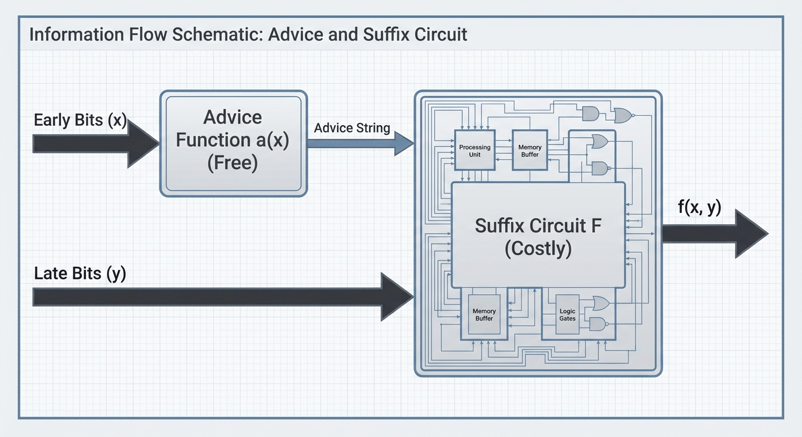
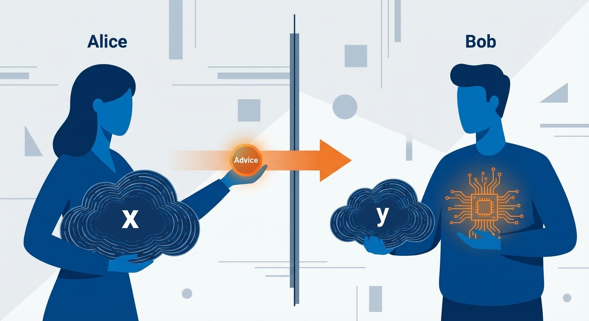

- An **suffix circuit** F : {0,1}ᵏ × {0,1}ⁿ⁻ᵐ → {0,1}, such that for all (x, y):
f(x, y) = F(a(x), y).
The **suffix cost** is the circuit complexity of F — the number of gates in the smallest circuit computing F over the combined input (a(x), y). The advice computation a(x) is free.

There is a useful communication complexity interpretation of this setup. Think of x as held by Alice (who arrives early) and y by Bob (who arrives late). Alice can send a single message a(x) — computed with unbounded local resources but bounded in length — and Bob uses a(x) together with y to compute f(x, y) via a fixed circuit. Minimizing the suffix circuit is equivalent to minimizing Bob's computation given that Alice can preprocess arbitrarily. This perspective connects truth partitioning directly to one-way communication complexity, where ⌈log₂ K_f(S)⌉ is precisely the one-way deterministic communication complexity D^{1→}(f) for the partition (S, T).

### 2.3 The Optimization Objective