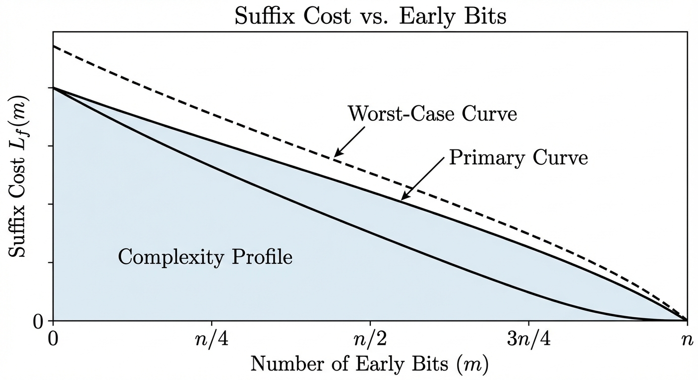
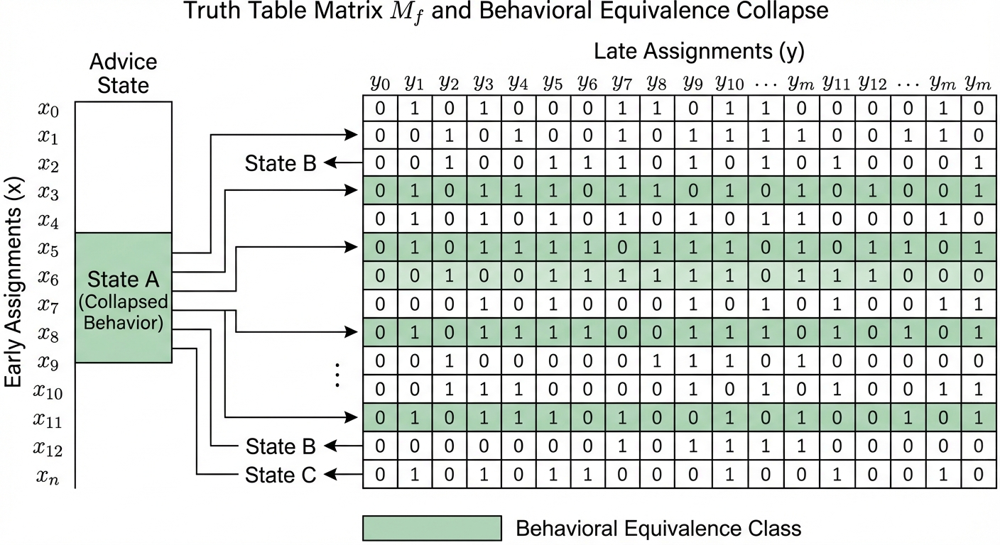
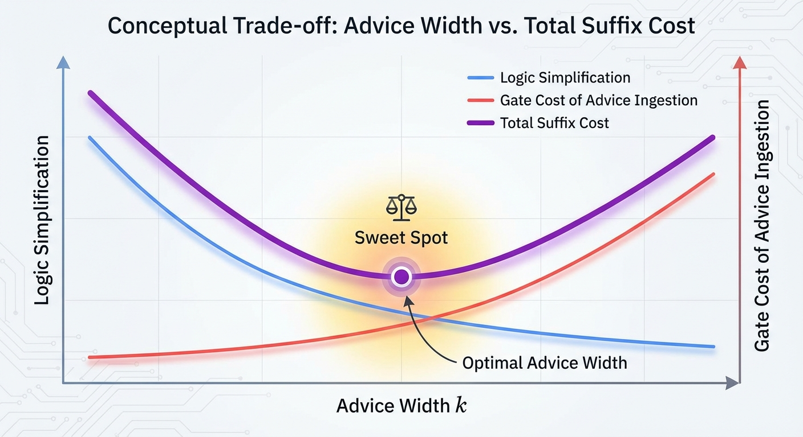

# Truth Partitioning: Circuit Complexity, Logical Coentropy, and the Classical Shadow of Entanglement

## 1. Introduction: The Problem of Partial Complexity

Consider a Boolean function f : {0,1}ⁿ → {0,1}. Classical circuit complexity asks: what is the smallest circuit (over some basis of gates) that computes f? This question, central to theoretical computer science, remains notoriously difficult — we cannot even prove superlinear lower bounds for explicit functions in the general model.

But suppose we change the question slightly. Instead of asking for the total cost of computing f, we split the n input bits into two groups — m **early bits** x ∈ {0,1}ᵐ and (n−m) **late bits** y ∈ {0,1}ⁿ⁻ᵐ — and declare that any computation touching only the early bits is **free**. We pay only for the **suffix circuit**: the gates that process the late bits y and combine them with whatever has been precomputed from x.

Why would anyone care about such a model? Three reasons:

1. **Hardware pipelining and preprocessing.** In many real systems, some inputs arrive early (configuration bits, keys, static parameters) and others arrive late (data, queries, streaming inputs). Precomputation on the early inputs is amortized away; what matters is the per-query cost once the late inputs appear.

2. **Advice complexity and non-uniformity.** The early-bit precomputation is essentially an advice string — a function a(x) that encodes whatever is useful about x for the downstream computation. This connects our model to classical questions about advice in complexity theory.

3. **A structural lens on Boolean functions.** The minimum suffix cost, as a function of the partition and the number of early bits, reveals something deep about the *internal structure* of f — how its truth table decomposes across the two groups of variables. This structural quantity, as we will argue, is a classical analogue of quantum entanglement entropy.

This essay develops the theory of **truth partitioning**: the study of how splitting a Boolean function's inputs into early and late groups governs the complexity of the residual computation, and how the resulting measures connect — with surprising precision — to concepts from quantum information theory. The framework reveals that the difficulty of computing a Boolean function is not a monolithic quantity but a *structured object* — a spectrum of complexities indexed by how we split the input. The shape of this spectrum has consequences that reach from silicon design and cryptanalysis to the foundations of computational complexity itself.

---

## 2. Clean Formulation: The Split-Input Model

### 2.1 Setup

Let f : {0,1}ⁿ → {0,1} be a Boolean function. Choose a subset S ⊆ [n] of size m; these are the **early bits**. The remaining T = [n] \ S, of size n−m, are the **late bits**. For a given input z ∈ {0,1}ⁿ, write z = (x, y) where x = z_S ∈ {0,1}ᵐ and y = z_T ∈ {0,1}ⁿ⁻ᵐ.

### 2.2 The Suffix Circuit

A **suffix circuit** for f with respect to the partition (S, T) consists of:

- An **advice function** a : {0,1}ᵐ → {0,1}ᵏ, computed by an arbitrary (free) circuit on the early bits x.
- A **suffix circuit** F : {0,1}ᵏ × {0,1}ⁿ⁻ᵐ → {0,1}, such that for all (x, y):

  f(x, y) = F(a(x), y).

The **suffix cost** is the circuit complexity of F — the number of gates in the smallest circuit computing F over the combined input (a(x), y). The advice computation a(x) is free.

There is a useful communication complexity interpretation of this setup. Think of x as held by Alice (who arrives early) and y by Bob (who arrives late). Alice can send a single message a(x) — computed with unbounded local resources but bounded in length — and Bob uses a(x) together with y to compute f(x, y) via a fixed circuit. Minimizing the suffix circuit is equivalent to minimizing Bob's computation given that Alice can preprocess arbitrarily. This perspective connects truth partitioning directly to one-way communication complexity, where ⌈log₂ K_f(S)⌉ is precisely the one-way deterministic communication complexity D^{1→}(f) for the partition (S, T).

### 2.3 The Optimization Objective

For a fixed partition S, define:

> **L_f(S)** = min over all advice functions a and suffix circuits F of size(F),
> subject to: f(x, y) = F(a(x), y) for all x, y.

For a fixed early-set size m, define:

> **L_f(m)** = min over all S ⊆ [n] with |S| = m of L_f(S).

The function L_f(m) captures how suffix complexity decreases as we grant more early bits. At one extreme, L_f(0) is the full circuit complexity of f (no early bits, no free precomputation). At the other extreme, L_f(n) = 0 — if all bits are early, the entire function is precomputed and the suffix circuit is trivial.

The interesting regime is in between: how does L_f(m) decay, and what governs the rate of that decay?

---

## 3. Residual Functions and Factorization

### 3.1 The Residual Function View

For a fixed assignment x ∈ {0,1}ᵐ to the early bits, the **residual function** is:

> f_x : {0,1}ⁿ⁻ᵐ → {0,1},  defined by  f_x(y) = f(x, y).

The truth table of f, viewed as a 2ᵐ × 2ⁿ⁻ᵐ matrix M_f (rows indexed by x, columns by y), has its rows precisely the truth tables of the residual functions f_x.

### 3.2 The Equivalence Relation on Rows

Two early-bit assignments x₁ and x₂ are **behaviorally equivalent** if f_{x₁} = f_{x₂} — that is, if they induce the same residual function. This defines an equivalence relation on {0,1}ᵐ. Let:

> **K_f(S)** = the number of distinct residual functions {f_x : x ∈ {0,1}ᵐ}.

This is the **behavioral multiplicity** of f with respect to the partition S. Note that K_f(S) ≤ 2ᵐ (each early assignment could yield a distinct residual), but also K_f(S) ≤ 2^{2^{n-m}} (the total number of Boolean functions on n−m bits).
There is another way to see K_f(S): it is exactly the number of distinct rows in the communication matrix M_f for the partition (S, T), and equivalently, the **width** of an Ordered Binary Decision Diagram (OBDD) at the layer corresponding to the cut S. The coentropy spectrum we define later is, in this light, a profile of the width of an optimal read-once branching program for f.

### 3.3 The Factorization Problem

The suffix circuit problem is fundamentally a **factorization** problem. We seek:

1. An encoding a : {0,1}ᵐ → {0,1}ᵏ that maps each early assignment to an advice string, such that behaviorally equivalent assignments map to the same advice (or at least advice that leads to the same output for all y).

2. A shared circuit F(·, y) that, given the advice a(x), reconstructs the correct residual function's output on y.

The minimum advice width k must satisfy k ≥ ⌈log₂ K_f(S)⌉ — we need enough bits to distinguish the distinct residual functions. But the circuit complexity of F depends not just on how many distinct residuals there are, but on how **structurally similar** they are to each other.

This is the crux: K_f(S) counts the residuals, but the suffix complexity depends on the *geometry* of the set of residual functions in Boolean function space. In information-theoretic terms, the advice function a(x) is a **sufficient statistic** for x with respect to the task of computing f(x, y). The search for the optimal encoding is the search for the **minimal sufficient statistic** — the coarsest partition of the early-bit space that still preserves all information needed by the suffix circuit.

---

## 4. The Advice Cost Correction

### 4.1 The Naive Intuition and Its Failure

A tempting first thought: "If I allow k advice bits, I can just look up the answer in a table of size 2ᵏ × 2ⁿ⁻ᵐ, so the suffix circuit should be trivial for large enough k."

This intuition fails for a subtle but important reason. The suffix circuit F takes k + (n−m) input bits and must compute a Boolean function. Even if the advice perfectly identifies which residual function to compute, the circuit F still needs to **implement a multiplexer** that selects among K_f(S) different functions of y, controlled by the advice bits.

### 4.2 Advice Bits Are Not Free in the Suffix

Every advice bit that participates in the suffix computation requires at least one gate to combine it with the late-bit signals. More precisely:

- If the advice string is k bits wide, and the suffix circuit uses all k bits, then the suffix circuit has at least k gates just for "reading" the advice (each advice bit must fan into at least one gate that also depends on y or on other advice-dependent signals).
- A multiplexer selecting among K distinct functions of (n−m) variables requires Ω(K · (n−m) / log(K · (n−m))) gates in the worst case.

So the cost model must account for the fact that **advice is not free inside the suffix** — it is free to *produce* but not free to *consume*. The suffix circuit pays for every gate, including those that route or decode the advice.
This point deserves emphasis because it is the source of a common analytical error. In standard non-uniform complexity (P/poly), advice is treated as a "given" — a string that appears on a tape at no cost. In our model, the suffix circuit must physically *integrate* the advice into its computation. This mirrors the **cell probe model** in data structures, where we ask: given a precomputed structure, how many operations are needed to answer a query? The advice is the data structure; the suffix circuit is the query algorithm. The cost of ingestion is real.
From a game-theoretic perspective, this creates a sharp strategic tension. The system designer optimizing the partition faces a fundamental trade-off: a wider advice string (larger k) gives the suffix circuit more information about which residual to compute, but it also forces the suffix circuit to have more input-processing gates just to "read" that information. The optimal strategy is not to maximize information transfer but to find the **sweet spot** where the marginal reduction in computational complexity from one additional advice bit exactly offsets the marginal gate cost of consuming it.

### 4.3 The Refined Cost Model

This leads to a refined understanding:

> L_f(S) = min_a min_F { size(F) : F(a(x), y) = f(x, y) ∀x,y }

where size(F) counts all gates in F, including those processing advice bits. The optimization over a is nontrivial: a wider advice string (larger k) gives F more information but also forces F to have more input-processing gates. The optimal k balances **information content** against **decoding overhead**.

In many cases, the optimal advice width is k = ⌈log₂ K_f(S)⌉ — just enough to identify the residual function — but the suffix complexity is dominated by the cost of implementing the K_f(S) residual functions with shared structure.
An important research direction emerges here: the **advice-complexity trade-off curve**. For a fixed partition S and a fixed m, how does L_f vary as we change the advice width k? There is likely a "knee" in this curve — a point where increasing k beyond ⌈log₂ K_f(S)⌉ yields diminishing returns in reducing suffix gates. Understanding the shape of this curve, and how it depends on the structural relationships among the residual functions, is central to both the theory and its applications.

---

## 5. Logical Coentropy

### 5.1 The Matrix View

Return to the truth table matrix M_f, with rows indexed by x ∈ {0,1}ᵐ and columns by y ∈ {0,1}ⁿ⁻ᵐ. The entry M_f[x, y] = f(x, y).

The structural properties of this matrix — its rank (over various fields), the number of distinct rows, the complexity of the row set — govern the suffix complexity. We collect these into a family of measures we call **logical coentropy**.

The term "coentropy" is chosen deliberately: in information theory, entropy measures uncertainty or disorder. Logical coentropy measures the **structured complexity** that remains after the early bits are fixed — it is, in a sense, the complexity that the early bits *fail to remove* from the computation.
It is worth noting that the structural properties of M_f are **field-dependent** in an important way. The number of distinct rows K_f(S) is a combinatorial quantity — it counts over the Boolean semiring. But we can also ask about the rank of M_f over GF(2) or over ℝ. If rank_{GF(2)}(M_f) is low, the function can be represented as a XOR of a few sub-functions. If K_f(S) is high but rank_ℝ(M_f) is low, the function might be "simple" for threshold circuits or polynomial representations, even if its logical coentropy is high. A complete theory should track both the combinatorial multiplicity and the algebraic rank, as they capture different aspects of the function's decomposability.

### 5.2 The Measures

**Behavioral Multiplicity:**

> K_f(S) = |{f_x : x ∈ {0,1}ᵐ}|

This is the number of distinct rows in M_f. It is the most basic measure: if K_f(S) = 1, all residuals are identical and the suffix circuit just computes a single fixed function of y (independent of x). If K_f(S) = 2ᵐ, every early assignment induces a different residual.

**Behavioral Complexity:**

> C_max(S) = max_x C(f_x)

where C(g) denotes the circuit complexity of g. This is the worst-case complexity of any single residual function. It provides a lower bound on suffix complexity: the suffix circuit must be able to compute the hardest residual, so L_f(S) ≥ C_max(S).

But L_f(S) can be much larger than C_max(S) if the residual functions, while individually simple, are **structurally diverse** — requiring the suffix circuit to implement many different computational paths controlled by the advice.
This gap between C_max(S) and L_f(S) is where the real action lies. A function could have only two residual functions (K_f = 2), but if those two functions are themselves computationally hard and structurally unrelated, L_f(S) remains high. Conversely, K_f(S) could be large, but if the residual functions are all minor perturbations of each other — say, shifts or negations of a common template — the suffix circuit can "reuse" logic extensively, keeping L_f(S) modest. The suffix complexity depends not just on the count or the worst-case hardness, but on the **mutual structure** among the residuals: their Hamming distances, their shared sub-circuits, their relative Kolmogorov complexity.

**Suffix-Realizability Complexity:**

> L_f(S) itself — the minimum suffix circuit size.

This is the quantity we ultimately want to understand. It depends on both K_f(S) and the structural relationships among the residual functions.

### 5.3 Logical Coentropy Proper

We define the **logical coentropy** of f with respect to partition S as:

> H_logic(f, S) = log₂ K_f(S)

This is the number of bits needed to specify which residual function is active — the "effective information" that the early bits carry about the structure of the computation. It is zero when all residuals are identical (the early bits are irrelevant) and maximal (equal to m) when every early assignment yields a distinct residual.
In information-theoretic terms, H_logic(f, S) is the **Hartley entropy** (max-entropy) of the residual function distribution — the minimum bit-rate required to uniquely identify the computational state after x is processed, assuming all x are equally likely or that we require zero-error performance. A natural refinement, which we flag for future development, is a **probabilistic logical coentropy** based on Shannon entropy:
> H_Shannon(f, S) = −Σ_{i=1}^{K_f(S)} P(f_i) log₂ P(f_i)
where P(f_i) is the fraction of early-bit assignments x that induce the i-th residual function. When the input distribution is non-uniform, or when we care about average-case rather than worst-case performance, this probabilistic variant may be substantially smaller than H_logic and may better predict the practical suffix cost in hardware or software systems.

The **refined logical coentropy** incorporates not just the count but the complexity:

> H*_logic(f, S) = log₂ K_f(S) + log₂ C_max(S)

This combined measure better predicts suffix complexity: both the number of distinct behaviors and the complexity of each behavior contribute to the cost of the suffix circuit.

### 5.4 Minimizing Over Partitions

The **logical coentropy of f at scale m** is:

> H_logic(f, m) = min_{S ⊆ [n], |S|=m} H_logic(f, S)

This asks: what is the best way to choose m early bits so as to minimize the diversity of residual functions? The optimal partition S* is the one that makes the residual functions as homogeneous as possible — collapsing as many rows of M_f as possible into duplicates.

---

## 6. Optimal Bit Selection

### 6.1 The Combinatorial Problem

Given f and a budget m of early bits, which m bits should we choose? This is a combinatorial optimization problem over (n choose m) possible partitions.

For small n, exhaustive search is feasible. For large n, we need structural insights. Several cases are illuminating:

**Symmetric functions.** If f is symmetric (depends only on the Hamming weight of the input), then all partitions of a given size are equivalent by symmetry. The residual functions f_x depend only on |x| (the number of 1s among the early bits), so K_f(S) ≤ m+1 for any S with |S| = m. Symmetric functions have low logical coentropy.

**Linear functions (over GF(2)).** If f(z) = ⊕_{i ∈ A} z_i for some A ⊆ [n], then f(x,y) = (⊕_{i ∈ A∩S} x_i) ⊕ (⊕_{j ∈ A∩T} y_j). The residual function f_x(y) = c_x ⊕ g(y) where c_x ∈ {0,1} and g is a fixed linear function of y. So K_f(S) ≤ 2 for any partition — linear functions have minimal logical coentropy regardless of the partition.

**Threshold functions.** Functions of the form f(z) = 1 iff Σz_i ≥ t. The residual f_x(y) = 1 iff Σy_j ≥ t − |x|. There are at most m+1 distinct thresholds t − |x|, so K_f(S) ≤ m+1. Again, low coentropy, and partition-independent (up to symmetry).

**Cryptographic functions.** A function designed to be pseudorandom — such as a block cipher or hash function restricted to n bits — should have K_f(S) ≈ min(2ᵐ, 2^{2^{n-m}}) for most partitions. Every early assignment yields a residual that looks like an independent random function. These functions have **maximal** logical coentropy: no partition helps, and the suffix circuit must essentially implement a full lookup table.
These four cases suggest a natural hierarchy of **coentropy complexity classes**: functions with O(1) coentropy (linear), O(log n) coentropy (symmetric, threshold), and Ω(n) coentropy (cryptographic/pseudorandom). The position of a function in this hierarchy is a structural invariant that captures something fundamentally different from its total circuit complexity — it captures how the complexity is *distributed* across the input variables.
From a Fourier-analytic perspective, the coentropy hierarchy has a clean interpretation. Consider the Fourier expansion of f over GF(2). Precomputing x for free allows us to "absorb" all Fourier coefficients f̂(S) where S ⊆ {early bits}. But the **cross-terms** — coefficients f̂(S) where S contains bits from both the early and late sets — represent the irreducible interaction between the two groups. These cross-terms are the Fourier signature of logical coentropy. A function with high total influence across the partition boundary will have high coentropy; a function whose Fourier mass is concentrated within each side of the partition will have low coentropy.

### 6.2 The Hardness of Optimal Selection

For general functions, finding the optimal partition is likely computationally hard — it requires evaluating K_f(S) for exponentially many candidate sets S. In the truth-table model (where f is given as a 2ⁿ-bit string), computing K_f(S) for a single S requires examining all 2ᵐ residual functions, each of length 2ⁿ⁻ᵐ.

This computational hardness is itself interesting: it means that even if we know the truth table of f, finding the best way to split the computation into free preprocessing and paid suffix is a nontrivial optimization problem. The problem is closely related to the **Minimum Circuit Size Problem (MCSP)** and to finding optimal variable orderings for Binary Decision Diagrams (BDDs), which is known to be NP-hard.

In practice, a greedy heuristic often works well: select early bits one at a time, at each step choosing the bit whose inclusion maximally collapses the number of distinct residual functions. This greedy approach — analogous to greedy feature selection in machine learning — does not guarantee optimality but tends to find good partitions for functions with exploitable structure. For functions that resist all such heuristics — where no single bit or small group of bits significantly reduces K_f — we have strong evidence that the function is "maximally entangled" in the sense that its complexity is irreducibly distributed across all input variables.

---

## 7. Quantum Information Analogies

### 7.1 The Parallel Structure

The framework developed above has a striking structural parallel with quantum entanglement theory. The correspondences are not merely superficial — they reflect a deep mathematical homology between the decomposition of Boolean functions across input partitions and the decomposition of quantum states across subsystem partitions.

Let |ψ⟩ ∈ H_A ⊗ H_B be a bipartite quantum state. The **Schmidt decomposition** writes:

> |ψ⟩ = Σ_{i=1}^{r} λ_i |α_i⟩ ⊗ |β_i⟩

where r is the **Schmidt rank**, λ_i > 0 are the **Schmidt coefficients** (with Σλ_i² = 1), and {|α_i⟩}, {|β_i⟩} are orthonormal sets in H_A and H_B respectively.

Now consider the truth table matrix M_f. Its rows are the residual functions f_x, viewed as vectors in {0,1}^{2^{n-m}}. The number of distinct rows is K_f(S). If we think of M_f as a real matrix and take its singular value decomposition (SVD), we get a decomposition structurally analogous to the Schmidt decomposition.
The SVD of M_f yields singular values that play the role of Schmidt coefficients — they quantify the "statistical importance" of different residual function modes. A truth table matrix with a rapidly decaying singular value spectrum is one where a few dominant modes capture most of the function's behavior, suggesting that a small suffix circuit might suffice. A matrix with a flat spectrum — all singular values roughly equal — is the classical analogue of a maximally entangled state, and it predicts high suffix complexity.
This connection suggests a practical tool: **Matrix Product State (MPS) decomposition** of truth tables. If a Boolean function has low "bond dimension" (low K_f across all cuts), it can be represented as a highly compressed classical data structure, analogous to how MPS compresses quantum states in many-body physics. This compression is not merely a storage trick — it directly implies the existence of efficient suffix circuits.

### 7.2 The Correspondence Table

| Quantum Concept | Classical (Truth Partitioning) Analogue |
|---|---|
| Bipartite state \|ψ⟩ ∈ H_A ⊗ H_B | Boolean function f : {0,1}ᵐ × {0,1}ⁿ⁻ᵐ → {0,1} |
| Schmidt rank r | Behavioral multiplicity K_f(S) |
| Schmidt coefficients λ_i | Structural similarity weights among residual functions |
| Entanglement entropy S(ρ_A) | Logical coentropy H_logic(f, S) |
| Reduced density matrix ρ_A | Distribution / equivalence structure over residual functions |
| Product state (r = 1) | Partition-independent function (K_f(S) = 1): f(x,y) = g(y) |
| Maximally entangled state | Cryptographic / pseudorandom function (K_f(S) = 2ᵐ) |
| Best bipartition (min entanglement) | Optimal early-bit selection (min logical coentropy) |
| Conditional quantum channel | Suffix circuit F(a(x), y) |
| Quantum state complexity | Suffix circuit complexity L_f(S) |

### 7.3 Depth of the Analogy

The analogy goes deeper than a dictionary of terms:

**Product states ↔ Trivially separable functions.** A product state |ψ⟩ = |α⟩ ⊗ |β⟩ has Schmidt rank 1 and zero entanglement. The classical analogue is a function where f(x,y) = g(y) for some fixed g — the early bits are completely irrelevant. The suffix circuit just computes g, and L_f(S) = C(g) regardless of the advice.

**Maximally entangled states ↔ Pseudorandom functions.** A maximally entangled state has Schmidt rank equal to the dimension of the smaller subsystem and maximal entanglement entropy. The classical analogue is a function where every early assignment yields a distinct, structurally unrelated residual — the truth table matrix has maximal row diversity. The suffix circuit must implement a full multiplexer, and L_f(S) is large.

**Entanglement monotones ↔ Complexity monotones.** In quantum theory, entanglement cannot increase under local operations and classical communication (LOCC). In our framework, there is an analogous monotonicity: certain operations on f (such as fixing a late bit, or applying a local transformation to the late bits) cannot increase the behavioral multiplicity K_f(S). The logical coentropy respects a natural partial order on function complexity.

**Optimal bipartition.** In quantum many-body physics, one studies the entanglement entropy across all possible bipartitions of a system to understand its entanglement structure. The function H_logic(f, m) — the minimum logical coentropy over all size-m partitions — is the exact classical analogue. The partition that minimizes logical coentropy is the one where the function is "least entangled" across the split.

### 7.4 Where the Analogy Breaks

The analogy is not perfect, and the disanalogies are instructive:

1. **Linearity vs. nonlinearity.** Quantum mechanics is linear: the Schmidt decomposition is a linear-algebraic fact about tensor products of Hilbert spaces. Boolean function decomposition is fundamentally nonlinear — we work over {0,1} with AND, OR, NOT rather than over ℂ with linear combinations. The SVD of M_f over ℝ gives a linear approximation to the structure, but the circuit complexity of the suffix depends on nonlinear computational properties.

2. **Continuous vs. discrete.** Schmidt coefficients are continuous (real numbers); behavioral multiplicity is discrete (an integer). The "spectrum" of a Boolean function's partition structure is coarser than the entanglement spectrum of a quantum state.

3. **Complexity vs. information.** Entanglement entropy is an information-theoretic quantity; suffix circuit complexity is a computational quantity. Two functions can have the same K_f(S) but vastly different L_f(S), because the residual functions may differ in computational complexity. The quantum analogy captures the information-theoretic skeleton but not the full computational flesh.
4. **Resource vs. cost.** Perhaps the most conceptually important disanalogy: in quantum mechanics, high entanglement is a **computational resource** — it enables teleportation, superdense coding, and quantum speedups. In classical circuit complexity, high logical coentropy is a **computational cost** — it forces the suffix circuit to be large. The "classical shadow of entanglement" is a bottleneck, not a power-up. This inversion is itself revealing: it suggests that what makes quantum computation powerful is precisely its ability to exploit the structure that, classically, makes computation expensive.

---

## 8. Formal Definitions: Classical Entanglement Measures

We now collect the formal definitions, stated precisely for reference.

### 8.1 Behavioral Multiplicity

**Definition.** Let f : {0,1}ⁿ → {0,1} and S ⊆ [n] with |S| = m. The **behavioral multiplicity** of f with respect to S is:

> K_f(S) = |{ f_x : x ∈ {0,1}ᵐ }|

where f_x(y) = f(x, y) for y ∈ {0,1}ⁿ⁻ᵐ, and the set is taken with respect to functional equality (f_x = f_{x'} iff f_x(y) = f_{x'}(y) for all y).

**Properties:**
- K_f(S) = 1 iff f(x,y) is independent of x (given the partition)
- K_f(S) = 2ᵐ iff all residual functions are distinct

### 8.2 Behavioral Complexity

**Definition.** The **behavioral complexity** of f with respect to S is:

> C_max(f, S) = max_{x ∈ {0,1}ᵐ} C(f_x)

where C(g) is the minimum circuit size for g over the standard basis {AND, OR, NOT}.

**Properties:**
- C_max(f, S) ≤ L_f(S) (the suffix must handle the hardest residual)
- C_max(f, S) ≤ O(2^{n-m} / (n-m)) by the Lupanov bound

### 8.3 Suffix-Realizability Complexity

**Definition.** The **suffix-realizability complexity** of f with respect to S is:

> L_f(S) = min_{a, F} size(F)

where the minimum is over all advice functions a : {0,1}ᵐ → {0,1}ᵏ (for any k) and circuits F : {0,1}ᵏ × {0,1}ⁿ⁻ᵐ → {0,1} satisfying F(a(x), y) = f(x, y) for all x, y.

**Properties:**
- L_f(S) ≥ C_max(f, S)
- L_f(S) ≤ K_f(S) · O(2^{n-m} / (n-m)) (implement each residual separately and multiplex)
- L_f(∅) = C(f) (no early bits: full circuit complexity)
- L_f([n]) = 0 (all bits early: suffix is trivial)

### 8.4 Logical Coentropy

**Definition.** The **logical coentropy** of f with respect to partition S is:

> H_logic(f, S) = log₂ K_f(S)

The **logical coentropy at scale m** is:

> H_logic(f, m) = min_{S ⊆ [n], |S|=m} H_logic(f, S)

The **refined logical coentropy** is:

> H*_logic(f, S) = log₂ K_f(S) + log₂ C_max(f, S)

**Properties:**
- H_logic(f, S) = 0 iff f is independent of the early bits (given partition S)
- H_logic(f, m) is non-increasing in m (more early bits can only help)
- For random functions, H_logic(f, m) ≈ min(m, 2^{n-m}) with high probability

### 8.5 The Coentropy Spectrum

For a complete picture, define the **coentropy spectrum** of f as the function:

> m ↦ H_logic(f, m)  for m = 0, 1, …, n

This is a non-increasing function from {0, …, n} to [0, n], starting at H_logic(f, 0) (which is 0, since K_f(∅) = 1 trivially — there is one residual function, namely f itself) and ending at H_logic(f, n) = 0.

Wait — let us be more careful. When m = 0, there are no early bits, so there is exactly one "early assignment" (the empty string), and one residual function (f itself). So K_f(∅) = 1 and H_logic(f, 0) = 0. When m = n, all bits are early, each residual function is a constant (0 or 1), and K_f([n]) ≤ 2, so H_logic(f, n) ≤ 1.

The interesting behavior is in the middle. For a "highly entangled" function, H_logic(f, m) rises quickly as m increases from 0 (many early bits create many distinct residuals) before eventually falling as m approaches n (the residuals become constants). The peak of the coentropy spectrum — the value of m where H_logic(f, m) is maximized — characterizes the scale at which the function's cross-partition complexity is greatest.

---

## 9. Applications and Implications

The theoretical framework of truth partitioning is not merely an abstract exercise. The concepts of suffix cost, behavioral multiplicity, and logical coentropy have concrete implications across several domains where the early/late bit distinction arises naturally.

### 9.1 Hardware Design and FPGA Optimization

In hardware, the split-input model is the everyday reality of pipelined architectures. Configuration bits, mode registers, and instruction opcodes are the "early bits" — they are set long before the data stream arrives. The suffix circuit is the actual datapath logic that must meet timing, area, and power constraints.

The logical coentropy of a function directly predicts the **multiplexer depth** required in the suffix. If K_f(S) is small — as it is for symmetric or threshold functions — the hardware can use simple gating or small MUXes. If K_f(S) is large, the advice bits must drive a massive multiplexer tree, and in hardware, a 1024-to-1 MUX is often more expensive in area and delay than the logic it selects among.

Truth partitioning also provides a mathematical basis for **optimal pipeline register placement**. The "best partition" S is, in effect, the optimal location for a pipeline boundary: the cut that minimizes the amount of information (and hence the number of wires and the complexity of the downstream logic) that must cross from one pipeline stage to the next. The coentropy spectrum of a function is a guide to where pipeline registers should go.

A more speculative but promising application is **data-dependent power gating**. By analyzing the residual functions f_x, a hardware designer can identify "don't care" states in the suffix circuit for specific early-bit assignments. If f_{x₁} doesn't exercise a particular sub-circuit but f_{x₂} does, the advice a(x) can act as a sleep signal for that logic block, achieving fine-grained power savings that are mathematically grounded rather than heuristic.

### 9.2 Cryptographic Analysis

For a cryptographer, logical coentropy is a formal, rigorous measure of **diffusion** — the property that every output bit depends on every input bit in a complex, non-linear way. In the design of block ciphers and hash functions, we strive for "completeness": the condition that no partition of the input variables yields a low-coentropy decomposition.

If we treat the early bits x as a secret key and the late bits y as plaintext, the suffix circuit F(a(x), y) represents the "keyed" implementation. A low L_f(S) for some partition suggests that the key's influence on the transformation is compressible or separable — a structural weakness that is the precursor to algebraic, linear, or related-key attacks. The coentropy spectrum of a cipher's round function should be **flat and high** across all partition sizes; any dip in the spectrum is a potential vulnerability.

The split-input model also formalizes the playground of **time-memory trade-offs** (Hellman's TMTO, rainbow tables). The advice function a(x) is the precomputed table; the suffix cost L_f(S) is the online computation time. A function whose coentropy spectrum decays rapidly is inherently vulnerable to precomputation-heavy attacks. A "flat" spectrum — where H_logic stays high until m is very close to n — is a requirement for functions intended to resist such attacks.

There is a further connection to **side-channel resistance**. If K_f(S) is small, the device exhibits only a few distinct computational behaviors regardless of the key. This reduces the "signal space" an attacker needs to monitor, making differential power analysis (DPA) significantly easier. The refined logical coentropy H*_logic — which accounts for both the number and the complexity of distinct behaviors — may serve as a design-time metric for side-channel resilience.

### 9.3 Connections to Learning Theory and Neural Architecture

The behavioral multiplicity K_f(S) is closely related to the concept of **teaching dimension** and **sample complexity** in learning theory. A function with low coentropy across many partitions is one where partial information about the input quickly narrows down the space of possible behaviors — such functions should be easier to learn from examples.

More speculatively, truth partitioning suggests a principled approach to **neural architecture design for edge deployment**. When a neural network must be split across heterogeneous hardware (CPU, GPU, NPU), the partition boundary is exactly the early/late split. The suffix cost of the partition determines the computational load on the downstream device. Using logical coentropy (or a continuous relaxation of it) as a fitness metric during neural architecture search could yield models that are not just accurate but *natively decomposable* — designed from the ground up to be efficiently split across hardware boundaries.

---

## 10. Conclusion and Future Directions

### 10.1 Summary

We have developed a framework — **truth partitioning** — for studying the complexity of Boolean functions through the lens of input splitting. The key ideas are:

1. **The split-input model:** Partition inputs into free early bits and costly late bits; measure only the suffix circuit complexity.

2. **Residual functions:** Fixing the early bits induces a family of residual functions; the diversity and complexity of this family governs the suffix cost.

3. **The advice cost correction:** Advice bits are free to produce but not free to consume — the suffix circuit pays for every gate, including those that decode the advice.

4. **Logical coentropy:** A family of measures (K_f(S), C_max(S), H_logic(f, S), H*_logic(f, S)) that quantify the cross-partition complexity of a Boolean function.

5. **The quantum analogy:** These classical measures correspond, with remarkable precision, to quantum entanglement measures — Schmidt rank, entanglement entropy, and the structure of bipartite quantum states.

### 10.2 Open Directions

**Circuit-aware entanglement measures.** The analogy between logical coentropy and entanglement entropy suggests that tools from quantum information theory — majorization, entanglement witnesses, area laws — might have classical circuit-complexity analogues. Can we define a "circuit-aware entanglement monotone" that captures suffix complexity more tightly than K_f(S) alone?
**Entanglement witnesses for circuits.** In quantum information, an entanglement witness is an observable that certifies a state is entangled. Can we develop analogous "circuit witnesses" — efficiently computable properties of a function's truth table that *prove* a minimum suffix complexity? Such witnesses would be a new tool for circuit lower bounds.

**Structured function classes.** How does the coentropy spectrum behave for natural function classes?
- *Linear functions* have H_logic(f, m) ≤ 1 for all m and S — they are "minimally entangled."
- *Symmetric functions* have H_logic(f, S) ≤ log₂(m+1) — low coentropy, growing logarithmically.
- *Threshold functions* behave similarly to symmetric functions.
- *Cryptographic functions* (AES round functions, SHA compression functions restricted to small inputs) should have near-maximal coentropy — can we prove this, or is it only a heuristic belief?

**Connections to communication complexity.** The behavioral multiplicity K_f(S) is closely related to the number of distinct rows in the communication matrix of f. The best partition for minimizing logical coentropy may relate to the best partition for minimizing communication complexity. Formalizing this connection could yield new lower-bound techniques.
**The Log-Rank Conjecture.** If H_logic is related to the log of the rank of M_f, then truth partitioning is essentially a circuit-complexity-aware version of communication complexity. The Log-Rank Conjecture — that deterministic communication complexity is polynomially related to the log of the rank of the communication matrix — may have a natural reformulation in terms of logical coentropy.

**Algorithmic questions.** Given the truth table of f, how efficiently can we compute K_f(S)? Find the optimal partition S*? Approximate H_logic(f, m)? These algorithmic questions are interesting in their own right and connect to problems in learning theory and property testing.

**Multi-partition generalizations.** We have considered bipartitions of the input. The quantum analogy suggests studying multi-partitions — splitting the input into three or more groups, with a hierarchy of preprocessing stages. This connects to the theory of multipartite entanglement, which is richer and less well-understood than the bipartite case.

**Area laws and locality.** In quantum many-body physics, ground states of local Hamiltonians satisfy "area laws" — the entanglement entropy across a cut scales with the boundary of the cut, not its volume. Do Boolean functions computed by bounded-depth or bounded-width circuits satisfy analogous area laws for logical coentropy? If a function is computed by a circuit of depth d on a geometrically local architecture, does H_logic(f, S) scale with the number of wires crossing the partition rather than the total number of gates? If so, this would provide a new structural characterization of shallow circuits and a potential path to proving circuit lower bounds using techniques from tensor network theory.

**Approximate truth partitioning.** The current framework demands exact computation: f(x, y) = F(a(x), y) for all inputs. A natural relaxation allows the suffix circuit to err on a small fraction of inputs, introducing a "slack" parameter ε. The trade-off between suffix cost and error probability — a circuit-complexity analogue of rate-distortion theory — could provide new tools for analyzing the complexity of randomized computation and the BPP complexity class.

**Quantum suffix complexity.** A tantalizing direction: define L_f^Q(S) as the complexity of the suffix when the suffix circuit is allowed to be *quantum*. If L_f^Q(S) ≪ L_f(S) for certain functions, we have identified a new class of "quantum-advantage functions" based on partition structure rather than query complexity — functions where quantum mechanics helps not because it asks fewer questions, but because it resolves logical entanglement more efficiently.

### 10.3 The Bigger Picture

The framework of truth partitioning sits at the intersection of circuit complexity, information theory, and quantum foundations. It suggests that the difficulty of computing a Boolean function is not a monolithic quantity but a **structured object** — a spectrum of complexities indexed by how we split the input. The shape of this spectrum, and its deep parallels with quantum entanglement, hint at a unified theory of computational structure that transcends the classical/quantum divide.

Circuit complexity, in this light, is the study of how information is *integrated* across input partitions. A function is hard to compute not merely because it has many steps, but because its information is non-locally distributed across its input bits — because the "logical entanglement" between different groups of variables forces any implementation to maintain a complex web of dependencies. The suffix circuit is the physical mechanism that must resolve this non-locality, and its size is a direct reflection of the logical coentropy inherent in the function's structure.

The classical shadow of entanglement, it turns out, was hiding in the truth table all along.