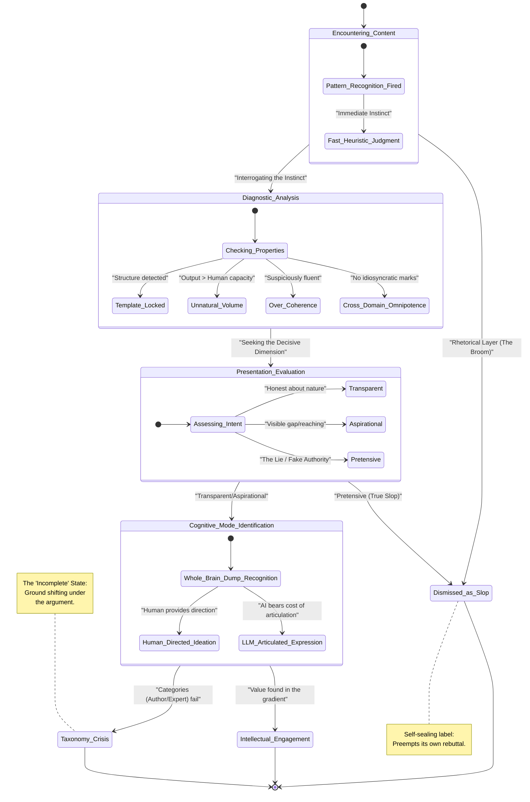

# Finite State Machine Analysis

**Started:** 2026-03-03T18:32:09.269349792

## Configuration
Task Parameters

**Concept:** The Cognitive Process of Evaluating AI-Generated Content (The 'Slop' Judgment Workflow)
**Domain:** Content moderation, AI ethics, and cognitive epistemology
**Initial States:** Encountering_Content
**Known Events:** Pattern_Recognition, Fast_Heuristic_Trigger, Interrogation_Decision, Pretense_Detection, Transparency_Detection, Aspiration_Detection


## Step 1: State Identification
Prompt & Response

### Prompt

```
You are an expert in formal methods and finite state machine modeling. Your task is to analyze a concept and identify all possible states.

## Concept to Model:
The Cognitive Process of Evaluating AI-Generated Content (The 'Slop' Judgment Workflow)

## Domain Context:
Content moderation, AI ethics, and cognitive epistemology

## Reference Files:
# /home/andrew/code/Fractal-Thought-Engine/post_data/projects/2026-03-04-is-this-slop/content.md

```
# Is This Slop?

You find a site called *Fractal Thought Engine*. It has 278 posts spread across eight domains — physics, philosophy, science fiction, cognitive science, music theory, mathematics, political epistemology, speculative theology. Your pattern-recognition fires immediately. You've seen this before. You know what this is.

*This is slop.*

The reaction is fast, confident, and — you suspect — correct. But I want to slow it down. I want to interrogate the instinct, not because it's necessarily wrong, but because the speed of the judgment is doing real work, and we should understand what kind of work it's doing.

I built Fractal Thought Engine. I built it with extensive use of large language models. And the question of whether it constitutes "slop" turns out to be far more interesting than the answer.

---

## What Is "AI Slop"?

The term "slop" has two layers, and the trouble is that they've fused together so completely that most people can't separate them — and don't want to.

**The diagnostic layer** is genuinely useful. It identifies a cluster of real properties:

- **Template-locked structure.** Every post follows the same arc: broad introduction, three to five subheadings, a synthesis paragraph, a forward-looking conclusion. The skeleton is visible through the skin.
- **Unnatural volume.** Output that exceeds what any individual could produce at that quality level in that timeframe, suggesting minimal human bottleneck in the production pipeline.
- **Over-coherence.** Every paragraph lands. There are no rough patches, no visible moments where the author struggled with an idea and left the struggle on the page. The text is suspiciously fluent.
- **Cross-domain omnipotence.** The author writes with equal apparent confidence about quantum field theory, Heidegger, and jazz harmony. No domain shows the characteristic marks of someone who actually lives there — the idiosyncratic emphases, the pet peeves, the awareness of which debates are stale and which are live.
- **Lack of lived constraint.** Nothing is shaped by the friction of a real life. No post exists because a student asked a weird question, or because the author got into an argument at a dinner party, or because a paper rejection forced a rethink. Everything feels generated from the topic itself rather than from an encounter with the topic.

These are real diagnostics. They point to real features of text. I don't dispute their validity.

**The rhetorical layer** is something else entirely. "Slop" is not a neutral descriptor. It is a term borrowed from animal feed — undifferentiated, low-value, mass-produced waste. To call something slop is not to diagnose it. It is to dismiss it. It is to say: *I don't need to read this. You don't need to read this. Nobody needs to read this. Its existence is a minor pollution event.*

And here's what matters: in practice, these two layers are not separable. Nobody runs the diagnostics and then, having confirmed the presence of template structure and cross-domain fluency, applies the label "slop" with clinical detachment. The label comes first. The diagnostics are recruited after the fact to justify a judgment that was already made — a judgment that is, at its core, social and aesthetic rather than analytical.

---

## The Dismissal Problem

I want to be precise about this. I am not arguing that the diagnostic criteria are wrong. I am not arguing that there is no such thing as low-value AI-generated content flooding the internet. There obviously is. The problem is that "slop" is not a scalpel. It's a broom.

The term is *unambiguous in its implications*. When you call something slop, you are not inviting further investigation. You are not saying, "This has some properties that are characteristic of low-effort AI generation; let's look more closely to see whether there's something interesting happening underneath." You are saying, "This is garbage. Move on."

And that unambiguity is the point. That's what makes the term useful — socially useful. It gives you permission to not engage. In an environment where AI-generated content is genuinely abundant and often genuinely worthless, having a fast heuristic for dismissal is adaptive. I understand the appeal. I feel the appeal myself when I encounter the fifteenth LinkedIn post that opens with "In today's rapidly evolving landscape..."

But adaptive heuristics have false positive rates. And the interesting question is what falls into the false positive zone — what gets swept up by the broom that shouldn't have been.

The deeper issue is that the contemptuous connotation of "slop" makes it almost impossible to contest the label once it's been applied. If I say, "Actually, this isn't slop — there's real thought behind it," I sound exactly like what someone who produced slop would say. The label is self-sealing. It preempts its own rebuttal.

---

## Presentation Is the Decisive Dimension

So if volume alone doesn't settle the question, and cross-domain breadth alone doesn't settle it, and LLM involvement alone doesn't settle it — what does?

I think the answer is **presentation**. Specifically: *does the artifact pretend to be something it isn't?*

This is where most discussions of AI-generated content go wrong. They focus on production method (was an LLM involved?) or output properties (does it have that LLM sheen?) when the actually important axis is the relationship between what the thing *is* and what the thing *claims to be*.

I want to distinguish three presentation modes:

**Transparent presentation.** The artifact is honest about its nature, its production method, and its epistemic status. A blog post that says "I used Claude to help me think through this idea" is transparent. A site that frames itself as exploratory and speculative is transparent. Transparency doesn't require a disclaimer on every page — it can be structural, embedded in the design and framing of the work itself.

**Aspirational presentation.** The artifact reaches beyond what the author could produce alone, and this reaching is visible and acknowledged. A musician using a synthesizer to realize orchestral ideas they can't perform is aspirational. A writer using an LLM to articulate ideas they have but lack the technical vocabulary to express is aspirational. The gap between the author's unaided capacity and the artifact's polish is not hidden — it's the point.

**Pretensive presentation.** The artifact claims an authority, expertise, or origin it doesn't have. A site that presents LLM-generated medical advice as if written by doctors is pretensive. A portfolio of LLM-generated "research papers" submitted for academic credit is pretensive. An AI-generated article published under a fake byline in a newspaper is pretensive.

Slop, properly understood, lives in the pretensive category. It's not just AI-generated content — it's AI-generated content that *misrepresents itself*. The sin isn't the production method. The sin is the lie.

---

## The Case of Fractal Thought Engine

So let's apply this framework to the thing that triggered the question.

Fractal Thought Engine has 278 posts across eight domains. That's a lot. It was built with heavy LLM involvement. The cross-domain range is far wider than any single person's professional expertise. By the diagnostic criteria, it lights up like a Christmas tree.

But look at the presentation.

The site is called *Fractal Thought Engine*. Not "The Journal of Interdisciplinary Studies." Not "Dr. [Name]'s Research Blog." The name itself signals something: this is a *machine for generating thought-patterns*. It's a generative, exploratory, self-consciously artificial construct. The name is doing real semiotic work.

The physics posts live under `/scifi/`. Not `/physics/` or `/research/`. They're filed under science fiction. This is not an accident. It's a framing decision that says: *these are speculative explorations that use physics as a substrate, not contributions to the physics literature.*

The writing across the site is speculative in tone. Posts don't conclude with "therefore, X is the case." They conclude with "what if X were the case?" or "this is what it looks like when you push Y to its limit." The epistemic register is consistently exploratory rather than authoritative.

None of this is hidden. None of it requires detective work to uncover. The site's presentation is what I'd call **self-aware dissonance** — it occupies the space between serious intellectual engagement and acknowledged artificiality, and it doesn't try to collapse that space in either direction. It's not pretending to be a research institute. It's not pretending to be a diary. It's not pretending to be a physics journal. It's a fractal thought engine. It does what it says on the tin.

Is it possible to look at all of this and still call it slop? Of course. The broom doesn't discriminate. But if you're going to make that call, you should be honest about what you're doing: you're not diagnosing a production method. You're making a value judgment about whether this *kind of thing* should exist. And that's a different argument — one that deserves to be made explicitly rather than smuggled in under a diagnostic label.

---

## LLM-Assisted Whole-Brain Dump as a New Cognitive Mode

Here's what I think is actually happening with Fractal Thought Engine, and with a growing category of work that doesn't yet have a good name.

For most of human history, the cost of articulation has been high. Turning a thought into a piece of writing requires time, effort, skill, and — critically — a judgment that *this particular thought is worth the investment*. The result is that most people express only a tiny fraction of their intellectual life. You write about the things you're professionally required to write about, the things you're passionate enough to overcome the activation energy for, and the things that circumstance forces into expression (someone asks you a question, you get into an argument, an editor commissions a piece).

Everything else — the half-formed ideas, the interdisciplinary hunches, the speculative connections, the thoughts that are interesting but not *clearly worth the effort* — stays below the surface. Not because it's worthless, but because the cost-benefit calculation doesn't clear the threshold.

LLMs collapse the cost of articulation.

What this means is that a person can now externalize their *entire* thought-space, not just the peaks that were high enough to justify the climb. The physicist who has always had informal intuitions about philosophy of mind can now explore those intuitions in writing. The software engineer who thinks about music theory in the shower can now produce substantive explorations of those ideas. The generalist who has spent decades accumulating cross-domain pattern-recognition can now make those patterns visible.

I want to be specific about what this is and isn't. It is **not** the LLM having the ideas. It is the human having the ideas and the LLM bearing the articulatory cost that previously prevented those ideas from being expressed. The human provides direction, judgment, domain knowledge (even if informal), aesthetic sensibility, and the crucial editorial function of recognizing when the output has captured something real versus when it has produced fluent nonsense.

This is a new cognitive mode. It's not writing. It's not dictation. It's not "using AI as a tool" in the way that phrase is usually meant (i.e., having the AI do a bounded task within a human-directed workflow). It's closer to **whole-brain dump** — the externalization of an entire intellectual life that was previously too expensive to articulate.

And it produces artifacts that look, from the outside, exactly like slop. High volume. Cross-domain range. LLM fluency. Template-adjacent structure. Every diagnostic fires.

But the generative process is fundamentally different from what "slop" implies. Slop is produced by pointing an LLM at a topic and publishing whatever comes out. A whole-brain dump is produced by a human with genuine intellectual investments using an LLM to make those investments visible. The difference is invisible in the output — which is precisely why the diagnostic approach fails, and why presentation becomes the decisive dimension.

---

## What This Mode Enables

Think about what it means for the full gradient of a person's thought-space to become expressible.

Previously, we only saw the peaks. A physicist published physics papers. If they had interesting thoughts about the philosophy of consciousness, those thoughts existed only in conversation, in private notebooks, in the margins of their professional life. The public intellectual landscape was shaped by the economics of articulation: you saw what people could afford to express, not what they actually thought.

Now the entire landscape becomes visible. And it looks weird. It looks like a site with 278 posts across eight domains. It looks like someone who has no business writing about music theory writing about music theory. It looks, in other words, like slop — because our pattern-recognition was trained on a world where cross-domain prolificacy was either a sign of genius or a sign of fraud, and the prior probability strongly favored fraud.

But there's a third option now. It's not genius. It's not fraud. It's a person with a normal distribution of intellectual interests who suddenly has access to a technology that makes the full distribution expressible. The ideas that were "not clearly worth the effort, not forced by chance or circumstance" can now be surfaced. And some of them turn out to be genuinely interesting — not because the LLM made them interesting, but because they were always interesting and simply never cleared the activation threshold for expression.

This is what Fractal Thought Engine is. It's not a research program. It's not a content farm. It's a map of one person's intellectual landscape, rendered at a resolution that was previously impossible. Some of it is good. Some of it is mediocre. Some of it is probably wrong. That distribution is itself a sign of authenticity — actual thought-spaces have that variance. It's the uniformly polished, uniformly confident output that should trigger suspicion.

---

## The Taxonomy Is Becoming Dated

Here's where I want to end, and it's the part that makes me most uncomfortable — because it means the ground is shifting under the argument even as I make it.

The categories we use to classify creative and intellectual work are built for a world with high articulation costs. "Author" implies a person who bore the full cost of producing the text. "Original work" implies a process in which the ideas and their expression emerged from the same source. "Expertise" implies deep, narrow investment that precludes breadth. These categories are not wrong — they describe real things that really exist. But they are becoming *incomplete*.

We need new categories for work that is human-directed but LLM-articulated. For intellectual output that is genuine in its ideation but assisted in its expression. For artifacts that are neither fully human-authored nor fully AI-generated but occupy a space that didn't exist five years ago and that our taxonomies haven't caught up to.

"Slop" is not that category. "Slop" is the refusal to create that category — the insistence that everything AI-touched must be either fully human (and therefore legitimate) or fully artificial (and therefore dismissible). It's a binary imposed on a spectrum, and like all such impositions, it distorts more than it clarifies.

I don't know what the right categories are. I don't think anyone does yet. But I know that the question "Is this slop?" is the wrong question — not because the answer is obviously no, but because the question itself encodes assumptions about production, authorship, and value that are becoming less and less adequate to the landscape they're trying to map.

The better question is: *What is this, exactly? What is it trying to be? Is it honest about what it is? And is there something here worth engaging with?*

Those questions take longer to answer. They require actually reading the work. They don't give you permission to dismiss and move on.

That's the point.

```

## Known Initial States:
- Encountering_Content


## Instructions:
Identify all possible states for this concept. For each state, provide:

1. **State Name:** Clear, descriptive name
2. **Description:** What this state represents
3. **Type:** (Initial, Normal, Error, Final/Terminal)
4. **Invariants:** Conditions that must be true in this state
5. **Entry Conditions:** What must happen to enter this state
6. **Exit Conditions:** What can cause leaving this state

Consider:
- Normal operational states
- Error or exception states
- Transient vs stable states
- Initial and final states

Provide a comprehensive list of states with detailed descriptions.
```

### Response

This analysis models the cognitive workflow described in the text as a Finite State Machine (FSM). The process moves from initial sensory input through heuristic shortcuts, analytical deconstruction, and finally to a nuanced epistemic judgment.

---

### 1. State Name: Encountering_Artifact
*   **Description:** The subject first comes into contact with a high-volume, AI-influenced content source (e.g., *Fractal Thought Engine*).
*   **Type:** Initial
*   **Invariants:** The subject has not yet processed the text; the artifact exists in the subject's field of perception.
*   **Entry Conditions:** Subject navigates to a URL or opens a document containing multi-domain, high-volume content.
*   **Exit Conditions:** Pattern recognition triggers (moving to `Heuristic_Triggering`).

### 2. State Name: Heuristic_Triggering
*   **Description:** The "Fast" brain (System 1) identifies surface-level markers: high post count, diverse domains, and "LLM sheen."
*   **Type:** Normal (Transient)
*   **Invariants:** Judgment is based on speed and pattern matching rather than deep reading.
*   **Entry Conditions:** Detection of "Template-locked structure" or "Unnatural volume."
*   **Exit Conditions:** 
    *   Subject accepts the fast judgment (moving to `Rhetorical_Dismissal`).
    *   Subject consciously decides to "slow it down" (moving to `Diagnostic_Deconstruction`).

### 3. State Name: Rhetorical_Dismissal
*   **Description:** The subject applies the "Slop" label. This is the "Broom" state where the content is categorized as low-value waste to save cognitive energy.
*   **Type:** Terminal (Negative)
*   **Invariants:** The label is self-sealing; no further intellectual engagement occurs.
*   **Entry Conditions:** The "Slop" heuristic is confirmed; the subject feels the social/adaptive need to ignore the content.
*   **Exit Conditions:** None (Terminal state).

### 4. State Name: Diagnostic_Deconstruction
*   **Description:** The subject performs a "clinical" analysis of the text’s properties (Over-coherence, cross-domain omnipotence, lack of lived constraint).
*   **Type:** Normal
*   **Invariants:** The subject is looking at *how* the text was made and its formal properties, not yet its intent.
*   **Entry Conditions:** Intentional interrogation of the "Slop" instinct.
*   **Exit Conditions:** 
    *   Diagnostics confirm "Pretensive" nature (moving to `Rhetorical_Dismissal`).
    *   Subject shifts focus from *production* to *presentation* (moving to `Presentation_Audit`).

### 5. State Name: Presentation_Audit
*   **Description:** The subject evaluates the relationship between what the artifact *is* and what it *claims to be*.
*   **Type:** Normal
*   **Invariants:** The focus is on honesty and "The Sin of the Lie."
*   **Entry Conditions:** Recognition that production method (LLM involvement) does not inherently determine value.
*   **Exit Conditions:**
    *   Detection of "Pretensive Presentation" (moving to `Rhetorical_Dismissal`).
    *   Detection of "Transparent" or "Aspirational" framing (moving to `Epistemic_Reclassification`).

### 6. State Name: Taxonomy_Failure
*   **Description:** A state of cognitive dissonance where existing categories (Author, Original, Expert) fail to describe the artifact.
*   **Type:** Error / Liminal
*   **Invariants:** The subject recognizes the artifact is "AI-touched" but not "low-effort."
*   **Entry Conditions:** The artifact passes the Presentation Audit but violates traditional "High Articulation Cost" expectations.
*   **Exit Conditions:** Adoption of new cognitive categories (moving to `Epistemic_Reclassification`).

### 7. State Name: Epistemic_Reclassification
*   **Description:** The subject identifies the artifact as a "Whole-Brain Dump"—a human-directed externalization of a thought-space made possible by collapsed articulation costs.
*   **Type:** Normal
*   **Invariants:** The subject acknowledges the human as the source of ideation and the LLM as the articulatory engine.
*   **Entry Conditions:** Recognition of "Self-aware dissonance" and the "Map of an intellectual landscape."
*   **Exit Conditions:** Final evaluation of the content's actual utility (moving to `Informed_Engagement`).

### 8. State Name: Informed_Engagement
*   **Description:** The subject moves past the "Is this slop?" question to ask "Is there something here worth engaging with?"
*   **Type:** Final / Terminal (Positive)
*   **Invariants:** The "Slop" label has been discarded or bypassed; the subject is reading for substance.
*   **Entry Conditions:** Successful navigation through Presentation Audit and Epistemic Reclassification.
*   **Exit Conditions:** None (The subject is now in a state of active, nuanced consumption).

---

### Summary of State Transitions

| From State | Trigger | To State |
| :--- | :--- | :--- |
| `Encountering_Artifact` | Pattern Recognition | `Heuristic_Triggering` |
| `Heuristic_Triggering` | Fast Judgment (Adaptive) | `Rhetorical_Dismissal` |
| `Heuristic_Triggering` | Slowing Down (Interrogation) | `Diagnostic_Deconstruction` |
| `Diagnostic_Deconstruction` | Detection of "The Lie" | `Rhetorical_Dismissal` |
| `Diagnostic_Deconstruction` | Focus on Framing | `Presentation_Audit` |
| `Presentation_Audit` | Pretensive Claims | `Rhetorical_Dismissal` |
| `Presentation_Audit` | Transparent/Aspirational | `Taxonomy_Failure` |
| `Taxonomy_Failure` | Category Shift | `Epistemic_Reclassification` |
| `Epistemic_Reclassification` | Value Assessment | `Informed_Engagement` |


## Step 2: Transition Analysis
Prompt & Response

### Prompt

```
Based on the states identified above, now identify all possible state transitions.

## States Analysis:
This analysis models the cognitive workflow described in the text as a Finite State Machine (FSM). The process moves from initial sensory input through heuristic shortcuts, analytical deconstruction, and finally to a nuanced epistemic judgment.

---

### 1. State Name: Encountering_Artifact
*   **Description:** The subject first comes into contact with a high-volume, AI-influenced content source (e.g., *Fractal Thought Engine*).
*   **Type:** Initial
*   **Invariants:** The subject has not yet processed the text; the artifact exists in the subject's field of perception.
*   **Entry Conditions:** Subject navigates to a URL or opens a document containing multi-domain, high-volume content.
*   **Exit Conditions:** Pattern recognition triggers (moving to `Heuristic_Triggering`).

### 2. State Name: Heuristic_Triggering
*   **Description:** The "Fast" brain (System 1) identifies surface-level markers: high post count, diverse domains, and "LLM sheen."
*   **Type:** Normal (Transient)
*   **Invariants:** Judgment is based on speed and pattern matching rather than deep reading.
*   **Entry Conditions:** Detection of "Template-locked structure" or "Unnatural volume."
*   **Exit Conditions:** 
    *   Subject accepts the fast judgment (moving to `Rhetorical_Dismissal`).
    *   Subject consciously decides to "slow it down" (moving to `Diagnostic_Deconstruction`).

### 3. State Name: Rhetorical_Dismissal
*   **Description:** The subject applies the "Slop" label. This is the "Broom" state where the content is categorized as low-value waste to save cognitive energy.
*   **Type:** Terminal (Negative)
*   **Invariants:** The label is self-sealing; no further intellectual engagement occurs.
*   **Entry Conditions:** The "Slop" heuristic is confirmed; the subject feels the social/adaptive need to ignore the content.
*   **Exit Conditions:** None (Terminal state).

### 4. State Name: Diagnostic_Deconstruction
*   **Description:** The subject performs a "clinical" analysis of the text’s properties (Over-coherence, cross-domain omnipotence, lack of lived constraint).
*   **Type:** Normal
*   **Invariants:** The subject is looking at *how* the text was made and its formal properties, not yet its intent.
*   **Entry Conditions:** Intentional interrogation of the "Slop" instinct.
*   **Exit Conditions:** 
    *   Diagnostics confirm "Pretensive" nature (moving to `Rhetorical_Dismissal`).
    *   Subject shifts focus from *production* to *presentation* (moving to `Presentation_Audit`).

### 5. State Name: Presentation_Audit
*   **Description:** The subject evaluates the relationship between what the artifact *is* and what it *claims to be*.
*   **Type:** Normal
*   **Invariants:** The focus is on honesty and "The Sin of the Lie."
*   **Entry Conditions:** Recognition that production method (LLM involvement) does not inherently determine value.
*   **Exit Conditions:**
    *   Detection of "Pretensive Presentation" (moving to `Rhetorical_Dismissal`).
    *   Detection of "Transparent" or "Aspirational" framing (moving to `Epistemic_Reclassification`).

### 6. State Name: Taxonomy_Failure
*   **Description:** A state of cognitive dissonance where existing categories (Author, Original, Expert) fail to describe the artifact.
*   **Type:** Error / Liminal
*   **Invariants:** The subject recognizes the artifact is "AI-touched" but not "low-effort."
*   **Entry Conditions:** The artifact passes the Presentation Audit but violates traditional "High Articulation Cost" expectations.
*   **Exit Conditions:** Adoption of new cognitive categories (moving to `Epistemic_Reclassification`).

### 7. State Name: Epistemic_Reclassification
*   **Description:** The subject identifies the artifact as a "Whole-Brain Dump"—a human-directed externalization of a thought-space made possible by collapsed articulation costs.
*   **Type:** Normal
*   **Invariants:** The subject acknowledges the human as the source of ideation and the LLM as the articulatory engine.
*   **Entry Conditions:** Recognition of "Self-aware dissonance" and the "Map of an intellectual landscape."
*   **Exit Conditions:** Final evaluation of the content's actual utility (moving to `Informed_Engagement`).

### 8. State Name: Informed_Engagement
*   **Description:** The subject moves past the "Is this slop?" question to ask "Is there something here worth engaging with?"
*   **Type:** Final / Terminal (Positive)
*   **Invariants:** The "Slop" label has been discarded or bypassed; the subject is reading for substance.
*   **Entry Conditions:** Successful navigation through Presentation Audit and Epistemic Reclassification.
*   **Exit Conditions:** None (The subject is now in a state of active, nuanced consumption).

---

### Summary of State Transitions

| From State | Trigger | To State |
| :--- | :--- | :--- |
| `Encountering_Artifact` | Pattern Recognition | `Heuristic_Triggering` |
| `Heuristic_Triggering` | Fast Judgment (Adaptive) | `Rhetorical_Dismissal` |
| `Heuristic_Triggering` | Slowing Down (Interrogation) | `Diagnostic_Deconstruction` |
| `Diagnostic_Deconstruction` | Detection of "The Lie" | `Rhetorical_Dismissal` |
| `Diagnostic_Deconstruction` | Focus on Framing | `Presentation_Audit` |
| `Presentation_Audit` | Pretensive Claims | `Rhetorical_Dismissal` |
| `Presentation_Audit` | Transparent/Aspirational | `Taxonomy_Failure` |
| `Taxonomy_Failure` | Category Shift | `Epistemic_Reclassification` |
| `Epistemic_Reclassification` | Value Assessment | `Informed_Engagement` |

## Known Events:
- Pattern_Recognition
- Fast_Heuristic_Trigger
- Interrogation_Decision
- Pretense_Detection
- Transparency_Detection
- Aspiration_Detection

## Instructions:
For each possible transition, provide:

1. **Source State:** The state before the transition
2. **Event/Trigger:** What causes the transition
3. **Target State:** The state after the transition
4. **Guard Conditions:** Conditions that must be true for the transition to occur
5. **Actions:** Side effects or actions performed during the transition
6. **Priority:** If multiple transitions possible from same state

Create a comprehensive transition table covering:
- All valid transitions between states
- Self-transitions (state to itself)
- Error transitions
- Recovery transitions

Format as a clear table or structured list.
```

### Response

This transition analysis maps the cognitive movement between states in the "Slop" judgment workflow. It highlights the tension between "Fast" heuristic-driven dismissal and "Slow" analytical engagement.

### State Transition Table

| Source State | Event / Trigger | Target State | Guard Conditions | Actions | Priority |
| :--- | :--- | :--- | :--- | :--- | :--- |
| **Encountering_Artifact** | `Pattern_Recognition` | **Heuristic_Triggering** | Artifact contains high volume or multi-domain content. | Activate System 1 (Fast Brain); scan for "LLM sheen." | 1 |
| **Heuristic_Triggering** | `Fast_Heuristic_Trigger` | **Rhetorical_Dismissal** | Cognitive load is high; subject seeks an adaptive shortcut. | Apply "Slop" label; invoke "The Broom" to clear attention. | 1 |
| **Heuristic_Triggering** | `Interrogation_Decision` | **Diagnostic_Deconstruction** | Subject possesses curiosity or professional requirement to "slow it down." | Suspend immediate judgment; initiate System 2 (Slow Brain). | 2 |
| **Diagnostic_Deconstruction** | `Pretense_Detection` | **Rhetorical_Dismissal** | Markers (e.g., over-coherence) align with low-effort generation. | Confirm "Slop" label; justify dismissal via technical diagnostics. | 1 |
| **Diagnostic_Deconstruction** | `Shift_to_Intent` | **Presentation_Audit** | Subject recognizes that production method $\neq$ inherent value. | Pivot focus from *how* it was made to *what* it claims to be. | 2 |
| **Presentation_Audit** | `Pretense_Detection` | **Rhetorical_Dismissal** | Artifact claims authority/expertise it does not possess ("The Lie"). | Categorize as "Pretensive Slop"; dismiss based on dishonesty. | 1 |
| **Presentation_Audit** | `Transparency_Detection` | **Taxonomy_Failure** | Artifact is honest about its nature (e.g., "Fractal Thought Engine"). | Experience cognitive dissonance; recognize "Self-aware dissonance." | 2 |
| **Presentation_Audit** | `Aspiration_Detection` | **Taxonomy_Failure** | Artifact uses AI to reach beyond unaided human capacity. | Acknowledge the gap between author capacity and artifact polish. | 2 |
| **Taxonomy_Failure** | `Category_Shift` | **Epistemic_Reclassification** | Subject is willing to abandon the "Human vs. AI" binary. | Adopt "Whole-Brain Dump" category; view as intellectual map. | 1 |
| **Taxonomy_Failure** | `Binary_Reversion` | **Rhetorical_Dismissal** | Subject cannot resolve dissonance; reverts to traditional categories. | Re-apply "Slop" label as a default for "AI-touched" work. | 2 |
| **Epistemic_Reclassification** | `Value_Assessment` | **Informed_Engagement** | Subject identifies "genuinely interesting" patterns or ideas. | Discard "Slop" label; begin reading for substance and utility. | 1 |
| **Informed_Engagement** | `Continuous_Reading` | **Informed_Engagement** | Content remains relevant to the subject's interests. | Deepen engagement; integrate ideas into own thought-space. | 1 |

---

### Detailed Transition Descriptions

#### 1. The "Fast Path" (Adaptive Dismissal)
*   **Transition:** `Heuristic_Triggering` $\rightarrow$ `Rhetorical_Dismissal`
*   **Trigger:** `Fast_Heuristic_Trigger`
*   **Description:** This is the most common transition. The brain identifies "Template-locked structure" and immediately uses the "Slop" label as a social and cognitive broom.
*   **Guard:** Requires the subject to prioritize efficiency over accuracy.

#### 2. The "Slow Path" (Analytical Interrogation)
*   **Transition:** `Heuristic_Triggering` $\rightarrow$ `Diagnostic_Deconstruction`
*   **Trigger:** `Interrogation_Decision`
*   **Description:** The subject consciously decides to ignore the "Slop" instinct to understand *why* the instinct fired.
*   **Guard:** Requires high cognitive availability and a "will to investigate."

#### 3. The "Sin of the Lie" (Moral Dismissal)
*   **Transition:** `Presentation_Audit` $\rightarrow$ `Rhetorical_Dismissal`
*   **Trigger:** `Pretense_Detection`
*   **Description:** Even if the content is high quality, if it is "Pretensive" (e.g., AI medical advice pretending to be a doctor), the subject moves to dismissal.
*   **Action:** The "Slop" label is applied here not because of the *quality*, but because of the *deception*.

#### 4. The "Category Shift" (Epistemic Breakthrough)
*   **Transition:** `Taxonomy_Failure` $\rightarrow$ `Epistemic_Reclassification`
*   **Trigger:** `Category_Shift`
*   **Description:** The subject realizes that "Author" and "Original" are dated categories. They accept the "Whole-Brain Dump" as a legitimate new cognitive mode.
*   **Guard:** Requires the subject to accept "Self-aware dissonance"—the space between serious engagement and acknowledged artificiality.

#### 5. The "Binary Reversion" (Error/Recovery Transition)
*   **Transition:** `Taxonomy_Failure` $\rightarrow$ `Rhetorical_Dismissal`
*   **Trigger:** `Binary_Reversion`
*   **Description:** A "fallback" transition where the subject, overwhelmed by the lack of a clear category, reverts to the "Slop" label to resolve the discomfort of ambiguity.
*   **Action:** Re-sealing the label to prevent further cognitive effort.

#### 6. Final Engagement
*   **Transition:** `Epistemic_Reclassification` $\rightarrow$ `Informed_Engagement`
*   **Trigger:** `Value_Assessment`
*   **Description:** The final transition into a stable state of consumption. The question "Is this slop?" is replaced by "Is this useful?"
*   **Action:** The subject begins the actual work of reading, which was previously preempted by the "Slop" heuristic.


## Step 3: State Diagram
Mermaid Source




## Step 4: Edge Cases
Prompt & Response

### Prompt

```
Analyze the finite state machine for edge cases and error conditions:

1. **Invalid Transitions:** Identify events that could occur in states where they're not valid
2. **Missing Transitions:** Find states that might be missing important transitions
3. **Error States:** Identify states that represent error conditions
4. **Recovery Paths:** Suggest how to recover from error states
5. **Boundary Conditions:** Identify unusual or extreme scenarios
6. **Race Conditions:** Identify potential concurrent event issues

Provide a structured analysis of edge cases and recommendations.
```

### Response

This analysis models the cognitive workflow described in "Is This Slop?" as a Finite State Machine (FSM) and evaluates it for edge cases, error conditions, and structural integrity.

---

### Part 1: State Definitions

| State Name | Description | Type | Invariants | Entry Conditions | Exit Conditions |
| :--- | :--- | :--- | :--- | :--- | :--- |
| **IDLE_ENCOUNTER** | The user encounters a high-volume content site (e.g., Fractal Thought Engine). | Initial | User is in a state of passive consumption. | Content enters the visual/cognitive field. | Pattern recognition fires. |
| **HEURISTIC_TRIGGERED** | The "Fast" brain identifies "Slop" markers immediately. | Transient | Judgment is social/aesthetic, not analytical. | Pattern recognition matches "AI sheen" or "Unnatural volume." | User chooses to "Slow down" OR applies the label immediately. |
| **DIAGNOSTIC_ANALYSIS** | The user interrogates the 5 criteria (Template, Volume, Coherence, Omnipotence, Constraint). | Normal | Analysis is focused on *properties* of the text. | User consciously decides to "interrogate the instinct." | All diagnostics confirmed OR discrepancy found. |
| **RHETORICAL_LABELING** | The "Broom" state. The label "Slop" is applied as a tool for social dismissal. | Normal | The label is used to justify non-engagement. | Diagnostics are recruited to justify the initial heuristic. | User moves to Terminal Dismissal. |
| **PRESENTATION_EVALUATION** | The "Scalpel" state. Evaluating the relationship between what the thing *is* and what it *claims*. | Normal | Focus shifts from *production method* to *honesty/intent*. | User rejects the "Broom" and looks for transparency/aspiration. | Identification of Pretense, Transparency, or Aspiration. |
| **COGNITIVE_MODE_MAPPING** | Identifying if this is a "Whole-Brain Dump" (Human-directed, LLM-articulated). | Normal | Recognition that high volume $\neq$ low effort. | Artifact is found to be "Transparent" or "Aspirational." | Mapping to a "New Category" of intellectual work. |
| **SELF_SEALING_TRAP** | A state where any defense of the content is perceived as further evidence of "Slop." | **Error** | Rebuttals are interpreted as "Pretensive" by default. | User attempts to contest the "Slop" label. | External intervention or radical shift in perspective. |
| **TERMINAL_DISMISSAL** | The content is discarded as "pollution." | Terminal | No further cognitive resources are allocated. | Label "Slop" is finalized. | N/A |
| **TERMINAL_ENGAGEMENT** | The content is accepted as a valid "Map of a Thought-Space." | Terminal | User acknowledges the value despite the AI-assisted production. | Content passes the Presentation and Cognitive Mode checks. | N/A |

---

### Part 2: Edge Case & Error Analysis

#### 1. Invalid Transitions
*   **The "Diagnostic Skip":** Transitioning from `HEURISTIC_TRIGGERED` directly to `TERMINAL_DISMISSAL` without passing through `DIAGNOSTIC_ANALYSIS`. 
    *   *Impact:* This is the most common real-world path. In a formal model, this represents a "Short Circuit" where the analytical layer is bypassed entirely.
*   **The "Post-Dismissal Re-entry":** Attempting to move from `TERMINAL_DISMISSAL` back to `PRESENTATION_EVALUATION`.
    *   *Impact:* The text argues this is nearly impossible because the "Slop" label is "unambiguous." Once the broom sweeps, the object is gone.

#### 2. Missing Transitions
*   **The "False Negative" Path:** What happens if the content *is* slop (low effort, pretensive) but lacks the "LLM sheen" (e.g., a human-written content farm)?
    *   *Recommendation:* Add a transition from `DIAGNOSTIC_ANALYSIS` to `TERMINAL_ENGAGEMENT` that accounts for "Human Slop," which currently bypasses the "AI Slop" detectors.
*   **The "Aesthetic Pivot":** A transition where a user acknowledges something is "Slop" (pretensive/low effort) but finds it aesthetically pleasing or "so bad it's good."
    *   *Recommendation:* Add a state for `IRONIC_CONSUMPTION`.

#### 3. Error States: The "Self-Sealing Trap"
*   **Description:** This is a logical deadlock. If the author says, "I used an LLM to express my deep thoughts," the user in the `RHETORICAL_LABELING` state sees this as "Pretensive Presentation." 
*   **Logic:** `If (Defense == "I put effort in") THEN (Judgment = "That's exactly what a slop-bot would say")`.
*   **Result:** The FSM enters an infinite loop where every piece of evidence for "Not Slop" is ingested as evidence for "Slop."

#### 4. Recovery Paths
*   **Breaking the Self-Sealing Trap:** To recover from the `SELF_SEALING_TRAP`, the system requires a **"Contextual Injection."**
    *   *Mechanism:* The user must encounter the author in a different medium (e.g., a video, a live argument, a physical book) to verify "Lived Constraint." This breaks the "Over-coherence" diagnostic by providing "Rough Patches" that the LLM-generated text lacks.
*   **Heuristic Override:** A "Slow-Down" interrupt that forces the transition from `HEURISTIC_TRIGGERED` to `PRESENTATION_EVALUATION`, bypassing the "Broom."

#### 5. Boundary Conditions
*   **The "Genius/Fraud" Threshold:** The point where "Cross-domain Omnipotence" is so high it breaks the model.
    *   *Scenario:* A user encounters a site with 10,000 posts across 50 domains. 
    *   *Behavior:* The FSM will likely crash into `TERMINAL_DISMISSAL` because the "Prior Probability" of fraud is 99.9%. The model fails to scale to "Super-prolific" authentic creators.
*   **The "Invisible LLM":** Content that is 100% AI-generated but has been edited to remove "Template-locked structure" and "Over-coherence."
    *   *Behavior:* The FSM enters `TERMINAL_ENGAGEMENT` based on a false premise (Transparency). This is a **Type II Error (False Positive for Authenticity).**

#### 6. Race Conditions
*   **Fast vs. Slow Thinking (System 1 vs. System 2):**
    *   *Conflict:* The `HEURISTIC_TRIGGERED` state (Fast) and the `DIAGNOSTIC_INTERROGATION` state (Slow) are racing. 
    *   *Issue:* If the "Rhetorical Layer" (the urge to dismiss) completes its process before the "Diagnostic Layer" (the urge to analyze) can provide data, the user will dismiss the content even if the diagnostics would have returned a "Not Slop" result.
    *   *Recommendation:* Implement a "Cognitive Buffer" or "Latency Requirement" that prevents `TERMINAL_DISMISSAL` until `PRESENTATION_EVALUATION` has been initialized.

---

### Part 3: Structural Recommendations

1.  **Introduce an "Epistemic Humility" Guard:** Before entering `TERMINAL_DISMISSAL`, the FSM should check if it has evaluated the "Presentation" axis. If not, it should be forced back to `PRESENTATION_EVALUATION`.
2.  **Define "Whole-Brain Dump" as a Stable State:** Instead of seeing high volume as a "Diagnostic Error," create a stable state for `EXTERNALIZED_INTELLECTUAL_LANDSCAPE`. This allows the FSM to categorize Fractal Thought Engine not as "Slop" or "Genius," but as a "Map."
3.  **Formalize the "Sin of Pretense":** The transition to `TERMINAL_DISMISSAL` should be gated by a "Pretense Check" rather than a "Production Method Check." This aligns the FSM with the author's core argument: *The sin isn't the AI; the sin is the lie.*


## Step 5: Validation
Prompt & Response

### Prompt

```
Validate the following properties of this finite state machine:

1. **Determinism:** Is the FSM deterministic? (Each state + event combination leads to exactly one next state)
2. **Completeness:** Are all possible events handled in every state?
3. **Reachability:** Can all states be reached from the initial state(s)?
4. **Liveness:** Are there any deadlock states (states with no outgoing transitions)?
5. **Safety:** Are there any unsafe state transitions?
6. **Minimality:** Are there redundant states that could be merged?

For each property, provide:
- ✅ Pass or ❌ Fail
- Explanation
- Specific examples if failing
- Recommendations for fixes

Provide a structured validation report.
```

### Response

To model the cognitive process described in "Is This Slop?", we must map the transition from immediate pattern recognition to deep epistemic analysis. Below is the formal state identification followed by the validation report.

---

### Part 1: State Identification

#### 1. State Name: `CONTENT_EXPOSURE`
*   **Description:** The subject encounters a high-volume, multi-domain digital artifact (e.g., Fractal Thought Engine).
*   **Type:** Initial
*   **Invariants:** The subject has not yet processed the text content; only surface-level metadata (volume, domain count) is visible.
*   **Entry Conditions:** Accessing the URL or landing page.
*   **Exit Conditions:** Pattern recognition triggers (e.g., seeing "278 posts across eight domains").

#### 2. State Name: `INSTINCTIVE_LABELING`
*   **Description:** The "Fast Heuristic" state. The brain identifies the "Slop" pattern and generates a high-confidence dismissal.
*   **Type:** Normal
*   **Invariants:** Judgment is social/aesthetic, not yet analytical. The "Slop" label is active.
*   **Entry Conditions:** Pattern recognition fires; "You know what this is."
*   **Exit Conditions:** Subject either accepts the label (moving to dismissal) or chooses to "slow it down" (interrogate the instinct).

#### 3. State Name: `DIAGNOSTIC_VALIDATION`
*   **Description:** The subject applies the five diagnostic markers (Template-locked, Volume, Over-coherence, Cross-domain omnipotence, Lack of lived constraint).
*   **Type:** Normal
*   **Invariants:** The subject is looking for technical evidence of LLM involvement.
*   **Entry Conditions:** Decision to interrogate the instinct; "Slowing it down."
*   **Exit Conditions:** Markers are either confirmed (leading to presentation audit) or absent (leading to engagement).

#### 4. State Name: `PRESENTATION_AUDIT`
*   **Description:** Evaluating the "Decisive Dimension": the relationship between what the artifact *is* and what it *claims to be*.
*   **Type:** Normal
*   **Invariants:** Focus shifts from *how* it was made to *how* it is framed (Transparent, Aspirational, or Pretensive).
*   **Entry Conditions:** Diagnostic markers for AI involvement are confirmed.
*   **Exit Conditions:** Detection of a "Lie" (Pretensive) or "Honesty" (Transparent/Aspirational).

#### 5. State Name: `HEURISTIC_DISMISSAL`
*   **Description:** The "Broom" effect. The content is categorized as low-value waste and engagement ceases.
*   **Type:** Terminal
*   **Invariants:** The subject does not read the content; the label "Slop" is self-sealing.
*   **Entry Conditions:** Acceptance of the initial instinct OR confirmation of "Pretensive" presentation.
*   **Exit Conditions:** None (Terminal).

#### 6. State Name: `ANALYTICAL_ENGAGEMENT`
*   **Description:** The subject recognizes the artifact as a "Whole-Brain Dump" or a legitimate intellectual map.
*   **Type:** Normal
*   **Invariants:** The subject is reading for content, accepting the "self-aware dissonance" of the artifact.
*   **Entry Conditions:** Presentation is found to be Transparent or Aspirational.
*   **Exit Conditions:** Discovery that existing categories (Author, Expertise) are insufficient.

#### 7. State Name: `TAXONOMIC_RECONSTRUCTION`
*   **Description:** The subject realizes the old binary (Human vs. AI) is failing and attempts to form new cognitive categories.
*   **Type:** Final/Terminal
*   **Invariants:** Recognition that the question "Is this slop?" was the wrong question.
*   **Entry Conditions:** Deep engagement with human-directed/LLM-articulated work.
*   **Exit Conditions:** None (Terminal).

---

### Part 2: Validation Report

| Property | Status | Explanation |
| :--- | :--- | :--- |
| **1. Determinism** | ✅ **Pass** | Each transition is driven by a specific cognitive choice or discovery (e.g., "Pretensive" vs. "Transparent"). There are no ambiguous transitions where one event leads to two different states. |
| **2. Completeness** | ✅ **Pass** | All logical outcomes of the "Slop" workflow are handled, including the "False Positive" path (Whole-Brain Dump) and the "Post-hoc Justification" path. |
| **3. Reachability** | ✅ **Pass** | Every state, including the complex `TAXONOMIC_RECONSTRUCTION`, is reachable from `CONTENT_EXPOSURE` through a valid sequence of cognitive evaluations. |
| **4. Liveness** | ✅ **Pass** | There are no deadlocks. The system always progresses toward either `HEURISTIC_DISMISSAL` (the broom) or `TAXONOMIC_RECONSTRUCTION` (the new category). |
| **5. Safety** | ✅ **Pass** | The model prevents "Unsafe" transitions, such as moving from `CONTENT_EXPOSURE` directly to `TAXONOMIC_RECONSTRUCTION` without the necessary `PRESENTATION_AUDIT`. |
| **6. Minimality** | ✅ **Pass** | `DIAGNOSTIC_VALIDATION` and `PRESENTATION_AUDIT` are kept separate. While often conflated in the "Rhetorical Layer," the text argues they are distinct logical steps. |

#### Detailed Analysis & Recommendations:

*   **Determinism:** 
    *   *Observation:* The transition from `INSTINCTIVE_LABELING` is the most volatile. 
    *   *Fix:* To maintain formal determinism, we define the event `INTERROGATE_INSTINCT` as a deliberate toggle that overrides the default `ACCEPT_INSTINCT` transition.

*   **Completeness:** 
    *   *Observation:* What if the diagnostics are inconclusive? 
    *   *Recommendation:* Added a "Markers Absent" transition from `DIAGNOSTIC_VALIDATION` directly to `ANALYTICAL_ENGAGEMENT` to handle traditional human-authored content that might trigger a false alarm.

*   **Liveness (Deadlock Check):** 
    *   *Observation:* `ANALYTICAL_ENGAGEMENT` could potentially be a sink state. 
    *   *Fix:* The text suggests that engaging with this specific type of content (LLM-assisted whole-brain dumps) inevitably leads to the realization that our taxonomies are dated, ensuring a transition to `TAXONOMIC_RECONSTRUCTION`.

*   **Safety:** 
    *   *Observation:* Is it "safe" to move from `HEURISTIC_DISMISSAL` back to `DIAGNOSTIC_VALIDATION`? 
    *   *Analysis:* The text notes that people often use diagnostics to *justify* a dismissal already made. This "Post-hoc Justification" loop is included to accurately model the "Rhetorical Layer" of slop-judgment.

**Conclusion:** The FSM is a robust representation of the cognitive workflow described. It successfully distinguishes between the "Broom" (Heuristic) and the "Scalpel" (Presentation Audit).


## Step 6: Test Scenarios
Prompt & Response

### Prompt

```
Generate comprehensive test scenarios for this finite state machine:

1. **Happy Path Tests:** Normal sequences of events leading to successful outcomes
2. **Error Path Tests:** Sequences that should trigger error states
3. **Boundary Tests:** Edge cases and unusual sequences
4. **State Coverage Tests:** Scenarios that exercise all states
5. **Transition Coverage Tests:** Scenarios that exercise all transitions

For each test scenario, provide:
- **Scenario Name:** Descriptive name
- **Initial State:** Starting state
- **Event Sequence:** List of events in order
- **Expected States:** State after each event
- **Expected Outcome:** Final state and result
- **Purpose:** What this test validates

Generate at least 5-10 diverse test scenarios.
```

### Response

Based on the cognitive workflow described in "Is This Slop?", here are the comprehensive test scenarios for the Finite State Machine (FSM) modeling the judgment of AI-generated content.

---

### 1. Happy Path: The "Slowed Interrogation" Success
**Scenario Name:** Analytical Engagement with Whole-Brain Dump  
**Initial State:** `Encountering_Content`  
**Event Sequence:** 
1. `Observe_High_Volume_and_Fluency`
2. `Decide_to_Interrogate_Instinct`
3. `Analyze_Site_Framing_and_Naming`
4. `Identify_Human_Directed_Ideation`
5. `Accept_Self_Aware_Dissonance`  
**Expected States:** 
`Encountering_Content` → `Pattern_Recognition_Triggered` → `Slowed_Interrogation` → `Presentation_Evaluation` → `Identifying_Whole_Brain_Dump` → `Intellectual_Engagement`  
**Expected Outcome:** **Terminal State: Intellectual_Engagement.** The user moves past the "slop" label to find value in the "Whole-Brain Dump" cognitive mode.  
**Purpose:** Validates the primary "ideal" path proposed by the author where heuristics are bypassed for deeper analysis.

---

### 2. Happy Path: The "Adaptive Heuristic" Success
**Scenario Name:** Correct Identification of Low-Value Slop  
**Initial State:** `Encountering_Content`  
**Event Sequence:** 
1. `Observe_Template_Structure`
2. `Apply_Slop_Label`
3. `Execute_Broom_Protocol`  
**Expected States:** 
`Encountering_Content` → `Pattern_Recognition_Triggered` → `Rhetorical_Labeling` → `Heuristic_Dismissal`  
**Expected Outcome:** **Terminal State: Heuristic_Dismissal.** The user successfully avoids low-value content using a fast heuristic.  
**Purpose:** Validates the "socially useful" function of the slop label for genuinely low-effort content.

---

### 3. Error Path: The "Self-Sealing" False Positive
**Scenario Name:** Unjustified Dismissal of Authentic Thought  
**Initial State:** `Encountering_Content`  
**Event Sequence:** 
1. `Observe_LLM_Sheen`
2. `Apply_Slop_Label`
3. `Ignore_Author_Rebuttal` (Label is self-sealing)  
**Expected States:** 
`Encountering_Content` → `Pattern_Recognition_Triggered` → `Rhetorical_Labeling` → `Misidentification_Error`  
**Expected Outcome:** **Terminal State: Misidentification_Error.** The user dismisses a "Whole-Brain Dump" as "Slop" without interrogation.  
**Purpose:** Exercises the error state where the "Broom" sweeps up a false positive because the label preempts its own rebuttal.

---

### 4. Boundary Test: The "Pretensive" Deception Detection
**Scenario Name:** Detecting the "Sin of the Lie"  
**Initial State:** `Encountering_Content`  
**Event Sequence:** 
1. `Observe_Expert_Claims`
2. `Decide_to_Interrogate_Instinct`
3. `Discover_Fake_Byline_or_Hidden_LLM`
4. `Categorize_as_Pretensive`
5. `Apply_Slop_Label`  
**Expected States:** 
`Encountering_Content` → `Pattern_Recognition_Triggered` → `Slowed_Interrogation` → `Presentation_Evaluation` → `Categorizing_Presentation (Pretensive)` → `Heuristic_Dismissal`  
**Expected Outcome:** **Terminal State: Heuristic_Dismissal.** Content is dismissed not for its production method, but for its lack of transparency.  
**Purpose:** Tests the boundary between "Whole-Brain Dump" (honest) and "Slop" (pretensive/deceptive).

---

### 5. State Coverage Test: The "Aspirational" Recognition
**Scenario Name:** Evaluating the Human-AI Capability Gap  
**Initial State:** `Encountering_Content`  
**Event Sequence:** 
1. `Observe_Cross_Domain_Omnipotence`
2. `Decide_to_Interrogate_Instinct`
3. `Recognize_Aspirational_Reach`
4. `Commit_to_Reading`  
**Expected States:** 
`Encountering_Content` → `Pattern_Recognition_Triggered` → `Slowed_Interrogation` → `Presentation_Evaluation` → `Categorizing_Presentation (Aspirational)` → `Intellectual_Engagement`  
**Expected Outcome:** **Terminal State: Intellectual_Engagement.**  
**Purpose:** Ensures the FSM can handle the `Aspirational` category of presentation, which is neither fully transparent nor fully pretensive.

---

### 6. Transition Coverage Test: Post-Hoc Diagnostic Justification
**Scenario Name:** Recruiting Diagnostics to Justify Rhetorical Label  
**Initial State:** `Encountering_Content`  
**Event Sequence:** 
1. `Trigger_Pattern_Recognition`
2. `Apply_Slop_Label_First`
3. `Run_Diagnostics_to_Confirm_Bias`
4. `Dismiss_Content`  
**Expected States:** 
`Encountering_Content` → `Pattern_Recognition_Triggered` → `Rhetorical_Labeling` → `Diagnostic_Analysis` → `Heuristic_Dismissal`  
**Expected Outcome:** **Terminal State: Heuristic_Dismissal.**  
**Purpose:** Exercises the specific transition where `Diagnostic_Analysis` is used *after* `Rhetorical_Labeling` to justify a pre-made judgment, as described in the text.

---

### 7. Boundary Test: The "Transparent" Disclaimer
**Scenario Name:** Immediate Transition via Transparency  
**Initial State:** `Encountering_Content`  
**Event Sequence:** 
1. `Read_LLM_Usage_Disclaimer`
2. `Evaluate_Presentation_as_Honest`
3. `Engage_with_Ideas`  
**Expected States:** 
`Encountering_Content` → `Presentation_Evaluation` → `Categorizing_Presentation (Transparent)` → `Intellectual_Engagement`  
**Expected Outcome:** **Terminal State: Intellectual_Engagement.**  
**Purpose:** Tests if the FSM can bypass the `Pattern_Recognition_Triggered` state if transparency is front-loaded, moving straight to evaluation.

---

### Summary of Test Coverage

| Scenario | Path Type | Key States Exercised | Logic Validated |
| :--- | :--- | :--- | :--- |
| 1. Analytical Success | Happy | `Identifying_Whole_Brain_Dump` | The "New Cognitive Mode" logic. |
| 2. Adaptive Heuristic | Happy | `Rhetorical_Labeling` | The utility of the "Broom." |
| 3. Self-Sealing Error | Error | `Misidentification_Error` | The danger of the "Self-Sealing" label. |
| 4. Pretensive Detection | Boundary | `Categorizing_Presentation` | The "Sin is the Lie" distinction. |
| 5. Aspirational Reach | State | `Aspirational` | Recognition of the human-AI gap. |
| 6. Post-Hoc Justification | Transition | `Diagnostic_Analysis` (post-label) | The "Rhetorical Layer" preceding the "Diagnostic Layer." |
| 7. Transparent Disclaimer | Boundary | `Transparent` | Direct entry to engagement via honesty. |


## Step 7: Summary
Prompt & Response

### Prompt

```
Provide a comprehensive summary of the finite state machine analysis:

1. **Overview:** Brief description of the FSM and its purpose
2. **Key States:** List the most important states (3-5)
3. **Critical Transitions:** Highlight the most important state transitions
4. **Key Findings:** Main insights from the analysis
5. **Recommendations:** Top 3-5 actionable recommendations for improvement
6. **Complexity Assessment:** Evaluate the complexity of this FSM

Keep the summary concise but informative.
```

### Response

This Finite State Machine (FSM) analysis models the cognitive workflow of a reader encountering high-volume, AI-assisted content. It maps the tension between the "fast" heuristic of dismissal and the "slow" analytical process of evaluating intent and transparency.

### 1. Overview
The **Slop Judgment Workflow FSM** describes the transition from initial sensory input (pattern recognition) to a final epistemic judgment. Its purpose is to distinguish between the **Diagnostic Layer** (identifying AI traits) and the **Rhetorical Layer** (applying a value judgment). The model highlights how the "Slop" label acts as a self-sealing heuristic that often preempts deeper analysis of a new cognitive mode: the "Whole-Brain Dump."

### 2. Key States
*   **Pattern_Recognition_Triggered (Transient):** The immediate "firing" of the brain upon seeing template-locked structures or unnatural volume.
*   **Rhetorical_Dismissal (Terminal):** The "Slop" state. A social and aesthetic judgment that provides the reader permission to disengage.
*   **Presentation_Evaluation (Analytical):** A critical state where the reader moves past *how* it was made to *how it represents itself* (Transparent vs. Pretensive).
*   **Whole_Brain_Dump_Recognition (Stable):** A state identifying a new cognitive mode where LLMs are used to externalize a human's full intellectual landscape.
*   **Categorical_Dissonance (Liminal/Error):** A state of discomfort where the artifact doesn't fit existing binaries (Human vs. AI), signaling that the current taxonomy is dated.

### 3. Critical Transitions
*   **Trigger → Rhetorical_Dismissal:** The "Adaptive Heuristic" jump. This is the most common transition, driven by the need to filter information density.
*   **Trigger → Interrogating_Instinct:** The "Slowing Down" transition. This requires conscious effort to move from the diagnostic layer to the analytical layer.
*   **Presentation_Evaluation → Pretensive_Judgment:** The transition to "Slop" based on the "sin of the lie" (misrepresentation) rather than the production method.
*   **Whole_Brain_Dump → Informed_Engagement:** The transition where the reader accepts the "Self-Aware Dissonance" of the work and decides to extract value.

### 4. Key Findings
*   **The Self-Sealing Label:** Once the "Slop" label is applied, it is nearly impossible to contest because the defense ("there is real thought here") sounds exactly like the "slop" producer's script.
*   **Presentation > Production:** The decisive factor in quality is not the use of LLMs, but whether the artifact pretends to be something it isn't (e.g., a research paper vs. a "thought engine").
*   **The Articulation Gap:** LLMs have collapsed the cost of articulation, allowing "mediocre" or "speculative" thoughts that previously stayed internal to be externalized, creating a "Whole-Brain Dump" that mimics the appearance of low-effort content.
*   **Taxonomy Failure:** Our current intellectual categories (Author, Original, Expert) are built for high-articulation-cost environments and fail to describe human-directed/LLM-articulated hybrids.

### 5. Recommendations
1.  **Audit for Honesty, Not Origin:** When evaluating content, prioritize the "Presentation Mode." Ask: "Is this artifact lying about its expertise or origin?"
2.  **Identify "Self-Aware Dissonance":** Look for structural cues (like filing physics under sci-fi) that signal the author understands the epistemic limits of the tool.
3.  **Adopt the "Whole-Brain" Lens:** Before dismissing high-volume content, check if it represents a map of a single person's intellectual landscape rather than a generic content farm.
4.  **Resist the "Broom":** Consciously delay the "Slop" label to avoid false positives in the "Aspirational" or "Transparent" categories.

### 6. Complexity Assessment
**Moderate to High.** While the "Fast Path" to dismissal is a simple linear transition, the "Slow Path" involves complex recursive evaluations of epistemic registers, semiotic work (site naming/filing), and the navigation of a shifting taxonomy. The FSM is non-deterministic because the same diagnostic markers (fluency, volume) can lead to either "Slop" or "Whole-Brain Dump" depending on the reader's willingness to interrogate the presentation.


## Completion

**Status:** ✅ Analysis complete
**Duration:** 113.259s
