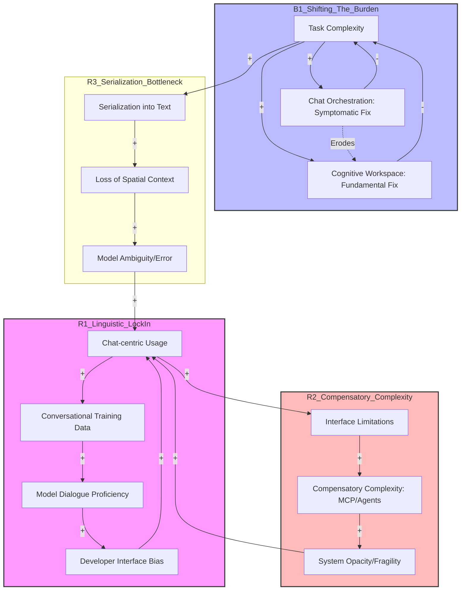

# Systems Thinking Analysis

**System:** The current AI interface ecosystem, characterized by the 'Chat-centric' paradigm (where tools are added to chat), contrasted with the proposed 'Tool-centric' or 'Cognitive Workspace' paradigm (where chat is embedded in tools).

**Time Horizon:** 6 months

**Started:** 2026-03-04 17:31:23

---

## System Structure

This analysis applies systems thinking to the transition from **Chat-centric AI** (the current dominant paradigm) to **Cognitive Workspaces** (the emerging tool-centric paradigm).

---

### 1. Key Components and Variables

**Components:**
*   **The Interface (The Boundary):** Currently a "Chat Box" (serial/linguistic); proposed as a "Canvas/Workspace" (spatial/structural).
*   **The Model (The Engine):** LLMs optimized for next-token prediction.
*   **The User (The Governor):** The source of intent and the bearer of cognitive load.
*   **The Data Loop (The Feedback Mechanism):** Interaction logs used for Fine-Tuning and RLHF.
*   **Compensatory Layers:** RAG (Retrieval-Augmented Generation), MCP (Model Context Protocol), and Agentic Frameworks.

**Variables:**
*   **Linguistic Density:** The ratio of text-based interaction to action-based interaction.
*   **Cognitive Load (User):** The mental effort required for orchestration, memory, and prompt engineering.
*   **State Persistence:** The degree to which the system "remembers" the structure of a task without re-serialization.
*   **Deictic Resolution:** The ability of the system to understand "this" or "that" (spatial grounding).

---

### 2. Mapping Relationships: Feedback Loops & Archetypes

#### A. The "Chat Begets Chat" Reinforcing Loop (Success to the Successful)
This loop creates a **lock-in effect**. 
1.  **Interaction:** Users interact via chat because it is the primary interface.
2.  **Data Accumulation:** This generates massive volumes of linguistic interaction data (Chat logs).
3.  **Training Optimization:** Models are fine-tuned on these logs to become better at... chatting.
4.  **Interface Rigidity:** Because models are "chat-optimized," developers build chat-centric interfaces to play to the model's strengths.
*   *Result:* The system reinforces a **linguistic constraint**, making it harder to justify investing in structured, non-verbal UI components.

#### B. "Shifting the Burden" (The Cognitive Labor Archetype)
In this archetype, a "symptomatic solution" (Chat) is used to address a "fundamental problem" (Complex Task Execution).
*   **Symptomatic Solution:** Using natural language to describe complex structures (e.g., "Move the second paragraph to the end and make it a list").
*   **Fundamental Solution:** A spatial interface where the user directly manipulates the object.
*   **The Shift:** Because the interface is a "dumb" text box, the **burden of orchestration** (planning, memory, and state tracking) is shifted from the system to the user’s working memory.
*   **Side Effect:** The user experiences "Prompt Fatigue," and the system remains "state-blind."

#### C. Compensatory Complexity (The Escalation Loop)
As chat interfaces fail to handle complex workflows, the industry adds layers like **RAG, MCP, and Agent Frameworks**.
*   These are **balancing loops** intended to fix the "serialization bottleneck."
*   *Unintended Consequence:* They increase system entropy. Instead of a simple interface change, we build "Agents" to talk to "Tools" to talk to "Databases," all while trying to funnel the output back into a 1D chat string. This maintains a **suboptimal equilibrium** where the interface remains the bottleneck.

---

### 3. Stocks and Flows

**Stocks (Accumulations):**
*   **Linguistic Interaction Data (High Stock):** A massive reservoir of "how people talk to AI."
*   **Structural/Spatial Data (Low Stock):** A very small reservoir of "how AI interacts with UI elements/canvases."
*   **User Mental Models:** The accumulated expectation that AI = Chat.
*   **Technical Debt:** The accumulation of "wrappers" and "agentic logic" built to bypass chat limitations.

**Flows:**
*   **Inflow of Complexity:** The rate at which new tools (MCP) are added to the chat ecosystem.
*   **Outflow of Cognitive Energy:** The user’s mental effort flowing into the system to maintain context.
*   **Serialization Flow:** The process of turning a multi-dimensional idea into a linear string of text (The Bottleneck).

---

### 4. Information Flows and Decision Points

*   **The Serialization Bottleneck:** Information flows from the User's brain (3D/Spatial) $\rightarrow$ Chat Box (1D/Linear) $\rightarrow$ Model (High-dimensional Vector Space). The 1D bottleneck causes massive information loss.
*   **Lack of Deixis (Selection):** In a chat-centric system, the "Decision Point" is linguistic. The user must *describe* the object of interest. In a cognitive workspace, the decision point is *spatial* (clicking, highlighting).
*   **The "Inversion" Decision Point:** The 6-month horizon marks a critical junction. 
    *   *Path A (Status Quo):* Chat-in-Tool (e.g., a sidebar in Word). The tool remains a legacy container.
    *   *Path B (Cognitive Workspace):* Tool-in-Chat (e.g., Claude Artifacts, Cursor). The "chat" becomes the scaffolding for a dynamic, generative UI.

---

### 5. Leverage Points: Inverting the Inversion

To move from a Chat-centric to a Tool-centric paradigm, we must identify the highest leverage intervention:

1.  **Primary Leverage Point: Spatial Grounding (Deixis).**
    *   By introducing a "shared visual state" (a canvas), we break the serialization bottleneck. The model no longer needs to "describe" the world; it can "mutate" the world.
2.  **Structural Constraints over Linguistic Freedom:**
    *   Reducing the "freedom" of the chat box in favor of "structured inputs" (sliders, nodes, blocks) reduces the model's search space and the user's cognitive load.
3.  **Data Re-Orientation:**
    *   The system must begin capturing "Action Logs" (User clicked X, Model modified Y) rather than just "Chat Logs." This creates a new reinforcing loop where models become optimized for **State Manipulation** rather than just **Conversation**.

### Summary of the 6-Month Horizon
The system is currently in a state of **Compensatory Complexity**. We are over-engineering the "back-end" (Agents/MCP) to compensate for a "front-end" (Chat) that is structurally incapable of handling complex cognitive labor. The leverage point is not a better LLM, but a **spatial interface** that allows for direct manipulation, effectively "inverting" the interface so that the chat serves the tool, rather than the tool serving the chat.

---

## Feedback Loops

This analysis applies system dynamics to the current AI interface evolution, focusing on the transition from Chat-centric to Tool-centric paradigms.

### 1. Reinforcing Loops (R)

**R1: The Linguistic Lock-in (Chat Begets Chat)**
*   **Description**: A data-driven reinforcing loop where the prevalence of chat interfaces generates a specific type of training data (linear dialogue), which optimizes models for chat, further incentivizing developers to build chat-centric interfaces.
*   **Causal Chain**: Chat-centric Interface Usage → Accumulation of Conversational Training Data → Increased Model Proficiency in Dialogue → Developer Preference for Chat Interfaces → Chat-centric Interface Usage.
*   **Behavior**: Exponential growth in chat-based interactions and a "lock-in" effect that makes non-linguistic interfaces (spatial/GUI) seem "less compatible" with current LLMs.
*   **Impact**: **High**. This is the primary structural barrier to the "Cognitive Workspace."

**R2: Compensatory Complexity (The Patchwork Trap)**
*   **Description**: As chat interfaces fail to handle complex tasks, developers add "patches" (RAG, MCP, Agent Frameworks) to maintain the chat paradigm rather than redesigning the interface.
*   **Causal Chain**: Chat Interface Limitations → Implementation of Complex Middleware (Agents/MCP) → Increased System Opacity/Fragility → Need for more Chat-based Debugging/Orchestration → Chat Interface Limitations.
*   **Behavior**: Escalating technical debt and system fragility. The system becomes a "Rube Goldberg machine" where the user spends more time managing the AI than doing the work.
*   **Impact**: **Medium**. It creates a "suboptimal equilibrium" that feels like progress but increases the "serialization bottleneck."

**R3: The Serialization Bottleneck (The Deixis Deficit)**
*   **Description**: Complex, multi-dimensional tasks are forced through the "needle's eye" of a text box. This strips away spatial context, leading to errors that require more text to fix.
*   **Causal Chain**: Task Dimensionality → Serialization into Text (Chat) → Loss of Spatial Context/Deixis → Model Ambiguity/Hallucination → Increased Corrective Prompting (More Text) → Task Dimensionality.
*   **Behavior**: Vicious cycle of "prompt engineering" where the user provides more and more linguistic instruction to compensate for the lack of a "point-and-click" or "select" mechanism.
*   **Impact**: **High**. This is the primary source of user frustration in complex workflows.

---

### 2. Balancing Loops (B)

**B1: Shifting the Burden (The Symptomatic Fix)**
*   **Description**: An archetype where a "symptomatic fix" (using Chat to orchestrate tools) is used to address a problem, which undermines the "fundamental fix" (building a unified Cognitive Workspace).
*   **Causal Chain**: Task Complexity → Chat-based Orchestration (Symptomatic Fix) → Temporary Task Completion → Reduced Pressure to Develop Integrated Tools (Fundamental Fix) → Reliance on Chat → Task Complexity.
*   **Behavior**: Stagnation. The system stays "good enough" to prevent a paradigm shift, but never becomes efficient. The cognitive labor of "planning and memory" remains with the user.
*   **Impact**: **High**. This explains why we are stuck in the "Chat-in-Tool" phase.

**B2: Cognitive Load Equilibrium**
*   **Description**: As the AI takes over more linguistic generation, the user's cognitive load shifts from "writing" to "verifying and orchestrating."
*   **Causal Chain**: AI Output Volume → User Verification Load → User Fatigue/Reduced Attention → Decreased Prompt Quality → AI Output Volume (Lowered/Throttled).
*   **Behavior**: A self-limiting loop where the user's ability to supervise the AI becomes the ceiling for the system's utility.
*   **Impact**: **Medium**. This loop prevents "Agentic Flight" (where agents run wild) but also limits the speed of the 6-month evolution.

---

### 3. Mermaid Diagram: The AI Interface System

---

### 4. Systems Analysis Insights

#### The "Chat Begets Chat" Lock-in
The reinforcing loop **R1** is the most dangerous. Because we interact with models via chat, we generate chat logs. These logs are the highest-quality data for the next generation of models. This creates a **path dependency** where the model becomes a "linguistic specialist," making it increasingly difficult to justify a "spatial" or "tool-centric" interface because the model isn't trained to "understand" a canvas or a structured workspace as natively as it understands a dialogue.

#### Shifting the Burden (The Leverage Point)
The **B1** loop identifies the primary leverage point: **Inverting the Inversion.** 
Currently, we use Chat to call tools (Symptomatic Fix). The fundamental fix is to **embed Chat within the Tool.** 
*   **Leverage Point**: Stop optimizing the "Agent Framework" (Middleware) and start optimizing the "Shared State" (The Workspace). 
*   By creating a shared visual/spatial state (like a canvas or a structured document), we break the **Serialization Bottleneck (R3)**. Instead of describing a change ("Move the blue box to the left"), the user performs a **deictic action** (Selection + Command), which reduces the linguistic load and the probability of model error.

#### Unintended Consequences of Compensatory Complexity
The growth of **R2** (MCP, RAG, Agentic Frameworks) is a classic case of "Compensatory Complexity." We are building massive architectural scaffolds to keep the "Chat Box" relevant. Within 6 months, the weight of this complexity will likely lead to a "performance plateau" where the latency and error rates of multi-agent chat orchestration become unacceptable, forcing a collapse toward simpler, tool-centric "Cognitive Workspaces."

---

## Delays & Accumulations

This analysis applies systems thinking to the transition from **Chat-centric** (Tool-in-Chat) to **Tool-centric** (Chat-in-Tool) paradigms over a 6-month horizon.

---

### 1. Delays: Time Lags Between Cause and Effect

In the current AI ecosystem, delays are not just latency (ms); they are semantic and structural lags that prevent the system from reaching a "flow state."

#### A. Information Delays: The "Contextual Re-indexing" Lag
*   **Cause:** In a chat-centric model, every time a user switches tasks or provides a new instruction, the model must re-process the entire context window or wait for RAG (Retrieval-Augmented Generation) to fetch relevant snippets.
*   **Effect:** A "semantic stutter" where the model loses track of the current state of the tool (e.g., the specific line of code or the specific cell in a spreadsheet).
*   **Estimated Time Scale:** **10–30 seconds** per interaction cycle. Over a 6-month period, this accumulates into hundreds of hours of "contextual drift" where the user is correcting the AI's outdated understanding of the workspace.

#### B. Decision Delays: The "Serialization Bottleneck"
*   **Cause:** Chat forces a **linearization** of non-linear thoughts. To change a UI component, the user must describe it linguistically rather than pointing (deixis).
*   **Effect:** The "Prompt Engineering Tax." The user delays action to formulate a precise linguistic command.
*   **Estimated Time Scale:** **1–2 minutes** of cognitive formulation per complex edit. In a tool-centric workspace (like Cursor or Canvas), this delay drops to **<2 seconds** via direct manipulation/selection.

#### C. Training Data Feedback Delays: The "Architecture Lock-in"
*   **Cause:** Models are currently trained on chat logs (RLHF). The delay exists between the *deployment* of a new interface (like a cognitive workspace) and the *accumulation* of high-quality interaction data from that interface to fine-tune the next model.
*   **Estimated Time Scale:** **3–6 months.** We are currently using models optimized for "talking" to perform "doing," because the data for "doing" (spatial interactions, tool-use traces) hasn't reached critical mass yet.

---

### 2. Accumulations (Stocks): What Builds Up and Depletes

#### A. Stock: Contextual Debt (The "Chat-Begets-Chat" Loop)
*   **Inflow:** Every prompt and response adds tokens to the history.
*   **Outflow:** Context window limits and "forgetting" (attention dilution).
*   **Behavior:** In chat-centric systems, **Contextual Debt** accumulates rapidly. The more you talk, the more "noise" (previous failed attempts, clarifications) the model must process. This creates a reinforcing loop: **Noise → Misunderstanding → More Chat to Clarify → More Noise.**
*   **Impact:** By month 6, users in chat-centric systems feel "trapped" in long threads, often forced to start new chats to "clear the air," losing all incremental progress.

#### B. Stock: User Cognitive Load (The "Shifting the Burden" Archetype)
*   **Inflow:** The user must maintain the "Mental Map" of the project because the chat interface is transient and scrolling.
*   **Outflow:** Mental fatigue and errors.
*   **Behavior:** The system shifts the burden of **State Management** to the user. The AI "forgets" the big picture, so the user must "hoard" the project structure in their own memory.
*   **Impact:** This depletes the user's creative energy. The "Cognitive Workspace" aims to reverse this by moving the "State" stock from the user's head to the visual interface.

#### C. Stock: Compensatory Complexity (The "Band-Aid" Accumulation)
*   **Inflow:** Adding RAG, MCP (Model Context Protocol), and Agentic wrappers to fix chat's inherent limitations.
*   **Outflow:** System simplification/refactoring (rarely happens).
*   **Behavior:** We are accumulating a massive stock of **Middleware**. Instead of fixing the interface (the root cause), we add layers to manage the chat's inability to see the tool.
*   **Impact:** This creates a "Suboptimal Equilibrium." The system becomes so complex to maintain that moving to a clean "Tool-centric" architecture becomes a high-risk migration.

---

### 3. Impact: System Behavior and Leverage Points

#### The "Serialization Bottleneck" and the 6-Month Horizon
The primary impact of these delays and accumulations is the **Serialization Bottleneck**. Because chat is a 1D pipe (text) trying to manage a 2D or 3D task (software, design, research), the system oscillates. You get bursts of productivity followed by long periods of "context repair."

*   **Unintended Consequence of Compensatory Complexity:** By using MCP or RAG to "patch" chat, we actually *strengthen* the lock-in. We make the chat-centric model "just good enough" to discourage the radical UI shift required for a true cognitive workspace. This is a **Success to the Successful** archetype where the dominant (but inferior) paradigm starves the emerging one of resources.

#### Leverage Point: "Inverting the Inversion"
The leverage point is not "better prompts" or "larger context windows." It is **Spatial Grounding (Deixis).**

*   **The Intervention:** Shift the primary "Stock" of the system from the **Chat Log** to the **Artifact**.
*   **Mechanism:** When the AI can "see" what the user is "pointing at" (selection-based interaction), the **Information Delay** drops to near zero. The model no longer needs to "guess" the context; the context is the coordinates of the cursor.
*   **Result:** This breaks the "Chat-begets-chat" loop. If the user can modify the tool directly, the inflow to the "Contextual Debt" stock stops. The system moves from a **Linguistic Constraint** (describing the world) to a **Structural Constraint** (manipulating the world).

### Summary Table: 6-Month Outlook

| Feature | Chat-Centric (Current) | Tool-Centric (Emerging) | System Impact |
| :--- | :--- | :--- | :--- |
| **Primary Stock** | Chat History (High Noise) | The Artifact (High Signal) | Reduced Contextual Debt |
| **Feedback Delay** | High (Prompt -> Gen -> Read) | Low (Action -> Visual Update) | Increased Flow State |
| **Cognitive Load** | User manages project state | System manages project state | Reduced User Burnout |
| **Data Loop** | Training on "Talking" | Training on "Editing" | Higher Model Utility |

**Conclusion:** Over the next 6 months, the systems that survive will be those that aggressively deplete the "Chat History" stock and invest in the "Spatial State" stock. The "Serialization Bottleneck" is the greatest drag on AI productivity; "Inverting the Inversion" by making chat a secondary observer to a primary workspace is the only way to bypass it.

---

## System Archetypes

This analysis applies system dynamics archetypes to the current AI interface landscape, focusing on the tension between the dominant **Chat-centric** model and the emerging **Cognitive Workspace** paradigm.

---

### 1. Shifting the Burden (The Cognitive Labor Transfer)
**Manifestation:**
In the chat-centric paradigm, the "symptomatic fix" for complex tasks is to provide a more powerful model or a longer context window. However, the "fundamental solution"—a structured workspace that manages state, spatial relationships, and task orchestration—is ignored. Consequently, the burden of **orchestration, memory, and planning** shifts from the system to the user.

**Typical Behavior Pattern:**
The user experiences initial success with simple queries, but as the task complexity grows, they find themselves "babysitting" the AI. They must manually track versions, copy-paste code snippets, and repeatedly remind the model of context. This leads to "Prompt Fatigue" and a reliance on the symptomatic fix (better models) rather than better interfaces.

**Intervention Strategies:**
*   **Cognitive Offloading:** Design interfaces that handle "state management" (e.g., persistent sidebars for variables, code, or document outlines).
*   **Externalize the Mental Model:** Move from a blank text box to a "Canvas" where the AI’s internal "reasoning" is mapped to spatial elements the user can manipulate.

---

### 2. Success to the Successful (The "Chat Begets Chat" Loop)
**Manifestation:**
This is the primary driver of the current lock-in. Because the first successful LLM interfaces were chat-based (ChatGPT), the vast majority of high-quality interaction data (RLHF, SFT) is formatted as "User: [Text] / Assistant: [Text]." Models are then trained on this data, making them exceptionally good at chatting but mediocre at structured tool manipulation or spatial reasoning.

**Typical Behavior Pattern:**
A reinforcing loop where:
1. Models are good at chat $\rightarrow$ 2. Developers build chat interfaces $\rightarrow$ 3. Users generate chat data $\rightarrow$ 4. Models are trained on more chat data $\rightarrow$ 1. Models get even better at chat.
This creates a "competency trap" where structured, tool-centric interfaces feel "clunky" because the models aren't optimized for them, further justifying the chat-centric approach.

**Intervention Strategies:**
*   **Data Diversification:** Intentionally generate and train on "Action-State-Result" traces rather than just "Prompt-Response" pairs.
*   **Inverting the Inversion:** Build "headless" agents that interact with UI components directly, creating a new data stream of non-linguistic interactions.

---

### 3. Fixes that Fail (Compensatory Complexity)
**Manifestation:**
To address the inherent limitations of chat (lack of memory, inability to use complex tools, hallucination), the industry has introduced "Compensatory Complexity": RAG (Retrieval-Augmented Generation), MCP (Model Context Protocol), and complex Agentic Frameworks. While these "fix" specific problems, they create a more fragile, high-latency, and expensive system.

**Typical Behavior Pattern:**
Every time a chat interface fails at a complex task, a new layer of middleware is added. This creates a "Rube Goldberg" architecture where the user is still stuck in a 1D text box, but behind the scenes, a dozen agents are fighting for context. The unintended consequence is **Systemic Fragility**: the more "fixes" added, the harder it is to predict or debug the output.

**Intervention Strategies:**
*   **Architectural Simplification:** Instead of adding RAG to a chat box, embed the chat *inside* the data source (e.g., a chat-enabled IDE or spreadsheet).
*   **Structural Grounding:** Use "Deixis" (the ability to point at things). If a user can select a specific paragraph, you don't need a complex RAG retrieval loop to "guess" what they are talking about.

---

### 4. Limits to Growth (The Serialization Bottleneck)
**Manifestation:**
Chat is a **1D linear interface** (a stream of tokens). Complex cognitive work is **multi-dimensional and non-linear**. As the complexity of the task grows, the "serialization bottleneck"—the need to turn every thought, action, and result into a string of text—creates a ceiling on productivity.

**Typical Behavior Pattern:**
Growth in task performance is rapid at first but plateaus as the user spends more time "formatting" their intent into text than actually doing the work. The "Limit" is the human bandwidth for reading and writing text. No matter how fast the LLM is, the interface cannot exceed the user's reading speed or the "narrow pipe" of the chat window.

**Intervention Strategies:**
*   **Spatial Grounding:** Move from "Serialization" (describing a change) to "Direct Manipulation" (clicking/dragging to change).
*   **High-Bandwidth UI:** Use visual representations (graphs, timelines, heatmaps) to communicate model confidence and state, bypassing the linguistic bottleneck.

---

### Summary of Leverage Points

| Archetype | Leverage Point | Action |
| :--- | :--- | :--- |
| **Shifting the Burden** | **The Goal** | Change the system goal from "Natural Conversation" to "Task Completion Efficiency." |
| **Success to the Successful** | **The Inputs** | Break the loop by creating synthetic training data based on UI interactions, not just chat logs. |
| **Fixes that Fail** | **The Structure** | Stop patching the chat box; move the "Intelligence" into the "Tool" (Chat-in-Tool). |
| **Limits to Growth** | **The Constraint** | Introduce **Deixis** (selection/pointing) to break the 1D serialization bottleneck. |

**The Primary Leverage Point:**
The most effective intervention is **"Inverting the Containment."** Currently, tools are "plugins" inside a chat window (Tool-in-Chat). To move to a cognitive workspace, the chat must become a "feature" inside a structured tool (Chat-in-Tool). This allows the tool to maintain the **Structural Constraints** while the LLM provides the **Linguistic Flexibility**.

---

## Emergent Behavior

This analysis applies systems thinking to the transition from **Chat-centric** (Linear/Linguistic) to **Tool-centric** (Spatial/Structural) AI interfaces over a 6-month horizon.

---

### 1. Current Emergent Patterns: The "Serialization Bottleneck"
The interaction between a high-dimensional model and a 1D chat interface produces several distinct system-level behaviors:

*   **The "Chat Begets Chat" Reinforcing Loop ($R_1$):** 
    Current interfaces capture data as linear dialogues. This data feeds back into training sets, optimizing models for conversational fluency rather than structural manipulation. The emergent behavior is **Linguistic Mimicry**: models become better at *talking about* tasks than *executing* them within a stateful environment.
*   **Deictic Blindness:** 
    Because the interface lacks spatial grounding (the ability to point/select), an emergent pattern of **"Description Overload"** occurs. Users must use language to describe what they see ("The third paragraph in the second section..."), creating a high error rate in reference resolution.
*   **Contextual Dilution:** 
    As the "Stock" of the chat history grows, the "Signal-to-Noise Ratio" drops. The emergent behavior is **Model Hallucination via Attention Drift**, where the model loses the "thread" of the task because the interface treats "Hello" and "Refactor this 500-line function" as equal-weight events in the linear stream.

### 2. Unintended Consequences: "Compensatory Complexity"
The system is currently exhibiting the **"Fixes that Fail"** archetype. Instead of changing the interface structure, we add layers of complexity to patch the chat paradigm's flaws.

*   **The RAG/MCP Bloat:** 
    To solve the lack of grounding, we develop Model Context Protocols (MCP) and RAG pipelines. While useful, the unintended consequence is **Architectural Fragility**. We are building "scaffolding around a straw house," where the complexity of managing the retrieval system exceeds the complexity of the task itself.
*   **The "User-as-Orchestrator" Tax:** 
    In the **"Shifting the Burden"** archetype, the system *should* manage the state, but it shifts this cognitive labor to the user. The user becomes the "Manual Linker" between the Chat window and the Code/Document window. This leads to **Cognitive Fragmentation**, where the user spends more energy on "context switching" than on "deep work."
*   **Prompt Engineering as a "Workaround" for UI Failure:** 
    Prompt engineering is an emergent behavior resulting from a lack of UI controls. It is a linguistic hack to simulate structural constraints (e.g., "Output only JSON").

### 3. Future Predictions (6-Month Horizon)
Over the next 6 months, we will see a transition from "Chat-with-Tools" to "Tools-with-Intelligence."

*   **The Rise of "Artifact-Centric" Interaction:** 
    Interfaces will move toward "Sidecar Intelligence" (e.g., Claude Artifacts, OpenAI Canvas). The emergent behavior will be **State-Persistent Collaboration**, where the model and user modify a shared object (the "Stock") rather than sending messages (the "Flow").
*   **Bimodal Data Generation:** 
    We will see the first significant "Stock" of **Action-Trace Data** (logs of models interacting with UI elements). This will begin to break the "Chat begets chat" loop, allowing for models trained specifically on *manipulation* rather than *conversation*.
*   **The "Agentic Friction" Wall:** 
    As users deploy more agents, the chat interface will become unusable due to notification/message flooding. This will force a shift toward **Dashboard-centric AI**, where agents report status via visual indicators rather than text blocks.

### 4. Tipping Points: Thresholds of Transformation
There are two critical thresholds that will trigger a phase transition in the ecosystem:

*   **The Deixis Threshold (Selection-as-Input):** 
    The moment "Selection" (highlighting text/code) becomes a first-class citizen in the model's attention mechanism, the **Serialization Bottleneck** breaks. This is the leverage point for "Inverting the Inversion." Once the model "sees" what the user "touches," the need for descriptive prompting collapses.
*   **The Latency-Consistency Cross:** 
    When the delay between a UI action and an AI suggestion drops below ~200ms (the human perception of "instant"), the system moves from "Asynchronous Consultant" to **"Synchronous Extension of the Self."** This changes the user's mental model from "Talking to a bot" to "Using a smart tool."

### 5. Resilience: Systemic Inertia vs. Evolution
*   **Resistance to Change (Negative Resilience):** 
    The current chat paradigm is highly resilient because of **Network Effects** and **User Habituation**. Millions of users have been "trained" to chat. This creates a "Success to the Successful" archetype where chat-based startups get more funding/users, further starving structural interface innovation.
*   **Disruptive Resilience (The Multimodal Shift):** 
    The system's resilience is being challenged by **Multimodal Inputs** (Vision/Voice). If a model can see the screen, the "Chat" box becomes a vestigial organ. The system responds to this disruption by evolving toward **Spatial Computing**, where the "Interface" is the entire desktop, not a window.

---

### Summary: The Leverage Point
The primary leverage point for **"Inverting the Inversion"** (moving from Chat-centric to Cognitive Workspace) is **Spatial Grounding (Deixis).** 

By moving the "Stock" of information from the *Chat History* to a *Shared Canvas*, we eliminate the "Shifting the Burden" archetype. The model no longer needs to "remember" the context through a text stream; it simply "observes" the current state of the workspace. This reduces cognitive load, eliminates the serialization bottleneck, and allows the model to function as a co-processor rather than a conversationalist.

---

## Leverage Points

This analysis applies Donella Meadows’ leverage points to the transition from a **Chat-centric** (linear/serialized) to a **Tool-centric** (spatial/cognitive workspace) AI ecosystem.

---

### 1. Paradigms: From "AI as Conversationalist" to "AI as Co-Processor"
*   **Intervention:** Shift the fundamental design mindset from *mimicking human conversation* to *augmenting human cognition within a shared state.*
*   **Why it’s High-Leverage:** Paradigms are the source of systems. The "Chat-centric" paradigm assumes the goal is a "helpful response." The "Cognitive Workspace" paradigm assumes the goal is "state transformation." Changing this mindset instantly renders "Compensatory Complexity" (like prompt engineering) obsolete because the interface itself handles the structure.
*   **Impact:** High (System-wide transformation).
*   **Risks:** High "uncanny valley" for users used to chat; requires a total rewrite of UI/UX patterns.
*   **Implementation:** Design interfaces where the "Canvas" or "Document" is the primary object, and the AI is a set of "affordances" (buttons, sliders, contextual actions) rather than a separate entity you talk to.

### 2. Goals: Measuring "Cognitive Offload" vs. "Token Throughput"
*   **Intervention:** Replace metrics like "Session Length" or "Tokens per Second" with "Task Completion Time" and "User Interaction Density" (how much the user has to type vs. how much the system understands).
*   **Why it’s High-Leverage:** Systems behave according to what is measured. Current "Chat begets chat" loops are driven by engagement metrics. If the goal is "Cognitive Offload," the system is incentivized to reduce the "Serialization Bottleneck" by providing high-bandwidth spatial tools (selection, dragging, visual editing).
*   **Impact:** High.
*   **Risks:** Hard to quantify "cognitive load" objectively; may conflict with current ad-based or usage-based business models.
*   **Implementation:** Develop telemetry that tracks "Undo" rates and "Re-prompting" frequency as failures of the interface, not the model.

### 3. Self-Organization: Spatial Deixis and Structural Grounding
*   **Intervention:** Evolve the interface structure to support **Deixis** (the ability to point at things: "Fix *this* part of the code").
*   **Why it’s High-Leverage:** This addresses the "Serialization Bottleneck." By allowing the user to select a specific node in a graph or a line in a document, you bypass the need for the user to describe the context in text. This changes the system's structure from a 1D stream to a 2D/3D workspace.
*   **Impact:** High.
*   **Risks:** Requires new protocols (like MCP) to be deeply integrated into the UI layer, not just the backend.
*   **Implementation:** Implement "Artifacts" (as seen in Claude) or "Inline Edits" (as seen in Cursor) where the AI acts directly on the object of interest rather than talking about it.

### 4. Rules: Incentivizing "Tool-Use" over "Chat-Fluency" in RLHF
*   **Intervention:** Change the Reinforcement Learning from Human Feedback (RLHF) reward functions to penalize "verbose explanations" and reward "correct state changes" in the tool.
*   **Why it’s High-Leverage:** This breaks the "Chat begets chat" reinforcing loop at the training level. If the model is rewarded for being a "silent executor" rather than a "chatty assistant," the linguistic constraints of the interface begin to dissolve.
*   **Impact:** Medium/High.
*   **Risks:** Models might become "curt" or difficult for novice users to understand without the conversational safety net.
*   **Implementation:** Train models on "Action-State-Result" datasets rather than "Instruction-Response" datasets.

### 5. Information Flows: Bi-directional State Synchronization (The "Model-View-Controller" for AI)
*   **Intervention:** Establish a real-time, bi-directional flow between the Model's "latent space" and the Tool's "UI state."
*   **Why it’s High-Leverage:** Currently, the model only sees a "snapshot" of the tool via text. If the model has a direct "view" into the tool's data structure (e.g., via MCP), the "Shifting the Burden" archetype is reversed. The system, not the user, manages the memory and orchestration of the task.
*   **Impact:** Medium.
*   **Risks:** Massive increase in context window pressure; security/privacy concerns regarding what the model "sees."
*   **Implementation:** Use the Model Context Protocol (MCP) to create a "Shared Memory" layer where the AI and the UI are always in sync.

### 6. Reinforcing Loops: Breaking the "Chat-Data" Feedback Loop
*   **Intervention:** Deliberately inject "Tool-centric" interaction data into training sets to counter the dominance of chat logs.
*   **Why it’s High-Leverage:** The system is currently locked in a loop: Chat UI -> Chat Data -> Chat-optimized Models -> Chat UI. By creating synthetic data of humans interacting with *spatial* tools, we create a new reinforcing loop that favors the "Cognitive Workspace."
*   **Impact:** Medium.
*   **Risks:** Synthetic data can lead to model collapse if not carefully curated.
*   **Implementation:** Use "Agentic Workflows" to generate logs of AI-to-Tool interactions, then fine-tune models on these logs to prioritize tool manipulation over conversation.

---

### Summary of the "Inversion" Strategy:

The primary leverage point for **"inverting the inversion"** (moving from Tool-in-Chat to Chat-in-Tool) is **Point 1: The Paradigm Shift.** 

As long as we view AI as a "person" we talk to, we will remain trapped in the **Serialization Bottleneck**. The moment we view AI as a **"dynamic substrate"** for our tools, the interface naturally evolves into a **Cognitive Workspace**. 

**The 6-month winning move:** Focus on **Spatial Deixis (Point 3)**. By allowing users to "point and click" to provide context, you immediately reduce the cognitive load shifted to the user, making the "Chat-centric" model feel sluggish and obsolete by comparison.

---

## Synthesis & Recommendations

This systems thinking analysis explores the transition from the **Chat-centric Paradigm** (where the LLM is a conversationalist) to the **Cognitive Workspace Paradigm** (where the LLM is a co-processor within a structured environment).

---

### 1. Key Insights
*   **The Serialization Bottleneck:** Chat interfaces force high-dimensional cognitive tasks (designing, coding, planning) into a 1D linear stream. This creates a "bottleneck" where the user must translate spatial thoughts into text, and the model must reconstruct the user's intent from that text.
*   **The Linguistic Trap:** We are currently in a reinforcing loop where models are trained on chat logs, making them better at *talking about work* rather than *performing work*. This creates a "local optimum" that is difficult to escape.
*   **State vs. Stream:** In chat, "state" is ephemeral and buried in the context window. In a cognitive workspace, "state" is externalized in the UI (a canvas, a file tree, a diagram), reducing the model's and user's cognitive load.
*   **Compensatory Complexity:** Current innovations like RAG, MCP (Model Context Protocol), and complex Agent Frameworks are "patches" designed to fix the inherent limitations of the chat interface rather than evolving the interface itself.

### 2. System Behavior Summary
The current system behaves as a **Path-Dependent Equilibrium**. Because chat was the first successful interface for LLMs, the entire ecosystem (data collection, model tuning, user habits) has optimized for it. 
*   **Why:** It has the lowest barrier to entry (natural language). 
*   **The Result:** As task complexity increases, the system exhibits **"Compensatory Complexity"**—users spend more time managing the "context window" and "prompt engineering" than doing the actual task. The system is currently "Shifting the Burden" of orchestration to the human user.

### 3. Critical Feedback Loops

#### R1: The "Chat Begets Chat" Loop (Reinforcing)
*   **Mechanism:** Users use chat $\rightarrow$ Data is logged as chat $\rightarrow$ Models are fine-tuned on chat data $\rightarrow$ Models become more "chatty" $\rightarrow$ Interfaces remain chat-centric.
*   **Impact:** This loop creates a **Lock-in Effect**, making it harder for developers to justify building structured UIs because the models aren't yet optimized to interact with them.

#### B1: The Complexity Ceiling (Balancing)
*   **Mechanism:** Task Complexity $\uparrow$ $\rightarrow$ Chat Friction $\uparrow$ (scrolling, re-prompting, loss of context) $\rightarrow$ User Utility $\downarrow$.
*   **Impact:** This loop limits the "ceiling" of what AI can do. Without spatial grounding (the ability to point at something), complex orchestration becomes too "noisy" for the user to manage.

#### Archetype: Shifting the Burden
*   **The Problem:** Managing the "state" of a complex project.
*   **The Symptomatic Solution:** The user manually copies/pastes code, manages long prompts, and reminds the AI of previous constraints (Chat-centric).
*   **The Fundamental Solution:** An interface that maintains state automatically (Tool-centric).
*   **Side Effect:** The symptomatic solution leads to "Prompt Fatigue" and high error rates in long-term projects.

### 4. Highest-Impact Leverage Points

1.  **Inverting the Container (Structure over Stream):** 
    *   *Action:* Move from "Tool-in-Chat" (Plugins) to "Chat-in-Tool" (Sidecars/Embedded). 
    *   *Why:* This allows the tool to maintain the "Source of Truth" (the stock), while chat acts as the "Flow" of instructions.
2.  **Deixis and Spatial Grounding (Selection as Input):**
    *   *Action:* Implement "Selection-aware" models. The primary input should not be a prompt, but a *selection* in the workspace + a command.
    *   *Why:* This eliminates the serialization bottleneck. "Fix this" (pointing at a specific line of code) is more efficient than "In the third function of the second file, change X to Y."
3.  **Externalizing the Context Window:**
    *   *Action:* Use the UI as the model's "Long-term Memory." 
    *   *Why:* Instead of the model trying to remember everything in its 128k context window, it should "read" the current state of the workspace.

### 5. Implementation Roadmap (6-Month Horizon)

*   **Month 1-2: Protocol Standardization (The MCP Phase)**
    *   Adopt the Model Context Protocol (MCP) to allow models to see tools as structured data rather than just text.
    *   *Goal:* Establish a common language between the model and the workspace.
*   **Month 3-4: The "Artifacts" Transition**
    *   Move from text responses to "Artifacts" (rendered code, live previews, diagrams).
    *   *Goal:* Create a persistent visual "Stock" that survives the chat "Flow."
*   **Month 5-6: Bi-directional State Sync**
    *   Enable the model to manipulate the UI directly (e.g., moving a card in a Kanban board) and the UI to update the model's prompt automatically.
    *   *Goal:* Achieve "Cognitive Workspace" status where the interface is the shared mental model.

### 6. Monitoring Metrics

*   **Token-to-Action Ratio:** How many tokens of chat are required to achieve one successful state change in the tool? (Lower is better).
*   **Re-prompting Rate:** How often does a user have to repeat a constraint that was already mentioned? (Indicates failure of state management).
*   **Deictic Efficiency:** Percentage of commands that use "this/that" (selection-based) vs. full-sentence descriptions.
*   **Context Window Churn:** How much of the context window is filled with "redundant state" vs. "new instructions."

### 7. Risks and Mitigation

*   **Risk: The "Glass Box" Problem.** Structured UIs can be more rigid than chat. If the UI doesn't have a button for a specific action, the user is stuck.
    *   *Mitigation:* Always maintain a "Command Palette" or "Natural Language Escape Hatch" that can override the UI.
*   **Risk: Training Data Scarcity.** There is very little data on how humans interact with "Cognitive Workspaces" compared to chat.
    *   *Mitigation:* Implement "Shadow Logging"—record how users interact with the UI in response to AI suggestions to build a new generation of "Action-Traces" for training.
*   **Risk: Latency in State Sync.** If the UI takes too long to update, the user loses the "flow" state.
    *   *Mitigation:* Use "Optimistic UI" updates and local small models (SLMs) to handle interface interactions, leaving the heavy reasoning to the cloud.

### Final Recommendation:
To "invert the inversion," developers must stop treating the LLM as a **chatbot** and start treating it as a **state-manager**. The leverage point is not a better prompt; it is a **shared coordinate system** between the user, the model, and the data.

---

## Analysis Complete

**Total Time:** 106.137s

**Completed:** 2026-03-04 17:33:09
