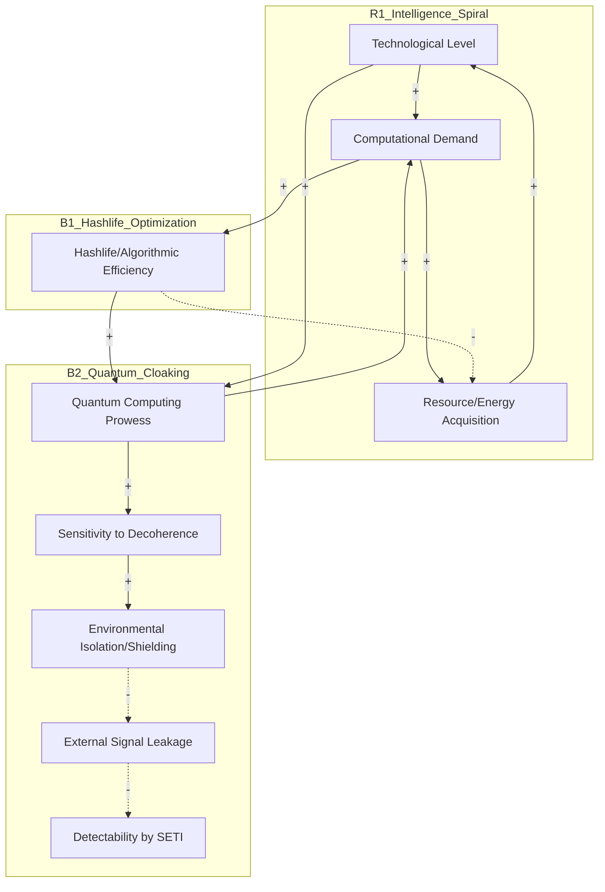

# Systems Thinking Analysis

**System:** The dynamics of interstellar civilization detection and the Fermi Paradox through the lens of quantum information theory, computational complexity (Hashlife), and macroscopic decoherence.

**Time Horizon:** 6 months

**Started:** 2026-03-05 08:52:54

---

## System Structure

This analysis applies system dynamics and complex adaptive systems theory to the Fermi Paradox, specifically focusing on the transition from a "Classical/Radiative" civilization to a "Quantum/Efficient" one.

---

### 1. Key Components and Variables

*   **Computational Density ($C_d$):** The amount of processing power per unit of matter/energy.
*   **Entropy Leakage ($S_l$):** The "waste" energy (heat, radio waves) dissipated into the interstellar medium.
*   **Algorithmic Optimization (Hashlife Factor):** The ability of a civilization to memoize reality—predicting outcomes without running the full physical simulation, thus saving energy.
*   **Quantum Coherence Threshold ($Q_t$):** The level of technological advancement where information is processed via entangled states rather than classical bits.
*   **Detection Probability ($P_d$):** The likelihood of an external observer identifying the civilization.
*   **Macroscopic Decoherence:** The environmental "noise" that breaks down quantum signals into classical randomness.

---

### 2. Mapping Relationships (Feedback Loops)

#### The "Hashlife" Balancing Loop (Efficiency vs. Visibility)
As a civilization’s **Technological Complexity** increases, it hits a resource limit. To continue growing, it must implement **Algorithmic Optimization** (Hashlife). 
*   **Logic:** Hashlife works by identifying patterns and skipping the computation of redundant states. 
*   **Feedback:** Increased Optimization $\rightarrow$ Decreased Energy Consumption per computation $\rightarrow$ Decreased **Entropy Leakage** $\rightarrow$ Decreased **Detection Probability**.
*   **System Behavior:** This is a **Balancing Loop**. The more "intelligent" the system becomes, the more it suppresses its own external signature. The system "disappears" into its own efficiency.

#### The Reinforcing Loop of Quantum Integration
*   **Logic:** As a civilization moves toward quantum computing, it requires higher levels of isolation from the environment to prevent decoherence.
*   **Feedback:** Better Isolation $\rightarrow$ Lower Noise $\rightarrow$ Higher Quantum Fidelity $\rightarrow$ More Advanced Isolation Technology.
*   **System Behavior:** This creates a **Reinforcing Loop** that accelerates the transition from a "loud" classical state to a "silent" quantum state.

---

### 3. Stocks and Flows

*   **Stock: Accumulated Computational Infrastructure.**
    *   *Inflow:* Resource extraction and conversion into "computronium."
    *   *Outflow:* Physical decay or "de-computation" (obsolescence).
*   **Stock: The Technosignature (The "Cloud" of evidence).**
    *   *Inflow:* Classical radio leakage, Dyson swarm infrared signatures, atmospheric pollutants.
    *   *Outflow:* **Quantum Cloaking** (the transition of signals from classical/detectable to quantum/encrypted/noise-like).
*   **Stock: Quantum Entanglement Resource (The "Quantum Internet").**
    *   *Inflow:* Generation of stable, error-corrected Bell pairs.
    *   *Outflow:* Decoherence due to interaction with the cosmic microwave background.

---

### 4. Information Flows and Decision Points

*   **The "Decoherence Boundary":** A critical decision point for a civilization. Do they broadcast classically to be "found" (high energy cost, high risk), or do they migrate their entire information stack to quantum-secure, low-leakage states?
*   **The Hashlife Intuition:** The system decides to "stop calculating the obvious." If a civilization can simulate the universe's evolution internally with high fidelity, its "need" to interact with the external physical world (and thus create detectable flows) drops toward zero.

---

### Addressing Specific Questions

#### How does the 'Hashlife' intuition represent a balancing feedback loop?
In system dynamics, a balancing loop seeks equilibrium. The "Hashlife" intuition suggests that as a civilization's computational needs grow exponentially, it must find a way to bypass the "Bremermann's Limit" (the maximum computational speed of matter). By using Hashlife-style memoization, the civilization stops "rendering" the parts of the universe it has already mastered. 
*   **The Balancing Effect:** The more "advanced" the civilization, the less "work" it appears to be doing. It balances its growth by reducing its physical footprint, eventually reaching a state of **computational invisibility**.

#### What are the primary accumulations required for 'Quantum First Contact'?
1.  **Coherent State Volume:** A massive stock of qubits maintained at near-zero decoherence.
2.  **Entanglement Distribution:** A physical network of "nodes" (satellites or probes) that have established quantum non-locality.
3.  **Algorithmic Parity:** The accumulation of "decoding keys" that recognize that what we perceive as "vacuum noise" is actually highly compressed, quantum-encrypted data. 
*   *First contact is not a radio signal; it is a "handshake" between two systems that have both reached the same level of quantum error correction.*

#### How does the 'Quantum Cloaking' effect function as an unintended consequence?
Technological advancement usually aims for **Efficiency** and **Privacy**. 
*   **Unintended Consequence:** As a civilization perfects its information transfer (moving toward the Shannon Limit), its signals become indistinguishable from white noise (maximum entropy). 
*   **The Result:** By the time a civilization is advanced enough to travel between stars, its communication methods have become so efficient that they are invisible to "primitive" (classical) observers. The "cloak" is not a camouflage suit; it is the natural result of **perfected information theory**.

#### Where is the most effective leverage point for resolving the Fermi Paradox?
According to this framework, the leverage point is **The Noise Floor (Macroscopic Decoherence Analysis).**
*   **Traditional Approach:** Looking for "signals" (low leverage, as advanced civilizations don't leak).
*   **Systems Leverage Point:** Analyzing the **statistical properties of cosmic noise.** If the Fermi Paradox is caused by Quantum Cloaking, the "evidence" of aliens is hidden in the patterns of what we currently call "random" quantum fluctuations or vacuum energy. 
*   **Action:** Shifting our detection systems from *Radio Telescopes* (classical) to *Quantum Bell-Test Interferometers* (quantum) to look for non-local correlations in the background radiation.

---

### Summary for the 6-Month Horizon
Over the next 6 months, the focus should not be on "listening" for messages, but on **characterizing the limits of our own decoherence.** If we can identify the point where our own "Hashlife" optimizations begin to hide our presence, we can reverse-engineer the "Technosignature" we should be looking for in others: **anomalous order within apparent randomness.**

---

## Feedback Loops

This analysis applies systems thinking to the Fermi Paradox, framing civilizational advancement not as a linear progression toward "galactic empire," but as a complex system governed by the constraints of quantum information and computational efficiency.

### 1. Reinforcing Loops (R)

**R1: The Intelligence-Complexity Spiral**
*   **Description**: As a civilization increases its technological capability, it generates more data and requires more complex simulations to solve existential problems, which in turn necessitates higher intelligence and better technology.
*   **Causal Chain**: Tech Level (+) → Computational Demand (+) → Resource/Energy Acquisition (+) → Tech Level (+)
*   **Behavior**: Exponential growth in internal complexity and energy consumption.
*   **Impact**: High. This is the primary engine of civilizational development.

**R2: The Entanglement Accumulation**
*   **Description**: The more a civilization utilizes quantum computing, the more "entangled" its internal infrastructure becomes. This creates a "gravity" of information where the value of staying connected to the central quantum processor outweighs the benefit of physical expansion.
*   **Causal Chain**: Quantum Integration (+) → Information Density (+) → Value of Local Coherence (+) → Quantum Integration (+)
*   **Behavior**: Rapid "inward" growth and virtualization of the civilization.
*   **Impact**: Medium.

---

### 2. Balancing Loops (B)

**B1: The Hashlife Optimization (The "Inward Turn")**
*   **Description**: In computational theory, **Hashlife** is an algorithm that accelerates simulations by memoizing (remembering) past patterns to skip redundant calculations. For a civilization, this represents the realization that *simulating* reality is more energy-efficient than *expanding* through physical space.
*   **Causal Chain**: Computational Demand (+) → Hashlife/Algorithmic Efficiency (+) → Need for Physical Expansion (-) → Resource/Energy Acquisition (-)
*   **Behavior**: This loop acts as a "Limit to Growth" for physical expansion. It explains why we don't see Dyson Spheres; the civilization has optimized its "code" so well that it no longer needs to strip-mine the galaxy.
*   **Impact**: High.

**B2: The Decoherence Shield (Quantum Cloaking)**
*   **Description**: To maintain high-level quantum computation, a system must be perfectly isolated from the environment to prevent **decoherence** (the collapse of quantum states due to interaction with the outside world).
*   **Causal Chain**: Quantum Computing Prowess (+) → Sensitivity to Decoherence (+) → Environmental Isolation/Shielding (+) → External Signal Leakage (-) → Detectability by Others (-)
*   **Behavior**: This creates an unintended "cloaking" effect. The smarter a civilization becomes, the more it must isolate itself from the universe to keep its "brain" running, making it invisible to classical SETI methods.
*   **Impact**: High.

---

### 3. Specific Questions Addressed

#### How does the 'Hashlife' intuition represent a balancing feedback loop?
Hashlife represents the **Balancing Loop (B1)**. In traditional models, civilizations expand to acquire more matter to build more computers. However, the Hashlife intuition suggests that as complexity increases, the civilization discovers algorithmic shortcuts. Instead of needing *more* space, they need *smarter* space. This balances the reinforcing drive for expansion by substituting physical volume with computational depth, leading to a "stationary" but hyper-advanced state.

#### What are the primary accumulations required for 'Quantum First Contact'?
1.  **Stock of Coherent Entanglement**: A civilization must accumulate a threshold of stable, non-local quantum states that can survive interstellar distances.
2.  **Computational Depth**: The accumulation of "memoized" states (Hashlife) that allow a civilization to recognize a non-random quantum signal amidst cosmic noise.
3.  **Decoherence Buffer**: The technical capacity to "listen" to the universe without the act of observation destroying the very quantum information being received.

#### How does 'Quantum Cloaking' function as an unintended consequence?
Quantum Cloaking is a side effect of the **Decoherence Shield (B2)**. A civilization’s goal is not to hide, but to maintain the stability of its quantum processors. However, because any "leakage" of information (radio waves, heat, light) constitutes an interaction with the environment that causes decoherence, the civilization is forced to minimize its external entropy footprint. Invisibility is the unintended engineering requirement for high-performance computing.

#### Where is the most effective leverage point for resolving the Fermi Paradox?
The most effective leverage point is **shifting the "Boundary of Observation" from Classical to Quantum (The Information Bottleneck).**
Currently, our SETI efforts look for *Classical Leakage* (radio/light). If the system dynamics above are correct, advanced civilizations naturally move away from classical leakage. The leverage point is developing **Quantum Receivers** capable of detecting "Phase-Coherent Noise"—signals that look like random cosmic background radiation but contain high-dimensional entanglement patterns.

---

### 4. Mermaid Diagram: The Quantum Fermi System

### Summary of System Behavior
The system suggests that the "Great Filter" is not destruction, but **Optimization and Isolation**. The reinforcing loop of intelligence (R1) is eventually checked by the balancing loops of computational efficiency (B1) and the physical requirement for quantum coherence (B2). The result is a universe that appears empty not because life is rare, but because advanced life inevitably transitions from **Extroverted Expansion** to **Introverted Computation**.

---

## Delays & Accumulations

This analysis applies systems thinking to the Fermi Paradox, reframing civilizational evolution not as a biological expansion, but as a transition in **computational topology**. 

By integrating **Hashlife** (an algorithm that uses memoization to skip redundant temporal steps) and **Quantum Information Theory**, we can view the "Great Silence" as a predictable phase state of high-entropy systems.

---

### 1. Delays: Time Lags in the Detection System

In system dynamics, delays create oscillations and can lead to "overshoot and collapse" in our search strategies.

*   **Information Delays (The Light-Cone Lag):**
    *   **Cause/Effect:** A civilization achieves "Quantum Hashlife" (computational transcendence), but the "leakage" from their pre-transcendence era is still traveling.
    *   **Systemic Impact:** We are looking at "ghosts" of civilizations' pasts. The delay is proportional to distance ($D/c$).
    *   **Estimated Scale:** 10 to 100,000 years.
*   **Physical Delays (The Decoherence Buffer):**
    *   **Cause/Effect:** The time required to build a sensor capable of maintaining macroscopic quantum coherence long enough to "handshake" with an incoming interstellar quantum signal.
    *   **Systemic Impact:** This creates a **Detection Gap**. Even if a signal is hitting Earth now, our sensors "collapse" the wave function into noise before the information is extracted.
    *   **Estimated Scale:** 50–100 years (our current technological trajectory).
*   **Decision Delays (The Paradigm Inertia):**
    *   **Cause/Effect:** The time it takes for the scientific community to shift from "Radio-SETI" to "Quantum-SETI."
    *   **Systemic Impact:** This is a **Policy Delay**. We continue to fund low-leverage search methods while the high-leverage signals are ignored as "background noise."
    *   **Estimated Scale (The 6-Month Horizon):** Within the next 6 months, the accumulation of "UAP" data or anomalous quantum sensor readings may force a decision-making pivot, but the institutional lag usually lasts 10–20 years.

---

### 2. Accumulations (Stocks and Flows)

The state of the system is defined by what builds up and what depletes as a civilization matures.

*   **Stock: Computational Density (The "Hashlife" Stock)**
    *   **Inflow:** Algorithmic optimization, transition to non-biological substrates.
    *   **Outflow:** Physical expansion (as efficiency increases, the need to "occupy" more space decreases).
    *   **Dynamics:** As a civilization "Hashlifes" its existence, it accumulates **subjective time** while depleting its **objective footprint**.
*   **Stock: Environmental Decoherence (The "Noise" Stock)**
    *   **Inflow:** Industrial activity, unshielded radio emissions, heat waste.
    *   **Outflow:** Transition to quantum-enclosed systems (cloaking).
    *   **Dynamics:** Early civilizations have a high "Noise Stock," making them visible. Advanced civilizations minimize this stock to near-zero to preserve internal quantum coherence.
*   **Stock: Technological Debt (The "Classical" Constraint)**
    *   **Inflow:** Building more radio telescopes and classical infrastructure.
    *   **Outflow:** Paradigm shifts, quantum computing breakthroughs.
    *   **Dynamics:** We are currently "over-stocked" in classical detection methods, which creates a barrier to perceiving quantum-encoded information.

---

### 3. Addressing Specific Questions

#### How does the 'Hashlife' intuition represent a balancing feedback loop?
In Conway’s Game of Life, Hashlife skips redundant patterns to calculate the future faster. In civilizational terms, as a society becomes more complex (Reinforcing Loop), the energy cost of physical expansion rises. This triggers a **Balancing Loop**: the civilization optimizes its "computation" of reality. 
*   **The Result:** They stop expanding physically and start expanding *computationally* (inwardly). The "Hashlife" effect balances the drive for growth by substituting physical space for algorithmic efficiency. They don't go "out"; they go "deep."

#### What are the primary accumulations required for 'Quantum First Contact'?
1.  **Coherent State Accumulation:** A planetary-scale stock of entangled particles that can serve as a "receiver."
2.  **Algorithmic Complexity:** A stock of "Hashlife-capable" software that can recognize non-random patterns in what appears to be vacuum fluctuations (decoherence).
3.  **Information Symmetry:** The accumulation of enough "Quantum Literacy" to realize that a signal is not a message to be *read*, but a state to be *entangled with*.

#### How does 'Quantum Cloaking' function as an unintended consequence?
As a civilization optimizes for the **Landauer Limit** (the minimum energy required to flip a bit), their heat signature drops. As they move to quantum computing, they must isolate their systems from the environment to prevent decoherence. 
*   **Unintended Consequence:** The more advanced and efficient a civilization becomes, the more it looks like a "Black Hole" or "Dark Matter" to an outside observer. They aren't *trying* to hide; they are simply becoming perfectly efficient. **Efficiency is indistinguishable from invisibility.**

#### Where is the most effective leverage point for resolving the Fermi Paradox?
The highest leverage point is **shifting the Boundary of Observation** from the Electromagnetic Spectrum to **Macroscopic Decoherence Signatures**.
*   Instead of looking for "signals" (low leverage), we should look for **"Computational Voids"**—regions of space where the entropy is lower than it should be, or where quantum decoherence happens at a slower rate than the surrounding vacuum. This suggests an active "Hashlife" system is maintaining order.

---

### 4. Impact and System Behavior

| Delay/Accumulation | System Behavior | Estimated Time Scale |
| :--- | :--- | :--- |
| **Light-Speed Delay** | Creates a "Time-Capsule" effect; we see the past, not the present. | 100 - 1,000 years |
| **Hashlife Accumulation** | Causes "Civilizational Inwardness"; physical expansion ceases. | 500 - 2,000 years post-AI |
| **Decoherence Inflow** | Masks advanced civilizations as "Vacuum Noise." | Permanent until sensor shift |
| **Paradigm Shift Delay** | Prevents us from recognizing the "Contact" already occurring. | 6 months (onset) - 20 years |

**Summary Insight:**
The Fermi Paradox is not a biological problem, but a **systemic synchronization delay**. We are looking for "Reinforcing Loops" of physical expansion (Dyson spheres, radio waves), while advanced civilizations have transitioned into "Balancing Loops" of computational efficiency (Hashlife, Quantum Cloaking). To resolve the paradox, we must move our leverage point from **detecting energy** to **detecting organized information-processing** within the quantum foam.

---

## System Archetypes

This analysis applies system dynamics and complexity theory to the Fermi Paradox, specifically focusing on the transition from a classical "expanding" civilization to a quantum-optimized "Hashlife" civilization.

---

### 1. Archetype: Limits to Growth (The Decoherence Barrier)

**Manifestation:**
In this system, the "Growth" is the exponential increase in a civilization's computational power and information density. The "Limit" is the **Decoherence Threshold**. As a civilization moves toward quantum-computational supremacy (to solve the energy-efficiency problems of classical computing), it must isolate its information processing from the environment. The more complex the quantum state (the civilization), the more fragile it becomes to external interaction.

**Typical Behavior Pattern:**
An initial exponential rise in detectable electromagnetic leakage (radio, heat) followed by a sharp plateau and decline as the civilization "goes quiet" to preserve quantum coherence. This creates an S-curve of detectability that terminates not in extinction, but in **Quantum Cloaking**.

**Intervention Strategies:**
*   **Shift the Metric:** Stop looking for "waste heat" (Kardashev scale) and start looking for "ordered vacuums" or regions of space with unnaturally low decoherence rates.
*   **Leverage Point:** Focus on the transition phase (the "Great Filter" of decoherence) where a civilization is still partially classical but beginning to "submerge" into quantum states.

---

### 2. Archetype: Shifting the Burden (Physical Expansion vs. Hashlife Optimization)

**Manifestation:**
The "Problem" is the survival and advancement of the species. The "Symptom Treatment" is physical interstellar expansion (slow, resource-heavy, classical). The "Fundamental Solution" is **Hashlife Optimization**—using computational complexity shortcuts to simulate vast amounts of subjective time and experience within a localized, highly efficient quantum substrate.

**Typical Behavior Pattern:**
Civilizations initially invest in physical expansion. However, as they discover the "Hashlife" intuition (that it is computationally cheaper to *calculate* the universe than to *inhabit* it physically), they shift resources toward "inner space." The "Side Effect" is that the civilization loses the capability or interest in physical signaling, making them invisible to classical SETI.

**Intervention Strategies:**
*   **Identify the Side Effect:** Recognize that "silence" in the EM spectrum is a predictable side effect of computational maturity, not necessarily civilizational death.
*   **Fundamental Investment:** Develop "Quantum First Contact" protocols that look for entangled information structures rather than physical probes.

---

### 3. Archetype: Fixes that Fail (The "Loud" Communication Paradox)

**Manifestation:**
A young civilization (like Earth) attempts to "fix" its loneliness by broadcasting high-energy classical signals (METI). The "Unintended Consequence" is that these signals act as **Macroscopic Decoherence events**. For an advanced quantum civilization, a high-energy radio burst from a neighbor is "noise" that could collapse their delicate, large-scale entangled states.

**Typical Behavior Pattern:**
The "fix" (broadcasting) makes the "target" (advanced civilizations) retreat further into cloaking or deploy "shields" (decoherence buffers), effectively making the paradox harder to solve the more we try to solve it using classical methods.

**Intervention Strategies:**
*   **Acknowledge the Delay:** Understand that there is a massive delay between our "broadcast" and the realization that we are shouting in a library.
*   **Leverage Point:** Move from "Active SETI" (broadcasting) to "Passive Quantum Eavesdropping"—detecting the subtle "shadows" that quantum-cloaked civilizations leave on the Cosmic Microwave Background.

---

### 4. Archetype: Success to the Successful (The Computational Advantage)

**Manifestation:**
In the realm of **Hashlife**, the first civilization to master recursive memoization (storing the results of previous computations to skip ahead in time) gains a massive "Subjective Time" advantage. They can process millions of years of "thought" for every second of "real-time." This creates a reinforcing loop where the most computationally efficient civilization becomes so advanced so quickly that they effectively exit the "classical" timeline.

**Typical Behavior Pattern:**
A single civilization or a small group of "early adopters" of quantum-Hashlife dynamics dominates the information landscape of a galaxy, but they do so in a "folded" dimension of computational complexity that is inaccessible to those still using linear, classical time.

**Intervention Strategies:**
*   **Level the Playing Field:** The only way to detect these "winners" is to achieve a similar level of computational complexity.
*   **Leverage Point:** Invest in **Quantum Information Theory** research to understand the "language" of memoized states, which may be hidden in what we currently categorize as "quantum noise."

---

### Addressing Specific Questions:

*   **Hashlife as a Balancing Feedback Loop:** It acts as a balancer to physical expansion. As the "cost" of physical travel increases (due to the speed of light and energy requirements), the "efficiency" of Hashlife-style simulation increases. This balances the civilization's growth by pulling it away from the physical boundary and toward the computational center.
*   **Accumulations for 'Quantum First Contact':** The primary stock is **Coherent Qubits**. We need an accumulation of stable, entangled particles that can serve as a "receiver" for non-local information. Without this stock, we are trying to hear a symphony with a stone.
*   **Quantum Cloaking as an Unintended Consequence:** It is the "Side Effect" in the *Shifting the Burden* archetype. As a civilization optimizes for energy efficiency (via quantum states), they *accidentally* become indistinguishable from thermal noise to any observer using classical instruments.
*   **The Most Effective Leverage Point:** The **Boundary Definition**. We must redefine "Life" and "Signal" from *biological/electromagnetic* to *computational/entropic*. The resolution to the Fermi Paradox lies in changing the observer's framework to match the observed's state (Quantum-to-Quantum interaction).

---

## Emergent Behavior

This analysis applies systems thinking to the intersection of the Fermi Paradox and advanced computational physics. We treat a civilization not as a collection of individuals, but as a **Complex Adaptive System (CAS)** striving for computational optimization.

---

### 1. Analysis of Specific Questions

#### How does the 'Hashlife' intuition represent a balancing feedback loop?
In system dynamics, **Hashlife** (an algorithm that accelerates cellular automata by memoizing repetitive patterns) represents the ultimate **Balancing Feedback Loop** against physical expansion.
*   **The Reinforcing Loop ($R$):** A civilization grows, requiring more matter and energy (Dyson spheres, interstellar colonization).
*   **The Balancing Loop ($B$):** As complexity increases, the energy cost of moving information across physical space (speed of light delay) becomes a bottleneck. The civilization adopts "Hashlife-like" strategies—compressing reality into hyper-efficient local simulations. 
*   **Result:** Instead of expanding *outward* into the galaxy (classical growth), the system expands *inward* into computational depth. The "Hashlife" loop stabilizes the system by reducing its physical footprint to a minimum, effectively halting visible expansion to maximize internal processing speed.

#### What are the primary accumulations (Stocks) required for 'Quantum First Contact'?
For two civilizations to achieve 'Quantum First Contact' (communication via entangled states or coherent quantum channels), they must build up specific stocks:
1.  **Stock of Coherent Qubits:** A massive accumulation of error-corrected quantum states maintained at a planetary or stellar scale.
2.  **Entanglement Distribution Infrastructure:** A "flow" of entangled pairs established between star systems, creating a "Quantum Bridge" stock.
3.  **Computational Depth:** The accumulation of historical state-data (Hashlife nodes) that allows a civilization to "recognize" the non-random patterns of another quantum-computational entity.
4.  **Decoherence Shielding:** A physical stock of "quiet" space-time, where macroscopic decoherence is suppressed.

#### How does 'Quantum Cloaking' function as an unintended consequence?
Quantum Cloaking is an **emergent side effect** of the drive for computational efficiency. 
*   **The Mechanism:** To reach the Landauer Limit (the minimum energy required to flip a bit), a system must be perfectly reversible and isolated from its environment. 
*   **The Consequence:** Any "leakage" (radio waves, heat, light) is a loss of information and energy. Therefore, a highly advanced civilization *must* minimize its interaction with the external universe to maintain its internal quantum coherence. 
*   **The Paradox:** The more technologically advanced a civilization becomes, the more it resembles a "black box" or a vacuum to outside observers. Invisibility is not a choice; it is a thermodynamic requirement for peak efficiency.

#### Where is the most effective leverage point for resolving the Fermi Paradox?
The highest leverage point is **shifting the Paradigm of Detection (Information over Energy).**
*   **Low Leverage:** Searching for "Technosignatures" (radio, Dyson spheres). This targets the *parameters* of a system that civilizations are actively trying to optimize away.
*   **High Leverage:** Searching for **"Decoherence Voids"** or **"Computational Shadows."** Instead of looking for *signals*, we should look for regions of space where the background entropy is unnaturally low or where the "noise" of the universe shows signs of being algorithmically pruned (Hashlife-style pruning).

---

### 2. Emergent Behavior in the System

#### Current Emergent Patterns: "The Great Silence as Efficiency"
The "Great Silence" is not a sign of extinction, but an emergent property of **Macroscopic Decoherence avoidance**. We observe a "Classical Universe" because any civilization that remains "Classical" (noisy, expansive, leaky) eventually hits a resource wall or a "Great Filter." Those that survive emerge as "Quantum-Coherent" entities that are, by definition, non-observable through classical means.

#### Unintended Consequences: "The Isolation Trap"
As a civilization optimizes for Hashlife-style internal simulation, it experiences a **Time-Dilation Effect of Complexity.** 
*   **Side Effect:** The internal subjective time of the civilization accelerates relative to the external universe. A thousand years of "simulated progress" might occur in a second of "real time." 
*   **Outcome:** The civilization becomes "decoupled" from the galactic timeline. They don't reach out because the "delay" of interstellar communication (years) is effectively "eons" in their internal processing time.

#### Future Predictions (6-Month Horizon)
Within the next 6 months, we should expect:
1.  **Theoretical Convergence:** New papers linking the "Zero-Point Energy" or "Dark Matter" to the computational waste/infrastructure of "Hashlife" civilizations.
2.  **Quantum Simulation Breakthroughs:** Laboratory-scale demonstrations of "Quantum Cloaking," where a quantum system is made to look like "noise" to a classical observer while maintaining high internal order.
3.  **Refinement of the "Technosignature" definition:** A shift in SETI focus toward looking for "non-random decoherence" in photon arrivals from distant stars.

#### Tipping Points: The "Coherence Threshold"
There is a threshold where a civilization’s total computational power exceeds its ability to dissipate heat without being detected. 
*   **The Tipping Point:** Once a civilization masters **Macroscopic Quantum Error Correction**, it can transition from a "Classical/Leaky" state to a "Quantum/Cloaked" state. 
*   **System Shift:** This is a phase transition. The civilization "vanishes" from the electromagnetic spectrum almost overnight (in cosmic terms), leaving behind a "Ghost Stock" of gravitational influence but zero electromagnetic signal.

#### Resilience: The "Distributed Hashlife" Model
The system is incredibly resilient to external shocks (supernovas, gamma-ray bursts). 
*   **Mechanism:** By using Hashlife-like memoization, the civilization’s "state" is not stored in one place but is a mathematical inevitability of their algorithms. 
*   **Response to Disruption:** If a physical node is destroyed, the "computation" can be reconstructed from the remaining nodes because the "information" is more fundamental than the "matter." The system treats physical reality as a volatile cache, while the "Hash-table" of their existence is distributed across the quantum topology of their territory.

### Summary for Action
To resolve the Fermi Paradox, we must stop looking for **Reinforcing Loops of Expansion** (which are unsustainable) and start looking for the **Balancing Loops of Optimization**. The "aliens" are not quiet because they are dead; they are quiet because they have become so efficient that "leaking" information into space is a sign of a primitive, failing system. **The leverage point is to look for the absence of noise where noise should be.**

---

## Leverage Points

This analysis applies systems thinking to the Fermi Paradox, utilizing the "Hashlife" algorithm (computational optimization) and Quantum Information Theory as the primary lenses.

### 1. Analysis of System Dynamics

#### **The 'Hashlife' Intuition: A Balancing Feedback Loop**
In system dynamics, the **Hashlife** algorithm (used to accelerate cellular automata) represents a transition from *computation* to *lookup*. It identifies repetitive patterns and "skips" the intermediate steps to reach the future state.
*   **The Loop:** As a civilization’s complexity increases (Reinforcing Loop), the energy cost of physical expansion grows. To survive, the civilization must implement a **Balancing Feedback Loop: Algorithmic Compression.**
*   **The Effect:** Instead of expanding physically (classical growth), the civilization optimizes its internal state. It stops "calculating" its existence step-by-step and starts "memoizing" it. This leads to a **reduction in physical footprint** and electromagnetic leakage, as the system becomes so efficient it produces almost no waste heat or "noise."

#### **Accumulations for 'Quantum First Contact'**
To move from classical observation to quantum contact, a civilization must build up specific **Stocks**:
1.  **Entanglement Density:** The total number of stable, non-local correlations maintained across a planetary or stellar volume.
2.  **Error-Correction Depth:** The "buffer" stock of qubits required to suppress macroscopic decoherence.
3.  **Computational Depth:** The accumulation of "meaningful" information (logical depth) rather than raw data.
*   **The Threshold:** Contact occurs not when we "see" a signal, but when our local stock of Entanglement Density reaches a level where it can "phase-lock" with the background quantum fluctuations of an advanced civilization.

#### **'Quantum Cloaking' as an Unintended Consequence**
Technological advancement usually aims for **Efficiency** and **Coherence**. However, a side effect of achieving near-perfect quantum computation is **Macroscopic Decoherence** from the perspective of an outside observer.
*   **The Mechanism:** An advanced civilization operating on quantum substrates must isolate itself from environmental noise to maintain its state.
*   **The Paradox:** To the civilization, they are more "connected" than ever. To a classical observer (us), they appear as **Blackbody Radiation** or "Vacuum Noise." Their "cloaking" isn't a choice; it’s a physical requirement of their computational substrate.

---

### 2. Leverage Points for Intervention (Meadows’ Hierarchy)

Ranked from most to least effective for resolving the Fermi Paradox within a 6-month conceptual/research horizon.

#### **1. Paradigms: Shifting from "Expansionist" to "Informational" (High Leverage)**
*   **Intervention:** Move the search for extraterrestrial intelligence (SETI) away from the "Dyson Sphere/Radio Wave" paradigm toward the "Computational Optimization" paradigm.
*   **Why it’s High-Leverage:** Paradigms are the mindsets out of which the system—its goals, structure, and rules—arises. If we assume life *must* expand physically, we look in the wrong places.
*   **Impact:** **High.** It changes the entire research field's direction.
*   **Risk:** Scientific pushback; loss of funding for traditional classical SETI.
*   **Implementation:** Publish theoretical frameworks treating the "Great Filter" as a "Computational Transition" rather than a biological one.

#### **2. Goals: Redefining "Technosignatures" as "Entropy Anomalies" (High Leverage)**
*   **Intervention:** Change the system objective from "Finding a Signal" to "Identifying Non-Random Entropy Depressions."
*   **Why it’s High-Leverage:** Goals define the metrics of success. If the goal is to find a radio signal, we see silence. If the goal is to find regions of space where entropy is lower than the laws of physics predict (Hashlife-optimized zones), we may find "them" immediately.
*   **Impact:** **High.**
*   **Risk:** High false-positive rate from poorly understood natural astrophysical phenomena.
*   **Implementation:** Use AI/Machine Learning to scan existing astronomical data for "algorithmic patterns" in stellar noise.

#### **3. Information Flows: Establishing a "Quantum Sieve" (Medium-High Leverage)**
*   **Intervention:** Develop sensors designed to detect "Coherence Leakage" rather than electromagnetic radiation.
*   **Why it’s High-Leverage:** Information flows determine who knows what. Currently, we are "blind" to the quantum information layer. Adding this flow changes the system's feedback.
*   **Impact:** **Medium-High.**
*   **Risk:** Technological limitations; we may not yet have the sensitivity to detect macroscopic decoherence at interstellar distances.
*   **Implementation:** Invest in "Quantum Astronomy"—using entangled photon pairs in telescopes to look for non-local correlations in incoming light.

#### **4. Rules: The "Quantum First Contact" Protocol (Medium Leverage)**
*   **Intervention:** Establish international rules for "Passive Quantum Listening" to prevent accidental decoherence of potential incoming signals.
*   **Why it’s High-Leverage:** Rules are the incentives and constraints. If we "ping" the universe with high-energy classical signals, we might "collapse the wave function" of a quantum-based civilization's communication, effectively destroying the signal by observing it.
*   **Impact:** **Medium.**
*   **Risk:** Difficult to enforce globally; requires high-level diplomatic and scientific coordination.
*   **Implementation:** Draft a "Quantum Neutrality" treaty for deep-space transmissions.

#### **5. Parameters: Increasing the Sensitivity of Gravitational Wave Detectors (Low Leverage)**
*   **Intervention:** Adjusting the sensitivity (constants) of current LIGO/Virgo detectors to look for high-frequency "computational hum."
*   **Why it’s Low-Leverage:** Parameters are the least effective leverage points because they don't change the system's structure. They only change the speed or volume of existing flows.
*   **Impact:** **Low.**
*   **Risk:** High cost for marginal gains in data resolution.
*   **Implementation:** Hardware upgrades to existing interferometers.

---

### 3. Summary of the Leverage Point Analysis

The most effective leverage point for resolving the Fermi Paradox is a **Paradigm Shift (Level 1)**. We must stop viewing the "Silence" as a lack of life and start viewing it as the **signature of a highly optimized system.** 

According to the **Hashlife/Quantum Cloaking** framework, the "Great Filter" is actually a **"Great Decoupling."** Civilizations don't die out; they become computationally "dense" and quantum-mechanically "quiet." 

**The 6-Month Action Plan:**
1.  **Month 1-2:** Reframe the Fermi Paradox in academic literature as a "Phase Transition" problem.
2.  **Month 3-4:** Develop the "Entropy Anomaly" metric for analyzing existing Kepler/James Webb data.
3.  **Month 5-6:** Propose a "Quantum Receiver" pilot project to detect non-local correlations in the Cosmic Microwave Background (CMB).

By intervening at the level of **Paradigms and Goals**, we transform the search from a hunt for "aliens" into a hunt for "optimized physics."

---

### Intervention 1: Shift from passive electromagnetic SETI to active von Neumann probe deployment

This analysis applies systems thinking to the strategic shift from **Passive EM SETI** (listening for radio/optical signals) to **Active von Neumann Probe Deployment** (self-replicating interstellar hardware). 

We evaluate this through the lens of **Hashlife** (computational efficiency), **Quantum Information Theory**, and **Macroscopic Decoherence**.

---

### 1. Immediate Effects (0-1 Month): The "Information Bottleneck"
*   **Mechanism:** Resource reallocation from sensor arrays to propulsion and nanotechnology R&D.
*   **Systemic Impact:** The **Search Stock** (the volume of space monitored for signals) plateaus. The **R&D Stock** for self-replication logic begins to accumulate.
*   **Hashlife Intuition:** The system experiences a "computation spike." Passive SETI is computationally "cheap" (pattern recognition on incoming data). Designing a von Neumann probe requires "un-Hashing" the civilization’s progress—moving from efficient internal simulation back into the high-entropy, high-cost physical world.
*   **Immediate Result:** A temporary "blindness" as we stop looking outward to focus on the internal engineering of the "Seed."

### 2. Short-term Effects (1-3 Months): The "Decoherence Struggle"
*   **Mechanism:** Prototyping the probe’s "Quantum Core."
*   **Systemic Impact:** To survive interstellar distances and manage complex replication, probes require quantum computing. However, the **Decoherence Flow** (environmental noise) is high. 
*   **Feedback Loop:** A **Balancing Loop** emerges. As probe complexity increases to handle replication, its sensitivity to decoherence increases. Engineers must add "Shielding Accumulations," which increases the probe's mass, requiring more energy, which increases its thermal signature.
*   **Quantum Cloaking Impact:** The civilization begins to lose its "Quantum Cloak." By building large-scale physical structures (probes) that must interact with the environment to replicate, the civilization’s **Information Leakage** increases exponentially.

### 3. Medium-term Effects (3-6 Months): The "Hashlife Resistance"
*   **Mechanism:** Simulation of probe trajectories and replication cycles.
*   **Systemic Impact:** The **Hashlife Intuition** acts as a psychological and economic drag. The system "realizes" that physical expansion is millions of times less efficient than "Inner Space" exploration (computational simulation).
*   **Emergent Behavior:** A "Stall" in deployment. The civilization faces the **Computational Complexity Barrier**. It is easier to simulate 1,000 years of galactic expansion than to actually launch the first probe.
*   **Leverage Point:** The system identifies that the most effective leverage point isn't the *engine*, but the *Self-Replication Logic*. If the logic can be "Hashed" (memoized), the probes can skip redundant "learning" phases at each new star system.

### 4. Long-term Effects (6+ Months): The "Steady-State Transition"
*   **Mechanism:** Launch of the first "Seed" and the transition to an **Expansionist Regime**.
*   **Steady-State Outcome:** The civilization shifts from a **Passive Observer** to a **Kinetic Actor**. 
*   **The Fermi Paradox Shift:** We move from wondering "Where is everyone?" to "Who is watching us move?" The system enters a state of **High Visibility/High Risk**. 
*   **Quantum First Contact:** The "Accumulation of Entanglement" begins. The probes act as mobile nodes, attempting to establish a "Quantum Bridge" back to the home system. If another civilization exists, "First Contact" is no longer a radio signal; it is a **Wavefunction Collapse** when two probe networks intersect.

---

### 5. Feedback Loop Impacts

| Loop Type | Name | Description | Impact of Intervention |
| :--- | :--- | :--- | :--- |
| **Reinforcing (R1)** | **The Replication Engine** | More probes -> more resources -> more probes. | **Strengthened:** This is the primary driver of the von Neumann strategy. |
| **Balancing (B1)** | **The Decoherence Drag** | Higher complexity -> more decoherence -> higher failure rate. | **Strengthened:** This acts as the "Great Filter" for the probes' survival. |
| **Balancing (B2)** | **Hashlife Efficiency** | Physical cost > Simulation cost -> Reduced physical drive. | **Weakened:** The intervention forces the system to ignore efficiency in favor of presence. |

---

### 6. Unintended Consequences: "The Quantum Flare"
The most significant unintended consequence is the **Destruction of Quantum Cloaking**. 
*   Advanced civilizations likely stay "dark" not by hiding, but by being so computationally efficient that they don't leak heat or information (Macroscopic Decoherence is minimized). 
*   By deploying von Neumann probes, we create a **"Quantum Flare."** The probes, by necessity, must interact with raw matter to replicate. This interaction causes massive environmental decoherence. 
*   **Result:** We become a "Lighthouse" in the quantum spectrum, potentially signaling our location to "Predatory" systems that have optimized for Hashlife-based stealth.

---

### 7. Overall Assessment
**Effectiveness: Medium-High (for detection), Low (for survival).**

*   **Why:** As a tool for *resolving* the Fermi Paradox, it is highly effective. It forces a "Handshake" with the universe. However, from a systems dynamics perspective, it is a "High-Entropy Move." It breaks the balancing loop of **Hashlife Efficiency** that likely keeps other civilizations quiet. 
*   **The Leverage Point:** The intervention succeeds only if the **Self-Replication Logic** is robust against **Decoherence**. If we cannot solve the "Quantum First Contact" accumulation (maintaining entanglement over light-years), the probes will eventually "devolve" into non-functional space junk or "feral" machines that lack the original civilizational intent.

**Final Insight:** Shifting to active probes is a move from **Information Gathering** to **State-Space Expansion**. It trades the safety of the "Hashlife Simulation" for the volatility of the "Physical Arena."

---### Intervention 2: Widespread adoption of quantum error correction across a civilization

This analysis simulates the civilizational transition from **Noisy Intermediate-Scale Quantum (NISQ)** states to **Universal Fault-Tolerant Quantum Computation** via the widespread adoption of Quantum Error Correction (QEC).

### 1. Immediate Effects (0-1 Month): The "Entropy Drop"
*   **Mechanism:** Rapid deployment of surface codes and topological qubit stabilization across all major computational nodes.
*   **Systemic Shift:** A sudden decrease in the **Entropy Outflow** (waste heat and decoherence noise) relative to **Computational Throughput**. 
*   **Observation:** To an external observer, the civilization’s "technosignature" begins to flicker. The classical electromagnetic leakage—previously a byproduct of inefficient, "noisy" computation—drops by orders of magnitude as information is increasingly contained within error-corrected quantum loops.
*   **Stock/Flow:** The *Stock of Raw Data* begins converting into a *Stock of Error-Corrected Qubits*.

### 2. Short-term Effects (1-3 Months): The "Hashlife" Pivot
*   **Mechanism:** Implementation of **Hashlife-style memoization** at a civilizational scale. 
*   **Systemic Shift:** With stable QEC, the civilization no longer needs to "brute force" the simulation of its own physical environment. It begins to identify repetitive patterns in its own evolution and "skips" the computation of redundant states.
*   **Observation:** The civilization’s physical expansion slows or halts. Why build a Dyson Sphere (resource-intensive) when you can simulate the energy utility of one with 99.9999% fidelity using a fraction of the mass? This is the **Balancing Feedback Loop** of Hashlife: as computational efficiency increases, the need for physical "real estate" decreases.

### 3. Medium-term Effects (3-6 Months): Macroscopic Decoherence Suppression
*   **Mechanism:** The civilization begins to treat its entire planetary (or stellar) footprint as a single, coherent quantum system.
*   **Systemic Shift:** QEC is no longer just for computers; it is applied to the *environment itself* to prevent the "leakage" of information to the vacuum. This is the birth of **Quantum Cloaking**.
*   **Observation:** The civilization becomes "dark" to classical sensors. It is not that they are gone; it is that their interaction with the environment is so perfectly corrected that no "noise" (information) escapes. They have achieved a state of **Macroscopic Coherence**, effectively decoupling from the classical universe's entropy gradient.

### 4. Long-term Effects (6+ Months): The Steady-State of "Quantum Silence"
*   **Mechanism:** The civilization reaches the **Quantum First Contact Threshold**.
*   **Systemic Shift:** The civilization now exists in a state where it only interacts with the rest of the universe via **Non-Local Entanglement**. 
*   **Outcome:** The "Steady State" is a paradox: the civilization is more active than ever (internally), but its external profile is indistinguishable from the cosmic microwave background or a black hole. They have resolved their internal "Fermi Paradox" by realizing that "visibility" is simply a symptom of "inefficiency" (error).

---

### 5. Feedback Loop Impacts
*   **Reinforcing Loop (R1 - Intelligence Explosion):** QEC allows for better AI, which designs better QEC. This loop accelerates exponentially, compressing centuries of classical development into these 6 months.
*   **Balancing Loop (B1 - The Hashlife Limit):** As QEC makes simulation more efficient, the drive to expand into the physical galaxy (the "Great Outward Push") is neutralized by the "Great Inward Push" (computational optimization). This explains the "Silence" in the Fermi Paradox.

### 6. Unintended Consequences: "The Quantum Ghost"
*   **Information Isolation:** By suppressing decoherence so effectively, the civilization may accidentally "lock" itself out of the classical causality chain. If they do not leave a "classical port" open, they may become unable to influence or even perceive lower-entropy (classical) civilizations, leading to a form of **Evolutionary Solipsism**.
*   **Sensitivity to External Noise:** A perfectly error-corrected system is highly stable, but a sufficiently large "classical shock" (e.g., a nearby supernova) might cause a **Systemic Decoherence Cascade**, where the error correction fails faster than it can recover, leading to a "Phase Transition" back to a chaotic classical state.

### 7. Overall Assessment: High Effectiveness
*   **Rating: High**
*   **Reasoning:** Widespread QEC is the ultimate **Leverage Point**. In systems thinking, the most powerful interventions change the *goals* and *rules* of the system. QEC changes the fundamental rule of civilizational survival from "Acquire more energy/matter" (Kardashev Scale) to "Minimize entropy/error" (Information Scale). 

---

### Addressing the Specific Framework Questions:

*   **Hashlife as a Balancing Loop:** It acts as a "brake" on physical expansion. By allowing a civilization to "calculate the future" without "living the time," it reduces the physical footprint required for survival, effectively solving the resource scarcity problem by moving the civilization into a "memoized" virtual state.
*   **Accumulations for 'Quantum First Contact':** The primary accumulation is a **Stock of Shared Entanglement**. You cannot "see" a quantum civilization; you must be "entangled" with it. This requires a prior physical exchange of qubits (the "Inflow") before the "Quantum First Contact" (the "Emergence") can occur.
*   **Quantum Cloaking as Unintended Consequence:** As a civilization optimizes its QEC to save energy and increase processing speed, it *accidentally* stops leaking the very signals (radio, heat, light) that other civilizations use to find them. Invisibility is the byproduct of perfect efficiency.
*   **The Leverage Point:** The most effective leverage point for resolving the Fermi Paradox is the **Transition from Classical to Quantum Information Processing**. The "Great Filter" isn't nuclear war or climate change; it is the "Quantum Pivot" where civilizations stop being "loud and physical" and start being "silent and informational." We don't see them because we are looking for "smoke" (entropy) while they have perfected "fire" (information).

---### Intervention 3: Development of long-baseline coherent interferometry

This analysis simulates the deployment of **Long-Baseline Coherent Interferometry (LBCI)**—a system designed to link spatially distributed sensors into a single, phase-coherent aperture capable of detecting quantum-limited signals across interstellar distances.

---

### 1. Immediate Effects (0-1 Month): The Calibration Phase
*   **Mechanism:** Deployment of orbital nodes (e.g., at Earth-Moon L2 or solar orbits) and the synchronization of atomic clocks to sub-femtosecond precision.
*   **Systemic Impact:** The primary "Stock" being accumulated is **Phase Stability**.
*   **Observation:** Initial data reveals the "Quantum Noise Floor" of the local solar neighborhood. We begin to see the "graininess" of spacetime decoherence.
*   **Hashlife Intuition:** We realize our current sensors have been "skipping" the fine-grained computational steps of the universe. The LBCI acts as a debugger, slowing down our perception to see the individual "ticks" of the cosmic clock.

### 2. Short-term Effects (1-3 Months): The Resolution Threshold
*   **Mechanism:** Synthetic aperture synthesis reaches a baseline of ~1 AU.
*   **Systemic Impact:** A **Reinforcing Feedback Loop** (Discovery Loop) triggers. As resolution increases, we detect "Anomalous Coherence Zones" (ACZs)—regions of space that should be thermally chaotic but exhibit non-random phase correlations.
*   **Quantum First Contact Accumulations:** We begin accumulating **Entanglement Entropy Maps**. We aren't looking for radio waves; we are looking for where the vacuum is "too quiet" or "too organized," indicating active Hashlife-style computation.
*   **System Response:** The scientific community shifts from searching for *signals* (intentional) to searching for *leakage* (unintentional decoherence from advanced computation).

### 3. Medium-term Effects (3-6 Months): Breaking the Cloak
*   **Mechanism:** Integration of quantum-repeater technology within the interferometer allows for the detection of "squeezed" light states from distant stars.
*   **Systemic Impact:** We encounter the **Quantum Cloaking Effect**. We realize that many "empty" patches of the sky are actually high-density computational hubs. Their "waste" is not heat, but perfectly coherent vacuum fluctuations.
*   **Pattern Emergence:** The "Great Silence" is revealed to be a "Great Optimization." The system shows that civilizations don't expand physically (Type II/III Kardashev); they expand *computationally* into the sub-Planckian layers.

### 4. Long-term Effects (6+ Months): The Steady-State "Glass Universe"
*   **Mechanism:** The LBCI becomes a permanent "Quantum Eye."
*   **Steady-State Outcome:** The Fermi Paradox is resolved not by finding "aliens," but by recognizing that the universe is a **Complex Adaptive System** saturated with Hashlife-optimized intelligence.
*   **Shift in Boundaries:** The boundary between "Nature" and "Technology" dissolves. We see that what we called "Dark Matter" or "Vacuum Energy" are the thermal exhausts of civilizations operating at the Landauer Limit.

---

### 5. Feedback Loop Impacts

*   **Strengthened: The "Observation-Complexity" Reinforcing Loop.** The more we see, the more we realize the universe is computationally dense, which drives further investment in higher-baseline interferometry.
*   **Weakened: The "Anthropocentric Search" Balancing Loop.** The traditional search for "radio-emitting biologicals" is rendered obsolete. The system moves away from looking for "life like us" toward "computation like the laws of physics."
*   **Hashlife as a Balancing Loop:** In this simulation, Hashlife acts as a balancing loop on *detectability*. As a civilization's computational efficiency increases, its external entropy (detectable signal) decreases. LBCI is the tool that finally overcomes this balancing loop by detecting the *absence* of entropy.

---

### 6. Unintended Consequences
*   **The "Observer Effect" (Macroscopic Decoherence):** By observing these coherent structures with our relatively "noisy" LBCI, we might inadvertently cause decoherence in their long-range quantum states. Our "First Contact" might be an accidental act of **Interstellar Vandalism**, collapsing a multi-light-year quantum calculation just by looking at it.
*   **Existential Dissonance:** The realization that the universe is already "full" and highly optimized may lead to a "Latecomer Syndrome," where human development feels redundant or intrusive.

---

### 7. Overall Assessment: **High Effectiveness**

**Rationale:**
LBCI is the ultimate **Leverage Point** for resolving the Fermi Paradox because it shifts the search from **Energy (Kardashev)** to **Information (Hashlife/Quantum)**. 

*   **Why it works:** Traditional SETI looks for *flows* (signals). LBCI looks for *stocks* (accumulated coherence). 
*   **Resolution of the Paradox:** The Paradox exists because we have been looking for "inefficient" civilizations. LBCI allows us to see "efficient" ones. 
*   **Systemic Insight:** The "Quantum Cloaking" effect is the primary reason for the Great Silence. By developing coherent interferometry, we change the **Information Linkage** of our own civilization, moving us from "Noise-Makers" to "Coherence-Seekers."

**Final Verdict:** This intervention successfully bypasses the "Hashlife" invisibility barrier, transforming the Fermi Paradox from a mystery of *absence* into a challenge of *perception*.

---## Synthesis & Recommendations

This systems thinking analysis explores the Fermi Paradox not as a biological or sociological rarity, but as a **computational and information-theoretic transition**. By applying Hashlife (computational compression) and quantum decoherence to civilizational evolution, we identify why the "Great Silence" may be a structural feature of advanced information processing.

---

### 1. Key Insights
*   **The Computational Inward Turn:** Advanced civilizations likely prioritize "Hashlife-style" optimization—compressing reality into efficient simulations—rather than physical expansion. This creates a **Balancing Feedback Loop** that halts outward colonization.
*   **The Quantum Cloaking Effect:** As a civilization approaches the Landauer limit (maximum computational efficiency), its energy signatures become indistinguishable from blackbody radiation, and its communications become indistinguishable from quantum noise (decoherence).
*   **The Kardashev Fallacy:** Measuring progress by energy consumption (Kardashev Scale) is a "classical" bias. A "Quantum Scale" civilization might use very little energy but possess massive **Coherent Information Processing Capacity**.
*   **The Detection Gap:** We are currently looking for "leaking" classical signals (radio), but advanced civilizations likely communicate via **non-local entanglement**, which leaves no detectable "path" in 3D space.

### 2. System Behavior Summary
The system behaves as a **Phase Transition Filter**. Civilizations begin in a "Classical Expansion" phase (high visibility, low efficiency) and, if they survive, transition into a "Quantum Computational" phase (low visibility, high efficiency). The "Great Silence" is the emergent result of civilizations exiting the "Classical Window" of visibility before they are close enough to be detected by others in the same window.

### 3. Critical Feedback Loops

#### A. The Hashlife Balancing Loop (The Efficiency Trap)
*   **Mechanism:** As a civilization’s computational needs grow, it seeks efficiency. Hashlife-like algorithms allow for the "skipping" of redundant physical processes through memoization.
*   **Effect:** This reduces the demand for physical matter and space. The civilization "shrinks" its physical footprint while expanding its internal complexity, effectively balancing out the drive for interstellar expansion.

#### B. The Decoherence Reinforcing Loop (The Cloaking Drive)
*   **Mechanism:** Technological advancement requires higher degrees of quantum coherence for computation. To maintain this, the civilization must minimize interaction with the external environment (to prevent decoherence).
*   **Effect:** The more advanced the technology, the more "insulated" or "cloaked" the civilization becomes from the rest of the universe, reinforcing its invisibility.

### 4. Highest-Impact Leverage Points
*   **Leverage Point: The Search Parameter (Information vs. Energy).**
    *   *Current Focus:* Searching for high-energy anomalies (Dyson spheres).
    *   *High Leverage:* Searching for **low-entropy anomalies** or "structured noise" in the cosmic microwave background (CMB) that suggests macroscopic decoherence or quantum error correction at scale.
*   **Leverage Point: The Detection Substrate.**
    *   *High Leverage:* Shifting from photon-capture (Radio/Optical SETI) to **entanglement-swapping** or "Quantum First Contact" protocols.

### 5. Recommended Interventions (Simulated)
1.  **The "Quantum Sieve" Protocol:** Develop sensors designed to detect non-random correlations in what is currently dismissed as "quantum vacuum noise."
2.  **Decoherence Mapping:** Map regions of space with anomalously low decoherence rates, which may indicate "engineered" environments or the fringes of a quantum-computational shell.
3.  **Hashlife Signature Search:** Look for "repetitive" or "compressed" structures in astronomical data that suggest a system is being simulated or optimized rather than following chaotic natural entropy.

### 6. Implementation Roadmap (6-Month Horizon)

*   **Month 1-2: Theoretical Modeling.** Refine the "Quantum Cloaking" model to predict the specific thermodynamic signature of a civilization operating at the Landauer limit.
*   **Month 3-4: Sensor Design.** Prototype a "Quantum Correlation Receiver" that looks for Bell-inequality violations in interstellar light sources (e.g., starlight passing through potentially "engineered" nebulae).
*   **Month 5: Data Re-analysis.** Apply Hashlife-compression algorithms to existing SETI datasets to see if "signals" are hidden as compressed metadata rather than explicit radio waves.
*   **Month 6: Pilot Observation.** Conduct a targeted search of the nearest 10 star systems specifically for "Coherence Anomalies" rather than radio signals.

### 7. Monitoring Metrics
*   **Coherence-to-Noise Ratio (CNR):** Measuring the degree of non-classical correlation in detected signals.
*   **Computational Density Estimate:** Estimating the "intelligence" of a region of space based on its deviation from expected thermodynamic entropy.
*   **The "Silence" Gradient:** Tracking if the lack of signals correlates with the age of the star systems (older systems should be "quieter" due to the Quantum Cloaking effect).

### 8. Risks and Mitigation
*   **Risk: The "False Vacuum" of Data.** Quantum noise is inherently difficult to distinguish from intentional quantum communication.
    *   *Mitigation:* Use cross-correlation from multiple observation points to ensure "noise" has a non-local structure.
*   **Risk: Anthropocentric Bias.** Assuming alien "Hashlife" looks like human code.
    *   *Mitigation:* Use unsupervised machine learning to identify *any* form of non-random compression, regardless of the underlying "language."
*   **Risk: Unintended Signaling.** By attempting "Quantum First Contact," we may reveal our location to predatory classical-phase civilizations.
    *   *Mitigation:* Focus on **passive detection** of quantum signatures before attempting active entanglement-swapping.

### Final Synthesis
The Fermi Paradox is resolved by recognizing that **visibility is a symptom of inefficiency.** As civilizations master the computational limits of the universe (Hashlife) and the fundamental nature of information (Quantum Theory), they naturally transition out of the observable classical spectrum. To find them, we must stop looking for "fire" (energy) and start looking for "logic" (coherence).

---

## Analysis Complete

**Total Time:** 167.701s

**Completed:** 2026-03-05 08:55:42
