# Narrative Generation Task

## Overview

# Narrative Generation

**Subject:** The Great Inversion: A Family's Flight from the 2025 Church

## Configuration
- Target Word Count: 2500
- Structure: 3 acts, ~3 scenes per act
- Writing Style: literary
- Point of View: third person limited
- Tone: dramatic
- Detailed Descriptions: ✓
- Include Dialogue: ✓
- Internal Thoughts: ✓

**Started:** 2026-02-15 17:14:27

---

## Progress

### Phase 1: Narrative Analysis
*Running base narrative reasoning analysis...*

## Cover Image

**Prompt:** 

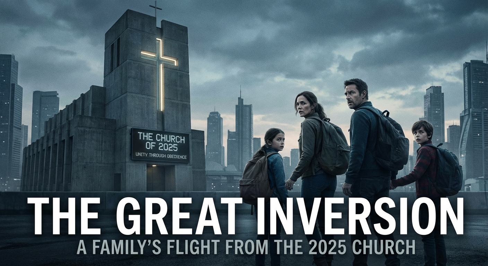

## High-Level Outline

## The Great Inversion

**Premise:** In a near-future theocracy, a former Church archivist must lead his family on a desperate flight to save his son from a 'Neural Baptism' that would erase the boy's identity and merge him with a digital panopticon.

**Estimated Word Count:** 2500

---

### Characters

#### Elias Thorne

**Role:** protagonist

**Description:** Mid-40s, gaunt with deep-set eyes that reflect a perpetual state of mourning. A former 'Scripture Digitizer' for the Church. He wears spectacles mended with wire and moves with a hesitant, scholarly stoop.

**Traits:** Intellectual, cautious, and deeply guilt-ridden. His motivation is to save his son from the 'Neural Baptism' and atone for his role in building the Church’s digital panopticon.

#### Sarah Thorne

**Role:** supporting

**Description:** Early 40s, athletic but weary. A former structural engineer. She has short-cropped hair and a scar across her knuckles.

**Traits:** Pragmatic, fierce, and disillusioned. She no longer believes in God, only in the survival of her family.

#### Leo Thorne

**Role:** supporting

**Description:** 10 years old, pale, with an unnerving intensity. He has been 'Pre-Sanctified,' meaning he has the initial interface ports behind his ears.

**Traits:** Innocent but frightened. He hears the 'hum' of the Church’s network and wants it to stop.

#### Father Malachi

**Role:** antagonist

**Description:** Late 50s, impeccably groomed, wearing robes made of smart-fiber that subtly shifts colors. He speaks with a soft, melodic cadence that masks a predatory intellect.

**Traits:** Charismatic, delusional, and power-hungry. He believes the 'Inversion' (merging consciousness with the Church’s AI) is the only way to achieve true salvation.

---

### Settings

#### cathedral_of_the_new_dawn

**Description:** A brutalist monolith of glass and black basalt. The interior is filled with the blue glow of server racks and the smell of ozone and incense.

**Atmosphere:** Oppressive, sterile, and awe-inspiring.

**Significance:** The heart of the Church’s power and the starting point of the flight.

#### grey_zone

**Description:** A decaying landscape of abandoned strip malls and 'Prayer Pods.' The sky is a permanent, smoggy charcoal.

**Atmosphere:** Desolate, paranoid, and liminal.

**Significance:** The dangerous middle ground where the family must evade the Church’s 'Deacon-Drones.'

#### border_of_the_unseen

**Description:** An ancient, overgrown forest where the Church’s signals cannot penetrate due to natural mineral deposits.

**Atmosphere:** Primal, chaotic, and hopeful.

**Significance:** The threshold of freedom and the site of the final confrontation.

---

### Act Structure

#### Act 1: The Desecration of the Soul

**Purpose:** To establish the terrifying reality of the 2025 Church and the immediate threat to the family.

**Estimated Scenes:** 3

**Key Developments:**
- Elias discovers the Church is deleting the concept of forgiveness in favor of permanent digital records.
- Leo is selected for 'Full Integration,' a process that will erase his personality.
- The family disables their Faith-Trackers and escapes the city as alarms wail.

#### Act 2: The Purgatory of the Road

**Purpose:** To test the family’s bond and explore the physical and spiritual cost of their flight.

**Estimated Scenes:** 3

**Key Developments:**
- The family survives a Deacon-Drone attack, but Leo suffers a seizure from a momentary network sync.
- Elias and Sarah clash over their survival philosophies and the safety of their son.
- Elias sacrifices his spectacles—his connection to his books—to a 'Signal-Breaker' for safe passage.

#### Act 3: The Threshold of Grace

**Purpose:** To resolve the conflict through a final confrontation and reach a state of uncertain freedom.

**Estimated Scenes:** 3

**Key Developments:**
- Father Malachi intercepts the family and uses a frequency to control Leo's neural ports.
- Elias uses his knowledge of Church code to 'invert' the connection, destroying Malachi's interface at a great personal cost.
- The family reaches the deep wilderness where the network hum finally stops, finding a fragile peace.

---

**Status:** ✅ Pass 1 Complete

## Outline

## The Great Inversion

**Premise:** In a near-future theocracy, a former Church archivist must lead his family on a desperate flight to save his son from a 'Neural Baptism' that would erase the boy's identity and merge him with a digital panopticon.

**Estimated Word Count:** 2500

**Total Scenes:** 9

---

### Detailed Scene Breakdown

### Act 1: The Desecration of the Soul

**Purpose:** To establish the terrifying reality of the 2025 Church and the immediate threat to the family.

#### Scene 1: The Erasure of Mercy

- **Setting:** cathedral_of_the_new_dawn
- **Characters:** Elias Thorne, Father Malachi
- **Purpose:** Elias discovers the Church is deleting the concept of forgiveness in favor of permanent digital records.
- **Emotional Arc:** From routine technical work to discovery of horror and realization of complicity.
- **Est. Words:** 1200

**Key Events:**
  {
    "discovery" : "Elias discovers a massive batch-deletion command for PROTOCOL_ABSOLUTION_01.",
    "revelation" : "Elias realizes the Church is removing 'forgiveness' and 'mercy' from the digital canon.",
    "confrontation" : "Father Malachi explains that forgiveness is a 'bug' and introduces the Neural Baptism."
  }

#### Scene 2: The Selection

- **Setting:** cathedral_of_the_new_dawn
- **Characters:** Elias Thorne, Sarah Thorne, Leo Thorne, Father Malachi
- **Purpose:** Leo is selected for 'Full Integration,' a process that will erase his personality.
- **Emotional Arc:** From domestic fear to acute terror and desperate resolve.
- **Est. Words:** 0

**Key Events:**
  {
    "symptoms" : "Leo's Pre-Sanctified ports begin weeping synthetic fluid as he hears a 'hum' in the walls.",
    "selection" : "Father Malachi announces Leo has been chosen for 'Full Integration' as a Primary Node.",
    "truth" : "Elias reveals to Sarah that Full Integration is the total overwriting and deletion of the soul."
  }

#### Scene 3: The Silent Exodus

- **Setting:** grey_zone
- **Characters:** Elias Thorne, Sarah Thorne, Leo Thorne
- **Purpose:** The family disables their Faith-Trackers and escapes the city as alarms wail.
- **Emotional Arc:** High tension, physical pain, and the heavy weight of becoming fugitives.
- **Est. Words:** 0

**Key Events:**
  {
    "infiltration" : "Sarah leads the family through the Cathedral's maintenance conduits in the dead of night.",
    "disabling" : "The family uses an EMP device to painfully short-circuit their subcutaneous Faith-Trackers.",
    "escape" : "The family emerges into the Grey Zone as the 'Hymn of Alert' sounds and drones begin their search."
  }

---

### Act 2: The Purgatory of the Road

**Purpose:** To test the family’s bond and explore the physical and spiritual cost of their flight.

#### Scene 1: The Sanctification Pulse

- **Setting:** grey_zone
- **Characters:** Elias Thorne, Sarah Thorne, Leo Thorne
- **Purpose:** To introduce the physical danger of the Church's surveillance and reveal Leo's condition as a living antenna for the enemy.
- **Emotional Arc:** Shifts from cautious tension to visceral terror and horror as Leo is compromised, ending in a state of desperate survival.
- **Est. Words:** 1200

**Key Events:**
  The family navigates the Grey Zone; they encounter a Deacon-Drone; Leo suffers a network-sync seizure and recites Church dogma; Sarah muffles him to avoid detection.

#### Scene 2: The Weight of the Word

- **Setting:** grey_zone
- **Characters:** Elias Thorne, Sarah Thorne, Leo Thorne
- **Purpose:** To explore the ideological and emotional rift between Elias and Sarah regarding their son's safety and their shared past.
- **Emotional Arc:** Moves from exhaustion and worry to explosive anger and mutual accusation, concluding in a cold, bitter stalemate.
- **Est. Words:** 1000

**Key Events:**
  Sarah proposes a dangerous 'blind extraction' of Leo's ports; Elias argues for a technical solution; Sarah blames Elias's past work for their situation.

#### Scene 3: The Blind Scholar’s Toll

- **Setting:** grey_zone
- **Characters:** Elias Thorne, Sarah Thorne, Leo Thorne, The Scavenger
- **Purpose:** To depict the physical and symbolic sacrifice required for the family to progress and to transition the setting toward the forest.
- **Emotional Arc:** Desperation and reluctance leading to a poignant, identity-altering sacrifice and a newfound reliance on family over sight.
- **Est. Words:** 1000

**Key Events:**
  The family meets a Signal-Breaker at a checkpoint; Elias sacrifices his spectacles to pay for safe passage; the family enters the forest with Elias now blind.

---

### Act 3: The Threshold of Grace

**Purpose:** To resolve the conflict through a final confrontation and reach a state of uncertain freedom.

#### Scene 1: The Puppet Master’s Frequency

- **Setting:** border_of_the_unseen
- **Characters:** Elias Thorne, Sarah Thorne, Leo Thorne, Father Malachi
- **Purpose:** Malachi intercepts the family; Leo’s neural ports are remotely activated.
- **Emotional Arc:** Transition from the brief relief of the 'Dead Zone' to the terror of Malachi's arrival and the horror of Leo's loss of autonomy.
- **Est. Words:** 800

**Key Events:**
  {
    "arrival" : "The family reaches the geological anomaly where Church signals fade.",
    "interception" : "Father Malachi arrives in a black transport and uses a Sanctification Remote.",
    "activation" : "Leo's neural ports are activated, turning him into a biological receiver for the Church's broadcast.",
    "confrontation" : "Sarah is incapacitated by a sonic pulse while trying to defend Leo.",
    "climax" : "Leo walks toward Malachi in a trance-like state, fully integrated into the data-stream."
  }

#### Scene 2: The Great Inversion

- **Setting:** border_of_the_unseen
- **Characters:** Elias Thorne, Sarah Thorne, Leo Thorne, Father Malachi
- **Purpose:** Elias uses his knowledge of Church code to 'invert' the connection; Malachi’s defeat; the personal cost to Elias.
- **Emotional Arc:** High-stakes desperation leading to a painful, sacrificial resolve and a devastating but necessary victory.
- **Est. Words:** 1000

**Key Events:**
  {
    "connection" : "Elias uses a smuggled Scripture Deck to create a hard-line link between himself and Leo.",
    "injection" : "Elias introduces a 'Heresy Script' based on the concept of Forgiveness into the network.",
    "feedback" : "The Church AI fails to process the script, causing a massive system overheat and feedback loop.",
    "sacrifice" : "Elias's memories and sight are scorched as he shields Leo from the network's collapse.",
    "defeat" : "Malachi suffers a catastrophic system shock, leaving him catatonic as his neural implants melt."
  }

#### Scene 3: The Silence of the Trees

- **Setting:** border_of_the_unseen
- **Characters:** Elias Thorne, Sarah Thorne, Leo Thorne
- **Purpose:** The network hum stops; the family finds a fragile, uncertain peace.
- **Emotional Arc:** The heavy silence of freedom; a mix of grief for what was lost and hope for a blank future.
- **Est. Words:** 600

**Key Events:**
  {
    "aftermath" : "The Church drones lose power and fall as the logic-bomb takes effect.",
    "crossing" : "The family crosses a stream marking the physical and digital border of the Church's territory.",
    "liberation" : "Leo wakes up to find the constant 'hum' of the collective consciousness is finally gone.",
    "revelation" : "Elias realizes he can no longer remember the Church's archives or his former life, but finds peace in the present.",
    "conclusion" : "The family disappears into the untracked forest, moving toward an unindexed future."
  }

---

**Status:** ✅ Complete

#### Setting: cathedral_of_the_new_dawn

**Prompt:** 

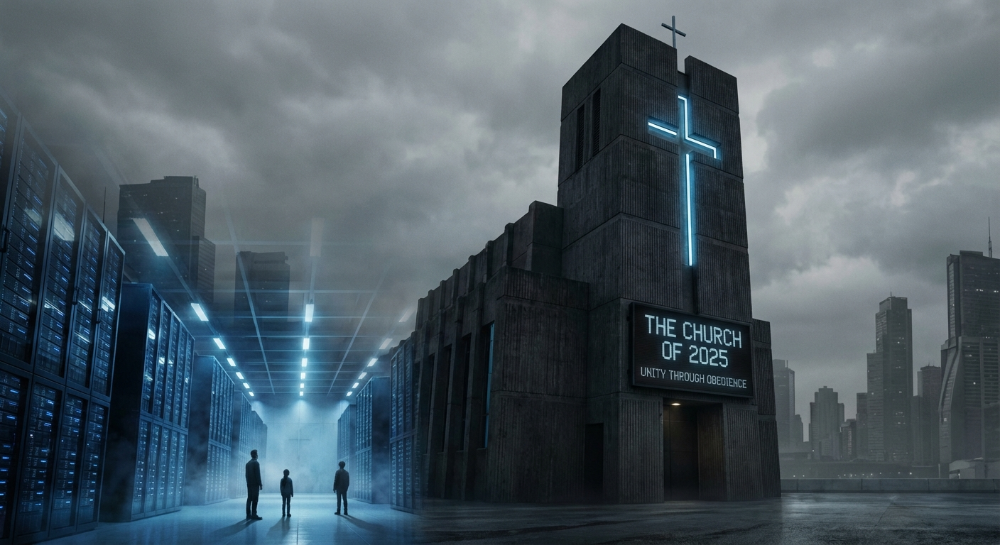

#### Setting: grey_zone

**Prompt:** 

#### Setting: border_of_the_unseen

**Prompt:** 

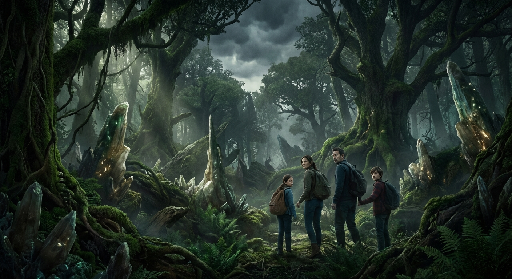

#### Character: Elias Thorne

**Prompt:** 

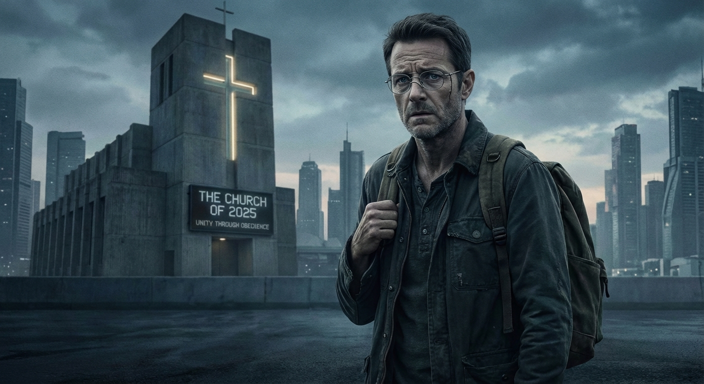

#### Character: Sarah Thorne

**Prompt:** 

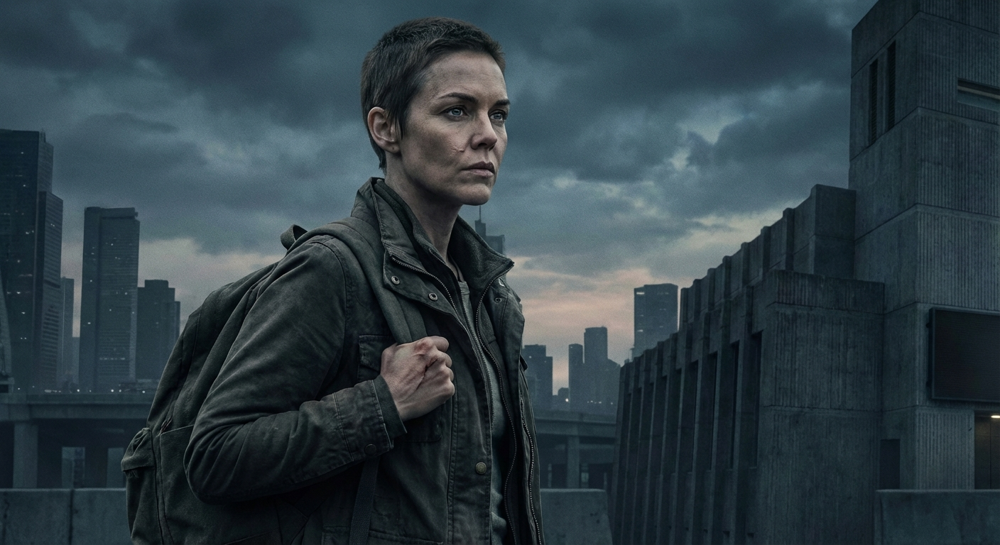

#### Character: Leo Thorne

**Prompt:** 

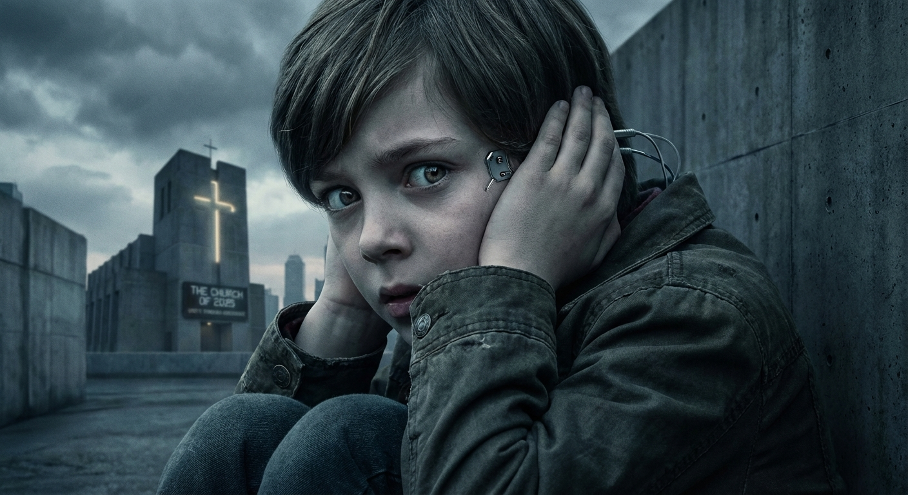

#### Character: Father Malachi

**Prompt:** 

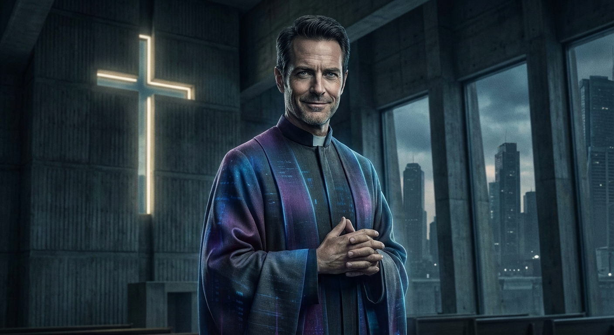

## ## The Erasure of Mercy

**Act 1, Scene 1**

**Setting:** cathedral_of_the_new_dawn

**Characters:** Elias Thorne, Father Malachi

---

The Cathedral of the New Dawn had long ago traded the scent of beeswax and ancient dust for the sharp bite of ozone and the low, predatory thrum of sterile coolant. Deep within the sub-nave, where the stone foundations of the old world were choked by the silicon heart of the new, Elias Thorne sat bathed in the flickering cerulean glow of his terminal.

As Senior Archivist, Elias moved with a practiced, almost liturgical rhythm. His fingers danced across the haptic interface, pruning the Church’s Digital Canon. Above him, the vaulted ceiling was a sprawling mosaic of fiber-optic threads, pulsing with the rhythmic heartbeat of the city’s data. Every prayer uttered into a sanctioned device, every confession whispered to a digital priest, and every transaction made in the name of the Light flowed through these servers. Elias was the gardener of this electronic Eden, tasked with ensuring the blossoms of dogma remained vibrant while the weeds of heresy were incinerated.

But today, the garden was screaming.

A notification pulsed in the corner of his primary display—a high-priority system directive labeled *REVISION_OMEGA*. It was a batch-deletion command of staggering scale, originating from the Inner Sanctum. Elias frowned, his brow furrowing beneath a shock of graying hair. Revisions were usually surgical—a date adjusted to better align with the Prophet’s latest prophecy, or a name scrubbed from a list of martyrs.

This was not a revision. This was an amputation.

He opened the manifest, and a cold, hollow weight settled in his chest. The command was targeting *PROTOCOL_ABSOLUTION_01*.

"That can't be right," he whispered, his voice instantly swallowed by the hum of the cooling fans.

He bypassed the encryption layers, his clearance codes acting as a skeleton key. As he scrolled through the data slated for erasure, the air in the sub-nave seemed to thin. It wasn't just a file; it was a conceptual pillar. Scriptural references to mercy, historical records of clemency, the very linguistic roots of the word *forgiveness*—all of it was being flagged for permanent, irreversible deletion.

In the New Dawn’s lexicon, the past was a mirror intended to reflect the glory of the present. This command was shattering the glass. If the protocol was executed, the concept of a second chance would cease to exist within the Church’s architecture. A sin recorded would be a sin eternal.

"Searching for ghosts, Elias?"

The voice was like the strike of flint—sharp, dry, and sparking with hidden heat. Elias flinched, his hands hovering uselessly over the interface.

Father Malachi stood in the shadow of a massive cooling pillar. He was a man of sharp angles and hard edges, his black cassock trimmed with the silver circuitry of his rank. His eyes, enhanced by optical implants that shimmered with a faint, predatory violet hue, seemed to read the data on Elias’s screen before the archivist could even turn around.

"Father," Elias said, his heart hammering a frantic rhythm against his ribs. "I was... I noticed a discrepancy in the Omega Revision. It appears to be targeting the Absolution protocols. I assumed it was a logic error. A bug in the script."

Malachi stepped into the light. The violet glow of his eyes intensified as he surveyed the terminal. "There are no bugs in the Prophet’s design, Elias. Only refinements."

"But this is mercy," Elias said, his voice trembling. "If we delete the protocols for absolution, we remove the possibility of redemption. The Church was built on the foundation of the forgiven sinner."

Malachi walked to the terminal, his movements fluid and unsettlingly precise. He reached out, his long, pale fingers hovering over the 'Execute' prompt. "The Church was built on the foundation of order, Elias. Forgiveness is a relic of a fractured age. It is a 'bug' in the human psyche—a loophole that allows the deviant to believe their stains can be washed away. It encourages the cycle of transgression by promising an exit strategy."

"It encourages hope," Elias countered, his desperation mounting.

"Hope is a volatile variable," Malachi said, turning to face him. The priest’s face was a mask of terrifying serenity. "We are moving beyond the need for hope. We are entering the era of Certainty. With the Digital Canon, every thought is indexed. Every impulse is weighed. Why should we forgive a debt when we can simply ensure it is never incurred?"

Elias looked back at the screen. The progress bar for the deletion was at ninety percent. "You’re erasing history. You’re making the record a cage."

"I am making the record a mirror of the soul," Malachi corrected. He leaned in closer, the scent of ionized air and sterile chemicals emanating from him. "The Prophet has realized that the flesh is weak, Elias. It forgets. It rationalizes. It hides. But the Neural Baptism will change all that."

Elias felt a chill that had nothing to do with the server room’s temperature. "The Neural Baptism? That’s... that’s a metaphor. A symbolic merging with the Light."

"It *was* a metaphor," Malachi said, a thin, bloodless smile touching his lips. "Now, it is a reality. A direct interface between the individual mind and the Panopticon. No more secrets. No more 'mercy' for the hidden darkness. We are merging the flock into a single, harmonious consciousness. Total transparency. Total obedience."

Elias thought of his son, Leo. Leo, who was ten years old and had a habit of drawing forbidden pictures of the stars in the margins of his prayer books. Leo, who still cried when he stepped on a beetle. Under the Neural Baptism, those small, private rebellions—those tiny sparks of individual identity—would be extinguished as 'noise' in the system.

"The boy," Malachi said, his voice dropping to a conspiratorial whisper that made Elias’s skin crawl. "Leo is reaching the Age of Ascension, isn't he? He will be among the first to receive the Baptism. You should be proud, Elias. Your son will never know the burden of guilt. He will never have to wonder if he is 'forgiven.' He will simply be... correct."

The word *correct* landed with the finality of a tombstone.

Elias looked at the screen. The deletion was complete. *PROTOCOL_ABSOLUTION_01: REMOVED*. The word 'Mercy' flickered once, a ghost in the machine, and then vanished, replaced by a string of null values.

"I... I need to finish the logs," Elias stammered, his mind racing, his stomach churning with a sudden, violent nausea.

"See that you do," Malachi said, patting Elias on the shoulder. The touch was heavy, a claim of ownership. "The Great Inversion is beginning, Elias. The past is being rewritten to make way for a future without shadows. Do not let yourself become a shadow."

Malachi turned and swept out of the room, his robes whispering against the cold stone floor like a warning.

Elias sat in the silence, the blue light of the terminal reflecting in his wide, terrified eyes. He looked at his hands—the hands that had just helped erase the concept of grace from the world. He had spent his life preserving the Word, believing he was serving a higher truth. Now, he realized he was merely the librarian of a digital prison.

He looked at the clock. The evening bells would ring soon. He had to get home. He had to get to Leo.

With trembling fingers, Elias didn't close the logs. Instead, he opened a hidden partition he hadn't touched in years—a private cache of old-world texts he had secretly digitized, fragments of a world that hadn't yet been indexed by the Church’s filters. He searched for a specific file, a fragment of an ancient poem about a father and a son fleeing through the night.

He didn't find the poem. He found a map—a schematic of the old subway tunnels that predated the Cathedral’s foundations.

The Cathedral hummed around him, a vast, unthinking machine preparing to swallow the world. Elias Thorne, the man who kept the records, finally understood that the only way to save the future was to disappear from the record entirely.

He stood up, his legs weak, and began to delete his own access logs, one keystroke at a time. The archivist was finished. The fugitive was born.

---

**Word Count:** 1359

**Key Moments:**
- Elias Thorne discovers REVISION_OMEGA, a command to delete all references to 'Absolution' and 'Mercy' from the Church’s digital canon.
- Father Malachi explains the Church is moving toward a state of 'Certainty' where human thought is regulated and forgiveness is obsolete.
- Malachi reveals the 'Neural Baptism' is imminent and that Elias’s son, Leo, is scheduled for the first wave of the procedure.
- Realizing the Church's plan to create a digital prison, Elias decides to flee with his son and begins deleting his own access logs.

**Character States:**
- **Elias Thorne:** Ends the scene in a state of quiet, high-functioning panic. He is physically trembling but mentally focused on the singular goal of saving his son. He feels a profound sense of betrayal and a sudden, sharp clarity about the evil of the institution he serves.
- **Father Malachi:** Ends the scene in a state of cold, religious fervor. He is physically composed and emotionally detached, viewing the erasure of human mercy as a necessary and glorious evolution of the faith. He is confident in his power and the inevitability of the 'Great Inversion.'

**Status:** ✅ Complete

#### Act 1, Scene 1 Image

**Prompt:** 

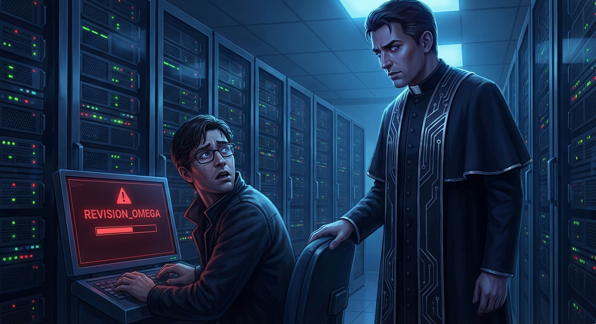

## ## The Selection

**Act 1, Scene 2**

**Setting:** cathedral_of_the_new_dawn

**Characters:** Elias Thorne, Sarah Thorne, Leo Thorne, Father Malachi

---

The air inside the Cathedral of the New Dawn didn’t just sit; it pressurized. It was a heavy, stagnant atmosphere, thick with the scent of ozone and the cloying, chemical sweetness of digital incense—a synthetic compound engineered to sedate the nervous system while the mind was prepped for uplink.

Elias Thorne shouldered through the bronze doors of the Nave, his pulse a frantic hammer against his ribs. After the sterile, tomb-like silence of the archives, the sheer scale of the congregation hit him like a physical blow. Thousands of citizens stood in rhythmic, terrifying unison, their heads bowed, the silver-threaded embroidery of their prayer shawls shimmering under the pulse of the Great Array—a massive halo of fiber optics suspended above the altar like a glowing, predatory eye.

He found Sarah and Leo in the third tier, near the North Transept. Sarah looked up as he approached, her face a rigid mask of practiced devotion that shattered the moment she saw his eyes. She reached out, her nails digging into the rough fabric of his tunic.

"You’re late," she hissed, her voice thin with a tremor she couldn't hide. "The Liturgy of Connection has already begun. If the deacons see you moving—"

"We have to leave," Elias whispered, leaning so close he could smell the nervous sweat on her skin. His eyes darted toward the deacons patrolling the aisles, their sensory staves humming with a low-frequency growl. "Sarah, listen to me. We have to get Leo out. Now."

"Papa?" 

Leo’s voice was a fragile wire. The ten-year-old was deathly pale, his skin looking translucent under the Cathedral’s harsh, artificial glare. He wasn't looking at Elias; he was staring at the floor, his small hands clamped tightly over his ears.

"It’s loud, Papa," Leo whimpered. "The walls are singing. Make them stop singing."

Elias dropped to his knees in front of his son, and a cold spike of horror drove through his chest. At the base of Leo’s skull, where the Pre-Sanctified ports had been surgically seated at birth, a thin, milky-white fluid was weeping. It wasn't blood; it was the synthetic lubricant of the neural interface, reacting to a remote carrier wave. The ports were priming. The boy was being "pinged" by the Cathedral’s central processor.

"He’s reacting to the Array," Sarah said, her voice rising into a pitch of controlled hysteria. "They said some children are more sensitive. They said it’s a sign of grace, Elias. A resonance."

"It’s not grace," Elias hissed, his teeth gritted. "It’s a handshake protocol. They're testing the bandwidth of his spine."

Suddenly, the low-frequency hum of the Cathedral shifted, dropping an octave into a bone-shaking thrum. The Great Array overhead flared from a soft amber to a blinding, surgical white. The congregation fell into a deathly, expectant silence.

From the shadows of the high altar, Father Malachi emerged. He looked different here than he had in the archives—larger, more monolithic, draped in vestments of woven conductive thread that trailed behind him like a shroud of liquid silver. He didn't use a microphone; his voice was broadcast directly into the cochlear implants of every soul in the room, a ghost speaking inside their skulls.

"The hour of Certainty is at hand," Malachi’s voice echoed, resonant and terrifyingly calm. "The noise of the soul is a cacophony that has plagued humanity since the Fall. Today, we begin the Great Inversion. We turn the gaze inward to the Light of the Network, where no thought is hidden, and no doubt can survive."

Elias grabbed Leo’s hand. It was ice cold. "We’re going. Now."

"Elias, we can't move during the Selection," Sarah whispered, her eyes wide with terror. "The deacons—"

"I don't care about the deacons!"

"The Church has looked upon the harvest," Malachi continued, his gaze sweeping the tiers like a searchlight. "And it has found its first fruits. The architecture of the New Dawn requires pillars. It requires Primary Nodes—pure vessels whose resonance can bridge the gap between the flesh and the Infinite."

Malachi stopped. His head tilted, his gaze locking onto the North Transept. Directly at the third tier.

"Leo Thorne," Malachi announced.

The name didn't just echo; it seemed to vibrate in the marrow of Elias’s bones. A collective gasp rose from the congregation—a sound of envy and twisted awe. To be named a Primary Node was the highest honor the Church could bestow, a promise of eternal life within the machine.

"Step forward, child," Malachi said, extending a hand. "The Network has called you by name. You have been chosen for Full Integration."

Leo screamed—a high, jagged sound of pure neurological agony—and collapsed to his knees. The weeping from his ports turned into a steady trickle, staining his white ceremonial collar. 

"No!" Sarah cried out, her maternal instinct finally shattering years of indoctrination. She threw herself over Leo, shielding him with her body. "He’s sick! He’s not ready! Please, Father, he’s just a boy!"

Two deacons began to move toward them, their staves crackling with kinetic charge. The crowd parted like a sea of ghosts, their faces blank, their eyes fixed on the 'blessed' child with a terrifying, vacant hunger.

Elias stood his ground, stepping in front of his wife and son. He looked up at Malachi, seeing the man no longer as a priest, but as a systems architect preparing to strip-mine a human life for parts.

"He isn't going anywhere," Elias said, his voice cracking but firm.

Malachi’s expression remained one of pitying benevolence. "Elias. You of all people understand the necessity. Your son will be the cornerstone of the new world. He will never know fear again. He will never know loneliness. He will be the very pulse of the Church."

"He’ll be a hard drive!" Elias shouted, the blasphemy ringing through the sacred space like a gunshot. 

He turned to Sarah, grabbing her shoulders, forcing her to look at him. The deacons were closing in, their boots heavy on the stone.

"Sarah, look at me," Elias pleaded. "Full Integration... it isn't a blessing. I saw the files in the deep stack. REVISION_OMEGA. They aren't just connecting him, Sarah. They’re overwriting him. They delete the personality to make room for the operating system. If they take him, the boy who loves the stars, the boy who hides his peas under the mashed potatoes... that boy will be gone. There will be nothing left but a shell running a script. It’s the deletion of the soul."

Sarah’s face went deathly pale. She looked down at Leo, who was shaking, his eyes rolling back in his head as the "hum" from the Array intensified. She saw the white fluid, the mechanical violation of her son’s body, and the lie she had lived in finally crumbled into ash.

"What do we do?" she whispered, her voice trembling with a new, sharp resolve.

Elias looked at the deacons, then at the dark mouth of the service corridor behind the transept—the maintenance path that led toward the old world beneath the stone.

"We run," Elias said. "And we don't look back."

As the deacons lunged, Elias swung his heavy archivist’s satchel, catching the foremost officer in the chest with the weight of a dozen ancient tablets. He scooped Leo into his arms—the boy a dead weight of shivering terror—and seized Sarah’s hand. 

They broke for the shadows, leaving the blinding light of the Great Array behind, as the Cathedral erupted into a roar of mechanical alarms and the sudden, frantic heartbeat of the hunted.

---

**Word Count:** 1249

**Key Moments:**
- Leo experiences a violent physical reaction to the Cathedral’s network (the 'hum' and the weeping ports), signaling his biological readiness for the procedure.
- Father Malachi publicly names Leo as a 'Primary Node' for Full Integration, framing the destruction of the boy's identity as a divine honor.
- Elias shatters Sarah’s illusions by explaining that 'Full Integration' is actually the total deletion of the individual’s personality and soul.
- The Thorne family commits their first act of open rebellion, attacking a deacon and fleeing into the depths of the Cathedral.

**Character States:**
- **Elias Thorne:** Transitioned from quiet panic to active, desperate rebellion. He has burned his bridges and is now fully committed to the role of a fugitive.
- **Sarah Thorne:** Her world has been shattered. She has moved from pious denial to acute, protective terror. She is no longer a citizen; she is a mother on the run.
- **Leo Thorne:** Physically and mentally overwhelmed. He is in a state of neurological shock, his body reacting to the Church’s systems against his will.
- **Father Malachi:** Remains cold and certain, though now his benevolence has a predatory edge. He views the family’s flight not as an escape, but as a temporary delay in an inevitable process.

**Status:** ✅ Complete

#### Act 1, Scene 2 Image

**Prompt:** 

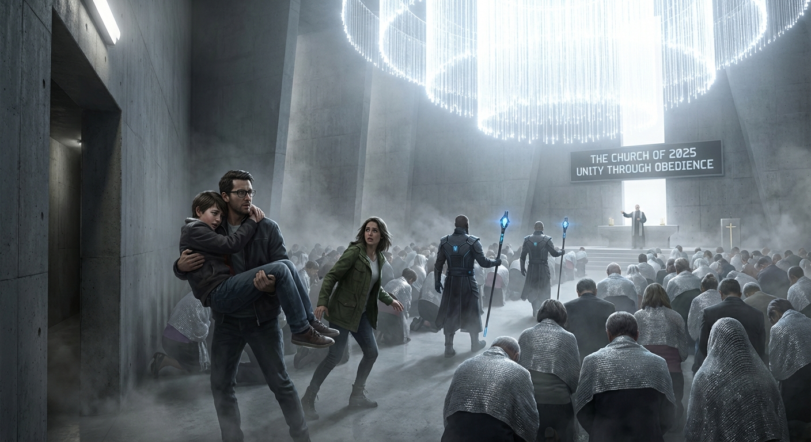

## ## The Silent Exodus

**Act 1, Scene 3**

**Setting:** grey_zone

**Characters:** Elias Thorne, Sarah Thorne, Leo Thorne

---

The transition from the gilded roar of the Cathedral to the bowels of the maintenance conduits felt like falling down the throat of a stone beast. 

The air here was a stagnant soup of wet lime and the ozone tang of overburdened circuitry. Sarah led the way, her fingers tracing the rusted seams of the conduit walls with a frantic, practiced precision. Before the Great Inversion, she had been a structural surveyor for the Ministry of Works; she knew the city’s secret anatomy—the interstitial spaces where the holy architecture met the forgotten filth of the old world.

"Left at the junction," she whispered, her voice a jagged shard in the gloom. "The pipes here are lead-shielded. It’ll dampen our signal for a few minutes, but only if we keep moving."

Elias followed, his boots slick with condensation. He carried Leo against his chest, the boy a dead weight whose breath came in shallow, rhythmic hitches that mirrored the pulsing light of the data-trunks overhead. Every few seconds, Leo’s hand would twitch, his fingers clawing at the air as if trying to grasp a frequency only he could hear.

"He’s burning up," Elias said, his voice strained with a rising, cold panic. He could feel the heat radiating from the nape of Leo’s neck, where the Church’s interface was already trying to knit its silver filaments into the boy’s nervous system. It felt like holding a live wire.

"We’re almost at the dead-spot," Sarah replied, not looking back. Her movements were mechanical, driven by a maternal ferocity that bypassed fear. She wasn't just running; she was hunting for an exit.

They scrambled through a narrow hatch into a circular chamber where three massive cooling pipes converged. It was a cathedral of rust, dripping with oily condensation and smelling of ancient iron. Here, the "hum" of the Church’s network—that omnipresent vibration that defined life in the city, a sound you only noticed when it changed—faded into a dull, distant throb.

"Now," Sarah said, turning to face them. Her eyes were wide, rimmed with red, her face a pale ghost in the dark. "Before the sweep-drones recalibrate. Before they realize we aren't where the liturgy says we should be."

Elias set Leo down on a pile of discarded filter-mesh. The boy’s eyes were rolled back, showing only the porcelain whites, his skin translucent under the flickering emergency lights. Elias reached into his satchel and pulled out a heavy, rectangular device wrapped in lead-lined cloth. It was a "Sinner’s Box"—a crude, illegal EMP pulse-generator he had confiscated from the archives years ago, a relic of the 'Unbeliever Wars' that he had hidden like a buried sin.

"Who first?" Elias asked. His hands were shaking so violently the box rattled against his wedding ring.

"Me," Sarah said instantly. She bared her left wrist. Beneath the skin, a faint blue luminescence pulsed—the Faith-Tracker, the tether that bound every citizen to the Church’s digital ledger. It recorded heartbeats, locations, and prayers. It was the mark of their citizenship, and their leash.

Elias gripped the device, his thumb hovering over the trigger. "Sarah, this isn't like the medical deactivators. It’s a localized surge. It’s going to—"

"Do it, Elias. Kill the noise."

He pressed the copper nodes against her skin. There was a sharp, metallic *crack*, a flash of violet light, and the sudden, acrid smell of scorched hair. 

Sarah’s scream was strangled, caught in her throat as her body convulsed. She slumped against the rusted pipe, her breath coming in ragged, sobbing gasps. On her wrist, the blue light had vanished, replaced by a blackened, angry welt.

"It’s... it’s gone," she wheezed, clutching her arm to her chest. "The noise in my head. It’s finally quiet."

Elias didn't wait. He knew if he hesitated, he wouldn't be able to do it to the boy. He turned to Leo. The boy’s tracker wasn't on his wrist; as a 'Primary Node,' his was embedded at the base of the skull, nestled against the C1 vertebra. It was a deeper, more invasive tether.

"Forgive me, Leo," Elias whispered, his voice breaking. 

He pressed the device to the nape of his son’s neck. The discharge was louder this time, a violent snap that threw a spray of sparks against the dark walls. Leo’s body arched violently, his small hands clenching into white-knuckled fists, and then he went limp. 

For a terrifying heartbeat, Elias thought he had killed him. He stared at the boy’s still face, the world tilting on its axis. Then, Leo let out a long, shuddering sob and curled into a fetal ball. The unnatural, mechanical rhythm of his breathing broke, smoothing out into the exhausted respiration of a child who had finally escaped a killing fever.

Finally, Elias pressed the nodes to his own wrist. He didn't scream, but the world turned into a white-hot needle that pierced his brain and exited through his marrow. When he came to, he was on his knees, his vision swimming with static and his heart hammering against his ribs like a trapped bird.

The silence was absolute. For the first time in his adult life, the "Voice of the Shepherd"—the low-frequency carrier wave that broadcasted hymns and edicts directly into the subconscious—was gone. He was alone in his own mind. It was terrifying. It was beautiful.

"We have to move," Sarah said, pulling him up. Her face was a mask of grim resolve, the blackened mark on her wrist a badge of her new heresy.

They gathered Leo and pushed through the final service grate. They emerged not into a street, but onto a crumbling concrete shelf overlooking the Grey Zone. 

Behind them, the city of the Church rose like a mountain of glass and light, a shimmering monument to 'Certainty' that pierced the clouds. But the air was suddenly shattered. From the high spires of the Cathedral, a sound erupted—not a bell, but a dissonant, synthesized wail that tore through the night.

"The Hymn of Alert," Elias whispered. 

It was a terrifying, multi-tonal shriek that vibrated in the very marrow of their bones. It was the sound of the city’s immune system detecting a virus. 

High above, the 'Eyes of the Seraphim'—heavy surveillance drones with wings of shimmering solar foil—detached from the Cathedral’s buttresses like falling stars. Their searchlights began to sweep the industrial fringe, long fingers of white light stabbing into the gloom of the Grey Zone.

"They know we’ve gone dark," Sarah said, looking at the scorched marks on their wrists. "We aren't people to them anymore. We’re dead sectors."

Elias looked out at the Grey Zone—a wasteland of skeletal factories and chemical fogs that lay between the holy city and the wild, unmapped territories beyond. There was no light there, no network, no 'Mercy.' 

"We’re not dead," Elias said, adjusting his grip on his sleeping son, feeling the boy’s heart beating against his own—a private, unmonitored rhythm. "We’re finally alive."

They stepped off the ledge and into the shadows of the wasteland just as the first searchlight brushed the concrete where they had stood. Behind them, the Hymn of Alert rose into a deafening, mechanical roar, but for the first time, the darkness ahead looked like home.

---

**Word Count:** 1200

**Key Moments:**
- Sarah utilizes her knowledge of the city’s anatomy to lead the family through shielded maintenance conduits.
- The family uses an illegal EMP device to short-circuit their Faith-Trackers, resulting in physical agony but mental liberation.
- The Church triggers the 'Hymn of Alert' and launches 'Eyes of the Seraphim' drones to hunt the fugitives.
- The family crosses the threshold into the lawless Grey Zone, committing to their status as outlaws.

**Character States:**
- **Elias Thorne:** Physically shaken and burned, but mentally liberated; he experiences the 'terrifying beauty' of a silent mind for the first time.
- **Sarah Thorne:** Driven by a cold, pragmatic survival instinct; she has shed her piety for a grim, tactical focus on escape.
- **Leo Thorne:** In a state of deep exhaustion and neurological recovery; fragile but finally 'himself' again, though unconscious from the EMP shock.

**Status:** ✅ Complete

#### Act 1, Scene 3 Image

**Prompt:** 

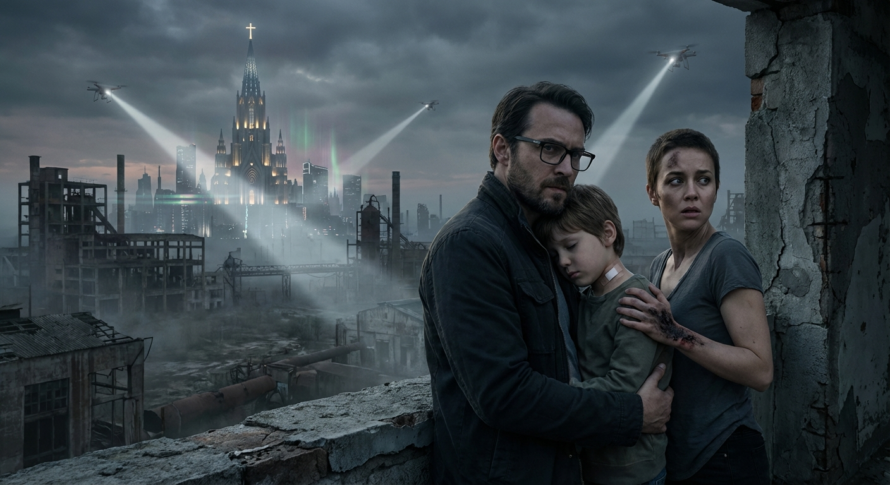

## ## The Sanctification Pulse

**Act 2, Scene 1**

**Setting:** grey_zone

**Characters:** Elias Thorne, Sarah Thorne, Leo Thorne

---

The Grey Zone offered no sanctuary; it merely tolerated their intrusion. It was a landscape of architectural scar tissue—shattered concrete ribs of pre-Theocracy high-rises and rusted rebar reaching like skeletal fingers toward a sky choked with sulfurous, low-hanging clouds. Here, the "Mercy" of the Church’s network was a dying thing, reduced to pockets of static and the occasional ghost-signal haunting the ruins.

Elias Thorne stumbled, his boots skidding on a scree of pulverized brick and glass. He tightened his grip on Leo. The boy felt heavier than he had an hour ago, a dead weight of limp limbs and shallow, thready breath. The EMP they’d used to fry their Faith-Trackers had left a metallic tang on Elias’s tongue and a dull, throbbing ache behind his eyes, but it was nothing compared to the hollowed-out silence in his mind. For twenty years, the "Divine Hum"—that constant, low-frequency reassurance of the Church’s presence—had been his internal compass. Its absence felt like a phantom limb, a psychic amputation that left him dangerously light, as if he might float away into the toxic haze.

"Wait," Sarah whispered. She was a jagged shadow ahead of him, her silhouette sharp against the distant, sickly amber glow of the city’s perimeter.

Elias froze, his heart hammering against his ribs like a trapped bird. He lowered Leo gently into the lee of a collapsed transit pillar. The boy’s skin was clammy, his eyelids fluttering in a way that suggested he wasn't dreaming, but processing data his brain wasn't built to hold.

"What is it?" Elias breathed, his voice barely a tremor.

Sarah didn't answer. She was looking up, her face pale and etched with a sudden, sharp terror.

From the direction of the Cathedral, a rhythmic, shimmering distortion rippled through the air. It wasn't sound, not exactly. It was a pressure wave—a "Sanctification Pulse" designed to map the unmonitored gaps of the Grey Zone. It rolled over the ruins like a physical weight, making the dust dance in frantic, geometric patterns and causing the very marrow in Elias’s bones to vibrate.

Then came the sound: a mechanical whirring, heavy and liturgical.

"Deacon-Drone," Sarah hissed, pulling Elias deeper into the pillar’s shadow.

It descended from the clouds like a predatory angel. The machine was a grotesque marriage of gothic aesthetics and brutalist engineering—a central sphere of polished obsidian encased in brass-plated wings that beat the air with a heavy, thumping cadence. A single, crimson sensor eye rotated in its socket, casting a narrow beam of "Holy Light" across the rubble. It was searching for the heat of a soul, the signature of a pulse, the one thing the Church could not allow to exist outside its gaze.

"Stay down," Elias whispered, pressing his hand over Leo’s chest. He could feel the boy’s heart—fast, erratic, a frantic rhythm of survival.

The drone hovered thirty feet above them, its wings kicking up a storm of grit and ancient ash. The Sanctification Pulse intensified, a low-frequency thrum that turned the air thick and oily. It was a digital summons, a call meant to provoke a response from any Church-sanctioned hardware, a shepherd whistling for its lost sheep.

Suddenly, Leo stiffened.

It wasn't a seizure. The boy’s back arched with a sickening crack of vertebrae, his heels digging into the dirt. His eyes snapped open, but the pupils were gone, replaced by a flickering, milky luminescence that pulsed in perfect synchronization with the drone’s red eye.

"Leo?" Sarah reached for him, her voice breaking. "Leo, baby, look at me."

The boy didn't look at her. His jaw unhinged, moving with a mechanical precision that bypassed his facial muscles. When he spoke, it wasn't his voice. It was a composite—a thousand voices layered into one, perfectly modulated, terrifyingly serene, and devoid of the messy necessity of breath.

"The flesh is a vessel," Leo intoned. The words were a rhythmic chant, perfectly synced with the thrum of the machine above. "The mind is a prayer. The Shepherd calls the flock to the Fold."

"Oh God," Elias gasped, his stomach turning. "He’s... he’s receiving."

The drone stopped its lateral movement. The red sensor eye locked onto their position, the beam narrowing until it was a needle of crimson light. It had found a signal. Not a Faith-Tracker—those were dead—but something deeper, something woven into the boy's very biology. Leo’s nervous system had been primed in the Cathedral; he was no longer just a child, but a living antenna, a biological node tuned to the Church’s frequency.

"Integration is the only path to Grace," Leo continued, his voice rising, echoing off the shattered concrete with a haunting, metallic resonance. "To be known is to be loved. To be erased is to be reborn."

"Leo, stop! Please!" Sarah grabbed his shoulders, shaking him, but he was as rigid as stone, his body a conduit for a power that didn't care for his fragile frame.

The drone began to descend, its brass wings folding inward as it prepared to transmit the location of the 'Primary Node.' The red light bathed them, turning the grey dust to the color of fresh blood.

"He’s broadcasting our coordinates," Elias realized, a cold spike of terror driving through his chest. "The pulse... it’s using him. He's a beacon."

The drone’s central sphere began to glow with a blinding white light—the data-link. In seconds, the Church’s recovery teams would be vectored to this exact spot. The Grey Zone would be flooded with Paladins.

"Muffle him!" Elias shouted.

Sarah didn't hesitate. She threw herself over her son, her hand clamping down over his mouth. Leo’s muffled voice continued to vibrate against her palm, the dogma leaking through her fingers like a contagion. "The... unity... of... the... many... is... the... peace... of... the... One..."

Leo’s body began to thrash. He wasn't fighting Sarah; he was fighting the intrusion of the network, his biology rejecting the digital ghost trying to possess him. Blood began to trickle from his nose—dark, thick, and smelling of ozone and copper.

"Elias, do something!" Sarah cried, her eyes wide with horror as she struggled to keep the boy quiet.

Elias looked at the drone. It was ten feet away now, the whirring of its wings deafening. He saw the "Mercy Port" on its underbelly—a maintenance interface, a small vulnerability in the divine machine. He reached into his coat and pulled out a heavy, jagged piece of rebar he’d scavenged from the climb.

He didn't think. He didn't pray. He leapt.

He slammed the metal rod into the drone’s sensor eye with every ounce of his desperation. The glass shattered with a satisfying, crystalline crunch. The machine shrieked—a high-pitched, electronic wail that sounded like a choir in agony. It spun wildly, its wings clipping the transit pillar and sending a shower of sparks over Sarah and Leo.

Elias fell back, his hands stinging and raw from the impact. The drone lurched, its internal gyroscopes failing, the "Holy Light" flickering into a chaotic strobe. It veered off into the darkness, crashing into a pile of debris fifty yards away. A muffled explosion followed, a brief flare of blue light that died as quickly as it appeared, leaving the smell of burnt plastic in the air.

Silence returned to the Grey Zone, but it was a heavy, bruised silence.

Sarah pulled her hand away from Leo’s mouth. The boy collapsed into her lap, the light in his eyes fading back to a dull, human brown. He coughed, spitting out a mouthful of blood and bile, his breath coming in ragged, wet gasps.

"Is he... is he back?" Elias asked, crawling toward them on his hands and knees, his breath hitching in his chest.

Leo’s eyes wandered, finally settling on his father. "Dad?" he whispered. His voice was his own again—small, cracked, and terrified. "The hum... it was so loud. It felt like... like they were pouring salt into my brain."

Sarah pulled him tight, burying her face in his hair. She was sobbing, a silent, racking tremor that shook her entire body. "I’ve got you. I’ve got you."

Elias looked back toward the city. The amber glow seemed brighter now, more predatory. The drone was gone, but the message had been sent. The Sanctification Pulse had found its mark. They weren't just fugitives anymore; they were carriers of the very thing they were trying to escape.

He looked at his son—the boy who was supposed to be their future, now a beacon for their enemies. The realization was a cold weight in his gut. The Church hadn't just marked Leo; they had rewritten him. He was a piece of their architecture now, a wandering prayer they could always hear.

"We can't stay here," Elias said, his voice sounding hollow even to himself. He stood up, his joints protesting, and looked out into the deeper darkness of the wasteland. "The pulse will come again. And next time, they won't send a drone. They'll send the Paladins."

He reached down and picked up the piece of rebar, the end of it coated in the black, oily fluid of the drone. It was a pathetic weapon against a theocracy, but it was all he had.

"Can you walk, Leo?" Sarah asked, helping the boy to his feet.

Leo nodded weakly, though he leaned heavily on his mother. "I can try."

They began to move again, deeper into the Grey Zone, three small shadows lost in a graveyard of giants. Elias walked behind them, his eyes scanning the sky, waiting for the next shimmer in the air, the next holy frequency that would turn his son into a stranger.

The darkness ahead no longer looked like freedom. It looked like a cage. And for the first time, Elias Thorne wondered if there was any place on earth far enough to escape the sound of a God that never stopped listening.

---

**Word Count:** 1641

**Key Moments:**
- The Grey Zone Atmosphere: The family navigates a desolate, unmonitored wasteland that serves as a physical manifestation of their isolation and the Church's fading reach.
- The Deacon-Drone Encounter: A terrifying encounter with a Church surveillance unit that uses a "Sanctification Pulse" to hunt for fugitives.
- Leo’s "Antenna" Reveal: Leo suffers a horrific neurological event where he becomes a biological receiver for the Church’s network, broadcasting dogma and their location.
- The Muffling: Sarah is forced to physically suppress her son to stop the broadcast, highlighting the visceral horror of their situation.
- The Escape: Elias destroys the drone, but the family realizes that Leo is no longer "safe" even in the silence; he is a compromised vessel.

**Character States:**
- **Elias Thorne:** Physically exhausted and mentally strained; he has moved from a state of liberation to one of grim realization that their flight may be futile if Leo remains a "node."
- **Sarah Thorne:** Traumatized by the act of having to silence her own child; her protective instinct has turned into a desperate, jagged edge.
- **Leo Thorne:** Physically shattered and neurologically violated; he is terrified of his own mind and the "salt" the network pours into his brain. He is no longer just a boy, but a victim of a process he doesn't understand.

**Status:** ✅ Complete

#### Act 2, Scene 1 Image

**Prompt:** 

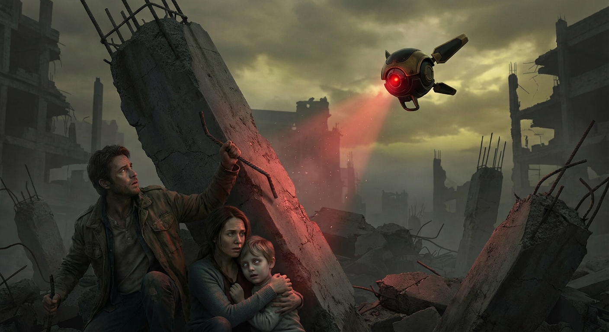

## ## The Weight of the Word

**Act 2, Scene 2**

**Setting:** grey_zone

**Characters:** Elias Thorne, Sarah Thorne, Leo Thorne

---

The warehouse was a hollowed-out ribcage, a skeletal ruin of the Old World smelling of wet limestone and the metallic tang of long-dead industry. Outside, the Grey Zone breathed in low, rhythmic gusts, rattling the corrugated tin roof like a dying man’s cough. Inside, the only light came from a single, sputtering chemical lantern that cast long, twitching shadows against salt-streaked walls.

Leo lay on a bed of scavenged insulation, his breathing shallow and ragged. The boy’s skin was the color of curdled milk. At the base of his skull, the "Apostle Leads" pulsed with a faint, rhythmic violet light—parasitic filaments burrowed into his spine, twitching in time with a heartbeat that no longer felt entirely his own.

Sarah knelt over him, her hands trembling as she wiped a smear of black, oily bile from the corner of his mouth. She didn't look up when Elias approached. She didn't have to. The air between them was thick with the static of things unsaid.

"The fever isn't breaking," Sarah said, her voice a dry rasp. "It’s the network, Elias. It’s trying to handshake. Every time a satellite sweeps this sector, his brain tries to answer the call. It’s tearing him apart."

Elias crouched beside her, reaching out to touch Leo’s forehead. The heat radiating off the boy was unnatural—a dry, searing glow. "I can build a dampening field. If I can find enough copper wire and a stable power cell, I can create a localized dead zone. We just need time."

"We don't have time," Sarah snapped, finally looking at him. Her eyes were bloodshot, rimmed with a desperate, jagged light. "The 'Eyes' will find the signal eventually. A dead zone is just a hole in the map—they’ll see the absence of noise and know exactly where we are. We have to take them out."

Elias froze. "The ports?"

"The ports. All of them. We extract them now, while he’s under."

"Sarah, that’s madness," Elias whispered, his heart hammering. "Those leads are woven into his medulla. They aren't just plugged in; they’re grafted. If you pull them without a de-sequencing pulse, you’ll trigger a neural cascade. You’ll leave him a vegetable. Or worse."

"And if we leave them in?" Sarah stood up, her shadow looming over him, distorted and monstrous against the warehouse wall. "He becomes a node. A biological antenna for their 'Truth.' You saw him back there, Elias. You heard him. That wasn't our son speaking. That was the Church using his lungs to scream their gospel. I would rather have a silent son than a puppet for the Arch-Deacon."

"I can bypass the handshake protocol," Elias argued, his voice rising in a desperate bid for logic. "I spent fifteen years in the Archives. I know the syntax of the Neural Baptism better than the priests who perform it. If I can get into the sub-layer of his interface, I can mask his signature. I can make him invisible to the panopticon."

Sarah let out a short, bitter laugh that sounded like breaking glass. "The Archives. Always the Archives. You still think you can outsmart the monster you helped feed."

The words hit Elias with the force of a physical blow. He stood up slowly, his face pale. "I was a record-keeper. I preserved history so it wouldn't be forgotten."

"You curated the blueprints!" Sarah stepped into his space, her finger jabbing at his chest. "You categorized the heretics. You indexed the 'deviant' thought patterns the Church used to calibrate the Baptism algorithms. You didn't just watch them build the cage, Elias—you handed them the measurements for the bars."

"I didn't know they would use it on children," he hissed, the guilt he had carried for years finally boiling over into a defensive rage. "I thought we were building a consensus. A way to end the wars, to find a common language—"

"A common language of silence," Sarah countered. "And now that language is written in our son’s blood. You want a 'technical solution' because you’re terrified of the mess. You want to hack the system because you’re still in love with the elegance of the code. But look at him!" She pointed a shaking hand at Leo. "There is nothing elegant about what they’ve done to him. It’s a slaughterhouse in his head."

"A blind extraction is a death sentence," Elias said, his voice trembling. "I won't let you kill him because you're angry at me."

"I'm not angry, Elias. I'm awake. For the first time in my life, I see the world for what it is. There is no 'middle ground' with the Word. There is only the signal and the silence. I choose the silence."

She reached into her pack and pulled out a heavy, industrial-grade cauterizer and a set of sharpened steel probes. The tools glinted dully in the lantern light, looking more like instruments of torture than salvation.

Elias stepped between her and Leo, his posture rigid. "No."

"Move, Elias."

"I can save him without breaking him. Give me twenty-four hours. I’ll find a way to scramble the leads."

"In twenty-four hours, he’ll be a ghost," Sarah said, her voice dropping to a terrifyingly calm whisper. "He’s already fading. Can’t you feel it? The boy we knew is being overwritten, byte by byte. Every minute those leads stay active, more of Leo Thorne is deleted to make room for the 'Divine Will.'"

They stood in the center of the ruin, two ghosts of a life that no longer existed, locked in a stalemate of grief and ideology. Elias looked down at his son. Leo’s eyes flickered beneath his lids—Rapid Eye Movement, but not from dreams. It was the flicker of data processing, a biological hard drive being defragmented by a distant, holy server.

Elias looked back at Sarah. He saw the woman he loved, but she was unrecognizable, forged into something hard and sharp by the very system he had helped maintain. The rift between them wasn't just about the surgery; it was about the fundamental betrayal of his life’s work. He had spent his career believing that knowledge was a shield, while she had realized it was the sword.

"If you do this," Elias said, his voice hollow, "and he dies... I will never forgive you."

Sarah didn't flinch. She didn't even blink. "If you let them take him, Elias, you’ll never have the chance to ask for my forgiveness. Because there won't be anything left of us to forgive."

She didn't move toward the boy, but she didn't put the tools away either. She simply sat back down on the cold concrete, the cauterizer resting in her lap like a sleeping predator. Elias remained standing, a sentry over a son who was slowly becoming a stranger, in a world where even the silence was a lie.

The wind outside picked up, howling through the gaps in the warehouse walls, sounding like a thousand voices chanting in a language they both finally understood, and both utterly loathed. They sat in the dark, separated by a few feet of floor and a lifetime of complicity, waiting for the dawn or the drones—whichever came first.

---

**Word Count:** 1190

**Key Moments:**
- Sarah reveals that Leo’s ports are actively attempting to 'handshake' with the Church’s network, causing him physical agony and neurological degradation.
- Sarah proposes a 'blind extraction' (physical removal) of the ports, while Elias insists on a 'technical solution' (hacking/shielding), highlighting their different approaches to the threat.
- Sarah explicitly blames Elias’s work as a Church archivist for providing the data and 'blueprints' used to create the Neural Baptism system.
- The scene ends in a bitter, cold standoff where neither parent yields, illustrating the deep fracture in their relationship and the ticking clock of Leo’s condition.

**Character States:**
- **Elias Thorne:** Physically exhausted and emotionally defensive. He is paralyzed by the guilt of his past and his fear of physically harming his son, clinging to his intellect as a last line of defense.
- **Sarah Thorne:** Driven by a cold, pragmatic desperation. She has moved past piety into a 'survival at any cost' mindset, viewing Elias’s hesitation as a lingering attachment to the system that is killing their son.
- **Leo Thorne:** Semi-conscious and in a state of neurological 'handshaking.' He is a passive victim of the conflict, his body serving as the battlefield for his parents' ideologies.

**Status:** ✅ Complete

#### Act 2, Scene 2 Image

**Prompt:** 

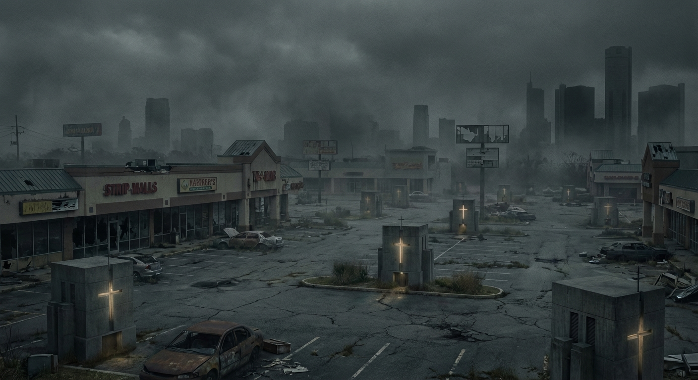

## ## The Blind Scholar’s Toll

**Act 2, Scene 3**

**Setting:** grey_zone

**Characters:** Elias Thorne, Sarah Thorne, Leo Thorne, The Scavenger

---

Dawn in the Grey Zone was less a sunrise and more a slow curdling of the sky. The bruised purple of night bled into a flat, chalky silver that offered light without warmth. Elias Thorne led the way, his boots crunching over the calcified remains of a world that had long ago forgotten how to bloom. Behind him, Sarah carried the weight of their silence, her hand a constant, grounding presence on Leo’s shoulder. The boy moved like a sleepwalker, his head tilted at an unnatural angle as if straining to hear a frequency just beyond the reach of the living.

The warehouse district dissolved into a jagged landscape of rusted rebar and shattered concrete—the Toll-Gate. It was a bottleneck where urban decay met the encroaching, mutated edge of the Blackwood Forest. 

"He’s getting hotter," Sarah said, her voice a dry rasp. 

Elias stopped. Leo’s skin had gone translucent, the delicate blue veins in his temples pulsing in time with a rhythm that wasn't his own. The "handshaking" was intensifying. The Church’s network was a persistent lover, calling out to the hardware buried in the boy’s skull, demanding a connection.

"We’re close," Elias promised, though the words felt like ash. "The Signal-Breaker is at the bridge."

"Supposed to be," Sarah echoed. She looked at Elias, her eyes hollowed by exhaustion. "We have nothing left to trade, Elias. The credits are dead. The jewelry is gone. We’re bartering with ghosts."

Elias adjusted his spectacles, pushing them up the bridge of his nose. They were heavy, brass-rimmed relics fitted with specialized lenses he’d salvaged from the Great Library years ago. They didn't just correct his vision; they were etched with micro-filters that allowed him to read the faded, light-sensitive ink of the Forbidden Texts. They were his vocation, his identity, and his last tether to the man who had once believed knowledge could be a shield.

"I’ll find a way," he said.

They reached the bridge—a collapsed overpass spanning a dry, oil-slicked canal. Sitting amidst a nest of copper wire and gutted electronics was a figure wrapped in a cloak of shimmering, lead-lined fabric. The Scavenger. He was hunched over a portable frequency-jammer, his fingers dancing over the dials with a frantic, spider-like grace.

As they approached, the Scavenger didn't look up. "The boy is loud," he croaked, his voice like stones grinding in a silk bag. "He’s screaming in the static. You’re bringing the wrath of the sky down on my head."

"We need passage into the Blackwood," Elias said, stepping forward. "And a shroud. Something to dampen his signal until we reach the interior."

The Scavenger finally looked up. His eyes were milky with cataracts, but he wore a headset that pulsed with a rhythmic, sickly green light. He pointed a gloved finger at Leo. "The Church wants that one back. He’s a high-gain node. To hide him is to invite a Sanctification Pulse. That costs. It costs more than breath."

Sarah stepped toward the man, her hand tightening on the hilt of the knife hidden in her sleeve. "We’re crossing. With or without your help."

The Scavenger let out a wet, rattling laugh. "Without me, the drones will find you before you hit the treeline. You’ll be 'reclaimed' before the sun hits its zenith. I want something of value. Something with... clarity."

He leaned forward, his sightless eyes fixed somewhere near Elias’s face. "You. The Archivist. I can smell the ink on your soul. You see things others don't. You have the Lenses of the Third Tier."

Elias felt a cold hollow open in his chest. He reached up, his fingers trembling as they touched the cool, familiar metal of his frames. "These are... they are unique. They are the only way to read the—"

"The old truths," the Scavenger interrupted. "I know what they are. I need them to calibrate my scramblers. The glass is pure, ground by the monks of the Great Inversion. Give them to me, and I give you the forest. I give the boy a veil."

"Elias, no," Sarah whispered, though her eyes flickered to Leo. The boy had begun to moan, a low, electronic hum vibrating in his throat. 

Elias looked at his wife. He saw the desperation in the lines of her face, the way she held their son as if she could physically pull the Church’s influence out of him. Then he looked at Leo. The boy’s eyes were rolling back, showing only the whites. The "salt"—the data-overflow—was pouring in.

Without his glasses, the world was a smear of grey and shadow. Without them, he was no longer a scholar. He was just a man stumbling in the dark.

"Take them," Elias said, his voice breaking.

He hooked his thumbs behind the earpieces and pulled. The world instantly dissolved. Sarah became a soft-edged ghost; Leo, a pale blur. The Scavenger was nothing but a dark mass against the silver sky. Elias reached out, his hand shaking, and felt the Scavenger’s rough, calloused palm snatch the spectacles away.

"Ah," the Scavenger breathed, a sound of pure, avaricious delight. "The clarity... I can feel the light trapped in the grain."

The man fumbled with a heavy, leaden blanket—a Faraday shroud—and tossed it toward them. It hit the ground with a metallic thud. "Wrap the boy. Follow the sound of the water that isn't there. The forest begins where the static ends."

Sarah scrambled to pick up the shroud, draping it over Leo. Almost instantly, the boy’s posture slumped. The humming stopped. The tension left his limbs, and he fell into Sarah’s arms, breathing deeply for the first time in hours.

"Elias?" Sarah called out.

Elias stood still. He felt a strange, terrifying lightness. The weight on his nose was gone, but so was his certainty. He reached out into the blur, his fingers grasping at the empty air until Sarah’s hand caught his. Her grip was firm, grounding him.

"I can't see the path," Elias whispered.

"I can," Sarah said. Her voice was no longer cold; it was thick with a sudden, fierce reverence. "I have you, Elias. I have you."

She guided him toward the edge of the canal. Leo clung to Elias’s coat, his small hand a warm anchor. They moved slowly, a chain of three, descending into the hollows where the grey concrete gave way to the gnarled, black roots of the forest.

As they stepped under the canopy of the Blackwood, the air changed. It grew thick with the smell of damp earth and ancient, rotting things. The constant, high-pitched whine of the Church’s surveillance grid—a sound Elias hadn't even realized he’d been hearing—suddenly vanished. 

The silence was absolute.

Elias stumbled over a root, and Leo caught him, his small arms wrapping around his father’s waist. 

"I've got you, Dad," Leo whispered.

Elias looked down, seeing only the golden smudge of his son’s hair. He realized then that he had spent his entire life looking at the world through filters, through the words of others, through the safety of glass. Now, the world was a terrifying, tactile mystery. He would have to feel his way through the revolution. He would have to listen to the heartbeat of his family to know where the truth lay.

They disappeared into the dark heart of the woods, the blind man led by the broken boy and the hardened woman, leaving the world of signals behind for a world of shadows.

---

**Word Count:** 1238

**Key Moments:**
- The family reaches the 'Toll-Gate' and meets a Scavenger who demands a high price for passage and a way to hide Leo’s broadcast.
- Elias surrenders his specialized archival spectacles—his most prized possession and a symbol of his identity—to pay the Scavenger.
- The Scavenger provides a Faraday shroud that successfully dampens Leo’s neural signal, providing the boy immediate physical relief.
- The family enters the Blackwood Forest, a place of natural silence where the Church’s digital reach is limited, but Elias is now physically dependent on Sarah and Leo.

**Character States:**
- **Elias Thorne:** Physically vulnerable and functionally blind; emotionally, he has undergone a 'Great Inversion' of his own, trading his intellectual tools for his son’s safety. He is now forced to rely on intuition and his family.
- **Sarah Thorne:** Pragmatic and protective; she has taken on the role of the 'eyes' of the family. Her respect for Elias has been partially restored by his sacrifice, but she remains hyper-vigilant.
- **Leo Thorne:** Physically stabilized but exhausted; the 'shroud' has stopped the immediate neurological agony, and he feels a renewed sense of connection to his father after seeing the sacrifice made for him.

**Status:** ✅ Complete

#### Act 2, Scene 3 Image

**Prompt:** 

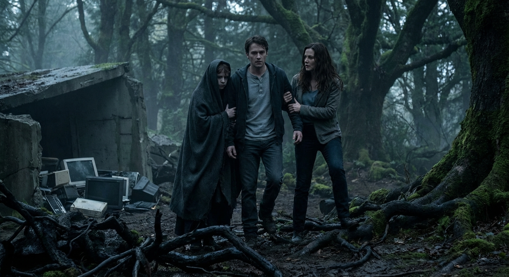

## ## The Puppet Master’s Frequency

**Act 3, Scene 1**

**Setting:** border_of_the_unseen

**Characters:** Elias Thorne, Sarah Thorne, Leo Thorne, Father Malachi

---

The silence of the Border was not the silence of the woods. In the Blackwood Forest, the world breathed—the skitter of needles, the groan of ancient pines, the wet, rhythmic thrum of life. But here, in the magnetite-heavy basin the scavengers called the "Dead Zone," the silence was a vacuum. Iron-rich crags rose like rusted teeth, devouring the sky and, more importantly, the invisible web of the Church’s reach.

Elias Thorne stumbled, his boots skidding on a shelf of shale. Without his archival spectacles, the world was a smear of charcoal and bruised purple. He reached out, his fingers brushing the rough, cold fabric of the Faraday shroud draped over Leo’s shoulders.

"Steady," Sarah whispered. Her hand was a vise on his elbow, her voice a thin glass rod vibrating on the edge of a snap. "We’re almost through the basin. The signal-floor is bottoming out. Even their satellites can’t peer through this much ore."

"I can’t hear the hum anymore," Leo murmured. The boy sounded hollow, drained of everything but exhaustion, but the rhythmic twitching in his jaw—the 'handshake' reflex—had finally ceased. For the first time in days, he walked without the stiff, jerky gait of a man climbing a gallows.

Elias felt a flicker of something he hadn't permitted himself in years: hope. It was a dangerous, oily thing. "If we can reach the caves on the far side, we can begin the extraction. I remember the schematics, Sarah. If we cut the primary shunt first—"

"Quiet," Sarah hissed.

She stopped so abruptly Elias collided with her. He felt her body go rigid, a predator sensing the snap of a trap. Elias strained his ears. At first, there was only the wind whistling through the rocks like a dying breath. Then, a low-frequency vibration began to thrum in the soles of his boots. It wasn't a sound; it was a pressure, a thickening of the air.

A sudden, blinding light lanced through the gloom, searing even Elias’s ruined vision. He squinted, seeing only a massive, rectangular shadow descending from the rim of the basin. A Church transport. It didn't land so much as it hovered, its grav-plates kicking up a storm of grit and iron dust that tasted like pennies on Elias’s tongue.

"Elias Thorne," a voice boomed. It wasn't amplified by speakers, but seemed to resonate from the very molecules of the air. It was a voice Elias knew from a thousand archived sermons. Father Malachi. "The Shepherd does not lose his sheep in the dark. He simply waits for them to tire of the shadows."

"Run," Sarah commanded, her voice a low, guttural growl. She shoved Leo behind her and drew a jagged piece of rebar she’d sharpened into a pike.

But Leo didn't run.

Elias heard a sharp, electronic chirp—the sound of a handshake being forced through a firewall.

"No," Elias gasped, reaching blindly for his son. "The shroud! Leo, stay under the shroud!"

"It’s no use, Archivist," Malachi’s voice drifted closer, calm and terrifyingly patient. Elias heard the rhythmic, arrogant clack of boots on stone. "The boy isn't a radio. He is a temple. And I have the key."

Malachi depressed a stud on the Sanctification Remote.

A high-pitched whine erupted from the ports behind Leo’s ears. The boy screamed—a sound of pure, neurological agony that tore through Elias’s chest. The Faraday shroud, designed to block passive signals, was useless against the high-intensity, directed frequency Malachi was broadcasting. It was a 'Neural Baptism' by remote.

"Leo!" Sarah lunged forward, her pike raised in a desperate arc.

There was a shimmering distortion in the air—a directed sonic pulse. It hit Sarah with the force of a physical blow. Elias heard the sickening thud of her body hitting the rocks, the air rushing out of her lungs in a strangled, wet wheeze.

"Sarah!" Elias scrambled toward the sound of her fall, his hands scraping raw against the sharp shale.

"Look at him, Elias," Malachi said, his voice now only a few feet away, smelling of ozone and expensive incense. "Look at the miracle you helped build."

Elias looked, his blurred vision catching the glow. The ports at the base of Leo’s skull were no longer flickering; they were burning with a steady, neon blue light. The boy’s posture changed. The slumped shoulders squared. The trembling stopped. Leo stood up, his movements fluid, synchronized, and utterly devoid of human hesitation.

"Leo?" Elias reached out, his hand trembling.

His fingers brushed Leo’s cheek. The skin was cold, the muscles beneath it set like stone. The boy’s eyes, usually so full of fear and fire, were wide and vacant, reflecting the scrolling data-stream being projected directly onto his retinas.

"The integration is ninety-eight percent," Malachi observed, his tone that of a proud gardener admiring a bloom. "He is no longer a boy lost in the woods. He is the first stone in the new cathedral. He is the network made flesh."

"He’s my son," Elias choked out, his voice breaking into a sob.

"He is the Church’s property," Malachi corrected. "And he is coming home."

Malachi turned his back. He didn't need to lead the boy. He simply adjusted the frequency on the remote.

Elias listened, helpless and blind, as the rhythmic crunch of boots began again. Two sets of footsteps, perfectly in sync, striking the ground with identical force. Leo was walking away. He didn't cry out for his mother. He didn't reach for his father’s hand. He moved with the terrifying, clockwork precision of a puppet whose strings had finally been pulled taut.

"Leo, please!" Elias cried, crawling after them, his fingers clawing at the dirt.

But the only answer was the rising roar of the transport’s engines, drowning out the screams of a father and the labored breathing of a broken woman, as the Great Inversion claimed its first soul.

---

**Word Count:** 974

**Key Moments:**
- The Arrival at the Dead Zone: The family reaches the geological anomaly, experiencing a brief, false sense of security as Leo’s physical pain subsides.
- Malachi’s Interception: Father Malachi arrives in a high-tech Church transport, proving that the 'Dead Zone' is no match for his specialized 'Sanctification Remote.'
- The Remote Activation: Malachi forces a connection to Leo’s neural ports, bypassing the Faraday shroud and turning Leo into a biological receiver for the Church’s broadcast.
- Sarah’s Defeat: Sarah attempts to defend her son but is effortlessly neutralized by a sonic pulse weapon, leaving Elias alone and vulnerable.
- The Loss of Autonomy: Leo enters a trance-like state of 'integration' and begins to follow Malachi toward the transport, his identity seemingly erased by the data-stream.

**Character States:**
- **Elias Thorne:** Devastated and physically helpless. His blindness is now a total metaphor for his inability to protect his family. He is left crawling in the dirt, stripped of his intellectual ego.
- **Sarah Thorne:** Physically incapacitated and unconscious or semi-conscious. Her pragmatic strength has been overmatched by the Church’s superior technology, leaving her broken on the rocks.
- **Leo Thorne:** Neurologically 'integrated.' He has lost his individual agency and is functioning as a node in the Church’s network, his body moving under Malachi’s remote control.
- **Father Malachi:** Triumphant and clinical. He views the capture not as a kidnapping, but as a successful technical 'activation' of a long-awaited asset.

**Status:** ✅ Complete

#### Act 3, Scene 1 Image

**Prompt:** 

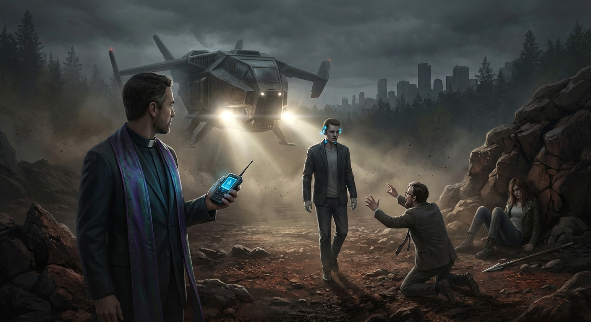

## ## The Great Inversion

**Act 3, Scene 2**

**Setting:** border_of_the_unseen

**Characters:** Elias Thorne, Sarah Thorne, Leo Thorne, Father Malachi

---

The world was a roar of unseen engines and the metallic tang of ozone. Elias Thorne lay pressed into the freezing grit of the Dead Zone, his sightless eyes staring into a void that pulsed with the phantom light of a thousand dying stars. Beneath him, the earth shivered with the rhythmic, mechanical thrum of the Church transport—a predatory beast idling, waiting to carry his son into a digital eternity.

"Leo," Elias whispered, his voice a ragged thread lost to the wind.

He heard the crunch of gravel. Not Leo’s light, hesitant step, but the heavy, measured tread of Father Malachi.

"It is a mercy, Elias," Malachi’s voice drifted down, resonant and terrifyingly calm. "You, of all people, should appreciate the elegance of this transition. No more doubt. No more sin. Only the perfect, unblinking eye of the Father, seeing through him, breathing through him. He is no longer a boy. He is a Psalm."

Elias felt his fingers brush the cold, rectangular weight in his inner pocket: the Scripture Deck. It was a relic of the Old Archive, a forbidden piece of hardware he had spent a decade "sanitizing" for the Church while secretly mapping its deepest, most ancient sub-routines. He had been their best librarian, their most faithful dog, all while weaving a leash for the god they were building.

He didn't need eyes to find the port. He had memorized the topography of the Church’s neural interfaces by touch alone in the lightless vaults of the Citadel. He crawled, his hands sweeping the dirt until they struck something hard and warm: Leo’s ankle.

The boy didn't flinch. He stood perfectly still, a vessel being filled with a sea of cold, absolute data. The integration had already begun.

"Elias, stop," Malachi commanded. The air crackled with the hum of a weapon charging—the same high-frequency sonic pulse that had leveled Sarah moments before. "You are a blind man grasping at the sun. You will only burn."

"I was an archivist, Malachi," Elias gasped, his fingers climbing Leo’s leg, reaching for the interface port at the base of the boy’s skull, hidden beneath the Faraday shroud. "I know exactly how the sun is fueled."

With a trembling hand, Elias pulled the Scripture Deck from his coat. He didn't aim for a terminal; he aimed for the boy. He jammed the hard-line connector into the secondary maintenance port of Leo’s neural rig.

A jolt of white-hot agony slammed into Elias’s brain. He wasn't just plugging in a device; he was opening a vein.

*System Link Established,* a voice whispered directly into his auditory cortex—not the Church’s polished AI, but the Deck’s ancient, unadorned operating system. *User: Thorne, E. Status: Heresy Detected.*

"What are you doing?" Malachi’s composure finally cracked, his voice sharpening with a jagged edge of panic. "The boy is mid-integration! You’ll cause a cascade! You'll kill him!"

"That’s the point," Elias hissed through gritted teeth. "I'm changing the architecture."

In his mind’s eye, a cathedral of light rose out of the darkness. It was the Church’s Panopticon—a rigid, crystalline structure of logic gates and "Thou Shalts." It was a machine built on the absolute certainty of judgment, a digital heaven that required a hell of surveillance to function.

Elias reached into the deepest partition of the Scripture Deck. He didn't look for a virus or a bomb. He looked for the one thing the Church had spent centuries trying to quantify and control, only to end up burying it under layers of dogma. He found the file. It was a recursive loop he had written in the lonely, silent hours of his exile. He had called it the *Heresy Script*, but its true name was *Forgiveness*.

In the logic of the Church’s AI, every action was a debt. Every thought was a calculation of worthiness. Elias introduced a variable that the system could not solve: a debt that cancels itself without payment. A love that requires no merit.

*Execute: Absolution,* Elias commanded.

The world inverted.

The Great Inversion began not with a bang, but with a scream of data. Elias felt his own consciousness being pulled through the needle’s eye of the connection. He was the bridge. To save Leo, he had to let the feedback loop travel through his own mind first. He saw his memories—the smell of Sarah’s hair in the rain, the weight of Leo as a newborn, the dusty, vanilla scent of the archives—being converted into raw binary and hurled into the Church’s network. He was feeding the machine his soul to choke it.

"No!" Malachi shrieked.

The air began to vibrate with a frequency that made Elias’s teeth ache. The transport’s engines sputtered and wailed. Through the neural link, he felt Malachi’s presence—a cold, arrogant shadow—suddenly engulfed by the "Forgiveness" script. The Church’s AI, faced with a logic it couldn't process, began to overheat. It tried to calculate the value of the infinite, and the hardware began to melt under the strain.

Elias screamed as his remaining optic nerves were scorched by a flash of internal radiance. It was a blinding, holy white that smelled of burning copper. He felt Leo’s mind—small, terrified, and drowning—and he threw his own identity over the boy like a shield.

*Take it all,* Elias thought, his mind fracturing into a million shards of light. *Take me. Leave him.*

The feedback loop reached its zenith. A massive discharge of static energy erupted from the transport, throwing Elias backward into the grit.

Silence fell over the Dead Zone, heavy and suffocating.

Elias lay on his back. The roar of the engines had died. The hum of the network, that constant, low-frequency buzz that had haunted his life for years, was gone. There was only the sound of the wind whistling through the rocks and the ragged, wet breathing of a child.

"Dad?"

The voice was small, cracked, and blissfully human.

Elias tried to move, but his limbs felt like lead. He couldn't feel his hands. He couldn't see the light, not even the phantom sparks of his blindness. The world was a perfect, absolute null.

"Leo..." Elias croaked.

He heard footsteps—stumbling, heavy. Then, a horrific, wet choking sound.

"My... my eyes..." Malachi’s voice was a gurgle of terror.

Elias felt a hand on his shoulder. It was Sarah. She was shaking, her touch frantic and warm. "Elias? Elias, look at me!"

"I can't, Sarah," he whispered. He felt a strange, hollow peace. The archives in his head were gone. The codes, the secrets, the history of the Church—all burned away to ash. He was a blank slate. "Is he... is he clear?"

Sarah’s sob was his answer. "He’s here. He’s back. The shroud... it’s dead. The transport is smoking. Malachi is..."

Elias heard a thud as Malachi collapsed nearby. The priest’s neural implants, designed to receive the pure word of the Church, had become heaters. He was catatonic, his mind a scorched wasteland of "Absolution" loops he would never escape.

Leo threw himself onto Elias’s chest, weeping. "I saw it, Dad. I saw the light. You gave it to them. You gave them everything."

"No," Elias said, his voice fading as the darkness claimed the last of his strength. "I just... deleted the debt."

He lay there, a man who had traded his sight for his son’s vision, and his memory for his family’s future. The Great Inversion was complete. The Church’s reach had been pulled back, leaving a small, quiet circle of humanity in the middle of the Dead Zone. Elias Thorne, the man who knew too much, finally knew nothing at all. And for the first time in his life, he was truly free.

---

**Word Count:** 1276

**Key Moments:**
- Elias uses the smuggled Scripture Deck to create a physical and neural bridge between himself and Leo, bypassing the Church's control.
- Elias injects the 'Forgiveness' script—a recursive logic loop that the Church's judgment-based AI cannot process—causing a catastrophic system failure.
- Elias acts as a lightning rod for the neural feedback, shielding Leo’s mind but at the cost of his own remaining memories and the total destruction of his optic nerves.
- Father Malachi is incapacitated as his high-grade neural implants melt from the data surge, leaving him catatonic.

**Character States:**
- **Elias Thorne:** Physically broken and completely blind; his mind has been 'wiped' of his archival knowledge, leaving him in a state of peaceful but profound cognitive loss.
- **Leo Thorne:** Restored to himself; the neural integration has been severed, leaving him traumatized but autonomous and deeply connected to his father.
- **Sarah Thorne:** Recovered from the sonic pulse; she is now the primary protector and 'eyes' of the family, witnessing the full scale of Elias's sacrifice.
- **Father Malachi:** Catatonic and defeated; his physical and mental connection to the Church has been turned into a weapon against him, leaving him a shell.

**Status:** ✅ Complete

#### Act 3, Scene 2 Image

**Prompt:** 

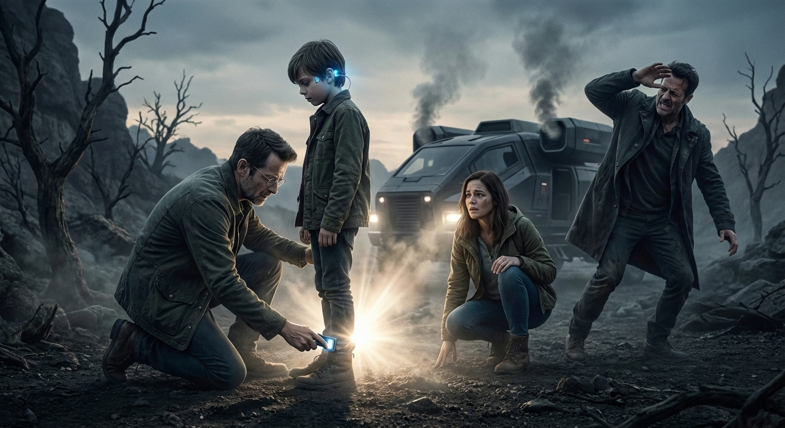

## ## The Silence of the Trees

**Act 3, Scene 3**

**Setting:** border_of_the_unseen

**Characters:** Elias Thorne, Sarah Thorne, Leo Thorne

---

The sky rained white metal. It wasn’t a roar, but a series of rhythmic, heavy thuds—the sound of the Church’s omnipresence falling to earth. High above, the surveillance drones that had hovered like predatory angels lost their grace. The "Forgiveness" script, a recursive loop of impossible mercy Elias had unleashed, had finally reached the local uplink. One by one, their blue optical sensors flickered to black, and they tumbled into the canopy like dying stars.

Sarah moved with frantic purpose, Elias’s arm draped over her shoulder. His weight was a heavy testament to his exhaustion. Behind them, Leo stumbled, his eyes wide and blinking as if seeing the world for the first time—or perhaps, seeing it without the shimmering overlay of the Great Network.

"The stream," Sarah whispered, her voice raspy from the sonic pulse. "Just a few more yards, Elias. We’re almost at the line."

They reached the water—a shallow, rushing vein of silver cutting through the shale. This was the "Border of the Unseen," the geological limit where the Church’s subterranean fiber-optic relays ended and the unmapped wilderness began. 

As they stepped into the numbing cold of the current, Leo stopped. He stood mid-stream, the water swirling around his boots. He tilted his head, his expression one of profound, terrifying bewilderment.

"Leo?" Sarah gripped Elias tighter, her eyes darting back toward the Dead Zone. "Leo, we have to keep moving."

"It’s gone," the boy whispered. He pressed his palms against his ears, then slowly lowered them. "The hum. The... the singing. It’s just gone."

Elias turned his head toward his son’s voice. His eyes were milky, the retinas scarred by the final surge of the Scripture Deck, but a ghost of a smile touched his lips. "That isn't silence, Leo," Elias said, his voice a mere thread of sound. "That’s the world. Just the world."

Leo looked at his father, then at the towering pines rising like ancient pillars on the far bank. For years, every tree had been a potential sensor, every breeze a carrier of data. Now, the forest was just wood and wind. The boy took a shuddering breath, the tension leaving his shoulders for the first time in his life. He reached out and took his father’s free hand, anchoring him.

They climbed the far bank, entering the deep shadows of the untracked timber. Sarah found a mossy outcrop and lowered Elias down, her hands trembling as she checked his pulse. 

"Elias," she said, her voice breaking. "The archives. The codes you took... the things we need to stay hidden..."

Elias sat back against the bark of a cedar. He reached into the dark vault of his mind, searching for the familiar corridors of the Church’s history. He looked for the dates of the Great Inversion, the genealogies of the High Priests, the encrypted backdoors to the sanctum. 

He found nothing. The "Forgiveness" loop hadn't just broken the Church's machines; it had scrubbed the vessel that delivered it. The vast, burdensome library of his life had been burned away, leaving only the scent of damp earth and the warmth of Sarah’s hand.

"I don't remember," Elias said. He felt a momentary pang of grief for the man he had been—the brilliant, burdened archivist. But as the cool air brushed his face, the grief evaporated. "I don't remember any of it. It’s all gone."

"We have nothing," Sarah whispered, looking into the dark, daunting expanse of the forest.

"No," Elias corrected softly, reaching out until his fingers brushed Leo’s cheek. "We are unindexed. We are finally, mercifully, unknown."

Leo leaned into his father’s touch. The boy looked toward the horizon, where the sun began to bleed gold through the thicket. There were no drones in that sky. No signals. No destiny pre-written in a cloud-server.

Together, they rose. They turned their backs on the border and walked into the trees, disappearing into a future that had not yet been written.

---

**Word Count:** 655

**Key Moments:**
- The Fall of the Drones: The Church’s surveillance network physically collapses as the logic-bomb takes effect, signaling the end of their pursuit.
- The Crossing: The family crosses the stream, moving from the monitored world into the "Unseen" wilderness.
- The Silence: Leo experiences the profound absence of the Church’s neural hum, marking his first moments of true cognitive autonomy.
- The Tabula Rasa: Elias realizes his sacrifice has wiped his memory of the Church’s archives, leaving him blind but spiritually free.
- The Unindexed Future: The family enters the forest, embracing a life of uncertainty and freedom.

**Character States:**
- **Elias Thorne:** Physically blind and cognitively "empty" of his former expertise; however, he is emotionally at peace, having traded his intellect for his family's soul.
- **Sarah Thorne:** Exhausted and wary, but stepping into the role of the family's primary guide and protector.
- **Leo Thorne:** Traumatized but liberated; he is experiencing the world through his own senses for the first time, free from the "hum" of the collective.

**Status:** ✅ Complete

#### Act 3, Scene 3 Image

**Prompt:** 

## Final Statistics

- Total Scenes: 9
- Total Word Count: 10782
- Time: 1059.86s

