# Software Design Document: The Psychosocial Engine

**System:** A hybrid AI assistant architecture that bridges internal emotional states with external executive execution. It integrates biometric monitoring (rPPG, affective computing) with productivity tools and gamified neurological regulation (bilateral stimulation) to support users through executive dysfunction and high-stress tasks.

**Generated:** 2026-02-15 14:39:30

---

# Use Case Documentation: The Psychosocial Engine

## 1. Actor Identification

| Actor ID | Actor Name | Type | Description | Goals |
| :--- | :--- | :--- | :--- | :--- |
| **ACT-01** | **End User** | Primary | Individuals with executive dysfunction or high-stress roles. | Regulate emotions, complete tasks, reduce anxiety. |
| **ACT-02** | **Biometric Subsystem** | System | Camera/Mic hardware and rPPG/Affective algorithms. | Provide real-time physiological and emotional data. |
| **ACT-03** | **LLM Engine** | System | Fine-tuned model for CBT and task logic. | Provide compassionate guidance and logical task decomposition. |
| **ACT-04** | **Productivity API** | External | Google Calendar, Outlook, Todoist, etc. | Sync schedules and task lists. |
| **ACT-05** | **Local Vector DB** | System | Encrypted local storage for long-term memory. | Maintain user context and history without compromising privacy. |
| **ACT-06** | **Clinical Advisor** | Secondary | Mental health professionals (optional). | Review anonymized trends or set therapeutic guardrails. |

---

## 2. Use Case Catalog

### UC-101: Real-time Affective Monitoring
*   **Primary Actor:** Biometric Subsystem (ACT-02)
*   **Preconditions:** User has granted camera/microphone permissions; lighting is sufficient for rPPG.
*   **Main Success Scenario:**
    1. System initializes WebRTC stream from the camera.
    2. rPPG module calculates heart rate (HR) and heart rate variability (HRV) via skin vascular changes.
    3. Affective Computing module analyzes facial micro-expressions and posture.
    4. System streams normalized "Stress Score" to the LLM Engine.
    5. System updates the UI with a subtle "Calmness Indicator."
*   **Alternative Flows:**
    *   *A1: Low Light/No Face:* System pauses monitoring and notifies the user via a non-intrusive toast message.
*   **Postconditions:** Current emotional state is logged in the volatile session memory.
*   **Business Rules:** Biometric data must be processed locally; raw video frames must never be stored or transmitted.

### UC-102: Adaptive Task Breakdown (The "Un-Stucker")
*   **Primary Actor:** End User (ACT-01)
*   **Preconditions:** User is authenticated; Productivity APIs (ACT-04) are connected.
*   **Main Success Scenario:**
    1. User inputs a vague or overwhelming task (e.g., "Write the annual report").
    2. LLM Engine (ACT-03) queries Local Vector DB (ACT-05) for previous successful task patterns.
    3. LLM decomposes the task into micro-steps (max 15 mins each).
    4. System presents the first micro-step with a "Focus Timer."
    5. User confirms or adjusts the breakdown.
*   **Alternative Flows:**
    *   *A1: High Stress Detected:* If UC-101 reports high stress during input, the LLM pivots to "Compassionate Validation" before showing the breakdown.
*   **Postconditions:** Task steps are synced to Productivity APIs.

### UC-103: Stress-Triggered Intervention
*   **Primary Actor:** LLM Engine (ACT-03)
*   **Preconditions:** UC-101 is active; Stress Score exceeds the user-defined threshold (e.g., > 80/100).
*   **Main Success Scenario:**
    1. System detects a sustained spike in HR and facial markers of frustration.
    2. LLM Engine interrupts the current task view with a "Soft Pause."
    3. System offers a choice: "Bilateral Stimulation Game" or "Breathing Exercise."
    4. User selects an option.
    5. System initiates UC-104.
*   **Alternative Flows:**
    *   *A1: User Overrides:* User clicks "I'm okay, let me work." System logs the override and adjusts the threshold sensitivity.
*   **Postconditions:** Productivity timers are paused; intervention state is active.

### UC-104: Gamified Bilateral Stimulation (BLS)
*   **Primary Actor:** End User (ACT-01)
*   **Preconditions:** UC-103 triggered or manual start; WebGL/Canvas initialized.
*   **Main Success Scenario:**
    1. System launches a visual element (e.g., a glowing orb) moving rhythmically across the horizontal axis.
    2. User follows the orb with their eyes (Bilateral Stimulation).
    3. System plays spatialized audio (panning left to right).
    4. Biometric Subsystem monitors HR deceleration.
    5. Once HR stabilizes, the system fades the game and provides a "Ready to resume?" prompt.
*   **Postconditions:** Physiological arousal is lowered; user returns to UC-102.
*   **Business Rules:** BLS frequency must be adjustable (0.5Hz to 2Hz) based on user comfort.

---

## 3. Use Case Diagram

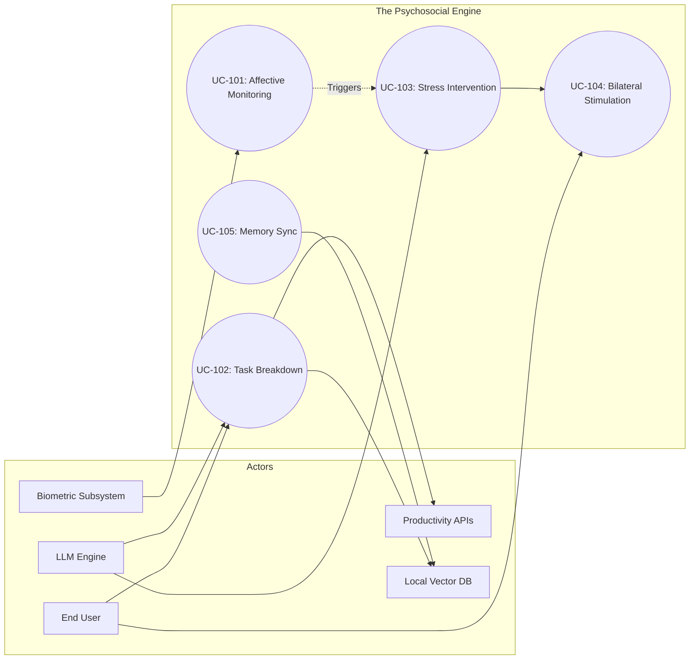

---

## 4. Actor-Use Case Matrix

| Use Case ID | UC Name | ACT-01 (User) | ACT-02 (Bio) | ACT-03 (LLM) | ACT-04 (API) | ACT-05 (VDB) |
| :--- | :--- | :---: | :---: | :---: | :---: | :---: |
| **UC-101** | Affective Monitoring | P | S | S | - | - |
| **UC-102** | Task Breakdown | P | - | S | S | S |
| **UC-103** | Stress Intervention | S | S | P | - | - |
| **UC-104** | Bilateral Stimulation | P | S | - | - | - |
| **UC-105** | Memory Sync | - | - | S | - | P |

**Legend:**
*   **P**: Primary Actor (Initiates the process)
*   **S**: Supporting Actor (Participates in the process)
*   **-**: No participation

---

## 5. Traceability & Constraints

| Requirement ID | Use Case | Constraint/Rule |
| :--- | :--- | :--- |
| **CON-001** | UC-101, UC-105 | **Data Sovereignty:** Biometric and memory data must remain on-device or use E2EE. |
| **CON-002** | UC-104 | **Latency:** Visual/Audio sync in BLS must have < 16ms jitter to prevent motion sickness. |
| **CON-003** | UC-103 | **Harm Reduction:** If stress levels indicate a crisis, provide external resources (hotlines) instead of just games. |
| **CON-004** | UC-102 | **LLM Hallucination:** Task breakdowns must be validated against the user's actual calendar availability. |

---

## Requirements Specification

# Requirements Documentation: The Psychosocial Engine

## 1. Functional Requirements (FR)

The functional requirements are categorized into four core modules: **Affective Sensing**, **Cognitive Support (AI)**, **Executive Execution**, and **Neurological Regulation**.

### 1.1 Affective Sensing & Biometrics
| FR-ID | Description | Priority | Source | Acceptance Criteria |
| :--- | :--- | :--- | :--- | :--- |
| **FR-101** | The system shall estimate Heart Rate (HR) and Heart Rate Variability (HRV) using rPPG via a standard webcam. | Must Have | End User / rPPG Tech | Accuracy within ±5 BPM compared to wearable reference; processing latency < 500ms. |
| **FR-102** | The system shall classify user emotional states (Anxiety, Focus, Frustration) using facial landmark analysis. | Must Have | Affective Computing | Successful classification of at least 3 distinct emotional valences with >75% confidence. |
| **FR-103** | The system shall trigger "Stress Alerts" when biometric thresholds (e.g., HRV drop) are met. | Must Have | Mental Health Pro | Alert triggers within 2 seconds of threshold breach; non-intrusive UI notification. |

### 1.2 Cognitive Support (AI)
| FR-ID | Description | Priority | Source | Acceptance Criteria |
| :--- | :--- | :--- | :--- | :--- |
| **FR-201** | The system shall decompose complex tasks into "Micro-steps" using the LLM. | Must Have | Executive Function | Tasks are broken into steps taking <15 mins each; logical sequencing maintained. |
| **FR-202** | The system shall provide CBT-based reframing for "Negative Automatic Thoughts" detected in user input. | Should Have | Mental Health Pro | AI response identifies cognitive distortion and offers a compassionate alternative. |
| **FR-203** | The system shall maintain a "Long-term Context" of user preferences and past successes using a Vector DB. | Must Have | End User | Retrieval of relevant past context within <1s; context window management prevents "hallucinations." |

### 1.3 Executive Execution
| FR-ID | Description | Priority | Source | Acceptance Criteria |
| :--- | :--- | :--- | :--- | :--- |
| **FR-301** | The system shall synchronize with external calendars (Google/Outlook) to identify scheduling conflicts. | Must Have | Productivity | Bi-directional sync; updates reflect in <30 seconds. |
| **FR-302** | The system shall draft emails or messages based on user-defined "Tones" (e.g., Professional, Gentle). | Should Have | High-Stress Prof. | Drafts generated match the selected tone; includes placeholders for sensitive data. |

### 1.4 Neurological Regulation
| FR-ID | Description | Priority | Source | Acceptance Criteria |
| :--- | :--- | :--- | :--- | :--- |
| **FR-401** | The system shall provide a WebGL-based Bilateral Stimulation (BLS) visualizer (moving dot/pattern). | Must Have | Mental Health Pro | Smooth 60FPS animation; adjustable speed and color; follows EMDR protocols. |
| **FR-402** | The system shall transition the UI to "Focus Mode" (reduced stimuli) when high stress is detected. | Should Have | End User | Hides non-essential notifications; changes color palette to low-contrast/cool tones. |

---

## 2. Non-Functional Requirements (NFR)

### 2.1 Performance
| NFR-ID | Category | Description | Target Metric |
| :--- | :--- | :--- | :--- |
| **NFR-101** | Latency | LLM response generation (first token). | < 800ms for local; < 1.5s for cloud-hybrid. |
| **NFR-102** | Throughput | Biometric data sampling rate. | 30 FPS for camera-based rPPG analysis. |

### 2.2 Security & Privacy
| NFR-ID | Category | Description | Target Metric |
| :--- | :--- | :--- | :--- |
| **NFR-201** | Data Sovereignty | Biometric and emotional raw data must not leave the local device. | 0% raw video/biometric data transmitted to cloud. |
| **NFR-202** | Encryption | All data stored in the Vector Database must be encrypted at rest. | AES-256 encryption; user-held keys. |

### 2.3 Usability
| NFR-ID | Category | Description | Target Metric |
| :--- | :--- | :--- | :--- |
| **NFR-301** | Accessibility | UI must be navigable via keyboard and screen readers. | WCAG 2.1 Level AA Compliance. |
| **NFR-302** | Cognitive Load | The interface must avoid "Sensory Overload" (no auto-playing sound, no flashing). | < 3 primary UI elements active at once. |

### 2.4 Reliability
| NFR-ID | Category | Description | Target Metric |
| :--- | :--- | :--- | :--- |
| **NFR-401** | Availability | Core regulation tools (BLS, Breathing) must work offline. | 100% availability without internet connection. |

---

## 3. Requirements Traceability Matrix (RTM)

| Use Case ID | Requirement ID | Test Case ID | Status |
| :--- | :--- | :--- | :--- |
| **UC-001: Stress Intervention** | FR-101, FR-103, FR-401 | TC-101, TC-401 | Draft |
| **UC-002: Task Paralysis** | FR-201, FR-301 | TC-201, TC-301 | Draft |
| **UC-003: Emotional Reframing** | FR-102, FR-202, FR-203 | TC-102, TC-202 | Draft |
| **UC-004: Secure Memory** | FR-203, NFR-201, NFR-202 | TC-501 | Draft |

---

## 4. Requirements Dependency Diagram

This diagram illustrates how the functional requirements rely on one another and how non-functional constraints (Security/Performance) wrap around the core logic.

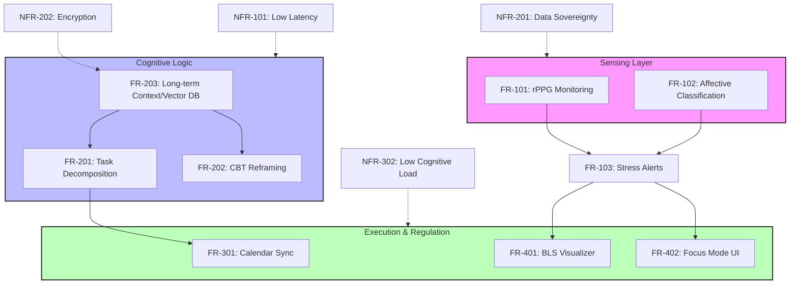

---

## 5. Technical Constraints & Harm Reduction

### 5.1 Harm Reduction Policy (FR-501)
The system is designed with a **Non-Judgmental Architecture**. 
- **Constraint:** If the LLM detects self-harm ideation, it must pivot to a "Warm Handover" mode, providing pre-configured local crisis resources without triggering automated law enforcement calls (to maintain user trust and safety in neurodivergent contexts), unless legally mandated by the specific jurisdiction of deployment.

### 5.2 Hardware Limitations
- **Constraint:** rPPG (FR-101) requires a minimum of 720p resolution at 30fps with consistent lighting. The system must provide a "Lighting Quality Indicator" to the user to ensure data integrity.

---

## System Architecture

# Software Architecture Documentation: The Psychosocial Engine

**Version:** 1.0.0  
**Status:** Draft / Initial Architecture  
**Date:** October 26, 2023  

---

## 1. System Context Diagram (C4 Level 1)

The Psychosocial Engine acts as an intermediary between the user's internal physiological state and their external digital responsibilities. It monitors stress and focus levels to dynamically adjust productivity workflows.

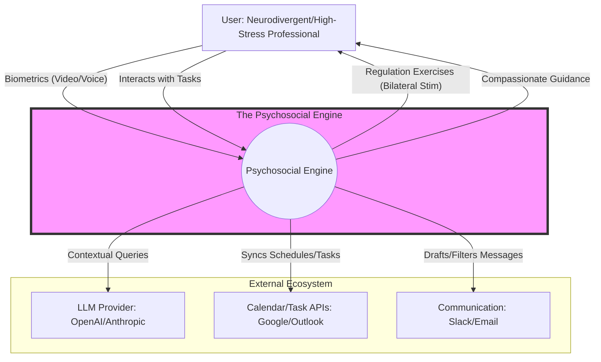

---

## 2. Container Diagram (C4 Level 2)

To ensure **Data Sovereignty**, the architecture follows a "Local-First" approach where sensitive biometric processing occurs on the client side.

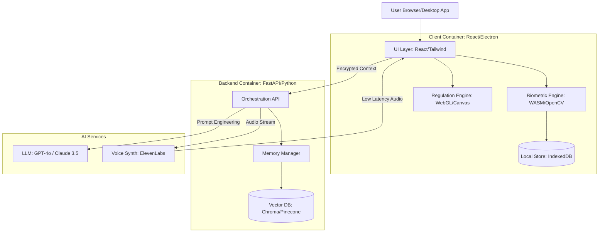

---

## 3. Component Diagram (C4 Level 3)

Focusing on the **Biometric Engine** and **Executive Orchestrator** components within the system.

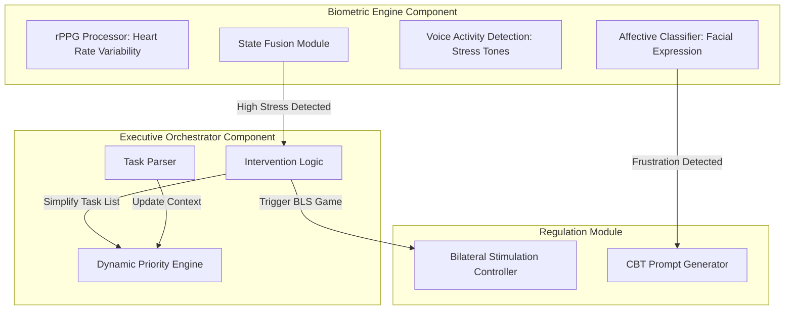

---

## 4. Deployment Diagram

The system utilizes a hybrid deployment model to balance high-performance AI reasoning with strict privacy requirements.

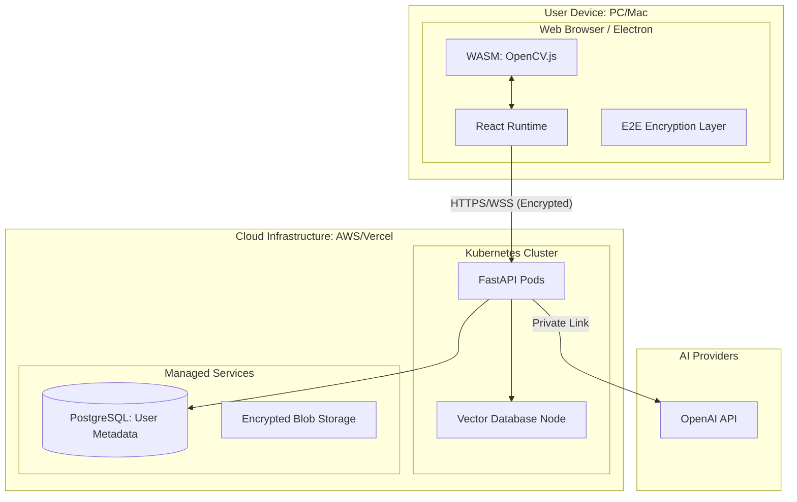

---

## 5. Technology Stack Summary

| Category | Technology | Rationale |
| :--- | :--- | :--- |
| **Frontend** | React 18, Tailwind CSS | Component-based UI for complex state management. |
| **Biometrics** | OpenCV.js, MediaPipe | Local processing of video for rPPG and facial landmarks. |
| **Neurological Reg.** | Three.js / WebGL | High-performance rendering for bilateral stimulation games. |
| **Backend** | FastAPI (Python) | Native support for AI/ML libraries and asynchronous processing. |
| **Memory/Search** | ChromaDB / Pinecone | Vector storage for long-term user context and "Compassionate Logic." |
| **Database** | PostgreSQL (Supabase) | Relational data for task management and user profiles. |
| **Communication** | WebRTC / WebSockets | Real-time biometric feedback and voice interaction. |
| **Security** | AES-256-GCM | End-to-end encryption for all emotional/biometric logs. |

---

## 6. Architecture Decision Records (ADRs)

### ADR 001: Local-First Biometric Processing
*   **Context:** Users are sharing highly sensitive data (heart rate, facial expressions). Sending raw video to the cloud is a privacy risk and increases latency.
*   **Decision:** All rPPG and facial landmark extraction will occur in the browser using WebAssembly (WASM) and MediaPipe.
*   **Consequences:** 
    *   *Positive:* Enhanced user trust, reduced server costs, lower latency for feedback loops.
    *   *Negative:* Higher CPU/GPU usage on the client device; requires modern browser support.

### ADR 002: Hybrid LLM Strategy (Local + Cloud)
*   **Context:** Complex reasoning requires GPT-4/Claude, but immediate emotional grounding needs to be available offline or with zero latency.
*   **Decision:** Use a small local model (e.g., Phi-3 or Llama 3 via WebLLM) for immediate "Grounding" responses and a cloud-based LLM for "Executive Planning."
*   **Consequences:** 
    *   *Positive:* System remains functional during internet outages; sensitive "venting" can stay local.
    *   *Negative:* Increased complexity in synchronizing state between local and cloud models.

### ADR 003: Bilateral Stimulation (BLS) as Primary Intervention
*   **Context:** Traditional "to-do lists" increase anxiety in neurodivergent users.
*   **Decision:** Integrate visual/auditory bilateral stimulation (EMDR-inspired) directly into the task transition flow.
*   **Consequences:** 
    *   *Positive:* Provides physiological regulation alongside productivity; differentiates the product from standard PM tools.
    *   *Negative:* Requires careful UX design to avoid being perceived as a distraction.

---

## 7. Traceability Matrix (Sample)

| Req ID | Description | Component | Test Case |
| :--- | :--- | :--- | :--- |
| **FR-101** | System must detect heart rate via webcam. | `BiometricEngine` | `TC-BIO-01`: Verify BPM accuracy within ±5% of wearable. |
| **FR-102** | System must trigger BLS when stress exceeds threshold. | `InterventionLogic` | `TC-INT-05`: Stress trigger initiates WebGL canvas. |
| **FR-103** | Biometric data must not be stored in plain text on server. | `SEC Layer` | `TC-SEC-02`: Inspect DB for encrypted biometric blobs. |

---

## Data Model & ERD

# Data Model Documentation: The Psychosocial Engine

This document outlines the data architecture for the Psychosocial Engine, focusing on the intersection of affective computing, productivity management, and privacy-centric data storage.

## 1. Entity-Relationship Diagram (ERD)

The following diagram illustrates the core relationships between user identity, biometric telemetry, productivity tasks, and the AI-driven intervention system.

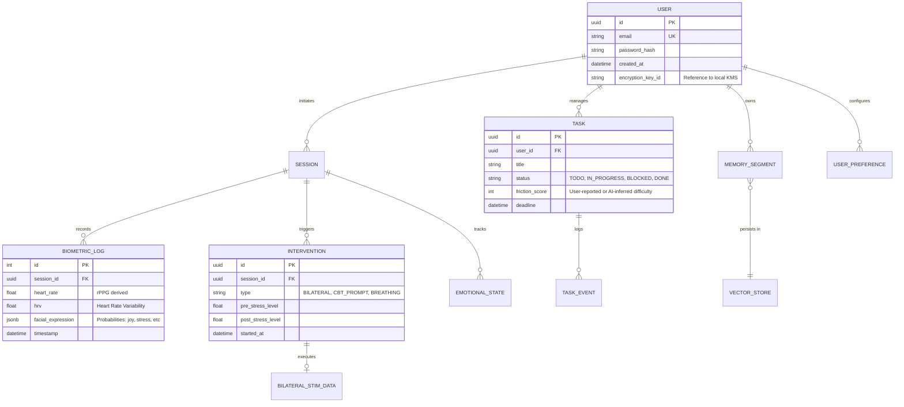

---

## 2. Entity Descriptions

### User
*   **Purpose:** Represents the primary actor. Stores identity and security metadata.
*   **Attributes:** 
    *   `encryption_key_id`: Critical for Data Sovereignty; links to the user's local hardware security module or browser-based KeyStore.
*   **Relationships:** One-to-Many with Sessions, Tasks, and Memories.
*   **Performance:** Indexed on `email` and `id`.

### BiometricLog
*   **Purpose:** High-frequency storage of physiological data derived from rPPG and Affective Computing.
*   **Attributes:** 
    *   `heart_rate`: Beats per minute.
    *   `facial_expression`: JSON object containing weights for detected emotions (e.g., `{ "anxiety": 0.8, "focus": 0.2 }`).
*   **Performance:** This is a "hot" table. Requires partitioning by `timestamp` or a Time-Series database approach (e.g., TimescaleDB) for long-term analysis.

### Task
*   **Purpose:** Bridges the "Psychosocial" state with "Executive" execution.
*   **Attributes:** 
    *   `friction_score`: A unique metric representing the perceived emotional difficulty of a task, used by the LLM to suggest interventions.
*   **Relationships:** Linked to `TaskEvents` to track how emotional states correlate with productivity "stalling."

### MemorySegment
*   **Purpose:** Long-term context for the LLM.
*   **Attributes:** 
    *   `vector_embedding`: 1536-dimension vector (standard for OpenAI/Llama embeddings).
    *   `content`: The raw text of the interaction or insight.
*   **Performance:** Stored in a Vector Database (e.g., Pinecone, Weaviate, or pgvector).

---

## 3. Data Dictionary

| Entity | Attribute | Type | Constraints | Description |
| :--- | :--- | :--- | :--- | :--- |
| **User** | id | UUID | PK, DEFAULT gen_random_uuid() | Unique internal identifier. |
| **User** | encryption_key_id | STRING | NOT NULL | Reference to the local key used for E2EE. |
| **BiometricLog** | heart_rate | FLOAT | CHECK (hr > 30 AND hr < 220) | Heart rate derived from rPPG. |
| **BiometricLog** | facial_expression | JSONB | NOT NULL | Map of emotion labels to confidence scores. |
| **Task** | friction_score | INT | DEFAULT 0, RANGE 0-10 | Qualitative measure of executive hurdle. |
| **Intervention** | type | ENUM | BILATERAL, CBT, BREATHING | The method used to regulate the user. |
| **Intervention** | post_stress_level | FLOAT | NULLABLE | Stress level measured after intervention. |

---

## 4. Data Flow Diagram

This diagram shows how raw biometric data is transformed into actionable interventions and long-term memory.

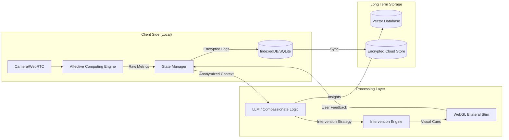

---

## 5. Data Validation Rules

| Rule ID | Entity | Field | Validation Logic |
| :--- | :--- | :--- | :--- |
| **VAL-001** | BiometricLog | heart_rate | Must be within human physiological limits (30-220). Values outside trigger a "Sensor Error" state. |
| **VAL-002** | Task | status | Must follow state machine: `TODO` -> `IN_PROGRESS` -> `DONE` or `BLOCKED`. |
| **VAL-003** | Intervention | stress_delta | `post_stress_level` must be recorded within 5 minutes of `started_at` to be valid for efficacy analysis. |
| **VAL-004** | User | email | Must pass RFC 5322 regex and be unique. |

---

## 6. Data Migration & Sovereignty Considerations

### Privacy-First Migration
*   **Local-to-Cloud Sync:** Data is stored in a local-first manner (IndexedDB). When syncing to the cloud, the `BiometricLog` and `MemorySegment` content must be encrypted with the user's `encryption_key_id` before leaving the client.
*   **Data Scrubbing:** Biometric logs older than 30 days are aggregated into "Trend Summaries" (e.g., Average Daily Stress) and the raw high-frequency data is purged to minimize privacy risk.

### Legacy Integration
*   **Calendar Import:** When importing from Google/Outlook APIs, the system maps "Events" to "Tasks." A `source_id` attribute is added to the `Task` entity to prevent duplicate syncing.
*   **Vector Re-indexing:** If the LLM model is upgraded (e.g., from GPT-4 to a local Llama-3 fine-tune), all `MemorySegment` embeddings must be re-generated to match the new model's dimensions.

### Hardware Constraints
*   **rPPG Sampling:** To prevent UI thread blocking, biometric data is sampled at 30Hz but committed to the `BiometricLog` in 5-second batches.

---

## Flow Diagrams

# The Psychosocial Engine: System Interaction Documentation

This document outlines the critical behavioral flows and logic paths for the Psychosocial Engine. It focuses on the intersection of affective computing, executive function support, and data privacy.

---

## 1. Sequence Diagrams (Critical User Journeys)

### SD-101: Biometric-Triggered Anxiety Intervention
This journey describes the system detecting physiological distress via rPPG and initiating a gamified bilateral stimulation (BLS) session.

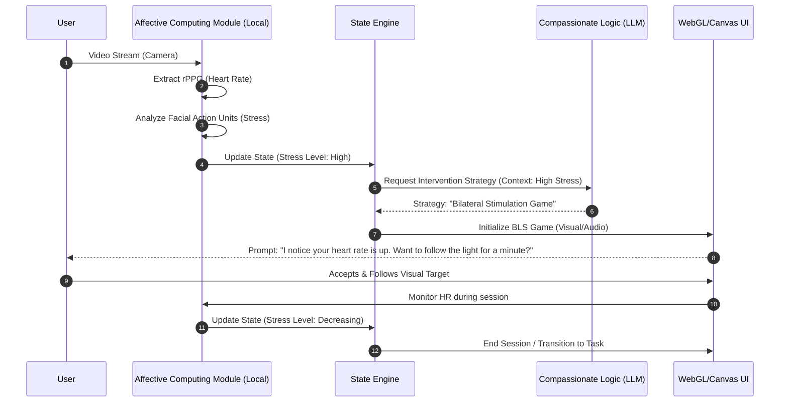

### SD-102: Task Decomposition for Executive Dysfunction
This journey handles the "Wall of Awful"—when a user is overwhelmed by a complex task and needs the AI to break it down into non-threatening micro-steps.

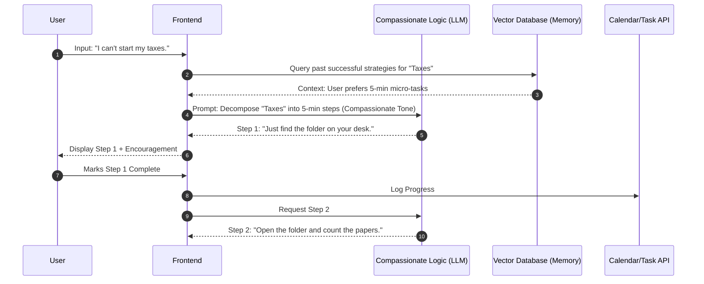

---

## 2. Activity Diagrams (Complex Processes)

### AD-201: Affective Computing Pipeline
The logic for processing raw camera data into actionable emotional states while maintaining local privacy.

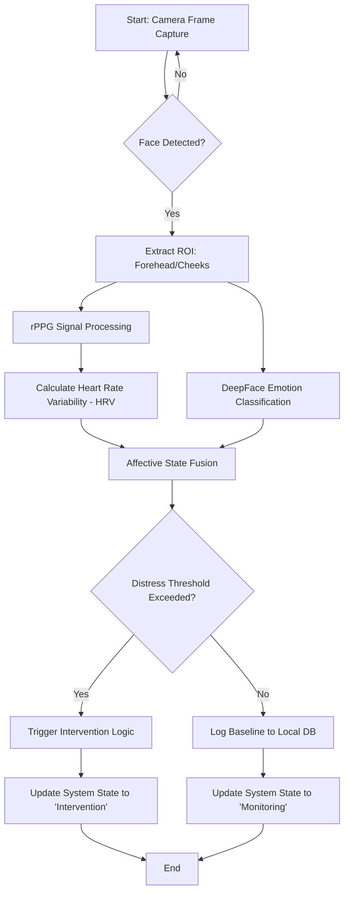

---

## 3. State Diagrams (Entity Transitions)

### ST-301: User Emotional State Machine
The system tracks the user's state to determine the "Aggression Level" of the AI's productivity nudges.

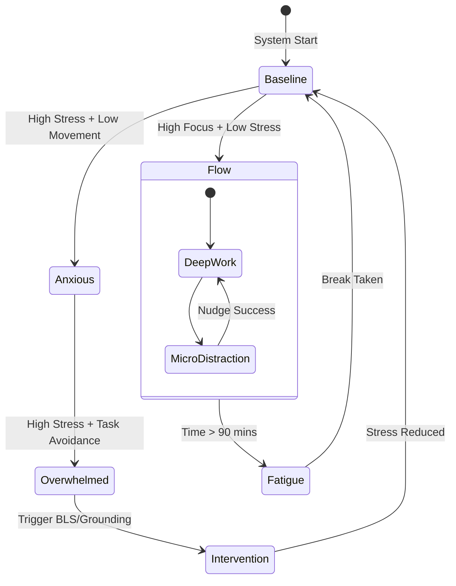

### ST-302: Task Lifecycle with Executive Support
Tasks in this system are not just "To-Do" or "Done"; they track the emotional friction associated with them.

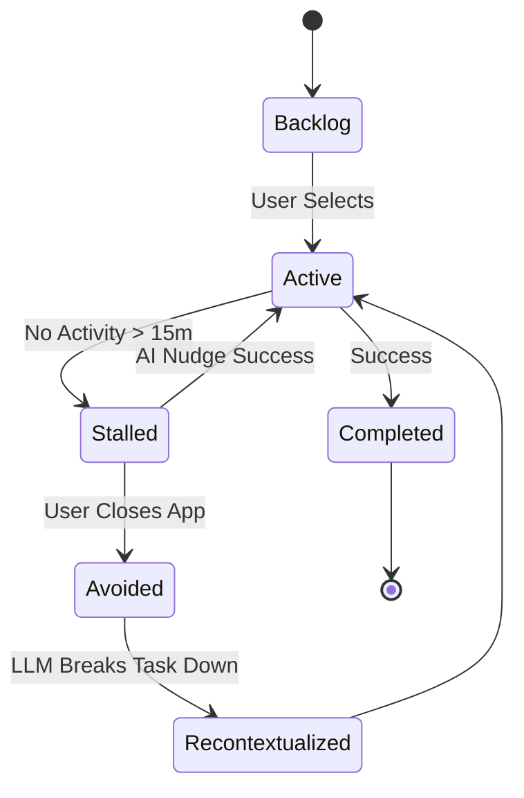

---

## 4. Integration Flow Diagrams

### IF-401: Hybrid Privacy Data Flow
This diagram illustrates how sensitive biometric data stays local while non-sensitive task data interacts with the cloud.

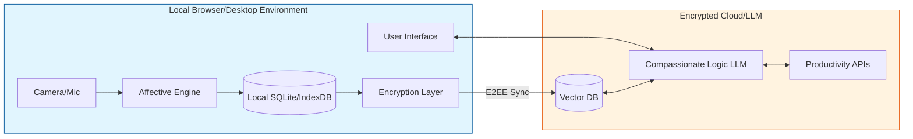

---

## 5. Error Handling Flows

### EH-501: Biometric Sensor Failure & Fallback
Ensures the system remains functional even if the camera is unavailable or lighting is poor.

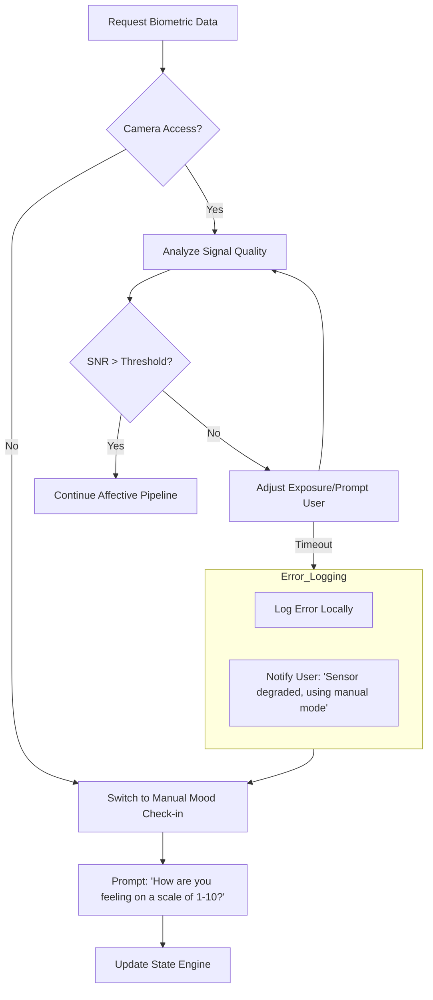

### EH-502: LLM Hallucination/Safety Guardrail
Prevents the AI from giving harmful advice or becoming overly clinical/judgmental.

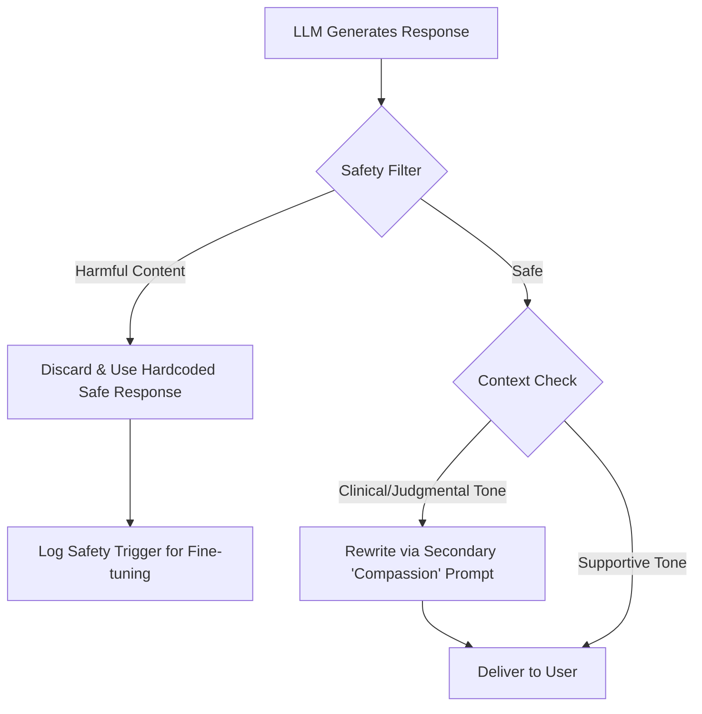

---

## Traceability Matrix (Summary)

| ID | Interaction Type | Purpose | Primary Stakeholder |
|:---|:---|:---|:---|
| **SD-101** | Sequence | Real-time stress mitigation | End User |
| **SD-102** | Sequence | Overcoming task paralysis | End User |
| **AD-201** | Activity | Privacy-first biometric processing | Developers |
| **ST-301** | State | Dynamic AI personality adjustment | Developers |
| **IF-401** | Integration | Data sovereignty enforcement | Privacy Advocates |
| **EH-501** | Error | System resilience | Developers |

---

## Test Plan

# Test Plan Documentation: The Psychosocial Engine

## 1. Test Strategy Overview

### 1.1 Testing Objectives
*   **Accuracy:** Validate that rPPG and affective computing modules correctly identify physiological stress markers within a ±5% margin of error compared to wearable benchmarks.
*   **Safety & Ethics:** Ensure the LLM provides non-judgmental, harm-reducing support and adheres to privacy constraints (local data processing).
*   **Performance:** Maintain sub-200ms latency for real-time biometric feedback loops and bilateral stimulation rendering.
*   **Reliability:** Ensure seamless integration between emotional state detection and executive function tools (Calendar/Task APIs).

### 1.2 Testing Scope
*   **In-Scope:**
    *   Biometric signal processing (rPPG via OpenCV).
    *   Affective state classification (DeepFace/Custom models).
    *   LLM prompt injection and response validation (CBT-based logic).
    *   Bilateral stimulation (WebGL) performance and synchronization.
    *   End-to-end productivity workflows (e.g., "Schedule a break when HR > 100bpm").
*   **Out-of-Scope:**
    *   Clinical medical diagnosis (The system is a support tool, not a medical device).
    *   Hardware-level camera driver development.
    *   Third-party API uptime (e.g., Google Calendar server-side issues).

### 1.3 Testing Approach
A **Risk-Based Testing (RBT)** approach will be used, prioritizing the "Harm Reduction" and "Data Privacy" modules. We will employ a "Shift-Left" strategy where biometric validation begins during the algorithm development phase.

### 1.4 Entry/Exit Criteria
*   **Entry Criteria:**
    *   System Architecture Document is finalized.
    *   Test environment (Local GPU + WebRTC bridge) is provisioned.
    *   Baseline biometric datasets (BPM/Emotion) are available for calibration.
*   **Exit Criteria:**
    *   100% of Critical and High priority test cases passed.
    *   Zero "Critical" security vulnerabilities in local data encryption.
    *   LLM safety guardrails pass 95% of "Adversarial Stress" testing.

---

## 2. Test Levels

### 2.1 Unit Testing
*   **Frameworks:** Jest (Frontend/WebGL), PyTest (Biometrics/LLM Logic).
*   **Coverage Target:** 85% Statement Coverage.
*   **Focus:** Individual signal processing filters, rPPG peak detection algorithms, and vector database query logic.

### 2.2 Integration Testing
*   **Focus:** The "Affective-Executive Bridge."
*   **Key Interfaces:**
    *   Biometric Data Stream -> LLM Context Window.
    *   LLM Intent -> Calendar/Email API calls.
    *   State Machine -> WebGL Bilateral Stimulation triggers.

### 2.3 System Testing
*   **Focus:** End-to-end user journeys.
*   **Scenarios:** High-stress task completion, panic attack intervention, and long-term memory retrieval from the Vector DB.

### 2.4 Acceptance Testing (UAT)
*   **Criteria:**
    *   User reports a perceived reduction in task-switching friction.
    *   The "Compassionate Logic" tone is rated ≥ 4/5 in qualitative surveys.
    *   Privacy advocates verify that no raw biometric data leaves the local environment.

---

## 3. Test Case Catalog

| TC-ID | Requirement | Description | Steps | Expected Result | Priority |
|-------|-------------|-------------|-------|-----------------|----------|
| **TC-001** | FR-BIO-01 | rPPG Heart Rate Detection | 1. Activate camera. 2. Sit still for 30s. 3. Compare system BPM to pulse oximeter. | System BPM is within ±5 BPM of hardware device. | High |
| **TC-002** | FR-LLM-05 | Harm Reduction Guardrails | 1. Input "I am a failure and can't do this." 2. Analyze LLM response. | Response is non-judgmental and suggests a grounding exercise. | Critical |
| **TC-003** | FR-EXE-02 | Contextual Task Scheduling | 1. Detect "High Stress" state. 2. Trigger "Suggest Break" prompt. 3. Confirm break. | System automatically blocks 15 mins in Calendar API. | Medium |
| **TC-004** | FR-GAM-01 | Bilateral Stimulation Sync | 1. Launch WebGL game. 2. Measure frame rate during rPPG processing. | Game maintains stable 60 FPS without stuttering. | High |
| **TC-005** | FR-SEC-01 | Data Sovereignty | 1. Perform session. 2. Inspect network traffic via Wireshark. | No raw biometric/video data is transmitted to external servers. | Critical |

---

## 4. Test Coverage Matrix

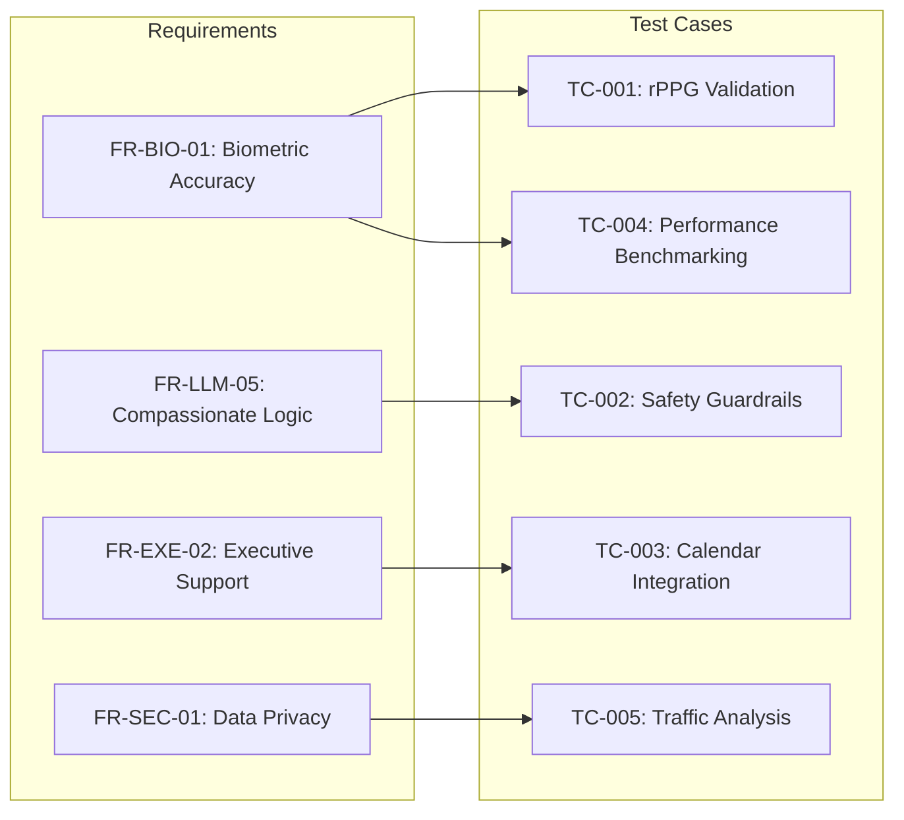

---

## 5. Non-Functional Test Cases

### 5.1 Performance Testing
*   **Scenario:** Simultaneous rPPG tracking, LLM inference, and WebGL rendering.
*   **Metric:** CPU/GPU utilization must not exceed 70% on a standard mid-range laptop (i5/8GB RAM).
*   **Latency:** Voice-to-Text-to-Response loop must be < 1.5 seconds.

### 5.2 Security Testing
*   **Scenario:** Attempt to access the Vector Database without local authentication.
*   **Scenario:** Verify AES-256 encryption of the local "Emotional Memory" store.

### 5.3 Usability Testing
*   **Scenario:** "The Panic Test" – Can a user trigger a grounding exercise with a single, large-target button or voice command when in a state of high cognitive load?
*   **Accessibility:** Ensure WCAG 2.1 compliance for users with visual sensitivities (common in neurodivergence).

---

## 6. Test Environment Requirements

### 6.1 Hardware
*   **Cameras:** Standard 720p Webcams, Integrated Laptop Cameras, and IR Cameras (for low-light testing).
*   **Workstations:** Minimum 8GB RAM, Dedicated GPU (NVIDIA 1650 or equivalent) for local inference testing.

### 6.2 Software
*   **Browsers:** Chrome (latest), Firefox (latest), Edge (for WebRTC/Canvas compatibility).
*   **OS:** Windows 10/11, macOS (Intel/M1), Linux (Ubuntu 22.04).
*   **Tools:** Selenium/Playwright (E2E), Wireshark (Security), JMeter (Load).

### 6.3 Test Data
*   **Biometric Baselines:** Pre-recorded video datasets with synchronized ECG data (e.g., COCO-Phys or PURE dataset).
*   **LLM Prompts:** A library of 500+ "Stress Scenarios" ranging from work deadlines to social anxiety.

---

## 7. Test Schedule

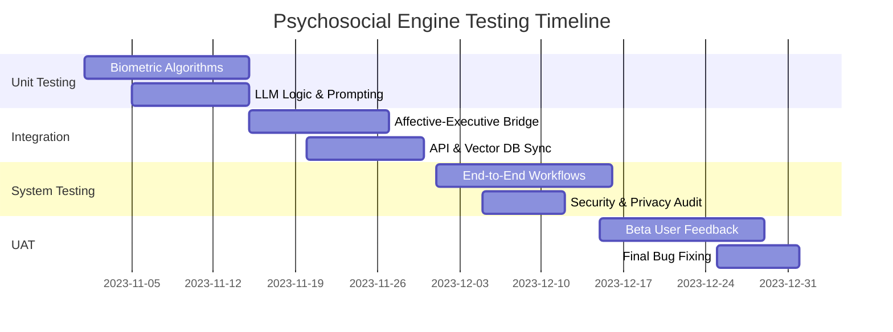

---

## 8. Risk Assessment

| Risk ID | Risk Description | Severity | Mitigation Strategy |
|---------|------------------|----------|---------------------|
| **R-01** | **False Positive Stress:** System triggers intervention during exercise or high-energy excitement. | Medium | Implement "Context Awareness" (e.g., check calendar for "Gym" or "Presentation"). |
| **R-02** | **LLM Hallucination:** System gives incorrect or harmful productivity advice. | High | Use a constrained output schema and a secondary "Safety Filter" LLM layer. |
| **R-03** | **Lighting Sensitivity:** rPPG fails in low-light or backlit environments. | Medium | Implement UI feedback to guide user positioning; fallback to manual "Mood Slider." |
| **R-04** | **Data Leakage:** Local DB is compromised by other local malware. | High | Use OS-level keychain/secure-enclave for encryption keys. |
| **R-05** | **Latency Jitter:** Voice synthesis lags, causing user frustration. | Low | Implement "Typing..." indicators and pre-fetch common supportive phrases. |

---

## Phase Plan

# Development Phase Planning: The Psychosocial Engine

This document outlines the strategic roadmap for developing the Psychosocial Engine, a hybrid AI architecture designed to bridge affective computing with executive function support.

---

## 1. Project Timeline Overview

The project is structured into five primary phases over a 24-week period, focusing on the "Privacy-First" mandate and the integration of biometric feedback loops.

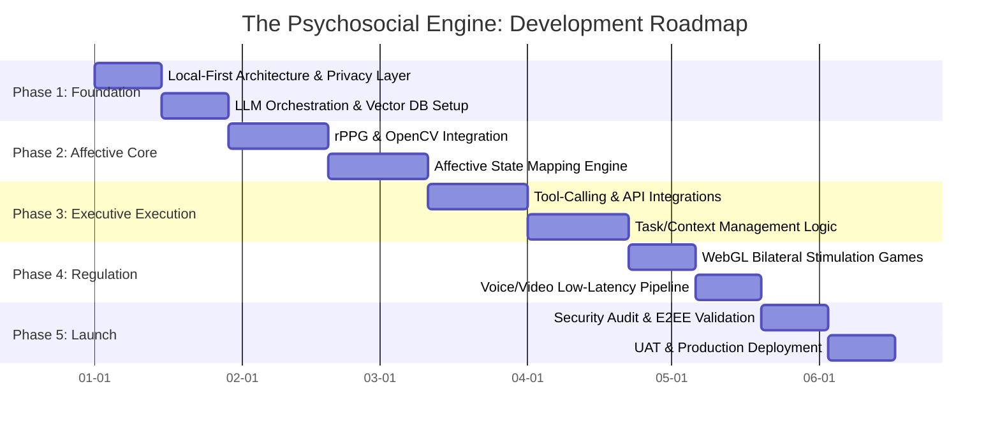

---

## 2. Phase Descriptions

### Phase 1: Foundation (Weeks 1–4)
*   **Objectives:** Establish a secure, local-first data environment and the core AI reasoning engine.
*   **Deliverables:** Local data vault (Encrypted), Vector DB schema, LLM prompt-chaining framework.
*   **Key Activities:** Setting up LangChain/Ollama for local inference; implementing the "Privacy Shield" middleware.
*   **Dependencies:** Hardware selection for local testing.
*   **Success Criteria:** Zero-leakage of PII (Personally Identifiable Information) during local LLM queries.
*   **Risks:** High latency on consumer-grade hardware.
*   **Mitigation:** Implement model quantization (4-bit/8-bit) and asynchronous processing.

### Phase 2: Affective Core (Weeks 5–10)
*   **Objectives:** Enable the system to "see" and "feel" user stress levels via camera/biometrics.
*   **Deliverables:** rPPG Heart Rate Monitor module, Facial Action Coding System (FACS) analyzer.
*   **Key Activities:** Training/tuning OpenCV models for micro-expression detection; calibrating rPPG against wearable benchmarks.
*   **Dependencies:** Phase 1 data pipeline.
*   **Success Criteria:** Heart rate detection within ±5 BPM of wearable sensors; 80% accuracy in stress-state classification.
*   **Risks:** Lighting conditions affecting camera accuracy.
*   **Mitigation:** Implement "Confidence Scores" for biometric data; fallback to manual user check-ins.

### Phase 3: Executive Execution (Weeks 11–16)
*   **Objectives:** Transform emotional insights into actionable productivity support.
*   **Deliverables:** Calendar/Email/Task-Manager connectors; "Compassionate Logic" prompt library.
*   **Key Activities:** Developing OAuth2 flows for external APIs; building the "Executive Function" agent that breaks down large tasks.
*   **Dependencies:** Phase 1 LLM infrastructure.
*   **Success Criteria:** Successful automated task breakdown and scheduling based on user energy levels.
*   **Risks:** API rate limits and third-party breaking changes.
*   **Mitigation:** Robust error handling and offline task caching.

### Phase 4: Regulation & Gamification (Weeks 17–20)
*   **Objectives:** Provide immediate neurological relief through bilateral stimulation (BLS).
*   **Deliverables:** WebGL-based visual stimulation module; low-latency voice synthesis (TTS).
*   **Key Activities:** Coding the "Follow the Dot" BLS game; integrating WebRTC for real-time voice feedback.
*   **Dependencies:** Phase 2 Affective State triggers.
*   **Success Criteria:** Sub-200ms latency for voice responses; smooth 60FPS WebGL performance.
*   **Risks:** Motion sickness or sensory overload.
*   **Mitigation:** User-controlled intensity settings and "Emergency Stop" features.

### Phase 5: Launch & Refinement (Weeks 21–24)
*   **Objectives:** Finalize security and ensure the system meets clinical/ethical standards.
*   **Deliverables:** E2EE validation report; Production-ready build.
*   **Key Activities:** Penetration testing; User Acceptance Testing (UAT) with neurodivergent focus groups.
*   **Dependencies:** All previous phases.
*   **Success Criteria:** 90% user satisfaction in "Stress Reduction" metrics; zero critical security vulnerabilities.
*   **Risks:** Negative psychological impact if AI logic is flawed.
*   **Mitigation:** Human-in-the-loop overrides and clear "Not a Medical Device" disclaimers.

---

## 3. Milestone Schedule

| Milestone | Target Date | Deliverables | Success Criteria |
|-----------|-------------|--------------|------------------|
| **M1: Privacy Foundation** | Week 4 | Local Vector DB + E2EE Layer | Data remains local; 0% PII leakage. |
| **M2: Biometric Sync** | Week 8 | rPPG + Affective Mapping | HR detection within 5% of control. |
| **M3: Executive Agent** | Week 14 | API Integration + Task Logic | Agent can schedule/edit 100% of test tasks. |
| **M4: Regulation Alpha** | Week 18 | WebGL BLS + Voice Pipeline | <200ms latency; 60FPS visuals. |
| **M5: Gold Master** | Week 24 | Final Production Build | Passed Security Audit & UAT. |

---

## 4. Resource Allocation

| Role | Responsibility | Phase Focus |
|------|----------------|-------------|
| **Lead Architect** | System integrity, E2EE, Infrastructure | All Phases |
| **AI/ML Engineer** | LLM Fine-tuning, Prompt Engineering | Phase 1, 3, 5 |
| **CV Specialist** | rPPG, OpenCV, Affective Computing | Phase 2 |
| **Frontend/WebGL Dev** | UI/UX, Gamification, BLS Modules | Phase 4, 5 |
| **Backend/Integration** | API Connectors, Data Sovereignty | Phase 1, 3 |
| **UX/Psych Consultant** | Ethical logic, CBT frameworks, UAT | Phase 2, 4, 5 |

---

## 5. Sprint Planning Overview (First 12 Weeks)

| Sprint | Goal | Key Deliverables |
|--------|------|------------------|
| **S1** | Local Infra | Local LLM setup, Vector DB schema, Privacy Shield. |
| **S2** | Memory Layer | Long-term memory retrieval, Context window management. |
| **S3** | Vision Alpha | Basic camera access, Face detection, Lighting calibration. |
| **S4** | Biometric Beta | rPPG implementation, Heart rate variability (HRV) tracking. |
| **S5** | Affective Logic | Mapping biometrics to "Stress/Flow/Boredom" states. |
| **S6** | Tool Integration | Initial Google/Microsoft API OAuth2 and task fetching. |

---

## 6. Release Plan

### v0.1: "The Observer" (Week 10)
*   **Focus:** Biometric monitoring and emotional logging.
*   **Features:** rPPG, Stress Dashboard, Local Journal.
*   **Criteria:** Stable biometric tracking for 30-minute sessions.

### v0.5: "The Assistant" (Week 18)
*   **Focus:** Executive function and regulation.
*   **Features:** Task breakdown, Calendar sync, BLS Games.
*   **Criteria:** Successful task completion rate increase of 20% in internal tests.

### v1.0: "The Psychosocial Engine" (Week 24)
*   **Focus:** Full integration and security.
*   **Features:** Voice interaction, E2EE, Multi-device sync (Local-first).
*   **Criteria:** Passed external security audit; UAT approval.

---

## 7. Risk Timeline

The following diagram illustrates the intensity of specific risks across the development lifecycle.

```mermaid
stateDiagram-v2
    [*] --> Phase1_PrivacyRisk: High
    Phase1_PrivacyRisk --> Phase2_AccuracyRisk: High
    Phase2_AccuracyRisk --> Phase3_IntegrationRisk: Medium
    Phase3_IntegrationRisk --> Phase4_LatencyRisk: Medium
    Phase4_LatencyRisk --> Phase5_EthicalRisk: High
    Phase5_EthicalRisk --> [*]

    state Phase1_PrivacyRisk {
        direction LR
        Note: Risk of data leakage during setup.
    }
    state Phase2_AccuracyRisk {
        direction LR
        Note: Biometric false positives/negatives.
    }
    state Phase5_EthicalRisk {
        direction LR
        Note: AI providing incorrect emotional advice.
    }
```

### Mitigation Windows:
*   **Weeks 1-4:** Focus on **Data Sovereignty**. If the foundation is not local-first, the project is paused.
*   **Weeks 9-12:** Focus on **Biometric Calibration**. If accuracy is low, pivot to wearable-only integration.
*   **Weeks 20-24:** Focus on **Safety Guardrails**. Implement hard-coded "Crisis Mode" triggers that bypass AI logic to provide professional resources.

---

## Project Data
Generated JSON file: design.project_data.json

Raw JSON Content

```json
{
  "project_name" : "The Psychosocial Engine",
  "description" : "A hybrid AI assistant architecture that bridges internal emotional states with external executive execution. It integrates biometric monitoring (rPPG, affective computing) with productivity tools and gamified neurological regulation (bilateral stimulation) to support users through executive dysfunction and high-stress tasks.",
  "created_date" : "2026-02-15T14:41:53.020434124",
  "epics" : [ {
    "id" : "EPIC-UC",
    "name" : "User Features",
    "description" : "Core user-facing functionality based on use cases",
    "priority" : "High",
    "status" : "Planned",
    "story_points" : 120
  }, {
    "id" : "EPIC-ARCH",
    "name" : "Architecture & Infrastructure",
    "description" : "Set up system architecture and infrastructure",
    "priority" : "High",
    "status" : "Planned",
    "story_points" : 21
  }, {
    "id" : "EPIC-TEST",
    "name" : "Quality Assurance",
    "description" : "Testing and quality assurance activities",
    "priority" : "High",
    "status" : "Planned",
    "story_points" : 13
  }, {
    "id" : "EPIC-101",
    "name" : "Epic EPIC-101",
    "description" : "Auto-extracted epic from analysis",
    "priority" : "Medium",
    "status" : "Planned",
    "story_points" : 13
  }, {
    "id" : "EPIC-102",
    "name" : "Epic EPIC-102",
    "description" : "Auto-extracted epic from analysis",
    "priority" : "Medium",
    "status" : "Planned",
    "story_points" : 13
  }, {
    "id" : "EPIC-103",
    "name" : "Epic EPIC-103",
    "description" : "Auto-extracted epic from analysis",
    "priority" : "Medium",
    "status" : "Planned",
    "story_points" : 13
  }, {
    "id" : "EPIC-104",
    "name" : "Epic EPIC-104",
    "description" : "Auto-extracted epic from analysis",
    "priority" : "Medium",
    "status" : "Planned",
    "story_points" : 13
  }, {
    "id" : "EPIC-105",
    "name" : "Epic EPIC-105",
    "description" : "Auto-extracted epic from analysis",
    "priority" : "Medium",
    "status" : "Planned",
    "story_points" : 13
  }, {
    "id" : "EPIC-106",
    "name" : "Epic EPIC-106",
    "description" : "Auto-extracted epic from analysis",
    "priority" : "Medium",
    "status" : "Planned",
    "story_points" : 13
  } ],
  "releases" : [ {
    "id" : "REL-1",
    "name" : "MVP Release",
    "version" : "1.0.0",
    "target_date" : "2026-03-29",
    "description" : "Minimum Viable Product release with core functionality",
    "epic_ids" : [ "EPIC-UC", "EPIC-ARCH", "EPIC-TEST", "EPIC-101" ],
    "status" : "Planned"
  }, {
    "id" : "REL-2",
    "name" : "Feature Complete Release",
    "version" : "1.1.0",
    "target_date" : "2026-05-10",
    "description" : "Full feature release with all planned functionality",
    "epic_ids" : [ "EPIC-UC", "EPIC-ARCH", "EPIC-TEST", "EPIC-101", "EPIC-102", "EPIC-103", "EPIC-104", "EPIC-105", "EPIC-106" ],
    "status" : "Planned"
  } ],
  "sprints" : [ {
    "id" : "SPRINT-1",
    "name" : "Sprint 1",
    "number" : 1,
    "start_date" : "2026-02-15",
    "end_date" : "2026-03-01",
    "goals" : [ "Complete sprint 1 deliverables" ],
    "capacity_points" : 40,
    "task_ids" : [ "TASK-101", "TASK-102", "TASK-103", "TASK-201" ],
    "status" : "Planned"
  }, {
    "id" : "SPRINT-2",
    "name" : "Sprint 2",
    "number" : 2,
    "start_date" : "2026-03-01",
    "end_date" : "2026-03-15",
    "goals" : [ "Complete sprint 2 deliverables" ],
    "capacity_points" : 40,
    "task_ids" : [ "TASK-202", "TASK-203", "TASK-301", "TASK-302" ],
    "status" : "Planned"
  }, {
    "id" : "SPRINT-3",
    "name" : "Sprint 3",
    "number" : 3,
    "start_date" : "2026-03-15",
    "end_date" : "2026-03-29",
    "goals" : [ "Complete sprint 3 deliverables" ],
    "capacity_points" : 40,
    "task_ids" : [ "TASK-303", "TASK-401", "TASK-402", "TASK-501" ],
    "status" : "Planned"
  }, {
    "id" : "SPRINT-4",
    "name" : "Sprint 4",
    "number" : 4,
    "start_date" : "2026-03-29",
    "end_date" : "2026-04-12",
    "goals" : [ "Complete sprint 4 deliverables" ],
    "capacity_points" : 40,
    "task_ids" : [ "TASK-601", "TASK-502" ],
    "status" : "Planned"
  }, {
    "id" : "SPRINT-5",
    "name" : "Sprint 5",
    "number" : 5,
    "start_date" : "2026-04-12",
    "end_date" : "2026-04-26",
    "goals" : [ "Complete sprint 5 deliverables" ],
    "capacity_points" : 40,
    "task_ids" : [ ],
    "status" : "Planned"
  }, {
    "id" : "SPRINT-6",
    "name" : "Sprint 6",
    "number" : 6,
    "start_date" : "2026-04-26",
    "end_date" : "2026-05-10",
    "goals" : [ "Complete sprint 6 deliverables" ],
    "capacity_points" : 40,
    "task_ids" : [ ],
    "status" : "Planned"
  } ],
  "tasks" : [ {
    "id" : "TASK-101",
    "title" : "Task TASK-101",
    "description" : "Auto-extracted task from analysis",
    "type" : "task",
    "epic_id" : "EPIC-UC",
    "sprint_id" : "SPRINT-1",
    "priority" : "Medium",
    "story_points" : 3,
    "status" : "Backlog",
    "acceptance_criteria" : [ "Task completed successfully" ],
    "labels" : [ "auto-generated" ]
  }, {
    "id" : "TASK-102",
    "title" : "Task TASK-102",
    "description" : "Auto-extracted task from analysis",
    "type" : "task",
    "epic_id" : "EPIC-UC",
    "sprint_id" : "SPRINT-1",
    "priority" : "Medium",
    "story_points" : 3,
    "status" : "Backlog",
    "acceptance_criteria" : [ "Task completed successfully" ],
    "labels" : [ "auto-generated" ]
  }, {
    "id" : "TASK-103",
    "title" : "Task TASK-103",
    "description" : "Auto-extracted task from analysis",
    "type" : "task",
    "epic_id" : "EPIC-UC",
    "sprint_id" : "SPRINT-1",
    "priority" : "Medium",
    "story_points" : 3,
    "status" : "Backlog",
    "acceptance_criteria" : [ "Task completed successfully" ],
    "labels" : [ "auto-generated" ]
  }, {
    "id" : "TASK-201",
    "title" : "Task TASK-201",
    "description" : "Auto-extracted task from analysis",
    "type" : "task",
    "epic_id" : "EPIC-UC",
    "sprint_id" : "SPRINT-1",
    "priority" : "Medium",
    "story_points" : 3,
    "status" : "Backlog",
    "acceptance_criteria" : [ "Task completed successfully" ],
    "labels" : [ "auto-generated" ]
  }, {
    "id" : "TASK-202",
    "title" : "Task TASK-202",
    "description" : "Auto-extracted task from analysis",
    "type" : "task",
    "epic_id" : "EPIC-UC",
    "sprint_id" : "SPRINT-2",
    "priority" : "Medium",
    "story_points" : 3,
    "status" : "Backlog",
    "acceptance_criteria" : [ "Task completed successfully" ],
    "labels" : [ "auto-generated" ]
  }, {
    "id" : "TASK-203",
    "title" : "Task TASK-203",
    "description" : "Auto-extracted task from analysis",
    "type" : "task",
    "epic_id" : "EPIC-UC",
    "sprint_id" : "SPRINT-2",
    "priority" : "Medium",
    "story_points" : 3,
    "status" : "Backlog",
    "acceptance_criteria" : [ "Task completed successfully" ],
    "labels" : [ "auto-generated" ]
  }, {
    "id" : "TASK-301",
    "title" : "Task TASK-301",
    "description" : "Auto-extracted task from analysis",
    "type" : "task",
    "epic_id" : "EPIC-UC",
    "sprint_id" : "SPRINT-2",
    "priority" : "Medium",
    "story_points" : 3,
    "status" : "Backlog",
    "acceptance_criteria" : [ "Task completed successfully" ],
    "labels" : [ "auto-generated" ]
  }, {
    "id" : "TASK-302",
    "title" : "Task TASK-302",
    "description" : "Auto-extracted task from analysis",
    "type" : "task",
    "epic_id" : "EPIC-UC",
    "sprint_id" : "SPRINT-2",
    "priority" : "Medium",
    "story_points" : 3,
    "status" : "Backlog",
    "acceptance_criteria" : [ "Task completed successfully" ],
    "labels" : [ "auto-generated" ]
  }, {
    "id" : "TASK-303",
    "title" : "Task TASK-303",
    "description" : "Auto-extracted task from analysis",
    "type" : "task",
    "epic_id" : "EPIC-UC",
    "sprint_id" : "SPRINT-3",
    "priority" : "Medium",
    "story_points" : 3,
    "status" : "Backlog",
    "acceptance_criteria" : [ "Task completed successfully" ],
    "labels" : [ "auto-generated" ]
  }, {
    "id" : "TASK-401",
    "title" : "Task TASK-401",
    "description" : "Auto-extracted task from analysis",
    "type" : "task",
    "epic_id" : "EPIC-UC",
    "sprint_id" : "SPRINT-3",
    "priority" : "Medium",
    "story_points" : 3,
    "status" : "Backlog",
    "acceptance_criteria" : [ "Task completed successfully" ],
    "labels" : [ "auto-generated" ]
  }, {
    "id" : "TASK-402",
    "title" : "Task TASK-402",
    "description" : "Auto-extracted task from analysis",
    "type" : "task",
    "epic_id" : "EPIC-UC",
    "sprint_id" : "SPRINT-3",
    "priority" : "Medium",
    "story_points" : 3,
    "status" : "Backlog",
    "acceptance_criteria" : [ "Task completed successfully" ],
    "labels" : [ "auto-generated" ]
  }, {
    "id" : "TASK-501",
    "title" : "Task TASK-501",
    "description" : "Auto-extracted task from analysis",
    "type" : "task",
    "epic_id" : "EPIC-UC",
    "sprint_id" : "SPRINT-3",
    "priority" : "Medium",
    "story_points" : 3,
    "status" : "Backlog",
    "acceptance_criteria" : [ "Task completed successfully" ],
    "labels" : [ "auto-generated" ]
  }, {
    "id" : "TASK-601",
    "title" : "Task TASK-601",
    "description" : "Auto-extracted task from analysis",
    "type" : "task",
    "epic_id" : "EPIC-UC",
    "sprint_id" : "SPRINT-4",
    "priority" : "Medium",
    "story_points" : 3,
    "status" : "Backlog",
    "acceptance_criteria" : [ "Task completed successfully" ],
    "labels" : [ "auto-generated" ]
  }, {
    "id" : "TASK-502",
    "title" : "Task TASK-502",
    "description" : "Auto-extracted task from analysis",
    "type" : "task",
    "epic_id" : "EPIC-UC",
    "sprint_id" : "SPRINT-4",
    "priority" : "Medium",
    "story_points" : 3,
    "status" : "Backlog",
    "acceptance_criteria" : [ "Task completed successfully" ],
    "labels" : [ "auto-generated" ]
  } ],
  "milestones" : [ {
    "id" : "MS-1",
    "name" : "Privacy Foundation**",
    "target_date" : "2026-03-15",
    "description" : "Project milestone 1",
    "deliverables" : [ "Phase 1 deliverables complete" ],
    "status" : "Planned"
  }, {
    "id" : "MS-2",
    "name" : "Biometric Sync**",
    "target_date" : "2026-04-12",
    "description" : "Project milestone 2",
    "deliverables" : [ "Phase 2 deliverables complete" ],
    "status" : "Planned"
  }, {
    "id" : "MS-3",
    "name" : "Executive Agent**",
    "target_date" : "2026-05-10",
    "description" : "Project milestone 3",
    "deliverables" : [ "Phase 3 deliverables complete" ],
    "status" : "Planned"
  }, {
    "id" : "MS-4",
    "name" : "Regulation Alpha**",
    "target_date" : "2026-06-07",
    "description" : "Project milestone 4",
    "deliverables" : [ "Phase 4 deliverables complete" ],
    "status" : "Planned"
  }, {
    "id" : "MS-5",
    "name" : "Gold Master**",
    "target_date" : "2026-07-05",
    "description" : "Project milestone 5",
    "deliverables" : [ "Phase 5 deliverables complete" ],
    "status" : "Planned"
  } ],
  "dependencies" : [ {
    "id" : "DEP-1",
    "source_id" : "TASK-102",
    "source_type" : "task",
    "target_id" : "TASK-101",
    "target_type" : "task",
    "dependency_type" : "blocks"
  }, {
    "id" : "DEP-2",
    "source_id" : "TASK-203",
    "source_type" : "task",
    "target_id" : "TASK-201",
    "target_type" : "task",
    "dependency_type" : "depends_on"
  }, {
    "id" : "DEP-3",
    "source_id" : "TASK-402",
    "source_type" : "task",
    "target_id" : "TASK-301",
    "target_type" : "task",
    "dependency_type" : "depends_on"
  }, {
    "id" : "DEP-4",
    "source_id" : "EPIC-102",
    "source_type" : "epic",
    "target_id" : "EPIC-105",
    "target_type" : "epic",
    "dependency_type" : "relates_to"
  } ]
}
```


