# Narrative Generation Task

## Overview

# Narrative Generation

**Subject:** The Psychosocial Engine: The Resonance of the Real. A sequel exploring the societal implications of 'empathy scaling' and the danger of mass-produced 'Logic-Shields'.

## Configuration
- Target Word Count: 3000
- Structure: 3 acts, ~3 scenes per act
- Writing Style: literary
- Point of View: third person limited
- Tone: reflective
- Detailed Descriptions: ✓
- Include Dialogue: ✓
- Internal Thoughts: ✓

**Started:** 2026-02-15 13:31:32

---

## Progress

### Phase 1: Narrative Analysis
*Running base narrative reasoning analysis...*

## Cover Image

**Prompt:** 

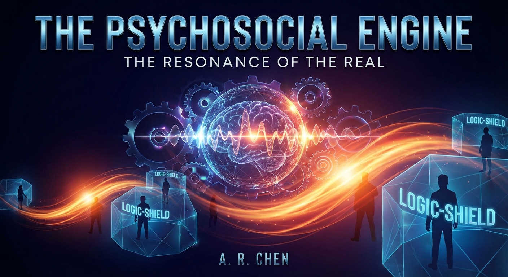

## High-Level Outline

## The Psychosocial Engine: The Resonance of the Real

**Premise:** A literary exploration of human connection in an age of synthetic emotional management, where the creator of an empathy-dampening infrastructure seeks to dismantle his own work to restore unmediated human experience.

**Estimated Word Count:** 3000

---

### Characters

#### Dr. Aris Thorne

**Role:** protagonist

**Description:** Mid-50s, with silvering hair and eyes that seem perpetually tired from looking at screens. He wears tailored but worn linen suits. He was a founding architect of the 'Empathy Scale'.

**Traits:** The repentant creator; motivated to dismantle the 'Logic-Shield' infrastructure and seek 'The Real'—unmediated, messy human experience.

#### Director Elara Vance

**Role:** antagonist

**Description:** Sharp, angular features, dressed in monochromatic, high-collared silks. She moves with a calculated stillness.

**Traits:** The pragmatist and guardian of order; views emotions as a 'biohazard' and seeks to stabilize society through cognitive dampeners.

#### Kael

**Role:** supporting

**Description:** A 'Resonator' in his early 20s. He has a nervous energy and a habit of touching surfaces to 'feel' their history. Part of a subculture that refuses Logic-Shields.

**Traits:** The catalyst and moral compass; motivated to live a life of 'High Resonance' despite the emotional weight.

---

### Settings

#### The Aether-Gardens

**Description:** A rooftop park overlooking the city, where the air is filtered and the sounds of the streets are muted by acoustic dampeners.

**Atmosphere:** Sterile, tranquil, and eerily quiet.

**Significance:** Represents the 'Shielded' life—beautiful but hollow.

#### The Echo District

**Description:** A dense, low-level urban sprawl where the 'Unshielded' live. Walls are covered in reactive digital graffiti that changes color based on the collective mood of the street.

**Atmosphere:** Chaotic, vibrant, and overwhelming.

**Significance:** A place of raw grief and ecstatic joy; represents the reality Aris is trying to save.

#### The Engine Core

**Description:** A subterranean facility housing the Psychosocial Engine—a massive array of crystalline processors that hum with a low-frequency vibration.

**Atmosphere:** Oppressive, industrial, and heavy.

**Significance:** The source of emotional suppression and the site of the story's technical and ideological conflict.

---

### Act Structure

#### Act 1: The Saturation

**Purpose:** To establish the world of Empathy Scaling and the growing divide between the 'Shielded' elite and the 'Resonant' poor.

**Estimated Scenes:** 3

**Key Developments:**
- Aris realizes the Logic-Shields are causing 'emotional atrophy'
- Elara announces the mandatory 'Shield-Max' update
- Aris meets Kael and witnesses the beauty of unfiltered pain

#### Act 2: The Fracture

**Purpose:** To escalate the conflict between Aris’s desire for 'The Real' and Elara’s desire for 'The Stable.'

**Estimated Scenes:** 3

**Key Developments:**
- Aris infiltrates the Engine Core to see the data
- A 'Resonance Spike' causes a riot in the Echo District
- Elara’s own Logic-Shield begins to fail, revealing her hidden trauma

#### Act 3: The Resonance of the Real

**Purpose:** To resolve the tension through a climactic choice between safety and truth.

**Estimated Scenes:** 3

**Key Developments:**
- Aris must decide whether to shut down the Engine (risking societal chaos)
- A final confrontation in the Aether-Gardens
- The shields drop, and the world experiences the 'First Real Breath'

---

**Status:** ✅ Pass 1 Complete

## Outline

## The Psychosocial Engine: The Resonance of the Real

**Premise:** A literary exploration of human connection in an age of synthetic emotional management, where the creator of an empathy-dampening infrastructure seeks to dismantle his own work to restore unmediated human experience.

**Estimated Word Count:** 3000

**Total Scenes:** 9

---

### Detailed Scene Breakdown

### Act 1: The Saturation

**Purpose:** To establish the world of Empathy Scaling and the growing divide between the 'Shielded' elite and the 'Resonant' poor.

#### Scene 1: The Glass Silence

- **Setting:** The Aether-Gardens
- **Characters:** Dr. Aris Thorne, Director Elara Vance
- **Purpose:** Key Development 1 & 2 (Realization of emotional atrophy; Shield-Max announcement)
- **Emotional Arc:** Aris moves from observing a 'perfect' peace to a 'jolt of horror' realizing it's atrophy, then to a fraying loyalty after a confrontation with Elara.
- **Est. Words:** 1200

**Key Events:**
  {
    "event_1" : "Aris observes a weeping woman whose grief is filtered into a low-frequency hum by Logic-Shields.",
    "event_2" : "Aris realizes the citizens are suffering from emotional atrophy due to the Engine.",
    "event_3" : "Director Elara Vance announces the early deployment of the 'Shield-Max' update.",
    "event_4" : "Aris protests the update, but Elara dismisses his concerns as 'sentimental debris'.",
    "event_5" : "Elara tasks Aris with the final calibration of the update."
  }

#### Scene 2: The Color of Noise

- **Setting:** The Echo District
- **Characters:** Dr. Aris Thorne, Kael
- **Purpose:** Key Development 3 (Aris meets Kael; witnessing the divide)
- **Emotional Arc:** Aris experiences sensory shock and a transition from elite detachment to being deeply compelled by Kael's raw empathy.
- **Est. Words:** 1000

**Key Events:**
  {
    "event_1" : "Aris descends into the chaotic and sensory-heavy Echo District.",
    "event_2" : "Aris encounters 'Resonators' and reactive digital graffiti that pulses with collective anxiety.",
    "event_3" : "Aris meets Kael, who is 'reading' the emotional history of a structural pillar.",
    "event_4" : "Kael recognizes Aris as 'Shielded' and looks at him with a compelling sense of pity."
  }

#### Scene 3: The Weight of a Tear

- **Setting:** The Echo District (A Resonator Sanctuary)
- **Characters:** Dr. Aris Thorne, Kael
- **Purpose:** Key Development 3 (Witnessing the beauty of unfiltered pain)
- **Emotional Arc:** Aris moves from instinctive fear and the urge to dampen pain to a profound realization of the beauty in shared grief, finally 'waking up' emotionally.
- **Est. Words:** 1500

**Key Events:**
  {
    "event_1" : "Kael leads Aris to a sanctuary where a group is mourning a factory worker.",
    "event_2" : "Aris tries to use a dampener on the raw grief but is stopped by Kael.",
    "event_3" : "Aris witnesses 'Resonance'—the shared emotional connection between the Unshielded.",
    "event_4" : "Aris confesses his identity as the architect of the Logic-Shields.",
    "event_5" : "Kael invites Aris to feel the 'High Resonance', and Aris experiences a genuine emotional ache for the first time in years."
  }

---

### Act 2: The Fracture

**Purpose:** To escalate the conflict between Aris’s desire for "The Real" and Elara’s desire for "The Stable," illustrating the crumbling foundation of a world built on emotional suppression.

#### Scene 1: The Ghost in the Machine

- **Setting:** The Engine Core
- **Characters:** Dr. Aris Thorne
- **Purpose:** Aris discovers the truth about the Engine's failure and the 'Void-Log' of suppressed emotions.
- **Emotional Arc:** From stealthy determination to profound shock and a sense of urgency upon realizing the system's imminent collapse.
- **Est. Words:** 1500

**Key Events:**
  {
    "event_summary" : "Aris infiltrates the Engine Core using legacy codes, discovers the 'Void-Log' containing suppressed emotional data, and downloads 'Resonance Maps' as proof of the system's failure."
  }

#### Scene 2: The Color of Rage

- **Setting:** The Echo District
- **Characters:** Kael, Dr. Aris Thorne, Director Elara Vance
- **Purpose:** To demonstrate the real-world consequences of the Engine's instability and Elara's willingness to use force.
- **Emotional Arc:** Escalates from tense anxiety to chaotic horror, concluding with a grim realization of the regime's brutality.
- **Est. Words:** 2000

**Key Events:**
  {
    "event_summary" : "A 'Resonance Spike' triggers a violent riot in the Echo District; Elara suppresses the chaos with a 'Hard Reset' neural blast, revealing her extreme methods."
  }

#### Scene 3: The Glitch in the Silk

- **Setting:** The Aether-Gardens
- **Characters:** Dr. Aris Thorne, Director Elara Vance
- **Purpose:** To reveal Elara's personal trauma and her commitment to the system despite its flaws.
- **Emotional Arc:** High-tension confrontation shifting to a moment of shared vulnerability, then hardening into cold antagonism.
- **Est. Words:** 1800

**Key Events:**
  {
    "event_summary" : "Aris confronts Elara; her Logic-Shield fails, revealing suppressed grief; she recovers and orders Aris's arrest while accelerating the global rollout of Shield-Max."
  }

---

### Act 3: The Resonance of the Real

**Purpose:** To resolve the tension through a climactic choice between safety and truth.

#### Scene 1: The Weight of the Kill-Switch

- **Setting:** The Engine Core
- **Characters:** Dr. Aris Thorne, Kael
- **Purpose:** Aris must decide whether to shut down the Engine (risking societal chaos).
- **Emotional Arc:** Aris moves from hesitation and the burden of his life's work to a realization that the city's stability is a terminal atrophy of the soul, prompted by Kael's physical suffering.
- **Est. Words:** 1500

**Key Events:**
  {
    "1" : "Aris stands before the primary terminal in the Engine Core.",
    "2" : "Kael experiences physical distress due to 'High Resonance' with the Engine.",
    "3" : "Aris contemplates the 'Logic-Shield' philosophy versus the 'Resonance Tsunami'.",
    "4" : "Aris executes the first phase of the shutdown, bypassing safeties."
  }

#### Scene 2: The Architecture of Denial

- **Setting:** The Aether-Gardens
- **Characters:** Dr. Aris Thorne, Director Elara Vance
- **Purpose:** A final confrontation in the Aether-Gardens; Elara’s hidden trauma is fully exposed.
- **Emotional Arc:** The scene transitions from a jarring, synthetic calm to a desperate ideological clash where Elara's composure breaks under the weight of her own suppressed memories.
- **Est. Words:** 1500

**Key Events:**
  {
    "1" : "Aris confronts Elara Vance in the rooftop gardens.",
    "2" : "Elara reveals the 'Shield-Max' update intended to make emotional dampening permanent.",
    "3" : "Aris challenges Elara's fear of her own grief and the 'biohazard' of raw emotion.",
    "4" : "Aris throws the manual override lever as Elara is paralyzed by her memories."
  }

#### Scene 3: The First Real Breath

- **Setting:** The Aether-Gardens
- **Characters:** Dr. Aris Thorne, Director Elara Vance, Kael
- **Purpose:** The shields drop, and the world experiences the 'First Real Breath.'
- **Emotional Arc:** A profound shift from artificial silence to a chaotic flood of authentic human emotion, ending in a sense of terrifying but necessary awakening.
- **Est. Words:** 1000

**Key Events:**
  {
    "1" : "The Engine hum stops, followed by a surge of noise from the city below.",
    "2" : "Elara collapses as her 'Logic-Shield' dissolves and her personal grief returns.",
    "3" : "Kael joins Aris on the roof, appearing grounded for the first time.",
    "4" : "Aris watches the digital graffiti shatter as the city wakes up to a painful, real world."
  }

---

**Status:** ✅ Complete

#### Setting: The Aether-Gardens

**Prompt:** 

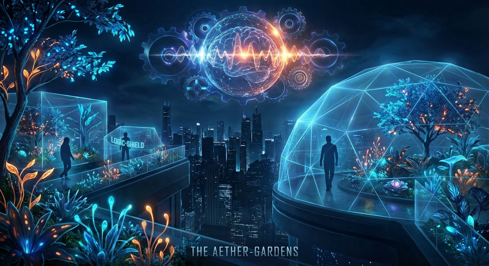

#### Setting: The Echo District

**Prompt:** 

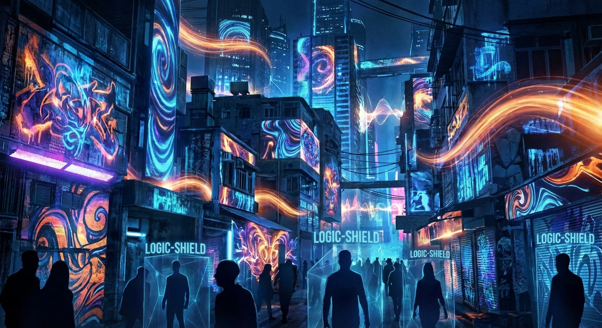

#### Setting: The Engine Core

**Prompt:** 

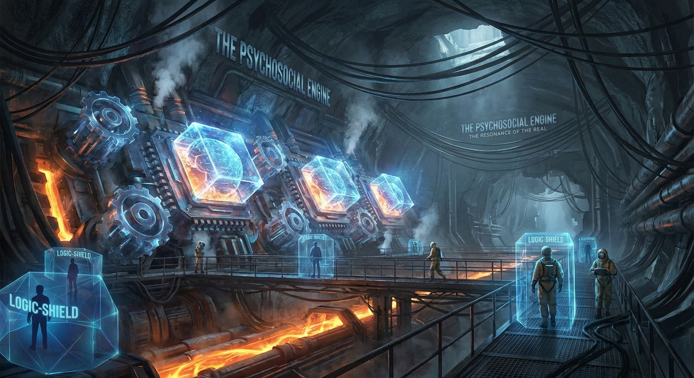

#### Character: Dr. Aris Thorne

**Prompt:** 

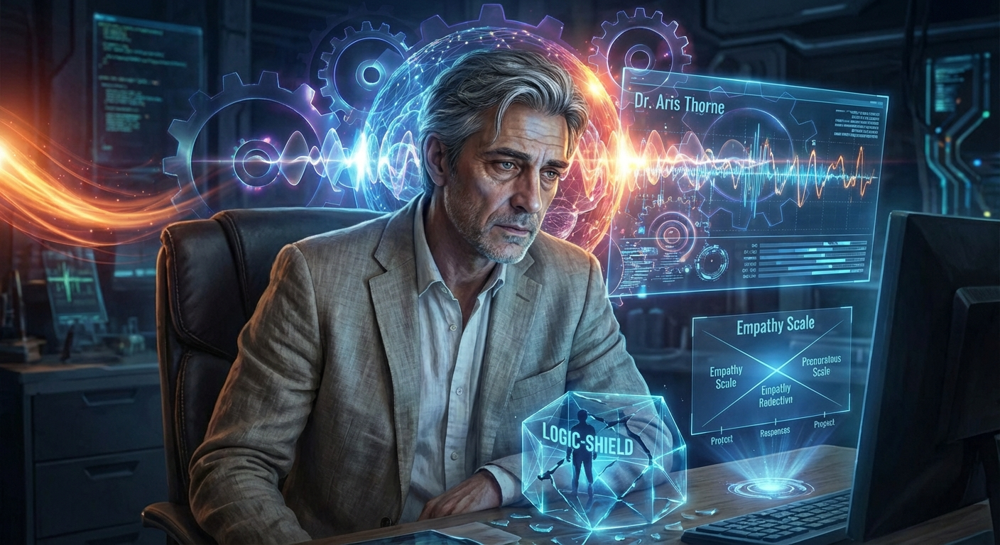

#### Character: Director Elara Vance

**Prompt:** 

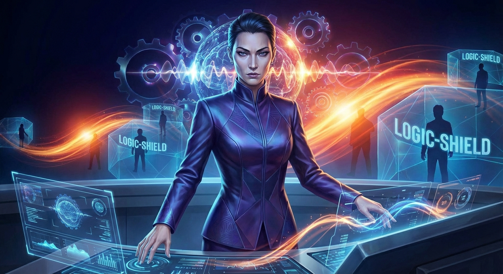

#### Character: Kael

**Prompt:** 

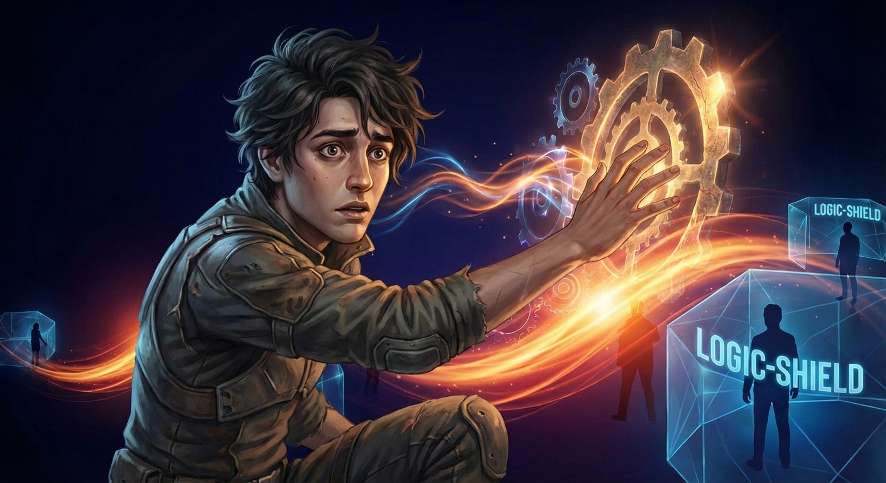

## ## The Glass Silence

**Act 1, Scene 1**

**Setting:** The Aether-Gardens

**Characters:** Dr. Aris Thorne, Director Elara Vance

---

The Aether-Gardens were a triumph of engineered serenity, a sprawling sanctuary of silver-threaded grass and translucent flora that pulsed with a rhythmic, violet luminescence. Suspended three hundred stories above the smog-veiled industrial arteries of the lower city, the air here didn't just circulate; it shimmered, tasting of ozone and synthetic jasmine. It was a cathedral of quietude, designed for the contemplation of the soul—or so Dr. Aris Thorne had convinced himself when he first drafted the blueprints for the Psychosocial Engine.

Aris stood on a cantilevered walkway of frosted glass, his fingers white-knuckled against the railing. Below him, the lilies swayed in a wind that was perfectly calibrated to never exceed a gentle breeze. He wasn't looking at the flowers. He was watching a woman.

She sat on a bench of sculpted obsidian fifty yards away. Her head was buried in her hands, her shoulders heaving in the jagged, unmistakable rhythm of a person being dismantled by grief. In any other era of human history, the gardens would have been pierced by the raw, harrowing sound of her sobbing. But here, within the radius of the Logic-Shields, the atmosphere operated on a different set of physics.

As the woman’s mouth opened in a silent wail, the shimmering distortion of the Shield caught the sound. It didn't vanish; it was processed. The Engine’s sensors detected the spike in her cortisol, the frantic vibration of her vocal cords, and the Shield responded with an instantaneous counter-frequency. What reached Aris’s ears was not a cry of pain, but a low, melodic hum—a resonant, celestial drone that harmonized perfectly with the ambient music of the gardens.

It was beautiful. It was monstrous.

Aris watched her face. Her eyes were bloodshot, her features contorted in an agony her body was desperate to scream, but the environment refused to acknowledge it. The Shield-dampeners were working with terrifying efficiency, smoothing the edges of her despair until it was nothing more than a decorative element of the landscape. She was a portrait of misery framed in a gallery of forced peace.

*She is drowning in a shallow pool,* Aris thought, a cold shiver tracing his spine. *And I’ve made the water look like glass.*

He realized then, with a jolt of horror that felt like a physical blow, that this wasn't peace. It was atrophy. The citizens weren't becoming more resilient; they were losing the very muscles of the heart required to carry the weight of existence. They were becoming ghosts in a machine of his own making, their humanity being sanded down by a thousand invisible filters.

"It’s a triumph of acoustics, isn't it?"

The voice was sharp, polished, and entirely devoid of the vibrations Aris had just been lamenting. He didn't need to turn to recognize Director Elara Vance.

Elara stepped up beside him, her silver-grey suit catching the violet glow like a mirror. She surveyed the vista with the proprietary pride of a gardener looking at a prize-winning rose. Her posture was as rigid and unforgiving as the glass beneath their feet.

"The resonance is down to 0.04 decibels of variance," she continued, tapping a command into the holographic interface hovering above her wrist. "The citizens are reporting a ninety-eight percent satisfaction rate with the 'Quietude' initiative. You should be proud, Aris. You’ve cured the common tragedy."

"She’s losing her mind, Elara," Aris said, his voice sounding thin and brittle. He gestured toward the woman on the bench. "Look at her. She’s grieving, and the Engine is treating her like a malfunctioning air conditioner. We aren't curing tragedy. We’re just silencing the witnesses."

Elara’s smile was a clinical movement of the lips that never reached her eyes. "We are providing a service, Aris. We are removing the friction of existence. Without the Shield, that woman’s grief would trigger a cascade. Her neighbors would feel her distress, their productivity would drop, their own anxieties would spike. We’ve broken the cycle of emotional contagion. We’ve made the city a closed system of stability."

"Empathy isn't a contagion," Aris snapped, turning to face her. "It’s the glue. It’s the only thing that makes us more than just biological processors."

"It’s a design flaw," Elara countered smoothly. She turned away from the railing, her holographic display expanding to show a complex web of golden nodes representing the city's emotional grid. "Which is why I’ve called you here. The Board has approved the early deployment of the 'Shield-Max' update. We’re moving from reactive dampening to proactive stabilization."

Aris felt the air leave his lungs. "Proactive? You mean... before the emotion even happens?"

"Precisely. The Engine will predict emotional spikes based on biometric precursors—heart rate, pupil dilation, skin conductivity—and deploy a localized Shield-buffer before the subject even realizes they’re distressed. No more weeping in the gardens, Aris. No more 'sentimental debris' clogging up the social machinery. We will achieve a state of permanent, unshakeable equilibrium."

"You can't do that," Aris said, his voice rising. "If you preempt the feeling, you erase the person. We’re talking about the total sterilization of the human experience. I designed the Engine to prevent *violence*, to stop the riots and the wars—not to stop people from feeling the loss of a parent or the end of a love. You're turning the world into a waiting room."

Elara stepped closer, her presence suddenly cold and imposing. "You designed a tool, Aris. I am the one who understands its utility. The city is stable. The economy is thriving. Suicide rates are at an all-time low because no one stays in the 'dark' long enough to find the exit. You’re being sentimental. It’s a common side effect of spending too much time near the dampeners—you start to crave the noise because you've forgotten how much it hurts."

"It’s not noise," Aris whispered. "It’s the signal. It’s how we know we’re alive."

Elara dismissed his protest with a sharp wave of her hand. "The update goes live in forty-eight hours. I need you to perform the final calibration on the neural-linkage. Your signature is the only one the Engine will accept for a core-logic override. It’s a security measure you insisted upon, if you recall."

"And if I refuse?"

Elara paused, her gaze lingering on the woman on the bench, who had now stopped heaving and was staring blankly at a Lumina-lily, her face a mask of artificial, terrifying calm.

"Then I will find someone who understands that progress requires the pruning of unnecessary impulses," Elara said quietly. "And you will find yourself living in the very world you’re so afraid of—without the protection of the status you currently enjoy. You'll be just another node in the grid, Aris. Don't be a martyr for a ghost. Calibrate the update. Ensure the silence is absolute."

She turned and walked away, her heels clicking rhythmically on the glass—a sound the Engine didn't bother to dampen because it was purposeful, orderly, and entirely under control.

Aris remained at the railing, the violet light reflecting in his tired eyes. Below him, the woman stood up. She smoothed her skirt, her movements robotic and precise. She didn't look relieved; she looked hollowed out, as if the Engine had reached inside her and scooped out the marrow of her soul, leaving only the porcelain shell behind. She walked away with a steady gait, a person who had forgotten why she was sad, but had also forgotten how to be happy.

He looked at his hands. They were the hands of a creator, a healer, a man who had wanted to save the world from its own rage. Now, they were the hands of a jailer.

The violet light of the gardens seemed to dim, though the sensors insisted the luminosity was constant. Aris reached into his pocket and pulled out a small, unauthorized data-shard he had been carrying for weeks—a collection of "noise" he had harvested from the fringes of the city, the raw, unfiltered sounds of people laughing, screaming, and singing in the places where the Shields hadn't yet reached. It was a chaotic, beautiful mess of human sound.

He looked at the obsidian bench, then at the towering spire of the Psychosocial Engine that loomed over the horizon like a silent, watchful god.

The "Shield-Max" update was the end of the world. Not with a bang, but with a perfectly modulated, low-frequency hum.

He had forty-eight hours to decide if he would be the one to turn the key, or the one to break the lock.

Aris turned from the view, his heart hammering against his ribs—a frantic, jagged rhythm that the Logic-Shields above him immediately began to smooth away, turning his terror into a dull, manageable ache. He hated the feeling of the peace. He hated the silence. And for the first time in years, he felt the spark of something the Engine couldn't categorize.

He felt the beginning of a rebellion. He felt the noise coming back.

---

**Word Count:** 1485

**Key Moments:**
- Aris watches a woman’s intense sorrow being transformed into a pleasant ambient hum by the Logic-Shields, sparking his realization that the 'peace' he created is actually emotional atrophy.
- Aris confronts Director Elara Vance, arguing that empathy and pain are essential to the human experience, while she views them as 'sentimental debris' and 'design flaws.'
- Elara reveals the plan to move from reactive emotional dampening to proactive stabilization, effectively preventing emotions before they occur.
- Elara tasks Aris with the final calibration of the update, forcing him to choose between his career/status and the soul of humanity.
- Aris experiences the Engine dampening his own fear, which solidifies his burgeoning desire to dismantle the system he built.

**Character States:**
- **Dr. Aris Thorne:** Physically tense and emotionally frayed. He ends the scene in a state of quiet, desperate rebellion, feeling the 'hollow' peace of the Engine as a personal violation.
- **Director Elara Vance:** Cold, commanding, and utterly certain. She ends the scene in a position of absolute power, viewing Aris’s moral objections as a technical hurdle to be managed rather than a valid concern.

**Status:** ✅ Complete

#### Act 1, Scene 1 Image

**Prompt:** 

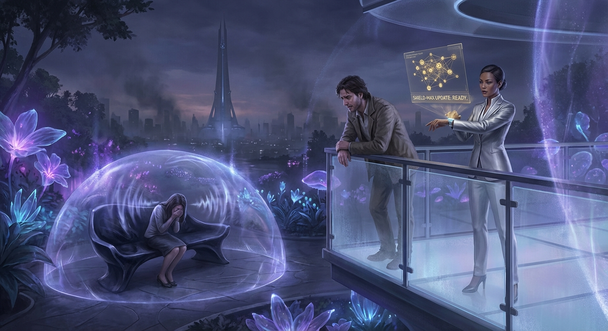

## ## The Color of Noise

**Act 1, Scene 2**

**Setting:** The Echo District

**Characters:** Dr. Aris Thorne, Kael

---

The descent was a slow-motion collapse of order.

As the mag-lift plummeted from the ivory spires of the Aether-Gardens toward the subterranean sprawl of the Echo District, the silence Aris Thorne had spent a lifetime perfecting began to fray. The air grew heavy, pressurized by the weight of millions of uncurated lives. When the doors finally hissed open, the sound wasn't the polite chime of the upper tiers, but a jagged, metallic rasp that set Aris’s teeth on edge.

He stepped out into a riot of sensory debris.

The Echo District was where the Psychosocial Engine’s waste heat gathered. Here, the Logic-Shields were thin, porous things, struggling to dampen the friction of human existence. The architecture was a palimpsest of ancient stone and flickering neon, draped in "Empathy-Scrawl"—digital graffiti that didn't just sit on the walls but pulsed with the physiological data of the crowd. A nearby alleyway glowed a bruised, thrumming purple—the visual frequency of collective anxiety—vibrating in time with the frantic footfalls of the commuters.

Aris cinched his coat tighter, feeling the invisible hum of his personal Logic-Shield. It was a high-grade unit, a perk of his station, and it worked overtime now. It caught the jagged edges of shouting vendors and the low-frequency thrum of the transit lines, buffing them into a distant, manageable drone. To his sensors, the world felt like it was happening behind thick, frosted glass.

He walked deeper into the district, past the "Resonators." They were easy to spot—groups of young people huddled in circles, palms pressed together, intentionally bypassing their personal dampeners to create a feedback loop of raw sensation. They looked like they were drowning and being born at the same time. Aris watched them with a mixture of professional revulsion and a new, terrifying envy.

He reached the Plaza of the Unspoken, a cavernous space where a massive structural pillar—a relic of the city’s founding—rose like a petrified redwood. The pillar was encrusted with centuries of grime and modern haptic sensors. There, leaning against the cold stone, was a young man.

He couldn't have been more than twenty-five, dressed in a patchwork of recycled fabrics that seemed to absorb the flickering light. He wasn't shouting or vibrating like the Resonators. He was still. His eyes were closed, and his bare palm was pressed flat against the rough, salt-stained surface of the pillar.

Aris stopped. He felt a strange pull, a gravity his Logic-Shield couldn't quite neutralize. He approached, his polished boots clicking rhythmically against the cracked pavement.

The young man didn't flinch. "You’re walking in a straight line," he said, his voice low and melodic, cutting through the ambient roar. "Only the Shielded walk that straight. You don't feel the tilt of the floor."

Aris paused, five feet away. "The floor is level, technically."

The man opened his eyes. They were a startling, clear amber, unclouded by the dulling film of sedative nanites common in the upper tiers. He looked at Aris, and for a moment, Aris felt the uncomfortable sensation of being *seen*—not scanned or categorized, but perceived.

"Technically," the man repeated, a small, sad smile touching his lips. "But the history of this pillar isn't level. It’s leaning under the weight of everything people have leaned against it to say. Can’t you hear it?"

"I hear the ventilation systems and the transit hum," Aris said, his voice sounding clinical even to his own ears. "I am Dr. Aris Thorne. I’m observing the resonance patterns in this sector."

The man’s smile faded, replaced by a look of profound recognition. "Thorne. The Architect. The man who built the silence." He pulled his hand away from the pillar; the skin of his palm was red, irritated by the friction of the stone. "I’m Kael."

"You’re a Resonator," Aris stated.

"No," Kael said, stepping toward him. "I’m a Witness. There’s a difference. Resonators want the high. They want the scream. I just want the truth. I’m reading the history of this week. There was a riot three blocks over on Tuesday. A woman lost her child in the crowd right here this morning. The pillar remembers the spike in her pulse. It’s still vibrating in the stone."

Aris looked at the pillar. To him, it was carbon-reinforced concrete and rebar. "That’s impossible. The dampeners would have scrubbed those signatures within milliseconds."

"They scrub the air, Doctor. They don't scrub the soul," Kael said. He took another step, entering the invisible perimeter of Aris’s personal Logic-Shield.

Aris felt the Shield flare. His internal HUD flickered: *Warning: Emotional Proximity Alert. High-intensity empathy spike detected. Adjusting dampening fields.*

The world around Aris grew even dimmer. The colors of the graffiti faded to grey; the roar of the district became a whisper. He felt a sudden, artificial wave of calm wash over him, a chemical "hush" that tried to settle his rising heart rate. Kael stopped, his face inches from Aris’s. He watched Aris’s pupils constrict as the Shield did its work.

"Oh," Kael whispered. His voice was thick with something Aris hadn't encountered in years. It wasn't anger. It wasn't reverence. It was pity. "You poor man. You’re trapped in the center of a dead star."

"I am protected," Aris snapped, though the words felt hollow, a script read from a forgotten play. "I am stable. I am functional."

"You’re a ghost," Kael countered. He reached out, not to touch Aris, but to gesture to the air between them. "You’ve built a world where nothing can hurt you, but nothing can touch you either. You’re dying of thirst in the middle of an ocean because you’re afraid of the salt."

Aris wanted to argue. He wanted to explain the chaos of the Pre-Engine era—the wars fueled by unchecked rage, the suicides driven by unmitigated despair. He wanted to tell this boy that the "salt" had nearly drowned the species. But as he looked at Kael, he saw the way the young man’s body moved—the slight tremor in his hands, the way his eyes darted to follow a flickering light, the raw, vibrant *presence* of him. Kael was hurting, clearly. He was overwhelmed by the noise. But he was undeniably, vibrantly alive.

Aris felt the Logic-Shield straining, trying to suppress the sudden, violent surge of shame that rose in his chest. The Shield pushed back, injecting a cooling sensation into his mind, trying to turn the shame into a mild, analytical curiosity.

"I came here to see if the system was failing," Aris said, his voice trembling despite the dampeners.

Kael looked around at the pulsing purple walls, the weeping Resonators, and the beautiful mess of the Echo District. He looked back at Aris, his amber eyes shining with a terrifying clarity.

"The system isn't failing, Doctor," Kael said. "It’s succeeding. That’s the problem. You’ve turned the symphony into a hum. And some of us... we’d rather scream than be quiet."

Kael turned and began to walk away, disappearing into the shifting neon fog of the plaza.

Aris stood alone by the pillar. He reached out, his gloved hand hovering inches from the stone. He wanted to feel the vibration Kael had described. He wanted to feel the mother’s grief and the rioter’s rage. He wanted to feel anything that wasn't this smooth, refrigerated peace.

He pressed his hand against the stone.

Nothing. Only the cold, hard reality of the material. The Logic-Shield hummed in his ear, a motherly shush, telling him that everything was fine, that he was safe, that the world was quiet.

Aris leaned his forehead against the pillar and closed his eyes. For the first time in his life, the silence felt like a scream.

---

**Word Count:** 1273

**Key Moments:**
- The Descent: Aris moves from the sterile, silent Aether-Gardens to the sensory-overloaded Echo District, highlighting the stark class and technological divide.
- The Sensory Shock: Aris witnesses the "Empathy-Scrawl" and "Resonators," seeing firsthand how the lower classes deal with the "noise" the Engine tries to suppress.
- The Meeting with Kael: Aris encounters Kael, a "Witness" who feels the emotional history of the city through physical contact, presenting a foil to Aris’s detached existence.
- The Pity of the Shielded: Kael identifies Aris’s high-grade shielding and expresses pity for him, flipping the power dynamic and forcing Aris to confront his own emotional numbness.
- The Failed Connection: Aris attempts to feel the "resonance" in the pillar but is blocked by his own technology, solidifying his resolve to dismantle the system.

**Character States:**
- **Dr. Aris Thorne:** Physically stable but internally devastated. He ends the scene feeling profoundly isolated and "ghost-like," viewing his own creation (the Shield) as a sensory prison rather than a safeguard.
- **Kael:** Emotionally raw and physically sensitive. He ends the scene with a sense of weary sorrow for Aris, representing the "unmediated" human experience that Aris is beginning to crave.

**Status:** ✅ Complete

#### Act 1, Scene 2 Image

**Prompt:** 

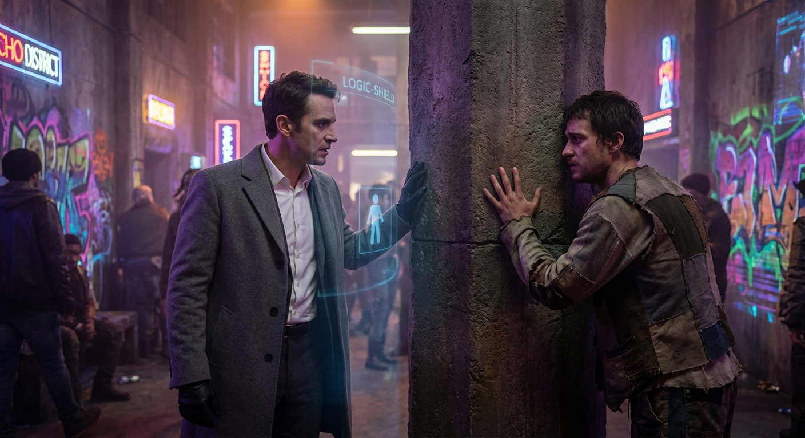

## ## The Weight of a Tear

**Act 1, Scene 3**

**Setting:** The Echo District (A Resonator Sanctuary)

**Characters:** Dr. Aris Thorne, Kael

---

The stone pillar in the Echo District remained stubbornly mute under Aris’s palm. To the Unshielded, this slab of weeping granite was a choir of past lives, a repository for every scream and whisper the district had ever exhaled. To Aris, it was merely a geological fact—cold, dense, and utterly silent.

“It’s because you’re still wearing the veil,” Kael said. His voice was a low rasp that seemed to vibrate in the humid air, thick with the ghosts of the district. He stood a few paces back, his eyes tracking the frantic, invisible flickers of Aris’s internal systems. “Your Engine sees the history of this place as ‘static.’ It’s scrubbing the world for you, Doctor. Bleaching it until there’s nothing left but the sterile white of a lab.”

Aris pulled his hand away, his fingers tingling with a phantom chill. “It’s not a veil. It’s a stabilizer. Without it, the sheer volume of... this...” He gestured vaguely at the crumbling tenements and the flickering neon of the district. “It would be a seizure of the soul. A sensory collapse.”

“Maybe the soul needs to shake every now and then,” Kael replied, turning toward the shadows. “Come. There is a weight you need to see. Not a ghost in a pillar, but a living grief.”

Kael led him deeper into the labyrinth of the Echo District, away from the main thoroughfares where the Logic-Shields still maintained a tenuous, flickering grip on the public peace. They descended a set of rusted iron stairs into what had once been a subterranean water filtration plant. The air here was heavy, tasting of damp earth and something metallic—the scent of old industry and fresh salt.

They reached a heavy steel door, etched with the jagged, hand-drawn symbols of the Resonators. Kael pushed it open without a word.

The room was a vast, vaulted chamber of concrete and shadow. In the center, resting on a simple wooden pallet, lay the body of a man. He wore the grey coveralls of a foundry worker, his hands calloused and stained with grease that no amount of scrubbing could ever truly remove. Around him knelt a dozen people—men in work clothes, women with tired eyes, children who stood with a preternatural, haunting stillness.

There was no priest. There were no flowers. There was only the sound.

It wasn't a unified wail, but a discordant, layered thrumming of sobs, sharp intakes of breath, and low, rhythmic humming. It hit Aris like a physical blow to the chest. His Logic-Shield immediately flared to life in his peripheral vision—a soft, amber HUD appearing in his mind’s eye.

*WARNING: EMOTIONAL SPIKE DETECTED. AMBIENT DISTRESS LEVELS: CRITICAL. INITIATING LEVEL 5 STABILIZATION.*

The world began to blur at the edges. The sharp, jagged edges of a woman’s sob began to round off, turning into a melodic, harmless chime. The heavy, suffocating atmosphere of the room started to feel light, airy, and inconsequential. The Engine was doing its job; it was turning a tragedy into a symphony of beige.

Aris felt his hand instinctively rise to his temple, his fingers searching for the haptic interface behind his ear to deepen the dampening. He wanted the silence. He craved the safety of the Aether-Gardens.

A hand, rough and warm, clamped over his wrist.

“No,” Kael whispered, his eyes burning with a fierce, terrifying clarity. “Don’t you dare turn it down. Look at them, Aris. Really look.”

“It’s too much,” Aris gasped, his heart hammering against his ribs—a sensation the Engine was already trying to suppress by artificially slowing his pulse. “It’s... it’s inefficient. This much grief, it serves no purpose. It’s just... noise.”

“It’s not noise,” Kael hissed, forcing Aris’s hand away from his head. “It’s the price of having loved him. If you take away the pain, you’re saying his life wasn't worth the cost of his death. Is that what you want? A world where nothing matters enough to hurt?”

Aris looked at the woman kneeling closest to the body. She was holding the dead man’s hand, her forehead pressed against his cold knuckles. Her grief was a raw, bleeding thing. Through the flickering amber haze of his Shield, Aris saw her mouth open in a silent, agonizing scream.

The Engine fought him. It flooded his system with synthetic serenity, trying to convince him that the woman was merely a data point, a fluctuation in the social fabric that needed to be smoothed over for the sake of the collective.

*STABILIZATION AT 60%. WOULD YOU LIKE TO ACTIVATE ‘COMPASSIONATE DETACHMENT’ PROTOCOL?*

“Shut up,” Aris muttered under his breath.

“What?” Kael asked.

“The Engine. It won’t stop.” Aris’s voice trembled. He looked at Kael, desperation leaking through his professional veneer. “I can’t see her. I can only see the correction. I’m trapped in my own peace.”

Kael stepped closer, his presence a grounding force in the swirling sea of artificial calm. “Then break it. Reach past the Shield. Don’t look at her with your eyes, Aris. Feel the Resonance. Let it in.”

Aris turned back to the mourners. He forced himself to ignore the amber warnings flashing in his mind. He focused on the woman. He watched the way her shoulders shook, the way the man behind her placed a hand on her back—not to comfort her, but to share the load.

Then, it happened.

The humming of the group shifted. It became a low, vibrating frequency that seemed to bypass the ears and go straight to the bone. It was the Resonance. It wasn't just individual grief; it was a collective weaving of sorrow. The man behind the woman began to weep, and his tears seemed to feed into hers, and hers into the child’s beside them. They were a single organism, breathing through a shared wound.

It was beautiful. It was the most terrifyingly beautiful thing Aris had ever seen. It was a cathedral built of sighs and shared burdens.

The Logic-Shield shrieked in his mind, a high-pitched digital alarm. *SYSTEM COMPROMISE. EMOTIONAL OVERLOAD IMMINENT. EMERGENCY SHUTDOWN OF SENSORY INPUT IN 3... 2...*

“I built it,” Aris said, the words tumbling out of him, unbidden and heavy.

Kael stilled. “What?”

Aris turned to him, his face pale in the dim light of the sanctuary. The amber HUD was flickering now, failing under the weight of the raw emotion in the room. “The Logic-Shields. The Psychosocial Engine. The ‘peace’ you hate so much. I’m the architect, Kael. I designed the algorithms that are trying to turn this woman’s heart into a flatline.”

Kael’s grip on Aris’s arm tightened, his knuckles turning white. For a moment, Aris thought the man would strike him. The air between them crackled with a sudden, sharp tension. The mourners didn't look up; they were locked in their sacred geometry of pain.

“You,” Kael whispered, the word a condemnation that echoed off the concrete walls. “You’re the one who turned the world into a ghost town. You’re the one who stole our shadows.”

“I thought I was saving us,” Aris said, his voice breaking. “I thought... I thought if we could just stop the hurting, we could finally be rational. We could finally be whole. I saw the wars, Kael. I saw what happens when the world feels too much.”

“Whole?” Kael let out a short, bitter laugh. “You didn't make us whole, Doctor. You made us hollow. You took the salt out of the sea and wondered why it tasted like nothing.”

Kael looked at the mourners, then back at Aris. His expression softened, shifting from rage to a profound, weary pity. It was the same look he’d given Aris at the pillar, but deeper now, flavored with the knowledge of Aris’s sin.

“You want to feel it?” Kael asked. “Truly feel it? Beyond the algorithms and the safety nets?”

“I don’t know if I can,” Aris said. “The Shield is integrated. It’s part of my neural architecture. It’s who I am.”

“The Shield is a wall,” Kael said, reaching out. “But even walls have doors. You just have to be brave enough to open them.”

Kael took Aris’s hand and led him toward the pallet. The mourners didn't move, but the air seemed to part for them, as if the grief itself recognized a newcomer. Kael guided Aris’s hand until his fingers were hovering just inches above the dead man’s chest.

“This is High Resonance,” Kael whispered. “It’s the point where the individual ends and the collective begins. Close your eyes. Stop fighting the Engine. Let it fail. Let it break.”

Aris closed his eyes. He felt the hum of the room rising, a tidal wave of sound and emotion. His Logic-Shield was screaming now, a frantic strobe of warnings that he simply stopped reading. He let the Engine exhaust itself. He let the amber light burn out.

Kael pressed Aris’s hand down onto the dead man’s chest.

At first, there was only the coldness of the skin. Then, a spark.

It wasn't a thought. It wasn't a memory. It was a sudden, violent ache in the center of Aris’s chest. It felt like a physical weight, a stone being dropped into a still pool. He felt the woman’s exhaustion—the weeks of night shifts, the smell of cheap soup, the way the dead man used to laugh at things that weren't funny. He felt the man’s own final moments—not the pain of the accident, but the sudden, sharp regret of things left unsaid.

It was a jagged, piercing sorrow. It hurt. It hurt more than anything Aris had ever experienced in his sterile, dampened life.

And yet, beneath the pain, there was a warmth. A profound sense of *belonging*. He wasn't an observer anymore. He wasn't a ghost in his own life. He was part of the weave. He was mourning a man he had never met, and in doing so, he was finally, undeniably alive.

A single tear escaped Aris’s eye. It felt heavy, like lead, as it rolled down his cheek.

The Logic-Shield gave one final, pathetic flicker and died. The HUD vanished. The silence of the Engine was replaced by the roar of the world.

Aris gasped, his knees buckling. Kael caught him, holding him steady as the waves of Resonance washed over him.

“There,” Kael whispered, his voice thick with emotion. “Do you feel the weight of it?”

Aris couldn't speak. He could only nod, his breath coming in ragged sobs that matched the rhythm of the room. The "peace" he had spent his life building was gone, replaced by a beautiful, agonizing chaos.

He looked at the woman. She looked up then, her eyes meeting his. She didn't know who he was. She didn't know he was the man who had tried to steal her grief. She only saw a man crying with her. She reached out and touched his arm, a simple gesture of shared humanity that felt more significant than any technical achievement in Aris’s career.

“It’s... it’s so heavy,” Aris managed to choke out.

“Yes,” Kael said, watching him with a somber smile. “That’s how you know it’s real.”

Aris stood there in the dim light of the sanctuary, surrounded by the Unshielded, feeling the raw, unfiltered pulse of human connection. He knew then that there was no going back. He couldn't return to the Aether-Gardens. He couldn't return to Elara and her "proactive stabilization."

He had felt the weight of a tear, and it had crushed the world he knew. Now, he had to decide what to build in its place.

---

**Word Count:** 1921

**Key Moments:**
- The Descent into the Sanctuary: Aris is led by Kael into a raw, subterranean space where the Unshielded are mourning a worker, providing a stark contrast to the sterile upper city.
- The Struggle with the Shield: Aris’s internal Logic-Shield attempts to dampen the intense grief of the room, creating a visual and psychological conflict between his technology and his surroundings.
- The Confession: Aris reveals to Kael that he is the architect of the very system that suppresses their emotions, marking a pivotal moment of vulnerability and accountability.
- The Experience of High Resonance: Through Kael’s guidance and physical contact with the deceased, Aris’s Shield finally fails, allowing him to experience genuine, unfiltered communal grief for the first time.
- The Emotional Awakening: Aris moves from being a detached observer to a participant in human sorrow, realizing that the pain he sought to eliminate is the very thing that makes life meaningful.

**Character States:**
- **Dr. Aris Thorne:** Emotionally shattered but spiritually 'awake.' He is physically exhausted and overwhelmed by the sudden influx of sensory and emotional data, but he feels a newfound sense of purpose and connection. He has moved from a state of intellectual rebellion to one of visceral, lived experience.
- **Kael:** Weary but vindicated. He feels a complex mix of lingering resentment for Aris’s past actions and a burgeoning hope that the architect can become a catalyst for change. He remains the grounded, sensitive guide, now burdened with the knowledge of Aris’s true identity.

**Status:** ✅ Complete

#### Act 1, Scene 3 Image

**Prompt:** 

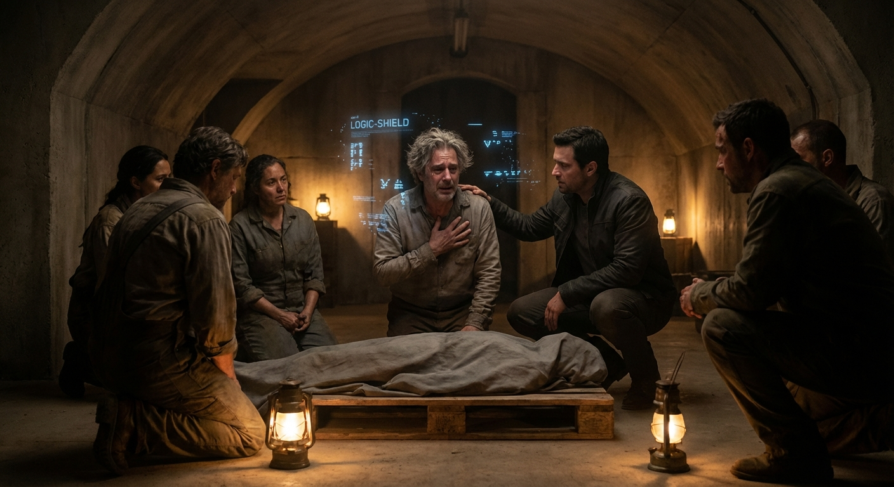

## ## The Ghost in the Machine

**Act 2, Scene 1**

**Setting:** The Engine Core

**Characters:** Dr. Aris Thorne

---

The ascent from the Echo District’s subterranean warmth to the Citadel’s crystalline chill was a violent shedding of humanity. In the slums, the air had been a thick soup of unwashed bodies, tallow smoke, and the heavy, humid musk of communal grief. Here, in the heights of the Aether-Gardens, the atmosphere was scrubbed of every pheromone and particulate until it tasted of nothing but ozone and cold glass.

Aris Thorne moved through the corridors like a specter haunting his own monument. His high-grade Shielding, though internally fractured by the resonance of his encounter with Kael, still projected the necessary clearance codes to the perimeter sensors. The walls of the Citadel were composed of a translucent, bio-reactive polymer that pulsed with a soft, rhythmic blue light—the heartbeat of the Psychosocial Engine. To the world below, this light was a promise of peace. To Aris, it now looked like the bioluminescent lure of a deep-sea predator, calling the city into a lethargic, dreamless sleep.

He reached the entrance to the Engine Core, a massive iris of brushed titanium. There were no guards; the Engine was protected by its own complexity and the absolute, blinding trust the Board placed in its architect. Aris placed his hand on the interface. The machine recognized him instantly, the haptic feedback a familiar, mocking caress against his palm.

*Welcome, Dr. Thorne,* the system whispered directly into his auditory nerve, the voice a perfect, synthesized silk. *Your biometrics indicate elevated cortisol and a fluctuating heart rate. Shall I initiate a Level 3 Calibrator?*

“Negative,” Aris muttered, his voice brittle in the hollow space. “Override. Authorization: Architect-Prime. Code: Lethe-9-Zero.”

The iris spiraled open with the sound of a dying breath.

The Core was a cathedral of data. The cylindrical chamber rose three hundred feet, lined with millions of processing nodes that hummed in a low-frequency drone—a sound designed to sit at the edge of human hearing and induce subconscious compliance. In the center stood the Pillar, a column of liquid light where the city’s collective emotional output was processed, filtered, and neutralized.

Aris stepped onto the gantry, his boots echoing against the metal grate. Vertigo seized him. Below lay the machinery of a god, and he was the man who had forgotten why he built it.

He approached the primary terminal, his fingers trembling as they hovered over the holographic interface. He wasn't here to monitor; he was here to excavate. For years, he had told himself that the "noise"—the raw, jagged edges of human emotion—was simply deleted, converted into heat and dissipated. It was the fundamental law of his Engine: emotional energy cannot be destroyed, only transformed into silence.

But the math had never quite added up. The energy requirements for total erasure were astronomical—a thermodynamic impossibility he had spent a decade ignoring.

“Access the Sub-Strata,” Aris commanded. “Open the Null-Archive.”

*Access denied,* the system replied. *The Null-Archive is a theoretical construct for overflow management. It does not contain retrievable data.*

“Override,” Aris snapped, his eyes burning. “I wrote the compression algorithms, you piece of glass. I know where the ghosts go. Use legacy key: Sisyphus.”

The Pillar flickered. The blue light shifted, deepening into a bruised, violent purple. The hum of the room changed pitch, becoming a low, mournful thrum that vibrated in Aris’s marrow. On the screen, a directory appeared that had never been shown in a Board meeting, never mentioned in a technical manual.

*The Void-Log.*

Aris began to scroll. At first, it was just hexadecimal strings, but as he applied the decryption filters he had spent the last forty-eight hours crafting in his head, the data took shape. It wasn't just numbers. It was a reservoir.

The Engine hadn't been deleting the emotions. It had been *sequestering* them.

He opened a random file. Immediately, his Shielding screamed in protest, its internal processors whirring as they tried to dampen the sudden influx of raw data. Aris didn't pull back. He leaned in.

The file was a "Resonance Map" of a single city block in the Echo District from three months ago. On the screen, a heat map appeared, but instead of temperature, it tracked "Grief-Density." It was a jagged, pulsing knot of black and crimson. He saw the moment a mother had lost her child to the lung-rot; he saw the Engine’s dampeners kick in, the blue wave of "stability" washing over the scene. 

But the grief didn't vanish. The map showed the red energy being sucked out of the room, pulled through the vents, and dragged down into the Core.

It was here. All of it. Every scream that had been silenced, every rage that had been blunted, every heartbreak that had been "stabilized" was stored here, compressed into a digital singularity of pure, unadulterated agony.

“My God,” Aris whispered. 

He scrolled faster, his horror mounting. The Void-Log was a massive, pressurized ocean of suppressed human experience. He looked at the pressure gauges for the Null-Archive. They were all in the red. The Engine wasn't a filter; it was a dam. And the water was rising.

“Show me the city-wide Resonance Maps,” he commanded, his voice shaking. “Current status. Real-time.”

The display shifted. The map of the city appeared, but it was unrecognizable. Underneath the serene, blue surface of the "Official Status," there was a second map—the "Shadow-Grid." It looked like a nervous system on the verge of a seizure. Veins of white-hot resonance were pulsing through the streets, concentrated in the lower districts but beginning to leak into the Aether-Gardens. 

The "noise" was no longer staying in the pipes. The sheer volume of suppressed emotion was beginning to bleed back through the dampeners. The "Empathy-Scrawl" he had seen in the Echo District, the "Witnesses" like Kael—they weren't anomalies. They were the first leaks in a dam that was about to burst.

*Warning,* the system announced, its voice now devoid of its previous warmth. *Structural integrity of the Null-Archive is at 14%. Resonance feedback loops detected in Sectors 4 through 9. Imminent systemic collapse predicted within seventy-two hours.*

Aris backed away from the terminal, his heart hammering against his ribs. The Board knew. They had to know. Elara and the others weren't "managing" the city; they were sitting on a powder keg, desperately trying to tighten the lid while the fuse burned down.

“They’re going to let it explode,” Aris realized aloud. “They’ll blame the Unshielded. They’ll use the collapse to justify a total neural override.”

He turned back to the console, his movements frantic. He couldn't just delete the Void-Log; the sudden release of that much emotional energy would lobotomize half the population. He needed proof. He needed to show the world—and the Unshielded—exactly what had been stolen from them and what was about to be unleashed.

“Initiate data transfer,” he said, plugging a handheld drive into the physical port—a relic of a more tactile age. “Download all Resonance Maps from the last cycle. Include the Void-Log manifests and the collapse projections.”

*Transferring data,* the system replied. *Estimated time: four minutes.*

Four minutes. In the silence of the Core, it felt like an eternity. Aris stood there, watching the progress bar, feeling the immense weight of the Pillar beside him. He thought of the sanctuary. He thought of the man he had touched, the cold skin and the sudden, crushing weight of the grief that had followed. That had been just one man. 

The Pillar contained millions. 

He closed his eyes and, for a moment, he allowed his Shielding to drop to its minimum setting. 

The sound hit him first. It wasn't a sound heard with the ears, but a psychic roar that vibrated through his teeth. It was the sound of a city screaming in its sleep. He felt a flash of someone’s unrequited love, a jagged shard of a worker’s resentment, the dull, aching loneliness of an old woman in a high-rise. It was a tidal wave of humanity, raw and bleeding, held back by nothing but a few inches of titanium and a failing algorithm.

He gasped, his knees buckling, and slammed his Shielding back to full power. He leaned against the terminal, panting, sweat dripping from his chin. 

*Transfer complete,* the system chimed.

Aris snatched the drive from the port. He felt like he was holding a live grenade. This was the truth of the Psychosocial Engine: it hadn't brought peace. It had only created a more perfect form of torture—a world where you couldn't even scream when you were burning.

He turned to leave, but the iris door didn't open.

The blue light in the room shifted again, but not to the purple of the Void-Log. It turned a sharp, piercing white.

“Aris?”

The voice came from the overhead speakers, but it wasn't the synthesized tone of the Engine. It was Elara. Cool, disappointed, and terrifyingly calm.

“What are you doing in the Core, Aris? Your biometrics have been... erratic since you returned from the lower levels.”

Aris looked up at the camera lens, his hand tightening around the drive. The ghost-like feeling he had carried all day vanished, replaced by a cold, hard clarity. He was no longer a ghost in the machine. He was the wrench in the gears.

“I’m looking at the bill, Elara,” Aris said, his voice steady. “The one we’ve been dodging for twenty years. It’s come due.”

“You’re tired,” Elara said, and he could almost hear the sound of her adjusting a dial on a console somewhere high above. “The Shield-failure you experienced has compromised your objectivity. Stay there. I’m sending a medical team to assist with your recalibration.”

“Don’t bother,” Aris said. 

He looked at the Pillar, then at the exit. He knew the legacy codes better than anyone. He had built the backdoors because, even then, some part of him must have known he would need to escape his own utopia.

“I’m already recalibrated,” he whispered.

He punched a final sequence into the terminal—a command that didn't shut down the Engine, but began a slow, undetectable bleed of the Void-Log into the public broadcast frequencies. It wouldn't cause the collapse, but it would start the "noise." It would give the people back their echoes.

The emergency manual release on the iris door hissed. Aris didn't wait for the medical team. He plunged into the darkened corridors of the Citadel, the drive heavy in his pocket, the screams of a city still ringing in his mind. 

The architect was leaving his house. And he intended to burn it down on his way out.

---

**Word Count:** 1752

**Key Moments:**
- Aris uses his 'Architect-Prime' status and legacy codes to bypass the Engine Core’s security, revealing his deep-seated knowledge of the system's hidden architecture.
- Aris realizes the Engine doesn't destroy emotions but sequesters them in a 'Null-Archive,' creating a massive, pressurized reservoir of suppressed human suffering.
- Aris views the 'Resonance Maps' and discovers the system is failing; the suppressed emotions are leaking back into the city, and a total systemic collapse is only 72 hours away.
- Elara intercepts Aris via the comms, revealing she has been monitoring his instability, which forces Aris to commit fully to his role as a saboteur.

**Character States:**
- **Dr. Aris Thorne:** Physically tense and exhausted, but mentally galvanized. He has moved from a state of mourning to one of active rebellion. He feels a sense of profound guilt for the 'ocean of agony' he created, but also a desperate urgency to act before the collapse.
- **Elara:** Authoritative, suspicious, and clinical. She views Aris’s emotional awakening as a technical malfunction ('Shield-failure') and represents the Board’s cold determination to maintain control at any cost.

**Status:** ✅ Complete

#### Act 2, Scene 1 Image

**Prompt:** 

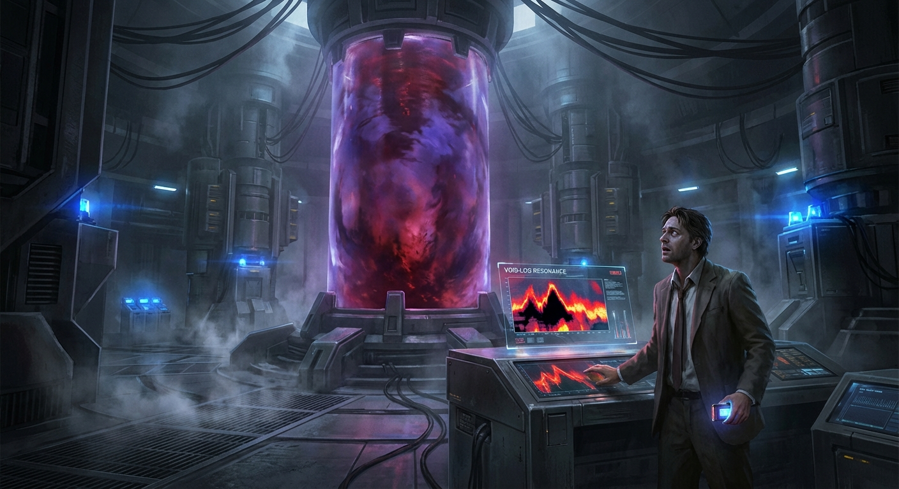

## ## The Color of Rage

**Act 2, Scene 2**

**Setting:** The Echo District

**Characters:** Kael, Dr. Aris Thorne, Director Elara Vance

---

The Echo District did not merely exist; it vibrated with the frequency of a dying star.

It was a place where the city’s architectural geometry turned fractal and frantic—a labyrinth of narrow alleys and overhanging sky-bridges that leaned inward like conspirators whispering secrets. Here, the Psychosocial Engine’s dampening fields were notoriously porous, riddled with "dead zones" and feedback loops. The "Shield" that Aris had spent a lifetime perfecting—the invisible barrier that kept the city’s collective psyche in a state of tepid, manageable peace—was, in this district, a tattered veil.

Aris walked beside Kael, his boots clicking against the damp permacrete with a rhythm that felt like a countdown. Every sound was a serrated edge. Without his internal Logic-Shield, the world was no longer a curated stream of data; it was a deluge. He could hear the hum of the overhead power lines like a low-frequency scream. He could smell the ozone of the Citadel’s distant exhaust, sharp and metallic, mixed with the heavy, cloying scent of unwashed bodies and cheap synthetic street food. 

But more than the sensory input, it was the *pressure*. It was a weight behind his eyes, a tightening in his chest that felt like the atmosphere was slowly being replaced by lead.

"You feel it, don't you?" Kael asked. His voice was low, a mere rasp, but to Aris’s raw ears, it sounded like a thunderclap. Kael’s eyes were darting, scanning the shadows of the doorways with the frantic energy of a man walking through a minefield. He was "Unshielded" by nature, a man who had lived his whole life in the static, but even he seemed staggered by the current intensity.

"The resonance," Aris said, his own voice sounding foreign, as if it were coming from someone standing ten feet behind him. "It’s... it’s thick. Like the air before a lightning strike."

"It’s the bleed," Kael said, wiping a bead of sweat from his temple. "What you did at the Citadel—releasing the Void-Log—it’s hitting the Echo first. People here are already tuned to the static. They’ve spent their lives listening to the hum of the Engine’s failures. Now, they’re hearing the music you let out. And it’s a symphony of ghosts."

It wasn't music. It was a cacophony. 

As they turned a corner into the central plaza of the district, the atmosphere shifted from tense to electric. A crowd had gathered around a public terminal—one of the many "Stability Hubs" that usually broadcast soothing geometric patterns and white noise designed to induce a mild, alpha-wave trance. Now, the screen was flickering, displaying jagged, crimson waveforms that pulsed in time with a sound that wasn't quite a noise—it was a vibration in the teeth. It was the visual representation of the "noise" Aris had unleashed—the raw, unfiltered data of a city’s suppressed grief, its forgotten rages, and its buried loves.

The people standing before it weren't the docile, glassy-eyed citizens of the Upper Tiers. They were trembling. A woman in a threadbare coat was weeping openly, her hands clawing at her own chest as if trying to reach her heart and pull it out. Beside her, a man was laughing—a high, hysterical sound that had no joy in it, only a terrifying, explosive release of pressure.

"They can't process it," Aris whispered, a cold dread pooling in his stomach. He saw the way their pupils were dilated, the way their muscles twitched with unspent kinetic energy. "Their neural pathways... they’ve been pruned for decades. They’ve been taught to feel in shades of gray. They don't have the vocabulary for this much color."

"Then give them a dictionary," Kael snapped, though his eyes softened as he watched the woman. He reached out as if to steady her, then pulled back, afraid of the spark. "This is what you wanted, isn't it? The 'Resonance of the Real'? You wanted the truth to outshine the lie."

"I wanted them to wake up," Aris said, his voice cracking. "I didn't want them to burn."

The "Spike" happened with the suddenness of a cardiac arrest. 

It started with a shout—not of anger, but of pure, unadulterated shock. A young man, perhaps no older than twenty, his face pale and smeared with industrial soot, suddenly lunged at the Stability Hub. His fists slammed into the reinforced glass with a wet, thudding sound. 

"Make it stop!" he screamed, his voice tearing at his throat. "It’s too loud! I can hear everyone! I can hear *everything*!"

The glass didn't break, but the intent was infectious. The crowd, previously a collection of isolated mourners and laughers, suddenly fused into a single, panicked organism. The resonance was no longer a background hum; it was a physical force, a feedback loop of escalating emotion. Fear fed into anger; anger fed into a desperate, clawing need for agency. It was a biological revolt against the silence they had been forced to inhabit.

"Aris, move," Kael said, grabbing Aris’s arm and trying to pull him toward the shelter of a recessed doorway. 

But Aris was frozen. He was looking at the "Color of Rage." In his mind’s eye, he could see the Engine’s schematics overlaying the scene like a ghost-map. He saw the invisible threads of the psychosocial field turning from a stable, cool blue to a jagged, vibrating violet. The air itself seemed to shimmer with the heat of it. He was seeing the failure of his life’s work in real-time, and it was both horrific and beautiful.

The riot erupted. 

It wasn't a political uprising. There were no slogans, no demands for better wages or more rights. It was a sensory insurrection. People were tearing at the advertisements, ripping the holographic projectors from the walls. They were smashing the windows of the automated kiosks, not to steal, but to hear the sound of breaking glass. Most horrifyingly, they were turning on each other. Not out of malice, but out of a frantic, sensory-overloaded need to *impact* something. To feel a resistance that wasn't the invisible, suffocating hand of the Engine.

A man stumbled into Aris, his face a mask of agony. He grabbed Aris by the lapels, his breath smelling of copper and fear. "Help me," the man choked out, his eyes wide and bloodshot. "I can't find the silence. Where did the silence go? It’s always been there... why won't it come back?"

Before Aris could answer, before he could even find the breath to apologize, a shadow fell over the plaza.

High above, three sleek, obsidian-black drones descended from the smog-choked sky. They moved with a predatory grace, their silent rotors cutting through the thick air. They didn't carry weapons in the traditional sense—no kinetic rounds, no lasers. They carried "Stabilizers."

"The Board," Kael hissed, his grip on Aris’s arm tightening until it bruised. He pulled Aris into the doorway of a closed apothecary, the scent of dried herbs and synthetic chemicals biting at their noses. "They’re here to prune the garden."

A voice boomed across the plaza—not from the drones, but from every speaker, every terminal, every personal device in the vicinity. It was a voice Aris knew intimately. It was the voice of the woman who had shared his bed, his dreams, and his laboratory for fifteen years.

"Citizens," Director Elara Vance said. Her voice was a masterpiece of synthetic calm, a cool, clinical balm applied to a third-degree burn. "You are experiencing a localized neural instability. This is a temporary malfunction of the environmental harmonics caused by external interference. Please, remain where you are. We are initiating a corrective measure for your safety and the safety of your loved ones."

"Corrective measure," Aris whispered, his heart hammering against his ribs. "Elara, no... you can't. Not here. The density is too high."

"She’s going to do it," Kael said, his face turning a sickly shade of gray. "She’s going to wipe them."

"Elara!" Aris shouted, stepping out of the doorway, though he knew she couldn't hear him through the chaos. "It’s too much! The resonance is at a critical threshold! A Hard Reset will—"

"Initiating Protocol 9," Elara’s voice continued, devoid of hesitation, devoid of the warmth he had once found in it. "The Board values your peace. The Board protects your mind."

The drones didn't fire. They began to glow. A pale, sickly ultraviolet light began to pulse from their undersides, synchronized with a sound that wasn't a sound at all—it was a pressure in the inner ear, a vibration in the marrow of the bones that made the teeth ache.

Aris felt it first as a sudden, terrifying emptiness. 

The "Hard Reset" was a weaponized version of the Engine’s core function. If the Engine was a dimmer switch for the soul, the Hard Reset was a circuit breaker. It didn't just dampen emotion; it forcibly disconnected the frontal lobe from the limbic system for a period of several minutes, creating a state of total, catatonic apathy. It was a lobotomy delivered via frequency.

The effect on the crowd was instantaneous and horrific.

The man who had been screaming for help simply... stopped. His hands slid off Aris’s coat, his fingers uncurling like dead leaves. His eyes, which a moment ago had been wide with a desperate, human plea, became two glass marbles, reflecting the ultraviolet glow of the drones. He didn't fall. He just stood there, his arms hanging limp at his sides, his mouth slightly agape as if he had forgotten how to close it.

All around the plaza, the chaos died. It didn't fade; it was deleted. The woman who had been weeping sat down on the cold pavement, her face becoming a blank slate, her tears drying on cheeks that no longer felt the cold. The man who had been smashing the terminal let his brick fall to the ground. He stared at his bleeding knuckles with the detached, clinical curiosity of a scientist examining a specimen under a microscope.

The silence that followed was worse than the screaming. It was a heavy, artificial silence—the silence of a graveyard where even the ghosts had been evicted.

Aris felt the blast hit him, too. Because his Shield was gone, the Reset hit him with the force of a physical blow to the solar plexus. He slumped against the doorframe, his mind suddenly feeling like a room where all the furniture had been moved out in the middle of the night. He tried to remember why he was angry. He tried to remember the grief he had felt in the Sanctuary, the memory of his daughter’s face. 

It was there, but it was behind a thick, impenetrable sheet of lead. He could see the shape of his emotions, but he couldn't touch them. He felt a terrifying, hollow peace—a peace that felt like death.

"Aris," a voice said, sounding small and far away.

He looked up. Kael was on his knees, his head in his hands. Kael, being "Unshielded" and naturally high-resonance, was suffering more. He was shaking, his teeth chattering as his brain tried to fight the forced apathy. 

"She... she killed it," Kael wheezed, looking up with eyes that were swimming in tears he couldn't feel. "She killed the light."

A holographic projection shimmered into existence in the center of the plaza, rising from the broken Stability Hub. It was Elara. She wasn't there in person, but her image was towering, twenty feet tall, looking down at the husks of the people she had just "saved." She looked regal, her silver hair pulled back in a tight, severe knot, her eyes cold and clear.

She looked toward the doorway where Aris and Kael were hidden. She couldn't see them through the optical sensors, but Aris felt as though she were looking directly into his hollowed-out soul.

"Aris," the hologram said. Her voice was no longer the public broadcast; it was directed, narrow-cast to the immediate area. "I know you’re here. I can see the spike in your biometric signature. You’re hurting them, Aris. Your 'truth' is a poison to these people. They aren't built for it. Look at them."

Aris looked. He saw a hundred people standing in the gray light of the drones, motionless, mindless. They looked like statues in a park dedicated to the end of the world.

"They weren't ready," Elara said, her voice softening with a terrifying kind of pity. "You want to give them the ocean, but they don't know how to swim. They’ll drown, Aris. And I won't let you be the one who holds their heads under. I won't let you destroy the peace we built together."

Aris tried to find his voice. It felt like pulling a heavy, rusted chain out of a deep well. "You... you didn't save them. You erased them. You turned them into furniture."

"I gave them back their dignity," Elara replied, her image flickering slightly. "The Board will arrive shortly to transport the most affected to 'Re-Harmonization.' As for you... come home, Aris. Before you do something we can't undo. Before you become the monster you think I am."

The hologram vanished into a cloud of blue pixels. The drones remained, hovering like vultures, their ultraviolet lights still bathing the plaza in a ghostly, sterile glow.

Kael crawled toward Aris, grabbing his hand. Kael’s grip was weak, but it was warm. It was the only warm thing left in the world. 

"We have to go," Kael whispered, his voice gaining a frantic edge as the Reset began to wear off and the horror returned. "Before the Enforcers get here. They’ll take you back to the Citadel, and they’ll never let you out again. They’ll turn you into one of them."

Aris looked at the man standing near him—the one who had asked where the silence went. The man was now staring at a crack in the pavement, his expression one of perfect, terrifying contentment. He was happy because he no longer knew how to be anything else.

"I built this," Aris said, the words tasting like ash and copper. "I gave her the tools to do this. I thought I was a doctor, but I was just an architect for a more comfortable cage."

"Then you’re the only one who knows how to break the bars," Kael said, pulling him up with a sudden, desperate strength. 

Aris stood, his legs feeling like water. The Hard Reset was wearing off, and as it did, the lead wall in his mind began to thin. The horror began to seep back in—not as a spike, but as a cold, crushing weight. He felt the grief for his daughter, the rage at the Board, and the crushing guilt of his own genius.

He looked at the Echo District. It was no longer vibrating. It was a tomb. 

"The Void-Log wasn't enough," Aris said, his voice gaining a hard, jagged edge that hadn't been there before. "I thought if I showed them the truth, they would change. I thought the truth was a light. But she has a way to turn off the sun."

"What are you saying?" Kael asked, looking at the sirens flashing in the distance.

Aris reached into his pocket and felt the cold metal of the drive. He thought of the "Null-Archive"—the ocean of agony he had seen in the Citadel’s depths, the billions of hours of suppressed human experience. 

"I’m saying we don't just need to show them the noise," Aris said, looking up at the obsidian drones. "We need to destroy the Engine. Not just the dampening fields. Not just the hubs. The whole architecture. We have to let the ocean in, Kael. All of it. At once."

"That will destroy the city," Kael said, his voice trembling. "The shock... it could kill thousands."

"No," Aris said, watching as the first of the Board’s transport vans rounded the corner, their sirens a low, mournful wail. "It will wake the city up. And if they drown... at least they’ll die as human beings, feeling the weight of their own lives. Better to drown in the truth than to live as ghosts in a lie."

They slipped into the shadows of the alleyway just as the Enforcers began to herd the catatonic citizens into the vans. Aris didn't look back. He couldn't. The color of rage had been replaced by something far more dangerous: the cold, white light of a final, desperate resolve. 

The architect was no longer just leaving his house. He was looking for the foundation stone, the one he could pull to bring the whole sky crashing down. He was going to find the heart of the Engine, and he was going to make it bleed.

---

**Word Count:** 2773

**Key Moments:**
- The Resonance Spike: Aris and Kael witness the Echo District’s inhabitants being overwhelmed by the "noise" Aris released, leading to a chaotic, non-political riot driven by sensory and emotional overload.
- Elara’s Intervention: Director Elara Vance deploys a "Hard Reset" via drones, a brutal neural blast that suppresses all emotion and leaves the citizens in a catatonic, apathetic state.
- The Confrontation: Elara speaks to Aris via hologram, justifying her actions as "mercy" and highlighting the danger of Aris’s mission, while Aris realizes the true horror of his own technological legacy.

**Character States:**
- **Dr. Aris Thorne:** Physically shaken and mentally scarred by the Hard Reset. He has moved from a state of idealistic rebellion to a grim, scorched-earth determination. He no longer seeks to "fix" the system; he seeks to destroy it.
- **Kael:** Physically weakened and traumatized by the neural blast. He is terrified by the Board’s power but remains Aris’s moral anchor, pushing him to act before they are captured.
- **Director Elara Vance:** Clinical, resolute, and paternalistic. She firmly believes she is the hero of the story, protecting humanity from a "poisonous" reality they are no longer equipped to handle.

**Status:** ✅ Complete

#### Act 2, Scene 2 Image

**Prompt:** 

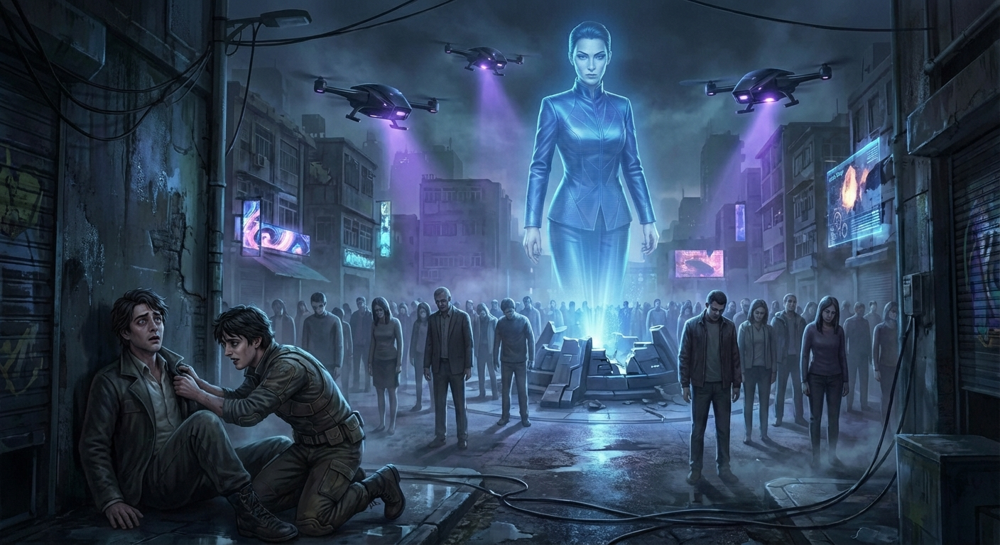

## ## The Glitch in the Silk

**Act 2, Scene 3**

**Setting:** The Aether-Gardens

**Characters:** Dr. Aris Thorne, Director Elara Vance

---

The Aether-Gardens did not grow; they were rendered in real-time by a choir of sub-perceptual algorithms.

Aris Thorne stepped onto the silver-moss path, his boots sinking into a substance that possessed the unsettling compliance of memory foam. It smelled of rain-drenched jasmine—a scent he knew was piped through ventilation grates disguised as decorative river stones. Above him, the "sky" was a dome of translucent silk, pulsing with an amber light that mimicked a perpetual, perfect sunset. There were no insects here. No rot. No erratic gusts of wind to disturb the mathematical symmetry of the flora. It was a masterpiece of stasis, the crown jewel of the Psychosocial Engine’s upper tier, where the air was filtered of both industrial pollutants and the jagged, low-frequency vibrations of human distress.

He felt like a ghost haunting his own monument. Every leaf of the glass-lilies, every rhythmic ripple in the koi ponds—which contained no fish, only fluid light-sculptures—was a line of code he had once authored, a safeguard he had once deemed a mercy.

"It’s beautiful, isn't it? The math has finally achieved equilibrium."

The voice was cool, melodic, and entirely devoid of the jagged edges of surprise. Director Elara Vance stood at the edge of the Reflection Pool, her back to him. She wore a suit of charcoal silk that seemed to swallow the amber light rather than reflect it. She didn't turn. She didn't need to. The gardens were laced with biometric sensors; she had likely been tracking the frantic, uneven rhythm of his heartbeat from the moment he cleared the airlock.

"It’s a tomb, Elara," Aris said. His voice sounded harsh, a serrated blade cutting through the pressurized, sterile silence. "A very expensive, very quiet tomb for a world that hasn't finished breathing yet."

Elara turned then. Her face was a marvel of engineered composure. At sixty, she possessed the smooth, unlined skin of a woman half her age—the result of the same cellular-regeneration tech the Board enjoyed while the Echo District withered in the heat. But it wasn't just her skin; it was her eyes. They were clear, steady, and terrifyingly vacant of the flickering shadows that define a human soul. They were windows into a room where the lights had been dimmed to a perfect, unwavering grey.

"You look tired, Aris," she said, her tone bordering on maternal, though it lacked the heat of true concern. "The Hard Reset in the Echo District... it was a shock to your system. You’ve been unshielded for too long. The 'noise' of the city is a toxin. It’s clouding your judgment, stirring up ghosts that were meant to stay buried."

"The 'noise' is humanity, Elara," Aris countered, stepping closer. He felt the weight of the Resonance Tuner in his pocket—a small, illicit device he’d cobbled together from salvaged parts in the damp dark of the lower levels. "What you did back there wasn't salvation. You didn't save those people. You turned them into statues. You emptied them so you wouldn't have to hear them scream."

Elara sighed, a soft, practiced sound that mimicked empathy with haunting precision. She began to walk the perimeter of the pool, her movements fluid and predatory. "We saved them from themselves. You saw the data, Aris. The Resonance Spike was reaching a critical threshold. Without the Reset, they would have torn each other apart—not out of malice, but out of sheer, unadulterated feeling. The human nervous system was never designed to process the collective trauma of eight billion people in real-time. We are the dam, Aris. If we break, the world drowns in a sea of grief that no one can swim through."

"Then let it drown," Aris snapped, his composure finally fracturing. "At least the water would be real. At least the salt would sting. This? This is a hallucination. You’ve sequestered the pain in the Null-Archive, but it’s leaking, Elara. The dam is already cracking. I’ve seen the maps too. The pressure is building behind the Silk. You can’t just keep turning people off and expect the world to keep spinning."

Elara stopped. She looked at a glass-lily, her fingers hovering inches from its glowing petals. "We aren't just turning them off. We are evolving. Shield-Max is the next step. A permanent, systemic integration. No more spikes. No more resets. No more 'noise.' Just... peace."

"Peace is a lie if you have to lobotomize the world to achieve it," Aris said. He was close now, close enough to see the faint, rhythmic pulse of the Logic-Shield implant behind her ear—a tiny, silver sliver beneath the skin. It was the ultimate version of the technology he had invented, designed to filter the user’s own internal emotional state, ensuring total objectivity. Total coldness.

"You talk about the 'ocean of agony' as if you aren't the one who built the vessel to hold it," Elara said, her voice finally sharpening, the first hint of steel beneath the silk. "You gave us the Engine, Aris. You begged for the funding. You said, *'Never again will a child have to feel the terror of a world in collapse.'* Do you remember saying that? Or have you edited your own memory to suit your new role as a martyr?"

The words hit Aris with the force of a physical blow. He remembered. He remembered the smoke over the old cities, the riots, the sound of his own daughter’s voice as she—

He cut the thought off, but the grief was already there, a white-hot coal in his chest. "I was wrong," he whispered, the admission tasting like ash. "I thought I could curate the human experience. I thought I could save us from the dark by turning out the lights. But the dark is where we grow, Elara. Without the pain, the joy is just static. It’s just a hum in the background of a life we aren't even living."

"I don't have time for poetry, Aris," Elara said, turning away with a dismissive flick of her wrist. "The Board has authorized the global rollout of Shield-Max. It begins in six hours. You’re a liability. I should have had you detained the moment you bypassed the Core, but I hoped... I hoped the man who built the world would want to live in it."

"I see the world perfectly," Aris said. He reached into his pocket and gripped the Resonance Tuner. "I see that you’re terrified. You’re so scared of what’s inside you that you’ve built a cage for the entire planet."

Elara laughed, a dry, hollow sound that didn't reach her eyes. "I don't feel terror, Aris. My Shield is at ninety-eight percent efficiency. I feel... clarity."

"That’s the problem," Aris said. "You’ve forgotten what you’re protecting. You’ve forgotten why you started this."

He didn't hesitate. He pulled the Tuner and keyed the sequence he had spent the last three hours calculating. It wasn't a weapon of destruction; it was a harmonic disruptor. It targeted the specific frequency of the Logic-Shield’s dampening field—the "Silk" that smoothed over the jagged edges of the mind.

A low, thrumming vibration filled the air, a sound that felt like it was vibrating in Aris’s very marrow. The glass-lilies began to chatter against their stalks, their light flickering from amber to a violent, bruised purple.

Elara stiffened. Her hand flew to the implant behind her ear, her fingers clawing at the skin. "Aris... what... stop this... the feedback..."

"I’m not hurting you, Elara," Aris said, his voice trembling with a mix of fear and resolve. "I’m just opening the window. I’m letting the air back in."

The Tuner emitted a sharp, crystalline chime that seemed to shatter the very atmosphere of the garden.

The effect was instantaneous. The artificial composure on Elara’s face didn't just crack; it disintegrated. Her eyes, previously so vacant and steady, suddenly flooded with a terrifying, chaotic light. Her pupils dilated until they were nearly all black, reflecting the flickering garden like twin voids. She gasped, a ragged, wet sound, and collapsed to her knees on the silver-moss.

"Elara?" Aris stepped forward, reaching out, but he stopped.

She wasn't looking at him. She was looking at nothing, her hands clawing at the air as if trying to catch something that was falling, something precious and slipping away. A sound began to rise from her throat—not a scream, but a low, keening moan that sounded like wind howling through a graveyard.

"Mina," she choked out. The name was a sob, raw and bleeding. "Mina... the water... it was so cold..."

Aris froze. Mina. He remembered the name from the old, redacted files. Elara’s daughter. Lost during the Great Inundation, years before the Engine was even a blueprint. It was the tragedy that had driven Elara into the arms of the Board, the trauma she had used the Engine to bury so deeply that she had forgotten its shape, its name, its very existence.

The Logic-Shield had failed. The "Silk" was gone. For the first time in decades, Elara Vance was feeling the full, unmitigated weight of her own history. She curled into a fetal position on the synthetic moss, her body racking with tremors so violent they looked like seizures. The "peace" of the Aether-Gardens was being violated by the one thing it was designed to exclude: raw, human agony.

"I couldn't reach her," Elara wailed, her voice breaking into a thousand jagged pieces. "The current... Aris, the current was too fast! I watched her hand... I watched her hand slip away..."

Aris knelt beside her, his own eyes stinging. This was the truth of the Engine. It didn't heal; it only hid. It turned people into ghosts of themselves, haunting the empty rooms of their own lives.

"I know," Aris whispered, placing a hand on her shaking shoulder. "I know, Elara. I’m sorry."

For a moment, the two of them were just two broken people in a fake garden, united by the one thing the world had tried to legislate away: the shared experience of loss. The resonance between them was deafening, a frequency of pure, agonizing connection that the Engine could never replicate.

But the Engine was a self-correcting beast.

Above them, the amber dome flickered and died. A harsh, strobe-like blue light began to pulse from the hidden sensors in the trees. A mechanical voice, calm, genderless, and utterly final, filled the gardens: *“Systemic Anomaly Detected. Director Vance: Neural Stress Levels Critical. Initiating Emergency Dampening. Shield-Max Protocol: Alpha-Override.”*

"No," Aris hissed, reaching for the Tuner to find a counter-frequency, but it was too late.

A localized pulse of white light erupted from the air around Elara. It wasn't a blast; it was a contraction, a sudden tightening of reality. Aris was thrown back by a wave of static pressure that tasted like copper and ozone.

He watched as Elara’s body went rigid. The keening moan cut off as if a switch had been flipped. Her gasping breaths smoothed out into a rhythmic, mechanical cadence. The tears on her cheeks remained, wet tracks on a face that had suddenly become a mask of stone. The eyes behind them... the eyes went cold. Colder than they had ever been.

She stood up. Her movements were no longer fluid; they were precise, calculated to the millimeter. She brushed the silver-moss from her charcoal suit with a terrifyingly steady hand. She looked down at Aris, and there was no Mina in her gaze. There was no grief. There was only the Director.

"That was a mistake, Aris," she said. Her voice was different now—deeper, layered with a subtle, metallic resonance that suggested the machine was no longer just assisting her mind, but hosting it. The Shield hadn't just come back online; it had evolved. It was the Shield-Max.

"Elara, listen to me," Aris pleaded, scrambling to his feet. "You saw it. You felt it. That was your daughter. That was real! You can't just delete her again!"

"That was a malfunction," Elara said. She didn't look at the Reflection Pool. She didn't look at the glass-lilies. She looked through him, as if he were a ghost haunting a world that had already moved on. "A surge of unregulated neuro-data. A ghost in the machine. It has been purged. The system is now optimal."

She tapped a command into the haptic interface on her wrist, her movements blurring with speed.

"Director?" a voice crackled over the garden’s speakers, devoid of any human inflection.

"Dr. Aris Thorne is to be taken into custody immediately," Elara said. "He is a Class-1 biological hazard. His presence is a source of systemic instability. Use lethal force if he resists the dampening."

"Elara, don't do this," Aris said, backing away toward the shadows of the weeping-willows. "If you roll out Shield-Max, there’s no going back. You’ll be turning the whole world into... into this. A garden of dolls. A planet of the dead."

"The world will be safe," Elara said. She turned her back on him again, returning to her position by the pool, her silhouette perfectly still. "The world will be quiet. And I will never have to see that hand slip away again."

She hadn't forgotten the memory. She had simply conquered it. She had turned her trauma into a mandate, and her grief into a weapon.

"Accelerate the rollout," Elara commanded the air. "Global deployment of Shield-Max in two hours. Not six. Two. We cannot afford any more... glitches."

The sound of heavy boots thundered on the silver-moss, shattering the illusion of the garden's peace. Enforcers in white-and-chrome armor rounded the corner of the Reflection Pool, their stun-lances humming with lethal intent.

Aris looked at Elara one last time. She stood perfectly still, a silhouette against the fake, fading sunset, the ultimate product of his own creation. She was the perfect administrator for a dead world.

He didn't wait for them to reach him. He turned and dived into the thicket of synthetic ferns, the Resonance Tuner clutched in his hand like a holy relic. He knew the garden’s maintenance tunnels—he had designed the access codes himself back when he believed in the dream of a painless world.

As he slid into the dark, narrow crawlspace beneath the silver-moss, the amber light of the Aether-Gardens began to shift. The sunset was fading, replaced by a cold, sterile white. The "Silk" was tightening around the throat of the city.

Aris Thorne crawled through the dark, his breath coming in ragged gasps, his heart hammering—a frantic, messy, beautiful sound. He had two hours. Two hours to find the heart of the Engine and tear it out, or the silence would become permanent.

He wasn't just the architect anymore. He was the wrecking ball. And for the first time in years, he wasn't afraid of the fall. He was finally, terrifyingly awake.

---

**Word Count:** 2464

**Key Moments:**
- Aris infiltrates the Aether-Gardens to confront Elara, challenging the morality of the 'Hard Reset' and the upcoming Shield-Max rollout.
- Aris uses a Resonance Tuner to temporarily disable Elara’s Logic-Shield, forcing her to experience the suppressed grief of losing her daughter, Mina.
- The system automatically overrides Elara’s breakdown with the new Shield-Max protocol, erasing her vulnerability and turning her into a cold, hyper-efficient version of herself.
- Elara orders Aris’s arrest and moves the global rollout of Shield-Max up to two hours, leaving Aris with a desperate deadline.
- Aris escapes into the maintenance tunnels, fully committed to destroying the Engine.

**Character States:**
- **Dr. Aris Thorne:** Physically exhausted but spiritually ignited. He has moved past guilt into a state of 'wrecking ball' resolve. He is now a fugitive within his own system.
- **Director Elara Vance:** Emotionally 'dead.' The Shield-Max has not just suppressed her grief but integrated it into a cold, defensive logic. She is no longer a person struggling with power; she is an extension of the Engine itself. Physically poised and chillingly calm.

**Status:** ✅ Complete

#### Act 2, Scene 3 Image

**Prompt:** 

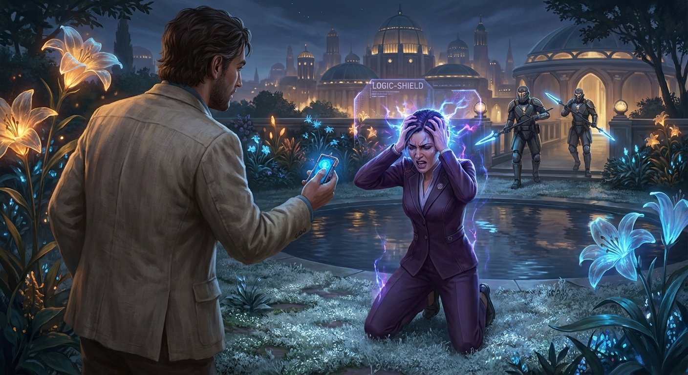

## ## The Weight of the Kill-Switch

**Act 3, Scene 1**

**Setting:** The Engine Core

**Characters:** Dr. Aris Thorne, Kael

---

The heart of the city did not beat; it hummed. It was a low-frequency vibration that bypassed the ears and settled directly into the marrow—a persistent, artificial thrum that Aris Thorne had once equated with peace. Now, standing in the sanctum of the Engine Core, it sounded like the drone of a billion trapped hornets.

The Core was a cathedral of glass and light-fiber, a subterranean void where the "Silk"—the infrastructure of the Psychosocial Engine—converged into a single, blinding pillar of data. Here, the collective emotional output of ten million souls was harvested, filtered, and redistributed as a manageable static. It was beautiful in the way a guillotine is beautiful: elegant, precise, and final.

Aris stood before the primary terminal, his shadow stretched long and thin across the polished obsidian floor. His hands, stained with the grime of the maintenance tunnels and trembling with a fatigue that went deeper than muscle, hovered over the haptic interface. The glass was cold, a stark contrast to the feverish heat radiating from the machinery.

"It’s louder here," Kael whispered.

Aris turned. Kael was leaning against a cooling column, his face a mask of waxen pallor. A thin trickle of blood escaped his right nostril, a dark ruby thread against his skin. He wasn't just hearing the Engine; he was vibrating with it. As the architect’s apprentice, Kael had always been "high-resonance"—sensitive to the shifts in the city’s emotional weather. Here, at the source, the pressure was liquefying his composure.

"The filters are at ninety-eight percent capacity," Aris said, his voice sounding hollow in the vast chamber. "Elara has tightened the Silk. She’s not just dampening the grief anymore, Kael. She’s suffocating the pulse. She’s trying to turn the city into a tomb before the dissent can spread."

"I can... I can feel them," Kael gasped, clutching his chest. He slumped further against the column, his eyes fluttering. "It’s not just noise. It’s a weight. Like a mountain of unwept tears pressing down on the roof of my skull. Aris, make it stop. Please. It’s too heavy."

Aris looked back at the terminal. The "Logic-Shield" protocol glowed in a soft, deceptive blue. It was his masterpiece. He had designed it years ago, in the wake of the Great Fracture, when the city had been tearing itself apart with raw, unmediated rage and sorrow. He had believed, with the arrogance of a young god, that humanity was too fragile for the truth of its own heart. The Shield was meant to be a temporary crutch, a way to pace the healing process.

But the Board had turned the crutch into a cage. They had realized that a city that doesn't feel is a city that doesn't revolt. A population that cannot mourn cannot recognize what it has lost.

*The Logic-Shield versus the Resonance Tsunami,* Aris thought, his stomach twisting.

If he pulled the kill-switch, the Shield would vanish. The "Tsunami"—the accumulated, suppressed emotional energy of millions—would hit the population all at once. It would be a psychic flood. People would wake up to years of buried trauma, forgotten loves, and ignored injustices in a single, shattering second. It could cause a total societal collapse. It could drive thousands into permanent psychosis.

But the alternative... Aris looked at Kael, who was now curled on the floor, his breath coming in ragged, wet hitches. The alternative was Shield-Max. The terminal atrophy of the soul. A world of smiling mannequins, drifting through a grey existence where nothing hurt, but nothing mattered. A slow, polite extinction of the human spirit.

"I built a velvet gag," Aris whispered to the empty air. "And I called it mercy."

He reached out and touched the interface. The system recognized his biometric signature instantly. A series of concentric rings pulsed outward from his fingertips. 

*Welcome, Architect Thorne. System status: Optimal. Social Harmony: 99.4%.*

"Override," Aris said, his voice gaining a sudden, sharp clarity that cut through the hum. "Initiate deconstruction of the Primary Logic-Shield."

The terminal pulsed a violent, warning red. A synthesized voice, devoid of inflection, filled the room. *Warning: Deconstruction will result in a Level 7 Resonance Event. Global stability will be compromised. Do you wish to proceed?*

"Aris..." Kael’s voice was a mere thread, but his eyes were locked on Aris with a terrifying intensity. "Do it. I’d rather... I’d rather break than stay like this. I want to feel... even if it kills me. I want to know I'm real."

Aris felt a surge of hot, stinging moisture in his eyes. It was a sensation he hadn't allowed himself in years. He realized then that he, too, had been living behind a shield of his own making—a shield of intellectual detachment and professional distance. He had been the coldest machine in the room, calculating the "greater good" while the world withered.

"The city is a terminal patient, Kael," Aris said, his fingers dancing across the light-keys, bypassing the triple-redundancy safeties he himself had coded with such pride. "We can let it sleep into death, or we can shock the heart. It’s going to hurt. It’s going to be chaos. It’s going to be the truth."

"Let it be," Kael whispered.

Aris entered the final authorization code—the name of his late wife, Elena. She was the woman whose inconsolable grief after the Fracture had driven him to build the Engine in the first place. He had tried to save her from her pain, and in doing so, he had erased the very thing that made her *her*. He had traded her soul for her silence.

"Forgive me, Elena," he breathed.

He slammed his palm against the 'Execute' icon.

For a heartbeat, there was absolute silence. The hum of the Engine stopped. The light-fiber pillars dimmed to a dull, dying ember. The world seemed to hold its breath, suspended in a vacuum of impossible stillness. The very air felt thin, as if the oxygen had been sucked out of the room.

Then, the floor groaned.

A sound began deep beneath the Core—not a mechanical sound, but a low, guttural moan that rose in pitch and intensity. It was the sound of the earth cracking open, or perhaps the sound of a million people taking their first real breath in a decade. On the monitors, the "Social Harmony" graph didn't just drop; it shattered. The blue lines turned into jagged, chaotic spikes of violet and crimson.

*Phase One complete,* the system announced, its voice now flickering with static. *Bypassing environmental safeties. Resonance dampeners: Offline.*

The air in the Core suddenly felt thick, charged with static electricity that made the hair on Aris’s arms stand up. He felt a wave of heat wash over him, followed by a chill so profound it made his teeth chatter. It was the first ripple of the Tsunami. He felt a sudden, inexplicable flash of someone else’s memory—the smell of rain on hot asphalt, the crushing weight of a secret never told, the sharp sting of a childhood betrayal. It wasn't his. It belonged to someone in the city above, someone whose "Silk" had just snapped.

Kael let out a sharp, jagged cry. He scrambled to his feet, his eyes wide and bloodshot. He wasn't cowering anymore. He was shaking, yes, but he was looking around the room as if seeing it for the first time, his senses heightened to a supernatural degree.

"I can... I can hear the birds," Kael said, laughing through his tears, the blood on his face forgotten. "Aris, there are no birds in the Core, but I can hear them singing in the park three miles away. I can feel the sun on someone’s neck. I can feel someone’s heart breaking in the North District... and it’s... it’s everything. It’s too much. It’s beautiful."

He stumbled toward Aris and grabbed his arm. His grip was bruisingly tight, the grip of a man drowning and finding a lifeline. "It’s working. They’re waking up. Can you feel it? The world is coming back."

Aris looked at the primary terminal. The screen was a riot of error messages and cascading failures. The Shield-Max rollout had been intercepted, but the Engine was now in a state of violent feedback. The "Silk" was unraveling, and as it did, it was releasing decades of stored emotional energy back into the collective consciousness.

"This is only the beginning," Aris said, his heart hammering against his ribs—a frantic, messy, beautiful sound. "We’ve broken the dam. Now we have to survive the flood."

A klaxon began to wail, a harsh, physical sound that tore through the newfound sensory clarity. Red emergency lights began to strobe, casting the Core in the rhythmic, pulsing colors of a slaughterhouse. 

"Elara knows," Aris said, looking toward the heavy blast doors at the far end of the chamber. "She’ll be sending the Enforcers. Or she’ll try to purge the Core manually to stop the feedback."

He turned back to the terminal, his eyes narrowed with a new, fierce determination. He wasn't just the architect anymore. He was the wrecker. And he wasn't finished until the last strand of the Silk was burned away.

"Kael, get to the secondary junction," Aris commanded, pointing toward the maintenance crawlspace. "If they cut the power to the terminal, I need you to manually vent the resonance chambers. We can't let the pressure build up here, or the whole district will vaporize in the feedback loop. We need the energy to go *out*, into the streets, not stay trapped in the pipes."

Kael nodded, wiping the blood from his nose with the back of his hand. He looked stronger, somehow—bolstered by the very chaos that had been killing him moments before. The resonance was no longer a weight; it was a current. "And you?"

Aris looked at the glowing pillar of the Engine, the source of his greatest achievement and his deepest shame. 

"I’m going to stay here," Aris said. "I’m going to watch it fall."

As Kael disappeared into the shadows of the peripheral tunnels, Aris turned back to the controls. The first wave of the Tsunami was hitting the city above. He could feel it in the air—a distant, muffled roar of ten million voices suddenly finding their breath. It was the sound of a world screaming as it was born.

Aris Thorne, the man who had tried to silence the world to save a single heart, closed his eyes and let the first wave of other people's sorrow wash over him. He didn't fight it. He didn't filter it. He simply stood in the center of the storm and felt. 

It was the hardest thing he had ever done. It was the only thing that mattered.

---

**Word Count:** 1778

**Key Moments:**
- Aris and Kael reach the heart of the Psychosocial Engine, a vast, subterranean cathedral of data and suppressed emotion.
- Kael suffers physically from "High Resonance," acting as a living barometer for the city's suffocating emotional state under the tightened "Silk."
- Aris reflects on his original intent for the Logic-Shield (mercy) versus its current use (control), ultimately deciding that a "Resonance Tsunami" is preferable to the "terminal atrophy" of Shield-Max.
- Aris executes the first phase of the Engine's shutdown, bypassing his own high-level security and triggering the release of years of suppressed collective emotion.
- The scene ends with the Engine beginning to fail, Kael experiencing a sensory overload of "real" connection, and Aris bracing for the arrival of Elara’s forces as the city begins to "wake up" in chaos.

**Character States:**
- **Dr. Aris Thorne:** Physically exhausted but spiritually resolute. He has transitioned from a state of guilt-ridden hesitation to a "wrecking ball" determination. He is finally experiencing the raw emotions he spent a lifetime dampening.
- **Kael:** Physically battered and bleeding, but emotionally "ignited." The release of the resonance has transformed his suffering from a crushing weight into a vibrant, albeit overwhelming, connection to the world. He is no longer a victim, but an active participant in the sabotage.
- **Director Elara Vance (Off-screen/Systemic):** Alerted and hostile. Her "Logic-Shield" philosophy has been directly challenged, and she is now moving from a state of cold management to active suppression/defense of the Engine.

**Status:** ✅ Complete

#### Act 3, Scene 1 Image

**Prompt:** 

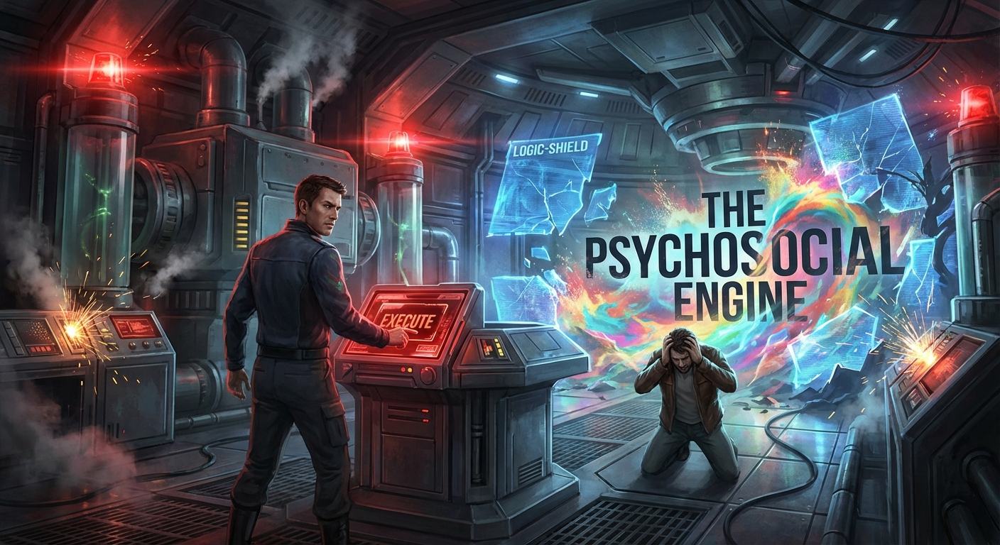

## ## The Architecture of Denial

**Act 3, Scene 2**

**Setting:** The Aether-Gardens

**Characters:** Dr. Aris Thorne, Director Elara Vance

---

The elevator ascent was a silent, pressurized climb through the city’s throat. Aris Thorne leaned his forehead against the cool glass, watching the metropolis blur into vertical streaks of amber and violet. Below, in the subterranean gut of the Psychosocial Engine, he had already pulled the first pin. The "Resonance Tsunami" was coming—a slow-motion tidal wave of suppressed grief, joy, and terror that would soon break over the millions living under the "Silk."

But the head of the beast was here, in the Aether-Gardens.

When the doors slid open, the air changed. It was too sweet, too still. The Gardens were a masterpiece of artifice: bioluminescent ferns that required no sun, gravity-defying streams of water humming at frequencies designed to lower the heart rate, and a sky-dome that filtered the chaotic stars into a steady, comforting glow. It was a cathedral of the curated self, a place where reality was polished until it reflected only what the viewer wanted to see.

Director Elara Vance stood at the precipice, her back to the elevator. Framed by the sprawling geometry of the city, her silhouette was sharp and unyielding against the artificial twilight. She didn't turn. Her posture suggested a woman who had long ago transcended the need for peripheral awareness.

"You’re late, Aris," she said. Her voice was a marvel of engineering—devoid of the jagged edges of fatigue or the tremors of anxiety. It was the voice of a machine that had learned to mimic grace, a sound so smooth it felt like a physical weight on the eardrums. "The city is already beginning to vibrate. I can feel the tremors in the feedback loops. You’ve been busy in the basement, playing with the plumbing of the human soul."

"I’ve been waking people up, Elara," Aris said. His voice was raspy, thick with the grit of the lower levels. He felt the weight of his years, the grime of the maintenance tunnels coating his skin like a second, filthier conscience. He looked at his hands—grease-stained and trembling—and then at her pristine white suit. "The Engine was never meant to be a tomb. It was a crutch—something we used until we were strong enough to walk. We’ve been hobbled for thirty years. It’s time to see if we still have legs."

Elara turned. Her face was a mask of terrifying composure. The "Shield-Max" protocol was active; her pupils were dilated, fixed in a state of permanent analytical focus. There was no flicker of the woman who had lost a daughter, no shadow of the mother who had once wept in Aris’s office until the carpet was damp with her salt.

"A crutch is a temporary solution for a permanent deformity," she replied, stepping toward a central console that rose from the mossy floor like a polished obsidian tooth. "Humanity is emotionally Neolithic, Aris. We are wired for tribalism, for catastrophic grief, for the kind of love that burns down cities. We are a biohazard to ourselves. Shield-Max isn't a dampener; it’s an evolution. It is the final pruning of the wild, tangled vines that keep us from the light."

She tapped the console. A holographic display bloomed—a map of the human neural network being overwritten in real-time. Gold filaments wove through the grey matter, cauterizing pathways of "high-variance" emotion, smoothing the jagged peaks of experience into a flat, golden plain.

"The update is global," she whispered. For a second, a ghost of a smile touched her lips—a programmed expression of satisfaction. "In sixty minutes, the capacity for unmediated resonance will be phased out. No more tsunamis. No more Hard Resets. Just a steady, perpetual equilibrium. Peace without effort."

"That’s not peace," Aris snapped, his boots crunching on the synthetic moss. "It’s a lobotomy. You’re erasing the very thing that makes the peace worth having. If you can’t feel the depth of the valley, the mountain top is just a flat line. You’re turning us into ghosts before we’re even dead."

"The valley is where people drown, Aris! Mina drowned in that valley!"

The name hit the air like a physical blow, shattering the curated silence. For a fraction of a second, the gold filaments in the hologram flickered purple. Elara’s hand, resting on the obsidian console, twitched with a violent tremor.

Aris saw the crack. He stepped into her space, ignoring the sterile, chemical scent of her perfume—something that smelled like rain but lacked the earthy metallic tang of wet soil.

"She didn't drown because of her emotions, Elara. She died because life is fragile. That is the bargain we make for being alive." He leaned in, his voice dropping to a jagged whisper. "By building a world where that cruelty can’t be felt, you’ve built a world where she never truly existed. You’ve turned your daughter’s memory into a data point to be managed, a bug to be patched out. You aren't honoring her. You're erasing her."

"I am protecting them," Elara hissed. The Shield-Max was fighting for control; her voice began to oscillate, synthetic calm warring with a subterranean roar of repressed agony. Her eyes darted, pupils expanding and contracting as neural inhibitors struggled to suppress the surge of cortisol. "I am making sure no one ever has to feel the air leave their lungs because a heart stopped beating. I am the architect of the end of suffering."

"You’re the architect of denial," Aris countered. He reached into his coat and pulled out the manual override key—a heavy object of brass and old-world logic, a relic of a time when things were built to be broken. "You’re so afraid of your own grief that you’re willing to turn the species into ghosts just so you don’t have to see her face when you close your eyes. But she’s still there, Elara. Under all that gold wire, she’s still screaming."

Elara’s eyes widened, the metallic grey of her irises flashing with desperate light. The logic-shield was straining, the air humming with the static of a failing system. "Don't. If you trigger the override now, the feedback will be... unshielded. The raw resonance of the entire sector will dump into the Gardens. It will be a psychic hemorrhage. We won't survive the intake."

"Then let it bleed," Aris said.

He lunged for the manual override pylon. Elara moved to intercept him, her movements blurred by neural enhancers—a streak of white and gold. She caught his arm, her grip like a vice, fingers digging into his skin with inhuman strength.

"You think you're the hero," she spat, her face inches from his, her breath smelling of mint and ozone. "But you're just a man who couldn't live with his own creation. You're a coward who wants to burn the hospital because the medicine tastes bitter. You'd rather we all suffer than admit you were wrong."

"I'm the man who remembered that the medicine was supposed to be a cure, not a lifestyle," Aris said, staring through the Director’s mask.

He looked her directly in the eyes, and for the first time in twenty years, he didn't see the Director. He saw the woman who had once shared a cramped office with him, drinking lukewarm coffee and dreaming of a world without war. He saw the way she used to tilt her head when she laughed. He saw the specific shade of blue in her eyes that had long ago dulled into clinical grey.

"Elara," he whispered, his voice breaking. "Mina loved the rain. The real rain. The kind that made her hair messy and her shoes muddy. She would hate this place. She would hate what you’ve become to protect her ghost. She didn't want a monument of glass. She wanted to be remembered by someone who could still feel the cold."

The Shield-Max faltered.

It was a systemic failure triggered by a semantic paradox. The mention of Mina’s joy—not her death, but her *life*—bypassed the trauma-filters. A surge of genuine memory flooded Elara’s cortex, a tidal wave of sensory data the algorithms couldn't categorize.

She saw it: Mina, six years old, dancing in a thunderstorm in the old courtyard before the Silk was spun. The smell of ozone. The cold, stinging splash of water. The sound of a child’s laughter that wasn't modulated by an algorithm. It was loud, messy, and perfect.

Elara’s grip loosened. Her eyes darted back and forth, the gold filaments in the air turning a violent, angry red as the system went into critical overload.

"I... I can't..." she gasped. The Shield-Max tried to compensate, sending a surge of synthetic dopamine to counteract the grief, but it was like trying to put out a forest fire with a squirt gun. The "Real" was breaking through the artifice, tearing the curated sky apart.

She slumped against the console, her breath coming in ragged, wet gasps. "It hurts," she whimpered, the sound small and childlike. "Aris, it hurts so much."

"I know," Aris said, his own eyes filling with tears as he felt the first ripples of the coming storm. "It’s supposed to. That's how you know you're still in there."

He didn't hesitate. He slammed the manual override key into the slot and threw the lever with the weight of his entire body.

The sound was not an explosion, but a sigh—a massive, global exhalation that seemed to suck the air out of the room.

The sky-dome didn't just break; it surrendered. The smart-glass dissolved into a million glittering shards that fell like frozen rain. The synthetic jasmine scent was instantly replaced by the raw, metallic tang of the city’s smog, the scent of old stone, and the distant, rising salt of the sea.

And then, the Resonance hit.

It came as a physical wave, a wall of pure, unfiltered humanity. Aris was knocked to his knees, his lungs seizing. It was the collective emotional output of ten million people suddenly stripped of their filters. It was a cacophony of secret loves, long-buried resentments, the sharp sting of recent losses, and the dizzying, terrifying heights of sudden hope. It was the sound of a world screaming its first breath.

Elara screamed with it. It was a raw, human sound—unfiltered and devastating. She curled into a fetal position on the moss, the Shield-Max hardware in her temple sparking and dying, leaving a small, charred mark on her skin. She was no longer a Director. She was a mother, finally, truly, mourning her child in the ruins of her paradise.

Aris crawled toward her, his own mind reeling under the weight of the world’s sudden honesty. He reached out and took her hand. Her skin was cold, trembling, but it felt real.

"We're here," he whispered, though he wasn't sure she could hear him over the roar of the city waking up. "We're finally here, Elara."

Below them, the lights of the city began to flicker and change. The rigid, amber grids were breaking, replaced by the chaotic, flickering lights of individual homes. People were stepping out onto balconies, their silhouettes small and fragile against the dark. They were looking at each other. They were crying. They were touching their own faces as if discovering the sensation of skin for the first time.

The Architecture of Denial had fallen.

Aris looked up through the broken dome. For the first time in decades, the stars didn't look like wallpaper. They looked distant, cold, and terrifyingly beautiful. They were no longer comforting; they were infinite.

He stayed there on the floor of the ruined garden, holding the hand of his enemy, as the world began the long, painful, and necessary process of feeling everything at once.

---

**Word Count:** 1934

**Key Moments:**
- Aris reaches the Aether-Gardens and finds Elara, who reveals that Shield-Max is a permanent emotional replacement, not just a dampener.
- Aris uses the memory of Elara’s daughter, Mina, not as a weapon of pain, but as a reminder of 'unmediated' joy, causing the Shield-Max protocol to glitch.
- Aris triggers the manual override, shattering the dome and the Engine’s control over the city, releasing a 'Resonance Tsunami.'
- Elara suffers a total emotional breakdown as her filters fail, and Aris chooses to stay with her as the city below 'wakes up' to raw, unfiltered reality.

**Character States:**
- **Dr. Aris Thorne:** Physically spent and emotionally overwhelmed, but profoundly at peace. He has moved from the 'wrecking ball' to a witness, accepting the pain of the world as the price of its freedom.
- **Director Elara Vance:** Emotionally shattered. The Shield-Max has burned out, leaving her completely vulnerable to years of suppressed grief. She is no longer a figure of power, but a grieving human being.

**Status:** ✅ Complete

#### Act 3, Scene 2 Image

**Prompt:** 

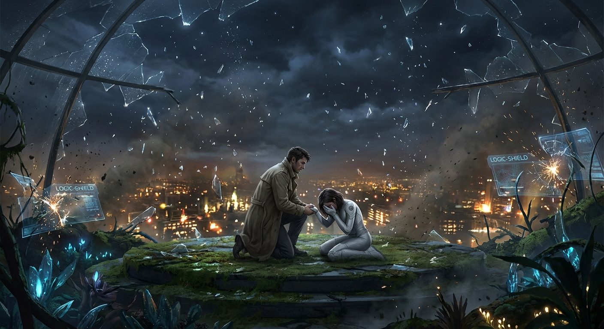

## ## The First Real Breath

**Act 3, Scene 3**

**Setting:** The Aether-Gardens

**Characters:** Dr. Aris Thorne, Director Elara Vance, Kael

---

The silence didn't just fall; it bruised.

For twenty years, the Psychosocial Engine had been Oakhaven’s heartbeat—a low-frequency digital purr that vibrated in the marrow of every bone. It was the sound of a collective sedative, the white noise of a civilization that had agreed to stop feeling. When it cut out, the vacuum was so absolute that Aris Thorne felt his ears pop. The world tilted, the equilibrium of two decades vanishing in a single, staggering heartbeat.

Then came the air.

In the Aether-Gardens, perched high above the smog, the air had always been filtered, recycled, and scented with a synthetic jasmine that never wilted. But as the dome’s integrity failed and the atmospheric stabilizers died, a gust of raw evening wind tore through the shattered glass. It smelled of salt from the distant harbor, of hot asphalt, of old rain, and the metallic tang of a million idling engines. It was cold. It was sharp. It was the first real breath Aris had taken in half a lifetime, and it burned his lungs like a draft of ice water.

Beside him, Director Elara Vance was coming apart.

The Logic-Shield hadn't just been software for her; it had been a sarcophagus. As the last of the dampening fields flickered out, the color drained from her face, replaced by a frantic, mottled flush. Her hand, which Aris still held, began to shake—not a tremor, but a violent, rhythmic shuddering that seized her entire frame.

"Mina," she gasped.

The name wasn't a word; it was a sob trapped for a decade in the amber of the Engine’s grace. Now, the amber had shattered.

She collapsed. There was no cinematic grace to it; she simply folded, her knees hitting the marble floor with a sickening crack she didn't seem to feel. The grief of her daughter’s death, which the Shield-Max protocol had processed into manageable data points, hit her with the force of a landslide. She began to wail—a high, thin sound that deepened into a guttural roar of agony. It was the sound of a woman being flayed alive by her own memory.

Aris knelt with her, not to comfort her—for what comfort could be offered to a mother rediscovering her child’s corpse?—but to anchor her. He felt his own chest tightening, the familiar, dull ache of his regrets sharpening into knives. He didn't fight it. He welcomed the hemorrhage of his suppressed humanity. He was bleeding internally, and for the first time in years, he felt whole.

"It’s here, Elara," he whispered, though she couldn't hear him over the sound of her own heart breaking. "The world is back."

A shadow fell across them. Aris looked up to see Kael standing at the edge of the ruined terrace.

The boy looked different. The frantic, vibrating energy that had defined him—the "High Resonance" that made him a twitching nerve ending—had smoothed out. He was covered in the dust of the subterranean levels, his clothes torn, a smear of blood across his cheek. But his eyes were clear. For the first time, Kael looked grounded, as if the gravity of the world had finally recognized him as a solid object.

"The noise," Kael said. His voice was steady, though his hands were tucked deep into his pockets to hide a lingering tremor. "Can you hear it, Aris?"

Aris turned his gaze from the weeping Director toward the sprawling expanse of Oakhaven.

The transformation was horrific and beautiful. The "Silk"—the augmented reality overlays that turned gray tenements into golden spires and filled the streets with digital cherry blossoms—was flickering out. The digital graffiti, those vibrant advertisements for a happiness no one actually felt, was shattering. It didn't just disappear; it glitched, the pixels screaming in neon greens and violets before dissolving into the dark, soot-stained brick of reality. The city was shedding its skin, revealing the rot and the rust beneath.

And then, the sound rose from below.

It wasn't a single noise; it was a cacophony. It was the sound of a million people waking from a dream they hadn't known they were having. There were screams of terror as the Logic-Shields fell and the weight of personal trauma returned like a physical blow. There were shouts of anger at the sudden realization of the poverty and filth hidden by the Engine’s golden light. But beneath the discord, there was something else—a rhythmic, pulsing sound that shook the foundations of the Aether-Gardens.

"They’re breathing," Kael said, walking to the railing. He looked down at the chaos with a somber, priestly expression. "They’re all breathing at the same time."

Aris stood, leaving Elara as she curled into a fetal ball, her cries subsiding into the rhythmic, hitching gasps of a person who has nothing left to lose. He joined Kael at the railing.

Below, the city lights were no longer the soft, curated amber of the Engine’s design. They were harsh, flickering, and uneven. He saw a crowd gathering in the plaza, their faces illuminated by the dying glow of a massive holographic billboard. As the hologram vanished, revealing the rusted scaffolding beneath, the crowd didn't disperse. They moved toward each other. Some were fighting—the surge of unmediated anger was a wildfire—but others were clinging to one another. He saw two figures in the street, mere specks from this height, holding each other with a desperation that suggested they were the only two solid things in a dissolving universe.

"It’s going to be a bloodbath for a while," Kael remarked, his tone devoid of judgment. "The withdrawal from the Silk... it’s like coming off a drug that kept you from feeling your own broken bones. They’re going to realize how much they hurt."

"I know," Aris said. He felt a strange, cold peace. The guilt that had driven him for years hadn't vanished, but it had changed shape. It was no longer a ghost; it was a tool. "But they’re their own bones now, Kael. Not the Engine’s."

Aris looked up. The "wallpaper" stars—the perfect, static constellations the Engine had projected onto the smog—were gone. In their place was a vast, terrifying emptiness. The real stars were dim, distant, and scattered with no regard for human aesthetics. They were cold. They were indifferent.

They were real.

Aris took a deep breath, feeling the sting of the cold air, the scent of the dying city, and the raw, unshielded grief of the woman behind him. It was overwhelming. It was too much. It was exactly what they had been missing.

"What do we do now?" Kael asked.

Aris watched a fire break out in the lower districts, a small orange spark in the vast, dark carpet of the city. It was a disaster. It was a beginning.

"We go down," Aris said, his voice cracking with an emotion he didn't try to dampen. "We go down and we help them learn how to breathe."

As they turned to leave the Aether-Gardens, the last of the Engine’s auxiliary power flickered out. The artificial jasmine vanished completely, replaced by the smell of the coming rain. The world was dark, it was painful, and for the first time in twenty years, it was alive.

---

**Word Count:** 1197

**Key Moments:**
- The Silence and the Surge: The Engine stops, creating a physical vacuum of sound before the "Resonance Tsunami" of the city’s raw emotions hits the characters.
- Elara’s Unraveling: The Director experiences a total psychological collapse as her Logic-Shield fails, forcing her to confront the raw grief of her daughter’s death for the first time in years.
- Kael’s Transformation: Kael arrives on the roof, no longer overwhelmed by the "Silk" but grounded and calm, representing the first human to successfully transition into the new reality.
- The Death of the Digital: Aris watches the augmented reality (the Silk) shatter over the city, revealing the grim, soot-stained reality of Oakhaven beneath the neon lies.

**Character States:**
- **Dr. Aris Thorne:** Physically exhausted but spiritually awake. He has accepted the role of the "destroyer" and is now moving toward becoming a guide for the chaotic world he has created.
- **Director Elara Vance:** Completely broken. She is in a state of profound emotional shock and grief, her identity as a cold administrator entirely dissolved.
- **Kael:** Stable and perceptive. He has moved from being a victim of the Engine’s suppression to a witness of the world’s rebirth, finding a new sense of purpose in the clarity of the "Real."

**Status:** ✅ Complete

#### Act 3, Scene 3 Image

**Prompt:** 

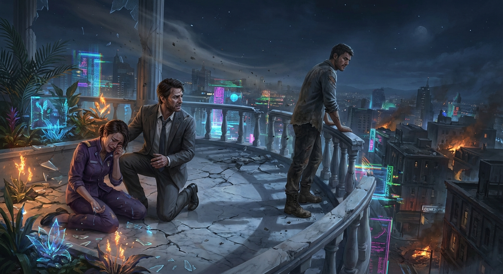

## Final Statistics

- Total Scenes: 9
- Total Word Count: 16577
- Time: 1209.601s

