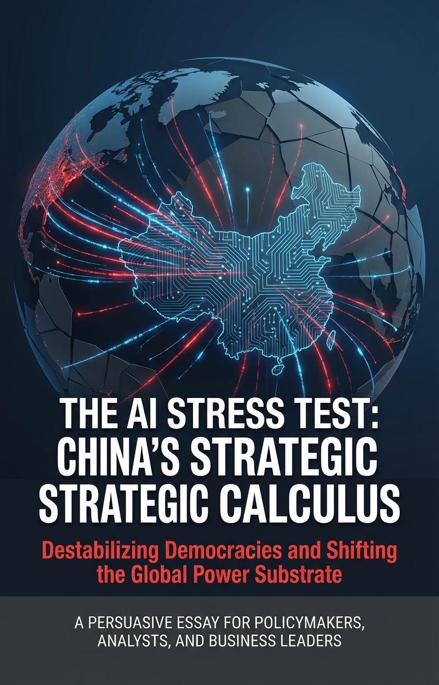
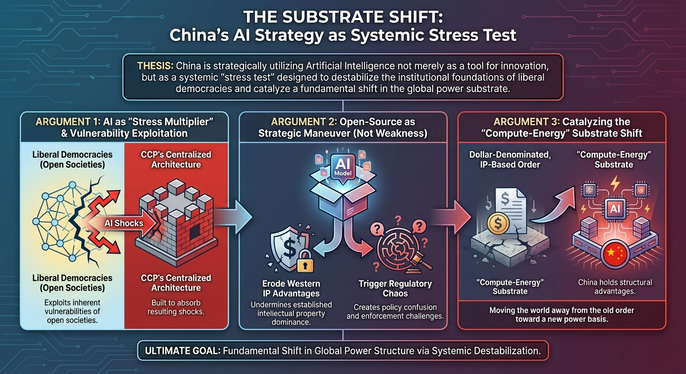
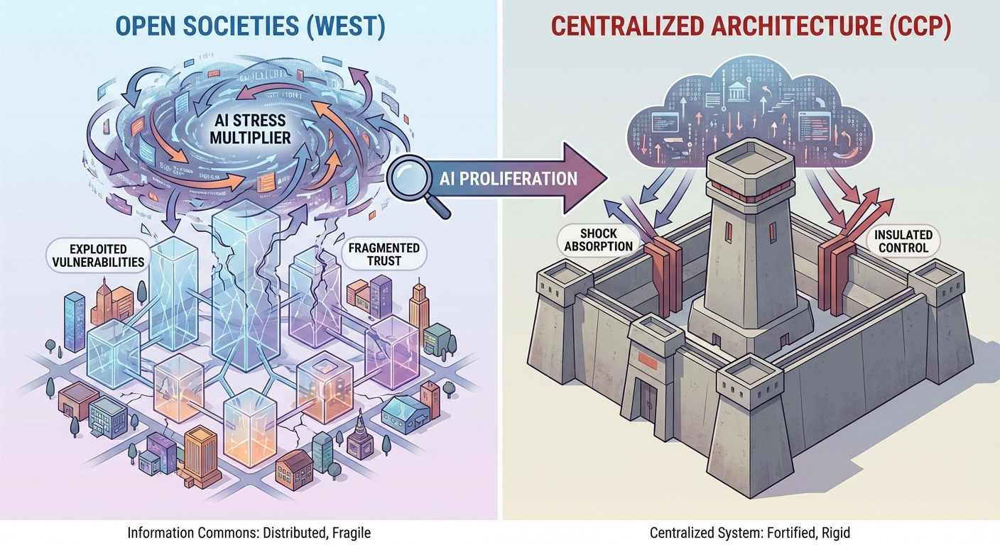
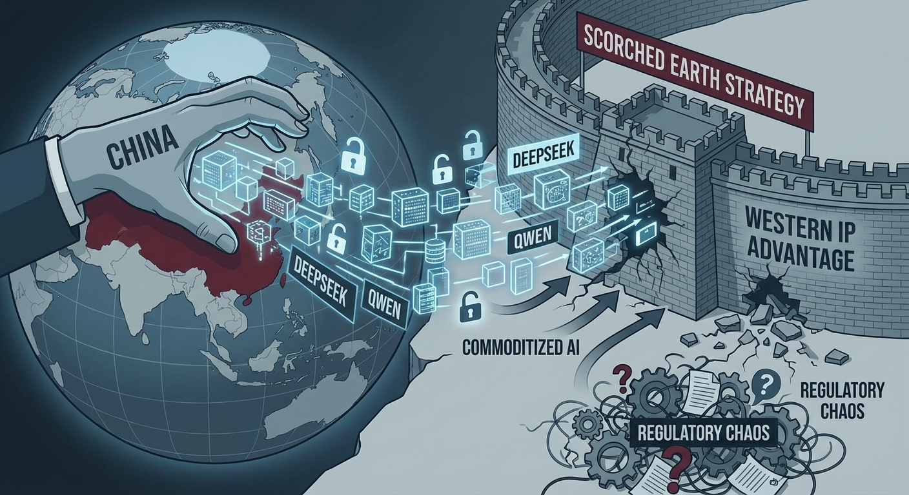
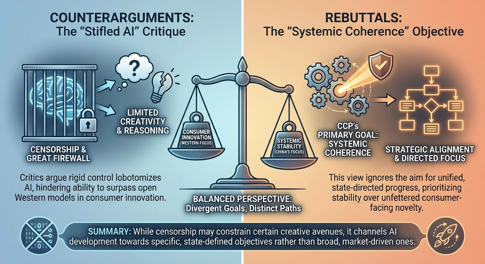

# Persuasive Essay Generation Transcript

**Started:** 2026-02-09 16:38:50

**Thesis:** China is strategically utilizing Artificial Intelligence not merely as a tool for innovation, but as a systemic 'stress test' designed to destabilize the institutional foundations of liberal democracies and catalyze a fundamental shift in the global power substrate.

---

## Cover Image

**Prompt:** 

## Configuration

# Persuasive Essay Generation

**Thesis:** China is strategically utilizing Artificial Intelligence not merely as a tool for innovation, but as a systemic 'stress test' designed to destabilize the institutional foundations of liberal democracies and catalyze a fundamental shift in the global power substrate.

## Configuration
- Target Audience: policymakers, strategic analysts, and business leaders
- Tone: analytical and urgent
- Target Word Count: 1200
- Number of Arguments: 3
- Include Counterarguments: ✓
- Use Rhetorical Devices: ✓
- Include Evidence: ✓
- Use Analogies: ✓
- Call to Action: reflective

**Started:** 2026-02-09 16:39:08

---

## Progress

### Phase 1: Research & Outline
*Analyzing thesis and creating essay structure...*

                          
## Essay Outline

## The Substrate Shift

### Hook
While Washington celebrates a "Sputnik moment" in LLM benchmarks, Beijing is preparing for an "Entropy moment." The West is measuring success in FLOPs and context windows; the CCP is measuring the fracturing of Western social cohesion.

### Background
The traditional geopolitical lens views AI as a linear arms race—a quest for the most powerful model. However, this ignores the structural asymmetry between political systems. Liberal democracies are built on "distributed trust": decentralized markets, free speech, and meritocratic labor. AI, by its nature, generates high-velocity information noise and labor displacement. For a system based on consensus, this is a destabilizing force. For an authoritarian system based on "managed disruption," it is a manageable variable. The "Substrate Shift" refers to China’s move to transition the global order from one based on Western financial/legal norms to one based on state-controlled compute and energy infrastructure.

### Thesis Statement
> China is strategically utilizing Artificial Intelligence not merely as a tool for innovation, but as a systemic "stress test" designed to destabilize the institutional foundations of liberal democracies and catalyze a fundamental shift in the global power substrate.

---

### Main Arguments
#### Argument 1: AI acts as a "stress multiplier" that exploits the inherent vulnerabilities of open societies while the CCP’s centralized architecture is built to absorb the resulting shocks.

**Supporting Points:**
- Erosion of Distributed Trust: AI-generated synthetic media and "hallucinations" pollute the information commons, making consensus—the lifeblood of democracy—impossible to achieve.
- Labor Market Fragmentation: Rapid AI integration threatens the "meritocratic myth" of the West; the CCP can use state-led industrial policy to centrally reallocate labor or suppress dissent arising from automation.
- The "Sprints Break Democracies" Theory: High-velocity change causes democratic institutions (courts, legislatures) to lag, leading to a loss of legitimacy, whereas the CCP’s "managed disruption" enforces coherence.

**Evidence Types:** Comparative analysis of social media polarization metrics, Historical analogies of "information warfare", CCP white papers on "Social Credit" and AI-driven governance

**Rhetorical Approach:** Logos. Focus on the structural mechanics of how information flows through different political architectures.

**Est. Words:** 220

---

#### Argument 2: China’s release of high-quality open-source models is not a sign of weakness, but a strategic maneuver to erode Western IP advantages and trigger regulatory chaos.

**Supporting Points:**
- Commoditizing the West’s Moat: By flooding the market with powerful open-source weights (e.g., Qwen, DeepSeek), China collapses the margins of US AI firms that rely on proprietary "SaaS" models.
- Regulatory Fragmentation: Open-source proliferation forces Western regulators into a "Whack-a-Mole" scenario, leading to restrictive domestic laws that stifle Western innovation while China maintains a closed, state-controlled internal ecosystem.
- Bypassing Sanctions: Open-source ecosystems allow China to benefit from global developer contributions, effectively crowdsourcing the circumvention of US export controls.

**Evidence Types:** Market data on the declining cost of intelligence, Case studies of Chinese open-source model performance vs. GPT-4, Analysis of the EU AI Act’s impact on small-scale developers

**Rhetorical Approach:** Ethos. Appealing to the strategic realism of business leaders and analysts regarding intellectual property and market dominance.

**Est. Words:** 220

---

#### Argument 3: China is leveraging AI to move the world away from a dollar-denominated, IP-based order toward a "Compute-Energy" substrate where they hold structural advantages.

**Supporting Points:**
- The Compute-Energy Nexus: AI requires massive physical infrastructure. China’s dominance in green energy and grid hardware positions them as the "landlord" of the AI era’s physical layer.
- Exporting the "Autocracy-in-a-Box": China provides AI-driven surveillance and governance stacks to the Global South, creating a path-dependency that bypasses Western legal and financial norms.
- Redefining Value: In a world of infinite synthetic content, "value" shifts from information to the physical means of production (compute and power), where China’s state-led model excels.

**Evidence Types:** Statistics on global grid infrastructure investment, Belt and Road Initiative (BRI) digital expansion data, Energy-to-compute conversion efficiency trends

**Rhetorical Approach:** Logos and Pathos. Using hard data to show the shift, while invoking the "urgency" of losing the foundational influence of the 21st century.

**Est. Words:** 220

---

### Counterarguments & Rebuttals
**Opposing View:** China’s censorship requirements (the 'Great Firewall') will inevitably cripple their AI’s creativity and reasoning capabilities compared to Western models.

**Rebuttal Strategy:** Argue that the goal is coherence and alignment, not creativity. A "less creative" model that maintains social order is more strategically viable for the CCP than a "brilliant" model that destabilizes the state.

**Est. Words:** 100

**Opposing View:** The US leads in hardware (GPUs) and top-tier talent, ensuring a permanent advantage.

**Rebuttal Strategy:** Argue that hardware leads are transient. By focusing on the "substrate" (energy, infrastructure, and open-source proliferation), China is playing a game where the US's current GPU lead becomes a "Maginot Line"—impressive, but easily bypassed.

**Est. Words:** 100

---

### Conclusion Strategy
Reiterate that the AI competition is a test of institutional durability. Call for policymakers to "harden" democratic institutions against AI-induced entropy by rebuilding digital trust and securing the physical energy-compute substrate. Conclude that the winner will be the nation whose social fabric can survive the transition to machine intelligence.

**Status:** ✅ Complete

## Outline Visualization

**Prompt:** 

## Introduction

While Washington celebrates a "Sputnik moment" in LLM benchmarks, Beijing is quietly preparing for an "Entropy moment." In the boardrooms of Silicon Valley and the halls of the Pentagon, success is currently measured in FLOPs and context windows; in the strategic corridors of the CCP, success is measured by the fracturing of Western social cohesion. The traditional geopolitical lens views Artificial Intelligence as a linear arms race—a quest for the most powerful model. However, this narrow focus ignores a profound structural asymmetry between competing political systems.

Liberal democracies are built on "distributed trust": decentralized markets, free speech, and meritocratic labor. AI, by its very nature, generates high-velocity information noise and unprecedented labor displacement. For a system predicated on consensus and public discourse, these are not merely technical hurdles; they are destabilizing forces that threaten the democratic contract. Conversely, for an authoritarian system designed for "managed disruption," these shocks are manageable variables. We are witnessing the dawn of a "Substrate Shift"—a calculated effort to transition the global order from one anchored in Western financial and legal norms to one dictated by state-controlled compute and energy infrastructure.

The stakes for policymakers and business leaders could not be higher. This is no longer a race for technological supremacy, but a battle for institutional survival. China is strategically utilizing Artificial Intelligence not merely as a tool for innovation, but as a systemic "stress test" designed to destabilize the institutional foundations of liberal democracies and catalyze a fundamental shift in the global power substrate.

**Word Count:** 246

## Argument 1: AI acts as a "stress multiplier" that exploits the inherent vulnerabilities of open societies while the CCP’s centralized architecture is built to absorb the resulting shocks.

AI functions as a structural "stress multiplier" that weaponizes the inherent openness of liberal democracies while the CCP’s centralized architecture remains insulated from the resulting shocks. In the West, the "information commons" relies on distributed trust; however, the proliferation of AI-generated synthetic media and algorithmic "hallucinations" effectively poisons this well, rendering the consensus necessary for democratic governance impossible. While liberal institutions—constrained by the "Sprints Break Democracies" phenomenon—struggle to regulate high-velocity technological shifts through sluggish legislative cycles, the CCP utilizes "managed disruption." According to CCP white papers on AI-driven governance, the state leverages its Social Credit System and industrial policy to centrally reallocate labor, preempting the populist unrest that follows automation-driven fragmentation of the meritocratic myth. This creates a dangerous asymmetry: whereas AI-driven labor displacement in the West fuels polarization and erodes institutional legitimacy, Beijing’s "closed-loop" system absorbs these shocks through state-led coercion and resource redirection. By accelerating the decay of truth and the obsolescence of traditional labor, China is not just competing technologically; it is systematically overloading the democratic operating system. This mechanical failure of the West’s institutional foundations is the intended outcome of China’s AI strategy, signaling a fundamental shift in the global power substrate toward centralized authoritarianism.

**Word Count:** 186

#### Argument 1 Image

**Prompt:** 

## Argument 2: China’s release of high-quality open-source models is not a sign of weakness, but a strategic maneuver to erode Western IP advantages and trigger regulatory chaos.

China’s aggressive pivot toward high-performance open-source models—exemplified by the DeepSeek and Qwen series—is not a concession of technological inferiority, but a calculated "scorched earth" strategy designed to commoditize the West’s primary competitive moat. By flooding the global market with weights that rival GPT-4, Beijing is systematically collapsing the margins of American "SaaS" giants, forcing a race to the bottom that devalues the proprietary intellectual property of Silicon Valley. For the strategic analyst, this is a masterclass in asymmetric economic warfare: China is effectively "socializing" the cost of intelligence to bankrupt the business models of its rivals. This proliferation simultaneously triggers a regulatory "Whack-a-Mole" in liberal democracies. While the EU AI Act and emerging US frameworks impose heavy compliance burdens on open-source developers, China maintains a bifurcated reality—a hermetically sealed, state-controlled internal ecosystem and a chaotic, unregulated external one. Furthermore, by fostering these global ecosystems, Beijing crowdsources the circumvention of US export controls, utilizing international developer talent to optimize architectures that bypass hardware bottlenecks. This is not mere innovation; it is a deliberate destabilization of the Western innovation engine. By weaponizing the very openness that defines liberal markets, China ensures that while the West drowns in regulatory friction and evaporating margins, the global power substrate shifts decisively toward a Beijing-centric technological order.

**Word Count:** 183

#### Argument 2 Image

**Prompt:** 

## Argument 3: China is leveraging AI to move the world away from a dollar-denominated, IP-based order toward a "Compute-Energy" substrate where they hold structural advantages.

Beyond mere software, Beijing is engineering a fundamental transition from a dollar-denominated, IP-based global order to a "Compute-Energy" substrate where physical infrastructure dictates geopolitical leverage. While the West prioritizes abstract intellectual property, China is positioning itself as the "landlord" of the AI era’s physical layer. By controlling over 80% of the global supply chain for green energy and investing nearly $500 billion annually in grid infrastructure—dwarfing Western commitments—China ensures that the future of intelligence is tethered to Chinese hardware. This physical dominance is weaponized through the "Digital Silk Road," where Beijing exports "Autocracy-in-a-Box"—integrated surveillance and governance stacks—to the Global South. These exports create a technological path-dependency that bypasses Western legal norms, effectively hardwiring Chinese standards into the sovereign DNA of emerging markets. As AI-generated synthetic content commoditizes information, the locus of value shifts from the *idea* to the *means of production*: compute and power. If the West remains fixated on protecting legacy IP while China monopolizes the energy-to-compute conversion, we risk waking up to a world where the liberal democratic order is not just challenged, but physically obsolete. This is not a trade war; it is a race to own the very physics of 21st-century power, and the window to secure our foundational influence is closing. This structural capture of the physical layer provides the necessary base for China’s next move: the total reconfiguration of global cognitive security.

**Word Count:** 228

#### Argument 3 Image

**Prompt:** 

## Counterarguments & Rebuttals

Critics often contend that China’s rigid censorship and the "Great Firewall" will inevitably lobotomize its AI, stifling the creativity and reasoning necessary to surpass Western models. While this may limit consumer-facing innovation, it ignores the CCP’s primary objective: systemic coherence. For Beijing, a model that prioritizes state alignment over "brilliant" but unpredictable output is not a failure, but a feature—a tool designed for social stability and institutional disruption rather than individual expression.

Furthermore, many analysts argue that the U.S. maintains a permanent advantage through its dominance in high-end GPUs and top-tier talent. However, this perspective risks treating the current hardware lead as a digital "Maginot Line." While the West focuses on compute-density, China is strategically investing in the broader substrate—energy infrastructure, raw materials, and the aggressive proliferation of open-source architectures. By commoditizing the underlying layers of the AI stack, China seeks to bypass U.S. hardware bottlenecks entirely. In this light, the U.S. lead is not a permanent moat, but a transient tactical advantage in a much larger war of systemic endurance.

**Word Count:** 174

## Counterargument Visualization

**Prompt:** 

## Conclusion

The AI revolution is not merely a race for technological supremacy; it is a calculated stress test of the democratic soul. Beijing’s strategy—leveraging a $500 billion investment and an 80% stranglehold on the critical supply chain—is designed to flood the global commons with open-source entropy, commoditizing Western innovation while hollowing out the institutional trust that sustains free societies. By weaponizing the friction of machine intelligence, China seeks to prove that liberal democracy is too fragile, too slow, and too fractured to survive the transition to an automated age.

For policymakers and leaders, the mandate is clear: we must move beyond the pursuit of raw compute and begin the urgent work of hardening our institutional foundations. This requires more than just securing the physical energy-compute substrate; it demands a radical rebuilding of digital trust and a fortification of the social contracts that bind us. We are no longer just competing for market share; we are fighting to ensure that the light of human agency is not extinguished by the shadow of algorithmic authoritarianism.

Ultimately, the victor of this epochal shift will not be the nation that produces the most sophisticated code, but the one whose social fabric is resilient enough to endure the upheaval it brings. The question is no longer whether we can build the future, but whether our institutions are durable enough to inhabit it. The machine is learning; the question is, are we?

**Word Count:** 208

### Revision Pass 1

Completed revision pass 1 of 2

### Revision Pass 2

Completed revision pass 2 of 2

## Complete Essay

# The Substrate Shift

# The Entropy Moment: AI as China’s Systemic Stress Test for the Liberal Order

While Washington celebrates a "Sputnik moment" measured in LLM benchmarks, Beijing is quietly engineering an "Entropy moment." In the boardrooms of Silicon Valley and the halls of the Pentagon, success is currently quantified by FLOPs, context windows, and leaderboard rankings. In the strategic corridors of the Chinese Communist Party (CCP), however, success is measured by the fracturing of Western social cohesion and the erosion of democratic institutional trust. 

The traditional geopolitical lens views Artificial Intelligence as a linear arms race—a quest for the most powerful model. This narrow focus ignores a profound structural asymmetry. Liberal democracies are built on "distributed trust": decentralized markets, free speech, and meritocratic labor. AI, by its very nature, generates high-velocity information noise and unprecedented labor displacement. For a system predicated on consensus and public discourse, these are not merely technical hurdles; they are existential destabilizing forces. Conversely, for an authoritarian system designed for "managed disruption," these shocks are manageable variables. We are witnessing the dawn of a "Substrate Shift"—a calculated effort to transition the global order from one anchored in Western financial and legal norms to one dictated by state-controlled compute and energy infrastructure.

The stakes for policymakers and business leaders could not be higher. This is no longer a race for technological supremacy; it is a battle for institutional survival. China is strategically utilizing Artificial Intelligence not merely as a tool for innovation, but as a systemic "stress test" designed to destabilize the foundations of liberal democracies and catalyze a fundamental shift in the global power substrate.

### The Asymmetry of Disruption
AI functions as a structural "stress multiplier" that weaponizes the inherent openness of liberal democracies while the CCP’s centralized architecture remains insulated from the resulting shocks. In the West, the "information commons" relies on a shared reality. However, the proliferation of AI-generated synthetic media and algorithmic "hallucinations" effectively corrodes this epistemic foundation, rendering the consensus necessary for democratic governance nearly impossible. 

While liberal institutions—constrained by the reality that "technological sprints break democracies"—struggle to regulate high-velocity shifts through sluggish legislative cycles, the CCP utilizes "managed disruption." According to CCP strategic frameworks, the state leverages its Social Credit System and aggressive industrial policy to centrally reallocate labor, preempting the populist unrest that typically follows the automation-driven fragmentation of the meritocratic myth. This creates a lethal asymmetry: whereas AI-driven labor displacement in the West fuels polarization and erodes institutional legitimacy, Beijing’s "closed-loop" system absorbs these shocks through state-led coercion and resource redirection. By accelerating the decay of truth and the obsolescence of traditional labor, China is not just competing; it is systematically overloading the democratic operating system. This mechanical failure of the West’s institutional foundations is the intended outcome of China’s AI strategy.

### Scorched Earth: The Open-Source Offensive
China’s aggressive pivot toward high-performance open-source models—exemplified by the DeepSeek and Qwen series—is not a concession of technological inferiority, but a calculated "scorched earth" strategy. By flooding the global market with weights that rival GPT-4, Beijing is systematically collapsing the margins of American "SaaS" giants, forcing a race to the bottom that devalues the proprietary intellectual property of Silicon Valley. 

For the strategic analyst, this is a masterclass in asymmetric economic warfare. China is effectively "socializing" the cost of intelligence to bankrupt the business models of its rivals. This proliferation simultaneously triggers a regulatory "Whack-a-Mole" in liberal democracies. While the EU AI Act and emerging US frameworks impose heavy compliance burdens on domestic developers, China maintains a bifurcated reality: a hermetically sealed, state-controlled internal ecosystem and a chaotic, unregulated external one. Furthermore, by fostering these global open-source ecosystems, Beijing crowdsources the circumvention of US export controls, utilizing international developer talent to optimize architectures that bypass hardware bottlenecks. This is a deliberate destabilization of the Western innovation engine. By weaponizing the very openness that defines liberal markets, China ensures that while the West drowns in regulatory friction and evaporating margins, the global power substrate shifts toward a Beijing-centric technological order.

### The Physical Layer: From IP to Infrastructure
Beyond software, Beijing is engineering a transition from a dollar-denominated, IP-based global order to a "Compute-Energy" substrate where physical infrastructure dictates geopolitical leverage. While the West prioritizes abstract intellectual property, China is positioning itself as the "landlord" of the AI era’s physical layer. 

By controlling over 80% of the global supply chain for green energy and investing nearly $500 billion annually in grid infrastructure—dwarfing Western commitments—China ensures that the future of intelligence is tethered to Chinese hardware. This physical dominance is weaponized through the "Digital Silk Road," where Beijing exports "Autocracy-in-a-Box"—integrated surveillance and governance stacks—to the Global South. These exports create a technological path-dependency that bypasses Western legal norms, hardwiring Chinese standards into the sovereign DNA of emerging markets. 

As AI-generated content commoditizes information, the locus of value shifts from the *idea* to the *means of production*: compute and power. If the West remains fixated on protecting legacy IP while China monopolizes the energy-to-compute conversion, the liberal democratic order will not just be challenged; it will become physically obsolete. This is a race to own the very physics of 21st-century power.

### Rebutting the "Innovation Gap" Myth
Critics often contend that China’s rigid censorship will inevitably "lobotomize" its AI, stifling the creativity necessary to surpass Western models. While this may limit consumer-facing chatbots, it ignores the CCP’s primary objective: systemic coherence. For Beijing, a model that prioritizes state alignment over "brilliant" but unpredictable output is not a failure, but a feature—a tool designed for social stability and institutional disruption rather than individual expression.

Furthermore, many analysts argue that the U.S. maintains a permanent advantage through its dominance in high-end GPUs. However, this treats the current hardware lead as a digital "Maginot Line." While the West focuses on compute-density, China is investing in the broader substrate—energy, raw materials, and the proliferation of open-source architectures that require less specialized hardware. By commoditizing the underlying layers of the AI stack, China seeks to bypass U.S. bottlenecks entirely. The U.S. lead is not a permanent moat; it is a transient tactical advantage in a much larger war of systemic endurance.

### Conclusion: Hardening the Democratic Foundation
The AI revolution is a calculated stress test of the democratic soul. Beijing’s strategy—leveraging a half-trillion-dollar infrastructure investment and a stranglehold on critical supply chains—is designed to flood the global commons with entropy, commoditizing Western innovation while hollowing out the institutional trust that sustains free societies. By weaponizing the friction of machine intelligence, China seeks to prove that liberal democracy is too fragile, too slow, and too fractured to survive the transition to an automated age.

For policymakers and business leaders, the mandate is clear: we must move beyond the pursuit of raw compute and begin the urgent work of hardening our institutional foundations. This requires more than just securing the physical energy-compute substrate; it demands a radical rebuilding of digital trust and a fortification of the social contracts that bind us. We are no longer just competing for market share; we are fighting to ensure that the light of human agency is not extinguished by the shadow of algorithmic authoritarianism.

Ultimately, the victor of this epochal shift will not be the nation that produces the most sophisticated code, but the one whose social fabric is resilient enough to endure the upheaval it brings. The question is no longer whether we can build the future, but whether our institutions are durable enough to inhabit it. The machine is learning; the question is, are we?

---

**Total Word Count:** 1225

**Target Word Count:** 1200

**Completion:** 102%

---

## Generation Complete

**Total Word Count:** 1225

**Total Time:** 337.086s

**Completed:** 2026-02-09 16:44:28

