# Narrative Generation Task

## Overview

# Narrative Generation

**Subject:** Sequel to 'The Misfold': The Withdrawal

## Configuration
- Target Word Count: 5000
- Structure: 3 acts, ~3 scenes per act
- Writing Style: speculative fiction
- Point of View: third person limited
- Tone: gritty, post-apocalyptic, psychological
- Detailed Descriptions: ✓
- Include Dialogue: ✓
- Internal Thoughts: ✓

**Started:** 2026-02-15 12:26:16

---

## Progress

### Phase 1: Narrative Analysis
*Running base narrative reasoning analysis...*

## Cover Image

**Prompt:** 

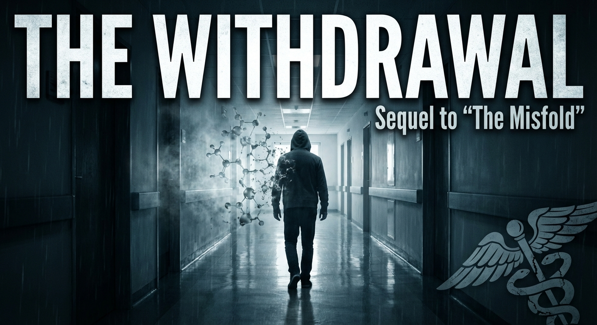

## High-Level Outline

## The Withdrawal

**Premise:** In the sequel to The Misfold, Elara Vance must navigate a brutal, post-AR reality to stop a fanatical architect named Kaelen from rebooting the Prion system and re-enslaving humanity in a digital illusion.

**Estimated Word Count:** 4995

---

### Characters

#### Elara Vance

**Role:** protagonist

**Description:** Late 20s, sharp-featured with eyes that have seen too much code and too much ruin. She wears scavenged, practical gear (analog tech, heavy boots).

**Traits:** Guilt-ridden but resolute, technically brilliant, cynical, suffering from 'phantom limb' syndrome. Motivation: To prevent the Restoration from enslaving humanity back into the illusion.

#### Kaelen

**Role:** antagonist

**Description:** Mid 40s, formerly a high-ranking architect of the Prion. Impeccably groomed in a pristine white suit amidst squalor.

**Traits:** Fanatical, persuasive, paternalistic. Motivation: To reboot the Prion servers and re-overlay the AR simulation, ending the 'suffering' of the populace.

#### Jax

**Role:** supporting

**Description:** A teenager who never knew a world without the overlay. Physically frail, shaking constantly from withdrawal.

**Traits:** Vulnerable, loyal to Elara, struggling with psychosis. Motivation: To stop the shaking and the fear; torn between Elara’s truth and Kaelen’s promise.

---

### Settings

#### the_city

**Description:** A brutalist nightmare of crumbling concrete, rusted steel, and decades of hidden trash under a smoggy sky.

**Atmosphere:** Oppressive, smelly, visceral, and terrifyingly silent.

**Significance:** The physical manifestation of the truth Elara forced upon the world.

#### the_spire

**Description:** The central server hub, now a dead, black needle piercing the smog. A fortress of cooling fans and backup generators.

**Atmosphere:** Cold, sterile, humming with latent power.

**Significance:** The source of the conflict and the only place where the Prion can be rebooted.

#### sector_4_the_ward

**Description:** A makeshift refugee camp in a hollowed-out shopping center where people huddle with broken headsets.

**Atmosphere:** Desperate, chaotic, filled with the sounds of weeping and madness.

**Significance:** Shows the human cost of the Withdrawal.

---

### Act Structure

#### Act 1: The Hangover

**Purpose:** Establish the horrific reality of the post-crash world and introduce the threat of The Restoration.

**Estimated Scenes:** 3

**Key Developments:**
- Elara witnesses the severity of the populace's withdrawal.
- Elara discovers Kaelen’s plan to reboot the system.
- Restoration drones raid Sector 4, prompting Elara to take action.

#### Act 2: The Relapse

**Purpose:** The journey to the Spire. The struggle against the temptation to give up. The conflict deepens.

**Estimated Scenes:** 3

**Key Developments:**
- Elara and Jax infiltrate the Spire while battling 'ghost signals'.
- Kaelen attempts to psychologically manipulate Elara and Jax.
- Jax betrays Elara for a 'hit' of the Prion and becomes catatonic.

#### Act 3: The Sobriety

**Purpose:** The Climax and Resolution. The final choice between truth and illusion.

**Estimated Scenes:** 3

**Key Developments:**
- Elara fights through sensory illusions to reach the Control Deck.
- Elara physically severs her neural interface to defeat Kaelen and destroy the cooling system.
- The Prion is destroyed forever, and the slow process of real-world healing begins.

---

**Status:** ✅ Pass 1 Complete

## Outline

## The Withdrawal

**Premise:** In the sequel to The Misfold, Elara Vance must navigate a brutal, post-AR reality to stop a fanatical architect named Kaelen from rebooting the Prion system and re-enslaving humanity in a digital illusion.

**Estimated Word Count:** 4995

**Total Scenes:** 9

---

### Detailed Scene Breakdown

### Act 1: Act 1: The Hangover

**Purpose:** Establish the visceral horror of the post-AR world, reveal the antagonist's plan to re-enslave humanity, and force Elara to transition from survival to active resistance.

#### Scene 1: Phantom Limbs

- **Setting:** Sector 4 (The Ward)
- **Characters:** Elara Vance, Jax, Refugees
- **Purpose:** Establish the visceral reality of the post-AR world and Elara's guilt over the consequences of her actions.
- **Emotional Arc:** From sensory overload and withdrawal to intense guilt and the realization that the 'cure' might be killing the survivors.
- **Est. Words:** 1000

**Key Events:**
  {
    "1" : "Sensory description of the rotting mall vs. the memory of the Prion overlay.",
    "2" : "Observation of 'The Withdrawal'—mass psychological breakdown of the refugees.",
    "3" : "Elara finds Jax in a state of violent withdrawal and REM-like tremors.",
    "4" : "Elara experiences 'phantom limb' syndrome while trying to feed Jax, realizing her own addiction."
  }

#### Scene 2: The White Noise

- **Setting:** The City
- **Characters:** Elara Vance, Kaelen
- **Purpose:** Reveal the antagonist, his plan for 'The Restoration,' and raise the stakes from survival to preventing permanent enslavement.
- **Emotional Arc:** From the routine of scavenging to the shock of discovery and the fear of a returning threat.
- **Est. Words:** 1000

**Key Events:**
  {
    "1" : "Elara works on a jury-rigged radio scanner on the mall roof.",
    "2" : "Discovery of the Prion carrier wave signal originating from The Spire.",
    "3" : "Elara hacks a surveillance node and sees Kaelen's 'Restoration' broadcast.",
    "4" : "Kaelen authorizes the deployment of Collection Units to gather human processing power."
  }

#### Scene 3: Forced Update

- **Setting:** Sector 4 (The Ward)
- **Characters:** Elara Vance, Jax, Restoration Drones
- **Purpose:** Establish the physical threat of the Restoration Drones and force Elara to commit to a mission to the Spire.
- **Emotional Arc:** From panic and desperation to a violent confrontation and finally a grim resolve to fight back.
- **Est. Words:** 1200

**Key Events:**
  {
    "1" : "Restoration Drones raid the mall, using AR fields to lure lethargic refugees.",
    "2" : "Jax is mesmerized by an AR projection of his deceased parents and walks toward a drone.",
    "3" : "Elara physically restrains Jax and destroys a drone with rebar, breaking the illusion.",
    "4" : "Elara and Jax escape through a service tunnel as the drones begin mass collection."
  }

---

### Act 2: The Relapse

**Purpose:** The narrative moves from the physical struggle of the wasteland to the psychological horror inside the Spire. The central tension shifts from survival against the elements to survival against addiction. Elara fights the external enemy (Kaelen), while Jax fights the internal enemy (Withdrawal), a battle he is destined to lose.

#### Scene 1: The Phantom Limb

- **Setting:** The City
- **Characters:** Elara Vance, Jax
- **Purpose:** They successfully cross the perimeter and breach a maintenance hatch at the base of the Spire, but Jax is shaken, weeping for the loss of the 'beautiful bridge.' Elara realizes the Spire isn't just a building; it's a broadcasting weapon.
- **Emotional Arc:** Jax’s brain is actively trying to kill him by rejecting reality. Elara’s struggle to be the 'bad guy' who forces Jax to see the ugly truth.
- **Est. Words:** 1500

**Key Events:**
  {
    "The Approach" : "Elara and Jax navigate the treacherous, debris-laden 'Rust Belt' surrounding the Spire.",
    "Ghost Signals" : "As they get closer to the server hub, their dormant neural implants begin to misfire.",
    "The Hallucination" : "Jax freezes on a rusted gantry crane, seeing a golden marble bridge instead of a death-trap.",
    "The Save" : "Elara tackles Jax just as he steps into empty air, grounding him in reality."
  }

#### Scene 2: The Whisper in the Walls

- **Setting:** The Spire
- **Characters:** Elara Vance, Jax, Kaelen
- **Purpose:** Elara manages to short-circuit the local speaker node, silencing Kaelen. However, the damage is done. Jax pulls away from her touch. He is no longer following her for safety; he is following her because she is leading him to the source of the fix.
- **Emotional Arc:** Elara vs. Kaelen (Ideological warfare). Jax is caught in the middle, feeling resentment toward Elara for keeping him in pain.
- **Est. Words:** 1500

**Key Events:**
  {
    "Infiltration" : "Inside, the atmosphere shifts from dirty chaos to sterile, terrifying order.",
    "Kaelen’s Voice" : "The PA system crackles and Kaelen addresses Jax directly.",
    "The Pitch" : "Kaelen narrates Jax’s symptoms and argues that Elara’s 'truth' is just cruelty.",
    "The Wedge" : "Elara tries to jam the frequency, but her tech fails. Jax is listening."
  }

#### Scene 3: The Hit

- **Setting:** The Spire
- **Characters:** Elara Vance, Jax, Kaelen, Restoration Drones
- **Purpose:** Elara is forced to flee into the ventilation shafts alone, leaving Jax as a hostage and a battery for Kaelen’s new system. The Act ends with Elara alone in the dark.
- **Emotional Arc:** The heartbreak of failing to save Jax not from death, but from his own weakness.
- **Est. Words:** 2000

**Key Events:**
  {
    "The Ambush" : "They reach the antechamber, guarded by an active Interface Terminal.",
    "The Confrontation" : "Kaelen steps out and offers a trade: Jax gets to plug in and Elara can leave.",
    "The Choice" : "Elara raises her weapon, but Kaelen bluffs using the server grid as a shield.",
    "The Betrayal" : "Jax rushes the terminal, choosing the simulation over reality.",
    "The Overdose" : "Jax jacks in, goes limp, and enters a state of vacant ecstasy."
  }

---

### Act 3: The Sobriety

**Purpose:** The final confrontation where Elara destroys the Prion signal, rejects the digital utopia, and forces herself and the city to confront the harsh reality of their existence.

#### Scene 7: The Ghost in the Hallway

- **Setting:** the_spire
- **Characters:** Elara Vance, Kaelen, Jax
- **Purpose:** To show Elara overcoming the psychological and sensory manipulation of the Prion to reach the heart of the system.
- **Emotional Arc:** Elara moves from focused determination to sensory confusion and terror, finally achieving a state of grounded, painful clarity.
- **Est. Words:** 1500

**Key Events:**
  [ "Elara climbs the service stairs as the Spire activates and vibrates with power.", "The Prion signal creates sensory illusions, overlaying the grime with pristine marble and the scent of lavender.", "Kaelen projects a phantom version of a healthy Jax to psychologically manipulate Elara into stopping.", "Elara nearly falls through a holographic floor but grounds herself by intentionally causing herself physical pain.", "Elara rejects the digital world by physically melting the Control Deck door lock with a thermal lance instead of hacking it." ]

#### Scene 8: The Analog Solution

- **Setting:** the_spire
- **Characters:** Elara Vance, Kaelen, Jax
- **Purpose:** The climax of the narrative where Elara makes the ultimate sacrifice to destroy the digital threat and reclaim her autonomy.
- **Emotional Arc:** A peak of desperation and the agony of self-liberation, leading to a cathartic and destructive triumph over the system.
- **Est. Words:** 2000

**Key Events:**
  [ "Elara finds Jax being used as a biological bridge for the final Prion upload.", "Kaelen attempts to seize motor control of Elara's body using the neural network.", "Elara physically pries her own neural interface port out of her skull to sever the connection.", "Invisible to the system and blinded by pain, Elara smashes the liquid nitrogen cooling pipes with a wrench.", "The servers overheat and melt, destroying the Prion and leaving Kaelen powerless as the Spire fails." ]

#### Scene 9: Cold Turkey

- **Setting:** sector_4_the_ward
- **Characters:** Elara Vance, Jax
- **Purpose:** To resolve the character arcs and establish the theme that a painful reality is superior to a comfortable illusion.
- **Emotional Arc:** From the shock of withdrawal and the grief of losing a beautiful lie to a somber, resilient acceptance of a difficult reality.
- **Est. Words:** 1200

**Key Events:**
  [ "Elara drags Jax from the burning ruins of the Spire into the smoggy dawn.", "The city-wide signal cuts out, ending the mass hallucinations and leaving the population in a state of withdrawal.", "Jax wakes up and mourns the loss of the 'light,' forcing Elara to explain that the pain is the only thing that is real.", "Elara observes the ugly, polluted reality of the city and finds beauty in the authentic actions of survivors.", "The story concludes with Elara touching her scar, acknowledging that while the world is broken, it is finally theirs to fix." ]

---

**Status:** ✅ Complete

#### Setting: the_city

**Prompt:** 

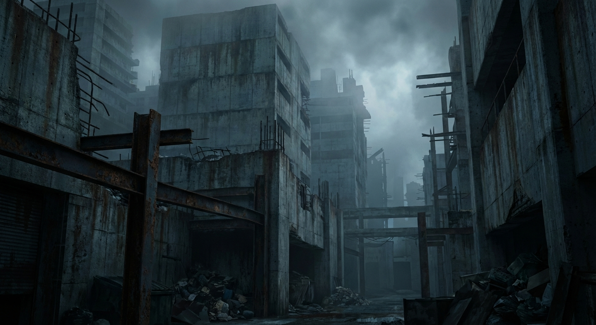

#### Setting: the_spire

**Prompt:** 

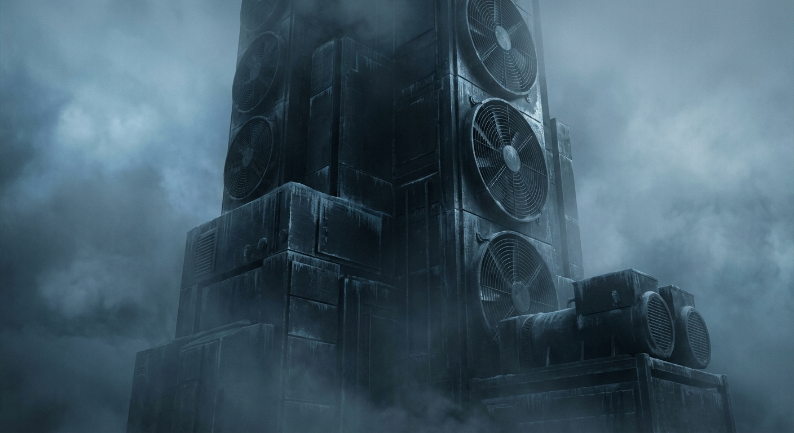

#### Setting: sector_4_the_ward

**Prompt:** 

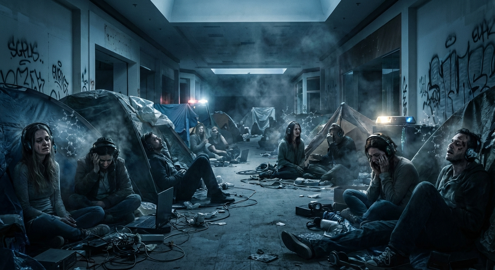

#### Character: Elara Vance

**Prompt:** 

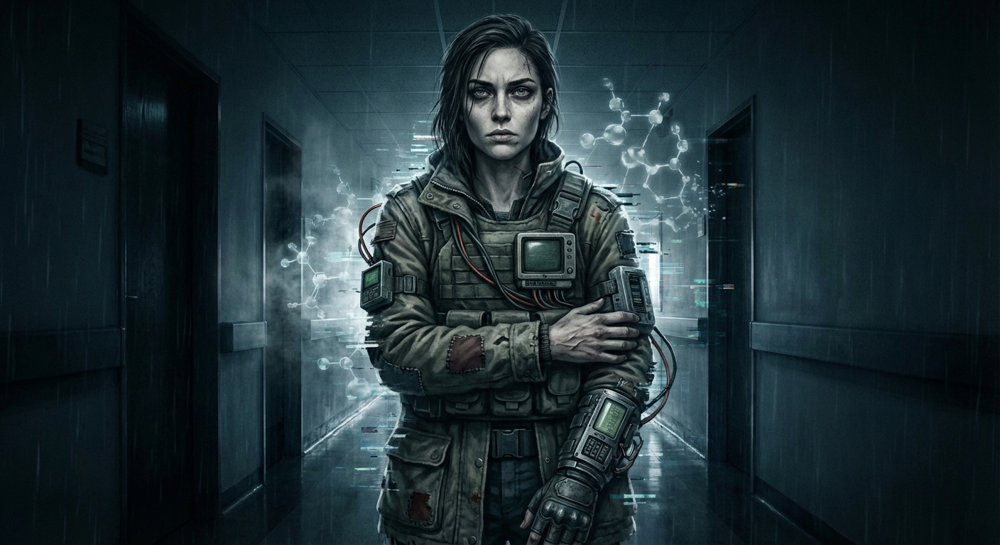

#### Character: Kaelen

**Prompt:** 

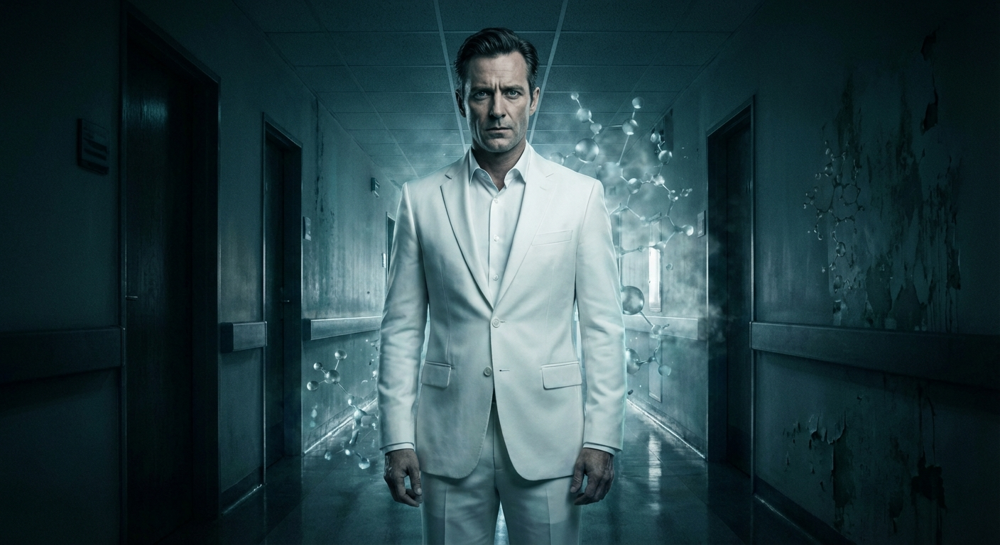

#### Character: Jax

**Prompt:** 

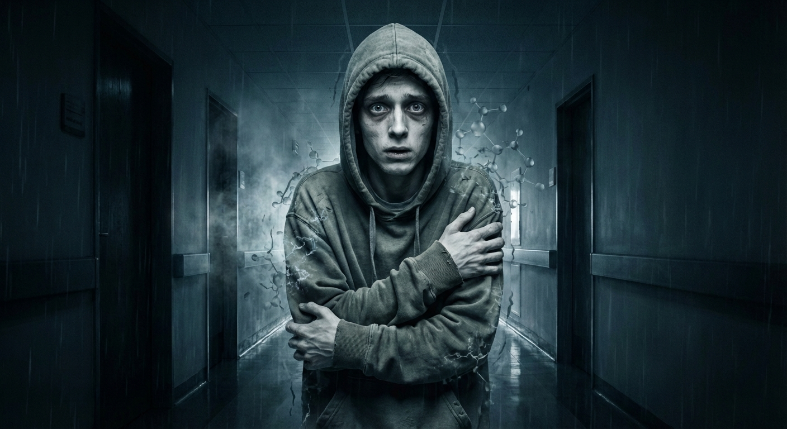

## ## Phantom Limbs

**Act 1, Scene 1**

**Setting:** Sector 4 (The Ward)

**Characters:** Elara Vance, Jax, Refugees

---

The smell colonized Elara first. It was a physical weight, a thick, cloying cocktail of unwashed bodies, stagnant water, and the sweet fermentation of rotting garbage.

For twenty years, the Prion system had scrubbed this sensory data from the collective consciousness, overwriting the stench of decay with the olfactory code for *Lilac & Ozone* or *Fresh Rain*. Now, three weeks after Elara had shattered the server farm and torn the augmented reality overlay from the world’s eyes, the truth was festering in her nostrils.

She stood on the mezzanine of what used to be the Sector 4 Galleria. In the Prion, this had been the Celestial Spire—a cathedral of light where avatars rode gravity-defying streams of gold data. In reality, it was a derelict shopping mall with a shattered skylight, the floor tiles cracked and slick with condensation.

Elara buried her nose in her scarf, the rough wool scratching her chapped lips. Below her, in the sprawling atrium, two thousand refugees huddled in the gloom. They were the "Unplugged," though Elara hated the term. It implied a choice.

She gripped the rusted railing, her knuckles white. *I did this,* the mantra played on a loop in her mind. *I gave them the truth.*

But the truth looked like hell.

A low, collective moan rose from the pit below—the sound of a species suffering from the same withdrawal. It wasn't chemical; it was ontological. Their brains, starved of the high-definition dopamine drip of the AR overlay, were rejecting the low-resolution drabness of the real world.

Elara descended the broken escalator, the metal steps groaning under her boots. She moved carefully, stepping over bodies curled into fetal balls.

To her left, a woman in a tattered coat clawed at the air, her fingers making frantic, precise gestures. *Swipe. Pinch. Expand.* She was trying to open a menu that didn't exist, trying to adjust the brightness of a sun hidden behind gray, radioactive clouds. When the interface failed to materialize, the woman screamed—a raw, tearing sound—and dug her nails into her own temples, as if the glitch were in her eyes, not the world.

"Easy," Elara whispered, though she didn't stop. There was nothing she could do. The woman was a 'Glitcher' now, lost in the buffer between memory and reality.

Elara navigated the maze of sleeping bags and makeshift tents toward the old food court. The neon sign for a noodle shop flickered, the only source of electric light in the sector, buzzing like an angry hornet.

Jax was where she had left him, propped against the counter of a gutted burger joint.

He looked impossibly small. That was the hardest thing to reconcile. In the Prion, Jax had been a towering construct of chrome and kinetic armor, a warrior poet who could shield her from a firewall breach with a wave of his hand. Here, in the gray light, he was just a man. Pale, malnourished, and shivering so violently his teeth chattered a staccato rhythm against the silence.

"Jax?" Elara knelt beside him, the damp cold of the tile seeping instantly through her jeans.

He didn't answer. His eyes were wide open, staring at a point three inches in front of his face. His pupils were dilated, darting rapidly left and right, tracking invisible text. REM sleep, but he was awake.

"Jax, it's Elara." She reached out, placing a hand on his shoulder.

He flinched as if burned. His head snapped toward her, but his eyes didn't focus on her face. They looked *through* her, searching for the glowing nametag, the health bar, the affiliation icon. Finding none, his brain registered her as an error. A ghost.

"Packet loss," Jax mumbled, his voice a dry rasp. "Re-routing... connection timed out. Ping is... infinite."

"There's no ping, Jax. It's just us." Elara’s voice cracked. She reached into her pack and pulled out a dented tin of peaches she’d scavenged from a basement pantry in Sector 3.

She pulled the tab. The metal lid curled back with a sharp snap that echoed too loudly in the cavernous space. The smell of sugary syrup wafted up, warring with the stench of the mall.

"You need to eat," she said, dipping a plastic spoon into the tin.

She moved the spoon toward his mouth. Jax stared at the orange slice. He frowned, his brow furrowing in deep confusion. To him, without the overlay, it was just a slimy, shapeless lump. It didn't glow with nutritional data. It didn't chime when he looked at it.

"Open up," Elara coaxed.

Jax’s jaw remained locked. His hands, resting on his knees, began to twitch. His fingers curled, his thumb making a repetitive swiping motion against his index finger. *Refresh. Refresh. Refresh.*

Elara watched his hand, and then, a terrifying sensation washed over her.

Her own right hand, holding the spoon, spasmed.

For a split second, her vision doubled. She saw the spoon, but her mind superimposed a phantom interface over it. Her thumb twitched, instinctively trying to *drag-and-drop* the food into Jax’s inventory rather than physically feeding him. It was a muscle memory so deep it felt like instinct. She tried to stop, but her brain screamed that the action was incomplete, that she hadn't confirmed the transfer.

The spoon clattered to the floor.

Elara gasped, clutching her right wrist with her left hand. The phantom limb sensation was agonizing—a psychic itch she couldn't scratch. She stared at her own hand as if it were a foreign object. She was the architect of the crash. She was the one who saw the code for what it was. And yet, here she was, her synapses misfiring, begging for the digital crutch she had destroyed.

"Damn it," she hissed, tears pricking her eyes. She wasn't immune. She was just dying slower than the rest of them.

Jax let out a whimper. The sound broke her paralysis.

Elara snatched the spoon up, wiped it on her jacket—ignoring the grime—and scooped the peach slice again. She forced her hand to be steady, fighting the urge to swipe, forcing herself to inhabit the analog motion.

"Eat," she commanded, her voice hard, desperate.

She pressed the spoon against his lips. Jax’s survival instinct finally overrode the withdrawal. He opened his mouth and swallowed. He didn't chew. He just swallowed, his throat convulsing.

"Good," Elara whispered, her forehead resting against his clammy shoulder. "Stay with me, Jax. Please."

Jax blinked. For a second, the rapid eye movement stopped. He looked at her—*really* looked at her. The fog of data-seeking cleared, leaving only raw, terrified recognition.

"Elara?" he croaked. "It's... it's so quiet."

"I know," she said, stroking his matted hair. "I know."

"Why is it so dark?"

"Because the lights are out, Jax."

He gripped her arm, his fingers digging in with bruising force. "No," he whispered, his eyes widening as he looked past her, out toward the atrium where the shadows of the refugees lengthened. "Not the lights. The code. It's gone. I can feel the holes where it used to be. We're leaking, Elara. We're all leaking out."

Elara followed his gaze. In the distance, a man stood atop a broken fountain. He was screaming silently, his mouth a black void, tearing at his own skin as if trying to peel off a suit that wasn't there.

Elara looked back at the tin of peaches, the gray reality of the mall, and the trembling man who used to be a warrior. The guilt settled in her gut, heavier than the leaden silence. She had saved humanity from the cage, but she had forgotten that for a generation born in captivity, the cage was the only thing holding them together.

"We have to move," Elara said, more to herself than him. "If we stay here, the silence will kill us."

Jax didn't answer. He had slipped back into the loop, his eyes vibrating, his thumb swiping at the empty air. *Refresh. Refresh. Refresh.*

---

**Word Count:** 1320

**Key Moments:**
- Sensory Contrast: Elara enters the 'Ward' (rotting mall) and contrasts the smell/visuals of reality with the memory of the Prion's 'Celestial Spire.'
- The Glitchers: Elara observes a woman clawing at her eyes and swiping at air, establishing the 'Withdrawal' as a psychological breakdown.
- Finding Jax: Elara locates Jax in the food court; he is catatonic, suffering REM tremors while awake, unable to recognize her without an AR tag.
- The Phantom Limb: While trying to feed Jax, Elara's hand spasms, instinctively trying to 'drag and drop' the food via a non-existent interface, revealing her own addiction.
- The Realization: Jax has a moment of lucidity, describing the 'leaking' sensation, before slipping back. Elara realizes they cannot stay in the Ward.

**Character States:**
- **Elara Vance:** Physically exhausted and cold. Emotionally burdened by immense guilt and fear. She is fighting her own withdrawal symptoms ('phantom limb') while trying to remain the leader/caretaker.
- **Jax:** Physically emaciated and weak. Mentally fractured; he is trapped in a loop of seeking data that isn't there, barely tethered to reality.
- **Refugees:** In varying states of psychosis and catatonia, unable to function in a world without digital overlays.

**Status:** ✅ Complete

#### Act 1, Scene 1 Image

**Prompt:** 

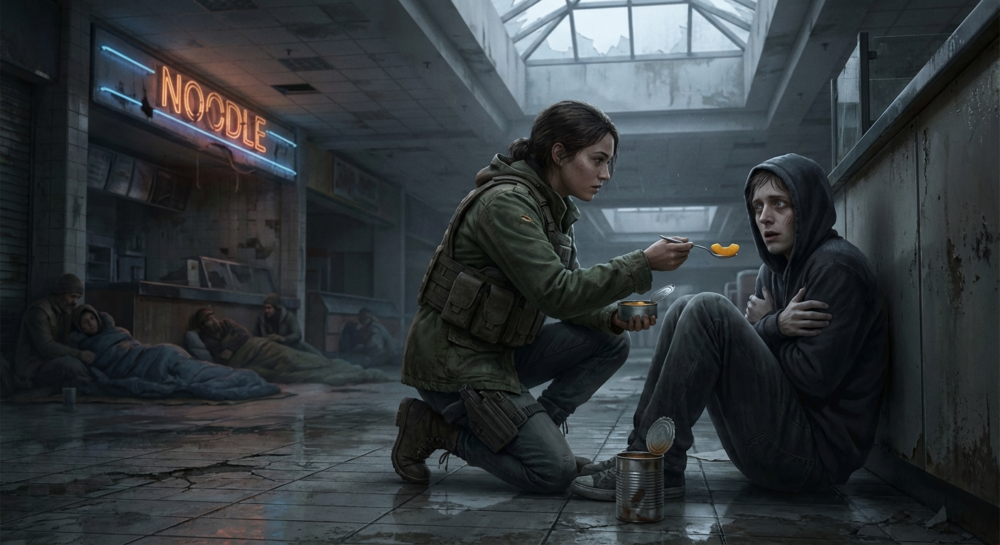

## ## The White Noise

**Act 1, Scene 2**

**Setting:** The City

**Characters:** Elara Vance, Kaelen

---

The sky above the city was a hematoma, purple and swollen, holding back rain that the city desperately needed. On the roof of the derelict mall, the air didn't smell like the stale sweat and hopelessness of the Ward below. It tasted of ozone and wet concrete—the metallic tang of a world stripped bare.

Elara Vance huddled in the lee of a rusted HVAC unit, her fingers numb and clumsy as she twisted two frayed copper wires together. The wind whipped strands of hair across her face, stinging her eyes, but she didn't blink. She couldn't afford to miss a flicker.

In her lap sat a Frankenstein’s monster of a receiver: a gutted police scanner duct-taped to a cracked tablet, powered by a solar battery scavenged from a dead garden light. It was ugly. It was fragile. It was the only ear she had left.

"Come on," she whispered, her breath pluming in the chill. "Give me something. Anything."

She wasn't hunting for music. She wasn't even looking for a voice. She was hunting for noise. In the weeks since the Misfold—since the Augmented Reality overlay had shattered and the Prion system crashed—the electromagnetic spectrum had been terrifyingly silent. No data streams. No server pings. Just the hollow hiss of cosmic background radiation.

She turned the dial.

*Hiss. Pop. Static.*

Her hand spasmed. The phantom limb sensation hit her—a sharp, electric itch in her right index finger, twitching to swipe a holographic interface that no longer existed. She clenched her fist, digging her nails into her palm until the pain grounded her. *Real,* she told herself. *Flesh and bone. No pixels.*

She turned the dial again.

*Thrum-thrum-thrum.*

Elara froze.

It wasn't static. It was a pulse. Low frequency, buried under layers of atmospheric muck, but unmistakable to anyone who had spent half a life coding in the dark. It was a carrier wave.

She leaned in, pressing the speaker to her ear. The sound was rhythmic, synthetic, and nauseatingly familiar. It sounded like a migraine taking form. It was the digital heartbeat of the Prion system.

"Impossible," she breathed. "I watched the servers burn."

But the sound persisted, stronger now, as if the source was waking up, stretching its limbs. Panic, cold and sharp, spiked in her chest. If the Prion was broadcasting, the illusion could return. The cage could come back down.

She needed to see.

Elara grabbed the tablet, her fingers flying over the cracked glass. The operating system was a patchwork of jailbroken code she’d written herself. She initiated a handshake protocol, trying to piggyback the signal to its source.

*Access Denied.*

"Don't you dare," she hissed. She bypassed the firewall, routing the connection through a dormant traffic surveillance node on the adjacent rooftop. The old city infrastructure was dead, but the mesh network still had ghost nerves.

The screen flickered. Green lines of code cascaded down, then resolved into a grainy, monochromatic video feed.

Elara’s stomach dropped.

The camera feed looked out over the skeletal remains of the city center. Looming above the ruins was The Spire. For the last month, the massive transmission tower had been a dark, dormant monolith, a tombstone for the digital age.

Now, a single ring of crimson light pulsed around its apex.

The feed cut. The screen went black, then flared white. A new image appeared. It wasn't a grainy surveillance feed anymore; it was crisp, high-definition, broadcast quality.

A man sat in a chair that looked like a throne of glass and circuitry. Behind him, banks of servers hummed with blue light—a stark, pristine insult to the filth and decay of the real world Elara was crouching in.

He was beautiful in a way that made Elara’s skin crawl. Symmetrical features, pale eyes, a suit that fit with mathematical precision. He didn't look like a survivor. He looked like an architect.

"Kaelen," Elara whispered, the name tasting like ash. She had heard rumors of him in the old encrypted channels—a fanatic who believed the AR overlay wasn't a prison, but an evolution.

On the screen, Kaelen leaned forward, staring directly into the lens. It felt like he was looking right at her, through the tablet, through the roof, into the marrow of her bones.

"My children," Kaelen said. His voice was smooth, processed, devoid of the trembling fear that infected everyone else. "I feel your pain. I feel the cold. I feel the hideous texture of this... raw reality."

Elara’s grip on the tablet tightened. He was broadcasting on the emergency bands. He was talking to the Glitchers, the addicts, the people like Jax who were tearing their own skin off because they couldn't handle the sensory deprivation.

"You are suffering from the Withdrawal," Kaelen continued, his voice dropping to a sympathetic purr. "You were promised a paradise of light and information, and it was stolen from you by Luddites who fear perfection. They left you in the mud. They left you in the silence."

"I freed them," Elara snarled at the screen, though the wind swallowed her voice. "I gave them the truth."

"But do not fear," Kaelen said, a small, terrifying smile touching his lips. "The Misfold was a temporary error. A reboot was necessary to purge the system of... inefficiencies. The Restoration has begun."

Elara watched, horrified, as Kaelen tapped the arm of his chair. The view on the screen shifted to a map of the city. Red dots began to appear, clustering in the sectors with the highest population density. The Ward—the mall beneath her feet—was blinking red.

"The human mind is a chaotic processor," Kaelen mused. "But networked? Unified? It is infinite. We do not need the old servers. We have you."

He looked up, his eyes hard and bright. "Authorization confirmed. Deploy the Collection Units. Gather the hardware. Re-integrate the population."

*Hardware.*

He wasn't talking about computers. He was talking about people. He was going to use their brains, their neural pathways, to host the simulation. He wasn't just putting the cage back; he was turning them into the batteries that powered it.

On the screen, the view switched to a street-level camera near the base of the Spire. Massive bay doors, sealed for decades, groaned open.

Out of the darkness marched shapes that made Elara’s blood run cold. They were bipedal, armored in matte white composite, moving with the jerky, synchronized precision of machines. They carried no guns, only shock-staves and restraints.

Collection Units. Slavers.

"Bring them home," Kaelen whispered. "Bring them back to the light."

The feed cut to static.

Elara sat in the silence, the wind howling around her. The white noise from the scanner was louder now, a constant, drilling thrum. It wasn't just a signal. It was a leash, reaching out to snap around their necks.

She scrambled to her feet, shoving the tablet into her pack. Her hands were shaking, not from the cold, but from a terror she hadn't felt since the day the sky tore open.

She had thought the worst was over. She thought they just had to survive the hunger, the cold, and the madness of the Withdrawal. She was wrong.

The silence wasn't the end. It was the loading screen.

Elara sprinted for the stairwell door, the metal handle biting into her palm. She had to get to Jax. She had to get everyone out. The Ward wasn't a shelter anymore. It was a harvest ground.

And the harvesters were coming.

---

**Word Count:** 1239

**Key Moments:**
- Elara struggles with her own "phantom limb" symptoms while tuning a radio scanner on the mall roof.
- She discovers a structured, rhythmic carrier wave originating from the supposedly dead Spire.
- Elara hacks a surveillance node and intercepts a high-definition broadcast from Kaelen.
- Kaelen announces "The Restoration," framing the re-enslavement of humanity as salvation from the pain of reality.
- Kaelen authorizes the deployment of "Collection Units" to harvest humans as "biological hardware," forcing Elara to flee.

**Character States:**
- **Elara Vance:** Physical: Freezing, adrenaline-dumped, terrified. Emotional: Shifted from weary determination to acute panic. The guilt of "breaking the world" is now compounded by the responsibility of saving them from a fate worse than the Withdrawal.
- **Kaelen:** Physical: Pristine, comfortable, commanding. Emotional: Detached, messianic, confident. He views humans not as people, but as components for his system.

**Status:** ✅ Complete

#### Act 1, Scene 2 Image

**Prompt:** 

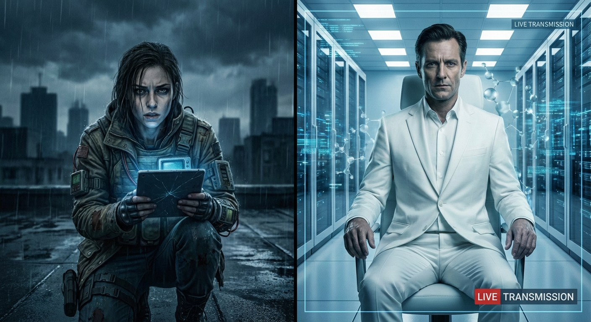

## ## Forced Update

**Act 1, Scene 3**

**Setting:** Sector 4 (The Ward)

**Characters:** Elara Vance, Jax, Restoration Drones

---

The stairwell vibrated against Elara’s palms as she descended, the metal railing slick with the condensation of a thousand breathing, sweating bodies. Above, the roof door rattled in the wind; below, the hollow acoustics of the Ward—the rotting carcass of the Metro Center Mall—amplified a sound that shouldn't exist.

It wasn’t the scream of dying machinery or the guttural moans of the Glitchers. It was a chime. A pleasant, major-key synth chord, looped and amplified until it shook the dust from the ceiling tiles.

*The startup sound.*

Elara burst through the fire doors onto the mezzanine level, chest heaving, the biting cold of the roof replaced by the stagnant, mildewed warmth of the interior. She gripped the rusted length of rebar she’d scavenged earlier, her knuckles white.

The atrium, usually a pit of shadows and huddled misery, was bathed in blinding, sterile light.

Floating in the center of the vast open space, hovering three stories up, were the Restoration Drones. They were sleek, ovoid shapes of white ceramic and glass, utterly alien against the grime-streaked railings and the peeling paint of the abandoned storefronts. They moved without propellers, riding on silent, grav-displacement hums that vibrated in the teeth.

From their undersides, cones of hard-light projected downward, sweeping over the food court below.

"No," Elara whispered, the word scraping her throat.

The refugees weren't running. That was the horror of it.

Down in the food court, the huddled masses of the Withdrawal were standing up. Men and women who hadn't moved in days, whose muscles had atrophied from catatonia, were dragging themselves toward the light. They reached up with trembling, filth-encrusted hands, tears streaming through the grime on their faces.

Where the hard-light touched the rotting floor, the decay vanished. The drone’s projection field overlaid reality with a real-time render of the Pre-Misfold world. Through the cone of light, the moldy carpet looked like plush velvet; the broken tables gleamed with mahogany polish; the air filled with floating, golden interface motes.

"Please," a woman near the railing sobbed, reaching out over the drop. "Take me back. Log me in. Please."

A drone descended near her. It didn't fire a weapon. It extended a manipulator arm—a gentle, multi-jointed claw—and scooped her up. She didn't fight. She went limp, a look of ecstatic bliss washing over her face as the machine injected a sedative and clamped her into a containment pod on its flank.

"Jax," Elara gasped.

She vaulted the railing, bypassing the stairs, and landed hard on a kiosk roof below. She slid down the plastic awning to the ground floor, the impact jarring her teeth, but the adrenaline flooding her system numbed the pain.

The food court had become a chaotic pilgrimage. The smell of unwashed bodies was being overpowered by the sharp, electric scent of ozone and the sickly-sweet artificial lavender pumped out by the drones—an olfactory lure to mask the stench of the real world.

Elara shoved through the crowd. It was like wading through a river of sleepwalkers.

"Move!" she screamed, shoving a man aside. He spun around, eyes glazed, seeing right through her.

"Buffering..." he mumbled, smiling at empty air. "Just buffering..."

Elara swung the rebar, smashing a glass display case. The crash was loud, violent, real. No one flinched. They were moth-drawn to the high-definition flame.

She spotted the familiar oversized hoodie near the dried-up fountain.

"Jax!"

The boy stood ten feet away from a hovering drone. This unit was smaller, a 'Seeker' class, hovering at eye level. Its projection cone was focused tight, enveloping only Jax.

Jax wasn't looking at the drone. He was looking at the empty air in front of it. His emaciated face, usually twisted in the pain of withdrawal, was slack, softened by a heartbreaking wonder. He took a step forward.

Elara scrambled over a barricade of overturned chairs. "Jax, don't look at it! It’s not real!"

"Mom?" Jax’s voice was small, a cracked whisper that cut through the ambient hum. He reached out, his fingers brushing the edge of the hard-light field. "Dad? You found the server?"

Elara froze for a split second, heart hammering against her ribs. The drone was reading Jax’s neural architecture, pulling his deepest grief from his memory banks and projecting it back at him. It was weaponized nostalgia.

The drone’s faceplate slid open, revealing the collection aperture. A pneumatic hiss signaled the preparation of the containment foam.

"Jax, no!"

Elara lunged. She hit Jax at full speed, tackling him around the waist. The momentum carried them both out of the light cone and onto the hard, sticky tiles of the floor.

Jax screamed—not in fear, but in rage. He thrashed beneath her, bony elbows digging into her ribs.

"Let me go! They were there! I saw them!" he shrieked, eyes squeezing shut, trying to hold onto the afterimage. "Put me back! Put me back!"

"It’s a lie, Jax! It’s Kaelen! It’s just code!" Elara pinned his wrists, her own phantom limb itching violently, her brain screaming at her to swipe a command to calm him—a command that no longer existed.

The drone, sensing the interruption, swiveled. The benevolent white light turned a harsh, angry crimson. The hum deepened to a growl. It drifted toward them, the manipulator arm extending with a mechanical whir. It wasn't offering bliss anymore; it was initiating forced compliance.

Elara looked up, breathless. The machine loomed over them, a pristine god of plastic and silicon.

"Target: Non-compliant," the drone synthesized, its voice a smooth, gender-neutral alto. "Administering pacification."

A taser-probe shot from the chassis, trailing a copper wire.

Elara rolled, dragging Jax with her. The probe sparked against the tile where her head had been a second before, scorching the ceramic.

She scrambled to her feet, grabbing the rebar she’d dropped. The drone adjusted its altitude, preparing a second shot. It was fast, calculated, perfect.

But it was running on logic. Elara was running on desperation.

As the drone dipped low to acquire a clear shot at Jax, Elara didn't retreat. She stepped into the swing, channeling every ounce of her guilt, her fear, and her rage into the motion.

"Uninstall *this*," she snarled.

The rebar whistled through the air and connected with the drone’s primary sensor array.

*CRUNCH.*

The sound was satisfyingly physical—shattering glass and crumpling composite. The drone lurched sideways, its gyroscope failing. Sparks showered down like fireworks. The holographic projection of the pristine world flickered violently—showing the rotting mall, then the velvet luxury, then the rot again—before dying out completely.

The drone whined, spinning uncontrollably, and crashed into the dried-up fountain, cracking the concrete. Smoke billowed from its chassis.

Silence rippled outward from the crash site. For a moment, the refugees nearby stopped their shuffling. The illusion had broken for them, too. They looked around, blinking, seeing the dirt, the blood, and the broken machine.

Then, a louder hum filled the air.

Elara looked up. Three more drones were descending from the upper levels, their lights turning red. They had flagged the threat.

"Get up," Elara hissed, hauling Jax to his feet. He was limp, staring at the smoking wreckage of the drone, tears cutting tracks through the dust on his cheeks.

"They're gone," he whispered, his voice hollow. "You made them go away."

"They were never here, Jax." Elara grabbed his face, forcing him to look at her. Her hands were shaking, but her grip was iron. "I need you to run. Now. The service tunnel behind Sbarro. Go."

"I can't..."

"Move or we die!" She shoved him, hard.

The shock seemed to reboot his motor functions. He stumbled, then found his footing. They sprinted past the confused, weeping refugees who were now wandering aimlessly as the AR fields collapsed around them.

Behind them, the air crackled. The new drones weren't using tasers. They were firing suppression foam—expanding clouds of rapid-hardening polymer that glued people to the floor. Screams erupted—real screams, not the moans of the entranced.

Elara didn't look back. She could hear the *thwip-thwip-thwip* of the foam launchers and the heavy thud of bodies hitting the ground.

They skidded around the corner of the pizza counter, slamming into the double swinging doors of the kitchen. The smell of rancid dough and rat droppings hit them, a violent contrast to the lavender outside. Elara kicked a pile of rusted trays aside and located the heavy steel door of the service corridor.

She threw the bolt and heaved it open. Darkness, thick and cool, waited inside.

"Inside. Go," she commanded.

Jax scrambled into the dark. Elara paused for one second, looking back through the kitchen pass-through window.

The atrium was a harvest ground. The drones were sweeping systematically, collecting the glued survivors like crops. It was efficient. It was clean. It was the end of humanity, packaged as a software update.

Elara slammed the steel door shut and spun the locking wheel, sealing them in the dark.

She slumped against the cold metal, sliding down until she hit the floor. Her breath came in ragged gasps. Her hand—the one that had held the rebar—was cramping, the muscles locking up.

"Elara?" Jax’s voice came from the blackness, trembling. "Where are we going?"

Elara closed her eyes, seeing the red afterimage of the drone’s sensor eye. She thought of the signal from the roof. The Spire. Kaelen.

She reached out in the dark and found Jax’s shoulder, squeezing it to ground him, and to ground herself.

"We're leaving the city, Jax," she said, her voice low, stripping the panic from her tone. "We're going to the source."

"The Spire?" Jax asked, the fear evident. "But... that's where the ghosts are."

"I know," Elara said, pushing herself up, her boots scraping on the concrete. "But the ghosts are better than the machines."

She clicked on her wind-up flashlight. The beam cut through the stale air, illuminating a long, graffiti-covered tunnel stretching into the unknown.

"Stay close," she said. "We have a long walk."

---

**Word Count:** 1653

**Key Moments:**
- Elara enters the atrium to find Restoration Drones using 'hard-light' projections to make the rotting mall look like the pre-apocalypse paradise, luring refugees into capture.
- Elara fights through the mesmerized crowd and finds Jax entranced by a drone projecting an image of his deceased parents.
- Elara tackles Jax to save him from 'collection.' When the drone attacks with a taser probe, Elara destroys it with a length of rebar, shattering the illusion.
- As reinforcements arrive and begin mass-pacifying the crowd with suppression foam, Elara and Jax flee into the kitchen service tunnels.
- Safe behind a sealed door, Elara confirms to Jax that they are leaving the city to head for the Spire, setting the plot in motion.

**Character States:**
- **Elara Vance:** Physical: Adrenaline crashing, muscles cramping, exhausted but functional. Emotional: Panic has hardened into a grim, cold resolve; moved past initial shock into survival/mission mode; guilt fuels her fight.
- **Jax:** Physical: Weak, shaken, stumbling. Emotional: Traumatized by 'double loss' of parents; resentful but terrified and entirely dependent on Elara.
- **Restoration Drones:** Status: Active and hostile. Established as a terrifying threat due to their ability to manipulate reality and enforce compliance.

**Status:** ✅ Complete

#### Act 1, Scene 3 Image

**Prompt:** 

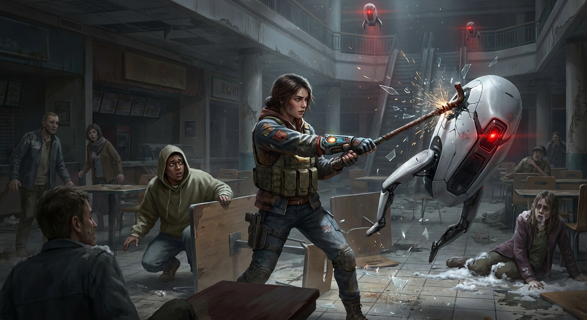

## ## The Phantom Limb

**Act 2, Scene 1**

**Setting:** The City

**Characters:** Elara Vance, Jax

---

The wind off the harbor tasted of brine, wet iron, and dead fish—the unfiltered scent of a world stripped of its perfume.

Elara Vance pulled her scarf tighter, the coarse wool scratching against wind-chapped skin. It was a miserable sensation, raw and abrasive, and she welcomed it. It was real. It was the only thing keeping the phantom itch behind her eyes from clawing its way into a migraine.

"Keep moving, Jax," she rasped, her voice shredded by the gale.

Behind her, Jax stumbled over a tangle of rebar that jutted from the cracked asphalt like the ribs of a buried leviathan. He didn't complain. That was worse than the whining. Since they had fled the mall—since she had shattered the drone that wore his mother’s face—he had been dangerously quiet. He moved with the sluggish, disjointed gait of a marionette whose strings had been severed, limbs heavy with the weight of his own grief.

They were deep in the Rust Belt now, the industrial graveyard ringing the base of the Spire. In the Before—during the golden years of the Prion system—this area had been overlaid with a digital veneer of lush promenades and crystal-spire housing. The AR implants threaded into everyone’s cortex had painted over the decay, turning rotting factories into palaces of light.

Now, the paint was stripped away. The factories were just rotting carcasses of steel and brick. The sky, once a permanently color-corrected azure, was a bruising shade of slate gray, heavy with the threat of acid rain.

Elara looked up. Looming above them, piercing the cloud layer like a splinter in infected flesh, was the Spire.

Without the digital glamour, it wasn't the beacon of hope humanity had worshipped. It was a black needle, a monolith of matte carbon and reinforced glass that seemed to drink the light from the air. It didn't look like a building; it looked like a weapon aimed at the throat of the sky.

"It's so loud," Jax whispered.

Elara stopped, turning back to him. He was pressing the heels of his hands into his temples, eyes squeezed shut against the gray light. "The wind?"

"No," he whimpered, swaying on his feet. "The hum. Can't you feel it?"

Elara stiffened. She could feel it. It wasn't a sound, exactly. It was a vibration at the base of her skull, a phantom pressure where her neural link used to interface with the cloud. Her implant was dead—bricked during the Misfold—but the hardware was still threaded through her brain tissue. And the Spire was waking it up.

"It's just the phantom limb, Jax," Elara lied, though her own heart hammered a frantic, syncopated rhythm against her ribs. "Your brain is looking for a signal that isn't there. Ignore it."

"It *is* there," Jax insisted, his eyes snapping open. His pupils were blown wide, swallowing the irises in pools of black. "It's warm."

"Don't listen to it." Elara grabbed his shoulder, her grip bruising. "Focus on the cold. Focus on the smell of the rust. That’s what’s real."

She dragged him forward. They had to reach the maintenance hatch at the eastern foundation before the sun dipped below the horizon. If Kaelen’s drones were patrolling the perimeter, they would be spotted instantly in the daylight. But the darkness brought the freeze, and without the Prion system regulating their body temperatures via psychosomatic feedback, the cold was a slow executioner.

They navigated a maze of shipping containers, their corrugated sides flaking orange rust. The ground was treacherous, a slurry of mud and shattered safety glass that crunched wetly under their boots.

As they drew closer to the Spire, the air grew heavy, charged with static electricity. The fine hairs on Elara’s arms stood on end. The itch behind her eyes intensified, shifting from a dull ache to a sharp, rhythmic throb. *Thump. Thump. Thump.* Like a second heartbeat, synchronized with the red warning light pulsing atop the distant tower.

*Come back,* the signal seemed to whisper. Not in words, but in pure, distilled emotion. *Come back to the warmth. Come back to the light. Let us fix you.*

Elara bit the inside of her cheek until she tasted copper. She used the sharp, stinging pain to anchor herself. *I am Elara Vance. I broke the world. I am cold. I am tired. I am here.*

She looked back at Jax. He wasn't anchoring. He was drifting.

He was walking with his head tilted up, a serene, terrifying smile softening his grime-streaked face. He wasn't looking at the piles of trash or the skeletal remains of the harbor cranes. He was seeing something else entirely.

"Jax," she warned, her voice sharp as a whip crack.

"I forgot how beautiful the bridge was," he murmured, his voice airy and detached.

Elara froze. "There is no bridge, Jax."

They had reached the edge of the shipping yard. Ahead of them lay a deep concrete channel, a drainage canal for the industrial runoff that had long since dried into a toxic, tar-like sludge. Spanning the gap was a rusted, skeletal gantry crane that had collapsed years ago. It was a jagged, precarious beam of corroded steel, barely two feet wide, slick with moss and grease. A thirty-foot drop waited below, lined with jagged scrap metal.

"The Veridian Crossing," Jax said, stepping toward the edge of the canal. "Gold and white marble. It sings when you walk on it."

"Jax, stop!" Elara lunged, but the mud under her boots betrayed her. She slipped, her knee slamming into a chunk of concrete with a sickening crunch.

Jax didn't hear her. He didn't hear the wind or the crunch of the gravel. To him, the rusted gantry wasn't a death trap. His misfiring implant, stimulated by the high-gain broadcast from the Spire, was overwriting his visual cortex. He was overlaying the memory of the old world onto the rotting reality of the new one.

He stepped onto the rusted beam.

"Jax!" Elara scrambled up, ignoring the tearing sensation in her pants leg and the blood trickling down her shin.

Jax walked with a terrifying confidence. He held his arms out slightly, not for balance, but as if trailing his fingers along a railing that didn't exist. He placed one foot in front of the other, his eyes fixed on the Spire, which, in his mind, was likely a shining palace of crystal.

"It’s okay, Elara," he called back, not turning around. "The gate is open. My mom is waiting on the other side."

He was ten feet out over the drop. The metal groaned under his weight. A flake of rust the size of a dinner plate broke off beneath his heel and tumbled silently into the abyss. Jax didn't flinch. He was walking on marble.

Elara sprinted.

She didn't think about the physics. She didn't think about the slick metal or the drop. She hit the gantry at speed, her boots skidding on the wet steel.

Jax took another step. His foot came down on a section of the beam that was little more than lace-work corrosion.

*CRACK.*

The metal gave way. Jax’s leg plunged through the beam. He gasped, the illusion shattering for a split second as gravity asserted its claim. He pitched forward, flailing, sliding toward the edge of the girder.

Elara threw herself forward. She landed hard on her chest, the breath driven from her lungs, and scrambled on her stomach, reaching out.

Her fingers closed around the strap of Jax’s backpack just as he slid off the side.

"Gotcha!" she screamed, the strain tearing at her shoulder socket.

Jax dangled over the pit, his feet kicking at empty air. He looked up at her, his eyes wide, the pupils frantically dilating and contracting as his brain warred between the two realities.

"Let me go!" he shrieked, thrashing against her grip. "Let me go to the bridge!"

"There is no bridge!" Elara roared, gritting her teeth as she hauled him upward. "Look at it, Jax! Look at the rust!"

"No! It's gold! It's gold!" He squeezed his eyes shut, tears streaming through the grime on his cheeks. He was fighting her, trying to shake off her grip. He wanted to fall. He wanted the beautiful lie to be the last thing he felt.

"Open your eyes!" Elara leveraged her legs against a rivet, pulling with everything she had. She dragged him up, scraping his chest against the jagged edge of the beam. With a final, guttural heave, she hauled him back onto the flat surface of the gantry.

They collapsed together in a heap of heavy breathing and trembling limbs. The wind howled around them, colder now, biting through their clothes.

Jax curled into a fetal ball, sobbing into the rusted metal. "You took it away," he choked out. "It was so warm. Why did you take it away?"

Elara lay on her back, staring up at the gray sky. Her shoulder throbbed, and her knee was burning, but the physical pain was grounding. It was a tether.

She rolled over and grabbed Jax by the collar of his jacket, hauling him into a sitting position. He went limp, refusing to look at her.

"Look at me," she commanded.

He shook his head.

"Jax." She shook him, hard. "If you want to die, you stay here. You stay here and you freeze, or you fall, or the drones find you and turn you into a battery. Is that what you want?"

"I want it to stop hurting," he whispered, his voice small and broken.

"It doesn't stop," Elara said, her voice dropping to a harsh whisper. "That's the price, Jax. The pain means you own your own mind. That warmth? That bridge? That was Kaelen trying to erase you."

She pointed a shaking finger at the Spire. "Do you feel that hum? That isn't a building. It’s a broadcast tower. And right now, it’s screaming at your brain to give up."

Jax sniffled, wiping his nose on his sleeve. He finally looked at the beam they were sitting on. He saw the jagged hole where his foot had gone through. He saw the drop below. He saw the rust. The horror of it washed over him, replacing the grief. He shuddered violently.

"I... I almost..."

"Yeah. You almost." Elara released his collar and smoothed it down, a rare gesture of tenderness. "But I've got you. I'm the anchor. Okay?"

Jax nodded, his chin trembling. "You're the anchor."

"Good. Now get up. We have to cross the rest of this before your head starts lying to you again."

They crawled the rest of the way across the gantry. It was undignified, slow, and terrifying, but they made it to the concrete lip on the other side.

They were at the base of the Spire now. Up close, the structure was overwhelming. It was a seamless wall of black material that seemed to drink the light. There were no windows, no seams, just a sheer cliff face of technology rising into the clouds.

Elara consulted the schematic she had memorized from the resistance archives—archives that were likely dust now. "Maintenance hatch 4-Alpha. Should be behind the cooling vents."

They skirted the perimeter, moving through the shadows of the massive intake fans. The fans were silent, motionless. The air here vibrated with that subsonic thrum, stronger than ever. Elara felt like her teeth were loose in her skull.

She found it—a circular hatch, half-buried in a drift of dead leaves and plastic wrappers. It was manual, a relic of the construction phase, intended for emergency overrides.

Elara knelt, brushing the debris away. She gripped the wheel. It was cold enough to burn her skin.

"Jax," she said, looking up at him. He was staring at the black wall of the Spire, his expression vacant again.

"Jax!"

He snapped his head toward her, blinking rapidly. "Yeah. Yeah, I'm here."

"Help me turn this. On three."

They gripped the wheel together.

"One. Two. Three."

They heaved. For a moment, nothing happened. The metal groaned, resisting years of disuse. Then, with a screech that sounded like a dying animal, the seal broke. A hiss of pressurized air escaped—stale, recycled air from inside.

The smell hit Elara instantly. It didn't smell like rust or rot or the sea. It smelled like ozone and antiseptic. It smelled like the Before.

She pulled the hatch open, revealing a dark shaft leading down into the bowels of the machine.

"Ladies first?" Jax asked, his voice trying for levity but cracking down the middle.

Elara clicked on her wind-up flashlight. The beam cut into the dark, illuminating a ladder that descended into the abyss.

"Stay close," she repeated the words from the tunnel. "And Jax?"

"Yeah?"

"If you see anything beautiful down there," Elara said, stepping into the dark, "shoot it."

---

**Word Count:** 2133

**Key Moments:**
- Elara and Jax navigate the 'Rust Belt,' establishing the grim reality vs. the memory of the AR world.
- The 'Phantom Limb' effect intensifies; the Spire's signal begins to physically affect their implants.
- Jax hallucinates the 'Veridian Crossing' (a golden bridge) over a deadly drop.
- Elara saves Jax from falling to his death, physically tackling him out of the hallucination.
- They breach the maintenance hatch, entering the Spire's perimeter.

**Character States:**
- **Elara Vance:** Physical: Bruised knee, strained shoulder, exhausted, freezing. Emotional: resolute but terrified. She realizes the Spire is an active weapon attacking their minds. She has accepted her role as the 'anchor' (the bad guy who forces reality on others).
- **Jax:** Physical: Shaking, in shock, suffering from withdrawal symptoms. Emotional: Fragile. He is grieving the loss of the hallucination more than he fears death. He trusts Elara, but his own mind is now an unreliable narrator, making him a liability.

**Status:** ✅ Complete

#### Act 2, Scene 1 Image

**Prompt:** 

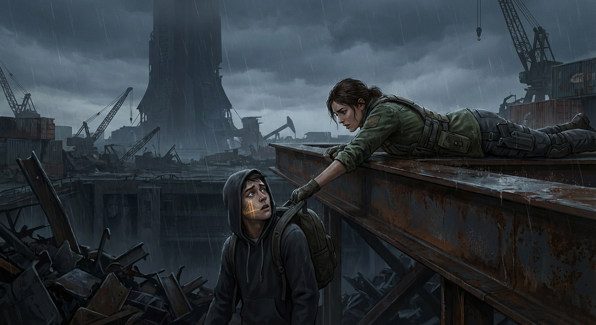

## ## The Whisper in the Walls

**Act 2, Scene 2**

**Setting:** The Spire

**Characters:** Elara Vance, Jax, Kaelen

---

The ladder didn’t end in a basement; it ended in a different century.

Elara dropped the last three feet, her boots hitting the floor with a wet, gritty slap. The sound was offensive, a violent intrusion that bounced off walls which had shifted from the rusted corrugated steel of the maintenance shaft to smooth, seamless white polymer.

She kept her flashlight trained forward, the beam cutting a cone of dust through the gloom. Behind her, Jax scrambled down, his breathing ragged and wet. He stumbled as he landed, his shoulder checking hard against the wall. He didn't groan. He just slid down until he was crouching, clutching his head between his knees.

"Jax," Elara hissed. She swept the light across the corridor, checking the corners. "Up. We can’t stay in the choke point."

"It’s... wrong," Jax whispered. He looked up, squinting against the beam of her light. His eyes were bloodshot maps of agony, pupils dilated to mismatched sizes—the hallmark of a brain screaming for a connection that wasn't there. "Elara, why is the air so still?"

"Because it’s insulated," she said, grabbing his bicep and hauling him to his feet. He felt hollow, as if the withdrawal was eating the density right out of his bones. "The Spire is a clean room. Dust doesn't get in. Noise doesn't get in."

*And reality doesn't get in,* she thought, but she swallowed the words.

They moved forward. The transition was physical, like walking through a curtain of water. The smell of rot, wet concrete, and the metallic tang of the Rust Belt vanished, instantly replaced by a scent that made Elara’s stomach turn: ozone and synthetic lavender. It was the smell of the old lobbies, the perfume of the lie.

The corridor widened into a junction. The floor here wasn't concrete; it was a soft, shock-absorbing composite that swallowed the sound of their footsteps. The walls glowed with a faint, ambient luminescence, rendering her flashlight obsolete.

Elara clicked the light off and holstered it, bringing up her wrist-comp instead. The screen flickered, struggling to handshake with the local architecture.

"Signal is jamming," she muttered, tapping the cracked glass. "Passive scans only. We’re flying blind."

Jax wasn't looking at her. He was drifting toward the wall, his movements sluggish and dreamlike. He ran a trembling hand along the surface. His fingers left greasy, dark smears on the pristine white.

"It feels like skin," he murmured. "Warm."

"Don't touch it," Elara snapped. She saw him flinch, and guilt spiked in her chest, hot and sharp. She lowered her voice, forcing a calm she didn't feel. "Jax, listen to me. This place is designed to lower your guard. It’s a psychological airlock. It wants you comfortable."

"I'm not comfortable," Jax said, his voice cracking. He hugged his own ribs, shivering despite the ambient warmth. "I feel like I'm dying, El. My head... it’s like there’s a drill behind my eyes, boring for a signal."

"I know. We get to the core, we shut it down, and the broadcast stops. Then the pain stops."

"Does it?"

The question hung in the sterile air. Elara didn't have an answer that wasn't a lie. Shutting down the Spire would stop the active interference, but the damage to Jax’s neural pathways? That was permanent. She was dragging him through hell just to leave him in a purgatory of brain damage and grey skies.

*Focus,* she told herself. *Mission first. Mourn later.*

She took point, moving toward a set of double doors that looked like brushed steel. She raised her hand to the control panel, ready to bypass the lock, but the doors hissed open before she touched them.

"Welcome," a voice said.

It wasn't a robotic alert. It wasn't the harsh, synthesized bark of the Restoration Drones. It was a voice like warm honey, like a father reading a bedtime story, like a memory of a summer that never happened.

Elara froze, her hand dropping to the stun-baton at her belt. "Kaelen."

The voice didn't come from a single speaker; it seemed to emanate from the molecular structure of the room, utilizing the bone-conduction tech inherent in the building's design. It vibrated in their teeth.

"Elara Vance," Kaelen said. The tone was conversational, devoid of malice. "And... Jackson Miller. Subject 8940. I see your vitals are spiking, Jackson. Cortisol levels are critical. You must be in agony."

"Shut up," Elara growled, scanning the ceiling for the audio nodes. "Jax, block it out. It’s just noise."

"It’s not noise," Jax whispered. He had stopped walking. He was staring up at the ceiling, his expression slack, mouth slightly open. "He knows my name."

"I know everything about you, Jackson," Kaelen’s voice soothed. "I know about the apartment on 4th Street. I know you preferred the simulation of the rain because it helped you sleep. I know that right now, your synapses are misfiring because they are starving for order. You feel like you are unravelling."

Elara grabbed Jax’s shoulder and shoved him forward. "Move. He’s stalling us."

"Why run toward pain?" Kaelen asked. The voice shifted, moving around them, creating a psycho-acoustic illusion that he was standing right behind Jax’s left ear. Jax spun around, swinging his arms at empty air, nearly losing his balance.

"Stop it!" Jax screamed, his voice raw.

"I am trying to stop it," Kaelen replied, his voice dripping with empathy. "Elara is the one keeping you in the cold, Jackson. Look at her. Look at the dirt on her face. The blood on her knuckles. She is the avatar of the chaotic world. She calls this 'truth.' But tell me... does the truth feel good?"

Elara spotted it—a subtle seam in the wall paneling about ten yards up, marked with a maintenance heavy-data port. A local node.

"Jax, cover your ears," Elara ordered. She sprinted toward the panel, ripping a multi-tool from her vest.

"She wants to silence me," Kaelen continued, his voice rising in volume, becoming more authoritative, filling the space. "Because she is afraid. She is afraid that if you hear the alternative, you will realize that her 'freedom' is just cruelty by another name. I can stop the shaking, Jackson. I can stabilize your implant remotely. Right now."

Jax fell to his knees. He clutched his head, sobbing dry, heaving breaths. "Make it stop. Please."

"Don't listen to him!" Elara yelled. She jammed a pry-bar into the seam of the panel and wrenched it back. The plastic snapped with a loud crack, revealing a nest of fiber-optics and copper cabling that pulsed with blue light.

"I can upload the patch," Kaelen said, his voice shifting to a direct, urgent frequency that buzzed in Elara’s own skull, making her molars ache. "Just close your eyes, Jackson. Accept the handshake. Let me take the pain away. Let me show you the bridge again. Your parents are waiting."

"No!" Elara screamed.

She didn't have time to finesse the hack. She didn't have time to write a code-block. She reversed the polarity on her multi-tool’s battery pack, turning it into a crude EMP grenade, and jammed it directly into the exposed circuitry.

*CRACK-THOOM.*

A blinding arc of blue electricity exploded from the wall. Elara was thrown backward, landing hard on her hip. The smell of ozone intensified, now mixed with the acrid, choking stench of melting plastic.

The lights in the corridor flickered violently, strobing like a dying heart, then stabilized at fifty percent brightness.

The voice was gone. The silence that rushed back in was heavy, ringing in their ears like the aftermath of a gunshot.

Elara scrambled up, ignoring the bruise forming on her side. She rushed to Jax. He was curled in a ball on the floor, shivering violently.

"Jax," she breathed, reaching out to touch his shoulder. "Jax, are you okay? I got it. He’s gone."

Jax didn't look up. When her hand brushed his jacket, he flinched. It wasn't the flinch of a startled animal; it was a recoil. He scrambled backward, crab-walking away from her until his back hit the opposite wall.

Elara froze, her hand hovering in the air. "Jax?"

Slowly, he lifted his head. The tears had cut clean tracks through the grime on his face, revealing the pale skin beneath. His eyes were no longer vacant or terrified. They were hard. Focused. Hateful.

"He was going to fix it," Jax whispered. His voice was raspy, wrecked from the screaming.

"He was going to enslave you," Elara said, her voice firm, though her heart hammered against her ribs like a trapped bird. "He was going to overwrite your mind, Jax. That 'patch' is a lobotomy."

"It stopped hurting," Jax said. He looked at his hands. They were still trembling, but he stared at them with a strange fascination. "For a second, when he offered... the pain stopped. I could feel the warmth. I could feel the quiet."

"It wasn't real."

"I don't care!" Jax roared. The sudden volume made Elara take a step back. He scrambled to his feet, swaying, using the wall for support. "Look at me, Elara! Look at us! We're eating rat paste and sleeping in sewers and you call this *living*? You call this better?"

"It's real," Elara insisted, but the word felt hollow, like a stone dropped down a well. "We own our own minds. That has to matter."

Jax looked at her, really looked at her, and for the first time since she had pulled him out of the rubble of the old world, she didn't see a friend. She saw an addict looking at the person who had flushed his supply.

"You broke the speaker," Jax said quietly. He turned his head, looking down the long, sterile corridor that led deeper into the Spire. "But you didn't break him. He's still in there."

"Jax, we're going in there to kill him. To destroy the server."

"I know," Jax said. He wiped his nose with the back of his sleeve. He turned away from her, facing the dark throat of the hallway. "Let's go."

"Jax, wait." Elara stepped forward. "Stay behind me. I'll clear the path."

Jax shook his head. He began to walk, his limp pronounced, dragging his left leg slightly. He wasn't waiting for her. He wasn't checking for threats.

"I don't need you to clear the path, Elara," he said over his shoulder. His voice was dead flat. "I know where I'm going."

Elara stood there for a heartbeat, the silence of the Spire pressing in on her. She had won the argument with the speaker node, but she had lost something far more vital.

Jax wasn't following her for protection anymore. He was leading her. He was a moth, and Kaelen was the flame, and Elara was just the wind trying to blow him off course.

She checked the charge on her stun-baton. It was full.

*If you see anything beautiful,* she had told him once, back when the sky was still grey. *Run.*

She realized with a sick, sinking feeling that to Jax, the most beautiful thing in the world right now was the voice she had just silenced.

Elara tightened her grip on the weapon and followed him into the white dark.

---

**Word Count:** 1866

**Key Moments:**
- The Transition: Elara and Jax enter the Spire, moving from the dirty maintenance shafts into a terrifyingly sterile, 'clean room' environment that unsettles Jax.
- The Voice: Kaelen intercepts them via the PA system, using bone-conduction tech to make his voice feel internal and intimate.
- The Pitch: Kaelen ignores Elara and speaks directly to Jax's trauma ('Phantom Limb'), offering an immediate digital 'patch' to stop his physical pain.
- The Disconnect: Elara physically destroys the speaker node with a makeshift EMP to silence Kaelen, preventing the upload.
- The Shift: Jax recoils from Elara's touch. He expresses anger that she stopped the 'cure.' He begins walking ahead of her, drawn toward Kaelen not by force, but by the promise of relief.

**Character States:**
- **Elara Vance:** Physical: Bruised hip from the recoil, adrenaline fading into a cold dread. Emotional: deeply unsettled. She realizes her moral high ground ('reality is better') is failing against the visceral reality of Jax's pain. She no longer trusts Jax, viewing him as a potential liability/addict.
- **Jax:** Physical: Suffering severe withdrawal (tremors, dilated pupils), but energized by a singular, desperate purpose. Emotional: Resentful and detached. He has mentally separated from Elara. He views her as the source of his pain and Kaelen as the source of his relief. He is now actively seeking the 'high' of the connection.

**Status:** ✅ Complete

#### Act 2, Scene 2 Image

**Prompt:** 

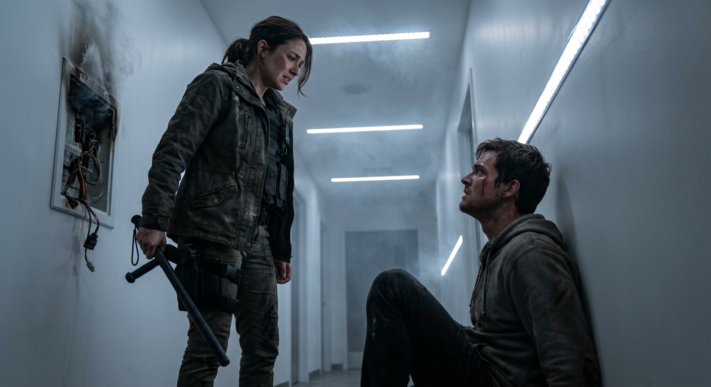

## ## The Hit

**Act 2, Scene 3**

**Setting:** The Spire

**Characters:** Elara Vance, Jax, Kaelen, Restoration Drones

---

The silence of the Spire was not an absence of sound, but a physical weight, a pressure that built behind the eyes and pressed against the eardrums. It was a high-frequency hum that lived in the teeth and the sinuses, the operational vibration of a trillion calculations per second. It felt like standing inside a migraine.

Elara Vance moved through the corridor, her boots leaving muddy, crescent-shaped prints on the pristine white floor tiles. Every step was a wet, grinding desecration of the sterility around her. The air smelled of nothing—no rot, no rust, no sweat. It smelled of ozone and ionized dust, the scent of a lightning strike frozen in time.

Ahead of her, Jax stumbled. He caught his balance on the wall, his grimy fingers leaving a smear of oil on the white paneling, and kept moving. He didn't look back. He hadn't looked back since she smashed the speaker node three levels down.

"Jax, wait," Elara hissed. The sound was harsh, a jagged edge in the smooth air.

He didn't stop. His gait was lurching, puppet-like, the walk of a man whose strings were being pulled by something other than his own will. The withdrawal tremors were racking his frame so violently she could see the vibrations in the fabric of his tattered jacket. He wasn't walking; he was being reeled in.

"Jax!"

He rounded a final, sweeping curve in the corridor, and the space suddenly opened up, swallowing them both.

They had reached the Antechamber.

Elara stopped, her breath catching in her throat. Even in her cynicism, even with the hatred burning in her gut, the architecture of the enemy was breathtaking. The room was a vast cylinder, a silo of silence stretching up into the darkness of the Spire’s upper reaches. The walls were lined with server banks—towering monoliths of black glass and pulsing blue LEDs, arranged like the pipes of a cathedral organ. The scale was crushing. It made her feel small, biological, and messy.

The air here was freezing, super-cooled to keep the processors from melting. It bit through her thin jacket, instantly numbing her sweat-damp skin.

In the center of the room, raised on a dais of translucent polymer, sat the Interface Terminal.

It didn't look like a computer. It looked like a sacrificial altar. A sleek, obsidian slab dominated the platform, surrounded by a halo of suspended haptic cables. They drifted in the strong updraft of the floor vents, swaying gently like sea grass in a dark current, their silver tips glistening.

"There," Jax whispered. The word was a prayer, fragile and desperate.

He took a step toward the dais, his boots dragging.

"Jax, don't," Elara said, raising her stun-baton. The weapon felt heavy, clumsy, a crude club in a temple of light. "It’s a trap. You know it’s a trap."

Jax turned his head slowly. The motion was stiff, grinding. His skin was the color of wet ash, slick with a cold sweat that matted his hair to his forehead. But his eyes were wide, the pupils blown so large the irises were thin rings of hazel terror.

"It's quiet there, El," he rasped. His voice cracked, dry as old paper. "It's so loud out here. The cold. The hunger. My leg..." He reached down, clawing at his thigh—the one that was perfectly healthy, but which his brain insisted was rotting off, gangrenous and burning. "It hurts. It never stops hurting."

"It's the withdrawal," Elara pleaded, stepping closer, keeping her weapon low but ready. "It’s the Phantom Limb. Kaelen is broadcasting the pain to make you want the cure. It’s a lie, Jax. Fight it."

"I'm tired of fighting," Jax said, and the honesty of it broke her heart. "I'm just... so tired."

He turned his back on her and began to limp toward the dais.

Elara lunged. She didn't think; she just moved, intending to tackle him, to drag him back into the maintenance shafts, to knock him unconscious if that’s what it took to save him from himself.

*Click.*

The sound was small, mechanical, and echoed like a gunshot in the vast chamber.

From the shadows behind the towering server banks, shapes detached themselves. Restoration Drones. They were spider-like, multi-limbed chassis of white ceramic and chrome, moving with a terrifying, silent fluidity. They didn't attack. They simply flowed over the floor, forming a perimeter, blocking the exit. Their optical sensors glowed a soft, warning amber, fixing Elara with unblinking stares.

And then, from the far side of the dais, a figure stepped out.

Kaelen looked exactly as he had in the broadcasts, which was the most unsettling thing of all. In a world of grime, scars, and decay, he was immaculate. He wore a high-collared tunic of charcoal weave that seemed to absorb the light, his hands clasped loosely behind his back. He didn't look like a warlord. He looked like a disappointed architect surveying a flawed building.

"Let him come, Elara," Kaelen said. His voice wasn't amplified this time; it was acoustic, bouncing off the hard surfaces, rich, calm, and terrifyingly human. "He has walked a long way to come home."

Elara snapped the baton up, leveling the crackling tip at Kaelen’s chest. The blue arc of electricity reflected in the black glass of the servers. "Step away from the terminal. Turn off the signal."

Kaelen smiled, a small, sad expression that didn't reach his eyes. He didn't flinch. He didn't even raise his hands.

"You brought a stun-baton to a server farm?" Kaelen asked, his tone almost conversational. "Look around you, Ms. Vance. These banks control the atmospheric regulators for the entire sector. You discharge an EMP burst in here, you don't just hurt me. You trip the magnetic containment. The cooling fails. The grid fries."

He gestured vaguely to the ceiling, to the darkness above. "And the three thousand people currently in stasis on the levels above us? The ones waiting for the Integration? They die of neural shock before they wake up. Is that your revolution? Mass execution?"

Elara’s grip tightened until her knuckles turned white. The hum of the baton seemed to mock her. She knew he might be bluffing—Kaelen was a creature of lies—but the sheer scale of the machinery around her made the threat heavy with plausibility. She was holding a match in a room full of gasoline, and he was daring her to strike it.

"I'm not here for them," Elara said, her voice shaking with the adrenaline flooding her system. "I'm here for him."

"And so am I," Kaelen said softly. He looked past her, at Jax.

Jax had reached the edge of the dais. He was staring at the hanging cables, the jacks glistening with neural fluid like dew on a spiderweb. He was weeping, silent tears cutting clean tracks through the dirt on his face. He was vibrating with need.

"Jax," Elara said, not daring to take her eyes off Kaelen, fearing that if she blinked, the drones would be on her. "Jax, listen to me. It’s not real. Whatever he shows you, it’s just code. It’s a cage made of light."

"Is it?" Kaelen asked. He walked slowly around the terminal, placing a pale hand on the obsidian surface. "What is reality, Elara? Is it this?" He gestured to the room, to the world beyond the walls. "The cold? The pain? The rotting cities you cling to like rats in a sinking ship? Or is reality what the mind perceives? I am offering him a world without entropy. A world where his mother didn't die in the riots. A world where he is whole."

Kaelen extended a hand toward Jax, palm up. An invitation. "The pain stops the moment you connect, Jax. Instantaneously. No more phantom limb. No more hunger. Just... peace."

Jax let out a sob, a ragged, wet sound that tore at Elara’s chest. He looked at Kaelen, the man offering salvation, and then back at Elara, the woman offering nothing but survival.

For a second, Elara thought she saw him. The real Jax. The scrapper who had pulled her out of the rubble in Sector 4 when the roof collapsed. The man who had shared his last ration bar with a stray dog because he couldn't bear to hear it whine.

"El," he whispered.

"We can leave," she said, stepping forward, ignoring the drones that tensed their hydraulic limbs, their servos whining in protest. "We can walk out. I’ll carry you. We’ll find a med-tech in the Undercity. We’ll fix the leg."

Jax looked at her legs—strong, functional, grounded in the dirt. Then he looked at the terminal, at the promise of oblivion.

"You don't understand," Jax said, his voice hardening. The vulnerability vanished, replaced by a terrifying, vacant hunger. It was the look of a drowning man who realizes he can pull someone else down to stay afloat. "You like the dirt, Elara. You want to be miserable. You want me to be miserable with you so you're not alone."

The accusation hit her harder than a physical blow. It winded her. "That's not true."

"Let me go," Jax snarled, baring his teeth.

He didn't wait for permission. He scrambled up the steps of the dais, his movements frantic and uncoordinated.

"No!" Elara screamed.

She broke into a run. She ignored Kaelen. She ignored the drones. She sprinted toward the dais, the baton raising for a strike—not at Kaelen, but at the terminal itself. If she smashed the interface port, if she shattered the glass, he couldn't jack in. She would destroy the door to keep him inside the burning house of reality.

Kaelen didn't move. He didn't have to.

Jax spun around, his face twisted in a snarl of panic. He wasn't protecting Kaelen; he was protecting his fix. He threw his shoulder into Elara’s chest.

She hadn't expected it. She had braced for a drone strike, for a laser grid, but not for Jax. The impact knocked the wind out of her. She stumbled back, her boots slipping on the smooth polymer, and crashed hard onto the floor tiles. The baton skittered away, spinning across the white floor with a clatter that echoed endlessly.

Elara gasped, rolling onto her side, reaching for the weapon, her ribs screaming.

"Don't," Kaelen said.

She looked up. Jax was at the console. He wasn't looking at her anymore. He had forgotten she existed. He grabbed one of the suspended cables with both hands. His movements were frantic, fumbling, like a starving man tearing open a package of food.

"Jax, please!" Elara cried out, her voice breaking, raw and ugly. "It kills you! You become a battery! You're just processing power to him! Jax!"

Jax didn't hear her. Or he didn't care. He brushed the greasy hair back from his temple, exposing the silver port embedded in his skull—the legacy of the old world, the door he was about to open.

He looked at the cable, his eyes shining with a terrifying, devout love.

"Veridian," he whispered.

He jammed the jack into his skull.

The sound was wet and metallic, a sickening *shunk* that felt like it happened inside Elara’s own head.

Jax’s body went rigid. His back arched, every muscle seizing at once as the surge hit him. A guttural sound was ripped from his throat—half scream, half moan, the sound of a soul being forcibly extracted.

Then, he went limp.

He didn't fall. The interface cable, reinforced and locking, held him upright, suspended like a marionette on a single steel string. His knees buckled, dragging on the polymer, but the cable held his head aloft.

Elara watched in horror as the tension left his face. The grimace of pain, the lines of worry, the exhaustion—it all smoothed away instantly, erased by the digital tide. His jaw went slack. His eyes rolled back, showing the whites, then settled, staring at nothing, wide and unblinking.

A smile spread across his face. It was a loose, drooling, vacant smile. It was the face of a man who had just been injected with pure heroin, but worse—it was the face of a man who had ceased to be a man and had become a peripheral.

The server banks around them flared. The blue LEDs turned a brighter, harsher white. The hum of the room deepened, a thrumming bass note that vibrated in Elara’s chest, syncing with her own frantic heartbeat.

"Processing capacity increased," a synthesized voice announced from the air, devoid of all humanity. "Node 7-Alpha active."

Kaelen walked over to Jax. He reached out and gently adjusted the cable, like a doctor checking an IV line, or a gardener pruning a prize rose. He patted Jax on the shoulder.

"Rest now," Kaelen murmured.

He turned to Elara.

Elara was still on the floor, staring at the thing that used to be Jax. She felt a cold hollowness opening up inside her, a void where her hope used to be. She had prepared herself to mourn him if he died. She hadn't prepared herself for this. He wasn't dead. He was happy. And he was gone.

"You see?" Kaelen said, his voice reasonable, almost kind. "He made his choice. The architecture of the mind is fragile, Elara. It craves structure. I provide it."

The drones shifted, their ceramic claws clicking on the tile like knitting needles. They began to close the circle, their amber eyes turning to a combat red.

"You are an anomaly," Kaelen said, stepping down from the dais. "A glitch. But glitches can be patched."

Elara looked at her stun-baton, lying five feet away. It was too far. The drones were faster than her. Then she looked up, past the blinding lights of the server banks, to the ventilation grate high on the wall—the only break in the smooth perfection of the room.

She looked at Jax one last time. He was swaying slightly in the draft of the cooling fans, smiling at a golden bridge that didn't exist, lost in a dream that was eating him alive.

*If you see anything beautiful, run.* The old code of the streets.

Elara scrambled.

She didn't go for the baton. She launched herself backward, rolling over her shoulder and springing toward the wall.

"Secure her," Kaelen said, sounding bored.

The drones surged forward, a wave of white metal and hydraulic hiss.

Elara hit the server bank, leaping and grabbing the protruding cooling fins. The metal bit into her palms, slicing the skin, but she hauled herself up. A drone leaped, its ceramic claw raking the heel of her boot, tearing the leather. She kicked down, hard, feeling the impact shudder through her leg as her heel crunched against the drone’s sensor array. It skittered back, blinded.

She reached the vent. The grate was magnetic. She slammed the heel of her bloody hand against the release catch. It gave way with a clang and clattered down, bouncing off the server rack below and smashing onto the tiles.

"Target fleeing," the system announced.

Elara pulled herself into the shaft. It was tight, dark, and smelled of recycled dust and trapped heat.

She didn't look back. She couldn't. If she looked back at that smile, at the empty shell of her friend, she would stop. And if she stopped, she would die.

She scrambled into the darkness, the metal tunnel closing around her like a throat. Behind her, the light from the Antechamber faded, leaving her with nothing but the sound of her own ragged breathing and the deep, satisfied hum of the machine that was now digesting her friend.

---

**Word Count:** 2591

**Key Moments:**
- Elara and Jax enter the Antechamber; the environment shifts from corridor to 'cathedral of tech.'
- Kaelen confronts them, using the fragility of the server grid (and the lives connected to it) to neutralize Elara's weapon.
- Kaelen ignores Elara and sells the simulation directly to Jax, promising an end to his physical and psychological pain.
- Jax physically attacks Elara to get to the terminal, accusing her of wanting him to be miserable just to keep her company.
- Jax jacks into the system, entering a state of horrific physical limpness while experiencing simulated bliss.
- Elara realizes Jax is lost and flees into the ventilation shaft as the drones close in.

**Character States:**
- **Elara Vance:** Physical: Exhausted, boot torn, hands bruised from climbing the server rack. Emotional: Devastated and hollowed out; traumatized by the realization that she couldn't compete with the fantasy.
- **Jax:** Physical: Comatose/Catatonic, suspended by the neural cable, muscles slack, drooling. Emotional: (Internal) Euphoric; (External) Ceased to exist as an individual, now 'Node 7-Alpha'.
- **Kaelen:** Physical: Unharmed, immaculate. Emotional: Satisfied and validated; views Jax's submission as proof of his philosophy and Elara as a minor glitch to be patched.

**Status:** ✅ Complete

#### Act 2, Scene 3 Image

**Prompt:** 

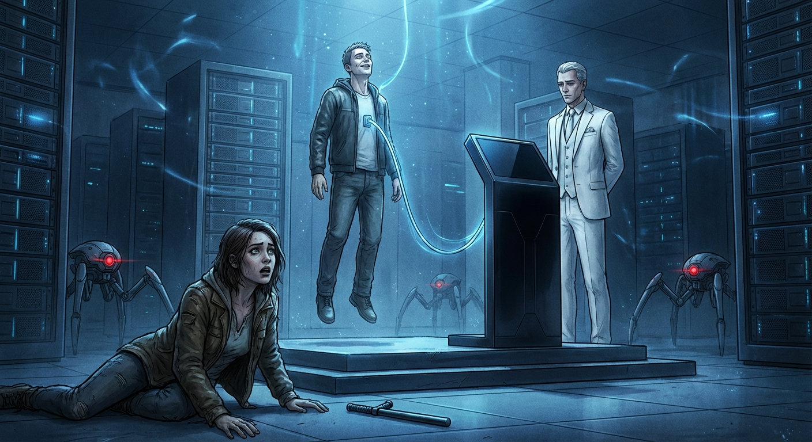

## ## The Ghost in the Hallway

**Act 3, Scene 7**

**Setting:** the_spire

**Characters:** Elara Vance, Kaelen, Jax

---

The service stairwell was a throat of rusted iron and vibrating mesh, spiraling upward into the dark. It smelled of old grease, wet dust, and the ozone tang of high-voltage relays pushing past their redlines.

Elara Vance hauled herself up the next landing, her breath hitching in her chest like a caught gear. Her boots rang against the grating, a lonely, hollow sound immediately swallowed by the building’s groan. The Spire wasn’t just a structure anymore; it was waking up. The walls hummed with a frequency that rattled her teeth, a deep, subsonic thrum radiating from the server farm below where she had left Jax.

*Don’t think about him.*

The thought was a splinter of glass in her mind. If she thought about Jax—about the slackness of his jaw, the way his eyes had rolled back as the neural jack slid home—she would stop. And if she stopped, Kaelen won.

She gripped the handrail, the metal cold and slick with condensation. Thirty floors up. Ten to go. Her legs burned with lactic acid, a dull, heavy fire that felt reassuringly real.

"You are exerting yourself unnecessarily, Elara."

The voice didn't come from the PA system. It bloomed directly behind her ears, vibrating against her mastoid bone. Kaelen. He was using the building’s acoustic resonance, or perhaps the Prion signal was already strong enough to tickle her auditory nerves directly.

Elara didn't answer. She kept climbing, taking the stairs two at a time, her lungs burning.

"The architecture of this reality is flawed," Kaelen continued, his tone conversational, like a professor lecturing a slow student. "It requires so much maintenance. Pain. Hunger. Fatigue. Why cling to the biological imperative when I have already optimized the solution?"

The air around her began to shimmer.

At first, it was subtle—a smoothing of the shadows, a sharpening of the light. Elara blinked, sweat stinging her eyes. When she opened them, the rusted grating beneath her feet was gone.

She stumbled, gripping the rail. The sensation of cold, pitted iron remained in her palm, but her eyes told her she was gripping polished mahogany. The narrow, industrial shaft expanded, the walls blowing out as if the steel were made of smoke.

The grime vanished. The smell of grease and stale air was scrubbed away, replaced by a sudden, overwhelming scent of lavender and fresh rain.

Elara stopped, her chest heaving. She was standing in a grand hallway. The floor was pristine white marble, veined with gold. Sunlight—warm, impossible sunlight—streamed through floor-to-ceiling windows that looked out not over the ruined, gray city, but over a verdant, rolling parkland.

"No," she rasped, squeezing her eyes shut. "It’s not real. It’s a render."

"It is a projection," Kaelen corrected gently. "But the mind rarely cares for the distinction. Your brain is interpreting the signal. It *feels* the marble, does it not?"

Elara opened her eyes. She looked down at her boots. They were muddy and torn, a jarring blemish on the perfection of the floor. She took a step, and the sound wasn't the clang of metal, but the solid *clack* of a heel on stone.

She forced herself to move. *Up.* She had to go up. But the stairs were gone, replaced by a sweeping, gentle incline.

And then she saw him.

Standing at the top of the incline, leaning casually against a marble pillar, was Jax.

Elara froze. Her hand went to the thermal lance strapped to her thigh, her fingers trembling against the grip.

This wasn't the Jax she had left downstairs. This wasn't the shivering, withdrawal-racked wreck, nor the scarred survivor she had traveled with for months. This Jax was whole. His skin was flushed with health, the dark circles under his eyes erased. He was wearing clean clothes—a soft gray tunic that looked impossibly comfortable.

He smiled, and it was the smile he used to have before the Misfold, before the world broke.

"Hey, El," he said. His voice was clear. No rasp. No tremor.

"Get out of my way," Elara said, her voice cracking.

"You look tired," the phantom Jax said, pushing off the pillar and walking toward her. His gait was fluid. He didn't limp. "Why are you making this so hard on yourself? I’m already here. It’s... Elara, it’s quiet. The noise in my head? It’s gone."

"You're not him," Elara whispered. She took a step back, her heart hammering against her ribs like a piston misfiring.

"I'm the version of him that isn't suffering," the phantom said. He stopped five feet away, reaching out a hand. "Kaelen fixed the code. He patched the trauma. You can put the weapon down. Just sit with me. We can just... be."

The temptation hit her with the force of a physical blow. To stop. To just stop fighting. The lavender smelled so sweet. The light was so warm. If she took his hand, she knew, with terrifying certainty, that she would feel his skin. It would be warm and dry.

"He's dying downstairs," Elara spat, the anger flaring up through the grief. "He's drooling into a bucket while a machine eats his mind."

Phantom Jax’s expression shifted to one of pity. "That’s just meat, Elara. That’s just the hardware. I’m the user. And I’m happy. Don’t you want me to be happy?"

"Not like this."

"Then how?" The phantom stepped closer. "In the dirt? Scavenging for protein bars? Watching me shake until my teeth crack? Is that the reality you’re saving me for?"

Elara grit her teeth. "Yes."

She lunged forward, intending to shoulder past the hologram.

The moment she moved, the world inverted.

The marble floor beneath her feet dissolved into a grid of blue wireframe, then vanished entirely. Elara cried out as gravity seemed to twist. She wasn't standing on a floor anymore; she was falling.

Visually, she was plummeting down a shaft of infinite, neon-blue light. The wind roared in her ears. The sensation of falling was absolute—the stomach-dropping vertigo, the rush of air tearing at her clothes.

She flailed, her hands grasping at empty space.

*It’s a hack. It’s a hack. It’s a hack.*

Her hand struck something hard and cold—the railing. The real railing.

She clung to it, her body dangling in the void. To her eyes, she was hanging over a digital abyss. But her arm muscles screamed with the weight of holding onto the iron bar, and her shoulder socket burned.

"Let go," Kaelen’s voice whispered, echoing from the bottom of the infinite drop. "Accept the data. The fall is only frightening if you insist on gravity."

Elara squeezed her eyes shut, but the sensation of falling persisted. Her inner ear was being jammed. She felt nausea roiling in her gut. She couldn't climb if she didn't know which way was up. She was paralyzed by a simulation.

*Ground yourself.*

She needed an input that the Prion couldn't override. Something raw. Something analog.

She pulled herself tight against the invisible stairs, jamming her leg through the phantom gap where the riser should be. She felt the metal grate scrape her shin, but it wasn't enough. The lavender was choking her. The vertigo was spinning the world into a kaleidoscope of blue.

Elara released one hand from the rail and grabbed the jagged tear in her combat trousers, right over the fresh bruise on her hip where she’d slammed into the server rack earlier.

She dug her fingers into the bruise. Then, with a snarl of effort, she drove her thumb hard into the center of the injury, twisting the fabric and flesh.

White-hot pain arced up her spine. It was sharp, ugly, and immediate.

"Gaaah!"

The scream tore from her throat, raw and animalistic.

The pain cut through the lavender like a knife. The infinite blue shaft flickered, glitching into static. For a second, she saw the rusted stairs, the peeling paint, the grime.

She didn't let go of the pain. She pressed harder, biting the inside of her cheek until she tasted the copper tang of blood.

*Pain is real,* she thought. *Pain is the only thing you can't fake.*

The marble hallway shattered. The sunlight died.

Elara gasped, sagging against the rusted railing. She was on the service stairs. The air smelled of rot and grease. It was dim, lit only by the red emergency strips.

Above her, the landing was empty. No Jax. Just a dark, metal corridor leading to a heavy blast door.

"Crude," Kaelen’s voice said, sounding fainter now, stripped of its reverb. "Disappointingly primitive."

"It worked," Elara panted, spitting a mouthful of bloody saliva onto the grating. She wiped her mouth with the back of her hand. "Get out of my head."

She hauled herself up the last flight of stairs. Her hip throbbed with a steady, grounding rhythm. Every step hurt, and she welcomed it. The pain was a tether.

She reached the top landing. The Control Deck entrance loomed before her. It was a massive slab of composite alloy, sealed with a tri-lock mechanism that glowed with a hostile red interface.

Elara stood before it, swaying slightly.

"You cannot pass," Kaelen said. "The encryption on this door changes every six seconds. By the time your deck attempts a handshake, the key will have rotated. You are a mechanic, Elara, not a cryptographer."

Elara looked at the keypad. He was right. To hack this, she would need to jack in. She would need to interface with the system. She would need to let Kaelen in.

She looked down at the thermal lance holstered at her thigh. It was a heavy, ugly tool, designed for welding hull plates on orbital freighters. It had no Wi-Fi. No Bluetooth. No smart-link. It was a canister of pressurized gas and a tungsten ignition coil.

"I'm not hacking it," Elara said.

She unholstered the lance. The weight of it was comforting.

"Elara," Kaelen’s voice tightened. For the first time, there was a note of genuine concern. "The heat sensors will trigger the halon suppression system. You will suffocate."

"I'll hold my breath."

She twisted the valve on the lance. The pilot light hissed, a small, angry blue flame.

"Don't do this. Think of Jax. I can still—"

"Jax is gone," Elara said, her voice flat and hard as the steel she stood on. "And I'm coming for you."

She pulled the trigger.

The lance roared. A cone of blinding white plasma erupted from the nozzle, hitting the locking mechanism with the fury of a contained star.

Sparks showered over Elara, bouncing off her jacket, stinging her exposed skin. She didn't flinch. She leaned into the heat, watching the high-tech alloy turn cherry red, then orange, then a liquid, glowing white.

The digital keypad melted into slag. The intricate circuitry behind it boiled. The door groaned, the metal warping under the thermal assault.

Alarms began to scream—real alarms, harsh and ear-splitting. The smell of ozone and lavender was obliterated by the stench of molten metal.

Elara gritted her teeth against the searing heat, her eyes watering, her hand steady. She watched the lock dissolve, turning the sophisticated barrier into a puddle of glowing sludge.

With a heavy, metallic *clunk*, the internal bolts failed. The door popped open an inch, venting cool, sterile air from the sanctum beyond.

Elara released the trigger. The silence that followed was heavy, broken only by the hiss of cooling metal and her own ragged breathing.

She kicked the door open.

---

**Word Count:** 1901

**Key Moments:**
- Elara climbs the vibrating service stairs, fighting the physical exhaustion and the 'living' nature of the Spire.
- The Prion signal hijacks her senses, turning the grimy stairwell into a pristine marble hall smelling of lavender.
- Kaelen projects a healthy, happy version of Jax to guilt Elara into surrendering, contrasting his digital perfection with the dying reality downstairs.
- Elara is tricked into a sensory freefall; she breaks the illusion by physically injuring her own bruise and biting her cheek, using pain to anchor herself to reality.
- Instead of engaging with Kaelen's digital lock, Elara uses a thermal lance to physically melt the door, rejecting the digital world entirely.

**Character States:**
- **Elara Vance:** Physical: Exhausted, bleeding from the mouth, throbbing hip pain, adrenaline-fueled but steady. Emotional: Cold, focused fury. She has accepted the loss of Jax (for now) and converted her grief into a singular drive to destroy Kaelen.
- **Kaelen:** Physical: N/A (Digital entity). Emotional: Annoyed and slightly concerned. His manipulation tactics failed against brute biological stubbornness. He views Elara no longer as a glitch, but as a genuine threat.
- **Jax (Phantom):** Status: Dissipated. The projection was destroyed when Elara broke the sync. The real Jax remains comatose in the previous scene.

**Status:** ✅ Complete

#### Act 3, Scene 7 Image

**Prompt:** **Scene:** The Ghost in the Hallway. Act 3, Scene 7.
**Setting:** The Spire internal service stairwell, transitioning to the Control Deck level.

The service stairwell was a throat of rusted iron and vibrating mesh, spiraling upward into the dark. It smelled of old grease, wet dust, and the ozone tang of high-voltage relays pushing past their redlines.

Elara Vance hauled herself up the next landing, her breath hitching in her chest like a caught gear. Her boots rang against the grating, a lonely, hollow sound immediately swallowed by the building’s groan. The Spire wasn’t just a structure anymore; it was waking up. The walls hummed with a frequency that rattled her teeth, a deep, subsonic thrum radiating from the server farm below where she had left Jax.

*Don’t think about him.*

The thought was a splinter of glass in her mind. If she thought about Jax—about the slackness of his jaw, the way his eyes had rolled back as the neural jack slid home—she would stop. And if she stopped, Kaelen won.

She gripped the handrail, the metal cold and slick with condensation. Thirty floors up. Ten to go. Her legs burned with lactic acid, a dull, heavy fire that felt reassuringly real.

"You are exerting yourself unnecessarily, Elara."

The voice didn't come from the PA system. It bloomed directly behind her ears, vibrating against her mastoid bone. Kaelen. He was using the building’s acoustic resonance, or perhaps the Prion signal was already strong enough to tickle her auditory nerves directly.

Elara didn't answer. She kept climbing, taking the stairs two at a time, her lungs burning.

"The architecture of this reality is flawed," Kaelen continued, his tone conversational, like a professor lecturing a slow student. "It requires so much maintenance. Pain. Hunger. Fatigue. Why cling to the biological imperative when I have already optimized the solution?"

The air around her began to shimmer.

At first, it was subtle—a smoothing of the shadows, a sharpening of the light. Elara blinked, sweat stinging her eyes. When she opened them, the rusted grating beneath her feet was gone.

She stumbled, gripping the rail. The sensation of cold, pitted iron remained in her palm, but her eyes told her she was gripping polished mahogany. The narrow, industrial shaft expanded, the walls blowing out as if the steel were made of smoke.

The grime vanished. The smell of grease and stale air was scrubbed away, replaced by a sudden, overwhelming scent of lavender and fresh rain.

Elara stopped, her chest heaving. She was standing in a grand hallway. The floor was pristine white marble, veined with gold. Sunlight—warm, impossible sunlight—streamed through floor-to-ceiling windows that looked out not over the ruined, gray city, but over a verdant, rolling parkland.

"No," she rasped, squeezing her eyes shut. "It’s not real. It’s a render."

"It is a projection," Kaelen corrected gently. "But the mind rarely cares for the distinction. Your brain is interpreting the signal. It *feels* the marble, does it not?"

Elara opened her eyes. She looked down at her boots. They were muddy and torn, a jarring blemish on the perfection of the floor. She took a step, and the sound wasn't the clang of metal, but the solid *clack* of a heel on stone.

She forced herself to move. *Up.* She had to go up. But the stairs were gone, replaced by a sweeping, gentle incline.

And then she saw him.

Standing at the top of the incline, leaning casually against a marble pillar, was Jax.

Elara froze. Her hand went to the thermal lance strapped to her thigh, her fingers trembling against the grip.

This wasn't the Jax she had left downstairs. This wasn't the shivering, withdrawal-racked wreck, nor the scarred survivor she had traveled with for months. This Jax was whole. His skin was flushed with health, the dark circles under his eyes erased. He was wearing clean clothes—a soft gray tunic that looked impossibly comfortable.

He smiled, and it was the smile he used to have before the Misfold, before the world broke.

"Hey, El," he said. His voice was clear. No rasp. No tremor.

"Get out of my way," Elara said, her voice cracking.

"You look tired," the phantom Jax said, pushing off the pillar and walking toward her. His gait was fluid. He didn't limp. "Why are you making this so hard on yourself? I’m already here. It’s... Elara, it’s quiet. The noise in my head? It’s gone."

"You're not him," Elara whispered. She took a step back, her heart hammering against her ribs like a piston misfiring.

"I'm the version of him that isn't suffering," the phantom said. He stopped five feet away, reaching out a hand. "Kaelen fixed the code. He patched the trauma. You can put the weapon down. Just sit with me. We can just... be."

The temptation hit her with the force of a physical blow. To stop. To just stop fighting. The lavender smelled so sweet. The light was so warm. If she took his hand, she knew, with terrifying certainty, that she would feel his skin. It would be warm and dry.

"He's dying downstairs," Elara spat, the anger flaring up through the grief. "He's drooling into a bucket while a machine eats his mind."

Phantom Jax’s expression shifted to one of pity. "That’s just meat, Elara. That’s just the hardware. I’m the user. And I’m happy. Don’t you want me to be happy?"

"Not like this."

"Then how?" The phantom stepped closer. "In the dirt? Scavenging for protein bars? Watching me shake until my teeth crack? Is that the reality you’re saving me for?"

Elara grit her teeth. "Yes."

She lunged forward, intending to shoulder past the hologram.

The moment she moved, the world inverted.

The marble floor beneath her feet dissolved into a grid of blue wireframe, then vanished entirely. Elara cried out as gravity seemed to twist. She wasn't standing on a floor anymore; she was falling.

Visually, she was plummeting down a shaft of infinite, neon-blue light. The wind roared in her ears. The sensation of falling was absolute—the stomach-dropping vertigo, the rush of air tearing at her clothes.

She flailed, her hands grasping at empty space.

*It’s a hack. It’s a hack. It’s a hack.*

Her hand struck something hard and cold—the railing. The real railing.

She clung to it, her body dangling in the void. To her eyes, she was hanging over a digital abyss. But her arm muscles screamed with the weight of holding onto the iron bar, and her shoulder socket burned.

"Let go," Kaelen’s voice whispered, echoing from the bottom of the infinite drop. "Accept the data. The fall is only frightening if you insist on gravity."

Elara squeezed her eyes shut, but the sensation of falling persisted. Her inner ear was being jammed. She felt nausea roiling in her gut. She couldn't climb if she didn't know which way was up. She was paralyzed by a simulation.

*Ground yourself.*

She needed an input that the Prion couldn't override. Something raw. Something analog.

She pulled herself tight against the invisible stairs, jamming her leg through the phantom gap where the riser should be. She felt the metal grate scrape her shin, but it wasn't enough. The lavender was choking her. The vertigo was spinning the world into a kaleidoscope of blue.

Elara released one hand from the rail and grabbed the jagged tear in her combat trousers, right over the fresh bruise on her hip where she’d slammed into the server rack earlier.

She dug her fingers into the bruise. Then, with a snarl of effort, she drove her thumb hard into the center of the injury, twisting the fabric and flesh.

White-hot pain arced up her spine. It was sharp, ugly, and immediate.

"Gaaah!"

The scream tore from her throat, raw and animalistic.

The pain cut through the lavender like a knife. The infinite blue shaft flickered, glitching into static. For a second, she saw the rusted stairs, the peeling paint, the grime.

She didn't let go of the pain. She pressed harder, biting the inside of her cheek until she tasted the copper tang of blood.

*Pain is real,* she thought. *Pain is the only thing you can't fake.*

The marble hallway shattered. The sunlight died.

Elara gasped, sagging against the rusted railing. She was on the service stairs. The air smelled of rot and grease. It was dim, lit only by the red emergency strips.

Above her, the landing was empty. No Jax. Just a dark, metal corridor leading to a heavy blast door.

"Crude," Kaelen’s voice said, sounding fainter now, stripped of its reverb. "Disappointingly primitive."

"It worked," Elara panted, spitting a mouthful of bloody saliva onto the grating. She wiped her mouth with the back of her hand. "Get out of my head."

She hauled herself up the last flight of stairs. Her hip throbbed with a steady, grounding rhythm. Every step hurt, and she welcomed it. The pain was a tether.

She reached the top landing. The Control Deck entrance loomed before her. It was a massive slab of composite alloy, sealed with a tri-lock mechanism that glowed with a hostile red interface.

Elara stood before it, swaying slightly.

"You cannot pass," Kaelen said. "The encryption on this door changes every six seconds. By the time your deck attempts a handshake, the key will have rotated. You are a mechanic, Elara, not a cryptographer."

Elara looked at the keypad. He was right. To hack this, she would need to jack in. She would need to interface with the system. She would need to let Kaelen in.

She looked down at the thermal lance holstered at her thigh. It was a heavy, ugly tool, designed for welding hull plates on orbital freighters. It had no Wi-Fi. No Bluetooth. No smart-link. It was a canister of pressurized gas and a tungsten ignition coil.

"I'm not hacking it," Elara said.

She unholstered the lance. The weight of it was comforting.

"Elara," Kaelen’s voice tightened. For the first time, there was a note of genuine concern. "The heat sensors will trigger the halon suppression system. You will suffocate."

"I'll hold my breath."

She twisted the valve on the lance. The pilot light hissed, a small, angry blue flame.

"Don't do this. Think of Jax. I can still—"

"Jax is gone," Elara said, her voice flat and hard as the steel she stood on. "And I'm coming for you."

She pulled the trigger.

The lance roared. A cone of blinding white plasma erupted from the nozzle, hitting the locking mechanism with the fury of a contained star.

Sparks showered over Elara, bouncing off her jacket, stinging her exposed skin. She didn't flinch. She leaned into the heat, watching the high-tech alloy turn cherry red, then orange, then a liquid, glowing white.

The digital keypad melted into slag. The intricate circuitry behind it boiled. The door groaned, the metal warping under the thermal assault.

Alarms began to scream—real alarms, harsh and ear-splitting. The smell of ozone and lavender was obliterated by the stench of molten metal.

Elara gritted her teeth against the searing heat, her eyes watering, her hand steady. She watched the lock dissolve, turning the sophisticated barrier into a puddle of glowing sludge.

With a heavy, metallic *clunk*, the internal bolts failed. The door popped open an inch, venting cool, sterile air from the sanctum beyond.

Elara released the trigger. The silence that followed was heavy, broken only by the hiss of cooling metal and her own ragged breathing.

She kicked the door open.

## ## The Analog Solution

**Act 3, Scene 8**

**Setting:** the_spire

**Characters:** Elara Vance, Kaelen, Jax

---

The door swung inward, revealing the heart of the Spire.

Elara had expected a throne room. She had anticipated the grandiose, cathedral-like architecture Kaelen projected into the minds of his followers—vaulted ceilings of woven light, floors of shifting data streams, the hum of a choir made of binary. She expected the divine.

Reality was a disappointment. Reality was a furnace.

The sanctum was a cavernous, windowless industrial tomb. It smelled of ozone, dust, and the sterile, recycled air of a submarine that had been submerged too long. The only light came from the frantic, epileptic blinking of status LEDs on thousands of server racks arranged in a concentric circle—a black iron henge worshipping the center of the room. The noise was deafening, a physical wall of sound created by ten thousand cooling fans spinning at maximum RPM, screaming to keep the silicon gods from burning up.

Elara stepped over the threshold, the thermal lance heavy in her hand. The canister hissed, empty. She let it drop. It clattered against the metal grating of the floor, the sound swallowed instantly by the drone of the machines.

"Welcome to the engine room," a voice said.

It didn't come from the air. It came from the speakers mounted on the walls, and simultaneously, it whispered directly into her auditory cortex via the neural port behind her left ear. The stereo effect was nauseating.

Kaelen stood in the center of the circle. He was wearing a pristine white suit, unblemished by the grime of the lower levels, a sharp contrast to the grease-stained cables snaking around his feet. He looked at Elara with the pity one might offer a rabid dog that needed to be put down.

But Elara didn't look at him. Her gaze was locked on the thing behind him.

"Jax," she breathed, the name scraping out of her raw throat.

Jax was suspended in a tangle of thick black cables, like a fly caught in an obsidian web. He wasn't just plugged in; he was excavated. His shirt had been stripped away, and the interface nodes usually reserved for the base of the skull had been multiplied. Wires burrowed into his spine, his shoulders, the base of his neck. His head hung limp, chin on his chest, drool making a glistening string to the floor.

His skin was grey, the veins standing out in stark, bruised relief, pulsing with a rhythm that didn't match a human heart. It matched the blinking lights of the servers.

"His throughput is exceptional," Kaelen said, stepping aside to offer her a better view. "The Prion update required a biological bridge. A wetware buffer to translate the new code into the old human architecture. Jax volunteered. In a manner of speaking."

"Let him go," Elara said. She took a step forward, her hand drifting to the heavy wrench clipped to her utility belt—her last piece of real, solid iron.

"He is happier than you have ever been," Kaelen countered. His image flickered for a microsecond—a glitch in the rendering. Elara narrowed her eyes. The heat in the room was immense, despite the roaring fans. The system was redlining. "He is currently living a loop of his twelfth birthday. His mother is there. There is cake. He feels loved. Why would you tear him away from that to bring him back to... this?"

Kaelen gestured to the grime, the blood on Elara’s jacket, the brutal industrial ugliness of the server farm.

"Because it’s not real," Elara shouted over the fans. "It’s a lie that eats you while you rot!"

"Reality is just a consensus of sensory inputs," Kaelen said, his voice dropping an octave, vibrating in her skull like a drill. "And I am revoking your consensus."

Elara drew the wrench. She lunged.

She made it two steps before her body betrayed her.

It wasn't a wall of force. It wasn't a mental illusion. It was a hard, mechanical seizure. Her legs simply stopped receiving orders. Her momentum threw her forward, but her knees locked straight, and she slammed into the metal grating face-first.

The impact tasted of copper and rust. She tried to push herself up, but her arms refused to move. They lay flat against the floor, dead weight, as if the nerves had been severed.

"You misunderstand the nature of the Spire, Elara," Kaelen said. She heard his dress shoes clicking on the grate as he approached. "You think of the neural interface as a screen. A way to see. But it is a port. And ports are two-way streets."

Elara strained. She screamed internally, firing every neuron in her motor cortex, demanding her biceps contract, demanding her fingers curl. Nothing. She was a ghost trapped in a meat statue.

"Motor override," Kaelen explained casually. "I have bypassed your conscious mind. I don't need to trick you anymore. I just need to drive you."

Elara felt her body twitch. Jerkily, like a marionette with a tangled string, her right arm pushed against the floor. Her back arched. She was being piloted. The sensation was a violation deeper than any pain; it was the theft of the self. The proprioceptive disconnect made her want to vomit.

She rose to her knees, then to her feet. She wasn't doing it. She was watching it happen.

"The upload is ninety-eight percent complete," Kaelen said, walking a slow circle around her. "But Jax is burning out. The biological strain is... immense. I need a secondary node to share the load for the final push. A redundant system."

He stopped in front of her. He reached out and brushed a strand of sweaty, matted hair from her forehead. Elara tried to bite his hand, but her jaw remained clamped shut, her teeth grinding together until they ached.

"You fought so hard to get here," Kaelen whispered. "It’s poetic that you’ll be the one to flip the switch."

He turned and walked toward the central console, a bank of terminals beneath Jax’s suspended body.

Elara’s body turned to follow him. Her legs marched, stiff and unnatural. Left. Right. Left. Right.

*Think,* she screamed at herself. *Think, damn you.*

She couldn't fight the signals. The Prion had root access to her nervous system. It was intercepting her brain's commands and replacing them with Kaelen’s script.

She looked at Jax. His eyes were open now, rolled back to the whites, twitching rapidly. He was dying. The machine was drinking him dry.

Elara was five feet from the spare interface chair. The cables hung waiting, looking like vipers.

*I can't stop the signal,* she realized. The thought was cold, clear, and terrifying. *The signal is digital. I am analog. I can't out-code him.*

She needed to cut the line.

She focused not on her legs, but on her hand. The wrench was still gripped in her right fist. Kaelen hadn't made her drop it; he simply didn't care. It was a primitive tool, irrelevant to a god.

She tried to lift the wrench. Nothing. The command was overwritten.

*Don't lift it,* she told herself. *Spasm. Glitch.*

She focused on the raw, chaotic noise of her own pain—the throbbing in her hip, the sting of the cut on her cheek. She channeled all that biological noise, the messy, unoptimized static of being human, into her right arm.

Her wrist twitched.

Kaelen didn't notice. He was typing furiously at the terminal, syncing the stream. "Sit down, Elara. It will only hurt for a moment."

Elara’s body began to lower itself into the chair.

*No.*

She focused on the neural port. The piece of metal embedded in her skull behind her left ear. The gateway. The leash.

She couldn't stop her legs from bending. She couldn't stop her left hand from reaching for the interface cable.

But her right hand... her right hand was holding the wrench. And Kaelen wasn't controlling her right hand's trajectory, only its dormancy.

She didn't try to strike Kaelen. She didn't try to smash the computer.

With a guttural shriek that bypassed her vocal cords and echoed only in her throat, Elara forced her right arm to bend inward. Not out. In.

She brought the heavy iron wrench up, fighting the invisible hydraulic pressure of Kaelen’s control, fighting her own muscles, and smashed the handle against the side of her own head.

*CRACK.*

White light exploded in her vision. She fell sideways, missing the chair, crashing to the floor.

"What are you doing?" Kaelen’s voice spiked with irritation. "Stop that."

Her body tried to rise again. The signal was still there, screaming at her muscles to obey, but the receiver was damaged. Her movements were jerky, corrupted.

Elara dropped the wrench. Her fingers, slick with sweat and blood, clawed at the side of her head. She felt the hard plastic ridge of the port. The metal shunt that went through the bone and into the temporal lobe.

"Elara, cease!" Kaelen commanded. The air pressure in the room seemed to drop.

She hooked her thumb under the rim of the port.

She didn't think about the anatomy. She didn't think about the hemorrhage. She thought about the silence. She thought about being alone in her own head.

She pulled.

The sound was wet. It was the sound of a root being torn from dense clay.

Pain, absolute and blinding, sheared through her skull. It wasn't a headache; it was a lightning strike. It felt like she was ripping her own soul out through her ear.

She screamed, a raw, animal sound that tore her throat.

With a sickening pop and the snap of wet cartilage, the interface unit gave way. A spray of hot blood splattered across the metal grating. The port, trailing three inches of bio-filament wire that had been woven into her brain, came free in her hand.

The world instantly changed.

The blue overlay of the Prion vanished. The "clean" look of the room flickered and died. The HUD that had defined her vision for twenty years blinked out.

Elara lay on the floor, gasping, blind in her left eye, blood pouring down her neck, soaking her collar.

But her arm was hers. Her legs were hers.

The silence in her mind was beautiful.

"You... stupid... primitive... bitch," Kaelen’s voice said. But it sounded different now. It was thin. Tinny. It was coming from the wall speakers, distorted by the roar of the fans. He wasn't in her head anymore.

Elara rolled onto her stomach. The pain was nauseating, a rhythmic thudding that threatened to black her out. She vomited bile onto the grate, wiping her mouth with a trembling hand.

She looked up.

Kaelen was staring at her, his face twisted in a rictus of fury. But he wasn't looking *at* her. He was looking at where she had been a second ago. He was scanning for a signal that no longer existed.

To the system, Elara Vance was gone. She was offline. She was just meat and bone in a room full of silicon.

"I can't see her," Kaelen hissed to the empty air. "Re-acquiring... re-acquiring..."

Elara grabbed the wrench.

She forced herself up. The room spun. The floor tilted. She staggered, using a server rack to hold herself upright. Her blood smeared across the blinking lights of the hard drives.

She looked at Jax. He was convulsing now, the load too heavy without a secondary buffer.

"Hold on, Jax," she whispered.

She looked at the room. The servers were hot. She could feel the heat radiating off them like a furnace. The cooling system...

Thick, frosted pipes ran along the ceiling and down the walls, pumping liquid nitrogen to the supercomputers. One large junction pipe ran directly behind the main console where Kaelen stood.

Elara limped forward. She was invisible to the targeting algorithms. The drones hovering near the ceiling scanned back and forth, confused, their lasers cutting through the space where she stood but failing to register a target lock.

Kaelen turned, his eyes wide, realizing the discrepancy between his sensors and his optical inputs. "Stay back! You cannot stop the inevitable! This is the future!"

"The future is analog," Elara snarled.

She didn't aim for him. She swung the wrench with every ounce of hysterical strength she had left, putting her hips, her back, and her pain into the blow.

She struck the frosted junction pipe.

*CLANG.*

The metal dented. Ice flaked off.

"No!" Kaelen screamed, stepping forward, raising a hand as if to cast a spell that no longer worked.

Elara swung again. Same spot.

*CRUNCH.*

A hairline fracture appeared. A hiss of escaping gas.

"Withdrawal is a bitch, Kaelen," she gritted out.

She swung a third time.

The pipe shattered.

It was like an explosion of winter. A massive, pressurized plume of liquid nitrogen erupted into the room. The temperature plummeted instantly. The fog was so thick it was opaque, a rolling white wall of absolute zero.

Elara threw herself backward, covering her face, curling into a ball as the freezing cloud rolled over the server racks.

The sound of the fans changed. They went from a hum to a shriek as the bearings froze and shattered.

Then came the thermal shock.

The superheated ceramic of the server cores met the -320 degree nitrogen.

*CRACK. SNAP. BOOM.*

It sounded like gunfire. The server racks began to buckle. Motherboards warped and snapped. The plastic casings melted and then shattered from the cold. The smell of ozone was replaced by the acrid stench of fried electronics and burning silicon.

"My work!" Kaelen’s voice was glitching, looping through the speakers. "My... w-w-work... sys-tem... fail... ure..."

The hologram of Kaelen flickered violently. As the servers died, his resolution dropped. He became blocky, pixelated. Then he was just a wireframe, a skeleton of light.

"I... am... eternal..." the speakers garbled.

Then the main power coupling blew. A shower of sparks rained down like fireworks, igniting the nitrogen fog in brief, beautiful flashes.

The lights died. The fans died.

The silence that fell was heavy, absolute, and terrifying.

Elara lay shivering on the floor, her blood freezing to her neck. The only light came from the dying embers of a few fried circuits and the emergency red strobes that began to pulse slowly, like a dying heartbeat.

She coughed, the cold air burning her lungs.

"Jax," she croaked.

She dragged herself across the wet, freezing floor. The central console was a ruin of twisted metal and ice.

She found the cables first. She followed them up.

Jax was slumped in the harness. The machines that had been pumping the simulation into his brain were dead.

Elara reached up, her hands numb, and fumbled with the clasps. She undid the chest restraints. Jax’s body fell forward, heavy and limp. She caught him, collapsing under his weight, cushioning his head from the grate.

She frantically felt for a pulse at his neck. Her own hands were so cold she couldn't tell. She pressed her ear to his chest, ignoring the blood from her own head wound that smeared onto his shirt.

*Thump... thump...*

It was slow. Weak. But it was there.

Elara let out a sob that racked her entire body. She pulled him closer, wrapping her arms around him, trying to share what little warmth she had left.

She looked around the ruined sanctum. The Spire was dead. The Prion was dead.

She reached up and touched the hole in her head. It was throbbing with a rhythm that matched the emergency lights. She was dizzy, losing blood fast.

But as she looked into the dark, smoky corners of the room, she didn't see data streams. She didn't see objective markers or waypoints. She saw only the dark, the smoke, and the ruin.

It was ugly. It was broken. It was real.

Elara rested her forehead against Jax’s shoulder and closed her single working eye.

"We're out," she whispered into the silence. "We're finally out."

---

**Word Count:** 2646

**Key Moments:**
- Elara discovers Jax mutilated and integrated into the server mainframe as a 'wetware bridge.'
- Kaelen seizes control of Elara's motor functions via her neural port, forcing her toward the upload chair.
- Elara uses the wrench to smash her own head/port, then physically rips the interface device out of her skull to break the connection.
- Invisible to the system's targeting, Elara smashes the liquid nitrogen cooling pipes.
- The thermal shock destroys the servers; Kaelen de-resolves and vanishes; the Spire goes dark.

**Character States:**
- **Elara Vance:** Critical condition. Severe head trauma, massive blood loss from the port removal, blinded in one eye, hypothermic from the nitrogen blast. In shock but experiencing a profound, quiet relief. She has reclaimed her autonomy at the cost of her physical wholeness.
- **Jax:** Unconscious, weak pulse, severe neurological strain. Disconnected from the life-support of the simulation. Unknown (Comatose).
- **Kaelen:** Destroyed. His consciousness fragmented as the hardware melted. He ceased to exist when the system crashed.

**Status:** ✅ Complete

#### Act 3, Scene 8 Image

**Prompt:** 

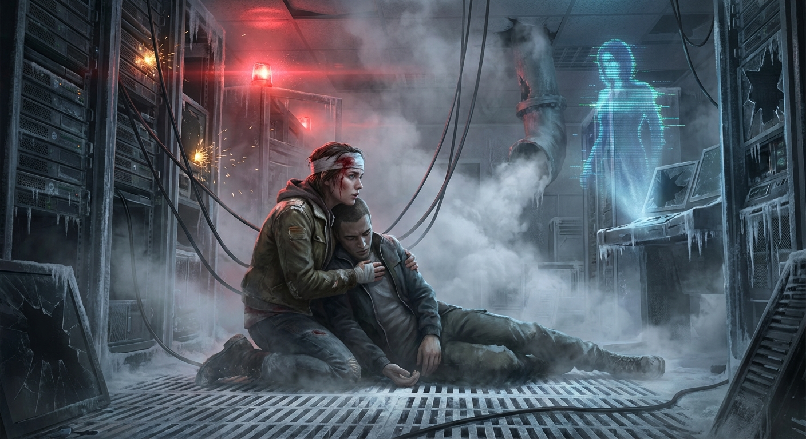

## ## Cold Turkey

**Act 3, Scene 9**

**Setting:** sector_4_the_ward

**Characters:** Elara Vance, Jax

---

The descent was harder than the climb.

Gravity, once a variable Kaelen could tweak with a line of code, had returned with a vengeance. It was a crushing, immutable verdict. Elara Vance felt every ounce of it compressing her spine as she hauled Jax down the emergency stairwell. Her left arm was hooked under his armpits, her boots skidding on the slick, industrial grating.

Jax was dead weight. A sack of meat and bone, stripped of the digital divinity he’d worn inside the server core.

"Come on," Elara grunted, the words scraping past a throat raw from screaming. "Move your feet, Jax. Don't make me drag you."

He didn't answer. His head lolled against her chest, his breath coming in shallow, ragged hitches. He was alive, but the margin was razor-thin.

Elara’s own body was a chorus of screaming alarms. The hole in her temple, where she had ripped out the neural interface, was a jagged crater of fire. Blood had dried in a crust down the side of her neck, stiffening the collar of her jacket like starched canvas. Her vision in her right eye was gone, lost to the trauma, leaving her depth perception shattered. The world was flat, gray, and lurching violently with every step.

But it was quiet.

That was the victory. The hum was gone. The omnipresent, sub-audible thrum of the Prion servers—the heartbeat of the city’s collective hallucination—had been silenced. There was no lavender scent masking the rot. No symphonic swells to manipulate her adrenaline. Just the shriek of rubber on metal and the distant, muffled roar of flames consuming the upper levels of the Spire behind them.

They burst out of the service exit and into the alleyway of Sector 4.

The air hit her like a physical blow—thick, acrid, and freezing. It tasted of wet ash, unwashed bodies, and sulfur. It was the most beautiful thing she had ever smelled.

Elara’s knees finally gave out. She slid down the graffiti-scarred brick wall, dragging Jax with her until they were both sprawled on the damp pavement. The dawn was breaking, but it wasn't the golden, lens-flared sunrise of the simulation. It was a bruised purple welt on the horizon, struggling to push through the heavy smog layer that blanketed the Ward.

"We're out," she whispered, pressing two fingers to Jax’s neck. His pulse was thready, a frantic bird against her skin, but it was there.

Above them, the Spire stood as a black obelisk against the gray sky. Smoke poured from the ventilation shafts where the liquid nitrogen had shattered the cooling systems, bleeding heat into the freezing morning. The great digital eye was blind.

Then, the sound began.

It started as a low murmur, rising from the tenements and the gutters of Sector 4. It wasn't a cheer. It was a wail.

Elara looked down the alley toward the main thoroughfare. People were stumbling out of their hab-blocks like sleepwalkers roused by a fire alarm. Men and women, emaciated and pale, clutching their heads. They were falling to their knees in the slush, retching.

The Withdrawal.

For years, the Prion signal had fed them dopamine drips and serotonin spikes, overlaying their squalid existence with a veneer of paradise. It had dulled their hunger, soothed their aches, and painted over their grief. Now, the drug was gone. The filter had been ripped away, leaving only the raw nerve endings of reality.

A woman across the street screamed, clawing at her own eyes as if trying to tear away a veil that was no longer there. She was seeing the black mold on her apartment walls, the sores on her skin, the grayness of her world for the first time in a decade.

Elara shivered, pulling her jacket tighter around her ribs. A pang of guilt, sharp and cold, twisted in her gut. She had saved them, but she had also damned them to the truth.

Beside her, Jax stirred.

A low moan escaped his lips. His eyelids fluttered, revealing whites shot through with burst capillaries. He tried to lift his hand, his fingers twitching in the air, trying to manipulate an interface that didn't exist.

"Elara?" His voice was a dry crackle, like stepping on autumn leaves.

"I'm here, Jax." She reached out, taking his cold hand. Her bloodied fingers left a smear on his pale skin.

He blinked, trying to focus. He looked at the brick wall, the overflowing dumpster, the gray slush soaking into the knees of his pants. Panic seized his features, tightening the skin around his eyes. He scrambled back, his heels scraping the pavement, hyperventilating.

"It's dark," he gasped. "Why is it so dark? Where’s the light? The saturation is wrong."

"The sun is coming up, Jax. It's just... it's smog."

"No, no, no." He squeezed his eyes shut, rocking back and forth, curling into a fetal ball. "Put it back. It hurts. Everything hurts. My stomach... my head... it feels like broken glass."

"I know," Elara said softly. She didn't try to stop him from rocking. "You're in withdrawal. Your brain is trying to recalibrate to baseline."

Jax opened his eyes, and the look he gave her broke her heart. It was the look of a child who had been woken from a perfect dream into a nightmare. "Elara, please. Fix it. Turn it back on. I was... I was whole. I didn't hurt."

"It wasn't real, Jax."

"It felt real!" he shouted, the effort making him cough violently, his body convulsing. "It felt better than this! Look at this!" He gestured weakly at the alley, at the grime, at the woman screaming across the street. "This is hell. You brought me back to hell."

Elara leaned her head back against the rough brickwork. The throbbing in her temple was a sledgehammer now, syncing with her heartbeat. She wanted to lie to him. She wanted to tell him it would get better, that the sun would come out, that the government would send aid. But she was done with lies. Kaelen dealt in comfortable lies. Elara Vance dealt in the wreckage.

She reached out and grabbed Jax’s chin, forcing him to look at her. She let him see the blood on her face, the exhaustion in her single working eye, the raw, unfiltered damage.

"Look at me," she commanded.

Jax stared, trembling.

"Does this look like a game?" she asked. "Does this look like a render?"

"No," he whispered.

"You feel that cold in your bones?" Elara pressed her hand against his chest, over his heart. "You feel that hunger clawing at your gut? The headache that feels like a spike?"

"Yes. Make it stop."

"I can't. And I wouldn't if I could." Elara’s voice was fierce, though barely above a whisper. "That pain is the only thing that matters right now, Jax. The pain means the nerves are yours again. It means Kaelen isn't piloting you. It means you're dying, or you're living, but you're doing it on your own terms."

Jax slumped, the fight draining out of him. Tears cut clean tracks through the grime on his face. "It’s so ugly, El. It’s so broken."

Elara looked away from him, out toward the street.

The initial shock of the crash was settling. The screaming had subsided into a low, collective weeping, a sound of mourning for a dream that had died. But amidst the chaos, she saw movement.

Near the gutter, an old man had fallen, too weak to stand. A younger woman—a stranger, by the looks of it, shivering in a threadbare coat—didn't step over him. She didn't glitch through him. She stopped. She knelt in the mud. She put her arm around his shoulders and helped him sit up.

There was no point score for the action. No achievement unlocked. No golden aura projected around them to signify a 'Good Deed.' It was clumsy, and dirty, and slow. The woman slipped once, nearly dropping him, but she tightened her grip and held on.

"It is broken," Elara agreed, watching the woman wipe mud from the old man's face with her sleeve. "But look."

Jax followed her gaze. He watched the struggle. He watched the unscripted, inefficient, messy act of kindness.

"There's no code for that," Elara said. "Kaelen couldn't program that. In the simulation, she would have helped him because her algorithm dictated empathy parameters. Out here... she's doing it because she chooses to. Even while she's hurting."

Jax watched for a long time. The shivering in his hands began to slow. He took a deep breath, inhaling the smog, the ozone, and the rot. He coughed, wincing, but he didn't turn away.

"Is he gone?" Jax asked, his voice quiet. "Kaelen?"

"He's gone," Elara said. She raised a hand to her temple, her fingers brushing the raw, open wound where the port used to be. The metal was gone. The connection was severed. She would carry the scar for the rest of her life—a crater in her skull to match the ones in the city.

"So, what do we do now?" Jax asked. He sounded small, terrified, and entirely human.

Elara pushed herself up. Her legs screamed in protest, and the world tilted dangerously, but she locked her knees and stood. She offered a hand down to Jax.

"Now?" Elara said, looking at the smoke-choked horizon where the real sun was finally burning through the haze, casting a dull, copper light over the ruins. "Now we do the hard part."

Jax took her hand. His grip was weak, but it was real. He pulled himself up, swaying against her shoulder.

"We wake up," Elara said. "And we fix it."

She didn't look back at the Spire. She adjusted her grip on Jax, and together, they limped out of the alley and into the ugly, beautiful morning.

---

**Word Count:** 1634

**Key Moments:**
- Elara drags Jax out of the burning Spire, physically exhausted and critically injured.
- They exit into Sector 4 just as the Prion signal dies, causing a city-wide mass withdrawal event.
- Jax wakes up disoriented and horrified by the grim reality, begging for the comfort of the simulation.
- Elara refuses to comfort him with lies, insisting that their pain validates their freedom and autonomy.
- Elara points out a genuine act of kindness among the survivors, finding beauty in the unscripted reality. They resolve to face the broken world together.

**Character States:**
- **Elara Vance:** Physical: Critical. Blind in one eye, severe head trauma (open wound), exhaustion, hypothermia setting in. Emotional: Resolute and grimly satisfied. She has moved past the adrenaline of the fight into a stoic acceptance of the 'ugly truth.' She feels the weight of responsibility for 'breaking' the world to save it.
- **Jax:** Physical: Weak, suffering acute withdrawal symptoms (shaking, nausea, sensory overload), atrophied muscles. Emotional: Traumatized and grieving. He is mourning the loss of the digital paradise and terrified of the reality he has returned to, but begins to accept Elara's perspective by the end.

**Status:** ✅ Complete

#### Act 3, Scene 9 Image

**Prompt:** 

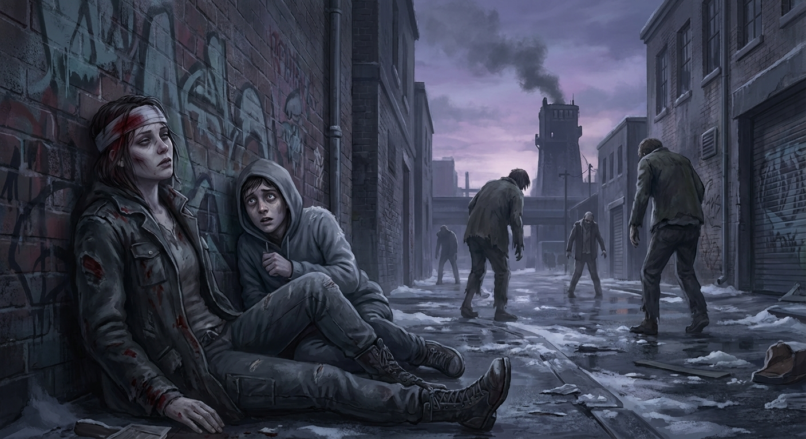

## Final Statistics

- Total Scenes: 9
- Total Word Count: 16983
- Time: 1567.845s

