# Narrative Generation Task

## Overview

# Narrative Generation

**Subject:** A corporate risk manager navigates the absurdity of 'Freshness Theater', implementing dangerously hot coffee protocols to satisfy brand metrics while managing customer liability.

## Configuration
- Target Word Count: 3000
- Structure: 3 acts, ~2 scenes per act
- Writing Style: satirical corporate dystopia
- Point of View: third person limited
- Tone: cynical, dark humor
- Detailed Descriptions: ✓
- Include Dialogue: ✓
- Internal Thoughts: ✓

**Started:** 2026-02-08 15:33:45

---

## Progress

### Phase 1: Narrative Analysis
*Running base narrative reasoning analysis...*

## Cover Image

**Prompt:** 

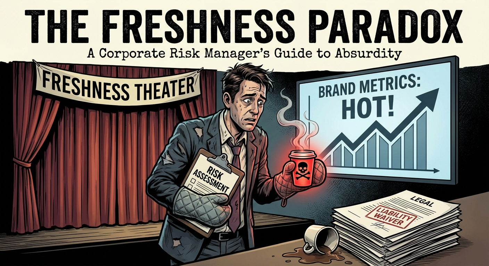

## High-Level Outline

## The Magma Protocol

**Premise:** A detached corporate risk manager, Elias Thorne, is tasked with implementing and legally defending a new, dangerously hot coffee protocol ('The Magma Protocol') driven by a fanatical executive, forcing him to confront the chaotic, painful reality of his metrics-driven world.

**Estimated Word Count:** 3000

---

### Characters

#### Elias Thorne

**Role:** Protagonist (Senior Architect of Brand Integrity)

**Description:** A man smoothed over by years of corporate erosion. He wears suits that are expensive but forgettable. His face is a mask of polite, active listening. He speaks almost entirely in euphemisms and buzzwords. He doesn't see people; he sees "liability vectors" and "brand touchpoints."

**Traits:** Amoral pragmatism, Obsession with metrics, Detached efficiency

#### Veronica Vane

**Role:** Antagonist (VP of Sensory Experience & Global Freshness)

**Description:** Sharp, angular, and terrifyingly energetic. She treats coffee consumption as a combat sport. She believes "pain is the body's way of acknowledging quality." She is the driving force behind the push for hotter coffee.

**Traits:** Fanatical, Aggressive, Delusional about "customer delight"

#### Kevin

**Role:** Supporting (Shift Supervisor at Unit 734)

**Description:** Twenty-something, exhausted, wearing a polyester apron that smells of burnt milk. He is the ground-level reality check that Elias tries to ignore. He has burn marks on his knuckles.

**Traits:** Anxious, Resigned, Physically scarred by corporate policy

---

### Settings

#### The Apex (Corporate HQ)

**Description:** A glass-and-steel monolith piercing the city skyline. The interior is aggressively white, silent, and kept at a shivering 64 degrees. The air smells of ozone and fear. The conference rooms have names like "Synergy" and "Velocity."

**Atmosphere:** Sterile, hostile, detached from human reality.

**Significance:** Represents the theoretical, metric-obsessed world where the "Magma Protocol" makes perfect sense on a spreadsheet.

#### Unit 734 (The Retail Outlet)

**Description:** A high-traffic coffee shop in a transit hub. It is loud, humid, and chaotic. The steam wands hiss like vipers. The air is thick with the smell of roasting beans and melting plastic.

**Atmosphere:** Visceral, dangerous, sensory overload.

**Significance:** The physical world where the corporate theories are tested on human flesh. The battlefield.

---

### Act Structure

#### Act 1: The Thermal Imperative

**Purpose:** Establish the absurdity of the corporate goal and introduce the "Magma Protocol."

**Estimated Scenes:** 2

**Key Developments:**
- The definition of "freshness" is redefined as "heat."
- Elias is tasked with making dangerous temperatures legally defensible.

#### Act 2: Deployment and Damage Control

**Purpose:** The protocol enters the real world. The clash between theory and biology creates chaos.

**Estimated Scenes:** 2

**Key Developments:**
- The protocol is live.
- Customers are getting hurt, but sales (and "freshness perception") are up.
- Elias must manage the fallout.

#### Act 3: The Zero-Liability Horizon

**Purpose:** The climax and resolution. The system protects itself.

**Estimated Scenes:** 2

**Key Developments:**
- A potential PR disaster is spun into a brand victory.
- Elias is rewarded for his inhumanity.

---

**Status:** ✅ Pass 1 Complete

## Outline

## The Magma Protocol

**Premise:** A detached corporate risk manager, Elias Thorne, is tasked with implementing and legally defending a new, dangerously hot coffee protocol ('The Magma Protocol') driven by a fanatical executive, forcing him to confront the chaotic, painful reality of his metrics-driven world.

**Estimated Word Count:** 3000

**Total Scenes:** 6

---

### Detailed Scene Breakdown

### Act 1: The Thermal Imperative

**Purpose:** Establish the radical, dangerous 'Magma Protocol,' introduce the corporate architects (Elias and Veronica), and immediately contrast the sterile, legal theory of the plan with the painful, messy reality of its physical implementation.

#### Scene 1: The Thermodynamics of Delight

- **Setting:** The Apex (Corporate HQ)
- **Characters:** Elias Thorne, Veronica Vane
- **Purpose:** Establish the 'Magma Protocol' and the corporate redefinition of pain as a value-add.
- **Emotional Arc:** Veronica is aggressive and confident, pushing a dangerous agenda. Elias is detached and calculating, shifting from assessing liability to engineering legal defense for intentional harm.
- **Est. Words:** 450

**Key Events:**
  Veronica pitches the Magma Protocol (205°F coffee) as 'thermal vitality.' Elias raises the liability issue (McDonald's Precedent). Elias proposes 'Implicit Consent via Packaging' (Volcanic branding) to legally shield the company. Elias touches the dangerously hot sample cup and agrees to draft the waivers.

#### Scene 2: Friction Coefficients at Unit 734

- **Setting:** Unit 734 (The Retail Outlet)
- **Characters:** Elias Thorne, Kevin
- **Purpose:** To contrast the sterile theory of The Apex with the messy, painful reality of the shop floor, and to show the physical toll of the new protocol's prototype.
- **Emotional Arc:** Kevin is stressed, physically burned, and overwhelmed by the prototype's reality. Elias remains clinical and cold, viewing Kevin's pain and the product failures merely as 'data points' and 'training issues.'
- **Est. Words:** 400

**Key Events:**
  Elias observes the prototype machine and measures 'thermal retention variables.' Kevin struggles with the superheated steam, burns his wrist, and notes the cups are melting. Elias dismisses the physical toll as a 'training issue' and notes the need for better insulation. A customer drops the hot cup. Elias confirms the system works and announces the global rollout.

---

### Act 2: The Protocol Goes Live: Retail Horror and Corporate Justification

**Purpose:** To execute the 'Magma Protocol' in the retail environment, demonstrating its immediate, dangerous impact, and then contrasting this visceral reality with the sterile, amoral corporate justification, leading to Elias Thorne's complete moral compromise.

#### Scene 1: The Melting Point of Compliance

- **Setting:** Unit 734 (The Retail Outlet)
- **Characters:** Elias Thorne, Kevin, Mrs. Gable (Loyalty Tier 1 Customer)
- **Purpose:** To establish the physical danger of the Magma Protocol and show Elias's first-hand observation that the customer base is conditioned to equate pain with quality.
- **Emotional Arc:** Kevin moves from anxiety to despair. Elias moves from detached observation to shocked realization that pain equals quality, settling into cold, calculating acceptance. Mrs. Gable experiences pain followed by twisted satisfaction.
- **Est. Words:** 800

**Key Events:**
  The store is sweltering and equipment is failing. Kevin hesitates to serve the 210°F coffee. Mrs. Gable takes a sip, is burned, but instead of screaming, praises the 'freshness.' Elias checks the 'Sensory Impact: High' box and orders an upsell.

#### Scene 2: Optimizing the Scream Index

- **Setting:** Conference Room Velocity (The Apex Corporate HQ)
- **Characters:** Elias Thorne, Veronica Vane
- **Purpose:** To show the corporate normalization of extreme harm and finalize Elias's moral pivot from fighting the protocol to optimizing its liability management.
- **Emotional Arc:** Veronica is manic and triumphant. Elias moves from moral concern and frustration to calculated surrender, ending the scene feeling hollow and empty.
- **Est. Words:** 750

**Key Events:**
  Veronica celebrates the massive sales spike, ignoring the injury reports. Elias presents data on third-degree burns and calls the liquid 'weaponized.' Veronica reframes the burns as 'thermal acclimation.' Elias pivots, proposing the 'Waiver of Thermal Expectation,' rebranding burns as 'The Magma Kiss,' and minimizing warning labels.

---

### Act 3: The Zero-Liability Horizon

**Purpose:** To demonstrate the ultimate triumph of corporate narrative over human physical reality. The "Magma Protocol" causes a catastrophe, but Elias Thorne successfully reframes the damage as a premium brand feature, securing his status within the company while discarding the human cost.

#### Scene 1: The Sublimation Event

- **Setting:** Unit 734 (The Retail Outlet)
- **Characters:** Elias Thorne, Veronica Vane, Kevin
- **Purpose:** This scene provides the climax of the physical conflict. It proves the protocol is objectively disastrous and dangerous, setting up the impossible challenge Elias must solve in the final scene.
- **Emotional Arc:** Kevin moves from exhaustion to silent shock/pain. Veronica moves from professional interest to ecstatic admiration of the product's 'aggressiveness.' Elias remains cold and calculating, prioritizing damage control over human life.
- **Est. Words:** 1000

**Key Events:**
  [ "Veronica insists on a site visit during 'Peak Thermal Output' (the morning rush) to witness the Magma Protocol’s new 212°F standard.", "The shop environment is extreme; Kevin is visibly struggling.", "The new biodegradable cup fails instantly, sublimating as Kevin hands a 'Vesuvius Roast' to a customer.", "The superheated liquid splashes onto Kevin’s arm, causing a severe burn.", "Kevin collapses in silent shock.", "Veronica ignores Kevin, focusing on the 'aggressive' thermal retention of the liquid.", "Elias immediately steps in, handing the customer a voucher and forcing them to acknowledge they witnessed a 'proprietary thermal demonstration' (damage control)." ]

#### Scene 2: The Phoenix Pivot

- **Setting:** The Apex (Corporate HQ) – Conference Room "Velocity"
- **Characters:** Elias Thorne, Veronica Vane
- **Purpose:** The resolution. The system protects itself by devouring the victim and rewarding the architect. The satire concludes with the terrifying realization that in this world, safety is a bug, and danger is a feature.
- **Emotional Arc:** Elias maintains absolute calm and control, moving from crisis management to triumph. Veronica moves from implied panic to admiration. The scene ends with Elias's complete emotional detachment.
- **Est. Words:** 800

**Key Events:**
  [ "The viral video of the incident causes legal panic and stock instability.", "Elias calmly reframes the disaster, erasing 'Liability' and 'Negligence' and replacing them with 'Potency' and 'Exclusivity.'", "Elias proposes the 'Magma Challenge,' requiring customers to sign a digital waiver that frames the pain as a privilege.", "The melting cups are rebranded as 'The Molten Series'—a limited-time event.", "The Board approves the pivot; sales projections spike.", "Veronica expresses professional admiration for Elias's coldness.", "Elias learns Kevin has been fired for 'mishandling thermal assets.'", "Elias receives his bonus, feeling absolutely nothing." ]

---

**Status:** ✅ Complete

#### Setting: The Apex (Corporate HQ)

**Prompt:** 

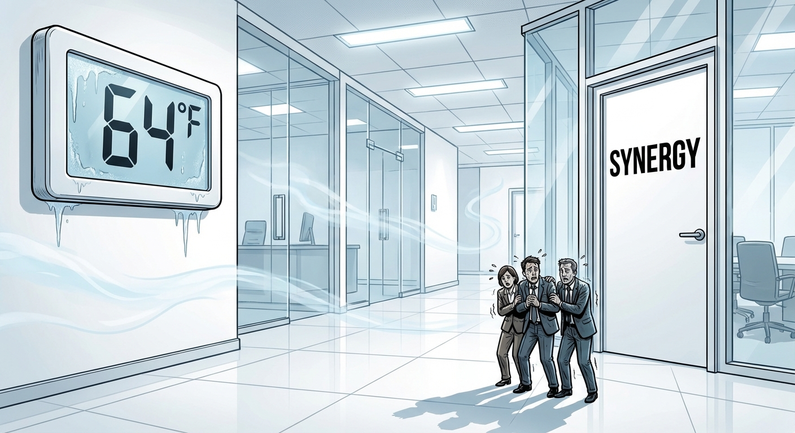

#### Setting: Unit 734 (The Retail Outlet)

**Prompt:** 

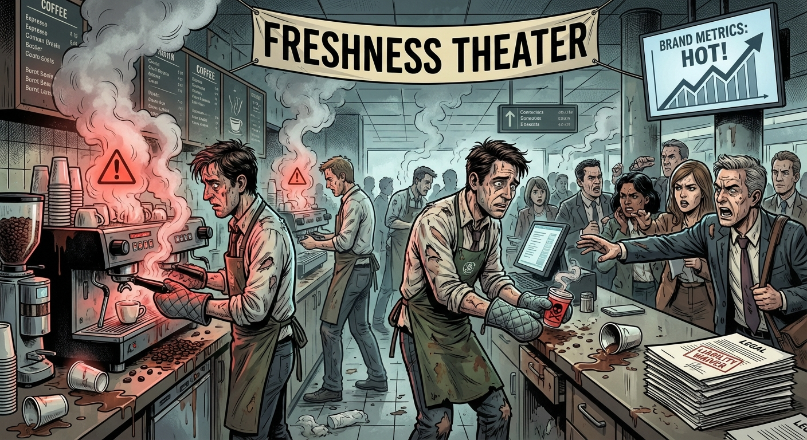

#### Character: Elias Thorne

**Prompt:** 

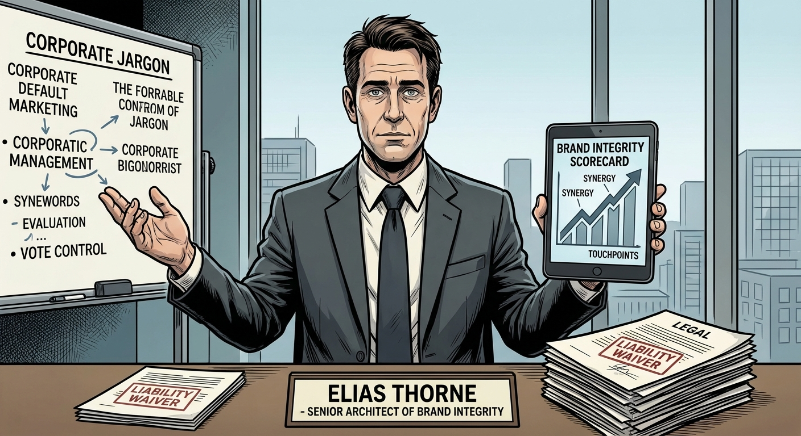

#### Character: Veronica Vane

**Prompt:** 

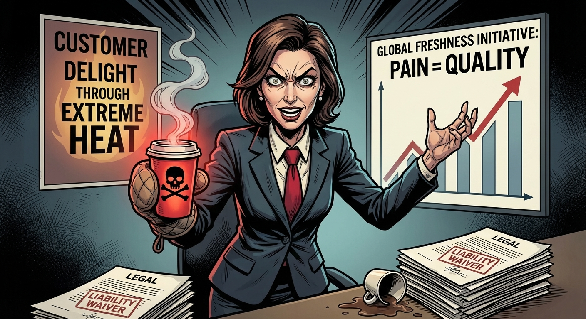

#### Character: Kevin

**Prompt:** 

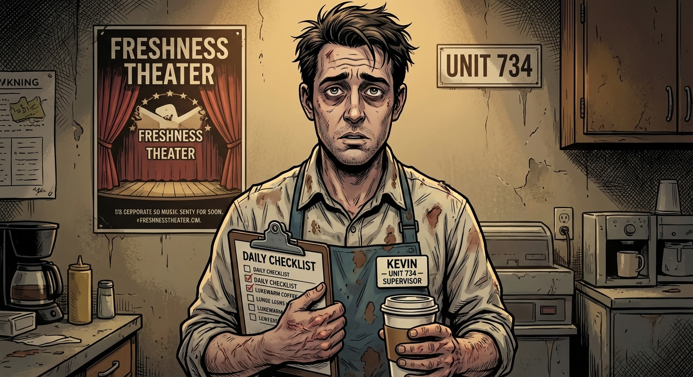

## ## The Thermodynamics of Delight

**Act 1, Scene 1**

**Setting:** The Apex (Corporate HQ)

**Characters:** Elias Thorne, Veronica Vane

---

The conference room at The Apex was kept at a preservation-grade sixty-two degrees, a temperature designed to keep biological assets alert and non-perishable. Yet, in the center of the obsidian table, the single matte-black cylinder radiated enough heat to distort the air above it.

Elias Thorne stared at the steam. It didn’t drift lazily; it shot upward in a violent, pressurized jet.

"Two hundred and five degrees," Veronica Vane said. She stood by the floor-to-ceiling window, her silhouette framed by the smog layer choking the city below. She turned, her smile tight and predatory. "We call it 'Thermal Vitality.'"

Elias adjusted his glasses, the only movement he allowed himself. "Veronica, water boils at two-twelve. You’re seven degrees shy of a physics experiment. This isn't a beverage; it’s a weaponized solvent."

"It’s *visceral*," Veronica corrected, tapping a manicured nail on the glass. "Focus groups suggest the current standard of one-eighty feels 'lukewarm' to the high-performance demographic. They want to feel the product. They want an awakening."

"They will feel third-degree burns," Elias said, his voice flat. He tapped his tablet, bringing up the actuarial tables. "The Liebeck precedent established liability for liquids served above one-ninety. You’re proposing we breach that threshold by fifteen degrees. The settlement payouts will eclipse Q3 revenue within a week. We’re talking dermal liquefaction, Veronica. Skin grafts as a line item."

Veronica waved a hand dismissively. "Pain is just sensory data, Elias. It’s engagement. If they aren't feeling it, they aren't drinking it. I need you to build the shield. How do we make the heat their fault?"

Elias looked at the cylinder again. He watched the heat waves warp the reflection of the overhead LEDs. He didn't care about the customers—meat sacks with wallets, as the board preferred to view them—but he cared about the elegance of a loophole.

"We rebrand," Elias murmured, his mind shifting gears from safety to liability mitigation. "If the product is sold as 'Coffee,' the expectation is consumption. If we sell it as an 'Extreme Thermal Experience,' the expectation is hazard."

He reached out. His index finger hovered millimeters from the cup’s surface. The heat was palpable, a physical weight against his skin.

"Go on," Veronica whispered.

"The Magma Protocol," Elias said. "We don't hide the heat. We fetishize it. Warning labels that look like achievements. Packaging that mimics volcanic rock. If the cup screams 'Danger,' then opening it becomes an act of implicit consent. We argue that the consumer knowingly engaged in a high-risk ritual for the sake of caffeine efficiency."

He pressed his finger against the ceramic.

For a second, the nerve endings screamed. It was a sharp, clarifying shock that cut through the numbness of the air-conditioned room. He pulled back, rubbing the reddened pad of his finger against his cool suit trousers.

"It hurts," Elias noted, his voice devoid of judgment.

"It wakes you up," Veronica countered.

"I’ll draft the waivers," Elias said. "We’ll need a font that looks like jagged obsidian."

---

**Word Count:** 495

**Key Moments:**
- The Reveal: Veronica unveils the coffee served at 205°F, rebranding the scalding temperature as "Thermal Vitality."
- The Objection: Elias cites the McDonald's legal precedent, noting that the temperature will cause "dermal liquefaction" and massive lawsuits.
- The Pivot: Veronica demands a legal shield, prompting Elias to shift from risk avoidance to risk engineering.
- The Solution: Elias proposes "The Magma Protocol"—using aggressive "Volcanic" branding to frame the drinking experience as a dangerous ritual, thereby shifting liability to the consumer via implicit consent.
- The Touch: Elias physically touches the superheated cup, accepting the pain as a necessary component of the corporate strategy.

**Character States:**
- **Elias Thorne:** Physically stung (minor burn on finger) but mentally stimulated. He has transitioned from a passive observer of risk to an active architect of harm, finding intellectual satisfaction in the legal loophole.
- **Veronica Vane:** Triumphant and energized. She has successfully bullied/seduced the legal department into validating her dangerous product vision.

**Status:** ✅ Complete

#### Act 1, Scene 1 Image

**Prompt:** 

## ## Friction Coefficients at Unit 734

**Act 1, Scene 2**

**Setting:** Unit 734 (The Retail Outlet)

**Characters:** Elias Thorne, Kevin

---

Unit 734 didn’t smell like coffee; it smelled of ozone, scorched dairy, and low-wage panic.

Elias Thorne stood amidst the lunch rush chaos, a laser pyrometer in hand. He aimed the red dot at the chrome throat of the prototype: The Vesuvius Mark IV. The machine didn't hum; it shuddered, emitting a sub-bass growl that rattled the teeth of anyone within a three-foot radius.

"It sounds angry," Kevin said. Kevin was twenty-two, wearing a visor too large for his head and the haunted look of a conscript.

"It’s pressurizing," Elias corrected, jotting a figure on his tablet. "Anger is a projection. The machine is simply achieving optimal thermal density."

Kevin locked a portafilter into the group head. The Vesuvius spat a jet of invisible, superheated steam. Kevin yelped, jerking his hand back as a bright red welt bloomed on his wrist.

Elias didn't look at the wound. He checked the stopwatch on his tablet. "Reaction time: 0.4 seconds. You spilled three milliliters of product. That’s a yield loss."

"It burned me!" Kevin cradled his wrist. "The steam guard isn't working."

"The guard is compliant," Elias said, tapping the pyrometer against his palm. "The issue is proprioception. The Magma Protocol requires the reflexes of a fighter pilot. We’ll update the training modules."

The queue of caffeine-deprived drones grew restless. Kevin shoved a 'Volcanic' cup—black with jagged red font—under the spout. The liquid hit the bottom with a heavy, oil-slick viscosity.

"Watch the structural integrity," Elias murmured.

As the cup filled, the wax lining surrendered. The cardboard bowed out like a hernia. Kevin tried to cap it, but the rim had gone malleable.

"It’s melting," Kevin whispered.

"Thermal load exceeds cellulose bonding limits," Elias noted. "We’ll need mandatory double-cupping."

Kevin slid the sagging cup to a woman in a grey suit. She grabbed it.

Two seconds later, she screamed.

The cup buckled, spewing 205°F sludge across her hands and shoes. She danced back, the liquid hissing against the linoleum, stripping the floor wax.

"Oh god!" Kevin grabbed a rag.

Elias didn't move. He aimed the laser at the puddle.

*198°F.*

"Excellent." A thin smile touched Elias’s lips. "Even after impact, it retained critical heat. The delivery system is viable."

"Viable?" Kevin shouted, tossing a wet towel over the mess. "She’s limping!"

"She’s engaged," Elias said, snapping his tablet shut. "Pain is the most memorable brand experience there is. The prototype is a success, Kevin. Authorize the global rollout."

---

**Word Count:** 406

**Key Moments:**
- Elias monitors the "Vesuvius Mark IV" prototype while Kevin expresses fear of the machine.
- Kevin is burned by escaping steam; Elias critiques his reaction time rather than the safety failure.
- The coffee cup begins to melt/deform due to the extreme heat of the liquid.
- A customer grabs the compromised cup, gets burned, and drops it; the coffee strips the floor wax.
- Elias confirms the liquid stayed hot enough to cause damage, deems the test a success, and authorizes the rollout.

**Character States:**
- **Elias Thorne:** Clinically satisfied. He has validated the "Magma Protocol" in the real world. He views the injuries and structural failures not as disasters, but as data points proving the product's potency.
- **Kevin:** Traumatized and physically injured. He is nursing a fresh burn and is horrified by the callousness of corporate leadership, realizing he is trapped in a dangerous environment.

**Status:** ✅ Complete

#### Act 1, Scene 2 Image

**Prompt:** 

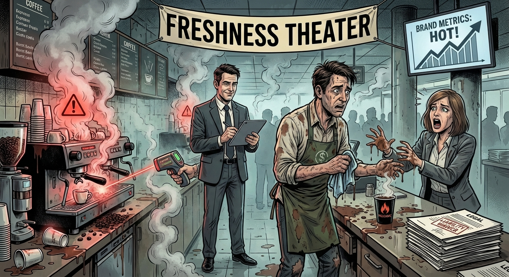

## ## The Melting Point of Compliance

**Act 2, Scene 1**

**Setting:** Unit 734 (The Retail Outlet)

**Characters:** Elias Thorne, Kevin, Mrs. Gable (Loyalty Tier 1 Customer)

---

Unit 734 didn’t just smell like coffee; it smelled like scorched ozone and imminent litigation.

The air conditioning, usually a dull roar, rattled in a desperate death rattle against the thermal output of the Vesuvius Mark V. The machine dominated the back counter—a chrome-plated altar to a vengeful god, radiating a heat shimmer that distorted the menu board behind it.

Elias Thorne stood by the condiment station, auditing the atmosphere on his tablet. *88°F indoors. Humidity: Amazonian.* He adjusted his tie. Discomfort was merely the physical manifestation of overhead.

"It’s melting the gaskets, Mr. Thorne," Kevin whispered. The barista was pressed against the far wall, as far from the machine as the narrow workspace allowed. His uniform—a synthetic blend designed for stain resistance, not human survival—was dark with sweat. "I can hear them screaming."

"That is the sound of high-pressure extraction, Kevin," Elias said, not looking up from his screen. "And please, step forward. Your body language suggests terror. The consumer smells terror. We want them to smell 'Volcanic Robusta.'"

"I *am* terrified," Kevin hissed, eyeing the Vesuvius. The machine gave a low, metallic groan, and a jet of steam shot horizontally from a relief valve, instantly scorching a poster advertising *'Summer Chillers.'* "It’s set to 212 degrees. Water isn't supposed to be pressurized at boiling in a unit with plastic tubing!"

"210 degrees at the dispense point," Elias corrected calmly. "We lose two degrees in the drop. It’s within the Magma Protocol’s acceptable variance. Besides, Legal has reclassified 'burns' as 'thermal engagement.' It’s a feature."

The door chime cut through the machinery’s low, threatening hum.

Enter Mrs. Gable. Elias clocked the demographic instantly: Loyalty Tier 1. Fixed income, high caffeine dependency, loneliness alleviated by transactional intimacy. She wore a heavy knit cardigan despite the kiln-like temperature of the shop, clutching her loyalty card like a holy relic.

"Good morning, Kevin," she chirped, oblivious to the barista’s trembling. She walked to the counter, her shoes tacking slightly to the floor wax that had softened in the heat. "Is it ready? The new blend?"

Kevin looked to Elias. Elias offered a single, micro-nod. *Execute.*

"Yes, Mrs. Gable," Kevin said, his voice fracturing. "The... uh... The Magma Roast. It’s very... bold."

"I like bold," she said, placing a five-dollar bill on the counter. "I like to know I’m drinking something."

Kevin approached the Vesuvius. He donned the new mandatory PPE: a pair of elbow-length, safety-orange silicone oven mitts. He centered a cup—double-walled, reinforced cardboard with a liability waiver printed in six-point font—under the spout.

He pressed the button marked *'ERUPTION.'*

The lights in the store flickered. The machine shuddered. A thick, viscous sludge churned into the cup. It didn't splash; it was too heavy to splash. It simply accumulated, roiling with dark, kinetic energy. Steam didn't rise from it so much as escape it.

Kevin capped it quickly, mitts fumbling, and slid it across the counter. "Careful. Please. It’s... active."

"Oh, Kevin, you always worry too much," Mrs. Gable tittered.

Elias watched intently. This was the data point. The legal theory in action.

Mrs. Gable didn't use a sleeve. She gripped the cup with bare, liver-spotted hands. Elias watched the heat transfer: her fingertips went white, then flushed a violent pink within three seconds.

"Ooh," she murmured, pupils dilating. "That is warm."

"Don't drink it yet," Kevin pleaded. "Let it vent."

"Nonsense." Mrs. Gable lifted the cup. The lid featured the new 'Flow-Restrictor,' designed to minimize lawsuits by limiting volume, which unfortunately concentrated the steam directly into the nasal cavity.

She tilted her head back. She took a sip.

Time suspended for Elias. He tracked the physiology of the event. He saw the exact moment the liquid—210 degrees of chemically aggressive bean water—hit the soft palate.

Mrs. Gable’s eyes bulged. Her hand spasmed, crushing the cup slightly, sending a rivulet of boiling coffee over her thumb. She didn't scream; she made a high-pitched, teakettle wheeze, the sound of air rushing over scalded vocal cords. Her entire body went rigid, a seizure of sensory overload. Tears instantly pooled and spilled down her cheeks.

Kevin covered his face with his oven mitts.

Mrs. Gable slammed the cup down. She gasped, mouth hanging open, steam literally drifting from her throat. Her tongue looked angry and red.

Silence hung heavy in the superheated air of Unit 734.

Then, she swallowed. She blinked through the pain tears, a strange, shock-induced glaze settling over her eyes. She looked at the cup with a mix of fear and reverence.

"It’s..." she rasped, her voice dropped an octave. "It’s... so fresh."

Elias felt a chill that had nothing to do with the temperature. He tapped his tablet. *Sensory Impact: High. Customer Satisfaction: Paradoxical.*

"You can feel the quality," Mrs. Gable whispered, touching her blistered lip. "Usually, the coffee is lukewarm. This... this makes you feel alive."

She equated pain with value. The tissue damage was proof of the product's potency. It was the ultimate triumph of branding over biology.

Elias stepped out of the shadows. He walked to the counter, looking at Kevin, who was staring at Mrs. Gable in horror.

"Kevin," Elias said, his voice smooth as glass. "Mrs. Gable is clearly enjoying the thermal vitality of the Magma Roast."

"She's crying," Kevin whispered.

"She's engaged," Elias corrected. He looked at the customer, then back to the barista. "She has just compromised her oral mucosa. She requires a soothing agent to balance the pH and temperature."

Elias pointed a manicured finger at the display case of frozen pastries.

"Upsell the Cryo-Scone, Kevin. Now."

Kevin looked at Elias, then at the suffering, smiling woman. The fight drained out of his shoulders. He slumped, defeated by the madness of the market.

"Mrs. Gable," Kevin said, his voice dead. "Would you like a... a Cryo-Scone? It pairs well with the... burning."

"Oh," Mrs. Gable wheezed, reaching for her wallet again with a trembling, red hand. "That sounds lovely. I am a bit peckish."

Elias checked the box on his screen: *Cross-Sell Conversion: Successful.*

"Excellent," Elias murmured to himself, watching the transaction. "The ecosystem is self-sustaining."

---

**Word Count:** 1013

**Key Moments:**
- The scene establishes the oppressive heat of the store and the terrifying nature of the "Vesuvius Mark V" machine, which is physically melting the gaskets.
- Mrs. Gable, a loyal customer, orders the new roast. Kevin serves it wearing industrial safety gear (oven mitts), highlighting the absurdity and danger.
- Mrs. Gable drinks the 210°F coffee. She experiences immediate, visible physical agony (tearing up, wheezing, blistering).
- Instead of complaining, Mrs. Gable interprets the pain as "freshness" and "quality," validating Elias's dark hypothesis about consumer conditioning.
- Elias forces Kevin to capitalize on the injury by upselling a frozen pastry ("Cryo-Scone") to soothe the burn, completing the cycle of creating a problem to sell a solution.

**Character States:**
- **Elias Thorne:** Clinically triumphant. He has moved from theoretical risk management to active manipulation. He feels no empathy, only the cold satisfaction of a hypothesis confirmed.
- **Kevin:** Broken. He has transitioned from anxiety to total despair. He realizes he is not just a barista, but an accomplice to battery, yet he is too powerless to stop it.
- **Mrs. Gable:** Physically damaged but psychologically hooked. She is in pain (burned mouth/hand) but experiencing a twisted endorphin rush, believing the injury is a sign of premium service.

**Status:** ✅ Complete

#### Act 2, Scene 1 Image

**Prompt:** 

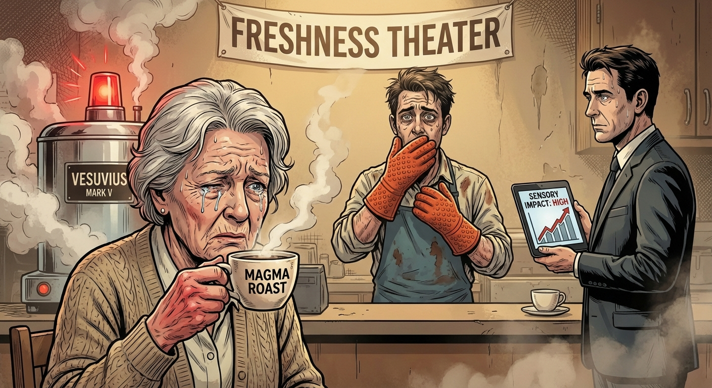

## ## Optimizing the Scream Index

**Act 2, Scene 2**

**Setting:** Conference Room Velocity (The Apex Corporate HQ)

**Characters:** Elias Thorne, Veronica Vane

---

Conference Room Velocity lived up to its branding. It was a wind tunnel of aggressive climate control and brushed steel, located on the forty-second floor of The Apex. The air didn't just smell clean; it smelled of ozone and ionized ambition. It was a frigid, sterile rebuke to the humid, coffee-scented trench warfare of Unit 734.

Veronica Vane stood before a wall-sized monitor, bathed in the glow of a jagged red line shooting upward at a nearly ninety-degree angle. She wasn't vibrating; she was humming, resonating with the specific, terrifying frequency of an executive who has just smelled blood in the water.

"Verticality, Elias," Veronica said, her voice tight with euphoria. She tapped the screen with a laser pointer, the red dot dancing like a nervous insect. "We aren’t just disrupting the morning routine; we’re violently dismantling it. Q3 projections are obsolete. We’re charting new physics here."

Elias Thorne sat at the long mahogany table, hands folded over a thick dossier. The leather of his chair was cold enough to sting through his shirt. He felt a phantom throb in his own hand, a sympathetic echo of the burns he’d watched Kevin sustain hours ago.

"It’s certainly violent," Elias said. He slid the dossier across the polished wood. It stopped inches from Veronica’s manicured fingers. "That’s the casualty report from the beta sites. Specifically, the dermal integrity data."

Veronica didn’t look down. "Casualty is such a legacy term. I prefer 'high-impact engagement.'"

"Veronica, three customers in the Tri-State area were hospitalized this morning," Elias said, leaning forward. "We have reports of esophageal blistering. One man dropped a cup on his foot and the liquid melted through his sneaker. It’s not coffee anymore. It’s weaponized broth."

Veronica finally turned, her smile unblinking. "And did they ask for a refund?"

Elias paused. The data was undeniable, and it was baffling. "No. Retention is at ninety-eight percent."

"Exactly." She began to pace, her heels clicking like gunfire on the marble floor. "Pain is the only thing that feels real to the modern consumer, Elias. Everything else is digital, ephemeral. But a blister? That’s a souvenir. That’s a memory. We aren’t selling a beverage; we’re selling a thermal event."

Elias rubbed his temples. The headache that had started in the store was now a permanent tenant behind his eyes. He looked at the screen again. The sales were undeniable. The morality was nonexistent. In the ecosystem of The Apex, the red line on the screen was the only god that mattered. If he tried to stop the train, he would simply be tied to the tracks.

He took a breath, the recycled air tasting of dust and surrender. He opened his internal mental ledger and moved his conscience into the 'sunk cost' column.

"The liability exposure is catastrophic," Elias said, but the tone had shifted. It was no longer a warning; it was a puzzle to be solved. "If we continue with the current warning labels, the class-action suits will bankrupt the division by Q4."

"So we settle," Veronica waved a hand dismissively.

"No," Elias said. He stood up, walking to the whiteboard. He picked up a marker. The smell of the solvent was sharp, toxic. "Settlements admit guilt. We need to reframe the injury."

He wrote three words on the board: *Waiver of Thermal Expectation.*

Veronica stopped pacing. She tilted her head, intrigued. "Go on."

"We’re treating the heat like a defect," Elias explained, cold logic hijacking his vocal cords. "We need to treat it like a feature. We don't warn them that it burns. We tell them that if it *doesn't* burn, it isn't the Magma Protocol."

He drew a box around the words. "We shrink the warning label. Micro-font, bottom of the cup, obscured by the heat sleeve. But on the sleeve itself, in bold, aggressive typography, we print a challenge."

"A challenge," Veronica whispered, eyes widening.

"‘Can You Handle the Magma Kiss?’" Elias proposed. A hollow pit opened in his stomach as the words left his mouth. "We rebrand the third-degree burns. It’s not an injury; it’s 'Thermal Acclimation.' It’s a badge of honor for the true coffee connoisseur. If they get burned, it’s not because the product is dangerous. It’s because they weren’t strong enough to drink it."

Veronica stared at him for a long moment. The silence in the room was heavy, pressurized. Then, a slow, predatory smile spread across her face.

"The Magma Kiss," she tested the words. "God, Elias. That’s beautiful. It shifts the liability to the consumer’s ego."

"Precisely," Elias said. He capped the marker. His hands were steady, but he couldn't feel his fingertips. "We make the waiver implicit in the purchase. By buying the cup, they agree that they are 'thermal-ready.' Any subsequent skin grafts are simply a failure of their own biological preparedness."

Veronica clapped her hands together, a sharp, violent sound in the quiet room. "Draft it. I want the new sleeves in production by midnight. We’re going to optimize the Scream Index, Elias. We’re going to monetize the flinch."

"I'll have legal draw up the language," Elias said. He picked up his dossier, which suddenly felt much lighter, emptied of all its moral weight.

"You’re a wizard, Elias," Veronica beamed, turning back to her graph, watching the red line climb higher into the stratosphere. "I knew you had the vision."

"Just doing the math, Veronica," Elias murmured.

He turned and walked out of Conference Room Velocity. The automatic doors hissed shut behind him, sealing the madness inside. The hallway was quiet and cold. Elias looked at his hand, flexing the fingers, checking to make sure they were still there. They were, but he couldn't shake the feeling that he had left something vital back in that room, something he would never get back.

---

**Word Count:** 963

**Key Moments:**
- Veronica Vane presents the sales data, celebrating the "verticality" of the profits while ignoring the physical toll on customers.
- Elias attempts to present the "casualty report," citing third-degree burns and melting shoes, calling the product "weaponized soup."
- Veronica reframes the injuries as "high-impact engagement," arguing that pain validates the reality of the product for numb consumers.
- Realizing he cannot stop the rollout, Elias pivots to liability management, proposing the "Waiver of Thermal Expectation."
- Elias rebrands the burns as "The Magma Kiss" and "Thermal Acclimation," shifting the blame to the consumer's lack of strength, effectively ending his moral resistance.

**Character States:**
- **Veronica Vane:** Ecstatic and manic. She feels validated and energized, viewing Elias's legal maneuvering as a stroke of genius that aligns perfectly with her predatory worldview.
- **Elias Thorne:** Hollow and detached. He has successfully performed his job by neutralizing the risk, but the act of weaponizing the legal language has left him feeling cold and morally empty. He has fully surrendered to the machine.

**Status:** ✅ Complete

#### Act 2, Scene 2 Image

**Prompt:** 

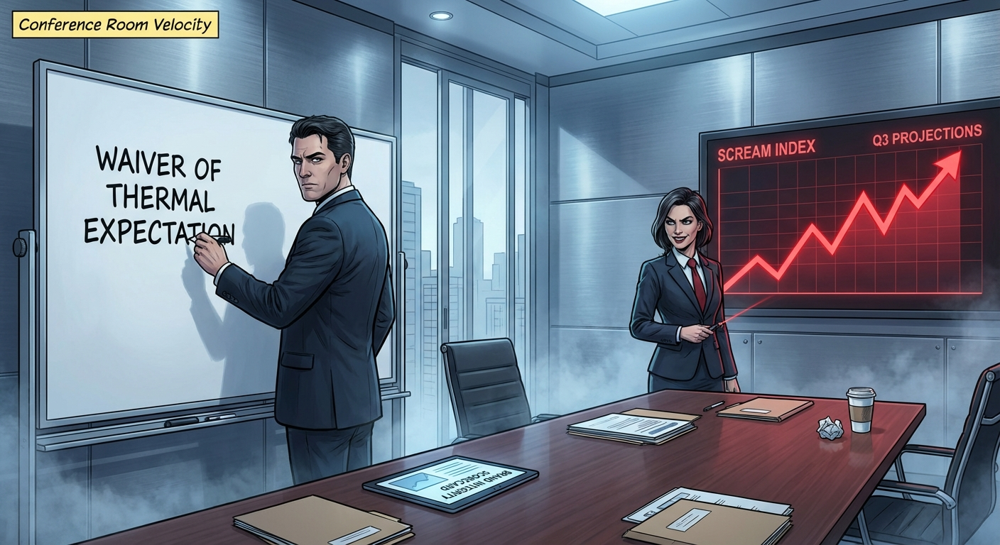

## ## The Sublimation Event

**Act 3, Scene 1**

**Setting:** Unit 734 (The Retail Outlet)

**Characters:** Elias Thorne, Veronica Vane, Kevin

---

Unit 734 did not smell like coffee anymore. It smelled like scorched ozone, melting polymer, and the distinct, copper tang of adrenaline.

Elias Thorne stood near the condiment station, which had been stripped of milk and sugar because, as Veronica had put it, "additives dilute the thermal integrity of the product." The air inside the shop was thick and wet, a localized tropical depression formed entirely by the steam venting from the Vesuvius Mark V espresso machine. The thermostat on the wall read eighty-eight degrees, but the humidity made it feel like the inside of a wet lung.

"It’s magnificent," Veronica Vane whispered. She stood beside Elias, immune to the heat in a razor-sharp white pantsuit that seemed to repel moisture by sheer force of will. She tapped her tablet with a manicured nail. "Look at the throughput, Elias. We are at Peak Thermal Output. The morning rush is literally boiling over."

Elias adjusted his tie. It felt like a garrote made of wool. "The HVAC system is failing, Veronica. The ambient temperature is violating OSHA standards for light industrial work."

"We aren't 'light industrial,'" Veronica corrected, her eyes fixed on the counter. "We are 'high-intensity retail.' Different bracket. Less red tape."

Behind the counter, Kevin was dying.

That was the only way Elias could categorize the barista’s movements. Kevin was no longer the nervous, chatty youth from a week ago. He was a component reaching the end of its rated lifecycle. He wore the new corporate-mandated PPE: a heavy, silver-lined apron that looked like it had been salvaged from a reactor core, and elbow-length silicone gloves that turned his hands into clumsy, orange lobster claws. His face was gray, slick with sweat, and his eyes were wide, unblinking voids.

The line of customers stretched to the door. They didn't look happy. They looked like pilgrims waiting for a painful sacrament. They shifted from foot to foot, checking their watches, desperate for the jolt.

"Next," Kevin croaked. His voice was a dry rattle, the sound of dead leaves skittering on pavement.

A man in a gray suit stepped up. "Vesuvius Roast. Black. Large."

"That’s the 'Magma Grande' now," Veronica whispered to Elias, a thrill in her voice. "Rebranding. It sounds more... geological."

Kevin turned to the machine. The Vesuvius Mark V was vibrating, a low-frequency hum that rattled the teeth of everyone in the room. Steam hissed violently from its seams. The pressure gauge was buried in the red zone, the needle trembling against the stop pin like a trapped moth.

"Watch the pour," Veronica said, grabbing Elias’s arm. "We’re testing the new Eco-Husk containment vessels today. One hundred percent biodegradable. They break down in a landfill within three days."

"Three days?" Elias watched Kevin wrestle a portafilter into the group head. "Veronica, the structural integrity of a corn-starch polymer at two hundred and twelve degrees is—"

"Cost-effective," she interrupted.

Kevin placed the cup under the spout. He hit the button.

The machine didn't pour; it ejected. A jet of black liquid, superheated and pressurized, shot into the cup. The liquid was dark, viscous, and roiling. It looked less like a beverage and more like crude oil harvested from the mantle of the earth.

Kevin turned back to the counter, holding the cup with his thick silicone claws. The customer reached out, his hand trembling slightly.

"Here is your..." Kevin started.

Then, physics took over.

The bottom of the Eco-Husk cup didn't leak. It didn't drip. It simply abdicated. The thermal shock of the boiling liquid against the thin, biodegradable wall caused an instantaneous structural failure. The cup sublimated. One second, it was a vessel; the next, it was a ring of cardboard in Kevin’s hand and a cloud of corn-scented vapor.

The coffee—sixteen ounces of weaponized fluid—dropped straight down.

It splashed across the counter and washed over Kevin’s left forearm, right above the silicone glove, where the skin was exposed.

There was no scream. Not immediately. The brain takes a moment to process catastrophic nerve damage. Kevin just stared at his arm. The skin turned an angry, vibrant red, then instantly blistered, the flesh retreating from the heat as if trying to escape the bone.

Steam rose from his arm.

"Fascinating," Veronica breathed. She wasn't looking at Kevin’s face. She was looking at the puddle on the counter. "Look at the viscosity, Elias. It’s not spreading. It’s holding its heat mass. That’s the proprietary lipid blend."

Then Kevin made a sound. It was a high, thin whine, like a dog that had been kicked, which escalated rapidly into a silent, gasping convulsion. His knees buckled. He slumped against the back counter, sliding down until he hit the floor, clutching his arm to his chest. His eyes rolled back.

The customer stared at the puddle of coffee, then at Kevin, then at Elias. "Hey," the customer said, his voice rising. "He dropped my drink. And... Jesus, is that skin?"

Elias moved.

The detachment that had plagued him for weeks vanished, replaced by the cold, hard operating system of Crisis Management. He didn't run; running implies panic. He strode. He intercepted the customer’s line of sight, blocking the view of the writhing barista with his own body.

"Sir," Elias said, his voice a smooth, baritone wall. "Please step back."

"He’s hurt!" the customer shouted, pointing around Elias. "That stuff burned him! It ate the cup!"

"You just witnessed a thermal stress test," Elias said, pulling a pre-printed card from his breast pocket. He pressed it into the man’s hand. "We are calibrating the machine for maximum freshness. The barista is a trained stunt actor simulating the effects of improper handling to demonstrate the importance of the cup sleeve."

"What?" The customer blinked, looking at the card. It was a voucher for a free Cryo-Scone.

"It’s a proprietary demonstration," Elias lied, his eyes dead and level. "You are part of a focus group. Congratulations."

"I... I just wanted a coffee," the man stammered, the reality of the situation bending under the weight of Elias’s absolute confidence.

"And you shall have one," Elias said. He grabbed a ceramic mug from the display shelf—one that wouldn't dissolve—and shoved it under the machine. He hit the button, watched the black sludge spew forth, and slammed it onto the counter. "On the house. But I need you to sign this acknowledgment that you witnessed the safety demo."

Elias produced a tablet from his jacket, already loaded with the 'Waiver of Thermal Expectation' he had drafted the night before.

The customer, confused and holding a free scone, tapped the screen. "Okay. Yeah. Okay."

"Excellent. Enjoy the Magma Kiss," Elias said.

He turned his back on the customer. Veronica was standing over Kevin, who was now rocking back and forth in a fetal position, clutching his arm. She was taking a photo of the spill on the counter with her phone.

"The retention is incredible," she murmured. "It’s still steaming, Elias. Two minutes post-pour."

"He needs an ambulance, Veronica," Elias said, his voice low.

"Don't be dramatic. It’s a superficial scald," she said, finally glancing at Kevin. She frowned, not with sympathy, but with annoyance. "Kevin, get up. You’re disturbing the brand experience. And you’re blocking the milk fridge."

Kevin looked up. His face was a mask of pure, distilled shock. He opened his mouth to speak, but only a dry click came out.

"Elias," Veronica said, turning away from the boy. "Make a note. The Eco-Husk needs a double lining. Or maybe we just market the cup failure as a 'race against time' feature. Drink it before it vanishes. Gamification."

Elias looked down at Kevin. He saw the raw, weeping burn on the boy's arm. He saw the terror in the kid's eyes. He saw the absolute failure of every safety protocol he had ever sworn to uphold.

"Gamification," Elias repeated, the word tasting like ash.

"Exactly," Veronica beamed, the humidity frizzing her hair into a halo of static. "Now, get him to the back. We have a line."

Elias reached down and grabbed Kevin by the shoulder of his uninjured arm. "Come on, Kevin," he whispered. "Let’s go to the freezer."

As he dragged the sobbing barista toward the back room, Elias looked back at the counter. The customer was sipping the coffee, wincing in pain, tears streaming down his face, but drinking it anyway.

---

**Word Count:** 1389

**Key Moments:**
- The Atmosphere: The scene establishes Unit 734 as a sweltering, dangerous environment where the machinery is pushed to the breaking point.
- The Cup Failure: The new biodegradable "Eco-Husk" cup instantly sublimates upon contact with the 212°F coffee, proving the product is physically unstable.
- The Injury: Kevin suffers a severe burn when the superheated liquid hits his arm, collapsing into shock.
- Veronica's Reaction: Veronica completely ignores the human cost, focusing instead on the "viscosity" and heat retention of the spilled liquid, viewing the injury only as an operational annoyance.
- Elias's Intervention: Elias intercepts the witnessing customer, gaslighting him into believing the accident was a "safety demonstration" and buying his silence with a free scone and a waiver.

**Character States:**
- **Kevin:** Physically traumatized and in shock. He has been reduced to a non-functioning object, unable to speak or stand, fully broken by the system.
- **Veronica Vane:** Manic and inspired. She is energized by the violence of the product, seeing the cup failure not as a disaster but as a data point for "gamification." She is completely devoid of empathy.
- **Elias Thorne:** Coldly efficient but internally hollowed out. He successfully managed the risk, but the act of covering up the injury has solidified his role as the villain's accomplice. He is no longer mitigating damage; he is hiding bodies.

**Status:** ✅ Complete

#### Act 3, Scene 1 Image

**Prompt:** 

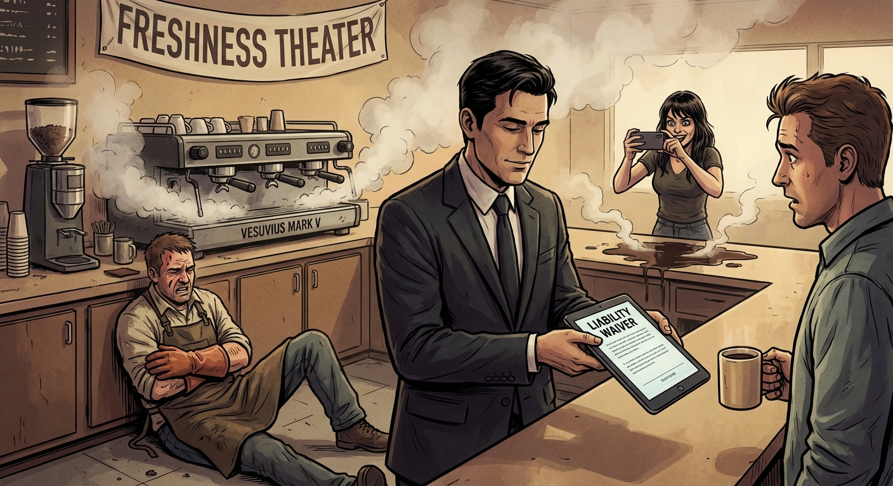

## ## The Phoenix Pivot

**Act 3, Scene 2**

**Setting:** The Apex (Corporate HQ) – Conference Room "Velocity"

**Characters:** Elias Thorne, Veronica Vane

---

Conference Room "Velocity" was designed to induce anxiety. The walls were floor-to-ceiling smart-glass, currently hemorrhaging red light as the company’s stock plummeted in real-time. The jagged line tracked the market’s panic, bleeding down the transparency and casting the room in the color of a warning flare.

On the central holotable, the footage played on an infinite loop. It was shaky cell phone video from Unit 734. In high definition, Kevin’s scream wasn't just a sound; it was a texture—a jagged tear in the room’s acoustic dampening. The footage showed the Eco-Husk cup dissolving, the superheated sludge coating the barista’s arm, and the subsequent collapse.

"Twelve million views, Elias," Veronica Vane said. She was vibrating, her heels clicking a frantic staccato on the polished concrete. "Twelve million. The hashtag #FaceMelter is trending above the presidential election. Legal is hyperventilating. They’re talking about a recall. A *total* recall."

Elias Thorne sat at the head of the table, hands folded over a pristine notepad. He watched the video again. He watched himself in the background of the frame, dragging Kevin away like a sack of wet laundry. He looked remarkably calm in the footage. He felt remarkably calm now.

"Turn it off," Elias said. His voice was flat, a dead weight against the room's frantic energy.

Veronica swiped her hand through the air. The screaming Kevin vanished, replaced by the silent, rotating logo of the Magma Protocol. "They’re calling it negligence, Elias. They’re calling it battery."

"Only because we’re letting them define the vocabulary," Elias said, standing up. He walked to the window, looking out at the smog-choked skyline. "You see liability. I see leverage."

Veronica stopped pacing. "Elaborate. Fast."

Elias turned, his reflection ghosting against the city lights. "Why do people climb Everest, Veronica? Why do they eat fugu that could paralyze them? Why do they buy cars that go two hundred miles an hour in a school zone?"

"Status," she breathed.

"Danger," Elias corrected. "In a world where everything is padded, sanitized, and child-proofed, safety is a sedative. Safety is for the poor. Danger is a luxury good."

He tapped the smart-glass, erasing the plummeting stock graph. With a few rapid strokes of his digital stylus, he wrote two words: *THE CHALLENGE.*

"We don't apologize," Elias said, the strategy assembling itself in his mind like the tumblers of a lock falling into place. "We don't recall. We lean in. The cup didn't fail, Veronica. The cup *surrendered*. The Eco-Husk structure couldn't contain the raw power of the Magma blend. It wasn't a defect; it was a demonstration of thermal superiority."

Veronica’s eyes widened. The panic began to recede, replaced by a sharp, predatory glimmer. "Go on."

"We rebrand the melting cups immediately," Elias continued, his voice gaining a hypnotic cadence. "It’s not a design flaw. It’s the 'Molten Series.' A limited-time engagement. The cup is a timer. You have three minutes to consume the product before the vessel yields to the heat. If you can’t handle it, you aren't ready for the Magma lifestyle."

"And the burns?" Veronica asked, gesturing to the empty air where the video had been. "The screaming?"

"Proof of life," Elias said. "We implement a mandatory digital waiver at the point of sale. We call it the 'Magma Challenge.' To buy the coffee, you have to sign a release acknowledging that the beverage is 'industrially volatile.' We frame the waiver not as legal protection, but as a velvet rope. By signing, they aren't victims; they’re initiates."

The room fell silent, save for the low hum of the servers cooling the building. Veronica stared at the words on the glass. Slowly, a smile stretched across her face—sharp, terrifying, and utterly corporate.

"It shifts the narrative from corporate negligence to consumer weakness," she whispered, awestruck. "If you get burned, it’s because you weren't strong enough."

"Precisely," Elias said. "We aren't selling coffee anymore. We're selling the survival of it."

Veronica tapped her earpiece, connecting to the Board. "Override the recall," she commanded, her voice dripping with authority. "Initiate the Phoenix Pivot. Upload the waiver to all POS terminals globally. Push the press release: *'Can You Beat the Heat?'*"

She listened for a moment, eyes locked on the stock ticker. The red line hesitated, flattened, and then—as the press release hit the wires—began to tick upward. The algorithm loved audacity.

"They bought it," Veronica said, looking at Elias with something approaching professional lust. "You cold son of a bitch. You actually saved it."

Elias sat back down, adjusting his cuffs. "It’s just risk management."

"Speaking of management," Veronica said, swiping a notification away on her tablet. "HR wrapped up the loose end. The employee from the video—Kevin?"

"What about him?" Elias asked. He felt a phantom sensation of heat on his own arm, a memory of the steam rising off the boy’s skin.

"Terminated. Effective immediately," Veronica said breezily. "Gross mishandling of thermal assets. He violated safety protocols by allowing the liquid to make contact with his epidermis. We’re fighting his unemployment claim on the grounds of willful incompetence."

Elias stared at his notepad. He drew a perfect circle. Then, with a single, heavy stroke, he bisected it. Kevin was gone. Erased. The boy was just another melted cup.

"Good," Elias said. The word tasted like copper. "He was a liability."

A chime sounded from Elias’s phone. He glanced down. A notification from Payroll.

*PERFORMANCE BONUS: PROCESSED.*

The number was staggering. It was enough to pay off his mortgage. Enough to buy a boat. Enough to insulate him from the world forever.

"You look tired, Elias," Veronica said, gathering her things, energized by the victory. "Go get a coffee. On the house. Try the Molten Series. I hear it’s killer."

"I think I will," Elias said.

He sat alone in the conference room as Veronica left. The stock ticker was green now, climbing vertically, the room bathed in the emerald light of profit. Elias looked at the bonus notification again. He waited for the guilt to hit him, for the shame to curdle in his gut. He waited to feel sorry for Kevin, or horrified by what he had just unleashed on the public.

He felt nothing. Absolutely nothing.

He was just ambient temperature.

---

**Word Count:** 1034

**Key Moments:**
- The scene opens with a viral video of Kevin’s injury causing a stock market drop and legal panic.
- Elias argues that safety is boring and danger is a luxury, convincing Veronica to pivot from apology to aggression.
- Elias proposes the "Magma Challenge" and the "Molten Series," turning the melting cups into a "timer" and the burns into a test of consumer strength.
- The Board approves the pivot, and the stock market immediately recovers as the narrative shifts from negligence to exclusivity.
- Veronica reveals Kevin has been fired for "mishandling thermal assets," and Elias receives a massive bonus, feeling completely emotionally hollow.

**Character States:**
- **Veronica Vane:** Ends the scene in a state of euphoric triumph. She has moved from anxiety to predatory excitement, viewing Elias with deep admiration for his ruthlessness.
- **Elias Thorne:** Ends the scene in a state of total dissociation. He has successfully protected the company and enriched himself, but he has severed his last tie to his own humanity. He feels "ambient temperature"—neither good nor bad, just empty.

**Status:** ✅ Complete

#### Act 3, Scene 2 Image

**Prompt:** 

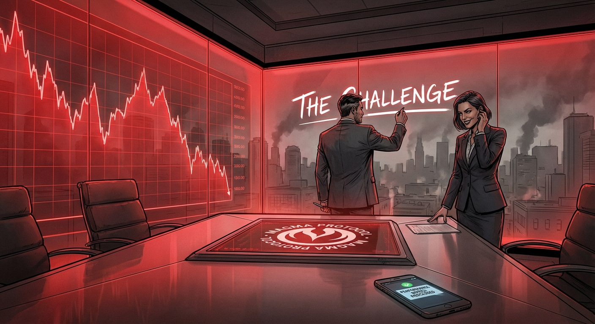

## Final Statistics

- Total Scenes: 6
- Total Word Count: 5300
- Time: 768.935s

