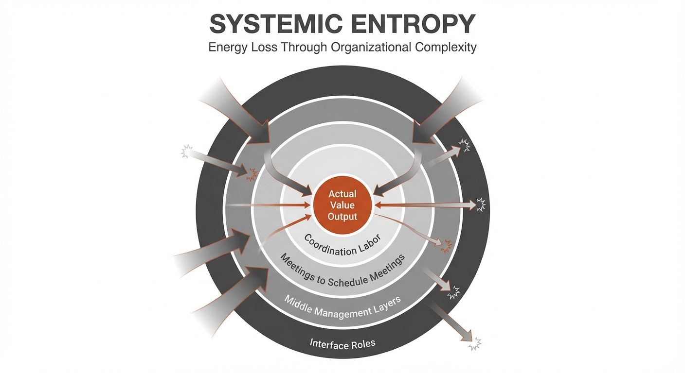
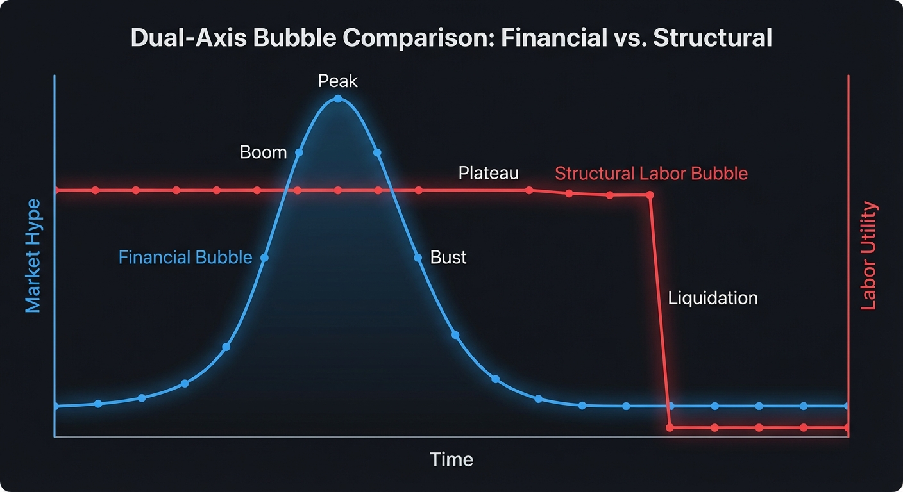

# The Great Labor Bubble: AI as a Liquidation Event

The prevailing narrative surrounding Artificial Intelligence focuses on incremental productivity gains—the "copilot" for
every worker. This perspective misses the structural reality: we are currently living through the terminal phase of a
multi-decade labor bubble. For years, systemic inefficiencies, administrative bloat, and "bullshit jobs" have been
sustained by cheap capital and legacy organizational structures.

AI is not a productivity multiplier for legacy workflows; it is a solvent that dissolves them. It acts as a liquidation

mechanism, exposing and stripping away roles that provide no fundamental value, forcing a brutal but necessary
recalibration of the global economy. This is not a transition; it is a reckoning. We are moving from an era of labor
hoarding and performative productivity into a period of analytical realism, where the true cost of human-in-the-loop
systems is finally being accounted for.

## The Anatomy of the Bubble

The labor bubble is not a single phenomenon but the convergence of three distinct structural forces that have decoupled
employment from actual value creation.

### 1. Systemic Entropy: The Complexity Tax

Modern organizations have become victims of their own scale. As systems grow, they require an exponential increase in
coordination labor—meetings to schedule meetings, managers to manage managers, and layers of "interface" roles that
exist solely to translate information between silos. This is systemic entropy: a state where the majority of an
organization's energy is spent on internal maintenance rather than external output. In this environment, labor is
hoarded not for its productivity, but as a buffer against the friction of complexity.

### 2. Regulatory Capture and the Credential Ponzi

The "Credential Ponzi" describes the feedback loop between higher education and the labor market. As the supply of
degrees increases, employers raise credential requirements for roles that do not fundamentally require them, creating an
artificial floor for entry. This has created a "Stranded Asset" problem: millions of workers hold degrees that no longer
generate a return on the cost of their acquisition, as AI decouples the "proof of work" from the "ability to do work." This is reinforced by regulatory capture, where professional licensing and compliance
mandates serve as moats, protecting legacy roles from automation. This system forces individuals into massive debt to
acquire "signals" of competence, while the actual utility of the work remains stagnant.

### 3. The Sociological Function: Employment as Social Control

Beyond economics, the labor bubble serves a profound sociological purpose. Employment is the primary mechanism for
social integration and resource distribution in the modern state. Maintaining high employment levels—even in "bullshit
jobs"—is a matter of political stability. The bubble is sustained by a collective, unspoken agreement that it is better
to pay people to perform redundant tasks than to face the social upheaval of mass disintermediation. Work, in this
context, is less about production and more about the management of human time and attention.

## The Human API and the AI Catalyst

The most pervasive yet invisible component of the labor bubble is the "Human API." For decades, organizations have
relied on humans to act as the connective tissue between incompatible software systems, legacy databases, and fragmented
workflows. These individuals do not produce original value; they function as biological adapters, manually translating
data from one format to another—copying information from a spreadsheet into a CRM, summarizing email threads for a
dashboard, or reconciling reports across departments.
Middle management, in particular, has evolved into a massive layer of human APIs. Their primary function is often the
aggregation and filtering of information as it moves up and down the corporate hierarchy. They are the "glue" that holds
together inefficient processes that were too complex or too expensive to automate with traditional, rigid software.

We are moving from Graphical User Interfaces (GUIs) designed for humans to Language User Interfaces (LUIs) designed for
agents. This allows for the "Refactoring of Org-Code"—redesigning workflows where the default path is automated, and humans are only invoked for high-variance exceptions. AI agents function as the universal solvent for this organizational glue. Unlike previous waves of automation that
required structured data and predefined rules, Large Language Models (LLMs) can navigate the ambiguity of legacy
systems. They can read unstructured text, interpret intent, and execute actions across disparate interfaces with the
same flexibility as a human, but at a fraction of the cost and near-infinite scale.
When the "Human API" is replaced by a digital one, the justification for entire departments vanishes overnight. This is
the "Liquidation Event": the moment when the hidden costs of human-in-the-loop systems are exposed by a cheaper, faster,
and more reliable alternative. The bubble pops because the "glue" is no longer necessary to keep the machine running;
the machine can now talk to itself.

## Case Study: The Recruitment Industry

The recruitment industry serves as a perfect microcosm of the labor bubble—a multi-billion dollar sector built almost
entirely on "complexity maintenance." In sectors like Tech, Finance, and Pharma, the "Hiring Industrial Complex" has
evolved into a massive, self-sustaining layer of friction that AI is now rapidly dissolving.

### Recruitment as Complexity Maintenance

For decades, recruitment has functioned as a high-cost "Human API." Its primary purpose is often not to find
talent—which is increasingly visible via digital footprints—but to manage the noise generated by the "Credential Ponzi."
Recruiters act as manual filters, moving resumes between incompatible databases, conducting "vibe check" screenings, and
coordinating schedules. This is the definition of complexity maintenance: a role that exists only because the systems
for matching talent to tasks are intentionally fragmented and inefficient.

### The Collapse of the Hiring Industrial Complex

In high-margin industries, the cost of hiring a single mid-level employee can exceed $30,000 in agency fees or months of
internal HR overhead. This "Hiring Industrial Complex" is being liquidated by three AI-driven shifts:

1. **Automated Sourcing and Vetting:** AI agents can now perform deep-web sourcing and technical vetting at a scale and
   precision impossible for human recruiters. They don't just keyword-match; they analyze code repositories, research
   papers, and past performance data to predict fit.
2. **The End of the "Vibe Check":** LLM-driven interviewers can conduct initial screenings that are more objective,
   consistent, and data-rich than a human phone call. This removes the "Human API" from the most labor-intensive part of
   the funnel.
   This triggers the "Arms Race of Noise": candidates use AI to generate thousands of hyper-optimized resumes, while HR
   uses AI to filter them. The result is a deadlock that renders the traditional resume obsolete, forcing a shift toward verifiable "Proof of Work" and "Atomic Credentialing."
4. **Disintermediation:** As AI enables the "Sovereign Individual" and smaller, hyper-efficient teams, the need for
   massive, centralized HR departments vanishes. The "complex" is bypassed as AI-native platforms match talent to tasks
   with zero human intervention.
   The recruitment bubble is popping because the "glue" it provided—the manual coordination of human capital—has been
   commoditized by zero-marginal-cost inference. What was once a high-margin service industry is being exposed as a
   legacy tax on organizational growth, a "bullshit sector" that AI is liquidating in real-time.
### Sector Liquidation: Tech, Finance, and Pharma
The impact of this liquidation varies across sectors, targeting their specific moats:
*   **The Tech Industry:** The "Hiring Industrial Complex" in tech was built on volume and keyword matching. AI agents
    now perform deep-web sourcing and technical vetting (e.g., analyzing GitHub commits) at a scale impossible for human
    recruiters. As AI allows a team of 3 engineers to do the work of 30, the volume of hiring collapses, destroying the
    business model of agencies built on headcount growth.
*   **Financial Services:** This sector relies on "Credential Inflation" and the "Analyst Pyramid." AI excels at the
    Excel/PowerPoint "Human API" work usually done by junior analysts. As the bottom of the pyramid is automated, the
    massive recruitment machinery designed to fill those seats becomes obsolete, shifting the focus from pedigree to
    verifiable performance.
*   **Pharma and Medical:** Here, the moat is compliance. AI agents can instantly cross-reference global databases for
    licenses, publications, and regulatory history—tasks that previously took humans weeks. This allows hiring managers
    to interface directly with the "Genuinely Skilled," bypassing the coordination overhead of traditional HR.

## The Two-Bubble Distinction

To understand the current era, one must distinguish between two simultaneous but fundamentally different phenomena: the
**Financial AI Bubble** and the **Structural Labor Bubble**. Confusing the two leads to a dangerous complacency, where a
market correction in tech stocks is misinterpreted as a reprieve for the labor market.

### The Financial Bubble: Cyclical Hype

The Financial AI Bubble is a classic speculative cycle. It is characterized by astronomical valuations for chipmakers,
massive venture capital inflows into "wrapper" startups, and a "gold rush" mentality among enterprise buyers.

* **Key Metrics:** GPU supply-demand imbalances, P/E ratios of semiconductor companies, and the volume of seed-stage AI
  funding.
* **The Outcome:** Like the Dot-com bubble of 2000, this bubble will likely burst. Companies with no path to
  profitability will collapse, and the "hype" will subside. However, just as the 2000 crash didn't stop the internet
  from transforming society, an AI market correction will not stop the automation of labor.

### The Structural Bubble: Permanent Liquidation

The Structural Labor Bubble is the multi-decade accumulation of "Human API" roles and systemic entropy described
earlier. This is not a market cycle; it is a technological phase shift.

* **Key Metrics:** The unit cost of cognitive task execution, the ratio of administrative overhead to revenue, and the "
  Time-to-Integration" for cross-platform workflows.
* **The Outcome:** This bubble does not "burst" and then recover; it is liquidated through "Cognitive Deflation." Once an AI agent can perform the
  function of a middle manager or a data entry clerk at 1/100th of the cost, that role is permanently demonetized.
  The danger lies in the "False Recovery" narrative. If the Financial Bubble pops and AI stocks tumble, many will assume
  the "AI threat" was overblown and that their jobs are safe. This is a category error. A stock market crash does not
  make an LLM less capable of writing code, processing insurance claims, or managing logistics. The financial bubble is
  about *valuation*; the structural bubble is about *utility*. The former is temporary; the latter is terminal.

## The Friction of Reality

While the liquidation of the labor bubble is structurally inevitable, it is not instantaneous. Several counter-forces
act as "friction," slowing the transition and providing a false sense of security to those within the bubble. However,
these are not permanent barriers; they are temporary bottlenecks that will eventually be bypassed or overcome.

### 1. The Energy Hard Cap

The most immediate physical constraint is the massive power requirement of frontier AI models. The transition from human
cognitive labor to silicon-based computation requires a commensurate shift in energy infrastructure. Grid capacity, chip
manufacturing lead times, and the cooling requirements of massive data centers create a physical "speed limit" on the
deployment of AI agents. This creates "Compute Inequality," where only high-margin labor is liquidated, while low-margin
labor remains "protected" by the high cost of the electricity required to replace it. This energy cap provides a temporary reprieve for human labor, but it is a race against time as
investment pours into nuclear modular reactors and more efficient inference architectures.

### 2. The Regulatory Maginot Line

Governments and legacy institutions are attempting to build a "Regulatory Maginot Line"—a series of legislative hurdles,
licensing requirements, and "AI safety" mandates designed to protect existing employment structures. Like its namesake,
this line is static and easily bypassed. While regulations may slow the adoption of AI in highly regulated sectors like
law or medicine, they cannot stop the global arbitrage of intelligence. If a task can be performed by an AI agent in a
more permissive jurisdiction, the economic pressure to adopt that efficiency will eventually render local prohibitions
obsolete.

### 3. Model Collapse and the Data Moat

There is a growing concern regarding "Model Collapse"—the idea that as AI-generated content floods the internet, future
models trained on this synthetic data will degrade in quality. This is "Digital Soil Depletion." Without a constant
infusion of expensive, energy-intensive human creativity, AI utility decays. Critics argue this creates a "data moat" that protects
human-generated value. In reality, this is a technical hurdle, not a structural wall. High-quality, human-curated
datasets and synthetic data refinement techniques are already being developed to circumvent this. The "friction" of
model collapse is a temporary engineering challenge, not a permanent safeguard for the human-in-the-loop.
These frictions create a "lag" between the technological capability and the economic reality. This lag is dangerous
because it encourages complacency, allowing the labor bubble to persist slightly longer even as its foundations have
already been liquidated.
Furthermore, these physical constraints may lead to **"Compute Inequality,"** where only high-margin labor is liquidated
initially, while low-margin labor remains "protected" by the high cost of the electricity required to replace it. This
is not a reprieve, but a stay of execution.

## Short Signals: Profiting from Denial

The terminal phase of any bubble is characterized by "Unstable Games"—desperate, often irrational behaviors by legacy
incumbents to preserve a status quo that has already been structurally undermined. For the astute observer, these
behaviors are not just signs of decay; they are "Short Signals"—clear indicators of where value is being destroyed and
where arbitrage opportunities exist.

### 1. Corporate "AI-Washing" and Capital Misallocation

Many corporations are currently engaged in a performative embrace of AI while doubling down on the very structures AI is
designed to liquidate. They announce "AI initiatives" to boost stock prices while simultaneously increasing
middle-management headcount or engaging in massive stock buybacks instead of fundamental R&D.

* **The Signal:** A company that mentions "AI" fifty times in an earnings call but shows no reduction in administrative
  overhead or "Human API" roles.
* **The Arbitrage:** Shorting legacy firms that use AI as a veneer for business-as-usual, while longing lean, AI-native
  competitors that operate with 1/10th the staff.

### 2. Bureaucratic Bloat as a Survival Mechanism

In government and large-scale bureaucracies, the response to automation is often the "Expansionary Pivot." When a
process becomes 90% more efficient due to AI, the bureaucracy does not shrink; it invents new layers of "oversight," "
compliance," and "ethics committees" to absorb the surplus time and budget.

* **The Signal:** The creation of new departments dedicated to "managing the transition" or "regulating the algorithm"
  within organizations that have failed to modernize their core functions.
* **The Arbitrage:** Betting against jurisdictions and institutions that prioritize labor-hoarding over efficiency, as
  they will eventually be outcompeted by "Sovereign Jurisdictions" that embrace lean, automated governance.

### 3. The University "Credential Escalation"

As the utility of traditional degrees collapses in the face of AI-driven skill acquisition, universities are doubling
down on the "Credential Ponzi." They are launching increasingly specialized (and expensive) master's programs for roles
that AI will automate before the first cohort graduates.

* **The Signal:** The proliferation of "AI Management" or "Digital Transformation" degrees that focus on legacy
  organizational theory rather than technical leverage.
* **The Arbitrage:** Investing in alternative credentialing, peer-to-peer learning networks, and "Proof of Work"
  platforms that bypass the university system entirely.

### 4. Political Protectionism: The "Robot Tax" Fallacy

Politicians, fearing the social upheaval of the "Liquidation Event," are increasingly proposing "Robot Taxes" or "Job
Guarantees." These are attempts to tax productivity to subsidize obsolescence. While they may provide temporary
political stability, they create a massive economic drag.

* **The Signal:** Legislative efforts to mandate "human-in-the-loop" requirements for tasks where humans add no value,
  or the implementation of taxes specifically targeting automation.
* **The Arbitrage:** Moving capital and talent to "Automation Havens"—regions that incentivize AI deployment and focus
  on UBI or wealth redistribution models that don't require the pretense of "bullshit jobs."
### 5. The Recruitment "Volume Illusion"
*   **The Signal:** External agencies and platforms pretending the hiring slowdown is cyclical (interest rates) rather
    than structural. They encourage candidates to "blast" resumes while companies maintain "talent pipelines" for a
    rebound that isn't coming.
*   **The Arbitrage:** Betting against the HR-tech and recruitment sectors that rely on high-volume churn, as AI reduces
    the total headcount required for organizational growth.
  These Unstable Games are the death rattles of the labor bubble. They represent a massive mispricing of reality.
  Profiting from this denial requires the courage to bet against the "consensus of the comfortable" and align oneself
  with the structural inevitability of the liquidation.

## The Barbell Future

As the middle-ground of "Human API" roles and administrative bloat is liquidated, the economy will bifurcate into two
distinct extremes. This is the "Barbell Future," where value is concentrated at the ends of the spectrum, and the
center—the traditional white-collar middle class—is hollowed out.

### 1. The Sovereign Individual: Extreme Automation

On one end of the barbell is the rise of the Sovereign Individual. These are hyper-efficient, small-scale entities (
often individuals or tiny teams) that leverage AI to perform the work that previously required hundreds of employees. By
utilizing "Permissionless Leverage"—AI agents for coding, marketing, legal analysis, and operations—these individuals can maintain near-zero
overhead while capturing massive upside.
*   **Key Driver:** *Permissionless Leverage.* Using code, content, and AI agents to build products or services that
    scale infinitely without a corresponding increase in headcount.

### 2. High-Trust and Physical Accountability

On the other end of the barbell are roles that AI cannot easily replace: those requiring high-trust, physical presence,
or ultimate accountability. You cannot "prompt" a surgeon or a plumber to take the legal and physical liability for a high-stakes outcome. This includes high-end craftsmanship, specialized physical services, and roles where "skin
in the game" is the primary value proposition. When the marginal cost of digital output drops to zero, the premium on
human accountability and physical reality increases. We will see a return to the "Master-Apprentice" model in
specialized trades and a renewed emphasis on local, high-trust networks where reputation is the only currency that
cannot be forged by a model.
*   **Key Driver:** *Skin in the Game.* Roles where the professional takes personal, moral, or legal responsibility for
    a high-stakes outcome—something an AI cannot do.

## Conclusion: The Great Capital Reallocation

The popping of the labor bubble is not a cyclical crisis; it is a structural liquidation that triggers a massive
reallocation of capital. We are witnessing the "Great Unbundling" of the university and the corporation, as the historical
promise of potential is replaced by the immediate utility of automated output. Wealth is migrating from labor-heavy, legacy organizations—burdened by systemic entropy and
the "Human API"—to capital-efficient, AI-native entities and the infrastructure that powers them.
Navigating this transition requires a "Barbell Approach" to capital and career allocation. On one side, one must invest
in or build the "picks and shovels" of the new era: the energy, compute, and algorithmic leverage that drives
automation. On the other side, one must double down on the irreducibly human: physical assets, high-trust relationships,
and roles where accountability cannot be outsourced to a machine.
The Great Labor Bubble was essentially a bubble of anonymity. In a large corporation, one could hide within the process.
AI is a liquidation event because it makes "hiding" impossible. The future value of humanity lies not in the process—
which is now free—but in intent, accountability, and physical presence.
The liquidation event is already underway. The choice is no longer whether to participate, but where on the barbell you
will stand when the center finally gives way.