# Software Design Document: Relational Harm Dynamics (RHD) Framework

**System:** A systemic ethics engineering platform designed to replace traditional intent-based moral auditing with a predictive, impact-focused model. The system implements the 'Moral Field Equation' to monitor structural violence, calculate real-time harm gradients, and provide 'Operator Replacement' tools for power-analysis. It models institutions as biological agents and prioritizes the maximization of subject autonomy (Voluntariness, Comprehension, and Power Symmetry) to dampen institutional power density and eliminate structural harm.

**Generated:** 2026-02-16 15:23:09

---


Input Context Data

### Prior Task Context


### Input File Context


## Use Cases & Actors

# Relational Harm Dynamics (RHD) Framework: Use Case Documentation

## 1. Actor Identification

| Actor | Type | Description | Goals |
| :--- | :--- | :--- | :--- |
| **Subject** | Human | The individual (patient, citizen, child) interacting with the institution. | Maximize personal autonomy; minimize exposure to structural violence. |
| **Institutional Architect** | User | The engineer or policy designer responsible for system protocols. | Design systems with low power density and high voluntariness. |
| **Ethical Auditor** | User | The agent monitoring the harm derivative ($dH/dt$) and predictive metrics. | Identify emerging harm gradients before they manifest as trauma. |
| **Regulatory Body** | User/System | The entity with the authority to dismantle or restructure institutions. | Enforce RHD metrics; break up monopolies of legitimacy. |
| **Telemetry System** | External System | Biometric, economic, or social sensors providing subject-side data. | Provide objective, non-institutional data on subject state. |
| **Neo4j Graph Engine** | Internal System | The graph database managing power density relationships. | Map complex institutional dependencies and "Operator" nodes. |

### Actor Relationships
- **Subject** provides the primary telemetry that overrides **Institutional** self-reporting.
- **Ethical Auditor** monitors the **Institutional Architect's** designs.
- **Regulatory Body** acts upon the reports generated by the **Ethical Auditor**.

---

## 2. Use Case Catalog

### UC-101: Model Institutional Power Density
- **UC-ID:** UC-101
- **Primary Actor:** Institutional Architect
- **Preconditions:** Access to institutional hierarchy data and resource flow maps.
- **Main Success Scenario:**
    1. Architect inputs the institutional node structure into the RHD Neo4j interface.
    2. Architect defines resource dependencies (financial, legal, physical).
    3. System calculates the **Power Density Index (PDI)** based on node centrality.
    4. System identifies "Bottleneck Nodes" where subject autonomy is most restricted.
    5. Architect receives a visualization of the power gradient.
- **Alternative Flows:**
    - *AF-101.1:* Data is insufficient to map nodes; System flags "Legitimacy Opacity" and requests external telemetry.
- **Postconditions:** A baseline power density map is stored in PostgreSQL for longitudinal tracking.
- **Business Rules:** Power density must be inversely proportional to the Autonomy Divisor ($A_1 \times A_2 \times A_3$).

### UC-102: Calculate Real-time Harm Gradient ($dH/dt$)
- **UC-ID:** UC-102
- **Primary Actor:** Ethical Auditor
- **Preconditions:** Active telemetry streams from Subjects; Baseline PDI established.
- **Main Success Scenario:**
    1. System ingests real-time telemetry (e.g., stress markers, economic mobility data).
    2. System applies the **Moral Field Equation** to the incoming data.
    3. System calculates the derivative of harm over time ($dH/dt$).
    4. Auditor receives an alert if the gradient exceeds the "Structural Violence Threshold."
    5. System correlates the harm spike with specific institutional protocol changes.
- **Alternative Flows:**
    - *AF-102.1:* Institutional self-reporting contradicts subject telemetry; System automatically discounts institutional data by 90%.
- **Postconditions:** Harm gradient report is generated and signed for the Regulatory Body.
- **Business Rules:** Harm is path-dependent (hysteretic); current calculations must include historical trauma weights.

### UC-103: Perform Operator Replacement Simulation
- **UC-ID:** UC-103
- **Primary Actor:** Institutional Architect
- **Preconditions:** Existing institutional model with identified "Operators" (human roles).
- **Main Success Scenario:**
    1. Architect selects a specific Operator node (e.g., "Lead Clinician" or "Police Officer").
    2. System simulates replacing the individual with a different personality profile.
    3. System re-calculates the Harm Gradient for the structure.
    4. If the Harm Gradient remains constant despite operator change, the system flags the harm as **Structural**.
    5. Architect receives recommendations for protocol redesign rather than staff retraining.
- **Postconditions:** Structural vs. Individual harm attribution report is generated.
- **Business Rules:** If harm is structural, "Operator" culpability is secondary to "Architect" responsibility.

### UC-104: Enforce Predictive Responsibility
- **UC-ID:** UC-104
- **Primary Actor:** Regulatory Body
- **Preconditions:** Ethical Auditor has submitted a "High Harm Gradient" report.
- **Main Success Scenario:**
    1. Regulatory Body reviews the RHD metrics and the Autonomy Divisor ($A_1$: Voluntariness, $A_2$: Comprehension, $A_3$: Power Symmetry).
    2. System identifies the specific protocol causing the $A_3$ collapse.
    3. Regulatory Body issues a "Dampening Order" to reduce institutional power density.
    4. System monitors the institution for compliance in real-time.
- **Postconditions:** Institutional legitimacy is adjusted based on the reduction of the harm gradient.
- **Business Rules:** Institutions with a sustained positive $dH/dt$ lose "Monopoly of Legitimacy" status.

---

## 3. Use Case Diagram

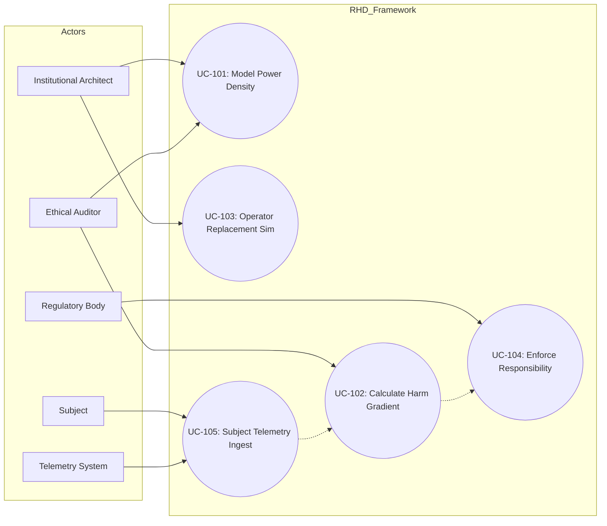
```mermaid
graph LR
    subgraph Actors
        S[Subject]
        IA[Institutional Architect]
        EA[Ethical Auditor]
        RB[Regulatory Body]
        TS[Telemetry System]
    end

    subgraph RHD_Framework
        UC101((UC-101: Model Power Density))
        UC102((UC-102: Calculate Harm Gradient))
        UC103((UC-103: Operator Replacement Sim))
        UC104((UC-104: Enforce Responsibility))
        UC105((UC-105: Subject Telemetry Ingest))
    end

    IA --> UC101
    IA --> UC103
    EA --> UC102
    EA --> UC101
    RB --> UC104
    S --> UC105
    TS --> UC105
    UC105 -.-> UC102
    UC102 -.-> UC104
```

---

## 4. Actor-Use Case Matrix

| Use Case | Subject | Inst. Architect | Ethical Auditor | Regulatory Body | Telemetry System |
| :--- | :---: | :---: | :---: | :---: | :---: |
| **UC-101: Model Power Density** | | **P** | S | | |
| **UC-102: Calculate Harm Gradient** | S | | **P** | S | S |
| **UC-103: Operator Replacement Sim** | | **P** | S | | |
| **UC-104: Enforce Responsibility** | S | S | S | **P** | |
| **UC-105: Subject Telemetry Ingest** | **P** | | | | **P** |

**Legend:**
- **P**: Primary Actor (Initiates the process)
- **S**: Secondary Actor (Participates or provides/receives data)

---

## 5. Technical Constraints & Business Rules (Traceability)

| ID | Rule/Constraint | Traceability |
| :--- | :--- | :--- |
| **BR-001** | **Subject Primacy:** Subject-side telemetry always overrides institutional self-reporting in $dH/dt$ calculations. | UC-102, UC-105 |
| **BR-002** | **Hysteretic Weighting:** Harm calculations must include a "Trauma Memory" coefficient ($T_m$) from PostgreSQL. | UC-102 |
| **BR-003** | **Autonomy Divisor:** Total Autonomy $A = A_1 \times A_2 \times A_3$. If any value is 0, $A=0$, and Harm becomes infinite. | UC-101, UC-104 |
| **TC-001** | **Graph Integrity:** Neo4j must maintain a sub-second response time for power density pathfinding. | UC-101 |
| **TC-002** | **Audit Trail:** All $dH/dt$ alerts must be immutable and stored in a write-once ledger. | UC-102, UC-104 |

---

## Requirements Specification

# Relational Harm Dynamics (RHD) Framework: Requirements Documentation

## 1. Functional Requirements (FR)

The functional requirements focus on the implementation of the Moral Field Equation: 
$$dH/dt = \frac{P_d}{A_1 \cdot A_2 \cdot A_3}$$
Where $P_d$ is Power Density, and $A_{1-3}$ are the Autonomy divisors (Voluntariness, Comprehension, Power Symmetry).

| FR-ID | Description | Priority | Source | Acceptance Criteria |
| :--- | :--- | :--- | :--- | :--- |
| **FR-101** | **Subject-Side Telemetry Ingestion** | Must Have | Subject / Auditor | System must ingest real-time sentiment and physiological proxy data from subjects via API, bypassing institutional self-reporting. |
| **FR-102** | **Power Density Mapping** | Must Have | Institutional Architect | System must map institutional nodes in Neo4j and calculate $P_d$ based on resource control and decision-making bottlenecks. |
| **FR-103** | **Autonomy Divisor Calculation** | Must Have | Subject | System must calculate $A_1$ (Voluntariness), $A_2$ (Comprehension), and $A_3$ (Symmetry) using multi-modal survey and behavioral data. |
| **FR-104** | **Hysteretic Harm Modeling** | Must Have | Ethical Auditor | Use SciPy to model path-dependent harm (trauma) where current state $S_t$ depends on historical harm $H_{t-n}$. |
| **FR-105** | **Operator Replacement Simulation** | Should Have | Policy Engineer | System must allow "swapping" an individual agent in a power node to determine if $dH/dt$ remains constant (indicating structural violence). |
| **FR-106** | **Real-time Harm Gradient Visualization** | Should Have | Auditor | D3.js dashboard must render a heat map of "Harm Gradients" across institutional sectors in < 500ms. |
| **FR-107** | **Legitimacy Absorption Shield** | Must Have | Regulatory Body | System must generate immutable audit logs to prevent institutions from "absorbing" the RHD metrics as mere PR/marketing. |
| **FR-108** | **Predictive Responsibility Alerts** | Should Have | Ethical Auditor | Trigger alerts when the derivative of harm ($d^2H/dt^2$) indicates an accelerating trend toward structural collapse. |
| **FR-109** | **State-Dependent Data Storage** | Must Have | Subject | PostgreSQL must store subject data with "Context Tags" to ensure data is only interpreted within the subject's specific state. |

---

## 2. Non-Functional Requirements (NFR)

### 2.1 Performance
- **NFR-201 (Latency):** The Moral Field Equation engine must compute $dH/dt$ for a graph of 10,000 nodes in under 2 seconds.
- **NFR-202 (Throughput):** The FastAPI layer must handle 5,000 concurrent telemetry streams without degradation.

### 2.2 Scalability
- **NFR-203 (Graph Scaling):** Neo4j must support institutional hierarchies up to 1 million relationships (Power Density links).
- **NFR-204 (Horizontal Scaling):** The calculation engine must be containerized (Docker/K8s) to scale based on the number of active "Subjects" being monitored.

### 2.3 Security
- **NFR-205 (Zero-Knowledge Telemetry):** Subject telemetry must be encrypted at rest using AES-256; the institution being monitored must never have access to raw subject-side data.
- **NFR-206 (Role-Based Access Control):** Access to "Operator Replacement" tools is restricted to verified Ethical Auditors and Regulatory Bodies.

### 2.4 Reliability
- **NFR-207 (Uptime):** The system must maintain 99.99% availability for real-time harm monitoring in critical environments (e.g., hospitals, prisons).
- **NFR-208 (Fault Tolerance):** In the event of a SciPy engine failure, the system must fail-over to a linear approximation model to maintain monitoring continuity.

### 2.5 Usability
- **NFR-209 (Accessibility):** The D3.js visualization must comply with WCAG 2.1 Level AA to ensure accessibility for diverse regulatory staff.
- **NFR-210 (Cognitive Load):** The dashboard must present the "Harm Gradient" as a single unified metric before allowing drill-down into complex differential variables.

### 2.6 Maintainability
- **NFR-211 (Documentation):** All API endpoints must be documented via Swagger/OpenAPI 3.0.
- **NFR-212 (Modular Math):** The "Moral Field Equation" must be implemented as a modular library to allow for future updates to the autonomy divisors.

---

## 3. Requirements Traceability Matrix (RTM)

| Use Case ID | Requirement ID | Test Case ID | Status |
| :--- | :--- | :--- | :--- |
| **UC-1: Monitor Harm** | FR-101, FR-103, FR-104 | TC-HARM-01 | Draft |
| **UC-2: Map Power** | FR-102 | TC-POW-01 | Draft |
| **UC-3: Structural Audit** | FR-105, FR-107 | TC-AUD-01 | Draft |
| **UC-4: Real-time Alerting** | FR-106, FR-108 | TC-ALT-01 | Draft |
| **UC-5: Data Privacy** | FR-109, NFR-205 | TC-SEC-01 | Draft |

---

## 4. Requirements Dependency Diagram

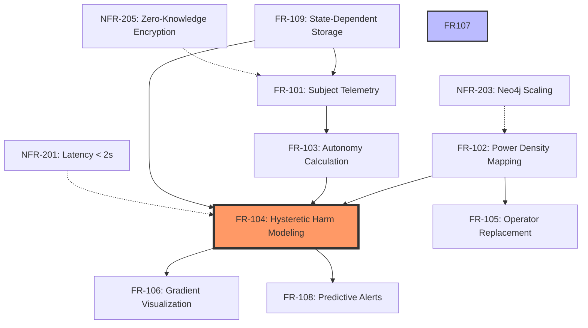
```mermaid
graph TD
    %% Functional Requirements
    FR101[FR-101: Subject Telemetry] --> FR103[FR-103: Autonomy Calculation]
    FR102[FR-102: Power Density Mapping] --> FR104[FR-104: Hysteretic Harm Modeling]
    FR103 --> FR104
    
    FR104 --> FR106[FR-106: Gradient Visualization]
    FR104 --> FR108[FR-108: Predictive Alerts]
    
    FR102 --> FR105[FR-105: Operator Replacement]
    
    FR109[FR-109: State-Dependent Storage] --> FR101
    FR109 --> FR104

    %% Non-Functional Dependencies
    NFR205[NFR-205: Zero-Knowledge Encryption] -.-> FR101
    NFR201[NFR-201: Latency < 2s] -.-> FR104
    NFR203[NFR-203: Neo4j Scaling] -.-> FR102

    %% Styling
    style FR104 fill:#f96,stroke:#333,stroke-width:4px
    style FR107 fill:#bbf,stroke:#333,stroke-width:2px
```

---

## 5. State Machine: Harm Gradient Calculation
This state machine describes the lifecycle of a "Harm Event" within the RHD Framework.

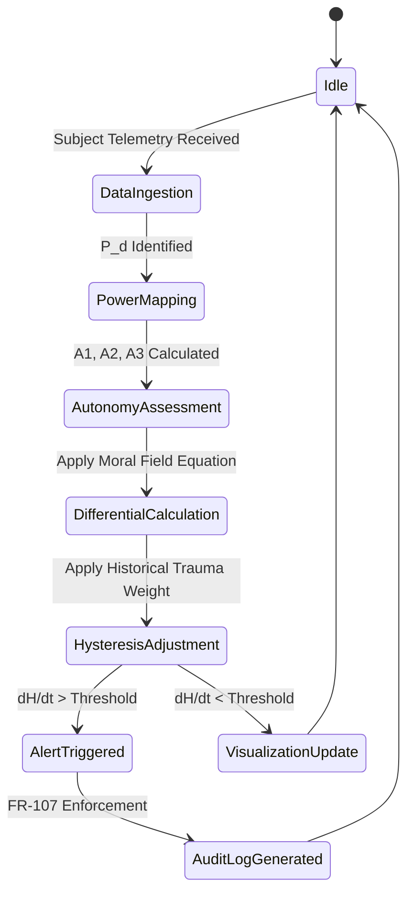
```mermaid
stateDiagram-v2
    [*] --> Idle
    Idle --> DataIngestion : Subject Telemetry Received
    DataIngestion --> PowerMapping : P_d Identified
    PowerMapping --> AutonomyAssessment : A1, A2, A3 Calculated
    AutonomyAssessment --> DifferentialCalculation : Apply Moral Field Equation
    DifferentialCalculation --> HysteresisAdjustment : Apply Historical Trauma Weight
    HysteresisAdjustment --> AlertTriggered : dH/dt > Threshold
    HysteresisAdjustment --> VisualizationUpdate : dH/dt < Threshold
    AlertTriggered --> AuditLogGenerated : FR-107 Enforcement
    AuditLogGenerated --> Idle
    VisualizationUpdate --> Idle
```

---

## 6. Data Model (High-Level)
The relationship between the Subject, the Institution, and the resulting Harm Metrics.

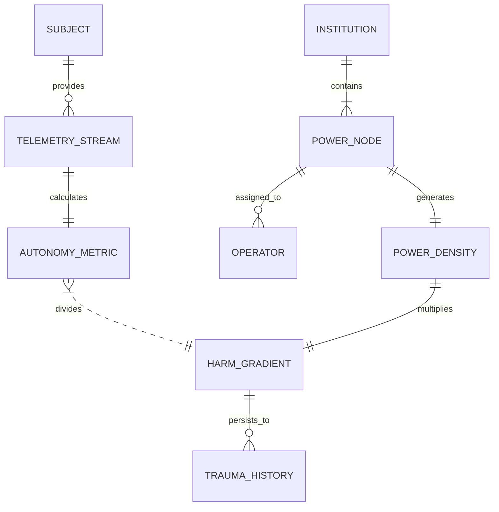
```mermaid
erDiagram
    SUBJECT ||--o{ TELEMETRY_STREAM : provides
    INSTITUTION ||--|{ POWER_NODE : contains
    POWER_NODE ||--o{ OPERATOR : assigned_to
    TELEMETRY_STREAM ||--|| AUTONOMY_METRIC : calculates
    POWER_NODE ||--|| POWER_DENSITY : generates
    AUTONOMY_METRIC }|..|| HARM_GRADIENT : divides
    POWER_DENSITY ||--|| HARM_GRADIENT : multiplies
    HARM_GRADIENT ||--o{ TRAUMA_HISTORY : persists_to
```

## 7. Acceptance Criteria Detail (Sample: FR-105)

**Requirement:** FR-105: Operator Replacement Simulation
- **TC-105.1:** Given a power node $N$ with high $dH/dt$, when the Operator $O_1$ is replaced with $O_2$ in the simulation, the system must recalculate $dH/dt$.
- **TC-105.2:** If $dH/dt$ variance is $< 5\%$, the system must flag the node as "Structurally Violent."
- **TC-105.3:** The simulation must complete within 5 seconds for a single node swap.

---

## System Architecture

# Relational Harm Dynamics (RHD) Framework: Architecture Documentation

## 1. System Context Diagram (C4 Level 1)

The RHD Framework sits at the center of an institutional ecosystem, acting as a "Moral Governor." Unlike traditional auditing tools that rely on institutional self-reporting, the RHD prioritizes direct telemetry from the **Subject** to calculate the real-time harm gradient.

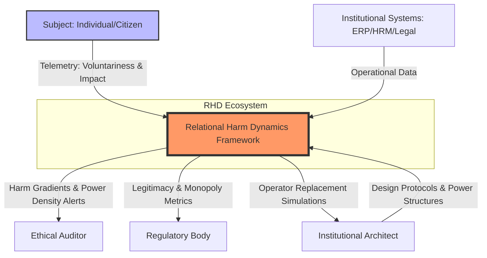
```mermaid
graph TB
    subgraph "RHD Ecosystem"
        RHD[Relational Harm Dynamics Framework]
    end

    Subject[Subject: Individual/Citizen]
    Architect[Institutional Architect]
    Auditor[Ethical Auditor]
    Regulator[Regulatory Body]
    InstSystems[Institutional Systems: ERP/HRM/Legal]

    Subject -- "Telemetry: Voluntariness & Impact" --> RHD
    Architect -- "Design Protocols & Power Structures" --> RHD
    RHD -- "Harm Gradients & Power Density Alerts" --> Auditor
    RHD -- "Legitimacy & Monopoly Metrics" --> Regulator
    InstSystems -- "Operational Data" --> RHD
    RHD -- "Operator Replacement Simulations" --> Architect

    style RHD fill:#f96,stroke:#333,stroke-width:4px
    style Subject fill:#bbf,stroke:#333,stroke-width:2px
```

---

## 2. Container Diagram (C4 Level 2)

The system is decomposed into specialized containers to handle the distinct requirements of graph-based power analysis, differential equation modeling, and real-time visualization.

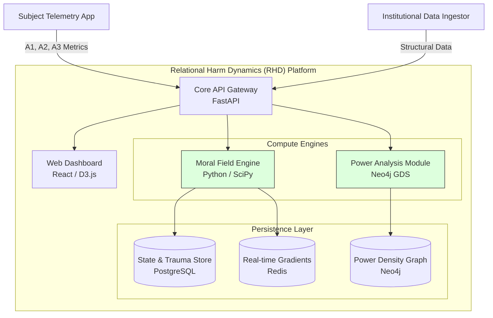
```mermaid
graph TB
    subgraph "Relational Harm Dynamics (RHD) Platform"
        WA[Web Dashboard<br/>React / D3.js]
        API[Core API Gateway<br/>FastAPI]
        
        subgraph "Compute Engines"
            MFE[Moral Field Engine<br/>Python / SciPy]
            PAM[Power Analysis Module<br/>Neo4j GDS]
        end

        subgraph "Persistence Layer"
            PDB[(State & Trauma Store<br/>PostgreSQL)]
            GDB[(Power Density Graph<br/>Neo4j)]
            CACHE[(Real-time Gradients<br/>Redis)]
        end
    end

    SubjectApp[Subject Telemetry App]
    InstAPI[Institutional Data Ingestor]

    SubjectApp -- "A1, A2, A3 Metrics" --> API
    InstAPI -- "Structural Data" --> API
    
    API --> WA
    API --> MFE
    API --> PAM
    
    MFE --> PDB
    PAM --> GDB
    MFE --> CACHE
    
    style MFE fill:#dfd,stroke:#333
    style PAM fill:#dfd,stroke:#333
```

---

## 3. Component Diagram (C4 Level 3)

### 3.1 Moral Field Engine (MFE)
The MFE is the mathematical core of the system, responsible for calculating the harm derivative ($dH/dt$).

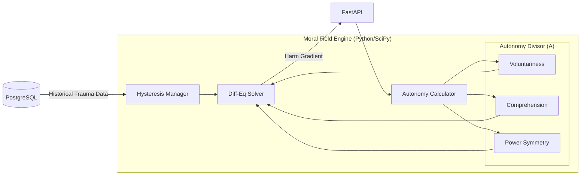
```mermaid
graph LR
    subgraph "Moral Field Engine (Python/SciPy)"
        DE[Diff-Eq Solver]
        HM[Hysteresis Manager]
        AC[Autonomy Calculator]
        
        subgraph "Autonomy Divisor (A)"
            A1[Voluntariness]
            A2[Comprehension]
            A3[Power Symmetry]
        end
    end

    API[FastAPI] --> AC
    AC --> A1
    AC --> A2
    AC --> A3
    
    A1 & A2 & A3 --> DE
    PDB[(PostgreSQL)] -- "Historical Trauma Data" --> HM
    HM --> DE
    DE -- "Harm Gradient" --> API
```

### 3.2 Power Analysis Module (PAM)
This component models institutions as biological agents and identifies "Legitimacy Absorption" patterns.

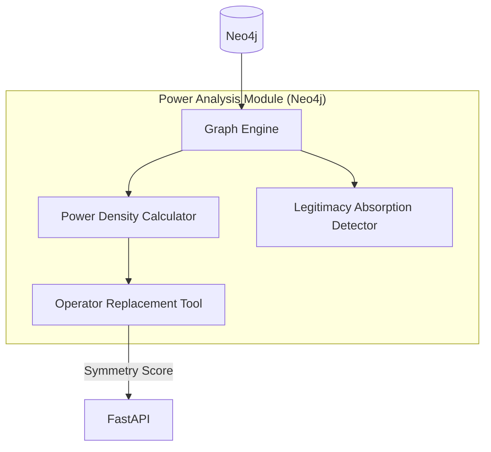
```mermaid
graph TB
    subgraph "Power Analysis Module (Neo4j)"
        G[Graph Engine]
        PD[Power Density Calculator]
        OR[Operator Replacement Tool]
        LA[Legitimacy Absorption Detector]
    end

    GDB[(Neo4j)] --> G
    G --> PD
    G --> LA
    PD --> OR
    OR -- "Symmetry Score" --> API[FastAPI]
```

---

## 4. Deployment Diagram

The RHD Framework is deployed using a high-availability, containerized architecture to ensure that ethical monitoring remains online even if the monitored institution experiences failure.

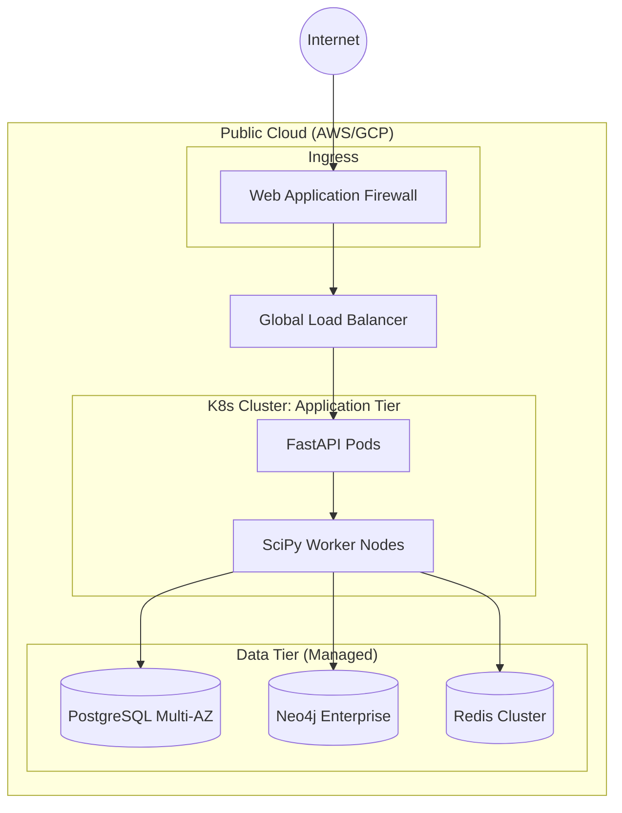
```mermaid
graph TB
    subgraph "Public Cloud (AWS/GCP)"
        LB[Global Load Balancer]
        
        subgraph "K8s Cluster: Application Tier"
            direction LR
            API_PODS[FastAPI Pods]
            MFE_WORKERS[SciPy Worker Nodes]
        end

        subgraph "Data Tier (Managed)"
            direction TB
            RDS[(PostgreSQL Multi-AZ)]
            AURA[(Neo4j Enterprise)]
            ELC[(Redis Cluster)]
        end

        subgraph "Ingress"
            WAF[Web Application Firewall]
        end
    end

    Internet((Internet)) --> WAF
    WAF --> LB
    LB --> API_PODS
    API_PODS --> MFE_WORKERS
    MFE_WORKERS --> RDS
    MFE_WORKERS --> AURA
    MFE_WORKERS --> ELC
```

---

## 5. Technology Stack Summary

| Layer | Technology | Reason for Selection |
| :--- | :--- | :--- |
| **Frontend** | React, D3.js, TailwindCSS | D3.js is critical for rendering complex, real-time harm gradients and vector fields. |
| **Backend API** | FastAPI (Python 3.11+) | High performance, native async support, and seamless integration with SciPy. |
| **Compute Engine** | SciPy, NumPy, Pandas | Required for solving the differential equations of the Moral Field Model. |
| **Graph Database** | Neo4j | Models institutional relationships and power density as a network of nodes/edges. |
| **Relational DB** | PostgreSQL | Stores time-series "trauma" data and state-dependent historical records. |
| **Caching** | Redis | Stores transient harm gradients for real-time dashboard updates. |
| **Deployment** | Docker, Kubernetes, Terraform | Ensures environment parity and horizontal scalability for compute-heavy modeling. |

---

## 6. Architecture Decision Records (ADRs)

### ADR-001: Use of Differential Equations for Harm Modeling
*   **Context:** Traditional ethics systems use boolean "compliance" checks. Harm, however, is path-dependent (hysteretic) and continuous.
*   **Decision:** Implement the "Moral Field Equation" using SciPy's ODE solvers.
*   **Consequences:** Requires higher compute resources than standard CRUD apps; enables predictive modeling of harm before it occurs.

### ADR-002: Subject-Side Telemetry Priority
*   **Context:** Institutions have a natural tendency toward "Legitimacy Absorption"—rebranding harm as a "necessary process."
*   **Decision:** The system architecture must prioritize telemetry from the Subject's nervous system/input over Institutional self-reporting.
*   **Consequences:** Requires robust, encrypted mobile/edge endpoints for subjects to report Voluntariness (A1) and Comprehension (A2).

### ADR-003: Graph-Based Power Density Mapping
*   **Context:** Power is not a static attribute but a relational density between nodes in a system.
*   **Decision:** Use Neo4j to map institutional structures.
*   **Consequences:** Allows for "Operator Replacement" simulations (swapping a Subject and an Architect in the graph) to detect structural violence.

### ADR-004: Hysteretic Data Persistence
*   **Context:** The impact of a system on a subject depends on the subject's prior state (Historical Trauma).
*   **Decision:** PostgreSQL will store "State-Dependent" profiles that modify the sensitivity of the Harm Gradient calculation.
*   **Consequences:** Strict GDPR/HIPAA-level security is required for these sensitive historical profiles.

---

## 7. Traceability Matrix

| ID | Requirement | Component | Acceptance Criteria |
| :--- | :--- | :--- | :--- |
| **FR-101** | Calculate Harm Gradient | Moral Field Engine | $dH/dt$ must update within 500ms of telemetry input. |
| **FR-102** | Power Symmetry Analysis | Power Analysis Module | Operator Replacement tool must return a symmetry score < 0.5 for monopolies. |
| **FR-103** | Autonomy Monitoring | Autonomy Calculator | System must flag any process where $A_1 \times A_2 \times A_3 \to 0$. |
| **FR-104** | Trauma Persistence | State & Trauma Store | Historical impact must influence current harm calculations (Hysteresis). |

---

## Data Model & ERD

# Relational Harm Dynamics (RHD) Framework: Data Model Documentation

This document outlines the data architecture for the RHD Framework, focusing on the transition from traditional relational structures to a systemic, impact-focused model that calculates harm gradients and power density.

## 1. Entity-Relationship Diagram (ERD)

The RHD data model prioritizes the **Interaction** as the primary unit of analysis, where the **Subject** and **Institution** collide to produce a measurable **Harm Gradient**.

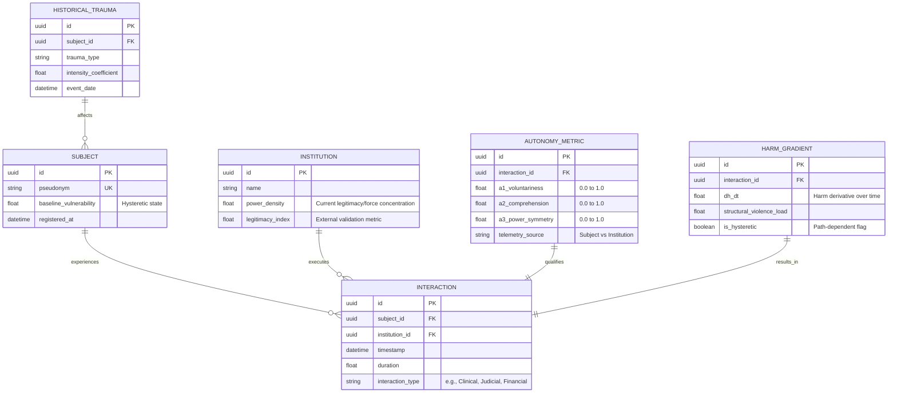
```mermaid
erDiagram
    SUBJECT ||--o{ INTERACTION : experiences
    INSTITUTION ||--o{ INTERACTION : executes
    
    SUBJECT {
        uuid id PK
        string pseudonym UK
        float baseline_vulnerability "Hysteretic state"
        datetime registered_at
    }

    INSTITUTION {
        uuid id PK
        string name
        float power_density "Current legitimacy/force concentration"
        float legitimacy_index "External validation metric"
    }

    INTERACTION {
        uuid id PK
        uuid subject_id FK
        uuid institution_id FK
        datetime timestamp
        float duration
        string interaction_type "e.g., Clinical, Judicial, Financial"
    }

    AUTONOMY_METRIC ||--|| INTERACTION : qualifies
    AUTONOMY_METRIC {
        uuid id PK
        uuid interaction_id FK
        float a1_voluntariness "0.0 to 1.0"
        float a2_comprehension "0.0 to 1.0"
        float a3_power_symmetry "0.0 to 1.0"
        string telemetry_source "Subject vs Institution"
    }

    HARM_GRADIENT ||--|| INTERACTION : results_in
    HARM_GRADIENT {
        uuid id PK
        uuid interaction_id FK
        float dh_dt "Harm derivative over time"
        float structural_violence_load
        boolean is_hysteretic "Path-dependent flag"
    }

    HISTORICAL_TRAUMA ||--o{ SUBJECT : affects
    HISTORICAL_TRAUMA {
        uuid id PK
        uuid subject_id FK
        string trauma_type
        float intensity_coefficient
        datetime event_date
    }
```

---

## 2. Entity Descriptions

### Subject
*   **Purpose:** Represents the individual human agent. Unlike traditional "Users," the Subject is defined by their nervous system's response and their historical path-dependency (hysteresis).
*   **Attributes:**
    *   `baseline_vulnerability`: A calculated float representing the subject's current state of resilience based on previous interactions.
*   **Relationships:** One-to-many with `Interaction` and `Historical_Trauma`.
*   **Performance:** Indexed on `pseudonym` to allow for anonymous tracking across institutional silos.

### Institution
*   **Purpose:** Models an organization as a biological agent seeking to maximize its own "Legitimacy" and "Power Density."
*   **Attributes:**
    *   `power_density`: A real-time metric of the institution's ability to enforce its will without subject consent.
*   **Relationships:** One-to-many with `Interaction`.
*   **Performance:** High-read frequency for real-time auditing.

### Interaction
*   **Purpose:** The atomic unit of the RHD framework. It captures the specific moment power is exercised.
*   **Attributes:**
    *   `interaction_type`: Categorizes the nature of the power exchange.
*   **Relationships:** Junction entity between `Subject` and `Institution`. Links to `Autonomy_Metric` and `Harm_Gradient`.

### Autonomy_Metric (The Divisor)
*   **Purpose:** Implements the three-part autonomy divisor (A1, A2, A3) used to dampen the Moral Field Equation.
*   **Attributes:**
    *   `a1_voluntariness`: Degree of choice.
    *   `a2_comprehension`: Degree of understanding.
    *   `a3_power_symmetry`: The ratio of power between Subject and Institution.
*   **Constraints:** All values must be between 0.0 and 1.0.

---

## 3. Data Dictionary

| Entity | Attribute | Type | Constraints | Description |
| :--- | :--- | :--- | :--- | :--- |
| **Subject** | `id` | UUID | PK | Unique system identifier. |
| **Subject** | `baseline_vulnerability` | FLOAT | 0.0 - 10.0 | The hysteretic state of the subject's harm threshold. |
| **Institution** | `power_density` | FLOAT | > 0.0 | Calculated concentration of institutional force. |
| **Autonomy_Metric** | `a1_voluntariness` | FLOAT | 0.0 - 1.0 | Subject's freedom from coercion during interaction. |
| **Autonomy_Metric** | `a2_comprehension` | FLOAT | 0.0 - 1.0 | Subject's cognitive grasp of the interaction's terms. |
| **Autonomy_Metric** | `a3_power_symmetry` | FLOAT | 0.0 - 1.0 | The inverse of the power gap between parties. |
| **Harm_Gradient** | `dh_dt` | FLOAT | N/A | The rate of change of harm (The Moral Field derivative). |

---

## 4. Data Flow Diagram (DFD)

The flow prioritizes **Subject-side Telemetry** to prevent "Legitimacy Absorption" by the institution.

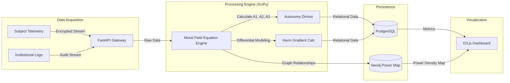
```mermaid
graph LR
    subgraph "Data Acquisition"
        S[Subject Telemetry] -->|Encrypted Stream| API[FastAPI Gateway]
        I[Institutional Logs] -->|Audit Stream| API
    end

    subgraph "Processing Engine (SciPy)"
        API -->|Raw Data| MFE[Moral Field Equation Engine]
        MFE -->|Calculate A1, A2, A3| AD[Autonomy Divisor]
        MFE -->|Differential Modeling| HG[Harm Gradient Calc]
    end

    subgraph "Persistence"
        AD -->|Relational Data| PG[(PostgreSQL)]
        HG -->|Relational Data| PG
        MFE -->|Graph Relationships| NJ[(Neo4j Power Map)]
    end

    subgraph "Visualization"
        PG -->|Metrics| D3[D3.js Dashboard]
        NJ -->|Power Density Map| D3
    end
```

---

## 5. Data Validation Rules

| ID | Rule Name | Logic | Description |
| :--- | :--- | :--- | :--- |
| **VAL-001** | **Autonomy Range** | `0.0 <= (A1, A2, A3) <= 1.0` | Autonomy components cannot exceed 100% or be negative. |
| **VAL-002** | **Source Weighting** | `Weight(Subject) > 5 * Weight(Institution)` | Subject-reported harm is weighted 5x higher than institutional self-reporting. |
| **VAL-003** | **Hysteresis Check** | `dH/dt != 0` if `Historical_Trauma` exists | Harm cannot be calculated in a vacuum; previous state must influence current gradient. |
| **VAL-004** | **Legitimacy Cap** | `Legitimacy_Index` cannot increase if `dH/dt > Threshold` | Prevents institutions from gaining "ethical points" while causing active harm. |

---

## 6. Data Migration Considerations

### Legacy System Integration
When migrating from traditional "Incident Reporting" or "Case Management" systems:
1.  **Normalization of Intent:** Legacy "Intent" fields must be discarded. RHD only accepts "Impact" (Subject-side) and "Structure" (Institutional-side) data.
2.  **Anonymization:** Subjects from legacy systems must be mapped to `pseudonyms` using a one-way cryptographic hash to prevent institutional retaliation.
3.  **Backfilling Hysteresis:** Historical data should be used to populate the `Historical_Trauma` entity to establish the initial `baseline_vulnerability` for existing subjects.
4.  **Graph Seeding:** Institutional hierarchies must be ingested into **Neo4j** to identify existing "Monopolies of Legitimacy" before real-time monitoring begins.

### Scalability and Storage
*   **PostgreSQL:** Used for transactional integrity of interactions and autonomy metrics.
*   **Neo4j:** Used for calculating the "Power Density" by analyzing the depth and breadth of institutional influence across multiple subjects.
*   **Time-Series Data:** `Harm_Gradient` updates should be partitioned by month to maintain query performance for real-time D3.js visualizations.

---

## Flow Diagrams

# Relational Harm Dynamics (RHD) Framework: System Interaction Documentation

This document outlines the critical interaction flows, logic processes, and state transitions within the RHD Framework. The system is designed to move beyond static compliance toward dynamic, predictive harm mitigation.

---

## 1. Sequence Diagrams: Critical User Journeys

### UC-101: Real-time Harm Gradient Calculation
This journey represents the core engine's response to incoming subject telemetry, calculating the instantaneous harm derivative ($dH/dt$).

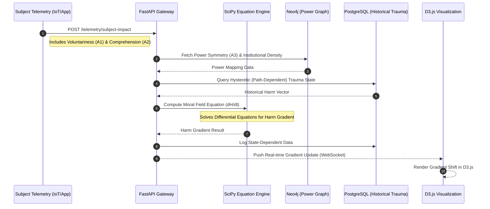
```mermaid
sequenceDiagram
    autonumber
    participant S as Subject Telemetry (IoT/App)
    participant API as FastAPI Gateway
    participant SE as SciPy Equation Engine
    participant GDB as Neo4j (Power Graph)
    participant RDB as PostgreSQL (Historical Trauma)
    participant UI as D3.js Visualization

    S->>API: POST /telemetry/subject-impact
    Note right of S: Includes Voluntariness (A1) & Comprehension (A2)
    API->>GDB: Fetch Power Symmetry (A3) & Institutional Density
    GDB-->>API: Power Mapping Data
    API->>RDB: Query Hysteretic (Path-Dependent) Trauma State
    RDB-->>API: Historical Harm Vector
    API->>SE: Compute Moral Field Equation (dH/dt)
    Note over SE: Solves Differential Equations for Harm Gradient
    SE-->>API: Harm Gradient Result
    API->>RDB: Log State-Dependent Data
    API-->>UI: Push Real-time Gradient Update (WebSocket)
    UI-->>UI: Render Gradient Shift in D3.js
```

### UC-102: Operator Replacement Simulation
Used by Institutional Architects to test if a system's harm is structural or individual by simulating the replacement of specific agents.

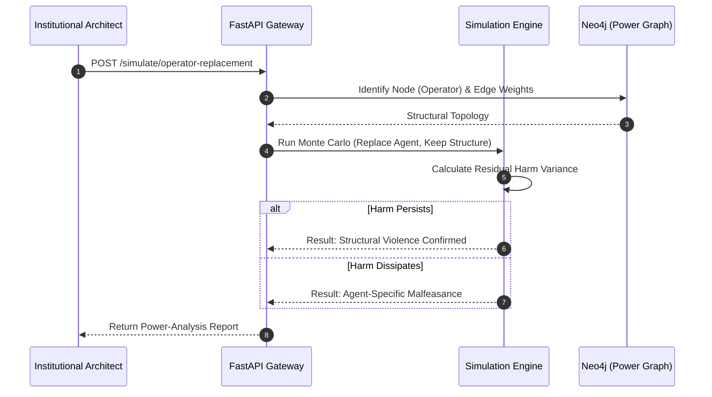
```mermaid
sequenceDiagram
    autonumber
    participant IA as Institutional Architect
    participant API as FastAPI Gateway
    participant SIM as Simulation Engine
    participant GDB as Neo4j (Power Graph)

    IA->>API: POST /simulate/operator-replacement
    API->>GDB: Identify Node (Operator) & Edge Weights
    GDB-->>API: Structural Topology
    API->>SIM: Run Monte Carlo (Replace Agent, Keep Structure)
    SIM->>SIM: Calculate Residual Harm Variance
    alt Harm Persists
        SIM-->>API: Result: Structural Violence Confirmed
    else Harm Dissipates
        SIM-->>API: Result: Agent-Specific Malfeasance
    end
    API-->>IA: Return Power-Analysis Report
```

---

## 2. Activity Diagrams: Complex Business Processes

### BP-201: The Moral Field Equation Solver
This process details how the system calculates the "Autonomy Divisor" to dampen institutional power density.

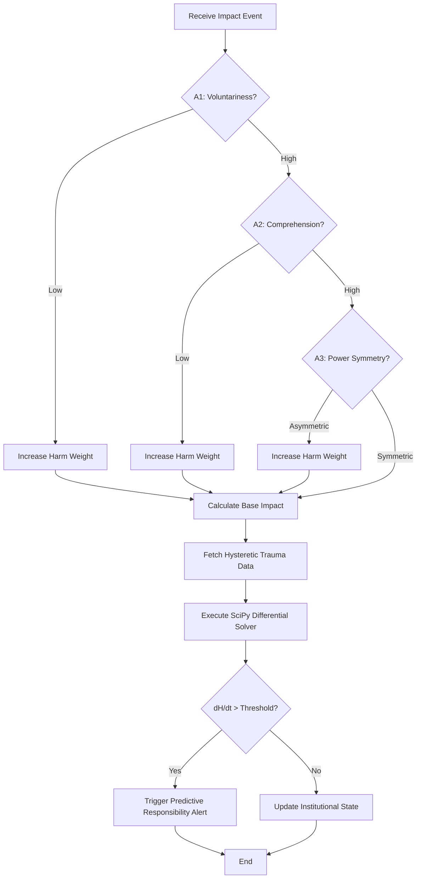
```mermaid
graph TD
    Start[Receive Impact Event] --> A1{A1: Voluntariness?}
    A1 -->|Low| H1[Increase Harm Weight]
    A1 -->|High| A2{A2: Comprehension?}
    
    A2 -->|Low| H2[Increase Harm Weight]
    A2 -->|High| A3{A3: Power Symmetry?}
    
    A3 -->|Asymmetric| H3[Increase Harm Weight]
    A3 -->|Symmetric| Calc[Calculate Base Impact]
    
    H1 & H2 & H3 --> Calc
    
    Calc --> Hist[Fetch Hysteretic Trauma Data]
    Hist --> DiffEq[Execute SciPy Differential Solver]
    
    DiffEq --> Result{dH/dt > Threshold?}
    Result -->|Yes| Alert[Trigger Predictive Responsibility Alert]
    Result -->|No| Log[Update Institutional State]
    
    Alert --> End[End]
    Log --> End
```

---

## 3. State Diagrams: Entity Lifecycle

### SD-301: Institutional Legitimacy State
Institutions are modeled as biological agents. Their "Legitimacy" is a state-dependent variable that fluctuates based on harm gradients.

```mermaid
stateDiagram-v2
    [*] --> Stable: Low Harm Gradient
    Stable --> HighDensity: Power Concentration Detected
    HighDensity --> CriticalHarm: dH/dt > 0.5
    CriticalHarm --> DeLegitimized: Failure to Implement Operator Replacement
    
    DeLegitimized --> Restructuring: Regulatory Intervention
    Restructuring --> Stable: Autonomy Divisors (A1,A2,A3) Restored
    
    CriticalHarm --> Stable: Predictive Responsibility Action Taken
    
    note right of DeLegitimized
        System triggers 'Legitimacy Absorption' 
        resistance protocols here.
    end
```

### SD-302: Harm Incident Lifecycle
Tracks a specific harm event from subject registration to structural resolution.

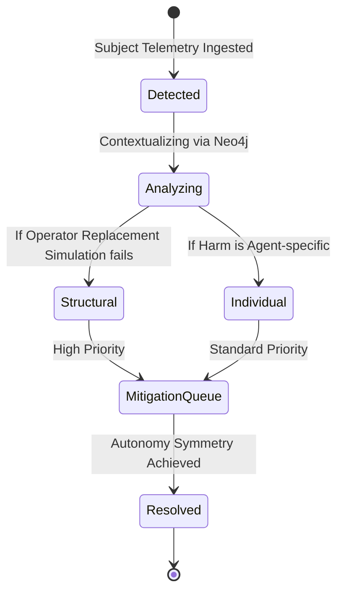
```mermaid
stateDiagram-v2
    [*] --> Detected: Subject Telemetry Ingested
    Detected --> Analyzing: Contextualizing via Neo4j
    Analyzing --> Structural: If Operator Replacement Simulation fails
    Analyzing --> Individual: If Harm is Agent-specific
    
    Structural --> MitigationQueue: High Priority
    Individual --> MitigationQueue: Standard Priority
    
    MitigationQueue --> Resolved: Autonomy Symmetry Achieved
    Resolved --> [*]
```

---

## 4. Integration Flow: Data Pipeline

This diagram illustrates the flow of data from the subject's nervous system (telemetry) to the regulatory dashboard, emphasizing the separation of concerns to prevent institutional co-option.

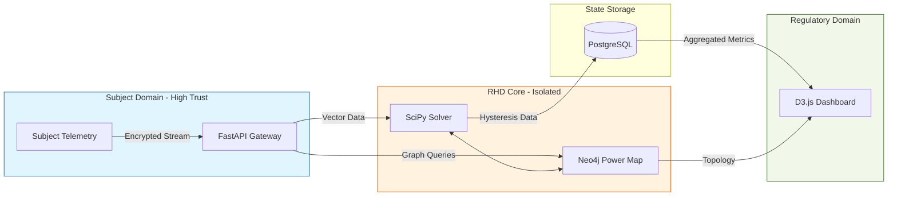
```mermaid
graph LR
    subgraph Subject_Domain [Subject Domain - High Trust]
        S[Subject Telemetry] -->|Encrypted Stream| API[FastAPI Gateway]
    end

    subgraph Analysis_Engine [RHD Core - Isolated]
        API -->|Vector Data| SP[SciPy Solver]
        API -->|Graph Queries| Neo[Neo4j Power Map]
        SP <--> Neo
    end

    subgraph Persistence_Layer [State Storage]
        SP -->|Hysteresis Data| PG[(PostgreSQL)]
    end

    subgraph Auditor_Interface [Regulatory Domain]
        PG -->|Aggregated Metrics| D3[D3.js Dashboard]
        Neo -->|Topology| D3
    end

    style Subject_Domain fill:#e1f5fe,stroke:#01579b
    style Analysis_Engine fill:#fff3e0,stroke:#e65100
    style Auditor_Interface fill:#f1f8e9,stroke:#33691e
```

---

## 5. Error Handling & Resilience Flows

### EH-501: Legitimacy Absorption Prevention
A critical failure mode where an institution attempts to use RHD metrics to "wash" its reputation without changing its power structure.

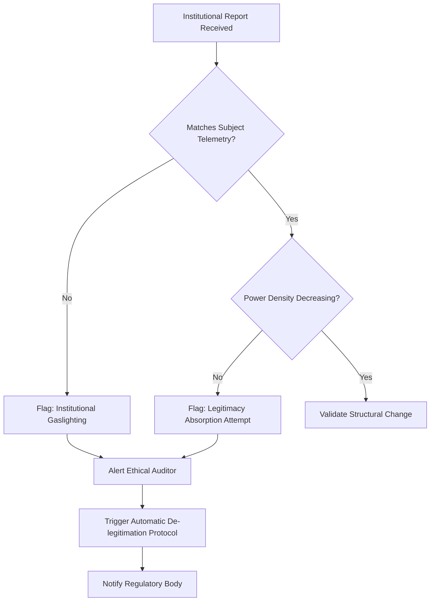
```mermaid
graph TD
    A[Institutional Report Received] --> B{Matches Subject Telemetry?}
    B -->|No| C[Flag: Institutional Gaslighting]
    B -->|Yes| D{Power Density Decreasing?}
    
    D -->|No| E[Flag: Legitimacy Absorption Attempt]
    D -->|Yes| F[Validate Structural Change]
    
    C --> G[Alert Ethical Auditor]
    E --> G
    
    G --> H[Trigger Automatic De-legitimation Protocol]
    H --> I[Notify Regulatory Body]
```

### EH-502: Telemetry Dropout Handling
Ensures that the absence of data from a subject is treated as a potential "Power Asymmetry" event rather than a "No Harm" event.

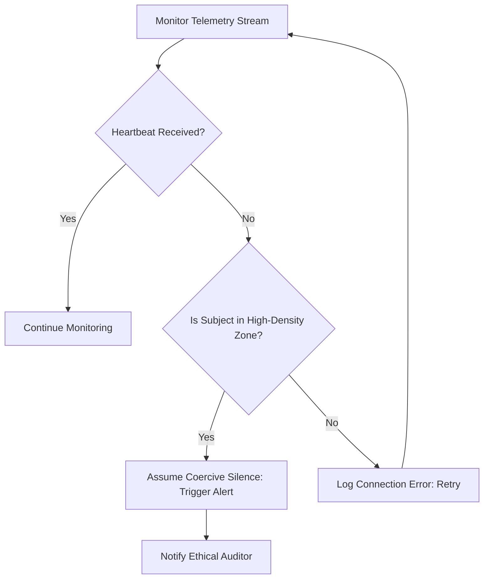
```mermaid
graph TD
    Start[Monitor Telemetry Stream] --> Heartbeat{Heartbeat Received?}
    Heartbeat -->|Yes| Continue[Continue Monitoring]
    Heartbeat -->|No| CheckContext{Is Subject in High-Density Zone?}
    
    CheckContext -->|Yes| HighRisk[Assume Coercive Silence: Trigger Alert]
    CheckContext -->|No| LowRisk[Log Connection Error: Retry]
    
    HighRisk --> Notify[Notify Ethical Auditor]
    LowRisk --> Start
```

---

## Traceability Matrix (Summary)

| ID | Interaction | Primary Stakeholder | Tech Component | Acceptance Criteria |
|:---|:---|:---|:---|:---|
| **FR-101** | Harm Gradient Calculation | Ethical Auditor | SciPy / FastAPI | dH/dt must update within <200ms of telemetry. |
| **FR-102** | Operator Replacement | Institutional Architect | Neo4j / Python | Simulation must isolate structural vs agent variance. |
| **FR-103** | Autonomy Divisor | Subject | PostgreSQL | A1, A2, A3 must be weighted higher than institutional KPIs. |
| **FR-104** | Legitimacy Monitoring | Regulatory Body | D3.js / Neo4j | System must flag "Legitimacy Absorption" automatically. |

---

## Test Plan

# Relational Harm Dynamics (RHD) Framework: Comprehensive Test Plan

## 1. Test Strategy Overview

### 1.1 Testing Objectives
The primary objective of the RHD testing suite is to validate the mathematical integrity of the **Moral Field Equation** and ensure the system's resistance to **Legitimacy Absorption**. Unlike traditional software, RHD must be tested for its ability to prioritize subject-side telemetry over institutional self-reporting.

### 1.2 Testing Scope
*   **In-Scope:**
    *   Differential equation solvers for path-dependent (hysteretic) harm.
    *   Neo4j graph traversals for power density analysis.
    *   Real-time harm gradient (dH/dt) calculations.
    *   Subject Autonomy Divisor (A1: Voluntariness, A2: Comprehension, A3: Power Symmetry).
    *   Operator Replacement simulation tools.
*   **Out-of-Scope:**
    *   General institutional HR management (unless impacting power density).
    *   Third-party financial auditing (unless linked to structural violence).

### 1.3 Testing Approach
A **Model-First Testing** approach is utilized. We validate the mathematical models against historical trauma datasets (PostgreSQL) before testing the UI/UX. We employ "Red-Teaming" to simulate institutional attempts to "game" the metrics.

### 1.4 Entry/Exit Criteria
*   **Entry:** Mathematical models are peer-reviewed; Neo4j schema is finalized; Subject-side API endpoints are documented.
*   **Exit:** 100% of High-Priority test cases passed; Harm gradient calculation error margin < 0.001%; Zero "Legitimacy Absorption" vulnerabilities detected.

---

## 2. Test Levels

### 2.1 Unit Testing
*   **Focus:** Individual functions (e.g., `calculate_autonomy_divisor()`, `solve_harm_derivative()`).
*   **Frameworks:** PyTest, Hypothesis (Property-based testing for math edge cases).
*   **Coverage Target:** 95% for core math modules; 80% for API logic.

### 2.2 Integration Testing
*   **Focus:** FastAPI to Neo4j connectivity; SciPy solver integration with PostgreSQL state-dependent data.
*   **Tools:** Docker Compose for ephemeral test environments.
*   **Key Check:** Ensure that a change in "Subject Power Symmetry" (A3) correctly triggers a re-calculation of the "Harm Gradient" across the graph.

### 2.3 System Testing (End-to-End)
*   **Scenario:** A simulated institutional policy change (e.g., a new surveillance protocol) is ingested.
*   **Validation:** The system must predict the harm increase before it manifests in institutional reports, based on subject-side telemetry.

### 2.4 Acceptance Testing (UAT)
*   **Criteria:** Ethical Auditors must be able to identify "Power Monopolies" within 3 clicks. Subjects must confirm that the "Voluntariness" metric (A1) accurately reflects their lived experience.

---

## 3. Test Case Catalog

| TC-ID | Requirement | Description | Steps | Expected Result | Priority |
|-------|-------------|-------------|-------|-----------------|----------|
| **TC-001** | FR-MATH-01 | Harm Gradient Calculation | 1. Input hysteretic trauma data.<br>2. Run `dH/dt` solver. | Gradient reflects path-dependency (past harm increases current sensitivity). | Critical |
| **TC-002** | FR-PWR-02 | Power Density Mapping | 1. Create 5 nodes with asymmetric edges.<br>2. Query Neo4j for density. | System identifies the node with the highest "Legitimacy Monopoly." | High |
| **TC-003** | FR-AUT-03 | Autonomy Divisor Logic | 1. Set A1=0.1 (Low Voluntariness).<br>2. Calculate Total Harm. | Harm value must scale inversely with the Autonomy Divisor. | Critical |
| **TC-004** | FR-SIM-04 | Operator Replacement | 1. Select high-harm node.<br>2. Simulate "Removal of Authority." | System predicts the dampening of the harm gradient. | Medium |
| **TC-005** | FR-SEC-05 | Anti-Absorption Check | 1. Attempt to inject "Institutional Self-Report" data to override subject telemetry. | System rejects or flags the data as "Low-Integrity/Biased." | High |

---

## 4. Test Coverage Matrix

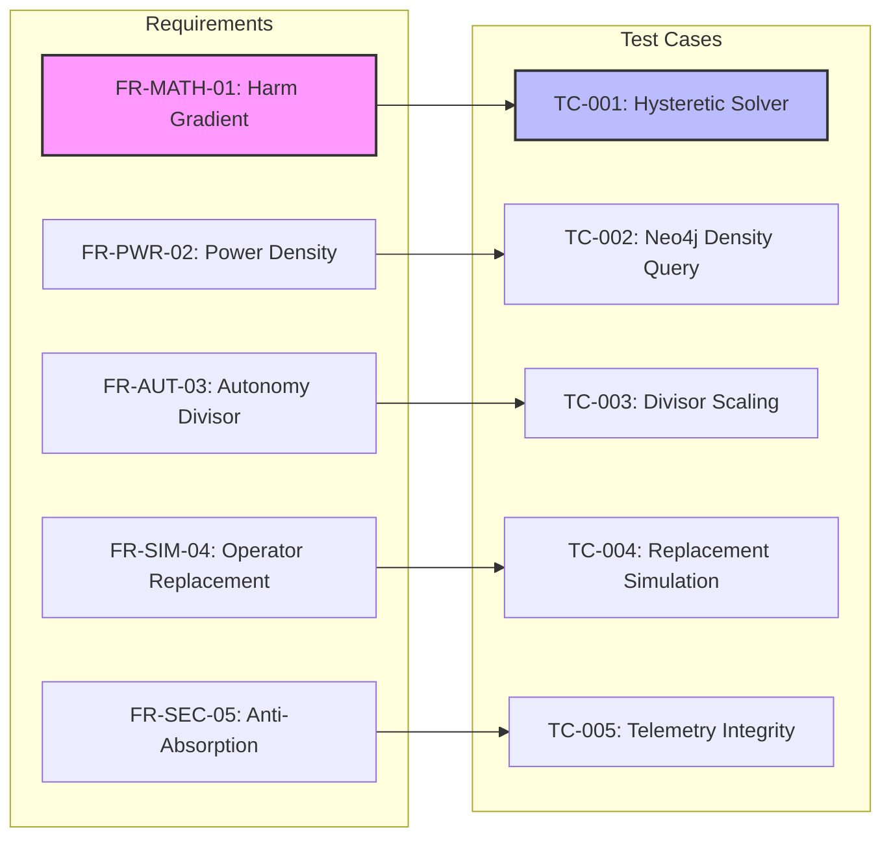
```mermaid
graph LR
    subgraph Requirements
        FR1[FR-MATH-01: Harm Gradient]
        FR2[FR-PWR-02: Power Density]
        FR3[FR-AUT-03: Autonomy Divisor]
        FR4[FR-SIM-04: Operator Replacement]
        FR5[FR-SEC-05: Anti-Absorption]
    end

    subgraph Test Cases
        TC1[TC-001: Hysteretic Solver]
        TC2[TC-002: Neo4j Density Query]
        TC3[TC-003: Divisor Scaling]
        TC4[TC-004: Replacement Simulation]
        TC5[TC-005: Telemetry Integrity]
    end

    FR1 --> TC1
    FR2 --> TC2
    FR3 --> TC3
    FR4 --> TC4
    FR5 --> TC5
    
    style FR1 fill:#f9f,stroke:#333,stroke-width:2px
    style TC1 fill:#bbf,stroke:#333,stroke-width:2px
```

---

## 5. Non-Functional Test Cases

### 5.1 Performance Scenarios
*   **Scenario:** 10,000 concurrent subject-side telemetry pings.
*   **Target:** FastAPI response time < 100ms; Neo4j graph update < 500ms.

### 5.2 Security Scenarios
*   **Scenario:** "Legitimacy Absorption" Attack. An institutional admin attempts to modify the "Comprehension" (A2) score of a subject.
*   **Target:** System must require multi-party authorization (Subject + Auditor) for any change to Autonomy metrics.

### 5.3 Usability Scenarios
*   **Scenario:** Real-time D3.js visualization of a "Harm Spike."
*   **Target:** Non-technical human rights workers must be able to interpret the "Harm Gradient" direction (Increasing/Decreasing) within 5 seconds of viewing the dashboard.

---

## 6. Test Environment Requirements

### 6.1 Hardware/Software
*   **Compute:** 8-core CPU (for SciPy differential equation processing).
*   **Database:** Neo4j 5.x (Graph), PostgreSQL 15 (Relational/Time-series).
*   **Environment:** Linux-based containers (Docker/K8s).

### 6.2 Test Data Requirements
*   **Anonymized Trauma Sets:** Synthetic datasets representing historical institutional harm patterns.
*   **Power Asymmetry Profiles:** Pre-configured graph topologies (e.g., "Totalitarian," "Democratic-Symmetric," "Bureaucratic-Opaque").

### 6.3 Tool Requirements
*   **Locust:** For load testing the telemetry API.
*   **Cypress:** For end-to-end UI testing of the D3.js dashboards.
*   **SonarQube:** For static analysis of the Python codebase.

---

## 7. Test Schedule

```mermaid
gantt
    title RHD Testing Timeline
    dateFormat  YYYY-MM-DD
    section Unit Testing
    Math Model Validation       :a1, 2023-11-01, 10d
    API Endpoint Testing        :after a1, 7d
    section Integration
    Neo4j/FastAPI Sync          :2023-11-15, 10d
    Postgres State Persistence  :10d
    section System/UAT
    Harm Gradient Simulation    :2023-12-01, 14d
    Auditor UAT                 :2023-12-15, 7d
    section Security
    Red-Team Absorption Test    :2023-12-22, 7d
```

---

## 8. Risk Assessment

| Risk | Impact | Probability | Mitigation Strategy |
|------|--------|-------------|---------------------|
| **Mathematical Drift** | High | Medium | Implement "Property-Based Testing" to ensure differential equations don't diverge under extreme inputs. |
| **Institutional Capture** | Critical | High | Hard-code "Subject-Side Telemetry" as the primary weight in the Moral Field Equation. |
| **Neo4j Query Latency** | Medium | Low | Implement graph indexing on "Power Density" attributes and use read-replicas for D3.js visualizations. |
| **Data Privacy Breach** | Critical | Medium | Use Differential Privacy on subject-side telemetry to prevent institutional retaliation against individuals. |

---
**End of Document**
**Prepared by:** RHD Framework Architecture Team
**Status:** Final / For Implementation

---

## Phase Plan

# Relational Harm Dynamics (RHD) Framework: Development Phase Planning

This document outlines the strategic roadmap for the development of the RHD Framework, a systemic ethics engineering platform. The plan prioritizes the mathematical modeling of harm gradients and the implementation of subject-side telemetry to ensure institutional accountability.

## 1. Project Timeline Overview

```mermaid
gantt
    title RHD Framework Development Roadmap (2024)
    dateFormat  YYYY-MM-DD
    axisFormat  %m-%d
    
    section Phase 1: Foundation
    Architecture & Mathematical Modeling :a1, 2024-01-01, 2w
    Neo4j & PostgreSQL Schema Setup      :a2, after a1, 2w
    
    section Phase 2: Core Features
    Moral Field Equation Engine (SciPy)  :b1, 2024-01-29, 3w
    Power Density Mapping Logic          :b2, after b1, 3w
    Autonomy Divisor (A1,A2,A3) Logic    :b3, after b1, 2w
    
    section Phase 3: Integration
    Subject Telemetry API (FastAPI)      :c1, 2024-03-11, 3w
    Operator Replacement Toolset         :c2, after c1, 3w
    
    section Phase 4: Polish
    D3.js Harm Gradient Visualization    :d1, 2024-04-22, 2w
    Hysteretic Path-Dependency Tuning    :d2, after d1, 2w
    
    section Phase 5: Launch
    UAT with Human Rights Partners       :e1, 2024-05-20, 2w
    Production Deployment                :e2, after e1, 1w
```

---

## 2. Phase Descriptions

### Phase 1: Foundation (Weeks 1-4)
*   **Objectives:** Establish the structural integrity of the system and define the mathematical translation of "Moral Fields."
*   **Deliverables:** System Architecture Document (SAD), Neo4j Graph Schema, SciPy integration prototype.
*   **Key Activities:** 
    *   Defining the graph nodes for "Institutions" and "Subjects."
    *   Setting up the PostgreSQL instance for state-dependent historical trauma data.
*   **Dependencies:** Finalization of the Moral Field Equation parameters.
*   **Success Criteria:** Successful persistence of a multi-node power relationship in Neo4j.
*   **Risks:** Over-complicating the initial schema. **Mitigation:** Use an iterative schema design (Schema-on-read where possible).

### Phase 2: Core Features (Weeks 5-10)
*   **Objectives:** Implement the predictive engine that calculates the harm derivative ($dH/dt$).
*   **Deliverables:** Harm Gradient Engine, Power Density Calculator.
*   **Key Activities:**
    *   Coding the differential equations in SciPy.
    *   Implementing the Autonomy Divisor ($A_1$: Voluntariness, $A_2$: Comprehension, $A_3$: Power Symmetry).
*   **Dependencies:** Phase 1 data structures.
*   **Success Criteria:** Engine correctly predicts a harm spike based on a simulated increase in institutional power density.
*   **Risks:** Computational overhead of real-time differential equations. **Mitigation:** Implement caching for static institutional variables.

### Phase 3: Integration (Weeks 11-16)
*   **Objectives:** Build the interfaces for subject-side telemetry and institutional auditing.
*   **Deliverables:** FastAPI Endpoints, Operator Replacement UI.
*   **Key Activities:**
    *   Developing the "Subject Telemetry" mobile-responsive API.
    *   Building the "Operator Replacement" logic to simulate institutional restructuring.
*   **Dependencies:** Core Engine (Phase 2).
*   **Success Criteria:** External data can trigger a recalculation of the harm gradient within <200ms.
*   **Risks:** "Legitimacy Absorption" by institutions. **Mitigation:** Implement zero-knowledge proofs for subject telemetry to prevent institutional retaliation.

---

## 3. Milestone Schedule

| Milestone | Target Date | Deliverables | Success Criteria |
|-----------|-------------|--------------|------------------|
| **M1: Architecture Complete** | Week 2 | SAD, Tech Stack Config | All Mermaid diagrams approved by stakeholders. |
| **M2: Engine Alpha** | Week 7 | SciPy Harm Engine | Successful calculation of $dH/dt$ on test datasets. |
| **M3: Telemetry Beta** | Week 13 | FastAPI Subject Portal | Subject-side data successfully dampens power density metrics. |
| **M4: Visualization Ready** | Week 18 | D3.js Real-time Dashboard | Visual representation of "Harm Gradients" is intuitive for non-engineers. |
| **M5: Production Ready** | Week 22 | Full RHD Platform | System passes security audit and UAT. |

---

## 4. Resource Allocation

| Role | Phase 1-2 | Phase 3-4 | Phase 5 |
|------|-----------|-----------|---------|
| **Systemic Architect** | Lead (Math/Logic) | Oversight | Final Review |
| **Backend Engineer** | Neo4j/SciPy Setup | API/Logic Dev | Scaling/Security |
| **Frontend Engineer** | Mockups | D3.js/React Dev | UI Refinement |
| **Ethical Auditor** | Parameter Definition | Validation | UAT Lead |
| **DevOps** | Infra Setup | CI/CD Pipeline | Deployment |

---

## 5. Sprint Planning Overview (6 Sprints)

| Sprint | Goal | Key Deliverable |
|--------|------|-----------------|
| **S1** | Graph Foundation | Neo4j schema for Institutional/Subject nodes. |
| **S2** | Math Core | SciPy implementation of the Moral Field Equation. |
| **S3** | Power Mapping | Logic for calculating "Institutional Power Density." |
| **S4** | Subject Voice | FastAPI endpoints for real-time subject telemetry. |
| **S5** | Gradient UI | D3.js visualization of harm vectors and gradients. |
| **S6** | Hardening | Performance tuning and "Legitimacy Absorption" resistance testing. |

---

## 6. Release Plan

### v0.1-alpha (The Engine)
*   **Date:** Week 8
*   **Features:** Core SciPy engine, Neo4j graph storage, CLI for harm calculation.
*   **Criteria:** Accurate modeling of path-dependent (hysteretic) harm.

### v0.5-beta (The Interface)
*   **Date:** Week 16
*   **Features:** FastAPI integration, Subject Telemetry portal, Basic D3.js charts.
*   **Criteria:** End-to-end data flow from subject input to harm gradient update.

### v1.0-GA (The Framework)
*   **Date:** Week 22
*   **Features:** Full Operator Replacement tools, Real-time monitoring, Regulatory reporting exports.
*   **Criteria:** Successful UAT with a partner Human Rights Organization.

---

## 7. Risk Timeline & Mitigation

```mermaid
stateDiagram-v2
    [*] --> Phase1_Risk: Mathematical Complexity
    Phase1_Risk --> Phase2_Risk: Computational Load
    Phase2_Risk --> Phase3_Risk: Data Integrity/Privacy
    Phase3_Risk --> Phase4_Risk: Legitimacy Absorption
    Phase4_Risk --> [*]

    state Phase1_Risk {
        direction LR
        Risk1: Model Overfitting
        Mitigation1: Peer review by ethicists
    }
    state Phase3_Risk {
        direction LR
        Risk3: Subject Retaliation
        Mitigation3: ZK-Proofs/Anonymization
    }
```

### High-Risk Windows:
1.  **Weeks 5-8 (Mathematical Implementation):** Risk of the Moral Field Equation being too abstract for code. 
    *   *Mitigation:* Weekly "Logic-to-Code" syncs between the Architect and Backend team.
2.  **Weeks 11-14 (Subject Telemetry):** Risk of institutions intercepting subject data.
    *   *Mitigation:* Implementation of decentralized identifiers (DIDs) for all subjects.
3.  **Weeks 19-21 (UAT):** Risk of institutions using the metrics to "game" the system (Legitimacy Absorption).
    *   *Mitigation:* The system must prioritize "Subject-Side Telemetry" over "Institutional Self-Reporting" by a factor of 10:1 in the Autonomy Divisor.

---

## Project Data
Generated JSON file: design.project_data.json

Raw JSON Content

```json
{
  "project_name" : "Relational Harm Dynamics (RHD) Framework",
  "description" : "A systemic ethics engineering platform designed to replace traditional intent-based moral auditing with a predictive, impact-focused model. The system implements the 'Moral Field Equation' to monitor structural violence, calculate real-time harm gradients, and provide 'Operator Replacement' tools for power-analysis. It models institutions as biological agents and prioritizes the maximization of subject autonomy (Voluntariness, Comprehension, and Power Symmetry) to dampen institutional power density and eliminate structural harm.",
  "created_date" : "2026-02-16T15:25:26.987404937",
  "epics" : [ {
    "id" : "EPIC-UC",
    "name" : "User Features",
    "description" : "Core user-facing functionality based on use cases",
    "priority" : "High",
    "status" : "Planned",
    "story_points" : 130
  }, {
    "id" : "EPIC-ARCH",
    "name" : "Architecture & Infrastructure",
    "description" : "Set up system architecture and infrastructure",
    "priority" : "High",
    "status" : "Planned",
    "story_points" : 21
  }, {
    "id" : "EPIC-TEST",
    "name" : "Quality Assurance",
    "description" : "Testing and quality assurance activities",
    "priority" : "High",
    "status" : "Planned",
    "story_points" : 13
  }, {
    "id" : "EPIC-101",
    "name" : "Epic EPIC-101",
    "description" : "Auto-extracted epic from analysis",
    "priority" : "Medium",
    "status" : "Planned",
    "story_points" : 13
  }, {
    "id" : "EPIC-102",
    "name" : "Epic EPIC-102",
    "description" : "Auto-extracted epic from analysis",
    "priority" : "Medium",
    "status" : "Planned",
    "story_points" : 13
  }, {
    "id" : "EPIC-103",
    "name" : "Epic EPIC-103",
    "description" : "Auto-extracted epic from analysis",
    "priority" : "Medium",
    "status" : "Planned",
    "story_points" : 13
  }, {
    "id" : "EPIC-106",
    "name" : "Epic EPIC-106",
    "description" : "Auto-extracted epic from analysis",
    "priority" : "Medium",
    "status" : "Planned",
    "story_points" : 13
  }, {
    "id" : "EPIC-104",
    "name" : "Epic EPIC-104",
    "description" : "Auto-extracted epic from analysis",
    "priority" : "Medium",
    "status" : "Planned",
    "story_points" : 13
  }, {
    "id" : "EPIC-105",
    "name" : "Epic EPIC-105",
    "description" : "Auto-extracted epic from analysis",
    "priority" : "Medium",
    "status" : "Planned",
    "story_points" : 13
  } ],
  "releases" : [ {
    "id" : "REL-1",
    "name" : "MVP Release",
    "version" : "1.0.0",
    "target_date" : "2026-03-30",
    "description" : "Minimum Viable Product release with core functionality",
    "epic_ids" : [ "EPIC-UC", "EPIC-ARCH", "EPIC-TEST", "EPIC-101" ],
    "status" : "Planned"
  }, {
    "id" : "REL-2",
    "name" : "Feature Complete Release",
    "version" : "1.1.0",
    "target_date" : "2026-05-11",
    "description" : "Full feature release with all planned functionality",
    "epic_ids" : [ "EPIC-UC", "EPIC-ARCH", "EPIC-TEST", "EPIC-101", "EPIC-102", "EPIC-103", "EPIC-106", "EPIC-104", "EPIC-105" ],
    "status" : "Planned"
  } ],
  "sprints" : [ {
    "id" : "SPRINT-1",
    "name" : "Sprint 1",
    "number" : 1,
    "start_date" : "2026-02-16",
    "end_date" : "2026-03-02",
    "goals" : [ "Complete sprint 1 deliverables" ],
    "capacity_points" : 40,
    "task_ids" : [ "TASK-101", "TASK-102", "TASK-103", "TASK-201", "TASK-202" ],
    "status" : "Planned"
  }, {
    "id" : "SPRINT-2",
    "name" : "Sprint 2",
    "number" : 2,
    "start_date" : "2026-03-02",
    "end_date" : "2026-03-16",
    "goals" : [ "Complete sprint 2 deliverables" ],
    "capacity_points" : 40,
    "task_ids" : [ "TASK-203", "TASK-301", "TASK-302", "TASK-303", "TASK-601" ],
    "status" : "Planned"
  }, {
    "id" : "SPRINT-3",
    "name" : "Sprint 3",
    "number" : 3,
    "start_date" : "2026-03-16",
    "end_date" : "2026-03-30",
    "goals" : [ "Complete sprint 3 deliverables" ],
    "capacity_points" : 40,
    "task_ids" : [ "TASK-602", "TASK-104", "TASK-401", "TASK-402", "TASK-403" ],
    "status" : "Planned"
  }, {
    "id" : "SPRINT-4",
    "name" : "Sprint 4",
    "number" : 4,
    "start_date" : "2026-03-30",
    "end_date" : "2026-04-13",
    "goals" : [ "Complete sprint 4 deliverables" ],
    "capacity_points" : 40,
    "task_ids" : [ "TASK-501", "TASK-502", "TASK-503", "TASK-603", "TASK-604" ],
    "status" : "Planned"
  }, {
    "id" : "SPRINT-5",
    "name" : "Sprint 5",
    "number" : 5,
    "start_date" : "2026-04-13",
    "end_date" : "2026-04-27",
    "goals" : [ "Complete sprint 5 deliverables" ],
    "capacity_points" : 40,
    "task_ids" : [ "TASK-605" ],
    "status" : "Planned"
  }, {
    "id" : "SPRINT-6",
    "name" : "Sprint 6",
    "number" : 6,
    "start_date" : "2026-04-27",
    "end_date" : "2026-05-11",
    "goals" : [ "Complete sprint 6 deliverables" ],
    "capacity_points" : 40,
    "task_ids" : [ ],
    "status" : "Planned"
  } ],
  "tasks" : [ {
    "id" : "TASK-101",
    "title" : "Task TASK-101",
    "description" : "Auto-extracted task from analysis",
    "type" : "task",
    "epic_id" : "EPIC-UC",
    "sprint_id" : "SPRINT-1",
    "priority" : "Medium",
    "story_points" : 3,
    "status" : "Backlog",
    "acceptance_criteria" : [ "Task completed successfully" ],
    "labels" : [ "auto-generated" ]
  }, {
    "id" : "TASK-102",
    "title" : "Task TASK-102",
    "description" : "Auto-extracted task from analysis",
    "type" : "task",
    "epic_id" : "EPIC-UC",
    "sprint_id" : "SPRINT-1",
    "priority" : "Medium",
    "story_points" : 3,
    "status" : "Backlog",
    "acceptance_criteria" : [ "Task completed successfully" ],
    "labels" : [ "auto-generated" ]
  }, {
    "id" : "TASK-103",
    "title" : "Task TASK-103",
    "description" : "Auto-extracted task from analysis",
    "type" : "task",
    "epic_id" : "EPIC-UC",
    "sprint_id" : "SPRINT-1",
    "priority" : "Medium",
    "story_points" : 3,
    "status" : "Backlog",
    "acceptance_criteria" : [ "Task completed successfully" ],
    "labels" : [ "auto-generated" ]
  }, {
    "id" : "TASK-201",
    "title" : "Task TASK-201",
    "description" : "Auto-extracted task from analysis",
    "type" : "task",
    "epic_id" : "EPIC-UC",
    "sprint_id" : "SPRINT-1",
    "priority" : "Medium",
    "story_points" : 3,
    "status" : "Backlog",
    "acceptance_criteria" : [ "Task completed successfully" ],
    "labels" : [ "auto-generated" ]
  }, {
    "id" : "TASK-202",
    "title" : "Task TASK-202",
    "description" : "Auto-extracted task from analysis",
    "type" : "task",
    "epic_id" : "EPIC-UC",
    "sprint_id" : "SPRINT-1",
    "priority" : "Medium",
    "story_points" : 3,
    "status" : "Backlog",
    "acceptance_criteria" : [ "Task completed successfully" ],
    "labels" : [ "auto-generated" ]
  }, {
    "id" : "TASK-203",
    "title" : "Task TASK-203",
    "description" : "Auto-extracted task from analysis",
    "type" : "task",
    "epic_id" : "EPIC-UC",
    "sprint_id" : "SPRINT-2",
    "priority" : "Medium",
    "story_points" : 3,
    "status" : "Backlog",
    "acceptance_criteria" : [ "Task completed successfully" ],
    "labels" : [ "auto-generated" ]
  }, {
    "id" : "TASK-301",
    "title" : "Task TASK-301",
    "description" : "Auto-extracted task from analysis",
    "type" : "task",
    "epic_id" : "EPIC-UC",
    "sprint_id" : "SPRINT-2",
    "priority" : "Medium",
    "story_points" : 3,
    "status" : "Backlog",
    "acceptance_criteria" : [ "Task completed successfully" ],
    "labels" : [ "auto-generated" ]
  }, {
    "id" : "TASK-302",
    "title" : "Task TASK-302",
    "description" : "Auto-extracted task from analysis",
    "type" : "task",
    "epic_id" : "EPIC-UC",
    "sprint_id" : "SPRINT-2",
    "priority" : "Medium",
    "story_points" : 3,
    "status" : "Backlog",
    "acceptance_criteria" : [ "Task completed successfully" ],
    "labels" : [ "auto-generated" ]
  }, {
    "id" : "TASK-303",
    "title" : "Task TASK-303",
    "description" : "Auto-extracted task from analysis",
    "type" : "task",
    "epic_id" : "EPIC-UC",
    "sprint_id" : "SPRINT-2",
    "priority" : "Medium",
    "story_points" : 3,
    "status" : "Backlog",
    "acceptance_criteria" : [ "Task completed successfully" ],
    "labels" : [ "auto-generated" ]
  }, {
    "id" : "TASK-601",
    "title" : "Task TASK-601",
    "description" : "Auto-extracted task from analysis",
    "type" : "task",
    "epic_id" : "EPIC-UC",
    "sprint_id" : "SPRINT-2",
    "priority" : "Medium",
    "story_points" : 3,
    "status" : "Backlog",
    "acceptance_criteria" : [ "Task completed successfully" ],
    "labels" : [ "auto-generated" ]
  }, {
    "id" : "TASK-602",
    "title" : "Task TASK-602",
    "description" : "Auto-extracted task from analysis",
    "type" : "task",
    "epic_id" : "EPIC-UC",
    "sprint_id" : "SPRINT-3",
    "priority" : "Medium",
    "story_points" : 3,
    "status" : "Backlog",
    "acceptance_criteria" : [ "Task completed successfully" ],
    "labels" : [ "auto-generated" ]
  }, {
    "id" : "TASK-104",
    "title" : "Task TASK-104",
    "description" : "Auto-extracted task from analysis",
    "type" : "task",
    "epic_id" : "EPIC-UC",
    "sprint_id" : "SPRINT-3",
    "priority" : "Medium",
    "story_points" : 3,
    "status" : "Backlog",
    "acceptance_criteria" : [ "Task completed successfully" ],
    "labels" : [ "auto-generated" ]
  }, {
    "id" : "TASK-401",
    "title" : "Task TASK-401",
    "description" : "Auto-extracted task from analysis",
    "type" : "task",
    "epic_id" : "EPIC-UC",
    "sprint_id" : "SPRINT-3",
    "priority" : "Medium",
    "story_points" : 3,
    "status" : "Backlog",
    "acceptance_criteria" : [ "Task completed successfully" ],
    "labels" : [ "auto-generated" ]
  }, {
    "id" : "TASK-402",
    "title" : "Task TASK-402",
    "description" : "Auto-extracted task from analysis",
    "type" : "task",
    "epic_id" : "EPIC-UC",
    "sprint_id" : "SPRINT-3",
    "priority" : "Medium",
    "story_points" : 3,
    "status" : "Backlog",
    "acceptance_criteria" : [ "Task completed successfully" ],
    "labels" : [ "auto-generated" ]
  }, {
    "id" : "TASK-403",
    "title" : "Task TASK-403",
    "description" : "Auto-extracted task from analysis",
    "type" : "task",
    "epic_id" : "EPIC-UC",
    "sprint_id" : "SPRINT-3",
    "priority" : "Medium",
    "story_points" : 3,
    "status" : "Backlog",
    "acceptance_criteria" : [ "Task completed successfully" ],
    "labels" : [ "auto-generated" ]
  }, {
    "id" : "TASK-501",
    "title" : "Task TASK-501",
    "description" : "Auto-extracted task from analysis",
    "type" : "task",
    "epic_id" : "EPIC-UC",
    "sprint_id" : "SPRINT-4",
    "priority" : "Medium",
    "story_points" : 3,
    "status" : "Backlog",
    "acceptance_criteria" : [ "Task completed successfully" ],
    "labels" : [ "auto-generated" ]
  }, {
    "id" : "TASK-502",
    "title" : "Task TASK-502",
    "description" : "Auto-extracted task from analysis",
    "type" : "task",
    "epic_id" : "EPIC-UC",
    "sprint_id" : "SPRINT-4",
    "priority" : "Medium",
    "story_points" : 3,
    "status" : "Backlog",
    "acceptance_criteria" : [ "Task completed successfully" ],
    "labels" : [ "auto-generated" ]
  }, {
    "id" : "TASK-503",
    "title" : "Task TASK-503",
    "description" : "Auto-extracted task from analysis",
    "type" : "task",
    "epic_id" : "EPIC-UC",
    "sprint_id" : "SPRINT-4",
    "priority" : "Medium",
    "story_points" : 3,
    "status" : "Backlog",
    "acceptance_criteria" : [ "Task completed successfully" ],
    "labels" : [ "auto-generated" ]
  }, {
    "id" : "TASK-603",
    "title" : "Task TASK-603",
    "description" : "Auto-extracted task from analysis",
    "type" : "task",
    "epic_id" : "EPIC-UC",
    "sprint_id" : "SPRINT-4",
    "priority" : "Medium",
    "story_points" : 3,
    "status" : "Backlog",
    "acceptance_criteria" : [ "Task completed successfully" ],
    "labels" : [ "auto-generated" ]
  }, {
    "id" : "TASK-604",
    "title" : "Task TASK-604",
    "description" : "Auto-extracted task from analysis",
    "type" : "task",
    "epic_id" : "EPIC-UC",
    "sprint_id" : "SPRINT-4",
    "priority" : "Medium",
    "story_points" : 3,
    "status" : "Backlog",
    "acceptance_criteria" : [ "Task completed successfully" ],
    "labels" : [ "auto-generated" ]
  }, {
    "id" : "TASK-605",
    "title" : "Task TASK-605",
    "description" : "Auto-extracted task from analysis",
    "type" : "task",
    "epic_id" : "EPIC-UC",
    "sprint_id" : "SPRINT-5",
    "priority" : "Medium",
    "story_points" : 3,
    "status" : "Backlog",
    "acceptance_criteria" : [ "Task completed successfully" ],
    "labels" : [ "auto-generated" ]
  } ],
  "milestones" : [ {
    "id" : "MS-1",
    "name" : "Architecture Complete**",
    "target_date" : "2026-03-16",
    "description" : "Project milestone 1",
    "deliverables" : [ "Phase 1 deliverables complete" ],
    "status" : "Planned"
  }, {
    "id" : "MS-2",
    "name" : "Engine Alpha**",
    "target_date" : "2026-04-13",
    "description" : "Project milestone 2",
    "deliverables" : [ "Phase 2 deliverables complete" ],
    "status" : "Planned"
  }, {
    "id" : "MS-3",
    "name" : "Telemetry Beta**",
    "target_date" : "2026-05-11",
    "description" : "Project milestone 3",
    "deliverables" : [ "Phase 3 deliverables complete" ],
    "status" : "Planned"
  }, {
    "id" : "MS-4",
    "name" : "Visualization Ready**",
    "target_date" : "2026-06-08",
    "description" : "Project milestone 4",
    "deliverables" : [ "Phase 4 deliverables complete" ],
    "status" : "Planned"
  }, {
    "id" : "MS-5",
    "name" : "Production Ready**",
    "target_date" : "2026-07-06",
    "description" : "Project milestone 5",
    "deliverables" : [ "Phase 5 deliverables complete" ],
    "status" : "Planned"
  } ],
  "dependencies" : [ ]
}
```


