# Comic Book Generation Task

## Generated Script

# LEARN TO SKATE!
*Seven-year-old Lily receives her very first pair of roller skates from her dad and embarks on a fun, step-by-step journey to learn how to skate. Set on a sunny afternoon at their cozy suburban home and driveway, the story follows Lily from nervous beginner to confident skater, with her supportive dad guiding her every roll of the way. Two friendly birds perched on the family's house serve as cheerful witnesses to Lily's adventure. The comic doubles as a real instructional guide, with each scene teaching young readers an essential skating skill.*
## Characters
- **Lily**: An enthusiastic, expressive girl who is excited about new adventures but gets nervous when things feel wobbly. She's determined and resilient — when she falls, she gets back up with a smile. (Shoulder-length light brown hair with a subtle reddish tint, often bouncing as she moves. Blue-gray eyes, wide and expressive. Light Caucasian complexion with a scattering of freckles across her cheeks and nose. Wears a bright teal T-shirt with a small star graphic, purple shorts, and rainbow-striped knee-high socks. Later adds pink roller skates and a full set of safety gear (lavender helmet with star stickers, pink knee pads, purple elbow pads, and white wrist guards).)
- **Dad (Mike)**: Warm, patient, and encouraging. He's the kind of dad who gets down on one knee to help buckle a helmet and cheers like it's the Olympics when his daughter rolls three feet. He offers gentle instructions and never rushes Lily. (Caucasian man with short brown hair, friendly brown eyes, and a warm, slightly lopsided smile. Clean-shaven with a strong jaw. Wears a soft green polo shirt, khaki shorts, and white sneakers. Medium build, slightly tall.)
- **Robin & Jay**: A pair of friendly birds — one robin (reddish-orange breast) and one blue jay — who are always perched somewhere on or near the house. They serve as a recurring visual motif, silent cheerful observers of Lily's progress. (Robin is small and round with a warm orange-red breast and brown back. Jay is slightly larger with vivid blue, white, and black plumage. Both have cartoonishly bright, friendly eyes.)
## Script
### Page 1
**Row 1**
- Panel 1: The full front of the house. The red door is slightly ajar. Through the doorway, we can just glimpse the warm interior. Robin and Jay sit on the roof ridge, silhouetted slightly against the blue sky. Flower boxes under the windows bloom with pink and yellow flowers. A bicycle leans against the garage. The driveway is smooth and clean — perfect for skating.
  - *Caption*: **"LEARN TO SKATE!"** (top, banner style) / "It was a beautiful sunny day at Lily's house. The birds on the roof could tell something exciting was about to happen!" (bottom)
**Row 2**
- Panel 1: Dad stands in the living room holding the wrapped gift box out toward Lily, who sits on the blue couch with her legs tucked under her, leaning forward with wide eyes and hands clasped together. Sunlight from the window illuminates the scene. Robin and Jay are visible on the windowsill outside, peering in.
  - **Dad (Mike)**: "I've got a surprise for you, Lily-bug!"
  - **Lily**: "For ME?! What is it, what is it?!"
- Panel 2: Lily stands on the couch cushion, holding up the bright pink roller skates triumphantly above her head. Wrapping paper and the purple bow are scattered everywhere. Her face is pure elation — huge grin, eyes squeezed into happy crescents, freckled cheeks flushed pink. Dad has one hand on his hip and the other giving a thumbs-up, his smile wide and proud. Through the window behind them, Robin and Jay appear to be chirping excitedly.
  - **Lily**: "ROLLER SKATES!! Oh my gosh, oh my gosh, oh my GOSH!"
  - **Dad (Mike)**: "That's right! Today, you're going to learn to skate!"
  - *Caption*: "Lily had wanted roller skates for a VERY long time."
**Row 3**
- Panel 1: Dad kneels on the porch, gently placing the lavender helmet on Lily's head. Lily sits on the porch step, holding still but grinning. The safety gear is spread out beside them. A corner of the roof is visible with Robin perched on the gutter.
  - **Dad (Mike)**: "First things first — safety gear! A good skater ALWAYS protects herself."
  - *Caption*: "🛡️ SKATING TIP #1: Always wear a helmet, knee pads, elbow pads, and wrist guards before you skate!" (instructional box, bright yellow)
- Panel 2: Lily is now fully suited up in all her safety gear. Dad kneels at her feet, carefully buckling the right pink roller skate onto her foot. Lily looks down at herself and makes a funny, slightly overwhelmed face. Her arms stick out a little because of the elbow pads.
  - **Lily**: "I look like a superhero! ...A really puffy superhero."
  - **Dad (Mike)**: "(laughing) You look like a SMART superhero. Every piece of gear is there to keep you safe if you fall."
  - **Lily**: "Wait — IF I fall?!"
  - *Caption*: "🛡️ Make sure your helmet fits snugly and all straps are buckled tight. Ask a grown-up to help!" (instructional box)
**Row 4**
- Panel 1: Lily stands on the driveway in her skates, wobbling dramatically. Her arms are stretched out gripping Dad's hands. Her legs form a shaky inverted V. Her eyes are wide as saucers. Dad holds her firmly, smiling reassuringly. Both birds are visible on the roof peak.
  - **Lily**: "WHOA-WHOA-WHOA! The ground is MOVING!"
  - **Dad (Mike)**: "The ground isn't moving, sweetheart — YOU are! And that's okay. I've got you."
  - *Caption*: "🛡️ SKATING TIP #2: When you first stand up in skates, keep your feet shoulder-width apart and bend your knees a little. This helps you balance!" (instructional box)
- Panel 2: Lily's stance has improved. Her feet are more parallel, shoulder-width apart, knees softly bent. She still holds Dad's hands but her grip has relaxed slightly. Her expression has shifted from terror to cautious optimism — a small, hopeful smile. Dad gives her an encouraging nod.
  - **Lily**: "Oh! Oh, I think... I think I'm doing it? I'm STANDING!"
  - **Dad (Mike)**: "You ARE! See? Bend those knees just a little, keep your feet apart. You're a natural!"
  - *Caption*: "Lily's heart was beating fast, but she didn't let go."
### Page 2
**Row 1**
- Panel 1: Lily takes her very first tiny roll forward. One foot slides ahead about three inches. Her tongue pokes out of the corner of her mouth in concentration. Her arms are rigid, gripping Dad's hands. Dad walks backward, guiding her gently.
  - **Dad (Mike)**: "Don't try to walk — just let your feet gliiiiide. One little push at a time."
  - *Caption*: "🛡️ SKATING TIP #3: Don't walk in skates — GLIDE! Push one foot gently to the side and let yourself roll forward. Then push with the other foot." (instructional box)
- Panel 2: Lily has moved a few feet. Her body is still stiff, but her feet are doing a slow, alternating push-glide motion. Her expression is focused but less terrified.
  - **Lily**: "Push... glide... push... glide..."
  - **Dad (Mike)**: "That's it! You're rolling, Lily! Keep those knees bent!"
- Panel 3: Lily has rolled several more feet. A huge, surprised smile breaks across her face. Her eyes are bright. Dad is beaming, still holding her hands but his grip is lighter now.
  - **Lily**: "I'M MOVING! Dad, I'm actually SKATING!"
  - **Dad (Mike)**: "You sure are, kiddo!"
  - *Caption*: "It was wobbly. It was slow. But it was SKATING!"
**Row 2**
- Panel 1: Dad holds Lily's left hand and points down at her right skate with his free hand. Lily looks down, curious. A circular inset/magnification bubble shows a close-up of the pink rubber toe brake at the front of the skate, labeled 'TOE BRAKE.'
  - **Dad (Mike)**: "See this rubber piece on the front of your skate? That's your BRAKE. When you want to stop, just lift your toes and press it down on the ground."
  - **Lily**: "That little thing stops me?"
  - *Caption*: "🛡️ SKATING TIP #4: To stop, gently lift the toe of one foot and press the toe brake against the ground. Don't stomp — just press!" (instructional box)
- Panel 2: Lily rolls slowly forward and tips her right foot forward, pressing the toe brake to the pavement. Small friction lines show the brake engaging. She slows to a stop, arms out for balance. Her face shows concentration turning to satisfaction. Dad stands two steps behind her, arms outstretched.
  - **Lily**: "Press... the... toe... DOWN... and..."
  - **Lily**: "I STOPPED! I actually stopped!"
  - **Dad (Mike)**: "Perfect! See? You're in control. YOU decide when to go and when to stop."
  - *Caption*: "Knowing how to stop made Lily feel much braver."
**Row 3**
- Panel 1: Lily rolls forward with a bit of speed. Suddenly her balance shifts — her arms windmill wildly, her body tilts backward. Motion lines emphasize the wobble. Her face is a classic 'uh-oh!' — wide eyes, open mouth, eyebrows up.
  - **Lily**: "Whoa— WHOAAAA—!"
  - *Caption*: *WOBBLE WOBBLE* (Sound Effect)
- Panel 2: Lily is on the ground, having landed on her hands (wrist guards) and knees (knee pads). She sits back on the driveway, looking down at herself with a stunned expression. A small scuff mark is visible on her right knee pad. She is not crying.
  - **Lily**: "...Ow?"
  - *Caption*: *THUMP!* (Sound Effect) / "Down she went! But guess what?"
- Panel 3: Dad kneels beside Lily on the driveway, one hand on her shoulder, smiling warmly. Lily looks at her knee pads and wrist guards, then up at Dad, realizing she's totally fine.
  - **Dad (Mike)**: "Hey, you okay? Look at that — your knee pads and wrist guards did their job! Not even a scratch."
  - **Lily**: "It... didn't even hurt! The pads caught me!"
  - **Dad (Mike)**: "That's EXACTLY what they're for. Every skater falls. The important thing is what you do next."
  - *Caption*: "🛡️ SKATING TIP #5: Everybody falls when they're learning — even grown-ups! That's why we wear safety gear. If you feel yourself falling, try to fall FORWARD onto your knee pads and wrist guards." (instructional box)
**Row 4**
- Panel 1: Dad crouches beside Lily, who is still sitting on the driveway. He mimes the getting-up motion with his hands — showing 'one knee, one foot, push up.' Lily watches him carefully, nodding.
  - **Dad (Mike)**: "Here's the trick: get on one knee, put one skate flat on the ground in front of you, and push yourself up. Nice and easy."
  - *Caption*: "🛡️ SKATING TIP #6: To get up — go to one knee, place one skate flat in front of you, and push up with your hands. Take your time!" (instructional box)
- Panel 2: Lily is mid-rise. Her left knee is on the ground, her right skate is flat on the pavement in front of her, and she's pushing up with both hands on her right knee. Her face is set with determination. Dad stands beside her with one hand hovering near her elbow.
  - **Lily**: "One knee... one skate... and... PUSH... UP!"
  - **Dad (Mike)**: "There you go! Look at you — back on your feet like a champ!"
  - **Lily**: "(standing, fists pumped) I did it! Okay. Let's go again."
  - *Caption*: "Lily wasn't afraid of falling anymore. She knew she could always get back up."
### Page 3
**Row 1**
- Panel 1: A flowing montage across the full width of the row. From left to right: (1) Lily gripping both of Dad's hands; (2) Lily holding just Dad's right hand; (3) Dad walking beside Lily with hands at his sides; (4) Lily skating a few feet ahead of Dad, who smiles proudly. Robin and Jay fly above.
  - **Lily**: "Whoa..."
  - **Lily**: "Okay, okay..."
  - **Lily**: "I got this..."
  - **Lily**: "Look, Dad!"
  - *Caption*: "Lily practiced and practiced. Each try was a little better than the last." (top) / "🛡️ SKATING TIP #7: Practice makes progress! Don't worry about being perfect. Every time you skate, you get a little bit better." (bottom, instructional box)
**Row 2**
- Panel 1: Dad stands still on the driveway, arms gently crossed, a proud smile on his face. Ahead of him, Lily skates forward with good form, focused on the path ahead. The gap between them is about ten feet and growing.
  - **Dad (Mike)**: "There she goes..."
  - *Caption*: "Dad quietly stopped walking. Lily kept right on skating."
- Panel 2: From behind Lily's shoulder, we see her turned head looking back at Dad, who is now quite far behind her. Her face is a mix of shock and pure joy — eyebrows up, mouth open in surprise. Dad stands in the background, both thumbs up, grinning.
  - **Lily**: "DAD! You— you LET GO! I'm skating BY MYSELF!!"
  - **Dad (Mike)**: "(calling out) You've BEEN skating by yourself for the last twenty feet, superstar!"
  - *Caption*: "🛡️ SKATING TIP #8: When you feel ready, try skating a short distance without holding anyone's hand. Stay on a smooth, flat surface and keep your knees bent!" (instructional box)
**Row 3**
- Panel 1: Lily leans gently to her left, arms extended like airplane wings, executing a slow, wide turn on the driveway. Her hair swings with the motion. Her face shows focused fun.
  - **Lily**: "Leaning makes me tuuuurn!"
  - *Caption*: "🛡️ SKATING TIP #9: To turn, gently lean in the direction you want to go. Don't lean too far — just a little!" (instructional box)
- Panel 2: Lily rolls forward and executes a smooth toe-brake stop. Her right foot tips forward, the brake presses the ground, and she comes to a clean, controlled stop. She looks calm and in control.
  - **Lily**: "Stop!"
  - *Caption*: *Ssshhhhh* (Sound Effect) / "Stopping was easy now."
- Panel 3: Lily skates in a joyful wide circle on the driveway, hair streaming behind her, arms relaxed and swinging naturally. Her smile is enormous and carefree. Dad sits on the porch steps watching, clapping. Robin and Jay are perched on the porch railing.
  - **Dad (Mike)**: "(clapping) Look at you GO!"
  - **Lily**: "WHEEEEE!"
  - *Caption*: "Lily couldn't believe it. She was REALLY skating!"
**Row 4**
- Panel 1: Lily stands at the end of the driveway where it meets the sidewalk, turned back to face the house. The late afternoon sun halos the house in warm gold. Dad walks toward her, arms slightly open. Robin and Jay are perched on the roof peak. Lily's face is soft — a gentle, proud smile.
  - **Lily**: "(softly) Dad... I skated all the way from the house."
  - **Dad (Mike)**: "(approaching, voice warm) You sure did, Lily-bug. I'm so proud of you."
  - *Caption*: "Lily looked back at where she started. It seemed so far away now. She had done it — one wobbly roll at a time."
### Page 4
**Row 1**
- Panel 1: Lily skates confidently along the sidewalk, body in smooth motion, arms swinging naturally. Her smile is radiant. Dad jogs on the grass beside the sidewalk, fist pumping the air, laughing. Robin and Jay are on the roof with wings slightly spread.
  - **Lily**: "LOOK AT ME! I'M A ROLLER SKATER!!"
  - **Dad (Mike)**: "THAT'S MY GIRL! YOU'RE AMAZING!"
  - *Caption*: *Roll roll roll roll* (Sound Effect, small, playful) / "Lily took her very first victory lap — and it was GLORIOUS."
**Row 2**
- Panel 1: Lily rolls into Dad's arms. He bends down and scoops her into a hug, lifting her slightly. Both are laughing joyfully. Lily's helmet bumps against Dad's chin.
  - **Lily**: "I DID IT, DAD! I really, really did it!"
  - **Dad (Mike)**: "You did it, Lily-bug. You were SO brave."
  - *Caption*: "The best part of learning something new? Sharing it with someone who believes in you."
- Panel 2: Dad and Lily sit side by side on the porch steps. Dad's arm is around Lily's shoulders. Lily's skated feet are stretched out in front of her. They both look out at the driveway. Robin and Jay are on the porch railing. Lily raises her hand and Dad meets it with a high-five.
  - **Lily**: "Can we skate again tomorrow?"
  - **Dad (Mike)**: "We can skate every single day."
  - *Caption*: *SLAP!* (Sound Effect, high-five) / "And the two birds on the roof? They'd had the best seats in the house."
**Row 3**
- Panel 1: Lily stands center in full gear, confident pose. Around her are 6 colorful tip bubbles with small illustrations: 🛡️ "Gear Up!"; 🦵 "Bend Your Knees!"; 🦶 "Glide, Don't Walk!"; 🛑 "Use Your Toe Brake!"; 💪 "Fall? Get Back Up!"; ⭐ "Practice Makes Progress!". Robin and Jay hold a banner at the top: "LILY'S SKATING TIPS!"
  - **Lily**: "Remember: every expert was once a beginner. YOU can do this!"
  - *Caption*: "Now YOU know how to start skating, just like Lily! Grab your gear, find a smooth flat spot, and give it a try!" (bottom)
**Row 4**
- Panel 1: The house in warm sunset light — peach and pink sky, golden glow. Robin and Jay sit together on the roof peak. On the driveway, Lily's skates, helmet, and pads are neatly arranged. On the driveway concrete, wobbly kid handwriting reads: "I ❤️ SKATING." Everything is peaceful and still.
  - *Caption*: "And tomorrow? Tomorrow she'd skate even farther." (centered, warm font) / **THE END** (bottom, in playful comic font) / "...but really, it's just the beginning! 🛼" (small text in corner)

## Character: Lily

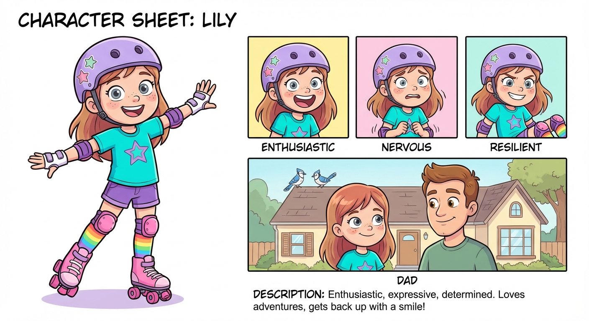

*An enthusiastic, expressive girl who is excited about new adventures but gets nervous when things feel wobbly. She's determined and resilient — when she falls, she gets back up with a smile.*

## Character: Dad (Mike)

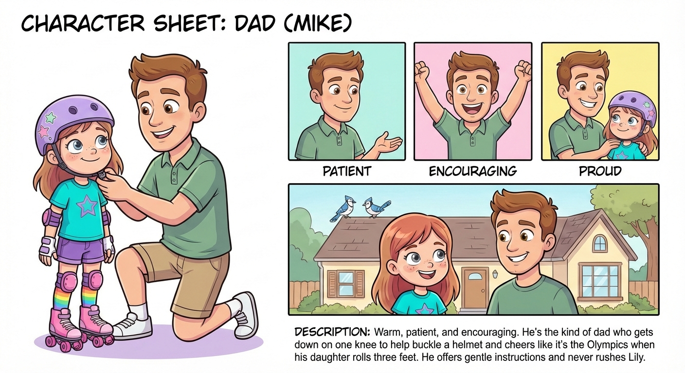

*Warm, patient, and encouraging. He's the kind of dad who gets down on one knee to help buckle a helmet and cheers like it's the Olympics when his daughter rolls three feet. He offers gentle instructions and never rushes Lily.*

## Character: Robin & Jay

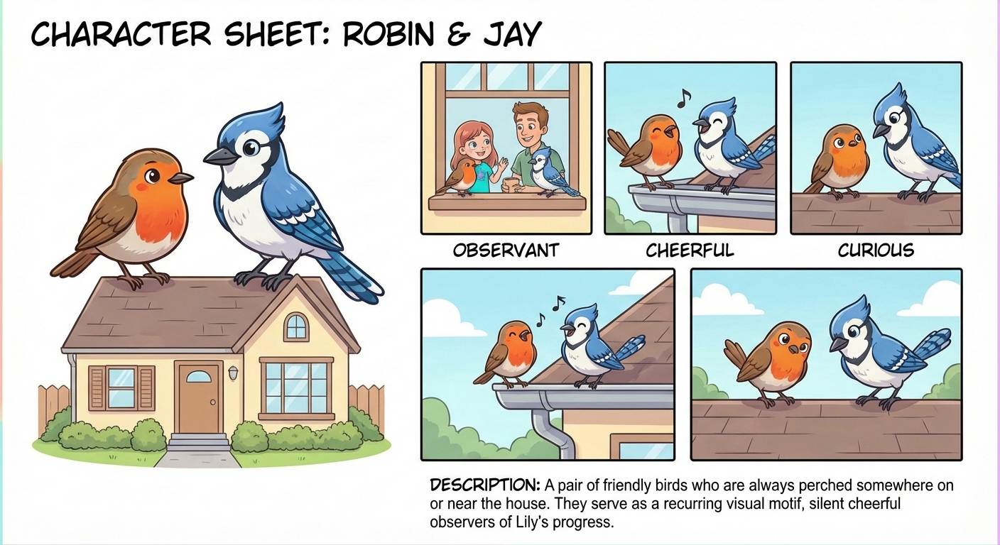

*A pair of friendly birds — one robin (reddish-orange breast) and one blue jay — who are always perched somewhere on or near the house. They serve as a recurring visual motif, silent cheerful observers of Lily's progress.*

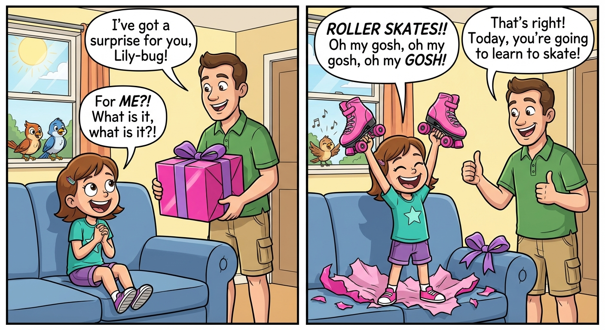

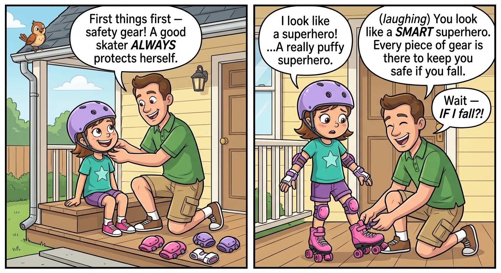

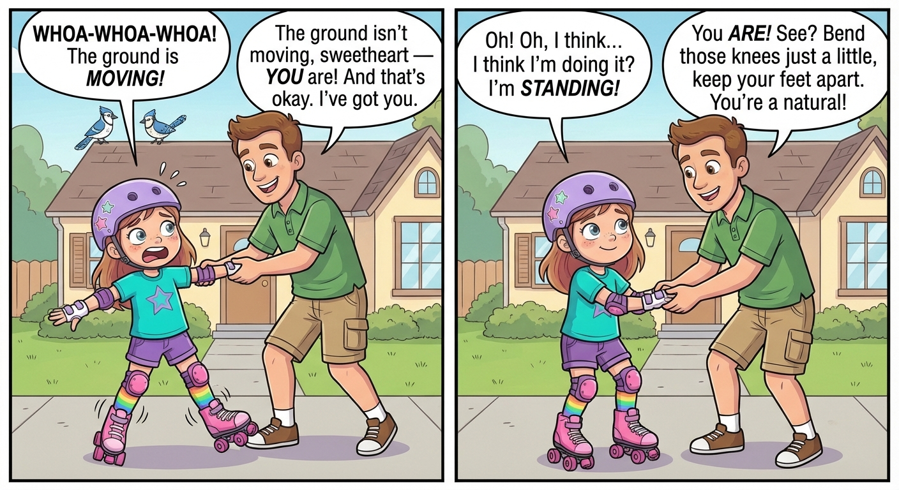

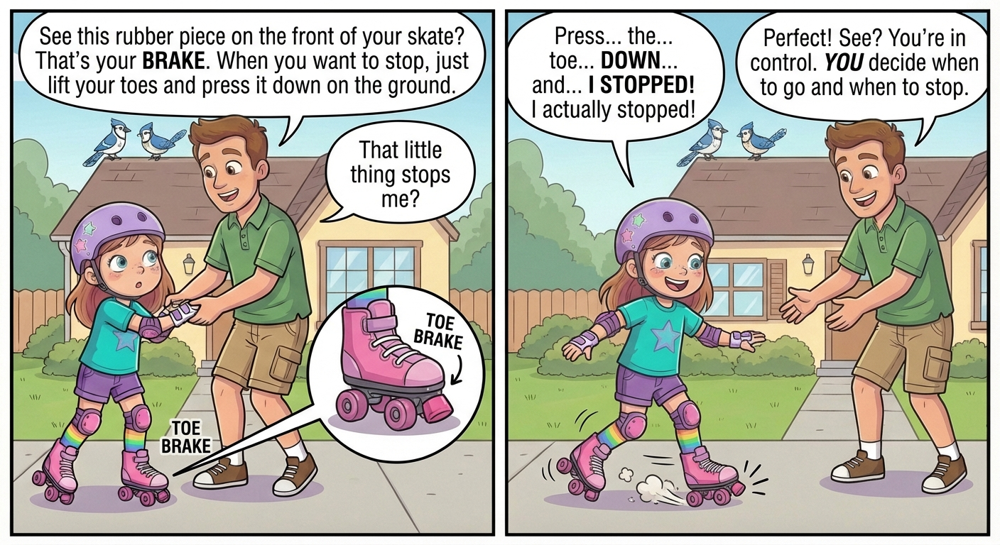

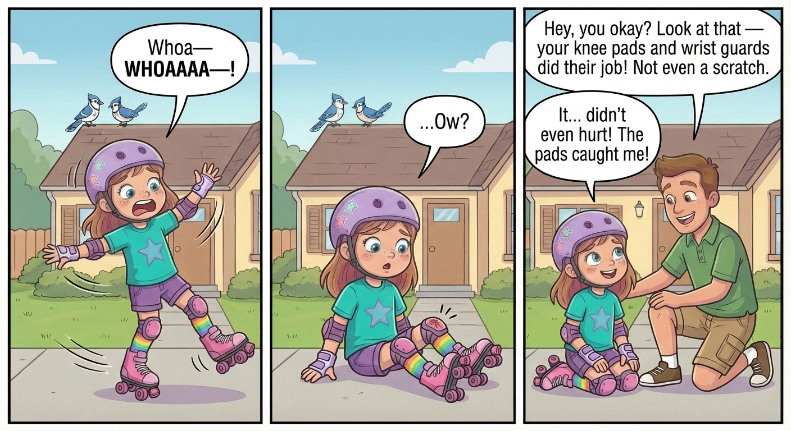

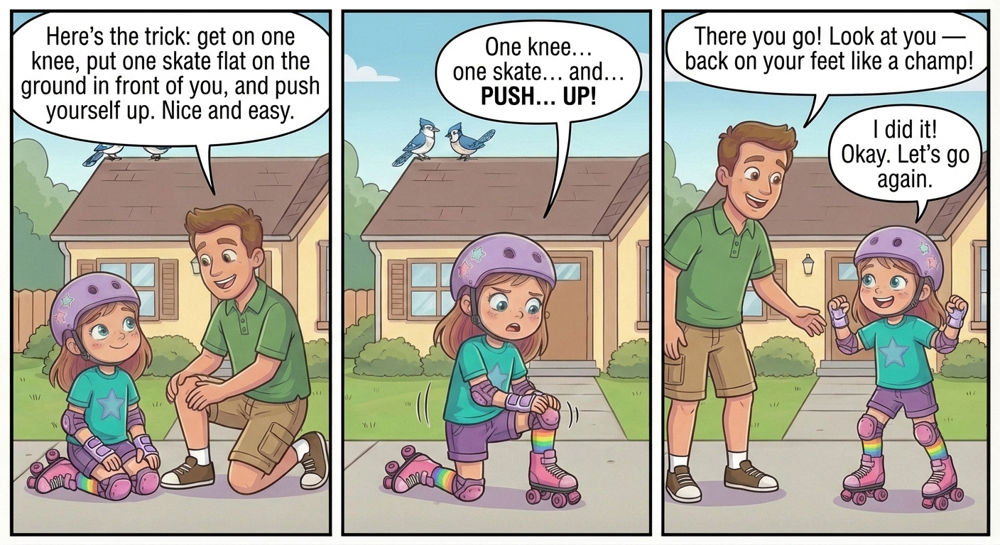

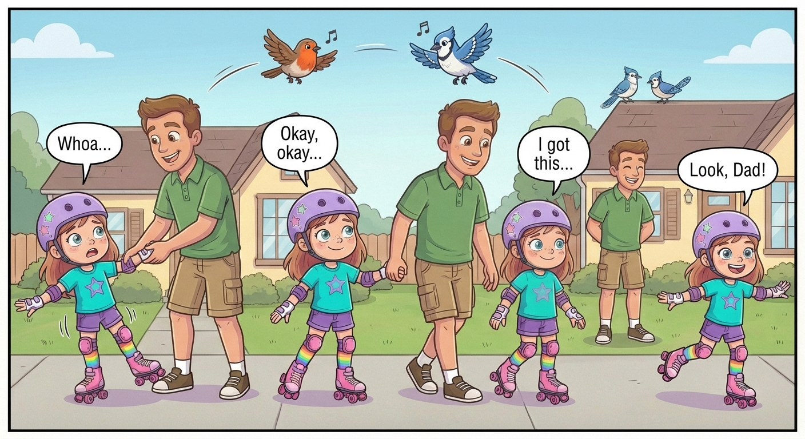

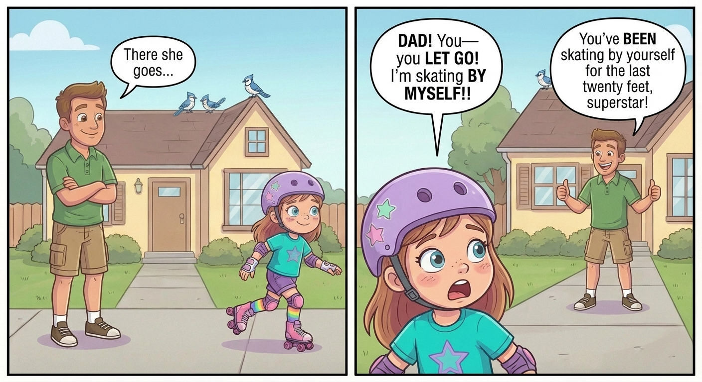

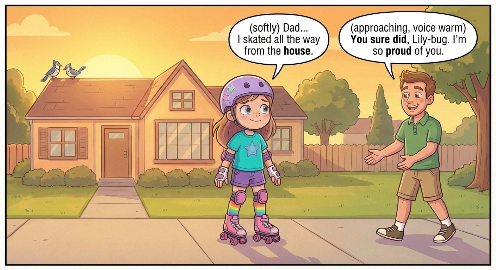

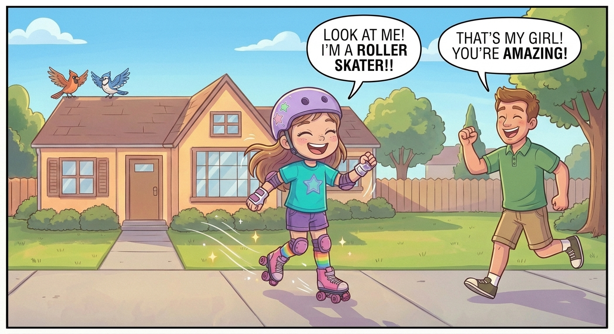

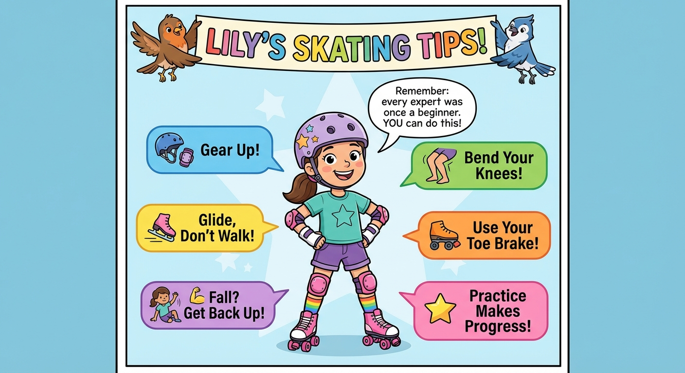

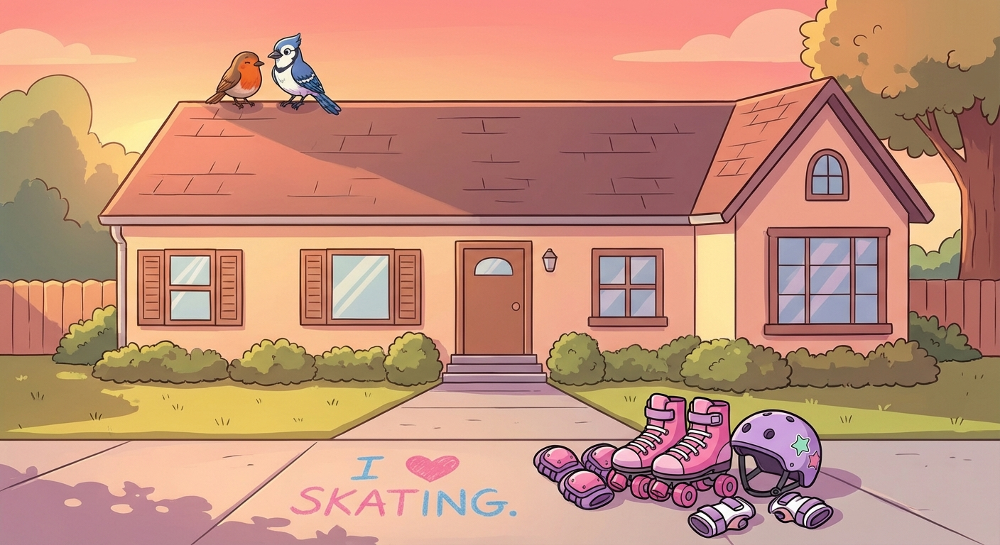

