# Rolling with Confidence: A Beginner’s Guide to Roller Skating

Inspired by Lily’s journey in the "Learn to Skate!" comic, this tutorial guides absolute beginners through their very first roller skating session. From properly securing safety gear to mastering the "ready position," gliding, and safely stopping, this guide transforms a driveway or living room into a skating rink. It emphasizes safety, balance, and the fundamental mechanics needed to roll freely.

**⏱️ Estimated Time:** 45 minutes

**🎯 Skill Level:** Beginner

**💻 Platform:** Physical World / Roller Skating

---

## What You'll Learn

✓ Correctly wear and secure all essential safety gear (helmet, wrist guards, knee/elbow pads).
✓ Demonstrate the "Ready Position" to maintain balance and center of gravity.
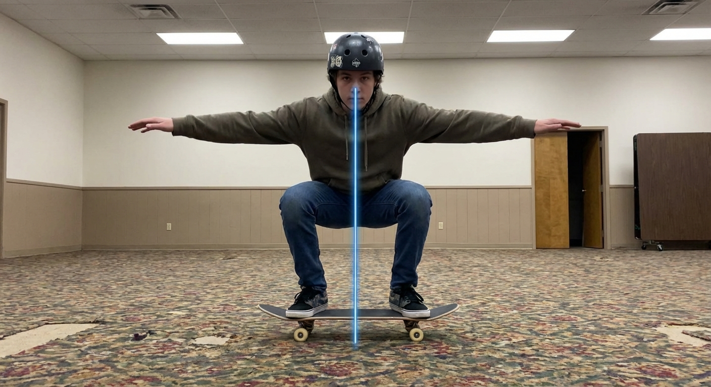
✓ Execute a safe fall and return to a standing position without assistance.
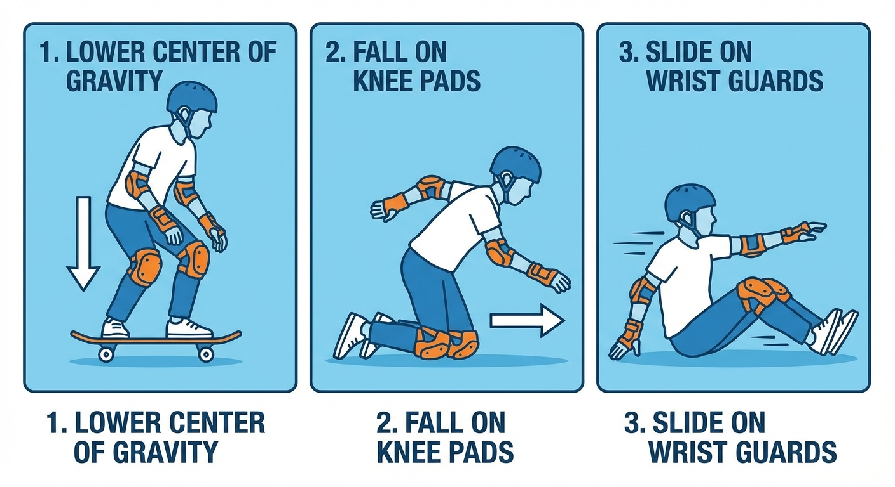
✓ Perform the "Duck Walk" to initiate forward movement.
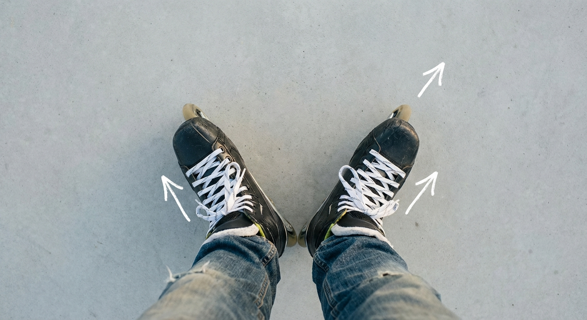
✓ Apply the toe-stop brake to bring the skates to a halt.
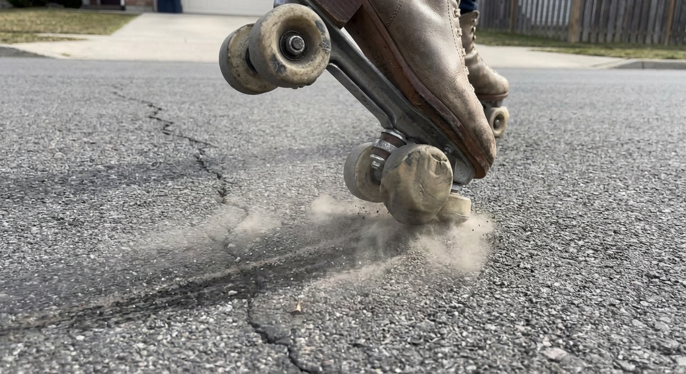

---

## Prerequisites

### Required

- **Roller Skates** (hardware): Quad skates (4 wheels) recommended for beginners.
  - Download: 
- **Safety Gear** (hardware): Helmet (bicycle or skate certified), Knee pads, Elbow pads, and Wrist guards (hard plastic splint side faces the palm).
  - Download: 
- **Appropriate Clothing** (clothing): Comfortable athletic wear (shorts or leggings); thick socks (to prevent blisters).
  - Download: 
- **Skating Surface** (environment): A flat, smooth, dry surface free of debris (e.g., a driveway, garage, or empty tennis court). Optional: A patch of carpet or grass for the initial standing steps.
  - Download: 

---

## Tutorial Steps

### Step 1: The Safety Sandwich (Gearing Up)

Before you even touch your skates, you must construct your "Safety Sandwich." In roller skating, falling is not a sign of failure; it is a part of the learning process. The goal of this step is to ensure that when you fall, you slide safely rather than getting hurt. Properly fitted gear gives you the psychological confidence to try new movements. Do not skip this step.

**1. Secure Your Knee and Elbow Pads**
Sort your pads (knee pads are larger) and check for 'L' or 'R' labels. Orient the pad so the hard plastic shell faces out and the wider part is at the top. Slide your limb through the fabric sleeve (if present) until the joint rests in the center of the plastic cup. Fasten the elastic Velcro straps tightly enough that they do not slide when you wiggle, but not so tight that the## Generation Complete

**Statistics:**
- Total Steps: 9
- Prerequisites: 4
- Word Count: 6860
- Code Blocks: 0
- Total Time: 378.476s

**Completed:** 2026-02-08 19:22:31
ack. Slide your hand in through the thumb hole so the hard plastic rests against the heel of your palm. Secure the middle strap tightly across the back of your wrist, then secure the top and bottom straps. The plastic should feel like a skid plate on your palm, allowing your hands to slide if you fall forward.
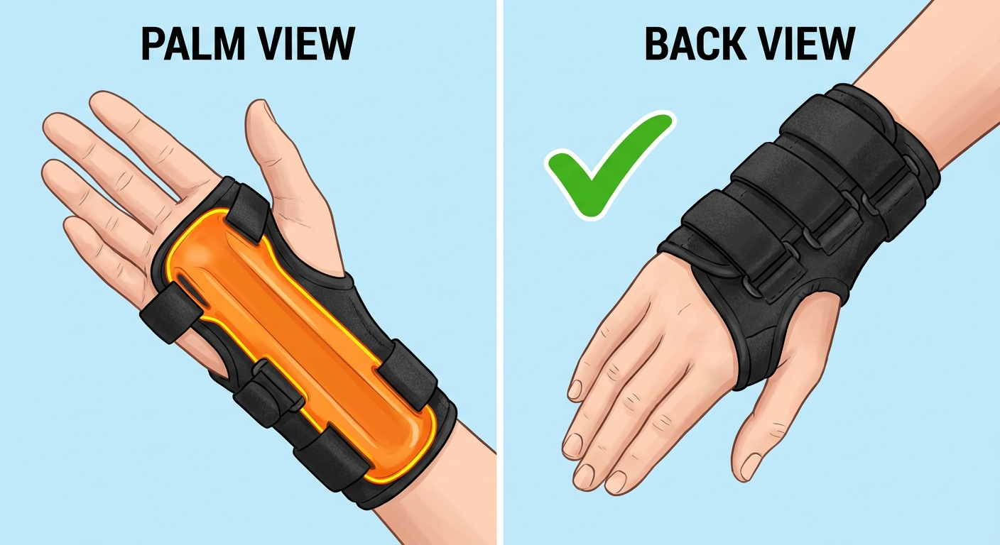

**3. Fasten and Test Your Helmet**
Position the helmet level on your head, covering your forehead (it should not be tilted back). Snap the buckle under your chin. Perform the 'Two-Finger Test': insert your index and middle finger between the strap and your chin. If more than two fingers fit, tighten the strap until only two fingers fit snugly. Finally, perform the 'Shake Test' by shaking your head vigorously 'no'; the helmet should move with your head, not slide independently.
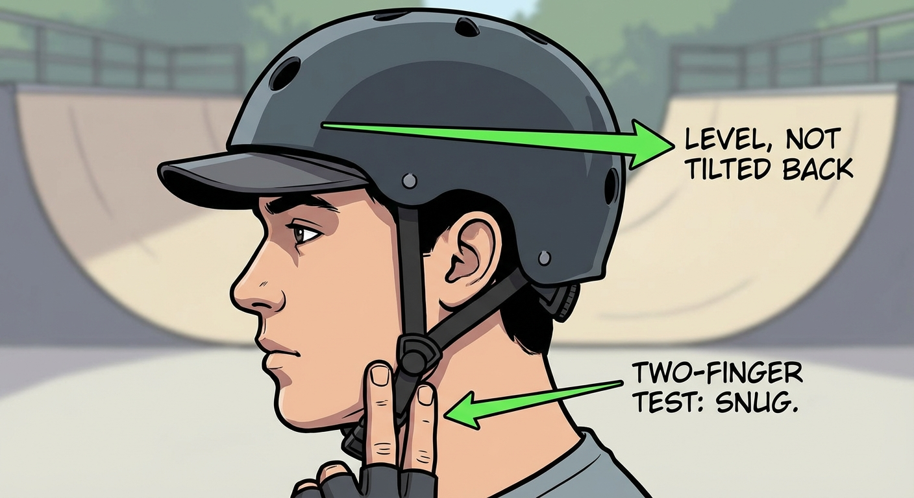

📸 Close-up photo of a knee pad properly secured. The user's leg is bent at a 90-degree angle, showing the plastic cap centered over the knee and straps pulled taut.
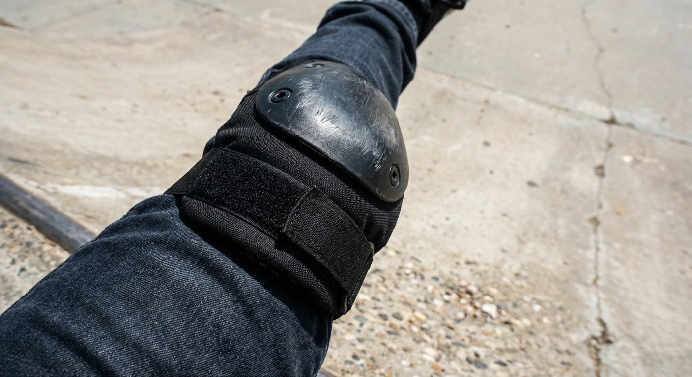

📸 A first-person view of a user's hands. The palms are facing up, clearly showing the hard plastic splint covering the palm and wrist area. The straps are fastened on the back of the hand.

📸 Side profile photo of a user wearing a helmet. The helmet sits low on the forehead. The user is demonstrating the "two-finger test" by placing two fingers between the strap and their chin.
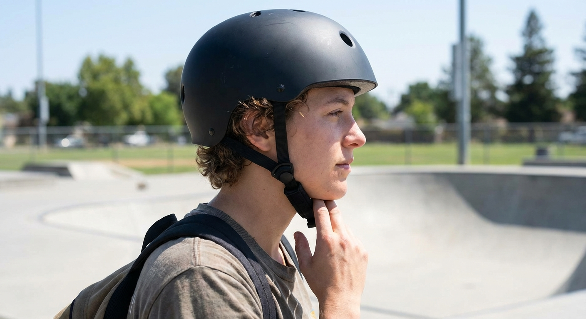

**Expected Outcome:** You are now fully armored. You should feel slightly restricted in movement (like a turtle or the Michelin Man)—this is normal.
*   Knees/Elbows: The hard caps cover your joints completely.
*   Wrists: The hard plastic is on your palms.
*   Helmet: Sits low on your forehead and does not wobble.

**Verify Success:**
1. **Tap Test:** Use your knuckles to rap on your knee and elbow pads. They should sound solid and should not shift position.
2. **Slide Check:** Place your palms on a wall and push. The hard plastic splint should make contact with the wall, preventing your skin from touching the surface.
3. **Head Bob:** Look all the way up at the sky. The back of your helmet should not touch your neck/shoulders. Look all the way down. The helmet should not slide forward over your eyes.

**⚠️ Common Issues:**
- **Wrist guards feel uncomfortable when making a fist**: Diagnosis: The splint might be on the back of your hand. Solution: Take them off and ensure the hard plastic curve is cupping your palm.
- **Helmet slides back exposing forehead**: Diagnosis: The 'Y' straps around the ears or the chin strap are too loose. Solution: Shorten the straps so the helmet sits level just above your eyebrows.
- **Pads are cutting off circulation**: Diagnosis: Tingling fingers or toes. Solution: Loosen the Velcro straps slightly. They need to be secure, not tourniquets.

---

### Step 2: Lacing Up for Support

Proper lacing is the single most critical factor in preventing ankle injuries and ensuring you can control your movement. A skate must act as an extension of your leg; if it is loose, your foot will move inside the boot, causing instability and blisters. Before starting, find a stable place to sit and ensure you are wearing socks that extend higher than the skate cuff.

**1. Prepare the Boot:** Sit down securely. Loosen the laces all the way down to the toe box, pulling slack through every eyelet until the boot opens wide. Open any velcro straps or plastic ratchet buckles completely, and pull the tongue forward and out.

**2. Insert and Seat the Heel:** Slide your foot into the skate. Kick your heel down by lifting your leg slightly and tapping the back wheel firmly against the ground 2–3 times. This forces your heel into the rear pocket of the boot.

**3. Position the Tongue:** Pull the tongue up firmly and center it directly over the bridge of your foot and shin. Ensure the tongue is not twisted or folded.

**4. Tighten Laces (The "Zonal" Method):** Tighten progressively from the toe up.
*   **Zone 1 (Toes/Bridge):** Pull the laces snugly up to the bend of your ankle.
*   **Zone 2 (The Ankle - Critical):** Pull the laces very tight at the ankle bend to create a heel lock.
*   **Zone 3 (The Cuff):** Lace up the remaining eyelets/hooks to be snug but allow forward flex. Tie a secure double bow knot and tuck the loops away.
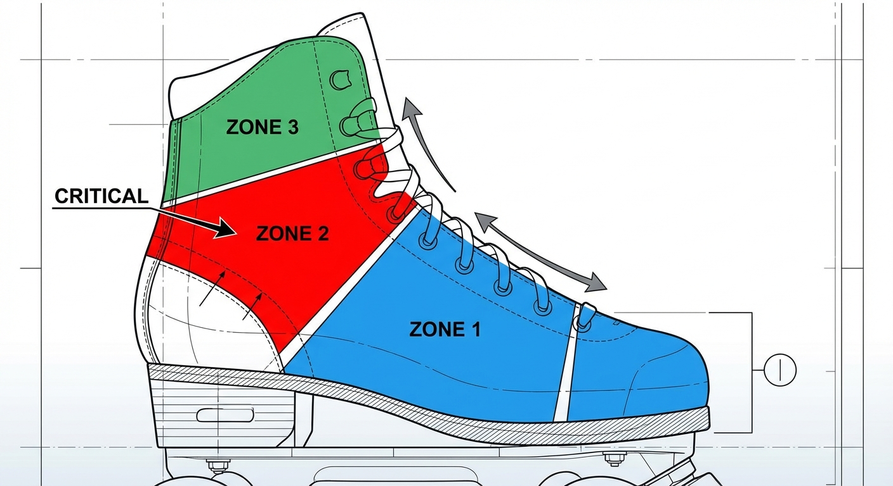

**5. Secure Straps and Buckles:** If applicable, pull the Velcro Power Strap (45-degree strap) tight across the heel. Feed the plastic ladder strap into the Top Buckle (Cuff) receiver and ratchet it tight until it clicks firmly. It should feel rigid against your shin, but not painful.

📸 Side view of a skater sitting, tapping the back wheel of the skate against the ground to seat the heel.
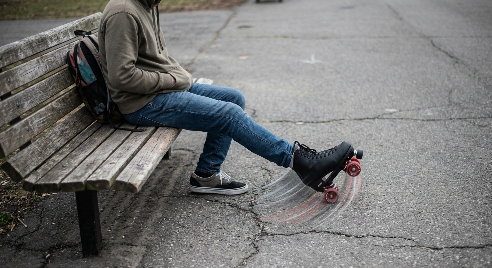

📸 Close-up of hands tightening laces. Arrows indicate pulling slack out from the bottom eyelets upward, not just pulling the top.

📸 Close-up of a finger pressing the ratchet buckle to tighten the top cuff strap.
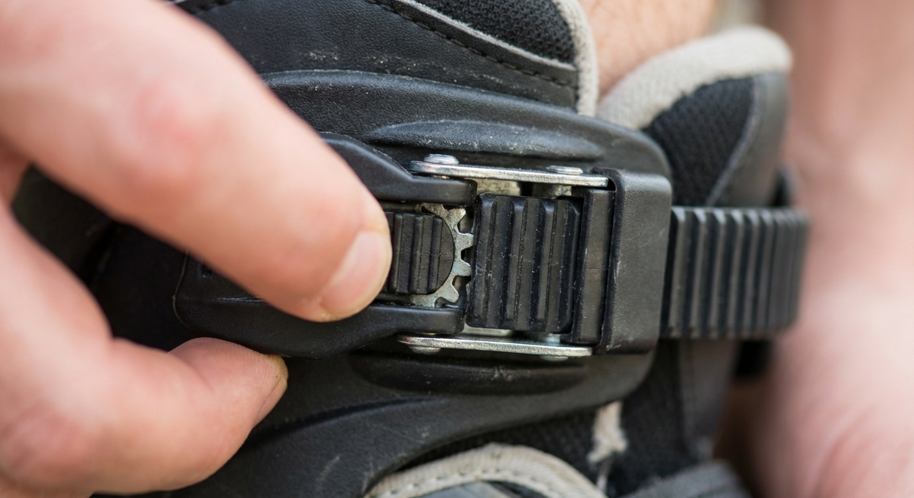

**Expected Outcome:** The skate should feel like a very firm handshake or hug around your entire foot (The "Firm Hug"). Your heel should be locked in the back of the boot and should not lift up when you flex your foot (Immobile Heel). When you look down, the skate boot should align straight with your leg, not leaning inward or outward (Straight Ankles).

**Verify Success:**
1. The Toe Wiggle: Wiggle your toes. You should be able to move them slightly inside the toe box. If they are crushed or curled, the skate is too small or laced too tightly at the very bottom.
2. The Finger Test: Try to slide one finger down the back of the skate, behind your heel. Pass: You cannot fit your finger in, or it is extremely difficult. Fail: Your finger slides in easily. (Action: Re-kick your heel back and re-tighten the ankle laces).
3. The Circulation Check: Wait 60 seconds. If your foot starts to tingle or go numb, you have cut off circulation. Loosen the buckle one "click" or slightly loosen the laces over the bridge of the foot.

**⚠️ Common Issues:**
- Pronation (Inward Rolling): If you stand up and your ankles collapse inward toward each other, your skates are too loose at the top. Sit back down and tighten the top buckle and top laces significantly.
- Lace Bite: Sharp pain on the front of the ankle. This is usually caused by a twisted tongue or a wrinkled sock. Take the skate off and smooth out the layers.
- Heel Lift: If your heel lifts off the sole when you lean forward, you lose control. Focus on tightening the "45-degree strap" (the velcro strap across the ankle) or the laces right at the bend of the ankle.

---

### Step 3: Finding Your Footing (Carpet/Grass Start)

Wheels are designed to reduce friction, making standing unstable for beginners. To learn balance without the panic of rolling, you must first stand on a high-friction surface (thick carpet, rug, or firm grass). This 'mutes' the wheels, allowing you to focus entirely on posture and center of gravity.

**Instructions for Standing Up:**
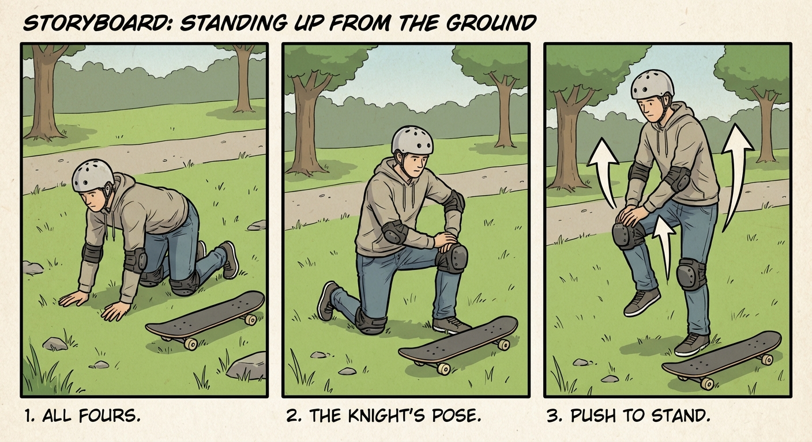

1. **Select Surface:** Choose a firm, high-friction surface (carpet, rug, or dry grass).
2. **Get to All-Fours:** Crawl onto the surface and assume a hands-and-knees position.
3. **Knight's Pose:** Transition to a kneeling lunge by bringing your dominant leg forward, placing all four wheels flat on the ground.
4. **The Push-Up:** Place both hands on the thigh of the upright leg, lean slightly forward, and push up to lift your back knee off the ground. Bring your feet together.
5. **Ready Stance:** Immediately establish the correct posture: feet shoulder-width apart, knees deeply bent (obscuring view of toes), hips tucked, arms out for balance, and eyes looking at the horizon.

📸 A side-view photo showing a skater on hands and knees on grass. The skater is wearing full gear, looking forward, with skates pointing backward.

📸 A photo of the skater in the 'Knight's Pose'. One knee is on the ground, the other foot is flat on the ground with the knee bent at 90 degrees. Hands are resting on the elevated thigh.

📸 A photo of the skater standing on grass in the 'Ready Stance'. Knees are bent, feet are shoulder-width apart, and arms are out for balance. A green line overlay indicates vertical alignment from shoulders to hips to heels.

**Expected Outcome:** You are standing upright on your skates on the carpet or grass. You should feel stable and stationary. Your wheels should not be rolling. You should feel the weight of the skates and the pressure on your shins against the tongue of the boot.

**Verify Success:**
1. **The March:** While keeping your knees bent, lift one foot two inches off the ground and place it back down. Repeat with the other foot. You should be able to "march" in place without losing balance.
2. **The Squat:** Dip your hips down two inches and rise back up (keeping knees bent the whole time). You should feel your weight centered in your heels, not your toes.

**⚠️ Common Issues:**
- **Falling Backward:** Cause: Your legs are too straight. Solution: Bend your knees. Imagine you are about to sit in a chair, but stop halfway. Your shins must press forward against the skate tongue.
- **Wheels Sinking:** Cause: The ground is too soft (mud or deep shag carpet). Solution: Move to a patch of dirt with shorter grass or a lower-pile rug. You need a firm base beneath the friction.
- **Wobbly Ankles:** Cause: Your laces are too loose (see Step 2), or your feet are too close together. Solution: Widen your stance to shoulder-width.
- **Panic/Stiffness:** Cause: Fear of falling is causing you to tense up, which actually makes balancing harder. Solution: Take a deep breath. Remind yourself that on grass/carpet, you cannot roll away. Wiggle your fingers to release tension.

---

### Step 4: The "Ready Position" (Posture)

Now that you are standing on a stable surface (carpet or grass), you must master the fundamental posture of roller skating. Standing straight up with locked knees is dangerous as it shifts your center of gravity backward, leading to falls on your tailbone.

The "Ready Position" (also known as the "Safety Box") lowers your center of gravity and engages your leg muscles to act as shock absorbers. You should return to this position whenever you feel unstable or stop moving.

**Instructions:**
1. **Set Your Base:** Position your feet parallel and shoulder-width apart.
2. **Engage the "Shin Press" (Knee Bend):** Bend your knees significantly until they are vertically aligned over your toes. You must feel the front of your shins pressing firmly against the padded tongue of your skate boot.
3. **Hinge at the Hips:** Lean your upper body slightly forward to counterbalance the wheels. Hinge at your hips (not your waist), keeping your back straight and chest proud. Your nose, knees, and toes should roughly form a vertical line.
4. **Deploy "Zombie Arms":** Extend your arms straight out in front of you or slightly to the sides, roughly at chest height. This weight distribution acts as a balancing pole and prevents you from tipping backward.

📸 Side-profile diagram showing a skater. A vertical line is drawn from the knees down, intersecting with the toes of the skates. Caption: Correct knee alignment: The knees should project forward enough to cover the view of your toes.

📸 Front-facing photo of a skater in the Ready Position. Feet are shoulder-width, knees are bent, and arms are extended forward (Zombie Arms). Caption: The complete Ready Position. Note the stability provided by the wide stance and extended arms.

**Expected Outcome:** Stability: You feel grounded and heavy. It should feel difficult to tip over.
Muscle Engagement: You may feel a slight burn in your quadriceps (thigh muscles). This is normal and indicates your muscles are supporting your weight rather than your skeletal joints.
Center of Gravity: You feel your weight centered over the arches of your feet, rather than on your heels.

**Verify Success:**
1. The Sight Test: Look down without tilting your head excessively. Can you see your toes? Pass: No, your knees are blocking the view of your toes. Fail: Yes, you can see your laces and toes clearly (Bend your knees more!).
2. The Tap Test: While maintaining the squat, try to lift one foot slightly and tap it down, then the other. Pass: You can shift weight side-to-side without losing balance. Fail: You feel like you are falling backward when lifting a foot (Lean forward more and tighten your core).

**⚠️ Common Issues:**
- Issue: Feeling like falling backward. Diagnosis: You are standing too tall or your weight is on your heels. Solution: Bend your knees deeper and reach your arms further forward. Ensure your shins press the boot tongue.
- Issue: Sore lower back. Diagnosis: You are hunching over at the waist instead of hinging at the hips. Solution: Straighten your spine. Stick your butt out slightly and keep your chest lifted/proud.
- Issue: Wobbly ankles. Diagnosis: Your feet are too close together (pencil stance). Solution: Widen your stance to at least shoulder-width to create a stable base.
- Issue: Looking at the ground. Diagnosis: Instinct causes you to look at your feet, which throws off balance. Solution: Keep your chin up. Look at the horizon or a fixed point at eye level.

---

### Step 5: Learning to Fall (and Get Up)

Before you attempt to roll, you must learn how to crash. The fear of falling is the biggest barrier to learning how to skate. By learning to fall safely, you remove the fear of injury.

**The Golden Rule of Skating:** If you feel like you are going to fall, **get low**.

Most beginners instinctively stiffen their legs and lean backward when they lose balance. This is dangerous because it leads to tailbone injuries or hitting the back of your head. You must retrain your brain to fall **forward**, allowing your protective gear to absorb the impact.

### Sub-step 5.1: The Controlled Fall (The "Safe Crash")
Perform this practice fall on your carpet or grass surface first. Do not attempt this on concrete until you have practiced it several times on a soft surface.

1.  **Assume the Ready Position:** Stand with your feet shoulder-width apart and knees bent.
2.  **Simulate a loss of balance:** If you feel unstable, drop your hips lower, as if doing a deep squat.
3.  **Commit to the ground:** Fall forward intentionally.
4.  **Impact Order:**
    *   **Knees First:** Land directly on the plastic caps of your knee pads. Trust the pads.
    *   **Hands Second:** As your knees hit, extend your arms forward. Land on the hard plastic splints of your wrist guards.
    *   **Head Up:** Keep your chin up and look forward, not down at the ground.

**CRITICAL SAFETY WARNING:** Never catch yourself with your fingers extended or palms flat without wrist guards. Land on the *heels* of your hands where the wrist guard plastic is located. Keep your fingers slightly curled upward to prevent jamming them.

### Sub-step 5.2: The Recovery (Getting Back Up)
Getting up with wheels on your feet is slippery. If you try to stand up like you are wearing shoes, your feet will roll out from under you.

1.  **Get to a kneeling position:** From your crash position (on all fours), lift your torso so you are kneeling upright on both knees.
2.  **The "Proposal" Pose:** Lift one foot and place the skate flat on the ground in front of you. Your knee should be bent at 90 degrees.
3.  **Anchor your hands:** Place both hands firmly on your **bent knee** (the one with the skate on the ground). Do not put your hands on the floor to push up.
4.  **Push and Stand:** Press your hands down onto your knee to lift your weight. As you rise, bring your back foot forward to meet your front foot.
5.  **Immediate Ready Position:** As soon as the second foot touches the ground, immediately sink back into the "Ready Position" (knees bent, hands out).

📸 A skater on the ground in a "four-point" position. Their weight is supported by their knee pads and wrist guards. Their back is relatively straight, and their head is up.

📸 A skater in the "Proposal Pose." One knee is on the ground, the other foot is flat on the ground. Both hands are resting on the elevated knee, ready to push up.

**Expected Outcome:** The Fall: You should feel a jarring impact, but no pain. You should feel the pressure on your shins/knees (pads) and the heels of your hands (wrist guards), not on your bones.
The Recovery: You should be able to return to a standing position without your feet rolling away from you. You should end up in a stable, squatting stance.

**Verify Success:**
1. Stand on the carpet or grass.
2. Intentionally drop to your knees and hands (forward fall).
3. Verify that your butt did not hit the ground and you did not fall backward.
4. Perform the "Proposal" recovery method to return to standing.
5. Repeat this cycle 3 times to build muscle memory.

**⚠️ Common Issues:**
- Issue: Falling Backward (The "Banana Peel" Slip). Cause: Straightening legs when feeling wobbly. Fix: If you feel unstable, grab your knees. This forces you to bend forward and lowers your center of gravity, preventing a backward fall.
- Issue: The "Bambi" (Feet rolling apart while standing up). Cause: Pushing off the ground instead of the knee, or taking too long to bring the second foot in. Fix: Ensure your hands are pushing down on your *thigh/knee*, not the floor. Bring the second foot in quickly and immediately squat.
- Issue: Wrist Pain. Cause: Landing with elbows locked straight. Fix: Keep a slight bend in your elbows when you fall forward. Your arms should act like shock absorbers, not rigid poles.

---

### Step 6: The Duck Walk (First Movement)

The objective of this step is to transition from a stationary posture to forward motion using the "Duck Walk" technique, which generates necessary traction on smooth surfaces. Unlike normal walking, skating requires angling the feet to prevent uncontrolled rolling or splitting.

**1. Transition to the Rolling Surface:** If practicing on a soft surface, move to the smooth surface (pavement, rink, etc.). Assume the Ready Position (deep knee bend, hands out) *before* stepping onto the smooth surface, and maintain the deep knee bend as you step up.

**2. Form the "V" Stance:** Once on the smooth surface, immediately bring your heels close together (almost touching) and point your toes outward to form a V-shape (or a slice of pizza). This angle is crucial for stability and preventing backward rolling.

**3. The March (Not the Glide):** Do not try to roll or slide. Keep your knees deeply bent. Shift your weight to one leg, lift the opposite skate completely off the ground (1-2 inches), and place it back down, maintaining the outward angle. Repeat this marching motion.

**4. Move Forward:** Continue marching (Left, Right, Left, Right). With every step, push slightly *down and back* into the heel of the skate that is on the ground. Because your feet are angled, this downward pressure will naturally propel your body forward. Take small, choppy steps.

📸 Top-down view of skates on pavement. The heels are 1 inch apart, and the toes are pointed outward at a 45-degree angle, forming a clear 'V' shape.

📸 Side view of a skater. One foot is lifted slightly off the ground. The skater is in a squat position, looking forward, not down at their feet.

**Expected Outcome:** Visual: You are moving forward at a very slow pace (slower than walking speed). Your upper body remains level; you are not bobbing up and down significantly, only your legs are moving. Physical: You feel a distinct "grip" on the pavement. You do not feel like you are slipping backward. You may feel tension in your outer glutes and quads. Audio: You should hear a rhythmic clomp-clomp-clomp sound of the wheels stepping on the pavement, rather than the whirrr of rolling bearings.

**Verify Success:**
1. The Backward Test: While marching in the V-shape, try to lean back slightly. You should feel the brakes (toe stops) or the angle of the wheels catch you, preventing you from rolling backward.
2. Distance Check: Successfully march forward 10 feet (3 meters) without straightening your legs or grabbing a wall for support.

**⚠️ Common Issues:**
- Rolling Backward: Cause: Your feet are parallel (pointing straight ahead) instead of angled. Solution: Force your toes out wider. Check your heels—they must be close together.
- Doing the Splits: Cause: You are not lifting your feet; you are trying to slide them. Solution: Pick the skate up completely off the ground with every step. Think "March," not "Skate."
- Feeling Unstable/Wobbly: Cause: Your legs are too straight. Solution: BEND YOUR KNEES. If you feel wobbly, drop your hips lower, as if sitting in a chair.
- Toe Stop Tripping: Cause: You are pointing your toes down when you lift your foot. Solution: Keep your foot flat (parallel to the ground) when you lift it. Do not point your toes like a ballerina.

---

### Step 7: The Push and Glide

The "Push and Glide" is the fundamental movement of roller skating, introducing momentum and transitioning from the stepping motion of the Duck Walk to a fluid roll. Unlike walking, skating requires pushing **sideways** to generate forward motion.

**Instructions:**
1. **Assume the Starting Stance:** Return to the Ready Position (bent knees, V-stance, 45-degree angle).
2. **Shift Your Weight:** Shift 100% of your body weight onto the supporting leg (e.g., left leg). The pushing foot (right foot) should feel light.
3. **The Push (Power Phase):** Push the right foot outward and slightly back (if facing 12:00, push toward 4:00). Do not push straight back. Keep all four wheels on the ground until the leg is fully extended.
4. **The Glide (Rolling Phase):** Keep weight centered over the rolling left skate. Lift the pushing right skate slightly off the ground. Hold this one-footed glide for a count of "One, Two."
5. **The Recovery (Reset):** Bring the pushing foot back underneath the body, returning gently to the center "V" position.
6. **Repeat on the Other Side:** Shift weight to the right leg and push the left foot out toward 8:00, gliding on the right leg.

📸 Top-down view of skates on pavement. The heels are 2 inches apart, toes pointing outward in a 'V' shape. Knees are bent so they obscure the view of the laces.

📸 Rear-view of a skater. The left leg is bent and supporting weight. The right leg is extended diagonally outward to the side, wheels still touching the pavement.

**Expected Outcome:** Visual: You are moving forward smoothly. Your upper body remains relatively still while your legs extend outward diagonally. You are no longer "stepping" but "streaming" over the pavement.
Physical: You will feel the push engaging your outer glutes and hips, rather than just the front of your thighs. You will feel a moment of weightlessness or "flight" during the glide phase.
Audio: The rhythmic "clomp-clomp" of the Duck Walk should be replaced by a consistent, low-pitched "whirrrrrr" or hum of the bearings spinning.

**Verify Success:**
1. Perform the "Two-Second Test": Push once, then count "One Mississippi, Two Mississippi" while gliding on the supporting leg. Success is maintaining balance and forward momentum for the full two seconds before putting your other foot down.

**⚠️ Common Issues:**
- The "Toe Pick" Push: Symptom is tripping forward or scratching sound. Cause is pushing off toes. Fix: Push through the heel and the side of your foot, keeping all four wheels flat on the ground until the leg is fully extended.
- The "A-Frame" Wobble: Symptom is feet drifting too far apart and knees knocking. Cause is not returning feet to the center "V" position. Fix: Focus heavily on the Recovery phase, ensuring your feet return back together under your hips after every push.
- Veering in Circles: Symptom is turning sharply after a push. Cause is leaning the ankle (pronating or supinating) on the gliding foot. Fix: Ensure your gliding knee is directly over your toes and pointed straight ahead in the direction of travel to maintain proper edges.

---

### Step 8: Steering with Your Body

Now that you have mastered the **Push and Glide** and are moving forward with momentum, you need to learn how to control your direction. Unlike walking, where you pick up your feet to change direction, steering on roller skates relies on physics and weight distribution. The trucks (axles) on your skates are designed to pivot when pressure is applied to one side. By shifting your body weight, you force the wheels to angle, creating a smooth, arcing turn without ever lifting your wheels off the ground.

### 1. Preparation: Establish the Glide
Before attempting to turn, you must be in motion. Steering relies on momentum; you cannot steer effectively while standing still.
1. Perform two or three strong pushes (as learned in **Step 7**) to build moderate speed.
2. Bring your feet parallel to each other, shoulder-width apart.
3. Enter the "Ready Position": Knees bent, chest up, and arms out for balance. You should be coasting forward.

### 2. Initiate the Turn with Your Eyes
Your body naturally follows your head. The safest way to steer is to lead with your vision.
1. While gliding, decide which direction you want to turn (e.g., Left).
2. Turn your head and look toward the left. Do not just move your eyes; physically turn your chin toward your destination.
3. Allow your shoulders to naturally rotate slightly to align with your head. Keep your hips facing forward for now.

### 3. Engage the Edges (The Lean)
This is the mechanical action that actually turns the skates. You are not "leaning over" at the waist (which causes falls); you are shifting your center of gravity.
1. **Dip the Shoulder:** Slightly drop the shoulder on the side you wish to turn (e.g., drop the left shoulder for a left turn).
2. **Point the Knees:** Gently push *both* knees toward the direction of the turn.
3. **Shift Weight to Edges:** For a Left Turn: Apply pressure to the **inner edge** of your right foot (big toe side) and the **outer edge** of your left foot (pinky toe side). For a Right Turn: Apply pressure to the **inner edge** of your left foot and the **outer edge** of your right foot.
4. **Hold the Glide:** Keep your knees bent and hold this leaning position. You will feel the skates begin to carve a curved path.

### 4. Return to Center
1. Once you have completed the curve or avoided the obstacle, straighten your head to look forward again.
2. Level your shoulders.
3. Bring your knees back to a neutral, upright position.
4. Your skates will naturally straighten out, and you will continue gliding in a straight line.

**Expected Outcome:** **Visual:** You will see the horizon move smoothly across your field of vision. You are no longer traveling in a straight line but are creating a wide "C" shape or arc on the pavement.
**Physical:** You will feel pressure on the sides of your feet inside the boot. You should feel the centrifugal force gently pulling you toward the outside of the turn, which you counteract by leaning your knees into the turn.
**Audio:** The "whirrr" of the bearings remains constant. You should *not* hear a skidding or scraping sound (which indicates sliding wheels rather than rolling).

**Verify Success:**
1. **The Slalom Test:** Place two distinct markers (like cones, rocks, or chalk marks) on the ground about 10 feet apart.
2. Gain speed and glide towards them.
3. Steer to the left of the first marker, then straighten out.
4. Steer to the right of the second marker.
5. **Success Criteria:** You successfully navigated around the objects without lifting your feet, stopping, or losing your balance.

**⚠️ Common Issues:**
- **Issue:** You tip over/fall to the side. **Diagnosis:** You are leaning with your upper body (torso) rather than your lower body. **Solution:** Keep your zipper/buttons vertical. Imagine your upper body is a statue and only your knees and ankles are flexible. Lean the *skates*, not the *spine*.
- **Issue:** The skates won't turn. **Diagnosis:** Your trucks (the suspension part of the skate) may be too tight, or you aren't moving fast enough. **Solution:** 1. Ensure you have gliding momentum. 2. If you still can't turn, use a skate tool to loosen the kingpin nut on your trucks by a quarter-turn (lefty-loosey) to allow more flexibility.
- **Issue:** You turn sharply and spin out. **Diagnosis:** You are putting too much weight on the front wheels. **Solution:** Keep your weight centered or slightly toward your heels. If you lean forward on your toes during a turn, the skates will hook sharply and trip you.
- **Issue:** Feet knock together. **Diagnosis:** Your stance is too narrow. **Solution:** Keep your feet at least shoulder-width apart. A wider base provides a more stable turning radius.

---

### Step 9: The Toe Stop (Braking)

Now that you have mastered the art of moving forward and steering, the most critical safety skill is learning how to stop. While there are several ways to brake on roller skates, the **Toe Stop Drag** is the most intuitive method for beginners using quad skates. This technique utilizes the rubber stopper located at the front of your boot to create friction against the ground, bringing you to a controlled halt.

### Prerequisites
*   Ensure your toe stops are tightly secured to your plates. Loose toe stops can rotate or fall off, causing accidents.
*   Perform this step on a flat, smooth surface. Avoid cracks or debris.

### Instructions

#### 1. Establish a Slow Roll
Begin by skating forward at a slow, manageable walking pace. Do not attempt to learn this stop at high speeds. Bring your feet parallel and coast briefly.

#### 2. Shift Your Weight (The Gliding Leg)
Choose your dominant leg to be your "Gliding Leg" (the front leg) and your other leg to be the "Braking Leg" (the back leg).
*   Shift approximately **80% to 90% of your body weight** onto your Gliding Leg.
*   Bend the knee of your Gliding Leg deeply. This lowers your center of gravity and provides the stability required to drag the other foot.

#### 3. Position the Braking Leg
While balancing on your Gliding Leg, extend your Braking Leg straight behind you.
*   Keep your hips square to the front; do not rotate your body sideways.
*   Your Braking Leg should be directly behind your gliding skate, not out to the side.

#### 4. Engage the Toe Stop
Point the toe of your Braking Leg down toward the pavement while keeping the heel elevated.
*   Gently lower the rubber toe stop until it makes contact with the ground.
*   **Crucial:** Do not step down onto the toe stop. You are **dragging** it, not standing on it.

#### 5. Apply Gradual Pressure
Once the rubber contacts the ground, you will feel resistance.
*   Slowly increase the downward pressure on the toe stop to increase friction.
*   Maintain your deep knee bend on the front Gliding Leg to absorb the deceleration force.
*   Continue dragging until you come to a complete standstill.

📸 Side profile of a skater rolling. A graphical overlay highlights the front knee bent at 45 degrees, with a "Weight Here" arrow pointing to the front thigh.

📸 Close-up of the rear skate. The wheels are off the ground, the heel is high, and only the flat surface of the rubber toe stop is touching the asphalt.

**Expected Outcome:** *   **Visual:** You will see yourself slowing down linearly. Your front leg remains planted while your back leg trails behind you like a tail.
*   **Physical:** You will feel a strong vibration in your back leg as the rubber drags across the pavement. You will feel significant tension in the quadriceps (thigh muscle) of your front leg as it supports your weight.
*   **Audio:** You should hear a distinct, continuous scraping or grinding sound (rubber against asphalt). It should sound consistent, not choppy.

**Verify Success:**
1. The Stability Check: You remained upright and balanced throughout the entire braking process without flailing your arms.
2. The Stop: You went from a rolling pace to zero movement within a distance of 5–10 feet.
3. The Posture: When you finished stopping, your feet were in a staggered stance (one forward, one back), not side-by-side.

**⚠️ Common Issues:**
- **The "Chatter" (Bouncing Foot)**: Your braking foot is bouncing or skipping off the pavement instead of dragging smoothly. **Solution**: You have too much weight on the back foot. Shift more weight to your front (gliding) leg and press the toe stop down more gradually.
- **Spinning/Turning**: You start turning in a circle as soon as the toe stop touches the ground. **Solution**: You are dragging your foot too far to the side rather than directly behind you, or your hips are twisted. Keep your braking foot aligned with your spine.
- **Ankle Pain**: Your ankle feels twisted or strained. **Solution**: You are likely "standing" on the toe stop. Remember: The front leg holds you up; the back leg only creates drag.
- **Tripping Forward**: You feel like you are going to tumble over your toes. **Solution**: You placed the toe stop down *in front* of you or directly under you. The toe stop must be dragged *behind* the body.

---

## Troubleshooting

### 1. The "Ankle Wobble" Instability

**Symptoms:**
- Skates feel "floppy" or disconnected from the leg.
- Ankles bend inward (pronation) or outward (supination) uncontrollably.
- Rapid fatigue in the lower calf muscles.

**Possible Causes:**
- Laces are too loose around the ankle cuff.
- Skate boot is too wide or lacks structural support.
- Relying on the boot for support rather than engaging stabilizer muscles.

**Solutions:**
1. Re-lace the Boot: Ensure laces are pulled tightest at the ankle bend (the "heel lock" area) and the top eyelets.
2. Check Truck Tightness: If the wheels tilt too easily, tighten the kingpin nut (the nut on the underside of the skate) by a quarter-turn to stiffen the suspension.
3. Engage Core: Focus on keeping your weight centered over the middle of your foot, not the edges.

### 2. "The Treadmill Effect" (Slipping Backward)

**Symptoms:**
- Feet slipping out from under the user.
- Feeling like you are walking on ice.
- Inability to generate forward traction.

**Possible Causes:**
- Pushing straight back (like walking) instead of pushing to the side.
- Feet are parallel (||) instead of in a "V" position.

**Solutions:**
1. Reset to Default Position: Stop moving and return to the "V" stance (heels together, toes apart).
2. Adjust Vector: Ensure you are pushing *outward* to the side (lateral force), not backward.
3. Weight Transfer: Verify you are shifting your weight completely onto the gliding leg before pushing with the other.

### 3. Unintentional Veering (Drift)

**Symptoms:**
- Constant need to correct steering to stay straight.
- One foot feels like it is "fighting" the other.

**Possible Causes:**
- The trucks (axles) are too loose or the cushions are unevenly compressed.
- A bent axle or warped plate.
- Leaning more weight on one side of the body due to dominant leg strength.

**Solutions:**
1. Inspect Hardware: Flip the skate over. Wiggle the wheels. If the truck flops around loosely, tighten the kingpin nut.
2. Check Wheel Spin: Spin all four wheels. If one stops immediately, the wheel nut is too tight, causing drag on one side. Loosen it slightly until it spins freely but doesn't wobble.
3. Body Scan: Ensure your hips and shoulders are square to your direction of travel.

### 4. "Monkey Toe" Cramping

**Symptoms:**
- Numbness in toes.
- Sharp pain in the arch.
- Instinctive curling of toes inside the boot (gripping).

**Possible Causes:**
- Laces are too tight across the bridge of the foot.
- Subconsciously trying to "grip" the sole of the boot with toes for stability.

**Solutions:**
1. Adjust Lacing Pattern: Loosen the laces over the top of the foot (bridge) while keeping the ankle tight. You can skip an eyelet over the painful area to relieve pressure.
2. Relax the Input: Consciously wiggle your toes while gliding. If you can wiggle them, you aren't gripping. Trust the laces to hold your foot, not your toes.

### 5. Sudden Backward Falls (System Crash)

**Symptoms:**
- Feet shooting forward faster than the upper body.
- Feeling of weight shifting to the heels.
- Arms flailing in circles ("windmilling").

**Possible Causes:**
- Standing too upright with locked knees.
- Looking up at the sky or leaning the torso backward.

**Solutions:**
1. Force Restart (The Knee Bend): Immediately bend your knees deeper. Your kneecaps should be vertically aligned over your toes.
2. Hand Placement: Keep hands in front of the body (the "Zombie" or "Keyboard" position). Never let hands drop behind the hips.
3. Chin Tuck: Keep your chin slightly tucked; looking up shifts weight backward.

### 6. The "Stutter" Stop (Brake Failure)

**Symptoms:**
- Loud rattling noise against the pavement.
- Leg vibrating violently.
- Ankle twisting unexpectedly.

**Possible Causes:**
- Applying pressure with a stiff/straight leg.
- Putting too much weight on the toe stop too quickly.
- Toe stop is set too high or too low.

**Solutions:**
1. Soft Knee: The braking leg must have a slight bend; do not lock the knee.
2. Gradual Compression: Drag the toe stop lightly at first (feathering), then increase pressure as you slow down.
3. Check Clearance: Place the skate flat on the ground. You should be able to fit 3-4 fingers between the back wheels and the floor when the skate is tipped onto the toe stop. Adjust the stopper height if necessary.

---

## Next Steps

🎉 Congratulations on completing this tutorial!

### Try These Next
- Practice "Bubbles" (or Lemons)
- Master the One-Foot Glide
- Learn the "A-Frame" Turn
- Drill Your "Safe Fall"

### Related Resources
- Dirty School of Skate (YouTube): Look specifically for her videos on "How to do Bubbles" and "Outdoor Skating Basics."
- Reddit r/Rollerskating Wiki: Covers gear maintenance, wheel hardness (durometer) guides, and progression checklists.
- Skatie (YouTube): Look for her tutorial on "Weight Transfer" to help with your one-foot glides.

### Advanced Topics
- Transitions (Front-to-Back)
- Crossovers
- The T-Stop
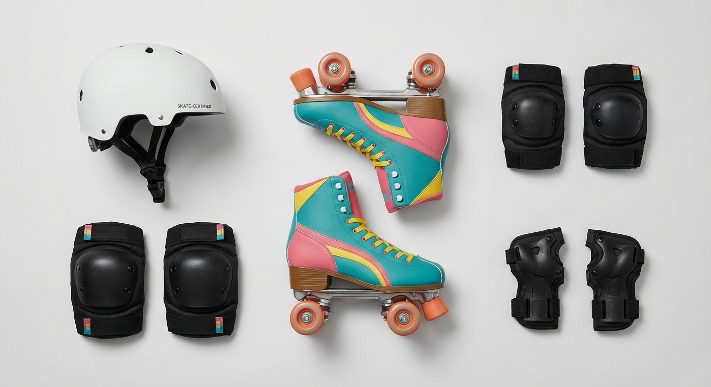
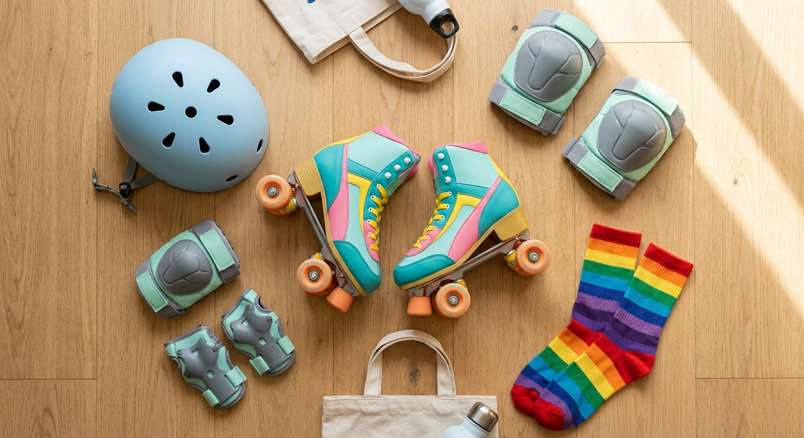