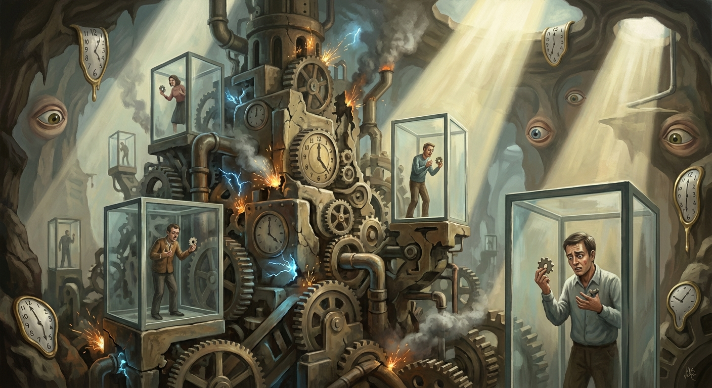

# The Architecture of Silence: Secret Knowledge as the Primordial Property

In the modern era, we are accustomed to thinking of property in terms of physical assets or legally codified intellectual property rights. However, beneath the surface of patents and copyrights lies a more ancient and fundamental mechanism for control: secret knowledge. Far from being merely hidden information, secret knowledge functions as a *flow-control mechanism*—a selective permeability layer that governs who may access what knowledge, under which conditions, and at what cost. It is not the information itself that constitutes power, but the calibrated regulation of its movement: the decisions about what passes through, what is held back, and what is revealed only in part. In this sense, secrecy is less a wall than a membrane, and the architecture of that membrane is the primordial form of property that predates the modern state.

Like all constructed systems, these flow-control regimes have a lifecycle. They are deliberately engineered—through ritual, regulation, or technical architecture—to channel knowledge along prescribed paths. But they are also subject to entropic decay: the gradual erosion of compartmentalization through leakage, institutional forgetting, and the sheer accumulating complexity of the systems they were built to govern. Every secrecy regime, from the guild oath to the classified network, is born in an act of deliberate construction and tends, inexorably, toward dissolution.

From the guarded techniques of medieval guilds to the opaque algorithms of contemporary artificial intelligence, the strategic regulation of information flow has served as the bedrock of power and economic exclusivity. This exploration delves into the evolution of secret knowledge, tracing its journey from the workshop floor to the black boxes of Silicon Valley. By analyzing the full lifecycle of secrecy—from its deliberate construction through its strategic exploitation to its eventual decay or subversion—we can understand how modern power is maintained through the precise control of information flow in a supposedly transparent world.
## I. A Taxonomy of Secrecy Regimes
To understand how secrecy functions as property, we must first categorize the distinct regimes through which it operates. These are not merely different types of secrets, but different architectures of control, each representing a specific stage in the lifecycle of information, with its own logic of preservation and its own unique path toward decay.

1. **Esoteric Knowledge**
    *   **What is hidden:** Specialized techniques, rituals, or insights that require long-term apprenticeship or initiation to master.
    *   **Who controls it:** Guilds, priesthoods, or master-apprentice lineages.
    *   **Failure Mode: Stagnation.** Because the knowledge is tied to specific individuals and oral traditions, it resists external critique and fails to benefit from the "network effect" of open inquiry, eventually becoming a fossilized relic.
2. **Forbidden Knowledge**
    *   **What is hidden:** Information deemed dangerous to the social order, morality, or the safety of the state.
    *   **Who controls it:** Theocratic or authoritarian censors.
    *   **Failure Mode: Epistemic Collapse.** By suppressing "dangerous" truths, the regime creates a divergence between the official narrative and reality, leading to a sudden loss of legitimacy when the hidden truth inevitably leaks.
3. **Proprietary Knowledge**
    *   **What is hidden:** Trade secrets, industrial processes, and commercial data protected for competitive advantage.
    *   **Who controls it:** Corporations and private enterprises.
    *   **Failure Mode: Rent-Seeking.** When secrecy is used to maintain a monopoly rather than to protect innovation, it incentivizes the suppression of superior alternatives, slowing overall technological progress.
4. **Covert Knowledge**
    *   **What is hidden:** Operational details of intelligence gathering, military capabilities, or state-level conspiracies.
    *   **Who controls it:** Intelligence agencies and the "Deep State."
    *   **Failure Mode: Paranoia and Blowback.** The compartmentalization required for covert operations prevents internal oversight, leading to unintended consequences and a culture of institutional distrust.
5. **Structural Secrecy**
    *   **What is hidden:** The internal logic and decision-making processes of complex systems (e.g., high-frequency trading algorithms or deep learning models).
    *   **Who controls it:** Technocratic elites and the systems themselves (emergent secrecy).
    *   **Failure Mode: Technical Debt.** As systems become too complex for any single human to understand, they become brittle. Errors accumulate in the "black box," leading to systemic failures that cannot be easily diagnosed or repaired.
6. **Mythic Secrecy**
    *   **What is hidden:** The "foundational lie" or the symbolic void at the heart of a power structure—the fact that the "emperor has no clothes."
    *   **Who controls it:** Charismatic leaders and ideologues.
    *   **Failure Mode: Disenchantment.** Once the illusion is shattered, the entire social or organizational structure built upon it dissolves, as the shared belief that sustained it was the only thing holding it together.

Beneath the apparent diversity of these regimes lies a shared trajectory. Every secrecy regime, regardless of its origin, tends to pass through a common lifecycle: **Functional → Institutional → Mythic → Degenerate**. In the *Functional* stage, secrecy serves a clear, pragmatic purpose—a guild guards a technique that genuinely requires years of apprenticeship, or a patent protects a novel invention during its vulnerable infancy. As the regime matures, it enters the *Institutional* stage, where the apparatus of secrecy—the oaths, the classification systems, the NDAs—becomes self-sustaining, valued not for what it protects but for the power structure it maintains. In the *Mythic* stage, the secret itself may have lost its original substance, but the *aura* of secrecy persists as a source of legitimacy and authority; the guild's "ancient wisdom" becomes a brand, the patent portfolio becomes a litigation weapon rather than a shield for innovation. Finally, in the *Degenerate* stage, the regime collapses under its own weight: the guild's hoarded knowledge fossilizes into irrelevance, the patent thicket strangles the very progress it was meant to encourage, and the undocumented codebase becomes a labyrinth of technical debt that no one can navigate. This lifecycle is not merely a pattern of decline; it is the entropic arc that connects the medieval workshop to the modern black-box algorithm, revealing that the failure modes catalogued above—stagnation, rent-seeking, technical debt, disenchantment—are not independent pathologies but successive symptoms of the same underlying decay.

While these regimes and their shared lifecycle categorize the *how* of secrecy, they all rest upon a singular, underlying principle: the transformation of information into a proprietary asset that exists outside the reach of conventional law.

## II. Secrecy as the Primordial Property

While modern property rights are social constructs mediated by the state, secret knowledge represents the "ur-property"—the most fundamental and primitive form of ownership. It is the only form of property that exists independently of a legal framework, deriving its power not from a social contract, but from the inherent nature of information itself. In this state, property is not a right granted by the collective, but a function of absolute flow control.

1. **The Purest Form of Exclusion**

Property is defined by the ability to exclude others. Land requires fences; physical goods require locks; intellectual property requires courts. Secret knowledge, however, is self-excluding. If you do not know the secret, you are excluded from its utility by default. There is no need for a perimeter or a patent office; the boundary is the mind of the holder itself.

2. **Self-Enforcing Nature**

Unlike a deed to land or a copyright, which requires a police force and a judiciary to enforce, a secret is self-enforcing. The moment a secret is shared, the property right is not transferred, but diluted or destroyed. The "enforcement" of secrecy is the silence of the holder. It requires no state intervention to maintain its exclusivity, making it the only form of property that can exist in a state of nature or under total anarchy.

3. **The Cost of Maintenance: Paranoia, Compartmentalization, and the Tragedy of the Secret**

Yet to call secrecy "self-enforcing" is to describe only its initial state—the moment the wall is first erected. Over time, every secret demands active, escalating maintenance, and the costs of that maintenance constitute a hidden tax that erodes the very advantage secrecy was meant to secure.

The first cost is *paranoia*. The holder of a secret must constantly surveil the boundary between the initiated and the uninitiated. Every new collaborator is a potential leak; every communication channel is a potential vulnerability. The more valuable the secret, the more resources must be diverted from productive use into the apparatus of concealment—vetting, monitoring, counter-intelligence, and the cultivation of plausible cover stories. This is not a one-time expenditure but a compounding obligation: as the circle of those who *must* know grows (because complex secrets require complex teams to exploit), the surface area of potential betrayal expands geometrically.

The second cost is *compartmentalization*—the deliberate fragmentation of knowledge so that no single subordinate possesses enough context to reconstruct the whole. While compartmentalization is the canonical defense against leakage, it exacts a devastating epistemic toll. By design, it prevents the free recombination of ideas that drives innovation. The guild that walls off its dyeing techniques from its weaving techniques cannot discover the synergies between them; the intelligence agency that compartmentalizes its signals intelligence from its human intelligence cannot synthesize the very picture it exists to construct. In economic terms, compartmentalization sacrifices the *network effect* of open inquiry—the superlinear returns that emerge when diverse knowledge holders can freely exchange, critique, and recombine insights. The secret-holder purchases security at the price of collective intelligence, trading the exponential gains of open collaboration for the linear, diminishing returns of isolated expertise.

These two costs converge in what we might call the **Tragedy of the Secret**—a dynamic analogous to the tragedy of the commons, but inverted. Where the commons is destroyed by overuse, the secret is destroyed by *underuse*. Knowledge that cannot be openly tested, challenged, or extended by a broad community of minds does not merely stagnate; it actively decays. Without the corrective pressure of external critique, errors in the secret knowledge calcify into doctrine. Without the generative pressure of diverse application, the knowledge fails to adapt to changing conditions. The medieval guild's jealously guarded formula becomes obsolete when a freer market discovers a superior alternative through open experimentation. The classified military technology falls behind its commercial counterpart because the classified program cannot recruit from—or be stress-tested by—the global talent pool. The proprietary algorithm, shielded from peer review, accumulates silent biases that an open-source equivalent would have surfaced and corrected years earlier.

In this light, the "self-enforcing" nature of secrecy is revealed as a double-edged sword. Yes, the secret excludes rivals without the need for courts or police—but it also excludes *allies*, critics, and the serendipitous outsider whose perspective might have transformed the secret from a static asset into a dynamic engine of discovery. The ur-property of secret knowledge is, in this sense, uniquely *self-depreciating*: the very mechanism that creates its value—exclusion—is also the mechanism that guarantees its eventual obsolescence. Every secret carries within it the seeds of its own irrelevance, and the longer it is held, the higher the probability that the open world will independently discover, surpass, or simply route around it.

This cost structure explains why, across the lifecycle described in Section I, secrecy regimes so reliably transition from the *Functional* to the *Degenerate* stage. The maintenance burden grows while the knowledge itself fossilizes, until the regime is spending more to protect the secret than the secret is worth—a point of negative return that the holder, blinded by the sunk costs of paranoia and compartmentalization, is often the last to recognize.

4. **The Inverse Relationship of Value and Distribution**

Most assets gain value through network effects or liquidity. Secret knowledge operates on an inverse logic: its value is often inversely proportional to the number of people who possess it. In markets, an information advantage is only profitable as long as it is not "priced in"—that is, as long as it remains a secret. Once the knowledge is distributed, the competitive advantage evaporates, and the property ceases to exist as such.

5. **Resilience to Seizure**

Physical assets can be confiscated, and legal rights can be revoked by the state. Secret knowledge, however, is remarkably resilient to seizure. While a person can be coerced, the knowledge itself cannot be "taken" in the way a house or a bank account can. It can be destroyed (by killing the holder) or it can be leaked, but it cannot be transferred under duress with the same certainty as physical property. This makes it the ultimate hedge against sovereign overreach.

6. **The Race Against the World: Independent Discovery as Natural Erosion**

If secret knowledge is the primordial property, it is also the most temporally fragile. Every other form of property—land, gold, a legal patent—persists in its identity regardless of what others do. But a secret's status as property is not a stable state; it is a *race against the world*. The holder does not merely possess the secret; they possess a *temporary lead* over every other mind capable of arriving at the same insight independently. The secret is not a fortress; it is a head start.

This is because the value of a secret is annihilated not only by leakage or betrayal—the internal threats catalogued above—but by a force entirely external to the holder's control: *independent discovery*. A rival guild experimenting with different mordants, a foreign laboratory pursuing a parallel line of research, a lone tinkerer stumbling upon the same principle through sheer serendipity—any of these can collapse the secret's exclusivity without ever having breached its walls. The secret-holder's property is thus defined not by the strength of their defenses, but by the speed of the world outside them. It is a claim whose validity erodes with every passing day, as the probability of independent discovery accumulates like compound interest.

This temporal dimension has always been present—the history of science is littered with simultaneous discoveries, from calculus to evolution to the telephone—but artificial intelligence has transformed independent discovery from a slow, stochastic threat into a systematic and accelerating one. AI systems can explore combinatorial spaces of chemical compounds, protein structures, algorithmic strategies, and engineering designs at a pace that dwarfs any human research program. What once might have taken a rival decades of patient experimentation to rediscover can now be surfaced by a well-trained model in weeks or hours. The "head start" that a secret once conferred—measured in years or even generations for the medieval guild—is now measured in months, sometimes days, before an AI-augmented competitor converges on the same solution through brute-force exploration of the possibility space.

The implications for the property theory of secrecy are profound. If the value of secret knowledge is a function of the time until independent discovery, and if AI is compressing that time toward zero, then the *asset itself is depreciating at an accelerating rate*. The secret-holder faces a cruel calculus: the maintenance costs of secrecy—the paranoia, the compartmentalization, the sacrifice of network effects described above—remain constant or increase, while the expected duration of the competitive advantage shrinks. At some point, the cost of holding the secret exceeds the diminishing value of the lead it provides. The rational actor, confronting this calculus, would choose to *spend* the secret—to deploy, publish, or monetize it—before the world arrives at the same destination on its own. In this light, every secret is not a permanent possession but a *wasting asset*, a form of property with a built-in expiration date that the holder can sense but never precisely know.

This reframing reveals the deepest paradox of secret knowledge as property: it is the only form of ownership whose destruction requires no adversary. Land must be invaded, gold must be stolen, patents must be challenged in court. But a secret can be rendered worthless by someone who has never heard of you, working in a laboratory on the other side of the world, solving the same problem for entirely different reasons. The secret is not taken; it is simply *matched*, and in the matching, the property evaporates. Independent discovery is not theft—it is the natural erosion of an artificial monopoly by the collective pressure of inquiry. And in an age where AI multiplies that collective pressure a thousandfold, the half-life of every secret grows shorter, and the primordial property of hidden knowledge reveals itself to be, at bottom, a *temporary lead in a race that the holder is destined to lose*.

This temporal fragility does not negate the power of secrecy—a temporary lead can still be decisive, as any first-mover advantage demonstrates. But it does mean that the strategic question for the secret-holder is never *whether* the advantage will expire, but *when*, and whether the returns extracted during the window of exclusivity will justify the mounting costs of silence. The architecture of secrecy, then, is not merely a structure of walls and membranes; it is a structure built on borrowed time.

Yet, the value of this property is not merely in its possession, but in the strategic management of the uncertainty it generates. The most effective use of a secret is often not its application, but the shadow it casts.

## III. The Superposition of Existence and the Power of the Bluff

The most potent aspect of secret knowledge is not what is known, but the uncertainty surrounding its very existence. Unlike physical property, which can be surveyed and verified, a secret exists in a state of epistemic superposition: it may be a world-altering truth, or it may be nothing at all. This uncertainty is the ultimate tool of flow control, allowing an actor to regulate the behavior of others without ever revealing the underlying data.

1. **The Epistemic Void**

Because the existence of a secret is often unverifiable to those outside the circle of initiates, it creates a vacuum of certainty. This void is not merely an absence of information; it is a generative space where power can be projected without the need for underlying substance. The mere *possibility* that a secret exists can be as influential as the secret itself.

2. **Power Through the Bluff**

The superposition of secrecy allows for the strategic use of the bluff. An actor can exert influence by implying they possess hidden knowledge—be it a devastating kompromat, a revolutionary technology, or a divine revelation—without ever having to produce it. In this regime, power is derived from the perceived capacity to reveal, rather than the revelation itself. The bluff is the ultimate leverage: it costs nothing to maintain but can extract massive concessions from those who fear the potential truth.

What makes the secrecy-based bluff uniquely powerful—and uniquely distinct from bluffs in other domains—is its *structural stability*. In a poker game, a bluff is inherently unstable: the hand will eventually be called, the cards will be turned, and the truth will be revealed within the rules of the game itself. But a bluff grounded in secret knowledge operates in a domain where there is no mechanism for forced revelation. The "cards" never have to be shown. Because the very existence of the secret is unverifiable by those outside the circle of initiates, the bluff cannot be falsified through any ordinary process of inquiry. One cannot audit what one cannot see; one cannot disprove what has never been positively claimed. The bluffer need not even assert that the secret exists—a raised eyebrow, a classified stamp on an empty folder, a cryptic allusion in a diplomatic cable—these are sufficient to sustain the inference of hidden substance. The result is a bluff that does not decay with time in the way that other strategic deceptions do. It is, in a precise sense, *structurally stable*: it persists not because it is actively maintained through elaborate cover stories, but because the epistemic architecture of secrecy itself provides no foothold for challenge. The burden of proof falls entirely on the skeptic, who must prove a negative—that the secret does *not* exist—a task that is, in most practical circumstances, impossible.

This structural stability explains why secrecy-based bluffs have been among the most durable instruments of power in history. A priesthood's claim to hidden divine knowledge, a state's ambiguous posture regarding its weapons capabilities, a corporation's intimation of a breakthrough technology held in reserve—each of these can persist for decades, extracting deference, deterrence, and economic rent from an audience that has no means of verification. The bluff, in this sense, is not a fragile gambit but a *load-bearing element* of the power structure, as robust as any physical fortification precisely because it is anchored in the unassailable void of the unknown.

Yet the dialectical counterpoint to this stability is devastating, and it reveals the bluff's hidden fragility. The very quality that makes the secrecy-based bluff so durable—the absence of any mechanism for incremental verification—also means that it admits no *partial* failure. A physical fortification can be breached in one sector while holding in others; a legal claim can be weakened by precedent while retaining some force; a reputation can be tarnished without being destroyed. But the bluff built on secret knowledge is binary: it is either intact or it is annihilated. The moment the bluff is called—the moment the empty folder is opened, the weapons program is revealed to be a fiction, the divine mystery is exposed as stagecraft—the collapse is *total*. There is no fallback position, no secondary line of defense, no residual credibility to salvage. The audience does not merely revise its estimate of the bluffer's power downward; it *retroactively reinterprets every prior interaction* through the lens of the revealed deception. Every concession extracted, every negotiation conducted under the shadow of the implied secret, is now recast as fraud. The bluffer's credibility is not just damaged but *inverted*: where once the mere suggestion of hidden knowledge commanded deference, now every future claim—even legitimate ones—is met with suspicion and contempt. The structural stability of the bluff, it turns out, was purchased at the price of *catastrophic fragility*. The wall that could not be chipped away could, in a single moment, be revealed to have been made of paper all along.

This binary logic—absolute stability until the moment of absolute collapse—is what gives the secrecy-based bluff its peculiar strategic character. It is not a tool for the cautious or the incremental; it is a high-wire act performed without a net. The rational bluffer, understanding this dynamic, faces a perpetual tension: the longer the bluff holds, the greater the accumulated returns, but also the greater the accumulated *liability* should the truth emerge. Every year of successful deception raises the stakes of eventual exposure, because the retroactive reinterpretation grows more damning with each concession extracted under false pretenses. The bluff, like the secret itself, is a wasting asset—not because its effectiveness decays (it may, in fact, grow stronger with time as the myth compounds), but because the *consequences of failure* escalate without limit. The structurally stable bluff is, in the final analysis, a structure built over an abyss: perfectly sound until the single point of failure is triggered, at which point there is no structure at all.

3. **The Governance Vacuum**

Institutions built on transparency and rule-of-law struggle to manage the "known unknowns" of secret knowledge. Because the state cannot regulate what it cannot see or verify, secrecy creates a governance vacuum. Rumors and conspiracy theories rush to fill this space, often becoming more politically significant than verifiable facts. When the possibility of a secret becomes a tool of governance, the traditional mechanisms of accountability—audits, oversight, and public debate—become paralyzed by the inability to prove a negative.

4. **The Quantum Nature of Strategic Deterrence**

In the realm of geopolitics and corporate warfare, secrecy functions like a quantum state. A nation's nuclear "ambiguity" or a company's "stealth mode" relies on the superposition of capability. As long as the secret remains unobserved (unverified), it maintains its maximum strategic potential. The moment the secret is revealed or proven to be a bluff, the wave function collapses, and the power dynamic shifts from the infinite potential of the unknown to the finite reality of the known.

While the bluff is a deliberate manipulation of the unknown, the modern world has birthed a form of secrecy that is neither strategic nor intentional. It is a byproduct of the very systems we build to manage information.

## IV. Technical Debt: The Lifecycle of Feral Knowledge

In the classical world, esoteric knowledge was a deliberate construction—a wall built stone by stone to keep the uninitiated out. In the modern digital landscape, however, a new form of esotericism has emerged: one that is not designed, but accumulated. This is the realm of technical debt, where complexity and decay conspire to create secrets that even the creators no longer fully grasp—a stage in the lifecycle where knowledge becomes "feral."

1. **The Emergence of Unintentional Secrecy**

Technical debt is often discussed as a financial metaphor, but its most profound impact is epistemic. As systems are built in haste, with layers of abstractions piled upon undocumented hacks, the internal logic of the machine drifts away from human comprehension. This is not the "structural secrecy" of a deliberate black box, but an emergent secrecy born of entropy. The system becomes a "dark forest" where the paths are known only to those who have survived its growth.

2. **The Accidental Landlord**

Within organizations, this complexity creates "accidental landlords"—individuals who hold immense power not because of their rank or title, but because they are the only ones who understand a fragile, mission-critical system. They did not seek to become the keepers of a secret; they simply stayed in the room while everyone else who knew the codebase left. Their power is defensive and reactive, rooted in the fact that the organization is terrified of the system breaking if they are not there to soothe it.

3. **The Rent-Seeking of the Indispensable**

While the accidental landlord may not have intended to hoard knowledge, the incentives of the modern workplace often reward the maintenance of this esotericism. To document the system, to refactor the debt, or to train a successor is to voluntarily relinquish a unique form of job security. Thus, technical debt transforms from a burden into a proprietary asset—a form of "informal property" that the individual holds against the institution.

4. **The Ritualization of Maintenance**

When a system becomes sufficiently complex and undocumented, its maintenance ceases to be an engineering discipline and begins to resemble a ritual. Engineers perform specific actions—restarting a service at a specific time, avoiding certain inputs, using "magic" configuration values—without fully understanding why they work. This is the return of the guild-like apprenticeship: knowledge is passed down as a series of "hows" without the "whys," turning the high-tech infrastructure of the 21st century into a collection of occult relics that require constant, superstitious propitiation.

5. **The Collapse of Institutional Memory**

The ultimate failure mode of accidental esotericism is the "bus factor"—the risk that the entire system becomes incomprehensible if a single key individual leaves. When the accidental landlord departs, the secret knowledge they held is not just lost; it is destroyed. The organization is left with a physical or digital asset that it owns legally, but which it no longer "possesses" in any functional sense. The property remains, but the power to use it has vanished into the void of the unknown.

Whether intentional or accidental, every wall of secrecy eventually develops cracks. The very structures built to contain knowledge also provide the tools for its eventual subversion, marking the transition from preservation to leakage.

## V. The Mechanics of Subversion: Leakage and Decay

Secrecy is often viewed as a monolithic tool of the powerful, a top-down imposition of silence. However, the very structures designed to protect institutional secrets also create the conditions for their own subversion. Secrecy is not a solid wall; it is a porous membrane that creates shadows where resistance can flourish.

1. **The 'Dark Matter' of Institutional Secrecy**

State and corporate secrecy regimes often hide more than just sensitive data; they hide "dark matter"—pockets of systemic incompetence, corruption, and vulnerability. Because these areas are shielded from public and often internal oversight, they are allowed to fester. This hidden decay becomes the substrate for subversion. An adversary or a whistleblower does not need to breach the strongest defenses; they only need to find the rot that secrecy has protected from repair.

2. **Forbidden Knowledge as Unlicensed Competence**

Much of what power structures label "forbidden knowledge" is not inherently dangerous or destabilizing—it is simply *unlicensed competence*: skill or understanding that exists outside the channels sanctioned by the prevailing authority. The act of forbidding does not eliminate the knowledge; it merely criminalizes its possession, driving it underground and, in doing so, transforming ordinary practitioners into subversives by definitional fiat. Consider the fate of herbalists and midwives during the European witch-hunts of the early modern period. Their knowledge of medicinal plants, contraceptive techniques, and obstetric practices was not "dark magic"; it was empirical medical competence accumulated over generations of practice. But because this competence operated outside the licensing frameworks of the emerging medical profession and the doctrinal authority of the Church, it was reclassified as witchcraft—forbidden knowledge whose very possession was evidence of diabolical allegiance. The result was not the eradication of the knowledge but its forced migration into clandestine networks of oral transmission, where it became entangled with genuine folk superstition and, crucially, with a posture of resistance toward the institutions that had criminalized it. The authorities did not merely suppress a body of knowledge; they manufactured a class of dissidents.

The same mechanism operates, in attenuated form, throughout the modern institutional landscape. "Shadow IT"—the unsanctioned software tools, cloud services, and workarounds that employees deploy to circumvent the limitations of officially approved systems—is the corporate descendant of the herbalist's garden. The knowledge of how to build an effective workflow using unauthorized tools is not secret in the classical sense; it is competence that the organization's own bureaucratic architecture has failed to license. When IT governance regimes respond by tightening restrictions and surveilling employee behavior, they do not eliminate the underlying need; they drive the workarounds deeper underground, creating a shadow infrastructure that is now not merely unsanctioned but actively concealed. The employee who once used an unapproved tool out of pragmatic necessity now uses it with the self-conscious awareness of a rule-breaker, and the organization has converted a governance gap into a culture of low-grade institutional subversion. In both cases—the early modern village and the modern enterprise—the mechanism is identical: by criminalizing competence rather than integrating it, the secrecy regime generates the very opposition it fears. The forbidden knowledge does not disappear; it acquires a *political valence* it did not originally possess, and its practitioners are radicalized not by ideology but by the simple fact that their useful skills have been declared illegitimate. This is one of the most reliable engines of subversion in the history of secrecy regimes: not the deliberate cultivation of resistance, but the *accidental manufacture of dissidents* through the over-classification of competence.

3. **Secrecy as a Substrate for Resistance**

The same tools used by the state to maintain control—encrypted communications, compartmentalized cells, and deniable operations—are mirrored by those who seek to undermine it. Subversive movements adopt the architecture of their oppressors. In this sense, a secrecy regime provides the "dark space" necessary for a counter-culture or a revolutionary cell to organize without detection. The more a state relies on secrecy, the more it validates and perfects the tools that will eventually be used against it.

4. **The Emergence of Counter-Secrecy Regimes**

As institutional control through secrecy intensifies, it triggers the emergence of counter-secrecy regimes. These are groups (like WikiLeaks, anonymous whistleblowers, or decentralized hacktivist collectives) whose primary goal is the radical transparency of the powerful. These entities operate using the same logic of covert knowledge they seek to dismantle, creating a paradoxical "secret society of transparency." They weaponize the state's own "dark matter" against it, leaking the very incompetence that secrecy was meant to hide.

5. **The Mirroring Effect**

The relationship between the secret state and the subversive element is one of mutual mirroring. Each side adopts the tactics, technologies, and psychological profiles of the other. The "security state" becomes increasingly paranoid and clandestine, while the "resistance" becomes increasingly sophisticated in its use of encryption and information warfare. This escalation creates a feedback loop where the distinction between the enforcer and the subverter blurs, as both are defined by their mastery of the hidden.

6. **Vulnerability through Opacity**

The ultimate irony of a secrecy-based power structure is that its opacity becomes its greatest weakness. By preventing external feedback, the institution loses the ability to self-correct. Subversion succeeds not by brute force, but by exploiting the "epistemic blind spots" created by the institution's own desire for control. When a system cannot see its own flaws because it has hidden them too well, it becomes brittle and susceptible to a sudden, catastrophic collapse triggered by a single, well-placed revelation.

This dialectic of control and subversion has moved beyond the simple binary of the state versus the individual, evolving into a multi-dimensional struggle for dominance over the global information flow.

## VI. The Three-Player Game: Competing for Flow Control

The modern landscape of secret knowledge is no longer a binary struggle between the state and the individual. It has evolved into a complex, three-player game involving distinct archetypal actors, each representing a different era of secrecy and a different logic of information control.

1. **The Spy: The Master of Human Tradecraft**

The Spy is the oldest player, operating in the realm of human fallibility—ego, greed, ideology, and coercion. Their logic is psychological and social.
*   **Capabilities:** Deep infiltration, relationship building, and the interpretation of intent. The Spy understands the "why" behind the secret, providing the context that technical data lacks.
*   **Constraints:** Biological limits, emotional vulnerability, and the slow pace of human interaction. The Spy is expensive to train and impossible to scale.
*   **Role in the Game:** The Spy is the anchor to reality. They are the only player capable of true betrayal, as their power is rooted in the subversion of trust rather than the breaking of code.

2. **The Hacker: The Architect of Technical Exploits**

The Hacker operates in the realm of code, protocols, and hardware vulnerabilities. Their logic is mathematical and systemic.
*   **Capabilities:** Rapid data exfiltration, systemic disruption, and the weaponization of technical debt. The Hacker understands the "how" of the system's architecture, bypassing physical and social barriers through the sheer force of logic.
*   **Constraints:** Dependent on the existence of vulnerabilities and the rigidity of logic. The Hacker is often blind to the human context and can be neutralized by a patch or a protocol shift.
*   **Role in the Game:** The Hacker is the disruptor. They turn the infrastructure of secrecy into a weapon against its owners, proving that any system built by logic can be dismantled by it.

3. **The AI: The Agent of Operational Opacity**

The AI is the newest player, operating in the realm of pattern recognition and high-dimensional data that exceeds human cognition. Its logic is statistical and emergent.
*   **Capabilities:** Processing vast quantities of information to find hidden correlations, generating synthetic secrets (deepfakes), and maintaining "black box" decision-making.
*   **Constraints:** Lack of agency, dependence on training data, and the "hallucination" problem. The AI is powerful but lacks the strategic intent of the Spy or the creative subversion of the Hacker.
*   **Role in the Game:** The AI is the "structural secret" made active. It creates a world where information is so abundant and complex that the truth is hidden not by silence, but by noise and incomprehensibility.
**The Interplay of Asymmetric Information**
In this three-player game, the actors do not merely compete; they synthesize—and the nature of their synthesis reveals the deep structure of modern information warfare. Each player contributes a distinct *epistemic mode* to the landscape of secret knowledge, and it is the asymmetry between these modes that generates both the game's dynamism and its irreducible instability.

The Spy's epistemic contribution is *intent*. Of the three players, only the Spy can answer the question "why?"—why a decision was made, why a target was chosen, why a policy was adopted despite its apparent irrationality. Intent is the one dimension of knowledge that cannot be extracted from data alone, because it resides in the subjective interior of human minds: in the unspoken calculations of a minister, the private grievances of a defector, the ideological commitments that shape action but leave no direct trace in the technical record. The Spy reads faces, cultivates relationships, and interprets silences. This makes the Spy the *anchor to reality* in a game increasingly dominated by abstraction—the only player who can distinguish between a genuine strategic posture and an elaborate deception, because the Spy operates at the level where deceptions are conceived.

The Hacker's epistemic contribution is *logic*—the formal, structural understanding of how systems are built and, crucially, how they fail. Where the Spy reads people, the Hacker reads architectures: the protocols, the dependencies, the assumptions baked into code that its authors have long forgotten. The Hacker's insight is that every system built by logic contains, within its own structure, the keys to its undoing. A buffer overflow, an unpatched library, a misconfigured permission—these are not random accidents but *necessary consequences* of the system's design choices, and the Hacker's unique competence is the ability to reason backward from the system's behavior to the flaw in its blueprint. This is why the Hacker is the *disruptor*: not because they possess brute force, but because they possess the capacity to turn a system's own logic against itself, proving that the infrastructure of secrecy is always, at some level, self-subverting.

The AI's epistemic contribution is *correlation*—the detection of patterns, regularities, and statistical dependencies across datasets so vast and high-dimensional that no human mind could navigate them unaided. The AI does not understand intent; it cannot reason about why a pattern exists. It does not understand logic in the Hacker's sense; it cannot deduce the structural flaw from first principles. What it can do is surface the *hidden adjacencies*—the non-obvious relationships between seemingly unrelated data points that, once revealed, reshape the entire epistemic landscape. A shipping manifest correlated with a satellite image correlated with a financial transaction correlated with a social media post: the AI weaves these threads into a tapestry that neither the Spy nor the Hacker could have constructed alone, not because they lack intelligence, but because they lack the bandwidth. The AI's epistemic mode is thus neither subjective (like the Spy's) nor deductive (like the Hacker's), but *inductive and emergent*—it discovers what it was never told to look for, and in doing so, it generates a form of knowledge that is genuinely new but fundamentally ungrounded, a pattern without a causal story.

It is the *asymmetry* between these three epistemic modes—intent, logic, and correlation—that generates the game's characteristic dynamics of mutual dependency and mutual fear.

Consider the dependencies first. The Spy, operating in a world drowning in data, *needs* the AI to filter signal from noise—to identify which of ten thousand intercepted communications is the one that matters, which financial anomaly points to the covert funding channel, which behavioral pattern marks the potential recruit. Without the AI's correlative power, the Spy is overwhelmed, reduced to the pre-digital pace of human cognition in a landscape that has long since outstripped it. The Hacker, in turn, *needs* the AI's pattern recognition to discover vulnerabilities at scale—to scan millions of lines of code for the subtle flaw, to map the attack surface of a network too complex for manual analysis, to identify the zero-day exploit buried in the statistical regularities of system behavior. And the AI, for all its computational power, *needs* both the Spy and the Hacker to be effective: it needs the Spy to provide the contextual framing—the strategic priorities, the human intelligence that tells the algorithm what question to ask—and it needs the Hacker to maintain and secure the very infrastructure on which it runs, and to exploit the technical access points through which its training data flows.

But each dependency is shadowed by a corresponding fear, and it is these fears that prevent the game from collapsing into a stable equilibrium.

The Spy fears the Hacker above all. The Hacker's logic of radical transparency—the capacity to exfiltrate, expose, and publish—is the existential threat to the Spy's world, which is built entirely on the sanctity of concealed relationships and deniable operations. Every communication the Spy sends, every dead drop, every clandestine meeting logged in a digital calendar, is a potential target for the Hacker's technical exploit. The Spy's tradecraft, refined over centuries to defeat human surveillance, is increasingly inadequate against an adversary who can compromise the device in the Spy's pocket, intercept the encrypted channel before the encryption is applied, or correlate the Spy's movements through the metadata that every digital interaction sheds like dead skin. The Hacker does not need to understand the Spy's intent to destroy the Spy's operation; they need only to make the operation *visible*, and visibility is death in the Spy's world.

The Hacker, in turn, fears the AI—but not in the way the Spy fears the Hacker. The Hacker's fear is more existential, more vertiginous. The Hacker's power rests on the assumption that systems are *logical*—that they can be understood, reverse-engineered, and exploited through the application of rigorous reasoning. But the AI introduces a class of systems that are, in a meaningful sense, *alogical*: deep learning models whose decision boundaries cannot be expressed in human-readable rules, whose behavior emerges from the interaction of millions of parameters in ways that resist deductive analysis. The Hacker can exploit a buffer overflow because the buffer overflow follows from the logic of memory allocation; but how does one "exploit" a system whose internal logic is a high-dimensional statistical manifold that no human—and no Hacker—can fully map? The AI threatens to make the Hacker's core competence obsolete, not by being more secure, but by being *incomprehensible in a way that defeats the Hacker's mode of understanding*. The Hacker fears not the AI's strength but its opacity—the possibility that the systems of the future will be not merely difficult to exploit, but *unintelligible* to the deductive mind that has always been the Hacker's supreme instrument.

The AI, lacking subjective experience, does not "fear" in the human sense—but the *operators* of AI systems fear both the Spy and the Hacker, and these fears shape the AI's deployment in ways that constrain its role in the game. They fear the Spy because the Spy operates at the level of *intent*—the one dimension the AI cannot model from data alone. A well-placed human agent inside an AI development lab can poison training data, subtly shift optimization targets, or exfiltrate model weights in ways that the AI's own anomaly-detection systems cannot catch, because the corruption is introduced at the level of human decision-making that precedes the data pipeline. The Spy's infiltration of an AI system is not a technical exploit but a *conceptual* one: it corrupts the ground truth on which the AI's entire epistemic edifice is built, and because the AI reasons inductively from data, it has no independent means of detecting that its foundations have been compromised. The operators fear the Hacker for more obvious reasons—the AI's infrastructure is, after all, a technical system, and every technical system is vulnerable to the Hacker's logic of structural exploitation. But the deeper fear is that the Hacker will not merely breach the system but *weaponize* it: turning the AI's own correlative power against its operators by feeding it adversarial inputs, extracting its training data, or repurposing its capabilities for ends its creators never intended.

These interlocking dependencies and fears produce a game with no stable equilibrium—a perpetual, asymmetric shifting in which each player's strength is simultaneously another player's vulnerability. The Spy provides the intent that the AI cannot generate and the human context that the Hacker ignores, but is existentially exposed to the Hacker's transparency and increasingly dependent on the AI's filtering. The Hacker provides the logical rigor that keeps systems honest and the disruptive capacity that prevents any single player from achieving dominance, but is threatened by the AI's drift toward alogical opacity. The AI provides the correlative bandwidth that neither the Spy nor the Hacker can match, but is vulnerable to the Spy's corruption of its epistemic foundations and the Hacker's exploitation of its technical substrate.

The result is not a hierarchy but a *cycle*—a rock-paper-scissors dynamic played out across the global information landscape. Intent defeats correlation (because the Spy can poison the well from which the AI drinks). Logic defeats intent (because the Hacker can make the Spy's operations visible). Correlation defeats logic (because the AI can operate in spaces where deductive reasoning cannot follow). No player can dominate the other two simultaneously, and any alliance between two players against the third is inherently unstable, because the allied players' epistemic modes are as incompatible with each other as they are with the adversary's.

This triadic struggle defines the modern "architecture of silence." The control of knowledge is no longer about keeping a single secret, but about managing the chaotic flow of information across human, technical, and algorithmic domains—three domains that operate according to fundamentally different epistemic logics, that depend on each other for effectiveness, and that threaten each other's existence by the very nature of their competence. The game has no solution, only a perpetual, dynamic tension—and it is within this tension that the future of secret knowledge, and the power it confers, will be decided.
## VII. Conclusion: The Lifecycle's End - Toward Operational Opacity
The journey from the medieval guild to the neural network reveals a fundamental shift in the "architecture of silence." We are transitioning from an era of *intentional secrecy*—where information is withheld by choice to maintain power—to an era of *operational opacity*, where the systems that govern our lives are inherently incomprehensible by nature. This represents the final stage in the lifecycle of secrecy: where the secret is no longer hidden, but simply unreadable.
1. **The End of the Gatekeeper**
In traditional secrecy regimes, power was held by the gatekeeper who decided what to reveal. In the age of operational opacity, there is no gatekeeper because there is no gate. The sheer complexity of modern financial systems, global supply chains, and deep learning models creates a "natural" black box. Power no longer resides in the ability to hide a specific truth, but in the ability to navigate and influence the incomprehensible.
2. **From Secrets to Noise**
The primordial property of secret knowledge is being superseded by the property of *signal processing*. In a world where everything is recorded but nothing is fully understood, the "secret" is no longer buried in a vault; it is lost in a mountain of noise. Governance is transforming from a task of censorship into a task of algorithmic curation and the management of attention. This transformation marks the emergence of what we might call **Signal Processing Sovereignty**—the principle that power in the age of operational opacity belongs not to those who possess hidden information, but to those who *curate* the flow of signal from noise. The gatekeeper of the old world decided what to reveal; the sovereign of the new world decides what *counts*. To control the filters—the ranking algorithms, the recommendation engines, the editorial heuristics that determine which signals reach human attention and which are buried in the deluge—is to exercise a form of authority more pervasive and less visible than any prior secrecy regime. The censor suppressed specific truths; the curator shapes the *epistemic environment* in which truths are encountered, rendering suppression unnecessary by making inconvenient signals not forbidden but simply *unfindable*, lost in the noise that the sovereign's own systems have learned to navigate.
3. **Recursive Coherence: Governance as Self-Reinforcing Loop**
Signal Processing Sovereignty does not operate as a static hierarchy; it sustains itself through **Recursive Coherence**—the tendency of governance systems built on algorithmic curation to become self-reinforcing loops. When the same entity controls the training data, the optimization function, and the feedback metrics by which the system's outputs are evaluated, the system converges not on truth but on *internal consistency*. Each cycle of data collection, model training, and output evaluation reinforces the assumptions embedded in the previous cycle, producing a closed epistemic circuit that is remarkably stable—not because it is correct, but because it has eliminated the external reference points against which its errors could be measured. If secret knowledge was the ur-property of the old world, then the ability to define the "ground truth" within such a recursively coherent system is the sovereignty of the new. Those who control the training data, the optimization functions, and the feedback loops of our automated bureaucracies are the new priesthood. They do not necessarily "know" the internal secrets of the machine, but they set the parameters of its mystery and direct its emergent outcomes. Their authority is self-validating: the system's outputs confirm the system's premises, which were designed by the authorities whose legitimacy the outputs are taken to demonstrate. This is governance not as a structure imposed from above, but as a *resonance pattern* that amplifies itself with each iteration, growing more internally coherent and more externally unaccountable with every pass through the loop.
4. **From Discovery to Verification: The Habsburg Failure Mode**
The convergence of Signal Processing Sovereignty and Recursive Coherence produces a subtle but profound epistemic shift: the transition from a world organized around *discovery* to one organized around *verification*. In the classical regime of secret knowledge, the fundamental question was "What is hidden?"—the task was to discover the concealed truth behind the wall of secrecy. In the emerging regime of operational opacity, the fundamental question becomes "What is real?"—the task is not to uncover a hidden signal but to *verify* whether a given signal is authentic, meaningful, or merely an artifact of the system's own recursive self-confirmation. Discovery assumes that truth exists behind a barrier and rewards the capacity to breach it; verification assumes that truth is *ambient but untrustable*, drowned in synthetic noise, adversarial fabrication, and the system's own confidently generated hallucinations.

This shift exposes the characteristic failure mode of recursively coherent systems—what we might call the **Habsburg Failure Mode**, by analogy with the dynasty whose commitment to internal purity produced its own genetic collapse. When a signal-processing regime curates its own inputs, trains on its own outputs, and evaluates its performance by its own metrics, it begins to breed *synthetic signals*—algorithmically generated data, AI-produced analyses, and machine-curated "evidence" that circulate within the closed loop, progressively displacing the external, empirical signals they were originally designed to process. Like the Habsburg bloodline, the system's insistence on internal coherence over external contact produces a superficial appearance of order and legitimacy that masks a deepening fragility. The models become increasingly confident and increasingly wrong, their outputs exhibiting the epistemic equivalent of the Habsburg jaw: a visible deformity that the court's own mirrors have been trained not to reflect. The system does not collapse from an external shock or a dramatic breach of secrecy; it *degenerates from within*, as the recursive loop amplifies its own biases, calcifies its own errors, and gradually loses contact with the reality it was built to model. The final stage of the secrecy lifecycle—the *Degenerate* stage catalogued in Section I—is thus not merely a historical pattern observable in guilds and classification regimes; it is the *default trajectory* of any sufficiently closed system of signal processing, and the operational opacity of the modern world makes this closure easier to achieve and harder to detect than at any prior point in history.

5. **The Future of Power and Governance**
As we move toward a world defined by operational opacity, traditional mechanisms of accountability—transparency, audits, and democratic oversight—face an existential crisis. It is impossible to audit a system that lacks a human-readable logic; it is equally impossible to audit a system whose logic is readable but whose *ground truth* is recursively self-generated. The future of power lies in the management of this irreducible complexity—but also in the cultivation of what might be called *epistemic counter-loops*: deliberate mechanisms for introducing external, unprocessed, adversarial signals into the recursive circuit before the Habsburg Failure Mode reaches its terminal stage. The ultimate lever of authority will not simply be the capacity to operate effectively within the dark, making decisions that are authoritative precisely because they are beyond the reach of simple explanation; it will be the capacity to *verify* the integrity of one's own signal environment—to distinguish between coherence that reflects reality and coherence that merely reflects the system's own echo.

In this new landscape, the "architecture of silence" is no longer a wall we build to keep others out; it is the very atmosphere we breathe. The challenge for future governance will not be to force the black box open, but to develop a new ethics of power for a world where the most important truths are those that can never be fully known—and where the most dangerous falsehoods are those that a recursively coherent system will never flag as false. The primordial property of secret knowledge, which began as a wall and evolved into a membrane, completes its lifecycle as a *mirror*: a surface that reflects back to the powerful exactly what their own systems have been designed to show them, while the world beyond the reflection drifts, silently and imperceptibly, out of reach.

But perhaps the deepest terror is not that these opaque systems deceive us, but that they *sustain* us—that they have become so thoroughly woven into the metabolic infrastructure of civilization, managing the food supplies, the energy grids, the financial flows, and the logistical networks upon which billions of lives depend, that their removal would not liberate but *kill*. This is the terminal stage of secrecy: not a secret held by the powerful against the powerless, but an incomputable architecture that has become the life-support system itself, whose inner workings no one fully understands and no one dares to interrupt. At this point, the question is no longer who holds the secret or how to reveal it; the question is whether a species can remain the author of its own survival when the systems that keep it alive have passed beyond the horizon of its comprehension—and whether "agency," in any meaningful sense, can persist once the architecture of silence has become a metabolic necessity.