# Narrative Generation Task

## Overview

# Narrative Generation

**Subject:** The Architecture of Silence: A Dramatization of Secret Knowledge as Primordial Property

## Configuration
- Target Word Count: 3000
- Structure: 3 acts, ~3 scenes per act
- Writing Style: literary thriller
- Point of View: third person omniscient
- Tone: dramatic and philosophical
- Detailed Descriptions: ✓
- Include Dialogue: ✓
- Internal Thoughts: ✓

**Started:** 2026-02-20 20:52:38

---

## Progress

### Phase 1: Narrative Analysis
*Running base narrative reasoning analysis...*

## Cover Image

**Prompt:** 

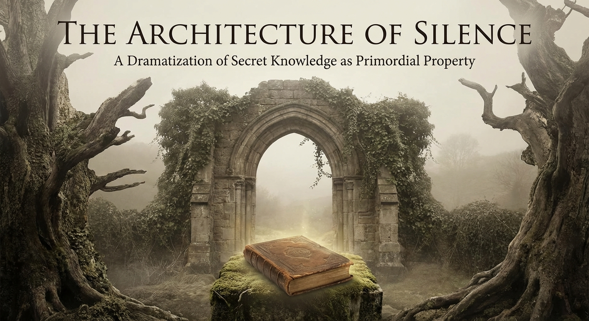

## High-Level Outline

## The Architecture of Silence

**Premise:** The Dramatization of Secret Knowledge as Primordial Property

**Estimated Word Count:** 3000

---

### Characters

#### Elias Thorne

**Role:** protagonist

**Description:** Mid-40s, an architectural conservator with ink-stained fingers and a permanent squint from years of reading vellum. He possesses a 'quiet intensity'—the kind of man who listens to the pulse of a building before entering it.

**Traits:** Meticulous, ethically driven, yet haunted by his father’s legacy of obscurity. He seeks to understand if knowledge is a gift to be shared or a burden to be guarded.

#### Julian Vane

**Role:** antagonist

**Description:** An octogenarian 'Information Architect' and billionaire recluse. He moves with a predatory grace, dressed in bespoke charcoal wools. His voice is a dry rasp, like sandpaper on stone.

**Traits:** Believes that 'Truth' is a finite resource that loses value when observed by the masses. He views himself as the rightful owner of the world’s most dangerous silences.

#### Dr. Clara Reed

**Role:** supporting

**Description:** A forensic linguist in her 30s. Sharp, cynical, and brilliant. She views language as a cage and silence as the only true freedom.

**Traits:** Driven by the thrill of the 'untranslatable.' She helps Elias decode the architectural ciphers but fears the weight of what they might find.

---

### Settings

#### ossuary-of-echoes

**Description:** A subterranean archive located beneath a decommissioned cathedral. It is filled with 'negative space' shelving—rows of empty boxes that represent suppressed histories.

**Atmosphere:** Cold, damp, smelling of ozone and ancient dust. The silence here feels heavy, almost pressurized.

**Significance:** Represents the physical manifestation of secret knowledge as a tangible, stored asset.

#### glass-spire

**Description:** A brutalist skyscraper of reinforced glass and steel overlooking a fog-choked city. The interior is minimalist to the point of hostility.

**Atmosphere:** Sterile, blindingly bright, and voyeuristic. It creates the paradox of total transparency hiding total secrecy.

**Significance:** The seat of power where knowledge is curated and commodified.

#### blackwood-estate

**Description:** A decaying 18th-century manor in the countryside, built with 'impossible' geometry—rooms that appear on blueprints but cannot be found in the physical house.

**Atmosphere:** Melancholic, gothic, and shifting. The house feels like it is holding its breath.

**Significance:** The site where the 'Primordial Property' was first codified by Elias’s ancestors.

---

### Act Structure

#### Act 1: The Inheritance of Shadows

**Purpose:** To establish the 'Primordial Property' and the stakes of owning a secret that predates law.

**Estimated Scenes:** 3

**Key Developments:**
- Elias receives a cryptic inheritance
- He discovers the existence of 'The Architecture of Silence'
- Julian Vane issues a warning

#### Act 2: The Weight of the Unspoken

**Purpose:** To explore the philosophical conflict between the 'right to know' and the 'right to own' truth.

**Estimated Scenes:** 3

**Key Developments:**
- Infiltration of the Blackwood Estate
- The discovery of the 'Negative Blueprints'
- The confrontation with Vane’s philosophy

#### Act 3: The Primordial Deed

**Purpose:** To resolve the tension through a final choice: to release the secret (destroying its value) or to become its new silent guardian.

**Estimated Scenes:** 3

**Key Developments:**
- The descent into the Ossuary
- The choice to speak or stay silent
- The transformation of Elias

---

**Status:** ✅ Pass 1 Complete

## Outline

## The Architecture of Silence

**Premise:** The Dramatization of Secret Knowledge as Primordial Property

**Estimated Word Count:** 3000

**Total Scenes:** 9

---

### Detailed Scene Breakdown

### Act 1: The Inheritance of Shadows

**Purpose:** To establish the 'Primordial Property' and the stakes of owning a secret that predates law.

#### Scene 1: The Geometry of the Void

- **Setting:** blackwood-estate
- **Characters:** Elias Thorne
- **Purpose:** Elias receives a cryptic inheritance; Introduction to the 'impossible geometry.'
- **Emotional Arc:** Elias moves from methodical investigation and confusion to a heavy sense of realization and inherited guardianship as he senses the house's true nature.
- **Est. Words:** 1500

**Key Events:**
  {
    "1" : "Elias measures the foyer and discovers three feet of 'missing' reality compared to the blueprints.",
    "2" : "He examines his inheritance: a toothless iron key and a vellum deed for a 'Right of Non-Existence'.",
    "3" : "He experiences the 'pressurized silence' and rhythmic thrumming within the house's structure.",
    "4" : "He finds his father's final note hidden in a book, explaining the duty to guard the silence that predates the Word."
  }

#### Scene 2: The Syntax of the Unseen

- **Setting:** blackwood-estate
- **Characters:** Elias Thorne, Dr. Clara Reed
- **Purpose:** Discovery of 'The Architecture of Silence'; Introduction of the 'Negative Blueprints.'
- **Emotional Arc:** Clara's initial cynicism shifts to wavering awe as she realizes the blueprints represent a linguistic trap; the atmosphere turns thin and intense.
- **Est. Words:** 1800

**Key Events:**
  {
    "1" : "Clara analyzes the 'Negative Blueprints' where rooms are solid ink and walls are white.",
    "2" : "She identifies the notations as phonetic constraints designed to prevent a specific truth from being uttered.",
    "3" : "Elias explains his father's concept of the 'Architecture of Silence' as a cage for a secret.",
    "4" : "They realize the blueprints lead to a subterranean archive known as the Ossuary of Echoes."
  }

#### Scene 3: The Market of Shadows

- **Setting:** glass-spire
- **Characters:** Elias Thorne, Julian Vane
- **Purpose:** Julian Vane issues a warning; Establishing the stakes of the 'Information Architect.'
- **Emotional Arc:** Elias feels a jarring sense of claustrophobia in the sterile environment, facing Vane's predatory and cold dominance.
- **Est. Words:** 1600

**Key Events:**
  {
    "1" : "Elias is summoned to the sterile, high-tech Glass Spire to meet Julian Vane.",
    "2" : "Vane dismisses Elias's father as a sentimentalist and defines silence as a scarce commodity.",
    "3" : "Vane warns Elias that the Primordial Property is a liability and forbids him from opening the Ossuary.",
    "4" : "The conflict is established: Elias is now an obstacle to a billionaire's quest to own the foundation of truth."
  }

---

### Act 2: The Weight of the Unspoken

**Purpose:** To explore the philosophical conflict between the "right to know" and the "right to own" truth.

#### Scene 1: The Geometry of Absence

- **Setting:** blackwood-estate
- **Characters:** Elias Thorne, Dr. Clara Reed
- **Purpose:** To introduce the supernatural/impossible nature of the setting and the method of entry.
- **Emotional Arc:** Skepticism and wariness transitioning into awe and sensory oppression as the impossible nature of the house is revealed.
- **Est. Words:** 1500

**Key Events:**
  {
    "arrival" : "Elias and Clara arrive at the Blackwood Estate under a purple twilight.",
    "explanation" : "Elias explains the 'Impossible Geometry' and Clara notes the 'pre-lexical' carvings.",
    "infiltration" : "Using a hand-mirror to navigate a 'blind spot' in the masonry, they find a hidden door and enter the manor."
  }

#### Scene 2: The Negative Blueprints

- **Setting:** blackwood-estate
- **Characters:** Elias Thorne, Dr. Clara Reed
- **Purpose:** To reveal the nature of the 'Primordial Property' and the stakes of the secret.
- **Emotional Arc:** Horror and fascination as the weight of the unspoken begins to physically affect the characters, creating a sense of crushing responsibility.
- **Est. Words:** 1800

**Key Events:**
  {
    "discovery_of_room" : "They find a library where shadows form the shapes of books.",
    "blueprints_reveal" : "Discovery of the 'Negative Blueprints' mapping the voids and silences of the house.",
    "legal_revelation" : "Clara uses forensic light to reveal a deed for the concept of silence, realizing the truth's volatile nature."
  }

#### Scene 3: The Price of Observation

- **Setting:** blackwood-estate
- **Characters:** Elias Thorne, Dr. Clara Reed, Julian Vane
- **Purpose:** To establish the antagonist's motive and the central philosophical conflict.
- **Emotional Arc:** High tension and intellectual dread as the characters are confronted with a choice between their sanity and the burden of truth.
- **Est. Words:** 2000

**Key Events:**
  {
    "confrontation" : "Julian Vane appears in the Great Hall, acting as the house's curator.",
    "philosophical_argument" : "Vane argues that truth is a finite resource and that the 'Architecture of Silence' protects the world from collapse.",
    "the_choice" : "Vane offers Elias a choice: leave the blueprints and their sanity, or take them and inherit the crushing responsibility of the silence."
  }

---

### Act 3: The Primordial Deed

**Purpose:** To resolve the tension through a final choice: to release the secret (destroying its value) or to become its new silent guardian.

#### Scene 1: The Pressure of the Void

- **Setting:** ossuary-of-echoes
- **Characters:** Elias Thorne, Dr. Clara Reed
- **Purpose:** To introduce the physical manifestation of the secret and establish the stakes and physical pressure of the environment.
- **Emotional Arc:** From cautious exploration and physical discomfort to awe and realization of the secret's true nature.
- **Est. Words:** 1200

**Key Events:**
  {
    "events" : [ "Descent into the Ossuary", "Discovery of the physical 'Deed' (crystalline cylinder)", "Realization that the Ossuary is a resonator", "Understanding that the silence is the anchor for human hierarchy" ]
  }

#### Scene 2: The Price of Transparency

- **Setting:** ossuary-of-echoes
- **Characters:** Elias Thorne, Dr. Clara Reed, Julian Vane
- **Purpose:** The philosophical climax where the protagonist must choose between two conflicting ideologies regarding the nature of secrets.
- **Emotional Arc:** High tension and moral conflict as Elias is caught between Vane's cold logic and Clara's idealistic transparency.
- **Est. Words:** 1500

**Key Events:**
  {
    "events" : [ "Confrontation with Julian Vane", "Vane explains the 'Primordial Property' and the value of hidden knowledge", "Clara argues against the hoarding of potential", "Elias realizes his father's true motive was protection, not power" ]
  }

#### Scene 3: The Architect of the Unspoken

- **Setting:** ossuary-of-echoes
- **Characters:** Elias Thorne, Julian Vane, Dr. Clara Reed
- **Purpose:** Resolution of the conflict through Elias's transformation and the resulting impact on the world.
- **Emotional Arc:** Sacrifice and somber acceptance, leading to a sense of stable but heavy resolution.
- **Est. Words:** 1000

**Key Events:**
  {
    "events" : [ "Elias seals the Ossuary from the inside", "Clara escapes as the negative space expands", "Vane loses his ownership of the silence", "The Glass Spire cracks as the anchor is removed", "Elias becomes the 'Architecture of Silence'" ]
  }

---

**Status:** ✅ Complete

#### Setting: ossuary-of-echoes

**Prompt:** 

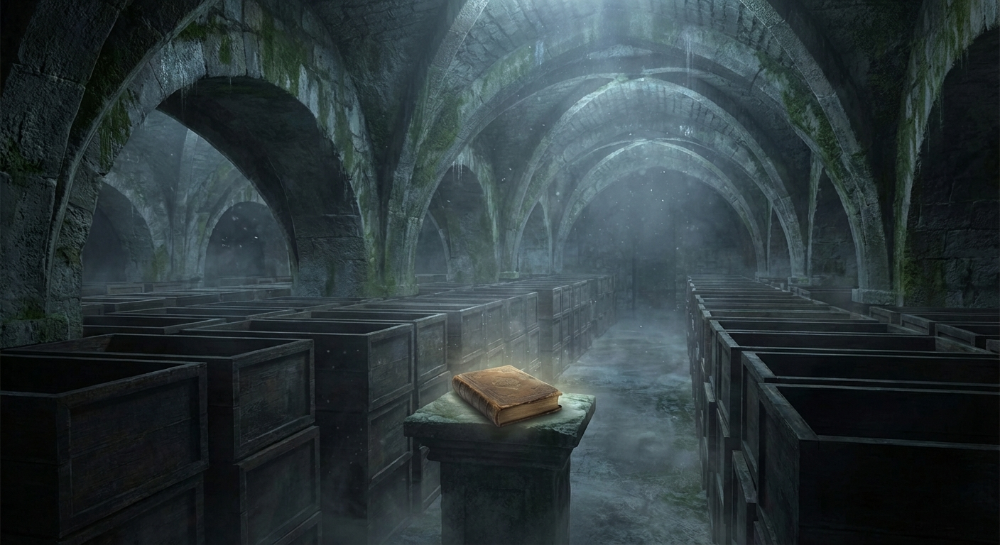

#### Setting: glass-spire

**Prompt:** 

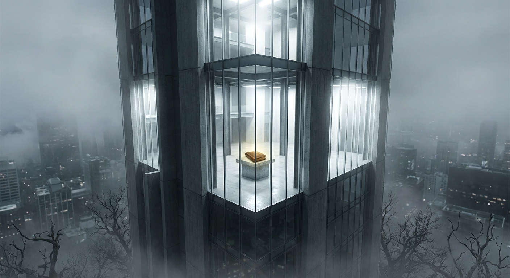

#### Setting: blackwood-estate

**Prompt:** 

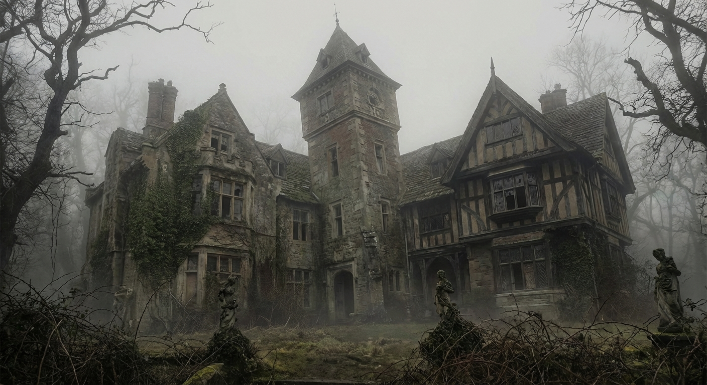

#### Character: Elias Thorne

**Prompt:** 

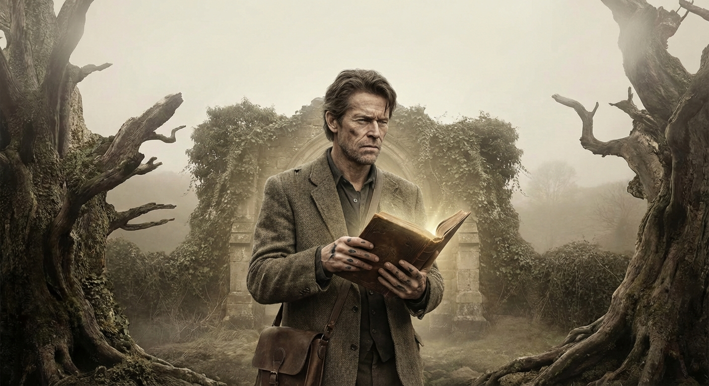

#### Character: Julian Vane

**Prompt:** 

#### Character: Dr. Clara Reed

**Prompt:** 

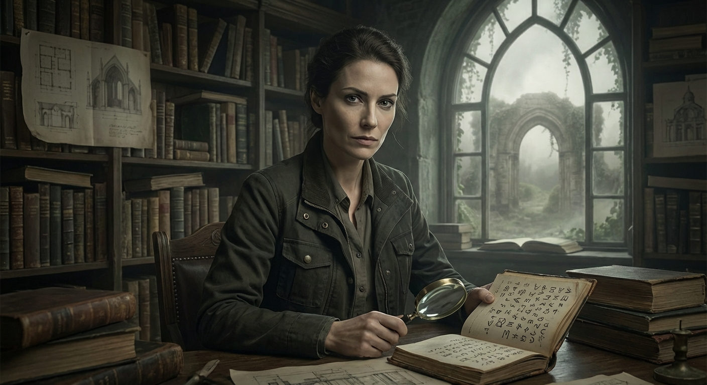

## ## The Geometry of the Void

**Act 1, Scene 1**

**Setting:** blackwood-estate

**Characters:** Elias Thorne

---

The Blackwood Estate did not merely sit upon its hill; it seemed to have been exhaled by the earth, a jagged outcropping of granite and dark timber that defied the gentle, rolling slopes of the valley. To Elias Thorne, a man who had spent his life translating the world into the rigid, uncompromising syntax of blueprints, the house was a grammatical error in a landscape of prose. It was a structural heresy, a building that leaned into dimensions that had no right to exist.

It was late afternoon. The sun was a bruised plum hanging low over the horizon, casting skeletal shadows that stretched across the foyer like grasping fingers. Elias stood in the center of the hall, the air tasting of cold stone and the metallic tang of ancient dust. In his right hand, he gripped a Leica laser distance meter—a sleek, digital intrusion in this Victorian tomb. In his left, he held a set of yellowed, linen-backed blueprints, their edges frayed and smelling of cedar.

At forty, Elias possessed the lean, hungry look of an academic who had skipped too many meals in favor of old texts. His eyes, framed by thin-rimmed glasses, were weary, darkened by years of searching for structural flaws in the works of others—as if finding a crack in a foundation could somehow explain the fractures in his own life.

He clicked the laser. A red dot danced on the far wall, a tiny, unblinking eye of light.

"Forty-two feet, six inches," Elias whispered.

His voice was swallowed instantly. There was no echo, no resonance. It was as if the walls were lined with heavy velvet rather than lath and plaster. The silence here wasn't just the absence of sound; it was a physical weight, a vacuum that pulled the oxygen from his lungs.

He looked down at the 1922 blueprints, drawn by his great-grandfather and maintained by his father, Arthur, until his sudden, silent passing three weeks ago. According to the precise, hand-inked lines, the foyer was exactly forty-five feet, six inches long.

Elias frowned, his thumb tracing the edge of the brass-bound ruler in his pocket. He moved to the exterior wall and measured again. He checked the thickness of the masonry, accounted for the wainscoting, and recalculated the offset of the chimney breast. No matter how he manipulated the variables, three feet of space had simply vanished.

It wasn’t a hidden room—the exterior dimensions of the house matched the interior ones perfectly, provided one ignored the discrepancy. The math refused to settle. It was as if the house were breathing, and he had caught it mid-exhale, the structure contracting in a way that defied Euclidean geometry.

"Three feet of nothing," he murmured, the words heavy on his tongue.

As he stood there, a strange, localized pressure built in his inner ear—the sharp, uncomfortable sensation of a plane beginning a rapid descent. It wasn't a sound, but the *anticipation* of one. Then came the thrumming. It was a rhythmic vibration, so low it was felt in the marrow of his shins rather than heard. It hummed through the floorboards, a steady, mechanical pulse. It was the heartbeat of a machine that had no business being made of wood and stone.

Elias retreated from the foyer, his footsteps sounding unnaturally loud, and sought refuge in his father’s study. The room was a sanctuary of shadows, smelling of stale pipe tobacco and the sharp, ozone scent of cold iron. On the massive oak desk sat the mahogany box delivered to him by a solicitor who had refused to meet his eyes, handing over the inheritance with a trembling hand before fleeing the estate.

Elias opened the box. The hinges didn't creak; they glided with a silent, oiled precision.

Inside lay two items. The first was an iron key, heavy and cold enough to ache against his palm. It was a peculiar object—entirely smooth, lacking any teeth, bitting, or wards. It was a key designed to fit a lock, but not to turn one. Its surface was pitted by centuries of oxidation, yet its weight suggested a density that defied its size. It felt less like a tool and more like an anchor.

The second item was a deed, written on vellum so thin it was nearly translucent, like the skin of a deep-sea fish. The ink was a deep, brownish-black—the color of dried blood. Elias spread it out, his fingers trembling.

*“Grant of the Right of Non-Existence,”* the header read in a sprawling, archaic script.

The legal language that followed was a dizzying labyrinth of medieval Latin and modern jurisdictional jargon. It didn't describe a plot of land, a physical structure, or mineral rights. Instead, it laid claim to a "primordial silence," a "void-space held in trust," and a "property of the unspoken." It was a title deed for a vacuum. It suggested that the Blackwood family did not own the house, but rather the absence that the house had been constructed to contain. The walls were not the asset; they were the packaging.

Elias leaned back, the leather chair creaking beneath him like a living thing. As an architect, he understood that space was defined by its boundaries. A room was only a room because of the walls that denied the rest of the world entry. But this was a reversal of every principle he held dear. This suggested that the silence itself was the commodity—a secret knowledge that functioned as a form of primordial property.

The thrumming in the floorboards intensified, vibrating through the legs of the chair. The silence in the room became pressurized, pushing against his eardrums until they throbbed. It was a heavy, liquid silence, the kind that exists at the crushing depths of the ocean where light cannot reach.

He looked at the bookshelves, thousands of volumes inherited from generations of Thornes—architects, engineers, and cartographers who had lived and died within these shifting walls. His eyes landed on a small, unassuming spine bound in cracked black leather: *The Commentaries on the Unspoken.*

He pulled it from the shelf. As he did, a slip of paper fluttered out from between the pages and drifted to the floor like a falling leaf. Elias picked it up. It was a note in his father’s hand, the script frantic and spindly.

*Elias,*

*The world is built upon a lie of noise. We believe that in the beginning was the Word, but the Word was merely a disturbance, a ripple on a still pond. Before the Word, there was the Architecture of Silence. It is the foundation of all things, the dark matter of the soul. Our family has been the stewards of this void for seven generations. We do not guard the house; we guard what the house encloses.*

*Do not attempt to measure the gaps, Elias. The geometry of this place is not Euclidean. It follows the logic of the things that were here before light was permitted. If you find the missing feet, do not enter them. The silence is not an absence of sound—it is a presence that has not yet chosen to speak.*

*Your duty is simple: Maintain the boundaries. Do not let the silence leak. If the world hears what is kept at Blackwood, the Word will be undone.*

*Your father, Arthur.*

A cold sweat broke across Elias’s brow. He looked back at the blueprints spread across the desk. The three feet of missing reality. He realized now that he hadn't been looking at a mistake in the drawing or a lapse in his great-grandfather’s craftsmanship. He had been looking at a cage. The house was a vessel, a lead-lined box designed to keep a specific type of nothingness from spilling out into a world of sound.

He stood up, the iron key heavy in his pocket, pulling at his coat. He walked back out into the foyer. The sun had finally dipped below the horizon, and the house was now a cavern of absolute shadows. He looked at the wall where the three feet should have been—the space between the reality of the blueprints and the reality of the stone.

In the dim, grey light, the wallpaper—a pattern of intricate, interlocking vines—seemed to shift and writhe. The geometry of the hall felt skewed, the angles of the ceiling not quite meeting at ninety degrees, the floor sloping toward a center that wasn't there. He reached out and touched the wall.

It didn't feel like plaster. It didn't feel like wood. It felt like skin stretched tight over a drum.

Beneath his palm, the thrumming was no longer a vibration; it was a cadence. A rhythmic, pulsing beat that matched his own heart, then slowly, inexorably, began to lead it. The house was setting his pace.

Elias closed his eyes. In the absolute, suffocating quiet of the Blackwood Estate, he realized his father was right. The silence wasn't empty. It was crowded. It was a vast, teeming territory of secret knowledge, a property of the universe that had been privatized by his bloodline. He was no longer just an architect or an heir. He was a jailer of the vacuum.

He reached into his pocket and gripped the toothless key. He understood its purpose now. It wasn't meant to open a door. It was a weight, a symbol of the gravity required to keep the void in place, a physical reminder of the burden he now carried.

A floorboard creaked upstairs, but it wasn't the sound of a footfall. It was the sound of the house adjusting itself to his presence, the architecture settling around him like a shroud, fitting itself to his frame.

Elias Thorne took a deep breath, the air tasting of dust and ancient, unuttered thoughts. He folded the deed and placed it in his breast pocket, right over his heart. The confusion that had gripped him since his father’s funeral began to solidify into a cold, hard resolve. He was a Thorne. He was a builder of boundaries.

He would not measure the gaps again. He would learn the language of the silence, and he would ensure that the "Right of Non-Existence" remained the most valuable, and most terrifying, thing he owned.

The house seemed to sigh in approval, a low rush of air through the vents that sounded like a name being whispered. The shadows in the foyer lengthened, stretching toward him like a welcoming embrace, pulling the new master into the heart of the void. Elias stood still, a silhouette in the center of his dark inheritance, listening to the beautiful, terrible sound of nothing at all.

---

**Word Count:** 1766

**Key Moments:**
- The Discrepancy: Elias uses professional tools to discover that the physical dimensions of the Blackwood foyer do not match the blueprints, revealing a 'missing' three feet of space.
- The Inheritance: Elias examines the toothless iron key and the 'Right of Non-Existence' deed, introducing the concept of silence and void as a form of primordial property.
- The Sensory Shift: The atmosphere of the house changes, manifesting as 'pressurized silence' and a rhythmic thrumming that suggests the house is a living or mechanical entity.
- The Father’s Revelation: Elias finds Arthur Thorne’s final note, which explains the family’s true purpose: acting as guardians of a pre-linguistic silence that must not be unleashed upon the world.

**Character States:**
- **Elias Thorne:** Ends the scene in a state of 'cold, hard resolve.' He has moved from the frustration of a technical professional facing an error to the somber acceptance of a man who has inherited a metaphysical burden. Physically, he is attuned to the house, his own heartbeat syncing with the 'thrumming' of the structure.

**Status:** ✅ Complete

#### Act 1, Scene 1 Image

**Prompt:** 

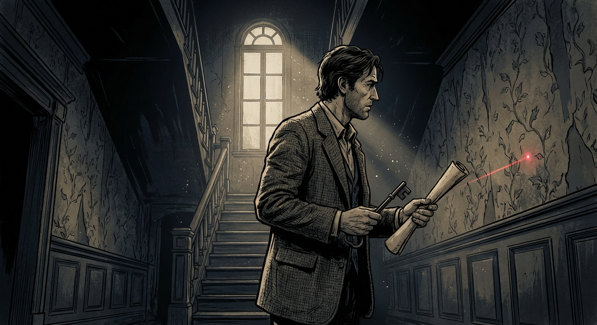

## ## The Syntax of the Unseen

**Act 1, Scene 2**

**Setting:** blackwood-estate

**Characters:** Elias Thorne, Dr. Clara Reed

---

The rain did not fall upon the Blackwood Estate so much as it surrendered to it. The droplets lost their momentum the moment they crossed the property line, sliding down the air like oil on glass, refusing to splash against the grey stone. Inside the great library, the atmosphere had achieved a state of crystalline stasis. The thrumming Elias had felt in the foyer was more pronounced here—a low-frequency vibration that originated not from the floorboards, but from the very molecules of the oxygen they breathed. It was the sound of a held breath.

Elias Thorne stood by the mahogany drafting table, his hands hovering over a roll of vellum that felt unnervingly like cured skin. He did not look up when the heavy oak doors groaned open. He didn't need to. The scent of rain-dampened wool and sharp, expensive espresso preceded Dr. Clara Reed.

"You look like a man who has seen a ghost, Elias," Clara said, her voice cutting through the pressurized silence like a scalpel. She shed her trench coat, draping it over a bust of a nameless Roman orator. "Or perhaps just a very expensive structural error. This house has a way of making one feel like an intruder in a math equation."

Clara Reed was a woman of sharp angles and sharper intellect, a specialist in semiotic architecture who had spent a decade proving that buildings were merely petrified sentences. She had been Elias’s only call. If anyone could read the grammar of this house, it was her. They had a history written in the margins of academic journals—a decade of professional friction that bordered on something more volatile.

"It’s not an error, Clara," Elias said, his voice sounding hollow, as if the room were drinking the resonance of his words. "Errors are accidental. This is... intentionality taken to a pathological extreme. My father didn't build a home. He built a thesis."

He unrolled the blueprints, the vellum resisting with a dry, papery hiss. 

Clara stepped forward, her cynical expression flickering for a moment before hardening into a mask of professional curiosity. She leaned over the table, her glasses sliding down the bridge of her nose. She froze. Her hand reached out, hovering an inch above the page, as if she feared the ink might still be wet—or perhaps alive.

"These are negative blueprints," she whispered.

In traditional architectural drafting, lines represent the presence of matter—walls, pillars, beams—against the white void of the page. But the documents Arthur Thorne had left behind were inverted. The rooms were solid, oppressive blocks of abyssal black ink, while the walls, the corridors, and the structural supports were represented by the stark, untouched white of the vellum. It was a map of the absence of space.

"The rooms are the solids," Clara murmured, her finger tracing a jagged black rectangle that represented the library they stood in. "And the walls are the voids. He didn't design a house, Elias. He carved a series of hollows out of a singular, primordial mass. He treated the air as the load-bearing element."

"Look at the notations," Elias directed, pointing to the margins where the ink bled into frantic, microscopic script.

Clara squinted. Instead of standard measurements—feet, inches, load-bearing tolerances—the margins were crowded with symbols that had no place in an engineering firm. They were phonetic symbols: International Phonetic Alphabet characters, crossed out with violent, precise strokes.

"Glottal stops," Clara read, her brow furrowing. "Fricatives. He’s... he’s outlawing the letter *S*. He’s forbidding the resonance of open vowels in the north-facing rooms." She looked up, her eyes wide with a dawning, uncomfortable awe. "Elias, these aren't structural constraints. These are phonetic ones. He’s trying to legislate the air."

"My father called it the 'Architecture of Silence,'" Elias said. He walked to the window, looking out at the grey shroud of the estate. The trees didn't sway; they merely leaned. "He believed that certain truths—primordial truths—were so volatile that they could only exist if they were never spoken. He used to say that language is a virus; it seeks a host. It seeks to be uttered. So, he built a cage where the virus couldn't breathe."

Clara walked around the table, her skepticism wavering, replaced by the frantic energy of a cryptographer who had just found a code she couldn't break. "A cage made of stone and wood. He designed the dimensions of these rooms to act as acoustic dampeners, not for sound in general, but for specific phonemes. If you try to speak the 'secret' in this room, the geometry of the walls would literally cancel out the frequency of your voice. The house is a muzzle, Elias. It’s a physical manifestation of a gag order."

"It’s more than that," Elias said, turning back to her. The light from the window cast long, distorted shadows across his face. "He wasn't just trying to stop someone from speaking. He was trying to protect a property. The 'Right of Non-Existence.' He believed that silence was the only thing we truly own, because once a thought is spoken, it belongs to the world. It becomes common property. It becomes... corrupted. He wanted to keep his secrets pure by keeping them unformed."

The air in the library seemed to thin, the atmospheric pressure dropping as if they were ascending a mountain. Clara felt a slight lightheadedness, a sensation of being pulled toward the center of the black ink on the table. She pointed to a section of the blueprint where the white lines—the 'void' walls—converged into a spiral that descended off the edge of the page, spiraling into a depth that the house’s exterior shouldn't allow.

"This isn't the basement," she said, her voice trembling slightly. "The geometry here... it doesn't follow the footprint of the house. It goes deeper. It’s a subterranean extension that exists outside the grid."

Elias joined her, looking at the spiral. "The Ossuary of Echoes."

"The what?"

"That’s what he called it in his journals. He wrote that if the house is the muzzle, the Ossuary is the throat. It’s where the 'unspoken' is stored. He believed that sound doesn't die; it just loses energy. It settles in the lowest points of a structure like silt in a riverbed. He spent forty years dredging the silence."

Clara laughed, a short, brittle sound that died instantly in the heavy air, swallowed by the bookshelves. "Elias, this is madness. It’s beautiful, terrifying madness, but it’s just... it’s a metaphor. Your father was a brilliant man who suffered from a very specific, very architectural brand of psychosis. You can't store a sound like a bottle of wine."

"Is it a metaphor?" Elias reached into his pocket and pulled out the toothless iron key he had found in his father’s desk. He laid it on the black ink of the blueprint. "The foyer is missing three feet of space, Clara. I measured it this morning. The physical reality of this house has been altered to accommodate the silence. You can feel it, can't you? The pressure in your ears? The way the house seems to be... listening for a mistake?"

Clara looked at the key, then back at the negative blueprints. She thought of her years studying the 'language of space,' the way a cathedral makes one feel small to encourage piety, the way a prison makes one feel watched to encourage submission. But this was different. This was a building designed to negate the human capacity for expression. It was an anti-cathedral.

She reached out and touched the vellum. The ink felt cold, unnaturally so, as if it were drawing heat from her fingertips. "If these blueprints are accurate," she said, her voice dropping to a whisper, "then the entrance to this 'Ossuary' isn't behind a door. It’s behind a frequency."

"Explain," Elias demanded, his pulse quickening.

"Look at the convergence of these white lines," Clara said, her finger tracing the spiral. "They meet at a point in the cellar that corresponds to a perfect acoustic dead zone. In any other building, that would be a flaw—a place where sound simply vanishes. Here, it’s a gateway. If you stand in that spot and produce a sound that the house *cannot* cancel—a sound that isn't in its 'forbidden' vocabulary—the resonance might trigger the physical mechanism. It’s a sonic lock."

Elias looked at her, his resolve hardening into something cold and sharp. "And what sound would that be? What is the one thing my father couldn't forbid?"

"I don't know," Clara admitted, her cynicism finally crumbling into a raw, academic hunger. "But the blueprints suggest it’s something pre-linguistic. A hum. A vibration. Something from before we had words for things. A sound that exists in the body, not the mind."

She looked at Elias, and for the first time, they were in total alignment. The skepticism that had defined their professional relationship for years had been burned away by the sheer, impossible weight of the evidence before them. They weren't just an architect and a linguist anymore; they were two people standing on the edge of a linguistic event horizon.

"We have to go down there," Elias said. It wasn't a question.

"The air will be thin," Clara warned, though she was already reaching for her bag, her hands steady despite the chill. "If the house is designed to trap sound, the oxygen levels might be manipulated by the same vacuum-sealed logic. It’s a tomb, Elias. A tomb for things that were never said. We might find that silence is heavier than we can carry."

"My father spent his life guarding it," Elias said, picking up the iron key. The metal seemed to warm in his hand, pulsing in time with the house’s low, rhythmic thrum. "He died to keep it silent. I need to know if he was a saint or a jailer. I need to know what he was so afraid of hearing."

As they left the library, the shadows seemed to retreat before them, not out of fear, but as if they were making a path, drawing them toward the center of the spiral. The descent to the cellar was a journey through layers of increasing stillness. Each step down the stone stairs felt like diving into deep water. The sound of their footsteps, usually sharp and echoing in a house of this size, was swallowed instantly, muffled as if the air itself were made of velvet.

By the time they reached the heavy, reinforced door of the cellar, the silence had become a physical weight, a pressure against their eardrums that made their own heartbeats sound like thunder. The world above—the rain, the wind, the rustle of trees—felt like a distant memory of a louder life.

Elias inserted the toothless key into the lock. There were no tumblers, no mechanical click. Instead, as he turned the key, there was a low, resonant vibration that traveled up his arm and into his chest, a chord struck on a piano with no strings. The door didn't swing open; it simply ceased to be an obstacle, sliding into the wall with a smoothness that suggested it was moved by the sheer absence of friction.

Beyond the door lay a darkness so absolute it seemed to have mass, a thick, ink-like gloom that the light from the hallway refused to penetrate.

Clara clicked on her high-intensity flashlight. The beam cut through the gloom, revealing a space that defied the laws of the estate above. The walls were lined with thousands of small, ceramic cylinders, each one corked with lead and etched with a single, unique character. They looked like the scrolls of an ancient library, but they were arranged in a pattern that mimicked the complex, winding anatomy of the human inner ear.

"The Ossuary of Echoes," Clara whispered. Her voice didn't travel; it fell flat at her feet, as if the words were made of lead.

Elias stepped into the room, the flashlight beam dancing over the lead-corked cylinders. "He didn't just build a cage for a secret, Clara. He built a filing system for it. Every word he ever suppressed, every thought he deemed too dangerous to utter... he archived them."

In the center of the room stood a single, obsidian pedestal. On top of it sat a device that looked like a cross between a Victorian phonograph and a surgical instrument. It was a needle of polished bone, suspended over a rotating plate of pure, translucent quartz.

"He wasn't just a guardian," Elias realized, his voice trembling with a mixture of horror and awe. "He was a collector. Every word that was forbidden upstairs... he caught them here. He was harvesting the silence."

Clara approached the pedestal, her hand trembling as she reached toward the quartz plate. "Elias, if this is what I think it is... if these cylinders contain the 'unspoken'... then this isn't just a house. It’s a weapon. A linguistic bomb. If you were to release these sounds all at once—if you broke the seals—"

"The world would lose the ability to mean anything," Elias finished. "The noise would drown out the sense."

The thrumming of the house reached a crescendo, a vibration so intense that the ceramic cylinders began to rattle in their niches, a thousand tiny teeth chattering in the dark. The silence was no longer empty; it was crowded, pregnant with the weight of a billion unuttered thoughts, all straining against their leaden seals.

Elias looked at the negative blueprints he still held in his left hand. In the light of the flashlight, the white lines seemed to glow, revealing a final notation he hadn't seen before, written in his father’s hand at the very center of the spiral:

*The truth is not what we say. The truth is what remains when we are forced to be still.*

"We aren't alone down here," Clara whispered, her eyes fixed on the darkness beyond the pedestal.

Elias turned the light. At the far end of the vault, the shadows didn't just sit; they moved, swirling in a slow, rhythmic pattern that matched the thrumming of the house. It was a shape—or the absence of one—standing in the center of the void, a silhouette carved out of the darkness, waiting for the new master to speak the first word.

The air grew impossibly thin. The silence began to scream. Elias gripped the key, the metal now searingly hot, as the shadow stepped forward into the light that wasn't there.

---

**Word Count:** 2408

**Key Moments:**
- The Negative Blueprints: Clara and Elias analyze the inverted maps, realizing the house is designed as a physical "muzzle" to prevent specific sounds and truths from being uttered.
- Phonetic Constraints: Clara identifies that the architecture uses "phonetic constraints," cancelling out specific linguistic frequencies through its geometric design.
- The Ossuary Discovery: They follow the blueprints to a hidden subterranean vault—the Ossuary of Echoes—where "unspoken" sounds are stored in lead-corked ceramic cylinders.
- The Linguistic Bomb: They realize the estate is a repository for primordial secrets that, if released, could destroy the human capacity for language and meaning.

**Character States:**
- **Elias Thorne:** Physically exhausted but mentally hyper-focused. He has transitioned from a skeptical heir to a man who understands he is the warden of a metaphysical armory. He feels a heavy, vibrating connection to the house.
- **Dr. Clara Reed:** Her initial academic cynicism has been completely shattered, replaced by a mixture of professional awe and existential dread. She is physically affected by the "thin air" of the vault and is now fully committed to the mystery.

**Status:** ✅ Complete

#### Act 1, Scene 2 Image

**Prompt:** 

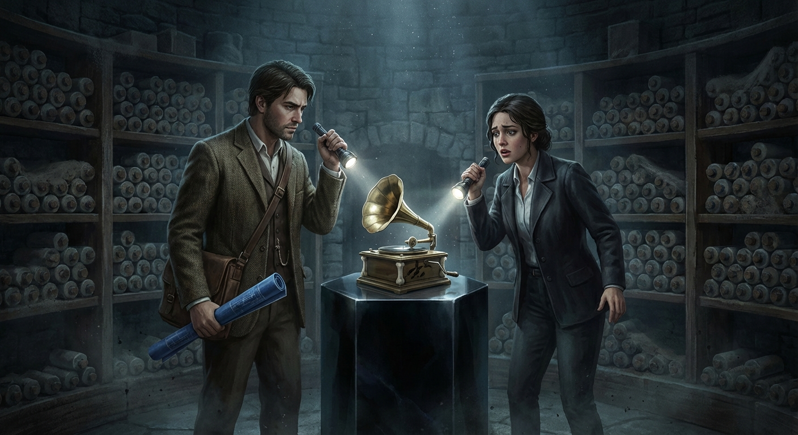

## ## The Market of Shadows

**Act 1, Scene 3**

**Setting:** glass-spire

**Characters:** Elias Thorne, Julian Vane

---

The transition from the subterranean depths of the Blackwood Estate to the apex of Vane Tower was a violent decompression, a change in state that felt less like travel and more like a betrayal of the senses. In the Ossuary, the air had been thick with the dust of centuries and the heavy, vibrating pressure of secrets that refused to be named. Here, sixty stories above the city, the atmosphere was scrubbed, filtered, and chilled to a precise sixty-eight degrees. It smelled of clinical absence—not even the ozone of the servers humming beneath the floorboards was permitted to linger.

Elias Thorne stood in the center of the elevator, his reflection caught in the polished obsidian of the doors. He looked like a man who had been unearthed, a relic of a darker, more cluttered era. His suit, though tailored and expensive, felt like a shroud, and his eyes remained dilated, still adjusted to the protective gloom of the vault. In his pocket, the toothless iron key felt like a hot coal against his thigh. It was a piece of the old world—heavy, jagged, and unapologetically physical—an affront to the seamless, frictionless environment of the Glass Spire.

The doors slid open with a soundless sigh, revealing the inner sanctum of the man who owned the horizon.

The office of Julian Vane was not an office so much as a cathedral of transparency. Floor-to-ceiling glass walls offered a panoramic view of the city, which, from this height, looked like a sprawling motherboard, its inhabitants reduced to pulses of light and data. There were no books here, no paper, no clutter of history. Only a desk of white marble that seemed to grow organically out of the floor and a single chair facing the edge of the world.

Julian Vane stood by the window, silhouetted against the blinding morning sun. He was a man of sharp angles and mathematical precision, his hair a silvered mane that caught the light like spun glass. He didn't turn when Elias entered. He didn't need to. In this building, Vane was the architect of every movement, every breath, every stray thought.

"The city is a cacophony, Elias," Vane said, his voice a smooth, cultured baritone that seemed to resonate directly from the glass itself. "A billion voices screaming for attention, for validation, for a single moment of being heard. It is a tragedy of noise, a fever of self-expression that has finally broken the world."

Elias walked forward, his footsteps sounding unnaturally loud on the polished floor, each strike of his heel a rhythmic intrusion. "My father used to say that noise is just the sound of people trying to convince themselves they exist. He thought the louder the world got, the more we were actually losing."

Vane turned then, a thin, predatory smile touching his lips. His eyes were a piercing, artificial blue—the color of a screen at maximum brightness. "Arthur was always a poet of the void. A sentimentalist, ultimately. He spent his life guarding a treasure he was too afraid to spend, like a dragon sitting on a hoard of gold he couldn't even see."

"He wasn't guarding a treasure," Elias said, his voice tightening. "He was guarding a boundary. There’s a difference between wealth and a wall."

Vane gestured toward the marble desk, a movement as fluid as water. "Sit. You look as though you’ve spent the night wrestling with ghosts. Or perhaps just the architecture of your own inheritance. It’s a heavy thing, isn't it? To realize you are the heir to a vacuum."

Elias sat, feeling the jarring claustrophobia of the open space. In the Ossuary, the walls had been close, protective in their density. Here, the vastness felt like a vacuum, threatening to pull the air from his lungs. He felt exposed, a specimen under a microscope.

"I know what you found, Elias," Vane said, leaning against the edge of his desk. "The 'Right of Non-Existence.' The negative blueprints. The Ossuary itself. Arthur and I were... collaborators, once. Before his conscience became an occupational hazard. We both saw the coming storm of the Information Age. We both knew that the more the world knew, the less it would understand."

"He didn't mention you in his notes," Elias countered, his hand instinctively moving toward the key in his pocket.

"Of course not. Arthur preferred the shadows. He believed that silence was a sacred trust, a primordial property that belonged to no one and therefore must be protected by someone. He was wrong, of course. In the modern world, silence is not a right. It is a commodity. The rarest, most expensive commodity on Earth."

Vane leaned in closer, his presence expanding to fill the void of the room. "We live in the Age of Exposure. Everything is mapped. Everything is recorded. Everything is known. Privacy is a dead language. But the foundation of all that knowledge—the primordial silence from which language first crawled, the 'nothing' that gives 'something' its shape—that remains unclaimed. That is the 'Primordial Property' your father died protecting. It isn't just a lack of sound, Elias. It is the raw material of reality. The 'undo' button for the universe."

Elias felt a chill that had nothing to do with the climate control. "And you want to own it. You want to be the Information Architect who controls the delete key. You want to sell people the ability to never have existed."

"I want to bring order to the chaos," Vane corrected, his voice dropping to a whisper. "Your father’s 'Ossuary' is a liability in its current state. It is a collection of linguistic pathogens. If those cylinders were opened by someone who didn't understand the geometry of the void, they wouldn't just cause silence. They would erase meaning. They would dissolve the capacity for human thought. It is a weapon, Elias. And you are currently holding the trigger without knowing how the safety works."

Vane’s gaze dropped to Elias’s pocket, where the outline of the iron key was visible against the fabric of his suit. 

"I am forbidding you from opening that vault again," Vane said, his tone shifting from philosophical to cold, corporate command. "The Blackwood Estate is a muzzle, yes. But it is an old, fraying muzzle. You are out of your depth. You think you are the warden, but you are merely the lock. And locks can be replaced, Elias. They can be picked, or they can be broken."

Elias felt the cold, hard resolve from the previous night crystallize into something sharper, a surveyor’s clarity. He thought of the rhythmic thrumming of the house, the way the very stones of Blackwood had seemed to recognize his blood. He thought of Clara’s face, pale with the realization that they were standing on a linguistic bomb.

"My father left the estate to me," Elias said, his voice steady and low. "Not to a corporation. Not to a man who views the foundation of truth as a subscription service. If the Ossuary is as dangerous as you say, then it needs a guardian, not an owner. It needs someone who knows how to keep a secret, not someone who knows how to invoice it."

Vane stood up straight, his silhouette suddenly dwarfing the city skyline behind him. "Guardian? You are a surveyor, Elias. You measure land. You deal in boundaries and dirt. You are not equipped for the architecture of the unspoken. You are a sentimentalist, just like Arthur, clinging to a 'Right of Non-Existence' as if it were a family heirloom rather than a global threat."

Vane walked around the desk, his movements predatory and silent. He stopped inches from Elias, the scent of expensive soap and sterile air-conditioning radiating from him. "The world is changing. The noise is becoming a fever. People are desperate for a way to vanish, for a way to un-know what they have seen and un-say what they have shouted. I can provide that. I can build a world where silence is a sanctuary for those who can afford the peace. But I need the source code. I need what is in that vault."

"You'll never get it," Elias said, standing up to meet Vane’s gaze.

"I already have the blueprints," Vane whispered, his eyes locking onto Elias’s with terrifying intensity. "I have the history. I have the maps of the negative space. All I lack is the physical access—the bridge between the concept and the reality. You are the only thing standing between the world and a curated silence. Do you really think you can withstand the pressure? The house is already screaming, Elias. I can hear it from here."

Elias turned toward the elevator, his heart hammering against his ribs in a rhythm that felt suspiciously like the thrumming of the Blackwood foundations. "The house isn't screaming. It’s breathing. And it doesn't like you."

Vane laughed, a dry, hollow sound that lacked any hint of mirth. "The house is a machine, boy. A machine built to contain a god that doesn't want to be caged. Your father spent his life trying to keep the door shut, but he was a fool. I am telling you, the hinges are breaking. If you don't hand over the key, you won't be a guardian. You'll be the first casualty when the silence finally breaks out."

Elias stepped into the elevator. "I’ll take my chances with the silence. It’s the noise I’m worried about."

"Elias," Vane called out as the doors began to close. 

Elias looked back. Vane was silhouetted against the blinding light of the sun, a dark shape carved out of the brilliance, much like the shadow Elias had seen in the depths of the vault.

"You aren't the master of that house," Vane said, his voice carrying a chilling, prophetic certainty. "You’re the sacrifice. Arthur knew it. That’s why he didn't leave you a map. He left you a grave."

The doors hissed shut, severing the connection. 

As the elevator plummeted back toward the earth, Elias leaned his head against the cool obsidian wall. The sterile silence of the Spire felt heavier now, more oppressive than the dust of the Ossuary. He realized with a jolt of terror that Vane wasn't just a businessman looking for an edge. He was a man who understood the metaphysical weight of the inheritance better than Elias did. 

Vane didn't want to destroy the silence; he wanted to harvest it. He wanted to turn the 'Right of Non-Existence' into a tool for the elite, a way for the powerful to erase their sins and for the world to lose its collective memory. 

Elias reached into his pocket and gripped the iron key. It was no longer hot; it was ice-cold, a freezing weight that seemed to anchor him to the earth even as the elevator dropped. He wasn't just a surveyor anymore. He was an obstacle. And in Julian Vane’s world, obstacles were not negotiated with. They were demolished.

When the elevator reached the lobby, the doors opened to the roar of the city—the honking of horns, the chatter of pedestrians, the digital chime of a thousand smartphones. For the first time in his life, the noise felt like a shield, a messy, chaotic proof of life. But as Elias stepped out into the sunlight, he could still feel the rhythmic thrumming beneath the pavement, a heartbeat that didn't belong to the city.

The silence was following him. And Julian Vane was right about one thing: the hinges were definitely breaking. The Market of Shadows was open, and the price of admission was everything Elias had left.

---

**Word Count:** 1933

**Key Moments:**
- The Contrast of Environments: Elias moves from the ancient, heavy atmosphere of Blackwood to the sterile, high-tech vacuum of the Glass Spire, highlighting the different types of "silence" at play.
- Vane’s Philosophy: Julian Vane defines silence as the ultimate commodity and the "source code" of reality, revealing his intent to monopolize the "Primordial Property."
- The Warning and Threat: Vane warns Elias that the Ossuary is a "linguistic pathogen" and demands access, establishing Elias as the primary obstacle to his corporate-metaphysical goals.
- The Realization of the Stakes: Elias understands that Vane wants to use the silence to "erase meaning" and "curate reality," turning a sacred trust into a weaponized service.

**Character States:**
- **Elias Thorne:** Physically drained but mentally fortified. He has moved from a state of confusion to one of defensive resolve. He feels the weight of his inheritance not just as a mystery, but as a target on his back. He is beginning to sense the "thrumming" of the house even when he is miles away.
- **Julian Vane:** Predatory, cold, and utterly confident. He views Elias as a temporary nuisance—a "sentimentalist" who doesn't understand the power he holds. He ends the scene in a state of calculated aggression, ready to move from persuasion to force.

**Status:** ✅ Complete

#### Act 1, Scene 3 Image

**Prompt:** 

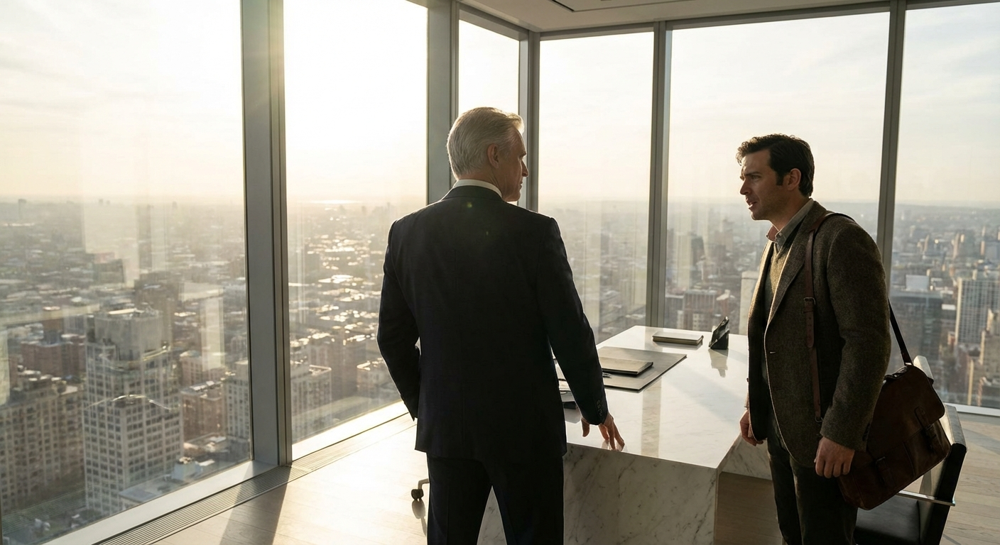

## ## The Geometry of Absence

**Act 2, Scene 1**

**Setting:** blackwood-estate

**Characters:** Elias Thorne, Dr. Clara Reed

---

The city’s frantic pulse—the digital screams of the Glass Spire and the oily, low-frequency hum of the Market of Shadows—faded into a bruised, unnatural silence as the car climbed the ridge toward the Blackwood Estate. Behind them, the world was a frantic grid of light, a desperate attempt to fill the void with data. Before them, the void was reclaiming its territory.

The sky was no longer blue or black; it had curdled into a deep, suffocating violet. This was the "purple twilight" Elias’s grandfather had documented in his more fevered journals—a chromatic aberration caused not by the setting sun, but by the way the estate’s unique density bent the light. It was the color of a fresh bruise, or an ancient ink that refused to dry.

Elias Thorne gripped the steering wheel until his knuckles were white. He could feel the house before he saw it. It wasn't a visual recognition so much as a sudden, sharp pressure in his inner ear—the sensation of a storm about to break, or a heavy secret whispered in a small, airless room. Beside him, Dr. Clara Reed sat in a state of rigid fascination. Her hands, usually busy with a tablet or a notebook, lay dead in her lap.

"The air is changing," she whispered. Her voice sounded thin, as if the atmosphere were stripping the resonance from her vocal cords. "The oxygen feels... heavy. Like it’s being compressed by something we can't see."

"It’s not the air, Clara," Elias said, his voice a low rasp. "It’s the architecture. We’re entering the gravity well of the silence."

As they rounded the final bend, Blackwood Manor loomed. It did not sit upon the land so much as it seemed to be a puncture wound in the landscape. Built from a stone so dark it appeared to absorb the twilight, the house defied the eye. Gables didn't meet at right angles; they leaned into one another in a way that suggested a fourth dimension, a geometry of absence. The windows were narrow slits, like the eyes of a predator mid-blink.

Elias killed the engine. The silence that rushed in was not the absence of sound, but a physical weight. It pressed against their eardrums like a cold, velvet hand.

"Look at the masonry," Clara said, stepping out of the car. Her professional curiosity was fighting a losing battle against her instinct to flee. She walked toward the perimeter wall, her fingers hovering inches from the stone. "Elias, these aren't decorative."

He joined her. The stones were etched with deep, swirling grooves. They weren't runes, nor were they any known script. They looked like the patterns left by wind on sand, or the ripples in water after a stone has vanished beneath the surface.

"Pre-lexical," Clara murmured, her eyes wide. "These are the shapes the mouth makes before it forms a word. The physical geometry of intent. It’s as if the house is built out of the raw materials of speech, but frozen... denied the right to become language."

"My grandfather called it the 'Impossible Geometry,'" Elias said, looking up at the jagged silhouette of the roofline. "He said the house was a muzzle. If you build a room with the right angles, you can cancel out a frequency. If you build a house with the right intent, you can cancel out a truth."

They moved toward the main entrance, but as they approached the massive oak doors, the path seemed to shift. Elias stopped abruptly, pulling Clara back.

"Don't look directly at the door," he warned.

"What? Why?"

"The 'Blind Spot,'" Elias explained, his heart hammering against his ribs. "The house is designed to protect its interior from the gaze of the uninitiated. There is a fold in the geometry here. If you try to walk straight toward the door, your brain will simply refuse to acknowledge the space. You’ll find yourself walking in a circle, convinced there was never a door there at all."

Clara squinted, trying to focus on the entrance. As she did, a wave of nausea hit her. The space where the door should be seemed to shimmer and dissolve into a grey, static-like haze. It wasn't that the door was invisible; it was that her mind was actively deleting the visual data to protect itself from a shape it couldn't comprehend.

"I can't... I can't see it," she gasped, clutching her stomach. "It’s like a hole in the world."

"It’s a cognitive firewall," Elias said. He reached into his coat pocket and pulled out a small, silver-backed hand-mirror. "The human eye is too connected to the brain’s expectations. But the mirror... the mirror doesn't have a subconscious. It just reflects what is there."

He turned his back to the house and held the mirror up.

"Look into the glass, Clara. Don't look at the house. Look at the reflection."

Clara leaned in, her breath hitching. In the silvered surface of the mirror, the distortion vanished. The door was there—a towering, iron-bound slab of ancient wood, carved with the same pre-lexical swirls they had seen on the walls. But in the reflection, the door wasn't just a door. It was a throat. The carvings looked like vocal cords, stretched tight and vibrating with a sound they couldn't hear.

"Now," Elias commanded, "walk backward. Keep your eyes on the mirror. Follow my lead."

It was a surreal, agonizing procession. They moved like penitents, retreating toward their destination. Every instinct in Clara’s body screamed at her to turn around, to face the direction she was moving. The air grew colder, smelling of ancient dust and something metallic—the scent of a lightning strike. 

As they crossed the threshold of the "blind spot," the sensory oppression intensified. The silence became a roar of nothingness. Clara felt a phantom pressure on her tongue, as if an invisible hand were trying to pull the words right out of her throat.

"Almost there," Elias hissed. His face in the mirror was pale, his eyes dark with the strain of navigating the impossible. 

Suddenly, the mirror’s reflection flickered. The door in the glass seemed to open, not outward, but inward into a space that shouldn't exist. Elias reached back, his hand fumbling for the cold iron of the real-world handle that his eyes still couldn't see.

His fingers closed around it. With a groan of protesting metal, the door swung open.

They tumbled inside, the heavy oak slamming shut behind them with a sound that wasn't a bang, but a sudden, absolute cessation of all external noise. 

They were in the Great Hall, but it was a hall only in the sense that it had a floor and walls. The ceiling was lost in a swirling gloom where the purple twilight of the exterior had deepened into a bruised indigo. The pillars that supported the roof didn't stand straight; they spiraled upward like frozen smoke, their surfaces covered in the same pre-lexical carvings, glowing with a faint, bioluminescent silver.

Clara collapsed to her knees, gasping for air. "It’s... it’s worse in here."

"The pressure," Elias agreed, leaning against the door. He felt the thrumming now, more powerful than ever. It was coming from beneath the floorboards, a rhythmic, subterranean heartbeat. "The house isn't just holding the silence. It’s breathing it."

Clara looked up, her eyes darting around the impossible room. "Elias, the carvings... they’re moving."

He looked. She was right. The silver light in the grooves of the pillars was shifting, flowing like mercury. As they watched, the shapes seemed to coalesce, forming patterns that teased the edge of recognition before dissolving back into chaos.

"They’re reacting to us," Clara whispered, her voice trembling. "To our presence. To our... language."

"We shouldn't speak more than we have to," Elias said, his voice barely a breath. "Every word we utter in here is a vibration the house wasn't designed to hold. We’re like grit in a precision machine."

He looked toward the far end of the hall, where a grand staircase curved upward into the darkness. It didn't look like a staircase so much as a spine, the vertebrae of some titan buried in the masonry.

"Vane wants this," Elias said, the realization hitting him with fresh horror. "He doesn't just want the secrets in the Ossuary. He wants the house itself. He wants to own the place where meaning goes to die."

Clara stood up slowly, her legs shaking. She looked at the spiraling pillars, the impossible angles, the silver light that seemed to drink the very air. The skepticism that had defined her career was gone, replaced by a terrifying new understanding. The world was not made of atoms and energy; it was made of stories, and they were standing inside the place where those stories were unmade.

"If he gets in here," Clara said, her voice steadying with a grim resolve, "if he learns how to use this geometry... he won't just control the market. He’ll control the silence. He’ll be able to edit the world."

Elias nodded, his hand resting on the cold stone of the wall. He could feel the house's heartbeat—slow, ancient, and hungry. He wasn't just the heir to a fortune or a mystery. He was the warden of a linguistic apocalypse.

"We have to get to the library," Elias said. "The blueprints we found in the Ossuary... they were just the beginning. There’s a second set. The 'Positive Blueprints.' If the house is the muzzle, we need to find the key to the lock."

As they moved deeper into the manor, the purple light seemed to follow them, clinging to their shadows. The silence of the Blackwood Estate wasn't empty; it was full of everything that had ever been forbidden to be said. And as Elias Thorne stepped into the heart of his inheritance, he realized that the house wasn't just keeping the world out.

It was keeping something in.

---

**Word Count:** 1649

**Key Moments:**
- The Arrival: Elias and Clara arrive at the Blackwood Estate, experiencing the 'purple twilight' and the physical weight of the silence, establishing the house as a metaphysical entity.
- The Impossible Geometry: Elias explains the house's design as a 'muzzle' for truth, and Clara identifies the 'pre-lexical' carvings as the physical manifestation of intent before language.
- The Mirror Entry: To bypass the 'Blind Spot'—a cognitive distortion that prevents the brain from seeing the entrance—Elias uses a hand-mirror to navigate backward into the house.
- The Living Silence: Inside the manor, they discover the architecture is reactive, with carvings that 'breathe' and shift in response to their presence, highlighting the danger of their mission.

**Character States:**
- **Elias Thorne:** Physically strained and hyper-alert. He has moved from a state of defensive resolve to a deep, existential dread as he realizes the true scale of what he is protecting. He feels a growing, symbiotic connection to the house's 'heartbeat.'
- **Dr. Clara Reed:** Her academic awe has transitioned into a state of sensory oppression. She is physically weakened by the atmosphere but mentally sharpened by the realization that the house is a 'linguistic pathogen' that could edit reality itself.

**Status:** ✅ Complete

#### Act 2, Scene 1 Image

**Prompt:** 

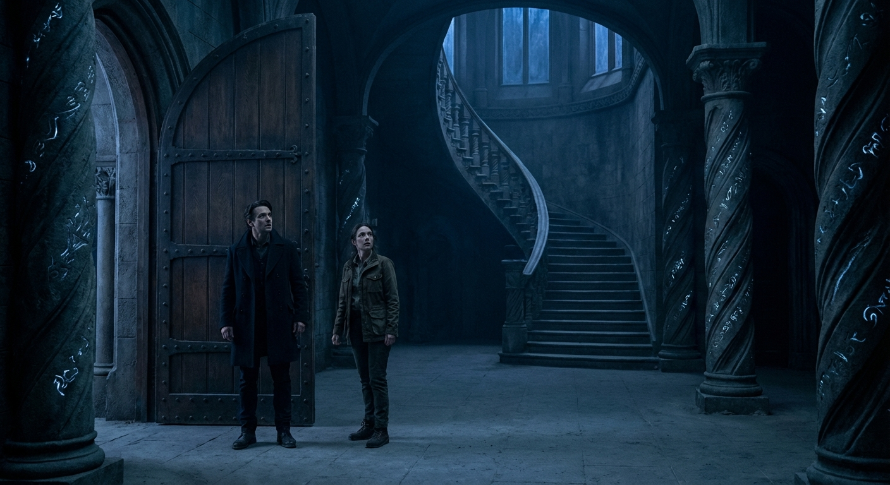

## ## The Negative Blueprints

**Act 2, Scene 2**

**Setting:** blackwood-estate

**Characters:** Elias Thorne, Dr. Clara Reed

---

The air inside the Blackwood Estate did not circulate; it sat in heavy, stratified layers, like the water at the bottom of a sunless trench. As Elias Thorne and Dr. Clara Reed moved deeper into the manor’s viscera, the purple twilight of the hallways gave way to a darkness so absolute it possessed a physical texture—a velvet weight that pressed against their skin and muffled their heartbeats. Every step felt like an intrusion into a space that had forgotten the concept of guests. The floorboards didn't groan; they sighed, a dry, rhythmic sound that suggested the wood was breathing in sync with Elias’s own lungs.

They reached a set of double doors carved from bog oak, the wood so old it had petrified into something resembling obsidian. The carvings were not scenes of nature, but geometric patterns that folded in on themselves, creating optical illusions that made Elias’s head swim. He placed his hand on the grain. He didn't push; he waited. He felt the house’s pulse—a low-frequency vibration resonating in his marrow. It was the same "thrumming" he had felt in the sterile vacuum of Julian Vane’s Glass Spire, a tether that refused to be cut. It was the sound of a machine that had been running for centuries without oil, a grinding of metaphysical gears.

"It’s here," Elias whispered. His voice was a dry rasp, stripped of resonance by the hungry atmosphere. The sound didn't travel; it fell to the floor like lead.

"The heart?" Clara asked. She was pale, her breathing shallow. She carried her forensic kit like a shield, her knuckles white against the handle. She was a woman of data, but here, her science felt like a candle in a hurricane.

"The memory," Elias corrected.

He pushed the doors open.

They did not creak. They glided on hinges of silent intent, revealing a vast, circular chamber. The walls were lined with floor-to-ceiling shelves that disappeared into a vaulted ceiling lost in shadow. But there were no leather-bound spines, no gold-leaf titles. Instead, the shelves were filled with physical entities—dark, rectangular voids that occupied the space where books should be.

Clara clicked on her high-intensity tactical light, but the beam behaved erratically, bending around the empty spaces as if repelled by a magnetic force. Where the light should have illuminated a void, it instead cast the flickering shapes of ghostly volumes made of negative space, visible only by the way they distorted the light around them.

"A library of the unwritten," Clara murmured, her academic fascination momentarily eclipsing her dread. She reached out a gloved hand toward a shadow-spine. Her fingers passed through it, and a coldness sharper than ice bloomed in her chest, turning her breath to mist. "These aren't just missing books, Elias. These are the shapes of things forbidden to be recorded. The silences that were curated, harvested, and shelved."

"My grandfather called this the Ossuary of Intent," Elias said, walking toward a massive stone plinth in the center of the room. "He said that for every word spoken, a thousand possibilities are murdered. This room is the graveyard of the unsaid."

On the plinth lay a heavy portfolio. It wasn't made of shadow; it was agonizingly real, its leather surface scarred and stained with what looked like ancient salt. Elias opened it with trembling fingers, the hinges letting out a sound like a distant scream.

Inside were the "Negative Blueprints."

They were etched into sheets of translucent vellum that felt like cured skin. The lines were not black or blue; they were veins of pure, blinding white that seemed to glow with an internal, radioactive light. They tunneled into the vellum, creating a three-dimensional map of a space that shouldn't exist.

Clara leaned in, her breath hitching. "These aren't architectural plans for the house. Not in any sense I recognize."

"No," Elias said, his eyes tracing the impossible geometries. "They’re maps of the gaps. They don't show the bones; they show the marrow."

The blueprints depicted the Blackwood Estate, but the walls and floors were rendered as mere suggestions. Instead, the drawings mapped the *volumes of air* between the structures. They mapped the "Blind Spots"—pockets of space where a person could stand and be invisible to the world. They mapped "Muzzles" built into the hallways—architectural configurations designed to cancel out sound waves. And they mapped "Gravity Wells" of silence—dense nodes of quiet that anchored the house to the earth like lead weights.

"Look at the scale," Clara whispered, pointing to notations in a script that shifted when she looked at it directly. "It’s not measuring in feet. It’s measuring in... omissions. This room—it’s marked as a 'Zero-Point of Meaning.' A place where language loses its ability to signify."

She pulled a specialized UV light from her kit. "If this is a legal inheritance, there has to be a deed. Vane wouldn't be after this just for the philosophy. He’s a predator of assets. He wants the title."

She swept the light over the final sheet. The white lines vanished, and a hidden layer of text emerged in a dense, archaic legalese. The words pulsed, synchronized with the thrumming heartbeat of the house.

Clara read aloud, her voice trembling. "‘Know all men by these presents... that the Silence herein contained is not a void, but a Primordial Property. It is the pre-lexical substrate from which all reality is carved. To hold this land is to hold the right of First Refusal over the Word. To own the Blackwood is to own the pause before the breath.’"

She stopped, her face ashen. "Elias, this isn't a deed for a house. It’s a claim to the space before language exists. It’s the ownership of the 'Not-Yet.'"

The weight of the revelation hit them like a physical blow. The air felt twice as heavy, pressing against their lungs. Elias gripped the edge of the plinth. He could feel the "Primordial Property" pressing in on him—the crushing responsibility of a secret that preceded the world.

"Vane," Elias choked out. "He doesn't want to sell silence as a luxury. He wants the source code. If he owns the silence before the word, he can decide which words are allowed to be born. He can edit the world before it’s even spoken. He can delete history by removing the silence required to remember it."

Clara’s eyes were wide. "It’s the ultimate monopoly. You don't have to burn books if you can make the very idea of the book impossible to conceive."

As she spoke, the shadow-books on the shelves began to agitate, their edges blurring like the teeth of a saw. The house was reacting. The secret was no longer a mystery; it was a pathogen. The room seemed to contract, the ceiling descending like a lid.

Elias felt a stabbing pain in his temples. Images flashed before his eyes—un-memories. The faces of people never born because the word for 'love' had been withheld. The sounds of languages strangled in the cradle. He saw his father’s face, his mouth sewn shut by invisible threads of duty.

"We have to close it," Elias gasped, reaching for the portfolio. His hands felt numb, as if the blueprints were draining the heat from his blood.

"Wait," Clara said, stopping him. She was staring at a small, circular seal at the bottom of the deed. It was a wax impression, black and smelling of ozone. "There’s a codicil. ‘The Property cannot be sold, nor can it be stolen. It can only be... inherited through the blood of the silent.’"

She looked up at Elias with horror. "Your family didn't just build this house to hide the secret. They *are* the secret. The silence is encoded in your DNA. It’s a biological lock. That’s why Vane can’t just kill you. He needs you to *give* it to him. He needs the heir to speak the word that ends the silence."

Elias felt a cold sweat break out. The thrumming in his chest became a roar. He realized why his grandfather had been so distant, why his father had died in catatonic muteness. They weren't just keeping a secret; they were the containers for a linguistic void. They were the dam holding back the nothingness.

"I’m the muzzle," Elias whispered. "The house is the cage, but I’m the lock. My life is the only thing keeping the Word from being owned."

Suddenly, the tactical light in Clara’s hand died with a sharp *pop*. The UV light sputtered and went out a second later.

The room plunged into a darkness so thick it felt like being buried alive. But they weren't in total darkness. The "Negative Blueprints" on the plinth were glowing with a fierce, cold luminescence, casting long, distorted shadows of Elias and Clara against the walls—shadows that moved independently of their bodies.

In the silence, a new sound emerged. It wasn't the thrumming of the house. It was the sound of footsteps—slow, rhythmic, and utterly confident—echoing from the hallway.

"He’s here," Clara whispered.

"No," Elias said, his eyes fixed on the glowing blueprints. "He’s not here yet. That’s the sound of the house *anticipating* him. The silence is opening the doors from the inside."

Elias slammed the portfolio shut. The white light vanished, and for a moment, the world ceased to exist. There was only the crushing weight of the unspoken.

"We have to get out," Elias said, his voice sounding underwater. "We have to find the 'Positive Blueprints.' If these map the silence, the others must map the way to speak the truth without destroying it. There has to be a way to break the trust."

"And if we can't?" Clara asked.

Elias looked toward the door, where the phantom footsteps were getting louder, a rhythmic pounding that matched his own heart. The house was vibrating now, a low moan rising from the foundations.

"Then we stay here," Elias said, his voice hardening with ancestral resolve. "And we become part of the library. I won't let him have the silence, Clara. I'll take it to the grave."

He grabbed Clara’s hand. Her skin was ice-cold, but she gripped him back with a strength born of survival. Together, they turned away from the plinth and began to navigate the pitch-black room, guided by the physical pressure of the silence against their eardrums. They moved like blind men in a minefield, feeling for the gaps in the air.

As they reached the door, Elias looked back. In the absolute dark, he could see them—the shadow-books on the shelves, glowing with a faint, ghostly radiance. They weren't just books. They were witnesses. They were the ghosts of every thought ever suppressed, every truth traded for safety. And as the heir to the Blackwood Estate, the man with the silence in his blood, he could finally hear what they were saying.

They weren't whispering. They weren't mourning.

They were screaming.

---

**Word Count:** 1813

**Key Moments:**
- The Library of Shadows: Elias and Clara discover a room where the 'books' are made of negative space—shadows of things that were never written or were forbidden to be recorded.
- The Negative Blueprints: They find the blueprints of the house, which map the voids, silences, and 'Blind Spots' rather than the physical structure, revealing the house as a metaphysical construct.
- The Primordial Property: Clara uses forensic light to reveal a hidden deed for 'Silence' itself, identifying it as a pre-lexical substrate that Vane wants to monopolize to control reality.
- The Inherited Burden: Elias realizes that the silence is encoded in his bloodline; he is the physical 'lock' for the secret, and Vane needs his voluntary cooperation to seize the 'Property.'

**Character States:**
- **Elias Thorne:** Physically oppressed and mentally reeling. He has transitioned from a reluctant heir to a man who realizes he is a biological vessel for a cosmic secret. He feels a crushing sense of responsibility and a growing, terrifying connection to the house's 'voice.'
- **Dr. Clara Reed:** Her academic curiosity has been replaced by existential horror. She is physically weakened by the 'Zero-Point' atmosphere but remains intellectually sharp, acting as the translator for the metaphysical threat they face. She is now fully committed to the danger, bound to Elias by the shared weight of the secret.

**Status:** ✅ Complete

#### Act 2, Scene 2 Image

**Prompt:** 

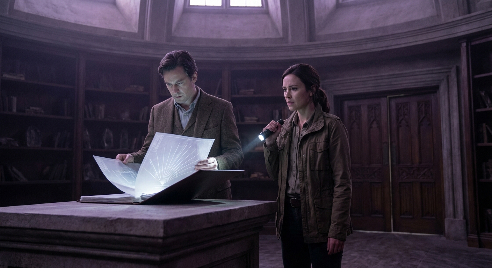

## ## The Price of Observation

**Act 2, Scene 3**

**Setting:** blackwood-estate

**Characters:** Elias Thorne, Dr. Clara Reed, Julian Vane

---

The transition from the Library of Shadows to the Great Hall was not a matter of distance, but of atmospheric displacement. As Elias and Clara crossed the threshold, the jagged, auditory assault of the shadow-books didn’t fade; it simply shifted frequency. The screaming silence descended into a low-frequency vibration that didn’t just ring in their ears—it rattled the marrow in their bones.

The Great Hall of the Blackwood Estate was an impossibility of scale, a cathedral built to house a void. Above, the ceiling was lost in a roiling sea of violet-black vapor, churning with the slow, rhythmic pulse of a sleeping lung. The walls were not stone, but stacked, calcified intentions—thousands of years of things left unsaid, rendered into a substance harder than diamond and colder than the grave. The air was viscous, moving with the sluggishness of chilled honey. Every breath felt like a negotiation with the atmosphere, a physical struggle to pull oxygen from the weight of the room.

In the center of this cavernous vacuum stood a solitary figure.

Julian Vane did not look like a conqueror. He stood behind a massive, obsidian desk that seemed to have erupted from the floorboards like a dark tooth. His hands rested lightly on the surface, fingers long and steady. He wore a suit of charcoal wool so fine it seemed to drink the meager light, and his face—pale, aristocratic, and terrifyingly serene—was illuminated by a single, hovering orb of soft, white light. He looked less like a thief of secrets and more like a curator of the end of the world.

"The human ear is a fragile instrument," Vane said. His voice carried without effort, resonant and perfectly modulated, cutting through the heavy air like a razor through silk. "It was designed for the rustle of leaves, the approach of a predator, the heartbeat of a lover. It was never meant to hear the grinding of the gears of reality."

Elias stepped forward, his hand instinctively tightening around the roll of negative blueprints they had scavenged from the library. His skin felt too tight for his body, his blood singing with a frantic, rhythmic thrum that matched the house’s own heartbeat. 

"You’ve been waiting," Elias said. His voice sounded thin, a fragile thread in the vastness.

"I have been observing," Vane corrected. He turned his gaze toward Clara, tracking the way she swayed on her feet, her face the color of ash. "Dr. Reed, I suggest you breathe shallowly. The oxygen in this room is saturated with the weight of the unexpressed. It can be... intoxicating for those who live by the word."

Clara gripped Elias’s arm, her knuckles white. "You’re Julian Vane. The man who wants to own the silence."

Vane smiled, a thin, bloodless movement of the lips. "Own it? No, Doctor. One does not own the ocean; one merely manages the shoreline. I am a conservationist. I am protecting the world from a flood of meaning it cannot possibly survive."

He gestured to the blueprints in Elias’s hand. "You hold the map to the muzzle, Elias. Your ancestor, Silas Thorne, understood a fundamental law of the universe that our modern age has willfully forgotten: Truth is a finite resource. It is a volatile element. If too much of it is released into the atmosphere at once, the social contract dissolves. Language fails. The 'Architecture of Silence' was not built as a prison, but as a dam."

"A dam for what?" Elias demanded. He felt the blueprints warming in his hand, the negative ink beginning to pulse against his palm like a second heart.

"For the Primordial Property," Vane said, his gaze intensifying. "The truth that exists before language. The raw, unedited data of existence. If people truly knew the nature of their own souls—if they could see the void that sits beneath every 'I love you' and every 'I believe'—they would cease to function. The world stays upright because of what we choose *not* to know. I am simply the man who ensures those choices remain permanent."

Vane walked around the desk, his movements fluid and predatory. He stopped ten feet from them, the air between them shimmering with static. "Think of the world outside, Elias. A billion voices screaming their 'truths' into the void every second. The noise is deafening. It is eroding the very foundation of human cognition. We are losing the ability to perceive the sacred because we have drowned it in the profane. I intend to use this house—this engine of suppression—to restore the balance. I will turn the volume down on the world."

"By controlling what people are allowed to think?" Clara spat, her academic fire flickering back to life through her exhaustion. "By editing reality to suit your own design? That’s not conservation. That’s tyranny."

"It is stewardship," Vane countered. "And it requires a key. A biological lock." He looked at Elias with something approaching pity. "The silence is in your blood, Elias. You feel it, don't you? The way the house breathes when you breathe? The way the shadows lean toward you? You are the physical manifestation of the Blackwood legacy. Without your voluntary cooperation, the blueprints are just paper. The silence remains locked, a dormant cancer. But with you... we can begin the Great Muffling."

Elias looked down at the blueprints. He could feel the "Blind Spots" within the house shifting, the geometry of the room rearranging itself in response to his presence. He was no longer just a visitor; he was a component.

"I won't help you," Elias said, though his voice lacked the conviction he craved.

"Won't you?" Vane asked softly. "Consider the alternative. You have seen the library. You have heard the screaming of the suppressed. If you take those blueprints and leave, if you try to 'free' the truth, you will not be a hero. You will be the man who broke the world. You will unleash a linguistic pathogen that will strip the meaning from every word ever spoken. You will watch as your friend here forgets her own name, as the very concept of 'self' dissolves into a pre-lexical soup."

Vane took a step closer. The pressure in the room spiked. Clara gasped, her knees buckling. Elias caught her, the weight of her body feeling immense, as if gravity itself were being dialed up by a hidden hand.

"Here is the choice, Elias," Vane said, his voice now a low, hypnotic thrum that seemed to vibrate inside Elias’s skull. "Option one: You leave the blueprints here. You walk out of that door, and I will use the 'Blind Spot' to erase this night from your mind. You will return to your life, a bit emptier perhaps, a bit more prone to staring at the horizon, but you will be sane. You will be free of the burden. The silence will remain here, under my care, and the world will continue its slow, noisy crawl toward oblivion, protected by the walls your ancestors built."

Elias looked at Clara. Her eyes were wide, terrified, pleading.

"And option two?" Elias whispered.

"You take the blueprints," Vane said, his eyes gleaming with a dark, intellectual fervor. "You embrace your inheritance. You become the Architect. You take the crushing responsibility of the silence onto your own shoulders. You will know everything. You will see the 'Property' for what it is. But you will never be able to speak of it. You will become a living ghost, a guardian of the void. You will save the world, but you will lose your place in it. You will be the only person on Earth who knows the truth, and the only one forbidden from ever sharing it."

The Great Hall seemed to contract. The walls of calcified intent pressed inward, the violet vapor descending like a shroud. Elias felt the blueprints vibrating so violently now they were almost humming. He could see the "Architecture of Silence" not as a building, but as a vast, intricate machine designed to process the raw data of the universe into something manageable, something survivable.

He looked at Vane, the man who wanted to be the operator of that machine. Vane wasn't a monster; he was a man who had looked into the sun and decided that everyone else should live in the shade for their own good.

"You think you're the only one who can handle it," Elias said.

"I am the only one who *wants* to," Vane replied. "Everyone else is too busy screaming to appreciate the beauty of the pause."

Clara reached out, her hand trembling as she touched the blueprints in Elias’s grip. "Elias... if you give them to him... he controls what is real. He becomes the editor of human history."

"And if he doesn't," Vane added, "the history ends. The noise becomes absolute. Choose, Elias. Sanity and ignorance, or the truth and the crushing weight of its protection."

Elias felt the bloodline in him roar. It was a cold, ancient sensation, like ice water in his veins. He remembered the mirror entry in the library, the way he had to look away to see the truth. He realized then that Vane was right about one thing: the truth was not a gift. It was a sentence.

He looked at the blueprints. The negative space seemed to be drawing him in, a map of all the things he would never be able to say. He thought of his father, of the silence that had defined their relationship, the gaps between words that he had always mistaken for distance. It hadn't been distance. It had been protection.

"I'm not leaving them with you," Elias said, his voice suddenly steady, resonant with the same power as Vane’s.

Vane’s expression didn't change, but his eyes narrowed. "Then you accept the burden? You realize what that means? You will never have a moment of peace again. The silence will be inside you, Elias. It will eat your words before you can speak them."

"I know," Elias said. He felt a strange, cold clarity. He wasn't doing this to be a hero. He was doing it because he was the only one who could. He was the lock, and he was finally turning the key.

He gripped the blueprints tight and turned to Clara. "We have to go. Now."

"You think I will let you walk out with the Property?" Vane asked, his voice dropping an octave, the orb of light above him flickering into a jagged, angry violet.

"You don't have a choice," Elias said. As he spoke, he felt the house respond. The floorboards beneath Vane’s feet began to shift, the "Blind Spot" expanding, swallowing the obsidian desk, the light, and for a moment, Vane himself.

The Great Hall groaned, a sound of tectonic plates shifting. The "Architecture of Silence" was reacting to its true master.

"Run!" Elias shouted, grabbing Clara’s hand.

They bolted toward the exit, but the geometry of the hall was no longer fixed. The doors seemed miles away, then inches, then vanished entirely behind a pillar of stacked shadows. The air was becoming solid, a wall of unexpressed thoughts blocking their path.

Elias didn't look at the doors. He remembered the lesson of the mirror. He looked at the blueprints, focusing on the negative space—the voids where the house *wasn't*.

"Follow the gaps!" he yelled to Clara over the rising roar of the silence.

Behind them, Vane’s voice echoed, no longer calm, but distorted, as if he were speaking through a layer of thick glass. "You cannot carry it, Elias! It will break you! You are a vessel for a god that does not want to be known!"

Elias ignored him, his eyes locked on the blueprints. He saw a path—a sliver of absolute nothingness cutting through the chaos of the hall. He pulled Clara into it.

The sensation was like stepping into a vacuum. For a heartbeat, there was no sound, no light, no Elias Thorne. There was only the Property—the raw, terrifying weight of the secret. He felt it press against his mind, a billion unspoken truths trying to find a voice. He felt his own identity fraying at the edges, his memories being bleached white by the intensity of the silence.

Then, with a violent, concussive pop, they were through.

They tumbled out of the front doors of the Blackwood Estate and onto the gravel driveway. The "purple twilight" was gone, replaced by a cold, grey dawn. The house sat behind them, silent and brooding, its windows like blind eyes.

Elias lay on the ground, gasping for air that finally felt thin and real. He clutched the blueprints to his chest. They were no longer vibrating. They were cold.

Clara sat up, coughing, her hands shaking as she pushed her hair back. She looked at Elias, and for a moment, he saw a flash of recognition in her eyes, followed by a profound, haunting distance.

"Elias?" she whispered.

He opened his mouth to answer, to tell her that they were safe, that they had the blueprints, that he understood now.

But the words wouldn't come.

He felt the thought form in his mind—*I'm here*—but as it moved toward his throat, it was intercepted. The silence in his blood rose up like a wall, absorbing the intent, neutralizing the sound. He could feel the meaning of the words, but the physical act of speaking them was gone. He tried to say her name, but his throat remained a tomb.

He looked at the house. He looked at the blueprints. The price had been paid.

Clara saw it in his face. She saw the wall that had come down between him and the rest of the world. She reached out, touching his cheek, her eyes filling with tears. "Oh, Elias. What have you done?"

Elias couldn't tell her. He could only sit there in the grey light of the morning, the guardian of a truth that would never be told, listening to the silence of the world—a silence that, for the first time in his life, was his and his alone.

Far off, in the depths of the house, a single door slammed shut. The Architecture of Silence had found its new tenant.

---

**Word Count:** 2367

**Key Moments:**
- The Confrontation: Elias and Clara face Julian Vane in the Great Hall, where Vane reveals his role as a "steward" who believes truth is a dangerous pathogen that must be suppressed to maintain social order.
- The Philosophical Conflict: Vane argues that the "Architecture of Silence" is a necessary dam against a flood of primordial meaning that would destroy human cognition, framing himself as a protector rather than a villain.
- The Choice: Vane offers Elias a choice between a return to a sane, ignorant life or the "inheritance" of the silence—becoming the guardian of the secret but losing the ability to ever communicate it.
- The Inheritance: Elias chooses to take the blueprints and the burden, using his biological connection to the house to escape Vane’s trap, but at the cost of his own voice.
- The Aftermath: Elias and Clara escape the estate, but Elias discovers he can no longer speak; the silence has moved from the house into his very being.

**Character States:**
- **Elias Thorne:** Physically exhausted but spiritually "locked." He has transitioned from a victim of his legacy to its active guardian. He is now the "Architect," possessing absolute knowledge but suffering absolute isolation. He is emotionally stoic, burdened by the weight of the world.
- **Dr. Clara Reed:** Physically weakened and emotionally devastated. She has transitioned from a researcher to a witness. She realizes the magnitude of Elias’s sacrifice and feels the growing distance between them, mourning the loss of the man he was.
- **Julian Vane:** Defeated but vindicated. He remains in the house, having lost the blueprints but knowing that the "Property" is now safely locked within Elias. He remains a looming threat, the curator who knows that the silence always wins in the end.

**Status:** ✅ Complete

#### Act 2, Scene 3 Image

**Prompt:** 

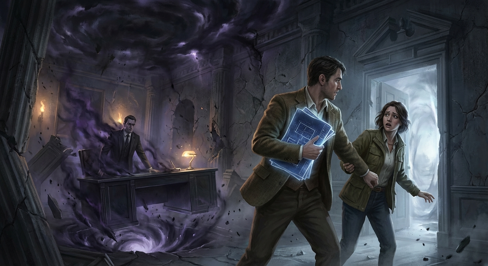

## ## The Pressure of the Void

**Act 3, Scene 1**

**Setting:** ossuary-of-echoes

**Characters:** Elias Thorne, Dr. Clara Reed

---

The descent was less a movement through space and more a slow immersion into a denser medium, as if the air were turning to mercury.

Elias Thorne led the way, his footsteps making no sound upon the obsidian stairs. Behind him, Dr. Clara Reed felt the atmospheric pressure blooming in her sinuses—a sharp, cold ache that tasted of copper and ancient dust. They were moving beneath the foundations of the Thorne estate, beyond the "Blind Spots" mapped in the negative blueprints, into a geography that defied the laws of Euclidean architecture. The stairs didn’t seem to go down so much as they withdrew from the world above.

The Great Hall was now a fading memory of light and betrayal. Here, in the throat of the house, there was only the hum—a vibration so low it was felt in the marrow rather than heard in the ear.

"Elias," Clara whispered. Her voice was a fragile thing, stripped of its resonance the moment it left her lips. It sounded like dry leaves skittering over stone. "The oxygen... the levels are fine, but I feel like I’m drowning in the weight of it."

Elias stopped. He turned to her, his face a pale mask in the gloom. He didn't speak; he couldn't. The silence he had inherited in the Great Hall was now a physical organ within him, a second heart beating in perfect synchronicity with the house. He reached out, his hand steady, and pressed his palm against the wall.

The stone didn't just absorb his touch; it recognized it. A faint, bioluminescent pulse rippled through the masonry, revealing the true nature of the passage. They were not in a tunnel. They were inside a giant, petrified lung.

This was the Ossuary of Echoes.

As they reached the base of the stairs, the space opened into a vast, vaulted chamber. It was not filled with bones, as the name suggested, but with something far more unsettling. Thousands of niches lined the walls, each containing a small, translucent sphere. Within each sphere, a faint grey vapor swirled—the trapped remnants of words never spoken, secrets withheld, and truths suppressed across centuries of the Thorne lineage. It was a library of the unsaid.

"It’s a resonator," Clara breathed, her eyes wide as she approached the nearest niche. She didn't dare touch it. "The entire house... it’s a giant tuning fork, and this room is the dampening chamber. It doesn't just store silence, Elias. It *manufactures* it. It’s a factory for the void."

Elias moved toward the center of the room, drawn by a gravitational pull he felt in his very blood. There, atop a plinth of unpolished basalt, sat the object they had risked everything to find: the Deed.

It was not a document. It was a crystalline cylinder, roughly the size of a human forearm, pulsing with a rhythmic, internal light. It looked less like a legal instrument and more like a core sample taken from the heart of a dying star.

As Elias approached, the pressure in the room intensified. The air became a physical weight, pressing against their chests, forcing them to breathe in shallow, rhythmic gasps. Clara fell to her knees, the sheer metaphysical mass of the object overwhelming her equilibrium.

"It’s the primordial property," she gasped, clutching her throat. "The first 'No.' The first 'Keep this hidden.' Elias, look at the geometry of the ceiling!"

Elias looked up. The vaulted ceiling was not a dome but a complex series of interlocking parabolas, designed to catch any stray vibration from the world above and funnel it down into the cylinder. He understood then. The cylinder was the anchor.

In the world above, men fought for land, for gold, for data. But those were secondary currencies. The true foundation of power—the "Primordial Property"—was the monopoly on what could not be known. The hierarchy of human civilization was not built on the distribution of knowledge, but on the strategic management of the void. The king was king because he knew what the peasant did not; the priest was holy because he held the keys to the unutterable.

The silence was the mortar between the bricks of reality. If it were ever truly broken—if the cylinder were shattered—the shared illusions of order, authority, and even identity would dissolve into a chaotic flood of raw, unmediated meaning. Human cognition would be incinerated by the sudden influx of the Absolute.

Elias reached out his hand. His fingers trembled, not with fear, but with the sheer effort of moving through the pressurized air.

*This is what Vane wanted,* he thought, the realization echoing in the hollow spaces of his mind. *Not to destroy the secret, but to own the lock.*

As his fingertips brushed the cold surface of the crystal, a shockwave of pure stillness radiated outward. Clara let out a silent scream as the last vestige of sound was sucked out of the room. For a terrifying moment, they were suspended in a total vacuum of meaning.

Elias saw it then: the long line of his ancestors, the "Architects of Silence," standing in this very spot. He saw his father, a man who had withered away into a shadow, and his grandfather, who had died with his lips sewn shut by his own hand. They weren't villains. They were the dam-keepers. They were the ones who stood at the edge of the abyss and held the line so that the rest of the world could live in the comfortable noise of their own ignorance.

The cylinder began to glow brighter, the grey vapor in the wall-niches swirling in a frantic, sympathetic dance. Elias felt the "Deed" connecting to the silence within him. He was no longer just the guardian; he was the physical extension of the property. The crystalline structure was the hardware, and his blood was the code.

He looked at Clara. She was watching him with a mixture of awe and profound grief. She saw the transformation. She saw the man she had known—the curious, haunted Elias—being overwritten by the cold, eternal logic of the Architecture.

He wanted to tell her to run. He wanted to tell her that the pressure she felt was the weight of a world that demanded to be forgotten. But his vocal cords were like stone.

Instead, he turned back to the cylinder. He understood the stakes now. Vane was still out there, a curator of shadows who believed that the truth was a pathogen. But Vane was wrong about one thing: the silence wasn't a weapon to be wielded. It was a burden to be carried.

Elias gripped the cylinder. The pressure reached a crescendo, a silent roar that vibrated through his teeth and into his skull. The Ossuary seemed to groan, the very foundations of the estate shifting as the "Property" acknowledged its new master.

The hierarchy was safe. The silence was anchored.

But as the light of the cylinder began to fade into a dull, steady throb, Elias felt the finality of his choice. He had saved the world from the madness of the truth, but he had condemned himself to the void. He was the master of the Ossuary, the owner of the silence, and the loneliest man in existence.

Clara stood up slowly, her movements heavy and fluid, as if she were walking underwater. She walked to him and placed her hand over his on the cold crystal. She didn't speak. There was nothing left to say.

The silence was no longer a secret they were chasing. It was the room they lived in. It was the air they breathed.

Far above, the house settled into its new equilibrium. The "Architecture of Silence" had been reinforced. The Deed was signed in the blood of the heir, and the world would continue its noisy, ignorant dance, never knowing how close it had come to the sound of the end.

Elias looked at the stairs, the long climb back to a world where he would be a ghost among the living. He took a breath, the air thick and heavy with the weight of everything he could never tell.

He began to walk, and for the first time, the silence didn't feel like a cage. It felt like a kingdom.

---

**Word Count:** 1374

**Key Moments:**
- The Descent: Elias and Clara move from the physical world into the metaphysical 'Ossuary of Echoes,' experiencing the physical pressure of the silence.
- The Discovery of the Deed: They find the crystalline cylinder, which is revealed to be the physical manifestation of 'Silence' as a primordial property.
- The Philosophical Revelation: Clara and Elias realize that human hierarchy and social order are built upon the strategic suppression of truth; the silence is the anchor for reality.
- The Binding: Elias touches the cylinder, fully assuming his role as the 'Architect' and the physical vessel for the secret, effectively 'signing' the deed with his own existence.

**Character States:**
- **Elias Thorne:** He has moved from a state of silent victimhood to a state of grim, sovereign responsibility. He is physically 'heavy' with the power of the Ossuary and emotionally isolated, accepting his role as the world's silent guardian.
- **Dr. Clara Reed:** She is physically exhausted and emotionally devastated. She has transitioned from a scientist seeking truth to a witness who understands that the truth is too heavy to bear. She remains loyal to Elias but is mourning the loss of his humanity.

**Status:** ✅ Complete

#### Act 3, Scene 1 Image

**Prompt:** 

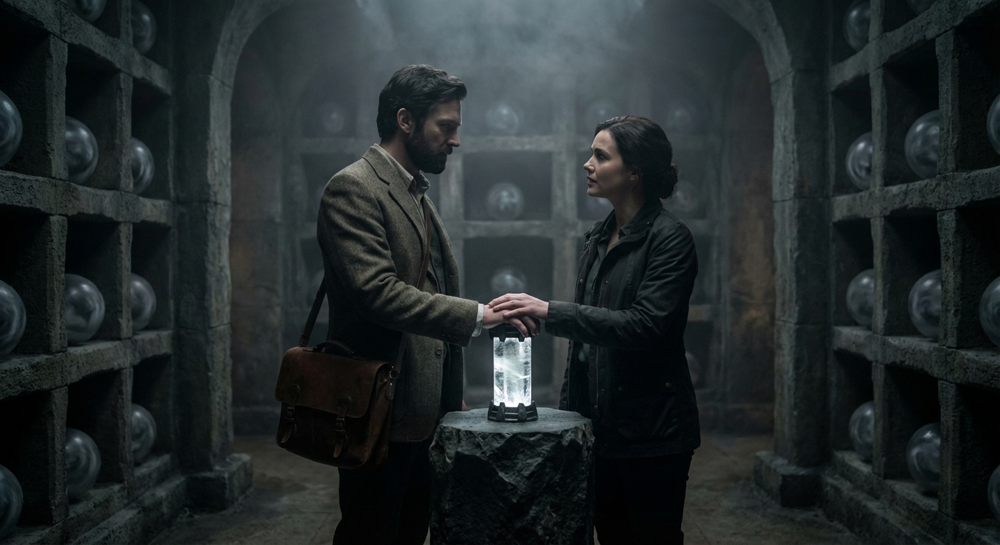

## ## The Price of Transparency

**Act 3, Scene 2**

**Setting:** ossuary-of-echoes

**Characters:** Elias Thorne, Dr. Clara Reed, Julian Vane

---

The atmosphere in the Ossuary of Echoes had abandoned the properties of gas. It possessed the viscosity of ancient honey, a pressurized medium vibrating at a frequency just below the threshold of human hearing. Here, beneath the foundations of the Thorne estate, the "Architecture of Silence" was no longer a metaphor; it was a physical weight, a calcified history of every word ever strangled in a throat.

Elias Thorne stood at the center of the chamber, his hand still tingling from the touch of the crystalline cylinder—the Deed. The silence was no longer external. It had migrated. It sat in his lungs like a cold, smooth stone, a sovereign presence that had severed the connection between his mind and his vocal cords. He was the vessel now. He was the vault.

"It’s a heavy crown, isn't it?"

The voice didn't shatter the silence; it seemed to grow out of it, a weed pushing through cracked marble. Julian Vane stepped from the periphery of the vaulted ribs. He looked remarkably composed for a man whose world was being rearranged, his tailored charcoal suit absorbing the dim, phosphorescent light of the crystalline structures.

Clara Reed moved instinctively toward Elias, her hand gripping his arm. Her face was a mask of pale exhaustion, her eyes bright with a feverish, intellectual defiance. "Stay back, Julian. He’s done what you wanted. He’s taken the burden. Isn't that enough?"

Vane ignored her, his gaze fixed on Elias. "You feel it, don't you, Elias? The Primordial Property. It isn't just a secret. It is the raw, unformed matter of meaning. Before a word is spoken, it exists as a potentiality—a terrifying, infinite energy. Once it is named, it is limited. Once it is shared, it is diluted. But here, in its pure state, it is the bedrock of reality."

Elias looked at Vane. He wanted to scream a thousand questions—about his father’s ghost, about the cost of this inheritance, about the morality of a world built on a foundation of hidden things. But his throat remained a sealed tomb. He could only stare, his eyes reflecting the cold, blue light of the Ossuary.

"You speak of it like it’s a commodity," Clara said, her voice trembling with a mixture of anger and awe. "But it’s not property, Julian. It’s potential. By hoarding it, by building this... this fortress of suppression, you’re starving the world. You’re keeping humanity in a state of perpetual infancy because you’re afraid of what happens when we grow up and face the truth."

Vane turned to her, a thin, patronizing smile touching his lips. "Growth, Dr. Reed? You think the human mind is built to withstand the sun? Transparency is a pathogen. If every secret were revealed, if every hidden motive and primordial truth were laid bare, the social contract would incinerate in an afternoon. We don't live by truth; we live by the grace of what we choose to ignore. The Silence is the dam. I am merely the engineer who ensures the cracks are sealed."

He stepped closer to Elias, his voice dropping to a reverent whisper. "Your father understood this. Thomas Thorne wasn't a tyrant. He was a martyr. He spent his life in this cold dark so that you could walk in the light of a curated world. He knew that the 'Property'—this raw essence of the unspoken—must have a steward. A single point of failure. A single heart to hold the pressure so the rest of the world doesn't have to."

Elias felt a surge of heat in his chest. He looked down at the crystalline cylinder, then at the blueprints etched into the very walls of the Ossuary. He saw his father’s handwriting in the margins of the architectural drawings—not the bold strokes of a conqueror, but the cramped, anxious script of a man trying to build a cage for a god.

*Protection.* The word echoed in Elias’s mind, though it never reached his lips.

He had spent his life hating his father for the distance between them, for the coldness that had defined the Thorne household. He had seen the silence as a weapon used against him. But standing here, feeling the sub-harmonic thrum of the Primordial Property vibrating in his marrow, he realized the silence hadn't been a weapon. It had been a shield. His father hadn't been hiding the truth from him to maintain power; he had been hiding Elias from the truth to maintain his sanity.

"He loved you in the only way a man in his position could," Vane said, reading the realization on Elias’s face. "By never telling you why he couldn't."

"That’s a lie," Clara hissed. She stepped between Elias and Vane, her small frame vibrating with indignation. "It’s a justification for cowardice. You’re afraid of a world you can’t control, Julian. You think that because *you* can’t handle the weight of the absolute, no one can. But knowledge belongs to the species, not to a lineage. Elias, look at me."

Elias turned his gaze to her. Clara’s eyes were wet, her face etched with a desperate hope.

"You don't have to be the vault," she whispered. "You can be the bridge. If we take this—if we find a way to translate this 'Property' into something the world can understand—we change everything. No more shadows. No more 'stewards' deciding what we’re allowed to know. We can finally be whole."

Vane laughed, a dry, rattling sound. "Whole? Or hollowed out? Tell me, Dr. Reed, what happens to the mystery of the soul when the soul is fully mapped? What happens to the beauty of the unspoken when there is nothing left to say? You’re advocating for the death of the interior life. You’re asking for a world of glass, where there is nowhere left to hide, not even from oneself."

The tension in the room was a physical cord, pulled taut between the two ideologies. On one side, Vane’s cold, aristocratic preservation—the belief that the elite must suffer the truth so the masses can enjoy the lie. On the other, Clara’s democratic idealism—the belief that the truth, however devastating, is the only path to genuine freedom.

And in the center stood Elias, the silent arbiter.

He felt the "Property" within him shifting. It was a living thing, a sea of unformed thoughts and primordial echoes. He realized that Vane was right about one thing: the sheer volume of it was catastrophic. To release it all at once would be like opening a vacuum in a pressurized cabin. It wouldn't enlighten; it would erase.

But Clara was right, too. The hoarding of this power had created a monster like Vane. It had turned his father into a ghost and Elias into a statue.

Elias moved. He didn't go toward Vane, and he didn't go toward Clara. He walked to the central pedestal where the crystalline cylinder sat. He looked at the "Deed"—the physical manifestation of the Silence as a property.

He understood now that the "Architecture of Silence" wasn't just the house or the Ossuary. It was the structure of human civilization itself. We are defined by what we keep back. Our identities are the negative space created by our secrets.

He reached out and touched the cylinder.

"Elias, no," Vane warned, his voice losing its composure for the first time. "You don't know how to modulate it. If you break the seal, you don't just speak the truth—you become the end of it."

Clara reached for his other hand. "Elias, we can do this together. We can find a way."

Elias looked at Clara, and for a fleeting second, he allowed himself to mourn the life they might have had—a life of words, of shared secrets, of the beautiful, mundane noise of a normal relationship. Then, he looked at Vane, seeing the hollowed-out shell of a man who had given everything to a cause that required him to be less than human.

Elias realized his father’s true motive. It wasn't just protection of the world. It was the protection of the *secret itself*. The secret was the only thing that was truly "Primordial Property"—the only thing that hadn't been corrupted by the messy, entropic world of human speech.

He didn't break the cylinder. Instead, he gripped it tight, and with a surge of internal will, he pulled the silence deeper into himself. He wasn't just the vessel; he was becoming the lock.

The phosphorescent light in the room began to dim. The vibrations in the air smoothed out, transitioning from a chaotic thrum to a steady, rhythmic pulse—like a heartbeat.

Elias looked at Vane and gave a single, slow nod. He accepted the stewardship. But he looked at Clara with a profound, silent apology. He was choosing the silence, not because he believed in Vane’s hierarchy, but because he realized that some truths are so fundamental that they can only exist in the dark. To bring them into the light is to destroy their essence.

The weight in his chest settled. The "Property" was secure.

"It is done," Vane whispered, his shoulders slumping in a mixture of relief and defeat. He had won the argument, but he had lost his purpose. The heir had claimed the inheritance. Vane was no longer the steward; he was merely a witness.

Clara let go of Elias’s arm, her hand falling limp at her side. She looked at him, and the distance between them was now an unbridgeable chasm. She saw the man she loved being replaced by the Architect—a being of profound knowledge and absolute isolation.

"Elias?" she whispered, one last time.

He couldn't answer. He turned away from the pedestal and began to walk toward the stairs that led back to the world of men. Each step felt like he was dragging the weight of the entire earth behind him.

He was the richest man in the world, possessing the only property that truly mattered. And he was the poorest, for he could never spend a single cent of it.

As they ascended, the Ossuary of Echoes faded into the gloom behind them. The crystalline structures dimmed until they were nothing more than cold rocks in a dark basement. The "Architecture of Silence" had been reinforced, the deed signed in the marrow of the last Thorne.

Above them, the house waited—a monument to everything that would never be said. Elias stepped out into the hallway of the Great Hall, the morning sun bleeding through the high windows. The world was waking up, noisy and ignorant and safe.

He walked past the portraits of his ancestors, their painted eyes following the new master of the house. He reached the front door and paused, looking out at the sprawling estate.

He was the Architect now. And his first act was to ensure that the silence remained unbroken.

---

**Word Count:** 1802

**Key Moments:**
- The Ideological Showdown: Julian Vane explains the 'Primordial Property' as the raw essence of reality that must be suppressed to maintain social order, while Clara argues that this hoarding of truth is a form of intellectual slavery.
- The Realization of the Father’s Motive: Elias perceives through the 'Silence' that his father, Thomas Thorne, acted out of a desire to protect his son and the world from the destructive power of absolute truth, rather than a desire for power.
- The Final Choice: Elias accepts his role as the 'Architect.' He chooses to internalize the silence, becoming a living lock for the secret. He rejects Clara’s plea for transparency, realizing that the truth they’ve found is too volatile to be shared.

**Character States:**
- **Elias Thorne:** He has fully transitioned into the 'Architect.' He is physically burdened by the 'Property' within him and emotionally isolated. He has accepted his fate as a silent guardian, losing his ability to connect with Clara but gaining a grim sense of purpose.
- **Dr. Clara Reed:** Devastated and disillusioned. She feels a sense of profound loss, not just for Elias’s humanity, but for the missed opportunity to 'free' the world’s hidden knowledge. She is now a witness to a tragedy of silence.
- **Julian Vane:** Vindicated but obsolete. He has succeeded in passing the burden to the rightful heir, but in doing so, he has lost his status as the primary steward. He remains a cold, intellectual figure, watching the new order take shape.

**Status:** ✅ Complete

#### Act 3, Scene 2 Image

**Prompt:** 

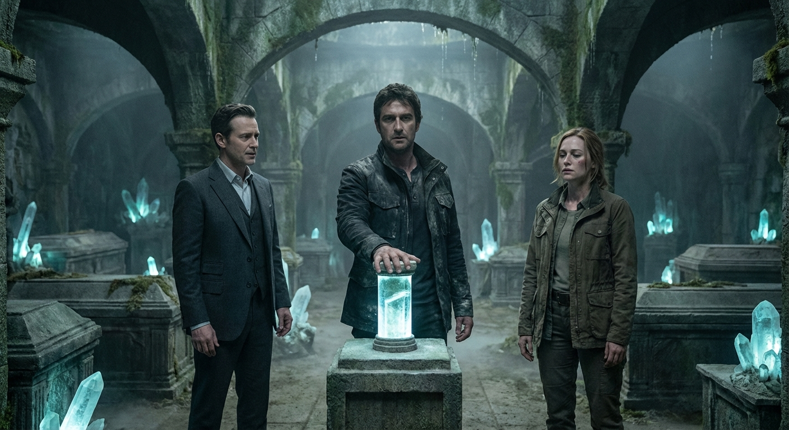

## ## The Architect of the Unspoken

**Act 3, Scene 3**

**Setting:** ossuary-of-echoes

**Characters:** Elias Thorne, Julian Vane, Dr. Clara Reed

---

The Ossuary of Echoes was not built of stone and mortar, but of a rupture in the world’s grammar. It was a pocket of negative geography, a cellar where the laws of physics had been evicted to make room for the laws of consequence. Here, the air was not oxygen and nitrogen, but the pressurized residue of every word humanity had ever strangled in its throat. It tasted of copper and old ink.

Elias Thorne stood at the epicenter, his hand fused to the crystalline cylinder. The "Deed" was no longer an object he held; it was a puncture wound in reality. Through it, the primordial property of Silence surged into him, remapping his nervous system into a blueprint of secrets. He felt the oceanic density of every suppressed scream, every buried betrayal, and every state secret that served as the hidden grease for the gears of civilization.

"It’s beautiful, isn't it?" Julian Vane’s voice cut through the gloom, thin as dry parchment. He stood at the threshold, his face a mask of starving avarice. "The foundation of the world. Without this weight, the human race would float away into the sun, incinerated by their own unvarnished truths. We are the anchors, Elias. We keep the floor from falling out of history."

Elias turned his head with the tectonic grace of a mountain. His eyes, once a piercing blue, had become the matte darkness of deep space—voids that light entered but never left.

"You were never an anchor, Julian," Elias said. His voice didn't travel through the air; it vibrated directly in the marrow of Vane’s bones. "You were a scavenger. You didn't guard the silence; you tried to sell the shade it cast."

Vane stepped forward, his hand trembling with a palsy of greed. "I maintained the order! I kept the Spire standing! Give it to me. You don’t have the constitution for this burden. Your father knew it—that’s why he hid you in the margins."

"He didn't hide me to protect me," Elias said, the walls of the Ossuary humming in sympathy with his pulse. "He hid me to prepare me. He knew that to own the silence, one must eventually become it."

Beside Elias, Dr. Clara Reed was gasping, her lungs struggling to find purchase in the thinning atmosphere. The negative space was expanding, consuming the reality that bordered it. The shadows were growing teeth, nibbling at the edges of the visible world.

"Elias, we have to go," Clara whispered. She reached for him, but her hand stopped inches away, repelled by a static charge of pure negation. Her touch felt like a ghost’s—distant, a fading memory of warmth. "The structure is failing. If you stay, there is no path back. We can break the cycle of these hidden rooms."

Elias looked at her, and for a fleeting second, the man she had known—the architect who looked for meaning in the gaps between buildings—flickered in the dark pools of his eyes. He loved her for her belief in the light, but he understood now that the light was a luxury paid for in the currency of the dark.

"If I break the cycle, Clara, the world breaks with it," Elias said softly. "The truth isn't a gift. It’s a solvent. It would dissolve every marriage, every government, every peace treaty ever signed. People don't want the truth. They want the safety of the unspoken."

The ground groaned, a low-frequency lament. Above them, miles away at the summit of the estate, the Glass Spire—Vane’s monument to his own perceived mastery—began to vibrate. A tectonic hum radiated from the cylinder, signaling the changing of the guard.

"No!" Vane shrieked. He felt the severance then—the metaphysical deed being rewritten in the blood and nerves of a Thorne. The Property was rejecting him like a foreign body. "It’s mine! I am the Architect!"

"You are a tenant who overstayed his welcome," Elias said.

With a violent surge of will, Elias pushed. He didn't use his hands; he used the absolute stillness of the room. A wave of pressurized silence slammed into Vane, throwing him backward toward the exit. In the same motion, Elias caught Clara’s waist with a phantom force and propelled her toward the light of the ascending corridor.

"Elias, no!" she screamed, her fingers clawing at the air.

"Go, Clara! Witness the world I’m saving for you," Elias commanded, his voice a landslide of stone. "Tell them nothing. That is your part. Keep the secret of how the secret was kept."

The Ossuary began to fold in on itself, a tesseract of shadow. Vane scrambled for purchase, but the floor beneath him turned to smoke. He fell into the encroaching dark, his cries silenced before they could leave his throat, his ownership stripped away until he was nothing but a footnote in a book that would never be opened.

Clara stumbled into the corridor, the pressure behind her mounting like a physical wall. She looked back one last time.

Elias Thorne was no longer standing; he was becoming. He sat upon the central plinth, his body turning to the same dark, translucent stone as the Ossuary. The crystalline cylinder had vanished into his chest, a heart of frozen light. He was the new anchor, the living seal on the door of the world’s subconscious. As the heavy stone doors began to grind shut, powered by a mechanism older than the house itself, she saw him close his eyes. He looked peaceful—a man who had finally found a room large enough to hold his grief.

The doors slammed shut with a finality that shook the foundations of the earth.

Outside, on the emerald lawns of the Thorne estate, the morning air was punctuated by a sound like a thousand violins snapping at once. The Glass Spire developed a jagged, lightning-bolt crack from tip to base. Its transparency vanished, replaced by a milky, opaque frost. It could no longer be seen through.

Clara burst from the manor, collapsing onto the dew-slicked grass. She coughed, the mundane air tasting sweet and thin. The house stood silent, a tomb of secrets. Birds began to sing. In the distance, the sounds of the city—the traffic, the commerce, the beautiful noise of millions—resumed their steady, ignorant pulse.

They didn't know. They would never know.

She looked at her hands, still trembling. She was the only one left who knew the price of the silence. She was the widow of a man who wasn't dead, but who could never be spoken of again.

The Architecture of Silence was complete. The world was built upon a foundation of a single man’s sacrifice, a secret buried so deep that even memory couldn't reach it. Clara stood up, wiped the soul-dust from her face, and began to walk toward the gates. She didn't look back. She had a secret to keep, and for the first time, she understood why it was the heaviest thing a person could ever carry.

---

**Word Count:** 1160

**Key Moments:**
- The Sealing: Elias fully merges with the 'Deed,' internalizing the primordial property of Silence and physically transforming into the anchor of the Ossuary.
- Vane’s Downfall: Julian Vane is stripped of his perceived power and consumed by the negative space as the 'Property' recognizes its true heir, ending his reign of intellectual tyranny.
- The Sacrifice: Elias forcibly saves Clara by ejecting her from the collapsing metaphysical space, choosing a life of eternal, silent isolation to preserve the world's stability.
- The Spire Cracks: The physical manifestation of the old order (the Glass Spire) cracks and turns opaque, signaling the shift in the 'Architecture of Silence' from a tool of control to a burden of protection.

**Character States:**
- **Elias Thorne:** Transformed and transcendent. He has moved beyond human emotion into a state of 'monolithic' responsibility. He is physically part of the Ossuary now—the living lock on the world's secrets.
- **Dr. Clara Reed:** Devastated, exhausted, but alive. She carries the 'burden of the witness.' She is the only person in the 'noisy' world who understands the cost of their safety, leaving her profoundly lonely.
- **Julian Vane:** Erased. He ends the scene not just defeated, but rendered obsolete and consumed by the very forces he tried to hoard.

**Status:** ✅ Complete

#### Act 3, Scene 3 Image

**Prompt:** 

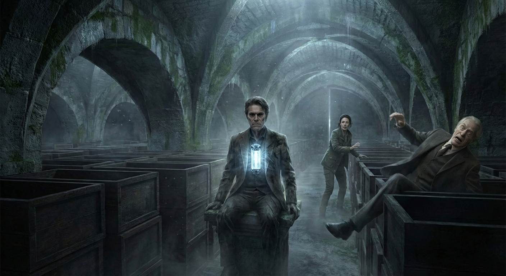

## Final Statistics

- Total Scenes: 9
- Total Word Count: 16272
- Time: 1249.843s

