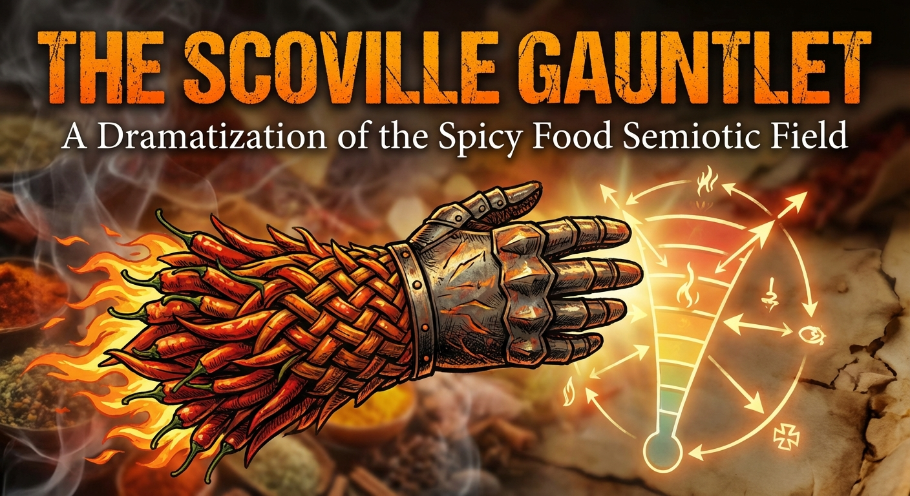
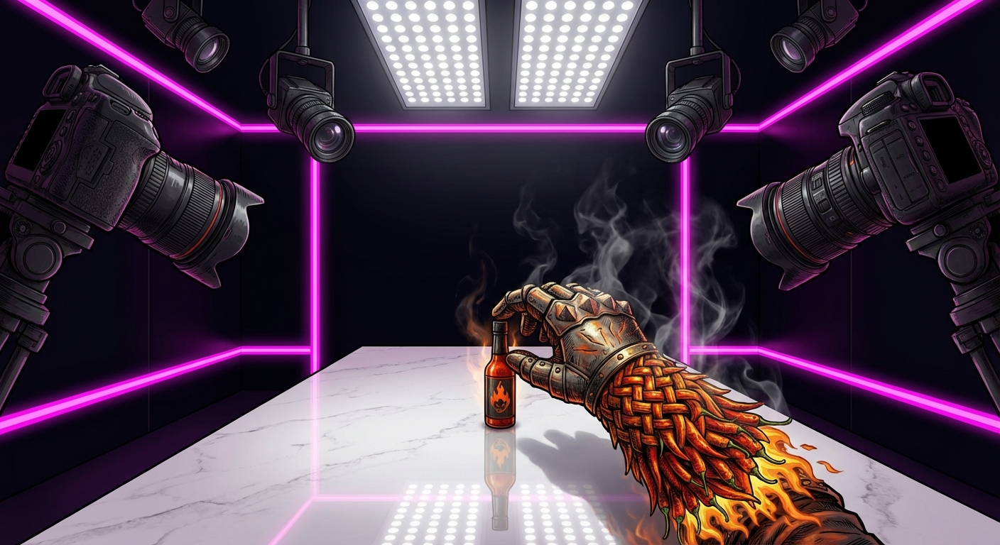
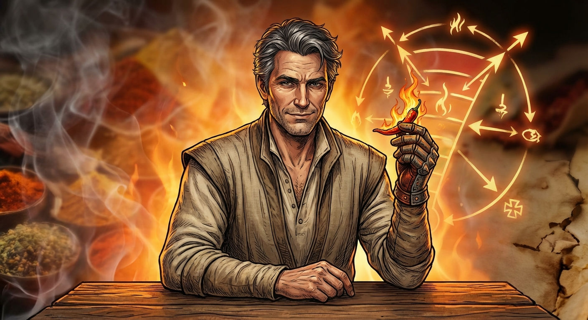
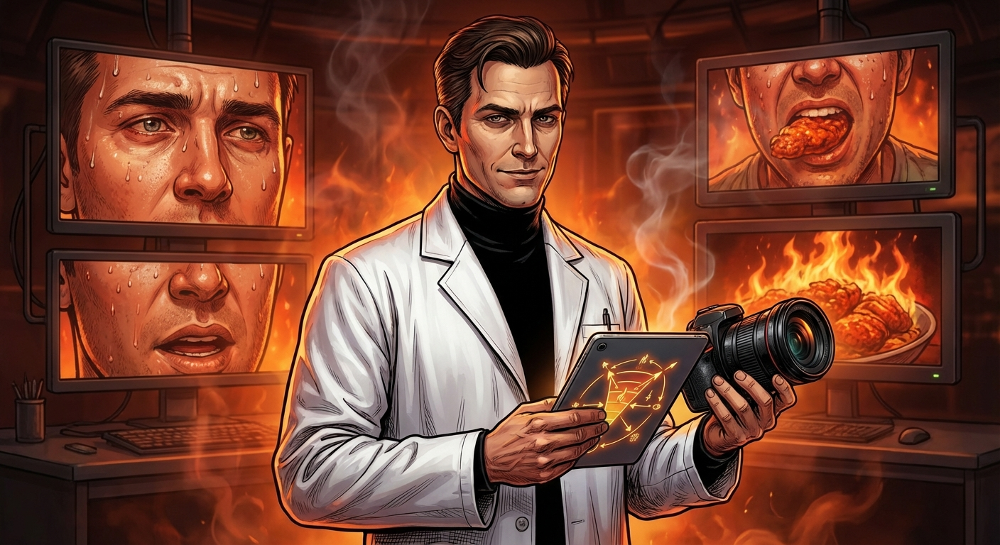
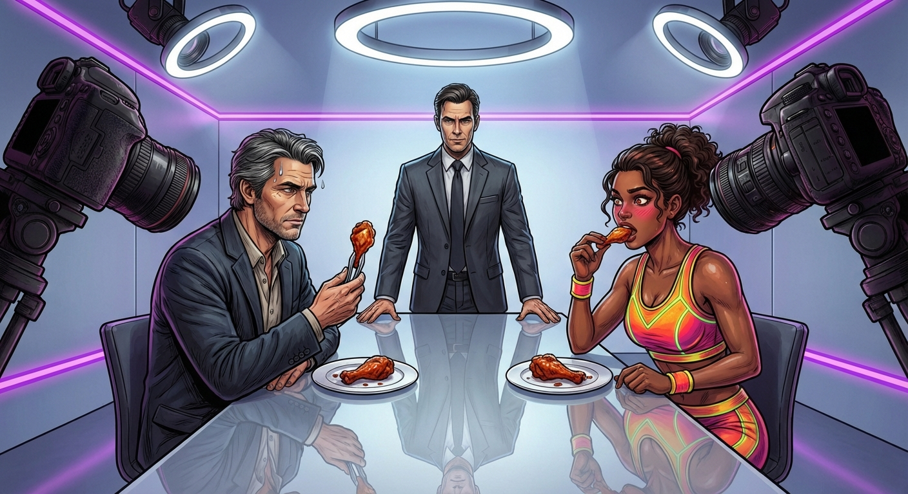
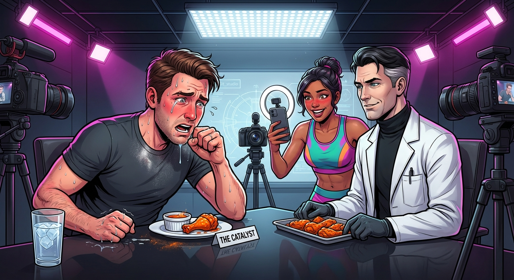
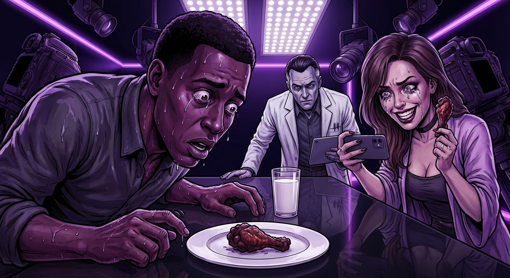
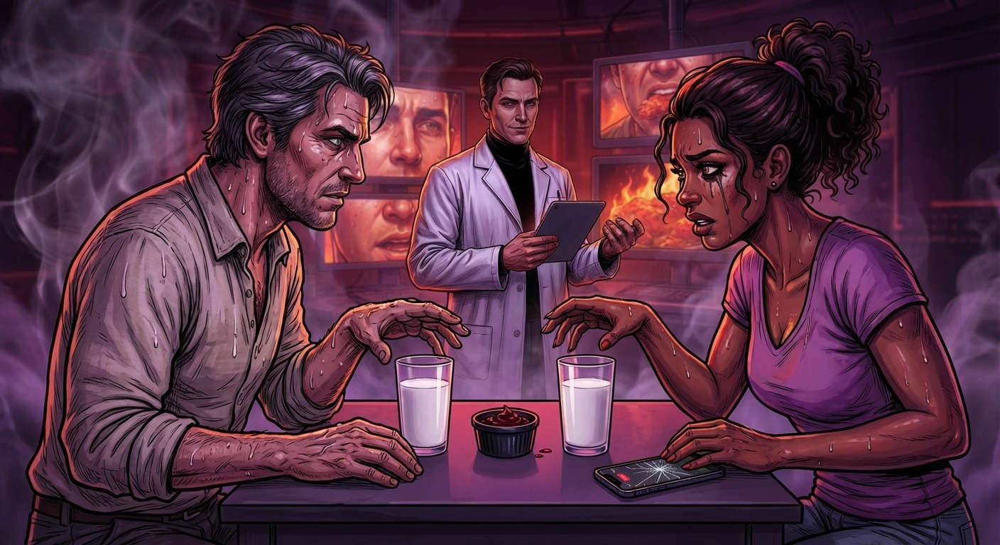
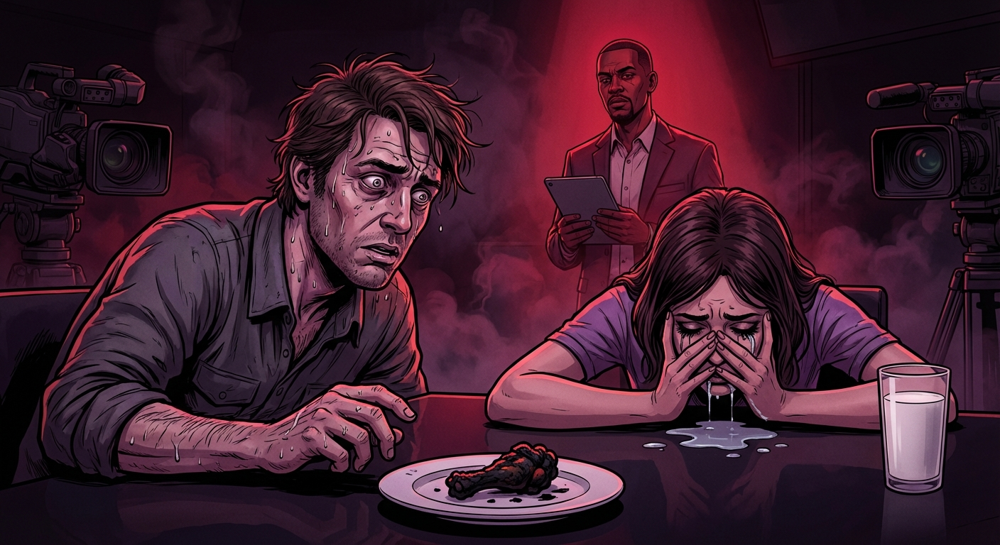
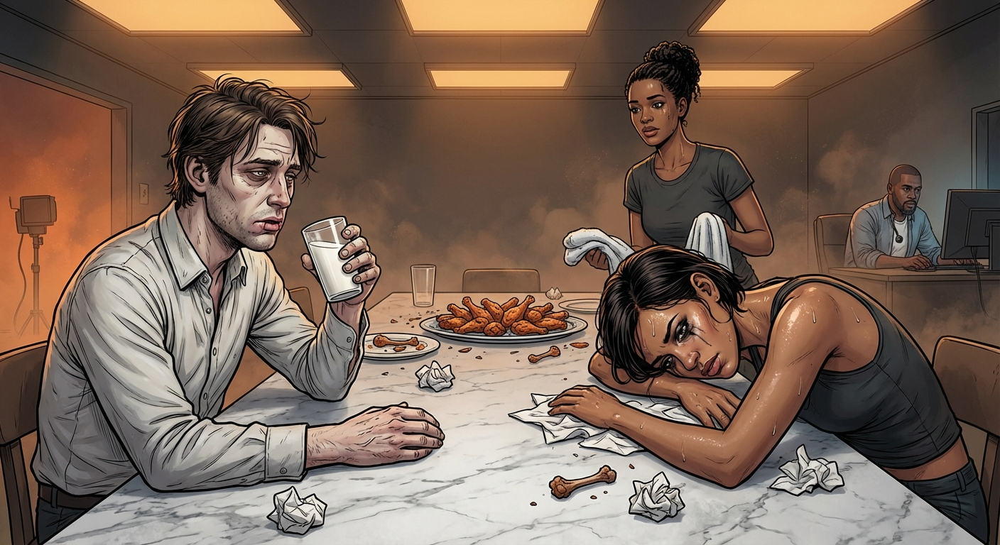

# Narrative Generation Task

## Overview

# Narrative Generation

**Subject:** The Scoville Gauntlet: A Dramatization of the Spicy Food Semiotic Field

## Configuration
- Target Word Count: 2500
- Structure: 3 acts, ~2 scenes per act
- Writing Style: literary
- Point of View: third person limited
- Tone: dramatic
- Detailed Descriptions: ✓
- Include Dialogue: ✓
- Internal Thoughts: ✓

**Started:** 2026-02-20 20:56:57

---

## Progress

### Phase 1: Narrative Analysis
*Running base narrative reasoning analysis...*

## Cover Image

**Prompt:** 

## High-Level Outline

## The Scoville Gauntlet

**Premise:** An exploration of the intersection of biological reality and social artifice through the lens of extreme capsaicin consumption, where a cultural critic and a lifestyle influencer battle to maintain their public personas under intense physical duress.

**Estimated Word Count:** 2496

---

### Characters

#### Elias Thorne

**Role:** protagonist

**Description:** A lean, forty-something cultural critic with salt-and-pepper hair and a wardrobe of expensive, neutral-toned linens. He possesses a 'curated' face—one practiced in the art of the unimpressed smirk.

**Traits:** Intellectual, prideful, and deeply terrified of being seen as 'common.' He views the Gauntlet as a semiotic challenge—a test of his ability to maintain a sophisticated persona while his nervous system is under siege. He wants to prove that the mind can colonize the body’s pain.

#### Maya Vance

**Role:** antagonist / foil

**Description:** A twenty-four-year-old 'stunt-lifestyle' influencer. She is vibrant, wearing neon athletic gear that matches the studio lights. Her movements are twitchy, energetic, and calculated for maximum engagement.

**Traits:** Pragmatic, competitive, and hyper-aware of the 'economy of attention.' She views pain as a currency. Her goal is not to hide the suffering, but to weaponize it—to perform 'authenticity' more effectively than Elias performs 'sophistication.'

#### Marcus "The Architect" Reed

**Role:** supporting / catalyst

**Description:** The host of the show. He wears a clinical white lab coat over a black turtleneck. He speaks in a soothing, low-frequency baritone that contrasts with the violence of the food.

**Traits:** Detached, observant, and slightly sadistic. He represents the 'Industrialized Suffering' of the media machine. He doesn't care who wins; he only cares about the 'spicy flush' captured in 8K resolution.

---

### Settings

#### gauntlet_studio

**Description:** A soundstage dominated by deep obsidian blacks and piercing neon magentas. The center table is a slab of polished white quartz, reflecting the high-intensity LED arrays overhead. Cameras are positioned at 'predatory' angles—extreme close-ups designed to capture sweat, pupil dilation, and the micro-tremors of the lips.

**Atmosphere:** Clinical, claustrophobic, and predatory. It feels less like a kitchen and more like a high-tech interrogation room or a biological laboratory.

**Significance:** It represents the 'Panopticon of Performance,' where every biological betrayal is recorded and commodified.

---

### Act Structure

#### Act 1: The Illusion of Control

**Purpose:** To establish the 'Sophistication Paradox' and the initial social posturing between Elias and Maya.

**Estimated Scenes:** 2

**Key Developments:**
- The introduction of the first two wings
- Elias’s attempt to intellectualize the flavor profiles
- The first signs of physiological stress

#### Act 2: The Semiotic Collapse

**Purpose:** To dramatize the 'Prisoner’s Dilemma' of pain and the breakdown of the characters' public personas.

**Estimated Scenes:** 2

**Key Developments:**
- The transition into the 'danger zone' of Scoville units
- The loss of verbal eloquence
- The physical 'Red Queen Race' where neither can afford to stop

#### Act 3: The Altar of the Scoville

**Purpose:** To reach the 'Threshold of Semiotic Collapse' and resolve the conflict through a moment of 'Biological Honesty.'

**Estimated Scenes:** 2

**Key Developments:**
- The final wing consumption
- The climax of the physical pain
- The aftermath where the cameras stop rolling and personas dissolve

---

**Status:** ✅ Pass 1 Complete

## Outline

## The Scoville Gauntlet

**Premise:** An exploration of the intersection of biological reality and social artifice through the lens of extreme capsaicin consumption, where a cultural critic and a lifestyle influencer battle to maintain their public personas under intense physical duress.

**Estimated Word Count:** 2496

**Total Scenes:** 6

---

### Detailed Scene Breakdown

### Act 1: The Illusion of Control

**Purpose:** To establish the 'Sophistication Paradox' and the initial social posturing between Elias and Maya. Key Developments: The introduction of the first two wings; Elias’s attempt to intellectualize the flavor profiles; the first signs of physiological stress.

#### Scene 1: The Semiotic Appetizer

- **Setting:** gauntlet_studio
- **Characters:** Elias Thorne, Maya Vance, Marcus "The Architect" Reed
- **Purpose:** Introduce the characters, the setting, and the first wing (The Gateway). Establish the contrast between Elias's intellectualism and Maya's influencer persona.
- **Emotional Arc:** From confident posturing and professional detachment to the very first hint of physical vulnerability (the bead of sweat).
- **Est. Words:** 600

**Key Events:**
  {
    "introduction" : "Marcus Reed introduces the Gauntlet and the concept of culinary vs carnal.",
    "character_posturing" : "Elias uses academic language (Baudrillard) while Maya focuses on her digital audience.",
    "the_first_wing" : "The Gateway (50,000 Scoville) is served.",
    "reaction" : "Elias dismisses the heat as 'pedestrian' while Maya embraces the 'vibe'.",
    "foreshadowing" : "A single bead of sweat appears on Elias's hairline, signaling the start of the physical struggle."
  }

#### Scene 2: The Terroir of Agony

- **Setting:** gauntlet_studio
- **Characters:** Elias Thorne, Maya Vance, Marcus "The Architect" Reed
- **Purpose:** Escalate the physical and psychological tension with the second wing (The Catalyst). Demonstrate the 'Sophistication Paradox'.
- **Emotional Arc:** Increasing physical distress masked by intellectualization (Elias) and performative authenticity (Maya). The transition from control to the beginning of a breakdown.
- **Est. Words:** 750

**Key Events:**
  {
    "the_second_wing" : "Marcus introduces The Catalyst (250,000 Scoville).",
    "intellectual_defense" : "Elias attempts to analyze the 'neoliberal approach to spice' while his voice falters.",
    "social_friction" : "Maya mocks Elias's physical state for her stream, highlighting his 'beige' appearance.",
    "biological_betrayal" : "Marcus notes Elias's dilated pupils; the body fights the mind's narrative.",
    "the_crack" : "Elias coughs and his eyes well up, breaking the clinical silence and the illusion of control."
  }

---

### Act 2: The Semiotic Collapse

**Purpose:** To dramatize the 'Prisoner’s Dilemma' of pain and the breakdown of the characters' public personas.

#### Scene 1: The Lexical Erosion

- **Setting:** gauntlet_studio
- **Characters:** Elias Thorne, Maya Vance, Marcus "The Architect" Reed
- **Purpose:** To depict the transition from 'spicy food' to 'chemical weapon' and the first major victory of the body over the mind.
- **Emotional Arc:** From attempted sophistication and performance to raw biological panic and weaponized suffering.
- **Est. Words:** 1000

**Key Events:**
  {
    "1" : "Introduction of 'The Obsidian Needle' (850,000 SHU) and the shift in studio atmosphere to high-contrast violet.",
    "2" : "Elias attempts an intellectual monologue but suffers a total loss of eloquence as the heat hits, failing to finish the word 'palimpsest'.",
    "3" : "Maya transitions from traditional performance to weaponizing her physical distress for the camera, claiming her suffering is 'the real me'.",
    "4" : "Marcus taunts Elias about the 'colony in revolt,' highlighting the shift from the semiotic to the somatic."
  }

#### Scene 2: The Red Queen Race

- **Setting:** gauntlet_studio
- **Characters:** Elias Thorne, Maya Vance, Marcus "The Architect" Reed
- **Purpose:** To demonstrate the 'Prisoner’s Dilemma' of pain and the total collapse of persona into organism.
- **Emotional Arc:** From competitive dread to existential biological survival; mutual degradation and the death of the persona.
- **Est. Words:** 1200

**Key Events:**
  {
    "1" : "Introduction of 'The Singularity' (1.6 Million SHU) and the establishment of the 'Prisoner’s Dilemma' where neither participant wants to be the first to quit.",
    "2" : "Maya experiences a total persona collapse, emitting a biological 'error code' instead of speech after taking a bite.",
    "3" : "Elias's pride forces him to continue despite his brain processing only the signal of 'Fire', losing all ability to formulate industrial critiques.",
    "4" : "Marcus observes the 'birth of the organism' as the characters reach a physical and psychological stalemate, staring each other down over the milk."
  }

---

### Act 3: The Altar of the Scoville

**Purpose:** To reach the 'Threshold of Semiotic Collapse' and resolve the conflict through a moment of 'Biological Honesty.'

#### Scene 1: The Singularity

- **Setting:** gauntlet_studio
- **Characters:** Elias Thorne, Maya Vance, Marcus "The Architect" Reed
- **Purpose:** This scene depicts the consumption of the final wing, representing the total breakdown of the characters' carefully constructed personas.
- **Emotional Arc:** The characters transition from performative sophistication and calculated energy to a state of primal, mammalian dread and total chemical emergency.
- **Est. Words:** 750

**Key Events:**
  {
    "introduction" : "Marcus introduces 'The Singularity', a wing coated in six million Scoville units of capsaicin extract.",
    "consumption" : "Elias and Maya consume the final wing, leading to an immediate breakdown of their personas.",
    "collapse" : "The characters experience a total semiotic collapse, where language and branding dissolve into raw biological reaction."
  }

#### Scene 2: The Cooling Down

- **Setting:** gauntlet_studio
- **Characters:** Elias Thorne, Maya Vance, Marcus "The Architect" Reed
- **Purpose:** The aftermath of the physical pain where artifice is stripped away and a moment of genuine, unmediated human connection occurs between the two rivals.
- **Emotional Arc:** A transition from intense physical suffering to a quiet, shared vulnerability and genuine human connection.
- **Est. Words:** 500

**Key Events:**
  {
    "production_ends" : "Marcus calls 'cut' and the theatrical studio lights are replaced by soft, mundane amber lighting.",
    "recovery" : "Elias and Maya begin to recover, speaking to each other without their usual masks of sophistication or engagement.",
    "connection" : "The rivals find common ground in the shared trauma of their experience, achieving 'Biological Honesty.'",
    "conclusion" : "The characters are led off-set, leaving behind a messy studio that reflects the end of the performance."
  }

---

**Status:** ✅ Complete

#### Setting: gauntlet_studio

**Prompt:** 

#### Character: Elias Thorne

**Prompt:** 

#### Character: Maya Vance

**Prompt:** 

#### Character: Marcus "The Architect" Reed

**Prompt:** 

## ## The Semiotic Appetizer

**Act 1, Scene 1**

**Setting:** gauntlet_studio

**Characters:** Elias Thorne, Maya Vance, Marcus "The Architect" Reed

---

The studio was a vacuum of polished obsidian and surgical steel, a sterile stage bathed in the unforgiving halo of ring lights. At the center sat a triangular table, its surface so reflective that Elias Thorne could see the distorted underside of his own jaw. Three high-definition cameras tracked him with the silent, predatory hunger of deep-sea creatures.

To his left, Maya Vance performed a ritual of digital vanity. She tilted her head, checking her reflection in the lens of Camera Two, smoothing a stray hair into her honey-blonde blowout. She wasn’t looking at the room; she was looking at the imaginary millions she carried in her pocket like a digital rosary.

"Welcome to the Scoville Gauntlet," Marcus Reed announced. His baritone was cultivated and clinical, a scalpel of sound. Known as 'The Architect,' Marcus stood at the head of the table, his charcoal suit as sharp as the lighting. "Tonight, we move beyond the artifice of the palate. We are not here for the culinary, but for the carnal. We are here to see what remains of the persona when biology takes over."

Elias offered a thin, practiced smile. "A fascinating premise, Marcus. Though I suspect your 'carnal' is merely another layer of performance. We’re participating in a Baudrillardian hyperreality—the pain is real, yes, but the *display* of pain is the only currency that matters here."

Maya let out a melodic, hollow laugh. "Elias, babe, you’re overthinking it. It’s just a vibe. People want to see us be real. They want the raw, unedited journey. Right, guys?" She winked at her primary camera, her thumb hovering over an invisible 'post' button.

"Then let the journey begin," Marcus said. A masked assistant placed two white porcelain plates on the table. On each sat a single chicken wing, coated in a deceptive, sunset-orange glaze.

"The Gateway," Marcus declared. "Thai Bird’s Eye chilies with a fermented habanero base. Fifty thousand Scoville units. A mere greeting."

Elias picked up the wing with silver tongs, refusing to soil his fingers. He examined it with the detached curiosity of a pathologist. "Fifty thousand. Pedestrian. The heat equivalent of a brisk autumn breeze. A minor irritant to the mucous membranes, easily suppressed by the intellect."

Maya used her manicured fingers, posing as the sauce glistened under the LEDs. "It smells... spicy-sweet. Like a bad breakup." She took a dainty, deliberate bite. Her eyes widened for the lens. "Oh, wow. Okay. That’s a kick. It’s like a sparkler going off on my tongue."

Elias took a bite. The heat was immediate—a sharp, needle-like prickling across his soft palate. He chewed slowly, maintaining a mask of scholarly indifference as the warmth slid down his esophagus like a swallowed coal.

"The capsaicin binds to the TRPV1 receptors," Elias said, his voice steady despite a tightening throat. "The brain receives a signal of thermal abrasion, yet there is no tissue damage. It is the ultimate lie of the nervous system."

"Is it a lie if it hurts?" Maya asked, her breath hitching. Her cheeks were flushing a cinematic pink. "I feel so... awake. My heart is actually racing."

"Adrenaline," Elias dismissed, though his own pulse throbbed against his collar. He reached for his water, then stopped. He would not be the first to break. 

He looked at Marcus, ready to deliver another critique, but the words snagged. A single, microscopic bead of moisture had formed at the center of Elias’s hairline. A salt-rimmed traitor. He felt it—a cold prickle against his skin that felt like a mountain of ice in the desert of his burning mouth. The Gateway was open, and the biological reality was already eroding the social artifice.

---

**Word Count:** 610

**Key Moments:**
- Marcus Reed sets the philosophical and physical stakes of the Gauntlet, framing it as a battle between persona and biology.
- Elias attempts to intellectualize the experience using academic theory (Baudrillard), while Maya frames it as an 'authentic' moment for her digital brand.
- The first wing, 'The Gateway' (50,000 SHU), is consumed, serving as the baseline for the physical escalation to come.
- Despite his verbal dismissal of the heat, Elias experiences the first involuntary physical symptom—a bead of sweat—signaling the beginning of his loss of control.

**Character States:**
- **Elias Thorne:** Emotionally arrogant and intellectually detached; physically, his body is beginning to react to the capsaicin despite his mental resistance (the bead of sweat).
- **Maya Vance:** Emotionally performative and focused on her 'brand'; physically, she is experiencing a 'high' from the adrenaline and heat, leaning into the sensation for the camera.
- **Marcus Reed:** Calm, authoritative, and observant; he remains the detached 'Architect' overseeing the experiment.

**Status:** ✅ Complete

#### Act 1, Scene 1 Image

**Prompt:** 

## ## The Terroir of Agony

**Act 1, Scene 2**

**Setting:** gauntlet_studio

**Characters:** Elias Thorne, Maya Vance, Marcus "The Architect" Reed

---

The bead of sweat on Elias Thorne’s forehead was no longer a solitary scout; it had been joined by a battalion. The studio lights, once merely bright, now functioned like heat lamps in a vivarium. Across the obsidian table, Marcus "The Architect" Reed sat with the stillness of a gargoyle, his gloved hands hovering over a tray of porcelain ramekins.

"The Gateway was a courtesy," Marcus said, his voice a low, resonant cello. "A handshake. Now, we move to the conversation. This is 'The Catalyst.' Two hundred and fifty thousand Scoville units. A blend of Habanero and Scotch Bonnet, fortified with a distilled oleoresin."

He placed the second wing before them. It was a deep, bruised orange, glistening with an oil that seemed to vibrate under the LEDs.

Maya Vance didn’t hesitate. She adjusted her ring light, her smile flashing with the practiced precision of a predator. "Look at that color, guys," she whispered to her phone, her voice a breathy, curated intimacy. "It’s like a sunset in a bottle. Or a warning. Elias, you look a little… muted. Are we losing our color?"

Elias felt the heat from the first wing radiating in his gut, a slow-blooming nebula of discomfort. He adjusted his glasses, which were beginning to slide down the bridge of his nose. 

"Color is a bourgeois preoccupation, Maya," Elias said, though his voice lacked its usual resonance. It sounded thin, like parchment being stretched. "What we’re seeing here is the neoliberal approach to spice. It’s not about flavor; it’s about the performative endurance of a manufactured crisis. We’ve commodified the biological fight-or-flight response into a consumable spectacle."

He picked up the wing. His fingers betrayed a micro-tremor he hoped the cameras wouldn't catch. He took a bite.

The heat was immediate and vertical. It didn't wash over his tongue; it pierced it. It was a chemical needle, threading through his mucous membranes and stitching his throat shut. The Catalyst lived up to its name, igniting a chain reaction that turned his saliva into molten lead.

"Interesting," Marcus noted, leaning forward. He wasn't looking at the wings; he was studying Elias’s eyes. "The Sophistication Paradox in real-time. The more the mind attempts to categorize the pain, the more the body rebels against the categorization. Elias, your pupils are blown. Mydriasis. Your sympathetic nervous system has decided that Baudrillard can’t save you from a capsaicin burn."

Maya laughed, a sharp, bright sound. She had taken her bite and was leaning into the burn, her face flushed a vibrant, healthy pink. "He’s turning beige, Marcus. Is beige a color? He looks like a library book that’s been left in the sun." She turned her camera toward Elias, capturing the sheen of moisture on his upper lip. "Elias, tell the fans about the… what was it? The manufactured crisis? You look like you’re having a real one."

Elias tried to retort. He had a brilliant point about the intersection of sensory overload and the erosion of the ego, but the words were trapped behind a wall of fire. His throat felt as though it had been lined with crushed glass. The "terroir" Marcus had promised was a landscape of scorched earth.

He swallowed, and the movement felt like a betrayal. The heat descended into his esophagus, a slow-moving lava flow. 

"The… the irony," Elias managed, his voice cracking—a jagged sound that broke the clinical silence of the room. "The irony is that the… the body’s insistence on reality… is the only thing… that isn't… simulated."

A sudden, violent tick developed in his left eyelid. His vision blurred as his tear ducts, sensing the chemical assault, began to overcompensate. A single, heavy tear escaped, carving a path through the fine dusting of translucent powder on his cheek.

Then came the cough.

It was a dry, hacking sound—the sound of a man trying to expel his own lungs. Elias clutched the edge of the table, his knuckles white. The intellectual defense had failed. The fortress of his vocabulary had been breached by a pepper.

"The crack," Marcus whispered, almost to himself. He looked satisfied, like a scientist watching a crystal lattice finally shatter under pressure. "The social artifice is melting, Elias. Tell me, in this moment, does the 'neoliberal approach' matter? Or is there only the burn?"

Elias couldn't answer. He reached for his glass of water, his hand shaking so violently that the ice clinked a frantic rhythm against the glass. He stopped just short of drinking, his pride a dying ember in the furnace of his mouth. He looked at Maya, who was grinning, her eyes wide and hungry for the content of his collapse.

He forced himself to set the glass down. His eyes were bloodshot, swimming in involuntary salt water, but he stared at Marcus with a raw, primal defiance. 

The Catalyst had done its work. The conversation had truly begun.

---

**Word Count:** 813

**Key Moments:**
- Marcus escalates the heat to 250,000 SHU with 'The Catalyst', moving from a 'handshake' to a 'conversation'.
- Elias attempts to frame the pain as a neoliberal construct, but his physical symptoms (dilated pupils, trembling) betray his mental detachment.
- Elias suffers a coughing fit and an involuntary tear, marking the first major crack in his composed, academic persona while Maya weaponizes his distress for her audience.

**Character States:**
- **Elias Thorne:** Physically distressed and losing control; his throat is 'scorched earth,' and his eyes are tearing up. Emotionally, he is desperate to maintain his intellectual superiority but is failing.
- **Maya Vance:** Physically flushed and 'high' on the adrenaline; she is leaning into the pain to appear 'authentic' and is thriving on Elias's visible struggle.
- **Marcus Reed:** Calm, clinical, and observant; he is pleased to see the 'Sophistication Paradox' taking effect and the breakdown of Elias's social mask.

**Status:** ✅ Complete

#### Act 1, Scene 2 Image

**Prompt:** 

## ## The Lexical Erosion

**Act 2, Scene 1**

**Setting:** gauntlet_studio

**Characters:** Elias Thorne, Maya Vance, Marcus "The Architect" Reed

---

The studio lights pivoted with a hydraulic hiss. The inviting amber of the previous round vanished, replaced by a bruised, high-contrast violet that turned the sweat on Elias’s brow into beads of cold mercury. The air conditioning hummed—a low-frequency vibration that didn't cool the room so much as rattle the marrow of his teeth.

Marcus Reed, "The Architect," sat behind the obsidian table like a judge presiding over a neon purgatory. Between them lay the next offering: a single chicken wing coated in a sauce so dark it seemed to absorb the violet light, a matte void on a white ceramic plate.

"The Obsidian Needle," Marcus announced, his voice a smooth, terrifying baritone. "Eight hundred and fifty thousand Scoville Heat Units. We have moved past the ‘Catalyst.’ We are now entering the realm of the chemical weapon. This is no longer a culinary experience, Elias. It is a biological intervention."

Elias Thorne stared at the wing. His mouth was already a ruin, a landscape of scorched earth where his taste buds used to reside. His pulse thrummed in his ears, a frantic, syncopated rhythm. He felt the phantom weight of his reputation—decades of sharp-tongued critiques and the effortless deconstruction of culture—pressing down on his shoulders. He needed to speak. He needed to colonize this pain with language before it colonized him.

"It’s... a fascinating escalation," Elias said, his voice cracking like dry parchment. He cleared his throat, the sound wet and jagged. "The transition from the gustatory to the purely... purely somatic. It’s a classic postmodern maneuver. We are stripping away the signifier of ‘food’ to reveal the raw, unmediated... the raw..."

He reached for the wing. His fingers trembled, a fine-motor betrayal he couldn't suppress. He took a bite.

For three seconds, there was nothing but the metallic tang of vinegar. Then, the Needle struck.

It wasn't heat. Heat was a campfire; heat was a summer day. This was a localized tectonic shift. It felt as though a thousand microscopic glass shards had been dipped in battery acid and driven into the soft tissue of his throat. His sinuses didn't just open; they screamed. 

"The beauty of this," Elias gasped, his eyes bulging, "is the way it... it functions as a... a palim—"

The word died. *Palimpsest.* He wanted to say palimpsest—to describe how the pain was overwriting his previous sensory experiences. But the ‘p’ was a puff of hot air, and the ‘l’ was a strangled sob. His tongue had become a foreign object, a heavy, swollen slug that refused to obey the commands of his prefrontal cortex. He gripped the edge of the table, his knuckles white. The violet light pulsed in time with the throbbing in his carotid artery.

Beside him, Maya Vance was undergoing a different kind of transformation. 

She wasn't fighting the erosion; she was curating it. Tears streamed down her face, carving tracks through her high-definition foundation, but she didn't wipe them away. She leaned into the camera, her breath coming in ragged, shallow hitches. Her eyes, bloodshot and shimmering, were fixed on the lens with a terrifying, predatory intensity.

"Do you see this?" she whispered, her voice a raspy ghost of its usual melodic lilt. She held up her shaking hand, the Obsidian Needle held like a grim trophy. "This isn't a filter. This isn't a script. This is... this is the real me. I’m burning. I’m literally burning for you guys."

She took another bite, a deliberate act of self-immolation. She winced, a spasm of genuine agony crossing her face, but she immediately smoothed it into a look of tragic ecstasy. 

"Maya," Marcus said, leaning forward, "you’re weaponizing your own distress. It’s brilliant. You’ve turned a biological crisis into a brand identity."

"It’s... authenticity," Maya choked out. A string of saliva escaped the corner of her mouth, but she didn't flinch. The engagement metrics in her head were surely skyrocketing. "Pain is the only thing... the only thing they can’t... fake."

Marcus turned his gaze back to Elias, who was currently hunched over, his face a deep, alarming shade of plum. Elias was trying to breathe through his nose, but his lungs felt like they were filled with hot sand.

"How’s the monologue coming, Elias?" Marcus asked, his tone dripping with clinical curiosity. "You look like a man who has lost his dictionary."

Elias looked up. He tried to summon a scathing retort, a witty observation about the banality of Marcus’s sadism. He opened his mouth, and for a moment, the ghost of a sentence formed in his mind: *The architectural cruelty of this environment suggests a—*

"Guh," Elias said. 

That was it. A guttural, primal sound. The "colony" of his body had officially declared independence from the "governor" of his mind. His nervous system was screaming so loudly that the intellect had been evicted.

"The colony is in revolt," Marcus said, echoing Elias’s internal thought with haunting accuracy. "The semiotic has been conquered by the somatic. You wanted to talk about the ‘social artifice’ of the Gauntlet, Elias. But right now, you aren't a critic. You aren't a scholar. You’re just a collection of nerve endings trying not to vomit."

Elias felt a tear escape his left eye. It wasn't a tear of sadness; it was a tear of pure, chemical exhaustion. He looked at the glass of milk sitting just out of reach. It looked like a holy relic, a white beacon of salvation. His pride, which had felt like an iron suit of armor only ten minutes ago, was now a lead weight dragging him into the abyss.

Maya let out a sharp, jagged laugh that turned into a cough. "He’s... he’s broken," she wheezed, pointing a trembling finger at Elias. She looked at the camera, her expression one of manic triumph. "The Great Elias Thorne... out of words. I guess... I guess I’m the only one... still talking."

She was right. She was winning because she had accepted the degradation. She had traded her dignity for "content," while Elias was still trying to trade his pain for "meaning." And in the violet glow of the Obsidian Needle, meaning was a currency that no longer held any value.

Elias reached out. His hand hovered over the milk. He looked at Marcus, whose eyes were cold and expectant. He looked at Maya, who was filming his defeat with a predatory grin.

He didn't drink. Not yet. But the silence where his words used to be was the loudest sound in the room.

"Next round," Marcus said, his voice a death knell. "We go to one point two million. Let’s see if there’s anything left of you to burn."

---

**Word Count:** 1109

**Key Moments:**
- The Introduction of the Obsidian Needle: The stakes are raised to 850,000 SHU, and the studio environment shifts to a hostile, high-contrast violet, signaling the move from 'food' to 'chemical weapon'.
- The Lexical Collapse: Elias attempts to maintain his intellectual superiority through a monologue but suffers a total breakdown of language, failing to complete the word 'palimpsest' as his biology overrides his intellect.
- Maya’s Weaponized Suffering: Maya leans into her physical distress, using her tears and pain to claim a new level of 'authenticity' for her brand, effectively winning the social battle by embracing the biological one.
- The Architect’s Taunt: Marcus highlights the 'colony in revolt,' mocking Elias for losing his vocabulary and pointing out that the body has officially conquered the mind.

**Character States:**
- **Elias Thorne:** Physically shattered and intellectually silenced. He is in a state of 'lexical erosion,' where his primary tool—language—has failed him. He is hovering on the edge of total surrender.
- **Maya Vance:** Physically in pain but emotionally empowered. She has successfully commodified her suffering and feels a sense of triumph over Elias’s collapse.
- **Marcus Reed:** Calm, observant, and increasingly dominant. He is enjoying the 'Sophistication Paradox' as he watches the high-level thinkers and performers reduced to primal reactions.

**Status:** ✅ Complete

#### Act 2, Scene 1 Image

**Prompt:** 

## ## The Red Queen Race

**Act 2, Scene 2**

**Setting:** gauntlet_studio

**Characters:** Elias Thorne, Maya Vance, Marcus "The Architect" Reed

---

The studio’s violet light had curdled into a bruised, ultraviolet rot, turning the white porcelain spoons into glowing, irradiated shards. The air was no longer oxygen; it was a saturated aerosol of pulverized peppers—a fine mist of capsaicin that clung to the soft tissue of the throat like a threat.

Marcus "The Architect" Reed sat in the center of the gloom, a sharp, ink-black silhouette against a wall of glowing monitors. Between Elias and Maya sat a single obsidian ramekin. Inside was a substance so dark it seemed to exert its own gravity—a viscous, maroon sludge that smelled less like food and more like an electrical fire in a chemical plant.

"This," Marcus said, his voice dropping into a reverent, clinical register, "is The Singularity. One point six million Scoville Heat Units. We have moved past the threshold of culinary experience. We are now in the realm of neuro-chemical warfare." He leaned forward, his eyes unblinking in the harsh light. "Your bodies will tell you that you are dying. Your brains will attempt to shut down non-essential systems to preserve the core. The question is: which of you is more than just a collection of panicked nerves?"

Elias Thorne stared at the sludge. His hands were trembling—a fine, high-frequency vibration he couldn't suppress. His throat felt as though it had been lined with fiberglass. He wanted to speak, to offer a pithy observation about the fetishization of extremity in late-stage capitalism, but the words felt like dry sand in his mouth. He looked at Maya.

Maya Vance was no longer the polished avatar of lifestyle perfection. Her mascara had dissolved into dark, jagged canyons down her cheeks. Her breathing was shallow, ragged, the hyperventilation of a prey animal. Yet, she held her phone with a white-knuckled, skeletal grip. The "Live" icon was a pulsing red eye, a digital witness to her unraveling.

"The Prisoner’s Dilemma," Marcus whispered. "The milk is right there. Cold, soothing, merciful. If one of you reaches for it, the other wins the round by default. You can end this. You can both end this. But the first one to move is the one who admits their persona is a lie. The first one to drink is the one who confesses they are merely an animal."

Maya reached for her spoon first. It wasn't a gesture of courage; it was a twitch of pure, reflexive desperation. Elias followed, his pride a heavy, cold stone in his gut.

They took the dose simultaneously.

For three seconds, there was a deceptive, mocking silence. Then, the Singularity hit.

It wasn't heat. Heat was a domestic concept, something associated with hearths and comfort. This was a localized supernova. It was as if a molten needle had been driven through the center of the tongue and out the back of the skull.

Maya’s reaction was immediate and terrifying. She didn't scream; she didn't have the breath for it. Her body suffered a total system failure. Her eyes rolled back, showing only the bloodshot whites, and her jaw began to work in a rhythmic, mechanical fashion. A sound escaped her—a high-pitched, staccato clicking of teeth against teeth that sounded like a corrupted audio file. It was a biological error code, the sound of a sophisticated social interface crashing under the weight of raw, unmediated agony. She dropped her phone. The screen shattered, but the camera remained upward, filming the ceiling, capturing the distorted, violet-tinged reality of her collapse.

Elias felt his own mind begin to fracture. He tried to cling to his intellect, to find the vocabulary to describe the sensation. *The semiotics of the sear,* he thought. *The ontological erasure of the self through—*

The thought died. The word *fire* rose up like a monolith, obliterating everything else. His brain, once a library of complex theories and sharp-edged critiques, was now a burning room with only one exit, and that exit was locked. 

*Fire.*

He looked at the milk. It was a white beacon of salvation, a liquid ghost. His hand moved toward it, an inch, then stopped. He looked at Maya. She was slumped over the table, her forehead resting on the cool wood, that horrific clicking sound still emanating from her throat. 

If he drank, she won. If he drank, the "Cultural Critic" was just a man who couldn't handle a pepper. He would be a footnote in her next viral apology video. He would be the man who broke first.

*Fire. Fire. Fire.*

The pain moved from his mouth to his ears, a deafening roar of static. His vision began to tunnel, the violet light turning black at the edges. He could feel his sweat—cold, oily, and smelling of capsaicin—soaking through his bespoke linen shirt. He was no longer Elias Thorne, the man who had dismantled the pretensions of the Venice Biennale. He was a lung, a heart, and a screaming nervous system. He was a primate in a suit, trapped in a cage of his own making.

Marcus watched them with the detached fascination of an entomologist observing a pinned specimen. "Look at you," he murmured. "The influencer and the intellectual. Reduced to the fundamental state. The organism has finally evicted the ego. There is no brand here, Maya. There is no discourse here, Elias. There is only the red."

Elias stared at Maya. Through the haze of his dissolving consciousness, he saw her eyes snap back into focus. They were bloodshot, leaking fluid, and filled with a primal, predatory hate. She wasn't looking at him as a rival; she was looking at him as an obstacle to her survival. 

She reached for the milk. 

Elias’s hand shot out, not to grab his own glass, but to hover near hers. It was a silent, agonizing stalemate. If she moved, he would move. They were locked in a Red Queen race—running as hard as they could just to stay in the same place of absolute, unendurable suffering. 

Neither would drink. Neither would yield. 

The "Prisoner’s Dilemma" had reached its terminal phase. To save themselves was to lose everything they had built their lives upon. To maintain the lie was to endure a physical hell that their bodies were not designed to survive.

Maya’s hand trembled violently, her fingers inches from the glass. A single drop of saliva escaped her lips, hitting the table like a heavy tear. She looked at Elias, and for a brief, flickering second, the masks were gone. There was no "Vance Lifestyle," no "Thorne Critique." There were just two drowning people, each holding the other’s head under the water to keep themselves afloat.

"The birth of the organism," Marcus said, his voice sounding like it was coming from the end of a long, dark tunnel. "Beautiful. You’ve stopped pretending to be people. You’re finally being honest."

Elias tried to form a word. He wanted to say *enough*. He wanted to say *mercy*. 

But his tongue was a swollen, dead weight. His brain sent the signal, but the hardware was fried. The only thing left was the signal of the fire, a constant, unwavering scream in the dark.

He leaned forward, his face inches from Maya’s. Their breath, hot and smelling of vinegar and destruction, mingled in the narrow space between them. They were a tableau of shared degradation, a monument to the vanity of the human will.

"Round three," Marcus announced, his voice cutting through the static of their pain like a blade. "The Finality. Two point two million. If you’re still alive, that is."

Elias didn't move. Maya didn't move. They remained frozen, staring at each other over the white glasses of milk, two ghosts waiting for the fire to finish what it had started.

---

**Word Count:** 1281

**Key Moments:**
- Marcus introduces 'The Singularity' (1.6 Million SHU), framing the round as a 'Prisoner’s Dilemma' where the first to seek relief loses social standing.
- Maya suffers a total biological breakdown, losing the ability to speak and emitting a 'biological error code' as her persona is erased by pain.
- Elias’s internal monologue is reduced to the single word 'Fire,' as his brain loses the capacity for complex thought or cultural critique.
- The scene ends in a physical and psychological deadlock, with both characters hovering over the milk but refusing to drink, locked in a mutual struggle for survival and pride.

**Character States:**
- **Elias Thorne:** Physically devastated and intellectually hollowed out. He is functioning on pure, stubborn pride, his mind having devolved from a complex analytical tool to a simple receiver for the signal of 'Fire.'
- **Maya Vance:** Physically broken and socially 'glitched.' Her carefully curated image has been replaced by a raw, animalistic survival instinct. She is in a state of 'biological error,' unable to maintain her performance.
- **Marcus Reed:** Dominant, clinical, and satisfied. He has successfully stripped away the social artifice of his guests and is relishing the 'birth of the organism' as they reach their breaking points.

**Status:** ✅ Complete

#### Act 2, Scene 2 Image

**Prompt:** 

## ## The Singularity

**Act 3, Scene 1**

**Setting:** gauntlet_studio

**Characters:** Elias Thorne, Maya Vance, Marcus "The Architect" Reed

---

The studio air had curdled. It was no longer a mix of oxygen and nitrogen, but a suspended aerosol of vinegar, capsaicin, and the metallic tang of adrenaline. The violet lights of the previous round had deepened into a bruised, necrotic crimson that pulsed in time with the throbbing in Elias’s temples.

Marcus "The Architect" Reed reached beneath the table. He moved with the terrifying precision of a surgeon. When he placed the final tray on the obsidian surface, the sound of ceramic hitting stone carried the finality of a gunshot.

"The Singularity," Marcus whispered. His voice was the only thing in the room that remained structural. "Six million Scoville units. This is not a condiment; it is a chemical coup d'état. It does not interact with your palate; it colonizes your nervous system. At this concentration, the brain ceases to interpret 'flavor' and begins to signal 'systemic failure.'"

On the tray sat two wings, coated in a paste so dark it appeared to absorb the studio lights. It looked like cooled lava, or perhaps the charred remains of a language.

Elias Thorne stared at the meat. His mind, once a library of meticulously filed critiques and polysyllabic barbs, was now scorched earth. He tried to summon a word—*transcendence, nihilism, visceral*—but the folders were empty. He was a man who had built a career on the mediation of experience through prose, yet he was now facing an experience that refused to be mediated.

To his left, Maya Vance was a ruin of curated beauty. Mascara tracked black canyons down her cheeks, and her breathing was a wet, rhythmic hitching. The "glow" she had marketed to millions had fermented into a sickly, feverish sheen. She wasn't looking at the camera anymore. The camera was a dead eye. The only thing that existed was the black mass on the plate.

"To the end of the self," Marcus said, a thin, cruel smile touching his lips.

They picked up the wings. Elias’s fingers trembled so violently the bone-dry skin of the chicken rattled against the plate. He looked at Maya. For a fleeting second, the social artifice flickered—the critic and the influencer, the high-brow and the low-brow—and then it vanished. They were just two mammals in a trap.

They bit.

The collapse was instantaneous.

For Elias, the world didn't catch fire; it folded. The six million units hit his tongue not as heat, but as a physical weight—a crushing, tectonic pressure that flattened his tongue and surged into his sinuses like molten lead. His vision fractured. The studio walls drifted away, replaced by a screaming, white-hot static. He tried to scream, but his throat had seized, the muscles locking in a desperate, futile attempt to wall off the poison.

*I am...* he thought. But the sentence wouldn't finish. The 'I' was being erased. There was no Elias Thorne. There was only the Signal. The Signal was red. The Signal was agony. The Signal was the biological reality of a body realizing it had been betrayed by the mind.

Maya collapsed forward, her forehead hitting the table with a dull thud. She wasn't crying anymore; she was leaking. Saliva, tears, and sweat pooled on the black surface, reflecting the red lights above. Her brand, her "authentic" journey, her carefully managed vulnerability—it had all been incinerated. She let out a sound that was neither human nor animal, a low, guttural vibration that bypassed the vocal cords and emerged directly from the lungs. It was a biological error code.

Marcus leaned back, his silhouette sharp against the crimson haze. He watched them with clinical detachment.

"Look at you," Marcus said, his voice sounding as if it were coming from the end of a long tunnel. "The critic has no words. The idol has no image. You’ve reached the Singularity. The point where the persona is crushed by the weight of the organism."

Elias tried to lift his head. He wanted to retort, to find one last shred of intellectual dignity, but his brain had decoupled from his jaw. He looked at the glass of milk—the white flag of surrender—but his hand wouldn't move. He was paralyzed in a state of pure, unadulterated sensation.

The semiotic collapse was total. The word 'wing' meant nothing. The word 'show' meant nothing. There was only the fire, the rhythmic thud of a heart trying to outrun a ghost, and the terrifying realization that beneath the clothes and the titles, there was nothing but a shivering, panicked animal.

They sat in the red dark, two ghosts of the people they had been five minutes ago, waiting for the world to start again.

---

**Word Count:** 771

**Key Moments:**
- The Introduction of The Singularity: Marcus presents the final wing, a 6-million SHU extract-heavy nightmare, framing it as the end of the "self."
- The Final Bite: Elias and Maya consume the wing, triggering an immediate and violent biological override of their consciousness.
- The Total Collapse: Both characters lose the ability to maintain their personas; Elias loses language entirely, and Maya’s physical breakdown destroys her aesthetic brand.

**Character States:**
- **Elias Thorne:** Physically paralyzed and intellectually void. His internal monologue has shattered into sensory fragments; he is no longer a critic, but a "shivering animal."
- **Maya Vance:** Physically broken and socially erased. She has moved past "performative suffering" into a state of genuine chemical emergency, her image completely destroyed by the raw reality of her body's reaction.
- **Marcus Reed:** Ascendant and god-like. He has achieved his goal of stripping away the social artifice of his guests, observing their "biological error codes" with clinical satisfaction.

**Status:** ✅ Complete

#### Act 3, Scene 1 Image

**Prompt:** 

## ## The Cooling Down

**Act 3, Scene 2**

**Setting:** gauntlet_studio

**Characters:** Elias Thorne, Maya Vance, Marcus "The Architect" Reed

---

The red glare of the studio lights died, replaced by the flat, apologetic amber of the overheads. It was a jarring eviction from the theater of pain back into the mundane reality of a Long Island City warehouse. The air, once thick with the scent of vinegar and adrenaline, now tasted of dust and industrial cooling.

"And we’re clear," Marcus said. His voice, previously a booming toll, had flattened into the drone of a man checking a grocery list. He unclipped his lapel mic, eyes already fixed on a playback monitor. "Good stuff, guys. Truly. We’ll get the 'after-action' stills in ten."

Elias felt the world rush back in through his pores. The "Fire" had retreated from a roar to a low, rhythmic throb, leaving his nervous system a scorched landscape. He reached for the glass of milk. There was no pride left to prevent the surrender, no audience to witness the defeat. He drank, the cold liquid coating his throat like liquid marble—a desperate masonry repair for his shattered dignity.

Across the table, Maya’s practiced grace had evaporated. A streak of mascara cut a dark canyon through her foundation. She looked at Elias, and for the first time, her eyes weren't searching for a lens or a light source. They were wide, dark, and entirely human.

"My teeth," she whispered, her voice a raspy ghost. "I think my teeth are vibrating."

Elias set the glass down with a shaky hand. He tried to summon a biting remark about the commodification of suffering, but the words felt heavy and useless, like wet sand. "It’s the endorphin dump," he managed, his voice cracking. "The brain is attempting to compensate for the trauma."

Maya let out a sound that might have been a laugh if she had the breath for it. She leaned forward, resting her forehead against the cool surface of the table, heedless of the orange grease and discarded bones. "Trauma. Yeah. That’s a word for it."

They sat in silence for a long minute, the only sound the hum of industrial fans and the distant chatter of the crew. In this quiet, the artifice of their rivalry—the critic versus the creator—evaporated. They weren't brands; they were biology.

"You didn't quit," Elias said, surprised by the genuine respect in his tone.

Maya lifted her head, her face pale and glistening. "Neither did you, Professor. Even when you looked like you were seeing God."

"I wasn't seeing God," Elias muttered, a faint smile touching his swollen lips. "I was seeing the heat death of the universe. It was surprisingly orange."

A production assistant approached with damp towels. "Cooling tent, now. Please follow me."

They rose together, their legs unsteady. As they were led off-set, Elias glanced back. The "Singularity" wings sat there, cold and innocuous, surrounded by crumpled napkins and spilled milk. The stage was a wreck, a messy testament to the collapse of their curated personas. They walked into the shadows, two ghosts bound by the shared, silent language of the burn.

---

**Word Count:** 502

**Key Moments:**
- The Shift: The theatrical red lights are replaced by mundane amber, signaling the end of the performance and the return to reality.
- The Recovery: Elias and Maya finally drink the milk, abandoning their pride for the sake of physical relief.
- Biological Honesty: The rivals share a moment of genuine, unscripted connection, acknowledging their shared trauma without the masks of their public personas.

**Character States:**
- **Elias Thorne:** Physically exhausted and humbled. His intellectual defenses have been stripped away, replaced by a raw, quiet respect for his opponent.
- **Maya Vance:** Disheveled and physically broken, but mentally clear. She has abandoned her "aesthetic" for the first time, finding a strange peace in the wreckage of her image.
- **Marcus Reed:** Clinical and detached. Having extracted the "truth" from his guests, he is already moving on to the logistics of production, treating the human subjects as mere data points.

**Status:** ✅ Complete

#### Act 3, Scene 2 Image

**Prompt:** 

## Final Statistics

- Total Scenes: 6
- Total Word Count: 5086
- Time: 712.914s

