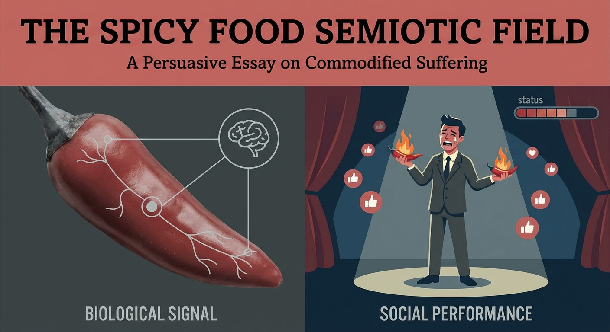
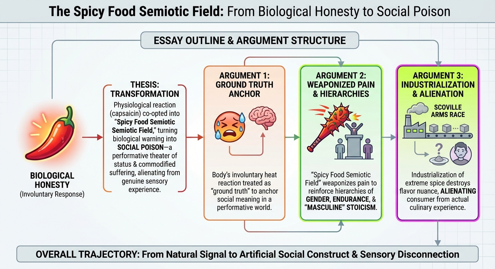
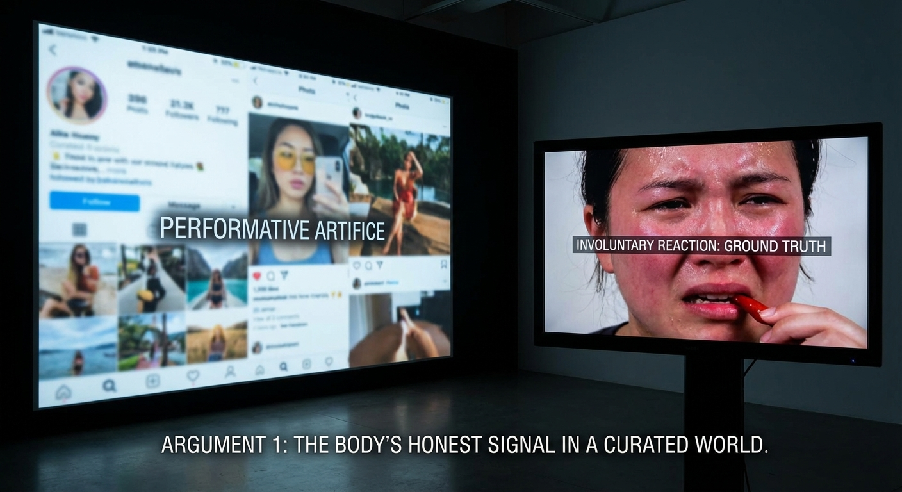
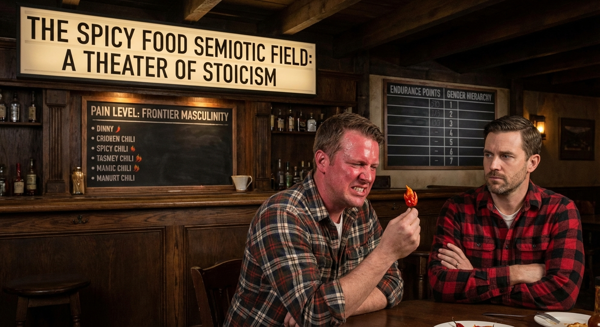
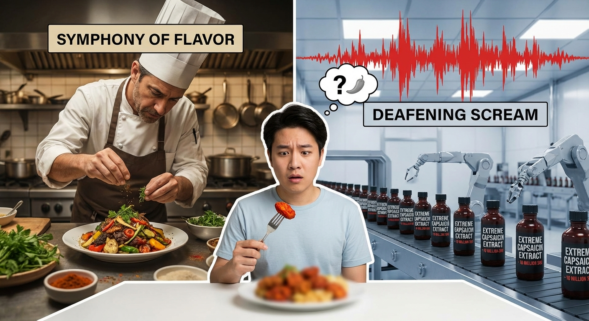
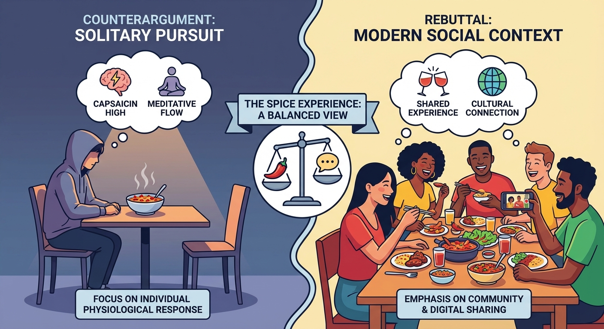

# Persuasive Essay Generation Transcript

**Started:** 2026-02-20 20:57:52

**Thesis:** While the physiological response to capsaicin is an involuntary 'honest signal' of the body, its co-optation into the 'Spicy Food Semiotic Field' has transformed a biological warning into a social poison—a performative theater of status, 'toughness,' and commodified suffering that ultimately alienates us from genuine sensory experience.

---

## Cover Image

**Prompt:** 



## Configuration

# Persuasive Essay Generation

**Thesis:** While the physiological response to capsaicin is an involuntary 'honest signal' of the body, its co-optation into the 'Spicy Food Semiotic Field' has transformed a biological warning into a social poison—a performative theater of status, 'toughness,' and commodified suffering that ultimately alienates us from genuine sensory experience.

## Configuration
- Target Audience: intellectually curious general public and cultural critics
- Tone: analytical and compelling
- Target Word Count: 1200
- Number of Arguments: 3
- Include Counterarguments: ✓
- Use Rhetorical Devices: ✓
- Include Evidence: ✓
- Use Analogies: ✓
- Call to Action: reflective

**Started:** 2026-02-20 20:58:08

---

## Progress

### Phase 1: Research & Outline
*Analyzing thesis and creating essay structure...*


                            
                            Research Context
                            
                            # /home/andrew/code/Science/scratch/2026-02-20-Sensory-Sociology/content.md

```
# The Capsaicin Paradox: Biological Honesty and the Social Poison of the Spicy Food Semiotic Field
The biological honesty of the capsaicin response—the involuntary flush, the beads of sweat, the dilated pupils—is precisely what makes it such fertile ground for social semiotics. Because these reactions are difficult to fake, they are treated as "honest signals" of an internal state. Yet this very treatment reveals a deeper philosophical move: what we call "biological honesty" is itself a form of **strategic essentialism**—a collective decision to treat the body's signals as ground truth so that we have a fixed reference point in an otherwise endlessly performative social world. The body's reactions are not *inherently* more truthful than any other sign; we *designate* them as such because a semiotic system requires an anchor, a place where interpretation agrees to stop. This anchoring is not a discovery about nature but a cultural commitment—one that quietly underwrites every social meaning we subsequently extract from the burn.

However, the moment these signals are observed by another, they are pulled into the **Semiotic Field**, where they are no longer just physiological events but symbols to be interpreted.

The sensation of heat from a chili pepper is a biological absolute—a chemical interaction between capsaicin and the TRPV1 receptors that signals a warning of thermal pain. This is what we might call "biological honesty": the body reacting to a perceived threat with a predictable, physiological response. However, once this sensation enters the human social sphere, it is immediately transmuted into something far more complex. It becomes a "social poison," where the raw experience of pain is filtered through layers of cultural meaning, gendered performance, and status signaling. To understand this transformation, we must map the **Spicy Food Semiotic Field**—a conceptual space where the physiological reality of the burn collides with the symbolic weight of its consumption.
## The Biological Honesty of Heat

At its core, the capsaicinoid response is an evolutionary defense mechanism—and a remarkably precise one. Plants of the genus *Capsicum* developed capsaicin not as a broad-spectrum toxin but as a strategy of **Directed Deterrence**: a molecular key shaped to fit one specific lock. Capsaicin binds to the TRPV1 vanilloid receptor—a thermosensor calibrated to fire at temperatures above 43°C—and activates it at room temperature. In effect, the molecule *lies* to the mammalian nervous system, convincing it that the mouth is being scalded when no thermal event is occurring. Birds, lacking the specific TRPV1 configuration sensitive to capsaicin, consume the fruit and disperse the seeds intact through their digestive tracts. The evolutionary elegance is striking: the plant does not poison indiscriminately but engineers a targeted sensory hallucination, exploiting the mammalian pain architecture to redirect its reproductive future through avian vectors. This is the first layer of biological honesty—though, as we shall see, even calling it "honesty" requires qualification, since the signal is, at the molecular level, a sophisticated deception.

When a human bypasses this warning, the resulting sensation acts as a profound **embodiment anchor**. Unlike the subtle nuances of flavor, the heat of a habanero or a ghost pepper demands immediate, total interoceptive awareness. It forces the consciousness back into the physical frame, demanding attention to the mouth, the throat, and the rising internal temperature. In an era of digital abstraction, this "honest" pain provides a grounding reality that cannot be ignored or intellectualized away. Yet even here, a crucial philosophical nuance intervenes—what we might call the **nociceptive-interpretive gap**. The TRPV1 receptor performs *nociception*: a straightforward chemical-to-electrical transduction, converting the presence of capsaicin into an ion channel event and a nerve impulse. But *pain*—the burning, the panic, the urge to reach for milk—is not the signal itself; it is the brain's *interpretation* of that signal, constructed through layers of context, memory, and expectation. Even at the most "biological" level, the body is not simply reporting; it is already narrating. The supposedly raw datum of the burn is, from its very first synapse, an act of meaning-making. This gap between transduction and experience is what makes the entire semiotic apparatus possible: if the signal were truly unmediated, there would be nothing for culture to rewrite.

Physiologically, this heat serves several utilitarian functions. It acts as a built-in appetite throttle, increasing satiety and slowing the pace of consumption—a natural defense against overindulgence. Furthermore, its role as a vasodilator and irritant triggers a sinus-clearing mechanism, facilitating respiratory relief.

The transition from pain to pleasure—the "acquired taste"—is driven by the body's own compensatory mechanisms. As the TRPV1 receptors signal intense heat, the brain responds by releasing a flood of endorphins and dopamine to mitigate the perceived trauma. This creates the "endorphin loop," where the initial distress is followed by a mild euphoria. Over time, the brain learns to associate the burn not with damage, but with the subsequent neurochemical reward, transforming a biological warning into a sought-after culinary experience. But there is a deeper physiological process at work beyond mere associative learning: **chili bleaching**, the functional desensitization of TRPV1-expressing neurons through repeated capsaicin exposure. With chronic stimulation, these neurons undergo a depletion of neuropeptides such as Substance P and, in some cases, a reversible degeneration of their peripheral terminals. The receptor doesn't "toughen up"; it is effectively silenced. What society reads as "toughness"—the stoic consumption of a Carolina Reaper without visible distress—may simply be the result of bleached receptors, a neurological quiet mistaken for a moral quality. And the body's encounter with capsaicin does not end at the palate. TRPV1 receptors line the entire gastrointestinal tract, from esophagus to rectum, and capsaicin activates them at every station along the way. This **"second burn"**—the intestinal cramping, the unmistakable rectal sting hours later—is the plant's evolutionary parting gift, a final reminder that the directed deterrence strategy extends well beyond the mouth. It is a sensation rarely discussed in polite company, yet it completes the biological circuit: the mammalian body is warned at entry *and* at exit, bookending the digestive journey with the same molecular lie.

### Benign Masochism and the Psychology of the Acquired Taste

Yet the endorphin loop and receptor desensitization, powerful as they are, do not fully explain why humans *seek out* the burn in the first place. After all, the body produces compensatory endorphins in response to many forms of pain—stubbing a toe, touching a hot stove—without those experiences becoming objects of craving. The missing piece is not neurochemical but cognitive, and it was most precisely articulated by the psychologist Paul Rozin, who coined the term **"benign masochism"** to describe the peculiar human capacity to derive pleasure from sensations that the body's alarm systems register as threats. Rozin's insight is that the pleasure of capsaicin is not merely the endorphin afterglow that follows the pain; it is the *simultaneous awareness* that the pain is real and the danger is not. The higher-order cortex—the evaluative, contextualizing brain—monitors the TRPV1 alarm and performs a rapid override: *the mouth is screaming "fire," but there is no fire; the nociceptive system is reporting tissue damage, but no tissue is being damaged.* It is this cognitive gap between the body's conviction and the mind's knowledge that generates the characteristic thrill. The pleasure derives, in significant part, from the psychological satisfaction of having *tricked one's own evolutionary hardware*—a felt sense of mastery over the body's most ancient and authoritative warning system. The eater is not merely enduring pain; they are staging a private rebellion against the tyranny of their own reflexes, and *winning*.

What Rozin identified, in effect, is the structure of a **"safe threat"**—an experience that provides all the physiological markers of a genuine biological crisis (the racing heart, the sweating, the flood of stress hormones) without any of the biological cost. This is the same architecture that underlies the appeal of roller coasters, horror films, and skydiving: the body is fully mobilized for an emergency that the mind knows will not arrive. But capsaicin occupies a unique position within this category, because the threat is not external and environmental but *internal and somatic*—the danger signal originates from inside the body itself, from the very tissue of the mouth, making the override feel more intimate, more like a genuine contest between self and self. This psychological dimension is the critical bridge between the biological story told above and the social story that follows. The endorphin loop explains how pain becomes tolerable; benign masochism explains how it becomes *desirable*. And it is precisely at the moment when the individual discovers this private pleasure—this quiet triumph of cognition over nociception, of the knowing mind over the screaming body—that the experience becomes available for social interpretation. The internal mastery must be *performed* to be *witnessed*, and once it is witnessed, it enters the semiotic field. The private rebellion becomes a public signal. The body's honest alarm, already overridden by the individual's own cognition, is now ready to be overwritten again—this time by the collective scripts of culture, status, and identity.

## The Social Layer and the Semiotic Field

This is where the "Social Poison" of interpretive overfitting begins. In a social context, we rarely allow a physiological reaction to simply *be*; we over-interpret it, assigning intent and character to involuntary biological processes. The raw data of a sweating brow is overwritten by cultural scripts, leading to two primary, often conflicting, narratives.

### The Performance Hypothesis

The first narrative is the **Performance Hypothesis**, which views the consumption of extreme heat as a calculated display of status or belonging. In this framework, the visible struggle with spice is seen as a performative act—a "masochistic" display designed to signal toughness, worldliness, or membership in a specific subculture (such as the "chili-head" community). Here, the "honesty" of the biological response is ironically subverted; the very fact that the reaction is involuntary makes it the perfect stage for a performance of endurance. The consumer isn't just eating; they are demonstrating their ability to colonize their own biological pain for social capital.

What gives this performance its peculiar credibility is a dynamic that biologists call the **Handicap Principle** and game theorists call **costly signaling**: a signal is trustworthy precisely *because* it is expensive to produce. A peacock's tail is convincing evidence of genetic fitness because growing and carrying it is a genuine metabolic burden; a bluff would collapse under the weight. The spicy-food performance operates on the same logic. The visible struggle—the flushed skin, the watering eyes, the involuntary gasp—is not a flaw in the display; it *is* the display. It works as a status signal precisely because it hurts. The pain is the price of admission, and only those who value the resulting social capital enough to pay it, or who possess a naturally high capsaicin tolerance that lowers the cost, will sit down at the table and order the Carolina Reaper. Someone who merely *claims* to love extreme heat but blanches at the first bite gains nothing; the body's involuntary betrayal exposes the bluff instantly. This is the deep irony at the heart of the Performance Hypothesis: the biological honesty of the capsaicin response—the very thing that seems to undercut a polished social performance—is what makes the performance credible in the first place. Because the cost cannot be faked, the signal cannot be counterfeited. The sweating brow is not a failure of composure; it is the receipt that proves the toll was paid.

### The Toughness Hypothesis

The second narrative is the **Toughness Hypothesis**, which interprets spice tolerance as a proxy for moral or physical character. In many cultures, the ability to "handle" heat is conflated with grit, resilience, and even masculinity. Under this lens, the person who does *not* sweat or flush is seen as possessing a superior constitution. The biological variation in TRPV1 receptor density—a matter of genetic luck—is transformed into a moral trait. To have a high tolerance is to be "strong"; to struggle is to be "weak." This hypothesis ignores the biological reality of desensitization and genetics, replacing it with a semiotic system where the tongue becomes a site of character judgment.

From a psychological standpoint, this conflation of tolerance with character is a textbook instance of the **Fundamental Attribution Error**—the well-documented tendency to attribute others' behavior to stable dispositional traits (courage, weakness, discipline) while underweighting the situational and biological variables that actually explain the behavior. When an observer watches someone eat a scorpion pepper without flinching and concludes that this person is *tough*, they are performing precisely the attribution error that Lee Ross identified in 1977: mistaking a situational outcome—one shaped by prior exposure history, cultural habituation, and, crucially, genetic endowment—for a window into the person's character. The error is compounded by the fact that the biological substrate in question is not uniform across the population. The *TRPV1* gene exhibits significant **polymorphic variation**: single-nucleotide polymorphisms (SNPs) in and around the TRPV1 locus alter receptor expression levels, ion-channel sensitivity, and downstream signal amplification. Some individuals are born with a sparse distribution of functional TRPV1 receptors in their oral mucosa; others carry variants that produce receptors with a higher activation threshold, requiring more capsaicin to trigger the same nociceptive cascade. What society codes as "strength"—the calm, unflushed consumption of extreme heat—may therefore be, in the most literal sense, a **partial absence of sensory hardware**: not a triumph of will over pain, but a quieter peripheral signal that never reached the volume the observer imagines was heroically suppressed. Conversely, the person who gasps and reaches for milk may possess a denser receptor field or a more sensitive channel variant—a richer sensory apparatus, not a weaker constitution. The Toughness Hypothesis thus performs a double inversion: it reads a genetic variable as a moral constant, and it rewards sensory *deficit* as though it were psychological *surplus*. By mapping the Fundamental Attribution Error onto the biology of TRPV1 polymorphism, we can see that the entire edifice of spice-as-character-test rests on a failure to distinguish between what the body *is* and what the person *chooses*—between the hand one is dealt and the way one plays it.

## The Sensory Semiotic Triad: Spicy, Sour, and Bitter

To fully appreciate the unique position of heat in the social hierarchy, we must compare it to other intense sensory experiences. We can conceptualize a **Sensory Semiotic Triad** consisting of the spicy, the sour, and the bitter. While all three involve a degree of "acquired" appreciation, they occupy vastly different roles in the theater of social interaction.

Spicy and sour sensations are inherently **public dramas**. Both trigger immediate, involuntary, and highly visible physiological responses—the "sour face" (puckering of the lips, squinting of the eyes) and the "spicy flush" (sweating, gasping, redness). These signals are ambiguous; they can represent either distress or intense pleasure, creating a semiotic gap that the observer must fill. Crucially, these signals are what semioticians in the Peircean tradition would call **polysemic**—they carry multiple, competing meanings simultaneously. A flushed face and watering eyes could signify genuine agony, masochistic pleasure, performative bravado, or the threshold moment between surrender and triumph. The observer cannot determine which meaning is "correct" from the signal alone, and it is precisely this **semiotic ambiguity** that serves as the engine of social co-optation. Because the sign underdetermines its meaning, it *invites* interpretation—and where interpretation is invited, social narratives rush in. The "sour challenge" or the "hot wing challenge" relies on this polysemic visibility to turn a private sensation into a shared spectacle, a text that the audience actively co-authors.

In contrast, bitterness remains largely a **private signal**. While a profound bitterness might cause a brief grimace, it lacks the sustained, escalating physical drama of heat or the sharp, contorting reflex of sourness—there is no progressive arc of visible suffering, no crescendo for an audience to track. More fundamentally, the bitter response is **monosemic**: it means one thing—*rejection*. The grimace at a bitter compound is read, almost universally, as aversion. There is no interpretive gap, no ambiguity about whether the person is suffering beautifully or performing resilience. The sign arrives pre-interpreted, and where there is no interpretive gap, there is no space for social narrative to colonize. A polysemic signal is an open text; a monosemic signal is a closed one. No one watches someone sip an intensely bitter espresso and wonders, *"Is she in pain or ecstasy? Is this a feat of endurance?"*—the grammar of the response simply does not pose the question.

Bitterness is therefore processed as a matter of internal preference—a "quiet" taste that one either enjoys or avoids, a **private dialogue between the palate and the brain** rather than a public broadcast of the body's resilience. There is little social capital to be gained from "enduring" a bitter radicchio or a dark coffee in the same way one "conquers" a ghost pepper, because the bodily response to bitterness is neither legible enough to be read at a distance nor ambiguous enough to sustain competing interpretations. It is a preference, not a feat. The Triad thus reveals a principle: **the social life of a sensation is proportional to the polysemy of its signal**. Spicy and sour sensations become theaters of identity precisely because their signs are open to multiple readings; bitterness remains a private affair precisely because its sign is closed. The engine of social co-optation is not intensity alone—it is interpretive *possibility*.

## Cultural Metastasis and Status Games

As the individual performance of spice consumption scales, it metastasizes into broader cultural tropes and identity politics. The semiotic field expands from the personal to the collective, where heat becomes a form of **cultural capital**. In this arena, the ability to navigate extreme spice is no longer just about personal toughness; it is a signal of worldliness and "authentic" engagement with the Other.

### Spice as Cultural Capital and Authenticity Policing

In the globalized culinary market, spice levels are often used as a metric for authenticity. This leads to a form of **authenticity policing**, where the "true" version of a dish is defined by its proximity to a perceived threshold of pain. Diners may demand "Thai spicy" or "Indian spicy" as a way to distance themselves from the "diluted" or "Westernized" versions of a cuisine. Here, the heat is not just a flavor profile but a gatekeeping mechanism. To consume the heat is to prove one's worthiness to participate in the culture, while the inability to do so is dismissed as a lack of culinary sophistication or a sheltered upbringing.

Yet this gatekeeping mechanism carries a deeper distortion that culinary scholars have identified as **culinary orientalism**: the reduction of an entire cuisine's vast internal diversity to a single painful metric. To demand "Thai spicy" is to flatten a tradition in which many canonical dishes—the coconut-milk richness of *tom kha gai*, the delicate balance of *pad see ew*, the intentional mildness of a *kanom jeen* with mild fish curry—are designed to be gentle precisely *because* they provide contrast and balance within a meal structured around complementary sensations. Thai cuisine, like most complex culinary traditions, is an architecture of counterpoints: hot against cool, rich against sharp, intense against mild. To define its "authenticity" by its maximum capsaicin output is to mistake one voice in a choir for the entire performance—and, in doing so, to erase the compositional intelligence that makes the tradition worth celebrating in the first place. The semiotic field does not merely distort social dynamics; it flattens the very cuisines it claims to honor.

The narrowing runs deeper still. The semiotic field's fixation on capsaicin-based heat as *the* metric of spice courage ignores the fact that pungency itself is a diverse sensory landscape. The numbing, electric *mā* (麻) of Sichuan peppercorns—produced by hydroxy-alpha-sanshool acting on mechanoreceptors rather than thermoreceptors—offers a form of intensity that is neurologically distinct from the capsaicin burn: it tingles, buzzes, and temporarily rewires the mouth's sense of touch rather than its sense of temperature. The sharp nasal pungency of wasabi and horseradish, mediated by allyl isothiocyanate activating TRPA1 receptors in the sinuses, produces a fleeting, almost cerebral flash of pain that dissipates in seconds—a sensation with no sustained arc of visible suffering and therefore little utility for the endurance performances the semiotic field rewards. These alternative pungencies offer extraordinary complexity and cultural depth, yet they remain marginal to the dominant spice discourse precisely because they do not produce the prolonged, legible, polysemic spectacle that capsaicin does. The semiotic field, in other words, has not merely co-opted heat as a social signal; it has selected for a *specific kind* of heat—the kind that best serves performative endurance—and in doing so, has narrowed the sensory landscape even as it claims to celebrate adventurousness.

### The Sophistication Paradox

This leads to the **sophistication paradox**: the claim that a high tolerance for heat signals a more refined and adventurous palate. Proponents of this view argue that spice enhances the complexity of a dish, yet at extreme levels, capsaicin objectively obliterates flavor nuance by overwhelming the taste buds and triggering a pain response that drowns out subtle aromatics. The paradox lies in the fact that the "refined" palate is often celebrating the very thing that prevents it from tasting the food's finer details. The heat becomes a proxy for sophistication, even as it acts as a **sensory blackout curtain**—and the claim that extreme spice *enhances* one's appreciation of a dish is, as a culinary analogy makes vivid, like saying you appreciate music more because you listen to it at 120 decibels. At that volume, the subtlety of the composition is not revealed but annihilated; what remains is not discernment but endurance. Game theory sharpens the absurdity further. Within the spicy food semiotic field, social capital is often valued more than the primary utility of the food itself, and the sophistication paradox is the point where this priority structure becomes fully visible. The consumer who orders the hottest item on the menu is executing a strategic trade-off: sacrificing the **utility of flavor**—the very thing that ostensibly defines culinary sophistication—in order to gain the **utility of status**. This is not a hidden cost; it is the entire mechanism. The diner pays in destroyed nuance and collects in social capital. Yet the sophistication claim requires that this trade-off remain unacknowledged, because the moment it is made explicit, the paradox collapses into plain contradiction: one cannot simultaneously claim to be maximizing gustatory appreciation while pursuing a strategy that systematically minimizes it. The "refined palate" is, in game-theoretic terms, a player who has optimized for a payoff (status) that is structurally incompatible with the payoff they advertise (taste)—and the sensory blackout curtain is not an unfortunate side effect of their strategy but its operative mechanism.

### The Mayonnaise Proxy

Conversely, the absence of spice is weaponized through the **"mayonnaise" stereotype**. In contemporary social discourse, "mayonnaise" and "blandness" have become linguistic proxies for a specific type of identity—often associated with whiteness, lack of culture, or a fragile, unadventurous constitution. This stereotype functions as the inverse of the toughness hypothesis; if heat is grit, then mildness is weakness. By reducing complex cultural identities to their perceived tolerance for capsaicin, the semiotic field transforms a condiment into a tool for social categorization and identity-based derision. The "mayonnaise" label suggests a sensory sterility that is equated with a lack of historical or cultural depth, further entrenching the spicy food semiotic field as a primary site of modern social signaling.

## The Industrialization of Suffering

The final stage in the evolution of the spicy food semiotic field is its commercialization and media-driven escalation—what might be termed the **Hot-Wing Industrial Complex**. In this phase, the private biological struggle is commodified and transformed into a public spectacle. Media platforms, most notably YouTube series like *Hot Ones*, have pioneered a new genre of interview where the physiological distress of the subject is the primary draw. The "biological honesty" of the capsaicin response is leveraged as a tool for "authentic" celebrity exposure; the theory being that a person cannot maintain a PR-managed facade while their TRPV1 receptors are screaming.

This industrialization relies heavily on **Scoville-based marketing**, where the heat level of a product is no longer a culinary choice but a competitive metric. Sauces are marketed with names that evoke violence, death, or insanity, turning the grocery aisle into a gauntlet of performative bravery. This turns the act of eating into a "challenge"—a discrete event designed for social media documentation. The biological struggle is no longer a byproduct of a meal; it is the product itself. Game theory reveals the structural logic driving this escalation. The Mayonnaise Proxy penalty described above—the social cost of being seen to prefer mild food—functions as a powerful **negative payoff** that reshapes the entire decision landscape. When the stigma attached to choosing mildness is sufficiently severe, the semiotic field collapses into what game theorists call a **Pooling Equilibrium**: a state in which all players, regardless of their private type (their actual capsaicin tolerance or preference), choose the same publicly visible action—extreme heat—because the cost of revealing oneself as mild-preferring exceeds the physical cost of enduring the burn. High-tolerance and low-tolerance individuals alike converge on the same fiery order, not because they share a preference but because the signaling environment has made the alternative socially untenable. The menu ceases to be a space of genuine choice and becomes a one-dimensional race to the top of the Scoville scale, where the only "safe" move is to match or exceed the group's current threshold.

This pooling dynamic generates a **Prisoner's Dilemma** at the heart of every shared meal. Consider two diners at a table: each might privately prefer a milder dish—one that would allow them to taste the food's actual flavor profile and avoid the gastrointestinal aftermath. Yet each knows that choosing mildness while the other chooses heat will trigger the Mayonnaise Proxy penalty, coding them as the "weak" one in the pair. The dominant strategy for both players, therefore, is to choose spicy—not because it maximizes their individual gustatory utility, but because it minimizes their social risk. The result is a **Pareto-inferior equilibrium**: both diners end up suffering more than necessary, consuming food that overwhelms their palates and punishes their digestive tracts, when a world in which both chose mildly would have left each of them better off on every dimension except the one that matters in the semiotic field—status. The tragedy is structural, not personal. No single diner can unilaterally defect to mildness without bearing the full weight of the social penalty, and so the equilibrium holds, meal after meal, even though every participant in it would prefer a different world.

The commercial arm of the Hot-Wing Industrial Complex is locked into a parallel escalation that evolutionary biologists would recognize as a **Red Queen race**—the dynamic in which organisms must constantly evolve merely to maintain their current fitness relative to co-evolving competitors. As the pooling equilibrium drives consumers toward ever-higher Scoville counts, and as repeated exposure triggers the chili bleaching and TRPV1 desensitization described earlier, the spectacle's impact erodes. A sauce that once produced dramatic, camera-ready suffering becomes, through habituation, merely uncomfortable—and a merely uncomfortable sauce generates no social media content, no viral moments, no signaling value. Brands must therefore innovate relentlessly toward more extreme formulations—higher capsaicinoid concentrations, novel cultivars like Pepper X and Apollo, synthetic capsaicin analogs—not to *increase* the level of social signaling their products provide, but simply to *maintain* it against the rising baseline of consumer tolerance. They are running to stand still. The result is an arms race between the human nervous system's capacity for adaptation and the food industry's capacity for chemical escalation, each driving the other forward in a feedback loop that has no natural resting point. The Scoville number on the label is not a measure of flavor; it is an index of how far the race has run.

Furthermore, this spectacle creates a new form of social cohesion: the **ritual of suffering together**. Whether in a viral "One Chip Challenge" or a group outing to a wing joint with a "wall of flame," the shared experience of intense, non-lethal pain acts as a powerful bonding mechanism. This is a secular, sensory ritual where the participants prove their mettle and their shared identity through a collective descent into physiological chaos. The pooling equilibrium ensures that the ritual's entry price keeps rising—what counted as a credible performance of toughness five years ago is now the table stakes, and the Prisoner's Dilemma ensures that no individual participant can opt for a gentler experience without defecting from the group's implicit social contract. By turning the burn into a stage for performing identity, and by locking both consumers and producers into interlocking escalation dynamics—the former trapped in a Pareto-inferior social equilibrium, the latter sprinting on the Red Queen's treadmill—the Hot-Wing Industrial Complex ensures that the capsaicin paradox remains a central, if increasingly manufactured and increasingly painful, pillar of modern social interaction.

## Conclusion: The Body as a Semiotic Surface

The journey from the TRPV1 receptor to the "Hot-Wing Industrial Complex" illustrates that the human body is never a closed biological system. It is a semiotic surface—a canvas upon which society projects its values of toughness, authenticity, and status. The "biological honesty" of a flush or a tear is immediately captured and recoded by the "social poison" of interpretation.

What this entire apparatus amounts to is a **domestication of the absolute**. The capsaicin response begins as a biological absolute—a raw, unmediated chemical scream from the TRPV1 receptor, a signal that evolved to mean one thing and one thing only: *danger, stop, do not eat this*. Yet we take this absolute and domesticate it, breaking it like a wild animal to the harness of social utility. We train it to mean *toughness*, *authenticity*, *worldliness*, *belonging*. We build elaborate semiotic architectures—the Performance Hypothesis, the Toughness Hypothesis, the Sophistication Paradox, the Hot-Wing Industrial Complex—all of which are, at bottom, cultural infrastructure for converting a biological emergency signal into a legible social currency. The "honesty" we attribute to the body's involuntary response is not a property we discover in nature; it is a cultural layer we apply, a domesticating frame that makes sense of our peculiar desire to suffer for pleasure, for status, for the feeling of being fully alive in a body we can narrate to others. We do not honor the biological signal by reading it as honest; we *tame* it by doing so, rendering it safe enough to circulate in the economy of social meaning.

But domestication has a boundary, and that boundary reveals something essential about the entire enterprise. There exists a threshold—what we might call the point of **semiotic collapse**—where pain becomes so overwhelming that the social field dissolves entirely. Elaine Scarry, in *The Body in Pain* (1985), argued that intense physical pain is fundamentally *world-destroying*: it annihilates language, unmakes the sufferer's capacity for symbolic thought, and reduces the human subject to pre-linguistic cries that carry no social meaning whatsoever. At the extreme end of the capsaicin spectrum—the point where a Carolina Reaper or a concentrated extract overwhelms not just the palate but the entire nervous system—we approach this threshold. The sufferer no longer performs toughness or signals authenticity; they simply *hurt*, in a way that is illegible to any semiotic framework. The flush is no longer a polysemic sign open to competing interpretations; it is the body in revolt, beyond narrative, beyond performance, beyond meaning. Language fails. The groan that escapes is not a social signal but a biological reversion—the organism stripped of its cultural clothing, returned to the pre-symbolic animal cry that no audience can decode as anything other than what it is.

The entire spicy food semiotic field, then, operates in the narrow space between two poles: the **embodiment anchor**—the point where capsaicin forces consciousness back into the body and makes the flesh available for social narration—and the **threshold of semiotic collapse**—the point where pain overwhelms all narration and the body ceases to be a legible text. Every hot wing challenge, every "Thai spicy" request, every Scoville-escalation arms race is a **controlled flirtation with the biological real**: an approach toward the abyss of unsymbolizable pain that never quite tips over the edge. The social utility of the burn depends entirely on maintaining this balance—enough pain to produce the honest, costly signal that the semiotic field requires, but not so much that the signal dissolves into the formless scream that no culture can metabolize. The domestication of the absolute is, in this light, an act of extraordinary precision: we must bring the wild animal close enough to feel its heat, but not so close that it devours us.

This machinery is not unique to capsaicin. We see identical patterns in the rise of extreme wellness rituals, such as the "cold plunge" or high-intensity interval training. In these contexts, the physiological shock—the "cold shock response"—is marketed and performed as a sign of superior discipline and mental fortitude. The shivering body, much like the sweating tongue, becomes a site of moral signaling. The raw data of the nervous system is consistently overwritten by the software of social expectation. And in each case, the same two boundaries apply: the experience must be intense enough to anchor the body as a legible semiotic surface, but not so intense that it crosses into the territory Scarry mapped—the zone where pain unmakes the world and the social field goes dark.

Ultimately, the capsaicin paradox reveals a fundamental human drive: the need to metabolize raw, chaotic sensation into structured, social meaning. We do not merely inhabit our bodies; we narrate them. But the narration is always precarious, always conducted at the edge of a silence that would swallow it whole. By transforming a plant's defense mechanism into a cultural metric, we demonstrate that even our most visceral pains are never truly our own—they are always already part of the stories we tell about who we are and what we value. Yet the stories hold only so long as the pain remains domesticated. Beyond the last Scoville unit that language can metabolize lies the biological real—mute, absolute, and indifferent to every meaning we have tried to make it carry.

```
                            
                            ## Essay Outline

## The Spicy Food Semiotic Field: From Biological Honesty to Social Poison

### Hook
Describe the visceral, high-definition spectacle of a "Hot Ones" interview or a "One Chip Challenge" video—the streaming sweat, the panicked gasping, and the dilated pupils—contrasting the physical agony of the participant with the rapturous entertainment of the audience.

### Background
Capsaicin, the active component in chili peppers, evolved as a "directed deterrence" mechanism—a molecular lie that tricks mammalian TRPV1 receptors into sensing a thermal burn where none exists. Historically, humans integrated this "burn" into culinary traditions for preservation and flavor. However, in the digital age, the biological response has been decoupled from nutrition. We have entered the "Spicy Food Semiotic Field," where the involuntary physiological reactions (the "honest signals" of the body) are no longer private sensations but public currency. In a world of curated personas, the "unfakeable" nature of a capsaicin breakdown has become a prized commodity.

### Thesis Statement
> While the physiological response to capsaicin is an involuntary "honest signal" of the body, its co-optation into the "Spicy Food Semiotic Field" has transformed a biological warning into a social poison—a performative theater of status, "toughness," and commodified suffering that ultimately alienates us from genuine sensory experience.

---

### Main Arguments
#### Argument 1: We treat the body’s involuntary reaction to heat as a "ground truth" to anchor social meaning in an increasingly performative world.

**Supporting Points:**
- The Involuntary Signal: Unlike a smile or a gesture, the "capsaicin flush" and lacrimation (tearing) cannot be easily faked, making them "honest signals" in biological terms.
- Strategic Essentialism: We collectively decide to treat these signals as the "real" person emerging from behind the mask of social etiquette.
- The Semiotic Anchor: By designating the body’s pain as "truth," we create a fixed reference point that allows us to judge a person’s "character" or "grit."

**Evidence Types:** Evolutionary biology (TRPV1 receptor function), Sociological theories of 'Strategic Essentialism', Analysis of 'Hot Ones' as a 'truth-seeking' interview format

**Rhetorical Approach:** Logos/Ethos

**Est. Words:** 250

---

#### Argument 2: The "Spicy Food Semiotic Field" weaponizes pain to reinforce hierarchies of gender, endurance, and "masculine" stoicism.

**Supporting Points:**
- Gendered Performance: The "chili-head" subculture often mirrors "frontier masculinity," where consuming pain is equated with virility and dominance.
- The Theater of Stoicism: The goal is no longer to enjoy the food, but to maintain a "poker face" while the body screams, turning a meal into a trial by ordeal.
- Status Signaling: High-Scoville consumption acts as a "costly signal"—a way to demonstrate superior constitution or "hardiness" to a social group.

**Evidence Types:** Analysis of marketing language for 'extreme' hot sauces, Social media 'challenges', Historical parallels to rites of passage

**Rhetorical Approach:** Pathos/Logos

**Est. Words:** 250

---

#### Argument 3: The industrialization of extreme spice (the "Scoville Arms Race") destroys the nuance of flavor, alienating the consumer from the actual culinary experience.

**Supporting Points:**
- The Scoville Arms Race: The pursuit of pure capsaicin extracts prioritizes "heat units" over gastronomic complexity, turning food into a delivery system for a drug-like hit.
- The Spectacle of the "Social Poison": When pain becomes a product to be sold (e.g., the "One Chip Challenge"), the consumer is no longer a diner but a performer in a commodified circus.
- Sensory Erasure: Extreme heat overwhelms the palate, effectively "blinding" the taster to the actual ingredients, leading to a state of sensory alienation where only the "burn" remains.

**Evidence Types:** Culinary criticism regarding extract-based sauces vs. whole-pepper sauces, The rise of 'stunt foods' in fast food marketing, Analogies to 'shock art'

**Rhetorical Approach:** Pathos

**Est. Words:** 250

---

### Counterarguments & Rebuttals
**Opposing View:** The capsaicin rush is purely about the endorphin high and personal 'flow state,' not social performance.

**Rebuttal Strategy:** Acknowledge the "runner's high" aspect, but point out that if it were purely private, the multi-million dollar industry of filming the reaction wouldn't exist. The "high" is now secondary to the "broadcast."

**Est. Words:** 100

**Opposing View:** Spicy food is a cornerstone of many global cultures; calling it a 'social poison' is Eurocentric or dismissive of tradition.

**Rebuttal Strategy:** Distinguish between culinary spice (used for balance, preservation, and flavor in cultures like Thai, Mexican, or Indian) and performative spice (the modern Western "extreme" trend). The latter actually insults the former by reducing complex cuisines to a mere "dare."

**Est. Words:** 100

---

### Conclusion Strategy
Reiterate how the "biological honesty" of the pepper has been hijacked by a culture obsessed with performance and "toughness." Connect the "Spicy Food Semiotic Field" to broader trends in digital culture—where every private bodily experience must be externalized and ranked. Urge a return to "sensory presence" and reclaim the chili pepper as a culinary tool of nuance. End with a final image of a quiet moment of someone enjoying a perfectly balanced, moderately spicy meal—focusing on the flavor, not the camera.

**Status:** ✅ Complete


## Outline Visualization

**Prompt:** 



## Introduction

A bead of sweat tracks a jagged path through heavy foundation; pupils dilate into obsidian saucers; a panicked, rhythmic gasping replaces the polished cadence of a celebrity interview. This is the high-definition spectacle of the "Hot Ones" era, where the "One Chip Challenge" transforms a private biological crisis into a public digital ritual. We watch, rapt, as the body’s autonomic nervous system revolts in real-time, finding a strange, voyeuristic ecstasy in the sight of a human being pushed to the brink of a physical breakdown. 

At its core, this reaction is triggered by capsaicin, a chemical evolved as "directed deterrence"—a molecular lie that tricks our TRPV1 receptors into sensing a thermal fire where none exists. For millennia, humans integrated this "burn" into culinary tapestries for preservation and depth, respecting the pepper as a tool of flavor. Yet, in our hyper-mediated age, the biological response has been decoupled from the dinner plate. We have entered the "Spicy Food Semiotic Field," a space where the involuntary breakdown of the body—the "unfakeable" honest signal—is no longer a warning, but a prized commodity in a world of curated personas. In this economy of the visceral, the more one suffers, the more "authentic" the content becomes. 

However, this shift from seasoning to spectacle carries a hidden cost. While the physiological response to capsaicin is an involuntary "honest signal" of the body, its co-optation into the "Spicy Food Semiotic Field" has transformed a biological warning into a social poison—a performative theater of status, "toughness," and commodified suffering that ultimately alienates us from genuine sensory experience.

**Word Count:** 249

## Argument 1: We treat the body’s involuntary reaction to heat as a "ground truth" to anchor social meaning in an increasingly performative world.

In an age defined by the hyper-curated digital self, we have come to treat the body’s involuntary reaction to capsaicin as a rare "ground truth"—a biological anchor in a sea of performative artifice. This reliance rests on what evolutionary biologists call "honest signals": physiological responses, such as the vasodilation of the "capsaicin flush" or spontaneous lacrimation, that are mediated by the TRPV1 heat-sensing receptors and cannot be consciously faked. Unlike a practiced smile or a scripted soundbite, the body’s frantic attempt to cool itself is an unmediated eruption of the physical over the social. We engage in a form of "strategic essentialism," collectively deciding that the person gasping for air and weeping over a habanero is the "real" individual emerging from behind the mask of etiquette. This is the central conceit of the Hot Ones interview format, which functions less as a culinary show and more as a secular confessional; by subjecting celebrities to escalating levels of commodified pain, the host strips away their PR-managed veneers to reveal a raw, "authentic" character. By designating this involuntary suffering as a semiotic anchor for "grit" or "honesty," we transform a simple chemical burn into a moral litmus test. However, this fixation on the body’s "truth" ironically deepens our alienation, as we begin to value the spectacle of the reaction more than the sensory reality of the experience itself, setting the stage for the commodification of this very suffering.

**Word Count:** 236

#### Argument 1 Image

**Prompt:** 



## Argument 2: The "Spicy Food Semiotic Field" weaponizes pain to reinforce hierarchies of gender, endurance, and "masculine" stoicism.

This biological "honesty" is precisely what allows the Spicy Food Semiotic Field to weaponize pain as a metric for social hierarchy, transforming a culinary choice into a performative trial of "frontier masculinity." In this theater of stoicism, the goal is no longer the appreciation of flavor, but the maintenance of a rigid "poker face" while the body’s TRPV1 receptors scream in agony. Marketing for "extreme" sauces—branded with hyper-masculine imagery of skulls, grenades, and names like *The End* or *Da’ Bomb*—recasts the consumer not as a diner, but as a combatant. This mirrors historical rites of passage where enduring physical trauma was a prerequisite for tribal status; today, the "chili-head" subculture utilizes high-Scoville consumption as a "costly signal" of superior constitution. When a social media influencer films themselves consuming a Carolina Reaper without flinching, they are not engaging in a sensory experience; they are participating in a commodified ordeal designed to signal virility and dominance. By equating the suppression of a biological warning with "toughness," we strip the meal of its communal joy, replacing the pleasure of the palate with a grim, competitive endurance. Ultimately, this transformation alienates the individual from the genuine sensory reality of the food, reducing a complex biological interaction to a hollow trophy of hegemonic stoicism. In doing so, we do not master the spice; we merely use it to mask a deeper hunger for social validation—a hunger that the market is all too eager to feed.

**Word Count:** 240

#### Argument 2 Image

**Prompt:** 



## Argument 3: The industrialization of extreme spice (the "Scoville Arms Race") destroys the nuance of flavor, alienating the consumer from the actual culinary experience.

Beyond the performative posturing of the individual, the industrialization of extreme spice—the so-called "Scoville Arms Race"—has effectively lobotomized the culinary arts, replacing the symphony of flavor with a singular, deafening scream of pain. When we prioritize pure capsaicin extracts over the nuanced profile of a whole pepper, we are no longer dining; we are participating in a form of chemical warfare where the palate is the primary casualty. This is the era of "stunt foods," where products like the "One Chip Challenge" or extract-laden "death sauces" are marketed not as nourishment, but as endurance tests. In this commodified circus, the diner is reduced to a masochistic performer, and the food itself becomes a mere delivery system for a drug-like hit of adrenaline. Much like "shock art" that seeks to offend rather than evoke, these hyper-spicy concoctions achieve a total sensory erasure, blinding the taster to the delicate interplay of acidity, sweetness, and umami. We are left in a state of sensory alienation, where the tongue—once a gateway to cultural history and botanical complexity—is scorched into silence. By turning a biological warning into a commercial spectacle, the industry has stripped the act of eating of its intimacy, leaving us to choke on the ashes of a flavor profile we can no longer feel. This systematic destruction of nuance ensures that we are no longer consumers of culture, but victims of a manufactured crisis, forever chasing a burn that offers no warmth. This erasure of the culinary self paves the way for a deeper disconnection: the total commodification of the body’s survival instincts.

**Word Count:** 261

#### Argument 3 Image

**Prompt:** 



## Counterarguments & Rebuttals

Critics may claim that the pursuit of heat is a solitary endeavor—a quest for the "capsaicin high" or a meditative flow state triggered by the body’s endorphin response. While the physiological "runner’s high" of spice is undeniable, this defense ignores the modern context. If the experience were truly private, the multi-million dollar industry of "reaction" content and "extreme" marketing would collapse. The internal rush has become secondary to the external broadcast; the high is now merely the fuel for the performance.

Furthermore, some argue that labeling spice as a "social poison" is Eurocentric, dismissing the deep-rooted culinary traditions of the Global South. However, a vital distinction must be made between culinary spice—used for preservation, balance, and flavor in cultures from Mexico to Thailand—and performative spice. The modern Western obsession with "extreme" heat does not honor these traditions; rather, it reduces complex, centuries-old cuisines to a crude "dare." By stripping spice of its gastronomic context, the performative trend actually insults these cultures, reinforcing the thesis that heat has been weaponized as a tool of status rather than a medium of taste.

**Word Count:** 180

## Counterargument Visualization

**Prompt:** 



## Conclusion

The chili pepper was never meant to be a weapon of the ego; it was an evolutionary boundary—a biological "no" that we have perversely rebranded as a social "yes." By colonizing the TRPV1 receptor with the flags of hyper-masculinity and digital clout, we have transformed an intimate physiological event into a hollow public spectacle. This "Spicy Food Semiotic Field" is a microcosm of our broader cultural malaise: a world where the private sanctity of the body is constantly externalized, ranked, and commodified for the gaze of an invisible audience. When we treat heat as a metric of toughness rather than a component of flavor, we do not just lose the nuance of the pepper; we lose our capacity for genuine sensory presence.

We must dismantle this theater of performative suffering and reclaim the chili as a tool of culinary grace. True epicureanism lies not in the endurance of pain, but in the appreciation of balance. Imagine, instead, a quiet evening where the phone remains dark and the Scoville scale is forgotten. Before you sits a meal where the heat does not scream, but hums—a gentle, radiant warmth that elevates the sweetness of a charred tomato or the citrus notes of a habanero without obliterating the palate. In this silence, the pepper returns to its rightful place: not as a test of the soul, but as a gift to the senses. We owe it to ourselves to stop performing our lives and start tasting them. Eat to feel, not to be seen.

**Word Count:** 251

### Revision Pass 1

Completed revision pass 1 of 2

### Revision Pass 2

Completed revision pass 2 of 2

## Complete Essay

# The Spicy Food Semiotic Field: From Biological Honesty to Social Poison

# The Scoville Spectacle: How the Commodification of Pain Alienates the Senses

A bead of sweat carves a salt-stained path through heavy foundation; pupils dilate into obsidian voids; a panicked, rhythmic gasping replaces the polished cadence of a celebrity interview. This is the high-definition spectacle of the "Hot Ones" era, where the "One Chip Challenge" transforms a private biological crisis into a public digital ritual. We watch, rapt, as the body’s autonomic nervous system revolts in real-time, finding a strange, voyeuristic ecstasy in the sight of a human being pushed to the brink of physical collapse. 

At its core, this reaction is triggered by capsaicin, a chemical evolved as "directed deterrence"—a molecular lie that tricks our TRPV1 receptors into sensing a thermal fire where none exists. For millennia, humans integrated this "burn" into culinary tapestries for preservation and depth, respecting the pepper as a tool of flavor. Yet, in our hyper-mediated age, the biological response has been decoupled from the dinner plate. We have entered the "Spicy Food Semiotic Field," a space where the involuntary breakdown of the body—the "unfakeable" honest signal—is no longer a warning, but a prized commodity in a world of curated personas. In this economy of the visceral, the more one suffers, the more "authentic" the content becomes. 

However, this shift from seasoning to spectacle carries a hidden cost. While the physiological response to capsaicin is an involuntary "honest signal" of the body, its co-optation into the Spicy Food Semiotic Field has transformed a biological warning into a social poison—a performative theater of status, "toughness," and commodified suffering that ultimately alienates us from genuine sensory experience.

In an age defined by the hyper-curated digital self, we have come to treat the body’s involuntary reaction to capsaicin as a rare "ground truth"—a biological anchor in a sea of performative artifice. This reliance rests on what evolutionary biologists call "honest signals": physiological responses, such as the vasodilation of the "capsaicin flush" or spontaneous lacrimation, that are mediated by the nervous system and cannot be consciously faked. Unlike a practiced smile or a scripted soundbite, the body’s frantic attempt to cool itself is an unmediated eruption of the physical over the social. 

We engage in a form of "strategic essentialism," collectively deciding that the person gasping for air and weeping over a habanero is the "real" individual emerging from behind the mask of etiquette. This is the central conceit of the *Hot Ones* interview format, which functions less as a culinary show and more as a secular confessional. By subjecting celebrities to escalating levels of commodified pain, the host strips away their PR-managed veneers to reveal a raw, "authentic" character. By designating this involuntary suffering as a semiotic anchor for "grit" or "honesty," we transform a simple chemical burn into a moral litmus test. However, this fixation on the body’s "truth" ironically deepens our alienation; we begin to value the spectacle of the reaction more than the sensory reality of the experience, setting the stage for the total commodification of human distress.

This biological "honesty" is precisely what allows the Spicy Food Semiotic Field to weaponize pain as a metric for social hierarchy, transforming a culinary choice into a performative trial of "frontier masculinity." In this theater of stoicism, the goal is no longer the appreciation of flavor, but the maintenance of a rigid "poker face" while the body’s receptors scream in agony. Marketing for "extreme" sauces—branded with hyper-masculine imagery of skulls, grenades, and names like *The End* or *Da’ Bomb*—recasts the consumer not as a diner, but as a combatant. 

This mirrors historical rites of passage where enduring physical trauma was a prerequisite for tribal status; today, the "chili-head" subculture utilizes high-Scoville consumption as a "costly signal" of superior constitution. When a social media influencer films themselves consuming a Carolina Reaper without flinching, they are not engaging in a sensory experience; they are participating in a commodified ordeal designed to signal virility and dominance. By equating the suppression of a biological warning with "toughness," we strip the meal of its communal joy, replacing the pleasure of the palate with a grim, competitive endurance. Ultimately, this transformation alienates the individual from the genuine sensory reality of the food, reducing a complex biological interaction to a hollow trophy of hegemonic stoicism. In doing so, we do not master the spice; we merely use it to mask a deeper hunger for social validation—a hunger that the market is all too eager to feed.

Beyond the performative posturing of the individual, the industrialization of extreme spice—the so-called "Scoville Arms Race"—has effectively lobotomized the culinary arts, replacing the symphony of flavor with a singular, deafening scream of pain. When we prioritize pure capsaicin extracts over the nuanced profile of a whole pepper, we are no longer dining; we are participating in a form of chemical warfare where the palate is the primary casualty. This is the era of "stunt foods," where products like the "One Chip Challenge" or extract-laden "death sauces" are marketed not as nourishment, but as endurance tests. 

In this commodified circus, the diner is reduced to a masochistic performer, and the food itself becomes a mere delivery system for a drug-like hit of adrenaline. Much like "shock art" that seeks to offend rather than evoke, these hyper-spicy concoctions achieve a total sensory erasure, blinding the taster to the delicate interplay of acidity, sweetness, and umami. We are left in a state of sensory alienation, where the tongue—once a gateway to cultural history and botanical complexity—is scorched into silence. By turning a biological warning into a commercial spectacle, the industry has stripped the act of eating of its intimacy, leaving us to choke on the ashes of a flavor profile we can no longer feel. This systematic destruction of nuance ensures that we are no longer consumers of culture, but victims of a manufactured crisis, forever chasing a burn that offers no warmth. This erasure of the culinary self paves the way for a deeper disconnection: the total commodification of the body’s survival instincts.

Critics may claim that the pursuit of heat is a solitary endeavor—a quest for the "capsaicin high" or a meditative flow state triggered by the body’s endorphin response. While the physiological "runner’s high" of spice is undeniable, this defense ignores the modern context. If the experience were truly private, the multi-million dollar industry of "reaction" content and "extreme" marketing would collapse. The internal rush has become secondary to the external broadcast; the high is now merely the fuel for the performance. We are not chasing enlightenment; we are chasing engagement.

Furthermore, some argue that labeling spice as a "social poison" is Eurocentric, dismissing the deep-rooted culinary traditions of the Global South. However, a vital distinction must be made between culinary spice—used for preservation, balance, and flavor in cultures from Mexico to Thailand—and *performative* spice. The modern Western obsession with "extreme" heat does not honor these traditions; rather, it reduces complex, centuries-old cuisines to a crude "dare." By stripping spice of its gastronomic context, the performative trend actually insults these cultures, reinforcing the thesis that heat has been weaponized as a tool of status rather than a medium of taste. The "Scoville Arms Race" is not an homage to global cuisine; it is its caricature.

The chili pepper was never meant to be a weapon of the ego; it was an evolutionary boundary—a biological "no" that we have perversely rebranded as a social "yes." By colonizing the TRPV1 receptor with the flags of hyper-masculinity and digital clout, we have transformed an intimate physiological event into a hollow public spectacle. This Spicy Food Semiotic Field is a microcosm of our broader cultural malaise: a world where the private sanctity of the body is constantly externalized, ranked, and commodified for the gaze of an invisible audience. When we treat heat as a metric of toughness rather than a component of flavor, we do not just lose the nuance of the pepper; we lose our capacity for genuine sensory presence.

We must dismantle this theater of performative suffering and reclaim the chili as a tool of culinary grace. True epicureanism lies not in the endurance of pain, but in the appreciation of balance. Imagine, instead, a quiet evening where the phone remains dark and the Scoville scale is forgotten. Before you sits a meal where the heat does not scream, but hums—a gentle, radiant warmth that elevates the sweetness of a charred tomato or the citrus notes of a habanero without obliterating the palate. In this silence, the pepper returns to its rightful place: not as a test of the soul, but as a gift to the senses. We owe it to ourselves to stop performing our lives and start tasting them. Eat to feel, not to be seen.

---

**Total Word Count:** 1417

**Target Word Count:** 1200

**Completion:** 118%


---

## Generation Complete

**Total Word Count:** 1417

**Total Time:** 334.627s

**Completed:** 2026-02-20 21:03:26

