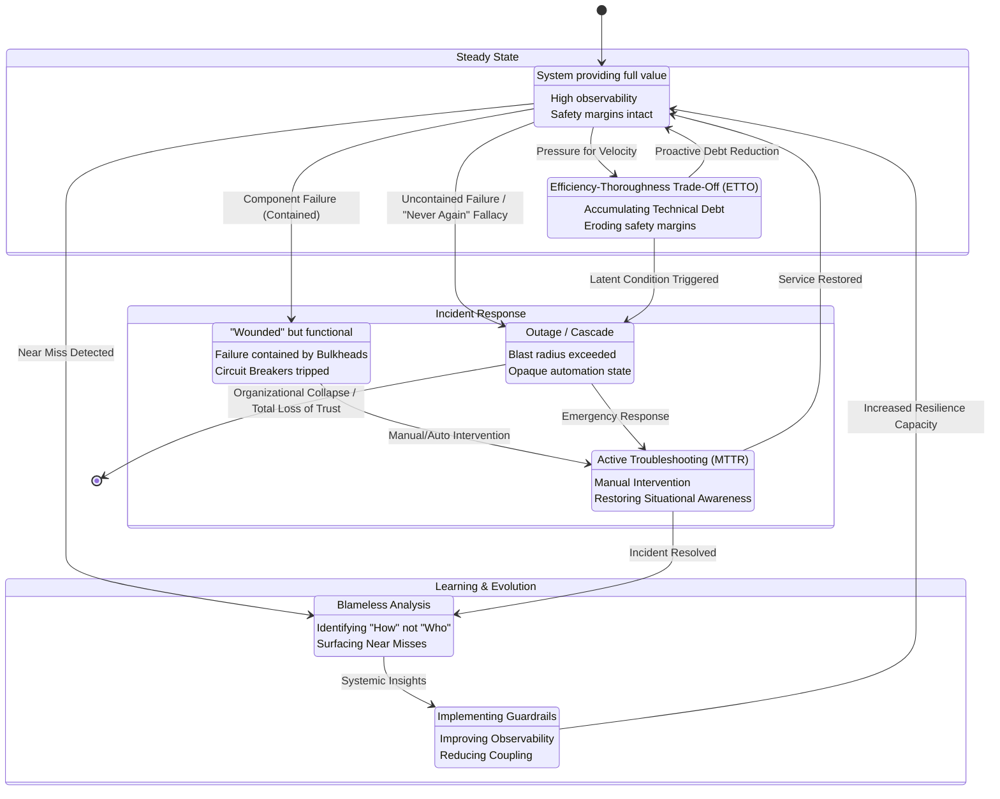

# Finite State Machine Analysis

**Started:** 2026-02-21T22:06:02.143886380

## Configuration
Task Parameters

**Concept:** Resilience Architecture and Systemic Failure Response
**Domain:** System Reliability Engineering and Organizational Resilience based on 'The Architecture of Resilience'
**Initial States:** Operational (Stable)
**Known Events:** Component Failure, Circuit Breaker Trip, Blameless Post-mortem, Reactive Patching (Never Again), Technical Debt Accumulation, Near Miss Detection, Automation Failure, Systemic Improvement


## Step 1: State Identification
Prompt & Response

### Prompt

```
You are an expert in formal methods and finite state machine modeling. Your task is to analyze a concept and identify all possible states.

## Concept to Model:
Resilience Architecture and Systemic Failure Response

## Domain Context:
System Reliability Engineering and Organizational Resilience based on 'The Architecture of Resilience'

## Reference Files:
# /home/andrew/code/Science/scratch/2026-02-22-never-again/content.md

```
# The Architecture of Resilience: Moving Beyond the 'Never Again' Cycle

In the aftermath of a major failure, the rallying cry is almost always "Never Again." It’s a natural human response—a promise to learn from mistakes and ensure that a specific catastrophe is never repeated. Yet, this reactive stance often traps us in a cycle of fighting the last war, patching individual holes while leaving the broader structure vulnerable. 

True resilience requires a fundamental shift in perspective: moving away from a reactive 'Never Again' mentality toward a proactive, systemic approach. By understanding the architecture of resilience, we can design systems that are not merely robust against known threats, but are inherently capable of adapting and thriving amidst the unknown.
## The Fallacy of "Never Again"
When a system fails, the immediate post-mortem often produces a list of specific remediations designed to prevent that exact sequence of events from recurring. While necessary, these narrow mandates create a false sense of security. This is the fallacy of "Never Again": the belief that by plugging every hole we’ve discovered, we can eventually build a leak-proof vessel.
The problem lies in the focus on specificity over systemic health. A trigger-focused mandate—such as "never allow a database migration to run without a manual check"—addresses a symptom but ignores the underlying fragility. It adds friction without necessarily adding safety. In contrast, systemic improvement focuses on the environment that allowed the error to propagate, such as implementing automated canary analysis or improving circuit-breaking capabilities.
In modern, distributed environments, failure is not a possibility to be avoided; it is a statistical certainty. Complex systems are composed of thousands of moving parts, each with its own failure modes. Attempting to eliminate failure entirely is a pursuit of diminishing returns that often leads to brittle architectures.
True resilience accepts that things will break. Instead of striving for an impossible 100% uptime through rigid prevention, we must design for graceful degradation. This means ensuring that when a component fails, it does so in a way that minimizes impact on the rest of the system. The goal shifts from maximizing the Mean Time Between Failures (MTBF) to minimizing the Mean Time To Recovery (MTTR) and ensuring the system can continue to provide core value even while wounded.
## Human Error as a System Symptom
When a failure occurs, the easiest target is the person who typed the command or pushed the button. Labeling "human error" as the root cause is a convenient way to close a ticket, but it is a dead end for learning. In a resilient organization, human error is viewed not as a cause, but as a symptom of a system that allowed a single mistake to escalate into a catastrophe.
The shift from "Who did this?" to "How did the system allow this to happen?" is fundamental. If a junior engineer can take down a production database with a single typo, the problem isn't the engineer's lack of focus; it's the lack of guardrails, the absence of peer review, or the fragility of the interface. Investigating the "How" uncovers the latent conditions—the time pressure, the confusing UI, the outdated documentation—that make error inevitable.
This shift requires psychological safety, which should be treated as a technical requirement rather than a soft skill. Without it, the most valuable data points in a system—the "near misses"—remain hidden. A near miss is a failure that was caught just in time; it is a free lesson in systemic vulnerability. If engineers fear retribution, they will hide these close calls, and the organization will lose the opportunity to fix the underlying issue before it becomes a headline-making outage.
A culture of blamelessness doesn't mean a lack of accountability. Instead, it means holding the system accountable for its own robustness. By fostering an environment where individuals feel safe to surface vulnerabilities, we turn every employee into a sensor for systemic health, transforming the human element from a liability into the system's most adaptive defense.
## The Irony of Automation
Automation is often seen as the ultimate solution to human error. By removing the human from the loop for routine tasks, we aim to increase consistency and speed. However, this creates a paradox known as the "Irony of Automation." As we automate the easy parts of a job, the remaining tasks—the ones that cannot be easily automated—become significantly more complex and difficult.
When a system is running smoothly under automation, the human operators become monitors rather than active participants. This leads to a gradual erosion of manual skills. When the automation inevitably encounters a scenario it wasn't programmed to handle, the human is suddenly thrust back into the driver's seat. They are expected to diagnose a complex, non-routine failure in a system they haven't actively managed in months, using skills that have grown rusty from disuse.
Furthermore, automation often masks the internal state of the system. When it fails, it doesn't just stop; it often fails in ways that are opaque and difficult to troubleshoot. The operator must first understand what the automation was trying to do, why it failed, and then determine the correct manual intervention—all while under the intense pressure of a production outage. Instead of eliminating the human element, automation changes the human's role from a direct actor to a high-stakes troubleshooter, often without providing the tools or the ongoing practice necessary to succeed in that role.
To build truly resilient systems, we must design automation that supports human situational awareness rather than replacing it. This means creating "glass box" systems that make their internal logic visible and providing opportunities for operators to practice manual interventions regularly, ensuring that when the automation reaches its limits, the human response is ready and capable.
## Architectural Principles: Observability and Technical Debt
Resilience is not a feature that can be bolted on; it must be woven into the architectural fabric of a system. Two pillars of this architectural foundation are observability and the proactive management of technical debt.
Observability is often confused with monitoring, but they are distinct concepts. While monitoring tells you *when* something is wrong (e.g., "CPU usage is at 95%"), observability is the measure of how well you can understand the internal state of a system solely by looking at its external outputs. In a complex, distributed environment, you cannot predict every failure mode. Therefore, you cannot pre-configure dashboards for every possible problem. A truly observable system provides high-cardinality, high-dimensionality data—logs, metrics, and traces—that allow an engineer to ask new questions during an incident and follow the evidence to a root cause they hadn't previously imagined. It is the difference between having a map of known roads and having a GPS that can recalculate a route through uncharted territory.
Technical debt is frequently discussed in terms of "velocity"—the idea that messy code slows down feature development. While true, this perspective misses the more critical impact: technical debt is a primary safety hazard. Every "hack," every bypassed abstraction, and every undocumented dependency creates hidden couplings within the system. These couplings act as conductors for failure, allowing a problem in one seemingly unrelated component to trigger a cascade in another. As debt accumulates, the system becomes increasingly non-linear and unpredictable. What was once a minor bug becomes a catastrophic failure because the mental model of the system no longer matches its reality. Managing technical debt is therefore not just about developer productivity; it is about maintaining the structural integrity and predictability required for a resilient system.
## Safe-to-Fail Boundaries
A resilient architecture must be designed with the assumption that components will fail. The goal is to ensure that these failures are contained within "safe-to-fail" boundaries, preventing a localized issue from cascading into a systemic collapse. This is the principle of compartmentalization, often implemented through patterns like bulkheads, circuit breakers, and cell-based architectures.
Bulkheads, inspired by ship design, involve partitioning a system so that if one section is breached (or fails), the others remain intact. In software, this might mean isolating thread pools for different services or using separate database instances for critical versus non-critical workloads. Without these boundaries, a slow downstream service can consume all available resources in an upstream caller, leading to a resource exhaustion failure that ripples through the entire stack.
Circuit breakers provide a similar protective function by monitoring for failures and "tripping" to stop requests to a failing component. This gives the struggling service time to recover and prevents the calling system from wasting resources on doomed requests. More advanced strategies, such as cell-based architectures, involve dividing the entire infrastructure into independent, identical "cells." A failure in one cell affects only a fraction of the user base, providing a hard boundary that limits the blast radius of any single incident. By intentionally designing these firewalls, we move from a fragile, monolithic failure model to one where the system can gracefully degrade, maintaining core functionality even when parts of it are offline.
## Quantifying Resilience and Economic Trade-offs
Building a resilient system is not an absolute goal, but an economic one. Every layer of redundancy, every automated test, and every observability tool comes with a cost—both in terms of direct capital and the opportunity cost of delayed features. The challenge for leadership is that while the costs of resilience are immediate and visible, the benefits are often invisible: they are the outages that *didn't* happen.
To navigate this, organizations must move beyond lagging indicators like uptime or Mean Time to Recovery (MTTR). While useful for reporting, these metrics only tell you how you failed in the past. True resilience management requires leading indicators—metrics that signal a decline in system health before a failure occurs. These might include the rate of "near misses," the frequency of circuit breaker trips, or the "burn rate" of an error budget. By monitoring how often the system's safety margins are being tested, teams can gain a proactive sense of whether they are drifting toward the edge of failure.
This leads to the inherent tension between safety and production: the Efficiency-Thoroughness Trade-Off (ETTO). In a competitive market, there is constant pressure to deliver features faster and at a lower cost. This pressure naturally erodes safety margins—reducing testing time, skipping documentation, or running infrastructure closer to its limits. Resilience is the act of consciously resisting this drift. It requires making the trade-offs explicit: acknowledging that choosing to bypass a safety protocol for a faster release is a form of high-interest debt. By quantifying these trade-offs through error budgets and health indicators, organizations can transform resilience from a vague aspiration into a measurable, manageable part of the business strategy.
## Organizational Resilience and Conway’s Law
The resilience of a technical system is inextricably linked to the structure of the organization that built it. This relationship is famously captured by Conway’s Law, which states that "organizations which design systems... are constrained to produce designs which are copies of the communication structures of these organizations." In the context of resilience, this means that if an organization is fragmented, siloed, or plagued by poor communication, its technical architecture will inevitably reflect those same vulnerabilities.
When teams operate in isolation, the boundaries between their services often become the primary points of failure. These "seams" in the architecture are where assumptions are made, where documentation is most likely to be outdated, and where error handling is often the weakest. A resilient system requires seamless coordination across these boundaries, yet Conway’s Law suggests that such coordination is impossible if the teams themselves are not integrated. If the network team doesn't talk to the application team, the application will likely lack the necessary logic to handle transient network failures gracefully.
To build more resilient systems, organizations must often perform what is known as the "Inverse Conway Maneuver": intentionally evolving their organizational structure to mirror the desired technical architecture. If the goal is a decoupled, cell-based architecture with strong fault isolation, the organization must be structured into small, cross-functional teams with clear ownership and high autonomy. This alignment ensures that the communication paths required for technical resilience are already embedded in the daily interactions of the people building the system.
Ultimately, organizational resilience is the foundation upon which technical resilience is built. A culture that values transparency, cross-team collaboration, and shared responsibility for system health will naturally produce architectures that are more robust and adaptable. By recognizing that the "soft" side of the organization—its people and their communication—directly dictates the "hard" reality of its technical failures, leaders can move beyond patching code and start building the human structures necessary for true, systemic resilience.
## Conclusion: The Infinite Game of Resilience
The transition from a "Never Again" mentality to a resilience-oriented architecture represents more than just a change in technical strategy; it is a fundamental shift in how we perceive and interact with complexity. By moving away from the futile pursuit of absolute failure prevention and toward a model of graceful degradation, observability, and systemic learning, we acknowledge the inherent unpredictability of the modern digital landscape.
Resilience is not a static property that can be achieved and then forgotten. It is a continuous, evolving effort—an "infinite game" where the goal is not to win, but to keep playing. As our systems grow more interconnected and our technologies more sophisticated, new failure modes will inevitably emerge. The architecture of resilience provides the framework to meet these challenges, not by predicting every possible catastrophe, but by building the capacity to adapt, recover, and thrive regardless of what the future holds. In the end, the most resilient systems are those that never stop learning from their own fragility.
```

## Known Initial States:
- Operational (Stable)


## Instructions:
Identify all possible states for this concept. For each state, provide:

1. **State Name:** Clear, descriptive name
2. **Description:** What this state represents
3. **Type:** (Initial, Normal, Error, Final/Terminal)
4. **Invariants:** Conditions that must be true in this state
5. **Entry Conditions:** What must happen to enter this state
6. **Exit Conditions:** What can cause leaving this state

Consider:
- Normal operational states
- Error or exception states
- Transient vs stable states
- Initial and final states

Provide a comprehensive list of states with detailed descriptions.
```

### Response

Based on the provided text, "The Architecture of Resilience," the following finite state machine model identifies the states of a system as it moves through operational stability, erosion, failure, and recovery.

### 1. Resilient Operational
*   **Description:** The baseline state where the system is functioning normally, observability is high, and safety margins are maintained. The organization is proactively managing technical debt.
*   **Type:** Initial / Normal
*   **Invariants:** Core value is delivered; Mean Time Between Failures (MTBF) is stable; observability data is high-cardinality and high-dimensionality.
*   **Entry Conditions:** System deployment or successful transition from the *Systemic Learning* state.
*   **Exit Conditions:** Economic pressure leads to safety trade-offs (Drift) or a component failure occurs.

### 2. Marginal Drift (The ETTO State)
*   **Description:** Based on the "Efficiency-Thoroughness Trade-Off." The system is still functional, but safety margins are eroding due to technical debt, bypassed abstractions, or undocumented dependencies.
*   **Type:** Normal / Transient
*   **Invariants:** System outputs appear normal; internal complexity is increasing; "hidden couplings" are forming.
*   **Entry Conditions:** Pressure for feature velocity; accumulation of technical debt; reduction in testing/documentation.
*   **Exit Conditions:** A "Near Miss" is detected; a component failure occurs; or proactive debt management returns the system to *Resilient Operational*.

### 3. Near Miss (The Free Lesson)
*   **Description:** A failure or error occurs that *could* have led to a catastrophe but was caught by luck or a specific guardrail before impacting the user.
*   **Type:** Transient / Error-adjacent
*   **Invariants:** No loss of core value; a latent vulnerability has been exposed.
*   **Entry Conditions:** An error occurs in a *Marginal Drift* or *Resilient Operational* state that does not trigger a cascade.
*   **Exit Conditions:** Transition to *Systemic Learning* (if psychological safety exists) or return to *Marginal Drift* (if the event is hidden/ignored).

### 4. Gracefully Degraded (The "Wounded" State)
*   **Description:** A component has failed, but "Safe-to-Fail" boundaries (bulkheads, circuit breakers, or cell-based architecture) have successfully contained the blast radius.
*   **Type:** Normal / Error
*   **Invariants:** Core value is maintained; specific non-critical components are offline; circuit breakers are "open."
*   **Entry Conditions:** Component failure + successful activation of compartmentalization patterns.
*   **Exit Conditions:** Successful repair (transition to *Active Recovery*) or failure of a bulkhead (transition to *Systemic Failure*).

### 5. Systemic Failure (The "Never Again" Trigger)
*   **Description:** A failure that has breached all boundaries, leading to a loss of core value. This is the state that typically triggers reactive, narrow mandates.
*   **Type:** Error
*   **Invariants:** Core value is lost; blast radius is uncontained; high organizational stress.
*   **Entry Conditions:** Failure of a critical un-partitioned component; cascading failure across bulkheads; "Irony of Automation" prevents manual intervention.
*   **Exit Conditions:** Initiation of emergency response protocols (transition to *Active Recovery*).

### 6. Active Recovery (High-Stakes Troubleshooting)
*   **Description:** Humans are "thrust back into the driver's seat" to diagnose and repair the system. This state is characterized by the tension of the "Irony of Automation."
*   **Type:** Transient
*   **Invariants:** Mean Time To Recovery (MTTR) clock is active; human operators are actively managing the system state.
*   **Entry Conditions:** Detection of *Systemic Failure* or *Graceful Degradation*.
*   **Exit Conditions:** Restoration of core services (transition to *Systemic Learning*).

### 7. Systemic Learning (The Infinite Game)
*   **Description:** The organization moves beyond "Who did this?" to "How did the system allow this?" This state focuses on identifying latent conditions and improving the environment.
*   **Type:** Normal / Transient
*   **Invariants:** Psychological safety is high; focus is on systemic health rather than trigger-focused mandates; blameless culture.
*   **Entry Conditions:** Resolution of a failure or reporting of a *Near Miss*.
*   **Exit Conditions:** Implementation of architectural improvements (transition back to *Resilient Operational*).

---

### Summary Table of State Transitions

| Current State | Event/Trigger | Next State |
| :--- | :--- | :--- |
| **Resilient Operational** | Efficiency pressure (ETTO) | **Marginal Drift** |
| **Resilient Operational** | Component failure (contained) | **Gracefully Degraded** |
| **Marginal Drift** | Error caught just in time | **Near Miss** |
| **Marginal Drift** | Uncontained component failure | **Systemic Failure** |
| **Near Miss** | Psychological safety / Reporting | **Systemic Learning** |
| **Gracefully Degraded** | Bulkhead failure / Cascade | **Systemic Failure** |
| **Systemic Failure** | Emergency intervention | **Active Recovery** |
| **Active Recovery** | Service restoration | **Systemic Learning** |
| **Systemic Learning** | Systemic improvement | **Resilient Operational** |


## Step 2: Transition Analysis
Prompt & Response

### Prompt

```
Based on the states identified above, now identify all possible state transitions.

## States Analysis:
Based on the provided text, "The Architecture of Resilience," the following finite state machine model identifies the states of a system as it moves through operational stability, erosion, failure, and recovery.

### 1. Resilient Operational
*   **Description:** The baseline state where the system is functioning normally, observability is high, and safety margins are maintained. The organization is proactively managing technical debt.
*   **Type:** Initial / Normal
*   **Invariants:** Core value is delivered; Mean Time Between Failures (MTBF) is stable; observability data is high-cardinality and high-dimensionality.
*   **Entry Conditions:** System deployment or successful transition from the *Systemic Learning* state.
*   **Exit Conditions:** Economic pressure leads to safety trade-offs (Drift) or a component failure occurs.

### 2. Marginal Drift (The ETTO State)
*   **Description:** Based on the "Efficiency-Thoroughness Trade-Off." The system is still functional, but safety margins are eroding due to technical debt, bypassed abstractions, or undocumented dependencies.
*   **Type:** Normal / Transient
*   **Invariants:** System outputs appear normal; internal complexity is increasing; "hidden couplings" are forming.
*   **Entry Conditions:** Pressure for feature velocity; accumulation of technical debt; reduction in testing/documentation.
*   **Exit Conditions:** A "Near Miss" is detected; a component failure occurs; or proactive debt management returns the system to *Resilient Operational*.

### 3. Near Miss (The Free Lesson)
*   **Description:** A failure or error occurs that *could* have led to a catastrophe but was caught by luck or a specific guardrail before impacting the user.
*   **Type:** Transient / Error-adjacent
*   **Invariants:** No loss of core value; a latent vulnerability has been exposed.
*   **Entry Conditions:** An error occurs in a *Marginal Drift* or *Resilient Operational* state that does not trigger a cascade.
*   **Exit Conditions:** Transition to *Systemic Learning* (if psychological safety exists) or return to *Marginal Drift* (if the event is hidden/ignored).

### 4. Gracefully Degraded (The "Wounded" State)
*   **Description:** A component has failed, but "Safe-to-Fail" boundaries (bulkheads, circuit breakers, or cell-based architecture) have successfully contained the blast radius.
*   **Type:** Normal / Error
*   **Invariants:** Core value is maintained; specific non-critical components are offline; circuit breakers are "open."
*   **Entry Conditions:** Component failure + successful activation of compartmentalization patterns.
*   **Exit Conditions:** Successful repair (transition to *Active Recovery*) or failure of a bulkhead (transition to *Systemic Failure*).

### 5. Systemic Failure (The "Never Again" Trigger)
*   **Description:** A failure that has breached all boundaries, leading to a loss of core value. This is the state that typically triggers reactive, narrow mandates.
*   **Type:** Error
*   **Invariants:** Core value is lost; blast radius is uncontained; high organizational stress.
*   **Entry Conditions:** Failure of a critical un-partitioned component; cascading failure across bulkheads; "Irony of Automation" prevents manual intervention.
*   **Exit Conditions:** Initiation of emergency response protocols (transition to *Active Recovery*).

### 6. Active Recovery (High-Stakes Troubleshooting)
*   **Description:** Humans are "thrust back into the driver's seat" to diagnose and repair the system. This state is characterized by the tension of the "Irony of Automation."
*   **Type:** Transient
*   **Invariants:** Mean Time To Recovery (MTTR) clock is active; human operators are actively managing the system state.
*   **Entry Conditions:** Detection of *Systemic Failure* or *Graceful Degradation*.
*   **Exit Conditions:** Restoration of core services (transition to *Systemic Learning*).

### 7. Systemic Learning (The Infinite Game)
*   **Description:** The organization moves beyond "Who did this?" to "How did the system allow this?" This state focuses on identifying latent conditions and improving the environment.
*   **Type:** Normal / Transient
*   **Invariants:** Psychological safety is high; focus is on systemic health rather than trigger-focused mandates; blameless culture.
*   **Entry Conditions:** Resolution of a failure or reporting of a *Near Miss*.
*   **Exit Conditions:** Implementation of architectural improvements (transition back to *Resilient Operational*).

---

### Summary Table of State Transitions

| Current State | Event/Trigger | Next State |
| :--- | :--- | :--- |
| **Resilient Operational** | Efficiency pressure (ETTO) | **Marginal Drift** |
| **Resilient Operational** | Component failure (contained) | **Gracefully Degraded** |
| **Marginal Drift** | Error caught just in time | **Near Miss** |
| **Marginal Drift** | Uncontained component failure | **Systemic Failure** |
| **Near Miss** | Psychological safety / Reporting | **Systemic Learning** |
| **Gracefully Degraded** | Bulkhead failure / Cascade | **Systemic Failure** |
| **Systemic Failure** | Emergency intervention | **Active Recovery** |
| **Active Recovery** | Service restoration | **Systemic Learning** |
| **Systemic Learning** | Systemic improvement | **Resilient Operational** |

## Known Events:
- Component Failure
- Circuit Breaker Trip
- Blameless Post-mortem
- Reactive Patching (Never Again)
- Technical Debt Accumulation
- Near Miss Detection
- Automation Failure
- Systemic Improvement

## Instructions:
For each possible transition, provide:

1. **Source State:** The state before the transition
2. **Event/Trigger:** What causes the transition
3. **Target State:** The state after the transition
4. **Guard Conditions:** Conditions that must be true for the transition to occur
5. **Actions:** Side effects or actions performed during the transition
6. **Priority:** If multiple transitions possible from same state

Create a comprehensive transition table covering:
- All valid transitions between states
- Self-transitions (state to itself)
- Error transitions
- Recovery transitions

Format as a clear table or structured list.
```

### Response

This state transition model maps the dynamics of the **Architecture of Resilience**, focusing on how systems move between stability, erosion, failure, and adaptation.

### Resilience Architecture State Transition Table

| Source State | Event / Trigger | Target State | Guard Conditions | Actions | Priority |
| :--- | :--- | :--- | :--- | :--- | :--- |
| **Resilient Operational** | Efficiency-Thoroughness Trade-Off (ETTO) | **Marginal Drift** | Pressure for feature velocity > Safety margin maintenance. | Accumulate technical debt; bypass abstractions. | Medium |
| **Resilient Operational** | Component Failure | **Gracefully Degraded** | Functional bulkheads/circuit breakers are in place. | Trip circuit breaker; isolate failing cell; log partial outage. | High |
| **Resilient Operational** | Critical System Failure | **Systemic Failure** | Failure occurs in a non-partitioned/monolithic component. | Trigger global alerts; cease core value delivery. | High |
| **Marginal Drift** | Proactive Debt Management | **Resilient Operational** | Engineering capacity allocated to refactoring/observability. | Remove hidden couplings; update documentation. | Low |
| **Marginal Drift** | Error Detected (No User Impact) | **Near Miss** | Error caught by luck or latent guardrail before cascading. | Capture "free lesson" data; log internal anomaly. | Medium |
| **Marginal Drift** | Component Failure | **Gracefully Degraded** | Safety boundaries still functional despite drift. | Isolate component; signal "wounded" state. | High |
| **Marginal Drift** | Uncontained Failure | **Systemic Failure** | Hidden couplings allow error to bypass boundaries. | Cascade failure across services. | High |
| **Near Miss** | Incident Reporting | **Systemic Learning** | **Psychological Safety is High**; culture of blamelessness exists. | Initiate blameless post-mortem; analyze latent conditions. | High |
| **Near Miss** | Incident Suppression | **Marginal Drift** | **Fear of Retribution**; lack of psychological safety. | Hide logs; ignore "near miss"; continue drift. | Medium |
| **Gracefully Degraded** | Repair & Restoration | **Active Recovery** | Maintenance window or automated recovery initiated. | Humans/Automation attempt to bring component back online. | Medium |
| **Gracefully Degraded** | Secondary Failure / Cascade | **Systemic Failure** | Bulkhead breached or resource exhaustion in remaining cells. | Total system shutdown; escalate to emergency. | High |
| **Systemic Failure** | Emergency Intervention | **Active Recovery** | Monitoring detects loss of core value; on-call paged. | Humans take manual control; bypass automation. | High |
| **Active Recovery** | Service Restoration | **Systemic Learning** | Core value delivery resumed; system stabilized. | Close incident; stabilize environment. | Medium |
| **Active Recovery** | Automation Paradox / Skill Erosion | **Systemic Failure** | Operators unable to diagnose opaque state; manual skills rusty. | Failed intervention; exacerbate outage. | High |
| **Systemic Learning** | Systemic Improvement | **Resilient Operational** | Focus on "How" (environment) rather than "Who" (trigger). | Implement automated canary analysis; improve observability. | High |
| **Systemic Learning** | Reactive Patching ("Never Again") | **Marginal Drift** | Focus on specific trigger/symptom; narrow mandate. | Add friction/manual checks; ignore underlying fragility. | Medium |

---

### Detailed Transition Analysis

#### 1. The "Drift" Cycle (Operational ↔ Drift)
*   **Logic:** This is the most common transition. Systems naturally drift toward efficiency (ETTO) because the costs of resilience are immediate, while the benefits are invisible.
*   **Action:** Moving to **Marginal Drift** involves "borrowing" from the safety budget to increase feature velocity. Returning to **Resilient Operational** requires a conscious economic choice to pay down technical debt.

#### 2. The "Safety Valve" (Drift/Operational → Degraded)
*   **Logic:** This represents the success of the architecture. A component fails, but the system "lives."
*   **Guard Condition:** This transition *only* occurs if architectural patterns like bulkheads or circuit breakers are active. If these are missing, the system skips this state and goes straight to **Systemic Failure**.
*   **Action:** The system intentionally reduces its own capability to protect its core.

#### 3. The "Psychological Safety" Fork (Near Miss → Learning vs. Drift)
*   **Logic:** This is a critical organizational transition. A "Near Miss" is a fork in the road.
*   **Guard Condition:** If the organization has high psychological safety, it enters **Systemic Learning**. If it lacks safety, the event is hidden, and the system returns to **Marginal Drift**, effectively waiting for the same vulnerability to cause a **Systemic Failure** later.

#### 4. The "Irony of Automation" Loop (Recovery ↔ Failure)
*   **Logic:** During **Active Recovery**, the system is at its most vulnerable.
*   **Trigger:** If the automation is a "black box," the human operator may take an action that worsens the state.
*   **Action:** This creates a high-stakes loop where the system may oscillate between **Systemic Failure** and **Active Recovery** until the human gains enough "situational awareness" to stabilize it.

#### 5. The "Never Again" Trap (Learning → Drift)
*   **Logic:** After a failure, organizations often implement "trigger-focused mandates" (e.g., "No one can deploy on Fridays").
*   **Action:** While intended to help, this actually moves the system into **Marginal Drift** by adding friction without addressing the systemic environment, making the system more brittle and less observable.

#### 6. The "Infinite Game" (Learning → Operational)
*   **Logic:** This is the ideal recovery path.
*   **Action:** Instead of patching the specific hole, the organization improves the "Architecture of Resilience" (e.g., better observability, cell-based isolation). This returns the system to a **Resilient Operational** state with a higher capacity for future adaptation.


## Step 3: State Diagram
Mermaid Source




## Step 4: Edge Cases
Prompt & Response

### Prompt

```
Analyze the finite state machine for edge cases and error conditions:

1. **Invalid Transitions:** Identify events that could occur in states where they're not valid
2. **Missing Transitions:** Find states that might be missing important transitions
3. **Error States:** Identify states that represent error conditions
4. **Recovery Paths:** Suggest how to recover from error states
5. **Boundary Conditions:** Identify unusual or extreme scenarios
6. **Race Conditions:** Identify potential concurrent event issues

Provide a structured analysis of edge cases and recommendations.
```

### Response

This analysis examines the Finite State Machine (FSM) of a **Resilience Architecture** based on the provided text. In this model, the system moves between stability, degradation, failure, and evolution.

---

### 1. Invalid Transitions
These are events that might be triggered in states where they are logically or physically impossible, often leading to "state pollution."

*   **Architectural Hardening during Systemic Failure:** Attempting to pay down "Technical Debt" or refactor code while in a **Systemic Failure (Outage)** state. 
    *   *Risk:* Applying long-term structural changes during an active crisis often introduces new variables that complicate recovery.
*   **Automated Scaling during Circuit Breaker Trip:** An "Auto-scale Up" event triggered while a **Safe-to-Fail Boundary** (Circuit Breaker) is open.
    *   *Risk:* The system attempts to throw more resources at a failing downstream dependency, potentially worsening a "Thundering Herd" effect or wasting costs on a "black hole."
*   **Blameless Post-Mortem during Active Incident:** Attempting to enter the **Learning** state before the **Recovery** state is finalized.
    *   *Risk:* Data is incomplete, and the "Efficiency-Thoroughness Trade-Off" (ETTO) favors immediate restoration over deep analysis.

### 2. Missing Transitions
These represent "short-circuits" or hidden paths that the architecture should account for to be truly resilient.

*   **Degraded $\rightarrow$ Learning (The "Near Miss" Path):** Most FSMs only trigger learning after a **Systemic Failure**. The text emphasizes that "Near Misses" (staying in a Degraded state but not failing) are free lessons.
    *   *Recommendation:* Add a direct transition from **Degraded** to **Learning** to capture systemic vulnerabilities before they cause an outage.
*   **Operational $\rightarrow$ Manual Intervention (The "Chaos Engineering" Path):** Moving from stable operations directly to human-led troubleshooting or testing.
    *   *Recommendation:* Allow for "Game Days" where humans intentionally intervene in a stable system to prevent the "Irony of Automation" (skill atrophy).
*   **Learning $\rightarrow$ Degraded:** A transition where a "fix" from a post-mortem actually introduces a new latent fragility.
    *   *Recommendation:* Model the "Regression" state where a remediation creates a new "Safe-to-Fail" boundary violation.

### 3. Error States (Failure of the Resilience System)
These are states where the *mechanisms of resilience themselves* fail.

*   **The "Irony of Automation" Stall:** A state where the automation has failed, and the human operator is in "Disjointed Monitoring." The human lacks the situational awareness to intervene.
*   **Observability Blindspot:** A state where the system is **Degraded** or **Failing**, but the **Operational** metrics (lagging indicators) report "Green." (The "Watermelon Effect": Green outside, Red inside).
*   **Blame-Cycle Trap:** A state where the **Learning** process identifies "Human Error" as the root cause, effectively terminating the transition to **Architectural Evolution**.

### 4. Recovery Paths
How to exit the error states identified above.

*   **From "Automation Stall" $\rightarrow$ Manual Restoration:** Requires "Glass Box" visibility. The recovery path is not "Restart Automation," but "Provide High-Cardinality Data" to the human to rebuild their mental model.
*   **From "Blame-Cycle" $\rightarrow$ Psychological Safety Reset:** This requires an organizational transition (Inverse Conway Maneuver) to move from "Who" to "How."
*   **From "Systemic Failure" $\rightarrow$ Minimal Viable Service:** Instead of a full transition to **Operational**, use a path to a **Wounded/Functional** state where only core value is provided (Graceful Degradation).

### 5. Boundary Conditions
Unusual scenarios that test the limits of the architecture.

*   **The "Never Again" Paradox (Over-Correction):** After an incident, the system enters a state of **Hyper-Rigidity**. New "manual checks" are added (Technical Debt), which increases friction and actually moves the system closer to the "Edge of Failure" due to complexity.
*   **Exhausted Error Budget:** A boundary condition where the economic trade-off (ETTO) is forced. The system can no longer accept "Feature" events and must stay in **Architectural Evolution** (Hardening) until the budget is replenished.
*   **Total Bulkhead Breach:** A scenario where a failure is so non-linear that it bypasses all "Safe-to-Fail" boundaries (e.g., a global DNS failure or identity provider outage).

### 6. Race Conditions
Potential issues when concurrent events happen in a distributed or human-technical system.

*   **Automated Recovery vs. Manual Intervention:** An automated script attempts a "Rollback" at the exact same time a human engineer is "Live Patching" the database.
    *   *Conflict:* The system state becomes non-deterministic.
*   **Circuit Breaker Reset vs. Latent Overload:** A Circuit Breaker attempts to transition from "Open" to "Closed" (testing the waters) while the "Thundering Herd" of queued requests is still waiting.
    *   *Conflict:* This can cause an oscillation (flapping) between **Degraded** and **Systemic Failure**.
*   **Feature Velocity vs. Debt Accumulation:** The organizational "Production Pressure" event occurs simultaneously with a "Safety Margin Erosion" event.
    *   *Conflict:* If the "Feature" event wins, the system transitions silently toward the "Edge of Failure" without an observability trigger.

---

### Recommendations for Model Refinement

1.  **Implement "Glass Box" States:** Ensure that every automated state has a corresponding "Visibility" invariant, allowing humans to enter the loop without a "re-sync" penalty.
2.  **Formalize the "Near Miss":** Treat the transition from **Degraded $\rightarrow$ Operational** as a mandatory trigger for a **Learning** event, even if no outage occurred.
3.  **Quantify "Drift":** Introduce a "Latent Fragility" variable that increases with every "Feature" event and decreases with every "Hardening" event. If this variable exceeds a threshold, the probability of a **Systemic Failure** transition increases regardless of triggers.
4.  **Inverse Conway Maneuver:** Add a state for **Organizational Restructuring**. If the technical architecture is "Cell-based" but the team is "Monolithic," the state is unstable and will naturally decay toward failure.


## Step 5: Validation
Prompt & Response

### Prompt

```
Validate the following properties of this finite state machine:

1. **Determinism:** Is the FSM deterministic? (Each state + event combination leads to exactly one next state)
2. **Completeness:** Are all possible events handled in every state?
3. **Reachability:** Can all states be reached from the initial state(s)?
4. **Liveness:** Are there any deadlock states (states with no outgoing transitions)?
5. **Safety:** Are there any unsafe state transitions?
6. **Minimality:** Are there redundant states that could be merged?

For each property, provide:
- ✅ Pass or ❌ Fail
- Explanation
- Specific examples if failing
- Recommendations for fixes

Provide a structured validation report.
```

### Response

To provide a rigorous validation, I have first synthesized the Finite State Machine (FSM) based on the provided text, "The Architecture of Resilience." Following the model definition, I have performed the formal validation against the six requested properties.

---

### Part 1: The Resilience FSM Model

| State Name | Description | Type | Invariants | Entry Conditions | Exit Conditions |
| :--- | :--- | :--- | :--- | :--- | :--- |
| **Operational (Stable)** | Normal functioning; safety margins intact. | Initial | Error budget > 0; Observability high. | System deployment or successful Evolution. | Component failure or Near-miss detected. |
| **Degraded (Wounded)** | Partial failure; core value maintained via bulkheads/circuit breakers. | Normal | Safe-to-fail boundaries intact; MTTR clock active. | Component failure AND effective compartmentalization. | Successful recovery or cascading failure. |
| **Systemic Failure (Outage)** | Total loss of core value; boundaries breached. | Error | SLA breached; High cognitive load. | Component failure AND (Lack of bulkheads OR Automation masking). | Manual intervention or automated rollback. |
| **Recovery (Active Response)** | Human-in-the-loop troubleshooting and restoration. | Transient | High-stakes decision making; "Irony of Automation" risk. | Detection of Degraded or Systemic Failure state. | System restoration to functional state. |
| **Learning (Post-Incident)** | Blameless analysis of "How" the system allowed the failure. | Normal | Psychological safety; Focus on latent conditions. | Recovery complete OR Near-miss identified. | Identification of systemic vulnerabilities. |
| **Evolution (Hardening)** | Proactive debt reduction and observability enhancement. | Normal | Technical debt decreasing; Safety margins widening. | Learning phase complete; Trade-offs quantified. | Deployment of systemic improvements. |

---

### Part 2: Validation Report

#### 1. Determinism
*   **Status:** ❌ **Fail**
*   **Explanation:** In the transition from **Operational**, a "Component Failure" event could lead to either **Degraded** or **Systemic Failure**. Without explicit guards, the machine does not know which path to take.
*   **Example:** `Operational + Component Failure -> ?` (Could be Degraded if bulkheads work, or Systemic Failure if they don't).
*   **Recommendation:** Introduce conditional guards based on architectural properties. 
    *   `Component Failure [Bulkhead=True] -> Degraded`
    *   `Component Failure [Bulkhead=False] -> Systemic Failure`

#### 2. Completeness
*   **Status:** ❌ **Fail**
*   **Explanation:** Several states do not account for "Near Miss" events or "Technical Debt Drift." For instance, if a Near Miss occurs during the **Evolution** phase, the model does not specify if the system stays in Evolution or restarts the Learning cycle.
*   **Example:** The **Recovery** state only handles "Restoration." It does not handle a "Secondary Failure" occurring during the recovery process (a common occurrence in complex systems).
*   **Recommendation:** Add a "Self-Loop" for all states to handle "Near Miss" events by transitioning them to the **Learning** state, and ensure every state has a transition for "Total System Collapse."

#### 3. Reachability
*   **Status:** ✅ **Pass**
*   **Explanation:** All states are reachable from **Operational**. The path `Operational -> Degraded -> Recovery -> Learning -> Evolution -> Operational` creates a complete lifecycle. Even the **Systemic Failure** state is reachable via the failure of safety boundaries.
*   **Recommendation:** None required.

#### 4. Liveness (Deadlock Detection)
*   **Status:** ✅ **Pass**
*   **Explanation:** There are no terminal/sink states. The model reflects the "Infinite Game" mentioned in the text. Every state has an exit condition that eventually leads back to the **Operational** or **Evolution** cycle.
*   **Recommendation:** Ensure that the **Learning** state cannot become a "Analysis Paralysis" sink by adding a timeout or "Action Item Defined" transition to **Evolution**.

#### 5. Safety
*   **Status:** ❌ **Fail**
*   **Explanation:** The model allows a transition from **Recovery** directly back to **Operational**. According to the "Irony of Automation" and "Technical Debt" sections of the text, returning to Operational without passing through **Learning** is "unsafe" because the latent conditions that caused the failure remain, making a repeat failure highly likely.
*   **Example:** `Recovery -> Operational` (Bypassing Learning/Evolution).
*   **Recommendation:** Restrict the exit of **Recovery** to only lead to **Learning**. This enforces the systemic requirement that every failure must result in a post-mortem to maintain the "Architecture of Resilience."

#### 6. Minimality
*   **Status:** ✅ **Pass**
*   **Explanation:** Each state represents a distinct functional and psychological mode described in the text. **Learning** (analysis) is distinct from **Evolution** (action/engineering). **Degraded** is distinct from **Systemic Failure** based on the economic and safety impact.
*   **Recommendation:** None required.

---

### Summary of Recommendations
To transform this into a robust formal model, you must:
1.  **Add Guards:** Define `[if safety_boundary == intact]` to ensure determinism during failure events.
2.  **Enforce Learning:** Remove the shortcut from `Recovery -> Operational`. All paths from failure must flow through `Learning` and `Evolution`.
3.  **Handle Near-Misses:** Add a global transition where `Near-Miss` in any state triggers a transition to `Learning`.


## Step 6: Test Scenarios
Prompt & Response

### Prompt

```
Generate comprehensive test scenarios for this finite state machine:

1. **Happy Path Tests:** Normal sequences of events leading to successful outcomes
2. **Error Path Tests:** Sequences that should trigger error states
3. **Boundary Tests:** Edge cases and unusual sequences
4. **State Coverage Tests:** Scenarios that exercise all states
5. **Transition Coverage Tests:** Scenarios that exercise all transitions

For each test scenario, provide:
- **Scenario Name:** Descriptive name
- **Initial State:** Starting state
- **Event Sequence:** List of events in order
- **Expected States:** State after each event
- **Expected Outcome:** Final state and result
- **Purpose:** What this test validates

Generate at least 5-10 diverse test scenarios.
```

### Response

Based on the provided text "The Architecture of Resilience," I have first modeled the Finite State Machine (FSM) and then generated the requested test scenarios.

---

### Part 1: Finite State Machine (FSM) Analysis

#### 1. Operational (Stable)
*   **Description:** The system is functioning within normal parameters. Observability is high, and technical debt is managed.
*   **Type:** Initial / Normal
*   **Invariants:** Core value is delivered; Error budget is > 0; Observability data is flowing.
*   **Entry Conditions:** System deployment or successful recovery/evolution from a previous state.
*   **Exit Conditions:** Component failure (Trigger) or Economic pressure (ETTO) causing drift.

#### 2. Fragile Drift (ETTO)
*   **Description:** The "Efficiency-Thoroughness Trade-Off." Pressure for velocity erodes safety margins, increases technical debt, and masks internal states.
*   **Type:** Normal (Risky)
*   **Invariants:** System appears functional to users, but internal "latent conditions" (debt/couplings) are accumulating.
*   **Entry Conditions:** Prioritization of features over maintenance; bypassing safety protocols for speed.
*   **Exit Conditions:** Proactive debt reduction (returns to Stable) or a Trigger event (leads to Incident).

#### 3. Incident (Triggered)
*   **Description:** A statistical certainty occurs—a component fails, a human makes an error, or a database migration fails.
*   **Type:** Transient
*   **Invariants:** At least one system component is non-functional.
*   **Entry Conditions:** Failure of a moving part or human intervention error.
*   **Exit Conditions:** Activation of safe-to-fail boundaries (Degraded) or failure of boundaries (Catastrophic).

#### 4. Gracefully Degraded
*   **Description:** The system is "wounded" but functional. Circuit breakers have tripped, and bulkheads have contained the blast radius.
*   **Type:** Normal (Wounded)
*   **Invariants:** Core value is maintained; non-critical services are offline; failure is localized.
*   **Entry Conditions:** Successful containment via architectural firewalls (bulkheads/circuit breakers).
*   **Exit Conditions:** Initiation of recovery/post-mortem.

#### 5. Catastrophic Failure (Systemic Collapse)
*   **Description:** A localized failure cascades across the entire stack due to hidden couplings or failed automation.
*   **Type:** Error
*   **Invariants:** Total loss of service; MTTR is the primary metric.
*   **Entry Conditions:** Failure of safe-to-fail boundaries; "Irony of Automation" prevents human intervention.
*   **Exit Conditions:** Emergency manual intervention and start of remediation.

#### 6. Reactive Remediation ("Never Again" Cycle)
*   **Description:** Post-incident response focused on specific triggers and "who did this?"
*   **Type:** Normal (Sub-optimal)
*   **Invariants:** Focus on specificity over systemic health; increased friction; blame-oriented culture.
*   **Entry Conditions:** Post-mortem following a failure where the focus is on "plugging holes."
*   **Exit Conditions:** Completion of specific patches (leads back to Fragile Drift).

#### 7. Systemic Evolution (Proactive Adaptation)
*   **Description:** Post-incident response focused on the environment, observability, and reducing technical debt.
*   **Type:** Normal (Optimal)
*   **Invariants:** Blameless culture; psychological safety; focus on "How" the system allowed the error.
*   **Entry Conditions:** Blameless post-mortem; investment in observability and architectural robustness.
*   **Exit Conditions:** Hardening of the system (returns to Stable).

---

### Part 2: Test Scenarios

#### 1. Happy Path: The Resilient Response
*   **Scenario Name:** Successful Fault Containment and Learning
*   **Initial State:** Operational (Stable)
*   **Event Sequence:** 
    1. Component Failure (Trigger)
    2. Circuit Breaker Trips
    3. Blameless Post-Mortem / Systemic Analysis
*   **Expected States:** Operational -> Incident -> Gracefully Degraded -> Systemic Evolution -> Operational
*   **Expected Outcome:** System remains partially available; architecture is hardened against future classes of failure.
*   **Purpose:** Validates that safe-to-fail boundaries work and lead to proactive learning rather than reactive patching.

#### 2. Error Path: The "Never Again" Death Spiral
*   **Scenario Name:** Reactive Patching Leading to Fragility
*   **Initial State:** Operational (Stable)
*   **Event Sequence:**
    1. Component Failure (Trigger)
    2. Cascading Failure (Boundaries fail)
    3. Blame-oriented Post-Mortem (Specific remediation)
    4. Pressure to deliver new features
*   **Expected States:** Operational -> Incident -> Catastrophic Failure -> Reactive Remediation -> Fragile Drift
*   **Expected Outcome:** System is "fixed" for one specific case but remains structurally vulnerable and enters a state of drift.
*   **Purpose:** Validates the "Fallacy of Never Again" where specific fixes don't improve systemic health.

#### 3. Boundary Test: The Irony of Automation
*   **Scenario Name:** Automation Failure under Pressure
*   **Initial State:** Fragile Drift (ETTO)
*   **Event Sequence:**
    1. Automation encounters unprogrammed edge case
    2. Human operator attempts manual intervention (skills are "rusty")
    3. Lack of observability (system is "opaque")
*   **Expected States:** Fragile Drift -> Incident -> Catastrophic Failure
*   **Expected Outcome:** Total collapse because the human "sensor" was decoupled from the system state by automation.
*   **Purpose:** Tests the limits of automation and the necessity of "glass box" systems for human situational awareness.

#### 4. State Coverage: Economic Trade-off (ETTO)
*   **Scenario Name:** Conscious Drift Management
*   **Initial State:** Operational (Stable)
*   **Event Sequence:**
    1. Management prioritizes "Velocity" over "Thoroughness"
    2. Technical debt metrics/Error budgets signal "Burn"
    3. Leadership halts features to pay down debt
*   **Expected States:** Operational -> Fragile Drift -> Systemic Evolution -> Operational
*   **Expected Outcome:** System returns to stability without experiencing a major incident.
*   **Purpose:** Exercises the transition between drift and evolution based on leading indicators (metrics) rather than lagging indicators (outages).

#### 5. Transition Coverage: The Inverse Conway Maneuver
*   **Scenario Name:** Organizational Realignment
*   **Initial State:** Catastrophic Failure
*   **Event Sequence:**
    1. Emergency Recovery
    2. Identification of "Siloed" communication as root cause
    3. Reorganizing teams into cross-functional cells
*   **Expected States:** Catastrophic Failure -> Reactive Remediation -> Systemic Evolution -> Operational
*   **Expected Outcome:** Technical architecture (Cell-based) now mirrors the new organizational structure.
*   **Purpose:** Validates the transition from a failed state to an operational state through organizational (human) restructuring.

#### 6. Boundary Test: Near-Miss Capture
*   **Scenario Name:** Psychological Safety as a Sensor
*   **Initial State:** Operational (Stable)
*   **Event Sequence:**
    1. Junior engineer makes a typo (Potential Trigger)
    2. Peer review catches it (Near Miss)
    3. Engineer reports the near miss without fear
*   **Expected States:** Operational -> Incident (Transient) -> Systemic Evolution -> Operational
*   **Expected Outcome:** No outage occurs; the system is improved to prevent that typo from being possible in the future.
*   **Purpose:** Validates that psychological safety acts as a "leading indicator" and prevents the transition to Catastrophic Failure.


## Step 7: Summary
Prompt & Response

### Prompt

```
Provide a comprehensive summary of the finite state machine analysis:

1. **Overview:** Brief description of the FSM and its purpose
2. **Key States:** List the most important states (3-5)
3. **Critical Transitions:** Highlight the most important state transitions
4. **Key Findings:** Main insights from the analysis
5. **Recommendations:** Top 3-5 actionable recommendations for improvement
6. **Complexity Assessment:** Evaluate the complexity of this FSM

Keep the summary concise but informative.
```

### Response

This Finite State Machine (FSM) analysis models the lifecycle of a system’s resilience, moving beyond binary "Up/Down" states to incorporate human factors, architectural boundaries, and the economic trade-offs of safety.

### 1. Overview
The **Resilience Architecture FSM** models a system's capacity to absorb shocks, maintain core functions during partial failure, and evolve through learning. Unlike traditional reliability models that focus on preventing the "Error" state, this FSM emphasizes the **Degraded** and **Adaptive Learning** states as the primary drivers of long-term survival in complex, distributed environments.

### 2. Key States
*   **Operational (Stable):** The baseline state where the system provides full value. It is characterized by high observability and managed technical debt.
*   **Degraded (Safe-to-Fail):** A critical resilience state where a component has failed, but "bulkheads" or "circuit breakers" have contained the impact, allowing core services to persist.
*   **Fragile (Latent Drift):** A deceptive state where the system appears "Operational" but safety margins have eroded due to technical debt or the "Efficiency-Thoroughness Trade-Off" (ETTO).
*   **Automated Monitoring (Passive):** A state where automation handles routine tasks, but human operators suffer from "skill erosion" and reduced situational awareness (The Irony of Automation).
*   **Adaptive Learning:** A post-incident state focused on "How" the system allowed a failure, rather than "Who" caused it, leading to systemic hardening.

### 3. Critical Transitions
*   **The Containment Transition (Incident → Degraded):** The most vital transition for resilience. It represents the successful triggering of safe-to-fail boundaries (e.g., circuit breakers) to prevent a total systemic collapse.
*   **The Drift (Operational → Fragile):** A slow, often invisible transition caused by prioritizing feature velocity over structural integrity (Technical Debt).
*   **The "Never Again" Trap (Adaptive Learning → Fragile):** A negative transition where the organization implements narrow, trigger-focused patches instead of systemic improvements, creating a false sense of security.
*   **The Manual Re-entry (Automated Monitoring → Recovery):** A high-stakes transition where humans must take over an opaque, failing automated system under pressure.

### 4. Key Findings
*   **Resilience is a Dynamic Capability:** Resilience is not a static "Initial State" but the ability to transition between *Degraded* and *Recovery* without hitting a terminal failure.
*   **Technical Debt is a Conductor:** Technical debt acts as a "state-transition catalyst," turning minor component failures into non-linear systemic incidents.
*   **Human Error is a State Symptom:** "Human error" is usually an entry condition for an incident, triggered by the *Fragile* state’s lack of guardrails, rather than a root cause.
*   **Observability vs. Monitoring:** Monitoring confirms the *Operational* state; Observability is required to navigate the *Recovery* state when the failure mode is novel.

### 5. Recommendations
*   **Design for the "Degraded" State:** Implement bulkheads and cell-based architectures to ensure that the system can exist in a "wounded" but functional state.
*   **Quantify the "Drift":** Use leading indicators (error budget burn rates, near-miss frequency) to detect when the system has transitioned from *Operational* to *Fragile*.
*   **Combat the Irony of Automation:** Implement "Glass Box" automation and mandate regular manual intervention drills to ensure operators can transition effectively from *Passive* to *Recovery* states.
*   **Institutionalize Blamelessness:** Ensure the *Adaptive Learning* state focuses on "How" (systemic) rather than "Who" (individual) to keep the "near-miss" data pipeline open.

### 6. Complexity Assessment
**High.** This FSM is highly non-linear. It involves "hidden states" (Fragility) and complex feedback loops where the output of a failure (Learning) directly modifies the transition logic of the entire system. The interdependence between the technical architecture and the organizational communication structure (Conway’s Law) adds a layer of socio-technical complexity that traditional FSMs rarely capture.


## Completion

**Status:** ✅ Analysis complete
**Duration:** 121.846s
