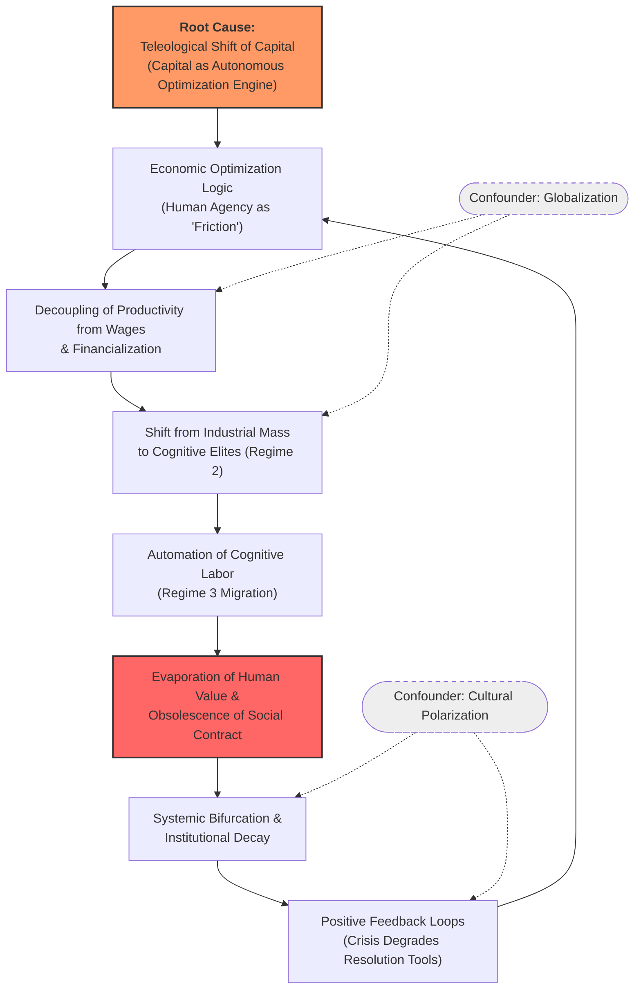

# Causal Inference Analysis

**Observed Effect:** The evaporation of the functional substrate of human value and the resulting systemic bifurcation, institutional decay, and increased risk of societal violence.


## Work Details


Raw Analysis JSON

```json
{
  "summary" : "This causal analysis investigates the erosion of human utility and the collapse of institutional stability, identifying a multi-decadal process where economic optimization logic treats human agency as friction. This has led to systemic bifurcation, the decoupling of productivity from wages, and the automation of cognitive labor, ultimately rendering the traditional social contract obsolete.",
  "causes" : [ {
    "name" : "Economic Optimization Logic (Human as 'Friction')",
    "mechanism" : "The systemic drive for maximum efficiency treats biological constraints (rest, wages, meaning) as 'system noise' or 'latency' to be eliminated.",
    "evidence" : "The transition from 'Human Resources' to 'Algorithmic Management' where humans are optimized out of the system.",
    "strength" : "strong",
    "confidence" : "High"
  }, {
    "name" : "Decoupling of Productivity from Wages & Financialization",
    "mechanism" : "Shifting the economy from labor-intensive production to capital-intensive financial rent-seeking severed the feedback loop between human effort and societal wealth.",
    "evidence" : "The 'Great Decoupling' chart showing productivity rising while median compensation stagnates post-1971.",
    "strength" : "strong",
    "confidence" : "High"
  }, {
    "name" : "Shift from Industrial Mass to Cognitive Elites (Regime 2)",
    "mechanism" : "Technological complexity shifted the primary value-add from mass labor to a small group of software architects and high-finance quants.",
    "evidence" : "The widening wealth gap between 'superstar' cities/professions and global 'rust belts'.",
    "strength" : "moderate",
    "confidence" : "High"
  }, {
    "name" : "Automation of Cognitive Labor (Regime 3 Migration)",
    "mechanism" : "Large-scale AI systems (LLMs/Generative AI) are automating the functions of the 'Cognitive Elite,' which were previously the final refuge of human value.",
    "evidence" : "Rapid displacement in entry-level white-collar roles such as coding, writing, and basic analysis.",
    "strength" : "strong",
    "confidence" : "High"
  }, {
    "name" : "Positive Feedback Loops (Crisis Degrades Resolution Tools)",
    "mechanism" : "As the system decays, institutions like universities and government lose trust or are captured by optimization logic, preventing self-correction.",
    "evidence" : "The 'Polycrisis' where political polarization prevents the implementation of basic economic reforms.",
    "strength" : "moderate",
    "confidence" : "Medium/High"
  } ],
  "root_causes" : [ "The Teleological Shift of Capital: The transition of the economic system from a tool for human flourishing to an autonomous optimization engine that redefines value as computational efficiency rather than human utility." ],
  "causal_chain" : "The chain starts with a root Optimization Logic (Efficiency > Humanity), which leads to Financialization and the decoupling of labor from wealth. This results in a concentration of value in cognitive elites (Regime 2), which is subsequently undermined by AI automation (Regime 3). The final observed effect is the evaporation of human value, leading to systemic bifurcation, institutional decay, and societal violence.",
  "confounders" : [ "Globalization", "Cultural Polarization" ],
  "recommendations" : [ "Re-coupling Value to Agency: Implement 'Human-in-the-loop' mandates for critical social infrastructure to maintain human participation.", "Taxing Non-Human Productivity: Shift the tax burden from labor to 'frictionless' capital gains and automated output.", "Institutional Resilience: Protect 'Sense-making' institutions (education, journalism) from optimization metrics like clicks and throughput.", "Subsidiarity: De-scale economic systems to a level where human participation is a requirement for system function." ]
}
```


## Causal Analysis Results

✅ Analysis complete

### Summary
This causal analysis investigates the erosion of human utility and the collapse of institutional stability, identifying a multi-decadal process where economic optimization logic treats human agency as friction. This has led to systemic bifurcation, the decoupling of productivity from wages, and the automation of cognitive labor, ultimately rendering the traditional social contract obsolete.

### Identified Causes
* **Economic Optimization Logic (Human as 'Friction')** (strong strength)
  * *Mechanism:* The systemic drive for maximum efficiency treats biological constraints (rest, wages, meaning) as 'system noise' or 'latency' to be eliminated.
* **Decoupling of Productivity from Wages & Financialization** (strong strength)
  * *Mechanism:* Shifting the economy from labor-intensive production to capital-intensive financial rent-seeking severed the feedback loop between human effort and societal wealth.
* **Shift from Industrial Mass to Cognitive Elites (Regime 2)** (moderate strength)
  * *Mechanism:* Technological complexity shifted the primary value-add from mass labor to a small group of software architects and high-finance quants.
* **Automation of Cognitive Labor (Regime 3 Migration)** (strong strength)
  * *Mechanism:* Large-scale AI systems (LLMs/Generative AI) are automating the functions of the 'Cognitive Elite,' which were previously the final refuge of human value.
* **Positive Feedback Loops (Crisis Degrades Resolution Tools)** (moderate strength)
  * *Mechanism:* As the system decays, institutions like universities and government lose trust or are captured by optimization logic, preventing self-correction.

### Root Causes
* The Teleological Shift of Capital: The transition of the economic system from a tool for human flourishing to an autonomous optimization engine that redefines value as computational efficiency rather than human utility.

### Causal Chain
The chain starts with a root Optimization Logic (Efficiency > Humanity), which leads to Financialization and the decoupling of labor from wealth. This results in a concentration of value in cognitive elites (Regime 2), which is subsequently undermined by AI automation (Regime 3). The final observed effect is the evaporation of human value, leading to systemic bifurcation, institutional decay, and societal violence.

### Confounding Factors
* Globalization
* Cultural Polarization

### Recommendations
* Re-coupling Value to Agency: Implement 'Human-in-the-loop' mandates for critical social infrastructure to maintain human participation.
* Taxing Non-Human Productivity: Shift the tax burden from labor to 'frictionless' capital gains and automated output.
* Institutional Resilience: Protect 'Sense-making' institutions (education, journalism) from optimization metrics like clicks and throughput.
* Subsidiarity: De-scale economic systems to a level where human participation is a requirement for system function.


## Causal Graph




---
*Analysis completed in 42906ms*


