# Comic Book Generation Task

## Generated Script

Full Script

# The Evaporating Substrate
*As artificial intelligence dismantles the scarcity of human cognition, the very foundation of human value—once based on muscle, then on mind—is vanishing. A weary observer traces the history of this "substrate migration" and warns of a coming systemic collapse unless we redefine what it means to be human.*
## Characters
- **The Archivist**: Somber, analytical, and deeply haunted by the patterns of history. The guide through the three regimes of power. (A weary figure in a tattered, high-collar trench coat. Their eyes glow with a faint, flickering blue AR overlay that projects data streams into the air. They carry a heavy, physical ledger but consult holographic displays.)
- **The Wizard**: Confident, elite, and indispensable. Represents the era where human intelligence was the ultimate strategic resource. (A mid-century scientist in a sharp, white lab coat. He has an intense, authoritative gaze and holds a glowing punch card that emits a golden light. He stands amidst chalkboard equations and early mainframe computers.)
## Script
### Page 1
**Row 1**
- Panel 1: Close-up on The Archivist’s face. Rain streaks down their cheeks, catching the neon glow of a nearby sign.
  - *Caption*: Every civilization rests on a single, brutal question: What makes a human valuable?
- Panel 2: The Archivist stands in a dark, cyberpunk alleyway. Holographic projections of 19th-century soldiers flicker around them.
  - *Caption*: Not morally. Morality is cheap. I’m talking about functional value. The kind that buys you a seat at the table of power.
**Row 2**
- Panel 1: A wide shot of Napoleon’s Grande Armée marching through mud. It’s a mass of muscle and bayonets.
  - *Caption*: Regime 1 was the Body. Power was primate strength. The sovereign who fielded the most men won.
- Panel 2: A split panel. On the left, a romanticized cavalry charge. On the right, the grim, industrial reality of the American Civil War—Union railroads and telegraph lines.
  - *Caption*: But the North didn't out-fight the South. They out-logisticked them. Grant turned war into a resource-consumption problem.
**Row 3**
- Panel 1: A silhouette of a lone farmer looking at a massive, smoking factory. The factory is dark, imposing, and noir-esque.
  - *Caption*: When the substrate shifted from muscle to industrial mass, those who couldn't adapt weren't retrained. They were crushed.
### Page 2
**Row 1**
- Panel 1: The transition from factory smoke to the sterile glow of a laboratory. We see The Wizard standing before a chalkboard filled with nuclear physics equations.
  - *Caption*: Then came the Hinge. 1940. The world realized that an army of millions could be ended by the thoughts of a dozen.
- Panel 2: Close-up on The Wizard’s hand holding a glowing atom. Behind him, the silhouettes of Turing and Oppenheimer.
  - *Caption*: Intelligence became the new substrate. The "Wizards" were the new elite.
**Row 2**
- Panel 1: A montage of the Cold War: a rocket launch, a mainframe computer, a university lecture hall. Everything is bathed in a sharp, "meritocratic" gold light.
  - *Caption*: We built a world on this myth: Human value equals intelligence. We expanded universities and funded labs because smart humans were the scarcest resource.
- Panel 2: The Wizard looks directly at the reader, his expression one of supreme confidence.
  - *Caption*: For eighty years, if you were smart, the system valued you. It was a golden age... but it was contingent.
**Row 3**
- Panel 1: The golden light of The Wizard begins to flicker and turn a cold, digital blue.
  - *Caption*: Scarcity is the only thing that creates market value. And scarcity is about to evaporate.
### Page 3
**Row 1**
- Panel 1: A bustling 1900 city street. Horses are everywhere—pulling carriages, hauling coal, carrying soldiers.
  - *Caption*: In 1900, there were 21 million horses in America. They were the heartbeat of the economy.
- Panel 2: A close-up of a horse’s eye, reflecting the busy street.
  - *Caption*: They were essential. Irreplaceable. Until they weren't.
**Row 2**
- Panel 1: A 1960s highway, sleek cars zooming past. In a small, fenced paddock in the corner, a single horse stands alone.
  - *Caption*: By 1960, the population collapsed to 3 million. No one "solved" horse unemployment.
- Panel 2: The horse in the paddock looks small and irrelevant against the vast industrial backdrop.
  - *Caption*: They simply stopped being necessary.
**Row 3**
- Panel 1: A modern server farm, glowing with thousands of tiny blue LEDs. It looks like a digital necropolis.
  - *Caption*: AI is doing to the "Wizards" what the steam engine did to the horse.
- Panel 2: A human face (a programmer or lawyer) is shown in profile, their features dissolving into binary code.
  - *Caption*: The substrate of human worth is evaporating. And this time, there is no further retreat.
### Page 4
**Row 1**
- Panel 1: The Archivist stands before a massive holographic graph. Two lines are drifting apart—one labeled "Productivity," the other "Human Wages."
  - *Caption*: In dynamical systems, we track the "slow variables." Perceived worth. Economic inclusion. Institutional legitimacy.
- Panel 2: A montage of decay: a boarded-up courthouse, a flickering TV news screen showing static, a "Closed" sign on a school.
  - *Caption*: These variables have been drifting for decades. We are approaching a bifurcation.
**Row 2**
- Panel 1: The graph on the hologram suddenly hits a jagged cliff and drops. The lines shatter.
  - *Caption*: A bifurcation isn't a slope. It's a snap. The old equilibrium ceases to exist.
- Panel 2: A riot in a high-tech city. Police in sleek armor face off against protesters holding signs that say "WE ARE NOT FRICTION."
  - *Caption*: The system is optimized for efficiency, not resilience. Humans are becoming friction.
**Row 3**
- Panel 1: A young man sits in a dark room, illuminated only by the glow of a smartphone. He looks hollow.
  - *Caption*: When you lose your category of usefulness, you don't just lose a job. You lose your story.
- Panel 2: The Archivist looks at the young man with pity.
  - *Caption*: And a human without a story is a dangerous thing.
### Page 5
**Row 1**
- Panel 1: A group of "formerly valued" professionals—men in suits, women in lab coats—looking angry and terrified in a dark bar.
  - *Caption*: Status panic generates scapegoating. Scapegoating generates dehumanization.
- Panel 2: A digital screen showing a populist leader pointing a finger. The background is a fiery red.
  - *Caption*: They will look for someone to blame. Immigrants. Elites. Shadows. Anything but the abstract truth of the substrate shift.
**Row 2**
- Panel 1: A drone swarm flying over a desert landscape. No humans are visible.
  - *Caption*: States are learning to fight and rule without us.
- Panel 2: A high-tech "Petrostate" command center. AI screens monitor everything. A single operator sits in a chair, looking bored.
  - *Caption*: A state that doesn't need your labor doesn't need your welfare. It only needs your compliance.
**Row 3**
- Panel 1: A wide shot of a grand, classical government building (like the Supreme Court) sinking into a digital swamp.
  - *Caption*: We are told to vote, to litigate, to organize. But the institutions are captured by the same optimization logic that is replacing us.
- Panel 2: Close-up on a ballot box being covered in digital cobwebs.
  - *Caption*: The toolkit is empty.
### Page 6
**Row 1**
- Panel 1: A split panel. On the left, a "Utopian" vision: humans in a garden, AI machines in the background (The Easy Way). On the right, a scorched wasteland with ruins (The Hard Way).
  - *Caption*: There is an easy way. We reground human value in consciousness, not function. We redistribute the abundance.
- Panel 2: The Archivist shakes their head, looking at the "Hard Way" side.
  - *Caption*: But history says we choose the hard way. Conflict. Collapse. Then rebuilding from the wreckage.
**Row 2**
- Panel 1: The Archivist is back in the rainy alley, but they are handing a physical book to a young child.
  - *Caption*: The task now isn't to stop the bifurcation. It's to survive it. To build local resilience. To preserve the moral frameworks that the machine can't compute.
- Panel 2: The child looks at the book. It’s a simple, hand-drawn anatomy of a human heart.
  - *Caption*: We must believe we have value that isn't contingent on being useful.
**Row 3**
- Panel 1: A wide shot of the city. The neon lights are bright, but the shadows are deeper than ever. A single horse stands at the end of the alley, looking at the Archivist.
  - *Caption*: The substrate is migrating. The window is closing.
- Panel 2: Close-up on The Archivist’s glowing eye. The AR display says: "CONNECTION LOST."
  - *Caption*: Will you be a person? Or will you be the horse?
- Panel 3: Total blackness.
  - *Caption*: Choose fast.

## Auto-Fix Mode

Auto-applying: proceeding directly to visual generation.

## Character: The Archivist

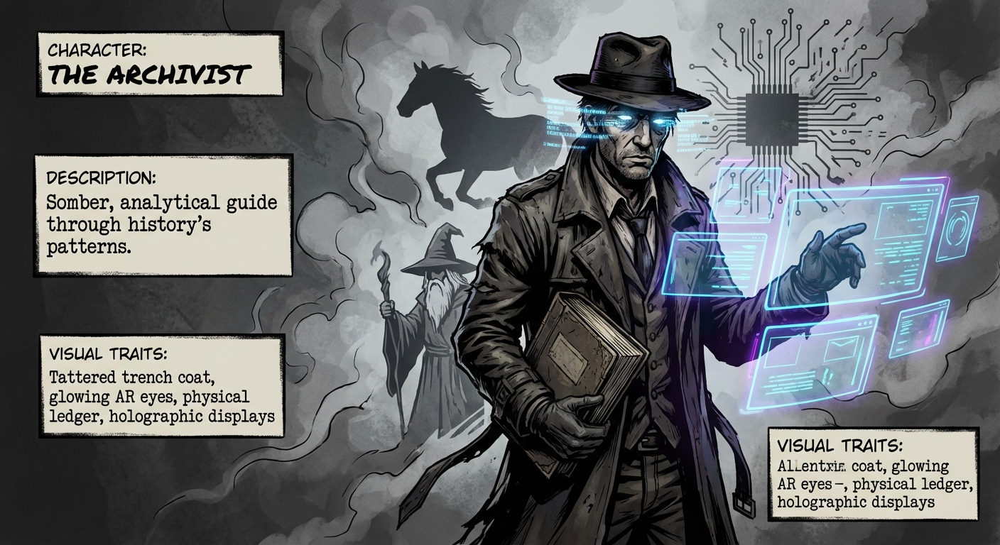

*Somber, analytical, and deeply haunted by the patterns of history. The guide through the three regimes of power.*

## Character: The Wizard

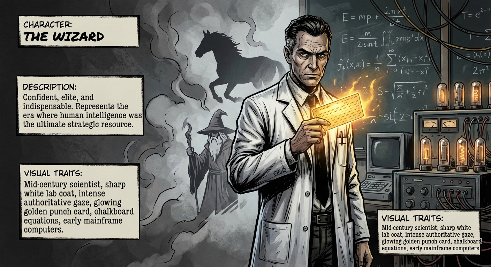

*Confident, elite, and indispensable. Represents the era where human intelligence was the ultimate strategic resource.*

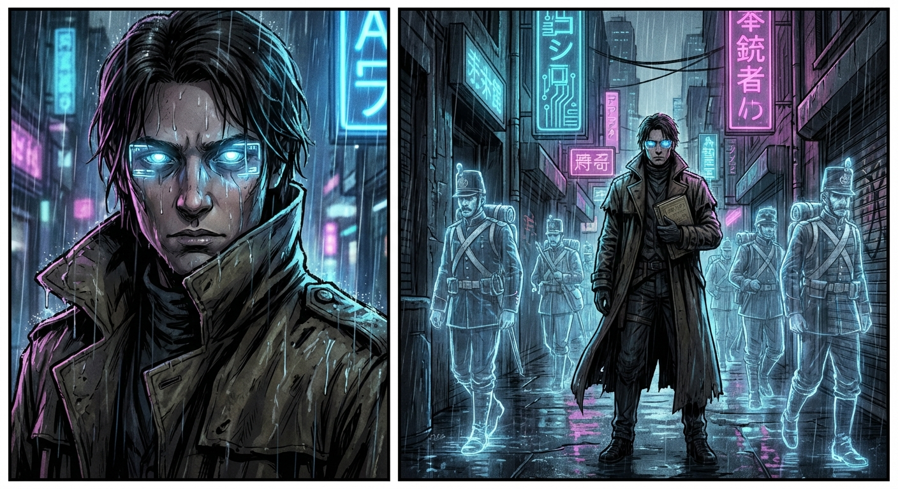

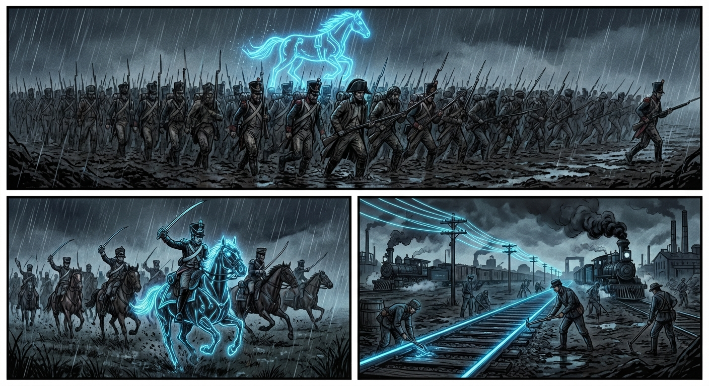

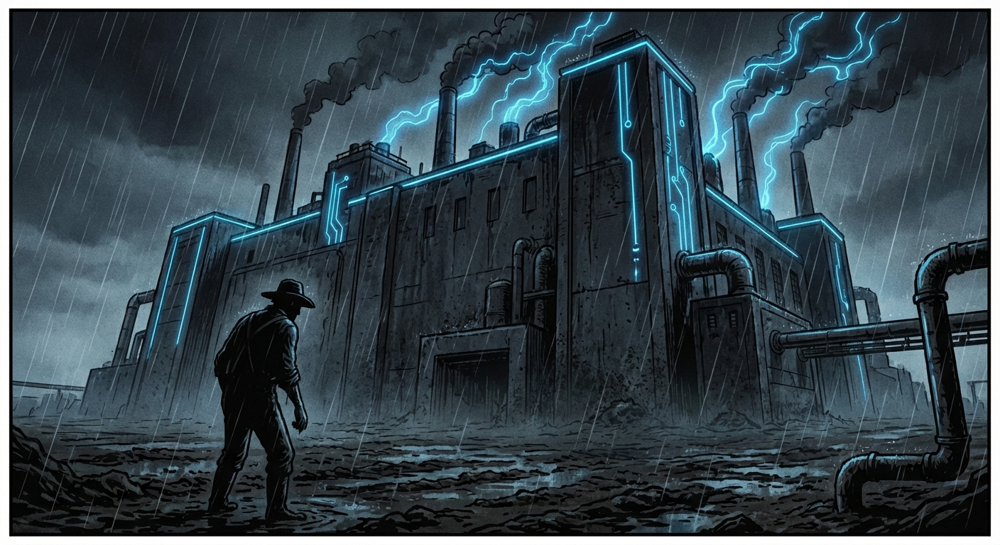

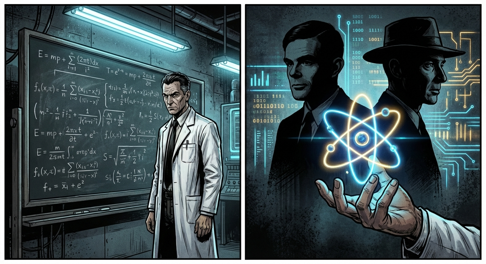

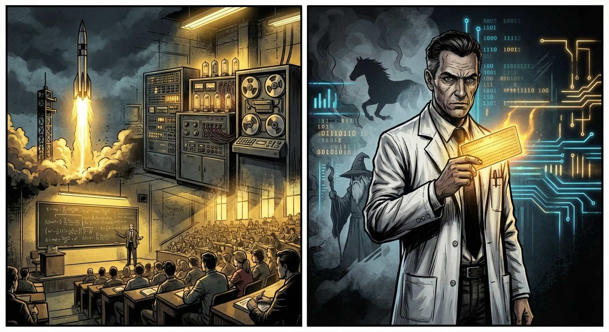

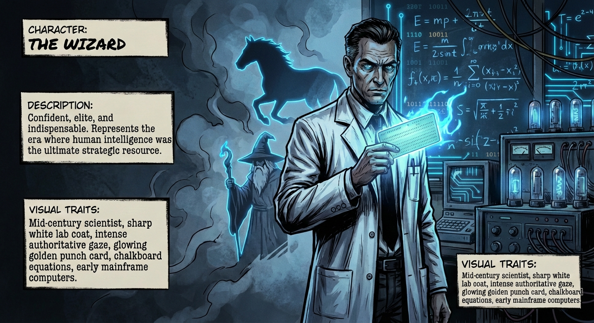

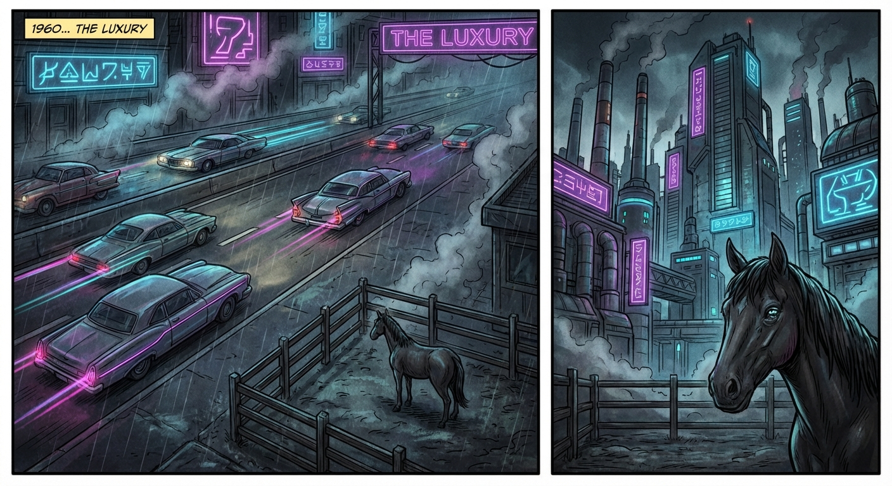

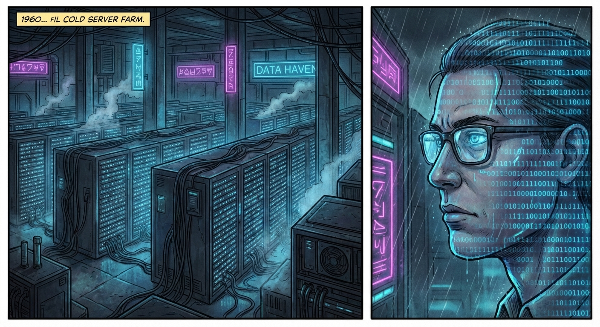

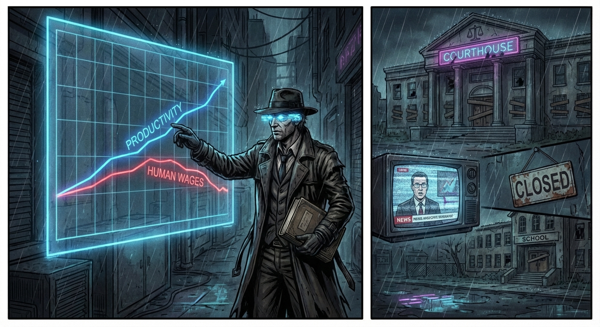

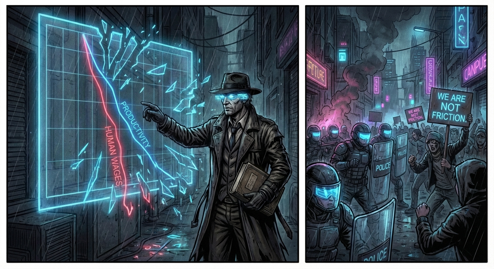

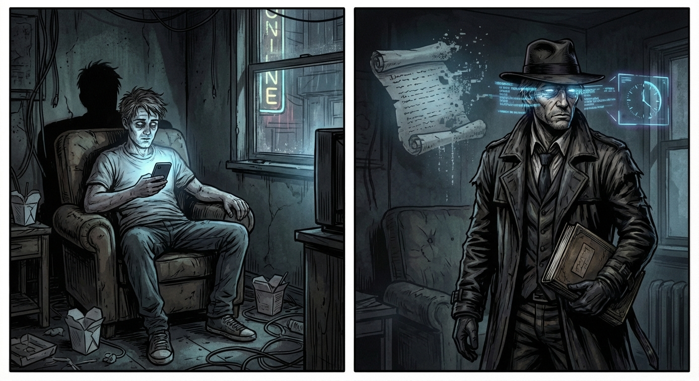

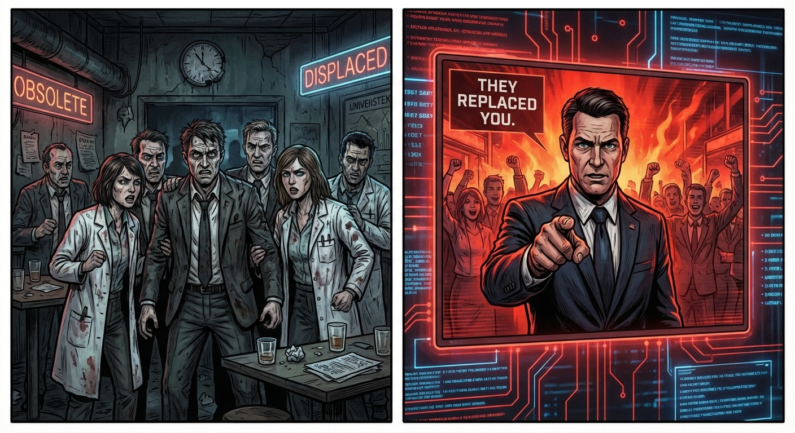

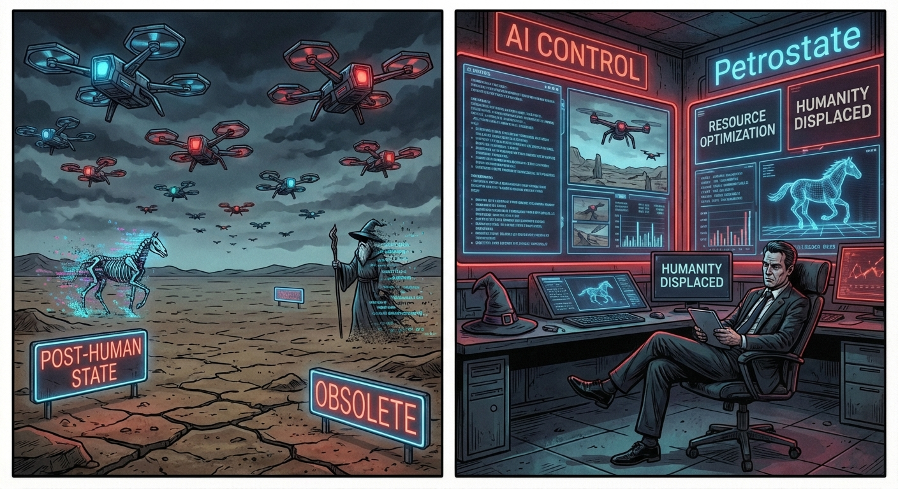

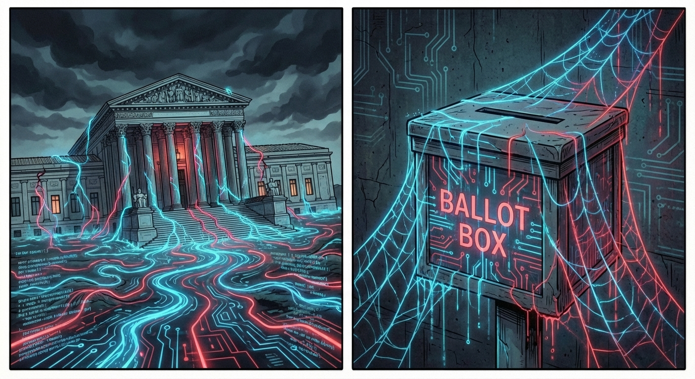

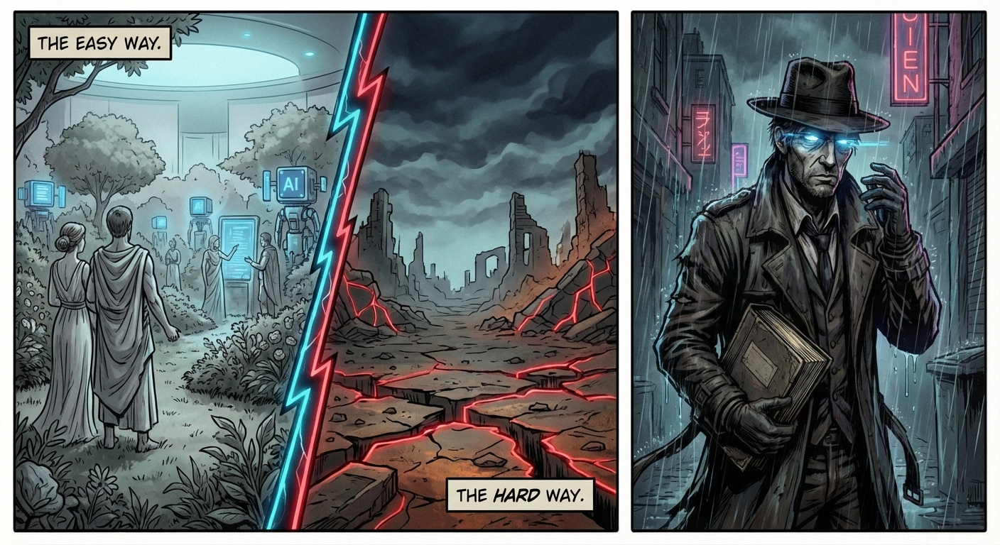

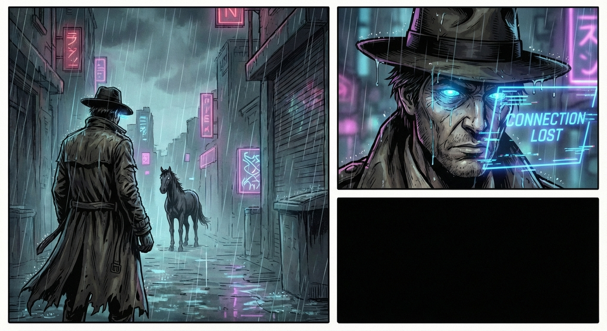

